**第五节　几何法求线面角、二面角及距离**

【课标研读】　利用几何法求线面角、二面角及距离问题常应用于一些不易建系的几何体，或者题目条件用几何法比较简单快捷的情况.相对于向量法，几何法运算简单，不易出错.其难点在于准确找出所求的角或距离.

技法一　几何法求线面角

(&lt;text style="subscript"&gt;&lt;text style="subscript"&gt;&lt;text style="subscript"&gt;&lt;text style="subscript"&gt;&lt;text style="subscript"&gt;1&lt;/text&gt;&lt;/text&gt;&lt;/text&gt;&lt;/text&gt;&lt;/text&gt;)(2024·新课标Ⅱ卷)已知正三棱台<em>&lt;text style="italic"&gt;&lt;text style="italic"&gt;&lt;text style="italic"&gt;&lt;text style="italic"&gt;A</em>&lt;/text&gt;&lt;/text&gt;&lt;/text&gt;<em>&lt;text style="italic"&gt;B</em>&lt;/text&gt;<em>C</em>&lt;/text&gt;-A1B1C1的体积为 $\frac{52}{3}$ ，<em>&lt;text style="italic"&gt;&lt;text style="italic"&gt;&lt;text style="italic"&gt;A</em>&lt;/text&gt;&lt;/text&gt;&lt;/text&gt;<em>&lt;text style="italic"&gt;B</em>&lt;/text&gt;＝6，A&lt;text style="subscript"&gt;&lt;text style="subscript"&gt;&lt;text style="subscript"&gt;&lt;text style="subscript"&gt;&lt;text style="subscript"&gt;1&lt;/text&gt;&lt;/text&gt;&lt;/text&gt;&lt;/text&gt;&lt;/text&gt;B1＝2，则A1A与平面<em>&lt;text style="italic"&gt;ABC</em>&lt;/text&gt;所成角的正切值为(　　)

A. $\frac{1}{2}$ 	B. 1

C. 2	D. 3

(2)(2025·福建福州模拟)如图，在圆台&lt;text sty&lt;text sty<em>l</em>e="italic"&gt;l&lt;/text&gt;e="italic"&gt;<em>&lt;text style="italic"&gt;&lt;text style="italic"&gt;&lt;text style="italic"&gt;O</em>&lt;/text&gt;&lt;/text&gt;O&lt;/text&gt;&lt;/text&gt;&lt;text style="subscript"&gt;&lt;text style="subscript"&gt;&lt;text style="subscript"&gt;&lt;text style="subscript"&gt;1&lt;/text&gt;&lt;/text&gt;&lt;/text&gt;&lt;/text&gt;中，OO1＝ $\sqrt{3}$ ，&lt;text sty&lt;text sty<em>l</em>e="italic"&gt;l&lt;/text&gt;e="italic"&gt;<em>AB</em>&lt;/text&gt;为下底面圆的直径，点<em>C</em>是底面圆周上异于A，B的一点，<em>&lt;text style="italic"&gt;AC</em>&lt;/text&gt;＝2，点<em>D</em>是<em>&lt;text style="italic"&gt;BC</em>&lt;/text&gt;的中点，l为平面<em>&lt;text style="italic"&gt;&lt;text style="italic"&gt;O</em>&lt;/text&gt;&lt;/text&gt;&lt;text style="subscript"&gt;&lt;text style="subscript"&gt;&lt;text style="subscript"&gt;&lt;text style="subscript"&gt;1&lt;/text&gt;&lt;/text&gt;&lt;/text&gt;&lt;/text&gt;AC与平面O1<em>OD</em>的交线，则交线l与平面O1BC所成角的大小为(　　)

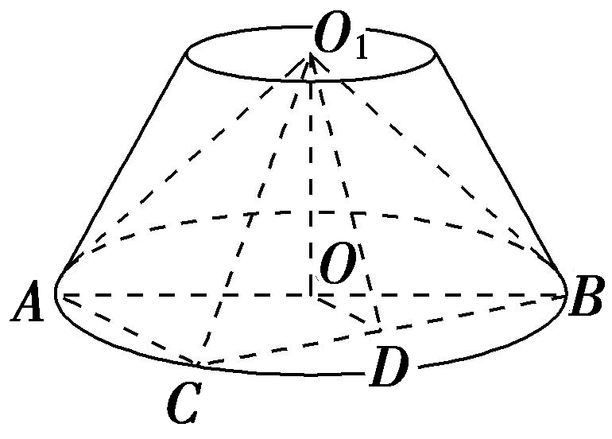

A. $\frac{\pi }{2}$ 	B. $\frac{\pi }{3}$

C. $\frac{\pi }{6}$ 	D. $\frac{\pi }{4}$

答案：(1)**B**　(2)**B**

解析：(&lt;text style="subscript"&gt;&lt;text style="subscript"&gt;&lt;text style="subscript"&gt;&lt;text style="subscript"&gt;&lt;text style="subscript"&gt;&lt;text style="subscript"&gt;&lt;text style="subscript"&gt;&lt;text style="subscript"&gt;&lt;text style="subscript"&gt;&lt;text style="subscript"&gt;&lt;text style="subscript"&gt;&lt;text style="subscript"&gt;&lt;text style="subscript"&gt;&lt;text style="subscript"&gt;&lt;text style="subscript"&gt;1&lt;/text&gt;&lt;/text&gt;&lt;/text&gt;&lt;/text&gt;&lt;/text&gt;&lt;/text&gt;&lt;/text&gt;&lt;/text&gt;&lt;/text&gt;&lt;/text&gt;&lt;/text&gt;&lt;/text&gt;&lt;/text&gt;&lt;/text&gt;&lt;/text&gt;)设正三棱台<em>&lt;text style="italic"&gt;&lt;text style="italic"&gt;&lt;text style="italic"&gt;&lt;text style="italic"&gt;&lt;text style="italic"&gt;&lt;text style="italic"&gt;&lt;text style="italic"&gt;A</em>&lt;/text&gt;&lt;/text&gt;&lt;/text&gt;&lt;/text&gt;&lt;/text&gt;&lt;/text&gt;<em>&lt;text style="italic"&gt;&lt;text style="italic"&gt;&lt;text style="italic"&gt;B</em>&lt;/text&gt;&lt;/text&gt;&lt;/text&gt;<em>&lt;text style="italic"&gt;&lt;text style="italic"&gt;C</em>&lt;/text&gt;&lt;/text&gt;&lt;/text&gt;-A1B1C1的高为<em>&lt;text style="italic"&gt;&lt;text style="italic"&gt;&lt;text style="italic"&gt;&lt;text style="italic"&gt;&lt;text style="italic"&gt;&lt;text style="italic"&gt;h</em>&lt;/text&gt;&lt;/text&gt;&lt;/text&gt;&lt;/text&gt;&lt;/text&gt;&lt;/text&gt;，三条侧棱延长后交于一点<em>&lt;text style="italic,subscript"&gt;P</em>&lt;/text&gt;，作<em>P&lt;text style="italic"&gt;&lt;text style="italic"&gt;&lt;text style="italic"&gt;&lt;text style="italic"&gt;O</em>&lt;/text&gt;&lt;/text&gt;&lt;/text&gt;&lt;/text&gt;⊥平面<em>&lt;text style="italic"&gt;&lt;text style="italic"&gt;AB</em>C&lt;/text&gt;&lt;/text&gt;，交平面<em>&lt;text style="italic"&gt;&lt;text style="italic,subscript"&gt;&lt;text style="italic"&gt;&lt;text style="italic"&gt;&lt;text style="italic"&gt;ABC</em>&lt;/text&gt;&lt;/text&gt;&lt;/text&gt;&lt;/text&gt;&lt;/text&gt;于点O，交平面A1B1C1于点O1，连接<em>&lt;text style="italic"&gt;OA</em>&lt;/text&gt;，O1A1，如图所示.由AB＝3A1B1，可得<em>&lt;text style="italic"&gt;&lt;text style="italic"&gt;&lt;text style="italic"&gt;PO</em>&lt;/text&gt;&lt;/text&gt;&lt;/text&gt;1＝ $\frac{1}{2}$ <em>&lt;text style="italic"&gt;&lt;text style="italic"&gt;&lt;text style="italic"&gt;&lt;text style="italic"&gt;&lt;text style="italic"&gt;&lt;text style="italic"&gt;h</em>&lt;/text&gt;&lt;/text&gt;&lt;/text&gt;&lt;/text&gt;&lt;/text&gt;&lt;/text&gt;，<em>&lt;text style="italic,subscript"&gt;P</em>&lt;/text&gt;<em>&lt;text style="italic"&gt;&lt;text style="italic"&gt;&lt;text style="italic"&gt;O</em>&lt;/text&gt;&lt;/text&gt;&lt;/text&gt;＝ $\frac{3}{2}$ <em>&lt;text style="italic"&gt;&lt;text style="italic"&gt;&lt;text style="italic"&gt;&lt;text style="italic"&gt;&lt;text style="italic"&gt;&lt;text style="italic"&gt;h</em>&lt;/text&gt;&lt;/text&gt;&lt;/text&gt;&lt;/text&gt;&lt;/text&gt;&lt;/text&gt;，又 $S_{\bigtriangleup A_{1}B_{1}C_{1}}$ ＝ $\frac{1}{2}$ ×&lt;text style="superscript"&gt;2&lt;/text&gt;2× $\frac{\sqrt{3}}{2}$ ＝ $\sqrt{3}$ ，<em>S</em>△<em>&lt;text style="italic"&gt;&lt;text style="italic"&gt;&lt;text style="italic"&gt;&lt;text style="italic"&gt;&lt;text style="italic"&gt;&lt;text style="italic"&gt;&lt;text style="italic"&gt;A</em>&lt;/text&gt;&lt;/text&gt;&lt;/text&gt;&lt;/text&gt;&lt;/text&gt;&lt;/text&gt;<em>&lt;text style="italic"&gt;&lt;text style="italic"&gt;&lt;text style="italic"&gt;B</em>&lt;/text&gt;&lt;/text&gt;&lt;/text&gt;<em>&lt;text style="italic"&gt;&lt;text style="italic"&gt;C</em>&lt;/text&gt;&lt;/text&gt;&lt;/text&gt;＝ $\frac{1}{2}$ ×6&lt;text style="superscript"&gt;2&lt;/text&gt;× $\frac{\sqrt{3}}{2}$ ＝9 $\sqrt{3}$ ，所以正三棱台<em>&lt;text style="italic"&gt;&lt;text style="italic"&gt;&lt;text style="italic"&gt;&lt;text style="italic"&gt;&lt;text style="italic"&gt;&lt;text style="italic"&gt;&lt;text style="italic"&gt;A</em>&lt;/text&gt;&lt;/text&gt;&lt;/text&gt;&lt;/text&gt;&lt;/text&gt;&lt;/text&gt;<em>&lt;text style="italic"&gt;&lt;text style="italic"&gt;&lt;text style="italic"&gt;B</em>&lt;/text&gt;&lt;/text&gt;&lt;/text&gt;<em>&lt;text style="italic"&gt;&lt;text style="italic"&gt;C</em>&lt;/text&gt;&lt;/text&gt;&lt;/text&gt;-A&lt;text style="subscript"&gt;&lt;text style="subscript"&gt;&lt;text style="subscript"&gt;&lt;text style="subscript"&gt;&lt;text style="subscript"&gt;&lt;text style="subscript"&gt;&lt;text style="subscript"&gt;&lt;text style="subscript"&gt;&lt;text style="subscript"&gt;&lt;text style="subscript"&gt;&lt;text style="subscript"&gt;&lt;text style="subscript"&gt;&lt;text style="subscript"&gt;&lt;text style="subscript"&gt;&lt;text style="subscript"&gt;1&lt;/text&gt;&lt;/text&gt;&lt;/text&gt;&lt;/text&gt;&lt;/text&gt;&lt;/text&gt;&lt;/text&gt;&lt;/text&gt;&lt;/text&gt;&lt;/text&gt;&lt;/text&gt;&lt;/text&gt;&lt;/text&gt;&lt;/text&gt;&lt;/text&gt;B1C1的体积<em>&lt;text style="italic"&gt;V</em>&lt;/text&gt;＝V<em>&lt;text style="italic,subscript"&gt;P</em>&lt;/text&gt;-<em>&lt;text style="italic"&gt;&lt;text style="italic"&gt;AB</em>C&lt;/text&gt;&lt;/text&gt;－ $V_{P-A_{1}B_{1}C_{1}}$ ＝ $\frac{1}{3}$ ×9 $\sqrt{3}$ × $\frac{3}{2}$ <em>&lt;text style="italic"&gt;&lt;text style="italic"&gt;&lt;text style="italic"&gt;&lt;text style="italic"&gt;&lt;text style="italic"&gt;&lt;text style="italic"&gt;h</em>&lt;/text&gt;&lt;/text&gt;&lt;/text&gt;&lt;/text&gt;&lt;/text&gt;&lt;/text&gt;－ $\frac{1}{3}$ × $\sqrt{3}$ × $\frac{1}{2}$ <em>&lt;text style="italic"&gt;&lt;text style="italic"&gt;&lt;text style="italic"&gt;&lt;text style="italic"&gt;&lt;text style="italic"&gt;&lt;text style="italic"&gt;h</em>&lt;/text&gt;&lt;/text&gt;&lt;/text&gt;&lt;/text&gt;&lt;/text&gt;&lt;/text&gt;＝ $\frac{52}{3}$ ，解得<em>&lt;text style="italic"&gt;&lt;text style="italic"&gt;&lt;text style="italic"&gt;&lt;text style="italic"&gt;&lt;text style="italic"&gt;&lt;text style="italic"&gt;h</em>&lt;/text&gt;&lt;/text&gt;&lt;/text&gt;&lt;/text&gt;&lt;/text&gt;&lt;/text&gt;＝ $\frac{4\sqrt{3}}{3}$ ，故<em>&lt;text style="italic,subscript"&gt;P</em>&lt;/text&gt;<em>&lt;text style="italic"&gt;&lt;text style="italic"&gt;&lt;text style="italic"&gt;O</em>&lt;/text&gt;&lt;/text&gt;&lt;/text&gt;＝ $\frac{3}{2}$ <em>&lt;text style="italic"&gt;&lt;text style="italic"&gt;&lt;text style="italic"&gt;&lt;text style="italic"&gt;&lt;text style="italic"&gt;&lt;text style="italic"&gt;h</em>&lt;/text&gt;&lt;/text&gt;&lt;/text&gt;&lt;/text&gt;&lt;/text&gt;&lt;/text&gt;＝&lt;text style="superscript"&gt;2&lt;/text&gt; $\sqrt{3}$ .由正三棱台的性质可知，<em>&lt;text style="italic"&gt;&lt;text style="italic"&gt;&lt;text style="italic"&gt;O</em>&lt;/text&gt;&lt;/text&gt;&lt;/text&gt;为底面<em>&lt;text style="italic"&gt;&lt;text style="italic"&gt;&lt;text style="italic"&gt;&lt;text style="italic"&gt;&lt;text style="italic"&gt;&lt;text style="italic"&gt;&lt;text style="italic"&gt;A</em>&lt;/text&gt;&lt;/text&gt;&lt;/text&gt;&lt;/text&gt;&lt;/text&gt;&lt;/text&gt;<em>&lt;text style="italic"&gt;&lt;text style="italic"&gt;&lt;text style="italic"&gt;B</em>&lt;/text&gt;&lt;/text&gt;&lt;/text&gt;<em>&lt;text style="italic"&gt;&lt;text style="italic"&gt;C</em>&lt;/text&gt;&lt;/text&gt;&lt;/text&gt;的中心，则<em>&lt;text style="italic"&gt;OA</em>&lt;/text&gt;＝ $\frac{2}{3}$ × $\sqrt{6^{2}－3^{2}}$ ＝&lt;text style="superscript"&gt;2&lt;/text&gt; $\sqrt{3}$ ，因为<em>&lt;text style="italic,subscript"&gt;P</em>&lt;/text&gt;<em>&lt;text style="italic"&gt;&lt;text style="italic"&gt;&lt;text style="italic"&gt;O</em>&lt;/text&gt;&lt;/text&gt;&lt;/text&gt;⊥平面<em>&lt;text style="italic"&gt;&lt;text style="italic"&gt;&lt;text style="italic"&gt;&lt;text style="italic"&gt;&lt;text style="italic"&gt;&lt;text style="italic"&gt;&lt;text style="italic"&gt;A</em>&lt;/text&gt;&lt;/text&gt;&lt;/text&gt;&lt;/text&gt;&lt;/text&gt;&lt;/text&gt;<em>&lt;text style="italic"&gt;&lt;text style="italic"&gt;&lt;text style="italic"&gt;B</em>&lt;/text&gt;&lt;/text&gt;&lt;/text&gt;<em>&lt;text style="italic"&gt;&lt;text style="italic"&gt;C</em>&lt;/text&gt;&lt;/text&gt;&lt;/text&gt;，所以∠<em>&lt;text style="italic"&gt;&lt;text style="italic"&gt;PAO</em>&lt;/text&gt;&lt;/text&gt;是A&lt;text style="subscript"&gt;&lt;text style="subscript"&gt;&lt;text style="subscript"&gt;&lt;text style="subscript"&gt;&lt;text style="subscript"&gt;&lt;text style="subscript"&gt;&lt;text style="subscript"&gt;&lt;text style="subscript"&gt;&lt;text style="subscript"&gt;&lt;text style="subscript"&gt;&lt;text style="subscript"&gt;&lt;text style="subscript"&gt;&lt;text style="subscript"&gt;&lt;text style="subscript"&gt;&lt;text style="subscript"&gt;1&lt;/text&gt;&lt;/text&gt;&lt;/text&gt;&lt;/text&gt;&lt;/text&gt;&lt;/text&gt;&lt;/text&gt;&lt;/text&gt;&lt;/text&gt;&lt;/text&gt;&lt;/text&gt;&lt;/text&gt;&lt;/text&gt;&lt;/text&gt;&lt;/text&gt;A与平面<em>&lt;text style="italic"&gt;&lt;text style="italic"&gt;AB</em>C&lt;/text&gt;&lt;/text&gt;所成的角，在Rt△PAO中，tan ∠PAO＝ $\frac{PO}{OA}$ ＝&lt;text style="subscript"&gt;&lt;text style="subscript"&gt;&lt;text style="subscript"&gt;&lt;text style="subscript"&gt;&lt;text style="subscript"&gt;&lt;text style="subscript"&gt;&lt;text style="subscript"&gt;&lt;text style="subscript"&gt;&lt;text style="subscript"&gt;&lt;text style="subscript"&gt;&lt;text style="subscript"&gt;&lt;text style="subscript"&gt;&lt;text style="subscript"&gt;&lt;text style="subscript"&gt;&lt;text style="subscript"&gt;1&lt;/text&gt;&lt;/text&gt;&lt;/text&gt;&lt;/text&gt;&lt;/text&gt;&lt;/text&gt;&lt;/text&gt;&lt;/text&gt;&lt;/text&gt;&lt;/text&gt;&lt;/text&gt;&lt;/text&gt;&lt;/text&gt;&lt;/text&gt;&lt;/text&gt;.故选<em>&lt;text style="italic"&gt;&lt;text style="italic"&gt;&lt;text style="italic"&gt;B</em>&lt;/text&gt;&lt;/text&gt;&lt;/text&gt;.

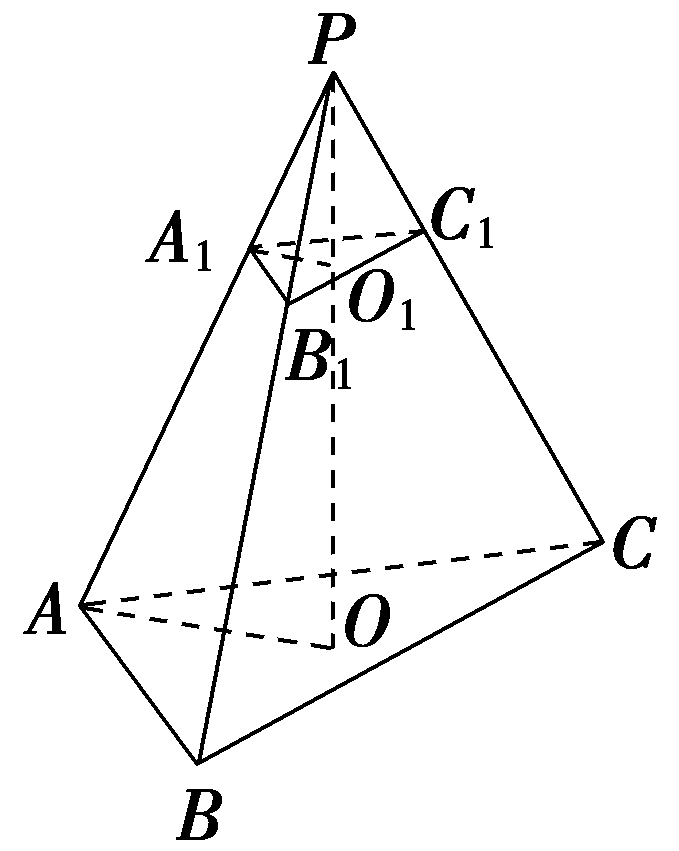

(2)因为&lt;text sty&lt;text sty&lt;text sty&lt;text sty<em>l</em>e="italic"&gt;l&lt;/text&gt;e="italic"&gt;l&lt;/text&gt;e="italic"&gt;l&lt;/text&gt;e="italic"&gt;<em>&lt;text style="italic"&gt;&lt;text style="italic"&gt;&lt;text style="italic"&gt;&lt;text style="italic"&gt;&lt;text style="italic"&gt;&lt;text style="italic"&gt;&lt;text style="italic"&gt;&lt;text style="italic"&gt;&lt;text style="italic"&gt;&lt;text style="italic"&gt;&lt;text style="italic"&gt;&lt;text style="italic"&gt;&lt;text style="italic"&gt;&lt;text style="italic"&gt;&lt;text style="italic"&gt;&lt;text style="italic"&gt;&lt;text style="italic"&gt;&lt;text style="italic"&gt;&lt;text style="italic"&gt;&lt;text style="italic"&gt;O</em>&lt;/text&gt;&lt;/text&gt;&lt;/text&gt;&lt;/text&gt;&lt;/text&gt;&lt;/text&gt;&lt;/text&gt;&lt;/text&gt;&lt;/text&gt;&lt;/text&gt;&lt;/text&gt;&lt;/text&gt;&lt;/text&gt;&lt;/text&gt;&lt;/text&gt;&lt;/text&gt;&lt;/text&gt;&lt;/text&gt;&lt;/text&gt;&lt;/text&gt;&lt;/text&gt;，<em>&lt;text style="italic"&gt;&lt;text style="italic"&gt;&lt;text style="italic"&gt;&lt;text style="italic"&gt;&lt;text style="italic"&gt;&lt;text style="italic"&gt;D</em>&lt;/text&gt;&lt;/text&gt;&lt;/text&gt;&lt;/text&gt;&lt;/text&gt;&lt;/text&gt;分别是<em>&lt;text style="italic"&gt;AB</em>&lt;/text&gt;，<em>&lt;text style="italic"&gt;&lt;text style="italic"&gt;&lt;text style="italic"&gt;&lt;text style="italic"&gt;&lt;text style="italic"&gt;&lt;text style="italic"&gt;&lt;text style="italic"&gt;&lt;text style="italic"&gt;&lt;text style="italic"&gt;&lt;text style="italic"&gt;&lt;text style="italic"&gt;&lt;text style="italic"&gt;&lt;text style="italic"&gt;BC</em>&lt;/text&gt;&lt;/text&gt;&lt;/text&gt;&lt;/text&gt;&lt;/text&gt;&lt;/text&gt;&lt;/text&gt;&lt;/text&gt;&lt;/text&gt;&lt;/text&gt;&lt;/text&gt;&lt;/text&gt;&lt;/text&gt;的中点，所以<em>&lt;text style="italic"&gt;&lt;text style="italic"&gt;&lt;text style="italic"&gt;&lt;text style="italic"&gt;&lt;text style="italic"&gt;&lt;text style="italic"&gt;&lt;text style="italic"&gt;&lt;text style="italic"&gt;&lt;text style="italic"&gt;&lt;text style="italic"&gt;&lt;text style="italic"&gt;&lt;text style="italic"&gt;&lt;text style="italic"&gt;&lt;text style="italic"&gt;&lt;text style="italic"&gt;&lt;text style="italic"&gt;&lt;text style="italic"&gt;OD</em>&lt;/text&gt;&lt;/text&gt;&lt;/text&gt;&lt;/text&gt;&lt;/text&gt;&lt;/text&gt;&lt;/text&gt;&lt;/text&gt;&lt;/text&gt;&lt;/text&gt;&lt;/text&gt;&lt;/text&gt;&lt;/text&gt;&lt;/text&gt;&lt;/text&gt;&lt;/text&gt;&lt;/text&gt;∥<em>&lt;text style="italic"&gt;&lt;text style="italic"&gt;&lt;text style="italic"&gt;&lt;text style="italic"&gt;&lt;text style="italic"&gt;&lt;text style="italic"&gt;&lt;text style="italic"&gt;&lt;text style="italic"&gt;&lt;text style="italic"&gt;&lt;text style="italic"&gt;AC</em>&lt;/text&gt;&lt;/text&gt;&lt;/text&gt;&lt;/text&gt;&lt;/text&gt;&lt;/text&gt;&lt;/text&gt;&lt;/text&gt;&lt;/text&gt;&lt;/text&gt;，又OD⊂平面O&lt;text style="subscript"&gt;&lt;text style="subscript"&gt;&lt;text style="subscript"&gt;&lt;text style="subscript"&gt;&lt;text style="subscript"&gt;&lt;text style="subscript"&gt;&lt;text style="subscript"&gt;&lt;text style="subscript"&gt;&lt;text style="subscript"&gt;&lt;text style="subscript"&gt;&lt;text style="subscript"&gt;&lt;text style="subscript"&gt;&lt;text style="subscript"&gt;&lt;text style="subscript"&gt;&lt;text style="subscript"&gt;&lt;text style="subscript"&gt;&lt;text style="subscript"&gt;&lt;text style="subscript"&gt;&lt;text style="subscript"&gt;&lt;text style="subscript"&gt;&lt;text style="subscript"&gt;&lt;text style="subscript"&gt;&lt;text style="subscript"&gt;1&lt;/text&gt;&lt;/text&gt;&lt;/text&gt;&lt;/text&gt;&lt;/text&gt;&lt;/text&gt;&lt;/text&gt;&lt;/text&gt;&lt;/text&gt;&lt;/text&gt;&lt;/text&gt;&lt;/text&gt;&lt;/text&gt;&lt;/text&gt;&lt;/text&gt;&lt;/text&gt;&lt;/text&gt;&lt;/text&gt;&lt;/text&gt;&lt;/text&gt;&lt;/text&gt;&lt;/text&gt;&lt;/text&gt;OD，AC⊄平面O1OD，所以AC∥平面O1OD，AC⊂平面O1AC，平面O1AC∩平面O1OD＝l，所以AC∥l，又OD∥AC，所以OD∥l，如图，所以直线l与平面O1BC所成角即直线OD与平面O1BC所成角，因为AB为下底面圆的直径，所以AC⊥BC，因为OD∥AC，所以OD⊥BC，又因为<em>&lt;text style="italic"&gt;&lt;text style="italic"&gt;&lt;text style="italic"&gt;&lt;text style="italic"&gt;OO</em>&lt;/text&gt;&lt;/text&gt;&lt;/text&gt;&lt;/text&gt;1⊥平面<em>&lt;text style="italic"&gt;ACB</em>&lt;/text&gt;，BC⊂平面ACB，所以OO1⊥BC，OO1∩OD＝O，OO1，OD⊂平面O1OD，所以BC⊥平面O1OD，过点O作<em>O&lt;text style="italic"&gt;H</em>&lt;/text&gt;⊥O1D交O1D于点H，因为<em>&lt;text style="italic"&gt;&lt;text style="italic"&gt;&lt;text style="italic"&gt;OH</em>&lt;/text&gt;&lt;/text&gt;&lt;/text&gt;⊂平面O1OD，所以BC⊥OH，OH⊥O1D，BC∩O1D＝D，BC，O1D⊂平面O1BC，所以OH⊥平面O1BC，所以∠<em>&lt;text style="italic"&gt;&lt;text style="italic"&gt;ODH</em>&lt;/text&gt;&lt;/text&gt;为OD与平面O1BC所成角，因为OO1＝ $\sqrt{3}$ ，&lt;text sty&lt;text sty&lt;text sty&lt;text sty<em>l</em>e="italic"&gt;l&lt;/text&gt;e="italic"&gt;l&lt;/text&gt;e="italic"&gt;l&lt;/text&gt;e="italic"&gt;<em>&lt;text style="italic"&gt;&lt;text style="italic"&gt;&lt;text style="italic"&gt;&lt;text style="italic"&gt;&lt;text style="italic"&gt;&lt;text style="italic"&gt;&lt;text style="italic"&gt;&lt;text style="italic"&gt;&lt;text style="italic"&gt;&lt;text style="italic"&gt;&lt;text style="italic"&gt;&lt;text style="italic"&gt;&lt;text style="italic"&gt;&lt;text style="italic"&gt;&lt;text style="italic"&gt;&lt;text style="italic"&gt;&lt;text style="italic"&gt;&lt;text style="italic"&gt;&lt;text style="italic"&gt;&lt;text style="italic"&gt;O</em>&lt;/text&gt;&lt;/text&gt;&lt;/text&gt;&lt;/text&gt;&lt;/text&gt;&lt;/text&gt;&lt;/text&gt;&lt;/text&gt;&lt;/text&gt;&lt;/text&gt;&lt;/text&gt;&lt;/text&gt;&lt;/text&gt;&lt;/text&gt;&lt;/text&gt;&lt;/text&gt;&lt;/text&gt;&lt;/text&gt;&lt;/text&gt;&lt;/text&gt;&lt;/text&gt;<em>&lt;text style="italic"&gt;&lt;text style="italic"&gt;&lt;text style="italic"&gt;&lt;text style="italic"&gt;&lt;text style="italic"&gt;&lt;text style="italic"&gt;D</em>&lt;/text&gt;&lt;/text&gt;&lt;/text&gt;&lt;/text&gt;&lt;/text&gt;&lt;/text&gt;＝ $\frac{1}{2}$ &lt;text sty&lt;text sty&lt;text sty&lt;text sty<em>l</em>e="italic"&gt;l&lt;/text&gt;e="italic"&gt;l&lt;/text&gt;e="italic"&gt;l&lt;/text&gt;e="italic"&gt;<em>&lt;text style="italic"&gt;&lt;text style="italic"&gt;&lt;text style="italic"&gt;&lt;text style="italic"&gt;&lt;text style="italic"&gt;&lt;text style="italic"&gt;&lt;text style="italic"&gt;&lt;text style="italic"&gt;&lt;text style="italic"&gt;AC</em>&lt;/text&gt;&lt;/text&gt;&lt;/text&gt;&lt;/text&gt;&lt;/text&gt;&lt;/text&gt;&lt;/text&gt;&lt;/text&gt;&lt;/text&gt;&lt;/text&gt;＝&lt;text style="subscript"&gt;&lt;text style="subscript"&gt;&lt;text style="subscript"&gt;&lt;text style="subscript"&gt;&lt;text style="subscript"&gt;&lt;text style="subscript"&gt;&lt;text style="subscript"&gt;&lt;text style="subscript"&gt;&lt;text style="subscript"&gt;&lt;text style="subscript"&gt;&lt;text style="subscript"&gt;&lt;text style="subscript"&gt;&lt;text style="subscript"&gt;&lt;text style="subscript"&gt;&lt;text style="subscript"&gt;&lt;text style="subscript"&gt;&lt;text style="subscript"&gt;&lt;text style="subscript"&gt;&lt;text style="subscript"&gt;&lt;text style="subscript"&gt;&lt;text style="subscript"&gt;&lt;text style="subscript"&gt;&lt;text style="subscript"&gt;1&lt;/text&gt;&lt;/text&gt;&lt;/text&gt;&lt;/text&gt;&lt;/text&gt;&lt;/text&gt;&lt;/text&gt;&lt;/text&gt;&lt;/text&gt;&lt;/text&gt;&lt;/text&gt;&lt;/text&gt;&lt;/text&gt;&lt;/text&gt;&lt;/text&gt;&lt;/text&gt;&lt;/text&gt;&lt;/text&gt;&lt;/text&gt;&lt;/text&gt;&lt;/text&gt;&lt;/text&gt;&lt;/text&gt;，tan∠<em>&lt;text style="italic"&gt;&lt;text style="italic"&gt;&lt;text style="italic"&gt;&lt;text style="italic"&gt;&lt;text style="italic"&gt;&lt;text style="italic"&gt;&lt;text style="italic"&gt;&lt;text style="italic"&gt;&lt;text style="italic"&gt;&lt;text style="italic"&gt;&lt;text style="italic"&gt;&lt;text style="italic"&gt;&lt;text style="italic"&gt;&lt;text style="italic"&gt;&lt;text style="italic"&gt;&lt;text style="italic"&gt;&lt;text style="italic"&gt;&lt;text style="italic"&gt;&lt;text style="italic"&gt;&lt;text style="italic"&gt;&lt;text style="italic"&gt;O</em>&lt;/text&gt;&lt;/text&gt;&lt;/text&gt;&lt;/text&gt;&lt;/text&gt;&lt;/text&gt;&lt;/text&gt;&lt;/text&gt;&lt;/text&gt;&lt;/text&gt;&lt;/text&gt;&lt;/text&gt;&lt;/text&gt;&lt;/text&gt;&lt;/text&gt;&lt;/text&gt;&lt;/text&gt;&lt;/text&gt;&lt;/text&gt;&lt;/text&gt;&lt;/text&gt;<em>&lt;text style="italic"&gt;&lt;text style="italic"&gt;&lt;text style="italic"&gt;&lt;text style="italic"&gt;&lt;text style="italic"&gt;&lt;text style="italic"&gt;D</em>&lt;/text&gt;&lt;/text&gt;&lt;/text&gt;&lt;/text&gt;&lt;/text&gt;&lt;/text&gt;<em>H</em>＝ $\frac{OO_{1}}{OD}$ ＝ $\frac{\sqrt{3}}{1}$ ＝ $\sqrt{3}$ .所以结合图知∠&lt;text sty&lt;text sty&lt;text sty&lt;text sty<em>l</em>e="italic"&gt;l&lt;/text&gt;e="italic"&gt;l&lt;/text&gt;e="italic"&gt;l&lt;/text&gt;e="italic"&gt;<em>&lt;text style="italic"&gt;&lt;text style="italic"&gt;&lt;text style="italic"&gt;&lt;text style="italic"&gt;&lt;text style="italic"&gt;&lt;text style="italic"&gt;&lt;text style="italic"&gt;&lt;text style="italic"&gt;&lt;text style="italic"&gt;&lt;text style="italic"&gt;&lt;text style="italic"&gt;&lt;text style="italic"&gt;&lt;text style="italic"&gt;&lt;text style="italic"&gt;&lt;text style="italic"&gt;&lt;text style="italic"&gt;&lt;text style="italic"&gt;&lt;text style="italic"&gt;&lt;text style="italic"&gt;&lt;text style="italic"&gt;O</em>&lt;/text&gt;&lt;/text&gt;&lt;/text&gt;&lt;/text&gt;&lt;/text&gt;&lt;/text&gt;&lt;/text&gt;&lt;/text&gt;&lt;/text&gt;&lt;/text&gt;&lt;/text&gt;&lt;/text&gt;&lt;/text&gt;&lt;/text&gt;&lt;/text&gt;&lt;/text&gt;&lt;/text&gt;&lt;/text&gt;&lt;/text&gt;&lt;/text&gt;&lt;/text&gt;<em>&lt;text style="italic"&gt;&lt;text style="italic"&gt;&lt;text style="italic"&gt;&lt;text style="italic"&gt;&lt;text style="italic"&gt;&lt;text style="italic"&gt;D</em>&lt;/text&gt;&lt;/text&gt;&lt;/text&gt;&lt;/text&gt;&lt;/text&gt;&lt;/text&gt;<em>H</em>＝ $\frac{\pi }{3}$ .故选B.

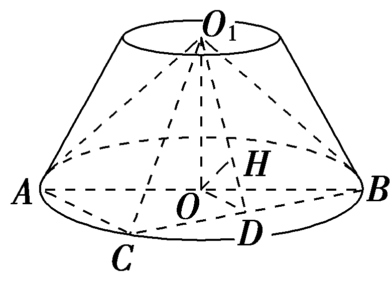

求线面角的三个步骤

一作(找)角，二证明，三计算，其中作(找)角是关键，先找出斜线在平面上的射影，关键是作垂线，找垂足，然后把线面角转化到三角形中求解.

对点练1.在三棱柱<em>ABC</em>-<em>A</em>1<em>B</em>1<em>C</em>1中，各棱长都相等，侧棱垂直于底面，点<em>D</em>是<em>BC</em>1与<em>B</em>1<em>C</em>的交点，则<em>AD</em>与平面<em>BB</em>1<em>C</em>1<em>C</em>所成角的正弦值是(　　)

A. $\frac{3}{5}$ 	B. $\frac{\sqrt{2}}{2}$

C. $\frac{\sqrt{3}}{2}$ 	D. $\frac{1}{2}$

答案：**C**

解析：取<em>&lt;text style="italic"&gt;B&lt;text style="italic"&gt;&lt;text style="italic"&gt;&lt;text style="italic"&gt;&lt;text style="italic"&gt;&lt;text style="italic"&gt;&lt;text style="italic"&gt;&lt;text style="italic"&gt;&lt;text style="italic"&gt;C</em>&lt;/text&gt;&lt;/text&gt;&lt;/text&gt;&lt;/text&gt;&lt;/text&gt;&lt;/text&gt;&lt;/text&gt;&lt;/text&gt;&lt;/text&gt;的中点<em>&lt;text style="italic"&gt;&lt;text style="italic"&gt;E</em>&lt;/text&gt;&lt;/text&gt;，连接<em>&lt;text style="italic"&gt;&lt;text style="italic"&gt;D</em>E&lt;/text&gt;&lt;/text&gt;，<em>&lt;text style="italic"&gt;A</em>E&lt;/text&gt;，如图.依题意三棱柱<em>A&lt;text style="italic"&gt;&lt;text style="italic"&gt;&lt;text style="italic"&gt;&lt;text style="italic"&gt;&lt;text style="italic"&gt;BC</em>&lt;/text&gt;&lt;/text&gt;&lt;/text&gt;&lt;/text&gt;&lt;/text&gt;-A&lt;text style="subscript"&gt;&lt;text style="subscript"&gt;&lt;text style="subscript"&gt;&lt;text style="subscript"&gt;&lt;text style="subscript"&gt;&lt;text style="subscript"&gt;&lt;text style="subscript"&gt;&lt;text style="subscript"&gt;&lt;text style="subscript"&gt;&lt;text style="subscript"&gt;&lt;text style="subscript"&gt;&lt;text style="subscript"&gt;1&lt;/text&gt;&lt;/text&gt;&lt;/text&gt;&lt;/text&gt;&lt;/text&gt;&lt;/text&gt;&lt;/text&gt;&lt;/text&gt;&lt;/text&gt;&lt;/text&gt;&lt;/text&gt;&lt;/text&gt;B1C1为正三棱柱，设棱长为2，则<em>&lt;text style="italic"&gt;&lt;text style="italic"&gt;&lt;text style="italic"&gt;&lt;text style="italic"&gt;AE</em>&lt;/text&gt;&lt;/text&gt;&lt;/text&gt;&lt;/text&gt;＝ $\sqrt{3}$ ，<em>D&lt;text style="italic"&gt;&lt;text style="italic"&gt;E</em>&lt;/text&gt;&lt;/text&gt;＝&lt;text style="subscript"&gt;&lt;text style="subscript"&gt;&lt;text style="subscript"&gt;&lt;text style="subscript"&gt;&lt;text style="subscript"&gt;&lt;text style="subscript"&gt;&lt;text style="subscript"&gt;&lt;text style="subscript"&gt;&lt;text style="subscript"&gt;&lt;text style="subscript"&gt;&lt;text style="subscript"&gt;&lt;text style="subscript"&gt;1&lt;/text&gt;&lt;/text&gt;&lt;/text&gt;&lt;/text&gt;&lt;/text&gt;&lt;/text&gt;&lt;/text&gt;&lt;/text&gt;&lt;/text&gt;&lt;/text&gt;&lt;/text&gt;&lt;/text&gt;，因为D，E分别是<em>&lt;text style="italic"&gt;B&lt;text style="italic"&gt;&lt;text style="italic"&gt;&lt;text style="italic"&gt;&lt;text style="italic"&gt;&lt;text style="italic"&gt;&lt;text style="italic"&gt;&lt;text style="italic"&gt;&lt;text style="italic"&gt;C</em>&lt;/text&gt;&lt;/text&gt;&lt;/text&gt;&lt;/text&gt;&lt;/text&gt;&lt;/text&gt;&lt;/text&gt;&lt;/text&gt;&lt;/text&gt;1和<em>&lt;text style="italic"&gt;&lt;text style="italic"&gt;&lt;text style="italic"&gt;&lt;text style="italic"&gt;BC</em>&lt;/text&gt;&lt;/text&gt;&lt;/text&gt;&lt;/text&gt;的中点，所以<em>&lt;text style="italic"&gt;&lt;text style="italic"&gt;&lt;text style="italic"&gt;&lt;text style="italic"&gt;&lt;text style="italic"&gt;&lt;text style="italic"&gt;&lt;text style="italic"&gt;DE</em>&lt;/text&gt;&lt;/text&gt;&lt;/text&gt;&lt;/text&gt;&lt;/text&gt;&lt;/text&gt;&lt;/text&gt;∥<em>CC</em>1，所以DE⊥平面<em>&lt;text style="italic"&gt;A</em>BC&lt;/text&gt;，所以DE⊥<em>&lt;text style="italic"&gt;&lt;text style="italic"&gt;&lt;text style="italic"&gt;&lt;text style="italic"&gt;&lt;text style="italic"&gt;AE</em>&lt;/text&gt;&lt;/text&gt;&lt;/text&gt;&lt;/text&gt;&lt;/text&gt;，所以<em>&lt;text style="italic"&gt;&lt;text style="italic"&gt;AD</em>&lt;/text&gt;&lt;/text&gt;＝ $\sqrt{AE^{2}＋DE^{2}}$ ＝ $\sqrt{3+1}$ ＝2.因为<em>A&lt;text style="italic"&gt;&lt;text style="italic"&gt;E</em>&lt;/text&gt;&lt;/text&gt;⊥<em>&lt;text style="italic"&gt;B&lt;text style="italic"&gt;&lt;text style="italic"&gt;&lt;text style="italic"&gt;&lt;text style="italic"&gt;&lt;text style="italic"&gt;&lt;text style="italic"&gt;&lt;text style="italic"&gt;&lt;text style="italic"&gt;C</em>&lt;/text&gt;&lt;/text&gt;&lt;/text&gt;&lt;/text&gt;&lt;/text&gt;&lt;/text&gt;&lt;/text&gt;&lt;/text&gt;&lt;/text&gt;，<em>&lt;text style="italic"&gt;&lt;text style="italic"&gt;&lt;text style="italic"&gt;&lt;text style="italic"&gt;&lt;text style="italic"&gt;AE</em>&lt;/text&gt;&lt;/text&gt;&lt;/text&gt;&lt;/text&gt;&lt;/text&gt;⊥<em>&lt;text style="italic"&gt;&lt;text style="italic"&gt;D</em>E&lt;/text&gt;&lt;/text&gt;，<em>&lt;text style="italic"&gt;&lt;text style="italic"&gt;&lt;text style="italic"&gt;&lt;text style="italic"&gt;BC</em>&lt;/text&gt;&lt;/text&gt;&lt;/text&gt;&lt;/text&gt;∩<em>&lt;text style="italic"&gt;&lt;text style="italic"&gt;&lt;text style="italic"&gt;&lt;text style="italic"&gt;&lt;text style="italic"&gt;DE</em>&lt;/text&gt;&lt;/text&gt;&lt;/text&gt;&lt;/text&gt;&lt;/text&gt;＝E，BC，DE⊂平面<em>&lt;text style="italic"&gt;&lt;text style="italic"&gt;&lt;text style="italic"&gt;BB</em>&lt;/text&gt;&lt;/text&gt;&lt;/text&gt;&lt;text style="subscript"&gt;&lt;text style="subscript"&gt;&lt;text style="subscript"&gt;&lt;text style="subscript"&gt;&lt;text style="subscript"&gt;&lt;text style="subscript"&gt;&lt;text style="subscript"&gt;&lt;text style="subscript"&gt;&lt;text style="subscript"&gt;&lt;text style="subscript"&gt;&lt;text style="subscript"&gt;&lt;text style="subscript"&gt;1&lt;/text&gt;&lt;/text&gt;&lt;/text&gt;&lt;/text&gt;&lt;/text&gt;&lt;/text&gt;&lt;/text&gt;&lt;/text&gt;&lt;/text&gt;&lt;/text&gt;&lt;/text&gt;&lt;/text&gt;C1C，所以AE⊥平面BB1C1C，所以∠<em>&lt;text style="italic"&gt;&lt;text style="italic"&gt;AD</em>&lt;/text&gt;&lt;/text&gt;E是AD与平面BB1C1C所成的角，所以sin∠<em>&lt;text style="italic"&gt;ADE</em>&lt;/text&gt;＝ $\frac{AE}{AD}$ ＝ $\frac{\sqrt{3}}{2}$ ，所以<em>AD</em>与平面<em>B</em>B&lt;text style="subscript"&gt;&lt;text style="subscript"&gt;&lt;text style="subscript"&gt;&lt;text style="subscript"&gt;&lt;text style="subscript"&gt;&lt;text style="subscript"&gt;&lt;text style="subscript"&gt;&lt;text style="subscript"&gt;&lt;text style="subscript"&gt;&lt;text style="subscript"&gt;&lt;text style="subscript"&gt;&lt;text style="subscript"&gt;1&lt;/text&gt;&lt;/text&gt;&lt;/text&gt;&lt;/text&gt;&lt;/text&gt;&lt;/text&gt;&lt;/text&gt;&lt;/text&gt;&lt;/text&gt;&lt;/text&gt;&lt;/text&gt;&lt;/text&gt;<em>&lt;text style="italic"&gt;&lt;text style="italic"&gt;&lt;text style="italic"&gt;&lt;text style="italic"&gt;&lt;text style="italic"&gt;&lt;text style="italic"&gt;&lt;text style="italic"&gt;&lt;text style="italic"&gt;C</em>&lt;/text&gt;&lt;/text&gt;&lt;/text&gt;&lt;/text&gt;&lt;/text&gt;&lt;/text&gt;&lt;/text&gt;&lt;/text&gt;1C所成角的正弦值是 $\frac{\sqrt{3}}{2}$ .故选<em>&lt;text style="italic"&gt;&lt;text style="italic"&gt;&lt;text style="italic"&gt;&lt;text style="italic"&gt;&lt;text style="italic"&gt;&lt;text style="italic"&gt;&lt;text style="italic"&gt;&lt;text style="italic"&gt;C</em>&lt;/text&gt;&lt;/text&gt;&lt;/text&gt;&lt;/text&gt;&lt;/text&gt;&lt;/text&gt;&lt;/text&gt;&lt;/text&gt;.

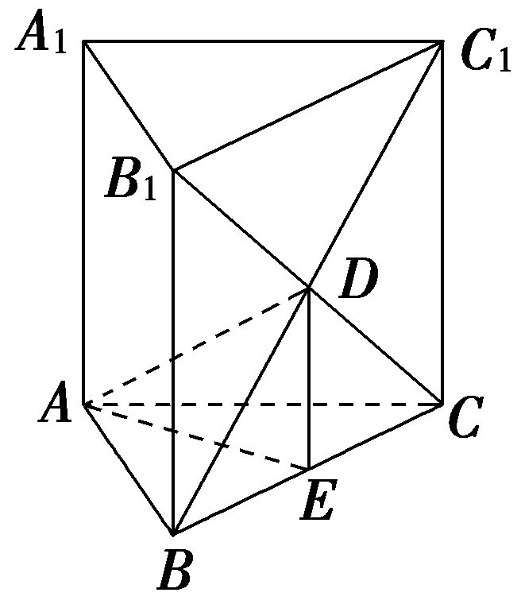

技法二　几何法求二面角

五面体*ABCDEF*中，∠*ABC*＝∠*BAD*＝90°，*BC*＝2*AD*＝2*EF*＝4，△*ABE*，△*ADE*均为正三角形.

(1)证明：*BE*⊥*CD*；

(2)求平面*ABF*与平面*BDE*所成夹角的余弦值.

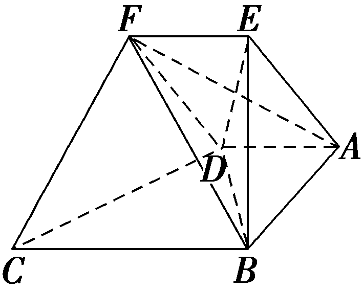

解：(1)证明：因为*BC*＝2*AD*＝2*EF*＝4，△*ABE*，△*ADE*均为正三角形，

所以*AB*＝*AD*＝*BE*＝*DE*＝*AE*＝2，

记*BD*的中点为*G*，连接*AG*，*EG*，则*EG*⊥*BD*，

因为∠*BAD*＝90°，

所以*AG*＝*BG*＝ $\frac{1}{2}$ *BD*＝ $\frac{1}{2}\sqrt{AB^{2}＋AD^{2}}$ ＝ $\sqrt{2}$ ，

所以<em>&lt;text style="italic"&gt;&lt;text style="italic"&gt;EG</em>&lt;/text&gt;&lt;/text&gt;＝ $\sqrt{BE^{2}－BG^{2}}$ ＝ $\sqrt{2}$ ，则<em>AE</em>&lt;text style="superscript"&gt;&lt;text style="superscript"&gt;2&lt;/text&gt;&lt;/text&gt;＝<em>&lt;text style="italic"&gt;AG</em>&lt;/text&gt;2＋<em>&lt;text style="italic"&gt;&lt;text style="italic"&gt;EG</em>&lt;/text&gt;&lt;/text&gt;2＝4，所以AG⊥EG，

又*AG*∩*BD*＝*G*，*AG*，*BD*⊂平面*ABCD*，

所以*EG*⊥平面*ABCD*，

因为*CD*⊂平面*ABCD*，

所以*EG*⊥*CD*.

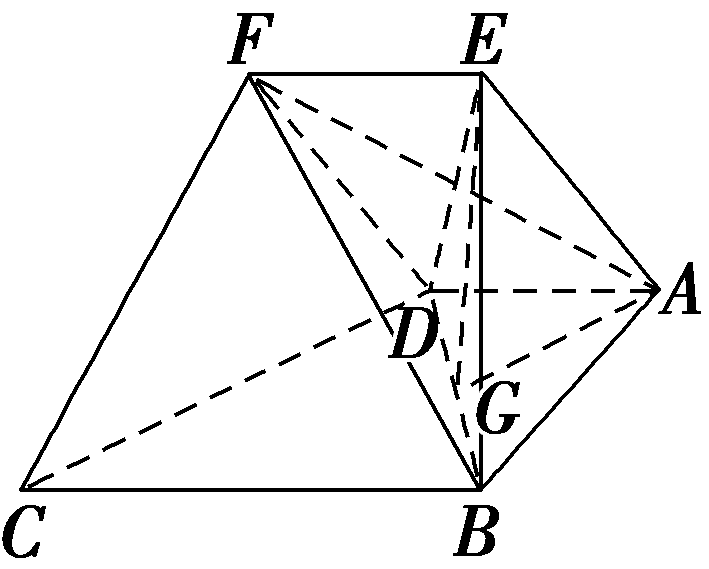

易知在△*<text style="italic">BC*D</text>中，∠*C<text style="italic">BD*</text>＝45°，BD＝2 $\sqrt{2}$ ，*BC*＝4，

由余弦定理可得<em>CD</em>&lt;text style="superscript"&gt;2&lt;/text&gt;＝42＋ $\left(2\sqrt{2}\right)^{2}$ －&lt;text style="superscript"&gt;2&lt;/text&gt;×4×2 $\sqrt{2}$ × $\frac{\sqrt{2}}{2}$ ＝8，

所以<em>BC</em>2＝<em>BD</em>2＋<em>CD</em>2，所以<em>CD</em>⊥<em>BD</em>，

又*EG*∩*BD*＝*G*，*EG*，*BD*⊂平面*BDE*，所以*CD*⊥平面*BDE*，

因为*BE*⊂平面*BDE*，所以*BE*⊥*CD*.

(2)记*AF*，*DE*的交点为*H*，连接*BH*，*AH*的中点为*Q*，

作*EP*⊥*BH*，*AM*⊥*BH*，垂足分别为*P*，*M*，连接*QP*，*QE*，

因为<em>&lt;text style="italic"&gt;BD</em>&lt;/text&gt;＝&lt;text style="superscript"&gt;&lt;text style="superscript"&gt;2&lt;/text&gt;&lt;/text&gt; $\sqrt{2}$ ，<em>&lt;text style="italic"&gt;&lt;text style="italic"&gt;BE</em>&lt;/text&gt;&lt;/text&gt;＝<em>&lt;text style="italic"&gt;&lt;text style="italic"&gt;DE</em>&lt;/text&gt;&lt;/text&gt;＝&lt;text style="superscript"&gt;&lt;text style="superscript"&gt;2&lt;/text&gt;&lt;/text&gt;，所以<em>&lt;text style="italic"&gt;BD</em>&lt;/text&gt;2＝BE2＋DE2，所以BE⊥DE，

由题设易得*AD*∥*BC*，*AD*⊄平面*BCFE*，*BC*⊂平面*BCFE*，所以*AD*∥平面*BCFE*，

又*AD*⊂平面*ADFE*，平面*ADFE*∩平面*BCFE*＝*EF*，所以*AD*∥*EF*，

所以四边形*ADFE*为菱形，所以*EH*＝1，*AF*⊥*ED*，

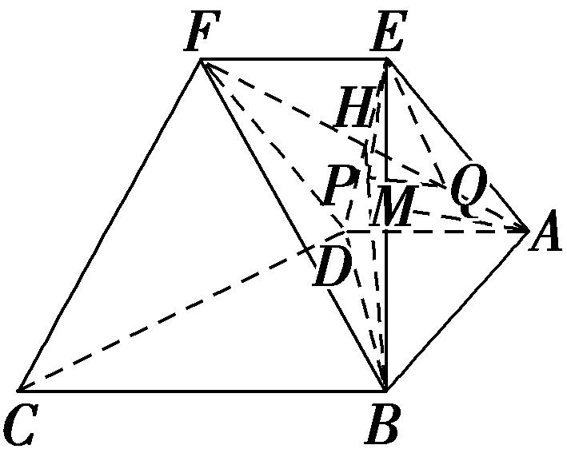

所以*BH*＝ $\sqrt{EH^{2}＋BE^{2}}$ ＝ $\sqrt{5}$ ，则 $\sqrt{5}$ *PE*＝*EH*·*EB*＝2，

解得*PE*＝ $\frac{2\sqrt{5}}{5}$ ，*PH*＝ $\sqrt{EH^{2}－EP^{2}}$ ＝ $\frac{\sqrt{5}}{5}$ ，

在△*A<text style="italic">BH*</text>中，*AH*＝ $\sqrt{3}$ ，*BH*＝ $\sqrt{5}$ ，*AB*＝2，

由余弦定理得cos∠*AHB*＝ $\frac{3+5－4}{2\sqrt{3}\times \sqrt{5}}$ ＝ $\frac{2\sqrt{15}}{15}$ ，

所以*HM*＝*AH*cos∠*AHB*＝ $\sqrt{3}$ × $\frac{2\sqrt{15}}{15}$ ＝ $\frac{2\sqrt{5}}{5}$ ，*AM*＝ $\sqrt{AH^{2}－HM^{2}}$ ＝ $\frac{\sqrt{55}}{5}$

所以*P*为*HM*的中点，又*Q*为*AH*的中点，所以*<text style="italic">PQ*</text>＝ $\frac{\sqrt{55}}{10}$ ，*PQ*∥*AM*，

所以*PQ*⊥*BH*，所以∠*EPQ*或者其补角即为平面*ABF*与平面*BDE*所成夹角，

又*EQ*＝ $\sqrt{EH^{2}＋HQ^{2}}$ ＝ $\sqrt{1+\left(\frac{\sqrt{3}}{2}\right)^{2}}$ ＝ $\frac{\sqrt{7}}{2}$ ，

所以cos∠*EPQ*＝ $\frac{PE^{2}＋PQ^{2}－EQ^{2}}{2PE\cdot PQ}$ ＝ $\frac{\left(\frac{2\sqrt{5}}{5}\right)^{2}＋\left(\frac{\sqrt{55}}{10}\right)^{2}－\left(\frac{\sqrt{7}}{2}\right)^{2}}{2\times \frac{2\sqrt{5}}{5}\times \frac{\sqrt{55}}{10}}$ ＝－ $\frac{\sqrt{11}}{11}$ ，

所以平面*ABF*与平面*BDE*所成夹角的余弦值为 $\frac{\sqrt{11}}{11}$ .

作二面角的平面角的方法

作二面角的平面角可以用定义法，也可以用垂面法，即在一个半平面内找一点作另一个半平面的垂线，再过垂足作二面角的棱的垂线，两条垂线确定的平面和二面角的棱垂直，由此可得二面角的平面角.

对点练2.在三棱台<em>&lt;text style="italic"&gt;&lt;text style="italic"&gt;&lt;text style="italic"&gt;&lt;text style="italic"&gt;&lt;text style="italic"&gt;A</em>&lt;/text&gt;&lt;/text&gt;&lt;/text&gt;&lt;/text&gt;<em>&lt;text style="italic"&gt;B</em>&lt;/text&gt;<em>C</em>&lt;/text&gt;-A&lt;text style="subscript"&gt;&lt;text style="subscript"&gt;&lt;text style="subscript"&gt;&lt;text style="subscript"&gt;&lt;text style="subscript"&gt;&lt;text style="subscript"&gt;&lt;text style="subscript"&gt;&lt;text style="subscript"&gt;&lt;text style="subscript"&gt;1&lt;/text&gt;&lt;/text&gt;&lt;/text&gt;&lt;/text&gt;&lt;/text&gt;&lt;/text&gt;&lt;/text&gt;&lt;/text&gt;&lt;/text&gt;B1C1中，<em>&lt;text style="italic"&gt;AB</em>&lt;/text&gt;⊥<em>&lt;text style="italic"&gt;&lt;text style="italic"&gt;AC</em>&lt;/text&gt;&lt;/text&gt;，AB＝2A1B1＝2，AC＝2 $\sqrt{2}$ ，<em>C</em>C&lt;text style="subscript"&gt;&lt;text style="subscript"&gt;&lt;text style="subscript"&gt;&lt;text style="subscript"&gt;&lt;text style="subscript"&gt;&lt;text style="subscript"&gt;&lt;text style="subscript"&gt;&lt;text style="subscript"&gt;&lt;text style="subscript"&gt;1&lt;/text&gt;&lt;/text&gt;&lt;/text&gt;&lt;/text&gt;&lt;/text&gt;&lt;/text&gt;&lt;/text&gt;&lt;/text&gt;&lt;/text&gt;＝2，∠<em>&lt;text style="italic"&gt;&lt;text style="italic"&gt;&lt;text style="italic"&gt;&lt;text style="italic"&gt;A</em>&lt;/text&gt;&lt;/text&gt;&lt;/text&gt;&lt;/text&gt;1<em>&lt;text style="italic"&gt;&lt;text style="italic"&gt;AC</em>&lt;/text&gt;&lt;/text&gt;＝∠A1<em>CA</em>，且平面A<em>CC</em>1A1⊥平面<em>A&lt;text style="italic"&gt;&lt;text style="italic"&gt;B</em>&lt;/text&gt;C&lt;/text&gt;.

(1)求证：平面<em>A</em>1<em>BC</em>⊥平面<em>ABC</em>1；

(2)求二面角<em>A</em>-<em>A</em>1<em>C</em>-<em>B</em>的正弦值.

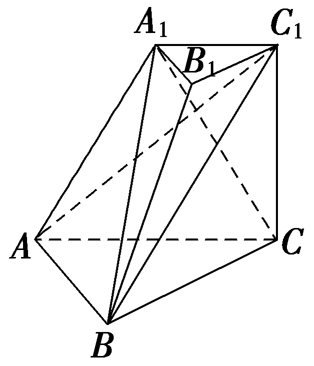

解：(1)证明：平面<em>AA</em>1<em>C</em>1<em>C</em>⊥平面<em>ABC</em>，平面<em>AA</em>1<em>C</em>1<em>C</em>∩平面<em>ABC</em>＝<em>AC</em>，<em>AB</em>⊥<em>AC</em>，

<em>AB</em>⊂平面<em>ABC</em>，故<em>AB</em>⊥平面<em>AA</em>1<em>C</em>1<em>C</em>，<em>A</em>1<em>C</em>⊂平面<em>AA</em>1<em>C</em>1<em>C</em>，故<em>AB</em>⊥<em>A</em>1<em>C</em>，设<em>AC</em>中点为<em>D</em>，连接<em>A</em>1<em>D</em>，∠<em>A</em>1<em>AC</em>＝∠<em>A</em>1<em>CA</em>，

则<em>A</em>1<em>D</em>⊥<em>AC</em>，<em>AD</em>＝<em>CD</em>＝ $\sqrt{2}$ ，

<em>&lt;text style="italic"&gt;&lt;text style="italic"&gt;&lt;text style="italic"&gt;&lt;text style="italic"&gt;A</em>&lt;/text&gt;&lt;/text&gt;&lt;/text&gt;<em>B</em>&lt;/text&gt;＝2A&lt;text style="subscript"&gt;&lt;text style="subscript"&gt;&lt;text style="subscript"&gt;&lt;text style="subscript"&gt;&lt;text style="subscript"&gt;&lt;text style="subscript"&gt;&lt;text style="subscript"&gt;1&lt;/text&gt;&lt;/text&gt;&lt;/text&gt;&lt;/text&gt;&lt;/text&gt;&lt;/text&gt;&lt;/text&gt;B1，则A1<em>&lt;text style="italic"&gt;&lt;text style="italic"&gt;C</em>&lt;/text&gt;&lt;/text&gt;1＝ $\frac{1}{2}$ <em>&lt;text style="italic"&gt;&lt;text style="italic"&gt;&lt;text style="italic"&gt;A</em>&lt;/text&gt;&lt;/text&gt;&lt;/text&gt;<em>&lt;text style="italic"&gt;&lt;text style="italic"&gt;C</em>&lt;/text&gt;&lt;/text&gt;＝ $\sqrt{2}$ ，<em>&lt;text style="italic"&gt;&lt;text style="italic"&gt;&lt;text style="italic"&gt;A</em>&lt;/text&gt;&lt;/text&gt;&lt;/text&gt;&lt;text style="subscript"&gt;&lt;text style="subscript"&gt;&lt;text style="subscript"&gt;&lt;text style="subscript"&gt;&lt;text style="subscript"&gt;&lt;text style="subscript"&gt;&lt;text style="subscript"&gt;1&lt;/text&gt;&lt;/text&gt;&lt;/text&gt;&lt;/text&gt;&lt;/text&gt;&lt;/text&gt;&lt;/text&gt;<em>&lt;text style="italic"&gt;&lt;text style="italic"&gt;C</em>&lt;/text&gt;&lt;/text&gt;1＝<em>&lt;text style="italic"&gt;CD</em>&lt;/text&gt;，A1C1∥CD，

故四边形<em>A</em>1<em>DCC</em>1为矩形，

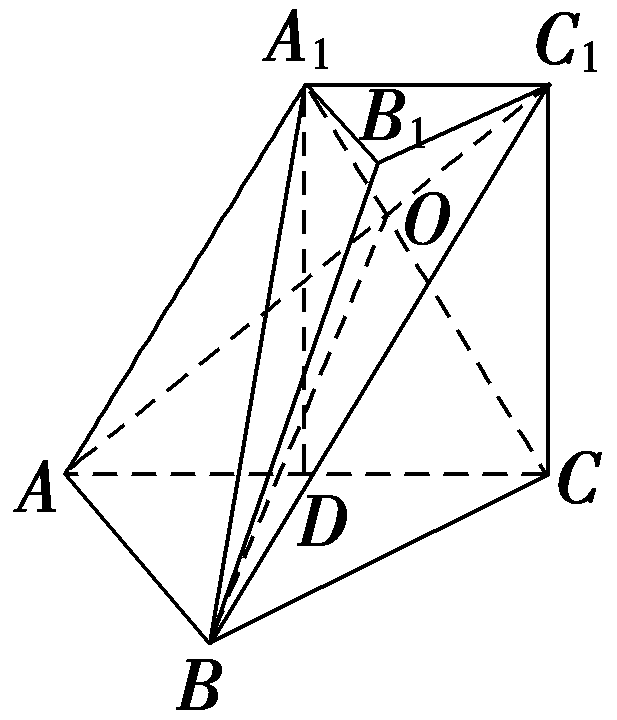

tan∠<em>C&lt;text style="italic"&gt;&lt;text style="italic"&gt;A</em>&lt;/text&gt;C&lt;/text&gt;&lt;text style="subscript"&gt;&lt;text style="subscript"&gt;&lt;text style="subscript"&gt;&lt;text style="subscript"&gt;&lt;text style="subscript"&gt;1&lt;/text&gt;&lt;/text&gt;&lt;/text&gt;&lt;/text&gt;&lt;/text&gt;＝ $\frac{2}{2\sqrt{2}}$ ＝ $\frac{\sqrt{2}}{2}$ ，tan∠<em>&lt;text style="italic"&gt;A</em>&lt;/text&gt;&lt;text style="subscript"&gt;&lt;text style="subscript"&gt;&lt;text style="subscript"&gt;&lt;text style="subscript"&gt;&lt;text style="subscript"&gt;1&lt;/text&gt;&lt;/text&gt;&lt;/text&gt;&lt;/text&gt;&lt;/text&gt;<em>&lt;text style="italic"&gt;CC</em>&lt;/text&gt;1＝ $\frac{\sqrt{2}}{2}$ ，∠<em>C&lt;text style="italic"&gt;&lt;text style="italic"&gt;A</em>&lt;/text&gt;C&lt;/text&gt;&lt;text style="subscript"&gt;&lt;text style="subscript"&gt;&lt;text style="subscript"&gt;&lt;text style="subscript"&gt;&lt;text style="subscript"&gt;1&lt;/text&gt;&lt;/text&gt;&lt;/text&gt;&lt;/text&gt;&lt;/text&gt;，∠A1<em>&lt;text style="italic"&gt;CC</em>&lt;/text&gt;1∈ $\left(0，\frac{\pi }{2}\right)$ ，

故∠<em>CAC</em>1＝∠<em>A</em>1<em>CC</em>1，即<em>A</em>1<em>C</em>⊥<em>AC</em>1，

<em>AB</em>∩<em>AC</em>1＝<em>A</em>，<em>AB</em>，<em>AC</em>1⊂平面<em>ABC</em>1，

故<em>A</em>1<em>C</em>⊥平面<em>ABC</em>1，

又<em>A</em>1<em>C</em>⊂平面<em>A</em>1<em>BC</em>，故平面<em>A</em>1<em>BC</em>⊥平面<em>ABC</em>1.

(2)设<em>A</em>1<em>C</em>∩<em>AC</em>1＝<em>O</em>，连接<em>BO</em>，<em>A</em>1<em>C</em>⊥平面<em>ABC</em>1，<em>OB</em>⊂平面<em>ABC</em>1，故<em>A</em>1<em>C</em>⊥<em>OB</em>，

又因为<em>A</em>1<em>C</em>⊥<em>AC</em>1，所以二面角<em>A</em>-<em>A</em>1<em>C</em>-<em>B</em>的平面角为∠<em>AOB</em>，

<em>&lt;text style="italic"&gt;AC</em>&lt;/text&gt;&lt;text style="subscript"&gt;1&lt;/text&gt;＝ $\sqrt{8+4}$ ＝2 $\sqrt{3}$ ，<em>AO</em>＝ $\frac{2}{3}$ <em>&lt;text style="italic"&gt;AC</em>&lt;/text&gt;&lt;text style="subscript"&gt;1&lt;/text&gt;＝ $\frac{4\sqrt{3}}{3}$ ，

<em>AB</em>⊥平面<em>AA</em>1<em>C</em>1<em>C</em>，<em>AO</em>⊂平面<em>AA</em>1<em>C</em>1<em>C</em>，所以<em>AB</em>⊥<em>AO</em>，

在Rt△<em>&lt;text style="italic"&gt;OA</em>B&lt;/text&gt;中，<em>&lt;text style="italic"&gt;OB</em>&lt;/text&gt;&lt;text style="superscript"&gt;&lt;text style="superscript"&gt;2&lt;/text&gt;&lt;/text&gt;＝OA2＋<em>AB</em>2＝ $\frac{28}{3}$ ，解得<em>&lt;text style="italic"&gt;OB</em>&lt;/text&gt;＝ $\frac{2\sqrt{7}}{\sqrt{3}}$ ，从而sin∠A<em>&lt;text style="italic"&gt;OB</em>&lt;/text&gt;＝ $\frac{AB}{OB}$ ＝ $\frac{2}{\frac{2\sqrt{7}}{\sqrt{3}}}$ ＝ $\frac{\sqrt{21}}{7}$ ，

故二面角<em>&lt;text style="italic"&gt;A</em>&lt;/text&gt;-A1<em>C</em>-<em>B</em>的正弦值为 $\frac{\sqrt{21}}{7}$ .

技法三　几何法求距离

角度1　点线距

如图，在四棱锥*P*-*ABCD*中，*PB*⊥平面*ABCD*，*PB*＝*AB*＝2*BC*＝4，*AB*⊥*BC*，则点*C*到直线*PA*的距离为(　　)

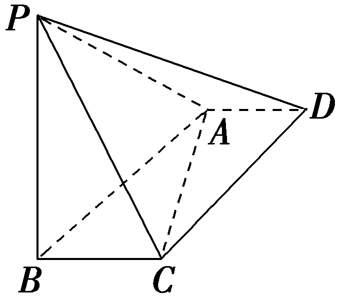

A.2 $\sqrt{3}$ 	B.2 $\sqrt{5}$

C. $\sqrt{2}$ 	D.4

答案：**A**

解析：如图，取*<text style="italic"><text style="italic"><text style="italic"><text style="italic"><text style="italic"><text style="italic"><text style="italic"><text style="italic"><text style="italic">PA*</text></text></text></text></text></text></text></text></text>的中点*<text style="italic">M*</text>，连接*<text style="italic"><text style="italic">B*</text>M</text>，*<text style="italic"><text style="italic"><text style="italic"><text style="italic"><text style="italic">C*</text>M</text></text></text></text>，因为*<text style="italic"><text style="italic"><text style="italic"><text style="italic"><text style="italic">PB*</text></text></text></text></text>⊥平面*A<text style="italic"><text style="italic"><text style="italic"><text style="italic"><text style="italic"><text style="italic"><text style="italic"><text style="italic">BC*</text></text></text></text></text></text></text>D</text>，BC⊂平面*<text style="italic"><text style="italic"><text style="italic"><text style="italic">AB*</text></text></text>CD</text>，所以PB⊥BC，又因为AB⊥BC，PB∩AB＝B，PB，AB⊂平面*<text style="italic"><text style="italic"><text style="italic">PAB*</text></text></text>，所以BC⊥平面PAB，又PA⊂平面PAB，所以BC⊥PA，因为M是PA的中点，PB＝AB，所以*<text style="italic"><text style="italic"><text style="italic">BM*</text></text></text>⊥PA，又BC⊥PA，BM∩BC＝B，BM，BC⊂平面*<text style="italic"><text style="italic"><text style="italic">B<text style="italic">CM*</text></text></text></text>，所以PA⊥平面BCM，又CM⊂平面BCM，所以CM⊥PA，即CM为点C到直线PA的距离.在等腰Rt△PAB中，BM＝ $\frac{\sqrt{2}}{2}$ *<text style="italic"><text style="italic">P<text style="italic"><text style="italic">B*</text></text></text></text>＝2 $\sqrt{2}$ ，在Rt△*<text style="italic"><text style="italic"><text style="italic"><text style="italic">B*</text>*<text style="italic">C*</text></text></text></text>*<text style="italic">M*</text>中，*<text style="italic"><text style="italic"><text style="italic"><text style="italic">CM*</text></text></text></text>＝ $\sqrt{BM^{2}＋BC^{2}}$ ＝ $\sqrt{8+4}$ ＝2 $\sqrt{3}$ ，故点*<text style="italic">C*</text>到直线*<text style="italic"><text style="italic"><text style="italic"><text style="italic"><text style="italic"><text style="italic"><text style="italic"><text style="italic"><text style="italic">PA*</text></text></text></text></text></text></text></text></text>的距离为2 $\sqrt{3}$ .故选A.

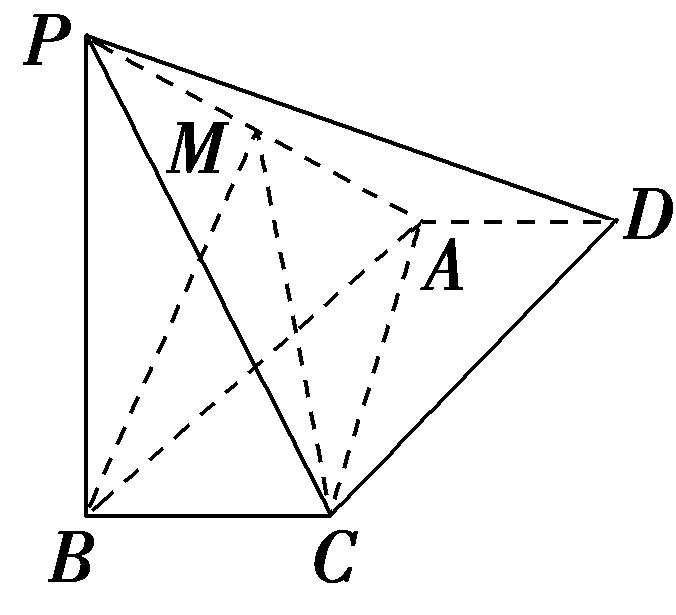

角度2　点面距

(2024·全国甲卷文节选)如图，已知*<text style="italic">AB*</text>∥*<text style="italic"><text style="italic"><text style="italic">CD*</text></text></text>，CD∥*<text style="italic">EF*</text>，AB＝*DE*＝EF＝*CF*＝2，CD＝4，*AD*＝*BC*＝ $\sqrt{10}$ ，*AE*＝2 $\sqrt{3}$ ，*<text style="italic">M*</text>为*<text style="italic"><text style="italic"><text style="italic">CD*</text></text></text>的中点.求点M到平面A*DE*的距离.

解：取*<text style="italic"><text style="italic">DM*</text></text>的中点*O*，连接*<text style="italic"><text style="italic">OA*</text></text>，*<text style="italic"><text style="italic">OE*</text></text>(图略)，因为*<text style="italic">AB*</text>∥*<text style="italic">MC*</text>，且AB＝MC，所以四边形*<text style="italic">AM*CB </text>是平行四边形，所以AM＝*BC*＝ $\sqrt{10}$ ，又*AD*＝ $\sqrt{10}$ ，故△A*<text style="italic"><text style="italic">DM*</text></text> 是等腰三角形，同理△*EDM* 是等腰三角形，可得*O*A⊥DM，*<text style="italic"><text style="italic">OE*</text></text>⊥DM，*<text style="italic"><text style="italic">OA*</text></text>＝ $\sqrt{AD^{2}－(\frac{DM}{2})^{2}}$ ＝3，*O*E＝ $\sqrt{ED^{2}－\left(\frac{DM}{2}\right)^{2}}$ ＝ $\sqrt{3}$ ，

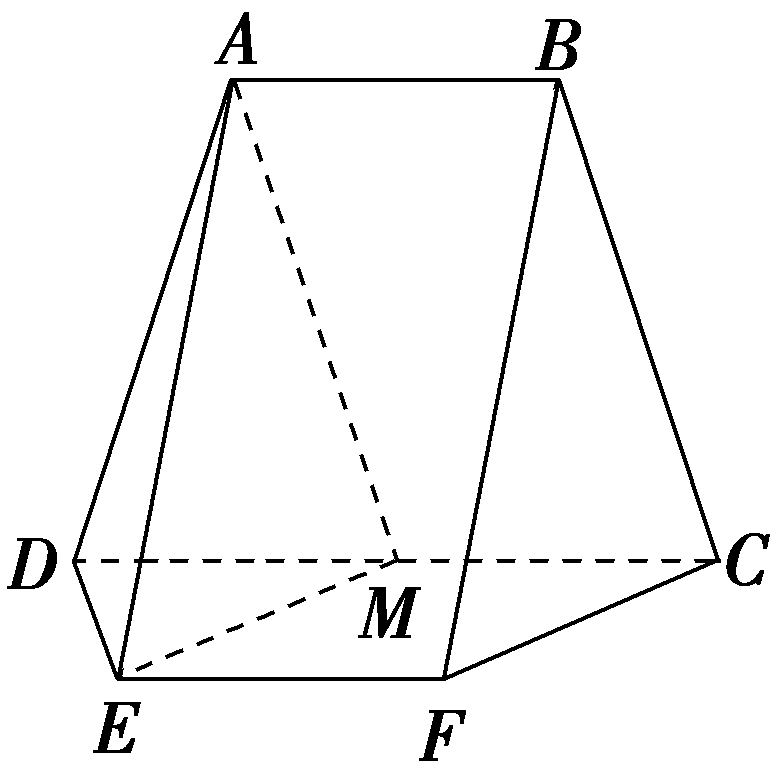

又<em>&lt;text style="italic"&gt;AE</em>&lt;/text&gt;＝&lt;text style="superscript"&gt;&lt;text style="superscript"&gt;2&lt;/text&gt;&lt;/text&gt; $\sqrt{3}$ ，所以<em>&lt;text style="italic"&gt;OA</em>&lt;/text&gt;&lt;text style="superscript"&gt;&lt;text style="superscript"&gt;2&lt;/text&gt;&lt;/text&gt;＋<em>&lt;text style="italic"&gt;OE</em>&lt;/text&gt;2＝<em>&lt;text style="italic"&gt;AE</em>&lt;/text&gt;2，故OA⊥OE.

又*OA*⊥*DM*，*OE*∩*DM*＝*O*，*OE*，*DM*⊂平面*EDM*，

所以*OA*⊥平面 *EDM*.

易知<em>S</em>△<em>EDM</em>＝ $\frac{1}{2}$ ×2× $\sqrt{3}$ ＝ $\sqrt{3}$ .

在△*ADE*中，cos∠*DEA*＝ $\frac{4+12－10}{2\times 2\times 2\sqrt{3}}$ ＝ $\frac{\sqrt{3}}{4}$ ，

所以sin∠<em>DEA</em>＝ $\frac{\sqrt{13}}{4}$ ，<em>S</em>△<em>ADE</em>＝ $\frac{1}{2}$ ×2×2 $\sqrt{3}$ × $\frac{\sqrt{13}}{4}$ ＝ $\frac{\sqrt{39}}{2}$ .

设点<em>&lt;text style="italic,subscript"&gt;M</em>&lt;/text&gt;到平面<em>&lt;text style="italic,subscript"&gt;&lt;text style="italic,subscript"&gt;A</em>DE&lt;/text&gt;&lt;/text&gt;的距离为<em>&lt;text style="italic"&gt;d</em>&lt;/text&gt;，由<em>&lt;text style="italic"&gt;V</em>&lt;/text&gt;M&lt;text style="subscript"&gt;-&lt;/text&gt;<em>ADE</em>＝VA-<em>&lt;text style="italic,subscript"&gt;EDM</em>&lt;/text&gt;，得 $\frac{1}{3}$ <em>&lt;text style="italic"&gt;S</em>&lt;/text&gt;&lt;text style="subscript"&gt;△&lt;/text&gt;<em>&lt;text style="italic,subscript"&gt;&lt;text style="italic,subscript"&gt;A</em>DE&lt;/text&gt;&lt;/text&gt;·<em>&lt;text style="italic"&gt;d</em>&lt;/text&gt;＝ $\frac{1}{3}$ <em>&lt;text style="italic"&gt;S</em>&lt;/text&gt;&lt;text style="subscript"&gt;△&lt;/text&gt;ED<em>&lt;text style="italic,subscript"&gt;M</em>&lt;/text&gt;·O<em>A</em>，得<em>&lt;text style="italic"&gt;d</em>&lt;/text&gt;＝ $\frac{6\sqrt{13}}{13}$ ，

故点*M*到平面*ADE* 的距离为 $\frac{6\sqrt{13}}{13}$ .

1.求点线距一般要作出这个“距离”，然后利用直角三角形求解，或利用等面积法求解.

2.求点面距时，若能够确定过点与平面垂直的直线，即作出这个“距离”，可根据条件求解，若不易作出点面距，可借助于等体积法求解.

对点练3.如图，在正三棱柱<em>&lt;text style="italic"&gt;AB&lt;text style="italic"&gt;C</em>&lt;/text&gt;&lt;/text&gt;-A&lt;text style="subscript"&gt;&lt;text style="subscript"&gt;&lt;text style="subscript"&gt;&lt;text style="subscript"&gt;1&lt;/text&gt;&lt;/text&gt;&lt;/text&gt;&lt;/text&gt;B1C1中，若<em>&lt;text style="italic"&gt;AB</em>&lt;/text&gt;＝ $\sqrt{2}$ <em>B</em>B&lt;text style="subscript"&gt;&lt;text style="subscript"&gt;&lt;text style="subscript"&gt;&lt;text style="subscript"&gt;1&lt;/text&gt;&lt;/text&gt;&lt;/text&gt;&lt;/text&gt;＝2，则<em>&lt;text style="italic"&gt;C</em>&lt;/text&gt;到直线<em>A</em>B1的距离为(　　)

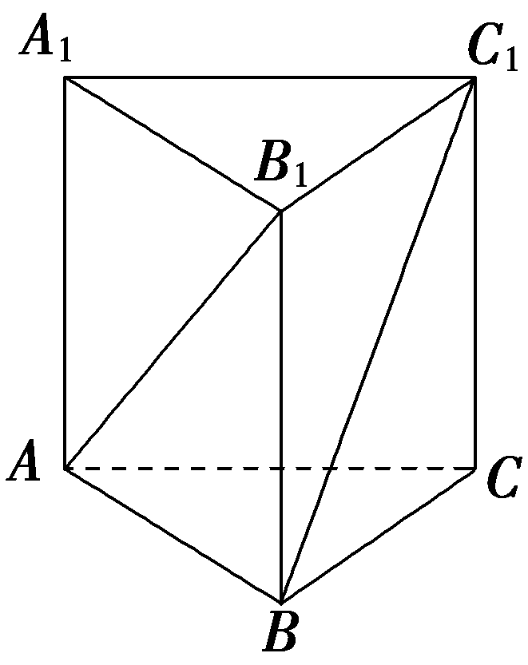

A. $\frac{\sqrt{15}}{5}$ 	B. $\frac{\sqrt{10}}{5}$

C. $\frac{\sqrt{15}}{3}$ 	D. $\frac{\sqrt{30}}{3}$

答案：**D**

解析：如图，连接<em>&lt;text style="italic"&gt;&lt;text style="italic"&gt;C&lt;text style="italic"&gt;&lt;text style="italic"&gt;B</em>&lt;/text&gt;&lt;/text&gt;&lt;/text&gt;&lt;/text&gt;&lt;text style="subscript"&gt;&lt;text style="subscript"&gt;&lt;text style="subscript"&gt;&lt;text style="subscript"&gt;&lt;text style="subscript"&gt;&lt;text style="subscript"&gt;&lt;text style="subscript"&gt;&lt;text style="subscript"&gt;1&lt;/text&gt;&lt;/text&gt;&lt;/text&gt;&lt;/text&gt;&lt;/text&gt;&lt;/text&gt;&lt;/text&gt;&lt;/text&gt;，因为<em>&lt;text style="italic"&gt;&lt;text style="italic"&gt;&lt;text style="italic"&gt;AB</em>&lt;/text&gt;&lt;/text&gt;&lt;/text&gt;＝2，<em>BB</em>1＝ $\sqrt{2}$ ，所以<em>&lt;text style="italic"&gt;A&lt;text style="italic"&gt;&lt;text style="italic"&gt;&lt;text style="italic"&gt;B</em>&lt;/text&gt;&lt;/text&gt;&lt;/text&gt;&lt;/text&gt;&lt;text style="subscript"&gt;&lt;text style="subscript"&gt;&lt;text style="subscript"&gt;&lt;text style="subscript"&gt;&lt;text style="subscript"&gt;&lt;text style="subscript"&gt;&lt;text style="subscript"&gt;&lt;text style="subscript"&gt;1&lt;/text&gt;&lt;/text&gt;&lt;/text&gt;&lt;/text&gt;&lt;/text&gt;&lt;/text&gt;&lt;/text&gt;&lt;/text&gt;＝ $\sqrt{6}$ ，<em>&lt;text style="italic"&gt;&lt;text style="italic"&gt;C&lt;text style="italic"&gt;&lt;text style="italic"&gt;B</em>&lt;/text&gt;&lt;/text&gt;&lt;/text&gt;&lt;/text&gt;&lt;text style="subscript"&gt;&lt;text style="subscript"&gt;&lt;text style="subscript"&gt;&lt;text style="subscript"&gt;&lt;text style="subscript"&gt;&lt;text style="subscript"&gt;&lt;text style="subscript"&gt;&lt;text style="subscript"&gt;1&lt;/text&gt;&lt;/text&gt;&lt;/text&gt;&lt;/text&gt;&lt;/text&gt;&lt;/text&gt;&lt;/text&gt;&lt;/text&gt;＝ $\sqrt{6}$ ，<em>&lt;text style="italic"&gt;&lt;text style="italic"&gt;A&lt;text style="italic"&gt;C</em>&lt;/text&gt;&lt;/text&gt;&lt;/text&gt;＝2，设<em>AC</em>的中点为<em>&lt;text style="italic"&gt;&lt;text style="italic"&gt;&lt;text style="italic"&gt;D</em>&lt;/text&gt;&lt;/text&gt;&lt;/text&gt;，连接<em>&lt;text style="italic"&gt;&lt;text style="italic"&gt;B</em>&lt;/text&gt;&lt;/text&gt;&lt;text style="subscript"&gt;&lt;text style="subscript"&gt;&lt;text style="subscript"&gt;&lt;text style="subscript"&gt;&lt;text style="subscript"&gt;&lt;text style="subscript"&gt;&lt;text style="subscript"&gt;&lt;text style="subscript"&gt;1&lt;/text&gt;&lt;/text&gt;&lt;/text&gt;&lt;/text&gt;&lt;/text&gt;&lt;/text&gt;&lt;/text&gt;&lt;/text&gt;D，则B1D⊥AC，设点C到直线<em>&lt;text style="italic"&gt;&lt;text style="italic"&gt;&lt;text style="italic"&gt;AB</em>&lt;/text&gt;&lt;/text&gt;&lt;/text&gt;1的距离为<em>&lt;text style="italic"&gt;&lt;text style="italic"&gt;&lt;text style="italic"&gt;h</em>&lt;/text&gt;&lt;/text&gt;&lt;/text&gt;，故 $S_{\bigtriangleup AB_{1}C}$ ＝ $\frac{1}{2}$ ×<em>&lt;text style="italic"&gt;&lt;text style="italic"&gt;B</em>&lt;/text&gt;&lt;/text&gt;&lt;text style="subscript"&gt;&lt;text style="subscript"&gt;&lt;text style="subscript"&gt;&lt;text style="subscript"&gt;&lt;text style="subscript"&gt;&lt;text style="subscript"&gt;&lt;text style="subscript"&gt;&lt;text style="subscript"&gt;1&lt;/text&gt;&lt;/text&gt;&lt;/text&gt;&lt;/text&gt;&lt;/text&gt;&lt;/text&gt;&lt;/text&gt;&lt;/text&gt;<em>&lt;text style="italic"&gt;&lt;text style="italic"&gt;&lt;text style="italic"&gt;D</em>&lt;/text&gt;&lt;/text&gt;&lt;/text&gt;×<em>&lt;text style="italic"&gt;&lt;text style="italic"&gt;A&lt;text style="italic"&gt;C</em>&lt;/text&gt;&lt;/text&gt;&lt;/text&gt;＝ $\frac{1}{2}$ <em>&lt;text style="italic"&gt;&lt;text style="italic"&gt;&lt;text style="italic"&gt;h</em>&lt;/text&gt;&lt;/text&gt;&lt;/text&gt;×<em>&lt;text style="italic"&gt;A&lt;text style="italic"&gt;&lt;text style="italic"&gt;&lt;text style="italic"&gt;B</em>&lt;/text&gt;&lt;/text&gt;&lt;/text&gt;&lt;/text&gt;&lt;text style="subscript"&gt;&lt;text style="subscript"&gt;&lt;text style="subscript"&gt;&lt;text style="subscript"&gt;&lt;text style="subscript"&gt;&lt;text style="subscript"&gt;&lt;text style="subscript"&gt;&lt;text style="subscript"&gt;1&lt;/text&gt;&lt;/text&gt;&lt;/text&gt;&lt;/text&gt;&lt;/text&gt;&lt;/text&gt;&lt;/text&gt;&lt;/text&gt;，即 $\sqrt{6－1}$ ×2＝<em>&lt;text style="italic"&gt;&lt;text style="italic"&gt;&lt;text style="italic"&gt;h</em>&lt;/text&gt;&lt;/text&gt;&lt;/text&gt;× $\sqrt{6}$ ，解得<em>&lt;text style="italic"&gt;&lt;text style="italic"&gt;&lt;text style="italic"&gt;h</em>&lt;/text&gt;&lt;/text&gt;&lt;/text&gt;＝ $\frac{\sqrt{30}}{3}$ .故选<em>&lt;text style="italic"&gt;&lt;text style="italic"&gt;&lt;text style="italic"&gt;D</em>&lt;/text&gt;&lt;/text&gt;&lt;/text&gt;.

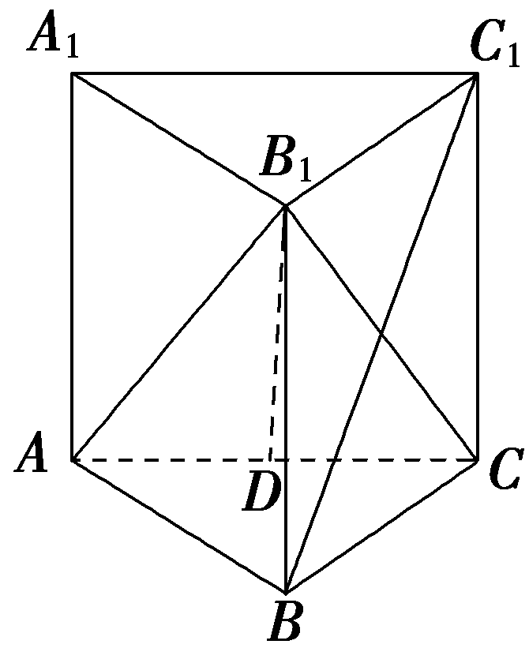

对点练4.已知圆柱的高和底面半径均为4，*AB*为上底面圆周的直径，点*P*是上底面圆周上的一点且*AP*＝*BP*，*PC*是圆柱的一条母线，则点*P*到平面*ABC*的距离为(　　)

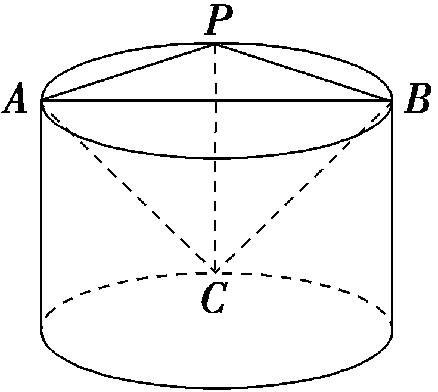

A.4	B.2 $\sqrt{3}$

C.3	D.2 $\sqrt{2}$

答案：**D**

解析：由题可得<em>AB</em>＝8，因为<em>&lt;text style="italic"&gt;A&lt;text style="italic"&gt;&lt;text style="italic,subscript"&gt;P</em>&lt;/text&gt;&lt;/text&gt;&lt;/text&gt;＝<em>&lt;text style="italic"&gt;BP</em>&lt;/text&gt;，所以<em>&lt;text style="italic"&gt;S</em>&lt;/text&gt;&lt;text style="subscript"&gt;△&lt;/text&gt;<em>&lt;text style="italic"&gt;&lt;text style="italic,subscript"&gt;ABP</em>&lt;/text&gt;&lt;/text&gt;＝ $\frac{1}{2}$ ×8×4＝16，因为<em>&lt;text style="italic"&gt;&lt;text style="italic"&gt;&lt;text style="italic,subscript"&gt;P</em>&lt;/text&gt;<em>C</em>&lt;/text&gt;&lt;/text&gt;⊥平面<em>AB</em>P，且PC＝4，所以<em>&lt;text style="italic"&gt;V</em>&lt;/text&gt;C&lt;text style="subscript"&gt;-&lt;/text&gt;A<em>&lt;text style="italic"&gt;BP</em>&lt;/text&gt;＝ $\frac{1}{3}$ ×16×4＝ $\frac{64}{3}$ .因为<em>&lt;text style="italic"&gt;A&lt;text style="italic"&gt;&lt;text style="italic,subscript"&gt;P</em>&lt;/text&gt;&lt;/text&gt;&lt;/text&gt;＝<em>&lt;text style="italic"&gt;BP</em>&lt;/text&gt;＝4 $\sqrt{2}$ ，所以A<em>C</em>＝<em>BC</em>＝4 $\sqrt{3}$ ，所以<em>&lt;text style="italic"&gt;S</em>&lt;/text&gt;&lt;text style="subscript"&gt;△&lt;/text&gt;<em>ABC</em>＝ $\frac{1}{2}$ ×8× $\sqrt{48－16}$ ＝16 $\sqrt{2}$ ，设点<em>&lt;text style="italic,subscript"&gt;P</em>&lt;/text&gt;到平面<em>ABC</em>的距离为<em>&lt;text style="italic"&gt;&lt;text style="italic"&gt;d</em>&lt;/text&gt;&lt;/text&gt;，则<em>&lt;text style="italic"&gt;V</em>&lt;/text&gt;P&lt;text style="subscript"&gt;-&lt;/text&gt;A<em>BC</em>＝ $\frac{1}{3}$ ×16 $\sqrt{2}$ <em>&lt;text style="italic"&gt;&lt;text style="italic"&gt;d</em>&lt;/text&gt;&lt;/text&gt;＝ $\frac{64}{3}$ ，解得<em>&lt;text style="italic"&gt;&lt;text style="italic"&gt;d</em>&lt;/text&gt;&lt;/text&gt;＝2 $\sqrt{2}$ .故选D.

[真题再现]　(2024·新课标Ⅰ卷)如图，四棱锥*P*-*<text style="italic">A<text style="italic">BC*D</text></text>中，*<text style="italic">PA*</text>⊥底面*AB*CD，PA＝*AC*＝2，BC＝1，AB＝ $\sqrt{3}$ .

(1)若*AD*⊥*PB*，证明：*AD*∥平面*PBC*；

(2)若*<text style="italic">AD*</text>⊥*DC*，且二面角A-*CP*-D的正弦值为 $\frac{\sqrt{42}}{7}$ ，求*<text style="italic">AD*</text>.

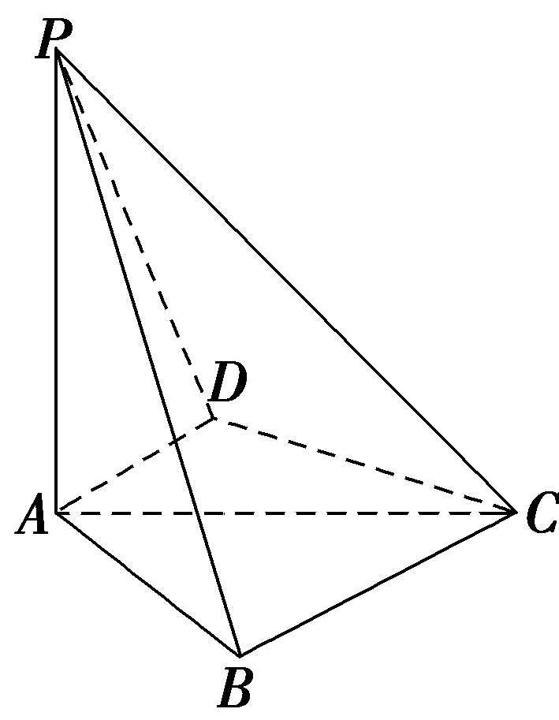

解：(1)证明：由于*PA*⊥底面*ABCD*，*AD*⊂底面*ABCD*，所以*PA*⊥*AD*，

又*AD*⊥*PB*，*PA*∩*PB*＝*P*，*PA*，*PB*⊂平面*PAB*，

所以*AD*⊥平面*PAB*，

又*AB*⊂平面*PAB*，所以*AD*⊥*AB*.

因为*AB*＝ $\sqrt{3}$ ，*BC*＝1，*AC*＝2，

所以<em>AB</em>2＋<em>BC</em>2＝<em>AC</em>2，所以<em>AB</em>⊥<em>BC</em>，

所以*BC*∥*AD*，

因为*AD*⊄平面*PBC*，*BC*⊂平面*PBC*，

所以*AD*∥平面*PBC*.

(2)如图所示，过点*D*作*DE*⊥*AC*于点*E*，过点*E*作*EF*⊥*CP*于点*F*，连接*DF*.

因为*P<text style="italic">A*</text>⊥平面*<text style="italic"><text style="italic">ABC<text style="italic">D*</text></text></text>，所以平面*<text style="italic">P<text style="italic">AC*</text></text>⊥平面ABCD，而平面*<text style="italic">PAC*</text>∩平面ABCD＝AC，所以*<text style="italic"><text style="italic">DE*</text></text>⊥平面PAC，因为*<text style="italic"><text style="italic"><text style="italic"><text style="italic">CP*</text></text></text></text>⊂平面PAC，则DE⊥CP.又*<text style="italic">EF*</text>⊥CP，EF，DE⊂平面*<text style="italic">DEF*</text>，所以CP⊥平面DEF，根据二面角的定义可知，∠*<text style="italic"><text style="italic">DFE*</text></text>即为二面角A-CP-D的平面角，即sin ∠DFE＝ $\frac{\sqrt{42}}{7}$ ，故tan ∠*<text style="italic">D*FE</text>＝ $\sqrt{6}$ .

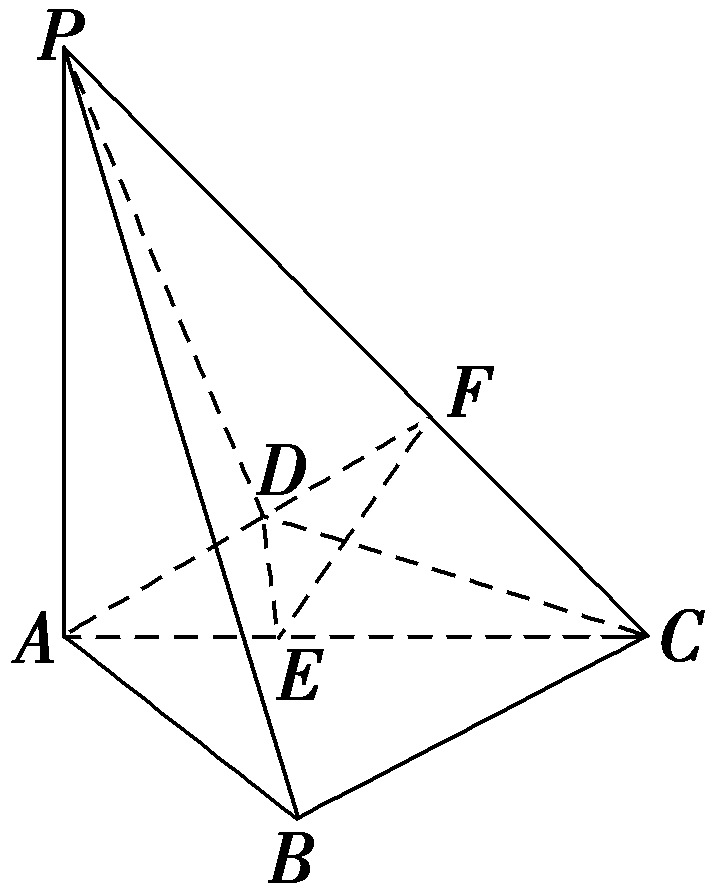

因为<te*x*t style="italic">*AD*</text>⊥*DC*，设AD＝x，则*CD*＝ $\sqrt{4－x^{2}}$ ，由等面积法可得，*DE*＝ $\frac{x\sqrt{4－x^{2}}}{2}$ .

又*CE*＝ $\sqrt{(4－x)^{2}－\frac{x^{2}(4－x^{2})}{4}}$ ＝ $\frac{4－x^{2}}{2}$ ，△*<text style="italic">EF*C</text>为等腰直角三角形，所以EF＝ $\frac{4－x^{2}}{2\sqrt{2}}$ .

故tan ∠<te*x*t style="italic">DFE</text>＝ $\frac{\frac{x\sqrt{4－x^{2}}}{2}}{\frac{4－x^{2}}{2\sqrt{2}}}$ ＝ $\sqrt{6}$ ，解得*x*＝ $\sqrt{3}$ ，即*AD*＝ $\sqrt{3}$ .

[教材呈现]　 (人教A必修二P171T14)如图，在四棱锥*P*-*ABCD*中，底面*ABCD*为正方形，侧面*PAD*是正三角形，侧面*PAD*⊥底面*ABCD*，*M*是*PD*的中点.

(1)求证：*AM*⊥平面*PCD*；

(2)求侧面*PBC*与底面*ABCD*所成二面角的余弦值.

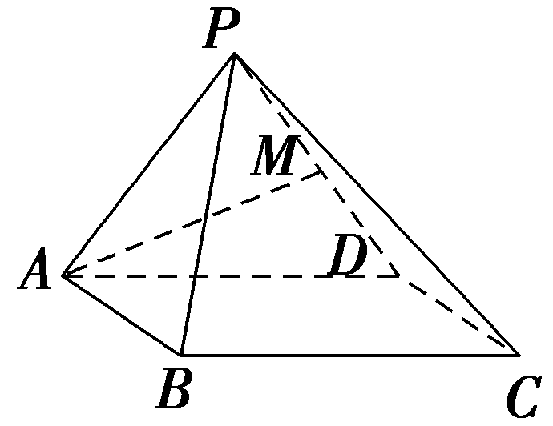

点评：这两题考查相同的知识点，设问的形式和本质基本一样，都是以锥体为载体考查二面角的求解，高考题同时考查综合应用所学知识解决问题的能力.

**课时测评**61　**几何法求线面角、二面角及距离** $\frac{对应学生}{用书P431}$

(时间：60分钟　满分：88分)

(本栏目内容，在学生用书中以独立形式分册装订！)

(1—8题，每小题5分，共40分)

1.若一个圆锥的侧面积是底面积的2倍，则该圆锥的母线与其底面所成角的大小为(　　)

A. $\frac{\pi }{6}$ 	B. $\frac{\pi }{4}$

C. $\frac{\pi }{3}$ 	D. $\frac{5\pi }{12}$

答案：**C**

解析：设圆锥的底面半径为&lt;text sty&lt;text sty<em>l</em>e="italic"&gt;l&lt;/text&gt;e="italic"&gt;<em>&lt;text style="italic"&gt;R</em>&lt;/text&gt;&lt;/text&gt;，母线长为l，因为圆锥的侧面积是底面积的2倍，所以π<em>Rl</em>＝2πR2，解得l＝2R，设该圆锥的母线与底面所成的角为<em>&lt;text style="italic"&gt;&lt;text style="italic"&gt;α</em>&lt;/text&gt;&lt;/text&gt;，则cos α＝ $\frac{R}{l}$ ＝ $\frac{1}{2}$ ，所以<em>&lt;text style="italic"&gt;&lt;text style="italic"&gt;α</em>&lt;/text&gt;&lt;/text&gt;＝ $\frac{\pi }{3}$ .故选C.

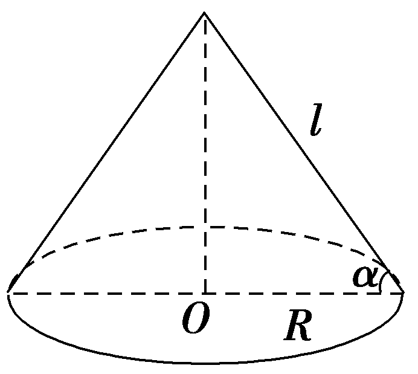

2.我国古代数学名著《九章算术》中，将底面是直角三角形的直三棱柱称为“堑堵”.在如图所示的“堑堵”中，<em>AC</em>＝<em>CB</em>＝<em>CC</em>1，则二面角<em>C</em>1-<em>AB</em>-<em>C</em>的正切值为(　　)

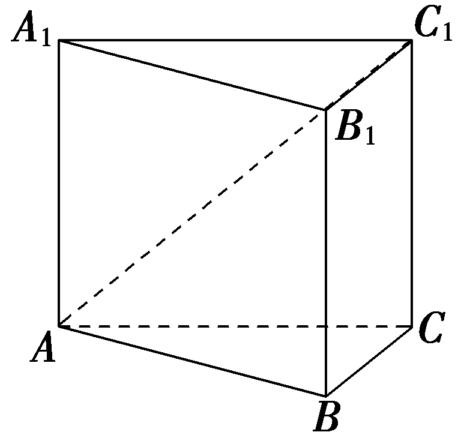

A.1	B.2

C. $\frac{\sqrt{2}}{2}$ 	D. $\sqrt{2}$

答案：**D**

解析：由&lt;text style="it&lt;text style="it<em>a</em>lic"&gt;a&lt;/text&gt;lic"&gt;<em>A&lt;text style="italic"&gt;&lt;text style="italic"&gt;&lt;text style="italic"&gt;&lt;text style="italic"&gt;&lt;text style="italic"&gt;C</em>&lt;/text&gt;&lt;/text&gt;&lt;/text&gt;&lt;/text&gt;&lt;/text&gt;&lt;/text&gt;＝<em>&lt;text style="italic"&gt;&lt;text style="italic"&gt;CB</em>&lt;/text&gt;&lt;/text&gt;知，<em>AC</em>⊥CB，取<em>&lt;text style="italic"&gt;AB</em>&lt;/text&gt;的中点<em>&lt;text style="italic"&gt;M</em>&lt;/text&gt;，连接C&lt;text style="subscript"&gt;&lt;text style="subscript"&gt;&lt;text style="subscript"&gt;&lt;text style="subscript"&gt;1&lt;/text&gt;&lt;/text&gt;&lt;/text&gt;&lt;/text&gt;M，<em>&lt;text style="italic"&gt;CM</em>&lt;/text&gt;，由条件，可知∠C1<em>&lt;text style="italic"&gt;MC</em>&lt;/text&gt;即为二面角C1-AB-C的平面角，设AC＝CB＝<em>CC</em>1＝a，则CM＝ $\frac{\sqrt{2}}{2}$ &lt;text style="it<em>a</em>lic"&gt;a&lt;/text&gt;，所以tan∠<em>&lt;text style="italic"&gt;&lt;text style="italic"&gt;&lt;text style="italic"&gt;&lt;text style="italic"&gt;C</em>&lt;/text&gt;&lt;/text&gt;&lt;/text&gt;&lt;/text&gt;&lt;text style="subscript"&gt;&lt;text style="subscript"&gt;&lt;text style="subscript"&gt;&lt;text style="subscript"&gt;1&lt;/text&gt;&lt;/text&gt;&lt;/text&gt;&lt;/text&gt;<em>&lt;text style="italic"&gt;M</em>&lt;/text&gt;C＝ $\frac{CC_{1}}{CM}$ ＝ $\sqrt{2}$ .故选D.

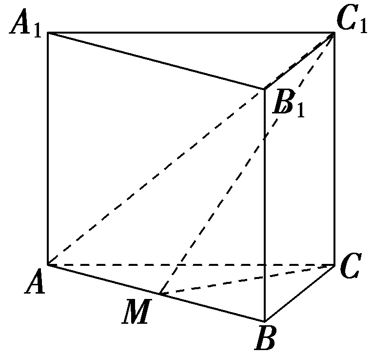

3.在《九章算术》中，将底面为长方形且有一条侧棱与底面垂直的四棱锥称之为阳马.已知在阳马*P*-*ABCD*中，侧棱*PA*⊥底面*ABCD*，且*PA*＝*AB*＝*AD*＝1，则直线*PD*与平面*PAC*所成角的正弦值等于(　　)

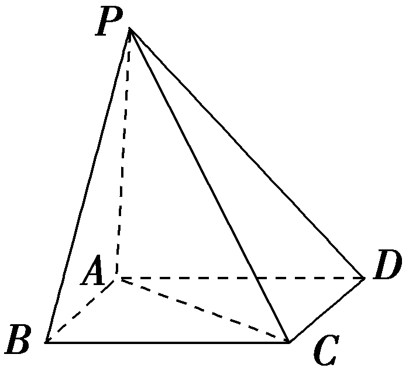

A. $\frac{1}{2}$ 	B. $\frac{\sqrt{3}}{3}$

C. $\frac{\sqrt{3}}{2}$ 	D. $\frac{\sqrt{6}}{2}$

答案：**A**

解析：如图，在正方形*<text style="italic"><text style="italic"><text style="italic">A*BCD</text></text></text>中，连接*BD*交*<text style="italic"><text style="italic"><text style="italic">AC*</text></text></text>于*O*，则*<text style="italic"><text style="italic"><text style="italic"><text style="italic">DO*</text></text></text></text>⊥AC，连接*PO*.因为*<text style="italic"><text style="italic"><text style="italic"><text style="italic"><text style="italic">PA*</text></text></text></text></text>⊥平面ABCD，DO⊂平面ABCD，所以PA⊥DO，而PA∩AC＝A，PA，AC⊂平面*<text style="italic"><text style="italic"><text style="italic">PAC*</text></text></text>，所以DO⊥平面PAC，于是∠*<text style="italic">DPO*</text>是直线*<text style="italic"><text style="italic">PD*</text></text>与平面PAC所成的角.因为PA＝*<text style="italic">AD*</text>＝1，易知PA⊥AD，所以PD＝ $\sqrt{1^{2}＋1^{2}}$ ＝ $\sqrt{2}$ ，易知D*O*＝ $\frac{1}{2}$ *DB*＝ $\frac{1}{2}\sqrt{1^{2}＋1^{2}}$ ＝ $\frac{\sqrt{2}}{2}$ ，所以sin∠DP*O*＝ $\frac{DO}{PD}$ ＝ $\frac{1}{2}$ ，即直线*<text style="italic"><text style="italic">PD*</text></text>与平面P*<text style="italic"><text style="italic"><text style="italic">A*C</text></text></text>所成角的正弦值为 $\frac{1}{2}$ .故选*A*.

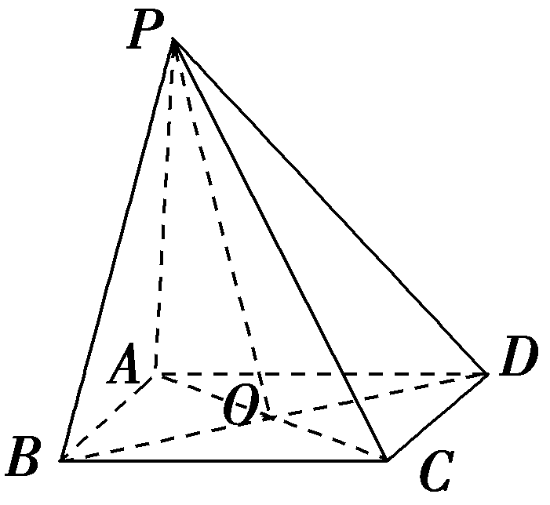

4.如图所示，在长方体<em>ABCD</em> -<em>A</em>1<em>B</em>1<em>C</em>1<em>D</em>1中，<em>AD</em>＝<em>AA</em>1＝2，<em>AB</em>＝4，点<em>E</em>是棱<em>AB</em>的中点，则点<em>E</em>到平面<em>ACD</em>1的距离为(　　)

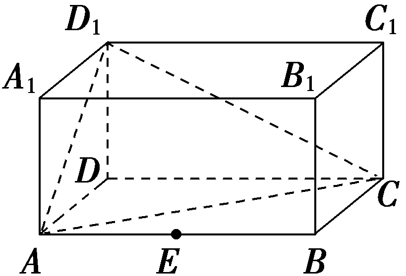

A.1	B. $\frac{2}{3}$

C. $\frac{4}{3}$ 	D. $\sqrt{2}$

答案：**B**

解析：设点<em>&lt;text style="italic"&gt;&lt;text style="italic"&gt;&lt;text style="italic"&gt;E</em>&lt;/text&gt;&lt;/text&gt;&lt;/text&gt;到平面<em>&lt;text style="italic"&gt;&lt;text style="italic"&gt;&lt;text style="italic"&gt;&lt;text style="italic"&gt;&lt;text style="italic"&gt;ACD</em>&lt;/text&gt;&lt;/text&gt;&lt;/text&gt;&lt;/text&gt;&lt;/text&gt;&lt;text style="subscript"&gt;&lt;text style="subscript"&gt;&lt;text style="subscript"&gt;&lt;text style="subscript"&gt;&lt;text style="subscript"&gt;&lt;text style="subscript"&gt;&lt;text style="subscript"&gt;&lt;text style="subscript"&gt;&lt;text style="subscript"&gt;&lt;text style="subscript"&gt;&lt;text style="subscript"&gt;1&lt;/text&gt;&lt;/text&gt;&lt;/text&gt;&lt;/text&gt;&lt;/text&gt;&lt;/text&gt;&lt;/text&gt;&lt;/text&gt;&lt;/text&gt;&lt;/text&gt;&lt;/text&gt;的距离为<em>&lt;text style="italic"&gt;&lt;text style="italic"&gt;&lt;text style="italic"&gt;h</em>&lt;/text&gt;&lt;/text&gt;&lt;/text&gt;，因为点E是棱<em>A&lt;text style="italic"&gt;&lt;text style="italic"&gt;B</em>&lt;/text&gt;&lt;/text&gt;的中点，所以点E到平面<em>&lt;text style="italic,subscript"&gt;&lt;text style="italic,subscript"&gt;&lt;text style="italic"&gt;A&lt;text style="italic"&gt;CD</em>&lt;/text&gt;&lt;/text&gt;&lt;/text&gt;&lt;/text&gt;1的距离等于点B到平面<em>ACD</em>1的距离的一半，又平面ACD1过<em>BD</em>的中点，所以点B到平面ACD1的距离等于点D到平面ACD1的距离，由等体积法 $V_{D -ACD_{1}}$ ＝ $V_{D_{1}-ACD}$ ，得 $\frac{1}{3}S_{\bigtriangleup ACD_{1}}$ <em>·</em>2<em>&lt;text style="italic"&gt;&lt;text style="italic"&gt;&lt;text style="italic"&gt;h</em>&lt;/text&gt;&lt;/text&gt;&lt;/text&gt;＝ $\frac{1}{3}$ <em>&lt;text style="italic"&gt;S</em>&lt;/text&gt;&lt;text style="subscript"&gt;△&lt;/text&gt;<em>&lt;text style="italic"&gt;&lt;text style="italic"&gt;&lt;text style="italic"&gt;&lt;text style="italic"&gt;&lt;text style="italic"&gt;ACD</em>&lt;/text&gt;&lt;/text&gt;&lt;/text&gt;&lt;/text&gt;&lt;/text&gt;<em>·DD</em>&lt;text style="subscript"&gt;&lt;text style="subscript"&gt;&lt;text style="subscript"&gt;&lt;text style="subscript"&gt;&lt;text style="subscript"&gt;&lt;text style="subscript"&gt;&lt;text style="subscript"&gt;&lt;text style="subscript"&gt;&lt;text style="subscript"&gt;&lt;text style="subscript"&gt;&lt;text style="subscript"&gt;1&lt;/text&gt;&lt;/text&gt;&lt;/text&gt;&lt;/text&gt;&lt;/text&gt;&lt;/text&gt;&lt;/text&gt;&lt;/text&gt;&lt;/text&gt;&lt;/text&gt;&lt;/text&gt;，因为S△<em>&lt;text style="italic,subscript"&gt;&lt;text style="italic,subscript"&gt;&lt;text style="italic"&gt;A&lt;text style="italic"&gt;CD</em>&lt;/text&gt;&lt;/text&gt;&lt;/text&gt;&lt;/text&gt;＝ $\frac{1}{2}$ ×2×4＝4，<em>D</em>D&lt;text style="subscript"&gt;&lt;text style="subscript"&gt;&lt;text style="subscript"&gt;&lt;text style="subscript"&gt;&lt;text style="subscript"&gt;&lt;text style="subscript"&gt;&lt;text style="subscript"&gt;&lt;text style="subscript"&gt;&lt;text style="subscript"&gt;&lt;text style="subscript"&gt;&lt;text style="subscript"&gt;1&lt;/text&gt;&lt;/text&gt;&lt;/text&gt;&lt;/text&gt;&lt;/text&gt;&lt;/text&gt;&lt;/text&gt;&lt;/text&gt;&lt;/text&gt;&lt;/text&gt;&lt;/text&gt;＝2，在&lt;text style="subscript"&gt;△&lt;/text&gt;<em>&lt;text style="italic"&gt;&lt;text style="italic"&gt;&lt;text style="italic"&gt;&lt;text style="italic"&gt;&lt;text style="italic"&gt;&lt;text style="italic,subscript"&gt;&lt;text style="italic,subscript"&gt;&lt;text style="italic"&gt;&lt;text style="italic"&gt;AC</em>D&lt;/text&gt;&lt;/text&gt;&lt;/text&gt;&lt;/text&gt;&lt;/text&gt;&lt;/text&gt;&lt;/text&gt;&lt;/text&gt;&lt;/text&gt;1中，<em>AD</em>1＝2 $\sqrt{2}$ ，<em>AC</em>＝C<em>D</em>&lt;text style="subscript"&gt;&lt;text style="subscript"&gt;&lt;text style="subscript"&gt;&lt;text style="subscript"&gt;&lt;text style="subscript"&gt;&lt;text style="subscript"&gt;&lt;text style="subscript"&gt;&lt;text style="subscript"&gt;&lt;text style="subscript"&gt;&lt;text style="subscript"&gt;&lt;text style="subscript"&gt;1&lt;/text&gt;&lt;/text&gt;&lt;/text&gt;&lt;/text&gt;&lt;/text&gt;&lt;/text&gt;&lt;/text&gt;&lt;/text&gt;&lt;/text&gt;&lt;/text&gt;&lt;/text&gt;＝2 $\sqrt{5}$ ，所以 $S_{\bigtriangleup ACD_{1}}$ ＝ $\frac{1}{2}$ ×2 $\sqrt{2}$ × $\sqrt{\left(2\sqrt{5}\right)^{2}－\left(\sqrt{2}\right)^{2}}$ ＝6，则 $\frac{1}{3}$ ×6×2<em>&lt;text style="italic"&gt;&lt;text style="italic"&gt;&lt;text style="italic"&gt;h</em>&lt;/text&gt;&lt;/text&gt;&lt;/text&gt;＝ $\frac{1}{3}$ ×4×2，解得<em>&lt;text style="italic"&gt;&lt;text style="italic"&gt;&lt;text style="italic"&gt;h</em>&lt;/text&gt;&lt;/text&gt;&lt;/text&gt;＝ $\frac{2}{3}$ ，即点<em>&lt;text style="italic"&gt;&lt;text style="italic"&gt;&lt;text style="italic"&gt;E</em>&lt;/text&gt;&lt;/text&gt;&lt;/text&gt;到平面<em>&lt;text style="italic"&gt;&lt;text style="italic"&gt;&lt;text style="italic"&gt;&lt;text style="italic"&gt;&lt;text style="italic"&gt;ACD</em>&lt;/text&gt;&lt;/text&gt;&lt;/text&gt;&lt;/text&gt;&lt;/text&gt;&lt;text style="subscript"&gt;&lt;text style="subscript"&gt;&lt;text style="subscript"&gt;&lt;text style="subscript"&gt;&lt;text style="subscript"&gt;&lt;text style="subscript"&gt;&lt;text style="subscript"&gt;&lt;text style="subscript"&gt;&lt;text style="subscript"&gt;&lt;text style="subscript"&gt;&lt;text style="subscript"&gt;1&lt;/text&gt;&lt;/text&gt;&lt;/text&gt;&lt;/text&gt;&lt;/text&gt;&lt;/text&gt;&lt;/text&gt;&lt;/text&gt;&lt;/text&gt;&lt;/text&gt;&lt;/text&gt;的距离为 $\frac{2}{3}$ .故选<em>&lt;text style="italic"&gt;B</em>&lt;/text&gt;.

5.(多选)(2025·湖北武汉调研)如图所示，在棱长为1的正方体<em>ABCD</em> -<em>A</em>1<em>B</em>1<em>C</em>1<em>D</em>1中，<em>O</em>为<em>BD</em>的中点，则下列结论正确的是(　　)

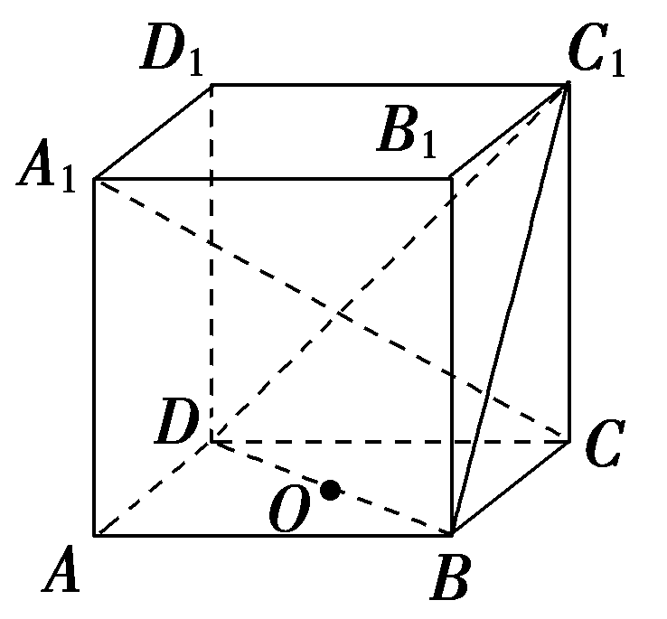

A.<em>A</em>1<em>C</em>⊥平面<em>C</em>1<em>BD</em>

B.直线<em>A</em>&lt;text style="subscript"&gt;&lt;text style="subscript"&gt;&lt;text style="subscript"&gt;1&lt;/text&gt;&lt;/text&gt;&lt;/text&gt;<em>C</em>1与平面<em>ABC</em>1<em>D</em>1所成的角为 $\frac{\pi }{6}$

<em>&lt;text style="italic"&gt;C</em>&lt;/text&gt;.二面角C1-<em>BD</em> -C的正切值为 $\sqrt{2}$

D.<em>B</em>&lt;text style="subscript"&gt;1&lt;/text&gt;到平面<em>C</em>1<em>BD</em>的距离为 $\frac{\sqrt{2}}{2}$

答案：**ABC**

解析：由正方体的性质可得<em>&lt;text style="italic"&gt;&lt;text style="italic"&gt;&lt;text style="italic"&gt;&lt;text style="italic"&gt;&lt;text style="italic"&gt;B</em>&lt;/text&gt;&lt;/text&gt;&lt;/text&gt;<em>&lt;text style="italic"&gt;&lt;text style="italic"&gt;&lt;text style="italic"&gt;&lt;text style="italic"&gt;D</em>&lt;/text&gt;&lt;/text&gt;&lt;/text&gt;&lt;/text&gt;&lt;/text&gt;&lt;/text&gt;⊥平面<em>&lt;text style="italic"&gt;&lt;text style="italic"&gt;&lt;text style="italic"&gt;&lt;text style="italic"&gt;&lt;text style="italic"&gt;&lt;text style="italic"&gt;&lt;text style="italic"&gt;&lt;text style="italic"&gt;&lt;text style="italic"&gt;&lt;text style="italic"&gt;&lt;text style="italic"&gt;&lt;text style="italic"&gt;&lt;text style="italic"&gt;&lt;text style="italic"&gt;A</em>&lt;/text&gt;&lt;/text&gt;&lt;/text&gt;&lt;/text&gt;&lt;/text&gt;&lt;/text&gt;&lt;/text&gt;&lt;/text&gt;&lt;/text&gt;&lt;/text&gt;&lt;/text&gt;&lt;/text&gt;&lt;/text&gt;<em>&lt;text style="italic"&gt;&lt;text style="italic"&gt;&lt;text style="italic"&gt;&lt;text style="italic"&gt;&lt;text style="italic"&gt;&lt;text style="italic"&gt;&lt;text style="italic"&gt;&lt;text style="italic"&gt;&lt;text style="italic"&gt;&lt;text style="italic"&gt;&lt;text style="italic"&gt;&lt;text style="italic"&gt;&lt;text style="italic"&gt;C</em>&lt;/text&gt;&lt;/text&gt;&lt;/text&gt;&lt;/text&gt;&lt;/text&gt;&lt;/text&gt;&lt;/text&gt;&lt;/text&gt;&lt;/text&gt;&lt;/text&gt;&lt;/text&gt;&lt;/text&gt;&lt;/text&gt;C&lt;/text&gt;&lt;text style="subscript"&gt;&lt;text style="subscript"&gt;&lt;text style="subscript"&gt;&lt;text style="subscript"&gt;&lt;text style="subscript"&gt;&lt;text style="subscript"&gt;&lt;text style="subscript"&gt;&lt;text style="subscript"&gt;&lt;text style="subscript"&gt;&lt;text style="subscript"&gt;&lt;text style="subscript"&gt;&lt;text style="subscript"&gt;&lt;text style="subscript"&gt;&lt;text style="subscript"&gt;&lt;text style="subscript"&gt;&lt;text style="subscript"&gt;&lt;text style="subscript"&gt;&lt;text style="subscript"&gt;&lt;text style="subscript"&gt;&lt;text style="subscript"&gt;&lt;text style="subscript"&gt;&lt;text style="subscript"&gt;&lt;text style="subscript"&gt;&lt;text style="subscript"&gt;&lt;text style="subscript"&gt;&lt;text style="subscript"&gt;&lt;text style="subscript"&gt;&lt;text style="subscript"&gt;&lt;text style="subscript"&gt;&lt;text style="subscript"&gt;&lt;text style="subscript"&gt;&lt;text style="subscript"&gt;&lt;text style="subscript"&gt;&lt;text style="subscript"&gt;&lt;text style="subscript"&gt;&lt;text style="subscript"&gt;&lt;text style="subscript"&gt;1&lt;/text&gt;&lt;/text&gt;&lt;/text&gt;&lt;/text&gt;&lt;/text&gt;&lt;/text&gt;&lt;/text&gt;&lt;/text&gt;&lt;/text&gt;&lt;/text&gt;&lt;/text&gt;&lt;/text&gt;&lt;/text&gt;&lt;/text&gt;&lt;/text&gt;&lt;/text&gt;&lt;/text&gt;&lt;/text&gt;&lt;/text&gt;&lt;/text&gt;&lt;/text&gt;&lt;/text&gt;&lt;/text&gt;&lt;/text&gt;&lt;/text&gt;&lt;/text&gt;&lt;/text&gt;&lt;/text&gt;&lt;/text&gt;&lt;/text&gt;&lt;/text&gt;&lt;/text&gt;&lt;/text&gt;&lt;/text&gt;&lt;/text&gt;&lt;/text&gt;&lt;/text&gt;A1，A1C⊂平面<em>ACC</em>1A1，故A1C⊥<em>&lt;text style="italic"&gt;&lt;text style="italic"&gt;&lt;text style="italic"&gt;&lt;text style="italic"&gt;&lt;text style="italic"&gt;BD</em>&lt;/text&gt;&lt;/text&gt;&lt;/text&gt;&lt;/text&gt;&lt;/text&gt;，由<em>&lt;text style="italic"&gt;&lt;text style="italic"&gt;&lt;text style="italic"&gt;BC</em>&lt;/text&gt;&lt;/text&gt;&lt;/text&gt;1⊥平面A1B1<em>&lt;text style="italic"&gt;CD</em>&lt;/text&gt;，A1C⊂平面A1B1CD，故A1C⊥BC1，BD∩BC1＝B，且BD，BC1⊂平面C1BD，故A1C⊥平面C1BD，故A正确；因为正方体的棱长为1，设直线A1C1与平面<em>&lt;text style="italic"&gt;&lt;text style="italic"&gt;ABC</em>&lt;/text&gt;&lt;/text&gt;1D1的夹角为<em>&lt;text style="italic"&gt;&lt;text style="italic"&gt;θ</em>&lt;/text&gt;&lt;/text&gt;，则A1C1＝ $\sqrt{2}$ ，易知<em>&lt;text style="italic"&gt;&lt;text style="italic"&gt;&lt;text style="italic"&gt;&lt;text style="italic"&gt;&lt;text style="italic"&gt;&lt;text style="italic"&gt;&lt;text style="italic"&gt;&lt;text style="italic"&gt;&lt;text style="italic"&gt;&lt;text style="italic"&gt;&lt;text style="italic"&gt;&lt;text style="italic"&gt;&lt;text style="italic"&gt;A</em>&lt;/text&gt;&lt;/text&gt;&lt;/text&gt;&lt;/text&gt;&lt;/text&gt;&lt;/text&gt;&lt;/text&gt;&lt;/text&gt;&lt;/text&gt;&lt;/text&gt;&lt;/text&gt;&lt;/text&gt;&lt;/text&gt;&lt;text style="subscript"&gt;&lt;text style="subscript"&gt;&lt;text style="subscript"&gt;&lt;text style="subscript"&gt;&lt;text style="subscript"&gt;&lt;text style="subscript"&gt;&lt;text style="subscript"&gt;&lt;text style="subscript"&gt;&lt;text style="subscript"&gt;&lt;text style="subscript"&gt;&lt;text style="subscript"&gt;&lt;text style="subscript"&gt;&lt;text style="subscript"&gt;&lt;text style="subscript"&gt;&lt;text style="subscript"&gt;&lt;text style="subscript"&gt;&lt;text style="subscript"&gt;&lt;text style="subscript"&gt;&lt;text style="subscript"&gt;&lt;text style="subscript"&gt;&lt;text style="subscript"&gt;&lt;text style="subscript"&gt;&lt;text style="subscript"&gt;&lt;text style="subscript"&gt;&lt;text style="subscript"&gt;&lt;text style="subscript"&gt;&lt;text style="subscript"&gt;&lt;text style="subscript"&gt;&lt;text style="subscript"&gt;&lt;text style="subscript"&gt;&lt;text style="subscript"&gt;&lt;text style="subscript"&gt;&lt;text style="subscript"&gt;&lt;text style="subscript"&gt;&lt;text style="subscript"&gt;&lt;text style="subscript"&gt;&lt;text style="subscript"&gt;1&lt;/text&gt;&lt;/text&gt;&lt;/text&gt;&lt;/text&gt;&lt;/text&gt;&lt;/text&gt;&lt;/text&gt;&lt;/text&gt;&lt;/text&gt;&lt;/text&gt;&lt;/text&gt;&lt;/text&gt;&lt;/text&gt;&lt;/text&gt;&lt;/text&gt;&lt;/text&gt;&lt;/text&gt;&lt;/text&gt;&lt;/text&gt;&lt;/text&gt;&lt;/text&gt;&lt;/text&gt;&lt;/text&gt;&lt;/text&gt;&lt;/text&gt;&lt;/text&gt;&lt;/text&gt;&lt;/text&gt;&lt;/text&gt;&lt;/text&gt;&lt;/text&gt;&lt;/text&gt;&lt;/text&gt;&lt;/text&gt;&lt;/text&gt;&lt;/text&gt;&lt;/text&gt;<em>&lt;text style="italic"&gt;&lt;text style="italic"&gt;&lt;text style="italic"&gt;&lt;text style="italic"&gt;D</em>&lt;/text&gt;&lt;/text&gt;&lt;/text&gt;&lt;/text&gt;⊥平面A<em>&lt;text style="italic"&gt;&lt;text style="italic"&gt;&lt;text style="italic"&gt;B</em>&lt;/text&gt;&lt;/text&gt;&lt;/text&gt;<em>&lt;text style="italic"&gt;&lt;text style="italic"&gt;&lt;text style="italic"&gt;&lt;text style="italic"&gt;&lt;text style="italic"&gt;&lt;text style="italic"&gt;&lt;text style="italic"&gt;&lt;text style="italic"&gt;&lt;text style="italic"&gt;&lt;text style="italic"&gt;&lt;text style="italic"&gt;&lt;text style="italic"&gt;&lt;text style="italic"&gt;C</em>&lt;/text&gt;&lt;/text&gt;&lt;/text&gt;&lt;/text&gt;&lt;/text&gt;&lt;/text&gt;&lt;/text&gt;&lt;/text&gt;&lt;/text&gt;&lt;/text&gt;&lt;/text&gt;&lt;/text&gt;&lt;/text&gt;1D1，所以点A1到平面A<em>&lt;text style="italic"&gt;&lt;text style="italic"&gt;&lt;text style="italic"&gt;BC</em>&lt;/text&gt;&lt;/text&gt;&lt;/text&gt;1D1的距离为 $\frac{1}{2}$ <em>&lt;text style="italic"&gt;&lt;text style="italic"&gt;&lt;text style="italic"&gt;&lt;text style="italic"&gt;&lt;text style="italic"&gt;&lt;text style="italic"&gt;&lt;text style="italic"&gt;&lt;text style="italic"&gt;&lt;text style="italic"&gt;&lt;text style="italic"&gt;&lt;text style="italic"&gt;&lt;text style="italic"&gt;&lt;text style="italic"&gt;A</em>&lt;/text&gt;&lt;/text&gt;&lt;/text&gt;&lt;/text&gt;&lt;/text&gt;&lt;/text&gt;&lt;/text&gt;&lt;/text&gt;&lt;/text&gt;&lt;/text&gt;&lt;/text&gt;&lt;/text&gt;&lt;/text&gt;&lt;text style="subscript"&gt;&lt;text style="subscript"&gt;&lt;text style="subscript"&gt;&lt;text style="subscript"&gt;&lt;text style="subscript"&gt;&lt;text style="subscript"&gt;&lt;text style="subscript"&gt;&lt;text style="subscript"&gt;&lt;text style="subscript"&gt;&lt;text style="subscript"&gt;&lt;text style="subscript"&gt;&lt;text style="subscript"&gt;&lt;text style="subscript"&gt;&lt;text style="subscript"&gt;&lt;text style="subscript"&gt;&lt;text style="subscript"&gt;&lt;text style="subscript"&gt;&lt;text style="subscript"&gt;&lt;text style="subscript"&gt;&lt;text style="subscript"&gt;&lt;text style="subscript"&gt;&lt;text style="subscript"&gt;&lt;text style="subscript"&gt;&lt;text style="subscript"&gt;&lt;text style="subscript"&gt;&lt;text style="subscript"&gt;&lt;text style="subscript"&gt;&lt;text style="subscript"&gt;&lt;text style="subscript"&gt;&lt;text style="subscript"&gt;&lt;text style="subscript"&gt;&lt;text style="subscript"&gt;&lt;text style="subscript"&gt;&lt;text style="subscript"&gt;&lt;text style="subscript"&gt;&lt;text style="subscript"&gt;&lt;text style="subscript"&gt;1&lt;/text&gt;&lt;/text&gt;&lt;/text&gt;&lt;/text&gt;&lt;/text&gt;&lt;/text&gt;&lt;/text&gt;&lt;/text&gt;&lt;/text&gt;&lt;/text&gt;&lt;/text&gt;&lt;/text&gt;&lt;/text&gt;&lt;/text&gt;&lt;/text&gt;&lt;/text&gt;&lt;/text&gt;&lt;/text&gt;&lt;/text&gt;&lt;/text&gt;&lt;/text&gt;&lt;/text&gt;&lt;/text&gt;&lt;/text&gt;&lt;/text&gt;&lt;/text&gt;&lt;/text&gt;&lt;/text&gt;&lt;/text&gt;&lt;/text&gt;&lt;/text&gt;&lt;/text&gt;&lt;/text&gt;&lt;/text&gt;&lt;/text&gt;&lt;/text&gt;&lt;/text&gt;<em>&lt;text style="italic"&gt;&lt;text style="italic"&gt;&lt;text style="italic"&gt;&lt;text style="italic"&gt;D</em>&lt;/text&gt;&lt;/text&gt;&lt;/text&gt;&lt;/text&gt;＝ $\frac{\sqrt{2}}{2}$ ，故sin <em>&lt;text style="italic"&gt;&lt;text style="italic"&gt;θ</em>&lt;/text&gt;&lt;/text&gt;＝ $\frac{1}{2}$ ，所以<em>&lt;text style="italic"&gt;&lt;text style="italic"&gt;θ</em>&lt;/text&gt;&lt;/text&gt;＝ $\frac{\pi }{6}$ ，故<em>&lt;text style="italic"&gt;&lt;text style="italic"&gt;&lt;text style="italic"&gt;B</em>&lt;/text&gt;&lt;/text&gt;&lt;/text&gt;正确；连接<em>&lt;text style="italic"&gt;&lt;text style="italic"&gt;&lt;text style="italic"&gt;&lt;text style="italic"&gt;&lt;text style="italic"&gt;&lt;text style="italic"&gt;&lt;text style="italic"&gt;&lt;text style="italic"&gt;&lt;text style="italic"&gt;&lt;text style="italic"&gt;&lt;text style="italic"&gt;&lt;text style="italic"&gt;&lt;text style="italic"&gt;C</em>&lt;/text&gt;&lt;/text&gt;&lt;/text&gt;&lt;/text&gt;&lt;/text&gt;&lt;/text&gt;&lt;/text&gt;&lt;/text&gt;&lt;/text&gt;&lt;/text&gt;&lt;/text&gt;&lt;/text&gt;&lt;/text&gt;O，<em>&lt;text style="italic"&gt;&lt;text style="italic"&gt;OC</em>&lt;/text&gt;&lt;/text&gt;&lt;text style="subscript"&gt;&lt;text style="subscript"&gt;&lt;text style="subscript"&gt;&lt;text style="subscript"&gt;&lt;text style="subscript"&gt;&lt;text style="subscript"&gt;&lt;text style="subscript"&gt;&lt;text style="subscript"&gt;&lt;text style="subscript"&gt;&lt;text style="subscript"&gt;&lt;text style="subscript"&gt;&lt;text style="subscript"&gt;&lt;text style="subscript"&gt;&lt;text style="subscript"&gt;&lt;text style="subscript"&gt;&lt;text style="subscript"&gt;&lt;text style="subscript"&gt;&lt;text style="subscript"&gt;&lt;text style="subscript"&gt;&lt;text style="subscript"&gt;&lt;text style="subscript"&gt;&lt;text style="subscript"&gt;&lt;text style="subscript"&gt;&lt;text style="subscript"&gt;&lt;text style="subscript"&gt;&lt;text style="subscript"&gt;&lt;text style="subscript"&gt;&lt;text style="subscript"&gt;&lt;text style="subscript"&gt;&lt;text style="subscript"&gt;&lt;text style="subscript"&gt;&lt;text style="subscript"&gt;&lt;text style="subscript"&gt;&lt;text style="subscript"&gt;&lt;text style="subscript"&gt;&lt;text style="subscript"&gt;&lt;text style="subscript"&gt;1&lt;/text&gt;&lt;/text&gt;&lt;/text&gt;&lt;/text&gt;&lt;/text&gt;&lt;/text&gt;&lt;/text&gt;&lt;/text&gt;&lt;/text&gt;&lt;/text&gt;&lt;/text&gt;&lt;/text&gt;&lt;/text&gt;&lt;/text&gt;&lt;/text&gt;&lt;/text&gt;&lt;/text&gt;&lt;/text&gt;&lt;/text&gt;&lt;/text&gt;&lt;/text&gt;&lt;/text&gt;&lt;/text&gt;&lt;/text&gt;&lt;/text&gt;&lt;/text&gt;&lt;/text&gt;&lt;/text&gt;&lt;/text&gt;&lt;/text&gt;&lt;/text&gt;&lt;/text&gt;&lt;/text&gt;&lt;/text&gt;&lt;/text&gt;&lt;/text&gt;&lt;/text&gt;(图略)，则∠C1OC为二面角C1-<em>&lt;text style="italic"&gt;&lt;text style="italic"&gt;&lt;text style="italic"&gt;&lt;text style="italic"&gt;&lt;text style="italic"&gt;B&lt;text style="italic"&gt;&lt;text style="italic"&gt;&lt;text style="italic"&gt;&lt;text style="italic"&gt;&lt;text style="italic"&gt;D</em>&lt;/text&gt;&lt;/text&gt;&lt;/text&gt;&lt;/text&gt;&lt;/text&gt;&lt;/text&gt;&lt;/text&gt;&lt;/text&gt;&lt;/text&gt;&lt;/text&gt; -C的平面角，则tan∠C1OC＝ $\frac{CC_{1}}{OC}$ ＝ $\sqrt{2}$ ，故<em>&lt;text style="italic"&gt;&lt;text style="italic"&gt;&lt;text style="italic"&gt;&lt;text style="italic"&gt;&lt;text style="italic"&gt;&lt;text style="italic"&gt;&lt;text style="italic"&gt;&lt;text style="italic"&gt;&lt;text style="italic"&gt;&lt;text style="italic"&gt;&lt;text style="italic"&gt;&lt;text style="italic"&gt;&lt;text style="italic"&gt;C</em>&lt;/text&gt;&lt;/text&gt;&lt;/text&gt;&lt;/text&gt;&lt;/text&gt;&lt;/text&gt;&lt;/text&gt;&lt;/text&gt;&lt;/text&gt;&lt;/text&gt;&lt;/text&gt;&lt;/text&gt;&lt;/text&gt;正确；设<em>&lt;text style="italic"&gt;&lt;text style="italic"&gt;&lt;text style="italic"&gt;B</em>&lt;/text&gt;&lt;/text&gt;&lt;/text&gt;&lt;text style="subscript"&gt;&lt;text style="subscript"&gt;&lt;text style="subscript"&gt;&lt;text style="subscript"&gt;&lt;text style="subscript"&gt;&lt;text style="subscript"&gt;&lt;text style="subscript"&gt;&lt;text style="subscript"&gt;&lt;text style="subscript"&gt;&lt;text style="subscript"&gt;&lt;text style="subscript"&gt;&lt;text style="subscript"&gt;&lt;text style="subscript"&gt;&lt;text style="subscript"&gt;&lt;text style="subscript"&gt;&lt;text style="subscript"&gt;&lt;text style="subscript"&gt;&lt;text style="subscript"&gt;&lt;text style="subscript"&gt;&lt;text style="subscript"&gt;&lt;text style="subscript"&gt;&lt;text style="subscript"&gt;&lt;text style="subscript"&gt;&lt;text style="subscript"&gt;&lt;text style="subscript"&gt;&lt;text style="subscript"&gt;&lt;text style="subscript"&gt;&lt;text style="subscript"&gt;&lt;text style="subscript"&gt;&lt;text style="subscript"&gt;&lt;text style="subscript"&gt;&lt;text style="subscript"&gt;&lt;text style="subscript"&gt;&lt;text style="subscript"&gt;&lt;text style="subscript"&gt;&lt;text style="subscript"&gt;&lt;text style="subscript"&gt;1&lt;/text&gt;&lt;/text&gt;&lt;/text&gt;&lt;/text&gt;&lt;/text&gt;&lt;/text&gt;&lt;/text&gt;&lt;/text&gt;&lt;/text&gt;&lt;/text&gt;&lt;/text&gt;&lt;/text&gt;&lt;/text&gt;&lt;/text&gt;&lt;/text&gt;&lt;/text&gt;&lt;/text&gt;&lt;/text&gt;&lt;/text&gt;&lt;/text&gt;&lt;/text&gt;&lt;/text&gt;&lt;/text&gt;&lt;/text&gt;&lt;/text&gt;&lt;/text&gt;&lt;/text&gt;&lt;/text&gt;&lt;/text&gt;&lt;/text&gt;&lt;/text&gt;&lt;/text&gt;&lt;/text&gt;&lt;/text&gt;&lt;/text&gt;&lt;/text&gt;&lt;/text&gt;到平面C1<em>&lt;text style="italic"&gt;&lt;text style="italic"&gt;&lt;text style="italic"&gt;&lt;text style="italic"&gt;&lt;text style="italic"&gt;B&lt;text style="italic"&gt;&lt;text style="italic"&gt;&lt;text style="italic"&gt;&lt;text style="italic"&gt;&lt;text style="italic"&gt;D</em>&lt;/text&gt;&lt;/text&gt;&lt;/text&gt;&lt;/text&gt;&lt;/text&gt;&lt;/text&gt;&lt;/text&gt;&lt;/text&gt;&lt;/text&gt;&lt;/text&gt;的距离为<em>&lt;text style="italic"&gt;&lt;text style="italic"&gt;h</em>&lt;/text&gt;&lt;/text&gt;，因为 $V_{B_{1}-C_{1}BD}$ ＝ $V_{D -C_{1}BB_{1}}$ ，所以 $\frac{1}{3}$ × $\frac{1}{2}$ × $\sqrt{2}$ × $\sqrt{2}$ × $\frac{\sqrt{3}}{2}$ ×<em>&lt;text style="italic"&gt;&lt;text style="italic"&gt;h</em>&lt;/text&gt;&lt;/text&gt;＝ $\frac{1}{3}$ × $\frac{1}{2}$ ×&lt;text style="subscript"&gt;&lt;text style="subscript"&gt;&lt;text style="subscript"&gt;&lt;text style="subscript"&gt;&lt;text style="subscript"&gt;&lt;text style="subscript"&gt;&lt;text style="subscript"&gt;&lt;text style="subscript"&gt;&lt;text style="subscript"&gt;&lt;text style="subscript"&gt;&lt;text style="subscript"&gt;&lt;text style="subscript"&gt;&lt;text style="subscript"&gt;&lt;text style="subscript"&gt;&lt;text style="subscript"&gt;&lt;text style="subscript"&gt;&lt;text style="subscript"&gt;&lt;text style="subscript"&gt;&lt;text style="subscript"&gt;&lt;text style="subscript"&gt;&lt;text style="subscript"&gt;&lt;text style="subscript"&gt;&lt;text style="subscript"&gt;&lt;text style="subscript"&gt;&lt;text style="subscript"&gt;&lt;text style="subscript"&gt;&lt;text style="subscript"&gt;&lt;text style="subscript"&gt;&lt;text style="subscript"&gt;&lt;text style="subscript"&gt;&lt;text style="subscript"&gt;&lt;text style="subscript"&gt;&lt;text style="subscript"&gt;&lt;text style="subscript"&gt;&lt;text style="subscript"&gt;&lt;text style="subscript"&gt;&lt;text style="subscript"&gt;1&lt;/text&gt;&lt;/text&gt;&lt;/text&gt;&lt;/text&gt;&lt;/text&gt;&lt;/text&gt;&lt;/text&gt;&lt;/text&gt;&lt;/text&gt;&lt;/text&gt;&lt;/text&gt;&lt;/text&gt;&lt;/text&gt;&lt;/text&gt;&lt;/text&gt;&lt;/text&gt;&lt;/text&gt;&lt;/text&gt;&lt;/text&gt;&lt;/text&gt;&lt;/text&gt;&lt;/text&gt;&lt;/text&gt;&lt;/text&gt;&lt;/text&gt;&lt;/text&gt;&lt;/text&gt;&lt;/text&gt;&lt;/text&gt;&lt;/text&gt;&lt;/text&gt;&lt;/text&gt;&lt;/text&gt;&lt;/text&gt;&lt;/text&gt;&lt;/text&gt;&lt;/text&gt;×1×1，解得<em>&lt;text style="italic"&gt;&lt;text style="italic"&gt;h</em>&lt;/text&gt;&lt;/text&gt;＝ $\frac{\sqrt{3}}{3}$ ，故<em>&lt;text style="italic"&gt;&lt;text style="italic"&gt;&lt;text style="italic"&gt;&lt;text style="italic"&gt;D</em>&lt;/text&gt;&lt;/text&gt;&lt;/text&gt;&lt;/text&gt;错误.故选<em>&lt;text style="italic"&gt;&lt;text style="italic"&gt;&lt;text style="italic"&gt;&lt;text style="italic"&gt;&lt;text style="italic"&gt;&lt;text style="italic"&gt;&lt;text style="italic"&gt;&lt;text style="italic"&gt;&lt;text style="italic"&gt;&lt;text style="italic"&gt;&lt;text style="italic"&gt;&lt;text style="italic"&gt;&lt;text style="italic"&gt;A</em>&lt;/text&gt;&lt;/text&gt;&lt;/text&gt;&lt;/text&gt;&lt;/text&gt;&lt;/text&gt;&lt;/text&gt;&lt;/text&gt;&lt;/text&gt;&lt;/text&gt;&lt;/text&gt;&lt;/text&gt;&lt;/text&gt;<em>&lt;text style="italic"&gt;&lt;text style="italic"&gt;&lt;text style="italic"&gt;B</em>&lt;/text&gt;&lt;/text&gt;&lt;/text&gt;<em>&lt;text style="italic"&gt;&lt;text style="italic"&gt;&lt;text style="italic"&gt;&lt;text style="italic"&gt;&lt;text style="italic"&gt;&lt;text style="italic"&gt;&lt;text style="italic"&gt;&lt;text style="italic"&gt;&lt;text style="italic"&gt;&lt;text style="italic"&gt;&lt;text style="italic"&gt;&lt;text style="italic"&gt;&lt;text style="italic"&gt;C</em>&lt;/text&gt;&lt;/text&gt;&lt;/text&gt;&lt;/text&gt;&lt;/text&gt;&lt;/text&gt;&lt;/text&gt;&lt;/text&gt;&lt;/text&gt;&lt;/text&gt;&lt;/text&gt;&lt;/text&gt;&lt;/text&gt;.

6.(多选)(2022·全国甲卷改编)在长方体<em>ABCD</em>-<em>A</em>1<em>B</em>1<em>C</em>1<em>D</em>1中，已知<em>B</em>1<em>D</em>与平面<em>ABCD</em>和平面<em>AA</em>1<em>B</em>1<em>B</em>所成的角均为30°，则下列说法正确的是(　　)

A.*AB*＝ $\sqrt{2}$ *AD*

B.<em>AB</em>与平面<em>AB</em>1<em>C</em>1<em>D</em>所成的角为30°

C.<em>AC</em>＝<em>CB</em>1

D.<em>B</em>1<em>D</em>与平面<em>BB</em>1<em>C</em>1<em>C</em>所成的角为45°

答案：**AD**

解析：如图，连接<em>BD</em>，易知∠<em>BDB</em>1是直线<em>B</em>1<em>D</em>与平面<em>ABCD</em>所成的角，

所以在Rt△<em>&lt;text style="italic"&gt;&lt;text style="italic"&gt;&lt;text style="italic"&gt;&lt;text style="italic"&gt;&lt;text style="italic"&gt;&lt;text style="italic"&gt;&lt;text style="italic"&gt;B</em>&lt;/text&gt;&lt;/text&gt;&lt;/text&gt;&lt;/text&gt;&lt;/text&gt;<em>&lt;text style="italic"&gt;&lt;text style="italic"&gt;&lt;text style="italic"&gt;&lt;text style="italic"&gt;&lt;text style="italic"&gt;D</em>&lt;/text&gt;&lt;/text&gt;&lt;/text&gt;&lt;/text&gt;&lt;/text&gt;B&lt;/text&gt;&lt;/text&gt;&lt;text style="subscript"&gt;&lt;text style="subscript"&gt;&lt;text style="subscript"&gt;&lt;text style="subscript"&gt;&lt;text style="subscript"&gt;&lt;text style="subscript"&gt;&lt;text style="subscript"&gt;&lt;text style="subscript"&gt;&lt;text style="subscript"&gt;&lt;text style="subscript"&gt;&lt;text style="subscript"&gt;&lt;text style="subscript"&gt;&lt;text style="subscript"&gt;1&lt;/text&gt;&lt;/text&gt;&lt;/text&gt;&lt;/text&gt;&lt;/text&gt;&lt;/text&gt;&lt;/text&gt;&lt;/text&gt;&lt;/text&gt;&lt;/text&gt;&lt;/text&gt;&lt;/text&gt;&lt;/text&gt;中，∠<em>BD</em>B1＝30°，设<em>&lt;text style="italic"&gt;BB</em>&lt;/text&gt;1＝1，则B1D＝2BB1＝2，BD＝ $\sqrt{B_{1}D^{2}－BB_{1}^{2}}$ ＝ $\sqrt{3}$ .易知∠A<em>&lt;text style="italic"&gt;&lt;text style="italic"&gt;&lt;text style="italic"&gt;&lt;text style="italic"&gt;&lt;text style="italic"&gt;B</em>&lt;/text&gt;&lt;/text&gt;&lt;/text&gt;&lt;/text&gt;&lt;/text&gt;&lt;text style="subscript"&gt;&lt;text style="subscript"&gt;&lt;text style="subscript"&gt;&lt;text style="subscript"&gt;&lt;text style="subscript"&gt;&lt;text style="subscript"&gt;&lt;text style="subscript"&gt;&lt;text style="subscript"&gt;&lt;text style="subscript"&gt;&lt;text style="subscript"&gt;&lt;text style="subscript"&gt;&lt;text style="subscript"&gt;&lt;text style="subscript"&gt;1&lt;/text&gt;&lt;/text&gt;&lt;/text&gt;&lt;/text&gt;&lt;/text&gt;&lt;/text&gt;&lt;/text&gt;&lt;/text&gt;&lt;/text&gt;&lt;/text&gt;&lt;/text&gt;&lt;/text&gt;&lt;/text&gt;<em>&lt;text style="italic"&gt;&lt;text style="italic"&gt;&lt;text style="italic"&gt;&lt;text style="italic"&gt;&lt;text style="italic"&gt;D</em>&lt;/text&gt;&lt;/text&gt;&lt;/text&gt;&lt;/text&gt;&lt;/text&gt;是直线B1D与平面<em>AA</em>1B1B所成的角，所以在Rt△<em>&lt;text style="italic"&gt;AD</em>B&lt;/text&gt;1中，∠<em>&lt;text style="italic"&gt;&lt;text style="italic"&gt;AB</em>&lt;/text&gt;&lt;/text&gt;1D＝30°.因为B1D＝2，所以AD＝ $\frac{1}{2}$ <em>&lt;text style="italic"&gt;&lt;text style="italic"&gt;&lt;text style="italic"&gt;&lt;text style="italic"&gt;&lt;text style="italic"&gt;B</em>&lt;/text&gt;&lt;/text&gt;&lt;/text&gt;&lt;/text&gt;&lt;/text&gt;&lt;text style="subscript"&gt;&lt;text style="subscript"&gt;&lt;text style="subscript"&gt;&lt;text style="subscript"&gt;&lt;text style="subscript"&gt;&lt;text style="subscript"&gt;&lt;text style="subscript"&gt;&lt;text style="subscript"&gt;&lt;text style="subscript"&gt;&lt;text style="subscript"&gt;&lt;text style="subscript"&gt;&lt;text style="subscript"&gt;&lt;text style="subscript"&gt;1&lt;/text&gt;&lt;/text&gt;&lt;/text&gt;&lt;/text&gt;&lt;/text&gt;&lt;/text&gt;&lt;/text&gt;&lt;/text&gt;&lt;/text&gt;&lt;/text&gt;&lt;/text&gt;&lt;/text&gt;&lt;/text&gt;<em>&lt;text style="italic"&gt;&lt;text style="italic"&gt;&lt;text style="italic"&gt;&lt;text style="italic"&gt;&lt;text style="italic"&gt;D</em>&lt;/text&gt;&lt;/text&gt;&lt;/text&gt;&lt;/text&gt;&lt;/text&gt;＝1，<em>&lt;text style="italic"&gt;&lt;text style="italic"&gt;AB</em>&lt;/text&gt;&lt;/text&gt;1＝ $\sqrt{B_{1}D^{2}－AD^{2}}$ ＝ $\sqrt{3}$ ，

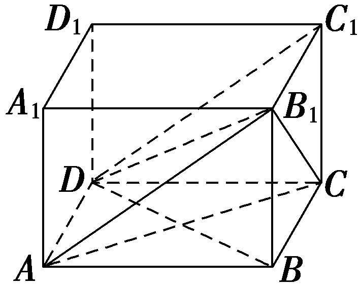

所以在Rt△<em>&lt;text style="italic"&gt;&lt;text style="italic"&gt;&lt;text style="italic"&gt;A&lt;text style="italic"&gt;B</em>&lt;/text&gt;&lt;/text&gt;&lt;/text&gt;B&lt;/text&gt;&lt;text style="subscript"&gt;&lt;text style="subscript"&gt;&lt;text style="subscript"&gt;&lt;text style="subscript"&gt;&lt;text style="subscript"&gt;&lt;text style="subscript"&gt;&lt;text style="subscript"&gt;&lt;text style="subscript"&gt;&lt;text style="subscript"&gt;&lt;text style="subscript"&gt;&lt;text style="subscript"&gt;&lt;text style="subscript"&gt;&lt;text style="subscript"&gt;&lt;text style="subscript"&gt;&lt;text style="subscript"&gt;1&lt;/text&gt;&lt;/text&gt;&lt;/text&gt;&lt;/text&gt;&lt;/text&gt;&lt;/text&gt;&lt;/text&gt;&lt;/text&gt;&lt;/text&gt;&lt;/text&gt;&lt;/text&gt;&lt;/text&gt;&lt;/text&gt;&lt;/text&gt;&lt;/text&gt;中，AB＝ $\sqrt{AB_{1}^{2}－BB_{1}^{2}}$ ＝ $\sqrt{2}$ ＝ $\sqrt{2}$ <em>A&lt;text style="italic"&gt;&lt;text style="italic"&gt;D</em>&lt;/text&gt;&lt;/text&gt;，故A正确；易知∠<em>B&lt;text style="italic"&gt;&lt;text style="italic"&gt;AB</em>&lt;/text&gt;&lt;/text&gt;&lt;text style="subscript"&gt;&lt;text style="subscript"&gt;&lt;text style="subscript"&gt;&lt;text style="subscript"&gt;&lt;text style="subscript"&gt;&lt;text style="subscript"&gt;&lt;text style="subscript"&gt;&lt;text style="subscript"&gt;&lt;text style="subscript"&gt;&lt;text style="subscript"&gt;&lt;text style="subscript"&gt;&lt;text style="subscript"&gt;&lt;text style="subscript"&gt;&lt;text style="subscript"&gt;&lt;text style="subscript"&gt;1&lt;/text&gt;&lt;/text&gt;&lt;/text&gt;&lt;/text&gt;&lt;/text&gt;&lt;/text&gt;&lt;/text&gt;&lt;/text&gt;&lt;/text&gt;&lt;/text&gt;&lt;/text&gt;&lt;/text&gt;&lt;/text&gt;&lt;/text&gt;&lt;/text&gt;是直线AB与平面AB1<em>&lt;text style="italic"&gt;&lt;text style="italic"&gt;&lt;text style="italic"&gt;&lt;text style="italic"&gt;&lt;text style="italic"&gt;C</em>&lt;/text&gt;&lt;/text&gt;&lt;/text&gt;&lt;/text&gt;&lt;/text&gt;1D所成的角，因为在Rt△<em>&lt;text style="italic"&gt;A&lt;text style="italic"&gt;BB</em>&lt;/text&gt;&lt;/text&gt;1中，sin∠<em>&lt;text style="italic"&gt;&lt;text style="italic"&gt;BAB</em>&lt;/text&gt;&lt;/text&gt;1＝ $\frac{BB_{1}}{AB_{1}}$ ＝ $\frac{\sqrt{3}}{3}$ ≠ $\frac{1}{2}$ ，所以∠<em>B&lt;text style="italic"&gt;&lt;text style="italic"&gt;AB</em>&lt;/text&gt;&lt;/text&gt;&lt;text style="subscript"&gt;&lt;text style="subscript"&gt;&lt;text style="subscript"&gt;&lt;text style="subscript"&gt;&lt;text style="subscript"&gt;&lt;text style="subscript"&gt;&lt;text style="subscript"&gt;&lt;text style="subscript"&gt;&lt;text style="subscript"&gt;&lt;text style="subscript"&gt;&lt;text style="subscript"&gt;&lt;text style="subscript"&gt;&lt;text style="subscript"&gt;&lt;text style="subscript"&gt;&lt;text style="subscript"&gt;1&lt;/text&gt;&lt;/text&gt;&lt;/text&gt;&lt;/text&gt;&lt;/text&gt;&lt;/text&gt;&lt;/text&gt;&lt;/text&gt;&lt;/text&gt;&lt;/text&gt;&lt;/text&gt;&lt;/text&gt;&lt;/text&gt;&lt;/text&gt;&lt;/text&gt;≠30°，故B错误；在Rt△<em>&lt;text style="italic"&gt;&lt;text style="italic"&gt;&lt;text style="italic"&gt;&lt;text style="italic"&gt;&lt;text style="italic"&gt;C</em>&lt;/text&gt;&lt;/text&gt;&lt;/text&gt;&lt;/text&gt;&lt;/text&gt;<em>BB</em>1中，<em>&lt;text style="italic"&gt;CB</em>&lt;/text&gt;1＝ $\sqrt{BC^{2}＋BB_{1}^{2}}$ ＝ $\sqrt{2}$ ，而A<em>&lt;text style="italic"&gt;&lt;text style="italic"&gt;&lt;text style="italic"&gt;&lt;text style="italic"&gt;&lt;text style="italic"&gt;C</em>&lt;/text&gt;&lt;/text&gt;&lt;/text&gt;&lt;/text&gt;&lt;/text&gt;＝ $\sqrt{AB^{2}＋BC^{2}}$ ＝ $\sqrt{3}$ ，故<em>&lt;text style="italic"&gt;&lt;text style="italic"&gt;&lt;text style="italic"&gt;&lt;text style="italic"&gt;&lt;text style="italic"&gt;C</em>&lt;/text&gt;&lt;/text&gt;&lt;/text&gt;&lt;/text&gt;&lt;/text&gt;错误；易知∠<em>&lt;text style="italic"&gt;D</em>&lt;/text&gt;<em>B</em>&lt;text style="subscript"&gt;&lt;text style="subscript"&gt;&lt;text style="subscript"&gt;&lt;text style="subscript"&gt;&lt;text style="subscript"&gt;&lt;text style="subscript"&gt;&lt;text style="subscript"&gt;&lt;text style="subscript"&gt;&lt;text style="subscript"&gt;&lt;text style="subscript"&gt;&lt;text style="subscript"&gt;&lt;text style="subscript"&gt;&lt;text style="subscript"&gt;&lt;text style="subscript"&gt;&lt;text style="subscript"&gt;1&lt;/text&gt;&lt;/text&gt;&lt;/text&gt;&lt;/text&gt;&lt;/text&gt;&lt;/text&gt;&lt;/text&gt;&lt;/text&gt;&lt;/text&gt;&lt;/text&gt;&lt;/text&gt;&lt;/text&gt;&lt;/text&gt;&lt;/text&gt;&lt;/text&gt;C是直线B1D与平面<em>BB</em>1C1C所成的角，因为在Rt△<em>&lt;text style="italic"&gt;&lt;text style="italic"&gt;DB</em>&lt;/text&gt;&lt;/text&gt;1C中，<em>&lt;text style="italic"&gt;CB</em>&lt;/text&gt;1＝<em>CD</em>＝ $\sqrt{2}$ ，所以∠<em>&lt;text style="italic"&gt;D</em>&lt;/text&gt;<em>B</em>&lt;text style="subscript"&gt;&lt;text style="subscript"&gt;&lt;text style="subscript"&gt;&lt;text style="subscript"&gt;&lt;text style="subscript"&gt;&lt;text style="subscript"&gt;&lt;text style="subscript"&gt;&lt;text style="subscript"&gt;&lt;text style="subscript"&gt;&lt;text style="subscript"&gt;&lt;text style="subscript"&gt;&lt;text style="subscript"&gt;&lt;text style="subscript"&gt;&lt;text style="subscript"&gt;&lt;text style="subscript"&gt;1&lt;/text&gt;&lt;/text&gt;&lt;/text&gt;&lt;/text&gt;&lt;/text&gt;&lt;/text&gt;&lt;/text&gt;&lt;/text&gt;&lt;/text&gt;&lt;/text&gt;&lt;/text&gt;&lt;/text&gt;&lt;/text&gt;&lt;/text&gt;&lt;/text&gt;<em>&lt;text style="italic"&gt;&lt;text style="italic"&gt;&lt;text style="italic"&gt;&lt;text style="italic"&gt;&lt;text style="italic"&gt;C</em>&lt;/text&gt;&lt;/text&gt;&lt;/text&gt;&lt;/text&gt;&lt;/text&gt;＝45°，故D正确.故选<em>AD</em>.

7.如图，三棱锥<em>P</em>-<em>ABC</em>中，已知<em>PA</em>⊥平面<em>ABC</em>，<em>PA</em>＝3，<em>PB</em>＝<em>PC</em>＝<em>BC</em>＝6，则二面角<em>P</em>-<em>BC</em>-<em>A</em>的正弦值为<u>　　　　</u>.

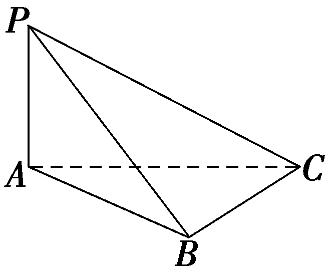

答案： $\frac{\sqrt{3}}{3}$

解析：取*<text style="italic"><text style="italic"><text style="italic"><text style="italic"><text style="italic"><text style="italic"><text style="italic"><text style="italic">BC*</text></text></text></text></text></text></text></text>的中点*D*，连接*<text style="italic"><text style="italic"><text style="italic"><text style="italic"><text style="italic"><text style="italic">P*</text></text>D</text></text></text></text>，*<text style="italic"><text style="italic"><text style="italic"><text style="italic">A*</text>D</text></text></text>，因为*<text style="italic">PB*</text>＝*<text style="italic">PC*</text>，所以*PD*⊥BC，因为*<text style="italic"><text style="italic"><text style="italic">PA*</text></text></text>⊥平面*<text style="italic">ABC*</text>，BC⊂平面ABC，所以PA⊥BC，因为PD，PA⊂平面*<text style="italic"><text style="italic">PAD*</text></text>，PA∩PD＝P，所以BC⊥平面PAD，因为AD⊂平面PAD，所以BC⊥AD，所以∠*<text style="italic">PDA*</text>即为二面角P-BC-A的平面角，因为PB＝PC＝BC＝6，所以PD＝ $\frac{\sqrt{3}}{2}$ ×6＝3 $\sqrt{3}$ ，sin ∠*<text style="italic"><text style="italic">P*</text></text>*D<text style="italic">A*</text>＝ $\frac{PA}{PD}$ ＝ $\frac{3}{3\sqrt{3}}$ ＝ $\frac{\sqrt{3}}{3}$ ，即二面角*<text style="italic"><text style="italic">P*</text></text>-*<text style="italic"><text style="italic"><text style="italic"><text style="italic"><text style="italic"><text style="italic"><text style="italic"><text style="italic">BC*</text></text></text></text></text></text></text></text>-*<text style="italic">A*</text>的正弦值是 $\frac{\sqrt{3}}{3}$ .

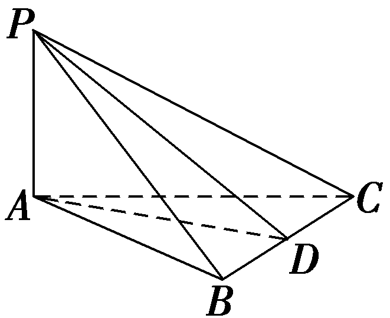

8.在直四棱柱<em>ABCD</em> -<em>A</em>1<em>B</em>1<em>C</em>1<em>D</em>1中，已知∠<em>ABC</em>＝120°，四边形<em>ABCD</em>是边长为2的菱形，且<em>AA</em>1＝4，<em>E</em>为线段<em>BC</em>上的动点，当<em>BE</em>＝<u>　　　　</u>时，<em>A</em>1<em>E</em>与底面<em>ABCD</em>所成的角为60°.

答案： $\frac{\sqrt{21}}{3}$ －1

解析：如图所示，连接<em>&lt;text style="italic"&gt;&lt;text style="italic"&gt;&lt;text style="italic"&gt;A</em>&lt;/text&gt;&lt;/text&gt;<em>E</em>&lt;/text&gt;，因为<em>&lt;text style="italic"&gt;AA</em>&lt;/text&gt;&lt;text style="subscript"&gt;&lt;text style="subscript"&gt;&lt;text style="subscript"&gt;&lt;text style="subscript"&gt;1&lt;/text&gt;&lt;/text&gt;&lt;/text&gt;&lt;/text&gt;⊥底面<em>&lt;text style="italic"&gt;&lt;text style="italic"&gt;AB</em>CD&lt;/text&gt;&lt;/text&gt;，所以∠A1<em>&lt;text style="italic"&gt;EA</em>&lt;/text&gt;为A1E与底面ABCD所成的角，即∠A1EA＝60°.又因为AA1＝4，所以 $\frac{4}{AE}$ ＝tan 60°＝ $\sqrt{3}$ ，解得<em>&lt;text style="italic"&gt;&lt;text style="italic"&gt;&lt;text style="italic"&gt;A</em>&lt;/text&gt;&lt;/text&gt;<em>E</em>&lt;/text&gt;＝ $\frac{4}{3}\sqrt{3}$ .设B<em>E</em>＝<em>&lt;text style="italic"&gt;&lt;text style="italic"&gt;&lt;text style="italic"&gt;&lt;text style="italic"&gt;&lt;text style="italic"&gt;&lt;text style="italic"&gt;m</em>&lt;/text&gt;&lt;/text&gt;&lt;/text&gt;&lt;/text&gt;&lt;/text&gt;&lt;/text&gt;(0≤m≤&lt;text style="superscript"&gt;&lt;text style="superscript"&gt;2&lt;/text&gt;&lt;/text&gt;)，在△<em>&lt;text style="italic"&gt;&lt;text style="italic"&gt;A</em>&lt;/text&gt;&lt;/text&gt;<em>BE</em>中，<em>AB</em>＝2，∠<em>&lt;text style="italic"&gt;ABE</em>&lt;/text&gt;＝&lt;text style="subscript"&gt;&lt;text style="subscript"&gt;&lt;text style="subscript"&gt;&lt;text style="subscript"&gt;1&lt;/text&gt;&lt;/text&gt;&lt;/text&gt;&lt;/text&gt;20°，<em>&lt;text style="italic"&gt;&lt;text style="italic"&gt;AE</em>&lt;/text&gt;&lt;/text&gt;＝ $\frac{4}{3}\sqrt{3}$ ，由余弦定理，得 $\left(\frac{4}{3}\sqrt{3}\right)^{2}$ ＝&lt;text style="superscript"&gt;&lt;text style="superscript"&gt;2&lt;/text&gt;&lt;/text&gt;2＋<em>&lt;text style="italic"&gt;&lt;text style="italic"&gt;&lt;text style="italic"&gt;&lt;text style="italic"&gt;&lt;text style="italic"&gt;&lt;text style="italic"&gt;m</em>&lt;/text&gt;&lt;/text&gt;&lt;/text&gt;&lt;/text&gt;&lt;/text&gt;&lt;/text&gt;2－2×2×m×cos &lt;text style="subscript"&gt;&lt;text style="subscript"&gt;&lt;text style="subscript"&gt;&lt;text style="subscript"&gt;1&lt;/text&gt;&lt;/text&gt;&lt;/text&gt;&lt;/text&gt;20°，整理得3m2＋6m－4＝0，解得m＝ $\frac{\sqrt{21}}{3}$ －&lt;text style="subscript"&gt;&lt;text style="subscript"&gt;&lt;text style="subscript"&gt;&lt;text style="subscript"&gt;1&lt;/text&gt;&lt;/text&gt;&lt;/text&gt;&lt;/text&gt;.

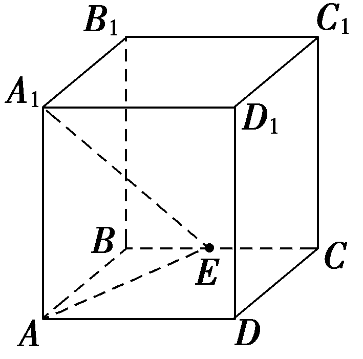

9.(13分)如图，*AB*是☉*O*的直径，*PA*垂直于☉*O*所在的平面，*C*是圆周上不同于*A*，*B*的一动点.

(1)证明：△*PBC*是直角三角形；(5分)

(2)若*PA*＝*<text style="italic">AB*</text>＝2，且当直线*PC*与平面*ABC*所成角的正切值为 $\sqrt{2}$ 时，求直线*<text style="italic">AB*</text>与平面*PBC*所成角的正弦值.(8分)

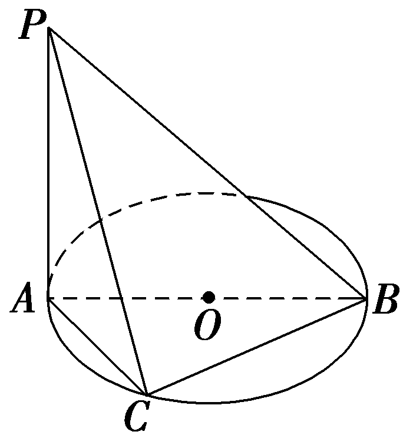

解：(1)证明：因为*AB*是☉*O*的直径，*C*是圆周上不同于*A*，*B*的一动点，

所以*BC*⊥*AC*.

因为*PA*⊥平面*ABC*，所以*PA*⊥*BC*.

又*PA*∩*AC*＝*A*，*PA*，*AC*⊂平面*PAC*，

所以*BC*⊥平面*PAC*，又*PC*⊂平面*PAC*，

所以*BC*⊥*PC*，

所以△*PBC*是直角三角形.

(2)如图，过点*A*作*AH*⊥*PC*于*H*，连接*BH*.

因为*BC*⊥平面*PAC*，

所以*BC*⊥*AH*.

又*PC*∩*BC*＝*C*，*PC*，*BC*⊂平面*PBC*，

所以*AH*⊥平面*PBC*，

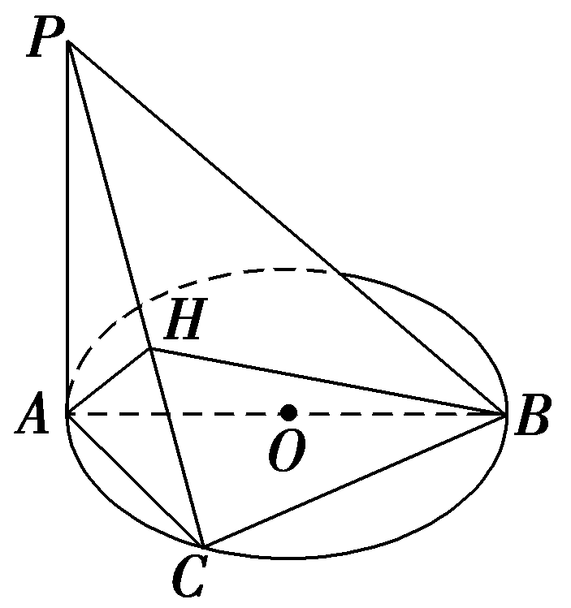

所以∠*ABH*是直线*AB*与平面*PBC*所成的角.

因为*PA*⊥平面*ABC*，

所以∠*PCA*是直线*PC*与平面*ABC*所成的角.

因为tan∠*PCA*＝ $\frac{PA}{AC}$ ＝ $\sqrt{2}$ ，又*PA*＝2，

所以*AC*＝ $\sqrt{2}$ ，

所以在Rt△*PAC*中，*AH*＝ $\frac{PA\cdot AC}{\sqrt{PA^{2}＋AC^{2}}}$ ＝ $\frac{2\sqrt{3}}{3}$ ，

所以在Rt△*<text style="italic">ABH*</text>中，sin∠ABH＝ $\frac{AH}{AB}$ ＝ $\frac{\frac{2\sqrt{3}}{3}}{2}$ ＝ $\frac{\sqrt{3}}{3}$ ，

故直线*AB*与平面*PBC*所成角的正弦值为 $\frac{\sqrt{3}}{3}$ .

(10、11题，每小题5分，共10分)

10.(多选)(2022·新高考Ⅰ卷)已知正方体<em>ABCD</em>-<em>A</em>1<em>B</em>1<em>C</em>1<em>D</em>1，则(　　)

A.直线<em>BC</em>1与<em>DA</em>1所成的角为90°

B.直线<em>BC</em>1与<em>CA</em>1所成的角为90°

C.直线<em>BC</em>1与平面<em>BB</em>1<em>D</em>1<em>D</em>所成的角为45°

D.直线<em>BC</em>1与平面<em>ABCD</em>所成的角为45°

答案：**ABD**

解析：如图，连接<em>AD</em>1，在正方形<em>A</em>1<em>ADD</em>1中，<em>AD</em>1⊥<em>DA</em>1，因为<em>AD</em>1∥<em>BC</em>1，所以<em>BC</em>1⊥<em>DA</em>1，所以直线<em>BC</em>1与<em>DA</em>1所成的角为90°，故A正确；在正方体<em>ABCD</em>-<em>A</em>1<em>B</em>1<em>C</em>1<em>D</em>1中，<em>CD</em>⊥平面<em>BCC</em>1<em>B</em>1，又<em>BC</em>1⊂平面<em>BCC</em>1<em>B</em>1，所以<em>CD</em>⊥<em>BC</em>1，连接<em>B</em>1<em>C</em>，则<em>B</em>1<em>C</em>⊥<em>BC</em>1，因为<em>CD</em>∩<em>B</em>1<em>C</em>＝<em>C</em>，<em>CD</em>，<em>B</em>1<em>C</em>⊂平面<em>DCB</em>1<em>A</em>1，所以<em>BC</em>1⊥平面<em>DCB</em>1<em>A</em>1，又<em>CA</em>1⊂平面<em>DCB</em>1<em>A</em>1，所以<em>BC</em>1⊥<em>CA</em>1，所以直线<em>BC</em>1与<em>CA</em>1所成的角为90°，故B正确；连接<em>A</em>1<em>C</em>1，交<em>B</em>1<em>D</em>1于点<em>O</em>，则易得<em>OC</em>1⊥平面<em>BB</em>1<em>D</em>1<em>D</em>，

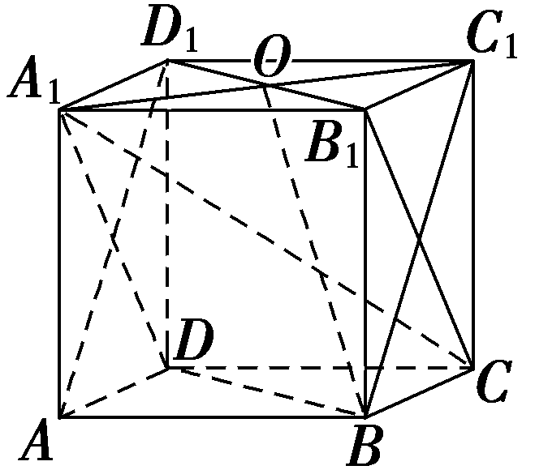

连接&lt;text style="it&lt;text style="it<em>a</em>lic"&gt;a&lt;/text&gt;lic"&gt;<em>&lt;text style="italic"&gt;OB</em>&lt;/text&gt;&lt;/text&gt;，因为OB⊂平面<em>&lt;text style="italic"&gt;BB</em>&lt;/text&gt;&lt;text style="subscript"&gt;&lt;text style="subscript"&gt;&lt;text style="subscript"&gt;&lt;text style="subscript"&gt;&lt;text style="subscript"&gt;&lt;text style="subscript"&gt;&lt;text style="subscript"&gt;&lt;text style="subscript"&gt;&lt;text style="subscript"&gt;&lt;text style="subscript"&gt;&lt;text style="subscript"&gt;&lt;text style="subscript"&gt;&lt;text style="subscript"&gt;&lt;text style="subscript"&gt;&lt;text style="subscript"&gt;&lt;text style="subscript"&gt;1&lt;/text&gt;&lt;/text&gt;&lt;/text&gt;&lt;/text&gt;&lt;/text&gt;&lt;/text&gt;&lt;/text&gt;&lt;/text&gt;&lt;/text&gt;&lt;/text&gt;&lt;/text&gt;&lt;/text&gt;&lt;/text&gt;&lt;/text&gt;&lt;/text&gt;&lt;/text&gt;<em>&lt;text style="italic"&gt;&lt;text style="italic"&gt;&lt;text style="italic"&gt;D</em>&lt;/text&gt;&lt;/text&gt;&lt;/text&gt;1D，所以<em>&lt;text style="italic"&gt;&lt;text style="italic"&gt;O&lt;text style="italic"&gt;&lt;text style="italic"&gt;C</em>&lt;/text&gt;&lt;/text&gt;&lt;/text&gt;&lt;/text&gt;1⊥OB，∠<em>O&lt;text style="italic"&gt;&lt;text style="italic"&gt;&lt;text style="italic"&gt;&lt;text style="italic"&gt;BC</em>&lt;/text&gt;&lt;/text&gt;&lt;/text&gt;&lt;/text&gt;1即为直线BC1与平面BB1D1D所成的角.设正方体的棱长为a，则易得BC1＝ $\sqrt{2}$ &lt;text style="it<em>a</em>lic"&gt;a&lt;/text&gt;，<em>&lt;text style="italic"&gt;&lt;text style="italic"&gt;O&lt;text style="italic"&gt;&lt;text style="italic"&gt;C</em>&lt;/text&gt;&lt;/text&gt;&lt;/text&gt;&lt;/text&gt;&lt;text style="subscript"&gt;&lt;text style="subscript"&gt;&lt;text style="subscript"&gt;&lt;text style="subscript"&gt;&lt;text style="subscript"&gt;&lt;text style="subscript"&gt;&lt;text style="subscript"&gt;&lt;text style="subscript"&gt;&lt;text style="subscript"&gt;&lt;text style="subscript"&gt;&lt;text style="subscript"&gt;&lt;text style="subscript"&gt;&lt;text style="subscript"&gt;&lt;text style="subscript"&gt;&lt;text style="subscript"&gt;&lt;text style="subscript"&gt;1&lt;/text&gt;&lt;/text&gt;&lt;/text&gt;&lt;/text&gt;&lt;/text&gt;&lt;/text&gt;&lt;/text&gt;&lt;/text&gt;&lt;/text&gt;&lt;/text&gt;&lt;/text&gt;&lt;/text&gt;&lt;/text&gt;&lt;/text&gt;&lt;/text&gt;&lt;/text&gt;＝ $\frac{\sqrt{2}a}{2}$ ，所以在Rt△B&lt;text style="it&lt;text style="it<em>a</em>lic"&gt;a&lt;/text&gt;lic"&gt;<em>&lt;text style="italic"&gt;O&lt;text style="italic"&gt;&lt;text style="italic"&gt;C</em>&lt;/text&gt;&lt;/text&gt;&lt;/text&gt;&lt;/text&gt;&lt;text style="subscript"&gt;&lt;text style="subscript"&gt;&lt;text style="subscript"&gt;&lt;text style="subscript"&gt;&lt;text style="subscript"&gt;&lt;text style="subscript"&gt;&lt;text style="subscript"&gt;&lt;text style="subscript"&gt;&lt;text style="subscript"&gt;&lt;text style="subscript"&gt;&lt;text style="subscript"&gt;&lt;text style="subscript"&gt;&lt;text style="subscript"&gt;&lt;text style="subscript"&gt;&lt;text style="subscript"&gt;&lt;text style="subscript"&gt;1&lt;/text&gt;&lt;/text&gt;&lt;/text&gt;&lt;/text&gt;&lt;/text&gt;&lt;/text&gt;&lt;/text&gt;&lt;/text&gt;&lt;/text&gt;&lt;/text&gt;&lt;/text&gt;&lt;/text&gt;&lt;/text&gt;&lt;/text&gt;&lt;/text&gt;&lt;/text&gt;中，OC1＝ $\frac{1}{2}$ &lt;text style="it&lt;text style="it<em>a</em>lic"&gt;a&lt;/text&gt;lic"&gt;<em>&lt;text style="italic"&gt;B&lt;text style="italic"&gt;&lt;text style="italic"&gt;C</em>&lt;/text&gt;&lt;/text&gt;&lt;/text&gt;&lt;/text&gt;&lt;text style="subscript"&gt;&lt;text style="subscript"&gt;&lt;text style="subscript"&gt;&lt;text style="subscript"&gt;&lt;text style="subscript"&gt;&lt;text style="subscript"&gt;&lt;text style="subscript"&gt;&lt;text style="subscript"&gt;&lt;text style="subscript"&gt;&lt;text style="subscript"&gt;&lt;text style="subscript"&gt;&lt;text style="subscript"&gt;&lt;text style="subscript"&gt;&lt;text style="subscript"&gt;&lt;text style="subscript"&gt;&lt;text style="subscript"&gt;1&lt;/text&gt;&lt;/text&gt;&lt;/text&gt;&lt;/text&gt;&lt;/text&gt;&lt;/text&gt;&lt;/text&gt;&lt;/text&gt;&lt;/text&gt;&lt;/text&gt;&lt;/text&gt;&lt;/text&gt;&lt;/text&gt;&lt;/text&gt;&lt;/text&gt;&lt;/text&gt;，所以∠<em>&lt;text style="italic"&gt;&lt;text style="italic"&gt;OB</em>&lt;/text&gt;&lt;/text&gt;C1＝30°，故C错误；因为C1C⊥平面A<em>BC&lt;text style="italic"&gt;&lt;text style="italic"&gt;&lt;text style="italic"&gt;D</em>&lt;/text&gt;&lt;/text&gt;&lt;/text&gt;，所以∠<em>&lt;text style="italic"&gt;CBC</em>&lt;/text&gt;1为直线BC1与平面<em>&lt;text style="italic"&gt;ABCD</em>&lt;/text&gt;所成的角，易得∠CBC1＝45°，故D正确.故选ABD.

11.(多选)(2025·广东广州模拟)在如图所示的三棱锥*O* -*ABC*中，*OA*＝*OB*＝*OC*＝1，*OA*，*OB*，*OC*两两互相垂直，下列结论正确的为(　　)

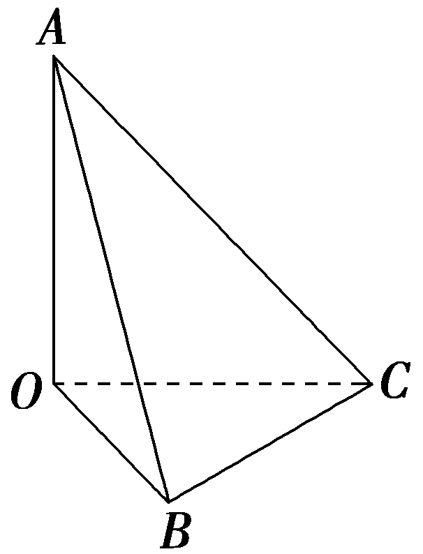

A.直线*AB*与平面*OBC*所成的角为30°

B.二面角*O*-*BC*-*A*的正切值为 $\sqrt{2}$

C.*O*到平面*ABC*的距离为 $\sqrt{3}$

D.作*OM*⊥平面*ABC*，垂足为*M*，则*M*为△*ABC*的重心

答案：**BD**

解析：因为*<text style="italic"><text style="italic"><text style="italic">O*</text></text>*<text style="italic">A*</text></text>，*<text style="italic"><text style="italic"><text style="italic"><text style="italic"><text style="italic">OB*</text></text></text></text></text>，*<text style="italic"><text style="italic"><text style="italic"><text style="italic"><text style="italic">OC*</text></text></text></text></text>两两互相垂直，且OB∩OC＝O，OB，OC⊂平面*<text style="italic"><text style="italic"><text style="italic">O<text style="italic"><text style="italic"><text style="italic"><text style="italic"><text style="italic"><text style="italic">BC*</text></text></text></text></text></text></text></text></text>，所以*AO*⊥平面OBC，故∠*<text style="italic"><text style="italic"><text style="italic">AB*</text></text>O</text>为直线AB与平面OBC所成的角，又*<text style="italic"><text style="italic">OA*</text></text>＝OB＝OC＝1，所以∠*ABO*＝45°，故直线AB与平面OBC所成的角为45°，故A错误；取BC的中点为*D*，连接*<text style="italic">OD*</text>，*<text style="italic">AD*</text>，因为OA＝OB＝OC＝1，OA，OB，OC两两互相垂直，所以AB＝*AC*＝BC＝ $\sqrt{2}$ ，*<text style="italic"><text style="italic">O*</text></text>*D*⊥*<text style="italic"><text style="italic"><text style="italic"><text style="italic"><text style="italic">BC*</text></text></text></text></text>，*<text style="italic"><text style="italic"><text style="italic">A*</text>D</text></text>⊥BC，故∠*<text style="italic">OD*</text>A为二面角O -BC-A的平面角，则tan∠*<text style="italic">ODA*</text>＝ $\frac{OA}{OD}$ ＝ $\sqrt{2}$ ，故二面角*<text style="italic"><text style="italic">O*</text></text> -*<text style="italic"><text style="italic"><text style="italic"><text style="italic"><text style="italic">BC*</text></text></text></text></text>-*<text style="italic">A*</text>的正切值为 $\sqrt{2}$ ，故B正确；

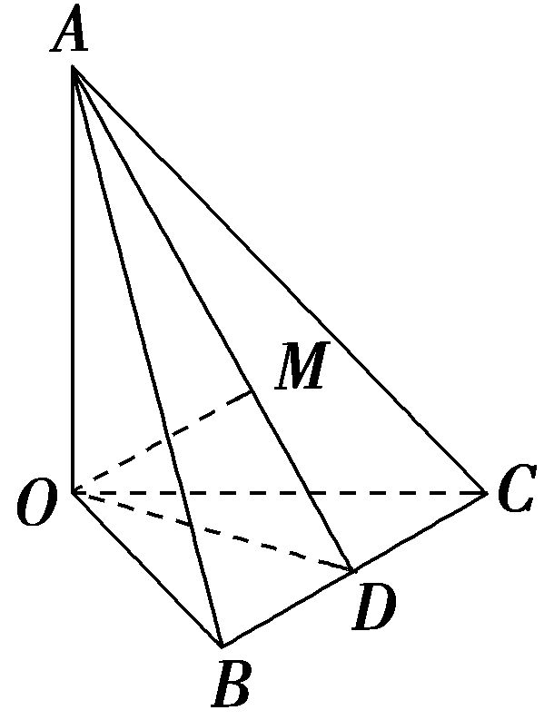

因为<em>&lt;text style="italic,subscript"&gt;&lt;text style="italic"&gt;A</em>&lt;/text&gt;<em>B</em>&lt;/text&gt;＝<em>&lt;text style="italic"&gt;A&lt;text style="italic"&gt;C</em>&lt;/text&gt;&lt;/text&gt;＝<em>&lt;text style="italic"&gt;BC</em>&lt;/text&gt;＝ $\sqrt{2}$ ，所以<em>&lt;text style="italic,subscript"&gt;&lt;text style="italic"&gt;A</em>&lt;/text&gt;D&lt;/text&gt;＝ $\frac{\sqrt{6}}{2}$ ，设<em>&lt;text style="italic,subscript"&gt;&lt;text style="italic"&gt;O</em>&lt;/text&gt;&lt;/text&gt;到平面<em>&lt;text style="italic,subscript"&gt;&lt;text style="italic"&gt;A</em>&lt;/text&gt;<em>B</em>&lt;/text&gt;<em>C</em>的距离为<em>&lt;text style="italic"&gt;&lt;text style="italic"&gt;h</em>&lt;/text&gt;&lt;/text&gt;，则<em>&lt;text style="italic"&gt;V</em>&lt;/text&gt;A-O<em>&lt;text style="italic"&gt;BC</em>&lt;/text&gt;＝ $\frac{1}{3}$ × $\frac{1}{2}$ ×1×1×1＝<em>&lt;text style="italic"&gt;V</em>&lt;/text&gt;<em>&lt;text style="italic,subscript"&gt;&lt;text style="italic"&gt;O</em>&lt;/text&gt;&lt;/text&gt; -<em>&lt;text style="italic,subscript"&gt;&lt;text style="italic"&gt;A</em>&lt;/text&gt;<em>B</em>&lt;/text&gt;<em>C</em>＝ $\frac{1}{3}$ × $\frac{1}{2}$ × $\sqrt{2}$ × $\frac{\sqrt{6}}{2}$ ×<em>&lt;text style="italic"&gt;&lt;text style="italic"&gt;h</em>&lt;/text&gt;&lt;/text&gt;，解得h＝ $\frac{\sqrt{3}}{3}$ ，故<em>C</em>错误；因为<em>&lt;text style="italic,subscript"&gt;&lt;text style="italic"&gt;A</em>&lt;/text&gt;<em>B</em>&lt;/text&gt;＝<em>&lt;text style="italic"&gt;AC</em>&lt;/text&gt;＝<em>&lt;text style="italic"&gt;BC</em>&lt;/text&gt;＝ $\sqrt{2}$ ，故△<em>&lt;text style="italic,subscript"&gt;&lt;text style="italic"&gt;A</em>&lt;/text&gt;<em>B</em>&lt;/text&gt;<em>C</em>为等边三角形，因为<em>&lt;text style="italic,subscript"&gt;&lt;text style="italic"&gt;O</em>&lt;/text&gt;&lt;/text&gt;<em>&lt;text style="italic"&gt;&lt;text style="italic"&gt;&lt;text style="italic"&gt;M</em>&lt;/text&gt;&lt;/text&gt;&lt;/text&gt;⊥平面A<em>&lt;text style="italic"&gt;BC</em>&lt;/text&gt;，则M点为O点在平面<em>&lt;text style="italic,subscript"&gt;&lt;text style="italic"&gt;AB</em>C&lt;/text&gt;&lt;/text&gt;上的投影，又<em>OA</em>＝<em>OB</em>＝<em>OC</em>＝1，所以<em>MA</em>＝<em>MB</em>＝<em>MC</em>，即M点到△<em>&lt;text style="italic"&gt;&lt;text style="italic"&gt;&lt;text style="italic"&gt;&lt;text style="italic"&gt;&lt;text style="italic"&gt;&lt;text style="italic"&gt;ABC</em>&lt;/text&gt;&lt;/text&gt;&lt;/text&gt;&lt;/text&gt;&lt;/text&gt;&lt;/text&gt;顶点A，B，C的距离相等，故M为△ABC的外心，又在等边△ABC中，M也为△ABC的重心，故D正确.故选BD.

12.(15分)(一题多问)如图，在四棱锥*P*-*<text style="italic">A<text style="italic"><text style="italic">BC*</text>D</text></text>中，*M*为*AP*边上的中点，*N*为*CP*边上的中点，平面*<text style="italic">PBC*</text>⊥平面*<text style="italic">AB*C</text>D，∠PBC＝90°，*<text style="italic">AD*</text>∥BC，∠ABC＝90°，2AB＝2AD＝ $\sqrt{2}$ *CD*＝*<text style="italic">BC*</text>＝2.

(1)求证：*MN*∥平面*ABCD*；(3分)

(2)求证：*CD*⊥平面*PBD*；(5分)

(3)若直线*P<text style="italic">D*</text>与底面*A<text style="italic">B*CD</text>所成角的余弦值为 $\frac{\sqrt{3}}{3}$ ，求二面角*B*-*PC*-*D*的正切值.(7分)

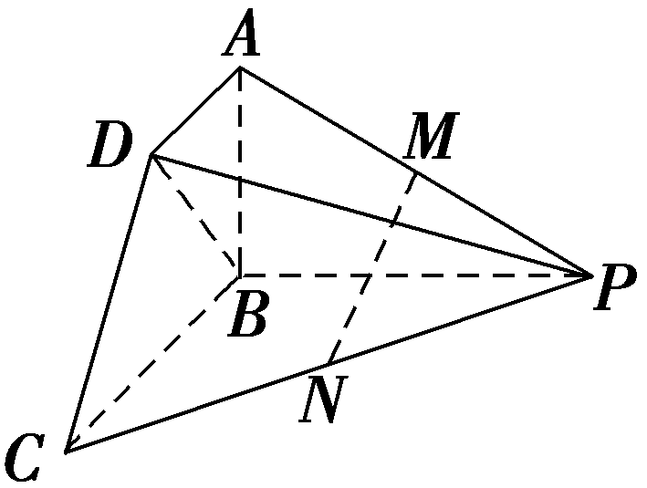

解：(1)证明：法一：连接*AC*，

在△*ACP*中，因为*M*，*N*为对应边上的中点，

所以*MN*为中位线，*MN*∥*AC*，

又*MN*⊄平面*ABCD*，*AC*⊂平面*ABCD*，

所以*MN*∥平面*ABCD*.

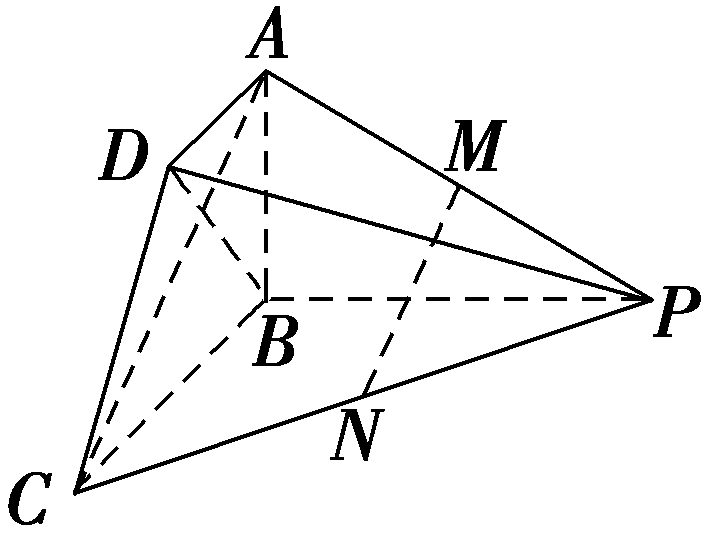

法二：设*AB*中点为*S*，*BC*中点为*T*，连接*SM*，*ST*，*TN*，

在△*ABP*中，因为*S*，*M*为对应边上的中点，

所以*<text style="italic"><text style="italic">SM*</text></text>为中位线，SM∥*<text style="italic">BP*</text>且SM＝ $\frac{1}{2}$ *<text style="italic">BP*</text>，

同理，在△*C<text style="italic"><text style="italic">BP*</text></text>中，*<text style="italic">TN*</text>∥BP且TN＝ $\frac{1}{2}$ *<text style="italic">BP*</text>，

所以*TN*∥*SM*且*TN*＝*SM*，

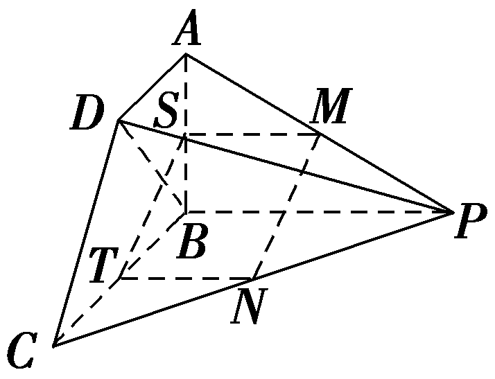

所以四边形*TNMS*为平行四边形，

所以*MN*∥*ST*，

又*MN*⊄平面*ABCD*，*ST*⊂平面*ABCD*，

所以*MN*∥平面*ABCD*.

(2)证明：在四边形*A<text style="italic"><text style="italic">BC*</text>D</text>中，*<text style="italic">AD*</text>∥BC，∠*<text style="italic">AB*C</text>＝90°，2AB＝2AD＝ $\sqrt{2}$ *CD*＝*<text style="italic">BC*</text>，

所以∠<em>DAB</em>＝90°，<em>BD</em>2＝<em>AD</em>2＋<em>AB</em>2＝2，故<em>BD</em>2＋<em>CD</em>2＝<em>BC</em>2，

所以△*ABD*，△*BCD*都为等腰直角三角形，即*CD*⊥*DB*，

又因为平面*PBC*⊥平面*ABCD*，∠*PBC*＝90°，平面*PBC*∩平面*ABCD*＝*BC*，*PB*⊂平面*PBC*，

所以直线*PB*⊥平面*ABCD*，

又*CD*⊂平面*ABCD*，所以*PB*⊥*CD*，

又*PB*∩*BD*＝*B*，*PB*，*BD*⊂平面*PBD*，所以*CD*⊥平面*PBD*.

(3)因为直线*PD*与底面*<text style="italic">ABCD*</text>所成角的余弦值为 $\frac{\sqrt{3}}{3}$ ，且*PB*⊥平面*<text style="italic">ABCD*</text>，

所以直线*PD*与底面*ABCD*所成的角为∠*PDB*，又*BC*＝2，

则*AB*＝1，*CD*＝*BD*＝ $\sqrt{2}$ ，

所以在Rt△*PBD*中，cos∠*PDB*＝ $\frac{BD}{PD}$ ＝ $\frac{\sqrt{3}}{3}$ ，

所以*PD*＝ $\sqrt{6}$ ，*PB*＝2，

设*BC*的中点为*E*，连接*DE*，过点*E*作*PC*的垂线交*PC*于*F*，连接*DF*，

因为*DE*⊥*CB*，*DE*⊥*PB*，且*PB*，*BC*⊂平面*PBC*，*PB*∩*BC*＝*B*，

则*DE*⊥平面*PBC*，因为*PC*⊂平面*PBC*，所以*DE*⊥*PC*，

因为*DE*，*EF*⊂平面*DEF*，*DE*∩*EF*＝*E*，所以*PC*⊥平面*DEF*，

因为*DF*⊂平面*DEF*，所以*PC*⊥*DF*，又*PC*⊥*EF*，

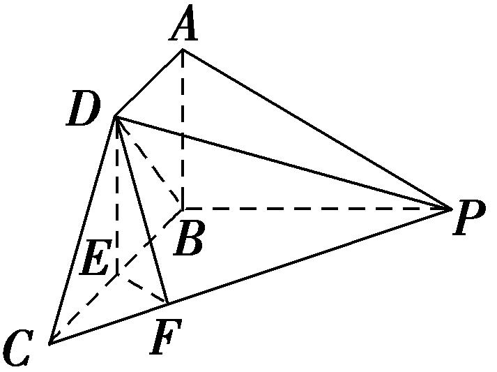

则∠*DFE*是二面角*B*-*PC*-*D*的平面角，

因为*DE*＝*AB*＝1，*EF*⊥*CF*，∠*PBC*＝90°，*BC*＝*PB*＝2，

所以*CF*＝*<text style="italic"><text style="italic">EF*</text></text>，所以*CE*＝ $\sqrt{2}$ *<text style="italic"><text style="italic">EF*</text></text>＝1，所以EF＝ $\frac{\sqrt{2}}{2}$ ，

设二面角*<text style="italic">B*</text> -*<text style="italic">PC*</text>-*<text style="italic">D*</text>的平面角为*<text style="italic">θ*</text>，则二面角B -PC-D的正切值为tan θ＝ $\frac{DE}{EF}$ ＝ $\sqrt{2}$ .

(13、14题，每小题5分，共10分)

13.(2023·全国乙卷)已知△*ABC*为等腰直角三角形，*AB*为斜边，△*ABD*为等边三角形，若二面角*C*-*AB*-*D*为150°，则直线*CD*与平面*ABC*所成角的正切值为(　　)

A. $\frac{1}{5}$ 	B. $\frac{\sqrt{2}}{5}$

C. $\frac{\sqrt{3}}{5}$ 	D. $\frac{2}{5}$

答案：**C**

解析：如图，取*<text style="italic"><text style="italic"><text style="italic"><text style="italic"><text style="italic"><text style="italic"><text style="italic">AB*</text></text></text></text></text></text></text>的中点*<text style="italic">E*</text>，连接*<text style="italic"><text style="italic">C*E</text></text>，*<text style="italic"><text style="italic">D*E</text></text>，因为△*<text style="italic"><text style="italic"><text style="italic"><text style="italic"><text style="italic">ABC*</text></text></text></text></text>是等腰直角三角形，且AB为斜边，则有*<text style="italic"><text style="italic"><text style="italic"><text style="italic">CE*</text></text></text></text>⊥AB，又△*ABD*是等边三角形，则*<text style="italic"><text style="italic">DE*</text></text>⊥AB，从而∠*<text style="italic">CED*</text>为二面角C-AB-D的平面角，即∠CED＝150°，显然CE∩DE＝E，CE，DE⊂平面*<text style="italic"><text style="italic"><text style="italic"><text style="italic"><text style="italic"><text style="italic">CD*</text></text>E</text></text></text></text>，于是AB⊥平面*CDE*，又AB⊂平面ABC，因此平面CDE⊥平面ABC，显然平面CDE∩平面ABC＝CE，直线CD⊂平面CDE，则直线CD在平面ABC内的射影为直线CE，从而∠*DCE*为直线CD与平面ABC所成的角，令AB＝2，则CE＝1，DE＝ $\sqrt{3}$ ，

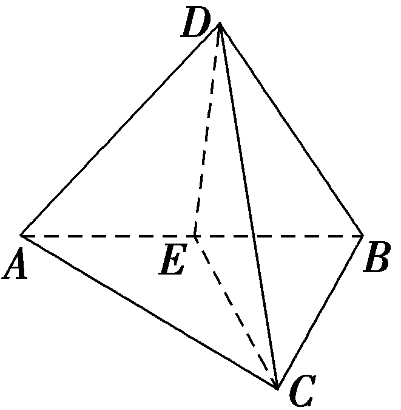

在△*<text style="italic">CD*E</text>中，由余弦定理得CD＝ $\sqrt{CE^{2}＋DE^{2}－2CE\cdot DEcos\angle CED}$

＝ $\sqrt{1+3－2\times 1\times \sqrt{3}\times (－\frac{\sqrt{3}}{2})}$ ＝ $\sqrt{7}$ ，由正弦定理得 $\frac{DE}{sin\angle DCE}$ ＝ $\frac{CD}{sin\angle CED}$ ，即sin∠*<text style="italic"><text style="italic">DCE*</text></text>＝ $\frac{\sqrt{3}sin150\circ }{\sqrt{7}}$ ＝ $\frac{\sqrt{3}}{2\sqrt{7}}$ ，显然∠*<text style="italic"><text style="italic">DCE*</text></text>是锐角，cos∠DCE＝ $\sqrt{1－sin^{2}\angle DCE}$ ＝ $\sqrt{1－(\frac{\sqrt{3}}{2\sqrt{7}})^{2}}$ ＝ $\frac{5}{2\sqrt{7}}$ ，所以直线*CD*与平面*ABC*所成的角的正切值为 $\frac{\sqrt{3}}{2\sqrt{7}}$ ÷ $\frac{5}{2\sqrt{7}}$ ＝ $\frac{\sqrt{3}}{5}$ .故选C.

14.(多选)(2025·山东潍坊模拟)如图所示的几何体，是将棱长为3的正四面体沿棱的三等分点，作平行于底面的截面所得，且其所有棱长均为1，则(　　)

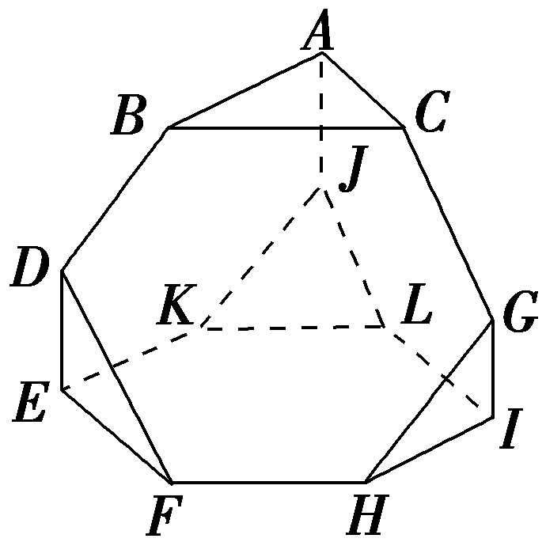

A.直线*BD*与直线*JL*所成角为 $\frac{\pi }{3}$

B.直线*CG*与平面*EFHILK*所成角为 $\frac{\pi }{6}$ C.该几何体的体积为 $\frac{23\sqrt{2}}{12}$

*D*.该几何体中，二面角*A*-*BC*-D的余弦值为 $\frac{1}{3}$

答案：**AC**

解析：将该几何体还原为原正四面体*Q*-*MNS*，棱长为3，

设△<em>MN&lt;text style="italic"&gt;S</em>&lt;/text&gt;中心为<em>O</em>，连接<em>&lt;text style="italic"&gt;O&lt;text style="italic"&gt;&lt;text style="italic"&gt;Q</em>&lt;/text&gt;&lt;/text&gt;&lt;/text&gt;，<em>&lt;text style="italic"&gt;ON</em>&lt;/text&gt;，则ON＝ $\sqrt{3}$ ，<em>O&lt;text style="italic"&gt;Q</em>&lt;/text&gt;＝ $\sqrt{6}$ ，<em>S</em>△<em>&lt;text style="italic,subscript"&gt;&lt;text style="italic"&gt;MNS</em>&lt;/text&gt;&lt;/text&gt;＝ $\frac{9\sqrt{3}}{4}$ ， $V_{Q}_{-MNS}$ ＝ $\frac{1}{3}$ × $\frac{9\sqrt{3}}{4}$ × $\sqrt{6}$ ＝ $\frac{9\sqrt{2}}{4}$ ，对于<em>&lt;text style="italic"&gt;&lt;text style="italic"&gt;&lt;text style="italic"&gt;A</em>&lt;/text&gt;&lt;/text&gt;&lt;/text&gt;，因为<em>&lt;text style="italic"&gt;JL</em>&lt;/text&gt;∥<em>&lt;text style="italic"&gt;&lt;text style="italic"&gt;&lt;text style="italic"&gt;&lt;text style="italic"&gt;Q</em>&lt;/text&gt;N&lt;/text&gt;&lt;/text&gt;&lt;/text&gt;，所以直线<em>B&lt;text style="italic"&gt;&lt;text style="italic"&gt;D</em>&lt;/text&gt;&lt;/text&gt;与直线JL所成角即为<em>MQ</em>与QN所成角 $\frac{\pi }{3}$ ，故<em>&lt;text style="italic"&gt;&lt;text style="italic"&gt;&lt;text style="italic"&gt;A</em>&lt;/text&gt;&lt;/text&gt;&lt;/text&gt;正确；对于B，直线<em>CG</em>与平面<em>EFHILK</em>所成角为<em>&lt;text style="italic"&gt;&lt;text style="italic"&gt;&lt;text style="italic"&gt;&lt;text style="italic"&gt;Q</em>&lt;/text&gt;N&lt;/text&gt;&lt;/text&gt;&lt;/text&gt;与底面<em>MN&lt;text style="italic"&gt;S</em>&lt;/text&gt;所成的角，∠QN<em>O</em>即为所求角，sin ∠<em>&lt;text style="italic"&gt;&lt;text style="italic"&gt;QNO</em>&lt;/text&gt;&lt;/text&gt;＝ $\frac{QO}{QN}$ ＝ $\sqrt{\frac{2}{3}}$ ，∠<em>&lt;text style="italic"&gt;&lt;text style="italic"&gt;&lt;text style="italic"&gt;&lt;text style="italic"&gt;Q</em>&lt;/text&gt;N&lt;/text&gt;&lt;/text&gt;&lt;/text&gt;<em>O</em>≠ $\frac{\pi }{6}$ ，故B错误；对于C，该几何体的体积为大正四面体的体积减去4个棱长为1的小正四面体的体积， $\frac{\sqrt{2}}{12}$ ×&lt;text style="superscript"&gt;3&lt;/text&gt;3－4× $\frac{\sqrt{2}}{12}$ ×1&lt;text style="superscript"&gt;3&lt;/text&gt;＝ $\frac{23\sqrt{2}}{12}$ ，故C正确；对于<em>&lt;text style="italic"&gt;D</em>&lt;/text&gt;，二面角<em>&lt;text style="italic"&gt;&lt;text style="italic"&gt;&lt;text style="italic"&gt;A</em>&lt;/text&gt;&lt;/text&gt;&lt;/text&gt;-<em>&lt;text style="italic"&gt;&lt;text style="italic"&gt;&lt;text style="italic"&gt;BC</em>&lt;/text&gt;&lt;/text&gt;&lt;/text&gt;-D的大小与A-BC-<em>&lt;text style="italic"&gt;Q</em>&lt;/text&gt;的大小互补，显然A-BC-Q的大小为锐角，所以二面角A-BC-D的大小一定为钝角，故D错误.故选AC.

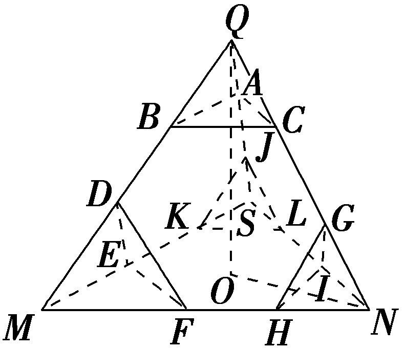

