**第七节　空间向量的应用**

第1课时　用空间向量解决位置关系与距离问题

【课标研读】　1.理解直线的方向向量与平面的法向量.　2.能用向量语言表述直线与直线、直线与平面、平面与平面的垂直和平行关系.　3.能用向量方法证明立体几何中有关直线、平面位置关系的一些简单定理.　4.能用向量方法解决点到直线、点到平面、相互平行的直线、相互平行的平面的距离问题，并能描述解决这一类问题的程序，体会向量方法在研究几何问题中的作用.

1.直线的方向向量与平面的法向量

(1)直线的方向向量：如果表示非零向量<em><strong>a</strong></em>的有向线段所在直线与直线<em>l</em>平行或重合，则称此向量<em><strong>a</strong></em>为直线<em>l</em>的方向向量.

(2)平面的法向量：直线<em>l</em>⊥<em>α</em>，取直线<em>l</em>的方向向量<em><strong>a</strong></em>，则向量<em><strong>a</strong></em>为平面<em>α</em>的法向量.

2.空间位置关系的向量表示

<table><tr><td colspan="2">
位置关系
</td><td>
向量表示
</td></tr><tr><td rowspan="2">
直线<em>l</em>1，<em>l</em>2的方向向量分别为<strong><em>n</em></strong>1，<strong><em>n</em></strong>2
</td><td>
<em>l</em>1∥<em>l</em>2
</td><td>
<strong><em>n</em></strong>1∥<strong><em>n</em></strong>2⇔<strong><em>n</em></strong>1＝<em>k</em><strong><em>n</em></strong>2(<em>k</em>∈<strong>R</strong>)
</td></tr><tr><td>
<em>l</em>1⊥<em>l</em>2
</td><td>
<strong><em>n</em></strong>1⊥<strong><em>n</em></strong>2⇔<strong><em>n</em></strong>1·<strong><em>n</em></strong>2＝0
</td></tr><tr><td rowspan="2">
直线<em>l</em>的方向向量为<strong><em>n</em></strong>，平面<em>α</em>的法向量为<strong><em>m</em></strong>
</td><td>
<em>l</em>∥<em>α</em>
</td><td>
<strong><em>n</em></strong>⊥<strong><em>m</em></strong>⇔<strong><em>n</em></strong>·<strong><em>m</em></strong>＝0
</td></tr><tr><td>
<em>l</em>⊥<em>α</em>
</td><td>
<strong><em>n</em></strong>∥<strong><em>m</em></strong>⇔<strong><em>n</em></strong>＝<em>k</em><strong><em>m</em></strong>(<em>k</em>∈<strong>R</strong>)
</td></tr><tr><td rowspan="2">
平面<em>α</em>，<em>β</em>的法向量分别为<strong><em>n</em></strong>，<strong><em>m</em></strong>
</td><td>
<em>α</em>∥<em>β</em>
</td><td>
<strong><em>n</em></strong>∥<strong><em>m</em></strong>⇔<strong><em>n</em></strong>＝<em>k</em><strong><em>m</em></strong>(<em>k</em>∈<strong>R</strong>)
</td></tr><tr><td>
<em>α</em>⊥<em>β</em>
</td><td>
<strong><em>n</em></strong>⊥<strong><em>m</em></strong>⇔<strong><em>n</em></strong>·<strong><em>m</em></strong>＝0
</td></tr></table>

3.空间距离

(1)点到直线的距离：设 $\vec{AP}$ ＝&lt;text sty&lt;text sty&lt;text style="it<em><strong>a</strong></em>lic"&gt;l&lt;/text&gt;e="italic"&gt;l&lt;/text&gt;e="bold,italic"&gt;a&lt;/text&gt;，直线l的一个单位方向向量为<em><strong>&lt;text style="bold,italic"&gt;&lt;text style="bold,italic"&gt;u</strong></em>&lt;/text&gt;&lt;/text&gt;，则向量 $\vec{AP}$ 在直线&lt;text sty&lt;text style="it<em><strong>a</strong></em>lic"&gt;l&lt;/text&gt;e="italic"&gt;l&lt;/text&gt;上的投影向量 $\vec{AQ}$ ＝(&lt;text sty&lt;text sty&lt;text style="it<em><strong>a</strong></em>lic"&gt;l&lt;/text&gt;e="italic"&gt;l&lt;/text&gt;e="bold,italic"&gt;a&lt;/text&gt;·<em><strong>&lt;text style="bold,italic"&gt;&lt;text style="bold,italic"&gt;u</strong></em>&lt;/text&gt;&lt;/text&gt;)u.在Rt△<em>A&lt;text style="italic"&gt;PQ</em>&lt;/text&gt;中，由勾股定理，得PQ＝ $\sqrt{｜\vec{AP}｜^{2}-|\vec{AQ}｜^{2}}$ ＝ $\sqrt{a^{2}-(a\cdot u)^{2}}$ .

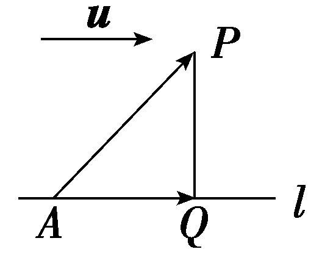

(2)点到平面的距离：已知平面&lt;text sty&lt;text sty&lt;text sty<em>l</em>e="italic"&gt;l&lt;/text&gt;e="italic"&gt;l&lt;/text&gt;e="italic"&gt;<em>&lt;text style="italic"&gt;&lt;text style="italic"&gt;&lt;text style="italic"&gt;&lt;text style="italic"&gt;α</em>&lt;/text&gt;&lt;/text&gt;&lt;/text&gt;&lt;/text&gt;&lt;/text&gt;的法向量为<em><strong>&lt;text style="bold,italic"&gt;n</strong></em>&lt;/text&gt;，<em>A</em>是平面α内的定点，<em>&lt;text style="italic"&gt;&lt;text style="italic"&gt;P</em>&lt;/text&gt;&lt;/text&gt;是平面α外一点.过点P作平面α的垂线l，交平面α于点<em>Q</em>，则n是直线l的方向向量，且点P到平面α的距离就是 $\vec{AP}$ 在直线&lt;text sty&lt;text sty<em>l</em>e="italic"&gt;l&lt;/text&gt;e="italic"&gt;l&lt;/text&gt;上的投影向量 $\vec{QP}$ 的长度.因此&lt;text sty&lt;text sty&lt;text sty<em>l</em>e="italic"&gt;l&lt;/text&gt;e="italic"&gt;l&lt;/text&gt;e="italic"&gt;<em>&lt;text style="italic"&gt;P</em>&lt;/text&gt;&lt;/text&gt;<em>Q</em>＝ $\left|\vec{AP}\cdot \frac{n}{｜n｜}\right|$ ＝ $\left|\frac{\vec{AP}\cdot n}{｜n｜}\right|$ ＝ $\frac{｜\vec{AP}\cdot n｜}{｜n｜}$ .

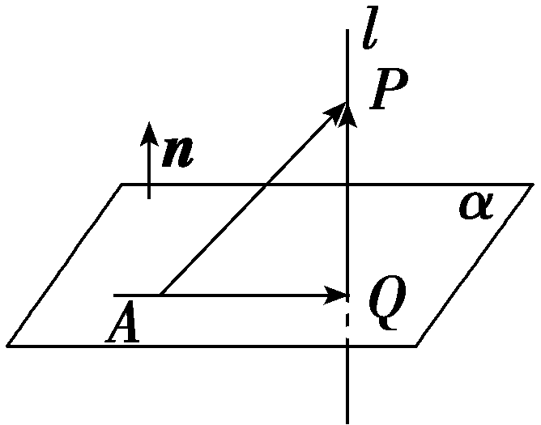

(3)直线到平面的距离、平面到平面的距离都可以转化为点到平面的距离.

【自主检测】

1.(多选)下列结论错误的是(　　)

A.直线的方向向量是唯一确定的

B.若一条直线的方向向量与平面的法向量垂直，则该直线与平面平行

C.两个平面的法向量垂直，则这两个平面垂直

D.平面*<text style="italic"><text style="italic">α*</text></text>外一点*<text style="italic">A*</text>到平面α的距离，就是点A与平面α内一点*B*所成向量 $\vec{AB}$ 的长度

答案：**ABD**

2.已知向量<em><strong>a</strong></em>＝(2，4，5)，<em><strong>b</strong></em>＝(3，<em>x</em>，<em>y</em>)分别是直线<em>l</em>1，<em>l</em>2的方向向量，若<em>l</em>1∥<em>l</em>2，则(　　)

A.<te<text st*y*le="italic">x</text>t st*y*le="italic">x</text>＝6，y＝15	B.x＝3，y＝ $\frac{15}{2}$

C.<te<text st*y*le="italic">x</text>t st*y*le="italic">x</text>＝3，y＝15	D.x＝6，y＝ $\frac{15}{2}$

答案：**D**

解析：由题意得， $\frac{3}{2}$ ＝ $\frac{x}{4}$ ＝ $\frac{y}{5}$ ，所以<text st*y*le="italic">x</text>＝6，y＝ $\frac{15}{2}$ .故选D.

3.(链接人教A选择性必修一P34例6)在空间直角坐标系中，已知*A*(1，－1，0)，*B*(4，3，0)，*C*(5，4，－1)，则点*A*到直线*BC*的距离为(　　)

A.3	B. $\frac{\sqrt{58}}{3}$

C. $\frac{2\sqrt{17}}{3}$ 	D. $\frac{\sqrt{78}}{3}$

答案：**D**

解析：因为*<text style="italic">A*</text>(1，－1，0)，*B*(4，3，0)，*C*(5，4，－1)，所以 $\vec{BA}$ ＝(－3，－4，0)， $\vec{BC}$ ＝(1，1，－1)，所以点*<text style="italic">A*</text>到直线*BC*的距离为*d*＝ $\sqrt{\vec{BA}^{2}－(\vec{BA}\cdot \frac{\vec{BC}}{｜\vec{BC}｜})^{2}}$ ＝ $\frac{\sqrt{78}}{3}$ .故选D.

4.平面<em>&lt;text style="italic"&gt;α</em>&lt;/text&gt;的法向量为<em><strong>n</strong></em>＝(1，－1，2)， $\vec{AB}$ ＝(2，0，－1)，那么直线<em>AB</em>与平面<em>&lt;text style="italic"&gt;α</em>&lt;/text&gt;的位置关系是<u>　　　　　　</u>.

答案：*AB*∥*α*或*AB*⊂*α*

解析：因为 $\vec{AB}$ <em>·<strong>&lt;text style="bold,italic"&gt;n</strong></em>&lt;/text&gt;＝0，所以 $\vec{AB}$ ⊥<em><strong>&lt;text style="bold,italic"&gt;n</strong></em>&lt;/text&gt;，则<em>&lt;text style="italic"&gt;AB</em>&lt;/text&gt;∥<em>&lt;text style="italic"&gt;α</em>&lt;/text&gt;或AB⊂α.

考点一　用空间向量证明平行关系　　　　师生共研

如图，在正四棱柱<em>ABCD</em>-<em>A</em>1<em>B</em>1<em>C</em>1<em>D</em>1中，<em>AB</em>＝2，<em>AA</em>1＝4.点<em>A</em>2，<em>B</em>2，<em>C</em>2，<em>D</em>2分别在棱<em>AA</em>1，<em>BB</em>1，<em>CC</em>1，<em>DD</em>1上，<em>AA</em>2＝1，<em>BB</em>2＝<em>DD</em>2＝2，<em>CC</em>2＝3.证明：<em>B</em>2<em>C</em>2∥<em>A</em>2<em>D</em>2.

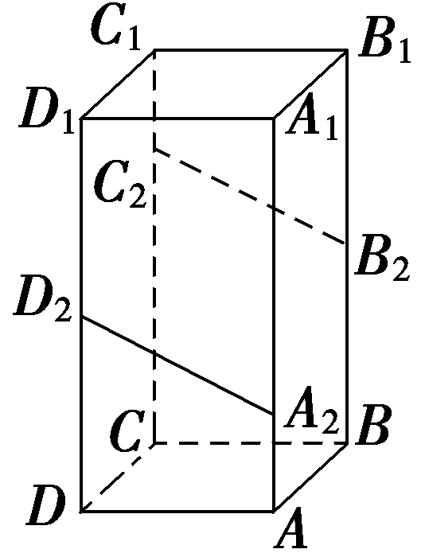

证明：法一(坐标法)以点<em>C</em>为坐标原点，<em>CD</em>，<em>CB</em>，<em>CC</em>1所在直线分别为<em>x</em>，<em>y</em>，<em>z</em>轴，建立如图所示的空间直角坐标系，则<em>B</em>2(0，2，2)，<em>C</em>2(0，0，3)，<em>A</em>2(2，2，1)，<em>D</em>2(2，0，2)，

所以 $\vec{B_{2}C_{2}}$ ＝(0，－2，1)， $\vec{A_{2}D_{2}}$ ＝(0，－2，1)，

所以 $\vec{B_{2}C_{2}}$ ＝ $\vec{A_{2}D_{2}}$ ，所以<em>B</em>&lt;text style="subscript"&gt;&lt;text style="subscript"&gt;&lt;text style="subscript"&gt;2&lt;/text&gt;&lt;/text&gt;&lt;/text&gt;<em>C</em>2∥<em>A</em>2<em>D</em>2.

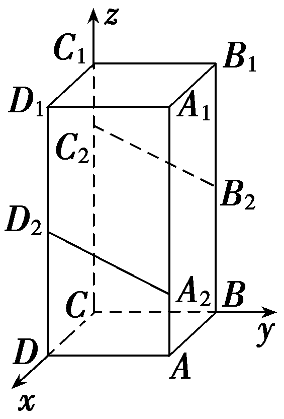

法二(基底法)依题意，得 $\vec{B_{2}C_{2}}$ ＝ $\vec{B_{2}B_{1}}$ ＋ $\vec{B_{1}C_{1}}$ ＋ $\vec{C_{1}C_{2}}$ ＝ $\vec{DD_{2}}$ ＋ $\vec{AD}$ ＋ $\vec{A_{2}A}$ ＝ $\vec{A_{2}D_{2}}$ ，

所以<em>B</em>2<em>C</em>2∥<em>A</em>2<em>D</em>2.

利用空间向量证明平行关系的方法和步骤

1.要证明线线平行，首先需要证明两直线的方向向量共线，再说明其中一条直线上存在某个点不在另一条直线上.

2.要证明线面平行，首先需要证明该直线的方向向量与平面的某一法向量垂直，或直线的方向向量与平面内某直线的方向向量平行，再说明该直线上存在某个点不在平面内.

3.要证明面面平行，首先需要证明两平面的法向量为共线向量，再说明其中一个平面内存在某个点不在另一个平面内(也可转化为证明线面平行、线线平行).

对点练1.如图，在正方体<em>ABCD</em> -<em>A</em>1<em>B</em>1<em>C</em>1<em>D</em>1中，<em>E</em>，<em>F</em>，<em>G</em>，<em>H</em>，<em>M</em>，<em>N</em>分别是正方体六个表面的中心，证明：平面<em>EFG</em>∥平面<em>HMN</em>.

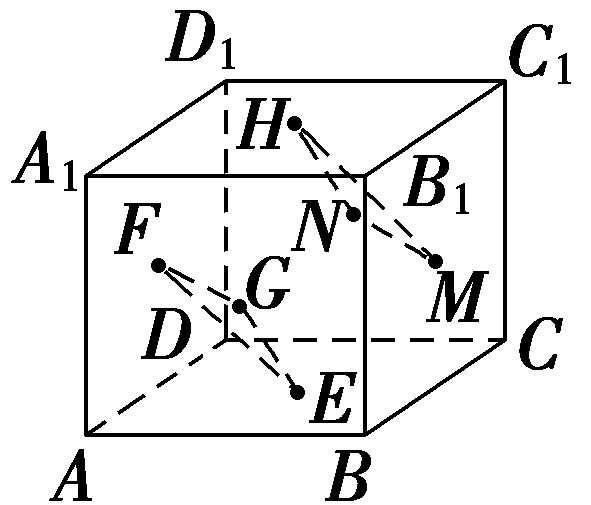

证明：如图所示，建立空间直角坐标系，不妨设正方体的棱长为2，

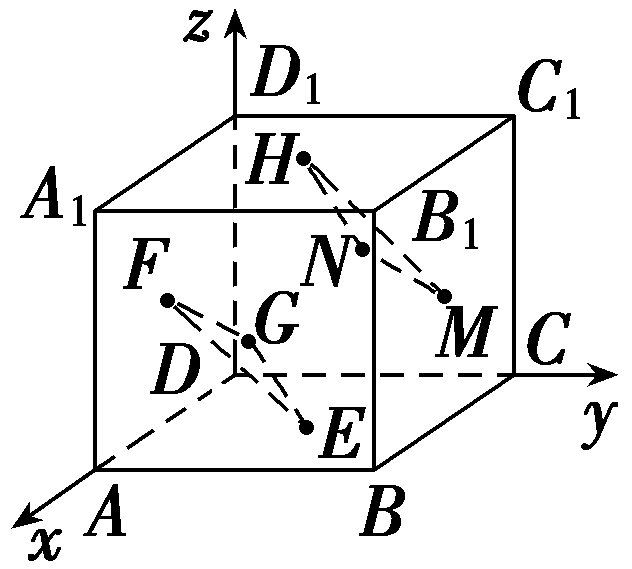

则*E*(1，1，0)，*F*(1，0，1)，*G*(2，1，1)，*H*(1，1，2)，*M*(1，2，1)，*N*(0，1，1).

所以 $\vec{EF}$ ＝(0，－1，1)， $\vec{EG}$ ＝(1，0，1)， $\vec{HM}$ ＝(0，1，－1)， $\vec{HN}$ ＝(－1，0，－1).

设<em><strong>m</strong></em>＝(<em>x</em>1，<em>y</em>1，<em>z</em>1)，<em><strong>n</strong></em>＝(<em>x</em>2，<em>y</em>2，<em>z</em>2)分别是平面<em>EFG</em>和平面<em>HMN</em>的法向量，

由 $\left\{\begin{matrix}m\cdot \vec{EF}=0，\\m\cdot \vec{EG}=0，\end{matrix}\right.$ 得 $\left\{\begin{matrix}－y_{1}＋z_{1}=0，\\x_{1}＋z_{1}=0，\end{matrix}\right.$

取<em>x</em>1＝1，得<em>m</em>＝(1，－1，－1).

由 $\left\{\begin{matrix}n\cdot \vec{HM}=0，\\n\cdot \vec{HN}=0，\end{matrix}\right.$ 得 $\left\{\begin{matrix}y_{2}－z_{2}=0，\\－x_{2}－z_{2}=0，\end{matrix}\right.$

取<em>x</em>2＝1，得<em><strong>n</strong></em>＝(1，－1，－1).

于是有<em><strong>m</strong></em>＝<em><strong>n</strong></em>，所以<em><strong>m</strong></em>∥<em><strong>n</strong></em>，故平面<em>EFG</em>∥平面<em>HMN</em>.

考点二　用空间向量证明垂直关系　　　　师生共研

如图所示，△*ABC*是一个正三角形，*EC*⊥平面*ABC*，*BD*∥*CE*，且*CE*＝*CA*＝2*BD*，*M*是*EA*的中点.求证：平面*DEA*⊥平面*ECA*.

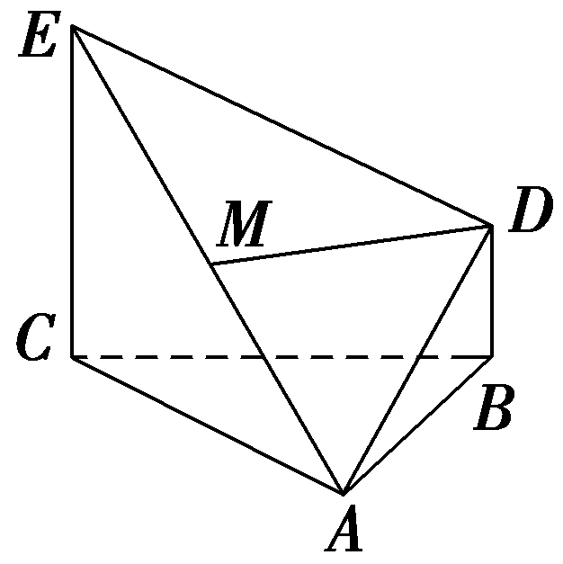

证明：建立如图所示的空间直角坐标系*C*-*xyz*，不妨设*CA*＝2，

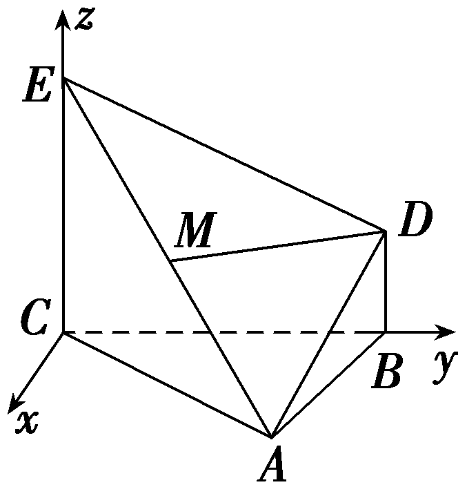

则*<text style="italic">CE*</text>＝2，*<text style="italic">BD*</text>＝1，C(0，0，0)，*A*( $\sqrt{3}$ ，1，0)，*B*(0，2，0)，*E*(0，0，2)，*D*(0，2，1).

所以 $\vec{EA}$ ＝( $\sqrt{3}$ ，1，－2)， $\vec{CE}$ ＝(0，0，2)， $\vec{ED}$ ＝(0，2，－1).

分别设平面<em>ECA</em>与平面<em>DEA</em>的法向量是<em><strong>n</strong></em>1＝(<em>x</em>1，<em>y</em>1，<em>z</em>1)，<em><strong>n</strong></em>2＝(<em>x</em>2，<em>y</em>2，<em>z</em>2)，

则 $\left\{\begin{matrix}n_{1}\cdot \vec{EA}=0，\\n_{1}\cdot \vec{CE}=0，\end{matrix}\right.$ 即 $\left\{\begin{matrix}\sqrt{3}x_{1}＋y_{1}－2z_{1}=0，\\2z_{1}=0，\end{matrix}\right.$

解得 $\left\{\begin{matrix}y_{1}＝－\sqrt{3}x_{1}，\\z_{1}=0，\end{matrix}\right.\left\{\begin{matrix}n_{2}\cdot \vec{EA}＝0，\\n_{2}\cdot \vec{ED}=0，\end{matrix}\right.$

即 $\left\{\begin{matrix}\sqrt{3}x_{2}＋y_{2}－2z_{2}=0，\\2y_{2}－z_{2}=0，\end{matrix}\right.$ 解得 $\left\{\begin{matrix}x_{2}＝\sqrt{3}y_{2}，\\z_{2}=2y_{2}.\end{matrix}\right.$

不妨取<em><strong>&lt;text style="bold,italic"&gt;n</strong></em>&lt;/text&gt;1＝(1，－ $\sqrt{3}$ ，0)，<em><strong>&lt;text style="bold,italic"&gt;n</strong></em>&lt;/text&gt;2＝( $\sqrt{3}$ ，1，2)，

因为<em><strong>n</strong></em>1<em>·<strong>n</strong></em>2＝0，所以<em><strong>n</strong></em>1⊥<em><strong>n</strong></em>2.

所以平面*DEA*⊥平面*ECA*.

利用空间向量证明垂直关系的方法和步骤

1.要证明线线垂直，需证明两直线的方向向量互相垂直，即证它们的数量积为零.

2.要证明线面垂直，需证明直线的方向向量与平面的法向量共线，或先通过向量证明线线垂直，再由线面垂直的判定定理证明.

3.要证明面面垂直，需证明两个平面的法向量垂直.

对点练2.在四棱锥*P*-*ABCD*中，*PD*⊥底面*ABCD*，底面*ABCD*为正方形，*PD*＝*DC*，*E*，*F*分别是*AB*，*PB*的中点.

(1)求证：*EF*⊥*CD*；

(2)在平面*PAD*内求一点*G*，使*GF*⊥平面*PCB*，并证明你的结论.

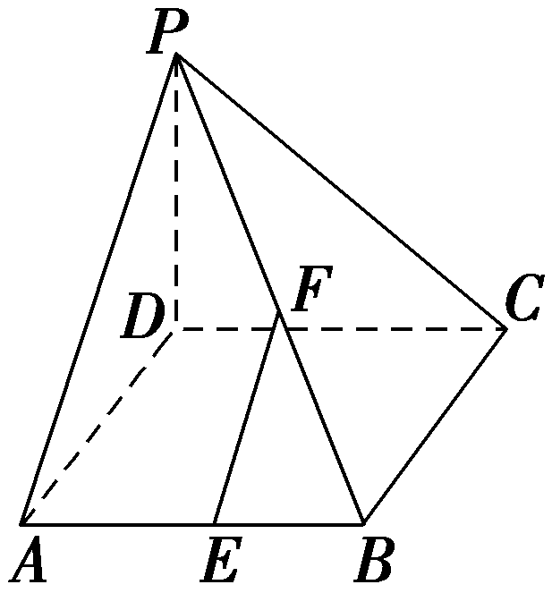

解：(1)证明：如图，以*D*为坐标原点，分别以*DA*，*DC*，*DP*所在直线为*x*轴，*y*轴，*z*轴建立空间直角坐标系，

设<text style="it<text style="it<text style="it<text style="it<text style="it<text style="it<text style="it<text style="it*a*lic">a</text>lic">a</text>lic">a</text>lic">a</text>lic">a</text>lic">a</text>lic">a</text>lic">*AD*</text>＝a，则D(0，0，0)，A(a，0，0)，*B*(a，a，0)，*C*(0，a，0)，*E*(a， $\frac{a}{2}$ ，0)，<text style="it<text style="it*a*lic">a</text>lic">P</text>(0，0，<text style="it<text style="it<text style="it<text style="it<text style="it*a*lic">a</text>lic">a</text>lic">a</text>lic">a</text>lic">a</text>)，*F*( $\frac{a}{2}$ ， $\frac{a}{2}$ ， $\frac{a}{2}$ )， $\vec{EF}$ ＝(－ $\frac{a}{2}$ ，0， $\frac{a}{2}$ )， $\vec{DC}$ ＝(0，<text style="it<text style="it<text style="it<text style="it<text style="it<text style="it<text style="it*a*lic">a</text>lic">a</text>lic">a</text>lic">a</text>lic">a</text>lic">a</text>lic">a</text>，0).

因为 $\vec{EF}$ · $\vec{DC}$ ＝0，所以 $\vec{EF}$ ⊥ $\vec{DC}$ ，即*EF*⊥*CD*.

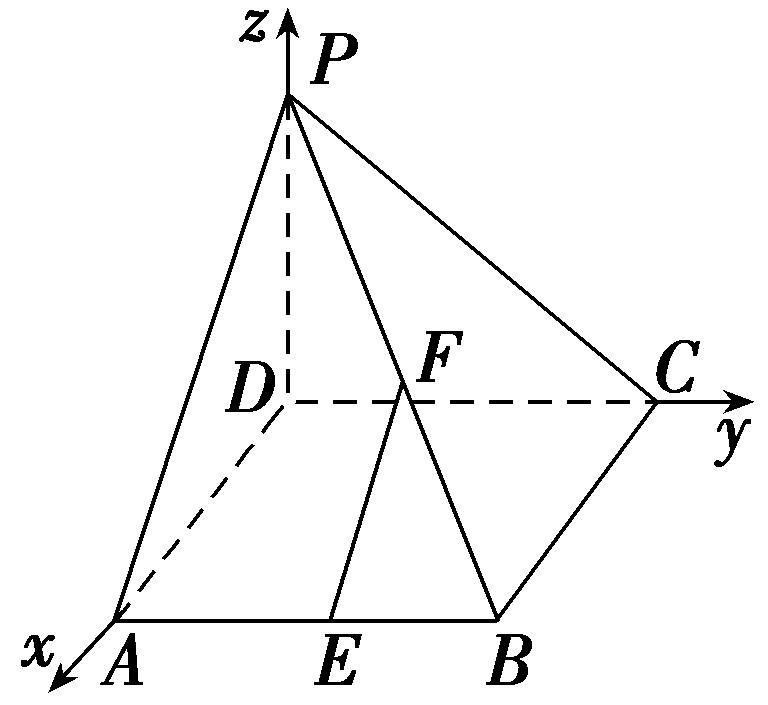

(2)*G*为线段*AD*的中点.

证明如下：设*G*(*x*，0，*z*)，

则 $\vec{FG}$ ＝(<text style="it<text style="it<text style="it*a*lic">a</text>lic">a</text>lic">x</text>－ $\frac{a}{2}$ ，－ $\frac{a}{2}$ ，<text style="it<text style="it<text style="it*a*lic">a</text>lic">a</text>lic">z</text>－ $\frac{a}{2}$ )， $\vec{CB}$ ＝(<text style="it<text style="it*a*lic">a</text>lic">a</text>，0，0)， $\vec{CP}$ ＝(0，－<text style="it<text style="it*a*lic">a</text>lic">a</text>，a)，

若使*GF*⊥平面*PCB*，则 $\left\{\begin{matrix}\vec{FG}\cdot \vec{CB}=0，\\\vec{FG}\cdot \vec{CP}=0，\end{matrix}\right.$

即 $\left\{\begin{matrix}(x－\frac{a}{2},-\frac{a}{2}，z－\frac{a}{2})\cdot (a，0，0)=0，\\(x－\frac{a}{2},-\frac{a}{2}，z－\frac{a}{2})\cdot (0,-a，a)=0.\end{matrix}\right.$ 得 $\left\{\begin{matrix}x＝\frac{a}{2}，\\z=0，\end{matrix}\right.$

所以*<text style="italic">G*</text>点坐标为( $\frac{a}{2}$ ，0，0)，即*<text style="italic">G*</text>为线段*AD*的中点.

考点三　用空间向量求空间距离　　　　师生共研

如图，在正三棱柱<em>ABC</em>-<em>A</em>1<em>B</em>1<em>C</em>1中，各棱长均为4，<em>N</em>是<em>CC</em>1的中点.

(1)求点*N*到直线*AB*的距离；

(2)求点<em>C</em>1到平面<em>ABN</em>的距离.

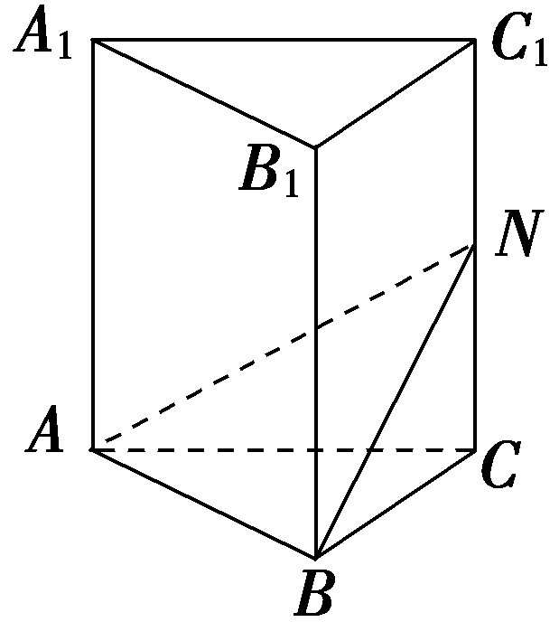

解：建立如图所示的空间直角坐标系，

则<em>A</em>(0，0，0)，<em>B</em>(2 $\sqrt{3}$ ，2，0)，<em>&lt;text style="italic"&gt;C</em>&lt;/text&gt;(0，4，0)，C1(0，4，4).

<em>A</em>1(0，0，4)，因为<em>N</em>是<em>CC</em>1的中点，所以<em>N</em>(0，4，2).

(1) $\vec{AN}$ ＝ $\left(0，4，2\right)$ ， $\vec{AB}$ ＝(2 $\sqrt{3}$ ，2，0)，

则｜ $\vec{AN}$ ｜＝2 $\sqrt{5}$ ，｜ $\vec{AB}$ ｜＝4. $\vec{AN}$ · $\vec{AB}$ ＝8.

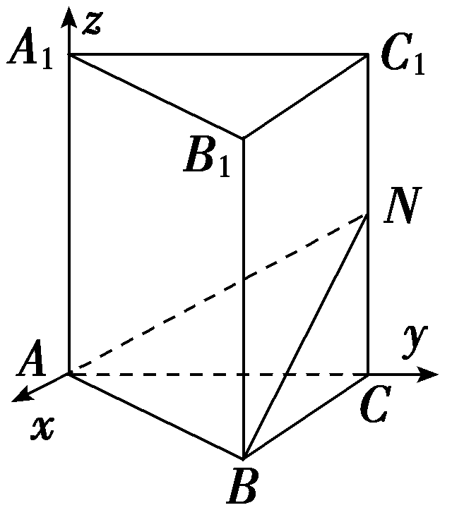

设点<em>N</em>到直线<em>AB</em>的距离为<em>d</em>1，

则<em>d</em>1＝ $\sqrt{｜\vec{AN}｜^{2}－\left(\frac{\vec{AN}\cdot \vec{AB}}{｜\vec{AB}｜}\right)^{2}}$ ＝ $\sqrt{20－4}$ ＝4.

(2)设平面<em>ABN</em>的一个法向量为<em><strong>n</strong></em>＝(<em>x</em>，<em>y</em>，<em>z</em>)，

由***<text style="bold,italic">n***</text>⊥ $\vec{AB}$ ，***<text style="bold,italic">n***</text>⊥ $\vec{AN}$ ，得 $\left\{\begin{matrix}n\cdot \vec{AB}=2\sqrt{3}x+2y=0，\\n\cdot \vec{AN}=4y+2z=0，\end{matrix}\right.$

令<te*x*t st*y*le="italic">z</text>＝2，则y＝－1，x＝ $\frac{\sqrt{3}}{3}$ ，

即***n***＝ $\left(\frac{\sqrt{3}}{3},-1，2\right)$ .易知 $\vec{C_{1}N}$ ＝ $\left(0，0,-2\right)$ ，

设点<em>C</em>1到平面<em>ABN</em>的距离为<em>d</em>2，

则<em>d</em>2＝｜ $\frac{\vec{C_{1}N}\cdot n}{｜n｜}$ ｜＝ $\left|\frac{－4}{\frac{4\sqrt{3}}{3}}\right|$ ＝ $\sqrt{3}$ .

利用向量法求点*B*到平面*α*的距离的步骤

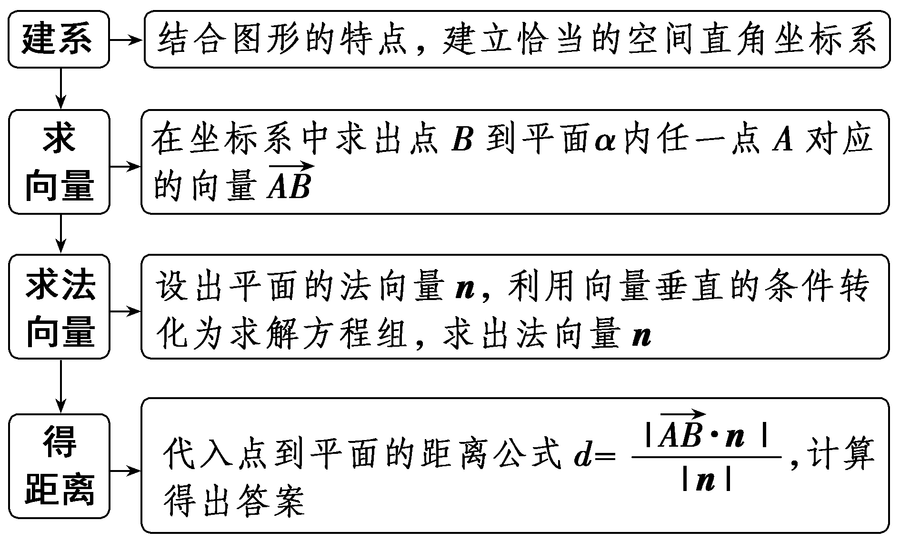

对点练3.如图，长方体<em>ABCD</em> -<em>A</em>1<em>B</em>1<em>C</em>1<em>D</em>1的棱<em>DA</em>，<em>DC</em>和<em>DD</em>1的长分别为1，2，1.求：

(1)顶点<em>B</em>到平面<em>DA</em>1<em>C</em>1的距离；

(2)直线<em>B</em>1<em>C</em>到平面<em>DA</em>1<em>C</em>1的距离.

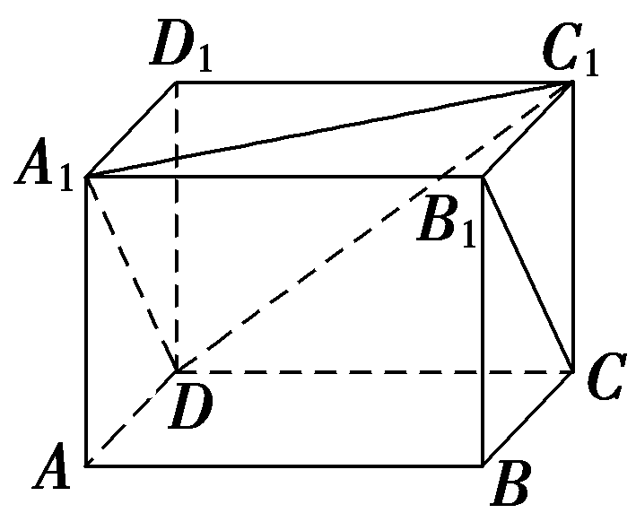

解：(1)以<te<text st*y*le="italic">x</text>t style="italic">D</text>为坐标原点， $\vec{DA}$ ， $\vec{DC}$ ， $\vec{DD_{1}}$ 的方向分别为<text st*y*le="italic">x</text>，y，*z*轴正方向，建立空间直角坐标系.

则<em>D</em>(0，0，0)，<em>A</em>(1，0，0)，<em>B</em>(1，2，0)，<em>C</em>(0，2，0)，<em>A</em>1(1，0，1)，<em>B</em>1(1，2，1)，<em>C</em>1(0，2，1)，<em>D</em>1(0，0，1).

设平面&lt;te&lt;text st<em>y</em>le="italic"&gt;x&lt;/text&gt;t style="italic"&gt;DA&lt;/text&gt;&lt;text style="subscript"&gt;1&lt;/text&gt;<em>C</em>1的法向量为<em><strong>&lt;text style="bold,italic"&gt;&lt;text style="bold,italic"&gt;n</strong></em>&lt;/text&gt;&lt;/text&gt;＝(x，y，<em>z</em>)，所以n⊥ $\vec{DA_{1}}$ ，&lt;te&lt;text st<em>y</em>le="italic"&gt;x&lt;/text&gt;t style="bold,italic"&gt;<em><strong>&lt;text style="bold,italic"&gt;n</strong></em>&lt;/text&gt;&lt;/text&gt;⊥ $\vec{DC_{1}}$ .

因为 $\vec{DA_{1}}$ ＝(1，0，1)， $\vec{DC_{1}}$ ＝(0，2，1)，

由 $\left\{\begin{matrix}n\cdot \vec{DA_{1}}=0，\\n\cdot \vec{DC_{1}}=0，\end{matrix}\right.$ 得 $\left\{\begin{matrix}x＋z=0，\\2y＋z=0，\end{matrix}\right.$ 不妨取*y*＝1，

则***n***＝(2，1，－2).

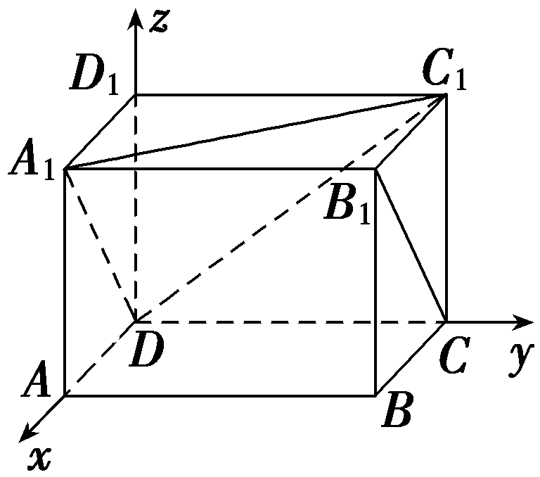

又 $\vec{C_{1}B}$ ＝(&lt;text style="subscript"&gt;1&lt;/text&gt;，0，－1)，所以顶点<em>B</em>到平面<em>DA</em>1<em>C</em>1的距离<em>d</em>＝ $\frac{｜n\cdot \vec{C_{1}B}｜}{｜n｜}$ ＝ $\frac{｜2+0+2｜}{\sqrt{4+1+4}}$ ＝ $\frac{4}{3}$ .

故顶点<em>B</em>到平面<em>DA</em>&lt;text style="subscript"&gt;1&lt;/text&gt;<em>C</em>1的距离为 $\frac{4}{3}$ .

(2)直线<em>B</em>1<em>C</em>到平面<em>DA</em>1<em>C</em>1的距离等于点<em>B</em>1到平面<em>DA</em>1<em>C</em>1的距离.

因为 $\vec{C_{1}B_{1}}$ ＝(&lt;text style="subscript"&gt;&lt;text style="subscript"&gt;&lt;text style="subscript"&gt;1&lt;/text&gt;&lt;/text&gt;&lt;/text&gt;，0，0)，所以点<em>B</em>1到平面<em>DA</em>1<em>C</em>1的距离<em>d</em>1＝ $\frac{｜n\cdot \vec{C_{1}B_{1}}｜}{｜n｜}$ ＝ $\frac{｜2+0+0｜}{\sqrt{4+1+4}}$ ＝ $\frac{2}{3}$ .

故直线<em>B</em>&lt;text style="subscript"&gt;&lt;text style="subscript"&gt;1&lt;/text&gt;&lt;/text&gt;<em>&lt;text style="italic"&gt;C</em>&lt;/text&gt;到平面<em>DA</em>1C1的距离为 $\frac{2}{3}$ .

[真题再现]　(2024·天津卷节选)如图，已知直四棱柱<em>ABCD</em>-<em>A</em>1<em>B</em>1<em>C</em>1<em>D</em>1中，<em>AD</em>⊥<em>AB</em>，<em>AB</em>∥<em>CD</em>，<em>AA</em>1＝2，<em>AB</em>＝2<em>AD</em>＝2，<em>DC</em>＝1，<em>N</em>是<em>B</em>1<em>C</em>1的中点，<em>M</em>是<em>DD</em>1的中点.求点<em>B</em>到平面<em>CB</em>1<em>M</em>的距离.

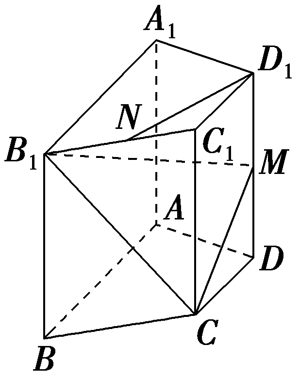

解：以<em>A</em>为坐标原点，以<em>AB</em>，<em>AD</em>，<em>AA</em>1所在直线分别为<em>x</em>轴、<em>y</em>轴、<em>z</em>轴建立如图所示的空间直角坐标系，

依题意得，<em>B</em>(2，0，0)，<em>C</em>(1，1，0)，<em>D</em>(0，1，0)，<em>B</em>1(2，0，2)，<em>C</em>1(1，1，2)，<em>D</em>1(0，1，2)，

则*M*(0，1，1)，*N*( $\frac{3}{2}$ ， $\frac{1}{2}$ ，2)，

所以 $\vec{D_{1}N}$ ＝ $\left(\frac{3}{2},-\frac{1}{2}，0\right)$ ， $\vec{CB_{1}}$ ＝ $\left(1,-1，2\right)$ ， $\vec{CM}$ ＝ $\left(－1，0，1\right)$ .

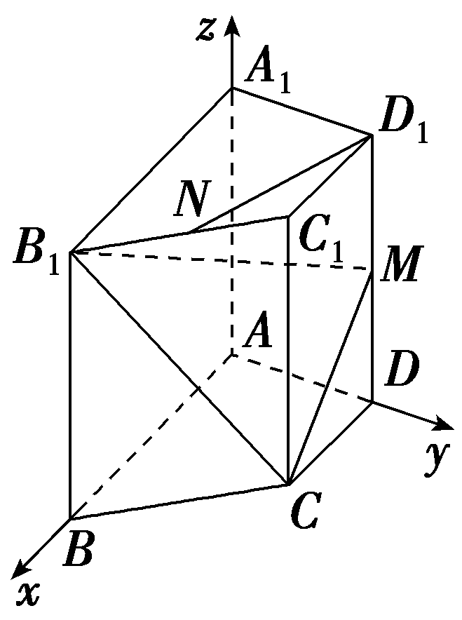

设平面 <em>CB</em>1<em>M</em>的法向量为<em><strong>n</strong></em>＝(<em>x</em>1，<em>y</em>1，<em>z</em>1)，

则 $\left\{\begin{matrix}n\cdot \vec{CB_{1}}=0，\\n\cdot \vec{CM}=0，\end{matrix}\right.$ 即 $\left\{\begin{matrix}x_{1}－y_{1}+2z_{1}=0，\\－x_{1}＋z_{1}=0，\end{matrix}\right.$

取<em>x</em>1＝1，得<em>z</em>1＝1，<em>y</em>1＝3，则<em><strong>n</strong></em>＝(1，3，1).

易知 $\vec{BB_{1}}$ ＝ $\left(0，0，2\right)$ .

设点<em>B</em>到平面<em>CB</em>1<em>M</em>的距离为<em>d</em>，

则*d*＝ $\frac{｜\vec{BB_{1}}\cdot n｜}{\left|n\right|}$ ＝ $\frac{2}{\sqrt{11}}$ ＝ $\frac{2\sqrt{11}}{11}$ ，

所以点<em>B</em>到平面<em>CB</em>1<em>M</em> 的距离为 $\frac{2\sqrt{11}}{11}$ .

[教材呈现]　(人教A选择性必修一P42T7(2))如图，四面体*OABC*的所有棱长都是1，*D*，*E*分别是边*OA*，*BC*的中点，连接*DE*.

求点*O*到平面*ABC*的距离.

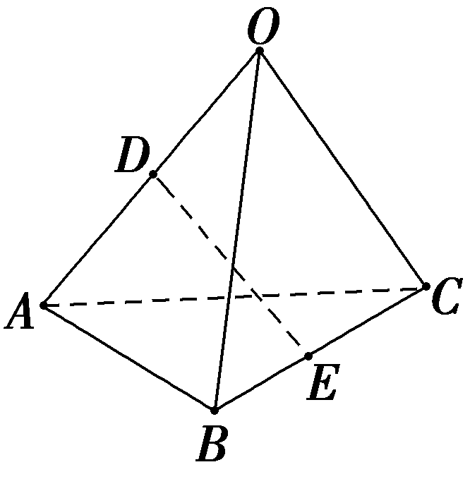

点评：这两题考查相同的知识点，设问的形式和本质基本一样，都是考查求点面距问题，同时高考题又考查综合应用所学知识解决问题的能力.

**课时测评**63　**用空间向量解决位置关系与距离问题** $\frac{对应学生}{用书P435}$

(时间：70分钟　满分：95分)

(本栏目内容，在学生用书中以独立形式分册装订！)

(1—8题，每小题5分，共40分)

1.若*M*(1，0，－1)，*N*(2，1，2)在直线*l*上，则直线*l*的方向向量是(　　)

A.(2，2，6)	B.(1，2，3)

C.(3，1，1)	D.(－3，0，1)

答案：**A**

解析：因为<text sty<text sty*l*e="italic">l</text>e="italic">M</text>，*N*在直线l上，且 $\vec{MN}$ ＝(1，1，3)，故向量(2，2，6)是直线<text sty*l*e="italic">l</text>的方向向量.故选A.

2.已知*A*(3，2，0)，*B*(0，4，0)，*C*(3，0，2)，则平面*ABC*的一个法向量是(　　)

A.(1，1，1)	B.(2，2，3)

C.(2，3，3)	D.( $\frac{\sqrt{3}}{3}$ ，－ $\frac{\sqrt{3}}{3}$ ， $\frac{\sqrt{3}}{3}$ )

答案：**C**

解析：由题可知 $\vec{AB}$ ＝(－3，2，0)， $\vec{AC}$ ＝(0，－2，2).设&lt;te&lt;te&lt;text st<em>y</em>le="italic"&gt;x&lt;/text&gt;t st<em>y</em>le="italic"&gt;x&lt;/text&gt;t style="bold,italic"&gt;<em><strong>n</strong></em>&lt;/text&gt;＝(x，y，<em>&lt;text style="italic"&gt;z</em>&lt;/text&gt;)是平面<em>&lt;text style="italic"&gt;ABC</em>&lt;/text&gt;的法向量，则 $\left\{\begin{matrix}n\perp \vec{AB}，\\n\perp \vec{AC}.\end{matrix}\right.$ 即 $\left\{\begin{matrix}n\cdot \vec{AB}＝－3x+2y=0，\\n\cdot \vec{AC}＝－2y+2z=0，\end{matrix}\right.$ 得 $\left\{\begin{matrix}x＝\frac{2}{3}y，\\y＝z，\end{matrix}\right.$ 取&lt;te&lt;text st<em>y</em>le="italic"&gt;x&lt;/text&gt;t style="italic"&gt;<em>z</em>&lt;/text&gt;＝3，则&lt;text st<em>y</em>le="italic"&gt;x&lt;/text&gt;＝2，y＝3.于是<em><strong>&lt;text style="bold,italic"&gt;n</strong></em>&lt;/text&gt;＝(2，3，3)是平面<em>&lt;text style="italic"&gt;ABC</em>&lt;/text&gt;的一个法向量.故选C.

3.已知平面<em>α</em>的一个法向量为<em><strong>n</strong></em>＝(－1，0，－1)，点<em>A</em>(3，3，0)在平面<em>α</em>内，则平面外一点<em>P</em>(－2，1，4)到平面<em>α</em>的距离为(　　)

A. $\frac{10}{3}$ 	B. $\frac{\sqrt{2}}{2}$

C. $\sqrt{2}$ 	D.1

答案：**B**

解析：由题得 $\vec{AP}$ ＝(－5，－2，4)，所以点*P*到平面*α*的距离*d*＝ $\frac{｜\vec{AP}\cdot n｜}{｜n｜}$ ＝ $\frac{｜5－4｜}{\sqrt{(-1)^{2}＋(-1)^{2}}}$ ＝ $\frac{1}{\sqrt{2}}$ ＝ $\frac{\sqrt{2}}{2}$ .故选B.

4.已知点*A*(1，0，2)，*B*(－1，1，2)，*C*(1，1，－2)，则△*ABC*的面积为(　　)

A. $\sqrt{21}$ 	B.2

C.5 $\sqrt{5}$ 	D.1

答案：**A**

解析：由*<text style="italic">A*</text>(1，0，2)，*B*(－1，1，2)，*C*(1，1，－2)，则 $\vec{BA}$ ＝(2，－1，0)， $\vec{BC}$ ＝(2，0，－4)，则｜ $\vec{BC}$ ｜＝ $\sqrt{2^{2}＋0^{2}＋4^{2}}$ ＝2 $\sqrt{5}$ ，且点*<text style="italic">A*</text>到直线*BC*的距离为*<text style="italic">d*</text>＝ $\sqrt{\vec{BA}^{2}－(\vec{BA}\cdot \frac{\vec{BC}}{｜\vec{BC}｜})^{2}}$ ＝ $\sqrt{5－(\frac{4}{2\sqrt{5}})^{2}}$ ＝ $\frac{\sqrt{21}}{\sqrt{5}}$ ，所以△*<text style="italic">A*</text>*BC*的面积是 $S_{\bigtriangleup }_{ABC}$ ＝ $\frac{1}{2}$ ×｜ $\vec{BC}$ ｜×*<text style="italic">d*</text>＝ $\frac{1}{2}$ ×2 $\sqrt{5}$ × $\frac{\sqrt{21}}{\sqrt{5}}$ ＝ $\sqrt{21}$ .故选*<text style="italic">A*</text>.

5.在正三棱柱<em>&lt;text style="italic"&gt;&lt;text style="italic"&gt;A</em>&lt;/text&gt;<em>B&lt;text style="italic"&gt;C</em>&lt;/text&gt;&lt;/text&gt;-A&lt;text style="subscript"&gt;&lt;text style="subscript"&gt;&lt;text style="subscript"&gt;&lt;text style="subscript"&gt;&lt;text style="subscript"&gt;1&lt;/text&gt;&lt;/text&gt;&lt;/text&gt;&lt;/text&gt;&lt;/text&gt;B1C1中，<em>AA</em>1＝2<em>&lt;text style="italic"&gt;AB</em>&lt;/text&gt;＝2，<em>E</em>为AB的中点，<em>F</em>为线段<em>BB</em>1上一点，且A1C⊥<em>EF</em>，则 $\frac{B_{1}F}{FB}$ ＝(　　)

A.10	B.12

C.15	D.20

答案：**C**

解析：取<em>&lt;text style="italic"&gt;&lt;text style="italic"&gt;A</em>&lt;/text&gt;&lt;/text&gt;&lt;text style="subscript"&gt;&lt;text style="subscript"&gt;&lt;text style="subscript"&gt;&lt;text style="subscript"&gt;&lt;text style="subscript"&gt;&lt;text style="subscript"&gt;1&lt;/text&gt;&lt;/text&gt;&lt;/text&gt;&lt;/text&gt;&lt;/text&gt;&lt;/text&gt;<em>B</em>1的中点<em>&lt;text style="italic"&gt;&lt;text style="italic"&gt;E</em>&lt;/text&gt;&lt;/text&gt;1，连接<em>&lt;text style="italic"&gt;EE</em>&lt;/text&gt;1，<em>&lt;text style="italic"&gt;E&lt;text style="italic"&gt;&lt;text style="italic"&gt;C</em>&lt;/text&gt;&lt;/text&gt;&lt;/text&gt;，易知EC，<em>EB</em>，EE1两两垂直，以E为坐标原点，建立如图所示的空间直角坐标系.则E(0，0，0)，C( $\frac{\sqrt{3}}{2}$ ，0，0)，<em>&lt;text style="italic"&gt;&lt;text style="italic"&gt;A</em>&lt;/text&gt;&lt;/text&gt;&lt;text style="subscript"&gt;&lt;text style="subscript"&gt;&lt;text style="subscript"&gt;&lt;text style="subscript"&gt;&lt;text style="subscript"&gt;&lt;text style="subscript"&gt;1&lt;/text&gt;&lt;/text&gt;&lt;/text&gt;&lt;/text&gt;&lt;/text&gt;&lt;/text&gt;(0，－ $\frac{1}{2}$ ，2)， $\vec{A_{1}C}$ ＝( $\frac{\sqrt{3}}{2}$ ， $\frac{1}{2}$ ，－2).设<em>F</em>(0， $\frac{1}{2}$ ，<em>&lt;text style="italic"&gt;&lt;text style="italic"&gt;&lt;text style="italic"&gt;&lt;text style="italic"&gt;λ</em>&lt;/text&gt;&lt;/text&gt;&lt;/text&gt;&lt;/text&gt;)(0≤λ≤2)，则 $\vec{EF}$ ＝(0， $\frac{1}{2}$ ，<em>&lt;text style="italic"&gt;&lt;text style="italic"&gt;&lt;text style="italic"&gt;&lt;text style="italic"&gt;λ</em>&lt;/text&gt;&lt;/text&gt;&lt;/text&gt;&lt;/text&gt;).由<em>&lt;text style="italic"&gt;&lt;text style="italic"&gt;A</em>&lt;/text&gt;&lt;/text&gt;&lt;text style="subscript"&gt;&lt;text style="subscript"&gt;&lt;text style="subscript"&gt;&lt;text style="subscript"&gt;&lt;text style="subscript"&gt;&lt;text style="subscript"&gt;1&lt;/text&gt;&lt;/text&gt;&lt;/text&gt;&lt;/text&gt;&lt;/text&gt;&lt;/text&gt;<em>&lt;text style="italic"&gt;C</em>&lt;/text&gt;⊥<em>&lt;text style="italic"&gt;&lt;text style="italic"&gt;E</em>&lt;/text&gt;&lt;/text&gt;<em>F</em>，得 $\vec{A_{1}C}$ · $\vec{EF}$ ＝ $\frac{1}{4}$ －2<em>&lt;text style="italic"&gt;&lt;text style="italic"&gt;&lt;text style="italic"&gt;&lt;text style="italic"&gt;λ</em>&lt;/text&gt;&lt;/text&gt;&lt;/text&gt;&lt;/text&gt;＝0，解得λ＝ $\frac{1}{8}$ ，故 $\frac{B_{1}F}{FB}$ ＝ $\frac{2－\frac{1}{8}}{\frac{1}{8}}$ ＝&lt;text style="subscript"&gt;&lt;text style="subscript"&gt;&lt;text style="subscript"&gt;&lt;text style="subscript"&gt;&lt;text style="subscript"&gt;&lt;text style="subscript"&gt;1&lt;/text&gt;&lt;/text&gt;&lt;/text&gt;&lt;/text&gt;&lt;/text&gt;&lt;/text&gt;5.故选<em>&lt;text style="italic"&gt;C</em>&lt;/text&gt;.

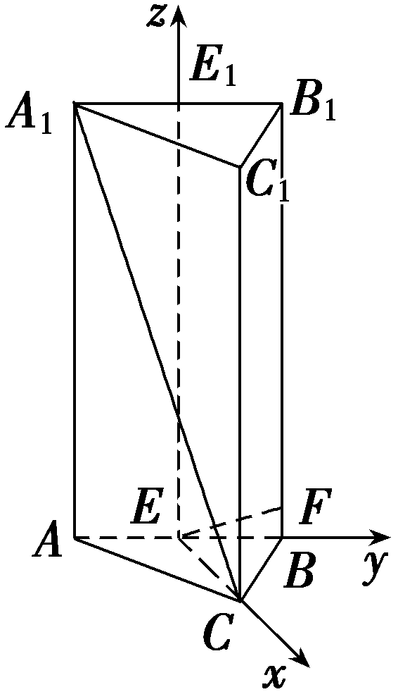

6.(多选)如图所示，正方体<em>&lt;text style="italic"&gt;&lt;text style="italic"&gt;&lt;text style="italic"&gt;&lt;text style="italic"&gt;A</em>&lt;/text&gt;&lt;/text&gt;&lt;/text&gt;<em>BC&lt;text style="italic"&gt;&lt;text style="italic"&gt;D</em>&lt;/text&gt;&lt;/text&gt;&lt;/text&gt; -A&lt;text style="subscript"&gt;&lt;text style="subscript"&gt;&lt;text style="subscript"&gt;&lt;text style="subscript"&gt;&lt;text style="subscript"&gt;&lt;text style="subscript"&gt;1&lt;/text&gt;&lt;/text&gt;&lt;/text&gt;&lt;/text&gt;&lt;/text&gt;&lt;/text&gt;B1C1D1中，<em>AB</em>＝3，<em>&lt;text style="italic"&gt;E</em>&lt;/text&gt;，<em>F</em>分别在A1D，<em>&lt;text style="italic"&gt;AC</em>&lt;/text&gt;上，且A1E＝ $\frac{2}{3}$ <em>&lt;text style="italic"&gt;&lt;text style="italic"&gt;&lt;text style="italic"&gt;A</em>&lt;/text&gt;&lt;/text&gt;&lt;/text&gt;&lt;text style="subscript"&gt;&lt;text style="subscript"&gt;&lt;text style="subscript"&gt;&lt;text style="subscript"&gt;&lt;text style="subscript"&gt;&lt;text style="subscript"&gt;1&lt;/text&gt;&lt;/text&gt;&lt;/text&gt;&lt;/text&gt;&lt;/text&gt;&lt;/text&gt;<em>&lt;text style="italic"&gt;&lt;text style="italic"&gt;D</em>&lt;/text&gt;&lt;/text&gt;，A<em>F</em>＝ $\frac{1}{3}$ <em>&lt;text style="italic"&gt;&lt;text style="italic"&gt;&lt;text style="italic"&gt;A</em>&lt;/text&gt;&lt;/text&gt;&lt;/text&gt;<em>C</em>，则下列选项正确的为(　　)

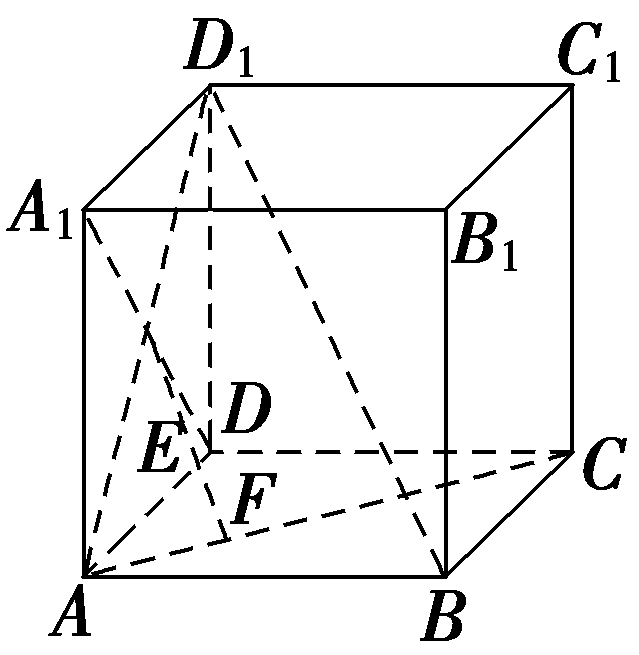

A.<em>EF</em>∥<em>BD</em>1

B.<em>EF</em>⊥<em>A</em>1<em>D</em>

C.*EF*＝ $\sqrt{2}$

D.点<em>F</em>到平面<em>ABD</em>1的距离为 $\frac{\sqrt{2}}{2}$

答案：**ABD**

解析：如图，以&lt;te&lt;text st<em>y</em>le="italic"&gt;x&lt;/text&gt;t style="italic"&gt;<em>&lt;text style="italic"&gt;&lt;text style="italic"&gt;D</em>&lt;/text&gt;&lt;/text&gt;&lt;/text&gt;为坐标原点，分别以<em>D&lt;text style="italic"&gt;&lt;text style="italic"&gt;&lt;text style="italic"&gt;A</em>&lt;/text&gt;&lt;/text&gt;&lt;/text&gt;，<em>D&lt;text style="italic"&gt;C</em>&lt;/text&gt;，<em>DD</em>&lt;text style="subscript"&gt;&lt;text style="subscript"&gt;&lt;text style="subscript"&gt;1&lt;/text&gt;&lt;/text&gt;&lt;/text&gt;所在直线为x轴，y轴，<em>z</em>轴建立空间直角坐标系.由<em>A&lt;text style="italic"&gt;B</em>&lt;/text&gt;＝3，则<em>E</em>(1，0，1)，<em>F</em>(2，1，0)，A1(3，0，3)，A(3，0，0)，C(0，3，0)，D(0，0，0)，B(3，3，0)，D1(0，0，3)，所以 $\vec{EF}$ ＝(&lt;te&lt;text st<em>y</em>le="italic"&gt;x&lt;/text&gt;t style="subscript"&gt;&lt;text style="subscript"&gt;&lt;text style="subscript"&gt;1&lt;/text&gt;&lt;/text&gt;&lt;/text&gt;，1，－1)， $\vec{BD_{1}}$ ＝(－3，－3，3)， $\vec{EF}$ ＝－ $\frac{1}{3}\vec{BD_{1}}$ ，故<em>&lt;text style="italic"&gt;&lt;text style="italic"&gt;A</em>&lt;/text&gt;&lt;/text&gt;正确；由 $\vec{A_{1}D}$ ＝(－3，0，－3)， $\vec{EF}$ · $\vec{A_{1}D}$ ＝0，所以<em>EF</em>⊥<em>&lt;text style="italic"&gt;&lt;text style="italic"&gt;A</em>&lt;/text&gt;&lt;/text&gt;&lt;te&lt;text st<em>y</em>le="italic"&gt;x&lt;/text&gt;t style="subscript"&gt;&lt;text style="subscript"&gt;&lt;text style="subscript"&gt;1&lt;/text&gt;&lt;/text&gt;&lt;/text&gt;<em>&lt;text style="italic"&gt;&lt;text style="italic"&gt;&lt;text style="italic"&gt;D</em>&lt;/text&gt;&lt;/text&gt;&lt;/text&gt;，故<em>B</em>正确；｜ $\vec{EF}$ ｜＝ $\sqrt{1^{2}＋1^{2}＋(-1)^{2}}$ ＝ $\sqrt{3}$ ，故<em>C</em>错误；

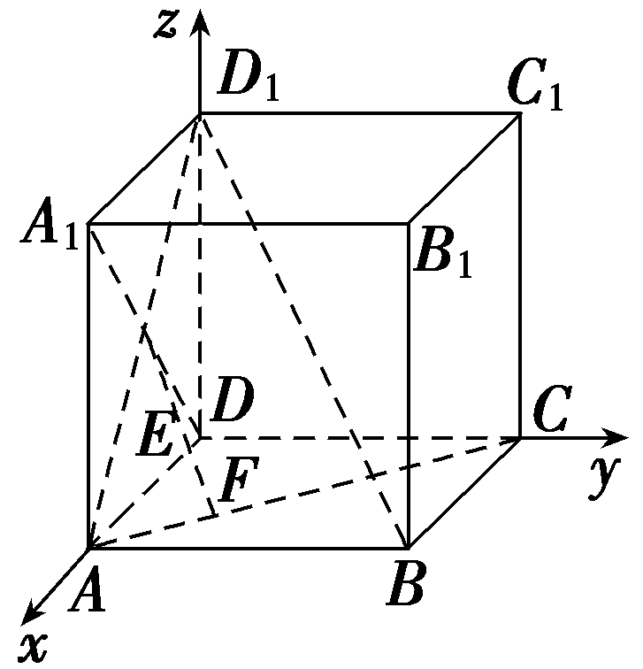

设平面&lt;te&lt;text st<em>y</em>le="italic"&gt;x&lt;/text&gt;t style="italic"&gt;<em>ABD</em>&lt;/text&gt;&lt;text style="subscript"&gt;1&lt;/text&gt;的一个法向量为&lt;text style="bol<em>d</em>,italic"&gt;<em><strong>n</strong></em>&lt;/text&gt;＝(x，y，<em>&lt;text style="italic"&gt;z</em>&lt;/text&gt;)， $\vec{AB}$ ＝(0，3，0)， $\vec{AD_{1}}$ ＝(－3，0，3)，由 $\left\{\begin{matrix}n\cdot \vec{AB}=0，\\n\cdot \vec{AD_{1}}=0，\end{matrix}\right.$ 得 $\left\{\begin{matrix}3y=0，\\－3x+3z=0，\end{matrix}\right.$ 令<em>&lt;text style="italic"&gt;z</em>&lt;/text&gt;＝&lt;te&lt;text st<em>y</em>le="italic"&gt;x&lt;/text&gt;t style="subscript"&gt;1&lt;/text&gt;，得&lt;text style="bol<em>d</em>,italic"&gt;<em><strong>n</strong></em>&lt;/text&gt;＝(1，0，1).易知 $\vec{AF}$ ＝(－&lt;te&lt;text st<em>y</em>le="italic"&gt;x&lt;/text&gt;t style="subscript"&gt;1&lt;/text&gt;，1，0)，则点<em>F</em>到平面<em>&lt;text style="italic"&gt;ABD</em>&lt;/text&gt;1的距离<em>d</em>＝ $\frac{｜\vec{AF}\cdot n｜}{｜n｜}$ ＝ $\frac{\sqrt{2}}{2}$ ，故D正确.故选&lt;te&lt;text st<em>y</em>le="italic"&gt;x&lt;/text&gt;t style="italic"&gt;<em>ABD</em>&lt;/text&gt;.

7.在空间直角坐标系中，<em><strong>a</strong></em>＝(1，2，1)为直线<em>l</em>的一个方向向量，<em><strong>n</strong></em>＝(2，<em>t</em>，4)为平面<em>α</em>的一个法向量，且<em>l</em>∥<em>α</em>，则<em>t</em>＝<u>　　　　</u>.

答案：－3

解析：因为<em>l</em>∥<em>α</em>，所以<em><strong>a</strong></em>＝(1，2，1)与<em><strong>n</strong></em>＝(2，<em>t</em>，4)垂直，故<em><strong>a</strong>·<strong>n</strong></em>＝(1，2，1)<em>·</em>(2，<em>t</em>，4)＝2＋2<em>t</em>＋4＝0，解得<em>t</em>＝－3.

8.已知<em>A</em>(0，0，0)，<em>B</em>(1，1，1)，<em>C</em>(1，0，0)，<em>D</em>(－1，2，1)，其中<em>A</em>∈<em>α</em>，<em>B</em>∈<em>α</em>，<em>C</em>∈<em>β</em>，<em>D</em>∈<em>β</em>，已知平面<em>α</em>∥平面<em>β</em>，则平面<em>α</em>与平面<em>β</em>间的距离为<u>　　　　</u>.

答案： $\frac{\sqrt{26}}{26}$

解析：由已知得 $\vec{AB}$ ＝(1，1，1)， $\vec{CD}$ ＝(－2，2，1)， $\vec{AC}$ ＝(1，0，0).设向量&lt;te&lt;te<em>x</em>t st<em>y</em>le="italic"&gt;x&lt;/text&gt;t style="bol<em>d</em>,italic"&gt;<em><strong>n</strong></em>&lt;/text&gt;＝(x，y，<em>z</em>)与向量 $\vec{AB}$ ， $\vec{CD}$ 都垂直，则 $\left\{\begin{matrix}n\cdot \vec{AB}=0，\\n\cdot \vec{CD}=0，\end{matrix}\right.$ 即 $\left\{\begin{matrix}x＋y＋z=0，\\－2x+2y＋z=0，\end{matrix}\right.$ 取&lt;te<em>x</em>t st<em>y</em>le="italic"&gt;x&lt;/text&gt;＝1，得&lt;text style="bol<em>d</em>,italic"&gt;<em><strong>n</strong></em>&lt;/text&gt;＝(1，3，－4)，又平面<em>&lt;text style="italic"&gt;α</em>&lt;/text&gt;∥平面<em>&lt;text style="italic"&gt;β</em>&lt;/text&gt;，所以平面α与平面β间的距离d＝ $\frac{｜\vec{AC}\cdot n｜}{｜n｜}$ ＝ $\frac{｜1\times 1+3\times 0+(-4)\times 0｜}{\sqrt{1^{2}＋3^{2}＋(-4)^{2}}}$ ＝ $\frac{\sqrt{26}}{26}$ .

9.(13分)在直三棱柱<em>ABC</em>-<em>A</em>1<em>B</em>1<em>C</em>1中，∠<em>ABC</em>＝90°，<em>BC</em>＝2，<em>CC</em>1＝4，点<em>E</em>在线段<em>BB</em>1上，且<em>EB</em>1＝1，<em>D</em>，<em>F</em>，<em>G</em>分别为<em>CC</em>1，<em>C</em>1<em>B</em>1，<em>C</em>1<em>A</em>1的中点.

证明：(1)<em>B</em>1<em>D</em>⊥平面<em>ABD</em>；(6分)

(2)平面*EGF*∥平面*ABD*.(7分)

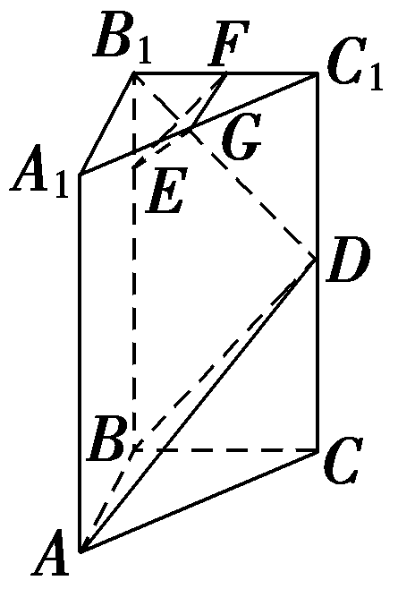

证明：(1)以<em>B</em>为坐标原点，<em>BA</em>，<em>BC</em>，<em>BB</em>1所在的直线分别为<em>x</em>轴，<em>y</em>轴，<em>z</em>轴建立空间直角坐标系，如图所示，

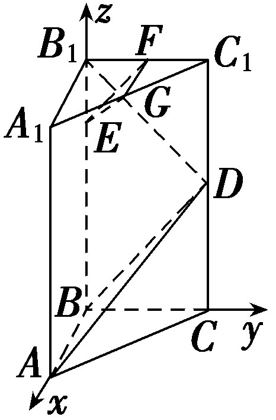

则<em>B</em>(0，0，0)，<em>D</em>(0，2，2)，<em>B</em>1(0，0，4)，设<em>BA</em>＝<em>a</em>，则<em>A</em>(<em>a</em>，0，0)，

所以 $\vec{BA}$ ＝(*a*，0，0)， $\vec{BD}$ ＝(0，2，2)， $\vec{B_{1}D}$ ＝(0，2，－2)，

$\vec{B_{1}D}$ · $\vec{BA}$ ＝0， $\vec{B_{1}D}$ · $\vec{BD}$ ＝0＋4－4＝0，即<em>&lt;text style="italic"&gt;B</em>&lt;/text&gt;&lt;text style="subscript"&gt;1&lt;/text&gt;<em>&lt;text style="italic"&gt;D</em>&lt;/text&gt;⊥<em>BA</em>，B1D⊥<em>BD</em>.

又<em>BA</em>∩<em>BD</em>＝<em>B</em>，<em>BA</em>，<em>BD</em>⊂平面<em>ABD</em>，因此<em>B</em>1<em>D</em>⊥平面<em>ABD</em>.

(2)由(1)知，*E*(0，0，3)，*G*( $\frac{a}{2}$ ，1，4)，*F*(0，1，4)，

则 $\vec{EG}$ ＝( $\frac{a}{2}$ ，1，1)， $\vec{EF}$ ＝(0，1，1)， $\vec{B_{1}D}$ *·* $\vec{EG}$ ＝0＋2－2＝0， $\vec{B_{1}D}$ *·* $\vec{EF}$ ＝0＋2－2＝0，

即<em>B</em>1<em>D</em>⊥<em>EG</em>，<em>B</em>1<em>D</em>⊥<em>EF</em>.又<em>EG</em>∩<em>EF</em>＝<em>E</em>，<em>EG</em>，<em>EF</em>⊂平面<em>EGF</em>，因此<em>B</em>1<em>D</em>⊥平面<em>EGF</em>.

结合(1)可知平面*EGF*∥平面*ABD*.

(10、11题，每小题5分，共10分)

10.(多选)如图，在正方体<em>ABCD</em> -<em>A</em>1<em>B</em>1<em>C</em>1<em>D</em>1中，<em>AA</em>1＝3，点<em>M</em>，<em>N</em>分别在棱<em>AB</em>和<em>BB</em>1上运动(不含端点).若<em>D</em>1<em>M</em>⊥<em>MN</em>，则下列结论正确的是(　　)

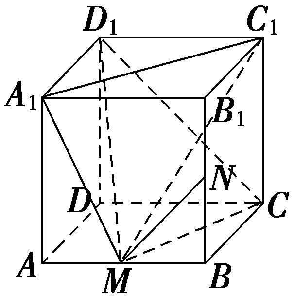

A.<em>MN</em>⊥<em>A</em>1<em>M</em>

B.<em>MN</em>⊥平面<em>D</em>1<em>MC</em>

C.线段*BN*长度的最大值为 $\frac{3}{4}$

D.三棱锥<em>C</em>1-<em>A</em>1<em>D</em>1<em>M</em>体积不变

答案：**ACD**

解析：在正方体&lt;te&lt;text st&lt;text st&lt;text st&lt;text st&lt;text st&lt;text st&lt;text st&lt;text st&lt;text st&lt;text st&lt;text st&lt;text st&lt;text st&lt;text st&lt;text st&lt;text st<em>y</em>le="italic"&gt;y&lt;/text&gt;le="italic"&gt;y&lt;/text&gt;le="italic"&gt;y&lt;/text&gt;le="italic"&gt;y&lt;/text&gt;le="italic"&gt;y&lt;/text&gt;le="italic"&gt;y&lt;/text&gt;le="italic"&gt;y&lt;/text&gt;le="italic"&gt;y&lt;/text&gt;le="italic"&gt;y&lt;/text&gt;le="italic"&gt;y&lt;/text&gt;le="italic"&gt;y&lt;/text&gt;le="italic"&gt;y&lt;/text&gt;le="italic"&gt;y&lt;/text&gt;le="italic"&gt;y&lt;/text&gt;le="italic"&gt;y&lt;/text&gt;le="italic"&gt;x&lt;/text&gt;t style="italic"&gt;<em>&lt;text style="italic"&gt;&lt;text style="italic"&gt;A</em>&lt;/text&gt;&lt;/text&gt;<em>&lt;text style="italic"&gt;B</em>&lt;/text&gt;<em>&lt;text style="italic"&gt;C</em>&lt;/text&gt;<em>&lt;text style="italic"&gt;&lt;text style="italic"&gt;&lt;text style="italic"&gt;&lt;text style="italic"&gt;D</em>&lt;/text&gt;&lt;/text&gt;&lt;/text&gt;&lt;/text&gt;&lt;/text&gt; -A&lt;text style="subscript"&gt;&lt;text style="subscript"&gt;&lt;text style="subscript"&gt;&lt;text style="subscript"&gt;&lt;text style="subscript"&gt;&lt;text style="subscript"&gt;&lt;text style="subscript"&gt;&lt;text style="subscript"&gt;&lt;text style="subscript"&gt;1&lt;/text&gt;&lt;/text&gt;&lt;/text&gt;&lt;/text&gt;&lt;/text&gt;&lt;/text&gt;&lt;/text&gt;&lt;/text&gt;&lt;/text&gt;B1C1D1中，以点D为原点，射线<em>DA</em>，<em>DC</em>，<em>DD</em>1分别为x，y，<em>&lt;text style="italic"&gt;&lt;text style="italic"&gt;&lt;text style="italic"&gt;&lt;text style="italic"&gt;&lt;text style="italic"&gt;&lt;text style="italic"&gt;z</em>&lt;/text&gt;&lt;/text&gt;&lt;/text&gt;&lt;/text&gt;&lt;/text&gt;&lt;/text&gt;轴非负半轴建立空间直角坐标系，如图，则A1(3，0，3)，D1(0，0，3)，C(0，3，0)，B(3，3，0)，设<em>&lt;text style="italic"&gt;&lt;text style="italic"&gt;M</em>&lt;/text&gt;&lt;/text&gt;(3，y，0)，<em>N</em>(3，3，z)，y，z∈(0，3)， $\vec{D_{1}M}$ ＝(3，&lt;text st&lt;text st&lt;text st&lt;text st&lt;text st&lt;text st&lt;text st&lt;text st&lt;text st&lt;text st&lt;text st&lt;text st&lt;text st&lt;text st&lt;text st<em>y</em>le="italic"&gt;y&lt;/text&gt;le="italic"&gt;y&lt;/text&gt;le="italic"&gt;y&lt;/text&gt;le="italic"&gt;y&lt;/text&gt;le="italic"&gt;y&lt;/text&gt;le="italic"&gt;y&lt;/text&gt;le="italic"&gt;y&lt;/text&gt;le="italic"&gt;y&lt;/text&gt;le="italic"&gt;y&lt;/text&gt;le="italic"&gt;y&lt;/text&gt;le="italic"&gt;y&lt;/text&gt;le="italic"&gt;y&lt;/text&gt;le="italic"&gt;y&lt;/text&gt;le="italic"&gt;y&lt;/text&gt;le="italic"&gt;y&lt;/text&gt;，－3)， $\vec{MN}$ ＝(0，3－&lt;text st&lt;text st&lt;text st&lt;text st&lt;text st&lt;text st&lt;text st&lt;text st&lt;text st&lt;text st&lt;text st&lt;text st&lt;text st&lt;text st&lt;text st<em>y</em>le="italic"&gt;y&lt;/text&gt;le="italic"&gt;y&lt;/text&gt;le="italic"&gt;y&lt;/text&gt;le="italic"&gt;y&lt;/text&gt;le="italic"&gt;y&lt;/text&gt;le="italic"&gt;y&lt;/text&gt;le="italic"&gt;y&lt;/text&gt;le="italic"&gt;y&lt;/text&gt;le="italic"&gt;y&lt;/text&gt;le="italic"&gt;y&lt;/text&gt;le="italic"&gt;y&lt;/text&gt;le="italic"&gt;y&lt;/text&gt;le="italic"&gt;y&lt;/text&gt;le="italic"&gt;y&lt;/text&gt;le="italic"&gt;y&lt;/text&gt;，<em>&lt;text style="italic"&gt;&lt;text style="italic"&gt;&lt;text style="italic"&gt;&lt;text style="italic"&gt;&lt;text style="italic"&gt;&lt;text style="italic"&gt;z</em>&lt;/text&gt;&lt;/text&gt;&lt;/text&gt;&lt;/text&gt;&lt;/text&gt;&lt;/text&gt;)，而&lt;te<em>x</em>t style="italic"&gt;<em>&lt;text style="italic"&gt;&lt;text style="italic"&gt;&lt;text style="italic"&gt;D</em>&lt;/text&gt;&lt;/text&gt;&lt;/text&gt;&lt;/text&gt;&lt;text style="subscript"&gt;&lt;text style="subscript"&gt;&lt;text style="subscript"&gt;&lt;text style="subscript"&gt;&lt;text style="subscript"&gt;&lt;text style="subscript"&gt;&lt;text style="subscript"&gt;&lt;text style="subscript"&gt;&lt;text style="subscript"&gt;1&lt;/text&gt;&lt;/text&gt;&lt;/text&gt;&lt;/text&gt;&lt;/text&gt;&lt;/text&gt;&lt;/text&gt;&lt;/text&gt;&lt;/text&gt;<em>&lt;text style="italic"&gt;&lt;text style="italic"&gt;M</em>&lt;/text&gt;&lt;/text&gt;⊥M<em>N</em>，则 $\vec{D_{1}M}$ · $\vec{MN}$ ＝&lt;text st&lt;text st&lt;text st&lt;text st&lt;text st&lt;text st&lt;text st&lt;text st&lt;text st&lt;text st&lt;text st&lt;text st&lt;text st&lt;text st&lt;text st<em>y</em>le="italic"&gt;y&lt;/text&gt;le="italic"&gt;y&lt;/text&gt;le="italic"&gt;y&lt;/text&gt;le="italic"&gt;y&lt;/text&gt;le="italic"&gt;y&lt;/text&gt;le="italic"&gt;y&lt;/text&gt;le="italic"&gt;y&lt;/text&gt;le="italic"&gt;y&lt;/text&gt;le="italic"&gt;y&lt;/text&gt;le="italic"&gt;y&lt;/text&gt;le="italic"&gt;y&lt;/text&gt;le="italic"&gt;y&lt;/text&gt;le="italic"&gt;y&lt;/text&gt;le="italic"&gt;y&lt;/text&gt;le="italic"&gt;y&lt;/text&gt;(3－y)－3<em>&lt;text style="italic"&gt;&lt;text style="italic"&gt;&lt;text style="italic"&gt;&lt;text style="italic"&gt;&lt;text style="italic"&gt;&lt;text style="italic"&gt;z</em>&lt;/text&gt;&lt;/text&gt;&lt;/text&gt;&lt;/text&gt;&lt;/text&gt;&lt;/text&gt;＝0，即z＝ $\frac{1}{3}$ &lt;text st&lt;text st&lt;text st&lt;text st&lt;text st&lt;text st&lt;text st&lt;text st&lt;text st&lt;text st&lt;text st&lt;text st&lt;text st&lt;text st&lt;text st<em>y</em>le="italic"&gt;y&lt;/text&gt;le="italic"&gt;y&lt;/text&gt;le="italic"&gt;y&lt;/text&gt;le="italic"&gt;y&lt;/text&gt;le="italic"&gt;y&lt;/text&gt;le="italic"&gt;y&lt;/text&gt;le="italic"&gt;y&lt;/text&gt;le="italic"&gt;y&lt;/text&gt;le="italic"&gt;y&lt;/text&gt;le="italic"&gt;y&lt;/text&gt;le="italic"&gt;y&lt;/text&gt;le="italic"&gt;y&lt;/text&gt;le="italic"&gt;y&lt;/text&gt;le="italic"&gt;y&lt;/text&gt;le="italic"&gt;y&lt;/text&gt;(3－y).对于&lt;te<em>x</em>t style="italic"&gt;<em>&lt;text style="italic"&gt;A</em>&lt;/text&gt;&lt;/text&gt;， $\vec{A_{1}M}$ ＝(0，&lt;text st&lt;text st&lt;text st&lt;text st&lt;text st&lt;text st&lt;text st&lt;text st&lt;text st&lt;text st&lt;text st&lt;text st&lt;text st&lt;text st&lt;text st<em>y</em>le="italic"&gt;y&lt;/text&gt;le="italic"&gt;y&lt;/text&gt;le="italic"&gt;y&lt;/text&gt;le="italic"&gt;y&lt;/text&gt;le="italic"&gt;y&lt;/text&gt;le="italic"&gt;y&lt;/text&gt;le="italic"&gt;y&lt;/text&gt;le="italic"&gt;y&lt;/text&gt;le="italic"&gt;y&lt;/text&gt;le="italic"&gt;y&lt;/text&gt;le="italic"&gt;y&lt;/text&gt;le="italic"&gt;y&lt;/text&gt;le="italic"&gt;y&lt;/text&gt;le="italic"&gt;y&lt;/text&gt;le="italic"&gt;y&lt;/text&gt;，－3)，则 $\vec{A_{1}M}$ · $\vec{MN}$ ＝&lt;text st&lt;text st&lt;text st&lt;text st&lt;text st&lt;text st&lt;text st&lt;text st&lt;text st&lt;text st&lt;text st&lt;text st&lt;text st&lt;text st&lt;text st<em>y</em>le="italic"&gt;y&lt;/text&gt;le="italic"&gt;y&lt;/text&gt;le="italic"&gt;y&lt;/text&gt;le="italic"&gt;y&lt;/text&gt;le="italic"&gt;y&lt;/text&gt;le="italic"&gt;y&lt;/text&gt;le="italic"&gt;y&lt;/text&gt;le="italic"&gt;y&lt;/text&gt;le="italic"&gt;y&lt;/text&gt;le="italic"&gt;y&lt;/text&gt;le="italic"&gt;y&lt;/text&gt;le="italic"&gt;y&lt;/text&gt;le="italic"&gt;y&lt;/text&gt;le="italic"&gt;y&lt;/text&gt;le="italic"&gt;y&lt;/text&gt;(3－y)－3<em>&lt;text style="italic"&gt;&lt;text style="italic"&gt;&lt;text style="italic"&gt;&lt;text style="italic"&gt;&lt;text style="italic"&gt;&lt;text style="italic"&gt;z</em>&lt;/text&gt;&lt;/text&gt;&lt;/text&gt;&lt;/text&gt;&lt;/text&gt;&lt;/text&gt;＝0，则 $\vec{A_{1}M}$ ⊥ $\vec{MN}$ ，&lt;text st&lt;text st&lt;text st&lt;text st&lt;text st&lt;text st&lt;text st&lt;text st&lt;text st&lt;text st&lt;text st&lt;text st&lt;text st&lt;text st&lt;text st<em>y</em>le="italic"&gt;y&lt;/text&gt;le="italic"&gt;y&lt;/text&gt;le="italic"&gt;y&lt;/text&gt;le="italic"&gt;y&lt;/text&gt;le="italic"&gt;y&lt;/text&gt;le="italic"&gt;y&lt;/text&gt;le="italic"&gt;y&lt;/text&gt;le="italic"&gt;y&lt;/text&gt;le="italic"&gt;y&lt;/text&gt;le="italic"&gt;y&lt;/text&gt;le="italic"&gt;y&lt;/text&gt;le="italic"&gt;y&lt;/text&gt;le="italic"&gt;y&lt;/text&gt;le="italic"&gt;y&lt;/text&gt;le="italic"&gt;<em>&lt;text style="italic"&gt;M</em>&lt;/text&gt;&lt;/text&gt;<em>N</em>⊥&lt;te&lt;text st<em>y</em>le="italic"&gt;x&lt;/text&gt;t style="italic"&gt;<em>&lt;text style="italic"&gt;A</em>&lt;/text&gt;&lt;/text&gt;&lt;text style="subscript"&gt;&lt;text style="subscript"&gt;&lt;text style="subscript"&gt;&lt;text style="subscript"&gt;&lt;text style="subscript"&gt;&lt;text style="subscript"&gt;&lt;text style="subscript"&gt;&lt;text style="subscript"&gt;&lt;text style="subscript"&gt;1&lt;/text&gt;&lt;/text&gt;&lt;/text&gt;&lt;/text&gt;&lt;/text&gt;&lt;/text&gt;&lt;/text&gt;&lt;/text&gt;&lt;/text&gt;M，故A正确；对于<em>&lt;text style="italic"&gt;B</em>&lt;/text&gt;， $\vec{CM}$ ＝(3，&lt;text st&lt;text st&lt;text st&lt;text st&lt;text st&lt;text st&lt;text st&lt;text st&lt;text st&lt;text st&lt;text st&lt;text st&lt;text st&lt;text st&lt;text st<em>y</em>le="italic"&gt;y&lt;/text&gt;le="italic"&gt;y&lt;/text&gt;le="italic"&gt;y&lt;/text&gt;le="italic"&gt;y&lt;/text&gt;le="italic"&gt;y&lt;/text&gt;le="italic"&gt;y&lt;/text&gt;le="italic"&gt;y&lt;/text&gt;le="italic"&gt;y&lt;/text&gt;le="italic"&gt;y&lt;/text&gt;le="italic"&gt;y&lt;/text&gt;le="italic"&gt;y&lt;/text&gt;le="italic"&gt;y&lt;/text&gt;le="italic"&gt;y&lt;/text&gt;le="italic"&gt;y&lt;/text&gt;le="italic"&gt;y&lt;/text&gt;－3，0)， $\vec{CM}$ · $\vec{MN}$ ＝(&lt;text st&lt;text st&lt;text st&lt;text st&lt;text st&lt;text st&lt;text st&lt;text st&lt;text st&lt;text st&lt;text st&lt;text st&lt;text st&lt;text st&lt;text st<em>y</em>le="italic"&gt;y&lt;/text&gt;le="italic"&gt;y&lt;/text&gt;le="italic"&gt;y&lt;/text&gt;le="italic"&gt;y&lt;/text&gt;le="italic"&gt;y&lt;/text&gt;le="italic"&gt;y&lt;/text&gt;le="italic"&gt;y&lt;/text&gt;le="italic"&gt;y&lt;/text&gt;le="italic"&gt;y&lt;/text&gt;le="italic"&gt;y&lt;/text&gt;le="italic"&gt;y&lt;/text&gt;le="italic"&gt;y&lt;/text&gt;le="italic"&gt;y&lt;/text&gt;le="italic"&gt;y&lt;/text&gt;le="italic"&gt;y&lt;/text&gt;－3)(3－y)＝－(3－y)2＜0，即&lt;te<em>x</em>t style="italic"&gt;<em>C</em>&lt;/text&gt;<em>&lt;text style="italic"&gt;&lt;text style="italic"&gt;M</em>&lt;/text&gt;&lt;/text&gt;与M<em>N</em>不垂直，从而<em>&lt;text style="italic"&gt;&lt;text style="italic"&gt;&lt;text style="italic"&gt;MN</em>&lt;/text&gt;&lt;/text&gt;&lt;/text&gt;与平面<em>&lt;text style="italic"&gt;&lt;text style="italic"&gt;&lt;text style="italic"&gt;&lt;text style="italic"&gt;D</em>&lt;/text&gt;&lt;/text&gt;&lt;/text&gt;&lt;/text&gt;&lt;text style="subscript"&gt;&lt;text style="subscript"&gt;&lt;text style="subscript"&gt;&lt;text style="subscript"&gt;&lt;text style="subscript"&gt;&lt;text style="subscript"&gt;&lt;text style="subscript"&gt;&lt;text style="subscript"&gt;&lt;text style="subscript"&gt;1&lt;/text&gt;&lt;/text&gt;&lt;/text&gt;&lt;/text&gt;&lt;/text&gt;&lt;/text&gt;&lt;/text&gt;&lt;/text&gt;&lt;/text&gt;<em>MC</em>不垂直，故<em>&lt;text style="italic"&gt;B</em>&lt;/text&gt;不正确；

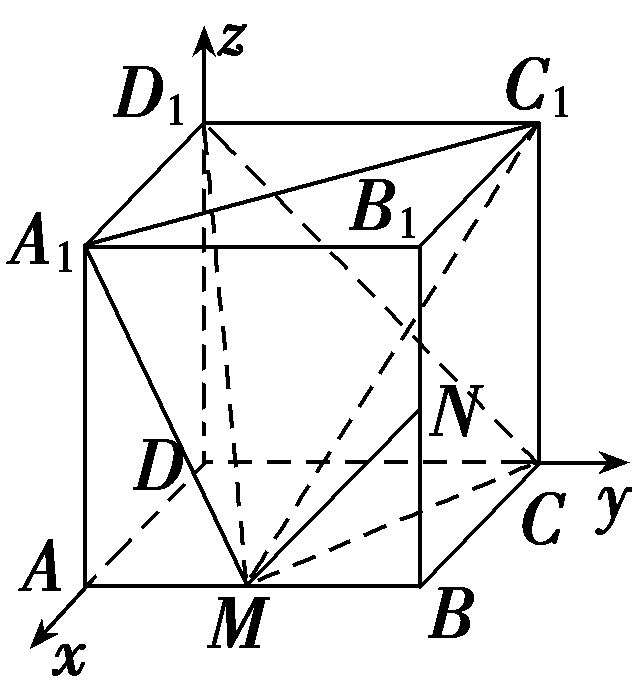

对于<em>&lt;text style="italic"&gt;C</em>&lt;/text&gt;， $\vec{BN}$ ＝(0，0，&lt;text st&lt;text st<em>y</em>le="italic"&gt;y&lt;/text&gt;le="italic"&gt;<em>z</em>&lt;/text&gt;)，则线段<em>BN</em>的长度｜ $\vec{BN}$ ｜＝&lt;text st&lt;text st<em>y</em>le="italic"&gt;y&lt;/text&gt;le="italic"&gt;<em>z</em>&lt;/text&gt;＝ $\frac{1}{3}$ ［－(&lt;text st<em>y</em>le="italic"&gt;y&lt;/text&gt;－ $\frac{3}{2}$ )&lt;text st<em>y</em>le="superscript"&gt;2&lt;/text&gt;＋ $\frac{9}{4}$ ］≤ $\frac{3}{4}$ ，当且仅当&lt;text st<em>y</em>le="italic"&gt;y&lt;/text&gt;＝ $\frac{3}{2}$ 时等号成立，故<em>&lt;text style="italic"&gt;C</em>&lt;/text&gt;正确；对于<em>&lt;text style="italic"&gt;D</em>&lt;/text&gt;，不论点<em>&lt;text style="italic"&gt;&lt;text style="italic"&gt;M</em>&lt;/text&gt;&lt;/text&gt;如何移动，点M到平面<em>&lt;text style="italic"&gt;A</em>&lt;/text&gt;&lt;text style="subscript"&gt;&lt;text style="subscript"&gt;&lt;text style="subscript"&gt;&lt;text style="subscript"&gt;&lt;text style="subscript"&gt;1&lt;/text&gt;&lt;/text&gt;&lt;/text&gt;&lt;/text&gt;&lt;/text&gt;D1C1的距离均为3，而 $V_{C_{1}-A_{1}D_{1}M}$ ＝ $V_{M-A_{1}D_{1}C_{1}}$ ＝ $\frac{1}{3}$ ·3· $S_{\bigtriangleup A_{1}D_{1}C_{1}}$ ＝ $\frac{9}{2}$ ，所以三棱锥<em>&lt;text style="italic"&gt;C</em>&lt;/text&gt;&lt;text style="subscript"&gt;&lt;text style="subscript"&gt;&lt;text style="subscript"&gt;&lt;text style="subscript"&gt;&lt;text style="subscript"&gt;1&lt;/text&gt;&lt;/text&gt;&lt;/text&gt;&lt;/text&gt;&lt;/text&gt;-<em>&lt;text style="italic"&gt;A</em>&lt;/text&gt;1<em>&lt;text style="italic"&gt;D</em>&lt;/text&gt;1<em>&lt;text style="italic"&gt;&lt;text style="italic"&gt;M</em>&lt;/text&gt;&lt;/text&gt;体积为定值，故D正确.故选ACD.

11.如图，圆锥的轴截面<em>SAB</em>是边长为2的等边三角形，<em>O</em>为底面中心，<em>M</em>为<em>SO</em>的中点，动点<em>P</em>在圆锥底面内(包括圆周).若<em>AM</em>⊥<em>MP</em>，则点<em>P</em>在圆锥底面上形成的轨迹的长度为<u>　　　　</u>.

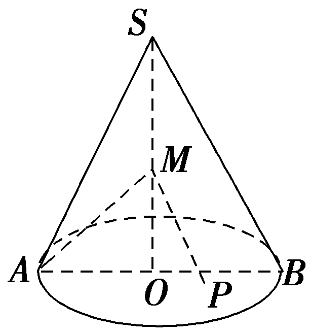

答案： $\frac{\sqrt{7}}{2}$

解析：如图，以<te<te<te<te<te<text st<text st*y*le="italic">y</text>le="italic">x</text>t st*y*le="italic">x</text>t st*y*le="italic">x</text>t st*y*le="italic">x</text>t style="italic">x</text>t st*y*le="italic">O</text>为原点，*<text style="italic">O<text style="italic">B*</text></text>，*O<text style="italic">S*</text>所在直线为y，*z*轴，圆锥底面垂直于OB的直线为x轴，建立空间直角坐标系，则*A*(0，－1，0)，B(0，1，0)，S(0，0， $\sqrt{3}$ )，<te<te<te<te<text st<text st*y*le="italic">y</text>le="italic">x</text>t st*y*le="italic">x</text>t st*y*le="italic">x</text>t st*y*le="italic">x</text>t style="italic">M</text>(0，0， $\frac{\sqrt{3}}{2}$ )，设<te<te<te<te<text st<text st*y*le="italic">y</text>le="italic">x</text>t st*y*le="italic">x</text>t st*y*le="italic">x</text>t st*y*le="italic">x</text>t style="italic">*P*</text>(*x*，*y*，0)，－1≤x≤1，－1≤y≤1，则 $\vec{AM}$ ＝(0，1， $\frac{\sqrt{3}}{2}$ )， $\vec{MP}$ ＝(<te<te<te<te<text st<text st*y*le="italic">y</text>le="italic">x</text>t st*y*le="italic">x</text>t st*y*le="italic">x</text>t st*y*le="italic">x</text>t style="italic">x</text>，*y*，－ $\frac{\sqrt{3}}{2}$ ).由于<te<te<te<te<text st<text st*y*le="italic">y</text>le="italic">x</text>t st*y*le="italic">x</text>t st*y*le="italic">x</text>t st*y*le="italic">x</text>t style="italic">A</text>*M*⊥M*<text style="italic">P*</text>，所以(0，1， $\frac{\sqrt{3}}{2}$ )<te<text st<text st*y*le="italic">y</text>le="italic">x</text>t style="italic">·</text>(<te<te<te<text st*y*le="italic">x</text>t st*y*le="italic">x</text>t st*y*le="italic">x</text>t style="italic">x</text>，*y*，－ $\frac{\sqrt{3}}{2}$ )＝0，即<te<te<te<te<te<text st<text st*y*le="italic">y</text>le="italic">x</text>t st*y*le="italic">x</text>t st*y*le="italic">x</text>t st*y*le="italic">x</text>t style="italic">x</text>t style="italic">y</text>＝ $\frac{3}{4}$ ，此为点<te<te<te<te<text st<text st*y*le="italic">y</text>le="italic">x</text>t st*y*le="italic">x</text>t st*y*le="italic">x</text>t st*y*le="italic">x</text>t style="italic">*P*</text>的轨迹方程，其在底面圆内的长度为2 $\sqrt{1－(\frac{3}{4})^{2}}$ ＝ $\frac{\sqrt{7}}{2}$ .

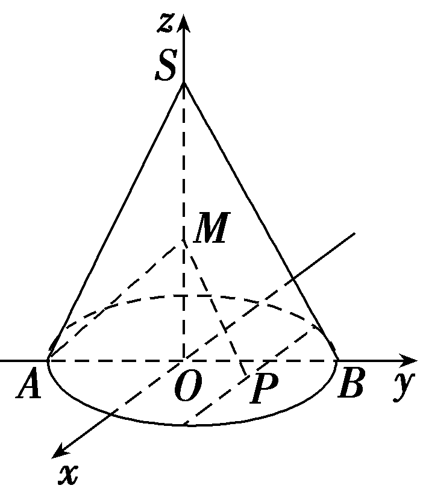

12.(15分)已知边长为4的正三角形*ABC*中，*E*，*F*分别为*BC*和*AC*的中点.*PA*＝2，且*PA*⊥平面*ABC*，设*Q*是*CE*的中点.

(1)求证：*AE*∥平面*PFQ*；(6分)

(2)求*AE*与平面*PFQ*间的距离.(9分)

解：如图，以*A*为坐标原点，平面*ABC*内垂直于*AC*边的直线为*x*轴，*AC*所在直线为*y*轴，*AP*所在直线为*z*轴建立空间直角坐标系.

因为*AP*＝2，*AB*＝*BC*＝*AC*＝4，又*E*，*F*分别是*BC*，*AC*的中点，

所以*A*(0，0，0)，*B*(2 $\sqrt{3}$ ，2，0)，*C*(0，4，0)，*F*(0，2，0)，*E*( $\sqrt{3}$ ，3，0)，*Q* $\left(\frac{\sqrt{3}}{2}，\frac{7}{2}，0\right)$ ，*P*(0，0，2).

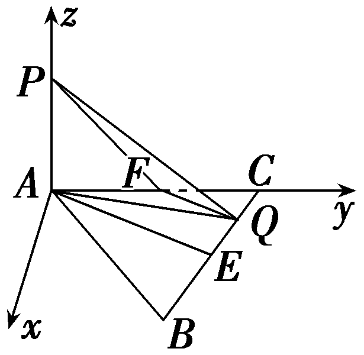

(1)证明：因为 $\vec{FQ}$ ＝ $\left(\frac{\sqrt{3}}{2}，\frac{3}{2}，0\right)$ ， $\vec{AE}$ ＝( $\sqrt{3}$ ，3，0)，

所以 $\vec{AE}$ ＝2 $\vec{FQ}$ .因为*<text style="italic">AE*</text>与*<text style="italic">FQ*</text>无交点，所以AE∥FQ.

又*FQ*⊂平面*PFQ*，*AE*⊄平面*PFQ*，

所以*AE*∥平面*PFQ*.

(2)由(1)知，*AE*∥平面*PFQ*，

所以点*A*到平面*PFQ*的距离就是*AE*与平面*PFQ*间的距离.

设平面<em>PFQ</em>的法向量为<em><strong>n</strong></em>＝(<em>x</em>，<em>y</em>，<em>z</em>)，

则***<text style="bold,italic"><text style="bold,italic"><text style="bold,italic">n***</text></text></text>⊥ $\vec{PF}$ ，***<text style="bold,italic"><text style="bold,italic"><text style="bold,italic">n***</text></text></text>⊥ $\vec{FQ}$ ，即***<text style="bold,italic"><text style="bold,italic"><text style="bold,italic">n***</text></text></text>· $\vec{PF}$ ＝0，***<text style="bold,italic"><text style="bold,italic"><text style="bold,italic">n***</text></text></text>· $\vec{FQ}$ ＝0.

又 $\vec{PF}$ ＝(0，2，－2)，所以<text st<text st*y*le="italic">y</text>le="bold,italic">n</text>· $\vec{PF}$ ＝2<text st*y*le="italic">y</text>－2*<text style="italic">z*</text>＝0，即y＝z.

又 $\vec{FQ}$ ＝ $\left(\frac{\sqrt{3}}{2}，\frac{3}{2}，0\right)$ ，所以<te<te<text st*y*le="italic">x</text>t st*y*le="italic">x</text>t style="bold,italic">n</text>· $\vec{FQ}$ ＝ $\frac{\sqrt{3}}{2}$ <te<text st*y*le="italic">x</text>t st*y*le="italic">x</text>＋ $\frac{3}{2}$ <te<text st*y*le="italic">x</text>t style="italic">y</text>＝0，即*x*＝－ $\sqrt{3}$ <te<text st*y*le="italic">x</text>t style="italic">y</text>.

令&lt;te<em>x</em>t style="italic"&gt;y&lt;/text&gt;＝1，则x＝－ $\sqrt{3}$ ，<em>z</em>＝1，所以平面<em>PFQ</em>的一个法向量为<em><strong>n</strong></em>＝(－ $\sqrt{3}$ ，1，1).

又 $\vec{PA}$ ＝(0，0，－2)，所以所求距离*d*＝ $\frac{｜\vec{PA}\cdot n｜}{｜n｜}$ ＝ $\frac{2\sqrt{5}}{5}$ .

13.(17分)(一题多问)如图，在四棱锥*P*-*ABCD*中，平面*PBC*⊥平面*ABCD*.△*PBC*是等腰三角形，且*PB*＝*PC*＝3.在梯形*ABCD*中，*AB*∥*DC*，*AD*⊥*DC*，*AB*＝5，*AD*＝4，*DC*＝3.

(1)求证：*AB*∥平面*PCD*；(3分)

(2)求平面*APB*与平面*PBC*夹角的余弦值；(7分)

(3)棱*BC*上是否存在点*Q*到平面*PBA*的距离为 $\frac{\sqrt{10}}{10}$ ，若存在，求出 $\frac{CQ}{CB}$ 的值；若不存在，说明理由.(7分)

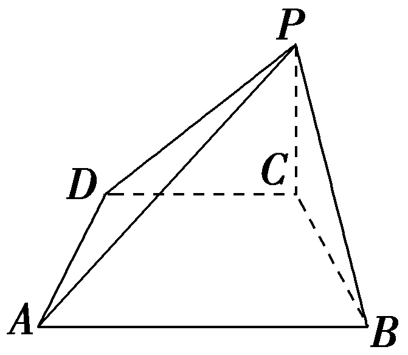

解：(1)证明：因为*AB*∥*CD*，*AB*⊄平面*PCD*，*CD*⊂平面*PCD*，所以*AB*∥平面*PCD*.

(2)因为*ABCD*是直角梯形，*AB*∥*DC*，*AD*⊥*DC*，*AB*＝5，*AD*＝4，*DC*＝3，

所以*BC*＝ $\sqrt{4^{2}＋\left(5－3\right)^{2}}$ ＝2 $\sqrt{5}$ ，又*PB*＝*PC*＝3，

所以点*P*到直线*BC*的距离为 $\sqrt{3^{2}－5}$ ＝2，

因为平面*PBC*⊥平面*ABCD*，所以点*P*到平面*ABCD*的距离为2.

以*D*为原点，以*DA*，*DC*及平面*ABCD*过*D*的垂线为坐标轴建立空间直角坐标系(图略).

所以*A*(4，0，0)，*B*(4，5，0)，*C*(0，3，0)，*P*(2，4，2)，

所以 $\vec{PB}$ ＝ $\left(2，1,-2\right)$ ， $\vec{AB}$ ＝ $\left(0，5，0\right)$ ， $\vec{CB}$ ＝ $\left(4，2，0\right)$ ，

设平面<em>APB</em>的法向量为<em><strong>m</strong></em>＝(<em>x</em>1，<em>y</em>1，<em>z</em>1)，平面<em>PBC</em>的法向量为<em><strong>n</strong></em>＝(<em>x</em>2，<em>y</em>2，<em>z</em>2)，

则 $\left\{\begin{matrix}m\cdot \vec{PB}=2x_{1}＋y_{1}－2z_{1}=0，\\m\cdot \vec{AB}=5y_{1}=0，\end{matrix}\right.$

$$
\left\{\begin{matrix}n\cdot \vec{PB}=2x_{2}＋y_{2}－2z_{2}=0，\\n\cdot \vec{CB}=4x_{2}+2y_{2}=0，\end{matrix}\right.
$$

令<em>x</em>1＝1，<em>x</em>2＝1可得<em><strong>m</strong></em>＝(1，0，1)，<em><strong>n</strong></em>＝(1，－2，0)，设平面<em>APB</em>与平面<em>PBC</em>的夹角为<em>θ</em>，

则cos <em>θ</em>＝｜cos＜<em><strong>m</strong></em>，<em><strong>n</strong></em>＞｜＝ $\frac{｜m\cdot n｜}{｜m||n｜}$ ＝ $\frac{1}{\sqrt{2}\times \sqrt{5}}$ ＝ $\frac{\sqrt{10}}{10}$ .

所以平面*APB*与平面*PBC*夹角的余弦值为 $\frac{\sqrt{10}}{10}$ .

(3)假设棱*BC*上存在点*Q*到平面*PBA*的距离为 $\frac{\sqrt{10}}{10}$ ，

设 $\vec{CQ}$ ＝*<text style="italic"><text style="italic">λ*</text></text> $\vec{CB}$ ＝*<text style="italic"><text style="italic">λ*</text></text> $\left(4，2，0\right)$ ＝ $\left(4\lambda ，2\lambda ，0\right)$ ，*<text style="italic"><text style="italic">λ*</text></text>∈ $\left[0，1\right]$ ，

所以*Q* $\left(4\lambda ，2\lambda +3，0\right)$ ，所以 $\vec{AQ}$ ＝ $\left(4\lambda －4，2\lambda +3，0\right)$ ，

由(2)知平面<em>PBA</em>的一个法向量为<em><strong>m</strong></em>＝(1，0，1)，

所以点*Q*到平面*PBA*的距离*d*＝ $\frac{｜\vec{AQ}\cdot m｜}{｜m｜}$ ＝ $\frac{｜4\lambda －4｜}{\sqrt{2}}$ ＝ $\frac{\sqrt{10}}{10}$ ，

所以｜4*<text style="italic">λ*</text>－4｜＝ $\frac{\sqrt{5}}{5}$ ，所以*<text style="italic">λ*</text>＝1－ $\frac{\sqrt{5}}{20}$ ，

所以棱*BC*上存在点*Q*到平面*PBA*的距离为 $\frac{\sqrt{10}}{10}$ ， $\frac{CQ}{CB}$ ＝1－ $\frac{\sqrt{5}}{20}$ .

