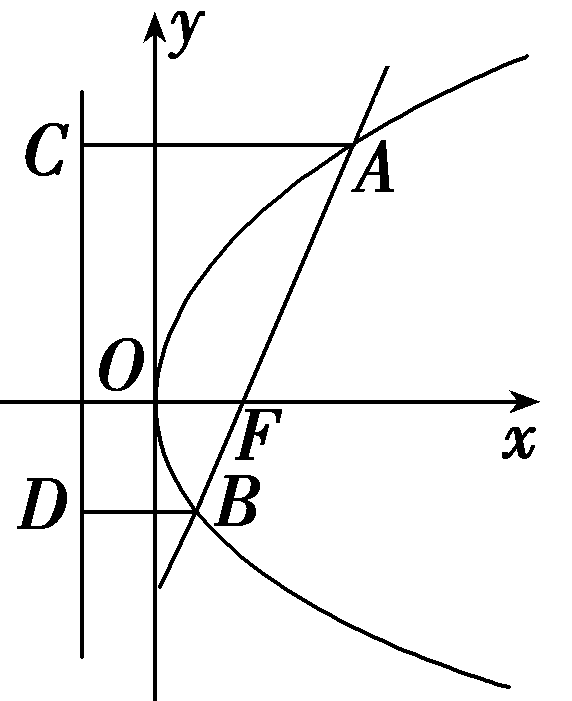
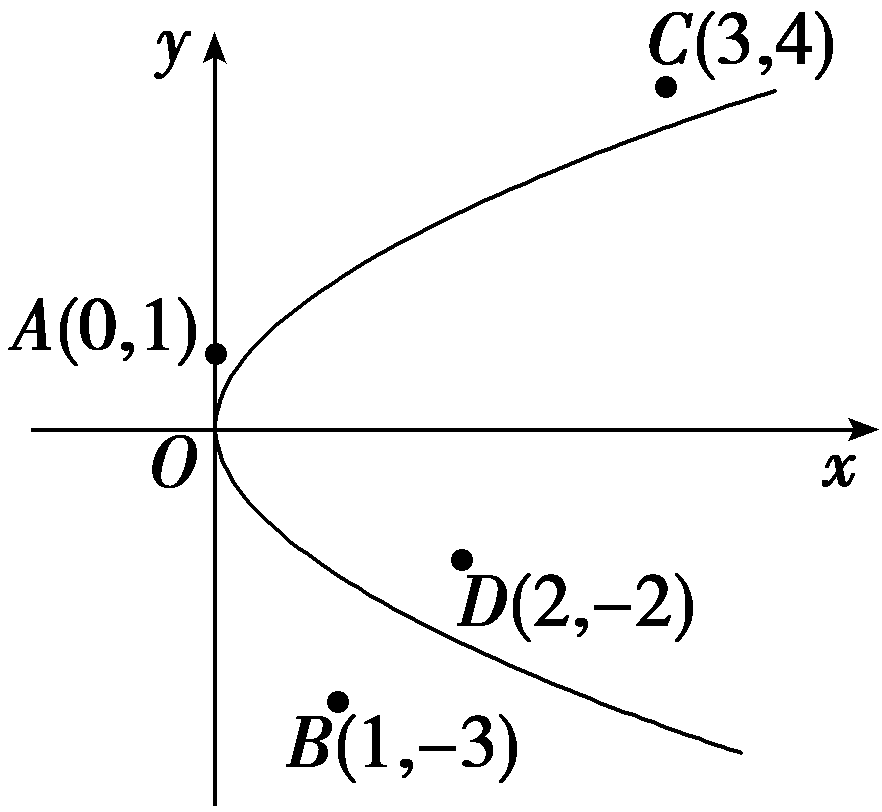
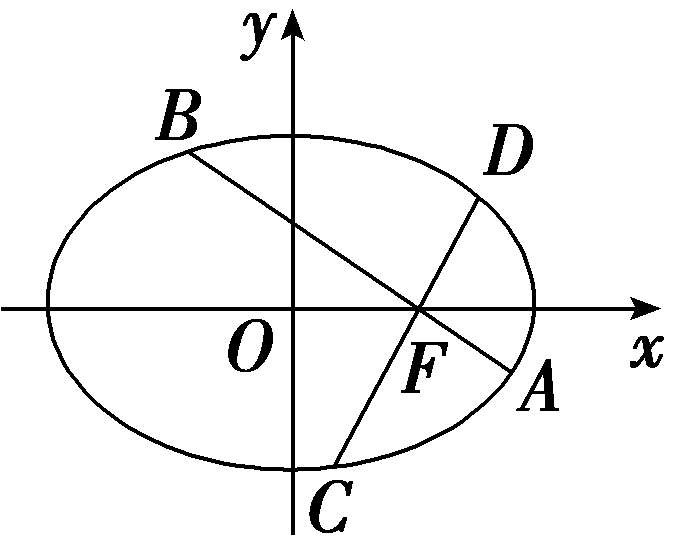
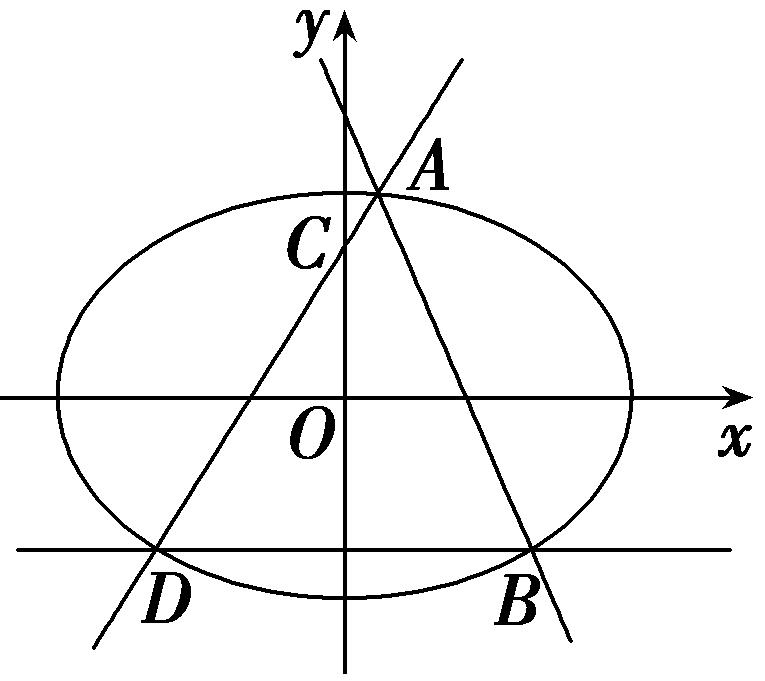
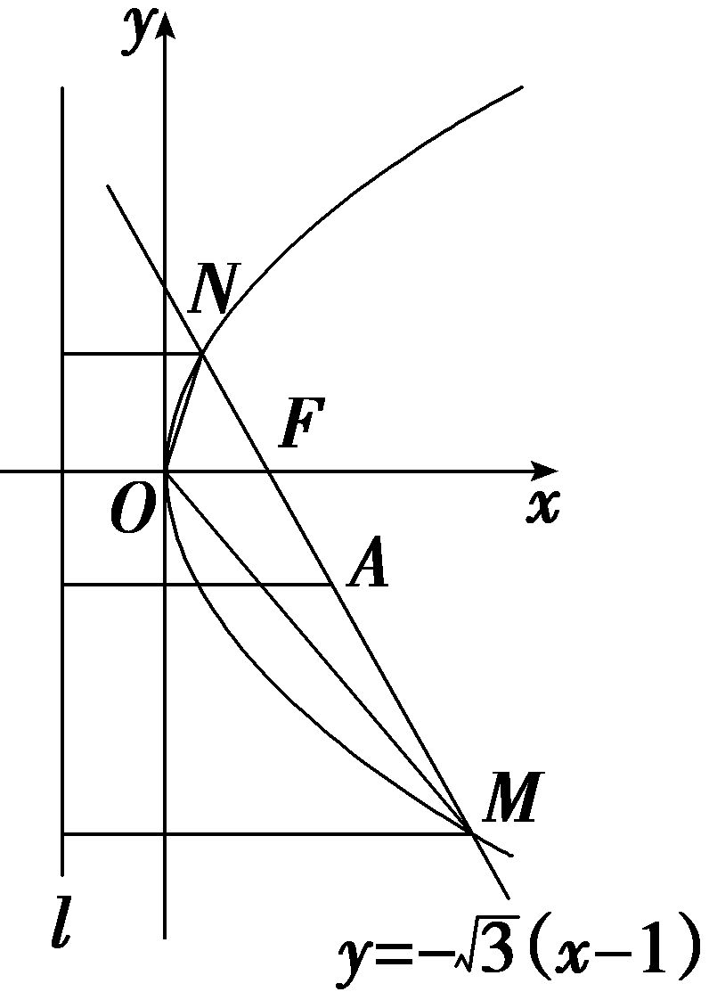
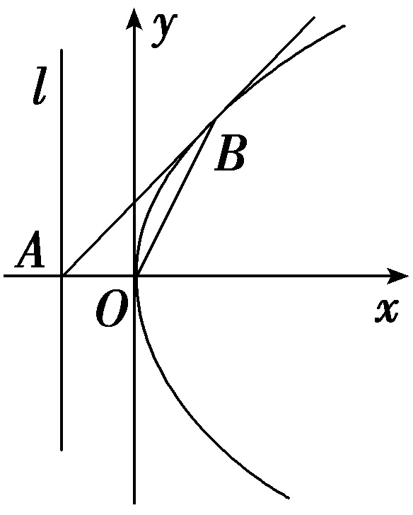
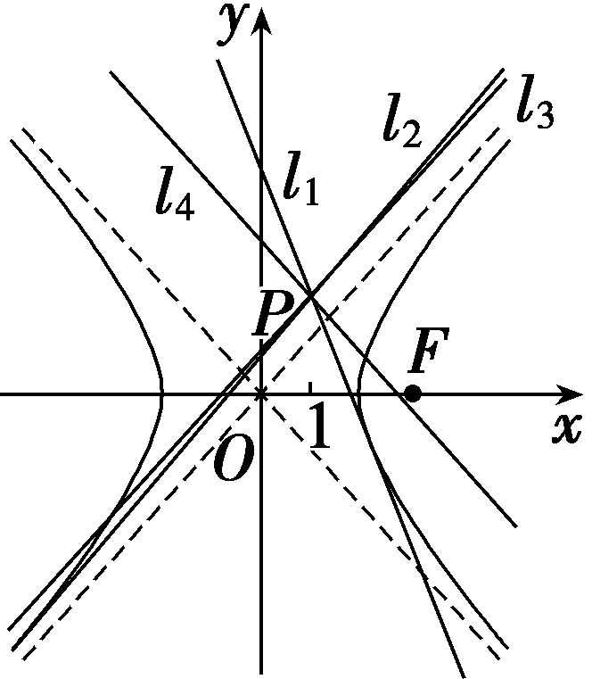
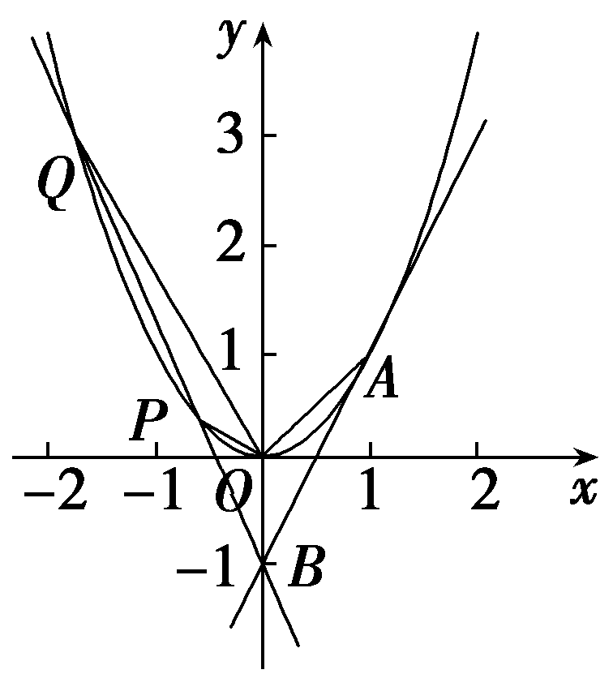
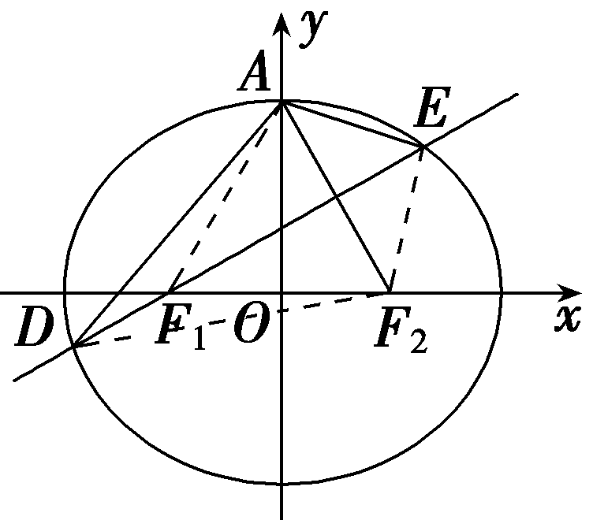

**第八节　直线与圆锥曲线的位置关系**

【课标研读】　1.会判断直线与椭圆、双曲线、抛物线的位置关系，能根据位置关系求参数的值(或范围).　2.会利用方程及数形结合思想、根与系数的关系解决弦长、中点弦问题.　3.理解“设而不求”的思想，能解决直线与椭圆、双曲线、抛物线的位置关系的综合应用问题.

1.直线与圆锥曲线的位置关系

(1)直线与圆锥曲线的位置关系有<u>相交</u>、<u>相切</u>、<u>相离</u>；相交有两个交点(特殊情况除外)，相切有一个交点，相离无交点.

(2)判断直线<em>l</em>与圆锥曲线<em>C</em>的位置关系时，通常将直线<em>l</em>的方程<em>Ax</em>＋<em>By</em>＋<em>C</em>＝0代入圆锥曲线<em>C</em>的方程.消去<em>y</em>(或<em>x</em>)得到一个关于变量<em>x</em>(或<em>y</em>)的方程<em>ax</em>2＋<em>bx</em>＋<em>c</em>＝0(或<em>ay</em>2＋<em>by</em>＋<em>c</em>＝0).

①当<em>a</em>≠0时，可考虑一元二次方程的判别式<em>Δ</em>，有<em>Δ</em>＞0时，直线<em>l</em>与曲线<em>C</em><u>相交</u>；<em>Δ</em>＝0时，直线<em>l</em>与曲线<em>C</em><u>相切</u>；<em>Δ</em>＜0时，直线<em>l</em>与曲线<em>C</em><u>相离</u>.

②当<em>a</em>＝0时，即得到一个一次方程，则<em>l</em>与<em>C</em>相交，且只有一个交点，此时，若<em>C</em>为双曲线，则直线<em>l</em>与双曲线的<u>渐近线</u>平行；若<em>C</em>为抛物线，则直线<em>l</em>与抛物线的<u>对称轴</u>平行或重合.

2.圆锥曲线的弦长公式

设直线与圆锥曲线的交点坐标为<em>A</em>(<em>x</em>1，<em>y</em>1)，<em>B</em>(<em>x</em>2，<em>y</em>2)，直线<em>AB</em>的斜率为<em>k</em>(<em>k</em>≠0)，

则｜&lt;te&lt;te<em>x</em>t style="italic"&gt;x&lt;/text&gt;t style="italic"&gt;AB&lt;/text&gt;｜＝ $\sqrt{(x_{1}－x_{2})^{2}＋(y_{1}－y_{2})^{2}}$ ＝ $\sqrt{1+k^{2}}$ ｜&lt;te<em>x</em>t style="italic"&gt;x&lt;/text&gt;1－x2｜＝ $\sqrt{1+k^{2}}\sqrt{(x_{1}＋x_{2})^{2}－4x_{1}x_{2}}$

或｜&lt;text st&lt;text st<em>y</em>le="italic"&gt;y&lt;/text&gt;le="italic"&gt;AB&lt;/text&gt;｜＝ $\sqrt{1+\frac{1}{k^{2}}}$ ｜&lt;text st<em>y</em>le="italic"&gt;y&lt;/text&gt;1－y2｜＝ $\sqrt{1+\frac{1}{k^{2}}}\sqrt{(y_{1}＋y_{2})^{2}－4y_{1}y_{2}}$ .

3.中点弦问题

(1)利用根与系数的关系：将直线方程代入椭圆的方程，消元后得到一个一元二次方程，利用根与系数的关系和中点坐标公式建立等式求解，注意不能忽视对判别式的讨论.

(&lt;te&lt;text st&lt;text st<em>y</em>le="italic"&gt;y&lt;/text&gt;le="italic"&gt;x&lt;/text&gt;t st<em>y</em>le="subscript"&gt;&lt;text style="superscript"&gt;2&lt;/text&gt;&lt;/text&gt;)点差法：若直线&lt;te&lt;te<em>x</em>t st<em>y</em>le="italic"&gt;x&lt;/text&gt;t style="italic"&gt;l&lt;/text&gt;与椭圆<em>C</em>有两个交点<em>&lt;text style="italic"&gt;&lt;text style="italic"&gt;A</em>&lt;/text&gt;&lt;/text&gt;，<em>&lt;text style="italic"&gt;&lt;text style="italic"&gt;B</em>&lt;/text&gt;&lt;/text&gt;，一般地，首先设出A(x&lt;text style="subscript"&gt;1&lt;/text&gt;，y1)，B(x2，y2)，<em>&lt;text style="italic"&gt;AB</em>&lt;/text&gt;中点<em>M</em>(x&lt;text style="subscript"&gt;0&lt;/text&gt;，y0)，直线AB的斜率<em>&lt;text style="italic"&gt;&lt;text style="italic"&gt;&lt;text style="italic"&gt;k</em>&lt;/text&gt;&lt;/text&gt;&lt;/text&gt;，将点A，B代入圆锥曲线的方程，两式相减，整理得(分别以 $\frac{x^{2}}{a^{2}}$ ＋ $\frac{y^{2}}{b^{2}}$ ＝&lt;te&lt;te&lt;text st&lt;text st<em>y</em>le="italic"&gt;y&lt;/text&gt;le="italic"&gt;x&lt;/text&gt;t st<em>y</em>le="italic"&gt;x&lt;/text&gt;t st<em>y</em>le="subscript"&gt;1&lt;/text&gt;， $\frac{x^{2}}{a^{2}}$ － $\frac{y^{2}}{b^{2}}$ ＝&lt;te&lt;te&lt;text st&lt;text st<em>y</em>le="italic"&gt;y&lt;/text&gt;le="italic"&gt;x&lt;/text&gt;t st<em>y</em>le="italic"&gt;x&lt;/text&gt;t st<em>y</em>le="subscript"&gt;1&lt;/text&gt;，y&lt;text style="subscript"&gt;&lt;text style="superscript"&gt;2&lt;/text&gt;&lt;/text&gt;＝2p<em>x</em>为例)，椭圆中<em>&lt;text style="italic"&gt;&lt;text style="italic"&gt;&lt;text style="italic"&gt;k</em>&lt;/text&gt;&lt;/text&gt;&lt;/text&gt;＝－ $\frac{b^{2}}{a^{2}}$ <u>·</u> $\frac{x_{0}}{y_{0}}$ ；双曲线中&lt;text st<em>y</em>le="italic"&gt;<em>&lt;text style="italic"&gt;&lt;text style="italic"&gt;k</em>&lt;/text&gt;&lt;/text&gt;&lt;/text&gt;＝ $\frac{b^{2}}{a^{2}}$ <u>·</u> $\frac{x_{0}}{y_{0}}$ ；抛物线中&lt;text st<em>y</em>le="italic"&gt;<em>&lt;text style="italic"&gt;&lt;text style="italic"&gt;k</em>&lt;/text&gt;&lt;/text&gt;&lt;/text&gt;＝ $\frac{p}{y_{0}}$ .

【常用结论】

(1)圆锥曲线中最短的焦点弦为通径，椭圆、双曲线中的通径长为 $\frac{2b^{2}}{a}$ ，抛物线中的通径长为2*p*.

(2)抛物线中与焦点弦有关的常用结论

如图，倾斜角为<em>θ</em>的直线<em>AB</em>与抛物线<em>y</em>2＝2<em>px</em>(<em>p</em>＞0)交于<em>A</em>，<em>B</em>两点，<em>F</em>为抛物线的焦点，设<em>A</em>(<em>x</em>1，<em>y</em>1)，<em>B</em>(<em>x</em>2，<em>y</em>2).则有

①&lt;te&lt;te<em>x</em>t style="italic"&gt;x&lt;/text&gt;t st<em>y</em>le="italic"&gt;y&lt;/text&gt;&lt;text style="subscri<em>p</em>t"&gt;1&lt;/text&gt;y&lt;text style="superscript"&gt;&lt;text style="subscript"&gt;2&lt;/text&gt;&lt;/text&gt;＝－p2，x1x2＝ $\frac{p^{2}}{4}$ .

②焦点弦长：｜&lt;te&lt;te<em>x</em>t style="italic"&gt;x&lt;/text&gt;t style="italic"&gt;AB&lt;/text&gt;｜＝x&lt;text style="subscri<em>&lt;text style="italic"&gt;p</em>&lt;/text&gt;t"&gt;1&lt;/text&gt;＋x2＋p＝ $\frac{2p}{sin^{2}\theta }$ .通径(过焦点垂直于对称轴的弦)长为&lt;text style="subscri<em>&lt;text style="italic"&gt;p</em>&lt;/text&gt;t"&gt;2&lt;/text&gt;p.

③焦半径：｜*AF*｜＝ $\frac{p}{1－cos\theta }$ ，｜*BF*｜＝ $\frac{p}{1+cos\theta }$ ， $\frac{1}{｜AF｜}$ ＋ $\frac{1}{｜BF｜}$ ＝ $\frac{2}{p}$ .

(3)若<em>A</em>，<em>B</em>为抛物线<em>y</em>2＝2<em>px</em>(<em>p</em>＞0)上两点，且<em>OA</em>⊥<em>OB</em>，则直线<em>AB</em>过定点(2<em>p</em>，0).

(4)圆锥曲线中的切线问题

①椭圆的切线方程：椭圆 $\frac{x^{2}}{a^{2}}$ ＋ $\frac{y^{2}}{b^{2}}$ ＝1(&lt;te&lt;text st<em>y</em>le="italic"&gt;x&lt;/text&gt;t style="italic"&gt;a&lt;/text&gt;＞<em>b</em>＞&lt;text style="subscript"&gt;0&lt;/text&gt;)上一点<em>P</em>(x0，y0)处的切线方程是 $\frac{x_{0}x}{a^{2}}$ ＋ $\frac{y_{0}y}{b^{2}}$ ＝1.

②双曲线的切线方程：双曲线 $\frac{x^{2}}{a^{2}}$ － $\frac{y^{2}}{b^{2}}$ ＝1(&lt;te&lt;text st<em>y</em>le="italic"&gt;x&lt;/text&gt;t style="italic"&gt;a&lt;/text&gt;＞&lt;text style="subscript"&gt;0&lt;/text&gt;，<em>b</em>＞0)上一点<em>P</em>(x0，y0)处的切线方程是 $\frac{x_{0}x}{a^{2}}$ － $\frac{y_{0}y}{b^{2}}$ ＝1.

③抛物线的切线方程：抛物线<em>y</em>2＝2<em>px</em>(<em>p</em>＞0)上一点<em>P</em>(<em>x</em>0，<em>y</em>0)处的切线方程是<em>y</em>0<em>y</em>＝<em>p</em>(<em>x</em>＋<em>x</em>0).

【自主检测】

1.(多选)下列说法正确的是(　　)

A.过点( 1， $\frac{1}{2}$ )的直线一定与椭圆 $\frac{x^{2}}{2}$ ＋<em>y</em>2＝1相交

B.直线与抛物线只有一个公共点，则该直线与抛物线相切

C.与双曲线渐近线平行的直线一定与双曲线有公共点

D.圆锥曲线的通径是所有的焦点弦中最短的弦

答案：**ACD**

2.直线*y*＝*<text style="italic">k*x</text>＋2与椭圆 $\frac{x^{2}}{3}$ ＋ $\frac{y^{2}}{2}$ ＝1有且只有一个交点，则*k*的值是(　　)

A. $\frac{\sqrt{6}}{3}$ 	B.－ $\frac{\sqrt{6}}{3}$

C.± $\frac{\sqrt{6}}{3}$ 	D.± $\frac{\sqrt{3}}{3}$

答案：**C**

解析：由 $\left\{\begin{matrix}y＝kx+2，\\\frac{x^{2}}{3}＋\frac{y^{2}}{2}=1，\end{matrix}\right.$ 得(&lt;te<em>x</em>t style="superscript"&gt;&lt;text style="superscript"&gt;&lt;text style="superscript"&gt;2&lt;/text&gt;&lt;/text&gt;&lt;/text&gt;＋3<em>&lt;text style="italic"&gt;&lt;text style="italic"&gt;&lt;text style="italic"&gt;k</em>&lt;/text&gt;&lt;/text&gt;&lt;/text&gt;2)x2＋12<em>kx</em>＋6＝0，由题意知<em>Δ</em>＝(12k)2－4×6×(2＋3k2)＝0，解得k＝± $\frac{\sqrt{6}}{3}$ .故选C.

3.已知抛物线<em>C</em>：<em>y</em>2＝4<em>x</em>，经过点<em>P</em>的任意一条直线与<em>C</em>均有公共点，则点<em>P</em>的坐标可以为(　　)

A.(0，1)	B.(1，－3)

C.(3，4)	D.(2，－2)

答案：**D**

解析： $\left(0，1\right)$ 在&lt;te&lt;te&lt;te&lt;te&lt;te&lt;te&lt;text st<em>y</em>le="italic"&gt;x&lt;/text&gt;t st<em>y</em>le="italic"&gt;x&lt;/text&gt;t st<em>y</em>le="italic"&gt;x&lt;/text&gt;t st<em>y</em>le="italic"&gt;x&lt;/text&gt;t st<em>y</em>le="italic"&gt;x&lt;/text&gt;t st<em>y</em>le="italic"&gt;x&lt;/text&gt;t style="italic"&gt;y&lt;/text&gt;轴上，所以 $\left(0，1\right)$ 在抛物线外部，将&lt;te&lt;te&lt;te&lt;te&lt;te&lt;text st<em>y</em>le="italic"&gt;x&lt;/text&gt;t st<em>y</em>le="italic"&gt;x&lt;/text&gt;t st<em>y</em>le="italic"&gt;x&lt;/text&gt;t st<em>y</em>le="italic"&gt;x&lt;/text&gt;t st<em>y</em>le="italic"&gt;x&lt;/text&gt;t st<em>y</em>le="italic"&gt;x&lt;/text&gt;＝1代入抛物线<em>&lt;text style="italic"&gt;&lt;text style="italic"&gt;&lt;text style="italic"&gt;C</em>&lt;/text&gt;&lt;/text&gt;&lt;/text&gt;：<em>y</em>&lt;text style="superscript"&gt;&lt;text style="superscript"&gt;2&lt;/text&gt;&lt;/text&gt;＝4x中，则｜y｜＝2＜3，所以(1，－3)在抛物线外部，将x＝3代入抛物线C：y2＝4x中，则｜y｜＝2 $\sqrt{3}$ ＜4，所以 $\left(3，4\right)$ 在抛物线外部，将&lt;te&lt;te&lt;te&lt;te&lt;te&lt;text st<em>y</em>le="italic"&gt;x&lt;/text&gt;t st<em>y</em>le="italic"&gt;x&lt;/text&gt;t st<em>y</em>le="italic"&gt;x&lt;/text&gt;t st<em>y</em>le="italic"&gt;x&lt;/text&gt;t st<em>y</em>le="italic"&gt;x&lt;/text&gt;t st<em>y</em>le="italic"&gt;x&lt;/text&gt;＝&lt;text style="superscript"&gt;&lt;text style="superscript"&gt;2&lt;/text&gt;&lt;/text&gt;代入抛物线<em>&lt;text style="italic"&gt;&lt;text style="italic"&gt;&lt;text style="italic"&gt;C</em>&lt;/text&gt;&lt;/text&gt;&lt;/text&gt;：<em>y</em>2＝4x中，则｜y｜＝2 $\sqrt{2}$ ＞&lt;te&lt;te&lt;te&lt;te&lt;te&lt;text st<em>y</em>le="italic"&gt;x&lt;/text&gt;t st<em>y</em>le="italic"&gt;x&lt;/text&gt;t st<em>y</em>le="italic"&gt;x&lt;/text&gt;t st<em>y</em>le="italic"&gt;x&lt;/text&gt;t st<em>y</em>le="italic"&gt;x&lt;/text&gt;t style="superscript"&gt;&lt;text style="superscript"&gt;2&lt;/text&gt;&lt;/text&gt;，所以(2，－2)在抛物线内部，将选项中的点分别在直角坐标系中画出来，只有点<em>&lt;text style="italic"&gt;D</em>&lt;/text&gt; $\left(2,-2\right)$ 在抛物线内部，故当点<em>&lt;text style="italic"&gt;P</em>&lt;/text&gt;位于点<em>&lt;text style="italic"&gt;D</em>&lt;/text&gt; $\left(2,-2\right)$ 处，此时经过点<em>&lt;text style="italic"&gt;P</em>&lt;/text&gt;的任意一条直线与&lt;te&lt;te&lt;te&lt;te&lt;te&lt;text st<em>y</em>le="italic"&gt;x&lt;/text&gt;t st<em>y</em>le="italic"&gt;x&lt;/text&gt;t st<em>y</em>le="italic"&gt;x&lt;/text&gt;t st<em>y</em>le="italic"&gt;x&lt;/text&gt;t st<em>y</em>le="italic"&gt;x&lt;/text&gt;t st<em>y</em>le="italic"&gt;<em>&lt;text style="italic"&gt;&lt;text style="italic"&gt;C</em>&lt;/text&gt;&lt;/text&gt;&lt;/text&gt;均相交，故均有公共点.故选<em>&lt;text style="italic"&gt;D</em>&lt;/text&gt;.

4.(链接人教<em>A</em>选择性必修一P128T13)已知点A，<em>B</em>是双曲线<em>C</em>： $\frac{x^{2}}{2}$ － $\frac{y^{2}}{3}$ ＝1上的两点，线段<em>AB</em>的中点是<em>M</em>(3，2)，则直线<em>&lt;text style="italic"&gt;AB</em>&lt;/text&gt;的斜率为<u>　　　　</u>.

答案： $\frac{9}{4}$

解析：设&lt;te&lt;te&lt;te&lt;te&lt;text st&lt;text st<em>y</em>le="italic"&gt;y&lt;/text&gt;le="italic"&gt;x&lt;/text&gt;t style="italic"&gt;x&lt;/text&gt;t st<em>y</em>le="italic"&gt;x&lt;/text&gt;t st<em>y</em>le="italic"&gt;x&lt;/text&gt;t style="italic"&gt;<em>A</em>&lt;/text&gt;(x&lt;text style="subscript"&gt;&lt;text style="subscript"&gt;&lt;text style="subscript"&gt;1&lt;/text&gt;&lt;/text&gt;&lt;/text&gt;，y1)，<em>&lt;text style="italic"&gt;B</em>&lt;/text&gt;(x&lt;text style="subscript"&gt;&lt;text style="subscript"&gt;&lt;text style="subscript"&gt;2&lt;/text&gt;&lt;/text&gt;&lt;/text&gt;，y2)，因为点A，B是双曲线<em>C</em>上的两点，所以 $\frac{x_{1}^{2}}{2}$ － $\frac{y_{1}^{2}}{3}$ ＝&lt;te&lt;te&lt;te&lt;text st&lt;text st<em>y</em>le="italic"&gt;y&lt;/text&gt;le="italic"&gt;x&lt;/text&gt;t style="italic"&gt;x&lt;/text&gt;t st<em>y</em>le="italic"&gt;x&lt;/text&gt;t st<em>y</em>le="subscript"&gt;&lt;text style="subscript"&gt;&lt;text style="subscript"&gt;1&lt;/text&gt;&lt;/text&gt;&lt;/text&gt;， $\frac{x_{2}^{2}}{2}$ － $\frac{y_{2}^{2}}{3}$ ＝&lt;te&lt;te&lt;te&lt;text st&lt;text st<em>y</em>le="italic"&gt;y&lt;/text&gt;le="italic"&gt;x&lt;/text&gt;t style="italic"&gt;x&lt;/text&gt;t st<em>y</em>le="italic"&gt;x&lt;/text&gt;t st<em>y</em>le="subscript"&gt;&lt;text style="subscript"&gt;&lt;text style="subscript"&gt;1&lt;/text&gt;&lt;/text&gt;&lt;/text&gt;，两式相减得 $\frac{(x_{1}＋x_{2})\left(x_{1}－x_{2}\right)}{2}$ ＝ $\frac{\left(y_{1}＋y_{2}\right)\left(y_{1}－y_{2}\right)}{3}$ ，因为&lt;te&lt;te&lt;text st&lt;text st<em>y</em>le="italic"&gt;y&lt;/text&gt;le="italic"&gt;x&lt;/text&gt;t style="italic"&gt;x&lt;/text&gt;t style="italic"&gt;M&lt;/text&gt;(3，&lt;text st<em>y</em>le="subscript"&gt;&lt;text style="subscript"&gt;&lt;text style="subscript"&gt;2&lt;/text&gt;&lt;/text&gt;&lt;/text&gt;)是线段&lt;te&lt;te<em>x</em>t st<em>y</em>le="italic"&gt;x&lt;/text&gt;t style="italic"&gt;<em>A</em>&lt;/text&gt;<em>&lt;text style="italic"&gt;B</em>&lt;/text&gt;的中点，所以x&lt;text style="subscript"&gt;&lt;text style="subscript"&gt;&lt;text style="subscript"&gt;1&lt;/text&gt;&lt;/text&gt;&lt;/text&gt;＋x2＝6，y1＋y2＝4，所以 $\frac{6\left(x_{1}－x_{2}\right)}{2}$ ＝ $\frac{4\left(y_{1}－y_{2}\right)}{3}$ ，所以<em>k</em>&lt;te&lt;te&lt;te&lt;te&lt;text st&lt;text st<em>y</em>le="italic"&gt;y&lt;/text&gt;le="italic"&gt;x&lt;/text&gt;t style="italic"&gt;x&lt;/text&gt;t st<em>y</em>le="italic"&gt;x&lt;/text&gt;t st<em>y</em>le="italic"&gt;x&lt;/text&gt;t style="italic"&gt;<em>A</em>&lt;/text&gt;<em>&lt;text style="italic"&gt;B</em>&lt;/text&gt;＝ $\frac{y_{1}－y_{2}}{x_{1}－x_{2}}$ ＝ $\frac{9}{4}$ .

考点一　直线与圆锥曲线的位置关系　　　　师生共研

已知直线<te<text sty*l*e="italic">x</text>t st*y*le="italic">l</text>：y＝2x＋*<text style="italic">m*</text>，椭圆*<text style="italic">C*</text>： $\frac{x^{2}}{4}$ ＋ $\frac{y^{2}}{2}$ ＝1.试求当<text sty*l*e="italic">*m*</text>取何值时，直线<te*x*t st*y*le="italic">l</text>与椭圆*<text style="italic">C*</text>：

(1)有两个不同的公共点；

(2)有且只有一个公共点.

解：将直线*l*的方程与椭圆*C*的方程联立，得方程组 $\left\{\begin{matrix}y=2x＋m，①\\\frac{x^{2}}{4}＋\frac{y^{2}}{2}=1，②\end{matrix}\right.$

将①代入②，整理得9<em>x</em>2＋8<em>mx</em>＋2<em>m</em>2－4＝0.	③

方程③根的判别式

<em>Δ</em>＝(8<em>m</em>)2－4×9×(2<em>m</em>2－4)＝－8<em>m</em>2＋144.

(1)当<text sty*l*e="italic">Δ</text>＞0，即－3 $\sqrt{2}$ ＜<text sty*l*e="italic">m</text>＜3 $\sqrt{2}$ 时，方程③有两个不同的实数根，可知原方程组有两组不同的实数解.这时直线*l*与椭圆*C*有两个不同的公共点.

(2)当<text sty*l*e="italic">Δ</text>＝0，即*m*＝±3 $\sqrt{2}$ 时，方程③有两个相同的实数根，可知原方程组有两组相同的实数解.即直线*l*与椭圆*C*有且只有一个公共点.

判断直线与圆锥曲线位置关系的方法

在判断直线和圆锥曲线的位置关系时，先联立方程组，再消去*x*(或*y*)，得到关于*y*(或*x*)的方程，如果是直线与圆或椭圆，则所得方程一定为一元二次方程；如果是直线与双曲线或抛物线，则需分二次项系数等于零和不等于零两种情况讨论，只有二次方程才可用判别式，另外还应注意斜率不存在的情形.

对点练1.已知抛物线的方程为<em>y</em>2＝8<em>x</em>，若过点<em>Q</em>(－2，0)的直线<em>l</em>与抛物线有公共点，则直线<em>l</em>的斜率的取值范围是(　　)

A.[－1，1]

B.[－1，0)∪(0，1]

C.(－∞，－1]∪[1，＋∞)

D.(－∞，－1)∪(1，＋∞)

答案：**A**

解析：由题意知，直线<em>l</em>的斜率存在，设直线<em>l</em>的方程为<em>y</em>＝<em>k</em>(<em>x</em>＋2)，代入抛物线方程，消去<em>y</em>并整理，得<em>k</em>2<em>x</em>2＋(4<em>k</em>2－8)<em>x</em>＋4<em>k</em>2＝0.当<em>k</em>＝0时，显然满足题意；当<em>k</em>≠0时，<em>Δ</em>＝(4<em>k</em>2－8)2－4<em>k</em>2·4<em>k</em>2＝64(1－<em>k</em>2)≥0，解得－1≤<em>k</em>＜0或0＜<em>k</em>≤1.综上，－1≤<em>k</em>≤1.故选A.

对点练2.(易错题)若直线<em>y</em>＝<em>kx</em>＋2与双曲线<em>x</em>2－<em>y</em>2＝6的右支交于不同的两点，则实数<em>k</em>的取值范围是<u>　　　　</u>.

答案： $\left(－\frac{\sqrt{15}}{3},-1\right)$

解析：由 $\left\{\begin{matrix}y＝kx+2，\\x^{2}－y^{2}=6，\end{matrix}\right.$ 得(&lt;te&lt;text st<em>y</em>le="italic"&gt;x&lt;/text&gt;t st<em>y</em>le="subscript"&gt;1&lt;/text&gt;－&lt;te&lt;te<em>x</em>t style="italic"&gt;x&lt;/text&gt;t style="italic"&gt;k&lt;/text&gt;&lt;text style="superscript"&gt;&lt;text style="subscript"&gt;&lt;text style="subscript"&gt;2&lt;/text&gt;&lt;/text&gt;&lt;/text&gt;)x2－4<em>kx</em>－10＝0.设直线与双曲线的右支交于不同的两点<em>A</em>(x1，y1)，<em>B</em>(x2，y2)，则 $\left\{\begin{matrix}1－k^{2}\ne 0，\\\Delta =16k^{2}－4(1－k^{2})\times \left(－10\right)>0，\\x_{1}＋x_{2}＝\frac{4k}{1－k^{2}}>0，\\x_{1}x_{2}＝\frac{－10}{1－k^{2}}>0，\end{matrix}\right.$

解得－ $\frac{\sqrt{15}}{3}$ ＜*k*＜－1.

考点二　弦的有关问题　　　　多维探究

角度1　中点弦问题

(1)(2023·全国乙卷)设&lt;te<em>x</em>t style="italic"&gt;A&lt;/text&gt;，<em>B</em>为双曲线x2－ $\frac{y^{2}}{9}$ ＝1上两点，下列四个点中，可为线段&lt;te<em>x</em>t style="italic"&gt;A&lt;/text&gt;<em>B</em>中点的是(　　)

A.(1，1)	B.(－1，2)

C.(1，3)	D.(－1，－4)

(2)(一题多解)已知<em>&lt;text style="italic"&gt;&lt;text style="italic"&gt;P</em>&lt;/text&gt;&lt;/text&gt;(1，1)为椭圆 $\frac{x^{2}}{4}$ ＋ $\frac{y^{2}}{2}$ ＝1内一定点，经过<em>&lt;text style="italic"&gt;&lt;text style="italic"&gt;P</em>&lt;/text&gt;&lt;/text&gt;引一条弦，使此弦被P点平分，则此弦所在的直线方程为<u>　　　　　　　　</u>.

答案：(1)<strong>D</strong>　(2)<em>x</em>＋2<em>y</em>－3＝0

解析：(&lt;te&lt;text st<em>y</em>le="italic"&gt;x&lt;/text&gt;t st<em>y</em>le="subscript"&gt;1&lt;/text&gt;)设&lt;te<em>x</em>t style="italic"&gt;<em>A</em>&lt;/text&gt;(x1，y1)，<em>&lt;text style="italic"&gt;B</em>&lt;/text&gt;(x&lt;text style="subscript"&gt;2&lt;/text&gt;，y2)，则<em>&lt;text style="italic,subscript"&gt;&lt;text style="italic,subscript"&gt;&lt;text style="italic,subscript"&gt;AB</em>&lt;/text&gt;&lt;/text&gt;&lt;/text&gt;的中点<em>M</em> $\left(\frac{x_{1}＋x_{2}}{2}，\frac{y_{1}＋y_{2}}{2}\right)$ ，可得<em>&lt;text style="italic"&gt;&lt;text style="italic"&gt;&lt;text style="italic"&gt;&lt;text style="italic"&gt;&lt;text style="italic"&gt;k</em>&lt;/text&gt;&lt;/text&gt;&lt;/text&gt;&lt;/text&gt;&lt;/text&gt;&lt;te&lt;te&lt;text st<em>y</em>le="italic"&gt;x&lt;/text&gt;t st<em>y</em>le="italic"&gt;x&lt;/text&gt;t style="italic"&gt;<em>A</em>&lt;/text&gt;<em>&lt;text style="italic"&gt;B</em>&lt;/text&gt;＝ $\frac{y_{1}－y_{2}}{x_{1}－x_{2}}$ ，<em>&lt;text style="italic"&gt;&lt;text style="italic"&gt;&lt;text style="italic"&gt;&lt;text style="italic"&gt;&lt;text style="italic"&gt;k</em>&lt;/text&gt;&lt;/text&gt;&lt;/text&gt;&lt;/text&gt;&lt;/text&gt;O<em>M</em>＝ $\frac{\frac{y_{1}＋y_{2}}{2}}{\frac{x_{1}＋x_{2}}{2}}$ ＝ $\frac{y_{1}＋y_{2}}{x_{1}＋x_{2}}$ ，因为&lt;te&lt;te&lt;text st<em>y</em>le="italic"&gt;x&lt;/text&gt;t st<em>y</em>le="italic"&gt;x&lt;/text&gt;t style="italic"&gt;<em>A</em>&lt;/text&gt;，<em>&lt;text style="italic"&gt;B</em>&lt;/text&gt;在双曲线上，则 $\left\{\begin{matrix}x_{1}^{2}－\frac{y_{1}^{2}}{9}=1，\\x_{2}^{2}－\frac{y_{2}^{2}}{9}=1，\end{matrix}\right.$ 两式相减得 $\left(x_{1}^{2}－x_{2}^{2}\right)$ － $\frac{y_{1}^{2}－y_{2}^{2}}{9}$ ＝0，所以<em>&lt;text style="italic"&gt;&lt;text style="italic"&gt;&lt;text style="italic"&gt;&lt;text style="italic"&gt;&lt;text style="italic"&gt;k</em>&lt;/text&gt;&lt;/text&gt;&lt;/text&gt;&lt;/text&gt;&lt;/text&gt;&lt;te&lt;te&lt;text st<em>y</em>le="italic"&gt;x&lt;/text&gt;t st<em>y</em>le="italic"&gt;x&lt;/text&gt;t style="italic"&gt;<em>A</em>&lt;/text&gt;<em>&lt;text style="italic"&gt;B</em>&lt;/text&gt;·kO<em>M</em>＝ $\frac{y_{1}^{2}－y_{2}^{2}}{x_{1}^{2}－x_{2}^{2}}$ ＝9，又选项中各点均在双曲线外，所以｜<em>&lt;text style="italic"&gt;&lt;text style="italic"&gt;&lt;text style="italic"&gt;&lt;text style="italic"&gt;&lt;text style="italic"&gt;k</em>&lt;/text&gt;&lt;/text&gt;&lt;/text&gt;&lt;/text&gt;&lt;/text&gt;&lt;te&lt;te&lt;text st<em>y</em>le="italic"&gt;x&lt;/text&gt;t st<em>y</em>le="italic"&gt;x&lt;/text&gt;t style="italic"&gt;<em>A</em>&lt;/text&gt;<em>&lt;text style="italic"&gt;B</em>&lt;/text&gt;｜＜3，｜kO<em>M</em>｜＞3，结合选项可知，D项符合.故选D.

(&lt;te&lt;te&lt;te&lt;te&lt;te&lt;te&lt;te&lt;te&lt;text st<em>y</em>le="italic"&gt;x&lt;/text&gt;t style="italic"&gt;x&lt;/text&gt;t st<em>y</em>le="italic"&gt;x&lt;/text&gt;t style="italic"&gt;x&lt;/text&gt;t style="italic"&gt;x&lt;/text&gt;t style="italic"&gt;x&lt;/text&gt;t style="italic"&gt;x&lt;/text&gt;t style="italic"&gt;x&lt;/text&gt;t st&lt;text st<em>y</em>le="italic"&gt;y&lt;/text&gt;le="subscript"&gt;&lt;text style="superscript"&gt;&lt;text style="superscript"&gt;&lt;text style="superscript"&gt;&lt;text style="subscript"&gt;&lt;text style="subscript"&gt;2&lt;/text&gt;&lt;/text&gt;&lt;/text&gt;&lt;/text&gt;&lt;/text&gt;&lt;/text&gt;)法一：易知此弦所在直线的斜率存在，所以设其方程为&lt;te&lt;te&lt;te<em>x</em>t st<em>y</em>le="italic"&gt;x&lt;/text&gt;t style="italic"&gt;x&lt;/text&gt;t style="italic"&gt;y&lt;/text&gt;－&lt;text style="subscript"&gt;&lt;text style="subscript"&gt;&lt;text style="subscript"&gt;1&lt;/text&gt;&lt;/text&gt;&lt;/text&gt;＝<em>&lt;text style="italic"&gt;&lt;text style="italic"&gt;&lt;text style="italic"&gt;&lt;text style="italic"&gt;&lt;text style="italic"&gt;&lt;text style="italic"&gt;&lt;text style="italic"&gt;k</em>&lt;/text&gt;&lt;/text&gt;&lt;/text&gt;&lt;/text&gt;&lt;/text&gt;&lt;/text&gt;&lt;/text&gt;(x－1)，弦所在的直线与椭圆相交于<em>&lt;text style="italic"&gt;A</em>&lt;/text&gt;，<em>&lt;text style="italic"&gt;B</em>&lt;/text&gt;两点，A(x1，y1)，B(x2，y2).由 $\left\{\begin{matrix}y－1=k(x－1),\\\frac{x^{2}}{4}＋\frac{y^{2}}{2}=1，\end{matrix}\right.$ 消去&lt;te&lt;te&lt;te&lt;te&lt;te&lt;te&lt;te&lt;te&lt;te&lt;te&lt;te&lt;text st<em>y</em>le="italic"&gt;x&lt;/text&gt;t style="italic"&gt;x&lt;/text&gt;t st<em>y</em>le="italic"&gt;x&lt;/text&gt;t style="italic"&gt;x&lt;/text&gt;t style="italic"&gt;x&lt;/text&gt;t style="italic"&gt;x&lt;/text&gt;t style="italic"&gt;x&lt;/text&gt;t style="italic"&gt;x&lt;/text&gt;t st&lt;text st<em>y</em>le="italic"&gt;y&lt;/text&gt;le="italic"&gt;x&lt;/text&gt;t st<em>y</em>le="italic"&gt;x&lt;/text&gt;t style="italic"&gt;x&lt;/text&gt;t style="italic"&gt;y&lt;/text&gt;得，(&lt;text style="subscript"&gt;&lt;text style="superscript"&gt;&lt;text style="superscript"&gt;&lt;text style="superscript"&gt;&lt;text style="subscript"&gt;&lt;text style="subscript"&gt;2&lt;/text&gt;&lt;/text&gt;&lt;/text&gt;&lt;/text&gt;&lt;/text&gt;&lt;/text&gt;<em>&lt;text style="italic"&gt;&lt;text style="italic"&gt;&lt;text style="italic"&gt;&lt;text style="italic"&gt;&lt;text style="italic"&gt;&lt;text style="italic"&gt;&lt;text style="italic"&gt;k</em>&lt;/text&gt;&lt;/text&gt;&lt;/text&gt;&lt;/text&gt;&lt;/text&gt;&lt;/text&gt;&lt;/text&gt;2＋&lt;text style="subscript"&gt;&lt;text style="subscript"&gt;&lt;text style="subscript"&gt;1&lt;/text&gt;&lt;/text&gt;&lt;/text&gt;)x2－4k(k－1)x＋2(k2－2k－1)＝0，所以x1＋x2＝ $\frac{4k(k－1)}{2k^{2}+1}$ ，又因为&lt;te&lt;te&lt;te&lt;te&lt;te&lt;te&lt;te&lt;te&lt;te&lt;te&lt;text st<em>y</em>le="italic"&gt;x&lt;/text&gt;t style="italic"&gt;x&lt;/text&gt;t st<em>y</em>le="italic"&gt;x&lt;/text&gt;t style="italic"&gt;x&lt;/text&gt;t style="italic"&gt;x&lt;/text&gt;t style="italic"&gt;x&lt;/text&gt;t style="italic"&gt;x&lt;/text&gt;t style="italic"&gt;x&lt;/text&gt;t st&lt;text st<em>y</em>le="italic"&gt;y&lt;/text&gt;le="italic"&gt;x&lt;/text&gt;t st<em>y</em>le="italic"&gt;x&lt;/text&gt;t style="italic"&gt;x&lt;/text&gt;&lt;text style="subscript"&gt;&lt;text style="subscript"&gt;&lt;text style="subscript"&gt;1&lt;/text&gt;&lt;/text&gt;&lt;/text&gt;＋x&lt;text style="subscript"&gt;&lt;text style="superscript"&gt;&lt;text style="superscript"&gt;&lt;text style="superscript"&gt;&lt;text style="subscript"&gt;&lt;text style="subscript"&gt;2&lt;/text&gt;&lt;/text&gt;&lt;/text&gt;&lt;/text&gt;&lt;/text&gt;&lt;/text&gt;＝2，所以 $\frac{4k(k－1)}{2k^{2}+1}$ ＝&lt;te&lt;te&lt;te&lt;te&lt;te&lt;te&lt;te&lt;te&lt;text st<em>y</em>le="italic"&gt;x&lt;/text&gt;t style="italic"&gt;x&lt;/text&gt;t st<em>y</em>le="italic"&gt;x&lt;/text&gt;t style="italic"&gt;x&lt;/text&gt;t style="italic"&gt;x&lt;/text&gt;t style="italic"&gt;x&lt;/text&gt;t style="italic"&gt;x&lt;/text&gt;t style="italic"&gt;x&lt;/text&gt;t st&lt;text st<em>y</em>le="italic"&gt;y&lt;/text&gt;le="subscript"&gt;&lt;text style="superscript"&gt;&lt;text style="superscript"&gt;&lt;text style="superscript"&gt;&lt;text style="subscript"&gt;&lt;text style="subscript"&gt;2&lt;/text&gt;&lt;/text&gt;&lt;/text&gt;&lt;/text&gt;&lt;/text&gt;&lt;/text&gt;，解得&lt;te&lt;te&lt;te<em>x</em>t st<em>y</em>le="italic"&gt;x&lt;/text&gt;t style="italic"&gt;x&lt;/text&gt;t style="italic"&gt;<em>&lt;text style="italic"&gt;&lt;text style="italic"&gt;&lt;text style="italic"&gt;&lt;text style="italic"&gt;&lt;text style="italic"&gt;&lt;text style="italic"&gt;k</em>&lt;/text&gt;&lt;/text&gt;&lt;/text&gt;&lt;/text&gt;&lt;/text&gt;&lt;/text&gt;&lt;/text&gt;＝－ $\frac{1}{2}$ .经检验，&lt;te&lt;te&lt;te&lt;te&lt;te&lt;te&lt;te&lt;te&lt;te&lt;te&lt;te&lt;text st<em>y</em>le="italic"&gt;x&lt;/text&gt;t style="italic"&gt;x&lt;/text&gt;t st<em>y</em>le="italic"&gt;x&lt;/text&gt;t style="italic"&gt;x&lt;/text&gt;t style="italic"&gt;x&lt;/text&gt;t style="italic"&gt;x&lt;/text&gt;t style="italic"&gt;x&lt;/text&gt;t style="italic"&gt;x&lt;/text&gt;t st&lt;text st<em>y</em>le="italic"&gt;y&lt;/text&gt;le="italic"&gt;x&lt;/text&gt;t st<em>y</em>le="italic"&gt;x&lt;/text&gt;t style="italic"&gt;x&lt;/text&gt;t style="italic"&gt;<em>&lt;text style="italic"&gt;&lt;text style="italic"&gt;&lt;text style="italic"&gt;&lt;text style="italic"&gt;&lt;text style="italic"&gt;&lt;text style="italic"&gt;k</em>&lt;/text&gt;&lt;/text&gt;&lt;/text&gt;&lt;/text&gt;&lt;/text&gt;&lt;/text&gt;&lt;/text&gt;＝－ $\frac{1}{2}$ 满足题意.故此弦所在的直线方程为&lt;te&lt;te&lt;te&lt;te&lt;te&lt;te&lt;te&lt;te&lt;te&lt;te&lt;te&lt;text st<em>y</em>le="italic"&gt;x&lt;/text&gt;t style="italic"&gt;x&lt;/text&gt;t st<em>y</em>le="italic"&gt;x&lt;/text&gt;t style="italic"&gt;x&lt;/text&gt;t style="italic"&gt;x&lt;/text&gt;t style="italic"&gt;x&lt;/text&gt;t style="italic"&gt;x&lt;/text&gt;t style="italic"&gt;x&lt;/text&gt;t st&lt;text st<em>y</em>le="italic"&gt;y&lt;/text&gt;le="italic"&gt;x&lt;/text&gt;t st<em>y</em>le="italic"&gt;x&lt;/text&gt;t style="italic"&gt;x&lt;/text&gt;t style="italic"&gt;y&lt;/text&gt;－&lt;text style="subscript"&gt;&lt;text style="subscript"&gt;&lt;text style="subscript"&gt;1&lt;/text&gt;&lt;/text&gt;&lt;/text&gt;＝－ $\frac{1}{2}$ (&lt;te&lt;te&lt;te&lt;te&lt;te&lt;te&lt;te&lt;te&lt;te&lt;te&lt;text st<em>y</em>le="italic"&gt;x&lt;/text&gt;t style="italic"&gt;x&lt;/text&gt;t st<em>y</em>le="italic"&gt;x&lt;/text&gt;t style="italic"&gt;x&lt;/text&gt;t style="italic"&gt;x&lt;/text&gt;t style="italic"&gt;x&lt;/text&gt;t style="italic"&gt;x&lt;/text&gt;t style="italic"&gt;x&lt;/text&gt;t st&lt;text st<em>y</em>le="italic"&gt;y&lt;/text&gt;le="italic"&gt;x&lt;/text&gt;t st<em>y</em>le="italic"&gt;x&lt;/text&gt;t style="italic"&gt;x&lt;/text&gt;－&lt;text style="subscript"&gt;&lt;text style="subscript"&gt;&lt;text style="subscript"&gt;1&lt;/text&gt;&lt;/text&gt;&lt;/text&gt;)，即x＋&lt;text style="subscript"&gt;&lt;text style="superscript"&gt;&lt;text style="superscript"&gt;&lt;text style="superscript"&gt;&lt;text style="subscript"&gt;&lt;text style="subscript"&gt;2&lt;/text&gt;&lt;/text&gt;&lt;/text&gt;&lt;/text&gt;&lt;/text&gt;&lt;/text&gt;<em>y</em>－3＝0.

法二：易知此弦所在直线的斜率存在，所以设斜率为&lt;te&lt;te&lt;te&lt;te&lt;te&lt;te&lt;te&lt;te&lt;text st<em>y</em>le="italic"&gt;x&lt;/text&gt;t style="italic"&gt;x&lt;/text&gt;t st<em>y</em>le="italic"&gt;x&lt;/text&gt;t style="italic"&gt;x&lt;/text&gt;t st&lt;text st&lt;text st&lt;text st<em>y</em>le="italic"&gt;y&lt;/text&gt;le="italic"&gt;y&lt;/text&gt;le="italic"&gt;y&lt;/text&gt;le="italic"&gt;x&lt;/text&gt;t style="italic"&gt;x&lt;/text&gt;t st<em>y</em>le="italic"&gt;x&lt;/text&gt;t st<em>y</em>le="italic"&gt;x&lt;/text&gt;t style="italic"&gt;<em>&lt;text style="italic"&gt;k</em>&lt;/text&gt;&lt;/text&gt;，弦所在的直线与椭圆相交于<em>&lt;text style="italic"&gt;A</em>&lt;/text&gt;，<em>&lt;text style="italic"&gt;B</em>&lt;/text&gt;两点，设A(x&lt;text style="subscript"&gt;&lt;text style="subscript"&gt;&lt;text style="subscript"&gt;&lt;text style="subscript"&gt;&lt;text style="subscript"&gt;1&lt;/text&gt;&lt;/text&gt;&lt;/text&gt;&lt;/text&gt;&lt;/text&gt;，y1)，B(x&lt;text style="subscript"&gt;&lt;text style="subscript"&gt;&lt;text style="subscript"&gt;&lt;text style="subscript"&gt;&lt;text style="subscript"&gt;2&lt;/text&gt;&lt;/text&gt;&lt;/text&gt;&lt;/text&gt;&lt;/text&gt;，y2)，则 $\frac{x_{1}^{2}}{4}$ ＋ $\frac{y_{1}^{2}}{2}$ ＝&lt;te&lt;te&lt;te&lt;te&lt;te&lt;te&lt;te&lt;text st<em>y</em>le="italic"&gt;x&lt;/text&gt;t style="italic"&gt;x&lt;/text&gt;t st<em>y</em>le="italic"&gt;x&lt;/text&gt;t style="italic"&gt;x&lt;/text&gt;t st&lt;text st&lt;text st&lt;text st<em>y</em>le="italic"&gt;y&lt;/text&gt;le="italic"&gt;y&lt;/text&gt;le="italic"&gt;y&lt;/text&gt;le="italic"&gt;x&lt;/text&gt;t style="italic"&gt;x&lt;/text&gt;t st<em>y</em>le="italic"&gt;x&lt;/text&gt;t st<em>y</em>le="subscript"&gt;&lt;text style="subscript"&gt;&lt;text style="subscript"&gt;&lt;text style="subscript"&gt;&lt;text style="subscript"&gt;1&lt;/text&gt;&lt;/text&gt;&lt;/text&gt;&lt;/text&gt;&lt;/text&gt;　①， $\frac{x_{2}^{2}}{4}$ ＋ $\frac{y_{2}^{2}}{2}$ ＝&lt;te&lt;te&lt;te&lt;te&lt;te&lt;te&lt;te&lt;text st<em>y</em>le="italic"&gt;x&lt;/text&gt;t style="italic"&gt;x&lt;/text&gt;t st<em>y</em>le="italic"&gt;x&lt;/text&gt;t style="italic"&gt;x&lt;/text&gt;t st&lt;text st&lt;text st&lt;text st<em>y</em>le="italic"&gt;y&lt;/text&gt;le="italic"&gt;y&lt;/text&gt;le="italic"&gt;y&lt;/text&gt;le="italic"&gt;x&lt;/text&gt;t style="italic"&gt;x&lt;/text&gt;t st<em>y</em>le="italic"&gt;x&lt;/text&gt;t st<em>y</em>le="subscript"&gt;&lt;text style="subscript"&gt;&lt;text style="subscript"&gt;&lt;text style="subscript"&gt;&lt;text style="subscript"&gt;1&lt;/text&gt;&lt;/text&gt;&lt;/text&gt;&lt;/text&gt;&lt;/text&gt;　②，①－②得 $\frac{(x_{1}＋x_{2})(x_{1}－x_{2})}{4}$ ＋ $\frac{(y_{1}＋y_{2})(y_{1}－y_{2})}{2}$ ＝0，因为&lt;te&lt;te&lt;te&lt;te&lt;te&lt;te&lt;te&lt;text st<em>y</em>le="italic"&gt;x&lt;/text&gt;t style="italic"&gt;x&lt;/text&gt;t st<em>y</em>le="italic"&gt;x&lt;/text&gt;t style="italic"&gt;x&lt;/text&gt;t st&lt;text st&lt;text st&lt;text st<em>y</em>le="italic"&gt;y&lt;/text&gt;le="italic"&gt;y&lt;/text&gt;le="italic"&gt;y&lt;/text&gt;le="italic"&gt;x&lt;/text&gt;t style="italic"&gt;x&lt;/text&gt;t st<em>y</em>le="italic"&gt;x&lt;/text&gt;t st<em>y</em>le="italic"&gt;x&lt;/text&gt;&lt;text style="subscript"&gt;&lt;text style="subscript"&gt;&lt;text style="subscript"&gt;&lt;text style="subscript"&gt;&lt;text style="subscript"&gt;1&lt;/text&gt;&lt;/text&gt;&lt;/text&gt;&lt;/text&gt;&lt;/text&gt;＋x&lt;text style="subscript"&gt;&lt;text style="subscript"&gt;&lt;text style="subscript"&gt;&lt;text style="subscript"&gt;&lt;text style="subscript"&gt;2&lt;/text&gt;&lt;/text&gt;&lt;/text&gt;&lt;/text&gt;&lt;/text&gt;＝2，y1＋y2＝2，所以 $\frac{x_{1}－x_{2}}{2}$ ＋&lt;te&lt;te&lt;te&lt;te&lt;te&lt;te&lt;te&lt;text st<em>y</em>le="italic"&gt;x&lt;/text&gt;t style="italic"&gt;x&lt;/text&gt;t st<em>y</em>le="italic"&gt;x&lt;/text&gt;t style="italic"&gt;x&lt;/text&gt;t st&lt;text st&lt;text st&lt;text st<em>y</em>le="italic"&gt;y&lt;/text&gt;le="italic"&gt;y&lt;/text&gt;le="italic"&gt;y&lt;/text&gt;le="italic"&gt;x&lt;/text&gt;t style="italic"&gt;x&lt;/text&gt;t st<em>y</em>le="italic"&gt;x&lt;/text&gt;t style="italic"&gt;y&lt;/text&gt;&lt;text style="subscript"&gt;&lt;text style="subscript"&gt;&lt;text style="subscript"&gt;&lt;text style="subscript"&gt;&lt;text style="subscript"&gt;1&lt;/text&gt;&lt;/text&gt;&lt;/text&gt;&lt;/text&gt;&lt;/text&gt;－y&lt;text style="subscript"&gt;&lt;text style="subscript"&gt;&lt;text style="subscript"&gt;&lt;text style="subscript"&gt;&lt;text style="subscript"&gt;2&lt;/text&gt;&lt;/text&gt;&lt;/text&gt;&lt;/text&gt;&lt;/text&gt;＝0，又<em>x</em>2－x1≠0，所以<em>&lt;text style="italic"&gt;&lt;text style="italic"&gt;k</em>&lt;/text&gt;&lt;/text&gt;＝ $\frac{y_{1}－y_{2}}{x_{1}－x_{2}}$ ＝－ $\frac{1}{2}$ .经检验，&lt;te&lt;te&lt;te&lt;te&lt;te&lt;te&lt;te&lt;te&lt;text st<em>y</em>le="italic"&gt;x&lt;/text&gt;t style="italic"&gt;x&lt;/text&gt;t st<em>y</em>le="italic"&gt;x&lt;/text&gt;t style="italic"&gt;x&lt;/text&gt;t st&lt;text st&lt;text st&lt;text st<em>y</em>le="italic"&gt;y&lt;/text&gt;le="italic"&gt;y&lt;/text&gt;le="italic"&gt;y&lt;/text&gt;le="italic"&gt;x&lt;/text&gt;t style="italic"&gt;x&lt;/text&gt;t st<em>y</em>le="italic"&gt;x&lt;/text&gt;t st<em>y</em>le="italic"&gt;x&lt;/text&gt;t style="italic"&gt;<em>&lt;text style="italic"&gt;k</em>&lt;/text&gt;&lt;/text&gt;＝－ $\frac{1}{2}$ 满足题意.所以此弦所在的直线方程为&lt;te&lt;te&lt;te&lt;te&lt;te&lt;te&lt;te&lt;text st<em>y</em>le="italic"&gt;x&lt;/text&gt;t style="italic"&gt;x&lt;/text&gt;t st<em>y</em>le="italic"&gt;x&lt;/text&gt;t style="italic"&gt;x&lt;/text&gt;t st&lt;text st&lt;text st&lt;text st<em>y</em>le="italic"&gt;y&lt;/text&gt;le="italic"&gt;y&lt;/text&gt;le="italic"&gt;y&lt;/text&gt;le="italic"&gt;x&lt;/text&gt;t style="italic"&gt;x&lt;/text&gt;t st<em>y</em>le="italic"&gt;x&lt;/text&gt;t style="italic"&gt;y&lt;/text&gt;－&lt;text style="subscript"&gt;&lt;text style="subscript"&gt;&lt;text style="subscript"&gt;&lt;text style="subscript"&gt;&lt;text style="subscript"&gt;1&lt;/text&gt;&lt;/text&gt;&lt;/text&gt;&lt;/text&gt;&lt;/text&gt;＝－ $\frac{1}{2}$ (&lt;te&lt;te&lt;te&lt;te&lt;te&lt;te&lt;te&lt;text st<em>y</em>le="italic"&gt;x&lt;/text&gt;t style="italic"&gt;x&lt;/text&gt;t st<em>y</em>le="italic"&gt;x&lt;/text&gt;t style="italic"&gt;x&lt;/text&gt;t st&lt;text st&lt;text st&lt;text st<em>y</em>le="italic"&gt;y&lt;/text&gt;le="italic"&gt;y&lt;/text&gt;le="italic"&gt;y&lt;/text&gt;le="italic"&gt;x&lt;/text&gt;t style="italic"&gt;x&lt;/text&gt;t st<em>y</em>le="italic"&gt;x&lt;/text&gt;t st<em>y</em>le="italic"&gt;x&lt;/text&gt;－&lt;text style="subscript"&gt;&lt;text style="subscript"&gt;&lt;text style="subscript"&gt;&lt;text style="subscript"&gt;&lt;text style="subscript"&gt;1&lt;/text&gt;&lt;/text&gt;&lt;/text&gt;&lt;/text&gt;&lt;/text&gt;)，即x＋&lt;text style="subscript"&gt;&lt;text style="subscript"&gt;&lt;text style="subscript"&gt;&lt;text style="subscript"&gt;&lt;text style="subscript"&gt;2&lt;/text&gt;&lt;/text&gt;&lt;/text&gt;&lt;/text&gt;&lt;/text&gt;y－3＝0.

角度2　一般弦问题

已知点<text style="it*a*lic">A</text>(0，－2)，椭圆*<text style="italic">E*</text>： $\frac{x^{2}}{a^{2}}$ ＋ $\frac{y^{2}}{b^{2}}$ ＝1(*a*＞*b*＞0)的离心率为 $\frac{\sqrt{2}}{2}$ ，*F*是椭圆<text style="it*a*lic">*E*</text>的右焦点，直线*A*F的斜率为2，*O*为坐标原点.

(1)求*E*的方程；

(2)设过点<text sty*l*e="italic">P</text>(0，－ $\sqrt{3}$ )且斜率为<text sty*l*e="italic">*k*</text>的直线l与椭圆*E*交于不同的两点*M*，*N*，且｜*MN*｜＝ $\frac{8\sqrt{2}}{7}$ ，求<text sty*l*e="italic">*k*</text>的值.

解：(1)由离心率<text style="it<text style="itali*c*">a</text>lic">e</text>＝ $\frac{c}{a}$ ＝ $\frac{\sqrt{2}}{2}$ ，得<text style="itali*c*">a</text>＝ $\sqrt{2}$ *c*，

直线&lt;text style="it&lt;text style="it&lt;text style="itali<em>c</em>"&gt;a&lt;/text&gt;lic"&gt;a&lt;/text&gt;li<em>c</em>"&gt;AF&lt;/text&gt;的斜率为 $\frac{0－\left(－2\right)}{c－0}$ ＝&lt;text style="supers<em>c</em>ript"&gt;&lt;text style="superscript"&gt;2&lt;/text&gt;&lt;/text&gt;，解得&lt;text style="it&lt;text style="it<em>a</em>lic"&gt;a&lt;/text&gt;lic"&gt;c&lt;/text&gt;＝1，所以a＝ $\sqrt{2}$ ，所以&lt;text style="it&lt;text style="itali<em>c</em>"&gt;a&lt;/text&gt;lic"&gt;b&lt;/text&gt;&lt;text style="superscript"&gt;&lt;text style="superscript"&gt;2&lt;/text&gt;&lt;/text&gt;＝<em>a</em>2－<em>c</em>2＝1，

所以椭圆&lt;text st<em>y</em>le="italic"&gt;E&lt;/text&gt;的方程为 $\frac{x^{2}}{2}$ ＋<em>y</em>2＝1.

(&lt;text st<em>y</em>le="subscript"&gt;2&lt;/text&gt;)设直线&lt;te&lt;te<em>x</em>t st<em>y</em>le="italic"&gt;x&lt;/text&gt;t st<em>y</em>le="italic"&gt;l&lt;/text&gt;：y＝<em>kx</em>－ $\sqrt{3}$ ，&lt;te&lt;te&lt;text st<em>y</em>le="italic"&gt;x&lt;/text&gt;t st<em>y</em>le="italic"&gt;x&lt;/text&gt;t style="italic"&gt;M&lt;/text&gt;(x&lt;text style="subscript"&gt;1&lt;/text&gt;，<em>y</em>1)，<em>N</em>(x&lt;text style="subscript"&gt;2&lt;/text&gt;，y2)，

由 $\left\{\begin{matrix}y＝kx－\sqrt{3}，\\\frac{x^{2}}{2}＋y^{2}=1，\end{matrix}\right.$ 得 $\left(1+2k^{2}\right)$ <em>x</em>2－4 $\sqrt{3}$ k<em>x</em>＋4＝0，

因为*M*，*N*是不同的两点，

所以判别式<em>Δ</em>＝ $\left(－4\sqrt{3}k\right)^{2}$ －4×4× $\left(1+2k^{2}\right)$ ＞0，得<em>k</em>2＞1，

所以&lt;te&lt;te&lt;te<em>x</em>t style="italic"&gt;x&lt;/text&gt;t style="italic"&gt;x&lt;/text&gt;t style="italic"&gt;x&lt;/text&gt;&lt;text style="subscript"&gt;1&lt;/text&gt;＋x&lt;text style="subscript"&gt;2&lt;/text&gt;＝ $\frac{4\sqrt{3}k}{1+2k^{2}}$ ，&lt;te&lt;te&lt;te<em>x</em>t style="italic"&gt;x&lt;/text&gt;t style="italic"&gt;x&lt;/text&gt;t style="italic"&gt;x&lt;/text&gt;&lt;text style="subscript"&gt;1&lt;/text&gt;x&lt;text style="subscript"&gt;2&lt;/text&gt;＝ $\frac{4}{1+2k^{2}}$ ，

所以｜&lt;te&lt;te<em>x</em>t style="italic"&gt;x&lt;/text&gt;t style="italic"&gt;MN&lt;/text&gt;｜＝ $\sqrt{1+k^{2}}$ ｜&lt;te<em>x</em>t style="italic"&gt;x&lt;/text&gt;1－x&lt;text style="superscript"&gt;2&lt;/text&gt;｜＝ $\sqrt{1+k^{2}}$ · $\sqrt{(x_{1}＋x_{2})^{2}－4x_{1}x_{2}}$ ＝ $\frac{4\sqrt{(1+k^{2})\left(k^{2}－1\right)}}{1+2k^{2}}$ ＝ $\frac{8\sqrt{2}}{7}$ ，整理得&lt;te<em>x</em>t style="subscript"&gt;1&lt;/text&gt;7<em>&lt;text style="italic"&gt;k</em>&lt;/text&gt;4－3&lt;text style="superscript"&gt;2&lt;/text&gt;k2－57＝0，

解得<em>&lt;text style="italic"&gt;&lt;text style="italic"&gt;k</em>&lt;/text&gt;&lt;/text&gt;&lt;text style="superscript"&gt;2&lt;/text&gt;＝3或k2＝－ $\frac{19}{17}$ (舍去)，所以<em>&lt;text style="italic"&gt;&lt;text style="italic"&gt;k</em>&lt;/text&gt;&lt;/text&gt;＝± $\sqrt{3}$ .

1.弦及弦中点问题的解决方法

(1)根与系数的关系：直线与椭圆或双曲线方程联立，消元，利用根与系数的关系表示中点.

(2)点差法：利用弦两端点适合椭圆或双曲线方程，作差构造中点、斜率间的关系.若已知弦的中点坐标，可求弦所在直线的斜率.

2.弦长的求解方法

(1)当弦的两端点坐标易求时，可直接利用两点间的距离公式求解.

(2)当弦所在直线的斜率存在时，斜率为<em>k</em>的直线<em>l</em>与椭圆或双曲线相交于<em>A</em>(<em>x</em>1，<em>y</em>1)，<em>B</em>(<em>x</em>2，<em>y</em>2)两个不同的点，则利用弦长公式求解.

(3)当弦过焦点时，求弦长可结合焦点弦公式求解.

对点练3.已知双曲线方程为&lt;text sty<em>l</em>e="italic"&gt;x&lt;/text&gt;2－ $\frac{y^{2}}{3}$ ＝1，则以&lt;text sty<em>l</em>e="italic"&gt;A&lt;/text&gt;(2，1)为中点的弦所在直线l的方程是(　　)

A.6*x*＋*y*－11＝0	B.6*x*－*y*－11＝0

C.*x*－6*y*－11＝0	D.*x*＋6*y*＋11＝0

答案：**B**

解析：设直线&lt;te&lt;te&lt;te&lt;te&lt;te&lt;text st<em>y</em>le="italic"&gt;x&lt;/text&gt;t style="italic"&gt;x&lt;/text&gt;t st&lt;text st<em>y</em>&lt;text sty<em>l</em>e="italic"&gt;l&lt;/text&gt;e="italic"&gt;y&lt;/text&gt;le="italic"&gt;x&lt;/text&gt;t st<em>y</em>le="italic"&gt;x&lt;/text&gt;t style="italic"&gt;x&lt;/text&gt;t style="italic"&gt;l&lt;/text&gt;交双曲线x&lt;text style="subscript"&gt;&lt;text style="subscript"&gt;2&lt;/text&gt;&lt;/text&gt;－ $\frac{y^{2}}{3}$ ＝&lt;te&lt;te&lt;te&lt;text st<em>y</em>le="italic"&gt;x&lt;/text&gt;t style="italic"&gt;x&lt;/text&gt;t st&lt;text st<em>y</em>&lt;text sty<em>l</em>e="italic"&gt;l&lt;/text&gt;e="italic"&gt;y&lt;/text&gt;le="italic"&gt;x&lt;/text&gt;t st<em>y</em>le="subscript"&gt;1&lt;/text&gt;于点&lt;te<em>x</em>t style="italic"&gt;M&lt;/text&gt;(<em>x</em>1，y1)，<em>N</em>(x&lt;text style="subscript"&gt;&lt;text style="subscript"&gt;2&lt;/text&gt;&lt;/text&gt;，y2)，则 $\left\{\begin{matrix}x_{1}＋x_{2}=4，\\y_{1}＋y_{2}=2，\end{matrix}\right.$ 由已知得 $\left\{\begin{matrix}x_{1}^{2}－\frac{y_{1}^{2}}{3}=1，\\x_{2}^{2}－\frac{y_{2}^{2}}{3}=1，\end{matrix}\right.$ 两式作差得 $x_{1}^{2}$ － $x_{2}^{2}$ ＝ $\frac{y_{1}^{2}－y_{2}^{2}}{3}$ ，所以 $\frac{y_{1}－y_{2}}{x_{1}－x_{2}}$ ＝ $\frac{3(x_{1}＋x_{2})}{y_{1}＋y_{2}}$ ＝6，即直线&lt;te&lt;te&lt;te&lt;te&lt;te&lt;text st<em>y</em>le="italic"&gt;x&lt;/text&gt;t style="italic"&gt;x&lt;/text&gt;t st&lt;text st<em>y</em>&lt;text sty<em>l</em>e="italic"&gt;l&lt;/text&gt;e="italic"&gt;y&lt;/text&gt;le="italic"&gt;x&lt;/text&gt;t st<em>y</em>le="italic"&gt;x&lt;/text&gt;t style="italic"&gt;x&lt;/text&gt;t style="italic"&gt;l&lt;/text&gt;的斜率为6，故直线l的方程为y－&lt;text style="subscript"&gt;1&lt;/text&gt;＝6(x－&lt;text style="subscript"&gt;&lt;text style="subscript"&gt;2&lt;/text&gt;&lt;/text&gt;)，即6x－y－11＝0.经检验满足题意.故选B.

对点练4.如图，在平面直角坐标系<text style="it*a*lic">xOy</text>中，椭圆 $\frac{x^{2}}{a^{2}}$ ＋ $\frac{y^{2}}{b^{2}}$ ＝1(*a*＞*b*＞0)的离心率为 $\frac{1}{2}$ ，过椭圆右焦点*F*作两条互相垂直的弦*<text style="italic"><text style="italic">AB*</text></text>与*CD*.当直线AB的斜率为0时，｜AB｜＝4.

(1)求椭圆的方程；

(2)若｜*<text style="italic">AB*</text>｜＋｜*CD*｜＝ $\frac{48}{7}$ ，求直线*<text style="italic">AB*</text>的方程.

解：(1)由题意知<text style="it*a*lic">e</text>＝ $\frac{c}{a}$ ＝ $\frac{1}{2}$ ，2*a*＝4.

又&lt;text style="it<em>a</em>li<em>c</em>"&gt;a&lt;/text&gt;&lt;text style="superscript"&gt;&lt;text style="superscript"&gt;2&lt;/text&gt;&lt;/text&gt;＝<em>&lt;text style="italic"&gt;b</em>&lt;/text&gt;2＋c2，解得a＝2，b＝ $\sqrt{3}$ ，

所以椭圆方程为 $\frac{x^{2}}{4}$ ＋ $\frac{y^{2}}{3}$ ＝1.

(2)①当两条弦中一条弦所在直线的斜率为0时，另一条弦所在直线的斜率不存在，由题意知｜*AB*｜＋｜*CD*｜＝7，不满足条件.

②当两弦所在直线的斜率均存在且不为0时，设直线&lt;te&lt;te&lt;te&lt;te<em>x</em>t st&lt;text st<em>y</em>le="italic"&gt;y&lt;/text&gt;le="italic"&gt;x&lt;/text&gt;t st<em>y</em>le="italic"&gt;x&lt;/text&gt;t style="italic"&gt;x&lt;/text&gt;t st<em>y</em>le="italic"&gt;<em>AB</em>&lt;/text&gt;的方程为y＝<em>k</em>(x－&lt;text style="subscript"&gt;1&lt;/text&gt;)，A(x1，y1)，B(x&lt;text style="subscript"&gt;2&lt;/text&gt;，y2)，则直线<em>CD</em>的方程为y＝－ $\frac{1}{k}$ (&lt;te&lt;te&lt;te<em>x</em>t st&lt;text st<em>y</em>le="italic"&gt;y&lt;/text&gt;le="italic"&gt;x&lt;/text&gt;t st<em>y</em>le="italic"&gt;x&lt;/text&gt;t style="italic"&gt;x&lt;/text&gt;－&lt;text style="subscript"&gt;1&lt;/text&gt;).

将直线<em>AB</em>的方程代入椭圆方程中并整理，得(3＋4<em>k</em>2)<em>x</em>2－8<em>k</em>2<em>x</em>＋4<em>k</em>2－12＝0，

则&lt;te&lt;te&lt;te<em>x</em>t style="italic"&gt;x&lt;/text&gt;t style="italic"&gt;x&lt;/text&gt;t style="italic"&gt;x&lt;/text&gt;&lt;text style="subscript"&gt;1&lt;/text&gt;＋x&lt;text style="subscript"&gt;2&lt;/text&gt;＝ $\frac{8k^{2}}{3+4k^{2}}$ ，&lt;te&lt;te&lt;te<em>x</em>t style="italic"&gt;x&lt;/text&gt;t style="italic"&gt;x&lt;/text&gt;t style="italic"&gt;x&lt;/text&gt;&lt;text style="subscript"&gt;1&lt;/text&gt;·x&lt;text style="subscript"&gt;2&lt;/text&gt;＝ $\frac{4k^{2}－12}{3+4k^{2}}$ ，

所以｜&lt;te&lt;te<em>x</em>t style="italic"&gt;x&lt;/text&gt;t style="italic"&gt;AB&lt;/text&gt;｜＝ $\sqrt{k^{2}+1}$ ｜&lt;te<em>x</em>t style="italic"&gt;x&lt;/text&gt;1－x2｜

＝ $\sqrt{k^{2}+1}$ · $\sqrt{(x_{1}＋x_{2})^{2}－4x_{1}x_{2}}$ ＝ $\frac{12\left(k^{2}+1\right)}{3+4k^{2}}$ .

同理，｜*CD*｜＝ $\frac{12\left(\frac{1}{k^{2}}+1\right)}{3+\frac{4}{k^{2}}}$ ＝ $\frac{12\left(k^{2}+1\right)}{3k^{2}+4}$ .

所以｜*AB*｜＋｜*CD*｜＝ $\frac{12\left(k^{2}+1\right)}{3+4k^{2}}$ ＋ $\frac{12\left(k^{2}+1\right)}{3k^{2}+4}$ ＝ $\frac{84\left(k^{2}+1\right)^{2}}{\left(3+4k^{2}\right)\left(3k^{2}+4\right)}$ ＝ $\frac{48}{7}$ ，

解得*k*＝±1，

所以直线*AB*的方程为*x*－*y*－1＝0或*x*＋*y*－1＝0.

考点三　直线与圆锥曲线的综合问题　　　　师生共研

已知椭圆<text style="it*a*lic">C</text>： $\frac{x^{2}}{a^{2}}$ ＋ $\frac{y^{2}}{b^{2}}$ ＝1(*a*＞*b*＞0)的离心率为 $\frac{\sqrt{3}}{2}$ ，短轴长为2.

(1)求椭圆*C*的标准方程；

(2)过点<text sty<text sty*l*e="italic">l</text>e="italic">P</text>(1，0)的直线l与椭圆*C*交于*A*，*B*两点，若△*ABO*的面积为 $\frac{3}{5}$ ，求直线<text sty*l*e="italic">l</text>的方程.

解：(1)由题意可得 $\left\{\begin{matrix}\frac{c}{a}＝\frac{\sqrt{3}}{2}，\\2b=2，\\c^{2}＝a^{2}－b^{2}，\end{matrix}\right.$

解得<em>a</em>2＝4，<em>b</em>2＝1，

故椭圆&lt;text st<em>y</em>le="italic"&gt;C&lt;/text&gt;的标准方程为 $\frac{x^{2}}{4}$ ＋<em>y</em>2＝1.

(2)由题意可知直线的斜率不为0，

则设直线的方程为<em>x</em>＝<em>my</em>＋1，<em>A</em>(<em>x</em>1，<em>y</em>1)，<em>B</em>(<em>x</em>2，<em>y</em>2).

联立 $\left\{\begin{matrix}x＝my+1，\\\frac{x^{2}}{4}＋y^{2}=1，\end{matrix}\right.$

整理得(<em>m</em>2＋4)<em>y</em>2＋2<em>my</em>－3＝0，

<em>Δ</em>＝(2<em>m</em>)2－4(<em>m</em>2＋4)×(－3)＝16<em>m</em>2＋48＞0，

则&lt;text st&lt;text st&lt;text st<em>y</em>le="italic"&gt;y&lt;/text&gt;le="italic"&gt;y&lt;/text&gt;le="italic"&gt;y&lt;/text&gt;&lt;text style="subscript"&gt;1&lt;/text&gt;＋y&lt;text style="subscript"&gt;2&lt;/text&gt;＝－ $\frac{2m}{m^{2}+4}$ ，&lt;text st&lt;text st&lt;text st<em>y</em>le="italic"&gt;y&lt;/text&gt;le="italic"&gt;y&lt;/text&gt;le="italic"&gt;y&lt;/text&gt;&lt;text style="subscript"&gt;1&lt;/text&gt;y&lt;text style="subscript"&gt;2&lt;/text&gt;＝－ $\frac{3}{m^{2}+4}$ ，

故｜&lt;text st<em>y</em>le="italic"&gt;y&lt;/text&gt;1－y2｜＝ $\sqrt{(y_{1}＋y_{2})^{2}－4y_{1}y_{2}}$ ＝ $\sqrt{\left(－\frac{2m}{m^{2}+4}\right)^{2}＋\frac{12}{m^{2}+4}}$ ＝ $\frac{4\sqrt{m^{2}+3}}{m^{2}+4}$ ，

因为△*ABO*的面积为 $\frac{3}{5}$ ，

所以 $\frac{1}{2}$ ｜&lt;text st&lt;text st<em>y</em>le="italic"&gt;y&lt;/text&gt;le="italic"&gt;OP&lt;/text&gt;｜｜y1－y2｜＝ $\frac{1}{2}$ ×&lt;text st<em>y</em>le="subscript"&gt;1&lt;/text&gt;· $\frac{4\sqrt{m^{2}+3}}{m^{2}+4}$ ＝ $\frac{2\sqrt{m^{2}+3}}{m^{2}+4}$ ＝ $\frac{3}{5}$ ，

设*t*＝ $\sqrt{m^{2}+3}$ ≥ $\sqrt{3}$ ，则 $\frac{2t}{t^{2}+1}$ ＝ $\frac{3}{5}$ ，

整理得(3*t*－1)(*t*－3)＝0，

解得<*t*ext style="italic">t</text>＝3或t＝ $\frac{1}{3}$ (舍去)，即*m*＝± $\sqrt{6}$ .

故直线的方程为<te<text st*y*le="italic">x</text>t st*y*le="italic">x</text>＝± $\sqrt{6}$ <te<text st*y*le="italic">x</text>t style="italic">y</text>＋1，即*x*± $\sqrt{6}$ <te<text st*y*le="italic">x</text>t style="italic">y</text>－1＝0.

解决直线与圆锥曲线的综合问题的策略与方法

1.策略是“直曲联立、韦达定理”.

2.常用方法是“设而不求法”，即联立直线和圆锥曲线的方程，消去*y*(或*x*)得一元二次方程，然后借助根与系数的关系，并结合题设条件，建立有关参变量的等量关系求解.

3.涉及直线方程的设法时，务必考虑全面，不要忽略直线斜率为0或不存在的特殊情形.

注意：(1)直曲联立后得到一元二次方程，一定要考虑判别式*Δ*.(2)在直曲联立时，设直线方程有两种常用方法：①若直线经过的定点在纵轴上，一般设为斜截式方程*y*＝*kx*＋*b*便于运算，即“定点落在纵轴上，斜截式能帮大忙”.②若直线经过的定点在横轴上，一般设为*my*＝*x*－*a*可以减小运算量，即“直线定点落横轴，斜率倒数作参数”.

对点练5.(2024·北京卷)已知椭圆<<*t*ext style="italic">t</text>ext style="it*a*lic">*<text style="italic"><text style="italic">E*</text></text></text>： $\frac{x^{2}}{a^{2}}$ ＋ $\frac{y^{2}}{b^{2}}$ ＝1(<<*t*ext style="italic">t</text>ext style="italic">a</text>＞*b*＞0)，以椭圆*<text style="italic"><text style="italic"><text style="italic">E*</text></text></text>的焦点和短轴端点为顶点的四边形是边长为2的正方形.过点(0，t)(t＞ $\sqrt{2}$ )且斜率存在的直线与椭圆<<*t*ext style="italic">t</text>ext style="it*a*lic">*<text style="italic"><text style="italic">E*</text></text></text>交于不同的两点*<text style="italic">A*</text>，*B*，过点A和*C*(0，1)的直线*AC*与椭圆E的另一个交点为*D*.

(1)求椭圆*E*的方程及离心率；

(2)若直线*BD*的斜率为0，求*t*的值.

解：(1)由题意<text style="it*a*li*c*">b</text>＝c＝ $\frac{2}{\sqrt{2}}$ ＝ $\sqrt{2}$ ，从而*a*＝ $\sqrt{b^{2}＋c^{2}}$ ＝2，

所以椭圆方程为 $\frac{x^{2}}{4}$ ＋ $\frac{y^{2}}{2}$ ＝1，离心率为*e*＝ $\frac{\sqrt{2}}{2}$ .

(2)由题意可知直线<*t*ext st*y*le="italic">*<text style="italic">AB*</text></text>的斜率存在且不为0，从而设AB：y＝*kx*＋t $\left(k\ne 0，t＞\sqrt{2}\right)$ ，*A* $\left(x_{1}，y_{1}\right)$ ，*B* $\left(x_{2}，y_{2}\right)$ ，

联立 $\left\{\begin{matrix}\frac{x^{2}}{4}＋\frac{y^{2}}{2}=1，\\y＝kx＋t，\end{matrix}\right.$ 化简并整理得 $\left(1+2k^{2}\right)$ &lt;<em>t</em>ext style="italic"&gt;x&lt;/text&gt;&lt;text style="superscript"&gt;2&lt;/text&gt;＋4<em>ktx</em>＋2t2－4＝0，

由题意&lt;&lt;&lt;&lt;<em>t</em>ext style="italic"&gt;t&lt;/text&gt;ext style="italic"&gt;t&lt;/text&gt;ext style="italic"&gt;t&lt;/text&gt;ext style="italic"&gt;Δ&lt;/text&gt;＝16<em>&lt;text style="italic"&gt;&lt;text style="italic"&gt;&lt;text style="italic"&gt;k</em>&lt;/text&gt;&lt;/text&gt;&lt;/text&gt;&lt;text style="superscript"&gt;&lt;text style="superscript"&gt;&lt;text style="superscript"&gt;&lt;text style="superscript"&gt;&lt;text style="superscript"&gt;2&lt;/text&gt;&lt;/text&gt;&lt;/text&gt;&lt;/text&gt;&lt;/text&gt;t2－8 $\left(1+2k^{2}\right)\left(t^{2}－2\right)$ ＝8(4&lt;&lt;&lt;&lt;<em>t</em>ext style="italic"&gt;t&lt;/text&gt;ext style="italic"&gt;t&lt;/text&gt;ext style="italic"&gt;t&lt;/text&gt;ext style="italic"&gt;<em>&lt;text style="italic"&gt;&lt;text style="italic"&gt;k</em>&lt;/text&gt;&lt;/text&gt;&lt;/text&gt;&lt;text style="superscript"&gt;&lt;text style="superscript"&gt;&lt;text style="superscript"&gt;&lt;text style="superscript"&gt;&lt;text style="superscript"&gt;2&lt;/text&gt;&lt;/text&gt;&lt;/text&gt;&lt;/text&gt;&lt;/text&gt;＋2－t2)＞0，即k，t应满足4k2＋2－t2＞0，

所以&lt;te&lt;te&lt;te<em>x</em>t style="italic"&gt;x&lt;/text&gt;t style="italic"&gt;x&lt;/text&gt;t style="italic"&gt;x&lt;/text&gt;&lt;text style="subscript"&gt;1&lt;/text&gt;＋x&lt;text style="subscript"&gt;2&lt;/text&gt;＝ $\frac{－4kt}{1+2k^{2}}$ ，&lt;te&lt;te&lt;te<em>x</em>t style="italic"&gt;x&lt;/text&gt;t style="italic"&gt;x&lt;/text&gt;t style="italic"&gt;x&lt;/text&gt;&lt;text style="subscript"&gt;1&lt;/text&gt;x&lt;text style="subscript"&gt;2&lt;/text&gt;＝ $\frac{2t^{2}－4}{1+2k^{2}}$ ，

若直线*B<text style="italic">D*</text>斜率为0，由椭圆的对称性可设D $\left(－x_{2}，y_{2}\right)$ ，

所以&lt;te<em>x</em>t st&lt;text st<em>y</em>le="italic"&gt;y&lt;/text&gt;le="italic"&gt;<em>AD</em>&lt;/text&gt;：y＝ $\frac{y_{1}－y_{2}}{x_{1}＋x_{2}}\left(x－x_{1}\right)$ ＋&lt;te<em>x</em>t st<em>y</em>le="italic"&gt;y&lt;/text&gt;1，在直线<em>&lt;text style="italic"&gt;AD</em>&lt;/text&gt;方程中令x＝0，

得&lt;<em>t</em>ext style="italic"&gt;y&lt;/text&gt;<em>C</em>＝ $\frac{x_{1}y_{2}＋x_{2}y_{1}}{x_{1}＋x_{2}}$ ＝ $\frac{x_{1}\left(kx_{2}＋t\right)＋x_{2}\left(kx_{1}＋t\right)}{x_{1}＋x_{2}}$ ＝ $\frac{2kx_{1}x_{2}＋t\left(x_{1}＋x_{2}\right)}{x_{1}＋x_{2}}$ ＝ $\frac{4k\left(t^{2}－2\right)}{－4kt}$ ＋<em>t</em>＝ $\frac{2}{t}$ ＝1，

所以*t*＝2，

此时*<text style="italic"><text style="italic"><text style="italic">k*</text></text></text>应满足 $\left\{\begin{matrix}4k^{2}+2－t^{2}=4k^{2}－2>0，\\k\ne 0，\end{matrix}\right.$ 即*<text style="italic"><text style="italic"><text style="italic">k*</text></text></text>应满足k＜－ $\frac{\sqrt{2}}{2}$ 或*<text style="italic"><text style="italic"><text style="italic">k*</text></text></text>＞ $\frac{\sqrt{2}}{2}$ ，

综上所述，*t*＝2满足题意，此时*<text style="italic">k*</text>＜－ $\frac{\sqrt{2}}{2}$ 或*<text style="italic">k*</text>＞ $\frac{\sqrt{2}}{2}$ .

1.[真题再现]　(2024·北京卷)若直线&lt;te&lt;text st<em>y</em>le="italic"&gt;x&lt;/text&gt;t style="italic"&gt;y&lt;/text&gt;＝<em>&lt;text style="italic"&gt;k</em>&lt;/text&gt;(x－3)与双曲线 $\frac{x^{2}}{4}$ －&lt;te&lt;text st<em>y</em>le="italic"&gt;x&lt;/text&gt;t style="italic"&gt;y&lt;/text&gt;2＝1只有一个公共点，则<em>&lt;text style="italic"&gt;k</em>&lt;/text&gt;的一个取值为<u>　　　　</u>.

答案： $\frac{1}{2}$ (或－ $\frac{1}{2}$ )

解析：由题意，知该双曲线的渐近线方程为<te<te*x*t st*y*le="italic">x</text>t style="italic">y</text>＝± $\frac{1}{2}$ <te*x*t st*y*le="italic">x</text>，直线*y*＝*<text style="italic">k*</text>(x－3)过定点(3，0).因为点(3，0)在双曲线内，所以要使过该点的直线与双曲线只有一个公共点，则该直线与双曲线的渐近线平行，所以k＝± $\frac{1}{2}$ (任答一个即可).

[教材呈现]　(人教A选择性必修一P145T4)已知直线<em>y</em>＝<em>kx</em>－1与双曲线<em>x</em>2－<em>y</em>2＝4没有公共点，求<em>k</em>的取值范围.

点评：这两题相似度很高，是源于教材的典型的高考题，都是考查直线与双曲线的位置关系问题.

<text sty*l*e="su*p*erscript">2</text>.[真题再现]　(多选)(2023·新课标Ⅱ卷)设<te<text st*y*le="italic">x</text>t st*y*le="italic">O</text>为坐标原点，直线y＝－ $\sqrt{3}$ (<text st<text sty*l*e="italic">y</text>le="italic">x</text>－1)过抛物线*<text style="italic"><text style="italic">C*</text></text>：*y*<text style="su*p*erscript">2</text>＝2*px*(p＞0)的焦点，且与C交于*M*，*N*两点，l为C的准线，则(　　)

A.*p*＝2

B.｜*MN*｜＝ $\frac{8}{3}$

C.以*MN*为直径的圆与*l*相切

D.△*OMN*为等腰三角形

答案：**AC**

解析：对于A，直线&lt;te&lt;te&lt;te&lt;te&lt;te&lt;te&lt;te&lt;te&lt;te&lt;te<em>x</em>t style="italic"&gt;x&lt;/text&gt;t style="italic"&gt;x&lt;/text&gt;t style="italic"&gt;x&lt;/text&gt;t style="italic"&gt;x&lt;/text&gt;t style="italic"&gt;x&lt;/text&gt;t st&lt;text st<em>y</em>le="italic"&gt;y&lt;/text&gt;le="italic"&gt;x&lt;/text&gt;t st<em>y</em>le="italic"&gt;x&lt;/text&gt;t style="italic"&gt;x&lt;/text&gt;t st&lt;text st<em>y</em>le="italic"&gt;y&lt;/text&gt;le="italic"&gt;x&lt;/text&gt;t style="italic"&gt;y&lt;/text&gt;＝－ $\sqrt{3}$ (&lt;te&lt;te&lt;te&lt;te&lt;te&lt;te&lt;te&lt;te&lt;te<em>x</em>t style="italic"&gt;x&lt;/text&gt;t style="italic"&gt;x&lt;/text&gt;t style="italic"&gt;x&lt;/text&gt;t style="italic"&gt;x&lt;/text&gt;t style="italic"&gt;x&lt;/text&gt;t st&lt;text st<em>y</em>le="italic"&gt;y&lt;/text&gt;le="italic"&gt;x&lt;/text&gt;t st<em>y</em>le="italic"&gt;x&lt;/text&gt;t style="italic"&gt;x&lt;/text&gt;t st&lt;text st<em>y</em>le="italic"&gt;y&lt;/text&gt;le="italic"&gt;x&lt;/text&gt;－&lt;text style="subscript"&gt;&lt;text style="subscript"&gt;1&lt;/text&gt;&lt;/text&gt;)过点(1，0)，所以抛物线<em>&lt;text style="italic"&gt;C</em>&lt;/text&gt;：<em>y</em>&lt;text style="su<em>&lt;text style="italic"&gt;&lt;text style="italic"&gt;p</em>&lt;/text&gt;&lt;/text&gt;erscript"&gt;&lt;text style="subscript"&gt;&lt;text style="subscript"&gt;&lt;text style="superscript"&gt;&lt;text style="subscript"&gt;2&lt;/text&gt;&lt;/text&gt;&lt;/text&gt;&lt;/text&gt;&lt;/text&gt;＝2<em>px</em>(p＞0)的焦点<em>F</em>(1，0)，所以 $\frac{p}{2}$ ＝&lt;te&lt;te&lt;te&lt;te&lt;te&lt;te&lt;te<em>x</em>t style="italic"&gt;x&lt;/text&gt;t style="italic"&gt;x&lt;/text&gt;t style="italic"&gt;x&lt;/text&gt;t style="italic"&gt;x&lt;/text&gt;t style="italic"&gt;x&lt;/text&gt;t st&lt;text st<em>y</em>le="italic"&gt;y&lt;/text&gt;le="italic"&gt;x&lt;/text&gt;t st<em>y</em>le="subscript"&gt;&lt;text style="subscript"&gt;1&lt;/text&gt;&lt;/text&gt;，&lt;te&lt;te<em>x</em>t style="italic"&gt;x&lt;/text&gt;t st<em>y</em>le="italic"&gt;<em>&lt;text style="italic"&gt;p</em>&lt;/text&gt;&lt;/text&gt;＝&lt;text style="superscript"&gt;&lt;text style="subscript"&gt;&lt;text style="subscript"&gt;&lt;text style="superscript"&gt;&lt;text style="subscript"&gt;2&lt;/text&gt;&lt;/text&gt;&lt;/text&gt;&lt;/text&gt;&lt;/text&gt;，2p＝4，抛物线&lt;text st<em>y</em>le="italic"&gt;<em>C</em>&lt;/text&gt;的方程为&lt;te<em>x</em>t style="italic"&gt;y&lt;/text&gt;2＝4x，故A正确；对于B，设<em>M</em>(x1，y1)，<em>N</em>(x2，y2)，由 $\left\{\begin{matrix}y＝－\sqrt{3}(x－1),\\y^{2}=4x，\end{matrix}\right.$ 消去&lt;te&lt;te&lt;te&lt;te&lt;te&lt;te&lt;te&lt;te&lt;te&lt;te<em>x</em>t style="italic"&gt;x&lt;/text&gt;t style="italic"&gt;x&lt;/text&gt;t style="italic"&gt;x&lt;/text&gt;t style="italic"&gt;x&lt;/text&gt;t style="italic"&gt;x&lt;/text&gt;t st&lt;text st<em>y</em>le="italic"&gt;y&lt;/text&gt;le="italic"&gt;x&lt;/text&gt;t st<em>y</em>le="italic"&gt;x&lt;/text&gt;t style="italic"&gt;x&lt;/text&gt;t st&lt;text st<em>y</em>le="italic"&gt;y&lt;/text&gt;le="italic"&gt;x&lt;/text&gt;t style="italic"&gt;y&lt;/text&gt;并化简得3x&lt;text style="su<em>&lt;text style="italic"&gt;&lt;text style="italic"&gt;p</em>&lt;/text&gt;&lt;/text&gt;erscript"&gt;&lt;text style="subscript"&gt;&lt;text style="subscript"&gt;&lt;text style="superscript"&gt;&lt;text style="subscript"&gt;2&lt;/text&gt;&lt;/text&gt;&lt;/text&gt;&lt;/text&gt;&lt;/text&gt;－&lt;text style="subscript"&gt;&lt;text style="subscript"&gt;1&lt;/text&gt;&lt;/text&gt;0x＋3＝(x－3)(3x－1)＝0，解得x1＝3，x2＝ $\frac{1}{3}$ ，

所以｜&lt;te&lt;te&lt;te&lt;text st&lt;text st<em>y</em>le="italic"&gt;y&lt;/text&gt;le="italic"&gt;x&lt;/text&gt;t st<em>y</em>&lt;text sty&lt;text sty<em>l</em>e="italic"&gt;l&lt;/text&gt;e="italic"&gt;l&lt;/text&gt;e="italic"&gt;x&lt;/text&gt;t style="italic"&gt;x&lt;/text&gt;t style="italic"&gt;<em>&lt;text style="italic"&gt;MN</em>&lt;/text&gt;&lt;/text&gt;｜＝x&lt;text style="subscri<em>p</em>t"&gt;&lt;text style="subscript"&gt;&lt;text style="subscript"&gt;1&lt;/text&gt;&lt;/text&gt;&lt;/text&gt;＋x&lt;text style="subscript"&gt;&lt;text style="subscript"&gt;&lt;text style="subscript"&gt;2&lt;/text&gt;&lt;/text&gt;&lt;/text&gt;＋p＝3＋ $\frac{1}{3}$ ＋&lt;te&lt;text st&lt;text st<em>y</em>le="italic"&gt;y&lt;/text&gt;le="italic"&gt;x&lt;/text&gt;t st<em>y</em>&lt;text sty&lt;text sty<em>l</em>e="italic"&gt;l&lt;/text&gt;e="italic"&gt;l&lt;/text&gt;e="subscri<em>p</em>t"&gt;&lt;text style="subscript"&gt;&lt;text style="subscript"&gt;2&lt;/text&gt;&lt;/text&gt;&lt;/text&gt;＝ $\frac{16}{3}$ ，故B错误；对于C，设&lt;te&lt;te&lt;te&lt;text st&lt;text st<em>y</em>le="italic"&gt;y&lt;/text&gt;le="italic"&gt;x&lt;/text&gt;t st<em>y</em>&lt;text sty&lt;text sty<em>l</em>e="italic"&gt;l&lt;/text&gt;e="italic"&gt;l&lt;/text&gt;e="italic"&gt;x&lt;/text&gt;t style="italic"&gt;x&lt;/text&gt;t style="italic"&gt;<em>&lt;text style="italic"&gt;MN</em>&lt;/text&gt;&lt;/text&gt;的中点为<em>&lt;text style="italic"&gt;&lt;text style="italic"&gt;A</em>&lt;/text&gt;&lt;/text&gt;，M，N，A到直线l的距离分别为<em>&lt;text style="italic"&gt;&lt;text style="italic"&gt;&lt;text style="italic"&gt;&lt;text style="italic"&gt;&lt;text style="italic"&gt;d</em>&lt;/text&gt;&lt;/text&gt;&lt;/text&gt;&lt;/text&gt;&lt;/text&gt;&lt;text style="subscri<em>p</em>t"&gt;&lt;text style="subscript"&gt;&lt;text style="subscript"&gt;1&lt;/text&gt;&lt;/text&gt;&lt;/text&gt;，d&lt;text style="subscript"&gt;&lt;text style="subscript"&gt;&lt;text style="subscript"&gt;2&lt;/text&gt;&lt;/text&gt;&lt;/text&gt;，d，因为d＝ $\frac{1}{2}$ (&lt;te&lt;text st&lt;text st<em>y</em>le="italic"&gt;y&lt;/text&gt;le="italic"&gt;x&lt;/text&gt;t st<em>y</em>&lt;text sty<em>l</em>e="italic"&gt;l&lt;/text&gt;e="italic"&gt;<em>&lt;text style="italic"&gt;&lt;text style="italic"&gt;&lt;text style="italic"&gt;&lt;text style="italic"&gt;d</em>&lt;/text&gt;&lt;/text&gt;&lt;/text&gt;&lt;/text&gt;&lt;/text&gt;&lt;te&lt;text sty<em>l</em>e="italic"&gt;x&lt;/text&gt;t style="subscri<em>p</em>t"&gt;&lt;text style="subscript"&gt;&lt;text style="subscript"&gt;1&lt;/text&gt;&lt;/text&gt;&lt;/text&gt;＋d&lt;text style="subscript"&gt;&lt;text style="subscript"&gt;&lt;text style="subscript"&gt;2&lt;/text&gt;&lt;/text&gt;&lt;/text&gt;)＝ $\frac{1}{2}$ (｜&lt;te&lt;text st&lt;text st<em>y</em>le="italic"&gt;y&lt;/text&gt;le="italic"&gt;x&lt;/text&gt;t st<em>y</em>&lt;text sty&lt;text sty<em>l</em>e="italic"&gt;l&lt;/text&gt;e="italic"&gt;l&lt;/text&gt;e="italic"&gt;M&lt;/text&gt;F｜＋｜<em>N</em>F｜)＝ $\frac{1}{2}$ ｜&lt;te&lt;te&lt;te&lt;text st&lt;text st<em>y</em>le="italic"&gt;y&lt;/text&gt;le="italic"&gt;x&lt;/text&gt;t st<em>y</em>&lt;text sty&lt;text sty<em>l</em>e="italic"&gt;l&lt;/text&gt;e="italic"&gt;l&lt;/text&gt;e="italic"&gt;x&lt;/text&gt;t style="italic"&gt;x&lt;/text&gt;t style="italic"&gt;<em>&lt;text style="italic"&gt;MN</em>&lt;/text&gt;&lt;/text&gt;｜，即<em>&lt;text style="italic"&gt;&lt;text style="italic"&gt;A</em>&lt;/text&gt;&lt;/text&gt;到直线l的距离等于<em>&lt;text style="italic"&gt;&lt;text style="italic"&gt;&lt;text style="italic"&gt;MN</em>&lt;/text&gt;&lt;/text&gt;&lt;/text&gt;的一半，所以以MN为直径的圆与直线l相切，故C正确；对于D，直线y＝－ $\sqrt{3}$ (&lt;te&lt;te&lt;text st&lt;text st<em>y</em>le="italic"&gt;y&lt;/text&gt;le="italic"&gt;x&lt;/text&gt;t st<em>y</em>&lt;text sty&lt;text sty<em>l</em>e="italic"&gt;l&lt;/text&gt;e="italic"&gt;l&lt;/text&gt;e="italic"&gt;x&lt;/text&gt;t style="italic"&gt;x&lt;/text&gt;－&lt;text style="subscri<em>p</em>t"&gt;&lt;text style="subscript"&gt;&lt;text style="subscript"&gt;1&lt;/text&gt;&lt;/text&gt;&lt;/text&gt;)，所以y1＝－ $\sqrt{3}$ ×(3－&lt;te&lt;te&lt;text st&lt;text st<em>y</em>le="italic"&gt;y&lt;/text&gt;le="italic"&gt;x&lt;/text&gt;t st<em>y</em>&lt;text sty&lt;text sty<em>l</em>e="italic"&gt;l&lt;/text&gt;e="italic"&gt;l&lt;/text&gt;e="italic"&gt;x&lt;/text&gt;t style="subscri<em>p</em>t"&gt;&lt;text style="subscript"&gt;&lt;text style="subscript"&gt;1&lt;/text&gt;&lt;/text&gt;&lt;/text&gt;)＝－&lt;text style="subscript"&gt;&lt;text style="subscript"&gt;&lt;text style="subscript"&gt;2&lt;/text&gt;&lt;/text&gt;&lt;/text&gt; $\sqrt{3}$ ，&lt;te&lt;text st&lt;text st<em>y</em>le="italic"&gt;y&lt;/text&gt;le="italic"&gt;x&lt;/text&gt;t style="italic"&gt;y&lt;/text&gt;&lt;text sty&lt;text sty&lt;text sty<em>l</em>e="italic"&gt;l&lt;/text&gt;e="italic"&gt;l&lt;/text&gt;e="subscri<em>p</em>t"&gt;&lt;text style="subscript"&gt;&lt;text style="subscript"&gt;2&lt;/text&gt;&lt;/text&gt;&lt;/text&gt;＝－ $\sqrt{3}$ × $\left(\frac{1}{3}－1\right)$ ＝ $\frac{2\sqrt{3}}{3}$ ，所以｜O&lt;te&lt;text st&lt;text st<em>y</em>le="italic"&gt;y&lt;/text&gt;le="italic"&gt;x&lt;/text&gt;t st<em>y</em>&lt;text sty&lt;text sty<em>l</em>e="italic"&gt;l&lt;/text&gt;e="italic"&gt;l&lt;/text&gt;e="italic"&gt;M&lt;/text&gt;｜＝ $\sqrt{3^{2}＋(-2\sqrt{3})^{2}}$ ＝ $\sqrt{21}$ ，｜O&lt;te&lt;text st&lt;text st<em>y</em>le="italic"&gt;y&lt;/text&gt;le="italic"&gt;x&lt;/text&gt;t st<em>y</em>&lt;text sty&lt;text sty<em>l</em>e="italic"&gt;l&lt;/text&gt;e="italic"&gt;l&lt;/text&gt;e="italic"&gt;N&lt;/text&gt;｜＝ $\sqrt{\left(\frac{1}{3}\right)^{2}＋\left(\frac{2\sqrt{3}}{3}\right)^{2}}$ ＝ $\frac{\sqrt{13}}{3}$ ，又｜&lt;te&lt;te&lt;te&lt;text st&lt;text st<em>y</em>le="italic"&gt;y&lt;/text&gt;le="italic"&gt;x&lt;/text&gt;t st<em>y</em>&lt;text sty&lt;text sty<em>l</em>e="italic"&gt;l&lt;/text&gt;e="italic"&gt;l&lt;/text&gt;e="italic"&gt;x&lt;/text&gt;t style="italic"&gt;x&lt;/text&gt;t style="italic"&gt;<em>&lt;text style="italic"&gt;MN</em>&lt;/text&gt;&lt;/text&gt;｜＝ $\frac{16}{3}$ ，所以△O&lt;te&lt;te&lt;te&lt;text st&lt;text st<em>y</em>le="italic"&gt;y&lt;/text&gt;le="italic"&gt;x&lt;/text&gt;t st<em>y</em>&lt;text sty&lt;text sty<em>l</em>e="italic"&gt;l&lt;/text&gt;e="italic"&gt;l&lt;/text&gt;e="italic"&gt;x&lt;/text&gt;t style="italic"&gt;x&lt;/text&gt;t style="italic"&gt;<em>&lt;text style="italic"&gt;MN</em>&lt;/text&gt;&lt;/text&gt;不是等腰三角形，故D错误.故选<em>&lt;text style="italic"&gt;&lt;text style="italic"&gt;A</em>&lt;/text&gt;&lt;/text&gt;C.

[教材呈现]　(人教A选择性必修一P135例4)斜率为1的直线<em>l</em>经过抛物线<em>y</em>2＝4<em>x</em>的焦点<em>F</em>，且与抛物线相交于<em>A</em>，<em>B</em>两点，求线段<em>AB</em>的长.

点评：这两题相似度很高，是源于教材的典型的高考题，都是考查直线与抛物线的位置关系问题.

**课时测评**73　**直线与圆锥曲线的位置关系** $\frac{对应学生}{用书P455}$

(时间：70分钟　满分：95分)

(本栏目内容，在学生用书中以独立形式分册装订！)

(1—8题，每小题5分，共40分)

1.已知直线<text st<text sty*l*e="italic">y</text>le="italic">l</text>：*kx*＋y＋1＝0，椭圆*<text style="italic">C*</text>： $\frac{x^{2}}{16}$ ＋ $\frac{y^{2}}{4}$ ＝1，则直线<text st<text sty*l*e="italic">y</text>le="italic">l</text>与椭圆*<text style="italic">C*</text>的位置关系是(　　)

A.相离	B.相切

C.相交	D.无法确定

答案：**C**

解析：由直线<text st<text sty<text sty*l*e="italic">l</text>e="italic">y</text>le="italic">l</text>：*kx*＋y＋1＝0，得直线l过定点(0，－1)，因为 $\frac{0}{16}$ ＋ $\frac{1}{4}$ ＜1，所以该点在椭圆<text sty*l*e="italic">*C*</text>： $\frac{x^{2}}{16}$ ＋ $\frac{y^{2}}{4}$ ＝1内部，所以直线<text st<text sty<text sty*l*e="italic">l</text>e="italic">y</text>le="italic">l</text>与椭圆*<text style="italic">C*</text>相交.故选C.

2.直线<em>l</em>过抛物线<em>C</em>：<em>y</em>2＝2<em>px</em>(<em>p</em>＞0)的焦点，且与<em>C</em>交于<em>A</em>，<em>B</em>两点，若使｜<em>AB</em>｜＝2的直线<em>l</em>有且仅有1条，则<em>p</em>等于(　　)

A. $\frac{1}{4}$ 	B. $\frac{1}{2}$

C.1	D.2

答案：**C**

解析：由抛物线的对称性知，要使｜<te*x*t sty*l*e="italic">*<text style="italic">AB*</text></text>｜＝2的直线l有且仅有1条，则AB必须垂直于x轴，故A，B两点坐标为 $\left(\frac{p}{2}，\pm 1\right)$ ，代入抛物线方程可解得*p*＝1.故选C.

3.(2025·安徽六安模拟)抛物线<em>C</em>：<em>y</em>2＝4<em>x</em>的准线为<em>l</em>，<em>l</em>与<em>x</em>轴交于点<em>A</em>，过点<em>A</em>作抛物线的一条切线，切点为<em>B</em>，则△<em>OAB</em>的面积为(　　)

A.1	B.2

C.4	D.8

答案：**A**

解析：因为抛物线&lt;te&lt;te&lt;te&lt;text st&lt;text st&lt;text st&lt;text st&lt;text st<em>y</em>le="italic"&gt;y&lt;/text&gt;le="italic"&gt;y&lt;/text&gt;le="italic"&gt;y&lt;/text&gt;le="italic"&gt;y&lt;/text&gt;le="italic"&gt;x&lt;/text&gt;t style="italic"&gt;x&lt;/text&gt;t sty&lt;text sty<em>l</em>e="italic"&gt;l&lt;/text&gt;e="italic"&gt;x&lt;/text&gt;t st<em>y</em>le="italic"&gt;C&lt;/text&gt;：y&lt;text style="superscript"&gt;&lt;text style="superscript"&gt;&lt;text style="superscript"&gt;2&lt;/text&gt;&lt;/text&gt;&lt;/text&gt;＝4x的准线为l，所以l的方程为x＝－1，<em>&lt;text style="italic"&gt;A</em>&lt;/text&gt;(－1，0)，结合抛物线的对称性，不妨设过点A作抛物线的一条切线为x＝<em>&lt;text style="italic"&gt;&lt;text style="italic"&gt;&lt;text style="italic"&gt;m</em>&lt;/text&gt;&lt;/text&gt;y&lt;/text&gt;－1，m＞0，由 $\left\{\begin{matrix}x＝my－1，\\y^{2}=4x，\end{matrix}\right.$ 得&lt;te&lt;te&lt;te&lt;text st&lt;text st&lt;text st&lt;text st&lt;text st<em>y</em>le="italic"&gt;y&lt;/text&gt;le="italic"&gt;y&lt;/text&gt;le="italic"&gt;y&lt;/text&gt;le="italic"&gt;y&lt;/text&gt;le="italic"&gt;x&lt;/text&gt;t style="italic"&gt;x&lt;/text&gt;t sty&lt;text sty<em>l</em>e="italic"&gt;l&lt;/text&gt;e="italic"&gt;x&lt;/text&gt;t style="italic"&gt;y&lt;/text&gt;&lt;text style="superscript"&gt;&lt;text style="superscript"&gt;&lt;text style="superscript"&gt;2&lt;/text&gt;&lt;/text&gt;&lt;/text&gt;－4<em>&lt;text style="italic"&gt;&lt;text style="italic"&gt;&lt;text style="italic"&gt;m</em>&lt;/text&gt;&lt;/text&gt;y&lt;/text&gt;＋4＝0，所以<em>Δ</em>＝(－4m)2－4×4＝0，解得m＝1，所以y2－4y＋4＝0，解得y＝2，即y<em>B</em>＝2，所以△O<em>&lt;text style="italic"&gt;A</em>&lt;/text&gt;B的面积为 $\frac{1}{2}$ ×1×&lt;te&lt;te&lt;te&lt;text st&lt;text st&lt;text st&lt;text st&lt;text st<em>y</em>le="italic"&gt;y&lt;/text&gt;le="italic"&gt;y&lt;/text&gt;le="italic"&gt;y&lt;/text&gt;le="italic"&gt;y&lt;/text&gt;le="italic"&gt;x&lt;/text&gt;t style="italic"&gt;x&lt;/text&gt;t sty&lt;text sty<em>l</em>e="italic"&gt;l&lt;/text&gt;e="italic"&gt;x&lt;/text&gt;t style="superscript"&gt;&lt;text style="superscript"&gt;&lt;text style="superscript"&gt;2&lt;/text&gt;&lt;/text&gt;&lt;/text&gt;＝1.故选<em>&lt;text style="italic"&gt;A</em>&lt;/text&gt;.

4.已知双曲线&lt;te&lt;text sty<em>l</em>e="italic"&gt;x&lt;/text&gt;t st<em>y</em>le="it<em>a</em>lic"&gt;<em>C</em>&lt;/text&gt;： $\frac{x^{2}}{a^{2}}$ － $\frac{y^{2}}{b^{2}}$ ＝&lt;text sty<em>l</em>e="subscript"&gt;1&lt;/text&gt;(&lt;te<em>x</em>t st<em>y</em>le="italic"&gt;a&lt;/text&gt;＞0，<em>b</em>＞0)的渐近线方程为y＝± $\sqrt{2}$ &lt;text sty<em>l</em>e="italic"&gt;x&lt;/text&gt;，左、右焦点分别为<em>&lt;text style="italic"&gt;&lt;text style="italic"&gt;F</em>&lt;/text&gt;&lt;/text&gt;&lt;text style="subscript"&gt;1&lt;/text&gt;，F&lt;text style="subscript"&gt;2&lt;/text&gt;，过点F2且斜率为 $\sqrt{3}$ 的直线<em>l</em>交双曲线的右支于<em>M</em>，<em>N</em>两点，若△MN<em>&lt;text style="italic"&gt;&lt;text style="italic"&gt;F</em>&lt;/text&gt;&lt;/text&gt;&lt;text style="subscript"&gt;1&lt;/text&gt;的周长为36，则双曲线&lt;te<em>x</em>t st<em>y</em>le="it<em>a</em>lic"&gt;<em>C</em>&lt;/text&gt;的方程为(　　)

A. $\frac{x^{2}}{3}$ － $\frac{y^{2}}{6}$ ＝1	B. $\frac{x^{2}}{5}$ － $\frac{y^{2}}{10}$ ＝1

C. $\frac{x^{2}}{4}$ － $\frac{y^{2}}{8}$ ＝1	D.<em>x</em>2－ $\frac{y^{2}}{2}$ ＝1

答案：**D**

解析：因为双曲线&lt;te&lt;te&lt;te&lt;te&lt;te&lt;te&lt;te&lt;te&lt;te&lt;te<em>x</em>t style="it&lt;text style="it&lt;text style="it&lt;text style="it&lt;text style="it&lt;text style="it&lt;text style="it&lt;text style="it&lt;text style="it&lt;text style="it<em>a</em>lic"&gt;a&lt;/text&gt;lic"&gt;a&lt;/text&gt;lic"&gt;a&lt;/text&gt;lic"&gt;a&lt;/text&gt;lic"&gt;a&lt;/text&gt;lic"&gt;a&lt;/text&gt;lic"&gt;a&lt;/text&gt;lic"&gt;a&lt;/text&gt;lic"&gt;a&lt;/text&gt;lic"&gt;x&lt;/text&gt;t style="italic"&gt;x&lt;/text&gt;t style="it<em>a</em>lic"&gt;x&lt;/text&gt;t style="italic"&gt;x&lt;/text&gt;t style="it<em>a</em>lic"&gt;x&lt;/text&gt;t st<em>y</em>le="italic"&gt;x&lt;/text&gt;t st<em>y</em>le="italic"&gt;x&lt;/text&gt;t style="it<em>a</em>lic"&gt;x&lt;/text&gt;t st<em>yl</em>e="it&lt;text style="it&lt;text style="it&lt;text style="it<em>a</em>lic"&gt;a&lt;/text&gt;lic"&gt;a&lt;/text&gt;lic"&gt;a&lt;/text&gt;lic"&gt;x&lt;/text&gt;t st<em>y</em>le="it<em>a</em>lic"&gt;<em>C</em>&lt;/text&gt;： $\frac{x^{2}}{a^{2}}$ － $\frac{y^{2}}{b^{2}}$ ＝&lt;te&lt;te&lt;te&lt;te&lt;te&lt;te&lt;te&lt;te&lt;te<em>x</em>t style="it&lt;text style="it&lt;text style="it&lt;text style="it&lt;text style="it&lt;text style="it&lt;text style="it&lt;text style="it&lt;text style="it&lt;text style="it<em>a</em>lic"&gt;a&lt;/text&gt;lic"&gt;a&lt;/text&gt;lic"&gt;a&lt;/text&gt;lic"&gt;a&lt;/text&gt;lic"&gt;a&lt;/text&gt;lic"&gt;a&lt;/text&gt;lic"&gt;a&lt;/text&gt;lic"&gt;a&lt;/text&gt;lic"&gt;a&lt;/text&gt;lic"&gt;x&lt;/text&gt;t style="italic"&gt;x&lt;/text&gt;t style="it<em>a</em>lic"&gt;x&lt;/text&gt;t style="italic"&gt;x&lt;/text&gt;t style="it<em>a</em>lic"&gt;x&lt;/text&gt;t st<em>y</em>le="italic"&gt;x&lt;/text&gt;t st<em>y</em>le="italic"&gt;x&lt;/text&gt;t style="it<em>a</em>lic"&gt;x&lt;/text&gt;t st<em>yl</em>e="subscript"&gt;&lt;text style="subscript"&gt;&lt;text style="subscript"&gt;&lt;text style="subscript"&gt;&lt;text style="subscript"&gt;&lt;text style="subscript"&gt;&lt;text style="subscript"&gt;&lt;text style="subscript"&gt;&lt;text style="subscript"&gt;&lt;text style="subscript"&gt;&lt;text style="subscript"&gt;1&lt;/text&gt;&lt;/text&gt;&lt;/text&gt;&lt;/text&gt;&lt;/text&gt;&lt;/text&gt;&lt;/text&gt;&lt;/text&gt;&lt;/text&gt;&lt;/text&gt;&lt;/text&gt;(&lt;te&lt;text style="it&lt;text style="it&lt;text style="it&lt;text style="it<em>a</em>lic"&gt;a&lt;/text&gt;lic"&gt;a&lt;/text&gt;lic"&gt;a&lt;/text&gt;lic"&gt;x&lt;/text&gt;t st<em>y</em>le="italic"&gt;a&lt;/text&gt;＞0，<em>&lt;text style="italic"&gt;b</em>&lt;/text&gt;＞0)的渐近线方程为y＝± $\sqrt{2}$ &lt;te&lt;te&lt;te&lt;te&lt;te&lt;te&lt;te&lt;te&lt;te<em>x</em>t style="it&lt;text style="it&lt;text style="it&lt;text style="it&lt;text style="it&lt;text style="it&lt;text style="it&lt;text style="it&lt;text style="it&lt;text style="it<em>a</em>lic"&gt;a&lt;/text&gt;lic"&gt;a&lt;/text&gt;lic"&gt;a&lt;/text&gt;lic"&gt;a&lt;/text&gt;lic"&gt;a&lt;/text&gt;lic"&gt;a&lt;/text&gt;lic"&gt;a&lt;/text&gt;lic"&gt;a&lt;/text&gt;lic"&gt;a&lt;/text&gt;lic"&gt;x&lt;/text&gt;t style="italic"&gt;x&lt;/text&gt;t style="it<em>a</em>lic"&gt;x&lt;/text&gt;t style="italic"&gt;x&lt;/text&gt;t style="it<em>a</em>lic"&gt;x&lt;/text&gt;t st<em>y</em>le="italic"&gt;x&lt;/text&gt;t st<em>y</em>le="italic"&gt;x&lt;/text&gt;t style="it<em>a</em>lic"&gt;x&lt;/text&gt;t st<em>yl</em>e="it&lt;text style="it&lt;text style="it&lt;text style="it<em>a</em>lic"&gt;a&lt;/text&gt;lic"&gt;a&lt;/text&gt;lic"&gt;a&lt;/text&gt;lic"&gt;x&lt;/text&gt;，所以&lt;text st<em>y</em>le="italic"&gt;<em>b</em>&lt;/text&gt;＝ $\sqrt{2}$ &lt;te&lt;te&lt;te&lt;te&lt;te&lt;te&lt;te&lt;te&lt;te&lt;te<em>x</em>t style="it&lt;text style="it&lt;text style="it&lt;text style="it&lt;text style="it&lt;text style="it&lt;text style="it&lt;text style="it&lt;text style="it&lt;text style="it<em>a</em>lic"&gt;a&lt;/text&gt;lic"&gt;a&lt;/text&gt;lic"&gt;a&lt;/text&gt;lic"&gt;a&lt;/text&gt;lic"&gt;a&lt;/text&gt;lic"&gt;a&lt;/text&gt;lic"&gt;a&lt;/text&gt;lic"&gt;a&lt;/text&gt;lic"&gt;a&lt;/text&gt;lic"&gt;x&lt;/text&gt;t style="italic"&gt;x&lt;/text&gt;t style="it<em>a</em>lic"&gt;x&lt;/text&gt;t style="italic"&gt;x&lt;/text&gt;t style="it<em>a</em>lic"&gt;x&lt;/text&gt;t st<em>y</em>le="italic"&gt;x&lt;/text&gt;t st<em>y</em>le="italic"&gt;x&lt;/text&gt;t style="it<em>a</em>lic"&gt;x&lt;/text&gt;t st<em>yl</em>e="it&lt;text style="it&lt;text style="it&lt;text style="it<em>a</em>lic"&gt;a&lt;/text&gt;lic"&gt;a&lt;/text&gt;lic"&gt;a&lt;/text&gt;lic"&gt;x&lt;/text&gt;t st<em>y</em>le="italic"&gt;a&lt;/text&gt;，则双曲线方程为 $\frac{x^{2}}{a^{2}}$ － $\frac{y^{2}}{2a^{2}}$ ＝&lt;te&lt;te&lt;te&lt;te&lt;te&lt;te&lt;te&lt;te&lt;te<em>x</em>t style="it&lt;text style="it&lt;text style="it&lt;text style="it&lt;text style="it&lt;text style="it&lt;text style="it&lt;text style="it&lt;text style="it&lt;text style="it<em>a</em>lic"&gt;a&lt;/text&gt;lic"&gt;a&lt;/text&gt;lic"&gt;a&lt;/text&gt;lic"&gt;a&lt;/text&gt;lic"&gt;a&lt;/text&gt;lic"&gt;a&lt;/text&gt;lic"&gt;a&lt;/text&gt;lic"&gt;a&lt;/text&gt;lic"&gt;a&lt;/text&gt;lic"&gt;x&lt;/text&gt;t style="italic"&gt;x&lt;/text&gt;t style="it<em>a</em>lic"&gt;x&lt;/text&gt;t style="italic"&gt;x&lt;/text&gt;t style="it<em>a</em>lic"&gt;x&lt;/text&gt;t st<em>y</em>le="italic"&gt;x&lt;/text&gt;t st<em>y</em>le="italic"&gt;x&lt;/text&gt;t style="it<em>a</em>lic"&gt;x&lt;/text&gt;t st<em>yl</em>e="subscript"&gt;&lt;text style="subscript"&gt;&lt;text style="subscript"&gt;&lt;text style="subscript"&gt;&lt;text style="subscript"&gt;&lt;text style="subscript"&gt;&lt;text style="subscript"&gt;&lt;text style="subscript"&gt;&lt;text style="subscript"&gt;&lt;text style="subscript"&gt;&lt;text style="subscript"&gt;1&lt;/text&gt;&lt;/text&gt;&lt;/text&gt;&lt;/text&gt;&lt;/text&gt;&lt;/text&gt;&lt;/text&gt;&lt;/text&gt;&lt;/text&gt;&lt;/text&gt;&lt;/text&gt;(&lt;te&lt;text style="it&lt;text style="it&lt;text style="it&lt;text style="it<em>a</em>lic"&gt;a&lt;/text&gt;lic"&gt;a&lt;/text&gt;lic"&gt;a&lt;/text&gt;lic"&gt;x&lt;/text&gt;t st<em>y</em>le="italic"&gt;a&lt;/text&gt;＞0)，<em>&lt;text style="italic"&gt;F</em>&lt;/text&gt;1(－ $\sqrt{3}$ &lt;te&lt;te&lt;te&lt;te&lt;te&lt;te&lt;te&lt;te&lt;te&lt;te<em>x</em>t style="it&lt;text style="it&lt;text style="it&lt;text style="it&lt;text style="it&lt;text style="it&lt;text style="it&lt;text style="it&lt;text style="it&lt;text style="it<em>a</em>lic"&gt;a&lt;/text&gt;lic"&gt;a&lt;/text&gt;lic"&gt;a&lt;/text&gt;lic"&gt;a&lt;/text&gt;lic"&gt;a&lt;/text&gt;lic"&gt;a&lt;/text&gt;lic"&gt;a&lt;/text&gt;lic"&gt;a&lt;/text&gt;lic"&gt;a&lt;/text&gt;lic"&gt;x&lt;/text&gt;t style="italic"&gt;x&lt;/text&gt;t style="it<em>a</em>lic"&gt;x&lt;/text&gt;t style="italic"&gt;x&lt;/text&gt;t style="it<em>a</em>lic"&gt;x&lt;/text&gt;t st<em>y</em>le="italic"&gt;x&lt;/text&gt;t st<em>y</em>le="italic"&gt;x&lt;/text&gt;t style="it<em>a</em>lic"&gt;x&lt;/text&gt;t st<em>yl</em>e="it&lt;text style="it&lt;text style="it&lt;text style="it<em>a</em>lic"&gt;a&lt;/text&gt;lic"&gt;a&lt;/text&gt;lic"&gt;a&lt;/text&gt;lic"&gt;x&lt;/text&gt;t st<em>y</em>le="italic"&gt;a&lt;/text&gt;，0)，<em>&lt;text style="italic"&gt;F</em>&lt;/text&gt;&lt;text style="subscript"&gt;&lt;text style="subscript"&gt;&lt;text style="superscript"&gt;&lt;text style="superscript"&gt;&lt;text style="subscript"&gt;&lt;text style="subscript"&gt;&lt;text style="superscript"&gt;&lt;text style="subscript"&gt;&lt;text style="subscript"&gt;&lt;text style="subscript"&gt;&lt;text style="subscript"&gt;&lt;text style="superscript"&gt;2&lt;/text&gt;&lt;/text&gt;&lt;/text&gt;&lt;/text&gt;&lt;/text&gt;&lt;/text&gt;&lt;/text&gt;&lt;/text&gt;&lt;/text&gt;&lt;/text&gt;&lt;/text&gt;&lt;/text&gt;( $\sqrt{3}$ &lt;te&lt;te&lt;te&lt;te&lt;te&lt;te&lt;te&lt;te&lt;te&lt;te<em>x</em>t style="it&lt;text style="it&lt;text style="it&lt;text style="it&lt;text style="it&lt;text style="it&lt;text style="it&lt;text style="it&lt;text style="it&lt;text style="it<em>a</em>lic"&gt;a&lt;/text&gt;lic"&gt;a&lt;/text&gt;lic"&gt;a&lt;/text&gt;lic"&gt;a&lt;/text&gt;lic"&gt;a&lt;/text&gt;lic"&gt;a&lt;/text&gt;lic"&gt;a&lt;/text&gt;lic"&gt;a&lt;/text&gt;lic"&gt;a&lt;/text&gt;lic"&gt;x&lt;/text&gt;t style="italic"&gt;x&lt;/text&gt;t style="it<em>a</em>lic"&gt;x&lt;/text&gt;t style="italic"&gt;x&lt;/text&gt;t style="it<em>a</em>lic"&gt;x&lt;/text&gt;t st<em>y</em>le="italic"&gt;x&lt;/text&gt;t st<em>y</em>le="italic"&gt;x&lt;/text&gt;t style="it<em>a</em>lic"&gt;x&lt;/text&gt;t st<em>yl</em>e="it&lt;text style="it&lt;text style="it&lt;text style="it<em>a</em>lic"&gt;a&lt;/text&gt;lic"&gt;a&lt;/text&gt;lic"&gt;a&lt;/text&gt;lic"&gt;x&lt;/text&gt;t st<em>y</em>le="italic"&gt;a&lt;/text&gt;，0)，所以直线l为y＝ $\sqrt{3}$ (&lt;te&lt;te&lt;te&lt;te&lt;te&lt;te&lt;te&lt;te&lt;te<em>x</em>t style="it&lt;text style="it&lt;text style="it&lt;text style="it&lt;text style="it&lt;text style="it&lt;text style="it&lt;text style="it&lt;text style="it&lt;text style="it<em>a</em>lic"&gt;a&lt;/text&gt;lic"&gt;a&lt;/text&gt;lic"&gt;a&lt;/text&gt;lic"&gt;a&lt;/text&gt;lic"&gt;a&lt;/text&gt;lic"&gt;a&lt;/text&gt;lic"&gt;a&lt;/text&gt;lic"&gt;a&lt;/text&gt;lic"&gt;a&lt;/text&gt;lic"&gt;x&lt;/text&gt;t style="italic"&gt;x&lt;/text&gt;t style="it<em>a</em>lic"&gt;x&lt;/text&gt;t style="italic"&gt;x&lt;/text&gt;t style="it<em>a</em>lic"&gt;x&lt;/text&gt;t st<em>y</em>le="italic"&gt;x&lt;/text&gt;t st<em>y</em>le="italic"&gt;x&lt;/text&gt;t style="it<em>a</em>lic"&gt;x&lt;/text&gt;t st<em>yl</em>e="it&lt;text style="it&lt;text style="it&lt;text style="it<em>a</em>lic"&gt;a&lt;/text&gt;lic"&gt;a&lt;/text&gt;lic"&gt;a&lt;/text&gt;lic"&gt;x&lt;/text&gt;－ $\sqrt{3}$ &lt;te&lt;te&lt;te&lt;te&lt;te&lt;te&lt;te&lt;te&lt;te&lt;te<em>x</em>t style="it&lt;text style="it&lt;text style="it&lt;text style="it&lt;text style="it&lt;text style="it&lt;text style="it&lt;text style="it&lt;text style="it&lt;text style="it<em>a</em>lic"&gt;a&lt;/text&gt;lic"&gt;a&lt;/text&gt;lic"&gt;a&lt;/text&gt;lic"&gt;a&lt;/text&gt;lic"&gt;a&lt;/text&gt;lic"&gt;a&lt;/text&gt;lic"&gt;a&lt;/text&gt;lic"&gt;a&lt;/text&gt;lic"&gt;a&lt;/text&gt;lic"&gt;x&lt;/text&gt;t style="italic"&gt;x&lt;/text&gt;t style="it<em>a</em>lic"&gt;x&lt;/text&gt;t style="italic"&gt;x&lt;/text&gt;t style="it<em>a</em>lic"&gt;x&lt;/text&gt;t st<em>y</em>le="italic"&gt;x&lt;/text&gt;t st<em>y</em>le="italic"&gt;x&lt;/text&gt;t style="it<em>a</em>lic"&gt;x&lt;/text&gt;t st<em>yl</em>e="it&lt;text style="it&lt;text style="it&lt;text style="it<em>a</em>lic"&gt;a&lt;/text&gt;lic"&gt;a&lt;/text&gt;lic"&gt;a&lt;/text&gt;lic"&gt;x&lt;/text&gt;t st<em>y</em>le="italic"&gt;a&lt;/text&gt;)，设<em>M</em>(x&lt;text style="subscript"&gt;&lt;text style="subscript"&gt;&lt;text style="subscript"&gt;&lt;text style="subscript"&gt;&lt;text style="subscript"&gt;&lt;text style="subscript"&gt;&lt;text style="subscript"&gt;&lt;text style="subscript"&gt;&lt;text style="subscript"&gt;&lt;text style="subscript"&gt;&lt;text style="subscript"&gt;1&lt;/text&gt;&lt;/text&gt;&lt;/text&gt;&lt;/text&gt;&lt;/text&gt;&lt;/text&gt;&lt;/text&gt;&lt;/text&gt;&lt;/text&gt;&lt;/text&gt;&lt;/text&gt;，y1)，<em>N</em>(x&lt;text style="subscript"&gt;&lt;text style="subscript"&gt;&lt;text style="superscript"&gt;&lt;text style="superscript"&gt;&lt;text style="subscript"&gt;&lt;text style="subscript"&gt;&lt;text style="superscript"&gt;&lt;text style="subscript"&gt;&lt;text style="subscript"&gt;&lt;text style="subscript"&gt;&lt;text style="subscript"&gt;&lt;text style="superscript"&gt;2&lt;/text&gt;&lt;/text&gt;&lt;/text&gt;&lt;/text&gt;&lt;/text&gt;&lt;/text&gt;&lt;/text&gt;&lt;/text&gt;&lt;/text&gt;&lt;/text&gt;&lt;/text&gt;&lt;/text&gt;，y2)，由 $\left\{\begin{matrix}\frac{x^{2}}{a^{2}}－\frac{y^{2}}{2a^{2}}=1，\\y＝\sqrt{3}(x－\sqrt{3}a),\end{matrix}\right.$ 得&lt;te&lt;te&lt;te&lt;te&lt;te&lt;te&lt;te&lt;te&lt;te<em>x</em>t style="it&lt;text style="it&lt;text style="it&lt;text style="it&lt;text style="it&lt;text style="it&lt;text style="it&lt;text style="it&lt;text style="it&lt;text style="it<em>a</em>lic"&gt;a&lt;/text&gt;lic"&gt;a&lt;/text&gt;lic"&gt;a&lt;/text&gt;lic"&gt;a&lt;/text&gt;lic"&gt;a&lt;/text&gt;lic"&gt;a&lt;/text&gt;lic"&gt;a&lt;/text&gt;lic"&gt;a&lt;/text&gt;lic"&gt;a&lt;/text&gt;lic"&gt;x&lt;/text&gt;t style="italic"&gt;x&lt;/text&gt;t style="it<em>a</em>lic"&gt;x&lt;/text&gt;t style="italic"&gt;x&lt;/text&gt;t style="it<em>a</em>lic"&gt;x&lt;/text&gt;t st<em>y</em>le="italic"&gt;x&lt;/text&gt;t st<em>y</em>le="italic"&gt;x&lt;/text&gt;t style="it<em>a</em>lic"&gt;x&lt;/text&gt;t st<em>yl</em>e="it&lt;text style="it&lt;text style="it&lt;text style="it<em>a</em>lic"&gt;a&lt;/text&gt;lic"&gt;a&lt;/text&gt;lic"&gt;a&lt;/text&gt;lic"&gt;x&lt;/text&gt;&lt;text style="subscript"&gt;&lt;text style="subscript"&gt;&lt;text style="superscript"&gt;&lt;text style="superscript"&gt;&lt;text style="subscript"&gt;&lt;text style="subscript"&gt;&lt;text style="superscript"&gt;&lt;text style="subscript"&gt;&lt;text style="subscript"&gt;&lt;text style="subscript"&gt;&lt;text style="subscript"&gt;&lt;text style="superscript"&gt;2&lt;/text&gt;&lt;/text&gt;&lt;/text&gt;&lt;/text&gt;&lt;/text&gt;&lt;/text&gt;&lt;/text&gt;&lt;/text&gt;&lt;/text&gt;&lt;/text&gt;&lt;/text&gt;&lt;/text&gt;－6 $\sqrt{3}$ &lt;te&lt;te&lt;te&lt;te&lt;te&lt;te&lt;te&lt;te&lt;te&lt;te<em>x</em>t style="it&lt;text style="it&lt;text style="it&lt;text style="it&lt;text style="it&lt;text style="it&lt;text style="it&lt;text style="it&lt;text style="it&lt;text style="it<em>a</em>lic"&gt;a&lt;/text&gt;lic"&gt;a&lt;/text&gt;lic"&gt;a&lt;/text&gt;lic"&gt;a&lt;/text&gt;lic"&gt;a&lt;/text&gt;lic"&gt;a&lt;/text&gt;lic"&gt;a&lt;/text&gt;lic"&gt;a&lt;/text&gt;lic"&gt;a&lt;/text&gt;lic"&gt;x&lt;/text&gt;t style="italic"&gt;x&lt;/text&gt;t style="it<em>a</em>lic"&gt;x&lt;/text&gt;t style="italic"&gt;x&lt;/text&gt;t style="it<em>a</em>lic"&gt;x&lt;/text&gt;t st<em>y</em>le="italic"&gt;x&lt;/text&gt;t st<em>y</em>le="italic"&gt;x&lt;/text&gt;t style="it<em>a</em>lic"&gt;x&lt;/text&gt;t st<em>yl</em>e="it&lt;text style="it&lt;text style="it&lt;text style="it<em>a</em>lic"&gt;a&lt;/text&gt;lic"&gt;a&lt;/text&gt;lic"&gt;a&lt;/text&gt;lic"&gt;x&lt;/text&gt;t st<em>y</em>le="italic"&gt;a&lt;/text&gt;x＋&lt;text style="subscript"&gt;&lt;text style="subscript"&gt;&lt;text style="subscript"&gt;&lt;text style="subscript"&gt;&lt;text style="subscript"&gt;&lt;text style="subscript"&gt;&lt;text style="subscript"&gt;&lt;text style="subscript"&gt;&lt;text style="subscript"&gt;&lt;text style="subscript"&gt;&lt;text style="subscript"&gt;1&lt;/text&gt;&lt;/text&gt;&lt;/text&gt;&lt;/text&gt;&lt;/text&gt;&lt;/text&gt;&lt;/text&gt;&lt;/text&gt;&lt;/text&gt;&lt;/text&gt;&lt;/text&gt;1a&lt;text style="subscript"&gt;&lt;text style="subscript"&gt;&lt;text style="superscript"&gt;&lt;text style="superscript"&gt;&lt;text style="subscript"&gt;&lt;text style="subscript"&gt;&lt;text style="superscript"&gt;&lt;text style="subscript"&gt;&lt;text style="subscript"&gt;&lt;text style="subscript"&gt;&lt;text style="subscript"&gt;&lt;text style="superscript"&gt;2&lt;/text&gt;&lt;/text&gt;&lt;/text&gt;&lt;/text&gt;&lt;/text&gt;&lt;/text&gt;&lt;/text&gt;&lt;/text&gt;&lt;/text&gt;&lt;/text&gt;&lt;/text&gt;&lt;/text&gt;＝0，则x1＋x2＝6 $\sqrt{3}$ &lt;te&lt;te&lt;te&lt;te&lt;te&lt;te&lt;te&lt;te&lt;te&lt;te<em>x</em>t style="it&lt;text style="it&lt;text style="it&lt;text style="it&lt;text style="it&lt;text style="it&lt;text style="it&lt;text style="it&lt;text style="it&lt;text style="it<em>a</em>lic"&gt;a&lt;/text&gt;lic"&gt;a&lt;/text&gt;lic"&gt;a&lt;/text&gt;lic"&gt;a&lt;/text&gt;lic"&gt;a&lt;/text&gt;lic"&gt;a&lt;/text&gt;lic"&gt;a&lt;/text&gt;lic"&gt;a&lt;/text&gt;lic"&gt;a&lt;/text&gt;lic"&gt;x&lt;/text&gt;t style="italic"&gt;x&lt;/text&gt;t style="it<em>a</em>lic"&gt;x&lt;/text&gt;t style="italic"&gt;x&lt;/text&gt;t style="it<em>a</em>lic"&gt;x&lt;/text&gt;t st<em>y</em>le="italic"&gt;x&lt;/text&gt;t st<em>y</em>le="italic"&gt;x&lt;/text&gt;t style="it<em>a</em>lic"&gt;x&lt;/text&gt;t st<em>yl</em>e="it&lt;text style="it&lt;text style="it&lt;text style="it<em>a</em>lic"&gt;a&lt;/text&gt;lic"&gt;a&lt;/text&gt;lic"&gt;a&lt;/text&gt;lic"&gt;x&lt;/text&gt;t st<em>y</em>le="italic"&gt;a&lt;/text&gt;，x&lt;text style="subscript"&gt;&lt;text style="subscript"&gt;&lt;text style="subscript"&gt;&lt;text style="subscript"&gt;&lt;text style="subscript"&gt;&lt;text style="subscript"&gt;&lt;text style="subscript"&gt;&lt;text style="subscript"&gt;&lt;text style="subscript"&gt;&lt;text style="subscript"&gt;&lt;text style="subscript"&gt;1&lt;/text&gt;&lt;/text&gt;&lt;/text&gt;&lt;/text&gt;&lt;/text&gt;&lt;/text&gt;&lt;/text&gt;&lt;/text&gt;&lt;/text&gt;&lt;/text&gt;&lt;/text&gt;x&lt;text style="subscript"&gt;&lt;text style="subscript"&gt;&lt;text style="superscript"&gt;&lt;text style="superscript"&gt;&lt;text style="subscript"&gt;&lt;text style="subscript"&gt;&lt;text style="superscript"&gt;&lt;text style="subscript"&gt;&lt;text style="subscript"&gt;&lt;text style="subscript"&gt;&lt;text style="subscript"&gt;&lt;text style="superscript"&gt;2&lt;/text&gt;&lt;/text&gt;&lt;/text&gt;&lt;/text&gt;&lt;/text&gt;&lt;/text&gt;&lt;/text&gt;&lt;/text&gt;&lt;/text&gt;&lt;/text&gt;&lt;/text&gt;&lt;/text&gt;＝11a2，所以｜<em>MN</em>｜＝ $\sqrt{1+3}$ · $\sqrt{(x_{1}＋x_{2})^{2}－4x_{1}x_{2}}$ ＝&lt;te&lt;te&lt;te&lt;te&lt;te&lt;te&lt;te&lt;te&lt;te<em>x</em>t style="it&lt;text style="it&lt;text style="it&lt;text style="it&lt;text style="it&lt;text style="it&lt;text style="it&lt;text style="it&lt;text style="it&lt;text style="it<em>a</em>lic"&gt;a&lt;/text&gt;lic"&gt;a&lt;/text&gt;lic"&gt;a&lt;/text&gt;lic"&gt;a&lt;/text&gt;lic"&gt;a&lt;/text&gt;lic"&gt;a&lt;/text&gt;lic"&gt;a&lt;/text&gt;lic"&gt;a&lt;/text&gt;lic"&gt;a&lt;/text&gt;lic"&gt;x&lt;/text&gt;t style="italic"&gt;x&lt;/text&gt;t style="it<em>a</em>lic"&gt;x&lt;/text&gt;t style="italic"&gt;x&lt;/text&gt;t style="it<em>a</em>lic"&gt;x&lt;/text&gt;t st<em>y</em>le="italic"&gt;x&lt;/text&gt;t st<em>y</em>le="italic"&gt;x&lt;/text&gt;t style="it<em>a</em>lic"&gt;x&lt;/text&gt;t st<em>yl</em>e="subscript"&gt;&lt;text style="subscript"&gt;&lt;text style="superscript"&gt;&lt;text style="superscript"&gt;&lt;text style="subscript"&gt;&lt;text style="subscript"&gt;&lt;text style="superscript"&gt;&lt;text style="subscript"&gt;&lt;text style="subscript"&gt;&lt;text style="subscript"&gt;&lt;text style="subscript"&gt;&lt;text style="superscript"&gt;2&lt;/text&gt;&lt;/text&gt;&lt;/text&gt;&lt;/text&gt;&lt;/text&gt;&lt;/text&gt;&lt;/text&gt;&lt;/text&gt;&lt;/text&gt;&lt;/text&gt;&lt;/text&gt;&lt;/text&gt; $\sqrt{108a^{2}－44a^{2}}$ ＝&lt;te&lt;te&lt;te&lt;te&lt;te&lt;te&lt;te&lt;te&lt;te<em>x</em>t style="it&lt;text style="it&lt;text style="it&lt;text style="it&lt;text style="it&lt;text style="it&lt;text style="it&lt;text style="it&lt;text style="it&lt;text style="it<em>a</em>lic"&gt;a&lt;/text&gt;lic"&gt;a&lt;/text&gt;lic"&gt;a&lt;/text&gt;lic"&gt;a&lt;/text&gt;lic"&gt;a&lt;/text&gt;lic"&gt;a&lt;/text&gt;lic"&gt;a&lt;/text&gt;lic"&gt;a&lt;/text&gt;lic"&gt;a&lt;/text&gt;lic"&gt;x&lt;/text&gt;t style="italic"&gt;x&lt;/text&gt;t style="it<em>a</em>lic"&gt;x&lt;/text&gt;t style="italic"&gt;x&lt;/text&gt;t style="it<em>a</em>lic"&gt;x&lt;/text&gt;t st<em>y</em>le="italic"&gt;x&lt;/text&gt;t st<em>y</em>le="italic"&gt;x&lt;/text&gt;t style="it<em>a</em>lic"&gt;x&lt;/text&gt;t st<em>yl</em>e="subscript"&gt;&lt;text style="subscript"&gt;&lt;text style="subscript"&gt;&lt;text style="subscript"&gt;&lt;text style="subscript"&gt;&lt;text style="subscript"&gt;&lt;text style="subscript"&gt;&lt;text style="subscript"&gt;&lt;text style="subscript"&gt;&lt;text style="subscript"&gt;&lt;text style="subscript"&gt;1&lt;/text&gt;&lt;/text&gt;&lt;/text&gt;&lt;/text&gt;&lt;/text&gt;&lt;/text&gt;&lt;/text&gt;&lt;/text&gt;&lt;/text&gt;&lt;/text&gt;&lt;/text&gt;6&lt;te&lt;text style="it&lt;text style="it&lt;text style="it&lt;text style="it<em>a</em>lic"&gt;a&lt;/text&gt;lic"&gt;a&lt;/text&gt;lic"&gt;a&lt;/text&gt;lic"&gt;x&lt;/text&gt;t st<em>y</em>le="italic"&gt;a&lt;/text&gt;，因为｜<em>M&lt;text style="italic"&gt;F</em>&lt;/text&gt;1｜＝｜<em>&lt;text style="italic"&gt;&lt;text style="italic"&gt;&lt;text style="italic"&gt;&lt;text style="italic"&gt;MF</em>&lt;/text&gt;&lt;/text&gt;&lt;/text&gt;&lt;/text&gt;&lt;text style="subscript"&gt;&lt;text style="subscript"&gt;&lt;text style="superscript"&gt;&lt;text style="superscript"&gt;&lt;text style="subscript"&gt;&lt;text style="subscript"&gt;&lt;text style="superscript"&gt;&lt;text style="subscript"&gt;&lt;text style="subscript"&gt;&lt;text style="subscript"&gt;&lt;text style="subscript"&gt;&lt;text style="superscript"&gt;2&lt;/text&gt;&lt;/text&gt;&lt;/text&gt;&lt;/text&gt;&lt;/text&gt;&lt;/text&gt;&lt;/text&gt;&lt;/text&gt;&lt;/text&gt;&lt;/text&gt;&lt;/text&gt;&lt;/text&gt;｜＋2a，｜<em>N</em>F1｜＝｜<em>&lt;text style="italic"&gt;&lt;text style="italic"&gt;&lt;text style="italic"&gt;&lt;text style="italic"&gt;NF</em>&lt;/text&gt;&lt;/text&gt;&lt;/text&gt;&lt;/text&gt;2｜＋2a，所以｜MF1｜＋｜NF1｜＝｜MF2｜＋｜NF2｜＋4a＝｜<em>&lt;text style="italic"&gt;&lt;text style="italic"&gt;MN</em>&lt;/text&gt;&lt;/text&gt;｜＋4a＝20a，因为△<em>MNF</em>1的周长为36，所以｜MF1｜＋｜NF1｜＋｜MN｜＝36，所以20a＋16a＝36，解得a＝1，所以双曲线<em>&lt;text style="italic"&gt;C</em>&lt;/text&gt;的方程为x2－ $\frac{y^{2}}{2}$ ＝&lt;te&lt;te&lt;te&lt;te&lt;te&lt;te&lt;te&lt;te&lt;te<em>x</em>t style="it&lt;text style="it&lt;text style="it&lt;text style="it&lt;text style="it&lt;text style="it&lt;text style="it&lt;text style="it&lt;text style="it&lt;text style="it<em>a</em>lic"&gt;a&lt;/text&gt;lic"&gt;a&lt;/text&gt;lic"&gt;a&lt;/text&gt;lic"&gt;a&lt;/text&gt;lic"&gt;a&lt;/text&gt;lic"&gt;a&lt;/text&gt;lic"&gt;a&lt;/text&gt;lic"&gt;a&lt;/text&gt;lic"&gt;a&lt;/text&gt;lic"&gt;x&lt;/text&gt;t style="italic"&gt;x&lt;/text&gt;t style="it<em>a</em>lic"&gt;x&lt;/text&gt;t style="italic"&gt;x&lt;/text&gt;t style="it<em>a</em>lic"&gt;x&lt;/text&gt;t st<em>y</em>le="italic"&gt;x&lt;/text&gt;t st<em>y</em>le="italic"&gt;x&lt;/text&gt;t style="it<em>a</em>lic"&gt;x&lt;/text&gt;t st<em>yl</em>e="subscript"&gt;&lt;text style="subscript"&gt;&lt;text style="subscript"&gt;&lt;text style="subscript"&gt;&lt;text style="subscript"&gt;&lt;text style="subscript"&gt;&lt;text style="subscript"&gt;&lt;text style="subscript"&gt;&lt;text style="subscript"&gt;&lt;text style="subscript"&gt;&lt;text style="subscript"&gt;1&lt;/text&gt;&lt;/text&gt;&lt;/text&gt;&lt;/text&gt;&lt;/text&gt;&lt;/text&gt;&lt;/text&gt;&lt;/text&gt;&lt;/text&gt;&lt;/text&gt;&lt;/text&gt;.故选D.

5.(多选)关于双曲线*C*： $\frac{x^{2}}{4}$ － $\frac{y^{2}}{5}$ ＝1，下列说法正确的是(　　)

A.该双曲线与双曲线 $\frac{y^{2}}{5}$ － $\frac{x^{2}}{4}$ ＝1有相同的渐近线

B.过点*F*(3，0)作直线*l*与双曲线*C*交于*A*，*B*，若｜*AB*｜＝5，则满足条件的直线只有一条

<text sty*l*e="italic">C</text>.若直线*l*与双曲线C的两支各有一个交点，则直线l的斜率*k*∈ $\left(－\frac{\sqrt{5}}{2}，\frac{\sqrt{5}}{2}\right)$

D.过点*P*(1，2)能作4条直线与双曲线*C*仅有一个交点

答案：**ACD**

解析：双曲线<te<te<te<te<text sty<text sty*l*e="italic">l</text>e="italic">x</text>t style="italic">x</text>t style="italic">x</text>t style="it*a*lic">x</text>t st*y*le="italic">*C*</text>： $\frac{x^{2}}{4}$ － $\frac{y^{2}}{5}$ ＝1的渐近线方程可表示为 $\frac{x^{2}}{4}$ － $\frac{y^{2}}{5}$ ＝0，双曲线 $\frac{y^{2}}{5}$ － $\frac{x^{2}}{4}$ ＝1的渐近线方程可表示为 $\frac{y^{2}}{5}$ － $\frac{x^{2}}{4}$ ＝0，整理后都是<te<te<te<te<text sty<text sty*l*e="italic">l</text>e="italic">x</text>t style="italic">x</text>t style="italic">x</text>t style="it*a*lic">x</text>t style="italic">y</text>＝± $\frac{\sqrt{5}}{2}$ <te<te<te<text sty<text sty*l*e="italic">l</text>e="italic">x</text>t style="italic">x</text>t style="italic">x</text>t style="it*a*lic">x</text>，故A正确；由于双曲线的实轴长为2a＝4，所以过焦点*F*与左右两支都相交的直线被双曲线截得的弦长的取值范围是[4，＋∞)，存在关于x轴对称的两种情况，使其弦长为5，另外当直线垂直于x轴时，经计算可得弦长正好是5，故满足条件的直线有三条，故B错误；由于双曲线的渐近线的斜率为± $\frac{\sqrt{5}}{2}$ ，焦点在<te<te<te<text sty<text sty*l*e="italic">l</text>e="italic">x</text>t style="italic">x</text>t style="italic">x</text>t style="it*a*lic">x</text>轴上，所以若直线l与双曲线<text st*y*le="italic">*C*</text>的两支各有一个交点，则直线l的斜率*k*∈ $\left(－\frac{\sqrt{5}}{2}，\frac{\sqrt{5}}{2}\right)$ ，故<te<te<te<te<text sty<text sty*l*e="italic">l</text>e="italic">x</text>t style="italic">x</text>t style="italic">x</text>t style="it*a*lic">x</text>t st*y*le="italic">*C*</text>正确；

由于点*P*(1，2)在双曲线的两条渐近线的上方，如图所示，故过点*P*能作4条直线与双曲线*C*仅有一个交点，其中两条与渐近线平行，另外两条与双曲线相切，故D正确.故选ACD.

6.(多选)(2022·新高考Ⅰ卷)已知<em>O</em>为坐标原点，点<em>A</em>(1，1)在抛物线<em>C</em>：<em>x</em>2＝2<em>py</em>(<em>p</em>＞0)上，过点<em>B</em>(0，－1)的直线交<em>C</em>于<em>P</em>，<em>Q</em>两点，则(　　)

A.*C*的准线为*y*＝－1

B.直线*AB*与*C*相切

C.｜<em>OP</em>｜·｜<em>OQ</em>｜＞｜<em>OA</em>｜2

D.｜<em>BP</em>｜·｜<em>BQ</em>｜＞｜<em>BA</em>｜2

答案：**BCD**

解析：如图，因为抛物线&lt;te&lt;te&lt;te&lt;te&lt;te&lt;te&lt;te<em>x</em>t st<em>y</em>le="italic"&gt;x&lt;/text&gt;t st<em>y</em>le="italic"&gt;x&lt;/text&gt;t st<em>y</em>le="italic,subscript"&gt;x&lt;/text&gt;t style="italic"&gt;x&lt;/text&gt;t st<em>y</em>le="italic"&gt;x&lt;/text&gt;t st&lt;text st<em>y</em>le="italic"&gt;y&lt;/text&gt;le="italic"&gt;x&lt;/text&gt;t style="italic"&gt;<em>&lt;text style="italic"&gt;&lt;text style="italic"&gt;C</em>&lt;/text&gt;&lt;/text&gt;&lt;/text&gt;过点<em>&lt;text style="italic"&gt;A</em>&lt;/text&gt;(1，1)，所以1＝&lt;text style="superscript"&gt;2&lt;/text&gt;<em>&lt;text style="italic"&gt;p</em>&lt;/text&gt;，解得p＝ $\frac{1}{2}$ ，所以&lt;te&lt;te&lt;te&lt;te&lt;te&lt;te&lt;te<em>x</em>t st<em>y</em>le="italic"&gt;x&lt;/text&gt;t st<em>y</em>le="italic"&gt;x&lt;/text&gt;t st<em>y</em>le="italic,subscript"&gt;x&lt;/text&gt;t style="italic"&gt;x&lt;/text&gt;t st<em>y</em>le="italic"&gt;x&lt;/text&gt;t st&lt;text st<em>y</em>le="italic"&gt;y&lt;/text&gt;le="italic"&gt;x&lt;/text&gt;t style="italic"&gt;<em>&lt;text style="italic"&gt;&lt;text style="italic"&gt;C</em>&lt;/text&gt;&lt;/text&gt;&lt;/text&gt;：x&lt;text style="superscript"&gt;2&lt;/text&gt;＝y的准线为y＝－ $\frac{1}{4}$ ，故&lt;te&lt;te&lt;te&lt;te&lt;te&lt;te&lt;te<em>x</em>t st<em>y</em>le="italic"&gt;x&lt;/text&gt;t st<em>y</em>le="italic"&gt;x&lt;/text&gt;t st<em>y</em>le="italic,subscript"&gt;x&lt;/text&gt;t style="italic"&gt;x&lt;/text&gt;t st<em>y</em>le="italic"&gt;x&lt;/text&gt;t st&lt;text st<em>y</em>le="italic"&gt;y&lt;/text&gt;le="italic"&gt;x&lt;/text&gt;t style="italic"&gt;<em>A</em>&lt;/text&gt;错误；因为x&lt;text style="superscript"&gt;2&lt;/text&gt;＝y，所以<em>&lt;text style="italic"&gt;y'</em>&lt;/text&gt;＝2x，所以y'｜x＝1＝2，所以<em>&lt;text style="italic"&gt;&lt;text style="italic"&gt;&lt;text style="italic"&gt;C</em>&lt;/text&gt;&lt;/text&gt;&lt;/text&gt;在点A处的切线方程为y－1＝2(x－1)，即y＝2x－1，又点<em>B</em>(0，－1)在直线y＝2x－1上，所以直线<em>AB</em>与C相切，故B正确；

设&lt;te&lt;te&lt;te&lt;te&lt;te&lt;te&lt;te&lt;te&lt;te<em>x</em>t style="italic"&gt;x&lt;/text&gt;t style="italic"&gt;x&lt;/text&gt;t style="italic"&gt;x&lt;/text&gt;t style="italic"&gt;x&lt;/text&gt;t style="italic"&gt;x&lt;/text&gt;t style="italic"&gt;x&lt;/text&gt;t st&lt;text st<em>y</em>le="italic"&gt;y&lt;/text&gt;le="italic"&gt;x&lt;/text&gt;t st<em>y</em>le="italic"&gt;x&lt;/text&gt;t style="italic"&gt;P&lt;/text&gt;(x&lt;text style="subscript"&gt;&lt;text style="subscript"&gt;&lt;text style="subscript"&gt;&lt;text style="subscript"&gt;1&lt;/text&gt;&lt;/text&gt;&lt;/text&gt;&lt;/text&gt;，y1)，<em>Q</em>(x&lt;text style="subscript"&gt;&lt;text style="superscript"&gt;&lt;text style="subscript"&gt;&lt;text style="subscript"&gt;&lt;text style="superscript"&gt;&lt;text style="subscript"&gt;&lt;text style="superscript"&gt;2&lt;/text&gt;&lt;/text&gt;&lt;/text&gt;&lt;/text&gt;&lt;/text&gt;&lt;/text&gt;&lt;/text&gt;，y2)，直线<em>PQ</em>的方程为y＝<em>&lt;text style="italic"&gt;&lt;text style="italic"&gt;&lt;text style="italic"&gt;&lt;text style="italic"&gt;&lt;text style="italic"&gt;k</em>&lt;/text&gt;&lt;/text&gt;&lt;/text&gt;x&lt;/text&gt;&lt;/text&gt;－1，由 $\left\{\begin{matrix}y＝kx－1，\\x^{2}＝y\end{matrix}\right.$ 得&lt;te&lt;te&lt;te&lt;te&lt;te&lt;te&lt;te&lt;te<em>x</em>t style="italic"&gt;x&lt;/text&gt;t style="italic"&gt;x&lt;/text&gt;t style="italic"&gt;x&lt;/text&gt;t style="italic"&gt;x&lt;/text&gt;t style="italic"&gt;x&lt;/text&gt;t style="italic"&gt;x&lt;/text&gt;t st&lt;text st<em>y</em>le="italic"&gt;y&lt;/text&gt;le="italic"&gt;x&lt;/text&gt;t st<em>y</em>le="italic"&gt;x&lt;/text&gt;&lt;text style="subscript"&gt;&lt;text style="superscript"&gt;&lt;text style="subscript"&gt;&lt;text style="subscript"&gt;&lt;text style="superscript"&gt;&lt;text style="subscript"&gt;&lt;text style="superscript"&gt;2&lt;/text&gt;&lt;/text&gt;&lt;/text&gt;&lt;/text&gt;&lt;/text&gt;&lt;/text&gt;&lt;/text&gt;－<em>&lt;text style="italic"&gt;&lt;text style="italic"&gt;&lt;text style="italic"&gt;&lt;text style="italic"&gt;&lt;text style="italic"&gt;k</em>&lt;/text&gt;&lt;/text&gt;&lt;/text&gt;x&lt;/text&gt;&lt;/text&gt;＋&lt;text style="subscript"&gt;&lt;text style="subscript"&gt;&lt;text style="subscript"&gt;&lt;text style="subscript"&gt;1&lt;/text&gt;&lt;/text&gt;&lt;/text&gt;&lt;/text&gt;＝0，所以x1＋x2＝k，x1x2＝1，且<em>Δ</em>＝k2－4＞0，得k＞2或k＜－2，所以｜O<em>P</em>｜·｜O<em>Q</em>｜＝ $\sqrt{x_{1}^{2}＋y_{1}^{2}}$ · $\sqrt{x_{2}^{2}＋y_{2}^{2}}$ ＝ $\sqrt{(x_{1}^{2}＋x_{1}^{4})(x_{2}^{2}＋x_{2}^{4})}$ ＝ $\sqrt{(1+x_{1}^{2})(1+x_{2}^{2})}$ ·&lt;te&lt;te&lt;te&lt;te&lt;te&lt;te&lt;te&lt;te<em>x</em>t style="italic"&gt;x&lt;/text&gt;t style="italic"&gt;x&lt;/text&gt;t style="italic"&gt;x&lt;/text&gt;t style="italic"&gt;x&lt;/text&gt;t style="italic"&gt;x&lt;/text&gt;t style="italic"&gt;x&lt;/text&gt;t st&lt;text st<em>y</em>le="italic"&gt;y&lt;/text&gt;le="italic"&gt;x&lt;/text&gt;t st<em>y</em>le="italic"&gt;x&lt;/text&gt;&lt;text style="subscript"&gt;&lt;text style="subscript"&gt;&lt;text style="subscript"&gt;&lt;text style="subscript"&gt;1&lt;/text&gt;&lt;/text&gt;&lt;/text&gt;&lt;/text&gt;x&lt;text style="subscript"&gt;&lt;text style="superscript"&gt;&lt;text style="subscript"&gt;&lt;text style="subscript"&gt;&lt;text style="superscript"&gt;&lt;text style="subscript"&gt;&lt;text style="superscript"&gt;2&lt;/text&gt;&lt;/text&gt;&lt;/text&gt;&lt;/text&gt;&lt;/text&gt;&lt;/text&gt;&lt;/text&gt;＝ $\sqrt{1+(x_{1}＋x_{2})^{2}－2x_{1}x_{2}＋x_{1}^{2}x_{2}^{2}}$ ＝ $\sqrt{k^{2}}$ ＞&lt;te&lt;te&lt;te&lt;te&lt;te&lt;te&lt;te<em>x</em>t style="italic"&gt;x&lt;/text&gt;t style="italic"&gt;x&lt;/text&gt;t style="italic"&gt;x&lt;/text&gt;t style="italic"&gt;x&lt;/text&gt;t style="italic"&gt;x&lt;/text&gt;t style="italic"&gt;x&lt;/text&gt;t st&lt;text st<em>y</em>le="italic"&gt;y&lt;/text&gt;le="subscript"&gt;&lt;text style="superscript"&gt;&lt;text style="subscript"&gt;&lt;text style="subscript"&gt;&lt;text style="superscript"&gt;&lt;text style="subscript"&gt;&lt;text style="superscript"&gt;2&lt;/text&gt;&lt;/text&gt;&lt;/text&gt;&lt;/text&gt;&lt;/text&gt;&lt;/text&gt;&lt;/text&gt;＝｜<em>OA</em>｜2，故C正确；｜B&lt;te&lt;te<em>x</em>t st<em>y</em>le="italic"&gt;x&lt;/text&gt;t style="italic"&gt;P&lt;/text&gt;｜·｜B<em>Q</em>｜＝ $\sqrt{x_{1}^{2}＋(y_{1}+1)^{2}}$ · $\sqrt{x_{2}^{2}＋(y_{2}+1)^{2}}$ ＝ $\sqrt{x_{1}^{2}＋(x_{1}^{2}+1)^{2}}$ · $\sqrt{x_{2}^{2}＋(x_{2}^{2}+1)^{2}}$ ＝ $\sqrt{(x_{1}^{4}+3x_{1}^{2}+1)(x_{2}^{4}+3x_{2}^{2}+1)}$ ＝

$\sqrt{x_{1}^{4}x_{2}^{4}＋(3x_{1}^{2}x_{2}^{2}+3)(x_{1}^{2}＋x_{2}^{2})＋x_{1}^{4}＋x_{2}^{4}+9x_{1}^{2}x_{2}^{2}+1}$ ＝

$\sqrt{6(x_{1}^{2}＋x_{2}^{2})＋x_{1}^{4}＋x_{2}^{4}+11}$ ＝ $\sqrt{6(x_{1}^{2}＋x_{2}^{2})＋(x_{1}^{2}＋x_{2}^{2})^{2}+9}$ ＝ $\sqrt{6(k^{2}－2)＋(k^{2}－2)^{2}+9}$ ＝ $\sqrt{(k^{2}+1)^{2}}$ ＝<em>k</em>&lt;text style="superscript"&gt;2&lt;/text&gt;＋1＞5＝｜<em>BA</em>｜2，故D正确.故选BCD.

7.已知斜率为2的直线&lt;text style="it<em>a</em>lic"&gt;l&lt;/text&gt;与双曲线<em>&lt;text style="italic"&gt;C</em>&lt;/text&gt;： $\frac{x^{2}}{a^{2}}$ － $\frac{y^{2}}{b^{2}}$ ＝1(<em>a</em>＞0，<em>b</em>＞0)交于<em>A</em>，<em>B</em>两点，若点<em>P</em>(2，1)是线段<em>AB</em>的中点，则<em>&lt;text style="italic"&gt;C</em>&lt;/text&gt;的离心率等于<u>　　　　</u>.

答案： $\sqrt{2}$

解析：设&lt;t<em>e</em>&lt;te&lt;text st&lt;text sty&lt;text style="it&lt;text style="it&lt;text style="it<em>a</em>li<em>c</em>"&gt;a&lt;/text&gt;lic"&gt;a&lt;/text&gt;lic"&gt;l&lt;/text&gt;e="italic"&gt;y&lt;/text&gt;le="italic"&gt;x&lt;/text&gt;t st<em>y</em>le="italic"&gt;x&lt;/text&gt;t style="italic"&gt;A&lt;/text&gt;(x&lt;text style="su<em>b</em>script"&gt;1&lt;/text&gt;，y1)，<em>B</em>(x&lt;text style="subscript"&gt;&lt;text style="superscript"&gt;&lt;text style="superscript"&gt;&lt;text style="superscript"&gt;&lt;text style="superscript"&gt;&lt;text style="superscript"&gt;2&lt;/text&gt;&lt;/text&gt;&lt;/text&gt;&lt;/text&gt;&lt;/text&gt;&lt;/text&gt;，y2)，则 $\left\{\begin{matrix}\frac{x_{1}^{2}}{a^{2}}－\frac{y_{1}^{2}}{b^{2}}=1，\\\frac{x_{2}^{2}}{a^{2}}－\frac{y_{2}^{2}}{b^{2}}=1，\end{matrix}\right.$ 得 $\frac{x_{1}^{2}－x_{2}^{2}}{a^{2}}$ － $\frac{y_{1}^{2}－y_{2}^{2}}{b^{2}}$ ＝0，即 $\frac{(x_{1}＋x_{2})\left(x_{1}－x_{2}\right)}{a^{2}}$ － $\frac{\left(y_{1}＋y_{2}\right)\left(y_{1}－y_{2}\right)}{b^{2}}$ ＝0，因为点&lt;t<em>e</em>xt sty&lt;text style="it&lt;text style="it&lt;text style="it<em>a</em>li<em>c</em>"&gt;a&lt;/text&gt;lic"&gt;a&lt;/text&gt;lic"&gt;l&lt;/text&gt;e="italic"&gt;P&lt;/text&gt;(&lt;text st<em>y</em>le="su<em>b</em>script"&gt;&lt;text style="superscript"&gt;&lt;text style="superscript"&gt;&lt;text style="superscript"&gt;&lt;text style="superscript"&gt;&lt;text style="superscript"&gt;2&lt;/text&gt;&lt;/text&gt;&lt;/text&gt;&lt;/text&gt;&lt;/text&gt;&lt;/text&gt;，&lt;te<em>x</em>t st<em>y</em>le="subscript"&gt;1&lt;/text&gt;)是线段&lt;te<em>x</em>t style="italic"&gt;A&lt;/text&gt;<em>B</em>的中点，所以 $\frac{4\left(x_{1}－x_{2}\right)}{a^{2}}$ － $\frac{2\left(y_{1}－y_{2}\right)}{b^{2}}$ ＝0，得 $\frac{4}{a^{2}}$ － $\frac{2\left(y_{1}－y_{2}\right)}{b^{2}\left(x_{1}－x_{2}\right)}$ ＝0，又因为直线&lt;t<em>e</em>xt style="it&lt;text style="it&lt;text style="it<em>a</em>li<em>c</em>"&gt;a&lt;/text&gt;lic"&gt;a&lt;/text&gt;lic"&gt;l&lt;/text&gt;的斜率为&lt;text st<em>y</em>le="su<em>b</em>script"&gt;&lt;text style="superscript"&gt;&lt;text style="superscript"&gt;&lt;text style="superscript"&gt;&lt;text style="superscript"&gt;&lt;text style="superscript"&gt;2&lt;/text&gt;&lt;/text&gt;&lt;/text&gt;&lt;/text&gt;&lt;/text&gt;&lt;/text&gt;，所以 $\frac{4}{a^{2}}$ －&lt;t<em>e</em>xt st&lt;text sty&lt;text style="it&lt;text style="it&lt;text style="it<em>a</em>li<em>c</em>"&gt;a&lt;/text&gt;lic"&gt;a&lt;/text&gt;lic"&gt;l&lt;/text&gt;e="italic"&gt;y&lt;/text&gt;le="su<em>b</em>script"&gt;&lt;text style="superscript"&gt;&lt;text style="superscript"&gt;&lt;text style="superscript"&gt;&lt;text style="superscript"&gt;&lt;text style="superscript"&gt;2&lt;/text&gt;&lt;/text&gt;&lt;/text&gt;&lt;/text&gt;&lt;/text&gt;&lt;/text&gt;× $\frac{2}{b^{2}}$ ＝0，得&lt;t<em>e</em>xt style="it&lt;text style="it<em>a</em>li<em>c</em>"&gt;a&lt;/text&gt;lic"&gt;a&lt;/text&gt;&lt;text st&lt;text sty<em>l</em>e="italic"&gt;y&lt;/text&gt;le="su<em>b</em>script"&gt;&lt;text style="superscript"&gt;&lt;text style="superscript"&gt;&lt;text style="superscript"&gt;&lt;text style="superscript"&gt;&lt;text style="superscript"&gt;2&lt;/text&gt;&lt;/text&gt;&lt;/text&gt;&lt;/text&gt;&lt;/text&gt;&lt;/text&gt;＝b2，即a2＝c2－a2，所以<em>C</em>的离心率e＝ $\frac{c}{a}$ ＝ $\sqrt{2}$ .

8.(&lt;text style="subscript"&gt;2&lt;/text&gt;022·新高考Ⅰ卷)已知椭圆&lt;text style="it<em>a</em>lic"&gt;<em>&lt;text style="italic"&gt;C</em>&lt;/text&gt;&lt;/text&gt;： $\frac{x^{2}}{a^{2}}$ ＋ $\frac{y^{2}}{b^{2}}$ ＝&lt;text style="subscript"&gt;1&lt;/text&gt;(<em>a</em>＞<em>b</em>＞0)，<em>&lt;text style="italic"&gt;&lt;text style="italic"&gt;C</em>&lt;/text&gt;&lt;/text&gt;的上顶点为<em>A</em>，两个焦点为<em>&lt;text style="italic"&gt;&lt;text style="italic"&gt;F</em>&lt;/text&gt;&lt;/text&gt;1，F&lt;text style="subscript"&gt;2&lt;/text&gt;，离心率为 $\frac{1}{2}$ .过<em>&lt;text style="italic"&gt;&lt;text style="italic"&gt;F</em>&lt;/text&gt;&lt;/text&gt;&lt;text style="subscript"&gt;1&lt;/text&gt;且垂直于<em>A</em>F&lt;text style="subscript"&gt;2&lt;/text&gt;的直线与&lt;text style="it<em>a</em>lic"&gt;<em>&lt;text style="italic"&gt;C</em>&lt;/text&gt;&lt;/text&gt;交于<em>D</em>，<em>E</em>两点，｜<em>DE</em>｜＝6，则△<em>ADE</em>的周长是<u>　　　　</u>.

答案：13

解析：如图，连接&lt;te&lt;te&lt;te&lt;te&lt;te&lt;te&lt;te&lt;te&lt;text style="it&lt;text style="it<em>a</em>li<em>c</em>"&gt;a&lt;/text&gt;li<em>c</em>"&gt;x&lt;/text&gt;t style="italic"&gt;x&lt;/text&gt;t style="italic"&gt;x&lt;/text&gt;t style="italic"&gt;x&lt;/text&gt;t st<em>y</em>le="italic"&gt;x&lt;/text&gt;t st<em>y</em>le="italic"&gt;x&lt;/text&gt;t style="itali<em>c</em>"&gt;x&lt;/text&gt;t style="itali<em>c</em>"&gt;x&lt;/text&gt;t st<em>y</em>le="it&lt;text style="it&lt;text style="it&lt;text style="itali<em>c</em>"&gt;a&lt;/text&gt;li&lt;text style="itali<em>c</em>"&gt;c&lt;/text&gt;"&gt;a&lt;/text&gt;li<em>c</em>"&gt;a&lt;/text&gt;lic"&gt;<em>&lt;text style="italic"&gt;A&lt;text style="italic"&gt;&lt;text style="italic"&gt;&lt;text style="italic"&gt;&lt;text style="italic"&gt;F</em>&lt;/text&gt;&lt;/text&gt;&lt;/text&gt;&lt;/text&gt;&lt;/text&gt;&lt;/text&gt;&lt;text style="su<em>b</em>script"&gt;&lt;text style="subscript"&gt;&lt;text style="subscript"&gt;&lt;text style="subscript"&gt;&lt;text style="subscript"&gt;&lt;text style="subscript"&gt;&lt;text style="subscript"&gt;&lt;text style="subscript"&gt;1&lt;/text&gt;&lt;/text&gt;&lt;/text&gt;&lt;/text&gt;&lt;/text&gt;&lt;/text&gt;&lt;/text&gt;&lt;/text&gt;，<em>&lt;text style="italic"&gt;&lt;text style="italic"&gt;D</em>F&lt;/text&gt;&lt;/text&gt;&lt;text style="subscript"&gt;&lt;text style="superscript"&gt;&lt;text style="superscript"&gt;&lt;text style="superscript"&gt;&lt;text style="superscript"&gt;&lt;text style="subscript"&gt;&lt;text style="subscript"&gt;&lt;text style="subscript"&gt;&lt;text style="subscript"&gt;&lt;text style="subscript"&gt;&lt;text style="subscript"&gt;&lt;text style="subscript"&gt;&lt;text style="subscript"&gt;&lt;text style="superscript"&gt;&lt;text style="superscript"&gt;&lt;text style="subscript"&gt;&lt;text style="subscript"&gt;&lt;text style="subscript"&gt;&lt;text style="subscript"&gt;&lt;text style="subscript"&gt;&lt;text style="subscript"&gt;2&lt;/text&gt;&lt;/text&gt;&lt;/text&gt;&lt;/text&gt;&lt;/text&gt;&lt;/text&gt;&lt;/text&gt;&lt;/text&gt;&lt;/text&gt;&lt;/text&gt;&lt;/text&gt;&lt;/text&gt;&lt;/text&gt;&lt;/text&gt;&lt;/text&gt;&lt;/text&gt;&lt;/text&gt;&lt;/text&gt;&lt;/text&gt;&lt;/text&gt;&lt;/text&gt;，<em>&lt;text style="italic"&gt;&lt;text style="italic"&gt;&lt;text style="italic"&gt;E</em>F&lt;/text&gt;&lt;/text&gt;&lt;/text&gt;2，因为<em>&lt;text style="italic"&gt;C</em>&lt;/text&gt;的离心率为 $\frac{1}{2}$ ，所以 $\frac{c}{a}$ ＝ $\frac{1}{2}$ ，所以&lt;te&lt;te&lt;te&lt;te&lt;te&lt;te&lt;te&lt;te&lt;text style="it&lt;text style="it<em>a</em>li<em>c</em>"&gt;a&lt;/text&gt;li<em>c</em>"&gt;x&lt;/text&gt;t style="italic"&gt;x&lt;/text&gt;t style="italic"&gt;x&lt;/text&gt;t style="italic"&gt;x&lt;/text&gt;t st<em>y</em>le="italic"&gt;x&lt;/text&gt;t st<em>y</em>le="italic"&gt;x&lt;/text&gt;t style="itali<em>c</em>"&gt;x&lt;/text&gt;t style="itali<em>c</em>"&gt;x&lt;/text&gt;t st<em>y</em>le="it&lt;text style="it&lt;text style="itali<em>c</em>"&gt;a&lt;/text&gt;li&lt;text style="itali<em>c</em>"&gt;c&lt;/text&gt;"&gt;a&lt;/text&gt;li<em>c</em>"&gt;a&lt;/text&gt;＝&lt;text style="su<em>b</em>script"&gt;&lt;text style="superscript"&gt;&lt;text style="superscript"&gt;&lt;text style="superscript"&gt;&lt;text style="superscript"&gt;&lt;text style="subscript"&gt;&lt;text style="subscript"&gt;&lt;text style="subscript"&gt;&lt;text style="subscript"&gt;&lt;text style="subscript"&gt;&lt;text style="subscript"&gt;&lt;text style="subscript"&gt;&lt;text style="subscript"&gt;&lt;text style="superscript"&gt;&lt;text style="superscript"&gt;&lt;text style="subscript"&gt;&lt;text style="subscript"&gt;&lt;text style="subscript"&gt;&lt;text style="subscript"&gt;&lt;text style="subscript"&gt;&lt;text style="subscript"&gt;2&lt;/text&gt;&lt;/text&gt;&lt;/text&gt;&lt;/text&gt;&lt;/text&gt;&lt;/text&gt;&lt;/text&gt;&lt;/text&gt;&lt;/text&gt;&lt;/text&gt;&lt;/text&gt;&lt;/text&gt;&lt;/text&gt;&lt;/text&gt;&lt;/text&gt;&lt;/text&gt;&lt;/text&gt;&lt;/text&gt;&lt;/text&gt;&lt;/text&gt;&lt;/text&gt;c，所以b2＝a2－c2＝3c2.因为｜<em>&lt;text style="italic"&gt;&lt;text style="italic"&gt;A&lt;text style="italic"&gt;&lt;text style="italic"&gt;&lt;text style="italic"&gt;&lt;text style="italic"&gt;F</em>&lt;/text&gt;&lt;/text&gt;&lt;/text&gt;&lt;/text&gt;&lt;/text&gt;&lt;/text&gt;&lt;text style="subscript"&gt;&lt;text style="subscript"&gt;&lt;text style="subscript"&gt;&lt;text style="subscript"&gt;&lt;text style="subscript"&gt;&lt;text style="subscript"&gt;&lt;text style="subscript"&gt;&lt;text style="subscript"&gt;1&lt;/text&gt;&lt;/text&gt;&lt;/text&gt;&lt;/text&gt;&lt;/text&gt;&lt;/text&gt;&lt;/text&gt;&lt;/text&gt;｜＝｜<em>&lt;text style="italic"&gt;&lt;text style="italic"&gt;AF</em>&lt;/text&gt;&lt;/text&gt;2｜＝a＝2c＝｜F1F2｜，所以△AF1F2为等边三角形，又<em>&lt;text style="italic"&gt;&lt;text style="italic"&gt;&lt;text style="italic"&gt;DE</em>&lt;/text&gt;&lt;/text&gt;&lt;/text&gt;⊥AF2，所以直线<em>&lt;text style="italic"&gt;&lt;text style="italic"&gt;DE</em>&lt;/text&gt;&lt;/text&gt;为线段AF2的垂直平分线，所以｜<em>&lt;text style="italic"&gt;AD</em>&lt;/text&gt;｜＝｜<em>&lt;text style="italic"&gt;&lt;text style="italic"&gt;DF</em>&lt;/text&gt;&lt;/text&gt;2｜，｜<em>&lt;text style="italic"&gt;AE</em>&lt;/text&gt;｜＝｜<em>&lt;text style="italic"&gt;&lt;text style="italic"&gt;&lt;text style="italic"&gt;EF</em>&lt;/text&gt;&lt;/text&gt;&lt;/text&gt;2｜，且∠EF1F2＝30°，所以直线DE的方程为y＝ $\frac{\sqrt{3}}{3}$ (&lt;te&lt;te&lt;te&lt;te&lt;te&lt;te&lt;te&lt;text style="it&lt;text style="it<em>a</em>li<em>c</em>"&gt;a&lt;/text&gt;li<em>c</em>"&gt;x&lt;/text&gt;t style="italic"&gt;x&lt;/text&gt;t style="italic"&gt;x&lt;/text&gt;t style="italic"&gt;x&lt;/text&gt;t st<em>y</em>le="italic"&gt;x&lt;/text&gt;t st<em>y</em>le="italic"&gt;x&lt;/text&gt;t style="itali<em>c</em>"&gt;x&lt;/text&gt;t style="itali<em>c</em>"&gt;x&lt;/text&gt;＋&lt;text st<em>y</em>le="it&lt;text style="it&lt;text style="itali<em>c</em>"&gt;a&lt;/text&gt;li&lt;text style="itali<em>c</em>"&gt;c&lt;/text&gt;"&gt;a&lt;/text&gt;lic"&gt;c&lt;/text&gt;)，代入椭圆&lt;text style="it<em>a</em>lic"&gt;<em>C</em>&lt;/text&gt;的方程 $\frac{x^{2}}{4c^{2}}$ ＋ $\frac{y^{2}}{3c^{2}}$ ＝&lt;te&lt;te&lt;te&lt;te&lt;te&lt;te&lt;te&lt;te&lt;text style="it&lt;text style="it<em>a</em>li<em>c</em>"&gt;a&lt;/text&gt;li<em>c</em>"&gt;x&lt;/text&gt;t style="italic"&gt;x&lt;/text&gt;t style="italic"&gt;x&lt;/text&gt;t style="italic"&gt;x&lt;/text&gt;t st<em>y</em>le="italic"&gt;x&lt;/text&gt;t st<em>y</em>le="italic"&gt;x&lt;/text&gt;t style="itali<em>c</em>"&gt;x&lt;/text&gt;t style="itali<em>c</em>"&gt;x&lt;/text&gt;t st<em>y</em>le="su&lt;text style="it&lt;text style="it&lt;text style="itali<em>c</em>"&gt;a&lt;/text&gt;li&lt;text style="itali<em>c</em>"&gt;c&lt;/text&gt;"&gt;a&lt;/text&gt;lic"&gt;b&lt;/text&gt;s<em>c</em>ript"&gt;&lt;text style="subscript"&gt;&lt;text style="subscript"&gt;&lt;text style="subscript"&gt;&lt;text style="subscript"&gt;&lt;text style="subscript"&gt;&lt;text style="subscript"&gt;&lt;text style="subscript"&gt;1&lt;/text&gt;&lt;/text&gt;&lt;/text&gt;&lt;/text&gt;&lt;/text&gt;&lt;/text&gt;&lt;/text&gt;&lt;/text&gt;，得13x&lt;text style="subscript"&gt;&lt;text style="superscript"&gt;&lt;text style="superscript"&gt;&lt;text style="superscript"&gt;&lt;text style="superscript"&gt;&lt;text style="subscript"&gt;&lt;text style="subscript"&gt;&lt;text style="subscript"&gt;&lt;text style="subscript"&gt;&lt;text style="subscript"&gt;&lt;text style="subscript"&gt;&lt;text style="subscript"&gt;&lt;text style="subscript"&gt;&lt;text style="superscript"&gt;&lt;text style="superscript"&gt;&lt;text style="subscript"&gt;&lt;text style="subscript"&gt;&lt;text style="subscript"&gt;&lt;text style="subscript"&gt;&lt;text style="subscript"&gt;&lt;text style="subscript"&gt;2&lt;/text&gt;&lt;/text&gt;&lt;/text&gt;&lt;/text&gt;&lt;/text&gt;&lt;/text&gt;&lt;/text&gt;&lt;/text&gt;&lt;/text&gt;&lt;/text&gt;&lt;/text&gt;&lt;/text&gt;&lt;/text&gt;&lt;/text&gt;&lt;/text&gt;&lt;/text&gt;&lt;/text&gt;&lt;/text&gt;&lt;/text&gt;&lt;/text&gt;&lt;/text&gt;＋8<em>cx</em>－32c2＝0.设<em>D</em>(x1，y1)，<em>E</em>(x2，y2)，则x1＋x2＝－ $\frac{8c}{13}$ ，&lt;te&lt;te&lt;te&lt;te&lt;te&lt;te&lt;te&lt;text style="it&lt;text style="it<em>a</em>li<em>c</em>"&gt;a&lt;/text&gt;li<em>c</em>"&gt;x&lt;/text&gt;t style="italic"&gt;x&lt;/text&gt;t style="italic"&gt;x&lt;/text&gt;t style="italic"&gt;x&lt;/text&gt;t st<em>y</em>le="italic"&gt;x&lt;/text&gt;t st<em>y</em>le="italic"&gt;x&lt;/text&gt;t style="itali<em>c</em>"&gt;x&lt;/text&gt;t style="itali<em>c</em>"&gt;x&lt;/text&gt;&lt;text st<em>y</em>le="su&lt;text style="it&lt;text style="it&lt;text style="itali<em>c</em>"&gt;a&lt;/text&gt;li&lt;text style="itali<em>c</em>"&gt;c&lt;/text&gt;"&gt;a&lt;/text&gt;lic"&gt;b&lt;/text&gt;s<em>c</em>ript"&gt;&lt;text style="subscript"&gt;&lt;text style="subscript"&gt;&lt;text style="subscript"&gt;&lt;text style="subscript"&gt;&lt;text style="subscript"&gt;&lt;text style="subscript"&gt;&lt;text style="subscript"&gt;1&lt;/text&gt;&lt;/text&gt;&lt;/text&gt;&lt;/text&gt;&lt;/text&gt;&lt;/text&gt;&lt;/text&gt;&lt;/text&gt;x&lt;text style="subscript"&gt;&lt;text style="superscript"&gt;&lt;text style="superscript"&gt;&lt;text style="superscript"&gt;&lt;text style="superscript"&gt;&lt;text style="subscript"&gt;&lt;text style="subscript"&gt;&lt;text style="subscript"&gt;&lt;text style="subscript"&gt;&lt;text style="subscript"&gt;&lt;text style="subscript"&gt;&lt;text style="subscript"&gt;&lt;text style="subscript"&gt;&lt;text style="superscript"&gt;&lt;text style="superscript"&gt;&lt;text style="subscript"&gt;&lt;text style="subscript"&gt;&lt;text style="subscript"&gt;&lt;text style="subscript"&gt;&lt;text style="subscript"&gt;&lt;text style="subscript"&gt;2&lt;/text&gt;&lt;/text&gt;&lt;/text&gt;&lt;/text&gt;&lt;/text&gt;&lt;/text&gt;&lt;/text&gt;&lt;/text&gt;&lt;/text&gt;&lt;/text&gt;&lt;/text&gt;&lt;/text&gt;&lt;/text&gt;&lt;/text&gt;&lt;/text&gt;&lt;/text&gt;&lt;/text&gt;&lt;/text&gt;&lt;/text&gt;&lt;/text&gt;&lt;/text&gt;＝－ $\frac{32c^{2}}{13}$ ，所以｜&lt;te&lt;te&lt;te&lt;te&lt;te&lt;te&lt;te&lt;te&lt;text style="it&lt;text style="it<em>a</em>li<em>c</em>"&gt;a&lt;/text&gt;li<em>c</em>"&gt;x&lt;/text&gt;t style="italic"&gt;x&lt;/text&gt;t style="italic"&gt;x&lt;/text&gt;t style="italic"&gt;x&lt;/text&gt;t st<em>y</em>le="italic"&gt;x&lt;/text&gt;t st<em>y</em>le="italic"&gt;x&lt;/text&gt;t style="itali<em>c</em>"&gt;x&lt;/text&gt;t style="itali<em>c</em>"&gt;x&lt;/text&gt;t st<em>y</em>le="italic"&gt;<em>&lt;text style="italic"&gt;&lt;text style="italic"&gt;DE</em>&lt;/text&gt;&lt;/text&gt;&lt;/text&gt;｜＝ $\sqrt{\left(1+\frac{1}{3}\right)[(x_{1}＋x_{2})^{2}－4x_{1}x_{2}]}$ ＝ $\sqrt{\frac{4}{3}\left[\left(－\frac{8c}{13}\right)^{2}－4\times \left(－\frac{32c^{2}}{13}\right)\right]}$ ＝ $\frac{48c}{13}$ ＝6，解得&lt;te&lt;te&lt;te&lt;te&lt;te&lt;te&lt;te&lt;te&lt;text style="it&lt;text style="it<em>a</em>li<em>c</em>"&gt;a&lt;/text&gt;li<em>c</em>"&gt;x&lt;/text&gt;t style="italic"&gt;x&lt;/text&gt;t style="italic"&gt;x&lt;/text&gt;t style="italic"&gt;x&lt;/text&gt;t st<em>y</em>le="italic"&gt;x&lt;/text&gt;t st<em>y</em>le="italic"&gt;x&lt;/text&gt;t style="itali<em>c</em>"&gt;x&lt;/text&gt;t style="itali<em>c</em>"&gt;x&lt;/text&gt;t st<em>y</em>le="it&lt;text style="it&lt;text style="itali<em>c</em>"&gt;a&lt;/text&gt;li&lt;text style="itali<em>c</em>"&gt;c&lt;/text&gt;"&gt;a&lt;/text&gt;lic"&gt;c&lt;/text&gt;＝ $\frac{13}{8}$ ，所以&lt;te&lt;te&lt;te&lt;te&lt;te&lt;te&lt;te&lt;te&lt;text style="it&lt;text style="it<em>a</em>li<em>c</em>"&gt;a&lt;/text&gt;li<em>c</em>"&gt;x&lt;/text&gt;t style="italic"&gt;x&lt;/text&gt;t style="italic"&gt;x&lt;/text&gt;t style="italic"&gt;x&lt;/text&gt;t st<em>y</em>le="italic"&gt;x&lt;/text&gt;t st<em>y</em>le="italic"&gt;x&lt;/text&gt;t style="itali<em>c</em>"&gt;x&lt;/text&gt;t style="itali<em>c</em>"&gt;x&lt;/text&gt;t st<em>y</em>le="it&lt;text style="it&lt;text style="itali<em>c</em>"&gt;a&lt;/text&gt;li&lt;text style="itali<em>c</em>"&gt;c&lt;/text&gt;"&gt;a&lt;/text&gt;li<em>c</em>"&gt;a&lt;/text&gt;＝&lt;text style="su<em>b</em>script"&gt;&lt;text style="superscript"&gt;&lt;text style="superscript"&gt;&lt;text style="superscript"&gt;&lt;text style="superscript"&gt;&lt;text style="subscript"&gt;&lt;text style="subscript"&gt;&lt;text style="subscript"&gt;&lt;text style="subscript"&gt;&lt;text style="subscript"&gt;&lt;text style="subscript"&gt;&lt;text style="subscript"&gt;&lt;text style="subscript"&gt;&lt;text style="superscript"&gt;&lt;text style="superscript"&gt;&lt;text style="subscript"&gt;&lt;text style="subscript"&gt;&lt;text style="subscript"&gt;&lt;text style="subscript"&gt;&lt;text style="subscript"&gt;&lt;text style="subscript"&gt;2&lt;/text&gt;&lt;/text&gt;&lt;/text&gt;&lt;/text&gt;&lt;/text&gt;&lt;/text&gt;&lt;/text&gt;&lt;/text&gt;&lt;/text&gt;&lt;/text&gt;&lt;/text&gt;&lt;/text&gt;&lt;/text&gt;&lt;/text&gt;&lt;/text&gt;&lt;/text&gt;&lt;/text&gt;&lt;/text&gt;&lt;/text&gt;&lt;/text&gt;&lt;/text&gt;c＝ $\frac{13}{4}$ ，所以△A&lt;te&lt;te&lt;te&lt;te&lt;te&lt;te&lt;te&lt;te&lt;text style="it&lt;text style="it<em>a</em>li<em>c</em>"&gt;a&lt;/text&gt;li<em>c</em>"&gt;x&lt;/text&gt;t style="italic"&gt;x&lt;/text&gt;t style="italic"&gt;x&lt;/text&gt;t style="italic"&gt;x&lt;/text&gt;t st<em>y</em>le="italic"&gt;x&lt;/text&gt;t st<em>y</em>le="italic"&gt;x&lt;/text&gt;t style="itali<em>c</em>"&gt;x&lt;/text&gt;t style="itali<em>c</em>"&gt;x&lt;/text&gt;t st<em>y</em>le="italic"&gt;<em>&lt;text style="italic"&gt;&lt;text style="italic"&gt;DE</em>&lt;/text&gt;&lt;/text&gt;&lt;/text&gt;的周长为｜<em>&lt;text style="italic"&gt;AD</em>&lt;/text&gt;｜＋｜<em>&lt;text style="italic"&gt;AE</em>&lt;/text&gt;｜＋｜<em>&lt;text style="italic"&gt;&lt;text style="italic"&gt;DE</em>&lt;/text&gt;&lt;/text&gt;｜＝｜&lt;text style="it&lt;text style="it&lt;text style="it&lt;text style="itali<em>c</em>"&gt;a&lt;/text&gt;li&lt;text style="itali<em>c</em>"&gt;c&lt;/text&gt;"&gt;a&lt;/text&gt;li<em>c</em>"&gt;a&lt;/text&gt;lic"&gt;D<em>&lt;text style="italic"&gt;&lt;text style="italic"&gt;&lt;text style="italic"&gt;F</em>&lt;/text&gt;&lt;/text&gt;&lt;/text&gt;&lt;/text&gt;&lt;text style="su<em>b</em>script"&gt;&lt;text style="superscript"&gt;&lt;text style="superscript"&gt;&lt;text style="superscript"&gt;&lt;text style="superscript"&gt;&lt;text style="subscript"&gt;&lt;text style="subscript"&gt;&lt;text style="subscript"&gt;&lt;text style="subscript"&gt;&lt;text style="subscript"&gt;&lt;text style="subscript"&gt;&lt;text style="subscript"&gt;&lt;text style="subscript"&gt;&lt;text style="superscript"&gt;&lt;text style="superscript"&gt;&lt;text style="subscript"&gt;&lt;text style="subscript"&gt;&lt;text style="subscript"&gt;&lt;text style="subscript"&gt;&lt;text style="subscript"&gt;&lt;text style="subscript"&gt;2&lt;/text&gt;&lt;/text&gt;&lt;/text&gt;&lt;/text&gt;&lt;/text&gt;&lt;/text&gt;&lt;/text&gt;&lt;/text&gt;&lt;/text&gt;&lt;/text&gt;&lt;/text&gt;&lt;/text&gt;&lt;/text&gt;&lt;/text&gt;&lt;/text&gt;&lt;/text&gt;&lt;/text&gt;&lt;/text&gt;&lt;/text&gt;&lt;/text&gt;&lt;/text&gt;｜＋｜<em>&lt;text style="italic"&gt;&lt;text style="italic"&gt;&lt;text style="italic"&gt;EF</em>&lt;/text&gt;&lt;/text&gt;&lt;/text&gt;2｜＋｜DE｜＝4a＝&lt;text style="subscript"&gt;&lt;text style="subscript"&gt;&lt;text style="subscript"&gt;&lt;text style="subscript"&gt;&lt;text style="subscript"&gt;&lt;text style="subscript"&gt;&lt;text style="subscript"&gt;&lt;text style="subscript"&gt;1&lt;/text&gt;&lt;/text&gt;&lt;/text&gt;&lt;/text&gt;&lt;/text&gt;&lt;/text&gt;&lt;/text&gt;&lt;/text&gt;3.

9.(13分)已知双曲线&lt;text style="it<em>a</em>lic"&gt;<em>C</em>&lt;/text&gt;： $\frac{x^{2}}{a^{2}}$ － $\frac{y^{2}}{b^{2}}$ ＝1(<em>a</em>＞0，<em>b</em>＞0)的两个焦点分别为<em>&lt;text style="italic"&gt;F</em>&lt;/text&gt;1(－2，0)，F2(2，0)，点<em>P</em>(5， $\sqrt{23}$ )在双曲线&lt;text style="it<em>a</em>lic"&gt;<em>C</em>&lt;/text&gt;上.

(1)求双曲线*C*的方程；(4分)

(2)记<text sty<text sty*l*e="italic">l</text>e="italic">O</text>为坐标原点，过点*Q*(0，2)的直线l与双曲线*C*交于不同的两点*A*，*B*，若△*OAB*的面积为2 $\sqrt{2}$ ，求直线<text sty*l*e="italic">l</text>的方程.(9分)

解：(1)依题意，<em>c</em>＝2，所以<em>a</em>2＋<em>b</em>2＝4，

则双曲线&lt;text style="it<em>a</em>lic"&gt;C&lt;/text&gt;的方程为 $\frac{x^{2}}{a^{2}}$ － $\frac{y^{2}}{4－a^{2}}$ ＝1(0＜<em>a</em>2＜4)，

将点*P*(5， $\sqrt{23}$ )代入上式，得 $\frac{25}{a^{2}}$ － $\frac{23}{4－a^{2}}$ ＝1，

解得<em>a</em>2＝50(舍去)或<em>a</em>2＝2，

故所求双曲线*C*的方程为 $\frac{x^{2}}{2}$ － $\frac{y^{2}}{2}$ ＝1.

(2)依题意，可设直线*l*的方程为*y*＝*kx*＋2，

代入双曲线<em>C</em>的方程并整理，得(1－<em>k</em>2)<em>x</em>2－4<em>kx</em>－6＝0.

因为直线*l*与双曲线*C*交于不同的两点*A*，*B*，

所以 $\left\{\begin{matrix}1－k^{2}\ne 0，\\(-4k)^{2}+24(1－k^{2})>0，\end{matrix}\right.$ 解得 $\left\{\begin{matrix}k\ne \pm 1，\\－\sqrt{3}＜k＜\sqrt{3}.\end{matrix}\right.$ (*\**)

设<em>A</em>(<em>x</em>1，<em>y</em>1)，<em>B</em>(<em>x</em>2，<em>y</em>2)，

则&lt;te&lt;te&lt;te<em>x</em>t style="italic"&gt;x&lt;/text&gt;t style="italic"&gt;x&lt;/text&gt;t style="italic"&gt;x&lt;/text&gt;&lt;text style="subscript"&gt;1&lt;/text&gt;＋x&lt;text style="subscript"&gt;2&lt;/text&gt;＝ $\frac{4k}{1－k^{2}}$ ，&lt;te&lt;te&lt;te<em>x</em>t style="italic"&gt;x&lt;/text&gt;t style="italic"&gt;x&lt;/text&gt;t style="italic"&gt;x&lt;/text&gt;&lt;text style="subscript"&gt;1&lt;/text&gt;x&lt;text style="subscript"&gt;2&lt;/text&gt;＝－ $\frac{6}{1－k^{2}}$ ，

所以｜*AB*｜＝ $\sqrt{1+k^{2}}$ · $\sqrt{(x_{1}＋x_{2})^{2}－4x_{1}x_{2}}$ ＝ $\sqrt{1+k^{2}}$ · $\frac{2\sqrt{2}\times \sqrt{3－k^{2}}}{｜1－k^{2}｜}$ .

又原点<text sty*l*e="italic">O</text>到直线l的距离*d*＝ $\frac{2}{\sqrt{1+k^{2}}}$ ，

所以<em>S</em>△<em>O&lt;text style="italic"&gt;AB</em>&lt;/text&gt;＝ $\frac{1}{2}$ <em>d</em>·｜<em>AB</em>｜＝ $\frac{1}{2}$ × $\frac{2}{\sqrt{1+k^{2}}}$ × $\sqrt{1+k^{2}}$ · $\frac{2\sqrt{2}\times \sqrt{3－k^{2}}}{｜1－k^{2}｜}$ ＝ $\frac{2\sqrt{2}\times \sqrt{3－k^{2}}}{｜1－k^{2}｜}$ .

又<em>S</em>△<em>OAB</em>＝2 $\sqrt{2}$ ，即 $\frac{\sqrt{3－k^{2}}}{｜1－k^{2}｜}$ ＝1，

所以<em>&lt;text style="italic"&gt;&lt;text style="italic"&gt;k</em>&lt;/text&gt;&lt;/text&gt;4－k2－2＝0，解得k＝± $\sqrt{2}$ ，满足(<em>\*</em>).

故满足条件的直线*l*有两条，

其方程分别为<te<te*x*t st*y*le="italic">x</text>t style="italic">y</text>＝ $\sqrt{2}$ <te*x*t st*y*le="italic">x</text>＋2和*y*＝－ $\sqrt{2}$ <te*x*t st*y*le="italic">x</text>＋2.

(10、11题，每小题5分，共10分)

10.已知椭圆<text style="it*a*lic">*C*</text>： $\frac{x^{2}}{a^{2}}$ ＋ $\frac{y^{2}}{2}$ ＝1(*a*＞ $\sqrt{2}$ )的离心率为 $\frac{\sqrt{6}}{3}$ ，过点*P* $\left(\frac{3}{2}，\frac{1}{2}\right)$ 的直线与椭圆<text style="it*a*lic">*C*</text>交于*A*，*B*两点，且满足｜*P*A｜＝｜*PB*｜，若*M*为直线*AB*上任意一点，*O*为坐标原点，则｜*OM*｜的最小值为(　　)

A.1	B. $\sqrt{2}$

C.2	D.2 $\sqrt{2}$

答案：**B**

解析：由题设， $\frac{c}{a}$ ＝ $\frac{\sqrt{6}}{3}$ ，即 $\frac{c^{2}}{a^{2}}$ ＝1－ $\frac{b^{2}}{a^{2}}$ ＝1－ $\frac{2}{a^{2}}$ ＝ $\frac{2}{3}$ ，可得&lt;te&lt;te&lt;te&lt;text st<em>y</em>le="italic"&gt;x&lt;/text&gt;t st&lt;text st&lt;text st<em>y</em>le="italic"&gt;y&lt;/text&gt;le="italic"&gt;y&lt;/text&gt;le="italic"&gt;x&lt;/text&gt;t style="italic"&gt;x&lt;/text&gt;t style="italic"&gt;a&lt;/text&gt;2＝6＞2，过点<em>&lt;text style="italic"&gt;P</em>&lt;/text&gt; $\left(\frac{3}{2}，\frac{1}{2}\right)$ 的直线与椭圆&lt;te&lt;te&lt;te&lt;text st<em>y</em>le="italic"&gt;x&lt;/text&gt;t st&lt;text st&lt;text st<em>y</em>le="italic"&gt;y&lt;/text&gt;le="italic"&gt;y&lt;/text&gt;le="italic"&gt;x&lt;/text&gt;t style="italic"&gt;x&lt;/text&gt;t style="italic"&gt;C&lt;/text&gt;交于<em>&lt;text style="italic,subscript"&gt;&lt;text style="italic,subscript"&gt;A</em>&lt;/text&gt;&lt;/text&gt;，<em>&lt;text style="italic,subscript"&gt;&lt;text style="italic,subscript"&gt;B</em>&lt;/text&gt;&lt;/text&gt;两点，且满足｜<em>&lt;text style="italic"&gt;P</em>&lt;/text&gt;A｜＝｜<em>PB</em>｜，则P为线段<em>&lt;text style="italic"&gt;AB</em>&lt;/text&gt;的中点，所以xA＋xB＝3，yA＋yB＝1，又 $\frac{x_{A}^{2}}{6}$ ＋ $\frac{y_{A}^{2}}{2}$ ＝1， $\frac{x_{B}^{2}}{6}$ ＋ $\frac{y_{B}^{2}}{2}$ ＝1，则 $\frac{x_{A}^{2}－x_{B}^{2}}{6}$ ＋ $\frac{y_{A}^{2}－y_{B}^{2}}{2}$ ＝0，即 $\frac{(x_{A}＋x_{B})(x_{A}－x_{B})}{6}$ ＝－ $\frac{(y_{A}＋y_{B})(y_{A}－y_{B})}{2}$ ，所以 $\frac{y_{A}－y_{B}}{x_{A}－x_{B}}$ ＝－ $\frac{x_{A}＋x_{B}}{3(y_{A}＋y_{B})}$ ＝－1，故直线&lt;te&lt;te&lt;te&lt;text st<em>y</em>le="italic"&gt;x&lt;/text&gt;t st&lt;text st&lt;text st<em>y</em>le="italic"&gt;y&lt;/text&gt;le="italic"&gt;y&lt;/text&gt;le="italic"&gt;x&lt;/text&gt;t style="italic"&gt;x&lt;/text&gt;t style="italic"&gt;<em>&lt;text style="italic,subscript"&gt;A</em>&lt;/text&gt;&lt;/text&gt;<em>&lt;text style="italic,subscript"&gt;&lt;text style="italic,subscript"&gt;B</em>&lt;/text&gt;&lt;/text&gt;的方程为y－ $\frac{1}{2}$ ＝－ $\left(x－\frac{3}{2}\right)$ ，即&lt;te&lt;te&lt;text st<em>y</em>le="italic"&gt;x&lt;/text&gt;t st&lt;text st&lt;text st<em>y</em>le="italic"&gt;y&lt;/text&gt;le="italic"&gt;y&lt;/text&gt;le="italic"&gt;x&lt;/text&gt;t style="italic"&gt;x&lt;/text&gt;＋y－2＝0，所以｜<em>OM</em>｜的最小值为 $\frac{|-2｜}{\sqrt{2}}$ ＝ $\sqrt{2}$ .故选&lt;te&lt;te&lt;te&lt;text st<em>y</em>le="italic"&gt;x&lt;/text&gt;t st&lt;text st&lt;text st<em>y</em>le="italic"&gt;y&lt;/text&gt;le="italic"&gt;y&lt;/text&gt;le="italic"&gt;x&lt;/text&gt;t style="italic"&gt;x&lt;/text&gt;t style="italic"&gt;<em>&lt;text style="italic,subscript"&gt;B</em>&lt;/text&gt;&lt;/text&gt;.

&lt;te&lt;text st<em>y</em>le="italic"&gt;x&lt;/text&gt;t st&lt;text sty&lt;text sty<em>l</em>e="italic"&gt;l&lt;/text&gt;e="italic"&gt;y&lt;/text&gt;le="subscript"&gt;&lt;text style="subscript"&gt;1&lt;/text&gt;&lt;/text&gt;1.(新情境)已知椭圆具有如下性质：若椭圆的方程为 $\frac{x^{2}}{a^{2}}$ ＋ $\frac{y^{2}}{b^{2}}$ ＝&lt;te&lt;text st<em>y</em>le="italic"&gt;x&lt;/text&gt;t st&lt;text sty&lt;text sty<em>l</em>e="italic"&gt;l&lt;/text&gt;e="italic"&gt;y&lt;/text&gt;le="subscript"&gt;&lt;text style="subscript"&gt;1&lt;/text&gt;&lt;/text&gt;(&lt;te&lt;text st<em>y</em>le="italic"&gt;x&lt;/text&gt;t style="italic"&gt;a&lt;/text&gt;＞<em>b</em>＞&lt;text style="subscript"&gt;0&lt;/text&gt;)，则在椭圆上一点<em>A</em>(x0，y0)处的切线方程为 $\frac{x_{0}x}{a^{2}}$ ＋ $\frac{y_{0}y}{b^{2}}$ ＝&lt;te&lt;text st<em>y</em>le="italic"&gt;x&lt;/text&gt;t st&lt;text sty&lt;text sty<em>l</em>e="italic"&gt;l&lt;/text&gt;e="italic"&gt;y&lt;/text&gt;le="subscript"&gt;&lt;text style="subscript"&gt;1&lt;/text&gt;&lt;/text&gt;，试运用该性质解决以下问题：椭圆<em>&lt;text style="italic"&gt;&lt;text style="italic"&gt;&lt;text style="italic"&gt;C</em>&lt;/text&gt;&lt;/text&gt;&lt;/text&gt;1： $\frac{x^{2}}{2}$ ＋&lt;te&lt;text st<em>y</em>le="italic"&gt;x&lt;/text&gt;t st&lt;text sty&lt;text sty<em>l</em>e="italic"&gt;l&lt;/text&gt;e="italic"&gt;y&lt;/text&gt;le="italic"&gt;y&lt;/text&gt;2＝&lt;text style="subscript"&gt;&lt;text style="subscript"&gt;1&lt;/text&gt;&lt;/text&gt;，<em>O</em>为坐标原点，点<em>&lt;text style="italic"&gt;B</em>&lt;/text&gt;为<em>&lt;text style="italic"&gt;&lt;text style="italic"&gt;&lt;text style="italic"&gt;C</em>&lt;/text&gt;&lt;/text&gt;&lt;/text&gt;1在第一象限中的任意一点，过B作C1的切线l，l分别与<em>x</em>轴和y轴的正半轴交于C，<em>D</em>两点，则△<em>OCD</em>面积的最小值为(　　)

A.1	B. $\sqrt{3}$

C. $\sqrt{2}$ 	D.2

答案：**C**

解析：设&lt;te&lt;te&lt;te&lt;te&lt;text st<em>y</em>le="italic"&gt;x&lt;/text&gt;t style="italic"&gt;x&lt;/text&gt;t st&lt;text st&lt;text st&lt;text st<em>y</em>le="italic"&gt;y&lt;/text&gt;le="italic"&gt;y&lt;/text&gt;<em>l</em>e="italic"&gt;y&lt;/text&gt;le="italic"&gt;x&lt;/text&gt;t st<em>y</em>le="italic"&gt;x&lt;/text&gt;t style="italic"&gt;<em>&lt;text style="italic"&gt;B</em>&lt;/text&gt;&lt;/text&gt;(x&lt;text style="subscript"&gt;&lt;text style="subscript"&gt;&lt;text style="subscript"&gt;&lt;text style="subscript"&gt;&lt;text style="subscript"&gt;&lt;text style="subscript"&gt;1&lt;/text&gt;&lt;/text&gt;&lt;/text&gt;&lt;/text&gt;&lt;/text&gt;&lt;/text&gt;，y1)(x1＞0，y1＞0)，由题意得，过点B的切线l的方程为 $\frac{x_{1}x}{2}$ ＋&lt;te&lt;te&lt;te&lt;text st<em>y</em>le="italic"&gt;x&lt;/text&gt;t style="italic"&gt;x&lt;/text&gt;t st&lt;text st&lt;text st&lt;text st<em>y</em>le="italic"&gt;y&lt;/text&gt;le="italic"&gt;y&lt;/text&gt;<em>l</em>e="italic"&gt;y&lt;/text&gt;le="italic"&gt;x&lt;/text&gt;t style="italic"&gt;y&lt;/text&gt;&lt;text style="subscript"&gt;&lt;text style="subscript"&gt;&lt;text style="subscript"&gt;&lt;text style="subscript"&gt;&lt;text style="subscript"&gt;&lt;text style="subscript"&gt;1&lt;/text&gt;&lt;/text&gt;&lt;/text&gt;&lt;/text&gt;&lt;/text&gt;&lt;/text&gt;y＝1，令y＝0，可得<em>C</em> $\left(\frac{2}{x_{1}}，0\right)$ ，令&lt;te&lt;te&lt;te&lt;text st<em>y</em>le="italic"&gt;x&lt;/text&gt;t style="italic"&gt;x&lt;/text&gt;t st&lt;text st&lt;text st&lt;text st<em>y</em>le="italic"&gt;y&lt;/text&gt;le="italic"&gt;y&lt;/text&gt;<em>l</em>e="italic"&gt;y&lt;/text&gt;le="italic"&gt;x&lt;/text&gt;t st<em>y</em>le="italic"&gt;x&lt;/text&gt;＝0，可得<em>D</em> $\left(0，\frac{1}{y_{1}}\right)$ ，所以△O&lt;te&lt;te&lt;text st<em>y</em>le="italic"&gt;x&lt;/text&gt;t style="italic"&gt;x&lt;/text&gt;t style="italic"&gt;C&lt;/text&gt;<em>D</em>面积<em>&lt;text style="italic"&gt;S</em>&lt;/text&gt;＝ $\frac{1}{2}$ × $\frac{2}{x_{1}}$ × $\frac{1}{y_{1}}$ ＝ $\frac{1}{x_{1}y_{1}}$ ，又点&lt;te&lt;te&lt;te&lt;te&lt;text st<em>y</em>le="italic"&gt;x&lt;/text&gt;t style="italic"&gt;x&lt;/text&gt;t st&lt;text st&lt;text st&lt;text st<em>y</em>le="italic"&gt;y&lt;/text&gt;le="italic"&gt;y&lt;/text&gt;<em>l</em>e="italic"&gt;y&lt;/text&gt;le="italic"&gt;x&lt;/text&gt;t st<em>y</em>le="italic"&gt;x&lt;/text&gt;t style="italic"&gt;<em>&lt;text style="italic"&gt;B</em>&lt;/text&gt;&lt;/text&gt;在椭圆上，所以 $\frac{x_{1}^{2}}{2}$ ＋ $y_{1}^{2}$ ＝&lt;te&lt;te&lt;te&lt;text st<em>y</em>le="italic"&gt;x&lt;/text&gt;t style="italic"&gt;x&lt;/text&gt;t st&lt;text st&lt;text st&lt;text st<em>y</em>le="italic"&gt;y&lt;/text&gt;le="italic"&gt;y&lt;/text&gt;<em>l</em>e="italic"&gt;y&lt;/text&gt;le="italic"&gt;x&lt;/text&gt;t st<em>y</em>le="subscript"&gt;&lt;text style="subscript"&gt;&lt;text style="subscript"&gt;&lt;text style="subscript"&gt;&lt;text style="subscript"&gt;&lt;text style="subscript"&gt;1&lt;/text&gt;&lt;/text&gt;&lt;/text&gt;&lt;/text&gt;&lt;/text&gt;&lt;/text&gt;，所以<em>&lt;text style="italic"&gt;S</em>&lt;/text&gt;＝ $\frac{1}{x_{1}y_{1}}$ ＝ $\frac{\frac{x_{1}^{2}}{2}＋y_{1}^{2}}{x_{1}y_{1}}$ ＝ $\frac{x_{1}}{2y_{1}}$ ＋ $\frac{y_{1}}{x_{1}}$ ≥2 $\sqrt{\frac{x_{1}}{2y_{1}}\cdot \frac{y_{1}}{x_{1}}}$ ＝ $\sqrt{2}$ ，当且仅当 $\frac{x_{1}}{2y_{1}}$ ＝ $\frac{y_{1}}{x_{1}}$ ，即&lt;te&lt;te&lt;te&lt;text st<em>y</em>le="italic"&gt;x&lt;/text&gt;t style="italic"&gt;x&lt;/text&gt;t st&lt;text st&lt;text st&lt;text st<em>y</em>le="italic"&gt;y&lt;/text&gt;le="italic"&gt;y&lt;/text&gt;<em>l</em>e="italic"&gt;y&lt;/text&gt;le="italic"&gt;x&lt;/text&gt;t st<em>y</em>le="italic"&gt;x&lt;/text&gt;&lt;text style="subscript"&gt;&lt;text style="subscript"&gt;&lt;text style="subscript"&gt;&lt;text style="subscript"&gt;&lt;text style="subscript"&gt;&lt;text style="subscript"&gt;1&lt;/text&gt;&lt;/text&gt;&lt;/text&gt;&lt;/text&gt;&lt;/text&gt;&lt;/text&gt;＝1，y1＝ $\frac{\sqrt{2}}{2}$ 时等号成立，所以△O&lt;te&lt;te&lt;text st<em>y</em>le="italic"&gt;x&lt;/text&gt;t style="italic"&gt;x&lt;/text&gt;t style="italic"&gt;C&lt;/text&gt;<em>D</em>面积的最小值为 $\sqrt{2}$ .故选&lt;te&lt;te&lt;text st<em>y</em>le="italic"&gt;x&lt;/text&gt;t style="italic"&gt;x&lt;/text&gt;t style="italic"&gt;C&lt;/text&gt;.

12.(15分)已知椭圆&lt;text style="it<em>a</em>lic"&gt;C&lt;/text&gt;： $\frac{x^{2}}{a^{2}}$ ＋ $\frac{y^{2}}{b^{2}}$ ＝1(<em>a</em>＞<em>b</em>＞0)的左、右焦点分别为<em>&lt;text style="italic"&gt;F</em>&lt;/text&gt;1，F2，离心率为 $\frac{1}{2}$ ，长轴长为4.

(1)求椭圆*C*的标准方程；(5分)

(2)已知直线<text sty<text sty*l*e="italic">l</text>e="italic">l</text>过定点*E* $\left(\frac{1}{4}，0\right)$ ，若椭圆<text sty<text sty*l*e="italic">l</text>e="italic">C</text>上存在两点*A*，*B*关于直线*l*对称，求直线l的斜率*k*的取值范围.(10分)

解：(1)因为椭圆的离心率为<text style="it*a*lic">e</text>＝ $\frac{c}{a}$ ＝ $\frac{1}{2}$ ，长轴长为2*a*＝4，

解得<em>a</em>＝2，<em>c</em>＝1，则<em>b</em>2＝3，

所以椭圆*C*的标准方程是 $\frac{x^{2}}{4}$ ＋ $\frac{y^{2}}{3}$ ＝1.

(2)易知直线的斜率存在，设直线*l*的方程为

&lt;te&lt;text st<em>y</em>le="italic"&gt;x&lt;/text&gt;t style="italic"&gt;y&lt;/text&gt;＝<em>k</em> $\left(x－\frac{1}{4}\right)$ ，&lt;te&lt;text st<em>y</em>le="italic"&gt;x&lt;/text&gt;t style="italic"&gt;A&lt;/text&gt;(x&lt;text style="subscript"&gt;1&lt;/text&gt;，<em>y</em>1)，<em>B</em> $\left(x_{2}，y_{2}\right)$ ，

当直线*l*的斜率*k*＝0时，易得在椭圆*C*上有无数对*A*，*B*关于直线*y*＝0对称；

当<em>&lt;text style="italic"&gt;k</em>&lt;/text&gt;≠0时，有k<em>AB</em>＝ $\frac{y_{1}－y_{2}}{x_{1}－x_{2}}$ ＝－ $\frac{1}{k}$ ，

设&lt;te&lt;text st<em>y</em>le="italic"&gt;x&lt;/text&gt;t style="italic"&gt;AB&lt;/text&gt;中点的坐标为(x&lt;text style="subscript"&gt;0&lt;/text&gt;，y0)，则 $\left\{\begin{matrix}\frac{x_{1}^{2}}{4}＋\frac{y_{1}^{2}}{3}=1，\\\frac{x_{2}^{2}}{4}＋\frac{y_{2}^{2}}{3}=1，\end{matrix}\right.$

两式相减得3(<em>x</em>1＋<em>x</em>2)(<em>x</em>1－<em>x</em>2)＝－4(<em>y</em>1＋<em>y</em>2)(<em>y</em>1－<em>y</em>2)，即3<em>kx</em>0＝4<em>y</em>0，

又&lt;te&lt;text st<em>y</em>le="italic"&gt;x&lt;/text&gt;t style="italic"&gt;y&lt;/text&gt;&lt;text style="subscript"&gt;&lt;text style="subscript"&gt;0&lt;/text&gt;&lt;/text&gt;＝<em>k</em> $\left(x_{0}－\frac{1}{4}\right)$ ，解得&lt;text st<em>y</em>le="italic"&gt;x&lt;/text&gt;&lt;text style="subscript"&gt;&lt;text style="subscript"&gt;0&lt;/text&gt;&lt;/text&gt;＝1，<em>y</em>0＝ $\frac{3k}{4}$ ，

因为线段*AB*的中点在椭圆内部，

所以 $\frac{x_{0}^{2}}{4}$ ＋ $\frac{y_{0}^{2}}{3}$ ＜1，即 $\frac{1}{4}$ ＋ $\frac{\left(\frac{3k}{4}\right)^{2}}{3}$ ＜1，解得－2＜*<text style="italic">k*</text>＜0或0＜k＜2.

综上，直线*l*的斜率*k*的取值范围为(－2，2).

&lt;text style="subscript"&gt;1&lt;/text&gt;3.(17分)(&lt;text style="subscript"&gt;2&lt;/text&gt;021·新高考Ⅰ卷)在平面直角坐标系<em>xOy</em>中，已知点<em>&lt;text style="italic"&gt;F</em>&lt;/text&gt;1(－ $\sqrt{17}$ ，0)，<em>&lt;text style="italic"&gt;F</em>&lt;/text&gt;&lt;text style="subscript"&gt;2&lt;/text&gt;( $\sqrt{17}$ ，0)，点<em>&lt;text style="italic"&gt;M</em>&lt;/text&gt;满足｜M<em>&lt;text style="italic"&gt;F</em>&lt;/text&gt;&lt;text style="subscript"&gt;1&lt;/text&gt;｜－｜<em>&lt;text style="italic"&gt;MF</em>&lt;/text&gt;&lt;text style="subscript"&gt;2&lt;/text&gt;｜＝2.记M的轨迹为<em>C</em>.

(1)求*C*的方程；(5分)

(2)设点<te*x*t style="italic">*T*</text>在直线x＝ $\frac{1}{2}$ 上，过<te*x*t style="italic">*T*</text>的两条直线分别交*C*于*A*，*B*两点和*P*，*Q*两点，且｜*TA*｜·｜*TB*｜＝｜*TP*｜·｜*TQ*｜，求直线*AB*的斜率与直线*PQ*的斜率之和.(12分)

解：(&lt;text style="subscript"&gt;1&lt;/text&gt;)因为｜<em>&lt;text style="italic"&gt;M&lt;text style="italic"&gt;&lt;text style="italic"&gt;F</em>&lt;/text&gt;&lt;/text&gt;&lt;/text&gt;1｜－｜MF&lt;text style="subscript"&gt;2&lt;/text&gt;｜＝2＜｜F1F2｜＝2 $\sqrt{17}$ ，

所以点<em>M</em>的轨迹<em>C</em>是以<em>F</em>1，<em>F</em>2分别为左、右焦点的双曲线的右支.

设双曲线的方程为 $\frac{x^{2}}{a^{2}}$ － $\frac{y^{2}}{b^{2}}$ ＝1(*a*＞0，*b*＞0)，

半焦距为<text style="it<text style="itali*c*">a</text>lic">c</text>，则2a＝2，c＝ $\sqrt{17}$ ，

得<em>a</em>＝1，<em>b</em>2＝<em>c</em>2－<em>a</em>2＝16，

所以点&lt;te&lt;te<em>x</em>t style="italic"&gt;x&lt;/text&gt;t style="italic"&gt;M&lt;/text&gt;的轨迹<em>C</em>的方程为x2－ $\frac{y^{2}}{16}$ ＝1(&lt;te<em>x</em>t style="italic"&gt;x&lt;/text&gt;≥1).

(2)设*T* $\left(\frac{1}{2}，t\right)$ ，由题意可知直线*AB*，*PQ*的斜率均存在且不为零，

设直线&lt;<em>t</em>ext st<em>y</em>le="italic"&gt;AB&lt;/text&gt;的方程为y－t＝<em>&lt;text style="italic"&gt;k</em>&lt;/text&gt;&lt;text style="subscript"&gt;1&lt;/text&gt; $\left(x－\frac{1}{2}\right)$ (<em>&lt;text style="italic"&gt;k</em>&lt;/text&gt;&lt;text style="subscript"&gt;1&lt;/text&gt;≠0)，

直线&lt;<em>t</em>ext st<em>y</em>le="italic"&gt;PQ&lt;/text&gt;的方程为y－t＝<em>&lt;text style="italic"&gt;k</em>&lt;/text&gt;&lt;text style="subscript"&gt;2&lt;/text&gt; $\left(x－\frac{1}{2}\right)$ (<em>&lt;text style="italic"&gt;k</em>&lt;/text&gt;&lt;text style="subscript"&gt;2&lt;/text&gt;≠0)，

由 $\left\{\begin{matrix}y－t＝k_{1}\left(x－\frac{1}{2}\right)，\\x^{2}－\frac{y^{2}}{16}=1，\end{matrix}\right.$

得(&lt;te<em>x</em>t style="subscript"&gt;1&lt;/text&gt;6－ $k_{1}^{2}$ )&lt;te<em>x</em>t style="italic"&gt;x&lt;/text&gt;2－2<em>k</em>1 $\left(t－\frac{k_{1}}{2}\right)$ &lt;te<em>x</em>t style="italic"&gt;x&lt;/text&gt;－ $\left(t－\frac{k_{1}}{2}\right)^{2}$ －&lt;te<em>x</em>t style="subscript"&gt;1&lt;/text&gt;6＝0.

设&lt;te&lt;te&lt;text st<em>y</em>le="italic"&gt;x&lt;/text&gt;t st<em>y</em>le="italic"&gt;x&lt;/text&gt;t style="italic"&gt;<em>&lt;text style="italic,subscript"&gt;A</em>&lt;/text&gt;&lt;/text&gt;(xA，yA)，<em>&lt;text style="italic,subscript"&gt;&lt;text style="italic,subscript"&gt;B</em>&lt;/text&gt;&lt;/text&gt;(xB，yB) $\left(x_{A}\geq 1，x_{B}\geq 1\right)$ ，

由题意知16－ $k_{1}^{2}$ ≠0，

则&lt;te<em>x</em>t style="italic"&gt;x&lt;/text&gt;<em>A</em>＋x<em>B</em>＝ $\frac{2k_{1}\left(t－\frac{k_{1}}{2}\right)}{16－k_{1}^{2}}$ ，

&lt;te<em>x</em>t style="italic"&gt;x&lt;/text&gt;<em>A</em>x<em>B</em>＝ $\frac{－\left(t－\frac{k_{1}}{2}\right)^{2}－16}{16－k_{1}^{2}}$ ，

所以｜*TA*｜＝ $\sqrt{1+k_{1}^{2}}\left|x_{A}－\frac{1}{2}\right|$ ＝ $\sqrt{1+k_{1}^{2}}\left(x_{A}－\frac{1}{2}\right)$ ，

｜*TB*｜＝ $\sqrt{1+k_{1}^{2}}\left|x_{B}－\frac{1}{2}\right|$ ＝ $\sqrt{1+k_{1}^{2}}\left(x_{B}－\frac{1}{2}\right)$ ，

则｜*TA*｜·｜*TB*｜＝(1＋ $k_{1}^{2})\left(x_{A}－\frac{1}{2}\right)\left(x_{B}－\frac{1}{2}\right)$

＝(1＋ $k_{1}^{2})\left[x_{A}x_{B}－\frac{1}{2}(x_{A}＋x_{B})＋\frac{1}{4}\right]$ ＝(1＋ $k_{1}^{2})\left[\frac{－\left(t－\frac{k_{1}}{2}\right)^{2}－16}{16－k_{1}^{2}}－\frac{1}{2}\cdot \frac{2k_{1}\left(t－\frac{k_{1}}{2}\right)}{16－k_{1}^{2}}＋\frac{1}{4}\right]$ ＝ $\frac{(1+k_{1}^{2})(t^{2}+12)}{k_{1}^{2}－16}$ .

同理得｜*TP*｜·｜*TQ*｜＝ $\frac{(1+k_{2}^{2})(t^{2}+12)}{k_{2}^{2}－16}$ .

因为｜*TA*｜·｜*TB*｜＝｜*TP*｜·｜*TQ*｜，

所以 $\frac{(1+k_{1}^{2})(t^{2}+12)}{k_{1}^{2}－16}$ ＝ $\frac{(1+k_{2}^{2})(t^{2}+12)}{k_{2}^{2}－16}$ ，

所以 $k_{2}^{2}$ －16＋ $k_{1}^{2}k_{2}^{2}$ －16 $k_{1}^{2}$ ＝ $k_{1}^{2}$ －16＋ $k_{1}^{2}k_{2}^{2}$ －16 $k_{2}^{2}$ ，即 $k_{1}^{2}$ ＝ $k_{2}^{2}$ ，

又<em>k</em>1≠<em>k</em>2，所以<em>k</em>1＝－<em>k</em>2，即<em>k</em>1＋<em>k</em>2＝0.

故直线*AB*的斜率与直线*PQ*的斜率之和为0.

