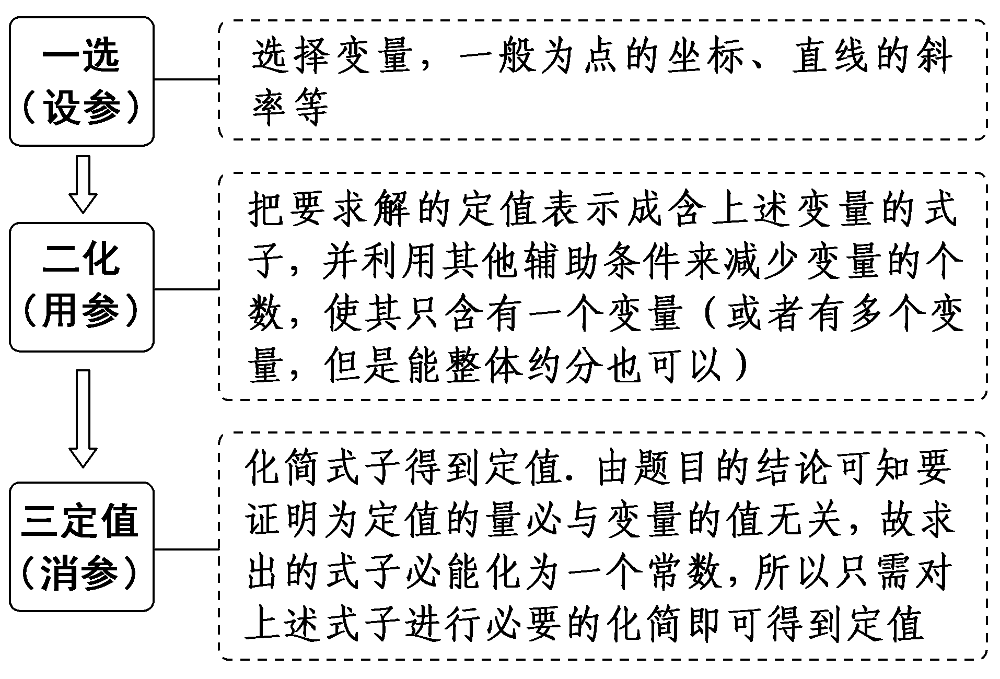
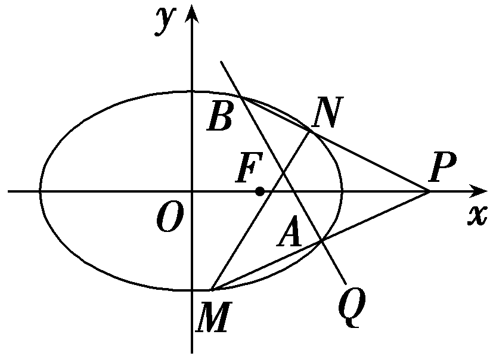
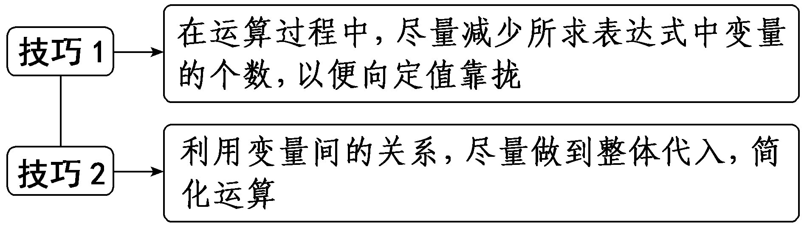
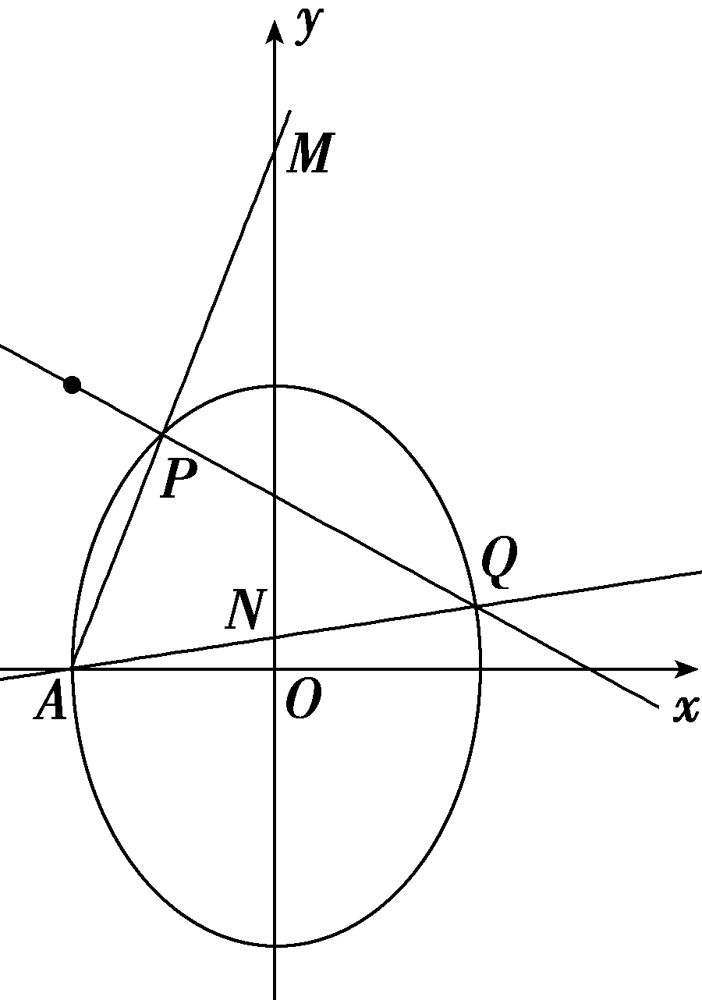
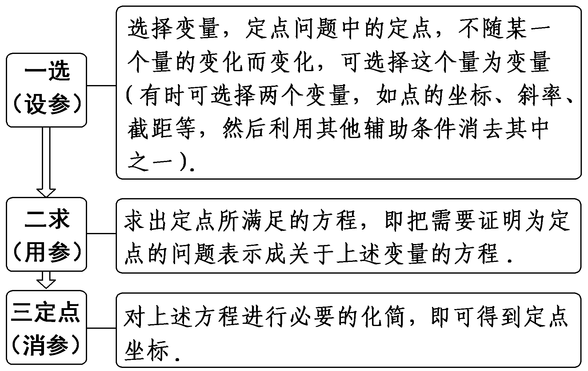
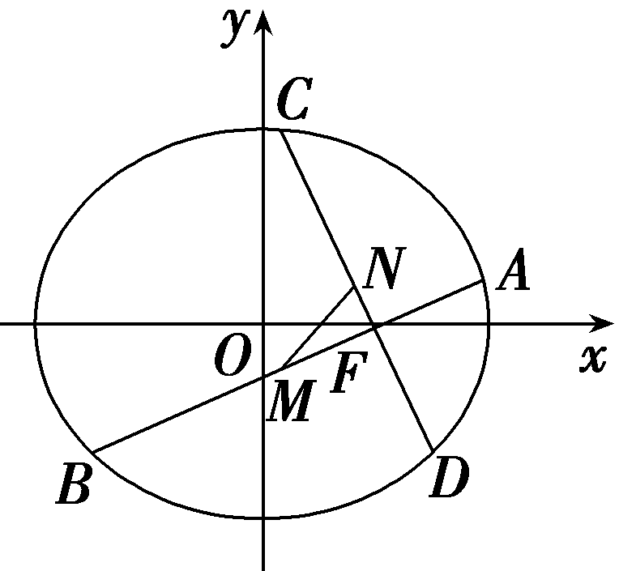

**突破**9　**定点、定线与定值问题**

处理圆锥曲线中定点问题的方法：(1)探索直线过定点时，可设直线方程为*y*＝*kx*＋*m*，然后利用条件建立*k*，*m*的等量关系进行消元，借助于直线系的思想找出定点；(2)从特殊情况入手，先探求定点，再证明与变量无关.

处理圆锥曲线中定值问题的方法：(1)从特殊入手，求出定值，再证明这个值与变量无关；(2)直接推理、计算，并在计算推理的过程中消去变量，从而得到定值.

题型一　定值问题

技法1　直接消参法

已知<text st*yl*e="italic">O</text>为坐标原点，过点*M*(1，0)的直线l与抛物线*C*：y<text style="su*p*erscript">2</text>＝2*px*(p＞0)交于*A*，*B*两点，且 $\vec{OA}$ · $\vec{OB}$ ＝－3.

(1)求抛物线*C*的方程；

(2)过点&lt;text sty<em>l</em>e="italic"&gt;M&lt;/text&gt;作直线<em>l'</em>⊥l交抛物线<em>C</em>于<em>P</em>，<em>Q</em>两点，记△<em>OAB</em>，△<em>OPQ</em>的面积分别为<em>&lt;text style="italic"&gt;S</em>&lt;/text&gt;1，S2，证明： $\frac{1}{S_{1}^{2}}$ ＋ $\frac{1}{S_{2}^{2}}$ 为定值.

解：(1)设直线*l*：*x*＝*my*＋1，

联立方程 $\left\{\begin{matrix}x＝my+1，\\y^{2}=2px，\end{matrix}\right.$ 消去<text st*y*le="italic">x</text>得，y<text style="su*p*erscript">2</text>－2*pmy*－2p＝0，

设<em>A</em>(<em>x</em>1，<em>y</em>1)，<em>B</em>(<em>x</em>2，<em>y</em>2)，

则<em>y</em>1＋<em>y</em>2＝2<em>pm</em>，<em>y</em>1<em>y</em>2＝－2<em>p</em>，

又因为 $\vec{OA}$ · $\vec{OB}$ ＝&lt;te&lt;text st&lt;text st&lt;text st&lt;text st<em>y</em>le="italic"&gt;y&lt;/text&gt;le="italic"&gt;y&lt;/text&gt;le="italic"&gt;y&lt;/text&gt;le="italic"&gt;x&lt;/text&gt;t style="italic"&gt;x&lt;/text&gt;&lt;text style="subscript"&gt;&lt;text style="subscript"&gt;&lt;text style="subscript"&gt;1&lt;/text&gt;&lt;/text&gt;&lt;/text&gt;x&lt;text style="subscript"&gt;&lt;text style="subscript"&gt;&lt;text style="subscript"&gt;2&lt;/text&gt;&lt;/text&gt;&lt;/text&gt;＋y1y2＝(<em>&lt;text style="italic"&gt;my</em>&lt;/text&gt;1＋1)(my2＋1)＋y1y2

＝(1＋<em>m</em>2)<em>y</em>1<em>y</em>2＋<em>m</em>(<em>y</em>1＋<em>y</em>2)＋1

＝(1＋<em>m</em>2)(－2<em>p</em>)＋2<em>pm</em>2＋1＝－2<em>p</em>＋1＝－3，

解得*p*＝2.

所以抛物线<em>C</em>的方程为<em>y</em>2＝4<em>x</em>.

(2)证明：由(1)知*M*(1，0)是抛物线*C*的焦点，

所以｜<em>AB</em>｜＝<em>x</em>1＋<em>x</em>2＋<em>p</em>＝<em>my</em>1＋<em>my</em>2＋2＋<em>p</em>＝4<em>m</em>2＋4.

原点到直线*l*的距离*d*＝ $\frac{1}{\sqrt{1+m^{2}}}$ ，

所以<em>S</em>1＝ $\frac{1}{2}$ × $\frac{1}{\sqrt{1+m^{2}}}$ ×4(<em>m</em>2＋1)＝2 $\sqrt{1+m^{2}}$ .

因为直线*l'* 过点(1，0)且*l'*⊥*l*，

所以<em>S</em>2＝2 $\sqrt{1+\left(－\frac{1}{m}\right)^{2}}$ ＝2 $\sqrt{\frac{1+m^{2}}{m^{2}}}$ .

所以 $\frac{1}{S_{1}^{2}}$ ＋ $\frac{1}{S_{2}^{2}}$ ＝ $\frac{1}{4(1+m^{2})}$ ＋ $\frac{m^{2}}{4(1+m^{2})}$ ＝ $\frac{1}{4}$ ，

即 $\frac{1}{S_{1}^{2}}$ ＋ $\frac{1}{S_{2}^{2}}$ 为定值 $\frac{1}{4}$ .

参数法解决圆锥曲线中定值问题的一般步骤

对点练1.(2025·江西赣州模拟)已知椭圆<text style="it*a*lic">*C*</text>： $\frac{x^{2}}{a^{2}}$ ＋ $\frac{y^{2}}{b^{2}}$ ＝1(*a*＞*b*＞0)过点(1， $\frac{2\sqrt{3}}{3}$ )，椭圆<text style="it*a*lic">*C*</text>的右焦点与点*Q*(2，－2)所在直线的斜率为－2.

(1)求椭圆*C*的方程；

(2)若过*Q*的直线*l*与椭圆*C*交于*A*，*B*两点，点*P*(3，0).直线*PA*，*PB*分别交椭圆*C*于点*M*，*N*，求证：直线*MN*的斜率为定值.

解：(1)由题意可设椭圆的半焦距为*c*，且椭圆*C*的右焦点为(*c*，0)，

由题意得 $\left\{\begin{matrix}\frac{1}{a^{2}}＋\frac{4}{3b^{2}}=1，\\a^{2}＝b^{2}＋c^{2}，\\\frac{－2－0}{2－c}＝－2，\end{matrix}\right.$ 解得&lt;text style="it<em>a</em>lic"&gt;c&lt;/text&gt;＝1，a&lt;text style="superscript"&gt;2&lt;/text&gt;＝3，<em>b</em>2＝2，

所以椭圆*C*的方程为 $\frac{x^{2}}{3}$ ＋ $\frac{y^{2}}{2}$ ＝1.

(&lt;te&lt;te&lt;te&lt;text st<em>y</em>le="italic"&gt;x&lt;/text&gt;t st<em>y</em>le="italic"&gt;x&lt;/text&gt;t st<em>y</em>le="italic"&gt;x&lt;/text&gt;t st<em>y</em>le="subscript"&gt;2&lt;/text&gt;)证明：设&lt;te&lt;te&lt;te<em>x</em>t st<em>y</em>le="italic"&gt;x&lt;/text&gt;t st<em>y</em>le="italic"&gt;x&lt;/text&gt;t style="italic"&gt;l&lt;/text&gt;的方程为x＝<em>m</em>(y＋2)＋2，设<em>A</em>(x&lt;text style="subscript"&gt;1&lt;/text&gt;，y1)，<em>B</em>(x2，y2)，<em>M</em>(x&lt;text style="subscript"&gt;3&lt;/text&gt;，y3)，<em>N</em>(x&lt;text style="subscript"&gt;4&lt;/text&gt;，y4)，则直线<em>PA</em>的方程为x＝ $\frac{x_{1}－3}{y_{1}}$ &lt;te&lt;te&lt;te&lt;te&lt;te&lt;text st<em>y</em>le="italic"&gt;x&lt;/text&gt;t st<em>y</em>le="italic"&gt;x&lt;/text&gt;t st<em>y</em>le="italic"&gt;x&lt;/text&gt;t st<em>y</em>le="italic"&gt;x&lt;/text&gt;t st<em>y</em>le="italic"&gt;x&lt;/text&gt;t style="italic"&gt;y&lt;/text&gt;＋&lt;text style="subscript"&gt;3&lt;/text&gt;，

由 $\left\{\begin{matrix}x＝\frac{x_{1}－3}{y_{1}}y+3，\\\frac{x^{2}}{3}＋\frac{y^{2}}{2}=1，\end{matrix}\right.$ 可得[&lt;te&lt;text st&lt;text st<em>y</em>le="italic"&gt;y&lt;/text&gt;le="italic"&gt;x&lt;/text&gt;t st<em>y</em>le="superscript"&gt;2&lt;/text&gt;(<em>x</em>&lt;text style="subscript"&gt;&lt;text style="subscript"&gt;1&lt;/text&gt;&lt;/text&gt;－3)2＋3 $y_{1}^{2}$ ]&lt;te&lt;text st&lt;text st<em>y</em>le="italic"&gt;y&lt;/text&gt;le="italic"&gt;x&lt;/text&gt;t style="italic"&gt;y&lt;/text&gt;&lt;text style="superscript"&gt;2&lt;/text&gt;＋&lt;text style="subscript"&gt;&lt;text style="subscript"&gt;1&lt;/text&gt;&lt;/text&gt;2(<em>x</em>1－3)y1y＋12 $y_{1}^{2}$ ＝0，

结合 $\frac{x_{1}^{2}}{3}$ ＋ $\frac{y_{1}^{2}}{2}$ ＝&lt;te&lt;text st&lt;text st<em>y</em>le="italic"&gt;y&lt;/text&gt;le="italic"&gt;x&lt;/text&gt;t st<em>y</em>le="subscript"&gt;&lt;text style="subscript"&gt;1&lt;/text&gt;&lt;/text&gt;，可得(2－<em>x</em>1)y2＋(x1－3)y1y＋ $y_{1}^{2}$ ＝0，

可得&lt;text st&lt;text st<em>y</em>le="italic"&gt;y&lt;/text&gt;le="italic"&gt;y&lt;/text&gt;1·y&lt;text style="subscript"&gt;3&lt;/text&gt;＝ $\frac{y_{1}^{2}}{2－x_{1}}$ ，解得&lt;text st&lt;text st<em>y</em>le="italic"&gt;y&lt;/text&gt;le="italic"&gt;y&lt;/text&gt;&lt;text style="subscript"&gt;3&lt;/text&gt;＝ $\frac{y_{1}}{2－x_{1}}$ ，

代入&lt;te<em>x</em>t st<em>y</em>le="italic"&gt;x&lt;/text&gt;＝ $\frac{x_{1}－3}{y_{1}}$ &lt;te<em>x</em>t style="italic"&gt;y&lt;/text&gt;＋3，解得<em>x</em>3＝ $\frac{x_{1}－3}{y_{1}}$ · $\frac{y_{1}}{2－x_{1}}$ ＋3＝ $\frac{1}{x_{1}－2}$ ＋2，

同理可得&lt;te<em>x</em>t style="italic"&gt;y&lt;/text&gt;&lt;text style="subscript"&gt;4&lt;/text&gt;＝ $\frac{y_{2}}{2－x_{2}}$ ，<em>x</em>&lt;text style="subscript"&gt;4&lt;/text&gt;＝ $\frac{1}{x_{2}－2}$ ＋2，

故<em>kMN</em>＝ $\frac{y_{4}－y_{3}}{x_{4}－x_{3}}$ ＝ $\frac{\frac{y_{2}}{2－x_{2}}－\frac{y_{1}}{2－x_{1}}}{\frac{1}{x_{2}－2}－\frac{1}{x_{1}－2}}$ ＝ $\frac{y_{2}(2－x_{1})-y_{1}(2－x_{2})}{x_{1}－x_{2}}$

＝ $\frac{y_{2}[2-(my_{1}+2m+2)]-y_{1}[2-(my_{2}+2m+2)]}{m(y_{1}－y_{2})}$ ＝ $\frac{2m(y_{1}－y_{2})}{m(y_{1}－y_{2})}$ ＝2.

故直线*MN*的斜率是定值，且定值为2.

技法2　特殊转化法

给定椭圆<text style="it*a*lic">*<text style="italic"><text style="italic">C*</text></text></text>： $\frac{x^{2}}{a^{2}}$ ＋ $\frac{y^{2}}{b^{2}}$ ＝1(*a*＞*b*＞0)，称圆心在原点*O*，半径为 $\sqrt{a^{2}＋b^{2}}$ 的圆是椭圆<text style="it*a*lic">*<text style="italic"><text style="italic">C*</text></text></text>的“卫星圆”.若椭圆C的离心率为 $\frac{\sqrt{2}}{2}$ ，点(2， $\sqrt{2}$ )在<text style="it*a*lic">*<text style="italic"><text style="italic">C*</text></text></text>上.

(1)求椭圆*C*的方程和其“卫星圆”的方程；

(2)点<em>P</em>是椭圆<em>C</em>的“卫星圆”上的一个动点，过点<em>P</em>作直线<em>l</em>1，<em>l</em>2使得<em>l</em>1，<em>l</em>2与椭圆<em>C</em>都只有一个交点，且<em>l</em>1，<em>l</em>2与其“卫星圆”的另外两个交点分别为<em>M</em>，<em>N</em>，证明：｜<em>MN</em>｜为定值.

解：(1)由题意得 $\left\{\begin{matrix}\frac{c}{a}＝\frac{\sqrt{2}}{2}，\\\frac{4}{a^{2}}＋\frac{2}{b^{2}}=1，\\a^{2}＝b^{2}＋c^{2}，\end{matrix}\right.$ 解得 $\left\{\begin{matrix}a=2\sqrt{2}，\\b=2，\\c=2，\end{matrix}\right.$

所以椭圆&lt;te&lt;text st<em>y</em>le="italic"&gt;x&lt;/text&gt;t style="italic"&gt;C&lt;/text&gt;的方程为 $\frac{x^{2}}{8}$ ＋ $\frac{y^{2}}{4}$ ＝1，其“卫星圆”的方程为&lt;text st<em>y</em>le="italic"&gt;x&lt;/text&gt;&lt;text style="superscript"&gt;2&lt;/text&gt;＋y2＝12.

(2)证明：①当<em>l</em>1，<em>l</em>2中有一条直线的斜率不存在时，不妨设<em>l</em>1的斜率不存在.

因为&lt;te&lt;te<em>x</em>t style="italic"&gt;x&lt;/text&gt;t style="italic"&gt;l&lt;/text&gt;1与椭圆只有一个交点，所以其方程为x＝2 $\sqrt{2}$ 或&lt;te<em>x</em>t style="italic"&gt;x&lt;/text&gt;＝－2 $\sqrt{2}$ .

当&lt;te&lt;text sty<em>l</em>e="italic"&gt;x&lt;/text&gt;t style="italic"&gt;l&lt;/text&gt;&lt;text style="subscript"&gt;1&lt;/text&gt;的方程为x＝2 $\sqrt{2}$ 时，&lt;te&lt;text sty<em>l</em>e="italic"&gt;x&lt;/text&gt;t style="italic"&gt;l&lt;/text&gt;&lt;text style="subscript"&gt;1&lt;/text&gt;与“卫星圆”交于点(2 $\sqrt{2}$ ，2)和点(2 $\sqrt{2}$ ，－2)，

经过点(&lt;text st&lt;text st<em>y</em>le="italic"&gt;y&lt;/text&gt;le="subscript"&gt;2&lt;/text&gt; $\sqrt{2}$ ，&lt;text st&lt;text st<em>y</em>le="italic"&gt;y&lt;/text&gt;le="subscript"&gt;2&lt;/text&gt;)且与椭圆只有一个交点的直线是&lt;text st&lt;text sty<em>l</em>e="italic"&gt;y&lt;/text&gt;le="italic"&gt;y&lt;/text&gt;＝2，经过点 $\left(2\sqrt{2},-2\right)$ 且与椭圆只有一个交点的直线是&lt;text st&lt;text st&lt;text st<em>y</em>le="italic"&gt;y&lt;/text&gt;<em>l</em>e="italic"&gt;y&lt;/text&gt;le="italic"&gt;y&lt;/text&gt;＝－2，即l2的方程为y＝2或y＝－2.

所以&lt;text sty<em>l</em>e="italic"&gt;l&lt;/text&gt;1⊥l2，所以线段<em>&lt;text style="italic"&gt;MN</em>&lt;/text&gt;应为“卫星圆”的直径，所以｜MN｜＝4 $\sqrt{3}$ .

当&lt;te<em>x</em>t style="italic"&gt;l&lt;/text&gt;1的方程为x＝－2 $\sqrt{2}$ 时，同理可得｜<em>MN</em>｜＝4 $\sqrt{3}$ .

②当&lt;te&lt;text st<em>y</em>le="italic"&gt;x&lt;/text&gt;t sty<em>l</em>e="italic"&gt;l&lt;/text&gt;1，l2的斜率都存在时，设点<em>P</em>(x&lt;text style="subscript"&gt;0&lt;/text&gt;，y0)，其中 $x_{0}^{2}$ ＋ $y_{0}^{2}$ ＝&lt;te&lt;text st<em>y</em>le="italic"&gt;x&lt;/text&gt;t sty<em>l</em>e="subscript"&gt;1&lt;/text&gt;2.

设经过点<em>P</em>(<em>x</em>0，<em>y</em>0)且与椭圆只有一个交点的直线方程为<em>y</em>＝<em>t</em>(<em>x</em>－<em>x</em>0)＋<em>y</em>0，

由 $\left\{\begin{matrix}y＝tx＋y_{0}－tx_{0}，\\\frac{x^{2}}{8}＋\frac{y^{2}}{4}=1，\end{matrix}\right.$ 消去&lt;&lt;&lt;te&lt;text st<em>y</em>le="italic"&gt;x&lt;/text&gt;t st<em>y</em>le="italic"&gt;t&lt;/text&gt;e<em>x</em>t style="italic"&gt;t&lt;/text&gt;ext style="italic"&gt;y&lt;/text&gt;，得(1＋&lt;text style="superscript"&gt;&lt;text style="superscript"&gt;2&lt;/text&gt;&lt;/text&gt;t2)x2＋4t(y&lt;text style="subscript"&gt;&lt;text style="subscript"&gt;&lt;text style="subscript"&gt;0&lt;/text&gt;&lt;/text&gt;&lt;/text&gt;－<em>&lt;text style="italic"&gt;tx</em>&lt;/text&gt;0)x＋2(y0－tx0)2－8＝0，

所以&lt;&lt;<em>t</em>e&lt;text st<em>y</em>le="italic"&gt;x&lt;/text&gt;t style="italic"&gt;t&lt;/text&gt;ext style="italic"&gt;Δ&lt;/text&gt;＝ $\left(64－8x_{0}^{2}\right)$ &lt;<em>t</em>e&lt;text st<em>y</em>le="italic"&gt;x&lt;/text&gt;t style="italic"&gt;t&lt;/text&gt;2＋16x&lt;text style="subscript"&gt;0&lt;/text&gt;y0t＋32－8 $y_{0}^{2}$ ＝&lt;<em>t</em>ext st<em>y</em>le="subscript"&gt;0&lt;/text&gt;，

设&lt;&lt;&lt;&lt;&lt;text sty&lt;text sty<em>l</em>e="italic"&gt;l&lt;/text&gt;e="italic"&gt;t&lt;/text&gt;ext style="italic"&gt;t&lt;/text&gt;ext style="italic"&gt;t&lt;/text&gt;ext style="italic"&gt;t&lt;/text&gt;ext sty<em>l</em>e="italic"&gt;l&lt;/text&gt;&lt;text style="subscript"&gt;&lt;text style="subscript"&gt;&lt;text style="subscript"&gt;1&lt;/text&gt;&lt;/text&gt;&lt;/text&gt;，l&lt;text style="subscript"&gt;&lt;text style="subscript"&gt;&lt;text style="subscript"&gt;2&lt;/text&gt;&lt;/text&gt;&lt;/text&gt;的斜率分别为t1，t2，则t1·t2＝ $\frac{32－8y_{0}^{2}}{64－8x_{0}^{2}}$ ＝ $\frac{32－8\left(12－x_{0}^{2}\right)}{64－8x_{0}^{2}}$ ＝－&lt;&lt;&lt;&lt;&lt;text sty&lt;text sty<em>l</em>e="italic"&gt;l&lt;/text&gt;e="italic"&gt;t&lt;/text&gt;ext style="italic"&gt;t&lt;/text&gt;ext style="italic"&gt;t&lt;/text&gt;ext style="italic"&gt;t&lt;/text&gt;ext sty<em>l</em>e="subscript"&gt;&lt;text style="subscript"&gt;&lt;text style="subscript"&gt;1&lt;/text&gt;&lt;/text&gt;&lt;/text&gt;，则满足条件的两直线<em>l</em>1，l&lt;text style="subscript"&gt;&lt;text style="subscript"&gt;&lt;text style="subscript"&gt;2&lt;/text&gt;&lt;/text&gt;&lt;/text&gt;垂直.

所以线段*MN*应为“卫星圆”的直径，

所以｜*MN*｜＝4 $\sqrt{3}$ .

综合①②知，｜*MN*｜＝4 $\sqrt{3}$ ，为定值.

由特殊到一般法求定值问题的两个常用技巧

对点练&lt;te&lt;te&lt;text st<em>y</em>le="italic"&gt;x&lt;/text&gt;t st<em>y</em>le="italic"&gt;x&lt;/text&gt;t style="superscript"&gt;&lt;text style="subscript"&gt;&lt;text style="subscript"&gt;2&lt;/text&gt;&lt;/text&gt;&lt;/text&gt;.在平面直角坐标系&lt;text st<em>y</em>le="italic"&gt;xOy&lt;/text&gt;中，已知椭圆<em>&lt;text style="italic"&gt;C</em>&lt;/text&gt;： $\frac{x^{2}}{4}$ ＋&lt;te&lt;te&lt;text st<em>y</em>le="italic"&gt;x&lt;/text&gt;t st<em>y</em>le="italic"&gt;x&lt;/text&gt;t style="italic"&gt;y&lt;/text&gt;&lt;text style="subscript"&gt;&lt;text style="subscript"&gt;&lt;text style="subscript"&gt;2&lt;/text&gt;&lt;/text&gt;&lt;/text&gt;＝&lt;text style="subscript"&gt;&lt;text style="subscript"&gt;1&lt;/text&gt;&lt;/text&gt;，点<em>P</em>(x1，y1)，<em>Q</em>(x2，y2)是椭圆<em>&lt;text style="italic"&gt;C</em>&lt;/text&gt;上的两个动点，直线<em>OP</em>，<em>OQ</em>的斜率分别为<em>&lt;text style="italic"&gt;k</em>&lt;/text&gt;1，k2，若<em><strong>&lt;text style="bold,italic"&gt;m</strong></em>&lt;/text&gt;＝ $\left(\frac{x_{1}}{2}，y_{1}\right)$ ，<em><strong>&lt;text style="bold,italic"&gt;n</strong></em>&lt;/text&gt;＝ $\left(\frac{x_{2}}{2}，y_{2}\right)$ ，<em><strong>&lt;text style="bold,italic"&gt;m</strong></em>&lt;/text&gt;·<em><strong>&lt;text style="bold,italic"&gt;n</strong></em>&lt;/text&gt;＝0.

(1)求证：<em>&lt;text style="italic"&gt;k</em>&lt;/text&gt;1·k2＝－ $\frac{1}{4}$ ；

(2)试探求△*OPQ*的面积*S*是不是定值，并说明理由.

解：(1)证明：因为<em>k</em>1，<em>k</em>2存在，所以<em>x</em>1<em>x</em>2≠0，

因为&lt;text st&lt;text st<em>y</em>le="italic"&gt;y&lt;/text&gt;le="bold,italic"&gt;m&lt;/text&gt;·<em><strong>n</strong></em>＝0，所以 $\frac{x_{1}x_{2}}{4}$ ＋&lt;text st<em>y</em>le="italic"&gt;y&lt;/text&gt;1y2＝0，

所以<em>&lt;text style="italic"&gt;k</em>&lt;/text&gt;1·k2＝ $\frac{y_{1}y_{2}}{x_{1}x_{2}}$ ＝－ $\frac{1}{4}$ .

(&lt;text st&lt;text st<em>y</em>le="italic"&gt;y&lt;/text&gt;le="subscript"&gt;2&lt;/text&gt;)是定值.理由如下：当直线&lt;te&lt;te<em>x</em>t style="italic"&gt;x&lt;/text&gt;t style="italic"&gt;PQ&lt;/text&gt;的斜率不存在，即x&lt;text style="subscript"&gt;1&lt;/text&gt;＝x2，y1＝－y2时，由 $\frac{y_{1}y_{2}}{x_{1}x_{2}}$ ＝－ $\frac{1}{4}$ ，得 $\frac{x_{1}^{2}}{4}$ － $y_{1}^{2}$ ＝0，

由&lt;te&lt;text st<em>y</em>le="italic"&gt;x&lt;/text&gt;t style="italic"&gt;P&lt;/text&gt;(x&lt;text style="subscript"&gt;1&lt;/text&gt;，y1)在椭圆<em>C</em>上，得 $\frac{x_{1}^{2}}{4}$ ＋ $y_{1}^{2}$ ＝&lt;text st<em>y</em>le="subscript"&gt;1&lt;/text&gt;，

所以｜&lt;text st<em>y</em>le="italic"&gt;x&lt;/text&gt;&lt;text style="subscript"&gt;1&lt;/text&gt;｜＝ $\sqrt{2}$ ，｜<em>y</em>&lt;text style="subscript"&gt;1&lt;/text&gt;｜＝ $\frac{\sqrt{2}}{2}$ ，

所以&lt;te&lt;text st&lt;text st<em>y</em>le="italic"&gt;y&lt;/text&gt;le="italic"&gt;x&lt;/text&gt;t style="italic"&gt;S&lt;/text&gt;△<em>OPQ</em>＝ $\frac{1}{2}$ ｜&lt;text st&lt;text st<em>y</em>le="italic"&gt;y&lt;/text&gt;le="italic"&gt;x&lt;/text&gt;&lt;text style="subscript"&gt;1&lt;/text&gt;｜·｜y1－y2｜＝1.

当直线*PQ*的斜率存在时，

设直线*PQ*的方程为*y*＝*kx*＋*b*.

由 $\left\{\begin{matrix}y＝kx＋b，\\\frac{x^{2}}{4}＋y^{2}=1，\end{matrix}\right.$ 得(4&lt;te<em>x</em>t style="italic"&gt;k&lt;/text&gt;&lt;text style="superscript"&gt;&lt;text style="superscript"&gt;2&lt;/text&gt;&lt;/text&gt;＋1)x2＋8<em>k&lt;text style="italic"&gt;b</em>x&lt;/text&gt;＋4b2－4＝0，

&lt;te&lt;te&lt;te<em>x</em>t style="italic"&gt;x&lt;/text&gt;t style="italic"&gt;x&lt;/text&gt;t style="italic"&gt;x&lt;/text&gt;&lt;text style="subscript"&gt;1&lt;/text&gt;＋x&lt;text style="subscript"&gt;2&lt;/text&gt;＝ $\frac{－8kb}{4k^{2}+1}$ ，&lt;te&lt;te&lt;te<em>x</em>t style="italic"&gt;x&lt;/text&gt;t style="italic"&gt;x&lt;/text&gt;t style="italic"&gt;x&lt;/text&gt;&lt;text style="subscript"&gt;1&lt;/text&gt;x&lt;text style="subscript"&gt;2&lt;/text&gt;＝ $\frac{4b^{2}－4}{4k^{2}+1}$ .

因为 $\frac{x_{1}x_{2}}{4}$ ＋&lt;text st<em>y</em>le="italic"&gt;y&lt;/text&gt;&lt;text style="su<em>&lt;text style="italic"&gt;&lt;text style="italic"&gt;&lt;text style="italic"&gt;&lt;text style="italic"&gt;b</em>&lt;/text&gt;&lt;/text&gt;&lt;/text&gt;&lt;/text&gt;script"&gt;1&lt;/text&gt;y&lt;text style="subscript"&gt;&lt;text style="superscript"&gt;&lt;text style="superscript"&gt;&lt;text style="superscript"&gt;&lt;text style="superscript"&gt;&lt;text style="superscript"&gt;&lt;text style="superscript"&gt;&lt;text style="superscript"&gt;&lt;text style="superscript"&gt;2&lt;/text&gt;&lt;/text&gt;&lt;/text&gt;&lt;/text&gt;&lt;/text&gt;&lt;/text&gt;&lt;/text&gt;&lt;/text&gt;&lt;/text&gt;＝0，所以 $\frac{x_{1}x_{2}}{4}$ ＋ $\left(kx_{1}＋b\right)$ ·(<em>&lt;text style="italic"&gt;&lt;text style="italic"&gt;&lt;text style="italic"&gt;&lt;text style="italic"&gt;k</em>&lt;/text&gt;&lt;/text&gt;&lt;/text&gt;x&lt;/text&gt;&lt;text style="su<em>&lt;text style="italic"&gt;&lt;text style="italic"&gt;&lt;text style="italic"&gt;&lt;text style="italic"&gt;b</em>&lt;/text&gt;&lt;/text&gt;&lt;/text&gt;&lt;/text&gt;script"&gt;&lt;text style="superscript"&gt;&lt;text style="superscript"&gt;&lt;text style="superscript"&gt;&lt;text style="superscript"&gt;&lt;text style="superscript"&gt;&lt;text style="superscript"&gt;&lt;text style="superscript"&gt;&lt;text style="superscript"&gt;2&lt;/text&gt;&lt;/text&gt;&lt;/text&gt;&lt;/text&gt;&lt;/text&gt;&lt;/text&gt;&lt;/text&gt;&lt;/text&gt;&lt;/text&gt;＋b)＝0，得2b2－4k2＝&lt;text st<em>y</em>le="subscript"&gt;1&lt;/text&gt;，满足<em>Δ</em>＝64k2b2－4(4k2＋1)(4b2－4)＝16(4k2＋1－b2)＞0，

所以<em>S</em>&lt;text style="su<em>&lt;text style="italic"&gt;b</em>&lt;/text&gt;script"&gt;△&lt;/text&gt;<em>O&lt;text style="italic"&gt;PQ</em>&lt;/text&gt;＝ $\frac{1}{2}$ · $\frac{｜b｜}{\sqrt{1+k^{2}}}$ ｜<em>PQ</em>｜＝ $\frac{1}{2}$ ｜<em>&lt;text style="italic"&gt;b</em>&lt;/text&gt;｜· $\sqrt{(x_{1}＋x_{2})^{2}－4x_{1}x_{2}}$ ＝2｜<em>&lt;text style="italic"&gt;b</em>&lt;/text&gt;｜· $\frac{\sqrt{4k^{2}+1－b^{2}}}{4k^{2}+1}$ ＝1.

所以△*OPQ*的面积*S*为定值.

题型二　定点问题

技法1　直接推理法

(2023·全国乙卷)已知椭圆<text style="it*a*lic">*C*</text>： $\frac{y^{2}}{a^{2}}$ ＋ $\frac{x^{2}}{b^{2}}$ ＝1(*a*＞*b*＞0)的离心率为 $\frac{\sqrt{5}}{3}$ ，点*A*(－2，0)在<text style="it*a*lic">*C*</text>上.

(1)求*C*的方程；

(2)过点(－2，3)的直线交*C*于*P*，*Q*两点，直线*AP*，*AQ*与*y*轴的交点分别为*M*，*N*，证明：线段*MN*的中点为定点.

解：(1)由题意可得 $\left\{\begin{matrix}b=2，\\a^{2}＝b^{2}＋c^{2}，\\e＝\frac{c}{a}＝\frac{\sqrt{5}}{3}，\end{matrix}\right.$ 解得 $\left\{\begin{matrix}a=3，\\b=2，\\c＝\sqrt{5}，\end{matrix}\right.$

所以*C*的方程为 $\frac{y^{2}}{9}$ ＋ $\frac{x^{2}}{4}$ ＝1.

(2)证明：由题意可知：直线*PQ*的斜率存在，设*PQ*：*y*＝*k*(*x*＋2)＋3，

<em>P</em>(<em>x</em>1，<em>y</em>1)，<em>Q</em>(<em>x</em>2，<em>y</em>2)，

联立方程 $\left\{\begin{matrix}y＝k(x+2)+3，\\\frac{y^{2}}{9}＋\frac{x^{2}}{4}=1，\end{matrix}\right.$

消去<em>y</em>得(4<em>k</em>2＋9)<em>x</em>2＋8<em>k</em>(2<em>k</em>＋3)<em>x</em>＋16(<em>k</em>2＋3<em>k</em>)＝0，

则<em>Δ</em>＝64<em>k</em>2(2<em>k</em>＋3)2－64(4<em>k</em>2＋9)(<em>k</em>2＋3<em>k</em>)＝－1 728<em>k</em>＞0，解得<em>k</em>＜0，

可得&lt;te&lt;te&lt;te<em>x</em>t style="italic"&gt;x&lt;/text&gt;t style="italic"&gt;x&lt;/text&gt;t style="italic"&gt;x&lt;/text&gt;&lt;text style="subscript"&gt;1&lt;/text&gt;＋x&lt;text style="subscript"&gt;2&lt;/text&gt;＝－ $\frac{8k(2k+3)}{4k^{2}+9}$ ，&lt;te&lt;te&lt;te<em>x</em>t style="italic"&gt;x&lt;/text&gt;t style="italic"&gt;x&lt;/text&gt;t style="italic"&gt;x&lt;/text&gt;&lt;text style="subscript"&gt;1&lt;/text&gt;x&lt;text style="subscript"&gt;2&lt;/text&gt;＝ $\frac{16(k^{2}+3k)}{4k^{2}+9}$ ，

因为<te*x*t st*y*le="italic">A</text>(－2，0)，则直线*AP*：y＝ $\frac{y_{1}}{x_{1}+2}$ (*x*＋2)，

令<text st*y*le="italic">x</text>＝0，解得y＝ $\frac{2y_{1}}{x_{1}+2}$ ，即*M* $\left(0，\frac{2y_{1}}{x_{1}+2}\right)$ ，

同理可得*N* $\left(0，\frac{2y_{2}}{x_{2}+2}\right)$ ，

则 $\frac{\frac{2y_{1}}{x_{1}+2}＋\frac{2y_{2}}{x_{2}+2}}{2}$ ＝ $\frac{[k(x_{1}+2)+3]}{x_{1}+2}$ ＋ $\frac{[k(x_{2}+2)+3]}{x_{2}+2}$ ＝

$\frac{[kx_{1}＋(2k+3)](x_{2}+2)＋[kx_{2}＋(2k+3)](x_{1}+2)}{(x_{1}+2)(x_{2}+2)}$ ＝ $\frac{2kx_{1}x_{2}＋(4k+3)(x_{1}＋x_{2})+4(2k+3)}{x_{1}x_{2}+2(x_{1}＋x_{2})+4}$

＝ $\frac{\frac{32k(k^{2}+3k)}{4k^{2}+9}－\frac{8k(4k+3)(2k+3)}{4k^{2}+9}+4(2k+3)}{\frac{16(k^{2}+3k)}{4k^{2}+9}－\frac{16k(2k+3)}{4k^{2}+9}+4}$ ＝ $\frac{108}{36}$ ＝3，

所以线段*MN*的中点是定点(0，3).

直接推理法(又叫直接消参法)求定点的一般步骤

对点练3.(&lt;text style="subscript"&gt;2&lt;/text&gt;024·江西上饶一模)已知点<em>&lt;text style="italic"&gt;A</em>&lt;/text&gt;&lt;text style="subscript"&gt;1&lt;/text&gt;(－2，0)，A2(2，0)，动点<em>&lt;text style="italic"&gt;P</em>&lt;/text&gt;满足直线<em>&lt;text style="italic"&gt;PA</em>&lt;/text&gt;1与PA2的斜率之积为－ $\frac{3}{4}$ ，记动点<em>&lt;text style="italic"&gt;P</em>&lt;/text&gt;的轨迹为曲线<em>E</em>.

(1)求曲线*E*的方程；

(2)过点*F*(1，0)与曲线*E*相交的两条线段*AB*和*CD*相互垂直(斜率存在，且*A*，*B*，*C*，*D*在曲线*E*上)，*M*，*N*分别是*AB*和*CD*的中点.求证：直线*MN*过定点.

解：(1)设&lt;te&lt;te<em>x</em>t st<em>y</em>le="italic"&gt;x&lt;/text&gt;t style="italic"&gt;<em>&lt;text style="italic"&gt;P</em>&lt;/text&gt;&lt;/text&gt;(x，y)，易得x≠±2，直线<em>&lt;text style="italic"&gt;A</em>&lt;/text&gt;1P的斜率为 $\frac{y}{x+2}$ ，直线<em>&lt;text style="italic"&gt;A</em>&lt;/text&gt;2&lt;te&lt;te<em>x</em>t st<em>y</em>le="italic"&gt;x&lt;/text&gt;t style="italic"&gt;<em>&lt;text style="italic"&gt;P</em>&lt;/text&gt;&lt;/text&gt;的斜率为 $\frac{y}{x－2}$ ，

则 $\frac{y}{x+2}$ · $\frac{y}{x－2}$ ＝－ $\frac{3}{4}$ ，

整理得 $\frac{x^{2}}{4}$ ＋ $\frac{y^{2}}{3}$ ＝1，

则曲线<te*x*t style="italic">E</text>的方程为 $\frac{x^{2}}{4}$ ＋ $\frac{y^{2}}{3}$ ＝1(*x*≠±2).

(2)证明：由题意可设直线<em>AB</em>的方程为<em>y</em>＝<em>k</em>(<em>x</em>－1)(<em>k</em>≠0)，<em>M</em>(<em>x</em>1，<em>y</em>1)，<em>A</em>(<em>x</em>2，<em>y</em>2)，<em>B</em>(<em>x</em>3，<em>y</em>3)，

因为*M*是*AB*的中点，

所以&lt;text st<em>y</em>le="italic"&gt;x&lt;/text&gt;&lt;text style="subscript"&gt;1&lt;/text&gt;＝ $\frac{x_{2}＋x_{3}}{2}$ ，<em>y</em>&lt;text style="subscript"&gt;1&lt;/text&gt;＝ $\frac{y_{2}＋y_{3}}{2}$ ，<em>&lt;text style="italic"&gt;k</em>&lt;/text&gt;<em>OM</em>＝ $\frac{y_{1}}{x_{1}}$ ＝ $\frac{y_{2}＋y_{3}}{x_{2}＋x_{3}}$ ，<em>&lt;text style="italic"&gt;k</em>&lt;/text&gt;＝ $\frac{y_{2}－y_{3}}{x_{2}－x_{3}}$ ，

因为*A*，*B*在椭圆 $\frac{x^{2}}{4}$ ＋ $\frac{y^{2}}{3}$ ＝1上，

所以 $\left\{\begin{matrix}\frac{x_{2}^{2}}{4}＋\frac{y_{2}^{2}}{3}=1，\\\frac{x_{3}^{2}}{4}＋\frac{y_{3}^{2}}{3}=1，\end{matrix}\right.$ 两式相减得 $\frac{x_{2}^{2}－x_{3}^{2}}{4}$ ＋ $\frac{y_{2}^{2}－y_{3}^{2}}{3}$ ＝0，

即 $\frac{y_{2}^{2}－y_{3}^{2}}{x_{2}^{2}－x_{3}^{2}}$ ＝－ $\frac{3}{4}$ ，于是有 $\frac{y_{2}＋y_{3}}{x_{2}＋x_{3}}$ · $\frac{y_{2}－y_{3}}{x_{2}－x_{3}}$ ＝－ $\frac{3}{4}$ ，

所以<em>&lt;text style="italic"&gt;&lt;text style="italic"&gt;k</em>&lt;/text&gt;&lt;/text&gt;<em>OM</em>·k<em>AB</em>＝－ $\frac{3}{4}$ ⇒ $\frac{y_{1}}{x_{1}}$ ·<em>&lt;text style="italic"&gt;&lt;text style="italic"&gt;k</em>&lt;/text&gt;&lt;/text&gt;＝－ $\frac{3}{4}$ ，

所以 $\left\{\begin{matrix}\frac{y_{1}}{x_{1}}k＝－\frac{3}{4}，\\y_{1}＝k(x_{1}－1),\end{matrix}\right.$ 解得 $\left\{\begin{matrix}x_{1}＝\frac{4k^{2}}{3+4k^{2}}，\\y_{1}＝\frac{－3k}{3+4k^{2}}，\end{matrix}\right.$

所以*M*( $\frac{4k^{2}}{3+4k^{2}}$ ， $\frac{－3k}{3+4k^{2}}$ ).

因为*<text style="italic">k*</text>≠0，将上式*M*点坐标中的k换成－ $\frac{1}{k}$ ，

同理可得*N*( $\frac{4}{3k^{2}+4}$ ， $\frac{3k}{3k^{2}+4}$ ).

①当直线<te*x*t style="italic">*<text style="italic,subscript">MN*</text></text>不垂直于x轴时，直线MN的斜率*k*MN＝ $\frac{\frac{3k}{3k^{2}+4}－\frac{－3k}{3+4k^{2}}}{\frac{4}{3k^{2}+4}－\frac{4k^{2}}{3+4k^{2}}}$ ＝ $\frac{7k}{4(1－k^{2})}$ ，

其方程<te<te*x*t st*y*le="italic">x</text>t style="italic">y</text>－ $\frac{－3k}{3+4k^{2}}$ ＝ $\frac{7k}{4(1－k^{2})}$ (<te*x*t st*y*le="italic">x</text>－ $\frac{4k^{2}}{3+4k^{2}}$ )，化简得<te<te*x*t st*y*le="italic">x</text>t style="italic">y</text>＝ $\frac{7k}{4(1－k^{2})}$ (<te*x*t st*y*le="italic">x</text>－ $\frac{4}{7}$ )，

所以直线*MN*过定点( $\frac{4}{7}$ ，0).

②当直线<te*x*t style="italic">*MN*</text>垂直于x轴时， $\frac{4}{3k^{2}+4}$ ＝ $\frac{4k^{2}}{3+4k^{2}}$ ，此时，*k*＝±1，直线<te*x*t style="italic">*MN*</text>也过定点( $\frac{4}{7}$ ，0).

综上所述，直线*MN*过定点( $\frac{4}{7}$ ，0).

技法2　先找后证法

已知椭圆<text style="it*a*lic">C</text>： $\frac{y^{2}}{a^{2}}$ ＋ $\frac{x^{2}}{b^{2}}$ ＝1(*a*＞*b*≥1)的离心率为 $\frac{\sqrt{2}}{2}$ ，上焦点到直线*b*x＋2*a*y－ $\sqrt{2}$ ＝0的距离为 $\frac{\sqrt{2}}{3}$ .

(1)求椭圆*C*的方程；

(2)过点<text sty*l*e="italic">P</text> $\left(\frac{1}{3}，0\right)$ 的直线*l*交椭圆*C*于*A*，*B*两点，试探究以线段*AB*为直径的圆是否过定点？若过，求出定点坐标，若不过，请说明理由.

解：(1)由题意，&lt;t<em>e</em>xt style="italic"&gt;e&lt;/text&gt;＝ $\frac{c}{a}$ ＝ $\frac{\sqrt{2}}{2}$ ，&lt;t<em>e</em>xt style="italic"&gt;e&lt;/text&gt;2＝ $\frac{a^{2}－b^{2}}{a^{2}}$ ＝ $\frac{1}{2}$ ，

所以<text style="itali*c*">a</text>＝ $\sqrt{2}$ <text style="itali*c*">*b*</text>，c＝b.

又 $\frac{｜2ac－\sqrt{2}｜}{\sqrt{4a^{2}＋b^{2}}}$ ＝ $\frac{\sqrt{2}}{3}$ ，&lt;text style="it<em>a</em>lic"&gt;a&lt;/text&gt;＞<em>&lt;text style="italic"&gt;b</em>&lt;/text&gt;≥1，所以b＝1，a2＝2，

故椭圆&lt;te<em>x</em>t style="italic"&gt;C&lt;/text&gt;的方程为 $\frac{y^{2}}{2}$ ＋<em>x</em>2＝1.

(2)当&lt;te&lt;text st<em>y</em>le="italic"&gt;x&lt;/text&gt;t style="italic"&gt;<em>AB</em>&lt;/text&gt;⊥x轴时，以线段AB为直径的圆的方程为 $\left(x－\frac{1}{3}\right)^{2}$ ＋<em>y</em>2＝ $\frac{16}{9}$ ，

当<em>AB</em>⊥<em>y</em>轴时，以线段<em>AB</em>为直径的圆的方程为<em>x</em>2＋<em>y</em>2＝1.可得两圆交点为<em>Q</em>(－1，0).由此可知，若以线段<em>AB</em>为直径的圆恒过定点，则该定点必为<em>Q</em>(－1，0).

下证*Q*(－1，0)符合题意.

当直线&lt;te&lt;te&lt;te<em>x</em>t style="italic"&gt;x&lt;/text&gt;t style="italic"&gt;x&lt;/text&gt;t st<em>yl</em>e="italic"&gt;l&lt;/text&gt;的斜率存在，且不为0时，设l的方程为y＝<em>&lt;text style="italic"&gt;k</em>&lt;/text&gt; $\left(x－\frac{1}{3}\right)$ ，代入 $\frac{y^{2}}{2}$ ＋&lt;te&lt;te<em>x</em>t style="italic"&gt;x&lt;/text&gt;t style="italic"&gt;x&lt;/text&gt;&lt;text style="superscript"&gt;&lt;text style="superscript"&gt;2&lt;/text&gt;&lt;/text&gt;＝1，并整理得 $\left(k^{2}+2\right)$ &lt;te&lt;te<em>x</em>t style="italic"&gt;x&lt;/text&gt;t style="italic"&gt;x&lt;/text&gt;&lt;text style="superscript"&gt;&lt;text style="superscript"&gt;2&lt;/text&gt;&lt;/text&gt;－ $\frac{2}{3}$ &lt;te&lt;te&lt;te<em>x</em>t style="italic"&gt;x&lt;/text&gt;t style="italic"&gt;x&lt;/text&gt;t style="italic"&gt;<em>k</em>&lt;/text&gt;&lt;text style="superscript"&gt;&lt;text style="superscript"&gt;2&lt;/text&gt;&lt;/text&gt;x＋ $\frac{k^{2}}{9}$ －&lt;te&lt;te<em>x</em>t style="italic"&gt;x&lt;/text&gt;t style="superscript"&gt;&lt;text style="superscript"&gt;2&lt;/text&gt;&lt;/text&gt;＝0，

设&lt;te&lt;te&lt;te&lt;te&lt;te&lt;te<em>x</em>t style="italic"&gt;x&lt;/text&gt;t style="italic"&gt;x&lt;/text&gt;t style="italic"&gt;x&lt;/text&gt;t st<em>y</em>le="italic"&gt;x&lt;/text&gt;t st<em>y</em>le="italic"&gt;x&lt;/text&gt;t style="italic"&gt;A&lt;/text&gt;(x&lt;text style="subscript"&gt;&lt;text style="subscript"&gt;&lt;text style="subscript"&gt;1&lt;/text&gt;&lt;/text&gt;&lt;/text&gt;，y1)，<em>B</em>(x&lt;text style="subscript"&gt;&lt;text style="subscript"&gt;&lt;text style="subscript"&gt;2&lt;/text&gt;&lt;/text&gt;&lt;/text&gt;，y2)，则x1＋x2＝ $\frac{2k^{2}}{3\left(k^{2}+2\right)}$ ，&lt;te&lt;te&lt;te&lt;te&lt;te<em>x</em>t style="italic"&gt;x&lt;/text&gt;t style="italic"&gt;x&lt;/text&gt;t style="italic"&gt;x&lt;/text&gt;t st<em>y</em>le="italic"&gt;x&lt;/text&gt;t st<em>y</em>le="italic"&gt;x&lt;/text&gt;&lt;text style="subscript"&gt;&lt;text style="subscript"&gt;&lt;text style="subscript"&gt;1&lt;/text&gt;&lt;/text&gt;&lt;/text&gt;x&lt;text style="subscript"&gt;&lt;text style="subscript"&gt;&lt;text style="subscript"&gt;2&lt;/text&gt;&lt;/text&gt;&lt;/text&gt;＝ $\frac{k^{2}－18}{9\left(k^{2}+2\right)}$ ，

所以 $\vec{QA}$ &lt;text st&lt;text st<em>y</em>le="italic"&gt;y&lt;/text&gt;le="italic"&gt;·&lt;/text&gt; $\vec{QB}$ ＝ $\left(x_{1}+1\right)\left(x_{2}+1\right)$ ＋&lt;text st<em>y</em>le="italic"&gt;y&lt;/text&gt;1y2

＝&lt;te&lt;te&lt;te&lt;te<em>x</em>t style="italic"&gt;x&lt;/text&gt;t style="italic"&gt;x&lt;/text&gt;t style="italic"&gt;x&lt;/text&gt;t style="italic"&gt;x&lt;/text&gt;&lt;text style="subscript"&gt;1&lt;/text&gt;x&lt;text style="subscript"&gt;&lt;text style="superscript"&gt;&lt;text style="subscript"&gt;2&lt;/text&gt;&lt;/text&gt;&lt;/text&gt;＋x1＋x2＋1＋<em>k</em>2 $\left(x_{1}－\frac{1}{3}\right)$ ( &lt;te&lt;te&lt;te&lt;te<em>x</em>t style="italic"&gt;x&lt;/text&gt;t style="italic"&gt;x&lt;/text&gt;t style="italic"&gt;x&lt;/text&gt;t style="italic"&gt;x&lt;/text&gt;&lt;text style="subscript"&gt;&lt;text style="superscript"&gt;&lt;text style="subscript"&gt;2&lt;/text&gt;&lt;/text&gt;&lt;/text&gt;－ $\frac{1}{3}$ )

＝(&lt;te&lt;te&lt;te<em>x</em>t style="italic"&gt;x&lt;/text&gt;t style="italic"&gt;x&lt;/text&gt;t style="subscript"&gt;1&lt;/text&gt;＋&lt;te<em>x</em>t style="italic"&gt;<em>&lt;text style="italic"&gt;k</em>&lt;/text&gt;&lt;/text&gt;&lt;text style="subscript"&gt;&lt;text style="superscript"&gt;&lt;text style="subscript"&gt;&lt;text style="superscript"&gt;2&lt;/text&gt;&lt;/text&gt;&lt;/text&gt;&lt;/text&gt;)x1x2＋(1－ $\frac{1}{3}$ &lt;te&lt;te&lt;te&lt;te<em>x</em>t style="italic"&gt;x&lt;/text&gt;t style="italic"&gt;x&lt;/text&gt;t style="italic"&gt;x&lt;/text&gt;t style="italic"&gt;<em>&lt;text style="italic"&gt;k</em>&lt;/text&gt;&lt;/text&gt;&lt;text style="subscript"&gt;&lt;text style="superscript"&gt;&lt;text style="subscript"&gt;&lt;text style="superscript"&gt;2&lt;/text&gt;&lt;/text&gt;&lt;/text&gt;&lt;/text&gt;)(x&lt;text style="subscript"&gt;1&lt;/text&gt;＋x2)＋1＋ $\frac{1}{9}$ &lt;te&lt;te&lt;te&lt;te<em>x</em>t style="italic"&gt;x&lt;/text&gt;t style="italic"&gt;x&lt;/text&gt;t style="italic"&gt;x&lt;/text&gt;t style="italic"&gt;<em>&lt;text style="italic"&gt;k</em>&lt;/text&gt;&lt;/text&gt;&lt;text style="subscript"&gt;&lt;text style="superscript"&gt;&lt;text style="subscript"&gt;&lt;text style="superscript"&gt;2&lt;/text&gt;&lt;/text&gt;&lt;/text&gt;&lt;/text&gt;

＝(1＋<em>&lt;text style="italic"&gt;&lt;text style="italic"&gt;k</em>&lt;/text&gt;&lt;/text&gt;&lt;text style="superscript"&gt;&lt;text style="superscript"&gt;2&lt;/text&gt;&lt;/text&gt;) $\frac{k^{2}－18}{9\left(k^{2}+2\right)}$ ＋( 1－ $\frac{1}{3}$ <em>&lt;text style="italic"&gt;&lt;text style="italic"&gt;k</em>&lt;/text&gt;&lt;/text&gt;&lt;text style="superscript"&gt;&lt;text style="superscript"&gt;2&lt;/text&gt;&lt;/text&gt;) $\frac{2k^{2}}{3\left(k^{2}+2\right)}$ ＋1＋ $\frac{1}{9}$ <em>&lt;text style="italic"&gt;&lt;text style="italic"&gt;k</em>&lt;/text&gt;&lt;/text&gt;&lt;text style="superscript"&gt;&lt;text style="superscript"&gt;2&lt;/text&gt;&lt;/text&gt;＝0，

故 $\vec{QA}$ ⊥ $\vec{QB}$ ，即*Q*(－1，0)在以*AB*为直径的圆上.

综上，以*AB*为直径的圆恒过定点(－1，0).

1.定点问题，先猜后证，可先考虑运动图形是否有对称性及特殊(或极端)位置猜想，如直线的水平位置、竖直位置，即斜率为0或斜率不存在时.

2.以曲线上的点为参数，设点<em>P</em>(<em>x</em>1，<em>y</em>1)，利用点在曲线<em>f</em>(<em>x</em>，<em>y</em>)＝0上，即<em>f</em>(<em>x</em>1，<em>y</em>1)＝0消参.

注意：用好两个策略：(1)“先特殊后一般”策略：即从特殊情况入手，先探求定点，再证明与变量无关.

(2)“重视对称作用”策略：即用好“由题意知，定点必在*x*轴上，或者定点显然在*y*轴上”.

对点练4.在平面直角坐标系<em>xOy</em>中，点<em>&lt;text style="italic"&gt;F</em>&lt;/text&gt;&lt;text style="subscript"&gt;1&lt;/text&gt; $\left(－\sqrt{3}，0\right)$ ，<em>&lt;text style="italic"&gt;F</em>&lt;/text&gt;&lt;text style="subscript"&gt;2&lt;/text&gt; $\left(\sqrt{3}，0\right)$ ，点<em>&lt;text style="italic"&gt;M</em>&lt;/text&gt;满足｜M<em>&lt;text style="italic"&gt;F</em>&lt;/text&gt;&lt;text style="subscript"&gt;1&lt;/text&gt;｜－｜<em>&lt;text style="italic"&gt;MF</em>&lt;/text&gt;&lt;text style="subscript"&gt;2&lt;/text&gt;｜＝±2，点M的轨迹为曲线<em>C</em>.

(1)求曲线*C*的方程；

(2)已知*A*(1，0)，过点*A*的直线*AP*，*AQ*与曲线*C*分别交于点*P*和*Q*(点*P*和*Q*都异于点*A*)，若满足*AP*⊥*AQ*，求证：直线*PQ*过定点.

解：(&lt;text style="su<em>b</em>s&lt;text style="it<em>a</em>lic"&gt;c&lt;/text&gt;ript"&gt;&lt;text style="subscript"&gt;1&lt;/text&gt;&lt;/text&gt;)因为｜<em>&lt;text style="italic"&gt;&lt;text style="italic"&gt;&lt;text style="italic"&gt;&lt;text style="italic"&gt;M&lt;text style="italic"&gt;F</em>&lt;/text&gt;&lt;/text&gt;&lt;/text&gt;&lt;/text&gt;&lt;/text&gt;1｜－｜MF&lt;text style="subscript"&gt;&lt;text style="subscript"&gt;2&lt;/text&gt;&lt;/text&gt;｜＝±2，所以｜｜MF1｜－｜MF2｜｜＝2＜2 $\sqrt{3}$ ＝｜&lt;text style="it<em>a</em>li<em>c</em>"&gt;<em>F</em>&lt;/text&gt;&lt;text style="su<em>b</em>script"&gt;&lt;text style="subscript"&gt;1&lt;/text&gt;&lt;/text&gt;F&lt;text style="subscript"&gt;&lt;text style="subscript"&gt;2&lt;/text&gt;&lt;/text&gt;｜，由双曲线定义可知，点<em>M</em>的轨迹为双曲线，其中c＝ $\sqrt{3}$ ，<em>a</em>＝&lt;text style="su<em>b</em>s<em>c</em>ript"&gt;&lt;text style="subscript"&gt;1&lt;/text&gt;&lt;/text&gt;，所以b＝ $\sqrt{c^{2}－a^{2}}$ ＝ $\sqrt{2}$ ，

所以曲线&lt;te<em>x</em>t style="italic"&gt;C&lt;/text&gt;的方程为x2－ $\frac{y^{2}}{2}$ ＝1.

(2)证明：若直线*PQ*垂直于*x*轴，易知此时直线*AP*的方程为*y*＝±(*x*－1)，

联立&lt;te<em>x</em>t style="italic"&gt;x&lt;/text&gt;2－ $\frac{y^{2}}{2}$ ＝1，解得&lt;te<em>x</em>t style="italic"&gt;x&lt;/text&gt;＝－3，直线<em>PQ</em>过点(－3，0).

当直线&lt;te&lt;te&lt;te&lt;te&lt;te&lt;te&lt;te&lt;te<em>x</em>t style="italic"&gt;x&lt;/text&gt;t style="italic"&gt;x&lt;/text&gt;t style="italic"&gt;x&lt;/text&gt;t style="italic"&gt;x&lt;/text&gt;t style="italic"&gt;x&lt;/text&gt;t st<em>y</em>le="italic"&gt;x&lt;/text&gt;t st<em>y</em>le="italic"&gt;x&lt;/text&gt;t st<em>y</em>le="italic"&gt;<em>&lt;text style="italic"&gt;PQ</em>&lt;/text&gt;&lt;/text&gt;斜率存在时，设直线PQ方程为y＝<em>&lt;text style="italic"&gt;k</em>x&lt;/text&gt;＋<em>&lt;text style="italic"&gt;m</em>&lt;/text&gt;，P(x&lt;text style="subscript"&gt;&lt;text style="subscript"&gt;&lt;text style="subscript"&gt;1&lt;/text&gt;&lt;/text&gt;&lt;/text&gt;，y1)，Q(x&lt;text style="subscript"&gt;&lt;text style="superscript"&gt;&lt;text style="superscript"&gt;&lt;text style="superscript"&gt;&lt;text style="superscript"&gt;&lt;text style="subscript"&gt;&lt;text style="subscript"&gt;2&lt;/text&gt;&lt;/text&gt;&lt;/text&gt;&lt;/text&gt;&lt;/text&gt;&lt;/text&gt;&lt;/text&gt;，y2)，代入x2－ $\frac{y^{2}}{2}$ ＝&lt;te&lt;te&lt;te&lt;te&lt;te&lt;te&lt;te<em>x</em>t style="italic"&gt;x&lt;/text&gt;t style="italic"&gt;x&lt;/text&gt;t style="italic"&gt;x&lt;/text&gt;t style="italic"&gt;x&lt;/text&gt;t style="italic"&gt;x&lt;/text&gt;t st<em>y</em>le="italic"&gt;x&lt;/text&gt;t st<em>y</em>le="subscript"&gt;&lt;text style="subscript"&gt;&lt;text style="subscript"&gt;1&lt;/text&gt;&lt;/text&gt;&lt;/text&gt;，整理得(<em>k</em>&lt;text style="subscript"&gt;&lt;text style="superscript"&gt;&lt;text style="superscript"&gt;&lt;text style="superscript"&gt;&lt;text style="superscript"&gt;&lt;text style="subscript"&gt;&lt;text style="subscript"&gt;2&lt;/text&gt;&lt;/text&gt;&lt;/text&gt;&lt;/text&gt;&lt;/text&gt;&lt;/text&gt;&lt;/text&gt;－2)<em>x</em>2＋2k<em>&lt;text style="italic"&gt;m</em>&lt;/text&gt;x＋m2＋2＝0，则x1＋x2＝ $\frac{2km}{2－k^{2}}$ ，&lt;te&lt;te&lt;te&lt;te&lt;te&lt;te&lt;te<em>x</em>t style="italic"&gt;x&lt;/text&gt;t style="italic"&gt;x&lt;/text&gt;t style="italic"&gt;x&lt;/text&gt;t style="italic"&gt;x&lt;/text&gt;t style="italic"&gt;x&lt;/text&gt;t st<em>y</em>le="italic"&gt;x&lt;/text&gt;t st<em>y</em>le="italic"&gt;x&lt;/text&gt;&lt;text style="subscript"&gt;&lt;text style="subscript"&gt;&lt;text style="subscript"&gt;1&lt;/text&gt;&lt;/text&gt;&lt;/text&gt;x&lt;text style="subscript"&gt;&lt;text style="superscript"&gt;&lt;text style="superscript"&gt;&lt;text style="superscript"&gt;&lt;text style="superscript"&gt;&lt;text style="subscript"&gt;&lt;text style="subscript"&gt;2&lt;/text&gt;&lt;/text&gt;&lt;/text&gt;&lt;/text&gt;&lt;/text&gt;&lt;/text&gt;&lt;/text&gt;＝ $\frac{m^{2}+2}{k^{2}－2}$ ，

因为*AP*⊥*AQ*，

所以 $\vec{AP}$ · $\vec{AQ}$ ＝ $\left(x_{1}－1，y_{1}\right)$ ·(&lt;text st<em>y</em>le="italic"&gt;x&lt;/text&gt;&lt;text style="subscript"&gt;2&lt;/text&gt;－1，y2)

＝(<em>x</em>1－1)(<em>x</em>2－1)＋<em>y</em>1<em>y</em>2

＝(<em>k</em>2＋1)<em>x</em>1<em>x</em>2＋(<em>km</em>－1)(<em>x</em>1＋<em>x</em>2)＋<em>m</em>2＋1

＝ $\frac{\left(k^{2}+1\right)\left(m^{2}+2\right)}{k^{2}－2}$ ＋ $\frac{2k^{2}m^{2}－2km}{2－k^{2}}$ ＋<em>m</em>2＋1

＝0，

整理得3<em>k</em>2＋2<em>km</em>－<em>m</em>2＝(3<em>k</em>－<em>m</em>)(<em>k</em>＋<em>m</em>)＝0，

解得*m*＝3*k*或*m*＝－*k*，

因为点*P*和*Q*都异于点*A*，所以*m*＝－*k*不满足题意，

故*m*＝3*k*，代入*y*＝*kx*＋*m*，得*y*＝*k*(*x*＋3)，过定点(－3，0).

综上，直线*PQ*过定点(－3，0).

**课时测评**76　**定点、定线与定值问题** $\frac{对应学生}{用书P461}$

(时间：60分钟　满分：64分)

(本栏目内容，在学生用书中以独立形式分册装订！)

1.(15分)已知椭圆&lt;te<em>x</em>t st<em>y</em>le="it<em>a</em>lic"&gt;<em>C</em>&lt;/text&gt;： $\frac{x^{2}}{a^{2}}$ ＋ $\frac{y^{2}}{b^{2}}$ ＝1(&lt;te<em>x</em>t st<em>y</em>le="italic"&gt;a&lt;/text&gt;＞<em>b</em>＞0)的一个焦点<em>F</em>在抛物线y2＝8x的准线上，且椭圆<em>&lt;text style="italic"&gt;C</em>&lt;/text&gt;经过点<em>A</em> $\left(\sqrt{6}，1\right)$ .

(1)求椭圆*C*的方程；(5分)

(2)设椭圆<em>C</em>的左、右顶点分别为<em>A</em>1，<em>A</em>2，过<em>A</em>1，<em>A</em>2分别作长轴的垂线<em>l</em>1，<em>l</em>2，椭圆<em>C</em>的一条切线<em>l</em>：<em>y</em>＝<em>kx</em>＋<em>t</em>与直线<em>l</em>1，<em>l</em>2分别交于<em>M</em>，<em>N</em>两点.求证：以<em>MN</em>为直径的圆过定点<em>F</em>.(10分)

解：(1)因为抛物线&lt;te&lt;te&lt;text style="itali<em>c</em>"&gt;x&lt;/text&gt;t style="italic"&gt;x&lt;/text&gt;t style="italic"&gt;y&lt;/text&gt;2＝8x的准线方程为x＝－2，所以<em>F</em>(－2，0)，即c＝2，又因为椭圆<em>C</em>经过点<em>A</em>( $\sqrt{6}$ ，1)，则 $\left\{\begin{matrix}\frac{6}{a^{2}}＋\frac{1}{b^{2}}=1，\\a^{2}＝b^{2}＋c^{2}，\end{matrix}\right.$ 解得 $\left\{\begin{matrix}a^{2}=8，\\b^{2}=4，\end{matrix}\right.$

所以椭圆*C*的方程为 $\frac{x^{2}}{8}$ ＋ $\frac{y^{2}}{4}$ ＝1.

(&lt;te&lt;te<em>x</em>t sty<em>l</em>e="italic"&gt;x&lt;/text&gt;t sty<em>l</em>e="subscript"&gt;2&lt;/text&gt;)证明：由(&lt;text style="subscript"&gt;1&lt;/text&gt;)知，<em>&lt;text style="italic"&gt;A</em>&lt;/text&gt;1 $\left(－2\sqrt{2}，0\right)$ ，&lt;te&lt;te<em>x</em>t sty<em>l</em>e="italic"&gt;x&lt;/text&gt;t sty<em>l</em>e="italic"&gt;<em>A</em>&lt;/text&gt;&lt;text style="subscript"&gt;2&lt;/text&gt;(2 $\sqrt{2}$ ，0)，所以&lt;te&lt;te<em>x</em>t sty<em>l</em>e="italic"&gt;x&lt;/text&gt;t style="italic"&gt;l&lt;/text&gt;&lt;text style="subscript"&gt;1&lt;/text&gt;：x＝－&lt;text style="subscript"&gt;2&lt;/text&gt; $\sqrt{2}$ ，&lt;te&lt;te<em>x</em>t sty<em>l</em>e="italic"&gt;x&lt;/text&gt;t style="italic"&gt;l&lt;/text&gt;&lt;text style="subscript"&gt;2&lt;/text&gt;：x＝2 $\sqrt{2}$ ，

联立 $\left\{\begin{matrix}\frac{x^{2}}{8}＋\frac{y^{2}}{4}=1，\\y＝kx＋t，\end{matrix}\right.$ 消&lt;<em>t</em>e<em>x</em>t style="italic"&gt;y&lt;/text&gt;得(&lt;text style="superscript"&gt;&lt;text style="superscript"&gt;2&lt;/text&gt;&lt;/text&gt;<em>k</em>2＋1)x2＋4<em>ktx</em>＋2t2－8＝0，

因为直线<em>l</em>为椭圆<em>C</em>的一条切线，所以<em>Δ</em>＝(4<em>kt</em>)2－4(2<em>k</em>2＋1)(2<em>t</em>2－8)＝0，

整理得8&lt;&lt;&lt;text sty&lt;text sty&lt;text sty<em>l</em>e="italic"&gt;l&lt;/text&gt;e="italic"&gt;l&lt;/text&gt;e="italic"&gt;t&lt;/text&gt;ext style="italic"&gt;t&lt;/text&gt;ext style="italic"&gt;<em>k</em>&lt;/text&gt;&lt;text style="superscript"&gt;&lt;text style="superscript"&gt;&lt;text style="superscript"&gt;&lt;text style="subscript"&gt;2&lt;/text&gt;&lt;/text&gt;&lt;/text&gt;&lt;/text&gt;－t2＋4＝0，故t2－8k2＝4，因为l与直线l1，l2分别交于<em>&lt;text style="italic"&gt;M</em>&lt;/text&gt;，<em>&lt;text style="italic"&gt;N</em>&lt;/text&gt;两点，设M $\left(－2\sqrt{2}，y_{1}\right)$ ，<em>&lt;text style="italic"&gt;N</em>&lt;/text&gt; $\left(2\sqrt{2}，y_{2}\right)$ ，

所以 $\vec{FM}$ ＝ $\left(－2\sqrt{2}+2，y_{1}\right)$ ， $\vec{FN}$ ＝(&lt;text st&lt;text st<em>y</em>le="italic"&gt;y&lt;/text&gt;le="subscript"&gt;2&lt;/text&gt; $\sqrt{2}$ ＋&lt;text st&lt;text st<em>y</em>le="italic"&gt;y&lt;/text&gt;le="subscript"&gt;2&lt;/text&gt;，<em>y</em>2)，则 $\vec{FM}$ · $\vec{FN}$ ＝&lt;text st&lt;text st<em>y</em>le="italic"&gt;y&lt;/text&gt;le="italic"&gt;y&lt;/text&gt;1y&lt;text style="subscript"&gt;2&lt;/text&gt;－4，

因为&lt;&lt;<em>t</em>ext st<em>y</em>le="italic"&gt;t&lt;/text&gt;ext style="italic"&gt;y&lt;/text&gt;1＝－2 $\sqrt{2}$ &lt;&lt;<em>t</em>ext st<em>y</em>le="italic"&gt;t&lt;/text&gt;ext style="italic"&gt;<em>k</em>&lt;/text&gt;＋t，<em>y</em>2＝2 $\sqrt{2}$ &lt;&lt;<em>t</em>ext st<em>y</em>le="italic"&gt;t&lt;/text&gt;ext style="italic"&gt;<em>k</em>&lt;/text&gt;＋t，

则<em>y</em>1<em>y</em>2＝<em>t</em>2－8<em>k</em>2＝4，

所以 $\vec{FM}$ · $\vec{FN}$ ＝&lt;text st<em>y</em>le="italic"&gt;y&lt;/text&gt;1y2－4＝4－4＝0，

所以 $\vec{FM}$ ⊥ $\vec{FN}$ ，即∠*MFN*＝90°，

所以以*MN*为直径的圆经过定点*F*.

2.(15分)在平面直角坐标系*xOy*中，已知△*A<text style="italic">BC*</text>的两个顶点坐标为B(－2，0)，C(2，0)，直线*AB*，*AC*的斜率乘积为 $\frac{1}{4}$ .

(1)求顶点*A*的轨迹*Γ*的方程；(5分)

(2)过点*P*(1，0)的直线与曲线*Γ*交于*M*，*N*两点，直线*BM*，*CN*相交于点*Q*，求证： $\vec{OP}$ · $\vec{OQ}$ 为定值.(10分)

解：(1)设<te<text st*y*le="italic">x</text>t style="italic">A</text>(x，y)，因为直线*AB*，*AC*的斜率乘积为 $\frac{1}{4}$ ，

则 $\frac{y}{x+2}$ · $\frac{y}{x－2}$ ＝ $\frac{1}{4}$ ，整理得 $\frac{x^{2}}{4}$ －&lt;te<em>x</em>t style="italic"&gt;y&lt;/text&gt;2＝1(x≠±2)，

所以顶点&lt;te<em>x</em>t st<em>y</em>le="italic"&gt;A&lt;/text&gt;的轨迹<em>Γ</em>的方程是 $\frac{x^{2}}{4}$ －&lt;te<em>x</em>t style="italic"&gt;y&lt;/text&gt;2＝1(x≠±2).

(2)证明：依题意，过点*P*(1，0)与曲线*Γ*交于点*M*，*N*的直线斜率存在且不为零，

设直线*MN*的方程为*x*＝*my*＋1(*m*≠0)，

由 $\left\{\begin{matrix}x＝my+1，\\x^{2}－4y^{2}=4，\end{matrix}\right.$ 消去&lt;text st<em>y</em>le="italic"&gt;x&lt;/text&gt;整理得(<em>&lt;text style="italic"&gt;m</em>&lt;/text&gt;&lt;text style="superscript"&gt;&lt;text style="superscript"&gt;2&lt;/text&gt;&lt;/text&gt;－4)y2＋2<em>my</em>－3＝0，m2－4≠0，

<em>Δ</em>＝4<em>&lt;text style="italic"&gt;&lt;text style="italic"&gt;&lt;text style="italic"&gt;&lt;text style="italic"&gt;&lt;text style="italic"&gt;m</em>&lt;/text&gt;&lt;/text&gt;&lt;/text&gt;&lt;/text&gt;&lt;/text&gt;&lt;text style="superscript"&gt;2&lt;/text&gt;＋12(m2－4)＞0，解得m＜－ $\sqrt{3}$ 或<em>&lt;text style="italic"&gt;&lt;text style="italic"&gt;&lt;text style="italic"&gt;&lt;text style="italic"&gt;&lt;text style="italic"&gt;m</em>&lt;/text&gt;&lt;/text&gt;&lt;/text&gt;&lt;/text&gt;&lt;/text&gt;＞ $\sqrt{3}$ 且<em>&lt;text style="italic"&gt;&lt;text style="italic"&gt;&lt;text style="italic"&gt;&lt;text style="italic"&gt;&lt;text style="italic"&gt;m</em>&lt;/text&gt;&lt;/text&gt;&lt;/text&gt;&lt;/text&gt;&lt;/text&gt;≠±&lt;text style="superscript"&gt;2&lt;/text&gt;且m≠0，

设<em>M</em>(<em>x</em>1，<em>y</em>1)，<em>N</em>(<em>x</em>2，<em>y</em>2)，

则&lt;text st&lt;text st&lt;text st<em>y</em>le="italic"&gt;y&lt;/text&gt;le="italic"&gt;y&lt;/text&gt;le="italic"&gt;y&lt;/text&gt;&lt;text style="subscript"&gt;1&lt;/text&gt;＋y&lt;text style="subscript"&gt;2&lt;/text&gt;＝－ $\frac{2m}{m^{2}－4}$ ，&lt;text st&lt;text st&lt;text st<em>y</em>le="italic"&gt;y&lt;/text&gt;le="italic"&gt;y&lt;/text&gt;le="italic"&gt;y&lt;/text&gt;&lt;text style="subscript"&gt;1&lt;/text&gt;y&lt;text style="subscript"&gt;2&lt;/text&gt;＝－ $\frac{3}{m^{2}－4}$ ，

即有2<em>my</em>1<em>y</em>2＝3(<em>y</em>1＋<em>y</em>2)，

直线<te<te*x*t st*y*le="italic">x</text>t st*y*le="italic">BM</text>：y＝ $\frac{y_{1}}{x_{1}+2}$ (<te*x*t st*y*le="italic">x</text>＋2)，直线*CN*：*y*＝ $\frac{y_{2}}{x_{2}－2}$ (<te*x*t st*y*le="italic">x</text>－2)，

设直线<em>BM</em>，<em>CN</em>的交点为<em>Q</em>(<em>xQ</em>，<em>yQ</em>)，

由 $\left\{\begin{matrix}y＝\frac{y_{1}}{x_{1}+2}(x+2),\\y＝\frac{y_{2}}{x_{2}－2}(x－2),\end{matrix}\right.$ 消去&lt;te<em>x</em>t style="italic"&gt;y&lt;/text&gt;并化简整理得x<em>Q</em>＝ $\frac{2[x_{1}y_{2}＋x_{2}y_{1}+2(y_{2}－y_{1})]}{x_{1}y_{2}－x_{2}y_{1}+2(y_{2}＋y_{1})}$ ，

又<em>x</em>1<em>y</em>2＋<em>x</em>2<em>y</em>1＋2(<em>y</em>2－<em>y</em>1)＝(<em>my</em>1＋1)<em>y</em>2＋(<em>my</em>2＋1)<em>y</em>1＋2(<em>y</em>2－<em>y</em>1)＝2<em>my</em>1<em>y</em>2＋3<em>y</em>2－<em>y</em>1＝3(<em>y</em>1＋<em>y</em>2)＋3<em>y</em>2－<em>y</em>1＝2(<em>y</em>1＋3<em>y</em>2)，

<em>x</em>1<em>y</em>2－<em>x</em>2<em>y</em>1＋2(<em>y</em>2＋<em>y</em>1)＝(<em>my</em>1＋1)<em>y</em>2－(<em>my</em>2＋1)<em>y</em>1＋2(<em>y</em>2＋<em>y</em>1)＝<em>y</em>1＋3<em>y</em>2，

于是得&lt;text st&lt;text st<em>y</em>le="italic"&gt;y&lt;/text&gt;le="italic"&gt;x&lt;/text&gt;<em>&lt;text style="italic"&gt;&lt;text style="italic,subscript"&gt;&lt;text style="italic,subscript"&gt;Q</em>&lt;/text&gt;&lt;/text&gt;&lt;/text&gt;＝ $\frac{2\times 2(y_{1}+3y_{2})}{y_{1}+3y_{2}}$ ＝4，即点&lt;text st&lt;text st<em>y</em>le="italic"&gt;y&lt;/text&gt;le="italic,subscript"&gt;<em>&lt;text style="italic,subscript"&gt;&lt;text style="italic,subscript"&gt;Q</em>&lt;/text&gt;&lt;/text&gt;&lt;/text&gt;(4，yQ)，则有 $\vec{OP}$ ＝(1，0)， $\vec{OQ}$ ＝(4，&lt;text st<em>y</em>le="italic"&gt;y&lt;/text&gt;<em>&lt;text style="italic"&gt;&lt;text style="italic,subscript"&gt;&lt;text style="italic,subscript"&gt;Q</em>&lt;/text&gt;&lt;/text&gt;&lt;/text&gt;)，

$\vec{OP}$ · $\vec{OQ}$ ＝1×4＋0×<em>yQ</em>＝4，

即 $\vec{OP}$ · $\vec{OQ}$ 为定值4.

3.(17分)(&lt;te<em>x</em>t style="superscript"&gt;2&lt;/text&gt;020·全国Ⅰ卷)已知&lt;text st&lt;text style="it<em>a</em>lic"&gt;y&lt;/text&gt;le="italic"&gt;A&lt;/text&gt;，<em>B</em>分别为椭圆<em>&lt;text style="italic"&gt;&lt;text style="italic"&gt;&lt;text style="italic"&gt;E</em>&lt;/text&gt;&lt;/text&gt;&lt;/text&gt;： $\frac{x^{2}}{a^{2}}$ ＋&lt;te<em>x</em>t style="it<em>a</em>lic"&gt;y&lt;/text&gt;2＝1(a＞1)的左、右顶点，<em>G</em>为<em>&lt;text style="italic"&gt;&lt;text style="italic"&gt;&lt;text style="italic"&gt;E</em>&lt;/text&gt;&lt;/text&gt;&lt;/text&gt;的上顶点， $\vec{AG}$ · $\vec{GB}$ ＝8.&lt;te<em>x</em>t style="italic"&gt;P&lt;/text&gt;为直线x＝6上的动点，P&lt;text st&lt;text style="it<em>a</em>lic"&gt;y&lt;/text&gt;le="italic"&gt;A&lt;/text&gt;与<em>&lt;text style="italic"&gt;&lt;text style="italic"&gt;&lt;text style="italic"&gt;E</em>&lt;/text&gt;&lt;/text&gt;&lt;/text&gt;的另一交点为<em>C</em>，P<em>B</em>与E的另一交点为<em>D</em>.

(1)求*E*的方程；(5分)

(2)证明：直线*CD*过定点.(12分)

解：(1)由题意得*A*(－*a*，0)，*B*(*a*，0)，*G*(0，1)，

则 $\vec{AG}$ ＝(<text style="it*a*lic">a</text>，1)， $\vec{GB}$ ＝(<text style="it*a*lic">a</text>，－1).

由 $\vec{AG}$ · $\vec{GB}$ ＝8得&lt;text style="it<em>a</em>lic"&gt;a&lt;/text&gt;2－1＝8，即a＝3.

所以&lt;text st<em>y</em>le="italic"&gt;E&lt;/text&gt;的方程为 $\frac{x^{2}}{9}$ ＋<em>y</em>2＝1.

(2)证明：设<em>C</em>(<em>x</em>1，<em>y</em>1)，<em>D</em>(<em>x</em>2，<em>y</em>2)，<em>P</em>(6，<em>t</em>).

若*t*≠0，设直线*CD*的方程为*x*＝*my*＋*n*，由题意可知－3＜*n*＜3.

将&lt;text st<em>y</em>le="italic"&gt;x&lt;/text&gt;＝<em>my</em>＋<em>n</em>代入 $\frac{x^{2}}{9}$ ＋<em>y</em>2＝1得

(<em>m</em>2＋9)<em>y</em>2＋2<em>mny</em>＋<em>n</em>2－9＝0，

所以&lt;text st&lt;text st&lt;text st<em>y</em>le="italic"&gt;y&lt;/text&gt;le="italic"&gt;y&lt;/text&gt;le="italic"&gt;y&lt;/text&gt;&lt;text style="subscript"&gt;1&lt;/text&gt;＋y&lt;text style="subscript"&gt;2&lt;/text&gt;＝－ $\frac{2mn}{m^{2}+9}$ ，&lt;text st&lt;text st&lt;text st<em>y</em>le="italic"&gt;y&lt;/text&gt;le="italic"&gt;y&lt;/text&gt;le="italic"&gt;y&lt;/text&gt;&lt;text style="subscript"&gt;1&lt;/text&gt;y&lt;text style="subscript"&gt;2&lt;/text&gt;＝ $\frac{n^{2}－9}{m^{2}+9}$ .

又由于直线&lt;te&lt;te<em>x</em>t st<em>y</em>le="italic"&gt;x&lt;/text&gt;t st<em>y</em>le="italic"&gt;PA&lt;/text&gt;的方程为y＝ $\frac{t}{9}$ (&lt;te<em>x</em>t st<em>y</em>le="italic"&gt;x&lt;/text&gt;＋3)，所以<em>y</em>&lt;text style="subscript"&gt;1&lt;/text&gt;＝ $\frac{t}{9}$ (&lt;te<em>x</em>t st<em>y</em>le="italic"&gt;x&lt;/text&gt;&lt;text style="subscript"&gt;1&lt;/text&gt;＋3)　①.

直线&lt;te&lt;te<em>x</em>t st<em>y</em>le="italic"&gt;x&lt;/text&gt;t st<em>y</em>le="italic"&gt;PB&lt;/text&gt;的方程为y＝ $\frac{t}{3}$ (&lt;te<em>x</em>t st<em>y</em>le="italic"&gt;x&lt;/text&gt;－3)，所以<em>y</em>&lt;text style="subscript"&gt;2&lt;/text&gt;＝ $\frac{t}{3}$ (&lt;te<em>x</em>t st<em>y</em>le="italic"&gt;x&lt;/text&gt;&lt;text style="subscript"&gt;2&lt;/text&gt;－3)　②.

由①②可得，3<em>y</em>1(<em>x</em>2－3)＝<em>y</em>2(<em>x</em>1＋3)　③.

由于 $\frac{x_{2}^{2}}{9}$ ＋ $y_{2}^{2}$ ＝1，故 $y_{2}^{2}$ ＝－ $\frac{(x_{2}+3)(x_{2}－3)}{9}$ 　④，

由③④可得，27<em>y</em>1<em>y</em>2＝－(<em>x</em>1＋3)(<em>x</em>2＋3)，

因为直线<em>CD</em>的方程为<em>x</em>＝<em>my</em>＋<em>n</em>，即(27＋<em>m</em>2)<em>y</em>1<em>y</em>2＋<em>m</em>(<em>n</em>＋3)(<em>y</em>1＋<em>y</em>2)＋(<em>n</em>＋3)2＝0　⑤.

把&lt;text st&lt;text st&lt;text st<em>y</em>le="italic"&gt;y&lt;/text&gt;le="italic"&gt;y&lt;/text&gt;le="italic"&gt;y&lt;/text&gt;&lt;text style="subscript"&gt;1&lt;/text&gt;＋y&lt;text style="subscript"&gt;&lt;text style="superscript"&gt;&lt;text style="superscript"&gt;&lt;text style="superscript"&gt;&lt;text style="superscript"&gt;&lt;text style="superscript"&gt;2&lt;/text&gt;&lt;/text&gt;&lt;/text&gt;&lt;/text&gt;&lt;/text&gt;&lt;/text&gt;＝－ $\frac{2mn}{m^{2}+9}$ ，&lt;text st&lt;text st&lt;text st<em>y</em>le="italic"&gt;y&lt;/text&gt;le="italic"&gt;y&lt;/text&gt;le="italic"&gt;y&lt;/text&gt;&lt;text style="subscript"&gt;1&lt;/text&gt;y&lt;text style="subscript"&gt;&lt;text style="superscript"&gt;&lt;text style="superscript"&gt;&lt;text style="superscript"&gt;&lt;text style="superscript"&gt;&lt;text style="superscript"&gt;2&lt;/text&gt;&lt;/text&gt;&lt;/text&gt;&lt;/text&gt;&lt;/text&gt;&lt;/text&gt;＝ $\frac{n^{2}－9}{m^{2}+9}$ 代入⑤式，得(&lt;text st&lt;text st<em>y</em>le="italic"&gt;y&lt;/text&gt;le="subscript"&gt;&lt;text style="superscript"&gt;&lt;text style="superscript"&gt;&lt;text style="superscript"&gt;&lt;text style="superscript"&gt;&lt;text style="superscript"&gt;2&lt;/text&gt;&lt;/text&gt;&lt;/text&gt;&lt;/text&gt;&lt;/text&gt;&lt;/text&gt;7＋<em>&lt;text style="italic"&gt;&lt;text style="italic"&gt;m</em>&lt;/text&gt;&lt;/text&gt;2)(<em>&lt;text style="italic"&gt;&lt;text style="italic"&gt;&lt;text style="italic"&gt;&lt;text style="italic"&gt;n</em>&lt;/text&gt;&lt;/text&gt;&lt;/text&gt;&lt;/text&gt;2－9)－2m(n＋3)<em>mn</em>＋(n＋3)2<em>·</em>(m2＋9)＝0，化简得2n2＋3n－9＝0，

解得*<text style="italic">n*</text>＝－3(舍去)或n＝ $\frac{3}{2}$ .

故直线<te*x*t style="italic">*CD*</text>的方程为x＝*my*＋ $\frac{3}{2}$ ，即直线<te*x*t style="italic">*CD*</text>过定点 $\left(\frac{3}{2}，0\right)$ .

若<text st*y*le="italic">t</text>＝0，则直线*CD*的方程为y＝0，过点 $\left(\frac{3}{2}，0\right)$ .

综上，直线*CD*过定点 $\left(\frac{3}{2}，0\right)$ .

4.(17分)(2023·新课标Ⅱ卷)已知双曲线*C*的中心为坐标原点，左焦点为(－2 $\sqrt{5}$ ，0)，离心率为 $\sqrt{5}$ .

(1)求*C*的方程；(5分)

(2)记<em>C</em>的左、右顶点分别为<em>A</em>1，<em>A</em>2，过点(－4，0)的直线与<em>C</em>的左支交于<em>M</em>，<em>N</em>两点，<em>M</em>在第二象限，直线<em>MA</em>1与<em>NA</em>2交于点<em>P</em>，证明：点<em>P</em>在定直线上.(12分)

解：(1)设双曲线的标准方程为 $\frac{x^{2}}{a^{2}}$ － $\frac{y^{2}}{b^{2}}$ ＝1(*a*＞0，*b*＞0).

由题意可得 $\left\{\begin{matrix}e＝\frac{c}{a}＝\sqrt{5}，\\c^{2}＝a^{2}＋b^{2}，\\c=2\sqrt{5}，\end{matrix}\right.$ 解得 $\left\{\begin{matrix}a=2，\\b=4.\end{matrix}\right.$

所以双曲线*C*的方程为 $\frac{x^{2}}{4}$ － $\frac{y^{2}}{16}$ ＝1.

(&lt;text st<em>y</em>le="subscript"&gt;2&lt;/text&gt;)证明：显然直线&lt;te&lt;te&lt;te<em>x</em>t st<em>y</em>le="italic"&gt;x&lt;/text&gt;t style="italic"&gt;x&lt;/text&gt;t style="italic"&gt;<em>&lt;text style="italic"&gt;MN</em>&lt;/text&gt;&lt;/text&gt;的斜率不为0，故设直线MN的方程为x＝<em>&lt;text style="italic"&gt;m</em>y&lt;/text&gt;－4，且－ $\frac{1}{2}$ ＜&lt;te&lt;te&lt;text st<em>y</em>le="italic"&gt;x&lt;/text&gt;t st<em>y</em>le="italic"&gt;x&lt;/text&gt;t style="italic"&gt;m&lt;/text&gt;＜ $\frac{1}{2}$ ，&lt;te&lt;te&lt;text st<em>y</em>le="italic"&gt;x&lt;/text&gt;t st<em>y</em>le="italic"&gt;x&lt;/text&gt;t style="italic"&gt;M&lt;/text&gt;(<em>x</em>&lt;text style="subscript"&gt;1&lt;/text&gt;，y1)，<em>N</em>(x&lt;text style="subscript"&gt;2&lt;/text&gt;，y2).

易知<em>A</em>1(－2，0)，<em>A</em>2(2，0).

联立直线*MN*与双曲线*C*的方程，得 $\left\{\begin{matrix}x＝my－4，\\4x^{2}－y^{2}=16，\end{matrix}\right.$

消去<em>x</em>并整理，得(4<em>m</em>2－1)<em>y</em>2－32<em>my</em>＋48＝0，

因为4<em>m</em>2－1≠0，<em>Δ</em>＝(－32<em>m</em>)2－4×48×(4<em>m</em>2－1)＝256<em>m</em>2＋192＞0，

则&lt;text st&lt;text st&lt;text st<em>y</em>le="italic"&gt;y&lt;/text&gt;le="italic"&gt;y&lt;/text&gt;le="italic"&gt;y&lt;/text&gt;&lt;text style="subscript"&gt;1&lt;/text&gt;＋y&lt;text style="subscript"&gt;2&lt;/text&gt;＝ $\frac{32m}{4m^{2}－1}$ ，&lt;text st&lt;text st&lt;text st<em>y</em>le="italic"&gt;y&lt;/text&gt;le="italic"&gt;y&lt;/text&gt;le="italic"&gt;y&lt;/text&gt;&lt;text style="subscript"&gt;1&lt;/text&gt;y&lt;text style="subscript"&gt;2&lt;/text&gt;＝ $\frac{48}{4m^{2}－1}$ ，

且直线&lt;te&lt;te<em>x</em>t st<em>y</em>le="italic"&gt;x&lt;/text&gt;t st<em>y</em>le="italic"&gt;MA&lt;/text&gt;1的方程为y＝ $\frac{y_{1}}{x_{1}+2}$ (&lt;te<em>x</em>t st<em>y</em>le="italic"&gt;x&lt;/text&gt;＋2)，直线<em>NA</em>2的方程为<em>y</em>＝ $\frac{y_{2}}{x_{2}－2}$ (&lt;te<em>x</em>t st<em>y</em>le="italic"&gt;x&lt;/text&gt;－2).

联立直线&lt;text st<em>y</em>le="italic"&gt;MA&lt;/text&gt;1与直线<em>NA</em>2的方程并消去y，得 $\frac{x+2}{x－2}$ ＝ $\frac{y_{2}(x_{1}+2)}{y_{1}(x_{2}－2)}$ ＝ $\frac{my_{1}y_{2}－2(y_{1}＋y_{2})+2y_{1}}{my_{1}y_{2}－6y_{1}}$ ＝ $\frac{m\times \frac{48}{4m^{2}－1}－2\times \frac{32m}{4m^{2}－1}+2y_{1}}{m\times \frac{48}{4m^{2}－1}－6y_{1}}$ ＝ $\frac{－\frac{16m}{4m^{2}－1}+2y_{1}}{\frac{48m}{4m^{2}－1}－6y_{1}}$ ＝－ $\frac{1}{3}$ ，

所以*x*＝－1，即点*P*在定直线*x*＝－1上.

