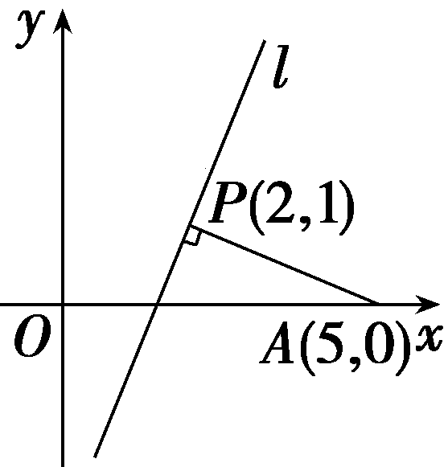
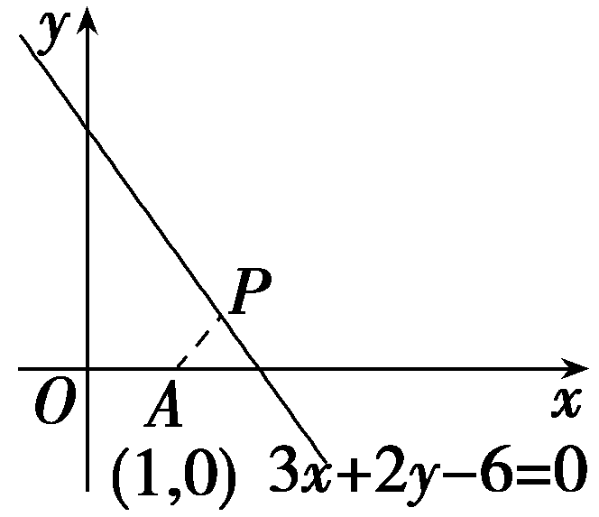
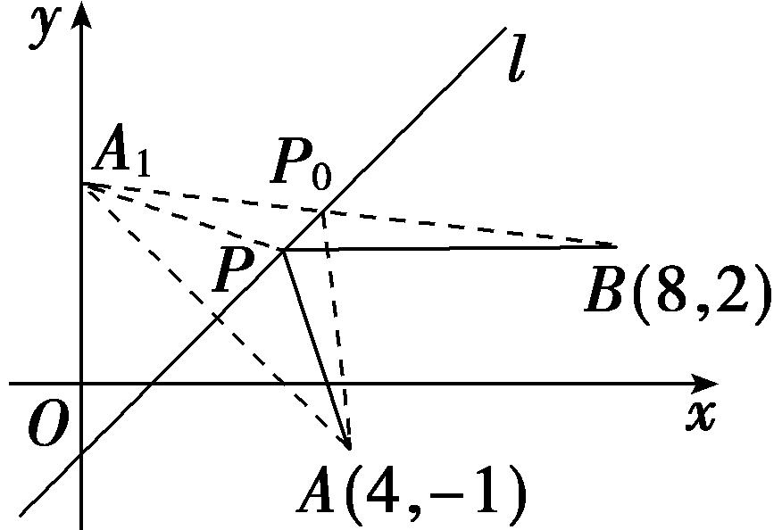
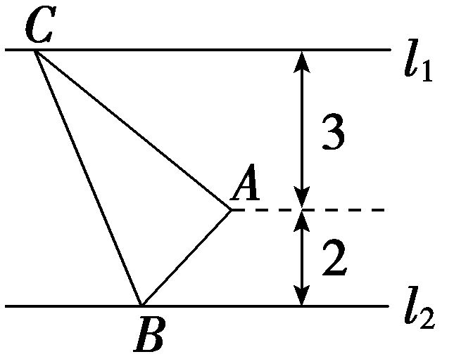
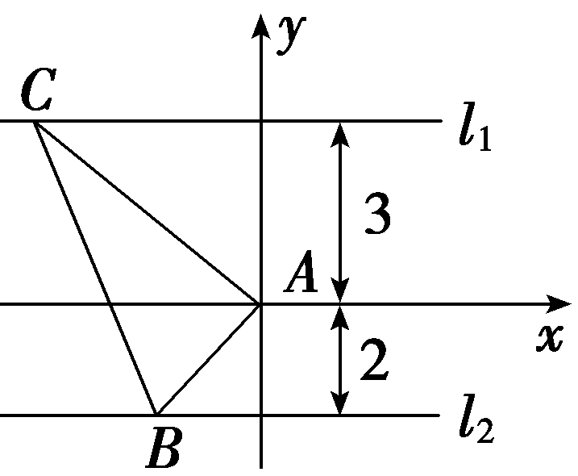

**第二节　两条直线的位置关系**

【课标研读】　1.能根据斜率判定两条直线平行或垂直.　2.能用解方程组的方法求两条直线的交点坐标.　3.探索并掌握平面上两点间的距离公式、点到直线的距离公式，会求两条平行直线间的距离.

1.两条直线的位置关系

直线<em>l</em>1：<em>y</em>＝<em>k</em>1<em>x</em>＋<em>b</em>1，<em>l</em>2：<em>y</em>＝<em>k</em>2<em>x</em>＋<em>b</em>2，<em>l</em>3：<em>A</em>1<em>x</em>＋<em>B</em>1<em>y</em>＋<em>C</em>1＝0，<em>l</em>4：<em>A</em>2<em>x</em>＋<em>B</em>2<em>y</em>＋<em>C</em>2＝0(其中<em>l</em>1与<em>l</em>3是同一条直线，<em>l</em>2与<em>l</em>4是同一条直线)的位置关系如下表：

<table><tr><td>
位置关系
</td><td>
<em>l</em>1，<em>l</em>2满足的条件
</td><td>
<em>l</em>3，<em>l</em>4满足的条件
</td></tr><tr><td>
平行
</td><td>
<em>k</em>1＝<em>k</em>2且<em>b</em>1≠<em>b</em>2
</td><td>
<em>A</em>1<em>B</em>2－<em>A</em>2<em>B</em>1＝0且<em>A</em>1<em>C</em>2－<em>A</em>2<em>C</em>1≠0
</td></tr><tr><td>
垂直
</td><td>
<em>k</em>1·<em>k</em>2＝－1
</td><td>
<em>A</em>1<em>A</em>2＋<em>B</em>1<em>B</em>2＝0
</td></tr><tr><td>
相交
</td><td>
<em>k</em>1≠<em>k</em>2
</td><td>
<em>A</em>1<em>B</em>2－<em>A</em>2<em>B</em>1≠0
</td></tr></table>

2.直线的交点坐标

(1)两直线的交点

点&lt;te&lt;te&lt;text st<em>y</em>le="italic"&gt;x&lt;/text&gt;t st&lt;text sty<em>l</em>e="italic"&gt;y&lt;/text&gt;le="italic"&gt;x&lt;/text&gt;t sty<em>l</em>e="italic"&gt;<em>P</em>&lt;/text&gt;的坐标既满足直线l&lt;text style="subscript"&gt;&lt;text style="subscript"&gt;&lt;text style="subscript"&gt;1&lt;/text&gt;&lt;/text&gt;&lt;/text&gt;的方程<em>&lt;text style="italic"&gt;A</em>&lt;/text&gt;1x＋<em>&lt;text style="italic"&gt;B</em>&lt;/text&gt;1y＋<em>&lt;text style="italic"&gt;C</em>&lt;/text&gt;1＝0，也满足直线l&lt;text style="subscript"&gt;&lt;text style="subscript"&gt;&lt;text style="subscript"&gt;2&lt;/text&gt;&lt;/text&gt;&lt;/text&gt;的方程A2x＋B2y＋C2＝0，即点P的坐标是方程组 $\left\{\begin{matrix}A_{1}x＋B_{1}y＋C_{1}=0，\\A_{2}x＋B_{2}y＋C_{2}=0\end{matrix}\right.$ 的解.解这个方程组就可以得到这两条直线的<u>交点</u>坐标.

(2)两直线的位置关系与方程组解的关系

<table><tr><td>
方程组的解
</td><td>
一组
</td><td>
无数组
</td><td>
无解
</td></tr><tr><td>
直线<em>l</em>1与<em>l</em>2的公共点的个数
</td><td>
一个
</td><td>
无数个
</td><td>
零个
</td></tr><tr><td>
直线<em>l</em>1与<em>l</em>2的位置关系
</td><td>
相交
</td><td>
重合
</td><td>
平行
</td></tr></table>

3.距离公式

(1)两点间的距离公式

平面上任意两点&lt;te&lt;te&lt;text st<em>y</em>le="italic"&gt;x&lt;/text&gt;t st<em>y</em>le="italic"&gt;x&lt;/text&gt;t style="italic"&gt;<em>&lt;text style="italic"&gt;&lt;text style="italic"&gt;P</em>&lt;/text&gt;&lt;/text&gt;&lt;/text&gt;&lt;text style="subscript"&gt;&lt;text style="subscript"&gt;&lt;text style="subscript"&gt;1&lt;/text&gt;&lt;/text&gt;&lt;/text&gt;(x1，y1)，P&lt;text style="subscript"&gt;&lt;text style="subscript"&gt;&lt;text style="subscript"&gt;2&lt;/text&gt;&lt;/text&gt;&lt;/text&gt;(x2，y2)间的距离公式为｜P1P2｜＝ $\sqrt{(x_{2}－x_{1})^{2}＋(y_{2}－y_{1})^{2}}$ .

特别地，原点<te<text st*y*le="italic">x</text>t style="italic">O</text>(0，0)与任一点*P*(x，y)间的距离｜*OP*｜＝ $\sqrt{x^{2}＋y^{2}}$ .

(2)点到直线的距离公式

平面上任意一点&lt;te&lt;text st&lt;text sty<em>l</em>e="italic"&gt;y&lt;/text&gt;le="italic"&gt;x&lt;/text&gt;t style="italic"&gt;P&lt;/text&gt;&lt;text style="subscript"&gt;&lt;text style="subscript"&gt;0&lt;/text&gt;&lt;/text&gt;(x0，y0)到直线l：<em>Ax</em>＋<em>By</em>＋<em>C</em>＝0的距离<em>d</em>＝ $\frac{｜Ax_{0}＋By_{0}＋C｜}{\sqrt{A^{2}＋B^{2}}}$ .

(3)两条平行直线间的距离

一般地，两条平行直线&lt;text sty<em>l</em>e="italic"&gt;l&lt;/text&gt;&lt;text style="subscript"&gt;&lt;text style="subscript"&gt;1&lt;/text&gt;&lt;/text&gt;：<em>&lt;text style="italic"&gt;Ax</em>&lt;/text&gt;＋<em>&lt;text style="italic"&gt;By</em>&lt;/text&gt;＋<em>&lt;text style="italic"&gt;&lt;text style="italic"&gt;&lt;text style="italic"&gt;C</em>&lt;/text&gt;&lt;/text&gt;&lt;/text&gt;1＝0，l&lt;text style="subscript"&gt;&lt;text style="subscript"&gt;2&lt;/text&gt;&lt;/text&gt;：Ax＋By＋C2＝0(C1≠C2)间的距离<em>d</em>＝ $\frac{｜C_{1}－C_{2}｜}{\sqrt{A^{2}＋B^{2}}}$ .

[微提醒]　利用两平行直线间的距离公式时，需要先将两条平行线方程化为*x*，*y*的系数分别对应相等的一般式才能使用.

【常用结论】

(1)四类常见的直线系方程

①与直线<em>Ax</em>＋<em>By</em>＋<em>C</em>＝0平行的直线系方程是<em>Ax</em>＋<em>By</em>＋<em>m</em>＝0(<em>m</em>∈<strong>R</strong>且<em>m</em>≠<em>C</em>).

②与直线<em>Ax</em>＋<em>By</em>＋<em>C</em>＝0垂直的直线系方程是<em>Bx</em>－<em>Ay</em>＋<em>n</em>＝0(<em>n</em>∈<strong>R</strong>).

③过定点(<em>x</em>0，<em>y</em>0)的所有直线可设为<em>y</em>－<em>y</em>0＝<em>k</em>(<em>x</em>－<em>x</em>0)或<em>x</em>＝<em>x</em>0.

④过直线<em>l</em>1：<em>A</em>1<em>x</em>＋<em>B</em>1<em>y</em>＋<em>C</em>1＝0与<em>l</em>2：<em>A</em>2<em>x</em>＋<em>B</em>2<em>y</em>＋<em>C</em>2＝0的交点的直线系方程为<em>A</em>1<em>x</em>＋<em>B</em>1<em>y</em>＋<em>C</em>1＋<em>λ</em>(<em>A</em>2<em>x</em>＋<em>B</em>2<em>y</em>＋<em>C</em>2)＝0(<em>λ</em>∈<strong>R</strong>)，但不包括<em>l</em>2.

(2)四种常用的对称关系

①点(*x*，*y*)关于点(*a*，*b*)的对称点为(2*a*－*x*，2*b*－*y*).

②点(*x*，*y*)关于直线*x*＝*a*的对称点为(2*a*－*x*，*y*)，关于直线*y*＝*b*的对称点为(*x*，2*b*－*y*).

③点(*x*，*y*)关于直线*y*＝*x*的对称点为(*y*，*x*)，关于直线*y*＝－*x*的对称点为(－*y*，－*x*).

④点(*x*，*y*)关于直线*x*＋*y*＝*k*的对称点为(*k*－*y*，*k*－*x*)，关于直线*x*－*y*＝*k*的对称点为(*k*＋*y*，*x*－*k*).

【自主检测】

1.(多选)下列说法正确的是(　　)

A.当直线<em>l</em>1和<em>l</em>2斜率都存在时，一定有<em>k</em>1＝<em>k</em>2⇒<em>l</em>1∥<em>l</em>2

B.若两条直线<em>l</em>1与<em>l</em>2垂直，则它们的斜率之积一定等于－1

C.直线外一点与直线上点的距离的最小值就是点到直线的距离

D.若点<text st<text sty*l*e="italic">y</text>*l*e="italic">A</text>，*B*关于直线l：y＝*<text style="italic">k*x</text>＋*b*(k≠0)对称，则直线*<text style="italic">AB*</text>的斜率等于－ $\frac{1}{k}$ ，且线段<text st<text sty*l*e="italic">y</text>*l*e="italic">A</text>*B*的中点在直线l上

答案：**CD**

2.(链接人教A选择性必修一P67T8)过点(1，0)且与直线*x*－2*y*－2＝0平行的直线方程是(　　)

A.*x*－2*y*－1＝0	B.*x*－2*y*＋1＝0

C.2*x*＋*y*－2＝0	D.*x*＋2*y*－1＝0

答案：**A**

解析：因为所求直线与*x*－2*y*－2＝0平行，故可设直线方程为*x*－2*y*＋*m*＝0(*m*≠－2)，又因为直线过点(1，0)，所以1＋*m*＝0，即*m*＝－1.故所求直线方程为*x*－2*y*－1＝0.故选A.

3.(链接人教A选择性必修一P102T3)若直线<em>l</em>1：<em>ax</em>－(<em>a</em>＋1)<em>y</em>＋1＝0与直线<em>l</em>2：2<em>x</em>－<em>ay</em>－1＝0垂直，则实数<em>a</em>＝(　　)

A.3	B.0

C.－3	D.0或－3

答案：**D**

解析：因为直线<em>l</em>1与直线<em>l</em>2垂直，所以2<em>a</em>＋<em>a</em>(<em>a</em>＋1)＝0，整理得<em>a</em>2＋3<em>a</em>＝0，解得<em>a</em>＝0或<em>a</em>＝－3.故选D.

4.(1)(链接人教A选择性必修一P77T3)已知点(<em>a</em>，2)(<em>a</em>＞0)到直线<em>l</em>：<em>x</em>－<em>y</em>＋3＝0的距离为1，则<em>a</em>的值为<u>　　　　</u>.

(2)(链接人教A选择性必修一P78例7)若直线2&lt;te&lt;text st&lt;text style="it&lt;text style="it<em>a</em>lic"&gt;a&lt;/text&gt;lic"&gt;y&lt;/text&gt;le="italic"&gt;x&lt;/text&gt;t st<em>y</em>le="italic"&gt;x&lt;/text&gt;－y－3＝0与4x－2y＋a＝0之间的距离为 $\sqrt{5}$ ，则实数&lt;text style="it<em>a</em>lic"&gt;a&lt;/text&gt;＝<u>　　　　</u>.

答案：(1) $\sqrt{2}$ －1　(2)4或－16

解析：(1)由题意得 $\frac{｜a－2+3｜}{\sqrt{2}}$ ＝1，即｜<text style="it<text style="it*a*lic">a</text>lic">a</text>＋1｜＝ $\sqrt{2}$ ，又<text style="it<text style="it*a*lic">a</text>lic">a</text>＞0，所以a＝ $\sqrt{2}$ －1.

(2)将直线2<te<te<te<text st<text style="it<text style="it<text style="it<text style="it*a*lic">a</text>lic">a</text>lic">a</text>lic">y</text>le="italic">x</text>t st*y*le="italic">x</text>t st*y*le="italic">x</text>t st*y*le="italic">x</text>－y－3＝0化为4x－2y－6＝0，则直线2x－y－3＝0与直线4x－2y＋a＝0之间的距离*d*＝ $\frac{｜a-(-6)|}{\sqrt{16+4}}$ ＝ $\frac{｜a+6｜}{2\sqrt{5}}$ ，根据题意可得： $\frac{｜a+6｜}{2\sqrt{5}}$ ＝ $\sqrt{5}$ ，即｜<text style="it<text style="it<text style="it*a*lic">a</text>lic">a</text>lic">a</text>＋6｜＝10，解得a＝4或a＝－16.

考点一　两条直线的平行与垂直　　　　自主练透1.已知直线<em>l</em>1：<em>ax</em>＋(<em>a</em>－1)<em>y</em>＋3＝0，<em>l</em>2：2<em>x</em>＋<em>ay</em>－1＝0，若<em>l</em>1⊥<em>l</em>2，则实数<em>a</em>的值是(　　)

A.0或－1	B.－1或1

C.－1	D.1

答案：**A**

解析：由题意可知<em>l</em>1⊥<em>l</em>2，故2<em>a</em>＋<em>a</em>(<em>a</em>－1)＝0，解得<em>a</em>＝0或<em>a</em>＝－1，经验证，符合题意.故选A.

2. (多选)已知直线<em>l</em>1：<em>x</em>＋<em>my</em>－1＝0，<em>l</em>2：(<em>m</em>－2)<em>x</em>＋3<em>y</em>＋3＝0，则下列说法正确的是(　　)

A.若<em>l</em>1∥<em>l</em>2，则<em>m</em>＝－1或<em>m</em>＝3

B.若<em>l</em>1∥<em>l</em>2，则<em>m</em>＝3

C.若&lt;text sty<em>l</em>e="italic"&gt;l&lt;/text&gt;1⊥l2，则<em>m</em>＝－ $\frac{1}{2}$

D.若&lt;text sty<em>l</em>e="italic"&gt;l&lt;/text&gt;1⊥l2，则<em>m</em>＝ $\frac{1}{2}$

答案：**BD**

解析：若直线&lt;te&lt;te&lt;te&lt;text st&lt;text sty&lt;text sty<em>l</em>e="italic"&gt;l&lt;/text&gt;e="italic"&gt;y&lt;/text&gt;le="italic"&gt;x&lt;/text&gt;t st<em>y</em>le="italic"&gt;x&lt;/text&gt;t st<em>y</em>le="italic"&gt;x&lt;/text&gt;t sty<em>l</em>e="italic"&gt;l&lt;/text&gt;&lt;text style="subscript"&gt;1&lt;/text&gt;∥l&lt;text style="subscript"&gt;2&lt;/text&gt;，则3－<em>&lt;text style="italic"&gt;&lt;text style="italic"&gt;&lt;text style="italic"&gt;&lt;text style="italic"&gt;&lt;text style="italic"&gt;&lt;text style="italic"&gt;&lt;text style="italic"&gt;&lt;text style="italic"&gt;m</em>&lt;/text&gt;&lt;/text&gt;&lt;/text&gt;&lt;/text&gt;&lt;/text&gt;&lt;/text&gt;&lt;/text&gt;&lt;/text&gt;(m－2)＝0，解得m＝3或m＝－1，但当m＝－1时，两直线方程分别为x－y－1＝0，－3x＋3y＋3＝0即x－y－1＝0，两直线重合，故只有当m＝3时两直线平行，故A错误，B正确；若l1⊥l2，则m－2＋3m＝0，解得m＝ $\frac{1}{2}$ ，故C错误，D正确.故选BD.

3.已知三条直线2<em>x</em>－3<em>y</em>＋1＝0，4<em>x</em>＋3<em>y</em>＋5＝0，<em>mx</em>－<em>y</em>－1＝0不能构成三角形，则实数<em>m</em>的取值集合为<u>　　　　</u>.

答案： $\left\{－\frac{4}{3},-\frac{2}{3}，\frac{2}{3}\right\}$

解析：由题意得直线<te<te<te<te<te<te<te<te<text st*y*le="italic">x</text>t st*y*le="italic">x</text>t st<text st*y*le="italic">y</text>le="italic">x</text>t st*y*le="italic">x</text>t st<text st*y*le="italic">y</text>le="italic">x</text>t st*y*le="italic">x</text>t st<text st*y*le="italic">y</text>le="italic">x</text>t st*y*le="italic">x</text>t st*y*le="italic">*<text style="italic"><text style="italic"><text style="italic"><text style="italic"><text style="italic">m*</text></text></text>x</text></text></text>－y－1＝0与2x－3y＋1＝0或4x＋3y＋5＝0平行，或者直线*mx*－y－1＝0过2x－3y＋1＝0与4x＋3y＋5＝0的交点.当直线mx－y－1＝0与2x－3y＋1＝0或4x＋3y＋5＝0平行时，m＝ $\frac{2}{3}$ 或<te<te<text st*y*le="italic">x</text>t st*y*le="italic">x</text>t st*y*le="italic">*<text style="italic"><text style="italic">m*</text></text></text>＝－ $\frac{4}{3}$ ；当直线<te<te<te<te<te<te<te<te<text st*y*le="italic">x</text>t st*y*le="italic">x</text>t st<text st*y*le="italic">y</text>le="italic">x</text>t st*y*le="italic">x</text>t st<text st*y*le="italic">y</text>le="italic">x</text>t st*y*le="italic">x</text>t st<text st*y*le="italic">y</text>le="italic">x</text>t st*y*le="italic">x</text>t st*y*le="italic">*<text style="italic"><text style="italic"><text style="italic"><text style="italic"><text style="italic">m*</text></text></text>x</text></text></text>－y－1＝0过2x－3y＋1＝0与4x＋3y＋5＝0的交点时，m＝－ $\frac{2}{3}$ .所以实数<te<te<text st*y*le="italic">x</text>t st*y*le="italic">x</text>t st*y*le="italic">*<text style="italic"><text style="italic">m*</text></text></text>的取值集合为{－ $\frac{4}{3}$ ，－ $\frac{2}{3}$ ， $\frac{2}{3}$ }.

判断两直线位置关系的注意点

1.当含参数的直线方程为一般式时，若要表示出直线的斜率，不仅要考虑到斜率存在的一般情况，也要考虑到斜率不存在的特殊情况，同时还要注意*x*，*y*的系数不能同时为零这一隐含条件.

2.在判断两直线的平行、垂直时，也可直接利用直线方程的系数间的关系得出结论.

考点二　直线的交点坐标与距离公式　　　　师生共研

(一题多变)已知直线*l*经过直线2*x*＋*y*－5＝0与*x*－2*y*＝0的交点*P*.

(1)点*A*(5，0)到直线*l*的距离为3，求直线*l*的方程；

(2)求点*A*(5，0)到直线*l*的距离的最大值.

解：(1)因为经过两已知直线交点的直线系方程为2*x*＋*y*－5＋*λ*(*x*－2*y*)＝0，即(2＋*λ*)*x*＋(1－2*λ*)*y*－5＝0，

所以 $\frac{｜10+5\lambda －5｜}{\sqrt{(2+\lambda )^{2}＋(1－2\lambda )^{2}}}$ ＝3，解得*<text style="italic">λ*</text>＝ $\frac{1}{2}$ 或*<text style="italic">λ*</text>＝2.

所以直线*l*的方程为*x*＝2或4*x*－3*y*－5＝0.

(2)由 $\left\{\begin{matrix}2x＋y－5=0，\\x－2y=0，\end{matrix}\right.$

解得交点*P*(2，1)，如图，过*P*作任一直线*l*，设*d*为点*A*到直线*l*的距离，

则*d*≤｜*PA*｜(当*l*⊥*PA*时等号成立).

所以<em>d</em>max＝｜<em>PA</em>｜＝ $\sqrt{10}$ .

[变式探究]

(变条件)若将本例变为：直线*l*经过直线2*x*＋*y*－5＝0与*x*－2*y*＝0的交点且到点*A*(1，0)和点*B*(3，4)的距离相等，求直线*l*的方程.

解：由 $\left\{\begin{matrix}2x＋y－5=0，\\x－2y=0，\end{matrix}\right.$ 解得交点坐标为(2，1).

当<em>AB</em>∥<em>l</em>时，又<em>kAB</em>＝2，

所以直线*l*的方程为*y*－1＝2(*x*－2)，即2*x*－*y*－3＝0，

当*l*过*AB*中点时，又*AB*的中点为(2，2)，

所以直线*l*的方程为*x*＝2.

综上，直线*l*的方程为2*x*－*y*－3＝0或*x*＝2.

两种距离的求解思路

1.点到直线的距离：可直接利用点到直线的距离公式来求，但要注意此时直线方程必须为一般式.

2.两平行直线间的距离：(1)利用“转化法”将两条平行线间的距离转化为一条直线上任意一点到另一条直线的距离.(2)利用两平行线间的距离公式(利用公式前需把两平行线方程中*x*，*y*的系数化为分别对应相等的形式).

注意：点<em>P</em>(<em>x</em>0，<em>y</em>0)到直线<em>x</em>＝<em>a</em>的距离<em>d</em>＝｜<em>x</em>0－<em>a</em>｜，到直线<em>y</em>＝<em>b</em>的距离<em>d</em>＝｜<em>y</em>0－<em>b</em>｜.

对点练1.(2020·全国Ⅲ卷)点(0，－1)到直线*y*＝*k*(*x*＋1)距离的最大值为(　　)

A.1	B. $\sqrt{2}$

C. $\sqrt{3}$ 	D.2

答案：**B**

解析：设点<te<te*x*t st*y*<text sty*l*e="italic">l</text>e="italic">x</text>t st*yl*e="italic">*A*</text>(0，－1)，直线l：y＝*<text style="italic">k*</text>(x＋1)，由l恒过定点*B*(－1，0)，当*AB*⊥l时，点A(0，－1)到直线y＝k(x＋1)的距离最大，最大值为 $\sqrt{2}$ .故选<te*x*t st*yl*e="italic">B</text>.

对点练2.设直线<em>l</em>：3<em>x</em>＋2<em>y</em>－6＝0，<em>P</em>(<em>m</em>，<em>n</em>)为直线<em>l</em>上的动点，则(<em>m</em>－1)2＋<em>n</em>2的最小值为(　　)

A. $\frac{9}{13}$ 	B. $\frac{3}{13}$

C. $\frac{3\sqrt{13}}{13}$ 	D. $\frac{\sqrt{13}}{13}$

答案：**A**

解析：(&lt;text sty<em>l</em>e="italic"&gt;<em>&lt;text style="italic"&gt;m</em>&lt;/text&gt;&lt;/text&gt;－1)&lt;text style="superscript"&gt;&lt;text style="superscript"&gt;&lt;text style="superscript"&gt;2&lt;/text&gt;&lt;/text&gt;&lt;/text&gt;＋<em>&lt;text style="italic"&gt;&lt;text style="italic"&gt;n</em>&lt;/text&gt;&lt;/text&gt;2表示点<em>P</em>(m，n)到点<em>&lt;text style="italic"&gt;A</em>&lt;/text&gt;(1，0)距离的平方，该距离的最小值为点A(1，0)到直线l的距离，即 $\frac{｜3－6｜}{\sqrt{13}}$ ＝ $\frac{3}{\sqrt{13}}$ ，则(&lt;text sty<em>l</em>e="italic"&gt;<em>&lt;text style="italic"&gt;m</em>&lt;/text&gt;&lt;/text&gt;－1)&lt;text style="superscript"&gt;&lt;text style="superscript"&gt;&lt;text style="superscript"&gt;2&lt;/text&gt;&lt;/text&gt;&lt;/text&gt;＋<em>&lt;text style="italic"&gt;&lt;text style="italic"&gt;n</em>&lt;/text&gt;&lt;/text&gt;2的最小值为 $\frac{9}{13}$ .故选&lt;text sty<em>l</em>e="italic"&gt;<em>A</em>&lt;/text&gt;.

考点三　对称问题　　　　多维探究

角度1　中心对称

(1)直线<em>x</em>－2<em>y</em>－3＝0关于定点<em>M</em>(－2，1)对称的直线方程是<u>　　　　　　　　　</u>.

(2)过点<em>P</em>(0，1)作直线<em>l</em>，使它被直线<em>l</em>1：2<em>x</em>＋<em>y</em>－8＝0和<em>l</em>2：<em>x</em>－3<em>y</em>＋10＝0截得的线段被点<em>P</em>平分，则直线<em>l</em>的方程为<u>　　　　　　　　　</u>.

答案：(1)*x*－2*y*＋11＝0　(2)*x*＋4*y*－4＝0

解析：(1)设所求直线上任意一点的坐标为(*x*，*y*)，则其关于点*M*(－2，1)的对称点(－4－*x*，2－*y*)在已知直线上，所以所求直线方程为(－4－*x*)－2(2－*y*)－3＝0，即*x*－2*y*＋11＝0.

(&lt;te&lt;text st<em>y</em>le="italic"&gt;x&lt;/text&gt;t sty&lt;text sty&lt;text sty&lt;text sty<em>l</em>e="italic"&gt;l&lt;/text&gt;e="italic"&gt;l&lt;/text&gt;e="it&lt;text style="it&lt;text style="it<em>a</em>lic"&gt;a&lt;/text&gt;lic"&gt;a&lt;/text&gt;lic"&gt;l&lt;/text&gt;e="subscript"&gt;2&lt;/text&gt;)设&lt;text sty&lt;text sty<em>l</em>e="it&lt;text style="it&lt;text style="it&lt;text style="it<em>a</em>lic"&gt;a&lt;/text&gt;lic"&gt;a&lt;/text&gt;lic"&gt;a&lt;/text&gt;lic"&gt;l&lt;/text&gt;e="italic"&gt;l&lt;/text&gt;1与l的交点为<em>&lt;text style="italic"&gt;&lt;text style="italic"&gt;A</em>&lt;/text&gt;&lt;/text&gt;(a，8－2a)，则由题意知，点A关于点<em>&lt;text style="italic"&gt;P</em>&lt;/text&gt;的对称点<em>B</em>(－a，2a－6)在l2上，代入l2的方程得－a－3(2a－6)＋10＝0，解得a＝4，即点A(4，0)在直线l上，因为点P(0，1)也在直线l上，所以利用两点式可得直线l的方程为 $\frac{y}{1}$ ＝ $\frac{x－4}{－4}$ ，即&lt;text st<em>y</em>le="italic"&gt;x&lt;/text&gt;＋4y－4＝0.

角度2　轴对称

(1)一束光线沿着直线*y*＝－3*x*＋*b*射到直线*x*＋*y*＝0上，经反射后沿着直线*y*＝*ax*＋2射出，则有(　　)

A.<text style="it*a*lic">a</text>＝ $\frac{1}{3}$ ，<text style="it*a*lic">*b*</text>＝6	B.*a*＝－3，b＝ $\frac{1}{6}$

C.<text style="it*a*lic">a</text>＝3，*<text style="italic">b*</text>＝－ $\frac{1}{6}$ 	D.<text style="it*a*lic">a</text>＝－ $\frac{1}{3}$ ，<text style="it*a*lic">*b*</text>＝－6

(2)已知点<em>A</em>(4，－1)，<em>B</em>(8，2)和直线<em>l</em>：<em>x</em>－<em>y</em>－1＝0，动点<em>P</em>(<em>x</em>，<em>y</em>)在直线<em>l</em>上，则｜<em>PA</em>｜＋｜<em>PB</em>｜的最小值为<u>　　　　</u>.

答案：(1)**D**　(2) $\sqrt{65}$

解析：(1)由题意，知直线<te<te<te<te<te<te<text st<text style="it<text style="it*a*lic">a</text>lic">y</text>le="italic">x</text>t st*y*le="italic">x</text>t st*y*le="italic">x</text>t st*y*le="italic">x</text>t st<text st*y*le="italic">y</text>le="italic">x</text>t st<text st*y*le="italic">y</text>le="italic">x</text>t style="italic">y</text>＝－3x＋*<text style="italic"><text style="italic"><text style="italic">b*</text></text></text>与直线y＝*<text style="italic"><text style="italic">ax*</text></text>＋2关于直线y＝－x对称，所以直线y＝ax＋2上的点(0，2)关于直线y＝－x的对称点(－2，0)在直线y＝－3x＋b上，所以－3×(－2)＋b＝0，所以b＝－6.直线y＝－3x－6上的点(0，－6)关于直线y＝－x的对称点(6，0)在直线y＝ax＋2上，所以6a＋2＝0，所以a＝－ $\frac{1}{3}$ .故选D.

(2)设点<em>A</em>关于直线<em>l</em>的对称点为<em>A</em>1，<em>P</em>0为<em>A</em>1<em>B</em>与直线<em>l</em>的交点，如图，

所以｜&lt;te&lt;text st<em>y</em>le="italic"&gt;x&lt;/text&gt;t style="italic"&gt;<em>&lt;text style="italic"&gt;&lt;text style="italic"&gt;P</em>&lt;/text&gt;&lt;/text&gt;&lt;/text&gt;&lt;text style="subscript"&gt;&lt;text style="subscript"&gt;0&lt;/text&gt;&lt;/text&gt;<em>&lt;text style="italic"&gt;&lt;text style="italic"&gt;&lt;text style="italic"&gt;&lt;text style="italic"&gt;&lt;text style="italic"&gt;&lt;text style="italic"&gt;A</em>&lt;/text&gt;&lt;/text&gt;&lt;/text&gt;&lt;/text&gt;&lt;/text&gt;&lt;/text&gt;&lt;text style="subscript"&gt;&lt;text style="subscript"&gt;&lt;text style="subscript"&gt;&lt;text style="subscript"&gt;&lt;text style="subscript"&gt;&lt;text style="subscript"&gt;&lt;text style="subscript"&gt;&lt;text style="subscript"&gt;&lt;text style="subscript"&gt;1&lt;/text&gt;&lt;/text&gt;&lt;/text&gt;&lt;/text&gt;&lt;/text&gt;&lt;/text&gt;&lt;/text&gt;&lt;/text&gt;&lt;/text&gt;｜＝｜P0A｜，｜<em>&lt;text style="italic"&gt;&lt;text style="italic"&gt;&lt;text style="italic"&gt;&lt;text style="italic"&gt;PA</em>&lt;/text&gt;&lt;/text&gt;&lt;/text&gt;&lt;/text&gt;1｜＝｜PA｜.所以｜PA｜＋｜<em>&lt;text style="italic"&gt;P&lt;text style="italic"&gt;&lt;text style="italic"&gt;&lt;text style="italic"&gt;B</em>&lt;/text&gt;&lt;/text&gt;&lt;/text&gt;&lt;/text&gt;｜＝｜PA1｜＋｜<em>PB</em>｜≥｜A1B｜.即当P点运动到P0时，｜PA｜＋｜PB｜取得最小值｜A1B｜.设A1(x1，y1)，则 $\left\{\begin{matrix}\frac{y_{1}+1}{x_{1}－4}\cdot 1=－1，\\\frac{x_{1}+4}{2}－\frac{y_{1}－1}{2}－1=0，\end{matrix}\right.$ 解得 $\left\{\begin{matrix}x_{1}=0，\\y_{1}=3，\end{matrix}\right.$ 即&lt;te&lt;text st<em>y</em>le="italic"&gt;x&lt;/text&gt;t style="italic"&gt;<em>&lt;text style="italic"&gt;&lt;text style="italic"&gt;&lt;text style="italic"&gt;&lt;text style="italic"&gt;&lt;text style="italic"&gt;A</em>&lt;/text&gt;&lt;/text&gt;&lt;/text&gt;&lt;/text&gt;&lt;/text&gt;&lt;/text&gt;&lt;text style="subscript"&gt;&lt;text style="subscript"&gt;&lt;text style="subscript"&gt;&lt;text style="subscript"&gt;&lt;text style="subscript"&gt;&lt;text style="subscript"&gt;&lt;text style="subscript"&gt;&lt;text style="subscript"&gt;&lt;text style="subscript"&gt;1&lt;/text&gt;&lt;/text&gt;&lt;/text&gt;&lt;/text&gt;&lt;/text&gt;&lt;/text&gt;&lt;/text&gt;&lt;/text&gt;&lt;/text&gt;(&lt;text style="subscript"&gt;&lt;text style="subscript"&gt;0&lt;/text&gt;&lt;/text&gt;，3).所以 $\left(｜PA｜＋｜PB｜\right)_{min}$ ＝｜&lt;te&lt;text st<em>y</em>le="italic"&gt;x&lt;/text&gt;t style="italic"&gt;<em>&lt;text style="italic"&gt;&lt;text style="italic"&gt;&lt;text style="italic"&gt;&lt;text style="italic"&gt;&lt;text style="italic"&gt;A</em>&lt;/text&gt;&lt;/text&gt;&lt;/text&gt;&lt;/text&gt;&lt;/text&gt;&lt;/text&gt;&lt;text style="subscript"&gt;&lt;text style="subscript"&gt;&lt;text style="subscript"&gt;&lt;text style="subscript"&gt;&lt;text style="subscript"&gt;&lt;text style="subscript"&gt;&lt;text style="subscript"&gt;&lt;text style="subscript"&gt;&lt;text style="subscript"&gt;1&lt;/text&gt;&lt;/text&gt;&lt;/text&gt;&lt;/text&gt;&lt;/text&gt;&lt;/text&gt;&lt;/text&gt;&lt;/text&gt;&lt;/text&gt;<em>&lt;text style="italic"&gt;&lt;text style="italic"&gt;B</em>&lt;/text&gt;&lt;/text&gt;｜＝ $\sqrt{8^{2}＋\left(－1\right)^{2}}$ ＝ $\sqrt{65}$ .

对称问题的求解策略

1.解决对称问题的思路是利用待定系数法将几何关系转化为代数关系求解.

2.中心对称问题可以利用中点坐标公式解题，两点轴对称问题可以利用垂直和中点这两个条件列方程组解题，两线轴对称问题应关注两条直线平行与相交条件列相应方程组解题.

对点练3.已知直线*l*：3*x*－*y*＋3＝0，求：

(1)点*P*(4，5)关于直线*l*对称的点的坐标；

(2)直线*x*－*y*－2＝0关于直线*l*对称的直线方程；

(3)直线*l*关于点(1，2)对称的直线方程.

解：(1)设点&lt;text sty&lt;text sty<em>l</em>e="italic"&gt;l&lt;/text&gt;e="italic"&gt;P&lt;/text&gt;关于直线l的对称点为<em>P'</em>(<em>x'</em>，<em>y'</em>)，则<em>&lt;text style="italic"&gt;k</em>&lt;/text&gt;<em>PP'</em>·kl＝－1，所以 $\frac{y'-5}{x'-4}$ ×3＝－1　①，

又<text sty*l*e="italic">PP'</text>的中点在直线l上，所以3× $\frac{x'+4}{2}$ － $\frac{y'+5}{2}$ ＋3＝0　②，

联立①②，解得 $\left\{\begin{matrix}x'＝－2，\\y'=7，\end{matrix}\right.$

所以点*P*(4，5)关于直线*l*对称的点的坐标为(－2，7).

(2)联立 $\left\{\begin{matrix}3x－y+3=0，\\x－y－2=0，\end{matrix}\right.$ 解得 $\left\{\begin{matrix}x＝－\frac{5}{2}，\\y＝－\frac{9}{2}，\end{matrix}\right.$ 即两直线的交点坐标为 $\left(－\frac{5}{2},-\frac{9}{2}\right)$ ，易知点(2，0)在直线<text st<text sty*l*e="italic">y</text>le="italic">x</text>－y－2＝0上，设点(2，0)关于直线l的对称点的坐标为(*m*，*n*)，

则 $\left\{\begin{matrix}3\times \frac{2+m}{2}－\frac{n}{2}+3=0，\\\frac{n}{m－2}\times 3=－1，\end{matrix}\right.$ 解得 $\left\{\begin{matrix}m＝－\frac{17}{5}，\\n＝\frac{9}{5}，\end{matrix}\right.$

即所求直线过点 $\left(－\frac{17}{5}，\frac{9}{5}\right)$ ，

利用两点式得 $\frac{y＋\frac{9}{2}}{\frac{9}{5}＋\frac{9}{2}}$ ＝ $\frac{x＋\frac{5}{2}}{－\frac{17}{5}＋\frac{5}{2}}$ ，

整理得7*x*＋*y*＋22＝0，即所求直线的方程为7*x*＋*y*＋22＝0.

(3)在直线<em>l</em>：3<em>x</em>－<em>y</em>＋3＝0上取点<em>M</em>(0，3)，设其关于点(1，2)对称的点为<em>M'</em>(<em>xM'</em>，<em>yM'</em>)，

则 $\left\{\begin{matrix}\frac{x_{M'}+0}{2}=1，\\\frac{y_{M'}+3}{2}=2，\end{matrix}\right.$ 解得 $\left\{\begin{matrix}x_{M'}=2，\\y_{M'}=1，\end{matrix}\right.$

即*M'*(2，1).

因为直线*l*关于点(1，2)对称的直线平行于*l*，

所以所求直线的斜率为3，

所以所求直线的方程为*y*－1＝3(*x*－2)，即3*x*－*y*－5＝0.

[真题再现]　(1)(2024·北京卷)圆<em>x</em>2＋<em>y</em>2－2<em>x</em>＋6<em>y</em>＝0的圆心到<em>x</em>－<em>y</em>＋2＝0的距离为(　　)

A. $\sqrt{2}$ 	B.2

C.3	D.3 $\sqrt{2}$

(&lt;te<em>x</em>t st<em>y</em>le="superscript"&gt;&lt;text style="subscript"&gt;2&lt;/text&gt;&lt;/text&gt;)(2023·新高考Ⅱ卷)已知椭圆&lt;text st<em>y</em>le="italic"&gt;<em>C</em>&lt;/text&gt;： $\frac{x^{2}}{3}$ ＋&lt;te<em>x</em>t st<em>y</em>le="italic"&gt;y&lt;/text&gt;&lt;text style="subscript"&gt;&lt;text style="subscript"&gt;2&lt;/text&gt;&lt;/text&gt;＝&lt;text style="subscript"&gt;1&lt;/text&gt;的左、右焦点分别为<em>&lt;text style="italic"&gt;&lt;text style="italic"&gt;&lt;text style="italic"&gt;F</em>&lt;/text&gt;&lt;/text&gt;&lt;/text&gt;1，F2，直线y＝x＋<em>&lt;text style="italic"&gt;m</em>&lt;/text&gt;与<em>&lt;text style="italic"&gt;C</em>&lt;/text&gt;交于<em>A</em>，<em>B</em>两点，若△F1<em>&lt;text style="italic"&gt;AB</em>&lt;/text&gt;面积是△F2AB面积的2倍，则m＝(　　)

A. $\frac{2}{3}$ 	B. $\frac{\sqrt{2}}{3}$

C.－ $\frac{\sqrt{2}}{3}$ 	D.－ $\frac{2}{3}$

答案：(1)**D**　(2)**C**

解析：(1)由题意得&lt;te&lt;te&lt;text st<em>y</em>le="italic"&gt;x&lt;/text&gt;t st<em>y</em>le="italic"&gt;x&lt;/text&gt;t st<em>y</em>le="italic"&gt;x&lt;/text&gt;&lt;text style="superscript"&gt;2&lt;/text&gt;＋y2－2x＋6y＝0，即 $\left(x－1\right)^{2}$ ＋ $\left(y+3\right)^{2}$ ＝10，则其圆心坐标为 $\left(1,-3\right)$ ，则圆心到直线&lt;te&lt;te&lt;text st<em>y</em>le="italic"&gt;x&lt;/text&gt;t st<em>y</em>le="italic"&gt;x&lt;/text&gt;t st<em>y</em>le="italic"&gt;x&lt;/text&gt;－y＋&lt;text style="superscript"&gt;2&lt;/text&gt;＝0的距离为 $\frac{\left|1+3+2\right|}{\sqrt{1^{2}＋(-1)^{2}}}$ ＝3 $\sqrt{2}$ .故选D.

(&lt;text style="subscript"&gt;&lt;text style="subscript"&gt;2&lt;/text&gt;&lt;/text&gt;)由题意，<em>&lt;text style="italic"&gt;&lt;text style="italic"&gt;&lt;text style="italic"&gt;&lt;text style="italic"&gt;&lt;text style="italic"&gt;F</em>&lt;/text&gt;&lt;/text&gt;&lt;/text&gt;&lt;/text&gt;&lt;/text&gt;&lt;text style="subscript"&gt;&lt;text style="subscript"&gt;1&lt;/text&gt;&lt;/text&gt;(－ $\sqrt{2}$ ，0)，<em>&lt;text style="italic"&gt;&lt;text style="italic"&gt;&lt;text style="italic"&gt;&lt;text style="italic"&gt;&lt;text style="italic"&gt;F</em>&lt;/text&gt;&lt;/text&gt;&lt;/text&gt;&lt;/text&gt;&lt;/text&gt;&lt;text style="subscript"&gt;&lt;text style="subscript"&gt;2&lt;/text&gt;&lt;/text&gt;( $\sqrt{2}$ ，0)，△<em>&lt;text style="italic"&gt;&lt;text style="italic"&gt;&lt;text style="italic"&gt;&lt;text style="italic"&gt;&lt;text style="italic"&gt;F</em>&lt;/text&gt;&lt;/text&gt;&lt;/text&gt;&lt;/text&gt;&lt;/text&gt;&lt;text style="subscript"&gt;&lt;text style="subscript"&gt;1&lt;/text&gt;&lt;/text&gt;<em>&lt;text style="italic"&gt;&lt;text style="italic"&gt;&lt;text style="italic"&gt;AB</em>&lt;/text&gt;&lt;/text&gt;&lt;/text&gt;面积是△F&lt;text style="subscript"&gt;&lt;text style="subscript"&gt;2&lt;/text&gt;&lt;/text&gt;AB面积的2倍，所以点F1到直线AB的距离是点F2到直线AB的距离的2倍，即 $\frac{|-\sqrt{2}＋m｜}{\sqrt{2}}$ ＝&lt;text style="subscript"&gt;&lt;text style="subscript"&gt;2&lt;/text&gt;&lt;/text&gt;× $\frac{｜\sqrt{2}＋m｜}{\sqrt{2}}$ ，解得<em>&lt;text style="italic"&gt;m</em>&lt;/text&gt;＝－ $\frac{\sqrt{2}}{3}$ 或<em>&lt;text style="italic"&gt;m</em>&lt;/text&gt;＝－3 $\sqrt{2}$ (此时直线与椭圆<em>C</em>不相交，舍去).故选C.

[教材呈现]　(人教A选择性必修一P77T2)求下列点到直线的距离：

(1)<te<text st*y*le="italic">x</text>t sty*l*e="italic">A</text> $\left(－2，3\right)$ ，<te<text st*y*le="italic">x</text>t style="italic">l</text>：3x＋4y＋3＝0；

(2)<te<text st*y*le="italic">x</text>t sty*l*e="italic">B</text> $\left(1，0\right)$ ，<te<text st*y*le="italic">x</text>t style="italic">l</text>： $\sqrt{3}$ <text st*y*le="italic">x</text>＋y－ $\sqrt{3}$ ＝0；

(3)<te<text st*y*le="italic">x</text>t sty*l*e="italic">C</text> $\left(1,-2\right)$ ，<te<text st*y*le="italic">x</text>t style="italic">l</text>：4x＋3y＝0.

点评：这两道高考题与教材练习题非常类似，都是求点到直线的距离，2024年北京卷涉及求圆心，2023年新高考Ⅱ卷涉及直线与椭圆的位置关系，都是教材练习题的变式和引申，试题源于教材高于教材.

**课时测评**67　**两条直线的位置关系** $\frac{对应学生}{用书P443}$

(时间：60分钟　满分：78分)

(本栏目内容，在学生用书中以独立形式分册装订！)

(1—8题，每小题5分，共40分)

1.(2024·江西南昌三模)若<em>a</em>为实数，则“<em>a</em>＝1”是“直线<em>l</em>1：<em>ax</em>＋<em>y</em>＋2＝0与<em>l</em>2：<em>x</em>＋<em>ay</em>－3－<em>a</em>＝0平行”的(　　)

A.充分不必要条件

B.必要不充分条件

C.充要条件

D.既不充分也不必要条件

答案：**C**

解析：若直线<em>l</em>1：<em>ax</em>＋<em>y</em>＋2＝0与<em>l</em>2：<em>x</em>＋<em>ay</em>－3－<em>a</em>＝0平行，则<em>a</em>2－1＝0，解得<em>a</em>＝1或<em>a</em>＝－1，当<em>a</em>＝1时，直线<em>l</em>1：<em>x</em>＋<em>y</em>＋2＝0，<em>l</em>2：<em>x</em>＋<em>y</em>－4＝0，此时<em>l</em>1∥<em>l</em>2，符合题意；当<em>a</em>＝－1时，直线<em>l</em>1：－<em>x</em>＋<em>y</em>＋2＝0，即<em>l</em>1：<em>x</em>－<em>y</em>－2＝0，<em>l</em>2：<em>x</em>－<em>y</em>－2＝0，此时<em>l</em>1，<em>l</em>2重合，不符合题意，所以“<em>a</em>＝1”是“直线<em>l</em>1：<em>ax</em>＋<em>y</em>＋2＝0与<em>l</em>2：<em>x</em>＋<em>ay</em>－3－<em>a</em>＝0平行”的充要条件.故选C.

2.若直线*ax*－4*y*＋2＝0与直线2*x*＋5*y*＋*c*＝0垂直，垂足为(1，*b*)，则*a*＋*b*＋*c*等于(　　)

A.－6	B.4

C.－10	D.－4

答案：**D**

解析：因为<te<text st<text style="it<text style="it<text style="it<text style="itali*c*">a</text>lic">a</text>lic">a</text>li*c*">y</text>le="italic">x</text>t st*y*le="italic">ax</text>－4y＋2＝0与直线2x＋5y＋c＝0垂直，故2a－20＝0，即a＝10，因为垂足为(1，*<text style="italic">b*</text>)，故 $\left\{\begin{matrix}10\times 1－4\times b+2=0，\\2\times 1+5\times b＋c=0，\end{matrix}\right.$ 故 $\left\{\begin{matrix}b=3，\\c＝－17，\end{matrix}\right.$ 故<text style="it<text style="it<text style="itali*c*">a</text>lic">a</text>lic">a</text>＋*<text style="italic">b*</text>＋*c*＝－4.故选D.

3.已知直线&lt;te&lt;te&lt;text st&lt;text sty&lt;text sty<em>l</em>e="italic"&gt;l&lt;/text&gt;e="italic"&gt;y&lt;/text&gt;le="italic"&gt;x&lt;/text&gt;t st&lt;text sty<em>l</em>e="italic"&gt;y&lt;/text&gt;le="italic"&gt;x&lt;/text&gt;t sty<em>l</em>e="italic"&gt;l&lt;/text&gt;经过直线l1：x＋y＝2与l2：2x－y＝1的交点，且直线l的斜率为－ $\frac{2}{3}$ ，则直线&lt;te&lt;te&lt;text st&lt;text sty&lt;text sty<em>l</em>e="italic"&gt;l&lt;/text&gt;e="italic"&gt;y&lt;/text&gt;le="italic"&gt;x&lt;/text&gt;t st&lt;text sty<em>l</em>e="italic"&gt;y&lt;/text&gt;le="italic"&gt;x&lt;/text&gt;t sty<em>l</em>e="italic"&gt;l&lt;/text&gt;的方程是(　　)

A.3*x*－2*y*－1＝0	B.3*x*－2*y*＋1＝0

C.2*x*＋3*y*－5＝0	D.2*x*－3*y*＋1＝0

答案：**C**

解析：解方程组 $\left\{\begin{matrix}x＋y=2，\\2x－y=1，\end{matrix}\right.$ 得 $\left\{\begin{matrix}x=1，\\y=1，\end{matrix}\right.$ 所以两直线的交点坐标为(1，1).因为直线<te<te<text st*y*le="italic">x</text>t style="italic">x</text>t st*yl*e="italic">l</text>的斜率为－ $\frac{2}{3}$ ，所以直线<te<te<text st*y*le="italic">x</text>t style="italic">x</text>t st*yl*e="italic">l</text>的方程为y－1＝－ $\frac{2}{3}$ (<te<text st*y*le="italic">x</text>t style="italic">x</text>－1)，即2x＋3*y*－5＝0.故选C.

4.当点*P*(3，2)到直线*mx*－*y*＋1－2*m*＝0的距离最大时，*m*的值为(　　)

A.3	B.0

C.－1	D.1

答案：**C**

解析：直线<te*x*t st<text st*y*le="italic">y</text>le="italic">*<text style="italic"><text style="italic">m*</text></text>x</text>－y＋1－2m＝0可化为y＝m(x－2)＋1，故直线过定点*Q*(2，1)，当*<text style="italic,subscript">PQ*</text>和直线垂直时，距离取得最大值，故*<text style="italic">m·* k</text>PQ＝m· $\frac{2－1}{3－2}$ ＝－1，解得<te*x*t st*y*le="italic">*<text style="italic">m*</text></text>＝－1.故选C.

5.(多选)若三条直线*x*＋3*y*＋7＝0，*x*－*y*－1＝0，*x*＋2*ny*＋*n*＝0能围成一个三角形，则*n*的值不可能是(　　)

A. $\frac{3}{2}$ 	B.1

C.－ $\frac{1}{3}$ 	D.－ $\frac{1}{2}$

答案：**ACD**

解析：由 $\left\{\begin{matrix}x+3y+7=0，\\x－y－1=0，\end{matrix}\right.$ 得 $\left\{\begin{matrix}x＝－1，\\y＝－2，\end{matrix}\right.$ 所以两条直线交于点(－1，－2).当<te<te<te<te*x*t st*y*le="italic">x</text>t style="italic">x</text>t st*y*le="italic">x</text>t style="italic">x</text>＋2*<text style="italic"><text style="italic"><text style="italic"><text style="italic"><text style="italic"><text style="italic"><text style="italic"><text style="italic"><text style="italic"><text style="italic"><text style="italic"><text style="italic"><text style="italic">n*</text></text></text></text></text></text></text></text></text></text></text></text>y</text>＋n＝0也过(－1，－2)时，－1＋2n×(－2)＋n＝0，解得n＝－ $\frac{1}{3}$ ，此时三条直线交于同一点，不能构成三角形；当<te<te<te<te*x*t st*y*le="italic">x</text>t style="italic">x</text>t st*y*le="italic">x</text>t style="italic">x</text>＋3y＋7＝0与x＋2*<text style="italic"><text style="italic"><text style="italic"><text style="italic"><text style="italic"><text style="italic"><text style="italic"><text style="italic"><text style="italic"><text style="italic"><text style="italic"><text style="italic"><text style="italic">n*</text></text></text></text></text></text></text></text></text></text></text></text>y</text>＋n＝0平行时，有2n＝3，则n＝ $\frac{3}{2}$ ，不能构成三角形；当<te<te<te<te*x*t st*y*le="italic">x</text>t style="italic">x</text>t st*y*le="italic">x</text>t style="italic">x</text>－y－1＝0与x＋2*<text style="italic"><text style="italic"><text style="italic"><text style="italic"><text style="italic"><text style="italic"><text style="italic"><text style="italic"><text style="italic"><text style="italic"><text style="italic"><text style="italic"><text style="italic">n*</text></text></text></text></text></text></text></text></text></text></text></text>y</text>＋n＝0平行时，有2n＝－1，则n＝－ $\frac{1}{2}$ ，不能构成三角形，所以<te<te<te<te*x*t st*y*le="italic">x</text>t style="italic">x</text>t st*y*le="italic">x</text>t style="italic">*<text style="italic"><text style="italic"><text style="italic"><text style="italic"><text style="italic"><text style="italic"><text style="italic"><text style="italic"><text style="italic"><text style="italic"><text style="italic">n*</text></text></text></text></text></text></text></text></text></text></text></text>≠ $\frac{3}{2}$ 且<te<te<te<te*x*t st*y*le="italic">x</text>t style="italic">x</text>t st*y*le="italic">x</text>t style="italic">*<text style="italic"><text style="italic"><text style="italic"><text style="italic"><text style="italic"><text style="italic"><text style="italic"><text style="italic"><text style="italic"><text style="italic"><text style="italic">n*</text></text></text></text></text></text></text></text></text></text></text></text>≠－ $\frac{1}{2}$ 且<te<te<te<te*x*t st*y*le="italic">x</text>t style="italic">x</text>t st*y*le="italic">x</text>t style="italic">*<text style="italic"><text style="italic"><text style="italic"><text style="italic"><text style="italic"><text style="italic"><text style="italic"><text style="italic"><text style="italic"><text style="italic"><text style="italic">n*</text></text></text></text></text></text></text></text></text></text></text></text>≠－ $\frac{1}{3}$ .故选ACD.

6. (多选)已知直线&lt;te&lt;te&lt;text st<em>y</em>le="italic"&gt;x&lt;/text&gt;t st&lt;text sty<em>l</em>e="italic"&gt;y&lt;/text&gt;le="italic"&gt;x&lt;/text&gt;t style="italic"&gt;l&lt;/text&gt;1：4x＋3y－2＝0，l2： $\left(m+2\right)$ &lt;te&lt;text st<em>y</em>le="italic"&gt;x&lt;/text&gt;t st&lt;text sty<em>l</em>e="italic"&gt;y&lt;/text&gt;le="italic"&gt;x&lt;/text&gt;＋ $\left(m－1\right)$ &lt;te&lt;text st<em>y</em>le="italic"&gt;x&lt;/text&gt;t sty<em>l</em>e="italic"&gt;y&lt;/text&gt;－5<em>m</em>－&lt;te<em>x</em>t style="subscript"&gt;1&lt;/text&gt;＝0 $\left(m\in R\right)$ ，则(　　)

A.直线<em>l</em>2过定点 $\left(2，3\right)$

B.当<em>m</em>＝10时，<em>l</em>1∥<em>l</em>2

C.当<em>m</em>＝－1时，<em>l</em>1⊥<em>l</em>2

D.当<em>l</em>1∥<em>l</em>2时，两直线<em>l</em>1，<em>l</em>2之间的距离为3

答案：**ABD**

解析：直线&lt;te&lt;te&lt;te&lt;te&lt;te&lt;te&lt;te&lt;te&lt;te&lt;text st&lt;text sty&lt;text sty<em>l</em>e="italic"&gt;l&lt;/text&gt;e="italic"&gt;y&lt;/text&gt;le="italic"&gt;x&lt;/text&gt;t st<em>y</em>le="italic"&gt;x&lt;/text&gt;t st&lt;text sty<em>l</em>e="italic"&gt;y&lt;/text&gt;le="italic"&gt;x&lt;/text&gt;t st&lt;text sty&lt;text sty&lt;text sty<em>l</em>e="italic"&gt;l&lt;/text&gt;e="italic"&gt;l&lt;/text&gt;e="italic"&gt;y&lt;/text&gt;le="italic"&gt;x&lt;/text&gt;t st&lt;text sty<em>l</em>e="italic"&gt;y&lt;/text&gt;le="italic"&gt;x&lt;/text&gt;t st&lt;text sty<em>l</em>e="italic"&gt;y&lt;/text&gt;le="italic"&gt;x&lt;/text&gt;t st&lt;text sty<em>l</em>e="italic"&gt;y&lt;/text&gt;le="italic"&gt;x&lt;/text&gt;t st&lt;text sty&lt;text sty<em>l</em>e="italic"&gt;l&lt;/text&gt;e="italic"&gt;y&lt;/text&gt;le="italic"&gt;x&lt;/text&gt;t st<em>y</em>le="italic"&gt;x&lt;/text&gt;t style="italic"&gt;l&lt;/text&gt;&lt;text style="subscript"&gt;&lt;text style="subscript"&gt;&lt;text style="subscript"&gt;&lt;text style="subscript"&gt;&lt;text style="subscript"&gt;&lt;text style="subscript"&gt;2&lt;/text&gt;&lt;/text&gt;&lt;/text&gt;&lt;/text&gt;&lt;/text&gt;&lt;/text&gt;： $\left(m+2\right)$ &lt;te&lt;te&lt;te&lt;te&lt;te&lt;te&lt;te&lt;te&lt;text st&lt;text sty&lt;text sty<em>l</em>e="italic"&gt;l&lt;/text&gt;e="italic"&gt;y&lt;/text&gt;le="italic"&gt;x&lt;/text&gt;t st<em>y</em>le="italic"&gt;x&lt;/text&gt;t st&lt;text sty<em>l</em>e="italic"&gt;y&lt;/text&gt;le="italic"&gt;x&lt;/text&gt;t st&lt;text sty&lt;text sty&lt;text sty<em>l</em>e="italic"&gt;l&lt;/text&gt;e="italic"&gt;l&lt;/text&gt;e="italic"&gt;y&lt;/text&gt;le="italic"&gt;x&lt;/text&gt;t st&lt;text sty<em>l</em>e="italic"&gt;y&lt;/text&gt;le="italic"&gt;x&lt;/text&gt;t st&lt;text sty<em>l</em>e="italic"&gt;y&lt;/text&gt;le="italic"&gt;x&lt;/text&gt;t st&lt;text sty<em>l</em>e="italic"&gt;y&lt;/text&gt;le="italic"&gt;x&lt;/text&gt;t st&lt;text sty&lt;text sty<em>l</em>e="italic"&gt;l&lt;/text&gt;e="italic"&gt;y&lt;/text&gt;le="italic"&gt;x&lt;/text&gt;t st<em>y</em>le="italic"&gt;x&lt;/text&gt;＋ $\left(m－1\right)$ &lt;te&lt;te&lt;te&lt;te&lt;te&lt;te&lt;te&lt;te&lt;text st&lt;text sty&lt;text sty<em>l</em>e="italic"&gt;l&lt;/text&gt;e="italic"&gt;y&lt;/text&gt;le="italic"&gt;x&lt;/text&gt;t st<em>y</em>le="italic"&gt;x&lt;/text&gt;t st&lt;text sty<em>l</em>e="italic"&gt;y&lt;/text&gt;le="italic"&gt;x&lt;/text&gt;t st&lt;text sty&lt;text sty&lt;text sty<em>l</em>e="italic"&gt;l&lt;/text&gt;e="italic"&gt;l&lt;/text&gt;e="italic"&gt;y&lt;/text&gt;le="italic"&gt;x&lt;/text&gt;t st&lt;text sty<em>l</em>e="italic"&gt;y&lt;/text&gt;le="italic"&gt;x&lt;/text&gt;t st&lt;text sty<em>l</em>e="italic"&gt;y&lt;/text&gt;le="italic"&gt;x&lt;/text&gt;t st&lt;text sty<em>l</em>e="italic"&gt;y&lt;/text&gt;le="italic"&gt;x&lt;/text&gt;t st&lt;text sty&lt;text sty<em>l</em>e="italic"&gt;l&lt;/text&gt;e="italic"&gt;y&lt;/text&gt;le="italic"&gt;x&lt;/text&gt;t style="italic"&gt;y&lt;/text&gt;－5<em>&lt;text style="italic"&gt;&lt;text style="italic"&gt;&lt;text style="italic"&gt;&lt;text style="italic"&gt;m</em>&lt;/text&gt;&lt;/text&gt;&lt;/text&gt;&lt;/text&gt;－&lt;text style="subscript"&gt;&lt;text style="subscript"&gt;&lt;text style="subscript"&gt;&lt;text style="subscript"&gt;1&lt;/text&gt;&lt;/text&gt;&lt;/text&gt;&lt;/text&gt;＝0 $\left(m\in R\right)$ 可化为&lt;te&lt;te&lt;te&lt;te&lt;te&lt;te&lt;te&lt;te&lt;text st&lt;text sty&lt;text sty<em>l</em>e="italic"&gt;l&lt;/text&gt;e="italic"&gt;y&lt;/text&gt;le="italic"&gt;x&lt;/text&gt;t st<em>y</em>le="italic"&gt;x&lt;/text&gt;t st&lt;text sty<em>l</em>e="italic"&gt;y&lt;/text&gt;le="italic"&gt;x&lt;/text&gt;t st&lt;text sty&lt;text sty&lt;text sty<em>l</em>e="italic"&gt;l&lt;/text&gt;e="italic"&gt;l&lt;/text&gt;e="italic"&gt;y&lt;/text&gt;le="italic"&gt;x&lt;/text&gt;t st&lt;text sty<em>l</em>e="italic"&gt;y&lt;/text&gt;le="italic"&gt;x&lt;/text&gt;t st&lt;text sty<em>l</em>e="italic"&gt;y&lt;/text&gt;le="italic"&gt;x&lt;/text&gt;t st&lt;text sty<em>l</em>e="italic"&gt;y&lt;/text&gt;le="italic"&gt;x&lt;/text&gt;t st&lt;text sty&lt;text sty<em>l</em>e="italic"&gt;l&lt;/text&gt;e="italic"&gt;y&lt;/text&gt;le="italic"&gt;x&lt;/text&gt;t style="italic"&gt;<em>&lt;text style="italic"&gt;&lt;text style="italic"&gt;&lt;text style="italic"&gt;m</em>&lt;/text&gt;&lt;/text&gt;&lt;/text&gt;&lt;/text&gt; $\left(x＋y－5\right)$ ＋&lt;te&lt;te&lt;te&lt;te&lt;te&lt;te&lt;te&lt;te&lt;te&lt;text st&lt;text sty&lt;text sty<em>l</em>e="italic"&gt;l&lt;/text&gt;e="italic"&gt;y&lt;/text&gt;le="italic"&gt;x&lt;/text&gt;t st<em>y</em>le="italic"&gt;x&lt;/text&gt;t st&lt;text sty<em>l</em>e="italic"&gt;y&lt;/text&gt;le="italic"&gt;x&lt;/text&gt;t st&lt;text sty&lt;text sty&lt;text sty<em>l</em>e="italic"&gt;l&lt;/text&gt;e="italic"&gt;l&lt;/text&gt;e="italic"&gt;y&lt;/text&gt;le="italic"&gt;x&lt;/text&gt;t st&lt;text sty<em>l</em>e="italic"&gt;y&lt;/text&gt;le="italic"&gt;x&lt;/text&gt;t st&lt;text sty<em>l</em>e="italic"&gt;y&lt;/text&gt;le="italic"&gt;x&lt;/text&gt;t st&lt;text sty<em>l</em>e="italic"&gt;y&lt;/text&gt;le="italic"&gt;x&lt;/text&gt;t st&lt;text sty&lt;text sty<em>l</em>e="italic"&gt;l&lt;/text&gt;e="italic"&gt;y&lt;/text&gt;le="italic"&gt;x&lt;/text&gt;t st<em>y</em>le="italic"&gt;x&lt;/text&gt;t style="subscript"&gt;&lt;text style="subscript"&gt;&lt;text style="subscript"&gt;&lt;text style="subscript"&gt;&lt;text style="subscript"&gt;&lt;text style="subscript"&gt;2&lt;/text&gt;&lt;/text&gt;&lt;/text&gt;&lt;/text&gt;&lt;/text&gt;&lt;/text&gt;x－y－&lt;text style="subscript"&gt;&lt;text style="subscript"&gt;&lt;text style="subscript"&gt;&lt;text style="subscript"&gt;1&lt;/text&gt;&lt;/text&gt;&lt;/text&gt;&lt;/text&gt;＝0，由 $\left\{\begin{matrix}x＋y－5=0，\\2x－y－1=0，\end{matrix}\right.$ 得 $\left\{\begin{matrix}x=2，\\y=3，\end{matrix}\right.$ 因此直线&lt;te&lt;te&lt;te&lt;te&lt;te&lt;te&lt;te&lt;te&lt;te&lt;text st&lt;text sty&lt;text sty<em>l</em>e="italic"&gt;l&lt;/text&gt;e="italic"&gt;y&lt;/text&gt;le="italic"&gt;x&lt;/text&gt;t st<em>y</em>le="italic"&gt;x&lt;/text&gt;t st&lt;text sty<em>l</em>e="italic"&gt;y&lt;/text&gt;le="italic"&gt;x&lt;/text&gt;t st&lt;text sty&lt;text sty&lt;text sty<em>l</em>e="italic"&gt;l&lt;/text&gt;e="italic"&gt;l&lt;/text&gt;e="italic"&gt;y&lt;/text&gt;le="italic"&gt;x&lt;/text&gt;t st&lt;text sty<em>l</em>e="italic"&gt;y&lt;/text&gt;le="italic"&gt;x&lt;/text&gt;t st&lt;text sty<em>l</em>e="italic"&gt;y&lt;/text&gt;le="italic"&gt;x&lt;/text&gt;t st&lt;text sty<em>l</em>e="italic"&gt;y&lt;/text&gt;le="italic"&gt;x&lt;/text&gt;t st&lt;text sty&lt;text sty<em>l</em>e="italic"&gt;l&lt;/text&gt;e="italic"&gt;y&lt;/text&gt;le="italic"&gt;x&lt;/text&gt;t st<em>y</em>le="italic"&gt;x&lt;/text&gt;t style="italic"&gt;l&lt;/text&gt;&lt;text style="subscript"&gt;&lt;text style="subscript"&gt;&lt;text style="subscript"&gt;&lt;text style="subscript"&gt;&lt;text style="subscript"&gt;&lt;text style="subscript"&gt;2&lt;/text&gt;&lt;/text&gt;&lt;/text&gt;&lt;/text&gt;&lt;/text&gt;&lt;/text&gt;过定点 $\left(2，3\right)$ ，故A正确；当&lt;te&lt;te&lt;te&lt;te&lt;te&lt;te&lt;te&lt;te&lt;text st&lt;text sty&lt;text sty<em>l</em>e="italic"&gt;l&lt;/text&gt;e="italic"&gt;y&lt;/text&gt;le="italic"&gt;x&lt;/text&gt;t st<em>y</em>le="italic"&gt;x&lt;/text&gt;t st&lt;text sty<em>l</em>e="italic"&gt;y&lt;/text&gt;le="italic"&gt;x&lt;/text&gt;t st&lt;text sty&lt;text sty&lt;text sty<em>l</em>e="italic"&gt;l&lt;/text&gt;e="italic"&gt;l&lt;/text&gt;e="italic"&gt;y&lt;/text&gt;le="italic"&gt;x&lt;/text&gt;t st&lt;text sty<em>l</em>e="italic"&gt;y&lt;/text&gt;le="italic"&gt;x&lt;/text&gt;t st&lt;text sty<em>l</em>e="italic"&gt;y&lt;/text&gt;le="italic"&gt;x&lt;/text&gt;t st&lt;text sty<em>l</em>e="italic"&gt;y&lt;/text&gt;le="italic"&gt;x&lt;/text&gt;t st&lt;text sty&lt;text sty<em>l</em>e="italic"&gt;l&lt;/text&gt;e="italic"&gt;y&lt;/text&gt;le="italic"&gt;x&lt;/text&gt;t style="italic"&gt;<em>&lt;text style="italic"&gt;&lt;text style="italic"&gt;&lt;text style="italic"&gt;m</em>&lt;/text&gt;&lt;/text&gt;&lt;/text&gt;&lt;/text&gt;＝&lt;text style="subscript"&gt;&lt;text style="subscript"&gt;&lt;text style="subscript"&gt;&lt;text style="subscript"&gt;1&lt;/text&gt;&lt;/text&gt;&lt;/text&gt;&lt;/text&gt;0时，直线&lt;te&lt;text st<em>y</em>le="italic"&gt;x&lt;/text&gt;t style="italic"&gt;l&lt;/text&gt;1：4x＋3y－&lt;text style="subscript"&gt;&lt;text style="subscript"&gt;&lt;text style="subscript"&gt;&lt;text style="subscript"&gt;&lt;text style="subscript"&gt;&lt;text style="subscript"&gt;2&lt;/text&gt;&lt;/text&gt;&lt;/text&gt;&lt;/text&gt;&lt;/text&gt;&lt;/text&gt;＝0，l2：12x＋9y－51＝0，因为 $\frac{4}{12}$ ＝ $\frac{3}{9}$ ≠ $\frac{－2}{－51}$ ，故两直线平行，故B正确；当&lt;te&lt;te&lt;te&lt;te&lt;te&lt;te&lt;te&lt;te&lt;text st&lt;text sty&lt;text sty<em>l</em>e="italic"&gt;l&lt;/text&gt;e="italic"&gt;y&lt;/text&gt;le="italic"&gt;x&lt;/text&gt;t st<em>y</em>le="italic"&gt;x&lt;/text&gt;t st&lt;text sty<em>l</em>e="italic"&gt;y&lt;/text&gt;le="italic"&gt;x&lt;/text&gt;t st&lt;text sty&lt;text sty&lt;text sty<em>l</em>e="italic"&gt;l&lt;/text&gt;e="italic"&gt;l&lt;/text&gt;e="italic"&gt;y&lt;/text&gt;le="italic"&gt;x&lt;/text&gt;t st&lt;text sty<em>l</em>e="italic"&gt;y&lt;/text&gt;le="italic"&gt;x&lt;/text&gt;t st&lt;text sty<em>l</em>e="italic"&gt;y&lt;/text&gt;le="italic"&gt;x&lt;/text&gt;t st&lt;text sty<em>l</em>e="italic"&gt;y&lt;/text&gt;le="italic"&gt;x&lt;/text&gt;t st&lt;text sty&lt;text sty<em>l</em>e="italic"&gt;l&lt;/text&gt;e="italic"&gt;y&lt;/text&gt;le="italic"&gt;x&lt;/text&gt;t style="italic"&gt;<em>&lt;text style="italic"&gt;&lt;text style="italic"&gt;&lt;text style="italic"&gt;m</em>&lt;/text&gt;&lt;/text&gt;&lt;/text&gt;&lt;/text&gt;＝－&lt;text style="subscript"&gt;&lt;text style="subscript"&gt;&lt;text style="subscript"&gt;&lt;text style="subscript"&gt;1&lt;/text&gt;&lt;/text&gt;&lt;/text&gt;&lt;/text&gt;时，直线&lt;te&lt;text st<em>y</em>le="italic"&gt;x&lt;/text&gt;t style="italic"&gt;l&lt;/text&gt;1：4x＋3y－&lt;text style="subscript"&gt;&lt;text style="subscript"&gt;&lt;text style="subscript"&gt;&lt;text style="subscript"&gt;&lt;text style="subscript"&gt;&lt;text style="subscript"&gt;2&lt;/text&gt;&lt;/text&gt;&lt;/text&gt;&lt;/text&gt;&lt;/text&gt;&lt;/text&gt;＝0，l2：x－2y＋4＝0，因为4×1＋3× $\left(－2\right)$ ≠0，故两直线不垂直，故C错误；当&lt;te&lt;te&lt;te&lt;te&lt;te&lt;te&lt;te&lt;te&lt;te&lt;text st&lt;text sty&lt;text sty<em>l</em>e="italic"&gt;l&lt;/text&gt;e="italic"&gt;y&lt;/text&gt;le="italic"&gt;x&lt;/text&gt;t st<em>y</em>le="italic"&gt;x&lt;/text&gt;t st&lt;text sty<em>l</em>e="italic"&gt;y&lt;/text&gt;le="italic"&gt;x&lt;/text&gt;t st&lt;text sty&lt;text sty&lt;text sty<em>l</em>e="italic"&gt;l&lt;/text&gt;e="italic"&gt;l&lt;/text&gt;e="italic"&gt;y&lt;/text&gt;le="italic"&gt;x&lt;/text&gt;t st&lt;text sty<em>l</em>e="italic"&gt;y&lt;/text&gt;le="italic"&gt;x&lt;/text&gt;t st&lt;text sty<em>l</em>e="italic"&gt;y&lt;/text&gt;le="italic"&gt;x&lt;/text&gt;t st&lt;text sty<em>l</em>e="italic"&gt;y&lt;/text&gt;le="italic"&gt;x&lt;/text&gt;t st&lt;text sty&lt;text sty<em>l</em>e="italic"&gt;l&lt;/text&gt;e="italic"&gt;y&lt;/text&gt;le="italic"&gt;x&lt;/text&gt;t st<em>y</em>le="italic"&gt;x&lt;/text&gt;t style="italic"&gt;l&lt;/text&gt;&lt;text style="subscript"&gt;&lt;text style="subscript"&gt;&lt;text style="subscript"&gt;&lt;text style="subscript"&gt;1&lt;/text&gt;&lt;/text&gt;&lt;/text&gt;&lt;/text&gt;∥l&lt;text style="subscript"&gt;&lt;text style="subscript"&gt;&lt;text style="subscript"&gt;&lt;text style="subscript"&gt;&lt;text style="subscript"&gt;&lt;text style="subscript"&gt;2&lt;/text&gt;&lt;/text&gt;&lt;/text&gt;&lt;/text&gt;&lt;/text&gt;&lt;/text&gt;时，则满足 $\frac{m+2}{4}$ ＝ $\frac{m－1}{3}$ ≠ $\frac{－5m－1}{－2}$ ，解得&lt;te&lt;te&lt;te&lt;te&lt;te&lt;te&lt;te&lt;te&lt;text st&lt;text sty&lt;text sty<em>l</em>e="italic"&gt;l&lt;/text&gt;e="italic"&gt;y&lt;/text&gt;le="italic"&gt;x&lt;/text&gt;t st<em>y</em>le="italic"&gt;x&lt;/text&gt;t st&lt;text sty<em>l</em>e="italic"&gt;y&lt;/text&gt;le="italic"&gt;x&lt;/text&gt;t st&lt;text sty&lt;text sty&lt;text sty<em>l</em>e="italic"&gt;l&lt;/text&gt;e="italic"&gt;l&lt;/text&gt;e="italic"&gt;y&lt;/text&gt;le="italic"&gt;x&lt;/text&gt;t st&lt;text sty<em>l</em>e="italic"&gt;y&lt;/text&gt;le="italic"&gt;x&lt;/text&gt;t st&lt;text sty<em>l</em>e="italic"&gt;y&lt;/text&gt;le="italic"&gt;x&lt;/text&gt;t st&lt;text sty<em>l</em>e="italic"&gt;y&lt;/text&gt;le="italic"&gt;x&lt;/text&gt;t st&lt;text sty&lt;text sty<em>l</em>e="italic"&gt;l&lt;/text&gt;e="italic"&gt;y&lt;/text&gt;le="italic"&gt;x&lt;/text&gt;t style="italic"&gt;<em>&lt;text style="italic"&gt;&lt;text style="italic"&gt;&lt;text style="italic"&gt;m</em>&lt;/text&gt;&lt;/text&gt;&lt;/text&gt;&lt;/text&gt;＝&lt;text style="subscript"&gt;&lt;text style="subscript"&gt;&lt;text style="subscript"&gt;&lt;text style="subscript"&gt;1&lt;/text&gt;&lt;/text&gt;&lt;/text&gt;&lt;/text&gt;0，此时直线&lt;te&lt;text st<em>y</em>le="italic"&gt;x&lt;/text&gt;t style="italic"&gt;l&lt;/text&gt;1：4x＋3y－&lt;text style="subscript"&gt;&lt;text style="subscript"&gt;&lt;text style="subscript"&gt;&lt;text style="subscript"&gt;&lt;text style="subscript"&gt;&lt;text style="subscript"&gt;2&lt;/text&gt;&lt;/text&gt;&lt;/text&gt;&lt;/text&gt;&lt;/text&gt;&lt;/text&gt;＝0，l2：12x＋9y－51＝0，即4x＋3y－17＝0，则两直线l1，l2之间的距离为 $\frac{\left|－2－\left(－17\right)\right|}{\sqrt{4^{2}＋3^{2}}}$ ＝3，故D正确.故选ABD.

7.(双空题)已知直线<em>l</em>1：2<em>x</em>＋<em>y</em>＋1＝0和直线<em>l</em>2：<em>x</em>＋<em>ay</em>＋3＝0，若<em>l</em>1⊥<em>l</em>2，则实数<em>a</em>的值为<u>　　　　</u>；若<em>l</em>1∥<em>l</em>2，则<em>l</em>1与<em>l</em>2之间的距离为<u>　　　　</u>.

答案：－2　 $\sqrt{5}$

解析：已知直线&lt;te&lt;te&lt;te&lt;text st&lt;text sty&lt;text sty<em>l</em>e="italic"&gt;l&lt;/text&gt;e="italic"&gt;y&lt;/text&gt;le="italic"&gt;x&lt;/text&gt;t sty&lt;text sty&lt;text sty&lt;text sty&lt;text sty<em>l</em>e="it&lt;text style="it<em>a</em>lic"&gt;a&lt;/text&gt;lic"&gt;l&lt;/text&gt;e="italic"&gt;l&lt;/text&gt;e="it&lt;text style="it<em>a</em>lic"&gt;a&lt;/text&gt;lic"&gt;l&lt;/text&gt;e="italic"&gt;l&lt;/text&gt;e="italic"&gt;x&lt;/text&gt;t st&lt;text sty<em>l</em>e="italic"&gt;y&lt;/text&gt;le="italic"&gt;x&lt;/text&gt;t style="italic"&gt;l&lt;/text&gt;&lt;text style="subscript"&gt;&lt;text style="subscript"&gt;&lt;text style="subscript"&gt;1&lt;/text&gt;&lt;/text&gt;&lt;/text&gt;：&lt;text style="subscript"&gt;&lt;text style="subscript"&gt;&lt;text style="subscript"&gt;&lt;text style="subscript"&gt;2&lt;/text&gt;&lt;/text&gt;&lt;/text&gt;&lt;/text&gt;x＋y＋1＝0和l2：x＋<em>ay</em>＋3＝0，若l1⊥l2，则2＋a＝0，解得a＝－2；若l1∥l2，则2a＝1，解得a＝ $\frac{1}{2}$ ，此时直线&lt;te&lt;te&lt;te&lt;text st&lt;text sty&lt;text sty<em>l</em>e="italic"&gt;l&lt;/text&gt;e="italic"&gt;y&lt;/text&gt;le="italic"&gt;x&lt;/text&gt;t sty&lt;text sty&lt;text sty&lt;text sty&lt;text sty<em>l</em>e="it&lt;text style="it<em>a</em>lic"&gt;a&lt;/text&gt;lic"&gt;l&lt;/text&gt;e="italic"&gt;l&lt;/text&gt;e="it&lt;text style="it<em>a</em>lic"&gt;a&lt;/text&gt;lic"&gt;l&lt;/text&gt;e="italic"&gt;l&lt;/text&gt;e="italic"&gt;x&lt;/text&gt;t st&lt;text sty<em>l</em>e="italic"&gt;y&lt;/text&gt;le="italic"&gt;x&lt;/text&gt;t style="italic"&gt;l&lt;/text&gt;&lt;text style="subscript"&gt;&lt;text style="subscript"&gt;&lt;text style="subscript"&gt;&lt;text style="subscript"&gt;2&lt;/text&gt;&lt;/text&gt;&lt;/text&gt;&lt;/text&gt;：2x＋y＋6＝0，显然两直线不重合，故此时l&lt;text style="subscript"&gt;&lt;text style="subscript"&gt;&lt;text style="subscript"&gt;1&lt;/text&gt;&lt;/text&gt;&lt;/text&gt;与l2之间的距离<em>d</em>＝ $\frac{｜5｜}{\sqrt{1+4}}$ ＝ $\sqrt{5}$ .

8.直线2<em>x</em>＋4<em>y</em>－5＝0关于直线<em>x</em>＝2对称的直线的方程为<u>　　　　　　　　　</u>.

答案：2*x*－4*y*－3＝0

解析：设直线2&lt;te&lt;te&lt;te&lt;te&lt;te&lt;te&lt;text st<em>y</em>le="italic"&gt;x&lt;/text&gt;t st<em>y</em>le="italic"&gt;x&lt;/text&gt;t st<em>y</em>le="italic"&gt;x&lt;/text&gt;t st<em>y</em>le="italic"&gt;x&lt;/text&gt;t style="italic"&gt;x&lt;/text&gt;t st<em>y</em>le="italic"&gt;x&lt;/text&gt;t st<em>y</em>le="italic"&gt;x&lt;/text&gt;＋4y－5＝&lt;text style="subscript"&gt;&lt;text style="subscript"&gt;&lt;text style="subscript"&gt;0&lt;/text&gt;&lt;/text&gt;&lt;/text&gt;上任意一点<em>P</em>(x0，y0)关于直线x＝2对称的点为<em>Q</em>(x，y)，则 $\left\{\begin{matrix}\frac{x_{0}＋x}{2}=2，\\y_{0}＝y，\end{matrix}\right.$ 所以 $\left\{\begin{matrix}x_{0}=4－x，\\y_{0}＝y，\end{matrix}\right.$ 代入2&lt;te&lt;te&lt;te&lt;te&lt;te&lt;te&lt;text st<em>y</em>le="italic"&gt;x&lt;/text&gt;t st<em>y</em>le="italic"&gt;x&lt;/text&gt;t st<em>y</em>le="italic"&gt;x&lt;/text&gt;t st<em>y</em>le="italic"&gt;x&lt;/text&gt;t style="italic"&gt;x&lt;/text&gt;t st<em>y</em>le="italic"&gt;x&lt;/text&gt;t st<em>y</em>le="italic"&gt;x&lt;/text&gt;&lt;text style="subscript"&gt;&lt;text style="subscript"&gt;&lt;text style="subscript"&gt;0&lt;/text&gt;&lt;/text&gt;&lt;/text&gt;＋4y0－5＝0，得2(4－x)＋4y－5＝0，整理得2x－4y－3＝0.

9.(13分)已知直线*l*经过点*P*(－2，1)，且与直线*x*＋*y*＝0垂直.

(1)求直线*l*的方程；(3分)

(2)若直线<text sty*l*e="italic">*<text style="italic">m*</text></text>与直线l平行且点*P*到直线m的距离为 $\sqrt{2}$ ，求直线<text sty*l*e="italic">*<text style="italic">m*</text></text>的方程；(4分)

(3)若直线*n*与直线*l*相交于点*P*，且在*x*轴、*y*轴上截距相等，求直线*n*的方程.(6分)

解：(1)直线*l*与直线*x*＋*y*＝0垂直，且直线*x*＋*y*＝0的斜率为－1，则直线*l*的斜率为1.

又直线*l*经过点*P*(－2，1)，故直线*l*的方程为*y*－1＝*x*－(－2)，化简得*x*－*y*＋3＝0.

(2)由直线*m*与直线*l*平行，可设直线*m*的方程为*x*－*y*＋*c*＝0(*c*≠3)，

又点<text style="itali<text style="itali*c*">c</text>">P</text>(－2，1)到直线*m*的距离为 $\sqrt{2}$ ，则 $\frac{|(-2)-1+c｜}{\sqrt{2}}$ ＝ $\sqrt{2}$ ，解得<text style="itali*c*">c</text>＝1或c＝5.

故直线*m*的方程为*x*－*y*＋1＝0或*x*－*y*＋5＝0.

(3)由于直线*n*在*x*轴、*y*轴上截距相等，

①当截距都为0时，则直线*n*过原点，且过点*P*(－2，1)，

故直线<te<te<text st*y*le="italic">x</text>t style="italic">x</text>t st*y*le="italic">n</text>的方程为y＝－ $\frac{1}{2}$ <te<text st*y*le="italic">x</text>t style="italic">x</text>，即x＋2*y*＝0；

②当截距都不为0时，则可设直线*n*的方程为 $\frac{x}{a}$ ＋ $\frac{y}{a}$ ＝1，

由直线*n*过点*P*(－2，1)，

得 $\frac{－2}{a}$ ＋ $\frac{1}{a}$ ＝1，解得*a*＝－1，

则直线*n*的方程为*x*＋*y*＋1＝0.

综上，直线*n*的方程为*x*＋2*y*＝0或*x*＋*y*＋1＝0.

(10—12题，每小题5分，共15分)

10.设△*ABC*的一个顶点是*A*(3，－1)，内角*B*，*C*的平分线的方程分别是*x*＝0，*y*＝*x*，则直线*BC*的方程是(　　)

A.*y*＝3*x*＋5	B.*y*＝2*x*＋3

C.<te<text st*y*le="italic">x</text>t style="italic">y</text>＝2x＋5	D.y＝－ $\frac{x}{2}$ ＋ $\frac{5}{2}$

答案：**C**

解析：<te<te<te*x*t st*y*le="italic">x</text>t st*y*le="italic">x</text>t style="italic">A</text>关于直线x＝0的对称点是*<text style="italic">A'*</text>(－3，－1)，关于直线y＝x的对称点是*<text style="italic">A″*</text>(－1，3)，由角平分线的性质可知，点A'，A″均在直线*<text style="italic">BC*</text>上，所以直线BC的方程为 $\frac{y－3}{－1－3}$ ＝ $\frac{x+1}{－3+1}$ ，即<te<te*x*t st*y*le="italic">x</text>t style="italic">y</text>＝2*x*＋5.故选C.

&lt;text sty<em>l</em>e="subscript"&gt;1&lt;/text&gt;1.(新定义)(多选)定义点&lt;te&lt;text st&lt;text sty&lt;text style="it<em>a</em>li<em>c</em>"&gt;l&lt;/text&gt;e="italic"&gt;y&lt;/text&gt;le="italic"&gt;x&lt;/text&gt;t style="italic"&gt;<em>&lt;text style="italic"&gt;P</em>&lt;/text&gt;&lt;/text&gt;(x&lt;text style="su<em>b</em>script"&gt;0&lt;/text&gt;，y0)到直线l：<em>ax</em>＋<em>by</em>＋c＝0(a&lt;text style="superscript"&gt;&lt;text style="subscript"&gt;&lt;text style="subscript"&gt;2&lt;/text&gt;&lt;/text&gt;&lt;/text&gt;＋b2≠0)的有向距离为<em>&lt;text style="italic"&gt;&lt;text style="italic"&gt;d</em>&lt;/text&gt;&lt;/text&gt;＝ $\frac{ax_{0}＋by_{0}＋c}{\sqrt{a^{2}＋b^{2}}}$ .已知点&lt;te&lt;text st&lt;text sty&lt;text sty<em>l</em>e="it<em>a</em>li<em>c</em>"&gt;l&lt;/text&gt;e="italic"&gt;y&lt;/text&gt;le="italic"&gt;x&lt;/text&gt;t style="italic"&gt;<em>&lt;text style="italic"&gt;P</em>&lt;/text&gt;&lt;/text&gt;&lt;text style="subscript"&gt;1&lt;/text&gt;，P&lt;text style="superscript"&gt;&lt;text style="subscript"&gt;&lt;text style="subscript"&gt;2&lt;/text&gt;&lt;/text&gt;&lt;/text&gt;到直线l的有向距离分别是<em>&lt;text style="italic"&gt;&lt;text style="italic"&gt;d</em>&lt;/text&gt;&lt;/text&gt;1，d2.以下命题正确的是(　　)

A.若<em>d</em>1＝<em>d</em>2＝1，则直线<em>P</em>1<em>P</em>2与直线<em>l</em>平行

B.若<em>d</em>1＝1，<em>d</em>2＝－1，则直线<em>P</em>1<em>P</em>2与直线<em>l</em>垂直

C.若<em>d</em>1＋<em>d</em>2＝0，则直线<em>P</em>1<em>P</em>2与直线<em>l</em>垂直

D.若<em>d</em>1·<em>d</em>2＜0，则直线<em>P</em>1<em>P</em>2与直线<em>l</em>相交

答案：**AD**

解析：设&lt;te&lt;te&lt;text st&lt;text sty&lt;text sty&lt;text sty&lt;text sty&lt;text sty&lt;text sty&lt;text sty&lt;text sty<em>l</em>e="italic"&gt;l&lt;/text&gt;e="itali&lt;text style="itali<em>c</em>"&gt;c&lt;/text&gt;"&gt;l&lt;/text&gt;e="italic"&gt;l&lt;/text&gt;e="itali&lt;text style="itali<em>c</em>"&gt;c&lt;/text&gt;"&gt;l&lt;/text&gt;e="italic"&gt;l&lt;/text&gt;e="italic"&gt;l&lt;/text&gt;e="italic"&gt;l&lt;/text&gt;e="itali&lt;text style="itali<em>c</em>"&gt;c&lt;/text&gt;"&gt;y&lt;/text&gt;le="italic"&gt;x&lt;/text&gt;t st<em>y</em>le="italic"&gt;x&lt;/text&gt;t style="italic"&gt;<em>&lt;text style="italic"&gt;&lt;text style="italic"&gt;&lt;text style="italic"&gt;&lt;text style="italic"&gt;&lt;text style="italic"&gt;&lt;text style="italic"&gt;&lt;text style="italic"&gt;&lt;text style="italic"&gt;&lt;text style="italic"&gt;&lt;text style="italic"&gt;&lt;text style="italic"&gt;&lt;text style="italic"&gt;&lt;text style="italic"&gt;&lt;text style="italic"&gt;P</em>&lt;/text&gt;&lt;/text&gt;&lt;/text&gt;&lt;/text&gt;&lt;/text&gt;&lt;/text&gt;&lt;/text&gt;&lt;/text&gt;&lt;/text&gt;&lt;/text&gt;&lt;/text&gt;&lt;/text&gt;&lt;/text&gt;&lt;/text&gt;&lt;/text&gt;&lt;text style="subscript"&gt;&lt;text style="subscript"&gt;&lt;text style="subscript"&gt;&lt;text style="subscript"&gt;&lt;text style="subscript"&gt;&lt;text style="subscript"&gt;&lt;text style="subscript"&gt;&lt;text style="subscript"&gt;&lt;text style="subscript"&gt;&lt;text style="subscript"&gt;&lt;text style="subscript"&gt;&lt;text style="subscript"&gt;&lt;text style="subscript"&gt;&lt;text style="subscript"&gt;&lt;text style="subscript"&gt;&lt;text style="subscript"&gt;&lt;text style="subscript"&gt;&lt;text style="subscript"&gt;&lt;text style="subscript"&gt;1&lt;/text&gt;&lt;/text&gt;&lt;/text&gt;&lt;/text&gt;&lt;/text&gt;&lt;/text&gt;&lt;/text&gt;&lt;/text&gt;&lt;/text&gt;&lt;/text&gt;&lt;/text&gt;&lt;/text&gt;&lt;/text&gt;&lt;/text&gt;&lt;/text&gt;&lt;/text&gt;&lt;/text&gt;&lt;/text&gt;&lt;/text&gt;(x1，y1)，P&lt;text style="subscript"&gt;&lt;text style="subscript"&gt;&lt;text style="subscript"&gt;&lt;text style="subscript"&gt;&lt;text style="subscript"&gt;&lt;text style="subscript"&gt;&lt;text style="subscript"&gt;&lt;text style="subscript"&gt;&lt;text style="subscript"&gt;&lt;text style="subscript"&gt;&lt;text style="subscript"&gt;&lt;text style="subscript"&gt;&lt;text style="subscript"&gt;&lt;text style="subscript"&gt;&lt;text style="subscript"&gt;&lt;text style="subscript"&gt;&lt;text style="subscript"&gt;&lt;text style="subscript"&gt;&lt;text style="subscript"&gt;2&lt;/text&gt;&lt;/text&gt;&lt;/text&gt;&lt;/text&gt;&lt;/text&gt;&lt;/text&gt;&lt;/text&gt;&lt;/text&gt;&lt;/text&gt;&lt;/text&gt;&lt;/text&gt;&lt;/text&gt;&lt;/text&gt;&lt;/text&gt;&lt;/text&gt;&lt;/text&gt;&lt;/text&gt;&lt;/text&gt;&lt;/text&gt;(x2，y2)，对于A，若<em>&lt;text style="italic"&gt;&lt;text style="italic"&gt;&lt;text style="italic"&gt;&lt;text style="italic"&gt;&lt;text style="italic"&gt;&lt;text style="italic"&gt;d</em>&lt;/text&gt;&lt;/text&gt;&lt;/text&gt;&lt;/text&gt;&lt;/text&gt;&lt;/text&gt;1＝d2＝1，则<em>&lt;text style="italic"&gt;&lt;text style="italic"&gt;&lt;text style="italic"&gt;&lt;text style="italic"&gt;&lt;text style="italic"&gt;ax</em>&lt;/text&gt;&lt;/text&gt;&lt;/text&gt;&lt;/text&gt;&lt;/text&gt;1＋<em>&lt;text style="italic"&gt;&lt;text style="italic"&gt;&lt;text style="italic"&gt;&lt;text style="italic"&gt;&lt;text style="italic"&gt;by</em>&lt;/text&gt;&lt;/text&gt;&lt;/text&gt;&lt;/text&gt;&lt;/text&gt;1＋c＝ax2＋by2＋c＝ $\sqrt{a^{2}＋b^{2}}$ ，直线&lt;te&lt;te&lt;text st&lt;text sty&lt;text sty&lt;text sty&lt;text sty&lt;text sty&lt;text sty&lt;text sty&lt;text sty<em>l</em>e="italic"&gt;l&lt;/text&gt;e="itali&lt;text style="itali<em>c</em>"&gt;c&lt;/text&gt;"&gt;l&lt;/text&gt;e="italic"&gt;l&lt;/text&gt;e="itali&lt;text style="itali<em>c</em>"&gt;c&lt;/text&gt;"&gt;l&lt;/text&gt;e="italic"&gt;l&lt;/text&gt;e="italic"&gt;l&lt;/text&gt;e="italic"&gt;l&lt;/text&gt;e="itali&lt;text style="itali<em>c</em>"&gt;c&lt;/text&gt;"&gt;y&lt;/text&gt;le="italic"&gt;x&lt;/text&gt;t st<em>y</em>le="italic"&gt;x&lt;/text&gt;t style="italic"&gt;<em>&lt;text style="italic"&gt;&lt;text style="italic"&gt;&lt;text style="italic"&gt;&lt;text style="italic"&gt;&lt;text style="italic"&gt;&lt;text style="italic"&gt;&lt;text style="italic"&gt;&lt;text style="italic"&gt;&lt;text style="italic"&gt;&lt;text style="italic"&gt;&lt;text style="italic"&gt;&lt;text style="italic"&gt;&lt;text style="italic"&gt;&lt;text style="italic"&gt;P</em>&lt;/text&gt;&lt;/text&gt;&lt;/text&gt;&lt;/text&gt;&lt;/text&gt;&lt;/text&gt;&lt;/text&gt;&lt;/text&gt;&lt;/text&gt;&lt;/text&gt;&lt;/text&gt;&lt;/text&gt;&lt;/text&gt;&lt;/text&gt;&lt;/text&gt;&lt;text style="subscript"&gt;&lt;text style="subscript"&gt;&lt;text style="subscript"&gt;&lt;text style="subscript"&gt;&lt;text style="subscript"&gt;&lt;text style="subscript"&gt;&lt;text style="subscript"&gt;&lt;text style="subscript"&gt;&lt;text style="subscript"&gt;&lt;text style="subscript"&gt;&lt;text style="subscript"&gt;&lt;text style="subscript"&gt;&lt;text style="subscript"&gt;&lt;text style="subscript"&gt;&lt;text style="subscript"&gt;&lt;text style="subscript"&gt;&lt;text style="subscript"&gt;&lt;text style="subscript"&gt;&lt;text style="subscript"&gt;1&lt;/text&gt;&lt;/text&gt;&lt;/text&gt;&lt;/text&gt;&lt;/text&gt;&lt;/text&gt;&lt;/text&gt;&lt;/text&gt;&lt;/text&gt;&lt;/text&gt;&lt;/text&gt;&lt;/text&gt;&lt;/text&gt;&lt;/text&gt;&lt;/text&gt;&lt;/text&gt;&lt;/text&gt;&lt;/text&gt;&lt;/text&gt;P&lt;text style="subscript"&gt;&lt;text style="subscript"&gt;&lt;text style="subscript"&gt;&lt;text style="subscript"&gt;&lt;text style="subscript"&gt;&lt;text style="subscript"&gt;&lt;text style="subscript"&gt;&lt;text style="subscript"&gt;&lt;text style="subscript"&gt;&lt;text style="subscript"&gt;&lt;text style="subscript"&gt;&lt;text style="subscript"&gt;&lt;text style="subscript"&gt;&lt;text style="subscript"&gt;&lt;text style="subscript"&gt;&lt;text style="subscript"&gt;&lt;text style="subscript"&gt;&lt;text style="subscript"&gt;&lt;text style="subscript"&gt;2&lt;/text&gt;&lt;/text&gt;&lt;/text&gt;&lt;/text&gt;&lt;/text&gt;&lt;/text&gt;&lt;/text&gt;&lt;/text&gt;&lt;/text&gt;&lt;/text&gt;&lt;/text&gt;&lt;/text&gt;&lt;/text&gt;&lt;/text&gt;&lt;/text&gt;&lt;/text&gt;&lt;/text&gt;&lt;/text&gt;&lt;/text&gt;与直线l平行，故A正确；对于B，点P1，P2在直线l的两侧且到直线l的距离相等，直线P1P2不一定与l垂直，故B错误；对于C，若<em>&lt;text style="italic"&gt;&lt;text style="italic"&gt;&lt;text style="italic"&gt;&lt;text style="italic"&gt;&lt;text style="italic"&gt;&lt;text style="italic"&gt;d</em>&lt;/text&gt;&lt;/text&gt;&lt;/text&gt;&lt;/text&gt;&lt;/text&gt;&lt;/text&gt;1＝d2＝0，满足d1＋d2＝0，即<em>&lt;text style="italic"&gt;&lt;text style="italic"&gt;&lt;text style="italic"&gt;&lt;text style="italic"&gt;&lt;text style="italic"&gt;ax</em>&lt;/text&gt;&lt;/text&gt;&lt;/text&gt;&lt;/text&gt;&lt;/text&gt;1＋<em>&lt;text style="italic"&gt;&lt;text style="italic"&gt;&lt;text style="italic"&gt;&lt;text style="italic"&gt;&lt;text style="italic"&gt;by</em>&lt;/text&gt;&lt;/text&gt;&lt;/text&gt;&lt;/text&gt;&lt;/text&gt;1＋c＝ax2＋by2＋c＝0，则点P1，P2都在直线l上，所以此时直线P1P2与直线l重合，故C错误；对于D，若d1<em>·d</em>2＜0，即(ax1＋by1＋c)(ax2＋by2＋c)＜0，所以点P1，P2分别位于直线l的两侧，所以直线P1P2与直线l相交，故D正确.故选AD.

12.设<em>a</em>∈<strong>R</strong>，则直线<em>l</em>1：<em>ax</em>＋<em>y</em>＋1＝0，<em>l</em>2：<em>x</em>－<em>ay</em>＋<em>a</em>－2＝0与<em>l</em>3：<em>x</em>－<em>y</em>－1＝0围成的三角形的面积的最大值为<u>　　　　</u>.

答案：2

解析：由题知直线&lt;text sty&lt;text sty&lt;text sty&lt;text sty&lt;text sty&lt;text sty<em>l</em>e="italic"&gt;l&lt;/text&gt;e="italic"&gt;l&lt;/text&gt;e="italic"&gt;l&lt;/text&gt;e="italic"&gt;l&lt;/text&gt;e="italic"&gt;l&lt;/text&gt;e="italic"&gt;l&lt;/text&gt;&lt;text style="subscript"&gt;&lt;text style="subscript"&gt;1&lt;/text&gt;&lt;/text&gt;⊥l&lt;text style="subscript"&gt;&lt;text style="subscript"&gt;2&lt;/text&gt;&lt;/text&gt;，直线l1过定点<em>&lt;text style="italic"&gt;A</em>&lt;/text&gt; $\left(0,-1\right)$ ，直线&lt;text sty&lt;text sty&lt;text sty&lt;text sty&lt;text sty&lt;text sty<em>l</em>e="italic"&gt;l&lt;/text&gt;e="italic"&gt;l&lt;/text&gt;e="italic"&gt;l&lt;/text&gt;e="italic"&gt;l&lt;/text&gt;e="italic"&gt;l&lt;/text&gt;e="italic"&gt;l&lt;/text&gt;&lt;text style="subscript"&gt;&lt;text style="subscript"&gt;2&lt;/text&gt;&lt;/text&gt;过定点<em>&lt;text style="italic"&gt;B</em>&lt;/text&gt; $\left(2，1\right)$ ，且点&lt;text sty&lt;text sty&lt;text sty&lt;text sty<em>l</em>e="italic"&gt;l&lt;/text&gt;e="italic"&gt;l&lt;/text&gt;e="italic"&gt;l&lt;/text&gt;e="italic"&gt;<em>A</em>&lt;/text&gt;，<em>&lt;text style="italic"&gt;B</em>&lt;/text&gt;在直线&lt;text sty&lt;text sty<em>l</em>e="italic"&gt;l&lt;/text&gt;e="italic"&gt;l&lt;/text&gt;3上.设直线l&lt;text style="subscript"&gt;&lt;text style="subscript"&gt;1&lt;/text&gt;&lt;/text&gt;，l&lt;text style="subscript"&gt;&lt;text style="subscript"&gt;2&lt;/text&gt;&lt;/text&gt;交于点<em>P</em>，则三条直线围成的三角形为△<em>&lt;text style="italic"&gt;PA</em>B&lt;/text&gt;，且PA⊥<em>PB</em>，所以 $\left|PA\right|^{2}$ ＋ $\left|PB\right|^{2}$ ＝ $\left|AB\right|^{2}$ ＝ $\left(2－0\right)^{2}$ ＋ $\left(1+1\right)^{2}$ ＝8.因为8＝ $\left|PA\right|^{2}$ ＋ $\left|PB\right|^{2}$ ≥&lt;text sty&lt;text sty&lt;text sty&lt;text sty&lt;text sty<em>l</em>e="italic"&gt;l&lt;/text&gt;e="italic"&gt;l&lt;/text&gt;e="italic"&gt;l&lt;/text&gt;e="italic"&gt;l&lt;/text&gt;e="subscript"&gt;&lt;text style="subscript"&gt;2&lt;/text&gt;&lt;/text&gt; $\left|PA\right|$ · $\left|PB\right|$ ，所以 $\left|PA\right|$ · $\left|PB\right|$ ≤4，当且仅当 $\left|PA\right|$ ＝ $\left|PB\right|$ ＝&lt;text sty&lt;text sty&lt;text sty&lt;text sty&lt;text sty<em>l</em>e="italic"&gt;l&lt;/text&gt;e="italic"&gt;l&lt;/text&gt;e="italic"&gt;l&lt;/text&gt;e="italic"&gt;l&lt;/text&gt;e="subscript"&gt;&lt;text style="subscript"&gt;2&lt;/text&gt;&lt;/text&gt;时，等号成立，所以<em>S</em>△<em>P&lt;text style="italic"&gt;A</em>&lt;/text&gt;<em>&lt;text style="italic"&gt;B</em>&lt;/text&gt;＝ $\frac{1}{2}\left|PA\right|$ · $\left|PB\right|$ ≤&lt;text sty&lt;text sty&lt;text sty&lt;text sty&lt;text sty<em>l</em>e="italic"&gt;l&lt;/text&gt;e="italic"&gt;l&lt;/text&gt;e="italic"&gt;l&lt;/text&gt;e="italic"&gt;l&lt;/text&gt;e="subscript"&gt;&lt;text style="subscript"&gt;2&lt;/text&gt;&lt;/text&gt;，所以 $\left(S_{\bigtriangleup PAB}\right)_{max}$ ＝&lt;text sty&lt;text sty&lt;text sty&lt;text sty&lt;text sty<em>l</em>e="italic"&gt;l&lt;/text&gt;e="italic"&gt;l&lt;/text&gt;e="italic"&gt;l&lt;/text&gt;e="italic"&gt;l&lt;/text&gt;e="subscript"&gt;&lt;text style="subscript"&gt;2&lt;/text&gt;&lt;/text&gt;.

(13、14题，每小题5分，共10分)

&lt;te&lt;text st<em>y</em>le="italic"&gt;x&lt;/text&gt;t st<em>y</em>le="subscript"&gt;1&lt;/text&gt;3.已知<em>&lt;text style="italic"&gt;P</em>&lt;/text&gt;1 $\left(a_{1}，b_{1}\right)$ 与&lt;te&lt;text st<em>y</em>le="italic"&gt;x&lt;/text&gt;t st<em>y</em>le="italic"&gt;<em>P</em>&lt;/text&gt;2 $\left(a_{2}，b_{2}\right)$ 是直线&lt;te&lt;text st<em>y</em>le="italic"&gt;x&lt;/text&gt;t style="italic"&gt;y&lt;/text&gt;＝<em>&lt;text style="italic"&gt;k</em>x&lt;/text&gt;＋1(k为常数)上两个不同的点，则关于x和y的方程组 $\left\{\begin{matrix}a_{1}x＋b_{1}y=1，\\a_{2}x＋b_{2}y=1\end{matrix}\right.$ 的解的情况是(　　)

A.无论<em>k</em>，<em>P</em>1，<em>P</em>2如何，总是无解

B.无论<em>k</em>，<em>P</em>1，<em>P</em>2如何，总有唯一解

C.存在<em>k</em>，<em>P</em>1，<em>P</em>2，使之恰有两解

D.存在<em>k</em>，<em>P</em>1，<em>P</em>2，使之有无穷多解

答案：**B**

解析：因为&lt;te&lt;text st<em>y</em>le="italic"&gt;x&lt;/text&gt;t st&lt;text st&lt;text style="it&lt;text style="it<em>a</em>lic"&gt;a&lt;/text&gt;lic"&gt;y&lt;/text&gt;le="italic"&gt;y&lt;/text&gt;le="italic"&gt;<em>P</em>&lt;/text&gt;&lt;text style="su<em>&lt;text style="italic"&gt;b</em>&lt;/text&gt;script"&gt;&lt;text style="subscript"&gt;1&lt;/text&gt;&lt;/text&gt; $\left(a_{1}，b_{1}\right)$ 与&lt;te&lt;text st<em>y</em>le="italic"&gt;x&lt;/text&gt;t st&lt;text st&lt;text style="it&lt;text style="it<em>a</em>lic"&gt;a&lt;/text&gt;lic"&gt;y&lt;/text&gt;le="italic"&gt;y&lt;/text&gt;le="italic"&gt;<em>P</em>&lt;/text&gt;&lt;text style="su<em>&lt;text style="italic"&gt;b</em>&lt;/text&gt;script"&gt;&lt;text style="subscript"&gt;2&lt;/text&gt;&lt;/text&gt; $\left(a_{2}，b_{2}\right)$ 是直线&lt;te&lt;text st<em>y</em>le="italic"&gt;x&lt;/text&gt;t st&lt;text style="it&lt;text style="it<em>a</em>lic"&gt;a&lt;/text&gt;lic"&gt;y&lt;/text&gt;le="italic"&gt;y&lt;/text&gt;＝<em>&lt;text style="italic"&gt;k</em>x&lt;/text&gt;＋&lt;text style="su<em>&lt;text style="italic"&gt;b</em>&lt;/text&gt;script"&gt;&lt;text style="subscript"&gt;1&lt;/text&gt;&lt;/text&gt;(k为常数)上两个不同的点，直线y＝<em>kx</em>＋1斜率存在，且不过原点，所以 $\vec{OP_{1}}$ 与 $\vec{OP_{2}}$ 不共线，可得&lt;te&lt;text st<em>y</em>le="italic"&gt;x&lt;/text&gt;t style="it<em>a</em>lic"&gt;a&lt;/text&gt;&lt;text st&lt;text st<em>y</em>le="italic"&gt;y&lt;/text&gt;le="su<em>&lt;text style="italic"&gt;b</em>&lt;/text&gt;script"&gt;&lt;text style="subscript"&gt;1&lt;/text&gt;&lt;/text&gt;b&lt;text style="subscript"&gt;&lt;text style="subscript"&gt;2&lt;/text&gt;&lt;/text&gt;≠a2b1，所以关于x和y的方程组 $\left\{\begin{matrix}a_{1}x＋b_{1}y=1，\\a_{2}x＋b_{2}y=1\end{matrix}\right.$ 一定有唯一解.故选B.

14.如图，已知直线<em>l</em>1∥<em>l</em>2，点<em>A</em>是<em>l</em>1，<em>l</em>2之间的定点，点<em>A</em>到直线<em>l</em>1，<em>l</em>2的距离分别为3和2，点<em>B</em>是<em>l</em>2上的一动点，作<em>AC</em>⊥<em>AB</em>，且<em>AC</em>与<em>l</em>1交于点<em>C</em>，则△<em>ABC</em>的面积的最小值为<u>　　　　</u>.

答案：6

解析：以&lt;te&lt;text style="it&lt;text style="it<em>a</em>lic"&gt;a&lt;/text&gt;lic"&gt;x&lt;/text&gt;t sty<em>l</em>e="italic"&gt;A&lt;/text&gt;为坐标原点，平行于l&lt;text style="su<em>&lt;text style="italic"&gt;b</em>&lt;/text&gt;script"&gt;1&lt;/text&gt;的直线为x轴，建立如图所示的平面直角坐标系，设<em>B</em>(a，－2)，<em>C</em>(b，3).因为<em>AC</em>⊥<em>AB</em>，所以 $\vec{AC}$ · $\vec{AB}$ ＝0，即&lt;text style="it<em>a</em>lic"&gt;a&lt;/text&gt;<em>&lt;text style="italic"&gt;b</em>&lt;/text&gt;－6＝0，所以<em>&lt;text style="italic"&gt;ab</em>&lt;/text&gt;＝6，b＝ $\frac{6}{a}$ .Rt△&lt;te&lt;text style="it&lt;text style="it<em>a</em>lic"&gt;a&lt;/text&gt;lic"&gt;x&lt;/text&gt;t sty<em>l</em>e="italic"&gt;A&lt;/text&gt;<em>BC</em>的面积<em>S</em>＝ $\frac{1}{2}$  $\sqrt{a^{2}+4}$ · $\sqrt{b^{2}+9}$ ＝ $\frac{1}{2}\sqrt{a^{2}+4}$ · $\sqrt{\frac{36}{a^{2}}+9}$ ＝ $\frac{1}{2}\sqrt{72+9a^{2}＋\frac{144}{a^{2}}}$ ≥ $\frac{1}{2}$ × $\sqrt{72+72}$ ＝6(当且仅当&lt;text style="it<em>a</em>lic"&gt;a&lt;/text&gt;2＝4时取等号).所以△&lt;te<em>x</em>t sty<em>l</em>e="italic"&gt;A&lt;/text&gt;<em>BC</em>的面积的最小值为6.

