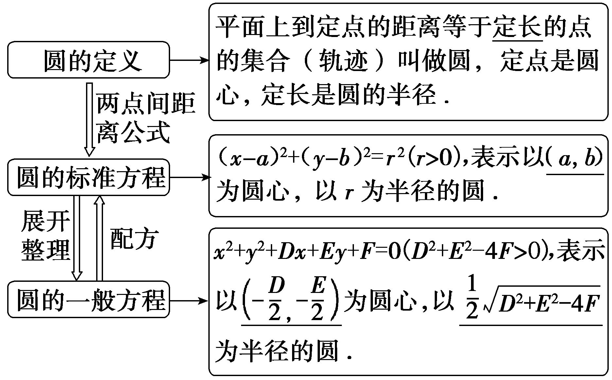
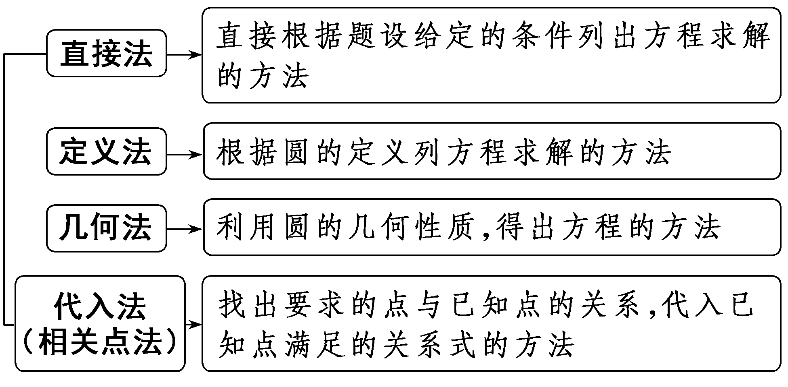
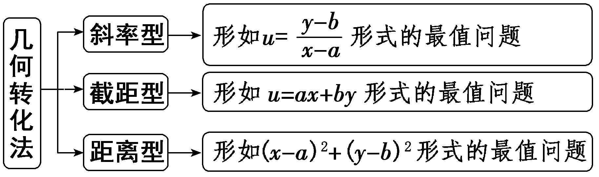
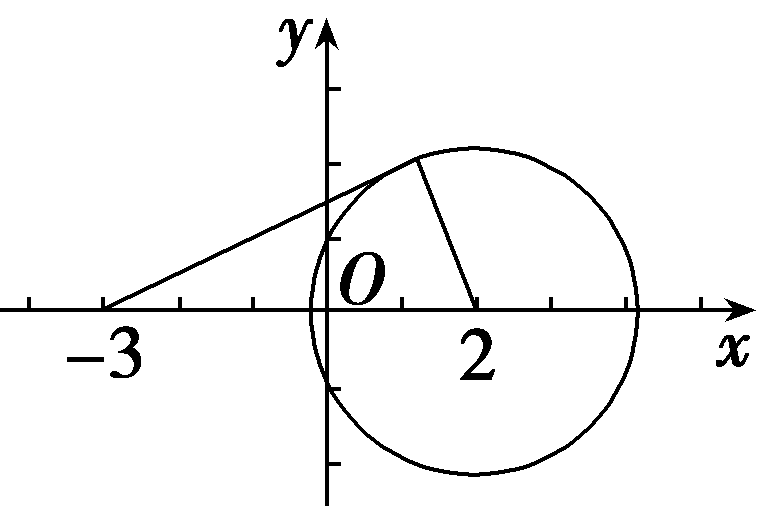
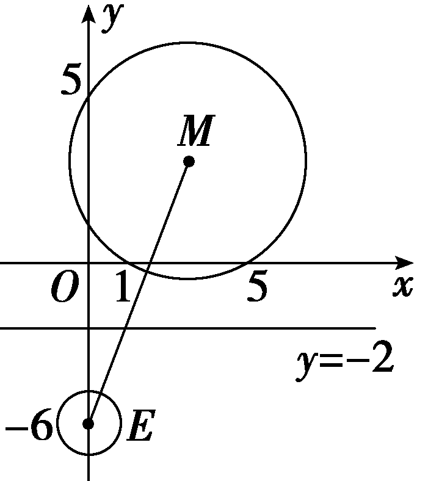
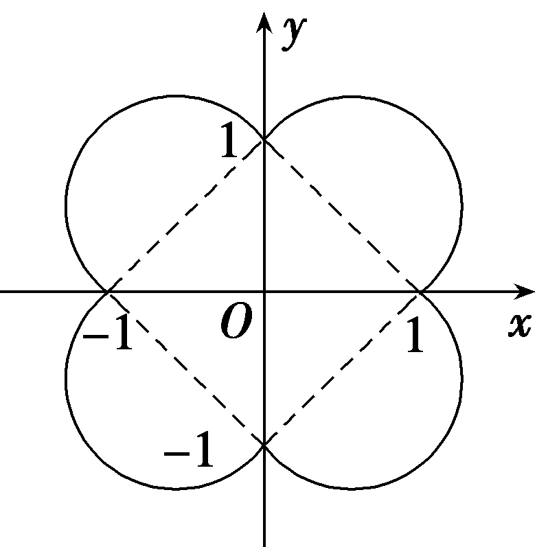
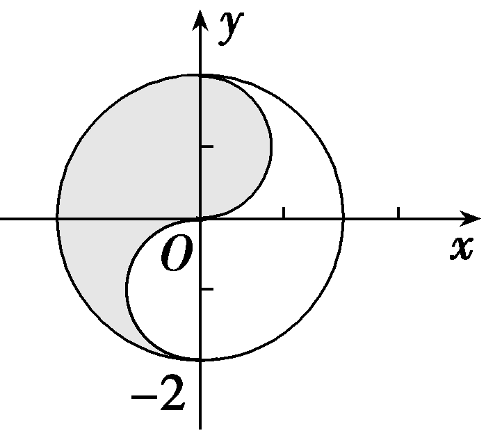
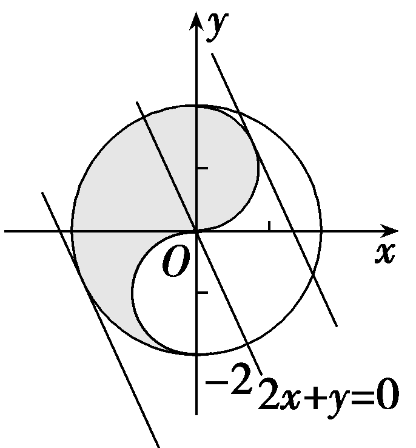

**第三节　圆的方程**

【课标研读】　1.回顾确定圆的几何要素，在平面直角坐标系中，探索并掌握圆的标准方程与一般方程.　2.能用圆的方程解决一些简单的数学问题与实际问题.

1.圆的定义和圆的方程

[微提醒]　对于方程&lt;text st<em>y</em>le="italic"&gt;x&lt;/text&gt;&lt;text style="superscript"&gt;&lt;text style="superscript"&gt;&lt;text style="superscript"&gt;&lt;text style="superscript"&gt;&lt;text style="superscript"&gt;&lt;text style="superscript"&gt;&lt;text style="superscript"&gt;2&lt;/text&gt;&lt;/text&gt;&lt;/text&gt;&lt;/text&gt;&lt;/text&gt;&lt;/text&gt;&lt;/text&gt;＋y2＋<em>&lt;text style="italic"&gt;&lt;text style="italic"&gt;&lt;text style="italic"&gt;D</em>&lt;/text&gt;&lt;/text&gt;x&lt;/text&gt;＋<em>&lt;text style="italic"&gt;&lt;text style="italic"&gt;&lt;text style="italic"&gt;E</em>&lt;/text&gt;&lt;/text&gt;y&lt;/text&gt;＋<em>&lt;text style="italic"&gt;&lt;text style="italic"&gt;&lt;text style="italic"&gt;F</em>&lt;/text&gt;&lt;/text&gt;&lt;/text&gt;＝0，当D2＋E2－4F＞0时，此方程表示的图形是圆；当D2＋E2－4F＝0时，此方程表示一个点 $\left(－\frac{D}{2},-\frac{E}{2}\right)$ ；当<em>&lt;text style="italic"&gt;&lt;text style="italic"&gt;D</em>&lt;/text&gt;&lt;/text&gt;&lt;text st<em>y</em>le="superscript"&gt;&lt;text style="superscript"&gt;&lt;text style="superscript"&gt;&lt;text style="superscript"&gt;&lt;text style="superscript"&gt;&lt;text style="superscript"&gt;&lt;text style="superscript"&gt;2&lt;/text&gt;&lt;/text&gt;&lt;/text&gt;&lt;/text&gt;&lt;/text&gt;&lt;/text&gt;&lt;/text&gt;＋<em>&lt;text style="italic"&gt;&lt;text style="italic"&gt;E</em>&lt;/text&gt;&lt;/text&gt;2－4<em>&lt;text style="italic"&gt;&lt;text style="italic"&gt;&lt;text style="italic"&gt;F</em>&lt;/text&gt;&lt;/text&gt;&lt;/text&gt;＜0时，它不表示任何图形.

2.点与圆的位置关系

平面上的一点<em>M</em>(<em>x</em>0，<em>y</em>0)与圆<em>C</em>：(<em>x</em>－<em>a</em>)2＋(<em>y</em>－<em>b</em>)2＝<em>r</em>2之间存在着下列关系：

(1)｜<em>MC</em>｜＞<em>r</em>⇔<em>M</em>在<u>圆外</u>，即(<em>x</em>0－<em>a</em>)2＋(<em>y</em>0－<em>b</em>)2＞<em>r</em>2⇔<em>M</em>在圆外.

(2)｜<em>MC</em>｜＝<em>r</em>⇔<em>M</em>在<u>圆上</u>，即(<em>x</em>0－<em>a</em>)2＋(<em>y</em>0－<em>b</em>)2＝<em>r</em>2⇔<em>M</em>在圆上.

(3)｜<em>MC</em>｜＜<em>r</em>⇔<em>M</em>在<u>圆内</u>，即(<em>x</em>0－<em>a</em>)2＋(<em>y</em>0－<em>b</em>)2＜<em>r</em>2⇔<em>M</em>在圆内.

【常用结论】

(1)以<em>A</em>(<em>x</em>1，<em>y</em>1)，<em>B</em>(<em>x</em>2，<em>y</em>2)为直径端点的圆的方程为(<em>x</em>－<em>x</em>1)(<em>x</em>－<em>x</em>2)＋(<em>y</em>－<em>y</em>1)(<em>y</em>－<em>y</em>2)＝0.

(2)圆的三条性质：

圆心在圆的任一弦的垂直平分线上；圆心在过切点且与切线垂直的直线上；两圆相切时，切点与两圆圆心共线.

(3)圆的参数方程：圆(&lt;text st<em>y</em>le="it<em>a</em>lic"&gt;x&lt;/text&gt;－a)&lt;text style="supe<em>r</em>script"&gt;&lt;text style="superscript"&gt;2&lt;/text&gt;&lt;/text&gt;＋(y－<em>b</em>)2＝r2的参数方程为 $\left\{\begin{matrix}x＝a＋rcos\theta ，\\y＝b＋rsin\theta \end{matrix}\right.$ (其中<em>θ</em>为参数).

【自主检测】

1.(多选)下列结论正确的是(　　)

A.确定圆的几何要素是圆心与半径

B.(<em>x</em>－2)2＋(<em>y</em>＋1)2＝<em>a</em>2(<em>a</em>≠0)表示以(2，1)为圆心，<em>a</em>为半径的圆

C.方程<em>Ax</em>2＋<em>Bxy</em>＋<em>Cy</em>2＋<em>Dx</em>＋<em>Ey</em>＋<em>F</em>＝0表示圆的充要条件是<em>A</em>＝<em>C</em>≠0，<em>B</em>＝0，<em>D</em>2＋<em>E</em>2－4<em>AF</em>＞0

D.若点&lt;te&lt;te&lt;text st<em>y</em>le="italic"&gt;x&lt;/text&gt;t st<em>y</em>le="italic"&gt;x&lt;/text&gt;t style="italic"&gt;M&lt;/text&gt;(x&lt;text style="subscript"&gt;&lt;text style="subscript"&gt;&lt;text style="subscript"&gt;0&lt;/text&gt;&lt;/text&gt;&lt;/text&gt;，y0)在圆x&lt;text style="superscript"&gt;2&lt;/text&gt;＋y2＋<em>&lt;text style="italic"&gt;Dx</em>&lt;/text&gt;＋<em>&lt;text style="italic"&gt;Ey</em>&lt;/text&gt;＋<em>&lt;text style="italic"&gt;F</em>&lt;/text&gt;＝0外，则 $x_{0}^{2}$ ＋ $y_{0}^{2}$ ＋D&lt;te&lt;text st<em>y</em>le="italic"&gt;x&lt;/text&gt;t st<em>y</em>le="italic"&gt;x&lt;/text&gt;&lt;text style="subscript"&gt;&lt;text style="subscript"&gt;&lt;text style="subscript"&gt;0&lt;/text&gt;&lt;/text&gt;&lt;/text&gt;＋<em>&lt;text style="italic"&gt;Ey</em>&lt;/text&gt;0＋<em>&lt;text style="italic"&gt;F</em>&lt;/text&gt;＞0

答案：**ACD**

2.(链接人教A选择性必修一P85T2)下列各点中，在圆(<em>x</em>－1)2＋(<em>y</em>＋2)2＝25的外部的是(　　)

A.(0，2)	B.(3，3)

C.(－2，2)	D.(4，1)

答案：**B**

解析：由(0－1)2＋(2＋2)2＝17＜25知(0，2)在圆内；由(3－1)2＋(3＋2)2＝29＞25知(3，3)在圆外；由(－2－1)2＋(2＋2)2＝25知(－2，2)在圆上；由(4－1)2＋(1＋2)2＝18＜25知(4，1)在圆内.故选B.

3.(链接人教A选择性必修一P85T1)圆心为(1，1)且过原点的圆的方程是(　　)

A.(<em>x</em>－1)2＋(<em>y</em>－1)2＝1

B.(<em>x</em>＋1)2＋(<em>y</em>＋1)2＝1

C.(<em>x</em>＋1)2＋(<em>y</em>＋1)2＝2

D.(<em>x</em>－1)2＋(<em>y</em>－1)2＝2

答案：**D**

解析：因为圆心为(1，1)且过原点，所以该圆的半径&lt;te&lt;text st<em>y</em>le="italic"&gt;x&lt;/text&gt;t style="italic"&gt;r&lt;/text&gt;＝ $\sqrt{1^{2}＋1^{2}}$ ＝ $\sqrt{2}$ ，则该圆的方程为(&lt;text st<em>y</em>le="italic"&gt;x&lt;/text&gt;－1)&lt;text style="superscript"&gt;2&lt;/text&gt;＋(y－1)2＝2.故选D.

4.(链接人教A选择性必修一P102T7)若方程<em>x</em>2＋<em>y</em>2＋2<em>ax</em>－4<em>ay</em>－10<em>a</em>＝0表示圆，则实数<em>a</em>的取值范围为<u>　　　　　　　　</u>.

答案：(－∞，－2)∪(0，＋∞)

解析：由题意，知(2<em>a</em>)2＋(－4<em>a</em>)2－4×(－10<em>a</em>)＞0，解得<em>a</em>＜－2或<em>a</em>＞0.

考点一　圆的方程　　　　自主练透1.圆心在*x*轴上，且过点(－1，－3)的圆与*y*轴相切，则该圆的方程是(　　)

A.<em>x</em>2＋<em>y</em>2＋10<em>y</em>＝0	B.<em>x</em>2＋<em>y</em>2－10<em>y</em>＝0

C.<em>x</em>2＋<em>y</em>2＋10<em>x</em>＝0	D.<em>x</em>2＋<em>y</em>2－10<em>x</em>＝0

答案：**C**

解析：设圆心坐标为(&lt;&lt;&lt;&lt;te&lt;te&lt;te<em>x</em>t st<em>y</em>le="italic"&gt;x&lt;/text&gt;t st<em>y</em>le="italic"&gt;x&lt;/text&gt;t style="italic"&gt;t&lt;/text&gt;ext style="italic"&gt;t&lt;/text&gt;ext style="italic"&gt;t&lt;/text&gt;e&lt;text st<em>y</em>le="italic"&gt;x&lt;/text&gt;t style="italic"&gt;t&lt;/text&gt;，0)，因为圆心在x轴上且圆与y轴相切，所以｜t｜即为半径，则根据题意得 $\sqrt{\left(－1－t\right)^{2}＋\left(－3－0\right)^{2}}$ ＝｜&lt;&lt;&lt;&lt;te&lt;te&lt;te<em>x</em>t st<em>y</em>le="italic"&gt;x&lt;/text&gt;t st<em>y</em>le="italic"&gt;x&lt;/text&gt;t style="italic"&gt;t&lt;/text&gt;ext style="italic"&gt;t&lt;/text&gt;ext style="italic"&gt;t&lt;/text&gt;e&lt;text st<em>y</em>le="italic"&gt;x&lt;/text&gt;t style="italic"&gt;t&lt;/text&gt;｜，解得t＝－5，所以圆心坐标为(－5，0)，半径为5，该圆的方程是(x＋5)&lt;text style="superscript"&gt;&lt;text style="superscript"&gt;&lt;text style="superscript"&gt;2&lt;/text&gt;&lt;/text&gt;&lt;/text&gt;＋y2＝25，展开得x2＋y2＋10x＝0.故选C.

2.已知直线3<te<text st*y*le="italic">x</text>t st*y*le="italic">x</text>＋4y－4＝0与圆*<text style="italic"><text style="italic">C*</text></text>相切于点*T* $\left(0，1\right)$ ，圆心<te<text st*y*le="italic">x</text>t style="italic">*<text style="italic">C*</text></text>在直线<text st*y*le="italic">x</text>－y＝0上，则圆C的方程为(　　)

A. $\left(x－3\right)^{2}$ ＋ $\left(y－3\right)^{2}$ ＝13

B. $\left(x－3\right)^{2}$ ＋ $\left(y+3\right)^{2}$ ＝25

C. $\left(x+3\right)^{2}$ ＋ $\left(y－3\right)^{2}$ ＝13

D. $\left(x+3\right)^{2}$ ＋ $\left(y+3\right)^{2}$ ＝25

答案：**D**

解析：由题意，设&lt;text style="it&lt;text style="it<em>a</em>lic"&gt;a&lt;/text&gt;lic"&gt;<em>&lt;text style="italic"&gt;&lt;text style="italic"&gt;C</em>&lt;/text&gt;&lt;/text&gt;&lt;/text&gt; $\left(a，a\right)$ (&lt;text style="it<em>a</em>lic"&gt;a&lt;/text&gt;≠0)，圆<em>&lt;text style="italic"&gt;&lt;text style="italic"&gt;&lt;text style="italic"&gt;C</em>&lt;/text&gt;&lt;/text&gt;&lt;/text&gt;的半径为<em>&lt;text style="italic"&gt;r</em>&lt;/text&gt;，所以<em>kCT</em>＝ $\frac{a－1}{a}$ ＝ $\frac{4}{3}$ ，解得&lt;text style="it<em>a</em>lic"&gt;a&lt;/text&gt;＝－3，所以圆心<em>&lt;text style="italic"&gt;&lt;text style="italic"&gt;&lt;text style="italic"&gt;C</em>&lt;/text&gt;&lt;/text&gt;&lt;/text&gt;(－3，－3)，半径<em>&lt;text style="italic"&gt;r</em>&lt;/text&gt;＝ $\left|CT\right|$ ＝ $\sqrt{\left(－3－0\right)^{2}＋\left(－3－1\right)^{2}}$ ＝5，所以圆&lt;text style="it&lt;text style="it<em>a</em>lic"&gt;a&lt;/text&gt;lic"&gt;<em>&lt;text style="italic"&gt;&lt;text style="italic"&gt;C</em>&lt;/text&gt;&lt;/text&gt;&lt;/text&gt;的方程为 $\left(x+3\right)^{2}$ ＋ $\left(y+3\right)^{2}$ ＝25.故选D.

3.(一题多解)(2022·全国甲卷)设点<em>M</em>在直线2<em>x</em>＋<em>y</em>－1＝0上，点(3，0)和(0，1)均在☉<em>M</em>上，则☉<em>M</em>的方程为<u>　　　　　　　　　　</u>.

答案：(<em>x</em>－1)2＋(<em>y</em>＋1)2＝5

解析：法一：设☉&lt;te&lt;te&lt;text st<em>y</em>le="italic"&gt;x&lt;/text&gt;t st<em>y</em>le="it<em>a</em>lic"&gt;x&lt;/text&gt;t style="italic"&gt;<em>M</em>&lt;/text&gt;的方程为(x－a)&lt;text style="supe<em>r</em>script"&gt;&lt;text style="superscript"&gt;&lt;text style="superscript"&gt;&lt;text style="superscript"&gt;2&lt;/text&gt;&lt;/text&gt;&lt;/text&gt;&lt;/text&gt;＋(y－<em>b</em>)2＝r2，则 $\left\{\begin{matrix}2a＋b－1=0，\\\left(3－a\right)^{2}＋b^{2}＝r^{2}，\\a^{2}＋\left(1－b\right)^{2}＝r^{2}，\end{matrix}\right.$ 解得 $\left\{\begin{matrix}a=1，\\b＝－1，\\r^{2}=5.\end{matrix}\right.$ 所以☉&lt;te&lt;te&lt;text st<em>y</em>le="italic"&gt;x&lt;/text&gt;t st<em>y</em>le="it<em>a</em>lic"&gt;x&lt;/text&gt;t style="italic"&gt;<em>M</em>&lt;/text&gt;的方程为(x－1)&lt;text style="supe<em>r</em>script"&gt;&lt;text style="superscript"&gt;&lt;text style="superscript"&gt;&lt;text style="superscript"&gt;2&lt;/text&gt;&lt;/text&gt;&lt;/text&gt;&lt;/text&gt;＋(y＋1)2＝5.

法二：设☉&lt;te&lt;text st<em>y</em>le="italic"&gt;x&lt;/text&gt;t style="italic"&gt;<em>M</em>&lt;/text&gt;的方程为x&lt;text style="superscript"&gt;&lt;text style="superscript"&gt;&lt;text style="superscript"&gt;2&lt;/text&gt;&lt;/text&gt;&lt;/text&gt;＋y2＋<em>&lt;text style="italic"&gt;D</em>x&lt;/text&gt;＋<em>&lt;text style="italic"&gt;E</em>y&lt;/text&gt;＋<em>&lt;text style="italic"&gt;F</em>&lt;/text&gt;＝0(D2＋E2－4F＞0)，则M $\left(－\frac{D}{2},-\frac{E}{2}\right)$ ，

所以 $\left\{\begin{matrix}2\times \left(－\frac{D}{2}\right)＋\left(－\frac{E}{2}\right)－1=0，\\9+3D＋F=0，\\1+E＋F=0，\end{matrix}\right.$ 解得 $\left\{\begin{matrix}D＝－2，\\E=2，\\F＝－3，\end{matrix}\right.$

所以☉<em>M</em>的方程为<em>x</em>2＋<em>y</em>2－2<em>x</em>＋2<em>y</em>－3＝0，即(<em>x</em>－1)2＋(<em>y</em>＋1)2＝5.

法三：设&lt;te&lt;te&lt;text st<em>y</em>le="italic"&gt;x&lt;/text&gt;t st<em>y</em>le="italic"&gt;x&lt;/text&gt;t st<em>y</em>le="italic"&gt;A&lt;/text&gt;(3，0)，<em>B</em>(0，1)，☉<em>&lt;text style="italic"&gt;&lt;text style="italic"&gt;M</em>&lt;/text&gt;&lt;/text&gt;的半径为<em>&lt;text style="italic"&gt;r</em>&lt;/text&gt;，则<em>k&lt;text style="italic"&gt;&lt;text style="italic"&gt;AB</em>&lt;/text&gt;&lt;/text&gt;＝ $\frac{1－0}{0－3}$ ＝－ $\frac{1}{3}$ ，&lt;te&lt;te&lt;text st<em>y</em>le="italic"&gt;x&lt;/text&gt;t st<em>y</em>le="italic"&gt;x&lt;/text&gt;t st<em>y</em>le="italic"&gt;A&lt;/text&gt;<em>B</em>的中点坐标为 $\left(\frac{3}{2}，\frac{1}{2}\right)$ ，所以&lt;te&lt;te&lt;text st<em>y</em>le="italic"&gt;x&lt;/text&gt;t st<em>y</em>le="italic"&gt;x&lt;/text&gt;t st<em>y</em>le="italic"&gt;A&lt;/text&gt;<em>B</em>的垂直平分线方程为y－ $\frac{1}{2}$ ＝3 $\left(x－\frac{3}{2}\right)$ ，即3&lt;te&lt;text st<em>y</em>le="italic"&gt;x&lt;/text&gt;t st<em>y</em>le="italic"&gt;x&lt;/text&gt;－<em>y</em>－4＝0.联立 $\left\{\begin{matrix}3x－y－4=0，\\2x＋y－1=0，\end{matrix}\right.$ 解得&lt;te&lt;te&lt;text st<em>y</em>le="italic"&gt;x&lt;/text&gt;t st<em>y</em>le="italic"&gt;x&lt;/text&gt;t st<em>y</em>le="italic"&gt;<em>&lt;text style="italic"&gt;M</em>&lt;/text&gt;&lt;/text&gt;(1，－1)，所以<em>&lt;text style="italic"&gt;r</em>&lt;/text&gt;&lt;text style="superscript"&gt;&lt;text style="superscript"&gt;&lt;text style="superscript"&gt;&lt;text style="superscript"&gt;&lt;text style="superscript"&gt;2&lt;/text&gt;&lt;/text&gt;&lt;/text&gt;&lt;/text&gt;&lt;/text&gt;＝｜M<em>A</em>｜2＝(3－1)2＋[0－(－1)]2＝5，所以☉M的方程为(x－1)2＋(y＋1)2＝5.

4.若圆<em>C</em>经过坐标原点，且圆心在直线<em>y</em>＝－2<em>x</em>＋3上运动，则当圆的半径最小时圆的方程为<u>　　　　　　　　　</u>.

答案： $\left(x－\frac{6}{5}\right)^{2}$ ＋ $\left(y－\frac{3}{5}\right)^{2}$ ＝ $\frac{9}{5}$

解析：设圆心坐标为(&lt;text style="it&lt;text style="it<em>a</em>lic"&gt;a&lt;/text&gt;lic"&gt;a&lt;/text&gt;，－2a＋3)，则圆的半径<em>&lt;text style="italic"&gt;r</em>&lt;/text&gt;＝ $\sqrt{(a－0)^{2}＋(-2a＋3－0)^{2}}$ ＝ $\sqrt{5a^{2}－12a+9}$ ＝ $\sqrt{5\left(a－\frac{6}{5}\right)^{2}＋\frac{9}{5}}$ .当&lt;text style="it&lt;text style="it<em>a</em>lic"&gt;a&lt;/text&gt;lic"&gt;a&lt;/text&gt;＝ $\frac{6}{5}$ 时，&lt;text style="it<em>a</em>lic"&gt;<em>r</em>&lt;/text&gt;min＝ $\frac{3\sqrt{5}}{5}$ ，故所求圆的方程为 $\left(x－\frac{6}{5}\right)^{2}$ ＋ $\left(y－\frac{3}{5}\right)^{2}$ ＝ $\frac{9}{5}$ .

求圆的方程的常用方法

1.直接法：直接求出圆心坐标和半径，写出方程.

2.待定系数法：(1)若已知条件与圆心(*a*，*b*)和半径*r*有关，则设圆的标准方程，求出*a*，*b*，*r*的值.

(2)若已知圆经过已知点，往往选择圆的一般方程，依据已知条件列出关于*D*，*E*，*F*的方程组，进而求出*D*，*E*，*F*的值.

考点二　与圆有关的轨迹问题　　　　多维探究

角度1　直接法

已知<em>A</em>(－2，0)，<em>B</em>(2，0)，动点<em>M</em>满足｜<em>MA</em>｜＝2｜<em>MB</em>｜，则点<em>M</em>的轨迹方程是<u>　　　　　　　　</u>.

答案：&lt;te<em>x</em>t st<em>y</em>le="italic"&gt;x&lt;/text&gt;&lt;text style="superscript"&gt;2&lt;/text&gt;＋y2－ $\frac{20}{3}$ &lt;te<em>x</em>t st<em>y</em>le="italic"&gt;x&lt;/text&gt;＋4＝0

解析：设&lt;te&lt;te&lt;te&lt;te&lt;te&lt;te&lt;te<em>x</em>t st<em>y</em>le="italic"&gt;x&lt;/text&gt;t style="italic"&gt;x&lt;/text&gt;t st<em>y</em>le="italic"&gt;x&lt;/text&gt;t style="italic"&gt;x&lt;/text&gt;t st<em>y</em>le="italic"&gt;x&lt;/text&gt;t st<em>y</em>le="italic"&gt;x&lt;/text&gt;t style="italic"&gt;<em>M</em>&lt;/text&gt;(x，y)，则｜<em>&lt;text style="italic"&gt;MA</em>&lt;/text&gt;｜＝ $\sqrt{(x+2)^{2}＋y^{2}}$ ，｜&lt;te&lt;te&lt;te&lt;te&lt;te&lt;te&lt;te<em>x</em>t st<em>y</em>le="italic"&gt;x&lt;/text&gt;t style="italic"&gt;x&lt;/text&gt;t st<em>y</em>le="italic"&gt;x&lt;/text&gt;t style="italic"&gt;x&lt;/text&gt;t st<em>y</em>le="italic"&gt;x&lt;/text&gt;t st<em>y</em>le="italic"&gt;x&lt;/text&gt;t style="italic"&gt;<em>M</em>&lt;/text&gt;B｜＝ $\sqrt{(x－2)^{2}＋y^{2}}$ .因为｜&lt;te&lt;te&lt;te&lt;te&lt;te&lt;te&lt;te<em>x</em>t st<em>y</em>le="italic"&gt;x&lt;/text&gt;t style="italic"&gt;x&lt;/text&gt;t st<em>y</em>le="italic"&gt;x&lt;/text&gt;t style="italic"&gt;x&lt;/text&gt;t st<em>y</em>le="italic"&gt;x&lt;/text&gt;t st<em>y</em>le="italic"&gt;x&lt;/text&gt;t style="italic"&gt;<em>M</em>&lt;/text&gt;A｜＝&lt;text style="superscript"&gt;&lt;text style="superscript"&gt;&lt;text style="superscript"&gt;&lt;text style="superscript"&gt;&lt;text style="superscript"&gt;2&lt;/text&gt;&lt;/text&gt;&lt;/text&gt;&lt;/text&gt;&lt;/text&gt;｜<em>&lt;text style="italic"&gt;MB</em>&lt;/text&gt;｜，所以 $\sqrt{(x+2)^{2}＋y^{2}}$ ＝&lt;te&lt;te&lt;te&lt;te&lt;te<em>x</em>t st<em>y</em>le="italic"&gt;x&lt;/text&gt;t style="italic"&gt;x&lt;/text&gt;t st<em>y</em>le="italic"&gt;x&lt;/text&gt;t style="italic"&gt;x&lt;/text&gt;t st<em>y</em>le="superscript"&gt;&lt;text style="superscript"&gt;&lt;text style="superscript"&gt;&lt;text style="superscript"&gt;&lt;text style="superscript"&gt;2&lt;/text&gt;&lt;/text&gt;&lt;/text&gt;&lt;/text&gt;&lt;/text&gt; $\sqrt{(x－2)^{2}＋y^{2}}$ ，整理可得，3&lt;te&lt;te&lt;te&lt;te&lt;te&lt;te<em>x</em>t st<em>y</em>le="italic"&gt;x&lt;/text&gt;t style="italic"&gt;x&lt;/text&gt;t st<em>y</em>le="italic"&gt;x&lt;/text&gt;t style="italic"&gt;x&lt;/text&gt;t st<em>y</em>le="italic"&gt;x&lt;/text&gt;t st<em>y</em>le="italic"&gt;x&lt;/text&gt;&lt;text style="superscript"&gt;&lt;text style="superscript"&gt;&lt;text style="superscript"&gt;&lt;text style="superscript"&gt;&lt;text style="superscript"&gt;2&lt;/text&gt;&lt;/text&gt;&lt;/text&gt;&lt;/text&gt;&lt;/text&gt;＋3y2－20x＋12＝0，即x2＋y2－ $\frac{20}{3}$ &lt;te&lt;te&lt;te&lt;te&lt;te&lt;te<em>x</em>t st<em>y</em>le="italic"&gt;x&lt;/text&gt;t style="italic"&gt;x&lt;/text&gt;t st<em>y</em>le="italic"&gt;x&lt;/text&gt;t style="italic"&gt;x&lt;/text&gt;t st<em>y</em>le="italic"&gt;x&lt;/text&gt;t st<em>y</em>le="italic"&gt;x&lt;/text&gt;＋4＝0.所以点<em>&lt;text style="italic"&gt;M</em>&lt;/text&gt;的轨迹是圆，方程为x&lt;text style="superscript"&gt;&lt;text style="superscript"&gt;&lt;text style="superscript"&gt;&lt;text style="superscript"&gt;&lt;text style="superscript"&gt;2&lt;/text&gt;&lt;/text&gt;&lt;/text&gt;&lt;/text&gt;&lt;/text&gt;＋y2－ $\frac{20}{3}$ &lt;te&lt;te&lt;te&lt;te&lt;te&lt;te<em>x</em>t st<em>y</em>le="italic"&gt;x&lt;/text&gt;t style="italic"&gt;x&lt;/text&gt;t st<em>y</em>le="italic"&gt;x&lt;/text&gt;t style="italic"&gt;x&lt;/text&gt;t st<em>y</em>le="italic"&gt;x&lt;/text&gt;t st<em>y</em>le="italic"&gt;x&lt;/text&gt;＋4＝0.

角度2　定义法

已知圆<em>C</em>：(<em>x</em>－1)2＋(<em>y</em>－1)2＝1，点<em>M</em>是圆上的动点，<em>AM</em>与圆相切，且｜<em>AM</em>｜＝2，则点<em>A</em>的轨迹方程是(　　)

A.<em>y</em>2＝4<em>x</em>

B.<em>x</em>2＋<em>y</em>2－2<em>x</em>－2<em>y</em>－3＝0

C.<em>x</em>2＋<em>y</em>2－2<em>y</em>－3＝0

D.<em>y</em>2＝－4<em>x</em>

答案：**B**

解析：因为圆&lt;te&lt;te&lt;te&lt;te&lt;te&lt;te&lt;te&lt;text st<em>y</em>le="italic"&gt;x&lt;/text&gt;t st<em>y</em>le="italic"&gt;x&lt;/text&gt;t st<em>y</em>le="italic"&gt;x&lt;/text&gt;t st<em>y</em>le="italic"&gt;x&lt;/text&gt;t st<em>y</em>le="italic"&gt;x&lt;/text&gt;t st<em>y</em>le="italic"&gt;x&lt;/text&gt;t st<em>y</em>le="italic"&gt;x&lt;/text&gt;t style="italic"&gt;<em>C</em>&lt;/text&gt;：(x－1)&lt;text style="supe<em>r</em>script"&gt;&lt;text style="superscript"&gt;&lt;text style="superscript"&gt;&lt;text style="superscript"&gt;&lt;text style="superscript"&gt;&lt;text style="superscript"&gt;&lt;text style="superscript"&gt;2&lt;/text&gt;&lt;/text&gt;&lt;/text&gt;&lt;/text&gt;&lt;/text&gt;&lt;/text&gt;&lt;/text&gt;＋(y－1)2＝1，所以圆心C(1，1)，半径r＝1，因为点<em>M</em>是圆上的动点，所以｜<em>MC</em>｜＝1，又<em>&lt;text style="italic"&gt;&lt;text style="italic"&gt;&lt;text style="italic"&gt;A</em>&lt;/text&gt;M&lt;/text&gt;&lt;/text&gt;与圆相切，且｜AM｜＝2，则｜<em>AC</em>｜＝ $\sqrt{｜MC｜^{2}＋｜AM｜^{2}}$ ＝ $\sqrt{5}$ ，设&lt;te&lt;te&lt;te&lt;te&lt;te&lt;te&lt;text st<em>y</em>le="italic"&gt;x&lt;/text&gt;t st<em>y</em>le="italic"&gt;x&lt;/text&gt;t st<em>y</em>le="italic"&gt;x&lt;/text&gt;t st<em>y</em>le="italic"&gt;x&lt;/text&gt;t st<em>y</em>le="italic"&gt;x&lt;/text&gt;t st<em>y</em>le="italic"&gt;x&lt;/text&gt;t style="italic"&gt;<em>A</em>&lt;/text&gt;(&lt;text st<em>y</em>le="italic"&gt;x&lt;/text&gt;，y)，则(x－1)&lt;text style="supe<em>r</em>script"&gt;&lt;text style="superscript"&gt;&lt;text style="superscript"&gt;&lt;text style="superscript"&gt;&lt;text style="superscript"&gt;&lt;text style="superscript"&gt;&lt;text style="superscript"&gt;2&lt;/text&gt;&lt;/text&gt;&lt;/text&gt;&lt;/text&gt;&lt;/text&gt;&lt;/text&gt;&lt;/text&gt;＋(y－1)2＝5，即x2＋y2－2x－2y－3＝0，所以点A的轨迹方程为x2＋y2－2x－2y－3＝0.故选B.

角度3　相关点代入法

已知<em>O</em>为坐标原点，点<em>M</em>(－3，4)，动点<em>N</em>在圆<em>x</em>2＋<em>y</em>2＝4上运动，以<em>OM</em>，<em>ON</em>为邻边作平行四边形<em>MONP</em>，求点<em>P</em>的轨迹.

解：设<em>P</em>(<em>x</em>，<em>y</em>)，<em>N</em>(<em>x</em>0，<em>y</em>0)，

因为四边形&lt;te&lt;te&lt;text st<em>y</em>le="italic"&gt;x&lt;/text&gt;t st<em>y</em>le="italic"&gt;x&lt;/text&gt;t style="italic"&gt;MONP&lt;/text&gt;为平行四边形，则 $\vec{OP}$ ＝ $\vec{OM}$ ＋ $\vec{ON}$ ，即(&lt;te&lt;text st<em>y</em>le="italic"&gt;x&lt;/text&gt;t st<em>y</em>le="italic"&gt;x&lt;/text&gt;，y)＝(－3，4)＋(x&lt;text style="subscript"&gt;0&lt;/text&gt;，y0)，

即 $\left\{\begin{matrix}x＝－3+x_{0}，\\y=4+y_{0}，\end{matrix}\right.$ 则 $\left\{\begin{matrix}x_{0}＝x+3，\\y_{0}＝y－4，\end{matrix}\right.$

又<em>N</em>(<em>x</em>0，<em>y</em>0)在圆<em>x</em>2＋<em>y</em>2＝4上，

所以 $x_{0}^{2}$ ＋ $y_{0}^{2}$ ＝4，故(&lt;text st<em>y</em>le="italic"&gt;x&lt;/text&gt;＋3)&lt;text style="superscript"&gt;2&lt;/text&gt;＋(y－4)2＝4，

易知直线<te*x*t st*y*le="italic">OM</text>的方程为y＝－ $\frac{4}{3}$ *x*，联立 $\left\{\begin{matrix}y＝－\frac{4}{3}x，\\(x+3)^{2}＋(y－4)^{2}=4，\end{matrix}\right.$

得 $\left\{\begin{matrix}x＝－\frac{9}{5}，\\y＝\frac{12}{5}\end{matrix}\right.$ 或 $\left\{\begin{matrix}x＝－\frac{21}{5}，\\y＝\frac{28}{5}，\end{matrix}\right.$

所以点&lt;te&lt;text st<em>y</em>le="italic"&gt;x&lt;/text&gt;t style="italic"&gt;P&lt;/text&gt;的轨迹为圆(x＋3)&lt;text style="superscript"&gt;2&lt;/text&gt;＋(y－4)2＝4除去点 $\left(－\frac{9}{5}，\frac{12}{5}\right)$ 和 $\left(－\frac{21}{5}，\frac{28}{5}\right)$ .

与圆有关的轨迹问题的四种求法

注意：求轨迹方程时，一要区分“轨迹”与“轨迹方程”；二要注意检验，去掉不符合题设条件的点或线等.

对点练1.已知圆<em>x</em>2＋<em>y</em>2＝4上一定点<em>A</em>(2，0)，<em>B</em>(1，1)为圆内一点，<em>P</em>，<em>Q</em>为圆上的动点.

(1)求线段*AP*中点的轨迹方程；

(2)若∠*PBQ*＝90°，求线段*PQ*中点的轨迹方程.

解：(1)设*AP*的中点为*M*(*x*，*y*)，由中点坐标公式可知点*P*的坐标为(2*x*－2，2*y*).

因为点<em>P</em>在圆<em>x</em>2＋<em>y</em>2＝4上，所以(2<em>x</em>－2)2＋(2<em>y</em>)2＝4.

故线段<em>AP</em>中点的轨迹方程为(<em>x</em>－1)2＋<em>y</em>2＝1.

(2)设*PQ*的中点为*N*(*x*，*y*).在Rt△*PBQ*中，｜*PN*｜＝｜*BN*｜.设*O*为坐标原点，连接*ON*(图略)，

则<em>ON</em>⊥<em>PQ</em>，所以｜<em>OP</em>｜2＝｜<em>ON</em>｜2＋｜<em>PN</em>｜2＝｜<em>ON</em>｜2＋｜<em>BN</em>｜2，所以<em>x</em>2＋<em>y</em>2＋(<em>x</em>－1)2＋(<em>y</em>－1)2＝4.故线段<em>PQ</em>中点的轨迹方程为<em>x</em>2＋<em>y</em>2－<em>x</em>－<em>y</em>－1＝0.

考点三　与圆有关的最值问题　　　　多维探究

角度1　利用几何意义求最值

已知点(<em>x</em>，<em>y</em>)在圆(<em>x</em>－2)2＋(<em>y</em>＋3)2＝1上.

(1)求 $\frac{y}{x}$ 的最大值和最小值；

(2)求*x*＋*y*的最大值和最小值；

(3)求 $\sqrt{x^{2}＋y^{2}+2x－4y+5}$ 的最大值和最小值.

解：(1) $\frac{y}{x}$ 可视为点(<text st*y*le="italic">x</text>，y)与原点连线的斜率， $\frac{y}{x}$ 的最大值和最小值就是与该圆有公共点的过原点的直线斜率的最大值和最小值，即直线与圆相切时的斜率.

设过原点的直线的方程为*y*＝*<text style="italic"><text style="italic">k*</text>x</text>，由直线与圆相切，得圆心到直线的距离等于半径，即 $\frac{｜2k+3｜}{\sqrt{k^{2}+1}}$ ＝1，解得*<text style="italic">k*</text>＝－2＋ $\frac{2\sqrt{3}}{3}$ 或*<text style="italic">k*</text>＝－2－ $\frac{2\sqrt{3}}{3}$ ，所以 $\frac{y}{x}$ 的最大值为－2＋ $\frac{2\sqrt{3}}{3}$ ，最小值为－2－ $\frac{2\sqrt{3}}{3}$ .

(2)设*t*＝*x*＋*y*，则*y*＝－*x*＋*t*，*t*可视为直线*y*＝－*x*＋*t*在*y*轴上的截距，所以*x*＋*y*的最大值和最小值就是直线与圆有公共点时直线纵截距的最大值和最小值，即直线与圆相切时在*y*轴上的截距.

由直线与圆相切得，圆心到直线的距离等于半径，

即 $\frac{｜2+(-3)-t｜}{\sqrt{2}}$ ＝1，解得<<te<text st*y*le="italic">x</text>t style="italic">t</text>ext style="italic">t</text>＝ $\sqrt{2}$ －1或<<te<text st*y*le="italic">x</text>t style="italic">t</text>ext style="italic">t</text>＝－ $\sqrt{2}$ －1，所以<text st*y*le="italic">x</text>＋y的最大值为 $\sqrt{2}$ －1，最小值为－ $\sqrt{2}$ －1.

(3) $\sqrt{x^{2}＋y^{2}+2x－4y+5}$ ＝ $\sqrt{(x+1)^{2}＋(y－2)^{2}}$ ，求它的最值可视为求点(<text st*y*le="italic">x</text>，y)到定点(－1，2)的距离的最值，可转化为求圆心(2，－3)到定点(－1，2)的距离与半径的和或差.又圆心到定点(－1，2)的距离为 $\sqrt{34}$ ，所以 $\sqrt{x^{2}＋y^{2}+2x－4y+5}$ 的最大值为 $\sqrt{34}$ ＋1，最小值为 $\sqrt{34}$ －1.

角度2　建立函数关系式求最值

设点&lt;te&lt;te&lt;text st<em>y</em>le="italic"&gt;x&lt;/text&gt;t st<em>y</em>le="italic"&gt;x&lt;/text&gt;t style="italic"&gt;P&lt;/text&gt;(x，y)是圆：x&lt;text style="superscript"&gt;2&lt;/text&gt;＋(y－3)2＝1上的动点，定点<em>A</em>(2，0)，<em>B</em>(－2，0)，则 $\vec{PA}$ · $\vec{PB}$ 的最大值为<u>　　　　</u>.

答案：12

解析：由题意，知 $\vec{PA}$ ＝(&lt;te&lt;te&lt;te&lt;te&lt;text st&lt;text st&lt;text st<em>y</em>le="italic"&gt;y&lt;/text&gt;le="italic"&gt;y&lt;/text&gt;le="italic"&gt;x&lt;/text&gt;t st&lt;text st&lt;text st&lt;text st<em>y</em>le="italic"&gt;y&lt;/text&gt;le="italic"&gt;y&lt;/text&gt;le="italic"&gt;y&lt;/text&gt;le="italic"&gt;x&lt;/text&gt;t st<em>y</em>le="italic"&gt;x&lt;/text&gt;t st<em>y</em>le="italic"&gt;x&lt;/text&gt;t st<em>y</em>le="superscript"&gt;&lt;text style="superscript"&gt;&lt;text style="superscript"&gt;&lt;text style="superscript"&gt;&lt;text style="superscript"&gt;&lt;text style="superscript"&gt;&lt;text style="superscript"&gt;&lt;text style="superscript"&gt;&lt;text style="superscript"&gt;2&lt;/text&gt;&lt;/text&gt;&lt;/text&gt;&lt;/text&gt;&lt;/text&gt;&lt;/text&gt;&lt;/text&gt;&lt;/text&gt;&lt;/text&gt;－&lt;te&lt;te<em>x</em>t st<em>y</em>le="italic"&gt;x&lt;/text&gt;t st<em>y</em>le="italic"&gt;x&lt;/text&gt;，－y)， $\vec{PB}$ ＝(－&lt;te&lt;te&lt;te&lt;te&lt;text st&lt;text st&lt;text st<em>y</em>le="italic"&gt;y&lt;/text&gt;le="italic"&gt;y&lt;/text&gt;le="italic"&gt;x&lt;/text&gt;t st&lt;text st&lt;text st&lt;text st<em>y</em>le="italic"&gt;y&lt;/text&gt;le="italic"&gt;y&lt;/text&gt;le="italic"&gt;y&lt;/text&gt;le="italic"&gt;x&lt;/text&gt;t st<em>y</em>le="italic"&gt;x&lt;/text&gt;t st<em>y</em>le="italic"&gt;x&lt;/text&gt;t st<em>y</em>le="superscript"&gt;&lt;text style="superscript"&gt;&lt;text style="superscript"&gt;&lt;text style="superscript"&gt;&lt;text style="superscript"&gt;&lt;text style="superscript"&gt;&lt;text style="superscript"&gt;&lt;text style="superscript"&gt;&lt;text style="superscript"&gt;2&lt;/text&gt;&lt;/text&gt;&lt;/text&gt;&lt;/text&gt;&lt;/text&gt;&lt;/text&gt;&lt;/text&gt;&lt;/text&gt;&lt;/text&gt;－&lt;te&lt;te<em>x</em>t st<em>y</em>le="italic"&gt;x&lt;/text&gt;t st<em>y</em>le="italic"&gt;x&lt;/text&gt;，－y)，所以 $\vec{PA}$ · $\vec{PB}$ ＝&lt;te&lt;te&lt;te&lt;te&lt;te&lt;te&lt;text st&lt;text st&lt;text st<em>y</em>le="italic"&gt;y&lt;/text&gt;le="italic"&gt;y&lt;/text&gt;le="italic"&gt;x&lt;/text&gt;t st&lt;text st&lt;text st&lt;text st<em>y</em>le="italic"&gt;y&lt;/text&gt;le="italic"&gt;y&lt;/text&gt;le="italic"&gt;y&lt;/text&gt;le="italic"&gt;x&lt;/text&gt;t st<em>y</em>le="italic"&gt;x&lt;/text&gt;t st<em>y</em>le="italic"&gt;x&lt;/text&gt;t st<em>y</em>le="italic"&gt;x&lt;/text&gt;t st<em>y</em>le="italic"&gt;x&lt;/text&gt;t st<em>y</em>le="italic"&gt;x&lt;/text&gt;&lt;text style="superscript"&gt;&lt;text style="superscript"&gt;&lt;text style="superscript"&gt;&lt;text style="superscript"&gt;&lt;text style="superscript"&gt;&lt;text style="superscript"&gt;&lt;text style="superscript"&gt;&lt;text style="superscript"&gt;&lt;text style="superscript"&gt;2&lt;/text&gt;&lt;/text&gt;&lt;/text&gt;&lt;/text&gt;&lt;/text&gt;&lt;/text&gt;&lt;/text&gt;&lt;/text&gt;&lt;/text&gt;＋y2－4，由于点<em>P</em>(x，y)是圆上的点，故其坐标满足方程x2＋(y－3)2＝1，故x2＝－(y－3)2＋1，所以 $\vec{PA}$ · $\vec{PB}$ ＝－(&lt;te&lt;te&lt;te&lt;te&lt;te&lt;te&lt;text st&lt;text st&lt;text st<em>y</em>le="italic"&gt;y&lt;/text&gt;le="italic"&gt;y&lt;/text&gt;le="italic"&gt;x&lt;/text&gt;t st&lt;text st&lt;text st&lt;text st<em>y</em>le="italic"&gt;y&lt;/text&gt;le="italic"&gt;y&lt;/text&gt;le="italic"&gt;y&lt;/text&gt;le="italic"&gt;x&lt;/text&gt;t st<em>y</em>le="italic"&gt;x&lt;/text&gt;t st<em>y</em>le="italic"&gt;x&lt;/text&gt;t st<em>y</em>le="italic"&gt;x&lt;/text&gt;t st<em>y</em>le="italic"&gt;x&lt;/text&gt;t style="italic"&gt;y&lt;/text&gt;－3)&lt;text style="superscript"&gt;&lt;text style="superscript"&gt;&lt;text style="superscript"&gt;&lt;text style="superscript"&gt;&lt;text style="superscript"&gt;&lt;text style="superscript"&gt;&lt;text style="superscript"&gt;&lt;text style="superscript"&gt;&lt;text style="superscript"&gt;2&lt;/text&gt;&lt;/text&gt;&lt;/text&gt;&lt;/text&gt;&lt;/text&gt;&lt;/text&gt;&lt;/text&gt;&lt;/text&gt;&lt;/text&gt;＋1＋y2－4＝6y－12.由圆的方程<em>x</em>2＋(y－3)2＝1，易知2≤y≤4，所以当y＝4时， $\vec{PA}$ · $\vec{PB}$ 的值最大，最大值为6×4－1&lt;te&lt;te&lt;te&lt;te&lt;text st&lt;text st&lt;text st<em>y</em>le="italic"&gt;y&lt;/text&gt;le="italic"&gt;y&lt;/text&gt;le="italic"&gt;x&lt;/text&gt;t st&lt;text st&lt;text st&lt;text st<em>y</em>le="italic"&gt;y&lt;/text&gt;le="italic"&gt;y&lt;/text&gt;le="italic"&gt;y&lt;/text&gt;le="italic"&gt;x&lt;/text&gt;t st<em>y</em>le="italic"&gt;x&lt;/text&gt;t st<em>y</em>le="italic"&gt;x&lt;/text&gt;t st<em>y</em>le="superscript"&gt;&lt;text style="superscript"&gt;&lt;text style="superscript"&gt;&lt;text style="superscript"&gt;&lt;text style="superscript"&gt;&lt;text style="superscript"&gt;&lt;text style="superscript"&gt;&lt;text style="superscript"&gt;&lt;text style="superscript"&gt;2&lt;/text&gt;&lt;/text&gt;&lt;/text&gt;&lt;/text&gt;&lt;/text&gt;&lt;/text&gt;&lt;/text&gt;&lt;/text&gt;&lt;/text&gt;＝12.

角度3　利用对称性求最值

已知点<em>A</em>(0，2)，点<em>P</em>在直线<em>x</em>＋<em>y</em>＋2＝0上，点<em>Q</em>在圆<em>C</em>：<em>x</em>2＋<em>y</em>2－4<em>x</em>－2<em>y</em>＝0上，则｜<em>PA</em>｜＋｜<em>PQ</em>｜的最小值是<u>　　　　</u>.

答案：2 $\sqrt{5}$

解析：因为圆&lt;te&lt;te&lt;te&lt;text st<em>y</em>le="italic"&gt;x&lt;/text&gt;t st<em>y</em>le="italic"&gt;x&lt;/text&gt;t st<em>y</em>le="italic"&gt;x&lt;/text&gt;t style="italic"&gt;<em>&lt;text style="italic"&gt;C</em>&lt;/text&gt;&lt;/text&gt;：x&lt;text style="supe<em>&lt;text style="italic"&gt;r</em>&lt;/text&gt;script"&gt;2&lt;/text&gt;＋y2－4x－2y＝0，故圆C的圆心坐标为C(2，1)，半径r＝ $\sqrt{5}$ .设点&lt;te&lt;text st<em>y</em>le="italic"&gt;x&lt;/text&gt;t style="italic"&gt;A&lt;/text&gt;(0，&lt;te&lt;text st<em>y</em>le="italic"&gt;x&lt;/text&gt;t st<em>y</em>le="supe<em>&lt;text style="italic"&gt;r</em>&lt;/text&gt;script"&gt;2&lt;/text&gt;)关于直线<em>x</em>＋y＋2＝0的对称点为<em>&lt;text style="italic"&gt;A'</em>&lt;/text&gt;(<em>m</em>，<em>n</em>)，则 $\left\{\begin{matrix}\frac{m+0}{2}＋\frac{n+2}{2}+2=0，\\\frac{n－2}{m－0}=1，\end{matrix}\right.$ 解得 $\left\{\begin{matrix}m＝－4，\\n＝－2，\end{matrix}\right.$ 故&lt;te&lt;text st<em>y</em>le="italic"&gt;x&lt;/text&gt;t style="italic"&gt;A&lt;/text&gt;'(－4，－&lt;te&lt;text st<em>y</em>le="italic"&gt;x&lt;/text&gt;t st<em>y</em>le="supe<em>&lt;text style="italic"&gt;r</em>&lt;/text&gt;script"&gt;2&lt;/text&gt;).所以｜<em>PA</em>｜＋｜<em>&lt;text style="italic"&gt;PQ</em>&lt;/text&gt;｜＝｜<em>&lt;text style="italic"&gt;A'</em>&lt;/text&gt;P｜＋｜PQ｜≥｜<em>A'Q</em>｜≥｜A'&lt;te<em>x</em>t style="italic"&gt;<em>&lt;text style="italic"&gt;C</em>&lt;/text&gt;&lt;/text&gt;｜－r＝2 $\sqrt{5}$ .

与圆有关的最值问题的求解方法

1.借助几何性质求最值

2.建立函数关系式求最值：根据题目条件列出关于所求式子的函数关系式，然后根据关系式的特征选用参数法、配方法、判别式法等，利用二次函数或基本不等式求最值.

3.利用对称性求最值：求解形如｜*PA*｜＋｜*PQ*｜ 且与圆有关的折线段的最值问题(其中*P* ，*Q* 均为动点)时，要立足两点：(1)“动化定”，把与圆上的点间的距离转化为与圆心间的距离.(2)“曲化直”，即将折线段转化为同一直线上的两线段之和，一般要通过对称性解决.

对点练2.(一题多解)(2023·全国乙卷)已知实数<em>x</em>，<em>y</em>满足<em>x</em>2＋<em>y</em>2－4<em>x</em>－2<em>y</em>－4＝0，则<em>x</em>－<em>y</em>的最大值是(　　)

A.1＋ $\frac{3\sqrt{2}}{2}$ 	　B.4

C.1＋3 $\sqrt{2}$ 	　D.72

答案：**C**

解析：法一：将方程&lt;te&lt;te&lt;te&lt;te&lt;te&lt;text st<em>y</em>le="italic"&gt;x&lt;/text&gt;t st<em>y</em>le="italic"&gt;x&lt;/text&gt;t st<em>y</em>le="italic"&gt;x&lt;/text&gt;t st<em>y</em>le="italic"&gt;x&lt;/text&gt;t st<em>y</em>le="italic"&gt;x&lt;/text&gt;t st<em>y</em>le="italic"&gt;x&lt;/text&gt;&lt;text style="superscript"&gt;&lt;text style="superscript"&gt;&lt;text style="superscript"&gt;2&lt;/text&gt;&lt;/text&gt;&lt;/text&gt;＋y2－4x－2y－4＝0化为(x－2)2＋(y－1)2＝9，其表示圆心为(2，1)，半径为3的圆，设<em>&lt;text style="italic"&gt;&lt;text style="italic"&gt;&lt;text style="italic"&gt;&lt;text style="italic"&gt;&lt;text style="italic"&gt;z</em>&lt;/text&gt;&lt;/text&gt;&lt;/text&gt;&lt;/text&gt;&lt;/text&gt;＝x－y，即x－y－z＝0，故当x－y－z＝0与圆相切时z有最值.此时 $\frac{｜1－z｜}{\sqrt{2}}$ ＝3，故&lt;te&lt;te&lt;te&lt;text st<em>y</em>le="italic"&gt;x&lt;/text&gt;t st<em>y</em>le="italic"&gt;x&lt;/text&gt;t st<em>y</em>le="italic"&gt;x&lt;/text&gt;t style="italic"&gt;<em>&lt;text style="italic"&gt;&lt;text style="italic"&gt;&lt;text style="italic"&gt;&lt;text style="italic"&gt;z</em>&lt;/text&gt;&lt;/text&gt;&lt;/text&gt;&lt;/text&gt;&lt;/text&gt;＝1±3 $\sqrt{2}$ ，所以&lt;te&lt;te&lt;te&lt;text st<em>y</em>le="italic"&gt;x&lt;/text&gt;t st<em>y</em>le="italic"&gt;x&lt;/text&gt;t st<em>y</em>le="italic"&gt;x&lt;/text&gt;t style="italic"&gt;<em>&lt;text style="italic"&gt;&lt;text style="italic"&gt;&lt;text style="italic"&gt;&lt;text style="italic"&gt;z</em>&lt;/text&gt;&lt;/text&gt;&lt;/text&gt;&lt;/text&gt;&lt;/text&gt;的最大值为1＋3 $\sqrt{2}$ .故选C.

法二：&lt;te&lt;te&lt;te&lt;te&lt;te&lt;text st<em>y</em>le="italic"&gt;x&lt;/text&gt;t st<em>y</em>le="italic"&gt;x&lt;/text&gt;t st<em>y</em>le="italic"&gt;x&lt;/text&gt;t st<em>y</em>le="italic"&gt;x&lt;/text&gt;t st<em>y</em>le="italic"&gt;x&lt;/text&gt;t st<em>y</em>le="italic"&gt;x&lt;/text&gt;&lt;text style="superscript"&gt;&lt;text style="superscript"&gt;&lt;text style="superscript"&gt;2&lt;/text&gt;&lt;/text&gt;&lt;/text&gt;＋y2－4x－2y－4＝0，整理得(x－2)2＋(y－1)2＝9，令x＝3cos <em>&lt;text style="italic"&gt;&lt;text style="italic"&gt;&lt;text style="italic"&gt;&lt;text style="italic"&gt;&lt;text style="italic"&gt;&lt;text style="italic"&gt;&lt;text style="italic"&gt;&lt;text style="italic"&gt;&lt;text style="italic"&gt;θ</em>&lt;/text&gt;&lt;/text&gt;&lt;/text&gt;&lt;/text&gt;&lt;/text&gt;&lt;/text&gt;&lt;/text&gt;&lt;/text&gt;&lt;/text&gt;＋2，y＝3sin θ＋1，其中θ∈[0，2π]，则x－y＝3cos θ－3sin θ＋1＝3 $\sqrt{2}$ cos( &lt;te&lt;te&lt;text st<em>y</em>le="italic"&gt;x&lt;/text&gt;t st<em>y</em>le="italic"&gt;x&lt;/text&gt;t st<em>y</em>le="italic"&gt;<em>&lt;text style="italic"&gt;&lt;text style="italic"&gt;&lt;text style="italic"&gt;&lt;text style="italic"&gt;&lt;text style="italic"&gt;&lt;text style="italic"&gt;&lt;text style="italic"&gt;&lt;text style="italic"&gt;θ</em>&lt;/text&gt;&lt;/text&gt;&lt;/text&gt;&lt;/text&gt;&lt;/text&gt;&lt;/text&gt;&lt;/text&gt;&lt;/text&gt;&lt;/text&gt;＋ $\frac{\pi }{4}$ )＋1，因为&lt;te&lt;te&lt;text st<em>y</em>le="italic"&gt;x&lt;/text&gt;t st<em>y</em>le="italic"&gt;x&lt;/text&gt;t st<em>y</em>le="italic"&gt;<em>&lt;text style="italic"&gt;&lt;text style="italic"&gt;&lt;text style="italic"&gt;&lt;text style="italic"&gt;&lt;text style="italic"&gt;&lt;text style="italic"&gt;&lt;text style="italic"&gt;&lt;text style="italic"&gt;θ</em>&lt;/text&gt;&lt;/text&gt;&lt;/text&gt;&lt;/text&gt;&lt;/text&gt;&lt;/text&gt;&lt;/text&gt;&lt;/text&gt;&lt;/text&gt;∈[0，&lt;te&lt;te&lt;te<em>x</em>t st<em>y</em>le="italic"&gt;x&lt;/text&gt;t st<em>y</em>le="italic"&gt;x&lt;/text&gt;t st<em>y</em>le="superscript"&gt;&lt;text style="superscript"&gt;&lt;text style="superscript"&gt;2&lt;/text&gt;&lt;/text&gt;&lt;/text&gt;π]，所以θ＋ $\frac{\pi }{4}$ ∈ $\left[\frac{\pi }{4}，\frac{9\pi }{4}\right]$ ，则当&lt;te&lt;te&lt;text st<em>y</em>le="italic"&gt;x&lt;/text&gt;t st<em>y</em>le="italic"&gt;x&lt;/text&gt;t st<em>y</em>le="italic"&gt;<em>&lt;text style="italic"&gt;&lt;text style="italic"&gt;&lt;text style="italic"&gt;&lt;text style="italic"&gt;&lt;text style="italic"&gt;&lt;text style="italic"&gt;&lt;text style="italic"&gt;&lt;text style="italic"&gt;θ</em>&lt;/text&gt;&lt;/text&gt;&lt;/text&gt;&lt;/text&gt;&lt;/text&gt;&lt;/text&gt;&lt;/text&gt;&lt;/text&gt;&lt;/text&gt;＋ $\frac{\pi }{4}$ ＝&lt;te&lt;te&lt;te&lt;te&lt;te&lt;text st<em>y</em>le="italic"&gt;x&lt;/text&gt;t st<em>y</em>le="italic"&gt;x&lt;/text&gt;t st<em>y</em>le="italic"&gt;x&lt;/text&gt;t st<em>y</em>le="italic"&gt;x&lt;/text&gt;t st<em>y</em>le="italic"&gt;x&lt;/text&gt;t st<em>y</em>le="superscript"&gt;&lt;text style="superscript"&gt;&lt;text style="superscript"&gt;2&lt;/text&gt;&lt;/text&gt;&lt;/text&gt;π，即<em>&lt;text style="italic"&gt;&lt;text style="italic"&gt;&lt;text style="italic"&gt;&lt;text style="italic"&gt;&lt;text style="italic"&gt;&lt;text style="italic"&gt;&lt;text style="italic"&gt;&lt;text style="italic"&gt;&lt;text style="italic"&gt;θ</em>&lt;/text&gt;&lt;/text&gt;&lt;/text&gt;&lt;/text&gt;&lt;/text&gt;&lt;/text&gt;&lt;/text&gt;&lt;/text&gt;&lt;/text&gt;＝ $\frac{7\pi }{4}$ 时，&lt;te&lt;te&lt;te&lt;te&lt;te&lt;text st<em>y</em>le="italic"&gt;x&lt;/text&gt;t st<em>y</em>le="italic"&gt;x&lt;/text&gt;t st<em>y</em>le="italic"&gt;x&lt;/text&gt;t st<em>y</em>le="italic"&gt;x&lt;/text&gt;t st<em>y</em>le="italic"&gt;x&lt;/text&gt;t st<em>y</em>le="italic"&gt;x&lt;/text&gt;－y取得最大值1＋3 $\sqrt{2}$ .故选C.

对点练3.设点&lt;te&lt;te&lt;text st<em>y</em>le="italic"&gt;x&lt;/text&gt;t st<em>y</em>le="italic"&gt;x&lt;/text&gt;t style="italic"&gt;P&lt;/text&gt;(x，y)是圆：(x－3)&lt;text style="superscript"&gt;2&lt;/text&gt;＋y2＝4上的动点，定点<em>A</em>(0，2)，<em>B</em>(0，－2)，则｜ $\vec{PA}$ ＋ $\vec{PB}$ ｜的最大值为<u>　　　　</u>.

答案：10

解析：由题意，知 $\vec{PA}$ ＝(－&lt;te&lt;te&lt;te&lt;te&lt;te&lt;te&lt;te&lt;te<em>x</em>t style="italic"&gt;x&lt;/text&gt;t st<em>y</em>le="italic"&gt;x&lt;/text&gt;t style="italic"&gt;x&lt;/text&gt;t st&lt;text st<em>y</em>le="italic"&gt;y&lt;/text&gt;le="italic"&gt;x&lt;/text&gt;t st<em>y</em>le="italic"&gt;x&lt;/text&gt;t st<em>y</em>le="italic"&gt;x&lt;/text&gt;t st<em>y</em>le="italic"&gt;x&lt;/text&gt;t st<em>y</em>le="italic"&gt;x&lt;/text&gt;，&lt;text style="superscript"&gt;&lt;text style="superscript"&gt;&lt;text style="superscript"&gt;&lt;text style="superscript"&gt;&lt;text style="superscript"&gt;2&lt;/text&gt;&lt;/text&gt;&lt;/text&gt;&lt;/text&gt;&lt;/text&gt;－y)， $\vec{PB}$ ＝(－&lt;te&lt;te&lt;te&lt;te&lt;te&lt;te&lt;te&lt;te<em>x</em>t style="italic"&gt;x&lt;/text&gt;t st<em>y</em>le="italic"&gt;x&lt;/text&gt;t style="italic"&gt;x&lt;/text&gt;t st&lt;text st<em>y</em>le="italic"&gt;y&lt;/text&gt;le="italic"&gt;x&lt;/text&gt;t st<em>y</em>le="italic"&gt;x&lt;/text&gt;t st<em>y</em>le="italic"&gt;x&lt;/text&gt;t st<em>y</em>le="italic"&gt;x&lt;/text&gt;t st<em>y</em>le="italic"&gt;x&lt;/text&gt;，－&lt;text style="superscript"&gt;&lt;text style="superscript"&gt;&lt;text style="superscript"&gt;&lt;text style="superscript"&gt;&lt;text style="superscript"&gt;2&lt;/text&gt;&lt;/text&gt;&lt;/text&gt;&lt;/text&gt;&lt;/text&gt;－y)，所以 $\vec{PA}$ ＋ $\vec{PB}$ ＝(－&lt;te&lt;te&lt;te&lt;te<em>x</em>t style="italic"&gt;x&lt;/text&gt;t st<em>y</em>le="italic"&gt;x&lt;/text&gt;t style="italic"&gt;x&lt;/text&gt;t st&lt;text st<em>y</em>le="italic"&gt;y&lt;/text&gt;le="superscript"&gt;&lt;text style="superscript"&gt;&lt;text style="superscript"&gt;&lt;text style="superscript"&gt;&lt;text style="superscript"&gt;2&lt;/text&gt;&lt;/text&gt;&lt;/text&gt;&lt;/text&gt;&lt;/text&gt;&lt;te&lt;te&lt;te&lt;te<em>x</em>t st<em>y</em>le="italic"&gt;x&lt;/text&gt;t st<em>y</em>le="italic"&gt;x&lt;/text&gt;t st<em>y</em>le="italic"&gt;x&lt;/text&gt;t st<em>y</em>le="italic"&gt;x&lt;/text&gt;，－2y)，由于点<em>P</em>(x，y)是圆上的点，故其坐标满足方程(x－3)2＋y2＝4，故y2＝－(x－3)2＋4，所以｜ $\vec{PA}$ ＋ $\vec{PB}$ ｜＝ $\sqrt{4x^{2}+4y^{2}}$ ＝&lt;te&lt;te&lt;te&lt;te<em>x</em>t style="italic"&gt;x&lt;/text&gt;t st<em>y</em>le="italic"&gt;x&lt;/text&gt;t style="italic"&gt;x&lt;/text&gt;t st&lt;text st<em>y</em>le="italic"&gt;y&lt;/text&gt;le="superscript"&gt;&lt;text style="superscript"&gt;&lt;text style="superscript"&gt;&lt;text style="superscript"&gt;&lt;text style="superscript"&gt;2&lt;/text&gt;&lt;/text&gt;&lt;/text&gt;&lt;/text&gt;&lt;/text&gt; $\sqrt{6x－5}$ .由圆的方程(&lt;te&lt;te&lt;te&lt;te&lt;te&lt;te&lt;te&lt;te<em>x</em>t style="italic"&gt;x&lt;/text&gt;t st<em>y</em>le="italic"&gt;x&lt;/text&gt;t style="italic"&gt;x&lt;/text&gt;t st&lt;text st<em>y</em>le="italic"&gt;y&lt;/text&gt;le="italic"&gt;x&lt;/text&gt;t st<em>y</em>le="italic"&gt;x&lt;/text&gt;t st<em>y</em>le="italic"&gt;x&lt;/text&gt;t st<em>y</em>le="italic"&gt;x&lt;/text&gt;t st<em>y</em>le="italic"&gt;x&lt;/text&gt;－3)&lt;text style="superscript"&gt;&lt;text style="superscript"&gt;&lt;text style="superscript"&gt;&lt;text style="superscript"&gt;&lt;text style="superscript"&gt;2&lt;/text&gt;&lt;/text&gt;&lt;/text&gt;&lt;/text&gt;&lt;/text&gt;＋y2＝4，易知1≤x≤5，所以当x＝5时，｜ $\vec{PA}$ ＋ $\vec{PB}$ ｜的值最大，最大值为&lt;te&lt;te&lt;te&lt;te<em>x</em>t style="italic"&gt;x&lt;/text&gt;t st<em>y</em>le="italic"&gt;x&lt;/text&gt;t style="italic"&gt;x&lt;/text&gt;t st&lt;text st<em>y</em>le="italic"&gt;y&lt;/text&gt;le="superscript"&gt;&lt;text style="superscript"&gt;&lt;text style="superscript"&gt;&lt;text style="superscript"&gt;&lt;text style="superscript"&gt;2&lt;/text&gt;&lt;/text&gt;&lt;/text&gt;&lt;/text&gt;&lt;/text&gt; $\sqrt{6\times 5－5}$ ＝10.

对点练4.已知圆<em>C</em>1：(<em>x</em>－2)2＋(<em>y</em>－3)2＝1，圆<em>C</em>2：(<em>x</em>－3)2＋(<em>y</em>－4)2＝9，<em>M</em>，<em>N</em>分别是圆<em>C</em>1，<em>C</em>2上的动点，<em>P</em>是<em>x</em>轴上的动点，则｜<em>PN</em>｜－｜<em>PM</em>｜的最大值是<u>　　　　</u>.

答案：4＋ $\sqrt{2}$

解析：由题知，&lt;te<em>x</em>t style="italic"&gt;<em>&lt;text style="italic"&gt;&lt;text style="italic"&gt;&lt;text style="italic"&gt;&lt;text style="italic"&gt;&lt;text style="italic"&gt;&lt;text style="italic"&gt;&lt;text style="italic"&gt;&lt;text style="italic"&gt;&lt;text style="italic"&gt;&lt;text style="italic"&gt;&lt;text style="italic"&gt;&lt;text style="italic"&gt;C</em>&lt;/text&gt;&lt;/text&gt;&lt;/text&gt;&lt;/text&gt;&lt;/text&gt;&lt;/text&gt;&lt;/text&gt;&lt;/text&gt;&lt;/text&gt;&lt;/text&gt;&lt;/text&gt;&lt;/text&gt;&lt;/text&gt;&lt;text style="subsc<em>&lt;text style="italic"&gt;&lt;text style="italic"&gt;&lt;text style="italic"&gt;&lt;text style="italic"&gt;&lt;text style="italic"&gt;r</em>&lt;/text&gt;&lt;/text&gt;&lt;/text&gt;&lt;/text&gt;&lt;/text&gt;ipt"&gt;&lt;text style="subscript"&gt;&lt;text style="subscript"&gt;&lt;text style="subscript"&gt;&lt;text style="subscript"&gt;&lt;text style="subscript"&gt;&lt;text style="subscript"&gt;&lt;text style="subscript"&gt;&lt;text style="subscript"&gt;1&lt;/text&gt;&lt;/text&gt;&lt;/text&gt;&lt;/text&gt;&lt;/text&gt;&lt;/text&gt;&lt;/text&gt;&lt;/text&gt;&lt;/text&gt;(&lt;text style="subscript"&gt;&lt;text style="subscript"&gt;&lt;text style="subscript"&gt;&lt;text style="subscript"&gt;&lt;text style="subscript"&gt;&lt;text style="subscript"&gt;&lt;text style="subscript"&gt;&lt;text style="subscript"&gt;&lt;text style="subscript"&gt;2&lt;/text&gt;&lt;/text&gt;&lt;/text&gt;&lt;/text&gt;&lt;/text&gt;&lt;/text&gt;&lt;/text&gt;&lt;/text&gt;&lt;/text&gt;，3)且半径r1＝1，C2(3，4)且半径r2＝3，所以｜C1C2｜＝ $\sqrt{\left(3－2\right)^{2}＋\left(4－3\right)^{2}}$ ＝ $\sqrt{2}$ ＜&lt;te<em>x</em>t style="italic"&gt;<em>&lt;text style="italic"&gt;&lt;text style="italic"&gt;&lt;text style="italic"&gt;&lt;text style="italic"&gt;r</em>&lt;/text&gt;&lt;/text&gt;&lt;/text&gt;&lt;/text&gt;&lt;/text&gt;&lt;text style="subscript"&gt;&lt;text style="subscript"&gt;&lt;text style="subscript"&gt;&lt;text style="subscript"&gt;&lt;text style="subscript"&gt;&lt;text style="subscript"&gt;&lt;text style="subscript"&gt;&lt;text style="subscript"&gt;&lt;text style="subscript"&gt;2&lt;/text&gt;&lt;/text&gt;&lt;/text&gt;&lt;/text&gt;&lt;/text&gt;&lt;/text&gt;&lt;/text&gt;&lt;/text&gt;&lt;/text&gt;－r&lt;text style="subscript"&gt;&lt;text style="subscript"&gt;&lt;text style="subscript"&gt;&lt;text style="subscript"&gt;&lt;text style="subscript"&gt;&lt;text style="subscript"&gt;&lt;text style="subscript"&gt;&lt;text style="subscript"&gt;&lt;text style="subscript"&gt;1&lt;/text&gt;&lt;/text&gt;&lt;/text&gt;&lt;/text&gt;&lt;/text&gt;&lt;/text&gt;&lt;/text&gt;&lt;/text&gt;&lt;/text&gt;＝2，即圆<em>&lt;text style="italic"&gt;&lt;text style="italic"&gt;&lt;text style="italic"&gt;&lt;text style="italic"&gt;&lt;text style="italic"&gt;&lt;text style="italic"&gt;&lt;text style="italic"&gt;&lt;text style="italic"&gt;&lt;text style="italic"&gt;&lt;text style="italic"&gt;&lt;text style="italic"&gt;&lt;text style="italic"&gt;&lt;text style="italic"&gt;C</em>&lt;/text&gt;&lt;/text&gt;&lt;/text&gt;&lt;/text&gt;&lt;/text&gt;&lt;/text&gt;&lt;/text&gt;&lt;/text&gt;&lt;/text&gt;&lt;/text&gt;&lt;/text&gt;&lt;/text&gt;&lt;/text&gt;2包含圆C1.又<em>&lt;text style="italic"&gt;&lt;text style="italic"&gt;M</em>&lt;/text&gt;&lt;/text&gt;，<em>&lt;text style="italic"&gt;&lt;text style="italic"&gt;N</em>&lt;/text&gt;&lt;/text&gt;分别是圆C1，C2上的动点，<em>&lt;text style="italic"&gt;P</em>&lt;/text&gt;是x轴上的动点，要使｜<em>&lt;text style="italic"&gt;PN</em>&lt;/text&gt;｜－｜<em>&lt;text style="italic"&gt;PM</em>&lt;/text&gt;｜的值最大，P，M，N，C1，C2共线且M，N在C1，C2的两侧，所以(｜PN｜－｜PM｜)max＝｜C1C2｜＋r2＋r1＝4＋ $\sqrt{2}$ .

[真题再现]　(2022·全国乙卷)过四点(0，0)，(4，0)，(－1，1)，(4，2)中的三点的一个圆的方程为<u>　　　　　　　　　　　</u>.

答案：(&lt;te&lt;text st<em>y</em>le="italic"&gt;x&lt;/text&gt;t st<em>y</em>le="italic"&gt;x&lt;/text&gt;－&lt;text style="superscript"&gt;&lt;text style="superscript"&gt;&lt;text style="superscript"&gt;2&lt;/text&gt;&lt;/text&gt;&lt;/text&gt;)2＋(y－3)2＝13(或(x－2)2＋(y－1)2＝5或 $\left(x－\frac{4}{3}\right)^{2}$ ＋ $\left(y－\frac{7}{3}\right)^{2}$ ＝ $\frac{65}{9}$ 或 $\left(x－\frac{8}{5}\right)^{2}$ ＋ $\left(y－1\right)^{2}$ ＝ $\frac{169}{25}$ )

解析：依题意设圆的方程为<em>x</em>2＋<em>y</em>2＋<em>Dx</em>＋<em>Ey</em>＋<em>F</em>＝0，其中<em>D</em>2＋<em>E</em>2－4<em>F</em>＞0.

若过(0，0)，(4，0)，(－1，1)，

则 $\left\{\begin{matrix}F=0，\\16+4D＋F=0，\\1+1－D＋E＋F=0，\end{matrix}\right.$ 解得 $\left\{\begin{matrix}F=0，\\D＝－4，\\E＝－6，\end{matrix}\right.$

满足<em>D</em>2＋<em>E</em>2－4<em>F</em>＞0，所以圆的方程为<em>x</em>2＋<em>y</em>2－4<em>x</em>－6<em>y</em>＝0，即(<em>x</em>－2)2＋(<em>y</em>－3)2＝13；

若过(0，0)，(4，0)，(4，2)，

则 $\left\{\begin{matrix}F=0，\\16+4D＋F=0，\\16+4+4D+2E＋F=0，\end{matrix}\right.$ 解得 $\left\{\begin{matrix}F=0，\\D＝－4，\\E＝－2，\end{matrix}\right.$

满足<em>D</em>2＋<em>E</em>2－4<em>F</em>＞0，所以圆的方程为<em>x</em>2＋<em>y</em>2－4<em>x</em>－2<em>y</em>＝0，即(<em>x</em>－2)2＋(<em>y</em>－1)2＝5；

若过(0，0)，(－1，1)，(4，2)，

则 $\left\{\begin{matrix}F=0，\\1+1－D＋E＋F=0，\\16+4+4D+2E＋F=0，\end{matrix}\right.$ 解得 $\left\{\begin{matrix}F=0，\\D＝－\frac{8}{3}，\\E＝－\frac{14}{3}，\end{matrix}\right.$

满足&lt;te&lt;te&lt;text st<em>y</em>le="italic"&gt;x&lt;/text&gt;t st<em>y</em>le="italic"&gt;x&lt;/text&gt;t style="italic"&gt;D&lt;/text&gt;&lt;text style="superscript"&gt;&lt;text style="superscript"&gt;&lt;text style="superscript"&gt;2&lt;/text&gt;&lt;/text&gt;&lt;/text&gt;＋<em>E</em>2－4<em>F</em>＞0，所以圆的方程为x2＋y2－ $\frac{8}{3}$ &lt;te&lt;text st<em>y</em>le="italic"&gt;x&lt;/text&gt;t st<em>y</em>le="italic"&gt;x&lt;/text&gt;－ $\frac{14}{3}$ &lt;te&lt;text st<em>y</em>le="italic"&gt;x&lt;/text&gt;t style="italic"&gt;y&lt;/text&gt;＝0，即 $\left(x－\frac{4}{3}\right)^{2}$ ＋ $\left(y－\frac{7}{3}\right)^{2}$ ＝ $\frac{65}{9}$ ；

若过(4，0)，(－1，1)，(4，2)，

则 $\left\{\begin{matrix}16+4D＋F=0，\\1+1－D＋E＋F=0，\\16+4+4D+2E＋F=0，\end{matrix}\right.$ 解得 $\left\{\begin{matrix}F＝－\frac{16}{5}，\\D＝－\frac{16}{5}，\\E＝－2，\end{matrix}\right.$

满足&lt;te&lt;te&lt;text st<em>y</em>le="italic"&gt;x&lt;/text&gt;t st<em>y</em>le="italic"&gt;x&lt;/text&gt;t style="italic"&gt;D&lt;/text&gt;&lt;text style="superscript"&gt;&lt;text style="superscript"&gt;&lt;text style="superscript"&gt;2&lt;/text&gt;&lt;/text&gt;&lt;/text&gt;＋<em>E</em>2－4<em>F</em>＞0，所以圆的方程为x2＋y2－ $\frac{16}{5}$ &lt;te&lt;text st<em>y</em>le="italic"&gt;x&lt;/text&gt;t st<em>y</em>le="italic"&gt;x&lt;/text&gt;－&lt;text style="superscript"&gt;&lt;text style="superscript"&gt;&lt;text style="superscript"&gt;2&lt;/text&gt;&lt;/text&gt;&lt;/text&gt;y－ $\frac{16}{5}$ ＝0，即 $\left(x－\frac{8}{5}\right)^{2}$ ＋ $\left(y－1\right)^{2}$ ＝ $\frac{169}{25}$ .

[教材呈现]　(人教A选择性必修一P86例4)求过三点<em>O</em>(0，0)，<em>M</em>1(1，1)，<em>M</em>2(4，2)的圆的方程，并求这个圆的圆心坐标和半径.

点评：这两题考查相同的知识点，设问的本质也是一样的，都是考查求过三个点的圆的方程，两题的相似度极高.

**课时测评**68　**圆的方程** $\frac{对应学生}{用书P445}$

(时间：60分钟　满分：88分)

(本栏目内容，在学生用书中以独立形式分册装订！)

(1—8题，每小题5分，共40分)

1.(2022·北京卷)若直线2<em>x</em>＋<em>y</em>－1＝0是圆(<em>x</em>－<em>a</em>)2＋<em>y</em>2＝1的一条对称轴，则<em>a</em>＝(　　)

A. $\frac{1}{2}$ 	B.－ $\frac{1}{2}$

C.1	D.－1

答案：**A**

解析：若直线是圆的对称轴，则直线过圆心，圆心坐标为(<text style="it<text style="it*a*lic">a</text>lic">a</text>，0)，所以2a＋0－1＝0，解得a＝ $\frac{1}{2}$ .故选A.

2.已知点<em>M</em>(3，1)在圆<em>C</em>：<em>x</em>2＋<em>y</em>2－2<em>x</em>＋4<em>y</em>＋2<em>k</em>＋4＝0外，则实数<em>k</em>的取值范围为(　　)

A.－6＜*<text style="italic"><text style="italic">k*</text></text>＜ $\frac{1}{2}$ 	B.*<text style="italic"><text style="italic">k*</text></text>＜－6或k＞ $\frac{1}{2}$

C.*<text style="italic">k*</text>＞－6	D.k＜ $\frac{1}{2}$

答案：**A**

解析：因为圆&lt;te&lt;te&lt;te&lt;te&lt;te&lt;text st<em>y</em>le="italic"&gt;x&lt;/text&gt;t st<em>y</em>le="italic"&gt;x&lt;/text&gt;t st<em>y</em>le="italic"&gt;x&lt;/text&gt;t st<em>y</em>le="italic"&gt;x&lt;/text&gt;t st<em>y</em>le="italic"&gt;x&lt;/text&gt;t style="italic"&gt;<em>&lt;text style="italic"&gt;C</em>&lt;/text&gt;&lt;/text&gt;：x&lt;text style="supe<em>r</em>script"&gt;&lt;text style="superscript"&gt;&lt;text style="superscript"&gt;&lt;text style="superscript"&gt;&lt;text style="superscript"&gt;2&lt;/text&gt;&lt;/text&gt;&lt;/text&gt;&lt;/text&gt;&lt;/text&gt;＋y2－2x＋4y＋2<em>&lt;text style="italic"&gt;&lt;text style="italic"&gt;&lt;text style="italic"&gt;&lt;text style="italic"&gt;&lt;text style="italic"&gt;&lt;text style="italic"&gt;k</em>&lt;/text&gt;&lt;/text&gt;&lt;/text&gt;&lt;/text&gt;&lt;/text&gt;&lt;/text&gt;＋4＝0，所以圆C的标准方程为(x－1)2＋(y＋2)2＝1－2k，所以圆心坐标为(1，－2)，半径r＝ $\sqrt{1－2k}$ .若点&lt;te&lt;te&lt;text st<em>y</em>le="italic"&gt;x&lt;/text&gt;t st<em>y</em>le="italic"&gt;x&lt;/text&gt;t style="italic"&gt;M&lt;/text&gt;(3，1)在圆&lt;te&lt;te&lt;te&lt;text st<em>y</em>le="italic"&gt;x&lt;/text&gt;t st<em>y</em>le="italic"&gt;x&lt;/text&gt;t st<em>y</em>le="italic"&gt;x&lt;/text&gt;t style="italic"&gt;<em>&lt;text style="italic"&gt;C</em>&lt;/text&gt;&lt;/text&gt;：x&lt;text style="supe<em>r</em>script"&gt;&lt;text style="superscript"&gt;&lt;text style="superscript"&gt;&lt;text style="superscript"&gt;&lt;text style="superscript"&gt;2&lt;/text&gt;&lt;/text&gt;&lt;/text&gt;&lt;/text&gt;&lt;/text&gt;＋y2－2x＋4y＋2<em>&lt;text style="italic"&gt;&lt;text style="italic"&gt;&lt;text style="italic"&gt;&lt;text style="italic"&gt;&lt;text style="italic"&gt;&lt;text style="italic"&gt;k</em>&lt;/text&gt;&lt;/text&gt;&lt;/text&gt;&lt;/text&gt;&lt;/text&gt;&lt;/text&gt;＋4＝0外，则满足 $\sqrt{(3－1)^{2}＋(1+2)^{2}}$ ＞ $\sqrt{1－2k}$ ，且1－&lt;te&lt;te&lt;te&lt;te&lt;text st<em>y</em>le="italic"&gt;x&lt;/text&gt;t st<em>y</em>le="italic"&gt;x&lt;/text&gt;t st<em>y</em>le="italic"&gt;x&lt;/text&gt;t st<em>y</em>le="italic"&gt;x&lt;/text&gt;t st<em>y</em>le="supe<em>r</em>script"&gt;&lt;text style="superscript"&gt;&lt;text style="superscript"&gt;&lt;text style="superscript"&gt;&lt;text style="superscript"&gt;2&lt;/text&gt;&lt;/text&gt;&lt;/text&gt;&lt;/text&gt;&lt;/text&gt;<em>&lt;text style="italic"&gt;&lt;text style="italic"&gt;&lt;text style="italic"&gt;&lt;text style="italic"&gt;&lt;text style="italic"&gt;&lt;text style="italic"&gt;k</em>&lt;/text&gt;&lt;/text&gt;&lt;/text&gt;&lt;/text&gt;&lt;/text&gt;&lt;/text&gt;＞0，即13＞1－2k且k＜ $\frac{1}{2}$ ，即－6＜&lt;te&lt;te&lt;te&lt;text st<em>y</em>le="italic"&gt;x&lt;/text&gt;t st<em>y</em>le="italic"&gt;x&lt;/text&gt;t st<em>y</em>le="italic"&gt;x&lt;/text&gt;t style="italic"&gt;<em>&lt;text style="italic"&gt;&lt;text style="italic"&gt;&lt;text style="italic"&gt;&lt;text style="italic"&gt;&lt;text style="italic"&gt;k</em>&lt;/text&gt;&lt;/text&gt;&lt;/text&gt;&lt;/text&gt;&lt;/text&gt;&lt;/text&gt;＜ $\frac{1}{2}$ .故选A.

3.圆心在*y*轴上，半径长为1，且过点*A*(1，2)的圆的方程是(　　)

A.<em>x</em>2＋(<em>y</em>－2)2＝1

B.<em>x</em>2＋(<em>y</em>＋2)2＝1

C.(<em>x</em>－1)2＋(<em>y</em>－3)2＝1

D.<em>x</em>2＋(<em>y</em>－3)2＝4

答案：**A**

解析：根据题意可设圆的方程为<em>x</em>2＋(<em>y</em>－<em>b</em>)2＝1.因为圆过点<em>A</em>(1，2)，所以12＋(2－<em>b</em>)2＝1，解得<em>b</em>＝2，所以所求圆的方程为<em>x</em>2＋(<em>y</em>－2)2＝1.故选A.

4.已知点&lt;te&lt;text st&lt;text sty<em>l</em>e="italic"&gt;y&lt;/text&gt;le="italic"&gt;x&lt;/text&gt;t style="italic"&gt;P&lt;/text&gt;(0，4)，圆<em>&lt;text style="italic"&gt;M</em>&lt;/text&gt;：(x－4)&lt;text style="superscript"&gt;2&lt;/text&gt;＋y2＝16，过点<em>N</em>(2，0)的直线l与圆M交于<em>A</em>，<em>B</em>两点，则｜ $\vec{PA}$ ＋ $\vec{PB}$ ｜的最大值为(　　)

A.8 $\sqrt{2}$ 	B.12

C.6 $\sqrt{5}$ 	D.9 $\sqrt{2}$

答案：**B**

解析：由题意知&lt;te&lt;te&lt;te&lt;te&lt;te&lt;te&lt;text st<em>y</em>le="italic"&gt;x&lt;/text&gt;t st<em>y</em>le="italic"&gt;x&lt;/text&gt;t style="italic"&gt;x&lt;/text&gt;t st<em>y</em>le="italic"&gt;x&lt;/text&gt;t st<em>y</em>le="italic"&gt;x&lt;/text&gt;t st<em>y</em>le="italic"&gt;x&lt;/text&gt;t style="italic"&gt;<em>M</em>&lt;/text&gt;(4，0)，圆M的半径为4，设<em>AB</em>的中点为<em>&lt;text style="italic"&gt;D</em>&lt;/text&gt;(x，y)，则<em>ND</em>⊥<em>MD</em>，即 $\vec{ND}$ &lt;te&lt;te&lt;te&lt;te&lt;te&lt;text st<em>y</em>le="italic"&gt;x&lt;/text&gt;t st<em>y</em>le="italic"&gt;x&lt;/text&gt;t style="italic"&gt;x&lt;/text&gt;t st<em>y</em>le="italic"&gt;x&lt;/text&gt;t st<em>y</em>le="italic"&gt;x&lt;/text&gt;t style="italic"&gt;·&lt;/text&gt; $\vec{MD}$ ＝0，又 $\vec{ND}$ ＝(&lt;te&lt;te&lt;te&lt;te&lt;te&lt;text st<em>y</em>le="italic"&gt;x&lt;/text&gt;t st<em>y</em>le="italic"&gt;x&lt;/text&gt;t style="italic"&gt;x&lt;/text&gt;t st<em>y</em>le="italic"&gt;x&lt;/text&gt;t st<em>y</em>le="italic"&gt;x&lt;/text&gt;t st<em>y</em>le="italic"&gt;x&lt;/text&gt;－&lt;text style="superscript"&gt;&lt;text style="superscript"&gt;2&lt;/text&gt;&lt;/text&gt;，y)， $\vec{MD}$ ＝(&lt;te&lt;te&lt;te&lt;te&lt;te&lt;text st<em>y</em>le="italic"&gt;x&lt;/text&gt;t st<em>y</em>le="italic"&gt;x&lt;/text&gt;t style="italic"&gt;x&lt;/text&gt;t st<em>y</em>le="italic"&gt;x&lt;/text&gt;t st<em>y</em>le="italic"&gt;x&lt;/text&gt;t st<em>y</em>le="italic"&gt;x&lt;/text&gt;－4，y)，所以(x－&lt;text style="superscript"&gt;&lt;text style="superscript"&gt;2&lt;/text&gt;&lt;/text&gt;)(x－4)＋y2＝0，即点<em>&lt;text style="italic"&gt;D</em>&lt;/text&gt;的轨迹方程为(x－3)2＋y2＝1，表示圆心为<em>E</em>(3，0)，半径为1的圆，所以｜<em>PD</em>｜的最大值为｜<em>PE</em>｜＋1＝ $\sqrt{3^{2}＋4^{2}}$ ＋1＝6.因为｜ $\vec{PA}$ ＋ $\vec{PB}$ ｜＝&lt;te&lt;text st<em>y</em>le="italic"&gt;x&lt;/text&gt;t style="superscript"&gt;&lt;text style="superscript"&gt;2&lt;/text&gt;&lt;/text&gt;｜ $\vec{PD}$ ｜，所以｜ $\vec{PA}$ ＋ $\vec{PB}$ ｜的最大值为1&lt;te&lt;text st<em>y</em>le="italic"&gt;x&lt;/text&gt;t style="superscript"&gt;&lt;text style="superscript"&gt;2&lt;/text&gt;&lt;/text&gt;.故选B.

5.(多选)已知△*ABC*的三个顶点为*A*(－1，2)，*B*(2，1)，*C*(3，4)，则下列关于△*ABC*的外接圆*M*的说法正确的是(　　)

A.圆*M*的圆心坐标为(1，3)

B.圆*M*的半径为 $\sqrt{5}$

C.圆*M*关于直线*x*＋*y*＝0对称

D.点(2，3)在圆*M*内

答案：**ABD**

解析：设△&lt;te&lt;te&lt;te&lt;te&lt;te&lt;te&lt;text st<em>y</em>le="italic"&gt;x&lt;/text&gt;t st<em>y</em>le="italic"&gt;x&lt;/text&gt;t st<em>y</em>le="italic"&gt;x&lt;/text&gt;t st<em>y</em>le="italic"&gt;x&lt;/text&gt;t st<em>y</em>le="italic"&gt;x&lt;/text&gt;t st<em>y</em>le="italic"&gt;x&lt;/text&gt;t style="italic"&gt;<em>ABC</em>&lt;/text&gt;的外接圆<em>&lt;text style="italic"&gt;&lt;text style="italic"&gt;&lt;text style="italic"&gt;&lt;text style="italic"&gt;&lt;text style="italic"&gt;&lt;text style="italic"&gt;M</em>&lt;/text&gt;&lt;/text&gt;&lt;/text&gt;&lt;/text&gt;&lt;/text&gt;&lt;/text&gt;的方程为x&lt;text style="superscript"&gt;&lt;text style="superscript"&gt;&lt;text style="superscript"&gt;&lt;text style="superscript"&gt;&lt;text style="superscript"&gt;&lt;text style="superscript"&gt;&lt;text style="superscript"&gt;&lt;text style="superscript"&gt;&lt;text style="superscript"&gt;&lt;text style="superscript"&gt;&lt;text style="superscript"&gt;2&lt;/text&gt;&lt;/text&gt;&lt;/text&gt;&lt;/text&gt;&lt;/text&gt;&lt;/text&gt;&lt;/text&gt;&lt;/text&gt;&lt;/text&gt;&lt;/text&gt;&lt;/text&gt;＋y2＋<em>&lt;text style="italic"&gt;&lt;text style="italic"&gt;D</em>&lt;/text&gt;x&lt;/text&gt;＋<em>&lt;text style="italic"&gt;&lt;text style="italic"&gt;E</em>&lt;/text&gt;y&lt;/text&gt;＋<em>&lt;text style="italic"&gt;&lt;text style="italic"&gt;F</em>&lt;/text&gt;&lt;/text&gt;＝0(D2＋E2－4F＞0)，则 $\left\{\begin{matrix}1+4－D+2E＋F=0，\\4+1+2D＋E＋F=0，\\9+16+3D+4E＋F=0，\end{matrix}\right.$ 解得 $\left\{\begin{matrix}D＝－2，\\E＝－6，\\F=5.\end{matrix}\right.$ 满足&lt;te&lt;te&lt;te&lt;te&lt;te&lt;text st<em>y</em>le="italic"&gt;x&lt;/text&gt;t st<em>y</em>le="italic"&gt;x&lt;/text&gt;t st<em>y</em>le="italic"&gt;x&lt;/text&gt;t st<em>y</em>le="italic"&gt;x&lt;/text&gt;t st<em>y</em>le="italic"&gt;x&lt;/text&gt;t style="italic"&gt;<em>D</em>&lt;/text&gt;&lt;text st<em>y</em>le="superscript"&gt;&lt;text style="superscript"&gt;&lt;text style="superscript"&gt;&lt;text style="superscript"&gt;&lt;text style="superscript"&gt;&lt;text style="superscript"&gt;&lt;text style="superscript"&gt;&lt;text style="superscript"&gt;&lt;text style="superscript"&gt;&lt;text style="superscript"&gt;&lt;text style="superscript"&gt;2&lt;/text&gt;&lt;/text&gt;&lt;/text&gt;&lt;/text&gt;&lt;/text&gt;&lt;/text&gt;&lt;/text&gt;&lt;/text&gt;&lt;/text&gt;&lt;/text&gt;&lt;/text&gt;＋<em>&lt;text style="italic"&gt;E</em>&lt;/text&gt;2－4<em>&lt;text style="italic"&gt;&lt;text style="italic"&gt;F</em>&lt;/text&gt;&lt;/text&gt;＞0，所以△&lt;te<em>x</em>t style="italic"&gt;<em>ABC</em>&lt;/text&gt;的外接圆<em>&lt;text style="italic"&gt;&lt;text style="italic"&gt;&lt;text style="italic"&gt;&lt;text style="italic"&gt;&lt;text style="italic"&gt;&lt;text style="italic"&gt;M</em>&lt;/text&gt;&lt;/text&gt;&lt;/text&gt;&lt;/text&gt;&lt;/text&gt;&lt;/text&gt;的方程为x2＋y2－2x－6y＋5＝0，即(x－1)2＋(y－3)2＝5.故圆M的圆心坐标为(1，3)，圆M的半径为 $\sqrt{5}$ ，因为直线&lt;te&lt;te&lt;te&lt;te&lt;te&lt;text st<em>y</em>le="italic"&gt;x&lt;/text&gt;t st<em>y</em>le="italic"&gt;x&lt;/text&gt;t st<em>y</em>le="italic"&gt;x&lt;/text&gt;t st<em>y</em>le="italic"&gt;x&lt;/text&gt;t st<em>y</em>le="italic"&gt;x&lt;/text&gt;t st<em>y</em>le="italic"&gt;x&lt;/text&gt;＋y＝0不经过圆<em>&lt;text style="italic"&gt;&lt;text style="italic"&gt;&lt;text style="italic"&gt;&lt;text style="italic"&gt;&lt;text style="italic"&gt;&lt;text style="italic"&gt;M</em>&lt;/text&gt;&lt;/text&gt;&lt;/text&gt;&lt;/text&gt;&lt;/text&gt;&lt;/text&gt;的圆心(1，3)，所以圆M不关于直线x＋y＝0对称.因为(&lt;text style="superscript"&gt;&lt;text style="superscript"&gt;&lt;text style="superscript"&gt;&lt;text style="superscript"&gt;&lt;text style="superscript"&gt;&lt;text style="superscript"&gt;&lt;text style="superscript"&gt;&lt;text style="superscript"&gt;&lt;text style="superscript"&gt;&lt;text style="superscript"&gt;&lt;text style="superscript"&gt;2&lt;/text&gt;&lt;/text&gt;&lt;/text&gt;&lt;/text&gt;&lt;/text&gt;&lt;/text&gt;&lt;/text&gt;&lt;/text&gt;&lt;/text&gt;&lt;/text&gt;&lt;/text&gt;－1)2＋(3－3)2＝1＜5，故点(2，3)在圆M内，故AB<em>&lt;text style="italic"&gt;D</em>&lt;/text&gt;正确.

6.(多选)已知圆<em>M</em>：<em>x</em>2＋<em>y</em>2－4<em>x</em>－1＝0，点<em>P</em>(<em>x</em>，<em>y</em>)是圆<em>M</em>上的动点，则下列说法正确的有(　　)

A.圆*M*关于直线*x*＋3*y*－2＝0对称

B.直线<text st*y*le="italic">x</text>＋y＝0与圆*M*相交，弦长为 $\sqrt{3}$

C.*t*＝ $\frac{y}{x+3}$ 的最大值为 $\frac{1}{2}$

D.&lt;text st<em>y</em>le="italic"&gt;x&lt;/text&gt;&lt;text style="superscript"&gt;2&lt;/text&gt;＋y2的最小值为9－4 $\sqrt{5}$

答案：**ACD**

解析：圆&lt;&lt;te&lt;te&lt;te&lt;text st<em>y</em>le="italic"&gt;x&lt;/text&gt;t st<em>y</em>le="italic"&gt;x&lt;/text&gt;t st<em>y</em>le="italic"&gt;x&lt;/text&gt;t style="italic"&gt;t&lt;/text&gt;e&lt;te&lt;te&lt;te&lt;te&lt;text st<em>y</em>le="italic"&gt;x&lt;/text&gt;t st<em>y</em>le="italic"&gt;x&lt;/text&gt;t st<em>y</em>le="italic"&gt;x&lt;/text&gt;t st<em>y</em>le="italic"&gt;x&lt;/text&gt;t st<em>y</em>le="italic"&gt;x&lt;/text&gt;t style="italic"&gt;<em>&lt;text style="italic"&gt;&lt;text style="italic"&gt;&lt;text style="italic"&gt;&lt;text style="italic"&gt;M</em>&lt;/text&gt;&lt;/text&gt;&lt;/text&gt;&lt;/text&gt;&lt;/text&gt;的标准方程为(x－&lt;text style="supe<em>r</em>script"&gt;&lt;text style="superscript"&gt;&lt;text style="superscript"&gt;&lt;text style="superscript"&gt;2&lt;/text&gt;&lt;/text&gt;&lt;/text&gt;&lt;/text&gt;)2＋y2＝5，圆心为M(2，0)，半径r＝ $\sqrt{5}$ ，圆心&lt;&lt;te&lt;te&lt;te&lt;text st<em>y</em>le="italic"&gt;x&lt;/text&gt;t st<em>y</em>le="italic"&gt;x&lt;/text&gt;t st<em>y</em>le="italic"&gt;x&lt;/text&gt;t style="italic"&gt;t&lt;/text&gt;e&lt;te&lt;te&lt;te&lt;te&lt;text st<em>y</em>le="italic"&gt;x&lt;/text&gt;t st<em>y</em>le="italic"&gt;x&lt;/text&gt;t st<em>y</em>le="italic"&gt;x&lt;/text&gt;t st<em>y</em>le="italic"&gt;x&lt;/text&gt;t st<em>y</em>le="italic"&gt;x&lt;/text&gt;t style="italic"&gt;<em>&lt;text style="italic"&gt;&lt;text style="italic"&gt;&lt;text style="italic"&gt;&lt;text style="italic"&gt;M</em>&lt;/text&gt;&lt;/text&gt;&lt;/text&gt;&lt;/text&gt;&lt;/text&gt;(&lt;text style="supe<em>r</em>script"&gt;&lt;text style="superscript"&gt;&lt;text style="superscript"&gt;&lt;text style="superscript"&gt;2&lt;/text&gt;&lt;/text&gt;&lt;/text&gt;&lt;/text&gt;，0)在直线x＋3y－2＝0上，所以圆M关于直线x＋3y－2＝0对称，故A正确；M(2，0)到直线x＋y＝0的距离为<em>d</em>＝ $\frac{2}{\sqrt{2}}$ ＝ $\sqrt{2}$ ＜ $\sqrt{5}$ ，所以直线&lt;&lt;te&lt;te&lt;te&lt;text st<em>y</em>le="italic"&gt;x&lt;/text&gt;t st<em>y</em>le="italic"&gt;x&lt;/text&gt;t st<em>y</em>le="italic"&gt;x&lt;/text&gt;t style="italic"&gt;t&lt;/text&gt;e&lt;te&lt;te&lt;te&lt;text st<em>y</em>le="italic"&gt;x&lt;/text&gt;t st<em>y</em>le="italic"&gt;x&lt;/text&gt;t st<em>y</em>le="italic"&gt;x&lt;/text&gt;t st<em>y</em>le="italic"&gt;x&lt;/text&gt;t st<em>y</em>le="italic"&gt;x&lt;/text&gt;＋y＝0与圆<em>&lt;text style="italic"&gt;&lt;text style="italic"&gt;&lt;text style="italic"&gt;&lt;text style="italic"&gt;&lt;text style="italic"&gt;M</em>&lt;/text&gt;&lt;/text&gt;&lt;/text&gt;&lt;/text&gt;&lt;/text&gt;相交，弦长为&lt;text style="supe<em>r</em>script"&gt;&lt;text style="superscript"&gt;&lt;text style="superscript"&gt;&lt;text style="superscript"&gt;2&lt;/text&gt;&lt;/text&gt;&lt;/text&gt;&lt;/text&gt; $\sqrt{r^{2}－d^{2}}$ ＝&lt;&lt;te&lt;te&lt;te&lt;text st<em>y</em>le="italic"&gt;x&lt;/text&gt;t st<em>y</em>le="italic"&gt;x&lt;/text&gt;t st<em>y</em>le="italic"&gt;x&lt;/text&gt;t style="italic"&gt;t&lt;/text&gt;e&lt;te&lt;te&lt;te&lt;text st<em>y</em>le="italic"&gt;x&lt;/text&gt;t st<em>y</em>le="italic"&gt;x&lt;/text&gt;t st<em>y</em>le="italic"&gt;x&lt;/text&gt;t st<em>y</em>le="italic"&gt;x&lt;/text&gt;t st<em>y</em>le="supe<em>r</em>script"&gt;&lt;text style="superscript"&gt;&lt;text style="superscript"&gt;&lt;text style="superscript"&gt;2&lt;/text&gt;&lt;/text&gt;&lt;/text&gt;&lt;/text&gt; $\sqrt{5－2}$ ＝&lt;&lt;te&lt;te&lt;te&lt;text st<em>y</em>le="italic"&gt;x&lt;/text&gt;t st<em>y</em>le="italic"&gt;x&lt;/text&gt;t st<em>y</em>le="italic"&gt;x&lt;/text&gt;t style="italic"&gt;t&lt;/text&gt;e&lt;te&lt;te&lt;te&lt;text st<em>y</em>le="italic"&gt;x&lt;/text&gt;t st<em>y</em>le="italic"&gt;x&lt;/text&gt;t st<em>y</em>le="italic"&gt;x&lt;/text&gt;t st<em>y</em>le="italic"&gt;x&lt;/text&gt;t st<em>y</em>le="supe<em>r</em>script"&gt;&lt;text style="superscript"&gt;&lt;text style="superscript"&gt;&lt;text style="superscript"&gt;2&lt;/text&gt;&lt;/text&gt;&lt;/text&gt;&lt;/text&gt; $\sqrt{3}$ ，故B错误；&lt;te&lt;te&lt;te&lt;text st<em>y</em>le="italic"&gt;x&lt;/text&gt;t st<em>y</em>le="italic"&gt;x&lt;/text&gt;t st<em>y</em>le="italic"&gt;x&lt;/text&gt;t style="italic"&gt;t&lt;/text&gt;＝ $\frac{y}{x+3}$ ＝ $\frac{y－0}{x-(-3)}$ ，表示圆上的点(&lt;&lt;te&lt;te&lt;te&lt;text st<em>y</em>le="italic"&gt;x&lt;/text&gt;t st<em>y</em>le="italic"&gt;x&lt;/text&gt;t st<em>y</em>le="italic"&gt;x&lt;/text&gt;t style="italic"&gt;t&lt;/text&gt;e&lt;te&lt;te&lt;te&lt;text st<em>y</em>le="italic"&gt;x&lt;/text&gt;t st<em>y</em>le="italic"&gt;x&lt;/text&gt;t st<em>y</em>le="italic"&gt;x&lt;/text&gt;t st<em>y</em>le="italic"&gt;x&lt;/text&gt;t st<em>y</em>le="italic"&gt;x&lt;/text&gt;，y)与点(－3，0)连线的斜率，如图，其最大值为 $\frac{\sqrt{5}}{\sqrt{5^{2}-(\sqrt{5})^{2}}}$ ＝ $\frac{\sqrt{5}}{2\sqrt{5}}$ ＝ $\frac{1}{2}$ ，故C正确；&lt;&lt;te&lt;te&lt;te&lt;text st<em>y</em>le="italic"&gt;x&lt;/text&gt;t st<em>y</em>le="italic"&gt;x&lt;/text&gt;t st<em>y</em>le="italic"&gt;x&lt;/text&gt;t style="italic"&gt;t&lt;/text&gt;e&lt;te&lt;te&lt;te&lt;text st<em>y</em>le="italic"&gt;x&lt;/text&gt;t st<em>y</em>le="italic"&gt;x&lt;/text&gt;t st<em>y</em>le="italic"&gt;x&lt;/text&gt;t st<em>y</em>le="italic"&gt;x&lt;/text&gt;t st<em>y</em>le="italic"&gt;x&lt;/text&gt;&lt;text style="supe<em>r</em>script"&gt;&lt;text style="superscript"&gt;&lt;text style="superscript"&gt;&lt;text style="superscript"&gt;2&lt;/text&gt;&lt;/text&gt;&lt;/text&gt;&lt;/text&gt;＋y2表示圆上的点(x，y)到原点的距离的平方，其最小值为( $\sqrt{5}$ －&lt;&lt;te&lt;te&lt;te&lt;text st<em>y</em>le="italic"&gt;x&lt;/text&gt;t st<em>y</em>le="italic"&gt;x&lt;/text&gt;t st<em>y</em>le="italic"&gt;x&lt;/text&gt;t style="italic"&gt;t&lt;/text&gt;e&lt;te&lt;te&lt;te&lt;text st<em>y</em>le="italic"&gt;x&lt;/text&gt;t st<em>y</em>le="italic"&gt;x&lt;/text&gt;t st<em>y</em>le="italic"&gt;x&lt;/text&gt;t st<em>y</em>le="italic"&gt;x&lt;/text&gt;t st<em>y</em>le="supe<em>r</em>script"&gt;&lt;text style="superscript"&gt;&lt;text style="superscript"&gt;&lt;text style="superscript"&gt;2&lt;/text&gt;&lt;/text&gt;&lt;/text&gt;&lt;/text&gt;)2＝9－4 $\sqrt{5}$ ，故D正确.故选ACD.

7.(开放题)写出一个过原点，且半径为2的圆的方程<u>　　　　　　　　</u>.

答案：(&lt;text st<em>y</em>le="italic"&gt;x&lt;/text&gt;－ $\sqrt{2}$ )&lt;text st<em>y</em>le="superscript"&gt;2&lt;/text&gt;＋(y－ $\sqrt{2}$ )&lt;text st<em>y</em>le="superscript"&gt;2&lt;/text&gt;＝4(答案不唯一)

解析：过原点，且半径为&lt;te&lt;text st<em>y</em>le="italic"&gt;x&lt;/text&gt;t st<em>y</em>le="superscript"&gt;&lt;text style="superscript"&gt;&lt;text style="superscript"&gt;2&lt;/text&gt;&lt;/text&gt;&lt;/text&gt;，即圆心在圆<em>x</em>2＋y2＝4上，取圆心为( $\sqrt{2}$ ， $\sqrt{2}$ )，即可得圆的方程为(&lt;te&lt;text st<em>y</em>le="italic"&gt;x&lt;/text&gt;t st<em>y</em>le="italic"&gt;x&lt;/text&gt;－ $\sqrt{2}$ )&lt;te&lt;text st<em>y</em>le="italic"&gt;x&lt;/text&gt;t st<em>y</em>le="superscript"&gt;&lt;text style="superscript"&gt;&lt;text style="superscript"&gt;2&lt;/text&gt;&lt;/text&gt;&lt;/text&gt;＋(y－ $\sqrt{2}$ )&lt;te&lt;text st<em>y</em>le="italic"&gt;x&lt;/text&gt;t st<em>y</em>le="superscript"&gt;&lt;text style="superscript"&gt;&lt;text style="superscript"&gt;2&lt;/text&gt;&lt;/text&gt;&lt;/text&gt;＝4(答案不唯一).

8.已知定点<em>B</em>(3，0)，点<em>A</em>在圆<em>x</em>2＋<em>y</em>2＝1上运动，∠<em>AOB</em>的平分线交线段<em>AB</em>于点<em>M</em>，则点<em>M</em>的轨迹方程是<u>　　　　　　　　　　</u>.

答案： $\left(x－\frac{3}{4}\right)^{2}$ ＋<em>y</em>2＝ $\frac{9}{16}$

解析：设&lt;te&lt;te&lt;te&lt;te&lt;te&lt;te&lt;te&lt;te&lt;text st<em>y</em>le="italic"&gt;x&lt;/text&gt;t st<em>y</em>le="italic"&gt;x&lt;/text&gt;t st<em>y</em>le="italic"&gt;x&lt;/text&gt;t st&lt;text st<em>y</em>le="italic"&gt;y&lt;/text&gt;le="italic"&gt;x&lt;/text&gt;t style="italic"&gt;x&lt;/text&gt;t st<em>y</em>le="italic"&gt;x&lt;/text&gt;t st<em>y</em>le="italic"&gt;x&lt;/text&gt;t st<em>y</em>le="italic"&gt;x&lt;/text&gt;t style="italic"&gt;A&lt;/text&gt;(<em>&lt;text style="italic"&gt;&lt;text style="italic"&gt;&lt;text style="italic"&gt;&lt;text style="italic"&gt;m</em>&lt;/text&gt;&lt;/text&gt;&lt;/text&gt;&lt;/text&gt;，<em>&lt;text style="italic"&gt;&lt;text style="italic"&gt;&lt;text style="italic"&gt;&lt;text style="italic"&gt;n</em>&lt;/text&gt;&lt;/text&gt;&lt;/text&gt;&lt;/text&gt;)，则m&lt;text style="superscript"&gt;&lt;text style="superscript"&gt;&lt;text style="superscript"&gt;&lt;text style="superscript"&gt;&lt;text style="superscript"&gt;2&lt;/text&gt;&lt;/text&gt;&lt;/text&gt;&lt;/text&gt;&lt;/text&gt;＋n2＝1，设<em>M</em>(x，y)，由<em>OM</em>为∠<em>AOB</em>的平分线，可得 $\frac{｜AM｜}{｜MB｜}$ ＝ $\frac{｜OA｜}{｜OB｜}$ ＝ $\frac{1}{3}$ ，即有 $\vec{AM}$ ＝ $\frac{1}{3}\vec{MB}$ ，可得(&lt;te&lt;te&lt;te&lt;te&lt;te&lt;te&lt;te&lt;text st<em>y</em>le="italic"&gt;x&lt;/text&gt;t st<em>y</em>le="italic"&gt;x&lt;/text&gt;t st<em>y</em>le="italic"&gt;x&lt;/text&gt;t st&lt;text st<em>y</em>le="italic"&gt;y&lt;/text&gt;le="italic"&gt;x&lt;/text&gt;t style="italic"&gt;x&lt;/text&gt;t st<em>y</em>le="italic"&gt;x&lt;/text&gt;t st<em>y</em>le="italic"&gt;x&lt;/text&gt;t st<em>y</em>le="italic"&gt;x&lt;/text&gt;－<em>&lt;text style="italic"&gt;&lt;text style="italic"&gt;&lt;text style="italic"&gt;&lt;text style="italic"&gt;m</em>&lt;/text&gt;&lt;/text&gt;&lt;/text&gt;&lt;/text&gt;，y－<em>&lt;text style="italic"&gt;&lt;text style="italic"&gt;&lt;text style="italic"&gt;&lt;text style="italic"&gt;n</em>&lt;/text&gt;&lt;/text&gt;&lt;/text&gt;&lt;/text&gt;)＝ $\frac{1}{3}$ (3－&lt;te&lt;te&lt;te&lt;te&lt;te&lt;te&lt;te&lt;text st<em>y</em>le="italic"&gt;x&lt;/text&gt;t st<em>y</em>le="italic"&gt;x&lt;/text&gt;t st<em>y</em>le="italic"&gt;x&lt;/text&gt;t st&lt;text st<em>y</em>le="italic"&gt;y&lt;/text&gt;le="italic"&gt;x&lt;/text&gt;t style="italic"&gt;x&lt;/text&gt;t st<em>y</em>le="italic"&gt;x&lt;/text&gt;t st<em>y</em>le="italic"&gt;x&lt;/text&gt;t st<em>y</em>le="italic"&gt;x&lt;/text&gt;，0－y)，即x－<em>&lt;text style="italic"&gt;&lt;text style="italic"&gt;&lt;text style="italic"&gt;&lt;text style="italic"&gt;m</em>&lt;/text&gt;&lt;/text&gt;&lt;/text&gt;&lt;/text&gt;＝1－ $\frac{1}{3}$ &lt;te&lt;te&lt;te&lt;te&lt;te&lt;te&lt;te&lt;text st<em>y</em>le="italic"&gt;x&lt;/text&gt;t st<em>y</em>le="italic"&gt;x&lt;/text&gt;t st<em>y</em>le="italic"&gt;x&lt;/text&gt;t st&lt;text st<em>y</em>le="italic"&gt;y&lt;/text&gt;le="italic"&gt;x&lt;/text&gt;t style="italic"&gt;x&lt;/text&gt;t st<em>y</em>le="italic"&gt;x&lt;/text&gt;t st<em>y</em>le="italic"&gt;x&lt;/text&gt;t st<em>y</em>le="italic"&gt;x&lt;/text&gt;，y－<em>&lt;text style="italic"&gt;&lt;text style="italic"&gt;&lt;text style="italic"&gt;&lt;text style="italic"&gt;n</em>&lt;/text&gt;&lt;/text&gt;&lt;/text&gt;&lt;/text&gt;＝－ $\frac{1}{3}$ &lt;te&lt;te&lt;te&lt;te&lt;te&lt;te&lt;te&lt;text st<em>y</em>le="italic"&gt;x&lt;/text&gt;t st<em>y</em>le="italic"&gt;x&lt;/text&gt;t st<em>y</em>le="italic"&gt;x&lt;/text&gt;t st&lt;text st<em>y</em>le="italic"&gt;y&lt;/text&gt;le="italic"&gt;x&lt;/text&gt;t style="italic"&gt;x&lt;/text&gt;t st<em>y</em>le="italic"&gt;x&lt;/text&gt;t st<em>y</em>le="italic"&gt;x&lt;/text&gt;t style="italic"&gt;y&lt;/text&gt;，可得&lt;te<em>x</em>t style="italic"&gt;<em>&lt;text style="italic"&gt;&lt;text style="italic"&gt;&lt;text style="italic"&gt;m</em>&lt;/text&gt;&lt;/text&gt;&lt;/text&gt;&lt;/text&gt;＝ $\frac{4}{3}$ &lt;te&lt;te&lt;te&lt;te&lt;te&lt;te&lt;te&lt;text st<em>y</em>le="italic"&gt;x&lt;/text&gt;t st<em>y</em>le="italic"&gt;x&lt;/text&gt;t st<em>y</em>le="italic"&gt;x&lt;/text&gt;t st&lt;text st<em>y</em>le="italic"&gt;y&lt;/text&gt;le="italic"&gt;x&lt;/text&gt;t style="italic"&gt;x&lt;/text&gt;t st<em>y</em>le="italic"&gt;x&lt;/text&gt;t st<em>y</em>le="italic"&gt;x&lt;/text&gt;t st<em>y</em>le="italic"&gt;x&lt;/text&gt;－1，<em>&lt;text style="italic"&gt;&lt;text style="italic"&gt;&lt;text style="italic"&gt;&lt;text style="italic"&gt;n</em>&lt;/text&gt;&lt;/text&gt;&lt;/text&gt;&lt;/text&gt;＝ $\frac{4}{3}$ &lt;te&lt;te&lt;te&lt;te&lt;te&lt;te&lt;te&lt;text st<em>y</em>le="italic"&gt;x&lt;/text&gt;t st<em>y</em>le="italic"&gt;x&lt;/text&gt;t st<em>y</em>le="italic"&gt;x&lt;/text&gt;t st&lt;text st<em>y</em>le="italic"&gt;y&lt;/text&gt;le="italic"&gt;x&lt;/text&gt;t style="italic"&gt;x&lt;/text&gt;t st<em>y</em>le="italic"&gt;x&lt;/text&gt;t st<em>y</em>le="italic"&gt;x&lt;/text&gt;t style="italic"&gt;y&lt;/text&gt;，则( $\frac{4}{3}$ &lt;te&lt;te&lt;te&lt;te&lt;te&lt;te&lt;te&lt;text st<em>y</em>le="italic"&gt;x&lt;/text&gt;t st<em>y</em>le="italic"&gt;x&lt;/text&gt;t st<em>y</em>le="italic"&gt;x&lt;/text&gt;t st&lt;text st<em>y</em>le="italic"&gt;y&lt;/text&gt;le="italic"&gt;x&lt;/text&gt;t style="italic"&gt;x&lt;/text&gt;t st<em>y</em>le="italic"&gt;x&lt;/text&gt;t st<em>y</em>le="italic"&gt;x&lt;/text&gt;t st<em>y</em>le="italic"&gt;x&lt;/text&gt;－1)&lt;text style="superscript"&gt;&lt;text style="superscript"&gt;&lt;text style="superscript"&gt;&lt;text style="superscript"&gt;&lt;text style="superscript"&gt;2&lt;/text&gt;&lt;/text&gt;&lt;/text&gt;&lt;/text&gt;&lt;/text&gt;＋( $\frac{4}{3}$ &lt;te&lt;te&lt;te&lt;te&lt;te&lt;te&lt;te&lt;text st<em>y</em>le="italic"&gt;x&lt;/text&gt;t st<em>y</em>le="italic"&gt;x&lt;/text&gt;t st<em>y</em>le="italic"&gt;x&lt;/text&gt;t st&lt;text st<em>y</em>le="italic"&gt;y&lt;/text&gt;le="italic"&gt;x&lt;/text&gt;t style="italic"&gt;x&lt;/text&gt;t st<em>y</em>le="italic"&gt;x&lt;/text&gt;t st<em>y</em>le="italic"&gt;x&lt;/text&gt;t style="italic"&gt;y&lt;/text&gt;)&lt;te<em>x</em>t style="superscript"&gt;&lt;text style="superscript"&gt;&lt;text style="superscript"&gt;&lt;text style="superscript"&gt;&lt;text style="superscript"&gt;2&lt;/text&gt;&lt;/text&gt;&lt;/text&gt;&lt;/text&gt;&lt;/text&gt;＝1，即为(x－ $\frac{3}{4}$ )&lt;te&lt;te&lt;te&lt;te&lt;te&lt;te&lt;te&lt;te&lt;text st<em>y</em>le="italic"&gt;x&lt;/text&gt;t st<em>y</em>le="italic"&gt;x&lt;/text&gt;t st<em>y</em>le="italic"&gt;x&lt;/text&gt;t st&lt;text st<em>y</em>le="italic"&gt;y&lt;/text&gt;le="italic"&gt;x&lt;/text&gt;t style="italic"&gt;x&lt;/text&gt;t st<em>y</em>le="italic"&gt;x&lt;/text&gt;t st<em>y</em>le="italic"&gt;x&lt;/text&gt;t st<em>y</em>le="italic"&gt;x&lt;/text&gt;t style="superscript"&gt;&lt;text style="superscript"&gt;&lt;text style="superscript"&gt;&lt;text style="superscript"&gt;&lt;text style="superscript"&gt;2&lt;/text&gt;&lt;/text&gt;&lt;/text&gt;&lt;/text&gt;&lt;/text&gt;＋y2＝ $\frac{9}{16}$ .

9.(13分)已知点<em>P</em>(2，2)，圆<em>C</em>：<em>x</em>2＋<em>y</em>2－8<em>y</em>＝0，过点<em>P</em>的动直线<em>l</em>与圆<em>C</em>交于<em>A</em>，<em>B</em>两点，线段<em>AB</em>的中点为<em>M</em>，<em>O</em>为坐标原点.

(1)求点*M*的轨迹方程；(5分)

(2)当｜*OP*｜＝｜*OM*｜时，求*l*的方程及△*POM*的面积.(8分)

解：圆<em>C</em>：<em>x</em>2＋(<em>y</em>－4)2＝42，故圆心为<em>C</em>(0，4)，半径为4，点<em>P</em>在圆<em>C</em>内部.

(1)当&lt;te&lt;text st<em>y</em>le="italic"&gt;x&lt;/text&gt;t style="italic"&gt;<em>C</em>&lt;/text&gt;，<em>&lt;text style="italic"&gt;&lt;text style="italic"&gt;M</em>&lt;/text&gt;&lt;/text&gt;，<em>&lt;text style="italic"&gt;P</em>&lt;/text&gt;三点均不重合时，∠<em>CMP</em>＝90°，所以点M的轨迹是以线段<em>&lt;text style="italic"&gt;&lt;text style="italic"&gt;PC</em>&lt;/text&gt;&lt;/text&gt;为直径的圆(除去点P，C).线段PC的中点为(1，3)， $\frac{1}{2}$ ｜&lt;te&lt;text st<em>y</em>le="italic"&gt;x&lt;/text&gt;t style="italic"&gt;<em>P</em>&lt;/text&gt;<em>&lt;text style="italic"&gt;C</em>&lt;/text&gt;｜＝ $\frac{1}{2}$  $\sqrt{\left(2－0\right)^{2}＋\left(2－4\right)^{2}}$ ＝ $\sqrt{2}$ ，故&lt;te&lt;text st<em>y</em>le="italic"&gt;x&lt;/text&gt;t style="italic"&gt;<em>&lt;text style="italic"&gt;M</em>&lt;/text&gt;&lt;/text&gt;的轨迹方程为(x－1)&lt;text style="superscript"&gt;2&lt;/text&gt;＋(y－3)2＝2(点(0，4)，(2，2)除外).

当*C*，*M*，*P*三点中有重合的情形时，即点*M*的坐标为(2，2)或(0，4)，符合题意.

综上可知，点<em>M</em>的轨迹是一个圆，轨迹方程为(<em>x</em>－1)2＋(<em>y</em>－3)2＝2.

(2)由(1)可知点*M*的轨迹是以点*N*(1，3)为圆心， $\sqrt{2}$ 为半径的圆.

由题意知<te<te<text st*y*le="italic">x</text>t style="italic">x</text>t st*y*<text sty*l*e="italic">l</text>e="italic">O</text>在线段*<text style="italic">P*M</text>的垂直平分线上，又P在圆*N*上，从而*<text style="italic">ON*</text>⊥*PM*，因为ON的斜率为3，所以l的斜率为－ $\frac{1}{3}$ ，故<te<te<text st*y*le="italic">x</text>t style="italic">x</text>t st*yl*e="italic">l</text>的方程为y－2＝－ $\frac{1}{3}$ (<te<text st*y*le="italic">x</text>t style="italic">x</text>－2)，即x＋3*y*－8＝0.

又易得｜<text sty*l*e="italic">*O*M</text>｜＝｜*OP*｜＝2 $\sqrt{2}$ ，点<text sty*l*e="italic">O</text>到l的距离为 $\frac{8}{\sqrt{1^{2}＋3^{2}}}$ ＝ $\frac{4\sqrt{10}}{5}$ ，

｜*PM*｜＝2 $\sqrt{\left(2\sqrt{2}\right)^{2}－\left(\frac{4\sqrt{10}}{5}\right)^{2}}$ ＝ $\frac{4\sqrt{10}}{5}$ .

所以△*POM*的面积为 $\frac{1}{2}$ × $\frac{4\sqrt{10}}{5}$ × $\frac{4\sqrt{10}}{5}$ ＝ $\frac{16}{5}$ .

(10、11题，每小题5分，共10分)

10.已知圆&lt;&lt;&lt;&lt;<em>t</em>ext style="italic"&gt;t&lt;/text&gt;ext style="italic"&gt;t&lt;/text&gt;ext style="italic"&gt;t&lt;/text&gt;e&lt;text st<em>y</em>le="italic"&gt;x&lt;/text&gt;t style="italic"&gt;<em>C</em>&lt;/text&gt;：(x－ $\sqrt{3}$ )&lt;&lt;&lt;&lt;<em>t</em>ext style="italic"&gt;t&lt;/text&gt;ext style="italic"&gt;t&lt;/text&gt;ext style="italic"&gt;t&lt;/text&gt;ext st<em>y</em>le="superscript"&gt;2&lt;/text&gt;＋(y－1)2＝1和两点<em>A</em>(－t，0)，<em>B</em>(t，0)(t＞0)，若圆&lt;te<em>x</em>t style="italic"&gt;<em>C</em>&lt;/text&gt;上存在点<em>P</em>，使得∠<em>APB</em>＝90°，则实数t的取值范围是(　　)

A.(0，2]	B.[1，2]

C.[2，3]	D.[1，3]

答案：**D**

解析：圆&lt;&lt;<em>t</em>ext style="italic"&gt;t&lt;/text&gt;e&lt;text st<em>y</em>le="italic"&gt;x&lt;/text&gt;t style="italic"&gt;<em>&lt;text style="italic"&gt;&lt;text style="italic"&gt;&lt;text style="italic"&gt;C</em>&lt;/text&gt;&lt;/text&gt;&lt;/text&gt;&lt;/text&gt;：(x－ $\sqrt{3}$ )&lt;&lt;<em>t</em>ext style="italic"&gt;t&lt;/text&gt;ext st<em>y</em>le="superscript"&gt;2&lt;/text&gt;＋(y－1)2＝1的圆心为&lt;te<em>x</em>t style="italic"&gt;<em>&lt;text style="italic"&gt;&lt;text style="italic"&gt;&lt;text style="italic"&gt;C</em>&lt;/text&gt;&lt;/text&gt;&lt;/text&gt;&lt;/text&gt;( $\sqrt{3}$ ，1)，半径为1，因为圆心&lt;&lt;<em>t</em>ext style="italic"&gt;t&lt;/text&gt;e&lt;text st<em>y</em>le="italic"&gt;x&lt;/text&gt;t style="italic"&gt;<em>&lt;text style="italic"&gt;&lt;text style="italic"&gt;&lt;text style="italic"&gt;C</em>&lt;/text&gt;&lt;/text&gt;&lt;/text&gt;&lt;/text&gt;到<em>&lt;text style="italic"&gt;O</em>&lt;/text&gt;(0，0)距离为&lt;text style="superscript"&gt;2&lt;/text&gt;，所以圆C上的点到O(0，0)的距离最大值为3，最小值为1，又因为∠<em>APB</em>＝90°，则以<em>&lt;text style="italic"&gt;AB</em>&lt;/text&gt;为直径的圆和圆C有交点，可得｜<em>PO</em>｜＝ $\frac{1}{2}$ ｜&lt;&lt;<em>t</em>ext style="italic"&gt;t&lt;/text&gt;ext style="italic"&gt;<em>AB</em>&lt;/text&gt;｜＝t，所以有1≤t≤3，故选D.

11.(多选)设有一组圆<em>Ck</em>：(<em>x</em>－<em>k</em>)2＋(<em>y</em>－<em>k</em>)2＝4(<em>k</em>∈<strong>R</strong>)，下列命题正确的是(　　)

A.不论*k*如何变化，圆心*C*始终在一条直线上

B.所有圆<em>Ck</em>均不经过点(3，0)

C.经过点(2，2)的圆<em>Ck</em>有且只有一个

D.所有圆的面积均为4π

答案：**ABD**

解析：A选项，圆心为(<em>k</em>，<em>k</em>)，一定在直线<em>y</em>＝<em>x</em>上，故A正确；B选项，将(3，0)代入得2<em>k</em>2－6<em>k</em>＋5＝0，其中<em>Δ</em>＝－4＜0，方程无解，即所有圆<em>Ck</em>均不经过点(3，0)，故B正确；C选项，将(2，2)代入得<em>k</em>2－4<em>k</em>＋2＝0，其中<em>Δ</em>＝16－8＝8＞0，故经过点(2，2)的圆<em>Ck</em>有两个，故C错误；所有圆的半径均为2，面积均为4π，故D正确.故选ABD.

12.(15分)已知圆<em>M</em>经过函数<em>y</em>＝<em>x</em>2－6<em>x</em>＋5的图象与坐标轴的3个交点.

(1)求圆*M*的标准方程；(6分)

(2)若点<em>P</em>为圆<em>N</em>：<em>x</em>2＋(<em>y</em>－2)2＝1上一动点，点<em>Q</em>为圆<em>M</em>上一动点，点<em>A</em>在直线<em>y</em>＝－2上运动，求｜<em>AP</em>｜＋｜<em>AQ</em>｜的最小值，并求此时点<em>A</em>的横坐标.(9分)

解：(1)因为函数<em>y</em>＝<em>x</em>2－6<em>x</em>＋5的图象与坐标轴的3个交点分别为<em>B</em>(0，5)，<em>C</em>(1，0)，<em>D</em>(5，0)，根据题意，设圆<em>M</em>的圆心坐标为<em>M</em>(3，<em>b</em>)，

由｜*MB*｜＝｜*<text style="italic">MC*</text>｜，可得 $\sqrt{9+\left(b－5\right)^{2}}$ ＝ $\sqrt{4+b^{2}}$ ，解得*b*＝3，则｜*<text style="italic">MC*</text>｜＝ $\sqrt{13}$ ，

故圆<em>M</em>的标准方程为(<em>x</em>－3)2＋(<em>y</em>－3)2＝13.

(2)设圆<em>N</em>关于直线<em>y</em>＝－2对称的圆为圆<em>E</em>，则圆<em>E</em>的方程为<em>x</em>2＋(<em>y</em>＋6)2＝1.

设<te<te*x*t style="italic">x</text>t style="italic">*<text style="italic">A*</text></text>(x，－2)，则当A，*E*，*M*三点共线时，｜*<text style="italic">AP*</text>｜＋｜*<text style="italic">AQ*</text>｜取得最小值，且｜AP｜＋｜AQ｜的最小值为｜*<text style="italic,subscript">ME*</text>｜－ $\sqrt{13}$ －1＝ $\sqrt{9^{2}＋3^{2}}$ － $\sqrt{13}$ －1＝3 $\sqrt{10}$ － $\sqrt{13}$ －1，此时可得<te*x*t style="italic">*k*</text>*ME*＝k<te*x*t style="italic">*<text style="italic">A*</text></text>E，即 $\frac{3+6}{3－0}$ ＝ $\frac{－2+6}{x－0}$ ，解得<te*x*t style="italic">x</text>＝ $\frac{4}{3}$ ，故点<te<te*x*t style="italic">x</text>t style="italic">*<text style="italic">A*</text></text>的横坐标为 $\frac{4}{3}$ .

(13、14题，每小题5分，共10分)

13.(新情境)(多选)数学美的表现形式不同于自然美或艺术美那样直观，它蕴藏于特有的抽象概念、公式符号、推理论证、思维方法等之中，揭示了规律性，是一种科学的真实美.平面直角坐标系中，曲线<em>C</em>：<em>x</em>2＋<em>y</em>2＝｜<em>x</em>｜＋｜<em>y</em>｜就是一条形状优美的曲线，对于此曲线，给出如下结论：

①曲线*C*围成的图形的周长是2 $\sqrt{2}$ π；

②曲线*C*围成的图形的面积是2π；

③曲线*C*上的任意两点间的距离不超过2；

④若*P*(*<text style="italic">m*</text>，*<text style="italic">n*</text>)是曲线*C*上任意一点，｜3m＋4n－12｜的最小值是 $\frac{17－5\sqrt{2}}{2}$ .

其中正确的结论为(　　)

A.①	B.②

C.③	D.④

答案：**AD**

解析：当&lt;te&lt;te&lt;te&lt;te&lt;te&lt;te&lt;te&lt;text st<em>y</em>le="italic"&gt;x&lt;/text&gt;t st<em>y</em>le="italic"&gt;x&lt;/text&gt;t st<em>y</em>le="italic"&gt;x&lt;/text&gt;t st<em>y</em>le="italic"&gt;x&lt;/text&gt;t st<em>y</em>le="italic"&gt;x&lt;/text&gt;t st<em>y</em>le="italic"&gt;x&lt;/text&gt;t st<em>y</em>le="italic"&gt;x&lt;/text&gt;t st<em>y</em>le="italic"&gt;x&lt;/text&gt;≥0，y≥0时，曲线<em>&lt;text style="italic"&gt;&lt;text style="italic"&gt;&lt;text style="italic"&gt;&lt;text style="italic"&gt;&lt;text style="italic"&gt;&lt;text style="italic"&gt;&lt;text style="italic"&gt;&lt;text style="italic"&gt;C</em>&lt;/text&gt;&lt;/text&gt;&lt;/text&gt;&lt;/text&gt;&lt;/text&gt;&lt;/text&gt;&lt;/text&gt;&lt;/text&gt;的方程可化为(x－ $\frac{1}{2}$ )&lt;te&lt;te&lt;te&lt;te&lt;te&lt;te&lt;text st<em>y</em>le="italic"&gt;x&lt;/text&gt;t st<em>y</em>le="italic"&gt;x&lt;/text&gt;t st<em>y</em>le="italic"&gt;x&lt;/text&gt;t st<em>y</em>le="italic"&gt;x&lt;/text&gt;t st<em>y</em>le="italic"&gt;x&lt;/text&gt;t st<em>y</em>le="italic"&gt;x&lt;/text&gt;t st<em>y</em>le="superscript"&gt;&lt;text style="superscript"&gt;&lt;text style="superscript"&gt;&lt;text style="superscript"&gt;&lt;text style="superscript"&gt;&lt;text style="superscript"&gt;&lt;text style="superscript"&gt;&lt;text style="superscript"&gt;2&lt;/text&gt;&lt;/text&gt;&lt;/text&gt;&lt;/text&gt;&lt;/text&gt;&lt;/text&gt;&lt;/text&gt;&lt;/text&gt;＋(&lt;te<em>x</em>t style="italic"&gt;y&lt;/text&gt;－ $\frac{1}{2}$ )&lt;te&lt;te&lt;te&lt;te&lt;te&lt;te&lt;text st<em>y</em>le="italic"&gt;x&lt;/text&gt;t st<em>y</em>le="italic"&gt;x&lt;/text&gt;t st<em>y</em>le="italic"&gt;x&lt;/text&gt;t st<em>y</em>le="italic"&gt;x&lt;/text&gt;t st<em>y</em>le="italic"&gt;x&lt;/text&gt;t st<em>y</em>le="italic"&gt;x&lt;/text&gt;t st<em>y</em>le="superscript"&gt;&lt;text style="superscript"&gt;&lt;text style="superscript"&gt;&lt;text style="superscript"&gt;&lt;text style="superscript"&gt;&lt;text style="superscript"&gt;&lt;text style="superscript"&gt;&lt;text style="superscript"&gt;2&lt;/text&gt;&lt;/text&gt;&lt;/text&gt;&lt;/text&gt;&lt;/text&gt;&lt;/text&gt;&lt;/text&gt;&lt;/text&gt;＝ $\frac{1}{2}$ ；当&lt;te&lt;te&lt;te&lt;te&lt;te&lt;te&lt;te&lt;text st<em>y</em>le="italic"&gt;x&lt;/text&gt;t st<em>y</em>le="italic"&gt;x&lt;/text&gt;t st<em>y</em>le="italic"&gt;x&lt;/text&gt;t st<em>y</em>le="italic"&gt;x&lt;/text&gt;t st<em>y</em>le="italic"&gt;x&lt;/text&gt;t st<em>y</em>le="italic"&gt;x&lt;/text&gt;t st<em>y</em>le="italic"&gt;x&lt;/text&gt;t st<em>y</em>le="italic"&gt;x&lt;/text&gt;≤0，y≥0时，曲线<em>&lt;text style="italic"&gt;&lt;text style="italic"&gt;&lt;text style="italic"&gt;&lt;text style="italic"&gt;&lt;text style="italic"&gt;&lt;text style="italic"&gt;&lt;text style="italic"&gt;&lt;text style="italic"&gt;C</em>&lt;/text&gt;&lt;/text&gt;&lt;/text&gt;&lt;/text&gt;&lt;/text&gt;&lt;/text&gt;&lt;/text&gt;&lt;/text&gt;的方程可化为(x＋ $\frac{1}{2}$ )&lt;te&lt;te&lt;te&lt;te&lt;te&lt;te&lt;text st<em>y</em>le="italic"&gt;x&lt;/text&gt;t st<em>y</em>le="italic"&gt;x&lt;/text&gt;t st<em>y</em>le="italic"&gt;x&lt;/text&gt;t st<em>y</em>le="italic"&gt;x&lt;/text&gt;t st<em>y</em>le="italic"&gt;x&lt;/text&gt;t st<em>y</em>le="italic"&gt;x&lt;/text&gt;t st<em>y</em>le="superscript"&gt;&lt;text style="superscript"&gt;&lt;text style="superscript"&gt;&lt;text style="superscript"&gt;&lt;text style="superscript"&gt;&lt;text style="superscript"&gt;&lt;text style="superscript"&gt;&lt;text style="superscript"&gt;2&lt;/text&gt;&lt;/text&gt;&lt;/text&gt;&lt;/text&gt;&lt;/text&gt;&lt;/text&gt;&lt;/text&gt;&lt;/text&gt;＋(&lt;te<em>x</em>t style="italic"&gt;y&lt;/text&gt;－ $\frac{1}{2}$ )&lt;te&lt;te&lt;te&lt;te&lt;te&lt;te&lt;text st<em>y</em>le="italic"&gt;x&lt;/text&gt;t st<em>y</em>le="italic"&gt;x&lt;/text&gt;t st<em>y</em>le="italic"&gt;x&lt;/text&gt;t st<em>y</em>le="italic"&gt;x&lt;/text&gt;t st<em>y</em>le="italic"&gt;x&lt;/text&gt;t st<em>y</em>le="italic"&gt;x&lt;/text&gt;t st<em>y</em>le="superscript"&gt;&lt;text style="superscript"&gt;&lt;text style="superscript"&gt;&lt;text style="superscript"&gt;&lt;text style="superscript"&gt;&lt;text style="superscript"&gt;&lt;text style="superscript"&gt;&lt;text style="superscript"&gt;2&lt;/text&gt;&lt;/text&gt;&lt;/text&gt;&lt;/text&gt;&lt;/text&gt;&lt;/text&gt;&lt;/text&gt;&lt;/text&gt;＝ $\frac{1}{2}$ ；当&lt;te&lt;te&lt;te&lt;te&lt;te&lt;te&lt;te&lt;text st<em>y</em>le="italic"&gt;x&lt;/text&gt;t st<em>y</em>le="italic"&gt;x&lt;/text&gt;t st<em>y</em>le="italic"&gt;x&lt;/text&gt;t st<em>y</em>le="italic"&gt;x&lt;/text&gt;t st<em>y</em>le="italic"&gt;x&lt;/text&gt;t st<em>y</em>le="italic"&gt;x&lt;/text&gt;t st<em>y</em>le="italic"&gt;x&lt;/text&gt;t st<em>y</em>le="italic"&gt;x&lt;/text&gt;≥0，y≤0时，曲线<em>&lt;text style="italic"&gt;&lt;text style="italic"&gt;&lt;text style="italic"&gt;&lt;text style="italic"&gt;&lt;text style="italic"&gt;&lt;text style="italic"&gt;&lt;text style="italic"&gt;&lt;text style="italic"&gt;C</em>&lt;/text&gt;&lt;/text&gt;&lt;/text&gt;&lt;/text&gt;&lt;/text&gt;&lt;/text&gt;&lt;/text&gt;&lt;/text&gt;的方程可化为(x－ $\frac{1}{2}$ )&lt;te&lt;te&lt;te&lt;te&lt;te&lt;te&lt;text st<em>y</em>le="italic"&gt;x&lt;/text&gt;t st<em>y</em>le="italic"&gt;x&lt;/text&gt;t st<em>y</em>le="italic"&gt;x&lt;/text&gt;t st<em>y</em>le="italic"&gt;x&lt;/text&gt;t st<em>y</em>le="italic"&gt;x&lt;/text&gt;t st<em>y</em>le="italic"&gt;x&lt;/text&gt;t st<em>y</em>le="superscript"&gt;&lt;text style="superscript"&gt;&lt;text style="superscript"&gt;&lt;text style="superscript"&gt;&lt;text style="superscript"&gt;&lt;text style="superscript"&gt;&lt;text style="superscript"&gt;&lt;text style="superscript"&gt;2&lt;/text&gt;&lt;/text&gt;&lt;/text&gt;&lt;/text&gt;&lt;/text&gt;&lt;/text&gt;&lt;/text&gt;&lt;/text&gt;＋(&lt;te<em>x</em>t style="italic"&gt;y&lt;/text&gt;＋ $\frac{1}{2}$ )&lt;te&lt;te&lt;te&lt;te&lt;te&lt;te&lt;text st<em>y</em>le="italic"&gt;x&lt;/text&gt;t st<em>y</em>le="italic"&gt;x&lt;/text&gt;t st<em>y</em>le="italic"&gt;x&lt;/text&gt;t st<em>y</em>le="italic"&gt;x&lt;/text&gt;t st<em>y</em>le="italic"&gt;x&lt;/text&gt;t st<em>y</em>le="italic"&gt;x&lt;/text&gt;t st<em>y</em>le="superscript"&gt;&lt;text style="superscript"&gt;&lt;text style="superscript"&gt;&lt;text style="superscript"&gt;&lt;text style="superscript"&gt;&lt;text style="superscript"&gt;&lt;text style="superscript"&gt;&lt;text style="superscript"&gt;2&lt;/text&gt;&lt;/text&gt;&lt;/text&gt;&lt;/text&gt;&lt;/text&gt;&lt;/text&gt;&lt;/text&gt;&lt;/text&gt;＝ $\frac{1}{2}$ ；当&lt;te&lt;te&lt;te&lt;te&lt;te&lt;te&lt;te&lt;text st<em>y</em>le="italic"&gt;x&lt;/text&gt;t st<em>y</em>le="italic"&gt;x&lt;/text&gt;t st<em>y</em>le="italic"&gt;x&lt;/text&gt;t st<em>y</em>le="italic"&gt;x&lt;/text&gt;t st<em>y</em>le="italic"&gt;x&lt;/text&gt;t st<em>y</em>le="italic"&gt;x&lt;/text&gt;t st<em>y</em>le="italic"&gt;x&lt;/text&gt;t st<em>y</em>le="italic"&gt;x&lt;/text&gt;≤0，y≤0时，曲线<em>&lt;text style="italic"&gt;&lt;text style="italic"&gt;&lt;text style="italic"&gt;&lt;text style="italic"&gt;&lt;text style="italic"&gt;&lt;text style="italic"&gt;&lt;text style="italic"&gt;&lt;text style="italic"&gt;C</em>&lt;/text&gt;&lt;/text&gt;&lt;/text&gt;&lt;/text&gt;&lt;/text&gt;&lt;/text&gt;&lt;/text&gt;&lt;/text&gt;的方程可化为(x＋ $\frac{1}{2}$ )&lt;te&lt;te&lt;te&lt;te&lt;te&lt;te&lt;text st<em>y</em>le="italic"&gt;x&lt;/text&gt;t st<em>y</em>le="italic"&gt;x&lt;/text&gt;t st<em>y</em>le="italic"&gt;x&lt;/text&gt;t st<em>y</em>le="italic"&gt;x&lt;/text&gt;t st<em>y</em>le="italic"&gt;x&lt;/text&gt;t st<em>y</em>le="italic"&gt;x&lt;/text&gt;t st<em>y</em>le="superscript"&gt;&lt;text style="superscript"&gt;&lt;text style="superscript"&gt;&lt;text style="superscript"&gt;&lt;text style="superscript"&gt;&lt;text style="superscript"&gt;&lt;text style="superscript"&gt;&lt;text style="superscript"&gt;2&lt;/text&gt;&lt;/text&gt;&lt;/text&gt;&lt;/text&gt;&lt;/text&gt;&lt;/text&gt;&lt;/text&gt;&lt;/text&gt;＋(&lt;te<em>x</em>t style="italic"&gt;y&lt;/text&gt;＋ $\frac{1}{2}$ )&lt;te&lt;te&lt;te&lt;te&lt;te&lt;te&lt;text st<em>y</em>le="italic"&gt;x&lt;/text&gt;t st<em>y</em>le="italic"&gt;x&lt;/text&gt;t st<em>y</em>le="italic"&gt;x&lt;/text&gt;t st<em>y</em>le="italic"&gt;x&lt;/text&gt;t st<em>y</em>le="italic"&gt;x&lt;/text&gt;t st<em>y</em>le="italic"&gt;x&lt;/text&gt;t st<em>y</em>le="superscript"&gt;&lt;text style="superscript"&gt;&lt;text style="superscript"&gt;&lt;text style="superscript"&gt;&lt;text style="superscript"&gt;&lt;text style="superscript"&gt;&lt;text style="superscript"&gt;&lt;text style="superscript"&gt;2&lt;/text&gt;&lt;/text&gt;&lt;/text&gt;&lt;/text&gt;&lt;/text&gt;&lt;/text&gt;&lt;/text&gt;&lt;/text&gt;＝ $\frac{1}{2}$ .曲线&lt;te&lt;te&lt;te&lt;te&lt;te&lt;te&lt;te&lt;text st<em>y</em>le="italic"&gt;x&lt;/text&gt;t st<em>y</em>le="italic"&gt;x&lt;/text&gt;t st<em>y</em>le="italic"&gt;x&lt;/text&gt;t st<em>y</em>le="italic"&gt;x&lt;/text&gt;t st<em>y</em>le="italic"&gt;x&lt;/text&gt;t st<em>y</em>le="italic"&gt;x&lt;/text&gt;t st<em>y</em>le="italic"&gt;x&lt;/text&gt;t style="italic"&gt;<em>&lt;text style="italic"&gt;&lt;text style="italic"&gt;&lt;text style="italic"&gt;&lt;text style="italic"&gt;&lt;text style="italic"&gt;&lt;text style="italic"&gt;&lt;text style="italic"&gt;C</em>&lt;/text&gt;&lt;/text&gt;&lt;/text&gt;&lt;/text&gt;&lt;/text&gt;&lt;/text&gt;&lt;/text&gt;&lt;/text&gt;如图所示，由图可知，曲线C是四个半径为 $\frac{\sqrt{2}}{2}$ 的半圆围成的图形，即曲线&lt;te&lt;te&lt;te&lt;te&lt;te&lt;te&lt;te&lt;text st<em>y</em>le="italic"&gt;x&lt;/text&gt;t st<em>y</em>le="italic"&gt;x&lt;/text&gt;t st<em>y</em>le="italic"&gt;x&lt;/text&gt;t st<em>y</em>le="italic"&gt;x&lt;/text&gt;t st<em>y</em>le="italic"&gt;x&lt;/text&gt;t st<em>y</em>le="italic"&gt;x&lt;/text&gt;t st<em>y</em>le="italic"&gt;x&lt;/text&gt;t style="italic"&gt;<em>&lt;text style="italic"&gt;&lt;text style="italic"&gt;&lt;text style="italic"&gt;&lt;text style="italic"&gt;&lt;text style="italic"&gt;&lt;text style="italic"&gt;&lt;text style="italic"&gt;C</em>&lt;/text&gt;&lt;/text&gt;&lt;/text&gt;&lt;/text&gt;&lt;/text&gt;&lt;/text&gt;&lt;/text&gt;&lt;/text&gt;围成的图形的周长是4× $\frac{1}{2}$ ×&lt;te&lt;te&lt;te&lt;te&lt;te&lt;te&lt;text st<em>y</em>le="italic"&gt;x&lt;/text&gt;t st<em>y</em>le="italic"&gt;x&lt;/text&gt;t st<em>y</em>le="italic"&gt;x&lt;/text&gt;t st<em>y</em>le="italic"&gt;x&lt;/text&gt;t st<em>y</em>le="italic"&gt;x&lt;/text&gt;t st<em>y</em>le="italic"&gt;x&lt;/text&gt;t st<em>y</em>le="superscript"&gt;&lt;text style="superscript"&gt;&lt;text style="superscript"&gt;&lt;text style="superscript"&gt;&lt;text style="superscript"&gt;&lt;text style="superscript"&gt;&lt;text style="superscript"&gt;&lt;text style="superscript"&gt;2&lt;/text&gt;&lt;/text&gt;&lt;/text&gt;&lt;/text&gt;&lt;/text&gt;&lt;/text&gt;&lt;/text&gt;&lt;/text&gt;×π× $\frac{\sqrt{2}}{2}$ ＝&lt;te&lt;te&lt;te&lt;te&lt;te&lt;te&lt;text st<em>y</em>le="italic"&gt;x&lt;/text&gt;t st<em>y</em>le="italic"&gt;x&lt;/text&gt;t st<em>y</em>le="italic"&gt;x&lt;/text&gt;t st<em>y</em>le="italic"&gt;x&lt;/text&gt;t st<em>y</em>le="italic"&gt;x&lt;/text&gt;t st<em>y</em>le="italic"&gt;x&lt;/text&gt;t st<em>y</em>le="superscript"&gt;&lt;text style="superscript"&gt;&lt;text style="superscript"&gt;&lt;text style="superscript"&gt;&lt;text style="superscript"&gt;&lt;text style="superscript"&gt;&lt;text style="superscript"&gt;&lt;text style="superscript"&gt;2&lt;/text&gt;&lt;/text&gt;&lt;/text&gt;&lt;/text&gt;&lt;/text&gt;&lt;/text&gt;&lt;/text&gt;&lt;/text&gt; $\sqrt{2}$ π，故①正确；曲线&lt;te&lt;te&lt;te&lt;te&lt;te&lt;te&lt;te&lt;text st<em>y</em>le="italic"&gt;x&lt;/text&gt;t st<em>y</em>le="italic"&gt;x&lt;/text&gt;t st<em>y</em>le="italic"&gt;x&lt;/text&gt;t st<em>y</em>le="italic"&gt;x&lt;/text&gt;t st<em>y</em>le="italic"&gt;x&lt;/text&gt;t st<em>y</em>le="italic"&gt;x&lt;/text&gt;t st<em>y</em>le="italic"&gt;x&lt;/text&gt;t style="italic"&gt;<em>&lt;text style="italic"&gt;&lt;text style="italic"&gt;&lt;text style="italic"&gt;&lt;text style="italic"&gt;&lt;text style="italic"&gt;&lt;text style="italic"&gt;&lt;text style="italic"&gt;C</em>&lt;/text&gt;&lt;/text&gt;&lt;/text&gt;&lt;/text&gt;&lt;/text&gt;&lt;/text&gt;&lt;/text&gt;&lt;/text&gt;所围成图形的面积为四个半圆的面积与边长为 $\sqrt{2}$ 的正方形的面积之和，从而曲线&lt;te&lt;te&lt;te&lt;te&lt;te&lt;te&lt;te&lt;text st<em>y</em>le="italic"&gt;x&lt;/text&gt;t st<em>y</em>le="italic"&gt;x&lt;/text&gt;t st<em>y</em>le="italic"&gt;x&lt;/text&gt;t st<em>y</em>le="italic"&gt;x&lt;/text&gt;t st<em>y</em>le="italic"&gt;x&lt;/text&gt;t st<em>y</em>le="italic"&gt;x&lt;/text&gt;t st<em>y</em>le="italic"&gt;x&lt;/text&gt;t style="italic"&gt;<em>&lt;text style="italic"&gt;&lt;text style="italic"&gt;&lt;text style="italic"&gt;&lt;text style="italic"&gt;&lt;text style="italic"&gt;&lt;text style="italic"&gt;&lt;text style="italic"&gt;C</em>&lt;/text&gt;&lt;/text&gt;&lt;/text&gt;&lt;/text&gt;&lt;/text&gt;&lt;/text&gt;&lt;/text&gt;&lt;/text&gt;所围成图形的面积为4× $\frac{1}{2}$ π× $\frac{1}{2}$ ＋( $\sqrt{2}$ )&lt;te&lt;te&lt;te&lt;te&lt;te&lt;te&lt;text st<em>y</em>le="italic"&gt;x&lt;/text&gt;t st<em>y</em>le="italic"&gt;x&lt;/text&gt;t st<em>y</em>le="italic"&gt;x&lt;/text&gt;t st<em>y</em>le="italic"&gt;x&lt;/text&gt;t st<em>y</em>le="italic"&gt;x&lt;/text&gt;t st<em>y</em>le="italic"&gt;x&lt;/text&gt;t st<em>y</em>le="superscript"&gt;&lt;text style="superscript"&gt;&lt;text style="superscript"&gt;&lt;text style="superscript"&gt;&lt;text style="superscript"&gt;&lt;text style="superscript"&gt;&lt;text style="superscript"&gt;&lt;text style="superscript"&gt;2&lt;/text&gt;&lt;/text&gt;&lt;/text&gt;&lt;/text&gt;&lt;/text&gt;&lt;/text&gt;&lt;/text&gt;&lt;/text&gt;＝2＋π，故②错误；

由曲线&lt;te&lt;te&lt;text st<em>y</em>le="italic"&gt;x&lt;/text&gt;t st<em>y</em>le="italic"&gt;x&lt;/text&gt;t style="italic"&gt;<em>&lt;text style="italic"&gt;C</em>&lt;/text&gt;&lt;/text&gt;可知，曲线C上的任意两点间的距离的最大值为两个半径与正方形的边长之和，即 $\frac{\sqrt{2}}{2}$ ×2＋ $\sqrt{2}$ ＝2 $\sqrt{2}$ ＞2，故③错误；因为&lt;te&lt;te&lt;text st<em>y</em>le="italic"&gt;x&lt;/text&gt;t st<em>y</em>le="italic"&gt;x&lt;/text&gt;t style="italic"&gt;<em>P</em>&lt;/text&gt;(<em>&lt;text style="italic"&gt;&lt;text style="italic"&gt;&lt;text style="italic"&gt;m</em>&lt;/text&gt;&lt;/text&gt;&lt;/text&gt;，<em>&lt;text style="italic"&gt;&lt;text style="italic"&gt;&lt;text style="italic"&gt;n</em>&lt;/text&gt;&lt;/text&gt;&lt;/text&gt;)到直线3x＋4y－12＝0的距离为<em>&lt;text style="italic"&gt;&lt;text style="italic"&gt;&lt;text style="italic"&gt;d</em>&lt;/text&gt;&lt;/text&gt;&lt;/text&gt;＝ $\frac{｜3m+4n－12｜}{\sqrt{3^{2}＋4^{2}}}$ ＝ $\frac{｜3m+4n－12｜}{5}$ ，所以｜3&lt;te&lt;te&lt;text st<em>y</em>le="italic"&gt;x&lt;/text&gt;t st<em>y</em>le="italic"&gt;x&lt;/text&gt;t style="italic"&gt;<em>&lt;text style="italic"&gt;&lt;text style="italic"&gt;m</em>&lt;/text&gt;&lt;/text&gt;&lt;/text&gt;＋4<em>&lt;text style="italic"&gt;&lt;text style="italic"&gt;&lt;text style="italic"&gt;n</em>&lt;/text&gt;&lt;/text&gt;&lt;/text&gt;－12｜＝5<em>&lt;text style="italic"&gt;&lt;text style="italic"&gt;&lt;text style="italic"&gt;d</em>&lt;/text&gt;&lt;/text&gt;&lt;/text&gt;，当d最小时，易知<em>&lt;text style="italic"&gt;P</em>&lt;/text&gt;(m，n)在第一象限内，因为曲线<em>&lt;text style="italic"&gt;&lt;text style="italic"&gt;C</em>&lt;/text&gt;&lt;/text&gt;在第一象限内的部分是圆心为( $\frac{1}{2}$ ， $\frac{1}{2}$ )，半径为 $\frac{\sqrt{2}}{2}$ 的半圆，所以圆心( $\frac{1}{2}$ ， $\frac{1}{2}$ )到3&lt;te&lt;text st<em>y</em>le="italic"&gt;x&lt;/text&gt;t st<em>y</em>le="italic"&gt;x&lt;/text&gt;＋4y－12＝0的距离<em>&lt;text style="italic"&gt;&lt;text style="italic"&gt;&lt;text style="italic"&gt;d</em>&lt;/text&gt;&lt;/text&gt;&lt;/text&gt;'＝ $\frac{｜3\times \frac{1}{2}+4\times \frac{1}{2}－12｜}{\sqrt{3^{2}＋4^{2}}}$ ＝ $\frac{17}{10}$ ，从而&lt;te&lt;text st<em>y</em>le="italic"&gt;x&lt;/text&gt;t style="italic"&gt;<em>&lt;text style="italic"&gt;&lt;text style="italic"&gt;d</em>&lt;/text&gt;&lt;/text&gt;&lt;/text&gt;&lt;te&lt;text st<em>y</em>le="italic"&gt;x&lt;/text&gt;t style="italic"&gt;<em>&lt;text style="italic"&gt;&lt;text style="italic"&gt;m</em>&lt;/text&gt;&lt;/text&gt;&lt;/text&gt;i<em>&lt;text style="italic"&gt;&lt;text style="italic"&gt;&lt;text style="italic"&gt;n</em>&lt;/text&gt;&lt;/text&gt;&lt;/text&gt;＝<em>&lt;text style="italic"&gt;d'</em>&lt;/text&gt;－ $\frac{\sqrt{2}}{2}$ ＝ $\frac{17－5\sqrt{2}}{10}$ ，即｜3&lt;te&lt;te&lt;text st<em>y</em>le="italic"&gt;x&lt;/text&gt;t st<em>y</em>le="italic"&gt;x&lt;/text&gt;t style="italic"&gt;<em>&lt;text style="italic"&gt;&lt;text style="italic"&gt;m</em>&lt;/text&gt;&lt;/text&gt;&lt;/text&gt;＋4<em>&lt;text style="italic"&gt;&lt;text style="italic"&gt;&lt;text style="italic"&gt;n</em>&lt;/text&gt;&lt;/text&gt;&lt;/text&gt;－12｜&lt;text style="subscript"&gt;min&lt;/text&gt;＝ $\frac{17－5\sqrt{2}}{2}$ ，故④正确.故选AD.

14.太极图被称为“中华第一图”.从孔庙大成殿梁柱，到楼观台、三茅宫标记物；从道袍、卦摊、中医、气功到武术……，太极图无不跃然其上.这种广为人知的太极图，其形状如阴阳两鱼互抱在一起，因而被称为“阴阳鱼太极图”.在如图所示的阴阳鱼图案中，阴影部分可表示为&lt;te&lt;te&lt;te&lt;text st<em>y</em>le="italic"&gt;x&lt;/text&gt;t st<em>y</em>le="italic"&gt;x&lt;/text&gt;t st<em>y</em>le="italic"&gt;x&lt;/text&gt;t style="italic"&gt;<em>A</em>&lt;/text&gt;＝{(x，y) $\left|\left\{\begin{matrix}x^{2}＋(y－1)^{2}\leq 1，\\x>0，\end{matrix}\right.\right.$ 或 $\left\{\begin{matrix}x^{2}＋y^{2}\leq 4，\\x^{2}＋(y+1)^{2}\geq 1，\\x\leq 0\end{matrix}\right.$ }，设点(&lt;te&lt;te&lt;text st<em>y</em>le="italic"&gt;x&lt;/text&gt;t st<em>y</em>le="italic"&gt;x&lt;/text&gt;t st<em>y</em>le="italic"&gt;x&lt;/text&gt;，y)∈<em>&lt;text style="italic"&gt;A</em>&lt;/text&gt;，则<em>z</em>＝2x＋y的最大值与最小值之和是<u>　　　　</u>.

答案：1－ $\sqrt{5}$

解析：如图，作直线&lt;te&lt;te&lt;te&lt;te&lt;te&lt;text st<em>y</em>le="italic"&gt;x&lt;/text&gt;t st<em>y</em>le="italic"&gt;x&lt;/text&gt;t st<em>y</em>le="italic"&gt;x&lt;/text&gt;t st<em>y</em>le="italic"&gt;x&lt;/text&gt;t st<em>y</em>le="italic"&gt;x&lt;/text&gt;t st<em>y</em>le="superscript"&gt;&lt;text style="superscript"&gt;&lt;text style="superscript"&gt;2&lt;/text&gt;&lt;/text&gt;&lt;/text&gt;&lt;te<em>x</em>t st<em>y</em>le="italic"&gt;x&lt;/text&gt;＋y＝0，当直线上移到与圆x2＋(y－1)2＝1相切时，<em>&lt;text style="italic"&gt;&lt;text style="italic"&gt;&lt;text style="italic"&gt;&lt;text style="italic"&gt;&lt;text style="italic"&gt;z</em>&lt;/text&gt;&lt;/text&gt;&lt;/text&gt;&lt;/text&gt;&lt;/text&gt;＝2x＋y取最大值，此时，圆心(0，1)到直线2x＋y－z＝0的距离等于1，即 $\frac{｜1－z｜}{\sqrt{5}}$ ＝1，解得&lt;te&lt;te&lt;te&lt;te&lt;te&lt;text st<em>y</em>le="italic"&gt;x&lt;/text&gt;t st<em>y</em>le="italic"&gt;x&lt;/text&gt;t st<em>y</em>le="italic"&gt;x&lt;/text&gt;t st<em>y</em>le="italic"&gt;x&lt;/text&gt;t st<em>y</em>le="italic"&gt;x&lt;/text&gt;t style="italic"&gt;<em>&lt;text style="italic"&gt;&lt;text style="italic"&gt;&lt;text style="italic"&gt;&lt;text style="italic"&gt;z</em>&lt;/text&gt;&lt;/text&gt;&lt;/text&gt;&lt;/text&gt;&lt;/text&gt;的最大值为 $\sqrt{5}$ ＋1，当直线下移到与圆&lt;te&lt;te&lt;te&lt;te&lt;te&lt;te&lt;text st<em>y</em>le="italic"&gt;x&lt;/text&gt;t st<em>y</em>le="italic"&gt;x&lt;/text&gt;t st<em>y</em>le="italic"&gt;x&lt;/text&gt;t st<em>y</em>le="italic"&gt;x&lt;/text&gt;t st<em>y</em>le="italic"&gt;x&lt;/text&gt;t st<em>y</em>le="italic"&gt;x&lt;/text&gt;t st<em>y</em>le="italic"&gt;x&lt;/text&gt;&lt;text style="superscript"&gt;&lt;text style="superscript"&gt;&lt;text style="superscript"&gt;2&lt;/text&gt;&lt;/text&gt;&lt;/text&gt;＋y2＝4相切时，<em>&lt;text style="italic"&gt;&lt;text style="italic"&gt;&lt;text style="italic"&gt;&lt;text style="italic"&gt;&lt;text style="italic"&gt;z</em>&lt;/text&gt;&lt;/text&gt;&lt;/text&gt;&lt;/text&gt;&lt;/text&gt;＝2x＋y取最小值，同理 $\frac{|-z｜}{\sqrt{5}}$ ＝&lt;te&lt;te&lt;te&lt;te&lt;te&lt;text st<em>y</em>le="italic"&gt;x&lt;/text&gt;t st<em>y</em>le="italic"&gt;x&lt;/text&gt;t st<em>y</em>le="italic"&gt;x&lt;/text&gt;t st<em>y</em>le="italic"&gt;x&lt;/text&gt;t st<em>y</em>le="italic"&gt;x&lt;/text&gt;t st<em>y</em>le="superscript"&gt;&lt;text style="superscript"&gt;&lt;text style="superscript"&gt;2&lt;/text&gt;&lt;/text&gt;&lt;/text&gt;，解得<em>&lt;text style="italic"&gt;&lt;text style="italic"&gt;&lt;text style="italic"&gt;&lt;text style="italic"&gt;&lt;text style="italic"&gt;z</em>&lt;/text&gt;&lt;/text&gt;&lt;/text&gt;&lt;/text&gt;&lt;/text&gt;的最小值为－2 $\sqrt{5}$ ，所以&lt;te&lt;te&lt;te&lt;te&lt;te&lt;text st<em>y</em>le="italic"&gt;x&lt;/text&gt;t st<em>y</em>le="italic"&gt;x&lt;/text&gt;t st<em>y</em>le="italic"&gt;x&lt;/text&gt;t st<em>y</em>le="italic"&gt;x&lt;/text&gt;t st<em>y</em>le="italic"&gt;x&lt;/text&gt;t style="italic"&gt;<em>&lt;text style="italic"&gt;&lt;text style="italic"&gt;&lt;text style="italic"&gt;&lt;text style="italic"&gt;z</em>&lt;/text&gt;&lt;/text&gt;&lt;/text&gt;&lt;/text&gt;&lt;/text&gt;＝&lt;text st<em>y</em>le="superscript"&gt;&lt;text style="superscript"&gt;&lt;text style="superscript"&gt;2&lt;/text&gt;&lt;/text&gt;&lt;/text&gt;&lt;te<em>x</em>t st<em>y</em>le="italic"&gt;x&lt;/text&gt;＋y的最大值与最小值之和是1－ $\sqrt{5}$ .

