**第五节　椭　圆**

【课标研读】　1.了解椭圆的实际背景，感受椭圆在刻画现实世界和解决实际问题中的作用.　2.经历从具体情境中抽象出椭圆的过程，掌握椭圆的定义、标准方程及简单几何性质.　3.通过椭圆与方程的学习，进一步体会数形结合的思想.　4.了解椭圆的简单应用.

1.椭圆的定义

<table><tr><td>
条　件
</td><td>
结论1
</td><td>
结论2
</td></tr><tr><td>
平面内的动点<em>M</em>与平面内的两个定点<em>F</em>1，<em>F</em>2
</td><td rowspan="3">
<em>M</em>点的

轨迹为

椭圆
</td><td>
<em>F</em>1，<em>F</em>2为椭圆的焦点
</td></tr><tr><td>
｜<em>MF</em>1｜＋｜<em>MF</em>2｜＝2<em>a</em>
</td><td rowspan="2">
｜<em>F</em>1<em>F</em>2｜为椭圆的焦距
</td></tr><tr><td>
2<em>a</em>＞｜<em>F</em>1<em>F</em>2｜
</td></tr></table>

[微提醒]　若2<em>a</em>＝｜<em>F</em>1<em>F</em>2｜，则动点<em>M</em>的轨迹是线段<em>F</em>1<em>F</em>2；若2<em>a</em>＜｜<em>F</em>1<em>F</em>2｜，则动点<em>M</em>的轨迹不存在.

2.椭圆的标准方程和简单几何性质

【常用结论】

(1)若点*P*在椭圆上，*F*为椭圆的一个焦点，则

①*b*≤｜*OP*｜≤*a*.

②*a*－*c*≤｜*PF*｜≤*a*＋*c*.

(2)焦点三角形

椭圆上的点<em>P</em>(<em>x</em>0，<em>y</em>0)与两焦点构成的△<em>PF</em>1<em>F</em>2叫做焦点三角形，如图所示，设∠<em>F</em>1<em>PF</em>2＝<em>θ</em>，△<em>PF</em>1<em>F</em>2的面积为<em>S</em>.

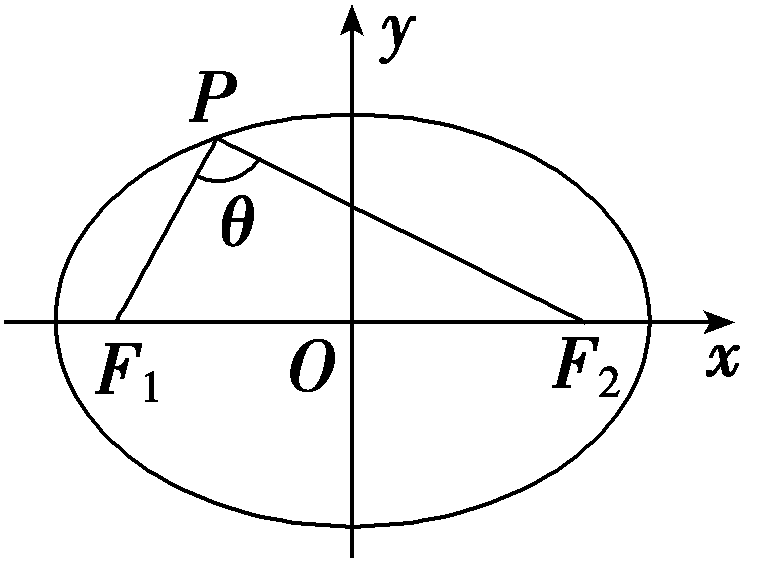

①｜<em>PF</em>1｜＋｜<em>PF</em>2｜＝2<em>a</em>，△<em>PF</em>1<em>F</em>2的周长为2<em>a</em>＋2<em>c</em>.

②当*P*为短轴端点时，*θ*最大.

③&lt;text st&lt;text st<em>y</em>le="italic"&gt;y&lt;/text&gt;le="itali<em>c</em>"&gt;<em>S</em>&lt;/text&gt;＝ $\frac{1}{2}$ ｜&lt;text st&lt;text st<em>y</em>le="italic"&gt;y&lt;/text&gt;le="itali<em>c</em>"&gt;<em>&lt;text style="italic"&gt;P</em>F&lt;/text&gt;&lt;/text&gt;&lt;text style="su<em>&lt;text style="italic"&gt;b</em>&lt;/text&gt;script"&gt;1&lt;/text&gt;｜｜PF&lt;text style="superscript"&gt;2&lt;/text&gt;｜·sin <em>θ</em>＝b2tan $\frac{\theta }{2}$ ＝&lt;text st&lt;text st<em>y</em>le="italic"&gt;y&lt;/text&gt;le="italic"&gt;c&lt;/text&gt;｜y&lt;text style="su<em>b</em>script"&gt;0&lt;/text&gt;｜，当｜y0｜＝<em>b</em>时，即点<em>P</em>为短轴端点时，<em>&lt;text style="italic"&gt;S</em>&lt;/text&gt;取最大值，最大值为<em>bc</em>.

④｜&lt;text style="it<em>a</em>lic"&gt;<em>PF</em>&lt;/text&gt;1｜·｜PF&lt;text style="superscript"&gt;&lt;text style="superscript"&gt;2&lt;/text&gt;&lt;/text&gt;｜≤( $\frac{｜PF_{1}｜＋｜PF_{2}｜}{2}$ )&lt;text style="superscript"&gt;&lt;text style="superscript"&gt;2&lt;/text&gt;&lt;/text&gt;＝<em>a</em>2.

⑤4<em>c</em>2＝｜<em>PF</em>1｜2＋｜<em>PF</em>2｜2－2｜<em>PF</em>1｜｜<em>PF</em>2｜cos <em>θ</em>.

(3)焦点弦(过焦点的弦)

焦点弦中通径(垂直于长轴的焦点弦)最短，弦长<em>l</em>min＝ $\frac{2b^{2}}{a}$ .

(4)在椭圆 $\frac{x^{2}}{a^{2}}$ ＋ $\frac{y^{2}}{b^{2}}$ ＝1(*a*＞*b*＞0)中，设*P*，*<text style="italic">A*</text>，*<text style="italic">B*</text>是椭圆上不同的三点，其中A，B关于原点对称，直线*<text style="italic">PA*</text>，*<text style="italic">PB*</text>斜率存在且不为0，则直线PA与PB的斜率之积为定值－ $\frac{b^{2}}{a^{2}}$ .

【自主检测】

1.(多选)下列说法正确的是(　　)

A.平面内与两个定点<em>F</em>1，<em>F</em>2的距离之和等于常数的点的轨迹是椭圆

B.椭圆是轴对称图形，也是中心对称图形

C. $\frac{y^{2}}{m^{2}}$ ＋ $\frac{x^{2}}{n^{2}}$ ＝1(<text st*y*le="italic">m</text>≠*n*)表示焦点在y轴上的椭圆

D. $\frac{x^{2}}{a^{2}}$ ＋ $\frac{y^{2}}{b^{2}}$ ＝1(<text style="it*a*lic">a</text>＞*<text style="italic">b*</text>＞0)与 $\frac{y^{2}}{a^{2}}$ ＋ $\frac{x^{2}}{b^{2}}$ ＝1(<text style="it*a*lic">a</text>＞*<text style="italic">b*</text>＞0)的焦距相等

答案：**BD**

2.(链接人教A选择性必修一P115T1)如果点<te<text st*y*le="italic">x</text>t style="italic">*M*</text>(x，y)在运动过程中，总满足关系式 $\sqrt{x^{2}＋\left(y+3\right)^{2}}$ ＋ $\sqrt{x^{2}＋\left(y－3\right)^{2}}$ ＝4 $\sqrt{3}$ ，则点<te<text st*y*le="italic">x</text>t style="italic">*M*</text>的轨迹是(　　)

A.不存在	B.椭圆

C.线段	D.双曲线

答案：**B**

解析： $\sqrt{x^{2}＋\left(y+3\right)^{2}}$ ＋ $\sqrt{x^{2}＋\left(y－3\right)^{2}}$ ＝4 $\sqrt{3}$ 表示平面内点<te<text st*y*le="italic">x</text>t style="italic">*M*</text>(x，y)到点(0，－3)，(0，3)的距离之和为4 $\sqrt{3}$ ，而3－(－3)＝6＜4 $\sqrt{3}$ ，所以点<te<text st*y*le="italic">x</text>t style="italic">*M*</text>的轨迹是椭圆.故选B.

3.(链接人教A选择性必修一<em>&lt;text style="italic"&gt;P</em>&lt;/text&gt;109T1)已知椭圆 $\frac{x^{2}}{25}$ ＋ $\frac{y^{2}}{16}$ ＝1上一点<em>&lt;text style="italic"&gt;P</em>&lt;/text&gt;到椭圆的一个焦点<em>&lt;text style="italic"&gt;F</em>&lt;/text&gt;1的距离为3，则P到另一个焦点F2的距离为(　　)

A.2	B.3

C.5	D.7

答案：**D**

解析：由椭圆的定义可知｜<em>PF</em>1｜＋｜<em>PF</em>2｜＝10，所以｜<em>PF</em>2｜＝10－3＝7.故选D.

4.(链接人教A选择性必修一P112例4)已知椭圆<em>C</em>：16<em>x</em>2＋4<em>y</em>2＝1，则下列结论正确的是(　　)

A.长轴长为 $\frac{1}{2}$ 	B.焦距为 $\frac{\sqrt{3}}{4}$

C.短轴长为 $\frac{1}{4}$ 	D.离心率为 $\frac{\sqrt{3}}{2}$

答案：**D**

解析：把椭圆方程16&lt;t<em>e</em>xt st&lt;text style="it&lt;text style="it&lt;text style="itali<em>c</em>"&gt;a&lt;/text&gt;li<em>c</em>"&gt;a&lt;/text&gt;lic"&gt;y&lt;/text&gt;le="italic"&gt;x&lt;/text&gt;&lt;text style="superscript"&gt;2&lt;/text&gt;＋4y2＝1化为标准方程可得 $\frac{x^{2}}{\frac{1}{16}}$ ＋ $\frac{y^{2}}{\frac{1}{4}}$ ＝1，所以&lt;t<em>e</em>xt style="it&lt;text style="itali<em>c</em>"&gt;a&lt;/text&gt;li<em>c</em>"&gt;a&lt;/text&gt;＝ $\frac{1}{2}$ ，&lt;t<em>e</em>xt style="it&lt;text style="itali<em>c</em>"&gt;a&lt;/text&gt;li<em>c</em>"&gt;<em>b</em>&lt;/text&gt;＝ $\frac{1}{4}$ ，&lt;t<em>e</em>xt style="it&lt;text style="itali<em>c</em>"&gt;a&lt;/text&gt;lic"&gt;c&lt;/text&gt;＝ $\frac{\sqrt{3}}{4}$ ，则长轴长&lt;t<em>e</em>xt st&lt;text style="it&lt;text style="it&lt;text style="itali<em>c</em>"&gt;a&lt;/text&gt;li<em>c</em>"&gt;a&lt;/text&gt;lic"&gt;y&lt;/text&gt;le="superscript"&gt;2&lt;/text&gt;a＝1，焦距2c＝ $\frac{\sqrt{3}}{2}$ ，短轴长&lt;t<em>e</em>xt st&lt;text style="it&lt;text style="it&lt;text style="itali<em>c</em>"&gt;a&lt;/text&gt;li<em>c</em>"&gt;a&lt;/text&gt;lic"&gt;y&lt;/text&gt;le="superscript"&gt;2&lt;/text&gt;<em>&lt;text style="italic"&gt;b</em>&lt;/text&gt;＝ $\frac{1}{2}$ ，离心率<em>e</em>＝ $\frac{c}{a}$ ＝ $\frac{\sqrt{3}}{2}$ .故选D.

考点一　椭圆的定义及其应用　　　　师生共研

(1)如图，圆*O*的半径为定长*r*，*A*是圆*O*内一个定点，*P*是圆上任意一点，线段*AP*的垂直平分线*l*和半径*OP*相交于点*Q*，当点*P*在圆上运动时，点*Q*的轨迹是(　　)

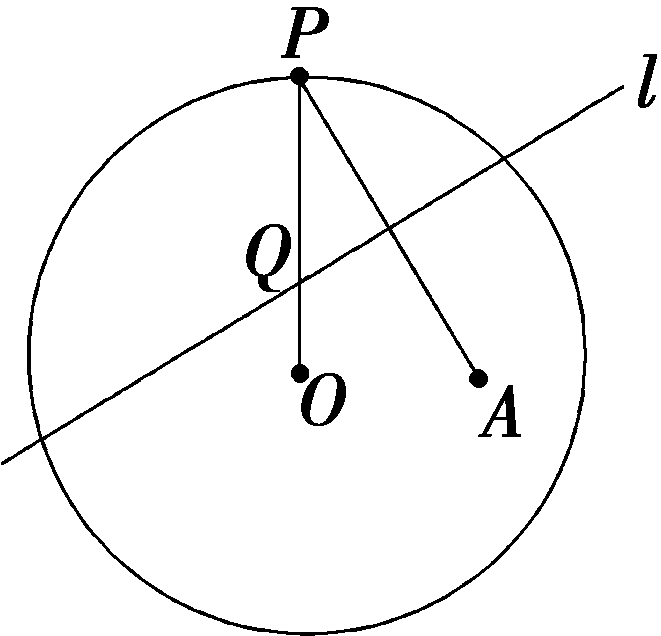

A.椭圆	B.双曲线

C.抛物线	D.圆

(2)已知椭圆 $\frac{x^{2}}{100}$ ＋ $\frac{y^{2}}{36}$ ＝&lt;text style="subscript"&gt;1&lt;/text&gt;上的一点<em>P</em>到焦点<em>F</em>1的距离为6，点<em>M</em>是<em>PF</em>1的中点，<em>O</em>为坐标原点，则｜<em>OM</em>｜＝(　　)

A.2	B.4

C.7	D.14

(3)(一题多解)(&lt;text st<em>y</em>le="subscript"&gt;&lt;text style="subscript"&gt;2&lt;/text&gt;&lt;/text&gt;023·全国甲卷)设<em>&lt;text style="italic"&gt;F</em>&lt;/text&gt;&lt;text style="subscript"&gt;1&lt;/text&gt;，F2为椭圆<em>&lt;text style="italic"&gt;C</em>&lt;/text&gt;： $\frac{x^{2}}{5}$ ＋<em>y</em>&lt;text style="superscript"&gt;&lt;text style="subscript"&gt;2&lt;/text&gt;&lt;/text&gt;＝&lt;text style="subscript"&gt;1&lt;/text&gt;的两个焦点，点<em>P</em>在<em>&lt;text style="italic"&gt;C</em>&lt;/text&gt;上，若 $\vec{PF_{1}}$ · $\vec{PF_{2}}$ ＝0，则｜<em>P</em>&lt;text st<em>y</em>le="italic"&gt;<em>F</em>&lt;/text&gt;&lt;text style="subscript"&gt;1&lt;/text&gt;｜·｜<em>&lt;text style="italic"&gt;PF</em>&lt;/text&gt;&lt;text style="superscript"&gt;&lt;text style="subscript"&gt;2&lt;/text&gt;&lt;/text&gt;｜＝(　　)

A.1	B.2

C.4	D.5

答案：(1)**A**　(2)**C**　 (3)**B**

解析：(1)连接*QA*(图略).由已知得｜*QA*｜＝｜*QP*｜，

所以｜*QO*｜＋｜*QA*｜＝｜*QO*｜＋｜*QP*｜＝｜*OP*｜＝*r*.又因为点*A*在圆内，所以｜*OA*｜＜｜*OP*｜，根据椭圆的定义，点*Q*的轨迹是以*O*，*A*为焦点，*r*为长轴长的椭圆.故选A.

(&lt;text style="subscript"&gt;&lt;text style="subscript"&gt;&lt;text style="subscript"&gt;2&lt;/text&gt;&lt;/text&gt;&lt;/text&gt;)如图所示，设椭圆的另一焦点为&lt;text style="it&lt;text style="it&lt;text style="it<em>a</em>lic"&gt;a&lt;/text&gt;lic"&gt;a&lt;/text&gt;lic"&gt;<em>&lt;text style="italic"&gt;F</em>&lt;/text&gt;&lt;/text&gt;2，因为<em>O</em>，<em>M</em>分别是F&lt;text style="subscript"&gt;&lt;text style="subscript"&gt;1&lt;/text&gt;&lt;/text&gt;F2和<em>&lt;text style="italic"&gt;&lt;text style="italic"&gt;&lt;text style="italic"&gt;PF</em>&lt;/text&gt;&lt;/text&gt;&lt;/text&gt;1的中点，所以｜<em>&lt;text style="italic"&gt;OM</em>&lt;/text&gt;｜＝ $\frac{1}{2}$ ｜P&lt;text style="it&lt;text style="it&lt;text style="it<em>a</em>lic"&gt;a&lt;/text&gt;lic"&gt;a&lt;/text&gt;lic"&gt;<em>&lt;text style="italic"&gt;F</em>&lt;/text&gt;&lt;/text&gt;&lt;text style="subscript"&gt;&lt;text style="subscript"&gt;&lt;text style="subscript"&gt;2&lt;/text&gt;&lt;/text&gt;&lt;/text&gt;｜，由椭圆的方程得a＝&lt;text style="subscript"&gt;&lt;text style="subscript"&gt;1&lt;/text&gt;&lt;/text&gt;0，所以2a＝20，所以｜<em>&lt;text style="italic"&gt;&lt;text style="italic"&gt;&lt;text style="italic"&gt;PF</em>&lt;/text&gt;&lt;/text&gt;&lt;/text&gt;2｜＝2a－｜PF1｜＝20－6＝14，所以｜<em>OM</em>｜＝7，故选C.

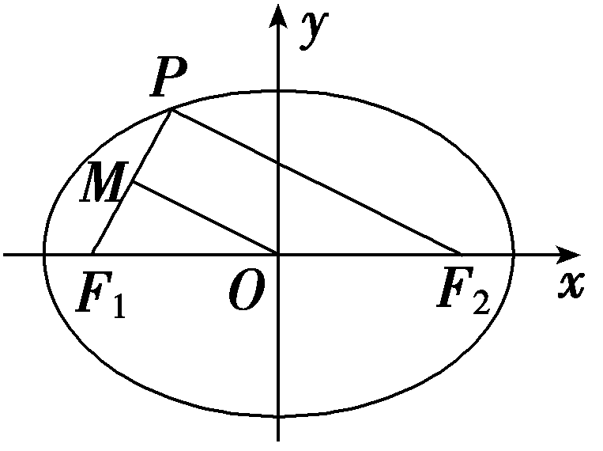

(3)法一：因为 $\vec{PF_{1}}$ · $\vec{PF_{2}}$ ＝0，所以∠<em>F</em>1<em>PF</em>2＝90°，

从而 $S_{\bigtriangleup F_{1}PF_{2}}$ ＝<em>b</em>&lt;text style="subscript"&gt;2&lt;/text&gt;tan 45°＝1＝ $\frac{1}{2}$ ×｜<em>&lt;text style="italic"&gt;PF</em>&lt;/text&gt;1｜<em>·</em>｜PF&lt;text style="subscript"&gt;2&lt;/text&gt;｜，

所以｜<em>PF</em>1｜·｜<em>PF</em>2｜＝2.故选B.

法二：因为 $\vec{PF_{1}}$ <em>&lt;text style="italic"&gt;·</em>&lt;/text&gt; $\vec{PF_{2}}$ ＝0，所以∠&lt;text style="it<em>a</em>li&lt;text style="itali<em>c</em>"&gt;c&lt;/text&gt;"&gt;<em>&lt;text style="italic"&gt;F</em>&lt;/text&gt;&lt;/text&gt;&lt;text style="subscript"&gt;&lt;text style="subscript"&gt;&lt;text style="subscript"&gt;&lt;text style="subscript"&gt;&lt;text style="subscript"&gt;&lt;text style="subscript"&gt;&lt;text style="subscript"&gt;1&lt;/text&gt;&lt;/text&gt;&lt;/text&gt;&lt;/text&gt;&lt;/text&gt;&lt;/text&gt;&lt;/text&gt;<em>&lt;text style="italic"&gt;&lt;text style="italic"&gt;&lt;text style="italic"&gt;&lt;text style="italic"&gt;&lt;text style="italic"&gt;&lt;text style="italic"&gt;&lt;text style="italic"&gt;&lt;text style="italic"&gt;&lt;text style="italic"&gt;&lt;text style="italic"&gt;&lt;text style="italic"&gt;&lt;text style="italic"&gt;PF</em>&lt;/text&gt;&lt;/text&gt;&lt;/text&gt;&lt;/text&gt;&lt;/text&gt;&lt;/text&gt;&lt;/text&gt;&lt;/text&gt;&lt;/text&gt;&lt;/text&gt;&lt;/text&gt;&lt;/text&gt;&lt;text style="superscript"&gt;&lt;text style="superscript"&gt;&lt;text style="subscript"&gt;&lt;text style="superscript"&gt;&lt;text style="subscript"&gt;&lt;text style="superscript"&gt;&lt;text style="superscript"&gt;&lt;text style="subscript"&gt;&lt;text style="superscript"&gt;&lt;text style="subscript"&gt;&lt;text style="superscript"&gt;&lt;text style="subscript"&gt;&lt;text style="subscript"&gt;&lt;text style="subscript"&gt;2&lt;/text&gt;&lt;/text&gt;&lt;/text&gt;&lt;/text&gt;&lt;/text&gt;&lt;/text&gt;&lt;/text&gt;&lt;/text&gt;&lt;/text&gt;&lt;/text&gt;&lt;/text&gt;&lt;/text&gt;&lt;/text&gt;&lt;/text&gt;＝90°，由椭圆方程可知，c2＝5－1＝4⇒c＝2，所以｜PF1｜2＋｜PF2｜2＝｜F1F2｜2＝42＝16，又｜PF1｜＋｜PF2｜＝2a＝2 $\sqrt{5}$ ，平方得｜P&lt;text style="it<em>a</em>li&lt;text style="itali<em>c</em>"&gt;c&lt;/text&gt;"&gt;<em>&lt;text style="italic"&gt;F</em>&lt;/text&gt;&lt;/text&gt;&lt;text style="subscript"&gt;&lt;text style="subscript"&gt;&lt;text style="subscript"&gt;&lt;text style="subscript"&gt;&lt;text style="subscript"&gt;&lt;text style="subscript"&gt;&lt;text style="subscript"&gt;1&lt;/text&gt;&lt;/text&gt;&lt;/text&gt;&lt;/text&gt;&lt;/text&gt;&lt;/text&gt;&lt;/text&gt;｜&lt;text style="superscript"&gt;&lt;text style="superscript"&gt;&lt;text style="subscript"&gt;&lt;text style="superscript"&gt;&lt;text style="subscript"&gt;&lt;text style="superscript"&gt;&lt;text style="superscript"&gt;&lt;text style="subscript"&gt;&lt;text style="superscript"&gt;&lt;text style="subscript"&gt;&lt;text style="superscript"&gt;&lt;text style="subscript"&gt;&lt;text style="subscript"&gt;&lt;text style="subscript"&gt;2&lt;/text&gt;&lt;/text&gt;&lt;/text&gt;&lt;/text&gt;&lt;/text&gt;&lt;/text&gt;&lt;/text&gt;&lt;/text&gt;&lt;/text&gt;&lt;/text&gt;&lt;/text&gt;&lt;/text&gt;&lt;/text&gt;&lt;/text&gt;＋｜<em>&lt;text style="italic"&gt;&lt;text style="italic"&gt;&lt;text style="italic"&gt;&lt;text style="italic"&gt;&lt;text style="italic"&gt;&lt;text style="italic"&gt;&lt;text style="italic"&gt;&lt;text style="italic"&gt;&lt;text style="italic"&gt;&lt;text style="italic"&gt;&lt;text style="italic"&gt;&lt;text style="italic"&gt;PF</em>&lt;/text&gt;&lt;/text&gt;&lt;/text&gt;&lt;/text&gt;&lt;/text&gt;&lt;/text&gt;&lt;/text&gt;&lt;/text&gt;&lt;/text&gt;&lt;/text&gt;&lt;/text&gt;&lt;/text&gt;2｜2＋2｜PF1｜<em>&lt;text style="italic"&gt;·</em>&lt;/text&gt;｜PF2｜＝16＋2｜PF1｜·｜PF2｜＝20，所以｜PF1｜·｜PF2｜＝2.故选B.

[变式探究]

(变条件)若将本例(3)中的“ $\vec{PF_{1}}$ · $\vec{PF_{2}}$ ＝0”变为“∠<em>F</em>&lt;text style="subscript"&gt;1&lt;/text&gt;<em>&lt;text style="italic"&gt;&lt;text style="italic"&gt;PF</em>&lt;/text&gt;&lt;/text&gt;&lt;text style="subscript"&gt;2&lt;/text&gt;＝60°”，求｜PF1｜·｜PF2｜及｜<em>OP</em>｜的值.

解：由椭圆方程知<em>c</em>2＝5－1＝4，即<em>c</em>＝2.

在△<em>P&lt;text style="italic"&gt;&lt;text style="italic"&gt;&lt;text style="italic"&gt;F</em>&lt;/text&gt;&lt;/text&gt;&lt;/text&gt;&lt;text style="subscript"&gt;&lt;text style="subscript"&gt;&lt;text style="subscript"&gt;&lt;text style="subscript"&gt;&lt;text style="subscript"&gt;&lt;text style="subscript"&gt;1&lt;/text&gt;&lt;/text&gt;&lt;/text&gt;&lt;/text&gt;&lt;/text&gt;&lt;/text&gt;F&lt;text style="subscript"&gt;&lt;text style="superscript"&gt;&lt;text style="superscript"&gt;&lt;text style="subscript"&gt;&lt;text style="subscript"&gt;&lt;text style="superscript"&gt;&lt;text style="subscript"&gt;&lt;text style="subscript"&gt;2&lt;/text&gt;&lt;/text&gt;&lt;/text&gt;&lt;/text&gt;&lt;/text&gt;&lt;/text&gt;&lt;/text&gt;&lt;/text&gt;中，由余弦定理得｜F1F2｜2＝｜<em>&lt;text style="italic"&gt;&lt;text style="italic"&gt;&lt;text style="italic"&gt;&lt;text style="italic"&gt;&lt;text style="italic"&gt;&lt;text style="italic"&gt;&lt;text style="italic"&gt;&lt;text style="italic"&gt;PF</em>&lt;/text&gt;&lt;/text&gt;&lt;/text&gt;&lt;/text&gt;&lt;/text&gt;&lt;/text&gt;&lt;/text&gt;&lt;/text&gt;1｜2＋ $｜PF_{2}｜^{2}$ －&lt;text style="subscript"&gt;&lt;text style="superscript"&gt;&lt;text style="superscript"&gt;&lt;text style="subscript"&gt;&lt;text style="subscript"&gt;&lt;text style="superscript"&gt;&lt;text style="subscript"&gt;&lt;text style="subscript"&gt;2&lt;/text&gt;&lt;/text&gt;&lt;/text&gt;&lt;/text&gt;&lt;/text&gt;&lt;/text&gt;&lt;/text&gt;&lt;/text&gt;｜<em>P&lt;text style="italic"&gt;&lt;text style="italic"&gt;&lt;text style="italic"&gt;F</em>&lt;/text&gt;&lt;/text&gt;&lt;/text&gt;&lt;text style="subscript"&gt;&lt;text style="subscript"&gt;&lt;text style="subscript"&gt;&lt;text style="subscript"&gt;&lt;text style="subscript"&gt;&lt;text style="subscript"&gt;1&lt;/text&gt;&lt;/text&gt;&lt;/text&gt;&lt;/text&gt;&lt;/text&gt;&lt;/text&gt;｜｜<em>&lt;text style="italic"&gt;&lt;text style="italic"&gt;&lt;text style="italic"&gt;&lt;text style="italic"&gt;&lt;text style="italic"&gt;&lt;text style="italic"&gt;&lt;text style="italic"&gt;&lt;text style="italic"&gt;PF</em>&lt;/text&gt;&lt;/text&gt;&lt;/text&gt;&lt;/text&gt;&lt;/text&gt;&lt;/text&gt;&lt;/text&gt;&lt;/text&gt;2｜cos 60°＝(｜PF1｜＋｜PF2｜)2－3｜PF1｜｜PF2｜，即16＝20－3｜PF1｜<em>·</em>｜PF2｜，

所以｜<em>&lt;text style="italic"&gt;PF</em>&lt;/text&gt;1｜·｜PF2｜＝ $\frac{4}{3}$ .

因为 $\vec{PO}$ ＝ $\frac{1}{2}(\vec{PF_{1}}$ ＋ $\vec{PF_{2}}$ )，

所以 $\vec{PO}^{2}$ ＝ $\frac{1}{4}(\vec{PF_{1}}$ ＋ $\vec{PF_{2}}$ )2

＝ $\frac{1}{4}(\vec{PF_{1}}^{2}$ ＋ $\vec{PF_{2}}^{2}$ ＋2 $\vec{PF_{1}}$ *·* $\vec{PF_{2}}$ )

＝ $\frac{1}{4}$ [(｜ $\vec{PF_{1}}$ ｜＋｜ $\vec{PF_{2}}$ ｜)2－｜ $\vec{PF_{1}}$ ｜·｜ $\vec{PF_{2}}$ ｜]

＝ $\frac{1}{4}$ ×( 20－ $\frac{4}{3}$ )＝ $\frac{14}{3}$ ，所以｜*PO*｜＝ $\frac{\sqrt{42}}{3}$ .

综上可知，｜<em>&lt;text style="italic"&gt;PF</em>&lt;/text&gt;1｜<em>·</em>｜PF2｜及｜<em>OP</em>｜的值分别为 $\frac{4}{3}$ 和 $\frac{\sqrt{42}}{3}$ .

椭圆定义的应用技巧

1.椭圆定义的应用主要有：求椭圆的标准方程、求焦点三角形的周长、面积及求弦长、最值和离心率等.

2.通常将定义和余弦定理结合使用求解关于焦点三角形的周长和面积问题以及｜<em>PF</em>1｜，｜<em>PF</em>2｜的相关问题.

对点练1.一动圆<em>P</em>与圆<em>A</em>：(<em>x</em>＋1)2＋<em>y</em>2＝1外切，而与圆<em>B</em>：(<em>x</em>－1)2＋<em>y</em>2＝64内切，那么动圆的圆心<em>P</em>的轨迹是(　　)

A.椭圆	B.双曲线

C.抛物线	D.双曲线的一支

答案：**A**

解析：设动圆<em>P</em>的半径为<em>r</em>，又圆<em>A</em>：(<em>x</em>＋1)2＋<em>y</em>2＝1的半径为1，圆<em>B</em>：(<em>x</em>－1)2＋<em>y</em>2＝64的半径为8，则｜<em>PA</em>｜＝<em>r</em>＋1，｜<em>PB</em>｜＝8－<em>r</em>，可得｜<em>PA</em>｜＋｜<em>PB</em>｜＝9，又9＞2＝｜<em>AB</em>｜，则动圆的圆心<em>P</em>的轨迹是以<em>A</em>，<em>B</em>为焦点，长轴长为9的椭圆.故选A.

对点练&lt;text style="subscript"&gt;&lt;text style="subscript"&gt;2&lt;/text&gt;&lt;/text&gt;.(202&lt;text style="subscript"&gt;&lt;text style="subscript"&gt;1&lt;/text&gt;&lt;/text&gt;·全国甲卷)已知<em>&lt;text style="italic"&gt;&lt;text style="italic"&gt;&lt;text style="italic"&gt;F</em>&lt;/text&gt;&lt;/text&gt;&lt;/text&gt;1，F2为椭圆<em>&lt;text style="italic"&gt;C</em>&lt;/text&gt;： $\frac{x^{2}}{16}$ ＋ $\frac{y^{2}}{4}$ ＝&lt;text style="subscript"&gt;&lt;text style="subscript"&gt;1&lt;/text&gt;&lt;/text&gt;的两个焦点，<em>P</em>，<em>Q</em>为<em>&lt;text style="italic"&gt;C</em>&lt;/text&gt;上关于坐标原点对称的两点，且｜<em>PQ</em>｜＝｜<em>&lt;text style="italic"&gt;&lt;text style="italic"&gt;&lt;text style="italic"&gt;F</em>&lt;/text&gt;&lt;/text&gt;&lt;/text&gt;1F&lt;text style="subscript"&gt;&lt;text style="subscript"&gt;2&lt;/text&gt;&lt;/text&gt;｜，则四边形<em>PF</em>1<em>QF</em>2的面积为<u>　　　　</u>.

答案：8

解析：根据椭圆的对称性及｜<em>PQ</em>｜＝｜<em>F</em>1<em>F</em>2｜可以得到四边形<em>PF</em>1<em>QF</em>2为对角线相等的平行四边形，所以四边形<em>PF</em>1<em>QF</em>2为矩形.设｜<em>PF</em>1｜＝<em>m</em>，则｜<em>PF</em>2｜＝2<em>a</em>－｜<em>PF</em>1｜＝8－<em>m</em>，则｜<em>PF</em>1｜2＋｜<em>PF</em>2｜2＝<em>m</em>2＋(8－<em>m</em>)2＝2<em>m</em>2＋64－16<em>m</em>＝｜<em>F</em>1<em>F</em>2｜2＝4<em>c</em>2＝4(<em>a</em>2－<em>b</em>2)＝48，得<em>m</em>(8－<em>m</em>)＝8，所以四边形<em>PF</em>1<em>QF</em>2的面积为｜<em>PF</em>1｜·｜<em>PF</em>2｜＝<em>m</em>(8－<em>m</em>)＝8.

考点二　椭圆的标准方程　　　　多维探究

角度1　定义法

已知椭圆的两个焦点分别为<em>F</em>1(0，2)，<em>F</em>2(0，－2)，<em>P</em>为椭圆上任意一点，若｜<em>F</em>1<em>F</em>2｜是｜<em>PF</em>1｜，｜<em>PF</em>2｜的等差中项，则此椭圆的标准方程为(　　)

A. $\frac{x^{2}}{64}$ ＋ $\frac{y^{2}}{60}$ ＝1	B. $\frac{y^{2}}{64}$ ＋ $\frac{x^{2}}{60}$ ＝1

C. $\frac{x^{2}}{16}$ ＋ $\frac{y^{2}}{12}$ ＝1	D. $\frac{y^{2}}{16}$ ＋ $\frac{x^{2}}{12}$ ＝1

答案：**D**

解析：由题意，｜&lt;text st<em>y</em>le="it&lt;text style="it&lt;text style="itali<em>c</em>"&gt;a&lt;/text&gt;lic"&gt;a&lt;/text&gt;lic"&gt;<em>P&lt;text style="italic"&gt;&lt;text style="italic"&gt;F</em>&lt;/text&gt;&lt;/text&gt;&lt;/text&gt;&lt;text style="su<em>b</em>script"&gt;1&lt;/text&gt;｜＋｜PF&lt;text style="subscript"&gt;2&lt;/text&gt;｜＝2｜F1F2｜＝8＝2a，故a＝4，又c＝2，则b＝2 $\sqrt{3}$ ，焦点在<em>y</em>轴上，故椭圆的标准方程为 $\frac{y^{2}}{16}$ ＋ $\frac{x^{2}}{12}$ ＝&lt;text st<em>y</em>le="su<em>b</em>s<em>c</em>ript"&gt;1&lt;/text&gt;.故选D.

角度2　待定系数法

求满足下列各条件的椭圆的标准方程：

(1)长轴是短轴的3倍且经过点*A*(3，0)；

(2)短轴一个端点与两焦点组成一个正三角形，且焦点到同侧顶点的距离为 $\sqrt{3}$ ；

(3)经过点*P*(－2 $\sqrt{3}$ ，1)，*Q*( $\sqrt{3}$ ，－2)两点；

(4)与椭圆 $\frac{x^{2}}{4}$ ＋ $\frac{y^{2}}{3}$ ＝1有相同离心率，且经过点(2，－ $\sqrt{3}$ ).

解：(1)若焦点在<text style="it*a*lic">x</text>轴上，设椭圆的标准方程为 $\frac{x^{2}}{a^{2}}$ ＋ $\frac{y^{2}}{b^{2}}$ ＝1(*a*＞*b*＞0)，

因为椭圆过点<text style="it*a*lic">A</text>(3，0)，所以 $\frac{9}{a^{2}}$ ＝1得*a*＝3，

因为2&lt;text st<em>y</em>le="italic"&gt;a&lt;/text&gt;＝3×2<em>&lt;text style="italic"&gt;b</em>&lt;/text&gt;，所以b＝1，所以椭圆的标准方程为 $\frac{x^{2}}{9}$ ＋<em>y</em>2＝1.

若焦点在<text style="it*a*lic">y</text>轴上，设椭圆的标准方程为 $\frac{y^{2}}{a^{2}}$ ＋ $\frac{x^{2}}{b^{2}}$ ＝1(*a*＞*b*＞0)，

因为椭圆过点*A*(3，0)，所以 $\frac{9}{b^{2}}$ ＝1得*b*＝3，

又2*a*＝3×2*b*，所以*a*＝9，

所以椭圆的标准方程为 $\frac{y^{2}}{81}$ ＋ $\frac{x^{2}}{9}$ ＝1.

综上，所求椭圆的标准方程为 $\frac{x^{2}}{9}$ ＋<em>y</em>2＝1或 $\frac{y^{2}}{81}$ ＋ $\frac{x^{2}}{9}$ ＝1.

(2)由已知，有 $\left\{\begin{matrix}a=2c，\\a－c＝\sqrt{3}，\end{matrix}\right.$ 解得 $\left\{\begin{matrix}a=2\sqrt{3}，\\c＝\sqrt{3}，\end{matrix}\right.$ <em>b</em>2＝9，

所以所求椭圆的标准方程为 $\frac{x^{2}}{12}$ ＋ $\frac{y^{2}}{9}$ ＝1或 $\frac{x^{2}}{9}$ ＋ $\frac{y^{2}}{12}$ ＝1.

(3)设方程为<em>mx</em>2＋<em>ny</em>2＝1(<em>m</em>＞0，<em>n</em>＞0，<em>m</em>≠<em>n</em>)，

则有 $\left\{\begin{matrix}12m＋n=1，\\3m+4n=1，\end{matrix}\right.$ 解得 $\left\{\begin{matrix}m＝\frac{1}{15}，\\n＝\frac{1}{5}，\end{matrix}\right.$

则所求椭圆的标准方程为 $\frac{x^{2}}{15}$ ＋ $\frac{y^{2}}{5}$ ＝1.

(4)椭圆 $\frac{x^{2}}{4}$ ＋ $\frac{y^{2}}{3}$ ＝1的离心率是*e*＝ $\frac{1}{2}$ ，

当焦点在<text style="it*a*lic">x</text>轴上时，设所求椭圆的方程是 $\frac{x^{2}}{a^{2}}$ ＋ $\frac{y^{2}}{b^{2}}$ ＝1(*a*＞*b*＞0)，

所以 $\left\{\begin{matrix}\frac{c}{a}＝\frac{1}{2}，\\a^{2}＝b^{2}＋c^{2}，\\\frac{4}{a^{2}}＋\frac{3}{b^{2}}=1，\end{matrix}\right.$ 解得 $\left\{\begin{matrix}a^{2}=8，\\b^{2}=6，\end{matrix}\right.$

所以所求椭圆的标准方程为 $\frac{x^{2}}{8}$ ＋ $\frac{y^{2}}{6}$ ＝1.

当焦点在<text style="it*a*lic">y</text>轴上时，设所求椭圆的方程为 $\frac{y^{2}}{a^{2}}$ ＋ $\frac{x^{2}}{b^{2}}$ ＝1(*a*＞*b*＞0)，

所以 $\left\{\begin{matrix}\frac{c}{a}＝\frac{1}{2}，\\a^{2}＝b^{2}＋c^{2}，\\\frac{3}{a^{2}}＋\frac{4}{b^{2}}=1，\end{matrix}\right.$ 解得 $\left\{\begin{matrix}a^{2}＝\frac{25}{3}，\\b^{2}＝\frac{25}{4}，\end{matrix}\right.$

所以椭圆的标准方程为 $\frac{y^{2}}{\frac{25}{3}}$ ＋ $\frac{x^{2}}{\frac{25}{4}}$ ＝1.

综上，所求椭圆的标准方程为 $\frac{x^{2}}{8}$ ＋ $\frac{y^{2}}{6}$ ＝1或 $\frac{y^{2}}{\frac{25}{3}}$ ＋ $\frac{x^{2}}{\frac{25}{4}}$ ＝1.

求椭圆标准方程的常用方法

1.定义法：根据椭圆的定义，确定<em>a</em>2，<em>b</em>2的值，结合焦点位置写出椭圆方程.

2.待定系数法：

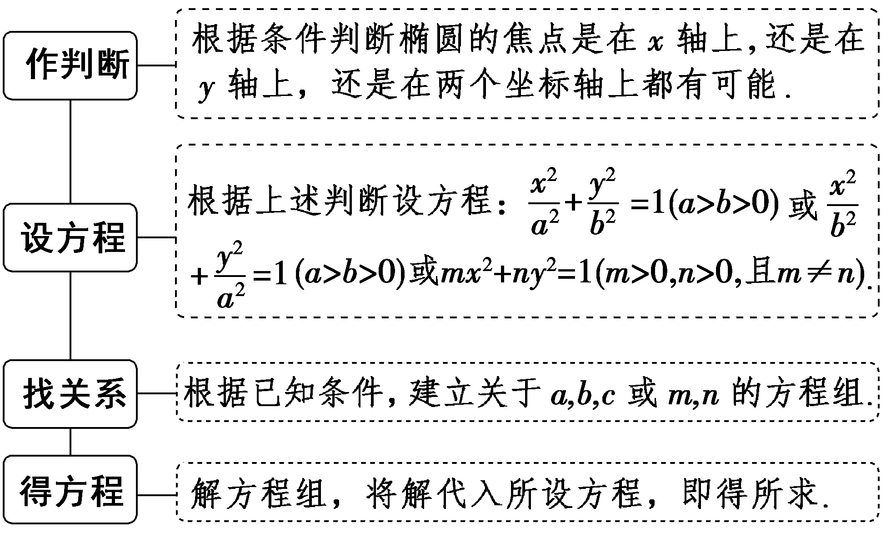

注意：当椭圆焦点位置不明确时，可设为 $\frac{x^{2}}{m}$ ＋ $\frac{y^{2}}{n}$ ＝1(<em>&lt;text style="italic"&gt;m</em>&lt;/text&gt;＞0，<em>&lt;text style="italic"&gt;n</em>&lt;/text&gt;＞0，m≠n)，也可设为<em>&lt;text style="italic"&gt;&lt;text style="italic"&gt;A</em>&lt;/text&gt;x&lt;/text&gt;&lt;text style="superscript"&gt;2&lt;/text&gt;＋<em>&lt;text style="italic"&gt;&lt;text style="italic"&gt;B</em>&lt;/text&gt;y&lt;/text&gt;2＝1(A＞0，B＞0，且A≠B).

3.应用相关点代入法求解.

对点练3.已知两圆<em>C</em>1：(<em>x</em>－4)2＋<em>y</em>2＝169，<em>C</em>2：(<em>x</em>＋4)2＋<em>y</em>2＝9，动圆在圆<em>C</em>1内部且和圆<em>C</em>1相内切，和圆<em>C</em>2相外切，则动圆圆心<em>M</em>的轨迹方程为(　　)

A. $\frac{x^{2}}{64}$ － $\frac{y^{2}}{48}$ ＝1	B. $\frac{x^{2}}{48}$ ＋ $\frac{y^{2}}{64}$ ＝1

C. $\frac{x^{2}}{48}$ － $\frac{y^{2}}{64}$ ＝1	D. $\frac{x^{2}}{64}$ ＋ $\frac{y^{2}}{48}$ ＝1

答案：**D**

解析：设圆&lt;text style="it&lt;text style="it&lt;text style="itali<em>c</em>"&gt;a&lt;/text&gt;li<em>c</em>"&gt;a&lt;/text&gt;lic"&gt;<em>&lt;text style="italic"&gt;M</em>&lt;/text&gt;&lt;/text&gt;的半径为<em>&lt;text style="italic"&gt;&lt;text style="italic"&gt;r</em>&lt;/text&gt;&lt;/text&gt;，则｜<em>&lt;text style="italic"&gt;M&lt;text style="italic"&gt;&lt;text style="italic"&gt;&lt;text style="italic"&gt;&lt;text style="italic"&gt;C</em>&lt;/text&gt;&lt;/text&gt;&lt;/text&gt;&lt;/text&gt;&lt;/text&gt;&lt;text style="su<em>b</em>script"&gt;&lt;text style="subscript"&gt;1&lt;/text&gt;&lt;/text&gt;｜＋｜MC&lt;text style="subscript"&gt;&lt;text style="subscript"&gt;2&lt;/text&gt;&lt;/text&gt;｜＝(13－r)＋(3＋r)＝16＞8＝｜C1C2｜，所以M的轨迹是以C1，C2为焦点的椭圆，且2a＝16，2c＝8，所以a＝8，c＝4，b＝ $\sqrt{a^{2}－c^{2}}$ ＝4 $\sqrt{3}$ ，故所求动圆圆心&lt;text style="it&lt;text style="it&lt;text style="itali<em>c</em>"&gt;a&lt;/text&gt;li<em>c</em>"&gt;a&lt;/text&gt;lic"&gt;<em>&lt;text style="italic"&gt;M</em>&lt;/text&gt;&lt;/text&gt;的轨迹方程为 $\frac{x^{2}}{64}$ ＋ $\frac{y^{2}}{48}$ ＝&lt;text style="su<em>b</em>s&lt;text style="it&lt;text style="itali<em>c</em>"&gt;a&lt;/text&gt;lic"&gt;c&lt;/text&gt;&lt;text style="it<em>a</em>lic"&gt;<em>r</em>&lt;/text&gt;ipt"&gt;&lt;text style="subscript"&gt;1&lt;/text&gt;&lt;/text&gt;.故选D.

对点练4.(2022·全国甲卷)已知椭圆&lt;text style="it<em>a</em>lic"&gt;C&lt;/text&gt;： $\frac{x^{2}}{a^{2}}$ ＋ $\frac{y^{2}}{b^{2}}$ ＝1(<em>a</em>＞<em>b</em>＞0)的离心率为 $\frac{1}{3}$ ，<em>&lt;text style="italic"&gt;A</em>&lt;/text&gt;1，A2 分别为&lt;text style="it<em>a</em>lic"&gt;C&lt;/text&gt; 的左、右顶点，<em>B</em> 为<em>&lt;text style="italic"&gt;&lt;text style="italic"&gt;C</em> &lt;/text&gt;&lt;/text&gt;的上顶点.若 $\vec{BA_{1}}$ · $\vec{BA_{2}}$ ＝－1，则&lt;text style="it<em>a</em>lic"&gt;C&lt;/text&gt; 的方程为(　　 )

A. $\frac{x^{2}}{18}$ ＋ $\frac{y^{2}}{16}$ ＝1	B. $\frac{x^{2}}{9}$ ＋ $\frac{y^{2}}{8}$ ＝1

C. $\frac{x^{2}}{3}$ ＋ $\frac{y^{2}}{2}$ ＝1	D. $\frac{x^{2}}{2}$ ＋<em>y</em>2＝1

答案：**B**

解析：依题意得&lt;t&lt;text style="it&lt;text style="it&lt;text style="it&lt;text style="itali<em>c</em>"&gt;a&lt;/text&gt;lic"&gt;a&lt;/text&gt;lic"&gt;a&lt;/text&gt;lic"&gt;e&lt;/text&gt;xt style="it&lt;text style="it&lt;text style="it&lt;text style="it&lt;text style="it&lt;text style="itali&lt;text style="itali<em>c</em>"&gt;c&lt;/text&gt;"&gt;a&lt;/text&gt;lic"&gt;a&lt;/text&gt;lic"&gt;a&lt;/text&gt;lic"&gt;a&lt;/text&gt;lic"&gt;a&lt;/text&gt;lic"&gt;<em>A</em>&lt;/text&gt;&lt;text style="su<em>&lt;text style="italic"&gt;&lt;text style="italic"&gt;&lt;text style="italic"&gt;&lt;text style="italic"&gt;b</em>&lt;/text&gt;&lt;/text&gt;&lt;/text&gt;&lt;/text&gt;script"&gt;1&lt;/text&gt;(－a，0)，A&lt;text style="superscript"&gt;&lt;text style="superscript"&gt;&lt;text style="superscript"&gt;&lt;text style="superscript"&gt;&lt;text style="superscript"&gt;&lt;text style="superscript"&gt;&lt;text style="superscript"&gt;2&lt;/text&gt;&lt;/text&gt;&lt;/text&gt;&lt;/text&gt;&lt;/text&gt;&lt;/text&gt;&lt;/text&gt;(a，0)，<em>B</em>(0，b)，所以 $\vec{BA_{1}}$ ＝(－&lt;t&lt;text style="it&lt;text style="it&lt;text style="it&lt;text style="itali<em>c</em>"&gt;a&lt;/text&gt;lic"&gt;a&lt;/text&gt;lic"&gt;a&lt;/text&gt;lic"&gt;e&lt;/text&gt;xt style="it&lt;text style="it&lt;text style="it&lt;text style="it&lt;text style="itali&lt;text style="itali<em>c</em>"&gt;c&lt;/text&gt;"&gt;a&lt;/text&gt;lic"&gt;a&lt;/text&gt;lic"&gt;a&lt;/text&gt;lic"&gt;a&lt;/text&gt;lic"&gt;a&lt;/text&gt;，－<em>&lt;text style="italic"&gt;&lt;text style="italic"&gt;&lt;text style="italic"&gt;&lt;text style="italic"&gt;b</em>&lt;/text&gt;&lt;/text&gt;&lt;/text&gt;&lt;/text&gt;)， $\vec{BA_{2}}$ ＝(&lt;t&lt;text style="it&lt;text style="it&lt;text style="it&lt;text style="itali<em>c</em>"&gt;a&lt;/text&gt;lic"&gt;a&lt;/text&gt;lic"&gt;a&lt;/text&gt;lic"&gt;e&lt;/text&gt;xt style="it&lt;text style="it&lt;text style="it&lt;text style="it&lt;text style="itali&lt;text style="itali<em>c</em>"&gt;c&lt;/text&gt;"&gt;a&lt;/text&gt;lic"&gt;a&lt;/text&gt;lic"&gt;a&lt;/text&gt;lic"&gt;a&lt;/text&gt;lic"&gt;a&lt;/text&gt;，－<em>&lt;text style="italic"&gt;&lt;text style="italic"&gt;&lt;text style="italic"&gt;&lt;text style="italic"&gt;b</em>&lt;/text&gt;&lt;/text&gt;&lt;/text&gt;&lt;/text&gt;)， $\vec{BA_{1}}$ · $\vec{BA_{2}}$ ＝－&lt;t&lt;text style="it&lt;text style="it&lt;text style="it&lt;text style="itali<em>c</em>"&gt;a&lt;/text&gt;lic"&gt;a&lt;/text&gt;lic"&gt;a&lt;/text&gt;lic"&gt;e&lt;/text&gt;xt style="it&lt;text style="it&lt;text style="it&lt;text style="it&lt;text style="itali&lt;text style="itali<em>c</em>"&gt;c&lt;/text&gt;"&gt;a&lt;/text&gt;lic"&gt;a&lt;/text&gt;lic"&gt;a&lt;/text&gt;lic"&gt;a&lt;/text&gt;lic"&gt;a&lt;/text&gt;&lt;text style="su<em>&lt;text style="italic"&gt;&lt;text style="italic"&gt;&lt;text style="italic"&gt;&lt;text style="italic"&gt;b</em>&lt;/text&gt;&lt;/text&gt;&lt;/text&gt;&lt;/text&gt;script"&gt;&lt;text style="superscript"&gt;&lt;text style="superscript"&gt;&lt;text style="superscript"&gt;&lt;text style="superscript"&gt;&lt;text style="superscript"&gt;&lt;text style="superscript"&gt;2&lt;/text&gt;&lt;/text&gt;&lt;/text&gt;&lt;/text&gt;&lt;/text&gt;&lt;/text&gt;&lt;/text&gt;＋b2＝－ $\left(a^{2}－b^{2}\right)$ ＝－&lt;t&lt;text style="it&lt;text style="it&lt;text style="it&lt;text style="itali<em>c</em>"&gt;a&lt;/text&gt;lic"&gt;a&lt;/text&gt;lic"&gt;a&lt;/text&gt;lic"&gt;e&lt;/text&gt;xt style="itali<em>c</em>"&gt;c&lt;/text&gt;&lt;text style="su&lt;text style="it&lt;text style="it&lt;text style="it<em>a</em>lic"&gt;a&lt;/text&gt;lic"&gt;a&lt;/text&gt;lic"&gt;<em>&lt;text style="italic"&gt;&lt;text style="italic"&gt;&lt;text style="italic"&gt;b</em>&lt;/text&gt;&lt;/text&gt;&lt;/text&gt;&lt;/text&gt;script"&gt;&lt;text style="superscript"&gt;&lt;text style="superscript"&gt;&lt;text style="superscript"&gt;&lt;text style="superscript"&gt;&lt;text style="superscript"&gt;&lt;text style="superscript"&gt;2&lt;/text&gt;&lt;/text&gt;&lt;/text&gt;&lt;/text&gt;&lt;/text&gt;&lt;/text&gt;&lt;/text&gt;＝－1，故c＝1，又<em>&lt;text style="italic"&gt;C</em> &lt;/text&gt;的离心率e＝ $\frac{c}{a}$ ＝ $\frac{1}{a}$ ＝ $\frac{1}{3}$ ，所以&lt;t&lt;text style="it&lt;text style="it&lt;text style="it&lt;text style="itali<em>c</em>"&gt;a&lt;/text&gt;lic"&gt;a&lt;/text&gt;lic"&gt;a&lt;/text&gt;lic"&gt;e&lt;/text&gt;xt style="it&lt;text style="it&lt;text style="it&lt;text style="it&lt;text style="itali&lt;text style="itali<em>c</em>"&gt;c&lt;/text&gt;"&gt;a&lt;/text&gt;lic"&gt;a&lt;/text&gt;lic"&gt;a&lt;/text&gt;lic"&gt;a&lt;/text&gt;lic"&gt;a&lt;/text&gt;＝3，a&lt;text style="su<em>&lt;text style="italic"&gt;&lt;text style="italic"&gt;&lt;text style="italic"&gt;&lt;text style="italic"&gt;b</em>&lt;/text&gt;&lt;/text&gt;&lt;/text&gt;&lt;/text&gt;script"&gt;&lt;text style="superscript"&gt;&lt;text style="superscript"&gt;&lt;text style="superscript"&gt;&lt;text style="superscript"&gt;&lt;text style="superscript"&gt;&lt;text style="superscript"&gt;2&lt;/text&gt;&lt;/text&gt;&lt;/text&gt;&lt;/text&gt;&lt;/text&gt;&lt;/text&gt;&lt;/text&gt;＝9，b2＝a2－c2＝8，即<em>&lt;text style="italic"&gt;C</em> &lt;/text&gt;的方程为 $\frac{x^{2}}{9}$ ＋ $\frac{y^{2}}{8}$ ＝&lt;t&lt;text style="it&lt;text style="it&lt;text style="it&lt;text style="itali<em>c</em>"&gt;a&lt;/text&gt;lic"&gt;a&lt;/text&gt;lic"&gt;a&lt;/text&gt;lic"&gt;e&lt;/text&gt;xt style="su&lt;text style="it&lt;text style="it&lt;text style="it&lt;text style="itali&lt;text style="itali<em>c</em>"&gt;c&lt;/text&gt;"&gt;a&lt;/text&gt;lic"&gt;a&lt;/text&gt;lic"&gt;a&lt;/text&gt;lic"&gt;<em>&lt;text style="italic"&gt;&lt;text style="italic"&gt;&lt;text style="italic"&gt;b</em>&lt;/text&gt;&lt;/text&gt;&lt;/text&gt;&lt;/text&gt;script"&gt;1&lt;/text&gt;.故选<em>B</em>.

考点三　椭圆的简单几何性质　　　　多维探究

角度1　离心率

(1)已知矩形<text style="it*a*lic">A*<text style="italic">BC*</text>D</text>的四个顶点都在椭圆 $\frac{x^{2}}{a^{2}}$ ＋ $\frac{y^{2}}{b^{2}}$ ＝1(*a*＞*b*＞0)上，边*AD*和*<text style="italic">BC*</text>分别经过椭圆的左、右焦点，且3｜*AB*｜＝2｜BC｜，则该椭圆的离心率为(　　)

A. $\frac{1}{3}$ 	B. $\frac{1}{2}$

C. $\frac{2}{3}$ 	D. $\frac{3}{4}$

(2)(2021·全国乙卷)设<text style="it*a*lic">B</text>是椭圆*<text style="italic"><text style="italic">C*</text></text>： $\frac{x^{2}}{a^{2}}$ ＋ $\frac{y^{2}}{b^{2}}$ ＝1(*a*＞*<text style="italic">b*</text>＞0)的上顶点，若*<text style="italic"><text style="italic">C*</text></text>上的任意一点*P*都满足｜P*B*｜≤2b，则C的离心率的取值范围是(　　)

A. $\left[\frac{\sqrt{2}}{2}，1\right)$ 	B.［ $\frac{1}{2}$ ，1)

C.(0， $\frac{\sqrt{2}}{2}$ ］	D.(0， $\frac{1}{2}$ ］

答案：(1)**B**　(2)**C**

解析：(1)由椭圆的方程 $\frac{x^{2}}{a^{2}}$ ＋ $\frac{y^{2}}{b^{2}}$ ＝1(&lt;t&lt;t&lt;t&lt;t<em>e</em>xt style="italic"&gt;e&lt;/text&gt;xt style="italic"&gt;e&lt;/text&gt;xt style="italic"&gt;e&lt;/text&gt;&lt;text st&lt;text style="it&lt;text style="itali<em>c</em>"&gt;a&lt;/text&gt;li&lt;text style="itali<em>c</em>"&gt;c&lt;/text&gt;"&gt;y&lt;/text&gt;le="itali<em>c</em>"&gt;x&lt;/text&gt;t style="italic"&gt;a&lt;/text&gt;＞<em>&lt;text style="italic"&gt;b</em>&lt;/text&gt;＞0)可得当x＝c时y＝± $\frac{b^{2}}{a}$ ，所以｜&lt;t&lt;t&lt;t&lt;t<em>e</em>xt style="italic"&gt;e&lt;/text&gt;xt style="italic"&gt;e&lt;/text&gt;xt style="italic"&gt;e&lt;/text&gt;xt style="it&lt;text style="itali<em>c</em>"&gt;a&lt;/text&gt;li&lt;text style="itali<em>c</em>"&gt;c&lt;/text&gt;"&gt;<em>AB</em>&lt;/text&gt;｜＝&lt;text style="superscript"&gt;&lt;text style="superscript"&gt;&lt;text style="superscript"&gt;2&lt;/text&gt;&lt;/text&gt;&lt;/text&gt;&lt;text st<em>y</em>le="italic"&gt;c&lt;/text&gt;，｜<em>&lt;text style="italic"&gt;BC</em>&lt;/text&gt;｜＝ $\frac{2b^{2}}{a}$ .因为3｜&lt;t&lt;t&lt;t&lt;t<em>e</em>xt style="italic"&gt;e&lt;/text&gt;xt style="italic"&gt;e&lt;/text&gt;xt style="italic"&gt;e&lt;/text&gt;xt style="it&lt;text style="itali<em>c</em>"&gt;a&lt;/text&gt;li&lt;text style="itali<em>c</em>"&gt;c&lt;/text&gt;"&gt;<em>AB</em>&lt;/text&gt;｜＝&lt;text style="superscript"&gt;&lt;text style="superscript"&gt;&lt;text style="superscript"&gt;2&lt;/text&gt;&lt;/text&gt;&lt;/text&gt;｜<em>&lt;text style="italic"&gt;BC</em>&lt;/text&gt;｜，所以6&lt;text st<em>y</em>le="italic"&gt;c&lt;/text&gt;＝ $\frac{4b^{2}}{a}$ ，所以3&lt;t&lt;t&lt;t&lt;t<em>e</em>xt style="italic"&gt;e&lt;/text&gt;xt style="italic"&gt;e&lt;/text&gt;xt style="italic"&gt;e&lt;/text&gt;&lt;text st&lt;text style="it&lt;text style="itali<em>c</em>"&gt;a&lt;/text&gt;li&lt;text style="itali<em>c</em>"&gt;c&lt;/text&gt;"&gt;y&lt;/text&gt;le="itali<em>c</em>"&gt;x&lt;/text&gt;t style="italic"&gt;a&lt;/text&gt;c＝&lt;text style="superscript"&gt;&lt;text style="superscript"&gt;&lt;text style="superscript"&gt;2&lt;/text&gt;&lt;/text&gt;&lt;/text&gt;<em>&lt;text style="italic"&gt;b</em>&lt;/text&gt;2＝2a2－2c2，所以3e＝2－2e2，解得e＝ $\frac{1}{2}$ 或&lt;t&lt;t&lt;t<em>e</em>xt style="italic"&gt;e&lt;/text&gt;xt style="italic"&gt;e&lt;/text&gt;xt style="italic"&gt;e&lt;/text&gt;＝－&lt;text style="supers<em>c</em>ript"&gt;&lt;text style="superscript"&gt;&lt;text style="superscript"&gt;2&lt;/text&gt;&lt;/text&gt;&lt;/text&gt;(舍).故选B.

(&lt;t<em>e</em>xt st&lt;text st&lt;text style="it<em>a</em>li<em>c</em>"&gt;y&lt;/text&gt;le="it<em>a</em>lic"&gt;y&lt;/text&gt;le="superscript"&gt;&lt;text style="superscript"&gt;&lt;text style="superscript"&gt;&lt;text style="superscript"&gt;&lt;text style="superscript"&gt;&lt;text style="superscript"&gt;&lt;text style="superscript"&gt;&lt;text style="superscript"&gt;&lt;text style="superscript"&gt;&lt;text style="superscript"&gt;2&lt;/text&gt;&lt;/text&gt;&lt;/text&gt;&lt;/text&gt;&lt;/text&gt;&lt;/text&gt;&lt;/text&gt;&lt;/text&gt;&lt;/text&gt;&lt;/text&gt;)依题意，得&lt;te&lt;text st&lt;text st&lt;text style="it<em>a</em>lic"&gt;y&lt;/text&gt;le="italic"&gt;y&lt;/text&gt;le="italic"&gt;x&lt;/text&gt;t style="italic"&gt;B&lt;/text&gt;(&lt;text style="su<em>&lt;text style="italic"&gt;&lt;text style="italic"&gt;&lt;text style="italic"&gt;&lt;text style="italic"&gt;&lt;text style="italic"&gt;&lt;text style="italic"&gt;&lt;text style="italic"&gt;b</em>&lt;/text&gt;&lt;/text&gt;&lt;/text&gt;&lt;/text&gt;&lt;/text&gt;&lt;/text&gt;&lt;/text&gt;script"&gt;&lt;text style="subscript"&gt;&lt;text style="subscript"&gt;&lt;text style="subscript"&gt;&lt;text style="subscript"&gt;&lt;text style="subscript"&gt;0&lt;/text&gt;&lt;/text&gt;&lt;/text&gt;&lt;/text&gt;&lt;/text&gt;&lt;/text&gt;，<em>b</em>)，设椭圆上一点<em>P</em>(x0，y0)，则｜y0｜≤b， $\frac{x_{0}^{2}}{a^{2}}$ ＋ $\frac{y_{0}^{2}}{b^{2}}$ ＝1，可得 $x_{0}^{2}$ ＝&lt;t<em>e</em>xt st&lt;text st&lt;text style="it<em>a</em>li<em>c</em>"&gt;y&lt;/text&gt;le="it<em>a</em>lic"&gt;y&lt;/text&gt;le="italic"&gt;a&lt;/text&gt;&lt;text style="superscript"&gt;&lt;text style="superscript"&gt;&lt;text style="superscript"&gt;&lt;text style="superscript"&gt;&lt;text style="superscript"&gt;&lt;text style="superscript"&gt;&lt;text style="superscript"&gt;&lt;text style="superscript"&gt;&lt;text style="superscript"&gt;&lt;text style="superscript"&gt;2&lt;/text&gt;&lt;/text&gt;&lt;/text&gt;&lt;/text&gt;&lt;/text&gt;&lt;/text&gt;&lt;/text&gt;&lt;/text&gt;&lt;/text&gt;&lt;/text&gt;－ $\frac{a^{2}}{b^{2}}y_{0}^{2}$ ，则｜&lt;t<em>e</em>&lt;text st&lt;text st&lt;text st&lt;text st&lt;text style="it<em>a</em>li<em>c</em>"&gt;y&lt;/text&gt;le="it<em>a</em>lic"&gt;y&lt;/text&gt;le="it<em>a</em>lic"&gt;y&lt;/text&gt;le="italic"&gt;y&lt;/text&gt;le="italic"&gt;x&lt;/text&gt;t style="italic"&gt;P&lt;/text&gt;<em>B</em>｜&lt;text style="superscript"&gt;&lt;text style="superscript"&gt;&lt;text style="superscript"&gt;&lt;text style="superscript"&gt;&lt;text style="superscript"&gt;&lt;text style="superscript"&gt;&lt;text style="superscript"&gt;&lt;text style="superscript"&gt;&lt;text style="superscript"&gt;&lt;text style="superscript"&gt;2&lt;/text&gt;&lt;/text&gt;&lt;/text&gt;&lt;/text&gt;&lt;/text&gt;&lt;/text&gt;&lt;/text&gt;&lt;/text&gt;&lt;/text&gt;&lt;/text&gt;＝ $x_{0}^{2}$ ＋(&lt;t<em>e</em>xt st&lt;text st&lt;text st&lt;text style="it<em>a</em>li<em>c</em>"&gt;y&lt;/text&gt;le="it<em>a</em>lic"&gt;y&lt;/text&gt;le="it<em>a</em>lic"&gt;y&lt;/text&gt;le="italic"&gt;y&lt;/text&gt;&lt;text style="su<em>&lt;text style="italic"&gt;&lt;text style="italic"&gt;&lt;text style="italic"&gt;&lt;text style="italic"&gt;&lt;text style="italic"&gt;&lt;text style="italic"&gt;&lt;text style="italic"&gt;b</em>&lt;/text&gt;&lt;/text&gt;&lt;/text&gt;&lt;/text&gt;&lt;/text&gt;&lt;/text&gt;&lt;/text&gt;script"&gt;&lt;text style="subscript"&gt;&lt;text style="subscript"&gt;&lt;text style="subscript"&gt;&lt;text style="subscript"&gt;&lt;text style="subscript"&gt;0&lt;/text&gt;&lt;/text&gt;&lt;/text&gt;&lt;/text&gt;&lt;/text&gt;&lt;/text&gt;－&lt;te<em>x</em>t style="italic"&gt;b&lt;/text&gt;)&lt;text style="superscript"&gt;&lt;text style="superscript"&gt;&lt;text style="superscript"&gt;&lt;text style="superscript"&gt;&lt;text style="superscript"&gt;&lt;text style="superscript"&gt;&lt;text style="superscript"&gt;&lt;text style="superscript"&gt;&lt;text style="superscript"&gt;&lt;text style="superscript"&gt;2&lt;/text&gt;&lt;/text&gt;&lt;/text&gt;&lt;/text&gt;&lt;/text&gt;&lt;/text&gt;&lt;/text&gt;&lt;/text&gt;&lt;/text&gt;&lt;/text&gt;＝ $x_{0}^{2}$ ＋ $y_{0}^{2}$ －&lt;t<em>e</em>xt st&lt;text st&lt;text style="it<em>a</em>li<em>c</em>"&gt;y&lt;/text&gt;le="it<em>a</em>lic"&gt;y&lt;/text&gt;le="superscript"&gt;&lt;text style="superscript"&gt;&lt;text style="superscript"&gt;&lt;text style="superscript"&gt;&lt;text style="superscript"&gt;&lt;text style="superscript"&gt;&lt;text style="superscript"&gt;&lt;text style="superscript"&gt;&lt;text style="superscript"&gt;&lt;text style="superscript"&gt;2&lt;/text&gt;&lt;/text&gt;&lt;/text&gt;&lt;/text&gt;&lt;/text&gt;&lt;/text&gt;&lt;/text&gt;&lt;/text&gt;&lt;/text&gt;&lt;/text&gt;&lt;te&lt;text st&lt;text st&lt;text style="it<em>a</em>lic"&gt;y&lt;/text&gt;le="italic"&gt;y&lt;/text&gt;le="italic"&gt;x&lt;/text&gt;t style="italic"&gt;<em>&lt;text style="italic"&gt;&lt;text style="italic"&gt;&lt;text style="italic"&gt;&lt;text style="italic"&gt;&lt;text style="italic"&gt;&lt;text style="italic"&gt;&lt;text style="italic"&gt;b</em>&lt;/text&gt;&lt;/text&gt;&lt;/text&gt;&lt;/text&gt;&lt;/text&gt;&lt;/text&gt;&lt;/text&gt;&lt;/text&gt;y&lt;text style="subscript"&gt;&lt;text style="subscript"&gt;&lt;text style="subscript"&gt;&lt;text style="subscript"&gt;&lt;text style="subscript"&gt;&lt;text style="subscript"&gt;0&lt;/text&gt;&lt;/text&gt;&lt;/text&gt;&lt;/text&gt;&lt;/text&gt;&lt;/text&gt;＋b2＝－ $\frac{c^{2}}{b^{2}}y_{0}^{2}$ －&lt;t<em>e</em>xt st&lt;text st&lt;text style="it<em>a</em>li<em>c</em>"&gt;y&lt;/text&gt;le="it<em>a</em>lic"&gt;y&lt;/text&gt;le="superscript"&gt;&lt;text style="superscript"&gt;&lt;text style="superscript"&gt;&lt;text style="superscript"&gt;&lt;text style="superscript"&gt;&lt;text style="superscript"&gt;&lt;text style="superscript"&gt;&lt;text style="superscript"&gt;&lt;text style="superscript"&gt;&lt;text style="superscript"&gt;2&lt;/text&gt;&lt;/text&gt;&lt;/text&gt;&lt;/text&gt;&lt;/text&gt;&lt;/text&gt;&lt;/text&gt;&lt;/text&gt;&lt;/text&gt;&lt;/text&gt;&lt;te&lt;text st&lt;text st&lt;text style="it<em>a</em>lic"&gt;y&lt;/text&gt;le="italic"&gt;y&lt;/text&gt;le="italic"&gt;x&lt;/text&gt;t style="italic"&gt;<em>&lt;text style="italic"&gt;&lt;text style="italic"&gt;&lt;text style="italic"&gt;&lt;text style="italic"&gt;&lt;text style="italic"&gt;&lt;text style="italic"&gt;&lt;text style="italic"&gt;b</em>&lt;/text&gt;&lt;/text&gt;&lt;/text&gt;&lt;/text&gt;&lt;/text&gt;&lt;/text&gt;&lt;/text&gt;&lt;/text&gt;y&lt;text style="subscript"&gt;&lt;text style="subscript"&gt;&lt;text style="subscript"&gt;&lt;text style="subscript"&gt;&lt;text style="subscript"&gt;&lt;text style="subscript"&gt;0&lt;/text&gt;&lt;/text&gt;&lt;/text&gt;&lt;/text&gt;&lt;/text&gt;&lt;/text&gt;＋a2＋b2≤4b2.因为当y0＝－b时，｜<em>PB</em>｜2＝4b2，所以－ $\frac{b^{3}}{c^{2}}$ ≤－&lt;t<em>e</em>&lt;text st&lt;text st&lt;text st&lt;text st&lt;text style="it<em>a</em>li<em>c</em>"&gt;y&lt;/text&gt;le="it<em>a</em>lic"&gt;y&lt;/text&gt;le="it<em>a</em>lic"&gt;y&lt;/text&gt;le="italic"&gt;y&lt;/text&gt;le="italic"&gt;x&lt;/text&gt;t style="italic"&gt;<em>&lt;text style="italic"&gt;&lt;text style="italic"&gt;&lt;text style="italic"&gt;&lt;text style="italic"&gt;&lt;text style="italic"&gt;&lt;text style="italic"&gt;&lt;text style="italic"&gt;b</em>&lt;/text&gt;&lt;/text&gt;&lt;/text&gt;&lt;/text&gt;&lt;/text&gt;&lt;/text&gt;&lt;/text&gt;&lt;/text&gt;，得&lt;text style="superscript"&gt;&lt;text style="superscript"&gt;&lt;text style="superscript"&gt;&lt;text style="superscript"&gt;&lt;text style="superscript"&gt;&lt;text style="superscript"&gt;&lt;text style="superscript"&gt;&lt;text style="superscript"&gt;&lt;text style="superscript"&gt;&lt;text style="superscript"&gt;2&lt;/text&gt;&lt;/text&gt;&lt;/text&gt;&lt;/text&gt;&lt;/text&gt;&lt;/text&gt;&lt;/text&gt;&lt;/text&gt;&lt;/text&gt;&lt;/text&gt;c2≤a2，所以离心率e＝ $\frac{c}{a}$ ≤ $\frac{\sqrt{2}}{2}$ .故选C.

角度2　与椭圆有关的范围(最值)问题

(多选)已知椭圆 $\frac{x^{2}}{16}$ ＋ $\frac{y^{2}}{4}$ ＝1，<em>&lt;text style="italic"&gt;F</em>&lt;/text&gt;1，F2为左、右焦点，<em>B</em>为上顶点，<em>P</em>为椭圆上任一点，则(　　)

A. $S_{\bigtriangleup PF_{1}F_{2}}$ 的最大值为4 $\sqrt{3}$

B.｜<em>PF</em>1｜的取值范围是[4－2 $\sqrt{3}$ ，4＋2 $\sqrt{3}$ ]

C.不存在点<em>P</em>使<em>PF</em>1⊥<em>PF</em>2

D.｜*PB*｜的最大值为2 $\sqrt{5}$

答案：**AB**

解析：依题意知，&lt;te&lt;text st&lt;text st&lt;text st<em>y</em>le="italic"&gt;y&lt;/text&gt;le="italic"&gt;y&lt;/text&gt;le="italic"&gt;x&lt;/text&gt;t style="it&lt;text style="it&lt;text style="itali<em>c</em>"&gt;a&lt;/text&gt;li<em>c</em>"&gt;a&lt;/text&gt;li&lt;text style="itali<em>c</em>"&gt;c&lt;/text&gt;"&gt;a&lt;/text&gt;＝4，<em>&lt;text style="italic"&gt;b</em>&lt;/text&gt;＝&lt;text style="subscript"&gt;&lt;text style="subscript"&gt;&lt;text style="subscript"&gt;&lt;text style="subscript"&gt;2&lt;/text&gt;&lt;/text&gt;&lt;/text&gt;&lt;/text&gt;，c＝2 $\sqrt{3}$ ，当&lt;te&lt;text st&lt;text st&lt;text st<em>y</em>le="italic"&gt;y&lt;/text&gt;le="italic"&gt;y&lt;/text&gt;le="italic"&gt;x&lt;/text&gt;t style="it&lt;text style="it&lt;text style="itali<em>c</em>"&gt;a&lt;/text&gt;li<em>c</em>"&gt;a&lt;/text&gt;li<em>c</em>"&gt;<em>&lt;text style="italic"&gt;P</em>&lt;/text&gt;&lt;/text&gt;为短轴顶点时，( $S_{\bigtriangleup PF_{1}F_{2}}$ )m&lt;te&lt;text st&lt;text st&lt;text st<em>y</em>le="italic"&gt;y&lt;/text&gt;le="italic"&gt;y&lt;/text&gt;le="italic"&gt;x&lt;/text&gt;t style="it&lt;text style="it&lt;text style="itali<em>c</em>"&gt;a&lt;/text&gt;li<em>c</em>"&gt;a&lt;/text&gt;li&lt;text style="itali<em>c</em>"&gt;c&lt;/text&gt;"&gt;a&lt;/text&gt;x＝ $\frac{1}{2}$ ×&lt;te&lt;text st&lt;text st&lt;text st<em>y</em>le="italic"&gt;y&lt;/text&gt;le="italic"&gt;y&lt;/text&gt;le="italic"&gt;x&lt;/text&gt;t style="subscript"&gt;&lt;text style="subscript"&gt;&lt;text style="subscript"&gt;&lt;text style="subscript"&gt;2&lt;/text&gt;&lt;/text&gt;&lt;/text&gt;&lt;/text&gt;&lt;text style="it&lt;text style="it&lt;text style="itali<em>c</em>"&gt;a&lt;/text&gt;li<em>c</em>"&gt;a&lt;/text&gt;li<em>c</em>"&gt;c&lt;/text&gt;×<em>&lt;text style="italic"&gt;b</em>&lt;/text&gt;＝4 $\sqrt{3}$ ，故A正确；由椭圆的性质知｜&lt;te&lt;text st&lt;text st&lt;text st<em>y</em>le="italic"&gt;y&lt;/text&gt;le="italic"&gt;y&lt;/text&gt;le="italic"&gt;x&lt;/text&gt;t style="it&lt;text style="it&lt;text style="itali<em>c</em>"&gt;a&lt;/text&gt;li<em>c</em>"&gt;a&lt;/text&gt;li<em>c</em>"&gt;<em>&lt;text style="italic"&gt;P</em>&lt;/text&gt;&lt;/text&gt;<em>&lt;text style="italic"&gt;&lt;text style="italic"&gt;&lt;text style="italic"&gt;F</em>&lt;/text&gt;&lt;/text&gt;&lt;/text&gt;&lt;text style="subscript"&gt;&lt;text style="subscript"&gt;&lt;text style="subscript"&gt;1&lt;/text&gt;&lt;/text&gt;&lt;/text&gt;｜的取值范围是[&lt;text style="itali<em>c</em>"&gt;a&lt;/text&gt;－c，a＋c]，即[4－&lt;text style="subscript"&gt;&lt;text style="subscript"&gt;&lt;text style="subscript"&gt;&lt;text style="subscript"&gt;2&lt;/text&gt;&lt;/text&gt;&lt;/text&gt;&lt;/text&gt; $\sqrt{3}$ ，4＋&lt;te&lt;text st&lt;text st&lt;text st<em>y</em>le="italic"&gt;y&lt;/text&gt;le="italic"&gt;y&lt;/text&gt;le="italic"&gt;x&lt;/text&gt;t style="subscript"&gt;&lt;text style="subscript"&gt;&lt;text style="subscript"&gt;&lt;text style="subscript"&gt;2&lt;/text&gt;&lt;/text&gt;&lt;/text&gt;&lt;/text&gt; $\sqrt{3}$ ]，故B正确；对于C，sin∠&lt;te&lt;text st&lt;text st&lt;text st<em>y</em>le="italic"&gt;y&lt;/text&gt;le="italic"&gt;y&lt;/text&gt;le="italic"&gt;x&lt;/text&gt;t style="italic"&gt;<em>&lt;text style="italic"&gt;&lt;text style="italic"&gt;F</em>&lt;/text&gt;&lt;/text&gt;&lt;/text&gt;&lt;text style="subscript"&gt;&lt;text style="subscript"&gt;&lt;text style="subscript"&gt;&lt;text style="subscript"&gt;2&lt;/text&gt;&lt;/text&gt;&lt;/text&gt;&lt;/text&gt;<em>&lt;text style="italic"&gt;BO</em>&lt;/text&gt;＝ $\frac{c}{a}$ ＝ $\frac{\sqrt{3}}{2}$ ，所以∠&lt;te&lt;text st&lt;text st&lt;text st<em>y</em>le="italic"&gt;y&lt;/text&gt;le="italic"&gt;y&lt;/text&gt;le="italic"&gt;x&lt;/text&gt;t style="italic"&gt;<em>&lt;text style="italic"&gt;&lt;text style="italic"&gt;F</em>&lt;/text&gt;&lt;/text&gt;&lt;/text&gt;&lt;text style="subscript"&gt;&lt;text style="subscript"&gt;&lt;text style="subscript"&gt;&lt;text style="subscript"&gt;2&lt;/text&gt;&lt;/text&gt;&lt;/text&gt;&lt;/text&gt;<em>&lt;text style="italic"&gt;BO</em>&lt;/text&gt;＝ $\frac{\pi }{3}$ ，所以∠&lt;te&lt;text st&lt;text st&lt;text st<em>y</em>le="italic"&gt;y&lt;/text&gt;le="italic"&gt;y&lt;/text&gt;le="italic"&gt;x&lt;/text&gt;t style="italic"&gt;<em>&lt;text style="italic"&gt;&lt;text style="italic"&gt;F</em>&lt;/text&gt;&lt;/text&gt;&lt;/text&gt;&lt;text style="subs&lt;text style="it&lt;text style="itali<em>c</em>"&gt;a&lt;/text&gt;lic"&gt;c&lt;/text&gt;ript"&gt;&lt;text style="subscript"&gt;&lt;text style="subscript"&gt;1&lt;/text&gt;&lt;/text&gt;&lt;/text&gt;<em>BF</em>&lt;text style="subscript"&gt;&lt;text style="subscript"&gt;&lt;text style="subscript"&gt;&lt;text style="subscript"&gt;2&lt;/text&gt;&lt;/text&gt;&lt;/text&gt;&lt;/text&gt;＝ $\frac{2\pi }{3}$ ，即∠&lt;te&lt;text st&lt;text st&lt;text st<em>y</em>le="italic"&gt;y&lt;/text&gt;le="italic"&gt;y&lt;/text&gt;le="italic"&gt;x&lt;/text&gt;t style="italic"&gt;<em>&lt;text style="italic"&gt;&lt;text style="italic"&gt;F</em>&lt;/text&gt;&lt;/text&gt;&lt;/text&gt;&lt;text style="subs&lt;text style="it&lt;text style="itali<em>c</em>"&gt;a&lt;/text&gt;lic"&gt;c&lt;/text&gt;ript"&gt;&lt;text style="subscript"&gt;&lt;text style="subscript"&gt;1&lt;/text&gt;&lt;/text&gt;&lt;/text&gt;&lt;text style="it<em>a</em>li<em>c</em>"&gt;<em>&lt;text style="italic"&gt;P</em>&lt;/text&gt;&lt;/text&gt;F&lt;text style="subscript"&gt;&lt;text style="subscript"&gt;&lt;text style="subscript"&gt;&lt;text style="subscript"&gt;2&lt;/text&gt;&lt;/text&gt;&lt;/text&gt;&lt;/text&gt;的最大值为 $\frac{2\pi }{3}$ ，最小值为&lt;text st&lt;text st&lt;text st<em>y</em>le="italic"&gt;y&lt;/text&gt;le="italic"&gt;y&lt;/text&gt;le="subscript"&gt;&lt;text style="subscript"&gt;&lt;text style="subscript"&gt;0&lt;/text&gt;&lt;/text&gt;&lt;/text&gt;，所以存在点&lt;te<em>x</em>t style="it&lt;text style="it&lt;text style="itali<em>c</em>"&gt;a&lt;/text&gt;li<em>c</em>"&gt;a&lt;/text&gt;li<em>c</em>"&gt;<em>&lt;text style="italic"&gt;P</em>&lt;/text&gt;&lt;/text&gt;使<em>P&lt;text style="italic"&gt;&lt;text style="italic"&gt;&lt;text style="italic"&gt;&lt;text style="italic"&gt;F</em>&lt;/text&gt;&lt;/text&gt;&lt;/text&gt;&lt;/text&gt;&lt;text style="subscript"&gt;&lt;text style="subscript"&gt;&lt;text style="subscript"&gt;1&lt;/text&gt;&lt;/text&gt;&lt;/text&gt;⊥<em>&lt;text style="italic"&gt;&lt;text style="italic"&gt;PF</em>&lt;/text&gt;&lt;/text&gt;&lt;text style="subscript"&gt;&lt;text style="subscript"&gt;&lt;text style="subscript"&gt;&lt;text style="subscript"&gt;2&lt;/text&gt;&lt;/text&gt;&lt;/text&gt;&lt;/text&gt;，故C错误；对于D，设P(x0，y0)，所以｜<em>&lt;text style="italic"&gt;&lt;text style="italic"&gt;PB</em>&lt;/text&gt;&lt;/text&gt;｜＝ $\sqrt{x_{0}^{2}＋(y_{0}－2)^{2}}$ ，又 $\frac{x_{0}^{2}}{16}$ ＋ $\frac{y_{0}^{2}}{4}$ ＝&lt;te&lt;text st&lt;text st&lt;text st<em>y</em>le="italic"&gt;y&lt;/text&gt;le="italic"&gt;y&lt;/text&gt;le="italic"&gt;x&lt;/text&gt;t style="subs&lt;text style="it&lt;text style="itali<em>c</em>"&gt;a&lt;/text&gt;lic"&gt;c&lt;/text&gt;ript"&gt;&lt;text style="subscript"&gt;&lt;text style="subscript"&gt;1&lt;/text&gt;&lt;/text&gt;&lt;/text&gt;，所以 $x_{0}^{2}$ ＝&lt;te&lt;text st&lt;text st&lt;text st<em>y</em>le="italic"&gt;y&lt;/text&gt;le="italic"&gt;y&lt;/text&gt;le="italic"&gt;x&lt;/text&gt;t style="subs&lt;text style="it&lt;text style="itali<em>c</em>"&gt;a&lt;/text&gt;lic"&gt;c&lt;/text&gt;ript"&gt;&lt;text style="subscript"&gt;&lt;text style="subscript"&gt;1&lt;/text&gt;&lt;/text&gt;&lt;/text&gt;6－4 $y_{0}^{2}$ ，所以｜&lt;te&lt;text st&lt;text st&lt;text st<em>y</em>le="italic"&gt;y&lt;/text&gt;le="italic"&gt;y&lt;/text&gt;le="italic"&gt;x&lt;/text&gt;t style="it&lt;text style="it&lt;text style="itali<em>c</em>"&gt;a&lt;/text&gt;li<em>c</em>"&gt;a&lt;/text&gt;li<em>c</em>"&gt;<em>&lt;text style="italic"&gt;P</em>&lt;/text&gt;&lt;/text&gt;B｜＝ $\sqrt{16－4y_{0}^{2}＋(y_{0}－2)^{2}}$ ＝ $\sqrt{－3y_{0}^{2}－4y_{0}+20}$ ＝ $\sqrt{－3\left(y_{0}＋\frac{2}{3}\right)^{2}＋\frac{64}{3}}$ ，又－&lt;te&lt;text st&lt;text st&lt;text st<em>y</em>le="italic"&gt;y&lt;/text&gt;le="italic"&gt;y&lt;/text&gt;le="italic"&gt;x&lt;/text&gt;t style="subscript"&gt;&lt;text style="subscript"&gt;&lt;text style="subscript"&gt;&lt;text style="subscript"&gt;2&lt;/text&gt;&lt;/text&gt;&lt;/text&gt;&lt;/text&gt;≤y&lt;text style="subscript"&gt;&lt;text style="subscript"&gt;&lt;text style="subscript"&gt;0&lt;/text&gt;&lt;/text&gt;&lt;/text&gt;≤2，故当y0＝－ $\frac{2}{3}$ 时，｜&lt;te&lt;text st&lt;text st&lt;text st<em>y</em>le="italic"&gt;y&lt;/text&gt;le="italic"&gt;y&lt;/text&gt;le="italic"&gt;x&lt;/text&gt;t style="it&lt;text style="it&lt;text style="itali<em>c</em>"&gt;a&lt;/text&gt;li<em>c</em>"&gt;a&lt;/text&gt;li<em>c</em>"&gt;<em>&lt;text style="italic"&gt;P</em>&lt;/text&gt;&lt;/text&gt;B｜m&lt;text style="itali<em>c</em>"&gt;a&lt;/text&gt;x＝ $\sqrt{\frac{64}{3}}$ ＝ $\frac{8\sqrt{3}}{3}$ ，故D错误.故选AB.

1.求椭圆离心率的两种方法

(1)直接法：若已知&lt;t&lt;t&lt;t<em>e</em>xt style="it<em>a</em>lic"&gt;e&lt;/text&gt;xt style="it&lt;text style="it&lt;text style="it<em>a</em>li&lt;text style="itali<em>c</em>"&gt;c&lt;/text&gt;"&gt;a&lt;/text&gt;li<em>c</em>"&gt;a&lt;/text&gt;lic"&gt;e&lt;/text&gt;xt style="itali<em>c</em>"&gt;a&lt;/text&gt;，c可直接利用公式e＝ $\frac{c}{a}$ 求解；若已知&lt;t&lt;t&lt;t<em>e</em>xt style="it<em>a</em>lic"&gt;e&lt;/text&gt;xt style="it&lt;text style="it&lt;text style="it<em>a</em>li&lt;text style="itali<em>c</em>"&gt;c&lt;/text&gt;"&gt;a&lt;/text&gt;li<em>c</em>"&gt;a&lt;/text&gt;lic"&gt;e&lt;/text&gt;xt style="itali<em>c</em>"&gt;a&lt;/text&gt;，<em>&lt;text style="italic"&gt;&lt;text style="italic"&gt;&lt;text style="italic"&gt;b</em>&lt;/text&gt;&lt;/text&gt;&lt;/text&gt;或b，c可以借助a&lt;text style="superscript"&gt;&lt;text style="superscript"&gt;2&lt;/text&gt;&lt;/text&gt;＝b2＋c2求出c或a，再代入公式e＝ $\frac{c}{a}$ 求解，其中若已知&lt;t&lt;t&lt;t<em>e</em>xt style="it<em>a</em>lic"&gt;e&lt;/text&gt;xt style="it&lt;text style="it&lt;text style="it<em>a</em>li&lt;text style="itali<em>c</em>"&gt;c&lt;/text&gt;"&gt;a&lt;/text&gt;li<em>c</em>"&gt;a&lt;/text&gt;lic"&gt;e&lt;/text&gt;xt style="itali<em>c</em>"&gt;a&lt;/text&gt;，<em>&lt;text style="italic"&gt;&lt;text style="italic"&gt;&lt;text style="italic"&gt;b</em>&lt;/text&gt;&lt;/text&gt;&lt;/text&gt;也可利用变形公式e＝ $\sqrt{1－\frac{b^{2}}{a^{2}}}$ 求解.

(2)方程法：若<em>a</em>，<em>c</em>的值不可求，可以借助<em>a</em>2＝<em>b</em>2＋<em>c</em>2构造<em>a</em>，<em>c</em>的方程或不等式，不用求出<em>a</em>，<em>c</em>的具体值，而是得出<em>a</em>与<em>c</em>的关系，从而求得<em>e</em>的值或范围.

2.与椭圆有关的最值或范围问题的求解策略

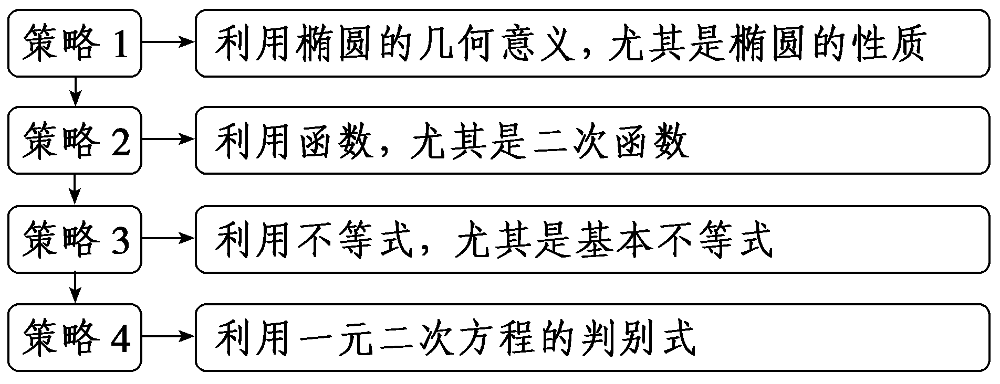

对点练5.已知&lt;text style="it&lt;text style="it<em>a</em>lic"&gt;a&lt;/text&gt;lic"&gt;<em>M</em>&lt;/text&gt;，<em>&lt;text style="italic"&gt;N</em>&lt;/text&gt;是椭圆<em>&lt;text style="italic"&gt;&lt;text style="italic"&gt;C</em>&lt;/text&gt;&lt;/text&gt;： $\frac{x^{2}}{a^{2}}$ ＋ $\frac{y^{2}}{b^{2}}$ ＝1(&lt;text style="it<em>a</em>lic"&gt;a&lt;/text&gt;＞<em>b</em>＞0)上关于原点<em>O</em>对称的两点，<em>P</em>是椭圆<em>&lt;text style="italic"&gt;&lt;text style="italic"&gt;C</em>&lt;/text&gt;&lt;/text&gt;上异于<em>&lt;text style="italic"&gt;M</em>&lt;/text&gt;，<em>&lt;text style="italic"&gt;N</em>&lt;/text&gt;的点，且 $\vec{PM}$ · $\vec{PN}$ 的最大值是 $\frac{1}{4}$ &lt;text style="it<em>a</em>lic"&gt;a&lt;/text&gt;2，则椭圆<em>&lt;text style="italic"&gt;&lt;text style="italic"&gt;C</em>&lt;/text&gt;&lt;/text&gt;的离心率是(　　)

A. $\frac{1}{3}$ 	B. $\frac{1}{2}$

C. $\frac{\sqrt{2}}{2}$ 	D. $\frac{\sqrt{3}}{3}$

答案：**B**

解析：由题意可得 $\vec{PM}$ ＝ $\vec{PO}$ ＋ $\vec{OM}$ ， $\vec{PN}$ ＝ $\vec{PO}$ ＋ $\vec{ON}$ ＝ $\vec{PO}$ － $\vec{OM}$ ，则 $\vec{PM}$ &lt;t<em>e</em>xt style="it&lt;text style="it&lt;text style="it&lt;text style="itali<em>c</em>"&gt;a&lt;/text&gt;li<em>c</em>"&gt;a&lt;/text&gt;lic"&gt;a&lt;/text&gt;lic"&gt;·&lt;/text&gt; $\vec{PN}$ ＝( $\vec{PO}$ ＋ $\vec{OM}$ )&lt;t<em>e</em>xt style="it&lt;text style="it&lt;text style="it&lt;text style="itali<em>c</em>"&gt;a&lt;/text&gt;li<em>c</em>"&gt;a&lt;/text&gt;lic"&gt;a&lt;/text&gt;lic"&gt;·&lt;/text&gt;( $\vec{PO}$ － $\vec{OM}$ )＝ $\vec{PO}^{2}$ － $\vec{OM}^{2}$ ，由椭圆可知｜ $\vec{PO}$ ｜，｜ $\vec{OM}$ ｜∈[&lt;t<em>e</em>xt style="it&lt;text style="it&lt;text style="it&lt;text style="itali<em>c</em>"&gt;a&lt;/text&gt;li<em>c</em>"&gt;a&lt;/text&gt;lic"&gt;a&lt;/text&gt;lic"&gt;<em>b</em>&lt;/text&gt;，a]，则 $\vec{PM}$ &lt;t<em>e</em>xt style="it&lt;text style="it&lt;text style="it&lt;text style="itali<em>c</em>"&gt;a&lt;/text&gt;li<em>c</em>"&gt;a&lt;/text&gt;lic"&gt;a&lt;/text&gt;lic"&gt;·&lt;/text&gt; $\vec{PN}$ ＝ $\vec{PO}^{2}$ － $\vec{OM}^{2}$ 的最大值为&lt;t<em>e</em>xt style="it&lt;text style="it&lt;text style="itali<em>c</em>"&gt;a&lt;/text&gt;li<em>c</em>"&gt;a&lt;/text&gt;lic"&gt;a&lt;/text&gt;&lt;text style="superscript"&gt;&lt;text style="superscript"&gt;&lt;text style="superscript"&gt;&lt;text style="superscript"&gt;2&lt;/text&gt;&lt;/text&gt;&lt;/text&gt;&lt;/text&gt;－<em>&lt;text style="italic"&gt;b</em>&lt;/text&gt;2＝c2，即 $\frac{1}{4}$ &lt;t<em>e</em>xt style="it&lt;text style="it&lt;text style="itali<em>c</em>"&gt;a&lt;/text&gt;li<em>c</em>"&gt;a&lt;/text&gt;lic"&gt;a&lt;/text&gt;&lt;text style="superscript"&gt;&lt;text style="superscript"&gt;&lt;text style="superscript"&gt;&lt;text style="superscript"&gt;2&lt;/text&gt;&lt;/text&gt;&lt;/text&gt;&lt;/text&gt;＝c2，整理得椭圆<em>C</em>的离心率e＝ $\frac{c}{a}$ ＝ $\sqrt{\frac{c^{2}}{a^{2}}}$ ＝ $\frac{1}{2}$ .故选B.

对点练6.(一题多解)已知椭圆 $\frac{x^{2}}{16}$ ＋ $\frac{y^{2}}{12}$ ＝1的左顶点为*A*，右焦点为*F*，*M*是椭圆上任意一点，则 $\vec{MA}$ · $\vec{MF}$ 的取值范围为(　　)

A.[－16，0]	B.[－8，0]

C.[0，8]	D.[0，16]

答案：**D**

解析：法一：由题意知&lt;te&lt;te&lt;te&lt;te&lt;te&lt;te&lt;te&lt;te&lt;te<em>x</em>t style="italic"&gt;x&lt;/text&gt;t style="italic"&gt;x&lt;/text&gt;t style="italic"&gt;x&lt;/text&gt;t style="italic"&gt;x&lt;/text&gt;t style="italic"&gt;x&lt;/text&gt;t st<em>y</em>le="italic"&gt;x&lt;/text&gt;t st<em>y</em>le="italic"&gt;x&lt;/text&gt;t st<em>y</em>le="italic"&gt;x&lt;/text&gt;t style="italic"&gt;A&lt;/text&gt;(－4，&lt;text style="subscript"&gt;&lt;text style="subscript"&gt;&lt;text style="subscript"&gt;&lt;text style="subscript"&gt;&lt;text style="subscript"&gt;&lt;text style="subscript"&gt;&lt;text style="subscript"&gt;&lt;text style="subscript"&gt;&lt;text style="subscript"&gt;&lt;text style="subscript"&gt;&lt;text style="subscript"&gt;0&lt;/text&gt;&lt;/text&gt;&lt;/text&gt;&lt;/text&gt;&lt;/text&gt;&lt;/text&gt;&lt;/text&gt;&lt;/text&gt;&lt;/text&gt;&lt;/text&gt;&lt;/text&gt;)，<em>F</em>(2，0)，设<em>M</em>(x0，y0)，则 $\vec{MA}$ <em>·</em> $\vec{MF}$ ＝(－4－&lt;te&lt;te&lt;te&lt;te&lt;te&lt;te&lt;te&lt;te<em>x</em>t style="italic"&gt;x&lt;/text&gt;t style="italic"&gt;x&lt;/text&gt;t style="italic"&gt;x&lt;/text&gt;t style="italic"&gt;x&lt;/text&gt;t style="italic"&gt;x&lt;/text&gt;t st<em>y</em>le="italic"&gt;x&lt;/text&gt;t st<em>y</em>le="italic"&gt;x&lt;/text&gt;t st<em>y</em>le="italic"&gt;x&lt;/text&gt;&lt;text style="subscript"&gt;&lt;text style="subscript"&gt;&lt;text style="subscript"&gt;&lt;text style="subscript"&gt;&lt;text style="subscript"&gt;&lt;text style="subscript"&gt;&lt;text style="subscript"&gt;&lt;text style="subscript"&gt;&lt;text style="subscript"&gt;&lt;text style="subscript"&gt;&lt;text style="subscript"&gt;0&lt;/text&gt;&lt;/text&gt;&lt;/text&gt;&lt;/text&gt;&lt;/text&gt;&lt;/text&gt;&lt;/text&gt;&lt;/text&gt;&lt;/text&gt;&lt;/text&gt;&lt;/text&gt;，－y0)<em>·</em>(2－x0，－y0)＝(x0－2)(x0＋4)＋ $y_{0}^{2}$ ＝ $x_{0}^{2}$ ＋&lt;te<em>x</em>t style="superscript"&gt;2&lt;/text&gt;&lt;te&lt;te&lt;te&lt;te&lt;te&lt;te&lt;te<em>x</em>t style="italic"&gt;x&lt;/text&gt;t style="italic"&gt;x&lt;/text&gt;t style="italic"&gt;x&lt;/text&gt;t style="italic"&gt;x&lt;/text&gt;t st<em>y</em>le="italic"&gt;x&lt;/text&gt;t st<em>y</em>le="italic"&gt;x&lt;/text&gt;t st<em>y</em>le="italic"&gt;x&lt;/text&gt;&lt;text style="subscript"&gt;&lt;text style="subscript"&gt;&lt;text style="subscript"&gt;&lt;text style="subscript"&gt;&lt;text style="subscript"&gt;&lt;text style="subscript"&gt;&lt;text style="subscript"&gt;&lt;text style="subscript"&gt;&lt;text style="subscript"&gt;&lt;text style="subscript"&gt;&lt;text style="subscript"&gt;0&lt;/text&gt;&lt;/text&gt;&lt;/text&gt;&lt;/text&gt;&lt;/text&gt;&lt;/text&gt;&lt;/text&gt;&lt;/text&gt;&lt;/text&gt;&lt;/text&gt;&lt;/text&gt;－8＋12－ $\frac{3}{4}x_{0}^{2}$ ＝ $\frac{1}{4}x_{0}^{2}$ ＋&lt;te<em>x</em>t style="superscript"&gt;2&lt;/text&gt;&lt;te&lt;te&lt;te&lt;te&lt;te&lt;te&lt;te<em>x</em>t style="italic"&gt;x&lt;/text&gt;t style="italic"&gt;x&lt;/text&gt;t style="italic"&gt;x&lt;/text&gt;t style="italic"&gt;x&lt;/text&gt;t st<em>y</em>le="italic"&gt;x&lt;/text&gt;t st<em>y</em>le="italic"&gt;x&lt;/text&gt;t st<em>y</em>le="italic"&gt;x&lt;/text&gt;&lt;text style="subscript"&gt;&lt;text style="subscript"&gt;&lt;text style="subscript"&gt;&lt;text style="subscript"&gt;&lt;text style="subscript"&gt;&lt;text style="subscript"&gt;&lt;text style="subscript"&gt;&lt;text style="subscript"&gt;&lt;text style="subscript"&gt;&lt;text style="subscript"&gt;&lt;text style="subscript"&gt;0&lt;/text&gt;&lt;/text&gt;&lt;/text&gt;&lt;/text&gt;&lt;/text&gt;&lt;/text&gt;&lt;/text&gt;&lt;/text&gt;&lt;/text&gt;&lt;/text&gt;&lt;/text&gt;＋4＝ $\frac{1}{4}$ (&lt;te&lt;te&lt;te&lt;te&lt;te&lt;te&lt;te&lt;te<em>x</em>t style="italic"&gt;x&lt;/text&gt;t style="italic"&gt;x&lt;/text&gt;t style="italic"&gt;x&lt;/text&gt;t style="italic"&gt;x&lt;/text&gt;t style="italic"&gt;x&lt;/text&gt;t st<em>y</em>le="italic"&gt;x&lt;/text&gt;t st<em>y</em>le="italic"&gt;x&lt;/text&gt;t st<em>y</em>le="italic"&gt;x&lt;/text&gt;&lt;text style="subscript"&gt;&lt;text style="subscript"&gt;&lt;text style="subscript"&gt;&lt;text style="subscript"&gt;&lt;text style="subscript"&gt;&lt;text style="subscript"&gt;&lt;text style="subscript"&gt;&lt;text style="subscript"&gt;&lt;text style="subscript"&gt;&lt;text style="subscript"&gt;&lt;text style="subscript"&gt;0&lt;/text&gt;&lt;/text&gt;&lt;/text&gt;&lt;/text&gt;&lt;/text&gt;&lt;/text&gt;&lt;/text&gt;&lt;/text&gt;&lt;/text&gt;&lt;/text&gt;&lt;/text&gt;＋4)2，因为 $\frac{x_{0}^{2}}{16}$ ＋ $\frac{y_{0}^{2}}{12}$ ＝1，所以 $\frac{x_{0}^{2}}{16}$ ＝1－ $\frac{y_{0}^{2}}{12}$ ≤1，所以－4≤&lt;te&lt;te&lt;te&lt;te&lt;te&lt;te&lt;te&lt;te<em>x</em>t style="italic"&gt;x&lt;/text&gt;t style="italic"&gt;x&lt;/text&gt;t style="italic"&gt;x&lt;/text&gt;t style="italic"&gt;x&lt;/text&gt;t style="italic"&gt;x&lt;/text&gt;t st<em>y</em>le="italic"&gt;x&lt;/text&gt;t st<em>y</em>le="italic"&gt;x&lt;/text&gt;t st<em>y</em>le="italic"&gt;x&lt;/text&gt;&lt;text style="subscript"&gt;&lt;text style="subscript"&gt;&lt;text style="subscript"&gt;&lt;text style="subscript"&gt;&lt;text style="subscript"&gt;&lt;text style="subscript"&gt;&lt;text style="subscript"&gt;&lt;text style="subscript"&gt;&lt;text style="subscript"&gt;&lt;text style="subscript"&gt;&lt;text style="subscript"&gt;0&lt;/text&gt;&lt;/text&gt;&lt;/text&gt;&lt;/text&gt;&lt;/text&gt;&lt;/text&gt;&lt;/text&gt;&lt;/text&gt;&lt;/text&gt;&lt;/text&gt;&lt;/text&gt;≤4，所以0≤ $\vec{MA}$ <em>·</em> $\vec{MF}$ ≤16.故选D.

法二：由题意知&lt;te&lt;te&lt;te&lt;te&lt;te&lt;te<em>x</em>t style="italic"&gt;x&lt;/text&gt;t style="italic"&gt;x&lt;/text&gt;t style="italic"&gt;x&lt;/text&gt;t style="italic"&gt;x&lt;/text&gt;t st<em>y</em>le="italic"&gt;x&lt;/text&gt;t style="italic"&gt;A&lt;/text&gt;(－4，&lt;text style="subscript"&gt;&lt;text style="subscript"&gt;&lt;text style="subscript"&gt;&lt;text style="subscript"&gt;&lt;text style="subscript"&gt;&lt;text style="subscript"&gt;0&lt;/text&gt;&lt;/text&gt;&lt;/text&gt;&lt;/text&gt;&lt;/text&gt;&lt;/text&gt;)，<em>F</em>(&lt;text style="superscript"&gt;2&lt;/text&gt;，0)，设<em>M</em>(x0，y0)，取线段<em>AF</em>的中点<em>&lt;text style="italic"&gt;N</em>&lt;/text&gt;，则N(－1，0)，连接<em>MN</em>，如图，则 $\vec{MA}$ &lt;te&lt;te&lt;te&lt;te&lt;te<em>x</em>t style="italic"&gt;x&lt;/text&gt;t style="italic"&gt;x&lt;/text&gt;t style="italic"&gt;x&lt;/text&gt;t style="italic"&gt;x&lt;/text&gt;t style="italic"&gt;<em>·</em>&lt;/text&gt; $\vec{MF}$ ＝ $\frac{(\vec{MA}＋\vec{MF})^{2}-(\vec{MA}－\vec{MF})^{2}}{4}$ ＝ $\frac{4\vec{MN}^{2}－\vec{FA}^{2}}{4}$ ＝ $\vec{MN}^{2}$ －9＝(&lt;te&lt;te&lt;te&lt;te&lt;te<em>x</em>t style="italic"&gt;x&lt;/text&gt;t style="italic"&gt;x&lt;/text&gt;t style="italic"&gt;x&lt;/text&gt;t style="italic"&gt;x&lt;/text&gt;t st<em>y</em>le="italic"&gt;x&lt;/text&gt;&lt;text style="subscript"&gt;&lt;text style="subscript"&gt;&lt;text style="subscript"&gt;&lt;text style="subscript"&gt;&lt;text style="subscript"&gt;&lt;text style="subscript"&gt;0&lt;/text&gt;&lt;/text&gt;&lt;/text&gt;&lt;/text&gt;&lt;/text&gt;&lt;/text&gt;＋1)&lt;text style="superscript"&gt;2&lt;/text&gt;＋ $y_{0}^{2}$ －9＝ $x_{0}^{2}$ ＋&lt;te&lt;te&lt;te&lt;te<em>x</em>t style="italic"&gt;x&lt;/text&gt;t style="italic"&gt;x&lt;/text&gt;t style="italic"&gt;x&lt;/text&gt;t style="superscript"&gt;2&lt;/text&gt;&lt;te<em>x</em>t st<em>y</em>le="italic"&gt;x&lt;/text&gt;&lt;text style="subscript"&gt;&lt;text style="subscript"&gt;&lt;text style="subscript"&gt;&lt;text style="subscript"&gt;&lt;text style="subscript"&gt;&lt;text style="subscript"&gt;0&lt;/text&gt;&lt;/text&gt;&lt;/text&gt;&lt;/text&gt;&lt;/text&gt;&lt;/text&gt;＋1＋12－ $\frac{3}{4}x_{0}^{2}$ －9＝ $\frac{1}{4}x_{0}^{2}$ ＋&lt;te&lt;te&lt;te&lt;te<em>x</em>t style="italic"&gt;x&lt;/text&gt;t style="italic"&gt;x&lt;/text&gt;t style="italic"&gt;x&lt;/text&gt;t style="superscript"&gt;2&lt;/text&gt;&lt;te<em>x</em>t st<em>y</em>le="italic"&gt;x&lt;/text&gt;&lt;text style="subscript"&gt;&lt;text style="subscript"&gt;&lt;text style="subscript"&gt;&lt;text style="subscript"&gt;&lt;text style="subscript"&gt;&lt;text style="subscript"&gt;0&lt;/text&gt;&lt;/text&gt;&lt;/text&gt;&lt;/text&gt;&lt;/text&gt;&lt;/text&gt;＋4＝ $\frac{1}{4}$ (&lt;te&lt;te&lt;te&lt;te&lt;te<em>x</em>t style="italic"&gt;x&lt;/text&gt;t style="italic"&gt;x&lt;/text&gt;t style="italic"&gt;x&lt;/text&gt;t style="italic"&gt;x&lt;/text&gt;t st<em>y</em>le="italic"&gt;x&lt;/text&gt;&lt;text style="subscript"&gt;&lt;text style="subscript"&gt;&lt;text style="subscript"&gt;&lt;text style="subscript"&gt;&lt;text style="subscript"&gt;&lt;text style="subscript"&gt;0&lt;/text&gt;&lt;/text&gt;&lt;/text&gt;&lt;/text&gt;&lt;/text&gt;&lt;/text&gt;＋4)&lt;text style="superscript"&gt;2&lt;/text&gt;，因为 $\frac{x_{0}^{2}}{16}$ ＋ $\frac{y_{0}^{2}}{12}$ ＝1，所以 $\frac{x_{0}^{2}}{16}$ ＝1－ $\frac{y_{0}^{2}}{12}$ ≤1，所以－4≤&lt;te&lt;te&lt;te&lt;te&lt;te<em>x</em>t style="italic"&gt;x&lt;/text&gt;t style="italic"&gt;x&lt;/text&gt;t style="italic"&gt;x&lt;/text&gt;t style="italic"&gt;x&lt;/text&gt;t st<em>y</em>le="italic"&gt;x&lt;/text&gt;&lt;text style="subscript"&gt;&lt;text style="subscript"&gt;&lt;text style="subscript"&gt;&lt;text style="subscript"&gt;&lt;text style="subscript"&gt;&lt;text style="subscript"&gt;0&lt;/text&gt;&lt;/text&gt;&lt;/text&gt;&lt;/text&gt;&lt;/text&gt;&lt;/text&gt;≤4，所以0≤ $\vec{MA}$ &lt;te&lt;te&lt;te&lt;te&lt;te<em>x</em>t style="italic"&gt;x&lt;/text&gt;t style="italic"&gt;x&lt;/text&gt;t style="italic"&gt;x&lt;/text&gt;t style="italic"&gt;x&lt;/text&gt;t style="italic"&gt;<em>·</em>&lt;/text&gt; $\vec{MF}$ ≤16.故选D.

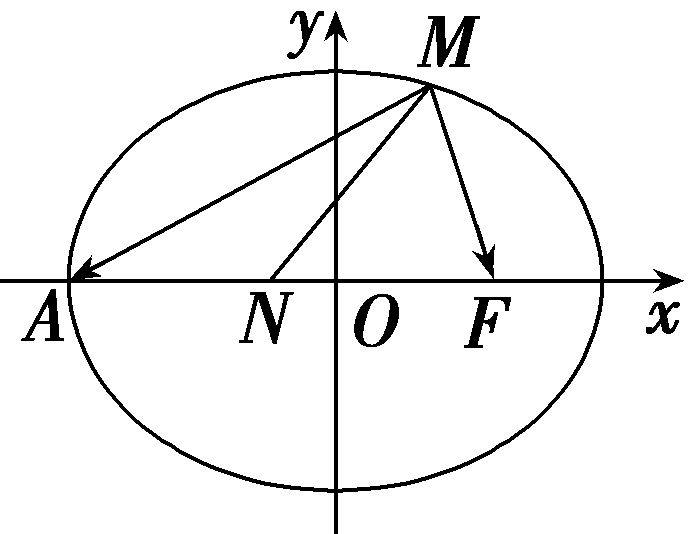

1.[真题再现]　(2024·新课标Ⅱ卷)已知曲线<em>C</em>：<em>x</em>2＋<em>y</em>2＝16(<em>y</em>＞0)，从<em>C</em>上任意一点<em>P</em>向<em>x</em>轴作垂线段<em>PP'</em>，<em>P'</em>为垂足，则线段<em>PP'</em>的中点<em>M</em>的轨迹方程为(　　)

A. $\frac{x^{2}}{16}$ ＋ $\frac{y^{2}}{4}$ ＝1(<text st*y*le="italic">y</text>＞0)	B. $\frac{x^{2}}{16}$ ＋ $\frac{y^{2}}{8}$ ＝1(<text st*y*le="italic">y</text>＞0)

C. $\frac{y^{2}}{16}$ ＋ $\frac{x^{2}}{4}$ ＝1(<text st*y*le="italic">y</text>＞0)	D. $\frac{y^{2}}{16}$ ＋ $\frac{x^{2}}{8}$ ＝1(<text st*y*le="italic">y</text>＞0)

答案：**A**

解析：设点&lt;te&lt;te&lt;te&lt;te&lt;te&lt;te&lt;text st&lt;text st&lt;text st&lt;text st<em>y</em>le="italic"&gt;y&lt;/text&gt;le="italic"&gt;y&lt;/text&gt;le="italic"&gt;y&lt;/text&gt;le="italic"&gt;x&lt;/text&gt;t st&lt;text st<em>y</em>le="italic"&gt;y&lt;/text&gt;le="italic"&gt;x&lt;/text&gt;t st<em>y</em>le="italic"&gt;x&lt;/text&gt;t st&lt;text st<em>y</em>le="italic"&gt;y&lt;/text&gt;le="italic"&gt;x&lt;/text&gt;t st<em>y</em>le="italic"&gt;x&lt;/text&gt;t st<em>y</em>le="italic"&gt;x&lt;/text&gt;t style="italic"&gt;<em>&lt;text style="italic"&gt;M</em>&lt;/text&gt;&lt;/text&gt;(x，y)，则<em>&lt;text style="italic"&gt;&lt;text style="italic"&gt;P</em>&lt;/text&gt;&lt;/text&gt;(x，y&lt;text style="subscript"&gt;0&lt;/text&gt;)，<em>P'</em>(x，0)，因为M为<em>PP'</em>的中点，所以y0＝&lt;text style="superscript"&gt;&lt;text style="superscript"&gt;&lt;text style="superscript"&gt;2&lt;/text&gt;&lt;/text&gt;&lt;/text&gt;y，即P(x，2y)，又P在圆x2＋y2＝16(y＞0)上，所以x2＋4y2＝16(y＞0)，即 $\frac{x^{2}}{16}$ ＋ $\frac{y^{2}}{4}$ ＝1(&lt;te&lt;te&lt;te&lt;te&lt;te&lt;text st&lt;text st&lt;text st&lt;text st<em>y</em>le="italic"&gt;y&lt;/text&gt;le="italic"&gt;y&lt;/text&gt;le="italic"&gt;y&lt;/text&gt;le="italic"&gt;x&lt;/text&gt;t st&lt;text st<em>y</em>le="italic"&gt;y&lt;/text&gt;le="italic"&gt;x&lt;/text&gt;t st<em>y</em>le="italic"&gt;x&lt;/text&gt;t st&lt;text st<em>y</em>le="italic"&gt;y&lt;/text&gt;le="italic"&gt;x&lt;/text&gt;t st<em>y</em>le="italic"&gt;x&lt;/text&gt;t style="italic"&gt;y&lt;/text&gt;＞&lt;text style="subscript"&gt;0&lt;/text&gt;)，即点&lt;te<em>x</em>t style="italic"&gt;<em>&lt;text style="italic"&gt;M</em>&lt;/text&gt;&lt;/text&gt;的轨迹方程为 $\frac{x^{2}}{16}$ ＋ $\frac{y^{2}}{4}$ ＝1(&lt;te&lt;te&lt;te&lt;te&lt;te&lt;text st&lt;text st&lt;text st&lt;text st<em>y</em>le="italic"&gt;y&lt;/text&gt;le="italic"&gt;y&lt;/text&gt;le="italic"&gt;y&lt;/text&gt;le="italic"&gt;x&lt;/text&gt;t st&lt;text st<em>y</em>le="italic"&gt;y&lt;/text&gt;le="italic"&gt;x&lt;/text&gt;t st<em>y</em>le="italic"&gt;x&lt;/text&gt;t st&lt;text st<em>y</em>le="italic"&gt;y&lt;/text&gt;le="italic"&gt;x&lt;/text&gt;t st<em>y</em>le="italic"&gt;x&lt;/text&gt;t style="italic"&gt;y&lt;/text&gt;＞&lt;text style="subscript"&gt;0&lt;/text&gt;).故选A.

[教材呈现]　(人教A选择性必修一P108例2)如图，在圆<em>x</em>2＋<em>y</em>2＝4上任取一点<em>P</em>，过点<em>P</em>作<em>x</em>轴的垂线段<em>PD</em>，<em>D</em>为垂足.当点<em>P</em>在圆上运动时，线段<em>PD</em>的中点<em>M</em>的轨迹是什么？为什么？(当点<em>P</em>经过圆与<em>x</em>轴的交点时，规定点<em>M</em>与点<em>P</em>重合.)

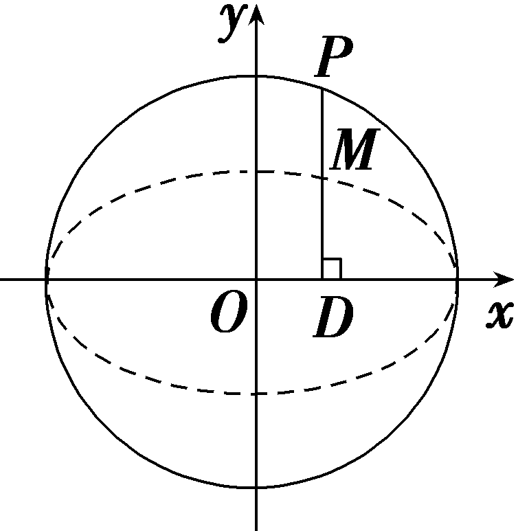

点评：高考题中圆的方程与教材例题中圆的方程仅有半径不同，其他完全一致，都是考查相关点法求方程.

2.[真题再现]　(2019·全国Ⅱ卷节选)已知点<te<text st*y*le="italic">x</text>t style="italic">A</text>(－2，0)，*B*(2，0)，动点*<text style="italic">M*</text>(x，y)满足直线*AM*与*BM*的斜率之积为－ $\frac{1}{2}$ .记<te<text st*y*le="italic">x</text>t style="italic">*M*</text>的轨迹为曲线*<text style="italic"><text style="italic">C*</text></text>.求C的方程，并说明C是什么曲线.

解：由题设得 $\frac{y}{x+2}$ · $\frac{y}{x－2}$ ＝－ $\frac{1}{2}$ ，化简得 $\frac{x^{2}}{4}$ ＋ $\frac{y^{2}}{2}$ ＝1(｜<te*x*t style="italic">x</text>｜≠2)，所以*C*为中心在坐标原点，焦点在x轴上的椭圆，不含左、右顶点.

[教材呈现]　(人教*A*选择性必修一P108例3)如图，设A，*B*两点的坐标分别为(－5，0)，(5，0).直线*A<text style="italic"><text style="italic">M*</text></text>，*BM*相交于点M，且它们的斜率之积是－ $\frac{4}{9}$ ，求点*<text style="italic">M*</text>的轨迹方程.

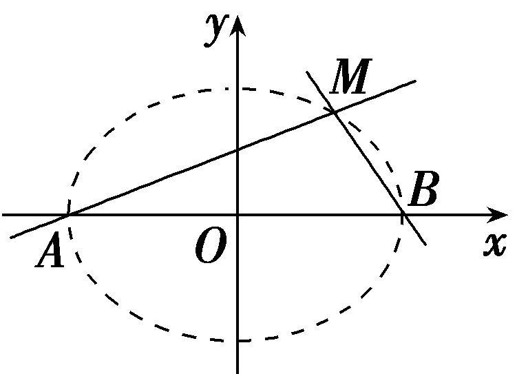

点评：该高考题利用斜率公式表示斜率，然后化简成椭圆的标准方程，与教材例题命题角度类似，属于改编题.

**课时测评**70　**椭　圆** $\frac{对应学生}{用书P449}$

(时间：60分钟　满分：88分)

(本栏目内容，在学生用书中以独立形式分册装订！)

(1—8题，每小题5分，共40分)

1.已知椭圆<text style="it*a*lic">*C*</text>： $\frac{x^{2}}{a^{2}}$ ＋ $\frac{y^{2}}{3}$ ＝1(*a*＞0)的一个焦点为点(1，0)，则椭圆*<text style="italic">C*</text>的离心率为(　　)

A. $\frac{1}{3}$ 	B. $\frac{1}{2}$

C. $\frac{\sqrt{2}}{2}$ 	D. $\frac{2\sqrt{2}}{3}$

答案：**B**

解析：由椭圆&lt;t<em>e</em>xt style="it&lt;text style="it<em>a</em>lic"&gt;a&lt;/text&gt;lic"&gt;<em>C</em>&lt;/text&gt;： $\frac{x^{2}}{a^{2}}$ ＋ $\frac{y^{2}}{3}$ ＝1的一个焦点的坐标为(1，0)，得&lt;t<em>e</em>xt style="it<em>a</em>lic"&gt;a&lt;/text&gt;2－3＝1，解得a＝2(负值已舍去).所以椭圆<em>&lt;text style="italic"&gt;C</em>&lt;/text&gt;的离心率为e＝ $\frac{c}{a}$ ＝ $\frac{1}{2}$ .故选B.

&lt;t&lt;t&lt;t&lt;t&lt;text style="it<em>a</em>lic"&gt;e&lt;/text&gt;xt style="italic"&gt;e&lt;/text&gt;xt style="italic"&gt;e&lt;/text&gt;xt style="italic"&gt;e&lt;/text&gt;xt st<em>y</em>le="superscript"&gt;&lt;text style="superscript"&gt;&lt;text style="subscript"&gt;&lt;text style="subscript"&gt;2&lt;/text&gt;&lt;/text&gt;&lt;/text&gt;&lt;/text&gt;.(2023·新课标Ⅰ卷)设椭圆&lt;text st&lt;text style="it<em>a</em>lic"&gt;y&lt;/text&gt;le="italic"&gt;<em>C</em>&lt;/text&gt;&lt;text style="subscript"&gt;&lt;text style="subscript"&gt;1&lt;/text&gt;&lt;/text&gt;： $\frac{x^{2}}{a^{2}}$ ＋&lt;t&lt;t&lt;t&lt;t&lt;text style="it<em>a</em>lic"&gt;e&lt;/text&gt;xt style="italic"&gt;e&lt;/text&gt;xt style="italic"&gt;e&lt;/text&gt;xt style="italic"&gt;e&lt;/text&gt;xt st<em>y</em>le="it<em>a</em>lic"&gt;y&lt;/text&gt;&lt;text style="subscript"&gt;&lt;text style="superscript"&gt;&lt;text style="subscript"&gt;&lt;text style="subscript"&gt;2&lt;/text&gt;&lt;/text&gt;&lt;/text&gt;&lt;/text&gt;＝&lt;text style="subscript"&gt;&lt;text style="subscript"&gt;1&lt;/text&gt;&lt;/text&gt;(a＞1)，<em>&lt;text style="italic"&gt;C</em>&lt;/text&gt;2： $\frac{x^{2}}{4}$ ＋&lt;t&lt;t&lt;t&lt;t&lt;text style="it<em>a</em>lic"&gt;e&lt;/text&gt;xt style="italic"&gt;e&lt;/text&gt;xt style="italic"&gt;e&lt;/text&gt;xt style="italic"&gt;e&lt;/text&gt;xt st<em>y</em>le="it<em>a</em>lic"&gt;y&lt;/text&gt;&lt;text style="subscript"&gt;&lt;text style="superscript"&gt;&lt;text style="subscript"&gt;&lt;text style="subscript"&gt;2&lt;/text&gt;&lt;/text&gt;&lt;/text&gt;&lt;/text&gt;＝&lt;text style="subscript"&gt;&lt;text style="subscript"&gt;1&lt;/text&gt;&lt;/text&gt;的离心率分别为e1，e2，若e2＝ $\sqrt{3}$ &lt;t&lt;t&lt;t&lt;text style="it<em>a</em>lic"&gt;e&lt;/text&gt;xt style="italic"&gt;e&lt;/text&gt;xt style="italic"&gt;e&lt;/text&gt;xt style="italic"&gt;e&lt;/text&gt;&lt;text st&lt;text st<em>y</em>le="it<em>a</em>lic"&gt;y&lt;/text&gt;le="subscript"&gt;&lt;text style="subscript"&gt;1&lt;/text&gt;&lt;/text&gt;，则a＝(　　)

A. $\frac{2\sqrt{3}}{3}$ 	B. $\sqrt{2}$

C. $\sqrt{3}$ 	D. $\sqrt{6}$

答案：**A**

解析：由已知得&lt;t&lt;t&lt;t&lt;text style="it<em>a</em>lic"&gt;e&lt;/text&gt;xt style="italic"&gt;e&lt;/text&gt;xt style="italic"&gt;e&lt;/text&gt;xt style="italic"&gt;e&lt;/text&gt;&lt;text style="subscript"&gt;1&lt;/text&gt;＝ $\frac{\sqrt{a^{2}－1}}{a}$ ，&lt;t&lt;t&lt;t&lt;text style="it<em>a</em>lic"&gt;e&lt;/text&gt;xt style="italic"&gt;e&lt;/text&gt;xt style="italic"&gt;e&lt;/text&gt;xt style="italic"&gt;e&lt;/text&gt;&lt;text style="subscript"&gt;2&lt;/text&gt;＝ $\frac{\sqrt{4－1}}{2}$ ＝ $\frac{\sqrt{3}}{2}$ ，因为&lt;t&lt;t&lt;t&lt;text style="it<em>a</em>lic"&gt;e&lt;/text&gt;xt style="italic"&gt;e&lt;/text&gt;xt style="italic"&gt;e&lt;/text&gt;xt style="italic"&gt;e&lt;/text&gt;&lt;text style="subscript"&gt;2&lt;/text&gt;＝ $\sqrt{3}$ &lt;t&lt;t&lt;t&lt;text style="it<em>a</em>lic"&gt;e&lt;/text&gt;xt style="italic"&gt;e&lt;/text&gt;xt style="italic"&gt;e&lt;/text&gt;xt style="italic"&gt;e&lt;/text&gt;&lt;text style="subscript"&gt;1&lt;/text&gt;，所以 $\frac{\sqrt{3}}{2}$ ＝ $\sqrt{3}$ × $\frac{\sqrt{a^{2}－1}}{a}$ ，解得<em>a</em>＝ $\frac{2\sqrt{3}}{3}$ .故选A.

3.(2024·山西太原三模)已知点<em>F</em>1，<em>F</em>2分别是椭圆<em>C</em>的左、右焦点，<em>P</em>(4，3)是<em>C</em>上一点，△<em>PF</em>1<em>F</em>2的内切圆的圆心为<em>I</em>(<em>m</em>，1)，则椭圆<em>C</em>的标准方程是(　　)

A. $\frac{x^{2}}{24}$ ＋ $\frac{y^{2}}{27}$ ＝1	B. $\frac{x^{2}}{28}$ ＋ $\frac{y^{2}}{21}$ ＝1

C. $\frac{x^{2}}{52}$ ＋ $\frac{y^{2}}{13}$ ＝1	D. $\frac{x^{2}}{64}$ ＋ $\frac{y^{2}}{12}$ ＝1

答案：**B**

解析：依题意，设椭圆&lt;text style="it&lt;text style="it&lt;text style="it&lt;text style="it&lt;text style="it&lt;text style="it&lt;text style="it<em>a</em>lic"&gt;a&lt;/text&gt;li<em>c</em>"&gt;a&lt;/text&gt;li<em>c</em>"&gt;a&lt;/text&gt;li&lt;text style="itali<em>c</em>"&gt;c&lt;/text&gt;"&gt;a&lt;/text&gt;li<em>c</em>"&gt;a&lt;/text&gt;lic"&gt;a&lt;/text&gt;lic"&gt;<em>&lt;text style="italic"&gt;C</em>&lt;/text&gt;&lt;/text&gt;的方程为 $\frac{x^{2}}{a^{2}}$ ＋ $\frac{y^{2}}{b^{2}}$ ＝&lt;text style="su&lt;text style="it&lt;text style="it&lt;text style="it<em>a</em>lic"&gt;a&lt;/text&gt;li<em>c</em>"&gt;a&lt;/text&gt;lic"&gt;<em>b</em>&lt;/text&gt;s&lt;text style="it&lt;text style="it&lt;text style="itali<em>c</em>"&gt;a&lt;/text&gt;li&lt;text style="itali<em>c</em>"&gt;c&lt;/text&gt;"&gt;a&lt;/text&gt;lic"&gt;c&lt;/text&gt;ript"&gt;1&lt;/text&gt;(&lt;text style="it<em>a</em>lic"&gt;a&lt;/text&gt;＞<em>b</em>＞0)，由<em>P</em>(4，3)在<em>&lt;text style="italic"&gt;&lt;text style="italic"&gt;C</em>&lt;/text&gt;&lt;/text&gt;上，得 $\frac{16}{a^{2}}$ ＋ $\frac{9}{b^{2}}$ ＝&lt;text style="su&lt;text style="it&lt;text style="it&lt;text style="it<em>a</em>lic"&gt;a&lt;/text&gt;li<em>c</em>"&gt;a&lt;/text&gt;lic"&gt;<em>b</em>&lt;/text&gt;s&lt;text style="it&lt;text style="it&lt;text style="itali<em>c</em>"&gt;a&lt;/text&gt;li&lt;text style="itali<em>c</em>"&gt;c&lt;/text&gt;"&gt;a&lt;/text&gt;lic"&gt;c&lt;/text&gt;ript"&gt;1&lt;/text&gt;，显然△&lt;text style="it<em>a</em>lic"&gt;P&lt;/text&gt;<em>&lt;text style="italic"&gt;&lt;text style="italic"&gt;F</em>&lt;/text&gt;&lt;/text&gt;1F&lt;text style="subscript"&gt;&lt;text style="superscript"&gt;&lt;text style="superscript"&gt;&lt;text style="superscript"&gt;&lt;text style="superscript"&gt;&lt;text style="superscript"&gt;&lt;text style="superscript"&gt;2&lt;/text&gt;&lt;/text&gt;&lt;/text&gt;&lt;/text&gt;&lt;/text&gt;&lt;/text&gt;&lt;/text&gt;的内切圆与直线F1F2相切，则该圆半径为1，而 $S_{\bigtriangleup PF_{1}F_{2}}$ ＝ $\frac{1}{2}$ (&lt;text style="su&lt;text style="it&lt;text style="it&lt;text style="it<em>a</em>lic"&gt;a&lt;/text&gt;li<em>c</em>"&gt;a&lt;/text&gt;lic"&gt;<em>b</em>&lt;/text&gt;s&lt;text style="it&lt;text style="it&lt;text style="itali<em>c</em>"&gt;a&lt;/text&gt;li&lt;text style="itali<em>c</em>"&gt;c&lt;/text&gt;"&gt;a&lt;/text&gt;lic"&gt;c&lt;/text&gt;ript"&gt;&lt;text style="superscript"&gt;&lt;text style="superscript"&gt;&lt;text style="superscript"&gt;&lt;text style="superscript"&gt;&lt;text style="superscript"&gt;&lt;text style="superscript"&gt;2&lt;/text&gt;&lt;/text&gt;&lt;/text&gt;&lt;/text&gt;&lt;/text&gt;&lt;/text&gt;&lt;/text&gt;&lt;text style="it<em>a</em>lic"&gt;a&lt;/text&gt;＋2c)<em>·</em>&lt;text style="subscript"&gt;1&lt;/text&gt;＝a＋c，又 $S_{\bigtriangleup PF_{1}F_{2}}$ ＝ $\frac{1}{2}$ &lt;text style="it&lt;text style="it&lt;text style="it&lt;text style="it<em>a</em>lic"&gt;a&lt;/text&gt;li<em>c</em>"&gt;a&lt;/text&gt;li<em>c</em>"&gt;a&lt;/text&gt;li<em>c</em>"&gt;·&lt;/text&gt;&lt;text style="su<em>&lt;text style="italic"&gt;b</em>&lt;/text&gt;s&lt;text style="it&lt;text style="itali<em>c</em>"&gt;a&lt;/text&gt;lic"&gt;c&lt;/text&gt;ript"&gt;&lt;text style="superscript"&gt;&lt;text style="superscript"&gt;&lt;text style="superscript"&gt;&lt;text style="superscript"&gt;&lt;text style="superscript"&gt;&lt;text style="superscript"&gt;2&lt;/text&gt;&lt;/text&gt;&lt;/text&gt;&lt;/text&gt;&lt;/text&gt;&lt;/text&gt;&lt;/text&gt;<em>c·</em>3＝3c，于是&lt;text style="it<em>a</em>lic"&gt;a&lt;/text&gt;＝2c，<em>b</em>2＝a2－c2＝ $\frac{3}{4}$ &lt;text style="it&lt;text style="it&lt;text style="it&lt;text style="it&lt;text style="it&lt;text style="it<em>a</em>lic"&gt;a&lt;/text&gt;li<em>c</em>"&gt;a&lt;/text&gt;li<em>c</em>"&gt;a&lt;/text&gt;li&lt;text style="itali<em>c</em>"&gt;c&lt;/text&gt;"&gt;a&lt;/text&gt;li<em>c</em>"&gt;a&lt;/text&gt;lic"&gt;a&lt;/text&gt;&lt;text style="su<em>&lt;text style="italic"&gt;b</em>&lt;/text&gt;script"&gt;&lt;text style="superscript"&gt;&lt;text style="superscript"&gt;&lt;text style="superscript"&gt;&lt;text style="superscript"&gt;&lt;text style="superscript"&gt;&lt;text style="superscript"&gt;2&lt;/text&gt;&lt;/text&gt;&lt;/text&gt;&lt;/text&gt;&lt;/text&gt;&lt;/text&gt;&lt;/text&gt;，因此 $\frac{16}{a^{2}}$ ＋ $\frac{12}{a^{2}}$ ＝&lt;text style="su&lt;text style="it&lt;text style="it&lt;text style="it<em>a</em>lic"&gt;a&lt;/text&gt;li<em>c</em>"&gt;a&lt;/text&gt;lic"&gt;<em>b</em>&lt;/text&gt;s&lt;text style="it&lt;text style="it&lt;text style="itali<em>c</em>"&gt;a&lt;/text&gt;li&lt;text style="itali<em>c</em>"&gt;c&lt;/text&gt;"&gt;a&lt;/text&gt;lic"&gt;c&lt;/text&gt;ript"&gt;1&lt;/text&gt;，解得&lt;text style="it<em>a</em>lic"&gt;a&lt;/text&gt;&lt;text style="subscript"&gt;&lt;text style="superscript"&gt;&lt;text style="superscript"&gt;&lt;text style="superscript"&gt;&lt;text style="superscript"&gt;&lt;text style="superscript"&gt;&lt;text style="superscript"&gt;2&lt;/text&gt;&lt;/text&gt;&lt;/text&gt;&lt;/text&gt;&lt;/text&gt;&lt;/text&gt;&lt;/text&gt;＝28，<em>b</em>2＝21，所以椭圆<em>&lt;text style="italic"&gt;&lt;text style="italic"&gt;C</em>&lt;/text&gt;&lt;/text&gt;的标准方程是 $\frac{x^{2}}{28}$ ＋ $\frac{y^{2}}{21}$ ＝&lt;text style="su&lt;text style="it&lt;text style="it&lt;text style="it<em>a</em>lic"&gt;a&lt;/text&gt;li<em>c</em>"&gt;a&lt;/text&gt;lic"&gt;<em>b</em>&lt;/text&gt;s&lt;text style="it&lt;text style="it&lt;text style="itali<em>c</em>"&gt;a&lt;/text&gt;li&lt;text style="itali<em>c</em>"&gt;c&lt;/text&gt;"&gt;a&lt;/text&gt;lic"&gt;c&lt;/text&gt;ript"&gt;1&lt;/text&gt;.故选B.

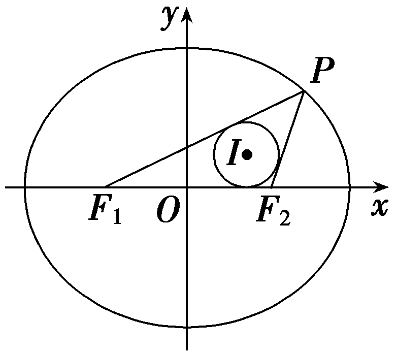

4.(2025·苏州四市统考)已知椭圆*<text style="italic"><text style="italic">C*</text></text>： $\frac{x^{2}}{4}$ ＋ $\frac{y^{2}}{b^{2}}$ ＝1(0＜*b*＜2)的左焦点为*F*，*M*是*<text style="italic"><text style="italic">C*</text></text>上的动点，点*N*(0， $\sqrt{3}$ )，若｜*MN*｜＋｜M*F*｜的最大值为6，则*<text style="italic"><text style="italic">C*</text></text>的离心率为(　　)

A. $\frac{1}{3}$ 	B. $\frac{1}{2}$

C. $\frac{2}{3}$ 	D. $\frac{3}{4}$

答案：**B**

解析：设椭圆<t*e*xt style="it<text style="itali*c*">a</text>lic">C</text>的右焦点为*<text style="italic">F'*</text>，由椭圆的定义，得｜*<text style="italic"><text style="italic"><text style="italic">M*F</text></text></text>｜＋｜*<text style="italic"><text style="italic">MF'*</text></text>｜＝2a＝4，所以｜MF｜＝4－｜MF'｜，所以｜*<text style="italic">M<text style="italic">N*</text></text>｜＋｜MF｜＝｜MN｜－｜MF'｜＋4≤｜*<text style="italic"><text style="italic">NF'*</text></text>｜＋4，当且仅当M，N，F'三点共线时等号成立，则由题意，知此时｜NF'｜＋4＝6，即｜NF'｜＝ $\sqrt{(0－c)^{2}＋(\sqrt{3}－0)^{2}}$ ＝2，解得<t*e*xt style="italic">c</text>＝1，所以e＝ $\frac{c}{a}$ ＝ $\frac{1}{2}$ .故选B.

5.(多选)(&lt;text style="subscript"&gt;2&lt;/text&gt;024·河南开封第三次质量检测)椭圆<em>&lt;text style="italic"&gt;C</em>&lt;/text&gt;： $\frac{x^{2}}{m^{2}+1}$ ＋ $\frac{y^{2}}{m^{2}}$ ＝&lt;text style="subscript"&gt;&lt;text style="subscript"&gt;1&lt;/text&gt;&lt;/text&gt; $\left(m>0\right)$ 的焦点为<em>&lt;text style="italic"&gt;&lt;text style="italic"&gt;F</em>&lt;/text&gt;&lt;/text&gt;&lt;text style="subscript"&gt;&lt;text style="subscript"&gt;1&lt;/text&gt;&lt;/text&gt;，F&lt;text style="subscript"&gt;2&lt;/text&gt;，上顶点为<em>A</em>，直线<em>&lt;text style="italic"&gt;AF</em>&lt;/text&gt;1与<em>&lt;text style="italic"&gt;C</em>&lt;/text&gt;的另一个交点为<em>B</em>，若∠F1AF2＝ $\frac{\pi }{3}$ ，则(　　)

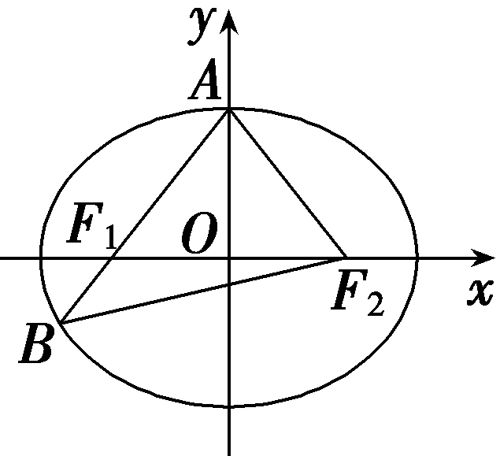

A.*<text style="italic">C*</text>的焦距为2	B.C的短轴长为2 $\sqrt{3}$

<em>C</em>.C的离心率为 $\frac{\sqrt{3}}{2}$ 	D.△<em>ABF</em>2的周长为8

答案：**ABD**

解析：由于∠&lt;t&lt;text style="it<em>a</em>lic"&gt;e&lt;/text&gt;xt style="it&lt;text style="itali&lt;text style="itali<em>c</em>"&gt;c&lt;/text&gt;"&gt;a&lt;/text&gt;lic"&gt;<em>&lt;text style="italic"&gt;F</em>&lt;/text&gt;&lt;/text&gt;&lt;text style="su<em>&lt;text style="italic"&gt;b</em>&lt;/text&gt;script"&gt;&lt;text style="subscript"&gt;1&lt;/text&gt;&lt;/text&gt;<em>AF</em>&lt;text style="subscript"&gt;&lt;text style="superscript"&gt;&lt;text style="subscript"&gt;2&lt;/text&gt;&lt;/text&gt;&lt;/text&gt;＝ $\frac{\pi }{3}$ ，所以∠&lt;t&lt;text style="it<em>a</em>lic"&gt;e&lt;/text&gt;xt style="it&lt;text style="itali&lt;text style="itali<em>c</em>"&gt;c&lt;/text&gt;"&gt;a&lt;/text&gt;lic"&gt;<em>&lt;text style="italic"&gt;F</em>&lt;/text&gt;&lt;/text&gt;&lt;text style="su<em>&lt;text style="italic"&gt;b</em>&lt;/text&gt;script"&gt;&lt;text style="subscript"&gt;1&lt;/text&gt;&lt;/text&gt;<em>&lt;text style="italic"&gt;AO</em>&lt;/text&gt;＝∠O<em>AF</em>&lt;text style="subscript"&gt;&lt;text style="superscript"&gt;&lt;text style="subscript"&gt;2&lt;/text&gt;&lt;/text&gt;&lt;/text&gt;＝ $\frac{\pi }{6}$ ，故&lt;t&lt;text style="it<em>a</em>lic"&gt;e&lt;/text&gt;xt style="itali<em>c</em>"&gt;c&lt;/text&gt;os∠&lt;text style="it<em>a</em>lic"&gt;<em>&lt;text style="italic"&gt;F</em>&lt;/text&gt;&lt;/text&gt;&lt;text style="su<em>&lt;text style="italic"&gt;b</em>&lt;/text&gt;script"&gt;&lt;text style="subscript"&gt;1&lt;/text&gt;&lt;/text&gt;<em>&lt;text style="italic"&gt;AO</em>&lt;/text&gt;＝cos $\frac{\pi }{6}$ ＝ $\frac{\left|AO\right|}{\left|AF_{1}\right|}$ ＝ $\frac{b}{\sqrt{c^{2}＋b^{2}}}$ ＝ $\frac{b}{a}$ ＝ $\frac{\sqrt{3}}{2}$ ，因此 $\frac{b^{2}}{a^{2}}$ ＝ $\left(\frac{\sqrt{3}}{2}\right)^{2}$ ＝ $\frac{m^{2}}{m^{2}+1}$ ，故&lt;t&lt;text style="it<em>a</em>lic"&gt;e&lt;/text&gt;xt style="it&lt;text style="itali&lt;text style="itali<em>c</em>"&gt;c&lt;/text&gt;"&gt;a&lt;/text&gt;lic"&gt;m&lt;/text&gt;&lt;text style="su<em>&lt;text style="italic"&gt;b</em>&lt;/text&gt;script"&gt;&lt;text style="superscript"&gt;&lt;text style="subscript"&gt;2&lt;/text&gt;&lt;/text&gt;&lt;/text&gt;＝3，所以椭圆<em>C</em>： $\frac{x^{2}}{4}$ ＋ $\frac{y^{2}}{3}$ ＝&lt;t&lt;text style="it<em>a</em>lic"&gt;e&lt;/text&gt;xt style="su&lt;text style="itali&lt;text style="itali<em>c</em>"&gt;c&lt;/text&gt;"&gt;<em>b</em>&lt;/text&gt;script"&gt;&lt;text style="subscript"&gt;1&lt;/text&gt;&lt;/text&gt;，<em>a</em>＝&lt;text style="subscript"&gt;&lt;text style="superscript"&gt;&lt;text style="subscript"&gt;2&lt;/text&gt;&lt;/text&gt;&lt;/text&gt;，b＝ $\sqrt{3}$ ，&lt;t&lt;text style="it<em>a</em>lic"&gt;e&lt;/text&gt;xt style="itali<em>c</em>"&gt;c&lt;/text&gt;＝&lt;text style="su<em>&lt;text style="italic"&gt;b</em>&lt;/text&gt;script"&gt;&lt;text style="subscript"&gt;1&lt;/text&gt;&lt;/text&gt;.对于A，焦距为&lt;text style="subscript"&gt;&lt;text style="superscript"&gt;&lt;text style="subscript"&gt;2&lt;/text&gt;&lt;/text&gt;&lt;/text&gt;c＝2，故A正确；对于B，短轴长为2b＝2 $\sqrt{3}$ ，故B正确；对于&lt;t&lt;text style="it<em>a</em>lic"&gt;e&lt;/text&gt;xt style="it&lt;text style="itali&lt;text style="itali<em>c</em>"&gt;c&lt;/text&gt;"&gt;a&lt;/text&gt;lic"&gt;C&lt;/text&gt;，离心率为e＝ $\frac{c}{a}$ ＝ $\frac{1}{2}$ ，故&lt;t&lt;text style="it<em>a</em>lic"&gt;e&lt;/text&gt;xt style="it&lt;text style="itali&lt;text style="itali<em>c</em>"&gt;c&lt;/text&gt;"&gt;a&lt;/text&gt;lic"&gt;C&lt;/text&gt;错误；对于D，△AB<em>&lt;text style="italic"&gt;&lt;text style="italic"&gt;F</em>&lt;/text&gt;&lt;/text&gt;&lt;text style="su<em>&lt;text style="italic"&gt;b</em>&lt;/text&gt;script"&gt;&lt;text style="superscript"&gt;&lt;text style="subscript"&gt;2&lt;/text&gt;&lt;/text&gt;&lt;/text&gt;的周长为4a＝8，故D正确.故选ABD.

6.(多选)已知椭圆&lt;text style="it<em>a</em>lic"&gt;<em>C</em>&lt;/text&gt;： $\frac{x^{2}}{a^{2}}$ ＋ $\frac{y^{2}}{b^{2}}$ ＝&lt;text style="subscript"&gt;&lt;text style="subscript"&gt;1&lt;/text&gt;&lt;/text&gt;(<em>a</em>＞<em>b</em>＞0)的左、右焦点分别为<em>&lt;text style="italic"&gt;&lt;text style="italic"&gt;F</em>&lt;/text&gt;&lt;/text&gt;1，F&lt;text style="subscript"&gt;&lt;text style="subscript"&gt;2&lt;/text&gt;&lt;/text&gt;，上顶点为<em>B</em>，且tan∠<em>&lt;text style="italic"&gt;BF</em>&lt;/text&gt;1F2＝ $\sqrt{15}$ ，点<em>P</em>在&lt;text style="it<em>a</em>lic"&gt;<em>C</em>&lt;/text&gt;上，线段P<em>&lt;text style="italic"&gt;&lt;text style="italic"&gt;F</em>&lt;/text&gt;&lt;/text&gt;&lt;text style="subscript"&gt;&lt;text style="subscript"&gt;1&lt;/text&gt;&lt;/text&gt;与<em>B</em>F&lt;text style="subscript"&gt;&lt;text style="subscript"&gt;2&lt;/text&gt;&lt;/text&gt;交于点<em>Q</em>， $\vec{BQ}$ ＝&lt;text style="subscript"&gt;&lt;text style="subscript"&gt;2&lt;/text&gt;&lt;/text&gt; $\vec{QF_{2}}$ ，则(　　)

A.椭圆*C*的离心率为 $\frac{1}{4}$

B.椭圆<em>C</em>上存在点<em>K</em>，使得<em>KF</em>1⊥<em>KF</em>2

C.直线<em>PF</em>1的斜率为 $\frac{\sqrt{15}}{5}$

D.<em>PF</em>1平分∠<em>BF</em>1<em>F</em>2

答案：**ACD**

解析：令椭圆的半焦距为&lt;t&lt;te&lt;te&lt;te&lt;text st&lt;text style="itali<em>c</em>"&gt;y&lt;/text&gt;le="italic"&gt;x&lt;/text&gt;t st&lt;text style="itali&lt;text style="itali<em>c</em>"&gt;c&lt;/text&gt;"&gt;y&lt;/text&gt;le="italic"&gt;x&lt;/text&gt;t st&lt;text style="itali&lt;text style="itali<em>c</em>"&gt;c&lt;/text&gt;"&gt;y&lt;/text&gt;le="italic"&gt;x&lt;/text&gt;t style="italic"&gt;e&lt;/text&gt;xt style="it&lt;text style="itali<em>c</em>"&gt;a&lt;/text&gt;li&lt;text style="itali&lt;text style="itali<em>c</em>"&gt;c&lt;/text&gt;"&gt;c&lt;/text&gt;"&gt;c&lt;/text&gt;，则<em>&lt;text style="italic"&gt;&lt;text style="italic"&gt;&lt;text style="italic"&gt;&lt;text style="italic"&gt;&lt;text style="italic"&gt;&lt;text style="italic"&gt;&lt;text style="italic"&gt;F</em>&lt;/text&gt;&lt;/text&gt;&lt;/text&gt;&lt;/text&gt;&lt;/text&gt;&lt;/text&gt;&lt;/text&gt;&lt;text style="su<em>b</em>script"&gt;&lt;text style="subscript"&gt;&lt;text style="subscript"&gt;&lt;text style="subscript"&gt;&lt;text style="subscript"&gt;&lt;text style="subscript"&gt;&lt;text style="subscript"&gt;&lt;text style="subscript"&gt;&lt;text style="subscript"&gt;1&lt;/text&gt;&lt;/text&gt;&lt;/text&gt;&lt;/text&gt;&lt;/text&gt;&lt;/text&gt;&lt;/text&gt;&lt;/text&gt;&lt;/text&gt;(－c，&lt;text style="subscript"&gt;&lt;text style="subscript"&gt;&lt;text style="subscript"&gt;0&lt;/text&gt;&lt;/text&gt;&lt;/text&gt;)，F&lt;text style="subscript"&gt;&lt;text style="superscript"&gt;&lt;text style="superscript"&gt;&lt;text style="superscript"&gt;&lt;text style="subscript"&gt;&lt;text style="subscript"&gt;&lt;text style="subscript"&gt;2&lt;/text&gt;&lt;/text&gt;&lt;/text&gt;&lt;/text&gt;&lt;/text&gt;&lt;/text&gt;&lt;/text&gt;(c，0)，由tan∠<em>&lt;text style="italic"&gt;&lt;text style="italic"&gt;B</em>&lt;/text&gt;F&lt;/text&gt;1F2＝ $\sqrt{15}$ ，得&lt;t&lt;te&lt;te&lt;te&lt;text st&lt;text style="itali<em>c</em>"&gt;y&lt;/text&gt;le="italic"&gt;x&lt;/text&gt;t st&lt;text style="itali&lt;text style="itali<em>c</em>"&gt;c&lt;/text&gt;"&gt;y&lt;/text&gt;le="italic"&gt;x&lt;/text&gt;t st&lt;text style="itali&lt;text style="itali<em>c</em>"&gt;c&lt;/text&gt;"&gt;y&lt;/text&gt;le="italic"&gt;x&lt;/text&gt;t style="italic"&gt;e&lt;/text&gt;xt style="it&lt;text style="itali<em>c</em>"&gt;a&lt;/text&gt;li<em>c</em>"&gt;b&lt;/text&gt;＝ $\sqrt{15}$ &lt;t&lt;te&lt;te&lt;te&lt;text st&lt;text style="itali<em>c</em>"&gt;y&lt;/text&gt;le="italic"&gt;x&lt;/text&gt;t st&lt;text style="itali&lt;text style="itali<em>c</em>"&gt;c&lt;/text&gt;"&gt;y&lt;/text&gt;le="italic"&gt;x&lt;/text&gt;t st&lt;text style="itali&lt;text style="itali<em>c</em>"&gt;c&lt;/text&gt;"&gt;y&lt;/text&gt;le="italic"&gt;x&lt;/text&gt;t style="italic"&gt;e&lt;/text&gt;xt style="it&lt;text style="itali<em>c</em>"&gt;a&lt;/text&gt;li&lt;text style="itali&lt;text style="itali<em>c</em>"&gt;c&lt;/text&gt;"&gt;c&lt;/text&gt;"&gt;c&lt;/text&gt;，a＝4c，椭圆<em>&lt;text style="italic"&gt;C</em>&lt;/text&gt;： $\frac{x^{2}}{16c^{2}}$ ＋ $\frac{y^{2}}{15c^{2}}$ ＝&lt;t&lt;te&lt;te&lt;te&lt;text st&lt;text style="itali<em>c</em>"&gt;y&lt;/text&gt;le="italic"&gt;x&lt;/text&gt;t st&lt;text style="itali&lt;text style="itali<em>c</em>"&gt;c&lt;/text&gt;"&gt;y&lt;/text&gt;le="italic"&gt;x&lt;/text&gt;t st&lt;text style="itali&lt;text style="itali<em>c</em>"&gt;c&lt;/text&gt;"&gt;y&lt;/text&gt;le="italic"&gt;x&lt;/text&gt;t style="italic"&gt;e&lt;/text&gt;xt style="su&lt;text style="it&lt;text style="itali<em>c</em>"&gt;a&lt;/text&gt;li<em>c</em>"&gt;b&lt;/text&gt;s&lt;text style="itali<em>c</em>"&gt;c&lt;/text&gt;ript"&gt;&lt;text style="subscript"&gt;&lt;text style="subscript"&gt;&lt;text style="subscript"&gt;&lt;text style="subscript"&gt;&lt;text style="subscript"&gt;&lt;text style="subscript"&gt;&lt;text style="subscript"&gt;&lt;text style="subscript"&gt;1&lt;/text&gt;&lt;/text&gt;&lt;/text&gt;&lt;/text&gt;&lt;/text&gt;&lt;/text&gt;&lt;/text&gt;&lt;/text&gt;&lt;/text&gt;，<em>&lt;text style="italic"&gt;B</em>&lt;/text&gt; $\left(0，\sqrt{15}c\right)$ .而 $\vec{BQ}$ ＝&lt;t&lt;te&lt;te&lt;te&lt;text st&lt;text style="itali<em>c</em>"&gt;y&lt;/text&gt;le="italic"&gt;x&lt;/text&gt;t st&lt;text style="itali&lt;text style="itali<em>c</em>"&gt;c&lt;/text&gt;"&gt;y&lt;/text&gt;le="italic"&gt;x&lt;/text&gt;t st&lt;text style="itali&lt;text style="itali<em>c</em>"&gt;c&lt;/text&gt;"&gt;y&lt;/text&gt;le="italic"&gt;x&lt;/text&gt;t style="italic"&gt;e&lt;/text&gt;xt style="su&lt;text style="it&lt;text style="itali<em>c</em>"&gt;a&lt;/text&gt;li<em>c</em>"&gt;b&lt;/text&gt;s<em>c</em>ript"&gt;&lt;text style="superscript"&gt;&lt;text style="superscript"&gt;&lt;text style="superscript"&gt;&lt;text style="subscript"&gt;&lt;text style="subscript"&gt;&lt;text style="subscript"&gt;2&lt;/text&gt;&lt;/text&gt;&lt;/text&gt;&lt;/text&gt;&lt;/text&gt;&lt;/text&gt;&lt;/text&gt; $\vec{QF_{2}}$ ，则点&lt;t&lt;te&lt;te&lt;te&lt;text st&lt;text style="itali<em>c</em>"&gt;y&lt;/text&gt;le="italic"&gt;x&lt;/text&gt;t st&lt;text style="itali&lt;text style="itali<em>c</em>"&gt;c&lt;/text&gt;"&gt;y&lt;/text&gt;le="italic"&gt;x&lt;/text&gt;t st&lt;text style="itali&lt;text style="itali<em>c</em>"&gt;c&lt;/text&gt;"&gt;y&lt;/text&gt;le="italic"&gt;x&lt;/text&gt;t style="italic"&gt;e&lt;/text&gt;xt style="italic"&gt;<em>&lt;text style="italic"&gt;Q</em>&lt;/text&gt;&lt;/text&gt; $\left(\frac{2c}{3}，\frac{\sqrt{15}c}{3}\right)$ .对于A，椭圆&lt;t&lt;te&lt;te&lt;te&lt;text st&lt;text style="itali<em>c</em>"&gt;y&lt;/text&gt;le="italic"&gt;x&lt;/text&gt;t st&lt;text style="itali&lt;text style="itali<em>c</em>"&gt;c&lt;/text&gt;"&gt;y&lt;/text&gt;le="italic"&gt;x&lt;/text&gt;t st&lt;text style="itali&lt;text style="itali<em>c</em>"&gt;c&lt;/text&gt;"&gt;y&lt;/text&gt;le="italic"&gt;x&lt;/text&gt;t style="italic"&gt;e&lt;/text&gt;xt style="italic"&gt;<em>C</em>&lt;/text&gt;的离心率e＝ $\frac{c}{a}$ ＝ $\frac{1}{4}$ ，故A正确；对于&lt;t&lt;te&lt;te&lt;te&lt;text st&lt;text style="itali<em>c</em>"&gt;y&lt;/text&gt;le="italic"&gt;x&lt;/text&gt;t st&lt;text style="itali&lt;text style="itali<em>c</em>"&gt;c&lt;/text&gt;"&gt;y&lt;/text&gt;le="italic"&gt;x&lt;/text&gt;t st&lt;text style="itali&lt;text style="itali<em>c</em>"&gt;c&lt;/text&gt;"&gt;y&lt;/text&gt;le="italic"&gt;x&lt;/text&gt;t style="italic"&gt;e&lt;/text&gt;xt style="italic"&gt;<em>B</em>&lt;/text&gt;，设<em>K</em>(x&lt;text style="subscript"&gt;&lt;text style="subscript"&gt;&lt;text style="subscript"&gt;0&lt;/text&gt;&lt;/text&gt;&lt;/text&gt;，y0)，则 $y_{0}^{2}$ ＝&lt;t&lt;te&lt;te&lt;te&lt;text st&lt;text style="itali<em>c</em>"&gt;y&lt;/text&gt;le="italic"&gt;x&lt;/text&gt;t st&lt;text style="itali&lt;text style="itali<em>c</em>"&gt;c&lt;/text&gt;"&gt;y&lt;/text&gt;le="italic"&gt;x&lt;/text&gt;t st&lt;text style="itali&lt;text style="itali<em>c</em>"&gt;c&lt;/text&gt;"&gt;y&lt;/text&gt;le="italic"&gt;x&lt;/text&gt;t style="italic"&gt;e&lt;/text&gt;xt style="su&lt;text style="it&lt;text style="itali<em>c</em>"&gt;a&lt;/text&gt;li<em>c</em>"&gt;b&lt;/text&gt;s&lt;text style="itali<em>c</em>"&gt;c&lt;/text&gt;ript"&gt;&lt;text style="subscript"&gt;&lt;text style="subscript"&gt;&lt;text style="subscript"&gt;&lt;text style="subscript"&gt;&lt;text style="subscript"&gt;&lt;text style="subscript"&gt;&lt;text style="subscript"&gt;&lt;text style="subscript"&gt;1&lt;/text&gt;&lt;/text&gt;&lt;/text&gt;&lt;/text&gt;&lt;/text&gt;&lt;/text&gt;&lt;/text&gt;&lt;/text&gt;&lt;/text&gt;5<em>c</em>&lt;text style="subscript"&gt;&lt;text style="superscript"&gt;&lt;text style="superscript"&gt;&lt;text style="superscript"&gt;&lt;text style="subscript"&gt;&lt;text style="subscript"&gt;&lt;text style="subscript"&gt;2&lt;/text&gt;&lt;/text&gt;&lt;/text&gt;&lt;/text&gt;&lt;/text&gt;&lt;/text&gt;&lt;/text&gt;－ $\frac{15}{16}x_{0}^{2}$ ， $\vec{KF_{1}}$ · $\vec{KF_{2}}$ ＝(－&lt;t&lt;te&lt;te&lt;te&lt;text st&lt;text style="itali<em>c</em>"&gt;y&lt;/text&gt;le="italic"&gt;x&lt;/text&gt;t st&lt;text style="itali&lt;text style="itali<em>c</em>"&gt;c&lt;/text&gt;"&gt;y&lt;/text&gt;le="italic"&gt;x&lt;/text&gt;t st&lt;text style="itali&lt;text style="itali<em>c</em>"&gt;c&lt;/text&gt;"&gt;y&lt;/text&gt;le="italic"&gt;x&lt;/text&gt;t style="italic"&gt;e&lt;/text&gt;xt style="it&lt;text style="itali<em>c</em>"&gt;a&lt;/text&gt;li&lt;text style="itali&lt;text style="itali<em>c</em>"&gt;c&lt;/text&gt;"&gt;c&lt;/text&gt;"&gt;c&lt;/text&gt;－x&lt;text style="subscript"&gt;&lt;text style="subscript"&gt;&lt;text style="subscript"&gt;0&lt;/text&gt;&lt;/text&gt;&lt;/text&gt;，－y0)· $\left(c－x_{0},-y_{0}\right)$ ＝ $x_{0}^{2}$ ＋ $y_{0}^{2}$ －&lt;t&lt;te&lt;te&lt;te&lt;text st&lt;text style="itali<em>c</em>"&gt;y&lt;/text&gt;le="italic"&gt;x&lt;/text&gt;t st&lt;text style="itali&lt;text style="itali<em>c</em>"&gt;c&lt;/text&gt;"&gt;y&lt;/text&gt;le="italic"&gt;x&lt;/text&gt;t st&lt;text style="itali&lt;text style="itali<em>c</em>"&gt;c&lt;/text&gt;"&gt;y&lt;/text&gt;le="italic"&gt;x&lt;/text&gt;t style="italic"&gt;e&lt;/text&gt;xt style="it&lt;text style="itali<em>c</em>"&gt;a&lt;/text&gt;li&lt;text style="itali&lt;text style="itali<em>c</em>"&gt;c&lt;/text&gt;"&gt;c&lt;/text&gt;"&gt;c&lt;/text&gt;&lt;text style="su<em>b</em>script"&gt;&lt;text style="superscript"&gt;&lt;text style="superscript"&gt;&lt;text style="superscript"&gt;&lt;text style="subscript"&gt;&lt;text style="subscript"&gt;&lt;text style="subscript"&gt;2&lt;/text&gt;&lt;/text&gt;&lt;/text&gt;&lt;/text&gt;&lt;/text&gt;&lt;/text&gt;&lt;/text&gt;＝ $\frac{1}{16}x_{0}^{2}$ ＋&lt;t&lt;te&lt;te&lt;te&lt;text st&lt;text style="itali<em>c</em>"&gt;y&lt;/text&gt;le="italic"&gt;x&lt;/text&gt;t st&lt;text style="itali&lt;text style="itali<em>c</em>"&gt;c&lt;/text&gt;"&gt;y&lt;/text&gt;le="italic"&gt;x&lt;/text&gt;t st&lt;text style="itali&lt;text style="itali<em>c</em>"&gt;c&lt;/text&gt;"&gt;y&lt;/text&gt;le="italic"&gt;x&lt;/text&gt;t style="italic"&gt;e&lt;/text&gt;xt style="su&lt;text style="it&lt;text style="itali<em>c</em>"&gt;a&lt;/text&gt;li<em>c</em>"&gt;b&lt;/text&gt;s&lt;text style="itali<em>c</em>"&gt;c&lt;/text&gt;ript"&gt;&lt;text style="subscript"&gt;&lt;text style="subscript"&gt;&lt;text style="subscript"&gt;&lt;text style="subscript"&gt;&lt;text style="subscript"&gt;&lt;text style="subscript"&gt;&lt;text style="subscript"&gt;&lt;text style="subscript"&gt;1&lt;/text&gt;&lt;/text&gt;&lt;/text&gt;&lt;/text&gt;&lt;/text&gt;&lt;/text&gt;&lt;/text&gt;&lt;/text&gt;&lt;/text&gt;4<em>c</em>&lt;text style="subscript"&gt;&lt;text style="superscript"&gt;&lt;text style="superscript"&gt;&lt;text style="superscript"&gt;&lt;text style="subscript"&gt;&lt;text style="subscript"&gt;&lt;text style="subscript"&gt;2&lt;/text&gt;&lt;/text&gt;&lt;/text&gt;&lt;/text&gt;&lt;/text&gt;&lt;/text&gt;&lt;/text&gt;＞&lt;text style="subscript"&gt;&lt;text style="subscript"&gt;&lt;text style="subscript"&gt;0&lt;/text&gt;&lt;/text&gt;&lt;/text&gt;，即∠<em>&lt;text style="italic"&gt;&lt;text style="italic"&gt;&lt;text style="italic"&gt;&lt;text style="italic"&gt;&lt;text style="italic"&gt;&lt;text style="italic"&gt;&lt;text style="italic"&gt;F</em>&lt;/text&gt;&lt;/text&gt;&lt;/text&gt;&lt;/text&gt;&lt;/text&gt;&lt;/text&gt;&lt;/text&gt;1<em>K</em>F2为锐角，故<em>&lt;text style="italic"&gt;B</em>&lt;/text&gt;不正确；对于<em>&lt;text style="italic"&gt;C</em>&lt;/text&gt;，直线<em>&lt;text style="italic"&gt;PF</em>&lt;/text&gt;1的斜率<em>k</em>＝ $\frac{\frac{\sqrt{15}c}{3}}{\frac{2c}{3}－\left(－c\right)}$ ＝ $\frac{\sqrt{15}}{5}$ ，故&lt;t&lt;te&lt;te&lt;te&lt;text st&lt;text style="itali<em>c</em>"&gt;y&lt;/text&gt;le="italic"&gt;x&lt;/text&gt;t st&lt;text style="itali&lt;text style="itali<em>c</em>"&gt;c&lt;/text&gt;"&gt;y&lt;/text&gt;le="italic"&gt;x&lt;/text&gt;t st&lt;text style="itali&lt;text style="itali<em>c</em>"&gt;c&lt;/text&gt;"&gt;y&lt;/text&gt;le="italic"&gt;x&lt;/text&gt;t style="italic"&gt;e&lt;/text&gt;xt style="italic"&gt;<em>C</em>&lt;/text&gt;正确；对于D，直线<em>&lt;text style="italic"&gt;B</em>&lt;/text&gt;&lt;text style="it&lt;text style="itali<em>c</em>"&gt;a&lt;/text&gt;li&lt;text style="itali&lt;text style="itali<em>c</em>"&gt;c&lt;/text&gt;"&gt;c&lt;/text&gt;"&gt;<em>&lt;text style="italic"&gt;&lt;text style="italic"&gt;&lt;text style="italic"&gt;&lt;text style="italic"&gt;&lt;text style="italic"&gt;&lt;text style="italic"&gt;F</em>&lt;/text&gt;&lt;/text&gt;&lt;/text&gt;&lt;/text&gt;&lt;/text&gt;&lt;/text&gt;&lt;/text&gt;&lt;text style="su<em>b</em>script"&gt;&lt;text style="subscript"&gt;&lt;text style="subscript"&gt;&lt;text style="subscript"&gt;&lt;text style="subscript"&gt;&lt;text style="subscript"&gt;&lt;text style="subscript"&gt;&lt;text style="subscript"&gt;&lt;text style="subscript"&gt;1&lt;/text&gt;&lt;/text&gt;&lt;/text&gt;&lt;/text&gt;&lt;/text&gt;&lt;/text&gt;&lt;/text&gt;&lt;/text&gt;&lt;/text&gt;的方程为 $\sqrt{15}$ &lt;te&lt;te&lt;text st&lt;text style="itali<em>c</em>"&gt;y&lt;/text&gt;le="italic"&gt;x&lt;/text&gt;t st&lt;text style="itali&lt;text style="itali<em>c</em>"&gt;c&lt;/text&gt;"&gt;y&lt;/text&gt;le="italic"&gt;x&lt;/text&gt;t st&lt;text style="itali&lt;text style="itali<em>c</em>"&gt;c&lt;/text&gt;"&gt;y&lt;/text&gt;le="italic"&gt;x&lt;/text&gt;－y＋ $\sqrt{15}$ &lt;t&lt;te&lt;te&lt;te&lt;text st&lt;text style="itali<em>c</em>"&gt;y&lt;/text&gt;le="italic"&gt;x&lt;/text&gt;t st&lt;text style="itali&lt;text style="itali<em>c</em>"&gt;c&lt;/text&gt;"&gt;y&lt;/text&gt;le="italic"&gt;x&lt;/text&gt;t st&lt;text style="itali&lt;text style="itali<em>c</em>"&gt;c&lt;/text&gt;"&gt;y&lt;/text&gt;le="italic"&gt;x&lt;/text&gt;t style="italic"&gt;e&lt;/text&gt;xt style="it&lt;text style="itali<em>c</em>"&gt;a&lt;/text&gt;li&lt;text style="itali&lt;text style="itali<em>c</em>"&gt;c&lt;/text&gt;"&gt;c&lt;/text&gt;"&gt;c&lt;/text&gt;＝&lt;text style="subscript"&gt;&lt;text style="subscript"&gt;&lt;text style="subscript"&gt;0&lt;/text&gt;&lt;/text&gt;&lt;/text&gt;，点<em>&lt;text style="italic"&gt;&lt;text style="italic"&gt;Q</em>&lt;/text&gt;&lt;/text&gt;到直线<em>&lt;text style="italic"&gt;B</em>&lt;/text&gt;<em>&lt;text style="italic"&gt;&lt;text style="italic"&gt;&lt;text style="italic"&gt;&lt;text style="italic"&gt;&lt;text style="italic"&gt;&lt;text style="italic"&gt;&lt;text style="italic"&gt;F</em>&lt;/text&gt;&lt;/text&gt;&lt;/text&gt;&lt;/text&gt;&lt;/text&gt;&lt;/text&gt;&lt;/text&gt;&lt;text style="su<em>b</em>script"&gt;&lt;text style="subscript"&gt;&lt;text style="subscript"&gt;&lt;text style="subscript"&gt;&lt;text style="subscript"&gt;&lt;text style="subscript"&gt;&lt;text style="subscript"&gt;&lt;text style="subscript"&gt;&lt;text style="subscript"&gt;1&lt;/text&gt;&lt;/text&gt;&lt;/text&gt;&lt;/text&gt;&lt;/text&gt;&lt;/text&gt;&lt;/text&gt;&lt;/text&gt;&lt;/text&gt;的距离<em>d</em>＝ $\frac{｜\frac{2c}{3}\times \sqrt{15}－\frac{\sqrt{15}c}{3}＋\sqrt{15}c｜}{\sqrt{\left(\sqrt{15}\right)^{2}＋\left(－1\right)^{2}}}$ ＝ $\frac{\sqrt{15}c}{3}$ ，即点&lt;t&lt;te&lt;te&lt;te&lt;text st&lt;text style="itali<em>c</em>"&gt;y&lt;/text&gt;le="italic"&gt;x&lt;/text&gt;t st&lt;text style="itali&lt;text style="itali<em>c</em>"&gt;c&lt;/text&gt;"&gt;y&lt;/text&gt;le="italic"&gt;x&lt;/text&gt;t st&lt;text style="itali&lt;text style="itali<em>c</em>"&gt;c&lt;/text&gt;"&gt;y&lt;/text&gt;le="italic"&gt;x&lt;/text&gt;t style="italic"&gt;e&lt;/text&gt;xt style="italic"&gt;<em>&lt;text style="italic"&gt;Q</em>&lt;/text&gt;&lt;/text&gt;到直线&lt;text style="it&lt;text style="itali<em>c</em>"&gt;a&lt;/text&gt;li&lt;text style="itali&lt;text style="itali<em>c</em>"&gt;c&lt;/text&gt;"&gt;c&lt;/text&gt;"&gt;<em>&lt;text style="italic"&gt;&lt;text style="italic"&gt;&lt;text style="italic"&gt;&lt;text style="italic"&gt;&lt;text style="italic"&gt;&lt;text style="italic"&gt;F</em>&lt;/text&gt;&lt;/text&gt;&lt;/text&gt;&lt;/text&gt;&lt;/text&gt;&lt;/text&gt;&lt;/text&gt;&lt;text style="su<em>b</em>script"&gt;&lt;text style="subscript"&gt;&lt;text style="subscript"&gt;&lt;text style="subscript"&gt;&lt;text style="subscript"&gt;&lt;text style="subscript"&gt;&lt;text style="subscript"&gt;&lt;text style="subscript"&gt;&lt;text style="subscript"&gt;1&lt;/text&gt;&lt;/text&gt;&lt;/text&gt;&lt;/text&gt;&lt;/text&gt;&lt;/text&gt;&lt;/text&gt;&lt;/text&gt;&lt;/text&gt;<em>&lt;text style="italic"&gt;B</em>&lt;/text&gt;与F1F&lt;text style="subscript"&gt;&lt;text style="superscript"&gt;&lt;text style="superscript"&gt;&lt;text style="superscript"&gt;&lt;text style="subscript"&gt;&lt;text style="subscript"&gt;&lt;text style="subscript"&gt;2&lt;/text&gt;&lt;/text&gt;&lt;/text&gt;&lt;/text&gt;&lt;/text&gt;&lt;/text&gt;&lt;/text&gt;的距离相等，所以<em>&lt;text style="italic"&gt;PF</em>&lt;/text&gt;1平分∠<em>&lt;text style="italic"&gt;&lt;text style="italic"&gt;&lt;text style="italic"&gt;BF</em>&lt;/text&gt;&lt;/text&gt;&lt;/text&gt;1F2，故D正确.故选A<em>&lt;text style="italic"&gt;C</em>&lt;/text&gt;D.

7.已知椭圆 $\frac{x^{2}}{4}$ ＋<em>y</em>&lt;text style="subscript"&gt;&lt;text style="subscript"&gt;&lt;text style="subscript"&gt;2&lt;/text&gt;&lt;/text&gt;&lt;/text&gt;＝&lt;text style="subscript"&gt;1&lt;/text&gt;的左、右焦点分别为<em>&lt;text style="italic"&gt;&lt;text style="italic"&gt;&lt;text style="italic"&gt;F</em>&lt;/text&gt;&lt;/text&gt;&lt;/text&gt;1，F2，过F2作直线交椭圆于<em>A</em>，<em>&lt;text style="italic"&gt;B</em>&lt;/text&gt;两点，若F2为线段<em>AB</em>的中点，则△<em>AF</em>1B的面积为<u>　　　　　　</u>.

答案： $\sqrt{3}$

解析：由题意可知<em>&lt;text style="italic"&gt;&lt;text style="italic"&gt;&lt;text style="italic"&gt;&lt;text style="italic"&gt;&lt;text style="italic"&gt;&lt;text style="italic"&gt;F</em>&lt;/text&gt;&lt;/text&gt;&lt;/text&gt;&lt;/text&gt;&lt;/text&gt;&lt;/text&gt;&lt;text style="subscript"&gt;&lt;text style="subscript"&gt;1&lt;/text&gt;&lt;/text&gt;(－ $\sqrt{3}$ ，0)，<em>&lt;text style="italic"&gt;&lt;text style="italic"&gt;&lt;text style="italic"&gt;&lt;text style="italic"&gt;&lt;text style="italic"&gt;&lt;text style="italic"&gt;F</em>&lt;/text&gt;&lt;/text&gt;&lt;/text&gt;&lt;/text&gt;&lt;/text&gt;&lt;/text&gt;&lt;text style="subscript"&gt;&lt;text style="subscript"&gt;&lt;text style="subscript"&gt;2&lt;/text&gt;&lt;/text&gt;&lt;/text&gt;( $\sqrt{3}$ ，0)，因为点<em>&lt;text style="italic"&gt;&lt;text style="italic"&gt;&lt;text style="italic"&gt;&lt;text style="italic"&gt;&lt;text style="italic"&gt;&lt;text style="italic"&gt;F</em>&lt;/text&gt;&lt;/text&gt;&lt;/text&gt;&lt;/text&gt;&lt;/text&gt;&lt;/text&gt;&lt;text style="subscript"&gt;&lt;text style="subscript"&gt;&lt;text style="subscript"&gt;2&lt;/text&gt;&lt;/text&gt;&lt;/text&gt;为线段<em>&lt;text style="italic"&gt;&lt;text style="italic"&gt;&lt;text style="italic"&gt;AB</em>&lt;/text&gt;&lt;/text&gt;&lt;/text&gt;的中点，所以AB⊥F&lt;text style="subscript"&gt;&lt;text style="subscript"&gt;1&lt;/text&gt;&lt;/text&gt;F2，所以｜AB｜＝ $\frac{2b^{2}}{a}$ ＝&lt;text style="subscript"&gt;&lt;text style="subscript"&gt;1&lt;/text&gt;&lt;/text&gt;，所以 $S_{\bigtriangleup AF_{1}B}$ ＝ $\frac{1}{2}$ ｜<em>&lt;text style="italic"&gt;&lt;text style="italic"&gt;&lt;text style="italic"&gt;AB</em>&lt;/text&gt;&lt;/text&gt;&lt;/text&gt;｜<em>·</em>｜<em>&lt;text style="italic"&gt;&lt;text style="italic"&gt;&lt;text style="italic"&gt;&lt;text style="italic"&gt;&lt;text style="italic"&gt;&lt;text style="italic"&gt;F</em>&lt;/text&gt;&lt;/text&gt;&lt;/text&gt;&lt;/text&gt;&lt;/text&gt;&lt;/text&gt;&lt;text style="subscript"&gt;&lt;text style="subscript"&gt;1&lt;/text&gt;&lt;/text&gt;F&lt;text style="subscript"&gt;&lt;text style="subscript"&gt;&lt;text style="subscript"&gt;2&lt;/text&gt;&lt;/text&gt;&lt;/text&gt;｜＝ $\sqrt{3}$ .

8.(2021·全国乙卷改编)设&lt;text st<em>y</em>le="italic"&gt;B&lt;/text&gt;是椭圆<em>&lt;text style="italic"&gt;C</em>&lt;/text&gt;： $\frac{x^{2}}{5}$ ＋<em>y</em>2＝1的上顶点，点<em>P</em>在<em>&lt;text style="italic"&gt;C</em>&lt;/text&gt;上，则 $\left|PB\right|$ 的最大值为<u>　　　　</u>.

答案： $\frac{5}{2}$

解析：设点&lt;text st&lt;text st&lt;text st<em>y</em>le="italic"&gt;y&lt;/text&gt;le="italic"&gt;y&lt;/text&gt;le="italic"&gt;P&lt;/text&gt; $\left(x_{0}，y_{0}\right)$ ，因为&lt;text st&lt;text st&lt;text st<em>y</em>le="italic"&gt;y&lt;/text&gt;le="italic"&gt;y&lt;/text&gt;le="italic"&gt;B&lt;/text&gt; $\left(0，1\right)$ ， $\frac{x_{0}^{2}}{5}$ ＋ $y_{0}^{2}$ ＝1，所以 $\left|PB\right|^{2}$ ＝ $x_{0}^{2}$ ＋ $\left(y_{0}－1\right)^{2}$ ＝5 $\left(1－y_{0}^{2}\right)$ ＋ $\left(y_{0}－1\right)^{2}$ ＝－4 $y_{0}^{2}$ －2&lt;text st&lt;text st<em>y</em>le="italic"&gt;y&lt;/text&gt;le="italic"&gt;y&lt;/text&gt;&lt;text style="subscript"&gt;&lt;text style="subscript"&gt;0&lt;/text&gt;&lt;/text&gt;＋6＝－4 $\left(y_{0}＋\frac{1}{4}\right)^{2}$ ＋ $\frac{25}{4}$ ，而－1≤&lt;text st&lt;text st<em>y</em>le="italic"&gt;y&lt;/text&gt;le="italic"&gt;y&lt;/text&gt;&lt;text style="subscript"&gt;&lt;text style="subscript"&gt;0&lt;/text&gt;&lt;/text&gt;≤1，所以当y0＝－ $\frac{1}{4}$ 时， $\left|PB\right|$ 的最大值为 $\frac{5}{2}$ .

9.(&lt;text style="su<em>b</em>script"&gt;1&lt;/text&gt;3分)已知&lt;text style="it<em>a</em>lic"&gt;<em>F</em>&lt;/text&gt;1，F2是椭圆<em>&lt;text style="italic"&gt;C</em>&lt;/text&gt;： $\frac{x^{2}}{a^{2}}$ ＋ $\frac{y^{2}}{b^{2}}$ ＝&lt;text style="su<em>b</em>script"&gt;1&lt;/text&gt;(<em>a</em>＞b＞0)的两个焦点，<em>P</em>为<em>&lt;text style="italic"&gt;C</em>&lt;/text&gt;上的点，<em>O</em>为坐标原点.

(1)若△<em>POF</em>2为等边三角形，求<em>C</em>的离心率；(4分)

(2)如果存在点<em>P</em>，使得<em>PF</em>1⊥<em>PF</em>2，且△<em>F</em>1<em>PF</em>2的面积等于16，求<em>b</em>的值和实数<em>a</em>的取值范围.(9分)

解：(&lt;text style="subs&lt;text style="it&lt;text style="itali<em>c</em>"&gt;a&lt;/text&gt;li<em>c</em>"&gt;c&lt;/text&gt;ript"&gt;&lt;text style="subscript"&gt;&lt;text style="subscript"&gt;&lt;text style="subscript"&gt;1&lt;/text&gt;&lt;/text&gt;&lt;/text&gt;&lt;/text&gt;)连接<em>P&lt;text style="italic"&gt;&lt;text style="italic"&gt;F</em>&lt;/text&gt;&lt;/text&gt;1(图略).由△<em>POF</em>&lt;text style="subscript"&gt;&lt;text style="subscript"&gt;&lt;text style="subscript"&gt;&lt;text style="subscript"&gt;2&lt;/text&gt;&lt;/text&gt;&lt;/text&gt;&lt;/text&gt;为等边三角形可知在△F1<em>&lt;text style="italic"&gt;&lt;text style="italic"&gt;&lt;text style="italic"&gt;&lt;text style="italic"&gt;&lt;text style="italic"&gt;PF</em>&lt;/text&gt;&lt;/text&gt;&lt;/text&gt;&lt;/text&gt;&lt;/text&gt;2中，∠F1PF2＝90°，｜PF2｜＝c，｜PF1｜＝ $\sqrt{3}$ &lt;text style="it&lt;text style="itali<em>c</em>"&gt;a&lt;/text&gt;li<em>c</em>"&gt;c&lt;/text&gt;，于是&lt;text style="subscript"&gt;&lt;text style="subscript"&gt;&lt;text style="subscript"&gt;&lt;text style="subscript"&gt;2&lt;/text&gt;&lt;/text&gt;&lt;/text&gt;&lt;/text&gt;a＝｜<em>P&lt;text style="italic"&gt;&lt;text style="italic"&gt;F</em>&lt;/text&gt;&lt;/text&gt;&lt;text style="subscript"&gt;&lt;text style="subscript"&gt;&lt;text style="subscript"&gt;&lt;text style="subscript"&gt;1&lt;/text&gt;&lt;/text&gt;&lt;/text&gt;&lt;/text&gt;｜＋｜<em>&lt;text style="italic"&gt;&lt;text style="italic"&gt;&lt;text style="italic"&gt;&lt;text style="italic"&gt;&lt;text style="italic"&gt;PF</em>&lt;/text&gt;&lt;/text&gt;&lt;/text&gt;&lt;/text&gt;&lt;/text&gt;2｜＝( $\sqrt{3}$ ＋&lt;text style="subs&lt;text style="it&lt;text style="itali<em>c</em>"&gt;a&lt;/text&gt;li<em>c</em>"&gt;c&lt;/text&gt;ript"&gt;&lt;text style="subscript"&gt;&lt;text style="subscript"&gt;&lt;text style="subscript"&gt;1&lt;/text&gt;&lt;/text&gt;&lt;/text&gt;&lt;/text&gt;)c，

故<t*e*xt style="italic">C</text>的离心率为e＝ $\frac{c}{a}$ ＝ $\sqrt{3}$ －1.

(2)设*P*(*x*，*y*)，由题意得

$\left\{\begin{matrix}\frac{1}{2}｜y｜\cdot 2c=16，\\\frac{y}{x＋c}\cdot \frac{y}{x－c}＝－1，\\\frac{x^{2}}{a^{2}}＋\frac{y^{2}}{b^{2}}=1，\end{matrix}\right.$ 即 $\left\{\begin{matrix}c｜y｜=16，①\\x^{2}＋y^{2}＝c^{2}，②\\\frac{x^{2}}{a^{2}}＋\frac{y^{2}}{b^{2}}=1.③\end{matrix}\right.$

由②③及&lt;text st<em>y</em>le="itali<em>c</em>"&gt;a&lt;/text&gt;&lt;text style="superscript"&gt;&lt;text style="superscript"&gt;&lt;text style="superscript"&gt;2&lt;/text&gt;&lt;/text&gt;&lt;/text&gt;＝<em>b</em>2＋c2得y2＝ $\frac{b^{4}}{c^{2}}$ .

又由①知<em>y</em>2＝ $\frac{16^{2}}{c^{2}}$ ，故<em>b</em>＝4.

由②③及&lt;te&lt;text style="itali<em>c</em>"&gt;x&lt;/text&gt;t style="itali<em>c</em>"&gt;a&lt;/text&gt;&lt;text style="superscript"&gt;&lt;text style="superscript"&gt;&lt;text style="superscript"&gt;&lt;text style="superscript"&gt;&lt;text style="superscript"&gt;2&lt;/text&gt;&lt;/text&gt;&lt;/text&gt;&lt;/text&gt;&lt;/text&gt;＝<em>&lt;text style="italic"&gt;b</em>&lt;/text&gt;2＋c2得x2＝ $\frac{a^{2}}{c^{2}}$ (&lt;te&lt;text style="itali<em>c</em>"&gt;x&lt;/text&gt;t style="italic"&gt;c&lt;/text&gt;&lt;text style="superscript"&gt;&lt;text style="superscript"&gt;&lt;text style="superscript"&gt;&lt;text style="superscript"&gt;&lt;text style="superscript"&gt;2&lt;/text&gt;&lt;/text&gt;&lt;/text&gt;&lt;/text&gt;&lt;/text&gt;－<em>&lt;text style="italic"&gt;b</em>&lt;/text&gt;2)，

所以<em>c</em>2≥<em>b</em>2，从而<em>a</em>2＝<em>b</em>2＋<em>c</em>2≥2<em>b</em>2＝32，

故<text style="it*a*lic">a</text>≥4 $\sqrt{2}$ .当<text style="it*a*lic">b</text>＝4，*a*≥4 $\sqrt{2}$ 时，存在满足条件的点*P*.

所以<text style="it*a*lic">b</text>＝4，实数a的取值范围为 $\left[4\sqrt{2}，＋\infty \right)$ .

(10、11题，每小题5分，共10分)

10.(多选)如图所示，用一个与圆柱底面成*<text style="italic"><text style="italic">θ*</text></text>( 0＜θ＜ $\frac{\pi }{2}$ )角的平面截圆柱，截面是一个椭圆.若圆柱的底面圆半径为2，*<text style="italic"><text style="italic">θ*</text></text>＝ $\frac{\pi }{3}$ ，则下列结论正确的是(　　)

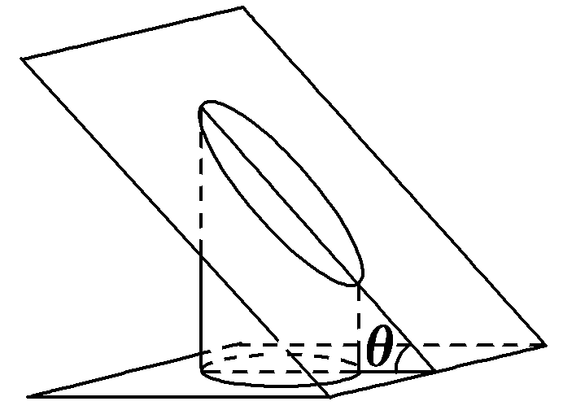

A.椭圆的长轴长等于4

B.椭圆的离心率为 $\frac{\sqrt{2}}{2}$

C.椭圆的标准方程可以是 $\frac{y^{2}}{16}$ ＋ $\frac{x^{2}}{4}$ ＝1

D.椭圆上的点到一个焦点的距离的最小值为4－2 $\sqrt{3}$

答案：**CD**

解析：设椭圆的长半轴长为<t<te<text style="it<text style="itali*c*">a</text>lic">x</text>t st*y*le="italic">e</text>xt style="it<text style="it<text style="itali*c*">a</text>lic">a</text>li*c*">a</text>，短半轴长为*<text style="italic">b*</text>，半焦距为c，椭圆长轴在圆柱底面上的投影为圆柱底面圆直径，则由截面与圆柱底面成锐二面角*θ*＝ $\frac{\pi }{3}$ 得2<t<te<text style="it<text style="itali*c*">a</text>lic">x</text>t st*y*le="italic">e</text>xt style="it<text style="it<text style="itali*c*">a</text>lic">a</text>li*c*">a</text>＝ $\frac{4}{cos\theta }$ ＝8，解得<t<te<text style="it<text style="itali*c*">a</text>lic">x</text>t st*y*le="italic">e</text>xt style="it<text style="it<text style="itali*c*">a</text>lic">a</text>li*c*">a</text>＝4，故A不正确；显然*<text style="italic">b*</text>＝2，则c＝ $\sqrt{a^{2}－b^{2}}$ ＝2 $\sqrt{3}$ ，离心率<te<text style="it<text style="itali*c*">a</text>lic">x</text>t st*y*le="italic">e</text>＝ $\frac{c}{a}$ ＝ $\frac{\sqrt{3}}{2}$ ，故B不正确；当以椭圆长轴所在直线为<te<text style="it<text style="itali*c*">a</text>lic">x</text>t style="italic">y</text>轴，短轴所在直线为x轴建立平面直角坐标系时，椭圆的标准方程为 $\frac{y^{2}}{16}$ ＋ $\frac{x^{2}}{4}$ ＝1，故C正确；椭圆上的点到焦点的距离的最小值为<t<te<text style="it<text style="itali*c*">a</text>lic">x</text>t st*y*le="italic">e</text>xt style="it<text style="it<text style="itali*c*">a</text>lic">a</text>li*c*">a</text>－c＝4－2 $\sqrt{3}$ ，故D正确.故选CD.

11.已知椭圆 $\frac{x^{2}}{a^{2}}$ ＋ $\frac{y^{2}}{b^{2}}$ ＝1(&lt;t<em>e</em>xt style="italic"&gt;a&lt;/text&gt;＞<em>b</em>＞0)的右焦点为<em>F</em>，<em>P</em>，<em>Q</em>是椭圆上关于原点对称的两点，<em>M</em>，<em>N</em>分别是<em>PF</em>，<em>QF</em>的中点.若以<em>MN</em>为直径的圆过原点，则椭圆的离心率e的取值范围是<u>　　　　</u>.

答案： $\left[\frac{\sqrt{2}}{2}，1\right)$

解析：设点<em>P</em>(<em>x</em>0，<em>y</em>0)，则<em>Q</em>(－<em>x</em>0，－<em>y</em>0)，又点<em>F</em>(<em>c</em>，0)，

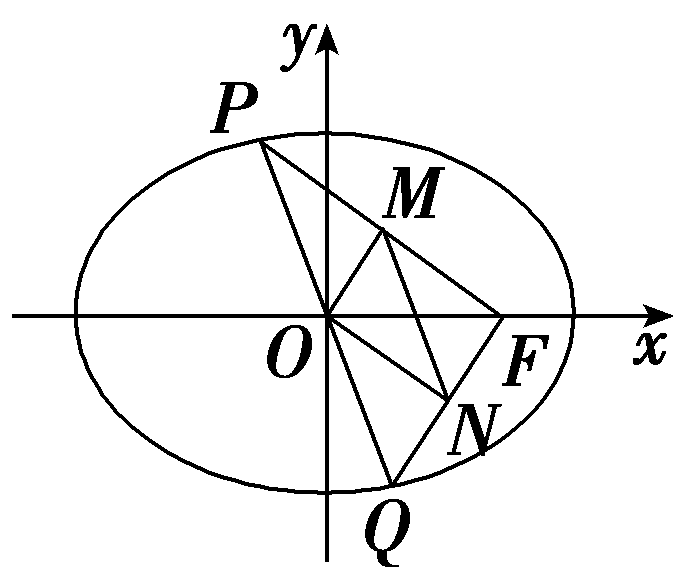

所以&lt;t&lt;t&lt;t<em>e</em>xt style="italic"&gt;e&lt;/text&gt;xt style="italic"&gt;e&lt;/text&gt;xt style="it&lt;text style="it<em>a</em>li<em>c</em>"&gt;a&lt;/text&gt;li&lt;text style="itali<em>c</em>"&gt;c&lt;/text&gt;"&gt;M&lt;/text&gt;( $\frac{x_{0}＋c}{2}$ ， $\frac{y_{0}}{2}$ )，&lt;t&lt;t&lt;t<em>e</em>xt style="italic"&gt;e&lt;/text&gt;xt style="italic"&gt;e&lt;/text&gt;xt style="it&lt;text style="it<em>a</em>li<em>c</em>"&gt;a&lt;/text&gt;li&lt;text style="itali<em>c</em>"&gt;c&lt;/text&gt;"&gt;N&lt;/text&gt;( $\frac{－x_{0}＋c}{2}$ ， $\frac{－y_{0}}{2}$ )，又以&lt;t&lt;t&lt;t<em>e</em>xt style="italic"&gt;e&lt;/text&gt;xt style="italic"&gt;e&lt;/text&gt;xt style="it&lt;text style="it<em>a</em>li<em>c</em>"&gt;a&lt;/text&gt;li&lt;text style="itali<em>c</em>"&gt;c&lt;/text&gt;"&gt;M&lt;/text&gt;<em>N</em>为直径的圆过原点，则有<em>OM</em>⊥<em>ON</em>，所以 $\vec{OM}$ · $\vec{ON}$ ＝0，即 $\frac{x_{0}＋c}{2}$ · $\frac{－x_{0}＋c}{2}$ － $\frac{y_{0}}{2}$ · $\frac{y_{0}}{2}$ ＝0，所以&lt;t&lt;t&lt;t<em>e</em>xt style="italic"&gt;e&lt;/text&gt;xt style="italic"&gt;e&lt;/text&gt;xt style="it&lt;text style="it<em>a</em>li<em>c</em>"&gt;a&lt;/text&gt;li<em>c</em>"&gt;c&lt;/text&gt;&lt;text style="superscript"&gt;&lt;text style="superscript"&gt;&lt;text style="superscript"&gt;&lt;text style="superscript"&gt;&lt;text style="superscript"&gt;2&lt;/text&gt;&lt;/text&gt;&lt;/text&gt;&lt;/text&gt;&lt;/text&gt;－ $x_{0}^{2}$ － $y_{0}^{2}$ ＝0，又 $\frac{x_{0}^{2}}{a^{2}}$ ＋ $\frac{y_{0}^{2}}{b^{2}}$ ＝1，所以 $\frac{c^{2}}{a^{2}}x_{0}^{2}$ ＋&lt;t&lt;t&lt;t<em>e</em>xt style="italic"&gt;e&lt;/text&gt;xt style="italic"&gt;e&lt;/text&gt;xt style="it&lt;text style="it<em>a</em>li<em>c</em>"&gt;a&lt;/text&gt;li<em>c</em>"&gt;b&lt;/text&gt;&lt;text style="superscript"&gt;&lt;text style="superscript"&gt;&lt;text style="superscript"&gt;&lt;text style="superscript"&gt;&lt;text style="superscript"&gt;2&lt;/text&gt;&lt;/text&gt;&lt;/text&gt;&lt;/text&gt;&lt;/text&gt;－<em>c</em>2＝0，得 $x_{0}^{2}$ ＝ $\frac{a^{2}\left(2c^{2}－a^{2}\right)}{c^{2}}$ ，所以0≤ $\frac{a^{2}\left(2c^{2}－a^{2}\right)}{c^{2}}$ ＜&lt;t&lt;t&lt;t<em>e</em>xt style="italic"&gt;e&lt;/text&gt;xt style="italic"&gt;e&lt;/text&gt;xt style="it<em>a</em>li<em>c</em>"&gt;a&lt;/text&gt;&lt;text style="supers<em>c</em>ript"&gt;&lt;text style="superscript"&gt;&lt;text style="superscript"&gt;&lt;text style="superscript"&gt;&lt;text style="superscript"&gt;2&lt;/text&gt;&lt;/text&gt;&lt;/text&gt;&lt;/text&gt;&lt;/text&gt;，整理得2<em>c</em>2≥a2，解得e≥ $\frac{\sqrt{2}}{2}$ ，又&lt;t&lt;t<em>e</em>xt style="italic"&gt;e&lt;/text&gt;xt style="italic"&gt;e&lt;/text&gt;＜1，所以 $\frac{\sqrt{2}}{2}$ ≤&lt;t&lt;t<em>e</em>xt style="italic"&gt;e&lt;/text&gt;xt style="italic"&gt;e&lt;/text&gt;＜1.

&lt;text style="subscript"&gt;&lt;text style="subscript"&gt;&lt;text style="subscript"&gt;&lt;text style="subscript"&gt;1&lt;/text&gt;&lt;/text&gt;&lt;/text&gt;&lt;/text&gt;&lt;text style="subscript"&gt;&lt;text style="subscript"&gt;2&lt;/text&gt;&lt;/text&gt;.(15分)若两个椭圆的离心率相等，则称它们为“相似椭圆”.如图，在平面直角坐标系<em>xOy</em>中，已知椭圆<em>&lt;text style="italic"&gt;&lt;text style="italic"&gt;&lt;text style="italic"&gt;C</em>&lt;/text&gt;&lt;/text&gt;&lt;/text&gt;1： $\frac{x^{2}}{6}$ ＋ $\frac{y^{2}}{3}$ ＝&lt;text style="subscript"&gt;&lt;text style="subscript"&gt;&lt;text style="subscript"&gt;&lt;text style="subscript"&gt;1&lt;/text&gt;&lt;/text&gt;&lt;/text&gt;&lt;/text&gt;，<em>&lt;text style="italic"&gt;&lt;text style="italic"&gt;&lt;text style="italic"&gt;A</em>&lt;/text&gt;&lt;/text&gt;&lt;/text&gt;1，A&lt;text style="subscript"&gt;&lt;text style="subscript"&gt;2&lt;/text&gt;&lt;/text&gt;分别为椭圆<em>&lt;text style="italic"&gt;&lt;text style="italic"&gt;&lt;text style="italic"&gt;C</em>&lt;/text&gt;&lt;/text&gt;&lt;/text&gt;1的左、右顶点.椭圆C2以线段A1A2为短轴且与椭圆C1为“相似椭圆”.

(1)求椭圆<em>C</em>2的方程；(5分)

(2)设<em>P</em>为椭圆<em>C</em>2上异于<em>A</em>1，<em>A</em>2的任意一点，过<em>P</em>作<em>PQ</em>⊥<em>x</em>轴，垂足为<em>Q</em>，线段<em>PQ</em>交椭圆<em>C</em>1于点<em>H</em>.求证：<em>A</em>1<em>H</em>⊥<em>PA</em>2.(10分)

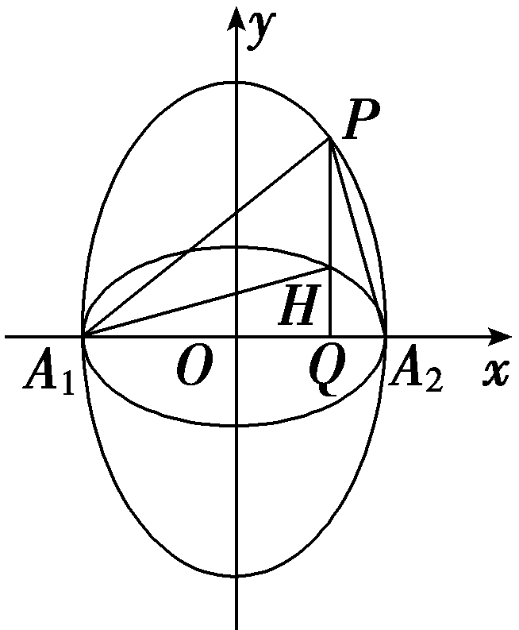

解：(<t*e*xt style="subscript">1</text>)椭圆*C*1： $\frac{x^{2}}{6}$ ＋ $\frac{y^{2}}{3}$ ＝<t*e*xt style="subscript">1</text>的离心率为e＝ $\frac{c}{a}$ ＝ $\sqrt{1－\frac{b^{2}}{a^{2}}}$ ＝ $\frac{\sqrt{2}}{2}$ ，

设椭圆<text style="it*a*lic">C</text><text style="su*<text style="italic">b*</text>script">2</text>的方程为 $\frac{y^{2}}{a^{2}}$ ＋ $\frac{x^{2}}{b^{2}}$ ＝1(*a*＞*<text style="italic">b*</text>＞0)，且b＝ $\sqrt{6}$ ，

因为两个椭圆为“相似椭圆”，所以&lt;text style="it<em>a</em>lic"&gt;e&lt;/text&gt;＝ $\sqrt{1－\frac{6}{a^{2}}}$ ＝ $\frac{\sqrt{2}}{2}$ ，解得<em>a</em>2＝12，

所以椭圆<em>C</em>2的方程为 $\frac{y^{2}}{12}$ ＋ $\frac{x^{2}}{6}$ ＝1.

(2)证明：不妨设<em>P</em>(<em>&lt;text style="italic"&gt;&lt;text style="italic"&gt;m</em>&lt;/text&gt;&lt;/text&gt;，<em>&lt;text style="italic"&gt;n</em>&lt;/text&gt;)，其中n＞0，－ $\sqrt{6}$ ＜<em>&lt;text style="italic"&gt;&lt;text style="italic"&gt;m</em>&lt;/text&gt;&lt;/text&gt;＜ $\sqrt{6}$ ，则 $\frac{n^{2}}{12}$ ＋ $\frac{m^{2}}{6}$ ＝1，可得<em>&lt;text style="italic"&gt;&lt;text style="italic"&gt;m</em>&lt;/text&gt;&lt;/text&gt;2＝6－ $\frac{n^{2}}{2}$ ，

把&lt;text st<em>y</em>le="italic"&gt;x&lt;/text&gt;＝<em>m</em>代入椭圆<em>C</em>1： $\frac{x^{2}}{6}$ ＋ $\frac{y^{2}}{3}$ ＝&lt;text st<em>y</em>le="subscript"&gt;1&lt;/text&gt;，可得y＝ $\sqrt{3－\frac{m^{2}}{2}}$ ，所以<em>H</em> $\left(m，\sqrt{3－\frac{m^{2}}{2}}\right)$ ，

所以 $k_{A_{1}H}$ ＝ $\frac{\sqrt{3－\frac{m^{2}}{2}}}{m＋\sqrt{6}}$ ， $k_{PA_{2}}$ ＝ $\frac{n}{m－\sqrt{6}}$ ，

所以 $k_{A_{1}H}$ · $k_{PA_{2}}$ ＝ $\frac{\sqrt{3－\frac{m^{2}}{2}}}{m＋\sqrt{6}}$ × $\frac{n}{m－\sqrt{6}}$ ＝ $\frac{n\cdot \sqrt{3－\frac{m^{2}}{2}}}{m^{2}－6}$ ＝－ $\frac{n}{\sqrt{2}\cdot \sqrt{6－m^{2}}}$ ＝－ $\frac{n}{\sqrt{2}\cdot \sqrt{6－\left(6－\frac{n^{2}}{2}\right)}}$ ＝－1.

所以<em>A</em>1<em>H</em>⊥<em>PA</em>2.

(13、14题，每小题5分，共10分)

&lt;te<em>x</em>t style="subscript"&gt;&lt;text style="subscript"&gt;1&lt;/text&gt;&lt;/text&gt;3.(多选)(&lt;text style="subscript"&gt;&lt;text style="subscript"&gt;2&lt;/text&gt;&lt;/text&gt;025·河南九师联盟联考)如图，已知椭圆 $\frac{x^{2}}{2}$ ＋&lt;te<em>x</em>t style="italic"&gt;y&lt;/text&gt;&lt;text style="subscript"&gt;&lt;text style="subscript"&gt;2&lt;/text&gt;&lt;/text&gt;＝&lt;text style="subscript"&gt;&lt;text style="subscript"&gt;1&lt;/text&gt;&lt;/text&gt;的左、右顶点分别是<em>&lt;text style="italic"&gt;&lt;text style="italic"&gt;&lt;text style="italic"&gt;A</em>&lt;/text&gt;&lt;/text&gt;&lt;/text&gt;1，A2，上顶点为<em>B</em>1，在椭圆上任取一点<em>&lt;text style="italic"&gt;&lt;text style="italic"&gt;C</em>&lt;/text&gt;&lt;/text&gt;(非长轴端点)，连接A1C交直线x＝ $\sqrt{2}$ 于点<em>P</em>，连接&lt;te<em>x</em>t style="italic"&gt;<em>&lt;text style="italic"&gt;&lt;text style="italic"&gt;A</em>&lt;/text&gt;&lt;/text&gt;&lt;/text&gt;&lt;text style="subscript"&gt;&lt;text style="subscript"&gt;2&lt;/text&gt;&lt;/text&gt;<em>&lt;text style="italic"&gt;&lt;text style="italic"&gt;C</em>&lt;/text&gt;&lt;/text&gt;交<em>&lt;text style="italic"&gt;O</em>P&lt;/text&gt;于点<em>M</em>(O是坐标原点)，则(　　)

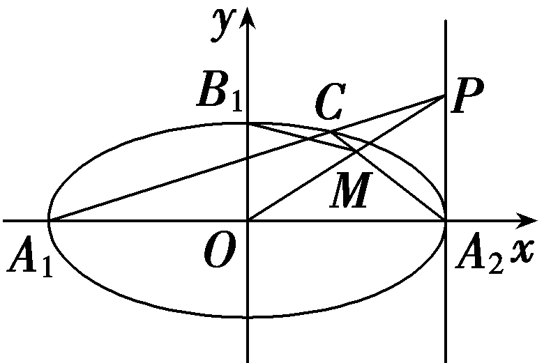

A. $k_{CA_{1}}$ · $k_{CA_{2}}$ 为定值	B. $k_{A_{1}P}$ ＝ $\frac{\sqrt{2}}{2}$ *k*OP

C.<em>OP</em>⊥<em>A</em>2<em>C</em>	D. $\left|MB_{1}\right|$ 的最大值为 $\sqrt{3}$

答案：**AC**

解析：由题意知&lt;te&lt;te&lt;te&lt;text st<em>y</em>le="italic"&gt;x&lt;/text&gt;t st<em>y</em>le="italic"&gt;x&lt;/text&gt;t st&lt;text st<em>y</em>le="italic"&gt;y&lt;/text&gt;le="italic"&gt;x&lt;/text&gt;t st<em>y</em>le="italic"&gt;<em>&lt;text style="italic"&gt;&lt;text style="italic"&gt;&lt;text style="italic"&gt;&lt;text style="italic"&gt;A</em>&lt;/text&gt;&lt;/text&gt;&lt;/text&gt;&lt;/text&gt;&lt;/text&gt;&lt;text style="subscript"&gt;&lt;text style="subscript"&gt;1&lt;/text&gt;&lt;/text&gt; $\left(－\sqrt{2}，0\right)$ ，&lt;te&lt;te&lt;te&lt;text st<em>y</em>le="italic"&gt;x&lt;/text&gt;t st<em>y</em>le="italic"&gt;x&lt;/text&gt;t st&lt;text st<em>y</em>le="italic"&gt;y&lt;/text&gt;le="italic"&gt;x&lt;/text&gt;t st<em>y</em>le="italic"&gt;<em>&lt;text style="italic"&gt;&lt;text style="italic"&gt;&lt;text style="italic"&gt;&lt;text style="italic"&gt;A</em>&lt;/text&gt;&lt;/text&gt;&lt;/text&gt;&lt;/text&gt;&lt;/text&gt;&lt;text style="subscript"&gt;&lt;text style="subscript"&gt;&lt;text style="subscript"&gt;2&lt;/text&gt;&lt;/text&gt;&lt;/text&gt; $\left(\sqrt{2}，0\right)$ ，因为点&lt;te&lt;te&lt;te&lt;text st<em>y</em>le="italic"&gt;x&lt;/text&gt;t st<em>y</em>le="italic"&gt;x&lt;/text&gt;t st&lt;text st<em>y</em>le="italic"&gt;y&lt;/text&gt;le="italic"&gt;x&lt;/text&gt;t st<em>y</em>le="italic"&gt;<em>&lt;text style="italic"&gt;&lt;text style="italic"&gt;&lt;text style="italic"&gt;C</em>&lt;/text&gt;&lt;/text&gt;&lt;/text&gt;&lt;/text&gt;在椭圆上，所以设点C的坐标为 $\left(\sqrt{2}cos\theta ，sin\theta \right)$ ，&lt;te&lt;te&lt;te&lt;text st<em>y</em>le="italic"&gt;x&lt;/text&gt;t st<em>y</em>le="italic"&gt;x&lt;/text&gt;t st&lt;text st<em>y</em>le="italic"&gt;y&lt;/text&gt;le="italic"&gt;x&lt;/text&gt;t st<em>y</em>le="italic"&gt;<em>&lt;text style="italic"&gt;&lt;text style="italic"&gt;&lt;text style="italic"&gt;θ</em>&lt;/text&gt;&lt;/text&gt;&lt;/text&gt;&lt;/text&gt;∈ $\left[0，2\pi \right)$ ，&lt;te&lt;te&lt;te&lt;text st<em>y</em>le="italic"&gt;x&lt;/text&gt;t st<em>y</em>le="italic"&gt;x&lt;/text&gt;t st&lt;text st<em>y</em>le="italic"&gt;y&lt;/text&gt;le="italic"&gt;x&lt;/text&gt;t st<em>y</em>le="italic"&gt;<em>&lt;text style="italic"&gt;&lt;text style="italic"&gt;&lt;text style="italic"&gt;θ</em>&lt;/text&gt;&lt;/text&gt;&lt;/text&gt;&lt;/text&gt;≠0且θ≠π.对于<em>&lt;text style="italic"&gt;&lt;text style="italic"&gt;&lt;text style="italic"&gt;&lt;text style="italic"&gt;&lt;text style="italic"&gt;A</em>&lt;/text&gt;&lt;/text&gt;&lt;/text&gt;&lt;/text&gt;&lt;/text&gt;， $k_{CA_{1}}$ · $k_{CA_{2}}$ ＝ $\frac{sin\theta }{\sqrt{2}cos\theta ＋\sqrt{2}}$ · $\frac{sin\theta }{\sqrt{2}cos\theta －\sqrt{2}}$ ＝ $\frac{sin^{2}\theta }{2cos^{2}\theta －2}$ ＝ $\frac{sin^{2}\theta }{－2sin^{2}\theta }$ ＝－ $\frac{1}{2}$ ，故&lt;te&lt;te&lt;te&lt;text st<em>y</em>le="italic"&gt;x&lt;/text&gt;t st<em>y</em>le="italic"&gt;x&lt;/text&gt;t st&lt;text st<em>y</em>le="italic"&gt;y&lt;/text&gt;le="italic"&gt;x&lt;/text&gt;t st<em>y</em>le="italic"&gt;<em>&lt;text style="italic"&gt;&lt;text style="italic"&gt;&lt;text style="italic"&gt;&lt;text style="italic"&gt;A</em>&lt;/text&gt;&lt;/text&gt;&lt;/text&gt;&lt;/text&gt;&lt;/text&gt;正确；对于<em>B</em>，因为 $k_{A_{1}P}$ ＝ $k_{CA_{1}}$ ＝ $\frac{sin\theta }{\sqrt{2}cos\theta ＋\sqrt{2}}$ ，直线&lt;te&lt;te&lt;te&lt;text st<em>y</em>le="italic"&gt;x&lt;/text&gt;t st<em>y</em>le="italic"&gt;x&lt;/text&gt;t st&lt;text st<em>y</em>le="italic"&gt;y&lt;/text&gt;le="italic"&gt;x&lt;/text&gt;t st<em>y</em>le="italic"&gt;<em>&lt;text style="italic"&gt;&lt;text style="italic"&gt;&lt;text style="italic"&gt;&lt;text style="italic"&gt;A</em>&lt;/text&gt;&lt;/text&gt;&lt;/text&gt;&lt;/text&gt;&lt;/text&gt;&lt;text style="subscript"&gt;&lt;text style="subscript"&gt;1&lt;/text&gt;&lt;/text&gt;<em>&lt;text style="italic"&gt;P</em>&lt;/text&gt;的方程为y＝ $\frac{sin\theta }{\sqrt{2}cos\theta ＋\sqrt{2}}\left(x＋\sqrt{2}\right)$ ，令&lt;te&lt;te&lt;text st<em>y</em>le="italic"&gt;x&lt;/text&gt;t st<em>y</em>le="italic"&gt;x&lt;/text&gt;t st&lt;text st<em>y</em>le="italic"&gt;y&lt;/text&gt;le="italic"&gt;x&lt;/text&gt;＝ $\sqrt{2}$ ，得&lt;te&lt;te&lt;te&lt;text st<em>y</em>le="italic"&gt;x&lt;/text&gt;t st<em>y</em>le="italic"&gt;x&lt;/text&gt;t st&lt;text st<em>y</em>le="italic"&gt;y&lt;/text&gt;le="italic"&gt;x&lt;/text&gt;t style="italic"&gt;y&lt;/text&gt;＝ $\frac{2sin\theta }{cos\theta +1}$ ，故&lt;te&lt;te&lt;te&lt;text st<em>y</em>le="italic"&gt;x&lt;/text&gt;t st<em>y</em>le="italic"&gt;x&lt;/text&gt;t st&lt;text st<em>y</em>le="italic"&gt;y&lt;/text&gt;le="italic"&gt;x&lt;/text&gt;t st<em>y</em>le="italic"&gt;<em>P</em>&lt;/text&gt;( $\sqrt{2}$ ， $\frac{2sin\theta }{cos\theta +1}$ )，所以&lt;te&lt;te&lt;text st<em>y</em>le="italic"&gt;x&lt;/text&gt;t st<em>y</em>le="italic"&gt;x&lt;/text&gt;t st<em>y</em>le="italic"&gt;<em>&lt;text style="italic"&gt;k</em>&lt;/text&gt;&lt;/text&gt;O&lt;te&lt;text st<em>y</em>le="italic"&gt;x&lt;/text&gt;t st<em>y</em>le="italic"&gt;<em>P</em>&lt;/text&gt;＝ $\frac{\sqrt{2}sin\theta }{cos\theta +1}$ ，所以 $k_{A_{1}P}$ ＝ $\frac{1}{2}$ &lt;te&lt;te&lt;text st<em>y</em>le="italic"&gt;x&lt;/text&gt;t st<em>y</em>le="italic"&gt;x&lt;/text&gt;t st<em>y</em>le="italic"&gt;<em>&lt;text style="italic"&gt;k</em>&lt;/text&gt;&lt;/text&gt;O&lt;te&lt;text st<em>y</em>le="italic"&gt;x&lt;/text&gt;t st<em>y</em>le="italic"&gt;<em>P</em>&lt;/text&gt;，故<em>B</em>错误；对于<em>&lt;text style="italic"&gt;&lt;text style="italic"&gt;&lt;text style="italic"&gt;&lt;text style="italic"&gt;C</em>&lt;/text&gt;&lt;/text&gt;&lt;/text&gt;&lt;/text&gt;，因为 $k_{CA_{2}}$ ＝ $\frac{sin\theta }{\sqrt{2}cos\theta －\sqrt{2}}$ ，所以 $k_{CA_{2}}$ ·&lt;te&lt;te&lt;text st<em>y</em>le="italic"&gt;x&lt;/text&gt;t st<em>y</em>le="italic"&gt;x&lt;/text&gt;t st<em>y</em>le="italic"&gt;<em>&lt;text style="italic"&gt;k</em>&lt;/text&gt;&lt;/text&gt;O&lt;te&lt;text st<em>y</em>le="italic"&gt;x&lt;/text&gt;t st<em>y</em>le="italic"&gt;<em>P</em>&lt;/text&gt;＝ $\frac{sin\theta }{\sqrt{2}cos\theta －\sqrt{2}}$ · $\frac{\sqrt{2}sin\theta }{cos\theta +1}$ ＝ $\frac{\sqrt{2}sin^{2}\theta }{\sqrt{2}\left(cos^{2}\theta －1\right)}$ ＝－&lt;te&lt;te&lt;te&lt;text st<em>y</em>le="italic"&gt;x&lt;/text&gt;t st<em>y</em>le="italic"&gt;x&lt;/text&gt;t st&lt;text st<em>y</em>le="italic"&gt;y&lt;/text&gt;le="italic"&gt;x&lt;/text&gt;t st<em>y</em>le="subscript"&gt;&lt;text style="subscript"&gt;1&lt;/text&gt;&lt;/text&gt;，所以O<em>&lt;text style="italic"&gt;P</em>&lt;/text&gt;⊥<em>&lt;text style="italic"&gt;&lt;text style="italic"&gt;&lt;text style="italic"&gt;&lt;text style="italic"&gt;&lt;text style="italic"&gt;A</em>&lt;/text&gt;&lt;/text&gt;&lt;/text&gt;&lt;/text&gt;&lt;/text&gt;&lt;text style="subscript"&gt;&lt;text style="subscript"&gt;&lt;text style="subscript"&gt;2&lt;/text&gt;&lt;/text&gt;&lt;/text&gt;<em>&lt;text style="italic"&gt;&lt;text style="italic"&gt;&lt;text style="italic"&gt;&lt;text style="italic"&gt;C</em>&lt;/text&gt;&lt;/text&gt;&lt;/text&gt;&lt;/text&gt;，故C正确；对于D，<em>&lt;text style="italic,subscript"&gt;&lt;text style="italic,subscript"&gt;&lt;text style="italic"&gt;&lt;text style="italic"&gt;&lt;text style="italic"&gt;OP</em>&lt;/text&gt;&lt;/text&gt;&lt;/text&gt;&lt;/text&gt;&lt;/text&gt;的方程为y＝ $\frac{\sqrt{2}sin\theta }{cos\theta +1}$ &lt;te&lt;te&lt;text st<em>y</em>le="italic"&gt;x&lt;/text&gt;t st<em>y</em>le="italic"&gt;x&lt;/text&gt;t st&lt;text st<em>y</em>le="italic"&gt;y&lt;/text&gt;le="italic"&gt;x&lt;/text&gt;，&lt;text st<em>y</em>le="italic"&gt;<em>&lt;text style="italic"&gt;&lt;text style="italic"&gt;&lt;text style="italic"&gt;&lt;text style="italic"&gt;A</em>&lt;/text&gt;&lt;/text&gt;&lt;/text&gt;&lt;/text&gt;&lt;/text&gt;&lt;text style="subscript"&gt;&lt;text style="subscript"&gt;&lt;text style="subscript"&gt;2&lt;/text&gt;&lt;/text&gt;&lt;/text&gt;<em>&lt;text style="italic"&gt;&lt;text style="italic"&gt;&lt;text style="italic"&gt;&lt;text style="italic"&gt;C</em>&lt;/text&gt;&lt;/text&gt;&lt;/text&gt;&lt;/text&gt;的方程为y＝ $\frac{sin\theta }{\sqrt{2}cos\theta －\sqrt{2}}\left(x－\sqrt{2}\right)$ ，联立直线O&lt;te&lt;te&lt;te&lt;text st<em>y</em>le="italic"&gt;x&lt;/text&gt;t st<em>y</em>le="italic"&gt;x&lt;/text&gt;t st&lt;text st<em>y</em>le="italic"&gt;y&lt;/text&gt;le="italic"&gt;x&lt;/text&gt;t st<em>y</em>le="italic"&gt;<em>P</em>&lt;/text&gt;，<em>&lt;text style="italic"&gt;&lt;text style="italic"&gt;&lt;text style="italic"&gt;&lt;text style="italic"&gt;&lt;text style="italic"&gt;A</em>&lt;/text&gt;&lt;/text&gt;&lt;/text&gt;&lt;/text&gt;&lt;/text&gt;&lt;text style="subscript"&gt;&lt;text style="subscript"&gt;&lt;text style="subscript"&gt;2&lt;/text&gt;&lt;/text&gt;&lt;/text&gt;<em>&lt;text style="italic"&gt;&lt;text style="italic"&gt;&lt;text style="italic"&gt;&lt;text style="italic"&gt;C</em>&lt;/text&gt;&lt;/text&gt;&lt;/text&gt;&lt;/text&gt;的方程可求得x＝ $\frac{\sqrt{2}\left(cos\theta +1\right)}{3－cos\theta }$ ，&lt;te&lt;te&lt;te&lt;text st<em>y</em>le="italic"&gt;x&lt;/text&gt;t st<em>y</em>le="italic"&gt;x&lt;/text&gt;t st&lt;text st<em>y</em>le="italic"&gt;y&lt;/text&gt;le="italic"&gt;x&lt;/text&gt;t style="italic"&gt;y&lt;/text&gt;＝ $\frac{2sin\theta }{3－cos\theta }$ ，故点<em>M</em>( $\frac{\sqrt{2}\left(cos\theta +1\right)}{3－cos\theta }$ ， $\frac{2sin\theta }{3－cos\theta }$ )，又<em>B</em>&lt;te&lt;te&lt;te&lt;text st<em>y</em>le="italic"&gt;x&lt;/text&gt;t st<em>y</em>le="italic"&gt;x&lt;/text&gt;t st&lt;text st<em>y</em>le="italic"&gt;y&lt;/text&gt;le="italic"&gt;x&lt;/text&gt;t st<em>y</em>le="subscript"&gt;&lt;text style="subscript"&gt;1&lt;/text&gt;&lt;/text&gt; $\left(0，1\right)$ ，所以 $\left|MB_{1}\right|^{2}$ ＝ $\frac{2\left(cos\theta +1\right)^{2}}{\left(3－cos\theta \right)^{2}}$ ＋ $\left(\frac{2sin\theta }{3－cos\theta }－1\right)^{2}$ ，当cos &lt;te&lt;te&lt;te&lt;text st<em>y</em>le="italic"&gt;x&lt;/text&gt;t st<em>y</em>le="italic"&gt;x&lt;/text&gt;t st&lt;text st<em>y</em>le="italic"&gt;y&lt;/text&gt;le="italic"&gt;x&lt;/text&gt;t st<em>y</em>le="italic"&gt;<em>&lt;text style="italic"&gt;&lt;text style="italic"&gt;&lt;text style="italic"&gt;θ</em>&lt;/text&gt;&lt;/text&gt;&lt;/text&gt;&lt;/text&gt;＝ $\frac{1}{2}$ ，sin &lt;te&lt;te&lt;te&lt;text st<em>y</em>le="italic"&gt;x&lt;/text&gt;t st<em>y</em>le="italic"&gt;x&lt;/text&gt;t st&lt;text st<em>y</em>le="italic"&gt;y&lt;/text&gt;le="italic"&gt;x&lt;/text&gt;t st<em>y</em>le="italic"&gt;<em>&lt;text style="italic"&gt;&lt;text style="italic"&gt;&lt;text style="italic"&gt;θ</em>&lt;/text&gt;&lt;/text&gt;&lt;/text&gt;&lt;/text&gt;＝－ $\frac{\sqrt{3}}{2}$ 时， $\left|MB_{1}\right|^{2}$ ＝ $\frac{11+4\sqrt{3}}{5}$ ＞3，故 $\left|MB_{1}\right|$ ＞ $\sqrt{3}$ ，故D错误.故选&lt;te&lt;te&lt;te&lt;text st<em>y</em>le="italic"&gt;x&lt;/text&gt;t st<em>y</em>le="italic"&gt;x&lt;/text&gt;t st&lt;text st<em>y</em>le="italic"&gt;y&lt;/text&gt;le="italic"&gt;x&lt;/text&gt;t st<em>y</em>le="italic"&gt;<em>&lt;text style="italic"&gt;&lt;text style="italic"&gt;&lt;text style="italic"&gt;&lt;text style="italic"&gt;A</em>&lt;/text&gt;&lt;/text&gt;&lt;/text&gt;&lt;/text&gt;&lt;/text&gt;<em>&lt;text style="italic"&gt;&lt;text style="italic"&gt;&lt;text style="italic"&gt;&lt;text style="italic"&gt;C</em>&lt;/text&gt;&lt;/text&gt;&lt;/text&gt;&lt;/text&gt;.

14.(双空题)已知椭圆<em>C</em>的一个焦点为<em>F</em>(0，1)，椭圆<em>C</em>上的点到<em>F</em>的距离的最小值为1，则椭圆<em>C</em>的标准方程为<u>　　　　　　　　　　</u>；若<em>P</em>为椭圆<em>C</em>上一动点，<em>M</em>(3，3)，则｜<em>PM</em>｜－｜<em>PF</em>｜的最小值为<u>　　　　</u>.

答案： $\frac{y^{2}}{4}$ ＋ $\frac{x^{2}}{3}$ ＝1　1

解析：因为椭圆&lt;text st&lt;text style="it&lt;text style="it&lt;text style="it&lt;text style="itali<em>c</em>"&gt;a&lt;/text&gt;lic"&gt;a&lt;/text&gt;li<em>c</em>"&gt;a&lt;/text&gt;li<em>c</em>"&gt;y&lt;/text&gt;le="italic"&gt;<em>&lt;text style="italic"&gt;&lt;text style="italic"&gt;&lt;text style="italic"&gt;C</em>&lt;/text&gt;&lt;/text&gt;&lt;/text&gt;&lt;/text&gt;的一个焦点为<em>&lt;text style="italic"&gt;F</em>&lt;/text&gt;(0，1)，所以椭圆C的焦点在y轴上，且c＝1，因为椭圆C上的点到F的距离的最小值为1，所以a－c＝1，得a＝&lt;text style="superscript"&gt;&lt;text style="superscript"&gt;2&lt;/text&gt;&lt;/text&gt;，因为<em>b</em>2＝a2－c2＝3，所以椭圆C的标准方程为 $\frac{y^{2}}{4}$ ＋ $\frac{x^{2}}{3}$ ＝1；将<em>&lt;text style="italic"&gt;&lt;text style="italic"&gt;M</em>&lt;/text&gt;&lt;/text&gt;(3，3)代入椭圆方程，得 $\frac{3^{2}}{4}$ ＋ $\frac{3^{2}}{3}$ ＝ $\frac{21}{4}$ ＞1，所以<em>&lt;text style="italic"&gt;&lt;text style="italic"&gt;M</em>&lt;/text&gt;&lt;/text&gt;点在椭圆外，如图所示，设椭圆&lt;text st&lt;text style="it&lt;text style="it&lt;text style="it&lt;text style="itali<em>c</em>"&gt;a&lt;/text&gt;lic"&gt;a&lt;/text&gt;li<em>c</em>"&gt;a&lt;/text&gt;li<em>c</em>"&gt;y&lt;/text&gt;le="italic"&gt;<em>&lt;text style="italic"&gt;&lt;text style="italic"&gt;&lt;text style="italic"&gt;C</em>&lt;/text&gt;&lt;/text&gt;&lt;/text&gt;&lt;/text&gt;的另一个焦点为<em>&lt;text style="italic"&gt;F</em>&lt;/text&gt;'，则｜<em>&lt;text style="italic"&gt;&lt;text style="italic"&gt;P</em>F&lt;/text&gt;&lt;/text&gt;｜＋｜P<em>&lt;text style="italic"&gt;F'</em>&lt;/text&gt;｜＝4，所以｜<em>&lt;text style="italic"&gt;&lt;text style="italic"&gt;&lt;text style="italic"&gt;PM</em>&lt;/text&gt;&lt;/text&gt;&lt;/text&gt;｜－｜<em>PF</em>｜＝｜PM｜＋｜<em>&lt;text style="italic"&gt;&lt;text style="italic"&gt;PF'</em>&lt;/text&gt;&lt;/text&gt;｜－4.当F'，P，M三点共线时，｜PM｜＋｜PF'｜取得最小值，且最小值为｜<em>MF'</em>｜＝ $\sqrt{\left(3－0\right)^{2}＋\left(3+1\right)^{2}}$ ＝5，所以｜<em>P&lt;text style="italic"&gt;&lt;text style="italic"&gt;M</em>&lt;/text&gt;&lt;/text&gt;｜－｜P&lt;text st&lt;text style="it&lt;text style="it&lt;text style="it&lt;text style="itali<em>c</em>"&gt;a&lt;/text&gt;lic"&gt;a&lt;/text&gt;li<em>c</em>"&gt;a&lt;/text&gt;li<em>c</em>"&gt;y&lt;/text&gt;le="italic"&gt;<em>F</em>&lt;/text&gt;｜的最小值为1.

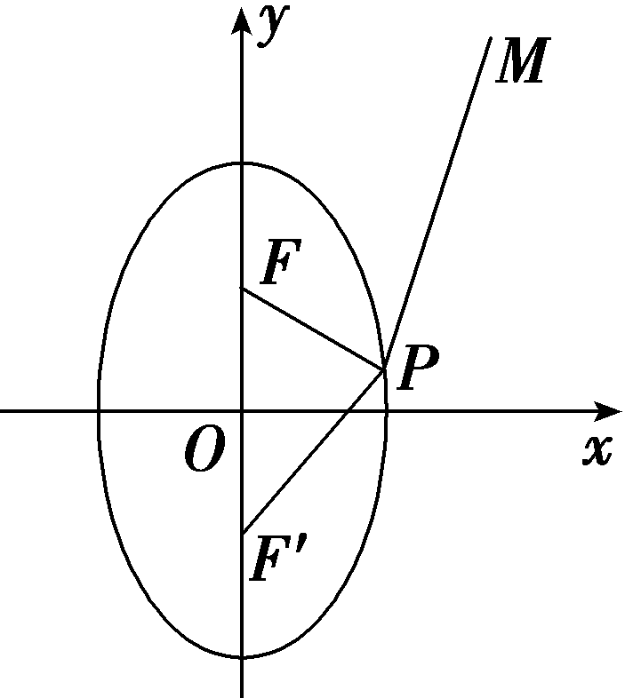

