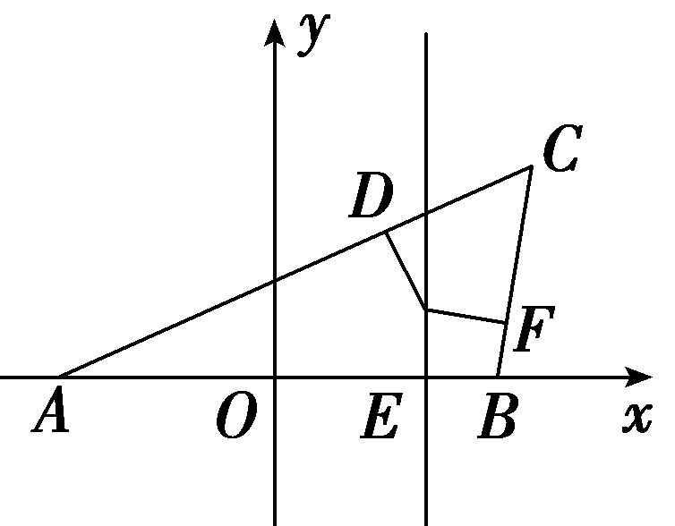
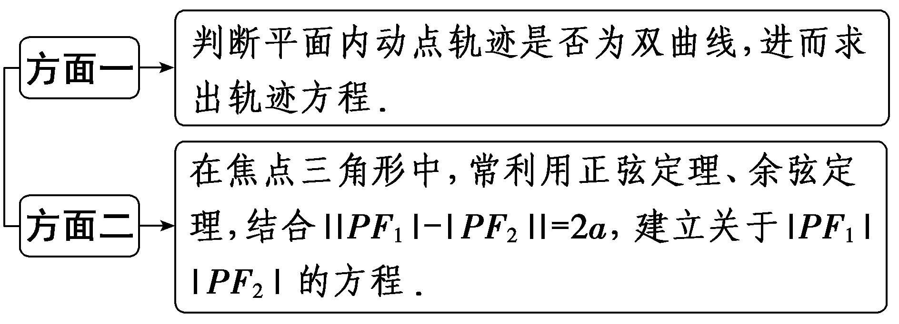
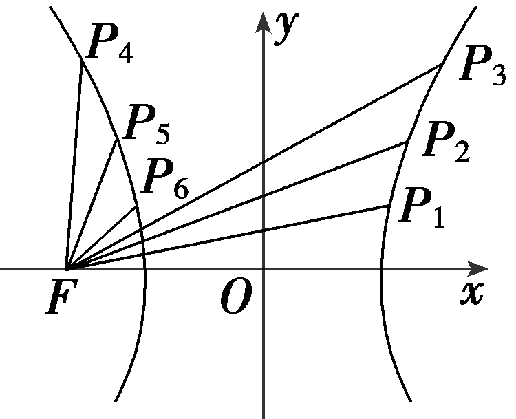
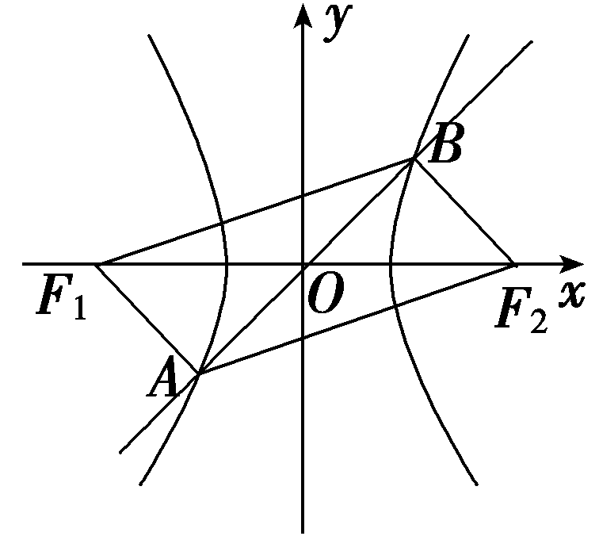
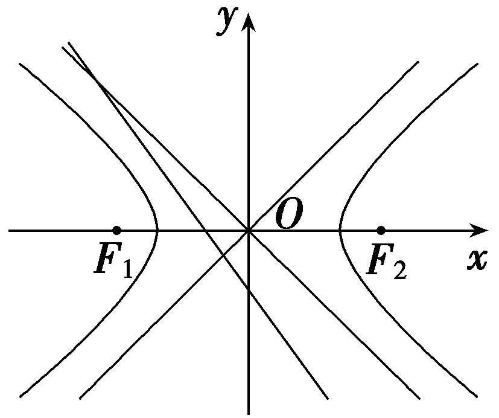
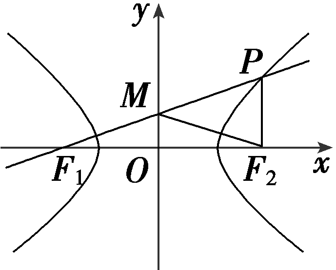
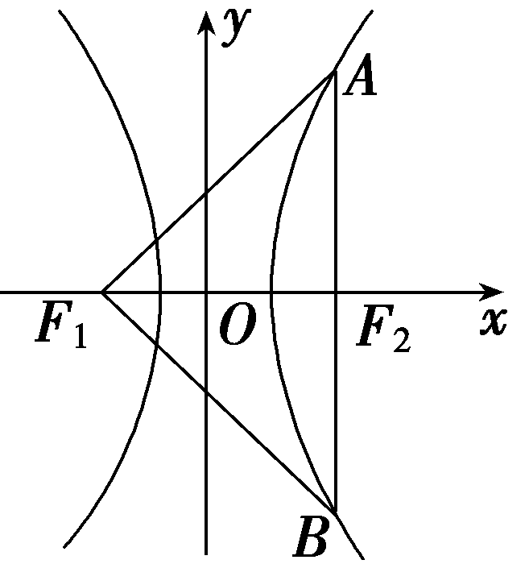
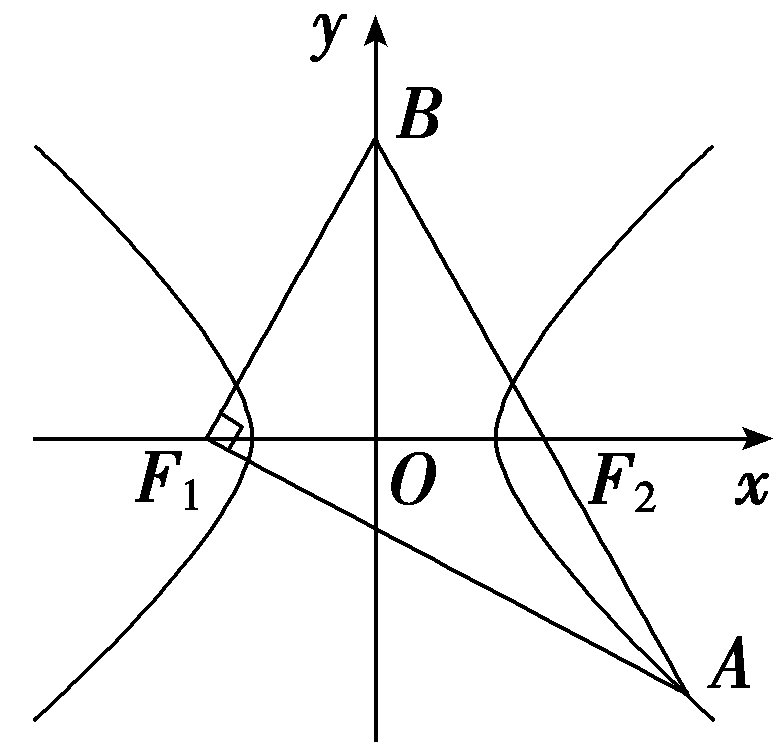
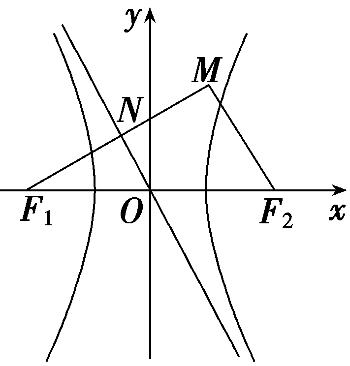
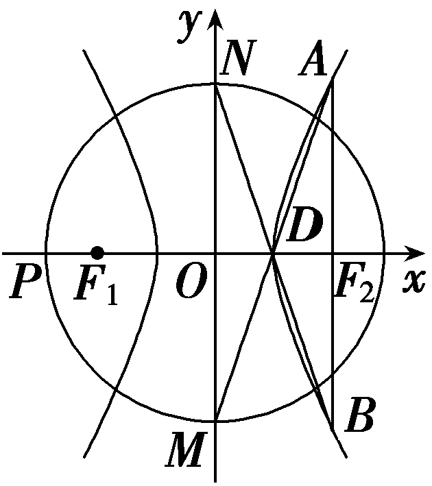

**第六节　双曲线**

【课标研读】　1.了解双曲线的实际背景，感受双曲线在刻画现实世界和解决实际问题中的作用.　2.了解双曲线的定义、几何图形和标准方程，以及它的简单几何性质.　3.通过双曲线与方程的学习，进一步体会数形结合的思想.

1.双曲线的定义

<table><tr><td>
条件
</td><td>
结论1
</td><td>
结论2
</td></tr><tr><td>
平面内的动点<em>M</em>与平面内的两个定点<em>F</em>1，<em>F</em>2
</td><td rowspan="3">
<em>M</em>点的

轨迹为

双曲线
</td><td rowspan="3">
<em>F</em>1，<em>F</em>2为双曲线的焦点

｜<em>F</em>1<em>F</em>2｜为双曲线的焦距
</td></tr><tr><td>
｜｜<em>MF</em>1｜－｜<em>MF</em>2｜｜＝2<em>a</em>
</td></tr><tr><td>
2<em>a</em>＜｜<em>F</em>1<em>F</em>2｜
</td></tr></table>

[微提醒]　若2<em>a</em>＝｜<em>F</em>1<em>F</em>2｜，则轨迹是以<em>F</em>1，<em>F</em>2为端点的两条射线；若2<em>a</em>＞｜<em>F</em>1<em>F</em>2｜，则轨迹不存在；若2<em>a</em>＝0，则轨迹是线段<em>F</em>1<em>F</em>2的垂直平分线.

2.双曲线的标准方程和简单几何性质

【常用结论】

(1)双曲线方程的常见设法

①与双曲线 $\frac{x^{2}}{a^{2}}$ － $\frac{y^{2}}{b^{2}}$ ＝1共渐近线的方程可设为 $\frac{x^{2}}{a^{2}}$ － $\frac{y^{2}}{b^{2}}$ ＝*λ* $\left(\lambda \ne 0\right)$ .

②若渐近线的方程为<te*x*t style="italic">y</text>＝± $\frac{b}{a}$ *x*，则可设双曲线方程为 $\frac{x^{2}}{a^{2}}$ － $\frac{y^{2}}{b^{2}}$ ＝*λ* $\left(\lambda \ne 0\right)$ .

(2)双曲线中的常用结论

①双曲线的焦点到其渐近线的距离为*b*.

②若<em>P</em>是双曲线右支上一点，<em>F</em>1，<em>F</em>2分别为双曲线的左、右焦点，则｜<em>PF</em>1｜min＝<em>a</em>＋<em>c</em>，｜<em>PF</em>2｜min＝<em>c</em>－<em>a</em>.

③同支的焦点弦中最短的为通径(过焦点且垂直于实轴的弦)，其长为 $\frac{2b^{2}}{a}$ .

④若<em>P</em>是双曲线上不同于实轴两端点的任意一点，<em>&lt;text style="italic"&gt;&lt;text style="italic"&gt;F</em>&lt;/text&gt;&lt;/text&gt;&lt;text style="subscript"&gt;1&lt;/text&gt;，F&lt;text style="subscript"&gt;2&lt;/text&gt;分别为双曲线的左、右焦点，则 $S_{\bigtriangleup PF_{1}F_{2}}$ ＝ $\frac{b^{2}}{tan\frac{\theta }{2}}$ ，其中<em>θ</em>为∠<em>&lt;text style="italic"&gt;&lt;text style="italic"&gt;F</em>&lt;/text&gt;&lt;/text&gt;&lt;text style="subscript"&gt;1&lt;/text&gt;<em>P</em>F&lt;text style="subscript"&gt;2&lt;/text&gt;.

【自主检测】

1.(多选)下列说法正确的是(　　)

A.平面内到点<em>F</em>1(0，4)，<em>F</em>2(0，－4)的距离之差的绝对值等于8的点的轨迹是双曲线

B.方程 $\frac{x^{2}}{m}$ － $\frac{y^{2}}{n}$ ＝1(<te*x*t style="italic">mn</text>＞0)表示焦点在x轴上的双曲线

C.双曲线 $\frac{x^{2}}{m^{2}}$ － $\frac{y^{2}}{n^{2}}$ ＝1(*m*＞0，*n*＞0)的渐近线方程是 $\frac{x}{m}$ ± $\frac{y}{n}$ ＝0

D.等轴双曲线的渐近线互相垂直，离心率等于 $\sqrt{2}$

答案：**CD**

2.(链接人教A选择性必修一<em>&lt;text style="italic"&gt;P</em>&lt;/text&gt;127T1)已知双曲线<em>x</em>2－ $\frac{y^{2}}{16}$ ＝1上一点<em>&lt;text style="italic"&gt;P</em>&lt;/text&gt;到它的一个焦点的距离等于4，那么点P到另一个焦点的距离等于<u>　　　　</u>.

答案：6

解析：设双曲线的焦点为&lt;text style="it<em>a</em>li<em>c</em>"&gt;<em>F</em>&lt;/text&gt;&lt;text style="subscript"&gt;&lt;text style="subscript"&gt;1&lt;/text&gt;&lt;/text&gt;，F&lt;text style="subscript"&gt;&lt;text style="subscript"&gt;&lt;text style="subscript"&gt;2&lt;/text&gt;&lt;/text&gt;&lt;/text&gt;，｜<em>&lt;text style="italic"&gt;&lt;text style="italic"&gt;&lt;text style="italic"&gt;&lt;text style="italic"&gt;PF</em>&lt;/text&gt;&lt;/text&gt;&lt;/text&gt;&lt;/text&gt;1｜＝4，则｜｜PF1｜－｜PF2｜｜＝2，故｜PF2｜＝6或2，又双曲线上的点到它的焦点的距离的最小值为c－a＝ $\sqrt{17}$ －&lt;text style="subs&lt;text style="it<em>a</em>lic"&gt;c&lt;/text&gt;ript"&gt;&lt;text style="subscript"&gt;1&lt;/text&gt;&lt;/text&gt;＞&lt;text style="subscript"&gt;&lt;text style="subscript"&gt;&lt;text style="subscript"&gt;2&lt;/text&gt;&lt;/text&gt;&lt;/text&gt;，故｜P<em>&lt;text style="italic"&gt;F</em>&lt;/text&gt;2｜＝6.

3.(多空题)(链接人教A选择性必修一P124例3)双曲线 $\frac{x^{2}}{25}$ － $\frac{y^{2}}{24}$ ＝1的实轴长为<u>&lt;text style="underline"&gt;　　　　</u>&lt;/text&gt;，离心率为　　　　，渐近线方程为<u>　　　　　　　　</u>.

答案：10　 $\frac{7}{5}$ 　<te*x*t style="italic">y</text>＝± $\frac{2\sqrt{6}}{5}$ *x*

解析：双曲线 $\frac{x^{2}}{25}$ － $\frac{y^{2}}{24}$ ＝1中&lt;t&lt;te<em>x</em>t st<em>y</em>le="italic"&gt;e&lt;/text&gt;xt style="it<em>a</em>li&lt;text style="itali<em>c</em>"&gt;c&lt;/text&gt;"&gt;a&lt;/text&gt;＝5，<em>b</em>&lt;text style="superscript"&gt;2&lt;/text&gt;＝24，c2＝25＋24＝49，则c＝7，所以实轴长为2a＝10，离心率e＝ $\frac{c}{a}$ ＝ $\frac{7}{5}$ ，渐近线方程为&lt;te<em>x</em>t style="italic"&gt;y&lt;/text&gt;＝± $\frac{2\sqrt{6}}{5}$ <em>x</em>.

4.(链接人教A选择性必修一P121T3)若方程 $\frac{x^{2}}{2+m}$ ＋ $\frac{y^{2}}{m+1}$ ＝1表示双曲线，则实数<em>m</em>的取值范围是<u>　　　　　　</u>.

答案：(－2，－1)

解析：因为方程 $\frac{x^{2}}{2+m}$ ＋ $\frac{y^{2}}{m+1}$ ＝1表示双曲线，所以(2＋*<text style="italic"><text style="italic">m*</text></text>)(m＋1)＜0，即－2＜m＜－1.

考点一　双曲线的定义及其应用　　　　师生共研

(1)在平面直角坐标系中，已知△*ABC*的顶点*A*(－3，0)，*B*(3，0)，其内切圆圆心在直线*x*＝2上，则顶点*C*的轨迹方程为(　　)

A. $\frac{x^{2}}{4}$ － $\frac{y^{2}}{5}$ ＝1(*x*＞2)

B. $\frac{x^{2}}{9}$ － $\frac{y^{2}}{5}$ ＝1(*x*＞3)

C. $\frac{x^{2}}{9}$ ＋ $\frac{y^{2}}{5}$ ＝1(0＜*x*＜2)

D. $\frac{x^{2}}{9}$ ＋ $\frac{y^{2}}{4}$ ＝1(0＜*x*＜3)

(2)已知双曲线<em>&lt;text style="italic"&gt;C</em>&lt;/text&gt;： $\frac{x^{2}}{4}$ － $\frac{y^{2}}{5}$ ＝&lt;text style="subscript"&gt;1&lt;/text&gt;的左焦点为<em>F</em>1，<em>M</em>为双曲线<em>&lt;text style="italic"&gt;C</em>&lt;/text&gt;右支上任意一点，<em>D</em>点的坐标为(3，1)，则｜<em>MD</em>｜－｜<em>MF</em>1｜的最大值为(　　)

A.3	B.1

C.－3	D.－2

(3)(一题多解)已知<em>F</em>1，<em>F</em>2为双曲线<em>C</em>：<em>x</em>2－<em>y</em>2＝2的左、右焦点，点<em>P</em>在<em>C</em>上，∠<em>F</em>1<em>PF</em>2＝60°，则△<em>F</em>1<em>PF</em>2的面积为<u>　　　　</u>.

答案：(1)**A**　 (2)**C**　(3)2 $\sqrt{3}$

解析：(1)如图，设△&lt;te<em>x</em>t style="it&lt;text style="it<em>a</em>li<em>c</em>"&gt;a&lt;/text&gt;li<em>c</em>"&gt;<em>ABC</em>&lt;/text&gt;与内切圆的切点分别为<em>D</em>，<em>E</em>，<em>F</em>，则有｜<em>AD</em>｜＝｜<em>AE</em>｜＝5，｜<em>BF</em>｜＝｜<em>BE</em>｜＝1，｜<em>CD</em>｜＝｜<em>CF</em>｜，所以｜<em>CA</em>｜－｜<em>CB</em>｜＝5－1＝4.根据双曲线定义，所求轨迹是以A，B为焦点，实轴长为4的双曲线的右支(右顶点除外)，即c＝3，a＝&lt;text style="superscript"&gt;&lt;text style="superscript"&gt;&lt;text style="superscript"&gt;2&lt;/text&gt;&lt;/text&gt;&lt;/text&gt;，又c2＝a2＋<em>&lt;text style="italic"&gt;b</em>&lt;/text&gt;2，所以b2＝5，所以顶点C的轨迹方程为 $\frac{x^{2}}{4}$ － $\frac{y^{2}}{5}$ ＝1(<em>x</em>＞&lt;text style="superscript"&gt;&lt;text style="superscript"&gt;&lt;text style="superscript"&gt;2&lt;/text&gt;&lt;/text&gt;&lt;/text&gt;).故选&lt;text style="it&lt;text style="it<em>a</em>li<em>c</em>"&gt;a&lt;/text&gt;li<em>c</em>"&gt;A&lt;/text&gt;.

(&lt;text style="subscript"&gt;&lt;text style="subscript"&gt;&lt;text style="subscript"&gt;&lt;text style="subscript"&gt;2&lt;/text&gt;&lt;/text&gt;&lt;/text&gt;&lt;/text&gt;)由题意知双曲线&lt;text style="it&lt;text style="it&lt;text style="it&lt;text style="it<em>a</em>lic"&gt;a&lt;/text&gt;lic"&gt;a&lt;/text&gt;lic"&gt;a&lt;/text&gt;lic"&gt;C&lt;/text&gt;的实半轴长a＝2，设右焦点为<em>&lt;text style="italic"&gt;F</em>&lt;/text&gt;2(3，0)，所以｜<em>&lt;text style="italic"&gt;&lt;text style="italic"&gt;&lt;text style="italic"&gt;MD</em>&lt;/text&gt;&lt;/text&gt;&lt;/text&gt;｜－｜<em>&lt;text style="italic"&gt;&lt;text style="italic"&gt;MF</em>&lt;/text&gt;&lt;/text&gt;1｜＝｜MD｜－(｜MF2｜＋2a)＝(｜MD｜－｜MF2｜)－2a≤｜F2D｜－2a＝ $\sqrt{\left(3－3\right)^{2}＋\left(1－0\right)^{2}}$ －4＝－3，当且仅当<em>M</em>为&lt;text style="it<em>a</em>lic"&gt;D&lt;/text&gt;&lt;text style="it&lt;text style="it<em>a</em>lic"&gt;a&lt;/text&gt;lic"&gt;<em>F</em>&lt;/text&gt;&lt;text style="subscript"&gt;&lt;text style="subscript"&gt;&lt;text style="subscript"&gt;&lt;text style="subscript"&gt;2&lt;/text&gt;&lt;/text&gt;&lt;/text&gt;&lt;/text&gt;的延长线与双曲线交点时取等号.故选&lt;text style="it<em>a</em>lic"&gt;C&lt;/text&gt;.

(3)法一(通解)：不妨设点&lt;text style="it&lt;text style="itali<em>c</em>"&gt;a&lt;/text&gt;lic"&gt;P&lt;/text&gt;在双曲线的右支上，则｜<em>&lt;text style="italic"&gt;P&lt;text style="italic"&gt;&lt;text style="italic"&gt;&lt;text style="italic"&gt;&lt;text style="italic"&gt;F</em>&lt;/text&gt;&lt;/text&gt;&lt;/text&gt;&lt;/text&gt;&lt;/text&gt;&lt;text style="subscript"&gt;&lt;text style="subscript"&gt;&lt;text style="subscript"&gt;&lt;text style="subscript"&gt;&lt;text style="subscript"&gt;&lt;text style="subscript"&gt;&lt;text style="subscript"&gt;&lt;text style="subscript"&gt;1&lt;/text&gt;&lt;/text&gt;&lt;/text&gt;&lt;/text&gt;&lt;/text&gt;&lt;/text&gt;&lt;/text&gt;&lt;/text&gt;｜－｜<em>&lt;text style="italic"&gt;&lt;text style="italic"&gt;&lt;text style="italic"&gt;&lt;text style="italic"&gt;&lt;text style="italic"&gt;&lt;text style="italic"&gt;&lt;text style="italic"&gt;&lt;text style="italic"&gt;&lt;text style="italic"&gt;&lt;text style="italic"&gt;&lt;text style="italic"&gt;PF</em>&lt;/text&gt;&lt;/text&gt;&lt;/text&gt;&lt;/text&gt;&lt;/text&gt;&lt;/text&gt;&lt;/text&gt;&lt;/text&gt;&lt;/text&gt;&lt;/text&gt;&lt;/text&gt;&lt;text style="subscript"&gt;&lt;text style="subscript"&gt;&lt;text style="superscript"&gt;&lt;text style="superscript"&gt;&lt;text style="subscript"&gt;&lt;text style="superscript"&gt;&lt;text style="subscript"&gt;&lt;text style="subscript"&gt;&lt;text style="subscript"&gt;&lt;text style="subscript"&gt;&lt;text style="subscript"&gt;2&lt;/text&gt;&lt;/text&gt;&lt;/text&gt;&lt;/text&gt;&lt;/text&gt;&lt;/text&gt;&lt;/text&gt;&lt;/text&gt;&lt;/text&gt;&lt;/text&gt;&lt;/text&gt;｜＝2a＝2 $\sqrt{2}$ ，｜&lt;text style="itali<em>c</em>"&gt;<em>&lt;text style="italic"&gt;&lt;text style="italic"&gt;F</em>&lt;/text&gt;&lt;/text&gt;&lt;/text&gt;&lt;text style="subscript"&gt;&lt;text style="subscript"&gt;&lt;text style="subscript"&gt;&lt;text style="subscript"&gt;&lt;text style="subscript"&gt;&lt;text style="subscript"&gt;&lt;text style="subscript"&gt;&lt;text style="subscript"&gt;1&lt;/text&gt;&lt;/text&gt;&lt;/text&gt;&lt;/text&gt;&lt;/text&gt;&lt;/text&gt;&lt;/text&gt;&lt;/text&gt;F&lt;text style="subscript"&gt;&lt;text style="subscript"&gt;&lt;text style="superscript"&gt;&lt;text style="superscript"&gt;&lt;text style="subscript"&gt;&lt;text style="superscript"&gt;&lt;text style="subscript"&gt;&lt;text style="subscript"&gt;&lt;text style="subscript"&gt;&lt;text style="subscript"&gt;&lt;text style="subscript"&gt;2&lt;/text&gt;&lt;/text&gt;&lt;/text&gt;&lt;/text&gt;&lt;/text&gt;&lt;/text&gt;&lt;/text&gt;&lt;/text&gt;&lt;/text&gt;&lt;/text&gt;&lt;/text&gt;｜＝2c＝4，所以(｜&lt;text style="it<em>a</em>lic"&gt;P&lt;/text&gt;F1｜－｜<em>&lt;text style="italic"&gt;&lt;text style="italic"&gt;&lt;text style="italic"&gt;&lt;text style="italic"&gt;&lt;text style="italic"&gt;&lt;text style="italic"&gt;&lt;text style="italic"&gt;&lt;text style="italic"&gt;&lt;text style="italic"&gt;&lt;text style="italic"&gt;&lt;text style="italic"&gt;&lt;text style="italic"&gt;&lt;text style="italic"&gt;PF</em>&lt;/text&gt;&lt;/text&gt;&lt;/text&gt;&lt;/text&gt;&lt;/text&gt;&lt;/text&gt;&lt;/text&gt;&lt;/text&gt;&lt;/text&gt;&lt;/text&gt;&lt;/text&gt;&lt;/text&gt;&lt;/text&gt;2｜)2＝8，即｜PF1｜2＋｜PF2｜2＝8＋2｜PF1｜｜PF2｜.在△F1PF2中，由余弦定理，得cos ∠F1PF2＝ $\frac{｜PF_{1}｜^{2}＋｜PF_{2}｜^{2}-|F_{1}F_{2}｜^{2}}{2｜PF_{1}｜\cdot ｜PF_{2}｜}$ ＝ $\frac{1}{2}$ ，所以｜&lt;text style="it&lt;text style="itali<em>c</em>"&gt;a&lt;/text&gt;lic"&gt;P&lt;/text&gt;<em>&lt;text style="italic"&gt;&lt;text style="italic"&gt;&lt;text style="italic"&gt;F</em>&lt;/text&gt;&lt;/text&gt;&lt;/text&gt;&lt;text style="subscript"&gt;&lt;text style="subscript"&gt;&lt;text style="subscript"&gt;&lt;text style="subscript"&gt;&lt;text style="subscript"&gt;&lt;text style="subscript"&gt;&lt;text style="subscript"&gt;&lt;text style="subscript"&gt;1&lt;/text&gt;&lt;/text&gt;&lt;/text&gt;&lt;/text&gt;&lt;/text&gt;&lt;/text&gt;&lt;/text&gt;&lt;/text&gt;｜·｜<em>&lt;text style="italic"&gt;&lt;text style="italic"&gt;&lt;text style="italic"&gt;&lt;text style="italic"&gt;&lt;text style="italic"&gt;&lt;text style="italic"&gt;&lt;text style="italic"&gt;&lt;text style="italic"&gt;&lt;text style="italic"&gt;&lt;text style="italic"&gt;&lt;text style="italic"&gt;&lt;text style="italic"&gt;&lt;text style="italic"&gt;PF</em>&lt;/text&gt;&lt;/text&gt;&lt;/text&gt;&lt;/text&gt;&lt;/text&gt;&lt;/text&gt;&lt;/text&gt;&lt;/text&gt;&lt;/text&gt;&lt;/text&gt;&lt;/text&gt;&lt;/text&gt;&lt;/text&gt;&lt;text style="subscript"&gt;&lt;text style="subscript"&gt;&lt;text style="superscript"&gt;&lt;text style="superscript"&gt;&lt;text style="subscript"&gt;&lt;text style="superscript"&gt;&lt;text style="subscript"&gt;&lt;text style="subscript"&gt;&lt;text style="subscript"&gt;&lt;text style="subscript"&gt;&lt;text style="subscript"&gt;2&lt;/text&gt;&lt;/text&gt;&lt;/text&gt;&lt;/text&gt;&lt;/text&gt;&lt;/text&gt;&lt;/text&gt;&lt;/text&gt;&lt;/text&gt;&lt;/text&gt;&lt;/text&gt;｜＝8，所以 $S_{\bigtriangleup F_{1}PF_{2}}$ ＝ $\frac{1}{2}$ ｜&lt;text style="it&lt;text style="itali<em>c</em>"&gt;a&lt;/text&gt;lic"&gt;P&lt;/text&gt;<em>&lt;text style="italic"&gt;&lt;text style="italic"&gt;&lt;text style="italic"&gt;F</em>&lt;/text&gt;&lt;/text&gt;&lt;/text&gt;&lt;text style="subscript"&gt;&lt;text style="subscript"&gt;&lt;text style="subscript"&gt;&lt;text style="subscript"&gt;&lt;text style="subscript"&gt;&lt;text style="subscript"&gt;&lt;text style="subscript"&gt;&lt;text style="subscript"&gt;1&lt;/text&gt;&lt;/text&gt;&lt;/text&gt;&lt;/text&gt;&lt;/text&gt;&lt;/text&gt;&lt;/text&gt;&lt;/text&gt;｜·｜<em>&lt;text style="italic"&gt;&lt;text style="italic"&gt;&lt;text style="italic"&gt;&lt;text style="italic"&gt;&lt;text style="italic"&gt;&lt;text style="italic"&gt;&lt;text style="italic"&gt;&lt;text style="italic"&gt;&lt;text style="italic"&gt;&lt;text style="italic"&gt;&lt;text style="italic"&gt;&lt;text style="italic"&gt;&lt;text style="italic"&gt;PF</em>&lt;/text&gt;&lt;/text&gt;&lt;/text&gt;&lt;/text&gt;&lt;/text&gt;&lt;/text&gt;&lt;/text&gt;&lt;/text&gt;&lt;/text&gt;&lt;/text&gt;&lt;/text&gt;&lt;/text&gt;&lt;/text&gt;&lt;text style="subscript"&gt;&lt;text style="subscript"&gt;&lt;text style="superscript"&gt;&lt;text style="superscript"&gt;&lt;text style="subscript"&gt;&lt;text style="superscript"&gt;&lt;text style="subscript"&gt;&lt;text style="subscript"&gt;&lt;text style="subscript"&gt;&lt;text style="subscript"&gt;&lt;text style="subscript"&gt;2&lt;/text&gt;&lt;/text&gt;&lt;/text&gt;&lt;/text&gt;&lt;/text&gt;&lt;/text&gt;&lt;/text&gt;&lt;/text&gt;&lt;/text&gt;&lt;/text&gt;&lt;/text&gt;｜·sin 60°＝2 $\sqrt{3}$ .

法二(速解)： 由 $S_{\bigtriangleup F_{1}PF_{2}}$ ＝ $\frac{b^{2}}{tan \frac{\theta }{2}}$ ，得 $S_{\bigtriangleup PF_{1}F_{2}}$ ＝ $\frac{2}{tan30\circ }$ ＝2 $\sqrt{3}$ .

[变式探究]

(变条件)在本例(3)中，若将“∠<em>&lt;text style="italic"&gt;F</em>&lt;/text&gt;&lt;text style="subscript"&gt;1&lt;/text&gt;<em>&lt;text style="italic"&gt;PF</em>&lt;/text&gt;&lt;text style="subscript"&gt;2&lt;/text&gt;＝60°”改为“ $\vec{PF_{1}}$ · $\vec{PF_{2}}$ ＝0”，则△<em>&lt;text style="italic"&gt;F</em>&lt;/text&gt;&lt;text style="subscript"&gt;1&lt;/text&gt;<em>&lt;text style="italic"&gt;PF</em>&lt;/text&gt;&lt;text style="subscript"&gt;2&lt;/text&gt;的面积为<u>　　　　</u>.

答案：2

解析：不妨设点&lt;text style="it<em>a</em>lic"&gt;P&lt;/text&gt;在双曲线的右支上，则｜<em>&lt;text style="italic"&gt;P&lt;text style="italic"&gt;&lt;text style="italic"&gt;&lt;text style="italic"&gt;F</em>&lt;/text&gt;&lt;/text&gt;&lt;/text&gt;&lt;/text&gt;&lt;text style="subscript"&gt;&lt;text style="subscript"&gt;&lt;text style="subscript"&gt;&lt;text style="subscript"&gt;&lt;text style="subscript"&gt;&lt;text style="subscript"&gt;1&lt;/text&gt;&lt;/text&gt;&lt;/text&gt;&lt;/text&gt;&lt;/text&gt;&lt;/text&gt;｜－｜<em>&lt;text style="italic"&gt;&lt;text style="italic"&gt;&lt;text style="italic"&gt;&lt;text style="italic"&gt;&lt;text style="italic"&gt;&lt;text style="italic"&gt;&lt;text style="italic"&gt;&lt;text style="italic"&gt;PF</em>&lt;/text&gt;&lt;/text&gt;&lt;/text&gt;&lt;/text&gt;&lt;/text&gt;&lt;/text&gt;&lt;/text&gt;&lt;/text&gt;&lt;text style="subscript"&gt;&lt;text style="superscript"&gt;&lt;text style="subscript"&gt;&lt;text style="superscript"&gt;&lt;text style="subscript"&gt;&lt;text style="superscript"&gt;&lt;text style="superscript"&gt;&lt;text style="subscript"&gt;&lt;text style="superscript"&gt;&lt;text style="subscript"&gt;&lt;text style="subscript"&gt;2&lt;/text&gt;&lt;/text&gt;&lt;/text&gt;&lt;/text&gt;&lt;/text&gt;&lt;/text&gt;&lt;/text&gt;&lt;/text&gt;&lt;/text&gt;&lt;/text&gt;&lt;/text&gt;｜＝2a＝2 $\sqrt{2}$ ，因为 $\vec{PF_{1}}$ · $\vec{PF_{2}}$ ＝0，所以 $\vec{PF_{1}}$ ⊥ $\vec{PF_{2}}$ ，所以在△<em>&lt;text style="italic"&gt;&lt;text style="italic"&gt;F</em>&lt;/text&gt;&lt;/text&gt;&lt;text style="subscript"&gt;&lt;text style="subscript"&gt;&lt;text style="subscript"&gt;&lt;text style="subscript"&gt;&lt;text style="subscript"&gt;&lt;text style="subscript"&gt;1&lt;/text&gt;&lt;/text&gt;&lt;/text&gt;&lt;/text&gt;&lt;/text&gt;&lt;/text&gt;&lt;text style="it<em>a</em>lic"&gt;P&lt;/text&gt;F&lt;text style="subscript"&gt;&lt;text style="superscript"&gt;&lt;text style="subscript"&gt;&lt;text style="superscript"&gt;&lt;text style="subscript"&gt;&lt;text style="superscript"&gt;&lt;text style="superscript"&gt;&lt;text style="subscript"&gt;&lt;text style="superscript"&gt;&lt;text style="subscript"&gt;&lt;text style="subscript"&gt;2&lt;/text&gt;&lt;/text&gt;&lt;/text&gt;&lt;/text&gt;&lt;/text&gt;&lt;/text&gt;&lt;/text&gt;&lt;/text&gt;&lt;/text&gt;&lt;/text&gt;&lt;/text&gt;中，有｜<em>&lt;text style="italic"&gt;&lt;text style="italic"&gt;&lt;text style="italic"&gt;&lt;text style="italic"&gt;&lt;text style="italic"&gt;&lt;text style="italic"&gt;&lt;text style="italic"&gt;&lt;text style="italic"&gt;&lt;text style="italic"&gt;&lt;text style="italic"&gt;PF</em>&lt;/text&gt;&lt;/text&gt;&lt;/text&gt;&lt;/text&gt;&lt;/text&gt;&lt;/text&gt;&lt;/text&gt;&lt;/text&gt;&lt;/text&gt;&lt;/text&gt;1｜2＋｜PF2｜2＝｜F1F2｜2，即｜PF1｜2＋｜PF2｜2＝16，所以｜PF1｜·｜PF2｜＝4，所以 $S_{\bigtriangleup F_{1}PF_{2}}$ ＝ $\frac{1}{2}$ ｜&lt;text style="it<em>a</em>lic"&gt;P&lt;/text&gt;<em>&lt;text style="italic"&gt;&lt;text style="italic"&gt;F</em>&lt;/text&gt;&lt;/text&gt;&lt;text style="subscript"&gt;&lt;text style="subscript"&gt;&lt;text style="subscript"&gt;&lt;text style="subscript"&gt;&lt;text style="subscript"&gt;&lt;text style="subscript"&gt;1&lt;/text&gt;&lt;/text&gt;&lt;/text&gt;&lt;/text&gt;&lt;/text&gt;&lt;/text&gt;｜·｜<em>&lt;text style="italic"&gt;&lt;text style="italic"&gt;&lt;text style="italic"&gt;&lt;text style="italic"&gt;&lt;text style="italic"&gt;&lt;text style="italic"&gt;&lt;text style="italic"&gt;&lt;text style="italic"&gt;&lt;text style="italic"&gt;&lt;text style="italic"&gt;PF</em>&lt;/text&gt;&lt;/text&gt;&lt;/text&gt;&lt;/text&gt;&lt;/text&gt;&lt;/text&gt;&lt;/text&gt;&lt;/text&gt;&lt;/text&gt;&lt;/text&gt;&lt;text style="subscript"&gt;&lt;text style="superscript"&gt;&lt;text style="subscript"&gt;&lt;text style="superscript"&gt;&lt;text style="subscript"&gt;&lt;text style="superscript"&gt;&lt;text style="superscript"&gt;&lt;text style="subscript"&gt;&lt;text style="superscript"&gt;&lt;text style="subscript"&gt;&lt;text style="subscript"&gt;2&lt;/text&gt;&lt;/text&gt;&lt;/text&gt;&lt;/text&gt;&lt;/text&gt;&lt;/text&gt;&lt;/text&gt;&lt;/text&gt;&lt;/text&gt;&lt;/text&gt;&lt;/text&gt;｜＝2.(或者 $S_{\bigtriangleup F_{1}PF_{2}}$ ＝ $\frac{2}{tan45\circ }$ ＝&lt;text style="subscript"&gt;&lt;text style="superscript"&gt;&lt;text style="subscript"&gt;&lt;text style="superscript"&gt;&lt;text style="subscript"&gt;&lt;text style="superscript"&gt;&lt;text style="superscript"&gt;&lt;text style="subscript"&gt;&lt;text style="superscript"&gt;&lt;text style="subscript"&gt;&lt;text style="subscript"&gt;2&lt;/text&gt;&lt;/text&gt;&lt;/text&gt;&lt;/text&gt;&lt;/text&gt;&lt;/text&gt;&lt;/text&gt;&lt;/text&gt;&lt;/text&gt;&lt;/text&gt;&lt;/text&gt;.)

双曲线定义应用的两个方面

注意：在应用双曲线定义时，要注意定义中的条件，搞清所求轨迹是双曲线，还是双曲线的一支，若是双曲线的一支，则需要确定是哪一支.

对点练1.已知动点<te<text st*y*le="italic">x</text>t style="italic">*M*</text>(x，y)满足 $\sqrt{\left(x+2\right)^{2}＋y^{2}}$ － $\sqrt{(x－2)^{2}＋y^{2}}$ ＝4，则动点<te<text st*y*le="italic">x</text>t style="italic">*M*</text>的轨迹是(　　)

A.射线	B.直线

C.椭圆	D.双曲线的一支

答案：**A**

解析：设<em>F</em>1(－2，0)，<em>F</em>2(2，0)，由题意知动点<em>M</em>满足｜<em>MF</em>1｜－｜<em>MF</em>2｜＝4＝｜<em>F</em>1<em>F</em>2｜，故动点<em>M</em>的轨迹是射线.故选A.

对点练&lt;te<em>x</em>t style="subscript"&gt;&lt;text style="subscript"&gt;2&lt;/text&gt;&lt;/text&gt;.(一题多解)(2020·全国Ⅰ卷)设<em>&lt;text style="italic"&gt;&lt;text style="italic"&gt;F</em>&lt;/text&gt;&lt;/text&gt;&lt;text style="subscript"&gt;1&lt;/text&gt;，F2是双曲线<em>&lt;text style="italic"&gt;C</em>&lt;/text&gt;：x2－ $\frac{y^{2}}{3}$ ＝&lt;te<em>x</em>t style="subscript"&gt;1&lt;/text&gt;的两个焦点，<em>O</em>为坐标原点，点<em>P</em>在<em>&lt;text style="italic"&gt;C</em>&lt;/text&gt;上且｜<em>OP</em>｜＝&lt;text style="superscript"&gt;&lt;text style="subscript"&gt;2&lt;/text&gt;&lt;/text&gt;，则△P<em>&lt;text style="italic"&gt;&lt;text style="italic"&gt;F</em>&lt;/text&gt;&lt;/text&gt;1F2的面积为(　　)

A. $\frac{7}{2}$ 	B.3

C. $\frac{5}{2}$ 	D.2

答案：**B**

解析：法一：设<em>&lt;text style="italic"&gt;&lt;text style="italic"&gt;&lt;text style="italic"&gt;&lt;text style="italic"&gt;&lt;text style="italic"&gt;&lt;text style="italic"&gt;F</em>&lt;/text&gt;&lt;/text&gt;&lt;/text&gt;&lt;/text&gt;&lt;/text&gt;&lt;/text&gt;&lt;text style="subscript"&gt;&lt;text style="subscript"&gt;&lt;text style="subscript"&gt;&lt;text style="subscript"&gt;&lt;text style="subscript"&gt;&lt;text style="subscript"&gt;&lt;text style="subscript"&gt;&lt;text style="subscript"&gt;&lt;text style="subscript"&gt;&lt;text style="subscript"&gt;&lt;text style="subscript"&gt;1&lt;/text&gt;&lt;/text&gt;&lt;/text&gt;&lt;/text&gt;&lt;/text&gt;&lt;/text&gt;&lt;/text&gt;&lt;/text&gt;&lt;/text&gt;&lt;/text&gt;&lt;/text&gt;，F&lt;text style="subscript"&gt;&lt;text style="subscript"&gt;&lt;text style="subscript"&gt;&lt;text style="superscript"&gt;&lt;text style="subscript"&gt;&lt;text style="superscript"&gt;&lt;text style="subscript"&gt;&lt;text style="superscript"&gt;&lt;text style="subscript"&gt;&lt;text style="superscript"&gt;&lt;text style="subscript"&gt;&lt;text style="superscript"&gt;&lt;text style="subscript"&gt;&lt;text style="superscript"&gt;&lt;text style="subscript"&gt;&lt;text style="superscript"&gt;&lt;text style="subscript"&gt;&lt;text style="subscript"&gt;2&lt;/text&gt;&lt;/text&gt;&lt;/text&gt;&lt;/text&gt;&lt;/text&gt;&lt;/text&gt;&lt;/text&gt;&lt;/text&gt;&lt;/text&gt;&lt;/text&gt;&lt;/text&gt;&lt;/text&gt;&lt;/text&gt;&lt;/text&gt;&lt;/text&gt;&lt;/text&gt;&lt;/text&gt;&lt;/text&gt;分别为双曲线<em>&lt;text style="italic"&gt;C</em>&lt;/text&gt;的左、右焦点，则由题意可知F1(－2，0)，F2(2，0)，又｜<em>&lt;text style="italic"&gt;O&lt;text style="italic"&gt;P</em>&lt;/text&gt;&lt;/text&gt;｜＝2，所以｜OP｜＝｜<em>&lt;text style="italic"&gt;OF</em>&lt;/text&gt;1｜＝｜OF2｜，所以△<em>&lt;text style="italic"&gt;&lt;text style="italic"&gt;&lt;text style="italic"&gt;&lt;text style="italic"&gt;&lt;text style="italic"&gt;&lt;text style="italic"&gt;&lt;text style="italic"&gt;&lt;text style="italic"&gt;&lt;text style="italic"&gt;&lt;text style="italic"&gt;&lt;text style="italic"&gt;&lt;text style="italic"&gt;&lt;text style="italic"&gt;&lt;text style="italic"&gt;PF</em>&lt;/text&gt;&lt;/text&gt;&lt;/text&gt;&lt;/text&gt;&lt;/text&gt;&lt;/text&gt;&lt;/text&gt;&lt;/text&gt;&lt;/text&gt;&lt;/text&gt;&lt;/text&gt;&lt;/text&gt;&lt;/text&gt;&lt;/text&gt;1F2是直角三角形，所以｜PF1｜2＋｜PF2｜2＝｜F1F2｜2＝16.不妨令点P在双曲线C的右支上，则有｜PF1｜－｜PF2｜＝2，两边平方，得｜PF1｜2＋｜PF2｜2－2｜PF1｜<em>&lt;text style="italic"&gt;·</em>&lt;/text&gt;｜PF2｜＝4，又｜PF1｜2＋｜PF2｜2＝16，所以｜PF1｜·｜PF2｜＝6，则 $S_{\bigtriangleup PF_{1}F_{2}}$ ＝ $\frac{1}{2}$ ｜<em>P&lt;text style="italic"&gt;&lt;text style="italic"&gt;&lt;text style="italic"&gt;&lt;text style="italic"&gt;&lt;text style="italic"&gt;&lt;text style="italic"&gt;F</em>&lt;/text&gt;&lt;/text&gt;&lt;/text&gt;&lt;/text&gt;&lt;/text&gt;&lt;/text&gt;&lt;text style="subscript"&gt;&lt;text style="subscript"&gt;&lt;text style="subscript"&gt;&lt;text style="subscript"&gt;&lt;text style="subscript"&gt;&lt;text style="subscript"&gt;&lt;text style="subscript"&gt;&lt;text style="subscript"&gt;&lt;text style="subscript"&gt;&lt;text style="subscript"&gt;&lt;text style="subscript"&gt;1&lt;/text&gt;&lt;/text&gt;&lt;/text&gt;&lt;/text&gt;&lt;/text&gt;&lt;/text&gt;&lt;/text&gt;&lt;/text&gt;&lt;/text&gt;&lt;/text&gt;&lt;/text&gt;｜<em>&lt;text style="italic"&gt;·</em>&lt;/text&gt;｜<em>&lt;text style="italic"&gt;&lt;text style="italic"&gt;&lt;text style="italic"&gt;&lt;text style="italic"&gt;&lt;text style="italic"&gt;&lt;text style="italic"&gt;&lt;text style="italic"&gt;&lt;text style="italic"&gt;&lt;text style="italic"&gt;&lt;text style="italic"&gt;&lt;text style="italic"&gt;&lt;text style="italic"&gt;&lt;text style="italic"&gt;&lt;text style="italic"&gt;PF</em>&lt;/text&gt;&lt;/text&gt;&lt;/text&gt;&lt;/text&gt;&lt;/text&gt;&lt;/text&gt;&lt;/text&gt;&lt;/text&gt;&lt;/text&gt;&lt;/text&gt;&lt;/text&gt;&lt;/text&gt;&lt;/text&gt;&lt;/text&gt;&lt;text style="subscript"&gt;&lt;text style="subscript"&gt;&lt;text style="subscript"&gt;&lt;text style="superscript"&gt;&lt;text style="subscript"&gt;&lt;text style="superscript"&gt;&lt;text style="subscript"&gt;&lt;text style="superscript"&gt;&lt;text style="subscript"&gt;&lt;text style="superscript"&gt;&lt;text style="subscript"&gt;&lt;text style="superscript"&gt;&lt;text style="subscript"&gt;&lt;text style="superscript"&gt;&lt;text style="subscript"&gt;&lt;text style="superscript"&gt;&lt;text style="subscript"&gt;&lt;text style="subscript"&gt;2&lt;/text&gt;&lt;/text&gt;&lt;/text&gt;&lt;/text&gt;&lt;/text&gt;&lt;/text&gt;&lt;/text&gt;&lt;/text&gt;&lt;/text&gt;&lt;/text&gt;&lt;/text&gt;&lt;/text&gt;&lt;/text&gt;&lt;/text&gt;&lt;/text&gt;&lt;/text&gt;&lt;/text&gt;&lt;/text&gt;｜＝ $\frac{1}{2}$ ×6＝3.故选B.(还可以直接利用 $S_{\bigtriangleup PF_{1}F_{2}}$ ＝ $\frac{b^{2}}{tan \frac{\angle F_{1}PF_{2}}{2}}$ 进行求解)

法二：设点&lt;te&lt;text st&lt;text st&lt;text st<em>y</em>le="italic"&gt;y&lt;/text&gt;le="italic"&gt;y&lt;/text&gt;le="italic"&gt;x&lt;/text&gt;t style="italic"&gt;<em>&lt;text style="italic,subscript"&gt;&lt;text style="italic,subscript"&gt;&lt;text style="italic,subscript"&gt;P</em>&lt;/text&gt;&lt;/text&gt;&lt;/text&gt;&lt;/text&gt;的坐标为(xP，yP)，因为｜<em>OP</em>｜＝&lt;text style="subscript"&gt;2&lt;/text&gt;，则 $x_{P}^{2}$ ＋ $y_{P}^{2}$ ＝4，把 $x_{P}^{2}$ ＝4－ $y_{P}^{2}$ 代入双曲线方程得｜&lt;text st&lt;text st<em>y</em>le="italic"&gt;y&lt;/text&gt;le="italic"&gt;y&lt;/text&gt;&lt;te<em>x</em>t style="italic"&gt;<em>&lt;text style="italic,subscript"&gt;&lt;text style="italic,subscript"&gt;&lt;text style="italic,subscript"&gt;P</em>&lt;/text&gt;&lt;/text&gt;&lt;/text&gt;&lt;/text&gt;｜＝ $\frac{3}{2}$ ，所以 $S_{\bigtriangleup PF_{1}F_{2}}$ ＝ $\frac{1}{2}$ ｜&lt;text st<em>y</em>le="italic"&gt;<em>&lt;text style="italic"&gt;&lt;text style="italic"&gt;F</em>&lt;/text&gt;&lt;/text&gt;&lt;/text&gt;&lt;text style="subscript"&gt;1&lt;/text&gt;F&lt;text style="subscript"&gt;2&lt;/text&gt;｜<em>·</em>｜&lt;text st<em>y</em>le="italic"&gt;y&lt;/text&gt;&lt;te<em>x</em>t style="italic"&gt;<em>&lt;text style="italic,subscript"&gt;&lt;text style="italic,subscript"&gt;&lt;text style="italic,subscript"&gt;P</em>&lt;/text&gt;&lt;/text&gt;&lt;/text&gt;&lt;/text&gt;｜，由题意可知｜F1F2｜＝4，所以 $S_{\bigtriangleup PF_{1}F_{2}}$ ＝ $\frac{1}{2}$ ×4× $\frac{3}{2}$ ＝3.故选B.

对点练3.如图，&lt;text st<em>y</em>le="&lt;text style="&lt;text style="<em>i</em>talic,subscript"&gt;i&lt;/text&gt;talic,subscript"&gt;i&lt;/text&gt;talic"&gt;<em>&lt;text style="italic"&gt;&lt;text style="italic"&gt;&lt;text style="italic"&gt;&lt;text style="italic"&gt;&lt;text style="italic"&gt;F</em>&lt;/text&gt;&lt;/text&gt;&lt;/text&gt;&lt;/text&gt;&lt;/text&gt;&lt;/text&gt;为双曲线<em>&lt;text style="italic"&gt;C</em>&lt;/text&gt;： $\frac{x^{2}}{9}$ － $\frac{y^{2}}{16}$ ＝1的左焦点，双曲线&lt;text st<em>y</em>le="&lt;text style="&lt;text style="<em>i</em>talic,subscript"&gt;i&lt;/text&gt;talic,subscript"&gt;i&lt;/text&gt;talic"&gt;<em>C</em>&lt;/text&gt;上的点<em>&lt;text style="italic"&gt;&lt;text style="italic"&gt;&lt;text style="italic"&gt;&lt;text style="italic"&gt;&lt;text style="italic"&gt;&lt;text style="italic"&gt;&lt;text style="italic"&gt;P</em>&lt;/text&gt;&lt;/text&gt;&lt;/text&gt;&lt;/text&gt;&lt;/text&gt;&lt;/text&gt;&lt;/text&gt;i与P7－i(i＝1，2，3)关于y轴对称，则｜P1<em>&lt;text style="italic"&gt;&lt;text style="italic"&gt;&lt;text style="italic"&gt;&lt;text style="italic"&gt;&lt;text style="italic"&gt;&lt;text style="italic"&gt;F</em>&lt;/text&gt;&lt;/text&gt;&lt;/text&gt;&lt;/text&gt;&lt;/text&gt;&lt;/text&gt;｜＋｜P2F｜＋｜P3F｜－｜P4F｜－｜P5F｜－｜P6F｜＝<u>　　　　</u>.

答案：18

解析：设双曲线的右焦点为&lt;text st&lt;text style="&lt;text style="&lt;text style="it&lt;text style="it&lt;text style="it&lt;text style="it&lt;text style="it<em>a</em>lic"&gt;a&lt;/text&gt;lic"&gt;a&lt;/text&gt;lic"&gt;a&lt;/text&gt;lic"&gt;a&lt;/text&gt;lic,subscript"&gt;i&lt;/text&gt;talic,subscript"&gt;i&lt;/text&gt;talic"&gt;y&lt;/text&gt;le="&lt;text style="<em>i</em>talic,subscript"&gt;i&lt;/text&gt;talic"&gt;<em>&lt;text style="italic"&gt;&lt;text style="italic"&gt;&lt;text style="italic"&gt;&lt;text style="italic"&gt;&lt;text style="italic"&gt;&lt;text style="italic"&gt;&lt;text style="italic"&gt;&lt;text style="italic"&gt;&lt;text style="italic"&gt;&lt;text style="italic"&gt;&lt;text style="italic"&gt;&lt;text style="italic"&gt;&lt;text style="italic"&gt;&lt;text style="italic"&gt;&lt;text style="italic"&gt;&lt;text style="italic"&gt;&lt;text style="italic"&gt;&lt;text style="italic"&gt;&lt;text style="italic"&gt;F</em>&lt;/text&gt;&lt;/text&gt;&lt;/text&gt;&lt;/text&gt;&lt;/text&gt;&lt;/text&gt;&lt;/text&gt;&lt;/text&gt;&lt;/text&gt;&lt;/text&gt;&lt;/text&gt;&lt;/text&gt;&lt;/text&gt;&lt;/text&gt;&lt;/text&gt;&lt;/text&gt;&lt;/text&gt;&lt;/text&gt;&lt;/text&gt;&lt;/text&gt;&lt;text style="subscript"&gt;&lt;text style="subscript"&gt;&lt;text style="subscript"&gt;&lt;text style="subscript"&gt;&lt;text style="subscript"&gt;&lt;text style="subscript"&gt;&lt;text style="subscript"&gt;&lt;text style="subscript"&gt;2&lt;/text&gt;&lt;/text&gt;&lt;/text&gt;&lt;/text&gt;&lt;/text&gt;&lt;/text&gt;&lt;/text&gt;&lt;/text&gt;，因为双曲线<em>C</em>上的点<em>&lt;text style="italic"&gt;&lt;text style="italic"&gt;&lt;text style="italic"&gt;&lt;text style="italic"&gt;&lt;text style="italic"&gt;&lt;text style="italic"&gt;&lt;text style="italic"&gt;&lt;text style="italic"&gt;&lt;text style="italic"&gt;&lt;text style="italic"&gt;&lt;text style="italic"&gt;&lt;text style="italic"&gt;&lt;text style="italic"&gt;&lt;text style="italic"&gt;&lt;text style="italic"&gt;&lt;text style="italic"&gt;&lt;text style="italic"&gt;&lt;text style="italic"&gt;&lt;text style="italic"&gt;&lt;text style="italic"&gt;&lt;text style="italic"&gt;P</em>&lt;/text&gt;&lt;/text&gt;&lt;/text&gt;&lt;/text&gt;&lt;/text&gt;&lt;/text&gt;&lt;/text&gt;&lt;/text&gt;&lt;/text&gt;&lt;/text&gt;&lt;/text&gt;&lt;/text&gt;&lt;/text&gt;&lt;/text&gt;&lt;/text&gt;&lt;/text&gt;&lt;/text&gt;&lt;/text&gt;&lt;/text&gt;&lt;/text&gt;&lt;/text&gt;i与P&lt;text style="subscript"&gt;7－&lt;/text&gt;i $\left(i=1，2，3\right)$ 关于&lt;text style="&lt;text style="&lt;text style="it&lt;text style="it&lt;text style="it&lt;text style="it&lt;text style="it<em>a</em>lic"&gt;a&lt;/text&gt;lic"&gt;a&lt;/text&gt;lic"&gt;a&lt;/text&gt;lic"&gt;a&lt;/text&gt;lic,subscript"&gt;i&lt;/text&gt;talic,subscript"&gt;i&lt;/text&gt;talic"&gt;y&lt;/text&gt;轴对称，所以｜&lt;text style="&lt;text style="<em>i</em>talic,subscript"&gt;i&lt;/text&gt;talic"&gt;<em>&lt;text style="italic"&gt;&lt;text style="italic"&gt;&lt;text style="italic"&gt;&lt;text style="italic"&gt;&lt;text style="italic"&gt;&lt;text style="italic"&gt;&lt;text style="italic"&gt;&lt;text style="italic"&gt;&lt;text style="italic"&gt;&lt;text style="italic"&gt;&lt;text style="italic"&gt;&lt;text style="italic"&gt;&lt;text style="italic"&gt;&lt;text style="italic"&gt;&lt;text style="italic"&gt;&lt;text style="italic"&gt;&lt;text style="italic"&gt;&lt;text style="italic"&gt;&lt;text style="italic"&gt;&lt;text style="italic"&gt;P</em>&lt;/text&gt;&lt;/text&gt;&lt;/text&gt;&lt;/text&gt;&lt;/text&gt;&lt;/text&gt;&lt;/text&gt;&lt;/text&gt;&lt;/text&gt;&lt;/text&gt;&lt;/text&gt;&lt;/text&gt;&lt;/text&gt;&lt;/text&gt;&lt;/text&gt;&lt;/text&gt;&lt;/text&gt;&lt;/text&gt;&lt;/text&gt;&lt;/text&gt;&lt;/text&gt;i<em>&lt;text style="italic"&gt;&lt;text style="italic"&gt;&lt;text style="italic"&gt;&lt;text style="italic"&gt;&lt;text style="italic"&gt;&lt;text style="italic"&gt;&lt;text style="italic"&gt;&lt;text style="italic"&gt;&lt;text style="italic"&gt;&lt;text style="italic"&gt;&lt;text style="italic"&gt;&lt;text style="italic"&gt;&lt;text style="italic"&gt;&lt;text style="italic"&gt;&lt;text style="italic"&gt;&lt;text style="italic"&gt;&lt;text style="italic"&gt;&lt;text style="italic"&gt;&lt;text style="italic"&gt;&lt;text style="italic"&gt;F</em>&lt;/text&gt;&lt;/text&gt;&lt;/text&gt;&lt;/text&gt;&lt;/text&gt;&lt;/text&gt;&lt;/text&gt;&lt;/text&gt;&lt;/text&gt;&lt;/text&gt;&lt;/text&gt;&lt;/text&gt;&lt;/text&gt;&lt;/text&gt;&lt;/text&gt;&lt;/text&gt;&lt;/text&gt;&lt;/text&gt;&lt;/text&gt;&lt;/text&gt;&lt;text style="subscript"&gt;&lt;text style="subscript"&gt;&lt;text style="subscript"&gt;&lt;text style="subscript"&gt;&lt;text style="subscript"&gt;&lt;text style="subscript"&gt;&lt;text style="subscript"&gt;&lt;text style="subscript"&gt;2&lt;/text&gt;&lt;/text&gt;&lt;/text&gt;&lt;/text&gt;&lt;/text&gt;&lt;/text&gt;&lt;/text&gt;&lt;/text&gt;｜＝｜P&lt;text style="subscript"&gt;7－&lt;/text&gt;iF｜ $\left(i=1，2，3\right)$ ，又双曲线的实轴长为&lt;text st&lt;text style="&lt;text style="&lt;text style="it&lt;text style="it&lt;text style="it&lt;text style="it&lt;text style="it<em>a</em>lic"&gt;a&lt;/text&gt;lic"&gt;a&lt;/text&gt;lic"&gt;a&lt;/text&gt;lic"&gt;a&lt;/text&gt;lic,subscript"&gt;i&lt;/text&gt;talic,subscript"&gt;i&lt;/text&gt;talic"&gt;y&lt;/text&gt;le="subscr&lt;text style="<em>i</em>talic,subscript"&gt;i&lt;/text&gt;pt"&gt;&lt;text style="subscript"&gt;&lt;text style="subscript"&gt;&lt;text style="subscript"&gt;&lt;text style="subscript"&gt;&lt;text style="subscript"&gt;&lt;text style="subscript"&gt;&lt;text style="subscript"&gt;2&lt;/text&gt;&lt;/text&gt;&lt;/text&gt;&lt;/text&gt;&lt;/text&gt;&lt;/text&gt;&lt;/text&gt;&lt;/text&gt;a＝2×&lt;text style="subscript"&gt;&lt;text style="subscript"&gt;&lt;text style="subscript"&gt;3&lt;/text&gt;&lt;/text&gt;&lt;/text&gt;＝&lt;text style="subscript"&gt;6&lt;/text&gt;，根据双曲线的定义可得｜<em>&lt;text style="italic"&gt;&lt;text style="italic"&gt;&lt;text style="italic"&gt;&lt;text style="italic"&gt;&lt;text style="italic"&gt;&lt;text style="italic"&gt;&lt;text style="italic"&gt;&lt;text style="italic"&gt;&lt;text style="italic"&gt;&lt;text style="italic"&gt;&lt;text style="italic"&gt;&lt;text style="italic"&gt;&lt;text style="italic"&gt;&lt;text style="italic"&gt;&lt;text style="italic"&gt;&lt;text style="italic"&gt;&lt;text style="italic"&gt;&lt;text style="italic"&gt;&lt;text style="italic"&gt;&lt;text style="italic"&gt;&lt;text style="italic"&gt;P</em>&lt;/text&gt;&lt;/text&gt;&lt;/text&gt;&lt;/text&gt;&lt;/text&gt;&lt;/text&gt;&lt;/text&gt;&lt;/text&gt;&lt;/text&gt;&lt;/text&gt;&lt;/text&gt;&lt;/text&gt;&lt;/text&gt;&lt;/text&gt;&lt;/text&gt;&lt;/text&gt;&lt;/text&gt;&lt;/text&gt;&lt;/text&gt;&lt;/text&gt;&lt;/text&gt;&lt;text style="subscript"&gt;&lt;text style="subscript"&gt;&lt;text style="subscript"&gt;1&lt;/text&gt;&lt;/text&gt;&lt;/text&gt;<em>&lt;text style="italic"&gt;&lt;text style="italic"&gt;&lt;text style="italic"&gt;&lt;text style="italic"&gt;&lt;text style="italic"&gt;&lt;text style="italic"&gt;&lt;text style="italic"&gt;&lt;text style="italic"&gt;&lt;text style="italic"&gt;&lt;text style="italic"&gt;&lt;text style="italic"&gt;&lt;text style="italic"&gt;&lt;text style="italic"&gt;&lt;text style="italic"&gt;&lt;text style="italic"&gt;&lt;text style="italic"&gt;&lt;text style="italic"&gt;&lt;text style="italic"&gt;&lt;text style="italic"&gt;&lt;text style="italic"&gt;F</em>&lt;/text&gt;&lt;/text&gt;&lt;/text&gt;&lt;/text&gt;&lt;/text&gt;&lt;/text&gt;&lt;/text&gt;&lt;/text&gt;&lt;/text&gt;&lt;/text&gt;&lt;/text&gt;&lt;/text&gt;&lt;/text&gt;&lt;/text&gt;&lt;/text&gt;&lt;/text&gt;&lt;/text&gt;&lt;/text&gt;&lt;/text&gt;&lt;/text&gt;｜＋｜P2F｜＋｜P3F｜－｜P&lt;text style="subscript"&gt;4&lt;/text&gt;F｜－｜P&lt;text style="subscript"&gt;5&lt;/text&gt;F｜－｜P6F｜＝(｜P1F｜－｜P6F｜)＋(｜P2F｜－｜P5F｜)＋(｜P3F｜－｜P4F｜)＝(｜P1F｜－｜P1F2｜)＋(｜P2F｜－｜P2F2｜)＋(｜P3F｜－｜P3F2｜)＝2a＋2a＋2a＝6a＝18.

考点二　双曲线的标准方程　　　　多维探究

角度1　定义法

(&lt;text style="subscript"&gt;&lt;text style="subscript"&gt;2&lt;/text&gt;&lt;/text&gt;024·天津卷)已知双曲线 $\frac{x^{2}}{a^{2}}$ － $\frac{y^{2}}{b^{2}}$ ＝&lt;text style="subscript"&gt;1&lt;/text&gt;(<em>a</em>＞0，<em>b</em>＞0)的左、右焦点分别为<em>&lt;text style="italic"&gt;&lt;text style="italic"&gt;F</em>&lt;/text&gt;&lt;/text&gt;1，F&lt;text style="subscript"&gt;&lt;text style="subscript"&gt;2&lt;/text&gt;&lt;/text&gt;，<em>P</em>是双曲线右支上一点，且直线<em>&lt;text style="italic"&gt;PF</em>&lt;/text&gt;2的斜率为2，△PF1F2是面积为8的直角三角形，则双曲线的方程为(　　)

A. $\frac{x^{2}}{8}$ － $\frac{y^{2}}{2}$ ＝1	B. $\frac{x^{2}}{8}$ － $\frac{y^{2}}{4}$ ＝1

C. $\frac{x^{2}}{2}$ － $\frac{y^{2}}{8}$ ＝1	D. $\frac{x^{2}}{4}$ － $\frac{y^{2}}{8}$ ＝1

答案：**C**

解析：由题意可知，∠&lt;text style="it&lt;text style="it&lt;text style="it&lt;text style="it&lt;text style="it&lt;text style="it&lt;text style="it&lt;text style="it&lt;text style="it&lt;text style="itali<em>c</em>"&gt;a&lt;/text&gt;li&lt;text style="itali<em>c</em>"&gt;c&lt;/text&gt;"&gt;a&lt;/text&gt;lic"&gt;a&lt;/text&gt;lic"&gt;a&lt;/text&gt;lic"&gt;a&lt;/text&gt;lic"&gt;a&lt;/text&gt;lic"&gt;a&lt;/text&gt;lic"&gt;a&lt;/text&gt;lic"&gt;a&lt;/text&gt;lic"&gt;<em>&lt;text style="italic"&gt;&lt;text style="italic"&gt;&lt;text style="italic"&gt;&lt;text style="italic"&gt;F</em>&lt;/text&gt;&lt;/text&gt;&lt;/text&gt;&lt;/text&gt;&lt;/text&gt;&lt;text style="su<em>&lt;text style="italic"&gt;b</em>&lt;/text&gt;script"&gt;&lt;text style="subscript"&gt;&lt;text style="subscript"&gt;&lt;text style="subscript"&gt;&lt;text style="subscript"&gt;&lt;text style="subscript"&gt;1&lt;/text&gt;&lt;/text&gt;&lt;/text&gt;&lt;/text&gt;&lt;/text&gt;&lt;/text&gt;<em>&lt;text style="italic"&gt;&lt;text style="italic"&gt;&lt;text style="italic"&gt;&lt;text style="italic"&gt;&lt;text style="italic"&gt;&lt;text style="italic"&gt;&lt;text style="italic"&gt;&lt;text style="italic"&gt;&lt;text style="italic"&gt;PF</em>&lt;/text&gt;&lt;/text&gt;&lt;/text&gt;&lt;/text&gt;&lt;/text&gt;&lt;/text&gt;&lt;/text&gt;&lt;/text&gt;&lt;/text&gt;&lt;text style="subscript"&gt;&lt;text style="subscript"&gt;&lt;text style="subscript"&gt;&lt;text style="subscript"&gt;&lt;text style="subscript"&gt;&lt;text style="superscript"&gt;&lt;text style="superscript"&gt;&lt;text style="subscript"&gt;&lt;text style="superscript"&gt;&lt;text style="subscript"&gt;&lt;text style="superscript"&gt;&lt;text style="superscript"&gt;&lt;text style="subscript"&gt;&lt;text style="superscript"&gt;&lt;text style="superscript"&gt;&lt;text style="superscript"&gt;&lt;text style="superscript"&gt;&lt;text style="superscript"&gt;&lt;text style="superscript"&gt;&lt;text style="superscript"&gt;2&lt;/text&gt;&lt;/text&gt;&lt;/text&gt;&lt;/text&gt;&lt;/text&gt;&lt;/text&gt;&lt;/text&gt;&lt;/text&gt;&lt;/text&gt;&lt;/text&gt;&lt;/text&gt;&lt;/text&gt;&lt;/text&gt;&lt;/text&gt;&lt;/text&gt;&lt;/text&gt;&lt;/text&gt;&lt;/text&gt;&lt;/text&gt;&lt;/text&gt;＝90°，又直线PF2的斜率为2，可得tan∠PF2F1＝ $\frac{｜PF_{1}｜}{｜PF_{2}｜}$ ＝&lt;text style="su&lt;text style="itali<em>c</em>"&gt;<em>b</em>&lt;/text&gt;s&lt;text style="it<em>a</em>li<em>c</em>"&gt;c&lt;/text&gt;ript"&gt;&lt;text style="subscript"&gt;&lt;text style="subscript"&gt;&lt;text style="subscript"&gt;&lt;text style="subscript"&gt;&lt;text style="superscript"&gt;&lt;text style="superscript"&gt;&lt;text style="subscript"&gt;&lt;text style="superscript"&gt;&lt;text style="subscript"&gt;&lt;text style="superscript"&gt;&lt;text style="superscript"&gt;&lt;text style="subscript"&gt;&lt;text style="superscript"&gt;&lt;text style="superscript"&gt;&lt;text style="superscript"&gt;&lt;text style="superscript"&gt;&lt;text style="superscript"&gt;&lt;text style="superscript"&gt;&lt;text style="superscript"&gt;2&lt;/text&gt;&lt;/text&gt;&lt;/text&gt;&lt;/text&gt;&lt;/text&gt;&lt;/text&gt;&lt;/text&gt;&lt;/text&gt;&lt;/text&gt;&lt;/text&gt;&lt;/text&gt;&lt;/text&gt;&lt;/text&gt;&lt;/text&gt;&lt;/text&gt;&lt;/text&gt;&lt;/text&gt;&lt;/text&gt;&lt;/text&gt;&lt;/text&gt;，根据双曲线定义｜P&lt;text style="it&lt;text style="it&lt;text style="it&lt;text style="it&lt;text style="it&lt;text style="it&lt;text style="it&lt;text style="it<em>a</em>lic"&gt;a&lt;/text&gt;lic"&gt;a&lt;/text&gt;lic"&gt;a&lt;/text&gt;lic"&gt;a&lt;/text&gt;lic"&gt;a&lt;/text&gt;lic"&gt;a&lt;/text&gt;lic"&gt;a&lt;/text&gt;lic"&gt;<em>&lt;text style="italic"&gt;&lt;text style="italic"&gt;&lt;text style="italic"&gt;&lt;text style="italic"&gt;F</em>&lt;/text&gt;&lt;/text&gt;&lt;/text&gt;&lt;/text&gt;&lt;/text&gt;&lt;text style="subscript"&gt;&lt;text style="subscript"&gt;&lt;text style="subscript"&gt;&lt;text style="subscript"&gt;&lt;text style="subscript"&gt;&lt;text style="subscript"&gt;1&lt;/text&gt;&lt;/text&gt;&lt;/text&gt;&lt;/text&gt;&lt;/text&gt;&lt;/text&gt;｜－｜<em>&lt;text style="italic"&gt;&lt;text style="italic"&gt;&lt;text style="italic"&gt;&lt;text style="italic"&gt;&lt;text style="italic"&gt;&lt;text style="italic"&gt;&lt;text style="italic"&gt;&lt;text style="italic"&gt;&lt;text style="italic"&gt;PF</em>&lt;/text&gt;&lt;/text&gt;&lt;/text&gt;&lt;/text&gt;&lt;/text&gt;&lt;/text&gt;&lt;/text&gt;&lt;/text&gt;&lt;/text&gt;2｜＝2a，得｜PF1｜＝4a，｜PF2｜＝2a， $S_{\bigtriangleup PF_{1}F_{2}}$ ＝ $\frac{1}{2}$ ｜P&lt;text style="it&lt;text style="it&lt;text style="it&lt;text style="it&lt;text style="it&lt;text style="it&lt;text style="it&lt;text style="it&lt;text style="it&lt;text style="itali<em>c</em>"&gt;a&lt;/text&gt;li&lt;text style="itali<em>c</em>"&gt;c&lt;/text&gt;"&gt;a&lt;/text&gt;lic"&gt;a&lt;/text&gt;lic"&gt;a&lt;/text&gt;lic"&gt;a&lt;/text&gt;lic"&gt;a&lt;/text&gt;lic"&gt;a&lt;/text&gt;lic"&gt;a&lt;/text&gt;lic"&gt;a&lt;/text&gt;lic"&gt;<em>&lt;text style="italic"&gt;&lt;text style="italic"&gt;&lt;text style="italic"&gt;&lt;text style="italic"&gt;F</em>&lt;/text&gt;&lt;/text&gt;&lt;/text&gt;&lt;/text&gt;&lt;/text&gt;&lt;text style="su<em>&lt;text style="italic"&gt;b</em>&lt;/text&gt;script"&gt;&lt;text style="subscript"&gt;&lt;text style="subscript"&gt;&lt;text style="subscript"&gt;&lt;text style="subscript"&gt;&lt;text style="subscript"&gt;1&lt;/text&gt;&lt;/text&gt;&lt;/text&gt;&lt;/text&gt;&lt;/text&gt;&lt;/text&gt;｜｜<em>&lt;text style="italic"&gt;&lt;text style="italic"&gt;&lt;text style="italic"&gt;&lt;text style="italic"&gt;&lt;text style="italic"&gt;&lt;text style="italic"&gt;&lt;text style="italic"&gt;&lt;text style="italic"&gt;&lt;text style="italic"&gt;PF</em>&lt;/text&gt;&lt;/text&gt;&lt;/text&gt;&lt;/text&gt;&lt;/text&gt;&lt;/text&gt;&lt;/text&gt;&lt;/text&gt;&lt;/text&gt;&lt;text style="subscript"&gt;&lt;text style="subscript"&gt;&lt;text style="subscript"&gt;&lt;text style="subscript"&gt;&lt;text style="subscript"&gt;&lt;text style="superscript"&gt;&lt;text style="superscript"&gt;&lt;text style="subscript"&gt;&lt;text style="superscript"&gt;&lt;text style="subscript"&gt;&lt;text style="superscript"&gt;&lt;text style="superscript"&gt;&lt;text style="subscript"&gt;&lt;text style="superscript"&gt;&lt;text style="superscript"&gt;&lt;text style="superscript"&gt;&lt;text style="superscript"&gt;&lt;text style="superscript"&gt;&lt;text style="superscript"&gt;&lt;text style="superscript"&gt;2&lt;/text&gt;&lt;/text&gt;&lt;/text&gt;&lt;/text&gt;&lt;/text&gt;&lt;/text&gt;&lt;/text&gt;&lt;/text&gt;&lt;/text&gt;&lt;/text&gt;&lt;/text&gt;&lt;/text&gt;&lt;/text&gt;&lt;/text&gt;&lt;/text&gt;&lt;/text&gt;&lt;/text&gt;&lt;/text&gt;&lt;/text&gt;&lt;/text&gt;｜＝ $\frac{1}{2}$ ×4&lt;text style="it&lt;text style="it&lt;text style="it&lt;text style="it&lt;text style="it&lt;text style="it&lt;text style="it&lt;text style="it&lt;text style="itali<em>c</em>"&gt;a&lt;/text&gt;li&lt;text style="itali<em>c</em>"&gt;c&lt;/text&gt;"&gt;a&lt;/text&gt;lic"&gt;a&lt;/text&gt;lic"&gt;a&lt;/text&gt;lic"&gt;a&lt;/text&gt;lic"&gt;a&lt;/text&gt;lic"&gt;a&lt;/text&gt;lic"&gt;a&lt;/text&gt;lic"&gt;a&lt;/text&gt;×&lt;text style="su<em>&lt;text style="italic"&gt;b</em>&lt;/text&gt;script"&gt;&lt;text style="subscript"&gt;&lt;text style="subscript"&gt;&lt;text style="subscript"&gt;&lt;text style="subscript"&gt;&lt;text style="superscript"&gt;&lt;text style="superscript"&gt;&lt;text style="subscript"&gt;&lt;text style="superscript"&gt;&lt;text style="subscript"&gt;&lt;text style="superscript"&gt;&lt;text style="superscript"&gt;&lt;text style="subscript"&gt;&lt;text style="superscript"&gt;&lt;text style="superscript"&gt;&lt;text style="superscript"&gt;&lt;text style="superscript"&gt;&lt;text style="superscript"&gt;&lt;text style="superscript"&gt;&lt;text style="superscript"&gt;2&lt;/text&gt;&lt;/text&gt;&lt;/text&gt;&lt;/text&gt;&lt;/text&gt;&lt;/text&gt;&lt;/text&gt;&lt;/text&gt;&lt;/text&gt;&lt;/text&gt;&lt;/text&gt;&lt;/text&gt;&lt;/text&gt;&lt;/text&gt;&lt;/text&gt;&lt;/text&gt;&lt;/text&gt;&lt;/text&gt;&lt;/text&gt;&lt;/text&gt;a＝4a2，又 $S_{\bigtriangleup PF_{1}F_{2}}$ ＝8，所以&lt;text style="it&lt;text style="it&lt;text style="it&lt;text style="it&lt;text style="it&lt;text style="it&lt;text style="it&lt;text style="it&lt;text style="itali<em>c</em>"&gt;a&lt;/text&gt;li&lt;text style="itali<em>c</em>"&gt;c&lt;/text&gt;"&gt;a&lt;/text&gt;lic"&gt;a&lt;/text&gt;lic"&gt;a&lt;/text&gt;lic"&gt;a&lt;/text&gt;lic"&gt;a&lt;/text&gt;lic"&gt;a&lt;/text&gt;lic"&gt;a&lt;/text&gt;lic"&gt;a&lt;/text&gt;&lt;text style="su<em>&lt;text style="italic"&gt;b</em>&lt;/text&gt;script"&gt;&lt;text style="subscript"&gt;&lt;text style="subscript"&gt;&lt;text style="subscript"&gt;&lt;text style="subscript"&gt;&lt;text style="superscript"&gt;&lt;text style="superscript"&gt;&lt;text style="subscript"&gt;&lt;text style="superscript"&gt;&lt;text style="subscript"&gt;&lt;text style="superscript"&gt;&lt;text style="superscript"&gt;&lt;text style="subscript"&gt;&lt;text style="superscript"&gt;&lt;text style="superscript"&gt;&lt;text style="superscript"&gt;&lt;text style="superscript"&gt;&lt;text style="superscript"&gt;&lt;text style="superscript"&gt;&lt;text style="superscript"&gt;2&lt;/text&gt;&lt;/text&gt;&lt;/text&gt;&lt;/text&gt;&lt;/text&gt;&lt;/text&gt;&lt;/text&gt;&lt;/text&gt;&lt;/text&gt;&lt;/text&gt;&lt;/text&gt;&lt;/text&gt;&lt;/text&gt;&lt;/text&gt;&lt;/text&gt;&lt;/text&gt;&lt;/text&gt;&lt;/text&gt;&lt;/text&gt;&lt;/text&gt;＝2，所以｜<em>&lt;text style="italic"&gt;&lt;text style="italic"&gt;&lt;text style="italic"&gt;&lt;text style="italic"&gt;&lt;text style="italic"&gt;F</em>&lt;/text&gt;&lt;/text&gt;&lt;/text&gt;&lt;/text&gt;&lt;/text&gt;&lt;text style="subscript"&gt;&lt;text style="subscript"&gt;&lt;text style="subscript"&gt;&lt;text style="subscript"&gt;&lt;text style="subscript"&gt;&lt;text style="subscript"&gt;1&lt;/text&gt;&lt;/text&gt;&lt;/text&gt;&lt;/text&gt;&lt;/text&gt;&lt;/text&gt;F2｜2＝ $｜PF_{1}｜^{2}$ ＋｜P&lt;text style="it&lt;text style="it&lt;text style="it&lt;text style="it&lt;text style="it&lt;text style="it&lt;text style="it&lt;text style="it&lt;text style="it&lt;text style="itali<em>c</em>"&gt;a&lt;/text&gt;li&lt;text style="itali<em>c</em>"&gt;c&lt;/text&gt;"&gt;a&lt;/text&gt;lic"&gt;a&lt;/text&gt;lic"&gt;a&lt;/text&gt;lic"&gt;a&lt;/text&gt;lic"&gt;a&lt;/text&gt;lic"&gt;a&lt;/text&gt;lic"&gt;a&lt;/text&gt;lic"&gt;a&lt;/text&gt;lic"&gt;<em>&lt;text style="italic"&gt;&lt;text style="italic"&gt;&lt;text style="italic"&gt;&lt;text style="italic"&gt;F</em>&lt;/text&gt;&lt;/text&gt;&lt;/text&gt;&lt;/text&gt;&lt;/text&gt;&lt;text style="su<em>&lt;text style="italic"&gt;b</em>&lt;/text&gt;script"&gt;&lt;text style="subscript"&gt;&lt;text style="subscript"&gt;&lt;text style="subscript"&gt;&lt;text style="subscript"&gt;&lt;text style="superscript"&gt;&lt;text style="superscript"&gt;&lt;text style="subscript"&gt;&lt;text style="superscript"&gt;&lt;text style="subscript"&gt;&lt;text style="superscript"&gt;&lt;text style="superscript"&gt;&lt;text style="subscript"&gt;&lt;text style="superscript"&gt;&lt;text style="superscript"&gt;&lt;text style="superscript"&gt;&lt;text style="superscript"&gt;&lt;text style="superscript"&gt;&lt;text style="superscript"&gt;&lt;text style="superscript"&gt;2&lt;/text&gt;&lt;/text&gt;&lt;/text&gt;&lt;/text&gt;&lt;/text&gt;&lt;/text&gt;&lt;/text&gt;&lt;/text&gt;&lt;/text&gt;&lt;/text&gt;&lt;/text&gt;&lt;/text&gt;&lt;/text&gt;&lt;/text&gt;&lt;/text&gt;&lt;/text&gt;&lt;/text&gt;&lt;/text&gt;&lt;/text&gt;&lt;/text&gt;｜2＝ $\left(4a\right)^{2}$ ＋ $\left(2a\right)^{2}$ ＝&lt;text style="su&lt;text style="itali<em>c</em>"&gt;<em>b</em>&lt;/text&gt;s&lt;text style="it<em>a</em>li<em>c</em>"&gt;c&lt;/text&gt;ript"&gt;&lt;text style="subscript"&gt;&lt;text style="subscript"&gt;&lt;text style="subscript"&gt;&lt;text style="subscript"&gt;&lt;text style="superscript"&gt;&lt;text style="superscript"&gt;&lt;text style="subscript"&gt;&lt;text style="superscript"&gt;&lt;text style="subscript"&gt;&lt;text style="superscript"&gt;&lt;text style="superscript"&gt;&lt;text style="subscript"&gt;&lt;text style="superscript"&gt;&lt;text style="superscript"&gt;&lt;text style="superscript"&gt;&lt;text style="superscript"&gt;&lt;text style="superscript"&gt;&lt;text style="superscript"&gt;&lt;text style="superscript"&gt;2&lt;/text&gt;&lt;/text&gt;&lt;/text&gt;&lt;/text&gt;&lt;/text&gt;&lt;/text&gt;&lt;/text&gt;&lt;/text&gt;&lt;/text&gt;&lt;/text&gt;&lt;/text&gt;&lt;/text&gt;&lt;/text&gt;&lt;/text&gt;&lt;/text&gt;&lt;/text&gt;&lt;/text&gt;&lt;/text&gt;&lt;/text&gt;&lt;/text&gt;0&lt;text style="it&lt;text style="it&lt;text style="it&lt;text style="it&lt;text style="it&lt;text style="it&lt;text style="it<em>a</em>lic"&gt;a&lt;/text&gt;lic"&gt;a&lt;/text&gt;lic"&gt;a&lt;/text&gt;lic"&gt;a&lt;/text&gt;lic"&gt;a&lt;/text&gt;lic"&gt;a&lt;/text&gt;lic"&gt;a&lt;/text&gt;2＝40.又｜<em>&lt;text style="italic"&gt;&lt;text style="italic"&gt;&lt;text style="italic"&gt;&lt;text style="italic"&gt;&lt;text style="italic"&gt;F</em>&lt;/text&gt;&lt;/text&gt;&lt;/text&gt;&lt;/text&gt;&lt;/text&gt;&lt;text style="subscript"&gt;&lt;text style="subscript"&gt;&lt;text style="subscript"&gt;&lt;text style="subscript"&gt;&lt;text style="subscript"&gt;&lt;text style="subscript"&gt;1&lt;/text&gt;&lt;/text&gt;&lt;/text&gt;&lt;/text&gt;&lt;/text&gt;&lt;/text&gt;F2｜2＝4c2，所以c2＝10，又a2＋b2＝c2，所以b2＝8，所以双曲线的方程为 $\frac{x^{2}}{2}$ － $\frac{y^{2}}{8}$ ＝&lt;text style="su&lt;text style="itali<em>c</em>"&gt;<em>b</em>&lt;/text&gt;s&lt;text style="it<em>a</em>li<em>c</em>"&gt;c&lt;/text&gt;ript"&gt;&lt;text style="subscript"&gt;&lt;text style="subscript"&gt;&lt;text style="subscript"&gt;&lt;text style="subscript"&gt;&lt;text style="subscript"&gt;1&lt;/text&gt;&lt;/text&gt;&lt;/text&gt;&lt;/text&gt;&lt;/text&gt;&lt;/text&gt;.故选C.

角度2　待定系数法

(1)(2021·北京卷)双曲线 $\frac{x^{2}}{a^{2}}$ － $\frac{y^{2}}{b^{2}}$ ＝1(*a*＞0，*b*＞0)过点( $\sqrt{2}$ ， $\sqrt{3}$ )，离心率为2，则双曲线的标准方程为(　　)

A. $\frac{x^{2}}{3}$ －&lt;te<em>x</em>t style="italic"&gt;y&lt;/text&gt;&lt;text style="superscript"&gt;2&lt;/text&gt;＝1	B.x2－ $\frac{y^{2}}{3}$ ＝1

C. $\frac{x^{2}}{2}$ － $\frac{y^{2}}{3}$ ＝1	D. $\frac{x^{2}}{3}$ － $\frac{y^{2}}{2}$ ＝1

(2)经过点<em>P</em>(3，2 $\sqrt{7}$ )，<em>Q</em>(－6 $\sqrt{2}$ ，7)的双曲线的标准方程为<u>　　　　　　　　</u>.

答案：(1)**B**　(2) $\frac{y^{2}}{25}$ － $\frac{x^{2}}{75}$ ＝1

解析：(1)设双曲线的半焦距为&lt;te<em>x</em>t style="italic"&gt;c&lt;/text&gt;，由题意可知 $\left\{\begin{matrix}\frac{2}{a^{2}}－\frac{3}{b^{2}}=1，\\e＝\frac{c}{a}=2，\\c^{2}＝a^{2}＋b^{2}，\end{matrix}\right.$ 解得 $\left\{\begin{matrix}a^{2}=1，\\b^{2}=3，\end{matrix}\right.$ 则双曲线的标准方程为<em>x</em>2－ $\frac{y^{2}}{3}$ ＝1.故选B.

(&lt;text style="superscript"&gt;2&lt;/text&gt;)设双曲线方程为<em>mx</em>2－<em>ny</em>2＝1(<em>mn</em>＞0).所以 $\left\{\begin{matrix}9m－28n=1，\\72m－49n=1，\end{matrix}\right.$ 解得 $\left\{\begin{matrix}m＝－\frac{1}{75}，\\n＝－\frac{1}{25}.\end{matrix}\right.$ 所以双曲线的标准方程为 $\frac{y^{2}}{25}$ － $\frac{x^{2}}{75}$ ＝1.

求双曲线标准方程的常用方法

1.定义法：根据双曲线的定义确定<em>a</em>2，<em>b</em>2的值，再结合焦点位置，求出双曲线方程.

&lt;text style="superscript"&gt;&lt;text style="superscript"&gt;&lt;text style="superscript"&gt;2&lt;/text&gt;&lt;/text&gt;&lt;/text&gt;.待定系数法：先确定焦点在&lt;text st&lt;text style="it<em>a</em>lic"&gt;y&lt;/text&gt;le="italic"&gt;x&lt;/text&gt;轴上还是y轴上，设出双曲线的标准方程，再由条件确定a2，<em>b</em>2的值，即“先定型，再定量”.如果焦点的位置不确定，可将双曲线的方程设为 $\frac{x^{2}}{m^{2}}$ － $\frac{y^{2}}{n^{2}}$ ＝<em>&lt;text style="italic"&gt;λ</em>&lt;/text&gt;(λ≠0)或m&lt;text st&lt;text style="it<em>a</em>lic"&gt;y&lt;/text&gt;le="italic"&gt;x&lt;/text&gt;&lt;text style="superscript"&gt;&lt;text style="superscript"&gt;&lt;text style="superscript"&gt;2&lt;/text&gt;&lt;/text&gt;&lt;/text&gt;－<em>ny</em>2＝1(<em>mn</em>＞0)，再根据条件求解.

对点练4.(&lt;text style="subscript"&gt;&lt;text style="subscript"&gt;2&lt;/text&gt;&lt;/text&gt;023·天津卷)双曲线 $\frac{x^{2}}{a^{2}}$ － $\frac{y^{2}}{b^{2}}$ ＝&lt;text style="subscript"&gt;1&lt;/text&gt;(<em>a</em>＞0，<em>b</em>＞0)的左、右焦点分别为<em>&lt;text style="italic"&gt;&lt;text style="italic"&gt;F</em>&lt;/text&gt;&lt;/text&gt;1，F&lt;text style="subscript"&gt;&lt;text style="subscript"&gt;2&lt;/text&gt;&lt;/text&gt;.过F2作其中一条渐近线的垂线，垂足为<em>P</em>.已知｜<em>&lt;text style="italic"&gt;PF</em>&lt;/text&gt;2｜＝2，直线PF1的斜率为 $\frac{\sqrt{2}}{4}$ ，则双曲线的方程为(　　)

A. $\frac{x^{2}}{8}$ － $\frac{y^{2}}{4}$ ＝1	B. $\frac{x^{2}}{4}$ － $\frac{y^{2}}{8}$ ＝1

C. $\frac{x^{2}}{4}$ － $\frac{y^{2}}{2}$ ＝1	D. $\frac{x^{2}}{2}$ － $\frac{y^{2}}{4}$ ＝1

答案：**D**

解析：由题意可知取渐近线&lt;te&lt;te&lt;te&lt;te&lt;te&lt;text style="it&lt;text style="it&lt;text style="it&lt;text style="it&lt;text style="it<em>a</em>lic"&gt;a&lt;/text&gt;lic"&gt;a&lt;/text&gt;lic"&gt;a&lt;/text&gt;lic"&gt;a&lt;/text&gt;li&lt;text style="itali<em>c</em>"&gt;c&lt;/text&gt;"&gt;x&lt;/text&gt;t st<em>y</em>le="itali<em>c</em>"&gt;x&lt;/text&gt;t st<em>y</em>le="italic"&gt;x&lt;/text&gt;t st<em>y</em>le="itali<em>c</em>"&gt;x&lt;/text&gt;t st<em>y</em>le="italic"&gt;x&lt;/text&gt;t style="italic"&gt;y&lt;/text&gt;＝ $\frac{b}{a}$ &lt;te&lt;te&lt;te&lt;te&lt;text style="it&lt;text style="it&lt;text style="it&lt;text style="it&lt;text style="it<em>a</em>lic"&gt;a&lt;/text&gt;lic"&gt;a&lt;/text&gt;lic"&gt;a&lt;/text&gt;lic"&gt;a&lt;/text&gt;li&lt;text style="itali<em>c</em>"&gt;c&lt;/text&gt;"&gt;x&lt;/text&gt;t st<em>y</em>le="itali<em>c</em>"&gt;x&lt;/text&gt;t st<em>y</em>le="italic"&gt;x&lt;/text&gt;t st<em>y</em>le="itali<em>c</em>"&gt;x&lt;/text&gt;t st<em>y</em>le="italic"&gt;x&lt;/text&gt;，此时直线<em>&lt;text style="italic"&gt;&lt;text style="italic"&gt;P</em>&lt;/text&gt;<em>&lt;text style="italic"&gt;F</em>&lt;/text&gt;&lt;/text&gt;&lt;text style="su<em>&lt;text style="italic"&gt;&lt;text style="italic"&gt;&lt;text style="italic"&gt;b</em>&lt;/text&gt;&lt;/text&gt;&lt;/text&gt;script"&gt;&lt;text style="subscript"&gt;&lt;text style="subscript"&gt;&lt;text style="subscript"&gt;&lt;text style="superscript"&gt;&lt;text style="superscript"&gt;&lt;text style="superscript"&gt;&lt;text style="superscript"&gt;&lt;text style="superscript"&gt;2&lt;/text&gt;&lt;/text&gt;&lt;/text&gt;&lt;/text&gt;&lt;/text&gt;&lt;/text&gt;&lt;/text&gt;&lt;/text&gt;&lt;/text&gt;的方程为<em>y</em>＝－ $\frac{a}{b}$ (&lt;te&lt;te&lt;te&lt;te&lt;text style="it&lt;text style="it&lt;text style="it&lt;text style="it&lt;text style="it<em>a</em>lic"&gt;a&lt;/text&gt;lic"&gt;a&lt;/text&gt;lic"&gt;a&lt;/text&gt;lic"&gt;a&lt;/text&gt;li&lt;text style="itali<em>c</em>"&gt;c&lt;/text&gt;"&gt;x&lt;/text&gt;t st<em>y</em>le="itali<em>c</em>"&gt;x&lt;/text&gt;t st<em>y</em>le="italic"&gt;x&lt;/text&gt;t st<em>y</em>le="itali<em>c</em>"&gt;x&lt;/text&gt;t st<em>y</em>le="italic"&gt;x&lt;/text&gt;－c)，与<em>y</em>＝ $\frac{b}{a}$ &lt;te&lt;te&lt;te&lt;te&lt;text style="it&lt;text style="it&lt;text style="it&lt;text style="it&lt;text style="it<em>a</em>lic"&gt;a&lt;/text&gt;lic"&gt;a&lt;/text&gt;lic"&gt;a&lt;/text&gt;lic"&gt;a&lt;/text&gt;li&lt;text style="itali<em>c</em>"&gt;c&lt;/text&gt;"&gt;x&lt;/text&gt;t st<em>y</em>le="itali<em>c</em>"&gt;x&lt;/text&gt;t st<em>y</em>le="italic"&gt;x&lt;/text&gt;t st<em>y</em>le="itali<em>c</em>"&gt;x&lt;/text&gt;t st<em>y</em>le="italic"&gt;x&lt;/text&gt;联立并解得 $\left\{\begin{matrix}x＝\frac{a^{2}}{c}，\\y＝\frac{ab}{c}，\end{matrix}\right.$ 即&lt;te&lt;te&lt;text style="it&lt;text style="it&lt;text style="it&lt;text style="it&lt;text style="it<em>a</em>lic"&gt;a&lt;/text&gt;lic"&gt;a&lt;/text&gt;lic"&gt;a&lt;/text&gt;lic"&gt;a&lt;/text&gt;li&lt;text style="itali<em>c</em>"&gt;c&lt;/text&gt;"&gt;x&lt;/text&gt;t st<em>y</em>le="itali<em>c</em>"&gt;x&lt;/text&gt;t st<em>y</em>le="italic"&gt;<em>P</em>&lt;/text&gt; $\left(\frac{a^{2}}{c}，\frac{ab}{c}\right)$ .因为直线&lt;te&lt;te&lt;te&lt;te&lt;text style="it&lt;text style="it&lt;text style="it&lt;text style="it&lt;text style="it<em>a</em>lic"&gt;a&lt;/text&gt;lic"&gt;a&lt;/text&gt;lic"&gt;a&lt;/text&gt;lic"&gt;a&lt;/text&gt;li&lt;text style="itali<em>c</em>"&gt;c&lt;/text&gt;"&gt;x&lt;/text&gt;t st<em>y</em>le="itali<em>c</em>"&gt;x&lt;/text&gt;t st<em>y</em>le="italic"&gt;x&lt;/text&gt;t st<em>y</em>le="itali<em>c</em>"&gt;x&lt;/text&gt;t st<em>y</em>le="italic"&gt;<em>&lt;text style="italic"&gt;P</em>&lt;/text&gt;<em>&lt;text style="italic"&gt;F</em>&lt;/text&gt;&lt;/text&gt;&lt;text style="su<em>&lt;text style="italic"&gt;&lt;text style="italic"&gt;&lt;text style="italic"&gt;b</em>&lt;/text&gt;&lt;/text&gt;&lt;/text&gt;script"&gt;&lt;text style="subscript"&gt;&lt;text style="subscript"&gt;&lt;text style="subscript"&gt;&lt;text style="superscript"&gt;&lt;text style="superscript"&gt;&lt;text style="superscript"&gt;&lt;text style="superscript"&gt;&lt;text style="superscript"&gt;2&lt;/text&gt;&lt;/text&gt;&lt;/text&gt;&lt;/text&gt;&lt;/text&gt;&lt;/text&gt;&lt;/text&gt;&lt;/text&gt;&lt;/text&gt;与渐近线&lt;te<em>x</em>t style="italic"&gt;y&lt;/text&gt;＝ $\frac{b}{a}$ &lt;te&lt;te&lt;te&lt;te&lt;text style="it&lt;text style="it&lt;text style="it&lt;text style="it&lt;text style="it<em>a</em>lic"&gt;a&lt;/text&gt;lic"&gt;a&lt;/text&gt;lic"&gt;a&lt;/text&gt;lic"&gt;a&lt;/text&gt;li&lt;text style="itali<em>c</em>"&gt;c&lt;/text&gt;"&gt;x&lt;/text&gt;t st<em>y</em>le="itali<em>c</em>"&gt;x&lt;/text&gt;t st<em>y</em>le="italic"&gt;x&lt;/text&gt;t st<em>y</em>le="itali<em>c</em>"&gt;x&lt;/text&gt;t st<em>y</em>le="italic"&gt;x&lt;/text&gt;垂直，所以<em>&lt;text style="italic"&gt;&lt;text style="italic"&gt;P</em>&lt;/text&gt;<em>&lt;text style="italic"&gt;F</em>&lt;/text&gt;&lt;/text&gt;&lt;text style="su<em>&lt;text style="italic"&gt;&lt;text style="italic"&gt;&lt;text style="italic"&gt;b</em>&lt;/text&gt;&lt;/text&gt;&lt;/text&gt;script"&gt;&lt;text style="subscript"&gt;&lt;text style="subscript"&gt;&lt;text style="subscript"&gt;&lt;text style="superscript"&gt;&lt;text style="superscript"&gt;&lt;text style="superscript"&gt;&lt;text style="superscript"&gt;&lt;text style="superscript"&gt;2&lt;/text&gt;&lt;/text&gt;&lt;/text&gt;&lt;/text&gt;&lt;/text&gt;&lt;/text&gt;&lt;/text&gt;&lt;/text&gt;&lt;/text&gt;的长度即为点F2(c，0)到直线<em>y</em>＝ $\frac{b}{a}$ &lt;te&lt;te&lt;te&lt;te&lt;text style="it&lt;text style="it&lt;text style="it&lt;text style="it&lt;text style="it<em>a</em>lic"&gt;a&lt;/text&gt;lic"&gt;a&lt;/text&gt;lic"&gt;a&lt;/text&gt;lic"&gt;a&lt;/text&gt;li&lt;text style="itali<em>c</em>"&gt;c&lt;/text&gt;"&gt;x&lt;/text&gt;t st<em>y</em>le="itali<em>c</em>"&gt;x&lt;/text&gt;t st<em>y</em>le="italic"&gt;x&lt;/text&gt;t st<em>y</em>le="itali<em>c</em>"&gt;x&lt;/text&gt;t st<em>y</em>le="italic"&gt;x&lt;/text&gt;(即<em>&lt;text style="italic"&gt;&lt;text style="italic"&gt;&lt;text style="italic"&gt;&lt;text style="italic"&gt;b</em>&lt;/text&gt;&lt;/text&gt;&lt;/text&gt;x&lt;/text&gt;－a<em>y</em>＝0)的距离，由点到直线的距离公式得｜<em>&lt;text style="italic"&gt;&lt;text style="italic"&gt;P</em>&lt;/text&gt;<em>&lt;text style="italic"&gt;F</em>&lt;/text&gt;&lt;/text&gt;&lt;text style="subscript"&gt;&lt;text style="subscript"&gt;&lt;text style="subscript"&gt;&lt;text style="subscript"&gt;&lt;text style="superscript"&gt;&lt;text style="superscript"&gt;&lt;text style="superscript"&gt;&lt;text style="superscript"&gt;&lt;text style="superscript"&gt;2&lt;/text&gt;&lt;/text&gt;&lt;/text&gt;&lt;/text&gt;&lt;/text&gt;&lt;/text&gt;&lt;/text&gt;&lt;/text&gt;&lt;/text&gt;｜＝ $\frac{bc}{\sqrt{a^{2}＋b^{2}}}$ ＝ $\frac{bc}{c}$ ＝&lt;text style="it&lt;text style="it&lt;text style="it&lt;text style="it&lt;text style="it<em>a</em>lic"&gt;a&lt;/text&gt;lic"&gt;a&lt;/text&gt;lic"&gt;a&lt;/text&gt;lic"&gt;a&lt;/text&gt;li&lt;text style="itali<em>c</em>"&gt;c&lt;/text&gt;"&gt;<em>&lt;text style="italic"&gt;&lt;text style="italic"&gt;b</em>&lt;/text&gt;&lt;/text&gt;&lt;/text&gt;，所以b＝&lt;te&lt;te&lt;te&lt;te<em>x</em>t st<em>y</em>le="itali<em>c</em>"&gt;x&lt;/text&gt;t st<em>y</em>le="italic"&gt;x&lt;/text&gt;t st<em>y</em>le="itali<em>c</em>"&gt;x&lt;/text&gt;t st<em>y</em>le="subscript"&gt;&lt;text style="subscript"&gt;&lt;text style="subscript"&gt;&lt;text style="subscript"&gt;&lt;text style="superscript"&gt;&lt;text style="superscript"&gt;&lt;text style="superscript"&gt;&lt;text style="superscript"&gt;&lt;text style="superscript"&gt;2&lt;/text&gt;&lt;/text&gt;&lt;/text&gt;&lt;/text&gt;&lt;/text&gt;&lt;/text&gt;&lt;/text&gt;&lt;/text&gt;&lt;/text&gt;.因为<em>&lt;text style="italic"&gt;F</em>&lt;/text&gt;&lt;text style="subscript"&gt;1&lt;/text&gt;(－c，0)，<em>&lt;text style="italic"&gt;P</em>&lt;/text&gt; $\left(\frac{a^{2}}{c}，\frac{ab}{c}\right)$ ，且直线&lt;te&lt;te&lt;te&lt;te&lt;text style="it&lt;text style="it&lt;text style="it&lt;text style="it&lt;text style="it<em>a</em>lic"&gt;a&lt;/text&gt;lic"&gt;a&lt;/text&gt;lic"&gt;a&lt;/text&gt;lic"&gt;a&lt;/text&gt;li&lt;text style="itali<em>c</em>"&gt;c&lt;/text&gt;"&gt;x&lt;/text&gt;t st<em>y</em>le="itali<em>c</em>"&gt;x&lt;/text&gt;t st<em>y</em>le="italic"&gt;x&lt;/text&gt;t st<em>y</em>le="itali<em>c</em>"&gt;x&lt;/text&gt;t st<em>y</em>le="italic"&gt;<em>&lt;text style="italic"&gt;P</em>&lt;/text&gt;<em>&lt;text style="italic"&gt;F</em>&lt;/text&gt;&lt;/text&gt;&lt;text style="su<em>&lt;text style="italic"&gt;b</em>&lt;/text&gt;script"&gt;1&lt;/text&gt;的斜率为 $\frac{\sqrt{2}}{4}$ ，所以 $\frac{\frac{ab}{c}}{\frac{a^{2}}{c}＋c}$ ＝ $\frac{\sqrt{2}}{4}$ ，化简得 $\frac{ab}{a^{2}＋c^{2}}$ ＝ $\frac{\sqrt{2}}{4}$ ，又&lt;text style="it&lt;text style="it&lt;text style="it&lt;text style="it&lt;text style="it<em>a</em>lic"&gt;a&lt;/text&gt;lic"&gt;a&lt;/text&gt;lic"&gt;a&lt;/text&gt;lic"&gt;a&lt;/text&gt;li&lt;text style="itali<em>c</em>"&gt;c&lt;/text&gt;"&gt;<em>&lt;text style="italic"&gt;&lt;text style="italic"&gt;b</em>&lt;/text&gt;&lt;/text&gt;&lt;/text&gt;＝&lt;te&lt;te&lt;te&lt;te<em>x</em>t st<em>y</em>le="itali<em>c</em>"&gt;x&lt;/text&gt;t st<em>y</em>le="italic"&gt;x&lt;/text&gt;t st<em>y</em>le="itali<em>c</em>"&gt;x&lt;/text&gt;t st<em>y</em>le="subscript"&gt;&lt;text style="subscript"&gt;&lt;text style="subscript"&gt;&lt;text style="subscript"&gt;&lt;text style="superscript"&gt;&lt;text style="superscript"&gt;&lt;text style="superscript"&gt;&lt;text style="superscript"&gt;&lt;text style="superscript"&gt;2&lt;/text&gt;&lt;/text&gt;&lt;/text&gt;&lt;/text&gt;&lt;/text&gt;&lt;/text&gt;&lt;/text&gt;&lt;/text&gt;&lt;/text&gt;，c2＝a2＋b2，所以 $\frac{2a}{2a^{2}+4}$ ＝ $\frac{\sqrt{2}}{4}$ ，整理得&lt;text style="it&lt;text style="it&lt;text style="it&lt;text style="it<em>a</em>lic"&gt;a&lt;/text&gt;lic"&gt;a&lt;/text&gt;lic"&gt;a&lt;/text&gt;lic"&gt;a&lt;/text&gt;&lt;te&lt;te&lt;te&lt;te&lt;text style="itali&lt;text style="itali<em>c</em>"&gt;c&lt;/text&gt;"&gt;x&lt;/text&gt;t st<em>y</em>le="itali<em>c</em>"&gt;x&lt;/text&gt;t st<em>y</em>le="italic"&gt;x&lt;/text&gt;t st<em>y</em>le="itali<em>c</em>"&gt;x&lt;/text&gt;t st<em>y</em>le="su<em>&lt;text style="italic"&gt;&lt;text style="italic"&gt;&lt;text style="italic"&gt;b</em>&lt;/text&gt;&lt;/text&gt;&lt;/text&gt;script"&gt;&lt;text style="subscript"&gt;&lt;text style="subscript"&gt;&lt;text style="subscript"&gt;&lt;text style="superscript"&gt;&lt;text style="superscript"&gt;&lt;text style="superscript"&gt;&lt;text style="superscript"&gt;&lt;text style="superscript"&gt;2&lt;/text&gt;&lt;/text&gt;&lt;/text&gt;&lt;/text&gt;&lt;/text&gt;&lt;/text&gt;&lt;/text&gt;&lt;/text&gt;&lt;/text&gt;－2 $\sqrt{2}$ &lt;text style="it&lt;text style="it&lt;text style="it&lt;text style="it<em>a</em>lic"&gt;a&lt;/text&gt;lic"&gt;a&lt;/text&gt;lic"&gt;a&lt;/text&gt;lic"&gt;a&lt;/text&gt;＋&lt;te&lt;te&lt;te&lt;te&lt;text style="itali&lt;text style="itali<em>c</em>"&gt;c&lt;/text&gt;"&gt;x&lt;/text&gt;t st<em>y</em>le="itali<em>c</em>"&gt;x&lt;/text&gt;t st<em>y</em>le="italic"&gt;x&lt;/text&gt;t st<em>y</em>le="itali<em>c</em>"&gt;x&lt;/text&gt;t st<em>y</em>le="su<em>&lt;text style="italic"&gt;&lt;text style="italic"&gt;&lt;text style="italic"&gt;b</em>&lt;/text&gt;&lt;/text&gt;&lt;/text&gt;script"&gt;&lt;text style="subscript"&gt;&lt;text style="subscript"&gt;&lt;text style="subscript"&gt;&lt;text style="superscript"&gt;&lt;text style="superscript"&gt;&lt;text style="superscript"&gt;&lt;text style="superscript"&gt;&lt;text style="superscript"&gt;2&lt;/text&gt;&lt;/text&gt;&lt;/text&gt;&lt;/text&gt;&lt;/text&gt;&lt;/text&gt;&lt;/text&gt;&lt;/text&gt;&lt;/text&gt;＝0，即(a－ $\sqrt{2}$ )&lt;te&lt;te&lt;te&lt;te&lt;text style="it&lt;text style="it&lt;text style="it&lt;text style="it&lt;text style="it<em>a</em>lic"&gt;a&lt;/text&gt;lic"&gt;a&lt;/text&gt;lic"&gt;a&lt;/text&gt;lic"&gt;a&lt;/text&gt;li&lt;text style="itali<em>c</em>"&gt;c&lt;/text&gt;"&gt;x&lt;/text&gt;t st<em>y</em>le="itali<em>c</em>"&gt;x&lt;/text&gt;t st<em>y</em>le="italic"&gt;x&lt;/text&gt;t st<em>y</em>le="itali<em>c</em>"&gt;x&lt;/text&gt;t st<em>y</em>le="su<em>&lt;text style="italic"&gt;&lt;text style="italic"&gt;&lt;text style="italic"&gt;b</em>&lt;/text&gt;&lt;/text&gt;&lt;/text&gt;script"&gt;&lt;text style="subscript"&gt;&lt;text style="subscript"&gt;&lt;text style="subscript"&gt;&lt;text style="superscript"&gt;&lt;text style="superscript"&gt;&lt;text style="superscript"&gt;&lt;text style="superscript"&gt;&lt;text style="superscript"&gt;2&lt;/text&gt;&lt;/text&gt;&lt;/text&gt;&lt;/text&gt;&lt;/text&gt;&lt;/text&gt;&lt;/text&gt;&lt;/text&gt;&lt;/text&gt;＝0，解得a＝ $\sqrt{2}$ .所以双曲线的方程为 $\frac{x^{2}}{2}$ － $\frac{y^{2}}{4}$ ＝&lt;text style="su&lt;text style="it&lt;text style="it&lt;text style="it&lt;text style="it&lt;text style="it<em>a</em>lic"&gt;a&lt;/text&gt;lic"&gt;a&lt;/text&gt;lic"&gt;a&lt;/text&gt;lic"&gt;a&lt;/text&gt;li<em>c</em>"&gt;<em>b</em>&lt;/text&gt;s<em>c</em>ript"&gt;1&lt;/text&gt;.故选D.

对点练5.焦点在&lt;te<em>x</em>t style="italic"&gt;x&lt;/text&gt;轴上，焦距为10，且与双曲线 $\frac{y^{2}}{4}$ －&lt;te<em>x</em>t style="italic"&gt;x&lt;/text&gt;2＝1有相同渐近线的双曲线的标准方程是<u>　　　　　　　　</u>.

答案： $\frac{x^{2}}{5}$ － $\frac{y^{2}}{20}$ ＝1

解析：设所求双曲线的标准方程为 $\frac{y^{2}}{4}$ －<em>x</em>2＝－<em>&lt;text style="italic"&gt;&lt;text style="italic"&gt;&lt;text style="italic"&gt;&lt;text style="italic"&gt;λ</em>&lt;/text&gt;&lt;/text&gt;&lt;/text&gt;&lt;/text&gt;(λ＞0)，即 $\frac{x^{2}}{\lambda }$ － $\frac{y^{2}}{4\lambda }$ ＝1，则有4<em>&lt;text style="italic"&gt;&lt;text style="italic"&gt;&lt;text style="italic"&gt;&lt;text style="italic"&gt;λ</em>&lt;/text&gt;&lt;/text&gt;&lt;/text&gt;&lt;/text&gt;＋λ＝25，解得λ＝5，所以所求双曲线的标准方程为 $\frac{x^{2}}{5}$ － $\frac{y^{2}}{20}$ ＝1.

考点三　双曲线的简单几何性质　　　　多维探究

角度1　渐近线

(1)(2025·河北石家庄质量检测三)已知双曲线*<text style="italic">C*</text>： $\frac{y^{2}}{a^{2}}$ － $\frac{x^{2}}{b^{2}}$ ＝1 $\left(a>0，b>0\right)$ 的实半轴长为 $\sqrt{3}$ ，其上焦点到双曲线的一条渐近线的距离为3，则双曲线*<text style="italic">C*</text>的渐近线方程为(　　)

A.<te*x*t st*y*le="italic">y</text>＝± $\sqrt{3}$ <te*x*t st*y*le="italic">x	</text>B.*y*＝± $\frac{\sqrt{3}}{3}$ *x*

C.<te*x*t st*y*le="italic">y</text>＝± $\frac{\sqrt{3}}{2}$ <te*x*t st*y*le="italic">x	</text>D.*y*＝± $\frac{2\sqrt{3}}{3}$ *x*

(2)(2021·新高考Ⅱ卷)已知双曲线&lt;t<em>e</em>xt style="it<em>a</em>lic"&gt;<em>C</em>&lt;/text&gt;： $\frac{x^{2}}{a^{2}}$ － $\frac{y^{2}}{b^{2}}$ ＝1(&lt;t<em>e</em>xt style="italic"&gt;a&lt;/text&gt;＞0，<em>b</em>＞0)的离心率e＝2，则双曲线<em>&lt;text style="italic"&gt;C</em>&lt;/text&gt;的渐近线方程为<u>　　　　　　　　　</u>.

答案：(1)<te*x*t st*y*le="bold">B　</text>(2)y＝± $\sqrt{3}$ *x*

解析：(1)设双曲线<te<te*x*t st*y*le="italic">x</text>t st*y*le="it*a*li*c*">*<text style="italic">C*</text></text>： $\frac{y^{2}}{a^{2}}$ － $\frac{x^{2}}{b^{2}}$ ＝1 $\left(a>0，b>0\right)$ 的上焦点为(0，<te<te*x*t st*y*le="italic">x</text>t st*y*le="it*a*lic">c</text>)，双曲线的渐近线方程为*<text style="italic">b*y</text>±*ax*＝0，由点到直线的距离公式可得 $\frac{｜b\times c\pm a\times 0｜}{\sqrt{a^{2}＋b^{2}}}$ ＝ $\frac{｜b\times c｜}{\sqrt{c^{2}}}$ ＝<te<te*x*t st*y*le="italic">x</text>t st*y*le="it*a*lic">b</text>＝3，又双曲线<text style="itali*c*">*<text style="italic">C*</text></text>： $\frac{y^{2}}{a^{2}}$ － $\frac{x^{2}}{b^{2}}$ ＝1 $\left(a>0，b>0\right)$ 的实半轴长为 $\sqrt{3}$ ，所以<te<te*x*t st*y*le="italic">x</text>t st*y*le="italic">a</text>＝ $\sqrt{3}$ ，所以双曲线<te<te*x*t st*y*le="italic">x</text>t st*y*le="it*a*li*c*">*<text style="italic">C*</text></text>的渐近线方程为3y± $\sqrt{3}$ <te*x*t st*y*le="italic">x</text>＝0，即*y*＝± $\frac{\sqrt{3}}{3}$ <te*x*t st*y*le="italic">x</text>.故选B.

(2)<te<te*x*t style="italic">x</text>t st*y*le="italic">e</text>＝ $\frac{c}{a}$ ＝ $\sqrt{1+(\frac{b}{a})^{2}}$ ＝2，得 $\frac{b}{a}$ ＝ $\sqrt{3}$ ，所以双曲线<te<te*x*t style="italic">x</text>t st*y*le="italic">C</text>的渐近线方程为y＝± $\frac{b}{a}$ <te*x*t style="italic">x</text>＝± $\sqrt{3}$ <te*x*t style="italic">x</text>.

角度2　离心率

(1)(2024·全国甲卷)已知双曲线的两个焦点分别为(0，4)，(0，－4)，点(－6，4)在该双曲线上，则该双曲线的离心率为(　　)

A.4	B.3

C.2	D. $\sqrt{2}$

(&lt;text style="superscript"&gt;2&lt;/text&gt;)(2024·九省适应性测试)设双曲线&lt;text style="it&lt;text style="it<em>a</em>lic"&gt;a&lt;/text&gt;lic"&gt;<em>&lt;text style="italic"&gt;C</em>&lt;/text&gt;&lt;/text&gt;： $\frac{x^{2}}{a^{2}}$ － $\frac{y^{2}}{b^{2}}$ ＝&lt;text style="subscript"&gt;&lt;text style="subscript"&gt;1&lt;/text&gt;&lt;/text&gt;(&lt;text style="it<em>a</em>lic"&gt;a&lt;/text&gt;＞0，<em>b</em>＞0)的左、右焦点分别为<em>&lt;text style="italic"&gt;&lt;text style="italic"&gt;&lt;text style="italic"&gt;F</em>&lt;/text&gt;&lt;/text&gt;&lt;/text&gt;1，F&lt;text style="superscript"&gt;2&lt;/text&gt;，过坐标原点的直线与<em>&lt;text style="italic"&gt;&lt;text style="italic"&gt;C</em>&lt;/text&gt;&lt;/text&gt;交于<em>&lt;text style="italic"&gt;A</em>&lt;/text&gt;，<em>&lt;text style="italic"&gt;B</em>&lt;/text&gt;两点，｜F1B｜＝2｜F1A｜， $\vec{F_{2}A}$ · $\vec{F_{2}B}$ ＝4&lt;text style="it<em>a</em>lic"&gt;a&lt;/text&gt;&lt;text style="superscript"&gt;2&lt;/text&gt;，则<em>&lt;text style="italic"&gt;&lt;text style="italic"&gt;C</em>&lt;/text&gt;&lt;/text&gt;的离心率为(　　)

A. $\sqrt{2}$ 	B.2

C. $\sqrt{5}$ 	D. $\sqrt{7}$

答案：(1)**C**　(2)**D**

解析：(1)根据焦点坐标可知<t*e*xt st<text style="it*a*lic">y</text>le="italic">c</text>＝4，根据焦点在y轴上，可设双曲线的方程为 $\frac{y^{2}}{a^{2}}$ － $\frac{x^{2}}{b^{2}}$ ＝1(<t*e*xt style="italic">a</text>＞0，*b*＞0)，则 $\left\{\begin{matrix}\frac{16}{a^{2}}－\frac{36}{b^{2}}=1，\\a^{2}＋b^{2}=16，\end{matrix}\right.$ 得 $\left\{\begin{matrix}a=2，\\b=2\sqrt{3}，\end{matrix}\right.$ 所以离心率*e*＝ $\frac{c}{a}$ ＝2.故选C.

(&lt;t&lt;t&lt;t<em>e</em>xt style="italic"&gt;e&lt;/text&gt;xt style="italic"&gt;e&lt;/text&gt;xt style="subscript"&gt;&lt;text style="subscript"&gt;&lt;text style="subscript"&gt;&lt;text style="subscript"&gt;&lt;text style="subscript"&gt;&lt;text style="subscript"&gt;&lt;text style="subscript"&gt;&lt;text style="subscript"&gt;&lt;text style="subscript"&gt;&lt;text style="superscript"&gt;&lt;text style="subscript"&gt;&lt;text style="subscript"&gt;&lt;text style="subscript"&gt;&lt;text style="subscript"&gt;&lt;text style="superscript"&gt;2&lt;/text&gt;&lt;/text&gt;&lt;/text&gt;&lt;/text&gt;&lt;/text&gt;&lt;/text&gt;&lt;/text&gt;&lt;/text&gt;&lt;/text&gt;&lt;/text&gt;&lt;/text&gt;&lt;/text&gt;&lt;/text&gt;&lt;/text&gt;&lt;/text&gt;)由双曲线的对称性可知｜&lt;text style="it&lt;text style="it&lt;text style="it&lt;text style="it&lt;text style="it&lt;text style="it&lt;text style="it&lt;text style="it<em>a</em>lic"&gt;a&lt;/text&gt;lic"&gt;a&lt;/text&gt;lic"&gt;a&lt;/text&gt;lic"&gt;a&lt;/text&gt;lic"&gt;a&lt;/text&gt;lic"&gt;a&lt;/text&gt;lic"&gt;a&lt;/text&gt;lic"&gt;<em>&lt;text style="italic"&gt;&lt;text style="italic"&gt;&lt;text style="italic"&gt;&lt;text style="italic"&gt;&lt;text style="italic"&gt;&lt;text style="italic"&gt;&lt;text style="italic"&gt;&lt;text style="italic"&gt;&lt;text style="italic"&gt;&lt;text style="italic"&gt;&lt;text style="italic"&gt;&lt;text style="italic"&gt;&lt;text style="italic"&gt;&lt;text style="italic"&gt;F</em>&lt;/text&gt;&lt;/text&gt;&lt;/text&gt;&lt;/text&gt;&lt;/text&gt;&lt;/text&gt;&lt;/text&gt;&lt;/text&gt;&lt;/text&gt;&lt;/text&gt;&lt;/text&gt;&lt;/text&gt;&lt;/text&gt;&lt;/text&gt;&lt;/text&gt;&lt;text style="subscript"&gt;&lt;text style="subscript"&gt;&lt;text style="subscript"&gt;&lt;text style="subscript"&gt;&lt;text style="subscript"&gt;&lt;text style="subscript"&gt;&lt;text style="subscript"&gt;&lt;text style="subscript"&gt;&lt;text style="subscript"&gt;1&lt;/text&gt;&lt;/text&gt;&lt;/text&gt;&lt;/text&gt;&lt;/text&gt;&lt;/text&gt;&lt;/text&gt;&lt;/text&gt;&lt;/text&gt;<em>&lt;text style="italic"&gt;&lt;text style="italic"&gt;&lt;text style="italic"&gt;&lt;text style="italic"&gt;&lt;text style="italic"&gt;&lt;text style="italic"&gt;&lt;text style="italic"&gt;A</em>&lt;/text&gt;&lt;/text&gt;&lt;/text&gt;&lt;/text&gt;&lt;/text&gt;&lt;/text&gt;&lt;/text&gt;｜＝｜F2<em>&lt;text style="italic"&gt;&lt;text style="italic"&gt;&lt;text style="italic"&gt;&lt;text style="italic"&gt;&lt;text style="italic"&gt;&lt;text style="italic"&gt;&lt;text style="italic"&gt;&lt;text style="italic"&gt;&lt;text style="italic"&gt;B</em>&lt;/text&gt;&lt;/text&gt;&lt;/text&gt;&lt;/text&gt;&lt;/text&gt;&lt;/text&gt;&lt;/text&gt;&lt;/text&gt;&lt;/text&gt;｜，｜F1B｜＝｜F2A｜，四边形<em>&lt;text style="italic"&gt;&lt;text style="italic"&gt;&lt;text style="italic"&gt;&lt;text style="italic"&gt;AF</em>&lt;/text&gt;&lt;/text&gt;&lt;/text&gt;&lt;/text&gt;1<em>&lt;text style="italic"&gt;&lt;text style="italic"&gt;BF</em>&lt;/text&gt;&lt;/text&gt;2为平行四边形，令｜F1A｜＝｜F2B｜＝<em>&lt;text style="italic"&gt;&lt;text style="italic"&gt;&lt;text style="italic"&gt;&lt;text style="italic"&gt;&lt;text style="italic"&gt;m</em>&lt;/text&gt;&lt;/text&gt;&lt;/text&gt;&lt;/text&gt;&lt;/text&gt;，则｜F1B｜＝｜F2A｜＝2m，由双曲线定义可知｜F2A｜－｜F1A｜＝2a，故有2m－m＝2a，即m＝2a，即｜F1A｜＝｜F2B｜＝m＝2a，｜F1B｜＝｜F2A｜＝4a， $\vec{F_{2}A}$ · $\vec{F_{2}B}$ ＝｜ $\vec{F_{2}A}$ ｜·｜ $\vec{F_{2}B}$ ｜cos∠&lt;t&lt;t&lt;t<em>e</em>xt style="italic"&gt;e&lt;/text&gt;xt style="italic"&gt;e&lt;/text&gt;xt style="it&lt;text style="it&lt;text style="it&lt;text style="it&lt;text style="it&lt;text style="it&lt;text style="it&lt;text style="it<em>a</em>lic"&gt;a&lt;/text&gt;lic"&gt;a&lt;/text&gt;lic"&gt;a&lt;/text&gt;lic"&gt;a&lt;/text&gt;lic"&gt;a&lt;/text&gt;lic"&gt;a&lt;/text&gt;lic"&gt;a&lt;/text&gt;lic"&gt;<em>&lt;text style="italic"&gt;&lt;text style="italic"&gt;&lt;text style="italic"&gt;&lt;text style="italic"&gt;&lt;text style="italic"&gt;&lt;text style="italic"&gt;A</em>&lt;/text&gt;&lt;/text&gt;&lt;/text&gt;&lt;/text&gt;&lt;/text&gt;&lt;/text&gt;&lt;/text&gt;<em>&lt;text style="italic"&gt;&lt;text style="italic"&gt;&lt;text style="italic"&gt;&lt;text style="italic"&gt;&lt;text style="italic"&gt;&lt;text style="italic"&gt;&lt;text style="italic"&gt;&lt;text style="italic"&gt;&lt;text style="italic"&gt;&lt;text style="italic"&gt;&lt;text style="italic"&gt;&lt;text style="italic"&gt;&lt;text style="italic"&gt;&lt;text style="italic"&gt;&lt;text style="italic"&gt;F</em>&lt;/text&gt;&lt;/text&gt;&lt;/text&gt;&lt;/text&gt;&lt;/text&gt;&lt;/text&gt;&lt;/text&gt;&lt;/text&gt;&lt;/text&gt;&lt;/text&gt;&lt;/text&gt;&lt;/text&gt;&lt;/text&gt;&lt;/text&gt;&lt;/text&gt;&lt;text style="subscript"&gt;&lt;text style="subscript"&gt;&lt;text style="subscript"&gt;&lt;text style="subscript"&gt;&lt;text style="subscript"&gt;&lt;text style="subscript"&gt;&lt;text style="subscript"&gt;&lt;text style="subscript"&gt;&lt;text style="subscript"&gt;&lt;text style="superscript"&gt;&lt;text style="subscript"&gt;&lt;text style="subscript"&gt;&lt;text style="subscript"&gt;&lt;text style="subscript"&gt;&lt;text style="superscript"&gt;2&lt;/text&gt;&lt;/text&gt;&lt;/text&gt;&lt;/text&gt;&lt;/text&gt;&lt;/text&gt;&lt;/text&gt;&lt;/text&gt;&lt;/text&gt;&lt;/text&gt;&lt;/text&gt;&lt;/text&gt;&lt;/text&gt;&lt;/text&gt;&lt;/text&gt;<em>&lt;text style="italic"&gt;&lt;text style="italic"&gt;&lt;text style="italic"&gt;&lt;text style="italic"&gt;&lt;text style="italic"&gt;&lt;text style="italic"&gt;&lt;text style="italic"&gt;&lt;text style="italic"&gt;&lt;text style="italic"&gt;B</em>&lt;/text&gt;&lt;/text&gt;&lt;/text&gt;&lt;/text&gt;&lt;/text&gt;&lt;/text&gt;&lt;/text&gt;&lt;/text&gt;&lt;/text&gt;＝4a×2acos∠<em>&lt;text style="italic"&gt;&lt;text style="italic"&gt;&lt;text style="italic"&gt;&lt;text style="italic"&gt;AF</em>&lt;/text&gt;&lt;/text&gt;&lt;/text&gt;&lt;/text&gt;2B＝4a2，则cos∠AF2B＝ $\frac{1}{2}$ ，即∠&lt;t&lt;t&lt;t<em>e</em>xt style="italic"&gt;e&lt;/text&gt;xt style="italic"&gt;e&lt;/text&gt;xt style="it&lt;text style="it&lt;text style="it&lt;text style="it&lt;text style="it&lt;text style="it&lt;text style="it&lt;text style="it<em>a</em>lic"&gt;a&lt;/text&gt;lic"&gt;a&lt;/text&gt;lic"&gt;a&lt;/text&gt;lic"&gt;a&lt;/text&gt;lic"&gt;a&lt;/text&gt;lic"&gt;a&lt;/text&gt;lic"&gt;a&lt;/text&gt;lic"&gt;<em>&lt;text style="italic"&gt;&lt;text style="italic"&gt;&lt;text style="italic"&gt;&lt;text style="italic"&gt;&lt;text style="italic"&gt;&lt;text style="italic"&gt;A</em>&lt;/text&gt;&lt;/text&gt;&lt;/text&gt;&lt;/text&gt;&lt;/text&gt;&lt;/text&gt;&lt;/text&gt;<em>&lt;text style="italic"&gt;&lt;text style="italic"&gt;&lt;text style="italic"&gt;&lt;text style="italic"&gt;&lt;text style="italic"&gt;&lt;text style="italic"&gt;&lt;text style="italic"&gt;&lt;text style="italic"&gt;&lt;text style="italic"&gt;&lt;text style="italic"&gt;&lt;text style="italic"&gt;&lt;text style="italic"&gt;&lt;text style="italic"&gt;&lt;text style="italic"&gt;&lt;text style="italic"&gt;F</em>&lt;/text&gt;&lt;/text&gt;&lt;/text&gt;&lt;/text&gt;&lt;/text&gt;&lt;/text&gt;&lt;/text&gt;&lt;/text&gt;&lt;/text&gt;&lt;/text&gt;&lt;/text&gt;&lt;/text&gt;&lt;/text&gt;&lt;/text&gt;&lt;/text&gt;&lt;text style="subscript"&gt;&lt;text style="subscript"&gt;&lt;text style="subscript"&gt;&lt;text style="subscript"&gt;&lt;text style="subscript"&gt;&lt;text style="subscript"&gt;&lt;text style="subscript"&gt;&lt;text style="subscript"&gt;&lt;text style="subscript"&gt;&lt;text style="superscript"&gt;&lt;text style="subscript"&gt;&lt;text style="subscript"&gt;&lt;text style="subscript"&gt;&lt;text style="subscript"&gt;&lt;text style="superscript"&gt;2&lt;/text&gt;&lt;/text&gt;&lt;/text&gt;&lt;/text&gt;&lt;/text&gt;&lt;/text&gt;&lt;/text&gt;&lt;/text&gt;&lt;/text&gt;&lt;/text&gt;&lt;/text&gt;&lt;/text&gt;&lt;/text&gt;&lt;/text&gt;&lt;/text&gt;<em>&lt;text style="italic"&gt;&lt;text style="italic"&gt;&lt;text style="italic"&gt;&lt;text style="italic"&gt;&lt;text style="italic"&gt;&lt;text style="italic"&gt;&lt;text style="italic"&gt;&lt;text style="italic"&gt;&lt;text style="italic"&gt;B</em>&lt;/text&gt;&lt;/text&gt;&lt;/text&gt;&lt;/text&gt;&lt;/text&gt;&lt;/text&gt;&lt;/text&gt;&lt;/text&gt;&lt;/text&gt;＝ $\frac{\pi }{3}$ ，故∠&lt;t&lt;t&lt;t<em>e</em>xt style="italic"&gt;e&lt;/text&gt;xt style="italic"&gt;e&lt;/text&gt;xt style="it&lt;text style="it&lt;text style="it&lt;text style="it&lt;text style="it&lt;text style="it&lt;text style="it&lt;text style="it<em>a</em>lic"&gt;a&lt;/text&gt;lic"&gt;a&lt;/text&gt;lic"&gt;a&lt;/text&gt;lic"&gt;a&lt;/text&gt;lic"&gt;a&lt;/text&gt;lic"&gt;a&lt;/text&gt;lic"&gt;a&lt;/text&gt;lic"&gt;<em>&lt;text style="italic"&gt;&lt;text style="italic"&gt;&lt;text style="italic"&gt;&lt;text style="italic"&gt;&lt;text style="italic"&gt;&lt;text style="italic"&gt;&lt;text style="italic"&gt;&lt;text style="italic"&gt;&lt;text style="italic"&gt;&lt;text style="italic"&gt;&lt;text style="italic"&gt;&lt;text style="italic"&gt;&lt;text style="italic"&gt;&lt;text style="italic"&gt;F</em>&lt;/text&gt;&lt;/text&gt;&lt;/text&gt;&lt;/text&gt;&lt;/text&gt;&lt;/text&gt;&lt;/text&gt;&lt;/text&gt;&lt;/text&gt;&lt;/text&gt;&lt;/text&gt;&lt;/text&gt;&lt;/text&gt;&lt;/text&gt;&lt;/text&gt;&lt;text style="subscript"&gt;&lt;text style="subscript"&gt;&lt;text style="subscript"&gt;&lt;text style="subscript"&gt;&lt;text style="subscript"&gt;&lt;text style="subscript"&gt;&lt;text style="subscript"&gt;&lt;text style="subscript"&gt;&lt;text style="subscript"&gt;&lt;text style="superscript"&gt;&lt;text style="subscript"&gt;&lt;text style="subscript"&gt;&lt;text style="subscript"&gt;&lt;text style="subscript"&gt;&lt;text style="superscript"&gt;2&lt;/text&gt;&lt;/text&gt;&lt;/text&gt;&lt;/text&gt;&lt;/text&gt;&lt;/text&gt;&lt;/text&gt;&lt;/text&gt;&lt;/text&gt;&lt;/text&gt;&lt;/text&gt;&lt;/text&gt;&lt;/text&gt;&lt;/text&gt;&lt;/text&gt;<em>&lt;text style="italic"&gt;&lt;text style="italic"&gt;&lt;text style="italic"&gt;&lt;text style="italic"&gt;&lt;text style="italic"&gt;&lt;text style="italic"&gt;&lt;text style="italic"&gt;&lt;text style="italic"&gt;&lt;text style="italic"&gt;B</em>&lt;/text&gt;&lt;/text&gt;&lt;/text&gt;&lt;/text&gt;&lt;/text&gt;&lt;/text&gt;&lt;/text&gt;&lt;/text&gt;&lt;/text&gt;F&lt;text style="subscript"&gt;&lt;text style="subscript"&gt;&lt;text style="subscript"&gt;&lt;text style="subscript"&gt;&lt;text style="subscript"&gt;&lt;text style="subscript"&gt;&lt;text style="subscript"&gt;&lt;text style="subscript"&gt;&lt;text style="subscript"&gt;1&lt;/text&gt;&lt;/text&gt;&lt;/text&gt;&lt;/text&gt;&lt;/text&gt;&lt;/text&gt;&lt;/text&gt;&lt;/text&gt;&lt;/text&gt;＝ $\frac{2\pi }{3}$ ，则有cos∠&lt;t&lt;t&lt;t<em>e</em>xt style="italic"&gt;e&lt;/text&gt;xt style="italic"&gt;e&lt;/text&gt;xt style="it&lt;text style="it&lt;text style="it&lt;text style="it&lt;text style="it&lt;text style="it&lt;text style="it&lt;text style="it<em>a</em>lic"&gt;a&lt;/text&gt;lic"&gt;a&lt;/text&gt;lic"&gt;a&lt;/text&gt;lic"&gt;a&lt;/text&gt;lic"&gt;a&lt;/text&gt;lic"&gt;a&lt;/text&gt;lic"&gt;a&lt;/text&gt;lic"&gt;<em>&lt;text style="italic"&gt;&lt;text style="italic"&gt;&lt;text style="italic"&gt;&lt;text style="italic"&gt;&lt;text style="italic"&gt;&lt;text style="italic"&gt;&lt;text style="italic"&gt;&lt;text style="italic"&gt;&lt;text style="italic"&gt;&lt;text style="italic"&gt;&lt;text style="italic"&gt;&lt;text style="italic"&gt;&lt;text style="italic"&gt;&lt;text style="italic"&gt;F</em>&lt;/text&gt;&lt;/text&gt;&lt;/text&gt;&lt;/text&gt;&lt;/text&gt;&lt;/text&gt;&lt;/text&gt;&lt;/text&gt;&lt;/text&gt;&lt;/text&gt;&lt;/text&gt;&lt;/text&gt;&lt;/text&gt;&lt;/text&gt;&lt;/text&gt;&lt;text style="subscript"&gt;&lt;text style="subscript"&gt;&lt;text style="subscript"&gt;&lt;text style="subscript"&gt;&lt;text style="subscript"&gt;&lt;text style="subscript"&gt;&lt;text style="subscript"&gt;&lt;text style="subscript"&gt;&lt;text style="subscript"&gt;&lt;text style="superscript"&gt;&lt;text style="subscript"&gt;&lt;text style="subscript"&gt;&lt;text style="subscript"&gt;&lt;text style="subscript"&gt;&lt;text style="superscript"&gt;2&lt;/text&gt;&lt;/text&gt;&lt;/text&gt;&lt;/text&gt;&lt;/text&gt;&lt;/text&gt;&lt;/text&gt;&lt;/text&gt;&lt;/text&gt;&lt;/text&gt;&lt;/text&gt;&lt;/text&gt;&lt;/text&gt;&lt;/text&gt;&lt;/text&gt;<em>&lt;text style="italic"&gt;&lt;text style="italic"&gt;&lt;text style="italic"&gt;&lt;text style="italic"&gt;&lt;text style="italic"&gt;&lt;text style="italic"&gt;&lt;text style="italic"&gt;&lt;text style="italic"&gt;&lt;text style="italic"&gt;B</em>&lt;/text&gt;&lt;/text&gt;&lt;/text&gt;&lt;/text&gt;&lt;/text&gt;&lt;/text&gt;&lt;/text&gt;&lt;/text&gt;&lt;/text&gt;F&lt;text style="subscript"&gt;&lt;text style="subscript"&gt;&lt;text style="subscript"&gt;&lt;text style="subscript"&gt;&lt;text style="subscript"&gt;&lt;text style="subscript"&gt;&lt;text style="subscript"&gt;&lt;text style="subscript"&gt;&lt;text style="subscript"&gt;1&lt;/text&gt;&lt;/text&gt;&lt;/text&gt;&lt;/text&gt;&lt;/text&gt;&lt;/text&gt;&lt;/text&gt;&lt;/text&gt;&lt;/text&gt;＝ $\frac{｜F_{1}B｜^{2}＋｜F_{2}B｜^{2}－｜F_{1}F_{2}｜^{2}}{2｜F_{1}B｜\cdot ｜F_{2}B｜}$ ＝ $\frac{(4a)^{2}＋(2a)^{2}－(2c)^{2}}{2\times 4a\times 2a}$ ＝－ $\frac{1}{2}$ ，即 $\frac{20a^{2}－4c^{2}}{16a^{2}}$ ＝－ $\frac{1}{2}$ ，即 $\frac{20}{16}$ － $\frac{4e^{2}}{16}$ ＝－ $\frac{1}{2}$ ，则&lt;t&lt;t<em>e</em>xt style="italic"&gt;e&lt;/text&gt;xt style="italic"&gt;e&lt;/text&gt;&lt;text style="subscript"&gt;&lt;text style="subscript"&gt;&lt;text style="subscript"&gt;&lt;text style="subscript"&gt;&lt;text style="subscript"&gt;&lt;text style="subscript"&gt;&lt;text style="subscript"&gt;&lt;text style="subscript"&gt;&lt;text style="subscript"&gt;&lt;text style="superscript"&gt;&lt;text style="subscript"&gt;&lt;text style="subscript"&gt;&lt;text style="subscript"&gt;&lt;text style="subscript"&gt;&lt;text style="superscript"&gt;2&lt;/text&gt;&lt;/text&gt;&lt;/text&gt;&lt;/text&gt;&lt;/text&gt;&lt;/text&gt;&lt;/text&gt;&lt;/text&gt;&lt;/text&gt;&lt;/text&gt;&lt;/text&gt;&lt;/text&gt;&lt;/text&gt;&lt;/text&gt;&lt;/text&gt;＝7，由e＞&lt;text style="subscript"&gt;&lt;text style="subscript"&gt;&lt;text style="subscript"&gt;&lt;text style="subscript"&gt;&lt;text style="subscript"&gt;&lt;text style="subscript"&gt;&lt;text style="subscript"&gt;&lt;text style="subscript"&gt;&lt;text style="subscript"&gt;1&lt;/text&gt;&lt;/text&gt;&lt;/text&gt;&lt;/text&gt;&lt;/text&gt;&lt;/text&gt;&lt;/text&gt;&lt;/text&gt;&lt;/text&gt;，故e＝ $\sqrt{7}$ .故选D.

1.求双曲线渐近线方程的方法

(1)求双曲线中*a*，*b*的值，进而得出双曲线的渐近线方程.

(2)求*a*与*b*的比值，进而得出双曲线的渐近线方程.

(3)令双曲线标准方程右侧为0，将所得代数式化为一次式即为渐近线方程.

注意：两条渐近线的倾斜角互补，斜率互为相反数，且两条渐近线关于*x*轴，*y*轴对称.

2.求双曲线离心率或其取值范围的方法

(1)求<t*e*xt style="itali*c*">a</text>，*b*，c的值，由 $\frac{c^{2}}{a^{2}}$ ＝ $\frac{a^{2}＋b^{2}}{a^{2}}$ ＝1＋ $\frac{b^{2}}{a^{2}}$ 直接求*e*.

(2)列出含有<em>a</em>，<em>b</em>，<em>c</em>的齐次方程(或不等式)，借助于<em>b</em>2＝<em>c</em>2－<em>a</em>2消去<em>b</em>，然后转化成关于<em>e</em>的方程(或不等式)求解.

对点练6.(多选)(2025·河北张家口模拟)已知双曲线*C*： $\frac{x^{2}}{9－k}$ ＋ $\frac{y^{2}}{k－1}$ ＝1(0＜*k*＜1)，则下列结论正确的是(　　)

A.双曲线*C*的焦点在*x*轴上

B.双曲线*C*的焦距等于4 $\sqrt{2}$

*C*.双曲线C的焦点到其渐近线的距离等于 $\sqrt{1－k}$

D.双曲线*C*的离心率的取值范围为 $\left(1，\frac{\sqrt{10}}{3}\right)$

答案：**ACD**

解析：对于A，因为0＜&lt;t&lt;t<em>e</em>xt style="italic"&gt;e&lt;/text&gt;&lt;te&lt;te<em>x</em>t st<em>y</em>le="it&lt;text style="itali<em>c</em>"&gt;a&lt;/text&gt;lic"&gt;x&lt;/text&gt;t style="it&lt;text style="it&lt;text style="itali&lt;text style="itali<em>c</em>"&gt;c&lt;/text&gt;"&gt;a&lt;/text&gt;li<em>c</em>"&gt;a&lt;/text&gt;lic"&gt;x&lt;/text&gt;t style="italic"&gt;<em>&lt;text style="italic"&gt;&lt;text style="italic"&gt;&lt;text style="italic"&gt;&lt;text style="italic"&gt;&lt;text style="italic"&gt;&lt;text style="italic"&gt;&lt;text style="italic"&gt;&lt;text style="italic"&gt;k</em>&lt;/text&gt;&lt;/text&gt;&lt;/text&gt;&lt;/text&gt;&lt;/text&gt;&lt;/text&gt;&lt;/text&gt;&lt;/text&gt;&lt;/text&gt;＜1，所以9－k＞0，k－1＜0，所以双曲线<em>&lt;text style="italic"&gt;&lt;text style="italic"&gt;&lt;text style="italic"&gt;&lt;text style="italic"&gt;C</em>&lt;/text&gt;&lt;/text&gt;&lt;/text&gt;&lt;/text&gt;： $\frac{x^{2}}{9－k}$ － $\frac{y^{2}}{1－k}$ ＝1(0＜&lt;t&lt;t<em>e</em>xt style="italic"&gt;e&lt;/text&gt;&lt;te&lt;te<em>x</em>t st<em>y</em>le="it&lt;text style="itali<em>c</em>"&gt;a&lt;/text&gt;lic"&gt;x&lt;/text&gt;t style="it&lt;text style="it&lt;text style="itali&lt;text style="itali<em>c</em>"&gt;c&lt;/text&gt;"&gt;a&lt;/text&gt;li<em>c</em>"&gt;a&lt;/text&gt;lic"&gt;x&lt;/text&gt;t style="italic"&gt;<em>&lt;text style="italic"&gt;&lt;text style="italic"&gt;&lt;text style="italic"&gt;&lt;text style="italic"&gt;&lt;text style="italic"&gt;&lt;text style="italic"&gt;&lt;text style="italic"&gt;&lt;text style="italic"&gt;k</em>&lt;/text&gt;&lt;/text&gt;&lt;/text&gt;&lt;/text&gt;&lt;/text&gt;&lt;/text&gt;&lt;/text&gt;&lt;/text&gt;&lt;/text&gt;＜1)表示焦点在x轴上的双曲线，故A正确；对于B，由A知a&lt;text style="superscript"&gt;&lt;text style="superscript"&gt;&lt;text style="superscript"&gt;&lt;text style="superscript"&gt;2&lt;/text&gt;&lt;/text&gt;&lt;/text&gt;&lt;/text&gt;＝9－k，<em>&lt;text style="italic"&gt;&lt;text style="italic"&gt;&lt;text style="italic"&gt;b</em>&lt;/text&gt;&lt;/text&gt;&lt;/text&gt;2＝1－k，所以c2＝a2＋b2＝10－2k，所以c＝ $\sqrt{10－2k}$ ，所以双曲线&lt;t&lt;t<em>e</em>xt style="italic"&gt;e&lt;/text&gt;&lt;te&lt;te<em>x</em>t st<em>y</em>le="it&lt;text style="itali<em>c</em>"&gt;a&lt;/text&gt;lic"&gt;x&lt;/text&gt;t style="it&lt;text style="it&lt;text style="itali&lt;text style="itali<em>c</em>"&gt;c&lt;/text&gt;"&gt;a&lt;/text&gt;li<em>c</em>"&gt;a&lt;/text&gt;lic"&gt;x&lt;/text&gt;t style="italic"&gt;<em>&lt;text style="italic"&gt;&lt;text style="italic"&gt;&lt;text style="italic"&gt;C</em>&lt;/text&gt;&lt;/text&gt;&lt;/text&gt;&lt;/text&gt;的焦距等于&lt;text style="superscript"&gt;&lt;text style="superscript"&gt;&lt;text style="superscript"&gt;&lt;text style="superscript"&gt;2&lt;/text&gt;&lt;/text&gt;&lt;/text&gt;&lt;/text&gt;c＝2 $\sqrt{10－2k}$ (0＜&lt;t&lt;t<em>e</em>xt style="italic"&gt;e&lt;/text&gt;&lt;te&lt;te<em>x</em>t st<em>y</em>le="it&lt;text style="itali<em>c</em>"&gt;a&lt;/text&gt;lic"&gt;x&lt;/text&gt;t style="it&lt;text style="it&lt;text style="itali&lt;text style="itali<em>c</em>"&gt;c&lt;/text&gt;"&gt;a&lt;/text&gt;li<em>c</em>"&gt;a&lt;/text&gt;lic"&gt;x&lt;/text&gt;t style="italic"&gt;<em>&lt;text style="italic"&gt;&lt;text style="italic"&gt;&lt;text style="italic"&gt;&lt;text style="italic"&gt;&lt;text style="italic"&gt;&lt;text style="italic"&gt;&lt;text style="italic"&gt;&lt;text style="italic"&gt;k</em>&lt;/text&gt;&lt;/text&gt;&lt;/text&gt;&lt;/text&gt;&lt;/text&gt;&lt;/text&gt;&lt;/text&gt;&lt;/text&gt;&lt;/text&gt;＜1)，故B错误；对于<em>&lt;text style="italic"&gt;&lt;text style="italic"&gt;&lt;text style="italic"&gt;&lt;text style="italic"&gt;C</em>&lt;/text&gt;&lt;/text&gt;&lt;/text&gt;&lt;/text&gt;，设焦点在x轴上的双曲线C的方程为 $\frac{x^{2}}{a^{2}}$ － $\frac{y^{2}}{b^{2}}$ ＝1(&lt;t&lt;t<em>e</em>xt style="italic"&gt;e&lt;/text&gt;&lt;te<em>x</em>t st<em>y</em>le="it&lt;text style="itali<em>c</em>"&gt;a&lt;/text&gt;lic"&gt;x&lt;/text&gt;t style="it&lt;text style="itali&lt;text style="itali<em>c</em>"&gt;c&lt;/text&gt;"&gt;a&lt;/text&gt;li<em>c</em>"&gt;a&lt;/text&gt;＞0，<em>&lt;text style="italic"&gt;&lt;text style="italic"&gt;&lt;text style="italic"&gt;b</em>&lt;/text&gt;&lt;/text&gt;&lt;/text&gt;＞0)，焦点坐标为(±c，0)，则渐近线方程为y＝± $\frac{b}{a}$ &lt;t&lt;t<em>e</em>xt style="italic"&gt;e&lt;/text&gt;&lt;te<em>x</em>t st<em>y</em>le="it&lt;text style="itali<em>c</em>"&gt;a&lt;/text&gt;lic"&gt;x&lt;/text&gt;t style="it&lt;text style="it&lt;text style="itali&lt;text style="itali<em>c</em>"&gt;c&lt;/text&gt;"&gt;a&lt;/text&gt;li<em>c</em>"&gt;a&lt;/text&gt;lic"&gt;x&lt;/text&gt;，即<em>&lt;text style="italic"&gt;&lt;text style="italic"&gt;&lt;text style="italic"&gt;b</em>&lt;/text&gt;&lt;/text&gt;&lt;/text&gt;x±<em>ay</em>＝0，所以焦点到渐近线的距离<em>d</em>＝ $\frac{｜bc｜}{\sqrt{a^{2}＋b^{2}}}$ ＝&lt;t&lt;t<em>e</em>xt style="italic"&gt;e&lt;/text&gt;&lt;te<em>x</em>t st<em>y</em>le="it&lt;text style="itali<em>c</em>"&gt;a&lt;/text&gt;lic"&gt;x&lt;/text&gt;t style="it&lt;text style="itali&lt;text style="itali<em>c</em>"&gt;c&lt;/text&gt;"&gt;a&lt;/text&gt;li<em>c</em>"&gt;<em>&lt;text style="italic"&gt;&lt;text style="italic"&gt;b</em>&lt;/text&gt;&lt;/text&gt;&lt;/text&gt;，所以双曲线&lt;te&lt;text style="it<em>a</em>lic"&gt;x&lt;/text&gt;t style="italic"&gt;<em>&lt;text style="italic"&gt;&lt;text style="italic"&gt;&lt;text style="italic"&gt;C</em>&lt;/text&gt;&lt;/text&gt;&lt;/text&gt;&lt;/text&gt;： $\frac{x^{2}}{9－k}$ － $\frac{y^{2}}{1－k}$ ＝1(0＜&lt;t&lt;t<em>e</em>xt style="italic"&gt;e&lt;/text&gt;&lt;te&lt;te<em>x</em>t st<em>y</em>le="it&lt;text style="itali<em>c</em>"&gt;a&lt;/text&gt;lic"&gt;x&lt;/text&gt;t style="it&lt;text style="it&lt;text style="itali&lt;text style="itali<em>c</em>"&gt;c&lt;/text&gt;"&gt;a&lt;/text&gt;li<em>c</em>"&gt;a&lt;/text&gt;lic"&gt;x&lt;/text&gt;t style="italic"&gt;<em>&lt;text style="italic"&gt;&lt;text style="italic"&gt;&lt;text style="italic"&gt;&lt;text style="italic"&gt;&lt;text style="italic"&gt;&lt;text style="italic"&gt;&lt;text style="italic"&gt;&lt;text style="italic"&gt;k</em>&lt;/text&gt;&lt;/text&gt;&lt;/text&gt;&lt;/text&gt;&lt;/text&gt;&lt;/text&gt;&lt;/text&gt;&lt;/text&gt;&lt;/text&gt;＜1)的焦点到其渐近线的距离等于 $\sqrt{1－k}$ ，故&lt;t&lt;t<em>e</em>xt style="italic"&gt;e&lt;/text&gt;&lt;te&lt;te<em>x</em>t st<em>y</em>le="it&lt;text style="itali<em>c</em>"&gt;a&lt;/text&gt;lic"&gt;x&lt;/text&gt;t style="it&lt;text style="it&lt;text style="itali&lt;text style="itali<em>c</em>"&gt;c&lt;/text&gt;"&gt;a&lt;/text&gt;li<em>c</em>"&gt;a&lt;/text&gt;lic"&gt;x&lt;/text&gt;t style="italic"&gt;<em>&lt;text style="italic"&gt;&lt;text style="italic"&gt;&lt;text style="italic"&gt;C</em>&lt;/text&gt;&lt;/text&gt;&lt;/text&gt;&lt;/text&gt;正确；对于D，双曲线C的离心率e＝ $\sqrt{1+\frac{b^{2}}{a^{2}}}$ ＝ $\sqrt{1+\frac{1－k}{9－k}}$ ＝ $\sqrt{2－\frac{8}{9－k}}$ ，因为0＜&lt;t&lt;t<em>e</em>xt style="italic"&gt;e&lt;/text&gt;&lt;te&lt;te<em>x</em>t st<em>y</em>le="it&lt;text style="itali<em>c</em>"&gt;a&lt;/text&gt;lic"&gt;x&lt;/text&gt;t style="it&lt;text style="it&lt;text style="itali&lt;text style="itali<em>c</em>"&gt;c&lt;/text&gt;"&gt;a&lt;/text&gt;li<em>c</em>"&gt;a&lt;/text&gt;lic"&gt;x&lt;/text&gt;t style="italic"&gt;<em>&lt;text style="italic"&gt;&lt;text style="italic"&gt;&lt;text style="italic"&gt;&lt;text style="italic"&gt;&lt;text style="italic"&gt;&lt;text style="italic"&gt;&lt;text style="italic"&gt;&lt;text style="italic"&gt;k</em>&lt;/text&gt;&lt;/text&gt;&lt;/text&gt;&lt;/text&gt;&lt;/text&gt;&lt;/text&gt;&lt;/text&gt;&lt;/text&gt;&lt;/text&gt;＜1，所以1＜&lt;text style="superscript"&gt;&lt;text style="superscript"&gt;&lt;text style="superscript"&gt;&lt;text style="superscript"&gt;2&lt;/text&gt;&lt;/text&gt;&lt;/text&gt;&lt;/text&gt;－ $\frac{8}{9－k}$ ＜ $\frac{10}{9}$ ，所以&lt;t<em>e</em>xt style="italic"&gt;e&lt;/text&gt;＝ $\sqrt{2－\frac{8}{9－k}}$ ∈ $\left(1，\frac{\sqrt{10}}{3}\right)$ ，故D正确.故选A&lt;t&lt;t<em>e</em>xt style="italic"&gt;e&lt;/text&gt;&lt;te&lt;te<em>x</em>t st<em>y</em>le="it&lt;text style="itali<em>c</em>"&gt;a&lt;/text&gt;lic"&gt;x&lt;/text&gt;t style="it&lt;text style="it&lt;text style="itali&lt;text style="itali<em>c</em>"&gt;c&lt;/text&gt;"&gt;a&lt;/text&gt;li<em>c</em>"&gt;a&lt;/text&gt;lic"&gt;x&lt;/text&gt;t style="italic"&gt;<em>&lt;text style="italic"&gt;&lt;text style="italic"&gt;&lt;text style="italic"&gt;C</em>&lt;/text&gt;&lt;/text&gt;&lt;/text&gt;&lt;/text&gt;D.

对点练7.(&lt;text st<em>y</em>le="subscript"&gt;2&lt;/text&gt;024·新课标Ⅰ卷)设双曲线&lt;text style="it<em>a</em>lic"&gt;<em>&lt;text style="italic"&gt;C</em>&lt;/text&gt;&lt;/text&gt;： $\frac{x^{2}}{a^{2}}$ － $\frac{y^{2}}{b^{2}}$ ＝&lt;text st<em>y</em>le="subscript"&gt;1&lt;/text&gt;(<em>a</em>＞0，<em>b</em>＞0)的左、右焦点分别为<em>&lt;text style="italic"&gt;&lt;text style="italic"&gt;&lt;text style="italic"&gt;F</em>&lt;/text&gt;&lt;/text&gt;&lt;/text&gt;1，F&lt;text style="subscript"&gt;2&lt;/text&gt;，过F2作平行于y轴的直线交<em>&lt;text style="italic"&gt;&lt;text style="italic"&gt;C</em>&lt;/text&gt;&lt;/text&gt;于<em>&lt;text style="italic"&gt;A</em>&lt;/text&gt;，<em>B</em>两点，若｜F1A｜＝13，｜<em>AB</em>｜＝10，则C的离心率为<u>　　　　</u>.

答案： $\frac{3}{2}$

解析：由｜&lt;t<em>e</em>xt style="it&lt;text style="it&lt;text style="itali<em>c</em>"&gt;a&lt;/text&gt;li<em>c</em>"&gt;a&lt;/text&gt;lic"&gt;AB&lt;/text&gt;｜＝&lt;text style="subscript"&gt;&lt;text style="subscript"&gt;1&lt;/text&gt;&lt;/text&gt;0及双曲线的对称性得｜<em>&lt;text style="italic"&gt;&lt;text style="italic"&gt;&lt;text style="italic"&gt;A&lt;text style="italic"&gt;&lt;text style="italic"&gt;F</em>&lt;/text&gt;&lt;/text&gt;&lt;/text&gt;&lt;/text&gt;&lt;/text&gt;&lt;text style="subscript"&gt;&lt;text style="subscript"&gt;2&lt;/text&gt;&lt;/text&gt;｜＝ $\frac{｜AB｜}{2}$ ＝5，因为｜&lt;t<em>e</em>xt style="it&lt;text style="it&lt;text style="itali<em>c</em>"&gt;a&lt;/text&gt;li<em>c</em>"&gt;a&lt;/text&gt;lic"&gt;<em>&lt;text style="italic"&gt;&lt;text style="italic"&gt;A&lt;text style="italic"&gt;&lt;text style="italic"&gt;F</em>&lt;/text&gt;&lt;/text&gt;&lt;/text&gt;&lt;/text&gt;&lt;/text&gt;&lt;text style="subscript"&gt;&lt;text style="subscript"&gt;1&lt;/text&gt;&lt;/text&gt;｜＝13，所以&lt;text style="subscript"&gt;&lt;text style="subscript"&gt;2&lt;/text&gt;&lt;/text&gt;a＝｜AF1｜－｜AF2｜＝13－5＝8，2c＝｜F1F2｜＝ $\sqrt{｜AF_{1}｜^{2}-|AF_{2}｜^{2}}$ ＝ $\sqrt{13^{2}－5^{2}}$ ＝&lt;t<em>e</em>xt style="subs&lt;text style="it&lt;text style="itali<em>c</em>"&gt;a&lt;/text&gt;lic"&gt;c&lt;/text&gt;ript"&gt;&lt;text style="subscript"&gt;1&lt;/text&gt;&lt;/text&gt;&lt;text style="subscript"&gt;&lt;text style="subscript"&gt;2&lt;/text&gt;&lt;/text&gt;，所以<em>a</em>＝4，c＝6，则<em>C</em>的离心率e＝ $\frac{c}{a}$ ＝ $\frac{6}{4}$ ＝ $\frac{3}{2}$ .

1.[真题再现]　(2022·全国甲卷)记双曲线&lt;t&lt;t<em>ex</em>t st<em>y</em>le="italic"&gt;e&lt;/text&gt;xt style="it<em>a</em>lic"&gt;<em>C</em>&lt;/text&gt;： $\frac{x^{2}}{a^{2}}$ － $\frac{y^{2}}{b^{2}}$ ＝1(&lt;t&lt;t<em>ex</em>t st<em>y</em>le="italic"&gt;e&lt;/text&gt;xt style="italic"&gt;a&lt;/text&gt;＞0，<em>b</em>＞0)的离心率为e，写出满足条件“直线y＝2x与<em>&lt;text style="italic"&gt;C</em>&lt;/text&gt;无公共点”的e的一个值<u>　　　　　</u>.

答案：2(满足1＜*e*≤ $\sqrt{5}$ 皆可)

解析：因为双曲线<t<t<t*e*xt style="italic">e</text>xt style="italic">e</text><te*x*t st*y*le="italic">x</text>t st*y*le="it*a*lic">*<text style="italic">C*</text></text>： $\frac{x^{2}}{a^{2}}$ － $\frac{y^{2}}{b^{2}}$ ＝1(<t<t<t*e*xt style="italic">e</text>xt style="italic">e</text><te*x*t st*y*le="italic">x</text>t st*y*le="italic">a</text>＞0，*b*＞0)，所以双曲线*<text style="italic"><text style="italic">C*</text></text>的渐近线方程为y＝± $\frac{b}{a}$ <t<t<t*e*xt style="italic">e</text>xt style="italic">e</text>*x*t st*y*le="italic">x</text>，结合渐近线的特点，只需0＜ $\frac{b}{a}$ ≤2，即 $\frac{b^{2}}{a^{2}}$ ≤4，可满足条件“直线<t<t<t*e*xt style="italic">e</text>xt style="italic">e</text><te*x*t st*y*le="italic">x</text>t style="italic">y</text>＝2x与双曲线<text style="it*a*lic">*<text style="italic">C*</text></text>无公共点”，所以e＝ $\frac{c}{a}$ ＝ $\sqrt{1+\frac{b^{2}}{a^{2}}}$ ≤ $\sqrt{1+4}$ ＝ $\sqrt{5}$ .又<t<t*e*xt style="italic">e</text>xt style="italic">e</text>＞1，所以1＜e≤ $\sqrt{5}$ .

[教材呈现]　(人教A选择性必修一P&lt;t&lt;t&lt;t<em>e</em>xt style="italic"&gt;e&lt;/text&gt;xt style="italic"&gt;e&lt;/text&gt;xt style="subscript"&gt;1&lt;/text&gt;&lt;text style="subscript"&gt;2&lt;/text&gt;8T12)设椭圆 $\frac{x^{2}}{a^{2}}$ ＋ $\frac{y^{2}}{b^{2}}$ ＝&lt;t&lt;t&lt;t<em>e</em>xt style="italic"&gt;e&lt;/text&gt;xt style="italic"&gt;e&lt;/text&gt;xt style="subscript"&gt;1&lt;/text&gt;(&lt;t<em>e</em>xt style="italic"&gt;a&lt;/text&gt;＞<em>b</em>＞0)与双曲线 $\frac{x^{2}}{a^{2}}$ － $\frac{y^{2}}{b^{2}}$ ＝&lt;t&lt;t&lt;t<em>e</em>xt style="italic"&gt;e&lt;/text&gt;xt style="italic"&gt;e&lt;/text&gt;xt style="subscript"&gt;1&lt;/text&gt;的离心率分别为<em>e</em>1，e&lt;text style="subscript"&gt;2&lt;/text&gt;，双曲线的渐近线的斜率小于 $\frac{2\sqrt{5}}{5}$ ，求&lt;t&lt;t&lt;t<em>e</em>xt style="italic"&gt;e&lt;/text&gt;xt style="italic"&gt;e&lt;/text&gt;xt style="italic"&gt;e&lt;/text&gt;&lt;text style="subscript"&gt;1&lt;/text&gt;和e&lt;text style="subscript"&gt;2&lt;/text&gt;的取值范围.

点评：该高考题与教材习题都是考查的双曲线的离心率的取值范围.

2.[真题再现]　(多选)(2020·新高考Ⅰ卷)已知曲线<em>C</em>：<em>mx</em>2＋<em>ny</em>2＝1.(　　)

A.若*m*＞*n*＞0，则*C*是椭圆，其焦点在*y*轴上

B.若*m*＝*n*＞0，则*C*是圆，其半径为 $\sqrt{n}$

<te*x*t st*y*le="italic">C</text>.若*mn*＜0，则C是双曲线，其渐近线方程为y＝± $\sqrt{－\frac{m}{n}}$ *x*

D.若*m*＝0，*n*＞0，则*C*是两条直线

答案：**ACD**

解析：对于A，若&lt;te&lt;te&lt;te&lt;te<em>x</em>t st<em>y</em>le="italic"&gt;x&lt;/text&gt;t st<em>y</em>le="italic"&gt;x&lt;/text&gt;t st&lt;text st<em>y</em>le="italic"&gt;y&lt;/text&gt;le="italic"&gt;x&lt;/text&gt;t st<em>y</em>le="italic"&gt;<em>&lt;text style="italic"&gt;&lt;text style="italic"&gt;m</em>&lt;/text&gt;&lt;/text&gt;&lt;/text&gt;＞<em>&lt;text style="italic"&gt;&lt;text style="italic"&gt;&lt;text style="italic"&gt;n</em>&lt;/text&gt;&lt;/text&gt;&lt;/text&gt;＞0，则<em>&lt;text style="italic"&gt;&lt;text style="italic"&gt;&lt;text style="italic"&gt;&lt;text style="italic"&gt;mx</em>&lt;/text&gt;&lt;/text&gt;&lt;/text&gt;&lt;/text&gt;&lt;text style="superscript"&gt;&lt;text style="superscript"&gt;&lt;text style="superscript"&gt;&lt;text style="superscript"&gt;&lt;text style="superscript"&gt;&lt;text style="superscript"&gt;&lt;text style="superscript"&gt;&lt;text style="superscript"&gt;&lt;text style="superscript"&gt;&lt;text style="superscript"&gt;&lt;text style="superscript"&gt;2&lt;/text&gt;&lt;/text&gt;&lt;/text&gt;&lt;/text&gt;&lt;/text&gt;&lt;/text&gt;&lt;/text&gt;&lt;/text&gt;&lt;/text&gt;&lt;/text&gt;&lt;/text&gt;＋<em>&lt;text style="italic"&gt;&lt;text style="italic"&gt;&lt;text style="italic"&gt;&lt;text style="italic"&gt;ny</em>&lt;/text&gt;&lt;/text&gt;&lt;/text&gt;&lt;/text&gt;2＝1可化为 $\frac{x^{2}}{\frac{1}{m}}$ ＋ $\frac{y^{2}}{\frac{1}{n}}$ ＝1，因为&lt;te&lt;te&lt;te&lt;te<em>x</em>t st<em>y</em>le="italic"&gt;x&lt;/text&gt;t st<em>y</em>le="italic"&gt;x&lt;/text&gt;t st&lt;text st<em>y</em>le="italic"&gt;y&lt;/text&gt;le="italic"&gt;x&lt;/text&gt;t st<em>y</em>le="italic"&gt;<em>&lt;text style="italic"&gt;&lt;text style="italic"&gt;m</em>&lt;/text&gt;&lt;/text&gt;&lt;/text&gt;＞<em>&lt;text style="italic"&gt;&lt;text style="italic"&gt;&lt;text style="italic"&gt;n</em>&lt;/text&gt;&lt;/text&gt;&lt;/text&gt;＞0，所以0＜ $\frac{1}{m}$ ＜ $\frac{1}{n}$ ，即曲线&lt;te&lt;te&lt;te&lt;te<em>x</em>t st<em>y</em>le="italic"&gt;x&lt;/text&gt;t st<em>y</em>le="italic"&gt;x&lt;/text&gt;t st&lt;text st<em>y</em>le="italic"&gt;y&lt;/text&gt;le="italic"&gt;x&lt;/text&gt;t st<em>y</em>le="italic"&gt;<em>&lt;text style="italic"&gt;&lt;text style="italic"&gt;&lt;text style="italic"&gt;C</em>&lt;/text&gt;&lt;/text&gt;&lt;/text&gt;&lt;/text&gt;表示焦点在y轴上的椭圆，故A正确；对于B，若<em>&lt;text style="italic"&gt;&lt;text style="italic"&gt;&lt;text style="italic"&gt;m</em>&lt;/text&gt;&lt;/text&gt;&lt;/text&gt;＝<em>&lt;text style="italic"&gt;&lt;text style="italic"&gt;&lt;text style="italic"&gt;n</em>&lt;/text&gt;&lt;/text&gt;&lt;/text&gt;＞0，则<em>&lt;text style="italic"&gt;&lt;text style="italic"&gt;&lt;text style="italic"&gt;&lt;text style="italic"&gt;mx</em>&lt;/text&gt;&lt;/text&gt;&lt;/text&gt;&lt;/text&gt;&lt;text style="superscript"&gt;&lt;text style="superscript"&gt;&lt;text style="superscript"&gt;&lt;text style="superscript"&gt;&lt;text style="superscript"&gt;&lt;text style="superscript"&gt;&lt;text style="superscript"&gt;&lt;text style="superscript"&gt;&lt;text style="superscript"&gt;&lt;text style="superscript"&gt;&lt;text style="superscript"&gt;2&lt;/text&gt;&lt;/text&gt;&lt;/text&gt;&lt;/text&gt;&lt;/text&gt;&lt;/text&gt;&lt;/text&gt;&lt;/text&gt;&lt;/text&gt;&lt;/text&gt;&lt;/text&gt;＋<em>&lt;text style="italic"&gt;&lt;text style="italic"&gt;&lt;text style="italic"&gt;&lt;text style="italic"&gt;ny</em>&lt;/text&gt;&lt;/text&gt;&lt;/text&gt;&lt;/text&gt;2＝1可化为x2＋y2＝ $\frac{1}{n}$ ，此时曲线&lt;te&lt;te&lt;te&lt;te<em>x</em>t st<em>y</em>le="italic"&gt;x&lt;/text&gt;t st<em>y</em>le="italic"&gt;x&lt;/text&gt;t st&lt;text st<em>y</em>le="italic"&gt;y&lt;/text&gt;le="italic"&gt;x&lt;/text&gt;t st<em>y</em>le="italic"&gt;<em>&lt;text style="italic"&gt;&lt;text style="italic"&gt;&lt;text style="italic"&gt;C</em>&lt;/text&gt;&lt;/text&gt;&lt;/text&gt;&lt;/text&gt;表示圆心在原点，半径为 $\frac{\sqrt{n}}{n}$ 的圆，故B不正确；对于&lt;te&lt;te&lt;te&lt;te<em>x</em>t st<em>y</em>le="italic"&gt;x&lt;/text&gt;t st<em>y</em>le="italic"&gt;x&lt;/text&gt;t st&lt;text st<em>y</em>le="italic"&gt;y&lt;/text&gt;le="italic"&gt;x&lt;/text&gt;t st<em>y</em>le="italic"&gt;<em>&lt;text style="italic"&gt;&lt;text style="italic"&gt;&lt;text style="italic"&gt;C</em>&lt;/text&gt;&lt;/text&gt;&lt;/text&gt;&lt;/text&gt;，若<em>&lt;text style="italic"&gt;&lt;text style="italic"&gt;&lt;text style="italic"&gt;m</em>&lt;/text&gt;&lt;/text&gt;&lt;/text&gt;<em>&lt;text style="italic"&gt;&lt;text style="italic"&gt;&lt;text style="italic"&gt;n</em>&lt;/text&gt;&lt;/text&gt;&lt;/text&gt;＜0，则<em>&lt;text style="italic"&gt;&lt;text style="italic"&gt;&lt;text style="italic"&gt;&lt;text style="italic"&gt;mx</em>&lt;/text&gt;&lt;/text&gt;&lt;/text&gt;&lt;/text&gt;&lt;text style="superscript"&gt;&lt;text style="superscript"&gt;&lt;text style="superscript"&gt;&lt;text style="superscript"&gt;&lt;text style="superscript"&gt;&lt;text style="superscript"&gt;&lt;text style="superscript"&gt;&lt;text style="superscript"&gt;&lt;text style="superscript"&gt;&lt;text style="superscript"&gt;&lt;text style="superscript"&gt;2&lt;/text&gt;&lt;/text&gt;&lt;/text&gt;&lt;/text&gt;&lt;/text&gt;&lt;/text&gt;&lt;/text&gt;&lt;/text&gt;&lt;/text&gt;&lt;/text&gt;&lt;/text&gt;＋<em>&lt;text style="italic"&gt;&lt;text style="italic"&gt;&lt;text style="italic"&gt;&lt;text style="italic"&gt;ny</em>&lt;/text&gt;&lt;/text&gt;&lt;/text&gt;&lt;/text&gt;2＝1可化为 $\frac{x^{2}}{\frac{1}{m}}$ ＋ $\frac{y^{2}}{\frac{1}{n}}$ ＝1，此时曲线&lt;te&lt;te&lt;te&lt;te<em>x</em>t st<em>y</em>le="italic"&gt;x&lt;/text&gt;t st<em>y</em>le="italic"&gt;x&lt;/text&gt;t st&lt;text st<em>y</em>le="italic"&gt;y&lt;/text&gt;le="italic"&gt;x&lt;/text&gt;t st<em>y</em>le="italic"&gt;<em>&lt;text style="italic"&gt;&lt;text style="italic"&gt;&lt;text style="italic"&gt;C</em>&lt;/text&gt;&lt;/text&gt;&lt;/text&gt;&lt;/text&gt;表示双曲线，由<em>&lt;text style="italic"&gt;&lt;text style="italic"&gt;&lt;text style="italic"&gt;m</em>&lt;/text&gt;&lt;/text&gt;&lt;/text&gt;x&lt;text style="superscript"&gt;&lt;text style="superscript"&gt;&lt;text style="superscript"&gt;&lt;text style="superscript"&gt;&lt;text style="superscript"&gt;&lt;text style="superscript"&gt;&lt;text style="superscript"&gt;&lt;text style="superscript"&gt;&lt;text style="superscript"&gt;&lt;text style="superscript"&gt;&lt;text style="superscript"&gt;2&lt;/text&gt;&lt;/text&gt;&lt;/text&gt;&lt;/text&gt;&lt;/text&gt;&lt;/text&gt;&lt;/text&gt;&lt;/text&gt;&lt;/text&gt;&lt;/text&gt;&lt;/text&gt;＋<em>&lt;text style="italic"&gt;&lt;text style="italic"&gt;&lt;text style="italic"&gt;n</em>&lt;/text&gt;&lt;/text&gt;&lt;/text&gt;y2＝0可得y＝± $\sqrt{－\frac{m}{n}}$ &lt;te&lt;te&lt;te<em>x</em>t st<em>y</em>le="italic"&gt;x&lt;/text&gt;t st<em>y</em>le="italic"&gt;x&lt;/text&gt;t st&lt;text st<em>y</em>le="italic"&gt;y&lt;/text&gt;le="italic"&gt;x&lt;/text&gt;，即曲线&lt;text st<em>y</em>le="italic"&gt;<em>&lt;text style="italic"&gt;&lt;text style="italic"&gt;&lt;text style="italic"&gt;C</em>&lt;/text&gt;&lt;/text&gt;&lt;/text&gt;&lt;/text&gt;的渐近线方程为y＝± $\sqrt{－\frac{m}{n}}$ &lt;te&lt;te&lt;te<em>x</em>t st<em>y</em>le="italic"&gt;x&lt;/text&gt;t st<em>y</em>le="italic"&gt;x&lt;/text&gt;t st&lt;text st<em>y</em>le="italic"&gt;y&lt;/text&gt;le="italic"&gt;x&lt;/text&gt;，故&lt;text st<em>y</em>le="italic"&gt;<em>&lt;text style="italic"&gt;&lt;text style="italic"&gt;&lt;text style="italic"&gt;C</em>&lt;/text&gt;&lt;/text&gt;&lt;/text&gt;&lt;/text&gt;正确；对于D，若<em>&lt;text style="italic"&gt;&lt;text style="italic"&gt;&lt;text style="italic"&gt;m</em>&lt;/text&gt;&lt;/text&gt;&lt;/text&gt;＝0，<em>&lt;text style="italic"&gt;&lt;text style="italic"&gt;&lt;text style="italic"&gt;n</em>&lt;/text&gt;&lt;/text&gt;&lt;/text&gt;＞0，则<em>&lt;text style="italic"&gt;&lt;text style="italic"&gt;&lt;text style="italic"&gt;&lt;text style="italic"&gt;mx</em>&lt;/text&gt;&lt;/text&gt;&lt;/text&gt;&lt;/text&gt;&lt;text style="superscript"&gt;&lt;text style="superscript"&gt;&lt;text style="superscript"&gt;&lt;text style="superscript"&gt;&lt;text style="superscript"&gt;&lt;text style="superscript"&gt;&lt;text style="superscript"&gt;&lt;text style="superscript"&gt;&lt;text style="superscript"&gt;&lt;text style="superscript"&gt;&lt;text style="superscript"&gt;2&lt;/text&gt;&lt;/text&gt;&lt;/text&gt;&lt;/text&gt;&lt;/text&gt;&lt;/text&gt;&lt;/text&gt;&lt;/text&gt;&lt;/text&gt;&lt;/text&gt;&lt;/text&gt;＋<em>&lt;text style="italic"&gt;&lt;text style="italic"&gt;&lt;text style="italic"&gt;&lt;text style="italic"&gt;ny</em>&lt;/text&gt;&lt;/text&gt;&lt;/text&gt;&lt;/text&gt;2＝1可化为y＝± $\frac{\sqrt{n}}{n}$ ，此时曲线&lt;te&lt;te&lt;te&lt;te<em>x</em>t st<em>y</em>le="italic"&gt;x&lt;/text&gt;t st<em>y</em>le="italic"&gt;x&lt;/text&gt;t st&lt;text st<em>y</em>le="italic"&gt;y&lt;/text&gt;le="italic"&gt;x&lt;/text&gt;t st<em>y</em>le="italic"&gt;<em>&lt;text style="italic"&gt;&lt;text style="italic"&gt;&lt;text style="italic"&gt;C</em>&lt;/text&gt;&lt;/text&gt;&lt;/text&gt;&lt;/text&gt;表示平行于x轴的两条直线，故D正确.故选ACD.

[教材呈现]　(人教A选择性必修一P127T7)*m*，*n*为何值时，方程 $\frac{x^{2}}{m}$ ＋ $\frac{y^{2}}{n}$ ＝1表示下列曲线：

(1)圆；(2)椭圆；(3)双曲线？

点评：该高考题考查圆锥曲线方程的定义，根据所给条件，逐一分析对应的方程形式，结合椭圆、圆、双曲线方程的定义进行判断，与教材习题命题角度类似，属于改编题.

**课时测评**71　**双曲线** $\frac{对应学生}{用书P451}$

(时间：60分钟　满分：88分)

(本栏目内容，在学生用书中以独立形式分册装订！)

(1—8题，每小题5分，共40分)

1.(2025·八省适应性测试)双曲线<em>x</em>2－ $\frac{y^{2}}{9}$ ＝1的渐近线方程为(　　)

A.*y*＝±*x*	B.*y*＝±2*x*

C.*y*＝±3*x*	D.*y*＝±4*x*

答案：**C**

解析：由方程&lt;te&lt;te<em>x</em>t style="italic"&gt;x&lt;/text&gt;t st<em>y</em>le="it<em>a</em>lic"&gt;x&lt;/text&gt;2－ $\frac{y^{2}}{9}$ ＝1，则&lt;te&lt;te<em>x</em>t style="italic"&gt;x&lt;/text&gt;t st<em>y</em>le="italic"&gt;a&lt;/text&gt;＝1，<em>b</em>＝3，所以渐近线y＝± $\frac{b}{a}$ &lt;te&lt;te<em>x</em>t style="italic"&gt;x&lt;/text&gt;t st<em>y</em>le="it<em>a</em>lic"&gt;x&lt;/text&gt;＝±3x.故选C.

2.已知离心率为2的双曲线 $\frac{x^{2}}{a^{2}}$ － $\frac{y^{2}}{b^{2}}$ ＝1(*a*＞0，*b*＞0)与椭圆 $\frac{x^{2}}{8}$ ＋ $\frac{y^{2}}{4}$ ＝1有公共焦点，则双曲线的方程为(　　)

A. $\frac{x^{2}}{4}$ － $\frac{y^{2}}{12}$ ＝1	B. $\frac{x^{2}}{12}$ － $\frac{y^{2}}{4}$ ＝1

C.&lt;text st<em>y</em>le="italic"&gt;x&lt;/text&gt;&lt;text style="superscript"&gt;2&lt;/text&gt;－ $\frac{y^{2}}{3}$ ＝1	D. $\frac{x^{2}}{3}$ －<em>y</em>&lt;text style="superscript"&gt;2&lt;/text&gt;＝1

答案：**C**

解析：由双曲线 $\frac{x^{2}}{a^{2}}$ － $\frac{y^{2}}{b^{2}}$ ＝1与椭圆 $\frac{x^{2}}{8}$ ＋ $\frac{y^{2}}{4}$ ＝1有公共焦点，得&lt;t&lt;te<em>x</em>t style="it<em>a</em>lic"&gt;e&lt;/text&gt;xt style="it<em>a</em>lic"&gt;c&lt;/text&gt;&lt;text style="superscript"&gt;&lt;text style="superscript"&gt;&lt;text style="superscript"&gt;&lt;text style="superscript"&gt;&lt;text style="superscript"&gt;&lt;text style="superscript"&gt;2&lt;/text&gt;&lt;/text&gt;&lt;/text&gt;&lt;/text&gt;&lt;/text&gt;&lt;/text&gt;＝a2＋<em>&lt;text style="italic"&gt;b</em>&lt;/text&gt;2＝8－4＝4，又e2＝ $\frac{c^{2}}{a^{2}}$ ＝ $\frac{4}{a^{2}}$ ＝4，所以&lt;t&lt;te<em>x</em>t style="it<em>a</em>lic"&gt;e&lt;/text&gt;xt style="italic"&gt;a&lt;/text&gt;&lt;text style="superscript"&gt;&lt;text style="superscript"&gt;&lt;text style="superscript"&gt;&lt;text style="superscript"&gt;&lt;text style="superscript"&gt;&lt;text style="superscript"&gt;2&lt;/text&gt;&lt;/text&gt;&lt;/text&gt;&lt;/text&gt;&lt;/text&gt;&lt;/text&gt;＝1，所以<em>&lt;text style="italic"&gt;b</em>&lt;/text&gt;2＝3，所以双曲线的方程为x2－ $\frac{y^{2}}{3}$ ＝1.故选C.

3.(2021·全国甲卷)已知<em>F</em>1，<em>F</em>2是双曲线<em>C</em>的两个焦点，<em>P</em>为<em>C</em>上一点，且∠<em>F</em>1<em>PF</em>2＝60°，｜<em>PF</em>1｜＝3｜<em>PF</em>2｜，则<em>C</em>的离心率为(　　)

A. $\frac{\sqrt{7}}{2}$ 	B. $\frac{\sqrt{13}}{2}$

C. $\sqrt{7}$ 	D. $\sqrt{13}$

答案：**A**

解析：设｜&lt;t<em>e</em>xt style="italic"&gt;<em>P&lt;text style="italic"&gt;&lt;text style="italic"&gt;F</em>&lt;/text&gt;&lt;/text&gt;&lt;/text&gt;&lt;text style="subscript"&gt;2&lt;/text&gt;｜＝<em>&lt;text style="italic"&gt;&lt;text style="italic"&gt;m</em>&lt;/text&gt;&lt;/text&gt;，｜PF&lt;text style="subscript"&gt;1&lt;/text&gt;｜＝3m，则｜F1F2｜＝ $\sqrt{m^{2}+9m^{2}－2\times m\times 3m\times cos60\circ }$ ＝ $\sqrt{7}$ &lt;t<em>e</em>xt style="italic"&gt;<em>&lt;text style="italic"&gt;m</em>&lt;/text&gt;&lt;/text&gt;，所以<em>C</em>的离心率e＝ $\frac{c}{a}$ ＝ $\frac{2c}{2a}$ ＝ $\frac{｜F_{1}F_{2}｜}{｜PF_{1}|-|PF_{2}｜}$ ＝ $\frac{\sqrt{7}m}{2m}$ ＝ $\frac{\sqrt{7}}{2}$ .故选A.

4.(2025·江苏苏州3月适应性考试)在平面直角坐标系<t*e*<text st<text st*y*le="it*a*lic">y</text>le="italic">x</text>t sty*l*e="italic">xOy</text>中，设直线l：x＋y＋1＝0与双曲线*<text style="italic">C*</text>： $\frac{x^{2}}{a^{2}}$ － $\frac{y^{2}}{b^{2}}$ ＝1(<t*e*xt st*y*le="italic">a</text>＞0，*b*＞0)的两条渐近线都相交且交点都在*y*轴左侧，则双曲线*<text style="italic">C*</text>的离心率e的取值范围是(　　)

A.(0， $\sqrt{2}$ )	B. $\left(1，\sqrt{2}\right)$

C. $\left(0，\sqrt{3}\right)$ 	D. $\left(1，\sqrt{3}\right)$

答案：**B**

解析：因为双曲线<t<t<t*e*xt style="italic">e</text>xt style="italic">e</text><te<text st<text st*y*le="italic">y</text>le="italic">x</text>t sty*l*e="italic">x</text>t st*y*le="it*a*lic">C</text>： $\frac{x^{2}}{a^{2}}$ － $\frac{y^{2}}{b^{2}}$ ＝1(<t<t<t*e*xt style="italic">e</text>xt style="italic">e</text><te<text st<text st*y*le="italic">y</text>le="italic">x</text>t sty*l*e="italic">x</text>t st*y*le="italic">a</text>＞0，*b*＞0)的两条渐近线方程为y＝± $\frac{b}{a}$ <t<t<t*e*xt style="italic">e</text>xt style="italic">e</text><text st<text st*y*le="italic">y</text>le="italic">x</text>t sty*l*e="italic">x</text>，又l：x＋*y*＋1＝0与双曲线的两条渐近线都相交且交点都在y轴左侧，由图知，－ $\frac{b}{a}$ ＞－1，即 $\frac{b}{a}$ ＜1，所以离心率<t<t*e*xt style="italic">e</text>xt style="italic">e</text>＝ $\frac{c}{a}$ ＝ $\sqrt{\frac{a^{2}＋b^{2}}{a^{2}}}$ ＝ $\sqrt{1+\frac{b^{2}}{a^{2}}}$ ＜ $\sqrt{1+1}$ ＝ $\sqrt{2}$ ，又<t<t*e*xt style="italic">e</text>xt style="italic">e</text>＞1，所以1＜e＜ $\sqrt{2}$ .故选B.

5.(多选)双曲线*<text style="italic">C*</text>： $\frac{x^{2}}{4}$ － $\frac{y^{2}}{2}$ ＝1的右焦点为*F*，点*P*在双曲线*<text style="italic">C*</text>的一条渐近线上，*O*为坐标原点，则下列说法正确的是(　　)

A.双曲线*C*的离心率为 $\frac{\sqrt{6}}{2}$

B.双曲线 $\frac{y^{2}}{4}$ － $\frac{x^{2}}{8}$ ＝1与双曲线*C*的渐近线相同

C.若*PO*⊥*PF*，则△*PFO*的面积为 $\sqrt{2}$

D.｜*PF*｜的最小值为2

答案：**ABC**

解析：因为&lt;t&lt;te&lt;te&lt;te&lt;text st<em>y</em>le="italic"&gt;x&lt;/text&gt;t style="italic"&gt;x&lt;/text&gt;t st<em>y</em>le="italic"&gt;x&lt;/text&gt;t st<em>y</em>le="italic"&gt;e&lt;/text&gt;xt style="itali<em>c</em>"&gt;a&lt;/text&gt;＝2，<em>b</em>＝ $\sqrt{2}$ ，所以&lt;t&lt;te&lt;te&lt;te&lt;text st<em>y</em>le="italic"&gt;x&lt;/text&gt;t style="italic"&gt;x&lt;/text&gt;t st<em>y</em>le="italic"&gt;x&lt;/text&gt;t st<em>y</em>le="italic"&gt;e&lt;/text&gt;xt style="italic"&gt;c&lt;/text&gt;＝ $\sqrt{a^{2}＋b^{2}}$ ＝ $\sqrt{6}$ ，所以&lt;te&lt;te&lt;te&lt;text st<em>y</em>le="italic"&gt;x&lt;/text&gt;t style="italic"&gt;x&lt;/text&gt;t st<em>y</em>le="italic"&gt;x&lt;/text&gt;t st<em>y</em>le="italic"&gt;e&lt;/text&gt;＝ $\frac{c}{a}$ ＝ $\frac{\sqrt{6}}{2}$ ，故A正确；双曲线 $\frac{y^{2}}{4}$ － $\frac{x^{2}}{8}$ ＝1的渐近线方程为&lt;te&lt;te&lt;te&lt;text st<em>y</em>le="italic"&gt;x&lt;/text&gt;t style="italic"&gt;x&lt;/text&gt;t st<em>y</em>le="italic"&gt;x&lt;/text&gt;t style="italic"&gt;y&lt;/text&gt;＝± $\frac{\sqrt{2}}{2}$ &lt;te&lt;te&lt;text st<em>y</em>le="italic"&gt;x&lt;/text&gt;t style="italic"&gt;x&lt;/text&gt;t st<em>y</em>le="italic"&gt;x&lt;/text&gt;，双曲线<em>C</em>的渐近线方程为<em>y</em>＝± $\frac{\sqrt{2}}{2}$ &lt;te&lt;te&lt;text st<em>y</em>le="italic"&gt;x&lt;/text&gt;t style="italic"&gt;x&lt;/text&gt;t st<em>y</em>le="italic"&gt;x&lt;/text&gt;，故B正确；因为<em>&lt;text style="italic"&gt;PO</em>&lt;/text&gt;⊥<em>P&lt;text style="italic"&gt;&lt;text style="italic"&gt;F</em>&lt;/text&gt;&lt;/text&gt;，点F( $\sqrt{6}$ ，0)到渐近线 $\sqrt{2}$ &lt;te&lt;te&lt;text st<em>y</em>le="italic"&gt;x&lt;/text&gt;t style="italic"&gt;x&lt;/text&gt;t st<em>y</em>le="italic"&gt;x&lt;/text&gt;－2<em>y</em>＝0的距离<em>d</em>＝ $\frac{｜\sqrt{2}\times \sqrt{6}｜}{\sqrt{6}}$ ＝ $\sqrt{2}$ ，所以｜&lt;te&lt;text st<em>y</em>le="italic"&gt;x&lt;/text&gt;t style="italic"&gt;P<em>&lt;text style="italic"&gt;F</em>&lt;/text&gt;&lt;/text&gt;｜＝ $\sqrt{2}$ ，所以｜&lt;te&lt;text st<em>y</em>le="italic"&gt;x&lt;/text&gt;t style="italic"&gt;<em>PO</em>&lt;/text&gt;｜＝ $\sqrt{\left(\sqrt{6}\right)^{2}－\left(\sqrt{2}\right)^{2}}$ ＝2，所以△&lt;te&lt;text st<em>y</em>le="italic"&gt;x&lt;/text&gt;t style="italic"&gt;P<em>&lt;text style="italic"&gt;F</em>&lt;/text&gt;&lt;/text&gt;O的面积为 $\frac{1}{2}$ × $\sqrt{2}$ ×2＝ $\sqrt{2}$ ，故&lt;te&lt;te&lt;text st<em>y</em>le="italic"&gt;x&lt;/text&gt;t style="italic"&gt;x&lt;/text&gt;t st<em>y</em>le="italic"&gt;C&lt;/text&gt;正确；｜<em>P&lt;text style="italic"&gt;&lt;text style="italic"&gt;F</em>&lt;/text&gt;&lt;/text&gt;｜的最小值即为点F到渐近线的距离，即｜<em>&lt;text style="italic"&gt;&lt;text style="italic"&gt;PF</em>&lt;/text&gt;&lt;/text&gt;｜min＝ $\sqrt{2}$ ，故D不正确.故选AB&lt;te&lt;te&lt;text st<em>y</em>le="italic"&gt;x&lt;/text&gt;t style="italic"&gt;x&lt;/text&gt;t st<em>y</em>le="italic"&gt;C&lt;/text&gt;.

6.(多选)已知&lt;text st<em>y</em>le="it<em>a</em>lic"&gt;<em>&lt;text style="italic"&gt;F</em>&lt;/text&gt;&lt;/text&gt;&lt;text style="su<em>b</em>script"&gt;&lt;text style="subscript"&gt;1&lt;/text&gt;&lt;/text&gt;，F2是双曲线<em>E</em>： $\frac{x^{2}}{a^{2}}$ － $\frac{y^{2}}{b^{2}}$ ＝&lt;text st<em>y</em>le="su<em>b</em>script"&gt;&lt;text style="subscript"&gt;1&lt;/text&gt;&lt;/text&gt;(<em>a</em>＞0，b＞0)的左、右焦点，过<em>&lt;text style="italic"&gt;&lt;text style="italic"&gt;F</em>&lt;/text&gt;&lt;/text&gt;1作倾斜角为30°的直线分别交y轴与双曲线右支于点<em>M</em>，<em>P</em>，｜<em>PM</em>｜＝｜<em>MF</em>1｜，下列判断正确的是(　　)

A.∠<em>PF</em>2<em>F</em>1＝60°

B.｜<em>MF</em>2｜＝ $\frac{1}{2}$ ｜<em>PF</em>1｜

C.*E*的离心率等于 $\sqrt{3}$

D.<te*x*t st*y*le="italic">E</text>的渐近线方程为y＝± $\sqrt{2}$ *x*

答案：**BCD**

解析：如图所示，因为｜&lt;t&lt;t&lt;t&lt;t&lt;te<em>x</em>t st<em>y</em>le="it&lt;text style="it&lt;text style="it<em>a</em>lic"&gt;a&lt;/text&gt;li<em>c</em>"&gt;a&lt;/text&gt;li<em>c</em>"&gt;e&lt;/text&gt;xt style="italic"&gt;e&lt;/text&gt;xt style="italic"&gt;e&lt;/text&gt;xt style="italic"&gt;e&lt;/text&gt;xt style="itali&lt;text style="itali<em>c</em>"&gt;c&lt;/text&gt;"&gt;P<em>M</em>&lt;/text&gt;｜＝｜<em>M&lt;text style="italic"&gt;&lt;text style="italic"&gt;&lt;text style="italic"&gt;&lt;text style="italic"&gt;&lt;text style="italic"&gt;&lt;text style="italic"&gt;&lt;text style="italic"&gt;&lt;text style="italic"&gt;&lt;text style="italic"&gt;&lt;text style="italic"&gt;&lt;text style="italic"&gt;&lt;text style="italic"&gt;F</em>&lt;/text&gt;&lt;/text&gt;&lt;/text&gt;&lt;/text&gt;&lt;/text&gt;&lt;/text&gt;&lt;/text&gt;&lt;/text&gt;&lt;/text&gt;&lt;/text&gt;&lt;/text&gt;&lt;/text&gt;&lt;text style="su<em>b</em>script"&gt;&lt;text style="subscript"&gt;&lt;text style="subscript"&gt;&lt;text style="subscript"&gt;&lt;text style="subscript"&gt;&lt;text style="subscript"&gt;&lt;text style="subscript"&gt;&lt;text style="subscript"&gt;&lt;text style="subscript"&gt;1&lt;/text&gt;&lt;/text&gt;&lt;/text&gt;&lt;/text&gt;&lt;/text&gt;&lt;/text&gt;&lt;/text&gt;&lt;/text&gt;&lt;/text&gt;｜，即M为<em>&lt;text style="italic"&gt;&lt;text style="italic"&gt;&lt;text style="italic"&gt;&lt;text style="italic"&gt;&lt;text style="italic"&gt;&lt;text style="italic"&gt;&lt;text style="italic"&gt;PF</em>&lt;/text&gt;&lt;/text&gt;&lt;/text&gt;&lt;/text&gt;&lt;/text&gt;&lt;/text&gt;&lt;/text&gt;1的中点，<em>O</em>为F1F&lt;text style="subscript"&gt;&lt;text style="subscript"&gt;&lt;text style="subscript"&gt;&lt;text style="subscript"&gt;&lt;text style="subscript"&gt;&lt;text style="subscript"&gt;&lt;text style="subscript"&gt;&lt;text style="subscript"&gt;&lt;text style="subscript"&gt;&lt;text style="subscript"&gt;&lt;text style="subscript"&gt;&lt;text style="superscript"&gt;&lt;text style="superscript"&gt;&lt;text style="superscript"&gt;&lt;text style="superscript"&gt;&lt;text style="superscript"&gt;&lt;text style="superscript"&gt;&lt;text style="superscript"&gt;2&lt;/text&gt;&lt;/text&gt;&lt;/text&gt;&lt;/text&gt;&lt;/text&gt;&lt;/text&gt;&lt;/text&gt;&lt;/text&gt;&lt;/text&gt;&lt;/text&gt;&lt;/text&gt;&lt;/text&gt;&lt;/text&gt;&lt;/text&gt;&lt;/text&gt;&lt;/text&gt;&lt;/text&gt;&lt;/text&gt;的中点，所以<em>&lt;text style="italic"&gt;OM</em>&lt;/text&gt;∥PF2，因为OM⊥F1F2，所以PF2⊥F1F2，所以∠PF2F1＝90°，｜<em>MF</em>2｜＝ $\frac{1}{2}$ ｜&lt;t&lt;t&lt;t&lt;t&lt;te<em>x</em>t st<em>y</em>le="it&lt;text style="it&lt;text style="it<em>a</em>lic"&gt;a&lt;/text&gt;li<em>c</em>"&gt;a&lt;/text&gt;li<em>c</em>"&gt;e&lt;/text&gt;xt style="italic"&gt;e&lt;/text&gt;xt style="italic"&gt;e&lt;/text&gt;xt style="italic"&gt;e&lt;/text&gt;xt style="itali&lt;text style="itali<em>c</em>"&gt;c&lt;/text&gt;"&gt;P<em>&lt;text style="italic"&gt;&lt;text style="italic"&gt;&lt;text style="italic"&gt;&lt;text style="italic"&gt;&lt;text style="italic"&gt;&lt;text style="italic"&gt;&lt;text style="italic"&gt;&lt;text style="italic"&gt;&lt;text style="italic"&gt;&lt;text style="italic"&gt;&lt;text style="italic"&gt;F</em>&lt;/text&gt;&lt;/text&gt;&lt;/text&gt;&lt;/text&gt;&lt;/text&gt;&lt;/text&gt;&lt;/text&gt;&lt;/text&gt;&lt;/text&gt;&lt;/text&gt;&lt;/text&gt;&lt;/text&gt;&lt;text style="su<em>b</em>script"&gt;&lt;text style="subscript"&gt;&lt;text style="subscript"&gt;&lt;text style="subscript"&gt;&lt;text style="subscript"&gt;&lt;text style="subscript"&gt;&lt;text style="subscript"&gt;&lt;text style="subscript"&gt;&lt;text style="subscript"&gt;1&lt;/text&gt;&lt;/text&gt;&lt;/text&gt;&lt;/text&gt;&lt;/text&gt;&lt;/text&gt;&lt;/text&gt;&lt;/text&gt;&lt;/text&gt;｜，故A错误，B正确；由<em>&lt;text style="italic"&gt;&lt;text style="italic"&gt;&lt;text style="italic"&gt;&lt;text style="italic"&gt;&lt;text style="italic"&gt;&lt;text style="italic"&gt;PF</em>&lt;/text&gt;&lt;/text&gt;&lt;/text&gt;&lt;/text&gt;&lt;/text&gt;&lt;/text&gt;&lt;text style="subscript"&gt;&lt;text style="subscript"&gt;&lt;text style="subscript"&gt;&lt;text style="subscript"&gt;&lt;text style="subscript"&gt;&lt;text style="subscript"&gt;&lt;text style="subscript"&gt;&lt;text style="subscript"&gt;&lt;text style="subscript"&gt;&lt;text style="subscript"&gt;&lt;text style="subscript"&gt;&lt;text style="superscript"&gt;&lt;text style="superscript"&gt;&lt;text style="superscript"&gt;&lt;text style="superscript"&gt;&lt;text style="superscript"&gt;&lt;text style="superscript"&gt;&lt;text style="superscript"&gt;2&lt;/text&gt;&lt;/text&gt;&lt;/text&gt;&lt;/text&gt;&lt;/text&gt;&lt;/text&gt;&lt;/text&gt;&lt;/text&gt;&lt;/text&gt;&lt;/text&gt;&lt;/text&gt;&lt;/text&gt;&lt;/text&gt;&lt;/text&gt;&lt;/text&gt;&lt;/text&gt;&lt;/text&gt;&lt;/text&gt;⊥F1F2知，｜PF2｜＝ $\frac{b^{2}}{a}$ ，又｜&lt;t&lt;t&lt;t&lt;t&lt;te<em>x</em>t st<em>y</em>le="it&lt;text style="it&lt;text style="it<em>a</em>lic"&gt;a&lt;/text&gt;li<em>c</em>"&gt;a&lt;/text&gt;li<em>c</em>"&gt;e&lt;/text&gt;xt style="italic"&gt;e&lt;/text&gt;xt style="italic"&gt;e&lt;/text&gt;xt style="italic"&gt;e&lt;/text&gt;xt style="itali&lt;text style="itali<em>c</em>"&gt;c&lt;/text&gt;"&gt;<em>&lt;text style="italic"&gt;&lt;text style="italic"&gt;&lt;text style="italic"&gt;&lt;text style="italic"&gt;&lt;text style="italic"&gt;&lt;text style="italic"&gt;&lt;text style="italic"&gt;&lt;text style="italic"&gt;&lt;text style="italic"&gt;&lt;text style="italic"&gt;F</em>&lt;/text&gt;&lt;/text&gt;&lt;/text&gt;&lt;/text&gt;&lt;/text&gt;&lt;/text&gt;&lt;/text&gt;&lt;/text&gt;&lt;/text&gt;&lt;/text&gt;&lt;/text&gt;&lt;text style="su<em>b</em>script"&gt;&lt;text style="subscript"&gt;&lt;text style="subscript"&gt;&lt;text style="subscript"&gt;&lt;text style="subscript"&gt;&lt;text style="subscript"&gt;&lt;text style="subscript"&gt;&lt;text style="subscript"&gt;&lt;text style="subscript"&gt;1&lt;/text&gt;&lt;/text&gt;&lt;/text&gt;&lt;/text&gt;&lt;/text&gt;&lt;/text&gt;&lt;/text&gt;&lt;/text&gt;&lt;/text&gt;F&lt;text style="subscript"&gt;&lt;text style="subscript"&gt;&lt;text style="subscript"&gt;&lt;text style="subscript"&gt;&lt;text style="subscript"&gt;&lt;text style="subscript"&gt;&lt;text style="subscript"&gt;&lt;text style="subscript"&gt;&lt;text style="subscript"&gt;&lt;text style="subscript"&gt;&lt;text style="subscript"&gt;&lt;text style="superscript"&gt;&lt;text style="superscript"&gt;&lt;text style="superscript"&gt;&lt;text style="superscript"&gt;&lt;text style="superscript"&gt;&lt;text style="superscript"&gt;&lt;text style="superscript"&gt;2&lt;/text&gt;&lt;/text&gt;&lt;/text&gt;&lt;/text&gt;&lt;/text&gt;&lt;/text&gt;&lt;/text&gt;&lt;/text&gt;&lt;/text&gt;&lt;/text&gt;&lt;/text&gt;&lt;/text&gt;&lt;/text&gt;&lt;/text&gt;&lt;/text&gt;&lt;/text&gt;&lt;/text&gt;&lt;/text&gt;｜＝2c，∠<em>&lt;text style="italic"&gt;&lt;text style="italic"&gt;&lt;text style="italic"&gt;&lt;text style="italic"&gt;&lt;text style="italic"&gt;&lt;text style="italic"&gt;&lt;text style="italic"&gt;PF</em>&lt;/text&gt;&lt;/text&gt;&lt;/text&gt;&lt;/text&gt;&lt;/text&gt;&lt;/text&gt;&lt;/text&gt;1F2＝30°，所以 $\frac{\sqrt{3}b^{2}}{a}$ ＝&lt;t&lt;t&lt;t&lt;t&lt;te<em>x</em>t st<em>y</em>le="it&lt;text style="it&lt;text style="it<em>a</em>lic"&gt;a&lt;/text&gt;li<em>c</em>"&gt;a&lt;/text&gt;li<em>c</em>"&gt;e&lt;/text&gt;xt style="italic"&gt;e&lt;/text&gt;xt style="italic"&gt;e&lt;/text&gt;xt style="italic"&gt;e&lt;/text&gt;xt style="su<em>b</em>s&lt;text style="itali<em>c</em>"&gt;c&lt;/text&gt;ript"&gt;&lt;text style="subscript"&gt;&lt;text style="subscript"&gt;&lt;text style="subscript"&gt;&lt;text style="subscript"&gt;&lt;text style="subscript"&gt;&lt;text style="subscript"&gt;&lt;text style="subscript"&gt;&lt;text style="subscript"&gt;&lt;text style="subscript"&gt;&lt;text style="subscript"&gt;&lt;text style="superscript"&gt;&lt;text style="superscript"&gt;&lt;text style="superscript"&gt;&lt;text style="superscript"&gt;&lt;text style="superscript"&gt;&lt;text style="superscript"&gt;&lt;text style="superscript"&gt;2&lt;/text&gt;&lt;/text&gt;&lt;/text&gt;&lt;/text&gt;&lt;/text&gt;&lt;/text&gt;&lt;/text&gt;&lt;/text&gt;&lt;/text&gt;&lt;/text&gt;&lt;/text&gt;&lt;/text&gt;&lt;/text&gt;&lt;/text&gt;&lt;/text&gt;&lt;/text&gt;&lt;/text&gt;&lt;/text&gt;c，即 $\sqrt{3}\left(c^{2}－a^{2}\right)$ ＝&lt;t&lt;t&lt;t&lt;t&lt;te<em>x</em>t st<em>y</em>le="it&lt;text style="it&lt;text style="it<em>a</em>lic"&gt;a&lt;/text&gt;li<em>c</em>"&gt;a&lt;/text&gt;li<em>c</em>"&gt;e&lt;/text&gt;xt style="italic"&gt;e&lt;/text&gt;xt style="italic"&gt;e&lt;/text&gt;xt style="italic"&gt;e&lt;/text&gt;xt style="su<em>b</em>s&lt;text style="itali<em>c</em>"&gt;c&lt;/text&gt;ript"&gt;&lt;text style="subscript"&gt;&lt;text style="subscript"&gt;&lt;text style="subscript"&gt;&lt;text style="subscript"&gt;&lt;text style="subscript"&gt;&lt;text style="subscript"&gt;&lt;text style="subscript"&gt;&lt;text style="subscript"&gt;&lt;text style="subscript"&gt;&lt;text style="subscript"&gt;&lt;text style="superscript"&gt;&lt;text style="superscript"&gt;&lt;text style="superscript"&gt;&lt;text style="superscript"&gt;&lt;text style="superscript"&gt;&lt;text style="superscript"&gt;&lt;text style="superscript"&gt;2&lt;/text&gt;&lt;/text&gt;&lt;/text&gt;&lt;/text&gt;&lt;/text&gt;&lt;/text&gt;&lt;/text&gt;&lt;/text&gt;&lt;/text&gt;&lt;/text&gt;&lt;/text&gt;&lt;/text&gt;&lt;/text&gt;&lt;/text&gt;&lt;/text&gt;&lt;/text&gt;&lt;/text&gt;&lt;/text&gt;<em>ac</em>，所以 $\sqrt{3}$ &lt;t&lt;t&lt;t&lt;te<em>x</em>t st<em>y</em>le="it&lt;text style="it&lt;text style="it<em>a</em>lic"&gt;a&lt;/text&gt;li<em>c</em>"&gt;a&lt;/text&gt;li<em>c</em>"&gt;e&lt;/text&gt;xt style="italic"&gt;e&lt;/text&gt;xt style="italic"&gt;e&lt;/text&gt;xt style="italic"&gt;e&lt;/text&gt;&lt;text style="su<em>b</em>s&lt;text style="itali<em>c</em>"&gt;c&lt;/text&gt;ript"&gt;&lt;text style="subscript"&gt;&lt;text style="subscript"&gt;&lt;text style="subscript"&gt;&lt;text style="subscript"&gt;&lt;text style="subscript"&gt;&lt;text style="subscript"&gt;&lt;text style="subscript"&gt;&lt;text style="subscript"&gt;&lt;text style="subscript"&gt;&lt;text style="subscript"&gt;&lt;text style="superscript"&gt;&lt;text style="superscript"&gt;&lt;text style="superscript"&gt;&lt;text style="superscript"&gt;&lt;text style="superscript"&gt;&lt;text style="superscript"&gt;&lt;text style="superscript"&gt;2&lt;/text&gt;&lt;/text&gt;&lt;/text&gt;&lt;/text&gt;&lt;/text&gt;&lt;/text&gt;&lt;/text&gt;&lt;/text&gt;&lt;/text&gt;&lt;/text&gt;&lt;/text&gt;&lt;/text&gt;&lt;/text&gt;&lt;/text&gt;&lt;/text&gt;&lt;/text&gt;&lt;/text&gt;&lt;/text&gt;－2e－ $\sqrt{3}$ ＝0，解得&lt;t&lt;t&lt;t&lt;te<em>x</em>t st<em>y</em>le="it&lt;text style="it&lt;text style="it<em>a</em>lic"&gt;a&lt;/text&gt;li<em>c</em>"&gt;a&lt;/text&gt;li<em>c</em>"&gt;e&lt;/text&gt;xt style="italic"&gt;e&lt;/text&gt;xt style="italic"&gt;e&lt;/text&gt;xt style="italic"&gt;e&lt;/text&gt;＝ $\sqrt{3}$ (负值舍去)，故C正确；因为&lt;t&lt;t&lt;t&lt;te<em>x</em>t st<em>y</em>le="it&lt;text style="it&lt;text style="it<em>a</em>lic"&gt;a&lt;/text&gt;li<em>c</em>"&gt;a&lt;/text&gt;li<em>c</em>"&gt;e&lt;/text&gt;xt style="italic"&gt;e&lt;/text&gt;xt style="italic"&gt;e&lt;/text&gt;xt style="italic"&gt;e&lt;/text&gt;＝ $\frac{c}{a}$ ＝ $\sqrt{3}$ ，所以&lt;t&lt;t&lt;t&lt;t&lt;te<em>x</em>t st<em>y</em>le="it&lt;text style="it&lt;text style="it<em>a</em>lic"&gt;a&lt;/text&gt;li<em>c</em>"&gt;a&lt;/text&gt;li<em>c</em>"&gt;e&lt;/text&gt;xt style="italic"&gt;e&lt;/text&gt;xt style="italic"&gt;e&lt;/text&gt;xt style="italic"&gt;e&lt;/text&gt;xt style="itali<em>c</em>"&gt;c&lt;/text&gt;&lt;text style="su<em>b</em>script"&gt;&lt;text style="subscript"&gt;&lt;text style="subscript"&gt;&lt;text style="subscript"&gt;&lt;text style="subscript"&gt;&lt;text style="subscript"&gt;&lt;text style="subscript"&gt;&lt;text style="subscript"&gt;&lt;text style="subscript"&gt;&lt;text style="subscript"&gt;&lt;text style="subscript"&gt;&lt;text style="superscript"&gt;&lt;text style="superscript"&gt;&lt;text style="superscript"&gt;&lt;text style="superscript"&gt;&lt;text style="superscript"&gt;&lt;text style="superscript"&gt;&lt;text style="superscript"&gt;2&lt;/text&gt;&lt;/text&gt;&lt;/text&gt;&lt;/text&gt;&lt;/text&gt;&lt;/text&gt;&lt;/text&gt;&lt;/text&gt;&lt;/text&gt;&lt;/text&gt;&lt;/text&gt;&lt;/text&gt;&lt;/text&gt;&lt;/text&gt;&lt;/text&gt;&lt;/text&gt;&lt;/text&gt;&lt;/text&gt;＝3a2，所以b2＝c2－a2＝2a2，所以 $\frac{b}{a}$ ＝ $\sqrt{2}$ ，所以&lt;te<em>x</em>t st<em>y</em>le="italic"&gt;E&lt;/text&gt;的渐近线方程为y＝± $\sqrt{2}$ <em>x</em>，故D正确.故选BCD.

7.若一条双曲线的实轴及虚轴分别为另一条双曲线的虚轴及实轴，则它们互为共轭双曲线.已知双曲线&lt;te<em>x</em>t style="italic"&gt;<em>E</em>&lt;/text&gt;的标准方程为x2－ $\frac{y^{2}}{2}$ ＝1，则&lt;te<em>x</em>t style="italic"&gt;<em>E</em>&lt;/text&gt;的共轭双曲线的离心率为<u>　　　　　</u>.

答案： $\frac{\sqrt{6}}{2}$

解析：由题意可知，双曲线&lt;t<em>e</em>&lt;te<em>x</em>t style="italic"&gt;x&lt;/text&gt;t style="italic"&gt;E&lt;/text&gt;的标准方程为x&lt;text style="superscript"&gt;2&lt;/text&gt;－ $\frac{y^{2}}{2}$ ＝1，所以共轭双曲线为 $\frac{y^{2}}{2}$ －&lt;t<em>ex</em>t style="italic"&gt;x&lt;/text&gt;&lt;text style="superscript"&gt;2&lt;/text&gt;＝1，所以共轭双曲线的离心率为e＝ $\frac{c}{a}$ ＝ $\sqrt{\frac{a^{2}＋b^{2}}{a^{2}}}$ ＝ $\sqrt{\frac{2+1}{2}}$ ＝ $\frac{\sqrt{6}}{2}$ .

8.若<em>&lt;text style="italic"&gt;&lt;text style="italic"&gt;F</em>&lt;/text&gt;&lt;/text&gt;&lt;text style="subscript"&gt;1&lt;/text&gt;，F&lt;text style="subscript"&gt;2&lt;/text&gt;分别是双曲线 $\frac{x^{2}}{m}$ － $\frac{y^{2}}{7}$ ＝&lt;text style="subscript"&gt;1&lt;/text&gt;的左、右焦点，<em>&lt;text style="italic"&gt;AB</em>&lt;/text&gt;是双曲线左支上过点<em>&lt;text style="italic"&gt;&lt;text style="italic"&gt;F</em>&lt;/text&gt;&lt;/text&gt;1的弦，且｜AB｜＝4，△<em>ABF</em>&lt;text style="subscript"&gt;2&lt;/text&gt;的周长是20，则<em>m</em>＝<u>　　　　</u>.

答案：9

解析：由题意得&lt;text style="it&lt;text style="it<em>a</em>lic"&gt;a&lt;/text&gt;lic"&gt;<em>m</em>&lt;/text&gt;＞0，根据双曲线定义得｜<em>&lt;text style="italic"&gt;&lt;text style="italic"&gt;&lt;text style="italic"&gt;&lt;text style="italic"&gt;&lt;text style="italic"&gt;&lt;text style="italic"&gt;&lt;text style="italic"&gt;AF</em>&lt;/text&gt;&lt;/text&gt;&lt;/text&gt;&lt;/text&gt;&lt;/text&gt;&lt;/text&gt;&lt;/text&gt;&lt;text style="subscript"&gt;&lt;text style="subscript"&gt;&lt;text style="subscript"&gt;&lt;text style="subscript"&gt;&lt;text style="subscript"&gt;&lt;text style="subscript"&gt;&lt;text style="subscript"&gt;&lt;text style="subscript"&gt;&lt;text style="subscript"&gt;&lt;text style="subscript"&gt;&lt;text style="subscript"&gt;&lt;text style="subscript"&gt;2&lt;/text&gt;&lt;/text&gt;&lt;/text&gt;&lt;/text&gt;&lt;/text&gt;&lt;/text&gt;&lt;/text&gt;&lt;/text&gt;&lt;/text&gt;&lt;/text&gt;&lt;/text&gt;&lt;/text&gt;｜－｜AF&lt;text style="subscript"&gt;&lt;text style="subscript"&gt;&lt;text style="subscript"&gt;1&lt;/text&gt;&lt;/text&gt;&lt;/text&gt;｜＝2a＝2 $\sqrt{m}$ ，｜&lt;text style="it<em>a</em>lic"&gt;<em>&lt;text style="italic"&gt;&lt;text style="italic"&gt;&lt;text style="italic"&gt;&lt;text style="italic"&gt;&lt;text style="italic"&gt;&lt;text style="italic"&gt;BF</em>&lt;/text&gt;&lt;/text&gt;&lt;/text&gt;&lt;/text&gt;&lt;/text&gt;&lt;/text&gt;&lt;/text&gt;&lt;text style="subscript"&gt;&lt;text style="subscript"&gt;&lt;text style="subscript"&gt;&lt;text style="subscript"&gt;&lt;text style="subscript"&gt;&lt;text style="subscript"&gt;&lt;text style="subscript"&gt;&lt;text style="subscript"&gt;&lt;text style="subscript"&gt;&lt;text style="subscript"&gt;&lt;text style="subscript"&gt;&lt;text style="subscript"&gt;2&lt;/text&gt;&lt;/text&gt;&lt;/text&gt;&lt;/text&gt;&lt;/text&gt;&lt;/text&gt;&lt;/text&gt;&lt;/text&gt;&lt;/text&gt;&lt;/text&gt;&lt;/text&gt;&lt;/text&gt;｜－｜BF&lt;text style="subscript"&gt;&lt;text style="subscript"&gt;&lt;text style="subscript"&gt;1&lt;/text&gt;&lt;/text&gt;&lt;/text&gt;｜＝2<em>a</em>＝2 $\sqrt{m}$ ，上述两式相加得(｜&lt;text style="it&lt;text style="it<em>a</em>lic"&gt;a&lt;/text&gt;lic"&gt;<em>&lt;text style="italic"&gt;&lt;text style="italic"&gt;&lt;text style="italic"&gt;&lt;text style="italic"&gt;&lt;text style="italic"&gt;&lt;text style="italic"&gt;AF</em>&lt;/text&gt;&lt;/text&gt;&lt;/text&gt;&lt;/text&gt;&lt;/text&gt;&lt;/text&gt;&lt;/text&gt;&lt;text style="subscript"&gt;&lt;text style="subscript"&gt;&lt;text style="subscript"&gt;&lt;text style="subscript"&gt;&lt;text style="subscript"&gt;&lt;text style="subscript"&gt;&lt;text style="subscript"&gt;&lt;text style="subscript"&gt;&lt;text style="subscript"&gt;&lt;text style="subscript"&gt;&lt;text style="subscript"&gt;&lt;text style="subscript"&gt;2&lt;/text&gt;&lt;/text&gt;&lt;/text&gt;&lt;/text&gt;&lt;/text&gt;&lt;/text&gt;&lt;/text&gt;&lt;/text&gt;&lt;/text&gt;&lt;/text&gt;&lt;/text&gt;&lt;/text&gt;｜＋｜<em>&lt;text style="italic"&gt;&lt;text style="italic"&gt;&lt;text style="italic"&gt;&lt;text style="italic"&gt;&lt;text style="italic"&gt;&lt;text style="italic"&gt;&lt;text style="italic"&gt;BF</em>&lt;/text&gt;&lt;/text&gt;&lt;/text&gt;&lt;/text&gt;&lt;/text&gt;&lt;/text&gt;&lt;/text&gt;2｜)－(｜AF&lt;text style="subscript"&gt;&lt;text style="subscript"&gt;&lt;text style="subscript"&gt;1&lt;/text&gt;&lt;/text&gt;&lt;/text&gt;｜＋｜BF1｜)＝4 $\sqrt{m}$ ，｜&lt;text style="it&lt;text style="it<em>a</em>lic"&gt;a&lt;/text&gt;lic"&gt;<em>&lt;text style="italic"&gt;&lt;text style="italic"&gt;&lt;text style="italic"&gt;&lt;text style="italic"&gt;&lt;text style="italic"&gt;&lt;text style="italic"&gt;AF</em>&lt;/text&gt;&lt;/text&gt;&lt;/text&gt;&lt;/text&gt;&lt;/text&gt;&lt;/text&gt;&lt;/text&gt;&lt;text style="subscript"&gt;&lt;text style="subscript"&gt;&lt;text style="subscript"&gt;&lt;text style="subscript"&gt;&lt;text style="subscript"&gt;&lt;text style="subscript"&gt;&lt;text style="subscript"&gt;&lt;text style="subscript"&gt;&lt;text style="subscript"&gt;&lt;text style="subscript"&gt;&lt;text style="subscript"&gt;&lt;text style="subscript"&gt;2&lt;/text&gt;&lt;/text&gt;&lt;/text&gt;&lt;/text&gt;&lt;/text&gt;&lt;/text&gt;&lt;/text&gt;&lt;/text&gt;&lt;/text&gt;&lt;/text&gt;&lt;/text&gt;&lt;/text&gt;｜＋｜<em>&lt;text style="italic"&gt;&lt;text style="italic"&gt;&lt;text style="italic"&gt;&lt;text style="italic"&gt;&lt;text style="italic"&gt;&lt;text style="italic"&gt;&lt;text style="italic"&gt;BF</em>&lt;/text&gt;&lt;/text&gt;&lt;/text&gt;&lt;/text&gt;&lt;/text&gt;&lt;/text&gt;&lt;/text&gt;2｜－｜<em>&lt;text style="italic"&gt;AB</em>&lt;/text&gt;｜＝4 $\sqrt{m}$ ，即｜&lt;text style="it&lt;text style="it<em>a</em>lic"&gt;a&lt;/text&gt;lic"&gt;<em>&lt;text style="italic"&gt;&lt;text style="italic"&gt;&lt;text style="italic"&gt;&lt;text style="italic"&gt;&lt;text style="italic"&gt;&lt;text style="italic"&gt;AF</em>&lt;/text&gt;&lt;/text&gt;&lt;/text&gt;&lt;/text&gt;&lt;/text&gt;&lt;/text&gt;&lt;/text&gt;&lt;text style="subscript"&gt;&lt;text style="subscript"&gt;&lt;text style="subscript"&gt;&lt;text style="subscript"&gt;&lt;text style="subscript"&gt;&lt;text style="subscript"&gt;&lt;text style="subscript"&gt;&lt;text style="subscript"&gt;&lt;text style="subscript"&gt;&lt;text style="subscript"&gt;&lt;text style="subscript"&gt;&lt;text style="subscript"&gt;2&lt;/text&gt;&lt;/text&gt;&lt;/text&gt;&lt;/text&gt;&lt;/text&gt;&lt;/text&gt;&lt;/text&gt;&lt;/text&gt;&lt;/text&gt;&lt;/text&gt;&lt;/text&gt;&lt;/text&gt;｜＋｜<em>&lt;text style="italic"&gt;&lt;text style="italic"&gt;&lt;text style="italic"&gt;&lt;text style="italic"&gt;&lt;text style="italic"&gt;&lt;text style="italic"&gt;&lt;text style="italic"&gt;BF</em>&lt;/text&gt;&lt;/text&gt;&lt;/text&gt;&lt;/text&gt;&lt;/text&gt;&lt;/text&gt;&lt;/text&gt;2｜－4＝4 $\sqrt{m}$ ，所以｜&lt;text style="it&lt;text style="it<em>a</em>lic"&gt;a&lt;/text&gt;lic"&gt;<em>&lt;text style="italic"&gt;&lt;text style="italic"&gt;&lt;text style="italic"&gt;&lt;text style="italic"&gt;&lt;text style="italic"&gt;&lt;text style="italic"&gt;AF</em>&lt;/text&gt;&lt;/text&gt;&lt;/text&gt;&lt;/text&gt;&lt;/text&gt;&lt;/text&gt;&lt;/text&gt;&lt;text style="subscript"&gt;&lt;text style="subscript"&gt;&lt;text style="subscript"&gt;&lt;text style="subscript"&gt;&lt;text style="subscript"&gt;&lt;text style="subscript"&gt;&lt;text style="subscript"&gt;&lt;text style="subscript"&gt;&lt;text style="subscript"&gt;&lt;text style="subscript"&gt;&lt;text style="subscript"&gt;&lt;text style="subscript"&gt;2&lt;/text&gt;&lt;/text&gt;&lt;/text&gt;&lt;/text&gt;&lt;/text&gt;&lt;/text&gt;&lt;/text&gt;&lt;/text&gt;&lt;/text&gt;&lt;/text&gt;&lt;/text&gt;&lt;/text&gt;｜＋｜<em>&lt;text style="italic"&gt;&lt;text style="italic"&gt;&lt;text style="italic"&gt;&lt;text style="italic"&gt;&lt;text style="italic"&gt;&lt;text style="italic"&gt;&lt;text style="italic"&gt;BF</em>&lt;/text&gt;&lt;/text&gt;&lt;/text&gt;&lt;/text&gt;&lt;/text&gt;&lt;/text&gt;&lt;/text&gt;2｜＝4 $\sqrt{m}$ ＋4，所以△A&lt;text style="it<em>a</em>lic"&gt;<em>&lt;text style="italic"&gt;&lt;text style="italic"&gt;&lt;text style="italic"&gt;&lt;text style="italic"&gt;&lt;text style="italic"&gt;&lt;text style="italic"&gt;BF</em>&lt;/text&gt;&lt;/text&gt;&lt;/text&gt;&lt;/text&gt;&lt;/text&gt;&lt;/text&gt;&lt;/text&gt;&lt;text style="subscript"&gt;&lt;text style="subscript"&gt;&lt;text style="subscript"&gt;&lt;text style="subscript"&gt;&lt;text style="subscript"&gt;&lt;text style="subscript"&gt;&lt;text style="subscript"&gt;&lt;text style="subscript"&gt;&lt;text style="subscript"&gt;&lt;text style="subscript"&gt;&lt;text style="subscript"&gt;&lt;text style="subscript"&gt;2&lt;/text&gt;&lt;/text&gt;&lt;/text&gt;&lt;/text&gt;&lt;/text&gt;&lt;/text&gt;&lt;/text&gt;&lt;/text&gt;&lt;/text&gt;&lt;/text&gt;&lt;/text&gt;&lt;/text&gt;的周长为｜&lt;text style="it<em>a</em>lic"&gt;<em>&lt;text style="italic"&gt;&lt;text style="italic"&gt;&lt;text style="italic"&gt;&lt;text style="italic"&gt;&lt;text style="italic"&gt;&lt;text style="italic"&gt;AF</em>&lt;/text&gt;&lt;/text&gt;&lt;/text&gt;&lt;/text&gt;&lt;/text&gt;&lt;/text&gt;&lt;/text&gt;2｜＋｜BF2｜＋｜<em>&lt;text style="italic"&gt;AB</em>&lt;/text&gt;｜＝4 $\sqrt{m}$ ＋4＋4＝&lt;text style="subscript"&gt;&lt;text style="subscript"&gt;&lt;text style="subscript"&gt;&lt;text style="subscript"&gt;&lt;text style="subscript"&gt;&lt;text style="subscript"&gt;&lt;text style="subscript"&gt;&lt;text style="subscript"&gt;&lt;text style="subscript"&gt;&lt;text style="subscript"&gt;&lt;text style="subscript"&gt;&lt;text style="subscript"&gt;2&lt;/text&gt;&lt;/text&gt;&lt;/text&gt;&lt;/text&gt;&lt;/text&gt;&lt;/text&gt;&lt;/text&gt;&lt;/text&gt;&lt;/text&gt;&lt;/text&gt;&lt;/text&gt;&lt;/text&gt;0，解得&lt;text style="it&lt;text style="it<em>a</em>lic"&gt;a&lt;/text&gt;lic"&gt;<em>m</em>&lt;/text&gt;＝9.

9.(13分)已知双曲线 $\frac{x^{2}}{a^{2}}$ － $\frac{y^{2}}{b^{2}}$ ＝1(<text style="itali*c*">a</text>＞0，*b*＞0)的右焦点为*F*(c，0).

(1)若双曲线的一条渐近线方程为*y*＝*x*且*c*＝2，求双曲线的标准方程；(4分)

(2)以原点<text style="itali*c*">O</text>为圆心，c为半径作圆，该圆与双曲线在第一象限的交点为*<text style="italic">A*</text>，过A作圆的切线，斜率为－ $\sqrt{3}$ ，求双曲线的离心率.(9分)

解：(1)因为双曲线的渐近线方程为<te<te<text style="it*a*lic">x</text>t st*y*le="italic">x</text>t style="italic">y</text>＝± $\frac{b}{a}$ <te<text style="it*a*lic">x</text>t st*y*le="italic">x</text>，又双曲线的一条渐近线方程为*y*＝x，所以 $\frac{b}{a}$ ＝1，即*a*＝*b*，

所以<em>c</em>2＝<em>a</em>2＋<em>b</em>2＝2<em>a</em>2＝4，所以<em>a</em>2＝<em>b</em>2＝2，

所以双曲线的标准方程为 $\frac{x^{2}}{2}$ － $\frac{y^{2}}{2}$ ＝1.

(2)设点<em>A</em>的坐标为(<em>x</em>0，<em>y</em>0)，

所以直线*AO*的斜率满足 $\frac{y_{0}}{x_{0}}$ ·(－ $\sqrt{3}$ )＝－1，

所以&lt;text st<em>y</em>le="italic"&gt;x&lt;/text&gt;&lt;text style="subscript"&gt;0&lt;/text&gt;＝ $\sqrt{3}$ <em>y</em>&lt;text style="subscript"&gt;0&lt;/text&gt;，	①

依题意，&lt;text style="itali&lt;text style="itali<em>c</em>"&gt;c&lt;/text&gt;"&gt;A&lt;/text&gt;点满足 $x_{0}^{2}$ ＋ $y_{0}^{2}$ ＝&lt;text style="itali<em>c</em>"&gt;c&lt;/text&gt;&lt;text style="superscript"&gt;2&lt;/text&gt;，将①代入得3 $y_{0}^{2}$ ＋ $y_{0}^{2}$ ＝&lt;text style="itali<em>c</em>"&gt;c&lt;/text&gt;&lt;text style="superscript"&gt;2&lt;/text&gt;，

即&lt;te&lt;text style="itali<em>c</em>"&gt;x&lt;/text&gt;t style="itali<em>c</em>"&gt;y&lt;/text&gt;&lt;text style="subscript"&gt;0&lt;/text&gt;＝ $\frac{1}{2}$ &lt;te&lt;text style="itali<em>c</em>"&gt;x&lt;/text&gt;t style="italic"&gt;c&lt;/text&gt;，所以x&lt;text style="subscript"&gt;0&lt;/text&gt;＝ $\frac{\sqrt{3}}{2}$ &lt;te&lt;text style="itali<em>c</em>"&gt;x&lt;/text&gt;t style="italic"&gt;c&lt;/text&gt;，

所以点*A*的坐标为 $\left(\frac{\sqrt{3}}{2}c，\frac{1}{2}c\right)$ ，

代入双曲线方程得 $\frac{\frac{3}{4}c^{2}}{a^{2}}$ － $\frac{\frac{1}{4}c^{2}}{b^{2}}$ ＝1，

即 $\frac{3}{4}$ &lt;text style="it&lt;text style="it<em>a</em>li<em>c</em>"&gt;a&lt;/text&gt;li<em>c</em>"&gt;<em>b</em>&lt;/text&gt;&lt;text style="superscript"&gt;&lt;text style="superscript"&gt;&lt;text style="superscript"&gt;&lt;text style="superscript"&gt;&lt;text style="superscript"&gt;2&lt;/text&gt;&lt;/text&gt;&lt;/text&gt;&lt;/text&gt;&lt;/text&gt;c2－ $\frac{1}{4}$ &lt;text style="it<em>a</em>li<em>c</em>"&gt;a&lt;/text&gt;&lt;text style="supers<em>c</em>ript"&gt;&lt;text style="superscript"&gt;&lt;text style="superscript"&gt;&lt;text style="superscript"&gt;&lt;text style="superscript"&gt;2&lt;/text&gt;&lt;/text&gt;&lt;/text&gt;&lt;/text&gt;&lt;/text&gt;c2＝a2<em>&lt;text style="italic"&gt;b</em>&lt;/text&gt;2.	②

又因为<em>a</em>2＋<em>b</em>2＝<em>c</em>2，所以将<em>b</em>2＝<em>c</em>2－<em>a</em>2代入②式，

整理得 $\frac{3}{4}$ &lt;text style="it&lt;text style="it<em>a</em>li<em>c</em>"&gt;a&lt;/text&gt;lic"&gt;c&lt;/text&gt;&lt;text style="superscript"&gt;4&lt;/text&gt;－&lt;text style="superscript"&gt;2&lt;/text&gt;a2c2＋a4＝0，

所以3 $\left(\frac{c}{a}\right)^{4}$ －8 $\left(\frac{c}{a}\right)^{2}$ ＋4＝0，所以(3&lt;t<em>e</em>xt style="italic"&gt;e&lt;/text&gt;&lt;text style="superscript"&gt;2&lt;/text&gt;－2)(e2－2)＝0，

因为<t*e*xt style="italic">e</text>＞1，所以e＝ $\sqrt{2}$ ，所以双曲线的离心率为 $\sqrt{2}$ .

(10、11题，每小题5分，共10分)

&lt;te<em>x</em>t style="subscript"&gt;1&lt;/text&gt;0.(多选)已知双曲线<em>x</em>&lt;text style="subscript"&gt;&lt;text style="subscript"&gt;2&lt;/text&gt;&lt;/text&gt;－ $\frac{y^{2}}{b^{2}}$ ＝&lt;te<em>x</em>t style="subscript"&gt;1&lt;/text&gt;(<em>b</em>＞0)的左、右焦点分别为<em>&lt;text style="italic"&gt;&lt;text style="italic"&gt;F</em>&lt;/text&gt;&lt;/text&gt;1，F&lt;text style="subscript"&gt;&lt;text style="subscript"&gt;2&lt;/text&gt;&lt;/text&gt;，过点F2作<em>x</em>轴的垂线与双曲线交于<em>A</em>，<em>B</em>两点，若△<em>ABF</em>1为直角三角形，则(　　)

A.*b*＝2＋2 $\sqrt{2}$

B.双曲线的离心率为 $\sqrt{2}$ ＋1

C.双曲线的焦距为2 $\sqrt{5}$

D.△<em>ABF</em>1的面积为12＋8 $\sqrt{2}$

答案：**BD**

解析：如图所示，若△&lt;t<em>e</em>&lt;text style="it&lt;text style="itali<em>c</em>"&gt;a&lt;/text&gt;lic"&gt;x&lt;/text&gt;t style="it<em>a</em>lic"&gt;A<em>&lt;text style="italic"&gt;&lt;text style="italic"&gt;&lt;text style="italic"&gt;&lt;text style="italic"&gt;&lt;text style="italic"&gt;B&lt;text style="italic"&gt;&lt;text style="italic"&gt;&lt;text style="italic"&gt;&lt;text style="italic"&gt;F</em>&lt;/text&gt;&lt;/text&gt;&lt;/text&gt;&lt;/text&gt;&lt;/text&gt;&lt;/text&gt;&lt;/text&gt;&lt;/text&gt;&lt;/text&gt;&lt;/text&gt;&lt;text style="su<em>&lt;text style="italic"&gt;b</em>&lt;/text&gt;script"&gt;&lt;text style="subscript"&gt;&lt;text style="subscript"&gt;&lt;text style="subscript"&gt;&lt;text style="subscript"&gt;&lt;text style="subscript"&gt;&lt;text style="subscript"&gt;&lt;text style="subscript"&gt;&lt;text style="subscript"&gt;&lt;text style="subscript"&gt;&lt;text style="subscript"&gt;&lt;text style="subscript"&gt;&lt;text style="subscript"&gt;&lt;text style="subscript"&gt;&lt;text style="subscript"&gt;&lt;text style="subscript"&gt;1&lt;/text&gt;&lt;/text&gt;&lt;/text&gt;&lt;/text&gt;&lt;/text&gt;&lt;/text&gt;&lt;/text&gt;&lt;/text&gt;&lt;/text&gt;&lt;/text&gt;&lt;/text&gt;&lt;/text&gt;&lt;/text&gt;&lt;/text&gt;&lt;/text&gt;&lt;/text&gt;为直角三角形，由双曲线的对称性可知，<em>&lt;text style="italic"&gt;&lt;text style="italic"&gt;&lt;text style="italic"&gt;&lt;text style="italic"&gt;&lt;text style="italic"&gt;&lt;text style="italic"&gt;&lt;text style="italic"&gt;AF</em>&lt;/text&gt;&lt;/text&gt;&lt;/text&gt;&lt;/text&gt;&lt;/text&gt;&lt;/text&gt;&lt;/text&gt;1⊥BF1，且｜AF1｜＝｜BF1｜.设｜AF&lt;text style="subscript"&gt;&lt;text style="superscript"&gt;&lt;text style="superscript"&gt;&lt;text style="superscript"&gt;&lt;text style="superscript"&gt;&lt;text style="subscript"&gt;&lt;text style="subscript"&gt;&lt;text style="superscript"&gt;&lt;text style="superscript"&gt;&lt;text style="superscript"&gt;2&lt;/text&gt;&lt;/text&gt;&lt;/text&gt;&lt;/text&gt;&lt;/text&gt;&lt;/text&gt;&lt;/text&gt;&lt;/text&gt;&lt;/text&gt;&lt;/text&gt;｜＝<em>&lt;text style="italic"&gt;&lt;text style="italic"&gt;&lt;text style="italic"&gt;&lt;text style="italic"&gt;&lt;text style="italic"&gt;&lt;text style="italic"&gt;m</em>&lt;/text&gt;&lt;/text&gt;&lt;/text&gt;&lt;/text&gt;&lt;/text&gt;&lt;/text&gt;，则由双曲线的定义得｜AF1｜＝｜BF1｜＝｜AF2｜＋2a＝2＋m，｜<em>&lt;text style="italic"&gt;AB</em>&lt;/text&gt;｜＝2m.所以在Rt△<em>&lt;text style="italic"&gt;ABF</em>&lt;/text&gt;1中，由勾股定理得(2＋m)2＋(2＋m)2＝4m2.解得m＝2＋2 $\sqrt{2}$ ，所以｜&lt;t<em>e</em>&lt;text style="it&lt;text style="itali<em>c</em>"&gt;a&lt;/text&gt;lic"&gt;x&lt;/text&gt;t style="it<em>a</em>lic"&gt;<em>&lt;text style="italic"&gt;&lt;text style="italic"&gt;&lt;text style="italic"&gt;&lt;text style="italic"&gt;&lt;text style="italic"&gt;&lt;text style="italic"&gt;A&lt;text style="italic"&gt;&lt;text style="italic"&gt;&lt;text style="italic"&gt;&lt;text style="italic"&gt;F</em>&lt;/text&gt;&lt;/text&gt;&lt;/text&gt;&lt;/text&gt;&lt;/text&gt;&lt;/text&gt;&lt;/text&gt;&lt;/text&gt;&lt;/text&gt;&lt;/text&gt;&lt;/text&gt;&lt;text style="su<em>&lt;text style="italic"&gt;b</em>&lt;/text&gt;script"&gt;&lt;text style="subscript"&gt;&lt;text style="subscript"&gt;&lt;text style="subscript"&gt;&lt;text style="subscript"&gt;&lt;text style="subscript"&gt;&lt;text style="subscript"&gt;&lt;text style="subscript"&gt;&lt;text style="subscript"&gt;&lt;text style="subscript"&gt;&lt;text style="subscript"&gt;&lt;text style="subscript"&gt;&lt;text style="subscript"&gt;&lt;text style="subscript"&gt;&lt;text style="subscript"&gt;&lt;text style="subscript"&gt;1&lt;/text&gt;&lt;/text&gt;&lt;/text&gt;&lt;/text&gt;&lt;/text&gt;&lt;/text&gt;&lt;/text&gt;&lt;/text&gt;&lt;/text&gt;&lt;/text&gt;&lt;/text&gt;&lt;/text&gt;&lt;/text&gt;&lt;/text&gt;&lt;/text&gt;&lt;/text&gt;｜＝｜<em>&lt;text style="italic"&gt;&lt;text style="italic"&gt;&lt;text style="italic"&gt;&lt;text style="italic"&gt;&lt;text style="italic"&gt;BF</em>&lt;/text&gt;&lt;/text&gt;&lt;/text&gt;&lt;/text&gt;&lt;/text&gt;1｜＝4＋&lt;text style="subscript"&gt;&lt;text style="superscript"&gt;&lt;text style="superscript"&gt;&lt;text style="superscript"&gt;&lt;text style="superscript"&gt;&lt;text style="subscript"&gt;&lt;text style="subscript"&gt;&lt;text style="superscript"&gt;&lt;text style="superscript"&gt;&lt;text style="superscript"&gt;2&lt;/text&gt;&lt;/text&gt;&lt;/text&gt;&lt;/text&gt;&lt;/text&gt;&lt;/text&gt;&lt;/text&gt;&lt;/text&gt;&lt;/text&gt;&lt;/text&gt; $\sqrt{2}$ ，所以△&lt;t<em>e</em>&lt;text style="it&lt;text style="itali<em>c</em>"&gt;a&lt;/text&gt;lic"&gt;x&lt;/text&gt;t style="it<em>a</em>lic"&gt;A<em>&lt;text style="italic"&gt;&lt;text style="italic"&gt;&lt;text style="italic"&gt;&lt;text style="italic"&gt;&lt;text style="italic"&gt;B&lt;text style="italic"&gt;&lt;text style="italic"&gt;&lt;text style="italic"&gt;&lt;text style="italic"&gt;F</em>&lt;/text&gt;&lt;/text&gt;&lt;/text&gt;&lt;/text&gt;&lt;/text&gt;&lt;/text&gt;&lt;/text&gt;&lt;/text&gt;&lt;/text&gt;&lt;/text&gt;&lt;text style="su<em>&lt;text style="italic"&gt;b</em>&lt;/text&gt;script"&gt;&lt;text style="subscript"&gt;&lt;text style="subscript"&gt;&lt;text style="subscript"&gt;&lt;text style="subscript"&gt;&lt;text style="subscript"&gt;&lt;text style="subscript"&gt;&lt;text style="subscript"&gt;&lt;text style="subscript"&gt;&lt;text style="subscript"&gt;&lt;text style="subscript"&gt;&lt;text style="subscript"&gt;&lt;text style="subscript"&gt;&lt;text style="subscript"&gt;&lt;text style="subscript"&gt;&lt;text style="subscript"&gt;1&lt;/text&gt;&lt;/text&gt;&lt;/text&gt;&lt;/text&gt;&lt;/text&gt;&lt;/text&gt;&lt;/text&gt;&lt;/text&gt;&lt;/text&gt;&lt;/text&gt;&lt;/text&gt;&lt;/text&gt;&lt;/text&gt;&lt;/text&gt;&lt;/text&gt;&lt;/text&gt;的面积为 $\frac{1}{2}$ ｜&lt;t<em>e</em>&lt;text style="it&lt;text style="itali<em>c</em>"&gt;a&lt;/text&gt;lic"&gt;x&lt;/text&gt;t style="it<em>a</em>lic"&gt;<em>&lt;text style="italic"&gt;&lt;text style="italic"&gt;&lt;text style="italic"&gt;&lt;text style="italic"&gt;&lt;text style="italic"&gt;&lt;text style="italic"&gt;A&lt;text style="italic"&gt;&lt;text style="italic"&gt;&lt;text style="italic"&gt;&lt;text style="italic"&gt;F</em>&lt;/text&gt;&lt;/text&gt;&lt;/text&gt;&lt;/text&gt;&lt;/text&gt;&lt;/text&gt;&lt;/text&gt;&lt;/text&gt;&lt;/text&gt;&lt;/text&gt;&lt;/text&gt;&lt;text style="su<em>&lt;text style="italic"&gt;b</em>&lt;/text&gt;script"&gt;&lt;text style="subscript"&gt;&lt;text style="subscript"&gt;&lt;text style="subscript"&gt;&lt;text style="subscript"&gt;&lt;text style="subscript"&gt;&lt;text style="subscript"&gt;&lt;text style="subscript"&gt;&lt;text style="subscript"&gt;&lt;text style="subscript"&gt;&lt;text style="subscript"&gt;&lt;text style="subscript"&gt;&lt;text style="subscript"&gt;&lt;text style="subscript"&gt;&lt;text style="subscript"&gt;&lt;text style="subscript"&gt;1&lt;/text&gt;&lt;/text&gt;&lt;/text&gt;&lt;/text&gt;&lt;/text&gt;&lt;/text&gt;&lt;/text&gt;&lt;/text&gt;&lt;/text&gt;&lt;/text&gt;&lt;/text&gt;&lt;/text&gt;&lt;/text&gt;&lt;/text&gt;&lt;/text&gt;&lt;/text&gt;｜<em>&lt;text style="italic"&gt;·</em>&lt;/text&gt;｜<em>&lt;text style="italic"&gt;&lt;text style="italic"&gt;&lt;text style="italic"&gt;&lt;text style="italic"&gt;&lt;text style="italic"&gt;BF</em>&lt;/text&gt;&lt;/text&gt;&lt;/text&gt;&lt;/text&gt;&lt;/text&gt;1｜＝ $\frac{1}{2}$ ×(4＋&lt;t<em>e</em>&lt;text style="it&lt;text style="itali<em>c</em>"&gt;a&lt;/text&gt;lic"&gt;x&lt;/text&gt;t style="su<em>&lt;text style="italic"&gt;b</em>&lt;/text&gt;script"&gt;&lt;text style="superscript"&gt;&lt;text style="superscript"&gt;&lt;text style="superscript"&gt;&lt;text style="superscript"&gt;&lt;text style="subscript"&gt;&lt;text style="subscript"&gt;&lt;text style="superscript"&gt;&lt;text style="superscript"&gt;&lt;text style="superscript"&gt;2&lt;/text&gt;&lt;/text&gt;&lt;/text&gt;&lt;/text&gt;&lt;/text&gt;&lt;/text&gt;&lt;/text&gt;&lt;/text&gt;&lt;/text&gt;&lt;/text&gt; $\sqrt{2}$ )&lt;t<em>e</em>&lt;text style="it&lt;text style="itali<em>c</em>"&gt;a&lt;/text&gt;lic"&gt;x&lt;/text&gt;t style="su<em>&lt;text style="italic"&gt;b</em>&lt;/text&gt;script"&gt;&lt;text style="superscript"&gt;&lt;text style="superscript"&gt;&lt;text style="superscript"&gt;&lt;text style="superscript"&gt;&lt;text style="subscript"&gt;&lt;text style="subscript"&gt;&lt;text style="superscript"&gt;&lt;text style="superscript"&gt;&lt;text style="superscript"&gt;2&lt;/text&gt;&lt;/text&gt;&lt;/text&gt;&lt;/text&gt;&lt;/text&gt;&lt;/text&gt;&lt;/text&gt;&lt;/text&gt;&lt;/text&gt;&lt;/text&gt;＝&lt;text style="subscript"&gt;&lt;text style="subscript"&gt;&lt;text style="subscript"&gt;&lt;text style="subscript"&gt;&lt;text style="subscript"&gt;&lt;text style="subscript"&gt;&lt;text style="subscript"&gt;&lt;text style="subscript"&gt;&lt;text style="subscript"&gt;&lt;text style="subscript"&gt;&lt;text style="subscript"&gt;&lt;text style="subscript"&gt;&lt;text style="subscript"&gt;&lt;text style="subscript"&gt;&lt;text style="subscript"&gt;&lt;text style="subscript"&gt;1&lt;/text&gt;&lt;/text&gt;&lt;/text&gt;&lt;/text&gt;&lt;/text&gt;&lt;/text&gt;&lt;/text&gt;&lt;/text&gt;&lt;/text&gt;&lt;/text&gt;&lt;/text&gt;&lt;/text&gt;&lt;/text&gt;&lt;/text&gt;&lt;/text&gt;&lt;/text&gt;2＋8 $\sqrt{2}$ ，故D正确；｜&lt;t<em>e</em>&lt;text style="it&lt;text style="itali<em>c</em>"&gt;a&lt;/text&gt;lic"&gt;x&lt;/text&gt;t style="it<em>a</em>lic"&gt;<em>&lt;text style="italic"&gt;&lt;text style="italic"&gt;&lt;text style="italic"&gt;&lt;text style="italic"&gt;&lt;text style="italic"&gt;&lt;text style="italic"&gt;A&lt;text style="italic"&gt;&lt;text style="italic"&gt;&lt;text style="italic"&gt;&lt;text style="italic"&gt;F</em>&lt;/text&gt;&lt;/text&gt;&lt;/text&gt;&lt;/text&gt;&lt;/text&gt;&lt;/text&gt;&lt;/text&gt;&lt;/text&gt;&lt;/text&gt;&lt;/text&gt;&lt;/text&gt;&lt;text style="su<em>&lt;text style="italic"&gt;b</em>&lt;/text&gt;script"&gt;&lt;text style="subscript"&gt;&lt;text style="subscript"&gt;&lt;text style="subscript"&gt;&lt;text style="subscript"&gt;&lt;text style="subscript"&gt;&lt;text style="subscript"&gt;&lt;text style="subscript"&gt;&lt;text style="subscript"&gt;&lt;text style="subscript"&gt;&lt;text style="subscript"&gt;&lt;text style="subscript"&gt;&lt;text style="subscript"&gt;&lt;text style="subscript"&gt;&lt;text style="subscript"&gt;&lt;text style="subscript"&gt;1&lt;/text&gt;&lt;/text&gt;&lt;/text&gt;&lt;/text&gt;&lt;/text&gt;&lt;/text&gt;&lt;/text&gt;&lt;/text&gt;&lt;/text&gt;&lt;/text&gt;&lt;/text&gt;&lt;/text&gt;&lt;/text&gt;&lt;/text&gt;&lt;/text&gt;&lt;/text&gt;｜<em>&lt;text style="italic"&gt;·</em>&lt;/text&gt;｜<em>&lt;text style="italic"&gt;&lt;text style="italic"&gt;&lt;text style="italic"&gt;&lt;text style="italic"&gt;&lt;text style="italic"&gt;BF</em>&lt;/text&gt;&lt;/text&gt;&lt;/text&gt;&lt;/text&gt;&lt;/text&gt;1｜＝｜<em>&lt;text style="italic"&gt;AB</em>&lt;/text&gt;｜·｜F1F&lt;text style="subscript"&gt;&lt;text style="superscript"&gt;&lt;text style="superscript"&gt;&lt;text style="superscript"&gt;&lt;text style="superscript"&gt;&lt;text style="subscript"&gt;&lt;text style="subscript"&gt;&lt;text style="superscript"&gt;&lt;text style="superscript"&gt;&lt;text style="superscript"&gt;2&lt;/text&gt;&lt;/text&gt;&lt;/text&gt;&lt;/text&gt;&lt;/text&gt;&lt;/text&gt;&lt;/text&gt;&lt;/text&gt;&lt;/text&gt;&lt;/text&gt;｜，所以｜F1F2｜＝2＋2 $\sqrt{2}$ ，故C不正确；由&lt;t<em>e</em>xt style="it&lt;text style="itali<em>c</em>"&gt;a&lt;/text&gt;lic"&gt;x&lt;/text&gt;&lt;text style="su<em>&lt;text style="italic"&gt;b</em>&lt;/text&gt;script"&gt;&lt;text style="superscript"&gt;&lt;text style="superscript"&gt;&lt;text style="superscript"&gt;&lt;text style="superscript"&gt;&lt;text style="subscript"&gt;&lt;text style="subscript"&gt;&lt;text style="superscript"&gt;&lt;text style="superscript"&gt;&lt;text style="superscript"&gt;2&lt;/text&gt;&lt;/text&gt;&lt;/text&gt;&lt;/text&gt;&lt;/text&gt;&lt;/text&gt;&lt;/text&gt;&lt;/text&gt;&lt;/text&gt;&lt;/text&gt;－ $\frac{y^{2}}{b^{2}}$ ＝&lt;t<em>e</em>&lt;text style="it&lt;text style="itali<em>c</em>"&gt;a&lt;/text&gt;lic"&gt;x&lt;/text&gt;t style="su<em>&lt;text style="italic"&gt;b</em>&lt;/text&gt;script"&gt;&lt;text style="subscript"&gt;&lt;text style="subscript"&gt;&lt;text style="subscript"&gt;&lt;text style="subscript"&gt;&lt;text style="subscript"&gt;&lt;text style="subscript"&gt;&lt;text style="subscript"&gt;&lt;text style="subscript"&gt;&lt;text style="subscript"&gt;&lt;text style="subscript"&gt;&lt;text style="subscript"&gt;&lt;text style="subscript"&gt;&lt;text style="subscript"&gt;&lt;text style="subscript"&gt;&lt;text style="subscript"&gt;1&lt;/text&gt;&lt;/text&gt;&lt;/text&gt;&lt;/text&gt;&lt;/text&gt;&lt;/text&gt;&lt;/text&gt;&lt;/text&gt;&lt;/text&gt;&lt;/text&gt;&lt;/text&gt;&lt;/text&gt;&lt;/text&gt;&lt;/text&gt;&lt;/text&gt;&lt;/text&gt;(b＞0)可知，<em>a</em>＝1，c＝1＋ $\sqrt{2}$ ，所以&lt;t<em>e</em>xt style="it&lt;text style="itali<em>c</em>"&gt;a&lt;/text&gt;lic"&gt;<em>b</em>&lt;/text&gt;&lt;te<em>x</em>t style="subscript"&gt;&lt;text style="superscript"&gt;&lt;text style="superscript"&gt;&lt;text style="superscript"&gt;&lt;text style="superscript"&gt;&lt;text style="subscript"&gt;&lt;text style="subscript"&gt;&lt;text style="superscript"&gt;&lt;text style="superscript"&gt;&lt;text style="superscript"&gt;2&lt;/text&gt;&lt;/text&gt;&lt;/text&gt;&lt;/text&gt;&lt;/text&gt;&lt;/text&gt;&lt;/text&gt;&lt;/text&gt;&lt;/text&gt;&lt;/text&gt;＝(&lt;text style="subscript"&gt;&lt;text style="subscript"&gt;&lt;text style="subscript"&gt;&lt;text style="subscript"&gt;&lt;text style="subscript"&gt;&lt;text style="subscript"&gt;&lt;text style="subscript"&gt;&lt;text style="subscript"&gt;&lt;text style="subscript"&gt;&lt;text style="subscript"&gt;&lt;text style="subscript"&gt;&lt;text style="subscript"&gt;&lt;text style="subscript"&gt;&lt;text style="subscript"&gt;&lt;text style="subscript"&gt;&lt;text style="subscript"&gt;1&lt;/text&gt;&lt;/text&gt;&lt;/text&gt;&lt;/text&gt;&lt;/text&gt;&lt;/text&gt;&lt;/text&gt;&lt;/text&gt;&lt;/text&gt;&lt;/text&gt;&lt;/text&gt;&lt;/text&gt;&lt;/text&gt;&lt;/text&gt;&lt;/text&gt;&lt;/text&gt;＋ $\sqrt{2}$ )&lt;t<em>e</em>&lt;text style="it&lt;text style="itali<em>c</em>"&gt;a&lt;/text&gt;lic"&gt;x&lt;/text&gt;t style="su<em>&lt;text style="italic"&gt;b</em>&lt;/text&gt;script"&gt;&lt;text style="superscript"&gt;&lt;text style="superscript"&gt;&lt;text style="superscript"&gt;&lt;text style="superscript"&gt;&lt;text style="subscript"&gt;&lt;text style="subscript"&gt;&lt;text style="superscript"&gt;&lt;text style="superscript"&gt;&lt;text style="superscript"&gt;2&lt;/text&gt;&lt;/text&gt;&lt;/text&gt;&lt;/text&gt;&lt;/text&gt;&lt;/text&gt;&lt;/text&gt;&lt;/text&gt;&lt;/text&gt;&lt;/text&gt;－&lt;text style="subscript"&gt;&lt;text style="subscript"&gt;&lt;text style="subscript"&gt;&lt;text style="subscript"&gt;&lt;text style="subscript"&gt;&lt;text style="subscript"&gt;&lt;text style="subscript"&gt;&lt;text style="subscript"&gt;&lt;text style="subscript"&gt;&lt;text style="subscript"&gt;&lt;text style="subscript"&gt;&lt;text style="subscript"&gt;&lt;text style="subscript"&gt;&lt;text style="subscript"&gt;&lt;text style="subscript"&gt;&lt;text style="subscript"&gt;1&lt;/text&gt;&lt;/text&gt;&lt;/text&gt;&lt;/text&gt;&lt;/text&gt;&lt;/text&gt;&lt;/text&gt;&lt;/text&gt;&lt;/text&gt;&lt;/text&gt;&lt;/text&gt;&lt;/text&gt;&lt;/text&gt;&lt;/text&gt;&lt;/text&gt;&lt;/text&gt;＝2＋2 $\sqrt{2}$ ，故A不正确；<em>e</em>＝ $\frac{c}{a}$ ＝&lt;t<em>e</em>&lt;text style="it&lt;text style="itali<em>c</em>"&gt;a&lt;/text&gt;lic"&gt;x&lt;/text&gt;t style="su<em>&lt;text style="italic"&gt;b</em>&lt;/text&gt;script"&gt;&lt;text style="subscript"&gt;&lt;text style="subscript"&gt;&lt;text style="subscript"&gt;&lt;text style="subscript"&gt;&lt;text style="subscript"&gt;&lt;text style="subscript"&gt;&lt;text style="subscript"&gt;&lt;text style="subscript"&gt;&lt;text style="subscript"&gt;&lt;text style="subscript"&gt;&lt;text style="subscript"&gt;&lt;text style="subscript"&gt;&lt;text style="subscript"&gt;&lt;text style="subscript"&gt;&lt;text style="subscript"&gt;1&lt;/text&gt;&lt;/text&gt;&lt;/text&gt;&lt;/text&gt;&lt;/text&gt;&lt;/text&gt;&lt;/text&gt;&lt;/text&gt;&lt;/text&gt;&lt;/text&gt;&lt;/text&gt;&lt;/text&gt;&lt;/text&gt;&lt;/text&gt;&lt;/text&gt;&lt;/text&gt;＋ $\sqrt{2}$ ，故B正确.故选BD.

&lt;text st<em>y</em>le="subscript"&gt;1&lt;/text&gt;1.(一题多解)(2023·新课标Ⅰ卷)已知双曲线&lt;text style="it<em>a</em>lic"&gt;<em>&lt;text style="italic"&gt;C</em>&lt;/text&gt;&lt;/text&gt;： $\frac{x^{2}}{a^{2}}$ － $\frac{y^{2}}{b^{2}}$ ＝&lt;text st<em>y</em>le="subscript"&gt;1&lt;/text&gt;(<em>a</em>＞0，<em>b</em>＞0)的左、右焦点分别为<em>&lt;text style="italic"&gt;F</em>&lt;/text&gt;1，F2.点<em>A</em>在<em>&lt;text style="italic"&gt;&lt;text style="italic"&gt;C</em>&lt;/text&gt;&lt;/text&gt;上，点<em>B</em>在y轴上， $\vec{F_{1}A}$ ⊥ $\vec{F_{1}B}$ ， $\vec{F_{2}A}$ ＝－ $\frac{2}{3}\vec{F_{2}B}$ ，则&lt;text st<em>y</em>le="it<em>a</em>lic"&gt;<em>&lt;text style="italic"&gt;C</em>&lt;/text&gt;&lt;/text&gt;的离心率为<u>　　　　</u>.

答案： $\frac{3\sqrt{5}}{5}$

解析：法一：依题意，设｜<em>AF</em>2｜＝2<em>m</em>，则｜<em>BF</em>2｜＝3<em>m</em>＝｜<em>BF</em>1｜，｜<em>AF</em>1｜＝2<em>a</em>＋2<em>m</em>，｜<em>AB</em>｜＝5<em>m</em>，在Rt△<em>ABF</em>1中，9<em>m</em>2＋(2<em>a</em>＋2<em>m</em>)2＝25<em>m</em>2，则(<em>a</em>＋3<em>m</em>)(<em>a</em>－<em>m</em>)＝0，故<em>a</em>＝<em>m</em>或<em>a</em>＝－3<em>m</em>(舍去)，

所以｜&lt;t<em>e</em>xt style="it&lt;text style="it&lt;text style="it&lt;text style="it&lt;text style="it<em>a</em>li<em>c</em>"&gt;a&lt;/text&gt;lic"&gt;a&lt;/text&gt;lic"&gt;a&lt;/text&gt;lic"&gt;a&lt;/text&gt;lic"&gt;<em>A&lt;text style="italic"&gt;&lt;text style="italic"&gt;&lt;text style="italic"&gt;F</em>&lt;/text&gt;&lt;/text&gt;&lt;/text&gt;&lt;/text&gt;&lt;text style="subscript"&gt;&lt;text style="subscript"&gt;&lt;text style="subscript"&gt;&lt;text style="subscript"&gt;1&lt;/text&gt;&lt;/text&gt;&lt;/text&gt;&lt;/text&gt;｜＝4a，｜<em>&lt;text style="italic"&gt;&lt;text style="italic"&gt;AF</em>&lt;/text&gt;&lt;/text&gt;&lt;text style="subscript"&gt;&lt;text style="subscript"&gt;&lt;text style="subscript"&gt;&lt;text style="subscript"&gt;&lt;text style="superscript"&gt;&lt;text style="superscript"&gt;2&lt;/text&gt;&lt;/text&gt;&lt;/text&gt;&lt;/text&gt;&lt;/text&gt;&lt;/text&gt;｜＝2a，｜<em>&lt;text style="italic"&gt;BF</em>&lt;/text&gt;2｜＝｜BF1｜＝3a，则｜<em>AB</em>｜＝5a，故cos∠F1AF2＝ $\frac{｜AF_{1}｜}{｜AB｜}$ ＝ $\frac{4a}{5a}$ ＝ $\frac{4}{5}$ ，所以在△&lt;t<em>e</em>xt style="it&lt;text style="it&lt;text style="it&lt;text style="it&lt;text style="it<em>a</em>li<em>c</em>"&gt;a&lt;/text&gt;lic"&gt;a&lt;/text&gt;lic"&gt;a&lt;/text&gt;lic"&gt;a&lt;/text&gt;lic"&gt;<em>A&lt;text style="italic"&gt;&lt;text style="italic"&gt;&lt;text style="italic"&gt;F</em>&lt;/text&gt;&lt;/text&gt;&lt;/text&gt;&lt;/text&gt;&lt;text style="subscript"&gt;&lt;text style="subscript"&gt;&lt;text style="subscript"&gt;&lt;text style="subscript"&gt;1&lt;/text&gt;&lt;/text&gt;&lt;/text&gt;&lt;/text&gt;F&lt;text style="subscript"&gt;&lt;text style="subscript"&gt;&lt;text style="subscript"&gt;&lt;text style="subscript"&gt;&lt;text style="superscript"&gt;&lt;text style="superscript"&gt;2&lt;/text&gt;&lt;/text&gt;&lt;/text&gt;&lt;/text&gt;&lt;/text&gt;&lt;/text&gt;中，cos∠F1<em>&lt;text style="italic"&gt;&lt;text style="italic"&gt;AF</em>&lt;/text&gt;&lt;/text&gt;2＝ $\frac{16a^{2}+4a^{2}－4c^{2}}{2\times 4a\times 2a}$ ＝ $\frac{4}{5}$ ，整理得5&lt;t<em>e</em>xt style="it<em>a</em>lic"&gt;c&lt;/text&gt;&lt;text style="subscript"&gt;&lt;text style="subscript"&gt;&lt;text style="subscript"&gt;&lt;text style="subscript"&gt;&lt;text style="superscript"&gt;&lt;text style="superscript"&gt;2&lt;/text&gt;&lt;/text&gt;&lt;/text&gt;&lt;/text&gt;&lt;/text&gt;&lt;/text&gt;＝9&lt;text style="it&lt;text style="it&lt;text style="it<em>a</em>lic"&gt;a&lt;/text&gt;lic"&gt;a&lt;/text&gt;lic"&gt;a&lt;/text&gt;2，即 $\frac{c^{2}}{a^{2}}$ ＝ $\frac{9}{5}$ ，故<em>e</em>＝ $\frac{c}{a}$ ＝ $\frac{3\sqrt{5}}{5}$ .

法二：依题意，得&lt;&lt;&lt;&lt;&lt;&lt;&lt;t&lt;t&lt;t&lt;t<em>e</em>xt style="italic"&gt;e&lt;/text&gt;xt style="italic"&gt;e&lt;/text&gt;xt style="italic"&gt;e&lt;/text&gt;xt style="it&lt;text style="it&lt;text style="it&lt;text style="it&lt;text style="it&lt;text style="it&lt;text style="it&lt;text style="it&lt;text style="it&lt;text style="it&lt;text style="it&lt;text style="it<em>a</em>li<em>c</em>"&gt;a&lt;/text&gt;li<em>c</em>"&gt;a&lt;/text&gt;li<em>c</em>"&gt;a&lt;/text&gt;li<em>c</em>"&gt;a&lt;/text&gt;li<em>c</em>"&gt;a&lt;/text&gt;li<em>c</em>"&gt;a&lt;/text&gt;li<em>c</em>"&gt;a&lt;/text&gt;li<em>c</em>"&gt;a&lt;/text&gt;lic"&gt;a&lt;/text&gt;li&lt;text style="itali<em>c</em>"&gt;c&lt;/text&gt;"&gt;a&lt;/text&gt;lic"&gt;a&lt;/text&gt;li&lt;text style="itali&lt;text style="itali<em>c</em>"&gt;c&lt;/text&gt;"&gt;c&lt;/text&gt;"&gt;t&lt;/text&gt;ext style="italic"&gt;t&lt;/text&gt;ext style="itali<em>c</em>"&gt;t&lt;/text&gt;ext style="itali<em>c</em>"&gt;t&lt;/text&gt;e&lt;text st<em>y</em>le="itali<em>c</em>"&gt;x&lt;/text&gt;t style="italic"&gt;t&lt;/text&gt;e&lt;text st&lt;text style="itali<em>c</em>"&gt;y&lt;/text&gt;le="itali<em>c</em>"&gt;x&lt;/text&gt;t style="italic"&gt;t&lt;/text&gt;e&lt;text st<em>y</em>le="italic"&gt;x&lt;/text&gt;t style="itali&lt;text style="itali<em>c</em>"&gt;c&lt;/text&gt;"&gt;<em>F</em>&lt;/text&gt;&lt;text style="su<em>&lt;text style="italic"&gt;b</em>&lt;/text&gt;script"&gt;1&lt;/text&gt;(－c，&lt;text style="subscript"&gt;&lt;text style="subscript"&gt;&lt;text style="subscript"&gt;&lt;text style="subscript"&gt;&lt;text style="subscript"&gt;0&lt;/text&gt;&lt;/text&gt;&lt;/text&gt;&lt;/text&gt;&lt;/text&gt;)，F&lt;text style="superscript"&gt;&lt;text style="superscript"&gt;&lt;text style="superscript"&gt;&lt;text style="superscript"&gt;&lt;text style="superscript"&gt;&lt;text style="superscript"&gt;&lt;text style="superscript"&gt;&lt;text style="superscript"&gt;&lt;text style="superscript"&gt;&lt;text style="superscript"&gt;&lt;text style="superscript"&gt;&lt;text style="superscript"&gt;&lt;text style="superscript"&gt;&lt;text style="superscript"&gt;&lt;text style="superscript"&gt;&lt;text style="superscript"&gt;&lt;text style="superscript"&gt;&lt;text style="superscript"&gt;&lt;text style="superscript"&gt;&lt;text style="superscript"&gt;&lt;text style="superscript"&gt;&lt;text style="superscript"&gt;&lt;text style="superscript"&gt;&lt;text style="superscript"&gt;&lt;text style="superscript"&gt;&lt;text style="superscript"&gt;&lt;text style="superscript"&gt;&lt;text style="superscript"&gt;2&lt;/text&gt;&lt;/text&gt;&lt;/text&gt;&lt;/text&gt;&lt;/text&gt;&lt;/text&gt;&lt;/text&gt;&lt;/text&gt;&lt;/text&gt;&lt;/text&gt;&lt;/text&gt;&lt;/text&gt;&lt;/text&gt;&lt;/text&gt;&lt;/text&gt;&lt;/text&gt;&lt;/text&gt;&lt;/text&gt;&lt;/text&gt;&lt;/text&gt;&lt;/text&gt;&lt;/text&gt;&lt;/text&gt;&lt;/text&gt;&lt;/text&gt;&lt;/text&gt;&lt;/text&gt;&lt;/text&gt;(c，0)，令<em>&lt;text style="italic"&gt;A</em>&lt;/text&gt;(x0，y0)，<em>B</em>(0，t)，因为 $\vec{F_{2}A}$ ＝－ $\frac{2}{3}\vec{F_{2}B}$ ，所以(&lt;&lt;&lt;&lt;&lt;&lt;&lt;t&lt;t&lt;t&lt;t<em>e</em>xt style="italic"&gt;e&lt;/text&gt;xt style="italic"&gt;e&lt;/text&gt;xt style="italic"&gt;e&lt;/text&gt;xt style="it&lt;text style="it&lt;text style="it&lt;text style="it&lt;text style="it&lt;text style="it&lt;text style="it&lt;text style="it&lt;text style="it&lt;text style="it&lt;text style="it&lt;text style="it<em>a</em>li<em>c</em>"&gt;a&lt;/text&gt;li<em>c</em>"&gt;a&lt;/text&gt;li<em>c</em>"&gt;a&lt;/text&gt;li<em>c</em>"&gt;a&lt;/text&gt;li<em>c</em>"&gt;a&lt;/text&gt;li<em>c</em>"&gt;a&lt;/text&gt;li<em>c</em>"&gt;a&lt;/text&gt;li<em>c</em>"&gt;a&lt;/text&gt;lic"&gt;a&lt;/text&gt;li&lt;text style="itali<em>c</em>"&gt;c&lt;/text&gt;"&gt;a&lt;/text&gt;lic"&gt;a&lt;/text&gt;li&lt;text style="itali&lt;text style="itali<em>c</em>"&gt;c&lt;/text&gt;"&gt;c&lt;/text&gt;"&gt;t&lt;/text&gt;ext style="italic"&gt;t&lt;/text&gt;ext style="itali<em>c</em>"&gt;t&lt;/text&gt;ext style="itali<em>c</em>"&gt;t&lt;/text&gt;e&lt;text st<em>y</em>le="itali<em>c</em>"&gt;x&lt;/text&gt;t style="italic"&gt;t&lt;/text&gt;e&lt;text st&lt;text style="itali<em>c</em>"&gt;y&lt;/text&gt;le="itali<em>c</em>"&gt;x&lt;/text&gt;t style="italic"&gt;t&lt;/text&gt;ext st<em>y</em>le="italic"&gt;x&lt;/text&gt;&lt;text style="su<em>&lt;text style="italic"&gt;b</em>&lt;/text&gt;script"&gt;&lt;text style="subscript"&gt;&lt;text style="subscript"&gt;&lt;text style="subscript"&gt;&lt;text style="subscript"&gt;0&lt;/text&gt;&lt;/text&gt;&lt;/text&gt;&lt;/text&gt;&lt;/text&gt;－&lt;text style="itali<em>c</em>"&gt;c&lt;/text&gt;，y0)＝－ $\frac{2}{3}$ (－&lt;&lt;&lt;&lt;&lt;&lt;&lt;t&lt;t&lt;t&lt;t<em>e</em>xt style="italic"&gt;e&lt;/text&gt;xt style="italic"&gt;e&lt;/text&gt;xt style="italic"&gt;e&lt;/text&gt;xt style="it&lt;text style="it&lt;text style="it&lt;text style="it&lt;text style="it&lt;text style="it&lt;text style="it&lt;text style="it&lt;text style="it&lt;text style="it&lt;text style="it&lt;text style="it<em>a</em>li<em>c</em>"&gt;a&lt;/text&gt;li<em>c</em>"&gt;a&lt;/text&gt;li<em>c</em>"&gt;a&lt;/text&gt;li<em>c</em>"&gt;a&lt;/text&gt;li<em>c</em>"&gt;a&lt;/text&gt;li<em>c</em>"&gt;a&lt;/text&gt;li<em>c</em>"&gt;a&lt;/text&gt;li<em>c</em>"&gt;a&lt;/text&gt;lic"&gt;a&lt;/text&gt;li&lt;text style="itali<em>c</em>"&gt;c&lt;/text&gt;"&gt;a&lt;/text&gt;lic"&gt;a&lt;/text&gt;li&lt;text style="itali&lt;text style="itali<em>c</em>"&gt;c&lt;/text&gt;"&gt;c&lt;/text&gt;"&gt;t&lt;/text&gt;ext style="italic"&gt;t&lt;/text&gt;ext style="itali<em>c</em>"&gt;t&lt;/text&gt;ext style="itali<em>c</em>"&gt;t&lt;/text&gt;e&lt;text st<em>y</em>le="itali<em>c</em>"&gt;x&lt;/text&gt;t style="italic"&gt;t&lt;/text&gt;e&lt;text st&lt;text style="itali<em>c</em>"&gt;y&lt;/text&gt;le="itali<em>c</em>"&gt;x&lt;/text&gt;t style="italic"&gt;t&lt;/text&gt;e&lt;text st<em>y</em>le="italic"&gt;x&lt;/text&gt;t style="itali<em>c</em>"&gt;c&lt;/text&gt;，t)，则x&lt;text style="su<em>&lt;text style="italic"&gt;b</em>&lt;/text&gt;script"&gt;&lt;text style="subscript"&gt;&lt;text style="subscript"&gt;&lt;text style="subscript"&gt;&lt;text style="subscript"&gt;0&lt;/text&gt;&lt;/text&gt;&lt;/text&gt;&lt;/text&gt;&lt;/text&gt;＝ $\frac{5}{3}$ &lt;&lt;&lt;&lt;&lt;&lt;&lt;t&lt;t&lt;t&lt;t<em>e</em>xt style="italic"&gt;e&lt;/text&gt;xt style="italic"&gt;e&lt;/text&gt;xt style="italic"&gt;e&lt;/text&gt;xt style="it&lt;text style="it&lt;text style="it&lt;text style="it&lt;text style="it&lt;text style="it&lt;text style="it&lt;text style="it&lt;text style="it&lt;text style="it&lt;text style="it&lt;text style="it<em>a</em>li<em>c</em>"&gt;a&lt;/text&gt;li<em>c</em>"&gt;a&lt;/text&gt;li<em>c</em>"&gt;a&lt;/text&gt;li<em>c</em>"&gt;a&lt;/text&gt;li<em>c</em>"&gt;a&lt;/text&gt;li<em>c</em>"&gt;a&lt;/text&gt;li<em>c</em>"&gt;a&lt;/text&gt;li<em>c</em>"&gt;a&lt;/text&gt;lic"&gt;a&lt;/text&gt;li&lt;text style="itali<em>c</em>"&gt;c&lt;/text&gt;"&gt;a&lt;/text&gt;lic"&gt;a&lt;/text&gt;li&lt;text style="itali&lt;text style="itali<em>c</em>"&gt;c&lt;/text&gt;"&gt;c&lt;/text&gt;"&gt;t&lt;/text&gt;ext style="italic"&gt;t&lt;/text&gt;ext style="itali<em>c</em>"&gt;t&lt;/text&gt;ext style="itali<em>c</em>"&gt;t&lt;/text&gt;e&lt;text st<em>y</em>le="itali<em>c</em>"&gt;x&lt;/text&gt;t style="italic"&gt;t&lt;/text&gt;e&lt;text st&lt;text style="itali<em>c</em>"&gt;y&lt;/text&gt;le="itali<em>c</em>"&gt;x&lt;/text&gt;t style="italic"&gt;t&lt;/text&gt;e&lt;text st<em>y</em>le="italic"&gt;x&lt;/text&gt;t style="itali<em>c</em>"&gt;c&lt;/text&gt;，y&lt;text style="su<em>&lt;text style="italic"&gt;b</em>&lt;/text&gt;script"&gt;&lt;text style="subscript"&gt;&lt;text style="subscript"&gt;&lt;text style="subscript"&gt;&lt;text style="subscript"&gt;0&lt;/text&gt;&lt;/text&gt;&lt;/text&gt;&lt;/text&gt;&lt;/text&gt;＝－ $\frac{2}{3}$ &lt;&lt;&lt;&lt;&lt;&lt;t&lt;t&lt;t&lt;t<em>e</em>xt style="italic"&gt;e&lt;/text&gt;xt style="italic"&gt;e&lt;/text&gt;xt style="italic"&gt;e&lt;/text&gt;xt style="it&lt;text style="it&lt;text style="it&lt;text style="it&lt;text style="it&lt;text style="it&lt;text style="it&lt;text style="it&lt;text style="it&lt;text style="it&lt;text style="it&lt;text style="it<em>a</em>li<em>c</em>"&gt;a&lt;/text&gt;li<em>c</em>"&gt;a&lt;/text&gt;li<em>c</em>"&gt;a&lt;/text&gt;li<em>c</em>"&gt;a&lt;/text&gt;li<em>c</em>"&gt;a&lt;/text&gt;li<em>c</em>"&gt;a&lt;/text&gt;li<em>c</em>"&gt;a&lt;/text&gt;li<em>c</em>"&gt;a&lt;/text&gt;lic"&gt;a&lt;/text&gt;li&lt;text style="itali<em>c</em>"&gt;c&lt;/text&gt;"&gt;a&lt;/text&gt;lic"&gt;a&lt;/text&gt;li&lt;text style="itali&lt;text style="itali<em>c</em>"&gt;c&lt;/text&gt;"&gt;c&lt;/text&gt;"&gt;t&lt;/text&gt;ext style="italic"&gt;t&lt;/text&gt;ext style="itali<em>c</em>"&gt;t&lt;/text&gt;ext style="itali<em>c</em>"&gt;t&lt;/text&gt;e&lt;text st<em>y</em>le="itali<em>c</em>"&gt;x&lt;/text&gt;t style="italic"&gt;t&lt;/text&gt;e&lt;text st&lt;text style="itali<em>c</em>"&gt;y&lt;/text&gt;le="itali<em>c</em>"&gt;x&lt;/text&gt;t style="italic"&gt;t&lt;/text&gt;，又 $\vec{F_{1}A}$ ⊥ $\vec{F_{1}B}$ ，所以 $\vec{F_{1}A}$ &lt;&lt;&lt;&lt;t&lt;t&lt;t&lt;t<em>e</em>xt style="italic"&gt;e&lt;/text&gt;xt style="italic"&gt;e&lt;/text&gt;xt style="italic"&gt;e&lt;/text&gt;xt style="it&lt;text style="it&lt;text style="it&lt;text style="it&lt;text style="it&lt;text style="it&lt;text style="it&lt;text style="it&lt;text style="it&lt;text style="it&lt;text style="it&lt;text style="it<em>a</em>li<em>c</em>"&gt;a&lt;/text&gt;li<em>c</em>"&gt;a&lt;/text&gt;li<em>c</em>"&gt;a&lt;/text&gt;li<em>c</em>"&gt;a&lt;/text&gt;li<em>c</em>"&gt;a&lt;/text&gt;li<em>c</em>"&gt;a&lt;/text&gt;li<em>c</em>"&gt;a&lt;/text&gt;li<em>c</em>"&gt;a&lt;/text&gt;lic"&gt;a&lt;/text&gt;li&lt;text style="itali<em>c</em>"&gt;c&lt;/text&gt;"&gt;a&lt;/text&gt;lic"&gt;a&lt;/text&gt;li&lt;text style="itali&lt;text style="itali<em>c</em>"&gt;c&lt;/text&gt;"&gt;c&lt;/text&gt;"&gt;t&lt;/text&gt;ext style="italic"&gt;t&lt;/text&gt;ext style="itali<em>c</em>"&gt;t&lt;/text&gt;ext style="itali<em>c</em>"&gt;<em>·</em>&lt;/text&gt; $\vec{F_{1}B}$ ＝ $\left(\frac{8}{3}c,-\frac{2}{3}t\right)$ &lt;&lt;&lt;&lt;t&lt;t&lt;t&lt;t<em>e</em>xt style="italic"&gt;e&lt;/text&gt;xt style="italic"&gt;e&lt;/text&gt;xt style="italic"&gt;e&lt;/text&gt;xt style="it&lt;text style="it&lt;text style="it&lt;text style="it&lt;text style="it&lt;text style="it&lt;text style="it&lt;text style="it&lt;text style="it&lt;text style="it&lt;text style="it&lt;text style="it<em>a</em>li<em>c</em>"&gt;a&lt;/text&gt;li<em>c</em>"&gt;a&lt;/text&gt;li<em>c</em>"&gt;a&lt;/text&gt;li<em>c</em>"&gt;a&lt;/text&gt;li<em>c</em>"&gt;a&lt;/text&gt;li<em>c</em>"&gt;a&lt;/text&gt;li<em>c</em>"&gt;a&lt;/text&gt;li<em>c</em>"&gt;a&lt;/text&gt;lic"&gt;a&lt;/text&gt;li&lt;text style="itali<em>c</em>"&gt;c&lt;/text&gt;"&gt;a&lt;/text&gt;lic"&gt;a&lt;/text&gt;li&lt;text style="itali&lt;text style="itali<em>c</em>"&gt;c&lt;/text&gt;"&gt;c&lt;/text&gt;"&gt;t&lt;/text&gt;ext style="italic"&gt;t&lt;/text&gt;ext style="itali<em>c</em>"&gt;t&lt;/text&gt;ext style="itali<em>c</em>"&gt;<em>·</em>&lt;/text&gt;(&lt;&lt;&lt;<em>t</em>e&lt;text st<em>y</em>le="itali<em>c</em>"&gt;x&lt;/text&gt;t style="italic"&gt;t&lt;/text&gt;e&lt;text st&lt;text style="itali<em>c</em>"&gt;y&lt;/text&gt;le="itali<em>c</em>"&gt;x&lt;/text&gt;t style="italic"&gt;t&lt;/text&gt;e&lt;text st<em>y</em>le="italic"&gt;x&lt;/text&gt;t style="itali<em>c</em>"&gt;c&lt;/text&gt;，t)＝ $\frac{8}{3}$ &lt;&lt;&lt;&lt;&lt;&lt;&lt;t&lt;t&lt;t&lt;t<em>e</em>xt style="italic"&gt;e&lt;/text&gt;xt style="italic"&gt;e&lt;/text&gt;xt style="italic"&gt;e&lt;/text&gt;xt style="it&lt;text style="it&lt;text style="it&lt;text style="it&lt;text style="it&lt;text style="it&lt;text style="it&lt;text style="it&lt;text style="it&lt;text style="it&lt;text style="it&lt;text style="it<em>a</em>li<em>c</em>"&gt;a&lt;/text&gt;li<em>c</em>"&gt;a&lt;/text&gt;li<em>c</em>"&gt;a&lt;/text&gt;li<em>c</em>"&gt;a&lt;/text&gt;li<em>c</em>"&gt;a&lt;/text&gt;li<em>c</em>"&gt;a&lt;/text&gt;li<em>c</em>"&gt;a&lt;/text&gt;li<em>c</em>"&gt;a&lt;/text&gt;lic"&gt;a&lt;/text&gt;li&lt;text style="itali<em>c</em>"&gt;c&lt;/text&gt;"&gt;a&lt;/text&gt;lic"&gt;a&lt;/text&gt;li&lt;text style="itali&lt;text style="itali<em>c</em>"&gt;c&lt;/text&gt;"&gt;c&lt;/text&gt;"&gt;t&lt;/text&gt;ext style="italic"&gt;t&lt;/text&gt;ext style="itali<em>c</em>"&gt;t&lt;/text&gt;ext style="itali<em>c</em>"&gt;t&lt;/text&gt;e&lt;text st<em>y</em>le="itali<em>c</em>"&gt;x&lt;/text&gt;t style="italic"&gt;t&lt;/text&gt;e&lt;text st&lt;text style="itali<em>c</em>"&gt;y&lt;/text&gt;le="itali<em>c</em>"&gt;x&lt;/text&gt;t style="italic"&gt;t&lt;/text&gt;e&lt;text st<em>y</em>le="italic"&gt;x&lt;/text&gt;t style="itali<em>c</em>"&gt;c&lt;/text&gt;&lt;text style="su<em>&lt;text style="italic"&gt;b</em>&lt;/text&gt;script"&gt;&lt;text style="superscript"&gt;&lt;text style="superscript"&gt;&lt;text style="superscript"&gt;&lt;text style="superscript"&gt;&lt;text style="superscript"&gt;&lt;text style="superscript"&gt;&lt;text style="superscript"&gt;&lt;text style="superscript"&gt;&lt;text style="superscript"&gt;&lt;text style="superscript"&gt;&lt;text style="superscript"&gt;&lt;text style="superscript"&gt;&lt;text style="superscript"&gt;&lt;text style="superscript"&gt;&lt;text style="superscript"&gt;&lt;text style="superscript"&gt;&lt;text style="superscript"&gt;&lt;text style="superscript"&gt;&lt;text style="superscript"&gt;&lt;text style="superscript"&gt;&lt;text style="superscript"&gt;&lt;text style="superscript"&gt;&lt;text style="superscript"&gt;&lt;text style="superscript"&gt;&lt;text style="superscript"&gt;&lt;text style="superscript"&gt;&lt;text style="superscript"&gt;2&lt;/text&gt;&lt;/text&gt;&lt;/text&gt;&lt;/text&gt;&lt;/text&gt;&lt;/text&gt;&lt;/text&gt;&lt;/text&gt;&lt;/text&gt;&lt;/text&gt;&lt;/text&gt;&lt;/text&gt;&lt;/text&gt;&lt;/text&gt;&lt;/text&gt;&lt;/text&gt;&lt;/text&gt;&lt;/text&gt;&lt;/text&gt;&lt;/text&gt;&lt;/text&gt;&lt;/text&gt;&lt;/text&gt;&lt;/text&gt;&lt;/text&gt;&lt;/text&gt;&lt;/text&gt;&lt;/text&gt;－ $\frac{2}{3}$ &lt;&lt;&lt;&lt;&lt;&lt;t&lt;t&lt;t&lt;t<em>e</em>xt style="italic"&gt;e&lt;/text&gt;xt style="italic"&gt;e&lt;/text&gt;xt style="italic"&gt;e&lt;/text&gt;xt style="it&lt;text style="it&lt;text style="it&lt;text style="it&lt;text style="it&lt;text style="it&lt;text style="it&lt;text style="it&lt;text style="it&lt;text style="it&lt;text style="it&lt;text style="it<em>a</em>li<em>c</em>"&gt;a&lt;/text&gt;li<em>c</em>"&gt;a&lt;/text&gt;li<em>c</em>"&gt;a&lt;/text&gt;li<em>c</em>"&gt;a&lt;/text&gt;li<em>c</em>"&gt;a&lt;/text&gt;li<em>c</em>"&gt;a&lt;/text&gt;li<em>c</em>"&gt;a&lt;/text&gt;li<em>c</em>"&gt;a&lt;/text&gt;lic"&gt;a&lt;/text&gt;li&lt;text style="itali<em>c</em>"&gt;c&lt;/text&gt;"&gt;a&lt;/text&gt;lic"&gt;a&lt;/text&gt;li&lt;text style="itali&lt;text style="itali<em>c</em>"&gt;c&lt;/text&gt;"&gt;c&lt;/text&gt;"&gt;t&lt;/text&gt;ext style="italic"&gt;t&lt;/text&gt;ext style="itali<em>c</em>"&gt;t&lt;/text&gt;ext style="itali<em>c</em>"&gt;t&lt;/text&gt;e&lt;text st<em>y</em>le="itali<em>c</em>"&gt;x&lt;/text&gt;t style="italic"&gt;t&lt;/text&gt;e&lt;text st&lt;text style="itali<em>c</em>"&gt;y&lt;/text&gt;le="itali<em>c</em>"&gt;x&lt;/text&gt;t style="italic"&gt;t&lt;/text&gt;&lt;te&lt;text st<em>y</em>le="italic"&gt;x&lt;/text&gt;t style="su<em>&lt;text style="italic"&gt;b</em>&lt;/text&gt;s<em>c</em>ript"&gt;&lt;text style="superscript"&gt;&lt;text style="superscript"&gt;&lt;text style="superscript"&gt;&lt;text style="superscript"&gt;&lt;text style="superscript"&gt;&lt;text style="superscript"&gt;&lt;text style="superscript"&gt;&lt;text style="superscript"&gt;&lt;text style="superscript"&gt;&lt;text style="superscript"&gt;&lt;text style="superscript"&gt;&lt;text style="superscript"&gt;&lt;text style="superscript"&gt;&lt;text style="superscript"&gt;&lt;text style="superscript"&gt;&lt;text style="superscript"&gt;&lt;text style="superscript"&gt;&lt;text style="superscript"&gt;&lt;text style="superscript"&gt;&lt;text style="superscript"&gt;&lt;text style="superscript"&gt;&lt;text style="superscript"&gt;&lt;text style="superscript"&gt;&lt;text style="superscript"&gt;&lt;text style="superscript"&gt;&lt;text style="superscript"&gt;&lt;text style="superscript"&gt;2&lt;/text&gt;&lt;/text&gt;&lt;/text&gt;&lt;/text&gt;&lt;/text&gt;&lt;/text&gt;&lt;/text&gt;&lt;/text&gt;&lt;/text&gt;&lt;/text&gt;&lt;/text&gt;&lt;/text&gt;&lt;/text&gt;&lt;/text&gt;&lt;/text&gt;&lt;/text&gt;&lt;/text&gt;&lt;/text&gt;&lt;/text&gt;&lt;/text&gt;&lt;/text&gt;&lt;/text&gt;&lt;/text&gt;&lt;/text&gt;&lt;/text&gt;&lt;/text&gt;&lt;/text&gt;&lt;/text&gt;＝&lt;text style="subscript"&gt;&lt;text style="subscript"&gt;&lt;text style="subscript"&gt;&lt;text style="subscript"&gt;&lt;text style="subscript"&gt;0&lt;/text&gt;&lt;/text&gt;&lt;/text&gt;&lt;/text&gt;&lt;/text&gt;，则t2＝&lt;text style="superscript"&gt;4&lt;/text&gt;<em>c</em>2，又点<em>&lt;text style="italic"&gt;A</em>&lt;/text&gt;在<em>C</em>上，则 $\frac{\frac{25}{9}c^{2}}{a^{2}}$ － $\frac{\frac{4}{9}t^{2}}{b^{2}}$ ＝&lt;&lt;&lt;&lt;&lt;&lt;&lt;t&lt;t&lt;t&lt;t<em>e</em>xt style="italic"&gt;e&lt;/text&gt;xt style="italic"&gt;e&lt;/text&gt;xt style="italic"&gt;e&lt;/text&gt;xt style="it&lt;text style="it&lt;text style="it&lt;text style="it&lt;text style="it&lt;text style="it&lt;text style="it&lt;text style="it&lt;text style="it&lt;text style="it&lt;text style="it&lt;text style="it<em>a</em>li<em>c</em>"&gt;a&lt;/text&gt;li<em>c</em>"&gt;a&lt;/text&gt;li<em>c</em>"&gt;a&lt;/text&gt;li<em>c</em>"&gt;a&lt;/text&gt;li<em>c</em>"&gt;a&lt;/text&gt;li<em>c</em>"&gt;a&lt;/text&gt;li<em>c</em>"&gt;a&lt;/text&gt;li<em>c</em>"&gt;a&lt;/text&gt;lic"&gt;a&lt;/text&gt;li&lt;text style="itali<em>c</em>"&gt;c&lt;/text&gt;"&gt;a&lt;/text&gt;lic"&gt;a&lt;/text&gt;li&lt;text style="itali&lt;text style="itali<em>c</em>"&gt;c&lt;/text&gt;"&gt;c&lt;/text&gt;"&gt;t&lt;/text&gt;ext style="italic"&gt;t&lt;/text&gt;ext style="itali<em>c</em>"&gt;t&lt;/text&gt;ext style="itali<em>c</em>"&gt;t&lt;/text&gt;e&lt;text st<em>y</em>le="itali<em>c</em>"&gt;x&lt;/text&gt;t style="italic"&gt;t&lt;/text&gt;e&lt;text st&lt;text style="itali<em>c</em>"&gt;y&lt;/text&gt;le="itali<em>c</em>"&gt;x&lt;/text&gt;t style="italic"&gt;t&lt;/text&gt;e&lt;text st<em>y</em>le="italic"&gt;x&lt;/text&gt;t style="su<em>&lt;text style="italic"&gt;b</em>&lt;/text&gt;s&lt;text style="itali<em>c</em>"&gt;c&lt;/text&gt;ript"&gt;1&lt;/text&gt;，即 $\frac{25c^{2}}{9a^{2}}$ － $\frac{4t^{2}}{9b^{2}}$ ＝&lt;&lt;&lt;&lt;&lt;&lt;&lt;t&lt;t&lt;t&lt;t<em>e</em>xt style="italic"&gt;e&lt;/text&gt;xt style="italic"&gt;e&lt;/text&gt;xt style="italic"&gt;e&lt;/text&gt;xt style="it&lt;text style="it&lt;text style="it&lt;text style="it&lt;text style="it&lt;text style="it&lt;text style="it&lt;text style="it&lt;text style="it&lt;text style="it&lt;text style="it&lt;text style="it<em>a</em>li<em>c</em>"&gt;a&lt;/text&gt;li<em>c</em>"&gt;a&lt;/text&gt;li<em>c</em>"&gt;a&lt;/text&gt;li<em>c</em>"&gt;a&lt;/text&gt;li<em>c</em>"&gt;a&lt;/text&gt;li<em>c</em>"&gt;a&lt;/text&gt;li<em>c</em>"&gt;a&lt;/text&gt;li<em>c</em>"&gt;a&lt;/text&gt;lic"&gt;a&lt;/text&gt;li&lt;text style="itali<em>c</em>"&gt;c&lt;/text&gt;"&gt;a&lt;/text&gt;lic"&gt;a&lt;/text&gt;li&lt;text style="itali&lt;text style="itali<em>c</em>"&gt;c&lt;/text&gt;"&gt;c&lt;/text&gt;"&gt;t&lt;/text&gt;ext style="italic"&gt;t&lt;/text&gt;ext style="itali<em>c</em>"&gt;t&lt;/text&gt;ext style="itali<em>c</em>"&gt;t&lt;/text&gt;e&lt;text st<em>y</em>le="itali<em>c</em>"&gt;x&lt;/text&gt;t style="italic"&gt;t&lt;/text&gt;e&lt;text st&lt;text style="itali<em>c</em>"&gt;y&lt;/text&gt;le="itali<em>c</em>"&gt;x&lt;/text&gt;t style="italic"&gt;t&lt;/text&gt;e&lt;text st<em>y</em>le="italic"&gt;x&lt;/text&gt;t style="su<em>&lt;text style="italic"&gt;b</em>&lt;/text&gt;s&lt;text style="itali<em>c</em>"&gt;c&lt;/text&gt;ript"&gt;1&lt;/text&gt;，则 $\frac{25c^{2}}{9a^{2}}$ － $\frac{16c^{2}}{9b^{2}}$ ＝&lt;&lt;&lt;&lt;&lt;&lt;&lt;t&lt;t&lt;t&lt;t<em>e</em>xt style="italic"&gt;e&lt;/text&gt;xt style="italic"&gt;e&lt;/text&gt;xt style="italic"&gt;e&lt;/text&gt;xt style="it&lt;text style="it&lt;text style="it&lt;text style="it&lt;text style="it&lt;text style="it&lt;text style="it&lt;text style="it&lt;text style="it&lt;text style="it&lt;text style="it&lt;text style="it<em>a</em>li<em>c</em>"&gt;a&lt;/text&gt;li<em>c</em>"&gt;a&lt;/text&gt;li<em>c</em>"&gt;a&lt;/text&gt;li<em>c</em>"&gt;a&lt;/text&gt;li<em>c</em>"&gt;a&lt;/text&gt;li<em>c</em>"&gt;a&lt;/text&gt;li<em>c</em>"&gt;a&lt;/text&gt;li<em>c</em>"&gt;a&lt;/text&gt;lic"&gt;a&lt;/text&gt;li&lt;text style="itali<em>c</em>"&gt;c&lt;/text&gt;"&gt;a&lt;/text&gt;lic"&gt;a&lt;/text&gt;li&lt;text style="itali&lt;text style="itali<em>c</em>"&gt;c&lt;/text&gt;"&gt;c&lt;/text&gt;"&gt;t&lt;/text&gt;ext style="italic"&gt;t&lt;/text&gt;ext style="itali<em>c</em>"&gt;t&lt;/text&gt;ext style="itali<em>c</em>"&gt;t&lt;/text&gt;e&lt;text st<em>y</em>le="itali<em>c</em>"&gt;x&lt;/text&gt;t style="italic"&gt;t&lt;/text&gt;e&lt;text st&lt;text style="itali<em>c</em>"&gt;y&lt;/text&gt;le="itali<em>c</em>"&gt;x&lt;/text&gt;t style="italic"&gt;t&lt;/text&gt;e&lt;text st<em>y</em>le="italic"&gt;x&lt;/text&gt;t style="su<em>&lt;text style="italic"&gt;b</em>&lt;/text&gt;s&lt;text style="itali<em>c</em>"&gt;c&lt;/text&gt;ript"&gt;1&lt;/text&gt;，所以&lt;text style="superscript"&gt;&lt;text style="superscript"&gt;&lt;text style="superscript"&gt;&lt;text style="superscript"&gt;&lt;text style="superscript"&gt;&lt;text style="superscript"&gt;&lt;text style="superscript"&gt;&lt;text style="superscript"&gt;&lt;text style="superscript"&gt;&lt;text style="superscript"&gt;&lt;text style="superscript"&gt;&lt;text style="superscript"&gt;&lt;text style="superscript"&gt;&lt;text style="superscript"&gt;&lt;text style="superscript"&gt;&lt;text style="superscript"&gt;&lt;text style="superscript"&gt;&lt;text style="superscript"&gt;&lt;text style="superscript"&gt;&lt;text style="superscript"&gt;&lt;text style="superscript"&gt;&lt;text style="superscript"&gt;&lt;text style="superscript"&gt;&lt;text style="superscript"&gt;&lt;text style="superscript"&gt;&lt;text style="superscript"&gt;&lt;text style="superscript"&gt;&lt;text style="superscript"&gt;2&lt;/text&gt;&lt;/text&gt;&lt;/text&gt;&lt;/text&gt;&lt;/text&gt;&lt;/text&gt;&lt;/text&gt;&lt;/text&gt;&lt;/text&gt;&lt;/text&gt;&lt;/text&gt;&lt;/text&gt;&lt;/text&gt;&lt;/text&gt;&lt;/text&gt;&lt;/text&gt;&lt;/text&gt;&lt;/text&gt;&lt;/text&gt;&lt;/text&gt;&lt;/text&gt;&lt;/text&gt;&lt;/text&gt;&lt;/text&gt;&lt;/text&gt;&lt;/text&gt;&lt;/text&gt;&lt;/text&gt;5c2b2－16c2a2＝9a2b2，即25c2(c2－a2)－16a2c2＝9a2(c2－a2)，整理得25c&lt;text style="superscript"&gt;4&lt;/text&gt;－5&lt;text style="subscript"&gt;&lt;text style="subscript"&gt;&lt;text style="subscript"&gt;&lt;text style="subscript"&gt;&lt;text style="subscript"&gt;0&lt;/text&gt;&lt;/text&gt;&lt;/text&gt;&lt;/text&gt;&lt;/text&gt;a2c2＋9a4＝0，则(5c2－9a2)(5c2－a2)＝0，解得5c2＝9a2或5c2＝a2，又e＞1，所以e＝ $\frac{3\sqrt{5}}{5}$ 或&lt;t&lt;t&lt;t<em>e</em>xt style="italic"&gt;e&lt;/text&gt;xt style="italic"&gt;e&lt;/text&gt;xt style="italic"&gt;e&lt;/text&gt;＝ $\frac{\sqrt{5}}{5}$ (舍去)，故&lt;t&lt;t&lt;t<em>e</em>xt style="italic"&gt;e&lt;/text&gt;xt style="italic"&gt;e&lt;/text&gt;xt style="italic"&gt;e&lt;/text&gt;＝ $\frac{3\sqrt{5}}{5}$ .

&lt;te&lt;te&lt;te<em>x</em>t style="italic"&gt;x&lt;/text&gt;t style="italic"&gt;x&lt;/text&gt;t style="su<em>b</em>script"&gt;1&lt;/text&gt;&lt;text style="superscript"&gt;&lt;text style="subscript"&gt;&lt;text style="subscript"&gt;2&lt;/text&gt;&lt;/text&gt;&lt;/text&gt;.(15分)已知点<em>&lt;text style="italic"&gt;&lt;text style="italic"&gt;&lt;text style="italic"&gt;F</em>&lt;/text&gt;&lt;/text&gt;&lt;/text&gt;1，F2分别为双曲线<em>&lt;text style="italic"&gt;C</em>&lt;/text&gt;：x2－ $\frac{y^{2}}{b^{2}}$ ＝&lt;te&lt;te&lt;te<em>x</em>t style="italic"&gt;x&lt;/text&gt;t style="italic"&gt;x&lt;/text&gt;t style="su<em>b</em>script"&gt;1&lt;/text&gt;(b＞0)的左、右焦点，过<em>&lt;text style="italic"&gt;&lt;text style="italic"&gt;&lt;text style="italic"&gt;F</em>&lt;/text&gt;&lt;/text&gt;&lt;/text&gt;&lt;text style="superscript"&gt;&lt;text style="subscript"&gt;&lt;text style="subscript"&gt;2&lt;/text&gt;&lt;/text&gt;&lt;/text&gt;作垂直于x轴的直线，在x轴的上方交双曲线<em>&lt;text style="italic"&gt;C</em>&lt;/text&gt;于点<em>M</em>，且∠<em>MF</em>1F2＝30°.

(1)求双曲线*C*的方程；(5分)

(2)过双曲线<em>C</em>上任意一点<em>&lt;text style="italic"&gt;&lt;text style="italic"&gt;P</em>&lt;/text&gt;&lt;/text&gt;作该双曲线两条渐近线的垂线，垂足分别为P1，P2，求 $\vec{PP_{1}}$ · $\vec{PP_{2}}$ 的值.(10分)

解：(1)在Rt△<em>MF</em>1<em>F</em>2中，

因为∠<em>MF</em>1<em>F</em>2＝30°，

所以tan∠<em>M&lt;text style="italic"&gt;F</em>&lt;/text&gt;1F2＝ $\frac{｜MF_{2}｜}{｜F_{1}F_{2}｜}$ ＝ $\frac{\frac{b^{2}}{a}}{2c}$ ＝ $\frac{\sqrt{3}}{3}$ ，

又&lt;text style="it&lt;text style="itali&lt;text style="itali<em>c</em>"&gt;c&lt;/text&gt;"&gt;a&lt;/text&gt;lic"&gt;a&lt;/text&gt;＝1，a&lt;text style="superscript"&gt;&lt;text style="superscript"&gt;2&lt;/text&gt;&lt;/text&gt;＋<em>&lt;text style="italic"&gt;b</em>&lt;/text&gt;2＝c2，联立解得c＝ $\sqrt{3}$ ，&lt;text style="itali&lt;text style="itali<em>c</em>"&gt;c&lt;/text&gt;"&gt;<em>b</em>&lt;/text&gt;＝ $\sqrt{2}$ ，

所以双曲线&lt;te<em>x</em>t style="italic"&gt;C&lt;/text&gt;的方程是x2－ $\frac{y^{2}}{2}$ ＝1.

(2)设&lt;te&lt;text st<em>y</em>le="italic"&gt;x&lt;/text&gt;t style="italic"&gt;P&lt;/text&gt;(x&lt;text style="subscript"&gt;0&lt;/text&gt;，y0)是双曲线<em>C</em>上任意一点，故有2 $x_{0}^{2}$ － $y_{0}^{2}$ ＝2，

两条渐近线方程为&lt;te&lt;te&lt;te&lt;text st<em>y</em>le="italic"&gt;x&lt;/text&gt;t st&lt;text sty<em>l</em>e="italic"&gt;y&lt;/text&gt;le="italic"&gt;x&lt;/text&gt;t st&lt;text sty<em>l</em>e="italic"&gt;y&lt;/text&gt;le="italic"&gt;x&lt;/text&gt;t style="italic"&gt;l&lt;/text&gt;&lt;text style="subscript"&gt;1&lt;/text&gt;： $\sqrt{2}$ &lt;te&lt;te&lt;text st<em>y</em>le="italic"&gt;x&lt;/text&gt;t st&lt;text sty<em>l</em>e="italic"&gt;y&lt;/text&gt;le="italic"&gt;x&lt;/text&gt;t st&lt;text sty<em>l</em>e="italic"&gt;y&lt;/text&gt;le="italic"&gt;x&lt;/text&gt;－y＝0，<em>l</em>2： $\sqrt{2}$ &lt;te&lt;te&lt;text st<em>y</em>le="italic"&gt;x&lt;/text&gt;t st&lt;text sty<em>l</em>e="italic"&gt;y&lt;/text&gt;le="italic"&gt;x&lt;/text&gt;t st&lt;text sty<em>l</em>e="italic"&gt;y&lt;/text&gt;le="italic"&gt;x&lt;/text&gt;＋y＝0，设<em>l</em>&lt;text style="subscript"&gt;1&lt;/text&gt;： $\sqrt{2}$ &lt;te&lt;te&lt;text st<em>y</em>le="italic"&gt;x&lt;/text&gt;t st&lt;text sty<em>l</em>e="italic"&gt;y&lt;/text&gt;le="italic"&gt;x&lt;/text&gt;t st&lt;text sty<em>l</em>e="italic"&gt;y&lt;/text&gt;le="italic"&gt;x&lt;/text&gt;－y＝0的倾斜角为<em>α</em>，

故tan *α*＝ $\sqrt{2}$ ，

设两条渐近线在第一、四象限的夹角为*θ*，

所以cos *θ*＝cos 2*α*＝ $\frac{1－tan^{2}\alpha }{1+tan^{2}\alpha }$ ＝－ $\frac{1}{3}$ ，

于是有cos＜ $\vec{PP_{1}}$ ， $\vec{PP_{2}}$ ＞＝－cos *θ*＝ $\frac{1}{3}$ .

因为<em>P</em>到双曲线两条渐近线的距离为｜<em>&lt;text style="italic"&gt;PP</em>&lt;/text&gt;1｜＝ $\frac{｜\sqrt{2}x_{0}－y_{0}｜}{\sqrt{3}}$ ，｜<em>P</em>P2｜＝ $\frac{｜\sqrt{2}x_{0}＋y_{0}｜}{\sqrt{3}}$ ，

所以 $\vec{PP_{1}}$ *·* $\vec{PP_{2}}$ ＝ $\frac{｜\sqrt{2}x_{0}－y_{0}｜}{\sqrt{3}}$ *·* $\frac{｜\sqrt{2}x_{0}＋y_{0}｜}{\sqrt{3}}$ *·* cos＜ $\vec{PP_{1}}$ ， $\vec{PP_{2}}$ ＞＝ $\frac{｜2x_{0}^{2}－y_{0}^{2}｜}{3}$ *·* $\frac{1}{3}$ ＝ $\frac{2}{9}$ .

(13、14题，每小题5分，共10分)

&lt;text style="subscript"&gt;&lt;text style="subscript"&gt;1&lt;/text&gt;&lt;/text&gt;3.(&lt;text style="subscript"&gt;2&lt;/text&gt;025·江西重点中学协作体第一次联考)已知双曲线&lt;text style="it<em>a</em>lic"&gt;<em>C</em>&lt;/text&gt;： $\frac{x^{2}}{a^{2}}$ － $\frac{y^{2}}{b^{2}}$ ＝&lt;text style="subscript"&gt;&lt;text style="subscript"&gt;1&lt;/text&gt;&lt;/text&gt;(<em>a</em>＞0，<em>b</em>＞0)的左，右焦点分别为<em>&lt;text style="italic"&gt;&lt;text style="italic"&gt;&lt;text style="italic"&gt;F</em>&lt;/text&gt;&lt;/text&gt;&lt;/text&gt;1，F&lt;text style="subscript"&gt;2&lt;/text&gt;，点<em>M</em>为F1关于渐近线的对称点.若 $\frac{\left|MF_{1}\right|}{\left|MF_{2}\right|}$ ＝&lt;text style="subscript"&gt;2&lt;/text&gt;，且△<em>M&lt;text style="italic"&gt;&lt;text style="italic"&gt;&lt;text style="italic"&gt;F</em>&lt;/text&gt;&lt;/text&gt;&lt;/text&gt;&lt;text style="subscript"&gt;&lt;text style="subscript"&gt;1&lt;/text&gt;&lt;/text&gt;F2的面积为8，则&lt;text style="it<em>a</em>lic"&gt;<em>C</em>&lt;/text&gt;的方程为(　　)

A.&lt;text st<em>y</em>le="italic"&gt;x&lt;/text&gt;&lt;text style="superscript"&gt;2&lt;/text&gt;－ $\frac{y^{2}}{4}$ ＝1	B. $\frac{x^{2}}{4}$ －<em>y</em>&lt;text style="superscript"&gt;2&lt;/text&gt;＝1

C. $\frac{x^{2}}{2}$ － $\frac{y^{2}}{8}$ ＝1	D. $\frac{x^{2}}{4}$ － $\frac{y^{2}}{16}$ ＝1

答案：**C**

解析：记&lt;text style="it&lt;text style="it&lt;text style="it<em>a</em>lic"&gt;a&lt;/text&gt;lic"&gt;a&lt;/text&gt;lic"&gt;<em>&lt;text style="italic"&gt;&lt;text style="italic"&gt;&lt;text style="italic"&gt;&lt;text style="italic"&gt;F</em>&lt;/text&gt;&lt;/text&gt;&lt;/text&gt;&lt;/text&gt;&lt;/text&gt;&lt;text style="su<em>&lt;text style="italic"&gt;&lt;text style="italic"&gt;&lt;text style="italic"&gt;b</em>&lt;/text&gt;&lt;/text&gt;&lt;/text&gt;script"&gt;&lt;text style="subscript"&gt;&lt;text style="subscript"&gt;&lt;text style="subscript"&gt;&lt;text style="subscript"&gt;1&lt;/text&gt;&lt;/text&gt;&lt;/text&gt;&lt;/text&gt;&lt;/text&gt;<em>&lt;text style="italic"&gt;&lt;text style="italic"&gt;&lt;text style="italic"&gt;M</em>&lt;/text&gt;&lt;/text&gt;&lt;/text&gt;与渐近线<em>&lt;text style="italic"&gt;bx</em>&lt;/text&gt;＋<em>&lt;text style="italic"&gt;ay</em>&lt;/text&gt;＝0相交于点<em>N</em>，如图，由题可知，<em>&lt;text style="italic"&gt;ON</em>&lt;/text&gt;为△<em>&lt;text style="italic"&gt;MF</em>&lt;/text&gt;1F&lt;text style="subscript"&gt;&lt;text style="superscript"&gt;&lt;text style="superscript"&gt;2&lt;/text&gt;&lt;/text&gt;&lt;/text&gt;的中位线，且ON⊥F1M，所以F2M⊥F1M，因为焦点F1 $\left(－c，0\right)$ 到渐近线&lt;text style="it&lt;text style="it&lt;text style="it<em>a</em>lic"&gt;a&lt;/text&gt;lic"&gt;a&lt;/text&gt;lic"&gt;<em>&lt;text style="italic"&gt;&lt;text style="italic"&gt;&lt;text style="italic"&gt;&lt;text style="italic"&gt;b</em>&lt;/text&gt;&lt;/text&gt;&lt;/text&gt;x&lt;/text&gt;&lt;/text&gt;＋<em>&lt;text style="italic"&gt;ay</em>&lt;/text&gt;＝0的距离 $\left|F_{1}N\right|$ ＝ $\frac{\left|－bc\right|}{\sqrt{b^{2}＋a^{2}}}$ ＝&lt;text style="it&lt;text style="it&lt;text style="it<em>a</em>lic"&gt;a&lt;/text&gt;lic"&gt;a&lt;/text&gt;lic"&gt;<em>&lt;text style="italic"&gt;&lt;text style="italic"&gt;b</em>&lt;/text&gt;&lt;/text&gt;&lt;/text&gt;，所以 $\left|F_{1}M\right|$ ＝&lt;text style="su&lt;text style="it&lt;text style="it&lt;text style="it<em>a</em>lic"&gt;a&lt;/text&gt;lic"&gt;a&lt;/text&gt;lic"&gt;<em>&lt;text style="italic"&gt;&lt;text style="italic"&gt;b</em>&lt;/text&gt;&lt;/text&gt;&lt;/text&gt;script"&gt;&lt;text style="superscript"&gt;&lt;text style="superscript"&gt;2&lt;/text&gt;&lt;/text&gt;&lt;/text&gt;b， $\left|F_{2}M\right|$ ＝&lt;text style="su&lt;text style="it&lt;text style="it&lt;text style="it<em>a</em>lic"&gt;a&lt;/text&gt;lic"&gt;a&lt;/text&gt;lic"&gt;<em>&lt;text style="italic"&gt;&lt;text style="italic"&gt;b</em>&lt;/text&gt;&lt;/text&gt;&lt;/text&gt;script"&gt;&lt;text style="superscript"&gt;&lt;text style="superscript"&gt;2&lt;/text&gt;&lt;/text&gt;&lt;/text&gt; $\left|ON\right|$ ＝&lt;text style="su&lt;text style="it&lt;text style="it&lt;text style="it<em>a</em>lic"&gt;a&lt;/text&gt;lic"&gt;a&lt;/text&gt;lic"&gt;<em>&lt;text style="italic"&gt;&lt;text style="italic"&gt;b</em>&lt;/text&gt;&lt;/text&gt;&lt;/text&gt;script"&gt;&lt;text style="superscript"&gt;&lt;text style="superscript"&gt;2&lt;/text&gt;&lt;/text&gt;&lt;/text&gt; $\sqrt{F_{1}O^{2}－F_{1}N^{2}}$ ＝&lt;text style="su&lt;text style="it&lt;text style="it&lt;text style="it<em>a</em>lic"&gt;a&lt;/text&gt;lic"&gt;a&lt;/text&gt;lic"&gt;<em>&lt;text style="italic"&gt;&lt;text style="italic"&gt;b</em>&lt;/text&gt;&lt;/text&gt;&lt;/text&gt;script"&gt;&lt;text style="superscript"&gt;&lt;text style="superscript"&gt;2&lt;/text&gt;&lt;/text&gt;&lt;/text&gt;a，则 $S_{\bigtriangleup F_{1}F_{2}M}$ ＝ $\frac{1}{2}$ ｜&lt;text style="it&lt;text style="it&lt;text style="it<em>a</em>lic"&gt;a&lt;/text&gt;lic"&gt;a&lt;/text&gt;lic"&gt;<em>&lt;text style="italic"&gt;&lt;text style="italic"&gt;M</em>&lt;/text&gt;&lt;/text&gt;&lt;/text&gt;<em>&lt;text style="italic"&gt;&lt;text style="italic"&gt;&lt;text style="italic"&gt;&lt;text style="italic"&gt;&lt;text style="italic"&gt;F</em>&lt;/text&gt;&lt;/text&gt;&lt;/text&gt;&lt;/text&gt;&lt;/text&gt;&lt;text style="su<em>&lt;text style="italic"&gt;&lt;text style="italic"&gt;&lt;text style="italic"&gt;b</em>&lt;/text&gt;&lt;/text&gt;&lt;/text&gt;script"&gt;&lt;text style="subscript"&gt;&lt;text style="subscript"&gt;&lt;text style="subscript"&gt;&lt;text style="subscript"&gt;1&lt;/text&gt;&lt;/text&gt;&lt;/text&gt;&lt;/text&gt;&lt;/text&gt;｜ $\left|MF_{2}\right|$ ＝&lt;text style="su&lt;text style="it&lt;text style="it&lt;text style="it<em>a</em>lic"&gt;a&lt;/text&gt;lic"&gt;a&lt;/text&gt;lic"&gt;<em>&lt;text style="italic"&gt;&lt;text style="italic"&gt;b</em>&lt;/text&gt;&lt;/text&gt;&lt;/text&gt;script"&gt;&lt;text style="superscript"&gt;&lt;text style="superscript"&gt;2&lt;/text&gt;&lt;/text&gt;&lt;/text&gt;<em>ab</em>＝8，又 $\frac{\left|MF_{1}\right|}{\left|MF_{2}\right|}$ ＝&lt;text style="su&lt;text style="it&lt;text style="it&lt;text style="it<em>a</em>lic"&gt;a&lt;/text&gt;lic"&gt;a&lt;/text&gt;lic"&gt;<em>&lt;text style="italic"&gt;&lt;text style="italic"&gt;b</em>&lt;/text&gt;&lt;/text&gt;&lt;/text&gt;script"&gt;&lt;text style="superscript"&gt;&lt;text style="superscript"&gt;2&lt;/text&gt;&lt;/text&gt;&lt;/text&gt;，即b＝2a，联立 $\left\{\begin{matrix}2ab=8，\\b=2a，\end{matrix}\right.$ 解得&lt;text style="it&lt;text style="it<em>a</em>lic"&gt;a&lt;/text&gt;lic"&gt;a&lt;/text&gt;&lt;text style="su<em>&lt;text style="italic"&gt;&lt;text style="italic"&gt;&lt;text style="italic"&gt;b</em>&lt;/text&gt;&lt;/text&gt;&lt;/text&gt;script"&gt;&lt;text style="superscript"&gt;&lt;text style="superscript"&gt;2&lt;/text&gt;&lt;/text&gt;&lt;/text&gt;＝2，b2＝8，所以<em>C</em>的方程为 $\frac{x^{2}}{2}$ － $\frac{y^{2}}{8}$ ＝&lt;text style="su&lt;text style="it&lt;text style="it&lt;text style="it<em>a</em>lic"&gt;a&lt;/text&gt;lic"&gt;a&lt;/text&gt;lic"&gt;<em>&lt;text style="italic"&gt;&lt;text style="italic"&gt;b</em>&lt;/text&gt;&lt;/text&gt;&lt;/text&gt;script"&gt;&lt;text style="subscript"&gt;&lt;text style="subscript"&gt;&lt;text style="subscript"&gt;&lt;text style="subscript"&gt;1&lt;/text&gt;&lt;/text&gt;&lt;/text&gt;&lt;/text&gt;&lt;/text&gt;.故选<em>C</em>.

&lt;text st&lt;text style="it<em>a</em>lic"&gt;y&lt;/text&gt;le="subscript"&gt;1&lt;/text&gt;4.双曲线&lt;text style="it<em>a</em>lic"&gt;<em>C</em>&lt;/text&gt;： $\frac{x^{2}}{a^{2}}$ － $\frac{y^{2}}{b^{2}}$ ＝&lt;text st&lt;text style="it<em>a</em>lic"&gt;y&lt;/text&gt;le="subscript"&gt;1&lt;/text&gt;(<em>a</em>＞0，<em>b</em>＞0)的左、右焦点分别为<em>&lt;text style="italic"&gt;&lt;text style="italic"&gt;&lt;text style="italic"&gt;&lt;text style="italic"&gt;F</em>&lt;/text&gt;&lt;/text&gt;&lt;/text&gt;&lt;/text&gt;1，F&lt;text style="subscript"&gt;&lt;text style="subscript"&gt;2&lt;/text&gt;&lt;/text&gt;，过F2作F1F2的垂线，交双曲线于<em>A</em>，<em>B</em>两点，<em>D</em>是双曲线的右顶点，连接<em>AD</em>，<em>BD</em>并延长，分别交y轴于点<em>M</em>，<em>N</em>.若点<em>P</em>(－3a，0)在以<em>MN</em>为直径的圆上，则双曲线<em>&lt;text style="italic"&gt;C</em>&lt;/text&gt;的离心率为<u>　　　　</u>.

答案：2

解析：由 $\frac{c^{2}}{a^{2}}$ － $\frac{y^{2}}{b^{2}}$ ＝1得&lt;te&lt;te&lt;te&lt;te&lt;text st&lt;text style="it&lt;text style="it&lt;text style="it&lt;text style="it&lt;text style="it&lt;text style="it&lt;text style="it<em>a</em>li<em>c</em>"&gt;a&lt;/text&gt;li<em>c</em>"&gt;a&lt;/text&gt;li<em>c</em>"&gt;a&lt;/text&gt;li<em>c</em>"&gt;a&lt;/text&gt;li<em>c</em>"&gt;a&lt;/text&gt;lic"&gt;a&lt;/text&gt;lic"&gt;y&lt;/text&gt;le="italic"&gt;x&lt;/text&gt;t st<em>y</em>le="italic"&gt;x&lt;/text&gt;t style="it<em>a</em>lic"&gt;x&lt;/text&gt;t st<em>y</em>le="it<em>a</em>lic"&gt;x&lt;/text&gt;t st&lt;text st<em>y</em>le="it<em>a</em>lic"&gt;y&lt;/text&gt;le="italic"&gt;y&lt;/text&gt;&lt;text style="superscript"&gt;&lt;text style="superscript"&gt;&lt;text style="superscript"&gt;&lt;text style="superscript"&gt;&lt;text style="superscript"&gt;&lt;text style="superscript"&gt;&lt;text style="superscript"&gt;2&lt;/text&gt;&lt;/text&gt;&lt;/text&gt;&lt;/text&gt;&lt;/text&gt;&lt;/text&gt;&lt;/text&gt;＝<em>b</em>2 $\left(\frac{c^{2}}{a^{2}}－1\right)$ ＝ $\frac{b^{4}}{a^{2}}$ ，即&lt;te&lt;te&lt;te&lt;te&lt;text st&lt;text style="it&lt;text style="it&lt;text style="it&lt;text style="it&lt;text style="it&lt;text style="it&lt;text style="it<em>a</em>li<em>c</em>"&gt;a&lt;/text&gt;li<em>c</em>"&gt;a&lt;/text&gt;li<em>c</em>"&gt;a&lt;/text&gt;li<em>c</em>"&gt;a&lt;/text&gt;li<em>c</em>"&gt;a&lt;/text&gt;lic"&gt;a&lt;/text&gt;lic"&gt;y&lt;/text&gt;le="italic"&gt;x&lt;/text&gt;t st<em>y</em>le="italic"&gt;x&lt;/text&gt;t style="it<em>a</em>lic"&gt;x&lt;/text&gt;t st<em>y</em>le="it<em>a</em>lic"&gt;x&lt;/text&gt;t st&lt;text st<em>y</em>le="it<em>a</em>lic"&gt;y&lt;/text&gt;le="italic"&gt;y&lt;/text&gt;＝± $\frac{b^{2}}{a}$ ，不妨设&lt;te&lt;te&lt;te&lt;te&lt;text st&lt;text style="it&lt;text style="it&lt;text style="it&lt;text style="it&lt;text style="it&lt;text style="it&lt;text style="it<em>a</em>li<em>c</em>"&gt;a&lt;/text&gt;li<em>c</em>"&gt;a&lt;/text&gt;li<em>c</em>"&gt;a&lt;/text&gt;li<em>c</em>"&gt;a&lt;/text&gt;li<em>c</em>"&gt;a&lt;/text&gt;lic"&gt;a&lt;/text&gt;lic"&gt;y&lt;/text&gt;le="italic"&gt;x&lt;/text&gt;t st<em>y</em>le="italic"&gt;x&lt;/text&gt;t style="it<em>a</em>lic"&gt;x&lt;/text&gt;t st<em>y</em>le="it<em>a</em>lic"&gt;x&lt;/text&gt;t st<em>y</em>le="it<em>a</em>lic"&gt;A&lt;/text&gt; $\left(c，\frac{b^{2}}{a}\right)$ ，而&lt;te&lt;te&lt;te&lt;te&lt;text st&lt;text style="it&lt;text style="it&lt;text style="it&lt;text style="it&lt;text style="it&lt;text style="it&lt;text style="it<em>a</em>li<em>c</em>"&gt;a&lt;/text&gt;li<em>c</em>"&gt;a&lt;/text&gt;li<em>c</em>"&gt;a&lt;/text&gt;li<em>c</em>"&gt;a&lt;/text&gt;li<em>c</em>"&gt;a&lt;/text&gt;lic"&gt;a&lt;/text&gt;lic"&gt;y&lt;/text&gt;le="italic"&gt;x&lt;/text&gt;t st<em>y</em>le="italic"&gt;x&lt;/text&gt;t style="it<em>a</em>lic"&gt;x&lt;/text&gt;t st<em>y</em>le="it<em>a</em>lic"&gt;x&lt;/text&gt;t st<em>y</em>le="it<em>a</em>lic"&gt;D&lt;/text&gt;(a，0)，所以直线<em>A</em>D的方程为&lt;text st<em>y</em>le="italic"&gt;y&lt;/text&gt;－0＝ $\frac{\frac{b^{2}}{a}}{c－a}$ (&lt;te&lt;te&lt;te&lt;text st&lt;text style="it&lt;text style="it&lt;text style="it&lt;text style="it&lt;text style="it&lt;text style="it&lt;text style="it<em>a</em>li<em>c</em>"&gt;a&lt;/text&gt;li<em>c</em>"&gt;a&lt;/text&gt;li<em>c</em>"&gt;a&lt;/text&gt;li<em>c</em>"&gt;a&lt;/text&gt;li<em>c</em>"&gt;a&lt;/text&gt;lic"&gt;a&lt;/text&gt;lic"&gt;y&lt;/text&gt;le="italic"&gt;x&lt;/text&gt;t st<em>y</em>le="italic"&gt;x&lt;/text&gt;t style="it<em>a</em>lic"&gt;x&lt;/text&gt;t st<em>y</em>le="it<em>a</em>lic"&gt;x&lt;/text&gt;－&lt;text st<em>y</em>le="italic"&gt;a&lt;/text&gt;)，&lt;text st<em>y</em>le="italic"&gt;y&lt;/text&gt;＝ $\frac{b^{2}}{a(c－a)}$ (&lt;te&lt;te&lt;te&lt;text st&lt;text style="it&lt;text style="it&lt;text style="it&lt;text style="it&lt;text style="it&lt;text style="it&lt;text style="it<em>a</em>li<em>c</em>"&gt;a&lt;/text&gt;li<em>c</em>"&gt;a&lt;/text&gt;li<em>c</em>"&gt;a&lt;/text&gt;li<em>c</em>"&gt;a&lt;/text&gt;li<em>c</em>"&gt;a&lt;/text&gt;lic"&gt;a&lt;/text&gt;lic"&gt;y&lt;/text&gt;le="italic"&gt;x&lt;/text&gt;t st<em>y</em>le="italic"&gt;x&lt;/text&gt;t style="it<em>a</em>lic"&gt;x&lt;/text&gt;t st<em>y</em>le="it<em>a</em>lic"&gt;x&lt;/text&gt;－&lt;text st<em>y</em>le="italic"&gt;a&lt;/text&gt;)，令x＝0得&lt;text st<em>y</em>le="italic"&gt;y&lt;/text&gt;＝ $\frac{b^{2}}{a－c}$ ，则&lt;te&lt;text st&lt;text style="it&lt;text style="it&lt;text style="it&lt;text style="it&lt;text style="it&lt;text style="it&lt;text style="it<em>a</em>li<em>c</em>"&gt;a&lt;/text&gt;li<em>c</em>"&gt;a&lt;/text&gt;li<em>c</em>"&gt;a&lt;/text&gt;li<em>c</em>"&gt;a&lt;/text&gt;li<em>c</em>"&gt;a&lt;/text&gt;lic"&gt;a&lt;/text&gt;lic"&gt;y&lt;/text&gt;le="italic"&gt;x&lt;/text&gt;t style="italic"&gt;M&lt;/text&gt; $\left(0，\frac{b^{2}}{a－c}\right)$ ，同理可求得&lt;te&lt;text st&lt;text style="it&lt;text style="it&lt;text style="it&lt;text style="it&lt;text style="it&lt;text style="it&lt;text style="it<em>a</em>li<em>c</em>"&gt;a&lt;/text&gt;li<em>c</em>"&gt;a&lt;/text&gt;li<em>c</em>"&gt;a&lt;/text&gt;li<em>c</em>"&gt;a&lt;/text&gt;li<em>c</em>"&gt;a&lt;/text&gt;lic"&gt;a&lt;/text&gt;lic"&gt;y&lt;/text&gt;le="italic"&gt;x&lt;/text&gt;t style="italic"&gt;N&lt;/text&gt; $\left(0，\frac{b^{2}}{c－a}\right)$ ，所以以&lt;te&lt;text st&lt;text style="it&lt;text style="it&lt;text style="it&lt;text style="it&lt;text style="it&lt;text style="it&lt;text style="it<em>a</em>li<em>c</em>"&gt;a&lt;/text&gt;li<em>c</em>"&gt;a&lt;/text&gt;li<em>c</em>"&gt;a&lt;/text&gt;li<em>c</em>"&gt;a&lt;/text&gt;li<em>c</em>"&gt;a&lt;/text&gt;lic"&gt;a&lt;/text&gt;lic"&gt;y&lt;/text&gt;le="italic"&gt;x&lt;/text&gt;t style="italic"&gt;M&lt;/text&gt;<em>N</em>为直径的圆的方程为&lt;te&lt;te&lt;text st<em>y</em>le="italic"&gt;x&lt;/text&gt;t style="it<em>a</em>lic"&gt;x&lt;/text&gt;t st<em>y</em>le="it<em>a</em>lic"&gt;x&lt;/text&gt;&lt;text st&lt;text st<em>y</em>le="it<em>a</em>lic"&gt;y&lt;/text&gt;le="superscript"&gt;&lt;text style="superscript"&gt;&lt;text style="superscript"&gt;&lt;text style="superscript"&gt;&lt;text style="superscript"&gt;&lt;text style="superscript"&gt;&lt;text style="superscript"&gt;2&lt;/text&gt;&lt;/text&gt;&lt;/text&gt;&lt;/text&gt;&lt;/text&gt;&lt;/text&gt;&lt;/text&gt;＋<em>y</em>2＝ $\left(\frac{b^{2}}{c－a}\right)^{2}$ ，将&lt;text style="it&lt;text style="it&lt;text style="it&lt;text style="it&lt;text style="it&lt;text style="it&lt;text style="it<em>a</em>li<em>c</em>"&gt;a&lt;/text&gt;li<em>c</em>"&gt;a&lt;/text&gt;li<em>c</em>"&gt;a&lt;/text&gt;li<em>c</em>"&gt;a&lt;/text&gt;li<em>c</em>"&gt;a&lt;/text&gt;lic"&gt;a&lt;/text&gt;lic"&gt;P&lt;/text&gt;(－3&lt;te&lt;te&lt;te&lt;te&lt;text st<em>y</em>le="italic"&gt;x&lt;/text&gt;t st<em>y</em>le="italic"&gt;x&lt;/text&gt;t style="it<em>a</em>lic"&gt;x&lt;/text&gt;t st<em>y</em>le="it<em>a</em>lic"&gt;x&lt;/text&gt;t st<em>y</em>le="italic"&gt;a&lt;/text&gt;，0)代入上式得9a&lt;text st<em>y</em>le="superscript"&gt;&lt;text style="superscript"&gt;&lt;text style="superscript"&gt;&lt;text style="superscript"&gt;&lt;text style="superscript"&gt;&lt;text style="superscript"&gt;&lt;text style="superscript"&gt;2&lt;/text&gt;&lt;/text&gt;&lt;/text&gt;&lt;/text&gt;&lt;/text&gt;&lt;/text&gt;&lt;/text&gt;＝ $\left(\frac{b^{2}}{c－a}\right)^{2}$ ＝ $\frac{b^{4}}{(c－a)^{2}}$ ＝ $\frac{(c^{2}－a^{2})^{2}}{(c－a)^{2}}$ ＝ $\frac{(c＋a)^{2}(c－a)^{2}}{(c－a)^{2}}$ ＝(&lt;text style="it&lt;text style="it&lt;text style="it&lt;text style="it&lt;text style="it<em>a</em>li<em>c</em>"&gt;a&lt;/text&gt;li<em>c</em>"&gt;a&lt;/text&gt;li<em>c</em>"&gt;a&lt;/text&gt;li<em>c</em>"&gt;a&lt;/text&gt;lic"&gt;c&lt;/text&gt;＋&lt;te&lt;te&lt;te&lt;te&lt;text st&lt;text style="it&lt;text style="it<em>a</em>lic"&gt;a&lt;/text&gt;lic"&gt;y&lt;/text&gt;le="italic"&gt;x&lt;/text&gt;t st<em>y</em>le="italic"&gt;x&lt;/text&gt;t style="it<em>a</em>lic"&gt;x&lt;/text&gt;t st<em>y</em>le="it<em>a</em>lic"&gt;x&lt;/text&gt;t st<em>y</em>le="italic"&gt;a&lt;/text&gt;)&lt;text st<em>y</em>le="superscript"&gt;&lt;text style="superscript"&gt;&lt;text style="superscript"&gt;&lt;text style="superscript"&gt;&lt;text style="superscript"&gt;&lt;text style="superscript"&gt;&lt;text style="superscript"&gt;2&lt;/text&gt;&lt;/text&gt;&lt;/text&gt;&lt;/text&gt;&lt;/text&gt;&lt;/text&gt;&lt;/text&gt;，即c2＋2<em>ac</em>－8a2＝0，即(c－2a)(c＋4a)＝0，则c＝2a，即离心率为 $\frac{c}{a}$ ＝&lt;te&lt;te&lt;te&lt;te&lt;text st&lt;text style="it&lt;text style="it&lt;text style="it&lt;text style="it&lt;text style="it&lt;text style="it&lt;text style="it<em>a</em>li<em>c</em>"&gt;a&lt;/text&gt;li<em>c</em>"&gt;a&lt;/text&gt;li<em>c</em>"&gt;a&lt;/text&gt;li<em>c</em>"&gt;a&lt;/text&gt;li<em>c</em>"&gt;a&lt;/text&gt;lic"&gt;a&lt;/text&gt;lic"&gt;y&lt;/text&gt;le="italic"&gt;x&lt;/text&gt;t st<em>y</em>le="italic"&gt;x&lt;/text&gt;t style="it<em>a</em>lic"&gt;x&lt;/text&gt;t st<em>y</em>le="it<em>a</em>lic"&gt;x&lt;/text&gt;t st&lt;text st<em>y</em>le="it<em>a</em>lic"&gt;y&lt;/text&gt;le="superscript"&gt;&lt;text style="superscript"&gt;&lt;text style="superscript"&gt;&lt;text style="superscript"&gt;&lt;text style="superscript"&gt;&lt;text style="superscript"&gt;&lt;text style="superscript"&gt;2&lt;/text&gt;&lt;/text&gt;&lt;/text&gt;&lt;/text&gt;&lt;/text&gt;&lt;/text&gt;&lt;/text&gt;.

