**第七节　抛物线**

【课标研读】　1.了解抛物线的实际背景，感受抛物线在刻画现实世界和解决实际问题中的作用.　2.了解抛物线的定义、几何图形和标准方程，以及它的简单几何性质.　3.通过抛物线与方程的学习，进一步体会数形结合的思想.　4.了解抛物线的简单应用.

1.抛物线的定义

平面内与一个定点<em>F</em>和一条定直线<em>l</em>(<em>F</em>∉<em>l</em>)的距离<u>相等</u>的点的轨迹叫做抛物线.点<em>F</em>叫做抛物线的<u>焦点</u>，直线<em>l</em>叫做抛物线的<u>准线</u>.

[微提醒]　当定点在定直线上时，轨迹为过定点*F*与定直线*l*垂直的一条直线.

2.抛物线的标准方程和简单几何性质

[微提醒]　在不同的方程中，焦半径公式、焦点弦公式也不相同.

【常用结论】

若<em>A</em>(<em>x</em>1，<em>y</em>1)在第一象限，<em>B</em>(<em>x</em>2，<em>y</em>2)在第四象限，则

(1)通径：过焦点且垂直于对称轴的弦长等于2*p*，通径是过焦点最短的弦.

(2)｜*AF*｜＝ $\frac{p}{1－cos\alpha }$ ，｜*BF*｜＝ $\frac{p}{1+cos\alpha }$ ，(*α*为直线*AB*的倾斜角).

(3)以*AB*为直径的圆与抛物线的准线相切，以*AF*或*BF*为直径的圆与*y*轴相切.

【自主检测】

1.(多选)下列说法错误的是(　　)

A.平面内与一个定点*F*和一条定直线*l*的距离相等的点的轨迹是抛物线

B.方程<em>y</em>＝4<em>x</em>2表示焦点在<em>x</em>轴上的抛物线，焦点坐标是(1，0)

C.抛物线既是中心对称图形，又是轴对称图形

D.以(0，1)为焦点的抛物线的标准方程为<em>x</em>2＝4<em>y</em>

答案：**ABC**

2.(链接人教A选择性必修一P133T2)抛物线&lt;te<em>x</em>t style="italic"&gt;y&lt;/text&gt;＝ $\frac{1}{4}$ <em>x</em>2的准线方程是(　　)

A.*y*＝－1	B.*y*＝－2

C.*x*＝－1	D.*x*＝－2

答案：**A**

解析：因为&lt;te&lt;te&lt;text st&lt;text st<em>y</em>le="italic"&gt;y&lt;/text&gt;le="italic"&gt;x&lt;/text&gt;t style="italic"&gt;x&lt;/text&gt;t style="italic"&gt;y&lt;/text&gt;＝ $\frac{1}{4}$ &lt;te&lt;text st&lt;text st<em>y</em>le="italic"&gt;y&lt;/text&gt;le="italic"&gt;x&lt;/text&gt;t style="italic"&gt;x&lt;/text&gt;&lt;text style="superscript"&gt;2&lt;/text&gt;，所以x2＝4<em>y</em>，所以准线方程为y＝－1.故选A.

3.(链接人教A选择性必修一P133T3)(2024·上海卷)已知抛物线<em>y</em>2＝4<em>x</em>上有一点<em>P</em>到准线的距离为9，那么点<em>P</em>到<em>x</em>轴的距离为<u>　　　　　</u>.

答案：4 $\sqrt{2}$

解析：由&lt;te&lt;te&lt;te&lt;te&lt;te&lt;te<em>x</em>t st<em>y</em>le="italic"&gt;x&lt;/text&gt;t st<em>y</em>le="italic"&gt;x&lt;/text&gt;t style="italic"&gt;x&lt;/text&gt;t style="italic"&gt;x&lt;/text&gt;t style="italic"&gt;x&lt;/text&gt;t style="italic"&gt;y&lt;/text&gt;&lt;text style="superscript"&gt;2&lt;/text&gt;＝4x知抛物线的准线方程为x＝－1，设点<em>&lt;text style="italic"&gt;P</em>&lt;/text&gt; $\left(x_{0}，y_{0}\right)$ ，由题意得&lt;te&lt;te&lt;te&lt;te&lt;te<em>x</em>t st<em>y</em>le="italic"&gt;x&lt;/text&gt;t st<em>y</em>le="italic"&gt;x&lt;/text&gt;t style="italic"&gt;x&lt;/text&gt;t style="italic"&gt;x&lt;/text&gt;t style="italic"&gt;x&lt;/text&gt;&lt;text style="subscript"&gt;&lt;text style="subscript"&gt;0&lt;/text&gt;&lt;/text&gt;＋1＝9，解得x0＝8，代入抛物线方程<em>y</em>&lt;text style="superscript"&gt;2&lt;/text&gt;＝4x，得 $y_{0}^{2}$ ＝3&lt;te&lt;te&lt;te&lt;te&lt;te&lt;te<em>x</em>t st<em>y</em>le="italic"&gt;x&lt;/text&gt;t st<em>y</em>le="italic"&gt;x&lt;/text&gt;t style="italic"&gt;x&lt;/text&gt;t style="italic"&gt;x&lt;/text&gt;t style="italic"&gt;x&lt;/text&gt;t style="superscript"&gt;2&lt;/text&gt;，解得<em>y</em>&lt;text style="subscript"&gt;&lt;text style="subscript"&gt;0&lt;/text&gt;&lt;/text&gt;＝±4 $\sqrt{2}$ ，则点&lt;te&lt;te&lt;te&lt;te<em>x</em>t st<em>y</em>le="italic"&gt;x&lt;/text&gt;t st<em>y</em>le="italic"&gt;x&lt;/text&gt;t style="italic"&gt;x&lt;/text&gt;t style="italic"&gt;<em>P</em>&lt;/text&gt;到&lt;te<em>x</em>t style="italic"&gt;x&lt;/text&gt;轴的距离为4 $\sqrt{2}$ .

4.(链接人教A选择性必修一P134例3)已知抛物线的顶点是原点，对称轴为坐标轴，并且经过点<em>P</em>(－2，－4)，则该抛物线的标准方程为<u>　　　　　　</u>.

答案：<em>y</em>2＝－8<em>x</em>或<em>x</em>2＝－<em>y</em>

解析：设抛物线方程为<em>y</em>2＝2<em>px</em>(<em>p</em>≠0)或<em>x</em>2＝2<em>py</em>(<em>p</em>≠0)，将<em>P</em>(－2，－4)代入，分别得方程为<em>y</em>2＝－8<em>x</em>或<em>x</em>2＝－<em>y</em>.

考点一　抛物线的定义及其应用　　　　多维探究

角度1　求轨迹方程

已知动圆<em>P</em>与定圆<em>C</em>：(<em>x</em>－2)2＋<em>y</em>2＝1相外切，又与定直线<em>l</em>：<em>x</em>＝－1相切，那么动圆的圆心<em>P</em>的轨迹方程是(　　)

A.<em>y</em>2＝4<em>x</em>	B.<em>y</em>2＝－4<em>x</em>

C.<em>y</em>2＝8<em>x</em>	D.<em>y</em>2＝－8<em>x</em>

答案：**C**

解析：设&lt;te&lt;te&lt;te&lt;te<em>x</em>t st<em>y</em>le="italic"&gt;x&lt;/text&gt;t style="italic"&gt;x&lt;/text&gt;t st<em>y</em>le="italic"&gt;x&lt;/text&gt;t style="italic"&gt;<em>&lt;text style="italic"&gt;P</em>&lt;/text&gt;&lt;/text&gt;点坐标为(x，y)，<em>C</em>(2，0)，动圆的半径为<em>&lt;text style="italic"&gt;&lt;text style="italic"&gt;r</em>&lt;/text&gt;&lt;/text&gt;，则根据两圆相外切及直线与圆相切的性质可得，｜<em>&lt;text style="italic"&gt;PC</em>&lt;/text&gt;｜＝1＋r，P在直线的右侧，故P到定直线的距离是<em>&lt;text style="italic"&gt;d</em>&lt;/text&gt;＝x＋1＝r，所以｜PC｜－d＝1，即 $\sqrt{(x－2)^{2}＋y^{2}}$ －(&lt;te&lt;te&lt;te<em>x</em>t st<em>y</em>le="italic"&gt;x&lt;/text&gt;t style="italic"&gt;x&lt;/text&gt;t st<em>y</em>le="italic"&gt;x&lt;/text&gt;＋1)＝1，化简得y2＝8x.故选<em>C</em>.

角度2　最值问题

(一题多变)设<em>P</em>是抛物线<em>y</em>2＝4<em>x</em>上的一个动点，若<em>B</em>(3，2)，<em>F</em>为焦点，则｜<em>PB</em>｜＋｜<em>PF</em>｜的最小值为<u>　　　　　</u>.

答案：4

解析：如图，过点<em>B</em>作<em>BQ</em>垂直准线于点<em>Q</em>，交抛物线于点<em>P</em>1，则｜<em>P</em>1<em>Q</em>｜＝｜<em>P</em>1<em>F</em>｜.则有｜<em>PB</em>｜＋｜<em>PF</em>｜≥｜<em>P</em>1<em>B</em>｜＋｜<em>P</em>1<em>Q</em>｜＝｜<em>BQ</em>｜＝4.即｜<em>PB</em>｜＋｜<em>PF</em>｜的最小值为4.

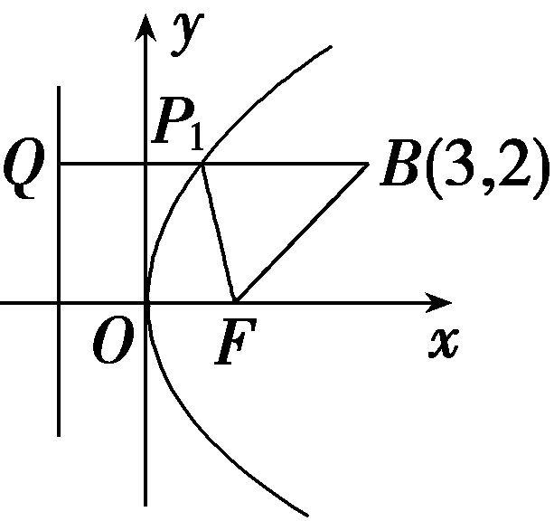

[变式探究]

1.(变条件)若将本例中的<em>B</em>点坐标改为(3，4)，则｜<em>PB</em>｜＋｜<em>PF</em>｜的最小值为<u>　　　　</u>.

答案：2 $\sqrt{5}$

解析：由题意可知，点(3，4)在抛物线的外部，所以｜*P<text style="italic">B*</text>｜＋｜*P<text style="italic">F*</text>｜的最小值即为B，F两点间的距离，即｜*<text style="italic">PB*</text>｜＋｜*<text style="italic">PF*</text>｜≥｜*BF*｜＝ $\sqrt{4^{2}＋2^{2}}$ ＝ $\sqrt{16+4}$ ＝2 $\sqrt{5}$ ，即｜*P<text style="italic">B*</text>｜＋｜*P<text style="italic">F*</text>｜的最小值为2 $\sqrt{5}$ .

2.(变设问)若本例条件不变，则点<em>P</em>到点<em>A</em>(－1，1)的距离与点<em>P</em>到直线<em>x</em>＝－1的距离之和的最小值为<u>　　　　</u>.

答案： $\sqrt{5}$

解析：如图，易知抛物线的焦点为<te<te*x*t style="italic">x</text>t style="italic">*<text style="italic">F*</text></text>(1，0)，准线是x＝－1，由抛物线的定义知，点*<text style="italic"><text style="italic"><text style="italic"><text style="italic">P*</text></text></text></text>到直线x＝－1的距离等于点P到点F的距离.于是，问题转化为在抛物线上求一点P，使点P到点*A*(－1，1)的距离与点P到点F(1，0)的距离之和最小，显然，连接*AF*与抛物线相交的点即为满足题意的点，此时最小值为 $\sqrt{[1－\left(－1\right)]^{2}＋\left(0－1\right)^{2}}$ ＝ $\sqrt{5}$ .

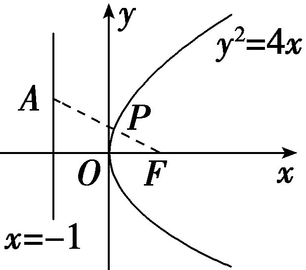

3.(变设问)若本例条件不变，<em>P</em>是抛物线上任意一点，则<em>P</em>到准线<em>l</em>的距离与<em>P</em>到直线3<em>x</em>＋4<em>y</em>＋7＝0的距离之和的最小值是<u>　　　　</u>.

答案：2

解析：由抛物线的定义可知，点&lt;te&lt;te&lt;te&lt;te&lt;text st<em>y</em>le="italic"&gt;x&lt;/text&gt;t st<em>y</em>le="italic"&gt;x&lt;/text&gt;t st&lt;text sty<em>l</em>e="italic"&gt;y&lt;/text&gt;le="italic"&gt;x&lt;/text&gt;t style="italic"&gt;x&lt;/text&gt;t st<em>yl</em>e="italic"&gt;<em>&lt;text style="italic"&gt;&lt;text style="italic"&gt;P</em>&lt;/text&gt;&lt;/text&gt;&lt;/text&gt;到准线l的距离等于点P到焦点<em>&lt;text style="italic"&gt;F</em>&lt;/text&gt;的距离，由抛物线y2＝4x及直线方程3x＋4y＋7＝0可得直线与抛物线相离.所以点P到准线l的距离与点P到直线3x＋4y＋7＝0的距离之和的最小值为点F(1，0)到直线3x＋4y＋7＝0的距离，即 $\frac{｜3+7｜}{\sqrt{3^{2}＋4^{2}}}$ ＝&lt;te&lt;te&lt;te&lt;te&lt;text st<em>y</em>le="italic"&gt;x&lt;/text&gt;t st<em>y</em>le="italic"&gt;x&lt;/text&gt;t st&lt;text sty<em>l</em>e="italic"&gt;y&lt;/text&gt;le="italic"&gt;x&lt;/text&gt;t style="italic"&gt;x&lt;/text&gt;t style="superscript"&gt;2&lt;/text&gt;.

利用抛物线的定义可解决的常见问题

1.轨迹问题：用抛物线的定义确定轨迹是不是抛物线.

2.距离问题：在解决涉及抛物线上的点到焦点的距离和到准线的距离的问题时，注意利用两者之间的关系相互转化.

注意：(1)一定要检验定点是否在定直线上.(2)“看到准线想到焦点，看到焦点想到准线”，许多抛物线问题可根据定义简捷、直观的转化求解.“由数想形，由形想数，数形结合”是灵活解题的一条捷径.

对点练1.(2023·北京卷)已知抛物线<em>C</em>：<em>y</em>2＝8<em>x</em>的焦点为<em>F</em>，点<em>M</em>在<em>C</em>上.若<em>M</em>到直线<em>x</em>＝－3的距离为5，则｜<em>MF</em>｜＝(　　)

A.7	B.6

C.5	D.4

答案：**D**

解析：因为抛物线<em>C</em>：<em>y</em>2＝8<em>x</em>的焦点<em>F</em>(2，0)，准线方程为<em>x</em>＝－2，点<em>M</em>在<em>C</em>上，所以<em>M</em>到准线<em>x</em>＝－2的距离为｜<em>MF</em>｜，又<em>M</em>到直线<em>x</em>＝－3的距离为5，所以｜<em>MF</em>｜＋1＝5，故｜<em>MF</em>｜＝4.故选D.

对点练2.已知抛物线<em>x</em>2＝4<em>y</em>上有一条长为6的动弦<em>AB</em>，则<em>AB</em>的中点到<em>x</em>轴的最短距离为<u>　　　　</u>.

答案：2

解析：由题意知，抛物线的准线&lt;te<em>x</em>t st&lt;text sty&lt;text sty&lt;text sty&lt;text sty&lt;text sty&lt;text sty<em>l</em>e="italic"&gt;l&lt;/text&gt;e="italic"&gt;l&lt;/text&gt;e="italic"&gt;l&lt;/text&gt;e="italic"&gt;l&lt;/text&gt;e="italic"&gt;l&lt;/text&gt;e="italic"&gt;y&lt;/text&gt;le="italic"&gt;l&lt;/text&gt;：y＝－&lt;text style="subscript"&gt;&lt;text style="subscript"&gt;&lt;text style="subscript"&gt;&lt;text style="subscript"&gt;&lt;text style="subscript"&gt;&lt;text style="subscript"&gt;&lt;text style="subscript"&gt;&lt;text style="subscript"&gt;&lt;text style="subscript"&gt;&lt;text style="subscript"&gt;1&lt;/text&gt;&lt;/text&gt;&lt;/text&gt;&lt;/text&gt;&lt;/text&gt;&lt;/text&gt;&lt;/text&gt;&lt;/text&gt;&lt;/text&gt;&lt;/text&gt;，过点<em>&lt;text style="italic"&gt;A</em>&lt;/text&gt;作<em>&lt;text style="italic"&gt;AA</em>&lt;/text&gt;1⊥l交l于点A1，过点<em>&lt;text style="italic"&gt;B</em>&lt;/text&gt;作<em>&lt;text style="italic"&gt;BB</em>&lt;/text&gt;1⊥l交l于点B1，设弦<em>&lt;text style="italic"&gt;AB</em>&lt;/text&gt;的中点为<em>&lt;text style="italic"&gt;&lt;text style="italic"&gt;&lt;text style="italic"&gt;M</em>&lt;/text&gt;&lt;/text&gt;&lt;/text&gt;，过点M作<em>&lt;text style="italic"&gt;&lt;text style="italic"&gt;&lt;text style="italic"&gt;MM</em>&lt;/text&gt;&lt;/text&gt;&lt;/text&gt;1⊥l交l于点M1(图略)，则｜MM1｜＝ $\frac{｜AA_{1}｜＋｜BB_{1}｜}{2}$ .因为｜&lt;te<em>x</em>t sty&lt;text sty&lt;text sty&lt;text sty&lt;text sty&lt;text sty<em>l</em>e="italic"&gt;l&lt;/text&gt;e="italic"&gt;l&lt;/text&gt;e="italic"&gt;l&lt;/text&gt;e="italic"&gt;l&lt;/text&gt;e="italic"&gt;l&lt;/text&gt;e="italic"&gt;<em>A</em>&lt;/text&gt;<em>&lt;text style="italic"&gt;B</em>&lt;/text&gt;｜≤｜<em>A&lt;text style="italic"&gt;F</em>&lt;/text&gt;｜＋｜<em>&lt;text style="italic"&gt;BF</em>&lt;/text&gt;｜(F为抛物线的焦点)，即｜<em>AF</em>｜＋｜BF｜≥6，所以｜<em>&lt;text style="italic"&gt;AA</em>&lt;/text&gt;&lt;text style="subscript"&gt;&lt;text style="subscript"&gt;&lt;text style="subscript"&gt;&lt;text style="subscript"&gt;&lt;text style="subscript"&gt;&lt;text style="subscript"&gt;&lt;text style="subscript"&gt;&lt;text style="subscript"&gt;&lt;text style="subscript"&gt;&lt;text style="subscript"&gt;1&lt;/text&gt;&lt;/text&gt;&lt;/text&gt;&lt;/text&gt;&lt;/text&gt;&lt;/text&gt;&lt;/text&gt;&lt;/text&gt;&lt;/text&gt;&lt;/text&gt;｜＋｜<em>&lt;text style="italic"&gt;BB</em>&lt;/text&gt;1｜≥6，2｜<em>&lt;text style="italic"&gt;&lt;text style="italic"&gt;&lt;text style="italic"&gt;M</em>&lt;/text&gt;&lt;/text&gt;&lt;/text&gt;M1｜≥6，｜<em>&lt;text style="italic"&gt;&lt;text style="italic"&gt;&lt;text style="italic"&gt;MM</em>&lt;/text&gt;&lt;/text&gt;&lt;/text&gt;1｜≥3，故点M到x轴的距离<em>d</em>≥2，故最短距离为2.

考点二　抛物线的标准方程　　　　师生共研

求适合下列条件的抛物线的标准方程：

(1)准线方程为2*y*＋4＝0；

(2)过点(3，－4)；

(3)焦点在直线*x*＋3*y*＋15＝0上.

解：(1)准线方程为2<em>y</em>＋4＝0，即<em>y</em>＝－2，故抛物线焦点在<em>y</em>轴的正半轴上，设所求抛物线的标准方程为<em>x</em>2＝2<em>py</em>(<em>p</em>＞0).

又 $\frac{p}{2}$ ＝2，所以2*p*＝8，

故所求抛物线的标准方程为<em>x</em>2＝8<em>y</em>.

(2)因为点(3，－4)在第四象限，所以抛物线开口向右或向下，设抛物线的标准方程为<em>y</em>2＝2<em>px</em>(<em>p</em>＞0)或<em>x</em>2＝－2<em>p</em>1<em>y</em>(<em>p</em>1＞0).

把点(3，－4)的坐标分别代入&lt;te&lt;text st<em>y</em>le="italic"&gt;x&lt;/text&gt;t style="italic"&gt;y&lt;/text&gt;&lt;text style="su<em>&lt;text style="italic"&gt;&lt;text style="italic"&gt;&lt;text style="italic"&gt;p</em>&lt;/text&gt;&lt;/text&gt;&lt;/text&gt;erscript"&gt;&lt;text style="superscript"&gt;&lt;text style="superscript"&gt;2&lt;/text&gt;&lt;/text&gt;&lt;/text&gt;＝2<em>px</em>和x2＝－2p&lt;text style="subscript"&gt;&lt;text style="subscript"&gt;1&lt;/text&gt;&lt;/text&gt;y中，得(－4)2＝2<em>p&lt;text style="italic"&gt;·</em>&lt;/text&gt;3，或32＝－2p1·(－4)，则2p＝ $\frac{16}{3}$ ，&lt;te&lt;text st<em>y</em>le="italic"&gt;x&lt;/text&gt;t style="su<em>&lt;text style="italic"&gt;&lt;text style="italic"&gt;&lt;text style="italic"&gt;p</em>&lt;/text&gt;&lt;/text&gt;&lt;/text&gt;erscript"&gt;&lt;text style="superscript"&gt;&lt;text style="superscript"&gt;2&lt;/text&gt;&lt;/text&gt;&lt;/text&gt;p&lt;text style="subscript"&gt;&lt;text style="subscript"&gt;1&lt;/text&gt;&lt;/text&gt;＝ $\frac{9}{4}$ .

所以所求抛物线的标准方程为&lt;te&lt;te&lt;text st<em>y</em>le="italic"&gt;x&lt;/text&gt;t style="italic"&gt;x&lt;/text&gt;t style="italic"&gt;y&lt;/text&gt;&lt;text style="superscript"&gt;2&lt;/text&gt;＝ $\frac{16}{3}$ &lt;te&lt;text st<em>y</em>le="italic"&gt;x&lt;/text&gt;t style="italic"&gt;x&lt;/text&gt;或x&lt;text style="superscript"&gt;2&lt;/text&gt;＝－ $\frac{9}{4}$ &lt;te&lt;te&lt;text st<em>y</em>le="italic"&gt;x&lt;/text&gt;t style="italic"&gt;x&lt;/text&gt;t style="italic"&gt;y&lt;/text&gt;.

(3)令*x*＝0得*y*＝－5；令*y*＝0得*x*＝－15.

所以抛物线的焦点为(0，－5)或(－15，0).

所以所求抛物线的标准方程为<em>x</em>2＝－20<em>y</em>或<em>y</em>2＝－60<em>x</em>.

求抛物线标准方程的方法

1.定义法：若题目已给出抛物线的方程(含有未知数*p*)，那么只需求出*p*即可.

2.待定系数法：先定位、再定形、定量，若题目未给出抛物线的方程，对于焦点在<em>x</em>轴上的抛物线的标准方程可统一设为<em>y</em>2＝<em>ax</em>(<em>a</em>≠0)，<em>a</em>的正负由题设来定；焦点在<em>y</em>轴上的抛物线的标准方程可设为<em>x</em>2＝<em>ay</em>(<em>a</em>≠0)，这样就减少了不必要的讨论.

对点练3.已知点<text st*y*le="italic">F</text>为抛物线y<text style="su*p*erscript">2</text>＝2*px*(p＞0)的焦点，点*P*在抛物线上且横坐标为8，*O*为坐标原点，若△*OFP*的面积为2 $\sqrt{2}$ ，则该抛物线的准线方程为(　　)

A.<te*x*t style="italic">x</text>＝－ $\frac{1}{2}$ 	B.<te*x*t style="italic">x</text>＝－1

C.*x*＝－2	D.*x*＝－4

答案：**B**

解析：抛物线&lt;te&lt;te<em>x</em>t style="italic"&gt;x&lt;/text&gt;t st&lt;text st&lt;text st<em>y</em>le="italic"&gt;y&lt;/text&gt;le="italic"&gt;y&lt;/text&gt;le="italic"&gt;y&lt;/text&gt;&lt;text style="su<em>&lt;text style="italic"&gt;&lt;text style="italic"&gt;&lt;text style="italic"&gt;p</em>&lt;/text&gt;&lt;/text&gt;&lt;/text&gt;erscript"&gt;&lt;text style="superscript"&gt;2&lt;/text&gt;&lt;/text&gt;＝2<em>px</em>(p＞0)的焦点<em>F</em> $\left(\frac{p}{2}，0\right)$ ，将点&lt;te&lt;te<em>x</em>t style="italic"&gt;x&lt;/text&gt;t st&lt;text st&lt;text st<em>y</em>le="italic"&gt;y&lt;/text&gt;le="italic"&gt;y&lt;/text&gt;le="italic"&gt;<em>P</em>&lt;/text&gt;的横坐标代入抛物线得<em>y</em>&lt;text style="su<em>&lt;text style="italic"&gt;&lt;text style="italic"&gt;&lt;text style="italic"&gt;p</em>&lt;/text&gt;&lt;/text&gt;&lt;/text&gt;erscript"&gt;&lt;text style="superscript"&gt;2&lt;/text&gt;&lt;/text&gt;＝16p，可得y＝±4 $\sqrt{p}$ ，不妨令&lt;te&lt;te<em>x</em>t style="italic"&gt;x&lt;/text&gt;t st&lt;text st&lt;text st<em>y</em>le="italic"&gt;y&lt;/text&gt;le="italic"&gt;y&lt;/text&gt;le="italic"&gt;<em>P</em>&lt;/text&gt; $\left(8，4\sqrt{p}\right)$ ，则&lt;te&lt;te<em>x</em>t style="italic"&gt;x&lt;/text&gt;t st<em>y</em>le="italic"&gt;S&lt;/text&gt;&lt;text style="subscri<em>&lt;text style="italic"&gt;p</em>&lt;/text&gt;t"&gt;△&lt;/text&gt;O&lt;text st&lt;text st<em>y</em>le="italic"&gt;y&lt;/text&gt;le="italic"&gt;F&lt;/text&gt;<em>&lt;text style="italic"&gt;P</em>&lt;/text&gt;＝ $\frac{1}{2}$ × $\frac{p}{2}$ ×4 $\sqrt{p}$ ＝&lt;te&lt;te<em>x</em>t style="italic"&gt;x&lt;/text&gt;t st&lt;text st&lt;text st<em>y</em>le="italic"&gt;y&lt;/text&gt;le="italic"&gt;y&lt;/text&gt;le="italic"&gt;<em>&lt;text style="italic"&gt;&lt;text style="italic"&gt;p</em>&lt;/text&gt;&lt;/text&gt;&lt;/text&gt; $\sqrt{p}$ ＝&lt;te&lt;te<em>x</em>t style="italic"&gt;x&lt;/text&gt;t st&lt;text st&lt;text st<em>y</em>le="italic"&gt;y&lt;/text&gt;le="italic"&gt;y&lt;/text&gt;le="su<em>&lt;text style="italic"&gt;&lt;text style="italic"&gt;&lt;text style="italic"&gt;p</em>&lt;/text&gt;&lt;/text&gt;&lt;/text&gt;erscript"&gt;&lt;text style="superscript"&gt;2&lt;/text&gt;&lt;/text&gt; $\sqrt{2}$ ，解得&lt;te&lt;te<em>x</em>t style="italic"&gt;x&lt;/text&gt;t st&lt;text st&lt;text st<em>y</em>le="italic"&gt;y&lt;/text&gt;le="italic"&gt;y&lt;/text&gt;le="italic"&gt;<em>&lt;text style="italic"&gt;&lt;text style="italic"&gt;p</em>&lt;/text&gt;&lt;/text&gt;&lt;/text&gt;＝&lt;text style="superscript"&gt;&lt;text style="superscript"&gt;2&lt;/text&gt;&lt;/text&gt;，则抛物线方程为<em>y</em>2＝4x，其准线方程为x＝－1.故选B.

对点练4.已知抛物线&lt;text st<em>y</em>le="italic"&gt;<em>&lt;text style="italic"&gt;C</em>&lt;/text&gt;&lt;/text&gt;：y&lt;text style="su<em>p</em>erscript"&gt;2&lt;/text&gt;＝2<em>px</em>(p＞0)，点<em>A</em>，<em>B</em>在抛物线上，且直线<em>AB</em>过点<em>D</em> $\left(－\frac{p}{2}，0\right)$ ，<em>F</em>为&lt;text st<em>y</em>le="italic"&gt;<em>&lt;text style="italic"&gt;C</em>&lt;/text&gt;&lt;/text&gt;的焦点，若｜F<em>A</em>｜＝&lt;text style="su<em>p</em>erscript"&gt;2&lt;/text&gt;｜F<em>B</em>｜＝6，则抛物线C的标准方程为<u>　　　　　　　</u>.

答案：<em>y</em>2＝8<em>x</em>

解析：如图，过点&lt;te<em>x</em>t st<em>yl</em>e="italic"&gt;<em>A</em>&lt;/text&gt;，<em>&lt;text style="italic"&gt;&lt;text style="italic"&gt;&lt;text style="italic"&gt;&lt;text style="italic"&gt;B</em>&lt;/text&gt;&lt;/text&gt;&lt;/text&gt;&lt;/text&gt;分别作抛物线<em>&lt;text style="italic"&gt;C</em>&lt;/text&gt;的准线l的垂线，垂足分别为A&lt;text style="subscri<em>p</em>t"&gt;&lt;text style="subscript"&gt;&lt;text style="subscript"&gt;&lt;text style="subscript"&gt;&lt;text style="subscript"&gt;1&lt;/text&gt;&lt;/text&gt;&lt;/text&gt;&lt;/text&gt;&lt;/text&gt;，B1，由抛物线的定义可知，｜<em>&lt;text style="italic"&gt;AA</em>&lt;/text&gt;1｜＝｜<em>AF</em>｜，｜<em>&lt;text style="italic"&gt;BB</em>&lt;/text&gt;1｜＝｜<em>BF</em>｜，因为2｜<em>&lt;text style="italic"&gt;&lt;text style="italic"&gt;FB</em>&lt;/text&gt;&lt;/text&gt;｜＝｜<em>&lt;text style="italic"&gt;FA</em>&lt;/text&gt;｜，所以2｜BB1｜＝｜AA1｜，则易知B为<em>AD</em>的中点.连接<em>&lt;text style="italic"&gt;&lt;text style="italic"&gt;&lt;text style="italic"&gt;OB</em>&lt;/text&gt;&lt;/text&gt;&lt;/text&gt;，则OB为△<em>DFA</em>的中位线，所以2｜OB｜＝｜FA｜，所以｜OB｜＝｜FB｜，所以点B在线段<em>OF</em>的垂直平分线上，所以点B的横坐标为 $\frac{p}{4}$ ，所以｜F&lt;te<em>x</em>t st<em>yl</em>e="italic"&gt;<em>&lt;text style="italic"&gt;&lt;text style="italic"&gt;&lt;text style="italic"&gt;B</em>&lt;/text&gt;&lt;/text&gt;&lt;/text&gt;&lt;/text&gt;｜＝ $\frac{p}{2}$ ＋ $\frac{p}{4}$ ＝3，所以&lt;te<em>x</em>t st<em>y</em>le="italic"&gt;p&lt;/text&gt;＝4，所以抛物线&lt;text sty<em>l</em>e="italic"&gt;<em>C</em>&lt;/text&gt;的标准方程为y2＝8x.

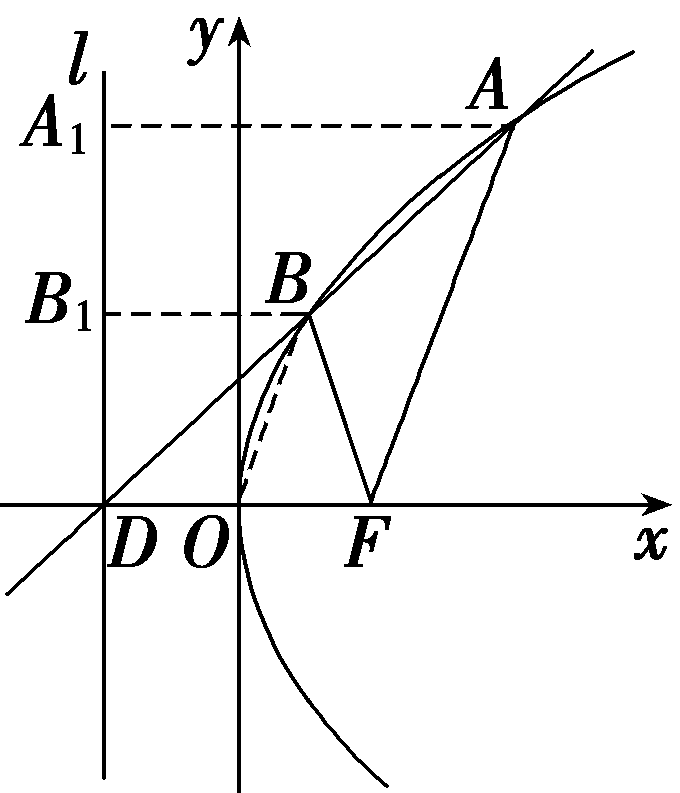

考点三　抛物线的简单几何性质　　　　师生共研

(1)(多选)(2025·八省适应性测试)已知<em>F</em>(2，0)是抛物线<em>C</em>：<em>y</em>2＝2<em>px</em>的焦点，<em>M</em>是<em>C</em>上的点，<em>O</em>为坐标原点.则(　　)

A.*p*＝4

B.｜*MF*｜≥｜*OF*｜

C.以*M*为圆心且过*F*的圆与*C*的准线相切

D.当∠*<text style="italic">OFM*</text>＝120°时，△OFM的面积为2 $\sqrt{3}$

(2)(一题多解)(2021·新高考Ⅰ卷)已知<em>O</em>为坐标原点，抛物线<em>C</em>：<em>y</em>2＝2<em>px</em>(<em>p</em>＞0)的焦点为<em>F</em>，<em>P</em>为<em>C</em>上一点，<em>PF</em>与<em>x</em>轴垂直，<em>Q</em>为<em>x</em>轴上一点，且<em>PQ</em>⊥<em>OP</em>.若｜<em>FQ</em>｜＝6，则<em>C</em>的准线方程为<u>　　　　　　　</u>.

答案：(1)<te*x*t style="bold">ABC　</text>(2)x＝－ $\frac{3}{2}$

解析：(1)因为&lt;te&lt;te&lt;te&lt;te&lt;te&lt;te&lt;te&lt;text st&lt;text st&lt;text st&lt;text st<em>y</em>le="italic"&gt;y&lt;/text&gt;le="italic"&gt;y&lt;/text&gt;le="italic"&gt;y&lt;/text&gt;le="italic"&gt;x&lt;/text&gt;t style="italic"&gt;x&lt;/text&gt;t style="italic"&gt;x&lt;/text&gt;t style="italic"&gt;x&lt;/text&gt;t style="italic"&gt;x&lt;/text&gt;t style="italic"&gt;x&lt;/text&gt;t style="italic"&gt;x&lt;/text&gt;t st&lt;text st<em>y</em>le="italic"&gt;y&lt;/text&gt;le="italic"&gt;<em>&lt;text style="italic"&gt;F</em>&lt;/text&gt;&lt;/text&gt;(&lt;text style="su<em>p</em>erscript"&gt;2&lt;/text&gt;，&lt;text style="subscript"&gt;&lt;text style="subscript"&gt;&lt;text style="subscript"&gt;&lt;text style="subscript"&gt;&lt;text style="subscript"&gt;&lt;text style="subscript"&gt;&lt;text style="subscript"&gt;&lt;text style="subscript"&gt;0&lt;/text&gt;&lt;/text&gt;&lt;/text&gt;&lt;/text&gt;&lt;/text&gt;&lt;/text&gt;&lt;/text&gt;&lt;/text&gt;)是抛物线<em>&lt;text style="italic"&gt;&lt;text style="italic"&gt;C</em>&lt;/text&gt;&lt;/text&gt;：y2＝2<em>px</em>的焦点，所以 $\frac{p}{2}$ ＝&lt;te&lt;te&lt;te&lt;te&lt;te&lt;te&lt;te&lt;text st&lt;text st&lt;text st&lt;text st<em>y</em>le="italic"&gt;y&lt;/text&gt;le="italic"&gt;y&lt;/text&gt;le="italic"&gt;y&lt;/text&gt;le="italic"&gt;x&lt;/text&gt;t style="italic"&gt;x&lt;/text&gt;t style="italic"&gt;x&lt;/text&gt;t style="italic"&gt;x&lt;/text&gt;t style="italic"&gt;x&lt;/text&gt;t style="italic"&gt;x&lt;/text&gt;t style="italic"&gt;x&lt;/text&gt;t st<em>y</em>le="su<em>p</em>erscript"&gt;2&lt;/text&gt;，即得p＝4，故A正确；对于B，设<em>&lt;text style="italic"&gt;&lt;text style="italic"&gt;&lt;text style="italic"&gt;&lt;text style="italic"&gt;M</em>&lt;/text&gt;&lt;/text&gt;&lt;/text&gt;&lt;/text&gt; $\left(x_{0}，y_{0}\right)$ 在&lt;te&lt;te&lt;te&lt;te&lt;te&lt;te&lt;te&lt;text st&lt;text st&lt;text st&lt;text st<em>y</em>le="italic"&gt;y&lt;/text&gt;le="italic"&gt;y&lt;/text&gt;le="italic"&gt;y&lt;/text&gt;le="italic"&gt;x&lt;/text&gt;t style="italic"&gt;x&lt;/text&gt;t style="italic"&gt;x&lt;/text&gt;t style="italic"&gt;x&lt;/text&gt;t style="italic"&gt;x&lt;/text&gt;t style="italic"&gt;x&lt;/text&gt;t style="italic"&gt;x&lt;/text&gt;t st<em>y</em>le="italic"&gt;y&lt;/text&gt;&lt;text style="su<em>p</em>erscript"&gt;2&lt;/text&gt;＝8x上，所以x&lt;text style="subscript"&gt;&lt;text style="subscript"&gt;&lt;text style="subscript"&gt;&lt;text style="subscript"&gt;&lt;text style="subscript"&gt;&lt;text style="subscript"&gt;&lt;text style="subscript"&gt;&lt;text style="subscript"&gt;0&lt;/text&gt;&lt;/text&gt;&lt;/text&gt;&lt;/text&gt;&lt;/text&gt;&lt;/text&gt;&lt;/text&gt;&lt;/text&gt;≥0，所以 $\left|MF\right|$ ＝&lt;te&lt;te&lt;te&lt;te&lt;te&lt;te&lt;text st&lt;text st&lt;text st&lt;text st<em>y</em>le="italic"&gt;y&lt;/text&gt;le="italic"&gt;y&lt;/text&gt;le="italic"&gt;y&lt;/text&gt;le="italic"&gt;x&lt;/text&gt;t style="italic"&gt;x&lt;/text&gt;t style="italic"&gt;x&lt;/text&gt;t style="italic"&gt;x&lt;/text&gt;t style="italic"&gt;x&lt;/text&gt;t style="italic"&gt;x&lt;/text&gt;t style="italic"&gt;x&lt;/text&gt;&lt;text style="subscript"&gt;&lt;text style="subscript"&gt;&lt;text style="subscript"&gt;&lt;text style="subscript"&gt;&lt;text style="subscript"&gt;&lt;text style="subscript"&gt;&lt;text style="subscript"&gt;&lt;text style="subscript"&gt;0&lt;/text&gt;&lt;/text&gt;&lt;/text&gt;&lt;/text&gt;&lt;/text&gt;&lt;/text&gt;&lt;/text&gt;&lt;/text&gt;＋ $\frac{p}{2}$ ≥ $\frac{p}{2}$ ＝ $\left|OF\right|$ ，故B正确；对于&lt;te&lt;te&lt;te&lt;te&lt;te&lt;te&lt;te&lt;text st&lt;text st&lt;text st&lt;text st<em>y</em>le="italic"&gt;y&lt;/text&gt;le="italic"&gt;y&lt;/text&gt;le="italic"&gt;y&lt;/text&gt;le="italic"&gt;x&lt;/text&gt;t style="italic"&gt;x&lt;/text&gt;t style="italic"&gt;x&lt;/text&gt;t style="italic"&gt;x&lt;/text&gt;t style="italic"&gt;x&lt;/text&gt;t style="italic"&gt;x&lt;/text&gt;t style="italic"&gt;x&lt;/text&gt;t st&lt;text st<em>y</em>le="italic"&gt;y&lt;/text&gt;le="italic"&gt;<em>&lt;text style="italic"&gt;C</em>&lt;/text&gt;&lt;/text&gt;，因为以<em>&lt;text style="italic"&gt;&lt;text style="italic"&gt;&lt;text style="italic"&gt;&lt;text style="italic"&gt;M</em>&lt;/text&gt;&lt;/text&gt;&lt;/text&gt;&lt;/text&gt;为圆心且过<em>&lt;text style="italic"&gt;&lt;text style="italic"&gt;F</em>&lt;/text&gt;&lt;/text&gt;的圆半径为 $\left|MF\right|$ ＝&lt;te&lt;te&lt;te&lt;te&lt;te&lt;te&lt;text st&lt;text st&lt;text st&lt;text st<em>y</em>le="italic"&gt;y&lt;/text&gt;le="italic"&gt;y&lt;/text&gt;le="italic"&gt;y&lt;/text&gt;le="italic"&gt;x&lt;/text&gt;t style="italic"&gt;x&lt;/text&gt;t style="italic"&gt;x&lt;/text&gt;t style="italic"&gt;x&lt;/text&gt;t style="italic"&gt;x&lt;/text&gt;t style="italic"&gt;x&lt;/text&gt;t style="italic"&gt;x&lt;/text&gt;&lt;text style="subscript"&gt;&lt;text style="subscript"&gt;&lt;text style="subscript"&gt;&lt;text style="subscript"&gt;&lt;text style="subscript"&gt;&lt;text style="subscript"&gt;&lt;text style="subscript"&gt;&lt;text style="subscript"&gt;0&lt;/text&gt;&lt;/text&gt;&lt;/text&gt;&lt;/text&gt;&lt;/text&gt;&lt;/text&gt;&lt;/text&gt;&lt;/text&gt;＋&lt;text st<em>y</em>le="su<em>p</em>erscript"&gt;2&lt;/text&gt;等于<em>&lt;text style="italic"&gt;&lt;text style="italic"&gt;&lt;text style="italic"&gt;&lt;text style="italic"&gt;M</em>&lt;/text&gt;&lt;/text&gt;&lt;/text&gt;&lt;/text&gt;与&lt;text st<em>y</em>le="italic"&gt;<em>&lt;text style="italic"&gt;C</em>&lt;/text&gt;&lt;/text&gt;的准线的距离，所以以M为圆心且过<em>&lt;text style="italic"&gt;&lt;text style="italic"&gt;F</em>&lt;/text&gt;&lt;/text&gt;的圆与C的准线相切，故C正确；对于D，当∠<em>&lt;text style="italic"&gt;&lt;text style="italic,subscript"&gt;OFM</em>&lt;/text&gt;&lt;/text&gt;＝120°时，x0＞2，结合抛物线的对称性不妨设M在x轴上方，则 $\frac{y_{0}}{x_{0}－2}$ ＝tan 6&lt;te&lt;te&lt;te&lt;te&lt;te&lt;text st&lt;text st&lt;text st&lt;text st<em>y</em>le="italic"&gt;y&lt;/text&gt;le="italic"&gt;y&lt;/text&gt;le="italic"&gt;y&lt;/text&gt;le="italic"&gt;x&lt;/text&gt;t style="italic"&gt;x&lt;/text&gt;t style="italic"&gt;x&lt;/text&gt;t style="italic"&gt;x&lt;/text&gt;t style="italic"&gt;x&lt;/text&gt;t style="subscript"&gt;&lt;text style="subscript"&gt;&lt;text style="subscript"&gt;&lt;text style="subscript"&gt;&lt;text style="subscript"&gt;&lt;text style="subscript"&gt;&lt;text style="subscript"&gt;&lt;text style="subscript"&gt;0&lt;/text&gt;&lt;/text&gt;&lt;/text&gt;&lt;/text&gt;&lt;/text&gt;&lt;/text&gt;&lt;/text&gt;&lt;/text&gt;°＝ $\sqrt{3}$ ，且 $y_{0}^{2}$ ＝8&lt;te&lt;te&lt;te&lt;te&lt;te&lt;te&lt;text st&lt;text st&lt;text st&lt;text st<em>y</em>le="italic"&gt;y&lt;/text&gt;le="italic"&gt;y&lt;/text&gt;le="italic"&gt;y&lt;/text&gt;le="italic"&gt;x&lt;/text&gt;t style="italic"&gt;x&lt;/text&gt;t style="italic"&gt;x&lt;/text&gt;t style="italic"&gt;x&lt;/text&gt;t style="italic"&gt;x&lt;/text&gt;t style="italic"&gt;x&lt;/text&gt;t style="italic"&gt;x&lt;/text&gt;&lt;text style="subscript"&gt;&lt;text style="subscript"&gt;&lt;text style="subscript"&gt;&lt;text style="subscript"&gt;&lt;text style="subscript"&gt;&lt;text style="subscript"&gt;&lt;text style="subscript"&gt;&lt;text style="subscript"&gt;0&lt;/text&gt;&lt;/text&gt;&lt;/text&gt;&lt;/text&gt;&lt;/text&gt;&lt;/text&gt;&lt;/text&gt;&lt;/text&gt;，&lt;text st<em>y</em>le="italic"&gt;y&lt;/text&gt;0＞0，所以 $\sqrt{3}y_{0}^{2}$ －8&lt;te&lt;te&lt;te&lt;te&lt;te&lt;te&lt;te&lt;text st&lt;text st&lt;text st&lt;text st<em>y</em>le="italic"&gt;y&lt;/text&gt;le="italic"&gt;y&lt;/text&gt;le="italic"&gt;y&lt;/text&gt;le="italic"&gt;x&lt;/text&gt;t style="italic"&gt;x&lt;/text&gt;t style="italic"&gt;x&lt;/text&gt;t style="italic"&gt;x&lt;/text&gt;t style="italic"&gt;x&lt;/text&gt;t style="italic"&gt;x&lt;/text&gt;t style="italic"&gt;x&lt;/text&gt;t st<em>y</em>le="italic"&gt;y&lt;/text&gt;&lt;text style="subscript"&gt;&lt;text style="subscript"&gt;&lt;text style="subscript"&gt;&lt;text style="subscript"&gt;&lt;text style="subscript"&gt;&lt;text style="subscript"&gt;&lt;text style="subscript"&gt;&lt;text style="subscript"&gt;0&lt;/text&gt;&lt;/text&gt;&lt;/text&gt;&lt;/text&gt;&lt;/text&gt;&lt;/text&gt;&lt;/text&gt;&lt;/text&gt;－16 $\sqrt{3}$ ＝&lt;te&lt;te&lt;te&lt;te&lt;te&lt;text st&lt;text st&lt;text st&lt;text st<em>y</em>le="italic"&gt;y&lt;/text&gt;le="italic"&gt;y&lt;/text&gt;le="italic"&gt;y&lt;/text&gt;le="italic"&gt;x&lt;/text&gt;t style="italic"&gt;x&lt;/text&gt;t style="italic"&gt;x&lt;/text&gt;t style="italic"&gt;x&lt;/text&gt;t style="italic"&gt;x&lt;/text&gt;t style="subscript"&gt;&lt;text style="subscript"&gt;&lt;text style="subscript"&gt;&lt;text style="subscript"&gt;&lt;text style="subscript"&gt;&lt;text style="subscript"&gt;&lt;text style="subscript"&gt;&lt;text style="subscript"&gt;0&lt;/text&gt;&lt;/text&gt;&lt;/text&gt;&lt;/text&gt;&lt;/text&gt;&lt;/text&gt;&lt;/text&gt;&lt;/text&gt;，&lt;te&lt;te<em>x</em>t style="italic"&gt;x&lt;/text&gt;t st<em>y</em>le="italic"&gt;y&lt;/text&gt;0＝4 $\sqrt{3}$ 或&lt;te&lt;te&lt;te&lt;te&lt;te&lt;te&lt;te&lt;text st&lt;text st&lt;text st&lt;text st<em>y</em>le="italic"&gt;y&lt;/text&gt;le="italic"&gt;y&lt;/text&gt;le="italic"&gt;y&lt;/text&gt;le="italic"&gt;x&lt;/text&gt;t style="italic"&gt;x&lt;/text&gt;t style="italic"&gt;x&lt;/text&gt;t style="italic"&gt;x&lt;/text&gt;t style="italic"&gt;x&lt;/text&gt;t style="italic"&gt;x&lt;/text&gt;t style="italic"&gt;x&lt;/text&gt;t st<em>y</em>le="italic"&gt;y&lt;/text&gt;&lt;text style="subscript"&gt;&lt;text style="subscript"&gt;&lt;text style="subscript"&gt;&lt;text style="subscript"&gt;&lt;text style="subscript"&gt;&lt;text style="subscript"&gt;&lt;text style="subscript"&gt;&lt;text style="subscript"&gt;0&lt;/text&gt;&lt;/text&gt;&lt;/text&gt;&lt;/text&gt;&lt;/text&gt;&lt;/text&gt;&lt;/text&gt;&lt;/text&gt;＝－ $\frac{4\sqrt{3}}{3}$ 舍.所以△O&lt;te&lt;te&lt;te&lt;te&lt;te&lt;te&lt;te&lt;text st&lt;text st&lt;text st&lt;text st<em>y</em>le="italic"&gt;y&lt;/text&gt;le="italic"&gt;y&lt;/text&gt;le="italic"&gt;y&lt;/text&gt;le="italic"&gt;x&lt;/text&gt;t style="italic"&gt;x&lt;/text&gt;t style="italic"&gt;x&lt;/text&gt;t style="italic"&gt;x&lt;/text&gt;t style="italic"&gt;x&lt;/text&gt;t style="italic"&gt;x&lt;/text&gt;t style="italic"&gt;x&lt;/text&gt;t st&lt;text st<em>y</em>le="italic"&gt;y&lt;/text&gt;le="italic"&gt;<em>&lt;text style="italic"&gt;F</em>&lt;/text&gt;&lt;/text&gt;<em>&lt;text style="italic"&gt;&lt;text style="italic"&gt;&lt;text style="italic"&gt;&lt;text style="italic"&gt;M</em>&lt;/text&gt;&lt;/text&gt;&lt;/text&gt;&lt;/text&gt;的面积为<em>S</em>△<em>&lt;text style="italic"&gt;&lt;text style="italic,subscript"&gt;OFM</em>&lt;/text&gt;&lt;/text&gt;＝ $\frac{1}{2}\left|OF\right|$ × $\left|y_{0}\right|$ ＝4 $\sqrt{3}$ ，故D错误.故选AB&lt;te&lt;te&lt;te&lt;te&lt;te&lt;te&lt;te&lt;text st&lt;text st&lt;text st&lt;text st<em>y</em>le="italic"&gt;y&lt;/text&gt;le="italic"&gt;y&lt;/text&gt;le="italic"&gt;y&lt;/text&gt;le="italic"&gt;x&lt;/text&gt;t style="italic"&gt;x&lt;/text&gt;t style="italic"&gt;x&lt;/text&gt;t style="italic"&gt;x&lt;/text&gt;t style="italic"&gt;x&lt;/text&gt;t style="italic"&gt;x&lt;/text&gt;t style="italic"&gt;x&lt;/text&gt;t st&lt;text st<em>y</em>le="italic"&gt;y&lt;/text&gt;le="italic"&gt;<em>&lt;text style="italic"&gt;C</em>&lt;/text&gt;&lt;/text&gt;.

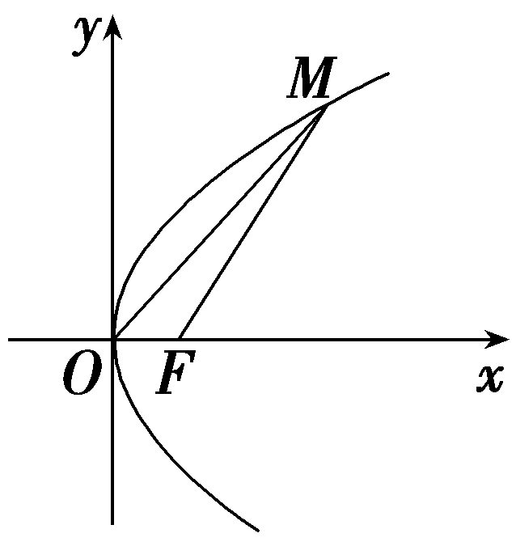

(2)法一(解直角三角形法)：由题易得｜<te*x*t style="italic">OF</text>｜＝ $\frac{p}{2}$ ，｜<te*x*t style="italic">PF</text>｜＝*<text style="italic"><text style="italic">p*</text></text>，∠*<text style="italic">OPF*</text>＝∠*<text style="italic">PQF*</text>，所以tan∠OPF＝tan∠PQF，所以 $\frac{｜OF｜}{｜PF｜}$ ＝ $\frac{｜PF｜}{｜FQ｜}$ ，即 $\frac{\frac{p}{2}}{p}$ ＝ $\frac{p}{6}$ ，解得<te*x*t style="italic">*<text style="italic">p*</text></text>＝3(p＝0舍去)，所以*C*的准线方程为x＝－ $\frac{3}{2}$ .

法二(应用射影定理法)：由题易得｜&lt;te<em>x</em>t style="italic"&gt;<em>OF</em>&lt;/text&gt;｜＝ $\frac{p}{2}$ ，｜&lt;te<em>x</em>t style="italic"&gt;<em>PF</em>&lt;/text&gt;｜＝<em>&lt;text style="italic"&gt;&lt;text style="italic"&gt;&lt;text style="italic"&gt;p</em>&lt;/text&gt;&lt;/text&gt;&lt;/text&gt;，｜PF｜&lt;text style="superscript"&gt;2&lt;/text&gt;＝｜<em>&lt;text style="italic"&gt;OF</em>&lt;/text&gt;｜<em>·</em>｜<em>FQ</em>｜，即p2＝ $\frac{p}{2}$ ×6，解得&lt;te<em>x</em>t style="italic"&gt;<em>&lt;text style="italic"&gt;&lt;text style="italic"&gt;p</em>&lt;/text&gt;&lt;/text&gt;&lt;/text&gt;＝3或p＝0(舍去)，所以<em>C</em>的准线方程为x＝－ $\frac{3}{2}$ .

抛物线性质的应用技巧

1.利用抛物线方程确定其焦点、准线时，关键是将抛物线方程化成标准方程.

2.要结合图形分析，灵活运用平面图形的性质简化运算.

对点练5.已知圆<em>x</em>2＋<em>y</em>2＝1与抛物线<em>y</em>2＝2<em>px</em>(<em>p</em>＞0)交于<em>A</em>，<em>B</em>两点，与抛物线的准线交于<em>C</em>，<em>D</em>两点，若四边形<em>ABCD</em>是矩形，则<em>p</em>等于(　　)

A. $\frac{\sqrt{5}}{2}$ 	B. $\frac{\sqrt{2}}{5}$ 	C. $\frac{5\sqrt{2}}{2}$ 	D. $\frac{2\sqrt{5}}{5}$

答案：**D**

解析：因为四边形&lt;text st<em>y</em>le="italic"&gt;<em>AB</em>CD&lt;/text&gt;是矩形，所以由抛物线与圆的对称性知，弦AB为抛物线y&lt;text style="su<em>&lt;text style="italic"&gt;&lt;text style="italic"&gt;&lt;text style="italic"&gt;p</em>&lt;/text&gt;&lt;/text&gt;&lt;/text&gt;erscript"&gt;2&lt;/text&gt;＝2<em>px</em>(p＞0)的通径，因为圆的半径为1，抛物线的通径为2p，所以有 $\left(\frac{p}{2}\right)^{2}$ ＋<em>&lt;text style="italic"&gt;&lt;text style="italic"&gt;&lt;text style="italic"&gt;p</em>&lt;/text&gt;&lt;/text&gt;&lt;/text&gt;&lt;text style="superscript"&gt;2&lt;/text&gt;＝1，解得p＝ $\frac{2\sqrt{5}}{5}$ .故选D.

对点练6.(多选)(2024·新课标Ⅱ卷)抛物线<em>C</em>：<em>y</em>2＝4<em>x</em>的准线为<em>l</em>，<em>P</em>为<em>C</em>上动点.过<em>P</em>作☉<em>A</em>：<em>x</em>2＋(<em>y</em>－4)2＝1的一条切线，<em>Q</em>为切点.过<em>P</em>作<em>l</em>的垂线，垂足为<em>B</em>.则(　　)

A.*l*与☉*A*相切

*B*.当*P*，*A*，B三点共线时，｜*PQ*｜＝ $\sqrt{15}$

C.当｜*PB*｜＝2时，*PA*⊥*AB*

D.满足｜*PA*｜＝｜*PB*｜的点*P*有且仅有2个

答案：**ABD**

解析：对于&lt;te&lt;te&lt;te&lt;text st&lt;text st&lt;text st<em>y</em>le="italic"&gt;y&lt;/text&gt;le="italic"&gt;y&lt;/text&gt;le="italic"&gt;x&lt;/text&gt;t st&lt;text st<em>y</em>le="italic"&gt;y&lt;/text&gt;le="italic"&gt;x&lt;/text&gt;t style="italic"&gt;x&lt;/text&gt;t st<em>y</em>le="italic"&gt;<em>&lt;text style="italic"&gt;&lt;text style="italic"&gt;A</em>&lt;/text&gt;&lt;/text&gt;&lt;/text&gt;，易知&lt;te&lt;text sty<em>l</em>e="italic"&gt;x&lt;/text&gt;t style="italic"&gt;l&lt;/text&gt;：x＝－1，故l与☉A相切，故A正确；对于<em>&lt;text style="italic"&gt;&lt;text style="italic"&gt;B</em>&lt;/text&gt;&lt;/text&gt;，A(0，4)，☉A的半径<em>r</em>＝1，当<em>&lt;text style="italic"&gt;&lt;text style="italic"&gt;&lt;text style="italic"&gt;&lt;text style="italic"&gt;&lt;text style="italic"&gt;P</em>&lt;/text&gt;&lt;/text&gt;&lt;/text&gt;&lt;/text&gt;&lt;/text&gt;，A，B三点共线时，P(4，4)，所以｜<em>&lt;text style="italic"&gt;&lt;text style="italic"&gt;&lt;text style="italic"&gt;PA</em>&lt;/text&gt;&lt;/text&gt;&lt;/text&gt;｜＝4，｜<em>PQ</em>｜＝ $\sqrt{｜PA｜^{2}－r^{2}}$ ＝ $\sqrt{4^{2}－1^{2}}$ ＝ $\sqrt{15}$ ，故&lt;te&lt;te&lt;te&lt;text st&lt;text st&lt;text st<em>y</em>le="italic"&gt;y&lt;/text&gt;le="italic"&gt;y&lt;/text&gt;le="italic"&gt;x&lt;/text&gt;t st&lt;text st<em>y</em>le="italic"&gt;y&lt;/text&gt;le="italic"&gt;x&lt;/text&gt;t style="italic"&gt;x&lt;/text&gt;t st<em>y</em>le="italic"&gt;<em>&lt;text style="italic"&gt;B</em>&lt;/text&gt;&lt;/text&gt;正确；对于<em>C</em>，当｜<em>&lt;text style="italic"&gt;&lt;text style="italic"&gt;&lt;text style="italic"&gt;&lt;text style="italic"&gt;&lt;text style="italic"&gt;P</em>&lt;/text&gt;&lt;/text&gt;&lt;/text&gt;&lt;/text&gt;&lt;/text&gt;B｜＝&lt;text style="superscript"&gt;2&lt;/text&gt;时，P(1，2)，B(－1，2)或P(1，－2)，B(－1，－2)，易知P<em>&lt;text style="italic"&gt;&lt;text style="italic"&gt;&lt;text style="italic"&gt;A</em>&lt;/text&gt;&lt;/text&gt;&lt;/text&gt;与<em>AB</em>不垂直，故C错误；对于D，记抛物线C的焦点为<em>&lt;text style="italic"&gt;F</em>&lt;/text&gt;，连接<em>&lt;text style="italic"&gt;&lt;text style="italic"&gt;AF</em>&lt;/text&gt;&lt;/text&gt;，<em>&lt;text style="italic"&gt;&lt;text style="italic"&gt;PF</em>&lt;/text&gt;&lt;/text&gt;(图略)，易知F(1，0)，由抛物线定义可知｜PF｜＝｜<em>&lt;text style="italic"&gt;&lt;text style="italic"&gt;PB</em>&lt;/text&gt;&lt;/text&gt;｜，因为｜<em>&lt;text style="italic"&gt;&lt;text style="italic"&gt;&lt;text style="italic"&gt;PA</em>&lt;/text&gt;&lt;/text&gt;&lt;/text&gt;｜＝｜PB｜，所以｜PA｜＝｜PF｜，所以点P在线段AF的中垂线上，线段AF的中垂线方程为y＝ $\frac{1}{4}$ &lt;te&lt;te&lt;te&lt;text st&lt;text st&lt;text st<em>y</em>le="italic"&gt;y&lt;/text&gt;le="italic"&gt;y&lt;/text&gt;le="italic"&gt;x&lt;/text&gt;t st&lt;text st<em>y</em>le="italic"&gt;y&lt;/text&gt;le="italic"&gt;x&lt;/text&gt;t style="italic"&gt;x&lt;/text&gt;t st<em>yl</em>e="italic"&gt;x&lt;/text&gt;＋ $\frac{15}{8}$ ，即&lt;te&lt;te&lt;te&lt;text st&lt;text st&lt;text st<em>y</em>le="italic"&gt;y&lt;/text&gt;le="italic"&gt;y&lt;/text&gt;le="italic"&gt;x&lt;/text&gt;t st&lt;text st<em>y</em>le="italic"&gt;y&lt;/text&gt;le="italic"&gt;x&lt;/text&gt;t style="italic"&gt;x&lt;/text&gt;t st<em>yl</em>e="italic"&gt;x&lt;/text&gt;＝4y－ $\frac{15}{2}$ ，代入&lt;te&lt;te&lt;te&lt;text st&lt;text st&lt;text st<em>y</em>le="italic"&gt;y&lt;/text&gt;le="italic"&gt;y&lt;/text&gt;le="italic"&gt;x&lt;/text&gt;t st&lt;text st<em>y</em>le="italic"&gt;y&lt;/text&gt;le="italic"&gt;x&lt;/text&gt;t style="italic"&gt;x&lt;/text&gt;t style="italic"&gt;y&lt;/text&gt;&lt;text style="superscript"&gt;2&lt;/text&gt;＝4&lt;text sty<em>l</em>e="italic"&gt;x&lt;/text&gt;可得y2－16y＋30＝0，解得y＝8± $\sqrt{34}$ ，易知满足条件的点&lt;te&lt;te&lt;te&lt;text st&lt;text st&lt;text st<em>y</em>le="italic"&gt;y&lt;/text&gt;le="italic"&gt;y&lt;/text&gt;le="italic"&gt;x&lt;/text&gt;t st&lt;text st<em>y</em>le="italic"&gt;y&lt;/text&gt;le="italic"&gt;x&lt;/text&gt;t style="italic"&gt;x&lt;/text&gt;t st<em>y</em>le="italic"&gt;<em>&lt;text style="italic"&gt;&lt;text style="italic"&gt;&lt;text style="italic"&gt;&lt;text style="italic"&gt;P</em>&lt;/text&gt;&lt;/text&gt;&lt;/text&gt;&lt;/text&gt;&lt;/text&gt;有且仅有&lt;text style="superscript"&gt;2&lt;/text&gt;个，故D正确.故选<em>&lt;text style="italic"&gt;&lt;text style="italic"&gt;&lt;text style="italic"&gt;A</em>&lt;/text&gt;&lt;/text&gt;&lt;/text&gt;<em>&lt;text style="italic"&gt;&lt;text style="italic"&gt;B</em>&lt;/text&gt;&lt;/text&gt;D.

[真题再现]　(2023·全国乙卷理)已知点&lt;text st<em>y</em>le="italic"&gt;<em>A</em>&lt;/text&gt;(1， $\sqrt{5}$ )在抛物线&lt;text st<em>y</em>le="italic"&gt;<em>C</em>&lt;/text&gt;：y2＝2<em>px</em>上，则<em>&lt;text style="italic"&gt;A</em>&lt;/text&gt;到C的准线的距离为<u>　　　　</u>.

答案： $\frac{9}{4}$

解析：由题意可得( $\sqrt{5}$ )&lt;te&lt;te<em>x</em>t style="italic"&gt;x&lt;/text&gt;t st<em>y</em>le="su<em>&lt;text style="italic"&gt;p</em>&lt;/text&gt;erscript"&gt;2&lt;/text&gt;＝2p×1，则2p＝5，抛物线的方程为y2＝5x，准线方程为x＝－ $\frac{5}{4}$ ，点<em>A</em>到<em>C</em>的准线的距离为1－(－ $\frac{5}{4}$ )＝ $\frac{9}{4}$ .

[教材呈现]　(人教A选择性必修一P133T3)(1)抛物线&lt;text style="it<em>a</em>lic"&gt;y&lt;/text&gt;&lt;text style="su<em>p</em>erscript"&gt;2&lt;/text&gt;＝2<em>px</em>(p＞0)上一点<em>&lt;text style="italic"&gt;&lt;text style="italic"&gt;M</em>&lt;/text&gt;&lt;/text&gt;与焦点间的距离是a $\left(a＞\frac{p}{2}\right)$ ，则点&lt;text style="it<em>a</em>lic"&gt;<em>&lt;text style="italic"&gt;M</em>&lt;/text&gt;&lt;/text&gt;到准线的距离是<u>　　　　</u>，点M的横坐标是<u>　　　　　</u>；

(2)抛物线<em>y</em>2＝12<em>x</em>上与焦点的距离等于9的点的坐标是<u>　　　　　</u>.

点评：这两题考查相同的知识点，两题的相似度极高，都是考查抛物线上的点满足的性质，区别在于教材上的练习题与真题的条件和设问正好反过来.

**课时测评**72　**抛物线** $\frac{对应学生}{用书P453}$

(时间：60分钟　满分：88分)

(本栏目内容，在学生用书中以独立形式分册装订！)

(1—8题，每小题5分，共40分)

1.(<te*x*t st*y*le="su*<text style="italic">p*</text>erscript">2</text>021·新高考Ⅱ卷)若抛物线*y*2＝2*px*(p＞0)的焦点到直线y＝x＋1的距离为 $\sqrt{2}$ ，则<te*x*t st*y*le="italic">*p*</text>＝(　　)

A.1	B.2

C.2 $\sqrt{2}$ 	D.4

答案：**B**

解析：抛物线&lt;te&lt;te&lt;text st<em>y</em>le="italic"&gt;x&lt;/text&gt;t style="italic"&gt;x&lt;/text&gt;t st<em>y</em>le="italic"&gt;y&lt;/text&gt;&lt;text style="su<em>&lt;text style="italic"&gt;p</em>&lt;/text&gt;erscript"&gt;2&lt;/text&gt;＝2<em>px</em>(p＞0)的焦点坐标为( $\frac{p}{2}$ ，0)，直线&lt;te&lt;te&lt;text st<em>y</em>le="italic"&gt;x&lt;/text&gt;t style="italic"&gt;x&lt;/text&gt;t st<em>y</em>le="italic"&gt;y&lt;/text&gt;＝x＋1的一般方程为x－y＋1＝0，则由点到直线的距离公式得 $\sqrt{2}$ ＝ $\frac{｜\frac{p}{2}+1｜}{\sqrt{2}}$ ，解得&lt;te&lt;te&lt;text st<em>y</em>le="italic"&gt;x&lt;/text&gt;t style="italic"&gt;x&lt;/text&gt;t st<em>y</em>le="italic"&gt;<em>p</em>&lt;/text&gt;＝2.故选B.

<te*x*t style="superscript">2</text>.(2024·河南洛平许济第四次质量检测)过抛物线*y*2＝8x的焦点的直线交抛物线于*A*，*B*两点，若*AB*中点的横坐标为4，则 $\left|AB\right|$ ＝(　　)

A.16	B.12

C.10	D.8

答案：**B**

解析：设*A* $\left(x_{1}，y_{1}\right)$ ，*B* $\left(x_{2}，y_{2}\right)$ ，由题设有 $\frac{x_{1}＋x_{2}}{2}$ ＝4，由抛物线的焦半径公式得 $\left|AB\right|$ ＝ $\left(x_{1}+2\right)$ ＋ $\left(x_{2}+2\right)$ ＝2· $\frac{x_{1}＋x_{2}}{2}$ ＋4＝2×4＋4＝12.故选*B*.

3.(<text style="su*p*erscript">2</text>025·河南九师联盟联考)已知抛物线<text st*y*le="italic">*C*</text>：y2＝2*px* $\left(p>0\right)$ 的焦点为*F*，*P*为<text st*y*le="italic">*C*</text>上一点，*O*为坐标原点，当∠*PFO*＝ $\frac{2\pi }{3}$ 时， $\left|PF\right|$ ＝6，则*p*＝(　　)

A.4	B.3

C.2	D.1

答案：**B**

解析：如图，过<em>&lt;text style="italic"&gt;P</em>&lt;/text&gt;作<em>C</em>的准线的垂线，垂足为P&lt;text style="subscri<em>p</em>t"&gt;1&lt;/text&gt;，作<em>F&lt;text style="italic"&gt;E</em>&lt;/text&gt;⊥<em>PP</em>1，垂足为E，由∠<em>PFO</em>＝ $\frac{2\pi }{3}$ ，得∠<em>&lt;text style="italic"&gt;P</em>&lt;/text&gt;<em>F&lt;text style="italic"&gt;E</em>&lt;/text&gt;＝ $\frac{\pi }{6}$ ，所以 $\left|PE\right|$ ＝ $\frac{1}{2}\left|PF\right|$ ＝3，所以 $\left|P_{1}E\right|$ ＝6－3＝3，即<em>p</em>＝3.故选B.

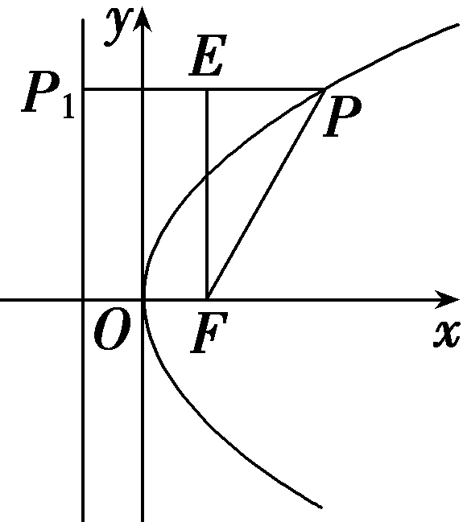

4.已知点<em>P</em>是抛物线<em>C</em>：<em>y</em>2＝4<em>x</em>上的动点，点<em>P</em>到<em>y</em>轴的距离为<em>d</em>，<em>Q</em>(－3，3)，则｜<em>PQ</em>｜＋<em>d</em>的最小值为(　　)

A.5	B. $\sqrt{30}$ ＋1

C. $\sqrt{30}$ －1	D.4

答案：**D**

解析：因为抛物线的准线方程为*x*＝－1，焦点*F*(1，0).*P*到直线*x*＝－1的距离等于｜*PF*｜，所以*P*到*y*轴的距离*d*＝｜*PF*｜－1，所以｜*PQ*｜＋*d*＝｜*PQ*｜＋｜*PF*｜－1.所以当*F*，*P*，*Q*三点共线时，｜*PQ*｜＋｜*PF*｜取得最小值｜*QF*｜.因为*Q*(－3，3)，*F*(1，0)，所以｜*QF*｜＝5，所以｜*PQ*｜＋*d*的最小值为5－1＝4.故选D.

5.(多选)已知抛物线<em>y</em>2＝2<em>px</em>(<em>p</em>＞0)的焦点<em>F</em>到准线的距离为4，直线<em>l</em>过点<em>F</em>且与抛物线交于<em>A</em>(<em>x</em>1，<em>y</em>1)，<em>B</em>(<em>x</em>2，<em>y</em>2)两点，若<em>M</em>(<em>m</em>，2)是线段<em>AB</em>的中点，则下列结论正确的是(　　)

A.*p*＝4

B.抛物线方程为<em>y</em>2＝16<em>x</em>

C.直线*l*的方程为*y*＝2*x*－4

D.｜*AB*｜＝10

答案：**ACD**

解析：由焦点&lt;te&lt;te&lt;te&lt;te&lt;te&lt;te&lt;te&lt;te&lt;te&lt;te&lt;te&lt;te<em>x</em>t style="italic"&gt;x&lt;/text&gt;t style="italic"&gt;x&lt;/text&gt;t style="italic"&gt;x&lt;/text&gt;t style="italic"&gt;x&lt;/text&gt;t style="italic"&gt;x&lt;/text&gt;t style="italic"&gt;x&lt;/text&gt;t st<em>yl</em>e="italic"&gt;x&lt;/text&gt;t style="italic"&gt;x&lt;/text&gt;t st&lt;text st<em>y</em>le="italic"&gt;y&lt;/text&gt;le="italic"&gt;x&lt;/text&gt;t style="italic"&gt;x&lt;/text&gt;t style="italic"&gt;x&lt;/text&gt;t st<em>y</em>le="italic"&gt;<em>F</em>&lt;/text&gt;到准线的距离为4，根据抛物线的定义可知<em>p</em>＝4，故A正确；则抛物线方程为y&lt;text style="subscript"&gt;&lt;text style="subscript"&gt;&lt;text style="subscript"&gt;&lt;text style="superscript"&gt;&lt;text style="subscript"&gt;&lt;text style="subscript"&gt;2&lt;/text&gt;&lt;/text&gt;&lt;/text&gt;&lt;/text&gt;&lt;/text&gt;&lt;/text&gt;＝8x，故B错误；焦点F(2，0)，则 $y_{1}^{2}$ ＝8&lt;te&lt;te&lt;te&lt;te&lt;te&lt;te&lt;te&lt;te&lt;te&lt;te&lt;te<em>x</em>t style="italic"&gt;x&lt;/text&gt;t style="italic"&gt;x&lt;/text&gt;t style="italic"&gt;x&lt;/text&gt;t style="italic"&gt;x&lt;/text&gt;t style="italic"&gt;x&lt;/text&gt;t style="italic"&gt;x&lt;/text&gt;t st<em>yl</em>e="italic"&gt;x&lt;/text&gt;t style="italic"&gt;x&lt;/text&gt;t st&lt;text st<em>y</em>le="italic"&gt;y&lt;/text&gt;le="italic"&gt;x&lt;/text&gt;t style="italic"&gt;x&lt;/text&gt;t style="italic"&gt;x&lt;/text&gt;&lt;text style="subscript"&gt;&lt;text style="subscript"&gt;&lt;text style="subscript"&gt;&lt;text style="subscript"&gt;1&lt;/text&gt;&lt;/text&gt;&lt;/text&gt;&lt;/text&gt;， $y_{2}^{2}$ ＝8&lt;te&lt;te&lt;te&lt;te&lt;te&lt;te&lt;te&lt;te&lt;te&lt;te&lt;te<em>x</em>t style="italic"&gt;x&lt;/text&gt;t style="italic"&gt;x&lt;/text&gt;t style="italic"&gt;x&lt;/text&gt;t style="italic"&gt;x&lt;/text&gt;t style="italic"&gt;x&lt;/text&gt;t style="italic"&gt;x&lt;/text&gt;t st<em>yl</em>e="italic"&gt;x&lt;/text&gt;t style="italic"&gt;x&lt;/text&gt;t st&lt;text st<em>y</em>le="italic"&gt;y&lt;/text&gt;le="italic"&gt;x&lt;/text&gt;t style="italic"&gt;x&lt;/text&gt;t style="italic"&gt;x&lt;/text&gt;&lt;text style="subscript"&gt;&lt;text style="subscript"&gt;&lt;text style="subscript"&gt;&lt;text style="superscript"&gt;&lt;text style="subscript"&gt;&lt;text style="subscript"&gt;2&lt;/text&gt;&lt;/text&gt;&lt;/text&gt;&lt;/text&gt;&lt;/text&gt;&lt;/text&gt;，若<em>M</em>(<em>m</em>，2)是线段<em>&lt;text style="italic"&gt;AB</em>&lt;/text&gt;的中点，则<em>y</em>&lt;text style="subscript"&gt;&lt;text style="subscript"&gt;&lt;text style="subscript"&gt;&lt;text style="subscript"&gt;1&lt;/text&gt;&lt;/text&gt;&lt;/text&gt;&lt;/text&gt;＋y2＝4，所以 $y_{1}^{2}$ － $y_{2}^{2}$ ＝8&lt;te&lt;te&lt;te&lt;te&lt;te&lt;te&lt;te&lt;te&lt;te&lt;te&lt;te<em>x</em>t style="italic"&gt;x&lt;/text&gt;t style="italic"&gt;x&lt;/text&gt;t style="italic"&gt;x&lt;/text&gt;t style="italic"&gt;x&lt;/text&gt;t style="italic"&gt;x&lt;/text&gt;t style="italic"&gt;x&lt;/text&gt;t st<em>yl</em>e="italic"&gt;x&lt;/text&gt;t style="italic"&gt;x&lt;/text&gt;t st&lt;text st<em>y</em>le="italic"&gt;y&lt;/text&gt;le="italic"&gt;x&lt;/text&gt;t style="italic"&gt;x&lt;/text&gt;t style="italic"&gt;x&lt;/text&gt;&lt;text style="subscript"&gt;&lt;text style="subscript"&gt;&lt;text style="subscript"&gt;&lt;text style="subscript"&gt;1&lt;/text&gt;&lt;/text&gt;&lt;/text&gt;&lt;/text&gt;－8x&lt;text style="subscript"&gt;&lt;text style="subscript"&gt;&lt;text style="subscript"&gt;&lt;text style="superscript"&gt;&lt;text style="subscript"&gt;&lt;text style="subscript"&gt;2&lt;/text&gt;&lt;/text&gt;&lt;/text&gt;&lt;/text&gt;&lt;/text&gt;&lt;/text&gt;，即 $\frac{y_{1}－y_{2}}{x_{1}－x_{2}}$ ＝ $\frac{8}{y_{1}＋y_{2}}$ ＝ $\frac{8}{4}$ ＝&lt;te&lt;te&lt;te&lt;te&lt;te&lt;te&lt;te&lt;te&lt;te&lt;te&lt;te&lt;te<em>x</em>t style="italic"&gt;x&lt;/text&gt;t style="italic"&gt;x&lt;/text&gt;t style="italic"&gt;x&lt;/text&gt;t style="italic"&gt;x&lt;/text&gt;t style="italic"&gt;x&lt;/text&gt;t style="italic"&gt;x&lt;/text&gt;t st<em>yl</em>e="italic"&gt;x&lt;/text&gt;t style="italic"&gt;x&lt;/text&gt;t st&lt;text st<em>y</em>le="italic"&gt;y&lt;/text&gt;le="italic"&gt;x&lt;/text&gt;t style="italic"&gt;x&lt;/text&gt;t style="italic"&gt;x&lt;/text&gt;t style="superscript"&gt;&lt;text style="subscript"&gt;&lt;text style="subscript"&gt;&lt;text style="superscript"&gt;&lt;text style="subscript"&gt;&lt;text style="subscript"&gt;2&lt;/text&gt;&lt;/text&gt;&lt;/text&gt;&lt;/text&gt;&lt;/text&gt;&lt;/text&gt;，所以直线l的方程为<em>y</em>＝2x－4，故C正确；又由 $\left\{\begin{matrix}y^{2}=8x，\\y=2x－4，\end{matrix}\right.$ 可得&lt;te&lt;te&lt;te&lt;te&lt;te&lt;te&lt;te&lt;te&lt;te&lt;te&lt;te<em>x</em>t style="italic"&gt;x&lt;/text&gt;t style="italic"&gt;x&lt;/text&gt;t style="italic"&gt;x&lt;/text&gt;t style="italic"&gt;x&lt;/text&gt;t style="italic"&gt;x&lt;/text&gt;t style="italic"&gt;x&lt;/text&gt;t st<em>yl</em>e="italic"&gt;x&lt;/text&gt;t style="italic"&gt;x&lt;/text&gt;t st&lt;text st<em>y</em>le="italic"&gt;y&lt;/text&gt;le="italic"&gt;x&lt;/text&gt;t style="italic"&gt;x&lt;/text&gt;t style="italic"&gt;x&lt;/text&gt;&lt;text style="subscript"&gt;&lt;text style="subscript"&gt;&lt;text style="subscript"&gt;&lt;text style="superscript"&gt;&lt;text style="subscript"&gt;&lt;text style="subscript"&gt;2&lt;/text&gt;&lt;/text&gt;&lt;/text&gt;&lt;/text&gt;&lt;/text&gt;&lt;/text&gt;－6x＋4＝0，所以x&lt;text style="subscript"&gt;&lt;text style="subscript"&gt;&lt;text style="subscript"&gt;&lt;text style="subscript"&gt;1&lt;/text&gt;&lt;/text&gt;&lt;/text&gt;&lt;/text&gt;＋x2＝6，所以｜<em>&lt;text style="italic"&gt;AB</em>&lt;/text&gt;｜＝｜A&lt;text st<em>y</em>le="italic"&gt;<em>F</em>&lt;/text&gt;｜＋｜<em>BF</em>｜＝x1＋x2＋4＝10，故D正确.故选ACD.

6.(多选)已知抛物线&lt;te&lt;te&lt;text st<em>y</em>le="italic"&gt;x&lt;/text&gt;t st<em>y</em>le="italic"&gt;x&lt;/text&gt;t st<em>y</em>le="italic"&gt;x&lt;/text&gt;&lt;text style="subscript"&gt;&lt;text style="subscript"&gt;2&lt;/text&gt;&lt;/text&gt;＝ $\frac{1}{2}$ &lt;te&lt;te&lt;text st<em>y</em>le="italic"&gt;x&lt;/text&gt;t st<em>y</em>le="italic"&gt;x&lt;/text&gt;t style="italic"&gt;y&lt;/text&gt;的焦点为<em>F</em>，<em>M</em>(<em>x</em>&lt;text style="subscript"&gt;1&lt;/text&gt;，y1)，<em>N</em>(x&lt;text style="subscript"&gt;&lt;text style="subscript"&gt;2&lt;/text&gt;&lt;/text&gt;，y2)是抛物线上两点，则下列结论正确的是(　　)

A.点*F*的坐标为 $\left(\frac{1}{8}，0\right)$

B.若直线&lt;te&lt;te<em>x</em>t style="italic"&gt;x&lt;/text&gt;t style="italic"&gt;MN&lt;/text&gt;过点<em>F</em>，则x1x2＝－ $\frac{1}{16}$

C.若 $\vec{MF}$ ＝*λ* $\vec{NF}$ ，则｜*MN*｜的最小值为 $\frac{1}{2}$

D.若｜<te*x*t style="italic">MF</text>｜＋｜*NF*｜＝ $\frac{3}{2}$ ，则线段<te*x*t style="italic">MN</text>的中点*P*到x轴的距离为 $\frac{5}{8}$

答案：**BCD**

解析：易知点&lt;te&lt;te&lt;te&lt;te<em>x</em>t st&lt;text st<em>y</em>le="italic"&gt;y&lt;/text&gt;le="italic"&gt;x&lt;/text&gt;t style="italic"&gt;x&lt;/text&gt;t style="italic"&gt;x&lt;/text&gt;t style="italic"&gt;<em>&lt;text style="italic"&gt;F</em>&lt;/text&gt;&lt;/text&gt;的坐标为 $\left(0，\frac{1}{8}\right)$ ，故A错误；根据抛物线的性质知，直线&lt;te&lt;te&lt;te&lt;te<em>x</em>t st&lt;text st<em>y</em>le="italic"&gt;y&lt;/text&gt;le="italic"&gt;x&lt;/text&gt;t style="italic"&gt;x&lt;/text&gt;t style="italic"&gt;x&lt;/text&gt;t style="italic"&gt;<em>&lt;text style="italic"&gt;&lt;text style="italic"&gt;MN</em>&lt;/text&gt;&lt;/text&gt;&lt;/text&gt;过焦点<em>&lt;text style="italic"&gt;&lt;text style="italic"&gt;F</em>&lt;/text&gt;&lt;/text&gt;时，x&lt;text style="subscri<em>&lt;text style="italic"&gt;p</em>&lt;/text&gt;t"&gt;1&lt;/text&gt;x&lt;text style="superscript"&gt;&lt;text style="superscript"&gt;2&lt;/text&gt;&lt;/text&gt;＝－p2＝－ $\frac{1}{16}$ ，故B正确；若 $\vec{MF}$ ＝&lt;te&lt;te<em>x</em>t st&lt;text st<em>y</em>le="italic"&gt;y&lt;/text&gt;le="italic"&gt;x&lt;/text&gt;t style="italic"&gt;λ&lt;/text&gt; $\vec{NF}$ ，则线段&lt;te&lt;te&lt;te&lt;te<em>x</em>t st&lt;text st<em>y</em>le="italic"&gt;y&lt;/text&gt;le="italic"&gt;x&lt;/text&gt;t style="italic"&gt;x&lt;/text&gt;t style="italic"&gt;x&lt;/text&gt;t style="italic"&gt;<em>&lt;text style="italic"&gt;&lt;text style="italic"&gt;MN</em>&lt;/text&gt;&lt;/text&gt;&lt;/text&gt;过点<em>&lt;text style="italic"&gt;&lt;text style="italic"&gt;F</em>&lt;/text&gt;&lt;/text&gt;，则｜<em>MN</em>｜的最小值即抛物线通径的长，为&lt;text style="subscri<em>&lt;text style="italic"&gt;p</em>&lt;/text&gt;t"&gt;&lt;text style="superscript"&gt;2&lt;/text&gt;&lt;/text&gt;p，即 $\frac{1}{2}$ ，故C正确；抛物线&lt;te&lt;te&lt;te<em>x</em>t st&lt;text st<em>y</em>le="italic"&gt;y&lt;/text&gt;le="italic"&gt;x&lt;/text&gt;t style="italic"&gt;x&lt;/text&gt;t style="italic"&gt;x&lt;/text&gt;&lt;text style="subscri<em>&lt;text style="italic"&gt;p</em>&lt;/text&gt;t"&gt;&lt;text style="superscript"&gt;2&lt;/text&gt;&lt;/text&gt;＝ $\frac{1}{2}$ &lt;te<em>x</em>t st<em>y</em>le="italic"&gt;y&lt;/text&gt;的焦点为 $\left(0，\frac{1}{8}\right)$ ，准线方程为&lt;te<em>x</em>t st<em>y</em>le="italic"&gt;y&lt;/text&gt;＝－ $\frac{1}{8}$ ，过点&lt;te<em>x</em>t style="italic"&gt;M&lt;/text&gt;，<em>N</em>，<em>&lt;text style="italic"&gt;P</em>&lt;/text&gt;分别作准线的垂线<em>M&lt;text style="italic"&gt;M'</em>&lt;/text&gt;，<em>N&lt;text style="italic"&gt;N'</em>&lt;/text&gt;，<em>P&lt;text style="italic"&gt;P'</em>&lt;/text&gt;，垂足分别为M'，N'，P'(图略)，所以｜<em>&lt;text style="italic"&gt;MM'</em>&lt;/text&gt;｜＝｜M&lt;te&lt;te&lt;te&lt;text st&lt;text st<em>y</em>le="italic"&gt;y&lt;/text&gt;le="italic"&gt;x&lt;/text&gt;t style="italic"&gt;x&lt;/text&gt;t style="italic"&gt;x&lt;/text&gt;t style="italic"&gt;<em>&lt;text style="italic"&gt;F</em>&lt;/text&gt;&lt;/text&gt;｜，｜<em>&lt;text style="italic"&gt;NN'</em>&lt;/text&gt;｜＝｜<em>&lt;text style="italic"&gt;NF</em>&lt;/text&gt;｜.所以｜MM'｜＋｜NN'｜＝｜<em>&lt;text style="italic"&gt;MF</em>&lt;/text&gt;｜＋｜NF｜＝ $\frac{3}{2}$ ，所以线段｜&lt;te<em>x</em>t style="italic"&gt;<em>P</em>&lt;/text&gt;<em>P'</em>｜＝ $\frac{｜MM'|＋｜NN'|}{2}$ ＝ $\frac{3}{4}$ ，所以线段&lt;te&lt;te&lt;te&lt;te<em>x</em>t st&lt;text st<em>y</em>le="italic"&gt;y&lt;/text&gt;le="italic"&gt;x&lt;/text&gt;t style="italic"&gt;x&lt;/text&gt;t style="italic"&gt;x&lt;/text&gt;t style="italic"&gt;<em>&lt;text style="italic"&gt;&lt;text style="italic"&gt;MN</em>&lt;/text&gt;&lt;/text&gt;&lt;/text&gt;的中点<em>&lt;text style="italic"&gt;P</em>&lt;/text&gt;到x轴的距离为｜<em>P&lt;text style="italic"&gt;P'</em>&lt;/text&gt;｜－ $\frac{1}{8}$ ＝ $\frac{3}{4}$ － $\frac{1}{8}$ ＝ $\frac{5}{8}$ ，故D正确.故选BCD.

7.清代青花瓷盖碗是中国传统茶文化的器物载体，具有“温润”“淡远”“清新”的特征.如图，已知碗体和碗盖的内部轴截面均近似为抛物线形状，碗盖深为3 cm，碗盖口直径为8 cm，碗体口直径为10 cm，碗体深6.25 cm，则盖上碗盖后，碗盖内部最高点到碗底的垂直距离为(碗体和碗盖的厚度忽略不计)<u>　　　　</u>.

答案：7 cm

解析：以碗体的最低点为原点，向上的方向为<em>y</em>轴，建立平面直角坐标系，如图所示.设碗体的抛物线方程为<em>x</em>2＝2<em>py</em>(<em>p</em>＞0)，将点(5，6.25)代入，得52＝2<em>p</em>×6.25，解得<em>p</em>＝2，则<em>x</em>2＝4<em>y</em>，设盖上碗盖后，碗盖内部最高点到碗底的垂直距离为<em>h</em> cm，则两抛物线在第一象限的交点为(4，<em>h</em>－3)，代入到<em>x</em>2＝4<em>y</em>，得42＝4(<em>h</em>－3)，解得<em>h</em>＝7.

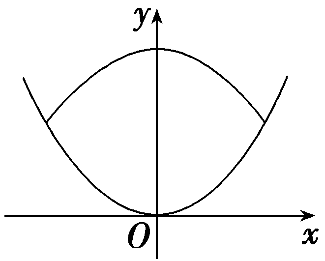

8.&lt;te&lt;text st<em>y</em>le="italic"&gt;x&lt;/text&gt;t style="italic"&gt;A&lt;/text&gt;，<em>B</em>是抛物线x2＝2y上的两点，<em>O</em>为坐标原点.若｜<em>OA</em>｜＝｜<em>OB</em>｜，且△<em>&lt;text style="italic"&gt;AOB</em>&lt;/text&gt;的面积为12 $\sqrt{3}$ ，则∠&lt;te&lt;text st<em>y</em>le="italic"&gt;x&lt;/text&gt;t style="italic"&gt;A&lt;/text&gt;<em>OB</em>＝<u>　　　　</u>.

答案：60°

解析：如图，因为｜&lt;text st&lt;text st<em>y</em>le="it&lt;text style="it<em>a</em>lic"&gt;a&lt;/text&gt;lic"&gt;y&lt;/text&gt;le="italic"&gt;O<em>&lt;text style="italic"&gt;A</em>&lt;/text&gt;&lt;/text&gt;｜＝｜<em>O&lt;text style="italic"&gt;&lt;text style="italic"&gt;&lt;text style="italic"&gt;B</em>&lt;/text&gt;&lt;/text&gt;&lt;/text&gt;｜，所以A，B两点关于y轴对称，设A $\left(－a，\frac{a^{2}}{2}\right)$ ，&lt;text st&lt;text st<em>y</em>le="it&lt;text style="it<em>a</em>lic"&gt;a&lt;/text&gt;lic"&gt;y&lt;/text&gt;le="italic"&gt;<em>&lt;text style="italic"&gt;B</em>&lt;/text&gt;&lt;/text&gt; $\left(a，\frac{a^{2}}{2}\right)$ ，所以&lt;text st<em>y</em>le="it&lt;text style="it<em>a</em>lic"&gt;a&lt;/text&gt;lic"&gt;S&lt;/text&gt;△&lt;text st<em>y</em>le="italic"&gt;<em>A</em>&lt;/text&gt;<em>O&lt;text style="italic"&gt;&lt;text style="italic"&gt;&lt;text style="italic"&gt;B</em>&lt;/text&gt;&lt;/text&gt;&lt;/text&gt;＝ $\frac{1}{2}$ ×2&lt;text st<em>y</em>le="it<em>a</em>lic"&gt;a&lt;/text&gt;× $\frac{a^{2}}{2}$ ＝12 $\sqrt{3}$ ，解得&lt;text st<em>y</em>le="it<em>a</em>lic"&gt;a&lt;/text&gt;＝2 $\sqrt{3}$ ，所以&lt;text st&lt;text st<em>y</em>le="it&lt;text style="it<em>a</em>lic"&gt;a&lt;/text&gt;lic"&gt;y&lt;/text&gt;le="italic"&gt;<em>&lt;text style="italic"&gt;B</em>&lt;/text&gt;&lt;/text&gt;(2 $\sqrt{3}$ ，6)，设&lt;text st&lt;text st<em>y</em>le="it&lt;text style="it<em>a</em>lic"&gt;a&lt;/text&gt;lic"&gt;y&lt;/text&gt;le="italic"&gt;O<em>&lt;text style="italic"&gt;&lt;text style="italic"&gt;B</em>&lt;/text&gt;&lt;/text&gt;&lt;/text&gt;与y轴正方向夹角为<em>&lt;text style="italic"&gt;&lt;text style="italic"&gt;&lt;text style="italic"&gt;θ</em>&lt;/text&gt;&lt;/text&gt;&lt;/text&gt;，所以tan θ＝ $\frac{2\sqrt{3}}{6}$ ＝ $\frac{\sqrt{3}}{3}$ ，所以<em>&lt;text style="italic"&gt;&lt;text style="italic"&gt;&lt;text style="italic"&gt;θ</em>&lt;/text&gt;&lt;/text&gt;&lt;/text&gt;＝30°，所以∠&lt;text st&lt;text st<em>y</em>le="it&lt;text style="it<em>a</em>lic"&gt;a&lt;/text&gt;lic"&gt;y&lt;/text&gt;le="italic"&gt;<em>A</em>&lt;/text&gt;<em>O&lt;text style="italic"&gt;&lt;text style="italic"&gt;&lt;text style="italic"&gt;B</em>&lt;/text&gt;&lt;/text&gt;&lt;/text&gt;＝2θ＝60°.

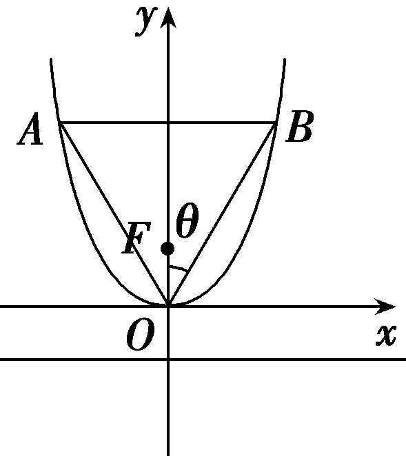

9.(13分)过抛物线<em>C</em>：<em>x</em>2＝2<em>py</em>(<em>p</em>＞0)的焦点<em>F</em>作直线<em>l</em>与抛物线<em>C</em>交于<em>A</em>，<em>B</em>两点，当点<em>A</em>的纵坐标为1时，｜<em>AF</em>｜＝2.

(1)求抛物线*C*的方程；(4分)

(2)若抛物线<em>C</em>上存在点<em>M</em>(－2，<em>y</em>0)，使得<em>MA</em>⊥<em>MB</em>，求直线<em>l</em>的方程.(9分)

解：(1)抛物线<te<text st*y*le="italic">x</text>t style="italic">C</text>：x<text style="su*p*erscript">2</text>＝2*py*(p＞0)的准线方程为y＝－ $\frac{p}{2}$ ，焦点为*F*( 0， $\frac{p}{2}$ ).

当点*A*的纵坐标为1时，｜*AF*｜＝2，

所以1＋ $\frac{p}{2}$ ＝2，解得*p*＝2，

所以抛物线<em>C</em>的方程为<em>x</em>2＝4<em>y</em>.

(2)因为点<em>M</em>(－2，<em>y</em>0)在抛物线<em>C</em>上，

所以<em>y</em>0＝ $\frac{\left(－2\right)^{2}}{4}$ ＝1，<em>M</em>点的坐标为(－2，1).

又直线*l*过点*F*(0，1)，所以设直线*l*的方程为*y*＝*kx*＋1.

由 $\left\{\begin{matrix}y＝kx+1，\\x^{2}=4y，\end{matrix}\right.$ 得<em>x</em>2－4<em>kx</em>－4＝0.

设<em>A</em>(<em>x</em>1，<em>y</em>1)，<em>B</em>(<em>x</em>2，<em>y</em>2)，

则&lt;te&lt;te&lt;te<em>x</em>t style="italic"&gt;x&lt;/text&gt;t style="italic"&gt;x&lt;/text&gt;t style="italic"&gt;x&lt;/text&gt;&lt;text style="subscript"&gt;1&lt;/text&gt;＋x&lt;text style="subscript"&gt;2&lt;/text&gt;＝4<em>k</em>，x1x2＝－4， $\vec{MA}$ ＝ $\left(x_{1}+2，y_{1}－1\right)$ ， $\vec{MB}$ ＝ $\left(x_{2}+2，y_{2}－1\right)$ .

因为*MA*⊥*MB*，所以 $\vec{MA}$ *·* $\vec{MB}$ ＝0，

所以(<em>x</em>1＋2)(<em>x</em>2＋2)＋(<em>y</em>1－1)(<em>y</em>2－1)＝0，

所以－4＋8<em>k</em>＋4－4<em>k</em>2＝0，解得<em>k</em>＝2或<em>k</em>＝0.

当*k*＝0时，*l*过点*M*，不符合题意，所以*k*＝2，

所以直线*l*的方程为*y*＝2*x*＋1.

(10、11题，每小题5分，共10分)

10.设<em>M</em>是抛物线<em>y</em>2＝4<em>x</em>上的一点，<em>F</em>是抛物线的焦点，<em>O</em>是坐标原点，若∠<em>OFM</em>＝120°，则｜<em>FM</em>｜等于(　　)

A.3	B.4

C. $\frac{4}{3}$ 	D. $\frac{7}{3}$

答案：**B**

解析：过点<em>M</em>作抛物线的准线<em>l</em>的垂线，垂足为点<em>N</em>，连接<em>FN</em>，如图所示，因为∠<em>OFM</em>＝120°，<em>MN</em>∥<em>x</em>轴，则∠<em>FMN</em>＝60°，由抛物线的定义可得｜<em>MN</em>｜＝｜<em>FM</em>｜，所以△<em>FNM</em>为等边三角形，则∠<em>FNM</em>＝60°，抛物线<em>y</em>2＝4<em>x</em>的准线方程为<em>x</em>＝－1，设直线<em>x</em>＝－1交<em>x</em>轴于点<em>E</em>，则∠<em>ENF</em>＝30°，易知｜<em>EF</em>｜＝2，∠<em>FEN</em>＝90°，则｜<em>FM</em>｜＝｜<em>FN</em>｜＝2｜<em>EF</em>｜＝4.故选B.

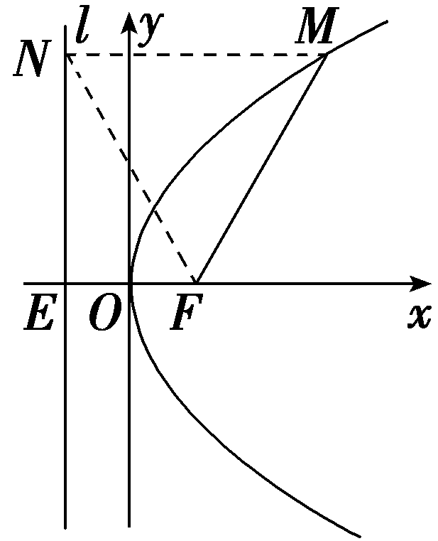

11.抛物线<em>y</em>&lt;text style="su<em>p</em>erscript"&gt;2&lt;/text&gt;＝2<em>px</em>(p＞0)的焦点为<em>F</em>，<em>A</em>，<em>B</em>为抛物线上的两个动点，且满足∠<em>AFB</em>＝60°.过弦<em>AB</em>的中点<em>M</em>作抛物线准线的垂线<em>M&lt;text style="italic"&gt;N</em>&lt;/text&gt;，垂足为N.则 $\frac{｜MN｜}{｜AB｜}$ 的最大值为<u>　　　　</u>.

答案：1

解析：设｜&lt;text style="it&lt;text style="it&lt;text style="it&lt;text style="it&lt;text style="it&lt;text style="it&lt;text style="it&lt;text style="it&lt;text style="it&lt;text style="it<em>a</em>lic"&gt;a&lt;/text&gt;lic"&gt;a&lt;/text&gt;lic"&gt;a&lt;/text&gt;lic"&gt;a&lt;/text&gt;lic"&gt;a&lt;/text&gt;lic"&gt;a&lt;/text&gt;lic"&gt;a&lt;/text&gt;lic"&gt;a&lt;/text&gt;lic"&gt;a&lt;/text&gt;lic"&gt;<em>A</em>F&lt;/text&gt;｜＝a，｜<em>&lt;text style="italic"&gt;B</em>F&lt;/text&gt;｜＝<em>&lt;text style="italic"&gt;&lt;text style="italic"&gt;&lt;text style="italic"&gt;&lt;text style="italic"&gt;&lt;text style="italic"&gt;&lt;text style="italic"&gt;&lt;text style="italic"&gt;&lt;text style="italic"&gt;&lt;text style="italic"&gt;b</em>&lt;/text&gt;&lt;/text&gt;&lt;/text&gt;&lt;/text&gt;&lt;/text&gt;&lt;/text&gt;&lt;/text&gt;&lt;/text&gt;&lt;/text&gt;，过A，B点分别作准线的垂线<em>&lt;text style="italic"&gt;&lt;text style="italic"&gt;AQ</em>&lt;/text&gt;&lt;/text&gt;，<em>&lt;text style="italic"&gt;&lt;text style="italic"&gt;BP</em>&lt;/text&gt;&lt;/text&gt;，由抛物线定义，得｜<em>AF</em>｜＝｜AQ｜，｜<em>BF</em>｜＝｜BP｜，在梯形<em>&lt;text style="italic"&gt;&lt;text style="italic"&gt;AB</em>&lt;/text&gt;PQ&lt;/text&gt;中，&lt;text style="superscript"&gt;&lt;text style="superscript"&gt;&lt;text style="superscript"&gt;&lt;text style="superscript"&gt;&lt;text style="superscript"&gt;&lt;text style="superscript"&gt;&lt;text style="superscript"&gt;&lt;text style="superscript"&gt;&lt;text style="superscript"&gt;&lt;text style="superscript"&gt;2&lt;/text&gt;&lt;/text&gt;&lt;/text&gt;&lt;/text&gt;&lt;/text&gt;&lt;/text&gt;&lt;/text&gt;&lt;/text&gt;&lt;/text&gt;&lt;/text&gt;｜<em>&lt;text style="italic"&gt;MN</em>&lt;/text&gt;｜＝｜AQ｜＋｜BP｜＝a＋b.在△<em>AFB</em>中，由余弦定理，得｜AB｜2＝a2＋b2－2<em>&lt;text style="italic"&gt;&lt;text style="italic"&gt;&lt;text style="italic"&gt;&lt;text style="italic"&gt;ab</em>&lt;/text&gt;&lt;/text&gt;&lt;/text&gt;&lt;/text&gt;cos 60°＝a2＋b2－ab＝(a＋b)2－3ab，又因为ab≤( $\frac{a＋b}{2}$ )&lt;text style="superscript"&gt;&lt;text style="superscript"&gt;&lt;text style="superscript"&gt;&lt;text style="superscript"&gt;&lt;text style="superscript"&gt;&lt;text style="superscript"&gt;&lt;text style="superscript"&gt;&lt;text style="superscript"&gt;&lt;text style="superscript"&gt;&lt;text style="superscript"&gt;2&lt;/text&gt;&lt;/text&gt;&lt;/text&gt;&lt;/text&gt;&lt;/text&gt;&lt;/text&gt;&lt;/text&gt;&lt;/text&gt;&lt;/text&gt;&lt;/text&gt;，所以(&lt;text style="it&lt;text style="it&lt;text style="it&lt;text style="it&lt;text style="it&lt;text style="it&lt;text style="it&lt;text style="it&lt;text style="it<em>a</em>lic"&gt;a&lt;/text&gt;lic"&gt;a&lt;/text&gt;lic"&gt;a&lt;/text&gt;lic"&gt;a&lt;/text&gt;lic"&gt;a&lt;/text&gt;lic"&gt;a&lt;/text&gt;lic"&gt;a&lt;/text&gt;lic"&gt;a&lt;/text&gt;lic"&gt;a&lt;/text&gt;＋<em>&lt;text style="italic"&gt;&lt;text style="italic"&gt;&lt;text style="italic"&gt;&lt;text style="italic"&gt;&lt;text style="italic"&gt;&lt;text style="italic"&gt;&lt;text style="italic"&gt;&lt;text style="italic"&gt;&lt;text style="italic"&gt;b</em>&lt;/text&gt;&lt;/text&gt;&lt;/text&gt;&lt;/text&gt;&lt;/text&gt;&lt;/text&gt;&lt;/text&gt;&lt;/text&gt;&lt;/text&gt;)2－3<em>&lt;text style="italic"&gt;&lt;text style="italic"&gt;&lt;text style="italic"&gt;&lt;text style="italic"&gt;ab</em>&lt;/text&gt;&lt;/text&gt;&lt;/text&gt;&lt;/text&gt;≥(a＋b)2－ $\frac{3}{4}$ (&lt;text style="it&lt;text style="it&lt;text style="it&lt;text style="it&lt;text style="it&lt;text style="it&lt;text style="it&lt;text style="it&lt;text style="it<em>a</em>lic"&gt;a&lt;/text&gt;lic"&gt;a&lt;/text&gt;lic"&gt;a&lt;/text&gt;lic"&gt;a&lt;/text&gt;lic"&gt;a&lt;/text&gt;lic"&gt;a&lt;/text&gt;lic"&gt;a&lt;/text&gt;lic"&gt;a&lt;/text&gt;lic"&gt;a&lt;/text&gt;＋<em>&lt;text style="italic"&gt;&lt;text style="italic"&gt;&lt;text style="italic"&gt;&lt;text style="italic"&gt;&lt;text style="italic"&gt;&lt;text style="italic"&gt;&lt;text style="italic"&gt;&lt;text style="italic"&gt;&lt;text style="italic"&gt;b</em>&lt;/text&gt;&lt;/text&gt;&lt;/text&gt;&lt;/text&gt;&lt;/text&gt;&lt;/text&gt;&lt;/text&gt;&lt;/text&gt;&lt;/text&gt;)&lt;text style="superscript"&gt;&lt;text style="superscript"&gt;&lt;text style="superscript"&gt;&lt;text style="superscript"&gt;&lt;text style="superscript"&gt;&lt;text style="superscript"&gt;&lt;text style="superscript"&gt;&lt;text style="superscript"&gt;&lt;text style="superscript"&gt;&lt;text style="superscript"&gt;2&lt;/text&gt;&lt;/text&gt;&lt;/text&gt;&lt;/text&gt;&lt;/text&gt;&lt;/text&gt;&lt;/text&gt;&lt;/text&gt;&lt;/text&gt;&lt;/text&gt;＝ $\frac{1}{4}$ (&lt;text style="it&lt;text style="it&lt;text style="it&lt;text style="it&lt;text style="it&lt;text style="it&lt;text style="it&lt;text style="it&lt;text style="it<em>a</em>lic"&gt;a&lt;/text&gt;lic"&gt;a&lt;/text&gt;lic"&gt;a&lt;/text&gt;lic"&gt;a&lt;/text&gt;lic"&gt;a&lt;/text&gt;lic"&gt;a&lt;/text&gt;lic"&gt;a&lt;/text&gt;lic"&gt;a&lt;/text&gt;lic"&gt;a&lt;/text&gt;＋<em>&lt;text style="italic"&gt;&lt;text style="italic"&gt;&lt;text style="italic"&gt;&lt;text style="italic"&gt;&lt;text style="italic"&gt;&lt;text style="italic"&gt;&lt;text style="italic"&gt;&lt;text style="italic"&gt;&lt;text style="italic"&gt;b</em>&lt;/text&gt;&lt;/text&gt;&lt;/text&gt;&lt;/text&gt;&lt;/text&gt;&lt;/text&gt;&lt;/text&gt;&lt;/text&gt;&lt;/text&gt;)&lt;text style="superscript"&gt;&lt;text style="superscript"&gt;&lt;text style="superscript"&gt;&lt;text style="superscript"&gt;&lt;text style="superscript"&gt;&lt;text style="superscript"&gt;&lt;text style="superscript"&gt;&lt;text style="superscript"&gt;&lt;text style="superscript"&gt;&lt;text style="superscript"&gt;2&lt;/text&gt;&lt;/text&gt;&lt;/text&gt;&lt;/text&gt;&lt;/text&gt;&lt;/text&gt;&lt;/text&gt;&lt;/text&gt;&lt;/text&gt;&lt;/text&gt;，得到｜<em>AB</em>｜≥ $\frac{1}{2}$ (&lt;text style="it&lt;text style="it&lt;text style="it&lt;text style="it&lt;text style="it&lt;text style="it&lt;text style="it&lt;text style="it&lt;text style="it<em>a</em>lic"&gt;a&lt;/text&gt;lic"&gt;a&lt;/text&gt;lic"&gt;a&lt;/text&gt;lic"&gt;a&lt;/text&gt;lic"&gt;a&lt;/text&gt;lic"&gt;a&lt;/text&gt;lic"&gt;a&lt;/text&gt;lic"&gt;a&lt;/text&gt;lic"&gt;a&lt;/text&gt;＋<em>&lt;text style="italic"&gt;&lt;text style="italic"&gt;&lt;text style="italic"&gt;&lt;text style="italic"&gt;&lt;text style="italic"&gt;&lt;text style="italic"&gt;&lt;text style="italic"&gt;&lt;text style="italic"&gt;&lt;text style="italic"&gt;b</em>&lt;/text&gt;&lt;/text&gt;&lt;/text&gt;&lt;/text&gt;&lt;/text&gt;&lt;/text&gt;&lt;/text&gt;&lt;/text&gt;&lt;/text&gt;)＝｜<em>&lt;text style="italic"&gt;MN</em>&lt;/text&gt;｜.所以 $\frac{｜MN｜}{｜AB｜}$ ≤1，即 $\frac{｜MN｜}{｜AB｜}$ 的最大值为1.

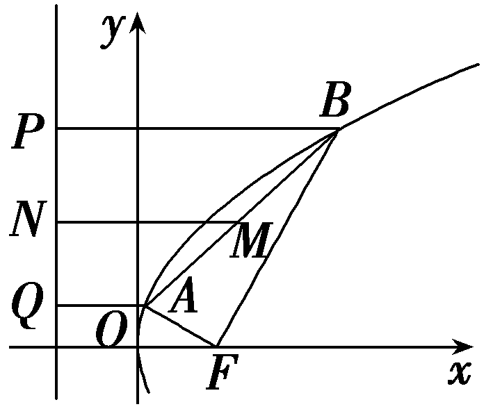

12.(15分)如图，已知点<em>F</em>为抛物线<em>E</em>：<em>y</em>2＝2<em>px</em>(<em>p</em>＞0)的焦点，点<em>A</em>(2，<em>m</em>)在抛物线<em>E</em>上，且｜<em>AF</em>｜＝3.

(1)求抛物线*E*的方程；(4分)

(2)已知点*G*(－1，0)，延长*AF*交抛物线*E*于点*B*，证明：*GF*为∠*AGB*的平分线.(11分)

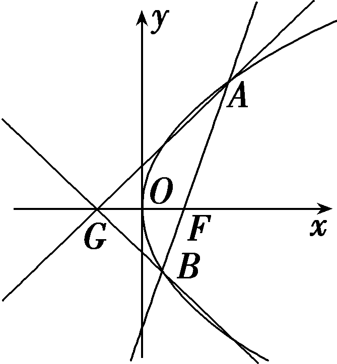

解：(1)由抛物线定义可得｜*AF*｜＝2＋ $\frac{p}{2}$ ＝3，解得*p*＝2，

所以抛物线<em>E</em>的方程为<em>y</em>2＝4<em>x</em>.

(2)证明：因为点*A*(2，*m*)在抛物线*E*上，

所以<em>&lt;text style="italic"&gt;m</em>&lt;/text&gt;2＝4×2，解得m＝±2 $\sqrt{2}$ ，

由题图知*A*(2，2 $\sqrt{2}$ )，又*F*(1，0)，

所以直线<te*x*t st*y*le="italic">AF</text>的方程为y＝2 $\sqrt{2}$ (*x*－1).

由 $\left\{\begin{matrix}y=2\sqrt{2}(x－1),\\y^{2}=4x，\end{matrix}\right.$ 得<te*x*t style="superscript">2</text>*x*2－5x＋2＝0，

解得*x*＝2或 $\frac{1}{2}$ ，所以*B*( $\frac{1}{2}$ ，－ $\sqrt{2}$ ).

又<em>G</em>(－1，0)，所以<em>&lt;text style="italic"&gt;k</em>&lt;/text&gt;<em>GA</em>＝ $\frac{2\sqrt{2}}{3}$ ，<em>&lt;text style="italic"&gt;k</em>&lt;/text&gt;<em>G</em>B＝－ $\frac{2\sqrt{2}}{3}$ ，

所以<em>kGA</em>＋<em>kGB</em>＝0，所以∠<em>AGF</em>＝∠<em>BGF</em>，

故*GF*为∠*AGB*的平分线.

(13、14题，每小题5分，共10分)

13.小明同学在一个宽口半径为1，高度为1的抛物面杯子中做小球放入实验，如图所示，要求小球能与杯底接触，则他能放入小球的最大半径是(　　)

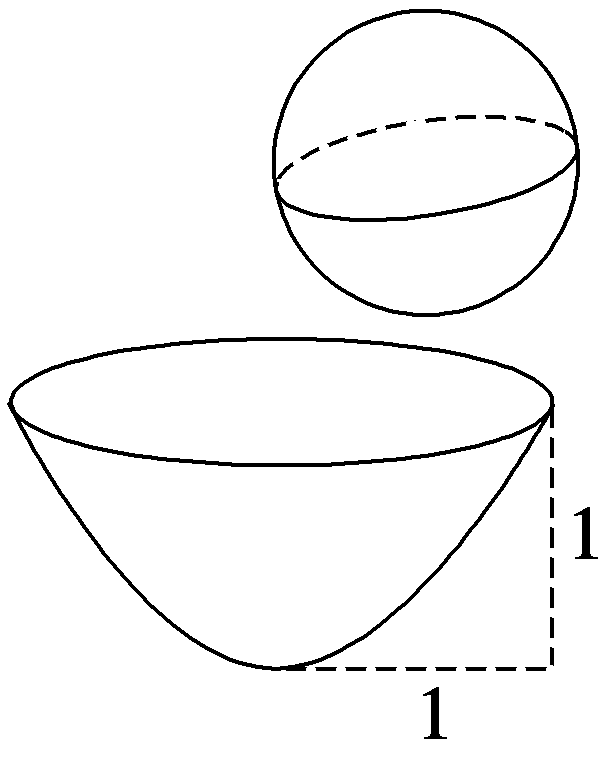

A. $\frac{1}{4}$ 	B. $\frac{1}{2}$

C. $\frac{\sqrt{2}}{2}$ 	D.1

答案：**B**

解析：作杯子的截面得一抛物线，如图，建立平面直角坐标系，则点(1，1)在抛物线上，设抛物线方程为&lt;te&lt;te&lt;text st&lt;text st&lt;text style="it&lt;text style="it&lt;text style="it<em>a</em>lic"&gt;a&lt;/text&gt;lic"&gt;a&lt;/text&gt;lic"&gt;y&lt;/text&gt;le="italic"&gt;y&lt;/text&gt;le="italic"&gt;x&lt;/text&gt;t st&lt;text style="it&lt;text style="it<em>a</em>lic"&gt;a&lt;/text&gt;lic"&gt;y&lt;/text&gt;le="italic"&gt;x&lt;/text&gt;t style="italic"&gt;x&lt;/text&gt;&lt;text style="su<em>&lt;text style="italic"&gt;&lt;text style="italic"&gt;p</em>&lt;/text&gt;&lt;/text&gt;e<em>&lt;text style="italic"&gt;&lt;text style="italic"&gt;&lt;text style="italic"&gt;r</em>&lt;/text&gt;&lt;/text&gt;&lt;/text&gt;script"&gt;2&lt;/text&gt;＝2<em>py</em>(p＞0)，则1＝2p，p＝ $\frac{1}{2}$ ，抛物线方程为&lt;te&lt;te&lt;text st&lt;text st&lt;text style="it&lt;text style="it&lt;text style="it<em>a</em>lic"&gt;a&lt;/text&gt;lic"&gt;a&lt;/text&gt;lic"&gt;y&lt;/text&gt;le="italic"&gt;y&lt;/text&gt;le="italic"&gt;x&lt;/text&gt;t st&lt;text style="it&lt;text style="it<em>a</em>lic"&gt;a&lt;/text&gt;lic"&gt;y&lt;/text&gt;le="italic"&gt;x&lt;/text&gt;t style="italic"&gt;x&lt;/text&gt;&lt;text style="su<em>&lt;text style="italic"&gt;&lt;text style="italic"&gt;p</em>&lt;/text&gt;&lt;/text&gt;e<em>&lt;text style="italic"&gt;&lt;text style="italic"&gt;&lt;text style="italic"&gt;r</em>&lt;/text&gt;&lt;/text&gt;&lt;/text&gt;script"&gt;2&lt;/text&gt;＝y，设球心为<em>A</em>(0，a)(a＞0)，球半径为r，<em>P</em>(x，y)是抛物线上任一点，｜<em>&lt;text style="italic"&gt;&lt;text style="italic"&gt;&lt;text style="italic"&gt;AP</em>&lt;/text&gt;&lt;/text&gt;&lt;/text&gt;｜＝ $\sqrt{x^{2}＋(y－a)^{2}}$ ＝ $\sqrt{y^{2}＋(1－2a)y＋a^{2}}$ ，则&lt;te&lt;text st&lt;text st&lt;text style="it&lt;text style="it&lt;text style="it<em>a</em>lic"&gt;a&lt;/text&gt;lic"&gt;a&lt;/text&gt;lic"&gt;y&lt;/text&gt;le="italic"&gt;y&lt;/text&gt;le="italic"&gt;x&lt;/text&gt;t style="italic"&gt;<em>&lt;text style="italic"&gt;&lt;text style="italic"&gt;r</em>&lt;/text&gt;&lt;/text&gt;&lt;/text&gt;＝｜&lt;text style="it&lt;text style="it<em>a</em>lic"&gt;a&lt;/text&gt;lic"&gt;A&lt;/text&gt;<em>P</em>｜&lt;text style="subscript"&gt;min&lt;/text&gt;，小球与杯底接触，则上式在<em>y</em>＝0时取得最小值，｜<em>&lt;text style="italic"&gt;&lt;text style="italic"&gt;&lt;text style="italic"&gt;AP</em>&lt;/text&gt;&lt;/text&gt;&lt;/text&gt;｜＝ $\sqrt{\left(y－\frac{2a－1}{2}\right)^{2}＋\frac{4a－1}{4}}$ ，此时 $\frac{2a－1}{2}$ ≤0，即0＜&lt;te&lt;text st&lt;text st&lt;text style="it&lt;text style="it&lt;text style="it<em>a</em>lic"&gt;a&lt;/text&gt;lic"&gt;a&lt;/text&gt;lic"&gt;y&lt;/text&gt;le="italic"&gt;y&lt;/text&gt;le="italic"&gt;x&lt;/text&gt;t style="it<em>a</em>lic"&gt;a&lt;/text&gt;≤ $\frac{1}{2}$ ，&lt;te&lt;text st&lt;text st&lt;text style="it&lt;text style="it&lt;text style="it<em>a</em>lic"&gt;a&lt;/text&gt;lic"&gt;a&lt;/text&gt;lic"&gt;y&lt;/text&gt;le="italic"&gt;y&lt;/text&gt;le="italic"&gt;x&lt;/text&gt;t style="italic"&gt;<em>&lt;text style="italic"&gt;&lt;text style="italic"&gt;r</em>&lt;/text&gt;&lt;/text&gt;&lt;/text&gt;＝｜&lt;text style="it&lt;text style="it<em>a</em>lic"&gt;a&lt;/text&gt;lic"&gt;A&lt;/text&gt;<em>P</em>｜&lt;text style="subscript"&gt;min&lt;/text&gt;＝a，所以rma&lt;te&lt;text st<em>y</em>le="italic"&gt;x&lt;/text&gt;t style="italic"&gt;x&lt;/text&gt;＝a&lt;text style="subscript"&gt;max&lt;/text&gt;＝ $\frac{1}{2}$ .故选B.

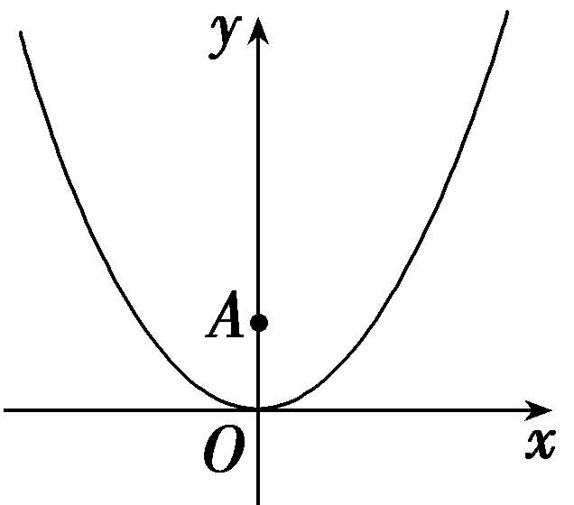

14.(多选)(<te*x*t style="su*p*erscript">2</text>025·河北邯郸第四次调研)设拋物线<te*x*t style="italic">*E*</text>：x2＝2*py*(p＞0)的焦点为*F*，过点*P* $\left(0，3\right)$ 的直线与抛物线<te<te*x*t style="italic">x</text>t style="italic">*E*</text>相交于点*A*，*B*，与x轴相交于点*C*， $\left|AF\right|$ ＝<te*x*t style="su*p*erscript">2</text>， $\left|BF\right|$ ＝10，则(　　)

A.*E*的准线方程为*y*＝－2

B.*p*的值为2

C. $\left|AB\right|$ ＝4 $\sqrt{2}$

D.△*BFC*的面积与△*AFC*的面积之比为9

答案：**BD**

解析：设直线<text st*y*le="italic">*AB*</text>的方程为y＝*kx*＋3，A $\left(x_{1}，y_{1}\right)$ ，*B* $\left(x_{2}，y_{2}\right)$ ，联立

$\left\{\begin{matrix}y＝kx+3，\\x^{2}=2py，\end{matrix}\right.$ 可得&lt;te&lt;te&lt;te&lt;te&lt;te&lt;text st&lt;text st&lt;text st&lt;text st&lt;text st&lt;text st&lt;text st<em>y</em>le="italic"&gt;y&lt;/text&gt;le="italic"&gt;y&lt;/text&gt;le="italic"&gt;y&lt;/text&gt;le="italic"&gt;y&lt;/text&gt;le="italic"&gt;y&lt;/text&gt;le="italic"&gt;y&lt;/text&gt;le="italic"&gt;x&lt;/text&gt;t style="italic"&gt;x&lt;/text&gt;t style="italic"&gt;x&lt;/text&gt;t style="italic"&gt;x&lt;/text&gt;t style="italic"&gt;x&lt;/text&gt;t style="italic"&gt;x&lt;/text&gt;&lt;text style="su<em>&lt;text style="italic"&gt;&lt;text style="italic"&gt;&lt;text style="italic"&gt;&lt;text style="italic"&gt;p</em>&lt;/text&gt;&lt;/text&gt;&lt;/text&gt;&lt;/text&gt;erscript"&gt;&lt;text style="subscript"&gt;&lt;text style="superscript"&gt;&lt;text style="subscript"&gt;&lt;text style="subscript"&gt;2&lt;/text&gt;&lt;/text&gt;&lt;/text&gt;&lt;/text&gt;&lt;/text&gt;－2<em>&lt;text style="italic"&gt;pk</em>x&lt;/text&gt;－6p＝0，所以x&lt;text style="subscript"&gt;&lt;text style="subscript"&gt;&lt;text style="subscript"&gt;&lt;text style="subscript"&gt;1&lt;/text&gt;&lt;/text&gt;&lt;/text&gt;&lt;/text&gt;＋x2＝2pk，x1x2＝－6p，因为x2＝2<em>py</em>，所以y＝ $\frac{x^{2}}{2p}$ ，故&lt;text st&lt;text st&lt;text st&lt;text st&lt;text st&lt;text st<em>y</em>le="italic"&gt;y&lt;/text&gt;le="italic"&gt;y&lt;/text&gt;le="italic"&gt;y&lt;/text&gt;le="italic"&gt;y&lt;/text&gt;le="italic"&gt;y&lt;/text&gt;le="italic"&gt;y&lt;/text&gt;&lt;te&lt;te&lt;te&lt;te<em>x</em>t style="italic"&gt;x&lt;/text&gt;t style="italic"&gt;x&lt;/text&gt;t style="italic"&gt;x&lt;/text&gt;t style="subscri<em>&lt;text style="italic"&gt;&lt;text style="italic"&gt;&lt;text style="italic"&gt;p</em>&lt;/text&gt;&lt;/text&gt;&lt;/text&gt;t"&gt;&lt;text style="subscript"&gt;&lt;text style="subscript"&gt;&lt;text style="subscript"&gt;1&lt;/text&gt;&lt;/text&gt;&lt;/text&gt;&lt;/text&gt;y&lt;te<em>x</em>t style="su<em>p</em>erscript"&gt;&lt;text style="subscript"&gt;&lt;text style="superscript"&gt;&lt;text style="subscript"&gt;&lt;text style="subscript"&gt;2&lt;/text&gt;&lt;/text&gt;&lt;/text&gt;&lt;/text&gt;&lt;/text&gt;＝ $\frac{x_{1}^{2}x_{2}^{2}}{4p^{2}}$ ＝ $\frac{36p^{2}}{4p^{2}}$ ＝9，因为 $\left|AF\right|$ ＝&lt;te&lt;te&lt;te&lt;te&lt;te&lt;text st&lt;text st&lt;text st&lt;text st&lt;text st&lt;text st&lt;text st<em>y</em>le="italic"&gt;y&lt;/text&gt;le="italic"&gt;y&lt;/text&gt;le="italic"&gt;y&lt;/text&gt;le="italic"&gt;y&lt;/text&gt;le="italic"&gt;y&lt;/text&gt;le="italic"&gt;y&lt;/text&gt;le="italic"&gt;x&lt;/text&gt;t style="italic"&gt;x&lt;/text&gt;t style="italic"&gt;x&lt;/text&gt;t style="italic"&gt;x&lt;/text&gt;t style="italic"&gt;x&lt;/text&gt;t style="su<em>&lt;text style="italic"&gt;&lt;text style="italic"&gt;&lt;text style="italic"&gt;&lt;text style="italic"&gt;p</em>&lt;/text&gt;&lt;/text&gt;&lt;/text&gt;&lt;/text&gt;erscript"&gt;&lt;text style="subscript"&gt;&lt;text style="superscript"&gt;&lt;text style="subscript"&gt;&lt;text style="subscript"&gt;2&lt;/text&gt;&lt;/text&gt;&lt;/text&gt;&lt;/text&gt;&lt;/text&gt;， $\left|BF\right|$ ＝&lt;te&lt;te&lt;te&lt;te&lt;text st&lt;text st&lt;text st&lt;text st&lt;text st&lt;text st&lt;text st<em>y</em>le="italic"&gt;y&lt;/text&gt;le="italic"&gt;y&lt;/text&gt;le="italic"&gt;y&lt;/text&gt;le="italic"&gt;y&lt;/text&gt;le="italic"&gt;y&lt;/text&gt;le="italic"&gt;y&lt;/text&gt;le="italic"&gt;x&lt;/text&gt;t style="italic"&gt;x&lt;/text&gt;t style="italic"&gt;x&lt;/text&gt;t style="italic"&gt;x&lt;/text&gt;t style="subscri<em>&lt;text style="italic"&gt;&lt;text style="italic"&gt;&lt;text style="italic"&gt;p</em>&lt;/text&gt;&lt;/text&gt;&lt;/text&gt;t"&gt;&lt;text style="subscript"&gt;&lt;text style="subscript"&gt;&lt;text style="subscript"&gt;1&lt;/text&gt;&lt;/text&gt;&lt;/text&gt;&lt;/text&gt;0，由抛物线定义可得，y1＝&lt;te<em>x</em>t style="su<em>p</em>erscript"&gt;&lt;text style="subscript"&gt;&lt;text style="superscript"&gt;&lt;text style="subscript"&gt;&lt;text style="subscript"&gt;2&lt;/text&gt;&lt;/text&gt;&lt;/text&gt;&lt;/text&gt;&lt;/text&gt;－ $\frac{p}{2}$ ，&lt;text st&lt;text st&lt;text st&lt;text st&lt;text st&lt;text st<em>y</em>le="italic"&gt;y&lt;/text&gt;le="italic"&gt;y&lt;/text&gt;le="italic"&gt;y&lt;/text&gt;le="italic"&gt;y&lt;/text&gt;le="italic"&gt;y&lt;/text&gt;le="italic"&gt;y&lt;/text&gt;&lt;te&lt;te&lt;te&lt;te&lt;te<em>x</em>t style="italic"&gt;x&lt;/text&gt;t style="italic"&gt;x&lt;/text&gt;t style="italic"&gt;x&lt;/text&gt;t style="italic"&gt;x&lt;/text&gt;t style="su<em>&lt;text style="italic"&gt;&lt;text style="italic"&gt;&lt;text style="italic"&gt;&lt;text style="italic"&gt;p</em>&lt;/text&gt;&lt;/text&gt;&lt;/text&gt;&lt;/text&gt;erscript"&gt;&lt;text style="subscript"&gt;&lt;text style="superscript"&gt;&lt;text style="subscript"&gt;&lt;text style="subscript"&gt;2&lt;/text&gt;&lt;/text&gt;&lt;/text&gt;&lt;/text&gt;&lt;/text&gt;＝&lt;text style="subscript"&gt;&lt;text style="subscript"&gt;&lt;text style="subscript"&gt;&lt;text style="subscript"&gt;1&lt;/text&gt;&lt;/text&gt;&lt;/text&gt;&lt;/text&gt;0－ $\frac{p}{2}$ ，则 $\left(2－\frac{p}{2}\right)\left(10－\frac{p}{2}\right)$ ＝9，解得&lt;te&lt;te&lt;te&lt;te&lt;te&lt;text st&lt;text st&lt;text st&lt;text st&lt;text st&lt;text st&lt;text st<em>y</em>le="italic"&gt;y&lt;/text&gt;le="italic"&gt;y&lt;/text&gt;le="italic"&gt;y&lt;/text&gt;le="italic"&gt;y&lt;/text&gt;le="italic"&gt;y&lt;/text&gt;le="italic"&gt;y&lt;/text&gt;le="italic"&gt;x&lt;/text&gt;t style="italic"&gt;x&lt;/text&gt;t style="italic"&gt;x&lt;/text&gt;t style="italic"&gt;x&lt;/text&gt;t style="italic"&gt;x&lt;/text&gt;t style="italic"&gt;<em>&lt;text style="italic"&gt;&lt;text style="italic"&gt;&lt;text style="italic"&gt;p</em>&lt;/text&gt;&lt;/text&gt;&lt;/text&gt;&lt;/text&gt;＝&lt;text style="subscript"&gt;&lt;text style="subscript"&gt;&lt;text style="superscript"&gt;&lt;text style="subscript"&gt;&lt;text style="subscript"&gt;2&lt;/text&gt;&lt;/text&gt;&lt;/text&gt;&lt;/text&gt;&lt;/text&gt;或p＝22，因为y&lt;text style="subscript"&gt;&lt;text style="subscript"&gt;&lt;text style="subscript"&gt;&lt;text style="subscript"&gt;1&lt;/text&gt;&lt;/text&gt;&lt;/text&gt;&lt;/text&gt;＝2－ $\frac{p}{2}$ ＞0，所以&lt;te&lt;te&lt;te&lt;te&lt;te&lt;text st&lt;text st&lt;text st&lt;text st&lt;text st&lt;text st&lt;text st<em>y</em>le="italic"&gt;y&lt;/text&gt;le="italic"&gt;y&lt;/text&gt;le="italic"&gt;y&lt;/text&gt;le="italic"&gt;y&lt;/text&gt;le="italic"&gt;y&lt;/text&gt;le="italic"&gt;y&lt;/text&gt;le="italic"&gt;x&lt;/text&gt;t style="italic"&gt;x&lt;/text&gt;t style="italic"&gt;x&lt;/text&gt;t style="italic"&gt;x&lt;/text&gt;t style="italic"&gt;x&lt;/text&gt;t style="italic"&gt;<em>&lt;text style="italic"&gt;&lt;text style="italic"&gt;&lt;text style="italic"&gt;p</em>&lt;/text&gt;&lt;/text&gt;&lt;/text&gt;&lt;/text&gt;＝&lt;text style="subscript"&gt;&lt;text style="subscript"&gt;&lt;text style="superscript"&gt;&lt;text style="subscript"&gt;&lt;text style="subscript"&gt;2&lt;/text&gt;&lt;/text&gt;&lt;/text&gt;&lt;/text&gt;&lt;/text&gt;，则<em>E</em>的准线方程为y＝－&lt;text style="subscript"&gt;&lt;text style="subscript"&gt;&lt;text style="subscript"&gt;&lt;text style="subscript"&gt;1&lt;/text&gt;&lt;/text&gt;&lt;/text&gt;&lt;/text&gt;，故B正确，A错误；

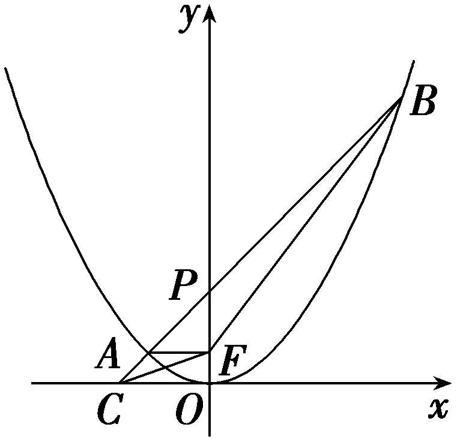

又&lt;te&lt;te&lt;text st&lt;text st&lt;text st<em>y</em>le="italic"&gt;y&lt;/text&gt;le="italic"&gt;y&lt;/text&gt;le="italic"&gt;x&lt;/text&gt;t st&lt;text st&lt;text st&lt;text st<em>y</em>le="italic"&gt;y&lt;/text&gt;le="italic"&gt;y&lt;/text&gt;le="italic"&gt;y&lt;/text&gt;le="italic"&gt;x&lt;/text&gt;t style="italic"&gt;E&lt;/text&gt;的方程为x&lt;text style="subscript"&gt;&lt;text style="superscript"&gt;&lt;text style="subscript"&gt;2&lt;/text&gt;&lt;/text&gt;&lt;/text&gt;＝4y，y&lt;text style="subscript"&gt;&lt;text style="subscript"&gt;1&lt;/text&gt;&lt;/text&gt;＝2－ $\frac{p}{2}$ ＝&lt;te&lt;text st&lt;text st&lt;text st<em>y</em>le="italic"&gt;y&lt;/text&gt;le="italic"&gt;y&lt;/text&gt;le="italic"&gt;x&lt;/text&gt;t st&lt;text st<em>y</em>le="italic"&gt;y&lt;/text&gt;le="subscript"&gt;&lt;text style="subscript"&gt;1&lt;/text&gt;&lt;/text&gt;，&lt;text st<em>y</em>le="italic"&gt;y&lt;/text&gt;&lt;text style="subscript"&gt;&lt;text style="superscript"&gt;&lt;text style="subscript"&gt;2&lt;/text&gt;&lt;/text&gt;&lt;/text&gt;＝10－ $\frac{p}{2}$ ＝9，把&lt;te&lt;text st&lt;text st&lt;text st<em>y</em>le="italic"&gt;y&lt;/text&gt;le="italic"&gt;y&lt;/text&gt;le="italic"&gt;x&lt;/text&gt;t st&lt;text st&lt;text st<em>y</em>le="italic"&gt;y&lt;/text&gt;le="italic"&gt;y&lt;/text&gt;le="italic"&gt;y&lt;/text&gt;&lt;text style="subscript"&gt;&lt;text style="subscript"&gt;1&lt;/text&gt;&lt;/text&gt;＝1代入<em>x</em>&lt;text style="subscript"&gt;&lt;text style="superscript"&gt;&lt;text style="subscript"&gt;2&lt;/text&gt;&lt;/text&gt;&lt;/text&gt;＝4y可得 $x_{1}^{2}$ ＝4&lt;te&lt;text st&lt;text st&lt;text st<em>y</em>le="italic"&gt;y&lt;/text&gt;le="italic"&gt;y&lt;/text&gt;le="italic"&gt;x&lt;/text&gt;t st&lt;text st&lt;text st<em>y</em>le="italic"&gt;y&lt;/text&gt;le="italic"&gt;y&lt;/text&gt;le="italic"&gt;y&lt;/text&gt;&lt;text style="subscript"&gt;&lt;text style="subscript"&gt;1&lt;/text&gt;&lt;/text&gt;＝4， $x_{2}^{2}$ ＝4&lt;te&lt;text st&lt;text st&lt;text st<em>y</em>le="italic"&gt;y&lt;/text&gt;le="italic"&gt;y&lt;/text&gt;le="italic"&gt;x&lt;/text&gt;t st&lt;text st&lt;text st<em>y</em>le="italic"&gt;y&lt;/text&gt;le="italic"&gt;y&lt;/text&gt;le="italic"&gt;y&lt;/text&gt;&lt;text style="subscript"&gt;&lt;text style="superscript"&gt;&lt;text style="subscript"&gt;2&lt;/text&gt;&lt;/text&gt;&lt;/text&gt;＝36，不妨设<em>A</em> $\left(－2，1\right)$ ，<em>B</em> $\left(6，9\right)$ ，则 $\left|AB\right|$ ＝8 $\sqrt{2}$ ，故C错误；设<em>F</em>到直线<em>AB</em>的距离为<em>&lt;text style="italic"&gt;&lt;text style="italic"&gt;d</em>&lt;/text&gt;&lt;/text&gt;，&lt;text style="subscript"&gt;△&lt;/text&gt;<em>&lt;text style="italic,subscript"&gt;&lt;text style="italic"&gt;BFC</em>&lt;/text&gt;&lt;/text&gt;的面积<em>&lt;text style="italic"&gt;S</em>&lt;/text&gt;△BFC＝ $\frac{1}{2}\left|BC\right|$ <em>&lt;text style="italic"&gt;&lt;text style="italic"&gt;d</em>&lt;/text&gt;&lt;/text&gt;，&lt;text style="subscript"&gt;△&lt;/text&gt;<em>AF</em>C的面积<em>&lt;text style="italic"&gt;S</em>&lt;/text&gt;△<em>&lt;text style="italic,subscript"&gt;&lt;text style="italic"&gt;AFC</em>&lt;/text&gt;&lt;/text&gt;＝ $\frac{1}{2}\left|AC\right|$ <em>&lt;text style="italic"&gt;&lt;text style="italic"&gt;d</em>&lt;/text&gt;&lt;/text&gt;，则&lt;text style="subscript"&gt;△&lt;/text&gt;<em>BF</em>C的面积与△<em>A</em>FC的面积之比 $\frac{S_{\bigtriangleup BFC}}{S_{\bigtriangleup AFC}}$ ＝ $\frac{\left|BC\right|}{\left|AC\right|}$ ＝ $\frac{y_{2}}{y_{1}}$ ＝9，故D正确.故选<em>B</em>D.

