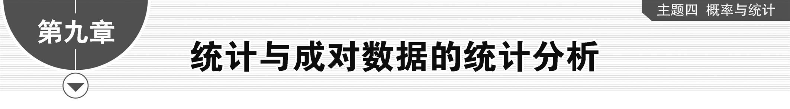

**第一节　随机抽样、统计图表**

【课标研读】　1.知道获取数据的基本途径，了解总体、样本、样本量的概念，了解数据的随机性.　2.了解简单随机抽样的含义及其解决问题的过程，掌握两种简单随机抽样方法：抽签法和随机数法.会计算样本均值和样本方差，了解样本与总体的关系.　3.了解分层随机抽样的特点和适用范围，了解分层随机抽样的必要性，掌握各层样本量比例分配的方法.结合具体案例，掌握分层随机抽样的样本均值.　4.在简单的实际情境中，能根据实际问题的特点，设计恰当的抽样方法解决问题.　5.能根据实际问题的特点，选择恰当的统计图表对数据进行可视化描述，体会合理使用统计图表的重要性.

1.总体、个体、样本

调查对象的全体(或调查对象的某些指标的全体)称为<u>总体</u>，组成总体的每一个调查对象(或每一个调查对象的相应指标)称为<u>个体</u>，在抽样调查中，从总体中抽取的那部分个体称为<u>样本</u>，样本中包含的个体数称为<u>样本容量</u>，简称样本量.

2.简单随机抽样

(1)定义：一般地，设一个总体含有*N*(*N*为正整数)个个体，从中逐个抽取*n*(1≤*n*＜*N*)个个体作为样本，如果抽取是放回的，且每次抽取时总体内的各个个体被抽到的概率都相等，我们把这样的抽样方法叫做放回简单随机抽样；如果抽取是不放回的，且每次抽取时总体内未进入样本的各个个体被抽到的概率都相等，我们把这样的抽样方法叫做不放回简单随机抽样.放回简单随机抽样和不放回简单随机抽样统称为简单随机抽样.

(2)最常用的简单随机抽样的方法：抽签法和<u>随机数</u>法.

3.分层随机抽样

(1)定义：一般地，按一个或多个变量把总体划分成若干个子总体，每个个体属于且仅属于一个子总体，在每个子总体中独立地进行简单随机抽样，再把所有子总体中抽取的样本合在一起作为总样本，这样的抽样方法称为<u>分层随机抽样</u>，每一个子总体称为层.

(2)应用范围：当总体是由差异明显的几个部分组成时，往往选用分层随机抽样.

4.统计图表

(1)常见的统计图表有<u>条形图</u>、<u>扇形图</u>、<u>折线图</u>、<u>频率分布直方图</u>等.

(2)作频率分布直方图的步骤

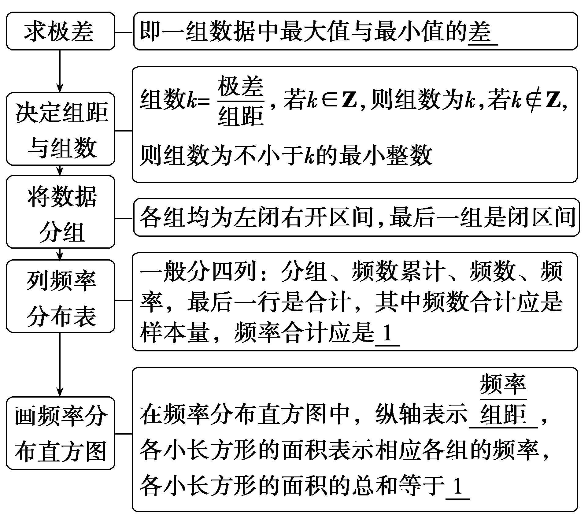

【常用结论】

(1)分层随机抽样的平均数计算

在分层随机抽样中，以层数是2层为例，如果第1层和第2层包含的个体数分别为*M*和*N*，抽取的样本量分别为*m*和*n*，样本平均数分别为 $\overline{x}$ ， $\overline{y}$ ，样本总体平均数为 $\overline{w}$ ，则 $\overline{w}$ ＝ $\frac{M}{M＋N}\overline{x}$ ＋ $\frac{N}{M＋N}\overline{y}$ ＝ $\frac{m}{m＋n}\overline{x}$ ＋ $\frac{n}{m＋n}\overline{y}$ .

(2)频率分布直方图中纵轴上的数据是各组的频率除以组距，不要和条形图混淆.

【自主检测】

1.(多选)下列说法正确的是(　　)

A.在简单随机抽样中，每个个体被抽到的机会与先后顺序有关

B.抽签法和随机数法都是简单随机抽样

C.在比例分配的分层随机抽样中，每个个体被抽到的可能性与层数及分层有关

D.在频率分布直方图中，小长方形的面积越大，表示样本数据落在该区间的频率越大

答案：**BD**

2.(链接人教A必修二P177T1)从某市参加升学考试的学生中随机抽查1 000名学生的数学成绩进行统计分析，在这个问题中，下列说法正确的是(　　)

A.总体指的是该市参加升学考试的全体学生

B.样本是指1 000名学生的数学成绩

C.样本量指的是1 000名学生

D.个体指的是1 000名学生中的每一名学生

答案：**B**

解析：对于A，总体指的是该市参加升学考试的全体学生的数学成绩，故A错误；对于B，样本是指1 000名学生的数学成绩，故B正确；对于C，样本量是1 000，故C错误；对于D，个体指的是每名学生的数学成绩，故D错误.故选B.

3.(链接人教A必修二P185T3)某校有男生3 000人，女生2 000人，学校将通过分层随机抽样的方法抽取100人的身高数据，若按男女比例进行分层随机抽样，抽取到的学生平均身高为165 cm，其中被抽取的男生平均身高为172 cm，则被抽取的女生平均身高为(　　)

A.154.5 cm	B.158 cm

C.160.5 cm	D.159 cm

答案：**A**

解析：根据分层随机抽样原理，被抽取到的男生为60人，女生为40人，设被抽取到的女生平均身高为<te*x*t style="italic">x </text>cm，则 $\frac{60\times 172+40x}{100}$ ＝165，解得*x*＝154.5，所以被抽取的女生平均身高为154.5 cm.故选A.

4.(双空题)(链接人教A必修二P198T1)从某小区随机抽取100户居民用户进行月用电量调查，发现他们的月用电量都在50～300 kW·h之间，适当分组(每组为左闭右开区间)后绘制成如图所示的频率分布直方图.

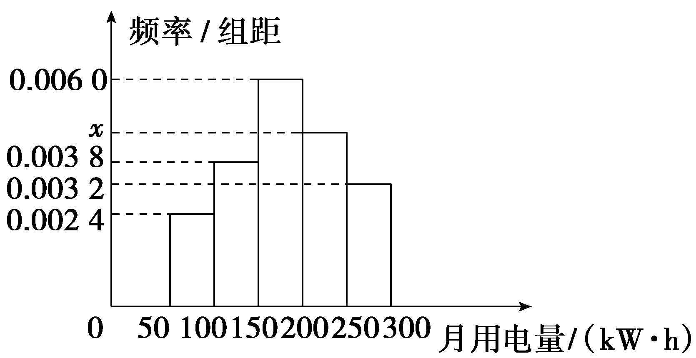

(1)直方图中<em>x</em>的值为<u>　　　　</u>；

(2)在被调查的用户中月用电量落在区间[100，250)内的户数为<u>　　　　</u>.

答案：(1)0.004 6　(2)72

解析：(1)根据频率分布直方图的面积和为1，得(0.002 4＋0.003 8＋0.006 0＋*x*＋0.003 2)×50＝1，解得*x*＝0.004 6.

(2)月用电量落在区间[100，250)内的频率为*f*＝(0.003 8＋0.006 0＋0.004 6)×50＝0.72，所以在被调查的用户中月用电量落在区间[100，250)内的户数为100×0.72＝72.

考点一　简单随机抽样　　　　自主练透

1.总体由编号为01，02，…，19，20的20个个体组成，利用下面的随机数表选取5个个体，选取方法是从随机数表第1行的第5列和第6列数字开始由左到右依次选取两个数字，则选出来的第5个个体的编号为(　　)

<table><tr><td>
7816
</td><td>
6572
</td><td>
0802
</td><td>
6314
</td><td>
0702
</td><td>
4369
</td><td>
9728
</td><td>
0198
</td></tr><tr><td>
3204
</td><td>
9234
</td><td>
4935
</td><td>
8200
</td><td>
3623
</td><td>
4869
</td><td>
6938
</td><td>
7481
</td></tr></table>

A.08	B.02

C.63	D.01

答案：**D**

解析：根据题意，依次读出的数据为65(舍去)，72(舍去)，08，02，63(舍去)，14，07，02(舍去，重复)，43(舍去)，69(舍去)，97(舍去)，28(舍去)，01.故选D.

2.我国古代数学名著《九章算术》有“米谷粒分”题：粮仓开仓收粮，有人送来米1 534石，验得米内夹谷，随机抽样取米一把，数得254粒内夹谷28粒，则这批米内夹谷约为(　　)

A.134石	B.169石

C.338石	D.1 365石

答案：**B**

解析：由随机抽样的含义，该批米内夹谷约为 $\frac{28}{254}$ ×1 534≈169(石).故选B.

3.用简单随机抽样的方法从含有10个个体的总体中，抽取一个容量为3的样本，其中某一个体*a*“第一次被抽到”的可能性与“第二次被抽到”的可能性分别是(　　)

A. $\frac{1}{10}$ ， $\frac{1}{10}$ 	B. $\frac{3}{10}$ ， $\frac{1}{5}$

C. $\frac{1}{5}$ ， $\frac{3}{10}$ 	D. $\frac{3}{10}$ ， $\frac{3}{10}$

答案：**A**

解析：第一次被抽到，显然为 $\frac{1}{10}$ ；第二次被抽到，首先第一次不能被抽到，第二次才被抽到，可能性为 $\frac{9}{10}$ × $\frac{1}{9}$ ＝ $\frac{1}{10}$ .故选A.

4.某彩票的中奖号码是从分别标有1 ，2 ，… ，30 的三十个小球中逐个不放回地摇出7个小球来按规则确定中奖情况，这种从30个号码中选7个号码的抽样方法是<u>　　　　_</u>.

答案：抽签法

解析：三十个小球相当于号签，搅拌均匀后逐个不放回地抽取，这是典型的抽签法.

1.简单随机抽样需满足：(1)被抽取的样本总体的个体数有限；(2)逐个抽取；(3)是不放回抽取；(4)是等可能抽取.

2.简单随机抽样有抽签法(适用于总体中个体数较少的情况)、随机数法(适用于个体数较多的情况).

考点二　分层随机抽样　　　　师生共研

(1)(2023·新课标Ⅱ卷改编)某学校为了解学生参加体育运动的情况，用比例分配的分层随机抽样法作抽样调查，拟从初中部和高中部共抽取60名学生，已知该校初中部和高中部分别有400名和200名学生，则在初中部和高中部抽取的人数分别为<u>　　　　</u>.

(2)某学校高一年级共有3个班，1班有30人，优秀率为30％，2班有35人，优秀率为60％，3班有35人，优秀率为40％，则该校高一年级学生的优秀率为<u>　　　　</u>.

(3)(双空题)为了解学生的课外阅读情况.某校采用比例分配的分层随机抽样的方法对高中三个年级的学生进行平均每周课外阅读时间(单位：小时)的调查，所得样本数据如下：

<table><tr><td>
年级
</td><td>
抽样人数
</td><td>
样本平均数
</td><td>
样本方差
</td></tr><tr><td>
高一
</td><td>
40
</td><td>
5
</td><td>
3.5
</td></tr><tr><td>
高二
</td><td>
30
</td><td></td><td>
2
</td></tr><tr><td>
高三
</td><td>
30
</td><td>
3
</td><td></td></tr></table>

已知高中三个年级的总样本平均数为4.1，总样本方差为3.14，则高二年级学生的样本平均数 $\overline{x}_{2}$ ＝<u>&lt;text style="underline"&gt;　　　　</u>&lt;/text&gt;，高三年级学生的样本方差 $s_{3}^{2}$ ＝<u>&lt;text style="underline"&gt;　　　　</u>&lt;/text&gt;.

答案：(1)40，20　(2)44％　 (3)4　1.5

解析：(1)由题意，初中部和高中部学生人数之比为 $\frac{400}{200}$ ＝ $\frac{2}{1}$ ，所以抽取的60名学生中初中部应有60× $\frac{2}{3}$ ＝40(人)，高中部应有60× $\frac{1}{3}$ ＝20(人).

(2)某学校高一年级共有三个班，1班30人，优秀率30％，2班35人，优秀率60％，三班35人，优秀率40％，则高一年级优秀率为 $\frac{30\times 30％+35\times 60％+35\times 40％}{30+35+35}$ ＝44％.

(3)由高中三个年级学生的总样本平均数为4.1，可得 $\frac{40\times 5+30\cdot \overline{x}_{2}+30\times 3}{40+30+30}$ ＝4.1，解得 $\overline{x}_{2}$ ＝4；因为总样本方差为3.14，所以 $\frac{40}{100}$ ×[3.5＋(5－4.1)&lt;text style="superscript"&gt;&lt;text style="superscript"&gt;2&lt;/text&gt;&lt;/text&gt;]＋ $\frac{30}{100}$ ×[&lt;text style="superscript"&gt;&lt;text style="superscript"&gt;2&lt;/text&gt;&lt;/text&gt;＋(4－4.1)2]＋ $\frac{30}{100}$ ×[ $s_{3}^{2}$ ＋(3－4.1)&lt;text style="superscript"&gt;&lt;text style="superscript"&gt;2&lt;/text&gt;&lt;/text&gt;]＝3.14，解得 $s_{3}^{2}$ ＝1.5.

分层随机抽样中有关计算的方法

1.抽样比＝ $\frac{该层样本量n}{总样本量N}$ ＝ $\frac{该层抽取的个体数}{该层的个体数}$ .

&lt;text style="superscript"&gt;&lt;text style="superscript"&gt;2&lt;/text&gt;&lt;/text&gt;.在分层随机抽样中，如果第一层的样本量为&lt;text <em>s</em>tyle="italic"&gt;m&lt;/text&gt;，平均值为 $\overline{x}$ ，方差为 $s_{x}^{2}$ ；第二层的样本量为&lt;text <em>s</em>tyle="italic"&gt;n&lt;/text&gt;，平均值为 $\overline{y}$ ，方差为 $s_{y}^{2}$ ，则样本的平均值为 $\overline{w}$ ＝ $\frac{m\overline{x}＋n\overline{y}}{m＋n}$ ＝ $\frac{m}{m＋n}\overline{x}$ ＋ $\frac{n}{m＋n}\overline{y}$ ；方差为<em>s</em>&lt;text style="superscript"&gt;&lt;text style="superscript"&gt;2&lt;/text&gt;&lt;/text&gt;＝ $\frac{m}{m＋n}$ [ $s_{x}^{2}$ ＋( $\overline{x}$ － $\overline{w}$ )&lt;text style="superscript"&gt;&lt;text style="superscript"&gt;2&lt;/text&gt;&lt;/text&gt;]＋ $\frac{n}{m＋n}$ [ $s_{y}^{2}$ ＋( $\overline{y}$ － $\overline{w}$ )&lt;text style="superscript"&gt;&lt;text style="superscript"&gt;2&lt;/text&gt;&lt;/text&gt;].

对点练1.(双空题)将一个总体分为<em>A</em>，<em>B</em>，<em>C</em>三层，其个体数之比为5∶3∶2.若用分层随机抽样的方法抽取容量为100的样本，则应从<em>C</em>中抽取<u>　　　　</u>个个体；若<em>A</em>，<em>B</em>，<em>C</em>三层的样本的平均数分别为15，30，20，则样本的平均数为<u>　　　　</u>.

答案：20　20.5

解析：因为*A*，*B*，*<text style="italic">C*</text>三层个体数之比为5∶3∶2，又总体中每个个体被抽到的概率相等，所以分层随机抽样应从C中抽取100× $\frac{2}{5+3+2}$ ＝20个个体.样本的平均数为 $\overline{w}$ ＝ $\frac{5}{5+3+2}$ ×15＋ $\frac{3}{5+3+2}$ ×30＋ $\frac{2}{5+3+2}$ ×20＝20.5.

对点练2.(2025·江西鹰潭一模)某单位为了解职工体重情况，采用分层随机抽样的方法从800名职工中抽取了一个容量为80的样本.其中，男性平均体重为64千克，方差为151；女性平均体重为56千克，方差为159，男女人数之比为5∶3，则单位职工体重的方差为(　　)

A.166	B.167

C.168	D. 169

答案：**D**

解析：依题意，单位职工平均体重为 $\overline{x}$ ＝ $\frac{5}{8}$ ×64＋ $\frac{3}{8}$ ×56＝61，则单位职工体重的方差为<em>s</em>2＝ $\frac{5}{8}\left[151+\left(64－61\right)^{2}\right]$ ＋ $\frac{3}{8}\left[159+\left(56－61\right)^{2}\right]$ ＝169.故选D.

考点三　统计图表　　　　多维探究

角度1　扇形图、条形图

已知某地区中小学生人数和近视情况分别如图甲和图乙所示，为了了解该地区中小学生的近视形成原因，用分层随机抽样的方法抽取2％的学生进行调查，则样本量和抽取的高中生近视人数分别为(　　)

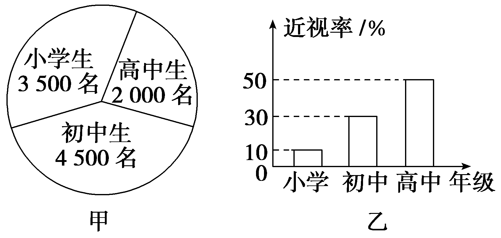

A.100，20	B.200，20	C.200，10	D.100，10

答案：**B**

解析：由题图甲可知学生总数是10 000人，样本量为10 000×2％＝200人，高中生为2 000×2％＝40人，由题图乙可知高中生近视率为50％，所以高中生近视人数为40×50％＝20.故选B.

角度2　折线图

(多选)某企业2024年12个月的收入与支出数据的折线图如图：

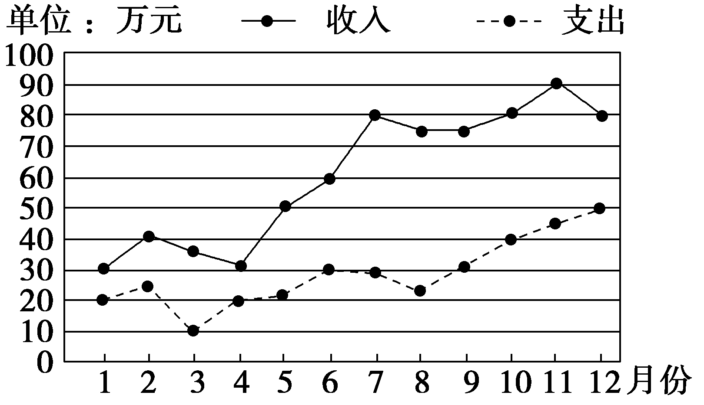

已知：利润＝收入－支出，根据该折线图，下列说法正确的是(　　)

A.该企业2024年1月至6月的总利润低于2024年7月至12月的总利润

B.该企业2024年1月至6月的平均收入低于2024年7月至12月的平均收入

C.该企业2024年8月至12月的支出持续增长

D.该企业2024年11月的月利润最大

答案：**ABC**

解析：因为图中的实线与虚线的相对高度表示当月利润.由折线统计图可知1月至6月的相对高度的总量要比7月至12月的相对高度总量小，故A正确；由折线统计图可知1月至6月的收入都普遍低于7月至12月的收入，故B正确；由折线统计图可知8月至12月的虚线是上升的，所以支出持续增长，故C正确；由折线统计图可知11月的相对高度比7月、8月都要小，故D错误.故选ABC.

角度3　频率分布直方图

某工厂对一批产品进行了抽样检测.如图是根据抽样检测后的产品净重(单位：克)数据绘制的频率分布直方图，其中产品净重的范围是[96，106]，样本数据分组为[96，98)，[98，100)，[100，102)，[102，104)，[104，106]，已知样本中产品净重小于100克的个数是36，则样本中净重大于或等于98克并且小于104克的产品有<u>　　　　</u>个.

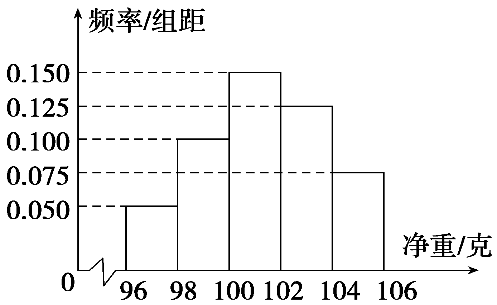

答案：90

解析：样本中产品净重小于100克的频率为(0.050＋0.100)×2＝0.3，频数为36，所以样本容量为 $\frac{36}{0.3}$ ＝120.因为样本中净重大于或等于98克并且小于104克的产品的频率为(0.100＋0.150＋0.125)×2＝0.75，所以样本中净重大于或等于98克并且小于104克的产品的个数为120×0.75＝90.

1.统计图表的主要应用

(1)扇形图：直观描述各类数据占总数的比例.

(2)条形图：直观描述不同类别或分组数据的频数.

(3)折线图：描述数据随时间的变化趋势.

(4)直方图：直观描述不同类别或分组数据的频率.

2.频率分布直方图的相关结论

(1)频率分布直方图中纵轴表示 $\frac{频率}{组距}$ ，故每组样本的频率为组距× $\frac{频率}{组距}$ ，即小长方形的面积.

(2)频率分布直方图中各小长方形的面积之和为1.

(3)频率分布直方图中每组样本的频数为频率×总数.

对点练3.某地区经过一年的新农村建设，农村的经济收入增加了一倍，实现翻番.为更好地了解该地区农村的经济收入变化情况，统计了该地区新农村建设前后农村的经济收入构成比例，得到如图所示的饼图：

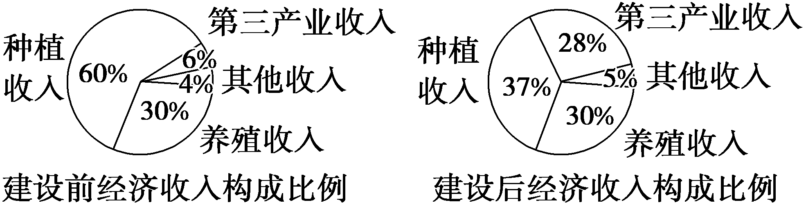

则下面结论中不正确的是(　　)

A.新农村建设后，种植收入减少

B.新农村建设后，其他收入增加了一倍以上

C.新农村建设后，养殖收入增加了一倍

D.新农村建设后，养殖收入与第三产业收入的总和超过了经济收入的一半

答案：**A**

解析：设建设前经济收入为*a* ，则建设后经济收入为2*a* ，则由饼图可得建设前种植收入为0.6*a* ，其他收入为0.04*a* ，养殖收入为0.3*a* .建设后种植收入为0.74*a* ，其他收入为0.1*a* ，养殖收入为0.6*a*，养殖收入与第三产业收入的总和为1.16*a* ，所以只有A是错误的.故选A.

对点练4.(多选)(2020·新高考Ⅱ卷)我国新冠肺炎疫情进入常态化，各地有序推进复工复产，下面是某地连续11天复工复产指数折线图.下列说法正确的是(　　)

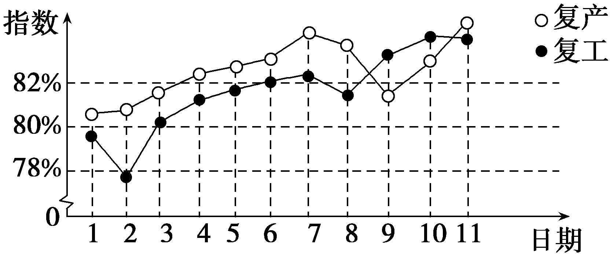

A.这11天复工指数和复产指数均逐日增加

B.这11天期间，复产指数增量大于复工指数的增量

C.第3天至第11天复工复产指数均超过80％

D.第9天至第11天复产指数增量大于复工指数的增量

答案：**CD**

解析：由题图可知，复产指数第7天到第9天逐日减少，复工指数第1天到第2天、第7天到第8天、第10天到第11天逐日减少，故A错误；由题图可知，第1天复产指数与复工指数的差大于第11天复产指数与复工指数的差，所以这11天期间，复产指数的增量小于复工指数的增量，故B错误；由题图可知，第3天至第11天复工复产指数均在80％ 以上，故C正确；由题图可知，第9天至第11天复产指数的增量大于复工指数的增量，故D正确.故选CD.

对点练5.(双空题)某市3 000名市民参加“美丽城市我建设”相关知识竞赛的成绩如图所示.

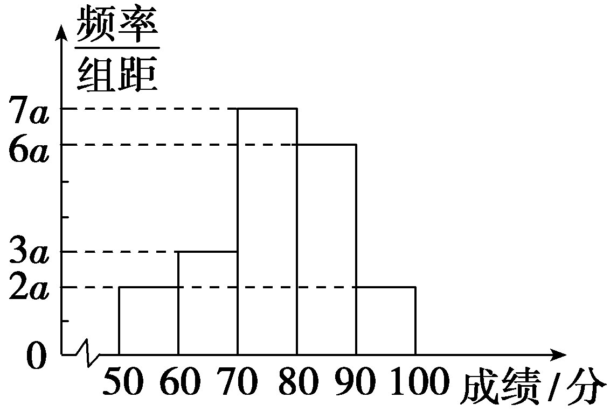

(1)<em>a</em>＝<u>　　　　</u>；

(2)估计该市参加知识竞赛的3 000名市民中，成绩在[70，90)内的人数为<u>　　　　</u>.

答案：(1)0.005　(2)1 950

解析：(1)依题意，得(2*a*＋3*a*＋7*a*＋6*a*＋2*a*)×10＝1，故*a*＝0.005.

(2)成绩在区间[70，90)内的频率为(7*a*＋6*a*)×10＝130*a*＝130×0.005＝0.65，

所以所求人数为3 000×0.65＝1 950.

[真题再现]　(2021·全国甲卷)为了解某地农村经济情况，对该地农户家庭年收入进行抽样调查，将农户家庭年收入的调查数据整理得到如下频率分布直方图：

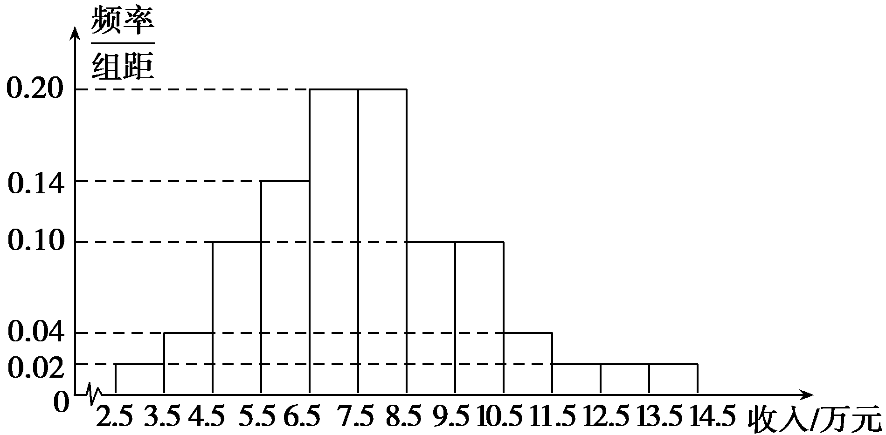

根据此频率分布直方图，下面结论中不正确的是(　　)

A.该地农户家庭年收入低于4.5万元的农户比率估计为6％

B.该地农户家庭年收入不低于10.5万元的农户比率估计为10％

C.估计该地农户家庭年收入的平均值不超过6.5万元

D.估计该地有一半以上的农户，其家庭年收入介于4.5万元至8.5万元之间

答案：**C**

解析：由频率分布直方图可得，该地农户家庭年收入低于4.5万元和不低于10.5万元的频率分别为0.06和0.1，则农户比率分别为6％和10％，故A，B正确；家庭年收入介于4.5万元至8.5万元之间的频率为0.1＋0.14＋0.2＋0.2＝0.64，故D正确；家庭年收入的平均值为0.02×3＋0.04×4＋0.1×5＋0.14×6＋0.2×7＋0.2×8＋0.1×9＋0.1×10＋0.04×11＋0.02×12＋0.02×13＋0.02×14＝7.68万元，因为7.68＞6.5，所以估计该地区农户家庭年收入的平均值超过6.5万元，故C中结论不正确.故选C.

[教材呈现]　(人教A必修二P198T1)从某小区抽取100户居民用户进行月用电量调查，发现他们的用电量都在50～350 kW·h之间，进行适当分组后(每组为左闭右开的区间)，画出如图所示的频率分布直方图.

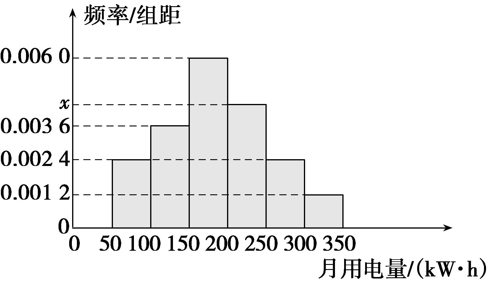

(1)直方图中<em>x</em>的值为<u>　　　　</u>；

(2)在被调查的用户中，用电量落在区间[100，250)内的户数为<u>　　　　</u>.

点评：这两题考查相同的知识点，设问的本质也是一样的，都是考查用样本估计总体分布，教材中的题目的设问更具体，高考题的设问更开放.

**课时测评**79　**随机抽样、统计图表** $\frac{对应学生}{用书P467}$

(时间：50分钟　满分：62分)

(本栏目内容，在学生用书中以独立形式分册装订！)

(1—7题，每小题5分，共35分)

1.“中国天眼”为500米口径球面射电望远镜，是具有我国自主知识产权、世界最大单口径、最灵敏的射电望远镜.建造“中国天眼”的目的是(　　)

A.通过调查获取数据	B.通过试验获取数据

C.通过观察获取数据	D.通过查询获得数据

答案：**C**

解析：“中国天眼”主要是通过观察获取数据.故选C.

2.“嫦娥五号”的成功发射，实现了中国航天史上的五个“首次”.某中学为此举行了“讲好航天故事”的主题演讲比赛.若将报名的30位同学编号为01，02，…，30，经随机模拟产生了36个随机数如下，则选出来的第7个个体的编号为(　　)

45 67 32 12 12 31 02 01 04 52 15 20

01 12 51 29 32 04 92 34 49 35 82 00

36 23 48 69 69 38 74 81 46 52 73 64

A.12	B.20

C.29	D.23

答案：**C**

解析：有效编号为：12，02，01，04，15，20，29，得到选出来的第7个个体的编号为29.故选C.

3.为了了解全校240名高一学生的身高情况，从中随机抽取40名高一学生进行测量，在这个问题中，样本指的是(　　)

A.240名高一学生的身高

B.抽取的40名高一学生的身高

C.40名高一学生

D.每名高一学生的身高

答案：**B**

解析：总体是240名高一学生的身高，则个体是每名高一学生的身高，故样本是抽取的40名高一学生的身高.故选B.

4.为研究某药品的疗效，选取若干名志愿者进行临床试验，所有志愿者的舒张压数据(单位：kPa)的分组区间为[12，13) ，[13，14) ，[14，15)，[15，16) ，[16，17] ，将其按从左到右的顺序分别编号为第一组，第二组，… ，第五组.如图是根据试验数据制成的频率分布直方图.已知第一组与第二组共有20人，第三组中没有疗效的有6人，则第三组中有疗效的人数为(　　)

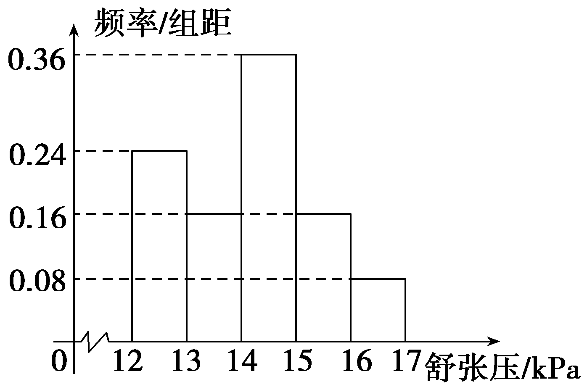

A.8	B.12

C.16	D.18

答案：**B**

解析：由频率分布直方图得第一组、第二组、第三组的频率分别为0.24，0.16，0.36.因为第一组和第二组共有20人，所以志愿者的总人数为20÷ $\left(0.24+0.16\right)$ ＝50，所以第三组的人数为0.36×50＝18，则第三组中有疗效的人数为18－6＝12.故选B.

5.(多选)(2025·山东济南模拟)某学校组建了辩论、英文剧场、民族舞、无人机和数学建模五个社团，高一学生全员参加，且每位学生只能参加一个社团.学校根据学生参加情况绘制如下统计图，已知无人机社团和数学建模社团的人数相等，下列说法正确的是(　　)

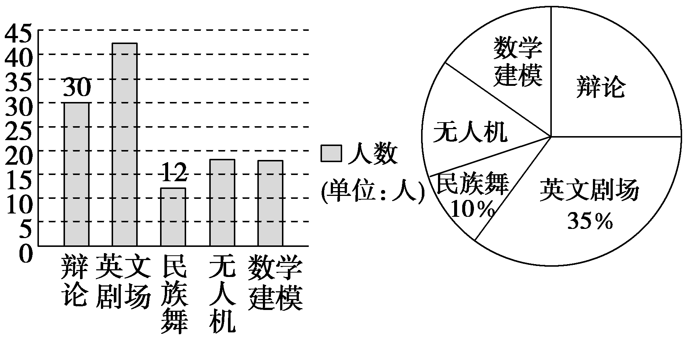

A.高一年级学生人数为120人

B.无人机社团的学生人数为17人

C.若按比例分层抽样从各社团选派20人，则无人机社团选派人数为3人

D.若甲、乙、丙三人报名参加社团，则共有60种不同的报名方法

答案：**AC**

解析：由题目所给的数据可知：民族舞的人数为12，占高一年级总人数的比例为10％，所以高一年级的总人数为12÷10％＝120，英文剧场的人数＝120×35％＝42，辩论的人数＝30，无人机社团的人数＝数学建模社团的人数＝(120－42－30－12)÷2＝18，占高一年级人数的比例是 $\frac{18}{120}$ ×100％＝15％，故A正确，B错误；分层抽样20人，无人机社团应派出20×15％＝3人，故C正确；甲、乙、丙三人报名参加社团，每人有5种选法，共有53＝125种不同的报名方法，故D错误.故选AC.

6.某校有甲、乙两个数学建模兴趣班.其中甲班有40人，乙班有50人.现分析两个班的一次考试成绩，算得甲班的平均成绩是90分，乙班的平均成绩是81分，则这两个数学建模兴趣班所有同学的平均成绩为<u>　　　　</u>分.

答案：85

解析：由题意可知，两个数学建模兴趣班所有同学的平均成绩为 $\frac{40\times 90+50\times 81}{90}$ ＝85(分).

7.某企业三月中旬生产*A*，*B*，*C*三种产品共3 000件，根据分层抽样的结果，企业统计员制作了如下的统计表格：

<table><tr><td>
产品类型
</td><td>
<em>A</em>
</td><td>
<em>B</em>
</td><td>
<em>C</em>
</td></tr><tr><td>
产品数量(件)
</td><td></td><td>
1 300
</td><td></td></tr><tr><td>
样本容量(件)
</td><td></td><td>
130
</td><td></td></tr></table>

由于不小心，表格中<em>A</em>，<em>C</em>产品的有关数据已被污染看不清楚，统计员记得<em>A</em>产品的样本容量比<em>C</em>产品的样本容量多10，根据以上信息，可得<em>C</em>的产品数量是<u>　　　　</u>件.

答案：800

解析：设样本容量为<te<text st<text st<text st<text st*y*le="italic">y</text>le="italic">y</text>le="italic">y</text>le="italic">x</text>t style="italic">x</text>，则 $\frac{x}{3 000}$ ×1 300＝130，所以<te<text st<text st<text st<text st*y*le="italic">y</text>le="italic">y</text>le="italic">y</text>le="italic">x</text>t style="italic">x</text>＝300.所以*A*产品和*<text style="italic"><text style="italic">C*</text></text>产品在样本中共有300－130＝170(件).设C产品的样本容量为y，则y＋y＋10＝170，所以y＝80.所以C的产品数量为 $\frac{3 000}{300}$ ×80＝800(件).

(8、9题，每小题5分，共10分)

8.(多选)某市2024年经过招商引资后，经济收入较前一年增加了一倍，实现翻番，为更好地了解该市的经济收入的变化情况，统计了该市招商引资前后的年经济收入构成比例，得到如下扇形图：

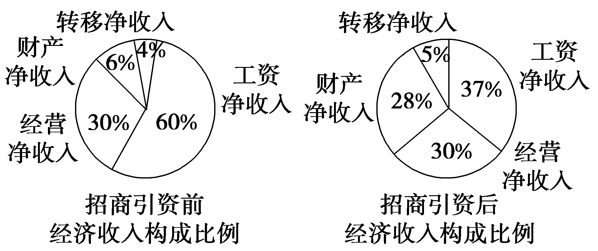

则下列结论中正确的是(　　)

A.招商引资后，工资净收入较前一年增加

B.招商引资后，转移净收入是前一年的1.25倍

C.招商引资后，转移净收入与财产净收入的总和超过了该年经济收入的 $\frac{2}{5}$

D.招商引资后，经营净收入较前一年增加了一倍

答案：**AD**

解析：设招商引资前经济收入为*<text style="italic"><text style="italic"><text style="italic"><text style="italic"><text style="italic"><text style="italic"><text style="italic"><text style="italic"><text style="italic"><text style="italic"><text style="italic"><text style="italic"><text style="italic"><text style="italic"><text style="italic"><text style="italic"><text style="italic"><text style="italic">M*</text></text></text></text></text></text></text></text></text></text></text></text></text></text></text></text></text></text>，而招商引资后经济收入为2M，对于A，招商引资前工资净收入为M×60％＝0.6M，而招商引资后的工资净收入为2M×37％＝0.74M，所以工资净收入增加了，故A正确；对于B，招商引资前转移净收入为M×4％＝0.04M，招商引资后转移净收入为2M×5％＝0.1M，所以招商引资后，转移净收入是前一年的2.5倍，故B错误；对于C，招商引资后，转移净收入与财产净收入的总和为0.1M＋0.56M＝0.66M＜ $\frac{2}{5}$ ×2*<text style="italic"><text style="italic"><text style="italic"><text style="italic"><text style="italic"><text style="italic"><text style="italic"><text style="italic"><text style="italic"><text style="italic"><text style="italic"><text style="italic"><text style="italic"><text style="italic"><text style="italic"><text style="italic"><text style="italic"><text style="italic">M*</text></text></text></text></text></text></text></text></text></text></text></text></text></text></text></text></text></text>＝0.8M，所以招商引资后，转移净收入与财产净收入的总和低于该年经济收入的 $\frac{2}{5}$ ，故C错误；对于D，招商引资前经营净收入为*<text style="italic"><text style="italic"><text style="italic"><text style="italic"><text style="italic"><text style="italic"><text style="italic"><text style="italic"><text style="italic"><text style="italic"><text style="italic"><text style="italic"><text style="italic"><text style="italic"><text style="italic"><text style="italic"><text style="italic"><text style="italic">M*</text></text></text></text></text></text></text></text></text></text></text></text></text></text></text></text></text></text>×30％＝0.3M，招商引资后经营净收入为2M×30％＝0.6M，所以招商引资后，经营净收入较前一年增加了一倍，故D正确.故选AD.

9.(多空题)某地各项事业取得令人瞩目的成就，以2024年为例，社会固定资产总投资约为3 730亿元，其中包括中央项目、省属项目、地(市)属项目、县(市)属项目和其他项目.图1、图2分别是这五个项目的投资额不完整的条形图和扇形图，请完成下列问题.

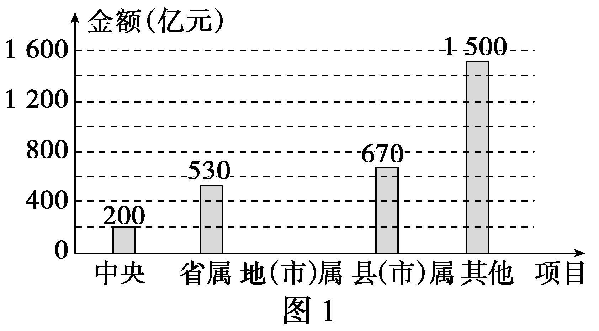

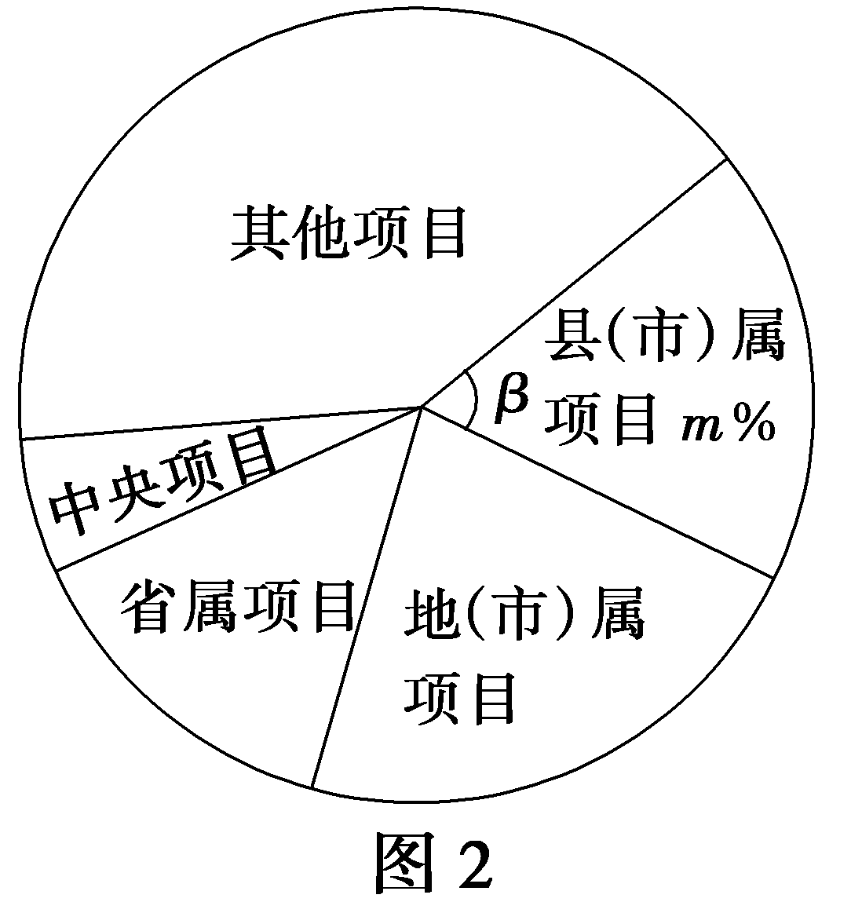

(1)地(市)属项目投资额为<u>　　　　</u>亿元；

(2)在图2中，县(市)属项目部分所占百分比为<em>m</em>％，对应的圆心角为<em>β</em>，则<em>m</em>＝<u>　　　　</u>，<em>β</em>＝<u>　　　　</u>度(<em>m</em>，<em>β</em>均取整数).

答案：(1)830　(2)18　65

解析：(1)因为该地社会固定资产总投资约为3 730亿元，所以地(市)属项目投资额为3 730－(200＋530＋670＋1 500)＝830(亿元).

(2)由条形图可以看出县(市)属项目部分总投资为670亿元，所以县(市)属项目部分所占百分比为*<text style="italic">m*</text>％＝ $\frac{670}{3 730}$ ×100％≈18％，即*<text style="italic">m*</text>＝18，对应的圆心角为*β*≈360×0.18≈65(度).

10.(17分)某市在创建国家级卫生城市(简称“创卫”)的过程中，相关部门需了解市民对“创卫”工作的满意程度，若市民满意指数(满意指数＝ $\frac{满意程度平均分}{100}$ )不低于0.8，“创卫”工作按原方案继续实施，否则需进一步整改.为此该部门随机调查了100名市民，根据这100名市民对“创卫”工作满意程度给出的评分，分成[40，50)，[50，60)，[60，70)，[70，80)，[80，90)，[90，100]六组，得到如图所示的频率分布直方图.

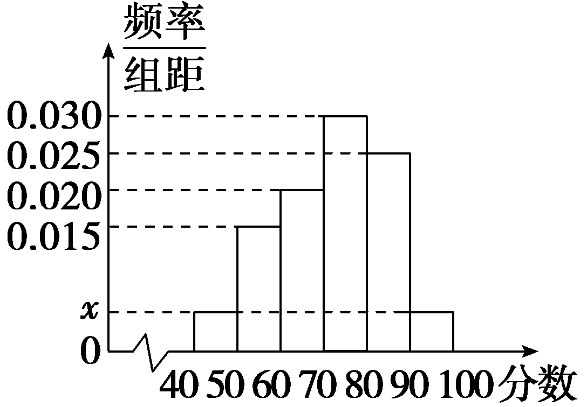

(1)求直方图中*x*的值；(3分)

(2)为了解部分市民给“创卫”工作评分较低的原因，该部门从评分低于70分的市民中用分层抽样的方法随机选取8人进行座谈，求应选取评分在[50，60)的市民人数；(6分)

(3)假设同组中的每个数据用该组的中点值代替，根据你所学的统计知识，判断该市“创卫”工作是否需要进一步整改，并说明理由.(8分)

解：(1)依题意得：(2*x*＋0.015＋0.02＋0.025＋0.03)×10＝1，得*x*＝0.005.

(2)由频率分布直方图知，评分在[40，50)的市民人数为100×0.005×10＝5，

评分在[50，60)的市民人数为100×0.015×10＝15，

评分在[60，70)的市民人数为100×0.02×10＝20，

故应选取评分在[50，60)的市民人数为 $\frac{15}{5+15+20}$ ×8＝3.

(3)由频率分布直方图可得满意程度平均分为

45×0.05＋55×0.15＋65×0.2＋75×0.3＋85×0.25＋95×0.05＝72，

则满意指数＝ $\frac{72}{100}$ ＝0.72＜0.8，故该市“创卫”工作需要进一步整改.

