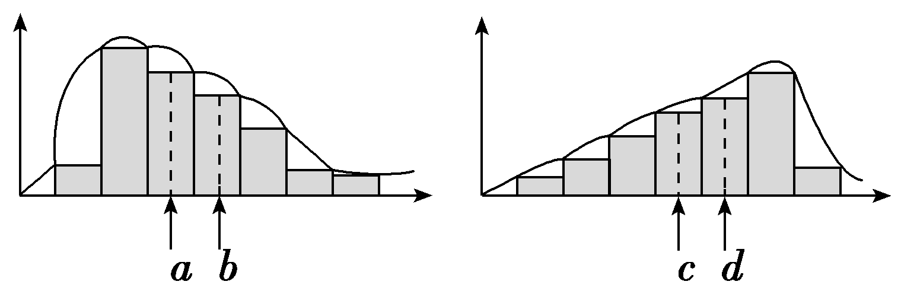
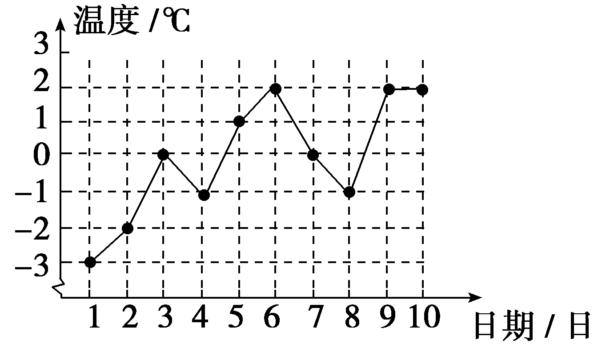
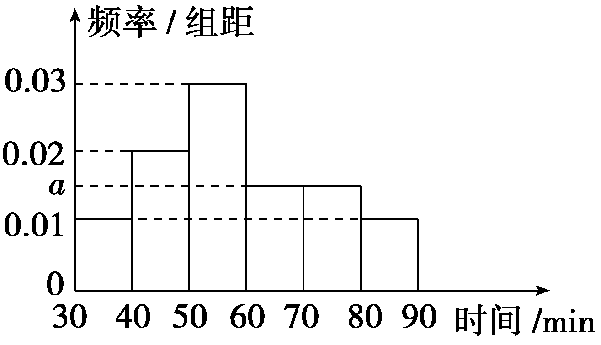
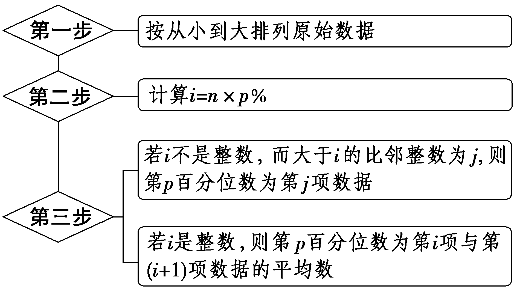
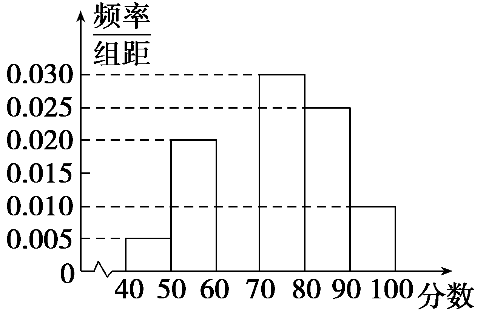
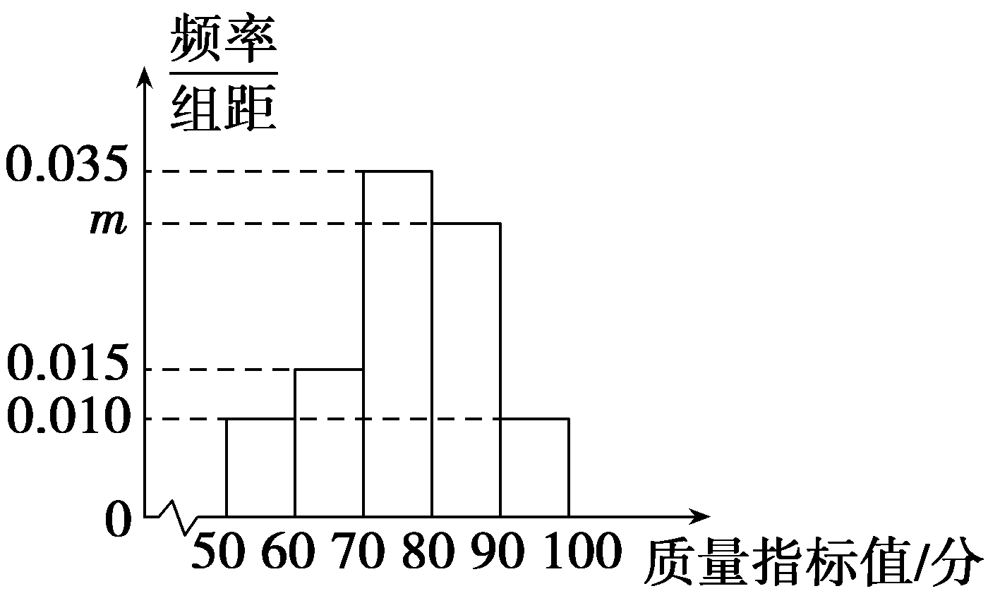
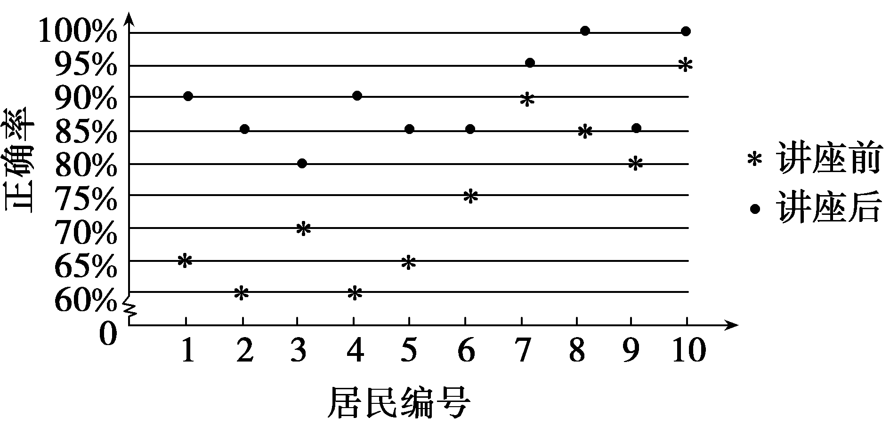
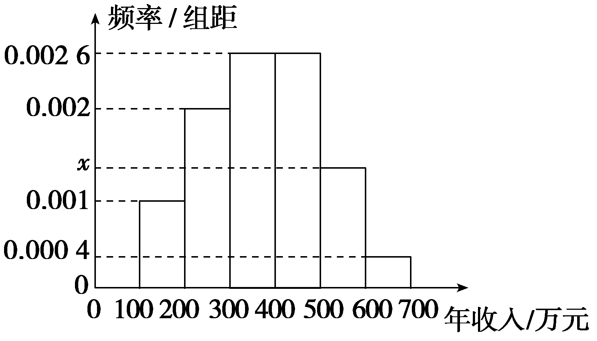
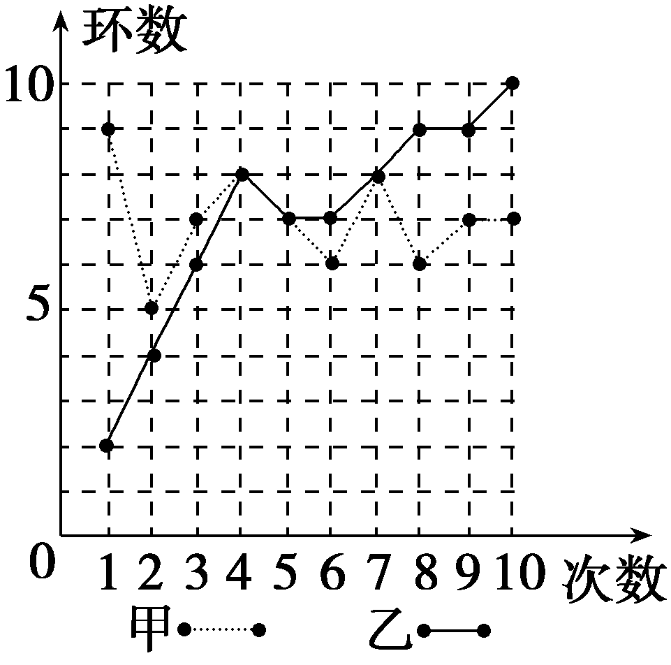

**第二节　用样本估计总体**

【课标研读】　1.结合实例，能用样本估计总体的集中趋势参数(平均数、中位数、众数)，理解集中趋势参数的统计含义.　2.结合实例，能用样本估计总体的离散程度参数(标准差、方差、极差)，理解离散程度参数的统计含义.　3.结合实例，能用样本估计总体的取值规律.　4.结合实例，能用样本估计百分位数，理解百分位数的统计含义.　5.结合具体实例，掌握分层随机抽样的样本方差.

1.总体集中趋势的估计

<table><tr><td>
名称
</td><td>
概念
</td></tr><tr><td>
平均数
</td><td>
如果有<em>n</em>个数<em>x</em>1，<em>x</em>2，…，<em>xn</em>，那么就是这组数据的平均数，用表示，即＝
</td></tr><tr><td>
中位数
</td><td>
将一组数据按从小到大或从大到小的顺序排列，处在最中间的一个数据(当数据个数是奇数时)或最中间两个数据的平均数(当数据个数是偶数时)叫作这组数据的中位数
</td></tr><tr><td>
众

数
</td><td>
一组数据中出现次数最多的数据(即频数最大值所对应的样本数据)叫作这组数据的众数
</td></tr></table>

[微提醒]　平均数反映了数据取值的平均水平.

2.总体百分位数的估计

(1)百分位数

一般地，一组数据的第<em>p</em>百分位数是这样一个值，它使得这组数据中至少有<em><u>p</u></em><u>％</u>的数据小于或等于这个值，且至少有<u>(100－</u><em><u>p</u></em><u>)％</u>的数据大于或等于这个值.

(2)计算一组*n*个数据的第*p*百分位数的步骤

第1步，按<u>从小到大</u>排列原始数据；

第2步，计算<em>i</em>＝<em><u>n</u></em><u>×</u><em><u>p</u></em><u>％</u>；

第3步，若<em>i</em>不是整数，而大于<em>i</em>的比邻整数为<em>j</em>，则第<em>p</em>百分位数为第 <em><u>j</u></em>项数据；若<em>i</em>是整数，则第<em>p</em>百分位数为第 <em><u>i</u></em>项与第<u>(</u><em><u>i</u></em><u>＋1)</u>项数据的平均数.

(3)四分位数

①第25百分位数，第50百分位数，第75百分位数这三个分位数把一组由小到大排列后的数据分成四等份，因此称为四分位数.

②第<u>25</u>百分位数又称第一四分位数或下四分位数等；第<u>75</u>百分位数也称为第三四分位数或上四分位数等.

3.总体离散程度的估计

(1)方差和标准差

假设一组数据是&lt;te&lt;te<em>x</em>t style="italic"&gt;x&lt;/text&gt;t style="italic"&gt;x&lt;/text&gt;1，x2，…，x<em>&lt;text style="italic"&gt;n</em>&lt;/text&gt;，用 $\overline{x}$ 表示这组数据的平均数，那么这<em>&lt;text style="italic"&gt;n</em>&lt;/text&gt;个数的

①标准差*s*＝ $\sqrt{\frac{(x_{1}－\overline{x})^{2}＋(x_{2}－\overline{x})^{2}＋\ldots ＋(x_{n}－\overline{x})^{2}}{n}}$ .

②方差<em>s</em>2＝ $\frac{\left(x_{1}－\overline{x}\right)^{2}＋\left(x_{2}－\overline{x}\right)^{2}＋\ldots ＋\left(x_{n}－\overline{x}\right)^{2}}{n}$ .

(2)总体方差和总体标准差

①一般式：如果总体中所有个体的变量值分别为<em>&lt;text style="italic"&gt;&lt;text style="italic"&gt;Y</em>&lt;/text&gt;&lt;/text&gt;1，Y&lt;text style="superscript"&gt;2&lt;/text&gt;，…，Y<em>N</em>，总体平均数为 $\overline{Y}$ ，则总体方差<em>&lt;text style="italic"&gt;S</em>&lt;/text&gt;&lt;text style="superscript"&gt;2&lt;/text&gt;＝ $\frac{1}{N}\overset{N}{\underset{i=1}{\sum }}\left(Y_{i}－\overline{Y}\right)^{2}$ ，<em>&lt;text style="italic"&gt;S</em>&lt;/text&gt;＝ $\sqrt{S^{2}}$ 为总体标准差.

②加权式：如果总体的&lt;text style="&lt;text style="&lt;text style="<em>i</em>talic,subscript"&gt;i&lt;/text&gt;talic,subscript"&gt;i&lt;/text&gt;talic"&gt;<em>N</em>&lt;/text&gt;个变量值中，不同的值共有<em>&lt;text style="italic"&gt;&lt;text style="italic,subscript"&gt;&lt;text style="italic"&gt;k</em>&lt;/text&gt;&lt;/text&gt;&lt;/text&gt;(k≤N)个，不妨记为<em>&lt;text style="italic"&gt;&lt;text style="italic"&gt;&lt;text style="italic"&gt;Y</em>&lt;/text&gt;&lt;/text&gt;&lt;/text&gt;1，Y&lt;text style="superscript"&gt;2&lt;/text&gt;，…，Yk，其中Yi出现的频数为<em>&lt;text style="italic"&gt;f</em>&lt;/text&gt;i(i＝1，2，…，k)，则总体方差为<em>S</em>2＝ $\frac{1}{N}\overset{k}{\underset{i=1}{\sum }}$ &lt;text style="&lt;text style="<em>i</em>talic,subscript"&gt;i&lt;/text&gt;talic"&gt;<em>f</em>&lt;/text&gt; $i\left(Y_{i}－\overline{Y}\right)^{2}$ .

(3)样本方差和标准差

如果一个样本中个体的变量值分别为&lt;text &lt;text <em>s</em>t&lt;text style="<em>i</em>talic"&gt;y&lt;/text&gt;le="italic"&gt;s&lt;/text&gt;t&lt;text st<em>y</em>le="italic"&gt;y&lt;/text&gt;le="italic"&gt;y&lt;/text&gt;1，y&lt;text style="superscript"&gt;&lt;text style="superscript"&gt;2&lt;/text&gt;&lt;/text&gt;，…，y<em>n</em>，样本平均数为 $\overline{y}$ ，则称&lt;text <em>s</em>t&lt;text style="<em>i</em>talic"&gt;y&lt;/text&gt;le="italic"&gt;s&lt;/text&gt;&lt;text st<em>y</em>le="subscript"&gt;&lt;text style="superscript"&gt;2&lt;/text&gt;&lt;/text&gt;＝ $\frac{1}{n}\overset{n}{\underset{i=1}{\sum }}$ (&lt;text &lt;text <em>s</em>t&lt;text style="<em>i</em>talic"&gt;y&lt;/text&gt;le="italic"&gt;s&lt;/text&gt;t&lt;text st<em>y</em>le="italic"&gt;y&lt;/text&gt;le="italic"&gt;y&lt;/text&gt;i－ $\overline{y}$ )&lt;text &lt;text <em>s</em>t&lt;text style="<em>i</em>talic"&gt;y&lt;/text&gt;le="italic"&gt;s&lt;/text&gt;t<em>y</em>le="subscript"&gt;&lt;text style="superscript"&gt;2&lt;/text&gt;&lt;/text&gt;为样本方差，s＝ $\sqrt{s^{2}}$ 为样本标准差.

[微提醒]　方差和标准差反映了数据离散程度和离平均数的波动程度的大小.

【常用结论】

(1)频率分布直方图中的常见结论

①众数的估计值为最高矩形底边的中点对应的横坐标.

②平均数的估计值等于频率分布直方图中每个小矩形的面积与小矩形底边中点的横坐标之积的和.

③中位数的估计值的左边和右边的小矩形的面积之和是相等的.

(2)平均数的性质

①若给定一组数据&lt;te&lt;te&lt;text&lt;text style="it<em>a</em>lic"&gt; &lt;/text&gt;style="it<em>a</em>lic"&gt;x&lt;/text&gt;t style="italic"&gt;x&lt;/text&gt;t style="italic"&gt;x&lt;/text&gt;&lt;text style="su<em>&lt;text style="italic"&gt;b</em>&lt;/text&gt;script"&gt;&lt;text style="subscript"&gt;1 &lt;/text&gt;&lt;/text&gt;，x&lt;text style="subscript"&gt;&lt;text style="subscript"&gt;2&lt;/text&gt; &lt;/text&gt;，… ，x<em>&lt;text style="italic,subscript"&gt;&lt;text style="italic,subscript"&gt;n</em> &lt;/text&gt;&lt;/text&gt;的平均数为 $\overline{x}$ &lt;text style="it<em>a</em>lic"&gt; &lt;/text&gt;，则<em>a</em>&lt;te&lt;te<em>x</em>t style="italic"&gt;x&lt;/text&gt;t style="italic"&gt;x&lt;/text&gt;&lt;text style="su<em>&lt;text style="italic"&gt;b</em>&lt;/text&gt;script"&gt;&lt;text style="subscript"&gt;1 &lt;/text&gt;&lt;/text&gt;，<em>&lt;text style="italic"&gt;&lt;text style="italic"&gt;&lt;text style="italic"&gt;&lt;text style="italic"&gt;&lt;text style="italic"&gt;ax</em>&lt;/text&gt;&lt;/text&gt;&lt;/text&gt;&lt;/text&gt;&lt;/text&gt;&lt;text style="subscript"&gt;2&lt;/text&gt;，… ，ax<em>&lt;text style="italic,subscript"&gt;&lt;text style="italic,subscript"&gt;n</em> &lt;/text&gt;&lt;/text&gt;的平均数为a $\overline{x}$ &lt;text style="it<em>a</em>lic"&gt; &lt;/text&gt;，<em>a</em>&lt;te&lt;te<em>x</em>t style="italic"&gt;x&lt;/text&gt;t style="italic"&gt;x&lt;/text&gt;&lt;text style="su<em>&lt;text style="italic"&gt;b</em>&lt;/text&gt;script"&gt;1&lt;/text&gt;＋<em>&lt;text style="italic"&gt;b</em> &lt;/text&gt;，<em>&lt;text style="italic"&gt;&lt;text style="italic"&gt;&lt;text style="italic"&gt;&lt;text style="italic"&gt;&lt;text style="italic"&gt;ax</em>&lt;/text&gt;&lt;/text&gt;&lt;/text&gt;&lt;/text&gt;&lt;/text&gt;&lt;text style="subscript"&gt;2&lt;/text&gt;＋b，… ，ax<em>n</em>＋b 的平均数为a $\overline{x}$ ＋&lt;text style="it<em>a</em>lic"&gt;<em>b</em>&lt;/text&gt;.

②若两组数据&lt;te&lt;te&lt;te&lt;te&lt;te&lt;text st<em>y</em>le="italic"&gt;x&lt;/text&gt;t st<em>y</em>le="italic"&gt;x&lt;/text&gt;t st<em>y</em>le="italic"&gt;x&lt;/text&gt;t st&lt;text st&lt;text st<em>y</em>le="italic"&gt;y&lt;/text&gt;le="italic"&gt;y&lt;/text&gt;le="italic"&gt;x&lt;/text&gt;t style="italic"&gt;x&lt;/text&gt;t style="italic"&gt;x&lt;/text&gt;&lt;text style="subscript"&gt;&lt;text style="subscript"&gt;1 &lt;/text&gt;&lt;/text&gt;，x&lt;text style="subscript"&gt;&lt;text style="subscript"&gt;2&lt;/text&gt; &lt;/text&gt;，… ，x<em>&lt;text style="italic,subscript"&gt;&lt;text style="italic,subscript"&gt;n</em> &lt;/text&gt;&lt;/text&gt;和y1 ，y2，… ，y<em>n</em> 的平均数分别是 $\overline{x}$  和 $\overline{y}$  ，则&lt;te&lt;te&lt;te&lt;te&lt;te&lt;text st<em>y</em>le="italic"&gt;x&lt;/text&gt;t st<em>y</em>le="italic"&gt;x&lt;/text&gt;t st<em>y</em>le="italic"&gt;x&lt;/text&gt;t st&lt;text st&lt;text st<em>y</em>le="italic"&gt;y&lt;/text&gt;le="italic"&gt;y&lt;/text&gt;le="italic"&gt;x&lt;/text&gt;t style="italic"&gt;x&lt;/text&gt;t style="italic"&gt;x&lt;/text&gt;1＋y&lt;text style="subscript"&gt;&lt;text style="subscript"&gt;1 &lt;/text&gt;&lt;/text&gt;，x&lt;text style="subscript"&gt;2&lt;/text&gt;＋y&lt;text style="subscript"&gt;2 &lt;/text&gt;，… ，x<em>n</em>＋y<em>&lt;text style="italic,subscript"&gt;&lt;text style="italic,subscript"&gt;n</em> &lt;/text&gt;&lt;/text&gt;的平均数是 $\overline{x}$ ＋ $\overline{y}$  .

(3)方差的性质

若给定一组数据<em>x</em>1 ，<em>x</em>2 ，… ，<em>xn</em> ，其方差为<em>s</em>2 ，则<em>ax</em>1 ，<em>ax</em>2，…，<em>axn</em> 的方差为<em>a</em>2<em>s</em>2 ，<em>ax</em>1＋<em>b</em> ，<em>ax</em>2＋<em>b</em>，…，<em>axn</em>＋<em>b</em> 的方差为<em>a</em>2<em>s</em>2 .特别地，当<em>a</em>＝1 时，有<em>x</em>1＋<em>b</em> ，<em>x</em>2＋<em>b</em> ，…，<em>xn</em>＋<em>b</em> 的方差为<em>s</em>2 ，这说明将一组数据中的每一个数据都加上一个相同的常数，方差是不变的，即不影响数据的波动性.

【自主检测】

1.(多选)下列说法正确的是(　　)

A.对一组数据来说，平均数和中位数总是非常接近

B.方差与标准差具有相同的单位

C.如果一组数中每个数减去同一个非零常数，则这组数的平均数改变，方差不变

D.在频率分布直方图中，最高的小长方形底边中点的横坐标是众数

答案：**CD**

2.(链接人教A必修二P206探究)平均数和中位数都描述了数据的集中趋势，它们的大小关系和数据分布的形态有关，在如图两种分布形态中，*a*，*b*，*c*，*d*分别对应平均数和中位数之一，则可能的对应关系是(　　)

A.*a*为中位数，*b*为平均数，*c*为平均数，*d*为中位数

B.*a*为平均数，*b*为中位数，*c*为平均数，*d*为中位数

C.*a*为中位数，*b*为平均数，*c*为中位数，*d*为平均数

D.*a*为平均数，*b*为中位数，*c*为中位数，*d*为平均数

答案：**A**

解析：在频率分布直方图中，中位数两侧小矩形的面积和相等，平均数可以用每个小矩形底边中点的横坐标与小矩形的面积之积的和近似代替，结合两个频率分布直方图得：*a*为中位数，*b*为平均数，*c*为平均数，*d*为中位数.故选A.

3.(链接人教A必修二P204T2)某车间12名工人一天生产某产品(单位：kg)的数量分别为13.8，13，13.5，15.7，13.6，14.8，14，14.6，15，15.2，15.8，15.4，则所给数据的第25，50，75百分位数分别是<u>　　　　　　　　　</u>.

答案：13.7，14.7，15.3

解析：将12个数据按从小到大排序：13，13.5，13.6，13.8，14，14.6，14.8，15，15.2，15.4，15.7，15.8.由<text style="<text style="*i*talic">i</text>talic">i</text>＝12×25％＝3，得所给数据的第25百分位数是第3个数据与第4个数据的平均数，即 $\frac{13.6+13.8}{2}$ ＝13.7；由<text style="<text style="*i*talic">i</text>talic">i</text>＝12×50％＝6，得所给数据的第50百分位数是第6个数据与第7个数据的平均数，即 $\frac{14.6+14.8}{2}$ ＝14.7；由<text style="<text style="*i*talic">i</text>talic">i</text>＝12×75％＝9，得所给数据的第75百分位数是第9个数据和第10个数据的平均数，即 $\frac{15.2+15.4}{2}$ ＝15.3.

4.(用结论)已知<em>x</em>1，<em>x</em>2，…，<em>x</em>10的平均值为6，方差为3，则2<em>x</em>1－1，2<em>x</em>2－1，…，2<em>x</em>10－1的平均值为<u>　　　　</u>，方差为<u>　　　　</u>.

答案：11　12

解析：新数据的平均值为2×6－1＝11，新数据的方差为22×3＝12.

考点一　总体百分位数的估计　　　　自主练透

1.(2024·湖北武汉五调)已知一组数据1，2，3，4，*x*的上四分位数是*x*，则*x*的取值范围为(　　)

A. $\left\{3\right\}$ 	B.[2，3]

C.[3，4]	D. $\left\{4\right\}$

答案：**C**

解析：在五个数中，上四分位数为第二大的数，故1，2，3，4，*x*中第二大的数是*x*，所以3≤*x*≤4.故选C.

2.某工厂随机抽取部分工人，对他们某天生产的产品件数进行了统计，统计数据如表所示，则该组数据的产品件数的第60百分位数是(　　)

<table><tr><td>
件数
</td><td>
7
</td><td>
8
</td><td>
9
</td><td>
10
</td><td>
11
</td></tr><tr><td>
人数
</td><td>
3
</td><td>
6
</td><td>
5
</td><td>
4
</td><td>
2
</td></tr></table>

A.8.5	B.9

C.9.5	D.10

答案：**B**

解析：抽取的工人总数为20，20×60％＝12，那么第60百分位数是所有数据从小到大排序后的第12项与第13项数据的平均数，第12项与第13项数据分别为9，9，所以第60百分位数是9.故选B.

3.如图所示是由某市3月1日至3月10日的最低气温(单位：℃)绘制的折线统计图，由图可知这10天最低气温的第80百分位数是<u>　　　　</u>.

答案：2

解析：由折线图可知，这10天的最低气温按照从小到大的顺序排列为－3，－2，－1，－1，0，0，1，2，2，2，因为共有10个数据，所以10×80％＝8是整数，则这10天最低气温的第80百分位数是 $\frac{2+2}{2}$ ＝2.

4.为了解“双减”政策实施后学生每天的体育活动时间，研究人员随机调查了某地区1 000名学生每天进行体育运动的时间，按照时长(单位：m<em>i</em>n)分成6组：第一组[30，40)，第二组[40，50)，第三组[50，60)，第四组[60，70)，第五组[70，80)，第六组[80，90]，经整理得到如图所示的频率分布直方图，则可以估计该地区学生每天体育活动时间的第25百分位数约为<u>　　　　</u>m<em>i</em>n.

答案：47.5

解析：由10×0.01＝0.1＜0.25，10×0.01＋10×0.02＝0.3＞0.25，故第25百分位数位于[40，50)内，则第25百分位数为40＋ $\frac{0.25－0.1}{0.3－0.1}$ ×10＝47.5，可以估计该地区学生每天体育活动时间的第25百分位数约为47.5.

1.计算一组*n*个数据第*p*百分位数的步骤

2.频率分布直方图中第*p* 百分位数的求解步骤

第一步：确定第*p* 百分位数所在的区间[*a*，*b*) ；

第二步：确定小于&lt;text style="it&lt;text style="it<em>a</em>lic,su<em>b</em>script"&gt;a&lt;/text&gt;lic"&gt;a &lt;/text&gt;和小于<em>b</em> 的数据所占的百分比分别为<em>&lt;text style="italic"&gt;f</em>&lt;/text&gt;a％，fb％ ，则第<em>p</em> 百分位数为a＋ $\frac{p\%-f_{a}％}{f_{b}\%-f_{a}％}$ × $\left(b－a\right)$ .

考点二　总体集中趋势的估计　　　　师生共研

(1)某射击运动员进行打靶练习，已知打十枪每发的环数分别为9，10，7，8，10，10，6，8，9，7，设其平均数为*a*，中位数为*b*，众数为*c*，则有(　　)

A.*a*＞*b*＞*c*	B.*c*＞*a*＞*b*

C.*b*＞*c*＞*a*	D.*c*＞*b*＞*a*

(2)(多选)某城市在创建文明城市的活动中，为了解居民对“创建文明城市”的满意程度，组织居民给活动打分(分数为整数，满分100分)，从中随机抽取一个容量为100的样本，发现数据均在[40，100]内.现将这些分数分成6组并画出样本的频率分布直方图，但不小心污损了部分图形，如图所示.观察图形，则下列说法正确的是(　　)

A.频率分布直方图中第三组的频数为10

B.根据频率分布直方图估计样本的众数为75分

C.根据频率分布直方图估计样本的中位数为75分

D.根据频率分布直方图估计样本的平均数为75分

答案：(1)**D**　(2)**ABC**

解析：(1)将9，10，7，8，10，10，6，8，9，7按从小到大的顺序排列为6，7，7，8，8，9，9，10，10，10，则众数为<text style="it<text style="it*a*li*c*">a</text>lic">c</text>＝10，中位数为*<text style="italic">b*</text>＝ $\frac{1}{2}$ ×(8＋9)＝8.5，平均数为<text style="it*a*li*c*">a</text>＝ $\frac{1}{10}$ ×(6＋7＋7＋8＋8＋9＋9＋10＋10＋10)＝8.4，所以<text style="it<text style="it*a*li*c*">a</text>lic">c</text>＞*<text style="italic">b*</text>＞a.故选D.

(2)分数在[60，70)内的频率为1－10×(0.005＋0.020＋0.030＋0.025＋0.010)＝0.10，所以第三组的频数为100×0.10＝10，故A正确；因为众数的估计值是频率分布直方图中最高矩形底边的中点的横坐标，从图中可看出众数的估计值为75分，故B正确；因为(0.005＋0.020＋0.010)×10＝0.35＜0.5，(0.005＋0.020＋0.010＋0.030)×10＝0.65＞0.5，所以中位数位于[70，80)内，设中位数为*x*，则0.35＋0.03(*x*－70)＝0.5，解得*x*＝75，所以中位数的估计值为75分，故C正确；样本平均数的估计值为45×(10×0.005)＋55×(10×0.020)＋65×(10×0.010)＋75×(10×0.030)＋85×(10×0.025)＋95×(10×0.010)＝73(分)，故D错误.故选ABC.

1.中位数、众数和平均数分别反映了一组数据的“中等水平”“多数水平”和“平均水平”，我们需根据实际需要选择使用.

2.频率分布直方图中的数字特征

(1)众数：最高矩形的底边中点的横坐标.

(2)中位数：中位数左边和右边的矩形的面积和应该相等.

(3)平均数：平均数是频率分布直方图的“重心”，等于频率分布直方图中每个矩形的面积与小长方形底边中点的横坐标之积的和.

对点练1.(2024·新课标Ⅱ卷)某农业研究部门在面积相等的100块稻田上种植一种新型水稻，得到各块稻田的亩产量(单位：kg)并整理得下表：

<table><tr><td>
亩产量
</td><td>
[900，950)
</td><td>
[950，1 000)
</td><td>
[1 000，1 050)
</td></tr><tr><td>
频数
</td><td>
6
</td><td>
12
</td><td>
18
</td></tr><tr><td colspan="4"></td></tr><tr><td>
亩产量
</td><td>
[1 050，1 100)
</td><td>
[1 100，1 150)
</td><td>
[1 150，1 200)
</td></tr><tr><td>
频数
</td><td>
30
</td><td>
24
</td><td>
10
</td></tr></table>

根据表中数据，下列结论中正确的是(　　)

A.100块稻田亩产量的中位数小于1 050 kg

B.100块稻田中亩产量低于1 100 kg的稻田所占比例超过80％

C.100块稻田亩产量的极差介于200 kg至300 kg之间

D.100块稻田亩产量的平均值介于900 kg至1 000 kg之间

答案：**C**

解析：对于A，因为前3组的频率之和0.06＋0.12＋0.18＝0.36＜0.5，前4组的频率之和0.36＋0.30＝0.66＞0.5，所以100块稻田亩产量的中位数所在的区间为[1 050，1 100)，故A不正确；对于B，100块稻田中亩产量低于1 100 kg的稻田所占比例为 $\frac{6+12+18+30}{100}$ ×100％＝66％，故B不正确；对于C，因为1 200－900＝300，1 150－950＝200，所以100块稻田亩产量的极差介于200 kg至300 kg之间，故C正确；对于D，100块稻田亩产量的平均值约为 $\frac{1}{100}$ ×(925×6＋975×12＋1 025×18＋1 075×30＋1 125×24＋1 175×10)＝1 067(kg)，故D不正确.故选C.

对点练2.(多选)(2024·山东菏泽三模)某灯具配件厂生产了一种塑胶配件，该厂质检人员某日随机抽取了100个该配件的质量指标值(单位：分)作为一个样本，得到如下所示的频率分布直方图，则(同一组中的数据用该组区间的中点值作代表)(　　)

A.*m*＝0.030

B.样本质量指标值的平均数为75

C.样本质量指标值的众数小于其平均数

D.样本质量指标值的第75百分位数为85

答案：**ACD**

解析：对于A，由题意知(0.010＋0.015＋0.035＋<<*t*ext style="italic">t</text>ext style="italic">*m*</text>＋0.010)×10＝1，解得m＝0.030，故A正确；对于B，样本质量指标值的平均数为55×0.1＋65×0.15＋75×0.35＋85×0.3＋95×0.1＝76.5，故B错误；对于C，样本质量指标值的众数是 $\frac{70+80}{2}$ ＝75＜76.5，故C正确；对于D，前3组的频率之和为 $\left(0.010+0.015+0.035\right)$ ×10＝0.60，前4组的频率之和为0.60＋0.030×10＝0.90，故第75百分位数位于第4组，设其为<*t*ext style="italic">t</text>，则 $\left(t－80\right)$ ×0.030＋0.60＝0.75，解得<*t*ext style="italic">t</text>＝85，即第75百分位数为85，故D正确.故选ACD.

考点三　总体离散程度的估计　　　　多维探究

角度1　方差与标准差

(2023·全国乙卷)某厂为比较甲、乙两种工艺对橡胶产品伸缩率的处理效应，进行10次配对试验，每次配对试验选用材质相同的两个橡胶产品，随机地选其中一个用甲工艺处理，另一个用乙工艺处理，测量处理后的橡胶产品的伸缩率.甲、乙两种工艺处理后的橡胶产品的伸缩率分别记为<em>xi</em>，<em>yi</em>(<em>i</em>＝1，2，…，10)，试验结果如下：

<table><tr><td>
试验序号<em>i</em>
</td><td>
1
</td><td>
2
</td><td>
3
</td><td>
4
</td><td>
5
</td><td>
6
</td><td>
7
</td><td>
8
</td><td>
9
</td><td>
10
</td></tr><tr><td>
伸缩率<em>xi</em>
</td><td>
545
</td><td>
533
</td><td>
551
</td><td>
522
</td><td>
575
</td><td>
544
</td><td>
541
</td><td>
568
</td><td>
596
</td><td>
548
</td></tr><tr><td>
伸缩率<em>yi</em>
</td><td>
536
</td><td>
527
</td><td>
543
</td><td>
530
</td><td>
560
</td><td>
533
</td><td>
522
</td><td>
550
</td><td>
576
</td><td>
536
</td></tr></table>

记&lt;te&lt;text <em>s</em>t&lt;text style="&lt;text style="<em>i</em>talic,subscript"&gt;i&lt;/text&gt;talic"&gt;y&lt;/text&gt;le="<em>i</em>talic"&gt;x&lt;/text&gt;t style="<em>i</em>talic"&gt;<em>&lt;text style="italic"&gt;&lt;text style="italic"&gt;z</em>&lt;/text&gt;&lt;/text&gt;&lt;/text&gt;i＝xi－yi(i＝1，&lt;text style="superscript"&gt;2&lt;/text&gt;，…，10)，z1，z2，…，z10的样本平均数为 $\overline{z}$ ，样本方差为<em>s</em>&lt;text style="superscript"&gt;2&lt;/text&gt;.

(1)求 $\overline{z}$ ，<em>s</em>2.

(2)判断甲工艺处理后的橡胶产品的伸缩率较乙工艺处理后的橡胶产品的伸缩率是否有显著提高(如果 $\overline{z}$ ≥2 $\sqrt{\frac{s^{2}}{10}}$ ，则认为甲工艺处理后的橡胶产品的伸缩率较乙工艺处理后的橡胶产品的伸缩率有显著提高，否则不认为有显著提高).

解：(1)由题意可知，<em>zi</em>＝<em>xi</em>－<em>yi</em>(<em>i</em>＝1，2，…，10)的值分别为：9，6，8，－8，15，11，19，18，20，12，

所以 $\overline{z}$ ＝ $\frac{1}{10}\overset{10}{\underset{i=1}{\sum }}$ &lt;text style="<em>i</em>talic"&gt;z&lt;/text&gt;i＝ $\frac{1}{10}$ ×(9＋6＋8－8＋15＋11＋19＋18＋20＋12)＝11，

<em>s</em>&lt;text style="superscript"&gt;&lt;text style="superscript"&gt;&lt;text style="superscript"&gt;&lt;text style="superscript"&gt;&lt;text style="superscript"&gt;&lt;text style="superscript"&gt;&lt;text style="superscript"&gt;&lt;text style="superscript"&gt;&lt;text style="superscript"&gt;2&lt;/text&gt;&lt;/text&gt;&lt;/text&gt;&lt;/text&gt;&lt;/text&gt;&lt;/text&gt;&lt;/text&gt;&lt;/text&gt;&lt;/text&gt;＝ $\frac{1}{10}$ ×[(9－11)&lt;text style="superscript"&gt;&lt;text style="superscript"&gt;&lt;text style="superscript"&gt;&lt;text style="superscript"&gt;&lt;text style="superscript"&gt;&lt;text style="superscript"&gt;&lt;text style="superscript"&gt;&lt;text style="superscript"&gt;&lt;text style="superscript"&gt;2&lt;/text&gt;&lt;/text&gt;&lt;/text&gt;&lt;/text&gt;&lt;/text&gt;&lt;/text&gt;&lt;/text&gt;&lt;/text&gt;&lt;/text&gt;＋(6－11)2＋(8－11)2＋(－8－11)2＋(15－11)2＋0＋(19－11)2＋(18－11)2＋(20－11)2＋(12－11)2]＝61.

(2)由(1)知： $\overline{z}$ ＝11，2 $\sqrt{\frac{s^{2}}{10}}$ ＝2 $\sqrt{6.1}$ ＝ $\sqrt{24.4}$ ，故有 $\overline{z}$ ≥2 $\sqrt{\frac{s^{2}}{10}}$ ，

所以认为甲工艺处理后的橡胶产品的伸缩率较乙工艺处理后的橡胶产品的伸缩率有显著提高.

角度2　分层随机抽样的方差与标准差

(2025·黑龙江哈尔滨模拟)某校有高中生2 000人，为了获得该校全体高中生的身高信息，抽取了男、女生样本量均为25的样本，计算得到男生样本的均值为170，方差为16，女生样本的均值为160，方差为20，则总样本的方差为<u>　　　　</u>.

答案：43

解析：因为男生样本的均值为170，女生样本的均值为160，所以总样本的均值为 $\frac{25}{50}$ ×170＋ $\frac{25}{50}$ ×160＝165，所以总样本的方差<em>s</em>&lt;text style="superscript"&gt;&lt;text style="superscript"&gt;2&lt;/text&gt;&lt;/text&gt;＝ $\frac{25}{50}$ ×[16＋(170－165)&lt;text style="superscript"&gt;&lt;text style="superscript"&gt;2&lt;/text&gt;&lt;/text&gt;]＋ $\frac{25}{50}$ ×[&lt;text style="superscript"&gt;&lt;text style="superscript"&gt;2&lt;/text&gt;&lt;/text&gt;0＋(160－165)2]＝43.

1.利用样本的方差、标准差解决优化决策问题的依据

(1)标准差、方差描述了一组数据围绕平均数波动的大小.标准差、方差越大，数据的离散程度越大，越不稳定；标准差、方差越小，数据的离散程度越小，越稳定.

(2)用样本估计总体就是利用样本的数字特征来描述总体的数字特征.

2.计算分层随机抽样的方差的步骤(以分两层抽样的情况为例)

第一步：确定 $\overline{x}_{1}$ ， $\overline{x}_{2}$ ， $s_{1}^{2}$ ， $s_{2}^{2}$ ；

第二步：确定 $\overline{x}$ ；

第三步：应用公式&lt;text <em>s</em>tyle="italic"&gt;s&lt;/text&gt;&lt;text style="superscript"&gt;&lt;text style="superscript"&gt;&lt;text style="superscript"&gt;2&lt;/text&gt;&lt;/text&gt;&lt;/text&gt;＝ $\frac{n_{1}}{n_{1}＋n_{2}}$ [ $s_{1}^{2}$ ＋( $\overline{x}_{1}$ － $\overline{x}$ )&lt;text <em>s</em>tyle="superscript"&gt;&lt;text style="superscript"&gt;&lt;text style="superscript"&gt;2&lt;/text&gt;&lt;/text&gt;&lt;/text&gt;]＋ $\frac{n_{2}}{n_{1}＋n_{2}}$ [ $s_{2}^{2}$ ＋( $\overline{x}_{2}$ － $\overline{x}$ )&lt;text <em>s</em>tyle="superscript"&gt;&lt;text style="superscript"&gt;&lt;text style="superscript"&gt;2&lt;/text&gt;&lt;/text&gt;&lt;/text&gt;]，计算<em>s</em>2.

对点练3.(2020·全国Ⅲ卷)设一组样本数据<em>x</em>1 ，<em>x</em>2 ，…，<em>xn</em> 的方差为0.01，则数据10<em>x</em>1 ，10<em>x</em>2 ，… ，10<em>xn</em> 的方差为(　　)

A.0.01	B.0.1

C.1	D.10

答案：**C**

解析：因为数据&lt;te&lt;text&lt;text style="it<em>a</em>lic"&gt; &lt;/text&gt;style="italic"&gt;x&lt;/text&gt;t style="&lt;text style="italic,su<em>b</em>script"&gt;i&lt;/text&gt;talic"&gt;ax&lt;/text&gt;i＋b $\left(i=1，2，\ldots ，n\right)$ &lt;te&lt;text&lt;text style="it<em>a</em>lic"&gt; &lt;/text&gt;style="italic"&gt;x&lt;/text&gt;t style="italic"&gt; &lt;/text&gt;的方差是数据x $i\left(i=1，2，\ldots ，n\right)$ &lt;te&lt;text&lt;text style="it<em>a</em>lic"&gt; &lt;/text&gt;style="italic"&gt;x&lt;/text&gt;t style="italic"&gt; &lt;/text&gt;的方差的a&lt;text style="superscript"&gt;2 &lt;/text&gt;倍，所以所求数据的方差为102×0.01＝1 .故选C.

对点练4.(2025·湖南长沙一模)为调查某地区中学生每天睡眠时间，采用样本量比例分配的分层随机抽样，现抽取初中生800人，其每天睡眠时间均值为9小时，方差为1，抽取高中生1 200人，其每天睡眠时间均值为8小时，方差为0.5，则估计该地区中学生每天睡眠时间的方差为(　　)

A.0.94	B.0.96

C.0.75	D.0.78

答案：**A**

解析：该地区中学生每天睡眠时间的平均数为 $\frac{800\times 9+1 200\times 8}{1 200+800}$ ＝8.4(小时)，则该地区中学生每天睡眠时间的方差为 $\frac{800}{1 200+800}$ ×[1＋(9－8.4)&lt;text style="superscript"&gt;2&lt;/text&gt;]＋ $\frac{1 200}{1 200+800}$ ×[0.5＋(8－8.4)&lt;text style="superscript"&gt;2&lt;/text&gt;]＝0.94.故选A.

对点练5.甲、乙两名学生参加数学竞赛培训，现分别从他们在培训期间参加的若干次预赛成绩中随机抽取8次，记录如下：

<table><tr><td>
甲
</td><td>
82
</td><td>
81
</td><td>
79
</td><td>
78
</td><td>
95
</td><td>
88
</td><td>
93
</td><td>
84
</td></tr><tr><td>
乙
</td><td>
92
</td><td>
95
</td><td>
80
</td><td>
75
</td><td>
83
</td><td>
80
</td><td>
90
</td><td>
85
</td></tr></table>

(1)求两位学生预赛成绩的平均数和方差；

(2)现要从中选派一人参加数学竞赛，从统计学的角度考虑，你认为选派哪位学生参加合适？请说明理由.

解：(1) $\overline{x}_{甲}$ ＝ $\frac{1}{8}$ ×(82＋81＋79＋78＋95＋88＋93＋84)＝85，

$\overline{x}_{乙}$ ＝ $\frac{1}{8}$ ×(92＋95＋80＋75＋83＋80＋90＋85)＝85，

$s_{甲}^{2}$ ＝ $\frac{1}{8}$ ×[(8&lt;text style="superscript"&gt;&lt;text style="superscript"&gt;&lt;text style="superscript"&gt;&lt;text style="superscript"&gt;&lt;text style="superscript"&gt;&lt;text style="superscript"&gt;&lt;text style="superscript"&gt;2&lt;/text&gt;&lt;/text&gt;&lt;/text&gt;&lt;/text&gt;&lt;/text&gt;&lt;/text&gt;&lt;/text&gt;－85)2＋(81－85)2＋(79－85)2＋(78－85)2＋(95－85)2＋(88－85)2＋(93－85)2＋(84－85)2]＝35.5，

$s_{乙}^{2}$ ＝ $\frac{1}{8}$ ×[(9&lt;text style="superscript"&gt;&lt;text style="superscript"&gt;&lt;text style="superscript"&gt;&lt;text style="superscript"&gt;&lt;text style="superscript"&gt;&lt;text style="superscript"&gt;&lt;text style="superscript"&gt;2&lt;/text&gt;&lt;/text&gt;&lt;/text&gt;&lt;/text&gt;&lt;/text&gt;&lt;/text&gt;&lt;/text&gt;－85)2＋(95－85)2＋(80－85)2＋(75－85)2＋(83－85)2＋(80－85)2＋(90－85)2＋(85－85)2]＝41.

(2)由(1)知 $\overline{x}_{甲}$ ＝ $\overline{x}_{乙}$ ， $s_{甲}^{2}$ ＜ $s_{乙}^{2}$ ，

甲的成绩较稳定，所以派甲参赛比较合适.

[真题再现]　1.(多选)(2021·新高考<em>Ⅰ</em>卷)有一组样本数据<em>x</em>1，<em>x</em>2，…，<em>xn</em>，由这组数据得到新样本数据<em>y</em>1，<em>y</em>2，…，<em>yn</em>，其中<em>yi</em>＝<em>xi</em>＋<em>c</em>(<em>i</em>＝1，2，…，<em>n</em>)，<em>c</em>为非零常数，则(　　)

A.两组样本数据的样本平均数相同

B.两组样本数据的样本中位数相同

C.两组样本数据的样本标准差相同

D.两组样本数据的样本极差相同

答案：**CD**

解析：设样本数据&lt;&lt;&lt;text style="itali<em>c</em>"&gt;t&lt;/text&gt;ext st&lt;text st&lt;text st&lt;text style="itali&lt;text style="itali<em>c</em>"&gt;c&lt;/text&gt;"&gt;y&lt;/text&gt;le="italic"&gt;y&lt;/text&gt;le="italic"&gt;y&lt;/text&gt;le="italic"&gt;t&lt;/text&gt;e&lt;te<em>x</em>t style="italic"&gt;x&lt;/text&gt;t style="italic"&gt;x&lt;/text&gt;&lt;text style="subscript"&gt;1&lt;/text&gt;，x&lt;text style="subscript"&gt;2&lt;/text&gt;，…，x<em>&lt;text style="italic,subscript"&gt;n</em>&lt;/text&gt;的平均数、中位数、标准差、极差分别为 $\overline{x}$ ，&lt;&lt;&lt;text style="itali<em>c</em>"&gt;t&lt;/text&gt;ext st&lt;text st&lt;text st&lt;text style="itali&lt;text style="itali<em>c</em>"&gt;c&lt;/text&gt;"&gt;y&lt;/text&gt;le="italic"&gt;y&lt;/text&gt;le="italic"&gt;y&lt;/text&gt;le="italic"&gt;t&lt;/text&gt;ext style="italic"&gt;<em>m</em>&lt;/text&gt;，<em>&lt;text style="italic"&gt;σ</em>&lt;/text&gt;，t，依题意得，新样本数据y&lt;te&lt;te<em>x</em>t style="italic"&gt;x&lt;/text&gt;t style="subscript"&gt;1&lt;/text&gt;，y&lt;text style="subscript"&gt;2&lt;/text&gt;，…，y<em>&lt;text style="italic,subscript"&gt;n</em>&lt;/text&gt;的平均数、中位数、标准差、极差分别为 $\overline{x}$ ＋&lt;&lt;text style="itali<em>c</em>"&gt;t&lt;/text&gt;ext style="itali<em>c</em>"&gt;c&lt;/text&gt;，&lt;&lt;text st&lt;text st&lt;text st<em>y</em>le="italic"&gt;y&lt;/text&gt;le="italic"&gt;y&lt;/text&gt;le="italic"&gt;t&lt;/text&gt;ext style="italic"&gt;<em>m</em>&lt;/text&gt;＋c，<em>&lt;text style="italic"&gt;σ</em>&lt;/text&gt;，t，因为c≠0，所以A，B不正确，C，D正确.故选CD.

2.(多选)(2023·新高考<em>Ⅰ</em>卷)有一组样本数据<em>x</em>1，<em>x</em>2，…，<em>x</em>6，其中<em>x</em>1是最小值， <em>x</em>6是最大值，则(　　)

A.<em>x</em>2，<em>x</em>3，<em>x</em>4，<em>x</em>5的平均数等于<em>x</em>1，<em>x</em>2，…，<em>x</em>6的平均数

B.<em>x</em>2，<em>x</em>3，<em>x</em>4，<em>x</em>5的中位数等于<em>x</em>1，<em>x</em>2，…，<em>x</em>6的中位数

C.<em>x</em>2，<em>x</em>3，<em>x</em>4，<em>x</em>5 的标准差不小于 <em>x</em>1，<em>x</em>2，…，<em>x</em>6的标准差

D.<em>x</em>2，<em>x</em>3，<em>x</em>4，<em>x</em>5的极差不大于<em>x</em>1，<em>x</em>2，…，<em>x</em>6的极差

答案：**BD**

解析：对于A，如&lt;te&lt;te&lt;te&lt;te&lt;te&lt;te&lt;te&lt;te&lt;te&lt;te&lt;te&lt;te&lt;te&lt;te&lt;te&lt;te&lt;te&lt;te&lt;te&lt;te&lt;te&lt;te&lt;te&lt;te&lt;te&lt;te&lt;te&lt;te&lt;te&lt;te&lt;te&lt;te&lt;te&lt;te&lt;te&lt;te&lt;te&lt;te&lt;te&lt;te&lt;te&lt;te<em>x</em>t style="italic"&gt;x&lt;/text&gt;t style="italic"&gt;x&lt;/text&gt;t style="italic"&gt;x&lt;/text&gt;t style="italic"&gt;x&lt;/text&gt;t style="italic"&gt;x&lt;/text&gt;t style="italic"&gt;x&lt;/text&gt;t style="italic"&gt;x&lt;/text&gt;t style="italic"&gt;x&lt;/text&gt;t style="italic"&gt;x&lt;/text&gt;t style="italic"&gt;x&lt;/text&gt;t style="italic"&gt;x&lt;/text&gt;t style="italic"&gt;x&lt;/text&gt;t style="italic"&gt;x&lt;/text&gt;t &lt;text &lt;text &lt;text <em>s</em>tyle="italic"&gt;s&lt;/text&gt;tyle="italic"&gt;s&lt;/text&gt;tyle="italic"&gt;s&lt;/text&gt;tyle="italic"&gt;x&lt;/text&gt;t style="italic"&gt;x&lt;/text&gt;t style="italic"&gt;x&lt;/text&gt;t style="italic"&gt;x&lt;/text&gt;t style="italic"&gt;x&lt;/text&gt;t style="italic"&gt;x&lt;/text&gt;t style="italic"&gt;x&lt;/text&gt;t style="italic"&gt;x&lt;/text&gt;t style="italic"&gt;x&lt;/text&gt;t style="italic"&gt;x&lt;/text&gt;t style="italic"&gt;x&lt;/text&gt;t style="italic"&gt;x&lt;/text&gt;t style="italic"&gt;x&lt;/text&gt;t style="italic"&gt;x&lt;/text&gt;t style="italic"&gt;x&lt;/text&gt;t style="italic"&gt;x&lt;/text&gt;t style="italic"&gt;x&lt;/text&gt;t style="italic"&gt;x&lt;/text&gt;t style="italic"&gt;x&lt;/text&gt;t style="italic"&gt;x&lt;/text&gt;t style="italic"&gt;x&lt;/text&gt;t style="italic"&gt;x&lt;/text&gt;t style="italic"&gt;x&lt;/text&gt;t style="italic"&gt;x&lt;/text&gt;t style="italic"&gt;x&lt;/text&gt;t style="italic"&gt;x&lt;/text&gt;t style="italic"&gt;x&lt;/text&gt;t style="italic"&gt;x&lt;/text&gt;t style="subscript"&gt;&lt;text style="subscript"&gt;&lt;text style="subscript"&gt;&lt;text style="subscript"&gt;&lt;text style="subscript"&gt;&lt;text style="subscript"&gt;&lt;text style="subscript"&gt;&lt;text style="subscript"&gt;&lt;text style="subscript"&gt;1&lt;/text&gt;&lt;/text&gt;&lt;/text&gt;&lt;/text&gt;&lt;/text&gt;&lt;/text&gt;&lt;/text&gt;&lt;/text&gt;&lt;/text&gt;，&lt;text style="subscript"&gt;&lt;text style="subscript"&gt;&lt;text style="subscript"&gt;&lt;text style="subscript"&gt;&lt;text style="subscript"&gt;&lt;text style="subscript"&gt;&lt;text style="subscript"&gt;&lt;text style="subscript"&gt;&lt;text style="subscript"&gt;&lt;text style="subscript"&gt;&lt;text style="subscript"&gt;2&lt;/text&gt;&lt;/text&gt;&lt;/text&gt;&lt;/text&gt;&lt;/text&gt;&lt;/text&gt;&lt;/text&gt;&lt;/text&gt;&lt;/text&gt;&lt;/text&gt;&lt;/text&gt;，2，2，2，&lt;text style="subscript"&gt;&lt;text style="subscript"&gt;&lt;text style="subscript"&gt;&lt;text style="subscript"&gt;&lt;text style="subscript"&gt;&lt;text style="subscript"&gt;5&lt;/text&gt;&lt;/text&gt;&lt;/text&gt;&lt;/text&gt;&lt;/text&gt;&lt;/text&gt;的平均数不等于2，2，2，2的平均数，故A错误；对于B，不妨设<em>x</em>1≤x2≤x&lt;text style="subscript"&gt;&lt;text style="subscript"&gt;&lt;text style="subscript"&gt;&lt;text style="subscript"&gt;3&lt;/text&gt;&lt;/text&gt;&lt;/text&gt;&lt;/text&gt;≤x&lt;text style="subscript"&gt;&lt;text style="subscript"&gt;&lt;text style="subscript"&gt;&lt;text style="subscript"&gt;4&lt;/text&gt;&lt;/text&gt;&lt;/text&gt;&lt;/text&gt;≤x5≤x&lt;text style="subscript"&gt;&lt;text style="subscript"&gt;&lt;text style="subscript"&gt;&lt;text style="subscript"&gt;&lt;text style="subscript"&gt;&lt;text style="subscript"&gt;&lt;text style="subscript"&gt;6&lt;/text&gt;&lt;/text&gt;&lt;/text&gt;&lt;/text&gt;&lt;/text&gt;&lt;/text&gt;&lt;/text&gt;，可知x2，x3，x4，x5的中位数等于x1，x2，…，x6的中位数，均为 $\frac{x_{3}＋x_{4}}{2}$ ，故B正确；对于C，因为&lt;te&lt;te&lt;te&lt;te&lt;te&lt;te&lt;te&lt;te&lt;te&lt;te&lt;te&lt;te&lt;te&lt;te&lt;te&lt;te&lt;te&lt;te&lt;te&lt;te&lt;te&lt;te&lt;te&lt;te&lt;te&lt;te&lt;te&lt;te&lt;te&lt;te&lt;te&lt;te&lt;te&lt;te&lt;te&lt;te&lt;te&lt;te&lt;te&lt;te&lt;te&lt;te<em>x</em>t style="italic"&gt;x&lt;/text&gt;t style="italic"&gt;x&lt;/text&gt;t style="italic"&gt;x&lt;/text&gt;t style="italic"&gt;x&lt;/text&gt;t style="italic"&gt;x&lt;/text&gt;t style="italic"&gt;x&lt;/text&gt;t style="italic"&gt;x&lt;/text&gt;t style="italic"&gt;x&lt;/text&gt;t style="italic"&gt;x&lt;/text&gt;t style="italic"&gt;x&lt;/text&gt;t style="italic"&gt;x&lt;/text&gt;t style="italic"&gt;x&lt;/text&gt;t style="italic"&gt;x&lt;/text&gt;t &lt;text &lt;text &lt;text <em>s</em>tyle="italic"&gt;s&lt;/text&gt;tyle="italic"&gt;s&lt;/text&gt;tyle="italic"&gt;s&lt;/text&gt;tyle="italic"&gt;x&lt;/text&gt;t style="italic"&gt;x&lt;/text&gt;t style="italic"&gt;x&lt;/text&gt;t style="italic"&gt;x&lt;/text&gt;t style="italic"&gt;x&lt;/text&gt;t style="italic"&gt;x&lt;/text&gt;t style="italic"&gt;x&lt;/text&gt;t style="italic"&gt;x&lt;/text&gt;t style="italic"&gt;x&lt;/text&gt;t style="italic"&gt;x&lt;/text&gt;t style="italic"&gt;x&lt;/text&gt;t style="italic"&gt;x&lt;/text&gt;t style="italic"&gt;x&lt;/text&gt;t style="italic"&gt;x&lt;/text&gt;t style="italic"&gt;x&lt;/text&gt;t style="italic"&gt;x&lt;/text&gt;t style="italic"&gt;x&lt;/text&gt;t style="italic"&gt;x&lt;/text&gt;t style="italic"&gt;x&lt;/text&gt;t style="italic"&gt;x&lt;/text&gt;t style="italic"&gt;x&lt;/text&gt;t style="italic"&gt;x&lt;/text&gt;t style="italic"&gt;x&lt;/text&gt;t style="italic"&gt;x&lt;/text&gt;t style="italic"&gt;x&lt;/text&gt;t style="italic"&gt;x&lt;/text&gt;t style="italic"&gt;x&lt;/text&gt;t style="italic"&gt;x&lt;/text&gt;t style="italic"&gt;x&lt;/text&gt;&lt;text style="subscript"&gt;&lt;text style="subscript"&gt;&lt;text style="subscript"&gt;&lt;text style="subscript"&gt;&lt;text style="subscript"&gt;&lt;text style="subscript"&gt;&lt;text style="subscript"&gt;&lt;text style="subscript"&gt;&lt;text style="subscript"&gt;1&lt;/text&gt;&lt;/text&gt;&lt;/text&gt;&lt;/text&gt;&lt;/text&gt;&lt;/text&gt;&lt;/text&gt;&lt;/text&gt;&lt;/text&gt;是最小值，x&lt;text style="subscript"&gt;&lt;text style="subscript"&gt;&lt;text style="subscript"&gt;&lt;text style="subscript"&gt;&lt;text style="subscript"&gt;&lt;text style="subscript"&gt;&lt;text style="subscript"&gt;6&lt;/text&gt;&lt;/text&gt;&lt;/text&gt;&lt;/text&gt;&lt;/text&gt;&lt;/text&gt;&lt;/text&gt;是最大值，则x&lt;text style="subscript"&gt;&lt;text style="subscript"&gt;&lt;text style="subscript"&gt;&lt;text style="subscript"&gt;&lt;text style="subscript"&gt;&lt;text style="subscript"&gt;&lt;text style="subscript"&gt;&lt;text style="subscript"&gt;&lt;text style="subscript"&gt;&lt;text style="subscript"&gt;&lt;text style="subscript"&gt;2&lt;/text&gt;&lt;/text&gt;&lt;/text&gt;&lt;/text&gt;&lt;/text&gt;&lt;/text&gt;&lt;/text&gt;&lt;/text&gt;&lt;/text&gt;&lt;/text&gt;&lt;/text&gt;，x&lt;text style="subscript"&gt;&lt;text style="subscript"&gt;&lt;text style="subscript"&gt;&lt;text style="subscript"&gt;3&lt;/text&gt;&lt;/text&gt;&lt;/text&gt;&lt;/text&gt;，x&lt;text style="subscript"&gt;&lt;text style="subscript"&gt;&lt;text style="subscript"&gt;&lt;text style="subscript"&gt;4&lt;/text&gt;&lt;/text&gt;&lt;/text&gt;&lt;/text&gt;，x&lt;text style="subscript"&gt;&lt;text style="subscript"&gt;&lt;text style="subscript"&gt;&lt;text style="subscript"&gt;&lt;text style="subscript"&gt;&lt;text style="subscript"&gt;5&lt;/text&gt;&lt;/text&gt;&lt;/text&gt;&lt;/text&gt;&lt;/text&gt;&lt;/text&gt;的波动性不大于x1，x2，…，x6的波动性，即x2，x3，x4，x5的标准差不大于x1，x2，…，x6的标准差，例如：1，4，4，4，4，7，则平均数<em>n</em>＝ $\frac{1}{6}$ ×(&lt;te&lt;te&lt;te&lt;te&lt;te&lt;te&lt;te&lt;te&lt;te&lt;te&lt;te&lt;te&lt;te&lt;te&lt;te&lt;te&lt;te&lt;te&lt;te&lt;te&lt;te&lt;te&lt;te&lt;te&lt;te&lt;te&lt;te&lt;te&lt;te&lt;te&lt;te&lt;te&lt;te&lt;te&lt;te&lt;te&lt;te&lt;te&lt;te&lt;te&lt;te&lt;te<em>x</em>t style="italic"&gt;x&lt;/text&gt;t style="italic"&gt;x&lt;/text&gt;t style="italic"&gt;x&lt;/text&gt;t style="italic"&gt;x&lt;/text&gt;t style="italic"&gt;x&lt;/text&gt;t style="italic"&gt;x&lt;/text&gt;t style="italic"&gt;x&lt;/text&gt;t style="italic"&gt;x&lt;/text&gt;t style="italic"&gt;x&lt;/text&gt;t style="italic"&gt;x&lt;/text&gt;t style="italic"&gt;x&lt;/text&gt;t style="italic"&gt;x&lt;/text&gt;t style="italic"&gt;x&lt;/text&gt;t &lt;text &lt;text &lt;text <em>s</em>tyle="italic"&gt;s&lt;/text&gt;tyle="italic"&gt;s&lt;/text&gt;tyle="italic"&gt;s&lt;/text&gt;tyle="italic"&gt;x&lt;/text&gt;t style="italic"&gt;x&lt;/text&gt;t style="italic"&gt;x&lt;/text&gt;t style="italic"&gt;x&lt;/text&gt;t style="italic"&gt;x&lt;/text&gt;t style="italic"&gt;x&lt;/text&gt;t style="italic"&gt;x&lt;/text&gt;t style="italic"&gt;x&lt;/text&gt;t style="italic"&gt;x&lt;/text&gt;t style="italic"&gt;x&lt;/text&gt;t style="italic"&gt;x&lt;/text&gt;t style="italic"&gt;x&lt;/text&gt;t style="italic"&gt;x&lt;/text&gt;t style="italic"&gt;x&lt;/text&gt;t style="italic"&gt;x&lt;/text&gt;t style="italic"&gt;x&lt;/text&gt;t style="italic"&gt;x&lt;/text&gt;t style="italic"&gt;x&lt;/text&gt;t style="italic"&gt;x&lt;/text&gt;t style="italic"&gt;x&lt;/text&gt;t style="italic"&gt;x&lt;/text&gt;t style="italic"&gt;x&lt;/text&gt;t style="italic"&gt;x&lt;/text&gt;t style="italic"&gt;x&lt;/text&gt;t style="italic"&gt;x&lt;/text&gt;t style="italic"&gt;x&lt;/text&gt;t style="italic"&gt;x&lt;/text&gt;t style="italic"&gt;x&lt;/text&gt;t style="subscript"&gt;&lt;text style="subscript"&gt;&lt;text style="subscript"&gt;&lt;text style="subscript"&gt;&lt;text style="subscript"&gt;&lt;text style="subscript"&gt;&lt;text style="subscript"&gt;&lt;text style="subscript"&gt;&lt;text style="subscript"&gt;1&lt;/text&gt;&lt;/text&gt;&lt;/text&gt;&lt;/text&gt;&lt;/text&gt;&lt;/text&gt;&lt;/text&gt;&lt;/text&gt;&lt;/text&gt;＋&lt;text style="subscript"&gt;&lt;text style="subscript"&gt;&lt;text style="subscript"&gt;&lt;text style="subscript"&gt;4&lt;/text&gt;&lt;/text&gt;&lt;/text&gt;&lt;/text&gt;×4＋7)＝4，标准差s1＝ $\sqrt{3}$ ，&lt;te&lt;te&lt;te&lt;te&lt;te&lt;te&lt;te&lt;te&lt;te&lt;te&lt;te&lt;te&lt;te&lt;te&lt;te&lt;te&lt;te&lt;te&lt;te&lt;te&lt;te&lt;te&lt;te&lt;te&lt;te&lt;te&lt;te&lt;te&lt;te&lt;te&lt;te&lt;te&lt;te&lt;te&lt;te&lt;te&lt;te&lt;te&lt;te<em>x</em>t style="italic"&gt;x&lt;/text&gt;t style="italic"&gt;x&lt;/text&gt;t style="italic"&gt;x&lt;/text&gt;t style="italic"&gt;x&lt;/text&gt;t style="italic"&gt;x&lt;/text&gt;t style="italic"&gt;x&lt;/text&gt;t style="italic"&gt;x&lt;/text&gt;t style="italic"&gt;x&lt;/text&gt;t style="italic"&gt;x&lt;/text&gt;t style="italic"&gt;x&lt;/text&gt;t style="italic"&gt;x&lt;/text&gt;t style="italic"&gt;x&lt;/text&gt;t style="italic"&gt;x&lt;/text&gt;t &lt;text &lt;text &lt;text <em>s</em>tyle="italic"&gt;s&lt;/text&gt;tyle="italic"&gt;s&lt;/text&gt;tyle="italic"&gt;s&lt;/text&gt;tyle="italic"&gt;x&lt;/text&gt;t style="italic"&gt;x&lt;/text&gt;t style="italic"&gt;x&lt;/text&gt;t style="italic"&gt;x&lt;/text&gt;t style="italic"&gt;x&lt;/text&gt;t style="italic"&gt;x&lt;/text&gt;t style="italic"&gt;x&lt;/text&gt;t style="italic"&gt;x&lt;/text&gt;t style="italic"&gt;x&lt;/text&gt;t style="italic"&gt;x&lt;/text&gt;t style="italic"&gt;x&lt;/text&gt;t style="italic"&gt;x&lt;/text&gt;t style="italic"&gt;x&lt;/text&gt;t style="italic"&gt;x&lt;/text&gt;t style="italic"&gt;x&lt;/text&gt;t style="italic"&gt;x&lt;/text&gt;t style="italic"&gt;x&lt;/text&gt;t style="italic"&gt;x&lt;/text&gt;t style="italic"&gt;x&lt;/text&gt;t style="italic"&gt;x&lt;/text&gt;t style="italic"&gt;x&lt;/text&gt;t style="italic"&gt;x&lt;/text&gt;t style="italic"&gt;x&lt;/text&gt;t style="italic"&gt;x&lt;/text&gt;t style="italic"&gt;x&lt;/text&gt;t style="subscript"&gt;&lt;text style="subscript"&gt;&lt;text style="subscript"&gt;&lt;text style="subscript"&gt;4&lt;/text&gt;&lt;/text&gt;&lt;/text&gt;&lt;/text&gt;，4，4，4，则平均数<em>m</em>＝4，标准差s&lt;te&lt;te<em>x</em>t style="italic"&gt;x&lt;/text&gt;t style="subscript"&gt;&lt;text style="subscript"&gt;&lt;text style="subscript"&gt;&lt;text style="subscript"&gt;&lt;text style="subscript"&gt;&lt;text style="subscript"&gt;&lt;text style="subscript"&gt;&lt;text style="subscript"&gt;&lt;text style="subscript"&gt;&lt;text style="subscript"&gt;&lt;text style="subscript"&gt;2&lt;/text&gt;&lt;/text&gt;&lt;/text&gt;&lt;/text&gt;&lt;/text&gt;&lt;/text&gt;&lt;/text&gt;&lt;/text&gt;&lt;/text&gt;&lt;/text&gt;&lt;/text&gt;＝0，显然 $\sqrt{3}$ ＞0，即&lt;te&lt;te&lt;te&lt;te&lt;te&lt;te&lt;te&lt;te&lt;te&lt;te&lt;te&lt;te&lt;te&lt;te<em>x</em>t style="italic"&gt;x&lt;/text&gt;t style="italic"&gt;x&lt;/text&gt;t style="italic"&gt;x&lt;/text&gt;t style="italic"&gt;x&lt;/text&gt;t style="italic"&gt;x&lt;/text&gt;t style="italic"&gt;x&lt;/text&gt;t style="italic"&gt;x&lt;/text&gt;t style="italic"&gt;x&lt;/text&gt;t style="italic"&gt;x&lt;/text&gt;t style="italic"&gt;x&lt;/text&gt;t style="italic"&gt;x&lt;/text&gt;t style="italic"&gt;x&lt;/text&gt;t style="italic"&gt;x&lt;/text&gt;t &lt;text &lt;text <em>s</em>tyle="italic"&gt;s&lt;/text&gt;tyle="italic"&gt;s&lt;/text&gt;tyle="italic"&gt;s&lt;/text&gt;&lt;te&lt;te&lt;te&lt;te&lt;te&lt;te&lt;te&lt;te&lt;te&lt;te&lt;te&lt;te&lt;te&lt;te&lt;te&lt;te&lt;te&lt;te&lt;te&lt;te&lt;te&lt;te&lt;te&lt;te&lt;te&lt;te&lt;te&lt;te<em>x</em>t style="italic"&gt;x&lt;/text&gt;t style="italic"&gt;x&lt;/text&gt;t style="italic"&gt;x&lt;/text&gt;t style="italic"&gt;x&lt;/text&gt;t style="italic"&gt;x&lt;/text&gt;t style="italic"&gt;x&lt;/text&gt;t style="italic"&gt;x&lt;/text&gt;t style="italic"&gt;x&lt;/text&gt;t style="italic"&gt;x&lt;/text&gt;t style="italic"&gt;x&lt;/text&gt;t style="italic"&gt;x&lt;/text&gt;t style="italic"&gt;x&lt;/text&gt;t style="italic"&gt;x&lt;/text&gt;t style="italic"&gt;x&lt;/text&gt;t style="italic"&gt;x&lt;/text&gt;t style="italic"&gt;x&lt;/text&gt;t style="italic"&gt;x&lt;/text&gt;t style="italic"&gt;x&lt;/text&gt;t style="italic"&gt;x&lt;/text&gt;t style="italic"&gt;x&lt;/text&gt;t style="italic"&gt;x&lt;/text&gt;t style="italic"&gt;x&lt;/text&gt;t style="italic"&gt;x&lt;/text&gt;t style="italic"&gt;x&lt;/text&gt;t style="italic"&gt;x&lt;/text&gt;t style="italic"&gt;x&lt;/text&gt;t style="italic"&gt;x&lt;/text&gt;t style="subscript"&gt;&lt;text style="subscript"&gt;&lt;text style="subscript"&gt;&lt;text style="subscript"&gt;&lt;text style="subscript"&gt;&lt;text style="subscript"&gt;&lt;text style="subscript"&gt;&lt;text style="subscript"&gt;&lt;text style="subscript"&gt;1&lt;/text&gt;&lt;/text&gt;&lt;/text&gt;&lt;/text&gt;&lt;/text&gt;&lt;/text&gt;&lt;/text&gt;&lt;/text&gt;&lt;/text&gt;＞s&lt;text style="subscript"&gt;&lt;text style="subscript"&gt;&lt;text style="subscript"&gt;&lt;text style="subscript"&gt;&lt;text style="subscript"&gt;&lt;text style="subscript"&gt;&lt;text style="subscript"&gt;&lt;text style="subscript"&gt;&lt;text style="subscript"&gt;&lt;text style="subscript"&gt;&lt;text style="subscript"&gt;2&lt;/text&gt;&lt;/text&gt;&lt;/text&gt;&lt;/text&gt;&lt;/text&gt;&lt;/text&gt;&lt;/text&gt;&lt;/text&gt;&lt;/text&gt;&lt;/text&gt;&lt;/text&gt;，故C错误；对于D，不妨设<em>x</em>1≤x2≤x&lt;text style="subscript"&gt;&lt;text style="subscript"&gt;&lt;text style="subscript"&gt;&lt;text style="subscript"&gt;3&lt;/text&gt;&lt;/text&gt;&lt;/text&gt;&lt;/text&gt;≤x&lt;text style="subscript"&gt;&lt;text style="subscript"&gt;&lt;text style="subscript"&gt;&lt;text style="subscript"&gt;4&lt;/text&gt;&lt;/text&gt;&lt;/text&gt;&lt;/text&gt;≤x&lt;text style="subscript"&gt;&lt;text style="subscript"&gt;&lt;text style="subscript"&gt;&lt;text style="subscript"&gt;&lt;text style="subscript"&gt;&lt;text style="subscript"&gt;5&lt;/text&gt;&lt;/text&gt;&lt;/text&gt;&lt;/text&gt;&lt;/text&gt;&lt;/text&gt;≤x&lt;text style="subscript"&gt;&lt;text style="subscript"&gt;&lt;text style="subscript"&gt;&lt;text style="subscript"&gt;&lt;text style="subscript"&gt;&lt;text style="subscript"&gt;&lt;text style="subscript"&gt;6&lt;/text&gt;&lt;/text&gt;&lt;/text&gt;&lt;/text&gt;&lt;/text&gt;&lt;/text&gt;&lt;/text&gt;，则x6－x1≥x5－x2，当且仅当x1＝x2，x5＝x6时，等号成立，故D正确.故选BD.

[教材呈现]　&lt;te&lt;te&lt;text st&lt;text st&lt;text st&lt;text st&lt;text st&lt;text st<em>y</em>le="italic"&gt;y&lt;/text&gt;le="italic"&gt;y&lt;/text&gt;le="it<em>a</em>lic"&gt;y&lt;/text&gt;le="italic"&gt;y&lt;/text&gt;le="italic"&gt;y&lt;/text&gt;le="italic"&gt;x&lt;/text&gt;t style="italic"&gt;x&lt;/text&gt;t style="su<em>&lt;text style="italic"&gt;&lt;text style="italic"&gt;&lt;text style="italic"&gt;&lt;text style="italic"&gt;b</em>&lt;/text&gt;&lt;/text&gt;&lt;/text&gt;&lt;/text&gt;script"&gt;&lt;text style="subscript"&gt;&lt;text style="subscript"&gt;1&lt;/text&gt;&lt;/text&gt;&lt;/text&gt;.(人教A必修二P189T6)数据<em>x</em>1，x&lt;text style="subscript"&gt;&lt;text style="subscript"&gt;&lt;text style="subscript"&gt;2&lt;/text&gt;&lt;/text&gt;&lt;/text&gt;，…，x<em>&lt;text style="italic,subscript"&gt;&lt;text style="italic,subscript"&gt;&lt;text style="italic,subscript"&gt;n</em>&lt;/text&gt;&lt;/text&gt;&lt;/text&gt;的平均数为 $\overline{x}$ ，数据&lt;text st&lt;text st&lt;text st&lt;text st&lt;text st<em>y</em>le="italic"&gt;y&lt;/text&gt;le="italic"&gt;y&lt;/text&gt;le="it<em>a</em>lic"&gt;y&lt;/text&gt;le="italic"&gt;y&lt;/text&gt;le="italic"&gt;y&lt;/text&gt;&lt;te&lt;te<em>x</em>t style="italic"&gt;x&lt;/text&gt;t style="su<em>&lt;text style="italic"&gt;&lt;text style="italic"&gt;&lt;text style="italic"&gt;&lt;text style="italic"&gt;b</em>&lt;/text&gt;&lt;/text&gt;&lt;/text&gt;&lt;/text&gt;script"&gt;&lt;text style="subscript"&gt;&lt;text style="subscript"&gt;1&lt;/text&gt;&lt;/text&gt;&lt;/text&gt;，y&lt;text style="subscript"&gt;&lt;text style="subscript"&gt;&lt;text style="subscript"&gt;2&lt;/text&gt;&lt;/text&gt;&lt;/text&gt;，…，y<em>&lt;text style="italic,subscript"&gt;&lt;text style="italic,subscript"&gt;&lt;text style="italic,subscript"&gt;n</em>&lt;/text&gt;&lt;/text&gt;&lt;/text&gt;的平均数为 $\overline{y}$ ，&lt;text st&lt;text st&lt;text st<em>y</em>le="italic"&gt;y&lt;/text&gt;le="italic"&gt;y&lt;/text&gt;le="italic"&gt;a&lt;/text&gt;，<em>&lt;text style="italic"&gt;&lt;text style="italic"&gt;&lt;text style="italic"&gt;&lt;text style="italic"&gt;b</em>&lt;/text&gt;&lt;/text&gt;&lt;/text&gt;&lt;/text&gt;为常数.如果满足&lt;text st&lt;text st<em>y</em>le="italic"&gt;y&lt;/text&gt;le="italic"&gt;y&lt;/text&gt;&lt;te&lt;te<em>x</em>t style="italic"&gt;x&lt;/text&gt;t style="subscript"&gt;&lt;text style="subscript"&gt;&lt;text style="subscript"&gt;1&lt;/text&gt;&lt;/text&gt;&lt;/text&gt;＝a<em>x</em>1＋b，y&lt;text style="subscript"&gt;&lt;text style="subscript"&gt;&lt;text style="subscript"&gt;2&lt;/text&gt;&lt;/text&gt;&lt;/text&gt;＝<em>&lt;text style="italic"&gt;&lt;text style="italic"&gt;ax</em>&lt;/text&gt;&lt;/text&gt;2＋b，…，y<em>&lt;text style="italic,subscript"&gt;&lt;text style="italic,subscript"&gt;&lt;text style="italic,subscript"&gt;n</em>&lt;/text&gt;&lt;/text&gt;&lt;/text&gt;＝axn＋b.证明 $\overline{y}$ ＝&lt;text st&lt;text st&lt;text st<em>y</em>le="italic"&gt;y&lt;/text&gt;le="italic"&gt;y&lt;/text&gt;le="italic"&gt;a&lt;/text&gt; $\overline{x}$ ＋&lt;text st&lt;text st&lt;text st<em>y</em>le="italic"&gt;y&lt;/text&gt;le="italic"&gt;y&lt;/text&gt;le="italic"&gt;<em>&lt;text style="italic"&gt;&lt;text style="italic"&gt;&lt;text style="italic"&gt;b</em>&lt;/text&gt;&lt;/text&gt;&lt;/text&gt;&lt;/text&gt;.

&lt;te&lt;te&lt;te<em>x</em>t &lt;text &lt;text <em>s</em>t&lt;text style="it<em>a</em>lic,subscript"&gt;y&lt;/text&gt;le="italic"&gt;s&lt;/text&gt;t&lt;text st&lt;text st&lt;text st&lt;text style="it&lt;text style="it<em>a</em>lic"&gt;a&lt;/text&gt;lic"&gt;y&lt;/text&gt;le="italic"&gt;y&lt;/text&gt;le="italic"&gt;y&lt;/text&gt;le="italic,su<em>&lt;text style="italic"&gt;&lt;text style="italic"&gt;&lt;text style="italic"&gt;b</em>&lt;/text&gt;&lt;/text&gt;&lt;/text&gt;script"&gt;y&lt;/text&gt;le="italic"&gt;s&lt;/text&gt;t&lt;text st&lt;text st<em>y</em>le="italic"&gt;y&lt;/text&gt;le="italic"&gt;y&lt;/text&gt;le="italic,subscript"&gt;x&lt;/text&gt;t <em>s</em>tyle="italic"&gt;x&lt;/text&gt;t style="subscript"&gt;&lt;text style="subscript"&gt;&lt;text style="subscript"&gt;&lt;text style="superscript"&gt;2&lt;/text&gt;&lt;/text&gt;&lt;/text&gt;&lt;/text&gt;.(人教A必修二P2&lt;te<em>x</em>t style="subscript"&gt;&lt;text style="subscript"&gt;&lt;text style="subscript"&gt;1&lt;/text&gt;&lt;/text&gt;&lt;/text&gt;6T4)数据<em>x</em>1，x2，…，x<em>&lt;text style="italic,subscript"&gt;&lt;text style="italic,subscript"&gt;&lt;text style="italic,subscript"&gt;n</em>&lt;/text&gt;&lt;/text&gt;&lt;/text&gt;的方差和标准差分别为 $s_{x}^{2}$ ，&lt;te&lt;te<em>x</em>t &lt;text &lt;text <em>s</em>t&lt;text style="it<em>a</em>lic,subscript"&gt;y&lt;/text&gt;le="italic"&gt;s&lt;/text&gt;t&lt;text st&lt;text st&lt;text st&lt;text style="it&lt;text style="it<em>a</em>lic"&gt;a&lt;/text&gt;lic"&gt;y&lt;/text&gt;le="italic"&gt;y&lt;/text&gt;le="italic"&gt;y&lt;/text&gt;le="italic,su<em>&lt;text style="italic"&gt;&lt;text style="italic"&gt;&lt;text style="italic"&gt;b</em>&lt;/text&gt;&lt;/text&gt;&lt;/text&gt;script"&gt;y&lt;/text&gt;le="italic"&gt;s&lt;/text&gt;t&lt;text st&lt;text st<em>y</em>le="italic"&gt;y&lt;/text&gt;le="italic"&gt;y&lt;/text&gt;le="italic,subscript"&gt;x&lt;/text&gt;t style="italic"&gt;s&lt;/text&gt;&lt;te&lt;te<em>x</em>t style="italic"&gt;x&lt;/text&gt;t style="italic"&gt;x&lt;/text&gt;，数据y&lt;text style="subscript"&gt;&lt;text style="subscript"&gt;&lt;text style="subscript"&gt;1&lt;/text&gt;&lt;/text&gt;&lt;/text&gt;，y&lt;text style="subscript"&gt;&lt;text style="subscript"&gt;&lt;text style="subscript"&gt;&lt;text style="superscript"&gt;2&lt;/text&gt;&lt;/text&gt;&lt;/text&gt;&lt;/text&gt;，…，y<em>&lt;text style="italic,subscript"&gt;&lt;text style="italic,subscript"&gt;&lt;text style="italic,subscript"&gt;n</em>&lt;/text&gt;&lt;/text&gt;&lt;/text&gt;的方差和标准差分别为 $s_{y}^{2}$ ，&lt;te&lt;te<em>x</em>t &lt;text &lt;text <em>s</em>t&lt;text style="it<em>a</em>lic,subscript"&gt;y&lt;/text&gt;le="italic"&gt;s&lt;/text&gt;t&lt;text st&lt;text st&lt;text st&lt;text style="it&lt;text style="it<em>a</em>lic"&gt;a&lt;/text&gt;lic"&gt;y&lt;/text&gt;le="italic"&gt;y&lt;/text&gt;le="italic"&gt;y&lt;/text&gt;le="italic,su<em>&lt;text style="italic"&gt;&lt;text style="italic"&gt;&lt;text style="italic"&gt;b</em>&lt;/text&gt;&lt;/text&gt;&lt;/text&gt;script"&gt;y&lt;/text&gt;le="italic"&gt;s&lt;/text&gt;t&lt;text st&lt;text st<em>y</em>le="italic"&gt;y&lt;/text&gt;le="italic"&gt;y&lt;/text&gt;le="italic,subscript"&gt;x&lt;/text&gt;t style="italic"&gt;s&lt;/text&gt;y.若y&lt;te&lt;te<em>x</em>t style="italic"&gt;x&lt;/text&gt;t style="subscript"&gt;&lt;text style="subscript"&gt;&lt;text style="subscript"&gt;1&lt;/text&gt;&lt;/text&gt;&lt;/text&gt;＝a<em>x</em>1＋b，y&lt;text style="subscript"&gt;&lt;text style="subscript"&gt;&lt;text style="subscript"&gt;&lt;text style="superscript"&gt;2&lt;/text&gt;&lt;/text&gt;&lt;/text&gt;&lt;/text&gt;＝<em>&lt;text style="italic"&gt;&lt;text style="italic"&gt;ax</em>&lt;/text&gt;&lt;/text&gt;2＋b，…，y<em>&lt;text style="italic,subscript"&gt;&lt;text style="italic,subscript"&gt;&lt;text style="italic,subscript"&gt;n</em>&lt;/text&gt;&lt;/text&gt;&lt;/text&gt;＝axn＋b成立，a，b为常数，证明： $s_{y}^{2}$ ＝&lt;te<em>x</em>t &lt;text <em>s</em>t&lt;text style="it<em>a</em>lic,subscript"&gt;y&lt;/text&gt;le="italic"&gt;s&lt;/text&gt;tyle="it<em>a</em>lic"&gt;a&lt;/text&gt;&lt;te&lt;te&lt;text &lt;text st&lt;text st&lt;text st&lt;text st<em>y</em>le="italic"&gt;y&lt;/text&gt;le="italic"&gt;y&lt;/text&gt;le="italic,su<em>&lt;text style="italic"&gt;&lt;text style="italic"&gt;&lt;text style="italic"&gt;b</em>&lt;/text&gt;&lt;/text&gt;&lt;/text&gt;script"&gt;y&lt;/text&gt;le="italic"&gt;s&lt;/text&gt;t&lt;text st&lt;text st<em>y</em>le="italic"&gt;y&lt;/text&gt;le="italic"&gt;y&lt;/text&gt;le="italic,subscript"&gt;x&lt;/text&gt;t <em>s</em>tyle="italic"&gt;x&lt;/text&gt;t style="subscript"&gt;&lt;text style="subscript"&gt;&lt;text style="subscript"&gt;&lt;text style="superscript"&gt;2&lt;/text&gt;&lt;/text&gt;&lt;/text&gt;&lt;/text&gt; $s_{x}^{2}$ ，&lt;te&lt;te<em>x</em>t &lt;text &lt;text <em>s</em>t&lt;text style="it<em>a</em>lic,subscript"&gt;y&lt;/text&gt;le="italic"&gt;s&lt;/text&gt;t&lt;text st&lt;text st&lt;text st&lt;text style="it&lt;text style="it<em>a</em>lic"&gt;a&lt;/text&gt;lic"&gt;y&lt;/text&gt;le="italic"&gt;y&lt;/text&gt;le="italic"&gt;y&lt;/text&gt;le="italic,su<em>&lt;text style="italic"&gt;&lt;text style="italic"&gt;&lt;text style="italic"&gt;b</em>&lt;/text&gt;&lt;/text&gt;&lt;/text&gt;script"&gt;y&lt;/text&gt;le="italic"&gt;s&lt;/text&gt;t&lt;text st&lt;text st<em>y</em>le="italic"&gt;y&lt;/text&gt;le="italic"&gt;y&lt;/text&gt;le="italic,subscript"&gt;x&lt;/text&gt;t style="italic"&gt;s&lt;/text&gt;y＝｜a｜s&lt;te&lt;te<em>x</em>t style="italic"&gt;x&lt;/text&gt;t style="italic"&gt;x&lt;/text&gt;.

点评：高考题考查平均数、中位数、标准差、极差的定义等基础知识，高考题与课本题相似度极高.

**课时测评**80　**用样本估计总体** $\frac{对应学生}{用书P469}$

(时间：50分钟　满分：65分)

(本栏目内容，在学生用书中以独立形式分册装订！)

(1—5题，每小题5分，共25分)

1.演讲比赛共有9位评委分别给出某选手的原始评分，评定该选手的成绩时，从9个原始评分中去掉1个最高分、1个最低分，得到7个有效评分.7个有效评分与9个原始评分相比，不变的数字特征是(　　)

A.中位数	B.平均数

C.方差	D.极差

答案：**A**

解析：记9个原始评分分别为*a* ，*b* ，*c* ，*d* ，*e* ，*f* ，*g* ，*h*，*i* (按从小到大的顺序排列)，易知*e* 为7个有效评分与9个原始评分的中位数，故不变的数字特征是中位数.故选A.

2.据某地区气象局发布的气象数据，未来十天内该地区每天最高温度(单位：℃)分别为31，29，24，27，26，25，24，26，26，23，则这组数据的第40百分位数为(　　)

A.27	B.26.5

C.25.5	D.25

答案：**C**

解析：先将这组数据按照从小到大进行排序，分别为23，24，24，25，26，26，26，27，29，31，又10×40％＝4，所以该组数据的第40百分位数为排序后的第4个数和第5个数的平均数，即 $\frac{25+26}{2}$ ＝25.5.故选C.

3.(2022·全国甲卷理)某社区通过公益讲座以普及社区居民的垃圾分类知识.为了解讲座效果，随机抽取10位社区居民，让他们在讲座前和讲座后各回答一份垃圾分类知识问卷，这10位社区居民在讲座前和讲座后问卷答题的正确率如图，则(　　)

A.讲座前问卷答题的正确率的中位数小于70％

B.讲座后问卷答题的正确率的平均数大于85％

C.讲座前问卷答题的正确率的标准差小于讲座后正确率的标准差

D.讲座后问卷答题的正确率的极差大于讲座前正确率的极差

答案：**B**

解析：对于A，讲座前问卷答题的正确率的中位数是 $\frac{70％+75％}{2}$ ＝72.5％，故A错误；对于B，讲座后问卷答题的正确率分别是80％，85％，85％，85％，85％，90％，90％，95％，100％，100％，其平均数显然大于85％，故B正确；对于C，由题图可知，讲座前问卷答题的正确率波动较大，讲座后问卷答题的正确率波动较小，所以讲座前问卷答题的正确率的标准差大于讲座后问卷答题的正确率的标准差，故C错误；对于D，讲座前问卷答题的正确率的极差是95％－60％＝35％，讲座后问卷答题的正确率的极差是100％－80％＝20％，所以讲座前问卷答题的正确率的极差大于讲座后问卷答题的正确率的极差，故D错误.故选B.

4.(多选)创新，是一个民族进步的灵魂，是一个国家兴旺发达的不竭源泉.为支持中小企业创新发展，国家决定对部分创新型企业的税收进行适当减免，现在全国调查了100家中小企业年收入情况，并根据所得数据画出了样本的频率分布直方图，则下列结论正确的是(　　)

A.样本中年收入在[500，600)的中小企业约有16家

B.样本的中位数大于400万元

C.估计全国中小企业年收入的平均数为376万元

D.样本在区间[500，700]内的频数为18

答案：**CD**

解析：由题图，得(0.001＋0.002＋0.002 6＋0.002 6＋*x*＋0.000 4)×100＝1，解得*x*＝0.001 4，所以年收入在[500，600)的中小企业约有0.001 4×100×100＝14(家)，故A不正确；因为(0.001＋0.002)×100＝0.3＜0.5，(0.001＋0.002＋0.002 6)×100＝0.56＞0.5，所以样本的中位数小于400万元，故B不正确；由题图可知，样本中中小企业年收入的平均数为[0.001×150＋0.002×250＋0.002 6×(350＋450)＋0.001 4×550＋0.000 4×650]×100＝376(万元)，所以估计全国中小企业年收入的平均数为376万元，故C正确；样本在区间[500，700]内的频数为(0.001 4＋0.000 4)×100×100＝18，故D正确.故选CD.

5.(2021·新高考Ⅱ卷改编)下列统计量中可用于度量样本<em>x</em>1 ，<em>x</em>2 ，… ，<em>xn</em> 离散程度的有<u>　　　</u>.

①<em>x</em>1 ，<em>x</em>2 ，… ，<em>xn</em> 的标准差；

② <em>x</em>1 ，<em>x</em>2 ，… ，<em>xn</em> 的中位数；

③ <em>x</em>1 ，<em>x</em>2 ，… ，<em>xn</em> 的极差；

④ <em>x</em>1 ，<em>x</em>2 ，… ，<em>xn</em> 的平均数.

答案：①③

解析：平均数、众数和中位数均刻画了样本数据的集中趋势，一般地，对数值型数据集中趋势的描述，可以用平均数和中位数，对分类型数据集中趋势的描述，可以用众数.方差、标准差和极差均是度量样本数据离散程度的数字特征.故填①③.

6.(13分)(2021·全国乙卷)某厂研制了一种生产高精产品的设备，为检验新设备生产产品的某项指标有无提高，用一台旧设备和一台新设备各生产了10件产品，得到各件产品该项指标数据如下：

<table><tr><td>
旧设备
</td><td>
9.8
</td><td>
10.3
</td><td>
10.0
</td><td>
10.2
</td><td>
9.9
</td><td>
9.8
</td><td>
10.0
</td><td>
10.1
</td><td>
10.2
</td><td>
9.7
</td></tr><tr><td>
新设备
</td><td>
10.1
</td><td>
10.4
</td><td>
10.1
</td><td>
10.0
</td><td>
10.1
</td><td>
10.3
</td><td>
10.6
</td><td>
10.5
</td><td>
10.4
</td><td>
10.5
</td></tr></table>

旧设备和新设备生产产品的该项指标的样本平均数分别记为 $\overline{x}$ 和 $\overline{y}$ ，样本方差分别记为 $s_{1}^{2}$ 和 $s_{2}^{2}$ .

(1)求 $\overline{x}$ ， $\overline{y}$ ， $s_{1}^{2}$ ， $s_{2}^{2}$ ；(8分)

(2)判断新设备生产产品的该项指标的均值较旧设备是否有显著提高(如果 $\overline{y}$ － $\overline{x}$ ≥2 $\sqrt{\frac{s_{1}^{2}＋s_{2}^{2}}{10}}$ ，则认为新设备生产产品的该项指标的均值较旧设备有显著提高，否则不认为有显著提高).(5分)

解：(1)由表格中的数据易得，

$\overline{x}$ ＝ $\frac{－0.2+0.3+0+0.2－0.1－0.2+0+0.1+0.2－0.3}{10}$ ＋10.0＝10.0，

$\overline{y}$ ＝ $\frac{0.1+0.4+0.1+0+0.1+0.3+0.6+0.5+0.4+0.5}{10}$ ＋10.0＝10.3，

$s_{1}^{2}$ ＝ $\frac{1}{10}$ ×[ $\left(9.7－10.0\right)^{2}$ ＋2× $\left(9.8－10.0\right)^{2}$ ＋ $\left(9.9－10.0\right)^{2}$ ＋2× $\left(10.0－10.0\right)^{2}$ ＋ $\left(10.1－10.0\right)^{2}$ ＋2× $\left(10.2－10.0\right)^{2}$ ＋ $\left(10.3－10.0\right)^{2}$ ]＝0.036，

$s_{2}^{2}$ ＝ $\frac{1}{10}$ ×[ $\left(10.0－10.3\right)^{2}$ ＋3× $\left(10.1－10.3\right)^{2}$ ＋ $\left(10.3－10.3\right)^{2}$ ＋2× $\left(10.4－10.3\right)^{2}$ ＋2× $\left(10.5－10.3\right)^{2}$ ＋ $\left(10.6－10.3\right)^{2}$ ]＝0.04.

(2)由(1)中数据可得 $\overline{y}$ － $\overline{x}$ ＝10.3－10.0＝0.3，而2 $\sqrt{\frac{s_{1}^{2}＋s_{2}^{2}}{10}}$ ＝ $\sqrt{\frac{2}{5}\left(s_{1}^{2}＋s_{2}^{2}\right)}$ ＝ $\sqrt{0.030 4}$ ，显然有 $\overline{y}$ － $\overline{x}$ ＞2 $\sqrt{\frac{s_{1}^{2}＋s_{2}^{2}}{10}}$ 成立，

所以认为新设备生产产品的该项指标的均值较旧设备有显著提高.

(7、8题，每小题5分，共10分)

7.(2024·八省联考)某同学掷骰子5次，分别记录每次骰子出现的点数，根据5次的统计结果，可以判断一定没有出现点数6的是(　　)

A.中位数是3，众数是2

B.平均数是3，中位数是2

C.方差是2.4，平均数是2

D.平均数是3，众数是2

答案：**C**

解析：对于A，当掷骰子出现结果为&lt;text style="superscript"&gt;2&lt;/text&gt;，2，3，5，6时，满足中位数为3，众数为2，可以出现点数6，故A不正确；对于B，当掷骰子出现结果为1，1，2，5，6时，满足平均数为3，中位数为2，可以出现点数6，故B不正确；对于C，若平均数为2，且出现点数6，则方差<em>s</em>2＞ $\frac{1}{5}$ (6－&lt;text style="superscript"&gt;2&lt;/text&gt;)2＝3.2＞2.4，所以当平均数为2，方差为2.4时，一定不会出现点数6，故C正确；对于D，当掷骰子出现结果为2，2，2，3，6时，满足平均数为3，众数为2，可以出现点数6，故D不正确.故选C.

8.(双空题)某班成立了<em>A</em>，<em>B</em>两个数学兴趣小组，<em>A</em>组10人，<em>B</em>组30人，经过一周的补习后进行了一次测试，在该测试中，<em>A</em>组的平均成绩为130分，方差为115，<em>B</em>组的平均成绩为110分，方差为215.则在这次测试中全班学生的平均成绩和方差分别为<u>　　　　</u>，<u>　　　　</u>.

答案：115　265

解析：依题意 $\overline{x}_{A}$ ＝130， $s_{A}^{2}$ ＝115， $\overline{x}_{B}$ ＝110， $s_{B}^{2}$ ＝&lt;text style="superscript"&gt;&lt;text style="superscript"&gt;2&lt;/text&gt;&lt;/text&gt;15，所以 $\overline{x}$ ＝ $\frac{10}{10+30}$ ×130＋ $\frac{30}{10+30}$ ×110＝115(分)，所以全班学生的平均成绩为115分.全班学生成绩的方差为<em>s</em>&lt;text style="superscript"&gt;&lt;text style="superscript"&gt;2&lt;/text&gt;&lt;/text&gt;＝ $\frac{10}{10+30}$ [ $s_{A}^{2}$ ＋( $\overline{x}_{A}$ － $\overline{x}$ )&lt;text style="superscript"&gt;&lt;text style="superscript"&gt;2&lt;/text&gt;&lt;/text&gt;]＋ $\frac{30}{10+30}$ [ $s_{B}^{2}$ ＋( $\overline{x}_{B}$ － $\overline{x}$ )&lt;text style="superscript"&gt;&lt;text style="superscript"&gt;2&lt;/text&gt;&lt;/text&gt;]＝ $\frac{10}{10+30}$ ×(115＋&lt;text style="superscript"&gt;&lt;text style="superscript"&gt;2&lt;/text&gt;&lt;/text&gt;25)＋ $\frac{30}{10+30}$ ×(&lt;text style="superscript"&gt;&lt;text style="superscript"&gt;2&lt;/text&gt;&lt;/text&gt;15＋25)＝85＋180＝265.

9.(17分)甲、乙两人在相同条件下各射击10次，每次中靶环数情况如图所示.

(1)请填写下表(写出计算过程)：(9分)

<table><tr><td></td><td>
平均数
</td><td>
方差
</td><td>
命中9环及9环以上的次数
</td></tr><tr><td>
甲
</td><td></td><td></td><td></td></tr><tr><td>
乙
</td><td></td><td></td><td></td></tr></table>

(2)从下列三个不同的角度对这次测试结果进行分析：(8分)

①从平均数和方差相结合看(分析谁的成绩更稳定)；

②从平均数和命中9环及9环以上的次数相结合看(分析谁的成绩更好些)；

③从折线图上两人射击命中环数的走势看(分析谁更有潜力).

解：由题图知，甲射击10次中靶环数分别为9，5，7，8，7，6，8，6，7，7.

将它们由小到大排列为5，6，6，7，7，7，7，8，8，9.

乙射击10次中靶环数分别为2，4，6，8，7，7，8，9，9，10.

将它们由小到大排列为2，4，6，7，7，8，8，9，9，10.

(1) $\overline{x}_{甲}$ ＝ $\frac{1}{10}$ ×(5＋6×2＋7×4＋8×2＋9)＝7(环)，

$\overline{x}_{乙}$ ＝ $\frac{1}{10}$ ×(2＋4＋6＋7×2＋8×2＋9×2＋10)＝7(环)，

$s_{甲}^{2}$ ＝ $\frac{1}{10}$ ×[(5－7)&lt;text style="superscript"&gt;&lt;text style="superscript"&gt;&lt;text style="superscript"&gt;&lt;text style="superscript"&gt;2&lt;/text&gt;&lt;/text&gt;&lt;/text&gt;&lt;/text&gt;＋(6－7)2×2＋(7－7)2×4＋(8－7)2×2＋(9－7)2]＝ $\frac{1}{10}$ ×(4＋&lt;text style="superscript"&gt;&lt;text style="superscript"&gt;&lt;text style="superscript"&gt;&lt;text style="superscript"&gt;2&lt;/text&gt;&lt;/text&gt;&lt;/text&gt;&lt;/text&gt;＋0＋2＋4)＝1.2，

$s_{乙}^{2}$ ＝ $\frac{1}{10}$ ×[(&lt;text style="superscript"&gt;&lt;text style="superscript"&gt;&lt;text style="superscript"&gt;&lt;text style="superscript"&gt;&lt;text style="superscript"&gt;&lt;text style="superscript"&gt;2&lt;/text&gt;&lt;/text&gt;&lt;/text&gt;&lt;/text&gt;&lt;/text&gt;&lt;/text&gt;－7)2＋(4－7)2＋(6－7)2＋(7－7)2×2＋(8－7)2×2＋(9－7)2×2＋(10－7)2]＝ $\frac{1}{10}$ ×(&lt;text style="superscript"&gt;&lt;text style="superscript"&gt;&lt;text style="superscript"&gt;&lt;text style="superscript"&gt;&lt;text style="superscript"&gt;&lt;text style="superscript"&gt;2&lt;/text&gt;&lt;/text&gt;&lt;/text&gt;&lt;/text&gt;&lt;/text&gt;&lt;/text&gt;5＋9＋1＋0＋2＋8＋9)＝5.4.

填表如下：

<table><tr><td></td><td>
平均数
</td><td>
方差
</td><td>
命中9环及9环以上的次数
</td></tr><tr><td>
甲
</td><td>
7
</td><td>
1.2
</td><td>
1
</td></tr><tr><td>
乙
</td><td>
7
</td><td>
5.4
</td><td>
3
</td></tr></table>

(2)①因为平均数相同， $s_{甲}^{2}$ ＜ $s_{乙}^{2}$ ，

所以甲的成绩比乙稳定.

②因为平均数相同，甲命中9环及9环以上的次数比乙少，所以乙的成绩比甲好些.

③因为甲的成绩在平均数附近上下波动，而乙的成绩处于上升趋势，且从第四次射击开始就没有比甲成绩低的情况发生，所以乙更有潜力.

