张永辉 主编

# 高考数学 培优40讲

# 立体几何与概率统计

# 内容简介

《高考数学培优 40 讲》针对高考数学中的重难点内容,分为四个分册:函数与导数;解析几何;三角、向量、数列、不等式与复数;立体几何与概率统计.全套书用高观点的视角、联系变化的眼光分析问题,洞悉问题背后的本质,达到“万理归一,大道至简”的境界.

本书为“立体几何与概率统计”分册,重点从空间与平面、动与静的视角研究立体几何中的截面问题、折叠展开等动态问题以及几何体与球切接的模型. 概率统计部分在常用模型的基础上转化演绎出各样计算、计数、决策等问题. 丰富的方法和技巧贯穿始末,精彩纷呈. 本书适合数学成绩优秀的学生挑战高分甚至满分使用,也适合高中数学教师、高考数学研究者以及广大数学爱好者参考使用.

本书封面贴有清华大学出版社防伪标签、封底贴有刮刮卡，无标签和刮刮卡者不得销售。版权所有，侵权必究。举报：010-62782989, beiqinquan@tup.tsinghua.edu.cn.

# 图书在版编目(CIP)数据

高考数学培优 40 讲. 立体几何与概率统计 / 张永辉主编. — 北京: 清华大学出版社, 2023.5
ISBN 978-7-302-63515-4

$\quad$I. ①高… II. ①张… III. ①中学数学课—高中—升学参考资料 IV. ①G634.603

中国国家版本馆 CIP 数据核字（2023）第 085382 号

责任编辑：汪操

封面设计:常雪影

责任校对:王淑云

责任印制: 沈露

出版发行:清华大学出版社

网址:http://www.tup.com.cn,http://www.wqbook.com

地址:北京清华大学学研大厦 A 座 邮编:100084

社总机:010-83470000 邮购:010-62786544

投稿与读者服务:010-62776969, c-service@tup.tsinghua.edu.cn

质量反馈:010-62772015,zhiliang@tup.tsinghua.edu.cn

印装者:三河市龙大印装有限公司

经销:全国新华书店

开 本:210mm×285mm 印 张:12.25 字 数:257 千字

版 次:2023年5月第1版 印 次:2023年5月第1次印刷

定 价:59.00元

# 《高考数学培优 40 讲》编委会

主 编

张永辉

副主编

张宏卫 余臣

编委

彭剑平 章世骏 蒋新峰 高艳山 张喜金 李拴柱

何龙 董家兴 周逸飞 于明辉 孙光磊 黄垠超

袁 志 颜亚冰 张 潇 李明红 赵晓翠 李艳丽

# 前言

《高考数学培优 40 讲》是一套诞生于新高考时代,面向数学培优的教辅作品.

自 2017 年教育部实行新课程标准以来,我国高中数学的教学和考试发生了根本性的变化.新课程标准明确提出将“学科素养”作为培养人、选拔人的最重要指标,无论是教学还是考试都贯穿“基础性、综合性、创新性和应用性”四大特征,这意味着未来的数学考题,将从偏重经验归纳,转向加强思维品质考查,加强考查思维的灵活性,发挥数学学科的高考选拔功能.如何在教学中渗透对数学思维的培养?这对广大教师和学生提出了新的要求.

2019 年起新教材在部分省市被陆续使用. 由于各地教学规划不同, 近几年出现了新教材新高考、老教材老高考、新教材老高考等多种教学现状, 这无疑进一步增加了教学备考的复杂度. 与此同时, 数学高考也从过去的多省市独自命题, 逐步转向教育部统一命题. 随着山东省、江苏省、浙江省等一大批高考强省陆续加入全国卷的队伍, 高考大军竞争异常激烈.

在过去的两年中,我们团队的老师们深入全国10多个省份,陆续为接近100所重点高中作了300多场数学培优讲座.在与广大一线师生的交流中,很多教师最关心的问题就是:“未来高考会怎么考,我们的数学课堂该如何教,高考培优应该讲什么?”由此可见,在新的时代背景下,如何能组织好教学过程,真正的培养出国家需要的人才让学生具备较高的数学素养进而在高考中脱颖而出,成为了最核心的问题.

这套书最大的亮点就是完全出自教学实践。由于我们的课程是面向数学功底较好的学生开展进行，所以在300多场讲座中经历了无数次教师和学生之间、学生和学生之间的思想交锋。甚至在一些互动交流过程中，出现了学生和老师分成不同阵营，相互辩论的场面。而每一次的交流辩论都让我们更加接近数学解题的本质，更加明白数学培优课程应该讲什么、怎么讲。所以书中的内容既包含了团队老师的辛勤付出，也包含了很多一线教师和数学尖子生的集体智慧。综上所述，本套图书的内容不是一蹴而就的，它经历了原创研发——教学实践——反思优化，再教学实践——反思优化……这样一个又一个的轮回，在这样螺旋式上升的迭代过程中，内容的质量与实用性都达到了我们前所未有的高度。

本套图书的另一大亮点便是其深邃的思想性,主要体现在以下几个方面:

# 1. 启迪智慧, 知所以然

好的教育永远都不是告知,而是启发引导.在本套讲义的编写过程中充分尊重了这一规律,例如通过分而治之的策略拆分函数实现不等式证明时,我们没有止步于题目本身的解答,而是设置了一系列的问题进行反思,甚至陪同读者一起走过错路与弯路,在知识的探索与内化过程中,这些都是必经之路,通过抛出一系列的问题,引导学生的思维步步深入,达到知其然也知其所以然的境界.

# 2. 深入本质, 返璞归真

比勤奋更重要的是深度思考的能力,在纷繁复杂的题目背后抽丝剥茧或追本溯源以接近问题的本质,这是数学精神,也是在书中带领并帮助读者习得的一项能力.例如在解析几何的开篇,讲义一针见血地点明了数与形的辩证关系,即以形助数和以数化形,抓住这一本源如同获取一把钥匙.大道至简,衍化至繁,本套图书一直在通往“道”的层面上前进不息.

# 3. 引申触类, 远见卓识

在学习过程中,有纵向的“深”与横向的“伸”两个维度,本书兼顾这两个维度并加以挖掘和拓展.在许多例题后面设置了探究总结等版块,引申出了更多的定理与推论,它们将带领读者进入一个更广阔的领域.

# 4. 高数视角, 知己知彼

会当凌绝顶,一览众山小.当我们身处高一级的层面,再反观原有的层面时,我们会发现问题的布局或背景等原来看不到的事物.本书中有的内容,例如泰勒展开、极点极线等专题就是在高等数学的视角下来俯视问题,进入命题人的思维,这样真是知己知彼,百战不殆.

《高考数学培优 40 讲》共含《函数与导数》《解析几何》《三角、向量、数列、不等式与复数》以及《立体几何与概率统计》四本分册。从初稿到出版，我们不断在教学实践中调整、完善，历经了四个版本的迭代，积极采纳各方意见，数易其稿。同时，为了满足部分尖子生的学习需要，我们在内容编写的过程中，有选择的加入了一定比例的清北强基考试题目。这部分题目与高考题目相结合，呈现出更加完整且富于变化的知识体系，对培养数学思维能力和综合能力大有裨益。

在本书的创作过程中,团队的老师们付出了很多,感谢张宏卫、余臣、孙光磊、李艳丽、张潇等各位老师的不懈努力,也感谢清华大学出版社给予的大力支持.

路漫漫其修远兮，吾将上下而求索。

在追求教学创新和培优精进的道路上,注定没有尽头.限于编写水平有限,书中错漏难免.欢迎各位读者帮我们纠正错误,我们也将在后续版本中不断修订、调整.

张永辉

2023年3月

# 目录

# 第 34 讲 立体几何中的截面及空间轨迹问题…… 1

##### 34.1 截面问题 …… 2

##### 34.2 空间轨迹问题 …… 7

训练 34 20

# 第 35 讲 立体几何中的折展问题及空间动态最值问题 …… 22

##### 35.1 折叠问题…… 23

##### 35.2 展开问题…… 26

##### 35.3 动态几何量的变化趋势…… 30

训练 35 36

# 第 36 讲 球体及几何体模型应用 …… 38

柱体外接球问题 39

##### 36.1 长方体模型 39

##### 36.2 汉堡模型 40

锥体外接球问题…… 41

##### 36.3 墙角模型 41

##### 36.4 对棱相等模型 42

##### 36.5 切瓜模型 43

##### 36.6 垂面模型 45

##### 36.7 折叠问题 46

内切球问题 49

##### 36.8 内切球相关量的计算 49

几何体模型应用问题 51

##### 36.9 几何体模型的应用 51

训练 36 57

# 第 37 讲 四大计数原理的应用 …… 58

加法原理与乘法原理 59

##### 37.1 代数计数…… 59

##### 37.2 几何计数…… 63   
##### 37.3 涂色问题……65  
##### 37.4 容斥原理的应用 69  
##### 37.5 筛法公式的应用 …… 70  
##### 37.6 代数问题…… 75  
##### 37.7 同色三角形模型…… 78  
训练 37 81

# 容斥原理 …… 68

# 抽屉原理 72

# 第 38 讲 排列组合中的转化与化归思想 …… 83

##### 38.1 错位排列 84   
##### 38.2 圆排列与项链排列 88   
##### 38.3 相异元素的可重组合 92  
训练 38 99

# 第 39 讲 概率统计中的决策问题…… 101

##### 39.1 小概率事件原理 …… 102  
##### 39.2 依据概率、期望、方差决策 …… 105   
##### 39.3 正态分布决策 …… 113  
##### 39.4 构造新统计量做出决策 …… 116   
##### 39.5 比赛中的决策问题 …… 119  
训练 39 …… 123

# 第 40 讲 概率统计核心概念与数学建模思想在高考中的应用 …… 129

# 概率统计中的核心概念和性质 …… 130

##### 40.1 通过严谨量化判断独立性 …… 130  
##### 40.2 条件概率的计算 …… 132  
##### 40.3 事件互斥性的判断 …… 137  
##### 40.4 等可能性的深度理解 …… 139  
##### 40.5 抽样方法与数字特征 …… 143

# 概率中的数学建模思想 …… 148

##### 40.6 概率中的函数思想 …… 148  
##### 40.7 概率中的数列思想 …… 155  
训练 40 …… 163

# 参考答案 166

# 第 34 讲

# 立体几何中的截面及空间轨迹问题

数学是研究客观世界的空间形式和数量关系的学科,而空间想象能力是数学要求的重要能力之一. 近几年,高考立体几何试题紧紧围绕空间想象能力和逻辑思维能力进行考查,以下是近三年考点分布情况:

<table><tr><td rowspan="2">考点</td><td colspan="4">2020年</td><td colspan="3">2021年</td><td colspan="4">2022年</td><td>合计</td></tr><tr><td>I卷</td><td>II卷</td><td>III卷</td><td>新高考</td><td>甲卷</td><td>乙卷</td><td>新高考</td><td>甲卷</td><td>乙卷</td><td>新高考I卷</td><td>新高考II卷</td><td></td></tr><tr><td>三视图及展开图</td><td>理16</td><td>理7</td><td>理8文9</td><td></td><td>理6文7</td><td>文16理16</td><td></td><td>理4文4</td><td></td><td></td><td></td><td>3年10考</td></tr><tr><td>空间几何体(球体)及计算</td><td>理3文3理10文12</td><td>理10文12</td><td>理15文16</td><td></td><td>理11文14</td><td></td><td>3</td><td></td><td>理9文12</td><td>48</td><td>711</td><td>3年17考</td></tr><tr><td>动态问题探究(截面问题)</td><td></td><td></td><td></td><td>16</td><td></td><td></td><td>12</td><td></td><td>理7</td><td></td><td></td><td>3年3考</td></tr><tr><td>位置关系的判断与证明</td><td>理18文19</td><td>理20文20</td><td>理19文19</td><td>20</td><td>理19文19</td><td>文18</td><td>20</td><td>理18文19</td><td>理18文9</td><td></td><td>20</td><td>3年16考</td></tr><tr><td>空间角的计算</td><td>理18</td><td>理20</td><td>理19</td><td>420</td><td>理19</td><td>理5文10理18</td><td>20</td><td>理7理18文9</td><td>文18理18</td><td>919</td><td>20</td><td>3年18考</td></tr><tr><td>空间距离或体积</td><td>文19</td><td>文20</td><td></td><td></td><td>文19</td><td>理18文18</td><td>20</td><td>文19</td><td>文18</td><td>19</td><td></td><td>3年9考</td></tr></table>

根据近几年的考点分布来看,立体几何在高考层面考查的难度并不大,属于中档难度,极个别问题综合性强一些,但也是基本思想、方法的运用.但在“强基”层面,还是有很多思维上的考查.这类题目形式多样,多数是以空间图形的截面、折叠、展开为知识和能力的结合点,考查学生的空间想象能力、动手操作能力、探究能力和灵活运用所学知识解决实际问题的能力.

本讲针对几个重要考点进行梳理, 比如平面化的方法有截面图、展开图等, 对应的就会产生轨迹、解三角形、折叠方面的问题; 再比如代数化的方法有向量法、函数法等,对应的就会产生建系、构造函数等问题.

# 34.1 截面问题

# 研究密钥

截面:一个平面与空间几何体相交所得的公共部分图形,包括边界及其内部.

截面问题是立体几何中的典型问题之一。空间几何体作为研究立体几何的重要载体，几乎包含了立体几何的所有研究对象，空间几何体截面问题的探究出现在高考命题中的次数也越来越多。截面对研究几何体有着重要的作用，如平行于底面的截面、过高线的截面、过侧棱的截面、过锥体顶点的截面、旋转体的轴截面、某直线的垂面等，这些截面都是常用的截面，它们集中反映了几何体的元素间的位置关系和数量关系。在动点、动直线，甚至是动平面问题的探究过程中，作出和研究这些截面，是把空间问题转化为平面几何问题的重要途径，也是立体几何知识的基础性与综合性的集中体现。

##### 例 34.1 如图所示, 在棱长为 4 的正方体 $ABCD-A_{1}B_{1}C_{1}D_{1}$ 中, $E$ , $F$ 分别是 $BC$ 和 $C_{1}D_{1}$ 的中点, 经过点 $A, E, F$ 的平面把正方体 $ABCD-A_{1}B_{1}C_{1}D_{1}$ 截成两部分, 则截面与 $BCC_{1}B_{1}$ 的交线段长为 \_\_\_\_.

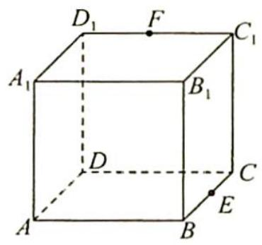

分析 ▶ A, E, F 三点确定一个平面, 设为 $\alpha$ , 且 $E \in \alpha, E \in$ 平面 $BCC_{1}B_{1}$ , 则平面 $\alpha$ 与平面 $BCC_{1}B_{1}$ 相交, 设交线为 l, 通过延长线可得到完整的截面 $\alpha$ 和交线 l.

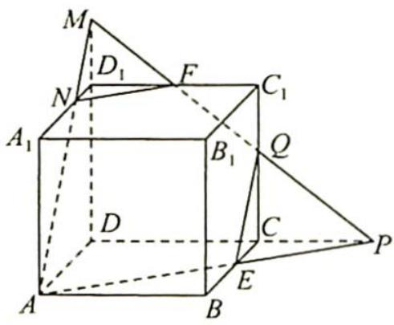

解析 如图所示,延长 AE 与 DC 的延长线交于点 P,连接 FP 交 $CC_{1}$ 于点 Q,则 QE 是截面与侧面 $BCC_{1}B_{1}$ 的交线段, $\triangle FC_{1}Q\sim\triangle PCQ$ ,由比例知 CE=2, $QC=\frac{8}{3}$ , $QE^{2}=4+\frac{64}{9}=\frac{100}{9}$ ,所以 $QE=\frac{10}{3}$ .

# 评注

延长 $QF$ 交 $DD_{1}$ 的延长线于点 $M$ , 连接 $MA$ 交 $A_{1}D_{1}$ 于点 $N$ , 连接 $NF$ , 截面为五边形 $AEQFN$ . 可以用至少 3 种方法作此截面.

变式 如图所示, 已知正方体 $ABCD - A_{1}B_{1}C_{1}D_{1}$ 中, $AA_{1} = 2$ , $P$ 为底面 $A_{1}B_{1}C_{1}D_{1}$ 的中心, $Q, R$ 分别为 $CC_{1}, AD$ 的中点, 求截面 $PQR$ 与正方体各面的交线.

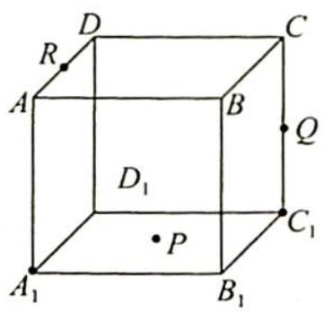

# 解析

作法如下:（1）如图1所示,连接PQ,RQ,PR,显然

△PQR 不是截面多边形。(截面是平面与几何体的公共部分图形,包含边界及其内部)

（2） 取 $D_{1} C_{1}$ 中点 $M$ , 连接 $DM$ , 易证 $DM \parallel PR$ , 取 $DC$ 中点 $N$ , 连接 $C_{1} N$ , 可得 $DM \parallel C_{1} N$ .

取 $NC$ 中点 $E$ , 连接 $QE$ , 易知 $QE \parallel PR$ . $QE$ 是截面 $PQR$ 与平面 $DD_{1}C_{1}C$ 的交线.

（3） 连接 $RE$ , 则 $RE$ 为截面 $PQR$ 与平面 $ABCD$ 的交线. $(R, E \in$ 平面 $ABCD, R, E \in$ 截面 $PQR)$

（4）如图2所示,延长EQ,交 $D_{1}C_{1}$ 延长线于点F,易知 $C_{1}F=\frac{1}{2}=CE$ .连接FP交 $B_{1}C_{1}$ 于点K,延长FP交 $A_{1}D_{1}$ 于点T,如图3所示.在底面 $A_{1}B_{1}C_{1}D_{1}$ 中,因为边长为2, $C_{1}F=\frac{1}{2}$ , $C_{1}K\parallel MP\parallel D_{1}T$ , $\triangle FC_{1}K\sim\triangle FMP\sim\triangle FD_{1}T$ ,由相似比易知 $C_{1}K=\frac{1}{3},D_{1}T=\frac{5}{3}$ .故TK即为截面PQR与底面 $A_{1}B_{1}C_{1}D_{1}$ 的交线.

（5）连接 ${QK},{TR}$ ,则 ${QK},{TR}$ 分别为截面 ${PQR}$ 与侧面 $B{B}_{1}{C}_{1}C$ 及侧面 $A{A}_{1}{D}_{1}D$ 的交线.

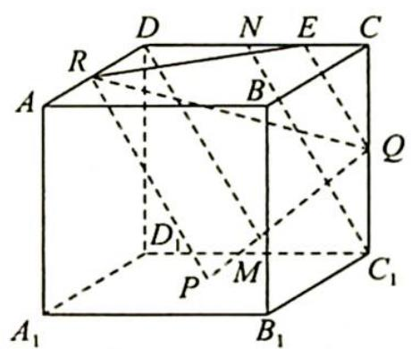

图 1

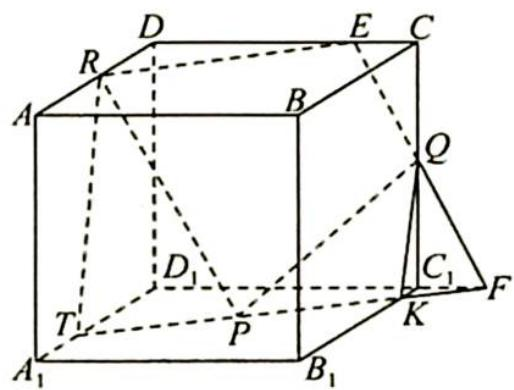

图2

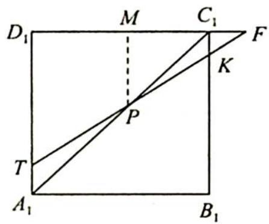

图3

# 评注

该题还可以用至少2种方法作截面,如下图所示.

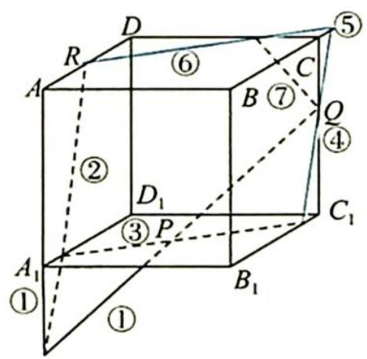

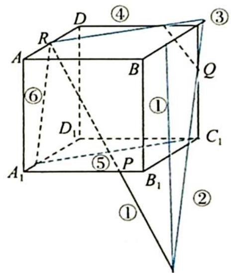

##### 例 34.2 如图所示, 正方体 $ABCD-A_{1}B_{1}C_{1}D_{1}$ 的棱长为 $2, M$ 是棱 $AA_{1}$ 的中点, 点 $P$ 在侧面 $ABB_{1}A_{1}$ 内, 若 $D_{1}P$ 垂直于 $CM$ , 则 $\triangle PBC$ 的面积的最小值为 \_\_\_\_.

分析 ▶ 因为 $D_{1}P \perp CM$ ，所以动点 P 在 CM 的垂面内，又因为 $P \in$ 平面 $ABB_{1}A_{1}$ ，所以点 P 在 CM 的垂面和平面 $ABB_{1}A_{1}$ 的交线上，且 P 的运动轨迹为一条线段。

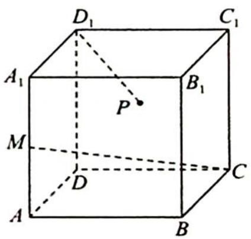

解析 如图所示, 取 $AB$ 中点 $Q$ , 连接 $B_{1} Q, D_{1} Q, B_{1} D_{1}, B_{1} Q$ 与 $BM$ 相交于点 $R$ , 易证

$B_{1}D_{1}\perp CM,B_{1}Q\perp CM,$ 则平面 $D_{1}B_{1}Q\perp CM,$ 又 $D_{1}P\perp CM,$ 所以 $D_{1}P\subset$ 平面 $D_{1}B_{1}Q,$ 且 $P\in$ 平面 $ABB_{1}A_{1},$ 故 $P\in B_{1}Q.$

$S_{\triangle PBC}=\frac{1}{2}\cdot BC\cdot d=d$ ，当d为BC与 $B_{1}Q$ 的公垂线，即d=BR时， $\triangle PBC$ 的面积最小. 在 $Rt\triangle BB_{1}Q$ 中， $d_{\min}=BR=\frac{2}{\sqrt{5}}=\frac{2\sqrt{5}}{5}$ ，故 $\triangle PBC$ 的面积的最小值为 $\frac{2\sqrt{5}}{5}$ .

变式 如图所示, 在圆柱的轴截面 $ABCD$ 中, $AB=4$ , $BC=2$ , $O_1$ , $O_2$ 分别为圆柱上下底面的中心, $M$ 为 $O_1O_2$ 的中点, 动点 $P$ 在圆柱下底面内 (包括圆周). 若 $AM \perp MP$ , 则点 $P$ 形成的轨迹的长度为 \_\_\_\_.

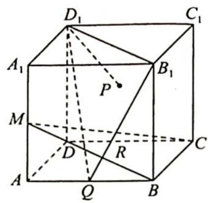

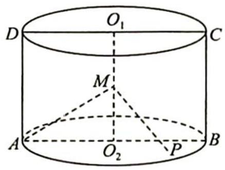

解析 ➤ 在线段 $O_{2}B$ 上取一点 Q，使得 $O_{2}Q=\frac{1}{4}O_{2}B$ ，则由边长关系可得 $\triangle AMO_{2}\sim\triangle MQO_{2}$ ，所以 $\angle AMO_{2}=\angle MQO_{2},\angle QMO_{2}=\angle MAO_{2}$ ，且 $\angle AMQ=\angle AMO_{2}+\angle QMO_{2}=\angle AMO_{2}+\angle MAO_{2}=90^{\circ}$ ，即 $AM\perp MQ$ 。

如图所示, 过 $Q$ 作 $AB$ 的垂线, 交 $\odot O_{2}$ 于 $E, F$ , 则 $EF \perp AB, EF \perp MQ$ , 所以 $EF \perp$ 平面 $AMQ$ , 即 $EF \perp AM$ , 又因为 $AM \perp MQ$ , 所以 $AM \perp$ 平面 $MEF$ .

故点 $P$ 在底面的轨迹为线段 $EF, EF = 2\sqrt{FO_2^2 - QO_2^2} = 2\sqrt{4 - \frac{1}{4}} = \sqrt{15}$ .

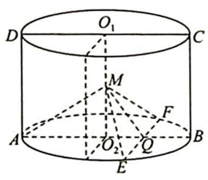

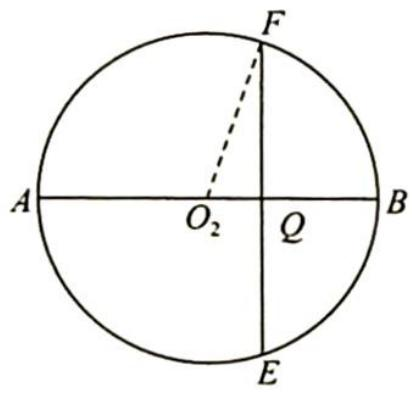

# 评注

本题依然是对三垂线定理的应用,也有对三角形相似的考查.在几何体中,对基本几何关系要熟悉.

##### 例 34.3 如图所示, 已知四面体 A-BCD 为正四面体, AB=1, E, F 分别是 AD, BC 中点, 若用一个与直线 EF 垂直, 且与四面体的每一个面都相交的平面 $\alpha$ 去截该四面体, 得到一个多边形截面, 则该多边形截面面积的最大值为().

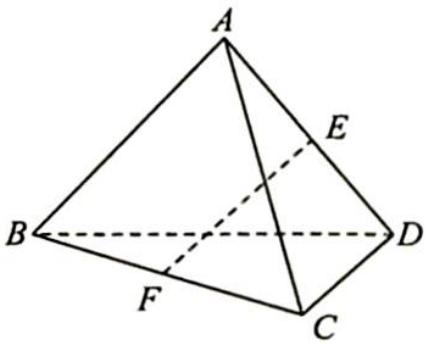

$\quad$A. $\frac{1}{4}$

$\quad$B. $\frac{\sqrt{2}}{4}$

$\quad$C. $\frac{\sqrt{3}}{4}$

$\quad$D. 1

分析 ▶ 借助正方体构造正四面体.

解析 如图所示, 将正四面体嵌在正方体中, $EF \perp AD$ , $EF \perp BC$ .

设平面 $\alpha$ 与 $AB, AC, CD, BD$ 分别交于点 $M, N, P, Q$ , 则 $\alpha \parallel AD$ , $\alpha \parallel BC$ . 因为平面 $ABC \cap \alpha = MN$ , 所以 $MN \parallel BC$ . 同理可证 $NP \parallel AD$ . 而 $BC \perp AD$ , 所以 $MN \perp NP$ , 四边形 $MNPQ$ 为矩形.

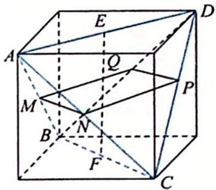

设 $MN = k, k \in (0,1)$ , 则 $NP = 1 - k, S = k(1 - k) \leqslant \left[\frac{k + (1 - k)}{2}\right]^2 = \left(\frac{1}{2}\right)^2 = \frac{1}{4}$ . 当且仅当 $k = \frac{1}{2}$ 时等号成立, 故选 A.

变式 在四面体 $ABCD$ 中, $AB=CD=2$ , $AC=BD=\sqrt{5}$ , $AD=BC=\sqrt{7}$ . 若平面 $\alpha$ 同时与直线 $AB$ 、直线 $CD$ 平行, 且与四面体的每一个面都相交, 由此得到一个多边形截面, 则该多边形面积的最大值为 ( ).

$\quad$A. $\frac{3\sqrt{3}}{8}$

$\quad$B. $\frac{\sqrt{3}}{2}$

$\quad$C. $\frac{5\sqrt{3}}{8}$

$\quad$D. $\frac{7\sqrt{3}}{8}$

分析 ▶ 借助长方体构造四面体.

解析 如图1所示,将四面体嵌入长方体中,设长方体的长、宽、高分别为a,b,c,则 $\left\{\begin{array}{l}a^{2}+b^{2}=7\\b^{2}+c^{2}=4\\a^{2}+c^{2}=5\end{array}\right.$ ,解得 $\left\{\begin{array}{l}a=2\\b=\sqrt{3}\\c=1\end{array}\right.$

设平面 $\alpha$ 与 AD, AC, BC, BD 分别交于点 M, N, P, Q，则 $MN \parallel PQ \parallel CD, NP \parallel MQ \parallel AB.$

设 $\frac{MN}{CD} = k, k \in (0,1)$ , 则 $\frac{NP}{AB} = 1 - k$ , 又 $AB = CD = 2$ , 所以平行四边形 MNPQ 对边分别为 $2k, 2(1 - k), k \in (0,1)$ .

由 $MN$ 与 $NP$ 的夹角即是 $CD$ 与 $AB$ 的夹角且易知 $AB$ 与 $CD$ 的夹角 $\theta$ 为 $60^{\circ}$ . 如图2所示, 则平行四边形 $MNPQ$ 的面积 $S = |MN||NP|\sin 60^{\circ} = 2k \cdot 2(1 - k) \cdot \frac{\sqrt{3}}{2} = 2\sqrt{3}k(1 - k) \leqslant \frac{\sqrt{3}}{2}$ , 当且仅当 $k = \frac{1}{2}$ 时等号成立, 故选B.

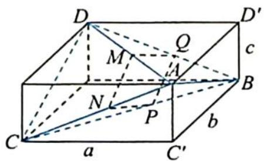

图1

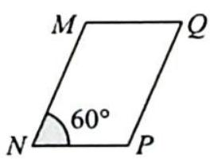

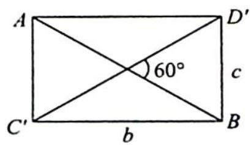

图2

##### 例 34.4 已知正方体的棱长为 1, 每条棱所在直线与平面 $\alpha$ 所成的角都相等, 则 $\alpha$ 截此正方体所得截面面积的最大值为 ( ).

$\quad$A. $\frac{3\sqrt{3}}{4}$

$\quad$B. $\frac{2\sqrt{3}}{3}$

$\quad$C. $\frac{3\sqrt{2}}{4}$

$\quad$D. $\frac{\sqrt{3}}{2}$

分析 ➤ 思路一:根据正方体的“对称性”,确定所求截面在平面 $ACD_{1}$ 与平面 $A_{1}C_{1}B$ 之间,利用截面在底面上的射影求截面的面积.

思路二:根据极限思想确定经过中心 O 时截面面积最大,此时截面为正六边形.

思路三:根据空间向量在立体几何中的应用,将线面角问题转化为直线与平面法线的夹角问题,即找平面的法线,使其与所有棱所在直线所成角都相等.

思路四: 将截面进行延展, 得到等边三角形 PQR, 根据截面面积和等边三角形面积的比值求截面的面积.

解析 ▶ 解法一: 因为 $A_{1}B_{1} \parallel D_{1}C_{1} \parallel DC \parallel AB, AA_{1} \parallel BB_{1} \parallel CC_{1} \parallel DD_{1}, A_{1}D_{1} \parallel B_{1}C_{1} \parallel BC \parallel AD$ , 所以根据正方体的“对称性”可知每条棱所在直线与平面 $\alpha$ 所成角相等, 等价于直线 $DA, DC, DD_{1}$ 与平面 $\alpha$ 所成角相等.

根据上述可联想到正三棱锥 $D - ACD_{1}$ , 故平面 $\alpha //$ 平面 $ACD_{1}$ . 同理, 平面 $A_{1}C_{1}B$ 也符合题意, 面积最大的截面一定在平面 $ACD_{1}$ 与平面 $A_{1}C_{1}B$ 之间.

如图1所示,设截面 $\alpha$ 与各棱交点分别为 $G,H,M,N,E,F$ ,则利用面积射影法可得二面角 $E-GH-D$ 的余弦值 $\cos\theta=\frac{\sqrt{3}}{3}$ .

过 $E$ 作 $EE_{1} \perp AD$ , 垂足为 $E_{1}$ , 过 $N$ 作 $NN_{1} \perp DC$ , 垂足为 $N_{1}$ , 截面 $GHMNEF$ 在底面 $ABCD$ 内的射影为 $GHCN_{1}E_{1}A$ , 如图2所示. 由射影面积法可知射影面积 $S_{0}$ 与截面面积 $S$ 的比值为 $\frac{\sqrt{3}}{3}$ , 所以 $S = \sqrt{3} S_{0}$ .

设 $BG = x$ ，则 $BG = BH = AE_{1} = CN_{1} = x, DE_{1} = DN_{1} = 1 - x$ ，所以 $S_{0} = 1 - S_{\triangle BGH} - S_{\triangle DE_{1}N_{1}} = 1 - \frac{1}{2} x^{2} - \frac{1}{2}(1 - x)^{2} = -x^{2} + x + \frac{1}{2} = -\left(x - \frac{1}{2}\right)^{2} + \frac{3}{4}$ ，当 $x = \frac{1}{2}$ 时， $S_{0}$ 有最大值为 $\frac{3}{4}$ ，此时 $S_{\max} = \sqrt{3} S_{0} = \frac{3\sqrt{3}}{4}$ . 故选 A.

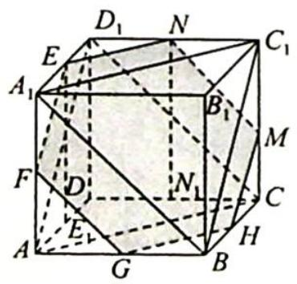

图1

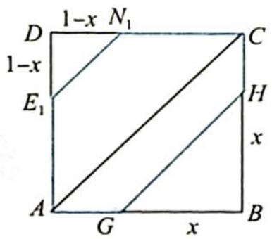

图 2

解法二:如图3所示,截面 $\alpha$ 只要与 $\triangle ACD_{1}$ 和 $\triangle A_{1}BC_{1}$ 所在平面平行就是符合题意的.应当确定的是满足题意的平面 $\alpha$ 有无数个,不妨设平面 $\alpha$ 是由平面 $ACD_{1}$ (或平面 $A_{1}BC_{1}$ ) 沿正方体的体对角线 $DB_{1}$ 平行移动而形成的,可以把过顶点 D 或 $B_{1}$ 时的平面 $\alpha$ 理解成截面面积是 0的极端特殊情形. 再利用正方体的对称性确定平面经过中心 $O$ 时截面面积为最大, 此时截面是由六条棱 $D_{1}A_{1}, A_{1}A, AB, BC, CC_{1}, C_{1}D_{1}$ 的中点连线而成的正六边形 $EFGHMN$ , 其边长为 $\frac{\sqrt{2}}{2}$ , 此时截面面积为 $6 \times \frac{\sqrt{3}}{4} \times \left(\frac{\sqrt{2}}{2}\right)^{2} = \frac{3\sqrt{3}}{4}$ . 故选 A.

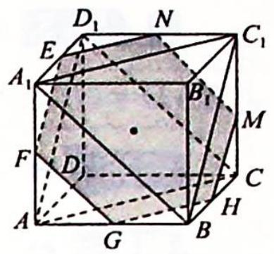

图 3

解法三:如图4所示,在空间直角坐标系D-xyz中,正方体的体对角线
DB₁所在直线和所有棱所在的直线夹角相等(正方体是非常特殊的几何体之一,且有一定的对称性,其中体对角线所在直线即为“对称轴”,且DB₁⊥平面ACD₁,DB₁⊥平面A₁BC₁).利用数学运算的方法,即将问题转化为如图5所示的平面图形的面积计算.  
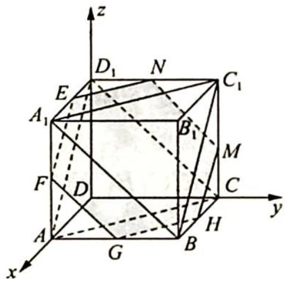

图 4

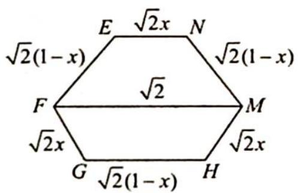

图 5

设 $CM = x$ ，则截面面积 $S = \frac{1}{2} (\sqrt{2} x + \sqrt{2}) \cdot \frac{\sqrt{6}}{2} (1 - x) + \frac{1}{2} [\sqrt{2}(1 - x) + \sqrt{2}] \cdot \frac{\sqrt{6}}{2} x = \frac{\sqrt{3}}{2} (-2x^2 + 2x + 1) = -\sqrt{3} \left[ \left( x - \frac{1}{2} \right)^2 - \frac{3}{4} \right], x \in (0,1)$ .

所以当 $x=\frac{1}{2}$ 时, 截面面积 S 取最大值为 $\frac{3\sqrt{3}}{4}$ . 故选 A.

解法四:利用正方体的对称性确定平面经过中心 O 时截面面积为最大,如图 6 所示,将截面进行延展,得到等边三角形 PQR,此时正六边形的顶点为正三角形边长的三等分点,所以截面面积 $S=\frac{2}{3}S_{\triangle PQR}=\frac{2}{3}\times\frac{\sqrt{3}}{4}\times\left(\frac{3\sqrt{2}}{2}\right)^{2}=\frac{3\sqrt{3}}{4}$ . 故选 A.

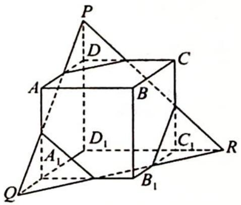

图6

# 34.2 空间轨迹问题

# 研究密钥

空间轨迹问题,一般是指空间几何体表面或者内部动点的轨迹问题,多与截面相关.包括用平面截多面体得交线段,也包括平面截旋转体得曲线.如用平面截球面、用平面截圆锥(得圆锥曲线)等.除了空间问题平面化、几何问题代数化,常常也和解三角形、解析几何问题综合.

##### 例 34.5 (2020 新高考全国 I 卷 16) 已知直四棱柱 $ABCD-A_{1}B_{1}C_{1}D_{1}$ 的棱长均为 2, $\angle BAD=60^{\circ}$ , 以 $D_{1}$ 为球心, $\sqrt{5}$ 为半径的球面与侧面 $BCC_{1}B_{1}$ 的交线长为 \_\_\_\_.

分析 ▶ 将平面与球面的交线转化至平面内求解.

解析 ▶ 由球体的性质知侧面 $BCC_{1}B_{1}$ 所在平面与球面的公共部分是小圆的一段圆弧,该截面小圆的圆心为 $B_{1}C_{1}$ 的中点,如图 1 所示.

因为直四棱柱 $ABCD-A_{1}B_{1}C_{1}D_{1}$ 所有棱长为 2， $\angle BAD=60^{\circ}$ ，所以 $\triangle B_{1}C_{1}D_{1}$ 为等边三角形，则 $D_{1}O\perp B_{1}C_{1}, D_{1}O\perp$ 平面 $BCC_{1}B_{1}$ .

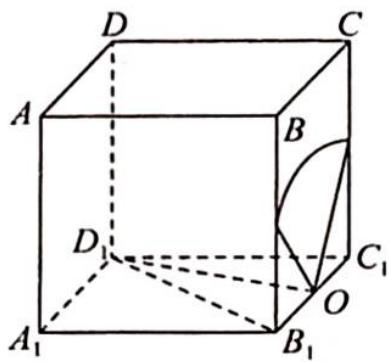

图 1

易知 $D_{1}O=\sqrt{3}$ ，因为球的半径为 $\sqrt{5}$ ，所以截面圆半径 $r=\sqrt{R^{2}-d^{2}}=\sqrt{5-3}=\sqrt{2}$ ，故球面与平面 $BCC_{1}B_{1}$ 的交线上的点即为平面 $BCC_{1}B_{1}$ 内到 O 距离为 $\sqrt{2}$ 的点.

在正方形 $BCC_{1}B_{1}$ 中，以 O 为圆心， $\sqrt{2}$ 为半径作弧，如图 2 所示，易知 $\widehat{MN}$ 是 $\frac{1}{4}$ 个圆，故 $\widehat{MN}$ 的长为 $\frac{1}{4} \times 2\pi r = \frac{\sqrt{2}}{2}\pi$ ，即球面与侧面 $BCC_{1}B_{1}$ 的交线长为 $\frac{\sqrt{2}}{2}\pi$ .

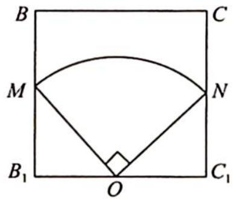

图 2

# 评注

本题通过球面与平面交线长的计算,考查学生空间想象能力、逻辑推理能力及运算求解能力,考查核心是球体的截面性质.

变式（1） 如图所示, 在正三棱锥 $A-BCD$ 中, 底面边长为 $\sqrt{6}$ , 侧面均为等腰直角三角形, 现该三棱锥的表面上有一动点 $O$ , 且 $OB=2$ , 则动点 $O$ 在三棱锥表面所形成的轨迹曲线的长度为 \_\_\_\_.

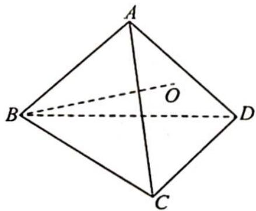

解析 如图所示, 轨迹为曲线 EFGH, 因为在正三棱锥 A-BCD 中, 底面边长为 $\sqrt{6}$ , 侧面均为等腰直角三角形, 故 $AB = \sqrt{3}$ .

在 $\triangle ABH$ 中,因为 $BH=2,AB=\sqrt{3},\angle BAH=90^{\circ}$ ,所以 $\angle ABH=\frac{\pi}{6},AH=1,\angle CBH=\frac{\pi}{4}-\frac{\pi}{6}=\frac{\pi}{12}$ ,故 $\widehat{EF}=\widehat{GH}=\frac{\pi}{12}\times2=\frac{\pi}{6}$ ,又 $AH=AE=1,\angle CAD=\frac{\pi}{2}$ ,所以 $\widehat{HE}=\frac{\pi}{2},\widehat{GF}=\frac{\pi}{3}\times2=\frac{2\pi}{3}$ .

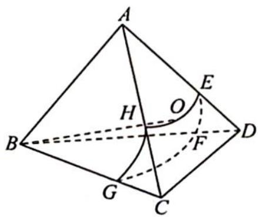

则点 O 的轨迹长度为 $2 \times \frac{\pi}{6} + \frac{\pi}{2} + \frac{2\pi}{3} = \frac{3\pi}{2}$ .

变式（2） 如图所示, 在棱长为 1 的正方体 $ABCD-A_{1}B_{1}C_{1}D_{1}$ 中, $E$ 是棱 $BC$ 的中点, $F$ 是侧面 $BCC_{1}B_{1}$ 上的动点, 且 $A_{1}F \parallel$ 平面 $AD_{1}E$ , 则 $A_{1}F$ 与平面 $BCC_{1}B_{1}$ 所成角的正切值 $t$ 构成

的集合是( ).

$\quad$A. $\left\{t\mid \frac{2\sqrt{5}}{5}\leqslant t\leqslant \frac{2\sqrt{3}}{3}\right\}$

$\quad$B. $\{t \mid 2 \leqslant t < 2\sqrt{2}\}$

$\quad$C. $\left\{t\mid \frac{2\sqrt{5}}{5}\leqslant t\leqslant 2\sqrt{3}\right\}$

$\quad$D. $\{t \mid 2 \leqslant t \leqslant 2\sqrt{2}\}$

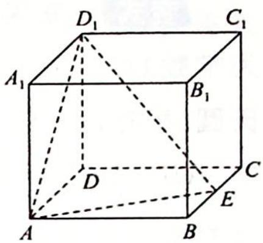

解析 如图所示, 取 $CC_{1}$ 的中点 $G$ , 连接 $EG, D_{1}G$ . 设 $B_{1}C_{1}, B_{1}B, C_{1}C$ 的中点分别为 $M, N, G$ , 连接 $MN, B_{1}C$ 且 $MN$ 交 $B_{1}C$ 于 $F_{0}$ .

设 $B_{1}C \cap EG = Q$ ，侧面 $ADD_{1}A_{1}$ 的中心为 $O_{1}$ ，连接 $O_{1}Q, A_{1}F_{0}, A_{1}O_{1}$ ，易知 $A_{1}O_{1} \underline{\underline{=}} F_{0}Q$ ，则四边形 $A_{1}O_{1}QF_{0}$ 为平行四边形，所以 $A_{1}F_{0} \parallel O_{1}Q$ ，又 $O_{1}Q \subset$ 平面 $AEGD_{1}, A_{1}F_{0} \not\subset$ 平面 $AEGD_{1}$ ，因此 $A_{1}F_{0} \parallel$ 平面 $AEGD_{1}$ .

又 $MN \parallel$ 平面 $AEGD_{1}, MN \cap A_{1}F_{0} = F_{0}, MN, A_{1}F_{0} \subset$ 平面 $A_{1}MN$ , 故平面 $A_{1}MN \parallel$ 平面 $AEGD_{1}$ , 则动点 $F$ 的运动轨迹是线段 $MN$ .

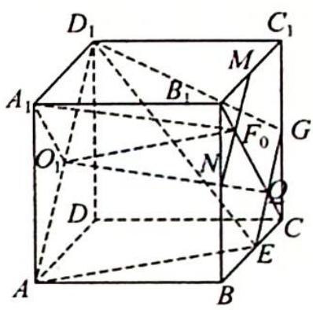

设 $A_{1}F$ 与平面 $BCC_{1}B_{1}$ 所成角的正切值为 $t$ ，则 $t = \frac{A_1B_1}{B_1F} = \frac{1}{B_1F}$ ，又 $B_{1}F \in \left[\frac{\sqrt{2}}{4}, \frac{1}{2}\right]$ ，所以 $t \in [2, 2\sqrt{2}]$ . 故选 D.

##### 例 34.6 如图所示, 在正方体 $ABCD - A_{1}B_{1}C_{1}D_{1}$ 中, $E$ 是 $AA_{1}$ 的中点, $P$ 为底面 $ABCD$ 内动点, 设 $PD_{1}, PE$ 与底面 $ABCD$ 所成的角分别为 $\theta_{1}, \theta_{2} (\theta_{1}, \theta_{2}$ 均不为 0), 若 $\theta_{1} = \theta_{2}$ , 则动点 $P$ 的轨迹为 ( ).

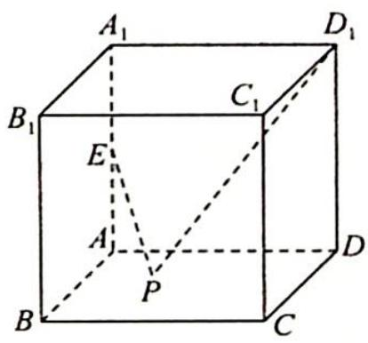

$\quad$A. 直线的一部分

$\quad$B. 圆的一部分

$\quad$C. 椭圆的一部分

$\quad$D. 抛物线的一部分

分析 ▶ 使用投影得到平面角,根据两角的正切值可得点 P 到点 A 和点 D 的距离成比例,故点 P 的轨迹为圆.

解析 如图所示, 连接 $PD, PA$ , 则 $PD_{1}$ 与底面所成角的平面角 $\theta_{1}$ 即为 $\angle D_{1}PD$ , $PE$ 与底面所成角的平面角 $\theta_{2}$ 即为 $\angle EPA$ .

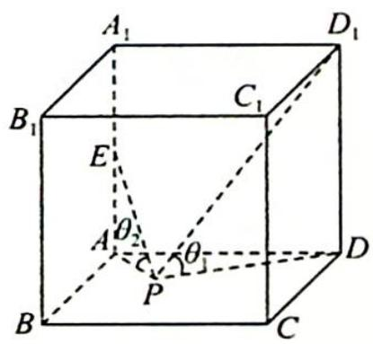

不妨设正方体的棱长为 1, 则 $\tan \theta_{1} = \frac{DD_{1}}{PD}, \tan \theta_{2} = \frac{AE}{PA}$ , 由 $\theta_{1} = \theta_{2}$ 得 $PA = \frac{1}{2} PD$ , 故点 $P$ 的轨迹为圆 (阿波罗尼斯圆). 故选 B.

# 评注

在本题中由于点 $P$ 在一个平面上运动, 且满足 $PA = \frac{1}{2} PD$ , 所以其轨迹为阿波罗尼斯圆. 阿波罗尼斯圆的概念可拓展到空间, 即在空间中, 动点 $P$ 到两定点 $A, B$ 的距离满足 $PA = \lambda PB (\lambda > 0, \lambda \neq 1)$ , 可以看作阿波罗尼斯球. 这便是阿波罗尼斯圆的三维空间版本.

变式 古希腊数学家阿波罗尼斯发现:平面上到两定点 A, B 距离之比为常数 $\lambda (\lambda > 0 \text{ 且 } \lambda \neq 1)$ 的点的轨迹是一个圆心在直线 AB 上的圆,该圆简称阿氏圆. 根据以上信息,解决下面的问题:如图所示,在长方体 $ABCD - A_{1}B_{1}C_{1}D_{1}$ 中, $AB = 2AD = 2AA_{1} = 6$ , 点 E 在棱 AB 上, BE = 2AE, 动点 P 满足 $BP = \sqrt{3}PE$ .

若点 P 在平面 ABCD 内运动, 则点 P 所形成的阿氏圆的半径为 \_\_\_\_; 若点 P 在长方体 $ABCD-A_{1}B_{1}C_{1}D_{1}$ 内部运动, F 为棱 $C_{1}D_{1}$ 的中点, M 为 CP 的中点, 则三棱锥 $M-B_{1}CF$ 的体积的最小值为 \_\_\_\_.

阿波罗尼斯  
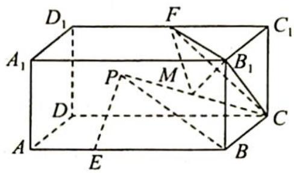

解析 ▶ 在平面 ABCD 上建立平面直角坐标系(如图 1 所示), 则 B(2,0), E(-2,0), 假设 P(x,y), 由 BP= $\sqrt{3}$ PE 得 $\sqrt{(x-2)^{2}+y^{2}}=\sqrt{3}\cdot\sqrt{(x+2)^{2}+y^{2}}$ , 整理得 $(x+4)^{2}+y^{2}=12$ , 所以动点 P 的轨迹是以 A 为圆心, $2\sqrt{3}$ 为半径的阿氏圆.

同理, 推广到空间中, 如图 2 所示, 动点 $P$ 的轨迹是以 $A$ 为球心, $2\sqrt{3}$ 为半径的阿氏球面, 根据长方体的棱长易知该四棱柱是两个正方体的组合体, 所以 $AF \perp$ 平面 $CB_{1}F$ , 此时点 $P$ 到平面 $B_{1}CF$ 的最小距离为 $h_{A} - 2\sqrt{3} = 3\sqrt{3} - 2\sqrt{3} = \sqrt{3}$ . 又 $M$ 为 $CP$ 的中点, 所以点 $M$ 到平面 $B_{1}CF$ 的最短距离为 $\frac{\sqrt{3}}{2}$ , 从而 $(V_{M-B_{1}CF})_{\max} = \frac{1}{3} h_{M} \cdot S_{\triangle B_{1}CF} = \frac{1}{3} \times \frac{\sqrt{3}}{2} \times \left[\frac{\sqrt{3}}{4} \times 18\right] = \frac{9}{4}$ .

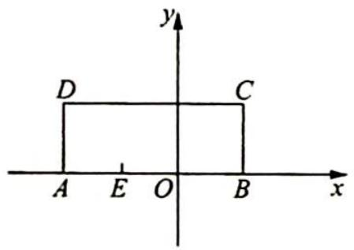

图1

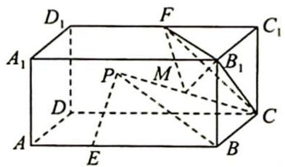

图 2

##### 例 34.7 如图所示, $\triangle ABC$ 的边长都为 2, 在边 AB 上任取一点 D, 沿 CD 折起, 使平面 BCD⊥平面 ACD. 在平面 BCD 内过点 B 作 BP⊥平面 ACD, 垂足为 P, 那么随着点 D 的变化, 点 P 的轨迹长度为( ).

$\quad$A. $\frac{\pi}{6}$

$\quad$B. $\frac{\pi}{3}$

$\quad$C. $\frac{2\pi}{3}$

$\quad$D. $\pi$

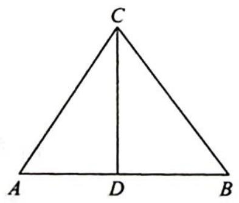

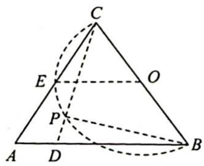

分析 ▶ 由垂足可以找到圆心,根据折叠的临界情况计算弧长.

解析 ▶ 由题意可得平面 $BCD \perp$ 平面 $ACD$ . 因为 $BP \perp$ 平面 $ACD$ , 所以 $BP \perp CD$ , 即

$\angle BPC = 90^{\circ}$ , 点 $P$ 的轨迹是以 $O$ 为圆心, 以 $\frac{1}{2} BC$ 为半径, 弧度数为 $\frac{2}{3}\pi$ 的圆弧, 即 $P$ 的轨迹长度为 $\frac{2}{3}\pi$ . 故选 C.

# 评注

折叠问题中,要注意折叠临界情形、线面垂直的等价信息、线线垂直,从而产生隐形圆,也可考虑先求轨迹长度,则轨迹为圆的一部分或线段,逆向求解.

变式 如图所示,圆锥的轴截面 $\triangle PAB$ 是以 $P$ 为直角顶点的等腰直角三角形, $PA=2,C$ 为 $PA$ 中点.若底面 $\odot O$ 所在平面上有一个动点 $M$ ,且始终保持 $\overrightarrow{MA} \cdot \overrightarrow{MP}=0$ ,过点 $O$ 作 $PM$ 的垂线,垂足为 $H$ .当点 $M$ 运动时,点 $H$ 在空间形成的轨迹为( ).

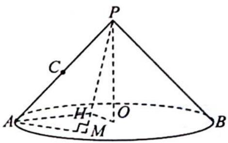

$\quad$A. 直线

$\quad$B. 椭圆

$\quad$C. 抛物线

$\quad$D. 圆

解析 因为 $\overrightarrow{MA} \cdot \overrightarrow{MP} = 0$ ，所以 $MA \perp MP$ ，空间内，点 M 的轨迹是以 PA 为直径的球面，又 $M \in \odot O$ ，圆锥的轴截面是以 P 为顶点的等腰直角三角形，所以 M 的轨迹是以 OA 为直径的圆，故 $AM \perp OM$ 。

又 $PO \perp AM$ , 所以 $AM \perp$ 平面 $PMO$ , 则 $AM \perp OH$ , 又 $OH \perp PM$ , 所以 $OH \perp$ 平面 $PAM$ , 连接 $OC, HC, HA$ , 如图所示, 则 $OH \perp HC, OH \perp AH$ , 所以 $H$ 的轨迹是以 $OC$ 为直径的球和以 $OA$ 为直径的球的公共部分, 所以 $H$ 的轨迹是圆. 故选 D.

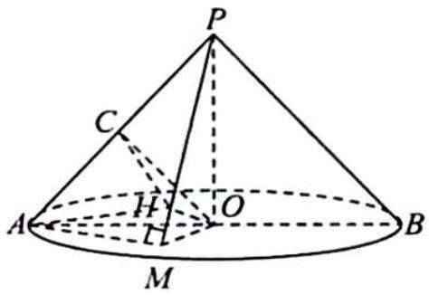

##### 例 34.8 已知正方体 $ABCD-A_{1}B_{1}C_{1}D_{1}$ 的棱长为 4, P, Q 分别在直线 AC, $B_{1}D_{1}$ 上运动，且满足 PQ=8，则 PQ 的中点 E 的轨迹为（）.

$\quad$A. 直线

$\quad$B. 椭圆

$\quad$C. 抛物线

$\quad$D. 圆

分析 ➤ 先作出平面 $\alpha$ ，设 P, Q 在平面 $\alpha$ 内的射影分别为 M, N，连接 OM, ON, MN，由正方体的性质可得出 $OM \perp ON, MN = 4\sqrt{3}$ ，建立平面直角坐标系可得出点 E 的轨迹。

解析 如图1所示, $O_{1}, O_{2}$ 分别为 $B_{1}D_{1}, AC$ 的中点, 平面 $\alpha$ 平行于正方体 $ABCD-A_{1}B_{1}C_{1}D_{1}$ 的底面 $ABCD$ , 且平分正方体 $ABCD-A_{1}B_{1}C_{1}D_{1}$ , 则 $O_{1}O_{2}=4, O_{1}O_{2} \perp$ 平面 $\alpha, PQ$ 的中点 $E$ 必在平面 $\alpha$ 内.

设 $O_{1} O_{2} \cap$ 平面 $\alpha = O, P, Q$ 在平面 $\alpha$ 内的射影分别为 $M, N$ , 连接 $O M, O N, M N$ , 则 $E$ 在 $M N$ 上且为 $M N$ 的中点, 即 $O N \parallel$

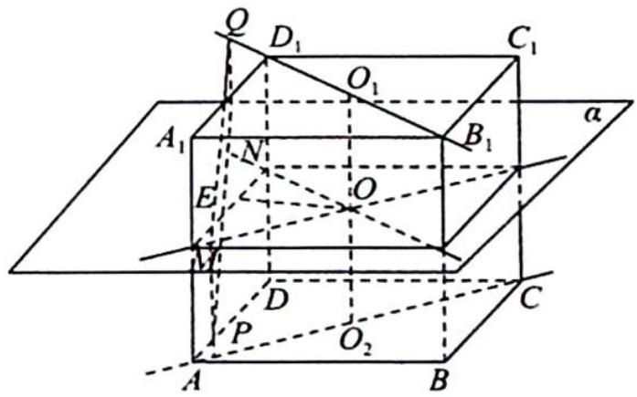

图1

$B_{1}D_{1},OM\parallel AC.$ 因为 $B_{1}D_{1}\perp AC$ , 所以 $ON\perp OM$ , 故 $\angle MON=90^{\circ}$ , 所以 MP=QN=2. 如图 2 所示, 设 Q 在平面 ABCD 的射影为 $Q'$ , 则 $MN=PQ'=\sqrt{PQ^{2}-QQ'^{2}}=\sqrt{8^{2}-4^{2}}=4\sqrt{3}.$

以 O 为坐标原点, ON, OM 所在直线分别为 x 轴、y 轴建立平面直角坐标系, 如图 3 所示.

设 $E(x, y)$ , 则 $OE = \frac{1}{2} MN = 2\sqrt{3}$ , 故点 $E$ 的轨迹是以 $O$ 为圆心, $2\sqrt{3}$ 为半径的圆, 其轨迹方程为 $x^{2} + y^{2} = 12$ , 故选 D.

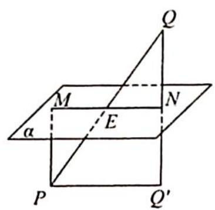

图2

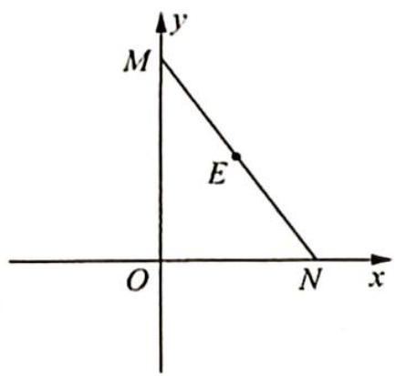

图3

# 评注

对于立体几何中的动点问题,常需“动中觅静”,这里的“静”是指问题中的不变量或者是不变关系,“动中觅静”就是在运动变化中探索问题中的不变性.

变式 如图所示,在棱长为 2 的正四面体 A-BCD 中,E,F 分别为 AB,CD 上的动点,且 $\left|EF\right|=\sqrt{3}$ . 若记 EF 中点 P 的轨迹为 L,则 $\left|L\right|$ 等于 \_\_\_\_. (注: $\left|L\right|$ 表示 L 的测度,在本题 L 为曲线、平面图形、空间几何体时, $\left|L\right|$ 分别对应长度、面积、体积)

解析 ▶ 将正四面体 A-BCD 放到正方体里, 则正方体的边长为 $\sqrt{2}$ , 取 MN 中点为 O, EF 中点为 P, ME 中点为 Q, 则易证 $OQ \perp PQ$ , 如图所示, 设 $F_{1}$ 为 E 在平面 $A'CB'D$ 上的射影, 只有当 $FF_{1}=1$ 时, 才能保证 $EF=\sqrt{3}$ , 即 $MF^{2}+MF_{1}^{2}=1$ , $OQ^{2}+PQ^{2}=\left(\frac{1}{2}MF_{1}\right)^{2}+\left(\frac{1}{2}MF\right)^{2}=\frac{1}{4}(MF_{1}^{2}+$ $MF^{2})=\frac{1}{4}$ ，而 $OQ^{2}+PQ^{2}=OP^{2}$ ，则 $OP^{2}=\frac{1}{4}$ ，故 P 点轨迹为圆，周长为 $\pi$ ，即 $|L|$ 等于 $\pi$ .

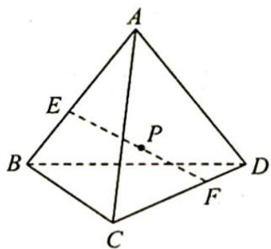

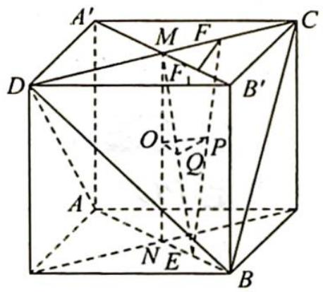

##### 例 34.9 (多选题)如图所示,正方体 $ABCD-A_{1}B_{1}C_{1}D_{1}$ 的棱长为 2, M 为 $DD_{1}$ 的中点, N 为正方形 $ABCD$ 所在平面内一动点, 则下列命题正确的有( ).

$\quad$A. 若 $MN = 2$ , 则 $MN$ 的中点的轨迹所围成图形的面积为 $\pi$   
$\quad$B. 若 $N$ 到直线 $BB_{1}$ 与直线 $DC$ 的距离相等, 则 $N$ 的轨迹为抛物线  
$\quad$C. 若 $D_{1}N$ 与 $AB$ 所成的角为 $\frac{\pi}{3}$ , 则 $N$ 的轨迹为双曲线  
$\quad$D. 若 $MN$ 与平面 $ABCD$ 所成的角为 $\frac{\pi}{3}$ , 则 $N$ 的轨迹为椭圆

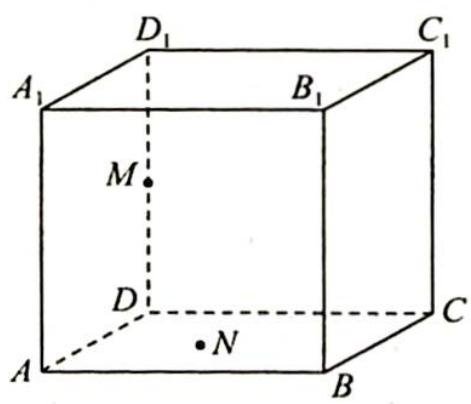

分析 ▶ A 选项: 设 P 为斜边 MN 的中点, 连接 MN, ND, DP, 得到 Rt△MDN, 所以

$PD = 1$ , 进而得到 $P$ 点的轨迹为圆, 即可判断选项 A 错误; B 选项: 可知 $NB \perp BB_{1}$ , 即 $NB$ 是点 $N$ 到直线 $BB_{1}$ 的距离, 在平面 $ABCD$ 中, 点 $N$ 到定点 $B$ 的距离与到定直线 $DC$ 的距离相等, 利用抛物线定义可知选项 B 正确; C 选项: 建立空间直角坐标系, 设 $N(x, y, 0)$ , 利用空间向量求夹角知 $\cos \frac{\pi}{3} = \frac{|\overrightarrow{D_1 N} \cdot \overrightarrow{AB}|}{|\overrightarrow{D_1 N}| |\overrightarrow{AB}|} = \frac{|2y|}{2\sqrt{x^2 + y^2 + 4}} = \frac{1}{2}$ , 化简可知 $N$ 的轨迹为双曲线, 选项 C 正确; D 选项: $MN$ 与平面 $ABCD$ 所成的角为 $\angle MND = \frac{\pi}{3}, ND = \frac{\sqrt{3}}{3}$ , 可知 $N$ 的轨迹是以 $D$ 为圆心, $\frac{\sqrt{3}}{3}$ 为半径的圆周, 选项 D 错误.

解析 A 选项: 如图 1 所示, 连接 MN, ND, 设 P 为 MN 的中点, 连接 DP, 由正方体性质知 $\triangle MDN$ 为直角三角形, 且 P 为 MN 的中点, MN=2, 根据直角三角形斜边上的中线为斜边的一半, 可得 $\triangle MDN$ 始终有 MP=PD=1, 即 P 点的轨迹为圆, 且半径为 $\frac{\sqrt{3}}{2}$ , 其面积 $S=\pi\times\left(\frac{\sqrt{3}}{2}\right)^{2}=\frac{3\pi}{4}$ , 故 A 错误.

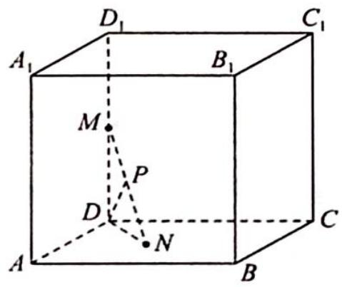

图1

B 选项:由正方体性质知 $BB_{1} \perp$ 平面 $ABCD$ , 由线面垂直的性质定理知 $NB \perp BB_{1}$ , 即 $NB$ 是点 $N$ 到直线 $BB_{1}$ 的距离. 在平面 $ABCD$ 中, 点 $N$ 到定点 $B$ 的距离与到定直线 $DC$ 的距离相等, 所以点 $N$ 的轨迹是以点 $B$ 为焦点, 直线 $DC$ 为准线的抛物线, 故 $B$ 正确.

C 选项: 如图 2 所示, 以 D 为直角坐标系原点, 建立空间直角坐标系, 可得 $N(x, y, 0)$ , $D_{1}(0, 0, 2)$ , $A(2, 0, 0)$ , $B(2, 2, 0)$ . 则 $\overrightarrow{D_{1}N} = (x, y, -2)$ , $\overrightarrow{AB} = (0, 2, 0)$ , 利用空间向量求夹角知 $\cos \frac{\pi}{3} = \frac{|\overrightarrow{D_{1}N} \cdot \overrightarrow{AB}|}{|\overrightarrow{D_{1}N}| |\overrightarrow{AB}|} = \frac{|2y|}{2\sqrt{x^{2} + y^{2} + 4}} = \frac{1}{2}$ , 化简整理得 $3y^{2} - x^{2} = 4$ , 即 $\frac{y^{2}}{\frac{4}{3}} - \frac{x^{2}}{4} = 1$ , 所以 N 的轨迹为双曲线, 故 C 正确.

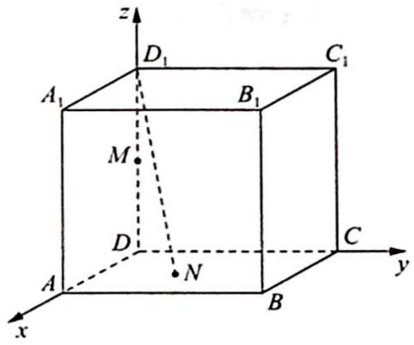

图 2

D 选项: 由正方体性质知 MN 与平面 ABCD 所成的角为 $\angle MND$ ，即 $\angle MND = \frac{\pi}{3}$ ，在 Rt△MDN 中， $ND = \frac{\sqrt{3}}{3}$ ，即 N 的轨迹是以 D 为圆心， $\frac{\sqrt{3}}{3}$ 为半径的圆周，故 D 错误.

综上所述,故选 BC.

变式 如图所示, 在棱长为 4 的正方体 $ABCD-A_{1}B_{1}C_{1}D_{1}$ 中, 点 $M$ 是正方体表面上一动点, 则下列说法正确的个数为 ( ).

①若点 $M$ 在平面 $ABCD$ 内运动时总满足 $\angle DD_{1}A = \angle DD_{1}M$ , 则点 $M$ 在平面 $ABCD$ 内的轨迹是圆的一部分.

②在平面 $ABCD$ 内作边长为 1 的小正方形 $EFGA$ , 点 $M$ 满足在平面 $ABCD$ 内运动, 且到平面 $AA_{1}B_{1}B$ 的距离等于到点 $F$ 的距离, 则 $M$ 在平面 $ABCD$ 内的轨迹是抛物线的一部分.

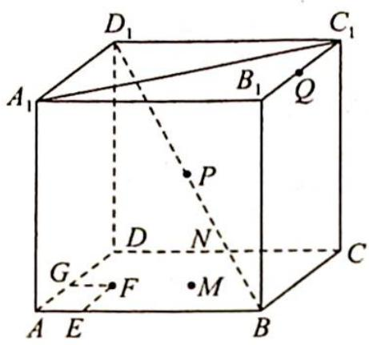

③已知点 $N$ 是棱 $CD$ 的中点, 若点 $M$ 在平面 $ABCD$ 内运动, 且 $B_{1} M \parallel$ 平面 $A_{1} N C_{1}$ , 则点 $M$ 在平面 $ABCD$ 内的轨迹是线段.

④已知点 $P, Q$ 分别是 $BD_{1}, B_{1}C_{1}$ 的中点, 点 $M$ 为正方体表面上一点, 若 $MP$ 与 $CQ$ 垂直, 则点 $M$ 所构成的轨迹的周长为 $8 + 4\sqrt{5}$ .

$\quad$A. 1

$\quad$B. 2

$\quad$C. 3

$\quad$D. 4

分析 ▶ ①: 结合圆锥的性质, 可判断其正确; ②: 结合抛物线的定义可知其正确; ③: 取 ${AB}$ 的中点 $I,{BC}$ 的中点 $O$ ,易证平面 ${B}_{1}{IO}//$ 平面 ${A}_{1}N{C}_{1}$ ,可知当 $M$ 在线段 ${IO}$ 上时,满足题意; ④: 只需过点 $P$ 作直线 ${CQ}$ 的垂面即可,垂面与正方体表面的交线即为动点 $M$ 的轨迹,求出周长,即可判断④正确.

解析 ①: 因为满足条件的动点 M 是以 $DD_{1}$ 为轴线、以 $D_{1}A$ 为母线的圆锥与平面 ABCD 的交线，即圆的一部分，故①正确。

②:依题意知点 M 到点 F 的距离与到直线 AB 的距离相等,所以 M 的轨迹是以 F 为焦点、AB 为准线的抛物线,故②正确.

③:如图1所示,取AB的中点I,BC的中点O,显然 $IO//A_{1}C_{1},IB_{1}//NC_{1}$ ,从而可以证明平面 $B_{1}IO//$ 平面 $A_{1}NC_{1}$ ,当M在线段IO上时,均有 $B_{1}M//$ 平面 $A_{1}NC_{1}$ ,即动点M的轨迹是线段IO,故③正确.

④:如图2所示,依题意可得只需过点P作直线CQ的垂面即可,垂面与正方体表面的交线即为动点M的轨迹.分别取 $CC_{1},DD_{1}$ 的中点R,S,由 $\tan\angle C_{1}QC=\tan\angle BRC=2$ 知 $\angle C_{1}QC=\angle BRC$ ,易知 $CQ\perp RB$ ,又 $CQ\perp AB,AB\cap BR=B$ ,所以 $CQ\perp$ 平面ABRS.过点P作平面ABRS的平行平面 $TUR_{1}S_{1}$ ,点M的轨迹为四边形 $TUR_{1}S_{1}$ ,其周长与四边形ABRS的周长相等,所以点M所构成的轨迹的周长为 $2\times4+2\times\sqrt{4^{2}+2^{2}}=8+4\sqrt{5}$ ,故④正确.

因此说法正确的有 4 个, 故选 D.

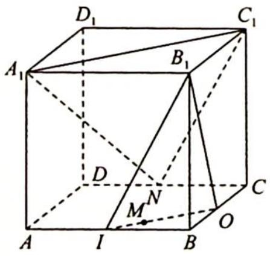

图1

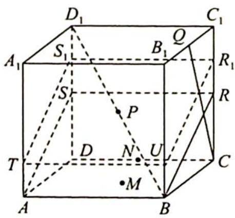

图 2

##### 例 34.10 如图所示, 将边长为 2 的正方形 ABCD 沿 PD, PC 翻折至 A, B 两点重合, 其中 P 是 AB 中点, 折成的三棱锥 A(B)-PDC 记为 M-PDC, 在 M-PDC 中, 点 Q 在平面 PDC 内运动, 且直线 MQ 与棱 MP 所成角为 $60^{\circ}$ , 则点 Q 运动的轨迹是().

$\quad$A. 圆

$\quad$B. 椭圆

$\quad$C. 双曲线

$\quad$D. 抛物线

分析 ▶ 根据直线 $MQ$ 与棱 $MP$ 所成角为 $60^{\circ}$ , 可以将点 $M$ 看作圆锥的顶点, 点 $Q$ 在圆锥侧面上运动, 轨迹就是圆锥侧面与平面 $PCD$ 的交线.

解析 如图1、图2所示, 因为 $PA \perp AD$ , $PB \perp BC$ , 所以 $PM \perp MC$ , $PM \perp MD$ . 又 $MC \cap MD = M$ , 所以 $PM \perp$ 平面 $MDC$ . 又 $MQ$ 与 $MP$ 所成角为 $60^\circ$ , 故点 $Q$ 在以 $MP$ 为轴、母线与轴夹角为 $60^\circ$ 的圆锥侧面上.

取 DC 中点 H，连接 PH, MH，则 $PH = 2, MH = \sqrt{3}$ ，又 PM = 1，所以 $\angle MPH = 60^{\circ}$ ，即 PM 与平面 PDC 所成角为 $60^{\circ}$ .

如图3所示, $\angle MPH$ 为 $PM$ 与平面 $PDC$ 所成的角, 又 $Q \in$ 平面 $PDC$ , 相当于用平行于母线的平面截圆锥, 则点 $Q$ 运动的轨迹为抛物线. 故选D.

图1

图2

图3

# 评注

圆锥曲线有多种定义,其中一个便是平面截圆锥所得的截面,随着截面倾斜角的变化,会产生不同的圆锥曲线:①截面与圆锥轴所成角为 $90^{\circ}$ ,截面为圆;②截面与圆锥轴所成角大于轴线与母线夹角,截面为椭圆;③截面与圆锥轴所成角等于圆锥轴线与母线夹角,即平面仅与一条母线平行,截面为抛物线;④截面与圆锥轴所成角小于圆锥轴线与母线夹角,截面为双曲线.这便是圆锥曲线名字的由来.

变式1: (多选题)如图所示,在棱长为 1 的正方体 $ABCD-A_{1}B_{1}C_{1}D_{1}$ 中, $P$ 为棱 $A_{1}B_{1}$ 的中点,点 $Q$ 在侧面 $DCC_{1}D_{1}$ 内运动,给出下列结论,其中结论正确的是( ).

$\quad$A. 若 $BQ \perp A_{1}C$ , 则动点 $Q$ 的轨迹是线段

$\quad$B. 若 $|BQ| = \sqrt{2}$ ，则动点 $Q$ 的轨迹是圆的一部分  
$\quad$C. 若 $\angle QBD_{1} = \angle PBD_{1}$ , 则动点 $Q$ 的轨迹是椭圆的一部分  
$\quad$D. 若点 $Q$ 到 $AB$ 与 $DD_{1}$ 的距离相等, 则动点 $Q$ 的轨迹是抛物线的一部分

解析 A 选项: 如图 1 所示, 因为 $A_{1} C \perp$ 平面 $B C_{1} D$ , 所以若 $B Q \perp A_{1} C$ , 则 $Q \in$ 平面 $B C_{1} D$ , 又 $Q \in$ 侧面 $D C C_{1} D_{1}$ , 所以点 $Q$ 轨迹是平面 $B C_{1} D$ 与侧面 $D C C_{1} D_{1}$ 的交线段 $D C_{1}$ , 故 $A$ 正确.

B 选项: 若 $|BQ| = \sqrt{2}$ , 则 $Q$ 点在以 $B$ 为球心、 $\sqrt{2}$ 为半径的球面上, 又正方体棱长为 1 , 所以 $BC = 1 < \sqrt{2}$ , 即侧面 $DCC_{1}D_{1}$ 与球面 $B$ 的公共部分为圆弧 $\widehat{DC_{1}}$ , 如图 2 所示, 故 B 正确.

C 选项: 若 $\angle QBD_{1} = \angle PBD_{1}$ , 则点 $Q$ 在以 $BD_{1}$ 为轴、母线与轴夹角为 $\angle PBD_{1}$ 大小的圆锥侧面上. 连接 $BD_{1}, D_{1}P$ , 在 $\triangle BPD_{1}$ 中, 易知 $\cos \angle PBD_{1} = \frac{\sqrt{3}}{\sqrt{5}}$ . 连接 $CD_{1}$ , 在 $\triangle BCD_{1}$ 中, 易知 $\cos \angle BD_{1}C = \frac{\sqrt{2}}{\sqrt{3}} > \frac{\sqrt{3}}{\sqrt{5}}$ , 即截面与圆锥轴的夹角小于圆锥母线与轴的夹角, 故动点 $Q$ 的轨迹为双曲线. 故 C 错误.

图 1

图 2

D选项:以 D 为原点、DC 为 x 轴、 $DD_{1}$ 为 y 轴建立坐标系,则 $Q(x, y)$ 满足 $x^{2}=y^{2}+1$ , 故 $x^{2}-y^{2}=1$ , 所以 Q 点轨迹是双曲线的一部分, 故 D 错误.

综上所述,故选 AB.

变式（2） 如图所示, 已知顶点为 $S$ 的圆锥面 (以下简称圆锥 $S$ ) 与不经过顶点 $S$ 的平面 $\alpha$ 相交, 记交线为 $C$ , 圆锥 $S$ 的轴线 $l$ 与平面 $\alpha$ 所成角 $\theta$ 是圆锥 $S$ 顶角 (圆锥 $S$ 轴截面上两条母线所成角) 的一半, 为探究曲线 $C$ 的形状构建球 $T$ , 使球 $T$ 与圆锥 $S$ 和平面 $\alpha$ 都相切. 记球 $T$ 与平面 $\alpha$ 的切点为 $F$ , 直线 $l$ 与平面 $\alpha$ 交点为 $A$ , 直线 $AF$ 与圆锥 $S$ 交点为 $O$ , 圆锥 $S$ 的母线 $OS$ 与球 $T$ 的切点为 $M$ , $|OM|=a$ , $|MS|=b$ .

（1） 求证: 平面 SOA ⊥ 平面 $\alpha$ , 并指出 a, b, $\theta$ 的关系式;  
（2） 求证: 曲线 C 是抛物线.

解析 （1） 因为球 $T$ 与平面 $\alpha$ 相切于点 $F$ , 所以 $TF \perp$ 平面 $\alpha$ .

又 $ST \cap \alpha = A, AF \cap SO = O$ , 所以 $TF \subset$ 平面 $SOA$ , 则平面 $SOA \perp$ 平面 $\alpha$ .

如图所示, 连接 $TO$ , 则 Rt $\triangle TFO \cong$ Rt $\triangle TMO$ , 所以 $|OF| = |OM| = a$ , 又 $\angle TAF = \angle TSM = \theta$ , 所以 $|AF| = |MS| = b, OT \perp SA$ .

在 Rt△SOT 中， $|TM|^{2}=|MS||OM|=ab$ ，所以 $\tan\theta=\frac{TF}{AF}=\frac{TM}{AF}=\sqrt{\frac{a}{b}}$ .

（2）设另一条母线 ${SP}$ 与球 $T$ 的切点为 $N$ ,则 $\left| {SN}\right|  = \left| {SM}\right|  = b$ .

如图所示,在平面 $\alpha$ 内建立平面直角坐标系 $xOy$ , 则 $F(-a,0), A(-a-b,0)$ .

设点 $P$ 的坐标为 $(x, y)$ , 过 $S$ 作 $SH \perp \alpha$ , 垂足为 $H$ , 连接 $PH$ , 则 $|SH| = 2r = 2b\tan \theta = 2\sqrt{ab}$ , $|AH| = \frac{SH}{\tan\theta} = \frac{2\sqrt{ab}}{\sqrt{\frac{a}{b}}} = 2b$ , 所以 $|OH| = |a - b|$ , 则 $|PS|^2 = |PH|^2 + |SH|^2 = (x + a - b)^2 + y^2 + 4ab$ .

又 $|PF|^2 = (x + a)^2 + y^2$ ，所以 $|PF| = |PN| = |PS| - b$ ，则 $\sqrt{(x + a - b)^2 + y^2 + 4ab} - b = \sqrt{(x + a)^2 + y^2}$ ，化简得 $y^2 = -4ax$ 。

故在平面 $xOy$ 中, 曲线 $C$ 是以 $O$ 为顶点, $F$ 为焦点的抛物线. 证毕.

##### 例 34.11 如图 1 所示, 用一个平面去截圆锥, 得到的截口曲线是椭圆. 在圆锥内放两个大小不同的球, 使得它们分别与圆锥的侧面、截面相切, 两个球分别与截面相切于 $E, F$ , 在截口曲线上任取一点 $A$ , 过 $A$ 作圆锥的母线, 分别与两个球相切于 $C, B$ , 由球和圆的几何性质可以知道 $AE = AC, AF = AB$ , 于是 $AE + AF = AB + AC = BC$ . 由 $B, C$ 的产生方法可知它们之间的距离 $BC$ 是定值, 由椭圆定义可知截口曲线是以 $E, F$ 为焦点的椭圆.

如图2所示,在地面的某个点 $A_{1}$ 正上方有一个点光源,将小球放置在地面,使得 $AA_{1}$ 与小球相切.若 $A_{1}A = 5$ , 小球半径为 2 , 则小球在地面的影子形成的椭圆的离心率为( ).

图1

$\quad$A. $\frac{2}{3}$

$\quad$B. $\frac{4}{5}$

$\quad$C. $\frac{1}{3}$

$\quad$D. $\frac{2}{5}$

图2

分析 ▶ 由题意知 $AA_{1} = 5$ ，设小球与 $A_{1}A_{2}$ 相切于点 $F_{1}, A_{2}F_{1} = x$ ，从而可得 $A_{1}A_{2} = x + 2, AA_{2} = x + 3$ ，利用勾股定理可得 $x = 10$ ，再由离心率的定义即可求解。

解析 ▶ 设小球 O 与点光源发出的射线相切于点 D，与底面相切于点 $F_{1}$ ，作出点光源光线所形成的圆锥与球的轴截面如图所示，在 Rt△AA₁A₂ 中，设 $A_{2}F_{1}=x$ ，则 $DA_{2}=x$ 。

又 $AA_{1} = 5, A_{1}A_{2} = x + 2, AA_{2} = x + 3$ , 所以 $5^{2} + (x + 2)^{2} = (x + 3)^{2}$ , 则 $x = 10$ , 长轴长 $A_{1}A_{2} = 2a = 12, a = 6$ , 由题意可知 $F_{1}$ 为椭圆的一个焦点, 所以 $c = 6 - 2 = 4$ , 即离心率 $e = \frac{c}{a} = \frac{2}{3}$ . 故选 A.

变式（1） 如图所示, 是数学家 Dandelin 用来证明一个平面截圆锥得到的截口曲线是椭圆的模型 (简称为 “Dandelin 双球模型”). 在圆锥内放两个大小不同的小球, 使得它们分别与圆锥的侧面、截面相切, 设图中球 $O_{1}$ , 球 $O_{2}$ 的半径分别为 3 和 1 , 球心距离 $|O_{1}O_{2}| = 8$ , 截面分别与球 $O_{1}$ , 球 $O_{2}$ 切于点 $E, F(E, F$ 是截口椭圆的焦点), 则此椭圆的离心率等于 \_\_\_\_.

分析 利用已知条件和几何关系找出圆锥母线与轴的夹角为 $\alpha$ ，截面与轴的夹角为 $\beta$ 的余弦值，即可得出椭圆离心率。

解析 如图所示, 圆锥面与其内切球 $O_{1}, O_{2}$ 分别相切于 $A, B$ , 连接 $O_{1} A, O_{2} B$ , 则 $O_{1} A \perp A B, O_{2} B \perp A B$ , 过 $O_{2}$ 作 $O_{2} D \perp O_{1} A$ 交 $O_{1} A$ 于 $D$ , 连接 $O_{1} E, O_{2} F, E F$ 交 $O_{1} O_{2}$ 于点 $C$ .

设圆锥母线与轴的夹角为 $\alpha$ ，截面与轴的夹角为 $\beta$ .

在 Rt△O₂DO₁ 中，DO₁=3-1=2，O₂D=√8²-2²=2√15，
所以 $\cos\alpha=\frac{O_{2}D}{O_{1}O_{2}}=\frac{2\sqrt{15}}{8}=\frac{\sqrt{15}}{4}$

因为 $O_{1}O_{2} = 8$ ，所以 $CO_{1} = 8 - O_{2}C$ ，又 $\triangle EO_1C\sim \triangle FO_2C$ ，所以 $\frac{8 - O_2C}{O_1E} = \frac{O_2C}{O_2F}$ 解得 $O_{2}C = 2$ ，则 $CF = \sqrt{O_2C^2 - FO_2^2} = \sqrt{2^2 - 1^2} = \sqrt{3}$ 即 $\cos \beta = \frac{CF}{O_2C} = \frac{\sqrt{3}}{2}$ 故椭圆的离心率 $e = \frac{\cos\beta}{\cos\alpha} = \frac{\frac{\sqrt{3}}{2}}{\frac{\sqrt{15}}{4}} = \frac{2\sqrt{5}}{5}$

# 评注

“Dandelin 双球模型”椭圆离心率等于截面与轴的夹角的余弦 $\cos\beta$ 与圆锥母线与轴的夹角的余弦 $\cos\alpha$ 之比，即 $e=\frac{\cos\beta}{\cos\alpha}$ . 证明如下：因为 $\cos\alpha=\frac{O_{2}D}{O_{1}O_{2}}$ , $\cos\beta=\frac{CF}{O_{2}C}=\frac{CE}{O_{1}C}=\frac{EF}{O_{1}O_{2}}$ ，所以 $e=\frac{c}{a}=\frac{2c}{2a}=\frac{EF}{AB}=\frac{EF}{O_{2}D}=\frac{\cos\beta}{\cos\alpha}$ .

变式（2） 如图所示,一个圆柱被与其底面成 $30^{\circ}$ 角的平面所截,截口为椭圆,截面的上、下两部分分别有球 $O_{1}$ 和球 $O_{2}$ 与之相切,切点分别为 $E,F$ ,且两球均与圆柱的侧面相切,若圆柱的一条母线 $l$ 与两个球的公共点分别为 $A,B$ ,与椭圆的公共点为 $P,AB=4$ ,则球 $O_{1}$ 的半径为\_\_\_\_;截口椭圆的离心率为\_\_\_\_.

分析 ▶ （1）设圆柱底面半径为 R, 则圆的半径为 R, 由题意可知 $O_{1}, E$ , F, $O_{2}$ 四点共面, $O_{1}E \perp EF$ , $O_{2}F \perp EF$ , $O_{1}E = O_{2}F = R$ , 连接 $O_{1}O_{2}$ , 过点 F 作 FH $\perp O_{1}O_{2}$ , AB = $O_{1}O_{2} = 4$ , 由直角三角形的边角关系可求出半径 R.

（2）椭圆的短半轴 $R = \sqrt{3}$ , 长轴长 $2a = \frac{2R}{\cos 30^\circ} = 4$ , 即可求出结果.

解析 （1）设圆柱底面半径为 $R$ , 则圆的半径为 $R$ , 由题意可知 $O_{1}, E, F$ , $O_{2}$ 四点共面, 由圆柱和球的性质可知 $AB = O_{1}O_{2} = 4$ , 连接 $O_{1}O_{2}$ , 过点 $F$ 作 $FH \perp O_{1}O_{2}$ , 如图所示, $\angle OFH = 30^{\circ}, \angle FOH = 60^{\circ}$ .

因为椭圆与两球相切, 所以 $O_{1}E \perp EF, O_{2}F \perp EF, O_{1}E = O_{2}F = R$ , 则 $O_{1}O_{2} = O_{1}O + O_{2}O = \frac{O_{1}E}{\sin\angle O_{1}OE} + \frac{O_{2}F}{\sin\angle O_{2}OF} = \frac{2R}{\frac{\sqrt{3}}{2}} = \frac{4R}{\sqrt{3}} = 4$ , 即 $R = \sqrt{3}$ .

（2）由题意知椭圆的短半轴长 $R = \sqrt{3}$ , 长轴长 $2a = \frac{2R}{\cos 30^\circ} = \frac{4R}{\sqrt{3}} = 4, c = \sqrt{a^2 - b^2} = \sqrt{4 - 3} = 1$ , 则 $e = \frac{c}{a} = \frac{1}{2}$ .

变式（3） 如图所示, 在圆锥内放入两个球 $O_{1}, O_{2}$ , 它们都与圆锥相切 (即与圆锥的每条母线相切), 切点圆 (图中粗线所示) 分别为 $\odot C_{1}, \odot C_{2}$ . 这两个球都与平面 $\alpha$ 相切, 切点分别为 $F_{1}, F_{2}$ .

数学家 Dandelin 利用这个模型证明了平面 $\alpha$ 与圆锥侧面的交线为椭圆, $F_{1}, F_{2}$ 为此椭圆的两个焦点, 这两个球也称为 Dandelin 双球. 若圆锥的母线与它的轴的夹角为 $30^{\circ}, \odot C_{1}, \odot C_{2}$ 的半径分别为 1,4, 点 $M$ 为 $\odot C_{2}$ 上的一个定点, 点 $P$ 为椭圆上的一个动点, 则从点 $P$ 沿圆锥表面到达 $M$ 的路线长与线段 $PF_{1}$ 的长之和的最小

值是( ).

$\quad$A. 6

$\quad$B. 8

$\quad$C. $3\sqrt{3}$

$\quad$D. $4\sqrt{3}$

分析 ▶ 在椭圆上任取一点 $P$ , 连接 $VP$ 交球 $O_{1}$ 于点 $Q$ , 交球 $O_{2}$ 于点 $R$ , 可证明 $\triangle O_{1}PF_{1} \cong \triangle O_{1}PQ$ , 可得 $PF_{1} = PQ$ , 设点 $P$ 沿圆锥表面到达 $M$ 的路线长为 $d_{PM}$ , 则 $PF_{1} + d_{PM}$

$= PQ + d_{PM} \geqslant PQ + PR = QR$ ，当且仅当 $P$ 为直线 $VM$ 与椭圆交点时取等号， $QR = VR - VQ$ 即可求解。

解析 如图所示, 在椭圆上任取一点 $P$ , 连接 $VP$ 交球 $O_{1}$ 于点 $Q$ , 交球 $O_{2}$ 于点 $R$ , 连接 $O_{1} Q, O_{1} F_{1}, P O_{1}, P F_{1}, O_{2} R, C_{1} Q, C_{2} R, r_{1}, r_{2}$ 分别为 $\odot C_{1}, \odot C_{2}$ 的半径.

在 $\triangle O_{1}PF_{1}$ 与 $\triangle O_{1}PQ$ 中有 $O_{1}Q=O_{1}F_{1},\angle O_{1}QP=\angle O_{1}F_{1}P=90^{\circ},O_{1}P$ 为公共边,所以 $\triangle O_{1}PF_{1}\cong\triangle O_{1}PQ$ ,则 $PF_{1}=PQ$ .

设点 P 沿圆锥表面到达 M 的路线长为 $d_{PM}$ ，则 $PF_{1} + d_{PM} = PQ + d_{PM} \geqslant PQ + PR = QR$ ，当且仅当 P 为直线 VM 与椭圆交点时取等号，QR = VR - VQ = $\frac{r_{2} - r_{1}}{\sin 30^{\circ}} = 6$ ，所以最小值为 6。故选 A。

# 训练 34

##### 1. 如图所示, 在直三棱柱 $ABC - A_{1}B_{1}C_{1}$ 中, $AA_{1} = AB = BC = 2, D, E$ 分别为 $BB_{1}, A_{1}C_{1}$ 的中点, 则过点 $A, D, E$ 的截面与三棱柱的侧面 $BCC_{1}B_{1}$ 的交线的长为 \_\_\_\_.

##### 2. 已知正四棱锥 $P-ABCD$ 中, $\triangle PAC$ 是边长为 3 的等边三角形, 点 $M$ 是 $\triangle PAC$ 的重心, 过点 $M$ 作与平面 $PAC$ 垂直的平面 $\alpha$ , 平面 $\alpha$ 与截面 $PAC$ 交线段的长度为 2 , 则平面 $\alpha$ 与正四棱锥 $P-ABCD$ 表面交线所围成的封闭图形的面积可能为 \_\_\_\_. (请将可能的结果序号填到横线上)

① 2

② $2\sqrt{2}$

③ 3

④ $2\sqrt{3}$

##### 3. 在棱长为 1 的正方体 $ABCD-A_{1}B_{1}C_{1}D_{1}$ 中, $P$ 是线段 $BC_{1}$ 上的点, 过 $A_{1}$ 的平面 $\alpha$ 与直线 $PD$ 垂直. 当 $P$ 在线段 $BC_{1}$ 上运动时, 平面 $\alpha$ 截正方体 $ABCD-A_{1}B_{1}C_{1}D_{1}$ 所得的截面面积的最小值是 ( ).

$\quad$A. 1

$\quad$B. $\frac{5}{4}$

$\quad$C. $\frac{\sqrt{6}}{2}$

$\quad$D. $\sqrt{2}$

##### 4. 已知正方体 $ABCD-A_{1}B_{1}C_{1}D_{1}$ 的棱长为 3，垂直于棱 $AA_{1}$ 的截面分别与面对角线 $A_{1}D$ ，

$A_{1}B,C_{1}B,C_{1}D$ 相交于点 $E,F,G,H$ ,则四棱锥 $A_{1}-EFGH$ 体积的最大值为 \_\_\_\_.

##### 5. 四棱锥 $P-ABCD$ 中, $AD \perp$ 平面 $PAB$ , $BC \perp$ 平面 $PAB$ , 底面 $ABCD$ 为梯形, $AD=4$ , $BC=8$ , $AB=6$ , $\angle APD=\angle CPB$ , 满足上述条件的四棱锥的顶点 $P$ 的轨迹是( ).

$\quad$A. 圆

$\quad$B. 不完整的圆

$\quad$C. 抛物线

$\quad$D. 抛物线的一部分

##### 6. (2022 北京卷 9) 已知正三棱锥 $P-ABC$ 的六条棱长均为 6, $S$ 是 $\triangle ABC$ 及其内部的点构成的集合. 设集合 $T=\{Q \in S \mid PQ \leqslant 5\}$ , 则 $T$ 表示的区域的面积为( ).

$\quad$A. $\frac{3\pi}{4}$

$\quad$B. $\pi$

$\quad$C. $2 \pi$

$\quad$D. $3 \pi$

##### 7. 如图所示, 在圆锥中, 母线与旋转轴夹角为 $30^{\circ}$ , 现有一截面与圆锥的一条母线垂直, 与旋转轴的交点 $O$ 到圆锥顶点 $M$ 的距离为 1 , 对于所得截口曲线给出如下命题:

①曲线形状为椭圆.   
②点 O 为该曲线上任意两点最长距离的三等分点.  
③该曲线上任意两点间的最长距离为 $\frac{3}{2}$ ，最短距离为 $\frac{2}{3}\sqrt{3}$ .  
④该曲线的离心率为 $\frac{\sqrt{3}}{3}$ .

其中正确命题的序号为（ ）.

$\quad$A. ①②④

$\quad$B. ①②③④

$\quad$C. ①②③

$\quad$D. ①④

##### 8.(2022人大附中高三三模试卷10)如图所示,已知棱长为1的正方体 $ABCD-A_{1}B_{1}C_{1}D_{1},O$ 为对角线 $AC_{1}$ 上一点(不与点A, $C_{1}$ 重合),过点O作垂直于直线 $AC_{1}$ 的平面 $\alpha$ ,平面 $\alpha$ 与正方体表面相交形成的多边形记为M,下列结论不正确的是().

$\quad$A. M 只可能为三角形或六边形  
$\quad$B. 平面 ABCD 与平面 $\alpha$ 的夹角为定值  
$\quad$C. 当且仅当 O 为对角线 $AC_{1}$ 中点时, M 的周长最大  
$\quad$D. 当且仅当 O 为对角线 $AC_{1}$ 中点时, M 的面积最大

##### 9. 如图所示, 正方体 $ABCD-EFGH$ 的棱长为 2 , 在正方形 $ABFE$ 的内切圆上任取一点 $P_{1}$ , 在正方形 $BCGF$ 的内切圆上任取一点 $P_{2}$ , 在正方形 $EFGH$ 的内切圆上任取一点 $P_{3}$ . 求 $\left| P_{1} P_{2} \right| + \left| P_{2} P_{3} \right| + \left| P_{3} P_{1} \right|$ 的最小值与最大值.

# 第 35 讲

# 立体几何中的折展问题及空间动态最值问题

折叠与展开问题是立体几何的两个重要问题,这两种方式的转变正是空间几何与平面几何问题转化的集中体现,处理这类问题的关键是抓住两图折展前后的特征关系,并弄清楚折叠前后哪些地方发生了变化,哪些没有变化.这些未变化的已知条件都是分析问题与解决问题的依据.而表面展开问题是折叠问题的逆向思维过程,一般地,涉及多面体表面的问题,尤其是空间线段和最值问题常常可以转化到平面上加以解决.

近年来,考查与空间几何体有关的线段、角、距离、面积、体积等最值问题常常在高考试题中出现,往往伴随着动态变化的情况.在解决此类问题时,首先要在充分理解题意的基础上,分析能否运用特殊几何体模型和定义解决;如果不能,再看是否可将问题转化为平面几何或代数问题,利用平面几何或函数求解;再不能,则要考虑动态变化过程中是否存在关键的不等关系.

这样按照顺序思考,基本上可以找到解决问题的途径.

# 35.1 折叠问题

# 研究密钥

折叠问题是立体几何动态问题的一种,也是研究从平面到空间的必经之路,综合性相对较强,可以是多选题模式,需要各个选项逐一排除,但解决问题的重点是关注折叠过程中的“变与不变”,一般有位置关系的判断和空间角或距离的计算两类问题需要研究,找到动态过程中的关键点、关键变量,是解决此类问题的核心.

（1）位置关系的判断:常用假言推理的方式,利用折叠过程中的长度、角度及相关位置关系的变与不变进行处理,得到矛盾就不正确,否则结论是正确的.  
（2）数量关系的计算:除了注意到折叠过程中的不变量,还要注意折叠过程中的关键变量,如角度、长度、轨迹等,这也是研究几何体中数量关系的核心,有时还会借助特殊几何体模型将问题进行简化.

##### 例 35.1 如图所示, 在矩形 $ABCD$ 中, $AB = 2AD$ , $E$ 为边 $AB$ 的中点, 将 $\triangle ADE$ 沿直线 $DE$ 翻转成 $\triangle A_{1}DE$ ( $A_{1} \notin$ 平面 $ABCD$ ), 若点 $M, O$ 分别为线段 $A_{1}C$ , $DE$ 的中点, 则在 $\triangle ADE$ 翻折过程中, 下列说法错误的是 ( ).

$\quad$A. 与平面 $A_{1}DE$ 垂直的直线必与 $BM$ 垂直  
$\quad$B. 异面直线 BM 与 $A_{1}E$ 所成角是定值  
$\quad$C. 一定存在某个位置, 使 $DE \perp MO$   
$\quad$D. 三棱锥 $A_{1} - ADE$ 外接球的半径与棱 $AD$ 的长之比为定值

分析 ▶ A 选项: 证明 $BM \parallel$ 平面 $A_{1} D E$ 即可; B 选项: 取 $A_{1} D$ 的中点为 $F$ , 因为 $B M \parallel E F$ , 所以 $\angle A_{1} E F$ 为直线 $B M$ 与 $A_{1} E$ 所成角; C 选项: 投影到同一平面判断位置关系; D 选项: 注意 $|AO| = |DO| = |EO| = |A_{1} O|$ , 所以 $|AO|$ 为三棱锥 $A_{1}- A D E$ 外接球的半径.

解析 ▶ A 选项: 如图 1 所示, 取 $A_{1} D$ 的中点为 $F$ , 四边形 BEFM 为平行四边形, 所以 $B M \parallel E F$ , 故 $B M \parallel$ 平面 $A_{1} D E$ , 则与平面 $A_{1} D E$ 垂直的直线必与 $B M$ 垂直, 即 $A$ 正确.

B 选项: 因为 $BM \parallel EF$ , 所以异面直线 $BM$ 与 $A_{1}E$ 所成角, 即 $\angle A_{1}EF$ 为定值, 则 B 正确.

C 选项: 若有 $DE \perp MO$ , 则有 $DE$ 垂直于 $MO$ 在底面的投影, 在折叠过程中, $A_{1}$ 在底面的投影轨迹为图 2 中 $AG$ , 则 $M$ 在底面的投影 $M'$ 的轨迹为 $PH$ , 由数量关系可知 $M'O$ 不可能垂直于 $DE$ , 所以 $MO$ 不可能垂直于 $DE$ , 即 C 错误.

D 选项: 三棱锥 $A_{1}-ADE$ 外接球的半径为 $|AO|$ , $\frac{AO}{AD}=\frac{\sqrt{2}}{2}$ , 即 D 正确.

综上所述,故选C.

图1

图 2

# 评注

本题考查空间几何体翻折、线面垂直、线线平行、异面直线垂直, 可利用“三垂线定理”, 此外还考查了外接球问题, 考查角度较综合.

变式 如图所示, 在长方形 $ABCD$ 中, $AB=2, BC=1, E$ 为 $DC$ 的中点, $F$ 为线段 $EC$ (端点除外)上一动点. 现将 $\triangle AFD$ 沿 $AF$ 折起, 使平面 $ABD_{1} \perp$ 平面 $ABC$ . 在平面 $ABD_{1}$ 内过点 $D_{1}$ 作 $D_{1}K \perp AB, K$ 为垂足. 设 $AK=t$ , 则 $t$ 的取值范围是 \_\_\_\_.

# 解析

解法一: 此题的破解可采用两个极端位置法.

①当 F 位于 DC 的中点时, 即 F 和 E 重合, 可得 t=1.

②当 $F$ 点位于 $C$ 点时, 因为 $CB \perp AB$ , $CB \perp D_{1}K$ , 所以 $CB \perp$ 平面 $AD_{1}B$ , 即有 $CB \perp BD_{1}$ . 因为 $CD_{1}=2, BC=1$ , 所以 $BD_{1}=\sqrt{3}$ , 又 $AD=1$ , 因此 $AD_{1} \perp BD_{1}$ , 则 $t=\frac{1}{2}$ , 因此 $t$ 的取值范围是 $\left(\frac{1}{2}, 1\right)$ .

解法二: 在长方形 ABCD 中, 过 D 作 $DH \perp AF$ , 垂足为 H, 延长 DH 与 AB 相交, 交点即为 K, 如图 1 所示.

如图2所示, 因为 $D_{1} K \perp A B$ , 平面 $A B D_{1} \perp$ 平面 $A B C$ , 所以 $D_{1} K \perp$ 平面 $A B C$ , 故 $D_{1} K \perp A F$ , 又 $H K \perp A F$ , 所以 $A F \perp$ 平面 $D_{1} H K$ .

由折叠过程的变换可知 $\triangle DAK \sim \triangle FDA$ ，故 $\frac{DA}{AK} = \frac{FD}{DA}$ ，所以 $AK = \frac{DA^2}{FD} = \frac{1}{FD}$ ，又 $DF \in (1, 2)$ ，故 $AK \in \left(\frac{1}{2}, 1\right)$ .

图1  
图 2

##### 例 35.2 已知△ABC 中, $A = \frac{\pi}{2}, AB = 3, AC = 4$ , 如图所示, 点 D 为斜边 BC 上一个动点, 将△ABD 沿 AD 翻折, 使得平面 $AB'D \perp$ 平面 ACD, 当 $BD =$ \_\_\_\_ 时, $B'C$ 取到最小值.

分析 ▶ 翻折以后平面 $AB'D \perp$ 平面 ACD, 作出二面角可得到直角三角形, 再将直角边展开到平面中, 利用三角函数求最值.

解析 如图1所示,作 $B'E \perp AD$ ,连接 $CE,B'E \perp$ 平面 $ACD$ ,所以 $B'E \perp EC$ ,则 $B'E^{2}+CE^{2}=B'C^{2}$ .如图2所示,设 $\angle BAE=\theta$ ,则 $AE=3\cos\theta,BE=3\sin\theta$ .

图1

图2

在 $\triangle ACE$ 内利用余弦定理,则 $\cos(90^{\circ}-\theta)=\frac{9\cos^{2}\theta+16-CE^{2}}{2\times4\times3\cos\theta}$ ,所以 $12\sin2\theta=9\cos^{2}\theta+16-CE^{2}$ ,故 $B'C^{2}=B'E^{2}+CE^{2}=BE^{2}+CE^{2}=9\cos^{2}\theta+16-12\sin2\theta+9\sin^{2}\theta=25-12\sin2\theta\geqslant13$ ,当 $\theta=\frac{\pi}{4}$ 时等号成立,取到最小值.由于 $\sin\angle ABC=\frac{4}{5}$ ,所以 $\sin\angle ADB=\sin\left(\angle ABC+\frac{\pi}{4}\right)=\frac{\sqrt{2}}{2}\left(\frac{4}{5}+\frac{3}{5}\right)=\frac{7\sqrt{2}}{10}$ .

在 $\triangle ADB$ 中, $\frac{BD}{\sin\angle BAD}=\frac{AB}{\sin\angle ADB}$ ,可得 $BD=\frac{15}{7}$ .

# 评注

充分利用 $\triangle ABE$ 翻折前后不变的性质,且利用直角三角形这个条件.

变式 (2016 浙江卷) 如图所示, 在 $\triangle ABC$ 中, $AB = BC = 2$ , $\angle ABC = 120^{\circ}$ . 若平面 $ABC$ 外的点 $P$ 和线段 $AC$ 上的点 $D$ 满足 $PD = DA$ , $PB = BA$ , 则四面体 $P-BCD$ 的体积的最大值是 \_\_\_\_.

解析 ▶ 解法一: 在 $\triangle ABC$ 中, 因为 $AB=BC=2, \angle ABC=120^{\circ}$ , 易知 $AC=2\sqrt{3}, \angle BAC=$ $\angle BCA=30^{\circ}$ , 设 $AD=x$ , 则 $CD=2\sqrt{3}-x, PD=x, S_{\triangle BCD}=\frac{1}{2} \times 2 \times (2\sqrt{3}-x)\sin 30^{\circ}=\frac{2\sqrt{3}-x}{2}$ , 其中 $x \in(0,2\sqrt{3})$ .

设 $P$ 点到平面 $BCD$ 的距离为 $d$ , 则 $d \leqslant x$ , 且 $V_{P-BCD} = \frac{1}{3} S_{\triangle BCD} \cdot d = \frac{1}{3} \times \frac{2\sqrt{3} - x}{2} \cdot d \leqslant$

$\frac{2\sqrt{3}-x}{6}\cdot x\leqslant\frac{1}{6}\times\left(\frac{2\sqrt{3}-x+x}{2}\right)^{2}=\frac{1}{2}$ ，当且仅当 $2\sqrt{3}-x=x$ ，即 $x=\sqrt{3}$ 时等号成立.

故四面体 P-BCD 的体积的最大值为 $\frac{1}{2}$ .

解法二: 因为 $PD = DA, PB = BA, BD$ 为公共边, 所以 $\triangle PBD \cong \triangle ABD, PB = AB = 2$ .

在 $\triangle ABC$ 中,因为 $AB=BC=2,\angle ABC=120^{\circ}$ ,易知 $\angle BAD=30^{\circ}$ ,即 $\angle BPD=30^{\circ}$ .

在四面体 P-BCD 中, 设 P 点到平面 BCD 的距离为 d, 则 $V = \frac{1}{3} S_{\triangle BCD} \cdot d$ , 如图所示, 对任意定点 D, d 的最大值在平面 $PBD \perp$ 平面 BCD 时取得, 不妨设 $\angle ABD = \theta$ , 即 $\angle PBD = \theta$ , 则 $d = 2 \sin \theta$ .

在 $\triangle PBD$ 中, $\frac{BD}{\sin30^{\circ}}=\frac{2}{\sin(150^{\circ}-\theta)}$ ,所以 $BD=\frac{1}{\sin(150^{\circ}-\theta)}$ ;在 $\triangle BCD$ 中, $S_{\triangle BCD}=\frac{1}{2}\cdot BC\cdot BD\cdot\sin(120^{\circ}-\theta)=\frac{\sin(120^{\circ}-\theta)}{\sin(150^{\circ}-\theta)}.$

$\begin{array}{r l} & {\text {故四面体} P - B C D \text {的体积} V = \frac {1}{3} \times \frac {\sin (1 2 0 ^ {\circ} - \theta)}{\sin (1 5 0 ^ {\circ} - \theta)} \cdot 2 \sin \theta = \frac {2}{3} \times \frac {\sin \theta \sin (\theta + 6 0 ^ {\circ})}{\sin (\theta + 3 0 ^ {\circ})} =} \\ & {\frac {1}{3} \times \frac {- [ \cos (2 \theta + 6 0 ^ {\circ}) - \cos 6 0 ^ {\circ} ]}{\sin (\theta + 3 0 ^ {\circ})} = - \frac {1}{3} \times \frac {(1 - 2 \sin^ {2} (\theta + 3 0 ^ {\circ}) - \frac {1}{2})}{\sin (\theta + 3 0 ^ {\circ})} = \frac {1}{3} \times \frac {2 \sin^ {2} (\theta + 3 0 ^ {\circ}) - \frac {1}{2}}{\sin (\theta + 3 0 ^ {\circ})} =} \\ & {\frac {1}{3} \times [ 2 \sin (\theta + 3 0 ^ {\circ}) - \frac {1}{2 \sin (\theta + 3 0 ^ {\circ})} ].} \end{array}$

令 $t=2\sin(\theta+30^{\circ})$ ，因为 $0^{\circ}<\theta<120^{\circ}$ ，所以 $t\in(1,2]$ .

又函数 $y = \frac{1}{3}\left(t - \frac{1}{t}\right)$ 在(1,2]上单调递增，当 $t = 2$ 时， $y_{\max} = \frac{1}{2}$ .

故四面体 P-BCD 体积的最大值为 $\frac{1}{2}$ .

# 35.2 展开问题

# 研究密钥

展开图研究的一般是空间线段和的最值问题,和折叠问题正好相反,它是从空间到平面的一个变化过程,也是空间问题平面化的重要途径之一.

解决此类问题要深刻认识到以下两个方面：

（1）为什么能展开?

在平面折叠或展开过程中,各线段长度是相对不变的,故展开后线段和没有发生量的变化.

（2）为什么要展开?

展开后,可以利用平面内两点之间线段最短,点到直线垂线段最短求解线段和的最小值,这也是空间问题平面化的重要应用之一.

##### 例 35.3 如图所示, 正三棱锥 $P-ABC$ 的侧棱长为 $2\sqrt{3}, \angle APB = \angle BPC = \angle CPA = 40^{\circ}$ . 过点 $A$ 作截面 $AEF$ , 分别交 $PB, PC$ 于点 $E, F$ , 则截面 $\triangle AEF$ 周长的最小值是 ( ).

$\quad$A. 6

$\quad$B. $2\sqrt{3}$

$\quad$C. 36

$\quad$D. $6\sqrt{3}$

分析 ▶ △AEF 周长的最小值, 也就是线段 AE, EF, FA 之和的最小值, 将三棱锥沿侧棱 PA 展开, 转化为两点之间线段最短求最值.

解析 ▶ 将正三棱锥 P-ABC 沿侧棱 PA 剪开展平如图所示, 显然当 A, E, F, $A'$ 四点共线时, $\triangle AEF$ 周长最小, 最小值为线段 $AA'$ 的长, 在 $\triangle PAA'$ 中, $PA = PA' = 2\sqrt{3}$ , $\angle APA' = 120^{\circ}$ , 由余弦定理得 $AA' = 6$ . 故选 A.

变式 如图所示, 在长方体 $ABCD - A_{1}B_{1}C_{1}D_{1}$ 中, $AB = 1$ , $BC = \sqrt{3}$ , 点 $M$ 在棱 $CC_{1}$ 上, 当 $MD_{1} + MA$ 取得取小值时, $MD_{1} \perp MA$ , 则棱 $CC_{1}$ 的长为 \_\_\_\_.

解析 因为 $AB=1, BC=\sqrt{3}$ ，所以 AC=2，如图所示，延长 DC 到 N 使得 CN=AC=2，则 MA=MN。

设 $CC_{1} = h$ ，连接 $D_{1}N$ 交 $CC_{1}$ 于 $M$ ，则 $MD_{1} + MA$ 的最小值为 $D_{1}N = \sqrt{h^{2} + 9}$ ，因为 $\frac{MC}{DD_1} = \frac{CN}{DN} = \frac{2}{3}$ ，所以 $CM = \frac{2h}{3},C_1M = \frac{h}{3}$ ，则 $D_{1}M = \sqrt{D_{1}C_{1}^{2} + C_{1}M^{2}} = \sqrt{1 + \frac{h^{2}}{9}},AM = \sqrt{4 + \frac{4h^{2}}{9}}.$

又 $AD_{1} = \sqrt{3 + h^{2}}$ ， $MA\bot MD_1$ ，所以 $AD_{1}^{2} = MA^{2} + MD_{1}^{2}$ ，即 $3+$ $h^2 = 1 + \frac{h^2}{9} +4 + \frac{4h^2}{9}$ ，解得 $h = \frac{3\sqrt{2}}{2}$ ，即棱 $CC_{1}$ 的长为 $\frac{3\sqrt{2}}{2}$

# 评注

本题通过翻折将点 $A, M, D_{1}$ 放到一个平面中, 进而利用相似设出边长, 求解.

##### 例 35.4 在长方体 $ABCD-A_{1}B_{1}C_{1}D_{1}$ 中， $AB=\sqrt{2}$ ， $BC=AA_{1}=1$ ，点 M 为 $AB_{1}$ 的中点，点 P 为对角线 $AC_{1}$ 的动点，点 Q 为底面 ABCD 上的动点（点 P, Q 可以重合），则 $MP+PQ$ 的最小值为（）.

$\quad$A. $\frac{\sqrt{2}}{2}$

$\quad$B. $\frac{\sqrt{3}}{2}$

$\quad$C. $\frac{3}{4}$

$\quad$D. 1

分析 ▶ $AC_{1}$ 上的动点 P 到底面 ABCD 上的点 Q 的最小值为 P 到底面 ABCD 上的投影的距离, 即 Q 在直线 AC 上. 故需把 $\triangle AB_{1}C_{1}$ 绕 $AC_{1}$ 旋转, 使 $\triangle AB_{1}C_{1}$ 和 $\triangle ACC_{1}$ 平铺在一个平面内, 由垂线段最短知 $MP + PQ$ 的最小值为过点 M 向 AC 作垂线的垂线段长度.

解析 ▶ 先确定只有 $PQ \perp$ 底面时, PQ 最小, 如图所示, 将 $\triangle AB_{1}C_{1}$ 沿 $AC_{1}$ 翻折使得 A, $B_{1}, C_{1}, C$ 四点共面, 则 $MP + PQ \geqslant MP_{0} + P_{0}Q_{0} = MQ_{0}$ .

设 $\angle CAC_{1} = \theta$ ，则 $\tan \theta = \frac{1}{\sqrt{3}}$ ，所以 $\theta = 30^{\circ}$ ，而 $AM = \frac{\sqrt{3}}{2}$ ，则 $MQ_{0} = \frac{3}{4}$

过点 M 作 $MQ \perp AC$ 于点 Q 时, $MP + PQ$ 有最小值, 最小值为 $\frac{3}{4}$ . 故选 C.

# 评注

本题先确定点 Q，再分析题意，将几个点放到一个平面中分析，利用三点共线及点到直线距离垂线段最短求解.

变式 1 如图所示,棱长为 1 的正方体 $ABCD-A_{1}B_{1}C_{1}D_{1}$ 中, $P$ 为线段 $AB_{1}$ 的中点, $M, N$ 分别为棱 $AC_{1}, B_{1}C_{1}$ 上任意一点, 则 $2PM + \sqrt{2}MN$ 的最小值为 ( ).

$\quad$A. $\frac{\sqrt{2}}{2}$

$\quad$B. $\sqrt{2}$

$\quad$C. $\sqrt{3}$

$\quad$D. 2

解析 如图所示, 取 $AC$ 的中点 $E$ , 过 $M$ 作 $MF$ 垂直于平面 $A_{1}B_{1}C_{1}D_{1}$ , 易知 $\triangle APM \cong \triangle AEM$ , 故 $PM = EM$ , 而对固定点 $M$ , 当 $MN \perp B_{1}C_{1}$ 时, $MN$ 最小, 此时 $MF$ 垂直于平面 $A_{1}B_{1}C_{1}D_{1}$ , 易得 $\angle MNF = 45^{\circ}$ , $MF = NF$ , 可知 $\triangle MNF$ 为等腰直角三角形, $MF = \frac{\sqrt{2}}{2} MN$ , 故 $2PM +$ $\sqrt{2} MN = 2\left(PM + \frac{\sqrt{2}}{2} MN\right) = 2(EM + MF) \geqslant 2AA_{1} = 2.$ 故选D.

# 评注

本题关键在于将 $2PM + \sqrt{2} MN$ 转化为 $2(EM + MF)$ , 此时线段系数相同, 利用三点共线即可得出答案.

变式（2） 三棱锥 $P-ABC$ 的底面是以 $AC$ 为底边的等腰直角三角形, 且 $AC=2\sqrt{2}$ , 各侧棱长均为 3 , 点 $E$ 为棱 $PA$ 的中点, 点 $Q$ 是线段 $CE$ 上的动点, 则 $E$ 到平面 $ABC$ 的距离为 \_\_\_\_; 设 $Q$ 到平面 $PBC$ 的距离为 $d_{1}, Q$ 到直线 $AB$ 的距离为 $d_{2}$ , 则 $d_{1}+d_{2}$ 的最小值为 \_\_\_\_.

解析 （1）如图1所示,在三棱锥P-ABC中,取AC中点为O,因为PA=PB=PC,所以P在平面ABC上的投影为等腰直角三角形ABC的外心,即为O,则PO⊥平面ABC.

因为 $AC=2\sqrt{2}$ , PA=3, 所以 $PO=\sqrt{7}$ , 又 E 为 PA 中点, 所以 E 到平面 ABC 的距离为 $\frac{\sqrt{7}}{2}$ .

图 1

图 2

（2）如图1所示,延长BO到D,使得 ${BD} = {AC} = 2\sqrt{2}$ ,连接 ${AD},{CD},{PD}$ ,则 ${AD} = {DC} = 2$ , ${PD} = 3$ ,四棱锥P-ABCD为正四棱锥,所以点Q到平面PBC的距离等于到平面PCD的距离.

过 $Q$ 作 $QN \perp$ 平面 $PCD$ , 垂足为 $N$ , 则 $d_{1} = QN$ , 过 $Q$ 作 $QM \perp AB$ , 垂足为 $M$ , 则 $d_{2} = QM$ , $d_{1} + d_{2}$ 表示直线 $CE$ 上动点 $Q$ 到直线 $AB$ 与到平面 $PCD$ 的距离之和.

又 $AB \parallel$ 平面 $PCD$ , 故 $d_{1} + d_{2}$ 的最小值为直线 $AB$ 到平面 $PCD$ 的距离.

取 AB 中点 G, CD 中点 H, 则平面 $PGH \perp$ 平面 PCD; 过 G 作 $GK \perp PH$ , 垂足为 K. 如图 2 所示, 则 $d_{1} + d_{2} \geqslant GK$ .

在 $\triangle PGH$ 中， $GK = \frac{GH \cdot OP}{PH} = \frac{2 \times \sqrt{7}}{2\sqrt{2}} = \frac{\sqrt{14}}{2}$ ，故 $d_{1} + d_{2}$ 的最小值为 $\frac{\sqrt{14}}{2}$ .

# 35.3 动态几何量的变化趋势

# 研究密钥

变化的基本类型有点动、线动、面动、体动等,解题时可通过改变视角、平面化或寻找变化过程中的不变因素将问题转化.其中最常见的问题是动态最值问题,解决此类问题,一般可以从两个方面考虑:一是先求定点到动点的轨迹所在面的最值,包括定点到平面、定点所在平面到平面、定点到球面等;二是函数法,建立所求的目标函数,转化为函数的最值问题求解.

##### 例 35.5 如图所示, 在三棱锥 $P-ABC$ 中, $AB=AC=PB=PC=5$ , $PA=4, BC=6$ , 点 $M$ 在平面 $PBC$ 内, 且 $AM=\sqrt{15}$ , 设异面直线 $AM$ 与 $BC$ 所成的角为 $\alpha$ , 则 $\cos\alpha$ 的最大值为 ( ).

$\quad$A. $\frac{\sqrt{2}}{5}$

$\quad$B. $\frac{\sqrt{3}}{5}$

$\quad$C. $\frac{2}{5}$

$\quad$D. $\frac{\sqrt{5}}{5}$

分析 ▶ 点 M 在平面 PBC 内, 点 A 到平面 PBC 的距离小于 AM, 所以 M 的运动轨迹可以看作平面 PBC 上的圆, 与点 A 构成圆锥.

解析 如图1所示,取BC的中点D,连接PD,AD,则 $PD\perp BC$ , $AD\perp BC$ ,所以 $BC\perp$ 平面PAD,故平面 $PBC\perp$ 平面PAD.过A作 $AO_{1}\perp PD$ ,则 $AO_{1}\perp$ 平面PBC,垂足为 $O_{1}$ ,由已知可得 $AO_{1}=4\times\frac{\sqrt{3}}{2}=2\sqrt{3}$ ,为定值,又 $AM=\sqrt{15}$ ,所以 $O_{1}M=r$ 为定值,r= $\sqrt{(\sqrt{15})^{2}-(2\sqrt{3})^{2}}=\sqrt{3}$ ,即M的轨迹为圆 $O_{1}$ ,如图2所示,异面直线AM与BC所成的角 $\alpha$ 的最小值为圆锥母线与底面所成角,则 $\cos\alpha$ 的最大值为 $\frac{\sqrt{5}}{5}$ .故选D.

图1

图 2

变式 1 如图所示, 在正方体 $ABCD - A_{1}B_{1}C_{1}D_{1}$ 中, $AB = 6$ , 点 $P$ 在平面 $AB_{1}D_{1}$ 内, $A_{1}P = 3\sqrt{2}$ , 则点 $P$ 到 $BC_{1}$ 距离的最小值为 ( ).

$\quad$A. $3\sqrt{2}$

$\quad$B. $2\sqrt{3}$

$\quad$C. $\sqrt{6}$

$\quad$D. 3

解析 ▶ 过点 $A_{1}$ 作 $A_{1}O_{1}$ 垂直平面 $AB_{1}D_{1}$ 于点 $O_{1}$ , 则点 $A_{1}$ 到平面 $AB_{1}D_{1}$ 的距离为 $A_{1}O_{1}$ , 如图 1 所示, $V_{A_{1}AB_{1}D_{1}} = \frac{1}{3} \times \frac{1}{2} \times 6 \times 6 \times 6 = \frac{1}{3} \times \frac{\sqrt{3}}{4} \times (6\sqrt{2})^{2} \cdot A_{1}O_{1}, A_{1}O_{1} = \frac{108}{\frac{\sqrt{3}}{4} \times 72} = \frac{108}{18\sqrt{3}} = 2\sqrt{3}$ .

$A_{1}P=3\sqrt{2},r=\sqrt{(3\sqrt{2})^{2}-(2\sqrt{3})^{2}}=\sqrt{6}$ ，所以点P的轨迹是以点 $O_{1}$ 为圆心、r为半径的圆，即为三角形 $AB_{1}D_{1}$ 的内切圆 $O_{1}$ .

如图2所示, 将圆 $O_{1}$ 投影到平面 $BC_{1}D$ , 由此可知 $BC_{1}$ 上的切点与圆 $O_{1}$ 上对应点之间的距离为点 $P$ 到 $BC_{1}$ 距离的最小值, 即平面 $AD_{1}B_{1}$ 与平面 $DC_{1}B$ 之间的距离, 所以 $\frac{1}{3} \times 6\sqrt{3} = 2\sqrt{3}$ . 故选 B.

图1

图2

变式（2） 如图所示, 已知正方体 $ABCD - A_{1}B_{1}C_{1}D_{1}$ 的棱长为 1 , 则线段 $AD_{1}$ 上的动点 $P$ 到直线 $A_{1}C_{1}$ 的距离的最小值为 ( ).

$\quad$A. 1

$\quad$B. $\frac{\sqrt{2}}{2}$

$\quad$C. $\frac{\sqrt{6}}{4}$

$\quad$D. $\frac{\sqrt{3}}{3}$

解析 ▶ 由题意知,动点 P 到直线 $A_{1}C_{1}$ 的最小距离为异面直线 $AD_{1}$ 与 $A_{1}C_{1}$ 的距离.

由正方体性质知 $P \in AD_{1}, P \in$ 平面 $AD_{1}C$ , 又 $A_{1}C_{1} \subset$ 平面 $A_{1}BC_{1}$ , 且 $AD_{1} \parallel$ 平面 $A_{1}BC_{1}$ , 平面 $AD_{1}C \parallel$ 平面 $A_{1}BC_{1}$ , 所以异面直线 $AD_{1}$ 与 $A_{1}C_{1}$ 的距离等于两平行平面之间的距离 $d$ .

又体对角线 $B_{1}D \perp$ 平面 $AD_{1}C$ ，且 $BD_{1} = \sqrt{3}$ ，所以 $d = \frac{\sqrt{3}}{3}$ 。故选 D.

注:如图所示,设 $B_{1}D \cap$ 平面 $A_{1}BC_{1}=E$ , $B_{1}D \cap$ 平面 $AD_{1}C=F$ , 则 $EF=B_{1}E=FD=\frac{1}{3}B_{1}D.$

##### 例 35.6 如图所示, 在正方体 $ABCD-A_{1}B_{1}C_{1}D_{1}$ 中, $E$ 为棱 $B_{1}C_{1}$ 的中点. 动点 $P$ 沿着棱 $DC$ 从点 $D$ 向点 $C$ 移动, 对于下列三个结论:

①存在点 $P$ , 使得 $PA_{1} = PE$ ; ② $\triangle PA_{1}E$ 的面积越来越小; ③四面体 $A_{1} - PB_{1}E$ 的体积不变.

所有正确的结论的序号是\_\_\_\_。

分析 ▶ ①: 判断点 P 是否在 $A_{1}E$ 的中垂面上; ②: 作出三角形 $PA_{1}E$ 的以 $A_{1}E$ 为底边的高线, 放在直角三角形中分析长度变化; ③: 将四面体 $A_{1}-PB_{1}E$ 看作是以 P 为顶点的棱锥, 分析体积变化.

解析 ①: 线段 $A_{1}E$ 的中垂面显然与 $CD$ 有交点, 则存在点 $P$ 使得 $PA_{1}=PE$ , 故①正确.

②:如图所示,将 $A_{1}E$ 投影到底面ABCD中可得到AF,过P作 $PG \perp AF$ 于点G,G投影到平面 $A_{1}B_{1}C_{1}D_{1}$ 上为点H,连接PH,则 $PH \perp A_{1}E$ , $PH^{2}=PG^{2}+HG^{2}$ ,随着动点P沿着棱DC从点D向点C运动时,PG越来越小,因此PH也随之越来越小,所以 $\triangle PA_{1}E$ 的面积越来越小,故②正确.

③: $V_{A_1 - PB_1E} = V_{P - A_1B_1E} = \frac{1}{3} S_{\triangle A_1B_1E} \cdot d$ ( $d$ 为点 $P$ 到平面 $A_1B_1E$ 的距离), 又 $S_{\triangle A_1B_1E} = \frac{1}{2}|A_1B_1||B_1E|$ 保持不变, $d$ 也保持不变, 所以 $V_{A_1 - PB_1E}$ 不变, 故③正确.

综上所述,所有正确的结论的序号为①②③.

变式（1） 如图所示, 在正方体 $ABCD - A_{1}B_{1}C_{1}D_{1}$ 中, 点 $P$ 在线段 $BC_{1}$ 上运动, 给出下列判断:

①平面 $PB_{1}D \perp$ 平面 $ACD_{1}$ ; ② $A_{1}P \parallel$ 平面 $ACD_{1}$ ; ③异面直线 $A_{1}P$ 与 $AD_{1}$ 所成角的范围是 $\left(0, \frac{\pi}{3}\right]$ ; ④三棱锥 $D_{1}-APC$ 的体积不变.

其中正确的命题是( ).

$\quad$A. ①②

$\quad$B. ①②③

$\quad$C. ②④

$\quad$D. ①②④

解析 ①: 因为 $B_{1} D \perp$ 平面 $ACD_{1}, B_{1} D \subset$ 平面 $PB_{1} D$ , 所以平面 $PB_{1} D \perp$ 平面 $ACD_{1}$ , 故①正确.

②: 易知平面 $ACD_{1} \parallel$ 平面 $A_{1}BC_{1}, A_{1}P \subset$ 平面 $A_{1}BC_{1}$ ，所以 $A_{1}P \parallel$ 平面 $ACD_{1}$ ，故②正确.

③: 因为 $AD_{1} \parallel BC_{1}$ ，异面直线 $A_{1}P$ 与 $AD_{1}$ 所成角等于 $BC_{1}$ 与 $A_{1}P$ 所成角，其范围为 $\left[\frac{\pi}{3}, \frac{\pi}{2}\right]$ ，所以③错误.

④: 因为 $BC_{1} \parallel$ 平面 $AD_{1}C$ ，设点 P 到平面 $AD_{1}C$ 的距离为 d，则 $V_{D_{1}-APC} = \frac{1}{3} S_{\triangle AD_{1}C} \cdot d$ 保持不变，所以④正确.

综上所述,故选 D.

变式2 如图所示,等腰直角 $\triangle ABC$ 中, $AC=BC=2$ ,点 $P$ 为平面 $ABC$ 外一动点,满足 $PB=AB,\angle PBA=\frac{\pi}{2}$ ,给出下列四个结论:

①存在点 $P$ , 使得平面 $PAC \perp$ 平面 $PBC$ ; ②存在点 $P$ , 使得平面 $PAC \perp$ 平面 $PAB$ ; ③设 $\triangle PAC$ 的面积为 $S$ , 则 $S$ 的取值范围是 $(0,4]$ ; ④设二面角 $A-PB-C$ 的大小为 $\alpha$ , 则 $\alpha$ 的取值范围是 $\left(0, \frac{\pi}{4}\right]$ .

其中正确结论是( ).

$\quad$A. ①③

$\quad$B. ①④

$\quad$C. ②③

$\quad$D. ②④

解析 ▶ 由已知得 $AB=2\sqrt{2}, PA=4.$

①: 当 $PB \perp BC$ 时, $PC = 2\sqrt{3}$ , $PB \perp$ 平面 $ABC$ , 所以 $AC \perp PB$ . 又 $AC \perp BC$ , 所以 $AC \perp$ 平面 $PBC$ , 则平面 $PAC \perp$ 平面 $PBC$ . 故①正确.

②:如图1所示,取PA中点Q,连接BQ,QC,若平面PAC⊥平面PAB,则BQ⊥PA,BQ⊥平面PAC,∠BQC=90°.于是BQ= $\frac{1}{2}$ PA=2,又BC=2,斜边与直角边相等,矛盾.故②不正确.

图1

③: $S_{\triangle PAC} = \frac{1}{2} AP \cdot AC \sin \angle PAC = 4 \sin \angle PAC$ , 因为 $\angle PAB = 45^{\circ}$ ,

$\angle BAC = 45^{\circ}$ , 且 $AC, AB, AP$ 不在同一平面上, 所以 $\angle PAC < 90^{\circ}$ , 故 $\sin \angle PAC \in (0,1), S \in (0,4)$ , 取不到最大值 4. 故③错误.

④: 如图2所示, 过 $C$ 作 $CM \perp$ 平面 $PAB$ , 垂足为 $M$ , 则 $M$ 一定在 $AB$ 的中垂线上, 再过 $M$ 作 $MN \perp PB$ , 则 $MN = \sqrt{2}$ . 连接 $NC$ , 则 $\angle CNM$ 为二面角 $A - PB - C$ 的平面角, 在 Rt $\triangle CMN$ 中, $\tan \alpha = \frac{CM}{MN} = \frac{CM}{\sqrt{2}}$ , $CM \in (0, \sqrt{2}]$ , 所以 $\tan \alpha \in (0, 1]$ , 故 $\alpha \in \left(0, \frac{\pi}{4}\right]$ , ④ 正确.

图2

综上所述，①④正确，故选B.

##### 例 35.7 在以 A, B, C, D, E 为顶点的多面体中， $AC \perp CB$ , $AD \perp DB$ , $AE \perp EB$ , AB = 10.

CD = 6，则该多面体的体积最大值为（）.

$\quad$A. $30\sqrt{3}$

$\quad$B. 80

$\quad$C. 90

$\quad$D. $50\sqrt{3}$

分析 如图所示, 取 $AB$ 的中点为 $O$ , 连接 $OC, OD, OE$ , 则 $OC = OD = OE = 5$ , 故该多面体的顶点都在以 $AB$ 为直径的球面上.

解析 如图所示,在球 O 中,AB 为直径, $\triangle CDE$ 的外接圆圆心为 $O'$ .

设 A, B 到平面 CDE 的距离分别为 $d_{1}, d_{2}$ ，则多面体 ABCDE 的体积 $V = \frac{1}{3} S_{\triangle CDE} (d_{1} + d_{2}) \leqslant \frac{1}{3} S_{\triangle CDE} \cdot AB.$

设圆 $O'$ 的半径为 $r$ , 则 $3 \leqslant r \leqslant 5$ , 又点 $E$ 到 $CD$ 的最大距离 $d = r + \sqrt{r^2 - 9}$ , 所以 $\triangle CDE$ 的面积 $S_{\triangle CDE} = \frac{1}{2} CD \cdot d \leqslant \frac{1}{2} \times 6 (r + \sqrt{r^2 - 9})$ .

显然函数 $f(x) = 3(r + \sqrt{r^2 - 9})$ 在 $[3,5]$ 上单调递增，故 $S_{\triangle CDE}$ 的最大值为 $3 \times (5 + \sqrt{25 - 9}) = 27$ .

所以该多面体的体积最大值 $V_{max}=\frac{1}{3}\times27\times10=90$ . 故选 C.

变式 已知正四棱锥的侧棱长为 $l$ , 其各顶点都在同一球面上. 若该球的体积为 $36 \pi$ , 且 $3 \leqslant l \leqslant 3 \sqrt{3}$ , 则该正四棱锥体积的取值范围是 ( ).

$\quad$A. $\left[18, \frac{81}{4}\right]$

$\quad$B. $\left[\frac{27}{4},\frac{81}{4}\right]$

$\quad$C. $\left[\frac{27}{4},\frac{64}{3}\right]$

$\quad$D. $[18,27]$

解析 ▶ 解法一:如图1所示,设正四棱锥顶点为P,底面为正方形ABCD,底面中心为Q,球心为O,则OP=R,PA=PB=PC=PD=l∈[3,3√3].

连接 AC 与 BD, 交点为 Q, 则 $OQ \perp$ 平面 ABCD.

因为球 O 的体积为 $36\pi=\frac{4}{3}\pi R^{3}$ ，所以 R=3，设 PQ=h，底面边长为 a，则 $V_{P-ABCD}=\frac{1}{3}\times a^{2}\cdot h$ .

图 1

图2

如图2所示，由 $(h - R)^2 +\left(\frac{\sqrt{2}}{2} a\right)^2 = 9$ 得 $a^2 = 2(6h - h^2)$ ，又 $l^2 = h^2 +\left(\frac{\sqrt{2}}{2} a\right)^2 = \frac{a^2}{2} +h^2 =$ $6h\in [9,27]$ ，解得 $\frac{3}{2}\leqslant h\leqslant \frac{9}{2}$

所以 $V(h)=\frac{2}{3}h(6h-h^{2})=-\frac{2}{3}h^{3}+4h^{2}, V'=-2h^{2}+8h=-2h(h-4)$ ，则 $V(h)$ 在 $\left[\frac{3}{2},4\right]$ 上单调递增，在 $\left[4,\frac{9}{2}\right]$ 上单调递减， $V_{\min}=V\left(\frac{3}{2}\right)=\frac{27}{4}, V_{\max}=V(4)=\frac{64}{3}$ 。故选 C.

解法二: 因为 $V_{球}=\frac{4}{3}\pi R^{3}=36\pi$ , 所以 R=3.

如图 3 所示, 设正四棱锥 P-ABCD 的外接球球心为 O, 则 OP=OC=3.

令 $\angle POC = \theta$ ，因为 $PC = l\in [3,3\sqrt{3} ]$ ，所以 $\theta \in \left[\frac{\pi}{3},\frac{2\pi}{3}\right]$

设底面 $ABCD$ 的边长为 $a$ , 则 $|QC| = 3\sin \theta$ , 所以 $a = 3\sqrt{2}\sin \theta, h = |PQ| = 3 - 3\cos \theta$ .

图 3

所以该四棱锥的体积 $V = \frac{1}{3} Sh = \frac{1}{3} a^2 h = \frac{1}{3} \times 18\sin^2\theta (3 - 3\cos \theta) = 18\sin^2\theta (1 - \cos \theta) = 18(1 - \cos^2\theta)(1 - \cos \theta) = 18(1 + \cos \theta)(1 - \cos \theta)^2 = 72(1 + \cos \theta)\left(\frac{1}{2} -\frac{1}{2}\cos \theta\right)^2\leqslant 72\times \left(\frac{2}{3}\right)^3 = 72\times \frac{8}{27} = \frac{64}{3}$ 当且仅当 $1 + \cos \theta = \frac{1}{2} -\frac{1}{2}\cos \theta$ 即 $\frac{3}{2}\cos \theta = -\frac{1}{2},\cos \theta = -\frac{1}{3}$ 时， $V_{\max} = \frac{64}{3}$

当 $\theta = \frac{\pi}{3}$ 时， $V = 18 \times \frac{3}{4} \times \frac{1}{2} = \frac{27}{4}$ ；当 $\theta = \frac{2\pi}{3}$ 时， $V = 18 \times \frac{3}{4} \times \frac{3}{2} = \frac{81}{4}$ ，故 $V_{\min} = \frac{27}{4}$ .

综上所述， $\frac{27}{4}\leqslant V_{P-ABCD}\leqslant\frac{64}{3}$ . 故选 C.

##### 例35.8 如图所示, 在棱长为 1 的正方体 $ABCD-A_{1}B_{1}C_{1}D_{1}$ 中, 若点 $P$ 是棱上一点, 则满足 $|PB|+|PD_{1}|=2$ 的点 $P$ 的个数为( ).

$\quad$A. 2

$\quad$B. 4

$\quad$C. 6

$\quad$D. 8

分析 ▶ 由题意可得点 P 的运动轨迹是一个椭圆, 满足题意的 P 是椭圆与正方体棱的交点.

解析 ▶ 由题意得 $|PB|+|PD_{1}|=2>\sqrt{3}$ ，则点P在以 $a=1,b=\frac{1}{2}$ 的椭圆上。因为P在正方体的棱上，所以P应是椭圆与正方体的棱的交点，结合正方体的性质可知满足条件的点应在棱 $BC,A_{1}D_{1},D_{1}C_{1},AB,DD_{1},BB_{1}$ 上各有一点，共有6个点。故选C。

变式 在棱长为 2 的正方体 $ABCD-A_{1}B_{1}C_{1}D_{1}$ 中, 若点 P 是棱上一点 (含顶点), 则满足 $\overrightarrow{PC_{1}} \cdot \overrightarrow{PA} = -1$ 的点 P 的个数为().

$\quad$A. 6

$\quad$B. 8

$\quad$C. 12

$\quad$D. 24

解析 如图所示, 建立空间直角坐标系 $A_{1} - xyz$ , 则可得 $A(0,0,2)$ , $C_{1}(2,2,0)$ , $O$ 为 $AC_{1}$ 的中点, 其坐标为 $(1,1,1)$ , $\overrightarrow{PC_1} \cdot \overrightarrow{PA} = \overrightarrow{PO^2} - \frac{1}{4} \overrightarrow{AC_1}^2 = \overrightarrow{PO^2} - \frac{1}{4} (2^2 + 2^2 + 2^2) = \overrightarrow{PO^2} - \frac{1}{4} \times 12 = \overrightarrow{PO^2} - 3 = -1$ , 所以 $|\overrightarrow{PO}| = \sqrt{2}$ .

由图形可知正方体 12 条棱的中点 $P_{1}, \cdots, P_{12}$ 均满足 $\left|OP_{i}\right| = \sqrt{2} (i = 1, 2, \cdots, 12)$ . 故选 C.

# 训练 35

##### 1. 已知矩形 $ABCD, AB = 1, BC = \sqrt{2}$ . 将 $\triangle ABD$ 沿矩形的对角线 $BD$ 所在的直线进行翻折, 在翻折过程中 ( ).

$\quad$A. 存在某个位置,使得直线 AC 与直线 BD 垂直  
$\quad$B. 存在某个位置,使得直线 AB 与直线 CD 垂直  
$\quad$C. 存在某个位置,使得直线 AD 与直线 BC 垂直  
$\quad$D. 对任意位置,三对直线“AC与BD”“AB与CD”“AD与BC”均不垂直

##### 2. 如图所示, 已知正三棱锥 $P-ABC$ 中, 侧棱长为 $\sqrt{2}$ , 底面边长为 $2, D$ 为 $AC$ 中点, $E$ 为 $AB$ 中点, $M$ 是 $PD$ 上的动点, $N$ 是平面 $PCE$ 上的动点, 则 $AM+MN$ 的最小值是( ).

$\quad$A. $\frac{\sqrt{2} + \sqrt{6}}{4}$

$\quad$B. $\frac{1 + \sqrt{3}}{2}$

$\quad$C. $\frac{\sqrt{6}}{4}$

$\quad$D. $\frac{\sqrt{3}}{2}$

##### 3. 在棱长为 1 的正方体 $ABCD-A_{1}B_{1}C_{1}D_{1}$ 中, 过点 $A$ 的平面 $\alpha$ 分别与棱 $BB_{1}, CC_{1}, DD_{1}$ 交于点 $E, F, G$ , 记四边形 $AEFG$ 在平面 $BCC_{1}B_{1}$ 上的正投影的面积为 $S_{1}$ , 四边形 $AEFG$ 在平面 $ABB_{1}A_{1}$ 上的正投影的面积为 $S_{2}$ .

给出下面四个结论：

①四边形 AEFG 是平行四边形; ② $S_{1} + S_{2}$ 的最大值为 2; ③ $S_{1} S_{2}$ 的最大值为 $\frac{1}{4}$ ; ④四边形 AEFG 可以是菱形, 且菱形面积的最大值为 $\frac{\sqrt{6}}{2}$ .

则其中所有正确结论的序号是\_\_\_\_。

##### 4. (多选题)在四棱锥 $P-ABCD$ 中, $PA \perp PD$ , $AD \parallel BC$ , 且 $PB = AB = BC = CD = \frac{1}{2} AD = 1$ . 下列结论一定正确的是( ).

$\quad$A. $PA \perp$ 平面 $PCD$

$\quad$B. $AB \perp$ 平面 $PBD$

$\quad$C. $\triangle PAD$ 面积的最大值为 1

$\quad$D. 四棱锥 P-ABCD 体积最大值为 $\frac{3}{8}$

##### 5. 已知球 O 的半径为 1, 四棱锥的顶点为 O, 底面的四个顶点均在球 O 的球面上, 则当该四棱锥的体积最大时, 其高为( ).

$\quad$A. $\frac{1}{3}$

$\quad$B. $\frac{1}{2}$

$\quad$C. $\frac{\sqrt{3}}{3}$

$\quad$D. $\frac{\sqrt{2}}{2}$

##### 6. 如图所示, 在正 $\triangle ABC$ 中, $AB = a$ , $EF \parallel BC$ , 把 $\triangle AEF$ 沿 $EF$ 折起, 使平面 $A' EF \perp$ 平面 $BCFE$ , 求当 $EF$ 离 $BC$ 多远时, $A'B$ 的长度最小?

##### 7. 如图所示, 已知一圆台上底半径 $r_1 = 5 \mathrm{~cm}$ , 下底半径 $r_2 = 10 \mathrm{~cm}$ , 母线

$A_{1}A_{2}=20cm$ ，从 $A_{1}A_{2}$ 的中点M拉一根绳子，围绕圆台侧面转到下底圆周上的点 $A_{2}$ .

（1）求绳子的最短长度；  
（2）当绳子最短时,求绳子上的点与上底圆周上点的连线的最小长度.

# 第36讲

# 球体及几何体模型应用

立体几何作为高考数学的重要考查模块之一, 每年的卷面分值相对稳定, 一般是 22 分, 即 “2 小 1 大” (2 道小题、1 道大题). 球体是空间几何体中比较特殊的旋转体之一, 也常以压轴小题的形式进行考查. 本讲针对球体的特殊性, 尤其是球体的重要性质 (类比圆的垂径定理) 在空间几何体的外接球半径求解问题上的应用进行深度剖析, 希望可以帮助同学们解决外接球问题.

我们先从球的基本定义与性质入手,然后探究外接球与内切球的几种模型.

### 一、球体的有关定义

##### 1. 球面的定义: 以半圆的直径所在的直线为旋转轴, 旋转一周形成的曲面叫球面. 也可理解为空间中到定点的距离等于定长的点的集合叫球面.

##### 2. 球体的定义: 球面所围成的旋转体叫作球体, 简称球.

##### 3. 外接球的定义: 若一个多面体的各个顶点都在一个球的球面上, 则称这个多面体是这个球的内接多面体, 这个球是这个多面体的外接球.

##### 4. 内切球的定义: 若一个多面体的各面都与一个球的球面相切, 则称这个多面体是这个球的外切多面体, 这个球是这个多面体的内切球.

##### 5.棱切球的定义:若一个多面体的所有棱都与一个球的球面相切,则称这个球是这个多面体的棱切球.

##### 6. 大圆的定义: 经过球心的平面与球面相交所得的圆是球的大圆.

##### 7. 小圆的定义: 不经过球心的平面与球面相交所得的圆是球的小圆.

### 二、球体的有关性质

如图所示, 在球 $O$ 中, 圆 $O_{1}$ 是截面小圆, 点 $P$ 为圆 $O_{1}$ 上的点, 则 $O_{1} P^{2} + O_{1} O^{2} = O P^{2}$ , 即 $r^{2} + d^{2} = R^{2}$ . (其中 $r$ 表示截面圆的半径, $d$ 表示球心到截面的距离, $R$ 表示球的半径)

# 柱体外接球问题

如图 1 所示是一个底面半径为 r，高为 h 的圆柱，求它的外接球半径。图 2 将作为基础图形来理解并运用。

图1

图 2

# 36.1 长方体模型

# 研究密钥

# 类型一:长方体模型

题设: 求长方体外接球的半径.

方法:如图所示,长方体的体对角线即为其外接球的直径,体对角线的中点即为球心;设长、宽、高分别为a,b,c,直接用公式 $(2R)^{2}=a^{2}+b^{2}+c^{2}$ ,即 $2R=\sqrt{a^{2}+b^{2}+c^{2}}$ ,求出R.

##### 例 36.1 已知各顶点都在同一球面上的正四棱柱的高为 4，体积为 16，则这个球的表面积是（）.

$\quad$A. $16 \pi$

$\quad$B. $20\pi$

$\quad$C. $24\pi$

$\quad$D. $32\pi$

分析

正四棱柱即为长方体的特殊情况，外接球直径为体对角线长，即 $(2R)^{2}=a^{2}+b^{2}+c^{2}$

解析 因为正四棱柱的高为 4, 体积为 16, 故底面积为 4, 底面边长为 2, 所以 $(2R)^{2} = 2^{2} + 2^{2} + 4^{2} = 24$ , 解得 $R^{2} = 6$ , 则该球体的表面积 $S = 4\pi R^{2} = 24\pi$ . 故选 C.

# 36.2 汉堡模型

# 研究密钥

# 类型二: 汉堡模型

题设: 求直棱柱外接球的半径.

方法:如果在圆柱上下底面对应位置处取相同数量的点,比如都取三个点,便可以得到直三棱柱,它的外接球其实就是这个圆柱的外接球,所以说求直棱柱的外接球半径符合这个模型.

如图所示,在圆柱的外接球中,母线即为高线,设为h,底面圆即为截面圆,设底面圆的半径为r,球体的半径为R,则有 $r^{2}+\left(\frac{h}{2}\right)^{2}=R^{2}$ ,将棱柱内接于某个圆柱中,即可求解.

##### 例 36.2 在直三棱柱 $ABC-A_{1}B_{1}C_{1}$ 中，AB=4, AC=6, $A=\frac{\pi}{3}$ , $AA_{1}=4$ ，则直三棱柱 $ABC-A_{1}B_{1}C_{1}$ 的外接球的表面积为 \_\_\_\_.

分析 ▶ 求直三棱柱的外接球的半径, 首先借助正弦定理求出 $\triangle ABC$ 外接圆半径 $r$ , 再借助汉堡模型, 即 $h^{2} + (2r)^{2} = (2R)^{2}$ 求出外接球半径.

解析 ▶ 在△ABC中,由余弦定理知 $BC^{2}=AB^{2}+AC^{2}-2AB\cdot AC\cdot\cos A=16+36-48\times\frac{1}{2}=28$ , 故 $BC=2\sqrt{7}$ .

再由正弦定理知 $\triangle ABC$ 外接圆直径 $2r = \frac{BC}{\sin A} = \frac{2\sqrt{7}}{\frac{\sqrt{3}}{2}} = \frac{4\sqrt{21}}{3}$ , 由汉堡模型可知 $(2R)^2 =$

$h ^ {2} + (2 r) ^ {2} = 1 6 + \frac {1 6 \times 7}{3} = \frac {1 6 0}{3}.$

故直三棱柱 $ABC - A_{1}B_{1}C_{1}$ 的外接球的表面积 $S = 4\pi R^{2} = \frac{160}{3}\pi .$

# 锥体外接球问题

# 36.3 墙角模型

# 研究密钥

# 类型三: 墙角模型

题设: 求三条棱两两垂直的三棱锥的外接球半径.

方法:如图所示,补形为长方体模型,将三棱锥嵌入长方体模型中,直接用公式 $(2R)^{2}=a^{2}+b^{2}+c^{2}$ ,即 $2R=\sqrt{a^{2}+b^{2}+c^{2}}$ ,求出R.

##### 例 36.3 已知三棱锥 P-ABC 的四个顶点在外接球球 O 的球面上，PA = PB = PC， $\triangle ABC$ 是边长为 2 的正三角形，E, F 分别是 PA, AB 的中点， $\angle CEF = 90^{\circ}$ ，则球 O 的体积为（）.

$\quad$A. $8 \sqrt{6} \pi$

$\quad$B. $4\sqrt{6}\pi$

$\quad$C. $2\sqrt{6}\pi$

$\quad$D. $\sqrt{6}\pi$

分析 ▶ 思路一: 分析线面位置关系得到三棱锥 P-ABC 的三条侧棱两两垂直. 把三棱锥补形为正方体, 则正方体外接球即为三棱锥的外接球, 其直径为正方体的体对角线的长度.

思路二: 求三棱锥 P-ABC 外接球的大圆, 故将正三棱锥 P-ABC 内嵌于圆锥中, 设底面外接圆的直径为 AD, 则 $\triangle PAD$ 的外接圆即为外接球的大圆.

解析 ▶ 解法一:(墙角模型)由题意可知三棱锥 P-ABC 为正三棱锥, 如图 1 所示, 取 AC 的中点为 G, 连接 BG, PG, 则 $AC \perp BG$ , 又 $PG \perp AC, PG \cap BG = G$ , 可得 $AC \perp$ 平面 PBG, 则 $PB \perp AC$ . 因为 E, F 分别是 PA, AB 的中点, 所以 $EF \parallel PB$ .

又 $\angle CEF = 90^{\circ}$ , 即 $EF \perp CE$ , 所以 $PB \perp CE$ , 可得 $PB \perp$ 平面 $PAC$ , 则 $PB \perp PA, PB \perp PC$ .

图1

又因为 $PA = PB = PC, \triangle ABC$ 是正三角形，所以 $\triangle PAC \cong \triangle PBC \cong \triangle PAB$ ，故 $PA \perp PC,$

所以正三棱锥 P-ABC 的三条侧棱两两垂直.

把三棱锥补形为正方体, 则正方体外接球即为三棱锥的外接球, 其直径为正方体的体对角线的长度, 即 $d = \sqrt{PA^2 + PB^2 + PC^2} = \sqrt{6}$ , 半径为 $\frac{\sqrt{6}}{2}$ , 则球 $O$ 的体积 $V = \frac{4}{3}\pi \times \left(\frac{\sqrt{6}}{2}\right)^3 = \sqrt{6}\pi$ . 故选 D.

解法二:(切瓜模型)由题得 $PA = PB = PC = \sqrt{2}$ , AB = BC = CA = 2.

如图2所示,正三棱锥P-ABC内嵌于圆锥中,设底面圆H的直径为AD,易知 $AD=\frac{2}{\sin60^{\circ}}$ $=\frac{4}{\sqrt{3}}$ , $\triangle PAD$ 的外接圆即为三棱锥 P-ABC 外接球的大圆, 如图 3 所示.

因为 $PA = PD = \sqrt{2}$ , $AD = \frac{4}{\sqrt{3}}$ , 所以 $PH = \frac{\sqrt{2}}{\sqrt{3}}$ , 则球 O 的直径, 即大圆的直径 $2R = \frac{\sqrt{2}}{\sin A} = \frac{\sqrt{2}}{\sqrt{3}} = \sqrt{6}$ , $R = \frac{\sqrt{6}}{2}$ , 球 O 的体积 $V = \frac{4}{3}\pi R^{3} = \sqrt{6}\pi$ . 故选 D.

图 2

图3

# 评注

解法一也可以通过数量关系求出 $PA = PB = PC = \sqrt{2}$ , 再把三棱锥补形为正方体, 则正方体外接球即为三棱锥的外接球.

# 36.4 对棱相等模型

# 研究密钥

# 类型四: 对棱相等模型

题设:三棱锥(即四面体)中,已知三组对棱分别相等,求外接球半径(AB=CD,AD=BC,AC=BD).

方法:①画出一个长方体,标出三组互为异面直线的对角线.

②设长方体的长、宽、高分别为 a, b, c, AD = BC = x, AB = CD = y, AC = BD = z，列方程

组 $\left\{\begin{aligned}a^{2}+b^{2}&=x^{2}\\ b^{2}+c^{2}&=y^{2}\end{aligned}\right.\Rightarrow(2R)^{2}=a^{2}+b^{2}+c^{2}=\frac{x^{2}+y^{2}+z^{2}}{2}.$ $c^{2}+a^{2}=z^{2}$

补充:如图所示, $V_{A-BCD}=abc-\frac{1}{6}abc\cdot4=\frac{1}{3}abc.$

③根据墙角模型可得 $2R = \sqrt{a^2 + b^2 + c^2} = \sqrt{\frac{x^2 + y^2 + z^2}{2}}$ , $R^2 = \frac{x^2 + y^2 + z^2}{8}$ , $R = \sqrt{\frac{x^2 + y^2 + z^2}{8}}$ , 求出 $R$ .

##### 例 36.4 如图所示, 在三棱锥 A-BCD 中, AB=CD=5, AC=BD=6, AD=BC=7, 则该三棱锥外接球的表面积为 \_\_\_\_.

分析 ▶ 对棱相等的三棱锥可以内嵌于长方体中. 设长、宽、高分别为 a, b, c，利用 $(2R)^{2}=a^{2}+b^{2}+c^{2}=\frac{x^{2}+y^{2}+z^{2}}{2}$ ，求三棱锥外接球半径.

解析 如图所示, 将三棱锥补形为长方体, 三个长度为三对面的对角线长, 设长、宽、高分别为 $a, b, c$ , 则 $a^2 + b^2 = 49, b^2 + c^2 = 25, c^2 + a^2 = 36$ , 所以 $2(a^2 + b^2 + c^2) = 25 + 36 + 49 = 110$ .

设三棱锥外接球半径为 R，则 $4R^{2}=55$ ，因此表面积 $S=4\pi R^{2}=55\pi$ .

# 36.5 切瓜模型

# 研究密钥

类型五: 切瓜模型

题设:如图所示,P 的射影 $O_{1}$ 是 $\triangle ABC$ 的外心 $\Leftrightarrow$ 三棱锥 P-ABC 的三条侧棱相等 $\Leftrightarrow$ 三棱锥 P-ABC 的底面 $\triangle ABC$ 在圆锥的底上,顶点 P 也是圆锥的顶点.

方法:①确定球心 O 的位置,取 $\triangle ABC$ 的外心 $O_{1}$ , 则 P, O, $O_{1}$ 三点共线.

②先算出小圆 $O_{1}$ 的半径 $AO_{1} = r$ , 再算出棱锥的高 $PO_{1} = h$ (也是圆锥的高).

③勾股定理: $OA^{2} = O_{1}A^{2} + O_{1}O^{2} \Rightarrow R^{2} = r^{2} + (h - R)^{2}$ , 解出 $R$ .

##### 例 36.5 正四棱锥的顶点都在同一球面上, 若该棱锥的高为 1 , 底面边长为 $2 \sqrt{3}$ , 则该球的表面积为 \_\_\_\_.

分析 已知正棱锥的对称性,利用切瓜模型找到球的大圆,利用正弦定理求该圆半径.

解析 如图所示, 连接 AC, BD 交于点 Q, PQ⊥底面 ABCD, 且 PQ=1.

又 $AB = 2\sqrt{3}$ ，在 $\triangle PAC$ 中， $AC = 2\sqrt{6}, PA = PC = \sqrt{7}, \sin \angle APC =$ $2\sin \angle APQ\cos \angle APQ = 2\times \frac{\sqrt{6}}{\sqrt{7}}\times \frac{1}{\sqrt{7}} = \frac{2\sqrt{6}}{7}.$

由正弦定理可知 $2R=\frac{AC}{\sin\angle APC}=\frac{2\sqrt{6}}{\frac{2\sqrt{6}}{7}}=7.$

由切瓜模型可知 $\triangle APC$ 的外接圆即为该球的大圆,故该球的表面积 $S=4\pi R^{2}=49\pi$ .

变式 在三棱锥 $P - ABC$ 中, $PA = PB = PC = \sqrt{3}$ , 侧棱 $PA$ 与底面 $ABC$ 所成的角为 $60^{\circ}$ , 则该三棱锥外接球的体积为 ( ).

$\quad$A. $\pi$

$\quad$B. $\frac{\pi}{3}$

$\quad$C. $4 \pi$

$\quad$D. $\frac{4 \pi}{3}$

分析 ▶ 根据 PA = PB = PC 可借助圆锥的对称性求解.

解析 如图所示,设圆锥的顶点为 P,底面圆心为 Q,母线 PA 与底面圆 Q 所成角大小为 $60^{\circ}$ .

B,C 为圆 Q 上异于点 A 的两个点,AD 为底面圆 Q 的直径. 因为 $PA=\sqrt{3}$ , $\angle PAD=60^{\circ}$ , 所以 $PD=AD=\sqrt{3}$ , 故 $\triangle PAD$ 为等边三角形.

由正弦定理知 $\triangle PAD$ 的外接圆直径 $2R = \frac{\sqrt{3}}{\sin 60^\circ} = 2$ , 易知三棱锥

P-ABC的外接球即为该圆锥的外接球,且由切瓜模型知 $\triangle PAD$ 的外接圆即为该外接球的大圆,所以该外接球半径R=1,其体积 $V=\frac{4}{3}\pi R^{3}=\frac{4}{3}\pi$ .故选D.

# 36.6 垂面模型

# 研究密钥

# 类型六:垂面模型

题设:如图所示, $PA\perp$ 平面ABC,求外接球半径.

方法:①将 $\triangle ABC$ 画在小圆面上,A为小圆直径的一个端点,作小圆的直径AD,连接PD,则PD必过球心O.

② $O_{1}$ 为△ABC的外心,所以 $OO_{1}\perp$ 平面ABC,算出小圆 $O_{1}$ 的半径 $O_{1}D=r$ (三角形的外接圆直径算法:利用正弦定理得 $\frac{a}{\sin A}=\frac{b}{\sin B}=\frac{c}{\sin C}=2r$ ), $OO_{1}=\frac{1}{2}PA$ .

③利用勾股定理求三棱锥的外接球半径: $(2R)^{2} = PA^{2} + (2r)^{2} \Leftrightarrow 2R = \sqrt{PA^{2} + (2r)^{2}}$ ; $R^{2} = r^{2} + OO_{1}^{2} \Leftrightarrow R = \sqrt{r^{2} + OO_{1}^{2}}$ .

##### 例 36.6 三棱锥 P-ABC 中，棱 PA, PB, PC 两两均成 $60^{\circ}$ 角，且 PA = 1, PB = PC = 2，则该三棱锥外接球的表面积为 \_\_\_\_。

分析 ▶ 分析棱 PA, PB, PC 的位置关系可得 PA ⊥ 平面 ABC, 有高线, 找大圆. 设 A 为小圆直径的一个端点, 作小圆的直径 AD, 连接 PD, 则 PD 为 $\triangle PAD$ 外接圆直径, 即大圆直径.

解析 如图1所示, 在 $\triangle PAB$ 中, 因为 $PA=1, PB=2, \angle APB=60^{\circ}$ , 所以 $AB=\sqrt{3}$ , $\angle PAB=90^{\circ}, PA \perp AB$ . 同理 $PA \perp AC, AC=\sqrt{3}$ .

又 $\triangle PBC$ 为等边三角形, $\triangle ABC$ 为等腰三角形.在 $\triangle ABC$ 中,取 $BC$ 中点 $H$ ,如图2所示,连接 $AH$ 并延长交 $\triangle ABC$ 外接圆于点 $D$ .

由正弦定理可得 $\frac{AB}{\sin\angle ACB}=2r=AD$ ，则 $\sin\angle ACB=\frac{AH}{AC}=\frac{\sqrt{2}}{\sqrt{3}}=\frac{\sqrt{6}}{3}$ ，所以 AD= $\frac{\sqrt{3}}{\frac{\sqrt{6}}{3}}=\frac{3\sqrt{2}}{2}$ .

如图1所示,连接 $PD$ , 因为 $PA \perp$ 平面 $ABC$ , 所以 $PD$ 为 $\triangle PAD$ 外接圆直径, 即大圆直径 (有高线, 找大圆). 另得 $PD^{2} = PA^{2} + AD^{2} = 1 + \frac{9}{2} = \frac{11}{2}$ .

故三棱锥 P-ABC 的外接球的表面积 $S=4\pi R^{2}=\pi \cdot PD^{2}=\frac{11\pi}{2}$ .

图 1

图2

变式 (2019 福建赛区预赛 6) 如图所示, 在三棱锥 $P-ABC$ 中, $PA \perp$ 平面 $ABC$ , $\angle ABC = 120^{\circ}$ , $PA = 4$ . 若三棱锥 $P-ABC$ 外接球的半径为 $2\sqrt{2}$ , 则直线 $PC$ 与平面 $ABC$ 所成角的正切值为 \_\_\_\_.

解析 如图所示, 设 $O_{1}$ 为 $\triangle ABC$ 的外心, $O$ 为三棱锥 $P-ABC$ 外接球的球心.

由 $PA \perp$ 平面 $ABC, OO_1 \perp$ 平面 $ABC$ 可知 $PA \parallel OO_1$ .

取 $PA$ 的中点 $D$ , 由 $OP = OA = 2\sqrt{2}$ 知 $OD \perp PA$ , 故四边形 $DAO_{1}O$ 为矩形.

又 $PA = 4$ ，则 $O_{1}O = AD = 2$ ，从而 $\triangle ABC$ 外接圆的半径 $r = O_{1}A = 2$

在 $\triangle ABC$ 中,根据正弦定理有 $\frac{AC}{\sin\angle ABC}=2r$ ,可得 $AC=2\sqrt{3}$ .

所以直线 $PC$ 与平面 $ABC$ 所成角的正切值 $\tan \angle PCA = \frac{PA}{AC} = \frac{2\sqrt{3}}{3}$ .

# 评注

球体性质的关键公式为 $r^2 + d^2 = R^2$ ，其中 $r$ 表示截面圆的半径， $d$ 表示球心到截面的距离， $R$ 表示球的半径。

# 36.7 折叠问题

# 研究密钥

# 类型七:折叠模型

简单多面体的外接球问题实质就是定位球心 O 的位置, 根据球的截面圆的性质, 球心必在过截面圆圆心的垂线上, 所以只需找到两个截面圆的圆心, 也就是截面多边形的外心, 过圆心 (外心) 作出截面圆的垂线, 两条垂线必相交于一点, 即球心, 构建以球心、截面圆圆心 (外心)、多面体的顶点围成的两个直角三角形, 其中三条边长分别是球心到截面的距离为 $d$ , 截面圆的半径为 $r$ , 球的半径为 $R$ , 则 $d^{2} + r^{2} = R^{2}$ (图 1), 趣称为“(外)心(球)心相印”法, 方便学生理解和记忆 (类比卫星定位图 2), 即通过截面圆圆心 (外心) 定位球心将立体几何问题转化为平面问题, 简记: 两心两线两勾股.

图1

  
图2

##### 例36.7 在□ABCD中，△ABD是腰长为2的等腰直角三角形，∠ABD=90°，现将△ABD沿BD折起，使二面角A-BD-C大小为 $\frac{2\pi}{3}$ ，若A,B,C,D四点在同一球面上，则该球体的表面积为\_\_\_\_。

分析 ➤ 思路一:折叠后,找到△ABD 和 △BDC 截面圆的圆心,也是它们的外心,过圆心作截面圆的垂线,两条垂线相交于一点,即球心.在球心、截面圆圆心(外心)、多面体的顶点围成的直角三角形中求外接球的半径.

思路二: 将折叠的两面的三角形扩展为正方形, 这样三棱锥 A-BCD 的外接球转化为求一个直三棱柱的外接球, 用 $R = \sqrt{r^{2} + d^{2}}$ 求半径.

解析 ▶ 解法一:如图1所示,易知Rt△ABD≌Rt△CDB,将△ABD沿BD折起后,连接AC,形成三棱锥A-BCD,如图2所示.

图1

图2

设三棱锥的外接球球心为 O，则平面 ABD 和平面 BDC 截球得到小圆，设小圆圆心分别为 $O_{1}, O_{2}$ ，则 $O_{1}$ 为 AD 中点， $O_{2}$ 为 BC 中点.

过 $O_{1}, O_{2}$ 分别作平面 ABD 和平面 BDC 的垂线, 交点为球心 O, 取 BD 中点 P, 连接 $O_{1}P$ , $O_{2}P$ , 则 $\angle O_{1}PO_{2} = \frac{2\pi}{3}$ , 且 $O, O_{1}, O_{2}, P$ 四点共面.

在四边形 $OO_{1}PO_{2}$ 中， $O_{1}P = O_{2}P = 1, OO_{1} \perp O_{1}P, OO_{2} \perp O_{2}P$ ，所以 $\angle O_{1}OO_{2} = \frac{\pi}{3}$ .

连接 OP, OC, 易知 Rt $\triangle OO_{2}P$ 中, $OO_{2}=\sqrt{3}$ , 再由勾股定理知 $OC=\sqrt{OO_{2}^{2}+O_{2}C^{2}}=\sqrt{(\sqrt{3})^{2}+(\sqrt{2})^{2}}=\sqrt{5}$ , 即三棱锥 A-BCD 的外接球半径 $R=\sqrt{5}$ , 所以该球体的表面积 S=4πR²=20π.

解法二:如图3所示,将等腰Rt△ABD扩展为正方形ABDE,将△BDC扩展为正方形BDCF,连接CF,AE,AF,EC,易证三棱柱ABF-EDC为直三棱柱.

三棱锥 A-BCD 的外接球即为该直三棱柱 ABF-EDC 的外接球, 又 BD=2 , 所以球心到截面 ABF 的距离 d=1 .

因为二面角 A-BD-C 的大小为 $\frac{2\pi}{3}$ ，所以 $\angle ABF = \frac{2\pi}{3}$ .

如图4所示, 设 $\triangle ABF$ 所在截面圆的半径为 $r$ , 圆心为 $O_1$ , 易得 $r = 2$ , 所以外接球的半径 $R = \sqrt{r^2 + d^2} = \sqrt{2^2 + 1^2} = \sqrt{5}$ , 即外接球的表面积为 $4\pi R^2 = 20\pi$ .

图3

图4

变式 已知等边△ABC 与等腰 Rt△BCD, BC=6, ∠CBD=90°. 当二面角 A-BC-D 为 120°时, 四面体 A-BCD 的外接球的表面积为( ).

$\quad$A. $(25 + 4\sqrt{3})\pi$

$\quad$B. $52 \sqrt{3} \pi$

$\quad$C. $84 \sqrt{2} \pi$

$\quad$D. $(100 + 16\sqrt{3})\pi$

解析 如图1所示,取BC中点H,连接AH,设 $O_{1},O_{2}$ 分别为 $\triangle ABC,\triangle BCD$ 的外心,则 $O_{1}H=\sqrt{3},O_{2}H=3.$ 且 $BC\perp$ 平面 $AO_{2}H.$

在平面 $AO_{2}H$ 中, 作 $OO_{1} \perp$ 平面 $ABC, OO_{2} \perp$ 平面 $BCD$ , 交点为 $O$ , 则 $O$ 为四面体 $ABCD$ 外接球球心.

如图2所示， $\angle O_{1}HO_{2} = 120^{\circ}$ ，连接 $OH$ 设 $\angle O_2OH = \theta$ ，由正弦定理知 $\frac{3}{\sin\theta} = \frac{OH}{\sin90^{\circ}} =$ $\frac{\sqrt{3}}{\sin(60^{\circ} - \theta)}$ ，所以 $3\sin (60^{\circ} - \theta) = \sqrt{3}\sin \theta$ ，解得 $\tan \theta = 6 - 3\sqrt{3}$ ，则 $OO_{2} = \frac{3}{\tan\theta} = \frac{3}{6 - 3\sqrt{3}} = \frac{1}{2 - \sqrt{3}}$ $= 2 + \sqrt{3},R^{2} = OO_{2}^{2} + O_{2}D^{2} = (2 + \sqrt{3})^{2} + (3\sqrt{2})^{2} = 7 + 4\sqrt{3} +18 = 25 + 4\sqrt{3},S = 4\pi R^{2} =$

$(100+16\sqrt{3})\pi.$ 故选 D.

图1

图2

# 内切球问题

# 36.8 内切球相关量的计算

# 研究密钥

几何体的内切球一般有三类：

##### 1. 求普通棱锥的内切球半径常用等体积法: 将棱锥看作是以其内切球的球心为顶点, 棱锥的各个面为底面的锥体的组合体.

①求出棱锥的体积 V 和表面积 S.  
②设内切球的半径为 r，建立等式 $V=\frac{1}{3}Sr$ .  
③解出 $r=\frac{3V}{S}$ .

##### 2. 含有内切球的圆柱, 底面圆的直径、圆柱的高、内切球的直径三者相等.

##### 3. 求圆锥内切球的相关量,关键是抓住“与圆锥内切球的大圆是圆锥轴截面等腰三角形的内切圆”的特点,利用平面几何知识求出相关量.

##### 例 36.8 如图1所示,将3个 $2 \times 2$ 的正方形沿一组邻边的中点连线剪开分成两部分,把这6部分接于一边长为 $\sqrt{2}$ 的正六边形中,如图2所示.若拼接后的图形是一个多面体的表面展开图,则该多面体能容纳的最大球的半径为

  
图1

图2

分析 ➤ 首先确定该几何体是正方体的一半,再研究其可容纳的最大球体.思路一:将几何体补形为一个正三棱锥,则该三棱锥内切球即为所求球体.思路二:求多面体能容纳的最大球的半径,则球面与各面相切,画出侧视图来分析.思路三:使用空间向量法,由于球心到平面的距离即为内切球半径,利用空间中点到平面的距离公式将距离用 r 表示出来,列方程求解.

解析 ▶ 解法一(割补法): 如图 1 所示, 将几何体补形为正三棱锥 $D_{1}-PQR$ , 多面体即为此正三棱锥截去三个小正三棱锥, 则该三棱锥内切球即为所求球体.

易知 $D_{1}P = 3, PQ = 3\sqrt{2}$ , 设球体半径为 $r$ , 则 $V_{D_1 - PQR} = \frac{1}{3} \times \left[\frac{\sqrt{3}}{4} \times (3\sqrt{2})^2 + \frac{3}{2} \times 3^2\right] \cdot r = \frac{1}{3} \times \frac{1}{2} \times 3^3, \left(\frac{9\sqrt{3}}{2} + \frac{27}{2}\right)r = \frac{27}{2}$ , 所以

$(3 + \sqrt {3}) r = 3, r = \frac {3}{3 + \sqrt {3}} = \frac {3 - \sqrt {3}}{2}.$

图1

# 评注

该球不是原几何体的内切球,而是补形正三棱锥的内切球.

解法二(截面法):如图2所示,设可容纳的最大球球心为O,则球面与底面 $A_{1}B_{1}C_{1}D_{1}$ 相切,和侧面 $ADD_{1}A_{1}$ 、侧面 $DCC_{1}D_{1}$ 相切,和截面正六边形相切.

如图3所示,设球体半径为 $r$ , 则 $O$ 到棱 $DD_{1}$ 的距离 $OP = \sqrt{2} r$ . 如图4所示,在截面 $DD_{1}FQ$ 中, $DD_{1} = 2, DQ = \frac{\sqrt{2}}{2}, D_{1}F = \frac{3\sqrt{2}}{2}, OF$ 平分 $\angle D_{1}FQ$ .

又 $\tan \angle D_{1}FQ = \frac{2}{\sqrt{2}} = \sqrt{2} = \frac{2\tan\angle OFE}{1 - \tan^{2}\angle OFE}$ 所以 $\tan \angle OFE = \frac{\sqrt{6} - \sqrt{2}}{2} = \frac{r}{EF}, EF = \frac{\sqrt{2}r}{\sqrt{3} - \sqrt{1}}$ 则 $D_{1}E + EF = \sqrt{2} r + \frac{\sqrt{2}r}{\sqrt{3} - 1} = \frac{3\sqrt{2}}{2} = D_{1}F$ ，故 $r = \frac{3}{2}\times \frac{1}{1 + \frac{1}{\sqrt{3} - 1}} = \frac{3}{2}\times \frac{\sqrt{3} - 1}{\sqrt{3}} = \frac{3 - \sqrt{3}}{2}.$

图2

俯视图  
图3

  
侧视图  
图 4

解法三(向量法):如图5所示,建立空间直角坐标系 $D_{1}-xyz$ .

易知 $D_{1}B \perp$ 正六边形截面 $\alpha, D_{1}(0,0,0), O(r,r,r)$ , 截面 $\alpha$ 的法向量为 $n = (2,2,2), F\left(\frac{3}{2}, \frac{3}{2}, 0\right), \overrightarrow{OF} = \left(\frac{3}{2} - r, \frac{3}{2} - r, -r\right)$ , 故球心 $O$ 到截面 $\alpha$ 的距离 $d = \frac{|\overrightarrow{OF} \cdot n|}{|n|} = \frac{|3 - 2r + 3 - 2r - 2r|}{2\sqrt{3}} = r$ , 解得 $r = \frac{3 - \sqrt{3}}{2}$ .

图5

变式 一个棱长为 6 的正四面体纸盒内放一个正方体, 若正方体可以在纸盒内任意转动,则正方体棱长的最大值为

分析 ▶ 借助特殊几何体内切球、外接球处理即可.

解析 如图所示,若正方体可以在正四面体内任意转动,则正方体的外接球最大可以是正四面体的内切球.

因为正四面体的棱长为6,故内切球的半径 $r=\frac{\sqrt{6}}{12}\times6=\frac{\sqrt{6}}{2}$ ，设正方体的棱长为a，则其外接球的直径为 $\sqrt{3}a=\sqrt{6}$ ，解得 $a=\sqrt{2}$ 。故正方体的棱长的最大值为 $\sqrt{2}$ 。

# 评注

棱长为 a 的正四面体, 其外接球半径 $R=\frac{\sqrt{6}}{4}a$ , 内切球半径 $r=\frac{\sqrt{6}}{12}a$ .

# 几何体模型应用问题

# 36.9 几何体模型的应用

# 研究密钥

几何体分多面体、旋转体两大类,其中正方体、四面体、球体、圆锥应用最为广泛.这就希望同学们要抓住特殊几何体的性质特征,深入研究其可能的拓展及综合.

# 1. 四面体模型应用

##### 例 36.9 如图所示, 已知空间 4 个球, 它们的半径均为 2, 每个球都与其他三个球外切, 另有一个小球与这 4 个球都外切, 则这个小球的半径为 ( ).

$\quad$A. $\sqrt{6} - 2$

$\quad$B. $\sqrt{6}-\sqrt{2}$

$\quad$C. $\sqrt{10} - 3$

$\quad$D. $2\sqrt{2}-2$

分析 ▶ 将这四个球的球心连接成一个正四面体,根据四个球外切可得正四面体的棱长为4,求出外接球的半径,由题意可得小球的球心与四面体外接球的球心重合.

解析 由题意可知, 连接 4 个球的球心, 得到一个棱长为 4 的正四面体, 如图所示. 小球球心 O 为正四面体的中心, E 为 $O_{4}$ 在平面 $O_{1}O_{2}O_{3}$ 上的射影, 易求得 $O_{4}E = \sqrt{\frac{32}{3}}$ , 由 $OE^{2} + O_{1}E^{2} = O_{1}O^{2}$ , 即 $\left(\sqrt{\frac{32}{3}} - R\right)^{2} + \left(\frac{4}{\sqrt{3}}\right)^{2} = R^{2}$ , 解得 $R = \sqrt{6}$ , 所以正四面体中心到顶点的距

离(即正四面体外接球的半径)为 $\sqrt{6}$ ，则 $2+r=\sqrt{6}$ ，从而所求小球的半径 $r=\sqrt{6}-2$ 。故选A.

变式 空间中有四个球, 它们的半径分别是 2, 2, 3, 3, 每个球都与其余三个球外切, 另有一个小球与这四个球都外切, 求这个小球的半径.

分析 如图所示, 以四个球的球心为顶点作四面体 $A-BCD$ , 则 $AB=6, CD=4, AC=AD=BC=BD=5$ , 设 $AB, CD$ 的中点分别为 $E, F$ , 小球的球心为 $O$ , 半径为 $r$ , 可证得 $O$ 必在线段 $EF$ 上, 利用勾股定理分别表示出 $OE, OF, EF$ , 然后由 $EF=OE+OF$ 列方程可求出 $r$ .

解析 ▶ 以四个球的球心为顶点作四面体 A-BCD，则 AB=6, CD=4, AC=AD=BC=BD=5，设 AB, CD 的中点分别为 E, F，设小球的球心为 O，半径为 r.

因为 ${BC} = {BD},{AC} = {AD}$ ,所以 ${BE}\bot {CD},{AE}\bot {CD}$ ,则平面 ${ABE}$ 是线段 ${CD}$ 的中垂面.

又因为 $OC = OD = 2 + r$ , 所以 $O$ 在平面 $ABE$ 上. 同理, $O$ 也在线段 $AB$ 的中垂面 $CDF$ 上, 从而 $O$ 必在线段 $EF$ 上.

$\begin{array}{r l} & {O E = \sqrt {O C ^ {2} - C E ^ {2}} = \sqrt {(2 + r) ^ {2} - 2 ^ {2}} = \sqrt {r ^ {2} + 4 r}, O F = \sqrt {O A ^ {2} - A F ^ {2}} = \sqrt {(3 + r) ^ {2} - 3 ^ {2}} =} \\ & {\sqrt {r ^ {2} + 6 r}, E F = \sqrt {B E ^ {2} - B F ^ {2}} = \sqrt {B C ^ {2} - C E ^ {2} - B F ^ {2}} = \sqrt {5 ^ {2} - 2 ^ {2} - 3 ^ {2}} = 2 \sqrt {3}.} \end{array}$

由 $EF = OE + OF$ 得 $\sqrt{r^2 + 4r} +\sqrt{r^2 + 6r} = 2\sqrt{3}$ ，解得 $r = \frac{6}{11}$

# 2. 正方体模型应用

##### 例 36.10 三个直径相等的圆柱体, 半径为 R, 它们两两垂直且两两相切, 求同时与三个圆柱体相切的小球的半径 r.

分析 ▶ 将圆柱的三条轴心线看作正方体的三条互为异面的棱.

解析 如图所示,由正方体的对称性知球心 O 即为正方体的中心,三个圆柱的轴心线即为正方体的三条互为异面的棱 $A_{1}A, BC, C_{1}D_{1}$ , 因为三个圆柱体两两垂直且相切,所以正方体的棱长为 2R,则 $R^{2} + R^{2} = (R + r)^{2}$ , 所以 $r = (\sqrt{2} - 1)R$ .

# 3. 圆锥模型应用

##### 例 36.11 已知等边△ABC 的边长为 2, 过点 A 的直线 l 与过 BC 的平面 α 交于点 D, 将平面 α 绕 BC 转动 (不与平面 ABC 重合), 且三条直线 l, AB, AC 与平面 α 所成的角始终相等, 当三棱锥 A-BCD 体积最大时, l 与平面 α 所成角的余弦值为( ).

$\quad$A. $\frac{\sqrt{3}}{3}$

$\quad$B. $\frac{\sqrt{6}}{3}$

$\quad$C. $\frac{\sqrt{21}}{7}$

$\quad$D. $\frac{2 \sqrt{7}}{7}$

分析 ▶ 思路一: 因为 l, AB, AC 与平面 $\alpha$ 所成角始终相等, 所以 AD, AB, AC 可以看作某圆锥的三条母线.

思路二: 过 A 作 AO⊥平面 BCD, 垂足为 O, 连接 OB, OC, OD, 可得 Rt△OBA≌Rt△OCA ≌Rt△ODA, 进而得到点 O 为 △BDC 的外接圆圆心, AD=2, 另外要三棱锥 A-BCD 体积最大, 则必有 DA⊥平面 ABC, 通过计算可得 △BDC 的外接圆半径 r, 再通过计算 cos∠ODA= $\frac{OD}{AD}$ , 即可得答案.

解析 ▶ 解法一:如图1所示,当 $DA \perp$ 平面 $ABC$ 时,三棱锥 $A-BCD$ 的体积最大.

因为 $\triangle ABC$ 为边长为2的等边三角形,且 $l,AB,AC$ 与平面 $\alpha$ 所成角始终相等,所以 $AD$ , $AB,AC$ 可以看作某圆锥的三条母线,则 $AD=2$ .圆锥底面如图2所示, $DC=DB=2\sqrt{2},\cos\theta=\frac{1}{2\sqrt{2}}=\frac{\sqrt{2}}{4},\sin\theta=\frac{\sqrt{14}}{4}$ .

故圆锥底面圆 O 的直径 $2r = DE = \frac{2\sqrt{2}}{\frac{\sqrt{14}}{4}} = \frac{8}{\sqrt{7}}$ ，则 $DO = r = \frac{4}{\sqrt{7}}$ ，直线 l 与平面 $\alpha$ 所成角大小为 $\angle ADO$ ，所以 $\cos \angle ADO = \frac{DO}{AD} = \frac{2}{\sqrt{7}} = \frac{2\sqrt{7}}{7}$ 。故选 D。

图 1

图 2

解法二, 如图 3 所示, 过 $A$ 作 $AO \perp$ 平面 $BCD$ , 垂足为 $O$ , 连接 $OB, OC, OD$ , 因为直线 $l, AB, AC$ 与平面 $\alpha$ 所成的角始终相等, 即 $\angle OBA = \angle OCA = \angle ODA$ , 则 Rt $\triangle OBA \cong$ Rt $\triangle OCA \cong$ Rt $\triangle ODA$ , 也就是 $AD = AB = AC = BC = 2$ , $OB = OC = OD$ , 点 $O$ 为 $\triangle BDC$ 的外接圆圆心.

图 3

要使三棱锥 A-BCD 体积最大, 则必有 $DA \perp$ 平面 ABC, 所以 $BD = CD = 2\sqrt{2}$ , 则 D 到 BC 的距离 $h = \sqrt{(2\sqrt{2})^{2} - 1} = \sqrt{7}$ . 又 $S_{\triangle DBC} = \frac{1}{2} \times 2 \times \sqrt{7} = \sqrt{7} = \frac{1}{2} \times (2\sqrt{2})^{2} \times \sin \angle BDC$ , 所以 $\sin \angle BDC = \frac{\sqrt{7}}{4}$ , 则 $\triangle BDC$ 的外接圆半径 $r = \frac{2}{2\sin \angle BDC} = \frac{1}{\frac{\sqrt{7}}{4}} = \frac{4}{\sqrt{7}}$ , 直线 l 与平面 $\alpha$ 所成角的

余弦值 $\cos \angle ODA = \frac{OD}{AD} = \frac{\frac{4}{\sqrt{7}}}{2} = \frac{2\sqrt{7}}{7}$ .

则直线 l 与平面 $\alpha$ 所成角的余弦值为 $\cos\angle ODA=\frac{2\sqrt{7}}{7}$ . 故选 D.

变式 已知四棱锥 $P - ABCD$ 的高为 1, $\triangle PAB$ 和 $\triangle PCD$ 均是边长为 $\sqrt{2}$ 的等边三角形, 给出下列四个结论:

①四棱锥 P-ABCD 可能为正四棱锥；②空间中一定存在到 P, A, B, C, D 距离都相等的点；
③可能有平面 $PAD \perp$ 平面 ABCD；④四棱锥 P-ABCD 的体积的取值范围是 $\left(\frac{1}{3}, \frac{2}{3}\right]$ .

其中所有正确结论的序号是\_\_\_\_。

解析 ▶ △PAB 和 △PCD 均为边长为 $\sqrt{2}$ 的等边三角形, 所以 PA = PB = PC = PD = $\sqrt{2}$ , h = 1, 故考虑到圆锥, 如图 1 所示.

设底面圆心为 O，则 PO=1, r=1.

当四边形 $ABCD$ 为底面圆 $O$ 的内接正方形时, ① 正确; 由射影定义知 $O$ 点到 $P, A, B, C, D$ 的距离相等, 故 ② 正确; 当平面 $PAD \perp$ 平面 $ABCD$ 时, $AD$ 为直径, 半圆 $AD$ 上不可能存在两个不同的点, 且 $AB = CD = \sqrt{2}$ , 故③不正确; 在圆 $O$ 的内接四边形 $ABCD$ 中, 如图 2 所示, 因为 $AB = CD = \sqrt{2}, r = 1$ , 所以 $\angle DOC = \angle AOB = \frac{\pi}{2}$ . 设 $\angle BOC = \theta$ , 则 $\angle AOD = \pi - \theta, \theta \in \left(0, \frac{\pi}{2}\right]$ . $S_{ABCD} = \frac{1}{2} \times 1^2 \times \sin \frac{\pi}{2} \times 2 + \frac{1}{2} \times 1^2 \times \sin \theta + \frac{1}{2} \times 1^2 \times \sin (\pi - \theta) = 1 + \sin \theta \in (1, 2]$ , 则 $V_{P-ABCD} = \frac{1}{3} Sh = \frac{1}{3} S \in \left(\frac{1}{3}, \frac{2}{3}\right]$ , 故④正确.

综上所述,正确结论的序号是①②④.

图 1

图2

# 4. 圆柱模型应用

##### 例 36.12 如图所示,三棱锥 A-BCD 中,AC=AD=BC=BD=10,AB=8,CD=12,点 P 在侧面 ACD 上,且到直线 AB 的距离为 $\sqrt{21}$ ,则 PB 的最大值是 \_\_\_\_.

分析 ▶ 由题意可得点 P 在以 AB 为轴心线的圆柱面上, 所以点 P 的轨迹是圆柱面与平面 ACD 的交线.

解析 因为 P 到直线 AB 的距离为 $\sqrt{21}$ ，所以 P 的轨迹在半径为 $\sqrt{21}$ 的圆柱面。

设点 $P$ 在圆柱底面上的射影为点 $Q$ , 如图 1 所示, 设 $E$ 为 $CD$ 中点, 根据数量关系得 $\triangle ABE$ 为等边三角形, 如图 2 所示, 在 $\triangle BQP$ 中, $BP^{2} = BQ^{2} + PQ^{2}$ , 所以当 $P$ 越靠上, $PQ$ 越大, $BP$ 越大, 根据圆柱的对称性以及等腰三角形的对称性可得, 当 $P$ 在边 $AC$ 或 $AD$ 上时最大, 以 $P$ 在 $AC$ 上为例, 易求得 $\cos \angle BAC = \frac{2}{5}$ , 过点 $P$ 向 $AB$ 作垂线, 垂足为点 $M$ , 如图 3 所示. 此时 $PM = \sqrt{21}$ , 可求得 $AM = 2$ , 所以 $BM = 6$ , 此时 $PB = \sqrt{57}$ .

图 1

图2

图3

# 评注

本题关键是借助圆柱确定 P 点轨迹.

变式 如图1所示,在矩形ABCD中, $AD=\sqrt{3}$ .点E在AB边上, $CE\perp DE$ 且AE=1.如图2所示, $\triangle ADE$ 沿直线DE向上折起成 $\triangle A_{1}DE$ .记二面角 $A-DE-A_{1}$ 的平面角为 $\theta$ ,当 $\theta\in(0^{\circ},180^{\circ})$ 时,①存在某个位置,使 $CE\perp DA_{1}$ ;②存在某个位置,使 $DE\perp A_{1}C$ ;③任意两个位置,直线DE和直线 $A_{1}C$ 所成的角都不相等.

以上三个结论中正确的序号是( ).

$\quad$A. ①

$\quad$B. ①②

$\quad$C. ①③

$\quad$D. ②③

图 1

图2

解析 ①: 当平面 $A_{1}DE \perp$ 平面 $CDE$ 时, 平面 $A_{1}DE \cap$ 平面 $CDE = DE$ , 因为 $CE \perp DE$ , 则 $CE \perp$ 平面 $A_{1}DE$ , 则 $CE \perp DA_{1}$ , 故①正确.

②: 若存在某个位置, 使 $DE \perp A_{1} C$ , 因为 $DE \perp E C$ , 所以 $DE \perp$ 平面 $A_{1} E C, D E \perp A_{1} E$ , 即 $D E \perp A E$ , 与 $\angle D E A$ 为锐角相矛盾, 所以 ② 错误.  
③:以 E 为原点, $\overrightarrow{DE}$ 为 x 轴正方向, $\overrightarrow{EC}$ 为 y 轴正方向,过 E 垂直于底面 DEBC 向上的向量为 z 轴正方向,建立空间直角坐标系,如图所示.

则 $A_{1}\left(-\frac{1}{2}, - \frac{\sqrt{3}}{2}\cos \theta ,\frac{\sqrt{3}}{2}\sin \theta\right),C(0,2\sqrt{3},0)$ ，所以 $\overrightarrow{A_1C} = \left(\frac{1}{2},2\sqrt{3} +\right.$

$\frac {\sqrt {3}}{2} \cos \theta , - \frac {\sqrt {3}}{2} \sin \theta), \overrightarrow {D E} = (2, 0, 0).$

设两直线夹角为 $\varphi$ ，则 $\cos \varphi = \frac{1}{2\sqrt{\left(\frac{1}{2}\right)^2 + \left(2\sqrt{3} + \frac{\sqrt{3}}{2}\cos \theta\right)^2 + \left(-\frac{\sqrt{3}}{2}\sin \theta\right)^2}} = \frac{1}{2\sqrt{13 + 6\cos \theta}}.$

又 $\cos \varphi$ 是关于 $\theta$ 的增函数, 故任意两个位置, 直线 $DE$ 和直线 $A_{1}C$ 所成的角都不相等, 所以③正确.

综上所述，①③正确，故选C.

# 训练 36

##### 1. 直三棱柱 $ABC-A_{1}B_{1}C_{1}$ 的各顶点都在同一球面上, 若 $AB = AC = AA_{1} = 2, \angle BAC = 120^{\circ}$ , 则此球的表面积等于

##### 2. 棱长为 2 的正四面体的四个顶点都在同一个球面上, 若过该球球心的一个截面如图所示, 则图中三角形 (正四面体的截面) 的面积是

##### 3. 高为 $\sqrt{2}$ 的四棱锥 S-ABCD 的底面是边长为 1 的正方形, 点 S, A, B, C, D 均在半径为 1 的同一球面上, 则底面 ABCD 的中心与顶点 S 之间的距离为().

$\quad$A. $\frac{\sqrt{10}}{2}$

$\quad$B. $\frac{\sqrt{2} + \sqrt{3}}{2}$

$\quad$C. $\frac{3}{2}$

$\quad$D. $\sqrt{2}$

##### 4.(多选题)如图所示,已知三棱锥 P-ABC 的所有面均为等腰三角形, $\triangle ABC$ 的外接圆半径为 1, $AB=\sqrt{3}$ , 侧棱长均为 3, 则该三棱锥的体积为().

$\quad$A. $\frac{\sqrt{6}}{6}$

$\quad$B. $\frac{\sqrt{6}}{2}$

$\quad$C. $\sqrt{6}$

$\quad$D. $\frac{3 \sqrt{6}}{2}$

##### 5. 已知 $\triangle EAB$ 所在的平面与矩形 $ABCD$ 所在的平面互相垂直, $EA = EB = 3$ , $AD = 2$ , $\angle AEB = 60^{\circ}$ , 则多面体 $E-ABCD$ 的外接球的表面积为 \_\_\_\_.

##### 6. 在《九章算术》中, 将底面为矩形且有一条侧棱与底面垂直的四棱锥称为阳马, 如图所示, 若四棱锥 $P-ABCD$ 为阳马, 侧棱 $PA \perp$ 底面 $ABCD$ , 且 $PA=3$ , $BC=AB=4$ . 设该阳马的外接球半径为 $R$ , 内切球半径为 $r$ , 则 $\frac{R}{r}=$ \_\_\_\_.

##### 7. 在三棱锥 A-BCD 中, AB=CD=6 , 其余各棱长均为 5 , 则三棱锥内切球的表面积为

# 第37讲

# 四大计数原理的应用

计数方法是组合数学的基础,也是高考和强基考试的必考内容.计数原理和方法有很多,其中加法原理和乘法原理是两个最基本的计数原理.除此之外,容斥原理和抽屉原理在组合数学中也有重要且广泛的应用,是高考培优和强基考试必学内容.

加法原理和乘法原理主要解决的是一共有多少种可能性的问题,是在枚举法的基础上,对计数过程做出归纳和简化.从问题的表现形式上主要有代数计数、几何计数和涂色问题等.

容斥原理主要解决两类计数问题:①具有某种性质之一的情况有多少种;②同时不具有若干性质的情况有多少种.容斥原理在处理各种情况有交集(不互斥)的问题中具有广泛应用.

抽屉原理侧重解决与“存在性”有关的一类问题,这类问题不需要说明满足条件的具体情形是什么,只要说明存在这样的情况即可.

在本讲中将借助例题与变式深化加法原理、乘法原理、容斥原理、抽屈原理的学习与应用,以达到在计数问题上运用自如、游刃有余的状态.

# 加法原理与乘法原理

##### 1. 分类加法计数: 做一件事有 n 类办法, 第 i 类办法中有 $m_{i}$ 种方法, 则完成这件事的不同方法种数为 $N = \sum_{i=1}^{n} m_{i}$ , 其中分类要做到“不重复不遗漏”.  
##### 2. 分步乘法计数: 做一件事有 n 个步骤, 完成第 i 步有 $m_{i}$ 种方法, 则完成这件事的不同方法种数为 $N = \prod_{i=1}^{n} m_{i}$ , 其中分步要做到“不间断不重叠”.

# 37.1 代数计数

# 研究密钥

##### 1. 代数计数是与集合、函数、不等式等相关的计数问题, 在解题过程中需要对题目中的数量关系做出分析, 并分类计算每一类有多少情况, 最后求和.  
##### 2. 计数问题经常配合构造模型化思想, 将复杂问题或者抽象问题转化为具体的问题, 再加以解决.

##### 例 37.1 一个非负整数的有序数对 $(x,y)$ ，如果在做 x 与 y 的加法时不用进位，则称 $(x,y)$ 为“中国梦数对”， $x+y$ 称为“中国梦数对” $(x,y)$ 的和，则和为 2018 的“中国梦数对”的个数有 \_\_\_\_。（注：用数字作答）

分析 ▶ 本题是关于数字求和的问题,解题的关键是要抓住“加法时不进位”这个条件,即千位数、百位数、十位数和个位数相加的和分别是2,0,1,8,所以可以采用待定系数法找到x与y满足的关系.

解析 设 $x = 1000a_{1} + 100b_{1} + 10c_{1} + d_{1}, y = 1000a_{2} + 100b_{2} + 10c_{2} + d_{2}$ , 则 $x + y = 1000(a_{1} + a_{2}) + 100(b_{1} + b_{2}) + 10(c_{1} + c_{2}) + (d_{1} + d_{2})$ .

根据题意得 $\left\{ \begin{array}{l}a_{1} + a_{2} = 2\\ b_{1} + b_{2} = 0\\ c_{1} + c_{2} = 1\\ d_{1} + d_{2} = 8 \end{array} \right.$ ，其中 $a_i,b_i,c_i,d_i(i = 1,2)$ 均为自然数，满足条件 $a_1 + a_2 = 2$ 的自

然数对 $(a_{1}, a_{2})$ 有 $(0, 2), (1, 1), (2, 0)$ , 共3对; 满足条件 $b_{1} + b_{2} = 0$ 的自然数对 $(b_{1}, b_{2})$ 只有 $(0, 0)$ ; 满足条件 $c_{1} + c_{2} = 1$ 的自然数对 $(c_{1}, c_{2})$ 有 $(0, 1), (1, 0)$ , 共2对; 满足条件 $d_{1} + d_{2} = 8$ 的自然数对 $(d_{1}, d_{2})$ 有 $(0,8), (1,7), (2,6), (3,5), (4,4), (5,3), (6,2), (7,1), (8,0)$ ，共9对.

由分步乘法计数原理可知,和为2018的“中国梦数对”的个数为 $3\times1\times2\times9=54$ .

变式 (2016 北大优特)已知 $a, b, c \in \{-3, -2, -1, 0, 1, 2, 3\}$ , 且 $a, b, c$ 两两不相同. 已知直线 $ax + by + c = 0$ 的倾斜角为锐角, 问直线有多少种?

分析 ▶ 直线 $ax + by + c = 0$ 的倾斜角为锐角, 可知直线斜率大于 0, 即 $-\frac{a}{b} > 0$ , 所以可以从斜率和截距的角度来对直线计数, 需要注意, 斜率和截距成比例时表示的同一条直线.

解析 ▶ 由直线 $ax + by + c = 0$ 的倾斜角为锐角可知直线斜率大于 0 , 即 $k = -\frac{a}{b} > 0$ ，故 $a, b$ 异号.

在 $\{-3, -2, -1, 0, 1, 2, 3\}$ 中， $a, b$ 异号的数组为 $(1, -3), (1, -2), (1, -1), (2, -3), (2, -2), (2, -1), (3, -3), (3, -2), (3, -1)$ 以及这9组数对的相反数对，共有18组。

当每一组 $a, b$ 选定后， $c$ 可以在剩余的5个数中选择一个数，组成一条直线，则 $(a, b, c)$ 的共有 $18 \times 5 = 90$ 组。

又注意到当 $(a_{1}, b_{1}, c_{1}) = \lambda (a_{2}, b_{2}, c_{2})$ 时，表示同一条直线。所以上述90组 $(a, b, c)$ 的组合中， $(a, b, c)$ 与 $(-a, -b, -c)$ 表示同一条直线。此外， $(1, -1, 0), (2, -2, 0), (3, -3, 0)$ 也表示同一条直线，所以多算了2次。

故直线的种数有 $\frac{90}{2} - 2 = 43$ 种.

# 评注

本题看似不难,但是区分度很大.答题时需要注意 $(a,b,c)$ 成倍数时表示同一条直线,还要注意到“ $a,b,c$ 两两不相同”的条件,避免引入不符合条件的 $(a,b,c)$ 组合.

##### 例 37.2 集合 A, B 的并集 $A \cup B = \{a_{1}, a_{2}, a_{3}\}$ ，当 $A \neq B$ 时，(A, B) 和 (B, A) 视为不同的对，则这样的对的个数有多少个？

分析 ▶ 解本题容易想到只要确定一个 $(A,B)$ 对,对调就能得到另外一个对 $(B,A)$ .但是题目中说明当 $A\neq B$ 时, $(A,B)$ 和 $(B,A)$ 视为不同的对,所以简单对调位置容易产生重复计数,最好的办法是以每个对中前面或者后面的一个集合为标准,采用分类加法计数.

# 解析

解法一(分类记数): 记 $I=\{a_{1},a_{2},a_{3}\}$ .

①若 $A$ 是空集, 则 $B = I$ , 有 1 种可能. ②若 $A$ 只含有一个元素, 有 $\mathrm{C}_{3}^{1}$ 种可能, 则 $B$ 可能含有 2 个元素或者 3 个元素. $B$ 含有 2 个元素的情况被 $A$ 唯一确定, 有 $\mathrm{C}_{2}^{2}$ 种; 若 $B$ 含有 3 个元素, 则 $B = I$ . 此时不同的对共有 $\mathrm{C}_{3}^{1}(\mathrm{C}_{2}^{2} +$

$C_{3}^{3}$ ) = 6 种.

③若 A 只含有两个元素,有 $C_{3}^{2}$ 种可能,则 B 可能含有 1 个元素或者 2 个元素或者 3 个元素. B 含有 1 个元素的情况被 A 唯一确定,有 $C_{1}^{1}$ 种; 若 B 含有 2 个元素,则其中一个元素必然属于 A,另一个元素不属于 A,有 $C_{2}^{1}$ 种可能; 若 B 含有 3 个元素,则 B=I. 此时不同的对共有 $C_{3}^{2}(C_{1}^{1}+C_{2}^{1}+C_{3}^{3})=12$ 种.

④若 A 含有三个元素, 则 B 的所有可能有 $C_{3}^{0} + C_{3}^{1} + C_{3}^{2} + C_{3}^{3} = 8$ , 故有 8 种.

综上所述，一共有 $1+6+12+8=27$ 种.

解法二(构造模型): 由于 $A \cup B = \{a_{1}, a_{2}, a_{3}\}$ , 于是元素 $a_{1}, a_{2}, a_{3}$ 都放在如图所示的三个集合 $A \cap \overline{B}, \overline{A} \cap B$ 和 $A \cap B$ 中 (其中 $\overline{A}$ 表示 $A$ 的补集), 不同的 $(A, B)$ 就由不同的放入方法确定. 每个元素都有 3 种不同的方法, 所以由分步计数原理可得总的方法有 $3^{3} = 27$ 种.

# 评注

这里巧妙地设计了三个集合, 从而将问题化归为不同球(元素)放入不同盒(集合)这一熟悉的模型, 利用分步乘法计数原理解决. 采用构造模型的方法是组合计数和概率中常用的方法之一.

本题还可以从两个方面拓展:一个方面是增加元素的个数 $A \cup B = \{a_{1}, a_{2}, a_{3}, a_{4}\}$ ，甚至是 n 个元素；第二方面是增加集合的个数，比如 $A \cup B \cup C = \{a_{1}, a_{2}, a_{3}, a_{4}\}$ ，甚至是 n 个集合。这两个方面的拓展都可以用构造模型的方法求解。

变式（1） 已知非空集合 $A, B$ 满足以下两个条件：

① $A \cup B = \{1, 2, 3, 4, 5, 6\}$ , $A \cap B = \varnothing$ ; ②A 的元素个数不是 A 的元素, B 的元素个数不是 B 的元素.

则有序集合对 $(A, B)$ 的个数为（ ）.

$\quad$A. 10

$\quad$B. 12

$\quad$C. 14

$\quad$D. 16

分析 ▶ 由于 $A \cap B = \varnothing$ , 所以集合 $A$ 确定, 则集合 $B$ 也就确定. 可以按照 $A$ 包含的元素个数分类计数.

# 解析

根据 $A$ 包含的元素个数分类计数：

①若 $A$ 有一个元素, 此元素不能是 1 , 所以 1 必然属于 $B$ . 同时 $B$ 含有 5 个元素, 且 5 不属于 $B$ , 故 5 必然属于 $A$ . 所以有 $A = \{5\}, B = \{1,2,3,4,6\}$ , 有 1 种情况.

②若 $A$ 有两个元素, 则 2 不属于 $A$ , 所以 2 必然属于 $B$ . 同时 $B$ 含有 4 个元素, 所以 4 不属于 $B$ , 故 4 必然属于 $A$ . 所以从 1,3,5,6 中任选一个元素与 4 组成集合 $A$ , 则 $B$ 相应被唯一确定, 共有 $\mathrm{C}_{4}^{1}$ 种情况.

③若 $A$ 有三个元素, 则 3 不属于 $A$ , 所以 3 必然属于 $B$ . 同时 $B$ 含有 3 个元素, 所以 3 不属于 $B$ , 产生矛盾.

④若 $A$ 有四个元素, 则 4 不属于 $A$ , 所以 4 必然属于 $B$ . 同时 $B$ 含有 2 个元素, 所以 2 不属于 $B$ , 故 2 必然属于 $A$ . 从 1,3,5,6 中任选 3 个元素与 2 组成集合 $A$ , 则 $B$ 相应被唯一确定, 共有 $\mathbf{C}_4^3$ 种情况.

⑤若 $A$ 有五个元素, 则 5 不属于 $A$ , 所以 5 必然属于 $B$ . 同时 $B$ 含有 1 个元素, 所以 1 不属于 $B$ , 故 1 必然属于 $A$ . 所以 $A = \{1, 2, 3, 4, 6\}, B = \{5\}$ , 有 1 种情况.

综上所述,有序集合对 $(A,B)$ 的个数为 $1+C_{4}^{1}+C_{4}^{3}+1=10$ .故选A.

变式2 设 $A = \{a_{1}, a_{2}, a_{3}\}$ 是由三个不同元素所组成的集合, 且 $T$ 是 $A$ 的子集组成的集合, 满足性质: 空集和 $A$ 属于 $T$ , 并且 $T$ 中任何两个元素的交集和并集还属于 $T$ . 问所有可能的 $T$ 的个数为 ( ).

$\quad$A. 29

$\quad$B. 33

$\quad$C. 43

$\quad$D. 59

解析 因为 $A = \{a_{1}, a_{2}, a_{3}\}$ , 故 $A$ 的子集有 8 个, 除空集和 $A$ 外有三个单元集, 三个两元集; 由空集和 $A$ 属于 $T$ 可知 $T$ 中最少有两个元素, 又因为 $T$ 中任何两个元素的交集和并集还属于 $T$ , 故:

（1） $T$ 中有两个元素时, 满足 $T = \{\varnothing, \{a_{1}, a_{2}, a_{3}\}\}$ 要求, 有 1 种情况.

（2） $T$ 中有三个元素时, 均满足要求, 共有 $\mathrm{C}_{6}^{1}=6$ 种情况.

（3） $T$ 中有四个元素时:

①其中除空集和 $A$ 外的其他两个元素为单元集. 如当 $T = \{\varnothing, \{a_1\}, \{a_2\}, \{a_1, a_2, a_3\}\}$ 时， $\{a_1\} \cup \{a_2\} \notin T$ ，不满足要求.

②其中除空集和 $A$ 外的其他两个元素为两元集；如当 $T = \{\varnothing, \{a_1, a_3\}, \{a_2, a_3\}, \{a_1, a_2, a_3\}\}$ 时， $\{a_1, a_3\} \cap \{a_2, a_3\} = \{a_3\} \notin T$ ，不满足要求。

③其中除空集和 A 外的其他两个元素分别为单元集和两元集时, 满足要求, 共有 $C_{3}^{1}C_{3}^{1}=9$ 种情况.

所以 T 中有四个元素时一共有 9 种情况.

（4） $T$ 中有五个元素时, 其中除空集和 $A$ 外的其他三个元素不可能都是单元集 (因为两个单元集的并集不属于 $T$ ), 也不可能都是双元集 (因为两个双元集的交集不属于 $T$ ), 所以必然既含有单元集也含有双元集.

①其他三个元素有一个是单元集,则这个单元集必然是另外两个双元集的交集,有 $C_{3}^{1}=3$ 种情况.

②其他三个元素有两个是单元集,则这两个单元集的并集必然是另外的双元集,有 $C_{3}^{2}=3$ 种情况.

所以 T 中有五个元素时一共有 6 种情况.

（5） $T$ 中有六个元素时, 其中除空集和 $A$ 外的其他四个元素有两个单元集和它们的并集和另外一个二元集, 满足要求, 共有 $\mathrm{C}_{3}^{2} \mathrm{C}_{2}^{1} = 6$ 种情况.

（6） T 中有七个元素时, 均不满足要求.

（7） T 中有八个元素时, 满足要求.

综上所述, 满足条件的 T 有 $1+6+9+3+3+6+1=29$ 种情况. 故选 A.

# 37.2 几何计数

# 研究密钥

在几何计数问题中,首先要明确集合中的点、线、面及构造,明确平面几何和立体几何图形中的点、线、面之间的关系,将几何图形抽象成组合问题来解决.解题过程中可以先找出几个符合条件的位置关系,寻找其共性和差异,再按照这个特点对不同情况进行分类,最后计算各种情况之和.在某些题目中,如果直接寻找符合条件的位置关系并不容易,但是其对立面比较容易分类和计数,也可以采用“正难则反”的思想,先计算不满足条件的情况,再求满足条件的情况总数.

##### 例 37.3 过三棱柱中任意两个顶点连线作直线,在所有这些直线连线中构成异面直线的对数为( ).

$\quad$A. 18

$\quad$B. 30

$\quad$C. 36

$\quad$D. 54

分析 ➤ 先考虑研究的对象有三类: 底面边、侧棱、侧面对角线, 其中除了三条侧棱之间全部相互平行以外, 其余两种对象内部之间都存在异面直线的情况, 所以一共有 5 大类. 根据题意分棱柱侧棱与底面边、棱柱侧棱与侧面对角线、底面边与侧面对角线、底面边与底面边、侧面对角线与侧面对角线五类依次计数即可得答案.

# 解析

如图所示,分以下几类:

棱柱侧棱与底面边之间所构成的异面直线有 $3 \times 2 = 6$ 对.

棱柱侧棱与侧面对角线之间所构成的异面直线有 $3 \times 2 = 6$ 对.

底面边与侧面对角线之间所构成的异面直线有 $6 \times 2 = 12$ 对.

底面边与底面边之间所构成的异面直线有 $3 \times 2 = 6$ 对.

侧面对角线与侧面对角线之间所构成的异面直线有 $\frac{6\times2}{2}=6$ 对.

所以共有 $6+6+12+6+6=36$ 对. 故选 C.

# 评注

由于是考虑两个元素(直线)之间的位置关系,本题也可以采用列表的方式进行分类,更加直观.

<table><tr><td></td><td>侧棱</td><td>底面边</td><td>侧面对角线</td></tr><tr><td>侧棱</td><td>无</td><td>3×2=6</td><td>3×2=6</td></tr><tr><td>底面边</td><td></td><td>3×2=6</td><td>6×2=12</td></tr><tr><td>侧面对角线</td><td></td><td></td><td>3×2=6</td></tr></table>

本题不适合从对立面考虑. 假设从对立面考虑, 就要考虑共面的情况, 在计数过程中会发现存在多种重复的情况, 容易造成重复计数.

变式 设 $M$ 是正方体各条棱的中点的集合, 则过且仅过 $M$ 中三个点的平面的个数是( ).

$\quad$A. 56

$\quad$B. 81

$\quad$C. 136

$\quad$D. 145

分析 ▶ 可以把各棱中点按照上、中、下三层标出来,会发现直接寻找仅过 M 中三个点的平面情况比较复杂,规律性不强,不妨尝试从对立面考虑解决问题,即先考虑过四个点及以上的情况有多少种.

用一个平面截正方体,最多可以过6个棱的中点(如果多于6个中点,则至少过同一层的3个中点,此时截面与某个侧面共面,与题意不符).其次由于所有点都是棱的中点,也不可能只经过5个点.所以问题的对立面只有经过4个点和6个点两类.

# 解析

通过 M 中三个点的平面一共有 $C_{12}^{3}=220$ 个(包含重复的).

其中, 过 M 中四个点的平面有 3 种情况:

①正方体的6个面过各自包含的棱的4个中点,如图1中四边形 $A_{1}B_{1}C_{1}D_{1}$ 所示,一共有6个不同平面.

②过正方体中心的中截面,如图2中四边形 $QNN_{1}Q_{1}$ 所示,一共有3个不同平面.

③平行于侧棱且不过正方体中心的截面,如图3中四边形 $QMM_{1}Q_{1}$ 所示,共有12个不同的平面.

④过 M 中六个点, 如图 4 中的平面 $MNTP_{1}Q_{1}S$ 所示, 有 4 个不同平面.

图 1

图 2

图 3

图 4

所以过且仅过 M 中四个点的平面共 $C_{4}^{3} \cdot (3 + 6 + 12) = 84$ 个；过六个点的平面共 $C_{6}^{3} \cdot 4 = 80$ 个.

故过且仅过 M 中三个点的平面共有 220 - 84 - 80 = 56 个. 故选 A.

# 37.3 涂色问题

# 研究密钥

涂色问题也是常见的组合问题. 这类题目往往提供几种不同颜色, 对图中的块或者点进行染色, 要求相邻的色块或者点不使用同一种颜色. 解题时, 先考虑使用颜色数量的范围, 即最少用几种颜色, 最多用几种颜色, 然后观察图形的特殊性. 一般来说, 先考虑处于对称中心的位置, 或者与其他块、点相邻较多的位置, 即特殊位置优先考虑. 此外, 如果题目限制某个位置不能使用特定的颜色, 也可以考虑采用从对立面入手的解题策略.

##### 例 37.4 用 3 种不同的颜色对如图所示的正方形 ABCD 的四个顶点染色, 要求每条边的两个顶点不同色, 则不同的染色方法数有

分析 ▶ 本题较为简单,可以分成使用 2 种颜色和 3 种颜色两大类对正方形顶点染色.

解析 ▶ 如果用 2 种颜色染色, 可以先从 3 种颜色中任选 2 种颜色, 有 $C_{3}^{2}$ 种, 此时处于对角线的两个顶点颜色必然相同, 对于固定的两种颜色有 2 种染色方式, 共有 $C_{3}^{2} \cdot 2 = 6$ 种.

如果用 3 种颜色染色, 可以先选出两种颜色对 $A, B$ 染色, 共有 $\mathrm{C}_{3}^{2} \mathrm{~A}_{2}^{2} = \mathrm{A}_{3}^{2} = 6$ 种, 再从 $C, D$ 中选出一点用第三种颜色染色, 则最后一点只有一种颜色可选, 故有 $\mathrm{C}_{3}^{2} \mathrm{~A}_{2}^{2} \mathrm{C}_{2}^{1} \mathrm{C}_{1}^{1} = 6 \times 2 \times 1 = 12$ 种.

所以一共有 $6+12=18$ 种染色方法.

# 解后反思

# 慎入遗漏与重复的“坑”

本题解答较为简单,但是仍有不少“坑”需要避免.在计数问题中,最常犯的错误就是“遗漏”和“重复”.针对上面题目中使用3种颜色给正方形染色,给出几种不同的方式,辨析其中的错误:

方式一: 先对 A, B, C 三个顶点用 3 种颜色染色, 则 D 点只有一种染色方式, 共有 $A_{3}^{3}A_{1}^{1}=6$ 种.

方式二: 先从 3 种颜色中选 2 种颜色染 A, B 两点, 再从 C, D 两点中任选一点染第三种颜色, 最后一点只有一种颜色可选, 共有 $C_{3}^{2}A_{2}^{2}C_{2}^{1}C_{1}^{1}=6\times2\times1=12$ 种, 这就是题目解答中的方法.

方式三: 在 4 个顶点中任选 3 个顶点, 用三种颜色染色, 最后一个点只有一种颜色可选, 共有 $A_{4}^{3} A_{1}^{1} = 24$ 种.

方式一和方式三问题出在哪里？

在方式一中，A, C 两点处于对角线位置，颜色可以相同，也可以不同。如果先对 A, B, C 三个顶点用 3 种颜色染色，则恰好遗漏了 A, C 颜色相同的情况，所以答案是正确答案的 $\frac{1}{2}$ 。

在方式三中,因为是从4个点中任选3个顶点,用三种颜色染色,恰好是方式一的种数重复了4倍,所以答案是正确答案的2倍.

所以在对几何体的顶点染色的问题中,如果对于固定的颜色数,比较稳妥的一种方法是先对顶点进行分层,逐层考虑每个顶点可选染色的种数,利用分步乘法计数求总的种类数.

变式（1） 用6种不同的颜色给如图所示的几何体的各个顶点染色,要求每条棱的两个端点不同色,则不同的染色方法种数为\_\_\_\_.

分析 ▶ 用6种、5种、4种、3种颜色分情况讨论,先染A,B,C,再染D,E,F,由分步乘法计算原理求每一种情况的染色方法数,再求和即可求解.

解析 第一类: 若 6 种颜色都用上, 共 $A_{6}^{6}=720$ 种.

第二类: 若用其中 5 种颜色, 首先选出 5 种颜色, 方法有 $C_{6}^{5}$ 种. 先染 A, B, C, 方法有 $A_{5}^{3}$ 种, 再染 D, E, F 中的两个点, 方法有 $A_{3}^{2}$ 种, 最后剩余的一个点只有 2 种染法, 故此时染色方法共有 $C_{6}^{5}A_{5}^{3}A_{3}^{2}\cdot2=4320$ 种.

第三类: 若用其中 4 种颜色, 首先选出 4 种颜色, 方法有 $\mathrm{C}_{6}^{4}$ 种. 先染 $A, B, C$ , 方法有 $\mathrm{A}_{4}^{3}$ 种, 再染 $D, E, F$ 中的一个点, 方法有 3 种, 最后剩余的两个点只有 3 种染法, 故此时染色方法共有 $\mathrm{C}_{6}^{4} \mathrm{~A}_{4}^{3} \cdot 3 \times 3 = 3240$ 种.

第四类: 若用其中 3 种颜色, 首先选出 3 种颜色, 方法有 $\mathrm{C}_{6}^{3}$ 种. 先染 $A, B, C$ , 方法有 $\mathrm{A}_{3}^{3}$ 种, 再染 $D, E, F$ 方法有 2 种, 故此时染色方法共有 $\mathrm{C}_{6}^{3} \cdot \mathrm{A}_{3}^{3} \cdot 2 = 240$ 种.

综上所述,不同的染色方法共有 $720+4320+3240+240=8520$ 种.

变式 2 在生物学研究过程中, 常用高倍显微镜观察生物体细胞. 已知某研究小组利用高倍显微镜观察某叶片的组织细胞, 获得显微镜下局部的叶片细胞图片, 如图所示, 为了方便研究, 现在利用甲、

<table><tr><td colspan="2">A</td><td colspan="2">B</td></tr><tr><td>C</td><td colspan="2">D</td><td>E</td></tr><tr><td colspan="4">F</td></tr></table>

乙等四种不同的试剂对 $A, B, C, D, E, F$ 这六个细胞进行染色, 其中相邻的细胞不能用同种试剂染色, 且甲试剂不能对 $C$ 细胞染色, 则共有 \_\_\_\_ 种不同的染色方法. (用数字作答)

分析 ▶ 某个位置有特殊要求,可以从对立面入手解题,将不确定因素变成确定因素.先考虑 C 细胞的染色试剂没有限制的条件下相邻的细胞不能用同种试剂染色的方法种数,然后考虑用甲试剂对 C 细胞染色且相邻的细胞不能用同种试剂染色的方法种数,将两种方法种数作差即可得解.

解析 ▶ 不考虑甲试剂不能对 C 细胞染色, 则 D 细胞的染色试剂有 4 种选择.

①若 C, E 细胞的染色试剂相同, 有 3 种选择, A, B 细胞可以用剩余 2 种试剂进行染色, 有 2 种方法, 则 F 细胞的染色试剂有 2 种选择, 此时, 共有 $4 \times 3 \times 2 \times 2 = 48$ 种不同的染色方法.

②若 C, E 细胞的染色试剂不同, 有 $3 \times 2$ 种不同的染色方法, F 细胞的染色方法只有 1 种, 若 A, E 细胞的染色试剂不同, 则 A 细胞的染色试剂只有 1 种, B 细胞的染色试剂只有 1 种; 若 A, E 细胞的染色试剂相同, 则 B 细胞的染色试剂有 2 种. 此时, 共有 $4 \times 3 \times 2 \times (1 + 2) = 72$ 种不同的染色方法.

综上所述,不考虑甲试剂不能对 $C$ 细胞染色,染色方法种数为 $48 + 72 = 120$ 种.

现在考虑用甲试剂对 C 细胞染色, 则 D 细胞的染色试剂有 3 种选择.

①若 C, E 细胞的染色试剂相同，则 A, B 细胞可以用剩余 2 种试剂进行染色，有 2 种方法，F 细胞的染色试剂有 2 种，此时，共有 $3 \times 2 \times 2 = 12$ 种不同的染色方法。

②若 C, E 细胞的染色试剂不同, 则 E 细胞的染色试剂有 2 种选择, F 细胞的染色试剂只有 1 种. 若 A, E 细胞的染色试剂不同, 则 A 细胞的染色试剂只有 1 种, B 细胞的染色试剂只有 1 种, 若 A, E 细胞的染色试剂相同, 则 B 细胞的染色试剂有 2 种. 此时, 共有 $3 \times 2 \times (2 + 1) = 18$ 种不同的染色方法.

综上所述,当用甲试剂对 C 细胞染色时,染色方法种数为 $12+18=30$ 种.

因此,符合条件的染色方法种数为 120-30=90 种.

# 容斥原理

# 研究密钥

定理 1(容斥原理) 设 $A_{1}, A_{2}, \cdots, A_{n}$ 是有限集，则 $\left|A_{1} \cup A_{2} \cup \cdots \cup A_{n}\right| = \sum_{i=1}^{n} \left|A_{i}\right| - \sum_{1 \leqslant i < j \leqslant n} \left|A_{i} \cap A_{j}\right| + \sum_{1 \leqslant i < j < k \leqslant n} \left|A_{i} \cap A_{j} \cap A_{k}\right| - \cdots + (-1)^{n-1} \left|A_{1} \cap A_{2} \cap \cdots \cap A_{n}\right|.$ ①

【证明】证法一:数学归纳法.当 n=2 时,显然成立.

假设当 $n = k$ 时命题成立，则

$\begin{array}{l} \left| A _ {1} \cup A _ {2} \cup \dots \cup A _ {k} \cup A _ {k + 1} \right| \\ = \left| \left(A _ {1} \cup A _ {2} \cup \dots \cup A _ {k}\right) \cup A _ {k + 1} \right| \\ = \left| A _ {1} \cup A _ {2} \cup \dots \cup A _ {k} \right| + \left| A _ {k + 1} \right| - \left| \left(A _ {1} \cup A _ {2} \cup \dots \cup A _ {k}\right) \cap A _ {k + 1} \right| \\ = \left| A _ {1} \cup A _ {2} \cup \dots \cup A _ {k} \right| + \left| A _ {k + 1} \right| - \left| \left(A _ {1} \cap A _ {k + 1}\right) \cup \left(A _ {2} \cap A _ {k + 1}\right) \cup \dots \cup \left(A _ {k} \cap A _ {k + 1}\right) \right| \\ = \sum_ {i = 1} ^ {k} \left| A _ {i} \right| - \sum_ {1 \leqslant i <   j \leqslant k} \left| A _ {i} \cap A _ {j} \right| + \dots + (- 1) ^ {k - 1} \left| A _ {1} \cap A _ {2} \cap \dots \cap A _ {k} \right| + \left| A _ {k + 1} \right| - \\ \sum_ {i = 1} ^ {k} \left| A _ {i} \cap A _ {k + 1} \right| + \sum_ {1 \leqslant i <   j \leqslant k} \left| \left(A _ {i} \cap A _ {k + 1}\right) \cap \left(A _ {j} \cap A _ {k + 1}\right) \right| - \dots + \\ (- 1) ^ {k} \left| \left(A _ {1} \cap A _ {k + 1}\right) \cap \left(A _ {2} \cap A _ {k + 1}\right) \cap \dots \cap \left(A _ {k} \cap A _ {k + 1}\right) \right|. \\ = \sum_ {i = 1} ^ {k + 1} \left| A _ {i} \right| - \sum_ {1 \leqslant i <   j \leqslant k + 1} \left| A _ {i} \cap A _ {j} \right| + \dots + (- 1) ^ {k} \left| A _ {1} \cap A _ {2} \cap \dots \cap A _ {k + 1} \right|. \\ \end{array}$

即当 $n = k + 1$ 时命题也成立. 由归纳原理知对任意正整数 $n$ , 命题成立.

证法二: 若 $x \in A_{1} \cup A_{2} \cup \cdots \cup A_{n}$ ，则 x 在式①左端被计算了 1 次。设 x 恰好属于 n 个集合 $A_{1}, A_{2}, \cdots, A_{n}$ 中的 $k (1 \leqslant k \leqslant n)$ 个，则 x 在 $\sum_{i=1}^{n} |A_{i}|$ 中被计算的次数为 $C_{k}^{1}$ 。而 x 也是 $C_{k}^{2}$ 个集合 $A_{i} \cap A_{j}$ 中的一个元素，所以它在 $\sum_{1 \leqslant i < j \leqslant n} |A_{i} \cap A_{j}|$ 中被计算的次数为 $C_{k}^{2}$ ；同理，它在 $\sum_{1 \leqslant i < j < k \leqslant n} |A_{i} \cap A_{j} \cap A_{k}|$ 中被计算的次数为 $C_{k}^{3}$ ，因此，x 在式①右端被计算的总次数为 $C_{k}^{1} - C_{k}^{2} + C_{k}^{3} - \cdots + (-1)^{k-1} C_{k}^{k} = C_{k}^{0} - [C_{k}^{0} - C_{k}^{1} + C_{k}^{2} - \cdots + (-1)^{k} C_{k}^{k}] = 1 - (1 - 1)^{k} = 1$ 。

若 $x \notin A_{1} \cup A_{2} \cup \cdots \cup A_{n}$ ，则显然 x 在式①两端被计算的次数都为 0.

综上所述,定理成立.

容斥原理有如下的变形：

定理2(逐步淘汰原理)设S为有限集, $A_{i}$ 为S的子集, $i=1,2,\cdots,n$ ,记 $\overline{A_{i}}$ 为 $A_{i}$ 在S中的补集,则 $\left|\overline{A_{1}}\cap\overline{A_{2}}\cap\cdots\cap\overline{A_{n}}\right|=|S|-\sum_{i=1}^{n}|A_{i}|+\sum_{1\leqslant i<j\leqslant n}|A_{i}\cap A_{j}|-\sum_{1\leqslant i<j<k\leqslant n}|A_{i}\cap A_{j}\cap A_{k}|+\cdots+(-1)^{n}|A_{1}\cap A_{2}\cap\cdots\cap A_{n}|.$ ②

【证明】因为 $|A_1 \cup A_2 \cup \cdots \cup A_n| = |S| - |\overline{A_1} \cup \overline{A_2} \cup \cdots \cup \overline{A_n}|$ , 又由集合论中的德·摩根 (De Morgan) 定律, $\overline{A_1} \cup \overline{A_2} \cup \cdots \cup \overline{A_n} = \overline{A_1} \cap \overline{A_2} \cap \cdots \cap \overline{A_n}$ .

由上述两式及式 ① 即得式 ②.

式 ② 也叫作筛法公式. 式 ① 和式 ② 都基于同一思想, 即反复交替地使用包含与排斥, 逐步增添没有计数的部分, 去掉重复计数的部分, 统称它们为容斥原理. 在实际应用中, 式 ① 一般用来计算至少具有若干个性质之一的元素个数, 式 ② 则一般用来计算不同时具有若干个性质中的任何一个性质的元素个数.

# 37.4 容斥原理的应用

##### 例 37.5 某足球队有 38 人, 篮球队有 15 人, 排球队有 20 人. 3 个队的队员总数为 58. 且其中只有 4 人同时参加 3 个队, 试求恰好同时参加两个队的队员有多少人?

分析 ▶ 设参加足球队、篮球队、排球队的集合为 A, B, C，则要求的就是 $\left|A \cap B \cap \overline{C}\right| + \left|B \cap C \cap \overline{A}\right| + \left|C \cap A \cap \overline{B}\right| = \left|A \cap B\right| + \left|B \cap C\right| + \left|C \cap A\right| - 3 \left|A \cap B \cap C\right|$ ，故可利用容斥原理.

解析 ▶ 设 A, B, C 分别表示足球队、篮球队、排球队的集合.

由题设知 $|A|=38,|B|=15,|C|=20,|A\cup B\cup C|=58,|A\cap B\cap C|=4.$

利用容斥原理有 $|A \cup B \cup C| = |A| + |B| + |C| - (|A \cap B| + |B \cap C| + |C \cap A|) + |A \cap B \cap C|$ ，则 $|A \cap B| + |B \cap C| + |C \cap A| = 38 + 15 + 20 + 4 - 58 = 19$ .

故 $\left| {A \cap  B \cap  \overline{C}}\right|  + \left| {B \cap  C \cap  \overline{A}}\right|  + \left| {C \cap  A \cap  \overline{B}}\right|  = \left| {A \cap  B}\right|  + \left| {B \cap  C}\right|  + \left| {C \cap  A}\right|  - 3\left| {A \cap  B \cap  C}\right|  =$ ${19} - 3 \times  4 = 7$ ,即恰好同时参加两个队的队员有 7 人.

# 评注

使用容斥原理要特别注意式子表示的具体含义,本题容易犯的一个错误是将“恰好同时参加两个队的队员的人数”错误地表示为 $|A\cap B|+|B\cap C|+|C\cap A|$ . 此外,因为同时参加3个队的人数不为0,如果本题求“至少参加两个队的队员有多少人”,应该表示为 $|A\cap B|+|B\cap C|+|C\cap A|-2|A\cap B\cap C|=11$ .

变式 求 1\~500 之间(包括 1 和 500)能被 2 或 3 或 5 整除的整数的个数.

分析 ▶ 设能被 2 整除、被 3 整除、被 5 整除的整数的集合为 A, B, C，要求的就是 $\left|A \cup B \cup C\right|$ ，故可利用容斥原理。

解析 ▶ 设 1\~500 中分别能被 2 整除、被 3 整除、被 5 整除的整数的集合为 A, B, C，则 $|A|=\left[\frac{500}{2}\right]=250,\left|B\right|=\left[\frac{500}{3}\right]=166,\left|C\right|=\left[\frac{500}{5}\right]=100.$

$\begin{array}{r l} & {| A \cap B | = \left[ \frac {5 0 0}{2 \times 3} \right] = 8 3, | A \cap C | = \left[ \frac {5 0 0}{2 \times 5} \right] = 5 0, | B \cap C | = \left[ \frac {5 0 0}{3 \times 5} \right] = 3 3, | A \cap B \cap C | =} \\ & {\left[ \frac {5 0 0}{2 \times 3 \times 5} \right] = 1 6.} \end{array}$

$\begin{array}{r l} & {\text {所以} | A \bigcup B \bigcup C | = | A | + | B | + | C | - | A \cap B | - | B \cap C | - | A \cap C | + | A \cap B \cap C | = 2 5 0 +} \\ & {1 6 6 + 1 0 0 - 8 3 - 5 0 - 3 3 + 1 6 = 3 6 6.} \end{array}$

故 1\~500 之间(包括 1 和 500)能被 2 或 3 或 5 整除的整数的个数为 366 个.

# 37.5 筛法公式的应用

##### 例 37.6 某天下午的课程表要排入物理、化学、生物和两节自习共 5 节课。如果第一节不排生物,最后一节不排物理,那么,不同的排课表的方法有\_\_\_\_种。

分析 ➤ 思路一(特殊位置优先考虑): 第一节课不排生物, 则生物课可以安排在最后一节或中间三节课中的某一节, 分两类使用加法原理.

思路二(逐步淘汰原理):用 A, B 分别表示第一节排生物, 最后一节排物理, 则要求的就是 $\left|\overline{A}\cap\overline{B}\right|$ .

解析 ▶ 解法一(特殊元素或位置优先考虑): ① 若最后一节课安排生物, 则物理课在前面四节课中任选一节安排有 $C_4^1$ 种, 再从余下 3 节课中选一节课安排化学有 $C_3^1$ 种, 最后余下两节课安排自习, 共有 $C_4^1 C_3^1 = 12$ 种.

②若在中间三节课中选一节课安排生物有 $C_{3}^{1}$ 种, 再安排物理课也有 $C_{3}^{1}$ 种, 化学课也有 $C_{3}^{1}$ 种, 最后余下的两节课安排自习, 一共有 $C_{3}^{1}C_{3}^{1}C_{3}^{1}=27$ 种.

综上所述，一共有 $27+12=39$ 种。

解法二(逐步淘汰原理):用 S 表示 5 节课的所有全排列,用 A,B 分别表示第一节排生物,最后一节排物理的排列构成的集合,由容斥原理的变形形式,即逐步淘汰原理可知,不同的排课表的方法有 $\left|\overline{A}\cap\overline{B}\right|=\left|S\right|-\left|A\right|-\left|B\right|+\left|A\cap B\right|=\frac{5!}{2}-2\times\frac{4!}{2}+\frac{3!}{2}=39$ 种.

# 评注

筛法公式实际上是把限制条件转化为确定性条件,从而避免了对特殊元素(位置)的分类讨论,体现的是“正难则反”的解题思想.

变式 1: 有 3 个红球、3 个黄球和 3 个蓝球, 同色球不加区别. 现将这 9 个球排成一行, 要求同色球不全相邻, 有多少种不同的排法?

分析 不全相邻包含了两大类情况: 全不相邻和部分相邻. 这两类都包含若干可能性, 所以从分类做加法的角度考虑会非常复杂. 但是如果从反面考虑, “不全相邻”的对立面是“全相邻”, 可以利用捆绑的方法求出某种颜色球“全相邻”的排列数. 在这个问题中体现出了“同时不具备某些性质”的特征, 恰好符合了容斥原理筛法公式的应用条件, 所以考虑利用容斥原理解决问题.

解析 ▶ 用 S 表示这 9 个球组成的所有不全相异元素的全排列的集合, 用 A, B, C 分别表示 S 中 3 个红球, 3 个黄球, 3 个蓝球排在一起的全排列的集合, 则由筛法公式得 $\left|\overline{A}\cap\overline{B}\cap\overline{C}\right|=\left|S\right|-\left|A\right|-\left|B\right|-\left|C\right|+\left|A\cap B\right|+\left|B\cap C\right|+\left|C\cap A\right|-\left|A\cap B\cap C\right|$ .

因为 $|S| = \frac{(3 + 3 + 3)!}{3!3!3!} = 1680, |A| = |B| = |C| = \frac{(1 + 3 + 3)!}{1!3!3!} = 140, |A \cap B| = |B \cap C| =$ $|C \cap A| = \frac{(1 + 1 + 3)!}{1!1!3!} = 20, |A \cap B \cap C| = 3! = 6,$ 于是 $|\overline{A} \cap \overline{B} \cap \overline{C}| = 1680 - 140 \times 3 + 20 \times 3 -$ $6 = 1314.$

综上所述,符合要求的有1314种不同的排法.

变式2 (2021 北大强基)现有 7 把钥匙和 7 把锁. 用这些钥匙随机开锁, 则 $D_{1}, D_{2}, D_{3}$ 这三把钥匙都不能打开对应锁的概率是 \_\_\_\_.

分析 ▶ 本题也具备“同时不具有某种性质”的特征,所以可以用容斥原理解题.

解析 ▶ 7 把钥匙对应 7 把锁,有 7! 种对应方式. 为方便起见,记这三把钥匙能打开对应锁的情形构成集合为 $D_{1}, D_{2}, D_{3}$ , 则 $|D_{1}| = |D_{2}| = |D_{3}| = 6!$ , $|D_{1} \cap D_{2}| = |D_{2} \cap D_{3}| = |D_{1} \cap D_{3}| = 5!$ , $|D_{1} \cap D_{2} \cap D_{3}| = 4!$ .

由容斥原理知概率 $p=\frac{7! -3\times6! +3\times5! -4!}{7!}=\frac{67}{105}.$

变式（3） 在一次实战军事演习中, 红方的一条直线防线上设有 20 个岗位. 为了试验 5 种不同新式武器, 打算安排 5 个岗位配备这些新式武器, 要求第一个和最后一个岗位不配备新式武器, 且每相邻 5 个岗位至少有一个岗位配备新式武器, 相邻两个岗位不同时配备新式武器, 问共有多少种配备新式武器的方案?

解析 ▶ 设 20 个岗位按先后排序为 $1, 2, \cdots, 20$ , 且设第 $i$ 种新式武器设置的序号为

$a_{i}(i = 1,2,3,4,5)$ ，则 $a_{i}$ 满足 $a_1\geqslant 2,a_5\leqslant 19,2\leqslant a_{i + 1} - a_i\leqslant 5(i = 1,2,3,4).$

令 $x_{1} = a_{1} - 1, x_{2} = a_{2} - a_{1} - 1, x_{3} = a_{3} - a_{2} - 1, x_{4} = a_{4} - a_{3} - 1, x_{5} = a_{5} - a_{4} - 1, x_{6} = 20 - a_{5}$ , 则有 $x_{1} + x_{2} + x_{3} + x_{4} + x_{5} + x_{6} = 15$ ①, 其中 $1 \leqslant x_{i} \leqslant 4 (i = 1, 2, 3, 4, 5, 6)$ , 现求解有约束条件的不定方程①正整数解的个数.

设 S 为 $x_{1} + x_{2} + x_{3} + x_{4} + x_{5} + x_{6} = 15$ 的正整数解的集合， $A_{i}$ 为 S 中满足 $x_{i} > 4$ 的子集，注意到 $\sum_{i=1}^{6} x_{i} = 15$ 没有同时满足 $x_{i} > 4, x_{j} > 4, x_{k} > 4$ 的正整数解，因而 $A_{i} \cap A_{j} \cap A_{k} = \varnothing$ ，于是由筛法公式知所求的解的个数为 $\left| \overline{A_{1}} \cap \overline{A_{2}} \cap \cdots \cap \overline{A_{6}} \right| = |S| - \sum_{i=1}^{6} |A_{i}| + \sum_{1 \leqslant i < j \leqslant 6} |A_{i} \cap A_{j}| = C_{14}^{5} - C_{10}^{5} \cdot 6 + C_{6}^{2} C_{6}^{5} = 580$ .

因为 5 种新式武器各不相同,互换位置得到不同的排列,所以配备新式武器的方案数等于 $580 \times 5! = 69600$ .

# 解后拓展

# 不定方程整数解个数的母函数解法

一般地, 求有约束条件的不定方程 $x_{1} + x_{2} + \cdots + x_{n} = m$ (其中 $0 \leqslant x_{i} \leqslant m_{i}, i = 1, 2, \cdots, n$ , 且 $n, m, m_{i}$ 都是正整数) 的整数解的个数, 与本题相仿, 可以用筛法公式来解, 也可以用母函数来解.

母函数:不定方程①的解的个数等于 $(x+x^{2}+x^{3}+x^{4})^{6}$ 展开式中 $x^{15}$ 的系数.而 $(x+x^{2}+x^{3}+x^{4})^{6}=x^{6}(1+x+x^{2}+x^{3})^{6}=x^{6}(1+x)^{6}(1+x^{2})^{6}$ ，故只需求 $(1+x)^{6}(1+x^{2})^{6}$ 展开式中 $x^{9}$ 的系数.

$(1 + x) ^ {6} (1 + x ^ {2}) ^ {6} = (1 + 6 x + 1 5 x ^ {2} + 2 0 x ^ {3} + 1 5 x ^ {4} + 6 x ^ {5} + x ^ {6}) (1 + 6 x ^ {2} + 1 5 x ^ {4} + 2 0 x ^ {6} + 1 5 x ^ {8} + 6 x ^ {1 0} + x ^ {1 2}), \text {   因此   } x ^ {9} \text {   的系数为   } 6 \times 1 5 + 2 0 \times 2 0 + 6 \times 1 5 = 5 8 0.$

因为 5 种新式武器各不相同,互换位置得到不同的排列,所以配备新式武器的方案数为 $580 \times 5! = 69600$ .

# 抽屉原理

# 研究密钥

在数学问题中有一类与“存在性”有关的问题:例如“某校400名学生中,一定存在两名学生,他们同一天过生日”“把[0,1]内的全部有理数放到200个集合中,一定存在一个集合,它里边有无限多个有理数”等.

这类存在性问题中,“存在”的含义是“至少有一个”. 在解决这类问题时,只要求指明存在,一般并不需要指出哪一个,也不需要确定通过什么方式把这个存在的东西找出来. 这类问题相对来说涉及的运算较少,依据理论也不复杂,用抽屉原理往往是解决这类问题的一种有效途径.

抽屉原理又称鸽巢原理,它是组合数学中的一个基本原理,最先由德国数学家狄利克雷提出,因此又叫狄利克雷原理.

# (一)抽屉原理的基本形式

【定理 1】如果把 $n+1$ 个元素分成 n 个集合, 那么不管怎么分, 都存在一个集合, 其中至少有两个元素.

【证明】用反证法, 若不存在至少有两个元素的集合, 则每个集合至多 1 个元素, 从而 $n$ 个集合至多有 $n$ 个元素, 这与共有 $n + 1$ 个元素矛盾, 故命题成立.

在定理 1 的叙述中,可以把“元素”改为“物件”,把“集合”改成“抽屉”,抽屉原理正是由此得名.同样,可以把“元素”改成“鸽子”,把“分成 n 个集合”改成“飞进 n 个鸽巢中”,故也称“鸽巢原理”.

# (二)抽屉原理推广到一般情形的两种推广形式

抽屉原理推广到一般情形主要有两种:有限形式的抽屉原理与无限形式的抽屉原理.

# 1. 抽屉原理的有限形式

【定理2】设 $k$ 和 $n$ 都是任意的正整数, 若至少有 $kn + 1$ 个元素分配在 $n$ 个集合中, 则至少存在一个集合中有至少 $k + 1$ 个元素.

【证明】用反证法. 如果每个集合中, 至多有 $k$ 个元素, 那么放入 $n$ 个集合中的元素的总数至多为 $kn$ 个, $kn < kn + 1$ , 这与已知至少有 $kn + 1$ 个元素相矛盾, 故必有一个集合内的元素个数不少于 $k + 1$ 个.

【推论 1】m 个元素, n 个集合, 则至少有一个集合里不少于 $\left[\frac{m-1}{n}\right] + 1$ 个元素, 其中 [a] 为高斯函数.

【证明】用反证法. 如果每个集合至多有 $\left[\frac{m-1}{n}\right]$ 个元素, 那么放入 $n$ 个集合中的元素的总数至多为 $n\left[\frac{m-1}{n}\right] \leqslant n\left(\frac{m-1}{n}\right) \leqslant m-1$ , 这与共有 $m$ 个矛盾, 故必有一个集合内的元素个数不少于 $\left[\frac{m-1}{n}\right] + 1$ 个.

【推论2】若取 $n(m - 1) + 1$ 个元素放进 $n$ 个集合，则至少有1个集合有不少于 $m$ 个元素.

【证明】用反证法. 如果每个集合中至多有 $m - 1$ 个元素, 那么放入 $n$ 个集合中的元素的总数至多为 $(m - 1)n$ 个, 又 $n(m - 1) < n(m - 1) + 1$ , 这与已知有 $n(m - 1) + 1$ 个元素相矛盾, 故必有一个集合内的元素个数不少于 $m$ 个.

【推论3】若 $m_{1}, m_{2}, \cdots, m_{n}$ 是 $n$ 个正整数，而且 $\frac{m_{1} + m_{2} + \cdots + m_{n}}{n} > r - 1$ ，则 $m_{1}, m_{2}, \cdots, m_{n}$ 中至少有1个数不小于 $r$ .

【证明】用反证法. 如果 $m_{i} \leqslant r - 1 (i = 1, 2, \cdots, n)$ ，那么 $\frac{m_{1} + m_{2} + \cdots + m_{n}}{n} \leqslant \frac{n(r - 1)}{n} = r - 1$ ，这与已知 $\frac{m_{1} + m_{2} + \cdots + m_{n}}{n} > r - 1$ 相矛盾，故 $m_{1}, m_{2}, \cdots, m_{n}$ 中至少有 1 个数不小于 r.

【推论4】把 $n$ 个元素划分成 $k$ 个集合, 则必有一个集合中元素的个数大于等于 $\left[\frac{n}{k}\right]$ , 也必有一个集合中元素的个数小于等于 $\left[\frac{n}{k}\right]$ .

【证明】用反证法.

（1）如果集合中的元素个数 $\leqslant \left[\frac{n}{k}\right] - 1$ , 那么 $k$ 个集合中总的元素的个数 $\leqslant k\left(\left[\frac{n}{k}\right] - 1\right) < n$ , 这与题目已知共有 $n$ 个元素相矛盾, 故必有一个集合中元素的个数 $\geqslant \left[\frac{n}{k}\right]$ .

（2）如果集合中的元素个数 $\geqslant \left[\frac{n}{k}\right] + 1$ , 那么 $k$ 个集合中总的元素的个数 $\geqslant k\left(\left[\frac{n}{k}\right] + 1\right) > n$ , 这与题目已知共有 $n$ 个元素相矛盾, 故必有一个集合中的元素的个数 $\leqslant \left[\frac{n}{k}\right]$ .

综上可得,必有一个集合中元素的个数 $\geqslant \left[\frac{n}{k}\right]$ , 也必有一个集合中的元素的个数 $\leqslant \left[\frac{n}{k}\right]$ .

# 2. 抽屉原理的无限形式

【定理 3】无穷多个元素放到有限多集合中,一定至少有一个集合放进了无穷多个元素.

【证明】反证法. 假设不存在放进无穷多个元素的集合, 即每个集合都放进了有限多个元素, 又已知集合是有限多个, 则元素也为有限多个, 与已知相矛盾.

# (三)应用抽屉原理解题的步骤

第一步：分析题意.分清什么是“东西”,什么是“抽屉”,也就是把什么看作“东西”,把什么看作“抽屉”.

第二步: 制造抽屉. 这是关键的一步, 这一步就是如何设计抽屉, 根据题目条件和结论, 结合有关的数学知识, 抓住最基本的数量关系, 设计和确定解决问题所需的抽屉及其个数, 为使用抽屉原理铺平道路. 最常见的构造抽屉的方法有①直接按照分类构造抽屉; ②通过代数变换后构造抽屉; ③通过染色构造抽屉等方式.

第三步:运用抽屉原理.观察题设条件,结合第二步,恰当应用各个原则或综合运用几个原则,达到解决问题的目的.

# 37.6 代数问题

##### 例 37.7 证明: 任取 5 个整数, 必然能够从中选出 3 个, 使它们的和能够被 3 整除.

分析 ▶ 在与整除和余数相关的问题中,可以使用同余将数字分类,构造“抽屉”.3个数的和能被3整除,则这三个数除以3所得的余数之和也能被3整除.

解析 ▶ 任意给一个整数, 它被 3 除, 余数可能为 0,1,2, 我们把被 3 除余数为 0,1,2 的整数各归入类 $r_0, r_1, r_2$ , 至少有一类包含所给 5 个数中的至少两个. 因此可能出现两种情况: ① 某一类至少包含 3 个数; ② 某两类各含两个数, 第三类包含 1 个数.

若是第1种情况,就在至少包含3个数的那一类中任取3个数,其和一定能被3整除;若是第2种情况,在三类各取1个数,其和也能被3整除.

综上所述,原命题成立.

# 评注

利用同余构造“抽屉”，不仅可以解决若干数字之和的问题，也可以处理数字差能被某个数整除的问题。比如：任取5个整数，必然能够从中选出2个，使它们的差能够被3整除。证明如下：将整数按照除以3的余数分成3类： $A = \{x \mid x = 3k, k \in \mathbf{Z}\}$ ， $B = \{x \mid x = 3k + 1, k \in \mathbf{Z}\}$ ， $C = \{x \mid x = 3k + 2, k \in \mathbf{Z}\}$ ，根据“抽屉”原理，至少有2个数字属于同一类，不妨设为 $m, n$ ，则 $3 \mid m - n$ 。

变式（1） 从 $1,2,\cdots,2023$ 中挑选一些数, 其中没有两个数之和可以被其差整除, 选出这些数最多有( ).

$\quad$A. 674 个

$\quad$B. 675 个

$\quad$C. 676 个

$\quad$D. 以上都不对

分析 ▶ 可以考虑将 1,2,…,2023 分成若干个集合,使得每个集合中任意两个数的和都能被其差整除,这样只需要在每个集合中各取 1 个数,再验证充分性.

解析 ▶ 将 1,2,…,2023 分成 675 组: {1,2,3}, {4,5,6}, …, {3k+1,3k+2,3k+3}, …, {2020,2021,2022}, {2023}.

由于 $\{3k+1,3k+2,3k+3\}$ 中任意两个数之和能被其差整除,所以每个集合至多只能取一个数,故至多选675个数,而所有 $3k+1$ 型的数有675个,且满足任意两个数之和是 $3k+2$ 型,其差是3的整数倍,故和不能被差整除,故选出的数最多是675个,它们是 $1,4,\cdots,3k+1,\cdots,2023$ .故选B.

变式2 证明:在任意给出的100个整数中,都可以找出若干个数来(可以是一个数),它们的和可被100整除.

分析 ▶ 本题中提到的“若干个数”不是一个明确的数字. 所以如果直接把 100 个整数按照除以 100 的余数分类设计“抽屉”, 后面到底有几个元素放入“抽屉”? 这不容易讨论清楚. 所以需要把问题进行化简, 把放入“抽屉”的数字个数进一步明确. 仔细审题, 它们的“和”能“被 100 整除”应是突破口. 如果把这 100 个数排成一个数列, 用 $S_{m}$ 记其前 $m$ 项的和, 则其可构造 $S_{1}, S_{2}, \cdots, S_{100}$ 共 100 个“和”数. 讨论这些“和数”被 100 除所得的余数. 注意到 $S_{1}, S_{2}, \cdots, S_{100}$ 共有 100 个数, 一个数被 100 除所得的余数有 $0, 1, 2, \cdots, 99$ 共 100 种可能性. 如果这 100 个和数中存在一个数可以被 100 整除, 则满足条件. 否则 100 个数一共属于 99 类, 可以利用抽屉原理, 转化为更简单的问题.

解析 ▶ 设已知的整数为 $a_{1}, a_{2}, \cdots, a_{100}$ ，考查数列 $a_{1}, a_{2}, \cdots, a_{100}$ 的前 n 项和构成的数列 $S_{1}, S_{2}, \cdots, S_{100}$ .

如果 $S_{1}, S_{2}, \cdots, S_{100}$ 中有某个数可被 100 整除，则命题得证。否则 $S_{1}, S_{2}, \cdots, S_{100}$ 均不能被 100 整除，这样，它们被 100 除后余数必是 $\{1, 2, \cdots, 99\}$ 中的元素。

由抽屉原理知 $S_{1}, S_{2}, \cdots, S_{100}$ 中必有两个数，它们被 100 除后具有相同的余数。不妨设这两个数为 $S_{i}, S_{j} (i < j)$ ，则 $100 |S_{j} - S_{i}|$ ，即 $100 |(a_{i+1}, a_{i+2}, \cdots, a_{j})$ 。证毕。

# 研究反思

# 由本题看如何构造“抽屉”

有时候直接对所给对象作某种划分, 是很难构造出恰当的“抽屉”的. 这时候需要对所给对象先作一些变换, 然后对变换得到的对象进行分类, 就可以构造出恰当的“抽屉”. 本题直接对 $\{a_{n}\}$ 进行分类是很难的, 但由 $\{a_{n}\}$ 构造出 $\{S_{n}\}$ 后, 再对 $\{S_{n}\}$ 进行分类就容易得多.

另外, 对 $\{S_{n}\}$ 剩余类划分时, 只能分成 100 个集合, 而 $\{S_{n}\}$ 只有 100 项, 似乎不能应用抽屉原则. 但注意到余数为 0 的类恰使结论成立, 于是通过分情况讨论后, 就可以去掉余数为 0 的类, 从而转化为 100 个数分配在剩下的 99 个类中.

本题的结论及证明可以推广到一般情形(而且有加强的环节): 在任意给定的 $n$ 个整数中, 都可以找出若干个数来(可以是一个数), 它们的和可被 $n$ 整除. 而且, 在任意给定的排定顺序的 $n$ 个整数中, 都可以找出若干个连续的项(可以是一项), 它们的和可被 $n$ 整除.

##### 例 37.8 证明: 在不超过 2000 的自然数中, 任意选取 601 个数, 则这 601 个数中一定存在两数, 其差为 3 或 4 或 7.

分析 ➤ 首先注意到 2000,601 两个数比较大,3,4 和 7 比较小,所以考虑寻找一个桥梁,把比较大的数的问题转化为比较小的数的问题.再注意到 600 和 2000 有最大公约数 200,所以可以考虑将 601 个数放在 200 个“抽屉”中, 化简问题寻求解决.

解析 ▶ 把不超过 2000 的自然数分成 200 组, 连续十个自然数为一组, 每组为 $10k+1, \cdots, 10k+10$ , 其中 $k=0,1,2, \cdots, 199$ .

因为 $\left[\frac{601}{200}\right]+1=4$ ，所以由抽屉原理知至少有一组数里至少要选取4个数。不妨设在 $1,2,\cdots,10$ 这一组里应选取4个数，把 $1,2,\cdots,10$ 分成4个小组： $A_{1}=\{1,4,8\},A_{2}=\{2,5,9\},A_{3}=\{3,6,10\},A_{4}=\{7\}$ 。

（1） 当 $A_{1}, A_{2}, A_{3}$ 这三个小组中, 有一组至少选取 2 个数时, 命题显然成立.

（2）与上述相反,当 $A_{1}, A_{2}, A_{3}$ 这三个小组中每一组至多选取一个数时,由上面分析知每一小组只能选取一个数,那么 $A_{4}$ 中只能选取7.

(i) 若 $A_{3}$ 中选取 3 或 10, 则有 $7 - 3 = 4$ 或 $10 - 7 = 3$ . 命题成立.

(ii) 若 $A_{3}$ 中选取 6, (a) 若在 $A_{2}$ 中选取 2 或 9 时, 有 $6 - 2 = 4$ 或 $9 - 6 = 3$ . 命题成立. (b) 若在 $A_{2}$ 中选取 5 时, 那么, 在 $A_{1}$ 中选取 1 或 4 或 8 时, 有 $5 - 1 = 4$ 或 $7 - 4 = 3$ 或 $8 - 5 = 3$ . 证毕.

# 评注

（1）本题两次利用抽屉原理.第一次把问题从“2000个数中取出601个数”化简为 “从10个数中取出4个数”.  
（2）第二次构造“抽屉”技巧性很强. 如果考虑将 $1 \sim 10$ 这 10 个数放入若干个“抽屉”, 从中任取 4 个数必存在 2 个数的差为 3,4 或 7 , 可以考虑设置 3 个“抽屉”, 使得每个“抽屉”中的数的差分别是 3,4 或 7 . 但是, 这种想法没有可实施性. 比如令集合 $A$ 表示差为 3 的元素的集合, 则 $A = \{1,4,7,10,2,5,8,3,6,9\}$ , 相当于没有构造“抽屉”. 所以转变思路, 构造的抽屉同时含有差为 3,4 和 7 的数字.  
（3）在第二种思路下,构造“抽屉”的方式也不唯一,比如也可以构造 $B_{1}=\{1,5,8\},B_{2}=\{2,6,9\},B_{3}=\{3,7,10\},B_{4}=\{4\}$ ,同样也可以证明结论,但是证明过程要经过多次分类讨论,比较复杂.可见构造“抽屉”的方式不唯一,有的能使得问题解决起来便捷,有的使得问题解决起来复杂,还有的不能解决问题.

变式 设 n 为正整数, 集合 $M=\{1,2,\cdots,2n\}$ . 求最小的正整数 k, 使得对于集合 M 的任何一个 k 元子集, 其中必有四个互不相同的元素之和为 $4n+1$ .

解析 考虑集合 M 的 $n+2$ 元子集 $P=\{n-1,n,n+1,\cdots,2n\}$ .

由于子集 P 中任何四个不同元素之和不小于 $(n-1)+n+(n+1)+(n+2)=4n+2$ ，可知 $k \geqslant n+3$ .

将集合 $M$ 的元素配为 $n$ 对, $B_{i} = (i, 2n + 1 - i) (1 \leqslant i \leqslant n)$ , 对集合 $M$ 的任一 $n + 3$ 元子集 $A$ , 必有三对 $B_{i_1}, B_{i_2}, B_{i_3}$ 同属于 $A(i_1, i_2, i_3$ 两两不同).

又将集合 $M$ 的元素配为 $(n - 1)$ 对, $C_i = (i, 2n - i)(1 \leqslant i \leqslant n - 1)$ , 剩下的 $n$ 和 $2n$ 不参与配对, 对集合 $M$ 的任一 $n + 3$ 元子集 $A$ , 必有一对 $C_{i_4}$ 属于 $A$ , 而这一对 $C_{i_4}$ 必与 $B_{i_1}, B_{i_2}, B_{i_3}$ 中至少一个无公共元素, 于是这四个元素互不相同, 且和为 $2n + 1 + 2n = 4n + 1$ .

故最小的正整数 $k=n+3$ .

# 37.7 同色三角形模型

##### 例 37.9 将平面上每个点以红蓝两色之一着色,证明:存在这样的两个相似三角形,它们的相似比为 2023,并且每一个三角形的三个顶点同色.

分析 ▶ 若考虑一个三角形, 则只需要任意找出 5 个点以红蓝两色涂色, 至少存在 3 个点的颜色一致. 若考虑 2 个三角形, 只需要对 9 个点用两种颜色涂色, 则至少有 5 个点的颜色一致.

解析 如图所示,作两个半径分别为1和2023的同心圆.在内圆上任取9个点,必有5点同色,记为 $A_{1},A_{2},A_{3},A_{4},A_{5}$ .延长半径 $OA_{i}$ 交大圆于 $B_{i}(i=1,2,3,4,5,6,7,8,9)$ ,则 $B_{1},B_{2},B_{3},B_{4},B_{5}$ 必有3点同色,记为 $B_{i},B_{j},B_{k}$ ,则 $\triangle B_{i}B_{j}B_{k}$ 与 $\triangle A_{i}A_{j}A_{k}$ 为三顶点同色的相似三角形,相似比等于2023,满足题设条件.

# 评注

这里连续用了两次抽屉原理(以染色作“抽屉”), 也可以一开始就取位似比为2023的9个位似点组 $(A_{i}, B_{i})$ (i=1,2,3,4,5,6,7,8,9), 对4个“抽屉”(红, 红), (红,蓝), (蓝,红), (蓝,蓝)应用抽屉原理, 得出必有3个位似点属于“同一抽屉”.

当然,不用同心圆也可证得,如在平面上取任三点都不共线的9点,由抽屉原理可得必有5点同色,设为A,B,C,D,E;以A为位似中心(如图所示),以2023为位似比作ABCDE的位似形 $A'B'C'D'E'$ ,则5点 $A,B',C',D',E'$ 中必有3点同色,设为 $B',D',E'$ ,即为所求.

# 研究反思

# 对同色相似三角形的探究与推广

对于上述例题的结论,还可以进行以下探究.

（1） 更一般地可以证明, 在这个二染色的平面上存在无数个内角为 $30^{\circ}, 60^{\circ}, 90^{\circ}$ 的直角三角形三顶点同色: 任取 $a \in \mathbf{R}_{+}$ , 以 $a$ 为边作等边三角形, 则必有两点同色, 记为 $A, B$ 同红色,

以 AB 为直径作一圆, 再作圆内接正六边形 $AC_{1}C_{2}BC_{3}C_{4}$ (如图所示), 当 $C_{i}$ (i=1,2,3,4) 中有红点时, $\triangle AC_{i}B$ 即为所求; 当 $C_{i}$ (i=1,2,3,4) 中无红点, 即 $C_{i}$ (i=1,2,3,4) 全为蓝色时, $Rt\triangle C_{1}C_{2}C_{3}$ 即为所求. 再由 a 的任意性知这样的三角形有无数个.

（2） 更进一步还可以得到: 对任何 $a \in \mathbf{R}_{+}$ , 可得到两个相似比为 $a$ 的顶点同色的相似三角形. 对于多染色的情形, 还可以得出多个相似三角形的结论: 用红、黄、蓝三种颜色对平面上的点染色, 对任意的 $a, b \in \mathbf{R}_{+}$ , 必存在三个三角形, 它们彼此相似, 相似比为 $1: a:b$ , 且每个三角形的三顶点同色.

变式 圆周上每个点均被染为红、黄、蓝三色之一,并且三种颜色的点均出现.现从圆周上任取 $n$ 个点.若其中总存在三个点构成三个顶点同色的钝角三角形,则 $n$ 的最小可能值为

分析 ▶ 本题可以从必要性入手,先分析满足条件的 n 的范围,考虑其最小值.

解析 (必要性)首先考虑 $n$ 的范围. 若总存在 3 个点构成同色三角形, 比如取红色. 根据抽屉原理, 红色顶点至少有 3 个, 黄色和蓝色至少各有 2 个, 即如果有 7 个点染 3 种颜色, 则至少有 3 个顶点同色.

再考虑此三角形是钝角三角形. 因为直径所对的圆周角是直角, 直径同侧的三个点构成的三角形是钝角三角形, 所以要构成钝角三角形, 上述 3 个同色点要位于直径的同侧, 则直径的另一侧也至少要有 6 个点, 则 $n \geqslant 13$ .

故 n 的最小可能值为 13.

(充分性) 若 $n \geqslant 13$ , 则由抽屉原理可知, 这 $n$ 个点中一定存在 $\left[\frac{13 - 1}{3}\right] + 1 = 5$ 个点同色 (不妨设为红色). 取一条直径, 其端点不属于这 5 个点.

由抽屉原理知,这5个红色点中总有3个位于这条直径的同侧,这三个点构成的三角形一定为钝角三角形.

综上所述,所求 n 的最小可能值为 13.

# 评注

本题也可以先考虑 $n \geqslant 13$ 的时候, 结论成立, 再考虑 $n \leqslant 12$ 的时候不成立. 而当 $n = 12$ 时, 考虑如下情形: 选取三个圆内接正方形 $A_{1} A_{2} A_{3} A_{4}$ 、正方形 $B_{1} B_{2} B_{3} B_{4}$ 、正方形 $C_{1} C_{2} C_{3} C_{4}$ . 这三个正方形的顶点分别同为红、黄、蓝色. 此时, 所有的三个顶点同色的三角形均为直角三角形. 因此, $n = 12$ 不符合要求. 综上, 所求 $n$ 的最小可能值为 13.

##### 例 37.10 证明:任意 6 个人中至少存在 3 个人或是互相认识,或者是互相不认识.

分析 ▶ 先选定 1 个人, 剩下的 5 个人与这个人认识或不认识, 也就是把 5 个人分到两个“抽屉”, 至少有一个“抽屉”有 3 个人, 再根据这 3 个人互相认识或不认识分类讨论.

证明 ▶ 在这 6 个人中任意取定 1 个人 $x$ , 则其余 5 个人可以分为两类: $A = \{ \text{与 } x \text{ 认识的人} \}, B = \{ \text{与 } x \text{ 不认识的人} \}$ . 根据抽屉原理, $A$ 和 $B$ 至少有 1 个集合有 3 个人. 不妨设此集合为 $A$ , 且对于集合 $A$ 中的 3 个人 $a, b, c$ 来说, 若他们彼此不认识, 则问题已得证明, 否则有两个人互相认识, 不妨设这两个人是 $a, b$ , 则 $x, a, b$ 三个人互相认识.

若集合 B 中至少有三个人,用同样的方法也可得到证明.

# 评注

将互相认识用红色表示, 将互相不认识用蓝色表示, 这样题目将化为一个染色问题, 成为一个图论问题: 空间六个点, 任何三点不共线, 四点不共面, 每两点之间连线都涂上红色或蓝色. 求证: 存在三点, 它们所成的三角形三边同色.

变式 17 名科学家中每一名科学家都和其他科学家通信,在他们通信时,只讨论 3 个题目,而且任意两名科学家通信时只讨论一个题目,证明:其中至少有 3 名科学家,他们相互通信时讨论的是同一个题目.

解析 将 17 个科学家看作 17 个点, 每两个点之间连一条线表示这两个科学家在讨论同一个问题, 如果讨论第 1 个问题则在相应两点连红线, 讨论第 2 个问题则在相应两点连条黄线, 讨论第 3 个问题则在相应两点连条蓝线. 三名科学家研究同一个问题就转化为找到一个三边同颜色的三角形.

考虑科学家 A, 他要与另外的 16 位科学家每人通信讨论一个问题, 相应地, 从 A 出发引出 16 条线段, 将它们染成 3 种颜色, 而 $16 = 3 \times 5 + 1$ , 因而必至少有 $6 = 5 + 1$ 条同色, 不妨记为 $AB_{1}, AB_{2}, AB_{3}, AB_{4}, AB_{5}, AB_{6}$ 同红色, 若 $B_{i} (i = 1, 2, 3, 4, 5, 6)$ 之间有红线, 则出现红色三角形, 命题已成立; 否则 $B_{1}, B_{2}, B_{3}, B_{4}, B_{5}, B_{6}$ 之间的连线只染有黄蓝两色.

考虑从 $B_{1}$ 引出的5条线, $B_{1}B_{2}, B_{1}B_{3}, B_{1}B_{4}, B_{1}B_{5}, B_{1}B_{6}$ , 用两种颜色染色, 因为 $5 = 2 \times 2 + 1$ , 故必至少有 $3 = 2 + 1$ 条线段同色, 假设为黄色, 并记它们为 $B_{1}B_{2}, B_{1}B_{3}, B_{1}B_{4}$ . 这时若 $B_{2}, B_{3}$ ,

$B_{4}$ 之间有黄线，则有黄色三角形，命题也成立；若 $B_{2}, B_{3}, B_{4}$ 之间无黄线，则 $\triangle B_{2}B_{3}B_{4}$ 必为蓝色三角形，命题仍然成立。

# 研究反思

# 三角形三边同色的推广

6 人相识问题可以往两个方向推广: 其一是颜色的种数; 其二是点数.

（1）上述变式题便是方向一的推广,如果继续沿此方向前进,可有下题:

在 66 个科学家中, 每个科学家都和其他科学家通信, 在他们的通信中仅仅讨论 4 个题目, 而任何两个科学家之间仅仅讨论一个题目. 证明至少有 3 个科学家, 他们互相之间讨论同一个题目.

（2） 回顾上面证明过程, 对于 17 点染 3 色问题可归结为 6 点染 2 色问题, 又可归结为 3 点染一色问题.

反过来,可以继续推广.从以上(3,1)→(6,2)→(17,3)的过程,易发现 $6=(3-1)\times2+2$ , $17=(6-1)\times3+2$ , $66=(17-1)\times4+2$ ,同理可得 $(66-1)\times5+2=327,(327-1)\times6+2=1958,\cdots$ ,记为 $r_{1}=3,r_{2}=6,r_{3}=17,r_{4}=66,r_{5}=327,r_{6}=1958,\cdots$ .

由上可以得到递推关系式 $r_{n}=n(r_{n-1}-1)+2, n=2,3,4,\cdots$ ，这样就可以构造出 327 点染 5 色问题，1958 点染 6 色问题，都必出现一个同色三角形。

# 训练 37

##### 1. 若集合 $E = \{(p, q, r, s) | 0 \leqslant p < s \leqslant 4, 0 \leqslant q < s \leqslant 4, 0 \leqslant r < s \leqslant 4$ 且 $p, q, r, s \in \mathbb{N}\}$ , $F = \{(t, u, v, w) | 0 \leqslant t < u \leqslant 4, 0 \leqslant v < w \leqslant 4$ 且 $t, u, v, w \in \mathbb{N}\}$ , 用 $\operatorname{card}(X)$ 表示集合 $X$ 中的元素个数, 则 $\operatorname{card}(E) + \operatorname{card}(F) = (\quad)$ .

$\quad$A. 50

$\quad$B. 100

$\quad$C. 150

$\quad$D. 200

##### 2. 如图所示, 若从正六边形 $ABCDEF$ 的六个顶点中任取三个顶点构成一个三角形, 则直角三角形的个数为( ).

$\quad$A. 6 个

$\quad$B. 8 个

$\quad$C. 12 个

$\quad$D. 16 个

##### 3. 用五种不同颜色给三棱柱 $ABC - A_{1}B_{1}C_{1}$ 的六个顶点涂色, 要求每个顶点涂一种颜色, 且每条棱的两个顶点涂不同颜色, 则不同的涂法有( ).

$\quad$A. 840 种

$\quad$B. 1200 种

$\quad$C. 1800 种

$\quad$D. 1920 种

##### 4. 一副扑克牌共有 52 张(除去两张王), 将牌发给 4 个人, 每人 13 张, 则某人获得 13 张牌四种花色齐全的全部情况是\_\_\_\_种(用组合数表示).

##### 5. 在小于 1000 的正整数中, 既不被 5 整除, 又不被 7 整除的数有多少个?

##### 6. 将 13 个点任意放在一个边长为 $2 \mathrm{~m}$ 的正方形内. 求证: 必存在这样的 4 个点, 以它们为顶点的四边形面积不超过 $1 \mathrm{~m}^{2}$ .

##### 7. 在 $N$ 项有穷数列 $\{a_{n}\}$ 中, 满足:

① $1 \leqslant i < j \leqslant N$ 时, $a_{i} < a_{j}$ ; ② $1 \leqslant i < j < k \leqslant N$ 时, $a_{i} + a_{j}, a_{i} + a_{k}, a_{j} + a_{k}$ 至少有一项在 $\{a_{n}\}$ 中. 则 $N$ 的最大值为( ).

$\quad$A. 6

$\quad$B. 7

$\quad$C. 8

$\quad$D. 9

##### 8. 把 1\~10 的自然数摆成一个圆圈, 证明: 一定存在 3 个相邻的数, 它们的和数大于 17.

# 第 38 讲

# 排列组合中的转化与化归思想

排列组合是组合数学中的重要内容,也是学习概率统计的基础,在近些年的高考和强基计划考试中出现频率较高.组合数学的题目灵活多样,且具有较强的技巧性,这也容易导致很多人在学习的时候过于注重技巧,而忽略了隐藏于其中的丰富的数学思想,转化与化归思想就是其一.组合数学中有许多经典的模型,解题时可以将未解决的问题通过变换转化为已解决的问题或归结为某类问题,以明确解题方向.本讲从高考和强基考试中经常考查的错位排列、圆排列和不定方程的解的个数三个方面,探讨转化与化归思想在组合数学中的应用.

# 38.1 错位排列

# 研究密钥

# 1. 全错位排列

n 个元素的错排数记为 $D_{n}$ . 先考虑第 1 个元素排错位置有 n-1 种情况, 假设排在第 i 个位置, 那么第 i 个元素排错位置有 2 种情况, 在 1 号位置或不在 1 号位置, 再考虑剩下的 n-2 个元素的错排. 根据分步乘法和分类加法原理可得 $D_{n}=(n-1)(D_{n-1}+D_{n-2})(n\geqslant3)$ , 利用递推数列或者容斥原理可得通项公式 $D_{n}=n!\left[1-\frac{1}{1!}+\frac{1}{2!}-\frac{1}{3!}+\cdots+\frac{(-1)^{n-1}}{(n-1)!}+\frac{(-1)^{n}}{n!}\right]$ .

# 2. 部分错位排列

n 个元素中只有 m 个元素错排, 则排列数为 $C_{n}^{n-m}D_{m}$ .

n 个元素中至少有 m 个元素错排, 则排列数为 $C_{n}^{n-m}D_{m} + C_{n}^{n-(m+1)}D_{m+1} + \cdots + D_{n}$ .

##### 例 38.1 （1） 将 3 封不同的信随机放入 3 只写好的信封中, 全装错的装信方式有 \_\_\_\_ 种?

（2）同宿舍4人各写一张贺年卡,先集中起来,然后每人从中拿一张别人送的贺年卡,则4张不同的贺年卡不同的分配方式有\_\_\_\_种?  
（3）有5个客人参加宴会,他们把帽子放在衣帽寄放室内,宴会结束后每人戴了一顶帽子回家.回家后,他们的妻子都发现他们戴了别人的帽子.问5个客人都不戴自己帽子的戴法有\_\_\_\_种?  
（4）有 n 个人坐成一排照相,现打乱顺序后重新排队,每个人都不在原来位置的排法有\_\_\_\_种?

分析 ▶ 上述 4 个问题都是错位排列问题, 前三个问题可以用列举法, 结合分步乘法和分类加法原理. 第 （4） 问需要求解递推数列或者利用容斥原理得到 $D_{n}$ 的通项公式 $D_{n} = n! \left[1 - \frac{1}{1!} + \frac{1}{2!} - \frac{1}{3!} + \cdots + \frac{(-1)^{n-1}}{(n-1)!} + \frac{(-1)^{n}}{n!}\right]$ .

解析 （1） 把 3 封信及信封分别记为 $A, B, C$ 和 $a, b, c$ , 则 $A$ 有 2 种错装方式, $A$ 一旦装入信封, 则 $B, C$ 的方式被唯一确定, 共有 2 种方式.

（2）解法一:设4人分别为a,b,c,d,写的卡片分别为A,B,C,D,由于每个人都要拿别人写好的,不能拿自己写的,故a有3种拿法.不妨设a拿了B,则B可以拿剩下3张中的任意一张,也有3种拿法,c,d只有1种拿法,所以一共有 $3\times3\times1\times1=9$ 种方式.

解法二:不妨设四封信和四个信封分别对应四个数1,2,3,4.这四个数不在对应位置的错排有(2,1,4,3),(2,3,4,1),(2,4,1,3),(3,1,4,2),(3,4,2,1),(3,4,1,2),(4,1,2,3),(4,3,1,

2), (4,3,2,1), 共有 9 种错排.

（3） 假设 5 个人分别是 $a, b, c, d, e$ , 对应的帽子分别是 $A, B, C, D, E$ .

先考虑 $a$ 的对应方式, 有 $B, C, D, E4$ 种, 不妨设 $a$ 戴了 $b$ 的帽子. 以下分两种情况考虑:

①若 b 也戴了 a 的帽子, 则只需考虑 c, d, e 三人的错排, 由（1）可知有 2 种方式.

②若 $b$ 没有戴 $a$ 的帽子, 则余下的 4 个人分别是 $b, c, d, e$ , 四顶帽子分别是 $A, C, D, E$ . 此时 $b$ 不能戴 $A, c$ 不能戴 $C, d$ 不能戴 $D, e$ 不能戴 $E$ , 问题归结为 4 个人的错排问题, 由 （2） 可知 4 个人的错排有 9 种. 所以一共有 $4(2 + 9) = 44$ 种方式.

（4）解法一(递推数列):用 $D_{n}$ 表示 $n$ 个人都不对号入座的坐法总数,现求 $D_{n}$ 的表达式.

第一步:第1号人先入座,有n-1种坐法.

第二步:再考虑另外 n-1 个人的坐法,若第 1 号人坐到 k 号座位,那么第 k 号人的坐法可分为两类:

①第 $k$ 号人恰好坐到第1号座位上, 则剩下的 $n - 2$ 个人都不对号入座, 再坐 $n - 2$ 个座位, 坐法有 $D_{n-2}$ 种.  
②第 $k$ 号人没坐到第 1 号座位, 那么问题就相当于求 $n - 1$ 个人不对号入座 $n - 1$ 个座位的方法数, 有 $D_{n-1}$ 种坐法.

由分类分步计数原理可知 n 个人都不对号入座的坐法种数 $D_{n}=(n-1)(D_{n-1}+D_{n-2})$ ，由

此可建立起递推数列的方程 $\left\{\begin{aligned}D_{1}&=0\\ D_{2}&=1\\ D_{n}&=(n-1)(D_{n-1}+D_{n-2})\quad(n\geqslant3)\end{aligned}\right.$

$\begin{array}{r l} & D _ {n} - n D _ {n - 1} = (n - 1) (D _ {n - 1} + D _ {n - 2}) - n D _ {n - 1} = - [ D _ {n - 1} - (n - 1) D _ {n - 2} ] = \\ & - [ (n - 2) (D _ {n - 2} + D _ {n - 3}) - (n - 1) D _ {n - 2} ] = (- 1) ^ {2} [ D _ {n - 2} - (n - 2) D _ {n - 3} ] = \dots = (- 1) ^ {n - 2} (D _ {2} - \\ & 2 D _ {1}) = (- 1) ^ {n - 2} = (- 1) ^ {n}. \end{array}$

则 $D_{n}-nD_{n-1}=(-1)^{n}$ ，两边同除以 $n!$ 有 $\frac{D_{n}}{n!}-\frac{D_{n-1}}{(n-1)!}=\frac{(-1)^{n}}{n!}$ .

由此，利用熟知的数列恒等式 $b_{n} = b_{1} + (b_{2} - b_{1}) + (b_{3} - b_{2}) + \dots +(b_{n} - b_{n - 1})$ ，可得 $\frac{D_n}{n!} = \frac{D_1}{1!} +$ $\left(\frac{D_2}{2!} -\frac{D_1}{1!}\right) + \left(\frac{D_3}{3!} -\frac{D_2}{2!}\right) + \dots +\left[\frac{D_n}{n!} -\frac{D_{n - 1}}{(n - 1)!}\right] = \left[\frac{1}{0!} -\frac{1}{1!} +\frac{1}{2!} -\frac{1}{3!} +\dots +\frac{(-1)^{n - 1}}{(n - 1)!} +\frac{(-1)^n}{n!}\right].$

故 $D_{n} = n!\left[\frac{1}{0!} -\frac{1}{1!} +\frac{1}{2!} -\frac{1}{3!} +\dots +\frac{(-1)^{n - 1}}{(n - 1)!} +\frac{(-1)^{n}}{n!}\right] = n!\sum_{k = 0}^{n}\frac{(-1)^{k}}{k!}$

另解: 已知 $a_{1}=0, a_{2}=1, a_{n}=(n-1)(a_{n-1}+a_{n-2})$ ，求 $a_{n}$ 的通项公式.

令 $b_{n} = \frac{a_{n}}{n!}$ ，则 $b_{1} = 0, b_{2} = \frac{1}{2}$ ，由 $a_{n} = (n - 1)(a_{n - 1} + a_{n - 2})$ 可得 $n! b_{n} = (n - 1)[(n - 1)! b_{n - 1}] +$

$(n - 2)! b _ {n - 2} ], n! b _ {n} = n! b _ {n - 1} - (n - 1)! b _ {n - 1} + (n - 1)! b _ {n - 2}, \left(b _ {n} - b _ {n - 1}\right) = - \frac {1}{n} \left(b _ {n - 1} - b _ {n - 2}\right).$

$\begin{array}{l} \left(b _ {n - 1} - b _ {n - 2}\right) + \dots + \left(b _ {2} - b _ {1}\right) + b _ {1} = \left[ (- 1) ^ {n} \frac {1}{n !} + (- 1) ^ {n - 1} \frac {1}{(n - 1) !} + \dots - \frac {1}{3 !} + \frac {1}{2 !} - \frac {1}{1 !} + \frac {1}{0 !} \right], \\ a _ {n} = b _ {n} \cdot n! = \left[ (- 1) ^ {n} \frac {1}{n !} + (- 1) ^ {n - 1} \frac {1}{(n - 1) !} + \dots - \frac {1}{3 !} + \frac {1}{2 !} - \frac {1}{1 !} + \frac {1}{0 !} \right] n!. \\ \end{array}$

令 $C_n = b_n - b_{n-1}$ , 则 $C_2 = \frac{1}{2}, C_n = -\frac{1}{n} C_{n-1}$ , 可得 $C_n = (-1)^n \frac{1}{n!}$ , 所以 $b_n = (b_n - b_{n-1}) +$

解法二:(容斥原理)用 $D_{n}$ 表示 $I=\{1,2,\cdots,n\}$ 全错位排列的总数, 求证: $D_{n}=n!\left[1-\frac{1}{1!}+\frac{1}{2!}-\frac{1}{3!}+\cdots+(-1)^{n}\cdot\frac{1}{n!}\right]$ .

记 I 表示所有元素的全排列, ${A}_{i}\left( {i = 1,2,3,\cdots ,n}\right)$ 表示元素 $i$ 在原来位置的排列.

易知 $|I| = A_{n}^{n}, |A_{i}| = A_{n-1}^{n-1} (i=1,2,\cdots,n), |A_{i} \cap A_{j}| = A_{n-2}^{n-2} (1 \leqslant i < j \leqslant n)$ ,

$\left| A _ {i} \cap A _ {j} \cap A _ {k} \right| = \mathrm{A} _ {n - 3} ^ {n - 3} (1 \leqslant i <   j <   k \leqslant n), \dots \left| A _ {1} \cap A _ {2} \cap \dots \cap A _ {n} \right| = 1.$

$\begin{array}{r l} & {\text {由容斥原理可得} D _ {n} = \mathrm{A} _ {n} ^ {n} - \mathrm{C} _ {n} ^ {1} \mathrm{A} _ {n - 1} ^ {n - 1} + \mathrm{C} _ {n} ^ {2} \mathrm{A} _ {n - 2} ^ {n - 2} - \mathrm{C} _ {n} ^ {3} \mathrm{A} _ {n - 3} ^ {n - 3} + \dots + (- 1) ^ {n - 1} \cdot \mathrm{C} _ {n} ^ {n - 1} \mathrm{A} _ {1} ^ {1} +} \\ & {(- 1) ^ {n} \cdot \mathrm{C} _ {n} ^ {n} \mathrm{A} _ {0} ^ {0} = n! \left[ 1 - \frac {1}{1 !} + \frac {1}{2 !} - \frac {1}{3 !} + \dots + (- 1) ^ {n} \cdot \frac {1}{n !} \right].} \end{array}$

证毕.

# 评注

以上问题被称为“伯努利装错信封问题”，是一个经典的全错位排列问题。这个问题是由著名的数学家约翰·伯努利的儿子丹尼尔·伯努利提出来的，原题大意如下：某个人写了 $n$ 封互不相同的信件，与信件一一对应的有 $n$ 个互不相同的信封，他要求这 $n$ 封信必须都装错信封，也就是每封信件都不可以装到与之对应的信封里，问这样的装法有多少种。这个问题也被约翰·伯努利的学生——著名的数学家欧拉称为“组合数论”的一个妙题。

全错位排列中 $D_{1}=0, D_{2}=1, D_{3}=2, D_{4}=9, D_{5}=44$ 经常使用，建议记住.

# 变式 7 重新排列 1,2,3,4,5,6,7,8.

（1）使得偶数在偶数位置上,但都不在原来的位置上,奇数在奇数位置上,但也都不在原来的位置上,有多少种不同的排法?

（2）如果只有4个数在原来的位置上,有多少种不同的排法?  
（3）如果至少有4个数在原来的位置上,有多少种不同的排法?

# 解析

（1） 偶数在偶数位置上,但都不在原来的位置上,实质上是“装错信封问题” $n =$

4时的情形,共有 $D_{4} = 9$ 种排法;同理,奇数在奇数位置上,但也都不在原来的位置上也有 $D_{4} = 9$ 种排法,故本题的不同排法有 $(D_{4})^{2} = 81$ 种.

（2）从1,2,3,4,5,6,7,8中取4个数,有 $C_{8}^{4}$ 种取法,它们在原来位置上,其余4个数不在原来位置上,有 $D_{4}=9$ 种排法,故由乘法原理可得不同排法有 $C_{8}^{4}D_{4}=70\times9=630$ 种.  
（3）解法一(排除法):先对8个数进行全排列,有 $A_{8}^{8}$ 种排法,再去掉恰有i个数在原来位置上的排法(i=0,1,2,3),故不同排法的种数为 $A_{8}^{8}-D_{8}-C_{8}^{1}D_{7}-C_{8}^{2}D_{6}-C_{8}^{3}D_{5}=40320-14833-14832-7420-2464=771$ 种.

解法二(分类法): 至少有 4 个数在原来位置上, 可分为恰有 i 个数在原来位置上的排法 (i=4,5,6,8). (注: 不可能恰有 7 个数在原来位置上)

故不同排法有 $C_{8}^{4}D_{4}+C_{8}^{5}D_{3}+C_{8}^{6}D_{2}+C_{8}^{8}=630+112+28+1=771$ 种.

# 评注

全错位排列问题中每一个元素都是特殊元素. 对于一部分元素占有原来的位置,

[Non-Text]

其余元素可以归结为全错位排列问题,我们称这种排列问题为部分错位排列问题.部

\-

分错位可以分步排列,即单独考虑不错位和错位两个部分,再利用乘法原理求总数.

变式（2） 一种排卡游戏规则如下: 将写有 $1, 2, \cdots, 9$ 的九张卡片随机地排成一行, 第一张卡片 (左起) 上的标数为 $k$ , 则将前 $k$ 张卡片逆序排过来称为一次操作, 无法操作时 (即第一张卡片上的标数 “1”) 游戏停止. 若一个排列无法操作, 且恰由唯一的另一个排列经过一次操作得到, 则此排列称为 “二次终止排列”. 在所有可能的排列中, 求所有二次终止排列的个数.

解析 ▶ 显然, 对于一个二次终止排列, 其第一位排的卡片必为 1, 设第 i 个位置上的卡片标数为 $a_{i}$ , 则 $(a_{1}, a_{2}, \cdots, a_{9})$ 为 $1, 2, \cdots, 9$ 的一个排列, $a_{1} = 1$ .

由于 $(a_{1},a_{2},\cdots,a_{9})$ 中存在唯一的一个排列经过一次操作得到，则在 $2,3,\cdots,9$ 中恰有一个满足 $a_{k}=k(k\in\{2,3,\cdots,9\})$ ，而这个k可以有八种不同的选择，另外七个数均有 $a_{j}\neq j(j\notin\{k,1\})$ ，否则，若存在 $j_{0}\notin\{k,1\}$ ， $a_{j_{0}}=j_{0}$ ，考虑将前k张卡片逆序排过来得到的排列A与将 $j_{0}$ 张卡片逆序排过来得到的排列B，由于排列A，B中1分别在k号、 $j_{0}$ 号位置上，它们不可能相同，但它们经过一次操作后均得到同一个二次终止排列，矛盾。则对应为七个位置的错位排列，个数应为 $D_{7}=7!\left(1-\frac{1}{1!}+\frac{1}{2!}-\frac{1}{3!}+\frac{1}{4!}-\frac{1}{5!}+\frac{1}{6!}-\frac{1}{7!}\right)=1854$ 。

故所有的二次终止排列的个数为 $8 \times 1854 = 14832$ .

# 38.2 圆排列与项链排列

# 研究密钥

在学习圆排列与项链排列之前,先来回顾一下线排列.

# 1. 线排列

# （1）相异元素不重排列

从 n 个给定的不同元素中, 每次取出 m 个不同元素, 再按照一定顺序排成一列, 称为 n 个异元的 m 不重元排列, 这种排列总个数称为 n 个异元的 m 不重元排列, 记作 $A_{n}^{m}$ . 由乘法原理得 $A_{n}^{m}=n(n-1)\cdots(n-m+1)=\frac{n!}{(n-m)!}$ , 其中 $n!=n(n-1)\cdots2\times1$ 称 n 的阶乘.

# （2）不全相异元素的排列

如果在 n 个元素中, 有 $n_{1}$ 个元素彼此相同, 又有 $n_{2}$ 个元素彼此相同, …, 又有 $n_{m}$ 个元素彼此相同 ( $n_{1} + n_{2} + \cdots + n_{m} = n$ ), 则这 n 个元素全排列, 所有的排列数有 $A_{n(n_{1}, n_{2}, \cdots, n_{m})}^{n} = \frac{n!}{n_{1}!n_{2}!\cdots n_{m}!}$ .

# 2. 相异元素的圆排列与项链排列

# （1）圆排列

从 $n$ 个不同元素中不重复地取出 $m (1 \leqslant m \leqslant n)$ 个元素排在一个圆周上, 叫作这 $n$ 个不同元素的一个 $m$ -圆排列. 如果一个 $m$ -圆排列经顺时针或逆时针方向旋转可得另一个 $m$ -圆排列, 则认为这两个圆排列相同. $n$ 个不同元素的 $m$ -圆排列数为 $\frac{A_n^m}{m} = \frac{n!}{m(n - m)!}$ . 特别地, 当 $m = n$ 时, $n$ 个不同元素作成的圆排列总数为 $(n - 1)!$ .

# （2）项链排列

将 $n$ 个不同元素当成 $n$ 个不同的珠子, 用线串成一个项链, 得到一个项链排列. 由于一个圆排列经过翻转, 对应同一个项链排列, 所以 $n (n \geqslant 3)$ 个不同元素项链排列总数为 $\frac{\frac{n!}{n}}{2} = \frac{\frac{n!}{n!}}{2} = \frac{(n-1)!}{2}$ .

一般而言,若两个项链排列通过转动、平移和翻转能够重合,就看作是同一个项链排列.

# 3. 直线排列、圆排列和项链排列的关系

假设 $n$ 个不同元素的 $m$ -圆排列总数为 $N, m$ 个元素之间有 $m$ 个空隙, 任选一个空隙将圆排列“剪断”，就形成了一个直线排列，这种剪法一共有 $m$ 种，所以一共可以形成 $Nm$ 个直线排列，即 $Nm = A_{n}^{m}, N = \frac{A_{n}^{m}}{m}$

项链排列是圆排列的镜面对称,即两个镜面对称(左右反转相同)的圆排列看成同一个项链排列.所以对于 $n$ 个不同元素,可以形成 $\mathrm{A}_n^n$ 个直线排列, $\frac{\mathrm{A}_n^n}{n} = \mathrm{A}_{n-1}^{n-1}$ 个圆排列, $\frac{\mathrm{A}_n^n}{2n} = \frac{\mathrm{A}_{n-1}^{n-1}}{2}$ 个项链排列.

##### 例 38.2 有 8 位女士和 25 位男士, 其中 8 位女士与另外 8 位男士是夫妻.

（1）8 对夫妻围成一圈,使每一对夫妻二人都相邻的排列有多少种?

（2）8个女士和25位男士围成一圈,任意2位女士之间至少站2位男士,那么,共有\_\_\_\_种不同的排列方法。(只要把圈旋转一下就重合的排法认为是相同的)

分析 ▶ （1）本例题中可优先考虑男士或女士一方,先做一个圆排列,然后再插空处理剩余一方必须相邻.

（2）由于情况较为复杂,可考虑分三步进行:①女士入列;②男士入列的相对位置,即男士间暂不加以区别,从整体上考虑他们在女士间的入列方式;③男士在相对位置上的全排列.

解析 （1）解法一:第一步,先由8个丈夫排成一个圆,其排列数为7!种;第二步,由每个妻子依次在丈夫身边的两个位置选定其中的一个,有 $2^{8}$ 种.

所以构成圆排列数为 $7!2^{8}$ 种.

解法二:第一步,将每对夫妻看成一个人,则8个人可以形成 $A_{7}^{7}=7!$ 个圆排列;第二步,再将每对夫妻的相对位置进行“松绑”,一共有 $2^{8}$ 种.

所以构成圆排列数为 $7!2^{8}$ 种.

（2） 解法一: 第一步: 女士圆排列, 可有 $n_{1}=\frac{8!}{8}=7!$ 种方法.

第二步:在男士之间暂不加以区别,问题等价于“将25个相同的小球放入8个不同盒子,要求每个盒子至少有2个小球”的分球入盒方法数,即不定方程 $x_{1}+x_{2}+\cdots+x_{8}=25$ 满足 $x_{i}\geqslant2(i=1,2,\cdots,8)$ 的整数解的个数.

令 $y_{i}=x_{i}-1(i=1,2,\cdots,8)$ ，则 $y_{1}+y_{2}+\cdots+y_{8}=17$ ，此方程的正整数解的组数即 $n_{2}=C_{16}^{7}$ .

第三步:对于已确定好的男士的25个位置,男士入列的方法数 $n_{3}=25!$ .

由分步乘法计数原理可知不同的排列方法的种数为 $n_{1}n_{2}n_{3}=\frac{16!25!}{9!}$ .

解法二: 任意确定一个女士 $A$ . 对每一个满足条件的圆排列, 以 $A$ 为首按逆时针方向得到一个对应的线排列. 对这个排列, 每个女士后面至少有 2 个男士组成一个“女、男、男”3 人组, 此外还有 9 个男士. 把每个 3 人组作为一个元素看待, 这样的男、女士位置排列数是从 $7 + 9 = 16$ 个位置 (注意到 $A$ 固定在首位, 因而她所在的这组不参与排列, 3 人组只算 7 组) 中选出 7 个位置的组合数, 即 $\mathrm{C}_{16}^{7}$ .

对每一种位置排列,女士站上去有7!种方法(A已站好),男士站上去有25!种方法,故总的排列方法数是 $C_{16}^{7}$ 7!25!= $\frac{16!25!}{9!}$ .

解法三:首先让8名女士每人选择2名男士,一人坐在她的左边,一人坐在她的右边.由于女士互不相同,故第1名女士有25×24种选法,第2名有23×22种选法,…,第8名有11×10种选法,一共有A $_{25}^{16}$ 种配对方式.

将每位女士和她左右两边的2个男士看成一组,剩余 $25 - 16 = 9$ 名男士.这9名男士每人再看成1组,一共有 $8 + 9 = 17$ 组.把这17组围成一圈一共有16!种排法.

由乘法原理可知一共有 $A_{25}^{16}16!=\frac{25!16!}{9!}$ 种排法.

变式（1） （1）(2018 清华自强)从排成一排的 9 位同学中,随机选出 3 位同学,这 3 位同学互不相邻的概率是( ).

$\quad$A. $\frac{1}{9}$

$\quad$B. $\frac{2}{9}$

$\quad$C. $\frac{1}{3}$

$\quad$D. $\frac{5}{12}$

（2）(2018 北大博雅)15 个人围坐在圆桌旁,从其中任选 4 人,两两不相邻的概率是().

$\quad$A. $\frac{30}{91}$

$\quad$B. $\frac{25}{91}$

$\quad$C. $\frac{10}{91}$

$\quad$D. $\frac{31}{90}$

分析 ▶ 第（1）问是直线排列,选出元素不相邻可以看成是插入元素的逆过程,因此可以考虑使用插空法.

第（2）问是在圆排列中选出不相邻的元素,可以15个人编号为 $1 \sim 15$ ,从1号和15号之间断开,转化为直线排列,问题就变成了在11个人中插入4个人的直线排列问题.

解析 ▶ （1）解法一(插空法):从9人中任选3人一共有 $C_{9}^{3}$ 种选法.其中3人互不相邻,相当于在6个人的排列中插入3个人,使得3人不相邻,利用插空法可知有 $C_{7}^{3}$ 种选法,所以概率是 $p=\frac{C_{7}^{3}}{C_{9}^{3}}=\frac{5}{12}$ .故选D.

解法二(正难则反):从9人中任选3人一共有 $C_{9}^{3}=84$ 种选法。“3人互不相邻”的对立事件是“至少有2人相邻”.又分为两种情况:①3人都相邻,有7种情况;②其中两人相邻,且不与第三人相邻.可分为相邻两人在首尾和相邻两人不在首尾两种情况,利用加法原理可知有 $2\times6+6\times5=42$ 种.

故概率 $p=1-\frac{7+42}{84}=\frac{5}{12}$ ，故选 D.

（2）不妨设这15个人依次编号为 $1,2,3,\dots ,15$ ，则从中选出4个人，一共有 $\mathbf{C}_{15}^{4}$ 种选法.

现在考虑选出的 4 个人不相邻,可以把这个圆排列从 1 号和 15 号之间“剪断”,转化为一个直线排列,再分两种情况考虑:

①若选出的4个人中有1号,则第2号和第15号不能选.故需要再从3号\~14号之间选出3个人,使之不相邻,再转化为在9个人形成的10个空隙中插入3个人,故有 $C_{10}^{3}$ 种方法.

②若选出的 4 个人中没有 1 号,则第 15 号可选.问题相当于在 2\~15 号之间选出 4 个人,使之不相邻,再转化为在 10 个人形成的 11 个空隙中插入 4 个人,故有 $C_{11}$ 种方法.

所以概率 $p=\frac{C_{10}^{3}+C_{11}^{4}}{C_{15}^{4}}=\frac{30}{91}$ ，故选 A.

# 评注

上面 2 个题属于直线排列和圆排列的常规问题,也是强基考试常考问题.

对于在直线排列中取出若干元素不相邻的问题,实际上还有一个结论:从{1,2,3,…,n}中选出k个元素并使他们两两不相邻,总共的取法有 $C_{n-k+1}^{k}$ 种.证明可以类比题目中的插空法.

变式2 10人围圆桌就座,其中有3对夫妻.

（1）所有夫妻均不相邻的坐法有多少种?

（2） 恰有 2 对夫妻不相邻的坐法有多少种?

分析 ▶ 如果只有 1 对夫妻, 并且不相邻, 可以使用插空法. 现在有 3 对夫妻且互不相邻, 如果使用插空法, 要考虑的情况比较多. 在这种情况下, 可以使用容斥原理, 减少分类讨论的复杂度.

解析 （1）用 $S$ 表示 10 人围圆桌就座的不同方式构成的集合, 则 $|S| = \frac{10!}{10} = 9!$ .

用 $A_{i} (i = 1,2,3)$ 表示第 $i$ 对夫妻相邻就座的方式构成的集合, 将第 $i$ 对夫妻相邻视为 1 个人,将其与另外 8 个人一起进行圆排列, 考虑到夫妻相邻有 2 种方式, 故 $A_{i} = 2 \times \frac{9!}{9} = 2 \times 8!$ ( $i = 1,2,$ 3), 同理有 $|A_{i} \cap A_{j}| = 2^{2} \times \frac{8!}{8} = 4 \times 7!$ ( $1 \leqslant i < j \leqslant 3$ ), $|A_{1} \cap A_{2} \cap A_{3}| = 2^{3} \times \frac{7!}{7} = 2^{3} \times 6!$ .

因此,所有的夫妻均不相邻的坐法种数为 $|\overline{A_1} \cap \overline{A_2} \cap \overline{A_3}| = |S| - |A_1| - |A_2| - |A_3| + |A_1 \cap A_2| + |A_1 \cap A_3| + |A_2 \cap A_3| - |A_1 \cap A_2 \cap A_3| = 9! - C_3^1 \cdot 2 \times 8! + C_3^2 \cdot 4 \times 7! - C_3^3 \cdot 8 \times 6! = 175680$ .

（2）若第1对夫妻相邻,而第2,3两对夫妻不相邻,这时将 $A_{1}$ 看成全集,则这样的坐法种数为 $\left|A_{1}\cap\overline{A_{2}}\cap\overline{A_{3}}\right|=\left|A_{1}\right|-(\left|A_{1}\cap A_{2}\right|+\left|A_{1}\cap A_{3}\right|)+\left|A_{1}\cap A_{2}\cap A_{3}\right|$ .

因此，恰有两对夫妻不相邻的坐法种数为 $|A_{1}|+|A_{2}|+|A_{3}|-2(|A_{1}\cap A_{2}|+|A_{1}\cap A_{3}|+|A_{2}\cap A_{3}|)+3|A_{1}\cap A_{2}\cap A_{3}|=C_{3}^{1}\cdot2\times8!-2\times C_{3}^{2}\cdot4\times7!+3\times C_{3}^{3}\cdot8\times6!=138240.$

# 评注

本题是一个将容斥原理运用于圆排列的问题.

变式（3） 将编号为 $1, 2, \cdots, 9$ 的九个小球随机放置在圆周的九个等分点上, 每个等分点上各有一个小球. 设圆周上所有相邻两球号码之差的绝对值之和为 $S$ . 求使 $S$ 达到最小值的放法的概率. (注: 如果某种放法经旋转或镜面反射后可与另一种放法重合, 则认为是相同的放法.)

解析 九个编号不同的小球放在圆周的九个等分点上, 每点放一个相当于九个不同元素在圆周上的一个圆排列, 共有 8! 种放法, 考虑到翻转因素, 故本质不同的放法有 $\frac{8!}{2}$ 种.

下面求使 $S$ 达到最小值的放法数：

在圆周上,从1到9有优弧和劣弧两条路径,对其中任一条路径,设 $x_{1},x_{2},\cdots,x_{k}$ 是依次排列于这段弧上的小球号码.即路径为 $1,x_{1},x_{2},\cdots,x_{k},9$ ,则 $\left|1-x_{1}\right|+\left|x_{1}-x_{2}\right|+\cdots+\left|x_{k}-9\right|\geqslant\left|(1-x_{1})+(x_{1}-x_{2})+\cdots+(x_{k}-9)\right|=|1-9|=8$ ,当且仅当 $1<x_{1}<x_{2}<\cdots<x_{k}<9$ 时,上式等号成立,即每段弧上的小球编号均为由1到9递增排列,因此 $S_{\min}=2\times8=16$ .

由上可知当每段弧上的球号 $\{1,x_{1},x_{2},\cdots,x_{k},9\}$ 确定之后,达到最小值的排序方案便唯一确定.

在 $1,2,\dots ,9$ 中，除1与9外，剩下七个球号 $2,3,\dots ,8$ ，将它们分为两个子集，元素较少的一个子集共有 $\mathrm{C}_7^0 +\mathrm{C}_7^1 +\mathrm{C}_7^2 +\mathrm{C}_7^3 = 2^6$ 种情形，每种情形对应着圆周上使得 $S$ 值达到最小的唯一排法，即有利事件总数为 $2^{6}$ 种，故所求概率 $p = \frac{2^6}{\frac{8!}{2}} = \frac{1}{315}.$

# 38.3 相异元素的可重组合

# 研究密钥

# 1. 相异元素不重组合

从 $n$ 个给定的不同元素中, 每次取出 $m$ 个不同元素, 直接并作一组, 称为 $n$ 个异元的 $m$ 不重元组合, 记作 $\mathrm{C}_n^m$ . 由乘法原理得 $\mathrm{C}_n^m m! = \mathrm{A}_n^m \Leftrightarrow \mathrm{C}_n^m = \frac{\mathrm{A}_n^m}{m!} = \frac{n!}{m!(n - m)!}$ , 其中规定 $0! = 1$ .

# 2. 相异元素可重复组合

从 $\{1,2,\cdots,n\}$ 中任取k个元素的可以重复的组合数是 $C_{n+k-1}^{k}$ .

【证明】把取出的 $k$ 个数排序为 $1 \leqslant x_{1} \leqslant x_{2} \leqslant \cdots \leqslant x_{k} \leqslant n$ , 化为不同元问题: $1 \leqslant x_{1} < x_{2} + 1 < x_{3} + 2 < \cdots < x_{k} + k - 1 \leqslant n + k - 1$ , 由组合数公式可得 $C_{n+k-1}^{k}$ .

# 3. 不定方程的解的个数

不定方程 $x_{1}+x_{2}+\cdots+x_{k}=n(k,n\in\mathbb{N}^{*})$ ，当 $n\geqslant k$ 时，其正整数解 $(x_{1},x_{2},\cdots,x_{k})$ （有序正整数 k 元组）个数是 $C_{n-1}^{k-1}$ ；非负整数解 $(x_{1},x_{2},\cdots,x_{k})$ （有序非负整数 k 元组）个数是 $C_{n+k-1}^{k-1}$ 。

【证明】（证法一：隔板法）把 $n$ 个元素分成 $k$ 组，第 $i$ 组的元素个数为 $x_{i}$

若每一组都非空,只需在元素之间的 $n - 1$ 个空隙中选出 $k - 1$ 个放置隔板,即方程 $x_{1} + x_{2} + \dots +x_{k} = n(k,n\in \mathbf{N}^{*})$ 的正整数解为 $\mathrm{C}_{n - 1}^{k - 1}$ .

若允许有某些组为空,转化为 $(x_{1}+1)+(x_{2}+1)+\cdots+(x_{k}+1)=n+k$ ,所以方程的非负整数解个数等于方程 $y_{1}+y_{2}+\cdots+y_{k}=n+k$ 的正整数解个数 $C_{n+k-1}^{k-1}$ .

(证法二:构造相异元素可重复组合)令 $y_{1}=x_{1}, y_{2}=x_{1}+x_{2}, \cdots, y_{k-1}=x_{1}+x_{2}+\cdots+x_{k-1}$ ，则把正整数解 $(x_{1}, x_{2}, \cdots, x_{k})$ 对应于一个唯一的递增正整数 k-1 项数列 $1 \leqslant y_{1} < y_{2} < \cdots < y_{k-1} \leqslant n-1$ 。由组合数公式可得方程的正整数解是 $C_{n-1}^{k-1}$ 。

把非负整数解转化为正整数解,则 $(x_{1}+1)+(x_{2}+1)+\cdots+(x_{k}+1)=n+k$ ,所以方程的非负整数解个数等于方程 $z_{1}+z_{2}+\cdots+z_{k}=n+k$ 的正整数解个数 $C_{n+k-1}^{k-1}$ .

##### 例 38.3 （1）6 本完全相同的书分给 4 人, 每人至少 1 本, 有几种分法?

（2）6 本完全相同的书分给 4 人, 允许有人分不到书, 有几种分法?

分析 ▶ （1） 是无约束条件的正整数不定方程问题, 直接利用隔板法; （2） 是无约束条件的非负整数不定方程问题, 对每一个变元 $x_{i} + 1$ , 转化为 （1） 后利用隔板法.

解析 （1）把6本书排成一排,要分成4堆,可以想象成用了3块板插到5个空位中,第一块板之前的为第1个人得书数,第一块板和第二块板之间的为第2个人得书数,第二块板和第三块板之间的为第3个人得书数,第三块板以后的为第4个人得书数,故排法数有 $C_{5}^{3}=10$ 种.

上述过程转化为不定方程, 设 $x_{i} (i = 1,2,3,4)$ 表示每个人分到的图书数量, $x_{i} \geqslant 1$ . 不定方程 $x_{1} + x_{2} + x_{3} + x_{4} = 6$ 的正整数解的个数, 就是在 5 个空中插入 3 个隔板, 共有 $\mathrm{C}_{5}^{3} = 10$ 种.

（2）可以在（1）的基础上,将“允许有人分不到书”与“至少有一本”建立一一对应关系,由“0”个变为“1”个,即 $(x_{1}+1)+(x_{2}+1)+(x_{3}+1)+(x_{4}+1)=10$ ,其中 $x_{i}+1\geqslant1(i=1,2,3,4)$ ,问题等价于有10本相同的书分给4人,每人至少有一本,即分法数有 $C_{9}^{3}=84$ 种.

# 评注

不定方程 $x_{1}+x_{2}+\cdots+x_{m}=n(n,m\in\mathbf{N}^{*},n\geqslant m)$ 的正整数解 $(x_{1},x_{2},\cdots,x_{m})$ 的个数是 $C_{n-1}^{m-1}$ ，非负整数解 $(x_{1},x_{2},\cdots,x_{m})$ 的个数是 $C_{n+m-1}^{m-1}$ .

变式（1） (2012 黑龙江赛区预赛 6) 将十个相同的小球装入编号为 1,2,3 的三个盒子中 (每次要把十个球装完), 要求每个盒子里球的个数不少于盒子的编号数. 则这样的装法种数为( ).

$\quad$A. 9

$\quad$B. 12

$\quad$C. 15

$\quad$D. 18

分析 ▶ 每个盒子中的小球数量都不为 0 ,且各不相同,可以通过代数变换构造转化为无限制条件的正整数不定方程问题.

解析 ▶ 设每个盒子里放 $x_{i} (i = 1,2,3)$ 个小球, $x_{1} + x_{2} + x_{3} = 10$ 且 $x_{i} \geqslant i$ , 所以 $x_{1} + (x_{2} - 1) + (x_{3} - 2) = 7$ , 相当于放两个隔板, 把 7 个球分成非空的 3 组.

利用隔板法可知一共有 $C_{6}^{2}=15$ 种装法. 故选 C.

变式（2） (2021 北大强基) 如果一个十位数的各位数字之和为 81, 则称这个数是一个“筑梦数”, 则筑梦数的个数为 \_\_\_\_.

解析 ▶ 解法一: 记筑梦数为 $\overline{a_{1}a_{2}\cdots a_{10}}$ ，其中 $1 \leqslant a_{1} \leqslant 9, 0 \leqslant a_{i} \leqslant 9 (i = 2, \cdots, 10)$ ，并且有 $a_{1} + a_{2} + \cdots + a_{10} = 81$ .

设 $b_{i}=10-a_{i}$ ，则 $b_{1}+b_{2}+\cdots+b_{10}=100-(a_{1}+a_{2}+\cdots+a_{10})=19$ ，其中 $1\leqslant b_{1}\leqslant9,1\leqslant b_{i}\leqslant10(i=2,\cdots,10)$ ，这是一个有约束条件的不定方程问题。

若 $1 \leqslant b_{i} \leqslant 10 (i = 1, 2, \cdots, 10)$ , $b_{1} + b_{2} + \cdots + b_{10} = 19$ 的正整数解的个数为 $C_{18}^{9} = 48620$ 组.

除去唯一的一组不合题意的 $(10,1,1,\cdots,1)$ ，故共有48620-1=48619个筑梦数.

解法二(容斥原理): 设 S 为 $b_{1} + b_{2} + \cdots + b_{10} = 19$ 中所有正整数解的个数, $A_{1}$ 是满足 $b_{1} > 9$ 的解的集合, $A_{i} (i = 2, \cdots, 10)$ 是满足 $b_{i} > 10$ 的解的集合. 显然 $|A_{1}| = 1, |A_{i}| = 0$ , 所以利用容斥原理 $\left|\overline{A_{1}} \cap \overline{A_{2}} \cap \cdots \cap \overline{A_{10}}\right| = |S| - |A_{1}| = C_{18}^{9} - 1 = 48620 - 1 = 48619$ .

# 评注

不定方程的约束条件对解题方法的影响是巨大的,有时候约束条件微小的变化也会导致适用的解题方法截然不同.

在本题第一种方法中先考虑约束条件 $1 \leqslant b_{i} \leqslant 10 (i = 1,2,\dots ,10), b_{1} + b_{2} + \dots + b_{10} = 19$ 的正整数解的个数. 若 $b_{i} \geqslant 1$ , 则必然有 $1 \leqslant b_{i} \leqslant 10 (i = 1,2,\dots ,10)$ , 此时问题等价于在约束条件 $b_{i} \geqslant 1$ 下, 求 $b_{1} + b_{2} + \dots + b_{10} = 19$ 的正整数解的个数问题, 可以直接利用隔板法求解.

若约束条件换成 $1 \leqslant b_{i} \leqslant 5$ , 此时并不与约束条件 $b_{i} \geqslant 1$ 等价, 就不能直接用隔板法解题. 但是容斥原理依然适用 (这类问题在上一节中讲过), 所以方法二带有一定普遍性.

##### 例 38.4 若从 1,2,…,14 这 14 个整数中同时取三个数,使得任何两数之差的绝对值不小于 3,则不同的取法数为 \_\_\_\_.

分析 ▶ 本题为整体满足不等关系约束条件的不定方程问题,不妨设 $1 \leqslant x < y < z \leqslant 14$ , 通过代数变换转化为无限制条件的正整数不定方程问题.

解析 ▶ 设取出的三个整数为 $x, y, z (1 \leqslant x < y < z \leqslant 14), y \geqslant x + 3, z \geqslant y + 3$ .

令 $a = x, b = y - x - 2, c = z - y - 2, d = 15 - z$ ，于是 $a, b, c, d \geqslant 1$ .

若 $a, b, c, d$ 确定，则 $x, y, z$ 唯一确定，由于 $a + b + c + d = 11$ ，故相当于把 11 个相同的球分成四堆，用隔板法得 $\mathrm{C}_{10}^{3} = 120$ .

# 评注

本题也可以认为是“大间距组合模型”，即如果从数集 $\{1,2,\cdots,n\}$ 中取出k个不同的数 $j_{1}<j_{2}<\cdots<j_{k}$ ，并且满足以下约束条件 $\left\{\begin{aligned}&1\leqslant j_{1}<j_{2}<\cdots<j_{k}\leqslant n\\ &j_{2}-j_{1}>m,j_{3}-j_{2}>m,\cdots,j_{k}-j_{k-1}>m\end{aligned}\right.$ ，则所有不同的取法数目为 $C_{n-(k-1)m}^{k}$ .

特别地, 当 $m = -1$ 时, 对应 0 间距模型, 也就是可重组合, 不同的取法数目是 $\mathrm{C}_{n+k-1}^{k}$ .

本题对应的“大间距组合模型”， $n=14, k=3, m=3-1=2$ ，故 $C_{14-(3-1) \times 2}^{3}=C_{10}^{3}=120$ 种分法.

变式 10 名教师代表和 4 位医生代表随机地站成一排照相, 求每 2 位医生代表之间都至少间隔 2 位教师代表的概率.

解析 ▶ 解法一(构造正整数解):14个人一共有14!种排队方式.给14个人编号,设4位医生的编号为 $x_{i}(i=1,2,3,4)$ ,且 $x_{2}-x_{1}\geqslant3,x_{3}-x_{2}\geqslant3,x_{4}-x_{3}\geqslant3$ .

令 $a = x_{1}, b = x_{2} - x_{1} - 2, c = x_{3} - x_{2} - 2, d = x_{4} - x_{3} - 2, e = 15 - x_{4}$ , 则 $a > 0, b > 0, c > 0, d > 0, e > 0$ , 且 $a + b + c + d + e = 9$ , 相当于把 9 个球分成 5 堆, 每堆都不空, 用隔板法得共有 $\mathbf{C}_{8}^{4}$ 种方式.

再考虑相同职业人士之间的顺序,故一共有 $C_{8}^{4}10!4!$ .

所以概率 $p=\frac{C_{8}^{4}10!4!}{14!}=\frac{10}{143}.$

解法二(插空法):先给4位医生排列共有 $A_{4}^{4}$ 种排法,然后会形成5个空隙,将10位教师安排在5个空隙中,假设人数分别为 $x_{i}(i=1,2,3,4,5)$ ,其中 $x_{1}\geqslant0,x_{2},x_{3},x_{4}\geqslant2,x_{5}\geqslant0$ ,则 $(x_{1}+1)+(x_{2}-1)+(x_{3}-1)+(x_{4}-1)+(x_{5}+1)=9$ .

利用隔板法可知共有 $C_{8}^{4}$ 种安排方式, 所以按照要求一共有 $A_{4}^{4}C_{8}^{4}A_{10}^{10}$ 种排列方式.

故概率 $p=\frac{C_{8}^{4}10!4!}{14!}=\frac{10}{143}.$

# 评注

本题中对应“大间距组合模型”的 $n = 14, k = 4, m = 2$ ，故一共有 $\mathrm{C}_8^4 = 70$ 种分法.

##### 例 38.5 求不定方程 $x + y + z + w = 25$ 的满足 x < y 的正整数解 $(x, y, z, w)$ 的组数.

分析 ▶ 本题是局部变元满足不等关系的不定方程,可以利用代数变换转化为无限制条件的正整数不定方程问题.

解析 ▶ 设 $y - x = d (d \in \mathbb{N}^{*})$ ，则 $2x + d + z + w = 25$ 。当 x 取遍 1～11 时， $d + z + w = 25 - 2x$ 的正整数解的组数为 $C_{24-2x}^{2}$ ，其组数之和为 $M = C_{2}^{2} + C_{4}^{2} + \cdots + C_{22}^{2}$ 。

又 $C_{2n}^{2}=n(2n-1)$ ， $\sum_{i=1}^{n}C_{2n}^{2}=2\sum_{i=1}^{n}n^{2}-\sum_{i=1}^{n}n=\frac{2n(n+1)(2n+1)}{6}-\frac{n(n+1)}{2}=$ $\frac{n(n+1)(4n-1)}{6}$ ，所以 $M = C_{2}^{2} + C_{4}^{2} + \cdots + C_{22}^{2} = \sum_{i=1}^{11} C_{2n}^{2} = \frac{11 \times 12 \times 43}{6} = 946.$

# 评注

本题的解法有其局限性,仅针对不定方程的和大于等于5且为奇数时容易求和.

变式 把一个圆周 30 等分, 过其中任意 3 个分点, 可以连成圆的内接三角形中, 有多少个钝角三角形? 有多少个直角三角形? 有多少个锐角三角形?

解析 钝角三角形的个数:设圆的周长为 30,以 A 为钝角顶点的 $\triangle ABC$ 的 A, B, C 所对应的弧长分别为 $x_{1}, x_{2}, x_{3}$ , 则 $x_{1} + x_{2} + x_{3} = 30$ , 其中 $x_{1}, x_{2}, x_{3} \in N^{*}, x_{1} \geqslant 16$ . 令 $y = x_{1} - 15$ , 则有 $y + x_{2} + x_{3} = 15$ . 由此可知 A 为钝角的三角形个数就是不定方程 $y + x_{2} + x_{3} = 15$ 的正整数解的组数, 共有 $C_{14}^{2} = 91$ . A 顶点有 30 种选择, 故所有钝角三角形的个数是 $30 \times C_{14}^{2} = 30 \times 91 = 2730$ .

直角三角形的个数:一条直径的两个端点与其余28个点连接可构成28个直角三角形,可形成15条不同的直径,所以有 $15\times28=420$ 个直角三角形.

锐角三角形的个数就是所有三角形的个数减去直角三角形的个数和钝角三角形的个数, 即 $C_{30}^{3}-30C_{14}^{2}-15\times28=4060-2730-420=910$ .

综上所述,可以连成的内接三角形中,有2730个钝角三角形,420个直角三角形,910个锐角三角形.

##### 例 38.6 证明: 方程 $x + 2y = k (k \in \mathbb{N})$ 的非负整数解 $(x, y)$ 的个数为 $\left[\frac{k}{2}\right] + 1$ .

分析 ▶ 思路一: 求不定方程 $x_{1} + x_{2} + \cdots + x_{k} = n (x_{i} \geqslant 0)$ 的非负整数解, 若使用公式 $C_{n+k-1}^{k-1}$ 需要满足等号左边未知数的系数都为 1, 根据 k 为奇数还是偶数分情况讨论.

思路二:转化为 x 和 y 之间的函数关系 2y=k-x, 因为 x 是非负整数, 所以 $0 \leqslant 2y \leqslant k$ , y 的

取值个数即方程 $x+2y=k(k\in\mathbb{N})$ 的非负整数解 $(x,y)$ 的个数.

解析 ▶ 解法一: 若 k 为偶数, 则 x 也是偶数. 设 x=2t, 则问题转化为 $t+y=\frac{k}{2}$ 的非负整数解的个数, 共有 $\frac{k}{2}+1$ 个.

若 $k$ 为奇数, 则 $x$ 是奇数, $x - 1$ 是偶数, $x + 2y = k$ 等价于 $x - 1 + 2y = k - 1$ , 所以有 $\frac{k - 1}{2} + 1$ 个非负整数解.

综上所述,有方程 $x+2y=k$ 的非负整数解 $(x,y)$ 的个数为 $\left[\frac{k}{2}\right]+1$ .

解法二: 每一个 y 都唯一对应一个 x. 因为 2y = k - x, 所以 $0 \leqslant 2y \leqslant k$ , 故 $0 \leqslant y \leqslant \frac{k}{2} (y \in \mathbb{N}, k \in \mathbb{N})$ , 所以 $y = 0, 1, 2, \cdots, \left[\frac{k}{2}\right]$ , 即方程 $x + 2y = k (k \in \mathbb{N})$ 非负整数解 $(x, y)$ 的个数为 $\left[\frac{k}{2}\right] + 1$ .

变式（1） 方程 $x + 2y + 3z = 2024$ 的非负整数解 $(x, y, z)$ 的个数为 \_\_\_\_.

解析 ▶ 注意到方程 $x+2y=k$ 的非负整数解 $(x,y)$ 的个数为 $\left[\frac{k}{2}\right]+1([x]$ 表示不超过实数 x 的最大整数)，所以方程 $x+2y=2024-3z$ 的非负整数解的个数为 $\sum_{z=0}^{674}\left(\left[\frac{2024-3z}{2}\right]+1\right)=\sum_{z=0}^{674}(1012-2z)+\sum_{z=0}^{674}\left[\frac{z}{2}\right]+675=675\times1012-673\times675+337\times337=342394.$

变式（2） 方程 $x + y + z = 2010$ 满足 $x \leqslant y \leqslant z$ 的正整数解 $(x, y, z)$ 的个数是

分析 ▶ 本题是变元整体满足不等关系的不定方程,条件中不仅对 $x, y, z$ 大小关系做出了限定 $x \leqslant y \leqslant z$ , 而且还限定了 $x + y + z = 2010$ . 如果简单地令 $a = x \geqslant 1, b = y - x + 1 \geqslant 1, c = z - y + 1 \geqslant 1, d = 2008 - z + 1 \geqslant 1$ , 得到 $a + b + c + d = 2011$ , 这样解题就忽略了 $x + y + z = 2010$ 这个条件, 不定方程解的个数势必有重复. 注意到要求的是正整数解的个数, 可以转化为非负整数解的个数.

本题也可以采用分类计数.

解析 ▶ 解法一(构造非负整数解): 设 a = x - 1, b = y - x, c = z - y, 则 $x = a + 1$ , $y = b + x = a + b + 1$ , $z = c + b + a + 1$ . $x + y + z = a + 1 + a + b + 1 + a + b + c + 1 = 2010$ , 即 $3a + 2b + c = 2007$ , 其中 $a \geqslant 0$ , $b \geqslant 0$ , $c \geqslant 0$ .

又 $c + 2b = k$ 的非负整数解 $(c,b)$ 的个数为 $\left[\frac{k}{2}\right] + 1([x]$ 表示不超过实数 $x$ 的最大整数），所以方程 $2b + c = 2007 - 3a$ 非负整数解的个数为 $\sum_{a=0}^{669}\left(\left[\frac{2007 - 3a}{2}\right] + 1\right) = \sum_{a=0}^{669}\left(\left[\frac{2008 - 4a + a - 1}{2}\right] + 1\right) = \sum_{a=0}^{669}(1004 - 2a) + \sum_{a=0}^{669}\left(\left[\frac{a - 1}{2}\right]\right) + 670 = 670 \times 1004 - 2\sum_{a=0}^{669}a +$

$\begin{array}{l} (- 1 + 0 + 0 + 1 + 1 + \dots + 3 3 3 + 3 3 3 + 3 3 4) + 6 7 0 = 6 7 0 \times 1 0 0 4 - 6 7 0 \times 6 6 9 + (3 3 4 \times 3 3 3 + \\ 3 3 4 - 1) + 6 7 0 = 3 3 6 6 7 5. \end{array}$

解法二(分类计数):由隔板法知求方程 $x + y + z = 2010$ 正整数解的个数,可看作把 2010 个小球分成 3 组,即在 2009 个空中插入 2 个隔板,所以正整数解的个数为 $C_{2009}^{2} = 2009 \times 1004$ .

把 $x + y + z = 2010$ 满足 $x \leqslant y \leqslant z$ 的正整数解分为三类：

（1）x,y,z均相等的正整数解的个数只有1个.  
（2） $x, y, z$ 中有且仅有两个相等的正整数的个数, 不妨设 $x = y \neq z$ , 则 $1 \leqslant x \leqslant 1004$ , 每一个 $x$ 对应一组 $(x, x, 2010 - 2x) = (x, y, z)$ , 共有 $\mathrm{C}_{1004}^{1} = 1004$ 种方式, 其中 $x = 670$ 时与 （1） 重合, 所以 $x, y, z$ 中有且仅有两个相等的正整数的个数为 1003 种.  
（3）设 $x, y, z$ 两两均不相等的正整数解的个数为 $k$ . 易知 $1 + \mathrm{A}_{3}^{1} \times 1003 + \mathrm{A}_{3}^{3} k = 2009 \times 1004$ , 解得 $k = 335671$ .

综上所述,方程 $x+y+z=2010$ 满足 $x\leqslant y\leqslant z$ 的正整数解 $(x,y,z)$ 的个数是 $1+1003+335671=336675$ 个.

##### 例 38.7 (2020 复旦强基) 方程 $3x + 4y + 12z = 2020$ 的非负整数解的组数为 \_\_\_\_.

分析 ▶ 观察系数,4,12,2020 都是 4 的倍数,故 x 也是 4 的倍数,可以利用同余化简方程.

解析 因为 $2020 = 4 \times 505$ , 所以 $4|x$ , 不妨设 $x = 4k$ , 则 $3k + y + 3z = 505$ , 即 $3|(505 - y)$ , 又 $505 = 3 \times 168 + 1$ , 所以 $y \equiv 1 (\bmod 3)$ . 不妨设 $y = 3t + 1$ , 所以 $3x + 4y + 12z = 12k + 12t + 4 + 12z = 2020$ , 即 $k + t + z = 168$ , 原方程的非负整数解的个数等价于 $k + t + z = 168$ 的非负整数解的个数, 利用隔板法可得组数为 $\mathrm{C}_{168 + 3 - 1}^{3 - 1} = \mathrm{C}_{170}^{2}$ .

变式 (2020 北大强基)方程 $19x + 93y = 4xy$ 的整数解个数为( ).

$\quad$A. 4

$\quad$B. 8

$\quad$C. 16

$\quad$D. 前三个答案都不对

解析 ▶ 方程 $19x + 93y = 4xy$ 可变形为 $(4x - 93)(4y - 19) = 3 \times 19 \times 31 = (-3) \times (-19) \times 31 = 3 \times (-19) \times (-31) = (-3) \times 19 \times (-31)$ .

由于 $4x - 93 \equiv 3(\bmod 4), 4y - 19 \equiv 1(\bmod 4)$ ，并且 $3 \equiv 19 \equiv 31 \equiv 3(\bmod 4), 3 \times 19 \equiv 1(\bmod 4), 3 \times 31 \equiv 1(\bmod 4), 19 \times 31 \equiv 1(\bmod 4), 3 \times 19 \times 31 \equiv 3(\bmod 4)$ .

当 $4x - 93, 4y - 19$ 同为正数时, 其中一个模 4 余 1 , 另一个模 4 余 3 , 方程共有 4 组解:

<table><tr><td>4x-93≡3(mod4)</td><td>4y-19≡1(mod4)</td></tr><tr><td>31</td><td>3×19</td></tr><tr><td>19</td><td>3×31</td></tr><tr><td>3</td><td>19×31</td></tr><tr><td>3×19×31</td><td>1</td></tr></table>

由题得 $-3 \equiv -19 \equiv -31 \equiv 1 (\bmod 4), -3 \times 19 \equiv 3 (\bmod 4), -3 \times 31 \equiv 3 (\bmod 4), -19 \times 31 \equiv 3 (\bmod 4), -3 \times 19 \times 31 \equiv 1 (\bmod 4)$ , 当 $4x - 93, 4y - 19$ 同为负数时, 方程也有 4 组解:

<table><tr><td>4x-93≡3(mod4)</td><td>4y-19≡1(mod4)</td></tr><tr><td>-19×31</td><td>-3</td></tr><tr><td>-3×31</td><td>-19</td></tr><tr><td>-3×19</td><td>-31</td></tr><tr><td>-1</td><td>-3×19×31</td></tr></table>

因此,不定方程有8组整数解.故选B.

# 训练 38

##### 1.(2005 上海交大自主招生)将 4 封不同的信放入 4 个写好的信封中,全装错的概率为 \_\_\_\_, 恰好只有一封信装错的概率为 \_\_\_\_.

##### 2. 五位同学坐在一排, 现让五位同学重新坐, 至多有两位同学坐自己原来的位置, 则不同的坐法有\_\_\_\_种.

##### 3. 已知数列 $\{a_{n}\}$ 共有 100 项，满足 $a_{1}=0, a_{100}=475$ ，且 $\left|a_{k+1}-a_{k}\right|=5 (k=1,2,\cdots,99)$ ，则符合条件的不同数列有 \_\_\_\_ 个.

##### 4. 将 12 个学生任意排成一个圆圈做游戏, 求恰有两人排在甲、乙之间的排法有多少种?

##### 5. 父母和四个孩子围圆桌而坐.

（1）有几种不同坐法?  
（2）若父母要相邻而坐,有几种不同坐法?  
（3）若父母要相对而坐,有几种不同坐法?  
（4）若最小的孩子坐父母之间,有几种不同坐法?

##### 6. 从正十二边形的顶点中取出四个顶点, 其两两不相邻的所有可能有 \_\_\_\_ 种.

##### 7. 满足 $0 \leqslant k_{i} \leqslant 20 (i = 1, 2, 3, 4)$ , 且 $k_{1} + k_{3} = k_{2} + k_{4}$ 的有序整数组 $(k_{1}, k_{2}, k_{3}, k_{4})$ 的个数为 \_\_\_\_.

##### 8. 求不定方程 $x_{1} + x_{2} + x_{3} + 3x_{4} + 3x_{5} + 5x_{6} = 21$ 的正整数解的组数.

##### 9. 将一个 $n (n \geqslant 3)$ 棱锥的每个顶点染上一种颜色, 有 $m (m \geqslant 4)$ 种颜色可供选择, 使得同一条棱的两端点异色, 有多少种不同的染色方法?

# 第39讲

# 概率统计中的决策问题

概率统计在近些年来得到越来越多人的关注,一方面是因为这个学科与人工智能、大数据、信息学等热门学科有密切的关系.另一方面,因为概率统计是专注研究随机现象和数据之间联系的学科,可以利用概率和统计知识对一些问题做出分析判断,继而做出合理的决策,也可以反映学生对数据的分析、处理以及解决实际问题的能力,所以在近些年的考试中不断得到强化,新题、难题层出不穷.

概率统计中的决策问题内容非常丰富,总体说来都是利用概率、期望、方差的大小关系或者其特殊性(如小概率事件、数据的相关性等)做出判断.需要注意的是,在某些开放性问题中,由于做出决策依据的标准不同,可能得到看起来很不一样的结论,所以在学习中既要掌握基本原理,也要结合问题的实际意义做出合理的解释.

# 39.1 小概率事件原理

# 研究密钥

# 1. 小概率事件原理

一个事件的发生概率很小,它在一次试验中是几乎不可能发生的,但在多次重复试验中是必然发生的.

设随机事件 $A$ 发生的概率为 $P(A) = p$ , 则 $A$ 不发生的概率为 $P(\overline{A}) = 1 - p$ , 则在 $n$ 次独
立重复试验中都不发生的概率是 $(1 - p)^n$ , 所以至少有一次发生的概率是 $1 - (1 - p)^n$ , 当 $n \to \infty$ 时, $1 - (1 - p)^n \to 1$ .

# 2. 在解题中的应用

如果理论上判断某个事件是小概率事件,但是在一次具体抽样中发生了,那么这个事件发生的条件或者环境很可能发生了变化,从而导致该事件不是小概率事件.一般认为等于或小于0.01或0.05的概率为小概率.

##### 例 39.1 改革开放以来,人们的支付方式发生了巨大转变.近年来,移动支付已成为主要支付方式之一.为了解某校学生上个月 A、B 两种移动支付方式的使用情况,从全校学生中随机抽取了 100 人,发现样本中 A、B 两种支付方式都不使用的有 5 人,样本仅使用 A 和仅使用 B 的学生的支付金额分布情况如下:

<table><tr><td>支付金额 支付方式</td><td>(0,1000]</td><td>(1000,2000]</td><td>大于2000</td></tr><tr><td>仅使用A</td><td>18人</td><td>9人</td><td>3人</td></tr><tr><td>仅使用B</td><td>10人</td><td>14人</td><td>1人</td></tr></table>

（1）从全校学生中随机抽取1人,估计该学生上个月A,B两个支付方式都使用的概率;  
（2）从样本仅使用 A 和仅使用 B 的学生中各随机抽取 1 人,以 X 表示这 2 人中上个月支付金额大于 1000 元的人数.求 X 的分布列和数学期望;  
（3）已知上个月样本学生的支付方式在本月没有变化,现从样本仅使用 A 的学生中,随机抽查 3 人,发现他们本月的支付金额都大于 2000 元.根据抽查结果,能否认为样本仅使用 A 的学生中本月支付金额大于 2000 元的人数有变化?说明理由.

分析 ▶ （1） 将抽取的 100 名学生分成没有交集的四个集合: 仅使用 A、仅使用 B、AB 都使用、AB 都不使用; （2） 分别计算仅使用 A 和仅使用 B 的学生中支付金额超过 1000 的概率, 再对这 2 人的支付方式分类讨论; （3） 计算出概率, 根据小概率事件做出合理解释.

解析 ▶ （1）由题意知,样本中仅使用 A 的学生有 $18+9+3=30$ 人,仅使用 B 的学生有 $10+14+1=25$ 人,A,B 两种支付方式都不使用的学生有 5 人,故样本中 A,B 两种支付方式都使用的学生有 100-30-25-5=40 人.

所以从全校学生中随机抽取1人,该学生上个月A,B两种支付方式都使用的概率估计值为 $\frac{40}{100}=0.4$ .

（2） $X$ 的所有可能值为 0,1,2.

记事件 C 为“从样本仅使用 A 的学生中随机抽取 1 人,该学生上个月的支付金额大于 1000 元”,事件 D 为“从样本仅使用 B 的学生中随机抽取 1 人,该学生上个月的支付金额大于 1000 元”.

由题设知事件 $C, D$ 相互独立，且 $P(C) = \frac{9 + 3}{30} = 0.4, P(D) = \frac{14 + 1}{25} = 0.6$ ，所以 $P(X = 2) = P(CD) = P(C)P(D) = 0.24.$

$\begin{array}{r l} & P (X = 1) = P (C \overline {{D}} \cup \overline {{C}} D) = P (C) P (\overline {{D}}) + P (\overline {{C}}) P (D) = 0. 4 \times (1 - 0. 6) + (1 - 0. 4) \times \\ & 0. 6 = 0. 5 2, P (X = 0) = P (\overline {{C}} \overline {{D}}) = P (\overline {{C}}) P (\overline {{D}}) = 0. 2 4. \end{array}$

所以 $X$ 的分布列为

<table><tr><td>X</td><td>0</td><td>1</td><td>2</td></tr><tr><td>P</td><td>0.24</td><td>0.52</td><td>0.24</td></tr></table>

故 X 的数学期望 $E(X)=0\times0.24+1\times0.52+2\times0.24=1$ .

（3）记事件 E 为“从样本仅使用 A 的学生中随机抽取 3 人,他们本月的支付金额都大于 2000 元”,假设样本仅使用 A 的学生中,本月支付金额大于 2000 元的人数没有变化,则由上个月的样本数据得 $P(E)=\frac{C_{3}^{3}}{C_{30}^{3}}=\frac{1}{4060}$ .

答案一: 可以认为无法确定有变化, 理由如下:

事件 E 是随机事件, $P(E)$ 比较小, 一般不容易发生, 但还是有可能发生的, 所以无法确定有变化.

答案二: 可以认为有变化, 理由如下:

$P(E)$ 比较小,概率比较小的事件一般不容易发生,一旦发生,可能事件发生的条件发生变

化,就有理由认为本月支付金额大于2000元的人数发生了变化,所以可以认为有变化.

# 评注

##### 1. 在（3）中得到两个看似很不一样的结论, 这两个结论之间有什么联系呢? 换句话说, 当做出“认为有变化”这一判断时, 有没有可能判断失误呢? 判断失误的概率是多大呢?

$P$ (认为有变化, 实际判断错误) $= P$ (实际没有变化, 而认为有变化) $= P$ (只有 3 个人本月支付金额大于 2000 元, 且恰好被抽查到) $= \frac{C_{3}^{3}}{C_{30}^{3}} = \frac{1}{4060}$ , 所以有 $1 - \frac{1}{4060}$ 的把握认为有变化, 有 $\frac{1}{4060}$ 的把握认为没有变化, 可见“认为有变化”这个判断成立的可能性要大得多. 所以求出来的小概率 $\frac{1}{4060}$ 恰好是判断“有变化”的犯错概率.

因为“认为没有变化”这个判断成立的可能性只有 $\frac{1}{4060}$ , 所以一般来说, 在做这一判断时更合适的叙述是“不能认为(断定)有变化”. 另“不能认为(断定)有变化”与“认为没有变化”是不太一样的, 前一种说法仅表示证据不充分, 不能完全判断而已.

##### 2. 小概率事件原理应用非常广泛, 正态分布中的 $3 \sigma$ 原则以及独立性检验都是这一原理在特定概率模型中的体现.

变式 我国脱贫攻坚战取得全面胜利,现行标准下农村贫困人口全部脱贫,消除了绝对贫困.为了解脱贫家庭人均年纯收入情况,某扶贫工作组对 A,B 两个地区 2019 年脱贫家庭进行简单随机抽样,共抽取 500 户家庭作为样本,获得数据如下表:

<table><tr><td>收入情况\地区</td><td>A地区</td><td>B地区</td></tr><tr><td>2019年人均年纯收入超过10000元</td><td>100户</td><td>150户</td></tr><tr><td>2019年人均年纯收入未超过10000元</td><td>200户</td><td>50户</td></tr></table>

假设所有脱贫家庭的人均年纯收入是否超过 10000 元相互独立.

（1）从 A 地区 2019 年脱贫家庭中随机抽取 1 户,估计该家庭 2019 年人均年纯收入超过 10000 元的概率;

（2）在样本中,分别从 A 地区和 B 地区 2019 年脱贫家庭中各随机抽取 1 户,记 X 为这 2 户家庭中 2019 年人均年纯收入超过 10000 元的户数,求 X 的分布列和数学期望;

（3）从样本中 A 地区的 300 户脱贫家庭中随机抽取 4 户, 发现这 4 户家庭 2020 年人均年纯收入都超过 10000 元. 根据这个结果, 能否认为样本中 A 地区 2020 年人均年纯收入超过 10000 元的户数相比 2019 年有变化? 请说明理由.

解析

（1）由题意所求概率为 $p=\frac{100}{100+200}=\frac{1}{3}$ .

（2）由题意 $X$ 的可能取值为 0, 1, 2, B 地区抽取 1 户, 纯收入超过 10000 元的概率为 $\frac{150}{150 + 50} = \frac{3}{4}$ , $P(X = 0) = \left(1 - \frac{1}{3}\right) \times \left(1 - \frac{3}{4}\right) = \frac{1}{6}$ , $P(X = 1) = \frac{1}{3} \times \frac{1}{4} + \frac{2}{3} \times \frac{3}{4} = \frac{7}{12}$ , $P(X = 2) = \frac{1}{3} \times \frac{3}{4} = \frac{1}{4}$ .

所以 $X$ 的分布列为

<table><tr><td>X</td><td>0</td><td>1</td><td>2</td></tr><tr><td>P</td><td> $\frac{1}{6}$ </td><td> $\frac{7}{12}$ </td><td> $\frac{1}{4}$ </td></tr></table>

X 的数学期望 $E(X)=0\times\frac{1}{6}+1\times\frac{7}{12}+2\times\frac{1}{4}=\frac{13}{12}.$

（3） 如果 2020 年人均年纯收入超过 10000 元的户数没有变化, 其概率 $p = \frac{C_{100}^{4}}{C_{300}^{4}} = \frac{\frac{100 \times 99 \times 98 \times 97}{4 \times 3 \times 2 \times 1}}{\frac{300 \times 299 \times 298 \times 297}{4 \times 3 \times 2 \times 1}} \approx 0.012$ , 因此发生改变的概率为 $1 - 0.012 = 0.988$ , 概率接近于 1 了, 可

以认为 2020 年人均年纯收入超过 10000 元的户数有改变.

# 39.2 依据概率、期望、方差决策

研究密钥

期望和方差是随机变量最重要的两个数字特征,在决策问题中起到重要的作用. 在一次试验中,如果随机变量可以取到多个值,或者试验进行多次,则可以利用期望衡量随机变量的平均取值,用方差衡量随机变量取值的稳定性. 再根据实际问题的需要或者决策偏好(收益偏好型、稳定偏好型)来决策.

反之,在一次试验中,如果随机变量可以取到2个值,或者试验不可重复进行,则可以利用事件发生的概率(成功概率)来做出决策.

如果题目中相关数据都以具体数值给出,则通过计算直接比较大小.如果数值没有具体给出,则需要通过构造函数、不等式等数学模型比较大小.

##### 例 39.2 随着经济的飞速发展、市场条件的成熟以及监管机制的不断完善,投资理财逐渐融入人们的生活.若 A 家庭有资产 100 万,他们的投资预期年收益率不低于 20%,通过考查,有两个投资方案供他们选择:

甲方案：

<table><tr><td>年收益(万元)</td><td>-15</td><td>30</td></tr><tr><td>概率(P)</td><td>1-a</td><td>a</td></tr></table>

乙方案：

<table><tr><td>年收益(万元)</td><td>-30</td><td>0</td><td>50</td></tr><tr><td>概率(P)</td><td> $\frac{1}{3}$ </td><td> $\frac{1}{15}$ </td><td> $\frac{3}{5}$ </td></tr></table>

（1）如果 A 家庭投资甲方案,且达到他们的投资预期年收益率,试求 a 的最小值;  
（2）在（1）的条件下他们投资哪个方案较好？请说明理由；  
（3）若年收益率不变,根据（2）中的选择,那么他们至少需要多少年才会使资产翻一番?

注：上年度的收益和本金都作为下年度的投资本金， $lg2\approx0.3010$ ， $lg3\approx0.4771$

分析 ▶ （1）根据预期年收益率不低于 $20\%$ 解不等式；（2）分别计算两种方案的期望与方差；（3）假设至少需要 $n$ 年才会使资产翻一番，列不等式求解.

解析 ▶ （1）设他们投资甲方案的年收益为 $E(X)$ ，则 $E(X) = -15(1 - a) + 30 \times a = 45a - 15$ ，所以要达到他们的投资预期年收益率，则 $45a - 15 \geqslant 100 \times 20\%$ ，解得 $a \geqslant \frac{7}{9}$ .

又因为 $a \geqslant 0, 1 - a \geqslant 0$ ，所以 $a \in \left[\frac{7}{9}, 1\right]$ ，即 $a_{\min} = \frac{7}{9}$ .

（2）由（1）知 $E(X)=(-15)\times\frac{2}{9}+30\times\frac{7}{9}=20$ ，设投资乙方案的年收益为 $E(Y)$ ，则 $E(Y)=(-30)\times\frac{1}{3}+0\times\frac{1}{15}+50\times\frac{3}{5}=20$ .

设投资甲方案的方差为 $D(X)$ ，则 $D(X)=(20+15)^{2}\times\frac{2}{9}+(30-20)^{2}\times\frac{7}{9}=350.$

设投资乙方案的方差为 $D(Y)$ ，则 $D(Y) = (-30 - 20)^{2}\times \frac{1}{3} +(0 - 20)^{2}\times \frac{1}{15} +(50 - 20)^{2}\times$ $\frac{3}{5} = 1400.$

因为 $E(X)=E(Y)$ , $D(X)<D(Y)$ , 所以选择甲方案比较好.

（3）假设至少需要 $n$ 年才会使资产翻一番, 由已知得甲方案的年收益率为 $20\%$ , $100(1 + 20\%)^n \geqslant 200$ , 即 $n \geqslant \log_{1.2} 2 = \frac{\lg 2}{\lg \frac{6}{5}} = \frac{\lg 2}{2 \lg 2 + \lg 3 - 1} \approx 4$ , 至少需要 4 年才会使资产翻一番.

变式 小明在某物流派送公司找到了一份派送员的工作,该公司给出了两种日薪薪酬方案.甲方案:底薪100元,每派送1单奖励1元;乙方案:底薪140元,每日前55单没有奖励,超过55单的部分每单奖励12元.

（1）请分别求出甲、乙两种薪酬方案中日薪 $y$ (单位:元)与送货单数 $n$ 的函数关系式;

（2）根据该公司所有派送员100天的派送记录,发现派送员的日平均派送单数满足以下条件:在这100天中的派送量指标满足如图所示的直方图,其中当某天的派送量指标在 $\left(\frac{2(n-1)}{10},\frac{2n}{10}\right]$ (n=1,2,3,4,5)时,日平均派送量为 $50+2n$ 单.若将频率视为概率,回答下列问题:

①根据以上数据,设每名派送员的日薪为 X(单位:元),试分别求出甲、乙两种方案的日薪 X 的分布列,数学期望及方差;

②结合①中的数据,根据统计学的思想,帮助小明分析他选择哪种薪酬方案比较合适,并说明你的理由.

参考数据: $0.6^{2}=0.36,1.4^{2}=1.96,2.6^{2}=6.76,3.4^{2}=11.56,3.6^{2}=12.96,4.6^{2}=21.16,$ $15.6^{2}=243.36,20.4^{2}=416.16,44.4^{2}=1971.36.$

解析 （1） 甲方案中派送员日薪 $y$ (单位: 元) 与派送单数 $n$ 的函数关系式为 $y = 100 + n (n \in \mathbf{N})$ ; 乙方案中派送员日薪 $y$ (单位: 元) 与送单数 $n$ 的函数关系式为 $y = \begin{cases} 140, & (n \leqslant 55, n \in \mathbf{N}) \\ 12n - 520, & (n > 55, n \in \mathbf{N}) \end{cases}$ .

（2）①由题意知在这 100 天中,该公司派送员每日平均派送单数满足如下表格：

<table><tr><td>单数</td><td>52</td><td>54</td><td>56</td><td>58</td><td>60</td></tr><tr><td>频率</td><td>0.2</td><td>0.3</td><td>0.2</td><td>0.2</td><td>0.1</td></tr></table>

$X_{\text{甲}}$ 的分布列为

<table><tr><td> $X_{甲}$ </td><td>152</td><td>154</td><td>156</td><td>158</td><td>160</td></tr><tr><td>P</td><td>0.2</td><td>0.3</td><td>0.2</td><td>0.2</td><td>0.1</td></tr></table>

所以 $E(X_{\text{甲}}) = 152 \times 0.2 + 154 \times 0.3 + 156 \times 0.2 + 158 \times 0.2 + 160 \times 0.1 = 155.4, D(X_{\text{甲}}) = 0.2 \times (152 - 155.4)^2 + 0.3 \times (154 - 155.4)^2 + 0.2 \times (156 - 155.4)^2 + 0.2 \times (158 - 155.4)^2 + 0.1 \times (160 - 155.4)^2 = 6.44.$

$X_{\text{乙}}$ 的分布列为

<table><tr><td> $X_{乙}$ </td><td>140</td><td>152</td><td>176</td><td>200</td></tr><tr><td>P</td><td>0.5</td><td>0.2</td><td>0.2</td><td>0.1</td></tr></table>

所以 $E(X_{2}) = 140\times 0.5 + 152\times 0.2 + 176\times 0.2 + 200\times 0.1 = 155.6$ ， $D(X_{2}) = 0.5\times$ $(140 - 155.6)^{2} + 0.2\times (152 - 155.6)^{2} + 0.2\times (176 - 155.6)^{2} + 0.1\times (200 - 155.6)^{2} =$ 404.64.

②答案一：

由以上的计算可知虽然 $E(X_{\text{甲}}) < E(X_{\text{乙}})$ , 但两者相差不大, 且 $D(X_{\text{甲}})$ 远小于 $D(X_{\text{乙}})$ , 即甲方案日工资收入波动相对较小, 所以小明应选择甲方案.

答案二：

由以上的计算结果可以看出 $E(X_{\text{甲}}) < E(X_{\text{乙}})$ , 即甲方案日工资期望小于乙方案日工资期望, 所以小明应选择乙方案.

##### 例 39.3 工作人员需进入核电站完成某项具有高辐射危险的任务,每次只派一个人进去,且每个人只派一次,工作时间不超过10分钟,如果有一个人10分钟内不能完成任务则撤出,再派下一个人.现在一共只有甲、乙、丙三个人可派,他们各自能完成任务的概率分别 $p_{1}$ , $p_{2}, p_{3}$ , 假设 $p_{1}, p_{2}, p_{3}$ 互不相等,且假定各人能否完成任务的事件相互独立.

（1）如果按甲最先、乙次之、丙最后的顺序派人,求任务能被完成的概率.若改变三个人被派出的先后顺序,任务能被完成的概率是否发生变化?  
（2）若按某指定顺序派人,这三个人各自能完成任务的概率依次为 $q_{1}, q_{2}, q_{3}$ , 其中 $q_{1}, q_{2}, q_{3}$ 是 $p_{1}, p_{2}, p_{3}$ 的一个排列, 求所需派出人员数目 $X$ 的分布列和均值 (数字期望) $E(X)$ ;  
（3） 假定 $1 > p_{1} > p_{2} > p_{3}$ , 试分析以怎样的先后顺序派出人员, 可使所需派出的人员数目的均值 (数字期望) 达到最小.

分析 ▶ 甲、乙、丙共有6种不同排列,从命题的角度来看,不可能在第一问就针对6种情况来比较概率是否不同,所以任务被完成的概率与派遣顺序无关.可以考虑不能完成任务的概率,再利用对立事件求可以完成任务的概率.

解析 （1）无论以怎样的顺序派出人员,任务不能被完成的概率都是 $(1-p_{1})(1-p_{2})$ $(1-p_{3})$ ,所以任务能被完成的概率与三个人被派出的先后顺序无关,即 $1-(1-p_{1})(1-p_{2})$ $(1-p_{3})=p_{1}+p_{2}+p_{3}-p_{1}p_{2}-p_{2}p_{3}-p_{3}p_{1}+p_{1}p_{2}p_{3}.$

（2）当依次派出的三个人各自完成任务的概率分别为 $q_{1}, q_{2}, q_{3}$ 时, 随机变量 $X$ 的分布列为

<table><tr><td>X</td><td>1</td><td>2</td><td>3</td></tr><tr><td>P</td><td> $q_1$ </td><td> $(1-q_1)q_2$ </td><td> $(1-q_1)(1-q_2)$ </td></tr></table>

所需派出的人员数目的均值(数学期望)是 $E(X)=q_{1}+2(1-q_{1})q_{2}+3(1-q_{1})(1-q_{2})=3-2q_{1}-q_{2}+q_{1}q_{2}$ .

（3）解法一:由（2）的结论知当以甲最先、乙次之、丙最后的顺序派人时所需派出的人员数目的期望最小,此时 $E(X)=3-2p_{1}-p_{2}+p_{1}p_{2}$ .

根据常理,优先派出完成任务概率大的人,可减少所需派出的人员数目的均值.

下面证明:对于 $p_{1}, p_{2}, p_{3}$ 的任意排列 $q_{1}, q_{2}, q_{3}$ ，都有 $3 - 2q_{1} - q_{2} + q_{1}q_{2} \geqslant 3 - 2p_{1} - p_{2} + p_{1}p_{2}$ ，（\*）.

因为 $(3 - 2q_{1} - q_{2} + q_{1}q_{2}) - (3 - 2p_{1} - p_{2} + p_{1}p_{2})$

$= 2 \left(p _ {1} - q _ {1}\right) + \left(p _ {2} - q _ {2}\right) - p _ {1} p _ {2} + q _ {1} q _ {2}$

$= 2 \left(p _ {1} - q _ {1}\right) + \left(p _ {2} - q _ {2}\right) - \left(p _ {1} - q _ {1}\right) p _ {2} - q _ {1} \left(p _ {2} - q _ {2}\right)$

$= (2 - p _ {2}) \left(p _ {1} - q _ {1}\right) + (1 - q _ {1}) \left(p _ {2} - q _ {2}\right)$

$\geqslant (1 - q _ {1}) \left[ \left(p _ {1} + p _ {2}\right) - \left(q _ {1} + q _ {2}\right) \right] \geqslant 0.$

所以（\*）成立.

解法二:①可将（2）中所求的 $E(X)$ 改写为 $3 - (q_{1} + q_{2}) + q_{1}q_{2} - q_{1}$ , 若交换前两人的派出顺序, 则变为 $3 - (q_{1} + q_{2}) + q_{1}q_{2} - q_{2}$ . 由此可见, 当 $q_{2} > q_{1}$ 时, 交换前两人的派出顺序可减小均值.

②也可将（2）中所求的 $E(X)$ 改写为 $3 - 2q_{1} - q_{2}(1 - q_{1})$ ，若交换后两人的派出顺序，则变为 $3 - 2q_{1} - q_{3}(1 - q_{1})$ 。由此可见，若保持第一个派出的人选不变，当 $q_{3} > q_{2}$ 时，交换后两人的派出顺序也可减小均值。

综合①②可知, 当 $(q_{1}, q_{2}, q_{3}) = (p_{1}, p_{2}, p_{3})$ 时, $E(X)$ 达到最小, 即完成任务概率大的人优先派出, 可减小所需派出人员数目的均值, 这一结论是合乎常理的.

# 评注

如何比较 $p_1, p_2, p_3$ 与 $q_1, q_2, q_3$ 所对应的期望值的大小？

因为这里的期望值是利用 $q_{1}, q_{2}, q_{3}$ 表示的, 不是具体的数字, 所以比较两个不同期望值的大小有难度. 可以使用作差比较, 也可以将期望值写成特殊形式, 使得不同排列下的期望值在形式上的“差异”最小, 进而比较有差异的那部分的大小.

使用添项技巧分解因式：

$2 \left(p _ {1} - q _ {1}\right) + \left(p _ {2} - q _ {2}\right) - p _ {1} p _ {2} + q _ {1} q _ {2}$

$= 2 \left(p _ {1} - q _ {1}\right) + \left(p _ {2} - q _ {2}\right) - p _ {1} p _ {2} + q _ {1} p _ {2} - q _ {1} p _ {2} + q _ {1} q _ {2}$

$= 2 \left(p _ {1} - q _ {1}\right) + \left(p _ {2} - q _ {2}\right) - \left(p _ {1} - q _ {1}\right) p _ {2} - q _ {1} \left(p _ {2} - q _ {2}\right)$

$= \left[ 2 \left(p _ {1} - q _ {1}\right) - \left(p _ {1} - q _ {1}\right) p _ {2} \right] + \left[ \left(p _ {2} - q _ {2}\right) - q _ {1} \left(p _ {2} - q _ {2}\right) \right]$

$= \left(p _ {1} - q _ {1}\right) \left(2 - p _ {2}\right) + \left(p _ {2} - q _ {2}\right) \left(1 - q _ {1}\right).$

又因为 $2 - p_{2} > 1 > 1 - q_{1} > 0, p_{1} - q_{1} \geqslant 0$ ，所以不等式放缩为 $(p_{1} - q_{1})(2 - p_{2}) + (p_{2} - q_{2})(1 - q_{1}) \geqslant (1 - q_{1})(p_{1} - q_{1} + p_{2} - q_{2})$ .

变式 “博弈”原指下棋, 出自我国《论语·阳货》篇, 现在多指一种决策行为, 即一些个人、团队或组织, 在一定规则约束下, 同时或先后, 一次或多次, 在各自允许选择的策略下进行选择和实施,并从中各自取得相应结果或收益的过程.生活中有很多游戏都蕴含着博弈,比如现在有两个人玩“亮”硬币的游戏,甲、乙约定若同时亮出正面,则甲付给乙3元;若同时亮出反面,则甲付给乙1元;若亮出结果是一正一反,则乙付给甲2元.

（1）若两人各自随机“亮”出正反面,求乙的收益期望;

（2）因为各自“亮”出正反面,而不是抛出正反面,所以可以控制“亮”出正面或反面的频率(假设进行多次游戏,频率可以代替概率),因此双方就面临竞争策略的博弈.甲、乙可以根据对手出正面的概率调整自己出正面的概率,进而增加自己赢得的收益期望,以收益期望为决策依据,甲、乙各自应该如何选择“亮”出正面的概率,才能让结果对自己最有利?并分析游戏规则是否公平.

解析 （1）因为是各自随机“亮”出正反面,所以甲、乙“亮”出正面的概率均可认为是 $\frac{1}{2}$ ,设乙在此游戏中的收益为随机变量 $\xi$ ,则 $\xi$ 的可能取值为 $-2,1,3$ ,所以可得乙的收益分布列为

<table><tr><td>ξ</td><td>-2</td><td>1</td><td>3</td></tr><tr><td>P</td><td> $\frac{1}{2}$ </td><td> $\frac{1}{4}$ </td><td> $\frac{1}{4}$ </td></tr></table>

$E (\xi) = - 2 \times \frac {1}{2} + 1 \times \frac {1}{4} + 3 \times \frac {1}{4} = 0.$

（2）假设甲以 $p(0 \leqslant p \leqslant 1)$ 的概率“亮”出正面, 乙以 $q(0 \leqslant q \leqslant 1)$ 的概率“亮”出正面, 甲收益的随机变量为 $X$ , 乙收益的随机变量为 $Y$ , 此时甲的收益分布列为

<table><tr><td>X</td><td>2</td><td>-1</td><td>-3</td></tr><tr><td>P</td><td>p(1-q)+q(1-p)</td><td>(1-p)(1-q)</td><td>pq</td></tr></table>

所以甲的收益期望为 $E(X) = 2[p(1 - q) + q(1 - p)] - (1 - p)(1 - q) - 3pq = (3 - 8q)p + 3q - 1.$

同理可得乙的收益分布列为

<table><tr><td>Y</td><td>-2</td><td>1</td><td>3</td></tr><tr><td>P</td><td>p(1-q)+q(1-p)</td><td>(1-p)(1-q)</td><td>pq</td></tr></table>

所以乙的收益期望为 $E(Y) = -2[p(1 - q) + q(1 - p)] + (1 - p)(1 - q) + 3pq = (8p - 3)q - 3p + 1.$

根据甲的收益期望 $E(X) = (3 - 8q)p + 3q - 1$ ，来分析乙可采用的最佳策略：

若 $\frac{3}{8} < q \leqslant 1$ ，有 $3 - 8q < 0$ ，甲的收益期望 $E(X) = (3 - 8q)p + 3q - 1$ ，甲可以选择都“亮”出反面的策略，即 $p = 0$ ，达到预期收益最大，此时 $E(X) = 3q - 1 > \frac{1}{8}$ .

若 $0 \leqslant q < \frac{3}{8}$ , 则甲选择都“亮”出正面的策略, 即 $p = 1$ , 达到预期收益最大, $E(X) = 2 - 5q > \frac{1}{8}$ .

所以乙为了防止甲有必胜方案,可采用的最优策略就是取 $q = \frac{3}{8}$ , 即乙的最优策略是“亮”出正面的概率为 $\frac{3}{8}$ .

同理,根据 $E(Y)=(8p-3)q-3p+1$ , 可知甲的最优策略是“亮”出正面的概率为 $\frac{3}{8}$ , 所以最终两人的决策为保持“亮”出正面的概率都为 $\frac{3}{8}$ .

而当 $p = q = \frac{3}{8}$ 时， $E(X) = \frac{1}{8}, E(Y) = -\frac{1}{8}$ ，所以此时游戏结果对两人都是最有利，但是规则不公平。

# 评注

两个人的最佳策略是甲的收益期望是个正数,乙的收益期望是个负数,也就是从长久来看,甲是稳赢的,乙是稳输的.看似公平的“零和游戏”,其实蕴含了不公平的博弈规则.博弈论在近代社会起着非常重要的作用——寻找竞争关系中的潜在规律,为社会发展提供更好的宏观策略,这正是博弈论的魅力所在.

##### 例 39.4 (2021年12月T8联考21)元旦将至,学校文学社拟举办“品诗词雅韵,看俊采星驰”的古诗词挑战赛,初赛阶段有个人晋级赛和团体对决赛,个人晋级赛为“信息连线”题,每位参赛者只有一次挑战机会.比赛规则为电脑随机给出错乱排列的五句古诗词和五条相关的诗词背景(如诗词题名、诗词作者等),要求参赛者将它们一一配对,有三对或三对以上配对正确即可晋级.团体对决赛为“诗词问答”题,为了比赛的广泛性,要求以班级为单位,各班级团队的参赛人数不少于30人,且参赛人数为偶数.为了避免答题先后的干扰,当一个班级团队全体参赛者都答题完毕后,电脑会依次显示各人的答题是否正确,并按比赛规则裁定该班级团队是否挑战成功,参赛方式有如下两种,各班可自主选择其中之一参赛.

方式一: 将班级团队选派的 2n 个人平均分成 n 组, 每组 2 人, 电脑随机分配给同一组两个人一道相同试题, 两人同时独立答题, 若这两人中至少有一人回答正确, 则该小组闯关成功, 若这 n 个小组都闯关成功, 则该班级团队挑战成功.

方式二: 将班级团队选派的 2n 个人平均分成 2 组, 每组 n 人. 电脑随机分配给同一组 n 个人一道相同试题, 各人同时独立答题, 若这 n 个人都回答正确, 则该小组闯关成功. 若这 2 个小组至少有一个小组闯关成功, 则该班级团队挑战成功.

（1）甲同学参加个人晋级赛,他对电脑给出的五组信息有且只有一组能正确配对,其余四组都只能随机配对,求甲同学能晋级的概率;  
（2）在团体对决赛中,假设你班每位参赛同学对给出的试题回答正确的概率均为常数 $p(0<p<1)$ ,为使本班团队挑战成功的可能性更大,应选择哪种参赛方式?说明你的理由.

分析 ▶ 本题阅读量较大,一定要认真阅读,理解题目中的参赛规则,避免在解题时出现方向性错误.在团队对决中,根据两种方式分别得到班级挑战成功的概率,再作差比较概率的大小.

解析 （1）设甲同学正确配对3对为事件A,正确配对5对为事件B,甲同学能晋级为事件C,则 $C=A+B$ ,且A,B互斥.

因为甲同学只有一组能正确配对,其余四组都随机配对,则 $P(A)=\frac{C_{4}^{2}}{A_{4}^{4}}=\frac{1}{4},P(B)=\frac{1}{A_{4}^{4}}=\frac{1}{24}.$

从而 $P(C)=P(A)+P(B)=\frac{1}{4}+\frac{1}{24}=\frac{7}{24}$ ，所以甲同学能晋级的概率为 $\frac{7}{24}$ .

（2）设选择方式一、二的班级团队挑战成功的概率分别为 $p_1, p_2$ .

当选择方式一时, 因为两人都回答错误的概率为 $(1 - p)^2$ , 则两人中至少有一人回答正确的概率为 $1 - (1 - p)^2$ , 所以 $p_1 = [1 - (1 - p)^2]^n = p^n (2 - p)^n$ .

当选择方式二时, 因为一个小组闯关成功的概率为 $p^n$ , 则一个小组闯关不成功的概率为 $1 - p^n$ , 所以 $p_2 = 1 - (1 - p^n)^2 = p^n(2 - p^n)$ , 则 $p_1 - p_2 = p^n(2 - p)^n - p^n(2 - p^n) = p^n[(2 - p)^n + p^n - 2]$ .

设 $f(n) = (2 - p)^n + p^n - 2$ ，则 $f(n + 1) - f(n) = (2 - p)^{n + 1} + p^{n + 1} - (2 - p)^n - p^n = (2 - p)^n (1 - p) + p^n (p - 1) = (1 - p)[(2 - p)^n - p^n]$ .

因为 0 < p < 1，则 $1 - p > 0, 2 - p > 1$ ，从而 $(2 - p)^{n} > 1, p^{n} < 1$ ，所以 $f(n + 1) - f(n) > 0$ ，即 $f(n + 1) > f(n)$ ，所以 $f(n)$ 单调递增。

因为 $f(2) = (2 - p)^{2} + p^{2} - 2 = 2p^{2} - 4p + 2 = 2(p - 1)^{2} > 0$ ，而 $n \geqslant 15$ ，所以 $f(n) > 0$ ，从而 $p_{1} - p_{2} > 0$ ，即 $p_{1} > p_{2}$ .

故为了使本班挑战成功的可能性更大,应选择方式一参赛.

# 评注

利用函数的观点, 将 $p_{1} - p_{2} = p^{n} [(2 - p)^{n} + p^{n} - 2]$ 看成是关于 $p$ 的函数, 先考查函数的单调性, 再比较大小, 是常用的解题思路. 在研究单调性时, 可以根据解析式的特征选择求导或者数列通项比较法.

变式 某“种子银行”对某种珍稀名贵植物种子采取“活态保存”方法进行保存, 即对种子实行定期更换和种植. 以往的相关数据表明, 该植物种子的出芽率为 $p (0 < p < 1)$ , 每颗种子是否发芽相互独立. 现任取该植物种子 $2n - 1$ 颗进行种植, 若种子的出芽数 $X$ 超过半数, 则可认为种植成功 $(n \geqslant 2)$ .

（1） 当 $n = 3, p = \frac{1}{2}$ 时, 求种植成功的概率及 $X$ 的数学期望;

（2）现拟加种两颗该植物种子,试分析能否提高种植成功率?

分析 ▶ 设种植 2n-1 颗种子时, 种植成功的概率为 $p_1$ , 拟加种两颗该植物种子时, 种植成功的概率为 $p_2$ , 为了使 $2n+1$ 颗种子种植成功, 前 2n-1 颗种子中至少要有 n-1 颗种子出芽, 然后分三种情况分别求解种植成功的概率, 利用作差法比较即可.

解析 ▶ （1） 由题意可知 $X$ 服从二项分布 $B\left(5, \frac{1}{2}\right)$ , 所以 $P(X=k)=C_{5}^{k}\left(\frac{1}{2}\right)^{5}(k=3,4,$ 5), 故种植成功的概率为 $(C_{5}^{3}+C_{5}^{4}+C_{5}^{5})\left(\frac{1}{2}\right)^{5}=\frac{1}{2}, E(X)=5\times\frac{1}{2}=\frac{5}{2}$ .

（2）设种植 $2n - 1$ 颗种子时, 种植成功的概率为 $p_1$ , 拟加种两颗该植物种子时, 种植成功的概率为 $p_2$ , 当种植 $2n + 1$ 颗种子时, 考虑前 $2n - 1$ 颗种子出芽数, 为了种植成功, 前 $2n - 1$ 颗种子中至少要有 $n - 1$ 颗种子出芽.

①前 2n-1 颗种子中恰有 n-1 颗出芽, 它的概率为 $C_{2n-1}^{n-1} p^{n-1}(1-p)^{n}$ , 此时后两颗种子必须都要出芽, 所以这种情况下种植成功的概率为 $C_{2n-1}^{n-1} p^{n-1}(1-p)^{n} \cdot p^{2}$ .

②前 $2n - 1$ 颗种子恰有 $n$ 颗出芽, 它的概率为 $\mathrm{C}_{2n-1}^{n} p^{n}(1 - p)^{n-1}$ , 此时后两颗种子至少有一颗出芽即可, 所以这种情况下种植成功的概率为 $\mathrm{C}_{2n-1}^{n} p^{n}(1 - p)^{n-1} \cdot [1 - (1 - p)^{2}]$ .

③前 $2n - 1$ 颗种子至少有 $n + 1$ 颗出芽, 它的概率为 $p_1 - C_{2n-1}^n p^n (1 - p)^{n-1}$ , 此时种植一定成功.

所以 $p_2 = \mathrm{C}_{2n-1}^{n-1} p^{n-1}(1-p)^n \cdot p^2 + \mathrm{C}_{2n-1}^n p^n (1-p)^{n-1} \cdot [1-(1-p)^2] + p_1 - \mathrm{C}_{2n-1}^n p^n (1-p)^{n-1}$ , 故 $p_2 - p_1 = \mathrm{C}_{2n-1}^{n-1} p^{n-1}(1-p)^n \cdot p^2 + \mathrm{C}_{2n-1}^n p^n (1-p)^{n-1} \cdot [1-(1-p)^2] - \mathrm{C}_{2n-1}^n p^n (1-p)^{n-1} = \mathrm{C}_{2n-1}^{n-1} p^{n+1}(1-p)^n - \mathrm{C}_{2n-1}^n p^n (1-p)^{n+1}$ .

因为 $C_{2n-1}^{n-1}=C_{2n-1}^{n}$ ，所以 $p_{2}-p_{1}=C_{2n-1}^{n}p^{n}(1-p)^{n}[p-(1-p)]=C_{2n-1}^{n}p^{n}(1-p)^{n}(2p-1)$ .

故当 $0 < p < \frac{1}{2}$ 时， $p_2 < p_1$ ，种植成功率会降低；当 $p = \frac{1}{2}$ 时， $p_2 = p_1$ ，种植成功率不变；当 $\frac{1}{2} < p < 1$ 时， $p_2 > p_1$ ，种植成功率会提高。

# 39.3 正态分布决策

# 研究密钥

正态分布是一个连续性的分布模型,在考试中经常会从以下两个角度设置问题:

##### 1. 利用 $3 \sigma$ 原则对样本做出解读, 进而判断总体数据的稳定性. 最常见的是质检问题, 如果样本中出现了 $3 \sigma$ 之外的个体, 就认为生产过程不稳定或存在改进的必要, 本质是小概率事件在特定概率分布中的应用.

##### 2. 利用 $3 \sigma$ 对样本或者总体做出比例划分. 这类问题一般是通过样本中的比例与总体分布的关系, 构建一个概率方程, 解出相应的数值.

##### 例 39.5 近年来,学生职业生涯规划课程逐渐进入课堂,考生选择大学就读专业时不再盲目扎堆热门专业,报考专业分布更加广泛,数学、物理、化学等专业报考的人数逐年上升.下表是某高校数学专业近五年的录取平均分与当年该学校的最低提档线对照表:

<table><tr><td>年份</td><td>2016</td><td>2017</td><td>2018</td><td>2019</td><td>2020</td></tr><tr><td>年份代码(t)</td><td>1</td><td>2</td><td>3</td><td>4</td><td>5</td></tr><tr><td>该校最低提档分数线</td><td>510</td><td>511</td><td>520</td><td>512</td><td>526</td></tr><tr><td>数学专业录取平均分</td><td>522</td><td>527</td><td>540</td><td>536</td><td>554</td></tr><tr><td>提档线与数学专业录取平均分之差(y)</td><td>12</td><td>16</td><td>20</td><td>24</td><td>28</td></tr></table>

（1）根据上表数据可知，y 与 t 之间存在线性相关关系，用最小二乘法求 y 关于 t 的线性回归方程；  
（2）据以往数据可知,该大学每年数学专业的录取分数 X 服从正态分布 $N(\mu,16)$ , 其中 $\mu$ 为当年该大学的数学录取平均分, 假设 2021 年该校最低提档分数线为 540 分.

①若该大学 2021 年数学专业录取的学生成绩在 584 分以上的有 3 人,本专业 2021 年录取学生共多少人? 进入本专业高考成绩前 46 名的学生可以获得一等奖学金.一等奖学金分数线应该设定为多少分? 请说明理由.

②若 A 同学 2021 年高考考了 562 分,他很想报考这所大学的数学专业,想第一志愿填报,请利用概率与统计知识.给该同学一个合理的建议.(第一志愿录取可能性低于 60%,则建议谨慎报考)

参考公式及数据： $\hat{b} = \frac{\sum_{i = 1}^{n}(t_i - \bar{t})(y_i - \bar{y})}{\sum_{i = 1}^{n}(t_i - \bar{t})^2} = \frac{\sum_{i = 1}^{n}t_iy_i - n\bar{t}\bar{y}}{\sum_{i = 1}^{n}t_i^2 - n\bar{t}^2},\hat{a} = \bar{y} -\hat{b}\bar{t}.$

$\begin{array}{r l} & P (\mu - \sigma <   X \leqslant \mu + \sigma) \approx 0. 6 8 3, P (\mu - 2 \sigma <   X \leqslant \mu + 2 \sigma) \approx 0. 9 5 4, P (\mu - 3 \sigma <   X \leqslant \mu + 3 \sigma) \approx \\ & 0. 9 9 7. \end{array}$

分析 （1）根据样本数据代公式求线性回归方程；（2）①根据 $3 \sigma$ 原则设定分数；②根据分数求录取概率，根据概率给出合理建议.

解析 （1）由题意知 $\bar{t} = \frac{1}{5} (1 + 2 + 3 + 4 + 5) = 3, \bar{y} = \frac{1}{5} (12 + 16 + 20 + 24 + 28) = 20, \sum_{i=1}^{5} (t_i - \bar{t})(y_i - \bar{y}) = 16 + 4 + 0 + 4 + 16 = 40, \sum_{i=1}^{5} (t_i - \bar{t})^2 = 4 + 1 + 0 + 1 + 4 = 10$ , 所以 $\hat{b} = \frac{40}{10} = 4, \hat{a} = \bar{y} - \hat{b}\bar{t} = 20 - 4 \times 3 = 8$ . 故所求线性回归方程为 $\hat{y} = 4t + 8$ .

（2）①由（1）知,当 $t = 6$ 时, $\hat{y} = 4 \times  6 + 8 = {32}$ ,故该大学 2021 年的数学专业录取平均分约为

$540 + 32 = 572$ . 即 $\mu = 572$ , 该大学 2021 年数学专业的录取分数 $X \sim N(572, 16)$ , 则 $\mu = 572, \sigma = 4$ .

$P (5 6 0 <   X \leqslant 5 8 4) = P (5 7 2 - 3 \times 4 <   X \leqslant 5 7 2 + 3 \times 4) = 0. 9 9 7.$

所以 $P(X > 584) = \frac{1}{2} [1 - P(560 < X \leqslant 584)] = 0.0015, \frac{3}{0.0015} = 2000$ ，故本专业2021年录取学生共2000人。

成绩排在前 46 名的学生数占总数 2000 人的 0.023. 设一等奖学金分数线应该设定为 $x_0$ ，则 $P(X \geqslant x_0) = 0.023$ . 所以 $P(1144 - x_0 < X < x_0) = 1 - 2 \times 0.023 = 0.954$ .

又知 $P(572 - 2 \times 4 < X < 572 + 2 \times 4) = 0.954$ ，所以 $x_0 = 572 + 2 \times 4 = 580$ .

故一等奖学金分数线应该设定为 580 分.

②因为 $562 < 572$ , 又 $P(X \leqslant 572) = 0.5$ , 所以该同学被录取的概率 $p < 0.5 < 0.6$ , 故建议该同学谨慎报考该大学的数学专业.

变式 某变电器材有限公司为监控某种零件的一条生产线的生产过程,检验员每天从该生产线上随机抽取10个零件,测量其内径尺寸(单位: $\mu m$ ).根据长期生产经验,可以认为这条生产线正常状态下生产的零件的内径尺寸服从正态分布 $N(\mu,\sigma^{2})$ .

（1）假设生产状态正常,记 $X$ 表示某一天内抽取的 10 个零件中其内径尺寸在 $(\mu - 3\sigma, \mu + 3\sigma)$ 之外的零件数,求 $P(X \geqslant 2)$ 及 $X$ 的数学期望;

（2）该公司某天正常工作的一条生产线数据记录的茎叶图如图所示：

<table><tr><td></td><td></td><td></td><td></td><td></td><td></td></tr><tr><td>9</td><td>6</td><td>7</td><td>9</td><td>9</td><td></td></tr><tr><td>10</td><td>2</td><td>2</td><td>3</td><td>4</td><td>5</td></tr><tr><td>11</td><td>3</td><td></td><td></td><td></td><td></td></tr></table>

①计算这一天生产线上生产的零件内径尺寸的平均值 $\mu$ 与标准差 $\sigma$ ;

②为了带动相关产业发展,该公司帮扶衡阳市内另一家企业安装这条生产线并试生产了5个零件,测量其内径分别为(单位: $\mu m$ ):96,102,108,113,117,试问此条生产线是否需要进一步调试,请说明理由.

参考数据: $P(\mu - 2\sigma < X < \mu + 2\sigma) = 0.9544, P(\mu - 3\sigma < X < \mu + 3\sigma) = 0.9974, 0.9974^{10} \approx 0.9743, 0.9544^{3} \approx 0.87, 0.0026 \times 0.9974^{9} \approx 0.00254, \sqrt{21.4} \approx 4.63.$

解析 （1）由题意可得 $P(\mu - 3\sigma < X < \mu + 3\sigma) = 0.9974, P(X = 0) = C_{10}^{0}(1 - 0.9974)^{0} \cdot 0.9974^{10} = 0.9743, P(X = 1) = C_{10}^{1}(1 - 0.9974)^{1} \times 0.9974^{9} = 0.0254, P(X = 0 \text{ 或 } X = 1) = 0.9743 + 0.0254 = 0.9997, P(X \geqslant 2) = 1 - P(X = 0 \text{ 或 } X = 1) = 1 - 0.9997 = 0.0003.$

由题意可知 $X \sim B(10, 0.0026), E(X) = 10 \times 0.0026 = 0.0260$ .

（2）①由茎叶图可得10个数据为96,97,99,99,102,102,103,104,105,113,则平均值 $\mu=$

$\begin{array}{l} \frac {9 6 + 9 7 + 9 9 + 9 9 + 1 0 2 + 1 0 2 + 1 0 3 + 1 0 4 + 1 0 5 + 1 1 3}{1 0} = 1 0 2, \sigma^ {2} = \frac {6 ^ {2} + 5 ^ {2} + 3 ^ {2} + 3 ^ {2} + 0 ^ {2} + 0 ^ {2} + 1 ^ {2} + 2 ^ {2} + 3 ^ {2} + 1 1 ^ {2}}{1 0} \\ = 2 1. 4. \end{array}$

由参考数据可得 $\sigma=\sqrt{21.4}\approx4.63$ .

②安装的该生产线需要进一步调试,理由如下:

由①可知,若生产线正常工作,则 X 服从正态分布 $N(102,4.63^{2})$ , $P(\mu-3\sigma<X<\mu+3\sigma)=P(88.11<X<115.89)=0.9974$ , 可知零件落在 (88.11,115.89) 之内的概率为 0.9974, 落在 (88.11,115.89) 之外的概率为 0.0026, 而 $117\notin(88.11,115.89)$ , 由 $3\sigma$ 原则可知生产线异常, 需进一步调试.

# 39.4 构造新统计量做出决策

# 研究密钥

统计最主要的手段就是利用统计量对样本数据进行分析,从而对总体特征做出判断.平均值、中位数、方差、极差等是最常见的统计量.此外,如独立性检验中的 $K^{2}$ ,回归分析中的相关系数 $r$ 也都是统计量.

构造新的统计量,就是构造(或者选择)合适的数学表达式,对数据进行重新计算和解读.这时可以根据统计的目的,选择或者是改造比较熟悉的数学表达式,最后结合实际意义对结果做出解读判断.

##### 例 39.6 在测试中, 客观题难度的计算公式为 $P_{i} = \frac{R_{i}}{N}$ , 其中 $P_{i}$ 为第 $i$ 题的难度, $R_{i}$ 为答对该题的人数, $N$ 为参加测试的总人数. 现对某校高三年级 240 名学生进行一次测试, 共 5 道客观题. 测试前根据对学生的了解, 预估了每道题的难度, 如下表所示:

<table><tr><td>题号</td><td>1</td><td>2</td><td>3</td><td>4</td><td>5</td></tr><tr><td>考前预估难度P.</td><td>0.9</td><td>0.8</td><td>0.7</td><td>0.6</td><td>0.4</td></tr></table>

测试后,随机抽取了20名学生的答题数据进行统计,结果如下:

<table><tr><td>题号</td><td>1</td><td>2</td><td>3</td><td>4</td><td>5</td></tr><tr><td>实测答对人数/人</td><td>16</td><td>16</td><td>14</td><td>14</td><td>4</td></tr></table>

（1）根据上述数据,估计这240名学生中第5题的实测答对人数;

（2）从抽样的20名学生中随机抽取2名学生,记这2名学生中第5题答对的人数为X.求X的分布列和数学期望;

（3）试题的预估难度和实测难度之间会有偏差,设 $P_{i}'$ 为第 $i$ 题的实测难度,请用 $P_{i}$ 和 $P_{i}'$ 设计一个统计量,并制定一个标准来判断本次测试对难度的预估是否合理.

分析 ▶ （1） 首先计算样本 20 人中第五题答对的概率, 使用样本数据的概率估计总体的概率; （2） 根据题意可得这 2 名学生第五题的回答情况服从超几何分布; （3） 根据构造统计量目的可以设计预估难度与实测难度差的平方和或绝对值之和等统计量, 言之有理即可.

解析 ▶ （1） 因为 20 人中答对第 5 题的人数为 4 人, 因此第 5 题的实测难度为 $\frac{4}{20} = 0.2$ , 所以估计 240 人中有 $240 \times 0.2 = 48$ 人实测答对第 5 题.

（2） $X$ 的可能取值是 $0,1,2$ , $P(X = 0) = \frac{C_{16}^2}{C_{20}^2} = \frac{12}{19}$ ; $P(X = 1) = \frac{C_{16}^1 C_4^1}{C_{20}^2} = \frac{32}{95}$ ; $P(X = 2) = \frac{C_4^2}{C_{20}^2} = \frac{3}{95}$ .

$X$ 的分布列为

<table><tr><td>X</td><td>0</td><td>1</td><td>2</td></tr><tr><td>P</td><td> $\frac{12}{19}$ </td><td> $\frac{32}{95}$ </td><td> $\frac{3}{95}$ </td></tr></table>

X 的数学期望 $E(X)=0\times\frac{12}{19}+1\times\frac{32}{95}+2\times\frac{3}{95}=\frac{38}{95}=\frac{2}{5}$ .

（3） 将抽样的 20 名学生中第 $i$ 题的实测难度, 作为 240 名学生第 $i$ 题的实测难度.

定义统计量 $S = \frac{1}{n} [(P_1' - P_1)^2 + (P_2' - P_2)^2 + \dots + (P_i' - P_i)^2 + \dots + (P_n' - P_n)^2]$ ，其中 $P_i$ 为第 $i$ 题的预估难度。并规定：若 $S < 0.05$ ，则称本次测试的难度预估合理，否则为不合理。

则 $S = \frac{1}{5} [(0.8 - 0.9)^2 +(0.8 - 0.8)^2 +(0.7 - 0.7)^2 +(0.7 - 0.6)^2 +(0.2 - 0.4)^2 ] = 0.012.$

因为 S=0.012<0.05，所以该次测试的难度预估是合理的。

# 评注

##### 1. 本题中构造统计量的方式并不唯一. 根据试验目的, 可以寻找其他的数学表达式作为统计量, 比如令 $K = \frac{1}{n} \sum_{i=1}^{n} |P_i - P_i'|$ 也可以.

##### 2. 构造出统计量之后, 如何确定判断标准? 标准一定要结合计算结果以及生活常识来制定, 如本题规定若 $S < 0.05$ , 则称本次测试的难度预估合理, 实际也可以规定 $S < 0.1$ 或者 $S < 0.01$ 为标准, 不同参考值代表了标准的高低, 最后的结论也可能不同. 只要结论和计算结果不矛盾即可. 但是规定的标准也不能偏离常识太远, 如果凭空制定标准, 容易出现标准过于严苛或者过于宽松的情况, 导致结论缺乏说服力.

变式 某车间用一台包装机包装葡萄糖,每袋葡萄糖的重量是一个随机变量,它服从正态分布.当机器工作正常时,每袋葡萄糖平均重量 $\mu_{0}$ 为 0.5kg,标准差 $\sigma$ 为 0.015kg.

（1）已知包装每袋葡萄糖的成本为 1 元,若发现包装好的葡萄糖重量异常,则需要将该袋葡萄糖进行重新包装,假设重新包装后的葡萄糖重量正常.若某袋葡萄糖的重量 $m_{0}$ 满足 $\mu_{0}-\sigma<m_{0}< \mu_{0}+\sigma$ ,则认为该袋葡萄糖重量正常.问:在机器工作正常的情况下,至少包装多少袋葡萄糖才能使“至少有一袋包装好的葡萄糖重量正常”的概率大于 0.98? 并求出相应成本的最小期望值.

（2）某日开工后,为检查该包装机工作是否正常,随机地抽取它所包装的葡萄糖9袋,若抽取的9袋葡萄糖称得净重(kg)为0.496,0.508,0.524,0.519,0.495,0.510,0.522,0.513,0.512.用样本平均数 $\bar{x}$ 作为 $\mu$ 的估计值 $\hat{\mu}$ ,以 $|Z|=\left|\frac{\hat{\mu}-\mu_{0}}{\frac{\sigma}{\sqrt{n}}}\right|$ 作为检验统计量,其中n为样本总数,Z服从正态分布 $Z\sim N(0,1)$ .

①若机器工作正常时,每袋葡萄糖的重量服从的正态分布曲线如下图所示,且经计算得上述样本数据的标准差 $\sigma_{0} \approx 0.022$ . 请在下图(机器正常工作时的正态分布曲线)中,绘制出以该样本作为估计得到的每袋葡萄糖所服从的正态分布曲线的草图.

②若 $P(|Z| \geqslant k) = a (0 < a < 1)$ ，就推断该包装机工作异常，这种推断犯错误的概率不超过 a，试确定适当的 a，并以此估计该包装机工作是否正常。

参考数据:若随机变量 Z 服从正态分布: $P(\mu - \sigma < Z < \mu + \sigma) = 0.6826, P(\mu - 2\sigma < Z < \mu + 2\sigma) = 0.9544, P(\mu - 3\sigma < Z < \mu + 3\sigma) = 0.9974, \ln(0.02) \approx -3.9, \ln(0.3174) \approx -1.1.$

分析 ▶ 本题给出了新统计量服从标准正态分布,因此考虑利用 $3\sigma$ 原则制定评价标准.

解析 ▶ （1）由题意可知,机器工作正常的情况下每袋葡萄糖的重量 m 服从正态分布 $N(0.5,0.015^{2})$ , 设 X 为 n 次独立重复包装葡萄糖重量正常的袋数.

由 $P(\mu - \sigma < Z < \mu + \sigma) = 0.6826$ 知 $X$ 服从二项分布 $X \sim B(n, 0.6826)$ .

于是 $P(x \geqslant 1) = 1 - P(x = 0) = 1 - (1 - 0.6826)^n \geqslant 0.98$ ，即 $0.3174^n \leqslant 0.02, n \geqslant \frac{\ln(0.02)}{\ln(0.3174)}$ ，解得 $n > 3.55$ .

故需至少包装 4 袋葡萄糖,才能使“至少有一袋包装的葡萄糖重量正常”的概率大于 0.98.

而 $E(X) = np = 0.6826n$ ，故相应成本 $Y = n + (n - X) = -X + 2n, E(Y) = -E(X) + 2n =$

$2n - 0.6826n = 1.3174n \geqslant 5.2696(n \geqslant 4)$ , 所以相应成本的最小期望值为 5.2696 元.

（2）①如图所示,经计算得 $\hat{\mu}=\bar{x}=0.500+\frac{-0.004+0.008+0.024+0.019-0.005+0.010+0.022+0.013+0.012}{9}=0.511,\hat{\mu}>\mu_{0}=0.5$ . (绘图时只需保证 $\hat{\mu}$ 在 $\mu_{0}$ 的右侧,且峰值略低于原图像峰值)

②由题得 $n = 9, \mu_0 = 0.5, \sigma = 0.015, \hat{\mu} = \overline{x} = 0.511, |Z| = \left|\frac{\hat{\mu} - \mu_0}{\frac{\sigma}{\sqrt{n}}}\right| = \left|\frac{0.511 - 0.5}{\frac{0.015}{\sqrt{9}}}\right| = 2.2 > 2.$

又 $Z \sim N(0,1), \mu_1 = 0, \sigma_1 = 1$ ，所以 $P(\mu_1 - 2\sigma_1 < Z < \mu_1 + 2\sigma_1) = P(-2 < Z < 2) = 0.9544$ ，故取 $a = 0.0456$ .

所以在犯错误概率不超过 0.0456 的前提下, 认为该包装机工作异常, 应该进行调试.

# 39.5 比赛中的决策问题

# 研究密钥

比赛类问题解题的 3 个“善于”:

##### 1. 善于利用字母表示比赛结果, 如用 $A_{i}$ 表示第 $i$ 场甲获胜, 则 $\overline{A_{i}}$ 表示第 $i$ 场甲输掉比赛.  
##### 2. 善于利用正难则反的原则求某些事件的概率. 比如某一轮的比赛得分是由几个更基本的事件构成的, 如果直接求概率, 计算往往较为烦琐. 这时如果比赛得分的其他取值对应的概率都已经求出来了, 就可以通过减法求其概率, 减少运算量, 避免计算失误.  
##### 3. 善于从被关注者的角度出发,通过图表分析每一轮的比赛结果.

##### 例 39.7 (2020 新课标全国 I 卷理 19) 甲、乙、丙三位同学进行羽毛球比赛, 约定赛制如下: 累计负两场者被淘汰: 比赛前抽签决定首先比赛的两人, 另一人轮空; 每场比赛的胜者与轮空者进行下一场比赛, 负者下一场轮空. 直至有一人被淘汰; 当一人被淘汰后, 剩余的两人继续比赛, 直至其中一人被淘汰, 另一人最终获胜, 比赛结束. 经抽签, 甲、乙首先比赛, 丙轮空. 设每场比赛双方获胜的概率都为 $\frac{1}{2}$ .

（1） 求甲连胜四场的概率;

（2） 求需要进行第五场比赛的概率；

（3） 求丙最终获胜的概率.

分析 ▶ 本题为“车轮赛”赛制,获胜的与轮空的比赛,直到有2人各输2场被淘汰,每一场比赛相互独立,要认真分析每种可能的情况.

解析 （1）甲每场比赛获胜的概率均为 $\frac{1}{2}$ , 故连胜四场的概率为 $p = \left(\frac{1}{2}\right)^4 = \frac{1}{16}$ .

（2）由（1）可知甲或乙在四场比赛中最终获胜的概率均为 $\frac{1}{16}$ , 丙在四场比赛中最终获胜的概率为 $P$ (丙胜后面 3 场) $= 2 \times \left(\frac{1}{2}\right)^4 = \frac{1}{8}$ .

故需要进行第五场比赛的概率为 $p=1-2\times\frac{1}{16}-\frac{1}{8}=\frac{3}{4}$ .

（3）丙最终获胜可能比赛4场或者5场.

由（2）可知丙在第4场中获胜的概率为 $P$ (丙胜后面3场) $= \frac{1}{8}$ , 若比赛5场丙最终获胜, 丙的参赛情况如下表所示:

<table><tr><td>赛序</td><td>丙的结果</td><td>丙的结果</td><td>丙的结果</td></tr><tr><td>第2场</td><td>胜</td><td>胜</td><td>负</td></tr><tr><td>第3场</td><td>胜</td><td>负</td><td>轮空</td></tr><tr><td>第4场</td><td>负</td><td>轮空</td><td>胜</td></tr><tr><td>第5场</td><td>胜</td><td>胜</td><td>胜</td></tr></table>

故 $P$ (丙在第5场最终获胜) $= \frac{1}{2} \times \frac{1}{2} \times \frac{1}{2} \times \frac{1}{2} + \frac{1}{2} \times \frac{1}{2} \times \frac{1}{2} + \frac{1}{2} \times \frac{1}{2} \times \frac{1}{2} = \frac{5}{16}$ .

综上所述,丙最终获胜的概率 $p=\frac{1}{8}+\frac{5}{16}=\frac{7}{16}$ .

# 评注

##### 1. 在（2）中, 只比赛 4 场就产生最终获胜者, 甲和乙获胜的概率都是 $\frac{1}{16}$ , 而丙的概率是 $\frac{1}{8}$ , 说明后参赛的人更可能获胜, 正所谓“鹬蚌相争, 渔翁得利”, 体现了某种博弈或最优策略.

##### 2. 在列表中为什么可以不用考虑第一场的比赛结果? 这是很多人在做题时会产生的疑惑. 实际上因为第一场是甲与乙比赛, 并且两人取胜的概率是相等的, 所以无论甲或乙谁胜出, 都不影响第二场丙的比赛结果. 反之, 如果题目中甲、乙互胜的概率不相等, 就需要考虑第一场的比赛结果对后面的影响.

##### 3. 如果用抽签法决定第一场比赛参赛的两个人,如何求丙最终获胜的概率?

方法一:利用本题的结果,如果丙在第2场开始参加比赛,最终获胜概率是 $\frac{7}{16}$ ,如果在第1场就参加比赛,最终获胜概率是 $\frac{1}{2}\left(1-\frac{7}{16}\right)$ ,利用全概率公式可得 $p=\frac{2}{3}\times\frac{1}{2}\left(1-\frac{7}{16}\right)+\frac{1}{3}\times\frac{7}{16}=\frac{1}{3}$ .

方法二: 甲、乙、丙等可能参加首轮比赛, 每局获胜的可能性都相等, 利用等可能性可以得到丙最终获胜的概率为 $\frac{1}{3}$ .

变式（1） 甲、乙、丙三人进行台球比赛, 比赛规则如下: 先由两人上场比赛, 第三人旁观, 败者下场作为旁观者, 原旁观者上场与胜者比赛, 按此规则循环下去, 三人经过抽签决定由甲、乙先上场比赛, 丙作为旁观者. 根据以往经验每局比赛中: 甲、乙比赛甲胜概率为 $\frac{2}{3}$ , 乙、丙比赛乙胜概率为 $\frac{1}{2}$ , 丙、甲比赛丙胜概率为 $\frac{1}{3}$ , 每场比赛相互独立且每场比赛没有平局.

（1） 比赛完 3 局时, 求甲、乙、丙各胜 1 局的概率;

（2） 比赛完 4 局时, 设丙作为旁观者的局数为随机变量 X, 求 X 的分布列和期望.

解析 （1） 考虑前 3 局, 甲、乙、丙各胜 1 局, 有两种情形:

①第一局甲胜乙,则第2局甲丙比赛,丙胜甲;第3局丙乙比赛,乙胜丙.

（2）第一局乙胜甲,则第2局乙丙比赛,丙胜乙;第3局丙甲比赛,甲胜丙.

所求概率 $p=\frac{2}{3}\times\frac{1}{3}\times\frac{1}{2}+\frac{1}{3}\times\frac{1}{2}\times\frac{2}{3}=\frac{2}{9}.$

（2）根据比赛规则,丙第一局作为旁观者,第二局必须参赛,第三局如果是旁观者,则第四局必定参与比赛,而第三局比赛时,第四局可能参与比赛也可能作为旁观,X的可能值是1或2.当X=1,2时,比赛结果可以通过列表表示:

<table><tr><td>比赛场次</td><td colspan="3">丙的参赛结果</td></tr><tr><td>第1场</td><td>旁观</td><td>旁观</td><td>旁观</td></tr><tr><td>第2场</td><td>获胜</td><td>获胜</td><td>失败</td></tr><tr><td>第3场</td><td>获胜</td><td>失败</td><td>旁观</td></tr><tr><td>第4场</td><td>比赛(获胜或失败)</td><td>旁观</td><td>比赛(获胜或失败)</td></tr></table>

由表格知， $P(X=1)=P$ （甲胜乙，丙胜甲，丙胜乙或乙胜甲，丙胜乙，丙胜甲） $=\frac{2}{3}\times\frac{1}{3}\times$

$\frac {1}{2} + \frac {1}{3} \times \frac {1}{2} \times \frac {1}{3} = \frac {1}{6}, P (X = 2) = 1 - \frac {1}{6} = \frac {5}{6}.$

所以 $X$ 的分布列为

<table><tr><td>X</td><td>1</td><td>2</td></tr><tr><td>P</td><td> $\frac{1}{6}$ </td><td> $\frac{5}{6}$ </td></tr></table>

故 $X$ 的数学期望 $E(X) = 1 \times \frac{1}{6} + 2 \times \frac{5}{6} = \frac{11}{6}$ .

变式2 运动会上,甲、乙两名同学将要进行乒乓球冠亚军决赛,比赛实行三局两胜制.已知每局比赛中,若甲先发球,其获胜的概率为 $\frac{2}{3}$ ,否则其获胜的概率为 $\frac{1}{2}$ .

（1）若在第一局比赛中采用掷硬币的方式决定谁先发球,试求甲在此局获胜的概率;

（2）若第一局由乙先发球,以后每局由负方先发球.规定胜一局记2分,负一局记0分,记ξ为比赛结束时甲的得分,求随机变量ξ的分布列及数学期望E(ξ).

分析 ▶ 本题谁先发球会影响到获胜的概率,所以必须要考虑发球权.

解析 （1）设事件 $A$ 为“甲获得胜利”, $B$ 为“甲先发球”, 利用全概率公式可得 $P(A)=P(B)P(A|B)+P(\overline{B})P(A|\overline{B})=\frac{1}{2}\times\frac{2}{3}+\frac{1}{2}\times\frac{1}{2}=\frac{7}{12}$ .

（2） $\xi$ 可取的值为 $4, 2, 0$ , 用 $A_{i}$ 表示甲在第 $i$ 场获胜, 则 $P(\xi = 0) = P(\overline{A_1} \overline{A_2}) = \frac{1}{2} \times \frac{1}{3} = \frac{1}{6},$ $P(\xi = 2) = P$ (甲在前 2 局中胜 1 局, 另 2 局负) $= P(A_{1} \overline{A_{2}} \overline{A_{3}} + \overline{A_{1}} A_{2} \overline{A_{3}}) = \frac{1}{2} \times \frac{1}{2} \times \frac{1}{3} + \frac{1}{2} \times \frac{2}{3} \times \frac{1}{2} = \frac{1}{4}$ , 所以 $P(\xi = 4) = 1 - \frac{1}{6} - \frac{1}{4} = \frac{7}{12}$ .

$\xi$ 的分布列为

<table><tr><td>ξ</td><td>0</td><td>2</td><td>4</td></tr><tr><td>P</td><td>1/6</td><td>1/4</td><td>7/12</td></tr></table>

故数学期望 $E(\xi)=0\times\frac{1}{6}+2\times\frac{1}{4}+4\times\frac{7}{12}=\frac{17}{6}.$

# 训练 39

##### 1. 2022 年某学校组织“一带一路”知识竞赛活动, 经过几次选拔, 甲、乙两个班级最后进入决赛. 决赛规定: 通过完成一项活动作为夺冠的依据, 从每个班级出 4 名选手, 再从 4 名选手中随机抽取 2 人分别完成该项活动. 已知甲班的 4 人中有 3 人可以完成该项活动, 乙班的 4 人能正确完成该项活动的概率均为 $\frac{3}{4}$ . 甲、乙两班每个人对完成该活动是相互独立、互不影响的.

（1）求从甲、乙两个班级的选手中抽取的4人都能完成该项活动的概率;  
（2）设从甲、乙两个班级抽取的选手中能完成该项活动的人数分别为 X, Y, 求随机变量 X, Y 的期望 $E(X)$ , $E(Y)$ 和方差 $D(X)$ , $D(Y)$ , 并由此分析由哪个班级更有希望夺冠.

##### 2. 某学校招聘在职教师, 甲、乙两人同时应聘. 应聘者需进行笔试和面试, 笔试分为三个环节, 每个环节都必须参与, 甲笔试部分每个环节通过的概率均为 $\frac{2}{3}$ , 乙笔试部分每个环节通过的概率依次为 $\frac{3}{4}, \frac{1}{3}, \frac{1}{2}$ , 笔试三个环节至少通过两个才能够参加面试, 否则直接淘汰. 面试分为两个环节, 每个环节都必须参与, 甲面试部分每个环节通过的概率依次为 $\frac{3}{4}, \frac{1}{2}$ , 乙面试部分每个环节通过的概率依次为 $\frac{2}{3}, \frac{3}{4}$ , 若面试部分的两个环节都通过, 则可以成为该学校的在职教师. 甲、乙两人通过各个环节相互独立.

（1）求乙未能参与面试的概率;   
（2）记甲本次应聘通过的环节数为 X, 求 X 的分布列以及数学期望;

（3）若该校仅招聘1名在职教师,试通过概率计算,判断甲、乙两人谁更有可能入职.

##### 3.为了减轻同学们的学习压力,班上决定进行一次减压游戏.班主任把除颜色不同外其余均相同的8个小球放入一个纸箱子,其中白色球与黄色球各3个,红色球与绿色球各1个.现甲、乙两位同学进行摸球得分比赛,摸到白球每个记1分,黄球每个记2分,红球每个记3分,绿球每个记4分,规定摸球人得分不低于8分获胜.比赛规则如下:①只能一个人摸球;②摸出的球不放回;③摸球的人先从袋中摸出1球;若摸出的是绿色球,则再从袋子里摸出2个球;若摸出的不是绿色球,则再从袋子里摸出3个球,他的得分为两次摸出的球的记分之和;④剩下的球归对方,得分为剩下的球的记分之和.

（1）若甲第一次摸出了绿色球,求甲获胜的概率;  
（2）如果乙先摸出了红色球,求乙得分 $\xi$ 的分布列和数学期望 $E(\xi)$ ;  
（3） 第一轮比赛结束, 有同学提出比赛不公平, 提出你的看法, 并说明理由.

##### 4. 由甲、乙、丙三个人组成的团队参加某项闯关游戏, 第一关解密码锁, 3 个人依次进行, 每人必须在 1 分钟内完成, 否则派下一个人. 3 个人中只要有一人能解开密码锁, 则该团队进入下一关, 否则淘汰出局. 根据以往 100 次的测试, 分别获得甲、乙解开密码锁所需时间的频率分布直方图, 如图 1、图 2 所示.

图 1

图 2

（1）若甲解开密码锁所需时间的中位数为 47, 求 $a, b$ 的值, 并分别求出甲、乙在 1 分钟内解开密码锁的频率;

（2）若以解开密码锁所需时间位于各区间的频率代替解开密码锁所需时间位于该区间的概率,并且丙在1分钟内解开密码锁的概率为0.5,各人是否解开密码锁相互独立.

①按乙、丙、甲的先后顺序和按丙、乙、甲的先后顺序哪一种可使派出人员数目的数学期望更小；

②试猜想:该团队以怎样的先后顺序派出人员,可使所需派出的人员数目 X 的数学期望达到最小,不需要说明理由.

##### 5. 甲乙两人进行象棋比赛, 规定: 每次胜者得 1 分, 负者得 0 分; 当其中一人的得分比另一人的得分多 2 分时则赢得这场比赛, 此时比赛结束; 同时规定比赛的次数最多不超过 6 次, 即经 6 次比赛, 得分多者赢得比赛, 得分相等为和局. 已知每次比赛甲获胜的概率为 $\frac{2}{3}$ , 乙获胜的概率为 $\frac{3}{4}$ .

率为 $\frac{1}{3}$ , 假定各次比赛相互独立, 比赛经 $\xi$ 次结束, 求:

（1） $\xi=2$ 的概率；  
（2）随机变量 $\xi$ 的分布列及数学期望.

##### 6. 现有 90 名运动员参加高山滑雪项目的比赛, 组委会根据报名人数制定如下比赛规则: 根据第一轮比赛的成绩, 排名在前 30 位的运动员进入胜者组, 直接进入第二轮比赛, 排名在后 60 位的运动员进入败者组进行一场加赛, 加赛排名在前 10 位的运动员从败者组复活, 进入第二轮比赛. 现已知每位参赛运动员水平相当.

（1）求每位运动员进入胜者组的概率,及每位败者组运动员复活的概率;  
（2）从所有参赛的运动员中随机抽取5人,设这5人中进入胜者组的人数为X,求X的分布列和数学期望;  
（3）从败者组中选取10人,其中最有可能有多少人能复活?试用你所学过的数学和统计学理论进行分析.

##### 7. 李师傅每天都会利用手机在外卖平台某商家购买 1 份水果,该平台对水果的描述用数学语言表达是:每份水果的重量服从期望为 $1000 \mathrm{~g}$ ,标准差为 $50 \mathrm{~g}$ 的正态分布,李师傅从 2022 年 3 月 1 日至 6 月 8 日连续 100 天,每天都在平台上购买一份水果,经统计重量在 [1000,1050] (单位:g) 上的有 60 份,重量在 [950,1000)(单位:g) 上的有 40 份.

（1）李师傅为招待朋友在平台上网购了4份水果,记这4份水果中,重量不少于 $1000\mathrm{g}$ 的有 $X$ 份,试以这100天的频率作为概率,求 $X$ 的分布列与数学期望;  
（2）已知如下结论:若 $X \sim N(\mu, \sigma^{2})$ ，从 X 的取值中随机抽取 $k (k \in \mathbb{N}^{*}, k \geqslant 2)$ 个数据，记这 k 个数据的平均值为 Y，则随机变量 $Y \sim N\left(\mu, \frac{\sigma^{2}}{k}\right)$ 。记李师傅这 100 天购买的每份水果平均重量为 Yg，试利用该结论来解决下面的问题：

①求 $P(Y \leqslant 990)$ ;

②如果李师傅这 100 天得到的水果的重量都落在[950,1050](单位:g)上,且每份水果重量的平均值 Y=988.72,李师傅通过分析,决定向平台投诉该商家卖出的水果缺斤少两,试从概率角度说明李师傅的举报是否有道理?

参考数据:①随机变量 $\eta$ 服从正态分布 $N(\mu, \sigma^2)$ , 则 $P(\mu - \sigma \leqslant \eta \leqslant \mu + \sigma) = 0.6827$ , $P(\mu - 2\sigma \leqslant \eta \leqslant \mu + 2\sigma) = 0.9545$ , $P(\mu - 3\sigma \leqslant \eta \leqslant \mu + 3\sigma) = 0.9973$ ; ②通常把发生概率小于 0.05 的事件称为小概率事件, 小概率事件基本不会发生.

##### 8. 某医院准备招聘若干名人员进行医学检验。在招聘的最后阶段，只有 $A, B, C$ 3 名进入试验检测环节的考核，医院给 $A, B, C$ 各准备了 7 管血样，且均有 2 管含有某种病毒，其中含病毒的血样的检测结果呈阳性，不含病毒的血样的检测结果呈阴性。现要求这 3 人分别对 7 管血样逐一检测，1 次只能检测 1 管，直至检测出含有某种病毒的 2 管血样。

（1） 若 $A$ 将 7 管血样随机编号为 1,2,3,4,5,6,7,且按编号从小到大的顺序对血样进行检测,求其在第 1 管血样检测结果呈阳性的条件下,总共进行了 4 次检测的概率;

（2） 求 B 检测了 6 次的概率；

（3）已知 $A, B, C$ 均通过了试验检测环节的考核, 医院又加试一个环节, 即让 $A, B, C$ 3人进行血样中病毒的识别检验, 若 $A$ 识别病毒的正确率为 0.6, $B$ 与 $C$ 识别病毒的正确率均为 $a (0 < a < 1)$ , 每人只有 1 次识别病毒的机会, 且识别结果互不影响, 试比较在这次加试中, $A, B, C$ 3人中有 1 人识别病毒成功的概率与有 2 人识别病毒成功的概率的大小.

# 第 40 讲

# 概率统计核心概念与数学建模思想在高考中的应用

概率统计是高考数学考查的重要内容,其课程内容包括以下三个方面:概率统计中的核心概念和性质、抽样方式与数字特征、概率中的数学建模思想.

与其他板块相比,概率具有鲜明的学科特色.正因如此,在学习过程中就需要全面深刻的理解相关的基本概念、性质,才能真正体会概率论的知识精髓.在近几年高考中,频繁出现考查概率基本概念、基本运算的题目,这类问题难度并不大,但是经常让考生防不胜防,屡屡吃亏.

本讲将从三个方面对概率中的基础概念、性质和运算做一些深入性的探究,帮助考生在备考中抢占先机.

# 概率统计中的核心概念和性质

# 研究密钥

概率中的核心概念如独立性、条件概率、等可能性需要考生很深刻地认识,因为这些概念是概率统计的基石.由于这些概念比较抽象,所以需要在题目的运用过程中将其具体化.

# 1. 独立性

独立性即事件 A, B 的发生互不影响, 事件 A 发生与事件 B 没有任何关系.

从定义层面看,事件 A, B 独立是满足 $P(AB)=P(A)P(B)$ , 以此来判断随机事件独立.

# 2. 条件概率

条件概率是一种带有附加条件的概率, 是一个事件的出现影响另一个事件发生的概率.

对“条件”的理解:每一个随机试验都是在一定条件下进行的,条件概率则是当试验结果的一部分信息已经知道,即在原随机试验的条件上又加上一定的条件.

计算已知 A 发生, 在此条件下 B 发生的概率, 相当于 AB 发生; 要求 $P(B|A)$ , 相当于把 A 看作新的基本事件空间计算 AB 发生的概率, 即 $P(B|A)=\frac{n(AB)}{n(A)}=\frac{\frac{n(AB)}{n(\Omega)}}{\frac{n(A)}{n(\Omega)}}=\frac{P(AB)}{P(A)}$ , 由此可得计算条件概率的两个思路: 一是缩减样本空间, 二是直接利用条件概率计算公式计算.

# 3. 互斥事件

互斥也叫互不相容, 指的是两个随机事件不可能同时发生, 即 $A \cap B = \varnothing$ . 若两个随机事件 $A, B$ 同时满足 $A \cap B = \varnothing$ 且 $A \cup B = \Omega$ , 则 $A, B$ 对立. 独立与互斥是不同的两个概念, 当 $A, B$ 独立时满足概率乘法公式, $A, B$ 互斥时满足概率加法公式.

# 4. 等可能性

这个概念可通过一些试验来理解。一个试验所有可能发生的结果有 $n$ 个，每次试验有且只有其中一个结果出现，且每个结果出现的机会均等，每种情况就是等可能的，对照非等可能事件可加深理解。

# 40.1 通过严谨量化判断独立性

##### 例 40.1 (2021 新高考全国十卷)有 6 个相同的球,分别标有数字 1,2,3,4,5,6,从中有放
回地随机取两次,每次取 1 个球.甲表示事件“第一次取出的球的数字是 1”,乙表示事件“第二次取出的球的数字是 2”，丙表示事件“两次取出的球的数字之和是 8”，丁表示事件“两次取出的球的数字之和是 7”，则（）.

$\quad$A. 甲与丙相互独立

$\quad$B. 甲与丁相互独立

$\quad$C. 乙与丙相互独立

$\quad$D. 丙与丁相互独立

分析 ▶ 一般判断随机事件是否独立是根据题目说明或者凭借经验判断,但是本题不行,只能通过严谨的量化计算出 $P(A), P(B), P(C), P(D)$ ,通过数值关系看是否符合独立事件间的概率关系.

解析 ▶ 设甲、乙、丙、丁事件的发生概率分别为 $P(A)$ , $P(B)$ , $P(C)$ , $P(D)$ .

取球情况如下表所示：

<table><tr><td>第1次\两次数字之和\第2次</td><td>1</td><td>2</td><td>3</td><td>4</td><td>5</td><td>6</td></tr><tr><td>1</td><td>2</td><td>3</td><td>4</td><td>5</td><td>6</td><td>7</td></tr><tr><td>2</td><td>3</td><td>4</td><td>5</td><td>6</td><td>7</td><td>8</td></tr><tr><td>3</td><td>4</td><td>5</td><td>6</td><td>7</td><td>8</td><td>9</td></tr><tr><td>4</td><td>5</td><td>6</td><td>7</td><td>8</td><td>9</td><td>10</td></tr><tr><td>5</td><td>6</td><td>7</td><td>8</td><td>9</td><td>10</td><td>11</td></tr><tr><td>6</td><td>7</td><td>8</td><td>9</td><td>10</td><td>11</td><td>12</td></tr></table>

由表可得， $P(A)=\frac{1}{6}$ ， $P(B)=\frac{1}{6}$ ， $P(C)=\frac{5}{36}$ ， $P(D)=\frac{6}{36}=\frac{1}{6}$ .

A 选项: $P(AC) = 0 \neq P(A)P(C)$ , 错误; B 选项: $P(AD) = \frac{1}{36} = P(A)P(D)$ , 正确; C 选项: $P(BC) = \frac{1}{36} \neq P(B)P(C)$ , 错误; D 选项: $P(CD) = 0 \neq P(C)P(D)$ , 错误.

故选B.

# 解后反思

# 一道高考题折射出的命题人思路

[人教 A 版必修第二册 P248 例 1]一个袋子中有标号分别为 1,2,3,4 的 4 个球,除标号外没有其他差异.采用不放回方式从中任意摸球两次,设事件 $A =$ “第一次摸出的球标号小于 3”,事件 $B =$ “第二次摸出的球标号小于 3”,那么事件 $A$ 与事件 $B$ 是否相互独立?

对比可见,教材中的例1与高考题几乎一致.在过去的考试中,基本都是用独立性来计算概率,判断随机事件是否独立也是根据题目说明或者凭借经验判断,于是很容易忽略这个概念的数学内涵.本题表明了命题人的两个态度:1.重视教材;2.重视对核心概念的理解.第2点尤其值得注意.

变式 （1）某班有57位同学,其中男同学30人,女同学27人,男团员10人,女团员9人.从该班任意叫出一名同学,记事件A为“该同学为男同学”,事件B为“该同学为团员”,事件A,B是否相互独立?

（2）某班有57位同学,其中男同学30人,女同学27人,男团员9人,女团员10人.从该班任意叫出一名同学,记事件A为“该同学为男同学”,事件B为“该同学为团员”,事件是否相互独立?

解析 （1）由题得 $P(A) = \frac{30}{57}, P(B) = \frac{19}{57}, P(AB) = \frac{10}{57}$ , 则 $P(AB) = P(A)P(B)$ , 事件 $A, B$ 相互独立.

（2）由题得 $P(A)=\frac{30}{57}$ , $P(B)=\frac{19}{57}$ , $P(AB)=\frac{9}{57}$ , 则 $P(AB)\neq P(A)P(B)$ , 事件 A, B 不相互独立.

# 评注

两个事件是否相互独立,不仅与事件的“性质”有关,也与事件涉及的具体数据有关,凭借经验很难准确判断,所以一定要通过科学的方法判断才能不失严谨性.

# 40.2 条件概率的计算

##### 例 40.2 一医疗队为研究某地的一种地方性疾病与当地居民的卫生习惯(卫生习惯分为良好和不够良好两类)的关系,在已患该疾病的病例中随机抽查了100例(称为病例组),同时在未患该疾病的人群中随机调查了100人(称为对照组),得到如下数据:

<table><tr><td>群体\卫生情况</td><td>不够良好</td><td>良好</td></tr><tr><td>病例组</td><td>40</td><td>60</td></tr><tr><td>对照组</td><td>10</td><td>90</td></tr></table>

（1）能否有 $99\%$ 的把握认为患该疾病群体与未患该疾病群体的卫生习惯有差异？

（2）从该地的人群中任选一人, $A$ 表示事件“选到的人卫生习惯不够良好”, $B$ 表示事件“选到的人患有该疾病”, $\frac{P(B|A)}{P(\overline{B}|A)}$ 与 $\frac{P(B|\overline{A})}{P(\overline{B}|\overline{A})}$ 的比值是卫生习惯不够良好对患该疾病风险程度的

一项度量指标,记该指标为 R.

①证明： $R=\frac{P(A\mid B)}{P(\overline{A}\mid B)}\cdot\frac{P(\overline{A}\mid\overline{B})}{P(A\mid\overline{B})}$ ;

②利用该调查数据,给出 $P(A|B)$ , $P(A|\overline{B})$ 的估计值,并利用①的结果给出 R 的估计值.

参考公式及数据: $K^{2}=\frac{n(ad-bc)^{2}}{(a+b)(c+d)(a+c)(b+d)}$

<table><tr><td> $P(K^{2} \geqslant k)$ </td><td>0.050</td><td>0.010</td><td>0.001</td></tr><tr><td>k</td><td>3.841</td><td>6.635</td><td>10.828</td></tr></table>

分析 ▶ （1） 根据 $2 \times 2$ 列联表中的数据进行独立性检验; （2） ①代入条件概率公式化简证明; ②根据调查数据得结果并代入指标 $R$ 的公式中计算.

解析 （1） $K^{2} = \frac{200(40 \times 90 - 60 \times 10)^{2}}{100 \times 100 \times 50 \times 150} = 24 > 10.828$ , 所以有 $99.9\%$ 的把握认为患该疾病群体与未患该疾病群体的卫生习惯有差异.

（2）①利用条件概率的计算公式 $\frac{P(B|A)}{P(\overline{B}|A)}=\frac{P(AB)}{P(A)}\cdot\frac{P(A)}{P(A\overline{B})}=\frac{P(AB)}{P(A\overline{B})},\frac{P(B|\overline{A})}{P(\overline{B}|\overline{A})}=\frac{P(\overline{A}B)}{P(\overline{A})}\cdot\frac{P(\overline{A})}{P(\overline{A}B)}=\frac{P(\overline{A}B)}{P(\overline{A}B)}$ 所以 $R=\frac{P(B|A)}{P(\overline{B}|A)}\cdot\frac{P(\overline{B}|\overline{A})}{P(B|\overline{A})}=\frac{P(AB)}{P(A\overline{B})}\cdot\frac{P(\overline{A}\overline{B})}{P(\overline{A}B)}=\frac{P(B)P(A|B)}{P(\overline{B})P(A|\overline{B})}$ $\frac{P(\overline{B})P(\overline{A}|\overline{B})}{P(B)P(\overline{A}|B)}=\frac{P(A|B)}{P(\overline{A}|B)}\cdot\frac{P(\overline{A}|\overline{B})}{P(A|\overline{B})}$

②根据调查数据可知 $P(A \mid B)=\frac{40}{100}=\frac{2}{5}, P(A \mid \overline{B})=\frac{1}{10}.$

所以 $R=\frac{P(A\mid B)}{P(\overline{A}\mid B)}\cdot\frac{P(\overline{A}\mid\overline{B})}{P(A\mid\overline{B})}=\frac{\frac{2}{5}}{\frac{3}{5}}\times\frac{\frac{9}{10}}{\frac{1}{10}}=\frac{2}{3}\times9=6$ ，即 R 的估计值为 6.

# 评注

本题最重要的是能利用条件概率的公式做恒等变形。“条件概率、全概率和贝叶斯”公式是概率中非常重要的概念，在今后的考试中还会大量出现。此外，利用概率的性质（独立性、互斥性、条件概率等）对概率做恒等变形，进而计算或者证明某些结论。

变式（1） (2018 清华领军·多选题)A, B 为两个随机事件, $P(A) > 0$ , $P(B) > 0$ , 则 $P(\overline{A} | B) = P(\overline{A} | \overline{B})$ 的充要条件是().

$\quad$A. $P(AB) = P(A)P(B)$

$\quad$B. $P(\overline{A} \mid B) = \frac{1}{2}$

$\quad$C. $P(\overline{A}|\overline{B})=\frac{1}{2}$

$\quad$D. A, B 相互独立

解析 由题意得 $P(\overline{A} | B) = P(\overline{A} | \overline{B}) \Leftrightarrow \frac{P(\overline{A} B)}{P(B)} = \frac{P(\overline{A} \overline{B})}{P(\overline{B})} \Leftrightarrow \frac{P(\overline{A} B)}{P(B)} = \frac{P(\overline{A}) - P(\overline{A} B)}{1 - P(B)}$

$\Leftrightarrow P (\overline {{A}} B) - P (\overline {{A}} B) P (B) = P (\overline {{A}}) P (B) - P (\overline {{A}} B) P (B)$

$\Leftrightarrow P (\overline {{A}} B) = P (\overline {{A}}) P (B)$

$\Leftrightarrow P (B) - P (A B) = [ 1 - P (A) ] P (B)$

$\Leftrightarrow P (A B) = P (A) P (B).$

对于 B, C 可以利用韦恩图举反例, 如图所示, 由 $P(\overline{A} \mid B) = P(\overline{A} \mid \overline{B})$ 可知 q = m, 取 m = q = 2, n = p = 4, 则 $P(\overline{A} \mid B) = \frac{q}{p + q} = \frac{2}{2 + 4} = \frac{1}{3}$ , $P(\overline{A} \mid \overline{B}) = \frac{m}{m + n} = \frac{2}{2 + 4} = \frac{1}{3}$ , 故 BC 错误.

综上所述,故选 AD.

变式（2）: (多选题)设 $A, B$ 是两个随机事件, 且 $0 < P(A) < 1$ , $0 < P(B) < 1$ , $P(\overline{A} \mid B) = P(B \mid \overline{A})$ , 则必有( ).

$\quad$A. $P(A) + P(B) = 1$

$\quad$B. $P(AB) = P(A)P(B)$

$\quad$C. $P(\overline{B}|\overline{A}) = P(A|B)$

$\quad$D. $P(AB) \neq P(A)P(B)$

解析 ▶ 解法一(利用韦恩图):如图所示, $P(\overline{A}|B)=\frac{P(\overline{A}B)}{P(B)}=\frac{t}{s+t}$ , $P(B|\overline{A})=\frac{P(\overline{A}B)}{P(\overline{A})}=\frac{t}{m+t}$ ,所以由 $P(\overline{A}|B)=P(B|\overline{A})$ 可得s=m. $P(A)=$

$\frac{n + s}{m + n + s + t}, P(B) = \frac{t + s}{m + n + s + t}$ , 所以 $P(A) + P(B) = \frac{n + s}{m + n + s + t} + \frac{t + s}{m + n + s + t} = \frac{n + s + t + m}{m + n + s + t} = 1$ , 即 A 正确.

又 $P(\overline{B}|\overline{A}) = \frac{P(\overline{A}\overline{B})}{P(\overline{A})} = \frac{m}{m + t}, P(A|B) = \frac{P(AB)}{P(B)} = \frac{s}{s + t} = \frac{m}{m + t} = P(\overline{B}|\overline{A})$ ，所以C正确.

取 $m = 1, n = 2, s = 1, t = 3$ ，则 $P(AB) = \frac{1}{7}, P(A) = \frac{3}{7}, P(B) = \frac{4}{7}, P(AB) \neq P(A)P(B)$ ；取 $m = n = s = t = 2$ ，则 $P(AB) = \frac{2}{8} = \frac{1}{4}, P(A) = \frac{4}{8} = \frac{1}{2}, P(B) = \frac{4}{8} = \frac{1}{2}$ ，故 $P(AB) = P(A)P(B)$ ，所以 $A, B$ 独立性无法判断，即 BD 都不正确，故选 AC.

解法二: 因为 $P(\overline{A}|B)=\frac{P(\overline{A}B)}{P(B)}, P(B|\overline{A})=\frac{P(\overline{A}B)}{P(\overline{A})}$ ，又由 $P(\overline{A}|B)=P(B|\overline{A})$ 可知 $P(\overline{A})=P(B)$ ， $P(\overline{A})+P(A)=1$ ，所以 $P(A)+P(B)=1$ ，所以 A 正确.

因为 $P(\overline{B}|\overline{A})=1-P(B|\overline{A})=1-P(\overline{A}|B)=P(A|B)$ ，所以 C 正确。

又因为 $P(AB) = P(A)P(B|A)$ , 而 $A, B$ 的关系未知, 所以无法确定 $P(B)$ 与 $P(B|A)$ 的关系. 若 $A \cap B = \varnothing$ , 则 $P(AB) = 0 \neq P(A)P(B)$ ; 若取 $P(A) = \frac{1}{2}, P(B) = \frac{1}{2}, P(AB) = \frac{1}{4}$ , 此时

$P(AB)=P(A)P(B)$ ，则 BD 都不正确.

综上所述,故选 AC.

##### 例 40.3 (2022 新高考全国Ⅱ卷 19 部分) 在某地区进行某种疾病调查, 随机调查了 100 位这种疾病患者的年龄, 得到如图所示的样本数据频率分布直方图. 已知该地区这种疾病患者的患病率为 $0.1\%$ , 该地区年龄位于区间[40,50)的人口数占该地区总人口数的 $16\%$ , 从该地区选出 1 人, 若此人的年龄位于区间[40,50), 求此人患这种疾病的概率(精确到 0.0001).

分析 ▶ 注意到“求此人患这种疾病的概率”的前面有一句“从该地区选出1人,若此人的年龄位于区间[40,50)”,这说明要求的概率是一条件概率,因此要利用条件概率公式求解.

解析 ➤ 用 A 表示“此人年龄在[40,50)”, B 表示“抽取一人患这种疾病”, 依据题意有 $P(A)=16\%= \frac{4}{25}, P(B)=0.1\%= \frac{1}{1000}$ .

由频率分布直方图知患者年龄位于[40,50)的概率为 $0.023 \times 10 = 0.23$ , 所以该地区年龄在[40,50)之间的患病概率为 $P(AB) = P(B)P(A|B) = \frac{1}{1000} \times 0.023 \times 10 = \frac{0.023}{100}$ .

利用条件概率可知 $P(B|A) = \frac{P(AB)}{P(A)} = \frac{0.023}{100} \times \frac{25}{4} = \frac{0.023}{16} \approx 0.0014.$

# 评注

一般来说,在实际问题中涉及条件概率,会有一定的提示.当题目中出现“已知……,求概率”“在……的情况下求概率”“先……,求概率”,都是条件概率的标志.但是在某些题目中,条件概率隐藏得比较深,需要结合上下文仔细辨别,才能做出区分.

变式 某电视台拟举行比赛类型的娱乐节目,选手进入正赛前需通过海选,参加海选的选手可以参加 A, B, C 三个测试项目,只需通过一项测试即可停止测试,通过海选.若通过海选的人数超过预定正赛参赛人数,则优先考虑参加海选测试次数少的选手进入正赛.甲选手通过项目 A, B, C 测试的概率为分别为 $\frac{1}{5}, \frac{1}{3}, \frac{1}{4}$ , 且通过各次测试的事件相互独立.

（1）若甲选手先测试 $A$ 项目,再测试 $B$ 项目,后测试 $C$ 项目,求他通过海选的概率;若改变测试顺序,对他通过海选的概率是否有影响?说明理由;  
（2）若甲选手按某种顺序参加海选测试,第一项能通过的概率为 $p_{1}$ , 第二项能通过的概率为 $p_{2}$ , 第三项能通过的概率为 $p_{3}$ , 设他通过海选时参加测试的次数为 $\xi$ , 求 $\xi$ 的分布列.

解析 （1） $p = \frac{1}{5} +\left(1 - \frac{1}{5}\right)\times \frac{1}{3} +\left(1 - \frac{1}{5}\right)\left(1 - \frac{1}{3}\right)\times \frac{1}{4} = \frac{9}{15} = \frac{3}{5}$ 或 $p = 1 -$

$\left(1 - \frac {1}{5}\right) \left(1 - \frac {1}{3}\right) \left(1 - \frac {1}{4}\right) = 1 - \frac {4}{5} \times \frac {2}{3} \times \frac {3}{4} = 1 - \frac {2}{5} = \frac {3}{5}.$

无论怎样改变顺序,通不过的概率都是 $\left(1-\frac{1}{5}\right)\left(1-\frac{1}{3}\right)\left(1-\frac{1}{4}\right)=\frac{2}{5}$ ,故不影响通过概率.

（2） $\xi=1,2,3$ . 用 $A_{i}$ 表示第 i 次通过海选, A 表示通过海选, 则 $A_{1}, A_{2}, A_{3}$ 相互独立, $A = A_{1} \cup A_{2} \cup A_{3}$ .

根据题意 $A_{i} \subset A, P(A) = \frac{3}{5}$ .

$\begin{array}{l} P (\xi = 1) = P (A _ {1} \mid A) = \frac {P (A _ {1} A)}{P (A)} = \frac {P (A _ {1})}{P (A)} = \frac {p _ {1}}{\frac {3}{5}} = \frac {5 p _ {1}}{3}. \\ P (\xi = 2) = P (A _ {2} \mid A) = \frac {P (A _ {2} A)}{P (A)} = \frac {P (A _ {2})}{P (A)} = \frac {(1 - p _ {1}) p _ {2}}{\frac {3}{5}} = \frac {5 (1 - p _ {1}) p _ {2}}{3}. \\ P (\xi = 3) = P (A _ {3} \mid A) = \frac {P (A _ {3} A)}{P (A)} = \frac {P (A _ {3})}{P (A)} = \frac {(1 - p _ {1}) (1 - p _ {2}) p _ {3}}{\frac {3}{5}} = \frac {5 (1 - p _ {1}) (1 - p _ {2}) p _ {3}}{3}. \\ \end{array}$

$\xi$ 的分布列为

<table><tr><td>ξ</td><td>1</td><td>2</td><td>3</td></tr><tr><td>P</td><td>5p1/3</td><td>5(1-p1)p2/3</td><td>5(1-p1)(1-p2)p3/3</td></tr></table>

# 评注

第（2）问的问法极具迷惑性. 试比较“他通过海选时参加测试的次数为 $\xi$ , 求 $\xi$ 的分布列”与“测试结束时参加测试的次数为 $\xi$ , 求 $\xi$ 的分布列”有什么差异? 后者的分布列为

<table><tr><td>ξ</td><td>1</td><td>2</td><td>3</td></tr><tr><td>P</td><td>p1</td><td>(1-p1)p2</td><td>(1-p1)(1-p2)</td></tr></table>

此外，也容易把“他通过海选时参加测试的次数 $\xi$ 的分布列”错误地认为是

<table><tr><td>ξ</td><td>1</td><td>2</td><td>3</td></tr><tr><td>P</td><td> $p_1$ </td><td> $(1-p_1)p_2$ </td><td> $(1-p_1)(1-p_2)p_3$ </td></tr></table>

这个也是不对的.

上面的概率之和 $p_1 + (1 - p_1)p_2 + (1 - p_1)(1 - p_2)p_3 = 1 - (1 - p_1)(1 - p_2)(1 - p_3) < 1$ ，是可以通过海选的概率，不满足概率分布的条件。这道题目不是利用具体数值计算概率，并且条件概率的背景具有隐蔽性，导致很多人在解题的时候没能及时发现是考查条件概率，所以在学习的时候要提高对这类问题的鉴别能力。

# 40.3 事件互斥性的判断

##### 例 40.4 若随机事件 A, B 满足: $P(A \cup B) = P(A) + P(B) = 1$ , 则事件 A, B 的关系是().

$\quad$A. 互斥不对立

$\quad$B. 对立不互斥

$\quad$C. 互斥且对立

$\quad$D. 以上答案都不对

分析 ▶ 如果事件 A, B 互斥, 则 $P(A \cup B) = P(A) + P(B)$ , 反之却不是这样; 若事件 A, B 互斥且 $A \cup B$ 为必然事件, 则 A, B 对立. 反之, $P(A \cup B) = 1$ , $A \cup B$ 有可能不是必然事件, 可举一些反例说明.

解析 ▶ 如果事件 A, B 互斥, 则 $P(A \cup B) = P(A) + P(B)$ ; 反之, 若 $P(A \cup B) = P(A) + P(B)$ , 事件 A, B 有可能不互斥.

反例:比如在几何概型中 $\Omega$ 表示“在区间[0,1]任取一个实数”, $A$ 表示“取到的数是 $\frac{1}{2}$ 或 $\frac{1}{3}$ , $B$ 表示“取到的数是 $\frac{1}{3}$ 或 $\frac{1}{4}$ ”, 则 $P(A \cup B) = P(A) + P(B)$ , 但是 $A \cap B = \left\{\frac{1}{3}\right\}$ , 所以 $P(A \cup B) = P(A) + P(B)$ 仅是 $A, B$ 互斥的必要不充分条件.

若事件 $A, B$ 互斥且 $A \cup B$ 为必然事件, 则 $A, B$ 对立. 反之, $P(A \cup B) = 1$ , $A \cup B$ 有可能不是必然事件.

反例:比如在几何概型中 $\Omega$ 表示“在区间 $[0,1]$ 任取一个实数”, A 表示“取出的数属于 $\left[0,\frac{1}{2}\right]$ ”, B 表示“取出的数属于 $\left(\frac{1}{2},1\right]$ ”, 但是 $A\cup B\neq\Omega$ .

故选D.

# 评注

本题是 2007 版人教 A 版必修第三册第 142 页习题 B 组第 2 题, 同样强调对概念的理解.

变式 1 若 $P(A \mid B) = \frac{1}{3}, P(\overline{A}) = \frac{2}{3}$ , 则事件 $A$ 与 $B$ 的关系是 ( ).

$\quad$A. 事件 $A$ 与 $B$ 互斥

$\quad$B. 事件 $A$ 与 $B$ 对立

$\quad$C. 事件 $A$ 与 $B$ 相互独立

$\quad$D. 事件 $A$ 与 $B$ 互斥又相互独立

解析 因为 $P(A)=1-P(\bar{A})=1-\frac{2}{3}=\frac{1}{3}=P(A|B)$ ，所以事件 A 与 B 相互独立。故选 C.

# 评注

A 与 B 相互独立 $\Leftrightarrow P(AB) = P(A)P(B) \Leftrightarrow P(A) = P(A|B) \Leftrightarrow P(B) = P(B|A)$ .

# 解后反思

# 两事件互斥与相互独立的联系

显然,两事件相互独立,它们不一定互斥.例如,甲、乙两人向同一目标射击,记 $A,B$ 分别表示甲、乙命中目标.显然,A与B相互独立,但甲、乙有可能同时命中目标,即A与B不互斥.又如当 $A=\varnothing$ 时,A与B相互独立,同时A与B也互斥.

反过来,两事件互斥,能否推出相互独立呢?由两个事件相互独立的直观意义可知,若两个概率不为零的随机事件互斥,则其中一个发生必导致另一个不发生,即其中一个的发生会影响到另一个的发生,故它们不可能相互独立.从理论上也容易明白,这时有事件A与B互斥 $\Rightarrow P(AB)=P(\varnothing)=0$ $\left.\begin{aligned}&\Rightarrow 0=P(AB)\neq P(A)P(B)>0\Rightarrow 事件\\&A 与 B 不相互独立.\end{aligned}\right.$

当然,如果事件 $A$ 与 $B$ 中有一个为不可能事件时,则它们既互斥又相互独立. 因此,若两事件互斥,则它们不一定不相互独立,从而也不一定相互独立;在它们的概率都大于零时,它们互斥可推导出不相互独立;其中有一个概率为零时,它们既互斥又相互独立. 同样,两个事件对立,只有它们的概率都大于零时,才不相互独立.

两事件互斥, 它们的概率具有可加性; 两事件相互独立, 它们的概率具有可乘性.

变式2 设 0 < P(A) < 1, 0 < P(B) < 1, 则 P(A|B) + P( $\overline{A}$ | $\overline{B}$ ) = 1 等价于( ).

$\quad$A. 事件 $A$ 和 $B$ 互不相容

$\quad$B. 事件 $A$ 和 $B$ 互相对立

$\quad$C. 事件 $A$ 和 $B$ 互不独立

$\quad$D. 事件 $A$ 和 $B$ 相互独立

分析 ▶ 由条件概率的定义改写已知等式, 观察是否有 $AB = \varnothing$ 或 $P(AB) = P(A)P(B)$ .

解析 由已知等式知 $P(A \mid B) = 1 - P(\overline{A} \mid \overline{B}) = P(A \mid \overline{B})$ ，则 $\frac{P(AB)}{P(B)} = \frac{P(A\overline{B})}{P(\overline{B})} = \frac{P(A) - P(AB)}{1 - P(B)}$ .

从而 $P(AB)[1 - P(B)] = [P(A) - P(AB)]P(B)$ , 化简得 $P(AB) = P(A)P(B)$ , 即 $A$ 与 $B$ 相互独立. 故选 D.

# 评注

判断两个事件是否互不相容或对立,也可以借助韦恩图辅助判断.如图所示,假设A和B互不相容,则利用韦恩图可以得到 $P(A|B)=\frac{P(AB)}{P(B)}=\frac{0}{n}=0$ ,

$P(\overline{A}|\overline{B})=\frac{P(\overline{A}\overline{B})}{P(\overline{B})}=\frac{s}{m+s}<1$ ，则 $P(AB)>0,A,B$ 不可能互斥或互不相容，即可排除A,B选项。但是独立性无法借助韦恩图直观判断。

# 40.4 等可能性的深度理解

##### 例 40.5 有形状完全相同的 4 个红球, 4 个白球. 若把所有小球按照两个红球和两个白球为一组, 分别放入甲、乙两个不透明袋子中, 任选一个袋子取出一个球, 恰好取出的是白球的概率为 \_\_\_\_.

分析 ▶ 思路一:利用全概率公式计算;思路二:利用等可能性.因为每个袋子中有相同数目的白球和红球,每个球被摸到的可能性相同.

解析 ▶ 解法一（全概率公式）:用 A 表示选择的是甲袋,B 表示取出的是白球,则利用全概率公式 $P(B)=P(A)P(B|A)+P(\overline{A})P(B|\overline{A})=\frac{1}{2}\times\frac{1}{2}+\frac{1}{2}\times\frac{1}{2}=\frac{1}{2}$ .

解法二（等可能性）: 因为每个袋子中都有相同的 2 个白球和 2 个红球, 所以每个球被取到的可能性相同, 因此恰好取到白球的概率是 $\frac{1}{2}$ .

# 评注

在本题中,我们可以进一步思考,如果两个袋子中不是2个红球和2个白球,任取一个球,是否还保持等可能性?

# 解后反思

# 借助摸球问题了解概率核心概念

摸球问题是概率论中最常见,也是最基础的一类问题.通过学习摸球问题,学生可以全面了解概率中的若干核心概念,比如有序与无序抽取、独立和不独立、有条件概率和无条件概率、等可能与不等可能……这些问题充分体现了概率作为一门独立的学科,在研究随机现象中的基本思考方式,所以它既是学习概率论的入门问题,也是学好概率论的关键要素.本例题与变式题背景较为简单,通过层层递进的方式,复习全概率公式、贝叶斯公式和事件的等可能性.需要强调的是,等可能性在过去的教学过程中被长期忽略,通过本题可以对随机事件的等可能性做出更深入的思考和理解.

变式（1） 有形状完全相同的 4 个红球, 4 个白球, 若一个袋中放有 3 个白球和 2 个红球,另一个袋子中放有 1 个白球和 2 个红球,任选一个袋子取出一个球,恰好取出的是白球的概率是\_\_\_\_;若选出的球是白球,则该球选自甲袋的概率是\_\_\_\_.

解析 ▶ 用 A 表示选择的是甲袋, B 表示取出的是白球.

利用全概率公式 $P(B)=P(A)P(B|A)+P(\overline{A})P(B|\overline{A})=\frac{1}{2}\times\frac{3}{5}+\frac{1}{2}\times\frac{1}{3}=\frac{3}{10}+\frac{1}{6}=\frac{14}{30}=\frac{7}{15}.$

利用贝叶斯公式可知 $P(A|B) = \frac{P(AB)}{P(B)} = \frac{P(A)P(B|A)}{P(B)} = \frac{\frac{1}{2}\times\frac{3}{5}}{\frac{7}{15}} = \frac{3}{10}\times \frac{15}{7} = \frac{9}{14}.$

# 评注

有人认为在上述题目中,每个小球被摸到的概率是相等的,所以摸到白球的概率是 $\frac{4}{8}=\frac{1}{2}$ . 若选出的球是白球,则该球选自甲袋的概率是 $\frac{3}{8}$ .

上述摸球过程中,每个小球被摸到的可能性一样吗?由于等可能地选择任意一个袋子,而每个袋中白球和红球的数量都不相等,所以所有小球被摸到的可能性并不完全一样.

不妨再假设一个极端的例子,第一个袋子装有1个白球,第二个袋子装有3个白球和4个红球.等可能地选择一个袋子,并摸出一个小球.在上述过程中,第一个袋子中的白球被摸到的概率是 $\frac{1}{2}$ ,而其余白球被摸到的概率都小于 $\frac{1}{2}$ ,因此不满足等可能性,也就不能使用古典概型的定义求概率,认识这一点尤为重要.

变式2: 有形状完全相同的4个红球,4个白球,已知丢失一个球但不知道其颜色.为了猜测丢失的球的颜色,又随机从袋中摸出2个球,结果都是白球,则丢失的球是白色的概率是\_\_\_\_.

解析 ▶ 解法一（全概率+贝叶斯）:用 A 表示丢失的是白球,B 表示后面取出的两个球是白球,则利用全概率公式 $P(B)=P(A)P(B|A)+P(\overline{A})P(B|\overline{A})=\frac{4}{8}\times\frac{C_{3}^{2}}{C_{7}^{2}}+\frac{4}{8}\times\frac{C_{4}^{2}}{C_{7}^{2}}=\frac{1}{2}\times\frac{3}{21}+\frac{1}{2}\times\frac{6}{21}=\frac{3}{14}.$

利用贝叶斯公式 $P(A|B) = \frac{P(AB)}{P(B)} = \frac{P(A)P(B|A)}{P(B)} = \frac{\frac{4}{8} \times \frac{C_3^2}{C_7^2}}{\frac{3}{14}} = \frac{1}{14} \times \frac{14}{3} = \frac{1}{3}$ .

所以在摸出 2 个球都是白球的前提下,丢失球是白色的概率是 $\frac{1}{3}$ .

解法二(等可能性): 袋中的 8 个球中的任何一个都有可能丢失, 而且每个球丢失的可能性也一样, 都是 $\frac{1}{8}$ . 在后面的随机试验中, 摸出了两个白球, 由此可知从袋中摸出的这两个白球没有丢失, 丢失的是其余的 2 个白球和 4 个红球中的一个, 即只有 6 个球等可能被丢失, 所以失去的球是白球的概率是 $p = \frac{2}{6} = \frac{1}{3}$ .

# 评注

如果一个随机试验包含了若干个步骤,并且每个步骤中样本是否被“选中”是等可能的,则可以忽略过程步骤,直接分析试验所涉及的样本空间和事件所包涵的基本事件,利用等可能性解题.

变式（3） 有形状完全相同的4个红球,4个白球,从这8个球中任取4个放入第一个袋子,余下4个放入第二个袋子,然后在两袋中各取一球,则所取两球颜色相同的概率为

解析 ▶ 解法一(全概率公式): 因为两个袋子取出的小球颜色相同, 所以每个袋子不可能只有一个颜色的小球. 考虑第一个袋子中四个小球的情况分别是 1 白 3 红, 2 白 2 红, 3 白 1 红, 共 3 种可能.

用 $B$ 表示取出的同色球为白色, 用 $A_{1}, A_{2}, A_{3}$ 分别表示第一个袋子中白色球的个数为 1, 2, 3.

$\begin{array}{r l} & P (B) = P (A _ {1}) P (B | A _ {1}) + P (A _ {2}) P (B | A _ {2}) + P (A _ {3}) P (B | A _ {3}) = \frac {C _ {4} ^ {1} C _ {4} ^ {3}}{C _ {8} ^ {4}} \times \frac {1}{4} \times \frac {3}{4} + \frac {C _ {4} ^ {2} C _ {4} ^ {2}}{C _ {8} ^ {4}} \times \\ & \frac {2}{4} \times \frac {2}{4} + \frac {C _ {4} ^ {3} C _ {4} ^ {1}}{C _ {8} ^ {4}} \times \frac {3}{4} \times \frac {1}{4} = \frac {3}{1 4}. \end{array}$

故 $p = 2P(B) = \frac{3}{7}$ .

解法二(古典概型): 给 4 个红球编号为 $1 \sim 4$ , 给 4 个白球编号为 $5 \sim 8$ . 记 $E$ 为在两只袋中各取一球的随机试验, $S$ 为它的样本空间, 则 $S$ 包含 $\mathrm{A}_{8}^{2} = 8 \times 7 = 56$ 个样本点, 其中所取两球颜色相同的样本点有 $2 \mathrm{~A}_{4}^{2} = 2 \times 4 \times 3 = 24$ 个, 并注意到每一个样本点被取到的可能性也一样, 所以任取两球颜色相同的概率 $p = \frac{24}{56} = \frac{3}{7}$ .

解法三（等可能性）: 每个球都等可能地放入 2 个袋子中, 对于第一个袋子中取出的任意一个球 (比如是白球), 则在第二个袋子中也必须取出相同颜色的小球, 所以第二个袋中取出的球是其余 3 个同色球中的任意一个. 除了第一个袋子中取出的球以外, 第二个袋中取出的同色球是其余 7 个球中的任意一个, 所以第二个袋中取出相同颜色球的概率是 $\frac{3}{7}$ .

# 评注

上述摸球过程是无放回的,故解法二与解法三中是否需要考虑样本的顺序不影响结果.

变式4: 6个形状和颜色完全相同的小球,等可能地随机分配到4个不同的盒子里. （1）若每个盒子至少分配到一个小球,不同的分配方式有\_\_\_\_种; （2）每个盒子都能分配到小球的概率是\_\_\_\_.

解析 ▶ （1） 用 $x_{1}, x_{2}, x_{3}, x_{4}$ 分别表示 4 个盒子分配到的小球数量, $x_{i} > 0 (i = 1, 2, 3, 4)$ , 则 $x_{1} + x_{2} + x_{3} + x_{4} = 6$ , 利用隔板法一共有 $\mathrm{C}_{5}^{3} = 10$ 种不同的分配方式.

（2）6 个小球分配到 4 个盒子中, 每个小球有 4 种选择, 共有 $4^{6}$ 种分配方式. 每个盒子都能分配到小球, 则小球的分组方式可能是 1,1,1,3 或 1,1,2,2 共两种方式, 共有 $\mathrm{C}_{6}^{3} \mathrm{~A}_{4}^{4} + \frac{\mathrm{C}_{6}^{2} \mathrm{C}_{4}^{2} \mathrm{A}_{4}^{4}}{\mathrm{A}_{2}^{2}}$ 种分配方式. 故每个盒子分配到小球的概率 $p = \frac{\mathrm{C}_{6}^{3} \mathrm{~A}_{4}^{4} + \frac{\mathrm{C}_{6}^{2} \mathrm{C}_{4}^{2} \mathrm{A}_{4}^{4}}{\mathrm{A}_{2}^{2}}}{4^{6}} = \frac{195}{512}$ .

# 评注

（1）本题考查相同元素的分组问题,第（1）问利用隔板法计算不同的分配方式.
（2）受第（1）问影响,很多人在解答第（2）问的时候极容易沿用隔板法的思路,求概率为 $p=\frac{C_{5}^{3}}{C_{9}^{3}}=\frac{10}{84}=\frac{5}{42}$ . 实际上这是非常普遍的错误解法,错误的原因是没有考虑分子和分母中的事件是否满足古概型中的“等可能性”. 事实上,在利用隔板法求解不同分配方式的时候,在求分子和分母的过程中有一些情况因为分配方式相同,所以合并了,从而忽略了古典概型中对“等可能性”的要求.

# 解后反思

# 为什么变式 4 中不能用隔板法求概率？

很多同学都对上面的变式 4 提出了质疑,认为可以用隔板法求解概率,并且认为每一种不同的分配方式都是等可能的.事实果真如此吗?

利用隔板法可以求出将6个小球放在4个盒子中(允许有盒子没有小球),一共有 $C_{9}^{3}=84$ 种不同方法.如果是求有多少种不同的分配方式,那么回答84种是没有问题的.但是在求解概率的时候,恰恰问题就出现在“不同方法”上面.

下面是两种具体情况.

首先,从84种分配方式中取出一种,表示为“0+0+0+6”,它表示把所有小球都放在最后一个盒子中,并且也只有这一种分配方式.

再看,从84种分配方式中取出另一种,表示为“0+0+1+5”,它表示有一个小球放在3号盒子中,其余5个小球放在4号盒子中.这一类分配方式包含了6个基本事件,如果用1,2,3,4,5,6分别表示6个小球的编号,它们分别是(0,0,1,23456),(0,0,2,13456),(0,0,3,12456),(0,0,4,12356),(0,0,5,12346),(0,0,6,12345).这实际上是6个不同的基本事件,在计数问题中合并成了一种.

由此可见,利用隔板法求概率,并不能保证分子和分母的每个事件都是等可能的.实际上,在解决此类计数问题时需要区分小球是相同还是不同,但在解决此类概率问题时则无需区分小球相同还是不同,相同小球也按不同小球处理,否则各种结果出现的可能性不相等,不符合古典概型“等可能性”的特征,因而不能使用古典概型的概率公式进行求解.把握了“等可能性”这一特征,也就把握了古典概型的关键.

# 40.5 抽样方法与数字特征

# 研究密钥

抽样方法分有放回抽样与无放回抽样. 有放回抽样, 每次结果相互独立, $\xi$ 服从二项分布; 无放回抽样, 每次结果不独立, $\xi$ 服从超几何分布. 样本的数字特征指众数、中位数、平均数和方差这些数据, 应掌握它们的计算方法, 尤其是中位数和平均数在频率分布直方图中的计算.

##### 例 40.6 (多选题)为了检验某种药物中有效成分的含量是否合理,给10名患者分别使用该药物,发现有6个人痊愈,4个人未痊愈.从这10个人中随机挑选5个人作为样本,用 $\xi$ 表示样本中治愈的人数,如果样本中治愈人数的比例和总体中治愈人数的比例误差不超过0.1,则抽样方式合理.下列说法正确的是().

$\quad$A. 若采用有放回抽样，则 $P(\xi=3)=\frac{216}{625}$   
$\quad$B. 若采用无放回抽样， $P(\xi=4)=\frac{4}{7}$   
$\quad$C. 采用有放回抽样误差不超过 0.1 的概率不低于 0.5  
$\quad$D. 采用无放回抽样比有放回抽样更加合理

分析 ▶ 注意有放回与无放回抽样的不同. 有放回抽样, 每次结果相互独立, $\xi$ 服从二项分布; 无放回抽样, 每次结果不独立, $\xi$ 服从超几何分布.

解析 ▶ 有放回抽样,每次结果相互独立, $\xi\sim B\left(5,\frac{3}{5}\right)$ , $P(\xi=3)=C_{5}^{3}\left(\frac{3}{5}\right)^{3}\left(\frac{2}{5}\right)^{2}=\frac{216}{625}$ ,
故 A 正确.

无放回抽样,每次结果不独立, $\xi\sim H(10,6,5)$ , $P(\xi=4)=\frac{C_{6}^{4}C_{4}^{1}}{C_{10}^{5}}=\frac{5}{21}$ ,故B错误.

总体中被治愈人数为6人,治愈比例 $\frac{3}{5}$ .样本中治愈比例为 $\frac{\xi}{5}$ ,由 $|\frac{\xi}{5} - \frac{3}{5}| \leqslant \frac{1}{10}$ 得 $2.5 \leqslant \xi \leqslant 3.5$ ,故 $\xi = 3$ ,采用有放回抽样 $P(|\frac{\xi}{5} - \frac{3}{5}| \leqslant \frac{1}{10}) = P(\xi = 3) = \frac{216}{625} \approx 0.35$ ,故C错误.

采用无放回抽样 $P(|\frac{\xi}{5}-\frac{3}{5}|\leqslant\frac{1}{10})=P(\xi=3)=\frac{C_{6}^{3}C_{4}^{2}}{C_{10}^{5}}=\frac{10}{21}\approx0.48$ ，采用无放回得到的样本治愈率与总体治愈率接近的概率更大，所以采用无放回抽样比有放回抽样更合理，故 D 正确。综上所述，故选 AD.

# 评注

本题考查对随机抽样方式的理解. 统计的首要问题就是如何获取样本, 一般来说有普查和抽样调查两类. 在抽样调查中, 存在有放回抽样与无放回抽样两种方式. 有放回抽样的每次结果都是相互独立的, 无放回抽样每次结果不是相互独立. 那么, 这两种抽样获取的样本哪一种更接近总体的真实情况?

本题通过比较两种抽样方式可以看到采用无放回抽样可以在一定程度上避免数据全是“未治愈”这类比较“极端”的情况发生,因此无放回抽样比有放回抽样更能反映总体的真实情况.所以简单随机抽样(包括抽签法和随机数表法)和分层抽样本质都是无放回抽样.分层抽样与简单随机抽样相比,更能体现不同属性的“元素”在总体中的比例,可以完全避免数据“极端”的情况.

变式 已知某高中高三年级共有20个班,共1000人,其中男生600人,女生400人,现在从该校高三学生中抽取 $10\%$ 的学生进行游戏时间调查.设置方案如下:一个罐子中放置了大小质地相同的20个红球,20个白球,被抽查的同学首先从一个罐子中随机抽取一个球,看过颜色后将球放回,若抽到红球回答问题1,若抽到白球回答问题2,学生只需要对一个问题回答“是”或者“否”,问题1:你的性别是否为男生?问题2:你周末打游戏的时长是否在3小时及以上?

（1）应该抽取多少学生,若用分层抽样的抽样方法,如何抽取这 $10\%$ 的学生?  
（2）最终有 40 张答卷回答“是”,请估计该高中高三年级有多大比例的学生周末打游戏的时长在 3 小时及以上?

解析 ▶ （1） 应该抽取 $1000 \times 10\% = 100$ 名学生, 若采用分层抽样, 从男生中应该随机抽取的人数为 $600 \times 10\% = 60$ , 从女生中应该随机抽取的人数为 $400 \times 10\% = 40$ .

（2）解法一:设摸到白球为事件A,则摸到红球为事件 $\overline{A}$ .

由题意得抽球环节中抽到红球的概率为 $P(\overline{A})=0.5$ ，抽到白球的概率为 $P(A)=0.5$ 。

记填写“是”为事件 C，以频率代替概率， $P(C|\bar{A})=0.6$ ，则需求解 $P(C|A)$ ，由全概率公式得

$P (C) = P (A) P (C | A) + P (\bar {A}) P (C | \bar {A}), \text {所以} P (C | A) = \frac {P (C) - P (\bar {A}) P (C | \bar {A})}{P (A)} = \frac {0 . 4 - 0 . 5 \times 0 . 6}{0 . 5} = 0. 2.$

由此可估计有 20% 的学生周末打游戏时间在 3 小时及以上.

解法二: 假设学生周末打游戏时间在 3 小时及以上的概率为 P, 又抽到红球的概率为 $\frac{1}{2}$ , 抽到白球的概率为 $\frac{1}{2}$ , 则 $40 = 100 \times \frac{1}{2} \times 0.6 + 100 \times \frac{1}{2} \times p$ , 解得 $p = 0.2$ , 所以估计有 $20\%$ 的学生周末打游戏时间在 3 小时及以上.

##### 例 40.7 甲、乙、丙三人去某地务工, 其工作受天气影响, 雨天不能出工, 晴天才能出工. 其计酬方式有两种, 方式一: 雨天没收入, 晴天出工每天 250 元; 方式二: 雨天每天 120 元, 晴天出工每天 200 元. 三人要选择其中一种计酬方式, 并打算在下个月 (30 天) 内的晴天都出工, 为此三人做了一些调查, 甲以去年此月的下雨天数 (10 天) 为依据作出选择; 乙和丙在分析了当地近 9 年此月的下雨天数 (n) 的频数分布表 (见下表) 后, 乙以频率最大的 n 值为依据作出选择, 丙以 n 的平均值为依据作出选择.

<table><tr><td>n</td><td>8</td><td>9</td><td>10</td><td>11</td><td>12</td><td>13</td></tr><tr><td>频数</td><td>3</td><td>1</td><td>2</td><td>0</td><td>2</td><td>1</td></tr></table>

（1）试判断甲、乙、丙选择的计酬方式,并说明理由;   
（2）根据统计范围的大小,你觉得三人中谁的依据更有指导意义?

分析 ▶ （1） 分别计算甲在下雨 10 天、乙在下雨 8 天与丙在下雨 10 天的情况下两种方式的计酬并计较大小来确定计酬方式；（2） 统计范围广作为依据时更具有指导意义.

解析 ▶ （1） 按计薪方式一、方式二的收入分别为 $f(n)$ , $g(n)$ ，则 $f(10)=250(30-10)=5000$ , $g(10)=120\times10+200\times20=5200$ ，所以甲选择计酬方式二.

由频数分布表知频率最大的 $n = 8$ ，则 $f(8) = 250(30 - 8) = 5500, g(8) = 120 \times 8 + 200 \times 22 = 5360$ ，所以乙选择计酬方式一。

n 的平均值为 $\frac{1}{9}(8 \times 3 + 9 \times 1 + 10 \times 2 + 12 \times 2 + 13 \times 1) = 10$ ，所以丙与甲情况一样，选择计酬方式二。

（2）甲统计了1个月的情况,乙和丙统计了9个月的情况,但乙只利用了部分数据,丙利用了所有数据,所以丙的统计范围最大,更有指导意义.

# 解后反思

# 平均数、众数、中位数三者的联系与区别

# 1. 联系

三者都是来描述数据集中趋势的统计量;都可用来反映数据的一般水平;都可用来作为一组数据的代表.

# 2. 区别

①计算方法不同. 平均数是通过计算得到的, 因此它会因每一个数据的变化而变化. 中位数是通过排序得到的, 它不受最大、最小两个极端数值的影响. 中位数在一定程度上综合了平均数和众数的优点, 具有比较好的代表性. 众数也是数据的一种代表数, 反映了一组数据的集中程度, 日常生活中诸如“最佳”“最受欢迎”“最满意”等, 都与众数有关系, 它反映了一种最普遍的倾向.

②个数不同. 在一组数据中, 平均数和中位数都具有唯一性, 但众数有时不具有唯一性. 在一组数据中, 可能不止一个众数, 也可能没有众数.

③目的不同. 平均数说明的是整体的平均水平; 众数说明的是数据中的多数情况; 中位数说明的是数据中的中等水平.

变式（1） 有专业机构认为某流感在一段时间没有发生大规模群体感染的标志为“连续10天,每天新增疑似病例不超过15人”.根据过去10天甲、乙、丙、丁四地新增疑似病例数据,一定符合该标志的是( ).

$\quad$A. 甲地: 总体均值为 4, 中位数为 3

$\quad$B. 乙地: 总体均值为 5, 总体方差为 12

$\quad$C. 丙地: 中位数为 3, 众数为 2

$\quad$D. 丁地: 总体均值为 3, 总体方差大于 0

解析 假设 10 天的新增疑似病例数由小到大分别为 $x_{1} \leqslant x_{2} \leqslant \cdots \leqslant x_{10}$ .

A 选项: 均值为 4, 中位数为 3, $\sum_{i=1}^{10} x_i = 40$ , 则 $x_1 + x_2 + x_3 + x_4 + x_5 \leqslant 3 \times 5 = 15$ , 所以 $25 \leqslant x_6 + x_7 + x_8 + x_9 + x_{10} \leqslant 40$ , 并且 $x_i \geqslant 5 (i = 6, 7, \cdots, 10)$ , 不能保证 10 个数据中每个数据都不超过 15, 比如 0, 0, 0, 0, 0, 6, 6, 6, 6, 16, A 错误.

B选项：均值为5，方差为12时， $\sum_{i=1}^{10} x_i = 50, s^2 = \frac{1}{10} \sum_{i=1}^{10} (x_i - 5)^2 = 12.$ 假设 $x_{10} \geqslant 16$ ，则 $(x_{10} - 5)^2 \geqslant (16 - 5)^2 = 121 > 120$ ，矛盾，即所有数据不超过15，B正确。同理，对于CD，都不能保证10个数据中每个数据不超过15。

C 选项: 中位数为 3, 众数为 2, 则在前 5 个数中 2 出现的次数最多, 并不能保证后面 5 个数都不超过 15, 比如: 1, 2, 2, 2, 2, 4, 5, 6, 7, 19, C 错误.

D 选项: 总体均值为 3, 总体方差大于 0, 即 $\sum_{i=1}^{10} x_i = 30$ , 只要 $x_i \neq \overline{x}$ , 就有 $s^2 > 0$ , 比如 1, 1,

1,1,1,1,1,1,1,21, D 错误.

综上所述,故选 B.

变式（2） 已知样本: $x_{1}, x_{2}, x_{3}, x_{4}, x_{5} \in \mathbb{N}$ , 该样本的平均数为 7, 样本的方差为 4, 且样本的数据互不相同, 则样本数据中的最大值是 \_\_\_\_.

分析 ▶ 先推算出最大数为 11, 再根据样本的数据互不相同, 排除最大数为 11, 再推算最大数为 10 时, 存在这样的 5 个数, 最后得出答案.

解析 ▶ 解法一:由题意得 $x_{1}, x_{2}, x_{3}, x_{4}, x_{5} \in N$ ，该样本的平均数为 7，则 $\frac{1}{5}(x_{1} + x_{2} + x_{3} + x_{4} + x_{5}) = 7$ 。样本的方差为 4，则 $\frac{1}{5}[(x_{1} - 7)^{2} + (x_{2} - 7)^{2} + (x_{3} - 7)^{2} + (x_{4} - 7)^{2} + (x_{5} - 7)^{2}] = 4$ $\Rightarrow [(x_{1} - 7)^{2} + (x_{2} - 7)^{2} + (x_{3} - 7)^{2} + (x_{4} - 7)^{2} + (x_{5} - 7)^{2}] = 20.$

那么 $(x_{i} - 7)^{2} < 20, i = 1,2,3,4,5$ ，所以 $x_{i} \leqslant 11$ .

设 $x_{3} = 11$ ，则 $(x_{1} - 7)^{2} + (x_{2} - 7)^{2} + (x_{4} - 7)^{2} + (x_{5} - 7)^{2} = 4$ ，必然存在样本数据相等，不满足题意.

设 $x_{3} = 10$ ，则 $(x_{1} - 7)^{2} + (x_{2} - 7)^{2} + (x_{4} - 7)^{2} + (x_{5} - 7)^{2} = 11$ ，不妨设 $x_{1} = 4, x_{2} = 6$ ， $x_{4} = 7, x_{5} = 8$ ，且满足 $\frac{1}{5} (x_{1} + x_{2} + x_{3} + x_{4} + x_{5}) = 7.$

故在最大值为 10 时, 存在 5 个数都为整数, 满足题意.

解法二: 不妨设 $x_{1} \leqslant x_{2} \leqslant x_{3} \leqslant x_{4} \leqslant x_{5}$ ，由题知 $\frac{1}{5}(x_{1} + x_{2} + x_{3} + x_{4} + x_{5}) = 7, \frac{1}{5}[(x_{1} - 7)^{2} + (x_{2} - 7)^{2} + (x_{3} - 7)^{2} + (x_{4} - 7)^{2} + (x_{5} - 7)^{2}] = 4$ ，显然 $(x_{i} - 7)^{2} (i = 1, 2, 3, 4, 5)$ 都是整数.

令 $x_{1} - 7 = p, x_{2} - 7 = q, x_{3} - 7 = r, x_{4} - 7 = s, x_{5} - 7 = t$ ，则 $\left\{ \begin{array}{l} p + q + r + s + t = 0 \\ p^2 + q^2 + r^2 + s^2 + t^2 = 20 \end{array} \right.$ .

设 $f(x) = (x - p)^2 + (x - q)^2 + (x - r)^2 + (x - s)^2 = 4x^2 - 2(p + q + r + s)x + (p^2 + q^2 + r^2 + s^2) = 4x^2 + 2tx + 20 - t^2$ ，由已知 $f(x) > 0$ ，则判别式 $\Delta < 0$ ，即 $4t^2 - 4 \times 4(20 - t^2) < 0$ ，解得 $-4 < t < 4$ ，即 $-3 \leqslant t \leqslant 3$ ，且 $t \in \mathbb{Z}$ ，所以 $x_5 = 7 + t \leqslant 10$ ，即样本数据中的最大值是 10。

# 评注

本题主要考查了平均数的求法以及方差的求法,可以把平均数看作中位数,依次推导数字的大小,题目要求每个数都为整数,且各不相同,所以解题时可以采用排除法从大到小分类讨论.

# 概率中的数学建模思想

# 40.6 概率中的函数思想

# 研究密钥

随机变量的本质依然是变量,所以在实际问题中,经常将随机变量或者试验次数等变量作为一个变化的量建立关于此变量的函数模型,再依据变量的取值范围研究函数的性质,如单调性、零点、最值等,从而得到关于随机过程的某些重要特征,并以此为依据,做出决策,指导人们认识并改造客观世界,这就是函数思想.

在解决这类问题中,首先要根据实际问题的描述抽离出数量关系,建立函数模型,再根据研究函数的相关方法得到相应的结论.有时候需要将结论与实际观测结果对照,进而去判断该模型的拟合效果或者改进函数模型,使之更能准确反映实际.

近年来概率多与导数相结合,利用导数研究随机函数的单调性、最值已经成为高考的常态,一方面反映了高考在这方面难度的增加,另一方面也突出了函数在数学问题中的基础地位.

##### 例 40.8 一款击鼓小游戏的规则如下: 每盘游戏都需击鼓三次, 每次击鼓后要么出现一次音乐, 要么不出现音乐; 每盘游戏击鼓三次后, 出现三次音乐获得 150 分, 出现两次音乐获得 100 分, 出现一次音乐获得 50 分, 没有出现音乐则获得 -300 分. 设每次击鼓出现音乐的概率为 $p\left(0 < p < \frac{2}{5}\right)$ , 且各次击鼓出现音乐相互独立.

（1） 若一盘游戏中仅出现一次音乐的概率为 $f(p)$ ，求 $f(p)$ 的最大值点 $p_{0}$ ;  
（2）以（1）中确定的 $p_0$ 作为 $p$ 的值, 玩3盘游戏, 出现音乐的盘数为随机变量 $X$ , 求每盘游戏出现音乐的概率 $p_1$ 及随机变量 $X$ 的数学期望 $E(X)$ :  
（3）玩过这款游戏的许多人都发现,若干盘游戏后,与最初的分数相比,分数没有增加反而减少了.请运用概率统计的相关知识分析分数减少的原因.

分析 ▶ （1）根据二项分布得出 $f(p)$ , 利用导数法求最值; （2） $X$ 服从二项分布, 利用 $E(X)=np_{1}$ 求数学期望; （3）分数减少了说明每盘的平均分为负, 所以接下来求每盘得分的数学期望.

解析 ▶ （1）由题可知一盘游戏中仅出现一次音乐的概率 $f(p) = C_3^1 p(1 - p)^2 = 3p^3 - 6p^2 + 3p, f'(p) = 3(3p - 1)(p - 1)$ . 由 $f'(p) = 0$ 得 $p = \frac{1}{3}$ 或 $p = 1$ (舍去).

当 $p \in \left(0, \frac{1}{3}\right)$ 时， $f'(p) > 0$ ；当 $p \in \left(\frac{1}{3}, \frac{2}{5}\right)$ 时， $f'(p) < 0$ ，所以 $f(p)$ 在 $\left(0, \frac{1}{3}\right)$ 上单调递增，

在 $\left(\frac{1}{3},\frac{2}{5}\right)$ 上单调递减.

故当 $p=\frac{1}{3}$ 时， $f(p)$ 有最大值，即 $f(p)$ 的最大值点 $p_{0}=\frac{1}{3}$ .

（2）由（1）可知 $p = p_0 = \frac{1}{3}$ , 则每盘游戏出现音乐的概率 $p_1 = 1 - \left(1 - \frac{1}{3}\right)^3 = \frac{19}{27}$ .

由题可知 $X \sim B\left(3, \frac{19}{27}\right)$ , 所以 $E(X) = 3 \times \frac{19}{27} = \frac{19}{9}$ .

（3）由题可设每盘游戏的得分为随机变量 $\xi$ , 则 $\xi$ 的可能值为 $-300, 50, 100, 150$ , 所以 $P(\xi = -300) = (1 - p)^{3}$ ; $P(\xi = 50) = C_{3}^{1}p(1 - p)^{2}$ ; $P(\xi = 100) = C_{3}^{2}p^{2}(1 - p)$ ; $P(\xi = 150) = p^{3}$ .

则 $E(\xi) = -300(1 - p)^{3} + 50\mathrm{C}_{3}^{1}p(1 - p)^{2} + 100\mathrm{C}_{3}^{2}p^{2}(1 - p) + 150p^{3} = 300\left(p^{3} - 3p^{2} + \frac{7}{2} p - 1\right)$ .

令 $g(p) = p^3 - 3p^2 + \frac{7}{2} p - 1\left(0 < p < \frac{2}{5}\right)$ , 则 $g'(p) = 3p^2 - 6p + \frac{7}{2} = 3(p - 1)^2 + \frac{1}{2} > 0$ , 所以 $g(p)$ 在 $\left(0, \frac{2}{5}\right)$ 上单调递增, $g(p) < g\left(\frac{2}{5}\right) = -\frac{2}{125} < 0$ , 即有 $E(\xi) < 0$ .

这说明每盘游戏平均得分是负分,由概率统计的相关知识可知经过若干盘游戏后,与最初的分数相比,分数没有增加反而会减少.

变式 一种微生物群体可以经过自身繁殖不断生存下来, 设一个这种微生物为第 0 代, 经过一次繁殖后为第 1 代, 再经过一次繁殖后为第 2 代……, 该微生物每代繁殖的个数是相互独立的且有相同的分布列, 设 $X$ 表示 1 个微生物个体繁殖下一代的个数, $P(X = i) = p_i (i = 0, 1, 2, 3)$ .

（1） 已知 $p_{0}=0.4, p_{1}=0.3, p_{2}=0.2, p_{3}=0.1$ ，求 $E(X)$ ;

（2） 设 $p$ 表示该种微生物经过多代繁殖后临近灭绝的概率, $p$ 是关于 $x$ 的方程: $p_{0} + p_{1} x + p_{2} x^{2} + p_{3} x^{3} = x$ 的一个最小正实根, 求证: 当 $E(X) \leqslant 1$ 时, $p = 1$ ; 当 $E(X) > 1$ 时, $p < 1$ ;

（3）根据你的理解说明第（2）问结论的实际含义.

分析 ▶ （1）利用公式计算可得 $E(X)$ ; （2）利用导数讨论函数的单调性, 结合 $f(1)=0$ 及极值点的范围可得 $f(x)$ 的最小正零点. （3）利用期望的意义及根的范围可得相应的理解说明.

解析 （1） $E(X) = \sum_{i=0}^{3} i p_i = 0 \times 0.4 + 1 \times 0.3 + 2 \times 0.2 + 3 \times 0.1 = 1.$

（2） $p$ 是关于 $x$ 的方程 $p_3 x^3 + p_2 x^2 + p_1 x + p_0 - x = 0$ 的一个最小正实根，即 $p_3 x^3 + p_2 x^2 + (p_1 - 1)x + p_0 = 0$ ，又 $1 = p_0 + p_1 + p_2 + p_3$ ，得 $p_3 x^3 + p_2 x^2 - (p_0 + p_2 + p_3)x + p_0 = 0$ ，得 $(x - 1)[p_3 x^2 + (p_2 + p_3)x - p_0] = 0$ .

①当 $E(X) \leqslant 1$ 时, 则 $p_1 + 2p_2 + 3p_3 \leqslant 1$ , 故 $p_2 + 2p_3 \leqslant p_0$ , 所以有 $p_3x^2 + (p_2 + p_3)x - (p_2 + 2p_3) \geqslant 0$ , 即 $(x - 1)[p_3x + (p_2 + 2p_3)] \geqslant 0$ .

设方程 $p_3x^2 +(p_2 + p_3)x - p_0 = 0$ 有两根 $x_{1},x_{2}$ ，且 $x_{1} <   0,x_{2}\geqslant 1$ ，因此 $p = 1$

②当 $E(X) > 1$ 时, 则 $p_1 + 2p_2 + 3p_3 > 1$ , 故 $p_2 + 2p_3 > p_0$ , 与①过程类似, 不难知方程 $p_3x^2 + (p_2 + p_3)x - p_0 = 0$ 有两根 $x_1, x_2$ , 且 $x_1 < 0, 0 < x_2 < 1$ , 因此 $p < 1$ .  
（3）意义:每一种该种微生物繁殖后代的平均数不超过1,则若干代后必然灭绝;若繁殖后代的平均数超过1,则若干代后被灭绝的概率小于1.

##### 例 40.9 为了检测某种抗病毒疫苗的免疫效果,通常需要进行动物与人体试验.研究人员将疫苗注射到200只小白鼠体内,一段时间后测量小白鼠的某项指标值,按[0,20),[20,40),[40,60),[60,80),[80,100]分组,绘制如图所示的频率分布直方图.试验发现小白鼠体内产生抗体的共有160只,其中该项指标值不小于60的有110只.假设小白鼠注射疫苗后是否产生抗体相互独立,并用频率估计概率.

（1）填写下面的 $2 \times 2$ 列联表,并根据列联表判断是否有 $95 \%$ 的把握认为注射疫苗后小白鼠产生抗体与指标值不小于60有关?

<table><tr><td>指标值有无抗体</td><td>指标值&lt;60</td><td>指标值≥60</td></tr><tr><td>有抗体</td><td></td><td></td></tr><tr><td>没有抗体</td><td></td><td></td></tr></table>

（2）为检验疫苗二次接种的免疫抗体性,对第一次注射疫苗后没有产生抗体的40只小白鼠进行第二次注射疫苗,结果又有20只小白鼠产生抗体.

①求一只小白鼠注射2次疫苗后产生抗体的概率p；  
②以①中确定的概率 $p$ 作为人体注射2次疫苗后产生抗体的概率, 进行人体接种试验, 记 $n$ 个人注射2次疫苗后产生抗体的数量为随机变量 $X$ . 试验后统计数据显示, 当 $X = 90$ 时, $P(X)$ 取最大值, 求参加人体接种试验的人数 $n$ 及 $X$ 的数学期望.

参考公式及数据: $K^{2}=\frac{n(ad-bc)^{2}}{(a+b)(c+d)(a+c)(b+d)}$ ,其中 $n=a+b+c+d$ .

<table><tr><td> $P(K^{2} \geqslant k_{0})$ </td><td>0.15</td><td>0.10</td><td>0.050</td><td>0.010</td><td>0.001</td></tr><tr><td>k</td><td>2.072</td><td>2.706</td><td>3.841</td><td>6.635</td><td>10.828</td></tr></table>

分析 ▶ （1）填写 $2 \times 2$ 列联表后进行独立性检验, 根据 $K^{2}$ 值来判断; （2）①利用对立事件概率公式 $P(A)=1-P(\overline{A})$ 来计算; ② $X$ 服从二项分布, 根据二项分布的概率公式列不等式确定 $n$ 的值.

解析 ▶ （1）由频率分布直方图可知 200 只小白鼠某项指标值的数据分布情况: 在 [0, 20) 内有 $0.0025 \times 20 \times 200 = 10$ 个; [20, 40) 内有 $0.00625 \times 20 \times 200 = 25$ 个; [40, 60) 内有 $0.00875 \times 20 \times 200 = 35$ 个; [60, 80) 内有 $0.025 \times 20 \times 200 = 100$ 个; [80, 100] 内有 $0.0075 \times 20 \times 200 = 30$ 个.

由已知可得, 小白鼠体内产生抗体的共有 160 只, 其中指标值不小于 60 的有 110 只, 故有抗体且指标值小于 60 的有 50 只; 而指标值小于 60 的小白鼠共有 $10 + 25 + 35 = 70$ 只, 所以指标值小于 60 没有抗体的小白鼠有 20 只, 同理, 指标值不小于 60 没有抗体的小白鼠有 20 只, 故列联表如下:

<table><tr><td>指标值有无抗体</td><td>指标值&lt;60</td><td>指标值≥60</td></tr><tr><td>有抗体</td><td>50</td><td>110</td></tr><tr><td>没有抗体</td><td>20</td><td>20</td></tr></table>

由 $K^2 = \frac{200(1000 - 2200)^2}{160\times 40\times 70\times 130} = 4.945 > 3.841$ ，所以有 $95\%$ 的把握认为注射疫苗后小白鼠产生抗体与指标值不小于60有关.

（2）①令事件 $A = \{$ 小白鼠第一次注射疫苗产生抗体 $\}$ , 事件 $B = \{$ 小白鼠第二次注射疫苗产生抗体 $\}$ , 事件 $C = \{$ 小白鼠注射 2 次疫苗后产生抗体 $\}$ .

记事件 A, B, C 发生的概率分别为 $P(A)$ , $P(B)$ , $P(C)$ ，则 $P(A)=\frac{160}{200}=\frac{4}{5}$ , $P(B)=\frac{20}{40}=$ $\frac{1}{2}, P(C)=1-P(\overline{A})P(\overline{B})=1-\frac{1}{5}\times\frac{1}{2}=0.9.$

所以一只小白鼠注射2次疫苗后产生抗体的概率为0.9.

②随机变量 $X \sim B(n, 0.9)$ , $Y \sim B(n-1, 0.9)$ , $Z \sim B(n+1, 0.9)$ .

$\text {则} \left\{ \begin{array}{l l} P (X = 9 0) \geqslant P (Y = 9 0) \\ P (X = 9 0) \geqslant P (Z = 9 0) \end{array} \right. \Rightarrow \left\{ \begin{array}{l l} C _ {n} ^ {9 0} (0. 9) ^ {9 0} (1 - 0. 9) ^ {n - 9 0} \geqslant C _ {n - 1} ^ {9 0} (0. 9) ^ {9 0} (1 - 0. 9) ^ {n - 1 - 9 0} \\ C _ {n} ^ {9 0} (0. 9) ^ {9 0} (1 - 0. 9) ^ {n - 9 0} \geqslant C _ {n + 1} ^ {9 0} (0. 9) ^ {9 0} (1 - 0. 9) ^ {n + 1 - 9 0} \end{array} \right. \Rightarrow$

$\left\{ \begin{array}{l l} C _ {n} ^ {9 0} (1 - 0. 9) \geqslant C _ {n - 1} ^ {9 0} \\ C _ {n} ^ {9 0} \geqslant C _ {n + 1} ^ {9 0} (1 - 0. 9) \end{array} \right. \Rightarrow 9 9 \leqslant n \leqslant 1 0 0.$

所以接受接种试验的人数为 99 人或 100 人.

(i) 当接种人数为 99 人时, X 的分布列为 $P(X=k)=C_{99}^{k}(0.9)^{k}(0.1)^{99-k}(k=0,1,2,\cdots,99)$ , 数学期望 $E(X)=np=99\times0.9=89.1$ .

(ii) 当接种人数为 100 人时, X 的分布为 $P(X=k)=C_{100}^{k}(0.9)^{k}(0.1)^{100-k}(k=0,1,2,\cdots,100)$ , 数学期望 $E(X)=np=100\times0.9=90$ .

# 解后反思

# 二项分布概率公式的变量

在二项分布中, 如果 $X \sim B(n, p), P(X = k) = C_{n}^{k} p^{k}(1 - p)^{n - k}$ , 参数 $n, k, p$ 都可以作为变量考查概率的最值.

##### 1. 以 $k$ 为变量, 思考 $P(X = k) = C_n^k p^k (1 - p)^{n - k}$ 当 $k$ 为何值时概率最大? 问题的本质是在一个固定的概率分布中, 求概率的最大项.

一般地，若 $X \sim B(n, p), q = 1 - p$ .

$\begin{array}{r l} & {\text {则} \left\{ \begin{array}{l l} {P (X = k) \geqslant P (X = k + 1)} \\ {P (X = k) \geqslant P (X = k - 1)} \end{array} \right. \Rightarrow \left\{ \begin{array}{l l} {C _ {n} ^ {k} p ^ {k} (1 - p) ^ {n - k} \geqslant C _ {n} ^ {k + 1} p ^ {k + 1} (1 - p) ^ {n - k - 1}} \\ {C _ {n} ^ {k} p ^ {k} (1 - p) ^ {n - k} \geqslant C _ {n} ^ {k - 1} p ^ {k - 1} (1 - p) ^ {n - k + 1}} \end{array} \right. \Rightarrow \left\{ \begin{array}{l l} {C _ {n} ^ {k} (1 - p) \geqslant C _ {n} ^ {k + 1} p} \\ {C _ {n} ^ {k} p \geqslant C _ {n} ^ {k - 1} (1 - p)} \end{array} \right. \Rightarrow} \\ & {(n + 1)   p - 1 \leqslant k \leqslant (n + 1)   p.} \end{array}$

①若 $(n+1)p$ 是正整数,那么 $(n+1)p-1$ 也是正整数,此时 $k=(n+1)p-1$ ,且 $P(X=k+1)=P(X=k)$ ,即当k取 $(n+1)p$ 或 $(n+1)p-1$ 时, $P(X=k)$ 取得最大值.  
②若 $(n+1)p$ 不是正整数,那么不等式取不到等号,即 $P(X=k+1)\neq P(X=k)$ ,记小于 $(n+1)p$ 的最大整数为 $[(n+1)p]$ ,则当 $k=\left[(n+1)p\right]$ 时, $P(X=k)$ 取得最大值.

由此可以看出在二项分布的数学期望附近的概率最大,这具有一种必然性,因为数学期望反映了随机变量取值的平均水平,通过大量的随机试验,有大量的随机变量的取值相对聚集在平均水平附近,所以随机变量在数学期望附近的概率达到最大值.

##### 2. 以 $n$ 为变量, $k, p$ 为定值, 思考 $P(X = k) = C_n^k p^k (1 - p)^{n - k}$ 当 $n$ 为何值时概率最大? 问题的本质是比较不同的概率分布, 找到使得 $P(X = k)$ 最大的分布列.

假设 $X \sim B(n, p), Y \sim B(n - 1, p), Z \sim B(n + 1, p)$ .

$\begin{array}{r l} & {\text {则} \left\{ \begin{array}{l l} {P (X = k) \geqslant P (Y = k)} \\ {P (X = k) \geqslant P (Z = k)} \end{array} \right. \Rightarrow \left\{ \begin{array}{l l} {C _ {n} ^ {k} p ^ {k} (1 - p) ^ {n - k} \geqslant C _ {n - 1} ^ {k} p ^ {k} (1 - p) ^ {n - 1 - k}} \\ {C _ {n} ^ {k} p ^ {k} (1 - p) ^ {n - k} \geqslant C _ {n + 1} ^ {k} p ^ {k} (1 - p) ^ {n + 1 - k}} \end{array} \right. \Rightarrow \left\{ \begin{array}{l l} {C _ {n} ^ {k} (1 - p) \geqslant C _ {n - 1} ^ {k}} \\ {C _ {n} ^ {k} \geqslant C _ {n + 1} ^ {k} (1 - p)} \end{array} \right. \Rightarrow} \\ & {\frac {k}{p} - 1 \leqslant n \leqslant \frac {k}{p}.} \end{array}$

①若 $\frac{k}{p}$ 是整数,则 $\frac{k}{p}-1$ 也是整数,此时当 $n$ 等于 $\frac{k}{p}-1$ 和 $\frac{k}{p}$ 时,两个概率分布 $B\left(\frac{k}{p}-1,p\right)$ 和 $B\left(\frac{k}{p},p\right)$ 在 $X=k$ 时的概率都是最大的.

②若 $\frac{k}{p}$ 不是整数,则 $\frac{k}{p}-1$ 也不是整数,取 $n=\left[\frac{k}{p}\right]$ ,则概率分布 $B\left(\left[\frac{k}{p}\right],p\right)$ 在X=k时的概率最大.

##### 3. 若将 $P(X = k) = \mathrm{C}_n^k p^k (1 - p)^{n - k}$ 看成关于 $p$ 的函数, 则自变量 $p \in (0,1)$ , 原式是关于 $p$ 的连续函数, 可使用导数研究其最值.

变式 1: 为了引导居民合理用水,某市决定全面实施阶梯水价.阶梯水价原则上以住宅

(一套住宅为一户)的月用水量为基准定价,具体划分标准如下表:

<table><tr><td>阶梯级别</td><td>第一阶梯水量</td><td>第二阶梯水量</td><td>第三阶梯水量</td></tr><tr><td>月用水量范围(单位:立方米)</td><td>(0,10]</td><td>(10,15]</td><td>(15,+∞)</td></tr></table>

从本市随机抽取了 10 户家庭, 统计了同一月份的月用水量, 得到如图所示的茎叶图.

<table><tr><td></td><td></td></tr><tr><td>0</td><td>7</td></tr><tr><td>1</td><td>0 1 2 3 3 4 4</td></tr><tr><td>2</td><td>0</td></tr><tr><td>3</td><td>2</td></tr></table>

（1） 现要在这 10 户家庭中任意选取 3 家, 求取到第二阶梯水量的户数 $X$ 的分布列与数学期望;  
（2）用抽到的 10 户家庭作为样本估计全市的居民用水情况,从全市依次随机抽取 10 户,若抽到 $n$ 户月用水量为二阶的可能性最大,求 $n$ 的值.

解析 ▶ （1）由茎叶图可知抽取的 10 户中用水量为一阶的有 2 户,二阶的有 6 户,三阶的有 2 户.第二阶梯水量的户数 X 的可能取值为 0,1,2,3.

则 $P(X = 0) = \frac{C_4^3C_6^0}{C_{10}^3} = \frac{1}{30};P(X = 1) = \frac{C_4^2C_6^1}{C_{10}^3} = \frac{3}{10};P(X = 2) = \frac{C_4^1C_6^2}{C_{10}^3} = \frac{1}{2};P(X = 3) =$ $\frac{C_4^0C_6^3}{C_{10}^3} = \frac{1}{6}.$

所以 $X$ 的分布列为

<table><tr><td>X</td><td>0</td><td>1</td><td>2</td><td>3</td></tr><tr><td>P</td><td> $\frac{1}{30}$ </td><td> $\frac{3}{10}$ </td><td> $\frac{1}{2}$ </td><td> $\frac{1}{6}$ </td></tr></table>

数学期望 $E(X)=0\times\frac{1}{30}+1\times\frac{3}{10}+2\times\frac{1}{2}+3\times\frac{1}{6}=\frac{9}{5}.$

（2） 设 Y 为从全市抽取的 10 户中用水量为二阶的家庭户数, 依题意得 $Y \sim B\left(10, \frac{3}{5}\right)$ , 所以 $P(Y=k)=C_{10}^{k}\left(\frac{3}{5}\right)^{k}\left(\frac{2}{5}\right)^{10-k}$ ，其中 $k=0,1,2,\cdots,10.$

设 $t = \frac{P(Y = k)}{P(Y = k - 1)} = \frac{\mathrm{C}_{10}^k\left(\frac{3}{5}\right)^k\left(\frac{2}{5}\right)^{10 - k}}{\mathrm{C}_{10}^{k - 1}\left(\frac{3}{5}\right)^{k - 1}\left(\frac{2}{5}\right)^{11 - k}} = \frac{3(11 - k)}{2k}.$

若 $t > 1$ ，则 $k < 6.6, P(Y = k - 1) < P(Y = k)$ ；若 $t < 1$ ，则 $k > 6.6, P(Y = k - 1) > P(Y = k)$

所以当 $k = 6$ 或7时， $P(Y = k)$ 可得最大， $\frac{P(Y = 6)}{P(Y = 7)} = \frac{C_{10}^{6}\left(\frac{3}{5}\right)^{6}\left(\frac{2}{5}\right)^{4}}{C_{10}^{7}\left(\frac{3}{5}\right)^{7}\left(\frac{2}{5}\right)^{3}} = \frac{7}{6} > 1$ ，故 $n$ 的取值为6.

变式（2） 我国某芯片企业使用新技术对一款芯片进行试产, 设试产该款芯片的次品率为 $p (0 < p < 1)$ , 且各个芯片的生产互不影响.

（1）试产该款芯片共有两道工序,且互不影响,其次品率依次为 $p_{1} = \frac{1}{33}, p_{2} = \frac{1}{34}$ .

①求 $p$ 的值；

②现对该款试产的芯片进行自动智能检测,自动智能检测为次品(注:合格品不会被误检成次品)的芯片会被自动淘汰,然后再进行人工抽检.已知自动智能检测显示该款芯片的合格率为96%,求人工抽检时,抽检的一个芯片是合格品的概率.

（2）视 $p$ 为概率, 记从试产的芯片中随机抽取 $n$ 个, 恰含 $m (n > m)$ 个次品的概率为 $f(p)$ , 求证: $f(p)$ 在 $p = \frac{m}{n}$ 时取得最大值.

分析 ▶ （1）①由题意可知两道生产工序互不影响,利用对立事件可求 p;②依题意可利用条件概率公式 $P(B|A)=\frac{P(AB)}{P(A)}$ 求抽检的一个芯片是合格品的概率;（2）依题意可知 $f(p)=C_{n}^{m}p^{m}(1-p)^{n-m}(0<p<1)$ ,求导后利用导数研究 $f(p)$ 的单调性,即可证明结论成立.

解析 （1）①因为两道生产工序互不影响,所以可以采取两种方法.

方法一:由对立事件概率公式得 $p=1-(1-p_{1})(1-p_{2})=1-\left(1-\frac{1}{33}\right)\left(1-\frac{1}{34}\right)=\frac{1}{17}$ .

方法二:由概率乘法与加法公式得 $p=\frac{1}{33}\times1+\left(1-\frac{1}{33}\right)\times\frac{1}{34}=\frac{1}{17}$ .

故该款芯片的次品率为 $\frac{1}{17}$ .

②记该款芯片自动智能检测合格为事件 A, 人工抽检合格为事件 B, 且 $P(A)=96\%$ , $P(AB)=1-p=\frac{16}{17}$ .

故人工抽检时抽检的一个芯片恰是合格品的概率 $P(B|A)=\frac{P(AB)}{P(A)}=\frac{\frac{16}{17}}{96\%}=\frac{50}{51}$ .

（2） 因为各个芯片的生产互不影响, 由 $n$ 次独立重复试验中发生 $m$ 次的概率公式得 $f(p) = C_{n}^{m} p^{m}(1 - p)^{n - m} (0 < p < 1)$ , $f'(p) = C_{n}^{m} \left[ mp^{m - 1}(1 - p)^{n - m} - (n - m) p^{m}(1 - p)^{n - m - 1} \right] = C_{n}^{m} p^{m - 1}(1 - p)^{n - m - 1}(m - np)$ .

令 $f'(p)=0$ ，可得 $p=\frac{m}{n}$ ，所以当 $0<p<\frac{m}{n}$ 时， $f'(p)>0$ ， $f(p)$ 为单调增函数；当 $\frac{m}{n}<p<1$ 时， $f'(p)<0$ ， $f(p)$ 为单调减函数。

故当 $p=\frac{m}{n}$ 时， $f(p)$ 取得最大值.

# 40.7 概率中的数列思想

# 研究密钥

离散型随机变量的另外一个重要特征就是“离散”, 因此具有数列的一般性质. 在某些随机变化的过程中, 如果随机变量在前一时刻的取值与后一时刻的取值相互之间不独立, 且往往可以建立两个时刻随机变量取值概率的递推关系, 然后根据初始值得到随机变量概率的一个通项公式, 这就是概率中的数列思想.

处理这类问题时,要具备一个“由果索因”的思考方式,即当前状态的前一种状态是什么,两种状态之间的“迁移概率”是多少,再利用全概率公式得到递推关系.

##### 例 40.10 为合理配置旅游资源,现对已游览黄鹤楼景点的游客进行随机问卷调查,若不游玩东湖记1分,若继续游玩东湖记2分,每位游客选择是否游览东湖景点的概率均为 $\frac{1}{2}$ ,游客之间选择意愿相互独立.

（1）从游客中随机抽取3人,记总得分为随机变量X,求X的分布列与数学期望;  
（2） 若从游客中随机抽取 m 人, 记总分恰为 m 分的概率为 $A_{m}$ , 求数列 $\{A_{m}\}$ 的前 10 项和;  
（3）在对所有游客进行随机问卷调查过程中,记已调查过的累计得分恰为 n 分的概率为 $B_{n}$ , 探讨 $B_{n}$ 与 $B_{n-1}$ 之间的关系, 并求数列 $\{B_{n}\}$ 的通项公式.

分析 ▶ （1） 求出 $X$ 的所有可能取值并与之相关的概率; （2） 抽取 $m$ 人, 总分为 $m$ , 说明每人都是 1 分, 故概率为 $A_{m} = \left(\frac{1}{2}\right)^{m}$ , 求 $S_{10}$ ; （3） 分析得分为几分的情况, 得出 $B_{n}$ 的递推式, 构造等比数列求通项.

解析 （1） $X$ 可能取值为3,4,5,6.

则 $P(X=3)=\left(\frac{1}{2}\right)^{3}=\frac{1}{8};P(X=4)=C_{3}^{1}\left(\frac{1}{2}\right)^{3}=\frac{3}{8};P(X=5)=C_{3}^{2}\left(\frac{1}{2}\right)^{3}=\frac{3}{8};P(X=6)=$ $C_{3}^{3}\left(\frac{1}{2}\right)^{3}=\frac{1}{8}.$

所以 $X$ 的分布列为

<table><tr><td>X</td><td>3</td><td>4</td><td>5</td><td>6</td></tr><tr><td>P</td><td> $\frac{1}{8}$ </td><td> $\frac{3}{8}$ </td><td> $\frac{3}{8}$ </td><td> $\frac{1}{8}$ </td></tr></table>

故 $E(X) = 3 \times \frac{1}{8} + 4 \times \frac{3}{8} + 5 \times \frac{3}{8} + 6 \times \frac{1}{8} = 4.5.$

（2） 总分恰为 $m$ 分的概率为 $A_{m} = \left(\frac{1}{2}\right)^{m}$ , 所以数列 $\{A_{m}\}$ 是首项为 $\frac{1}{2}$ , 公比为 $\frac{1}{2}$ 的等比数列, 前 10 项和 $S_{10} = \frac{\frac{1}{2}\left(1 - \frac{1}{2^{10}}\right)}{1 - \frac{1}{2}} = \frac{1023}{1024}$ .

（3）解法一:已调查过的累计得分恰为 n 分的概率为 $B_{n}$ ，得不到 n 分的情况只有先得 n-1 分，再得 2 分，概率为 $\frac{1}{2}B_{n-1}, B_{1}=\frac{1}{2}$ .

所以 $1 - B_{n} = \frac{1}{2} B_{n - 1}$ ，即 $B_{n} = -\frac{1}{2} B_{n - 1} + 1,B_{n} - \frac{2}{3} = -\frac{1}{2}\left(B_{n - 1} - \frac{2}{3}\right).$

因此 $B_{n} - \frac{2}{3} = \left(B_{1} - \frac{2}{3}\right)\left(-\frac{1}{2}\right)^{n - 1}$ 即 $B_{n} = \frac{2}{3} -\frac{1}{6}\left(-\frac{1}{2}\right)^{n - 1} = \frac{2}{3} +\frac{1}{3}\left(-\frac{1}{2}\right)^{n}(n\in \mathbf{N}^{*})$

解法二: 已调查过的累计得分恰为 $n$ 分的概率为 $B_{n}$ , 得分为 $n$ 分的条件是上一次调查得到 $n - 1$ 或 $n - 2$ 分.

故 $B_{n} = \frac{1}{2} B_{n - 1} + \frac{1}{2} B_{n - 2}$ ，即 $2B_{n} = B_{n - 1} + B_{n - 2},2B_{n} - 2B_{n - 1} = B_{n - 1} + B_{n - 2} - 2B_{n - 1} = -B_{n - 1}+$ $B_{n - 2}.B_n - B_{n - 1} = -\frac{1}{2} (B_{n - 1} - B_{n - 2})(n\geqslant 3)$ ，且 $B_{1} = \frac{1}{2},B_{2} = \frac{1}{2} +\frac{1}{2}\times \frac{1}{2} = \frac{3}{4},B_{2} - B_{1} = \frac{1}{4}.$

令 $a_{n} = B_{n + 1} - B_{n}$ ，则 $a_{n + 1} = -\frac{1}{2} a_n,a_1 = B_2 - B_1 = \frac{1}{4}$ ，则 $a_{n} = \frac{1}{4}\times \left(-\frac{1}{2}\right)^{n - 1} = \left(-\frac{1}{2}\right)^{n + 1}$ 即 $B_{n + 1} - B_n = \left(-\frac{1}{2}\right)^{n + 1}.$

$\begin{array}{r l} & {\text {故} B _ {n} = (B _ {n} - B _ {n - 1}) + (B _ {n - 1} - B _ {n - 2}) + \dots + (B _ {2} - B _ {1}) + B _ {1} = \left(- \frac {1}{2}\right) ^ {n} + \left(- \frac {1}{2}\right) ^ {n - 1} + \dots +} \\ & {\left(- \frac {1}{2}\right) ^ {2} + \frac {1}{2} = \frac {\frac {1}{4} \left[ 1 - \left(- \frac {1}{2}\right) ^ {n - 1} \right]}{1 + \frac {1}{2}} + \frac {1}{2} = \frac {1}{6} \left[ 1 - \left(- \frac {1}{2}\right) ^ {n - 1} \right] + \frac {1}{2} = \frac {2}{3} - \frac {1}{6} \left(- \frac {1}{2}\right) ^ {n - 1} = \frac {2}{3} +} \\ & {\frac {1}{3} \times \left(- \frac {1}{2}\right) ^ {n}.} \end{array}$

# 解后拓展

# 概率与数列综合问题的背景——马尔科夫过程

# 1. 马尔科夫过程

在一个随机变化的过程当中,每个时刻 $m(m=1,2,3\cdots)$ 的状态都对应一个离散随机变量 $X(m)$ ,则相应的随机变量序列 $\{X(1),X(2),X(3)\cdots\}$ 就构成一个随机过程.

在这个过程中, 若时刻 $m+1$ 的状态 $X(m+1)$ 的取值只与 m 时的状态 $X(m)$ 有关, 而与 $X(1), X(2), X(3), \cdots, X(m-1)$ 无关, 即 $P(X(m+1) \mid X(1), X(2), X(3), \cdots, X(m-1), X(m)) = P(X(m+1) \mid X(m))$ , 我们就称这个随机过程为一阶马尔科夫过程. 其中, $P(m)_{ij} = P(X(m+1) = j \mid X(m) = i) (i, j=1,2,3,\cdots,n)$ 称为一步转移概率. 利用全概率公式, 可得到 $P(X(m+1) = j) = \sum_{i=1}^{n} P(m)_{ij} P(X(m) = i)$ .

# 2. 带有吸附壁的一维随机游动问题

假设在数轴上有一个质点, 最初位置在 $x_0$ , 每过一个单位的时间, 质点就向左或者向右移动一个单位, 向左移动的概率为 $p$ , 向右移动的概率为 $1 - p$ . 我们把质点的移动称为一维随机游动. 若 $x_0 \in [0, m]$ , 质点移动到 $x = 0$ 或者 $x = m$ 时就停止移动, 我们就把 0 和 $m$ 这两个位置叫做吸附壁, 这个随机移动模型被称为“带有两个吸附壁的一维随机游动”.

拓展例 1 已知一只股票每天的状态只有升值和贬值两种状态,发行第一天等可能的升值或者贬值,若这只股票第一天升值,则第二天也升值的概率是 $\frac{2}{3}$ ;若第一天贬值,则第二天也贬值的概率是 $\frac{3}{4}$ ,用 $p_{n}$ 表示第 $n$ 天升值的概率,求 $p_{n}$ 满足的递推关系.

解析 用 A 表示“第 n 天升值”， $B_{1}$ 表示“第 n-1 天升值”， $B_{2}$ 表示“第 n-1 天贬值”，则转移概率 $P(A|B_{1})=\frac{2}{3}, P(A|B_{2})=1-\frac{3}{4}=\frac{1}{4}.$

利用全概率公式有 $P(A) = P(B_{1})P(A|B_{1}) + P(B_{2})P(A|B_{2})$ ，即 $p_n = \frac{2}{3} p_{n - 1} + \frac{1}{4}(1 - p_{n - 1}) = \frac{5}{12} p_{n - 1} + \frac{1}{4}.$

这是一个一阶递推数列,再结合初始值,就可以求出 $p_{n}$ 的通项公式.

拓展例 2 已知一只股票每天的状态只有升值和贬值两种状态, 初始计分为 0 分, 若在后面一天升值则记为 1 分, 贬值记为 -1 分, 股票每天等可能的升值或者贬值. 用 $p_{n}$ 表示累计得分为 $n$ 分的概率. 求 $p_{n}$ 满足的递推关系.

解析 每天的累计得分 $X(1), X(2), X(3) \cdots$ 构成一个随机过程。股票每天等可能地升值或者贬值，用 $A$ 表示“累计得 $n$ 分”， $B_{1}$ 表示“前一天得 $n-1$ 分”， $B_{2}$ 表示“前一天得 $n+1$ 分”，所以转移概率都是 $P(A \mid B_{1}) = P(A \mid B_{2}) = \frac{1}{2}$ ，并且累计得分只与前一天的累计得分和转移概率有关。前一天得分可能是 $n-1$ 分或者 $n+1$ 分。

则利用全概率公式有 $P(A) = P(B_{1})P(A|B_{1}) + P(B_{2})P(A|B_{2})$ ，即 $p_n = \frac{1}{2} p_{n - 1} + \frac{1}{2} p_{n - 1}$

这是一个二阶递推数列,再结合初始值,就可以求出 $p_n$ 的通项公式.

在一个随机过程中利用递推公式求概率的关键有两点:①确定初始值,②找准转移概率,利用全概率公式写出递推公式.

变式 (2019 新课标全国 I 卷理 21) 某研究所为了治疗某种疾病, 研制了甲、乙两种新药, 为明确哪种新药更有效, 进行了动物试验. 试验方案如下: 每一轮选取两只白鼠对药效进行对比试验. 对于两只白鼠, 随机选一只施以甲药, 另一只施以乙药. 一轮的治疗结果得出后, 再安排下一轮试验. 当其中一种药治愈的白鼠比另一种药治愈的白鼠多 4 只时, 就停止试验, 并认为治愈只数多的药更有效. 为了方便描述问题, 约定对于每轮试验, 若施以甲药的白鼠治愈且施以乙药的白鼠未治愈则甲药得 1 分, 乙药得 -1 分; 若施以乙药的白鼠治愈且施以甲药的白鼠未治愈则乙药得 1 分, 甲药得 -1 分; 若都治愈或都未治愈则两种药均得 0 分. 甲、乙两种药的治愈率分别记为 $\alpha$ 和 $\beta$ , 一轮试验中甲药的得分记为 $X$ .

（1） 求 X 的分布列；

（2）若甲药、乙药在试验开始时都赋予4分, $p_{i}(i=0,1,\cdots,8)$ 表示“甲药的累计得分为i时,最终认为甲药比乙药更有效”的概率,则 $p_{0}=0,p_{8}=1,p_{i}=ap_{i-1}+bp_{i}+cp_{i+1}(i=1,2,\cdots,7)$ ,其中 $a=P(X=-1),b=P(X=0),c=P(X=1)$ .假设 $\alpha=0.5,\beta=0.8$ .

①证明： $\{p_{i+1}-p_{i}\}(i=0,1,2,\cdots,7)$ 为等比数列；  
②求 $p_{4}$ ，并根据 $p_{4}$ 的值解释这种试验方案的合理性.

解析 （1） $X$ 的所有可能取值为 $-1,0,1$ .

则 $P(X=-1)=(1-\alpha)\beta;P(X=0)=\alpha\beta+(1-\alpha)(1-\beta);P(X=1)=\alpha(1-\beta).$

所以 $X$ 的分布列为

<table><tr><td>X</td><td>-1</td><td>0</td><td>1</td></tr><tr><td>P</td><td>(1-α)β</td><td>αβ+(1-α)(1-β)</td><td>α(1-β)</td></tr></table>

（2）①由（1）得 a=0.4, b=0.5, c=0.1.

因此 $p_{i}=0.4p_{i-1}+0.5p_{i}+0.1p_{i+1}$ ，故 $0.1(p_{i+1}-p_{i})=0.4(p_{i}-p_{i-1})$ ，即 $p_{i+1}-p_{i}=4(p_{i}-p_{i-1})$ 。又因为 $p_{1}-p_{0}=p_{1}\neq0$ ，所以 $\{p_{i+1}-p_{i}\}(i=0,1,2,\cdots,7)$ 为公比为 4，首项为 $p_{1}$ 的等比数列。

②由①可得 $p_{8}=p_{8}-p_{7}+p_{7}-p_{6}+\cdots+p_{1}-p_{0}+p_{0}=(p_{8}-p_{7})+(p_{7}-p_{6})+\cdots+(p_{1}-p_{0})=\frac{4^{8}-1}{3}p_{1}.$

由于 $p_{8}=1$ ，故 $p_{1}=\frac{3}{4^{8}-1}$ ，所以 $p_{4}=(p_{4}-p_{3})+(p_{3}-p_{2})+(p_{2}-p_{1})+(p_{1}-p_{0})=\frac{4^{4}-1}{3}p_{1}=$ $\frac{1}{257}.$

$p_{4}$ 表示最终认为甲药更有效的概率,由计算结果可以看出,在甲药治愈率为 0.5,乙药治愈率为 0.8 时,认为甲药更有效的概率为 $p_{4}=\frac{1}{257}\approx0.0039$ ,此时得出错误结论的概率非常小,说明这种试验方案合理.

# 评注

从模型上来看,本题属于“带有两个吸附壁的随机游动”.为了降低解题难度,命题人直接给出了题目中的递推公式.实际上,这个问题涉及到条件概率的全概率公式,利用全概率公式,可以推导出递推公式.

在试验中,当甲药的累计得分为 i 分 $(i=1,2,3,\cdots,7)$ 时,甲药和乙药治愈白鼠的数量之差少于 4 只,试验继续进行.

记 $A_{i} (i = 1,2,\dots ,8)$ 为甲药累计得分为 $i$ 分的事件, 则 $P(A_{8})$ 即为认为甲药有效的事件, $P(A_{8}|A_{i})$ 即为“在累计得分为 $i$ 分时, 最终认为甲药更有效”的概率, 即 $P(A_{8}|A_{i}) = P_{i}$ .

在一轮试验中，记 $B_{1} = \{X = -1\}, B_{2} = \{X = 0\}, B_{3} = \{X = 1\}$ ，则 $B_{1}, B_{2}, B_{3}$ 两两互斥，且 $B_{1} \cup B_{2} \cup B_{3} = \Omega$ （ $\Omega$ 为样本空间），故 $A_{8} = A_{8} \cap (B_{1} \cup B_{2} \cup B_{3}) = A_{8}B_{1} \cup A_{8}B_{2} \cup A_{8}B_{3}$ ， $P(A_{8}|A_{i}) = P(A_{8}B_{1} \cup A_{8}B_{2} \cup A_{8}B_{3}|A_{i})$ （\*）.

因为一轮试验中， $B_{1}, B_{2}, B_{3}$ 的发生不受 $A_{i}$ 的影响，故 $B_{1}, B_{2}, B_{3}$ 与 $A_{i}$ 相互独立，即 $P(B_{1} \mid A_{i}) = P(B_{1}), P(B_{2} \mid A_{i}) = P(B_{2}), P(B_{3} \mid A_{i}) = P(B_{3})$ .

由条件概率知 $P(A_{8}B_{1}|A_{i}) = \frac{P(A_{8}B_{1}A_{i})}{P(A_{i})} = \frac{P(A_{8}B_{1}A_{i})}{P(B_{1}A_{i})}\cdot \frac{P(B_{1}A_{i})}{P(A_{i})} =$ $P(A_{8}|B_{1}A_{i})\cdot P(B_{1}|A_{i}) = P(A_{8}|B_{1}A_{i})P(B_{1}).$

同理 $P(A_{8}B_{2}|A_{i}) = P(A_{8}|B_{2}A_{i})P(B_{2}), P(A_{8}B_{3}|A_{i}) = P(A_{8}|B_{3}A_{i})P(B_{3}).$

同时又易知 $P(A_{8}|B_{1}A_{i}) = P(A_{8}|A_{i - 1}) = p_{i - 1},P(A_{8}|B_{2}A_{i}) = P(A_{8}|A_{i}) = p_{i},$ $P(A_8|B_3A_i) = P(A_8|A_{i + 1}) = p_{i + 1}.$

故（ $\ast$ ）为 $P(A_{8}|A_{i}) = P(A_{8}B_{1}|A_{i}) + P(A_{8}B_{2}|A_{i}) + P(A_{8}B_{3}|A_{i})$

$= P \left(A _ {8} \mid B _ {1} A _ {i}\right) P \left(B _ {1}\right) + P \left(A _ {8} \mid B _ {2} A _ {i}\right) P \left(B _ {2}\right) + P \left(A _ {8} \mid B _ {3} A _ {i}\right) P \left(B _ {3}\right)$

$= p _ {i - 1} P \left(B _ {1}\right) + p _ {i} P \left(B _ {2}\right) + p _ {i + 1} P \left(B _ {3}\right)$

$= ap_{i - 1} + bp_i + cp_{i + 1}$ ，即为题目中递推公式.

此外利用概率知识,也可以证明如下定理.

设 $A_{1}, A_{2}, \cdots, A_{n}$ 满足 $A_{i}A_{j} = \varnothing (i \neq j)$ ，且 $\bigcup_{i=1}^{n} A_{i} = \Omega$ ，则对任意事件 $B_{1} \subset \Omega$ ， $B_{2}\subset\Omega$ ，且 $P(B_{1}\mid A_{i})>0,i=1,2,\cdots,n,P(B_{2}\mid B_{1})=\sum_{i=1}^{n}P(A_{i}\mid B_{1})P(B_{2}\mid B_{1}A_{i})$ .

在上题中利用此定理即可得到 $P(A_{8}|A_{i}) = P(B_{1}|A_{i})P(A_{8}|A_{i}B_{1}) + P(B_{2}|A_{i})\cdot$ $P(A_8|A_iB_2) + P(B_3|A_i)P(A_8|A_iB_3) = P(B_1)P(A_8|A_{i - 1}) + P(B_2)P(A_8|A_i)+$ $P(B_{3})P(A_{8}|A_{i + 1}) = ap_{i - 1} + bp_{i} + cp_{i + 1}.$

##### 例 40.11 研究发现某种病毒表面有 A, B 两个蛋白质基因组突起, 且均具有感染性. 突起变异可导致感染性增强或者减弱一个等级. 已知从出现原始毒株开始, 每个突起每一个月发生一次变异. 其中 A 突起若上一次变异感染性增强, 则下一次变异感染性增强的概率为 $\frac{1}{2}$ ; 若上一次变异感染性减弱, 则下一次变异感染性减弱的概率为 $\frac{3}{4}$ . 若 A 突起第一次变异感染性等可能的变弱或者变强. B 突起每次变异感染性等可能的增强或减弱. A, B 两个突起发生突变相互不影响.

（1） 用 $P_{n}$ 表示 $A$ 突起第 $n$ 次变异后导致感染性减弱的概率, 求第 4 次变异后 $A$ 突起感染性减弱的概率.

（2）①用 X 表示 B 突起首次出现连续两次减弱变异所需要的变异次数, 求 $E(X)$ ;

②若 $A, B$ 突起的初始感染等级均为 4 , 感染性等级降到 2 级及以下 , 则该突起对人无害 . 若两个突起均对人无害时 , 病毒对人无害 . 用 $p_{1}, p_{2}$ 分别表示经过 2 个月和 3 个月后病毒对人无害的概率 , 试比较 $p_{1}, p_{2}$ 的大小 .

分析 （1）第 $n$ 次变异后感染性减弱的概率为 $p_n$ , 则第 $n-1$ 次变异感染性减弱的概率 $p_{n-1}$ , 增强的概率为 $1 - p_{n-1}$ , 然后得到 $p_n$ 与 $p_{n-1}$ 的递推式, 由递推式求通项公式; （2）随机变量 $X$ 是无穷离散随机变量, $B$ 突起每次变异是独立的, 且每次的分布都一样, 所以据此可以找到 $E(X)$ 满足的一个方程, 列方程得解.

解析 ▶ （1） A 突起第 n 次变异后感染性减弱的概率为 $p_{n}$ ，则第 n-1 次变异感染性减弱的概率 $p_{n-1}$ ，增强的概率为 $1 - p_{n-1}$ ，故 $p_{n} = \frac{3}{4} p_{n-1} + \left(1 - \frac{1}{2}\right) (1 - p_{n-1})$ ，即 $p_{n} - \frac{2}{3} = \frac{1}{4} \left(p_{n-1} - \frac{2}{3}\right)$ ， $p_{1} - \frac{2}{3} = \frac{1}{2} - \frac{2}{3} = -\frac{1}{6}$ .

所以 $\left\{p_n - \frac{2}{3}\right\}$ 是以 $-\frac{1}{6}$ 为首项，以 $\frac{1}{4}$ 为公比的等比数列， $p_n - \frac{2}{3} = -\frac{1}{6} \times \left(\frac{1}{4}\right)^{n-1}$ ，解得 $p_n = \frac{2}{3} - \frac{1}{6} \times \left(\frac{1}{4}\right)^{n-1}$ ，则 $p_4 = \frac{85}{128}$ .

故经过 4 次变异后 A 突起感染性减弱的概率为 $\frac{85}{128}$ .

（2）①B 突起感染性每次等可能的增强或减弱.

若第一次变异导致增强,则首次出现连续两次减弱变异还需要 $E(X)$ 次,共需要 $1+E(X)$ ,概率为 $\frac{1}{2}$ .

(i) 若前两次均为减弱变异, 则需要 2 次变异, 概率为 $\frac{1}{4}$ .

(ii) 若第一次减弱, 第二次增强, 则从第三次开始, 还需要 $E(X)$ 次, 共需要 $2 + E(X)$ 次, 概率为 $\frac{1}{4}$ .

故 $E(X) = \frac{1}{2} (1 + E(X)) + \frac{1}{4} \times 2 + \frac{1}{4} \times (2 + E(X))$ ，解得 $E(X) = 6$ .

②用 $A_{i}$ 和 $B_{i}$ 分别表示 $A, B$ 两个突起第 $i$ 次变异感染性减弱， $i = 1, 2, 3$ .

$p _ {1} = P \left(A _ {1} A _ {2} B _ {1} B _ {2}\right) = P \left(A _ {1} A _ {2}\right) P \left(B _ {1} B _ {2}\right) = P \left(A _ {1}\right) P \left(A _ {2} \mid A _ {1}\right) P \left(B _ {1}\right) P \left(B _ {2}\right) = \frac {1}{2} \times \frac {3}{4} \times \frac {1}{2} \times \frac {1}{2} = \frac {3}{3 2}.$

$p _ {2} = P \left(A _ {1} A _ {2} A _ {3} B _ {1} B _ {2} B _ {3}\right) = P \left(A _ {1} A _ {2} A _ {3}\right) P \left(B _ {1} B _ {2} B _ {3}\right) = P \left(A _ {1}\right) P \left(A _ {2} \mid A _ {1}\right) P \left(A _ {3} \mid A _ {2}\right) P \left(B _ {1}\right) \cdot$

$P (B _ {2}) P (B _ {3}) = \frac {1}{2} \times \frac {3}{4} \times \frac {3}{4} \times \frac {1}{2} \times \frac {1}{2} \times \frac {1}{2} = \frac {9}{2 5 6}.$

又 $\frac{3}{32}=\frac{9}{96}>\frac{9}{256}$ ，所以 $p_{1}>p_{2}$ .

# 评注

本题第二问随机变量 X 是无穷离散随机变量, 如果依据分布列来求数学期望, 则面临很多问题, 首先是 X 的分布列是什么, 其次是数学期望的表达式如何求和 (因为涉及到无穷级数的收敛性问题, 已经超出了高中数学的范围), 所以不能用传统方法求数学期望. 但是注意到 B 突起每次变异是独立的, 且每次的分布都一样, 所以据此可以找到 E(X) 满足的一个方程, 通过方程的思想求解数学期望.

变式 1 袋中共有 8 个球, 其中有 3 个白球, 5 个黑球, 这些球除颜色外完全相同. 从袋中随机取出一球, 如果取出白球, 则把它放回袋中; 如果取出黑球, 则该黑球不再放回, 并且另补一个白球放入袋中. 重复上述过程 $n$ 次后, 袋中白球的个数记为 $X_{n}$ .

（1）求随机变量 $X_{2}$ 的概率分布及数学期望 $E(X_{2})$ ;  
（2）求随机变量 $X_{n}$ 的数学期望 $E(X_{n})$ 关于 $n$ 的表达式.

# 解析

（1）由题意可知 $X_{2}=3,4,5$ .

当 $X_{2}=3$ 时, 即二次摸球均摸到白球, 其概率 $P(X_{2}=3)=\frac{3}{8}\times\frac{3}{8}=\frac{9}{64}$ .

当 $X_{2}=4$ 时，即二次摸球恰好摸到一个白球，一个黑球，其概率 $P(X_{2}=4)=\frac{3}{8}\times\frac{5}{8}+\frac{5}{8}\times\frac{4}{8}=\frac{35}{64}$ .

当 $X_{2}=5$ 时, 即二次摸球均摸到黑球, 其概率 $P(X_{2}=5)=\frac{5}{8}\times\frac{4}{8}=\frac{5}{16}$ .

所以随机变量 $X_{2}$ 的概率分布为数学期望 $E(X_{2})=3\times\frac{9}{64}+4\times\frac{35}{64}+5\times\frac{5}{16}=\frac{267}{64}.$

<table><tr><td> $X_2$ </td><td>3</td><td>4</td><td>5</td></tr><tr><td>P</td><td> $\frac{9}{64}$ </td><td> $\frac{35}{64}$ </td><td> $\frac{5}{16}$ </td></tr></table>

（2） 设 $P(X_{n} = 3 + k) = p_{k}, k = 0,1,2,3,4,5$ ，则 $p_{0} + p_{1} + p_{2} + p_{3} + p_{4} + p_{5} = 1, E(X_{n}) = 3p_{0} + 4p_{1} + 5p_{2} + 6p_{3} + 7p_{4} + 8p_{5}$ .

$\begin{array}{r l} & P (X _ {n + 1} = 3) = \frac {3}{8} p _ {0}; P (X _ {n + 1} = 4) = \frac {5}{8} p _ {0} + \frac {4}{8} p _ {1}; P (X _ {n + 1} = 5) = \frac {4}{8} p _ {1} + \frac {5}{8} p _ {2}; P (X _ {n + 1} = 6) = \\ & \frac {3}{8} p _ {2} + \frac {6}{8} p _ {3}; P (X _ {n + 1} = 7) = \frac {2}{8} p _ {3} + \frac {7}{8} p _ {4}; P (X _ {n + 1} = 8) = \frac {1}{8} p _ {4} + \frac {8}{8} p _ {5}. \end{array}$

$\begin{array}{r l} & {\text {所以} E (X _ {n + 1}) = 3 \times \frac {3}{8} p _ {0} + 4 \left(\frac {5}{8} p _ {0} + \frac {4}{8} p _ {1}\right) + 5 \left(\frac {4}{8} p _ {1} + \frac {5}{8} p _ {2}\right) + 6 \left(\frac {3}{8} p _ {2} + \frac {6}{8} p _ {3}\right) + 7 \times} \\ & {\left(\frac {2}{8} p _ {3} + \frac {7}{8} p _ {4}\right) + 8 \left(\frac {1}{8} p _ {4} + \frac {8}{8} p _ {5}\right) = \frac {2 9}{8} p _ {0} + \frac {3 6}{8} p _ {1} + \frac {4 3}{8} p _ {2} + \frac {5 0}{8} p _ {3} + \frac {5 7}{8} p _ {4} + \frac {6 4}{8} p _ {5} = \frac {7}{8} (3 p _ {0} + 4 p _ {1} + 5 p _ {2} +} \\ & {6 p _ {3} + 7 p _ {4} + 8 p _ {5}) + p _ {0} + p _ {1} + p _ {2} + p _ {3} + p _ {4} + p _ {5} = \frac {7}{8} E (X _ {n}) + 1.} \end{array}$

由此可知， $E(X_{n+1})-8=\frac{7}{8}(E(X_n)-8)$ . 又 $E(X_1)=3\times\frac{3}{8}+4\times\frac{5}{8}=\frac{29}{8}$ ，所以 $E(X_1)-8=-\frac{35}{8}$ ，故 $\{E(X_n)-8\}$ 是首项为 $-\frac{35}{8}$ ，公比为 $\frac{7}{8}$ 的等比数列，则 $E(X_n)-8=-\frac{35}{8}\left(\frac{7}{8}\right)^{n-1}$ ，即 $E(X_n)=8-\frac{35}{8}\left(\frac{7}{8}\right)^{n-1}$ .

变式2: (复旦强基) 一袋中有 $a$ 个白球和 $b$ 个黑球. 从中任取一球, 如果取出白球, 则把它放回袋中; 如果取出黑球, 则该黑球不再放回, 另补一个白球放到袋中. 在重复 $n$ 次这样的操作后, 记袋中白球的个数为 $X_{n}$ .

（1） 求 $X_{1}$ 的数学期望 $E(X_{1})$ ;  
（2） 设 $P(X_{n}=a+k)=p_{k}$ ，求 $P(X_{n+1}=a+k), k=0,1,\cdots,b;$   
（3） 证明: $X_{n+1}$ 的数学期望 $E(X_{n+1}) = \left(1 - \frac{1}{a + b}\right) E(X_n) + 1$ .

解析 （1） $n = 1$ 时, 袋中白球的个数可能是 $a$ 个 (即取出的是白球), 概率为 $\frac{a}{a + b}$ ; 也可能为 $a + 1$ 个 (即取出的是黑球), 概率为 $\frac{b}{a + b}$ , 故 $E(X_{1}) = a \cdot \frac{a}{a + b} + (a + 1) \cdot \frac{b}{a + b} = \frac{a^{2} + ab + b}{a + b}$ .

（2） 注意到 $k=0,1,\cdots,b$ ，所以每次取出小球，白球的数量不减少.

当 $k = 0$ 时， $P(X_{n + 1} = a + 0) = p_0 \cdot \frac{a}{a + b}$ .

当 $k \geqslant 1$ 时, 第 $n + 1$ 次取出来有 $a + k$ 个白球的可能性有两种:

①第 $n$ 次袋中有 $a + k$ 个白球, 显然每次取球后, 球的总数保持不变, 即 $a + b$ 个, 故此时黑球有 $b - k$ 个, 第 $n + 1$ 次取出来的也是白球, 这种情况发生的概率为 $p_k \cdot \frac{a + k}{a + b}$ .

②第 n 次袋中有 $a+k-1$ 个白球, 第 $n+1$ 次取出来的是黑球, 由于球的总数为 $a+b$ 个, 故此时黑球的个数是 $b-k+1$ . 这种情况发生的概率为 $p_{k-1} \cdot \frac{b-k+1}{a+b} (k=1,\cdots,b)$ .

故 $P(X_{n+1}=a+k)=p_{k}\cdot\frac{a+k}{a+b}+p_{k-1}\cdot\frac{b-k+1}{a+b}(k=1,\cdots,b)$ .

（3） 第 $n + 1$ 次白球的个数 $X_{n+1}$ 的数学期望 $E(X_{n+1})$ 分为两类：

①若第 $n + 1$ 次取出来的是白球,由于每次白球和黑球的总个数是 $a + b$ , 这种情况发生的概率是 $\frac{E(X_n)}{a + b}$ , 此时白球的个数的数学期望为 $E(X_n)$ .  
②若第 $n + 1$ 次取出来的是黑球, 这种情况发生的概率是 $\frac{a + b - E(X_n)}{a + b}$ , 此时白球的个数变为 $E(X_{n} + 1)$ .

故 $E(X_{n + 1}) = \frac{E(X_n)}{a + b}\cdot E(X_n) + \frac{a + b - (EX_n)}{a + b}\cdot (E(X_n) + 1) = \frac{(E(X_n))^2}{a + b} +\left(1 - \frac{E(X_n)}{a + b}\right)(E(X_n) +$

$1) = \frac {(E (X _ {n})) ^ {2}}{a + b} + E (X _ {n}) - \frac {(E (X _ {n})) ^ {2}}{a + b} + 1 - \frac {E (X _ {n})}{a + b} = \left(1 - \frac {1}{a + b}\right) E (X _ {n}) + 1.$

# 评注

本题中随机变量序列 $\{X_{n}\}$ 不是独立同分布的, 所以不能像例题那样得到关于 $E(X_{n})$ 的方程, 但是可以得到关于 $E(X_{n})$ 的递推关系, 再结合初始值 $E(X_{1})$ 即可求出 $E(X_{n})$ . 感兴趣的同学可以自行尝试.

# 训练 40

##### 1. 某公司举办活动,邀请了 8 人参加. 现从这 8 人中 (45 岁以下 6 人, 45 岁以上 2 人) 随机抽 2 人.

（1）求“抽到 1 位是 45 岁以下时, 抽到的另一位是 45 岁以上”的概率;  
（2）求“抽到的第1人在45岁以下时,抽到第2人在45岁以上”的概率;  
（3）求“抽取的2人中1人在45岁以下,1人在45岁以上”的概率.

##### 2. 袋中装有 5 个白球和 5 个黑球,从中任取 5 个放在一个空口袋中,再从此 5 个球中任取 3 个放入另一个空袋中,最后从第三袋中任取一球为白球,则第一次取出的 5 个球都是白球的概率为 \_\_\_\_.

##### 3. 设 $A, B$ 是两个随机事件, 且 $0 < P(A) < 1$ , $P(B) > 0$ , $P(B \mid A) = P(B \mid \overline{A})$ , 则必有 ( ).

$\quad$A. $P(A|B) = P(\overline{A}|B)$

$\quad$B. $P(A|B) \neq P(\overline{A} | B)$

$\quad$C. $P(AB) = P(A)P(B)$

$\quad$D. $P(AB) \neq P(A)P(B)$

##### 4. 设试验 $E$ 为掷两颗骰子, 观察出现的点数, 用 $B$ 表示事件“两颗骰子的点数相等”, 用 $A$ 表示事件“两颗骰子的点数之和为 4”, 求 $P(A \mid B), P(A \mid \overline{B})$ .

##### 5.(多选题)在发生公共卫生事件期间,有专业机构认为该事件在一段时间内没有发生大规模群体感染的标志为“连续10天,每天新增疑似病例不超过7人”.过去10日,A,B,C,D四地新增疑似病例数据信息如下,一定符合没有发生大规模群体感染标志的是( ).

$\quad$A. A 地: 中位数为 2, 极差为 5  
$\quad$B. B 地: 总体平均数为 2, 众数为 2  
$\quad$C. C 地: 总体平均数为 1, 总体方差大于 0  
$\quad$D. D 地: 总体平均数为 2, 总体方差为 3

##### 6. 袋中有大小相同的 2 红 4 绿共 6 个小球, 随机从中摸取 1 个小球, 甲方案为有放回地连续摸取 3 次, 乙方案为不放回地连续摸取 3 次. 记甲方案下红球出现的次数为随机变量 $\xi_{1}$ , 乙方案下红球出现的次数为随机变量 $\xi_{2}$ , 则 ( ).

$\quad$A. $E(\xi_{1})<E(\xi_{2}),D(\xi_{1})>D(\xi_{2})$

$\quad$B. $E(\xi_1) > E(\xi_2), D(\xi_1) < D(\xi_2)$

$\quad$C. $E(\xi_1) = E(\xi_2), D(\xi_1) > D(\xi_2)$

$\quad$D. $E(\xi_1) = E(\xi_2), D(\xi_1) < D(\xi_2)$

##### 7. 某工厂的某种产品成箱包装, 每箱 200 件, 每一箱产品在交付用户之前要对产品做检验, 如检验出不合格品, 则更换为合格品. 检验时, 先从这箱产品中任取 20 件做检验, 再根据检验结果决定是否对余下的所有产品做检验, 设每件产品为不合格品的概率都为 $p (0 < p < 1)$ , 且各件产品是否为不合格品相互独立.

（1）记20件产品中恰有2件不合格品的概率为 $f(p)$ ，求 $f(p)$ 的最大值点 $p_{0}$ ;

（2）现对一箱产品检验了 20 件, 结果恰有 2 件不合格品, 以 （1） 中确定的 $p_{0}$ 作为 $p$ 的值. 已知每件产品的检验费用为 2 元, 若有不合格品进入用户手中, 则工厂要对每件不合格品支付 25 元的赔偿费用.

①若不对该箱余下的产品作检验,这一箱产品的检验费用与赔偿费用的和记为 X,求 $E(X)$ ;

②以检验费用与赔偿费用和的期望值为决策依据,是否该对这箱余下的所有产品做检验?

##### 8. 甲乙两人报名参加由某网络科技公司举办的“技能闯关”双人电子竞技比赛, 比赛规则如下: 每一轮“闯关”结果都采取计分制, 若在一轮闯关中, 一人过关另一人未过关, 过关者得 1 分, 未过关得 -1 分; 若两人都过关或都未过关则两人均得 0 分. 甲、乙过关的概率分别为 $m$ 和 $n$ , 在一轮闯关中, 甲的得分记为 $X$ .

（1） 求 X 的分布列；  
（2）为了增加趣味性,系统给每位报名者基础分3分,并且规定出现一方比另一方多过关三轮者获胜,此二人比赛结束. $p_{i}(i=0,1,2,3,4,5,6)$ 表示“甲的累积得分为i时,最终认为甲获胜”的概率,则 $p_{0}=0,p_{6}=1,xp_{i-1}-yp_{i}+zp_{i+1}=0$ ,其中 $x=P(X=-1),y=P(X=0)$ , $z=P(X=1)$ ,令m=0.5,n=0.6.证明:点 $M\left(\frac{3}{2}p_{i-1},\alpha\right),N(p_{i+1},\beta)$ 的中点横坐标为 $\frac{5}{4}p_{i}$ ;  
（3）在第（2）问的条件下求 $p_{2}$ ，并尝试解释游戏规则的公平性.

# 参考答案

# 训练 34

##### 1.【解析】由题意将直三棱柱 $ABC-A_{1}B_{1}C_{1}$ 补成一个直四棱柱 $ABNC-A_{1}B_{1}MC_{1}$ ，如图所示，取 $B_{1}M$ 中点 H，

连接 BH, 显然 $BH \parallel AE$ ; 取 $B_{1}H$ 中点 F, 连接 DF, 则 $DF \parallel BH \parallel AE$ , 所以 A, D, F, E 四点共平面.

连接 EF 与 $B_{1}C_{1}$ 的交点为 G，连接 DG，所以过点 A, D, F, E 的截面与三棱柱的侧面 $BCC_{1}B_{1}$ 的交线为 DG，因为 $\triangle B_{1}FG \sim \triangle C_{1}EG$ ，且 $B_{1}F = \frac{1}{2}EC_{1}$ ，所以点 G 为线段 $B_{1}C_{1}$ 的靠近 $B_{1}$ 的三等分点，因为 $B_{1}C_{1} = 2$ ，所以 $B_{1}G = \frac{2}{3}$ ，又 D 为 $BB_{1}$

中点，所以 $DB_{1} = 1$ ，因为 $BB_{1}\bot$ 平面 $A_{1}B_{1}C_{1}$ ，所以 $BB_{1}\bot B_{1}C_{1}$ ，则 $DG = \sqrt{1 + \left(\frac{2}{3}\right)^2} = \frac{\sqrt{13}}{3}$

##### 2.【分析】过点 M 作平面 PAC 的垂面有无数个,但与平面 PAC 交线段长为 2 的只有 3 种情况,即平面 $\alpha$ 与平面 PAC 的交线段恰好为 $\triangle PAC$ 中线过重心 M 的垂线.

解析①当 $\alpha \parallel AC$ 时，设截面 $\alpha$ 为正方形 $A_{1}B_{1}C_{1}D_{1}$ ，则 $A_{1}C_{1}=2$ 。如图 1 所示，此时，该正方形边长为 $\sqrt{2}$ ，面积为 2。

②由对称性知, 当 $\alpha // PA$ 或 $\alpha // PC$ 时, 截面 $\alpha$ 的面积一样大. 如图 2 所示, 此时截面 $\alpha$ 为五边形 $QGHEF$ , 因为 $\frac{ON}{NC} = \frac{DE}{EC} = \frac{1}{2}$ , 所以 $\frac{EF}{PC} = \frac{DE}{DC} = \frac{1}{3}$ , 故 $EF = \frac{1}{3} PC = 1$ , 如图 3 所示, $S = S_{\text{矩形 } EFGH} + S_{\triangle QGF} = 1 \times 2 + \frac{1}{2} \times 2 \times 1 = 3$ .

综上所述，①③符合题意.

图1

图 2

图 3

##### 3.【分析】本题涉及动点 P 对应的截面变化, 可以从特殊位置入手, 再推广到一般情况.

解析由 $P \in BC_{1}$ 得 $PD \subset$ 平面 $BC_{1}D$ ，易知 $A_{1}C \perp$ 平面 $BC_{1}D$ ，故 $A_{1}C \subset$ 平面 $\alpha$ .

找两个特例, ①当 $P$ 与 $B$ 重合, $AC \perp BD$ , 则平面 $\alpha$ 即为平面 $ACC_{1}A_{1}$ ; ②当 $P$ 与 $C_{1}$ 重合, $CD_{1} \perp C_{1}D$ , 则平

面 $\alpha$ 即为平面 $BCD_{1}A_{1}$ ; 此时, $\alpha$ 的面积为 $\sqrt{2}$ .

再选一特例:③如图所示,当 P 为 $BC_{1}$ 的中点,取 $AB, C_{1}D_{1}$ 的中点为 M, N, 则 $PD \perp$ 平面 $A_{1}MCN$ , 此时,平面 $\alpha$ 即为平面 $A_{1}MCN$ , 易知 $\alpha$ 的面积为 $\frac{\sqrt{6}}{2}$ .

结合选项及图形变化, 易知点 $P$ 从 $B$ 到 $C_{1}$ 移动的过程, 截面 $\alpha$ 是从矩形 $ACC_{1}A_{1}$ 到平行四边形 $A_{1}MCN$ , 再到矩形 $BCD_{1}A_{1}$ 的变化过程, 由对称性易知截面 $\alpha$ 面积最小值为 $\frac{\sqrt{6}}{2}$ . 故选 C.

【评注】由分析知截面 $\alpha$ 是平行四边形 $A_{1}MCN$ , 且 $M \in AB, N \in C_{1}D_{1}$ , 则平行四边

形 $A_{1}MCN$ 即为所求. 所以截面 $\alpha$ 的面积 $S = S_{\triangle MA_1C} + S_{\triangle NA_1C}$ . 设 $M$ 到 $A_{1}C$ 的距离为 $d$ , 则 $S = 2 \times \frac{1}{2} \times |A_{1}C| \cdot d = \sqrt{3} d$ . 当 $P$ 在 $BC_{1}$ 上移动, $M$ 在 $AB$ 上移动, 故 $d$ 的最小值即为异面直线 $A_{1}C$ 与 $AB$ 间的距离, 所以 $d_{\min} = \frac{\sqrt{2}}{2}$ , 则 $S = \frac{\sqrt{6}}{2}$ . 故选 C.

##### 4.【分析】首先要作出截面,得到四棱锥 $A_{1}-EFGH$ 的底面与高的函数表示,进而求解相关函数的最值.

解析如图所示, 连接 $A_{1}C_{1}, BD$ , 设截面为 $\alpha$ , 则 $\alpha \parallel A_{1}C_{1}, \alpha \parallel BD$ , 故 $EF \parallel GH \parallel BD, FG \parallel EH \parallel A_{1}C_{1}$ .

因为正方体 $ABCD - A_{1}B_{1}C_{1}D_{1}$ 的棱长为3，所以 $A_{1}C_{1} = BD = 3\sqrt{2}$

设点 $A_{1}$ 到平面 $\alpha$ 的距离 $h = 3x$ ，即 $\frac{h}{3} = x, x \in (0,1)$ ，则在 $\triangle A_{1}BD$ 中， $\frac{EF}{BD} = x$ ，所以 $EF = 3\sqrt{2}x$ ；在 $\triangle A_{1}BC_{1}$ 中， $\frac{FG}{A_{1}C_{1}} = 1 - x$ ，所以 $FG = 3\sqrt{2}(1 - x)$ .

所以四棱锥 $A_{1} - EFGH$ 的体积为 $f(x) = \frac{1}{3} S_{EFGH} \cdot h = \frac{1}{3} \times 3\sqrt{2} x \cdot 3\sqrt{2}(1 - x) \cdot 3x = 18x^{2}(1 - x) = -18x^{3} + 18x^{2}, x \in (0,1)$ , $f'(x) = -54x^{2} + 36x$ , 令 $f'(x) = 0$ , 解得 $x = \frac{2}{3}$ , 所以 $f(x)$ 在 $\left(0, \frac{2}{3}\right)$ 上单调递增, 在 $\left(\frac{2}{3}, 1\right)$ 上单调递减.

则当 $x = \frac{2}{3}$ 时， $f(x)$ 有最大值为 $f\left(\frac{2}{3}\right) = 18 \times \left(\frac{2}{3}\right)^2 \times \frac{1}{3} = \frac{8}{3}$ ，即四棱锥 $A_1 - EFGH$ 的体积的最大值为 $\frac{8}{3}$ .

##### 5.【解析】因为 $AD \perp$ 平面 PAB, $AD \subset$ 平面 ABCD, 所以平面 $PAB \perp$ 平面 ABCD, 故动点 P 在过 AB 且与平面 ABCD 垂直的平面内.

因为 $AD \perp$ 平面 PAB, BC ⊥ 平面 PAB, 所以 $AD \parallel BC$ , 且 $\angle CBP = \angle DAP = 90^{\circ}$ , 又 $\angle APD = \angle CPB$ , 故 $\triangle CBP \sim \triangle DAP$ , 则 $\frac{PA}{PB} = \frac{AD}{BC} = \frac{1}{2}$ .

在平面 PAB 内, 以 AB 所在直线为 x 轴, AB 的中点为坐标原点, 建立如图所示的直角坐标系, 则 A(-3,0), B(3,0).

设 $P(x, y)$ , 则 $\frac{\sqrt{(x + 3)^2 + y^2}}{\sqrt{(x - 3)^2 + y^2}} = \frac{1}{2}$ , 化简得 $x^2 + y^2 + 10x + 9 = 0$ , 注意到点 $P$ 不在直线 $AB$ 上, 因为点 $P$ 的轨迹方程为 $x^2 + y^2 + 10x + 9 = 0 (y \neq 0)$ , 所以点的轨迹为一个不完整的圆, 故选 B.

【评注】本题为选择题,当得到 $\frac{PA}{PB} = \frac{1}{2}$ 以后就可以根据“阿波罗尼斯圆”定义得到轨迹为圆的一部分.

##### 6.【分析】本题可看作以 P 为球心, 5 为半径的球与底面 ABC 的截面面积的求解.

解析如图所示, 设顶点 $P$ 在底面上的投影为 $O$ , 连接 $BO$ , 则 $O$ 为三角形 $ABC$ 的中心, 且 $BO = \frac{2}{3} \times 6 \times \frac{\sqrt{3}}{2} = 2\sqrt{3}$ , 故 $PO = \sqrt{36 - 12} = 2\sqrt{6}$ .

因为 PQ=5，故 OQ=1，而 $\triangle ABC$ 内切圆的圆心为 O，半径为 $\sqrt{3}>1$ ，所以 T 表示的区域为以 O 为圆心，1 为半径的圆及其内部，则其面积为 $\pi$ 。故选 B.

##### 7.【分析】画出轴截面的图像. 根据选项可判断出①正确; 解直角三角形计算出 AO 的

长以及长轴 $AB$ 的长, 由此可判断出②正确, 排除 D 选项; 由于曲线是连续不断的, 故任意两点间没有最短距离, 故③错误, 排除 B, C 选项; 由此得出正确结论.

解析根据截面性质可知①正确,即曲线形状为椭圆.

画出轴截面的图像如图1所示,由于 $\angle AMO=\angle BMO=30^{\circ},MA\perp AB,MO=1$ ,所以 $AO=\frac{1}{2}MO=\frac{1}{2},\angle OMB=\angle OBM=30^{\circ}$ ,即 $BO=MO=1$ ,所以 $\frac{AO}{BO}=\frac{1}{2}$ ,而曲线上任意两点之间的最长距离为 $AB$ ,故点 $O$ 为该曲线上任意两点之间最长距离的三等分点,由此可判断出②正确,排除D选项.

图1

由于曲线是连续不断的,故任意两点间没有最短距离,③错误,排除 B,C 选项.

由②可知 $AB=\frac{1}{2}+1=\frac{3}{2}$ ，如图2所示，设AB中点为 $O_{1}, AO_{1}=\frac{3}{4}, OO_{1}=\frac{3}{4}-\frac{1}{2}=\frac{1}{4}$ .

在椭圆平面上, 过 $O_{1}$ 作 $CD \perp AB$ 交圆锥的母线于点 $C, D$ , 过 $O_{1}, C, D$ 作垂直于$MO$ 的平面交 $MO$ 于点 $O_{2}, O_{1}O_{2} = OO_{1}\cos 30^{\circ} = \frac{\sqrt{3}}{8}, OO_{2} = OO_{1}\sin 30^{\circ} = \frac{1}{8}, O_{2}C =$

$M O _ {2} \cdot \tan 3 0 ^ {\circ} = (M O + O O _ {2}) \tan 3 0 ^ {\circ} = \left(1 + \frac {1}{8}\right) \cdot \frac {\sqrt {3}}{3} = \frac {3 \sqrt {3}}{8}.$

由勾股定理得 $O_{1}C = \sqrt{O_{2}C^{2} - O_{1}O_{2}^{2}} = \sqrt{\left(\frac{3\sqrt{3}}{8}\right)^{2} - \left(\frac{\sqrt{3}}{8}\right)^{2}} = \frac{\sqrt{6}}{4}\cdot CD = 2O_{1}C = \frac{\sqrt{6}}{2},$ 所以在椭圆中， $2a = AB = \frac{3}{2}, 2b = CD = \frac{\sqrt{6}}{2}$ ，则 $a = \frac{3}{4}, b = \frac{\sqrt{6}}{4}$ .

图2

所以离心率 $e = \frac{c}{a} = \frac{\sqrt{a^2 - b^2}}{a} = \frac{\sqrt{3}}{3}$ , 故④正确. 故选 A.

【评注】“Dandelin 双球模型”椭圆离心率等于截面与轴的夹角的余弦 $\cos\beta$ 与圆锥母线与轴的夹角的余弦 $\cos\alpha$ 之比，即 $e=\frac{\cos\beta}{\cos\alpha}=\frac{\sqrt{3}}{3}$ .

##### 8.【解析】如图1所示,平面 $\alpha$ 与正方体表面相交形成的多边形为三角形或六边形.

图1

平面 ABCD 与平面 $\alpha$ 的夹角的余弦值为 $\frac{\sqrt{3}}{3}$ ，所以平面 ABCD 与平面 $\alpha$ 的夹角为定值.

M 的面积在例 34.4 中已分析, 当且仅当 O 为对角线 $AC_{1}$ 的中点时, M 的面积最大.

M 的周长: 当 O 点位于正方体的体对角线 $AC_{1}$ 的两个三等分点之间时, 截面 M 的周长保持不变.

如图 2 所示, 将侧面 ABCD 和 $BCC_{1}B_{1}$ 沿 BC 展开, 因为 $MS \parallel BD, MN \parallel B_{1}C$ , 且 $BD \parallel B_{1}C$ , 所以 S, M, N 三点共线, $NS = MS + MN = \sqrt{2}$ (正方形对角线的长度).

同理: $PN + PQ = \sqrt{2}, QR + RS = \sqrt{2}$ , 因此, 当截面 $M$ 为六边形时, 其周长保持不变.

综上所述,故选 C.

图2

##### 9.【分析】思路一(向量法):建立空间直角坐标系,用三角函数表示点的坐标,转化为三角函数的最值问题.

思路二(几何法): 把 $\triangle P_{1}P_{2}P_{3}$ 看作该正方体的棱切球的某截面圆的内接三角形, 而圆的内接三角形周长最大值在其为等边三角形时取得.

解析解法一(向量法):以正方体的中心 $O_{1}$ 为原点, $\overrightarrow{DA},\overrightarrow{DC},\overrightarrow{DH}$ 的方向分别为 $x$ 轴、 $y$ 轴、 $z$ 轴的正方向,建立空间直角坐标系 $O_{1}-xyz$ .

根据条件, 可设 $P_{1}(1, \cos \alpha_{1}, \sin \alpha_{1}), P_{2}(\sin \alpha_{2}, 1, \cos \alpha_{2}), P_{3}(\cos \alpha_{3}, \sin \alpha_{3}, 1)$ , 约定 $P_{4} = P_{1}, \alpha_{4} = \alpha_{1}$ , 记 $d_{i} = |P_{i}P_{i+1}| (i = 1, 2, 3)$ , 则 $d_{i}^{2} = (1 - \sin \alpha_{i+1})^{2} + (1 - \cos \alpha_{i})^{2} + (\sin \alpha_{i} - \cos \alpha_{i+1})^{2}$ ①. 记 $f = |P_{1}P_{2}| + |P_{2}P_{3}| + |P_{3}P_{1}|$ .

先求 $f$ 的最小值: 对 $i = 1,2,3$ , 根据式①与平均值不等式得 $d_{i}^{2} \geqslant (1 - \sin \alpha_{i+1})^{2} +$

$(1 - \cos \alpha_{i})^{2} \geqslant \frac{1}{2} ((1 - \sin \alpha_{i+1}) + (1 - \cos \alpha_{i}))^{2}$ , 故 $d_{i} \geqslant \frac{\sqrt{2}}{2} (2 - \sin \alpha_{i+1} - \cos \alpha_{i})$ . 于是 $f = d_{1} + d_{2} + d_{3} \geqslant$

$\frac {\sqrt {2}}{2} \sum_ {i = 1} ^ {3} (2 - \sin \alpha_ {i + 1} - \cos \alpha_ {i}) = 3 \sqrt {2} - \frac {\sqrt {2}}{2} \sum_ {i = 1} ^ {3} (\sin \alpha_ {i} + \cos \alpha_ {i}) = 3 \sqrt {2} - \sum_ {i = 1} ^ {3} \sin (\alpha_ {i} + \frac {\pi}{4}) \geqslant 3 \sqrt {2} - 3.$

当 $\alpha_{i} = \frac{\pi}{4} (i = 1,2,3)$ 时， $f$ 可取到最小值 $3\sqrt{2} - 3$ .

再求 $f$ 的最大值: 由式①知 $d_{i}^{2} = 4 - 2\cos \alpha_{i} - 2\sin \alpha_{i + 1} - 2\sin \alpha_{i}\cos \alpha_{i + 1}$ , 注意到 $\sin \alpha_{i} \geqslant -1, \cos \alpha_{i} \geqslant -1 (i = 1, 2,3)$ , 有

$\begin{array}{l} \sum_ {i = 1} ^ {3} d _ {i} ^ {2} = 1 2 - 2 \left(\sum_ {i = 1} ^ {3} \sin \alpha_ {i + 1} + \sum_ {i = 1} ^ {3} \cos \alpha_ {i} + \sum_ {i = 1} ^ {3} \sin \alpha_ {i} \cos \alpha_ {i + 1}\right) \\ = 1 2 - 2 \left(\sum_ {i = 1} ^ {3} \sin \alpha_ {i} + \sum_ {i = 1} ^ {3} \cos \alpha_ {i + 1} + \sum_ {i = 1} ^ {3} \sin \alpha_ {i} \cos \alpha_ {i + 1}\right) \\ = 1 8 - 2 \sum_ {i = 1} ^ {3} (1 + \sin \alpha_ {i}) (1 + \cos \alpha_ {i + 1}) \leqslant 1 8. \\ \end{array}$

由柯西不等式知 $f^2 \leqslant 3(d_1^2 + d_2^2 + d_3^2) = 54$ ，故 $f \leqslant 3\sqrt{6}$ ，当 $\alpha_i = \frac{3\pi}{2}$ 或者 $\alpha_i = \pi (i = 1, 2, 3)$ 时， $f$ 可取到最大值 $3\sqrt{6}$ . 综上所述， $f$ 的最小值为 $3\sqrt{2} - 3$ ，最大值为 $3\sqrt{6}$ .

解法二(几何法):由题意可知, $P_{1},P_{2},P_{3}$ 三点所在圆恰好是正方体三个侧面与其棱切球的球面形成的截面圆,故 $\left|P_{1}P_{2}\right|+\left|P_{2}P_{3}\right|+\left|P_{3}P_{1}\right|$ 可看作是正方体的棱切球的球面上三点的距离和.(需满足一定条件)又因为不共线三点确定一个平面,所以 $\triangle P_{1}P_{2}P_{3}$ 可看作该正方体某截面圆的内接三角形.

①由“圆的内接三角形为等边三角形时周长最大”知， $|P_{1}P_{2}| + |P_{2}P_{3}| + |P_{3}P_{1}|$ 的最大值为 $2R\sin \frac{\pi}{3}\cdot$ $3 = 3\sqrt{3} R = 3\sqrt{3}\times \frac{\sqrt{2}}{2} a = 3\sqrt{6}$ （ $R$ 为正方体棱切球半径， $a$ 为正方体棱长）.

②由球体的性质得 $R^2 = r^2 + d^2$ ( $R$ 为球的半径, $r$ 为截面小圆的半径, $d$ 为球心到截面圆的距离)再结合图形知, 当截面垂直体对角线 $DF$ 时, 有最小半径的截面圆, 由动态变化可得当截面 $\alpha //$ 平面 $EGB$ , 且与正方体三条侧棱交点分别为 $M, N, Q$ 时, 如图所示, $MN$ 与圆相切于 $P_1'$ , $NQ$ 与圆相切于 $P_2'$ , $MQ$ 与圆相切于 $P_3'$ , 此时 $|P_1' P_2'| = |P_2' P_3'| = |P_3' P_1'| = \sqrt{2} - 1$ , 恰好也是 $|P_1 P_2| + |P_2 P_3| + |P_3 P_1|$ 的最小值 $3\sqrt{2} - 3$ . 综上所述, $|P_1 P_2| + |P_2 P_3| + |P_3 P_1|$ 的最大值为 $3\sqrt{6}$ , 最小值为 $3\sqrt{2} - 3$ .

【评注】1. 解法一注意以下几点: ①点 $P_{2}$ 的坐标; ② $P_{4} = P_{1}$ ; ③三角函数有界性放缩; ④均值不等式放缩; ⑤柯西不等式放缩.

##### 2. 用几何法求解此题时, 求最大值是没有问题的, 但在求最小值时有个问题: 因为圆虽是最小的截面圆, 但此最小圆的内接三角形, 周长是最大的三角形. 因此在求最小值时是不严谨的, 但此方法仍不失为一个简洁的求解途径.

# 解后反思

# 圆的内接三角形周长何时最大

证明圆的内接三角形周长最大值在其为等边三角形时取得.

证明:如图所示,设 $\triangle ABC$ 的外接圆圆心为O,半径为R,内角A,B,C所对边分别为a,b,c.

周长 $L = a + b + c = 2R(\sin A + \sin B + \sin C) \leqslant 2R \cdot 3\sin \frac{A + B + C}{3} = 2R \cdot \frac{3\sqrt{3}}{2} = 3\sqrt{3} R.$

当且仅当 $A = B = C = \frac{\pi}{3}$ 时取等号.（此为琴生不等式，用到函数凹凸性）

另证: 在 $\triangle ABC$ 中, $A+B+C=\pi$ .

$\sin A + \sin B + \sin C = 2 \sin \frac {A + B}{2} \cos \frac {A - B}{2} + 2 \sin \frac {A + B}{2} \cos \frac {A + B}{2}$

$\leqslant2\sin\frac{A+B}{2}\left(1+\cos\frac{A+B}{2}\right)\left(\cos\frac{A-B}{2}\right)\leqslant1,$ 有界性放缩 $)$

$= 2 \cos \frac {C}{2} \left(1 + \sin \frac {C}{2}\right)$

$= 2 \sqrt {1 - \sin^ {2} \frac {C}{2}} \left(1 + \sin \frac {C}{2}\right)$

$= 2 \sqrt {\left(1 - \sin \frac {C}{2}\right) \left(1 + \sin \frac {C}{2}\right) ^ {3}}$

$= 2\sqrt{27\left(1 - \sin\frac{C}{2}\right)\left(\frac{1 + \sin\frac{C}{2}}{3}\right)^{3}}$ （四维均值不等式，可求导）

$\leqslant 6 \sqrt {3} \sqrt {\left(\frac {1 - \sin \frac {C}{2} + 1 + \sin \frac {C}{2}}{4}\right) ^ {4}}$

$= 6 \sqrt {3} \cdot \sqrt {\left(\frac {2}{4}\right) ^ {4}} = 6 \sqrt {3} \times \frac {1}{4} = \frac {3 \sqrt {3}}{2}.$

当且仅当 $\left\{\begin{aligned}\cos\frac{A-B}{2}&=1\\ 1-\sin\frac{C}{2}&=\frac{1+\sin\frac{C}{2}}{3}\end{aligned}\right.$ ，即 $A=B=C=\frac{\pi}{3}$ 时取等号.

故圆的内接三角形周长最大时,三角形为等边三角形.

# 训练 35

##### 1.【解析】如图所示, $AE \perp BD$ , $CF \perp BD$ ,依题意可得 AB=1, $BC=\sqrt{2}$ , $AE=CF=\frac{\sqrt{6}}{3}$ , $BE=EF=FD=\frac{\sqrt{3}}{3}$ .

A 选项: 若存在某个位置, 使得直线 AC 与直线 BD 垂直, 则因为 $BD \perp AE$ , 所以 $BD \perp$ 平面 AEC, 从而 $BD \perp EC$ , 这与已知矛盾, A 选项错误.  
B 选项: 若存在某个位置, 使得直线 AB 与直线 CD 垂直, 则 CD⊥平面 ABC, 平面 ABC⊥平面 BCD; 取 BC 中点 M, 连接 ME, 则 ME⊥BD, 所以 ∠AEM 就是二面角 A-BD-C 的平面角, 此角显然存在, 即当 A 在底面上的射影位于 BC 的中点时, 直线 AB 与直线 CD 垂直, 故 B 选项正确.  
C 选项: 若存在某个位置, 使得直线 AD 与直线 BC 垂直, 则 BC⊥平面 ACD, 从而平面 ACD⊥平面 BCD, 即 A 在底面 BCD 上的射影应位于线段 CD 上, 这是不可能的, C 选项错误.  
D选项:由上所述，D选项错误.

综上所述,故选 B.

##### 2.【解析】要求 $AM + MN$ 最小, 将 AMN 翻折到共面, 即求 AN 最小, 先固定 MN 位置, 可知当 $MN \perp$ 平面 PCE 时最短. 如图 1 所示, 过 D 作 $DF \perp CE$ , 可证 $DF \perp$ 平面 PCE, 所以 $\angle DFP = 90^{\circ}$ , 将平面 PDF 沿 PD 翻折, 与平面 PAD 共面, 如图 2 所示, 此时即求 A 到直线 PF 的距离即可.

易知 $PD = 1, DF = \frac{1}{2}$ , 则 $\sin \angle DPF = \frac{1}{2}$ , 所以 $\angle DPF = 30^{\circ}$ , 且 $\angle DPA = 45^{\circ}$ , 所以 $\angle APN = 45^{\circ} + 30^{\circ} = 75^{\circ}$ , 可得 $\sin 75^{\circ} = \frac{\sqrt{6} + \sqrt{2}}{4}$ .

故 $(AM+MN)_{\min}=AN=PA\cdot\sin75^{\circ}=\frac{\sqrt{3}+1}{2}$ . 故选 B.

【评注】先找到应该以哪条线进行翻折,得到 $AM+MN$ 最小值是 AN,找到角度即可解题.

图1

图2

##### 3.【解析】①: 因为平面 AEFG 分别与平面 $ABB_{1}A_{1}$ ，平面 $ADD_{1}A_{1}$ ，平面 $CDD_{1}C_{1}$ ，平面 $BCC_{1}B_{1}$ 交于 AE，AG，FG，EF，易知平面 $ABB_{1}A_{1} \parallel$ 平面 $DCC_{1}D_{1}$ ，则 $AE \parallel FG$ ，同理 $EF \parallel AG$ ，所以四边形 AGFE 为平行四边形，故①正确。

②:以 A 为原点,AB,AD, $AA_{1}$ 为 x,y,z 轴,建立空间直角坐标系,如图所示,G 在平面 $BCC_{1}B_{1}$ 上的投影点为 H,F,G 在平面 $ABB_{1}A_{1}$ 上的投影点为 I,J.

设 BE=a, CF=b, DG=c，其中 $0 \leqslant a, b, c \leqslant 1$ ，则 $E(1,0,a), F(1,1,b), G(0,1,c)$ ， $A(0,0,0)$ ，所以 $\overrightarrow{AE} = (1,0,a), \overrightarrow{GF} = (1,0,b-c)$ ，由 $\overrightarrow{AE} = \overrightarrow{GF} \Rightarrow b = a + c$ ，则

$\left\{ \begin{array}{l} 0 \leqslant a \leqslant 1 \\ 0 \leqslant a + c \leqslant 1, \text{易得} S_{1} = BE \cdot BC = BE = a, S_{2} = AB \cdot AJ = c, \text{所以} S_{1} + S_{2} = a + \\ 0 \leqslant c \leqslant 1 \end{array} \right.$

$c=b\leqslant1$ , 故②错误.

③: $S_{1} S_{2} = a c \leqslant \left(\frac{a + c}{2}\right)^{2} \leqslant \frac{1}{4}$ , 当且仅当 $a = c = \frac{1}{2}, b = 1$ 时取等号, 故③正确.

④: $\overrightarrow{AF}=(1,1,b)$ , $\overrightarrow{EG}=(-1,1,c-a)$ , 令 $\overrightarrow{AF}\cdot\overrightarrow{EG}=-1+1+b(c-a)=0$ 得 a=c，即 $\left\{\begin{aligned}c&=a\\ b&=2a\\ 0&\leqslant a\leqslant\frac{1}{2}\end{aligned}\right.$ ，则此时

$AF \perp EG.$ 平面四边形 $AEFG$ 为菱形, 而此时 $\overrightarrow{AF} = (1,1,2a), \overrightarrow{EG} = (-1,1,0), |\overrightarrow{AF}| = \sqrt{4a^2 + 2}, |\overrightarrow{EG}| = \sqrt{2}$ , 所以 $S_{AEFG} = \frac{\sqrt{2}}{2}\sqrt{4a^2 + 2}$ , 当 $a = \frac{1}{2}$ 时, $(S_{AEFG})_{\max} = \frac{\sqrt{2}}{2}\sqrt{4 \times \frac{1}{4} + 2} = \frac{\sqrt{6}}{2}$ , 故④正确.

综上所述,答案为①③④.

##### 4.【解析】A:如图1所示,取PA,PD中点分别为M,N,连接BM,MN,CN,则MN⊥BC,所以四边形BCNM为平行四边形,又PB=AB,所以BM⊥PA,NC⊥PA,又PA⊥PD,PD∩CN=N,则PA⊥平面PCD,故A选项正确.

B: 若 $PA = 1, \angle PBA = 60^{\circ}$ , 此时 $AB \perp$ 平面 $PBD$ 不成立, 故 B 选项不一定正确.

C: 如图 2 所示, 取 AD 中点为 Q, 因为 $PA \perp PD$ , 所以 PQ = 1, 则 $\triangle PAD$ 中 AD 上的高 $h \leqslant 1$ . 当 $PA = \sqrt{2}$ 时, $PQ \perp AD$ , $S_{\triangle PAD} = \frac{1}{2} \times 2 \times 1 = 1$ . 故 C 选项正确.

图1

图2

D: $S_{ABCD} = \frac{1}{2} \times (1 + 2) \times \frac{\sqrt{3}}{2} = \frac{3\sqrt{3}}{4}$ , 连接 $BQ, AC$ , 设 $BQ \cap AC = O$ , 连接 $PO$ , 易得 $\triangle PBQ$ 为等边三角形, 所以 $PO \perp BQ$ , 且 $PO = \frac{\sqrt{3}}{2}$ . 在菱形 $ABCQ$ 中, $BQ \perp AC, AC \cap PO = O$ , 所以 $BQ \perp$ 平面 $PAC$ , 进而平面 $PAC \perp$ 底面 $ABCD$ , 所以当平面 $PBQ \perp$ 平面 $ABCD$ , 即 $PO \perp AC$ 时, 点 $P$ 到底面 $ABCD$ 的距离最大为 $PO = \frac{\sqrt{3}}{2}$ , 故四棱锥 $P-ABCD$ 体积最大 ( $V_{P-ABCD}$ ) $_{max} = \frac{1}{3}Sh \leqslant \frac{1}{3} \times \frac{3\sqrt{3}}{4} \times \frac{\sqrt{3}}{2} = \frac{3}{8}$ , 故 D 选项正确.

综上所述,一定正确的选项有 ACD.

##### 5.【解析】如图所示,设四边形ABCD外接圆圆心为Q,则OQ⊥平面ABCD.

连接 QA, QB, QC, QD, 设 QA = r, OA = R = 1, h = OQ, 则 $r^{2} + h^{2} = 1$ .

$V _ {O - A B C D} = \frac {1}{3} S _ {A B C D} \cdot h, S _ {A B C D} = S _ {\triangle Q A B} + S _ {\triangle Q B C} + S _ {\triangle Q C D} + S _ {\triangle Q D A} = \frac {1}{2} r ^ {2} (\sin \theta_ {1} + \sin \theta_ {2} +$

图1

$\sin \theta_{3} + \sin \theta_{4}) \leqslant 2r^{2}$ , 其中 $\theta_{1}, \theta_{2}, \theta_{3}, \theta_{4}$ 分别为 $\angle AQB, \angle BQC, \angle CQD, \angle DQA$ , 如图 2 所示, 当 $\theta_{1} = \theta_{2} = \theta_{3} = \theta_{4} = \frac{\pi}{2}$ 时, 四边形 $ABCD$ 的面积最大.

此时 $V=\frac{1}{3}\times2r^{2}\times h=\frac{2}{3}h(1-h^{2})=\frac{2}{3}(h-h^{3})$ ，则 $V'(h)=\frac{2}{3}(1-3h^{2})$ ，所以当 $h^{2}=\frac{1}{3}$ ，即 $h=\frac{\sqrt{3}}{3}$ 时， $V_{\max}=\frac{2}{3}\times\left(\frac{\sqrt{3}}{3}-\frac{\sqrt{3}}{9}\right)=\frac{4\sqrt{3}}{27}$ 。故选 C.

##### 6.【解析】如图所示, 取 $BC$ 中点 $M$ , 连接 $AM$ 交 $EF$ 于 $N$ , 因为 $EF \parallel BC$ 且 $\triangle ABC$ 为正三角形, 所以 $A'N \perp EF$ 且 $MN \perp BC$ . 又因为平面 $A'EF \perp$ 平面 $BCFE$ , 所以 $A'N \perp$ 平面 $BCFE$ , 从而 $A'N \perp MN$ , 即线段 $MN$ 是异面直线 $A'N$ 与 $BC$ 的公垂线段.

图2

设 $MN = x$ ，则 $A'N = AN = \frac{\sqrt{3}}{2} a - x$ ，由异面直线上两点间距离公式得 $A'B^2 = MN^2 + A'N^2 + BM^2 - 2A'N \cdot BM \cdot \cos 90^\circ = x^2 + \left(\frac{\sqrt{3}}{2} a - x\right)^2 + \left(\frac{a}{2}\right)^2 = 2\left(x - \frac{\sqrt{3}}{4} a\right)^2 + \frac{5}{8} a^2$ .

故当 $x = \frac{\sqrt{3}}{4} a, A'B_{\min} = \frac{\sqrt{10}}{4} a$ ，即 $EF$ 为 $\triangle ABC$ 的中位线时， $A'B$ 的长度最小.

##### 7.【解析】如图所示,将圆台的侧面沿母线 $A_{1}A_{2}$ 展开为扇形,延长 $A_{2}A_{1}, A_{2}'A_{1}'$ 交于 $P$ ,易知扇形的圆心角 $\theta = \frac{r_{2} - r_{1}}{A_{1}A_{2}} \cdot 360^{\circ} = \frac{10 - 5}{20} \cdot 360^{\circ} = 90^{\circ}$ .

（1） 连接 $A_{2}' M$ , 如果 $A_{2}' M$ 与扇形 $A_{1}' P A_{1}$ 不相交, 则 $A_{2}' M$ 为绳子的最短长度.

在 Rt△A'₂PM 中，PM = PA₁ + A₁M = 20 + 10 = 30, PA'₂ = 40，所以 A'₂M = 50，作 PC ⊥ A'₂M 于 C，由 PC · A'₂M = PM · PA'₂知 PC = $\frac{PM \cdot PA'_{2}}{A'_{2}M}$ = $\frac{30 \times 40}{50} = 24 > 20 = PA_{1}$ .

故 $A_{2}'M$ 与扇形 $A_{1}'PA_{1}$ 不相交，所以绳子的最短长度为 $50\mathrm{cm}$

（2）设 $PC$ 交圆弧 $A_{1}'A_{1}$ 于 $D$ , 证明 $CD$ 为绳子上点与上底面圆周上点的连线中的最短者, 假设 $CD$ 不是最短的, 那么另有一条更短的线段 $C'D'$ .

连接 $PC'$ , 于是 $PD' + D'C' \geqslant PC' \geqslant PD + CD$ , 其中两个等号不能同时成立, 否则 $C'D'$ 与 $CD$ 重合, 而 $PD = PD'$ , 所以 $C'D' > CD$ , 这与 $C'D'$ 最小相矛盾. 故最短连线长 $CD = PC - PD = 24 - 20 = 4$ .

综上所述,绳子上的点与上底圆周上点的连线的最小长度为4.

# 训练 36

##### 1.【解析】因为 AB=AC=2， $\angle BAC=120^{\circ}$ ，易知 $BC=2\sqrt{3}$ ，所以 $\triangle ABC$ 外接圆的直径 $2r=\frac{2\sqrt{3}}{\sin120^{\circ}}=4$ ，又 $AA_{1}=2$ ，则由汉堡模型可知其外接球的直径 $(2R)^{2}=(2r)^{2}+h^{2}=16+4=20$ ，即其表面积 $S=4\pi R^{2}=20\pi$ .

##### 2.【分析】四面体可嵌入正方体中研究.

解析如图所示, 设该正四面体外接球的球心为 $O, AB, CP$ 的中点分别为 $O_{1}, O_{2}$ , 连接 $O_{1}P, O_{1}C$ , 则截面中的三角形大小与 $\triangle O_{1}PC$ 相同. 易知 $PC = 2, O_{1}O_{2} = \sqrt{2}$ .

所以 $S_{\triangle O_1PC} = \frac{1}{2}\times 2\times \sqrt{2} = \sqrt{2}.$

##### 3.【解析】由题意知,点 $S$ 的轨迹是平行于平面 $ABCD$ 的截面圆, $OS=OD=1$ , 所以 $OO_{1}=OO_{2}$ , 即球心 $O$ 到平面 $ABCD$ 的距离等于到 $\odot O_{2}$ 的距离, 如图所示, 则 $O_{2}S=\frac{\sqrt{2}}{2}, |SO_{1}|=\sqrt{O_{1}O_{2}^{2}+O_{2}S^{2}}=\sqrt{2+\frac{1}{2}}=\frac{\sqrt{10}}{2}$ . 故选 A.

【评注】球体性质的关键 $r^2 + d^2 = R^2$ (其中 $r$ 表示截面圆的半径, $d$ 表示球心到截面的距离, $R$ 表示球的半径).

##### 4.【解析】由正弦定理知 $\frac{c}{\sin C} = 2r$ ，故 $\sin C = \frac{\sqrt{3}}{2}, \angle C = 60^\circ$ 或 $120^\circ$ .

如图1所示，在圆锥 $P - ABC$ 中， $h = PO = \sqrt{3^2 - 1} = 2\sqrt{2}$ 。如图2所示， $S_1 = S_{\triangle ABC_1} = \frac{1}{2} \times \sqrt{3} \times \frac{3}{2} = \frac{3\sqrt{3}}{4}$ ， $V_1 = \frac{1}{3} S_1 h = \frac{\sqrt{6}}{2}, S_2 = S_{\triangle ABC_2} = \frac{1}{2} \times \sqrt{3} \times \frac{1}{2} = \frac{\sqrt{3}}{4}, V_2 = \frac{1}{3} S_2 h = \frac{\sqrt{6}}{6}$ 。

故选 AB.

图1

图 2

##### 5.【解析】解法一:如图所示,设 $\triangle EAB$ 的外接圆圆心为 $O_{1}$ ,矩形 $ABCD$ 外接圆圆心为 $O_{2}$ ,设多面体 $E-ABCD$ 的外接球球心为 $O$ ,连接 $OO_{1}, OO_{2}$ ,则 $OO_{1} \perp$ 平面 $EAB, OO_{2} \perp$ 平面 $ABCD$ .

因为 EA=EB=3， $\angle AEB=60^{\circ}$ ，所以 $\triangle EAB$ 为等边三角形，又平面 $EAB \perp$ 平面ABCD，取AB中点M，则 $O_{1}M = OO_{2} = \frac{1}{3} EM = \frac{\sqrt{3}}{2}$ ，矩形ABCD外接圆半径为 $r = \frac{1}{2}\sqrt{BC^2 + CD^2} = \frac{\sqrt{13}}{2}$ 故外接球半径 $R^2 = r^2 +d^2 = 4$ ，则 $S_{\text{表}} = 4\pi R^2 = 16\pi .$

解法二:补形为直三棱柱,可改变直三棱柱的放置方式为立式,算法可同上或通过算圆柱的轴截面的对角线长来求球的直径:(2R) $^{2}$ = $(2\sqrt{3})^{2}$ +2 $^{2}$ =16,S表=16π.故外接球半径R $^{2}$ =4.

##### 6.【解析】如图1所示,设该阳马的外接球半径为R,所以该阳马补形得到的长方体的对角线即为外接球的直径,有 $(2R)^{2}=AB^{2}+AD^{2}+AP^{2}=16+16+9=41$ ,即 $R=\frac{\sqrt{41}}{2}$ .

图1

图 2

因为侧棱 $PA \perp$ 底面 $ABCD$ , 且底面为正方形, 所以内切球 $O_{1}$ 在侧面 $PAD$ 内的正视图是 $\triangle PAD$ 的内切圆, 如图 2 所示, 因为内切球半径为 $r = \frac{a + b - c}{2} = 1$ (直角三角形的内切圆半径), 即 $\frac{R}{r} = \frac{\sqrt{41}}{2}$ .

【评注】因为本题的内切圆半径是特殊三角形的内切圆, 所以可以比较快速地求解, 如果是一般的棱锥, 可以用 $r = \frac{3 V}{S}$ 来求解.

##### 7.【解析】如图所示,由题意可知三棱锥的四个面全等,且每一个面的面积均为 $\frac{1}{2}\times6\times4=12$ .

设三棱锥的内切球的半径为 r，则三棱锥的体积 $V=\frac{1}{3}S_{\triangle ABC} \cdot r \cdot 4=16r.$

取 $CD$ 的中点 $O$ , 连接 $AO, BO$ , 则 $CD \perp$ 平面 $AOB, AO = BO = 4, S_{\triangle AOB} = \frac{1}{2} \times 6 \times \sqrt{7} = 3\sqrt{7}$ .

所以 $V_{A-BCD}=2V_{C-AOB}=2\times\frac{1}{3}\times3\sqrt{7}\times3=6\sqrt{7},16r=6\sqrt{7}$ ，解得 $r=\frac{3\sqrt{7}}{8}$ 。故内切球的表面积为 S= $4\pi r^{2}=\frac{63\pi}{16}$ 。

# 训练 37

##### 1.【分析】观察集合 E 中的元素, 是四元点集, 其中每个元素的前三个坐标 p, q, r 都与 s 有关系, 所以只要 s 取值确定, 其他三个变量的取值范围也就确定了, 因此计算 E 中的元素个数, 可以按照 s 的不同取值进行分类.

$F$ 集合同样也是四元点集, 这四个数前面两个有大小关系, 后面两个也有大小关系, 但是前后两组没有必然关系, 所以考虑 $F$ 的元素, 可以按照先选出前面 2 个, 再选出后面 2 个这两个步骤进行, 整体是分步计数. 在每个步骤中再分类,是一个分步计数与分类计数的综合过程.

解析当 $s = 4$ 时， $p, q, r$ 都是取0,1,2,3中的一个，有 $4 \times 4 \times 4 = 64$ 种；当 $s = 3$ 时， $p, q, r$ 都是取0,1,2中的一个，有 $3 \times 3 \times 3 = 27$ 种；当 $s = 2$ 时， $p, q, r$ 都是取0,1中的一个，有 $2 \times 2 \times 2 = 8$ 种；当 $s = 1$ 时， $p, q, r$ 都取0，有1种，所以 $\operatorname{card}(E) = 64 + 27 + 8 + 1 = 100$ .

当 $t = 0$ 时， $u$ 取1,2,3,4中的一个，有4种；当 $t = 1$ 时， $u$ 取2,3,4中的一个，有3种；当 $t = 2$ 时， $u$ 取3,4中的一个，有2种；当 $t = 3$ 时， $u$ 取4，有1种；所以 $t, u$ 的取值有 $1 + 2 + 3 + 4 = 10$ 种.

同理, $v, w$ 的取值也有 10 种, 所以 $\operatorname{card}(F) = 10 \times 10 = 100$ , 则 $\operatorname{card}(E) + \operatorname{card}(F) = 100 + 100 = 200$ . 故选 D.

##### 2.【解析】由正六边形的性质可得,当以 $AD$ 为斜边时,可构成 Rt $\triangle ADB$ ,Rt $\triangle ADC$ ,Rt $\triangle ADE$ ,Rt $\triangle ADF$ 共 4 种;

同理可知当以 $BE, CF$ 为斜边时，分别也为4种，即直角三角形的个数为12.故选C.

##### 3.【解析】分以下几种情况讨论：

①若 5 种颜色全用上, 先涂 $A, B, C$ 三点, 有 $\mathrm{A}_{5}^{3}$ 种, 然后在 $A_{1}, B_{1}, C_{1}$ 三点中选择两点涂另外两种颜色, 有 $\mathrm{A}_{3}^{2}$ 种, 最后一个点有 2 种选择, 此时共有 $\mathrm{A}_{5}^{3} \mathrm{~A}_{3}^{2} \cdot 2 = 720$ 种.

②若用 4 种颜色染色,有 $C_{5}^{4}$ 种选择方法,先涂 $A, B, C$ 三点,有 $A_{1}^{3}$ 种,然后在 $A_{1}, B_{1}, C_{1}$ 三点中选择一点涂最后一种颜色,有 3 种,不妨设涂最后一种颜色的为点 $A_{1}$ . 若点 $B_{1}$ 与点 $A$ 同色,则点 $C_{1}$ 只有一种颜色可选;若点 $B_{1}$ 与点 $C$ 同色,则点 $C_{1}$ 有两种颜色可选,此时共有 $C_{5}^{4} A_{4}^{3} \cdot 3 \times 3 = 1080$ 种.

③若用 3 种颜色染色, 则有 $C_{5}^{3}$ 种选择方法, 先涂 $A, B, C$ 三点, 有 $A_{3}^{3}$ 种, 点 $A_{1}$ 有 2 种颜色可选, 则 $B_{1}, C_{1}$ 的颜色只有一种选择, 此时共有 $C_{5}^{3} A_{3}^{3} \cdot 2 = 120$ 种.

由分类加法计数原理可知,共有 $720+1080+120=1920$ 种涂色方法,故选 D.

##### 4.【解析】52 张牌任取 13 张的全部可能为 $C_{52}^{13}$ ，缺某种花色的情况数为 $C_{39}^{13}$ ，缺某两种花色的情况数为 $C_{26}^{13}$ ，缺某三种花色的情况数为 $C_{13}^{13}$ 。用容斥原理即得全部情况是 $C_{52}^{13}-C_{4}^{1}C_{39}^{13}+C_{4}^{2}C_{26}^{13}-C_{4}^{3}C_{13}^{13}$ 。

##### 5.【解析】记 $S=\{1,2,3,\cdots,999\}$ ， $A=\{a\mid a\in S,a=5n\}$ ， $B=\{b\mid b\in S,b=7m\}$ ，则由筛法公式可知 $\left|\overline{A}\cap\overline{B}\right|=\left|S\right|-\left|A\right|-\left|B\right|+\left|A\cap B\right|=999-\left[\frac{999}{5}\right]-\left[\frac{999}{7}\right]+\left[\frac{999}{35}\right]=686.$

故满足既不被 5 整除, 又不被 7 整除的数有 686 个.

##### 6.【解析】将原正方形四等分为面积为 $1 \mathrm{~m}^{2}$ 的 4 个小正方形。已知 $13 = 3 \times 4 + 1$ ，依据抽屉原理，则必存在 4 个点落在面积为 $1 \mathrm{~m}^{2}$ 的小正方形内（或边上），因此，以这 4 个点为顶点的四边形的面积总不超过小正方形的面积，即以这样的 4 个点为顶点的四边形的面积不超过 $1 \mathrm{~m}^{2}$ 。

【评注】这里是将正方形等分为 4 个小的正方形来构造抽屉的,也可将此正方形等分为 4 个小的矩形来构造抽屉.

##### 7.【解析】由①可知数列是递增数列,又因为数列是有限的,若至少有8个数,由抽屉原理可知至少有4个正数或者4个负数.

不妨设有 4 个负数 $a_1 < a_2 < a_3 < a_4 < 0$ ，利用②可知 $a_1, a_2, a_3$ 应满足 $a_2 + a_3 = a_1, a_1, a_2, a_4$ 应满足 $a_2 + a_4 = a_1$ ，所以 $a_3 = a_4$ ，这与 $a_3 < a_4$ 矛盾。所以 $N$ 的最大值为 7。

下面说明 N=7 成立. 取 $a_{1} \sim a_{7}$ 分别为 -3, -2, -1, 0, 1, 2, 3 满足题意, 故 N 的最大值为 7. 故选 B.

##### 8.【解析】设 $a_{1}, a_{2}, a_{3}, \cdots, a_{9}, a_{10}$ 分别代表不超过 10 的十个自然数，它们围成一个圈，它们三个相邻的数的组成是 $(a_{1}, a_{2}, a_{3}), (a_{2}, a_{3}, a_{4}), (a_{3}, a_{4}, a_{5}), \cdots, (a_{9}, a_{10}, a_{1}), (a_{10}, a_{1}, a_{2})$ 共十组，现在把他们看成是十个抽屉，每个抽屉的物体数是 $a_{1} + a_{2} + a_{3}, a_{2} + a_{3} + a_{4}, a_{3} + a_{4} + a_{5}, \cdots, a_{9} + a_{10} + a_{1}, a_{10} + a_{1} + a_{2}$ .

$\begin{array}{l} \mathrm{则} (a _ {1} + a _ {2} + a _ {3}) + (a _ {2} + a _ {3} + a _ {4}) + \dots + (a _ {9} + a _ {1 0} + a _ {1}) + (a _ {1 0} + a _ {1} + a _ {2}) \\ = 3 \left(a _ {1} + a _ {2} + \dots + a _ {9} + a _ {1 0}\right) \\ = 3 (1 + 2 + \dots + 9 + 1 0) \\ = 3 \times \frac {(1 0 + 1) \times 1 0}{2} = 1 6 5 = 1 6 \times 1 0 + 5. \\ \end{array}$

根据推论 2, 至少有一个括号内的三数和不小于 17, 即至少有三个相邻的数的和不小于 17.

# 训练 38

##### 1.【解析】全装错的情况共有 $D_{4}=9$ 种, 4 封信的所有装信封方式有 $4!=24$ 种, 所以全装错的概率为 $\frac{9}{24}=\frac{3}{8}$ . 只要有一封信装错信封, 就至少有另一封信也会装错信封, 所以恰好只有一封信装错是不可能事件, 概率为 0.

##### 2.【解析】可以分类解决：

第一类,所有同学都不坐自己原来的位置;第二类,恰有一位同学坐自己原来的位置;第三类,恰有两位同学坐自己原来的位置.

设 $n$ 个元素全错位排列的排列数为 $D_{n}$ , 则对于第一类排列数为 $D_{5}$ ; 第二类先确定一个排原来位置的同学有 $\mathrm{C}_{5}^{1}=5$ 种可能, 其余四个同学全错位排列, 所以第二类的排列数为 $5D_{4}$ ; 第三类先确定两个排原位的同学, 有 $\mathrm{C}_{5}^{2}=10$ 种, 所以第三类的排列数为 $10D_{3}$ , 因此满足条件的所有坐法种数为 $D_{5}+5D_{4}+10D_{3}=44+5\times9+10\times2=109$ .

##### 3.【分析】已知本题首尾两项的值,相邻两项之差的绝对值是常数,可以利用叠加法寻求差值的数量关系.

解析由题意得 $a_{k+1}-a_{k}=5$ 或 -5, $a_{100}=(a_{100}-a_{99})+(a_{99}-a_{98})+\cdots+(a_{2}-a_{1})=475.$

设 99 个差中有 x 个 5,99-x 个 -5, 故 $5x+(-5)(99-x)=475 \Rightarrow x=97$ , 于是所求数列的 99 个差 $a_{k+1}-a_{k}(k=1,2,\cdots,99)$ 中, 有 97 个 5,2 个 -5.

由于这 97 个 5,2 个 -5 的每一个排列均唯一对应一个满足条件的数列,从而所求数列的个数为 $C_{99}^{2}=4851$ .

##### 4.【解析】该过程可以分为两个阶段进行,选10个学生中的任意两个学生排在甲、乙之间,并作直线排列,有 $2A_{10}^{2}$ 种不同的排法.当恰有两人排在甲乙两人之间的一种排法取定之后,把这四个人的这种排法看成一个整体,再与剩余8个学生一起任意排成一个圆圈,并注意到要考虑顺或逆时针方向,可求这种圆排列的种数为 $\frac{9!}{9}=8!$ ,显然第一个阶段的任一种排法与第二阶段的任一种排法搭配都可以看成整个过程的一种排法,因此,所求排列数是 $2\times10\times9\times8!=7257600$ .

##### 5.【解析】（1）可以看成是6个元素的圆排列,有 $(6-1)!=5!=120$ 种坐法.

（2）若父母要相邻而坐,可以把父母看成一个整体,与其余四个元素做圆排列,再考虑父母之间的位置关系,

一共有 $2 \times (5 - 1)! = 2 \times 24 = 48$ 种坐法.

（3）若父母要相对而坐,则其中一位的位置确定后,另外一位的位置也相应确定.先固定父亲坐在第1位,则母亲必然坐在第4位,其余四个孩子在2,3,5,6位做全排列有 $4! = 24$ 种直线排列,对应24种圆排列.  
（4）若最小的孩子坐在父母中间,把这三个人看成一组,与其他三个孩子做圆排列,有 $(4-1)!=3!=6$ ,再考虑父母之间的顺序,一共有12种.

【评注】对复杂的排列问题往往可以先处理不计顺序的组合问题,然后再考虑排序.

##### 6.【解析】将正十二边形的顶点依次编号 $1 \sim 12$ . 设被取出的 4 个顶点分别为 $x_{1}, x_{2}, x_{3}, x_{4}$ , 且满足

$\left\{ \begin{array}{l} 1 \leqslant x _ {1} <   x _ {2} <   x _ {3} <   x _ {4} \leqslant 1 2 \\ x _ {i + 1} - x _ {i} \geqslant 2 (i = 1, 2, 3) \end{array} . \right.$

当 $x_{1} = 1$ 时， $x_{4} \leqslant 11$ ，令 $a = x_{2} - x_{1} - 1, b = x_{3} - x_{2} - 1, c = x_{4} - x_{3} - 1, d = 12 - x_{4}$ ，则 $a + b + c + d = 8$ 。共有 $\mathbf{C}_7^3$ 种不同取法。

当 $2 \leqslant x_{1} \leqslant 6$ 时， $x_{4} \leqslant 12$ . 令 $a = x_{2} - x_{1} - 1, b = x_{3} - x_{2} - 1, c = x_{4} - x_{3} - 1, d = 13 - x_{4}$ ，则 $a + b + c + d = 10 - x_{1}$ .

①若 $x_{1}=2$ ，则共有 $C_{7}^{3}$ 种不同取法.  
②若 $x_{1}=3$ ，则有 $C_{6}^{3}$ 种不同取法.  
③若 $x_{1}=4$ ，则有 $C_{5}^{3}$ 种不同取法.  
④若 $x_{1}=5$ ，则有 $C_{4}^{3}$ 种不同取法.  
⑤若 $x_{1}=6$ ，则有 $C_{3}^{3}$ 种不同取法.

所以一共有 $C_{7}^{3} + C_{7}^{3} + C_{6}^{3} + C_{5}^{3} + C_{4}^{3} + C_{3}^{3} = 105$ 种取法.

##### 7.【解析】当 $0 \leqslant m \leqslant 20$ 时, 满足 $x + y = m$ , 且 $0 \leqslant x \leqslant 20, 0 \leqslant y \leqslant 20$ 的非负整数解 $(x, y) = (j, m - j) (0 \leqslant j \leqslant m)$ , 共有 $m + 1$ 组.

当 $20 < m \leqslant 40$ 时，满足 $x + y = m$ ，且 $0 \leqslant x \leqslant 20, 0 \leqslant y \leqslant 20$ 的非负整数解 $(x, y) = (j, m - j)(m - 20 \leqslant j \leqslant 20)$ ，共有 $40 - m + 1$ 组.

所以，满足 $k_{1} + k_{3} = k_{2} + k_{4}$ 的解共有 $\sum_{m=0}^{20}(m+1)^{2} + \sum_{m=21}^{40}(40 - m+1)^{2} = 2 \times \frac{1}{6} \times 20 \times 21 \times 41 + 21^{2} = 6181.$

##### 8.【分析】本题的难点是不定方程中的变元较多,且系数不全相等,针对这一特点,作代换 $x_{1}+x_{2}+x_{3}=x$ , $x_{4}+x_{5}=y$ , $x_{6}=z$ , 则有 $x+3y+5z=21(x \geqslant 3,y \geqslant 2,z \geqslant 1)$ , 于是, 先确定 $(x,y,z)$ , 即可再由分步计数原理求解.

解析令 $x_{1}+x_{2}+x_{3}=x, x_{4}+x_{5}=y, x_{6}=z$ ，则 $x \geqslant 3, y \geqslant 2, z \geqslant 1$ .

先考虑不定方程 $x + 3y + 5z = 21$ 满足 $x \geqslant 3, y \geqslant 2, z \geqslant 1$ 的正整数解，因为 $x \geqslant 3, y \geqslant 2, z \geqslant 1$ ，所以 $5z = 21 - x - 3y \leqslant 12, 1 \leqslant z \leqslant 2.$

当 z=1 时，有 $x+3y=16$ ，此方程满足 $x\geqslant3, y\geqslant2$ 的正整数解为 $(x,y)=(10,2),(7,3),(4,4)$ .

当 z=2 时，有 $x+3y=11$ ，此方程满足 $x\geqslant3, y\geqslant2$ 的正整数解为 $(x,y)=(5,2)$ .

所以不定方程 $x + 3y + 5z = 21$ 满足 $x \geqslant 3, y \geqslant 2, z \geqslant 1$ 的正整数解为 $(x, y, z) = (10, 2, 1), (7, 3, 1), (4, 4, 1), (5, 2, 2)$ .

又方程 $x_{1} + x_{2} + x_{3} = x (x \in \mathbb{N}, x \geqslant 3)$ 的正整数解的组数为 $\mathrm{C}_{x-1}^{2}$ , 方程 $x_{4} + x_{5} = y (y \in \mathbb{N}, x \geqslant 2)$ 的正整数解的组数为 $\mathrm{C}_{y-1}^{1}$ , 故由分步计数原理知, 原不定方程的正整数解的组数为 $\mathrm{C}_{9}^{2} \mathrm{C}_{1}^{1} + \mathrm{C}_{6}^{2} \mathrm{C}_{2}^{1} + \mathrm{C}_{3}^{2} \mathrm{C}_{3}^{1} + \mathrm{C}_{4}^{2} \mathrm{C}_{1}^{1} = 36 + 30 + 9 + 6 = 81$ .

##### 9.【解析】设该 n 棱锥的顶点为 S，底面多边形的顶点分别为 $A_{1}, A_{2}, \cdots, A_{n}$ ，则顶点 S 有 m 种染色方法，且 $A_{1}, A_{2}, \cdots, A_{n}$ 均不能与 S 同色，问题转化为用 m-1 种颜色给多边形 $A_{1}A_{2}\cdots A_{n}$ 的顶点染色，相邻的顶点不同色.

设有 $a_{n}$ 种染法，则 $a_{3}=(m-1)(m-2)(m-3)$ ; 对 n>3，下面考虑 $\{a_{n}\}$ 的递推关系.

若从 $A_{1}$ 开始染色, 则 $A_{1}$ 有 $m - 1$ 种染法, 继而 $A_{2}, \cdots, A_{n-1}$ 分别均有 $m - 2$ 种染法, 最后对 $A_{n}$ 染色, 如果仅要求 $A_{n}$ 与 $A_{n-1}$ 异色 (不要求 $A_{n}$ 与 $A_{1}$ 异色), 则仍有 $m - 2$ 种染法, 于是, 总共有 $(m - 1)(m - 2)^{n-1}$ 种染法. 上述 $(m - 1)(m - 2)^{n-1}$ 种染法可分为两类: （1） $A_{n}$ 与 $A_{1}$ 不同色, 这符合题设要求, 有 $a_{n}$ 种染法; （2） $A_{n}$ 与 $A_{1}$ 同色, 这不符合题设要求, 这时可将 $A_{n}$ 与 $A_{1}$ 合并成一点, 得出 $a_{n-1}$ 种符合题设的染法.

于是 $a_{n}+a_{n-1}=(m-1)(m-2)^{n-1}(n>3)$ ，即 $a_{n}-(m-2)^{n}=-\left[a_{n-1}-(m-2)^{n-1}\right]$ .

故 $a_{n} - (m - 2)^{n} = -[a_{n - 1} - (m - 2)^{n - 1}]$

$= (- 1) ^ {2} \left[ a _ {n - 2} - (m - 2) ^ {n - 2} \right] = \dots = (- 1) ^ {n - 3} \left[ a _ {3} - (m - 2) ^ {3} \right]$

$= (- 1) ^ {n - 3} \left[ (m - 1) (m - 2) (m - 3) - (m - 2) ^ {3} \right] = (- 1) ^ {n - 2} (m - 2) = (- 1) ^ {n} (m - 2), \text {得}$

$a _ {n} = (m - 2) \left[ (m - 2) ^ {n - 1} + (- 1) ^ {n} \right].$

由于顶点 S 有 m 种染色方法, 从而整个棱锥的染法总数 $N = m(m - 2)[(m - 2)^{n-1} + (-1)^{n}]$ .

# 训练 39

##### 1.【解析】（1）甲班抽取的2人能完成该项活动的概率 $P(A)=\frac{C_{3}^{2}}{C_{4}^{2}}=\frac{1}{2}$ ，乙班抽取的2人能完成该项活动的概率 $P(B)=\left(\frac{3}{4}\right)^{2}=\frac{9}{16}$ . 故从甲、乙两个班级的选手中抽取的4人都能完成该项活动的概率 $P(AB)=P(A)$ $P(B)=\frac{1}{2}\times\left(\frac{3}{4}\right)^{2}=\frac{9}{32}.$

（2）甲班抽取的选手中能完成该项活动的人数分别为 $X$ , 则 $X$ 的取值为 1, 2.

$P(X=1)=\frac{C_{3}^{1}}{C_{4}^{2}}=\frac{1}{2};P(X=2)=\frac{C_{3}^{2}}{C_{4}^{2}}=\frac{1}{2};$ 则 $E(X)=1\times\frac{1}{2}+2\times\frac{1}{2}=\frac{3}{2},D(X)=\left(1-\frac{3}{2}\right)^{2}\times\frac{1}{2}+\left(2-\frac{3}{2}\right)^{2}\times\frac{1}{2}=\frac{1}{4}.$

乙班抽取的选手中能完成该项活动的人数分别为 $Y$ ，则 $Y$ 的取值为 0,1,2，由已知 $Y \sim B\left(2, \frac{3}{4}\right)$ ，所以 $E(Y) = 2 \times \frac{3}{4} = \frac{3}{2}, D(Y) = 2 \times \frac{3}{4} \times \left(1 - \frac{3}{4}\right) = \frac{3}{8}$ .

因为 $E(X)=E(Y)$ , $D(X)<D(Y)$ , 故甲班更有希望夺冠.

##### 2.【解析】（1）若乙笔试部分三个环节一个都没有通过或只通过一个,则不能参与面试,故乙未能参与面试的概率 $p=\frac{1}{4}\times\frac{2}{3}\times\frac{1}{2}+\frac{1}{4}\times\frac{1}{3}\times\frac{1}{2}+\frac{3}{4}\times\frac{2}{3}\times\frac{1}{2}+\frac{1}{4}\times\frac{2}{3}\times\frac{1}{2}=\frac{11}{24}$ .

（2） $X$ 的可能取值为 $0,1,2,3,4,5$ , 则 $P(X=0)=\left(\frac{1}{3}\right)^{3}=\frac{1}{27}; P(X=1)=C_{3}^{1} \cdot \left(\frac{1}{3}\right)^{2} \times \frac{2}{3}=\frac{2}{9}; P(X=2)$

$= \mathrm{C} _ {3} ^ {2} \cdot \left(\frac {2}{3}\right) ^ {2} \times \frac {1}{3} \times \frac {1}{4} \times \frac {1}{2} = \frac {1}{1 8}; P (X = 3) = \left(\frac {2}{3}\right) ^ {3} \times \frac {1}{4} \times \frac {1}{2} + \mathrm{C} _ {3} ^ {2} \times \left(\frac {2}{3}\right) ^ {2} \times \frac {1}{3} \times \left(\frac {1}{4} \times \frac {1}{2} + \frac {3}{4} \times \frac {1}{2}\right) = \frac {7}{2 7};$

$P (X = 4) = \left(\frac {2}{3}\right) ^ {3} \times \left(\frac {1}{4} \times \frac {1}{2} + \frac {3}{4} \times \frac {1}{2}\right) + C _ {3} ^ {2} \left(\frac {2}{3}\right) ^ {2} \times \frac {1}{3} \times \frac {3}{4} \times \frac {1}{2} = \frac {1 7}{5 4}; P (X = 5) = \left(\frac {2}{3}\right) ^ {3} \times \frac {3}{4} \times \frac {1}{2} = \frac {1}{9}.$

则 $X$ 的分布列为

<table><tr><td>X</td><td>0</td><td>1</td><td>2</td><td>3</td><td>4</td><td>5</td></tr><tr><td>P</td><td> $\frac{1}{27}$ </td><td> $\frac{2}{9}$ </td><td> $\frac{1}{18}$ </td><td> $\frac{7}{27}$ </td><td> $\frac{17}{54}$ </td><td> $\frac{1}{9}$ </td></tr></table>

故 $E(X) = 0 \times \frac{1}{27} + 1 \times \frac{2}{9} + 2 \times \frac{1}{18} + 3 \times \frac{7}{27} + 4 \times \frac{17}{54} + 5 \times \frac{1}{9} = \frac{79}{27}$ .

（3）由（2）可知,甲成为在职教师的概率 $p_{\text{甲}} = \frac{1}{9} + C_{3}^{2} \times \left(\frac{2}{3}\right)^{2} \times \frac{1}{3} \times \frac{3}{4} \times \frac{1}{2} = \frac{5}{18}$ , 乙成为在职教师的概率 $p_{乙}=\left(1-\frac{11}{24}\right)\times\frac{2}{3}\times\frac{3}{4}=\frac{13}{48}.$

因为 $p_{甲} > p_{乙}$ ，所以甲更可能成为该校的在职教师。

##### 3.【解析】（1）记“甲第一次摸出了绿色球,甲获胜”为事件A,则 $P(A)=\frac{C_{1}^{1}C_{6}^{1}+C_{3}^{2}}{C_{7}^{2}}=\frac{9}{21}=\frac{3}{7}$ .

（2）如果乙第一次摸出红球,则可以再从袋子里摸出3个小球,则得分情况有:6分,7分,8分,9分,10分,11分.

则 $P(\xi = 6) = \frac{C_3^3}{C_7^3} = \frac{1}{35}; P(\xi = 7) = \frac{C_3^2 C_3^1}{C_7^3} = \frac{9}{35}; P(\xi = 8) = \frac{C_3^1 C_3^2}{C_7^3} = \frac{9}{35}; P(\xi = 9) = \frac{C_3^2 C_1^1}{C_7^3} + \frac{C_3^3}{C_7^3} = \frac{4}{35};$

$P (\xi = 1 0) = \frac {\mathrm{C} _ {3} ^ {1} \mathrm{C} _ {3} ^ {1} \mathrm{C} _ {1} ^ {1}}{\mathrm{C} _ {7} ^ {3}} = \frac {9}{3 5}; P (\xi = 1 1) = \frac {\mathrm{C} _ {3} ^ {2} \mathrm{C} _ {1} ^ {1}}{\mathrm{C} _ {7} ^ {3}} = \frac {3}{3 5}.$

所以 $\xi$ 的分布列为

<table><tr><td>ξ</td><td>6</td><td>7</td><td>8</td><td>9</td><td>10</td><td>11</td></tr><tr><td>P</td><td>1/35</td><td>9/35</td><td>9/35</td><td>4/35</td><td>9/35</td><td>3/35</td></tr></table>

所以 $\xi$ 的数学期望 $E(\xi)=6\times\frac{1}{35}+7\times\frac{9}{35}+8\times\frac{9}{35}+9\times\frac{4}{35}+10\times\frac{9}{35}+11\times\frac{3}{35}=\frac{60}{7}$ .

（3）由第（1）问知,若第一次摸出来绿球,则摸球人获胜的概率 $p_1 = \frac{3}{7}$ ; 由第（2）问知,若第一次摸出了红球,则摸球人获胜的概率 $p_2 = \frac{9 + 4 + 9 + 3}{35} = \frac{5}{7}$ ; 若第一次摸出了黄球,则摸球人获胜的概率 $p_3 = \frac{C_6^2 + C_2^2 + C_2^1 C_3^1}{C_7^3} = \frac{22}{35}$ ; 若第一次摸出了白球,则摸球人获胜的概率 $p_4 = \frac{(C_6^2 - 1) + C_3^2}{C_7^3} = \frac{17}{35}$ , 则摸球人获胜的概率 $p = \frac{1}{8} \times \frac{3}{7} + \frac{1}{8} \times \frac{5}{7} + \frac{3}{8} \times \frac{22}{35} + \frac{3}{8} \times \frac{17}{35} = \frac{157}{280} > \frac{1}{2}$ .

所以比赛不公平.

【评注】本题第（3）问,判断是否公平,即判断任何一方获胜的概率是不是 $\frac{1}{2}$ ,但是由于第一次摸出什么球对后面摸球有影响,所以需要对第一次摸球进行分类.

##### 4.【解析】（1）因为甲解开密码锁所需时间的中位数为 47, 所以 $0.01 \times 5 + 0.014 \times 5 + b \times 5 + 0.034 \times 5 + 0.04 \times (47 - 45) = 0.5$ , 解得 $b = 0.026$ .

又 $0.04 \times (50 - 47) + 0.032 \times 5 + a \times 5 + 0.010 \times 10 = 0.5$ ，解得 $a = 0.024$ .

所以甲在1分钟内解开密码锁的频率是 $f_{\text{甲}} = 1 - 0.01 \times 10 = 0.9$ ，乙在1分钟内解开密码锁的频率是 $f_{\text{乙}} = 1 - 0.035 \times 5 - 0.025 \times 5 = 0.7$ .

（2）由（1）知,甲、乙、丙在1分钟内解开密码锁的概率分别是 $p_{1}=0.9,p_{2}=0.7,p_{3}=0.5$ ,且各人是否解开密码锁相互独立.

设按乙、丙、甲的顺序对应的数学期望为 $E(X_{1})$ ，按丙、乙、甲的顺序对应的数学期望为 $E(X_{2})$ ，则 $P(X_{1} = 1) = p_{2};P(X_{1} = 2) = (1 - p_{2})p_{3};P(X_{1} = 3) = (1 - p_{2})(1 - p_{3}),E(X_{1}) = p_{2} + 2(1 - p_{2})p_{3} + 3(1 - p_{2})(1 - p_{3})$ $= 3 - 2p_{2} - p_{3} + p_{2}p_{3} = 3 - (p_{2} + p_{3}) + p_{2}p_{3} - p_{2}.$

①所以 $E(X_{1}) = 3 - (p_{2} + p_{3}) + p_{2}p_{3} - p_{2} = 1.45$ ，同理可求得 $E(X_{2}) = 3 - (p_{2} + p_{3}) + p_{2}p_{3} - p_{3} = 1.65.$

所以按乙、丙、甲派出的顺序期望更小.

②应先派出甲,再派乙,最后派丙.

##### 5.【解析】（1）设事件 $A_{i}$ 为“甲在第 $i$ 局获胜”，所以 $P(\xi=2)=P(A_{1}A_{2})+P(\overline{A_{1}}\overline{A_{2}})=\left(\frac{2}{3}\right)^{2}+\left(\frac{1}{3}\right)^{2}=\frac{5}{9}$ .

（2） $\xi$ 可取的值为2,4,6.

则 $P(\xi=2)=\frac{5}{9}$ ; $P(\xi=4)=P(A_{1}\overline{A_{2}}A_{3}A_{4})+P(A_{1}\overline{A_{2}}\overline{A_{3}}\overline{A_{4}})+P(\overline{A_{1}}A_{2}A_{3}A_{4})+P(\overline{A_{1}}A_{2}\overline{A_{3}}\overline{A_{4}})=\frac{2}{3}\times\frac{1}{3}\times\left(\frac{2}{3}\right)^{2}+\frac{2}{3}\times\frac{1}{3}\times\left(\frac{1}{3}\right)^{2}+\frac{1}{3}\times\frac{2}{3}\times\left(\frac{2}{3}\right)^{2}+\frac{1}{3}\times\frac{2}{3}\times\left(\frac{1}{3}\right)^{2}=\frac{20}{81}$ ; $P(\xi=6)=1-P(\xi=2)-P(\xi=4)=\frac{16}{81}$ .

所以 $\xi$ 的分布列为

<table><tr><td>ξ</td><td>2</td><td>4</td><td>6</td></tr><tr><td>P</td><td>5/9</td><td>20/81</td><td>16/81</td></tr></table>

故 $E(\xi) = 2 \times \frac{5}{9} + 4 \times \frac{20}{81} + 6 \times \frac{16}{81} = \frac{266}{81}$ .

##### 6.【解析】（1）每位运动员进入胜者组的概率为 $\frac{30}{90}=\frac{1}{3}$ ，每位败者组运动员复活的概率为 $\frac{10}{60}=\frac{1}{6}$ .

（2）由已知条件得进入胜者组的人数为 $X \sim B\left(5, \frac{1}{3}\right)$ , 所以 $P(X = n) = C_5^n \cdot \left(\frac{1}{3}\right)^n \left(1 - \frac{1}{3}\right)^{5-n}$ , 其中 $n = 0$ , $1, 2, 3, 4, 5$ , 则 $P(X = 0) = C_5^0 \cdot \left(\frac{1}{3}\right)^0 \left(1 - \frac{1}{3}\right)^5 = \frac{32}{243}; P(X = 1) = C_5^1 \cdot \left(\frac{1}{3}\right)^1 \left(1 - \frac{1}{3}\right)^4 = \frac{80}{243}; P(X = 2) = C_5^2 \cdot \left(\frac{1}{3}\right)^2 \left(1 - \frac{1}{3}\right)^3 = \frac{80}{243}; P(X = 3) = C_5^3 \cdot \left(\frac{1}{3}\right)^3 \left(1 - \frac{1}{3}\right)^2 = \frac{40}{243}; P(X = 4) = C_5^4 \cdot \left(\frac{1}{3}\right)^4 \left(1 - \frac{1}{3}\right)^1 = \frac{10}{243}; P(X = 5) = C_5^5 \cdot \left(\frac{1}{3}\right)^5 \left(1 - \frac{1}{3}\right)^0 = \frac{1}{243}.$

$X$ 的分布列为

<table><tr><td>X</td><td>0</td><td>1</td><td>2</td><td>3</td><td>4</td><td>5</td></tr><tr><td>P</td><td>32/243</td><td>80/243</td><td>80/243</td><td>40/243</td><td>10/243</td><td>1/243</td></tr></table>

数学期望 $E(X) = np = 5 \times \frac{1}{3} = \frac{5}{3}$ .

（3）设从败者组选取的10人中有 $k(k \in \mathbf{N}^*)$ 人复活，则 $k \sim B(10, \frac{1}{6})$ ，所以 $P(k) = C_{10}^{k}\left(\frac{1}{6}\right)^{k}\left(1 - \frac{1}{6}\right)^{10 - k}$ .

当 $P(k)$ 最大时，满足 $\left\{\begin{aligned}P(k)\geqslant P(k-1)\\ P(k)\geqslant P(k+1)\end{aligned}\right.$ ，即 $\left\{\begin{aligned}C_{10}^{k}\left(\frac{1}{6}\right)^{k}\left(1-\frac{1}{6}\right)^{10-k}&\geqslant C_{10}^{k-1}\left(\frac{1}{6}\right)^{k-1}\left(1-\frac{1}{6}\right)^{11-k}\\ &C_{10}^{k}\left(\frac{1}{6}\right)^{k}\left(1-\frac{1}{6}\right)^{10-k}&\geqslant C_{10}^{k+1}\left(\frac{1}{6}\right)^{k+1}\left(1-\frac{1}{6}\right)^{9-k}\end{aligned}\right.$ ，解得 $\frac{5}{6}\leqslant k\leqslant\frac{11}{6}.$

又因为 $k \in \mathbf{N}^*$ ，所以 $k = 1$ ，即最有可能有1人复活.

##### 7.【解析】（1） $X$ 的所有取值为 0, 1, 2, 3, 4, 因为重量不少于 1000 克的概率为 $\frac{60}{100} = \frac{3}{5}$ , 所以 $X \sim B\left(4, \frac{3}{5}\right)$ .

$\begin{array}{l} P (X = 0) = \mathrm{C} _ {4} ^ {0} \cdot \left(1 - \frac {3}{5}\right) ^ {4} = \frac {1 6}{6 2 5}; P (X = 1) = \mathrm{C} _ {4} ^ {1} \cdot \frac {3}{5} \times \left(1 - \frac {3}{5}\right) ^ {3} = \frac {9 6}{6 2 5}; P (X = 2) = \mathrm{C} _ {4} ^ {2} \cdot \left(\frac {3}{5}\right) ^ {2} \times \left(1 - \frac {3}{5}\right) ^ {2} \\ = \frac {2 1 6}{6 2 5}; P (X = 3) = C _ {4} ^ {3} \cdot \left(\frac {3}{5}\right) ^ {3} \times \left(1 - \frac {3}{5}\right) = \frac {2 1 6}{6 2 5}; P (X = 4) = C _ {4} ^ {4} \times \left(\frac {3}{5}\right) ^ {4} = \frac {8 1}{6 2 5}. \\ \end{array}$

$X$ 的分布列为

<table><tr><td>X</td><td>0</td><td>1</td><td>2</td><td>3</td><td>4</td></tr><tr><td>P</td><td> $\frac{16}{625}$ </td><td> $\frac{96}{625}$ </td><td> $\frac{216}{625}$ </td><td> $\frac{216}{625}$ </td><td> $\frac{81}{625}$ </td></tr></table>

数学期望 $E(X) = 4 \times \frac{3}{5} = \frac{12}{5}$ .

（2）①由题意知 $X \sim N(1000, 50^2)$ , 因为 $\frac{\sigma^2}{100} = \frac{50^2}{100} = 25$ , 所以 $Y \sim N(1000, 5^2)$ .

又 $990 = 1000 - 2 \times 5, P(\mu - 2\sigma \leqslant \eta \leqslant \mu + 2\sigma) = 0.9545$ ，所以 $P(\eta \leqslant \mu - 2\sigma) = \frac{1 - 0.9545}{2} = 0.02275$ ，则 $P(Y \leqslant 990) = P(Y \leqslant \mu - 2\sigma) = 0.02275.$

②由①知 $P(Y \leqslant 990) = P(Y \leqslant \mu - 2\sigma) = 0.02275$ ，这100天收到的每份水果重量的平均值 $Y = 988.72 < 990$ ，而 $0.02275 < 0.05$ ，所以概率为0.02275的事件是小概率事件，小概率事件基本不会发生，因此，李师傅的投诉是有道理的。

##### 8.【解析】（1）记事件 M 为第 1 管血样检测结果呈阳性,事件 N 为总共进行 4 次检测,则 $P(M)=\frac{A_{2}^{1}}{A_{7}^{1}}=\frac{2}{7}$ , $P(MN)=\frac{A_{2}^{2}A_{5}^{2}}{A_{7}^{4}}=\frac{1}{21}$ ,所求概率为 $P(N|M)=\frac{P(MN)}{P(M)}=\frac{\frac{1}{21}}{\frac{2}{7}}=\frac{1}{6}$ .

所以 A 在第 1 管血样检测结果呈阳性的条件下, 总共进行了 4 次检测的概率为 $\frac{1}{6}$ .

（2） 检测进行了 6 次, 说明前 5 次只检测出一管阳性, 不管第六次检测的结果是阳性还是阴性, 都能找到两管阳性血样, 从而所求概率 $p = \frac{\mathrm{C}_2^1\mathrm{A}_5^1\mathrm{A}_5^4}{\mathrm{A}_7^5} = \frac{10}{21}$ .  
（3）由已知可得 A, B, C 中有 1 人识别成功的概率 $p_{1}=0.6(1-a)^{2}+(1-0.6)\cdot\mathrm{C}_{2}^{1}a(1-a)=0.2(1-a)\cdot$   
$(3 + a)$ ; 有 2 人识别成功的概率 $p_{2} = 0.6 \cdot C_{2}^{1}a(1 - a) + (1 - 0.6)a^{2} = 0.4a(3 - 2a)$ .

$p_{1}-p_{2}=0.2(1-a)(3+a)-0.4a(3-2a)=0.2(3a^{2}-8a+3)$ ，由 $3a^{2}-8a+3>0$ ，且0<a<1，得0<a< $\frac{4-\sqrt{7}}{3}$ ；由 $3a^{2}-8a+3<0$ ，且0<a<1，得 $\frac{4-\sqrt{7}}{3}<a<1$ ；由 $3a^{2}-8a+3=0$ ，且0<a<1，得 $a=\frac{4-\sqrt{7}}{3}$ .

所以当 $\frac{4 - \sqrt{7}}{3} < a < 1$ 时， $p_2 > p_1$ ，即 $A, B, C$ 中有 1 人识别病毒成功的概率小于有 2 人识别病毒成功的概率；当 $0 < a < \frac{4 - \sqrt{7}}{3}$ 时， $p_1 > p_2$ ，即 $A, B, C$ 中有 1 人识别病毒成功的概率大于有 2 人识别病毒成功的概率；当 $a = \frac{4 - \sqrt{7}}{3}$ 时， $p_1 = p_2$ ，即 $A, B, C$ 中有 1 人识别病毒成功的概率等于有 2 人识别病毒成功的概率。

# 训练 40

##### 1.【分析】（1）是在一位是45岁以下的条件下,另一位是45岁以上,这是条件概率;（2）与第（1）问不同的是与顺序有关的条件概率;（3）直接用概率计算公式即可.本题涉及“有序与无序”“条件概率与无条件概率”两组核心概念的辨析.要在题目中发现这两个条件的特征,合理使用计算公式求解.

解析（1）这是个条件概率问题. 即求“在抽到一人是 45 岁以下的条件下, 抽到另一人是 45 岁以上的概率”, 记“抽到一人是 45 岁以下”为事件 $A$ , “抽到另一人是 45 岁以上”为事件 $B$ , 求 $P(B \mid A)$ . 这种情形下抽取与顺序无关, 是无序的.

解法一(条件概率的定义): $P(A)=\frac{C_{6}^{2}+C_{6}^{1}C_{2}^{1}}{C_{8}^{2}}=\frac{27}{28}, P(AB)=\frac{C_{6}^{1}C_{2}^{1}}{C_{8}^{2}}=\frac{3}{7}$ ，则 $P(B|A)=\frac{P(AB)}{P(A)}=\frac{\frac{3}{7}}{\frac{27}{28}}=\frac{4}{9}$ .

解法二(古典概型定义):由古典概型的定义可知 $P(B|A)=\frac{P(AB)}{P(A)}=\frac{n(AB)}{n(A)}, n(A)=C_{6}^{2}+C_{6}^{1}C_{2}^{1}=27,$ $n(AB)=C_{6}^{1}C_{2}^{1}=12$ , 所以 $P(B|A)=\frac{n(AB)}{n(A)}=\frac{C_{6}^{1}C_{2}^{1}}{C_{6}^{2}+C_{6}^{1}C_{2}^{1}}=\frac{12}{27}=\frac{4}{9}.$

（2）题目中涉及第一人,第二人,所以是与顺序有关的条件概率.记“抽到的第一人是45岁以下”为事件A, “抽到的第二人是45岁以上”为事件B.

解法一(利用条件概率定义): $P(A)=\frac{A_{6}^{1}A_{7}^{1}}{A_{8}^{2}}=\frac{6}{8}=\frac{3}{4}, P(AB)=\frac{A_{6}^{1}A_{2}^{1}}{A_{8}^{2}}=\frac{12}{56}=\frac{3}{14}$ ，则 $P(B|A)=\frac{P(AB)}{P(A)}=\frac{\frac{3}{14}}{\frac{3}{4}}=\frac{2}{7}$ .

解法二(缩小样本空间)第一次抽出45岁以下的人不再考虑,第二次是在余下的7个人中(45岁以下5人,45岁以上2人)抽到45岁以上的人,故 $P(B|A)=\frac{2}{7}$ .

（3）记事件 A 表示“抽取的 2 人中 1 人在 45 岁以下”,事件 B 表示“另一人在 45 岁以上”.

解法一: 可以认为是一次性抽取 2 人, 该过程与顺序无关, 故 $P(AB)=\frac{C_{6}^{1}C_{2}^{1}}{C_{8}^{2}}=\frac{3}{7}$ .

解法二：认为是分两次抽取2人，该过程与顺序有关，故 $P(AB)=\frac{A_{6}^{1}A_{2}^{1}+A_{2}^{1}A_{6}^{1}}{A_{8}^{2}}=\frac{3}{7}$ .

【评注】（1）关于条件概率,一定要根据题意判断是否是条件概率.如果要求的是随机变量的分布列,而该随机变量的概率是条件概率,还可以利用分布之和等于1验证正误.（2）对抽取的顺序有两种考虑,因此会出现两种解法.这两种解法的结果是一样的.因此解题时为了避免出错,对顺序的考虑必须把握一个原则:总事件数和所求事件包含的事件数要么都考虑有序,要么都考虑无序.

##### 2.【解析】从装有 5 个白球和 5 个黑球的袋子中任取 5 球共有 $C_{10}^{5}$ 种取法, 而且每一种取法都是等可能的, 但是由于最后从第三袋中取出了一个白球 (不妨记为 $x_{1}$ ), 因此可以确定第一次取出的 5 球必含有此白球, 从而可知第一次任取出 5 球 (含有白球 $x_{1}$ ) 的取法只有 $C_{9}^{4}$ 种, 其中取出的全是白球只有 $C_{5}^{5}$ 种, 并且注意到每一种取法也是等可能的, 所以第一次取出的 5 个球全是白球的概率 $p = \frac{C_{5}^{5}}{C_{9}^{4}} = \frac{1}{126}$ .

##### 3.【分析】AB 选项的判断可利用条件概率公式,对于 CD 选项, $P(B)=P(AB)+P(\overline{A}B)$ ,接下来也用条件概率公式进行运算,来比较 $P(AB)$ 与 $P(A)P(B)$ .

解析由题设知， $P(A \mid B) = \frac{P(AB)}{P(B)} = \frac{P(B \mid A)P(A)}{P(B)}$ ， $P(\overline{A} \mid B) = \frac{P(\overline{A}B)}{P(B)} = \frac{P(B \mid \overline{A})P(\overline{A})}{P(B)} = \frac{P(B \mid A)P(\overline{A})}{P(B)}$ ，故不能判定 $P(A \mid B)$ 与 $P(\overline{A} \mid B)$ 之间的关系，因此不选 A 或 B.

由 $B=(AB)\cup(\overline{A}B)$ ， $(AB)\cap(\overline{A}B)=\varnothing$ 及 $P(B|A)=P(B|\overline{A})$ 知， $P(B)=P(AB)+P(\overline{A}B)=P(A)P(B|A)+P(\overline{A})P(B|\overline{A})=\left[P(A)+P(\overline{A})\right]P(B|A)=P(B|A)$ ，故 $P(AB)=P(A)P(B|A)=P(A)P(B)$ .
故选 C.

【评注】直观理解 $P(B|A)=P(B|\overline{A})$ ，事件 A 发生或者不发生都不影响事件 B 的发生，所以两个事件相互独立。

##### 4.【解析】解法一:以(i,j)表示第1颗骰子为i点,第2颗骰子为j点,则这个试验的样本空间为 $\Omega=\{(1,1),(1,2),\cdots,(1,6),(2,1),(2,2),\cdots,(2,6),\cdots,(6,1),(6,2),\cdots,(6,6)\}$ ，且 $B=\{(1,1),(2,2),(3,3),(4,4),(5,5),(6,6)\}$ , $A=\{(1,3),(2,2),(3,1)\}$ , $AB=\{(2,2)\}$ , $A\overline{B}=\{(1,3),(3,1)\}$ .

根据条件概率公式得 $P(A \mid B) = \frac{P(AB)}{P(B)} = \frac{\frac{1}{36}}{\frac{6}{36}} = \frac{1}{6}$ , $P(A \mid \bar{B}) = \frac{P(A\bar{B})}{P(\bar{B})} = \frac{\frac{2}{36}}{\frac{30}{36}} = \frac{1}{15}$ .

解法二:也可以直接从条件概率的含义来考虑问题,当 B 发生时,样本空间缩减为 $\Omega' = B = \{(1,1), (2,2), (3,3), (4,4), (5,5), (6,6)\}$ , 在 $\Omega'$ 中只有样本点 $(2,2) \in A$ , 于是 $P(A \mid B) = \frac{1}{6}$ .

同样, 当 $\bar{B}$ 发生时, 样本空间缩减为 $\Omega'' = \bar{B} = \Omega - B$ , 在 $\Omega''$ 中有 30 个样本点, 其中只有样本点 (1,3), (3,1) $\in A$ , 于是 $P(A|\bar{B}) = \frac{2}{30} = \frac{1}{15}$ .

##### 5.【解析】A 选项: 因为甲地中位数为 2, 极差为 5, 故最大值不会大于 $2+5=7$ , A 正确.

B 选项: 若乙地过去 10 日分别为 0, 0, 0, 2, 2, 2, 2, 2, 8, 则满足总体平均数为 2, 众数为 2, 但不满足每天新增疑似病例不超过 7 人, B 错误.  
C 选项: 若丙地过去 10 日分别为 0, 0, 0, 0, 0, 0, 0, 0, 1, 9, 则满足总体平均数为 1, 总体方差大于 0, 但不满足每天新增疑似病例不超过 7 人, C 错误.  
D 选项: 利用反证法, 若至少有一天疑似病例超过 7 人, 则方差大于 $\frac{1}{10} \times (8 - 2)^{2} = 3.6 > 3$ . 与题设矛盾, 故连续 10 天, 每天新增疑似病例不超过 7 人. D 正确.

综上所述,故选 AD.

##### 6.【解析】由题意知, $\xi_{1}\sim B(3,\frac{1}{3})$ ,故 $E(\xi)_{1}=3\times\frac{1}{3}=1,D(\xi_{1})=3\times\frac{1}{3}\times\frac{2}{3}=\frac{2}{3}$ .

$\xi_{2} = 0,1,2$ ，则 $P(\xi_2 = 0) = \frac{\mathrm{A}_4^3}{\mathrm{A}_6^3} = \frac{1}{5};P(\xi_2 = 1) = \frac{\mathrm{C}_2^1\mathrm{A}_3^1\mathrm{A}_4^2}{\mathrm{A}_6^3} = \frac{3}{5};P(\xi_2 = 2) = \frac{\mathrm{A}_3^2\mathrm{A}_4^1}{\mathrm{A}_6^3} = \frac{1}{5}$ 则 $E(\xi_2) = 1\times \frac{3}{5} +$ $2\times \frac{1}{5} = 1,D(\xi_2) = \frac{1}{5} (0 - 1)^2 +\frac{3}{5} (1 - 1)^2 +\frac{1}{5} (2 - 1)^2 = \frac{2}{5}.$

则 $E(\xi_1) = E(\xi_2), D(\xi_1) > D(\xi_2)$ . 故选 C.

##### 7.【解析】（1）20件产品中恰有2件不合格品的概率 $f(p)=C_{20}^{2}p^{2}(1-p)^{18}=190p^{2}(1-p)^{18}$ .

因此 $f'(p) = 190[2p(1 - p)^{18} - 18p^2 (1 - p)^{17}] = 380p(1 - p)^{17}(1 - 10p)$ .

令 $f'(p)=0$ ，得 p=0.1 。当 $p\in(0,0.1)$ 时， $f'(p)>0$ ；当 $p\in(0.1,1)$ 时， $f'(p)<0$

所以 $f(p)$ 的最大值点为 $p_{0}=0.1$ .

（2）由（1）知,p=0.1.

①令 Y 表示余下的 180 件产品中的不合格品件数，依题意知 $Y \sim B(180, 0.1)$ ， $E(Y) = 180 \times 0.1 = 18$ ， $X = 20 \times 2 + 25Y$ ，即 $X = 40 + 25Y$ 。

所以 $E(X)=E(40+25Y)=40+25E(Y)=490.$

②如果对余下的产品作检验,则这一箱产品所需要的检验费为 400 元.由于 $E(X) > 400$ ,故应该对余下的产品作检验.

##### 8.【解析】（1）X=-1,0,1.

则 $P(X = -1) = (1 - m)n; P(X = 0) = mn + (1 - m)(1 - n); P(X = 1) = m(1 - n)$ .

$X$ 的分布列为

<table><tr><td>X</td><td>-1</td><td>0</td><td>1</td></tr><tr><td>P</td><td>(1-m)n</td><td>mn+(1-m)(1-n)</td><td>m(1-n)</td></tr></table>

（2）由题意得， $x=(1-0.5)\times0.6=0.3,\ y=0.5\times0.6+(1-0.5)(1-0.6)=0.5,\ z=0.5\times(1-0.6)=0.2.$

于是有 $0.3p_{i - 1} - 0.5p_i + 0.2p_{i + 1} = 0$ ，整理可得 $\frac{3}{2} p_{i - 1} + p_{i + 1} = \frac{5}{2} p_i.$

根据中点公式有 $\frac{\frac{3}{2} p_{i-1} + p_{i+1}}{2} = \frac{5}{4} p_i$ ，命题得证.

（3）由（2）可知， $p_{i+1}=\frac{5}{2}p_{i}-\frac{3}{2}p_{i-1}.$

于是 $p_6 = \frac{5}{2} p_5 - \frac{3}{2} p_4 = \frac{5}{2}\left(\frac{5}{2} p_4 - \frac{3}{2} p_3\right) - \frac{3}{2} p_4 = \frac{19}{4} p_4 - \frac{15}{4} p_3$

$\begin{array}{l} = \frac {1 9}{4} \left(\frac {5}{2} p _ {3} - \frac {3}{2} p _ {2}\right) - \frac {1 5}{4} p _ {3} = \frac {6 5}{8} p _ {3} - \frac {5 7}{8} p _ {2} = \frac {6 5}{8} \left(\frac {5}{2} p _ {2} - \frac {3}{2} p _ {1}\right) - \frac {5 7}{8} p _ {2} \\ = \frac {2 1 1}{1 6} p _ {2} - \frac {1 9 5}{1 6} p _ {1} = \frac {2 1 1}{1 6} \left(\frac {5}{2} p _ {1} - \frac {3}{2} p _ {0}\right) - \frac {1 9 5}{1 6} p _ {1} \\ = \frac {6 6 5}{3 2} p _ {1} - \frac {6 3 3}{3 2} p _ {0}. \\ \end{array}$

又 $p_0 = 0, p_6 = 1$ ，所以 $p_1 = \frac{32}{665}, p_2 = \frac{5}{2} p_1 - \frac{3}{2} p_0 = \frac{16}{133}$ .

$p_{2}$ 表示甲累计得分为 2 分时, 最终认为甲获胜概率, 由计算结果可以看出, 在甲过关的概率为 0.5, 乙过关的概率为 0.6 时, 认为甲获胜的概率为 $p_{2}=\frac{16}{133}\approx0.12$ , 此时得出甲获胜的概率非常小, 说明这种游戏规则是公平的.

