学生

手册

2026

# 高考数学全基础题型

基于刻意训练研发，把简单的事做到极致

# 说明

适用人群：①本书旨在帮助广大需要针对练习基础题型的同学，以便快速熟悉常考考点以及查漏补缺。②需要基础题库的老师。本题册约70%源于高考题20%各地模拟10%课本挑选。

本书定位：点对点题型针对练习书。收录并整理了常考的题型，每个题型内都含有代表性的高考真题和课本母题，每个题型专题已按“易一中”或者“易一中一易”交替的形式排列好，能够保持刷题意愿，形成刷题力，科学安排训练，不会突然变难卡壳导致无刷题意愿。本书呈现的都是热门考点，不会在某个边角问题深究（市面上有对奇偶周期模型分出了20余种题型，其实对于大多数同学和老师都没有必要去了解，因为近10年高考考到的频率接近于0，对大部分同学来说徒增负担，本书只涉及常考基础题型）

特此说明，本书其实是让广大普通学生认识到学习的本质：正确地重复地练习。适合任何学生。

本书在某些内容会保有一定的题量，目的是方便大家刻意训练，各位不必要求刷完，小满即可。

本书使用方法：不一定要按顺序学习，可以根据学习者本人的需求学习，哪里不会学哪里。

1. 如果你是高三生或感觉时间严重不足的话，可以按必考的大题顺序进行学习，如三角，数列，立体几何等等，可以直接学习，效果更快！也容易让你得到进步感，因为是和考试（提分）直接相关的。  
2. 如果你想打下扎实基础，建议按本书顺序学习，缺点是比较吃时间，长期坚持才会出效果。  
3. 学习是一种能力，这种能力说白了四个字，“重复”“针对练习”。正如我们针对练习吉他，钢琴，唱歌，画画原理类似，都是需要大量的重复与针对练习，“人类可以通过重复针对练习”习得大部分技能。  
4. 不要担心“遗忘”。遗忘是人的本性，忘掉痛苦，人会活的更好。人脑是会自动“遗忘”的，这无法避免。但只要当天及第二天回顾所学，花10%的时间回顾，可减少90%的遗忘。  
5. 学习误区：如果你学习某个内容遇到卡壳或者瓶颈，不要一个人默默地思考，可以问同学老师问AI借助外力，尽快解决。时间比较紧迫且不是考试内容的，可以先跳过，比如近年来比较少考抽象函数定义域等，如果卡壳先做标记跳过，尽量去刷核心内容，高考核心一直都是：三角函数，解三角，数列，立体几何，导数，圆锥曲线，概率统计，向量，基本不等式，逻辑用语等等。  
6. 做基础题有 3 个阶段，1 是有思路 2 是能做对 3 是能做快。把基础题做对，把会的做对，是我们的目标。  
7. 由于本册完全由个人编辑，转换文件格式后可能会存在公式丢失的情况，也必定会存在一些错误，属于正常情况，目前在内容排版上也不会追求精美画面，对此恳请谅解，也非常欢迎广大同学老师能指出问题所在，感激不尽，本书会持续改善！  
8. 本书持续在优化，会根据考试实时做出重大更新，所以为了您更好的体验和学习效果，务必使用最新版，作者微信：CLSX\_math 最后对每一位支持作者的朋友表示感谢！我们也会持续整理，输出更多系统化的内容。

# 目录

# [必修一]第一章 集合与常用逻辑用语....1

# 1.1 集合的概念..... 1

题型 1：集合的确定性（基础★☆☆☆☆）....1  
题型 2：元素与集合关系判断及常用数集（基础★★☆☆☆）……2  
题型 3：集合的表示法（基础★★☆☆☆）....3  
题型 4：集合的互异性、无序性（基础★★★☆☆）……4

# 1.2 集合间的基本关系 .... 5

题型 1：集合相等（基础★★★☆☆）....5  
题型 2：集合的包含关系（基础★★★★★）……6  
题型 3：子集与真子集（基础★★★☆☆）....7  
题型 4：空集（基础★★★☆☆）....8  
题型 5：集合关系求参数取值范围（考频★★☆☆☆）……10

# 1.3 集合的基本运算 ..... 11

题型 1：并集运算（考频★★★★★）....11  
题型 2：交集运算（考频★★★★★）....12  
题型 3：补集运算（考频★★★★★）....13  
题型 4：Venn 图（考频★★★☆☆）....15

# 1.4 充分条件与必要条件 ..... 16

题型 1：充分必要条件（考频★★★★★）....16  
题型 2：充分必要条件综合（与其他知识结合）（考频★★★★★）……18

# 1.5 任意与存在命题的否定（考频★★★★☆）.... 19

# [必修一]第二章 一元二次函数、方程和不等式....20

# 2.1 不等式的性质....20

题型 1：不等式的性质（考频★★★★★）……20

# 2.2 基本不等式.... 22

题型 1：基本不等式链（考频★★★★★）……22

1.和定（考频★★★★★）....22  
2. 积定（考频★★★★★）....23  
3. 平方和定（考频★★★★★）....23  
4. “1”的替换（考频★★★★★） 24  
5.不等式成立的条件（考频★★★★★）....27

# 2.3 二次函数与一元二次方程、不等式.....29

题型 1：一元二次不等式（考频★★★★★）....29  
题型 2. 二次函数判别式（考频★★★★★）……30  
题型 3. 韦达定理（考频★★★★★）.... 31  
题型 4．二次函数的值域（考频★★★★★）……32

# [必修一]第三章 函数的概念与性质 36

# 3.1 函数的概念及其表示 36

题型 1：定义域（基础★★★★★）....36  
函数与方程图像一览表 37

题型 2：图像的位移，对称，伸缩，翻折变形（基础★★★★★）……41

题型 3：利用函数图像求范围（基础★★★★★）……46

# 3.2 函数的基本性质..... 47

题型 4：求单调性（考频★★★★★）....47

题型 5：判断奇偶（考频★★★★★）....49

题型 6：奇偶求参（考频★★★★★）....51

# 3.3 幂函数 53

# [必修一]第四章 指数函数与对数函数 ..... 56

题型 1. 指数幂运算（考频★★☆☆☆）....56

题型 2：指数函数（考频★★★★☆） 58

题型 3：对数运算（考频★★★★★）....62

题型 4：对数函数（考频★★★★★）....65

题型 5：分式函数的值域（考频★★☆☆☆）....69

题型 6：复合函数单调性（考频★★★☆☆）....72

题型 7：复合函数值域（考频★★★☆☆）....74

题型 8：性质综合（考频★★★★★）....75

题型 9：抽象函数专练（考频★★★★★）....77

题型 10：双 f 不等式（考频★★★☆☆）....81

题型 11：比较大小（考频★★★★★）....83

题型 12：绝对值函数&绝对值的处理（考频★★★☆☆）....84

题型 13：分段函数（考频★★★★★） 86

题型 14：函数模型（解超越方程和不等式）（考频★★★★☆）....89

题型 15：函数零点问题（考频★★★☆☆） 91

类型 1. $f(x)=k$ (f(x)与水平线的交点问题) ..... 91

类型 2. $f(x, k) = 0 \xrightarrow{\text{分离参数}}$ 转化为 $f(x) = k$ （类型 1） ..... 94

类型 3. $f(x)=kx+b$ ( $f(x)$ 与 $y=kx+b$ 的交点问题) ..... 95

类型 4. $f(x, k) = 0 \xrightarrow{\text{半分离参数}} f(x) = kx + b$ （类型 3） ..... 97

类型5.嵌套型 $f(\mathrm{g}(\mathrm{x})) = 0$ 98

# [必修一]第五章 三角函数....101

题型 1：角度，弧度，象限（考频★★★☆☆）....101

题型 2：扇形的弧长与面积（考频★★★★☆）....101

题型 3：同角知一求二（考频★★★★★）....102

题型 4：诱导变形（考频★★★★★）....103

题型 5：齐次式（考频★★★★★）....105

题型 6： $A\sin\theta + B\cos\theta = C$ （考频★★★★★）.....107

题型 7：和差变形（考频★★★★★）....109

题型 8：倍角公式（考频★★★★★）....112

题型 9：辅助角公式（考频★★★★★）....117

题型 10：换元变形求值（解题技巧）（考频★★★★★）....122

题型 11：三角变形中的 4 大金刚（考频★★★★☆）.....124

题型 12：凑角（考频★★★★☆）....126

题型 13：值域（考频★★★★★）....128题型 14：周期（考频★★★★★）....134

题型 15：图像变换（考频★★★★★）....138

题型 16：对称（考频★★★★★）....141

题型 17：奇偶（考频★★★★★）....145

题型 18：单调（考频★★★★★）....146

题型 19：由图像识别解析式（考频★★★★★）....148

题型 20：图像交点问题（考频★★★★☆）....150

题型 21： $\varphi$ 的求法（考频★★★★☆）.....152

题型 22：ω 的求法（考频★★★★☆）....153

题型 23：三角性质综合小题（考频★★★★★）....159

# [必修二]第六章 平面向量 163

6.1 平面向量的概念.....163

题型 1：平面向量的概念（考频★★★★☆）....163

6.2 平面向量的运算 ..... 166

6.3 平面向量的基本定理及坐标表示 ..... 167

题型 1：平行垂直专练（考频★★★★★）....167

题型 2：线性表示专练（考频★★★★★）....168

题型 3：数量积（考频★★★★★）....171

题型 4：模长（考频★★★★★）....173

题型 5：夹角（考频★★★★★）....174

题型 6：投影（考频★★★★☆）....176

题型 7：解决AB·AC的3种常用方法（考频★★★★★）……177

题型8：三点共线模型专练 $\overrightarrow{AP} = \lambda \overrightarrow{AB} +\mu \overrightarrow{AC}$ （考频★★★★☆） 180

6.4 平面向量的应用.....182

# [必修二]第六章 平面向量之解三角 184

题型 1：算边角问题（考频★★★★★）....184

题型 2：面积周长（考频★★★★★）....186

题型 3：边角变形（考频★★★★★）....188

题型 4：拆角，合角，化简（考频★★★★★）....190

题型 5：基本不等式求范围（考频★★★★★）....191

题型 6：边化角求范围（考频★★★★★）....192

题型 7：中线，角平分线（考频★★★★★）....194

# [必修二]第七章 复数....197

题型 1：复数的乘法（考频★★★★★）....197

题型 2: 复数的分式运算（考频★★★★★）....198

题型 3：复数的实虚部（考频★★★★★）....199

题型 4：纯虚数（考频★★★★★）....200

题型 5: 共轭复数（考频★★★★★）....201

题型 6: 复数象限（考频★★★★★） 202

题型 7: 模长（考频★★★★★）....203

题型 8: 复数的相等（考频★★★★★）.....204

题型 9: 复数几何意义（考频★★☆☆☆）..... 205

# [必修二]第八章 立体几何 206

题型 1：线面关系小题（考频★★★★★）....206

题型 2：线面平行的判定（考频★★★★★）.....208

题型 3：面面平行的判定（考频★★★★★）……213

题型 4：线面平行性质（考频★★★★☆） 216

题型 5：线面垂直（考频★★★★★）....218

题型 6：面面垂直（考频★★★★★）....223

题型 7：空间体的面积体积（考频★★★★☆） 228

题型 8：体积大题（直接法，等体积法，割补等价法）（考频★★★☆☆）……233

一道题解决异面直线角，线面角，二面角，动点问题 243

题型 9：异面直线所成角（考频★★★★★）....245

题型 10：线面角（考频★★★★★）....249

题型 11：二面角（考频★★★★★）....254

题型 12：多选小题（角度，证明，最值，范围，动点，球，截面）（考频★★★★★）……263

# [必修二]第九章 统计 267

# 9.1 随机抽样 ..... 267

题型 1：抽样方法（考频★★★★★）....267

# 9.2 用样本估计总体 ..... 268

题型 2：极差众数（考频★★★★★）....268

题型 3：中位数平均数（考频★★★★★） 268

题型 4：百分位数的 3 个类型（考频★★★★★）....268

题型 5：样本方差的计算（考频★★★★★）....272

题型 6：频率分布直方图（估算，中位数，百分位数，平均数）（考频★★★★★）……274

# 9.3 统计案例.....280

题型 1：数字特征综合（考频★★★★★）....280

# [必修二]第十章 概率 282

# 10.1 随机事件与概率.....282

题型 1：互斥，对立，独立的区别（考频★★★★☆）……282

题型 2：古典概型（考频★★★★★）....286

# 10.2 事件的相互独立性....288

题型 1：独立事件的概率（考频★★★★★）....288

# [选修一]第二章 直线与圆 291

题型 1：两点的中点 距离 斜率公式（考频★★★★★） 295

题型 2：直线的倾斜角与斜率（考频★★★☆☆）....296

题型 3：直线的斜截式，点斜式，一般式（考频★★★☆☆）……297

题型 4：直线的平行与垂直（考频★★★★★）....298

题型 5：点到直线的距离，直线间的距离（考频★★★★★）....299

题型 6：直线的交点与定点问题（考频★★★★☆）……300

题型 7：点线对称问题（考频★★☆☆☆） 301

题型 8：圆的标准方程与一般方程（考频★★★★★）……302

题型 9：点，线，圆的位置关系（考频★★★★★）……304

题型 10：圆与圆的题型（考频★★★☆☆）....306

题型 11：最值与范围问题梳理（考频★★★★★）……309

# [选修一]第三章 圆锥曲线 312

# 3.1 椭圆 312

题型 1：简单基本量的求解（考频★★★★★）……312

题型 2：焦三角形体系（考频★★★★★）....316

题型 3：求离心率（考频★★★★★）....319

题型 4：点差法问题（考频★★★☆☆）....321

题型 5：范围问题（考频★★★☆☆）....322

# 3.2 双曲线....324

题型 1：求基本量（考频★★★★★）....324

题型 2：焦三角形体系（考频★★★★★）....328

题型 3：渐近线（考频★★★★☆）....330

题型 4：离心率（考频★★★★★）....331

题型 5：范围问题（考频★★★☆☆）....332

# 3.3 抛物线（考频★★★★★） 334

题型 1：求焦点坐标与准线方程 ..... 335

题型 2：抛物线与其他圆锥曲线....336

题型 3：抛物线定义.... 336

题型 4：抛物线与直线小题 ..... 336

题型 5：抛物线性质小题 …… 337

题型 6：抛物线与直线联立大题 ..... 338

# 附加专题 轨迹问题 339

类型一：定义法（考频★★★☆☆） 339

类型二：直接法（考频★★★☆☆） 341

类型三：相关点法（考频★★★★★） 342

# [选修二]第四章 数列....345

题型 1: an 找与用（考频★★★★☆）....345

题型 2：等差数列基本量（考频★★★★★）....346

题型 3：等比数列基本量（考频★★★★★）……350

题型 4：已知等差等比求通项公式（考频★★★★★）……352

题型 5：已知递推式求通项公式（考频★★★★★） 353

(1) $a_{n} = a_{n - 1} + f(n)$ 用累加法 353

(2) $a_{n} = f(n)a_{n - 1}$ 用累乘法 356

(3) 递推式含 $S_{n}$ 用相减法。 358

(4) 递推式形如 $a_{n} = A a_{n - 1} + B$ 用构造法。

(5) 同除法（包含倒数法） 363

题型 6：公式法求和（考频★★★★★）....365

题型 7：分组求和法（考频★★★★★）....366

题型 8：错位相减法（考频★★★★★）....368

题型 9：裂项相消法（考频★★★★★）....374

题型 10：数列恒成立（考频★★★★☆）....379

题型 11：奇偶项分组求和（考频★★★★☆） 382题型 12：证明数列为等差/等比数列（考频★★★★★）....384

# [选修二]第五章 导数 389

题型 1：求导针对练习（考频★★★★★） 389

题型 2：求切线方程（考频★★★★★）....392

一点在曲线上 392

二.点在曲线外....394

三.知直线斜率....395

四.切线求参....397

题型 3：导函数与原函数的关系（考频★★★☆☆） 397

题型 4：无参求单调区间（考频★★★★★）....399

题型 5：极值最值（考频★★★★★）....401

题型 6：含参单调性讨论（考频★★★★★）....402

一．无参单调性....402

二．一次型....403

三．类一次型....404

四．二次型（可因式分解） 406

五．二次型（不可因式分解）....408

六．类二次型 410

七．二次求导型....411

八．三角型....412

题型 7：分离参数法恒成立（考频★★★★★） 413

题型 8：单调性求参通法（考频★★★★☆）....415

题型 9：零点求参通法（考频★★★★☆）....417

题型 10：极值求参通法（考频★★★★☆）....421

题型 11：导数综合小题（考频★★★★★）....424

题型 12：双切线通法（考频★★★☆☆）....426

题型 13：隐零点通法（考频★★★★☆）....427

题型 14：构造原函数的通法（考频★★★☆☆）....428

# [选修三]第六章 计数原理 432

6.1 分类加法计数原理与分步乘法计数原理 ..... 432

题型 1：分类与分步的区别（考频★★★★★）……432

6.2 排列组合....434

题型 2：排列与组合的区别（考频★★★★★） 434

题型 3：排列问题（考频★★★★★）....436

题型 4：先分类后分步（考频★★★★★） 437

题型 5：特殊元素（位置）优先（考频★★★★★）……437

题型 6：分堆（考频★★★★★） 438

6.2 二项式定理 ..... 441

题型 1：求系数（考频★★★★★）....442

题型 2：两括号（考频★★★★★）....442

题型 3：系数和（考频★★★★★）....443

题型 4：三项式（考频★★★★☆）....443

题型 5：展开式（考频★★★★☆）....444

题型 6：整除，余数（考频★★★☆☆）....444题型 7：系数最大，二项式系数最大（考频★★★☆☆）....446

# [选修三]第七章 随机变量及分布....448

# 7.1 条件概率与全概率、贝叶斯 448

题型 1：条件概率（考频★★★★★）....448

题型 2：全概率（考频★★★★★）....450

题型 3：贝叶斯公式（考频★★★★★）....451

一个简单的例子，总结5种概率模型 452

# 7.2 离散型随机变量及分布 453

题型 1：分布列求参（考频★★★★☆）....453

题型 2：分布列大题（考频★★★★☆）....454

# 7.3 离散型随机变量的数字特征 456

题型 1：期望，方差（考频★★★★★）....456

题型2：期望与方差的“套娃算法”（考频★★★★★） 458

# 7.4 二项分布与超几何分布（考频★★★★☆）.....459

# 7.5 正态分布（考频★★★★★） 464

# [选修三]第八章 成对数据的统计分析 466

# 8.1 成对数据的统计相关性 ..... 466

题型 1：成对数据的相关关系，正负相关，相关系数（考频★★★☆☆）……468

# 8.2 一元线性回归模型及其应用....471

题型 2：线性回归方程（考频★★★★★） 471

题型 3：相关系数的计算（考频★★★★☆）....475

题型 4：非线性回归方程（考频★★★☆☆）....479

# 8.3 列联表与独立性检验 484

题型 5：K 方（考频★★★★★） 484

# [必修一]第一章 集合与常用逻辑用语

# 1.1 集合的概念

# 题型1：集合的确定性（基础★★★★★）

知识点：集合的元素具有\_\_\_\_性：元素不允许有模棱两可的，含糊的，主观的描述。

例如 {长得好高的人}这个描述能作为集合吗？有的人认为 180cm 才算高，也有的认为 170cm 已经算高的了，谁也不服谁就吵起来了（可见生活中吵架的根源是每个人对不同事物的看法不同，没有统一标准）但数学需要准确，统一，所以可以修改为{我们班 170cm 以上的人}，有明确的规定界限，这个集合的元素就被确定下来了。

答案：确定性。

# 针对练习

1. 下列所给的对象能组成集合的是（）

A. “金砖国家”成员国  
B. 接近 1 的数  
C. 著名的科学家  
D. 漂亮的鲜花

2. 下列各组对象不能构成集合的是（）

A. 1\~10 之间的所有奇数  
B．北方学院 2022 级大学一年级学生  
C. 滑雪速度较快的人  
D. 直线 $y=2x+1$ 上的所有的点

3. 下列各组对象能构成集合的是（）

A. 新冠肺炎死亡率低的国家  
B. 19世纪中国平均气温较高的年份  
C. 一组对边平行的四边形  
D. $\pi$ 的近似值

# 题型2：元素与集合关系判断及常用数集（基础★★☆☆☆）

知识点1：若a是集合A中的元素，则称a属于集合A，记作

若 a 不是集合 A 的元素，则称 a 不属于集合 A，记作 \_\_\_\_.

例如 $2 \in \{2\}$ , $2 \notin \{1\}$

知识点 2：非负整数集（或自然数集），记作 \_\_\_\_；正整数集，记作 \_\_\_\_ 或 \_\_\_\_；

整数集，记作\_\_\_\_；有理数集，记作\_\_\_\_；实数集，记作\_\_\_\_；

答案：a∈A.a∈A. 自然数集 N 正整数集 N+或 N× 整数集 Z 有理数集 Q 实数集 R

# 针对练习

1. 给出下列关系：① $\frac{1}{2} \in R$ ；② $\sqrt{2} \in R$ ；③ $|-3| \in \mathbf{N}$ ；④ $|- \sqrt{3}| \in Q$ 。其中正确的个数为（ ）

A. 1

B. 2

C. 3

D. 4

2. 下列关系中，正确的是（）

A. $-2\in \mathbf{N}^{*}$

B. $\pi \notin \mathbf{Q}$

C. $0 \in \emptyset$

D. $\frac{1}{2} \in Z$

3. 下列元素与集合的关系中，正确的是（）

A. $-3 \in N^{*}$

B. $\sqrt{5} \in R$

C. $\frac{1}{2} \in Z$

D. $0 \notin N$

4. 下列关系正确的是（）

A. $0 \in N^{*}$

B. $\frac{5}{2}\in Z$

C. $-\sqrt{2} \in Q$

D. -7.8∈R

5. 下列关系中，正确的有（）

① $\frac{\sqrt{3}}{3}\in R;$ ② $\sqrt{2}\notin Q;$ ③ $|-3|\in N;$ ④ $|- \sqrt{5}|\in Q.$

A. 1 个

B. 2个

C. 3个

D. 4个

6. 给出下列关系：（1） $\sqrt{3} \in Q$ ；（2） $\frac{1}{7} \in R$ ；（3） $3.1 \notin \mathbf{Z}$ ；（4） $0 \notin \mathbf{N}$ . 其中正确的个数为 \_\_\_\_.

7. 在下列表达式中，① $0 \notin \mathbf{N}$ ；② $\emptyset \subset \{0\}$ ；③ $\pi \in \mathbf{Q}$ ；④ $\{1\} \in \{0, 1\}$ ，其中正确的为 \_\_\_\_ （填写所有正确的序号）.

# 题型 3：集合的表示法（基础★★☆☆☆）

列举法：元素一个个列出来，如集合 $A = \{1,3,5,7,9\}$

描述法：描述一个范围，一个类别的元素。 $A = \{1,3,5,7,9\} = \{$ 零到十以内的奇数

列举法与描述法的关系。列举法与描述法可以相互转换，但如果元素很多，最好用描述法比较方便。这里描述法一般也用数学符号表示，会更加清晰，精准，统一。

如 $A = \{1,3,5,7,9\} = \{$ 零到十以内的奇数 $\} = \{x|x = 2k + 1,k\in \mathbf{N}$ ，且 $k\leqslant 4\}$

书写格式：{对象对象范围，附加说明}，描述法不唯一，言之有理都可。

附加知识点：点集与数集。数集元素是一些数，如 $\{1,3,5,7,9\}$ 或 $\{x|x^{2}-3x+2=0\}$

点集的元素是一些点，用坐标表示，如 $\{(x,y)\mid x^{2}+y^{2}\leqslant2,x\in\mathbf{N},y\in\mathbf{N}\}$ 或 $\{(1,3),(2,1)\}$

# 一. 列举法表示集合的针对练习

1. 集合 $A=\{x|x^{2}-3x+2=0\}$ ，用列举法表示为（）

A. 1

B. 2

C. $\{1, 2\}$

D. $\{2\}$

2. 已知集合 $A = \{x \mid 5x^2 + 4x = 0\}$ ，则集合 $A = (\quad)$

A. $\{0\}$

B. $\left\{-\frac{4}{5}\right\}$

C. $\{0, -\frac{4}{5}\}$

D. $\{0, \frac{4}{5}\}$

3. 已知集合 $A = \{x \in Z | \frac{3}{x - 1} \in Z\}$ ，则用列举法表示 $A = (\quad)$

A. $\{-2, 0, 1, 2, 4\}$

B. $\{-2, 0, 2, 4\}$

C. $\{0, 2, 4\}$

D. $\{2, 4\}$

4. 用列举法表示集合 $\{x| - 2 \leqslant x \leqslant 2, x \in \mathbf{N}\}$ $= \underline{\quad}$ .

# 二. 描述法表示集合的针对练习

5. 用描述法表示函数 $y = 3x + 1$ 图象上的所有点的是（）

A. $\{x|y=3x+1\}$

B. $\{y|y=3x+1\}$

C. $\{(x, y) | y=3x+1\}$

D. $\{y=3x+1\}$

6. 集合 $A = \{1, 2, 3, 4, 5\}$ ，用描述法可表示为 $A =$ \_\_\_\_.

7. 集合 $\{(x, y) | xy \leqslant 0, x \in \mathbb{R}, y \in \mathbb{R}\}$ 是指（）

A. 第一象限内的所有点组成的集合

B. 第三象限内的所有点组成的集合

C. 第一象限和第三象限内的所有点组成的集合

D. 不在第一象限也不在第三象限内的所有点组成的集合

8. 能被 8 整除的所有正整数组成的集合可表示为（）

A. $\{x|x=8k, k\in N\}$

B. $\{x|x=8k+8, k\in N\}$

C. $\{1, 2, 4\}$

D. $\{1, 2, 4, 8\}$

9. 能被 3 整除余 2 的自然数组成的集合可以用描述法表示为 \_\_\_\_。

10. 设集合 $A = \{(x, y) | x^2 + y^2 \leqslant 2, x \in \mathbb{N}, y \in \mathbb{N}\}$ , 则 $A$ 中元素的个数为 \_\_\_\_.

# 题型 4：集合的互异性、无序性（基础★★★☆☆）

知识点: \_\_\_\_性：指的是元素不相同。所以 $\{1, 2, a\}$ 中 a 不能是 1，也不能是 2.

\_\_\_\_性：即集合中的元素无顺序,可以任意排列、调换。 $\{a,b\}=\{b,a\}$

答案：互异性、无序性

# 针对练习

1. 设集合 $A = \{2, 1 - a, a^2 - a + 2\}$ ，若 $4 \in A$ ，则 $a = (\quad)$

A. -3 或 -1 或 2

B. -3 或 -1

C. -3 或 2

D. -1 或 2

2. 下列各组对象能构成集合的是（）

A. 充分接近 $\sqrt{5}$ 的所有实数

B. 所有的正方形

C. 著名的数学家

D. 1, 2, 3, 3, 4, 4, 4, 4

3. 设集合 $A = \{1, 2, 3\}$ , $B = \{4, 5\}$ , $M = \{x \mid x = a + b, a \in A, b \in B\}$ , 则 $M$ 中元素的个数为（）

A. 3

B. 4

C. 5

D. 6

4．集合 $A=\{1, t\}$ 中实数 t 的取值范围是 \_\_\_\_.

5. 若集合 $M = \{a, b, c\}$ 中的元素是 $\triangle ABC$ 的三边长，则 $\triangle ABC$ 一定不是（）

A. 锐角三角形

B. 直角三角形

C. 钝角三角形

D. 等腰三角形

6. 集合 $\{x\in N^{*}\mid\frac{12}{x}\in Z\}$ 中含有的元素个数为（）

A. 4

B. 6

C. 8

D. 12

7. 由 $a^2, 3 - 2a, 1$ 可组成含3个元素的集合，则实数 $a$ 的取值可以是（）

A. 1

B.-1

C. 0

D.-3

8. 若 $a \in \{1, a^2 - 2a + 2\}$ ，则实数 $a$ 的值为（）

A. 1

B. 2

C. 0

D. 1 或 2

# 1.2 集合间的基本关系

# 题型1：集合相等（基础★★★☆☆）

知识点:集合相等，则元素相同,范围相同。反之也成立。

值得注意的是，集合描述的是元素，范围，跟字母符号无关。例如 $\{x| - 2\leqslant x\leqslant 2\} = \{y| - 2\leqslant y\leqslant 2\}$ ，这俩集合范围相同则集合相等，跟字母符号无关。

# 针对练习

1. 下列集合与集合 $A = \{1, 3\}$ 相等的是（）

A. (1, 3)

B. $\{(1,3)\}$

C. $\{x|x^{2}-4x+3=0\}$

D. $\{(x, y) | x = 1, y = 3\}$

2. 若 $\{a^2, 0, -1\} = \{a, b, 0\}$ ，则 $ab$ 的值是（）

A. 0

B. 1

C.-1

D. $\pm1$

3. 集合 $A = \{x | x^2 + px + q = 0, x \in \mathbf{R}\} = \{2\}$ ，则 $p + q = (\quad)$

A.-1

B. 0

C. 1

D. 2

4. 已知 $a \in \mathbf{R}$ , $b \in \mathbf{R}$ , 若集合 $\{a, \frac{b}{a}, 1\} = \{a^2, a - b, 0\}$ , 则 $a^{2019} + b^{2019}$ 的值为（）

A.-2

B.-1

C. 1

D. 2

5. 设 $a, b \in \mathbf{R}$ , 若集合 $\{1, a + b, a\} = \{0, \frac{b}{a}, b\}$ , 则 $a^{2023} + b^{2023} =$ \_\_\_\_.

6. 下列与集合 $\{2023, 1\}$ 表示同一集合的是（）

A. (2023, 1)

B. $\{(x, y) | x=2023, y=1\}$

C. $\{x|x^{2}-2024x+2023=0\}$

D. { (2023, 1) }

# 题型 2：集合的包含关系（基础★★★★★）

# 知识点

(1)如果集合 A 的元素都是集合 B 的元素,我们说这两个集合有包含关系,称集合 A 是集合 B 的子集(subset);记作: \_\_\_\_读作:A 包含于 B,或 B 包含 A

(2) 当集合 A 不包含于集合 B 时，记作 A∉B(或 B∉A)  
（3）真子集：若集合\_\_\_\_且 A≠B，但存在元素，则称集合 A 是集合 B 的真子集。记作：AB（或 BA）
读作：A 真包含于 B（或 B 真包含 A）

答案： $A \subseteq B$ 或 $B \supseteq A$ $A \subseteq B$

# 针对练习

1. 设集合 $A = \{0, 1\}$ , $B = \{1, a, a + 1\}$ , 若 $A \subseteq B$ , 则 $a = (\quad)$

A.-1

B. 0

C. 1

D. -1 或 0

2. 设集合 $A = \{x \mid 1 < x < 3\}$ , $B = \{x \mid x < m\}$ , 若 $A \subseteq B$ , 则 $m$ 的取值范围是（）

A. $m \geqslant 3$

B. $m \leqslant 1$

C. $m \geqslant 1$

D. $m \leqslant 3$

3. 已知集合 $A = \{x \mid x = \frac{n}{2}, n \in Z\}$ , $B = \{x \mid x = \frac{n}{4}, n \in Z\}$ , 则（）

A. A=B

B. $A \subseteq B$

C. $A \supseteq B$

D. $A \cap B = \varnothing$

4. 设集合 $M = \{-1, 2, a^2\}$ , $N = \{1, 2\}$ , 若 $N \subseteq M$ , 则 $a = (\quad)$

A. 2

B. $\pm1$

C. 1

D.-1

5. 在下列选项中，能正确表示集合 $A = \{-3, 0, 3\}$ 和 $B = \{x|x^2 - 3x = 0\}$ 关系的是（）

A. A=B

B. $A \supseteq B$

C. $A \subseteq B$

D. $A \cap B = \emptyset$

6. 已知 $\{a, b\} \subseteq \{-1, 0, 1, 2, 3, 4\}$ ， $(a, b) \in \{(x, y) | x^2 + y^2 \leqslant 4\}$ ，则 $(a, b)$ 可能的取值的个数为（）

A. 5个

B. 6个

C. 7个

D. 8个

# 题型 3：子集与真子集（基础★★★☆☆）

笔记区： $n$ 个元素的集合有\_\_\_\_个子集，有\_\_\_\_个真子集，有\_\_\_\_个非空子集，有\_\_\_\_个非空真子集
答案： $2^{n}$ $2^{n-1}$ $2^{n-1}$ $2^{n-2}$

# 针对练习

1. 下列关系正确的是（）

A. $\{1\}\in\{1,2,3\}$

B. $\{1\} \subseteq \{1, 2, 3\}$

C. $\{1\} \supseteq \{1, 2, 3\}$

D. $\{1\} = \{1, 2, 3\}$

2. 集合 $\{-1, 0, 1\}$ 共有 \_\_\_\_ 个子集.

3. 集合 $A = \{x \in \mathbf{N} \mid 1 \leqslant x < 4\}$ 的真子集的个数是（）

A. 16

B. 8

C. 7

D. 4

4. 已知集合 $A = \{0, 1\}$ , $B = \{z \mid z = x + y, x \in A, y \in A\}$ , 则 $B$ 的子集个数为（）

A. 3

B. 4

C. 7

D. 8

5. 已知集合 $A = \{x \in \mathbf{N} | x^2 + 2x - 3 \leqslant 0\}$ ，则集合 $A$ 的真子集个数为（）

A. 31

B. 32

C. 3

D. 4

6. 若集合 $A = \{x | ax^2 - 3x + 1 = 0\}$ ，若 $A$ 的真子集个数是 3 个，则 $a$ 的范围是 \_\_\_\_.

7. 已知集合 $A = \{x|x^2 - 3x + 2 = 0\}$ , $B = \{x|0 < x < 6, x \in \mathbb{N}\}$ , 则满足 $A \subseteq C \subseteq B$ 的集合 $C$ 的个数为（）

A. 4

B. 8

C. 7

D. 16

# 题型 4：空集（基础★★★☆☆）

知识点：

不含有\_\_\_\_的集合称为空集。记作：\_\_\_\_；

重要的结论（1）空集是任何集合的\_\_\_\_；

(2) 空集是任何非空集合的 \_\_\_\_；  
（3）任何一个集合是它本身的子集；  
（4）对于集合 A，B，C，如果 $A \subseteq B$ ，且 $B \subseteq C$ 。那么 \_\_\_\_。

答案：元素 $\varnothing$ 子集 真子集 $A \subseteq C$

# 针对练习

1. 下列命题：

①空集没有子集；  
②任何集合至少有两个子集；  
③空集是任何集合的真子集；  
④若 $\varnothing\subseteq A$ ，则 $A\neq\varnothing$ .

其中正确的个数是（）

A. 0

B. 1

C. 2

D. 3

2. 下面四个叙述中正确的个数是（）

① $\varnothing=\{0\}$ ;   
②任何一个集合必有两个或两个以上的子集；  
③空集没有子集；  
④空集是任何一个集合的子集.

A. 0 个

B. 1个

C. 2个

D. 3个

3. 下列集合中为空集的是（）

A. $\{x\in N|x^{2}\leqslant0\}$   
B. $\{x\in\mathbf{R}|x^{2}-1=0\}$   
C. $\{x\in\mathbf{R}|x^{2}+x+1=0\}$   
D. $\{0\}$

4. 已知集合 $A=\{x|ax+1=0\}$ 为空集，则 a= \_\_\_\_.  
5. 若集合 $A = \{x|ax^2 - 2ax + a - 1 = 0\} = \emptyset$ ，则实数 $a$ 的取值范围是 \_\_\_\_.

6. 下列集合中不是空集的是（）

A. $\{0\}$

B. $\{x|x > 6$ 且 $x <   5\}$

C. $\{x|x^{2}-2x+3=0\}$

D. $\{x\mid 2 <   x <   - a^{2} + 2a + 1,a\in \mathbf{R}\}$

7. 设集合 $A = \{x | ax^2 - ax - 1 > 0\}$ 若 $A$ 为空集，则实数 $a$ 的取值范围是（）

A. $(-4,0)$

B. $(-4,0]$

C. $[-4, 0)$

D. $[-4, 0]$

8. 若关于关于 $x$ 的方程 $ax^2 + 2x + 1 = 0$ 的解集有唯一子集，则实数 $a$ 的取值范围是 \_\_\_\_.

9. 若集合 $A = \{x|ax^2 - ax + 1 < 0\}$ 为空集，则实数 $a$ 的取值范围是（）

A. $(0,4)$

B. [0, 4)

C. (0, 4]

D. $[0, 4]$

10. 下列集合表示空集的是（）

A. $\{x\in\mathbf{R}|x^{2}+1=0\}$

B. $\{\varnothing\}$

C. $\{0\}$

D. 0

11. 若集合 $\{x|a \leqslant x \leqslant 3a - 1\}$ 表示非空集合，则 a 的取值范围是 \_\_\_\_.

12. 已知集合 $A = \{x | ax^2 - 3x + 2 = 0, a \in \mathbb{R}\}$ .

(1) 若 A 是空集，求 a 的取值范围；  
(2) 若 A 中至多只有一个元素，求 a 的取值范围.

# 高一必考（考频★★★★★）

# 针对练习

13. 已知集合 $A = \{-2, 3, 1\}$ ，集合 $B = \{3, m^2\}$ ，若 $B \subseteq A$ ，则实数 $m$ 的取值集合为（）

A. $\{1\}$

B. $\{\sqrt{3}\}$

C. $\{1, -1\}$

D. $\{\sqrt{3}, -\sqrt{3}\}$

14. 集合 $A = \{x|x^2 = 1\}$ ， $B = \{x|ax = 1\}$ 。若 $B \subseteq A$ ，则实数 $a$ 的值为（）

A. 1

B.-1

C. $\pm1$

D. 0 或 $\pm 1$

15. 已知集合 $A = \{x|x^2 - 4x + 3 > 0\}$ , $B = \{x|x - a < 0\}$ , 若 $B \subseteq A$ , 则实数 $a$ 的取值范围为（）

A. $(3, +\infty)$

B. $[3, +\infty)$

C. $(-∞,1)$

D. $(-∞,1]$

16. 设 $A = \{x \mid 2 \leqslant x \leqslant 4\}$ ， $B = \{x \mid 2a \leqslant x \leqslant a + 3\}$ ，若 $B$ 真包含于 $A$ ，则实数 $a$ 的取值范围是（）

A. $[1, 3]$

B. $(3, +\infty) \cup \{1\}$

C. $\{1\}$

D. $(3, +\infty)$

17. 已知集合 $A = \{x \in \mathbf{R} | x^2 + x - 6 = 0\}$ ， $B = \{x \in \mathbf{R} | ax - 1 = 0\}$ ，若 $B \subseteq A$ ，则实数 $a$ 的值为（）

A. $\frac{1}{3}$ 或 $-\frac{1}{2}$

B. $-\frac{1}{3}$ 或 $\frac{1}{2}$

C. $\frac{1}{3}$ 或 $-\frac{1}{2}$ 或 0

D. $-\frac{1}{3}$ 或 $\frac{1}{2}$ 或 0

18. 已知集合 $A = \{x \in \mathbf{R} | ax^2 - 3x + 2 = 0, a \in \mathbf{R}\}$ .

(1) 若 A 是空集，求 a 的取值范围；  
（2）若 $A$ 中只有一个元素，求 $a$ 的值，并把这个元素写出来.

# 1.3 集合的基本运算

# 题型1：并集运算（考频★★★★★）

一般地，由所有属于集合 A 或属于集合 B 的元素组成的集合，称为集合 A 与集合 B 的并集，即 A 与 B 的所有部分.

记作：A∪B，读作：A并B，即A∪B={x|x∈A或x∈B}。

Venn 图表示:

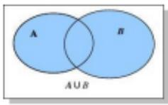

并集运算关系：

$$
\mathrm{A} \cup \mathrm{A} = \_ \quad , \quad \mathrm{A} \cup \Phi = \_ \quad ,
$$

$$
\mathrm{A} \cup \mathrm{B} \quad \text {   B } \cup \mathrm{A} \quad \mathrm{A} \cup \mathrm{B} = \mathrm{A} \Rightarrow \quad ,
$$

$$
A \cup B = B \Rightarrow \underline {{\quad}}.
$$

答案： $A \cup A = A,\quad A \cup \emptyset = A,\quad A \cup B = B \cup A$

$$
\mathrm{A} \cup \mathrm{B} = \mathrm{A} \rightarrow \mathrm{B} \subseteq \mathrm{A}, \quad \mathrm{A} \cup \mathrm{B} = \mathrm{B} \rightarrow \mathrm{A} \subseteq \mathrm{B}
$$

例题（2024·北京）已知集合 $M=\{x|-4<x\leqslant1\}$ ， $N=\{x|-1<x<3\}$ ，则 $M \cup N = (\quad)$

A. $\{x\mid-4<x<3\}$

B. $\{x\mid-1<x\leqslant1\}$

C. $\{0, 1, 2\}$

D. $\{x\mid-1<x<4\}$

【解答】解：集合 $M = \{x\mid -4 <   x\leqslant 1\}$ ， $N = \{x\mid -1<$ $x <   3\}$ ，则 $M\cup N = \{x\mid -4 <   x <   3\}$ .故选：A.

# 针对性针对练习

19. 设集合 $A = \{1, 2\}$ , $B = \{2, 4, 6\}$ , 则 $A \cup B =$ （）

A. $\{2\}$

B. $\{1, 2\}$

C. $\{2, 4, 6\}$

D. $\{1, 2, 4, 6\}$

20. 已知集合 $A = \{x \mid -1 < x < 1\}$ , $B = \{x \mid 0 \leqslant x \leqslant 2\}$ , 则 $A \cup B = (\quad)$

A. $\{x\mid-1<x<2\}$

B. $\{x\mid -1 <   x\leqslant 2\}$

C. $\{x\mid 0\leqslant x <   1\}$

D. $\{x|0\leqslant x\leqslant2\}$

21. 设集合 $A = \{x \mid -1 < x < 4\}$ , $B = \{x \mid 2 < x < 5\}$ , 则 $A \cup B = (\quad)$

A. $\{x\mid-1<x<4\}$

B. $\{x\mid -1 <   x <   5\}$

C. $\{x\mid2<x<4\}$

D. $\{x\mid2<x<5\}$

22. 设集合 $A = \{x \mid 1 \leqslant x \leqslant 3\}$ , $B = \{x \mid 2 < x < 4\}$ , 则 $A \cup B = (\quad)$

A. $\{x\mid2<x\leqslant3\}$

B. $\{x\mid 2\leqslant x\leqslant 3\}$

C. $\{x\mid1\leqslant x<4\}$

D. $\{x\mid1<x<4\}$

23. 已知集合 $A = \{x \mid -1 < x < 2\}$ , $B = \{x \mid x > 1\}$ , 则 $A \cup B = (\quad)$

A. $(-1, 1)$

B. (1, 2)

C. $(-1, +\infty)$

D. $(1, +\infty)$

24. 设集合 $A = \{1, 2, x\}$ , $B = \{2, x^2\}$ , 且 $A \cup B = A$ , 则 $x = (\quad)$

A.-1

B. 1

C. -1或0

D. -1 或 0 或 1

25. 设集合 $A = \{x \mid -1 < x < 2\}$ , 集合 $B = \{x \mid x^2 - 4x + 3 < 0\}$ , 则 $A \cup B = (\quad)$

A. $\{x\mid-1<x<3\}$

B. $\{x\mid -1 <   x <   1\}$

C. $\{x\mid 1 <   x <   2\}$

D. $\{x\mid2<x<3\}$

# 题型 2：交集运算（考频★★★★★）

一般地，由属于集合 A 且属于集合 B 的所有元素组成的集合，叫作集合 A、B 的交集，记作：A∩B 读作：A 交 B 即：A∩B = {x | x ∈ A，且 x ∈ B}

Venn图表示：

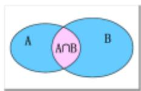

交集运算关系：A∩A=\_\_\_\_

$$
\mathrm{A} \cap \phi = \underline {{\quad}} \quad \mathrm{A} \cap \mathrm{B} \underline {{\quad}} \mathrm{B} \cap \mathrm{A}
$$

$$
\mathrm{A} \cap \mathrm{B} = \mathrm{A} \Rightarrow \quad \mathrm{A} \cap \mathrm{B} = \mathrm{B} \Rightarrow
$$

答案： $A \cap A = A \quad A \cap \phi = \phi \quad A \cap B = B \cap A$

$$
A \cap B = A \Rightarrow A \subseteq B \quad A \cap B = B \Rightarrow B \subseteq A:
$$

例题：（2024·新高考1卷）

集合 $A = \{x\mid -5 <   x^3 <  5\} ,B = \{-3, - 1,0,2,3\} ,$ 则 $A\cap B = ()$

A. $\{-1, 0\}$

B. $\{2, 3\}$

C. $\{-3, -1, 0\}$

D. $\{-1, 0, 2\}$

【解答】解：集合 $A = \{x\mid -5 <   x^3 <  5\}$ ， $B = \{-3$

$$
- 1, 0, 2, 3 \}, (- 3) ^ {3} = - 2 7, (- 1) ^ {3} = - 1,
$$

$$
0 ^ {3} = 0, 2 ^ {3} = 8, 3 ^ {3} = 2 7 \text {, 则} A \cap B = \{- 1, 0 \}. \text {选:} A.
$$

真题试一试：（2024·甲卷）

集合 $A = \{1, 2, 3, 4, 5, 9\}$ , $B = \{x \mid x + 1 \in A\}$ ,

则 $A \cap B = (\quad)$

A. $\{1, 2, 3, 4\}$

B. $\{1, 2, 3\}$

C. $\{3, 4\}$

D. $\{1, 2, 9\}$

参考：A.

# 针对练习

26. 已知集合 $M = \{-2, -1, 0, 1, 2\}$ , $N = \{x|x^2 - x - 6 \geqslant 0\}$ , 则 $M \cap \mathbf{N} = (\quad)$

A. $\{-2, -1, 0, 1\}$

B. $\{0, 1, 2\}$

C. $\{-2\}$

D. $\{2\}$

27. 已知集合 $M = \{x \mid x + 2 \geqslant 0\}$ , $N = \{x \mid x - 1 < 0\}$ . 则 $M \cap \mathbf{N} = (\quad)$

A. $\{x\mid-2\leqslant x<1\}$

B. $\{x\mid -2 <   x\leqslant 1\}$

C. $\{x|x\geqslant-2\}$

D. $\{x|x<1\}$

28. 集合 $A = \{-2, -1, 0, 1, 2\}$ , $B = \{2k | k \in A\}$ , 则 $A \cap B = (\quad)$

A. $\{0\}$

B. $\{0, 2\}$

C. $\{-2, 0\}$

D. $\{-2, 0, 2\}$

29. 若集合 $M = \{x|\sqrt{x} < 4\}$ , $N = \{x|3x \geqslant 1\}$ , 则 $M \cap N = (\quad)$

A. $\{x|0\leqslant x<2\}$

B. $\{x\mid\frac{1}{3}\leq x<2\}$

C. $\{x\mid 3\leqslant x <   16\}$

D. $\{x|\frac{1}{3}\leq x<16\}$

30. 集合 $M = \{2, 4, 6, 8, 10\}$ , $N = \{x \mid -1 < x < 6\}$ , 则 $M \cap \mathbf{N} = (\quad)$

A. $\{2, 4\}$

B. $\{2, 4, 6\}$

C. $\{2, 4, 6, 8\}$

D. $\{2, 4, 6, 8, 10\}$

31. 已知集合 $A = \{-1, 1, 2, 4\}$ , $B = \{x | |x - 1| \leqslant 1\}$ , 则 $A \cap B = (\quad)$

A. $\{-1, 2\}$

B. $\{1, 2\}$

C. $\{1, 4\}$

D. $\{-1, 4\}$

32. 设集合 $A = \{-2, -1, 0, 1, 2\}, B = \{x \mid 0 \leqslant x < \frac{5}{2}\}$ , 则 $A \cap B = (\quad)$

A. $\{0, 1, 2\}$

B. $\{-2, -1, 0\}$

C. $\{0, 1\}$

D. $\{1, 2\}$

33. 若集合 $A = [-1, 2)$ , $B = Z$ , 则 $A \cap B = (\quad)$

A. $\{-2, -1,$

B. $\{-1, 0, 1\}$

C. $\{-1, 0\}$

D. $\{-1\}$

# 题型 3：补集运算（考频★★★★★）

全集的定义：一个相对概念，表示在某个范围内。一般用字母 U 表示，也可以用其他字母。

补集的定义：对于一个集合 A，由全集 U 中不属于集合 A 的所有元素组成的集合，叫作集合 A 相对于全集 U 的补集，记作： $C_{U}A$ ，读作：A 在 U 中的补集，

即 $C_{U}A = \{x|x\in U,\text{且} x\notin A\}$

Venn 图表示：

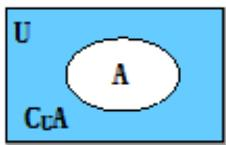

补集运算关系： $A \cap C_{U}A =$ \_\_\_\_， $A \cup C_{U}A =$ \_\_\_\_，

$$
C _ {U} \left(C _ {U} A\right) = \underline {{{\quad}}}.
$$

答案 $A \cap C_U A = \emptyset$ $A \cup C_U A = \cup C_U (C_U A) = A$

例题：（2024·甲卷）集合 $A = \{1, 2, 3, 4, 5, 9\}$ ， $B = \{x \mid \sqrt{x} \in A\}$ ，则 $\mathbb{C}_{\mathbf{A}}(A \cap B) = (\quad)$

A. $\{1, 4, 9\}$

B. $\{3, 4, 9\}$

C. $\{1, 2, 3\}$

D. $\{2, 3, 5\}$

【解答】解：因为 $A=\{1,2,3,4,5,9\}$ ,

$$
B = \{x | \sqrt {x} \in A \} = \{1, 4, 9, 1 6, 2 5, 8 1 \},
$$

所以 $C_{A}(A\cap B)=\{2,3,5\}$ .

故选：D.

最新真题（2025·新高考Ⅰ）

设全集 $U=\{x \mid x$ 是小于 9 的正整数，集合 $A=\{1,3,5\}$ ，则 CuA 中元素个数为（）

A. 2

B. 3

C. 5

D. 8

# 针对练习

34. 设全集 $U = \{1, 2, 3, 4, 5\}$ ，集合 $M$ 满足 $\mathrm{Cu}M = \{1, 3\}$ ，则（）

A. $2 \in M$

B. $3 \in M$

C. $4 \notin M$

D. $5 \notin M$

35. 已知全集 $U = \{x \mid -3 < x < 3\}$ ，集合 $A = \{x \mid -2 < x \leqslant 1\}$ ，则 $\mathrm{C}_{\mathrm{U}}A = (\quad)$

A. $(-2,1]$

B. $(-3, -2) \cup [1, 3)$

C. $[-2, 1)$

D. $(-3, -2] \cup (1, 3)$

36. 已知集合 $A = \{x | x^2 - x - 2 > 0\}$ ，则 $\mathbb{C}_{\mathbf{R}} A = (\quad)$

A. $\{x\mid-1<x<2\}$

B. $\{x\mid -1\leqslant x\leqslant 2\}$

C. $\{x|x<-1\}\cup\{x|x>2\}$

D. $\{x|x\leqslant-1\}\cup\{x|x\geqslant2\}$

37. 已知全集 $U = \{1, 2, 3, 4, 5\}$ , $A = \{1, 3\}$ , 则 $\mathrm{Cu}A = (\quad)$

A. $\varnothing$

B. $\{1, 3\}$

C. $\{2, 4, 5\}$

D. $\{1,2,3,4,5\}$

38. 已知全集 U=R，集合 $A=\{x|x<-2$ 或 x>2，
则CUA=（）

A. $(-2,2)$

B. $(- \infty, -2) \cup (2, +\infty)$

C. $[-2, 2]$

D. $(- \infty, -2] \cup [2, +\infty)$

39. 设集合 $A = \{0, 2, 4, 6, 8, 10\}$ , $B = \{4, 8\}$ , 则 $C_A B = (\quad)$

A. $\{4, 8\}$

B. $\{0, 2, 6\}$

C. $\{0, 2, 6, 10\}$ D. $\{0, 2, 4, 6, 8, 10\}$

40. 设全集 $U = \{1, 2, 3\}$ , $A = \{1, 2\}$ , 则 $\mathrm{Cu}A =$ \_\_\_\_.

41. 设集合 $A = \{4, 5, 7, 9\}$ , $B = \{3, 4, 7, 8, 9\}$ , 全集 $U = A \cup B$ , 则集合 $\mathrm{C}_{\mathrm{U}}(A \cap B)$ 中的元素共有（）

A. 3 个

B. 4个

C. 5个

D. 6个

42. 设全集 $U = \{x \in \mathbf{N}_{+} | x < 6\}$ ，集合 $A = \{1, 3\}$ ， $B = \{3, 5\}$ ，则 $\mathrm{C}u(A \cup B) = (\quad)$

A. $\{1, 4\}$

B. $\{1, 5\}$

C. $\{2, 4\}$

D. $\{2, 5\}$

43. 设集合 $A = \{1, 2, 3, 4\}$ , $B = \{3, 4, 5\}$ , 全集 $U = A \cup B$ , 则集合 $\complement_U (A \cap B)$ 的元素个数有（）

A. 1个

B. 2个

C. 3个

D. 4 个

44. 设集合 $U = \{1, 2, 3, 4, 5, 6\}$ , $A = \{1, 3, 6\}$ , $B = \{2, 3, 4\}$ , 则 $B \cap (C_U A) = (\quad)$

A. $\{5\}$

B. $\{2, 4\}$

C. $\{4, 5\}$

D. $\{3, 5\}$

45. 设 $U = \{x \mid x$ 是不大于 6 的正整数\}, $A = \{1, 2, 3\}$ , $B = \{3, 5\}$ , 求 $\mathrm{C}_{\mathrm{U}}(A \cup B) = (\quad)$

A. $\varnothing$

B. $\{4, 6\}$

C. $\{1, 2, 3, 5\}$

D. $\{1, 2, 3, 4, 5, 6\}$

46. 已知全集 $U = R$ ，集合 $A = \{x | x \leqslant 0\}$ ， $B = \{x | x \geqslant 1\}$ ，则 $(\mathrm{Cu}A) \cap (\mathrm{Cu}B) =$ \_\_\_\_.

47. 设全集 $U = \{-3, -2, -1, 0, 1, 2, 3\}$ ，集合 $A = \{-1, 0, 1, 2\}$ ， $B = \{-3, 2, 3\}$ ，则 $A \cap (\complement u B) = (\quad)$

A. $\{-1, 0\}$

B. $\{0, 1\}$

C. $\{-1, 1\}$

D. $\{-1, 0, 1\}$

# 题型 4：Venn 图（考频★★★☆☆）

48. 已知全集 $U = R$ ，则正确表示集合 $M = \{-1, 0, 1\}$ 和 $N = \{x|x^2 + x = 0\}$ 关系的韦恩（Venn）图是（）

A.

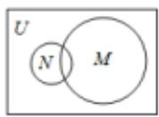

B.

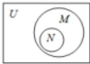

C.

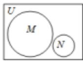

D.

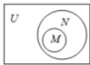

49. 某中学的学生积极参加体育锻炼，其中有 $96\%$ 的学生喜欢足球或游泳， $60\%$ 的学生喜欢足球， $82\%$ 的学生喜欢游泳，则该中学既喜欢足球又喜欢游泳的学生数占该校学生总数的比例是（）

A. 62%

B. 56%

C. 46%

D. 42%

50. 某班共 30 人，其中 15 人喜爱篮球运动，10 人喜爱乒乓球运动，8 人对这两项运动都不喜爱，则喜爱篮球运动但不喜爱乒乓球运动的人数为 \_\_\_\_。

51. 某班有 36 名同学参加数学、物理、化学课外探究小组，每名同学至多参加两个小组，已知参加数学、物理、化学小组的人数分别为 26, 15, 13，同时参加数学和物理小组的有 6 人，同时参加物

理和化学小组的有 4 人，则同时参加数学和化学小组的有 \_\_\_\_ 人。

52. 为丰富学生的课外活动，学校开展了丰富的选修课，参与“数学建模选修课”的有169人，参与“语文素养选修课”的有158人，参与“国际视野选修课”的有146人，三项选修课都参与的有30人，三项选修课都没有参与的有20人，全校共有400人。问只参与两项活动的同学有多少人？（）

A. 30

B. 31

C. 32

D. 33

53. 《西游记》《三国演义》《水浒传》和《红楼梦》是中国古典文学瑰宝，并称为中国古典小说四大名著。某中学为了解本校学生阅读四大名著的情况，随机调查了100位学生，其中阅读过《西游记》或《红楼梦》的学生共有90位，阅读过《红楼梦》的学生共有80位，阅读过《西游记》且阅读过《红楼梦》的学生共有60位，则该校阅读过《西游记》的学生人数与该学校学生总数比值的估计值为（）

A. 0.5

B. 0.6

C. 0.7

D. 0.8

# 1.4 充分条件与必要条件

# 题型1：充分必要条件（考频★★★★★）

充分条件： $p$ 是 $q$ 的充分条件 必要条件： $p$ 是 $q$ 的必要条件

$$
p \Rightarrow q \quad p \Leftarrow q
$$

p 是 q 的充分不必要条件: \_\_\_\_.

p 是 q 的必要不充分条件: \_\_\_\_.

p 是 q 的充要条件（充分必要条件）：\_\_\_\_。

例1：“我是河南人”是“我是中国人”的\_\_\_\_条件。（可以画图解释）

例2：“ $a > 1$ ”是“ $a > 0$ ”的\_\_\_\_条件.

例 3：“我在非洲呆了 60 秒”是“我在非洲呆了一分钟”的\_\_\_\_条件.

例 4：“我出生在广东”是“我出生在福建”的\_\_\_\_条件.

答案： $p \Rightarrow q$ 且 $p \neq q$ $p \neq q$ 且 $p \Leftarrow q$ $p \Leftrightarrow q$ 充分不必要．充分不必要．充要．既不充分也不必要

# 经典针对练习

1. 设 $x \in \mathbb{R}$ , 则“ $2 - x \geqslant 0$ ”是“ $|x - 1| \leqslant 1$ ”的（）

A. 充分而不必要条件

B. 必要而不充分条件

C. 充要条件

D. 既不充分也不必要条件

2. 设 $x \in \mathbb{R}$ , 则 “ $x^3 > 8$ ” 是 “ $|x| > 2$ ” 的（）

A. 充分而不必要条件

B. 必要而不充分条件

C. 充要条件

D. 既不充分也不必要条件

3. 已知 $a, b \in \mathbb{R}$ , 则“ $a^2 > b^2$ ”是“ $|a| > |b|$ ”的（）

A. 充分非必要条件

B. 必要非充分条件

C. 充要条件

D. 既非充分又非必要条件

4. 设 $x \in \mathbb{R}$ , 则“ $|x - \frac{1}{2}| < \frac{1}{2}$ ”是“ $x^3 < 1$ ”的（）

A. 充分而不必要条件

B. 必要而不充分条件

C. 充要条件

D. 既不充分也不必要条件

5. 设 $x \in R$ ，则“0 < x < 5”是“ $|x - 1| < 1$ ”的（）

A. 充分而不必要条件

B. 必要而不充分条件

C. 充要条件

D. 既不充分也不必要条件

6. 设 $x \in R$ ，则“ $x^{2} - 5x < 0$ ”是“ $|x - 1| < 1$ ”的（）

A. 充分而不必要条件

B. 必要而不充分条件  
C. 充要条件  
D. 既不充分也不必要条件

7. 若 $a > 0, b > 0$ ，则“ $a + b \leqslant 4$ ”是“ $ab \leqslant 4$ ”的（）

A. 充分不必要条件  
B. 必要不充分条件  
C. 充分必要条件  
D. 既不充分也不必要条件

8. 已知 $a \in \mathbf{R}$ , 则“ $a > 1$ ”是“ $\frac{1}{a} < 1$ ”的（）

A. 充分非必要条件  
B. 必要非充分条件  
C. 充要条件  
D. 既非充分又非必要条件

9. 设 $a \in \mathbf{R}$ , 则“ $a > 1$ ”是“ $a^2 > a$ ”的（）

A. 充分不必要条件  
B. 必要不充分条件

C. 充要条件  
D. 既不充分也不必要条件

10. 设 $x > 0, y \in \mathbb{R}$ , 则“ $x > y$ ”是“ $x > |y|$ ”的（）

A. 充要条件  
B. 充分不必要条件  
C. 必要而不充分条件  
D. 既不充分也不必要条件

11. 设 $a \in \mathbb{R}$ , “ $a > 0$ ” 是“ $\frac{1}{a} > 0$ ” 的（）条件.

A. 充分非必要   
B. 必要非充分  
C. 充要   
D. 既非充分也非必要

# 题型 2：充分必要条件综合（与其他知识结合）（考频★★★★★）

（本节比较综合，没学的内容后面学了再回来做）

12. “ $\alpha = \beta$ ”是“ $\sin^2\alpha + \cos^2\beta = 1$ ”的（）

A. 充分非必要条件 B. 必要非充分条件  
C. 充要条件 D. 既非充分又非必要条件

13. 设 $a, b, c, d$ 是非零实数，则“ $ad = bc$ ”是“ $a, b, c, d$ 成等比数列”的（）

A. 充分而不必要条件 B. 必要而不充分条件  
C．充分必要条件 D．既不充分也不必要条件

14. 设 $\theta \in \mathbf{R}$ , 则“ $|\theta - \frac{\pi}{12}| < \frac{\pi}{12}$ ”是“ $\sin \theta < \frac{1}{2}$ ”的（）

A. 充分而不必要条件 B. 必要而不充分条件  
C. 充要条件 D. 既不充分也不必要条件

15. 已知非零向量 $\vec{a}, \vec{b}, \vec{c}$ ，则“ $\vec{a} \cdot \vec{c} = \vec{b} \cdot \vec{c}$ ”是“ $\vec{a} = \vec{b}$ ”的（）

A. 充分不必要条件 B. 必要不充分条件  
C．充分必要条件 D．既不充分也不必要条件

17. 已知平面 $\alpha$ ，直线 $m, n$ 满足 $m \notin \alpha, n \subset \alpha$ ，则“ $m // n$ ”是“ $m // \alpha$ ”的（）

A. 充分不必要条件 B. 必要不充分条件  
C．充分必要条件 D．既不充分也不必要条件

18. 已知空间中不过同一点的三条直线 $l, m, n$ . 则 “ $l, m, n$ 共面” 是 “ $l, m, n$ 两两相交”的（）

A. 充分不必要条件 B. 必要不充分条件  
C. 充分必要条件 D. 既不充分也不必要条件

19. 设点 $A, B, C$ 不共线，则“ $\overrightarrow{AB}$ 与 $\overrightarrow{AC}$ 的夹角为锐角”是“ $|\overrightarrow{AB} + \overrightarrow{AC}| > |\overrightarrow{BC}|$ ”的（）

A. 充分而不必要条件 B. 必要而不充分条件  
C．充分必要条件 D．既不充分也不必要条件

20. 设 $\vec{a}$ ， $\vec{b}$ 均为单位向量，则 “ $|\vec{a}-3\vec{b}|=|3\vec{a}+\vec{b}|$ ” 是 “ $\vec{a}\perp\vec{b}$ ” 的（）

A. 充分而不必要条件 B. 必要而不充分条件  
C．充分必要条件 D．既不充分也不必要条件

21. 设 $S_{n}$ 为数列 $\{a_{n}\}$ 的前 $n$ 项和，“ $\{a_{n}\}$ 是递增数列”是“ $\{S_{n}\}$ 是递增数列”的（）

A. 充分非必要条件 B. 必要非充分条件  
C. 充要条件 D. 既非充分又非必要条件

22. 等比数列 $\{a_{n}\}$ 的公比为 $q$ ，前 $n$ 项和为 $S_{n}$ . 设甲： $q > 0$ ，乙： $\{S_{n}\}$ 是递增数列，则（）

A. 甲是乙的充分条件但不是必要条件  
B. 甲是乙的必要条件但不是充分条件  
C. 甲是乙的充要条件  
D. 甲既不是乙的充分条件也不是乙的必要条件

# 1.5 任意与存在命题的否定（考频★★★★☆）

(很多同学对任意和存在的否定不是很理解，这里给出一些通俗解释，为什么“任意”的否定是“存在”。)

命题的否定：

“我是帅哥”的否定：“我不是帅哥”

“所有的男生，都是帅哥”的否定：并非所有的男生都是帅哥。理解一下，换言之，即

“存在有男生，不是帅哥”（任意符号：∀ 存在符号：∃）

所以，换成符号表达就是“∀猛男，都是帅哥”的否定：“∃猛男，不是帅哥”

# 针对训练

23. 命题“ $\forall x \in [0, +\infty)$ , $x^3 + x \geqslant 0$ ”的否定是（）

A. $\forall x\in (-\infty ,0),x^{3} + x <   0$   
B. $\forall x\in (-\infty ,0),x^3 +x\geqslant 0$   
C. $\exists x_0\in [0, + \infty)$ ， $x_0^3 +x_0 <   0$   
D. $\exists x_0\in [0, + \infty)$ ， $x_0^3 +x_0\geqslant 0$

24. 设 $x \in \mathbf{Z}$ , 集合 $A$ 是奇数集, 集合 $B$ 是偶数集. 若命题 $p: \forall x \in A, 2x \in B$ , 则（）

A. $\neg p: \forall x \in A, 2x \notin B$   
B. $\neg p: \forall x \notin A, 2x \notin B$   
C. $\neg p: \exists x \notin A, 2x \in B$   
D. $\neg p: \exists x \in A, 2x \notin B$

25. 已知命题 $p: \forall x > 0, \ln (x + 1) > 0$ ；命题 $q$ ：若 $a > b$ ，则 $a^2 > b^2$ ，下列命题为真命题的是（）

A. $p \wedge q$   
C. $\neg p \land q$

B. $p \wedge \neg q$   
D. $\neg p\land\neg q$

26. 命题“对 $\forall x \in R$ ，都有 $\sin x \leqslant 1$ ”的否定为（）

A. 对 $\forall x \in \mathbb{R}$ , 都有 $\sin x > 1$   
B. 对 $\forall x \in \mathbb{R}$ , 都有 $\sin x \leqslant -1$   
C. $\exists x_0\in \mathbf{R}$ ，使得 $\sin x_0 > 1$   
D. $\exists x_0\in \mathbb{R}$ ，使得 $\sin x_0\leqslant 1$

27．命题： $\exists x\in R,\quad x^{2}-x+1=0$ 的否定是 \_\_\_\_.

28. 若命题“ $\exists x_0 \in [-1, 2], -x_0^2 + 2 \geqslant a$ ”是假命题，则实数 $a$ 的范围是（）

A. $a > 2$   
C. $a > -2$

B. $a \geqslant 2$

D. $a \leqslant -2$

# [必修一]第二章 一元二次函数、方程和不等式

# 2.1 不等式的性质

# 题型1：不等式的性质（考频★★★★★）

(1)传递性：a>b，b>c⇒\_\_\_\_；  
(2)加法性质： $a > b\Leftrightarrow$ ；推论： $a > b$ ， $c > d\Rightarrow$   
(3)乘法性质： $a > b$ ， $c > 0\Rightarrow$ ；推论： $a > b > 0$ ， $c > d > 0\Rightarrow$   
(4)乘方性质： $a > b > 0\Rightarrow$   
(5) 开方性质： $a > b > 0 \Rightarrow$ \_\_\_\_；  
(6) 倒数性质：a > b, ab > 0 $\Rightarrow$ \_\_\_\_.

参考：1. $a > c$ 2. $a + c > b + c$ $a + c > b + d$ 3. $ac > bc$ $ac > bd$ 4. $a^2 > b^2$ 5. $\sqrt{a} >\sqrt{b}$ 6. $\frac{1}{a} <  \frac{1}{b}$

# 经典针对练习

1. 下列命题正确的是（）

A. 若 $a^2 > b^2$ ，则 $a > b$   
B. 若 $|a|>b$ ，则 $a^{2}>b^{2}$   
C. 若 $a > |b|$ ，则 $a^2 > b^2$   
D. 若 $a > b$ ，则 $a^2 > b^2$

2. 若 $a < 0 < b$ ，则下列不等式恒成立的是（）

A. $\frac{1}{a}>\frac{1}{b}$   
C. $a^{2} > b^{2}$

B. $-a > b$

D. $a^{3}<b^{3}$

3. 若 $a > b > 0, c < d < 0$ ，则一定有（）

A. $\frac{a}{c}>\frac{b}{d}$   
C. $\frac{a}{d} > \frac{b}{c}$

B. $\frac{a}{c} <  \frac{b}{d}$ D. $\frac{a}{d} <  \frac{b}{c}$

4. 已知 $2 < x < 4, -1 < y < 3$ ，则 $x - y$ 的取值范围为 \_\_\_\_.

（多选）5. 下列说法正确的的是（）

A. 若 $a > b$ ，则 $ac^2 > bc^2$

B. 若 $\frac{a}{c^2} > \frac{b}{c^2}$ , 则 $a > b$   
C. 若 a > b, c > d. 则 ac > bd  
D. 若 $b > a > 0, c > 0$ ，则 $\frac{a + c}{b + c} > \frac{a}{b}$

6. 已知 $a > b > c > d > 0$ ，则下列结论不正确的是（）

A. $a+c>b+d$   
C. $\frac{a}{c} >\frac{b}{d}$

B. ac > bd

D. $\frac{a}{d}>\frac{c}{b}$

7. 已知等式 ax = by，则下列变形一定正确的是（）

A. $\frac{a}{b} = \frac{y}{x}$   
C. $\sqrt{ax} = \sqrt{by}$

B. ax - m = by - m

D. $\frac{1}{ax}=\frac{1}{by}$

8. 若 $a, b, c \in \mathbb{R}$ 且 $a > b > c$ ，则下列不等式一定成立的是（）

A. $a - b > b - c$   
C. ac > bc

B. $a+b>2c$

D. $a^{2} > b^{2} > c^{2}$

9. 若 $a > b > c > d$ ，则下列不等式恒成立的是（）

A. $a+d>b+c$

B. $a+c>b+d$

C. ac > bd

D. ad > bc

10. 下列不等式中成立的是 \_\_\_\_

① $a>b\Rightarrow ac^{2}>bc^{2}$ ;

② $a>|b|\Rightarrow a^{2}>b^{2};$

③0<a<1，-1<b<2⇒-4<a-2b<3；

④ $|a|>b\Rightarrow a^{2}>b^{2}$

11. 已知下列四个条件：

①b>0>a;

②0>a>b;

③a>0>b;

④a>b>0.

不能推出 $\frac{1}{a}<\frac{1}{b}$ 成立的序号是 \_\_\_\_.

12．已知 1 < a < 3，2 < b < 4，则 $\frac{a}{b}$ 的取值范围是 \_\_\_\_.

（多选）13．已知a、b、c、d均为实数，则下列命题中正确的是（）

A. 若 $ab < 0$ , $bc - ad > 0$ , 则 $\frac{c}{a} - \frac{d}{b} > 0$

B. 若 $ab > 0$ , $\frac{c}{a} - \frac{d}{b} > 0$ , 则 $bc - ad > 0$

C. 若 $bc - ad > 0, \frac{c}{a} - \frac{d}{b} > 0$ ，则 $ab > 0$

D. 若 $\frac{1}{a} < \frac{1}{b} < 0$ ，则 $\frac{1}{a + b} < \frac{1}{ab}$

14. 设 $a, b \in \mathbb{R}$ , 且 $a < b < 0$ , 则（）

A. $\frac{1}{a}<\frac{1}{b}$

B. $\frac{b}{a}>\frac{a}{b}$

C. $\frac{a+b}{2}>\sqrt{ab}$

D. $\frac{b}{a} +\frac{a}{b} >2$

15. 若 $a, b, c \in \mathbf{R}, a > b$ ，则下列不等式成立的是

( )

A. $\frac{1}{a} < \frac{1}{b}$

B. $a^2 < b^2$

C. $a|c|>b|c|$

D. $\frac{a}{c^2 + 1} >\frac{b}{c^2 + 1}$

16. 已知实数 $a > b > 0 > c$ ，则下列结论一定正确的是（）

A. $\frac{a}{b} >\frac{a}{c}$

B. $(\frac{1}{2})^a > (\frac{1}{2})^c$

C. $\frac{1}{a} < \frac{1}{c}$

D. $a^{2} > c^{2}$

17. 若 $1 < \alpha < 3, -4 < \beta < 2$ ，则 $2\alpha + |\beta|$ 的取值范围是 \_\_\_\_.

18. 若 $1 \leqslant x \leqslant 3, -2 < y \leqslant 1$ ，则 $x - |y|$ 的取值范围为 \_\_\_\_.

19. 设 $a$ 、 $b$ 、 $c$ 、 $d$ 是实数，则下列命题为真命题的是 \_\_\_\_.

①如果 a > b，且 c > d，那么 $a + c > b + d$ ;

②如果 $a \neq b$ ，且 $c \neq d$ ，那么 $ac \neq bd$ ;

③如果 a > b > 0，那么 $0 < \frac{1}{a} < \frac{1}{b}$ ;

④如果 $(a-b)^{2}+(b-c)^{2}\leqslant0$ ，那么a=b=c。

# 2.2 基本不等式

# 题型1：基本不等式链（考频★★★★★）

$\sqrt{ab} \leq \frac{a + b}{2} \leq \sqrt{\frac{a^2 + b^2}{2}}$ 平方后 $ab \leq \left(\frac{a + b}{2}\right)^2 \leq \frac{a^2 + b^2}{2}$

首先，知道 $a, b$ 都必须是正数

其次，关注这3个家伙：积 $ab$ ，和 $a + b$ ，平方和 $a^2 + b^2$ ，看谁是定值，就可以求另外两的最值。

最后，当且仅当 $a = b$ 时等号成立。我们来举例

举例子1： $a > 0,b > 0,$ 已知 $a + b = 8$ ，求 $ab$ 的最大值， $a^2 +b^2$ 的最小值。

我们只要把 $a + b = 8$ 放到公式里面去， $\mathrm{ab}\leq (\frac{8}{2})^2\leq \frac{\mathrm{a}^2 + \mathrm{b}^2}{2}$ 解左边得 $\mathrm{ab}\leq 16$ ，解右边得 $32\leq \mathrm{a}^2 +\mathrm{b}^2$ 所以ab最大为16， $\mathbf{a}^2 +\mathbf{b}^2$ 最小为32.

从不等式链子提取常用的不等式之一： $a + b\geq 2\sqrt{ab}$

举例子2：求 $f(x) = x + \frac{4}{x} (x > 0)$ 的最小值

解： $y=x+\frac{4}{x}\geq2\sqrt{x\cdot\frac{4}{x}}=4$ （关于取等条件在后面内容有详细说明，此时我们垂直地学习用公式便不赘述）

# 1.和定（考频★★★★★）

知识点:当我们看到题目给的是和定的形式，如 $a+b=4$ ，可以直接使用 $a+b\geq2\sqrt{ab}$ ，从而解出积 ab 的范围。

1. 已知正实数 $x, y$ 满足 $2x + y = 1$ ，则 $xy$ 的最大值为（）

A. $\frac{1}{8}$

B. $\frac{2}{3}$

C. $\frac{1}{4}$

D. $\frac{2}{5}$

2. 若 $a > 0, b > 0, a, b$ 的等差中项是1，且 $\frac{1}{ab}$ 的最小值为（）

A. 1

B. 2

C. 3

D. 4

3．若 $x, y \in R^{+}$ ，且 $\frac{1}{x} + 2y = 3$ ，则 $\frac{y}{x}$ 的最大值为 \_\_\_\_.

4. 若实数 $a$ ， $b$ 满足 $\frac{1}{a} + \frac{2}{b} = \sqrt{ab}$ ，则 $ab$ 的最小值

为（ ）

A. $\sqrt{2}$

B. 2

C. $2\sqrt{2}$

D. 4

5. 已知 $x > 0, y > 0, 2x + y = 3$ ，则 $9^x + 3^y$ 的最小值为（）

A. 27

B. $12\sqrt{3}$

C. 12

D. $6\sqrt{3}$

6. 已知 $m, n \in \mathbf{R}$ , 且 $m - 3n + 4 = 0$ , 则 $2^{m} + \frac{1}{8^{n}}$ 的最小值为（）

A. $\frac{257}{64}$

B. $\frac{1}{4}$

C. $\frac{\sqrt{2}}{2}$

D. $\frac{1}{2}$

7. 设 $x > 0, y > 0, x + 2y = 4$ ，则 $\frac{(x + 1)(2y + 1)}{xy}$ 的最小值为 \_\_\_\_.

8. 已知： $0 < x < 1$ ，则函数 $y = x(1 - x)$ 的最大值为（）

A. $\frac{1}{2}$

B. $\frac{1}{4}$

C. $\frac{1}{8}$

D. $\frac{1}{9}$

9．已知 $0 < x < \frac{4}{3}$ ，求 $x(4 - 3x)$ 的最大值 \_\_\_\_.

10. 已知 $5x^{2}y^{2} + y^{4} = 1 (x, y \in \mathbb{R})$ ，则 $x^{2} + y^{2}$ 的最小值是 \_\_\_\_.

# 2. 积定（考频★★★★★）

知识点:当我们看到题目给的式子它的积为定值，如给 $a+\frac{2}{a}$ ，这是加法，但我们发现乘法 $a\times\frac{2}{a}$ 可以等于具体数值2，积为定值，则可以使用公式“ $a+b\geq2\sqrt{ab}$ ”所以 $a+\frac{2}{a}\geq2\sqrt{a\cdot\frac{2}{a}}=2\sqrt{2}$

11. 当 $x > 0$ 时， $x + \frac{9}{2x}$ 的最小值为（）

A. 3

B. $\frac{3}{2}$

C. $2\sqrt{2}$

D. $3\sqrt{2}$

12. 函数 $y = 3x + \frac{4}{3x - 1} (x > \frac{1}{3})$ 的最小值为（）

A. 8

B. 7

C. 6

D. 5

13. 若 $x > 1$ ，则 $4x + \frac{1}{x - 1}$ 的最小值为（）

A. 6

B. 8

C. 10

D. 12

14.（1）已知 $x < \frac{5}{4}$ ，求 $y = 4x - 2 + \frac{1}{4x - 5}$ 的最大值.

(2) 已知 $0 < x < \frac{1}{2}$ ，求 $y = \frac{1}{2}x$ （1 - 2x）的最大

值.

（3）已知 $x > 0$ ，求 $f(x) = \frac{2x}{x^2 + 1}$ 的最大值.

（4）已知 $x > 0$ ， $y > 0$ ，且 $\frac{1}{x} +\frac{9}{y} = 1$ ，求 $x + y$ 的最小值.

15. 已知 a > 0, b > 0，且 ab = 1，则 $\frac{1}{2a} + \frac{1}{2b} + \frac{8}{a + b}$ 的最小值为 \_\_\_\_.

16. 设 x > 0，则 $x^{2} + \frac{2}{x}$ 的最小值为（）

A. $2\sqrt{2}$

B. 3

C. $3\sqrt{2}$

D. 5

17. 已知 $a > 0, b > 0$ ，则 $\frac{1}{a} + \frac{a}{b^2} + b$ 的最小值为 \_\_\_\_.

# 3. 平方和定（考频★★★★★）

知识点:当我们看到题目给的式子分别平方后得到定值，如 $\sqrt{x}+\sqrt{2-x}$ ，发现 $x+2-x$ 等于2，可以直接使用公式 $\left(\frac{a+b}{2}\right)^{2}\leq\frac{a^{2}+b^{2}}{2}$

18. 函数 $y = \sqrt{x} + \sqrt{1 - x}$ 的最大值为（）

A. 1

B. $\sqrt{2}$

C. $\sqrt{3}$

D. 2

19. 已知 $a, b > 0, a + b = 5$ ，则 $\sqrt{a + 1} + \sqrt{b + 3}$ 的最大值为（）

A. 18

B. 9

C. $3\sqrt{2}$

D. $2\sqrt{3}$

20. 函数 $y=\sqrt{x+1}+\sqrt{1-x}$ 的最大值是 \_\_\_\_.

# 4. “1”的替换（考频★★★★★）

# 一. 基本型

例题1. 已知 $x > 0, y > 0$ ，且 $\frac{2}{y} + \frac{1}{x} = 1$ ，则 $x + 2y$ 的最小值为（）

A. 8

B. $8\sqrt{2}$

C. 9

D. $9\sqrt{2}$

解：∵x>0, y>0,

$$
\therefore x + 2 y = (x + 2 y) \times 1 = (x + 2 y) \cdot \left(\frac {2}{y} + \frac {1}{x}\right) = 5 + \frac {2 x}{y} + \frac {2 y}{x} \geq 5 + 2 \sqrt {\frac {2 x}{y} \cdot \frac {2 y}{x}} = 9,
$$

当且仅当： $\frac{2x}{y}=\frac{2y}{x}$ 时取等号，又： $\frac{2}{y}+\frac{1}{x}=1$ ，即：x=y=3，

此时 $x+2y$ 取最小值为 9. 故选：C.

例题2. 若正实数 $a, b$ 满足 $a + 4b = 1$ ，则 $\frac{1}{a} + \frac{1}{b}$ 的（）

A. 最大值为 9

B. 最小值为 9

C. 最大值为 8

D. 最小值为 8

解：因为正实数 $a$ ， $b$ 满足 $a + 4b = 1$

$$
\text {则} \frac {1}{a} + \frac {1}{b} = (\frac {1}{a} + \frac {1}{b}) (a + 4 b) = 5 + \frac {4 b}{a} + \frac {a}{b} \geq 5 + 2 \sqrt {\frac {4 b}{a} \cdot \frac {a}{b}} = 9,
$$

当且仅当 $\frac{4b}{a} = \frac{a}{b}$ 且 $a + 4b = 1$ 即 $b = \frac{1}{6}$ ， $a = \frac{1}{3}$ 时取等号，此时 $\frac{1}{a} + \frac{1}{b}$ 取得最小值9．故选：B.

# 二．隐藏“1”

例题3. 设 $a > 0, b > 0$ ，且 $2a + b = 2$ ，则 $\frac{1}{a} + \frac{1}{b}$ （）

A. 有最小值为 $\sqrt{2}$

B. 有最小值为 $2\sqrt{2} + 3$

C. 有最小值为 $\sqrt{2} + \frac{3}{2}$

D. 无最小值

解：由 $\frac{1}{a} +\frac{1}{b} = \frac{1}{2}\times (2a + b)\times (\frac{1}{a} +\frac{1}{b}) = \frac{1}{2}\times (3 + \frac{2a}{b} +\frac{b}{a})\geq \frac{1}{2}\times (3 + 2\sqrt{2}) = \frac{3}{2} +\sqrt{2},$

当且仅当 $\frac{2a}{b} = \frac{b}{a}$ 且 $2a + b = 2$ ，即 $a = 2 - \sqrt{2}$ ， $b = 2\sqrt{2} -2$ 时等号成立，

故 $\frac{1}{a}+\frac{1}{b}$ 取得最小值为 $\sqrt{2}+\frac{3}{2}$ . 故选：C.

例题4. 若正数 $x, y$ 满足 $x + 3y = 5xy$ ，则 $3x + 4y$ 的最小值是（）

A. 2

B. 3

C. 4

D. 5

解：因为正数 $x$ ， $y$ 满足 $x + 3y = 5xy$ ，所以 $\frac{1}{y} +\frac{3}{x} = 5$

则 $3x + 4y = \frac{1}{5}(3x + 4y)$ $\left(\frac{1}{y} +\frac{3}{x}\right) = \frac{1}{5}\left(13 + \frac{3x}{y} +\frac{12y}{x}\right)\geq \frac{1}{5}\left(13 + 2\sqrt{\frac{3x}{y}\cdot\frac{12y}{x}}\right) = \frac{1}{5} (13 + 12) = 5,$

当且仅当 $\frac{3x}{y}=\frac{12y}{x}$ 且 $x+3y=5xy$ ，即 $y=\frac{1}{2}$ ，x=1时取等号，此时 $3x+4y$ 取得最小值5.

故选：D.

# 三. 改“分子”

例题5. 若正数 $x, y$ 满足 $x + 6y = 3$ ，则 $\frac{3y}{x} + \frac{1}{y}$ 的最小值为（）

A. 4

B. $\frac{9}{8}$

C. $2\sqrt{3}$

D. 2

解：法1：分子比基础类型多了个y，考虑用所给式子消去。

$$
y = \frac {3 - x}{6}, \frac {3 y}{x} + \frac {1}{y} = \frac {3 \cdot \frac {3 - x}{6}}{x} + \frac {1}{y} = \frac {1}{2} \frac {3 - x}{x} + \frac {1}{y} = \frac {1}{2} (\frac {3}{x} - 1) + \frac {1}{y} = \frac {3}{2 x} + \frac {1}{y} - \frac {1}{2} = (\frac {3}{2 x} + \frac {1}{y}) (\frac {x}{3} + 2 y) - \frac {1}{2} = \frac {3 y}{x} + \frac {x}{3 y} + 2 \geqslant
$$

$$
2 \sqrt {\frac {3 y}{x} \cdot \frac {x}{3 y}} + 2 = 4
$$

法 2：因为正数 x，y 满足 $x+6y=3$ ，

则 $\frac{3y}{x} +\frac{1}{y} = \frac{3y}{x} +\frac{x + 6y}{3y} = \frac{3y}{x} +\frac{x}{3y} +2\geqslant 2\sqrt{\frac{3y}{x}\cdot\frac{x}{3y}} +2 = 4,$

当且仅当 $x = 3y$ 且 $x + 6y = 3$ ，即 $y = \frac{1}{3}$ ， $x = 1$ 时取等号．故选：A.

# 四. 动“分母”

例题6. 已知正数 $a, b$ 满足 $a + 2b = 6$ ，则 $\frac{1}{a + 2} + \frac{2}{b + 1}$ 的最小值为（）

A. $\frac{7}{8}$

B. $\frac{10}{9}$

C. $\frac{9}{10}$

D. $\frac{8}{9}$

解：因为 $a + 2b = 6$ ，所以 $a + 2 + 2(b + 1) = 10$

所以 $\frac{1}{a + 2} +\frac{2}{b + 1} = \frac{1}{10} (\frac{1}{a + 2} +\frac{4}{2b + 2})(a + 2 + 2b + 2)\geq \frac{1}{10} [5 + 2\sqrt{\frac{2b + 2}{a + 2}\cdot\frac{4(a + 2)}{2b + 2}} ] = \frac{9}{10},$

当且仅当 $2b + 2 = 2(a + 2)$ ，即 $a = \frac{4}{3}$ ， $b = \frac{7}{3}$ 时，等号成立．故选：C.

# 五. 与恒成立结合

例题7. 已知 $x > 0, y > 0$ ，且 $\frac{2}{x} + \frac{1}{y} = 1$ ，若 $x + 2y \geqslant m^2 + 2m$ 恒成立，则实数 $m$ 的最小值是（）

A. 2

B.-4

C. 4

D.-2

解：已知 $x > 0$ ， $y > 0$ ，且 $\frac{2}{x} +\frac{1}{y} = 1$ ，若 $x + 2y = (x + 2y)(\frac{2}{x} +\frac{1}{y}) = 4 + \frac{x}{y} +\frac{4y}{x}\geq 8;$

即 $x+2y \geqslant m^{2}+2m$ 恒成立，

只需 $8 \geqslant m^{2} + 2m$ 恒成立，

解得 $-4 \leq m \leq 2$ .

故 m 的最小值为 -4.

故选：B.

# 经典母题

21. 已知 $x > 0, y > 0, 2x + y = 2$ ，则 $\frac{1}{x} + \frac{2}{y}$ 的最小值是（）

A. 1

B. 2

C. 4

D. 6

22. 若直线 $\frac{x}{a} + \frac{y}{b} = 1 (a > 0, b > 0)$ 过点（1，2），则 $2a + b$ 的最小值为 \_\_\_\_.

23. 已知 x > 0, y > 0，且 $4x + y = xy$ ，则 $x + 16y$ 的最小值为（）

A. 64

B. 81

C. 100

D. 121

24. 已知 $a > 0, b > 0$ ，且满足 $2a + b = ab$ ，则 $a + b$ 的最小值为（）

A. 2

B. 3

C. $3 + 2\sqrt{2}$

D. $\frac{3}{2}+\sqrt{2}$

25. 若 $x, y$ 满足 $\log_2 x = -\log_2 y$ ，则 $x + 4y$ 的最小值为（）

A. $\frac{1}{2}$

B. $\frac{1}{4}$

C. 8

D. 4

26. 已知 $x > 0, y > 0, lg2^{x} + lg8^{y} = lg2$ ，则 $\frac{1}{x} + \frac{1}{3y}$ 的最小值是（）

A. 2

B. $2\sqrt{2}$

C. 4

D. $2\sqrt{3}$

27. 已知实数 $a > 0, b > 0, a + b = 2$ ，则 $\frac{1}{a} + \frac{a}{b}$ 的最小值为（）

A. $\frac{1}{2}+2\sqrt{2}$

B. $\frac{1}{2}+\sqrt{2}$

C. $\frac{3\sqrt{2}}{2}$

D. $2\sqrt{2}$

28. 已知实数 $a > 0, b > 1$ 满足 $a + b = 5$ ，则 $\frac{2}{a} + \frac{1}{b - 1}$ 的最小值为（）

A. $\frac{3+2\sqrt{2}}{4}$

B. $\frac{3+4\sqrt{2}}{4}$

C. $\frac{3+2\sqrt{2}}{6}$

D. $\frac{3+4\sqrt{2}}{6}$

29. 已知 $a, b$ 为正实数，且 $\frac{1}{a + 3b} + \frac{1}{3a + b} = 1$ ，则 $a + b$ 的最小值为（）

A. $\frac{1}{4}$

B. $\frac{1}{3}$

C. $\frac{1}{2}$

D. 1

30. 已知正实数 $a, b$ 满足 $2a + b = 4$ ，则 $\frac{2}{a + 2} + \frac{2}{b}$ 的最小值是（）

A. $\frac{9}{4}+\sqrt{2}$

B. 4

C. $\frac{9}{2}$

D. $\frac{3}{4}+\frac{\sqrt{2}}{2}$

31. 设 $m, n$ 为正数，且 $m + n = 2$ ，则 $\frac{4}{m + 1} + \frac{1}{n + 1}$ 的最小值为（）

A. $\frac{13}{4}$

B. $\frac{9}{4}$

C. $\frac{7}{4}$

D. $\frac{9}{5}$

32. 已知正实数 $a$ 、 $b$ 满足 $a+b=2$ ，则 $\frac{2a}{b}+\frac{1}{a}$ 的最小值是（）

A. $\frac{5}{2}$

B. 3

C. 2

D. $\frac{9}{2}$

33. 已知 $a, b$ 为正实数，且 $a + 2b = 2$ ，则 $\frac{4}{a} + \frac{a}{b}$ 的最小值为（）

A. 1

B. 2

C. 4

D. 6

34. 已知 $a, b$ 为正实数，且 $2a + b = 1$ ，则 $\frac{2}{a} + \frac{a}{2b}$ 的最小值为（）

A. 1

B. 2

C. 6

D. 7

35. 若 $a, b \in (0, +\infty)$ ，且 $\sqrt{a} + \frac{4}{b} = 9$ ，则 $b + \frac{\sqrt{a}}{a}$ 的最小值为（）

A. 9

B. 3

C. 1

D. $\frac{1}{3}$

# 5.不等式成立的条件（考频★★★★★）

在使用基本不等式时，要注意 a, b 为正数，且可以取得等号，取等条件是看方程 a=b 是否有解。

1，例如 $y = \tan x + \frac{16}{\tan x}$ 中因为 $\tan x$ 正负未知，不能直接用基本不等式，你看看这样对吗：

$y = \tan x + \frac{16}{\tan x} \geq 2\sqrt{16} = 8$ ，最小为 8，好像是对的。但如果 tanx = -1 呢？显然与不等式使用条件矛盾。

2，取等条件是看方程 a=b 是否有解，例如 $y = x + \frac{16}{x} (x \geq 5)$ ，如果直接 $y = x + \frac{16}{x} \geq 2\sqrt{16} = 8$ ，整体最小取 8 时，要求 $x = \frac{16}{x}$ ，解得 x=4，但显然此时 x=4 不在定义域内（已经规定 $x \geq 5$ ）。

# 经典母题

36. 已知函数 $f(x) = 3^x + \frac{a}{3^x + 1} (a > 0)$ 的最小值为 5，则 $a =$ \_\_\_\_.

37. 下列函数中最小值为 8 的是（）

A. $y=x^{2}+4x+5$

B. $y = |cosx| + \frac{16}{|cosx|}$

C. $y = \ln x + \frac{16}{\ln x}$

D. $y=4^{x}+4^{2-x}$

38. 已知 $a \in (0, +\infty)$ ，则“a > 1”是“ $a + \frac{1}{a} > 2$ ”的（）

A. 充分而不必要条件

B. 必要而不充分条件

C. 充分必要条件

D. 既不充分也不必要条件

39. 已知函数 $f(x) = x^{2} + \frac{1}{x^{2} + 2} - 1$ ，则 $f(x)$ 的最小值为（）

A. $-\frac{1}{2}$

B.-1

C. 0

D. 1

40. 下列函数中最小值为 4 的是（）

A. $y=x^{2}+2x+4$

B. $y=|\sin x|+\frac{4}{|\sin x|}$

C. $y = 2^{x} + 2^{2 - x}$

D. $y=lnx+\frac{4}{lnx}$

41. 若 $x > 0, y > 0$ 且 $x + y = 2$ ，则下列结论中正确的是（）

A. $x^{2} + y^{2}$ 的最小值是1

B. $xy$ 的最大值是 $\frac{1}{4}$   
C. $\frac{2}{x} + \frac{1}{y}$ 的最小值是 $4\sqrt{2}$   
D. $\sqrt{x} +\sqrt{y}$ 的最大值是2

42. 下列不等式恒成立的是（）

A. $a^2 + b^2 \leqslant 2ab$

B. $a^2 + b^2 \geqslant -2ab$

C. $a+b \geqslant 2\sqrt{|ab|}$

D. $a^2 + b^2 \leqslant -2ab$

（多选）43．已知正实数 a，b 满足 $\frac{1}{a} + \frac{1}{b} = 1$ ，则下列不等式恒成立的是（）

A. $a+4b \geqslant 9$

B. $ab \geqslant 4$

C. $a^2 + b^2 \leqslant 8$

D. $\frac{1}{a^2} +\frac{1}{b^2}\geq \frac{1}{2}$

44. 已知正实数 $a, b$ 满足 $a + b = 1$ ，则下列结论不正确的是（）

A. $\sqrt{ab}$ 有最大值 $\frac{1}{2}$   
B. $\frac{1}{a} + \frac{4}{b}$ 的最小值是9  
C. 若 $a > b$ ，则 $\frac{1}{a^2} < \frac{1}{b^2}$   
D. $\log_2a + \log_2b$ 的最大值为0

(多选)45.已知a>0,b>0,且 $a+b=1$ ,则()

A. $a^{2}+b^{2}\geq\frac{1}{2}$

B. $2^{a - b} > \frac{1}{2}$

C. $\log_{2}a+\log_{2}b\geqslant-2$

D. $\sqrt{a} +\sqrt{b}\leq \sqrt{2}$

# 2.3 二次函数与一元二次方程、不等式

# 题型 1：一元二次不等式（考频★★★★★）

建议用二次函数图像的观点，更好理解。只需了解三个方面，1 是开口方向，2 是零点情况，3 是不等式方向

例题：（1） $x^{2}-4x-5>0$ ；（2） $-2x^{2}+5x+7\geqslant0$

解：(1) 方程 $x^{2}-4x-5=0$ 的两个根为 $x_{1}=-1$ ， $x_{2}=5$ ，函数 $y=x^{2}-4x-5$ 的图像是开口向上的抛物线，与 x 轴有两个交点 $(-1,0)$ ， $(5,0)$ ，原不等式大于 0，所以取 x 轴上方图像，因此，原不等式的解集为

$\{x|x>5\text{或}x<-1\}=(-\infty,-1)\cup(5,+\infty);$

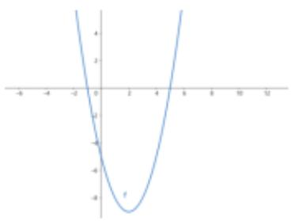

line

| x | y |
|---|---|
| -6 | 5 |
| -4 | 0 |
| -2 | -2 |
| 0 | -4 |
| 2 | -6 |
| 4 | -8 |
| 6 | -4 |
| 8 | 0 |
| 10 | 3 |
| 12 | 5 |

(2) 原不等式可化为 $2x^{2}-5x-7 \leqslant 0$ ,

方程 $2x^{2}-5x-7=0$ 的两个根为 $x_{1}=-1, x_{2}=\frac{7}{2}$ ,
函数 $y=2x^{2}-5x-7$ 的图像是开口向上的抛物线，
与 x 轴有两个交点 $(-1,0)$ ， $(\frac{7}{2},0)$ ，
所以原不等式的解集为

$$
\{x \mid - 1 \leq x \leq \frac {7}{2} \} = [ - 1, \frac {7}{2} ].
$$

# 针对训练

1．不等式 $-x^{2}-2x+3\geqslant0$ 的解集是 \_\_\_\_.

2. 解下列不等式：

(1) $-x^{2}+4x+5<0;$   
(2) $2x^{2}-5x+2\leqslant0;$

(3) $x^{2}-6x+9\leqslant0;$   
(4) $9-x^{2}\leqslant0$ .

3. 解下列不等式：

(1) $2x^{2}+5x-3<0$ ; (2) $-3x^{2}+6x-2\leqslant0$ ;   
(3) $4x^{2}+4x+1>0$ .

4. (1) $2x^{2} - 3x - 2 > 0$ ; (2) $x^{2} - 3x + 5 > 0$ ;

(3) $-6x^{2} - x + 2 \geqslant 0$ ; (4) $-4x^{2} \geqslant 1 - 4x$ .

5. 解关于 x 的不等式: $ax^{2}-x+1-a\leqslant0$ (其中 $a\leqslant0$ ).

# 题型2．二次函数判别式（考频★★★★★）

二次函数 $f(x) = ax^{2} + bx + c (a \neq 0)$

判别式 $\Delta=b^{2}-4ac$ 主要用来判断其图像与x轴的交点情况。

$b^{2}-4ac>0$ 有两个不同的交点

$b^{2}-4ac=0$ 有两个相同的交点

$b^{2}-4ac<0$ 无交点

当 $f(x)=ax^{2}+bx+c$ ，参数a未知时需要讨论。

因为只有 $a \neq 0$ 时函数才是二次函数。

例1. 若关于 $x$ 的不等式 $ax^2 - ax > -1$ 的解集是全体实数，则实数 $a$ 的取值范围是

解：当 a=0 时，关于 x 的不等式 $ax^{2}-ax>-1$ 化为 0>-1，对任意实数都成立，满足题意；

当 $a \neq 0$ 时，关于 $x$ 的不等式 $ax^2 - ax > -1$ 化为 $ax^2 - ax + 1 > 0$ ，应满足 $\left\{ \begin{array}{l} a > 0 \\ \triangle = a^2 - 4a < 0 \end{array} \right.$ ，解得 0 $< a < 4$ ；

综上知，实数 a 的取值范围是 $0 \leqslant a < 4$ .

例 2. 若关于 x 的不等式 $ax^{2}-2ax+1<0$ 的解集为 $\varnothing$ ，则实数 a 的取值范围是 \_\_\_\_.

解：当 $a = 0$ 时，不等式化为 $1 < 0$ ，满足解集为 $\varnothing$ ；当 $a \neq 0$ 时，应满足 $\left\{ \begin{array}{l} a > 0 \\ \Delta = 4a^2 - 4a \leq 0 \end{array} \right.$ ，

解得 $\left\{\begin{aligned}a&>0\\ 0&\leq a\leq1\end{aligned}\right.$

即 $0 < a \leqslant 1$ ;

综上知，实数 a 的取值范围是 $0 \leqslant a \leqslant 1$ .

# 针对训练

6. 若关于 $x$ 的不等式 $x^{2} - 2x + a \geqslant 0$ 的解集是实数集 $\mathbf{R}$ ，则实数 $a$ 的取值范围是（）

A. $(1, +\infty)$

B. $[1, +\infty)$

C. $(-∞,1)$

D. $(-∞,1]$

7. 若 $f(x)=ax^{2}-ax-4<0$ 恒成立，则实数 a 的取值范围是 \_\_\_\_.

8. 若不等式 $mx^{2} + mx - 4 < 2x^{2} + 2x - 1$ 对任意实数 $x$ 均成立，则实数 $m$ 的取值范围是（）

A. $(-2,2)$

B. $(-10, 2]$

C. $(-∞,-2)$

D. $(-∞,-2)$

9. “关于 x 的不等式 $x^{2}-2ax+a>0$ 的解集为 R”
的一个必要不充分条件是（）

A. 0 < a < 1

B. $0 \leqslant a < 1$

C. $0 < a < \frac{1}{3}$

D. 0 < a < 0.9

10. 若关于 x 的不等式 $(m-1)x^{2}+(m-1)x+2>0$ 的解集为 R，则实数 m 的取值范围是 \_\_\_\_.

11. 不等式 $(a-2)x^{2}+2(a-2)x-4\geqslant0$ 的解集为 $\varnothing$ ，则实数 a 的取值范围是 \_\_\_\_.

12. 若关于 $x$ 的不等式 $x^{2+}(k-1)x+4>0$ 对一切实数 $x$ 恒成立，则实数 $k$ 的取值范围是 \_\_\_\_.

13. 关于 $x$ 的不等式 $mx^2 + 2mx + 1 < 0$ 的解集为空集，则 $m$ 的取值范围为（）

A. (0, 1)

B. $(0,1]$

C. [0, 1]

D. $[0,1)$

14. 若不等式 $ax^2 + 2ax - 1 < 0$ 的解集为 $\mathbf{R}$ ，则 $a$ 的取值范围是（）

A. -1<a<0

B. $-1 \leqslant a < 0$

C. $-1 \leqslant a \leqslant 0$

D. $-1 < a \leqslant 0$

# 题型3．韦达定理（考频★★★★★）

$$
a x ^ {2} + b x + c = 0 \quad x _ {1} + x _ {2} = - \frac {b}{a} \quad x _ {1} x _ {2} = \frac {c}{a}
$$

15. 不等式 $ax^{2}+bx+6<0$ 的解集为（2，3），则 a-b 的值是 \_\_\_\_.  
16. 若关于 $x$ 的不等式 $ax^2 - bx + c > 0$ 的解集 $\{x \mid -2 < x < 3\}$ , 则关于 $x$ 的不等式 $cx^2 + bx + a > 0$ 的解集是 \_\_\_\_.  
17. 关于 $x$ 的不等式 $ax^2 + bx + c \leqslant 0$ 的解集为[2,3]，则 $cx^2 + bx + a \leqslant 0$ 的解集为 \_\_\_\_.  
18. 不等式 $x^{2} - 2x + c < 0$ 的解集为 $(m, m + 6)$ ，则 $c$ 的值为 \_\_\_\_.  
19. 已知不等式 $ax^2 + bx - 1 > 0$ 的解集为 $\{x| - \frac{1}{2}$

$<x<-\frac{1}{3}\}$ ，则不等式 $x^{2}-bx-a\geqslant0$ 的解集为（）

A. $\{x|x\leqslant -3$ 或 $x\geqslant -2\}$ B. $\{x| - 3\leqslant x\leqslant -2\}$   
C. $\{x\mid 2\leqslant x\leqslant 3\}$ D. $\{x|x\leqslant 2$ 或 $x\geqslant 3\}$

20. 若不等式 $ax^2 + bx + 2 > 0$ 的解集是 $\{x \mid -\frac{2}{3} < x < 1\}$ , 则 $a =$ \_\_\_\_, $b =$ \_\_\_\_.

# 题型 4. 二次函数的值域（考频★★★★★）

值域：指的是整体 y 的范围。求值域就是当一个量的变化，带动另一个量的变化，里里外外一层包一层，最终变化了多少的研究。比如 $y = 2 \sin(2x + 1)$ 中，x 变化时，带动 $2x + 1$ 的变化，从而带动 $\sin(2x + 1)$ 的变化，最后 $2 \sin(2x + 1)$ ，即结果 y.

高中学段以下一般研究一元值域问题（以下全是一元值域），或者二元相关值域问题（需要转化为一元）

一 求一次函数 $y = kx + b (k \neq 0)$ 值域

（图像是一直单调的，所以求其值域，就将定义域x的两端范围代入即可。）

如 $y = 2x + 1, x \in [1, 2]$ 求值域。

当 $x = 1, y = 3$ ，当 $x = 2, y = 5$ ，所以值域 $y \in [3,5]$

后面会经常遇到求一次函数的范围，如当 $x \in [\frac{\pi}{6}, \frac{\pi}{3}]$ ，则 $2x - \frac{\pi}{6} \in [\frac{\pi}{6}, \frac{\pi}{2}]$

这个比较简单，这里就不赘述。

二 求二次函数 $y = ax^{2} + bx + c (a \neq 0)$ 值域。

步骤：1 根据开口画出抛物线

2标出对称轴 $x = -\frac{b}{2a}$

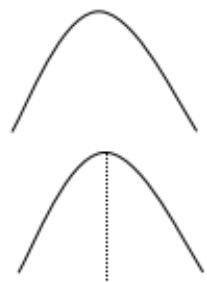

natural_image

Two simple curved line diagrams with a vertical dotted line, no text or symbols present.

3 标出定义域(注意开闭)

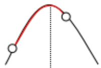

4 求出图像的最高点和最低点的 y 值，将范围写成区间或集合形式。

例题

求 $y=2x^{2}-4x+3,x\in[0,4]$ 的值域

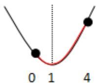

当 $x = 1, y_{\min} = 1$ 。当 $x = 4, y_{\max} = 19$ 。所以值域 $y \in [1, 19]$

# 经典练习

1. 函数 $f(x) = -x^{2} + 4x - 3$ 的最大值为（）

A. $f(1)=1$

B. $f(2) = 1$

C. $f(2) = -1$

D. $f(0)=2$

2. 已知函数 $y = 2x^{2} + 2x + 1$ ，则当 $-1 \leqslant x \leqslant 1$ 时， $y$ 的最大值和最小值分别是（）

A. 5, $\frac{1}{2}$

B. 5, 1

C. 5, $\frac{1}{4}$

D. $1, \frac{1}{2}$

3. 已知二次函数 $y = x^{2} + 2x - 8$ ( $-4 \leqslant x \leqslant 4$ )，那么 $y$ 的最大值是（）

A.-8

B.-9

C. 16

D. 0

4. 二次函数 $f(x) = x^{2} - 2x - 3$ 在[0, 4]上的值域是（）

A. $[-3, 5]$

B. $[0, 5]$

C. $[-4, 0]$

D. $[-4,5]$

5. 函数 $y=x^{2}-2x$ ( $x\in[0,3]$ ) 的值域是 \_\_\_\_.

6. 函数 $f(x) = -x^{2} + 4x - 6$ , $x \in [0, 5]$ 的值域为 \_\_\_\_.

7. 函数 $y=x^{2}-2x+4,\quad x\in[1,3]$ 的值域是 \_\_\_\_.

8. 函数 $f(x) = x^{2} - 4x + 5 (x \in [-2, 3))$ 的值域是（）

A. [2, 17]

B. [1, 17]

C. [2, 13]

D. (1, 13)

9. 函数 $f(x)=x^{2}-4x+2,\quad x\in[1,4]$ 的值域是 \_\_\_\_.

10. 下面关于函数 $f(x)=x^{2}+3x+4$ 的说法正确的是（）

A. $f(x) > 0$ 恒成立

B. $f(x)$ 最大值是 5

C. $f(x)$ 与 y 轴无交点

D. $f(x)$ 没有最小值

11. 若函数 $y = x^{2} - 3x - 4$ 的定义域为 $[0, m]$ ，值域为 $[- \frac{25}{4}, -4]$ ，则 $m$ 的取值范围是（）

A. (0, 4]

B. $\left[\frac{3}{2},4\right]$

C. $[\frac{3}{2}, 3]$

D. $\left[\frac{3}{2}, +\infty\right)$

12. 已知 $f(x) = 2x^{2} + ax + b$ 过点（0，-1），且满足 $f(-1) = f(2)$ ， $f(x)$ 在 $[m, m+2]$ 上的值域为 $[- \frac{3}{2}, 3]$ ，则实数 $m$ 的值为 \_\_\_\_.  
13. 已知函数 $y = x^2 - 4x - 4$ 的定义域为 $[0, m]$ ，值域为 $[-8, -4]$ ，则 $m$ 的取值范围是 \_\_\_\_.  
14. 已知函数 $f(x) = x^{2} - 2mx - m + 2$ 的值域为 $[0, +\infty)$ ，则实数 $m$ 的取值范围是（）

A. $\{-2, 1\}$

B. $[-2, 1]$

C. $(- \infty, -2] \cup [1, +\infty)$

D. $\{2, 1\}$

15. 若函数 $f(x) = -x^2 + 2x$ 在定义域 $[0, m]$ 上的值域为 $[0, 1]$ ，则（）

A. $1 \leq m \leq 2$

B. $m > 1$

C. m=2

D. $1 < m \leq 2$

16. 已知函数 $f(x) = x^{2} - 2x + 3$ 在闭区间 $[0, m]$ 上的值域是 $[2, 3]$ ，则实数 $m$ 的取值范围是（）

A. $[1, +\infty)$

B. $[0, 2]$

C. $(-∞,-2]$

D. $[1, 2]$

17. 已知函数 $f(x) = ax^{2} - 2x + 2a + 1 (a > 0)$ .

（1）当 $a = 1$ 时，求函数 $f(x)$ 在区间 $[\frac{1}{2}, 2]$ 上的值域；

(2) 求函数 $f(x)$ 在区间 $[0, 2]$ 上的最大值 h(a).

18. 已知二次函数 $f(x) = x^{2} - 2(a - 1)x + 4$ .

（1）若 $f(x)$ 为偶函数，求 $f(x)$ 在[-1，3]上的值域；  
(2) 若 $f(x)$ 在区间 $(-∞, 2]$ 上是减函数，求实数 a 的取值范围；  
（3）若 $x \in [1, 2]$ 时， $f(x)$ 的图像恒在直线 y = ax 的上方，求实数 a 的取值范围.

19. 已知函数 $f(x) = x^{2} + 2ax + 2$ .

（1）当 $a = 1$ 时，求函数 $f(x)$ 在区间[-2，3）上的值域；  
(2) 当 a = -1 时，求函数 $f(x)$ 在区间 $[t, t+1]$ 上的最大值；  
(3) 求 $f(x)$ 在 $[-5, 5]$ 上的最大值与最小值.

思维扩展：换元转化为二次函数

1. 函数 $y = \sin^{2} x - \sin x - 1$ 的值域为（）

A. $[-1, 1]$   
C. $[- \frac{5}{4}, 1]$

B. $[- \frac{5}{4}, -1]$

D. $[1, \frac{5}{4}]$

答案：C

2.函数 $y = 4\sin x + \cos 2x$ 的值域为（

A. $[-5, 4]$   
C. $[-5,3]$

B. [3, 7]

D. $[-1,3]$

答案：C

# [必修一]第三章 函数的概念与性质

# 3.1 函数的概念及其表示

# 题型1：定义域（基础★★★★★）

定义域：指的是 $x$ 的范围，常考有如下三种

<table><tr><td>类型</td><td>满足的条件</td></tr><tr><td>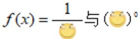</td><td></td></tr><tr><td>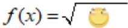</td><td>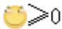</td></tr><tr><td>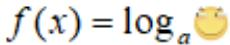</td><td></td></tr></table>

也就是说常见限制自变量 x 范围的有分母，零次幂，偶次方根，对数。奇数次方根对 x 范围不影响。

针对练习：

1. 式子 $\frac{\sqrt{x - 1}}{x + 1}$ 在实数范围内有意义，则 $x$ 的取值范围是（）

A. $x \geqslant 0$

B. $x \geqslant 1$ 且 $x \neq -1$

C. $x \geqslant 1$

D. $x \neq -1$

2. 若二次根式 $\sqrt{2 - x}$ 有意义，则 $x$ 的取值范围是（）

A. $x \geq 2$

B. x>2

C. $x \leq 2$

D. x<2

3．函数 $f(x)=\frac{1}{x}+\sqrt{1-x}$ 的定义域是 \_\_\_\_.

4. 下列函数定义域为 $\mathbf{R}$ 的是（）

A. $y = x^{-\frac{1}{2}}$

B. $y=x^{-1}$

C. $y = x^{\frac{1}{3}}$

D. $y = x^{\frac{1}{2}}$

5．函数 $f(x)=\frac{1}{x+1}+\ln x$ 的定义域是 \_\_\_\_.

6．函数 $y = \sqrt{7 + 6x - x^{2}}$ 的定义域是 \_\_\_\_.

7．函数 $f(x)=\sqrt{\log_{2}x-1}$ 的定义域为 \_\_\_\_.

8. 函数 $f(x)=\log_{2}(x^{2}+2x-3)$ 的定义域是（）

A. $[-3, 1]$

B. $(-3,1)$

C. $(- \infty, -3] \cup [1, +\infty)$

D. $(- \infty, -3) \cup (1, +\infty)$

9. 函数 $f(x) = \sqrt{4 - |x|} + \lg \frac{x^2 - 5x + 6}{x - 3}$ 的定义域为（）

A. (2, 3)

B. (2, 4]

C. $(2, 3) \cup (3, 4]$

D. $(-1,3)\cup(3,6]$

10. 函数 $f(x) = \frac{1}{\sqrt{\log_2 x - 1}}$ 的定义域为（）

A. $(0,2)$

B. $(0, 2]$

C. $(2, +\infty)$

D. $[2, +\infty)$

# 函数与方程图像一览表

如果有陌生的函数表达式，如何画出大致对应的函数图像？不管是国内还是国外的教材，都是先用散点图的方式来引入研究。后续再结合从表达式看出来的单调性，奇偶性，端点极限等等来辅助画图

例如：画出 $y = x + \frac{1}{x}$ 的图像

第一步，分别另 $x$ 取下列值，求出对应的 $y$

<table><tr><td>x</td><td>-2</td><td>-1</td><td> $\frac{1}{2}$ </td><td> $\frac{1}{2}$ </td><td>1</td><td>2</td></tr><tr><td>y</td><td> $-\frac{5}{2}$ </td><td>-2</td><td> $\frac{5}{2}$ </td><td> $\frac{5}{2}$ </td><td>2</td><td> $\frac{5}{2}$ </td></tr></table>

第二步，在坐标系中把上面各点逐个标出

第三步，用曲线连接即可

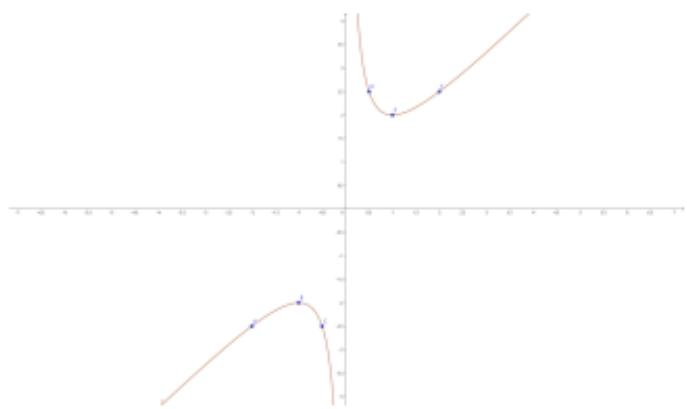

line

| X | Y |
|---|---|
| 0.5 | 10 |
| 1.0 | 8 |
| 1.5 | 9 |
| 2.0 | 10 |
| 3.0 | 12 |
| 4.0 | 14 |
| 5.0 | 16 |
| 6.0 | 18 |
| 7.0 | 20 |

当然，上述方法仅适合初学阶段，后续则需要从

表达式中看出单调性（求导），奇偶性来辅助画图，增加效率。函数 $y = x + \frac{1}{x}$ 是一个奇函数，图像关于坐标原点对称，因此只要画出一侧图像，再对称即可。

以下是常用函数与方程的图像及性质，建议掌握。（理解表达式中 a,b,c,k 等参数变化对图像的影响）

<table><tr><td>函数与方程</td><td>图像</td><td>定义域</td><td>值域</td><td>奇偶性(对称性)</td><td>单调性</td><td>周期性</td></tr><tr><td>常数函数y=a(水平线)</td><td></td><td>R</td><td>{a}</td><td>偶</td><td>/</td><td>T=0</td></tr><tr><td>垂直线x=a</td><td></td><td>{a}</td><td>R</td><td>/</td><td>/</td><td>/</td></tr><tr><td>正比例函数y=kx</td><td></td><td>R</td><td>R</td><td>奇</td><td>k&gt;0,在R上增k&lt;0,在R上减</td><td>/</td></tr><tr><td rowspan="2">反比例函数 $y = \frac{k}{x}$ </td><td>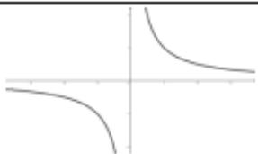</td><td> $\{ x \neq 0\}$ </td><td> $\{ y \neq 0\}$ </td><td>奇</td><td>k&gt;0,在 $(-∞, 0), (0, +∞)上减$ </td><td>/</td></tr><tr><td>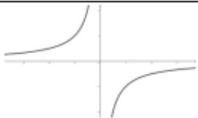</td><td> $\{ x \neq 0\}$ </td><td> $\{ y \neq 0\}$ </td><td>奇</td><td>k&lt;0,在 $(-∞, 0), (0, +∞)上增$ </td><td>/</td></tr><tr><td rowspan="2">双勾函数 $y = ax + \frac{b}{x}$ </td><td>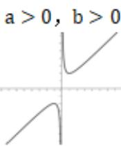</td><td> $\{ x \neq 0\}$ </td><td> $\begin{pmatrix}-∞, f(-\sqrt{\frac{b}{a}}), \\f(\sqrt{\frac{b}{a}}), +∞\end{pmatrix}$ </td><td>奇</td><td>在 $\begin{pmatrix}-∞, -\sqrt{\frac{b}{a}}\end{pmatrix},$  $\begin{pmatrix}\sqrt{\frac{b}{a}}, +∞\end{pmatrix}上增$ 在 $\begin{pmatrix}-\sqrt{\frac{b}{a}}, 0\end{pmatrix},$  $\begin{pmatrix}0, \sqrt{\frac{b}{a}}\end{pmatrix}上减$ </td><td>/</td></tr><tr><td>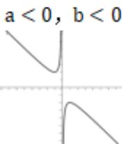</td><td> $\{ x \neq 0\}$ </td><td> $\begin{pmatrix}-∞, f(\sqrt{\frac{b}{a}}), \\f(-\sqrt{\frac{b}{a}}), +∞\end{pmatrix}$ </td><td>奇</td><td>在 $\begin{pmatrix}-∞, -\sqrt{\frac{b}{a}}\end{pmatrix},$  $\begin{pmatrix}\sqrt{\frac{b}{a}}, +∞\end{pmatrix}上减$ 在 $\begin{pmatrix}-\sqrt{\frac{b}{a}}, 0\end{pmatrix},$  $\begin{pmatrix}0, \sqrt{\frac{b}{a}}\end{pmatrix}上增$ </td><td>/</td></tr><tr><td rowspan="2">双撇函数 $y = ax + \frac{b}{x}$ </td><td>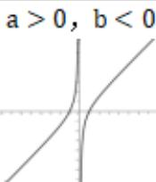</td><td> $\{ x \neq 0\}$ </td><td>R</td><td>奇</td><td>在 $(-∞, 0), (0, +∞)上增$ </td><td>/</td></tr><tr><td>a&lt;0, b&gt;0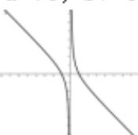</td><td> $\{ x \neq 0\}$ </td><td>R</td><td>奇</td><td>在 $(-∞, 0), (0, +∞)上减$ </td><td>/</td></tr><tr><td>一次函数 $y = kx + b$ </td><td>k决定增减b决定位置b为与y轴的截距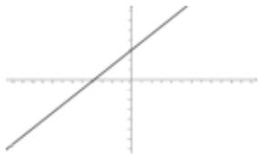</td><td>R</td><td>R</td><td>b=0奇</td><td>k&gt;0,在R上增k&lt;0,在R上减</td><td>/</td></tr><tr><td rowspan="2">二次函数 $y = ax^2 + bx + c$ </td><td>a&gt;0,对称轴为 $x = -\frac{b}{2a}$ 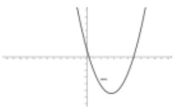a决定开口,b决定位置,c为与y轴的截距</td><td>R</td><td> $(f(-\frac{b}{2a}), +\infty)$ </td><td>b=0偶</td><td>在对称轴两边分别单调</td><td>/</td></tr><tr><td>a&lt;0,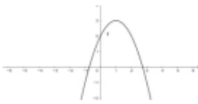a决定开口,b决定位置,c为与y轴的截距</td><td>R</td><td> $(-\infty, f(-\frac{b}{2a}))$ </td><td>b=0偶</td><td>在对称轴两边分别单调</td><td>/</td></tr><tr><td>幂函数 $y = x^a$ </td><td>a=-1,y= $\frac{1}{x}$ 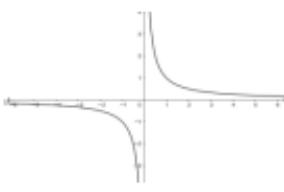</td><td>{x≠0}</td><td>{y≠0}</td><td>奇</td><td>在(-∞,0),(0,+∞)上减</td><td>/</td></tr><tr><td>幂函数 $y = x^a$ </td><td>a= $\frac{1}{2}$ ,y= $\sqrt{x}$ 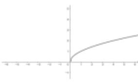</td><td>{x≥0}</td><td>{y≥0}</td><td>/</td><td>[0,+∞)上增</td><td>/</td></tr><tr><td>幂函数 $y = x^a$ </td><td>a=1,y=x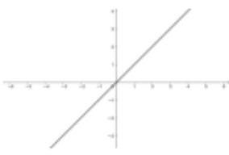</td><td>R</td><td>R</td><td>奇</td><td>R上增</td><td>/</td></tr><tr><td>幂函数 $y = x^a$ </td><td> $a=2,y=x^2$ 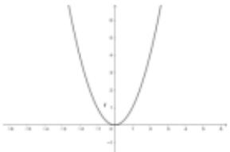</td><td>R</td><td>[0, +∞)</td><td>偶</td><td>在(-∞, 0)减,(0, +∞)上增</td><td>/</td></tr><tr><td>幂函数 $y = x^a$ </td><td> $a=3,y=x^3$ 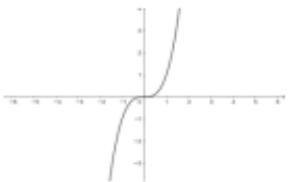</td><td>R</td><td>R</td><td>奇</td><td>R增</td><td>/</td></tr><tr><td rowspan="2">指数函数 $y = a^x$ </td><td>0&lt; a &lt; 1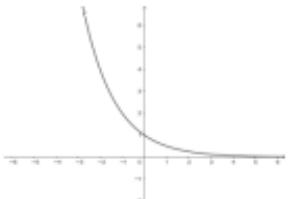</td><td>R</td><td>(0, +∞)</td><td>/</td><td>R减</td><td>/</td></tr><tr><td>a&gt;1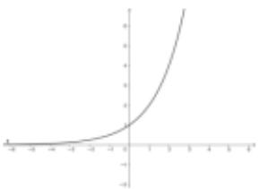</td><td>R</td><td>(0, +∞)</td><td>/</td><td>R增</td><td>/</td></tr><tr><td rowspan="2">对数函数 $y = \log_a x$ </td><td>0&lt; a &lt; 1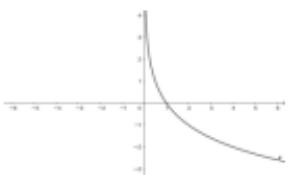</td><td>{x &gt; 0}</td><td>R</td><td>/</td><td>R减</td><td>/</td></tr><tr><td>a&gt;1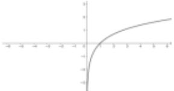</td><td>{x &gt; 0}</td><td>R</td><td>/</td><td>R增</td><td>/</td></tr><tr><td>三角函数 $y=sinx$ </td><td>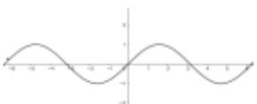</td><td>R</td><td>[-1, 1]</td><td>奇</td><td>(-π/2+2kπ, π/2+2kπ)增(π/2+2kπ, 3π/2+2kπ)减</td><td>2π</td></tr><tr><td>三角函数 $y = \cos x$ </td><td>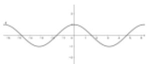</td><td>R</td><td>[-1, 1]</td><td>偶</td><td>(2kπ, π + 2kπ)减(π + 2kπ, 2π + 2kπ)增</td><td>2π</td></tr><tr><td>三角函数 $y = \tan x$ </td><td>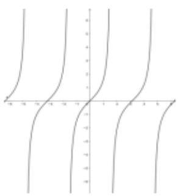</td><td>{x = π/2 + kπ}</td><td>R</td><td>奇</td><td>(-π/2 + kπ, π/2 + kπ)增</td><td>π</td></tr><tr><td>绝对值函数V字函数y = |ax+b|</td><td>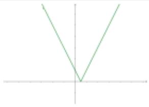对称轴为x = -b/a</td><td>R</td><td>[0, +∞)</td><td>随参数变化</td><td>先减后增</td><td>/</td></tr><tr><td colspan="7">题型2:图像的位移,对称,伸缩,翻折变形(基础★★★★★)</td></tr></table>

以上基础图像还可以进行位移，对称，伸缩，翻折等变换变成复杂的函数。

①位移，口诀是左加右减（对 x），上加下减(对整体)

$$
\mathrm{y} = l o g _ {2} x \qquad \xrightarrow [ \text {上移} 1 ]{} \quad \mathrm{y} = l o g _ {2} x + 1
$$

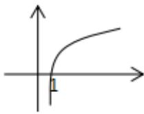

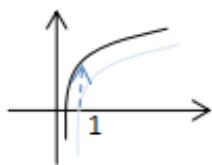

$$
\mathrm{y} = l o g _ {2} x \quad {\underset {\text {右移} 1} {\longrightarrow}} \quad \mathrm{y} = l o g _ {2} (x - 1)
$$

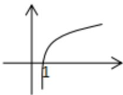

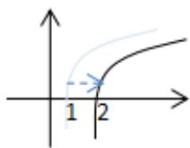

易错： $y=2x\xrightarrow{右移1}y=2x-1$ (×)

$$
\mathrm{y} = 2 x \xrightarrow [ \text {右移} 1 ]{} \mathrm{y} = 2 (x - 1) (\swarrow)
$$

# 针对练习：

1. 若一次函数 $y = 3x + 4$ 的图象平移后经过原点，则下列平移方式正确的是（）

A. 向左平移 4 个单位

B. 向右平移 4 个单位

C. 向下平移 4 个单位

D. 向上平移 4 个单位

2. 将直线 $y = -3x + 2024$ 先向左平移3个单位，再向下平移4个单位后，所得直线的表达式为（）

A. $y = -3x + 2037$

B. $y = -3x + 2029$

C. $y = -3x + 2011$

D. $y = -3x + 2021$

3. 将抛物线 $y = x^2$ 向左平移一个单位，得到的新抛物线的解析式是（）

A. $y=x^{2}-1$

B. $y=x^{2}+1$

C. $y=(x-1)^{2}$

D. $y=(x+1)^{2}$

4. 将抛物线 $y = (x - 2)^{2} + 1$ 先向左平移 2 个单位长度，再向上平移 1 个单位长度，所得抛物线的表达式是（）

A. $y=(x-2)^{2}$

B. $y=(x-1)^{2}+2$

C. $y=(x-4)^{2}+2$

D. $y=x^{2}+2$

5. 把抛物线 $y = x^{2} - 2x$ 向左平移1个单位，然后向上平移2个单位，则平移后抛物线的表达式是（）

A. $y=x^{2}-1$

B. $y=x^{2}+1$

C. $y=(x-2)^{2}-1$

D. $y=(x-2)^{2}+1$

6. 若将抛物线 $y=x^{2}-2x+3$ 平移后得到抛物线 $y=x^{2}$ ，下列平移方法正确的是（）

A. 向左平移 1 个单位，再向上平移 2 个单位

B. 向左平移 1 个单位，再向下平移 2 个单位

C. 向右平移 1 个单位，再向上平移 2 个单位

D. 向右平移 1 个单位，再向下平移 2 个单位

7. 将反比例函数 $y = \frac{4}{x}$ 的图象向左平移 2 个单位长后，所得的图象与 $y$ 轴的交点坐标为 \_\_\_\_.

②对称，常见的对称如下

关于 x 轴对称：横坐标不变，纵坐标变相反

关于 y 轴对称：纵坐标不变，横坐标变相反

关于坐标原点对称：横纵坐标都相反

$$
y = 3 x + 4 \quad \xrightarrow [ \text {关于} \mathrm{x} \text {轴对称} ]{} y = - (3 x + 4) = - 3 x - 4
$$

$$
y = 3 x + 4 \quad \xrightarrow [ \text {关于} y \text {轴对称} ]{} y = 3 (- x) + 4 = - 3 x + 4
$$

$$
f (x) = \ln x \quad {\underset {\text {关于} x \text {轴对称}} {\longrightarrow}} f (x) = - \ln x
$$

$$
f (x) = \ln x \underset {\text {关于} y \text {轴对称}} {\longrightarrow} f (x) = \ln (- x)
$$

$$
f (x) = \ln x \underset {\text {关于原点对称}} {\longrightarrow} f (x) = - \ln (- x)
$$

# 针对练习：

1. 一次函数 $y = -kx + 3$ 的图象关于 $x$ 轴对称后经过（2，-1），则 $k$ 的值是（）

A. 1

B.-1

C. 5

D.-5

2. 抛物线 $y = 2x^{2} - 4x - 6$ 关于 $y$ 轴对称后所得到的抛物线解析式为（）

A. $y = -2x^{2} + 4x + 6$

B. $y=2x^{2}+4x-6$

C. $y=2x^{2}+2x-6$

D. $y = -2x^{2} - 2x + 6$

3. 在同一平面直角坐标系中，若抛物线 $y = -ax^2 + 3x - c$ 与 $y = 2x^2 - 3x - c + a$ 关于 $x$ 轴对称，则 $a + 2c$ 的值为（）

A. 0

B.-4

C. 4

D.-1

4. 在平面直角坐标系中，抛物线 $y = -(x + 1)^2 + 2$ 关于 $y$ 轴对称的抛物线的解析式为（）

A. $y = -\left(x - 1\right)^{2} + 2$

B. $y = -(x + 1)^{2} - 2$

C. $y=(x+1)^{2}-2$

D. $y=(x-1)^{2}+2$

5. $y=(x+1)^{2}-4$ 关于 x 轴对称的图象所对应的函数表达式为 \_\_\_\_.

6. 曲线 $y=f(x)$ 与曲线 $y=\cos x$ 关于 x 轴对称，则（）

A. $f(x)=\sin x$

B. $f(x) = -\sin x$

C. $f(x) = \cos x$

D. $f(x) = -\cos x$

7. 函数 $y = 3^{x}$ 与 $y = -\frac{1}{3^{x}}$ 的图象（）

A. 关于 x 轴对称

B. 关于 $y$ 轴对称

C. 关于原点对称

D. 关于 $y = x$ 对称

8. 在同一坐标系中，函数 $y = f(x)$ 与 $y = -f(x)$ 的图象（）

A. 关于原点对称

B. 关于 $x$ 轴对称

C. 关于 $y$ 轴对称

D. 关于直线 $y = x$ 对称

③伸缩，分为横坐标和纵坐标两种

$$
y = f (x) \underset {\text {纵坐标伸长为原来} 2 \text {倍}} {\longrightarrow} y = 2 f (x)
$$

$$
y = f (x) \xrightarrow [ \text {纵坐标缩短为原来} \frac {1}{3} \text {倍} ]{} y = \frac {1}{3} f (x)
$$

$$
f (x) = \ln x \quad \overrightarrow {\text {纵坐标伸长为原来} 2 \text {倍}} y = 2 \ln x
$$

$$
f (x) = \ln x \quad {\frac {1}{\mathrm{纵坐标缩短为原来} \frac {1}{1 0} \mathrm{倍}}} y = {\frac {1}{1 0}} \ln x
$$

纵坐标伸缩理解起来很简单，但是横坐标伸缩比较特殊，注意观察表达式变化

$$
y = f (x) \xrightarrow [ \text {横坐标伸长为原来} 2 \text {倍} ]{} y = f (\frac {1}{2} x)
$$

$$
y = f (x) \underset {\text {横坐标缩短为原来} \frac {1}{3} \text {倍}} {\longrightarrow} y = f (3 x)
$$

$$
f (x) = \ln x \xrightarrow [ \text {横坐标伸长为原来} 2 \text {倍} ]{} y = \ln (\frac {1}{2} x)
$$

$$
f (x) = \ln x \quad \xrightarrow [ \text {横坐标缩短为原来} ]{1 0} y = \ln (1 0 x)
$$

纵坐标伸缩是整体变化，横坐标伸缩只是 x 变化，其他保持不变

$$
y = 3 x + 4 \quad \xrightarrow [ \text {纵坐标伸长为原来} 2 \text {倍} ]{} y = 2 (3 x + 4) = 6 x + 8
$$

$$
y = 3 x + 4 \quad \xrightarrow [ \text {横坐标伸长为原来} 2 \text {倍} ]{} y = 3 (\frac {1}{2} x) + 4 = \frac {3}{2} x + 4
$$

思考： $y=\sin x \xrightarrow{横坐标伸长为原来2倍} y=$ 左移动1一个单位长度 $y=$

$y=\sin x$ 左移动1一个单位长度 $y=$ 横坐标伸长为原来2倍 $y=$ （它们最终结果一样吗？）

④翻折，通常是指表达式经过绝对值作用后的图像变化。

$$
y = f (x) \underset {\text {将} x \text {轴下方图像沿着} x \text {轴翻折}} {\longrightarrow} y = | f (x) |
$$

$y=f(x)$ $\xrightarrow{将y轴右方图像沿着y轴翻折}v=f(|x|)$ 此时图像关于y轴对称，为偶函数。

$$
y = 3 x + 4 \quad \xrightarrow [ \text {将} \mathrm{x轴下方图像沿着} \mathrm{x轴翻折} ]{} y = | 3 x + 4 |
$$

$$
y = 3 x + 4 \quad \xrightarrow [ \text {将} y \text {轴右方图像沿着} y \text {轴翻折} ]{} y = 3 | x | + 4
$$

思考：如何画出 $y=|3|x|+4|$ 的图像？

方式1：画出 $y = 3x + 4$ 图像 $\xrightarrow{\text{将} x\text{轴下方图像沿着} x\text{轴翻折}} y = |3x + 4|$ $\xrightarrow{\text{将} y\text{轴右方图像沿着} y\text{轴翻折}} y = |3|x| + 4|$

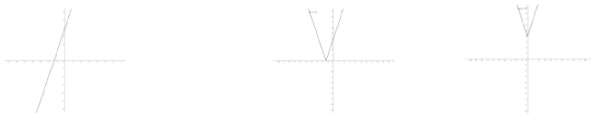

natural_image

Three simple geometric diagrams showing intersecting lines and V-shapes on a Cartesian coordinate system (no text or labels)

方式2：画出 $y = 3x + 4$ 图像 $\xrightarrow{\text{将} y\text{轴右方图像沿着} y\text{轴翻折}} y = 3|x| + 4\xrightarrow{\text{将} x\text{轴下方图像沿着} x\text{轴翻折}} y = |3|x| + 4|$

针对练习：

1. 画出 $f(x)=\ln x$ 图像  
2. 画出 $f(x)=|\ln x|$ 图像  
3. 画出 $f(x)=\ln|x|$ 图像  
4. 画出 $f(x)=|\ln|x|$ 图像

# 题型 3：利用函数图像求范围（基础★★★★★）

以下解不等式的内容可以用纯代数计算的方式来做，但随之而来会有一个问题，例如学生会算一元二次不等式，如果遇到三次或者其他稍微变形的问题就不会做了，只有学过一样才会解，典型的“一把钥匙解一把锁”，那有没有什么方法是比较通用的，能一下子解决一大片问题呢？

本章学习通用思想与方法，把常见问题转化为函数图像来做，更直观，同时也能培养数形结合思维。

以下内容建立在学生已经掌握常见的图像（详见“函数与方程图像一览表”）进行。

例1：解出 $x$ 范围： $2 <   x^{2} <   4$

第一步，画出函数 $y=x^{2}$ ，y=2 和 y=4

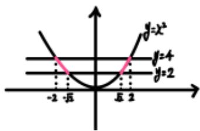

text_image

y=x²
y=4
y=2
-2 -x̅ x̅ 2

第二步，算出交点， $x^{2} = 2$ 解得 $x = \pm \sqrt{2}$ 。由 $x^{2} = 4$ 解得 $x = \pm 2$

第三步，由图像可知 $2 < x^{2} < 4$ 的解为 $(-2, -\sqrt{2}) \cup (\sqrt{2}, 2)$

# 针对练习

1，解出 $x$ 范围： $2 <   |2x - 1|\leqslant 4$   
2，解出 $x$ 范围： $-4 <   x^{3} <   4$   
3，解出 $x$ 范围： $4\leqslant x + \frac{1}{x} < 6$

例2：利用函数图像解不等式， $x <   x^{3}$

第一步，画出函数 $y=x^{3}$ ，y=x

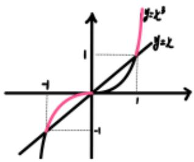

text_image

y=x²
y=x
-1
-1

第二步，算出交点， $x^{3} = x$ 解得 $x = \pm 1$ 或0。取 $\mathrm{y} = x^3$ 在 $\mathrm{y} = x$ 上方的图像

第三步，由图像可知 $x < x^3$ 的解为 $(-1, 0) \cup (1, \infty)$

# 针对练习

1，利用函数图像解出 $x$ 范围： $\vert 2x - 1\vert \leqslant x$   
2，利用函数图像解出 $x$ 范围： $0 < x^{3} < \frac{1}{x}$   
3，利用函数图像解出x范围： $\cos x\leqslant\sin x$

# 3.2 函数的基本性质

# 题型 4：求单调性（考频★★★★★）

# 单调性判断

方式1：记住常用的幂指对函数图像， $y = x^{n}$ ， $y = a^{x}$ ， $y = \log_{a}x$ 只要记住基础的图像，稍加变形的函数单调性我们都很快了如指掌。比如我们知道 $y = \log_{\frac{1}{2}}x$ 是减函数，那么 $y = -\log_{\frac{1}{2}}x$ 就是增的，取负或倒数会单调性反转，乘一个正数或者整体加任何数并不会改变图像单调性，所以 $y = -2\log_{\frac{1}{2}}x + 1$ 也是增的。

方式 2：当遇到复杂函数时，看能否分成两部分处理。

判断增减，增+增=增，减+减=减，增+减=?需要其他方法判断如求导等方法

注意：①单调区间不能用“∪”连接 ②单调区间要在定义域范围内。

方式 3：遇到对数或指数，与一次或者二次函数连体，可以利用求导判断增减性。（见“导数”章节）

# 针对性针对练习

画出函数图像，求单调区间（主要目的是熟悉函数图像，忘记的同学可以去看本章函数图像一览表）

1. 下列函数中，在 $(0, +\infty)$ 上为增函数的是（）

A. $f(x) = 3 - x$

B. $f(x) = x^{2} - 3x$

C. $f(x) = -\frac{1}{x}$

D. $f(x) = -|x|$

2. 下列函数中，在 $\mathbf{R}$ 上为增函数的是（）

A. $y=3+x$

B. $y=x^{2}$

C. $y=\frac{1}{x}$

D. $y = \left( \frac{1}{2} \right)^x$

3. 下列函数中，在 $(0, 2)$ 上为增函数的是（）

A. $y = -3x + 1$

B. $y=x^{2}-2x+3$

C. $y=\sqrt{x}$

D. $y=\frac{4}{x}$

4. 下列函数中，在 $\mathbf{R}$ 上为增函数的是（）

A. $y = -2x + 1$

B. $y=-\frac{2}{x}$

C. y=2x

D. $y=x^{2}$

5. 下列函数中，在 $(- \infty, 0)$ 上为减函数的是

( )

A. $y = -\frac{1}{x}$

B. $y=2x+1$

C. $y=x^{2}$

D. $y=x^{0}$

6. 下列函数中，在 $(- \infty, 0)$ 上为减函数的是（）

A. $y = -x^{2} + 2$

B. y=4x-1

C. $y=x^{2}+4x$

D. $y=\frac{1}{x}$

7.下列函数中，在 $(-1, + \infty)$ 上为减函数的是（

A. $y=3^{x}$

B. $y=x^{2}-2x+3$

C. y=x

D. $y = -x^{2} - 4x + 3$

8．函数 $y = \sqrt{x^{2} - 2x - 3}$ 的递减区间是 \_\_\_\_，递增区间是 \_\_\_\_。

（第8题针对性针对练习详见章节“复合函数单调性”）

9. 已知函数 $f(x) = x|x + 2|$ ，则 $f(x)$ 的单调递减区间为（）

（绝对值如何处理，详见章节“绝对值函数”）

A. $[-2,0]$

B. $[-2, 1]$

C. $[-2, -1]$

D. $[-2, +\infty)$

10. 函数 $y = |x - 1|$ 的递增区间是 \_\_\_\_.

11. 函数 $f(x) = -x^2 + 2|x| + 3$ 的单调减区间为 \_\_\_\_.

12. 函数 $f(x) = 3x - x^3$ 的单调增区间为 \_\_\_\_.

13．函数 $y = x + \frac{4}{x}$ （x > 0）的递增区间是 \_\_\_\_.

14．函数 $y = x + \frac{1}{|x|}$ 的单调递增区间是 \_\_\_\_.

15．函数 $y=\frac{x+1}{x-2}$ 的单调减区间为 \_\_\_\_.

# 题型 5：判断奇偶（考频★★★★★）

函数判断奇偶性，有 3 个常用方法，每一种方法都有对应的使用环境。

①对于“老熟人”熟悉的函数，直接想到图像看奇偶（忘记的同学可以去看本章函数图像一览表）

例题（2023·上海）下列函数是偶函数的是（）

A. $y=\sin x$

B. $y=\cos x$

C. $y=x^{3}$

D. $y=2^{x}$

【解答】解：对于 A，由正弦函数的性质可知， $y=\sin x$ 为奇函数；

对于 B，由余弦函数的性质可知， $y=\cos x$ 为偶函数；

对于 C，由幂函数的性质可知， $y=x^{3}$ 为奇函数；

对于 D，由指数函数的性质可知， $y=2^{x}$ 为非奇非偶函数。

故选：B.

总结一些常见但又不容易被察觉的奇函数

① $f(x)=x^{2n-1}(n\in\mathbf{Z})$

② $f(x)=x^{3}$

③ $f(x)=\sin x$

④ $f(x) = a^{x} - a^{-x}$

⑤ $f(x)=\frac{a^{x}-1}{a^{x}+1}$

⑥ $f(x) = \frac{a^x - a^{-x}}{a^x + a^{-x}}$

⑦ $f(x) = \log_a\frac{b - x}{b + x}$

⑧ $f(x) = \log_a\frac{cx + d}{cx - d}$

⑨ $f(x)=\log_{a}\left(\sqrt{k^{2}x^{2}+1}\pm kx\right)$

⑩ $f(x) = \log_a\left(\sqrt{x^2 + 1} \pm x\right)$

⑪ $f(x)=x^{3}+ax$

⑫ $f(x)=|ax+b|-|ax-b|$

②万能定义法，利用 $f(-x)$ 与 $f(x)$ 关系判断，相等则为偶函数，互为相反数则为奇函数。

例如：判断 $f(x) = x - \frac{1}{x}$ 奇偶性。法1，如果是你认识的“老熟人”可知 $f(x)$ 为奇函数。

法2： $f(-x) = -x + \frac{1}{x} = -(x - \frac{1}{x}) = -f(x)$ ，所以 $f(x)$ 为奇函数。

有时候 $f(-x)$ 与 $f(x)$ 比较复杂，也可以取特殊值例如 $f(-1)$ 与 $f(1)$ 来判断

例题（2024·天津）下列函数是偶函数的是（）

A. $\frac{e^{x}-x^{2}}{x^{2}+1}$

B. $\frac{cosx + x^2}{x^2 + 1}$

C. $\frac{e^{x}-x}{x+1}$

D. $\frac{sinx + 4x}{e^{|x|}}$

【解答】解： $A, f(x) = \frac{e^{x} - x^2}{x^2 + 1}$ ，定义域为 $\mathbf{R}$ ，

$f(1) = \frac{e - 1}{2}, f(-1) = \frac{\frac{1}{e} - 1}{2}$ ，则 $f(-1) \neq f(1)$ ， $A$ 不符合题意；

$B, f(x) = \frac{cosx + x^2}{1 + x^2}$ , 定义域为 $\mathbf{R}, f(-x) = \frac{cos(-x) + (-x)^2}{1 + (-x)^2} = \frac{cosx + x^2}{1 + x^2} = f(x)$ , 即 $f(x)$ 为偶函数, 符合题意;

C，由题意得， $\{x|x\neq-1\}$ ，定义域关于原点不对称，函数为非奇非偶函数，不符合题意；  
D，函数定义域为 R，

$f(-x) = \frac{sin(-x) + 4(-x)}{e^{[-x]}} = \frac{-sinx - 4x}{e^{|x|}} = -f(x)$ ，即 $f(x)$ 为奇函数，不符合题意.

故选：B.

针对针对练习：下列函数不是偶函数的是（）

A. $f(x) = \sin\left(\frac{3\pi}{2} + x\right)$

B. $f(x) = 2^{x} + 2^{-x}$

C. $f(x) = \frac{x}{2^x - 1} + x$

D. $f(x) = x \ln (\sqrt{x^{2} + 1} - x)$

参考：C

③对于复杂的函数表达式，看能否分成两部分处理。

奇+奇=奇，偶+偶=偶，奇+偶=非奇非偶

奇×奇=偶，偶×偶=偶，奇×偶=奇，

奇÷奇=偶，偶÷偶=偶，奇÷偶=奇，

如何记忆？奇看成负数，偶看成正数。

例如 $y = x^{2} + |x|$ 为偶

$$
y = x - \sin x \text {为奇}
$$

$$
y = x \cos^ {2} x \text {为奇}
$$

# 经典母题

（多选）1. 下列函数为奇函数的是（）

A. $f(x)=x^{4}$

B. $f(x) = x^{5}$

C. $f(x) = x + \frac{1}{x}$

D. $f(x)=\frac{1}{x^{2}}$

2. 下列函数为奇函数的是（）

A. $y=x^{2}-1$

B. $y=2^{x}$

C. $y=\sqrt{x}$

D. $y=\frac{1}{x}$

3. 下列函数为奇函数的是（）

A. $y=|x|$

B. y=2-x

C. $y=x^{3}+x$

D. $y = -x^{2} + 8$

4. 下列函数中为偶函数的是（）

A. $y=\sqrt{x}$

B. y=x-1

C. $y=x^{2}$

D. $y=x^{3}$

5. 下列函数中为偶函数的是（）

A. $y=x^{2}+2x$

B. $y=3^{x}$

C. $y = -\frac{1}{x}$

D. $y=|x|$

6. 下列函数中为偶函数的是（）

A. $y = \frac{1}{x}$

B. $y=(x+2)^{2}$

C. y=2x

D. $y=|x|$

7. 设函数 $f(x) = \frac{1}{x^3 + 1}$ ，则下列函数中为偶函数的是（）

A. $f(x+1)$

B. $f(2x)$

C. $f(x-1)$

D. $f(x^{2})$

# 题型 6：奇偶求参（考频★★★★★）

此为问题有 4 招解决通法

①当 $f(x)$ 定义域有0时，必然有 $f(0)=0$

例题：已知函数 $f(x) = a + \frac{1}{2^x + 1}$ 为奇函数，则 $f(1) = (\quad)$

A. $-\frac{2}{3}$

B.-1

C. $-\frac{1}{6}$

D. $\frac{1}{3}$

【解答】解：函数的定义域为 R，∵ $f(x)$ 是奇函数，

$\therefore f(0) = 0$ ，即 $f(0) = a + \frac{1}{1 + 1} = 0$ ，即 $a = -\frac{1}{2}$ ，则 $f(1) = -\frac{1}{2} +\frac{1}{2 + 1} = -\frac{1}{2} +\frac{1}{3} = -\frac{1}{6},$

故选：C.

②利用上一个题型的方法3，奇偶运算公式

例题：已知 $f(x) = x^{2} + ax + 1$ ， $x \in \mathbb{R}$ ，且 $f(x)$ 是偶函数，则 $a =$ \_\_\_\_.

【解答】解： $x^{2}+ax+1$ 表达式中， $x^{2}$ 是偶，1 是偶，根据“偶+偶=偶”，ax 是偶故而 a=0

③利用奇函数 $f(-x)=-f(x)$ 偶函数 $f(-x)=f(x)$

（有时候 $f(-x)$ 与 $f(x)$ 比较复杂，也可以取特殊值，例如 $f(-1)$ 与 $f(1)$ 来判断）

例题：函数 $f(x)=\frac{(x+1)(x+a)}{x}$ 为奇函数，则实数a的值为（）

A. 0

B. 1

C.-1

D. 2

【解答】解：法一：由题意可得， $x \neq 0$ ， $f(-x) = -f(x)$ ， $\therefore \frac{(-x+1)(-x+a)}{-x} = -\frac{(x+1)(x+a)}{x}$

整理可得， $2(a+1)x=0$ 对任意 $x\neq0$ 都成立， $\therefore a+1=0,\therefore a=-1,$

法二： $\because y = \frac{(x + 1)(x + a)}{x}$ 是奇函数，

由奇函数的性质可知，分子 $= (x + 1)(x + a) = x^{2} + (a + 1)x + a$ 为偶函数，

根据偶函数的性质可知，函数的对称轴 $x=-\left(a+1\right)=0$ ，

$$
\therefore a = - 1,
$$

故选：C.

④利用奇偶函数图像的对称性

例题：函数 $f(x) = \frac{(x + 1)(x + a)}{x}$ 为奇函数，则实数 $a$ 的值为（）

A. 0

B. 1

C.-1

D. 2

【解答】解： $f(-1)=0$ ，根据奇函数图像对称性，必然有 $f(1)=0,\therefore a=-1$

# 针对针对练习

1.（2024·上海）已知 $f(x) = x^{3} + a$ ， $x \in \mathbb{R}$ ，且 $f(x)$ 是奇函数，则 $a =$ \_\_\_\_.

2.（2023·新高考Ⅱ）若 $f(x) = (x + a)\ln \frac{2x - 1}{2x + 1}$ 为偶函数，则 $a = (\quad)$

A. -1

B. 0

C. $\frac{1}{2}$

D. 1

3.（2023·乙卷）已知 $f(x) = \frac{xe^x}{e^{ax} - 1}$ 是偶函数，则 $a = (\quad)$

A.-2

B.-1

C. 1

D. 2

4.（2023·甲卷）若 $y = (x - 1)^{2} + ax + \sin (x + \frac{\pi}{2})$ 为偶函数，则 $a =$ \_\_\_\_.

5.（2022·乙卷）若 $f(x) = \ln |a + \frac{1}{1 - x}| + b$ 是奇函数，则 $a =$ \_\_\_\_， $b =$ \_\_\_\_.

6.（2022·上海）若函数 $f(x) = \begin{cases} a^2 x - 1 & x < 0 \\ x + a & x > 0 \\ 0 & x = 0 \end{cases}$ ，为奇函数，求参数 $a$ 的值为 \_\_\_\_.

7.（2021·新高考I）已知函数 $f(x)=x^{3}(a\cdot2^{x}-2^{-x})$ 是偶函数，则a=\_\_\_\_。

8.（2020·上海）若函数 $y = a \cdot 3^x + \frac{1}{3^x}$ 为偶函数，则 $a =$ \_\_\_\_.

# 3.3 幂函数

知识点1：函数 $y = x^{\alpha}$ 叫做幂函数，其中 $x$ 是自变量， $\alpha$ 是常数.

若 $y = Ax^a + B$ 是幂函数，则 $A = 1$ 且 $B = 0$ （必须符合 $y = x^a$ 的形式）

例 已知 $y = (m^2 + 2m - 2)x^{m^2 - 2} + 2n - 3$ 是幂函数，求 $m, n$ 的值.

解 由题意得 $\left\{\begin{aligned}m^{2}+2m-2&=1,\\ 2n-3&=0,\end{aligned}\right.$

解得 $\left\{\begin{aligned}m&=-3,\\ n&=\frac{3}{2}\end{aligned}\right.$ 或 $\left\{\begin{aligned}m&=1,\\ n&=\frac{3}{2}\cdot\end{aligned}\right.$

所以 m=-3 或 1, $n=\frac{3}{2}$ .

注意 只有满足函数解析式右边的系数为 1，底数为自变量 $x$ ，指数为常数这三个条件，才是幂函数。如： $y = 3x^2, y = (2x)^3, y = \left(\frac{x}{2}\right)^4$ 都不是幂函数。

知识点 2：五个幂函数的图象与性质

1. 在同一平面直角坐标系内函数(1)y=x；(2) $y=x^{\frac{1}{2}}$ ；(3) $y=x^{2}$ ；(4) $y=x^{-1}$ ；(5) $y=x^{3}$ 的图象如图.

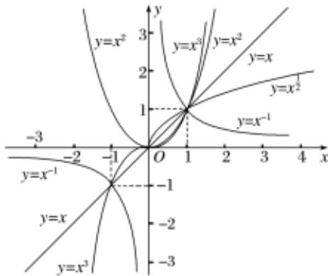

line

| x | y=x² | y=x³ | y=x | y=x⁻¹ |
|---|---|---|---|---|
| -3 | 0 | 0 | 0 | 0 |
| -2 | 0 | 0 | 0 | 0 |
| -1 | 0 | 0 | 0 | 0 |
| 0 | 1 | 1 | 1 | 1 |
| 1 | 1 | 2 | 2 | 2 |
| 2 | 2 | 3 | 3 | 3 |
| 3 | 3 | 4 | 4 | 4 |
| 4 | 4 | 5 | 5 | 5 |
| 5 | 5 | 6 | 6 | 6 |
| 6 | 6 | 7 | 7 | 7 |
| 7 | 7 | 8 | 8 | 8 |
| 8 | 8 | 9 | 9 | 9 |
| 9 | 9 | 10 | 10 | 10 |
| 10 | 10 | 11 | 11 | 11 |
| 11 | 11 | 12 | 12 | 12 |
| 12 | 12 | 13 | 13 | 13 |
| 13 | 13 | 14 | 14 | 14 |
| 14 | 14 | 15 | 15 | 15 |
| 15 | 15 | 16 | 16 | 16 |
| 16 | 16 | 17 | 17 | 17 |
| 17 | 17 | 18 | 18 | 18 |
| 18 | 18 | 19 | 19 | 19 |
| 19 | 19 | 20 | 20 | 20 |
| 20 | 20 | 21 | 21 | 21 |
| 21 | 21 | 22 | 22 | 22 |
| 22 | 22 | 23 | 23 | 23 |
| 23 | 23 | 24 | 24 | 24 |
| 24 | 24 | 25 | 25 | 25 |
| 25 | 25 | 26 | 26 | 26 |
| 26 | 26 | 27 | 27 | 27 |
| 27 | 27 | 28 | 28 | 28 |
| 28 | 28 | 29 | 29 | 29 |
| 29 | 29 | 30 | 30 | 30 |
| 30 | 30 | 31 | 31 | 31 |
| -3.5x-3.5x-3.5x-3.5x-3.5x-3.5x-3.5x-3.5x-3.5x-3.5x-3.5x-3.5x-3.5x-3.5x-3.5x-3.5x-3.5x-3.5x-3.5x-3.5x-3.5x=0.0
y=x²
y=x³
y=x²
y=x
y=x⁻¹
y=x
y=x⁻¹
y=x
y=x³
y=x⁻¹
y=x
y=x⁻¹
y=x
y=x⁻¹
y=x
y=x⁻¹
y=x
y=x⁻¹
y=x
y=x⁻¹
y=x
y=x⁻¹
y=x
y=x⁻¹
y=x
y=x⁻¹
y=x
y=x⁻¹
y=x
y=x⁻¹
y=x
y=x⁻¹
y=x
y=x⁻¹
y=x
y=x^-¹
y=x
y=x^-¹
y=x
y=x^-¹
y=x
y=x^-¹
y=x
y=x^-¹
y=x
y=x^-¹
y=x
y=x^-¹
y=x
y=x^-¹
y=x
y=x^-¹
y=x
y=x^-¹
y=x
y=x^-¹
y=x
y=x^-¹
y=x
y=x^-¹
y=y/x²⁵/√(√(√(√(√(√(√(√(√(√(√(√(√(√(√(√(√(√(√(√(√(√(√(√(√(√(√(√(√(√(√(√(√(√(√(√(√(√(√(√(√(√(√(√(√(√(√(√(√(√(√=(-)-)-))|
| -(-)-(-)-(-)-(-)-(-)-(-)-(-)-(-)-(-)-(-)-(-)-(-)-(-)-(-)-(-)-(-)-(-)-(-)-(-)-(-)-(-)-(-)-(-)-(-)-(-)-(-)-(-)-(-)-(-)-(-)-(-)-(-)-(-)-(-)-(-)-(-)-(-)-(-)|
| -(-)=-(-)=-(-)=-(-)=-(-)=-(-)=-(-)=-(-)=-(-)=-(-)=-(-)=-(-)=-(-)=-(-)=-(-)=-(-)=-(-)=-(-)=-(-)=-(-)=-(-)=-(-)=-(-)=-(-)=-(-)=-(-)=-(-)=-(-)=-(-)=-(-)=-(-)=-(-)=-(-)=-(-)=- (-)|
| -(-)=-(-)=-(-)=-(-)=-(-)=-(-)=-(-)=-(-)=-(-)=-(-)=-(-)=-(-)=-(-)=-(-)=-(-)=-(-)=-(-)=-(-)=-(-)=-(-)=-(-)=-(-)=-(-)=-(-)=-(-)=- (-)|
| -(-)=-(-)=-(-)=-(-)=-(-)=-(-)=-(-)(-)|
| -(-)=-(-)=-(-)=-(-)(-)|
| -(-)=-(-)=-(-)(-)|
| -(-)=-(-)(-)|
| -(-)=-(-)(-)|
| -(-)=-(-)(-)|
| -(-)=-(-)(-)|
| -(-)=-(-)(-)|
| -(-)=-(-)(-)|
| -(-)=-(-)(-)|
| -(-)=-(-)(-)|
| -(-)=-(-)(-)|
| -(-)=-(-)(-)|
| -(-)=-(-)(-)|
| - (-)^+/- (-)^+/- (-)^+/- (-)^+/- (-)^+/- (-)^+/- (-)^+/- (-)^+/- (-)^+/- (-)^+/- (-)^+/- (-)^+/- (-)^+/- (-)^+/- (-)^+/- (-)^+/- (-)^+/- (-)^+/- (-)^+/- (-)^+/- (-)^+/- (-)^+/- (-)^+/- (-)^+/- (-)^+/- (-)^+ / (-)^+/- (-)^+/- (-)^+/- (-)^+/- (-)^+/- (-)^+/- (-)^+/- (-)^+/- (-)^+/- (-)^+/- (-)^+/- (-)^+/- (-)^+/- (-)^+/- (-)^+/- (-)^+/- (-)^+/- (-)^+/- (-)^+/- (-)^+/- (-)^+/- (-)^+/- (-)^+/- (-)^+/- (-)^+,- (-)^+/- (-)^+/- (-)^+/- (-)^+/- (-)^+/- (-)^+/- (-)^+/- (-)^+/- (-)^+/- (-)^+/- (-)^+/- (-)^+/- (-)^+/- (-)^+/- (-)^+/- (-)^+/- (-)^+/- (-)^+/- (-)^+/- (-)^+/- (-)^+/- (-)^+/- (-)^+/- (-)^+/- (-)^+/*

2. 五个幂函数的性质

<table><tr><td></td><td> $y=x$ </td><td> $y=x^{2}$ </td><td> $y=x^{3}$ </td><td> $y=x^{\frac{1}{2}}$ </td><td> $y=x^{-1}$ </td></tr><tr><td>定义域</td><td>R</td><td>R</td><td>R</td><td> $[0, +\infty)$ </td><td> $\{x|x\neq0\}$ </td></tr><tr><td>值域</td><td>R</td><td> $[0, +\infty)$ </td><td>R</td><td> $[0, +\infty)$ </td><td> $\{y|y\neq0\}$ </td></tr><tr><td>奇偶性</td><td>奇</td><td>偶</td><td>奇</td><td>非奇非偶</td><td>奇</td></tr><tr><td>单调性</td><td>增</td><td>在 $[0, +\infty)$ 上增,在 $(-\infty, 0]$ 上减</td><td>增</td><td>增</td><td>在 $(0, +\infty)$ 上减,在 $(-\infty, 0)$ 上减</td></tr></table>

# 针对练习

1. 下列函数中，既是偶函数，又在区间 $(0, +\infty)$ 上单调递减的函数是（）

A. $y=x^{2}$

B. $y=x^{-1}$

C. $y=x^{-2}$

D. $y = x^{\frac{1}{3}}$

2. 函数 $y = x^{\frac{1}{3}}$ 的图象是（）

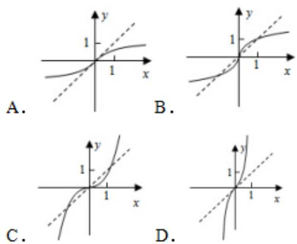

3. 设 $a \in \{-1, 1, \frac{1}{2}, 3\}$ , 则使函数 $y = x^a$ 的定义域是 $\mathbf{R}$ , 且为奇函数的所有 $a$ 的值是（）

A. 1, 3

B.-1,1

C.-1,3

D. -1, 1, 3

4. $y = x^{\frac{3}{5}}$ 在 $[-1, 1]$ 上是（）

A. 增函数且是奇函数

B．增函数且是偶函数

C. 减函数且是奇函数

D. 减函数且是偶函数

5. 已知 $a = 2^{\frac{4}{3}}$ , $b = 4^{\frac{2}{5}}$ , $c = 25^{\frac{1}{3}}$ , 则（）

A. b<a<c

B. $a < b < c$

C. b<c<a

D. $c < a < b$

6. 已知幂函数 $f(x) = (m^2 + 2m - 2)x^{m + 2}$ 在（0，+∞）上单调递减，则 $m$ 的值为（）

A. 1

B.-3

C.-4

D. 1 或 -3

7. 已知幂函数 $y = f(x)$ 的图象过点（4，2），则 $f$

(16) $= (\quad)$

A. $\frac{1}{8}$

B. $\frac{1}{4}$

C. 4

D. 8

8. 已知函数 $f(x) = (m - 1)x^{m - \frac{3}{2}}$ 是幂函数，则下列关于 $f(x)$ 说法正确的是（）

A. 奇函数

B．偶函数

C. 定义域为 $[0, +\infty)$

D. 在 $(0, +\infty)$ 单调递减

9. 已知幂函数 $f(x) = x^{\alpha}$ 的图像过点（2，4），若 $\sqrt{f(m)} = 4$ ，则实数 $m$ 的值为（）

A. 2

B. $\pm2$

C. 4

D. ±4

10. 幂函数 $y = x^{-2}$ 的大致图象是（）

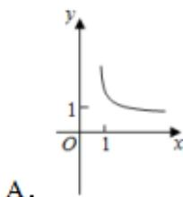

text_image

y
1
O 1 x
A.

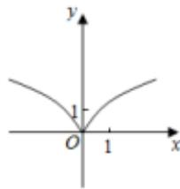

text_image

y
1
O 1 x

B.

A.   
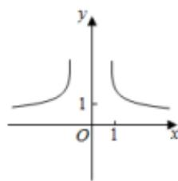

text_image

y
1
O 1 x

D.

text_image

y
1
O 1 x

11. 幂函数 $f(x) = (m^2 - 3)x^m$ 在第一象限内是减函数，则 $m = (\quad)$

A. 2

B. $\sqrt{2}$

C. $-\sqrt{2}$

D.-2

12. 设 $m \in \mathbf{R}$ ，若幂函数 $y = x^{m^2 - 2m + 1}$ 定义域为 $\mathbf{R}$ ，且其图像关于 $y$ 轴成轴对称，则 $m$ 的值可以为

( )

A. 1

B. 4

C. 7

D. 10

13. 如图所示是函数 $y = x^{\frac{m}{n}}$ ( $m, n$ 均为正整数且 $m$ , $n$ 互质) 的图象，则（）

text_image

y=x^{\frac{m}{n}}
y
y=x
O
x

A. $m, n$ 是奇数且 $\frac{m}{n} < 1$

B. $m$ 是偶数， $n$ 是奇数，且 $\frac{m}{n} < 1$

C. $m$ 是偶数， $n$ 是奇数，且 $\frac{m}{n} > 1$

D. $m, n$ 是奇数，且 $\frac{m}{n} > 1$

14. 已知幂函数的图象过 $(\frac{1}{2}, \frac{\sqrt{2}}{4})$ ， $P(x_1, y_1)$ ， $Q(x_2, y_2) (x_1 < x_2)$ 是函数图象上的任意不同两点，则下列结论中正确的是（）

A. $x_{1}f(x_{1}) > x_{2}f(x_{2})$

B. $x_{1}f(x_{2}) <   x_{2}f(x_{1})$

C. $\frac{f(x_1)}{x_2} >\frac{f(x_2)}{x_1}$

D. $\frac{f(x_1)}{x_1} < \frac{f(x_2)}{x_2}$

15. 已知幂函数 $f(x)$ 的图象过点（2，32），若 $f(a + 1) + f(-1) > 0$ ，则 $a$ 的取值范围为（）

A. $(2, +\infty)$

B. $(1, +\infty)$

C. $(0, +\infty)$

D. $(-1, +\infty)$

16. 下列函数既是幂函数又是奇函数的是（）

A. $y = \sqrt[3]{x}$

B. $y = \frac{1}{x^{2}}$

C. $y=2x^{2}$

D. $y = x + \frac{1}{x}$

17. 已知 $\alpha \in \{-2, -1, -\frac{1}{2}, \frac{1}{2}, 1, 2, 3\}$ ，若幂函数 $f(x) = x^{\alpha}$ 为奇函数，且在 $(0, +\infty)$ 上递减，则 $\alpha =$ \_\_\_\_.

18. 若函数 $f(x) = a^x (a > 0, a \neq 1)$ 在 $[-1, 2]$ 上的最大值为4，最小值为 $m$ ，且函数 $g(x) = (1 - 4m)\sqrt{x}$ 在 $[0, +\infty)$ 上是增函数，则 $a =$ \_\_\_\_.

19. 下列比较大小正确的是（）

A. $\sqrt{\pi}^{-\frac{4}{3}} > 3^{-\frac{1}{3}} > 2^{-\frac{2}{3}}$

B. $3^{-\frac{1}{3}} > \sqrt{\pi}^{-\frac{4}{3}} > 2^{-\frac{2}{3}}$

C. $3^{-\frac{1}{3}}>2^{-\frac{2}{3}}>\sqrt{\pi}^{-\frac{4}{3}}$

D. $2^{-\frac{2}{3}} > 3^{-\frac{1}{3}} > \sqrt{\pi}^{-\frac{4}{3}}$

20. 若 $(m+1)^{\frac{1}{2}}<(3-2m)^{\frac{1}{2}}$ ，则实数 m 的取值范围 \_\_\_\_.

# [必修一]第四章 指数函数与对数函数

# 题型1. 指数幂运算（考频★★☆☆☆）

知识点 1: $\sqrt[n]{a^m} = a^{\frac{m}{n}}$

注意： $\sqrt[n]{a^n} = |a|$

(n为偶数时)

当我们遇到 $\sqrt[n]{a^m}$ 的形式运算时，转化为 $a^{\frac{m}{n}}$ 进行幂运算，如

例题1：将 $\sqrt[3]{4} \cdot \sqrt{2}$ 化成分数指数幂的形式是？

解： $\sqrt[3]{4}\cdot \sqrt{2} = 4^{\frac{1}{3}}\times 2^{\frac{1}{2}} = (2^{2})^{\frac{1}{3}}\times 2^{\frac{1}{2}} = 2^{\frac{2}{3} +\frac{1}{2}} = 2^{\frac{7}{6}}$

例题 2：将 $\sqrt[3]{a\sqrt[4]{a}}(a>0)$ 化成有理数指数幂的形式为 \_\_\_\_.

解：当 $a > 0$ 时， $\sqrt[3]{a\cdot\sqrt[4]{a}} = \sqrt[3]{a\cdot a^{\frac{1}{4}}} = \sqrt[3]{a^{\frac{5}{4}}} = a^{\frac{5}{12}}.$

尝试解一解以下3题

1. 化简 $\sqrt[3]{a^3\sqrt{a^3}}$ （其中 $a > 0$ ） $=$ \_\_\_\_.

2. 计算 $\sqrt[3]{16^{\frac{3}{4}}(\frac{4}{9})^{-\frac{3}{2}}} =$ \_\_\_\_.

3. 化简： $(a^2\cdot \sqrt[5]{a^3})\div (\sqrt{a}\cdot \sqrt[10]{a^9}) =$ （用分数指数幂表示）.

参考答案：

1 解： $\sqrt[3]{a^{3}\sqrt{a^{3}}}=(a^{3}\cdot a^{2})^{\frac{1}{3}}=(a^{2})^{\frac{9}{3}}=a^{3}$

2 解： $\sqrt[3]{16^{\frac{3}{4}}(\frac{4}{9})^{-\frac{3}{2}}} = \sqrt[3]{2^{4 \times \frac{3}{4}}(\frac{2}{3})^{2 \times (-\frac{3}{2})}} = \sqrt[3]{2^3(\frac{3}{2})^3} = \sqrt[3]{(2 \times \frac{3}{2})^3} = 3$ 。

3 解： $(a^{2} \cdot \sqrt[5]{a^{3}}) \div (\sqrt{a} \cdot \sqrt[10]{a^{9}}) = (a^{2} \cdot a^{\frac{3}{5}}) \div (a^{\frac{1}{2}} \cdot a^{\frac{9}{10}}) = a^{2 + \frac{3}{5}} \div a^{\frac{1}{2} + \frac{9}{10}} = a^{\frac{13}{5}} \div a^{\frac{14}{10}} = a^{\frac{13}{5} - \frac{7}{5}} = a^{\frac{6}{5}}.$

运算规则回顾：

$$
\sqrt [ n ]{a ^ {n}} = \underline {{\quad}}
$$

$$
a ^ {n} = \underbrace {a \cdot a \cdot \dots \cdot a} _ {n \text {个}}
$$

$$
a ^ {0} = \underline {{\quad}} (a \neq 0)
$$

$$
a ^ {- p} = \underline {{\quad}} (a \neq 0)
$$

$$
a ^ {\frac {m}{n}} = \underline {{\quad}}
$$

$$
a ^ {- \frac {m}{n}} = \underline {{\quad}} = \underline {{\quad}}
$$

$$
a ^ {r} \cdot a ^ {s} =
$$

$$
a ^ {r} \div a ^ {s} = \underline {{\quad}}
$$

$$
(a ^ {r}) ^ {s} = \underline {{\quad}}
$$

$$
(a b) ^ {\prime} = \underline {{\quad}}
$$

$$
(\frac {a}{b}) ^ {r} = \underline {{\quad}}
$$

参考答案：n 为奇数时 $\sqrt[n]{a^{n}}=a$ n 为偶数时 $\sqrt[n]{a^{n}}=|a|$ （建议尝试代数验算一下方便理解）

$$
a ^ {0} = 1 \quad a ^ {- p} = \frac {1}{a ^ {p}} \quad a ^ {\frac {m}{n}} = \sqrt [ n ]{a ^ {m}} \quad a ^ {- \frac {m}{n}} = \frac {1}{a ^ {\frac {m}{n}}} = \frac {1}{\sqrt [ n ]{a ^ {m}}} \quad a ^ {r} \cdot a ^ {s} = a ^ {r + s} \quad a ^ {r} \div a ^ {s} = a ^ {r - s} (a ^ {r}) ^ {s} = a ^ {r * s} (a b) ^ {r} = a ^ {r} \cdot b ^ {r} (\frac {a}{b}) ^ {r} = \frac {a ^ {r}}{b ^ {r}}
$$

# 针对练习

1. 下列运算正确的是（）

A. $a^2 \cdot a^3 = a^6$

B. $(3a)^{3} = 9a^{3}$

C. $\sqrt[8]{a^{8}} = a$

D. $(-2a^{2})^{3} = -8a^{6}$

2. 计算 $(\frac{9}{4})^{\frac{1}{2}} - (-2.5)^{0} - (\frac{8}{27})^{\frac{2}{3}} + (\frac{3}{2})^{-2}$ 的结果为（）

A. $\frac{5}{2}$

B. $\frac{1}{2}$

C. $\frac{25}{18}$

D. $\frac{3}{2}$

3. 已知 $a > 0$ ，则 $\frac{a^2}{\sqrt{a} \cdot \sqrt[3]{a^2}} = (\quad)$

A. $a^{\frac{6}{5}}$

B. $a^{\frac{5}{6}}$

C. $a^{-\frac{5}{6}}$

D. $a^{\frac{5}{3}}$

4. 下列各式中成立的是（）

A. $\left(\frac{n}{m}\right)^{7} = n^{7}m^{\frac{1}{7}}$

B. $\sqrt[12]{(-3)^4} = \sqrt[3]{-3}$

C. $\sqrt[4]{x^3 + y^3} = (x + y)^{\frac{3}{4}}$

D. $\sqrt[3]{9} = \sqrt[3]{3}$

5. 下列各式正确的是（）

A. $\sqrt[3]{-5}=\sqrt[6]{(-5)^{2}}$

B. $\sqrt{(3 - \pi)^2} = 3 - \pi$

C. $\sqrt[n]{a^n} = |a|$ ( $n > 1$ , $n \in \mathbf{N}^*$ )

D. $(\sqrt[n]{a})^n = a (n > 1, n \in \mathbf{N}^*)$

6. $\sqrt[3]{a \cdot \sqrt{a}}$ 的分数指数幂表示为（）

A. $a^{\frac{1}{2}}$

B. $a^{2}$

C. $a^{\frac{3}{4}}$

D. 都不对

# 题型 2：指数函数（考频★★★★☆）

# 知识点

# 1. 指数函数：

函数 $y = a^{x}$ （ $a > 0$ 且 $a \neq 1$ ）称为指数函数，其中底数是不等于1的常数，指数为自变量；

# 2. 指数函数的基本性质：

<table><tr><td></td><td colspan="2">a&gt;1</td><td>0</td></tr><tr><td>图象</td><td colspan="2"></td><td></td></tr><tr><td>定义域</td><td colspan="3">(-∞,+∞)</td></tr><tr><td>值域</td><td colspan="3">(0,+∞)</td></tr><tr><td>定点</td><td colspan="3">图象恒过定点(0,1)</td></tr><tr><td>奇偶性</td><td colspan="3">非奇非偶函数</td></tr><tr><td>单调性</td><td colspan="2">在(-∞,+∞)上是单调递增函数</td><td>在(-∞,+∞)上是单调递减函数</td></tr></table>

例题1（指数概念）函数 $f(x) = (a^2 - 3a + 3)a^x$ 是指数函数，则 $a$ 的值为（）

A. 1 B. 3 C. 2 D. 1或3

【解答】解：由题意得： $\left\{\begin{aligned}a^{2}-3a+3&=1\\ a&>0,\quad a\neq1\end{aligned}\right.$

解得： $a = 2$

故选：C.

例题2（指数值域）函数 $y = 2^{x}$ 的值域为（）

A. $(- \infty, + \infty)$ B. $(0, + \infty)$ C. $(0, 1)$ D. $(1, + \infty)$

【解答】解：∵2>0，

∴函数 $y=2^{x}$ 的值域为 $(0, +\infty)$ ，

故选B.

例题3（指数过定点）函数 $y = a^{x - 1}$ （ $a > 0, a \neq 1$ ）的图象经过点（）

A. $(\frac{1}{4}, 1)$ B. $(0, 1)$ C. $(1, 1)$ D. $(\frac{1}{2}, 1)$

【解答】解：令 $x - 1 = 0$ ，解得： $x = 1$

故 x=1 时，y=1，

故函数过（1，1），

故选：C.

例题 4（指数图像特征）如图，设 a, b, c, d > 0，且不等于 1， $y = a^{x}$ ， $y = b^{x}$ ， $y = c^{x}$ ， $y = d^{x}$ 在同一坐标系中的图象如图，则 a, b, c, d 的大小顺序（）

text_image

y
y=b²
y=c²
y=a²
y=d²
O
x

A. a<b<c<d

B. a<b<d<c

C. b<a<d<c

D. b<a<c<d

【解答】解：作辅助直线 x=1，当 x=1 时，

$y=a^{x},\quad y=b^{x},\quad y=c^{x},\quad y=d^{x}$ 的函数值正好是底数 a、b、c、d

直线 $x = 1$ 与 $y = a^x, y = b^x, y = c^x, y = d^x$ 交点的纵坐标就是 $a, b, c, d$ 观察图形即可判定大小：b<a<d<c

故选：C.

text_image

y=a^x
y=b^x
y=c^x
y=d^x
O
x=1
x

例题 5（函数单调性比大小）下列关系中正确的是（）

A. $\left(\frac{1}{2}\right)^{\frac{2}{3}} < \left(\frac{1}{5}\right)^{\frac{2}{3}} < \left(\frac{1}{2}\right)^{\frac{1}{3}}$

B. $(\frac{1}{2})^{\frac{1}{3}} < (\frac{1}{2})^{\frac{2}{3}} < (\frac{1}{5})^{\frac{2}{3}}$

c. $(\frac{1}{5})^{\frac{2}{3}} < (\frac{1}{2})^{\frac{1}{3}} < (\frac{1}{2})^{\frac{2}{3}}$

D. $(\frac{1}{5})^{\frac{2}{3}} < (\frac{1}{2})^{\frac{2}{3}} < (\frac{1}{2})^{\frac{1}{3}}$

【解答】解：根据指数函数 $y=\left(\frac{1}{2}\right)^{x}$ 为减函数， $\therefore\left(\frac{1}{2}\right)^{\frac{2}{3}}<\left(\frac{1}{2}\right)^{\frac{1}{3}}$ ，根据 $y=x^{\frac{2}{3}}$ 在 $(0,+\infty)$ 为增函数，

$$
\therefore \left(\frac {1}{2}\right) ^ {\frac {2}{3}} > \left(\frac {1}{5}\right) ^ {\frac {2}{3}}, \therefore \left(\frac {1}{5}\right) ^ {\frac {2}{3}} <   \left(\frac {1}{2}\right) ^ {\frac {2}{3}} <   \left(\frac {1}{2}\right) ^ {\frac {1}{3}}.
$$

故选：D.

# 经典针对练习

1. 设 $a = 0.6^{0.6}$ , $b = 0.6^{1.5}$ , $c = 1.5^{0.6}$ , 则 $a, b, c$ 的大小关系是（）

A. a<b<c

B. $a < c < b$

C. b<a<c

D. b<c<a

2. 设 $a = 0.6^{0.4}$ , $b = 0.4^{0.6}$ , $c = 0.4^{0.4}$ , 则 $a, b, c$ 的大小关系为（）

A. $a < b < c$

B. b<c<a

C. c<a<b

D. c<b<a

3. 函数 $y = a^{x} - a (a > 0, a \neq 1)$ 的图象可能是（）

A.

B.

C.

D.

4. 函数 $f(x) = a^{x - b}$ 的图象如图，其中 $a, b$ 为常数，则下列结论正确的是（

line

| x | y |
|---|---|
| -1 | 2 |
| 0 | 1 |
| 1 | 0.5 |
| 2 | 0.3 |

A. 0<a<1, b<0

B. a>1, b>0

C. 0<a<1, b>0

D. a>1, b<0

5. 若函数 $y = a^{x} + b - 1$ ( $a > 0$ 且 $a \neq 1$ ) 的图象经过第二、三、四象限，则一定有（）

A. 0<a<1，且 b>0

B. $a > 1$ ，且 $b > 0$

C. 0 < a < 1，且 b < 0

D. $a > 1$ ，且 $b <   0$

6. 函数 $y = a^{x}$ 在 $[0,1]$ 上的最大值与最小值的和为 3，则 $a = (\quad)$

A. $\frac{1}{2}$

B. 2

C. 4

D. $\frac{1}{4}$

7. 函数 $f(x)=a^{x}$ (a>0，且 $a\neq1$ ) 对于任意的实数 x、y 都有（）

A. $f(xy) = f(x) \cdot f(y)$

B. $f(x+y)=f(x)\cdot f(y)$

C. $f(xy) = f(x) + f(y)$

D. $f(x+y)=f(x)+f(y)$

8. 函数 $y=a^{x+2}-1$ （a>0 且 $a\neq1$ ）的图象恒过的点是（）

A. $(0,0)$

B. $(0,-1)$

C. $(-2, 0)$

D. $(-2,-1)$

9. 某食品保鲜时间 $y$ （单位：小时）与储藏温度 $x$ （单位：℃）满足函数关系 $y = e^{kx + b}$ （ $e = 2.718\cdots$ 为自然对数的底数， $k, b$ 为常数）。若该食品在 $0^\circ \mathrm{C}$ 的保鲜时间是192小时，在 $22^\circ \mathrm{C}$ 的保鲜时间是48小时，则该食品在 $33^\circ \mathrm{C}$ 的保鲜时间是（）

A. 16 小时

B. 20小时

C. 24 小时

D. 28 小时

# 题型 3：对数运算（考频★★★★★）

知识点1：对数与指数的关系。对数与指数也是逆运算

$2^{2}=4,\quad2^{4}=16,\quad3^{2}=9,$ 于是逆过来便有

$\log_24 = 2$ $\log_216 = 4$ $\log_39 = 2$ （这是最基础的，以后若忘记，请回忆对数与指数关系）

知识点2: 可以发现，对数与指数的转化： $a^{b}=c$ （指数式）可以变为 $\log_{a}c=b$ （a 不变，bc 换位置）

知识点3：对数运算

① $\log_{a} M + \log_{a} N =$   
② $\log_{a}M - \log_{a}N =$   
③ $\log_a M^n =$   
④ $\log_{a^n}M^n =$

消消乐公式：① $a^{\log_{a}N}=N$ ② $\log_{a}a^{N}=N(a>0,$ 且 $a\neq1)$ .

自然对数 $\log_{e}x =$ 常用对数 $\log_{10}x =$

换底公式：① $\log_a b =$ ② $\log_a b = \frac{1}{\log_b a}$

答案： $\log_{\mathrm{a}}\mathrm{MN}\log_{\mathrm{a}}\frac{\mathrm{M}}{\mathrm{N}}$ nlogaM $\frac{n}{m}$ logaM lnx lgx $\frac{log_{1}b}{log_{1}b}$ (这里的?可以是除1外任意正数）

很多同学觉得这里公式很多，难以记忆，不妨这样想，对数只有加减法，同底才能相加减。（记住①②）一条 “瘦身公式”（④，③是其常用状态）出现 “大” 数字就会用上，例如 $\log_{8}9=\log_{2^{3}}3^{2}=\frac{2}{3}\log_{2}3$ （2024 年高考就用上了）一对消消乐公式，最后换底公式，就记完了，多运用，很快就能掌握。

真题速览：（2024·甲卷）已知 $a > 1$ ， $\frac{1}{\log_8a} -\frac{1}{\log_a4} = -\frac{5}{2}$ ，则 $a = \underline{64}$

【解答】解：因为 $\frac{1}{\log_8a} -\frac{1}{\log_a4} = \frac{3}{\log_2a} -\frac{1}{2}\log_2a = -\frac{5}{2}$ ，出现了相同元素 $log_{2}a$ 看成整体x,解方程即可所以（ $\log_2a + 1)$ （ $\log_2a - 6)$ $= 0$ ，而 $a > 1$

故 $\log_{2}a=6$ ，解得 a=64。

故答案为：64.

# 经典母题

1. $\log_{b}N=a(b>0, b\neq1, N>0)$ 对应的指数式是（）

A. $a^{b}=N$

B. $b^{a}=N$

C. $a^{N}=b$

D. $b^{N}=a$

2. 若 $\log_{ax}=1$ ，则（）

A. x=1

B. a=1

C. x=a

D. x=10

3．把指数式 $2^{6}=64$ 化成对数式是 \_\_\_\_.

4. $\log_{a}x$ 中的 x, a 要分别满足 x > 0, a > 0 且 a ≠ 1,小明同学不知道为什么，请你帮他解释为\_\_\_\_。

5. $\log_42 - \log_48$ 等于（ ）

A.-2

B.-1

C. 1

D. 2

6. 计算 $1g4+1g25=$ ( )

A. 2

B. 3

C. 4

D. 10

7. 计算： $21g2+1g25=$ （）

A. 1

B. 2

C. 3

D. 4

8. 计算： $\log_{2}9\cdot\log_{3}8=$ （）

A. 12

B. 10

C. 8

D. 6

9. 求值： $\log_{3}15-\frac{1}{2}\log_{3}25=$ \_\_\_\_.

10. $\lg\frac{5}{2}+2\lg2-\left(\frac{1}{2}\right)^{-1}=$ \_\_\_\_.

11. 计算： $2^{\log_{2}3} + 2\log_{3}1 - 3\log_{7}7 + 3\ln1 =$ \_\_\_\_.

12. 已知 $2^{3\log_{4}x}=27$ ，则 x 的值为 \_\_\_\_.

13. $1g^{2}2+1g21g5+1g5=$ \_\_\_\_.

14 . $\log_{3}\frac{\sqrt[4]{27}}{3}+\lg25+\lg4+7^{\log_{49}4}=$ \_\_\_\_.

15. $27^{\frac{2}{3}} - 2^{\log_23} \cdot \log_2 \frac{1}{8} + \lg 5 \times \log_5 10 =$

16. $27^{\frac{1}{3}} + (\frac{1}{5})^{0} + \log_{2}4 =$

17. 已知 x, y 为正实数，则（）

A. $\lg(x^{2}\cdot y)=(\lg x)^{2}+\lg y$

B. $\lg(x \cdot \sqrt{y}) = \lg x + \frac{1}{2} \lg y$

C. $e^{\ln x + \ln y} = x + y$

D. $e^{lnx \cdot lny} = xy$

18.（1）化简： $\frac{\lg 20 + \lg 5 - \lg 80}{\lg 25 - \lg 16}$

(2) 化简: $4^{-\frac{3}{2}} + \left(\frac{9}{4}\right)^{\frac{1}{2}} - (\sqrt{3} - 1)^{0} + \sqrt[3]{(-4)^{3}}$ .

19. 计算：

(1) $0.064^{-\frac{1}{3}} - (-\frac{1}{8})^0 + 16^{\frac{3}{4}} + 0.25^{\frac{1}{2}};$

(2) $\log_{3}\sqrt{27} + \lg25 + 2\lg2 - 7^{\log_{7}2} + \log_{4}2.$

20. 计算：

(I) $\left(\frac{16}{81}\right)^{-\frac{3}{4}} - (\sqrt{3} - \sqrt{2})0 - (1\frac{9}{16})^{\frac{1}{2}};$

(II) $\log_98\cdot \log_29 + 3^{\log_37} - (1\mathrm{g}\frac{5}{2} +2\mathrm{lg}2)$ .

21. 计算：

(1) $(2\frac{1}{4})^{\frac{1}{2}} - (-2020)^{0} - (\frac{27}{8})^{-\frac{2}{3}} + 1.5^{-2}$ ;

(2) $\log_3\frac{\sqrt[4]{27}}{3} + \lg 25 + \lg 4 + 7^{\log_7 2} + \log_2 3 \times \log_3 4.$

22. 化简求值：

(1) $(0.064)^{-\frac{1}{3}} - (-\frac{7}{8})^0 + [(-2)^3]^{-\frac{4}{3}} + 16^{-0.75}$ ;   
(2) $2\log_{3}2 - \log_{3}\frac{32}{9} + \log_{3}8 - 5^{\log_{5}3}$ .

(1) 0.0081 $\frac{1}{4} - \left(\frac{16}{9}\right)^{0.5} + (\ln 2)^{0}$ .   
(2) $1\mathrm{g}4 + 1\mathrm{g}25 + \log_3\sqrt[3]{9} -\mathrm{e}^{\ln 2}$

24.（1）计算： $1g25+1g2\cdot1g50+1g^{2}2$

(2) 已知 $x^{\frac{1}{2}} + x^{-\frac{1}{2}} = 3$ ，求 $\frac{x^{2} + x^{-2} - 2}{x + x^{-1} - 2}$ 的值.

23. 化简求值：

# 题型4：对数函数（考频★★★★★）

# 1. 对数函数：

一般地，我们把函数 $y=\log_{a}x\quad(a>0$ 且 $a\neq1)$ 称为对数函数，其中 x 为自变量，函数的定义域为 $(0,+\infty)$ ，a 叫做对数函数的底数；特别地，我们称以 10 为底数的对数函数 $y=\lg x$ 为常用对数函数；称以无理数 $e(e=2.71828\cdots)$ 为底数的对数函数 $y=\ln x$ 叫做自然对数函数.

# 2. 对数函数的基本性质：

<table><tr><td></td><td>a&gt;1</td><td>0</td></tr><tr><td>图象</td><td></td><td></td></tr><tr><td>定义域</td><td colspan="2">(0,+∞)</td></tr><tr><td>值域</td><td colspan="2">(-∞,+∞)</td></tr><tr><td>定点</td><td colspan="2">图象恒过定点(1,0)</td></tr><tr><td>奇偶性</td><td colspan="2">非奇非偶函数</td></tr><tr><td>单调性</td><td>在(0,+∞)上是单调递增函数</td><td>在(0,+∞)上是单调递减函数</td></tr></table>

例题1（对数概念）函数 $f(x) = (a^2 + a - 5) \log_x x$ 为对数函数，则 $f(\frac{1}{8})$ 等于（）

A. 3 B. -3 C. -log6 D. -log8

【解答】解：∵函数 $f(x)=(a^{2}+a-5)\log_{a}x$ 为对数函数，

$\therefore \left\{ \begin{array}{l} a^{2} + a - 5 = 1 \\ a > 0 \\ a \neq 1 \end{array} \right.$ ，解得 $a = 2$ ， $\therefore f(x) = \log_2 x$ ， $\therefore f(\frac{1}{8}) = \log_2 \frac{1}{8} = -3$ 。故选：B.

例题2（对数定义域）函数 $y = \log_{(2x - 1)}\sqrt{3x - 2}$ 的定义域是（）

A. $(\frac{2}{3}, 1) \cup (1, +\infty)$ B. $(\frac{1}{2}, 1) \cup (1, +\infty)$ C. $(\frac{2}{3}, +\infty)$ D. $(\frac{1}{2}, +\infty)$

【解答】解：由题意知， $2x-1>0①$ $2x-1\neq1②$ $3x-2>0③$ 综合上面三个不等式得到 $x > \frac{1}{2}$ 且 $x \neq 1$ 且 $x > \frac{2}{3}$ ,

∴函数的定义域是 $\left(\frac{2}{3},1\right)\cup(1,+\infty)$

故选A.

例题3（对数值域）函数 $f(x) = \log_x x$ 在区间[1，2]上的最小值是（ ）

A. -1 B. 0 C. 1 D. 2

【解答】解：∵函数 $f(x)=\log_{2}x$ 在区间 [1, 2] 上为增函数，

∴当 x=1 时，函数 f(x) 取最小值 0，

故选：B

例题4（指对数比较大小）已知 $a = \log_{0.3}4$ ， $b = \log_43$ ， $c = 0.3^{-2}$ ，则 $a,b,c$ 的大小关系是（

A. $c < a < b$ B. $b < a < c$ C. $a < c < b$ D. $a < b < c$

【解答】解： $\because a=\log_{0.3}4<0, 0<b=\log_{4}3<1, c=0.3^{-2}>0.3^{0}=1,$

$$
\therefore a <   b <   c.
$$

故选：D.

例题5（解不等式）不等式 $\lg (x + 1)\leq 0$ 的解集是

【解答】解： $lg(x+1) \leq 0 = lg1$ 函数 $f(x) = lgx$ 是增函数，所以 $x+1 \leq 1$ ，同时 $0 < x+1$ ，解得 $-1 < x \leq 0$ 所以解集为 $(-1, 0]$

例题6（对数函数图像特征）如图所示的曲线是对数函数 $y = \log_a x, y = \log_b x, y = \log_c x, y = \log_d x$ 的图象，则 $a, b, c, d$ 与1的大小关系为 \_\_\_\_.

text_image

y
y=logₐx
y=logₓ
O
1
x
y=logₒx
y=logₔx

【解答】解：底数＞1时，函数单调递增，底数越大越靠近坐标轴，所以 b＞a＞1。底数＜1时，函数单调递减，底数越小越靠近坐标轴，所以 1＞d＞c＞0。结合图象得：b＞a＞1＞d＞c＞0。

# 针对练习

1. 函数 $f(x) = \frac{1}{\sqrt{2 - x}} + \ln (x + 1)$ 的定义域为（）

A. $(2, +\infty)$ B. $(-1, 2) \cup (2, +\infty)$

C. $(-1, 2)$ D. $(-1, 2]$

2. $f(x) = \sqrt{\log_{\frac{1}{3}}(x - 1)}$ 的定义域 \_\_\_\_.

3. 已知函数 $y = \log_a(x + c)$ （a, c 为常数，其中 a > 0, a ≠ 1）的图象如图所示，则下列结论成立的是（）

A. a>1, c>1

B. a>1, 0<c<1

C. 0<a<1, c>1

D. 0<a<1, 0<c<1

4. 设 $a = \lg e, b = (\lg e)^2, c = \lg \sqrt{e}$ ，则（）

A. a>b>c

B. c>a>b

C. a>c>b

D. c>b>a

5. 已知函数 $f(x) = \begin{cases} \log_2(x + 1)(x > 3) \\ 2^{x - 3} + 1 (x \leq 3) \end{cases}$ 满足 $f(a) = 3$ ，则 $f(a - 5) = (\quad)$

A. $\log_{2}3$

B. $\frac{17}{16}$

C. $\frac{3}{2}$

D. 1

6. 函数 $y=\log_{a}(x+2)+1$ 的图象过定点（）

A. (1, 2)

B. (2, 1)

C. $(-2, 1)$

D. $(-1,1)$

7. 已知 $a = 2^{-\frac{1}{3}}$ , $b = \log_2\frac{1}{3}$ , $c = \log_{\frac{1}{2}}\frac{1}{3}$ , 则（）

A. a>b>c

B. a>c>b

C. c > a > b

D. c>b>a

8. 已知函数 $f(x) = \ln (-x^2 - 2x + 3)$ ，则 $f(x)$ 的增区间为（）

A. $(- \infty, -1)$

B. $(-3,-1)$

C. $\left[-1,+\infty\right)$

D. $[-1, 1)$

9. 函数 $f(x) = \log_{\frac{1}{3}}(x^2 - 3x + 2)$ 的单调递增区间为（）

A. $(- \infty, 1)$

B. $(2, +\infty)$

C. $(- \infty, \frac{3}{2})$

D. $\left(\frac{3}{2},+\infty\right)$

10. 已知 $f(x)=\lg(10+x)+\lg(10-x)$ ，则 $f(x)$ 是（）

A. $f(x)$ 是奇函数，且在（0，10）是增函数  
B. $f(x)$ 是偶函数，且在（0，10）是增函数  
C. $f(x)$ 是奇函数，且在（0，10）是减函数  
D. f(x) 是偶函数，且在 $(0, 10)$ 是减函数

11. 已知定义域为 $\mathbf{R}$ 的偶函数 $f(x)$ 在 $(- \infty, 0]$ 上是减函数，且 $f\left(\frac{1}{2}\right) = 2$ ，则不等式 $f(\log_4 x) > 2$ 的解集为（）

A. $(0, \frac{1}{2}) \cup (2, +\infty)$   
B. $(2, +\infty)$   
C. $(0, \frac{\sqrt{2}}{2}) \cup (\sqrt{2}, +\infty)$   
D. $(0,\ \frac{\sqrt{2}}{2})$

12. 若 $\log_a\frac{2}{3} < 1$ ，则 $a$ 的取值范围是（）

A. $\left(\frac{2}{3},1\right)$

B. $\left(\frac{2}{3}+\infty\right)$

C. $(0, \frac{2}{3}) \cup (1, +\infty) D. (0, \frac{2}{3}) \cup (\frac{2}{3}, +\infty)$

13. 已知函数 $f(x) = \begin{cases} \log_2 x, & x > 0 \\ 3^x, & x \leq 0 \end{cases}$ ，则 $f[f(0)] =$ \_\_\_\_.

14. 已知函数 $f(x) = \begin{cases} f(x + 1), & x \leq 2 \\ 3^{-x}, & x > 2 \end{cases}$ ，则 $f(\log_3 2)$ 的值为 \_\_\_\_.

15. 计算：

(1) $0.064^{-\frac{1}{3}} - (-\frac{1}{8})^0 + 16^{\frac{3}{4}} + 0.25^{\frac{1}{2}};$   
(2) $\log_{3}\sqrt{27} + \lg25 + 2\lg2 - 7^{\log_{7}2} + \log_{4}2.$

$$
1 6. \quad (1) \quad (\sqrt {2} - 1) ^ {0} + \left(\frac {1 6}{9}\right) ^ {- \frac {1}{2}} + (\sqrt {8}) ^ {- \frac {4}{3}}; \quad \left| \begin{array}{l} (2) \log_ {5} 2 5 + \lg \frac {1}{1 0 0} + \ln \sqrt {e} + 2 ^ {\log_ {2} 3}. \\ \end{array} \right.
$$

# 题型 5：分式函数的值域（考频★★☆☆☆）

(1) $f(x) = \frac{ax + b}{cx + d}$ 或 $f(x) = \frac{ax^2 + b}{cx^2 + d}$

方法：分离常数

例： $f(x)=\frac{x+2}{2x+1}=\frac{\frac{1}{2}(2x+1)+\frac{3}{2}}{2x+1}=\frac{1}{2}+\frac{3}{2(2x+1)}$ 再根据 x 的范围判断值域。

小妙招：直接快速画图

对于 $f(x)=\frac{ax+b}{cx+d}$ 对称中心为 $\left(-\frac{d}{c},\frac{a}{c}\right)$

当 $ad-bc>0$ ，图像单调递增

当ad-bc<0，图像单调递减

(2) $f(x) = \frac{ax^2 + b}{x}$

方法同（1），直接分离即可

$f(x)=\frac{ax^{2}+b}{x}=ax+\frac{b}{x}$ 再用基本不等式或者对勾函数图像分析即可

如果是倒过来 $f(x) = \frac{x}{ax^2 + b}$ 只需要上下同除 $x$ 即可，运算逻辑与上面类似

$f(x)=\frac{x}{ax^{2}+b}=\frac{1}{ax+\frac{b}{x}}$ 再用基本不等式或者对勾函数图像分析即可。

(3) $f(x) = \frac{ax + b}{cx^2 + dx + e}$ 或 $f(k) = \frac{cx^2 + dx + e}{ax + b}$

方法：令 $t = ax + b$ 转化为 (2)

(4) $f(x) = \frac{ax^2 + bx + f}{cx^2 + dx + e}$

方法：逐步分离

例： $f(x)=\frac{2x^{2}+3x+4}{x^{2}+2x+3}=\frac{2(x^{2}+2x+3)-x-2}{x^{2}+2x+3}=2-\frac{x+2}{x^{2}+2x+3}$ 变为 (3)

# 经典针对练习

1. 函数 $y = \frac{3x + 1}{x} (x > 1)$ 的值域是（）

A. (4, +∞) B. (3, 4)

C. $(3, +\infty)$ D. $(- \infty, 3) \cup (3, +\infty)$

2. 已知函数 $f(x) = \frac{x + 1}{x - 1}, x \in (-1, 0]$ 的值域是（）

A. $(-1,0)$

B. $[-1, 0]$

C. $(-1, 0]$

D. $[-1,0)$

3. 已知函数 $f(x) = \frac{x}{x + 2} + 1, x \in (-1, +\infty)$ ，则 $f(x)$ 的值域为（）

A. $(-∞,0)$

B. $(-∞,2)$

C. $(0, 2)$

D. $(0, +\infty)$

4. 函数 $f(x) = x + \frac{2}{x}, x \in [1, 3]$ 的值域为（）

A. $[2\sqrt{2}, 3]$

B. $[3, \frac{11}{3}]$

C. $[2\sqrt{2}, \frac{11}{3}]$

D. $[3, +\infty)$

5. 函数 $f(x) = \frac{1}{x^2 + 1}$ 值域是（）

A. $(-\infty, 1]$

B. $[1, +\infty)$

C. $[0, +\infty)$

D. $(0,1]$

6. 下面关于函数 $f(x) = \frac{2x - 3}{x - 2}$ 的性质，说法不正确的是（）

A. $f(x)$ 的定义域 $(- \infty, 2) \cup (2, +\infty)$

B. $f(x)$ 的值域为 $(- \infty, 2) \cup (2, +\infty)$

C. 点（2，2）是 $f(x)$ 图像的对称中心

D. $f(x)$ 在 $(2, +\infty)$ 上单调递增

7. 函数 $y = x^{2} + \frac{4}{x^{2}} - 2 (-1 < x < 0)$ 的值域（）

A. $x \geqslant 2$

B. $y \geqslant 2$

C. $\{v|v\geqslant3\}$

D. $\{y|y>3\}$

8. 已知函数 $f(x) = \frac{x}{x^2 + 1}$ 的定义域为 $[0, +\infty)$ ，则函数 $f(x)$ 的值域为（）

A. $[-2, +\infty)$

B. $[-2, \frac{1}{2}]$

C. $[0, \frac{1}{2}]$

D. $\left[\frac{1}{2}, +\infty\right)$

9. 函数 $y = \frac{x^2 + 1}{x} (x > 0)$ 的值域为（）

A. $[1, +\infty)$

B. $(1, +\infty)$

C. $[2, +\infty)$

D. $(2, +\infty)$

10. 函数 $y = \frac{3x}{3x + 2x}$ 的值域为（）

A. $(0, +\infty)$

B. $(-∞,1)$

C. $(1, +\infty)$

D. $(0,1)$

11. 已知函数 $f(x) = \frac{9x^2 - 12x + 7}{3x - 1}, x \in [\frac{1}{2}, 2]$ ，则 $f(x)$ 的值域为 \_\_\_\_.

12. 已知函数 $f(x) = \frac{x^4 + 2x^2 + a}{x^2 + 1} (x \in \mathbb{R})$ 的值域为[1， $+\infty)$ ，实数 $a =$ \_\_\_\_.

13. 已知 $t < 0$ ，则函数 $y = \frac{t^2 - 4t + 1}{t}$ 的最大值为（）

A.-4

B.-6

C. 0

D. 2

14. 若 $x < 1$ ，则函数 $f(x) = x + \frac{2}{x - 1}$ 的最大值为（）

A. $2\sqrt{2}$

B. $-2\sqrt{2}$

C. $2\sqrt{2} + 1$

D. $-2\sqrt{2}+1$

15. 若函数 $f(x)$ 的值域是 $\left[\frac{1}{2}, 3\right]$ ，则函数 $F(x) = f(x) + \frac{1}{f(x)}$ 的值域是（）

A. $[\frac{1}{2}, 3]$

B. $[2, \frac{10}{3}]$

C. $\left[\frac{5}{2},\frac{10}{3}\right]$

D. $\left[\frac{5}{6},5\right]$

16. 函数 $f(x) = \frac{3x}{|x| + 2}$ ，则下列结论错误的是（）

A. 函数 $f(x)$ 在定义域 $\mathbf{R}$ 上为奇函数

B. 函数 $f(x)$ 在区间 $(-3, 3)$ 上单调递增

C. 函数 $f(x)$ 的值域为 $(-3, 3)$

D. 函数 $f(x)$ 的图像与直线 $y = \frac{3}{4} x$ 有且只有两个交点

# 题型 6：复合函数单调性（考频★★★☆☆）

口诀：同增异减。同增，指复合函数内外两层都是递减，或都是递增，则整体是增。

例如 $f(x) = (\frac{1}{3})^{-x^2}$ ，内层为 $g(x) = (\frac{1}{3})^x$ ，外层为 $h(x) = -x^2$

$g(x)=(\frac{1}{3})^{x}$ 显然在 R 上都是递减，而 $h(x)=-x^{2}$ 在 $(0,+\infty)$ 是递减，此时内外层都是递减，趋势相同，则 $f(x)$ 在 $(0,+\infty)$ 是递增，这叫“同增”。有点像负数×负数=正数，正数×正数=正数的味道异减，指复合函数内外两层增减趋势不同，则整体是减。有点像负数×正数=负数的感觉

$g(x) = (\frac{1}{3})^x$ 在 $\mathbb{R}$ 上都是递减，而 $h(x) = -x^{2}$ 在（ $-\infty, 0$ ）是递增，则 $f(x)$ 在（ $0, +\infty$ ）是递减。

易错：注意单调区间要在定义域范围内。

# 针对针对练习

1. 函数 $y = \sqrt{-x^2 + 3x - 2}$ 的递增区间为（）

A. $(-∞, \frac{3}{2})$

B. $\left(\frac{3}{2},+\infty\right)$

C. $\left(\frac{3}{2},2\right)$

D. $(1,\ \frac{3}{2})$

2. 函数 $f(x) = 2^{[x]}$ 的单调递减区间是（）

A. $(0, +\infty)$

B. $(-∞,0)$

C. $(- \infty, 1)$

D. $(1, +\infty)$

3. 函数 $y = \frac{1}{4 + 3x - x^2}$ 的单调增区间为（）

A. $\left[\frac{3}{2}, +\infty\right)$

B. $(-1,\frac{3}{2}]$

C. $[\frac{3}{2}, 4)$ 和 $(4, +\infty)$

D. $(-\infty, -1) \cup (-1, \frac{3}{2}]$

4. 函数 $f(x) = \sqrt{x^2 + 2x}$ 的增区间是（）

A. $[0, +\infty)$

B. $\left[-1,+\infty\right)$

C. $(-∞,-2]$

D. $(-∞,-1]$

5. 若函数 $f(x) = \left(\frac{1}{3}\right)^{|x - 2|}$ ，则 $f(x)$ 的单调递减区间是（）

A. $(-∞,2]$

B. $[2, +\infty)$

C. $[-2, +\infty)$

D. $(-∞,-2]$

6. 已知函数 $f(x) = 2^{x^2 + 4ax + 2}$ 在区间 $(- \infty, 6)$ 上单调递减，则 $a$ 的取值范围是（）

A. $a \geqslant 3$

B. $a \leqslant 3$

C. a<-3

D. $a \leq -3$

7. 设 $a$ 为常数且 $0 < a < 1$ ，若 $y = \left(\log_a\frac{3}{4}\right)^x$ 在 $\mathbf{R}$ 上是严格增函数，则实数 $a$ 的取值范围是 \_\_\_\_.

8. 函数 $y = (-x^{2} + 4x)^{\frac{1}{2}}$ 的单调递增区间是 \_\_\_\_.

9. 求函数 $y = \frac{4}{x^2 - 4x + 6}$ 的单调区间.  
10. 已知指数函数 $y = a^x$ 是减函数，若 $m = a^2$ ， $n = 2^a$ ， $p = \log_a 2$ ，则 $m, n, p$ 的大小关系是（）

A. $m > n > p$ B. $n > m > p$ C. $n > p > m$ D. $p > n > m$

# 题型7：复合函数值域（考频★★★☆☆）

求复合函数值域，换元，变成两个熟悉的函数。

如： $y=2^{x^{2}-2x}\xrightarrow{t-x^{2}-2x}y=2^{t}$ 先利用 $t=x^{2}-2x$ 求出t范围，再由 $y=2^{t}$ ，求出整体值域。

例题： $y=2^{x^{2}-2x},x\in[0,3]$ 求y.

解：令 $t = x^{2} - 2x$ ， $x\in [0,3]\therefore t\in [-1,3]\therefore y = 2^{t}\in [\frac{1}{2},8]$ 。

# 以上过程需要熟悉地用图像，以便判断单调性快速作答。

针对练习

1. 函数 $y = \left(\frac{1}{2}\right)^{x^2 + 2x - 1}$ 的值域是（）

A. $(-∞,4)$

B. $(0, +\infty)$

C. $(0, 4]$

D. $[4, +\infty)$

2. 下列函数中，值域是 $(0, +\infty)$ 的共有（）

① $y=\sqrt{3^{x}-1}$ ，② $y=(\frac{1}{3})^{x}$ ，③ $y=\sqrt{1-(\frac{1}{3})^{x}}$ ④ $y=3^{\frac{1}{x}}$ .

A. 1 个

B. 2个

C. 3个

D. 4 个

3. 函数 $f(x) = 1 + e^{|x|}$ 的值域为（）

A. $(1, +\infty)$

B. $[1, +\infty)$

C. $[2, +\infty)$

D. $(2, +\infty)$

4. 函数 $y = \log_2(2^x + 1)$ 的值域是（）

A. $[1, +\infty)$

B. $(0,1)$

C. $(-∞,0)$

D. $(0, +\infty)$

5. 函数 $y=2+\log_{2}(x^{2}+3)$ ( $x\geqslant1$ ) 的值域为（）

A. $(2, +\infty)$

B. $(-∞,2)$

C. $[4, +\infty)$

D. $[3, +\infty)$

6．函数 $y=\log_{\frac{1}{2}}(x^{2}-6x+10)$ 的值域是 \_\_\_\_.

7. 若函数 $y = 2^{x^2 - 6x + 10}$ 的定义域为[2, 5]，则该函数的值域是（）

A. [4, 32]

B. [4, 16]

C. [2, 32]

D. [2, 16]

8. 函数 $f(x) = \frac{1}{x^2 + 1}$ 值域是（）

A. $(-∞,1]$

B. $[1, +\infty)$

C. $[0, +\infty)$

D. $(0,1]$

9. 已知函数 $f(x) = \sqrt{-x^2 + 2x + 3}$ ，下列结论正确的是（）

A. 定义域、值域分别是 $[-1, 3]$ , $[0, +\infty)$   
B. 单调减区间是 $[1, +\infty)$   
C．定义域、值域分别是[-1，3]，[0，2]  
D. 单调减区间是 $(- \infty, 1]$

10. 函数 $f(x) = (lgx)^{2} - 2lgx^{2} + 3$ ( $1 \leqslant x \leqslant 1000$ )
值域为（）

A. $[-1, 0]$

B. $[0, 3]$

C. $[-1, 3]$

D. $\left[-1,+\infty\right)$

11. 已知 $f(x) = \ln(x^{2} + 2x + m)$ . 若 $f(x)$ 的值域为 R，则实数 m 的取值范围是 \_\_\_\_.

# 题型8：性质综合（考频★★★★★）

以下内容建议结合图像理解，不必死记硬背。

1. 对称性：

$f(x + a) = f(b - x)\Rightarrow f(x)$ 关于 $x = \frac{a + b}{2}$ 对称 $f(x + a) = -f(b - x)\Rightarrow f(x)$ 关于（ $\frac{a + b}{2},0)$ 对称

2. 周期性： $f(x + a) = f(x) \Rightarrow f(x)$ 的周期 $T = |a|$ $f(x + a) = f(b + x) \Rightarrow f(x)$ 的周期 $T = |a - b|$

总之是看括号内的差值。

$f(x+a)=-f(b+x)\Rightarrow f(x)$ 的周期T=2 $|a-b|$ 。

3. 区分对称与周期，口诀：括号内 x，同号周期，异号对称。

4. 两种对称性可推出周期：

例如：奇函数 $f(x)$ 满足 $f(x+1)=f(-x+3)\Rightarrow T=8$

具体方法有两种，一种是画大致函数图像法：画一个任意奇函数例如是 $y = \sin x$ ，然后根据另一对称信息比如x=2 对称，可以发现周期为 8

另一种是公式推导： $f(x) = -f(-x)$ 与 $f(x) = f(-x + 4)$ 联立得 $-f(-x) = f(-x + 4)$ ，所以 T = 8.例 （2025·新高考 I）设 $f(x)$ 是定义在 R 上且周期为 2 的偶函数，当 $2 \leqslant x \leqslant 3$ 时， $f(x) = 5 - 2x$ ，则 $f(-\frac{3}{4}) = (\quad)$

A. $-\frac{1}{2}$

B. $-\frac{1}{4}$

C. $\frac{1}{4}$

D. $\frac{1}{2}$

解：根据题意可得 $f(-\frac{3}{4}) = f(\frac{3}{4}) = f(\frac{3}{4} + 2) = f(\frac{11}{4}) = 5 - 2 \times \frac{11}{4} = -\frac{1}{2}$ . 故选：A.

# 针对练习

1. 设 $f(x)$ 是周期为 2 的奇函数，当 $0 \leqslant x \leqslant 1$ 时， $f(x)=2x(1-x)$ ，则 $f(-\frac{5}{2})=(\quad)$

A. $-\frac{1}{2}$

B. $-\frac{1}{4}$

C. $\frac{1}{4}$

D. $\frac{1}{2}$

2. 若定义在 $\mathbf{R}$ 上的偶函数 $f(x)$ 和奇函数 $g(x)$ 满足 $f(x) + g(x) = e^x$ ，则 $g(x) = (\quad)$

A. $e^x - e^{-x}$

B. $\frac{1}{2} (e^{x} + e^{-x})$

C. $\frac{1}{2} (e^{-x} - e^x)$

D. $\frac{1}{2} (e^{x} - e^{-x})$

3. 奇函数 $f(x)$ 的定义域为 $\mathbf{R}$ ，若 $f(x + 2)$ 为偶函数，且 $f(1) = 1$ ，则 $f(8) + f(9) = (\quad)$

A.-2

B.-1

C. 0

D. 1

4. 已知 $f(x)$ ， $g(x)$ 分别是定义在 $\mathbf{R}$ 上的偶函数和奇函数，且 $f(x) - g(x) = x^3 + x^2 + 1$ ，则 $f(1) + g(1) = (\quad)$

A.-3

B.-1

C. 1

D. 3

5. 若函数 $f(x) = x^3 + a$ 为奇函数，则实数 $a =$ \_\_\_\_.

6. 若函数 $y = a \cdot 3^x + \frac{1}{3^x}$ 为偶函数，则 $a =$ \_\_\_\_.

7. 若函数 $f(x) = x \ln (x + \sqrt{a + x^2})$ 为偶函数，则 $a =$ \_\_\_\_.

8. 若函数 $f(x) = x^2 - |x + a|$ 为偶函数，则实数 $a =$ \_\_\_\_.

9. 已知函数 $f(x) = x^3 (a \cdot 2^x - 2^{-x})$ 是偶函数，则 $a =$ \_\_\_\_.

10. 设函数 $f(x) = e^{x} + ae^{-x}$ （ $a$ 为常数）。若 $f(x)$ 为奇函数，则 $a =$ \_\_\_\_；若 $f(x)$ 是 $R$ 上的增函数，则 $a$ 的取值范围是 \_\_\_\_。

11. 已知 $y=f(x)$ 是奇函数，当 $x \geqslant 0$ 时， $f(x)=x^{\frac{2}{3}}$ ，则 $f(-8)$ 的值是 \_\_\_\_.

12. 设 $f(x)$ 是定义域为 $\mathbf{R}$ 的奇函数，且 $f(1 + x) = f(-x)$ . 若 $f(-\frac{1}{3}) = \frac{1}{3}$ ，则 $f(\frac{5}{3}) = (\quad)$

A. $-\frac{5}{3}$

B. $-\frac{1}{3}$

C. $\frac{1}{3}$

D. $\frac{5}{3}$

13. 已知 $f(x)$ 是定义域为 $(-∞, +∞)$ 的奇函数，
满足 $f(1-x)=f(1+x)$ ，若 $f(1)=2$ ，则 f
(1) $+f(2)+f(3)+\cdots+f(50)=(\quad)$

A. -50

B. 0

C. 2

D. 50

14. 设 $f(x)$ 为奇函数，且当 $x \geqslant 0$ 时， $f(x) = e^x - 1$ ，则当 $x < 0$ 时， $f(x) = (\quad)$

A. $e^{-x}-1$

B. $e^{-x}+1$

C. $-e^{-x}-1$

D. $-e^{-x}+1$

15. 已知 $f(x)$ 是奇函数，且当 x<0 时， $f(x)=-e^{\alpha x}$ . 若 $f(\ln2)=8$ ，则 a= \_\_\_\_.

16. 已知函数 $f(x)$ 是定义在 $\mathbf{R}$ 上的奇函数，当 $x \in (-\infty, 0)$ 时， $f(x) = 2x^3 + x^2$ ，则 $f(2) =$ \_\_\_\_.

17. 已知 $f(x)$ 是定义在 R 上的偶函数，且 $f(x + 4) = f(x - 2)$ . 若当 $x \in [-3, 0]$ 时， $f(x) = 6^{-x}$ ，则 $f(919) =$ \_\_\_\_.

18. 若函数 $f(x) = \frac{2^x + 1}{2^x - a}$ 是奇函数，则使 $f(x) > 3$ 成立的 $x$ 的取值范围为（）

A. $(-∞,-1)$

B. $(-1,0)$

C. $(0, 1)$

D. $(1, +\infty)$

19. 函数 $f(x)$ 的定义域 $(-∞, +∞)$ ，若 $g(x) = f(x+1)$ 和 $h(x) = f(x-1)$ 都是偶函数，则（）

A. $f(x)$ 是偶函数

B. $f(x)$ 是奇函数

C. $f(2)=f(4)$

D. $f(3) = f(5)$

20. 偶函数 $y = f(x)$ 的图象关于直线 $x = 2$ 对称， $f(3) = 3$ ，则 $f(-1) =$ \_\_\_\_.

21. 设函数 $f(x)$ 的定义域为 $\mathbf{R}$ ， $f(x + 1)$ 为奇函数， $f(x + 2)$ 为偶函数，当 $x \in [1, 2]$ 时， $f(x) = ax^2 + b$ . 若 $f(0) + f(3) = 6$ ，则 $f\left(\frac{9}{2}\right) = (\quad)$

A. $-\frac{9}{4}$

B. $-\frac{3}{2}$

C. $\frac{7}{4}$

D. $\frac{5}{2}$

22. 设 $f(x)$ 是定义域为 $\mathbf{R}$ 的偶函数，且在 $(0, +\infty)$ 单调递减，则（）

A. $f(\log_{3}\frac{1}{4}) > f(2^{-\frac{3}{2}}) > f(2^{-\frac{2}{3}})$

B. $f(\log_3\frac{1}{4}) > f(2^{-\frac{2}{3}}) > f(2^{-\frac{3}{2}})$

C. $f(2^{-\frac{3}{2}}) > f(2^{-\frac{2}{3}}) > f(\log_{3}\frac{1}{4})$

D. $f(2^{-\frac{2}{3}}) > f(2^{-\frac{3}{2}}) > f(\log_{3}\frac{1}{4})$

23. 已知函数 $f(x) = \ln (\sqrt{1 + x^2} - x) + 1$ , $f(a) = 4$ , 则 $f(-a) =$ \_\_\_\_.

24. 若函数 $f(x)$ 是定义 R 上的周期为 2 的奇函数，
当 0 < x < 1 时， $f(x) = 4^{x}$ ，则 $f(-\frac{5}{2}) + f(1)$ = \_\_\_\_.

25. 已知 $f(x) = \frac{xe^x}{e^{ax} - 1}$ 是偶函数，则 $a = (\quad)$

A.-2

B.-1

C. 1

D. 2

26. 若 $f(x) = (x + a)\ln \frac{2x - 1}{2x + 1}$ 为偶函数，则 $a = (\quad)$

A.-1

B. 0

C. $\frac{1}{2}$

D. 1

# 题型9：抽象函数专练（考频★★★★★）

解决此类抽象函数有如下常用方法：①抽象函数具体化 ②赋值法

例题．（2023高考）已知函数 $f(x)$ 的定义域为R， $f(xy)=y^{2}f(x)+x^{2}f(y)$ ，则（）

A. $f(0)=0$

B. $f(1)=0$

C. $f(x)$ 是偶函数

D. x=0 为 $f(x)$ 的极小值点

【解答】方法1，不妨取常数函数 $f(x)=0$ ，满足题意，故选：ABC

方法2，由 $f(xy)=y^{2}f(x)+x^{2}f(y)$ ，

取 x=y=0，可得 $f(0)=0$ ，故 A 正确；

取 x=y=1，可得 $f(1)=2f(1)$ ，即 $f(1)=0$ ，故 B 正确；

取 $x = y = -1$ ，得 $f(1) = 2f(-1)$ ，即 $f(-1) = \frac{1}{2} f(1) = 0,$

取 $y = -1$ ，得 $f(-x) = f(x)$ ，可得 $f(x)$ 是偶函数，故 $C$ 正确；

由上可知， $f(-1)=f(0)=f(1)=0$ ，而函数解析式不确定，当常数函数 $f(x)=0$ 时D错误.

故选：ABC.

# 针对训练

1. 已知函数 $f(x)$ 满足 $\forall x, y \in \mathbb{R}, f(x + y) = f(x) + f(y), f(1) = 1$ ，则 $f(-2) = (\quad)$

A. 0

B. 1

C.-2

D. 2

2. 已知函数 $f(x)$ 是定义在 $\mathbf{R}$ 上的奇函数， $f(1) = 5$ 且 $f(x + 3) = -f(x)$ ，则 $f(2022) + f(2023) = (\quad)$

A.-5

B. 2

C. 0

D. 5

3. 已知偶函数 $f(x)$ 在区间 $(- \infty, 0]$ 上单调递减，且 $f(5) = 0$ ，则不等式 $xf(x) > 0$ 的解集为（）

A. $(-5,0)\cup(5,+\infty)$

B. $(0,5)\cup (-\infty , - 5)$

C. $(-5, 0) \cup (0, 5)$

D. $(-∞,-5)∪(5,+∞)$

4. 已知函数 $f(x), g(x)$ 的定义域均为 $R$ ，若 $f(\frac{3}{2} - 2x)$ ， $g(2 + x)$ 均为偶函数，则（）

A. $f(-1)=f(2)$

B. $g(2) = 1$

C. $f(1)=f(2)$

D. $g(1) = g(5)$

5. 定义在 $\mathbf{R}$ 上的函数 $f(x)$ 满足 $f(x + 1)$ 为偶函数， $f(x + 2)$ 为奇函数，若 $f\left(\frac{1}{2}\right) = 1$ ，则 $f\left(\frac{3}{2}\right) + f\left(\frac{5}{2}\right) = (\quad)$

A.-1

B. 0

C. 1

D. 2

6. 已知函数 $f(x)$ 满足 $f(x)+f(4-x)=4, f(x+2)-f(-x)=0$ ，且 $f(1)=a$ ，则 $f(1)+f(2)+f(3)+\cdots+f(51)$ 的值为（）

A. 96

B. $98+a$

C. 102

D. 104 - a

7. 设 $f(x)$ 的定义域为 R，且满足 $f(3-2x)=f(2x-1)$ ， $f(x)+f(-x)=2$ ，若 $f(1)=2$ ，则 $f(1)+f(2)+f(3)+\cdots+f(2022)=(\quad)$

A. 2023

B. 2024

C. 3033

D. 3034

8. 已知函数 $f(x)$ 对任意的 $x \in \mathbb{R}$ 都有 $f(x + 8) + f(x) = 4f(4)$ ，若 $y = f(x + 2)$ 的图象关于点（-2, 0）对称，且 $f(3) = 3$ ，则 $f(43) = (\quad)$

A. 0

B.-3

C. 3

D. 4

9. 设奇函数 $f(x)$ 在 $(0, +\infty)$ 上单调递减且 $f(1) = 0$ ，则不等式 $\frac{f(x) - f(-x)}{x} > 0$ 的解集为（）

A. $(-1, 0) \cup (1, +\infty)$

B. $(- \infty, -1) \cup (0, 1)$

C. $(- \infty, -1) \cup (1, +\infty)$

D. $(-1, 0) \cup (0, 1)$

10. 已知函数 $f(x)$ 的定义域为 $\mathbf{R}(f(x)$ 不恒为 0）， $f(x + 2)$ 为偶函数， $f(2x + 1)$ 为奇函数，则（）

A. $f(-\frac{1}{2}) = 0$

B. $f(-1) = 0$

C. $f(2) = 0$

D. $f(4) = 0$

11. 已知函数 $f(x)$ , $g(x)$ 的定义域均为 R, $f(2x+1)$ 是奇函数，且 $f(x) + g(3 - x) = -4$ , $y = g(x)$ 的图象关于 x = 1 对称， $f(4) = 2$ ，则 $f(22) + g(24) = (\quad)$

A. 4

B. 8

C.-4

D.-6

12. 已知函数 $f(x)$ , $g(x)$ 的定义域均为 $R$ , $f(x)$ $+g(x-2)=2, f(x-4)-g(x)=4, f(-2)$ $=0$ , 则 $g(2024)=(\quad)$

A.-4

B.-2

C. 2

D. 4

13. 设函数 $f(x)$ 定义域为 $\mathbf{R}, f(2x - 1)$ 为奇函数， $f(x - 2)$ 为偶函数，当 $x \in [0, 1]$ 时， $f(x) = x^2 - 1$ ，则 $f(2023) - f(2024) = (\quad)$

A.-1

B. 0

C. 1

D. 2

14. 已知函数 $f(x - 1)$ 关于直线 $x = 1$ 对称，对任意实数 $x, f(2 - x) = f(x)$ 恒成立，且当 $x \in [-1, 0]$ 时， $f(x) = \log_2(-x + 1) + 1$ ，则 $f(2021) = (\quad)$

A. 3

B. 2

C. 1

D. 0

15. 已知函数 $f(x)$ 的定义域为 R, $\forall x, y \in R, f(x+1)$ $f(y+1)=f(x+y)-f(x-y)$ ，若 $f(0)\neq0$ ，
则 $f(2024)=(\quad)$

A.-2

B.-4

C. 2

D. 4

16. 已知函数 $f(x)$ 满足 $f(x + y) + f(x - y) = \frac{2}{3} f(x)f(y)$ ， $f(1) = \frac{3}{2}$ ，则下列结论不正确的是（）

A. $f(0)=3$

B. 函数 $f(2x - 1)$ 关于直线 $x = \frac{1}{2}$ 对称

C. $f(x) + f(0) \geqslant 0$

D. $f(x)$ 的周期为3

（多选）17. 已知函数 $f(x)$ 与其导函数 $g(x)$ 的定义域均为 $R$ ，且 $f(x - 1)$ 和 $g(2x + 1)$ 都是奇函数，且 $g(0) = \frac{1}{3}$ ，则下列说法正确的有（）

A. $g(x)$ 关于 x = -1 对称

B. $f(x)$ 关于 $(1, 0)$ 对称

C. $g(x)$ 是周期函数

D. $\sum_{12}^{i = 1}ig(2i) = 4$

（多选）18. 已知定义在 $\mathbf{R}$ 上的函数 $f(x)$ 满足： $f(x - 1)$ 关于（1，0）中心对称， $f(x + 1)$ 是偶

函数，且 $f(-\frac{3}{2})=1$ 。则下列选项中说法不正确的有（）

A. $f(x)$ 为奇函数

B. $f(x)$ 周期为 2

C. $f(\frac{9}{2}) = 1$

D. $f(x - 2)$ 是奇函数

（多选）19. 定义域为 $\mathbf{R}$ 的函数 $f(x)$ ，对任意 $x$ ， $y \in \mathbf{R}$ ， $f(x + y) + f(x - y) = 2f(x)f(y)$ ，且 $f(x)$ 不恒为0，则下列说法正确的是（）

A. $f(0)=0$

B. $f(x)$ 为偶函数

C. 若 $f(1) = 0$ ，则 $f(x)$ 关于（1，0）中心对称

D. 若 $f(1)=0$ ，则 $\sum_{i=1}^{2024}f(i)=4048$

（多选）20. 已知函数 $f(x)$ 的定义域 $\mathbf{R}, f(x + 2)$ 为偶函数， $f(2x + 1)$ 为奇函数，则（）

A. $f(x)$ 关于直线 x=1 对称

B. $f(1)=0$

C. $f(x)$ 关于点 $\left(\frac{1}{2}, 0\right)$ 中心对称

D. $f(x)$ 关于点（1，0）中心对称

（多选）21. 已知函数 $f(x)$ 是定义域为 $\mathbf{R}$ 的可导函数，若 $f(x + y) = f(x) + f(y) + 3xy(x + y)$ ，且 $f'(0) = -3$ ，则（）

A. $f(x)$ 是奇函数

B. $f(x)$ 是减函数

C. $f(\sqrt{3}) = 0$

D. x=1 是 $f(x)$ 的极小值点

（多选）22. 已知函数 $f(x)$ 的定义域为 $\mathbf{R}, f(xy) = y^2 f(x) + x^2 f(y)$ ，则（）

A. $f(0)=0$

B. $f(1) = 0$

C. $f(x)$ 是偶函数

D. $x = 0$ 为 $f(x)$ 的极小值点

（多选）23．已知函数 $f(x)$ 的定义域为R， $\forall x$ ， $y\in R,f(xy)+xy=xf(y)+yf(x)$ ，则下列命题正确的是（）

A. $f(x)$ 为奇函数

B. $f(x)$ 为 $R$ 上减函数

C. 若 $x \neq 0$ ，则 $xf\left(\frac{1}{x}\right) + \frac{1}{x} f(x)$ 为定值

D. 若 $f(2)=2$ ，则 $\sum_{k=1}^{10}f(2^{k})=2046$

（多选）24. 已知定义在 $\mathbf{R}$ 上的函数 $f(x)$ 可导， $f(x)$ 的导数为 $f'(x)$ ，若 $f(x + \frac{1}{2})$ 是奇函数，且 $f(2 - x) - f(2 + x) + 4x = 0$ ，则（）

A. $f(\frac{1}{2})=0$

B. $f'$ (1) $+f'$ (4) =4

C. $f'(x)$ 的图象关于点（2，0）中心对称

D. $f'$ (2024) =2

（多选）25. 已知函数 $f(x)$ 满足 $f(x)f(y) = f(xy) + |x| + |y|$ ，则（）

A. $f(0) = 1$

B. $f(1) = -1$

C. $f(x)$ 是偶函数

D. $f(x)$ 是奇函数

（多选）26. 已知 $f(x)$ 是定义在 $\mathbb{R}$ 上的偶函数， $f(x + 1)$ 为奇函数，当 $x \in [-1, 0]$ ， $f(x) = k \cdot 3^x - 2$ ，则下列说法中正确的是（）

A. $f(x)$ 关于点 $(1,0)$ 对称

B. k=6

C. $f(2026) = -4$

D. 2 是 $f(x)$ 的一个周期

（多选）27. $f(x)$ 是定义在 $\mathbf{R}$ 上的函数， $f(x + 1) + 1$ 为奇函数， $f(x + 2)$ 为偶函数， $f(2) = -2$ 则（）

A. $f(0)=0$

B. $f(2023) + f(-2021) = 2$

C. 4是 $f(x)$ 的一个周期

D. $f(x)$ 在[0, 100) 上至少有 25 零点

（多选）28. 已知定义在 $\mathbf{R}$ 上的奇函数 $f(x)$ 满足 $f(x) + f(4 - x) = 2, f'(x)$ 是 $f(x)$ 的导函数，下列说法正确的是（）

A. $f(x)$ 不存在最大值

B. $f^{\prime}$ （x）不存在最大值

C. $f(x)$ 是周期为 4 的周期函数

D. $f'$ (x) 是周期为 4 的周期函数

# 题型 10：双 f 不等式（考频★★★☆☆）

知识点:1函数 $f(x)$ 在 $[a, b]$ 上单调递增，若 $f(x_{1}) < f(x_{2})$ ，则 $a \leq x_{1} < x_{2} \leq b$

函数 $f(x)$ 在 $[a, b]$ 上单调递减，若 $f(x_{1}) < f(x_{2})$ 则 $a \geq x_{1} > x_{2} \geq b$

2.奇函数 $f(x)$ 在 $[0, +\infty)$ 上单调递增，若 $f(x_{1}) < f(x_{2})$ ，则 $x_{1} < x_{2}$

奇函数 $f(x)$ 在 $[0, +\infty)$ 上单调递减，若 $f(x_{1}) < f(x_{2})$ 则 $x_{1} > x_{2}$

3.偶函数 $f(x)$ 在 $[0, +\infty)$ 上单调递增，若 $f(x_{1}) < f(x_{2})$ ，则 $|\mathbf{x}_1| < |\mathbf{x}_2|$

偶函数 $f(x)$ 在 $[0, +\infty)$ 上单调递减，若 $f(x_{1}) < f(x_{2})$ ，则 $|\mathbf{x}_1| > |\mathbf{x}_2|$

# 经典母题

1. 已知 $f(x)$ 是定义在 $[0, +\infty)$ 上单调递增的函数，则满足 $f(2x - 1) < f(\frac{1}{3})$ 的 $x$ 取值范围是（）

A. $\left(\frac{1}{2},\frac{2}{3}\right)$

B. $(-∞, \frac{2}{3})$

C. $\left[\frac{1}{2},\frac{2}{3}\right)$

D. $(-∞, \frac{2}{3}]$

2. 若函数 $f(x)$ 是定义在 $[-2, 2]$ 上的减函数，且 $f(1 + a) < f(3a + 1)$ ，则实数 $a$ 的取值范围是（）

A. $(-∞,0)$

B. $[-1,0)$

C. $(0, \frac{1}{3}]$

D. $(0, +\infty)$

3. 已知函数 $f(x)$ 是定义在[2，+∞）的单调递增函数，若 $f(2a^2 - 5a + 4) < f(a^2 + a + 4)$ ，则实数 $a$ 的取值范围是（）

A. $(-∞, \frac{1}{2})∪(2,+∞)$

B. [2, 6)

C. $(0, \frac{1}{2}] \cup [2, 6)$

D. $(0,6)$

4. 已知函数 $f(x) = \left(\frac{1}{2}\right)^x$ ，则不等式 $f(a^2 - 4) > f$ （3a）的解集为（）

A. $(-4,1)$

B. $(-1,4)$

C. (1, 4)

D. $(0,4)$

5. 已知偶函数 $f(x)$ 是定义在 $[-2, 2]$ 上的函数，在 $[0, 2]$ 上递减，且 $f(1 - m) < f(m)$ ，求 $m$ 的取值范围.

已知奇函数 $f(x)$ 在定义域 $(-1, 1)$ 上是减函数，且 $f(1 - a) + f(1 - a^2) < 0$ ，求 $a$ 的取值范围.

6. 奇函数 $f(x)$ 在定义域（-1，1）上是减函数，且 $f(1 + a) + f(1 - a^2) < 0$ ，则实数 $a$ 的取值范围是 \_\_\_\_.

7. 设函数 $f(x) = e^{x} + e^{-x} + x^{2}$ ，则使 $f(2x) > f(x + 1)$ 成立的 $x$ 的取值范围是（）

A. $(-∞,1)$

B. $(1, +\infty)$

C. $(- \frac{1}{3}, 1)$

D. $(-\infty, -\frac{1}{3}) \cup (1, +\infty)$

8. 已知函数 $f(x)$ 是定义在 $\mathbf{R}$ 上的偶函数，在区间 $[0, +\infty)$ 上递减，且 $f(1) = 0$ ，则不等式 $f(\log_2 x) < 0$ 的解集为（）

A. $(-∞, \frac{1}{2}) ∪ (2, +∞)$

B. $\left(\frac{1}{2},1\right)\cup(1,2)$

C. $(\frac{1}{2}, 1) \cup (2, +\infty)$

D. $(0, \frac{1}{2}) \cup (2, +\infty)$

9. 已知函数 $f(x) = x^3 + bx^2 + x$ 为定义在 $[2a - 1, 3 - a]$ 上的奇函数，则 $f(2x - 1) + f(x - b) > 0$ 的解集为（）

A. $\left(\frac{1}{3},4\right]$

B. [2, 4]

C. $\left(\frac{1}{3},3\right]$

D. [2, 3]

10. 设函数 $f(x) = e^{|x| + x^2}$ ，则使得 $f(2x) > f(x + 1)$ 成立的 $x$ 的取值范围是（）

A. $(-∞,1)$

B. $(1, +\infty)$

C. $(- \frac{1}{3}, 1)$

D. $(- \infty, -\frac{1}{3}) \cup (1, +\infty)$

11. 设函数 $f(x) = \ln (x^2 + 1)$ ，则使 $f(2x) > f$ （ $x + 1$ ）成立的 $x$ 的取值范围是 \_\_\_\_.

12. 已知 $f(x)$ 是定义在 $\mathbf{R}$ 上的偶函数，且在区间 $(-\infty, 0)$ 上单调递增，若实数 $a$ 满足 $f(2^{|a^{-}|}) > f(-\sqrt{2})$ ，则 $a$ 的取值范围是（）

A. $(- \infty, \frac{1}{2})$

B. $(- \infty, \frac{1}{2}) \cup (\frac{3}{2}, +\infty$

C. $\left(\frac{1}{2},\frac{3}{2}\right)$

D. $\left(\frac{3}{2},+\infty\right)$

13. 已知定义域为 $(-3, 3)$ 的函数 $f(x) = 27x - x^{3}$ ，如果 $f(3 - m) + f(3 - m^{2}) < 0$ ，则实数 m 的取值范围为（）

A. $(2,\sqrt{6})$

B. $(- \sqrt{6}, \sqrt{6})$

C. $(- \sqrt{6}, -2)$

D. $(- \sqrt{6}, -2) \cup (2, \sqrt{6})$

14. 已知函数 $f(x) = \ln \frac{1 + x}{1 - x} + x$ ，且 $f(a) + f(a + 1) > 0$ ，则 $a$ 的取值范围为（）

A. $(-1, -\frac{1}{2})$

B. $(- \frac{1}{2}, 0)$

C. $(- \frac{1}{2}, 1)$

D. $(- \frac{1}{2}, +\infty)$

15. 已知函数 $f(x) = e^{x} + e^{-x}$ ，则不等式 $f(2m) > f(m - 2)$ 的解集为（）

A. $(- \infty, -2) \cup (\frac{2}{3}, +\infty)$

B. $(- \infty, -\frac{2}{3}) \cup (2, +\infty)$

C. $(-2,\frac{2}{3})$

D. $(- \frac{2}{3}, 2)$

16. 设函数 $f(x) = \left|ln\left(\sqrt{x^2 + 1} - x\right) \right| + x^2$ ，则使得 $f(2x) > f(x + 1)$ 成立的 $x$ 的取值范围是 \_\_\_\_.

17. 若函数 $f(x) = x^2 + 2x - \ln \frac{1}{1 + e^{|x + 1|}}$ ，则不等式 $f(3x - 1) > f(2)$ 的解集为（）

A. $(-1, 1)$

B. $(-4,2)$

C. $(- \infty, -1) \cup (1, +\infty)$

D. $(- \infty, -4) \cup (2, +\infty)$

# 题型 11：比较大小（考频★★★★★）

比较大小的基础方法

基础方法1:同底则用单调性直接比较, $\log_{2}3$ 和 $\log_{2}e$ ,由于3>e,函数 $\log_{2}x$ 单调递增,所以 $\log_{2}3>\log_{2}e$

针对练习：比较 $2^{3}$ \_\_\_\_ $2^{e}$ 比较 $\log_{\frac{1}{2}} 3$ \_\_\_\_ $\log_{\frac{1}{2}} e$ 参考答案： $1 > 2 <$

基础方法2：将其分别和0，1先比较。设 $a = 3^{0.7}$ ， $b = \log_32$ ， $c = \log_{\frac{1}{3}}2$ ，则 $a$ 、 $b$ 、 $c$ 的大小关系为（）

A. $a \geq b \geq c$

B. $b > a > c$

C. $c > a > b$

D. $b > c > a$

解：因为 $a = 3^{0.7} > 3^0 = 1$ ， $0 = \log_31 < b = \log_32 < \log_33 = 1$ ， $c = \log_{\frac{1}{3}}2 < \log_{\frac{1}{3}}1 = 0$

因此， $a>b>c$ ．故选：A．

针对针对练习：1已知 $a = 3^{\frac{1}{3}},b = \log_2\frac{1}{3},c = \log_{\frac{1}{3}}\frac{1}{e},$ 则（）

A. a>c>b

B. $c > a > b$

B. C. $a > b > c$

D. $c > b > a$

2 已知 $a = 2^{0.7}$ , $b = \left(\frac{1}{3}\right)^{0.7}$ , $c = \log_{2} \frac{1}{3}$ , 则（）

A. a>c>b

B. $b > c > a$

B. C. $a > b > c$

D. $c > a > b$

参考答案：1A2C

基础方法3：在同区间时，比较中间值。把数变对数或指数形式的技巧： $M=\log_{a}a^{M}$ (对数)= $b^{\log_{b}M}$ (指数)
已知 $a=\log_{5}2,\quad b=\log_{8}3,\quad c=\frac{1}{2}$ ，则下列判断正确的是（）

A. c<b<a

B. $b < a < c$

C. $a < c < b$

D. $a \leq b \leq c$

解： $\because \log_5 2 < \log_5 5^{\frac{1}{2}} = \frac{1}{2}, \log_8 3 > \log_8 8^{\frac{1}{2}} = \frac{1}{2}, \therefore a < c < b.$ 故选： $C$ .

针对针对练习：设 $a = \log_32$ ， $b = \log_53$ ， $c = \frac{2}{3}$ ，则（）

A. a<c<b

B. $a < b < c$

C. $b < c < a$

D. c<a<b

参考答案：A.

# 经典母题

1. 已知 $a = 2^{\frac{4}{3}}$ , $b = 4^{\frac{2}{5}}$ , $c = 25^{\frac{1}{3}}$ , 则（）

A. b<a<c

B. $a < b < c$

C. b<c<a

D. c<a<b

2. 若 $a > b > 0, 0 < c < 1$ ，则（）

A. $\log_{a}c<\log_{b}c$

B. $\log_{c}a<\log_{c}b$

C. $a^{c}<b^{c}$

D. $c^{a} > c^{b}$

3. 设 $a = 0.6^{0.6}$ , $b = 0.6^{1.5}$ , $c = 1.5^{0.6}$ , 则 $a, b, c$ 的大小关系是（）

A. $a < b < c$

B. $a < c < b$

C. b<a<c

D. b<c<a

4. 已知 $a = 2^{-\frac{1}{3}}$ , $b = \log_2\frac{1}{3}$ , $c = \log_{\frac{1}{2}}\frac{1}{3}$ , 则（）

A. $a > b > c$

B. $a > c > b$

C. $c > a > b$

D. $c > b > a$

5. 设 $a = 3^{0.7}$ , $b = \left(\frac{1}{3}\right)^{-0.8}$ , $c = \log_{0.7} 0.8$ , 则 $a, b$ , $c$ 的大小关系为（）

A. $a < b < c$

B. $b < a < c$

C. b<c<a

D. c<a<b

6. 已知 $a = \log_27, b = \log_38, c = 0.3^{0.2}$ ，则 $a, b, c$ 的大小关系为（）

A. c<b<a

B. $a < b < c$

C. b<c<a

D. c<a<b

7. 设 $a = \log_3 2, b = \log_5 3, c = \frac{2}{3}$ , 则（）

A. $a < c < b$

B. $a < b < c$

C. $b < c < a$

D. c<a<b

8. 已知 $a = \log_2 e, b = \ln 2, c = \log_{\frac{1}{2}} \frac{1}{3}$ , 则 $a, b, c$ 的大小关系为（）

A. $a > b > c$

B. $b > a > c$

C. c>b>a

D. c > a > b

9. 已知偶函数 $g(x)$ 在 $(0, +\infty)$ 上是减函数，若 $a = g(-\log_2 6.1)$ ， $b = g(2^{0.7})$ ， $c = g(3)$ ，

则 $a, b, c$ 的大小关系为（）

A. $a > b > c$

B. $c > b > a$

C. $b > a > c$

D. b>c>a

10. 已知 $a = \log_{0.2}2, b = 0.3^2, c = 2^{0.3}$ ，则（）

A. $c < a < b$

B. $a < c < b$

C. $a < b < c$

D. b<c<a

11. 已知 $a = \log_3 0.3, b = 3^{0.3}, c = 0.3^{1.3}$ ，则 $a, b, c$ 的大小关系是（）

A. $a < b < c$

B. $a < c < b$

C. c<a<b

D. b<c<a

12. 设 $a = \log_20.3, b = \log_{\frac{1}{2}}0.4, c = 0.4^{0.3}$ ，则三者大小关系为（）

A. $a < b < c$

B. $c < a < b$

C. $b < c < a$

D. a<c<b

13. 已知 $a = \log_52, b = \log_83, c = \frac{1}{2}$ ，则下列判断正确的是（）

A. $c < b < a$

B. b<a<c

C. $a < c < b$

D. $a < b < c$

# 题型 12：绝对值函数&绝对值的处理（考频★★★☆☆）

①对于简单的绝对值函数，如 $y = |x|$ , $y = |ax + b|$ 等都可以直接画图，再结合定义域便可求解。

它的图像像一个V字，V字底端和x轴有接触，只要令 $ax + b = 0$ ，则 $x = -\frac{b}{a}$ ，图像如下

text_image

- b/a

②一般上，对于含绝对值的函数都可通过分段讨论变成分段函数来处理，例如

$$
y = x + | 2 x - 1 | = \left\{ \begin{array}{l l} x + 2 x - 1, & 2 x - 1 \geq 0 \\ x - (2 x - 1), & 2 x - 1 <   0 \end{array} \right. = \left\{ \begin{array}{l l} 3 x - 1, & x \geq \frac {1}{2} \\ 1 - x, & x <   \frac {1}{2} \end{array} \right.
$$

所以绝对值函数就变成了分段函数，详看“分段函数”章节

例：（2021·新高考Ⅰ）函数 $f(x)=|2x-1|-2\ln x$ 的最小值为 \_\_\_\_.

【解答】解：法一、函数 $f(x) = |2x - 1| - 2\ln x$ 的定义域为（0， $+\infty$ ）.

当 $0 < x \leq \frac{1}{2}$ 时， $f(x) = |2x - 1| - 2\ln x = -2x + 1 - 2\ln x$

此时函数 $f(x)$ 在 $(0, \frac{1}{2}]$ 上为减函数，

当 $x > \frac{1}{2}$ 时， $f(x) = |2x - 1| - 2\ln x = 2x - 1 - 2\ln x,$

则 $f'(x) = 2 - \frac{2}{x} = \frac{2(x-1)}{x}$ ,

当 $x \in \left(\frac{1}{2}, 1\right)$ 时， $f'(x) < 0, f(x)$ 单调递减，

当 $x \in (1, +\infty)$ 时， $f'(x) > 0$ ， $f(x)$ 单调递增，

$\because f(x)$ 在 $(0, +\infty)$ 上是连续函数，

∴当 $x \in (0, 1)$ 时， $f(x)$ 单调递减，当 $x \in (1, +\infty)$ 时， $f(x)$ 单调递增.

∴当 x=1 时 $f(x)$ 取得最小值为 $f(1)=2\times1-1-2\ln1=1$ .

故答案为：1.

法二、令 $g(x)=|2x-1|$ , $h(x)=2\ln x$ ,

分别作出两函数的图象如图：

text_image

g(x)=|2x-1|
h(x)=2lnx
O
1/2
1
x
y

由图可知， $f(x) \geqslant f(1) = 1$ ，

则数 $f(x)=|2x-1|-2\ln x$ 的最小值为 1.

故答案为：1.

# 题型 13：分段函数（考频★★★★★）

# 一. 分段函数求值

1. $f(x)=\left\{\begin{aligned}&2e^{x-1},&x<2\\&log_{3}(x^{2}-1),&x\geq2.\end{aligned}\right.$ ，则 $f(f(2))$ 的
值为\_\_\_\_.  
2. 已知函数 $f(x) = \begin{cases} x^2 + 4x + 3, & x \leq 0 \\ 3 - x, & x > 0 \end{cases}$ ,

则 $f(f(5))=(\quad)$

A. 0

B.-2

C.-1

D. 1

3. 已知函数 $f(x) = \begin{cases} \log_2 x (x > 0) \\ 3^x (x \leq 0) \end{cases}$ ，则 $f[f(\frac{1}{4})]$ 的值是 \_\_\_\_.  
4. 设 $f(x) = \begin{cases} x - 2, & x \geq 10 \\ f[f(x + 6)], & x < 10 \end{cases}$ ，则 $f(5)$ 的值为（）

A. 10

B. 11

C. 12

D. 13

5. 已知 $f(x) = \begin{cases} f(x + 1), & x < 4 \\ (\frac{1}{2})^x, & x \geq 4 \end{cases}$ ，则 $f(\log_2 3) =$ （）

A. $\frac{1}{12}$

B. $\frac{1}{24}$

C. $\frac{1}{4}$

D. $\frac{1}{2}$

# 二．分段函数图象

6. 设 $f(x) = \begin{cases} x + 2 (x \leq -1) \\ x^2 (-1 < x < 2), \\ 2x (x \geq 2) \end{cases}$ ,

（1）在下列直角坐标系中画出 $f(x)$ 的图象；  
(2) 若 $f(t)=3$ ，求 t 值.

text_image

-10
-8
-6
-4
-2
0
2
4
6
8
10
x
y
z
-2
-4
-6
-8
-10

7. 已知函数 $f(x) = |x - 1| - x$ .

（1）用分段函数的形式表示该函数；  
(2) 在右边所给的坐标系中画出该函数的图象；  
（3）写出该函数的定义域、值域、单调区间（不要求证明）.

text_image

y
O
x

8. 已知函数 $f(x) = \begin{cases} x^2 + 2x, & (x < 0) \\ 0, & (x = 0) \\ -x^2 + 2x, & (x > 0) \end{cases}$

(1) 画出函数 $f(x)$ 图象；  
（2）求函数 $f(x)$ 在区间[-2, 2]上的最大值和最小值；  
（3）若函数 $f(x)$ 在区间 $[-1, a - 2]$ 上单调递增，求实数 $a$ 的取值范围.

# 三. 分段函数求参

9. 已知函数 $f(x) = \begin{cases} 1 - x, & x \leq 0 \\ a^x, & x > 0 \end{cases}$ ，若 $f(1) = f$ （-1），则实数 $a$ 的值等于（）

A. 1

B. 2

C. 3

D. 4

10. 已知函数 $f(x) = \begin{cases} x^2 + 1, & x \leq 0 \\ -2x, & x > 0 \end{cases}$ ，若 $f(x) = 5$ ，则 $x$ 的值是（）

A.-2

B. 2或 $-\frac{5}{2}$

C. 2或-2

D. 2 或 -2 或 $-\frac{5}{2}$

11. 已知函数 $y=\left\{\begin{aligned}x^{2}+1(x\leq0)\\ 2x(x>0)\end{aligned}\right.$ ，若 $f(a)=10$ ，
则 a 的值是（）

A. 3 或 -3

B. -3 或 5

C.-3

D. 3 或 -3 或 5

12. 设函数 $f(x) = \begin{cases} -x, & x \leq 0 \\ x^2, & x > 0 \end{cases}$ ，若 $f(\alpha) = 9$ ，则 $\alpha =$ \_\_\_\_.  
13. 设函数 $f(x)=\left\{\begin{aligned}&2^{x},&(x<2)\\ &\frac{2x}{x+3},&(x\geq2)\end{aligned}\right.$ ，若 $f(x_{0})>1$ ，
则 $x_{0}$ 的取值范围是 \_\_\_\_.  
14. 已知函数 $f(x) = \begin{cases} x^2 + 1, & x \geq 0 \\ 1, & x < 0 \end{cases}$ ，则满足不等式 $f(1 - x^2) > f(2x)$ 的 $x$ 的范围是 \_\_\_\_.

# 四. 分段函数单调性

分段函数单调性注意 2 个点，①是每段单调

②分段处也要保持整体单调。用这两点列出不等式组求解即可

真题例题（2024·新1卷）已知函数为 $f(x)$

$= \left\{ \begin{array}{ll} - x^{2} - 2ax - a, & x <   0,\\ e^{x} + ln(x + 1), & x\geq 0 \end{array} \right.$ 在 $\mathbf{R}$ 上单调递增，则 $a$ 的取值范围是（）

A. $(- \infty, 0]$

B. $[-1, 0]$

C. $[-1, 1]$

D. $[0, +\infty)$

【解答】解：函数为 $f(x)$ 在 $\mathbf{R}$ 上单调递增，可知： $\left\{ \begin{array}{l} - a\geq 0\\ -a\leq e^0 +ln(0 + 1) \end{array} \right.$

可得 $a \in [-1, 0]$ .

故选：B.

15. 已知 $f(x)=\left\{\begin{aligned}(3a-1)x+4a, & x\leq1\\ \log_{a}x, & x>1\end{aligned}\right.$ 是 $(-∞, +∞)$ 上的减函数，那么 a 的取值范围是（）

A. (0, 1)

B. $(0,\ \frac{1}{3})$

C. $\left[\frac{1}{7},\frac{1}{3}\right)$

D. $\left[\frac{1}{7},1\right)$

16. 若函数 $f(x)=\left\{\begin{aligned}(3a-1)x+a,&x<1\\ -ax,&x\geq1\end{aligned}\right.$ 是定义在 R 上的减函数，则 a 的取值范围为 \_\_\_\_.  
17. 已知函数 $f(x) = \begin{cases} (a - 2)x + 3, & x \leq 1 \\ \frac{2a}{x}, & x > 1 \end{cases}$ 在 $(-∞, +∞)$ 上是减函数，则 $a$ 的取值范围为（）

A. (0, 1)

B. $(0,1]$

C. $(0, 2)$

D. $(0, 2]$

18. 已知函数 $f(x) = \begin{cases} -x^2 + 2(a - 1)x, & x \leq 1 \\ (5 - a)x + 4, & x > 1 \end{cases}$ 满足

对任意 $x_1 \neq x_2$ ，都有 $\frac{f(x_1) - f(x_2)}{x_1 - x_2} > 0$ 成立，则实数 $a$ 的取值范围是 \_\_\_\_.  
19. 若 $f(x) = \begin{cases} (4 - \frac{a}{2})x + 2, & x < 1 \\ a^x, & x \geq 1 \end{cases}$ 在 $(-\infty, +\infty)$ 上是增函数，则 $a$ 的取值范围为 \_\_\_\_.

（多选）20．已知函数 $f(x) =$ $\left\{ \begin{array}{ll}a^{-x}, & x <   - 1\\ (1 - 2a)x + 3a, & x\geq -1 \end{array} \right.$ 是 $R$ 上的增函数，则实

数 $a$ 的值可以是（ ）

A. 4

B. 3

C. $\frac{1}{3}$

D. $\frac{1}{4}$

21. 已知函数 $f(x) = \begin{cases} x^2 + 2ax + 3, & x \leq 1 \\ ax + 1, & x > 1 \end{cases}$ 是 $R$ 上的减函数，则实数 $a$ 的取值范围是 \_\_\_\_.

# 五. 分段函数解析式

22. 已知函数 $f(x)$ 是定义在 $\mathbf{R}$ 上的偶函数，当 $x \geqslant 0$ 时， $f(x) = x^2 - 2x - 1$ .

（1）求 $f(x)$ 的函数解析式，并用分段函数的形式给出；

(2) 作出函数 $f(x)$ 的简图；

(3) 写出函数 $f(x)$ 的单调区间及最值.

23. 已知函数 $f(x)$ 是定义在 $\mathbf{R}$ 上的奇函数，且当 $x \geqslant 0$ 时， $f(x) = x^2 - 2x$ ，则 $y = f(x)$ 在 $x < 0$ 时的解析式为 $f(x) =$ \_\_\_\_.

24. 设函数 $f(x)$ 是定义域为 $\mathbf{R}$ 上的奇函数，当 $x > 0$ 时， $f(x) = -x^2 + x + 1$ ，则函数 $f(x)$ 在 $\mathbf{R}$ 上的解析式为 \_\_\_\_.

# 题型 14：函数模型（解超越方程和不等式）（考频★★★★☆）

把数变对数或指数形式的技巧： $\mathrm{M = \log_a a^M}$ (同对数) $= b^{\log_b M}$ (同指数) $a,b$ 为任意正实数

解指数方程： $2^{x}=3$

第一步： $2^{x} = 3 = 2^{\log_23}$

第二步： $x = \log_23$

以上方法均能用于方程，不等式。

解对数方程： $\log_2\mathbf{x} = 5$

第一步： $\log_2\mathbf{x} = 5 = \log_22^{5}$

第二步： $x = 2^{5}$

# 经典母题

1. 青少年视力是社会普遍关注的问题，视力情况可借助视力表测量。通常用五分记录法和小数记录法记录视力数据，五分记录法的数据 $L$ 和小数记录法的数据 $V$ 满足 $L = 5 + \lg V$ 。已知某同学视力的五分记录法的数据为4.9，则其视力的小数记录法的数据约为（）（ $\sqrt[10]{10} \approx 1.259$ ）

A. 1.5

B. 1.2

C. 0.8

D. 0.6

2. Logistic 模型是常用数学模型之一，可应用于流行病学领域。有学者根据公布数据建立了某地区新冠肺炎累计确诊病例数 $I(t)$ （ $t$ 的单位：天）的 Logistic 模型： $I(t) = \frac{K}{1 + e^{-0.23(t - 53)}}$ ，其中 $K$ 为最大确诊病例数。当 $I(t^*) = 0.95K$ 时，标志着已初步遏制疫情，则 $t^*$ 约为（）（ $ln19 \approx 3$ ）

A. 60

B. 63

C. 66

D. 69

3. 基本再生数 $R_{0}$ 与世代间隔 $T$ 是新冠肺炎的流行病学基本参数。基本再生数指一个感染者传染的平均人数，世代间隔指相邻两代间传染所需的平均时间。在新冠肺炎疫情初始阶段，可以用指数模型： $I(t) = e^{rt}$ 描述累计感染病例数 $I(t)$ 随时间 $t$ （单位：天）的变化规律，指数增长率 $r$ 与 $R_{0}$ ， $T$ 近似满足 $R_{0} = 1 + rT$ 。有学者基于已有数据估计出 $R_{0} = 3.28$ ， $T = 6$ 。据此，在新冠肺炎疫情初始阶段，累计感染病例数增加 1 倍需要的时间约为（）（ln2≈0.69）

A. 1.2 天

B. 1.8天

C. 2.5天

D. 3.5天

4. 已知某物种经过 $x$ 年后的种群数量 $y$ 近似满足冈珀茨模型: $y = k \cdot 9^{e^{-0.1x}} (k > 0)$ , 当 $x = 0$ 时, $y$ 的值表示 2021 年年初的种群数量. 若 $t (t \in \mathbf{N}^*)$ 年后, 该物种的种群数量不超过 2021 年初种群数量的 $\frac{1}{3}$ , 则 $t$ 的最小值为 ( ) (参考值: $\ln 2 \approx 0.693$ )

A. 6

B. 7

C. 8

D. 9

5. 人们用分贝（dB）来划分声音的等级，声音的等级 $d(x)$ （单位：dB）与声音强度 $x$ （单位 $W/m^2$ ）满足 $d(x) = 9lg\frac{x}{1 \times 10^{-13}}$ ，一般两人小声交谈时，声音的等级约为 $54dB$ ，在一个 40 人的教室讲课时，老师声音的强度约为一般两人小声交谈时声音强度的 10 倍，则老师声音的等级约为（）

A. 36dB

B. 63dB

C. 72dB

D. 81dB

6. 某科技公司为解决芯片短板问题，计划逐年加大芯片研发资金投入。若该公司2020年全年投入研发资金1200万元，在此基础上，每年投入的研发资金比上一年增长 $12\%$ ，则该公司全年投入的研发资金开始超过2000万元的年份是（）（参考数据： $lg1.12 \approx 0.05$ ， $lg3 \approx 0.48$ ， $lg2 \approx 0.30$ ）

A. 2023 年

B. 2024年

C. 2025年

D. 2026年

7. 教室通风的目的是通过空气的流动，排出室内的污浊空气和致病微生物，降低室内二氧化碳和致病微生物的浓度，送进室外的新鲜空气。按照国家标准，教室内空气中二氧化碳日平均最高容许浓度应小于等于 $0.1\%$ 。经测定，刚下课时，空气中含有 $0.2\%$ 的二氧化碳，若开窗通风后教室内二氧化碳的浓度为 $y\%$ ，且 $y$ 随时间 $t$ （单位：分钟）的变化规律可以用函数 $y = 0.05 + \lambda e^{-\frac{t}{12}} (\lambda \in \mathbb{R})$ 描述，则该教室内的二氧化碳浓度达到国家标准至少需要的时间为（）（参考数据 $ln3 \approx 1.1$ ）

A. 10 分钟

B. 14 分钟

C. 15 分钟

D. 20 分钟

8. 草地贪夜蛾是一种起源于美洲的繁殖能力很强的农业害虫，日增长率为 8%，若 100 只草地贪夜蛾经过 t 天后，数量落在区间 $(2 \times 10^{6}, 2 \times 10^{7}]$ 内，则 t 的值可能为（）（参考数据： $lg1.08 \approx 0.0334, lg2 \approx 0.301$ ）

A. 80

B. 120

C. 150

D. 200

9. 为了研究疫情有关指标的变化，现有学者给出了如下的模型：假定初始时刻的病例数为 $N_0$ ，平均每个病人可传染给 $K$ 个人，平均每个病人可以直接传染给其他人的时间为 $L$ 天，在 $L$ 天之内，病例数目的增长随时间 $t$ （单位：天）的关系式为 $N(t) = N_0(1 + K)^t$ ，若 $N_0 = 2, K = 2.4$ ，则利用此模型预测第5天的病例数大约为（）（参考数据： $\log_{1.4} 454 \approx 18, \log_{2.4} 454 \approx 7, \log_{3.4} 454 \approx 5$ ）

A. 260

B. 580

C. 910

D. 1200

# 题型 15：函数零点问题（考频★★★☆☆）

知识点1：零点是什么？零点是使得函数值为0的 $x$ 的值。注意零点不是点，是一个实数。

例题：求函数 $f(x) = 2x - 4$ 的零点

解：另 $f(x)=0$ ，即2x-4=0解得x=2，故函数的零点是2.

知识点 2：零点存在性定理。

连续函数 $f(x)$ 在区间 $[a, b]$ 满足 $f(a) \cdot f(b) < 0$ ，则 $f(x)$ 在区间 $[a, b]$ 有零点。

例题：函数 $f(x) = \ln x - (\frac{1}{3})^x$ 的零点所在区间为（）

A. (0, 1)

B. (1, 2)

C. $(2, e)$

D. $(e,3)$

【解答】解：因为 $f(1)=ln1-\frac{1}{3}=-\frac{1}{3},f(2)=ln2-\frac{1}{9}>ln\sqrt{e}-\frac{1}{9}=\frac{1}{2}-\frac{1}{9}>0,$

即 $f(1)\cdot f(2)<0$ ，所以 $f(x)$ 在 $(1,2)$ 上存在零点.

故选：B.

针对性训练：

1. 函数 $f(x) = \ln x - \frac{4}{x} + 1$ 的零点所在区间为（）

A. (0, 1)

B. (1, 2)

C. (2, 3)

D. (3, 4)

参考：C.

2. 函数 $f(x) = \ln (2x) - \frac{1}{x}$ 的一个零点所在的区间是（）

A. (0, 1)

B. (1, 2)

C. (2, 3)

D. (3, 4)

参考：B.

知识点 3: $f(x)$ 有零点 $\Leftrightarrow f(x)=0$ 有解 $\Leftrightarrow f(x)$ 与直线 y=0 有交点

用于命题转换， $f(x)=ae^{x}-1$ 有零点，等价于 $ae^{x}-1=0$ 有解 $\xrightarrow{分离参数}a=e^{-x}$ 等价于 $y=e^{-x}$ 与直线y=a有交点。

知识点 4：零点求参问题

# 类型1. $f(x) = k$ （ $f(x)$ 与水平线的交点问题）

方法：分别画出 $f(x)$ 与y=k的图像，看交点情况即可

这里重难点是画出 $f(x)$ 图像，有几种类型：①对于“老熟人”初等函数直接作图 ②含绝对值的函数作

图 ③分段函数作图 ④需要求导研究单调性后画图（详见导数章节，“零点求参通法”）

例题1：方程 $x^{2} - 2x = a$ 有2个不同解，求 $a$ 范围

分析：根据知识点3，命题转化为 $y = x^{2} - 2x$ 与 $y = a$ 的图像

有 2 个交点，画出右图。 $y=x^{2}-2x$ 最低点的 y 值为 -1

由图像可知，若要有两个交点，需满足 $y = a > -1$

text_image

的图像
y=a
y=-1

例题2：已知函数 $f(x) = \| x - 1| - 1$ 的图像与直线 $y = k$ 有4个不同交点，则 $k$ 的取值范围为

（根据函数专题的“题型2图像变形”章节，轻松画出 $f(x)$ 图像）

由图像可知 $k \in (0,1)$

line

| X | Y |
|---|---|
| 1 | -10 |
| 2 | -5 |
| 3 | 0 |
| 4 | 5 |
| 5 | 10 |
| 6 | 5 |
| 7 | 0 |
| 8 | -5 |
| 9 | -10 |
| 10 | -5 |
| 11 | 0 |
| 12 | 5 |
| 13 | 10 |
| 14 | 5 |
| 15 | 0 |
| 16 | -5 |
| 17 | -10 |

例题3：已知函数 $f(x) = \begin{cases} |\sin x|, & x \in [-\pi, \pi] \\ \lg x, & x > \pi \end{cases}$ ， $x_1, x_2, x_3, x_4, x_5$ 是方程 $f(x) = m$ 的五个不等的实数根，则 $x_1 + x_2 + x_3 + x_4 + x_5$ 的取值范围是（）

A. $(0,\pi)$

B. $(- \pi, \pi)$

C. $(lg\pi, 1)$

D. $(\pi, 10)$

【解答】解：函数 $f(x) = \begin{cases} |\sin x|, & x \in [-\pi, \pi] \\ \lg x, & x > \pi \end{cases}$ ，图象如图所示，从左到右 $x_1, x_2, x_3, x_4, x_5$

line

| x     | y     |
|-------|-------|
| -π    | -π    |
| x₀    | 0     |
| x₁    | -π    |
| x₂    | 0     |
| x₃    | -π    |
| x₄    | 0     |
| π     | -π    |
| x₅    | 0     |
| π     | 0     |

则 $x_{1}$ 与 $x_{4}$ 对称， $x_{2}$ 与 $x_{3}$ 对称，所以 $x_{1}+x_{4}=0,\quad x_{2}+x_{3}=0,\quad 10>x_{5}>\pi.$

所以 $10 > x_{1} + x_{2} + x_{3} + x_{4} + x_{5} > \pi$ . 故选：D.

# 针对针对练习：

1. 函数 $f(x) = \sin x + 3|\sin x|, x \in [0, 2\pi]$ 的图象与直线 $y = k$ 有且仅有两个不同的交点，则 $k$ 的取值范围是（）

A. $[-2, 2]$

B. $(-1, 0) \cup (0, 3)$

C. (2, 4)

D. (1, 4)

2. 已知函数 $f(x) = \begin{cases} x^2 + 2x - 3, & x \leq 0 \\ -2 + \ln x, & x > 0 \end{cases}$ 的图象与直线 $y = k$ 有三个不同的交点，则 $k$ 的取值范围是（）

A. $(-4,-3)$

B. $[-4, -3)$

C. $[-4, -3]$

D. $(-4,-3]$

3. 已知函数 $f(x)$ 满足：①定义域为 $\mathbf{R}$ ；② $\forall x \in \mathbf{R}$ ，都有 $f(x + 2) = f(x)$ ；③当 $x \in [-1, 1]$ 时， $f(x)$

$= -|x| + 1$ ，则方程 $f(x) = \frac{1}{2} \log_2 |x|$ 在区间 $[-3, 5]$ 内解的个数是（）

A. 5

B. 6

C. 7

D. 8

4. 已知函数 $f(x) = \begin{cases} \ln x, & x > 0 \\ e^x + \frac{3}{2}, & x \leq 0 \end{cases}$ ，若关于 $x$ 的方程 $m - f(x) = 0$ 有两个不同的实数根，则实数 $m$ 的取值范围为（）

A. $\left(\frac{3}{2},+\infty\right)$

B. $(-\infty, \frac{3}{2}] \cup (\frac{5}{2}, +\infty)$

C. $\left(\frac{3}{2},\frac{5}{2}\right]$

D. $(-∞, \frac{3}{2})$

5. 已知定义在 $\mathbf{R}$ 上的奇函数 $f(x)$ 满足 $f(2 - x) = f(2 + x)$ ，且在区间[0，2]上是增函数，若方程 $f(x) = m (m > 0)$ ，在区间[-8，8]上有四个不同的根 $x_{1}, x_{2}, x_{3}, x_{4}$ ，则 $x_{1} + x_{2} + x_{3} + x_{4} = (\quad)$

A. 6

B.-8

C.-6

D. 10

6. 已知函数 $f(x) = \begin{cases} \ln x + e^x - 3, & x \geq 1 \\ x^2 + ax + 2, & x < 1 \end{cases}$ ，有且仅有 2 个零点，则 $a$ 的范围是 \_\_\_\_.

7. 已知函数 $f(x) = |2^x - 1| - a$ , $g(x) = x^2 - 4|x| + 2 - a$ ，则（）

A. 当 $g(x)$ 有 2 个零点时， $f(x)$ 只有 1 个零点

B. 当 $g(x)$ 有 3 个零点时， $f(x)$ 有 2 个零点

C. 当 $f(x)$ 有 2 个零点时， $g(x)$ 有 2 个零点

D. 当 $f(x)$ 有 2 个零点时， $g(x)$ 有 4 个零点

类型2. $f(x,k) = 0\xrightarrow{\text{分离参数}}$ 转化为 $f(x) = k$ （类型1）

例题：已知关于 $x$ 的方程 $2x^{2} - mx - 1 = 0$ 在区间 $(0,1)$ 上恰有一个实数根，则实数 $m$ 的取值范围是（）

A. (0, 1)

B. $(0, +\infty)$

C. $(1, +\infty)$

D. $(-∞,1)$

【解答】解： $\because 2x^{2}-mx-1=0$ ， $\therefore m=\frac{2x^{2}-1}{x}=2x-\frac{1}{x}$ ，

由于函数 $y = 2x - \frac{1}{x}$ 在区间（0，1）上是增函数且值域为（-∞，1），

故选：D.

# 针对训练

1. 已知方程 $\frac{x}{x - 1} - m = 0$ 在区间[2，5]上有解，则实数 $m$ 的取值范围是（）

A. $\left(\frac{5}{4},2\right)$

B. $\left[\frac{5}{4},2\right]$

C. $\left[\frac{5}{4},2\right)$

D. $(- \frac{5}{4}, 2)$

2. 若关于 $x$ 的方程 $x^{2} - mx + 2 = 0$ 在区间[1, 2]上有解，则实数 $m$ 的取值范围是

3. 直线 $y = 1$ 与曲线 $y = x^{2} - |x| + a$ 有四个交点，则 $a$ 的取值范围是（）

A. $\left[1,\frac{5}{4}\right]$

B. $(1,\frac{5}{4}]$

C. $[1, \frac{5}{4})$

D. $(1,\frac{5}{4})$

4. 已知方程 $\sin^2 x - 4\sin x + 1 - a = 0$ 有解，则实数 $a$ 的取值范围是（）

A. $[-3,6]$

B. $[-2,6]$

C. $[-3, 2]$

D. $[-2, 2]$

5. 已知关于 $a$ 的方程 $2^{x} + 1 = a^{2} + a$ 有解，则实数 $a$ 的取值范围是

6. 已知关于 $x$ 的方程 $4^{x} + (a + 2) \cdot 2^{x} + 3 = 0$ 在 $x \in (-\infty, 0]$ 上有解，则实数 $a$ 的取值范围是 \_\_\_\_.

7. 已知 $a$ 是实数，函数 $f(x) = 2ax^2 + 2x - 3 - a$ ，如果函数 $y = f(x)$ 在区间 $[-1, 1]$ 上有零点，求 $a$ 的取值范围.

8. 已知 $a$ 是实数，函数 $f(x) = ax^2 + 2x - 1$ ，如果函数 $y = f(x)$ 在区间 $[-1, 1]$ 上有零点，求 $a$ 的取值范围.

9. 已知方程 $2\sin x - \cos 2x - m = 0$ 在区间 $[- \frac{\pi}{2}, \frac{\pi}{2}]$ 有解，则实数 $m$ 的取值范围为（）

A. $\left[-\frac{3}{2},1\right]$

B. $[-1, 1]$

C. $[- \frac{3}{2}, 3]$

D. $[-1,3]$

# 类型3. $f(x) = kx + b$ $(f(x)$ 与 $y = kx + b$ 的交点问题）

例题：已知函数 $f(x) = |x - 2| + 1$ ， $g(x) = kx$ 。若方程 $f(x) = g(x)$ 有两个不相等的实根，则实数 $k$ 的取值范围是（）

A. $(0,\frac{1}{2})$

B. $\left(\frac{1}{2},1\right)$

C. (1, 2)

D. $(2, +\infty)$

【解答】解：由题意可得，

函数 $f(x)$ 的图象和函数 $g(x)$ 的图象有两个交点，如图所示： $k_{OA}=\frac{1}{2}$ ,

数形结合可得 $\frac{1}{2}<k<1$ ,

故选：B.

text_image

f(x)=|x-2|+1
g(x)=kx
A(2,1)
O
x
y

# 针对训练

1. 已知函数 $f(x) = |x - 2| + 1$ , $g(x) = kx$ . 若方程 $f(x) = g(x)$ 有两个不相等的实根，则实数 $k$ 的取值范围是（）

A. $(0,\frac{1}{2})$

B. $\left(\frac{1}{2},1\right)$

C. (1, 2)

D. $(2, +\infty)$

2. 已知函数 $f(x) = |x| + 1$ , $g(x) = k(x + 2)$ . 若方程 $f(x) = g(x)$ 有两个不相等的实根, 则实数 $k$ 的取值范围是 ( )

A. $(0,\frac{1}{2})$

B. $\left(\frac{1}{2},1\right)$

C. (1, 2)

D. $(2, +\infty)$

3. 定义在 $\mathbf{R}$ 上的偶函数 $f(x)$ ，对任意实数 $x$ 都有 $f(x + 2) = f(x)$ ，当 $x \in [0,1]$ 时， $f(x) = x^2$ ，若在区间 $[-1,3]$ 内，函数 $y = f(x)$ 与函数 $y = kx + k$ 的图象恰有4个交点，则实数 $k$ 的取值范围是 \_\_\_\_.

4. 已知函数 $f(x) = |x - 3| + 2$ ， $g(x) = kx$ ，若方程 $f(x) = g(x)$ 有两个不相等实根，则实数 $k$ 的范围（）

A. $(0,\frac{2}{3})$

B. $\left(\frac{2}{3},1\right)$

C. $(1, \frac{3}{2})$

D. $\left(\frac{3}{2},+\infty\right)$

5. 已知函数 $f(x) = |x^2 + 12x + 27|$ ， $g(x) = a|x + 1|$ ，若函数 $f(x)$ 与 $g(x)$ 的图像恰有4个交点，则实数 $a$ 的取值范围是（）

A. (18, +∞) B. (0, 2)

C. (2, 18) D. (0, 2) ∪ (18, +∞)

6. 已知函数 $f(x) = \begin{cases} -x^2 + x, & x \leq 0 \\ \ln (x + 1), & x > 0 \end{cases}$ ，若 $|f(x)| \geq ax$ ，则 $a$ 的取值范围为（）

A. $(-∞,0]$

B. $[-1, 0]$

C. $(-∞,1]$

D. $[-2,0]$

7. 已知定义域为 $\left[\frac{1}{3}, 3\right]$ 的函数 $f(x)$ 满足: 当 $x \in \left[\frac{1}{3}, 1\right]$ 时, $f(x) = 2f\left(\frac{1}{x}\right)$ , 且当 $x \in [1, 3]$ 时, $f(x) = \ln x$ , 若在区间 $\left[\frac{1}{3}, 3\right]$ 内, 函数 $g(x) = f(x) - ax$ 的图象与 $x$ 轴有 3 个不同的交点, 则实数 $a$ 的取值范围是 ( )

A. $(0,\ \frac{1}{e})$

B. $(0,\ \frac{1}{2e})$

C. $\left[\frac{ln3}{3},\frac{1}{e}\right)$

D. $\left[\frac{ln3}{3},1\right)$

8. 定义在 $\mathbf{R}$ 上函数 $f(x)$ 满足 $f(x + 2) = f(x)$ ，且 $x \in (-1, 1]$ 时， $f(x) = x^2$ ，若函数 $y = f(x)$ 的图象与函数 $y = kx$ 的图象恰有3个交点，则实数 $k$ 的取值范围是 \_\_\_\_.

9. 设 $f(x)$ 是定义在 $\mathbf{R}$ 上的偶函数，对 $x \in \mathbb{R}$ ，都有 $f(x - 2) = f(x + 2)$ ，且当 $x \in [-2, 0]$ 时， $f(x) = (\frac{1}{2})^x - 1$ ，若在区间 $(-2, 6]$ 内关于 $x$ 的方程 $f(x) - \log_a (x + 2) = 0 (a > 1)$ 恰有3个不同的实数根，则 $a$ 的取值范围是（）

A. (2, 3)

B. $(\sqrt[3]{3}, 2)$

C. $(\sqrt[3]{4},2)$

D. $(\sqrt[3]{2}, 3)$

10. 已知函数 $f(x) = \begin{cases} x^{\frac{1}{2}}, & (x \geq 0) \\ f(x + 1), & (x < 0) \end{cases}$ ，若函数 $g(x) = f(x) + x + a$ 在 $\mathbf{R}$ 上恰有两个相异零点，则实数 $a$ 的取值范围为（）

A. $\left[-1,+\infty\right)$

B. $(-1, +\infty)$

C. $(- \infty, 0)$

D. $(-∞, 1]$

11. 已知函数 $f(x) + 1 = \frac{1}{f(x + 1)}$ ，当 $x \in [0, 1]$ 时， $f(x) = x$ . 若在区间 $x \in (-1, 1]$ 内， $g(x) = f(x) - mx - m$ 有两个零点，则实数 $m$ 的取值范围是（）

A. $(0, \frac{1}{2}]$

B. $\left[\frac{1}{2},+\infty\right)$

C. $[0, \frac{1}{3})$

D. $[0, \frac{1}{2})$

12. 已知函数 $f(x) = \begin{cases} 2^x - a, & x \geq 0 \\ f(x + 1), & x < 0 \end{cases}$ ，若方程 $f(x) + x = 0$ 有且仅有两个解，则实数 $a$ 的取值范围是 \_\_\_\_.

13. 已知函数 $f(x) = \begin{cases} -x^2 + 2x, & -2 \leq x \leq 0 \\ \ln \frac{1}{x+1}, & 0 \leq x \leq 2 \end{cases}$ ，若 $g(x) = |f(x)| - ax - a$ 的图象与 $x$ 轴有 3 个不同的交点，则实数 $a$ 的取值范围是 \_\_\_\_

类型4. $f(x,k) = 0\xrightarrow{\text{半分离参数}} f(x) = kx + b$ （类型3）

例题：函数 $f(x) = \ln x - x - a$ 有两个不同的零点，则实数 $a$ 的取值范围是 $(-\infty, -1)$ .

# 方法1，半分离

函数 $f(x) = \ln x - x - a$ 有两个不同的零点，

$\therefore f(x)=lnx-x-a=0$ 有两个不同的根，

$$
\therefore \ln x = x + a,
$$

令 $g(x) = \ln x, h(x) = x + a,$

在同一坐标系中画出两个函数的图象，如图，

当直线 $y=x+a$ ，与曲线 $y=lnx$ 相切时，设切点为 $(x_{0}, x_{0}+a)$ ，

$$
\therefore k = 1 = g ^ {\prime} \quad (x _ {0}) = \frac {1}{x _ {0}}
$$

$$
\therefore x _ {0} = 1,
$$

$$
\therefore g \left(x _ {0}\right) = 0 = 1 + a,
$$

$$
\therefore a = - 1,
$$

line

| x | y=x-1 | y=x-a | y=ln(x) |
|---|-------|-------|---------|
| 0 | -2.0  | -2.0  | -2.0    |
| 1 | 0.0   | 0.0   | 0.0     |
| 2 | 1.0   | 1.0   | 1.0     |
| 3 | 2.0   | 2.0   | 2.0     |
| 4 | 3.0   | 3.0   | 3.0     |
| 5 | 4.0   | 4.0   | 4.0     |
| 6 | 5.0   | 5.0   | 5.0     |
| 7 | 6.0   | 6.0   | 6.0     |

故当 $a < -1$ 函数 $g(x)$ ， $h(x)$ 的图象有两个不同的交点，

实数 a 的取值范围为 $(-∞, -1)$ .

启发：若 $f(x, k) = 0$ 拆成能画图两部分 $h(x) = g(x)$ ，在同一坐标系画出 $h(x)$ 图像与 $g(x)$ 图像，研究临界状态即可。

# 方法2，全分离

函数 $f(x) = \ln x - x - a$ 有两个不同的零点可化为

$y=lnx-x$ 与 y=a 有两个不同的交点，

作 $y = \ln x - x$ 与 $y = a$ 的图象， $(y = \ln x - x$ 求导研究图像）

则实数 a 的取值范围是 $(-∞, -1)$

line

| x    | y (ln(x) - x) |
| ---- | ------------- |
| 0    | 0             |
| >0   | -1            |

# 类型5. 嵌套型 $f(\mathbf{g}(\mathbf{x})) = 0$

对于 $g(f(x))=0$ 或者 $f(f(x))=0$

方法步骤：①令内层 $f(x)=t$

②原方程变为 $g(t)=0$ ，解出 t 或者研究出大致范围  
③将其代入 $f(x)=t$ ，画出 $f(x)$ 图像和水平线y=t，看交点情况可解。

例题：已知函数 $f(x) = |2^x - 1|$ ，若关于 $x$ 的方程 $f^2(x) + af(x) + a + 2 = 0$ 恰有3个不同的实数根，则实数 $a$ 的取值范围为（）

A. (0, 1)

B. $(-1,-\frac{2}{3}]$

C. $(-1, 0)$

D. $(-2, -\frac{3}{2}]$

【解答】解：因为函数 $f(x)=|2^{x}-1|$ ，作出函数图象如图所示，令 $t=f(x)$ ，由图像可知，一个t（水平线）至多有两个交点，要想满足题目“恰有3解”，必须有两个t的值且 $t\in(0,1)$ ， $t_{2}\in[1,+\infty)$ ，方可有3个交点。所以

记 $g(t)=t^{2}+at+a+2$ ，则有 $\left\{\begin{aligned}\Delta &= a^{2}-4(a+2)>0 \\ g(0)>0 \\ g(1)\leq0\end{aligned}\right.$

解得 $-2 < a \leq -\frac{3}{2}$ ,

所以实数 a 的取值范围为 $(-2, -\frac{3}{2}]$ .

故选：D.

# 针对性训练

1. 设函数 $f(x) = \begin{cases} \log_2(-x)(x < 0) \\ 2^x (x \geq 0) \end{cases}$ ，若关于 $x$ 的方程 $f^2(x) - af(x) = 0$ 恰有三个不同的实数解，则实数 $a$ 的取值范围为 \_\_\_\_.

（多选）2. 已知函数 $f(x) = \begin{cases} |x - 3|, & x > 0 \\ -x^2 + 4, & x \leq 0 \end{cases}$ ，则下列说法正确的是（）

A. 函数 $f(x)$ 在 $(-2, 0) \cup (3, +\infty)$ 上单调递增  
B. 若方程 $f(x) = a$ 有3个不等的实根 $x_{1}, x_{2}, x_{3}$ ，则 $a$ 的取值范围是（0，3）  
C. 若方程 $f(x) = a$ 有3个不等的实根 $x_{1}, x_{2}, x_{3}$ ，则 $x_{1} + x_{2} + x_{3}$ 的取值范围是（4，5）  
D. 方程 $f(f(x)) = f(x)$ 有 4 个不等的实根

3. 设定义域为 $\mathbf{R}$ 的函数 $f(x) = \begin{cases} 0 & x = 1 \\ |lg|x - 1|| & x \neq 1 \end{cases}$ ，则关于 $x$ 的方程 $f^2(x) + bf(x) + c = 0$ 有7个不同实数解的充要条件是（）

A. b<0 且 c>0

B. $b > 0$ 且 $c <   0$

C. b<0 且 c=0

D. $b > 0$ 且 $c = 0$

4. 已知函数 $f(x) = \begin{cases} 1 - x, & x \leq 0 \\ \log_2 x, & x > 0 \end{cases}$ ，若关于 $x$ 的方程 $f(f(x)) = m$ 只有两个不同的实根，则 $m$ 的取值范围为（）

A. $[1, 2]$

B. $[1, 2)$

C. $[0, 1]$

D. $[0, 1)$

5. 已知函数 $f(x) = |2^x - 1|$ ，若关于 $x$ 的方程 $f^2(x) + af(x) + a + 2 = 0$ 恰有3个不同的实数根，则实数 $a$ 的取值范围为（）

A. (0, 1)

B. $(-1, -\frac{2}{3}]$

C. $(-1, 0)$

D. $(-2, -\frac{3}{2}]$

6. 函数 $f(x) = \begin{cases} x^2 - 2x, & x \leq 0 \\ \frac{2x}{e^x}, & x > 0 \end{cases}$ ，若关于 $x$ 的方程 $f^2(x) - af(x) + a - 1 = 0$ 恰有四个不同的实数根，则实数 $a$ 的取值范围为 \_\_\_\_.

7. 设函数 $f(x) = \begin{cases} \log_2(-x), & x < 0 \\ 2^x, & x \geq 0 \end{cases}$ ，若关于 $x$ 的方程 $f^2(x) - af(x) = 0$ 恰有三个不同的实数根，则实数 $a$ 的取值范围是（）

A. $[0, +\infty)$

B. $(0, +\infty)$

C. $(1, +\infty)$

D. $[1, +\infty)$

8. 设函数 $f(x) = \begin{cases} 2^x + 1 (x \leq 0) \\ |lgx| (x > 0) \end{cases}$ ，若关于 $x$ 的方程 $f^2(x) - af(x) + 2 = 0$ 恰有6个不同的实数解，则实数 $a$ 的取值范围为 \_\_\_\_.

9. 已知函数 $f(x) = \begin{cases} x + 1, & x \leq 0 \\ x^2 - 2x + 1, & x > 0 \end{cases}$ ，若关于 $x$ 的方程 $f^2(x) - af(x) = 0$ 恰有 5 个不同的实数解，则 $a$ 的取值范围是 \_\_\_\_.

10. 设 $f(x) = \begin{cases} 2^x, & x \leq 0 \\ \log_2 x, & x > 0 \end{cases}$ 关于 $x$ 的方程是 $f^2(x) - af(x) = 0$ .

（1）若 a=1，则方程有 \_\_\_\_ 个实数根；

（2）若方程恰有三个不同的实数解，则实数 $a$ 的取值范围为

11. 已知函数 $f(x) = \begin{cases} -x^2 + 1, & x \leq 0 \\ |x - 2|, & x > 0 \end{cases}$ ，若关于 $x$ 的方程 $f^2(x) - af(x) = 0$ 有且只有 3 个不同的实数根，则实数 $a$ 的取值范围是 \_\_\_\_.

（多选）12. 已知函数 $f(x) = \begin{cases} 2^x + 1, & x \leq 0, \\ |log_2x|, & x > 0, \end{cases}$ ， $g(x) = f^2(x) - 2mf(x) + 2$ ，下列说法正确的是（）

A. 若 $y=f(x)-a$ 有两个零点，则 a>2  
B. $y = f(x)$ 只有一个零点 $x = 1$   
C. 若 $y = f(x) - a$ 有两个零点. $x_{1}, x_{2} (x_{1} \neq x_{2})$ ，则 $x_{1}x_{2} = 1$   
D. 若 $g(x)$ 有四个零点，则 $m > \frac{3}{2}$

# [必修一]第五章 三角函数

题型1：角度，弧度，象限（考频★★★☆☆）

知识点:角度与弧度的转化公式： $180^{\circ}=$ π

# 经典母题

1. $930^{\circ} = (\quad)$

A. $\frac{31\pi}{3}$

B. $\frac{31\pi}{4}$

B. C. $\frac{31\pi}{5}$

D. $\frac{31\pi}{6}$

2. $-135^{\circ}$ 的角化为弧度制的结果为（）

A. $-\frac{3\pi}{2}$

B. $-\frac{3\pi}{5}$

C. $-\frac{3\pi}{4}$

D. $\frac{3\pi}{4}$

3. $-320^{\circ}$ 用弧度制表示为（）

A. $-\frac{2\pi}{9}$

B. $-\frac{8\pi}{9}$

C. $-\frac{16\pi}{9}$

D. $-\frac{20\pi}{9}$

4. $\frac{\pi}{6} rad = (\quad)$

A. $60^{\circ}$

B. $120^{\circ}$

C. $150^{\circ}$

D. $30^{\circ}$

5. 下列给出的各角中，与 $-\frac{5\pi}{3}$ 的终边相同为（）

A. $\frac{\pi}{3}$

B. $\frac{14\pi}{3}$

C. $\frac{2\pi}{3}$

D. $\frac{5\pi}{3}$

6. $300^{\circ}$ 角的终边落在（）

A. 第一象限

B. 第二象限

B. C. 第三象限

D. 第四象限

7. $-\frac{25}{6}\pi$ 是（）

A. 第一象限角

B. 第二象限角

C. 第三象限角

D. 第四象限角

题型2：扇形的弧长与面积（考频★★★★☆）

①弧长公式： $l=\theta r$

1. 半径为 3，圆心角为 $\frac{2\pi}{3}$ 的扇形的弧长为（）

A. $\frac{\pi}{2}$

B. $\pi$

C. $\frac{3\pi}{2}$

D. $2\pi$

2. 圆心角弧度数和半径均为 2 的扇形的弧长为（）

A. 1

B. 2

C. 4

D. 8

3. 一个扇形的弧长为6，半径为4，则该扇形的圆

心角的弧度数为（）

A. 1

B. $\frac{3}{2}$

C. 2

D. $\frac{2}{3}$

4. 半径为 $2cm$ 的圆上的一条弧长为 $6cm$ ，则此弧所对圆心角的弧度数是（）

A. 1.5

B. 2

C. 3

D. 12

5. 半径为 2 的圆中，有一条弧长是 $\frac{\pi}{3}$ ，则此弧所对

的圆心角是（）

A. $15^{\circ}$

B. $20^{\circ}$

C. $30^{\circ}$

D. $40^{\circ}$

②面积公式： $s=\frac{1}{2}l\ r$

6. 已知扇形的半径是 1，周长为 $\pi$ ，则扇形的面积是 \_\_\_\_.

7. 已知扇形 $AOB$ 的周长为 10，面积为 6，则该扇形的圆心角为（）

A. 3

B. $\frac{4}{3}$ 或 3

C. $\frac{3}{4}$

D. $\frac{3}{4}$ 或 3

8. 折扇是一种用竹木做扇骨，韧纸或绫绢做扇面的能折叠的扇子．用时须展开，成扇形，聚头散尾．如图，某折扇的扇骨长度 OA=15cm，扇面长度 AB=10cm，已知折扇展开所对圆心角的弧

度为 $\frac{3}{2}$ ，则扇面的面积为（）

natural_image

Diagram of a fan-shaped object with radial lines and labeled vertical axis (no text or symbols beyond labels A, B, O)

A. $100cm^{2}$

B. $150cm^{2}$

C. $200cm^{2}$

D. $300cm^{2}$

9. 已知扇形 $AOB$ 的周长为 8，面积为 4，则扇形 $AOB$ 的半径是（）

A. 1

B. 2

C. 3

D. 4

# 题型 3：同角知一求二（考频★★★★★）

在 $\sin \cos \tan$ 中知道其中一个，可以快速求另外两个，具体方法如下，以 $\sin \theta = \frac{1}{3}$ 为例子，

第一步，先画出直角三角形

第二步，在直角三角形中标出对应的边长

第三步，勾股定理求第三边长 $2\sqrt{2}$

第四步，最后看边长比例即可， $\sin\theta=\frac{对边}{斜边}=\frac{1}{3}\cos\theta=\frac{邻边}{斜边}=\frac{2\sqrt{2}}{3}\tan\theta=\frac{对边}{邻边}=\frac{1}{2\sqrt{2}}$

最后注意整体的正负由角所在的象限来确定，口诀：一全正（ $\sin \cos \tan$ 在第一象限全是正号），二正弦（只有 $\sin$ 在第二象限是正号），三正切（只有 $\tan$ 在第三象限是正号），四余弦（只有 $\cos$ 在第四象限是正号）例如上述加上条件“已知 $\theta$ 在第二象限”，则 $\sin \theta = \frac{1}{3} \cos \theta = -\frac{2\sqrt{2}}{3} \tan \theta = -\frac{1}{2\sqrt{2}}$

# 经典母题

1. 已知 $\sin a = \frac{3}{5}$ ，且 $a$ 为第二象限角，则 $\tan a$ 的值

为\_\_\_\_。

2. 已知 $\cos a = -\frac{4}{5}$ ，且角 $a$ 为第二象限角，则 $\tan a$ 等于 \_\_\_\_。

3. 已知 $a$ 是第三象限角，且 $\tan a = \frac{1}{2}$ ，则 $\sin a$ 等于（）

A. $-\frac{2\sqrt{5}}{5}$

B. $\frac{2\sqrt{5}}{5}$

C. $-\frac{\sqrt{5}}{5}$

D. $\frac{\sqrt{5}}{5}$

4. 已知 $a$ 是第二象限角， $\tan a = -\frac{8}{15}$ ，则 $\sin a$

= \_\_\_\_.

5. 已知 $\cos \alpha = \frac{1}{3}$ , $\alpha \in (-\frac{\pi}{2}, 0)$ , 则 $\tan \alpha$ 等于 \_\_\_\_.

6. 已知 $\alpha$ 是第四象限角， $t\alpha = -\frac{8}{15}$ ，则 $\sin \alpha =$ \_\_\_\_。（用数字作答）

# 题型4：诱导变形（考频★★★★★）

诱导公式的作用：把 $\sin(\alpha+k\cdot\frac{\pi}{2})$ 角度中，多余的 $k\cdot\frac{\pi}{2}$ 给诱惑出来\~\~让它消失！“减肥瘦身”

口诀符号看象限，奇变偶不变

对于 $\sin (\alpha + k \cdot \frac{\pi}{2})$ 步骤：

①看 $\alpha + k \cdot \frac{\pi}{2}$ 在第几象限，确定 $\sin$ 符号

②看 $k$ 的奇偶，变：指的是 $\sin$ 与 $\cos$ 互变， $\mathbf{k}$ 奇则变， $\mathbf{K}$ 偶则不变。（结合视频实操更直观）

1. 对于 $\alpha \in \mathbb{R}$ ，下列等式恒成立的是（）

A. $\sin(2\pi-\alpha)=\sin\alpha$

B. $\cos (-\alpha) = -\cos \alpha$

C. $\cos \left(\frac{\pi}{2} +\alpha\right) = \sin \alpha$

D. $\tan (\pi -\alpha) = \tan (2\pi -\alpha)$

2. 已知 $\sin(\alpha + \frac{\pi}{2}) = \frac{\sqrt{5}}{5}, \alpha \in (-\frac{\pi}{2}, 0)$ ，则 $\tan\alpha = (\quad)$

A. 2

B.-2

C. $\frac{1}{2}$

D. $-\frac{1}{2}$

3. 若 $\alpha \in (\frac{\pi}{2}, \frac{3\pi}{2})$ ，且 $\tan \alpha = 3$ 。则 $\sin (\pi + \alpha) =$

( )

A. $\frac{3\sqrt{10}}{10}$

B. $\frac{\sqrt{10}}{10}$

C. $-\frac{3\sqrt{10}}{10}$

D. $-\frac{\sqrt{10}}{10}$

4. $\cos(-\frac{31\pi}{3})=$ ( )

A. $\frac{\sqrt{3}}{2}$

B. $-\frac{\sqrt{3}}{2}$

C. $\frac{1}{2}$

D. $-\frac{1}{2}$

5. $\sin (-1500^{\circ})$ 的值等于（ ）

A. $-\frac{\sqrt{3}}{2}$

B. $\frac{\sqrt{3}}{2}$

C. $-\frac{1}{2}$

D. $\frac{1}{2}$

（多选）6. 下列等式成立的是（）

A. $sin(-\frac{\pi}{6}) = -\frac{\sqrt{3}}{2}$

B. $\tan\frac{5\pi}{3}=\frac{\sqrt{3}}{3}$

C. $\cos\frac{4\pi}{3}=-\frac{1}{2}$

D. $\sin\frac{9\pi}{2}=1$

7. $\tan 585^{\circ} = (\quad)$

A. $-\sqrt{3}$

B.-1

C. 1

D. $\sqrt{3}$

8. 已知 $\sin \alpha = \frac{5}{13}$ ，则 $\cos \left(\frac{\pi}{2} + \alpha\right) = (\quad)$

A. $-\frac{12}{13}$

B. $-\frac{5}{13}$

C. $\frac{5}{13}$

D. $\frac{12}{13}$

9. 已知 $\sin \left(\frac{5\pi}{2} + \alpha\right) = \frac{1}{5}$ , 那么 $\cos (\pi + \alpha) = (\quad)$

A. $-\frac{2}{5}$

B. $-\frac{1}{5}$

C. $\frac{1}{5}$

D. $\frac{2}{5}$

10. 若 $\alpha$ 是钝角, $\cos \alpha = -\frac{2}{3}$ , 则 $\sin (\pi - \alpha) = (\quad)$

A. $\frac{2}{3}$

B. $-\frac{2}{3}$

C. $-\frac{\sqrt{5}}{3}$

D. $\frac{\sqrt{5}}{3}$

11. 已知 $\sin (\alpha - \frac{\pi}{2}) = \frac{\sqrt{3}}{2} (0 \leqslant \alpha \leqslant \pi)$ ，则 $\tan (\pi - \alpha) = (\quad)$

A. $\frac{\sqrt{3}}{3}$

B. $\sqrt{3}$

C. $-\frac{\sqrt{3}}{3}$

D. $-\sqrt{3}$

12. 已知 $\alpha\in(\frac{3\pi}{2},2\pi)$ , $\sin(\pi+\alpha)=\frac{1}{2}$ , 则 $\tan(3\pi+\alpha)$ =()

A. $\frac{1}{2}$

B. $-\frac{\sqrt{3}}{3}$

C. $-\sqrt{3}$

D. $\frac{\sqrt{3}}{3}$

13．已知 $\cos(\pi-\alpha)=\frac{3}{5}$ ，则 $\sin(\frac{3\pi}{2}-\alpha)$ 的值为（）

A. $\pm\frac{4}{5}$

B. $-\frac{4}{5}$

C. $-\frac{3}{5}$

D. $\frac{3}{5}$

14. 已知 $\cos (\pi + \alpha) = \frac{4}{5}$ ，则 $\sin \left(\frac{3\pi}{2} + \alpha\right)$ 的值为（）

A. $\frac{3}{5}$

B. $-\frac{3}{5}$

C. $\frac{4}{5}$

D. $-\frac{4}{5}$

15. 已知 $\cos\alpha=\frac{3}{5}, \alpha\in(0, \frac{\pi}{2})$ ，则 $\cos\left(\frac{\pi}{2}+\alpha\right)=$ \_\_\_\_.

16. 已知 $\cos(\alpha - \frac{\pi}{2}) = -\frac{2\sqrt{5}}{5}, \alpha \in (\pi, \frac{3\pi}{2})$ ，则 $\tan\alpha = ()$

A. 2

B. $\frac{3}{2}$

C. 1

D. $\frac{1}{2}$

# 题型 5：齐次式（考频★★★★★）

①知 $\tan\theta$ 求 $\frac{a\sin\theta\pm b\cos\theta}{c\sin\theta\pm d\cos\theta}$ 一次型，上下同除 $\cos\rightarrow\frac{a\tan\theta\pm b}{c\tan\theta\pm d}$ 再代入 $\tan$   
② $a\sin^{2}\theta + b\sin\theta\cos\theta + c\cos^{2}\theta$ 二次型，利用分母 $1 = \sin^{2}\theta + cos^{2}\theta$ ，再上下同除 $cos^{2}\theta$

$$
\frac {a \sin^ {2} \theta + b \sin \theta \cos \theta + c \cos^ {2} \theta}{1} = \frac {a \sin^ {2} \theta + b \sin \theta \cos \theta + c \cos^ {2} \theta}{\sin^ {2} \theta + c \cos^ {2} \theta} = \frac {a \tan^ {2} \theta + b \tan \theta + c}{\tan^ {2} \theta + 1}
$$

若能化简角度时，先用诱导公式化简。

例题（2024·甲卷）已知 $\frac{cos\alpha}{cos\alpha - sin\alpha} = \sqrt{3}$ ，则 $tan\alpha =$ \_\_\_\_.

【解答】解： $\frac{cos\alpha}{cos\alpha-sin\alpha}=\sqrt{3}$ ，上下同除 $\cos$

则 $\frac{1}{1 - \tan\alpha} = \sqrt{3}$ ，所以 $tan\alpha = 1 - \frac{\sqrt{3}}{3},$

# 经典母题

1. $f(\alpha) = \frac{\sin(\alpha - \pi)\cos(2\pi - \alpha)\sin(-\frac{\pi}{2} - \alpha)}{\cos(-\pi - \alpha)\sin(-\pi - \alpha)}.$

(1) 化简 $f(\alpha)$ ;   
(2) 若 $\sin(\frac{3\pi}{2}-\alpha)=\frac{1}{5}$ ，求 $f(\alpha)$ 的值.

2. 已知 $\tan \theta = 2$ ，则 $\frac{2\sin(\pi - \theta) - \cos(\pi - \theta)}{\sin(\pi + \theta) - \cos(\pi + \theta)} = (\quad)$

A.-3

B.-5

C. $\frac{5}{3}$

D. $-\frac{5}{3}$

3．已知 $\alpha\in(\pi,2\pi)$ ，且 $\tan\alpha=-\frac{3}{4}$ ，则 $\frac{\sin(2\pi-\alpha)\cos(\pi-\alpha)}{\sin(\frac{\pi}{2}-\alpha)}$ 的值为（）

A. $-\frac{4}{5}$

B. $\frac{4}{5}$

C. $-\frac{3}{5}$

D. $\frac{3}{5}$

4. 化简 $\frac{\cos(\alpha+2\pi)\tan(\pi+\alpha)\sin(-\alpha)}{\cos(-\alpha)\tan(\pi-\alpha)}$ 的结果为（）

A. tanα

B. cosα

C. sinα

D. $-\sin\alpha$

5. 已知角 $\alpha$ 的终边经过点 $P(-2, 2\sqrt{3})$ ，求下列各式的值：

( I ) $\cos\left(\alpha-\frac{\pi}{2}\right)+\tan\left(\pi-\alpha\right)$ ;   
(II) $\frac{cos(\alpha - \pi)sin(\alpha - \frac{3\pi}{2})}{sin^2(\frac{\pi}{2} + \alpha)}.$

6．已知 $\alpha$ 是第四象限角， $f(\alpha)$

$$
= \frac {\sin (\alpha - \frac {\pi}{2}) \cos (\frac {3 \pi}{2} + \alpha) \tan (\pi - \alpha)}{\tan (\pi - \alpha) \sin (- \pi - \alpha)}.
$$

(1) 化简 $f(\alpha)$ .   
(2) 若 $\cos(\alpha-\frac{3\pi}{2})=\frac{3}{5}$ ，求 $f(\alpha)$ 的值.

7. 若 $\tan \alpha = \frac{3}{4}$ ，则 $\cos^2\alpha + 2\sin 2\alpha = (\quad)$

A. $\frac{64}{25}$

B. $\frac{48}{25}$

C. 1

D. $\frac{16}{25}$

8. 已知 $\cos (\pi + \alpha) = \frac{4}{5}$ ，且 $\tan \alpha > 0$ 。

(1) 求 $\tan\alpha$ 的值；  
(2) 求 $\frac{2\sin(\pi-\alpha)+\sin(\frac{\pi}{2}-\alpha)}{\cos(2\pi-\alpha)+\cos(-\alpha)}$ 的值.

9. 已知 $\sin \alpha = \frac{1}{3}, \alpha \in (\frac{\pi}{2}, \pi)$ .

(1) 求 $\cos\alpha$ , $\tan\alpha$ ;   
(2) 求 $\frac{\sin(\pi+\alpha)\cos(\pi-\alpha)}{\tan(-\alpha)}$ 的值.

10. 已知角 $\alpha$ 为第一象限角，且 $\sin \alpha = \frac{\sqrt{5}}{5}$ .

(1) 求 $\cos\alpha$ , $\tan\alpha$ 的值;  
(2) 求 $\frac{3\sin(\pi-\alpha)-2\cos(\pi+\alpha)}{\cos(\frac{\pi}{2}-\alpha)}$ 的值.

11. 已知函数

$$
f (x) = \frac {\sin (\pi - x) \cos (\frac {3 \pi}{2} + x) + 2 \cos (- x) \sin (\frac {\pi}{2} + x)}{2 \sin (2 \pi - x) \cos (\pi + x)}.
$$

(1) 化简 $f(x)$ ;   
(2) 若 $\tan\alpha=4$ ，求 $f(\alpha)$ 的值.

题型 6: Asinθ + Bcosθ = C (考频★★★★★)

对于 $A\sin\theta + B\cos\theta = C$ 类型，下面是一些常用做法，在不同场景有不同便利性，建议都掌握。

法1：对于知道 $\sin \theta \pm \cos \theta = C$ ，求 sincos 类型，直接平方即可.

法2（万能法）：Asinθ+Bcosθ=C 与sin²θ+cos²θ=1 联立方程组，分别求出sinθ，cosθ。

法3：齐次化，先平方变齐2次，同除 $cos^2\theta$ 变 $\tan \theta$ 解一元二次方程即可

法4：猜值法，常用于勾股数。（法5：对于某些特殊的值，用辅助角也不错，如 $\sin \theta +\sqrt{3}\cos \theta = 1$ ）

例题：已知 $-\frac{\pi}{2} < \alpha < 0$ ， $\sin \alpha + \cos \alpha = \frac{1}{5}$ 求 $\sin \alpha \cos \alpha$ ， $\sin \alpha, \cos \alpha, \tan \alpha$

用法 1: 直接两边平方 $1+2\sin\alpha\cos\alpha=\frac{1}{25}$ 所以 $\sin\alpha\cos\alpha=-\frac{12}{25}$

用法2： $\sin \alpha +\cos \alpha = \frac{1}{5},\sin \alpha = \frac{1}{5} -\cos \alpha$ 代入 $\sin^2\theta +cos^2\theta = 1,\left(\frac{1}{5} -\cos \alpha\right)^2 +cos^2\theta$ 解得 $\cos\alpha=\frac{4}{5}$ 以此推出其他值。

用法3：齐次化，先平方变齐2次： $\sin \alpha \cos \alpha = -\frac{12}{25}$ 所以 $\sin \alpha \cos \alpha = -\frac{12}{25} (\sin^2\theta +\cos^2\theta)$ 两边同除 $cos^2\theta$ 得 $\tan \alpha = -\frac{12}{25} (\tan^2\theta +1)$ 解得 $\tan \alpha = -\frac{3}{4}$ 以此推出其他值。

用法 4：题目分母为 5，猜出来勾股数为 3，4，5，结合角的象限确定为 $\sin\alpha=\frac{-3}{5}$ ， $\cos\alpha=\frac{4}{5}$ 。此方法也常常用于考试竞技中。

# 经典母题

1. 若 $\sin\theta - \cos\theta = \frac{1}{2}$ ，则 $\sin\theta\cos\theta = (\quad)$

A. $-\frac{3}{8}$

B. $\frac{3}{8}$

C. $-\frac{3}{4}$

D. $\frac{3}{4}$

2. 已知 $\sin x + \cos x = \frac{1}{5}$ ，则 $\sin x \cdot \cos x$ 的值是（）

A. $-\frac{24}{25}$

B. $\frac{24}{25}$

C. $-\frac{12}{25}$

D. $\frac{12}{25}$

3. 已知 $\sin \alpha \cos \alpha = -\frac{12}{25}, \alpha \in (-\frac{\pi}{2}, 0)$ ,

则 $\cos \alpha -\sin \alpha =$ （

A. $-\frac{1}{5}$

B. $\frac{1}{5}$

C. $-\frac{7}{5}$

D. $\frac{7}{5}$

4. 已知 $\theta$ 为第四象限角， $\sin \theta + \cos \theta = \frac{\sqrt{2}}{3}$ ，则 $\sin \theta - \cos \theta = (\quad)$

A. $-\sqrt{3}$

B. $-\frac{3\sqrt{2}}{4}$

C. $-\frac{4}{3}$

D. $-\frac{5}{3}$

5. 已知 $\sin\alpha + \cos\alpha = \frac{2\sqrt{3}}{3}$ ，且 $\alpha \in (\frac{\pi}{4}, \frac{\pi}{2})$ ，则 $\cos\alpha - \sin\alpha = (\quad)$

A. $-\frac{\sqrt{3}}{3}$

B. $\frac{\sqrt{3}}{3}$

C. $\frac{\sqrt{6}}{3}$

D. $-\frac{\sqrt{6}}{3}$

6. 已知 $\sin\alpha + \cos\alpha = \frac{\sqrt{5}}{2}$ ，且 $\alpha \in (0, \frac{\pi}{4})$ ，则 $\cos\alpha - \sin\alpha = (\quad)$

A. $\frac{\sqrt{3}}{2}$

B. $-\frac{\sqrt{3}}{2}$

C. $\pm\frac{\sqrt{3}}{2}$

D. $\frac{1}{2}$

7. 已知 $-\frac{\pi}{2}<\alpha<0$ , $\sin\alpha+\cos\alpha=\frac{1}{5}$ ，则 $\frac{1}{\cos^{2}\alpha-\sin^{2}\alpha}$ 的值为（）

A. $\frac{7}{5}$

B. $\frac{25}{7}$

C. $\frac{7}{25}$

D. $\frac{24}{25}$

8. 已知 $\cos A + \sin A = -\frac{7}{13}, A$ 为第四象限角，则 $\tan A$ 等于（）

A. $\frac{12}{5}$

B. $\frac{5}{12}$

C. $-\frac{12}{5}$

D. $-\frac{5}{12}$

9．已知 $\triangle ABC$ 中， $\sin A + \cos A = \frac{\sqrt{5}}{5}$ ，则 $\tan A =$ \_\_\_\_ .

10. 已知 $\cos A + \sin A = -\frac{7}{13}$ ，A 为第二象限角，则 $\tan A = (\quad)$

A. $\frac{12}{5}$

B. $\frac{5}{12}$

C. $-\frac{12}{5}$

D. $-\frac{5}{12}$

11. 已知 $\frac{\pi}{2} < \theta < \frac{3\pi}{2}$ , $\sin \theta - 2\cos \theta = 1$ , 则 $\tan \theta =$ ( )

A. $\frac{\sqrt{7}}{4}$

B. $\frac{3}{4}$

C. $-\frac{\sqrt{7}}{4}$

D. $-\frac{3}{4}$

12. 已知 $\alpha$ 是第三象限角， $3\cos 2\alpha + \sin \alpha = 2$ ，则 $\tan \alpha = (\quad)$

A. $\frac{\sqrt{2}}{4}$

B. $\frac{\sqrt{3}}{3}$

C. $\sqrt{3}$

D. $2\sqrt{2}$

13. 若 $a \in (0, \pi)$ , $2\sin a + \cos a = \frac{2}{5}$ , 则 $\tan a = (\quad)$

A. $-\frac{3}{5}$

B. $-\frac{4}{5}$

C. $-\frac{3}{4}$

D. $-\frac{1}{4}$

14．已知 $\sin\alpha + \cos\alpha = \frac{3\sqrt{5}}{5}$ ，则 $\tan\alpha + \frac{1}{\tan\alpha} =$ ()

A. $-\frac{2}{5}$

B. $\frac{5}{2}$

C. $-\frac{4}{5}$

D. $\frac{5}{4}$

# 题型7：和差变形（考频★★★★★）

# 1. 余弦和差

$$
\begin{array}{l} \cos (\alpha + \beta) = \cos \alpha \cos \beta - \sin \alpha \sin \beta \\ \cos (\alpha - \beta) = \cos \alpha \cos \beta + \sin \alpha \sin \beta \\ \end{array}
$$

例题：（2024·新1卷）已知 $\cos (\alpha +\beta) = m$ ，tanotan $\beta = 2$ ，则 $\cos (\alpha -\beta) =$ （

A. -3m

B. $-\frac{m}{3}$

C. $\frac{m}{3}$

D. 3m

【解答】解：因为 $\cos(\alpha+\beta)=\cos\alpha\cos\beta-\sin\alpha\sin\beta=m$

由 $\tan \alpha \tan \beta = \frac{\sin \alpha \sin \beta}{\cos \alpha \cos \beta} = 2$ ，可得 $\sin \alpha \sin \beta = 2\cos \alpha \cos \beta$

所以 $\cos\alpha\cos\beta=-m,\sin\alpha\sin\beta=-2m,$

则 $\cos(\alpha-\beta)=\cos\alpha\cos\beta+\sin\alpha\sin\beta=-3m.$

故选：A.

# 经典母题

1. 计算 $\cos105^{\circ}=$ \_\_\_\_.  
2. $\cos 56^{\circ}\cos 26^{\circ} + \sin 56^{\circ}\sin 26^{\circ}$ 的值为（）

A. $\frac{\sqrt{3}}{2}$

B. $-\frac{\sqrt{3}}{2}$

C. $\frac{1}{2}$

D. $-\frac{1}{2}$

3. 化简 $\cos 15^{\circ} \cos 45^{\circ} - \cos 75^{\circ} \sin 45^{\circ}$ 的值为（）

A. $\frac{1}{2}$

B. $\frac{\sqrt{3}}{2}$

C. $-\frac{1}{2}$

D. $-\frac{\sqrt{3}}{2}$

4. $\sin 68^{\circ} \sin 67^{\circ} - \sin 23^{\circ} \cos 68^{\circ}$ 的值为（）

A. $-\frac{\sqrt{2}}{2}$

B. $\frac{\sqrt{2}}{2}$

C. $\frac{\sqrt{3}}{2}$

D. 1

5. 已知角 $\alpha$ 是第一象限角， $\cos \alpha = \frac{3}{5}$ ，则 $\cos (\alpha + \frac{\pi}{3}) = (\quad)$

A. $\frac{3}{10}$

B. $\frac{3-4\sqrt{3}}{10}$

C. $\frac{4\sqrt{3}-3}{10}$

D. $\frac{3+4\sqrt{3}}{10}$

6. 已知 $\sin \alpha = \frac{15}{17}, \alpha \in (\frac{\pi}{2}, \pi)$ ，则 $\cos (\frac{\pi}{3} - \alpha) =$ \_\_\_\_.

7. 已知 $\alpha$ 是 $\triangle ABC$ 的一个内角， $\tan\alpha=\frac{3}{4}$ ，则 $\cos(\alpha+\frac{\pi}{4})$ 等于（）

A. $\frac{7\sqrt{2}}{10}$

B. $\frac{\sqrt{2}}{10}$

C. $-\frac{\sqrt{2}}{10}$

D. $-\frac{7\sqrt{2}}{10}$

8. 已知 $\alpha, \beta$ 为锐角，且 $\cos (\alpha + \beta) = \frac{3}{5}, \sin \alpha = \frac{5}{13}$ ，则 $\cos \beta$ 的值为（）

A. $\frac{56}{65}$

B. $\frac{33}{65}$

C. $\frac{16}{65}$

D. $\frac{63}{65}$

9. 若 $\alpha \in (0, \frac{\pi}{2})$ ， $\sin (\alpha - \frac{\pi}{3}) = \frac{1}{3}$ ，则 $\cos \alpha$ 的值为

( )

A. $\frac{2\sqrt{6}+1}{6}$

B. $\frac{2\sqrt{6}-1}{6}$

C. $\frac{2\sqrt{2}+\sqrt{3}}{6}$

D. $\frac{2\sqrt{2}-\sqrt{3}}{6}$

10. 已知 $\cos\left(\theta-\frac{\pi}{4}\right)=\frac{3}{5}, \theta\in\left(\frac{\pi}{2},\pi\right)$ ，则 $\cos\theta=$ \_\_\_\_.  
11. 已知 $\alpha, \beta$ 均为锐角，且 $\tan \alpha = 3, \sin (\alpha + \beta) = \frac{3}{5}$ ，

则 $\cos\beta=$ ( )

A. $\frac{13\sqrt{10}}{50}$

B. $\frac{\sqrt{10}}{10}$

C. $\frac{9\sqrt{10}}{50}$

D. $\frac{\sqrt{10}}{10}$ 或 $\frac{13\sqrt{10}}{50}$

12. 已知 $\cos \alpha = \frac{2\sqrt{5}}{5}, \sin (\alpha - \beta) = -\frac{\sqrt{10}}{10}, \alpha, \beta \in (0, \frac{\pi}{2})$ ，则 $\cos \beta$ 的值（ ）

A. $\frac{\sqrt{2}}{2}$

B. $\frac{\sqrt{6}-\sqrt{2}}{4}$

C. $\frac{\sqrt{3}}{2}$

D. $\frac{1}{2}$

# 2. 正弦和差

$$
\sin (\alpha + \beta) = \sin \alpha \cos \beta + \cos \alpha \sin \beta
$$

$$
\sin (\alpha - \beta) = \sin \alpha \cos \beta - \cos \alpha \sin \beta
$$

# 经典针对练习

13. $\sin 15^{\circ} = (\quad)$

A. $\frac{1}{4}$

B. $\frac{\sqrt{6}-\sqrt{2}}{4}$

C. $\frac{\sqrt{6}+\sqrt{2}}{4}$

D. $\frac{\sqrt{2}-1}{2}$

14. $\sin 345^{\circ} = (\quad)$

A. $\frac{\sqrt{2}-\sqrt{6}}{4}$

B. $\frac{\sqrt{6}-\sqrt{2}}{4}$

C. $-\frac{\sqrt{6}+\sqrt{2}}{4}$

D. $\frac{\sqrt{6}+\sqrt{2}}{4}$

15. $\sin 20^{\circ}\cos 10^{\circ} - \cos 160^{\circ}\sin 10^{\circ} = (\quad)$

A. $-\frac{\sqrt{3}}{2}$

B. $\frac{\sqrt{3}}{2}$

C. $-\frac{1}{2}$

D. $\frac{1}{2}$

16. $\cos 20^{\circ}$ $\cos 40^{\circ} - \sin 20^{\circ}$ $\cos 50^{\circ}$ 的值等于（）

A. $-\frac{1}{2}$

B. 0

C. $\frac{1}{2}$

D. $\frac{\sqrt{3}}{2}$

17. $\cos 198^{\circ}\cos 132^{\circ} + \cos 42^{\circ}\sin 18^{\circ} = (\quad)$

A. $-\frac{\sqrt{3}}{2}$

B. $-\frac{1}{2}$

C. $\frac{\sqrt{3}}{2}$

D. 1

18. 若 $\cos \alpha = -\frac{4}{5}$ , $\alpha$ 是第三象限的角, 则 $\sin (\alpha + \frac{\pi}{4}) = (\quad)$

A. $-\frac{7\sqrt{2}}{10}$

B. $\frac{7\sqrt{2}}{10}$

C. $-\frac{\sqrt{2}}{10}$

D. $\frac{\sqrt{2}}{10}$

19．如果 $\alpha \in (\frac{\pi}{2},\pi)$ ，且 $\sin \alpha = \frac{4}{5}$ ，那么 $\sin (\alpha +$ $\frac{\pi}{4}) - \frac{\sqrt{2}}{2}\cos \alpha = ()$

A. $\frac{2\sqrt{2}}{5}$

B. $-\frac{2\sqrt{2}}{5}$

C. $\frac{4\sqrt{2}}{5}$

D. $-\frac{4\sqrt{2}}{5}$

20. 已知 $\sin \alpha = -\frac{3}{5}$ , 且 $\alpha$ 是第三象限的角, 则 $\sin (\alpha + \frac{\pi}{4}) = (\quad)$

A. $\frac{\sqrt{2}}{10}$

B. $-\frac{\sqrt{2}}{10}$

C. $\frac{7\sqrt{2}}{10}$

D. $-\frac{7\sqrt{2}}{10}$

A. $\frac{\sqrt{3}+2\sqrt{2}}{6}$

B. $\frac{\sqrt{3}-2\sqrt{2}}{6}$

21. 若 $\sin (\alpha -\frac{\pi}{3}) = \frac{1}{3},\alpha \in (0,\frac{\pi}{2})$ ，则 $\cos \alpha =$ （ ）

C. $\frac{2\sqrt{2}-\sqrt{3}}{6}$

D. $-\frac{\sqrt{3}+2\sqrt{2}}{6}$

# 3. 正切和差

$\tan (\alpha +\beta) = \frac{\tan\alpha + \tan\beta}{1 - \tan\alpha\tan\beta},\quad \tan (\alpha -\beta) = \frac{\tan\alpha - \tan\beta}{1 + \tan\alpha\tan\beta}.(\alpha ,\beta ,\alpha +\beta ,\alpha -\beta$ 均不等于 $k\pi +\frac{\pi}{2},k\in \mathbf{Z})$

例题：（2024·甲卷）已知 $\frac{cos\alpha}{cos\alpha - sin\alpha} = \sqrt{3}$ ，则 $tan(\alpha + \frac{\pi}{4}) = (\quad)$

A. $2\sqrt{3} + 1$

B. $2 \sqrt{3} - 1$

C. $\frac{\sqrt{3}}{2}$

D. $1 - \sqrt{3}$

【解答】解： $\frac{cos\alpha}{cos\alpha - sin\alpha} = \sqrt{3}$ ，则 $\frac{1}{1 - tan\alpha} = \sqrt{3}$ ，所以 $tan\alpha = 1 - \frac{\sqrt{3}}{3},$

故 $tan(\alpha+\frac{\pi}{4})=\frac{tan\alpha+1}{1-tan\alpha}=2\sqrt{3}-1$ .

故选：B.

真题试试看：(2024·新高考Ⅱ改)已知α为第一象限角，β为第三象限角， $\tan\alpha+\tan\beta=4,\tan\alpha\tan\beta=\sqrt{2}+1$ ，则 $\tan(\alpha+\beta)=$ \_\_\_\_．参考： $-2\sqrt{2}$

# 经典针对练习

22．若 $\tan\left(\alpha-\frac{\pi}{4}\right)=\frac{1}{6}$ ，则 $\tan\alpha=$ \_\_\_\_.

23. 若 $\tan \alpha = \frac{1}{3}$ , $\tan (\alpha + \beta) = \frac{1}{2}$ , 则 $\tan \beta = (\quad)$

A. $\frac{1}{7}$

B. $\frac{1}{6}$

C. $\frac{5}{7}$

D. $\frac{5}{6}$

24. 已知 $\sin \alpha = \frac{3}{5}$ , $\alpha$ 是第二象限的角, 且 $\tan (\alpha + \beta) = 1$ , 则 $\tan \beta$ 的值为 ( )

A.-7

B. 7

C. $-\frac{3}{4}$

D. $\frac{3}{4}$

25．若 $\tan\left(\theta+\frac{\pi}{4}\right)=\frac{\sqrt{3}}{3}$ ，则 $\tan\left(\theta-\frac{\pi}{4}\right)=$ \_\_\_\_.

26. 已知 $\tan \alpha = \frac{1}{3}$ , $\tan \beta = -\frac{1}{7}$ , 且 $\alpha, \beta \in (0, \pi)$ , 则 $2\alpha - \beta =$ \_\_\_\_.

27. $\frac{1 + \tan 15^{\circ}}{1 - \tan 15^{\circ}} =$ 二倍角的正弦、余弦、正切公式

(1) $\sin2\alpha=$ \_\_\_\_；  
(2)cos $2\alpha=$ \_\_\_\_ = \_\_\_\_ = \_\_\_\_ ;   
(3) $\tan2\alpha=$ \_\_\_\_ $(\alpha\neq\frac{k\pi}{2}+\frac{\pi}{4}\text{且}\alpha\neq k\pi+\frac{\pi}{2})$ .

公式的逆向变换及有关变形

(1) $\sin\alpha\cos\alpha=$ \_\_\_\_；  
(2)降幂公式： $\sin^{2}\alpha=$ \_\_\_\_， $\cos^{2}\alpha=$ \_\_\_\_；

答案： $2\sin\alpha\cos\alpha$ $\cos^{2}\alpha-\sin^{2}\alpha$ $1-2\sin^{2}\alpha$ $2\cos^{2}\alpha-1\frac{2\tan\alpha}{1-\tan^{2}\alpha}\frac{1}{2}\sin2\alpha\frac{1-\cos2\alpha}{2}\frac{1+\cos2\alpha}{2}$

例题（2025·新高考Ⅱ）已知 $0 < \alpha < \pi, \cos \frac{\alpha}{2} = \frac{\sqrt{5}}{5}$ ，则 $\sin \left( \alpha - \frac{\pi}{4} \right) = (\quad)$

A. $\frac{\sqrt{2}}{10}$

B. $\frac{\sqrt{2}}{5}$

C. $\frac{3\sqrt{2}}{10}$

D. $\frac{7\sqrt{2}}{10}$

【解答】解：因为 $\cos\frac{\alpha}{2}=\frac{\sqrt{5}}{5},\quad\cos\alpha=2\cos^{2}\frac{\alpha}{2}-1=-\frac{3}{5}$

所以 $\sin \alpha = \frac{4}{5}$ ，则 $\sin (\alpha - \frac{\pi}{4}) = \sin \alpha \cos \frac{\pi}{4} - \cos \alpha \sin \frac{\pi}{4} = \frac{7\sqrt{2}}{10}$ 。故选： $D$ 。

# 经典针对练习

1. 已知锐角 $\alpha$ 满足 $\tan \alpha = \frac{\sqrt{2}}{2}$ ，则 $\sin 2\alpha = (\quad)$

A. $\frac{2\sqrt{2}}{3}$

B. $\frac{\sqrt{2}}{3}$

C. $\frac{2}{3}$

D. $\frac{1}{3}$

2. 已知 $\alpha \in (-\frac{\pi}{2}, 0)$ ， $\cos (\alpha - \frac{\pi}{2}) = -\frac{3}{5}$ ，则 $\sin 2\alpha = (\quad)$

A. $\frac{1}{25}$

B. $\frac{24}{25}$

C. $-\frac{24}{25}$

D. $-\frac{1}{25}$

3. 已知 $\alpha \in (0, \pi)$ ， $\cos \alpha = \frac{4}{5}$ ，则 $\sin 2\alpha = (\quad)$

A. $-\frac{12}{25}$

B. $\frac{12}{25}$

C. $-\frac{24}{25}$

D. $\frac{24}{25}$

4. 若 $\tan\theta=\sqrt{5}$ ，则 $\cos2\theta=$ （）

A. $-\frac{3}{5}$   
B. $-\frac{2}{3}$   
C. $\frac{3}{5}$   
D. $\frac{2}{3}$

5. 若 $\sin \alpha = \frac{2\sqrt{5}}{5}$ ，则 $\sin \left(\frac{3\pi}{2} - 2\alpha\right) = (\quad)$

A. $-\frac{3}{5}$

B. $-\frac{2}{5}$

C. $\frac{2}{5}$

D. $\frac{3}{5}$

6. 已知 $\tan \theta = -2$ ，则 $\sin 2\theta = (\quad)$

A. $\frac{3}{5}$

B. $-\frac{3}{5}$

C. $\frac{4}{5}$

D. $-\frac{4}{5}$

7．若 $\alpha\in(-\frac{\pi}{2},0)$ ， $2\tan\alpha=\frac{1}{\sin2\alpha}$ ，则 $\sin\alpha=$ ()

A. $-\frac{\sqrt{2}}{2}$

B. $\frac{\sqrt{2}}{2}$

C. $-\frac{1}{2}$

D. $\frac{1}{2}$

8. 已知角 $\alpha \in (\frac{\pi}{4}, \frac{\pi}{2})$ ，且 $\sin 2\alpha = \frac{4}{5}$ ，则 $\cos \alpha =$ （）

A. $\frac{3}{5}$

B. $\frac{\sqrt{5}}{5}$

C. $\frac{4}{5}$

D. $\frac{2\sqrt{5}}{5}$

9. 已知 $\alpha \in (0, \frac{\pi}{2})$ ， $\cos 2\alpha + 2\sin 2\alpha = 1$ ，则 $\sin \alpha = (\quad)$

A. $\frac{1}{5}$

B. $\frac{\sqrt{5}}{5}$

C. $\frac{4}{5}$

D. $\frac{2\sqrt{5}}{5}$

10. 若 $\tan \alpha = \frac{\sqrt{2}}{4}$ , 则 $\cos 2\alpha = (\quad)$

A. $\frac{7}{9}$

B. $\frac{8}{9}$

C. $-\frac{7}{9}$

D. $-\frac{8}{9}$

11. 已知 $\sin (\alpha + \frac{\pi}{6}) = \frac{1}{3}$ , 则 $\cos (2\alpha + \frac{\pi}{3}) = (\quad)$

A. $-\frac{7}{9}$

B. $-\frac{2}{3}$

C. $\frac{2}{3}$

D. $\frac{7}{9}$

12. 已知 $\sin (\alpha - \frac{\pi}{3}) = \frac{2}{5}$ , 则 $\cos (2\alpha + \frac{\pi}{3}) = (\quad)$

A. $-\frac{21}{25}$

B. $-\frac{17}{25}$

C. $-\frac{4\sqrt{5}}{25}$

D. $\frac{4\sqrt{5}}{25}$

13. $\sin^2\frac{5\pi}{12} -\sin^2\frac{\pi}{12} = ()$

A. $\frac{1}{2}$

B. $\frac{\sqrt{2}}{2}$

C. $\frac{\sqrt{3}}{2}$

D. $\frac{\sqrt{3}}{3}$

14. 若 $\tan \alpha = \frac{3}{4}$ , 则 $\frac{1 + \sin 2\alpha}{1 - 2\sin^2\alpha} = (\quad)$

A. $-\frac{1}{7}$

B.-7

C. $\frac{1}{7}$

D. 7

15. 若 $\sin \theta + 2\cos \theta = 0$ ，则 $\frac{\sin \theta \cos 2\theta}{\cos \theta - \sin \theta} = (\quad)$

A. $-\frac{2}{5}$

B. $\frac{2}{5}$

C. $-\frac{3}{5}$

D. $\frac{3}{5}$

16. 已知 $\tan \alpha = 3$ ，则 $\frac{\cos(2\alpha + \pi)}{\sin^2(\alpha + \frac{\pi}{2}) + 1} = (\quad)$

A. $-\frac{8}{11}$

B. $\frac{8}{11}$

C. $-\frac{8}{7}$

D. $\frac{8}{7}$

17. 已知 $\tan \alpha = \frac{1}{2}$ ，则 $\frac{\cos 2\alpha}{\sin 2\alpha} = (\quad)$

A. $\frac{2}{3}$

B. $\frac{4}{3}$

C. $\frac{3}{2}$

D. $\frac{3}{4}$

18. 已知 $\tan \alpha = \frac{1}{2}$ ，则 $\tan 2\alpha = (\quad)$

A. 1

B. 2

C. $\frac{4}{3}$

D. $\frac{3}{2}$

19. 已知 $\tan A = 2$ ，则 $\frac{2\sin 2A + \cos^2 A}{1 + \cos 2A} = (\quad)$

A. $\frac{3}{2}$

B. $\frac{5}{2}$

C. $\frac{7}{2}$

D. $\frac{9}{2}$

20. 已知 $\tan \alpha = 2$ ，则 $\frac{2\cos^2\alpha - \sin^2\alpha}{\cos 2\alpha} = (\quad)$

A. $\frac{7}{3}$

B. 2

C. $\frac{2}{3}$

D. $\pm\frac{2}{3}$

21. 若 $\cos 2\theta = \frac{1}{4}$ ，则 $\sin^2\theta + 2\cos^2\theta$ 的值为（）

A. $\frac{7}{8}$

B. $\frac{19}{32}$

C. $\frac{13}{8}$

D. $\frac{3}{2}$

22. $\cos^2\frac{\pi}{8} -\sin^2\frac{\pi}{8}$ 的值为（ ）

A. $-\frac{\sqrt{3}}{2}$

B. $-\frac{1}{2}$

C. $\frac{1}{2}$

D. $\frac{\sqrt{2}}{2}$

23. 若 $\cos (\theta - \frac{\pi}{4}) = \frac{\sqrt{2}}{3}$ , 则 $\sin 2\theta = (\quad)$

A. $-\frac{5}{9}$

B. $-\frac{4}{9}$

C. $\frac{2}{3}$

D. $\frac{5}{9}$

24. 已知 $16\cos^2\frac{\theta}{2} - 3\cos 2\theta = 3$ ，则 $\cos \theta = (\quad)$

A. $-\frac{\sqrt{5}}{3}$

B. $-\frac{2}{3}$

C. $\frac{2}{3}$

D. $\frac{\sqrt{5}}{3}$

25. $\sin 15^{\circ}\cos 15^{\circ} = (\quad)$

A. $\frac{1}{4}$

B. $\frac{1}{2}$

C. $\frac{\sqrt{3}}{4}$

D. $\frac{\sqrt{3}}{2}$

26. 已知 $\alpha \in (-\frac{\pi}{2}, 0)$ , $\cos \alpha = \frac{4}{5}$ , 则 $\tan \frac{\alpha}{2} = (\quad)$

A. 3

B.-3

C. $\frac{1}{3}$

D. $-\frac{1}{3}$

27. 若 $\cos \alpha = -\frac{24}{25}, -\pi < \alpha < \pi$ ，则 $\cos \frac{\alpha}{2}$ 等于（）

A. $\frac{7\sqrt{2}}{10}$

B. $-\frac{7\sqrt{2}}{10}$

C. $\frac{\sqrt{2}}{10}$

D. $-\frac{\sqrt{2}}{10}$

28. 已知 $\alpha$ 为第一象限角，且 $\tan \alpha = \frac{4}{3}$ ，则 $\sin \frac{\alpha}{2}$ 的值为（）

A. $\frac{\sqrt{5}}{5}$

B. $-\frac{\sqrt{5}}{5}$

C. $\pm\frac{\sqrt{5}}{5}$

D. $\frac{1}{5}$

29. 已知 $\alpha$ 为锐角， $\cos \alpha = \frac{1 + \sqrt{5}}{4}$ ，则 $\sin \frac{\alpha}{2} = (\quad)$

A. $\frac{3-\sqrt{5}}{8}$

B. $\frac{-1+\sqrt{5}}{8}$

C. $\frac{3-\sqrt{5}}{4}$

D. $\frac{-1+\sqrt{5}}{4}$

30. 已知 $\alpha \in (0, \pi)$ ，且 $\tan \alpha = 2\sqrt{2}$ ，则 $\tan \frac{\alpha}{2} =$ （）

A. $\frac{\sqrt{2}}{4}$

B. $\sqrt{2}$

C. $\frac{\sqrt{2}}{2}$

D. $\frac{2\sqrt{2}}{3}$

31. 若 $\cos\theta=\frac{1}{3}$ ，且 $270^{\circ}<\theta<360^{\circ}$ ，则 $\cos\frac{\theta}{2}$ 等于（）

A. $\frac{\sqrt{3}}{3}$

B. $\frac{\sqrt{6}}{3}$

C. $\pm\frac{\sqrt{6}}{3}$

D. $-\frac{\sqrt{6}}{3}$

32. 若 $\alpha \in (0, \pi)$ ，且 $\sin \alpha + 2\cos \alpha = 2$ ，则 $\tan \frac{\alpha}{2}$ 等于（）

A. 3

B. 2

C. $\frac{1}{2}$

D. $\frac{1}{3}$

33. 若 $\cos \alpha = -\frac{4}{5}$ , $\alpha$ 是第三象限的角, 则 $\frac{1 - \tan \frac{\alpha}{2}}{1 + \tan \frac{\alpha}{2}} =$ ( )

A. 2

B. $\frac{1}{2}$

C.-2

D. $-\frac{1}{2}$

34. 已知点 P(4, 3) 是角 $\alpha$ 的终边上一点，则 $\tan\frac{\alpha}{2}=$ ()

A. $\frac{1}{3}$

B. $\pm\frac{1}{3}$

C. 3 或 $\frac{1}{3}$

D. 3

35. $\sin^2 75^\circ -\sin^2 15^\circ$ 的值为（

A. $-\frac{1}{2}$

B. $\frac{1}{2}$

C. $\frac{\sqrt{3}}{2}$

D. $-\frac{\sqrt{3}}{2}$

36. $\frac{\tan 37.5^{\circ}}{1 - \tan^{2}37.5^{\circ}} = (\quad)$

A. $2 + \sqrt{3}$

B. $2 - \sqrt{3}$

C. $1 + \frac{\sqrt{3}}{2}$

D. $1 - \frac{\sqrt{3}}{2}$

37. 若 $\tan \alpha = \frac{-\cos \alpha}{3 + \sin \alpha}$ ，则 $\sin (2\alpha + \frac{\pi}{2}) = (\quad)$

A. $\frac{1}{3}$

B. $\frac{2}{3}$

C. $\frac{7}{9}$

D. $\frac{8}{9}$

38. 已知 $\tan \alpha = -\sqrt{2}$ ，则 $\tan 2\alpha = (\quad)$

A. $-\frac{2\sqrt{2}}{2}$

B. $\frac{2\sqrt{2}}{2}$

C. $-2\sqrt{2}$

D. $2\sqrt{2}$

39. 已知 $\sin(\alpha - \beta) = \frac{1}{3}$ , $\cos\alpha\sin\beta = \frac{1}{6}$ , 则 $\cos(2\alpha + 2\beta) = (\quad)$

A. $\frac{7}{9}$

B. $\frac{1}{9}$

C. $-\frac{1}{9}$

D. $-\frac{7}{9}$

40. 若 $\alpha \in (0, \frac{\pi}{2})$ , $\tan 2\alpha = \frac{\cos \alpha}{2 - \sin \alpha}$ , 则 $\tan \alpha = (\quad)$

A. $\frac{\sqrt{15}}{15}$

B. $\frac{\sqrt{5}}{5}$

C. $\frac{\sqrt{5}}{3}$

D. $\frac{\sqrt{15}}{3}$

41. $\cos^2\frac{\pi}{12} -\cos^2\frac{5\pi}{12} = ()$

A. $\frac{1}{2}$

B. $\frac{\sqrt{3}}{3}$

C. $\frac{\sqrt{2}}{2}$

D. $\frac{\sqrt{3}}{2}$

42. 已知 $\sin \theta + \sin \left( \theta + \frac{\pi}{3} \right) = 1$ ，则 $\sin \left( \theta + \frac{\pi}{6} \right) =$ （）

A. $\frac{1}{2}$

B. $\frac{\sqrt{3}}{3}$

C. $\frac{2}{3}$

D. $\frac{\sqrt{2}}{2}$

43. 若 $\alpha$ 为第四象限角，则（）

A. $\cos2\alpha>0$

B. $\cos2\alpha<0$

C. $\sin 2\alpha > 0$

D. $\sin2\alpha<0$

44. 已知 $2\tan \theta - \tan \left( \theta + \frac{\pi}{4} \right) = 7$ ，则 $\tan \theta = (\quad)$

A.-2

B.-1

C. 1

D. 2

45. 已知 $\alpha \in (0, \frac{\pi}{2})$ ， $2\sin 2\alpha = \cos 2\alpha + 1$ ，则 $\sin \alpha = (\quad)$

A. $\frac{1}{5}$

B. $\frac{\sqrt{5}}{5}$

C. $\frac{\sqrt{3}}{3}$

D. $\frac{2\sqrt{5}}{5}$

46. 已知 $\alpha \in (0, \frac{\pi}{2})$ ，且 $\tan (\alpha + \frac{\pi}{4}) = 3\cos 2\alpha$ ，则 $\sin 2\alpha = (\quad)$

A. $-\frac{1}{3}$

B. $\frac{1}{6}$

C. $\frac{1}{3}$

D. $\frac{2}{3}$

47．若 $\alpha$ 为第三象限角，且 $\sin\alpha=-\frac{3}{5}$ ，则 $\tan\frac{\alpha}{2}=$ \_\_\_\_.

48．已知 $\alpha\in(\frac{3\pi}{2},2\pi)$ 且 $\cos\alpha=\frac{1}{9}$ ，则 $\sin\frac{\alpha}{2}=$ \_\_\_\_.

49．已知 $\tan\alpha = 3$ ，则 $\tan2\alpha =$ \_\_\_\_.

50. 若 $\tan \alpha = 3$ ，则 $\tan \left(\alpha + \frac{\pi}{4}\right) =$ \_\_\_\_.

51．若 $3\sin\alpha - \sin\beta = \sqrt{10}$ ， $\alpha + \beta = \frac{\pi}{2}$ ，则 $\sin\alpha =$ \_\_\_\_ ， $\cos2\beta$

$$
= \underline {{\quad}}.
$$

52. 若 $\sin x = -\frac{2}{3}$ , 则 $\cos 2x =$ \_\_\_\_.

53. 已知 $\tan \theta = 2$ ，则 $\cos 2\theta$

$$
= \underline {{\quad}}, \tan (\theta - \frac {\pi}{4})
$$

$$
= \underline {{\quad}}.
$$

54．已知 $\sin^{2}\left(\frac{\pi}{4}+\alpha\right)=\frac{2}{3}$ ，则 $\sin2\alpha$ 的值是 \_\_\_\_.

55. 已知 $3\sin 2x = 2\sin x, x \in (0, \pi)$ ，则 $x$

$$
= \underline {{\quad}}.
$$

56．已知 $\frac{\tan\alpha}{\tan(\alpha + \frac{\pi}{4})} = -\frac{2}{3}$ ，则 $\sin (2\alpha + \frac{\pi}{4})$ 的值

$$
\text {是} \quad .
$$

57. 已知第二象限角 $\alpha$ 满足 $\tan \alpha = -\frac{\sqrt{3}}{2}$ , 则 $\sin (2\alpha +$

$$
\frac {\pi}{6}) = (\quad)
$$

A. $-\frac{\sqrt{7}}{7}$

B. $\frac{11}{14}$

C. $\frac{\sqrt{7}}{7}$

D. $-\frac{11}{14}$

58. 已知 $\tan \alpha = -\frac{1}{2}$ ，则 $\frac{1 - \sin 2\alpha}{1 + \cos 2\alpha} = (\quad)$

A. $\frac{5}{4}$

B. $\frac{9}{8}$

C. $\frac{7}{8}$

D. $\frac{1}{8}$

59. 锐角θ满足 tanθ=2sin2θ，则 cos2θ=（）

A. $-\frac{1}{2}$

B. $-\frac{1}{4}$

C. 0

D. $\frac{1}{2}$

60. 已知 $\theta$ 为第二象限角， $\tan 2\theta = -2\sqrt{2}$ .

(1) 求 $\tan\theta$ 的值；

(2) 求 $\frac{2\cos^{2}\frac{\theta}{2}-\sin\theta-\tan\frac{5\pi}{4}}{\sqrt{2}\sin(\theta+\frac{\pi}{4})}$ 的值.

# 题型 9：辅助角公式（考频★★★★★）

$a\sin\alpha+b\cos\alpha=\sqrt{a^{2}+b^{2}}\sin(\alpha+\varphi)$ ， $\tan\varphi=\frac{b}{a}$ 其中角 $\phi$ 称为辅助角。

辅助角不易做错的步骤：1. 保持 $\sin \alpha$ 在前且系数为正数。2. 计算 $\sqrt{a^2 + b^2}$ 3. 由 $\tan \varphi = \frac{\mathrm{b}}{\mathrm{a}}$ 算出 $\varphi$

$$
- \frac {\pi}{2} <   \varphi <   \frac {\pi}{2}
$$

典型例题：已知函数 $f(x) = \sin x\cos x - \sqrt{3}\cos^2 x + \frac{\sqrt{3}}{2}$ . 将其化简为 $\mathrm{Asin}(\omega x + \varphi) + \mathrm{B}$ 的形式

第①步：发现有二次式，先变为一次，用到了降幂公式

$sinxcosx = \frac{sin2x}{2}, cos^2 x = \frac{1 + cos2x}{2}, sin^2 x = \frac{1 - cos2x}{2}$ （倍角公式变形）

所以 $f(x) = \sin x\cos x - \sqrt{3}\cos^2 x + \frac{\sqrt{3}}{2} = \frac{\sin 2x}{2} -\sqrt{3}\cdot \frac{1 + \cos 2x}{2} +\frac{\sqrt{3}}{2}$

第②步：辅助角公式，合成

$f(x) = \frac{1}{2}\sin 2x - \frac{\sqrt{3}}{2}\cos 2x = \sin (2x - \frac{\pi}{3})$ 完成。

提醒：在第①步之前先观察所有角度是否统一，若出现能使用诱导公式的情况，比如 $sin\left(x+\frac{\pi}{2}\right)$ ， $cos\left(x+\frac{3\pi}{2}\right)$ 之类则先用诱导公式化简。若出现能用和差公式展开的情况，比如 $sin\left(x+\frac{\pi}{3}\right)$ 则先用和差公式展开，变为2次式，再重复例题操作。

真题试炼（2025·新高考Ⅱ）已知 $f(x)=\cos(2x+\varphi)$ （ $0\leqslant\varphi<\pi$ ），且 $f(0)=\frac{1}{2}$ .

（1）求 $\varphi$ 的值；（2）设 $g(x) = f(x) + f(x - \frac{\pi}{6})$ ，求 $g(x)$ 的值域和单调区间.

【解答】解： $f(x)=\cos(2x+\varphi)$ （ $0\leqslant\varphi<\pi$ ），且 $f(0)=\frac{1}{2}$

（1）由已知得 $f(0)=cos\varphi=\frac{1}{2}$ ，结合 $0\leqslant\varphi<\pi$ ，所以 $\varphi=\frac{\pi}{3}$ ;  
(2) 由 (1) 知: $f(x) = \cos \left(2x + \frac{\pi}{3}\right)$ , 所以 $f\left(x - \frac{\pi}{6}\right) = \cos 2x$ ,

所以 $g(x) = f(x) + f(x - \frac{\pi}{6}) = \cos 2x\cos \frac{\pi}{3} -\sin 2x\sin \frac{\pi}{3} +\cos 2x$

$$
= \frac {3}{2} \cos 2 x - \frac {\sqrt {3}}{2} \sin 2 x = \sqrt {3} [ \cos 2 x \cos \frac {\pi}{6} - \sin 2 x \sin \frac {\pi}{6} ]
$$

$= \sqrt{3}\cos (2x + \frac{\pi}{6})$ ，显然 $g(x)$ 的值域为 $[- \sqrt{3}, \sqrt{3}]$ ，因为 $y = \cos x$ 在 $[- \pi + 2k\pi, 2k\pi]$ 上递增，在 $[2k\pi, 2k\pi + \pi]$ 上递减， $k \in \mathbf{Z}$ ，所以令 $-\pi + 2k\pi \leq 2x + \frac{\pi}{6} < 2k\pi$ ，解得 $g(x)$ 的递增区间为 $[- \frac{7\pi}{12} + k\pi, -\frac{\pi}{12} + k\pi)$ ， $k \in \mathbf{Z}$ ，再令 $2k\pi \leq 2x + \frac{\pi}{6} \leq 2k\pi + \pi$ ，解得 $g(x)$ 的递减区间为 $[- \frac{\pi}{12} + k\pi, \frac{5\pi}{12} + k\pi)$ ， $k \in \mathbf{Z}$ .

# 经典针对练习

（若是还没学三角函数图像等相关问题，以下题目仅化简即可）

1. 已知函数 $f(x) = \sqrt{3} \cos \left( 2x - \frac{\pi}{2} \right) - 2\sin^2 x + 1$ .

(1) 当 $x \in (0, \frac{\pi}{2})$ 时，求 $f(x)$ 的值域；

(2) 若 $x \in (0, \frac{\pi}{6})$ 且 $f(x) = \frac{3}{2}$ ，求 $f(x - \frac{\pi}{12})$ 的值.

2. 已知函数 $f(x) = \cos^2 x + \sqrt{3} \sin x \cos x - \frac{1}{2} (x \in \mathbf{R})$ .

(1) 求 $f(x)$ 的最小正周期；

(2) 讨论 $f(x)$ 在区间 $\left[-\frac{\pi}{4}, \frac{\pi}{4}\right]$ 上的单调性.

3. 已知 $f(x) = 2\sin x \cos x + \sqrt{3} (\cos^2 x - \sin^2 x)$ .

（1）求函数 $y=f(x)$ 的最小正周期和对称轴方程；（2）若 $x\in[0,\frac{5\pi}{12}]$ ，求 $y=f(x)$ 的值域.

4．已知函数 $f(x)=\sin(2x+\frac{\pi}{3})+\sin(2x-\frac{\pi}{3})+$ $2\cos^{2}x,\ x\in R.$

（1）求函数 $f(x)$ 的最小正周期和单调递减区间；

（2）求函数 $f(x)$ 在区间 $[- \frac{\pi}{4}, \frac{\pi}{2}]$ 上的最大值和最小值.

5. 已知函数 $f(x) = (\sin x + \cos x)^2 + 2\cos^2 x - 1$ .

(1) 求函数 $f(x)$ 的递增区间；

(2) 当 $x \in [0, \frac{\pi}{2}]$ 时，求函数 $f(x)$ 的值域.

6. 已知 $f(x)=\sin x(\sin x+\cos x)+\cos^{2}x$ .

(1) 求 $f(x)$ 的最小正周期和最大值；

(2) 求 $f(x)$ 的单调递减区间.

7. 已知函数 $f(x) = \cos x \cdot \sin \left( x + \frac{\pi}{3} \right) - \sqrt{3} \cos^2 x + \frac{\sqrt{3}}{4}$ , $x \in \mathbb{R}$ .

（I）求 $f(x)$ 的最小正周期；

（Ⅱ）求 $f(x)$ 在闭区间 $[- \frac{\pi}{4}, \frac{\pi}{4}]$ 上的最大值和最小值.

8. 已知函数 $f(x) = \sin \left(2x + \frac{\pi}{3}\right) + \sin \left(2x - \frac{\pi}{3}\right) + 2\cos^2 x - 1, x \in \mathbb{R}$ .

(1) 求函数 $f(x)$ 的最小正周期；

（2）求函数 $f(x)$ 在区间 $[- \frac{\pi}{4}, \frac{\pi}{4}]$ 上的最大值和最小值.

9. 已知函数 $f(x) = \cos x (\sin x + \cos x) - \frac{1}{2}$ .

(1) 若 $0 < \alpha < \frac{\pi}{2}$ ，且 $\sin\alpha = \frac{\sqrt{2}}{2}$ ，求 $f(\alpha)$ 的值；  
（2）求函数 $f(x)$ 的最小正周期及单调递增区间.

10. 已知函数 $f(x) = \sin^2 x + \sqrt{3} \sin x \cos x$ .

（I）求 $f(x)$ 的最小正周期；  
（Ⅱ）若 $f(x)$ 在区间 $\left[-\frac{\pi}{3}, m\right]$ 上的最大值为 $\frac{3}{2}$ ，求 m 的最小值.

11. 已知向量 $\vec{a} = (\cos x, \sin x)$ ， $\vec{b} = (3, -\sqrt{3})$ ， $x \in [0, \pi]$ .

(1) 若 $\vec{a} \parallel \vec{b}$ ，求 x 的值；  
(2) 记 $f(x) = \vec{a} \cdot \vec{b}$ ，求 $f(x)$ 的最大值和最小值以及对应的 x 的值.

12. 已知函数 $f(x) = \sin^2 x - \cos^2 x - 2\sqrt{3} \sin x \cos x$ ( $x \in \mathbb{R}$ ).

(I) 求 $f\left(\frac{2\pi}{3}\right)$ 的值.  
（Ⅱ）求 $f(x)$ 的最小正周期及单调递增区间.

13. 设函数 $f(x) = \sqrt{3} \cos^2 x - \sin x \cos x - \frac{\sqrt{3}}{2}, x \in \mathbf{R}$ .

（1）求函数 $f(x)$ 的单调递增区间，并写出对称轴；  
（2）设 $\theta$ 为锐角，若 $f\left(\frac{\theta}{2}\right) = \frac{4}{5}$ ，求 $\sin (2\theta + \frac{\pi}{12})$ 的值.

14. 设 $f(x) = 2\sin x \cos x - 2\sin^2 (x - \frac{\pi}{4})$ .

(1) 求 $f(x)$ 的单调递增区间及对称中心；  
(2) 当 $x \in (0, \frac{\pi}{2})$ 时， $f(x + \frac{\pi}{6}) = -\frac{1}{3}$ ，求 $\cos 2x$ 的值.

15. 已知函数 $f(x) = 2\sqrt{3}\sin x\cos x - \cos 2x (x \in \mathbb{R})$ .

(1) 求函数 $f(x)$ 的最小正周期；  
(2) 设 $\alpha \in (0, \frac{\pi}{3})$ ，且 $f(\alpha) = \frac{6}{5}$ ，求 $\sin 2\alpha$ 的值.

16. 设函数 $f(x) = \frac{\sqrt{3}}{2} \sin 2\omega x + \cos^2\omega x$ ，其中 $0 < \omega < 2$ .

(1) 若 $f(x)$ 的最小正周期为 $\pi$ ，求 $f(x)$ 的单调增区间；  
(2) 若函数 $f(x)$ 图像在 $(0, \frac{\pi}{3}]$ 上存在对称轴，求 $\omega$ 的取值范围.

17. 已知函数 $f(x) = 2\cos x(\sin x - \sqrt{3}\cos x) + \sqrt{3}$ .

(1) 求 $f(x)$ 的最小正周期、对称中心和 $f(x)$ 的单调递减区间；  
(2) 当 $x \in [\frac{\pi}{2}, \pi]$ 时，求函数 $f(x)$ 的最小值及取得最小值时 x 的值.

18. 已知函数 $f(x) = 2\cos \left( x - \frac{\pi}{3} \right) \cos x + 1$ .

(1) 求 $f(x)$ 的单调递增区间；  
(2) 设 $f(\alpha + \frac{\pi}{12}) = \frac{7}{6}, \alpha \in (0, \frac{\pi}{2})$ ，求 $\sin \left( \frac{7\pi}{6} - 2\alpha \right)$ 的值.

19. 已知函数 $f(x) = \cos^2\omega x + \sqrt{3}\sin \omega x\cos \omega x + a$ ，其中 $0 < \omega < 2$ ，再从条件①、条件②、条件③这三个条件中选择两个作为已知。

条件①f(0)= $\frac{1}{2}$ ;   
条件②f(x)的最小正周期为π；  
条件③f(x)的图象经过点 $\left(\frac{\pi}{6},1\right)$ .

(I) 求 $f(x)$ 的解析式；  
（Ⅱ）求 $f(x)$ 的单调递增区间.

20. 已知 $\alpha \in (0, \frac{\pi}{4})$ ， $\tan (\alpha + \frac{\pi}{4}) = 2\cos 2\alpha$ .

(1) 求 $\alpha$ 的大小；  
(2) 设函数 $f(x)=\sin(x+2\alpha)$ ， $x\in[0,\pi]$ ，求 $f(x)$ 的单调区间及值域.

21. 设函数 $f(x) = \sin (2x + \frac{\pi}{3}) + \sqrt{3}\sin^2 x - \sqrt{3}\cos^2 x - \frac{1}{2}$ .

(1) 求 $f(x)$ 的最小正周期及单调递增区间；  
(2) 若 $x_{0} \in [\frac{5\pi}{12}, \frac{2\pi}{3}]$ 且 $f(x_{0}) = \frac{\sqrt{3}}{3} - \frac{1}{2}$ ，求 $\cos 2x_{0}$ 的值.

# 题型 10：换元变形求值（解题技巧）（考频★★★★★）

此技巧针对性比较强，普遍适用于给出一个复杂角的 $\sin, \cos \tan$ 值，求另一个角的 $\sin, \cos \tan$ 值我们知道 $sin\alpha = \frac{3}{5}$ ，如何求 $cos(\alpha - \frac{\pi}{6})$ 的值？可以利用同角先求出 $cos\alpha$ ，再代入 $cos(\alpha - \frac{\pi}{6})$ 和差展开式中即可。这是很多同学能够掌握的，但如果反过来呢？知道 $cos(\alpha - \frac{\pi}{6})$ 的值如何求 $sin\alpha$ 或者其他？

例题，若 $cos(\alpha - \frac{\pi}{6}) = \frac{3}{5}$ ，则 $cos\alpha =$ \_\_\_\_.

法1：令 $t = \alpha -\frac{\pi}{6}$ ， $\alpha = t + \frac{\pi}{6}$ ，原问题变为若cost $= \frac{3}{5}$ ，则cos(t+ $\frac{\pi}{6}$ )=

由 $cost=\frac{3}{5}$ 可求 $\sin t=\pm\frac{4}{5},\cos(t+\frac{\pi}{6})=cost\cos\frac{\pi}{6}-\sin t\sin\frac{\pi}{6}=\frac{3\sqrt{3}\pm4}{10}$ 实际问题中注意角的范围确定正负。

法 2：和差展开后，利用本章题型 6 的方法

# 经典母题

1. 已知 $\alpha \in (0, \frac{\pi}{2})$ ，若 $cos\alpha = \frac{3}{5}$ ，则 $cos(\alpha - \frac{\pi}{6}) = (\quad)$

A. $\frac{4 - 3\sqrt{3}}{10}$

B. $\frac{3\sqrt{3} - 4}{10}$

C. $\frac{4\sqrt{3}-3}{10}$

D. $\frac{4+3\sqrt{3}}{10}$

2. 已知 $0 < x < \frac{\pi}{2}$ , $\cos(x + \frac{\pi}{4}) = \frac{3}{5}$ , 则 $\sin x = (\quad)$

A. $\frac{\sqrt{2}}{10}$

B. $\frac{\sqrt{2}}{5}$

C. $\frac{7\sqrt{2}}{10}$

D. $\frac{3\sqrt{2}}{5}$

3. 已知 $\cos(\frac{\pi}{6}-\alpha)=\frac{4}{5}$ ，则 $\sin(\alpha+\frac{\pi}{3})=$ （）

A. $\pm\frac{3}{5}$

B. $\frac{3}{5}$

C. $-\frac{3}{5}$

D. $\frac{4}{5}$

4. 已知 $\sin\left(\frac{4\pi}{3}+\alpha\right)=-\frac{\sqrt{5}}{5}$ ，则 $\cos\left(\frac{\pi}{6}-\alpha\right)=$ （）

A. $\frac{\sqrt{5}}{5}$

B. $-\frac{\sqrt{5}}{5}$

C. $\frac{2\sqrt{5}}{5}$

D. $-\frac{2\sqrt{5}}{5}$

5．如果 $sin\left(\frac{\pi}{12} + \alpha\right) = -\frac{1}{2}$ ，那么 $cos(\alpha - \frac{5\pi}{12}) =$

( )

A. $-\frac{1}{2}$

B. $\frac{1}{2}$

C. $-\frac{\sqrt{3}}{2}$

D. $\frac{\sqrt{3}}{2}$

6. 若 $\tan (\alpha - \frac{5\pi}{12}) = \frac{1}{2}$ , 则 $\tan (\alpha - \frac{\pi}{6})$ 的值为 ( )

A. 3

B. $\frac{1}{3}$

C.-3

D. $-\frac{1}{3}$

7. 若 $\sin (\alpha + \frac{\pi}{4}) = \frac{1}{3}$ , 则 $\sin 2\alpha = (\quad)$

A. $-\frac{7}{9}$

B. $\frac{7}{9}$

C. $\frac{1-\sqrt{2}}{3}$

D. $\frac{2\sqrt{2}}{3}$

8. 若 $sin(\alpha + \frac{\pi}{6}) = \frac{3}{5}$ , 则 $sin(2\alpha + \frac{5\pi}{6}) = (\quad)$

A. $-\frac{7}{25}$

B. $-\frac{16}{25}$

C. $\frac{7}{25}$

D. $\frac{16}{25}$

9. 已知 $\sin\left(\frac{\pi}{7}-\alpha\right)=\frac{1}{4}$ ，则 $\cos(2\alpha+\frac{5\pi}{7})=(\quad)$

A. $-\frac{7}{8}$

B. $\frac{7}{8}$

C. $\frac{1}{8}$

D. $-\frac{1}{8}$

10. 已知 $\sin \left(\frac{5\pi}{2} - \alpha\right) = \frac{3}{4}$ , 则 $\cos 2\alpha = (\quad)$

A. $-\frac{7}{8}$

B. $\frac{7}{8}$

C. $-\frac{1}{8}$

D. $\frac{1}{8}$

11. 已知 $\sin (\alpha - \frac{\pi}{3}) + \sqrt{3} \cos \alpha = \frac{1}{3}$ , 则 $\sin (2\alpha + \frac{\pi}{6}) = (\quad)$

A. $\frac{2}{3}$

B. $\frac{2}{9}$

C. $-\frac{1}{9}$

D. $-\frac{7}{9}$

# 题型11：三角变形中的4大金刚（考频★★★★☆）

初中学的4大金刚，指的是ab， $a + b$ ， $a - b$ ， $a^2 +b^2$ ，这4个知道其中2个就能求另外俩。

例如 $(\mathbf{a} + \mathbf{b})^2 = \mathbf{a}^2 +\mathbf{b}^2 +2\mathbf{ab},(\mathbf{a} - \mathbf{b})^2 = \mathbf{a}^2 +\mathbf{b}^2 -2\mathbf{ab},$ 这4个很好认，和，差，积，平方和，非常高频，可以出现在大多数内容中。

现在把 a,b 换成 $\sin\theta$ 和 $\cos\theta$ 试试。

$$
(\sin \theta + \cos \theta) ^ {2} = \sin^ {2} \theta + \cos^ {2} \theta + 2 \sin \theta \cos \theta , (\sin \theta - \cos \theta) ^ {2} = \sin^ {2} \theta + \cos^ {2} \theta - 2 \sin \theta \cos \theta 。
$$

其中 $\sin^{2}\theta + \cos^{2}\theta = 1$ ，所以

$$
(\sin \theta + \cos \theta) ^ {2} = 1 + 2 \sin \theta \cos \theta , \quad (\sin \theta - \cos \theta) ^ {2} = 1 - 2 \sin \theta \cos \theta
$$

这几个家伙还可以伪装在和差公式，二倍角中，注意识别！！

$$
(\sin \theta + \cos \theta) ^ {2} = 1 + \sin 2 \theta , \quad (\sin \theta - \cos \theta) ^ {2} = 1 - \sin 2 \theta
$$

$$
\sin (\theta \pm \frac {\pi}{4}) = \frac {\sqrt {2}}{2} (\sin \theta \pm \cos \theta) \quad \cos (\theta \pm \frac {\pi}{4}) = \frac {\sqrt {2}}{2} (\cos \theta \mp \sin \theta)
$$

$$
\tan (\theta + \frac {\pi}{4}) = \frac {\sin \theta + \cos \theta}{\cos \theta - \sin \theta} \quad (\sin \theta + \cos \theta) (\sin \theta - \cos \theta) = \sin^ {2} \theta - \cos^ {2} \theta = - \cos 2 \theta
$$

这些变形不需要死记硬背，了解即可。

# 经典母题

1. 若 $\tan \theta = -2$ ，则 $\frac{\sin \theta (1 - \sin 2\theta)}{\sqrt{2} \sin (\theta - \frac{\pi}{4})} = (\quad)$

A. $\frac{2}{5}$

B. $-\frac{2}{5}$

C. $\frac{6}{5}$

D. $-\frac{6}{5}$

2. 已知 $\tan \alpha = 2$ ，则 $\frac{1 + \sin 2\alpha}{\cos 2\alpha} = (\quad)$

A.-3

B. $-\frac{1}{3}$

C. 3

D. $\frac{1}{3}$

3. 已知 $\tan \frac{\alpha}{2} = \sqrt{5} - 2$ ，则 $\frac{\cos \alpha \cos 2\alpha}{\sin \alpha - \cos \alpha} = (\quad)$

A. $-\frac{6}{5}$

B. $-\frac{3}{5}$

C. $\frac{3}{5}$

D. $\frac{6}{5}$

4. 已知 $\sin \alpha + \cos \alpha = \frac{1}{5}$ , 则 $\frac{\tan (\pi + \alpha) + 1}{2 \sin^2 \alpha + \sin 2\alpha} = (\quad)$

A. $-\frac{175}{24}$

B. $\frac{175}{24}$

C. $-\frac{25}{24}$

D. $\frac{25}{24}$

5. 若 $\tan \theta = 2, \theta \in (0, \frac{\pi}{2})$ ，则 $\frac{\sin \theta(1 - \sin 2\theta)}{\sin \theta - \cos \theta} = (\quad)$

A. $\frac{6}{5}$

B. $\frac{2}{5}$

C. $-\frac{2}{5}$

D. $-\frac{6}{5}$

6. 已知 $\sin (\theta - \frac{\pi}{4}) = \cos (\theta + \frac{\pi}{4})$ ，则 $\cos 2\theta = (\quad)$

A. $\frac{\sqrt{2}}{2}$

B.-1

C. $\frac{1}{2}$

D. 0

7. 已知 $\alpha \in (0, \frac{\pi}{4})$ ，化简 $\sqrt{2 - 2\sin2\alpha} - \sqrt{1 + \cos2\alpha}$ 的结果是（）

A. $\sqrt{2}\sin\alpha$

B. $-\sqrt{2}\sin\alpha$

C. $\sqrt{2}\cos\alpha$

D. $-\sqrt{2}\cos\alpha$

8. 若 $\alpha \in (0, \frac{\pi}{2})$ ， $\sin \alpha + \cos \alpha = 4\cos 2\alpha$ ，则 $\cos 2\alpha$

$$
= (\quad)
$$

A. $\frac{15}{16}$

B. $\frac{\sqrt{31}}{16}$

C. $-\frac{\sqrt{31}}{16}$

D. $\pm\frac{\sqrt{31}}{16}$

9. 若 $\alpha, \beta \in (\frac{\pi}{2}, \pi)$ ，满足（ $1 - \sin 2\alpha$ ） $\sin \beta = \cos \beta \cos 2\alpha$ ，下列正确的是（）

A. $\beta -\alpha = \frac{\pi}{4}$

B. $\alpha -\beta = \frac{\pi}{4}$

C. $\alpha +\beta = \frac{\pi}{4}$

D. $\alpha=\beta$

10. 已知 $\alpha \in (0, \pi)$ ，且满足 $\frac{\cos 2\alpha}{\sin (\alpha - \frac{\pi}{4})} = \frac{\sqrt{2}}{5}$ ，则 $\tan \alpha$

$$
= (\quad)
$$

A. $-\frac{3}{4}$

B. $-\frac{4}{3}$

C. $\frac{3}{4}$

D. $\frac{4}{3}$

11. 已知 $\sin(\frac{\pi}{4}+\alpha)\cos(\frac{\pi}{4}-\alpha)=\frac{1}{3}$ ，则 $\sin^{4}\alpha+\cos^{4}\alpha=$ （）

A. $\frac{2}{3}$

B. 1

C. $\frac{5}{8}$

D. $\frac{17}{18}$

# 题型 12：凑角（考频★★★★☆）

题型特点：给出两个角，求另一个角的三角值。只需要将所给的2个角，加或减，凑出另一个角

例题：若 $0 < \alpha < \frac{\pi}{2}, -\frac{\pi}{2} < \beta < 0, \cos(\frac{\pi}{4} + \alpha) = \frac{1}{3}, \cos(\frac{\pi}{4} - \frac{\beta}{2}) = \frac{\sqrt{3}}{3}$ ，则 $\sin(\alpha + \frac{\beta}{2}) = (\quad)$

A. $-\frac{5\sqrt{3}}{9}$

B. $-\frac{\sqrt{6}}{9}$

C. $\frac{5\sqrt{3}}{9}$

D. $\frac{\sqrt{6}}{9}$

解：首先注意到题目给2个角， $\frac{\pi}{4} +\alpha ,\frac{\pi}{4} -\frac{\beta}{2}$ ，求的是 $\alpha +\frac{\beta}{2}$ ，发现只要做减法即可

$$
\alpha + \frac {\beta}{2} = (\frac {\pi}{4} + \alpha) - (\frac {\pi}{4} - \frac {\beta}{2})
$$

$$
\sin (\alpha + \frac {\beta}{2}) = \sin [ (\frac {\pi}{4} + \alpha) - (\frac {\pi}{4} - \frac {\beta}{2}) ] = \sin (\frac {\pi}{4} + \alpha) \cos (\frac {\pi}{4} - \frac {\beta}{2}) - \cos (\frac {\pi}{4} + \alpha) \sin (\frac {\pi}{4} - \frac {\beta}{2})
$$

接下来带入这 4 个值即可，要注意角的正负，需要判断角所在的象限来确定。（易错点）

因为 $0 < \alpha < \frac{\pi}{2}$ ，所以 $\frac{\pi}{4} < \frac{\pi}{4} + \alpha < \frac{3\pi}{4}$ ， $sin\left(\frac{\pi}{4} + \alpha\right)$ 的值为正数

所以 $sin\left(\frac{\pi}{4} + \alpha\right) = \sqrt{1 - cos^2\left(\frac{\pi}{4} + \alpha\right)} = \sqrt{1 - (\frac{1}{3})^2} = \frac{2\sqrt{2}}{3},$

因为 $-\frac{\pi}{2} < \beta < 0$ ，所以 $\frac{\pi}{4} < \frac{\pi}{4} - \frac{\beta}{2} < \frac{\pi}{2}$ ， $sin\left(\frac{\pi}{4} - \frac{\beta}{2}\right)$ 的值为正数

所以 $sin\left(\frac{\pi}{4} - \frac{\beta}{2}\right) = \sqrt{1 - cos^2\left(\frac{\pi}{4} - \frac{\beta}{2}\right)} = \sqrt{1 - (\frac{\sqrt{3}}{3})^2} = \frac{\sqrt{6}}{3},$

所以

$$
\sin (\alpha + \frac {\beta}{2}) = \sin [ (\frac {\pi}{4} + \alpha) - (\frac {\pi}{4} - \frac {\beta}{2}) ] = \sin (\frac {\pi}{4} + \alpha) \cos (\frac {\pi}{4} - \frac {\beta}{2}) - \cos (\frac {\pi}{4} + \alpha) \sin (\frac {\pi}{4} - \frac {\beta}{2}) = \frac {2 \sqrt {2}}{3} \times \frac {\sqrt {3}}{3} -
$$

$$
\frac {1}{3} \times \frac {\sqrt {6}}{3} = \frac {\sqrt {6}}{9}.
$$

故选：D.

# 针对针对练习

1. 已知 $\alpha, \beta$ 均为锐角，且 $\tan \alpha = 3, \sin (\alpha + \beta) = \frac{3}{5}$ ，则 $\cos \beta = (\quad)$

A. $\frac{13\sqrt{10}}{50}$   
B. $\frac{\sqrt{10}}{10}$   
C. $\frac{9\sqrt{10}}{50}$   
D. $\frac{\sqrt{10}}{10}$ 或 $\frac{13\sqrt{10}}{50}$

2. 已知 $\alpha, \beta$ 均为锐角，且 $\sin\alpha = \frac{3}{5}, \tan(\alpha - \beta) = -\frac{1}{3}$ ，则 $\cos\beta = (\quad)$

A. $\frac{9\sqrt{10}}{50}$

B. $\frac{\sqrt{10}}{50}$

C. $\frac{3\sqrt{10}}{10}$

D. $\frac{\sqrt{5}}{5}$

3. 已知 $\alpha, \beta$ 为锐角， $\cos \alpha = \frac{4}{5}, \tan (\alpha - \beta) = -\frac{1}{3}$ ，则 $\cos \beta$ 的值为（）

A. $\frac{9\sqrt{10}}{50}$

B. $\frac{3\sqrt{10}}{10}$

C. $-\frac{\sqrt{10}}{10}$

D. $\frac{13\sqrt{10}}{50}$

4. 已知 $\cos \alpha = \frac{2\sqrt{5}}{5}, \sin (\alpha - \beta) = -\frac{\sqrt{10}}{10}, \alpha, \beta \in (0, \frac{\pi}{2})$ ，则 $\cos \beta$ 的值（ ）

A. $\frac{\sqrt{2}}{2}$

B. $\frac{\sqrt{6}-\sqrt{2}}{4}$

C. $\frac{\sqrt{3}}{2}$

D. $\frac{1}{2}$

5. 已知 $\tan \alpha = 3, \tan \frac{\alpha + \beta}{2} = 2$ ，则 $\tan \beta = (\quad)$

A.-4

B. $\frac{13}{9}$

C. $\frac{14}{3}$

D. $\frac{17}{3}$

6. 已知 $f(\alpha) = \frac{\sin(\alpha - \pi)\cos\left(\frac{9}{2}\pi - \alpha\right)}{\cos(4\pi - \alpha)\tan(\pi + \alpha)}$ .

(1) 化简: $f(\alpha)$ ;

(2) 若 $\alpha, \beta$ 均为锐角， $f(\alpha) = -\frac{3\sqrt{10}}{10}, \sin(\alpha - \beta) = \frac{\sqrt{5}}{5}$ ，求 $\beta$ 的值.

7. 已知 $\alpha, \beta$ 均为锐角，且 $\sin \alpha = \frac{3}{5}, \sin (\alpha - \beta) = -\frac{\sqrt{10}}{10}$ .

(1) 求 $\tan(\alpha-\beta)$ 的值；

(2) 求 $\cos\beta$ 的值.

8.（1）已知 $\alpha, \beta$ 都是锐角，如 $\sin \alpha = \frac{4}{5}, \cos (\alpha + \beta) = \frac{5}{13}$ ，求 $\sin \beta$ 的值；

(2) 已知 $\cos\left(\frac{\pi}{4}-\alpha\right)=\frac{3}{5},\sin\left(\frac{5\pi}{4}+\beta\right)=-\frac{12}{13},$ $\alpha\in\left(\frac{\pi}{4},\frac{3\pi}{4}\right),\beta\in\left(0,\frac{\pi}{4}\right)$ ，求 $\sin\left(\alpha+\beta\right)$ 的值；

（3）已知 $\alpha$ ， $\beta$ 都是锐角， $\tan \alpha = \frac{1}{7}$ ， $\sin \beta = \frac{\sqrt{10}}{10}$ ，求 $\tan (\alpha +2\beta)$ 的值.

# 题型 13：值域（考频★★★★★）

黑铁：（难度★☆☆☆☆） $\sin x \in [-1,1]$ $\cos x \in [-1,1]$ $\tan x \in [-\infty,\infty]$

例题：函数 $f(x)=2\cos x+1$ 的最大值是 \_\_\_\_.

这是关于cosx的一个一次函数，由一次函数单调性直接代入cosx的范围即可

$$
\cos x \in [ - 1, 1 ], \text {所以} 2 \cos x + 1 \in [ - 1, 3 ]
$$

当cosx=1时即 $x=2k\pi,\quad k\in\mathbb{Z}$ 时取最大值3。当cosx=-1时即 $x=\pi+2k\pi,\quad k\in\mathbb{Z}$ 时取最小值-1
针对练习：

1. 设函数 $y = 1 - 2\sin x$ ，则函数的最大值及取到最大值时的 $x$ 取值集合分别为（）

A. 3, $\{x|x = 2k\pi + \frac{\pi}{2}, k \in Z\}$

B. 1, $\{x|x = 2k\pi + \frac{3}{2}\pi, k \in Z\}$

C. 3, $\{x \mid x = 2k\pi + \frac{3}{2}\pi, k \in Z\}$

D. 1, $\{x|x = 2k\pi + \frac{\pi}{2}, k \in Z\}$

2. 函数 $y = \tan x \left( -\frac{\pi}{4} < x < \frac{\pi}{3} \right)$ 的值域是（）

A. $(-1,1)$

B. $(-1,\frac{\sqrt{3}}{3})$

C. $(-1,\sqrt{3})$

D. $[-1, \sqrt{3}]$

3. 函数 $f(x) = \frac{1}{2} \sin x \cos x$ 的最小值是（）

A. $\frac{1}{4}$

B. $\frac{1}{2}$

C. $-\frac{1}{2}$

D. $-\frac{1}{4}$

青铜：（难度★★☆☆☆） $f(x)=A\sin(\omega x+\varphi)+B$

例题：函数 $f(x) = 2\sin (2x - \frac{\pi}{6}) - 1$ 在区间 $[0, \frac{\pi}{2}]$ 上的值域为 \_\_\_\_.

解： $x \in [0, \frac{\pi}{2}]$ ，所以 $2x - \frac{\pi}{6} \in [-\frac{\pi}{6}, \frac{5\pi}{6}]$ ，画出标准的正弦函数图像，在区间 $[-\frac{\pi}{6}, \frac{5\pi}{6}]$ 的图像上看最高和最低点，所以 $\sin(2x - \frac{\pi}{6}) \in [-\frac{1}{2}, 1]$ ， $2\sin(2x - \frac{\pi}{6}) - 1 \in [-2, 1]$

针对练习：

4. 函数 $f(x) = \sin \left(2x - \frac{\pi}{4}\right)$ （ $0 \leq x \leq \frac{\pi}{2}$ ）的值域是（）

A. $[-1, 1]$

B. $[- \frac{\sqrt{2}}{2}, 1]$

C. $[- \frac{\sqrt{2}}{2}, \frac{\sqrt{2}}{2}]$

D. $\left[\frac{\sqrt{2}}{2},1\right]$

5. 已知函数 $f(x) = \sqrt{3} \sin \left( 3x - \frac{\pi}{4} \right)$ , $x \in \left( \frac{\pi}{2}, \frac{5\pi}{6} \right)$ , 则函数 $f(x)$ 的值域为（）

A. $(- \sqrt{3}, \frac{\sqrt{6}}{2})$

B. $[- \sqrt{3}, \frac{\sqrt{6}}{2})$

C. $\left(-\frac{\sqrt{6}}{2},\frac{\sqrt{6}}{2}\right)$

D. $\left[-\frac{\sqrt{6}}{2}, \frac{\sqrt{6}}{2}\right)$

6. 函数 $y=\cos\left(2x+\frac{\pi}{3}\right)$ ， $x\in[0,\frac{\pi}{2}]$ 的值域为（）

A. $[0, 1]$

B. $\left[-1,\frac{1}{2}\right]$

C. $[- \frac{\sqrt{3}}{2}, \frac{1}{2}]$

D. $\left[-\frac{1}{2},\frac{1}{2}\right]$

7. 已知函数 $f(x) = 2\cos (2x + \varphi)$ ( $|\varphi| < \frac{\pi}{2}$ ) 的图象向右平移 $\frac{\pi}{6}$ 个单位得到的函数图象关于 $y$ 轴对称，则函数 $f(x)$ 在 $[0, \frac{\pi}{2}]$ 上的最大值与最小值之和为（）

A. $-\sqrt{3}$

B.-1

C. 0

D. $\sqrt{3}$

白银：（难度★★☆☆☆） $f(x) = a\sin x + b\cos x + c$

方法：利用辅助角公式转为为上一个类型。

例题：函数 $f(x) = \sqrt{3}\sin x - \cos x, x \in [-\frac{\pi}{2}, \frac{\pi}{2}]$ ，则函数的最大值为 \_\_\_\_.

解： $\sqrt{3}\sin x-\cos x=2\sin(x-\frac{\pi}{6})\quad x\in[-\frac{\pi}{2},\quad\frac{\pi}{2}]$ 所以 $x-\frac{\pi}{6}\in[-\frac{2\pi}{3},\quad\frac{\pi}{3}]$ ， $\sin(x-\frac{\pi}{6})\in[-1,\quad\frac{\sqrt{3}}{2}]$

$2sin(x - \frac{\pi}{6})\in [-2,\sqrt{3} ]$ ，所以函数最大值为 $\sqrt{3}$

最新真题试试看：（2024·甲卷）函数 $f(x) = \sin x - \sqrt{3}\cos x$ 在[0，π]上的最大值是 \_\_\_\_.

参考答案：2.

针对练习：

8. 函数 $y=4\sin x+3\cos x$ 的最大值是 \_\_\_\_.

9. 函数 $y = 2\sin x - \cos x$ 的最大值为 \_\_\_\_.

10. 函数 $f(x)=2\cos x+\sin x$ 的最大值为 \_\_\_\_.

11. 函数 $f(x) = \cos x + \sqrt{3}\sin x$ 在 $[- \pi, 0]$ 上的最大值为（）

A. 1

B. $\sqrt{3}$

C. 2

D. $1 + \sqrt{3}$

12. 函数 $f(x) = (1 + \tan x)\cos x, x \in [-\frac{\pi}{4}, 0]$ , 则 $f(x)$ 的最大值为（）

A. 1

B. $\sqrt{2}$

C. 2

D. $2 + \sqrt{2}$

13. 若函数 $f(x) = \sqrt{3} \sin x - \cos x, x \in [-\frac{\pi}{2}, \frac{\pi}{2}]$ , 则函数 $f(x)$ 值域为（）

A. $[-1, 1]$

B. $[-2, 1]$

C. $\left[-2,\sqrt{3}\right]$

D. $[-1, \sqrt{3}]$

14．函数 $y = \sin(\frac{\pi}{2} + x) \cos(\frac{\pi}{6} - x)$ 的最大值为 \_\_\_\_.

15. 函数 $y=(\sin x \cos x+1)$ ( $\sin x \cos x-1$ ) 的最大值为（）

A. 1

B. $\frac{3}{4}$

C. $-\frac{3}{4}$

D.-1

16. 函数 $y=2\cos x+3\sqrt{1-\cos 2x}$ 的最大值为（）

A. $\sqrt{22}$

B. 5

C. 4

D. $\sqrt{13}$

17. 函数 $y = 5\sin \left(x - \frac{\pi}{6}\right) - 12\cos \left(x - \frac{\pi}{6}\right)$ 的最大值是（）

A. 13

B. 17

C. -13

D. 12

18. 函数 $f(x)=\frac{1}{5}\sin\left(x+\frac{\pi}{3}\right)+\cos\left(x-\frac{\pi}{6}\right)$ 的最大值为（）

A. $\frac{6}{5}$

B. 1

C. $\frac{3}{5}$

D. $\frac{1}{5}$

19. 已知函数 $f(x) = \sin x + \sin \left(x + \frac{\pi}{3}\right)$ ，则 $f(x)$

的最小值为（）

A. $-\sqrt{3}$

B. 0

C. $-\frac{\sqrt{3}}{2}$

D. $\frac{1}{2}$

20. 若当 $x = \theta$ 时，函数 $f(x) = \sin x + 2\cos x$ 取得最大值，则 $\cos \theta = (\quad)$

A. $-\frac{\sqrt{5}}{5}$

B. $\frac{\sqrt{5}}{5}$

C. $-\frac{2\sqrt{5}}{5}$

D. $\frac{2\sqrt{5}}{5}$

黄金：（难度★★☆☆☆） $f(x)=a\sin^{2}x+b\cos x+c$

方法：换元变为二次函数处理

例题：函数 $y = \cos 2x + 2 \cos x$ 的最大值是 \_\_\_\_.

分析: $\cos2x=2\cos^{2}x-1$ ,所以 $y=2\cos^{2}x-1+2\cos x$ ，令 $t=\cos x,y=2t^{2}+2t-1,t\in[-1,1]$ 由二次函数的值域求法可得函数最大值为3

针对练习

21. 函数 $f(x) = \sin^2 x + \sqrt{3} \cos x - \frac{3}{4} (x \in [0, \frac{\pi}{2}])$ 的最大值是 \_\_\_\_.

22. 函数 $f(x) = 2|\sin x| + 3\cos^2 x - 2, x \in [-\frac{2\pi}{3}, \frac{\pi}{6}]$ 的值域为（）

A. $[0, \frac{4}{3}]$

B. $[1, \frac{4}{3}]$

C. $[1, \frac{5}{4}]$

D. $[0, \frac{5}{4}]$

23. 已知 $\frac{3\sin\alpha + \cos\alpha}{2\sin\alpha - 3\cos\alpha} = 7$ ，则函数 $f(x) = \sin^2 x + 2\tan\alpha |\cos x| - 6$ 的最小值为（）

A.-5

B.-3

C. $-\sqrt{2}$

D.-1

24. 函数 $y=\cos2x+2\sin x$ 的最大值是 \_\_\_\_.

25. 函数 $f(x) = \cos 2x + 6\cos \left(\frac{\pi}{2} - x\right)$ 的最大值为（）

A. 4

B. 5

C. 6

D. 7

26. 若方程 $1 - 2\cos^2 x - \sin x + a = 0$ 有实数解，则实数 $a$ 的取值范围是（）

A. $(-\infty, \frac{9}{8}]$

B. $[-2, \frac{9}{8}]$

C. $[0, \frac{9}{8}]$

D. $[-1, \frac{9}{8}]$

钻石：（难度★★★☆☆） $f(x)=\sin x\cos x+\sin x+\cos x$

方法：换元变为二次函数处理,令 $t=\sin x+\cos x$

27. 已知函数 $f(x) = \sin x + \cos x + \sin x \cdot \cos x$ ，则 $f(x)$ 的最小值是（）

A. $-\frac{1}{2}$

B. 1

C.-1

D.-2

28. 若 $a(\sin x + \cos x) \leqslant 2 + \sin x \cos x$ 对任意 $x \in (0, \frac{\pi}{2})$ 恒成立，则 $a$ 的最大值为（）

A. 2

B. 3

C. $\frac{5\sqrt{2}}{2}$

D. $\frac{5\sqrt{2}}{4}$

29. 若函数 $f(x) = \sin x + \cos x - 2\sin x\cos x + 1 - a$ 在 $[- \frac{3\pi}{4}, -\frac{\pi}{4}]$ 上有零点，则实数 $a$ 的取值范围（）

A. $\left[-\sqrt{2},2\right]$

B. $\left[-\sqrt{2},\frac{9}{4}\right]$

C. $[-2, \sqrt{2}]$

D. $\left[\sqrt{2},\frac{9}{4}\right]$

星耀：（难度★★★☆☆） $f(x)=\frac{\sin x+a}{\cos x+b}$

(近年考频较低，学有余力的同学自愿学习，也可跳过)

30. $y = \frac{cos\theta}{2 + sin\theta}$ 的值域为（ ）

A. $[- \sqrt{2}, \sqrt{2}]$

B. $\left[-\frac{\sqrt{3}}{3}, \frac{\sqrt{3}}{3}\right]$

C. $[- \sqrt{3}, \sqrt{3}]$

D. $\left[-\frac{\sqrt{3}}{2}, \frac{\sqrt{3}}{2}\right]$

31. 知函数 $f(x) = \frac{2\sin x - 3}{\sin x - 2}$ ，则 $f(x)$ 的最大值是（）

A. $\frac{5}{3}$

B. 2

C. $\frac{3}{2}$

D. 1

32. 函数 $f(x) = \frac{2 + \sin x + \cos x}{3 - \sin 2x} (x \in \mathbf{R})$ 的最小值为 \_\_\_\_.

33. 函数 $y=\frac{4\sin x\cos x+3}{\sin x+\cos x}$ ， $x\in\left(-\frac{\pi}{4},\frac{3\pi}{4}\right)$ 的最小值是 \_\_\_\_.

34. 函数 $y=\frac{1}{\sin^{2}x}+\frac{2}{\cos^{2}x}$ 的最小值是 \_\_\_\_.

# 对勾型（三角与基本不等式，双勾函数联动是热门考点）

35. 已知 $x \in (0, \frac{\pi}{2})$ ，则函数 $y = \cos x + \frac{4}{\cos x}$ （）

A. 有最小值 4

B. 有最大值4

C. 无最小值

D. 有最大值 $+\infty$

36. $x \in (0, \frac{\pi}{2})$ 时，函数 $f(x) = \frac{sinx}{3} + \frac{1}{4sinx}$ 的最小值为（）

A. $\frac{7}{12}$

B. $\frac{\sqrt{3}}{6}$

C. $\frac{\sqrt{3}}{3}$

D. $\frac{\sqrt{3}}{2}$

37. 关于函数 $f(x) = \sin x + \frac{1}{\sin x}$ 有如下四个命题：

① $f(x)$ 的图象关于y轴对称.  
② $f(x)$ 的图象关于原点对称.  
③ $f(x)$ 的图象关于直线 $x=\frac{\pi}{2}$ 对称.  
④ $f(x)$ 的最小值为2.

其中所有真命题的序号是\_\_\_\_。

王者：（难度★★★☆☆）求导型 $f(x)=2\sin x+\sin 2x$

例题：已知函数 $f(x)=2\cos x+\sin 2x$ ，则 $f(x)$ 的最小值是 \_\_\_\_.

针对练习

38. 已知函数 $f(x) = 2\cos x + \sin 2x$ ，则 $f(x)$ 的最小值是（）

A. $-\frac{3}{2}\sqrt{3}$

B. $-\sqrt{5}$

C. $-\frac{3}{2}\sqrt{5}$

D. $-\sqrt{3}$

39. 已知函数 $f(x) = 2\sin x + \sin 2x$ ，则 $f(x)$ 的最小值是 \_\_\_\_.

40. 已知函数 $f(x) = \cos^2 x \sin 2x$ ，若存在实数 $M$ ，对任意 $x_1, x_2 \in \mathbb{R}$ 都有 $|f(x_1) - f(x_2)| \leqslant M$ 成立，则 $M$ 的最小值为（）

A. $\frac{3\sqrt{3}}{8}$

B. $\frac{\sqrt{3}}{2}$

C. $\frac{3\sqrt{3}}{4}$

D. $\frac{2\sqrt{3}}{3}$

巅峰王者：（难度★★★★☆）参数型

41. 已知函数 $f(x) = \cos \left(\frac{1}{2} x + \frac{\pi}{4}\right)$ ，如果存在实数 $x_{1}, x_{2}$ ，使得对任意的实数 $x$ ，都有 $f(x_{1}) \leqslant f(x) \leqslant f(x_{2})$ ，那么 $|x_{1} - x_{2}|$ 的最小值为（）

A. $\frac{\pi}{4}$

B. $\frac{\pi}{2}$

C. $\pi$

D. $2\pi$

42. 已知函数 $f(x) = \sin \left( \omega x + \frac{\pi}{3} \right)$ , $f(x) \leqslant f\left( \frac{\pi}{9} \right)$ 对任意 $x \in \mathbb{R}$ 恒成立，则 $\omega$ 可以是（）

A. 1

B. $\frac{3}{2}$

C. $\frac{15}{2}$

D. 12

43. 若函数 $f(x) = \sin \left(2x + \frac{\pi}{3}\right)$ 在 $[-a, a]$ 上的值域为 $[-1, 1]$ ，则 $a$ 的最小值为（）

A. $\frac{\pi}{12}$

B. $\frac{\pi}{6}$

C. $\frac{5\pi}{12}$

D. $\frac{\pi}{2}$

44. 已函数 $f(x)=\sin^{2}x+\cos x, x\in[0,a]$ 的值域为 $[1,\frac{5}{4}]$ ，则实数 a 的取值范围是（）

A. $(0, \frac{\pi}{6}]$

B. $(0,\ \frac{\pi}{3}]$

C. $\left[\frac{\pi}{6},\frac{\pi}{2}\right]$

D. $\left[\frac{\pi}{3},\frac{\pi}{2}\right]$

45. 已知函数 $f(x)=2\sin(2\omega x+\varphi)$ ( $\omega>0$ ) 的最小正周期为 $\pi$ ，且对 $x\in \mathbf{R}$ ， $f(x)\leqslant f\left(\frac{\pi}{3}\right)$ 恒成立，若 $f(x_{1})\cdot f(x_{2}) = -4$ ，则 $|x_1 + x_2|$ 的最小值是（）

A. $\frac{\pi}{6}$

B. $\frac{\pi}{4}$

C. $\frac{\pi}{3}$

D. $\frac{2\pi}{3}$

46. 已知函数 $f(x) = \sin (2x - \frac{\pi}{3})$ ，若 $f(x_{1}) + f(x_{2}) = 0$ . 且 $x_{1}x_{2} \leqslant 0$ ，则 $|x_{1} - x_{2}|$ 的最小值为（）

A. $\frac{\pi}{6}$

B. $\frac{\pi}{3}$

C. $\frac{\pi}{2}$

D. $\frac{2\pi}{3}$

47. 若函数 $f(x) = \cos (2x - \frac{\pi}{6})$ 在 $(-a, a)$ 上没有最小值，则 $a$ 的最大值为（）

A. $\frac{\pi}{12}$

B. $\frac{\pi}{6}$

C. $\frac{5\pi}{12}$

D. $\frac{7\pi}{12}$

48. 函数 $f(x) = \sin 2x + 2\sqrt{3}\sin^2 x - \sqrt{3}$ ，若 $f(x_1) \cdot f(x_2) = -4$ ，则 $|x_1 + x_2|$ 的最小值是（）

A. $\frac{\pi}{6}$

B. $\frac{\pi}{4}$

C. $\frac{\pi}{3}$

D. $\frac{2\pi}{3}$

49. 已知函数 $f(x) = \sqrt{3}\sin x + a\cos x, x \in [0, \frac{\pi}{3}]$ 的最小值为 $a$ ，则实数 $a$ 的取值范围是（）

A. $[0, 2]$

B. $[-2, 2]$

C. $(- \infty, 1]$

D. $(-∞,3]$

50. 已知函数 $y = \sin \left( x + \frac{\pi}{3} \right)$ 的定义域为 $[a, b]$ ，值域为 $[\frac{1}{2}, 1]$ ，则 $b - a$ 的值可能为（）

A. $\frac{\pi}{3}$

B. $\pi$

C. $\frac{3\pi}{2}$

D. $2\pi$

51. 已知函数 $f(x) = \sin (\omega x + \frac{\pi}{6})(\omega > 0)$ 在 $x = \theta$ 处取得最大值，则 $f(2\theta) = (\quad)$

A. 1

B. $-\frac{1}{2}$

C.-1

D. $\frac{1}{2}$

52. 函数 $f(x) = \sin (\omega x + \frac{\pi}{6})(\omega > 0)$ 在 $x = \theta$ 处取得最大值，则 $f(2\theta) - f(3\theta)$ 的值为（）

A. 1

B. 0

C.-1

D. $\sqrt{3}$

# 题型 14：周期（考频★★★★★）

①青铜：求周期1. $f(x) = \sin (2x + \frac{\pi}{6})$ 2. $f(x) = 3\cos (\frac{2}{3} x + \frac{\pi}{6}) + 1$ 3. $f(x) = -\tan (2x - \frac{\pi}{6})$

总结：对于sin和cos： $T =$ \_\_\_\_。对于tan： $T =$ \_\_\_\_.

# 针对练习：

1.（2017·新课标Ⅱ）函数 $f(x) = \sin (2x + \frac{\pi}{3})$ 的最小正周期为（ ）

A. $4\pi$

B. $2\pi$

C. $\pi$

D. $\frac{\pi}{2}$

2.（2014·陕西）函数 $f(x) = \cos (2x + \frac{\pi}{4})$ 的最小正周期是（ ）

A. $\frac{\pi}{2}$

B. $\pi$

C. $2\pi$

D. $4\pi$

3.（2015·上海）函数 $y = \sin (2x + \frac{\pi}{4})$ 的最小正周期是\_\_\_\_。

4.（2020·上海）函数 $y = \tan 2x$ 的最小正周期为\_\_\_\_。

②白银：求周期1. $f(x) = \sqrt{3}\sin x + \cos x$ 2. $f(x) = \sin^2 2x$

总结：用辅助角，倍角公式化简成标准形式后再求周期。

# 针对练习：

5.（2019·北京）函数 $f(x) = \sin^2 2x$ 的最小正周期是\_\_\_\_。

6.（2015·上海）函数 $f(x) = 1 - 3\sin^2 x$ 的最小正周期为 \_\_\_\_.

7．（2018·新课标Ⅰ）已知函数 $f(x)=2\cos^{2}x-\sin^{2}x+2$ ，则()

A. $f(x)$ 的最小正周期为 $\pi$ ，最大值为 3

B. $f(x)$ 的最小正周期为 $\pi$ ，最大值为4

C. $f(x)$ 的最小正周期为 $2\pi$ ，最大值为3

D. $f(x)$ 的最小正周期为 $2\pi$ ，最大值为4

8.（2017·山东）函数 $y = \sqrt{3}\sin 2x + \cos 2x$ 的最小正周期为（）

A. $\frac{\pi}{2}$

B. $\frac{2\pi}{3}$

C. $\pi$

D. $2\pi$

③黄金：由下图可知最小正周期为 $T =$

line

| x | y |
|---|---|
| -π/6 | 0 |
| 0 | -2 |
| π/3 | 2 |
| π | 1 |

总结：由图像可以看出 $\frac{T}{4}, \frac{T}{2}, \frac{3T}{4}$ ，从而求出 $T$ ，再由 $T = \frac{2\pi}{\omega}$ （对于 $\sin, \cos$ ）求出 $\omega$ 。

请在下方标出 $a, b$ 的位置

<table><tr><td></td><td></td><td></td><td></td></tr><tr><td> $\frac{T}{4} = a - b$ </td><td> $\frac{T}{2} = a - b$ </td><td> $\frac{3T}{4} = a - b$ </td><td> $T = a - b$ </td></tr></table>

例题：（2024·北京）已知 $f(x)=\sin\omega x$ ， $f(x_{1})=-1$ ， $f(x_{2})=1$ ， $|x_{1}-x_{2}|_{min}=\frac{\pi}{2}$ ，则 $\omega=(\quad)$

A. 1

B. 2

C. 3

D. 4

【解答】解：因为 $f(x) = \sin \omega x$ ，则 $f(x_{1}) = -1$ 为函数的最小值， $f(x_{2}) = 1$ 为函数的最大值，又 $\left|x_{1} - x_{2}\right|_{min} = \frac{\pi}{2} = \frac{T}{2}$ ，所以 $T = \pi$ ， $\omega = 2$ 。故选： $B$

针对练习：

13.（2013·大纲版）若函数 $y = \sin (\omega x + \varphi)(\omega > 0)$ 的部分图象如图，则 $\omega = (\quad)$

line

| x       | y       |
| ------- | ------- |
| x₀      | y₀      |
| x₀ + π/4| -y₀     |

A. 5

B. 4

C. 3

D. 2

14.（2019·新课标Ⅱ）若 $x_{1} = \frac{\pi}{4}$ ， $x_{2} = \frac{3\pi}{4}$ 是函数 $f(x) = \sin \omega x(\omega >0)$ 两个相邻的极值点，则 $\omega = (\quad)$

A. 2

B. $\frac{3}{2}$

C. 1

D. $\frac{1}{2}$

15.（2014·天津）已知函数 $f(x) = \sqrt{3}\sin \omega x + \cos \omega x(\omega >0), x\in R$ ，在曲线 $y = f(x)$ 与直线 $y = 1$ 的交点中，

若相邻交点距离的最小值为 $\frac{\pi}{3}$ ，则 $f(x)$ 的最小正周期为（ ）

A. $\frac{\pi}{2}$

B. $\frac{2\pi}{3}$

C. $\pi$

D. $2\pi$

16.（2020·新课标I）设函数 $f(x) = \cos (\omega x + \frac{\pi}{6})$ 在 $[- \pi, \pi]$ 的图象大致如图，则 $f(x)$ 的最小正周期为（ ）

text_image

-π
-4π/9
O
y
x

A. $\frac{10\pi}{9}$

B. $\frac{7\pi}{6}$

C. $\frac{4\pi}{3}$

D. $\frac{3\pi}{2}$

④钻石：1. $f(x) = \left|\sin (2x + \frac{\pi}{6})\right|$ 2. $f(x) = \left|2\tan (x - \frac{\pi}{6})\right|$

总结：绝对值对图像有什么影响？试着画出来看看

针对练习：

9.（2014·新课标I）在函数① $y = \cos |2x|$ ，② $y = |\cos x|$ ，③ $y = \cos (2x + \frac{\pi}{6})$ ，④ $y = \tan (2x - \frac{\pi}{4})$ 中，最小正周期为 $\pi$ 的所有函数为（）

A. ①②③

B. ①③④

C. ②④

D. ①③

10.（2019·新课标Ⅱ）下列函数中，以 $\frac{\pi}{2}$ 为最小正周期且在区间 $(\frac{\pi}{4}, \frac{\pi}{2})$ 单调递增的是（

A. $f(x)=|\cos2x|$

B. $f(x)=\left|\sin2x\right|$

C. $f(x) = \cos |x|$

D. $f(x)=\sin|x|$

11.（2018·新课标III）函数 $f(x) = \frac{\tan x}{1 + \tan^2 x}$ 的最小正周期为（ ）

A. $\frac{\pi}{4}$

B. $\frac{\pi}{2}$

C. $\pi$

D. $2\pi$

12.（2016·浙江）设函数 $f(x) = \sin^2 x + b\sin x + c$ ，则 $f(x)$ 的最小正周期（

A. 与 $b$ 有关，且与 $c$ 有关

B. 与 $b$ 有关，但与 $c$ 无关

C. 与 $b$ 无关，且与 $c$ 无关

D. 与 $b$ 无关，但与 $c$ 有关

# 周期综合：

17.（2015·安徽）已知函数 $f(x) = A\sin (\omega x + \varphi)(A, \omega, \varphi$ 均为正的常数）的最小正周期为 $\pi$ ，当 $x = \frac{2\pi}{3}$ 时，函数 $f(x)$ 取得最小值，则下列结论正确的是（）

A. $f(2) < f(-2) < f(0)$   
B. $f(0) < f(2) < f(-2)$   
C. $f(-2) < f(0) < f$ (2)   
D. $f(2) < f(0) < f(-2)$

18．（2020·宜宾模拟）已知函数 $f(x) = 2\sqrt{3}\sin \omega x\cos \omega x - 2\cos^2\omega x + a(\omega >0)$ 的最小正周期为 $\pi$ ，最大值为4，则（

A. $\omega = 1, a = 3$

B. $\omega = 2, a = 3$

C. $\omega = 2, a = 7$

D. $\omega=1,\quad a=7$

19.（2017·北京）已知函数

$$
f (x) = \sqrt {3} \cos \left(2 x - \frac {\pi}{3}\right) - 2 \sin x \cos x.
$$

（I）求 $f(x)$ 的最小正周期；

20.（2020·上海）已知函数 $f(x) = \sin \omega x, \omega > 0$ .

(1) $f(x)$ 的周期是 $4\pi$ ，求 $\omega$ ，并求 $f(x)=\frac{1}{2}$ 的解集；

21.（2019·全国）已知函数 $f(x) = 2\sin^2 x - 4\cos^2 x + 1.$

(1) 求 $f(x)$ 的最小正周期；

# 题型 15：图像变换（考频★★★★★）

笔记：由 $y=\sin x$ 变成 $y=A\sin(\omega x+\varphi)+B$ 有两种方式 ( $\omega>0$ )

①先伸缩后平移：

$$
y = \sin x \xrightarrow [ \text {横坐标受为原来的} \frac {1}{\omega} ]{\text {纵坐标受为原来A倍}} y = A \sin \omega x \xrightarrow [ \text {上下平移} B ]{\text {左右平移} \frac {\varphi}{\omega}} y = A \sin (\omega x + \varphi) + B
$$

②先平移后伸缩：

$$
y = \sin x \xrightarrow {\text {左右平移} \varphi} y = \sin (x + \varphi) \xrightarrow [ \text {横坐标受为原来的} ]{\text {纵坐标受为原来A倍}} y = A \sin (\omega x + \varphi)
$$

举个例子：

$$
y = \sin x \xrightarrow [ \text {横坐标受为原来的} \frac {1}{3} ]{\text {纵坐标受为原来2倍}} y = \underline {{\quad}} \xrightarrow [ \text {上平移} 3 ]{\text {左平移} \frac {\pi}{6}} y = \underline {{\quad}}
$$

直接来做做真题吧！

1.（2016·四川）为了得到函数 $y = \sin (x + \frac{\pi}{3})$ 的图象，只需把函数 $y = \sin x$ 的图象上所有的点（）

A. 向左平行移动 $\frac{\pi}{3}$ 个单位长度  
B. 向右平行移动 $\frac{\pi}{3}$ 个单位长度  
C. 向上平行移动 $\frac{\pi}{3}$ 个单位长度  
D. 向下平行移动 $\frac{\pi}{3}$ 个单位长度

2.（2016·四川）为了得到函数 $y = \sin (2x - \frac{\pi}{3})$ 的图象，只需把函数 $y = \sin 2x$ 的图象上所有的点（

A. 向左平行移动 $\frac{\pi}{3}$ 个单位长度  
B. 向右平行移动 $\frac{\pi}{3}$ 个单位长度  
C. 向左平行移动 $\frac{\pi}{6}$ 个单位长度  
D. 向右平行移动 $\frac{\pi}{6}$ 个单位长度

3.（2015·山东）要得到函数 $y = \sin (4x - \frac{\pi}{3})$ 的图象，只需要将函数 $y = \sin 4x$ 的图象（）个单位.

A. 向左平移 $\frac{\pi}{12}$   
C. 向左平移 $\frac{\pi}{3}$

B. 向右平移 $\frac{\pi}{12}$

D. 向右平移 $\frac{\pi}{3}$

4.（2016·新课标I）将函数 $y = 2\sin \left(2x + \frac{\pi}{6}\right)$ 的图象向右平移 $\frac{1}{4}$ 个周期后，所得图象对应的函数为（）

A. $y = 2 \sin(2x + \frac{\pi}{4})$   
B. $y = 2 \sin(2x + \frac{\pi}{3})$   
C. $y = 2 \sin(2x - \frac{\pi}{4})$   
D. $y = 2 \sin(2x - \frac{\pi}{3})$

5. （2010·四川）将函数 $y = \sin x$ 的图象上所有的点向右平行移动 $\frac{\pi}{10}$ 个单位长度，再把所得各点的横坐标伸长到原来的 2 倍（纵坐标不变），所得图象

的函数解析式是（ ）

A. $y = \sin(2x - \frac{\pi}{10})$   
B. $y = \sin(2x - \frac{\pi}{5})$   
C. $y = \sin\left(\frac{1}{2}x - \frac{\pi}{10}\right)$   
D. $y = \sin\left(\frac{1}{2}x - \frac{\pi}{20}\right)$

6.（2017·新课标I）已知曲线 $C_1:y = \cos x$ ， $C_2:y = \sin (2x + \frac{2\pi}{3})$ ，则下面结论正确的是（

A. 把 $C_{1}$ 上各点的横坐标伸长到原来的2倍，纵坐标不变，再把得到的曲线向右平移 $\frac{\pi}{6}$ 个单位长度，得到曲线 $C_{2}$   
B. 把 $C_{1}$ 上各点的横坐标伸长到原来的2倍，纵坐标不变，再把得到的曲线向左平移 $\frac{\pi}{12}$ 个单位长度，得到曲线 $C_{2}$   
C. 把 $C_{1}$ 上各点的横坐标缩短到原来的 $\frac{1}{2}$ ，纵坐标不变，再把得到的曲线向右平移 $\frac{\pi}{6}$ 个单位长度，得到曲线 $C_{2}$   
D. 把 $C_{1}$ 上各点的横坐标缩短到原来的 $\frac{1}{2}$ 倍，纵坐标不变，再把得到的曲线向左平移 $\frac{\pi}{12}$ 个单位长度，得到曲线 $C_{2}$

7.（2015·全国）函数 $y = \cos \left(\frac{x}{2} +\frac{\pi}{3}\right)$ 的图象按向量 $\bar{a} = (-\frac{\pi}{3},0)$ 平移后，所得图象对应的函数为（ ）

A. $y = \cos \frac{x}{2}$

B. $y = -\cos \frac{x}{2}$

C. $y = \sin \frac{x}{2}$

D. $y = -\sin \frac{x}{2}$

8.（2020·江苏）将函数 $y = 3\sin \left(2x + \frac{\pi}{4}\right)$ 的图象向右平移 $\frac{\pi}{6}$ 个单位长度，则平移后的图象中与y轴最近的对称轴的方程是\_\_\_\_。  
9.（2014·浙江）为了得到函数 $y = \sin 3x + \cos 3x$ 的图象，可以将函数 $y = \sqrt{2}\cos 3x$ 的图象（）

A. 向右平移 $\frac{\pi}{4}$ 个单位  
B. 向左平移 $\frac{\pi}{4}$ 个单位  
C. 向右平移 $\frac{\pi}{12}$ 个单位  
D. 向左平移 $\frac{\pi}{12}$ 个单位

10.（2016·新课标III）函数 $y = \sin x - \sqrt{3}\cos x$ 的图象可由函数 $y = 2\sin x$ 的图象至少向右平移 \_\_\_\_ 个单位长度得到.  
11. （2012·浙江）把函数 $y = \cos 2x + 1$ 的图象上所有点的横坐标伸长到原来的 2 倍（纵坐标不变），然后向左平移 1 个单位长度，再向下平移 1 个单位长度，得到的图象是（）

line

| x | y |
|---|---|
| π/2 | -1 |
| π | 0 |
| 3π/2 | -1 |
| 2π | 0 |

A.

line

| x | y |
|---|---|
| 0 | 0 |
| π/2 | π |
| π | -π/2 |
| 3π/2 | +1 |
| 2π | 2π |

B.

12.（2016·新课标III）函数 $y = \sin x - \sqrt{3}\cos x$ 的图象可由函数 $y = \sin x + \sqrt{3}\cos x$ 的图象至少向右平移\_\_\_\_个单位长度得到.  
13.（2010·天津）如图是函数 $y = A\sin (\omega x + \varphi)(A > 0, \omega > 0, |\varphi|_{n}\frac{\pi}{2})$ 图象的一部分。为了得到这个函数的图象，只要将 $y = \sin x (x \in R)$ 的图象上所有的点（）

line

| x | y |
|---|---|
| -π/6 | 0 |
| 0 | 1 |
| π/3 | 0 |
| 5π/6 | -1 |

A. 向左平移 $\frac{\pi}{3}$ 个单位长度，再把所得各点的横坐标缩短到原来的 $\frac{1}{2}$ ，纵坐标不变  
B．向左平移 $\frac{\pi}{3}$ 个单位长度，再把所得各点的横坐标伸长到原来的2倍，纵坐标不变   
C. 向左平移 $\frac{\pi}{6}$ 个单位长度，再把所得各点的横坐标缩短到原来的 $\frac{1}{2}$ ，纵坐标不变  
D. 向左平移 $\frac{\pi}{6}$ 个单位长度，再把所得各点的横坐标伸长到原来的2倍，纵坐标不变

# 题型 16：对称（考频★★★★★）

熟悉 $\sin x, \cos x, \tan x$ 的图像，由 $\sin x$ 可求任意 $\sin (ax + b)$ 的对称轴/中心

对称轴： $\sin (x)$ $x = \frac{\pi}{2} +k\pi$

$\sin(ax+b)$ 令 $ax+b=\frac{\pi}{2}+k\pi$ ，解出x即可，不要忘了附加 $k\in Z$ 条件

对称中心： $\sin(x)$ $(k\pi,0)$

$\sin (ax + b)$ 令 $ax + b = k\pi$ ，解出 $x$ 再写成坐标即可，如解得 $x = \frac{\pi}{6} +\frac{k\pi}{2}$ ，对称中心为 $(\frac{\pi}{6} +\frac{k\pi}{2},0)k\in Z$

(对于 $\cos x \tan x$ 同理)

高手秘籍：对于选择题，可以直接将选项带入进行快速判断。

# 针对练习：

1. （2016·新课标Ⅱ）若将函数 $y = 2 \sin 2x$ 的图象向左平移 $\frac{\pi}{12}$ 个单位长度，则平移后的图象的对称轴为（）

A. $x=\frac{k\pi}{2}-\frac{\pi}{6}(k\in Z)$

B. $x = \frac{k\pi}{2} + \frac{\pi}{6} (k \in Z)$

C. $x = \frac{k\pi}{2} - \frac{\pi}{12} (k \in Z)$

D. $x = \frac{k\pi}{2} + \frac{\pi}{12} (k \in Z)$

2.（2020·成都模拟）已知函数 $f(x) = \sin (2x + \frac{\pi}{2})$ ，则函数 $f(x)$ 的图象的对称轴方程为（ ）

A. $x = k\pi - \frac{\pi}{4}, k \in Z$

B. $x = k\pi + \frac{\pi}{4}, k \in Z$

C. $x = \frac{1}{2} k\pi, k \in Z$

D. $x = \frac{1}{2} k\pi +\frac{\pi}{4},k\in Z$

3.（2020秋·尖山区校级月考）函数 $f(x) = 3\cos (2x - \frac{\pi}{6})$ 的一条对称轴方程为（

A. $x=\frac{\pi}{12}$

B. $x=\frac{\pi}{6}$

C. $x = \frac{\pi}{3}$

D. x = 0

4.（2012·福建）函数 $f(x) = \sin (x - \frac{\pi}{4})$ 的图象的一条对称轴是（ ）

A. $x = \frac{\pi}{4}$

B. $x=\frac{\pi}{2}$

C. $x = -\frac{\pi}{4}$

D. $x = -\frac{\pi}{2}$

5.（2019秋·金华期末）下列函数中，关于直线 $x = -\frac{\pi}{6}$ 对称的是（ ）

A. $y = \sin(x + \frac{\pi}{3})$

B. $y = \sin(2x + \frac{\pi}{3})$

C. $y = \cos(x + \frac{\pi}{3})$

D. $y = \cos(2x + \frac{\pi}{3})$

6.（2009·全国卷I）如果函数 $y = 3\cos (2x + \varphi)$ 的图象关于点 $(\frac{4\pi}{3}, 0)$ 中心对称，那么 $|\varphi|$ 的最小值为（）

A. $\frac{\pi}{6}$

B. $\frac{\pi}{4}$

C. $\frac{\pi}{3}$

D. $\frac{\pi}{2}$

7.（2020春·吉林月考）函数 $f(x) = \cos (2x + \frac{2\pi}{3})$ 的对称轴不可能为（ ）

A. $x = -\frac{5\pi}{6}$

B. $x = -\frac{\pi}{3}$

C. $x = \frac{\pi}{6}$

D. $x=\frac{\pi}{3}$

8．（2020春·河池期末）已知函数 $f(x)=2\sin(\omega x-\frac{\pi}{3})(\omega>0)$ 图象上相邻的两条对称轴间的距离为 $\frac{\pi}{2}$ ，则该函数图象的对称中心可能是（）

A. $(- \frac{\pi}{4}, 0)$

B. $(- \frac{\pi}{6}, 0)$

C. $\left(\frac{\pi}{3},0\right)$

D. $\left(\frac{\pi}{6},0\right)$

9．（2020秋·汝阳县月考）已知函数 $f(x)=\sin(\frac{\pi}{2}x+\varphi)(0<\varphi<\frac{\pi}{2})$ 的图象过点 $(0,\frac{\sqrt{3}}{2})$ ，则 $f(x)$ 图象的一个对称中心为（）

A. $\left(\frac{1}{3},0\right)$

B. $(1,0)$

C. $\left(\frac{4}{3},0\right)$

D. $(2,0)$

10.(2019 秋·上城区校级期末)函数 $y=\sin(2x+\frac{\pi}{3})$ 的图象()

A. 关于点 $\left(\frac{\pi}{6},0\right)$ 对称

B．关于点 $\left(\frac{\pi}{3},0\right)$ 对称

C. 关于直线 $x=\frac{\pi}{6}$ 对称

D. 关于直线 $x=\frac{\pi}{3}$ 对称

11.（2020秋·绵阳月考）函数 $f(x) = \sin \left(\frac{\pi}{2} x + \frac{\pi}{4}\right)$ 的图象的一条对称轴是（ ）

A. x = -3

B. x = 0

C. $x=\frac{\pi}{2}$

D. $x = -\frac{3}{2}$

12.（2020·成都模拟）已知函数

$f(x) = \sin (\omega x + \frac{\pi}{2})(0 <   \omega <  \pi),f(\frac{\pi}{4}) = 0$ ，则函数 $f(x)$ 的图象的对称轴方程为（）

A. $x = k\pi - \frac{\pi}{4}, k \in Z$

B. $x = k\pi + \frac{\pi}{4}, k \in Z$

C. $x = \frac{1}{2} k\pi, k \in Z$

D. $x=\frac{1}{2}k\pi+\frac{\pi}{4}, k\in Z$

13.（2020春·南平期末）已知函数 $f(x) = 2\sin (2x + \varphi), |\varphi|_{\infty}\frac{\pi}{2}$ ，若函数 $y = f(x)$ 的图象关于 $x = \frac{\pi}{6}$ 对称，则 $\varphi$ 值为（ ）

A. $-\frac{\pi}{6}$

B. $-\frac{\pi}{3}$

C. $\frac{\pi}{6}$

D. $\frac{\pi}{3}$

14.（2014·全国）使函数 $f(x) = \sin (2x + \varphi)$ 为偶函数的最小正数 $\varphi = (\quad)$

A. $\pi$

B. $\frac{\pi}{2}$

C. $\frac{\pi}{4}$

D. $\frac{\pi}{8}$

15．（2020秋·东至县月考）函数 $f(x)=3\sin x+4\cos x$ 在区间 $[0,\pi]$ 上的对称轴为 $x=\varphi$ ，则 $\cos\varphi=(\quad)$

A.-1

B. 0

C. $\frac{3}{5}$

D. $\frac{4}{5}$

16.（2020秋·庐阳区校级期中）已知函数 $f(x) = A\sin (2x + \varphi)(A > 0,|\varphi| < \frac{\pi}{2})$ 满足 $f(\frac{\pi}{3}) = 0$ ，则 $f(x)$ 图象的一条对称轴是（

A. $x=\frac{\pi}{6}$

B. $x=\frac{5\pi}{6}$

C. $\frac{5\pi}{12}$

D. $\frac{7\pi}{12}$

17.（2020秋·南关区校级期中）函数 $f(x) = A\sin (\omega x + \varphi)(A > 0, \omega > 0, |\varphi|_{\infty}\frac{\pi}{2})$ 的图象关于直线 $x = \frac{\pi}{3}$ 对称，它的最小正周期为 $\pi$ ，则函数 $f(x)$ 图象的一个对称中心是（）

A. $(- \frac{\pi}{12}, 0)$

B. $\left(\frac{\pi}{3},1\right)$

C. $\left(\frac{5\pi}{12},0\right)$

D. $\left(\frac{\pi}{12},0\right)$

18.（2020秋·利通区校级期中）已知函数 $f(x) = \sin (3x + \frac{\pi}{6}) - 1$ ，则 $f(x)$ 的图象的一条对称轴方程是（）

A. $x = \frac{\pi}{9}$

B. $x=\frac{\pi}{6}$

C. $x=\frac{\pi}{3}$

D. $x=\frac{\pi}{2}$

19.（2020·河南模拟）函数 $f(x) = 2\sin (3x + \frac{\pi}{6}) + \cos (3x - \frac{\pi}{3})$ 的图象的一条对称轴方程为（ ）

A. $x=\frac{2\pi}{9}$

B. $x=\frac{\pi}{3}$

C. $x=\frac{4\pi}{9}$

D. $x=\frac{5\pi}{9}$

20.（2020春·河南期末）函数 $y = \sin (\omega x + \frac{\pi}{6})$ 的图象的一条对称轴方程为 $x = \frac{\pi}{3}$ ，则实数 $\omega$ 的取值不可能为（ ）

A. 1

B. 4

C. 7

D. 8

21．（2020·来宾模拟）已知点(2,0)为函数 $f(x)=2\cos(\frac{\pi}{3}x+\varphi)(|\varphi|<\frac{\pi}{2})$ 图象的一个对称中心，则实数 $\varphi=(\quad)$

A. $-\frac{\pi}{3}$

B. $\frac{\pi}{6}$

C. $\frac{\pi}{3}$

D. $-\frac{\pi}{6}$

22.（2020·南宁二模）已知函数

$f(x)=\sin(\omega x+\varphi)(\omega\neq0)$ 的图象经过点 $\left(\frac{\pi}{24},0\right)$ ，一条对称轴方程为 $x=\frac{\pi}{6}$ . 则函数 $f(x)$ 的周期可以是（）

A. $\frac{3\pi}{4}$

B. $\frac{\pi}{2}$

C. $\frac{\pi}{4}$

D. $\frac{\pi}{12}$

23.（2020·武汉模拟）已知函数 $f(x) = \cos (3x + \varphi)(-\frac{\pi}{2} < \varphi < \frac{\pi}{2})$ 图象关于直线 $x = \frac{5\pi}{18}$ 对称，则函数 $f(x)$ 在区间 $[0, \pi]$ 上零点的个数为（）

A. 1

B. 2

C. 3

D. 4

24.（2020秋·红塔区校级月考）若对任意的 $x \in R$ 都有 $f(x) + 2f(-x) = 3\cos x - \sin x$ ，则函数 $f(2x)$ 的对称轴为（）

A. $x = k\pi + \frac{\pi}{4} (k \in Z)$

B. $x = k\pi +\frac{\pi}{8} (k\in Z)$

C. $x = \frac{k\pi}{2} + \frac{\pi}{4}(k \in Z)$

D. $x = \frac{k\pi}{2} + \frac{\pi}{8}(k \in Z)$

25.（2020·重庆模拟）函数 $y = \sin (1 - x)$ 的图象（）

A. 关于直线 $x = 1$ 对称

B．关于点(1,0)对称

C. 关于 $x$ 轴对称

D. 关于 y 轴对称

26.（2020秋·浦东新区校级期中）关于函数 $f(x)=\sin x+\frac{1}{\sin x}$ ，下列观点正确的是()

A. $f(x)$ 的图象关于直线 $x = 0$ 对称

B. $f(x)$ 的图象关于直线 $x = \frac{\pi}{4}$ 对称

C. $f(x)$ 的图象关于直线 $x = \frac{\pi}{2}$ 对称

D. $f(x)$ 的图象关于直线 $x = \pi$ 对称

27．（2020 秋·五华区校级月考）已知 $f(x)=\sin x\cos^{2}x$ ，下列结论中错误的是()

A. $f(x)$ 即是奇函数也是周期函数  
B. $f(x)$ 的最大值为 $\frac{\sqrt{3}}{3}$   
C. $f(x)$ 的图象关于直线 $x=\frac{\pi}{2}$ 对称  
D. $f(x)$ 的图象关于点 $(\pi,0)$ 中心对称

28.（2020秋·渝中区校级月考）设函数 $f(x) = \frac{\sin nx}{\sin x} (n\in N^{*})$ ，则下列说法正确的是（

A. $f(x)$ 是奇函数  
B. $f(x)$ 是周期函数  
C. $f(x)$ 的图象关于点 $(\frac{\pi}{2},0)$ 对称  
D. $|f(x)|, 1$

29.（2004·辽宁）已知函数 $f(x) = \sin (\pi x - \frac{\pi}{2}) - 1$ ，则下列命题正确的是（）

A. $f(x)$ 是周期为 1 的奇函数  
B. $f(x)$ 是周期为2的偶函数  
C. $f(x)$ 是周期为1的非奇非偶函数  
D. $f(x)$ 是周期为 2 的非奇非偶函数

30.（2020·凉山州模拟）设函数 $f(x) = 3\sin (\omega x + \frac{2\pi}{3})(\omega >0)$ 与函数 $g(x) = 2\cos (3x + \varphi)(|\varphi |,\frac{\pi}{3})$ 的对称轴完全相同，则 $\varphi$ 的值为（）

A. $-\frac{\pi}{6}$

B. $\frac{\pi}{3}$

C. $\frac{\pi}{6}$

D. $-\frac{\pi}{3}$

31.（2019秋·辽宁期末）函数 $f(x) = \cos (3x - \varphi)$ 的图象关于直线 $x = \frac{\pi}{4}$ 对称，则 $\varphi$ 的可能值为（）

A. $-\frac{\pi}{4}$

B. $-\frac{\pi}{3}$

C. $\frac{\pi}{4}$

D. $\frac{\pi}{3}$

32.（2020·靖远县四模）已知直线 $x = -\frac{1}{3}$ 是函数 $f(x) = 3\sin (\pi x + \varphi)(\varphi >0)$ 图象的一条对称轴，则 $\varphi$ 的最小值是（

A. $\frac{\pi}{6}$

B. $\frac{\pi}{3}$

C. $\frac{2\pi}{3}$

D. $\frac{5\pi}{6}$

33.（2018·江苏）已知函数 $y = \sin (2x + \varphi)(-\frac{\pi}{2} < \varphi < \frac{\pi}{2})$ 的图象关于直线 $x = \frac{\pi}{3}$ 对称，则 $\varphi$ 的值为\_\_\_\_。  
34．（2021·奉贤区一模）已知函数 $f(x)=\sin(3x+\varphi)(-\frac{\pi}{2}<\varphi<\frac{\pi}{2})$ 的图象关于直线 $x=\frac{\pi}{4}$ 对称，则 $\varphi=$ \_\_\_\_.  
35.（2020·宝山区二模）若函数 $f(x) = \sin x + a\cos x$ 的图象关于直线 $x = \frac{\pi}{4}$ 对称，则 $a$ 的值为（ ）

A. 1

B.-1

C. $\sqrt{3}$

D. $-\sqrt{3}$

36.（2006·湖南）若 $f(x)=a\sin(x+\frac{\pi}{4})+3\sin(x-\frac{\pi}{4})$ 是偶函数，则a=\_\_\_\_。

# 题型 17：奇偶（考频★★★★★）

sinwx 为奇函数 coswx 为偶函数 tanwx 为奇函数，当遇到复杂函数时，看能否分成两部分处理。

判断奇偶，

奇+奇=奇，偶+偶=偶，奇+偶=非奇非偶

奇×奇=偶，偶×偶=偶，奇×偶=奇，

奇÷奇=偶，偶÷偶=偶，奇÷偶=奇，

如何记忆？奇看成负数，偶看成正数。

1. 下列函数中，最小正周期为 $\pi$ 的奇函数是（）

A. $y = \sin(2x + \frac{\pi}{2})$

B. $y=\tan2x$

C. $y=2\sin(\pi-x)$

D. $y=\tan(x+\pi)$

2. 以下四个函数中，在 $(0, \frac{\pi}{2})$ 上为减函数，且以 $\pi$ 为周期的偶函数为（）

A. $y=\sin x$

B. $y=\cos2x$

C. $y=|\tan x|$

D. $y=\cos x$

3. 下列函数中，周期为 1 的奇函数是（）

A. $y=\sin\pi x$

B. $y = \sin(2\pi x + \frac{\pi}{2})$

C. $y=\sin\pi x\cos\pi x$

D. $y = \tan \frac{\pi}{2} x$

4. 下列函数中，最小正周期为 $\pi$ 的奇函数是（）

A. $y = \sin(x + \frac{\pi}{4})$

B. $y=\sin(\pi+x)\cos(\pi-x)$

C. $y=\cos^{2}x-\cos^{2}(x+\frac{\pi}{2})$

D. $y=\sin|2x|$

5. 已知函数 $f(x) = \sin x \cos (2x + \varphi) (\varphi \in [0, \pi])$ 为偶函数，则 $\varphi = (\quad)$

A. 0

B. $\frac{\pi}{4}$

C. $\frac{\pi}{2}$

D. $\pi$

例如 $y = x^{2} + |x|$ 为偶

$y = x - \sin x$ 为奇

$y = x\cos^2 x$ 为奇

6. 下列函数中，最小正周期为 $\pi$ 的奇函数是（）

A. $y=\sin(x+\frac{\pi}{4})$

B. $y=\sin|2x|$

C. $y=\sin x \cos x$

D. $y=\cos^{2}x-\sin^{2}x$

7.下列函数中，以 $\pi$ 为最小正周期的偶函数为（

A. $f(x)=\sin^{2}x$

B. $f(x) = \sin|x|$

C. $f(x) = \tan x$

D. $f(x) = |\cos 2x|$

8. 下列函数中周期为 $\pi$ ，且为偶函数的是（）

A. $y=\cos|x|$

B. $y = \tan \frac{x}{2}$

C. $y=|\cos x|$

D. $y = \sin(4x + \frac{\pi}{2})$

9. 已知函数 $f(x) = \cos (2x + \varphi)$ （ $\varphi$ 为常数）为奇函数，那么 $\sin \varphi = (\quad)$

A.-1

B. 0

C. 1

D. $\pm1$

10. 函数 $f(x) = \sin x - \cos 2x$ 是（）

A. 奇函数，且最小值为 -2

B．偶函数，且最小值为-2

C. 非奇非偶函数，且最小值为 $-\frac{9}{8}$

D. 非奇非偶函数，且最大值为 $\frac{9}{8}$

11. 若函数 $f(x) = 2\sin \left(2x - \frac{\pi}{3} + \varphi\right)$ 是奇函数，则 $\varphi$ 的值可以是（）

A. $\frac{5\pi}{6}$

B. $\frac{\pi}{2}$

C. $-\frac{2\pi}{3}$

D. $-\frac{\pi}{2}$

12. 函数 $f(x) = \sin (\omega x + \varphi)$ ( $\omega > 0, |\varphi| < \frac{\pi}{2}$ ) 的最小正周期是 $\pi$ ，若其图象向左平移 $\frac{\pi}{3}$ 个单位后

得到的函数为奇函数，则函数 $f(x)$ 的图象（）

A. 关于点 $(\frac{\pi}{6}, 0)$ 对称

B. 关于直线 $x = \frac{\pi}{6}$ 对称

C. 关于点 $(\frac{\pi}{2}, 0)$ 对称

D. 关于直线 $x = \frac{\pi}{12}$ 对称

# 题型 18：单调（考频★★★★★）

一般做法：

$\sin (x)$ 增区间： $-\frac{\pi}{2} + 2k\pi \leq x \leq \frac{\pi}{2} + 2k\pi$

求 $\sin(ax+b)$ 的增区间，令 $-\frac{\pi}{2}+2k\pi\leq ax+b\leq\frac{\pi}{2}+2k\pi$ ，解出 x ，附加 $k\in Z$ 条件即可

这里注意 $ax + b$ 的 $a$ 要为正数，如求 $\sin (-x + b)$ 的增区间，等价于求 $\sin (x - b)$ 的减区间

$\cos x$ 和 $\tan x$ 的单调区间解法类似

# 针对练习：

小题的速算方法：①求出 $y = A \sin(\omega x + \varphi)$ 的任意一个顶点，比如：令 $\omega x + \varphi = \frac{\pi}{2}$

②利用周期就可画出函数图像，从而确定单调区间。（CL 视频讲解）

例题：1．（2018·天津）将函数 $y=\sin(2x+\frac{\pi}{5})$ 的图象向右平移 $\frac{\pi}{10}$ 个单位长度，所得图象对应的函数（）

A. 在区间 $[- \frac{\pi}{4}, \frac{\pi}{4}]$ 上单调递增

B．在区间 $\left[-\frac{\pi}{4},0\right]$ 上单调递减

C. 在区间 $[\frac{\pi}{4}, \frac{\pi}{2}]$ 上单调递增

D. 在区间 $[\frac{\pi}{2}, \pi]$ 上单调递减

2.（2014·辽宁）将函数 $y = 3\sin \left(2x + \frac{\pi}{3}\right)$ 的图象向右平移 $\frac{\pi}{2}$ 个单位长度，所得图象对应的函数（

A. 在区间 $\left[\frac{\pi}{12}, \frac{7\pi}{12}\right]$ 上单调递增

B．在区间 $\left[\frac{\pi}{12},\frac{7\pi}{12}\right]$ 上单调递减

C. 在区间 $[- \frac{\pi}{6}, \frac{\pi}{3}]$ 上单调递减

D. 在区间 $[- \frac{\pi}{6}, \frac{\pi}{3}]$ 上单调递增

3.（2011·天津）已知函数 $f(x) = 2\sin (\omega x + \varphi), x \in R$ ，其中 $\omega > 0, -\pi < \varphi, \pi$ 。若函数 $f(x)$ 的最小正周期为 $6\pi$ ，且当 $x = \frac{\pi}{2}$ 时， $f(x)$ 取得最大值，则（）

A. $f(x)$ 在区间 $[-2\pi, 0]$ 上是增函数

B. $f(x)$ 在区间 $[-3\pi, -\pi]$ 上是增函数

C. $f(x)$ 在区间 $[3\pi, 5\pi]$ 上是减函数

D. $f(x)$ 在区间 $[4\pi, 6\pi]$ 上是减函数

4.（2018·天津）将函数 $y = \sin (2x + \frac{\pi}{5})$ 的图象向右平移 $\frac{\pi}{10}$ 个单位长度，所得图象对应的函数（）

A. 在区间 $[\frac{3\pi}{4}, \frac{5\pi}{4}]$ 上单调递增  
B. 在区间 $\left[\frac{3\pi}{4}, \pi\right]$ 上单调递减  
C. 在区间 $[\frac{5\pi}{4}, \frac{3\pi}{2}]$ 上单调递增  
D. 在区间 $[\frac{3\pi}{2}, 2\pi]$ 上单调递减

5.（2011·安徽）已知函数 $f(x) = \sin (2x + \varphi)$ ，其中 $\varphi$ 为实数，若 $f(x), |f(\frac{\pi}{6})|$ 对 $x \in R$ 恒成立，且 $f(\frac{\pi}{2}) > f(\pi)$ ，则 $f(x)$ 的单调递增区间是（）

A. $[k\pi -\frac{\pi}{3}, k\pi +\frac{\pi}{6} ](k\in Z)$   
B. $[k\pi, k\pi + \frac{\pi}{2}](k \in Z)$   
C. $[k\pi + \frac{\pi}{6}, k\pi + \frac{2\pi}{3}](k \in Z)$   
D. $[k\pi -\frac{\pi}{2}, k\pi ](k\in Z)$

6.（2015·新课标I）函数 $f(x) = \cos (\omega x + \varphi)$ 的部分图象如图所示，则 $f(x)$ 的单调递减区间为（

line

| x     | y |
|-------|---|
| 0     | 1 |
| 5/4   | 0 |
| 5/4   | -1 |

A. $(\mathrm{k}\pi -\frac{1}{4},\mathrm{k}\pi +\frac{3}{4}),\mathrm{k}\in z$   
B. $(2\mathrm{k}\pi -\frac{1}{4}, 2\mathrm{k}\pi +\frac{3}{4})$ ， $\mathbf{k}\in z$   
C. $(\mathrm{k} - \frac{1}{4},\mathrm{k} + \frac{3}{4}),\mathrm{k}\in z$   
D. $(2k - \frac{1}{4}, 2k + \frac{3}{4})$ ， $k \in z$

7.（2011·新课标）设函数 $f(x) = \sin (\omega x + \varphi) + \cos (\omega x + \varphi)(\omega > 0, |\varphi| < \frac{\pi}{2})$ 的最小正周期为 $\pi$ ，且 $f(-x) = f(x)$ ，则（ ）

A. $f(x)$ 在 $(0, \frac{\pi}{2})$ 单调递减  
B. $f(x)$ 在 $(\frac{\pi}{4}, \frac{3\pi}{4})$ 单调递减  
C. $f(x)$ 在 $(0, \frac{\pi}{2})$ 单调递增  
D. $f(x)$ 在 $(\frac{\pi}{4}, \frac{3\pi}{4})$ 单调递增

8.（2014·大纲版）若函数 $f(x) = \cos 2x + a\sin x$ 在区间 $(\frac{\pi}{6}, \frac{\pi}{2})$ 是减函数，则 $a$ 的取值范围是 \_\_\_\_.

大题的计算方法：以 $\sin(\omega x + \varphi)$ 为例( $\omega > 0$ )

求单调增区间，令 $-\frac{\pi}{2} + 2k\pi \leq \omega x + \varphi \leq \frac{\pi}{2} + 2k\pi (\omega > 0)$ 解出 $x$ 的范围

求单调减区间，令 $\frac{\pi}{2} + 2k\pi \leq \omega x + \varphi \leq \frac{3\pi}{2} + 2k\pi (\omega > 0)$ 解出 $x$ 的范围

9.（2016·北京）已知函数 $f(x) = 2\sin \omega x\cos \omega x + \cos 2\omega x(\omega >0)$ 的最小正周期为 $\pi$ .

(1) 求 $\omega$ 的值；  
(2) 求 $f(x)$ 的单调递增区间.

10.（2012·湖南）已知函数 $f(x) = A\sin (\omega x + \varphi)(x \in R, \omega > 0, 0 < \varphi < \frac{\pi}{2})$ 的部分图象如图所示.

（Ⅰ）求函数 $f(x)$ 的解析式；  
（Ⅱ）求函数 $g(x) = f(x - \frac{\pi}{12}) - f(x + \frac{\pi}{12})$ 的单调递增区间.

line

| x | y |
|---|---|
| 0 | 1 |
| 5π/12 | Peak value of 1 |
| 11π/12 | Minimum value of 0 |

# 题型 19：由图像识别解析式（考频★★★★★）

1.（2013·四川）函数 $f(x) = 2\sin (\omega x + \varphi)(\omega > 0, -\frac{\pi}{2} < \varphi < \frac{\pi}{2})$ 的部分图象如图所示，则 $\omega, \varphi$ 的值分别是（）

A. $2, -\frac{\pi}{3}$

B. $2, -\frac{\pi}{6}$

B. C. $4, -\frac{\pi}{6}$

D. $4, \frac{\pi}{3}$

2.（2016·新课标Ⅱ）函数 $y = A\sin (\omega x + \varphi)$ 的部分图象如图所示，则（ ）

line

| Point | x | y |
|---|---|---|
| O | -π/6 | -2 |
| π/3 | π/3 | 2 |

A. $y = 2 \sin(2x - \frac{\pi}{6})$

B. $y = 2\sin (2x - \frac{\pi}{3})$

C. $y = 2 \sin(x + \frac{\pi}{6})$

D. $y = 2 \sin(x + \frac{\pi}{3})$

3.（2020·山东）如图是函数 $y = \sin (\omega x + \varphi)$ 的部分图象，则 $\sin (\omega x + \varphi) = ()$

line

| x | y |
|---|---|
| 0 | 1 |
| π/6 | |
| 2π/3 | |

A. $\sin(x+\frac{\pi}{3})$

B. $\sin \left(\frac{\pi}{3} - 2x\right)$

B. C. $\cos(2x+\frac{\pi}{6})$

D. $\cos(\frac{5\pi}{6}-2x)$

4.（2010·重庆）已知函数 $y = \sin (\omega x + \varphi)(\omega > 0, |\varphi| < \frac{\pi}{2})$ 的部分图象如图所示，则（）

line

| x | y |
|---|---|
| 0 | 0 |
| π/3 | 1 |
| 2π/12 | 0 |

A. $\omega = 1$ ， $\varphi = \frac{\pi}{6}$

B. $\omega = 1$ ， $\varphi = -\frac{\pi}{6}$

C. $\omega = 2$ ， $\varphi = \frac{\pi}{6}$

D. $\omega = 2$ ， $\varphi = -\frac{\pi}{6}$

5.（2011·江苏）函数 $f(x) = A\sin (\omega x + \varphi)$ ， $(A, \omega, \varphi)$ 是常数， $A > 0$ ， $\omega > 0$ 的部分图象如图所示，则 $f(0) =$ \_\_\_\_.

line

| x | y |
|---|---|
| 0 | -√2 |
| π/3 | π/3 |
| 7π/12 | 7π/12 |
| ∞ | -√2 |

6.（2011·辽宁）已知函数 $f(x) = A\tan (\omega x + \varphi)(\omega >0,|\varphi | <   \frac{\pi}{2})$ ， $y = f(x)$ 的部分图象如图，则 $f(\frac{\pi}{24}) = ()$

line

| x | y |
|---|---|
| 0 | 1 |
| π/8 | 3π/8 |

A. $2 + \sqrt{3}$

B. $\sqrt{3}$

B. C. $\frac{\sqrt{3}}{3}$

D. $2 - \sqrt{3}$

7.（2015·新课标I）函数 $f(x) = \cos (\omega x + \varphi)$ 的部分图象如图所示，则 $f(x)$ 的单调递减区间为（

line

| x | y |
|---|---|
| 0 | -1 |
| 1/4 | 1 |
| 5/4 | -1 |

A. $(\mathrm{k}\pi -\frac{1}{4},\mathrm{k}\pi +\frac{3}{4}),\mathrm{k}\in z$

B. B. $(2k\pi - \frac{1}{4}, 2k\pi + \frac{3}{4})$ , $k \in z$

C. $(\mathrm{k} - \frac{1}{4},\mathrm{k} + \frac{3}{4}),\mathrm{k}\in z$

D. D. $(2k - \frac{1}{4}, 2k + \frac{3}{4})$ ， $k \in z$

8.（2015·陕西）如图，某港口一天6时到18时的水深变化曲线近似满足函数 $y = 3\sin \left(\frac{\pi}{6} x + \varphi\right) + k$ . 据此函数可知，这段时间水深（单位： $m$ )的最大值为（）

line

| 时间/h | 水深/m |
| ------ | ------ |
| 0      | 2      |
| 6      | 2.5    |
| 12     | 1.5    |
| 18     | 3.5    |

A. 5

B. 6

C. 8

D. 10

9.(2019·天津)已知函数 $f(x)=A\sin(\omega x+\varphi)(A>0,\omega>0,|\varphi|<\pi)$ 是奇函数，将 $y=f(x)$ 的图象上所有点的横坐标伸长到原来的2倍（纵坐标不变），所得图象对应的函数为 $g(x)$ .若 $g(x)$ 的最小正周期为 $2\pi$ ，且 $g(\frac{\pi}{4})=\sqrt{2}$ ，则 $f(\frac{3\pi}{8})=(\quad)$

A.-2

B. $-\sqrt{2}$

C. $\sqrt{2}$

D. 2

10.（2020·新课标I）设函数 $f(x) = \cos (\omega x + \frac{\pi}{6})$ 在 $[- \pi, \pi]$ 的图象大致如图，则 $f(x)$ 的最小正周期为（ ）

line

| x | y |
|---|---|
| -π | -π/9 |
| -4π/9 | 0 |
| π | π |

A. $\frac{10\pi}{9}$

B. $\frac{7\pi}{6}$

C. $\frac{4\pi}{3}$

D

# 题型 20：图像交点问题（考频★★★★☆）

知识点 1: y=x, y=sinx, y=tanx 在同一个图中相对位置如下。在 $(0,\frac{n}{2})$ 上有 sinx<x<tanx.

text_image

g(x) = sin(x)
f_y = x
h(x) = tan(x)

知识点 2：在同一坐标轴画图像看交点

例题（2024·新1卷）当 $x \in [0, 2\pi]$ 时，曲线 $y = \sin x$ 与 $y = 2\sin \left(3x - \frac{\pi}{6}\right)$ 的交点个数为（）

A. 3

B. 4

C. 6

D. 8

解：在同一坐标系中，作出函数 $y = \sin x$ 与 $y = 2\sin \left(3x - \frac{\pi}{6}\right)$ 在 $[0, 2\pi]$ 上的图象如下，

line

| x       | y     |
| ------- | ----- |
| 0       | 0     |
| π/2     | 1     |
| π       | 0     |
| 3π/2    | -1    |
| 2π      | 0     |

由图象可知，当 $x \in [0, 2\pi]$ 时，曲线 $y = \sin x$ 与 $y = 2\sin \left(3x - \frac{\pi}{6}\right)$ 的交点个数为6个.

故选：C.

# 针对性训练

1. （2013 秋·下城区校级期末）直线 y = x 与正弦曲线 $y = \sin x$ 的交点个数为 \_\_\_\_。

2.（2015秋·永昌县校级期末）若 $0 < x < \pi$ ，则 $x$ 与 $\sin x$ 的大小关系（ ）

A. $x < \sin x$

B. $x > \sin x$

C. $x = \sin x$ D. 与 x 的取值有关

3.（2016·江苏）定义在区间 $[0, 3\pi]$ 上的函数 $y = \sin 2x$ 的图象与 $y = \cos x$ 的图象的交点个数是 \_\_\_\_.

4.（2019秋·江苏月考）定义在区间[0，3π]上的函数 $y = \cos 2x$ 的图象与 $\sin x$ 的图象的交点个数是 \_\_\_\_.

5.（2020·陇南模拟）若函数 $f(x) = 2a\sin \left(2x - \frac{\pi}{3}\right) - 1$ 在 $[0, \frac{\pi}{2}]$ 上恰有2个零点，则 $a$ 的取值范围为（）

A. $[1, \frac{2\sqrt{3}}{3})$

B. $(1, \frac{2\sqrt{3}}{3}]$

C. $\left[\frac{1}{2}, \frac{\sqrt{3}}{3}\right)$

D. $\left(\frac{1}{2},\frac{\sqrt{3}}{3}\right]$

6.（2020·包头二模）函数 $f(x) = \sin (3x - \frac{\pi}{6})$ 在[0，π]的极值点个数为（ ）

A. 4

B. 3

C. 2

D. 1

7.（2021·十一模拟）函数 $f(x) = \sin (\omega x + \varphi)(\omega > 0, |\varphi| < \frac{\pi}{2})$ 的部分图象如图所示，则 $y = f(x)$ 在区间 $(- \pi, \pi)$ 上的零点个数是（）

line

| x | y |
|---|---|
| 0 | -1 |
| 1/3 | 0 |
| 4/3 | 1 |

A. 4

B. 5

C. 6

D. 7

# 题型 21: $\varphi$ 的求法（考频★★★★☆）

知识点:1.求 $\varphi$ 的基本方法是代入图像的一个点坐标，然后解方程。

2. 奇偶性求 $\varphi$

$$
\sin (\mathrm{wx} + \varphi) \text {为奇函数} \rightarrow \varphi = \mathrm{k} \Pi \quad \sin (\mathrm{wx} + \varphi) \text {为偶函数} \rightarrow \varphi = \frac {\mathrm{n}}{2} + \mathrm{k} \Pi
$$

$$
\cos (\mathrm{wx} + \varphi) \text {为奇函数} \rightarrow \varphi = \frac {\mathrm{n}}{2} + \mathrm{k} \Pi \quad \cos (\mathrm{wx} + \varphi) \text {为偶函数} \rightarrow \varphi = \mathrm{k} \Pi
$$

关于上式的记忆方法推荐两种，一是由诱导公式（奇变偶不变） $\sin(\mathrm{wx}+\varphi)$ 为奇函数，不需要变函数名，所以 $\varphi=k\pi$ 二是利用奇函数图像过原点，将 $(0,0)$ 带入得 $\sin(\varphi)=0$ ，所以 $\varphi=k\pi$ .偶函数则过 $(0,\pm1)$ ，也会有其他记忆方式，推荐理解+记忆搭配进行。

# 真题与母题

1.(2012·新课标)已知 $\omega > 0, 0 < \varphi < \pi$ ，直线 $x = \frac{\pi}{4}$ 和 $x = \frac{5\pi}{4}$ 是函数 $f(x) = \sin(\omega x + \varphi)$ 图象的两条相邻的对称轴，则 $\varphi = (\quad)$

A. $\frac{\pi}{4}$

B. $\frac{\pi}{3}$

C. $\frac{\pi}{2}$

D. $\frac{3\pi}{4}$

2.（2013·山东）函数 $y = \sin (2x + \varphi)$ 的图象沿 $x$ 轴向左平移 $\frac{\pi}{8}$ 个单位后，得到一个偶函数的图象，则 $\varphi$ 的一个可能的值为（）

A. $\frac{3\pi}{4}$

B. $\frac{\pi}{4}$

C. 0

D. $-\frac{\pi}{4}$

3.（2013·湖北）将函数 $y = \sqrt{3}\cos x + \sin x (x \in R)$ 的图象向左平移 $m (m > 0)$ 个长度单位后，所得到的图象关于 $y$ 轴对称，则 $m$ 的最小值是（）

A. $\frac{\pi}{12}$

B. $\frac{\pi}{6}$

C. $\frac{\pi}{3}$

D. $\frac{5\pi}{6}$

4.（2012·大纲版）若函数

$f(x)=\sin\frac{x+\varphi}{3}(\varphi\in[0,2\pi])$ 是偶函数，则 $\varphi=(0,2\pi)$

A. $\frac{\pi}{2}$

B. $\frac{2\pi}{3}$

C. $\frac{3\pi}{2}$

D. $\frac{5\pi}{3}$

5. （2020·北京）若函数 $f(x)=\sin(x+\varphi)+\cos x$ 的最大值为 2，则常数 $\varphi$ 的一个取值为 \_\_\_\_。

6.（2019·浙江）设函数 $f(x) = \sin x, x \in R$ .

（Ⅰ）已知 $\theta \in [0, 2\pi)$ ，函数 $f(x + \theta)$ 是偶函数，求 $\theta$ 的值；

（Ⅱ）求函数 $y = [f(x + \frac{\pi}{12})]^2 + [f(x + \frac{\pi}{4})]^2$ 的值域.

7.（2014·安徽）若将函数 $f(x) = \sin 2x + \cos 2x$ 的图象向右平移 $\varphi$ 个单位，所得图象关于 $y$ 轴对称，则 $\varphi$ 的最小正值是（）

A. $\frac{\pi}{8}$

B. $\frac{\pi}{4}$

C. $\frac{3\pi}{8}$

D. $\frac{3\pi}{4}$

8.(2013·新课标Ⅱ)函数 $y=\cos(2x+\varphi)(-\pi,\varphi<\pi)$ 的图象向右平移 $\frac{\pi}{2}$ 个单位后，与函数

$y=\sin(2x+\frac{\pi}{3})$ 的图象重合，则 $\varphi=$ \_\_\_\_.

9．（2018·江苏）已知函数 $y=\sin(2x+\varphi)(-\frac{\pi}{2}<\varphi<\frac{\pi}{2})$ 的图象关于直线 $x=\frac{\pi}{3}$ 对称，则 $\varphi$ 的值为\_\_\_\_.

10.(2017·天津)设函数 $f(x)=2\sin(\omega x+\varphi)$ , $x\in R$ ,
其中 $\omega>0,\quad|\varphi|<\pi$ 。若 $f(\frac{5\pi}{8})=2,\quad f(\frac{11\pi}{8})=0$ 且 $f(x)$ 的最小正周期大于 $2\pi$ ，则（）

A. $\omega=\frac{2}{3}$ , $\varphi=\frac{\pi}{12}$

B. $\omega = \frac{2}{3},\varphi = -\frac{11\pi}{12}$

C. $\omega = \frac{1}{3},\varphi = -\frac{11\pi}{24}$

D. $\omega=\frac{1}{3}$ , $\varphi=\frac{7\pi}{24}$

11.（2015·湖南）将函数 $f(x) = \sin 2x$ 的图象向右

平移 $\varphi (0 < \varphi < \frac{\pi}{2})$ 个单位后得到函数 $g(x)$ 的图象．若对满足 $|f(x_1) - g(x_2)| = 2$ 的 $x_1$ 、 $x_2$ ，有 $|x_{1} - x_{2}|_{min} = \frac{\pi}{3}$ ，则 $\varphi = (\quad)$

A. $\frac{5\pi}{12}$

B. $\frac{\pi}{3}$

C. $\frac{\pi}{4}$

D. $\frac{\pi}{6}$

12.（2016·上海）若函数 $f(x) = \sin (x + \varphi)$ 是偶函数，则 $\varphi$ 的一个值是（ ）

A. 0

B. $\frac{\pi}{2}$

C. $\pi$

D. $2\pi$

# 题型 22: ω 的求法 (考频★★★★☆)

例题1：已知函数 $y = \sin \omega x (\omega > 0)$ 的图象关于直线 $x = \frac{\pi}{6}$ 对称，则 $\omega$ 的最小值为 \_\_\_\_.

解：函数在对称轴会取得最大或最小值，所以直接将坐标 $\left(\frac{\pi}{6},\pm1\right)$ 代入即可， $\sin\omega_{6}^{\pi}=\pm1,\quad\omega_{6}^{\pi}=\frac{\pi}{2}+k\pi,$ $\omega=3+6k,\quad\omega>0$ ，所以 $\omega$ 最小为3。

例题2：函数 $f(x) = \sin (\omega x + \frac{\pi}{3})(\omega >0)$

# 1. 对称型

将其向左平移 $\frac{\pi}{2}$ 个单位长度后得到曲线 $C$ ，若 $C$ 关于 $y$ 轴对称，则 $\omega$ 的最小值是 \_\_\_\_.

解：曲线 $\mathrm{Cy} = \sin (\omega x + \frac{\pi}{3} +\frac{\pi}{2}\omega)$ 为偶函数，所以 $\frac{\pi}{3} +\frac{\pi}{2}\omega = \frac{\pi}{2} +\mathrm{k}\pi$ ，解得 $\omega = \frac{1}{3} +2\mathrm{k}$ （ $\omega >0$ ）， $\omega$ 的最小值为 $\frac{1}{3}$

# 2.极值零点型

在区间 $(0, \pi)$ 恰有三个极值点、两个零点，则 $\omega$ 的取值范围是 \_\_\_\_.

解：换元法是通法。 $x \in (0, \pi)$ , $t = \omega x + \frac{\pi}{3} \in (\frac{\pi}{3}, \omega \pi + \frac{\pi}{3})$ 原问题变为 $y = \sin t$ , 在 $t \in (\frac{\pi}{3}, \omega \pi + \frac{\pi}{3})$ 有三个极值点、两个零点。此时 $y = \sin t$ 为标准的三角函数图像，画出图（在后面），由图可知 $\frac{5n}{2} < \omega \pi + \frac{\pi}{3} \leq 3n$ ，解得 $\frac{13}{6} < \omega \leq \frac{8}{3}$ 这里要注意细节，定义域是开区间的，所以 $\omega \pi + \frac{\pi}{3}$ 在 $\frac{5n}{2}$ 不能取等号，在 $3n$ 处可以取等，满足题意

要求。

text_image

第1个极值点
第1个零点
第2个极值点
第3个极值点
第2个零点
5π/2 < wπ + π/3 ≤ 3π
wπ + π/3
3π

考考你：如果题目给的区间是闭区间呢？

# 3. 单调型

在区间 $[- \frac{\pi}{4}, \frac{2\pi}{3}]$ 上单调递增，则 $\omega$ 的取值范围为 \_\_\_\_.

解：换元法是通法。 $x\in[-\frac{\pi}{4},\frac{2\pi}{3}],t=\omega x+\frac{\pi}{3}\in[-\frac{\pi}{4}\omega+\frac{\pi}{3},\frac{2\pi}{3}\omega+\frac{\pi}{3}]$ ，原问题变为y=sint，在 $t\in[-\frac{\pi}{4}\omega+\frac{\pi}{3},\frac{2\pi}{3}\omega+\frac{\pi}{3}]$ 单调递增，这个区间应在函数 y=sint 的全部增区间 $[- \frac{\pi}{2} + 2k\pi, \frac{\pi}{2} + 2k\pi]$ 的内部，所以有 $-\frac{\pi}{2} + 2k\pi \leq -\frac{\pi}{4}\omega + \frac{\pi}{3}$ 且 $\frac{2\pi}{3}\omega+\frac{\pi}{3}\leq\frac{\pi}{2}+2k\pi$ ，解得 $\omega\leq\frac{10}{3}-8k$ 且 $\omega\leq\frac{1}{4}+3k$ ，（ $\omega>0$ ）仅在 k=0 时有解为 $0<\omega\leq\frac{1}{4}$

# 4. 重合型

向右平移 $\frac{4\pi}{3}$ 个单位后与原图象重合，则 $\omega$ 的最小值是

解：平移之后 $y=\sin(\omega x+\frac{\pi}{3}+\frac{4\pi}{3}\omega)$ 它与 $y=\sin(\omega x+\frac{\pi}{3})$ 图像一模一样，说明 $\frac{4\pi}{3}\omega=2k\pi,\quad\omega=\frac{3}{2}k\quad(\omega>0)\quad\omega$ 的最小值为 $\frac{3}{2}$

# 5. 最值型

若 $f(x) \leq f(\frac{n}{4})$ 对任意的实数 x 都成立，则 $\omega$ 的最小值为 \_\_\_\_.

解：函数 $y=\sin(\omega x+\frac{\pi}{3})$ 在 $x=\frac{n}{4}$ 取得最大值， $1=\sin(\omega\frac{n}{4}+\frac{\pi}{3})$ ，所以 $\omega\frac{n}{4}+\frac{\pi}{3}=\frac{n}{2}+2k\pi,\omega=\frac{2}{3}+\delta k\quad(\omega>0)\quad\omega$ 的最小值为 $\frac{2}{3}$ 经典母题

# 一. 对称重合

1. 已知函数 $y = \sin \omega x (\omega > 0)$ 的图象关于直线 $x = \frac{\pi}{3}$ 对称，则 $\omega$ 的最小值为（）

A. 2

B. $\frac{3}{2}$

C. $\frac{2}{3}$

D. $\frac{1}{2}$

2. 将函数 $f(x) = \sin \left( \omega x + \frac{\pi}{3} \right) (\omega > 0)$ 的图像向左平移 $\frac{\pi}{2}$ 个单位长度后得到曲线 $C$ ，若 $C$ 关于 $y$ 轴对称，则 $\omega$ 的最小值是（）

A. $\frac{1}{6}$

B. $\frac{1}{4}$

C. $\frac{1}{3}$

D. $\frac{1}{2}$

3. 将函数 $y = \sin \omega x$ （其中 $\omega > 0$ ）的图象向右平移 $\frac{\pi}{4}$ 个单位长度，所得图象经过点 $(\frac{3\pi}{4}, 0)$ ，则 $\omega$ 的最小值是（）

A. $\frac{1}{3}$

B. 1

C. $\frac{5}{3}$

D. 2

4. 设函数 $f(x) = \cos \omega x (\omega > 0)$ ，将 $y = f(x)$ 的图象向右平移 $\frac{\pi}{3}$ 个单位长度后，所得的图象与原图象重合，则 $\omega$ 的最小值等于（）

A. $\frac{1}{3}$

B. 3

C. 6

D. 9

5. 记函数 $f(x) = \sin (\omega x + \frac{\pi}{4}) + b (\omega > 0)$ 的最小正周期为 $T$ . 若 $\frac{2\pi}{3} < T < \pi$ ，且 $y = f(x)$ 的图像关于点 $(\frac{3\pi}{2}, 2)$ 中心对称，则 $f(\frac{\pi}{2}) = (\quad)$

A. 1

B. $\frac{3}{2}$

C. $\frac{5}{2}$

D. 3

6. 设 $\omega > 0$ ，函数 $y = \sin \left( \omega x + \frac{\pi}{3} \right) + 2$ 的图象向右平移 $\frac{4\pi}{3}$ 个单位后与原图象重合，则 $\omega$ 的最小值是（）

A. $\frac{2}{3}$

B. $\frac{4}{3}$

C. $\frac{3}{2}$

D. 3

7. 将函数 $f(x) = \sin (\omega x + \varphi)$ 的图象向左平移 $\frac{\pi}{2}$ 个单位．若所得图象与原图象重合，则 $\omega$ 的值不可能等于（）

A. 4

B. 6

C. 8

D. 12

# 二. 单调

8. 已知 $\omega > 0$ ，函数 $f(x) = \sin \left( \omega x + \frac{\pi}{4} \right)$ 在区间 $\left( \frac{\pi}{2}, \pi \right)$ 上单调递减，则实数 $\omega$ 的取值范围是（）

A. $\left[\frac{1}{2},\frac{5}{4}\right]$

B. $[\frac{1}{2},\frac{3}{4} ]$

C. $(0, \frac{1}{2}]$

D. (0, 2]

9. 已知函数 $f(x) = \sin \left( \omega x + \frac{\pi}{6} \right) (\omega > 0)$ 在区间 $[- \frac{\pi}{4}, \frac{2\pi}{3}]$ 上单调递增，则 $\omega$ 的取值范围为（）

A. $(0,\frac{8}{3}]$

B. $(0, \frac{1}{2}]$

C. $\left[\frac{1}{2},\frac{8}{3}\right]$

D. $\left[\frac{3}{8},2\right]$

10. 若函数 $f(x) = \sin \omega x (\omega > 0)$ 在区间 $[0, \frac{\pi}{3}]$ 上单调递增，在区间 $[\frac{\pi}{3}, \frac{\pi}{2}]$ 上单调递减，则 $\omega =$ （）

A. $\frac{2}{3}$

B. $\frac{3}{2}$

C. 2

D. 3

11. 设 $\omega > 0$ ，函数 $f(x) = \sin \omega x \cos \omega x$ 在区间 $[- \frac{\pi}{6}, \frac{\pi}{3}]$ 单调增加，则 $\omega$ 的最大值为（）

A. $\frac{3}{2}$

B. $\frac{5}{4}$

C. $\frac{4}{3}$

D. $\frac{3}{4}$

12. 已知函数 $f(x)=2\sin(\omega x)$ ，其中常数 $\omega>0$ ；
若 $y=f(x)$ 在 $[- \frac{\pi}{4}, \frac{2\pi}{3}]$ 上单调递增，则 $\omega$ 的取值范围 \_\_\_\_.  
13. 若函数 $y=\tan\omega x$ 在 $(-π, π)$ 上是递增函数，则 $\omega$ 的取值范围是 \_\_\_\_  
14. 已知 $\omega > 0$ ，函数 $f(x) = \cos (\omega x + \frac{\pi}{4})$ 在 $(\frac{\pi}{2}, \pi)$ 上单调递减，则 $\omega$ 的取值范围是（）

A. $\left[\frac{1}{2}, \frac{5}{4}\right]$

B. $\left[\frac{1}{2},\frac{3}{4}\right]$

C. $(0,\ \frac{3}{4}]$

D. $(0, 2]$

15. 若函数 $f(x) = 4\sin \omega x \cdot \sin^2 \left( \frac{\omega x}{2} + \frac{\pi}{4} \right) + \cos 2\omega x - 1 (\omega > 0)$ 在 $[- \frac{\pi}{3}, \frac{2\pi}{3}]$ 上是增函数，则 $\omega$ 的取值范围是（）

A. $[0, 1)$

B. $\left[\frac{3}{4}, +\infty\right)$

C. $(0,\ \frac{3}{4})$

D. $(0,\ \frac{3}{4}]$

16. 设 $f(x) = 4\cos \left( \omega x - \frac{\pi}{6} \right) \sin \omega x - \cos \left( 2\omega x + \pi \right)$ , 其中 $\omega > 0$ .

（I）求函数 $y = f(x)$ 的值域

（Ⅱ）若 $f(x)$ 在区间 $\left[-\frac{3\pi}{2}, \frac{\pi}{2}\right]$ 上为增函数，求 $\omega$ 的最大值.

17. 已知函数 $f(x) = \sin \left( \omega x + \frac{\pi}{4} \right)$ ，其中 $\omega > 0$

(1) 若对任意 $x \in R$ 都有 $f(x) \leqslant f\left(\frac{5\pi}{12}\right)$ ，求 $\omega$

的最小值；

（2）若函数 $y = f(x)$ 在区间 $\left(\frac{\pi}{2},\pi\right)$ 上单调递减，求 $\omega$ 的取值范围.

18. 已知函数 $f(x)=\sin\omega x+\cos\omega x$ ( $\omega>0$ ), $x\in R$ , 若函数 $f(x)$ 在区间 $(- \omega, \omega)$ 内单调递增，且函数 $y=f(x)$ 的图象关于直线 $x=\omega$ 对称，则 $\omega$ 的值为 \_\_\_\_.

# 三. 最值

19. 若函数 $f(x) = \sin \left( \omega x - \frac{\pi}{6} \right) (\omega > 0)$ 在[0, $\pi]$ 上的值域为 $[- \frac{1}{2}, 1]$ ，则 $\omega$ 的最小值为（）

A. $\frac{2}{3}$

B. $\frac{3}{4}$

C. $\frac{4}{3}$

D. $\frac{3}{2}$

20. 设函数 $f(x) = \cos \left( \omega x - \frac{\pi}{6} \right) (\omega > 0)$ ，若 $f(x) \leqslant f\left(\frac{\pi}{4}\right)$ 对任意的实数 $x$ 都成立，则 $\omega$ 的最小值为 \_\_\_\_.

21. 已知函数 $f(x) = 3\cos (\omega x + \varphi) (\omega > 0)$ ，若 $f(-\frac{\pi}{3}) = 3, f(\frac{\pi}{3}) = 0$ ，则 $\omega$ 的最小值为（）

A. $\frac{1}{2}$

B. $\frac{3}{4}$

C. 2

D. 3

22. 已知函数 $f(x) = 2\sin \omega x$ 在区间 $[- \frac{\pi}{3}, \frac{\pi}{4}]$ 上的最小值是 -2，则 $\omega$ 的取值范围为（）

A. $(- \infty, -\frac{9}{2}]$

B. $(-∞,-2)$

C. $(- \infty, -2] \cup [\frac{3}{2}, +\infty)$

D. $(- \infty, -\frac{9}{2}) \cup (6, +\infty)$

23. 为了使 $y = \sin \omega x (\omega > 0)$ 在区间[0, 1]上至少出现50次最大值，则 $\omega$ 的最小值是（）

A. $98\pi$

B. $\frac{197\pi}{2}$

C. $\frac{199\pi}{2}$

D. $100\pi$

24. 函数 $f(x) = 2\sin (\omega x + \frac{\pi}{3})(\omega > 0)$ 的图象在[0, 1]上恰有两个最大值点，则 $\omega$ 的取值范围为（）

A. $[2\pi, 4\pi]$

B. $[2\pi, \frac{9\pi}{2})$

C. $\left[\frac{13\pi}{6},\frac{25\pi}{6}\right)$

D. $\left[2\pi,\frac{25\pi}{6}\right)$

25. 函数 $f(x) = 2\sin (\omega x + \frac{\pi}{4})(\omega > 0)$ 的图象在[0, 2]上恰有两个最大值点，则 $\omega$ 的取值范围为（）

A. $[\pi, 2\pi]$

B. $[ \pi, \frac{9\pi}{2})$

C. $\left[\frac{13\pi}{12},\frac{9\pi}{2}\right)$

D. $\left[\frac{9\pi}{8},\frac{17\pi}{8}\right)$

26. 若函数 $f(x) = 2\sin \omega x (\omega > 0)$ 在 $(0, 2\pi)$ 上的图象与直线 $y = 2$ 恰有两个交点，则 $\omega$ 的取值范围是（）

A. $\left(\frac{5}{4},\frac{9}{4}\right]$

B. $\left(\frac{5}{4},\frac{7}{4}\right]$

C. $(1, \frac{5}{4}]$

D. $\left(\frac{3}{4},\frac{5}{4}\right]$

27. 已知函数 $f(x) = \sin (\omega x + \frac{\pi}{3})(\omega > 0)$ 在（0，2]上恰有一个最大值点和一个最小值点，则 $\omega$ 的取值范围是（）

A. $\left(\frac{5\pi}{12},\frac{13\pi}{11}\right)$

B. $\left[\frac{4\pi}{13},\frac{12\pi}{11}\right)$

C. $\left[\frac{7\pi}{12},\frac{13\pi}{12}\right)$

D. $\left[\frac{7\pi}{8},\frac{4\pi}{11}\right)$

28. 若 $x_{1}=\frac{\pi}{4}$ ， $x_{2}=\frac{3\pi}{4}$ 是函数 $f(x)=\sin\omega x$ ( $\omega>0$ )
两个相邻的极值点，则 $\omega=$ （）

A. 2

B. $\frac{3}{2}$

C. 1

D. $\frac{1}{2}$

29. 若函数 $y=2\sin\omega x$ ( $\omega>0$ ) 的图象在区间 $(- \frac{\pi}{3}, \frac{\pi}{6})$ 上只有一个极值点，则 $\omega$ 的取值范围为（）

A. $1 <   \omega \leq \frac{3}{2}$

B. $\frac{3}{2} < \omega \leq 3$

C. $3 \leqslant \omega < 4$

D. $\frac{3}{2} \leq \omega < \frac{9}{2}$

30. 若函数 $f(x) = 2\sin \omega x (\omega > 0)$ 的图象在（0， $3\pi$ ）上恰有一个极大值和一个极小值，则 $\omega$ 的取值范围是（）

A. $\left(\frac{2}{3},1\right]$

B. $\left(\frac{1}{2},\frac{5}{6}\right]$

C. $\left(\frac{2}{3},\frac{4}{3}\right]$

D. $\left(\frac{3}{4},\frac{5}{4}\right]$

# 四. 零点

31. 已知函数 $f(x) = \cos \omega x - 1 (\omega > 0)$ 在区间[0, 2π]有且仅有3个零点，则 $\omega$ 的取值范围是 \_\_\_\_.

32. 已知函数 $f(x)=\sin\left(\omega x+\frac{\pi}{3}\right)$ ( $\omega>0$ ) 在 (0, 2) 上恰有一个最大值点和最小值点，则 $\omega$ 的取值范围是 \_\_\_\_.

33. 设函数 $f(x) = \sin \left( \omega x + \frac{\pi}{3} \right)$ 在区间 $(0, \pi)$ 恰有三个极值点、两个零点，则 $\omega$ 的取值范围是（）

A. $\left[\frac{5}{3},\frac{13}{6}\right)$

B. $\left[\frac{5}{3},\frac{19}{6}\right)$

C. $\left(\frac{13}{6},\frac{8}{3}\right]$

D. $\left(\frac{13}{6},\frac{19}{6}\right]$

34. 记函数 $f(x) = \cos (\omega x + \varphi)$ ( $\omega > 0, 0 < \varphi < \pi$ ) 的最小正周期为 $T$ . 若 $f(T) = \frac{\sqrt{3}}{2}, x = \frac{\pi}{9}$ 为 $f(x)$ 的零点，则 $\omega$ 的最小值为 \_\_\_\_.  
35. 若函数 $f(x) = 2\sin \left( \omega x - \frac{\pi}{6} \right) (\omega > 0)$ 在区间 $(- \pi, \pi)$ 上至少存在两个最值点，则 $\omega$ 的取值范围为 \_\_\_\_.

# 五. 综合

36. 已知函数 $f(x) = \sin \omega x \cos \varphi + \cos \omega x \sin \varphi, \omega > 0,$ $|\varphi| < \frac{\pi}{2}$ .

（I）若 $f(0) = -\frac{\sqrt{3}}{2}$ ，求 $\varphi$ 的值；  
（Ⅱ）若 $f(x)$ 在 $[-\frac{\pi}{3}, \frac{2\pi}{3}]$ 上单调递增，且 $f(\frac{2\pi}{3}) = 1$ ，再从条件①、条件②、条件③这三个条件中选择一个作为已知，求 $\omega$ 、 $\varphi$ 的值.

条件①: $f(\frac{\pi}{3})=1$ ;

条件②： $f(-\frac{\pi}{3})=-1;$

条件③： $f(x)$ 在 $[-\frac{4\pi}{3}, -\frac{\pi}{3}]$ 上单调递减.

注：如果选择多个条件分别解答，按第一个解答计分.

37. 已知函数 $f(x) = \sin (\omega x + \varphi)$ ( $\omega > 1, 0 \leqslant \varphi \leqslant \pi$ ) 是 $R$ 上的偶函数，其图象关于点 $M(\frac{3\pi}{4}, 0)$

对称，且在区间 $[0, \frac{\pi}{2}]$ 上是单调函数，则 $\omega$ 和 $\varphi$ 的值分别为（）

A. $\frac{2}{3}, \frac{\pi}{4}$

B. 2, $\frac{\pi}{3}$

C. 2, $\frac{\pi}{2}$

D. $\frac{10}{3},\frac{\pi}{2}$

38. 设函数 $f(x) = \sin(\omega x - \frac{\pi}{4})(\omega > 0)$ 的一个零点为 $-\frac{\pi}{4}$ ，且 $f(x)$ 在区间 $(0, \frac{5\pi}{36})$ 上单调，则 $\omega =$ \_\_\_\_.  
39. 已知函数 $f(x) = \sin (\omega x + \varphi)(\omega > 0, 0 < \varphi < \frac{\pi}{2})$ ，若 $x = -\frac{\pi}{4}$ 为 $f(x)$ 的零点， $x = \frac{\pi}{4}$ 为 $y = f(x)$ 图象的对称轴，且 $f(x)$ 在 $(\frac{\pi}{16}, \frac{\pi}{8})$ 上单调，则 $\omega$ 的取值共有（）

A. 1个

B. 2个

C. 4个

D. 8个

40. 已知函数 $f(x) = \sin (\omega x + \frac{\pi}{4})(\omega > 0)$ ，则下述结论中错误的是（）

A. 若 $f(x)$ 在 $[0, 2\pi]$ 有且仅有4个零点，则 $f(x)$ 在 $[0, 2\pi]$ 有且仅有2个极小值点  
B. 若 $f(x)$ 在 $[0, 2\pi]$ 有且仅有4个零点，则 $f(x)$ 在 $(0, \frac{2\pi}{15})$ 上单调递增  
C. 若 $f(x)$ 在 $[0, 2\pi]$ 有且仅有 4 个零点，则 $\omega$ 的范围是 $[\frac{15}{8}, \frac{19}{8})$   
D. 若 $f(x)$ 图象关于 $x = \frac{\pi}{4}$ 对称，且在 $\left(\frac{\pi}{18}, \frac{5\pi}{36}\right)$ 单调，则 $\omega$ 的最大值为9

# 题型 23：三角性质综合小题（考频★★★★★）

1.（2017·新课标Ⅲ）设函数 $f(x)=\cos\left(x+\frac{\pi}{3}\right)$ ，
则下列结论错误的是（）

A. $f(x)$ 的一个周期为 $-2\pi$   
B. $y = f(x)$ 的图象关于直线 $x = \frac{8\pi}{3}$ 对称  
C. $f(x+\pi)$ 的一个零点为 $x=\frac{\pi}{6}$   
D. $f(x)$ 在 $(\frac{\pi}{2},\pi)$ 单调递减

2.（2013·大纲版）已知函数 $f(x) = \cos x\sin 2x$ ，下列结论中不正确的是（）

A. $y=f(x)$ 的图象关于 $(\pi,0)$ 中心对称  
B. $y = f(x)$ 的图象关于 $x = \frac{\pi}{2}$ 对称  
C. $f(x)$ 的最大值为 $\frac{\sqrt{3}}{2}$   
D. $f(x)$ 既是奇函数，又是周期函数

3.（2020春·洛阳期中）已知函数 $f(x)=\sin(\frac{\pi}{3}+4x)+\cos(4x-\frac{\pi}{6})+1$ ，则下列判断错误的是()

A. $f(x)$ 的最小正周期为 $\frac{\pi}{2}$   
B. $f(x)$ 的图象关于直线 $x = -\frac{\pi}{24}$ 对称  
C. $f(x)$ 的值域为 $[-1, 3]$   
D. $f(x)$ 的图象关于点( $\frac{\pi}{6}$ , 1)对称

4.（2021·八模拟）将函数 $y = \sin x\cos x - \cos^2 x + \frac{1}{2}$ 的图象向左平移 $\frac{3\pi}{8}$ 个单位长度得到函数 $g(x)$ 的图象，下列结论正确的是（）

A. $g(x)$ 是最小正周期为 $2\pi$ 的偶函数  
B. $g(x)$ 是最小正周期为 $4\pi$ 的奇函数

C. $g(x)$ 在 $[0, \frac{\pi}{2}]$ 上的最小值为 $-\frac{\sqrt{2}}{2}$   
D. $g(x)$ 在 $(\pi, 2\pi)$ 上单调递减

5.（2020秋·郫都区月考）已知函数 $f(x) = 2\sin x\cos x + \cos (2x - \frac{\pi}{6})$ ，则下列说法正确的是（）

A. $f(x)$ 的最大值为2  
B. $f(x)$ 由 $g(x)=\sqrt{3}\sin2x$ 的图象向左平移 $\frac{\pi}{6}$ 个单位  
C. $f(x)$ 的最小正周期为 $2\pi$   
D. $f(x)$ 的单调递增区间为 $\left[-\frac{\pi}{3}+k\pi,\quad\frac{\pi}{6}+k\pi\right](k\in Z)$

6.(2020 春·浙江期末)已知函数 $f(x)=\cos(x+\sin2x)$ ， $x \in R$ ，则下列错误的是（）

A. $f(x)$ 的最大值是 1  
B. $f(x)$ 是周期函数  
C. $f(x)$ 的图象关于直线 $x=\frac{\pi}{2}$ 对称  
D. $f(x)$ 是偶函数

7.（2020春·柯桥区校级期中）已知函数 $f(x)=A\sin(\omega x+\varphi)$ （ $A>0,\omega>0,0<\varphi<\pi$ ）的图象如图所示，则下列说法正确的是（）

line

| x | y |
|---|---|
| √3 | √3 |
| 5π/4 | -2 |

A. 函数 $f(x)$ 的周期为 $\pi$   
B. 函数 $y = f(x - \pi)$ 为奇函数

C. 函数 $f(x)$ 在 $[- \pi, \frac{\pi}{2}]$ 上单调递增  
D. 函数 $f(x)$ 的图象关于点 $(\frac{3\pi}{4}, 0)$ 上对称

8.（2020秋·大东区校级月考）已知函数 $f(x)=2\sin\left(x+\frac{\pi}{3}\right)$ ，则下列结论不正确的有（）

A. 函数 $f(x)$ 的图象关于点 $(-\frac{\pi}{6}, 0)$ 对称  
B. 函数 $f(x)$ 的图象左移 $\frac{\pi}{3}$ 个单位可得函数 $g(x) = 2\cos \left( x + \frac{\pi}{6} \right)$ 的图象  
C. 函数 $f(x)$ 的图象与函数 $h(x) = 2\sin \left( x - \frac{2\pi}{3} \right)$ 的图象关于 $x$ 轴对称  
D. 若实数 $m$ 使得方程 $f(x) = m$ 在 $[0, 2\pi]$ 上恰好有三个实数解 $x_{1}, x_{2}, x_{3}$ ，则一定有 $x_{1} + x_{2} + x_{3} = \frac{7\pi}{3}$

9.（2020秋·大武口区校级月考）下列关于函数 $y = \tan (-2x + \frac{\pi}{3})$ 的说法正确的是（）

A. 在区间 $(- \frac{\pi}{3}, -\frac{\pi}{12})$ 上单调递增  
B. 最小正周期是 $\pi$   
C．图象关于点 $\left(\frac{5\pi}{12},0\right)$ 成中心对称  
D. 图象关于直线 $x = -\frac{\pi}{12}$ 成轴对称

10.（2020秋·鼓楼区校级月考）已知 $M$ 、 $N$ 是函数 $f(x) = 2\cos \left(\omega x + \frac{\pi}{4}\right) - \sqrt{2} (\omega >0)$ 的图象与 $x$ 轴的两个不同的交点．若 $|MN|$ 的最小值是 $\frac{\pi}{4}$ 则（ ）

A. $f(x)$ 是偶函数  
B. $f(x)$ 在 $[- \frac{5\pi}{8}, 0]$ 上单调递增  
C. $f(x)$ 的图象关于直线 $x = -\frac{\pi}{8}$ 对称

D. $f(x)$ 在 $[0, 3\pi]$ 上有 6 个零点

11.（2020·新课标Ⅲ）关于函数 $f(x) = \sin x + \frac{1}{\sin x}$ 有如下四个命题：

① $f(x)$ 的图象关于y轴对称.  
② $f(x)$ 的图象关于原点对称.  
③ $f(x)$ 的图象关于直线 $x=\frac{\pi}{2}$ 对称.  
④ $f(x)$ 的最小值为2.

其中所有真命题的序号是\_\_\_\_。

12.(2020 秋·五华区校级月考)已知 $f(x)=\sin x\cos^{2}x$ ，下列结论中错误的是（）

A. $f(x)$ 即是奇函数也是周期函数  
B. $f(x)$ 的最大值为 $\frac{\sqrt{3}}{3}$   
C. $f(x)$ 的图象关于直线 $x = \frac{\pi}{2}$ 对称  
D. $f(x)$ 的图象关于点 $(\pi, 0)$ 中心对称

13.（2020秋·渝中区校级月考）设函数 $f(x)=\frac{\sin nx}{\sin x}(n\in N^{*})$ ，则下列说法正确的是（）

A. $f(x)$ 是奇函数  
B. $f(x)$ 是周期函数  
C. $f(x)$ 的图象关于点 $(\frac{\pi}{2}, 0)$ 对称  
D. $|f(x)| \leqslant 1$

14.（2021·二十模拟）已知函数 $f(x)=A\sin(\omega x+\varphi)$ $(A>0,\omega>0,|\varphi|<\frac{\pi}{2})$ 的部分图象如图所示，
则下列关于函数 $f(x)$ 的说法正确的是（）

A. 图象关于点 $(- \frac{\pi}{3}, 0)$ 对称  
B. 最小正周期为 $\frac{\pi}{2}$   
C. 图象关于直线 $x = \frac{\pi}{6}$ 对称  
D. 在区间 $\left[\frac{\pi}{6}, \frac{2\pi}{3}\right]$ 上单调递增

15.（2019秋·广州期末）已知直线 $x = \frac{\pi}{3}$ 是函数 $f(x) = 2\sin (2x + \varphi)$ （ $|\varphi| < \frac{\pi}{2}$ ）图象的一条对称轴，则（）

A. $\varphi = \frac{\pi}{6}$   
B. $f(x)$ 在 $[0, \frac{\pi}{2}]$ 上单调递增  
C. 由 $f(x)$ 的图象向左平移 $\frac{\pi}{6}$ 个单位可得到 $y = 2\sin 2x$ 的图象  
D. 由 $f(x)$ 的图象向左平移 $\frac{\pi}{12}$ 个单位可得到 $y = 2\sin 2x$ 的图象

16.（2020秋·广州月考）已知函数 $y = \sin(\frac{\pi}{3} - 3x)$ ，
则下列说法正确的是（）

A. 函数的单调减区间是 $[k\pi - \frac{\pi}{12}, k\pi + \frac{5\pi}{12}](k \in Z)$   
B．函数的单调减区间是 $\left[k\pi+\frac{5\pi}{12},k\pi+\frac{11\pi}{12}\right.$ ， $\left.\left.\left.\left.\left.\left.\left.\left.\left.\left.\left.\left.\left.\left.\left.\left.\left.\left.\left.\left.\left.\left.\left.\left.\left.\left.\left.\left.\left.\left.\left.\left.\left.\left.\left.\left.\left.\left.\left.\left.\left.\left.\left.\left.\left.\left.\left.\left.\left.\left.\left. \right. \right. \right. \right. \right. \right. \right. \right. \right. \right. \right. \right. \right. \right. \right. \right. \right. \right. \right. \right. \right. \right. \right. \right. \right. \right. \right. \right. \right. \right. \right. \right. \right. \right]$ $(k\in Z)$   
C. 函数的最小正周期为 $\pi$

D. 将函数 $y = \cos (2x - \frac{3\pi}{2})$ 的图象向右平移 $\frac{\pi}{6}$ 个单位长度得到函数 $y = \sin (\frac{\pi}{3} - 2x)$ 的图象

17.(2020秋·河南月考)已知函数 $f(x)=2\sin(\omega x+\varphi)(\omega>0,\left|\varphi\right|<\frac{\pi}{2})$ 的部分图象如图，则（）

A. $f(x)=2\sin(2x-\frac{\pi}{6})$   
B. $f(\frac{\pi}{12}) = \sqrt{2}$   
C. $f(x)$ 的图象的对称中心为 $(k\pi-\frac{\pi}{12},0)\quad(k\in\mathbf{Z})$   
D. 不等式 $f(x) \geqslant 1$ 的解集为 $(k\pi, k\pi + \frac{\pi}{3}) (k \in \mathbf{Z})$

18.（2020秋·河南月考）已知函数 $f(x)=A\cos(\omega x+\varphi)(A>0,\omega>0,|\varphi|<\frac{\pi}{2})$ 的部分图象如图所示，则下列说法正确的是（）

line

| x | y |
|---|---|
| -2π/3 | 0 |
| 0 | 2 |
| π/3 | 2 |

A. $f(x)=2\cos(\frac{1}{2}x-\frac{\pi}{3})$   
B. 不等式 $f(x) > 1$ 的解集为 $(2k\pi - \frac{\pi}{3}, 2k\pi + \pi)$ , $k \in Z$   
C. 函数 $f(x)$ 的一个单调递减区间为 $\left[\frac{\pi}{3}, \frac{7\pi}{3}\right]$   
D. 若将函数 $f(x)$ 的图象向右平移 $\frac{5\pi}{3}$ 个单位长度后所得图象对应的函数为 $g(x)$ ，则 $g(x)$ 是奇函数

19.(2020秋·洛阳期中)已知函数 $f(x)=\sin(\omega x+\varphi)$

line

| x | y |
|---|---|
| 0 | 2 |
| π/6 | 5π/12 |

$\left(\omega>0,|\varphi|<\frac{\pi}{2}\right)$ ，其图象相邻两条对称轴之间的距离为 $\frac{\pi}{2}$ ，且函数 $f(x+\frac{\pi}{12})$ 是偶函数，下列判断正确的是（）

A. 函数 $f(x)$ 的最小正周期为 $2\pi$   
B. 函数 $f(x)$ 的图象关于点 $(\frac{7\pi}{12}, 0)$ 对称  
C. 函数 $f(x)$ 在 $[ \frac{3\pi}{4}, \pi ]$ 上单调递增

D. 函数 $f(x)$ 的图象关于直线 $x = -\frac{7\pi}{12}$ 对称

20.（2020秋·唐山月考）已知 $f(x)=|\sin x|\cos x$ ，则（）

A. $f(x)$ 的值域为 $[-1, 1]$   
B. $f(x)$ 在 $[0, \frac{\pi}{2}]$ 上单调  
C. $\pi$ 为 $f(x)$ 的周期  
D. $(\frac{\pi}{2}, 0)$ 为 $f(x)$ 图象的对称中心

# [必修二]第六章 平面向量

# 6.1 平面向量的概念

# 平面向量相关概念解释

1. 向量：既有大小又有方向的量。按维度可分为平面向量和空间向量。  
书写与表示①几何表示法：起点是A，终点是B，书写为 $\overrightarrow{AB}$   
②符号表示法：为了简便，可以用小写字母代表向量 $\vec{AB} = \vec{a}$   
③坐标表示法：以坐标原点为起点，终点的坐标就代表向量的坐标，如 $\vec{a}=(3,4)$   
2.零向量：大小为0，方向任意的向量称为零向量，表示为0（用加粗的0表示，但我们书写时，写作0）。既然零向量方向任意，所以零向量与任何向量都平行或垂直。  
3. 向量的模长：向量 $\vec{a}$ 的大小或者长度称为模长 $|\vec{a}|$ 。向量由于有方向，所以向量比较大小是没有意义的，但向量的模长可以比较大小。正确的表示： $|\vec{a}| > |\vec{b}|$ 错误的表示： $\vec{a} > \vec{b}$   
4.单位向量：模长为1的向量。在非零向量 $\vec{a}$ 方向上的单位向量为 $\frac{\vec{a}}{|\vec{a}|}$   
5. 相等向量：大小相同，且方向相同的两个向量可以称为相等向量  
6. 相反向量：大小相同，且方向相反的两个向量可以称为相反向量（注意，本概念规定大小也要相同）  
7. 平行向量：方向相同或相反的非零向量叫做平行向量，平行向量也叫做共线向量  
8. 共线向量：平行向量也叫做共线向量（把一组平行向量移动到同一直线上，所以共线）

# 题型 1：平面向量的概念（考频★★★★☆）

1. 下列说法正确的是（）

A. 若 $|\vec{a}| = |\vec{b}|$ ，则 $\vec{a} = \vec{b}$   
B. 若 $\vec{a} \parallel \vec{b}, \vec{b} \parallel \vec{c}$ , 则 $\vec{a} \parallel \vec{c}$   
C. 在菱形 $ABCD$ 中一定有 $|\vec{AB}| = |\vec{DC}|$   
D. 共线向量一定是在同一条直线上的向量

2. 下列命题正确的是（）

A. 平面内所有的单位向量都相等  
B. 模为 0 的向量与任意非零向量共线  
C. 平行向量不一定是共线向量  
D. 若 $\vec{a}$ , $\vec{b}$ 满足 $|\vec{a}| > |\vec{b}|$ , 且 $\vec{a}$ , $\vec{b}$ 同向, 则 $\vec{a} > \vec{b}$

3. 关于平面向量，下列说法正确的是（）

A. 向量可以比较大小  
B. 向量的模可以比较大小  
C. 速度是向量，位移是数量  
D. 零向量是没有方向的

4. 关于平面向量，下列说法正确的是（）

A. 零向量没有方向  
B. 向量的模是一个正实数  
C. 起点相同的单位向量，终点必相同  
D. 若两个非零向量的和为零向量，则它们互为相反向量

（多选）5. 下列说法正确的是（）

A. 若 $|\vec{a}| > |\vec{b}|$ ，则 $\vec{a} > \vec{b}$   
B. 若 $\vec{a} = \vec{b}$ , 则 $\vec{a} \parallel \vec{b}$   
C. 若 $\vec{a} \parallel \vec{b}, \vec{b} \parallel \vec{c}$ , 则 $\vec{a} \parallel \vec{c}$

D. 若 $\vec{a} = \vec{b}$ , $\vec{b} = \vec{c}$ , 则 $\vec{a} = \vec{c}$

（多选）6. 下列说法中不正确的是（）

A. 方向相反的两个非零向量一定共线  
B. 若 $\vec{a} \parallel \vec{b}$ , 则存在唯一实数 $\lambda$ 使得 $\vec{a} = \lambda \vec{b}$   
C. 若 $\vec{a} \parallel \vec{b}, \vec{b} \parallel \vec{c}$ 则 $\vec{a} \parallel \vec{c}$   
D. 单位向量都相等

（多选）7. 下列结论中，错误的是（）

A. 表示两个相等向量的有向线段，若它们的起点相同，则终点也相同  
B. 若 $\vec{a} \neq \vec{b}$ , 则 $\vec{a}, \vec{b}$ 不是共线向量  
C．若 $|\overrightarrow{AB}|=|\overrightarrow{DC}|$ ，则四边形ABCD是平行四边形

D. 有向线段就是向量，向量就是有向线段

（多选）8. 关于非零向量 $\vec{a}, \vec{b}$ ，下列命题中正确的是（ ）

A. 若 $|\vec{a}| = |\vec{b}|$ ，则 $\vec{a} = \vec{b}$   
B. 若 $\vec{a} = -\vec{b}$ , 则 $\vec{a} \parallel \vec{b}$   
C. 若 $\vec{a} \parallel \vec{c}$ , $\vec{b} \parallel \vec{c}$ , 则 $\vec{a} \parallel \vec{b}$   
D. 若 $|\vec{a}| > |\vec{b}|$ ，则 $\vec{a} > \vec{b}$

（多选）9. 下列命题中的假命题是（）

A. 若 $\vec{a}$ 为非零向量，则 $\frac{\vec{a}}{|\vec{a}|}$ 与 $\vec{a}$ 同向  
B. 设 $\lambda, \mu$ 为实数，若 $\lambda \vec{a} = \mu \vec{b}$ ，则 $\vec{a}$ 与 $\vec{b}$ 共线  
C. 若 $\vec{a} // \vec{b}, \vec{b} // \vec{c}$ , 则 $\vec{a} // \vec{c}$   
D. $\vec{a} = \vec{b}$ 的充要条件是 $|\vec{a}| = |\vec{b}|$ 且 $\vec{a} // \vec{b}$

（多选）10. 下列命题是真命题的是（）

A. 在正方形 ABCD 中， $\vec{AB} = \vec{BC}$   
B. 0的模长为0

C. 若 $|\vec{a}| = 1$ ，则向量 $\vec{a}$ 是单位向量

D. 若向量 $\vec{a}$ 与向量 $\vec{b}$ 是共线向量，则向量 $\vec{a}$ 与向量 $\vec{b}$ 的方向相同

（多选）11. 下列说法中正确的是（）

A. 若 $\vec{a}$ 与 $\vec{b}$ 都是单位向量，则 $\vec{a} = \vec{b}$   
B. 零向量的长度为零，方向是任意的  
C. 若 $\vec{a}$ 与 $\vec{b}$ 是平行向量，则 $\vec{a} = \vec{b}$   
D. 若 $\vec{a} + \vec{b} = \vec{0}$ 或 $\vec{a} - \vec{b} = \vec{0}$ ，则 $\vec{a} \parallel \vec{b}$

（多选）12．下列关于平面向量的说法正确的是（）

A. 若 $\vec{a}$ , $\vec{b}$ 是共线的单位向量, 则 $\vec{a} = \vec{b}$   
B. 若 $\vec{a}$ , $\vec{b}$ 是相反向量, 则 $|\vec{a}| = |\vec{b}|$

C. 若 $\vec{a} + \vec{b} = 0$ ，则向量 $\vec{a}$ ， $\vec{b}$ 共线

D. 若 $\vec{AB} \parallel \vec{CD}$ , 则点 $A, B, C, D$ 必在同一条直线上

# 6.2 平面向量的运算

根据向量的不同表示法，运算有所不同

①几何表示法的运算：加法： $\overrightarrow{AO}+\overrightarrow{OB}=\overrightarrow{AB}$ （首尾相连）

减法，可以变成加法： $-\overrightarrow{BO} = \overrightarrow{OB}$ ，所以 $\overrightarrow{AO} -\overrightarrow{BO} = \overrightarrow{AO} +\overrightarrow{OB} = \overrightarrow{AB}$

$$
\begin{array}{c c c c c c c c c}\rightarrow&\rightarrow&\rightarrow&\rightarrow&\rightarrow&\rightarrow&\rightarrow&\rightarrow&\rightarrow\\D B + C D + B C = (B C + C D) + D B = B D + D B = B D - B D = 0\end{array}
$$

②符号表示法的运算：加法 $3\vec{a} + 2\vec{a} = 5\vec{a}$ 减法 $3\vec{a} - 2\vec{a} = \vec{a}$   
③在图形上，有三角形法则

text_image

a
b
a+b
A
a
B
C
1.作图关键：首尾相接.
2.代数表示：
a+b=AB+BC=AC.

四边形法则

text_image

a
b
O
B
a+b
A
C
1.作图关键：共同起点.
2.代数表示：
a+b=OA+OB=OC.
3.三角形法则与平行四边形
法则是一致的.

当遇到减法运算时，只需要取相反方向，运用加法即可。

④坐标表示法：以坐标原点为起点，终点的坐标就代表向量的坐标，具体运算练习见下一小结。

# 6.3 平面向量的基本定理及坐标表示

平面向量的基本定理: 如果 $e_{1}$ 、 $e_{2}$ 是同一平面内两个不共线（不平行）的向量，那么平面内的任一向量 $\hat{a}$ 可以用 $e_{1}$ 、 $e_{2}$ 表示， $\hat{a} = \lambda e_{1} + \mu e_{2}$ 其中，不共线的这两个向量 $e_{1}$ 、 $e_{2}$ 叫做表示这一平面内所有向量的基底。

# 题型1：平行垂直专练（考频★★★★★）

# 游戏规则：

$$
A (x _ {1}, y _ {1}) B (x _ {2}, y _ {2}) \overline {{{{A B}}}} = (x _ {2} - x _ {1}, y _ {2} - y _ {1}) \text {终点减起点}
$$

$$
\vec {a} = (x _ {1}, y _ {1})
$$

$$
\vec {b} = \left(x _ {2}, y _ {2}\right)
$$

$$
\vec {a} + \vec {b} = (x _ {1} + x _ {2}, y _ {1} + y _ {2}) \quad \vec {a} - \vec {b} = (x _ {1} - x _ {2}, y _ {1} - y _ {2})
$$

$$
\lambda \vec {a} = (\lambda x _ {1}, \lambda y _ {1}) \quad \vec {a} \cdot \vec {b} = x _ {1} x _ {2} + y _ {1} y _ {2}
$$

若 $\vec{a} // \vec{b}$ ，则 $x_{1}y_{2} = x_{2}y_{1}$ 若 $\vec{a} \perp \vec{b}$ ，则 $x_{1}x_{2} + y_{1}y_{2} = 0$

例题（2024·新高考1卷）已知向量 $\vec{a} = (0, 1)$ ， $\vec{b} = (2, x)$ ，若 $\vec{b}\perp (\vec{b} - 4\vec{a})$ ，则 $x = (\quad)$

A.-2

B.-1

C. 1

D. 2

【解答】解： $\vec{a} = (0,1)$ ， $\vec{b} = (2,x)$ ，则 $\vec{b} -4\vec{a} = (2,x - 4),$

$\vec{b} \perp (\vec{b} - 4\vec{a})$ ，则 $2 \times 2 + x (x - 4) = (x - 2)^{2} = 0$ ，解得 $x = 2$ .

故选：D.

最新真题试试看：1.（2024·甲卷）已知向量 $\vec{a} = (x + 1, x)$ ， $\vec{b} = (x, 2)$ ，则（）

A. “ $\vec{a} \perp \vec{b}$ ” 的必要条件是 “ $x = -3$ ”

B. “ $\vec{a} // \vec{b}$ ” 的必要条件是 “ $x = -3$ ”

C. “ $\vec{a} \perp \vec{b}$ ”的充分条件是“ $x=0$ ”

D. “ $\vec{a} \parallel \vec{b}$ ” 的充分条件是 “ $x = -1 + \sqrt{3}$ ”

参考：C.

2.（2025·新高考Ⅱ）已知平面向量 $\vec{a}=(x,1)$ ， $\vec{b}=(x-1,2x)$ ，若 $\vec{a}\perp(\vec{a}-\vec{b})$ ，则 $|\vec{a}|=$ \_\_\_\_。
参考： $\sqrt{2}$ .

# 经典母题

1. 已知向量 $\vec{a} = (3, 4)$ ， $\vec{b} = (1, 2)$ ，则 $\vec{a} - 2\vec{b} =$ \_\_\_\_.  
2. 已知向量 $\vec{a} = (m, 3)$ ， $\vec{b} = (1, m + 1)$ 。若 $\vec{a} \perp \vec{b}$ ，则 $m =$ \_\_\_\_.  
3. 已知向量 $\vec{a} = (2, 5)$ ， $\vec{b} = (\lambda, 4)$ ，若 $\vec{a} // \vec{b}$ ，则 $\lambda =$ \_\_\_\_ .  
4. 已知向量 $\vec{a} = (-4, 3)$ ， $\vec{b} = (6, m)$ ，且 $\vec{a} \perp \vec{b}$ ，则 $m =$ \_\_\_\_.  
5. 已知向量 $\vec{a} = (2, 6)$ ， $\vec{b} = (-1, \lambda)$ ，若 $\vec{a} \parallel \vec{b}$ ，则 $\lambda =$ \_\_\_\_.  
6. 设向量 $\vec{a} = (1, 0)$ ， $\vec{b} = (-1, m)$ 。若 $\vec{a} \perp (m\vec{a} - \vec{b})$ ，则 $m =$ \_\_\_\_.  
7. 已知向量 $\vec{a} = (1, 2)$ , $\vec{b} = (2, -2)$ , $\vec{c} = (1, \lambda)$ . 若 $\vec{c} // (2\vec{a} + \vec{b})$ , 则 $\lambda =$ \_\_\_\_.

# 题型2：线性表示专练（考频★★★★★）

这类问题的特点是把 a 向量表示为其他两个向量 b,c 简单的方法是画出图像，然后从问题 a 出发逐次分解为目标 b,c 向量。这里有常用的技巧：（n 和 m 用交叉法记忆）

text_image

A
n
P
m
B

$$
\text {   若   } A P: P B = n: m.
$$

$$
\overrightarrow {O P} = \frac {m}{n + m} \overrightarrow {O A} + \frac {n}{n + m} \overrightarrow {O B}
$$

例题(2022.新高考)在△ABC中，点D在边AB上，BD=2DA。记 $\overrightarrow{CA}=\overrightarrow{m},\overrightarrow{CD}=\overrightarrow{n}$ ，则 $\overrightarrow{CB}=(\quad)$

A. $3\vec{m}-2\vec{n}$

B. $-2\vec{m}+3\vec{n}$

C. $3\vec{m}+2\vec{n}$

D. $2\vec{m} + 3\vec{n}$

【解答】解：如图，

text_image

A
D
B
C

$$
\vec {C D} = \vec {C A} + \vec {A D} = \vec {C A} + \frac {1}{2} \vec {D B} = \vec {C A} + \frac {1}{2} (\vec {C B} - \vec {C D}) = \vec {C A} + \frac {1}{2} \vec {C B} - \frac {1}{2} \vec {C D},
$$

$\therefore \frac{1}{2}\vec{CB} = \frac{3}{2}\vec{CD} -\vec{CA}$ ，即 $\vec{CB} = 3\vec{CD} -2\vec{CA} = 3\vec{n} -2\vec{m}$ .故选： $B$

# 经典母题

8. 在 $\triangle ABC$ 中，点 $D$ 在边 $AB$ 上， $BD = 2DA$ . 记 $\vec{CA} = \vec{m}$ ， $\vec{CD} = \vec{n}$ ，则 $\vec{CB} = (\quad)$

A. $3\vec{m}-2\vec{n}$

B. $-2\vec{m}+3\vec{n}$

C. $3\vec{m}+2\vec{n}$

D. $2\vec{m}+3\vec{n}$

9. 在 $\triangle ABC$ 中， $AD$ 为 $BC$ 边上的中线， $E$ 为 $AD$ 的中点，则 $\vec{EB} = (\quad)$

A. $\frac{3}{4}\vec{AB} -\frac{1}{4}\vec{AC}$

B. $\frac{1}{4}\vec{AB} -\frac{3}{4}\vec{AC}$

C. $\frac{3}{4}\vec{AB} +\frac{1}{4}\vec{AC}$

D. $\frac{1}{4}\vec{AB} +\frac{3}{4}\vec{AC}$

10. 在 $\triangle ABC$ 中， $D$ 是 $AB$ 边上的中点，则 $\vec{CB} = (\quad)$

A. $2\overrightarrow{CD} + \overrightarrow{CA}$

B. $\vec{CD}-2\vec{CA}$

C. $2\vec{CD}-\vec{CA}$

D. $\vec{CD} + 2\vec{CA}$

11. 已知点 $D$ 在 $\triangle ABC$ 的边 $AC$ 上， $CD = 2DA$ ，点 $E$ 是 $BD$ 中点，则 $\vec{EC} = (\quad)$

A. $\frac{1}{3}\vec{AB}+\frac{2}{3}\vec{AC}$

B. $\frac{1}{2}\vec{AB} +\frac{2}{3}\vec{AC}$

C. $-\frac{1}{3}\vec{A}\vec{B}+\frac{5}{6}\vec{A}\vec{C}$

D. $-\frac{1}{2}\vec{A}\vec{B} +\frac{5}{6}\vec{A}\vec{C}$

12.如图ABCD为正方形，E是CD的中点，且 $\vec{AB}=\vec{a}$ ， $\vec{AC}=\vec{b}$ ，则 $\vec{BE}$ 等于（）

A. $\vec{b} + \frac{1}{2}\vec{a}$

B. $\vec{b}-\frac{3}{2}\vec{a}$

C. $\vec{a} + \frac{1}{2}\vec{b}$

D. $\vec{a} -\frac{3}{2}\vec{b}$

13. 如图，梯形 $ABCD$ 中， $AB \parallel CD$ ， $AB = 2CD$ ， $E$ 为 $BC$ 中点，则 $\vec{AE} = (\quad)$

A. $\frac{1}{2}\vec{AB} +\frac{1}{2}\vec{AD}$

B. $\frac{3}{4}\vec{AB} +\vec{AD}$

C. $\frac{3}{4}\vec{AB} +\frac{1}{2}\vec{AD}$

D. $\frac{3}{2}\vec{AB} +\frac{1}{2}\vec{AD}$

14. 在 $\triangle ABC$ 中， $D$ 是 $BC$ 边的中点， $\vec{AE} = 2\vec{EB}$ ， $CE$ 与 $AD$ 交于点 $F$ ，则 $\vec{AF} = (\quad)$

A. $\frac{2}{3}\vec{AB} +\frac{2}{3}\vec{AC}$

B. $\frac{1}{3}\vec{AB} +\frac{3}{4}\vec{AC}$

C. $\frac{2}{5}\vec{AB} +\frac{2}{5}\vec{AC}$

D. $\frac{2}{9}\vec{AB} +\frac{2}{9}\vec{AC}$

15. 在平行四边形 $ABCD$ 中， $E, F$ 分别为 $CD, BC$ 的中点，则 $\vec{AE} = (\quad)$

A. $\frac{3}{4}\vec{AD} +\frac{1}{2}\vec{AF}$

B. $\frac{1}{2}\vec{AD} +\frac{1}{2}\vec{AF}$

C. $\frac{1}{2}\vec{AD} +\frac{3}{4}\vec{AF}$

D. $\vec{A}\vec{D}+\frac{1}{2}\vec{A}\vec{F}$

16. 如图，在 $\triangle ABC$ 中， $\overrightarrow{AN} = 2\overrightarrow{NC}$ ， $P$ 是 $BN$ 上一点，若 $\overrightarrow{AP} = t\overrightarrow{AB} + \frac{1}{3}\overrightarrow{AC}$ ，则实数 $t$ 的值为（）

A. $\frac{1}{6}$

B. $\frac{2}{3}$

C. $\frac{1}{2}$

D. $\frac{3}{4}$

17. 在 $\triangle ABC$ 中，点 $M$ 、 $N$ 分别在边 $BC$ 、 $CA$ 上，若 $\vec{BC} = 2\vec{BM}$ ， $\vec{CA} = 3\vec{CN}$ ，则 $\vec{MN} = (\quad)$

A. $-\frac{1}{2}\vec{AB} +\frac{1}{6}\vec{AC}$

B. $\frac{1}{2}\vec{AB} -\frac{1}{6}\vec{AC}$

C. $\frac{1}{6}\vec{AB} -\frac{1}{2}\vec{AC}$

D. $\frac{1}{6}\vec{AB} +\frac{1}{2}\vec{AC}$

18. 如图所示，矩形 ABCD 的对角线相交于点 O, E 为 AO 的中点，若 $\vec{DE} = \lambda \vec{AB} + \mu \vec{AD} (\lambda, \mu \in R)$ ，则 $\lambda \cdot \mu$ 等于（）

A. $-\frac{3}{16}$

B. $\frac{3}{16}$

C. $\frac{1}{2}$

D. $-\frac{1}{2}$

19. 如图，正方形 $ABCD$ 中， $M, N$ 分别是 $BC, CD$ 的中点，若 $\vec{AC} = \lambda \vec{AM} + \mu \vec{BN}$ ，则 $\lambda + \mu = (\quad)$

text_image

D
N
C
M
A
B

A. 2

B. $\frac{8}{3}$

C. $\frac{6}{5}$

D. $\frac{8}{5}$

20. 如图所示， $\triangle ABC$ 中，点 $D$ 是线段 $BC$ 的中点， $E$ 是线段 $AD$ 的靠近 $A$ 的三等分点，则 $\vec{AC} = (\quad)$

text_image

A
E
B
D
C

A. $\frac{4}{3}\vec{AD} +\vec{BE}$

B. $\frac{5}{3}\vec{AD} +\vec{BE}$

C. $\frac{4}{3}\vec{AD} +\frac{1}{2}\vec{BE}$

D. $\frac{5}{3}\vec{AD} +\frac{1}{2}\vec{BE}$

# 题型 3：数量积（考频★★★★★）

游戏规则：公式： $\vec{a}\cdot\vec{b}=|\vec{a}|\cdot|\vec{b}|\cos\theta=x_{1}x_{2}+y_{1}y_{2}$

模长：即向量的大小， $\vec{a}$ 的模长为 $|\vec{a}|$ ， $|\dot{a}| = \sqrt{x_1^2 + y_1^2}$

夹角： $\vec{a}$ 与 $\vec{b}$ 的夹角记为 $<\vec{a},\vec{b}>$ ，夹角的余弦值为 $\cos <\vec{a},\vec{b}>$ ，通常写为 $\cos\theta$ ，夹角范围 $[0^{\circ},180^{\circ}]$

当夹角为 $0^{\circ}$ 时，即 $\vec{a}$ 与 $\vec{b}$ 方向相同， $\cos 0^{\circ} = 1$ 此时 $\vec{a} \cdot \vec{b} = |\vec{a}| \cdot |\vec{b}|\cos \theta = |\vec{a}||\vec{b}|$ 达到最大值

所以 $\vec{a}^2 = \vec{a} \cdot \vec{a} = |\vec{a}| \cdot |\vec{a}| \cos 0 = |\vec{a}|^2$ （向量的平方等于模的平方）

当夹角为 $90^{\circ}$ 时， $\vec{a}$ 与 $\vec{b}$ 方向垂直， $\cos 90^{\circ} = 0$ ，此时 $\vec{a}\cdot \vec{b} = 0 = x_{1}x_{2} + y_{1}y_{2}$

当夹角为 $180^{\circ}$ 时，即 $\vec{a}$ 与 $\vec{b}$ 方向相反， $\cos 180^{\circ} = -1$ 此时 $\vec{a} \cdot \vec{b} = -|\vec{a}||\vec{b}|$ 达到最小值

# 针对训练

21. 已知向量 $\vec{a}$ ， $\vec{b}$ 满足 $|\vec{a}| = 1$ ， $|\vec{b}| = \sqrt{3}$ ， $|\vec{a} - 2\vec{b}| = 3$ ，
则 $\vec{a}\cdot\vec{b}=(\quad)$

A.-2

B.-1

C. 1

D. 2

22. 已知 $\vec{AB} = (2, 3)$ ， $\vec{AC} = (3, t)$ ， $|\vec{BC}| = 1$ ，
则 $\vec{AB}\cdot\vec{BC}=(\quad)$

A.-3

B.-2

C. 2

D. 3

23. 正方形 $ABCD$ 的边长是 2, $E$ 是 $AB$ 的中点，则 $\vec{EC} \cdot \vec{ED} = (\quad)$

A. $\sqrt{5}$

B. 3

C. $2\sqrt{5}$

D. 5

24. 已知向量 $\vec{a}, \vec{b}$ 满足 $|\vec{a}| = 1, \vec{a} \cdot \vec{b} = -1$ ，则 $\vec{a} \cdot (2\vec{a} - \vec{b}) = (\quad)$

A. 4

B. 3

C. 2

D. 0

25. 设向量 $\vec{a}$ ， $\vec{b}$ 的夹角的余弦值为 $\frac{1}{3}$ ，且 $|\vec{a}| = 1, |\vec{b}| = 3$ ，则 $(2\vec{a} + \vec{b}) \cdot \vec{b} =$ \_\_\_\_ .

26. 三角形 ABC 中，D 是 BC 中点，AB = 2，BC = 3，
AC=4，则 $\overrightarrow{AD}\cdot\overrightarrow{AB}=$ \_\_\_\_。

27. 如图正方形 $ABCD$ 的边长为 3，求 $\overrightarrow{AB} \cdot \overrightarrow{AC} = \underline{\quad}$ 。

natural_image

Simple geometric diagram of a square with labeled vertices A, B, C, D and diagonal AC (no text or symbols beyond labels)

模长的坐标算法： $|\dot{a}| = \sqrt{x_1^2 + y_1^2}$ 模长平方算法： $|2\vec{\mathrm{a}} +\vec{\mathrm{b}} | = \sqrt{(2\vec{\mathrm{a}} +\vec{\mathrm{b}})^2} = \sqrt{4\vec{\mathrm{a}}^2 + 4\vec{\mathrm{a}}\vec{\mathrm{b}} + \vec{\mathrm{b}}^2}$

例题（2024·新高考Ⅱ）已知向量 $\vec{a}$ ， $\vec{b}$ 满足： $|\vec{a}| = 1$ ， $|\vec{a} + 2\vec{b}| = 2$ ，且 $(\vec{b} - 2\vec{a}) \perp \vec{b}$ ，则 $|\vec{b}| = (\quad)$

A. $\frac{1}{2}$

B. $\frac{\sqrt{2}}{2}$

C. $\frac{\sqrt{3}}{2}$

D. 1

【解答】解：向量 $\vec{a}$ ， $\vec{b}$ 满足 $|\vec{a}| = 1$ ， $|\vec{a} + 2\vec{b}| = 2$ ，且 $(\vec{b} - 2\vec{a}) \perp \vec{b}$ ，

可得 $\vec{a}^2 + 4\vec{a} \cdot \vec{b} + 4\vec{b}^2 = 4$ ， $\vec{b}^2 - 2\vec{a} \cdot \vec{b} = 0$ ，可得 $6\vec{b}^2 = 3$ ，所以 $|\vec{b}| = \frac{\sqrt{2}}{2}$ .

故选：B.

# 针对练习

28. 已知向量 $\vec{a} = (2, 1)$ ， $\vec{b} = (-2, 4)$ ，则 $|\vec{a} - \vec{b}| = (\quad)$

A. 2

B. 3

C. 4

D. 5

29. 已知向量 $\vec{a}$ , $\vec{b}$ 满足 $\vec{a} + \vec{b} = (2, 3)$ , $\vec{a} - \vec{b} = (-2, 1)$ , 则 $|\vec{a}|^2 - |\vec{b}|^2 = (\quad)$

A.-2

B.-1

C. 0

D. 1

30. 已知向量 $\vec{a} = (2, 3)$ ， $\vec{b} = (3, 2)$ ，则 $|\vec{a} - \vec{b}| = (\quad)$

A. $\sqrt{2}$

B. 2

C. $5\sqrt{2}$

D. 50

31. 设 $\vec{a}$ , $\vec{b}$ 为单位向量, 且 $|\vec{a} + \vec{b}| = 1$ , 则 $|\vec{a} - \vec{b}| =$ \_\_\_\_.

32. 设非零向量 $\vec{a}$ , $\vec{b}$ 满足 $|\vec{a} + \vec{b}| = |\vec{a} - \vec{b}|$ , 则（）

A. $\vec{a} \perp \vec{b}$

B. $|\vec{a}|=|\vec{b}|$

C. $\vec{a} ||\vec{b}$

D. $|\vec{a}| > |\vec{b}|$

33. 若向量 $\vec{a}$ ， $\vec{b}$ 满足 $|\vec{a}|=3$ ， $|\vec{a}-\vec{b}|=5$ ， $\vec{a}\cdot\vec{b}=1$ ，则 $|\vec{b}|=$ \_\_\_\_.

34. 已知向量 $\vec{a}$ , $\vec{b}$ 的夹角为 $30^{\circ}$ , $|\vec{a}| = \sqrt{3}$ , $|\vec{b}| = 3$ , 则 $|2\vec{a} + \vec{b}| = (\quad)$

A. $\sqrt{5}$

B. $\sqrt{6}$

C. $\sqrt{39}$

D. 7

35. 已知向量 $\vec{a}$ , $\vec{b}$ 满足 $|\vec{a}| = 1$ , $|\vec{b}| = 2$ , $\vec{a} + \vec{b} = (2\sqrt{2}, 1)$ , 则 $|3\vec{a} + \vec{b}| = (\quad)$

A. $2\sqrt{2}$

B. $\sqrt{15}$

C. $3\sqrt{2}$

D. 5

# 题型 5：夹角（考频★★★★★）

知识点: $\cos<\vec{a},\quad\vec{b}>\frac{\vec{a}\vec{b}}{|\vec{a}||\vec{b}|}$ $\vec{a}\cdot\vec{b}=|\vec{a}|\cdot|\vec{b}|\cos\theta=x_{1}x_{2}+y_{1}y_{2}$

针对训练

36. 设向量 $\vec{a} = (\sqrt{3}, 1)$ , $\vec{b} = (-\sqrt{3}, 1)$ , 则 $\vec{a}$ 和 $\vec{b}$ 的夹角为（）

A. $30^{\circ}$

B. $60^{\circ}$

C. $120^{\circ}$

D. $150^{\circ}$

37. 已知向量 $\vec{a} = (2, 2)$ , $\vec{b} = (-8, 6)$ , 则 $\cos <\vec{a}$ , $\vec{b}>=\underline{\hspace{2cm}}$

38. 已知向量 $\vec{a}$ , $\vec{b}$ 满足 $|\vec{a}| = 5$ , $|\vec{b}| = 6$ , $\vec{a} \cdot \vec{b} = -6$ , 则 $\cos < \vec{a}$ , $\vec{a} + \vec{b} > = (\quad)$

A. $-\frac{31}{35}$

B. $-\frac{19}{35}$

C. $\frac{17}{35}$

D. $\frac{19}{35}$

39. 已知向量 $\vec{a} = (3, 4)$ , $\vec{b} = (1, 0)$ , $\vec{c} = \vec{a} + t\vec{b}$ ,
若 $\langle\vec{a},\vec{c}\rangle=<\vec{b},\vec{c}\rangle$ ，则 $t=(\quad)$

A.-6

B.-5

C. 5

D. 6

40. 已知非零向量 $\vec{a}$ , $\vec{b}$ 满足 $|\vec{a}| = 2|\vec{b}|$ , 且 $(\vec{a} - \vec{b})$ $\perp \vec{b}$ , 则 $\vec{a}$ 与 $\vec{b}$ 的夹角为（）

A. $\frac{\pi}{6}$

B. $\frac{\pi}{3}$

C. $\frac{2\pi}{3}$

D. $\frac{5\pi}{6}$

41. 已知 $\vec{a}, \vec{b}$ 为单位向量，且 $\vec{a} \cdot \vec{b} = 0$ ，若 $\vec{c} = 2\vec{a} - \sqrt{5}\vec{b}$ ，
则 $\cos<\vec{a},\vec{c}>=$ \_\_\_\_.

42. 已知 $\vec{a}$ 和 $\vec{b}$ 为非零向量，且 $|2\vec{a} + 3\vec{b}| = |2\vec{a} - 3\vec{b}|$ ，

$\vec{a}$ 与 $\vec{b}$ 的夹角为（）

A. $\frac{\pi}{6}$

B. $\frac{\pi}{4}$

C. $\frac{\pi}{2}$

D. $\frac{2\pi}{3}$

43. 已知 $\vec{a}$ 和 $\vec{b}$ 为非零向量，且 $|2\vec{a} + \vec{b}| = |2\vec{a} - \vec{b}|$ ， $\vec{a}$ 与 $\vec{b}$ 的夹角为（）

A. $\frac{\pi}{6}$

B. $\frac{\pi}{4}$

C. $\frac{\pi}{2}$

D. $\frac{2\pi}{3}$

44. 已知 $|\vec{a} + \vec{b}| = |\vec{a} - \vec{b}| = \frac{2\sqrt{3}}{3} |\vec{a}|$ ，则向量 $\vec{a} + \vec{b}$ 与 $\vec{a}$ 的夹角为（）

A. $\frac{5\pi}{6}$

B. $\frac{2\pi}{3}$

C. $\frac{\pi}{3}$

D. $\frac{\pi}{6}$

45. 非零向量 $\vec{a}$ , $\vec{b}$ 满足 $|\vec{a} + \vec{b}| = |\vec{a} - \vec{b}| = 2|\vec{a}|$ , 则 $\vec{a} - \vec{b}$ 与 $\vec{a}$ 的夹角为（）

A. $\frac{\pi}{6}$

B. $\frac{\pi}{3}$

C. $\frac{2\pi}{3}$

D. $\frac{5\pi}{6}$

46. 若向量 $\vec{a}$ , $\vec{b}$ 满足 $|\vec{a}| = 1$ , $|\vec{b}| = 2$ , $\vec{a} \cdot (2\vec{a} + 3\vec{b}) = 5$ , 则 $\vec{a}$ 与 $\vec{b}$ 的夹角为（）

A. $\frac{\pi}{6}$

B. $\frac{\pi}{3}$

C. $\frac{2\pi}{3}$

D. $\frac{5\pi}{6}$

47. 已知平面向量 $\vec{a}$ , $\vec{b}$ 满足 $|\vec{a}| = 4$ , $|\vec{b}| = 1$ , $(\vec{a} -$

$\vec{b})\perp\vec{b}$ ，则 $\cos<\vec{a},\vec{b}>=()$

A. $\frac{1}{4}$

B. $\frac{\sqrt{3}}{4}$

C. $\frac{\sqrt{7}}{4}$

D. $\frac{\sqrt{15}}{4}$

48. 已知非零向量 $\vec{a}$ , $\vec{b}$ 满足 $(\vec{a} + \vec{b}) \perp (\vec{a} - \vec{b})$ , $|\vec{a} + \vec{b}| = \sqrt{3} |\vec{a}|$ , 则向量 $\vec{a}$ , $\vec{b}$ 的夹角是（ ）

A. $\frac{\pi}{6}$

B. $\frac{\pi}{3}$

C. $\frac{\pi}{2}$

D. $\frac{2\pi}{3}$

49. 已知 $|\vec{a}| = 1$ ， $|\vec{b}| = 2$ ， $(\vec{a} +\vec{b})\bot \vec{a}$ ，则 $\vec{a}$ 与 $\vec{b}$ 的夹角余弦值大小为（）

A. $\frac{1}{2}$

B. $-\frac{1}{2}$

C. $-\frac{\sqrt{3}}{2}$

D. $\frac{\sqrt{3}}{2}$

# 题型 6：投影（考频★★★★☆）

$\vec{b}$ 在 $\vec{a}$ 上的投影为 $|\vec{\mathrm{b}} |\cos < \vec{a}$ ， $\vec{b} > = |\vec{\mathrm{b}}|\frac{\vec{a}\vec{b}}{|\vec{a}||\vec{b}|} = \frac{\vec{a}\vec{b}}{|\vec{a}|}$

$\vec{b}$ 在 $\vec{a}$ 上的投影向量为：投影长度 $\times$ 单位向量，即为 $|\vec{b}|\cos < \vec{a}$ ， $\vec{b} > \frac{\vec{a}}{|\vec{a}|} = \frac{\vec{a}\vec{b}}{|\vec{a}|} \frac{\vec{a}}{|\vec{a}|} = \frac{(\vec{a}\vec{b})\vec{a}}{|\vec{a}|^2}$ （此公式不需要死记硬背，只要理解 $\vec{b}$ 在 $\vec{a}$ 上的投影向量，为其投影长度 $\times \vec{a}$ 的单位向量即可快速写出

# 针对针对练习

50. 已知 $|\vec{a}| = 2$ ， $\vec{b}$ 在 $\vec{a}$ 上的投影为1，则 $\vec{a} +\vec{b}$ 在 $\vec{a}$ 上的投影为（）

A.-1

B. 2

C. 3

D. $\sqrt{2}$

51. 已知向量 $\vec{a}$ , $\vec{b}$ 满足 $|\vec{b}| = 1$ , $\vec{a} \perp \vec{b}$ , 则 $\vec{a} - 2\vec{b}$ 在 $\vec{b}$ 方向上的投影向量为（）

A. 2

B. $2\vec{a}$

C. $-2\vec{b}$

D.-2

52. 已知 $\vec{a} = (2, 1)$ , $\vec{b} = (-3, 4)$ , 则向量 $\vec{a}$ 在向量 $\vec{b}$ 上的投影向量为（）

A. $\left(\frac{6}{5},-\frac{8}{5}\right)$

B. $\left(\frac{6}{25},-\frac{8}{25}\right)$

C. $(- \frac{6}{5}, \frac{8}{5})$

D. $\left(-\frac{6}{25},\frac{8}{25}\right)$

53. 已知 $O$ 是坐标原点， $A(3,1)$ ， $B(-2,2)$ ，则 $\overrightarrow{AB} + \overrightarrow{OA} = (\quad)$

A. $(-1,3)$

B. $(-2, 2)$

C. $(-1,1)$

D. $(3,-1)$

54. 已知向量 $\vec{a} = (-1, 1)$ ， $\vec{b} = (2, x)$ ，若 $\vec{a} // \vec{b}$ ，则 $|\vec{a} - \vec{b}| = (\quad)$

A. $3\sqrt{2}$

B. 3

C. $2\sqrt{2}$

D. 2

# 题型 7：解决 $\overrightarrow{AB} \cdot \overrightarrow{AC}$ 的 3 种常用方法（考频★★★★★）

本小节用3种方法做同一道例题，后面的针对训练大家都可以尝试用例题中的方法来解。

例：如图正方形 ABCD 的边长为 3，求 $\overrightarrow{AB} \cdot \overrightarrow{AC} =$ \_\_\_\_ .

方法1：建系法。找一个直角，两条直角边为 $\mathbf{x}$ 和y轴，分别写出所求点的坐标，向量，运算即可。

$$
A (0, 0) B (3, 0) C (3, 3)
$$

$$
\vec {A B} = (3, 0) \vec {A C} = (3, 3)
$$

$$
\vec {A B} \cdot \vec {A C} = 3 \times 3 + 0 \times 3 = 9
$$

建系法一般用于能找到直角的图形，方便建系，但有时候题目条件未定，可以采取“特殊化”策略，看成是等边三角形，直角三角形，正方形，矩形，等等，既不违反题意又能方便算出结果。

方法2：向量分解法。把未知的向量朝着已知的向量去做分解

$$
\begin{array}{l} \therefore \vec {A C} = \vec {A B} + \vec {B C} \\ \therefore \vec {A B} \cdot \vec {A C} = \vec {A B} \cdot (\vec {A B} + \vec {B C}) \\ = \vec {A B} \cdot \vec {A B} + \vec {A B} \cdot \vec {B C} \\ = | \overrightarrow {A B} | ^ {2} + 0 = 9 \\ \end{array}
$$

向量分解法是很常见的做法，学会把未知的向量朝着已知的向量去做分解，是关键。利用分解法可推导出网传的向量“大招”极化恒等式。

方法 3：直接法。直接套用数量积公式，前提是公式中的量均可以求出时可用。

$$
\vec {A B} \cdot \vec {A C} = | \vec {A B} | | \vec {A C} | \cos \theta
$$

其中 $|\vec{AB}|=3,\quad|\vec{AC}|=3\sqrt{2}$

$$
\cos \theta = \cos 4 5 ^ {\circ} = \frac {\sqrt {2}}{2}
$$

带入得 $\vec{AB}\cdot\vec{AC}=9$

直接用向导数量积，一般只有公式的导好求出时才有效，但在这类实际问题中并不太好求，故这种方法比较少用。一般用“特殊化+建系+分解”就能解决大部分的问题

# 针对训练

1．如图正方形ABCD的边长为3，求 $\vec{AB}\cdot$

$$
\vec {A C} = \underline {{\quad}}.
$$

2. 在 $\triangle ABC$ 中， $M$ 是 $BC$ 的中点， $AM=3$ ， $BC=10$ ，则 $\vec{AB} \cdot \vec{AC}=$ \_\_\_\_.

3. 在 $\triangle ABC$ 中， $O$ 为中线 $AM$ 上一个动点，若 $AM=2$ ，则 $\vec{OA}\cdot(\vec{OB}+\vec{OC})$ 的最小值是\_\_\_\_。

4. 已知 $\triangle ABC$ 是边长为 1 的等边三角形，点 $D$ 、 $E$ 分别是边 $AB$ 、 $BC$ 的中点，连接 $DE$ 并延长到点

$F$ ，使得 $DE = 2EF$ ，则 $\overrightarrow{AF}\cdot \overrightarrow{BC}$ 的值为（

A. $-\frac{5}{8}$

B. $\frac{1}{4}$

C. $\frac{1}{8}$

D. $\frac{11}{8}$

5. 正方形 ABCD 的边长是 2, E 是 AB 的中点，则 $\vec{EC}$ $\cdot\vec{ED}=(\quad)$

A. $\sqrt{5}$

B. 3

C. $2\sqrt{5}$

D. 5

6. 在 $\triangle ABC$ 中， $\angle A=90^{\circ}$ ， $AB=AC=2$ ，点 $M$ 为边 $AB$ 的中点，点 $P$ 在边 $BC$ 上，则 $\overrightarrow{MP} \cdot \overrightarrow{CP}$ 的最小值为 \_\_\_\_.

7. 已知正方形 ABCD 的边长为 2，点 P 满足 $\vec{AP} = \frac{1}{2}$ ( $\vec{AB} + \vec{AC}$ )，则 $|\vec{PD}| =$ \_\_\_\_ ; $\vec{PB} \cdot \vec{PD} =$ \_\_\_\_ .

8. 已知 $\vec{AB} = (2, 3)$ ， $\vec{AC} = (3, t)$ ， $|\vec{BC}| = 1$ ，
则 $\vec{AB}\cdot\vec{BC}=(\quad)$

A.-3

B.-2

C. 2

D. 3

9. 已知 $\triangle ABC$ 是边长为 2 的等边三角形， $P$ 为平面 $ABC$ 内一点，则 $\vec{PA} \cdot (\vec{PB} + \vec{PC})$ 的最小值是（）

A.-2

B. $-\frac{3}{2}$

C. $-\frac{4}{3}$

D. -1

10. 线段 $AB$ 的长度为 6, $C$ , $D$ 为其三等分点（ $C$ 靠近 $A$ , $D$ 靠近 $B$ ），若 $P$ 为线段 $AB$ 外一点，且满足 $\vec{PC} \cdot \vec{PD} = 0$ ，则 $\vec{PA} \cdot \vec{PB} = (\quad)$

A. 36

B.-36

C.-8

D. 8

11. 已知长方形 $ABCD$ 的边 $AB = 4, AD = 2, E$ 为 $BC$ 的中点，则 $\overrightarrow{AE} \cdot \overrightarrow{BD} = (\quad)$

A. -14

B. 14

C. -18

D. 18

12. 已知 $\triangle ABC$ 的每条边长均为 2, $D$ , $E$ 分别是 $BC, AC$ 的中点, 则 $\vec{DA} \cdot \vec{DE} = (\quad)$

A. $\frac{\sqrt{3}}{2}$

B. $\frac{3}{4}$

C. $\frac{3}{2}$

D. 3

13. 在 $\triangle ABC$ 中， $\cos A = \frac{1}{2}, AB = 2, AC = 3, D$ 是线段上 $BC$ 靠近 $C$ 的一个三等分点，则 $\overrightarrow{AD} \cdot \overrightarrow{BD} =$ （）

A. $\frac{22}{9}$

B. $-\frac{22}{9}$

C. $\frac{16}{9}$

D. $-\frac{8}{9}$

14. 三角形 ABC 中，D 是 BC 中点，AB=2，BC=3，
AC=4，则 $\overrightarrow{AD}\cdot\overrightarrow{AB}=$ \_\_\_\_。

15. 已知 $\triangle ABC$ 中， $AB = AC = 5$ ， $BC = 6$ ，点 $D$ 为 $AC$ 的中点，点 $M$ 为边 $BC$ 上一动点，则 $\overrightarrow{MD} \cdot \overrightarrow{MC}$ 的最小值为（）

A. 27

B. 0

C. $-\frac{7}{16}$

D. $-\frac{9}{16}$

16. 在正方形 $ABCD$ 中， $AB=4$ ， $P$ ， $Q$ 分别为 $BC$ ， $CD$ 的中点， $\vec{BM}=3\vec{MA}$ ，则 $\vec{PQ} \cdot \vec{PM} = (\quad)$

A. 2

B. 1

C. 10

D. 4

17. 设四边形 ABCD 为平行四边形， $|\overrightarrow{AB}|=6,\quad|\overrightarrow{AD}|=4$ ，若点 M、N 满足 $\overrightarrow{BM}=3\overrightarrow{MC},\quad\overrightarrow{DN}=2\overrightarrow{NC}$ ，则 $\overrightarrow{AM}\cdot\overrightarrow{NM}=(\quad)$

A. 20

B. 15

C. 9

D. 6

18. 在 $\triangle ABC$ 中， $M$ 是 $BC$ 的中点， $AM = 1$ ，点 $P$ 在 $AM$ 上且满足 $\vec{AP} = 2\vec{PM}$ ，则 $\vec{PA} \cdot (\vec{PB} + \vec{PC})$ 等于（）

A. $-\frac{4}{9}$

B. $-\frac{4}{3}$

C. $\frac{4}{3}$

D. $\frac{4}{9}$

题型8：三点共线模型专练 $\overrightarrow{AP}=\lambda\overrightarrow{AB}+\mu\overrightarrow{AC}$ （考频★★★★☆）

知识点: 若 $\overrightarrow{OP} = \lambda\overrightarrow{OA} + \mu\overrightarrow{OB}$ ，起点是 0，若终点 P, A, B，三点共线，则 $\lambda + \mu = 1$ 。由此可推出“爪子定理”

text_image

A
n
P
m
B

$$
\text {   若   } A P: P B = n: m.
$$

$$
\overrightarrow {O P} = \frac {m}{n + m} \overrightarrow {O A} + \frac {n}{n + m} \overrightarrow {O B}
$$

# 针对训练

1. 在 $\triangle ABC$ 中， $M$ 是 $AC$ 边上一点，且 $\vec{AM} = 2\vec{MC}$ ，若 $\vec{BM} = x\vec{BA} + y\vec{BC}$ ，则 $y$ 的值为（）

A. $-\frac{1}{3}$

B. $\frac{1}{3}$

C. $-\frac{2}{3}$

D. $\frac{2}{3}$

2. 在 $\triangle ABC$ 中，点 $M, N$ 满足 $\overrightarrow{AM} = 2\overrightarrow{MC}, \overrightarrow{BN} = \overrightarrow{NC}$ ，若 $\overrightarrow{MN} = x\overrightarrow{AB} + y\overrightarrow{AC}$ ，则 $x =$ \_\_\_\_， $y =$ \_\_\_\_.

3. 如图，在 $\triangle ABC$ 中， $\vec{AN} = 2\vec{NC}$ ， $P$ 是 $BN$ 上一点，若 $\vec{AP} = t\vec{AB} + \frac{1}{3}\vec{AC}$ ，则实数 $t$ 的值为（）

A. $\frac{1}{6}$

B. $\frac{2}{3}$

C. $\frac{1}{2}$

D. $\frac{3}{4}$

4. 如图所示，在 $\triangle ABC$ 中，点 $O$ 是 $BC$ 的中点，过点 $O$ 的直线分别交直线 $AB, AC$ 于不同的两点 $M, N$ ，若 $\vec{AB} = m\vec{AM}$ ， $\vec{AC} = n\vec{AN}$ （ $m, n > 0$ ），则 $m + n$ 的值为（）

A. 2

B. 3

C. $\frac{9}{2}$

D. 5

5. 如图，在 $\triangle ABC$ 中， $\vec{AD} = \frac{5}{8}\vec{AC}$ ， $\vec{BP} = \frac{2}{5}\vec{PD}$ ，若 $\vec{AP} = \lambda \vec{AB} + \mu \vec{AC}$ ，则 $\frac{\mu}{\lambda}$ 的值为（）

text_image

Geometric diagram of triangle ABC with points D and P, showing line segments AD and AB

A. $\frac{11}{12}$

B. $\frac{3}{4}$

C. $\frac{1}{4}$

D. $\frac{7}{9}$

6. 如图，正方形 $ABCD$ 中， $M, N$ 分别是 $BC, CD$ 的中点，若 $\vec{AC} = \lambda \vec{AM} + \mu \vec{BN}$ ，则 $\lambda + \mu = (\quad)$

text_image

D
N
C
M
A
B

A. 2

B. $\frac{8}{3}$

C. $\frac{6}{5}$

D. $\frac{8}{5}$

7. 如图所示，矩形ABCD的对角线相交于点O，E为AO的中点，若 $\vec{DE}=\lambda\vec{AB}+\mu\vec{AD}(\lambda,\mu\in R)$ ，则 $\lambda\cdot\mu$ 等于（）

text_image

D
C
E
O
A
B

A. $-\frac{3}{16}$

B. $\frac{3}{16}$

C. $\frac{1}{2}$

D. $-\frac{1}{2}$

8. 如图，在 $\triangle ABC$ 中， $\vec{AN} = \frac{1}{3}\vec{NC}$ ， $P$ 是 $BN$ 上的一点，若 $\vec{AP} = m\vec{AB} + \frac{2}{9}\vec{AC}$ ，则实数 $m$ 的值为（）

A. $\frac{1}{9}$

B. $\frac{1}{3}$

C. 1

D. 3

9. 如图，在 $\triangle ABC$ 中， $\vec{AN} = \frac{2}{3}\vec{NC}$ ， $P$ 是 $BN$ 上一点，若 $\vec{AP} = t\vec{AB} + \frac{1}{3}\vec{AC}$ ，则实数 $t$ 的值为（）

A. $\frac{2}{3}$

B. $\frac{2}{5}$

C. $\frac{1}{6}$

D. $\frac{3}{4}$

10. 在矩形 $ABCD$ 中， $AB = 1$ ， $AD = \sqrt{3}$ ， $P$ 为矩形内一点，且 $AP = \frac{\sqrt{3}}{2}$ ，若 $\vec{AP} = \lambda \vec{AB} + \mu \vec{AD}$ （ $\lambda, \mu \in \mathbb{R}$ ），则 $\lambda + \sqrt{3}\mu$ 的最大值为（）

A. $\frac{3}{2}$

B. $\frac{3+\sqrt{3}}{4}$

C. $\frac{\sqrt{6}}{2}$

D. $\frac{\sqrt{6}+3\sqrt{2}}{4}$

11. 在 $\triangle ABC$ 中， $M$ 是 $AB$ 边所在直线上任意一点，若 $\vec{CM} = -2\vec{CA} + \lambda \vec{CB}$ ，则 $\lambda = (\quad)$

A. 1

B. 2

C. 3

D. 4

12. 设 D, E 分别是 $\triangle ABC$ 的边 AB, BC 上的点, $AD = \frac{1}{2} AB$ , $BE = \frac{2}{3} BC$ , 若 $\vec{DE} = \lambda_{1} \vec{AB} + \lambda_{2} \vec{AC} (\lambda_{1}, \lambda_{2} \text{为实数})$ , 则 $\lambda_{1} + \lambda_{2}$ 的值为 \_\_\_\_.

13. 如图所示，在 $\triangle ABC$ 中， $\vec{AN} = \frac{1}{3}\vec{NC}$ ， $P$ 是 $BN$ 上的一点，若 $\vec{AP} = m\vec{AB} + \frac{2}{11}\vec{AC}$ ，则实数 $m =$ \_\_\_\_.

14. 已知 $\vec{a}, \vec{b}$ 是不共线的向量， $\vec{OA} = \lambda \vec{a} + \mu \vec{b}, \vec{OB} = 3 \vec{a} + 2 \vec{b}, \vec{OC} = 2 \vec{a} + 3 \vec{b}$ . 若 A, B, C 三点共线，则实数 $\lambda, \mu$ 满足（）

A. $\lambda = \mu - 1$

B. $\lambda=\mu+5$

C. $\lambda = 5 - \mu$

D. $\lambda=\mu+1$

15. 如图，在矩形 $OABC$ 中，点 $E, F$ 分别在 $AB$ ， $BC$ 上，且满足 $AB = 3AE$ ， $BC = 3CF$ ，若 $\vec{OB} = \lambda \vec{OE} + \mu \vec{OF}$ （ $\lambda, \mu \in \mathbb{R}$ ），则 $\lambda + \mu =$ \_\_\_\_.

# 6.4 平面向量的应用

1. 已知向量 $\vec{a}$ 表示“向东航行 1km”，向量 $\vec{b}$ 表示“向北航行 $\sqrt{3}km$ ”，则向量 $\vec{a} + \vec{b}$ 表示（）

A. 向东北方向航行 2km  
B. 向北偏东 $30^{\circ}$ 方向航行 $2km$   
C. 向北偏东 $60^{\circ}$ 方向航行 2km  
D. 向东北方向航行（ $1 + \sqrt{3}$ ）km

2. 设向量 $\vec{a}$ 表示“向东走 6m”， $\vec{b}$ 表示“向北走 6m”，则 $|\vec{a} + \vec{b}| =$ \_\_\_\_ .  
3. 如果 $\vec{a}$ 表示“向南走 5km”， $\vec{b}$ 表示“向北走 10km”， $\vec{c}$ 表示“向东走 10km”， $\vec{d}$ 表示“向西走 5km”，那么下列向量中表示“向北走 15km”的是（）

A. $\vec{a} +\vec{b}$

B. $\vec{c} +\vec{d}$

C. $\vec{a} + 2\vec{b}$

D. $\vec{a}-\vec{b}$

4. 某人向东偏北 $60^{\circ}$ 方向走50步，记为向量 $\vec{a}$ ；向北偏西 $60^{\circ}$ 方向走100步，记为向量 $\vec{b}$ ；向正北方向走200步，记为向量 $\vec{c}$ 。假设每步的步长都相等，则向量 $\vec{c}$ 可表示为（）

A. $2\sqrt{3}\vec{a} +\vec{b}$

B. $\vec{a} + 2\sqrt{3}\vec{b}$

C. $2\vec{a} + \sqrt{3}\vec{b}$

D. $\sqrt{3}\vec{a}+2\vec{b}$

5. 帆船比赛中，运动员可借助风力计测定风速的大小和方向，测出的结果在航海学中称为视风风速，视风风速对应的向量是真风风速对应的向量与船行风速对应的向量之和，其中船行风速对应的

向量与船速对应的向量大小相等，方向相反．如表给出了部分风力等级、名称与风速大小的对应关系．已知某帆船运动员在某时刻测得的视风风速对应的向量与船速对应的向量如图（风速的大小和向量的大小相同，单位 m/s），则真风为（）

<table><tr><td>等级</td><td>风速大小 m/s</td><td>名称</td></tr><tr><td>2</td><td>1.1~3.3</td><td>轻风</td></tr><tr><td>3</td><td>3.4~5.4</td><td>微风</td></tr><tr><td>4</td><td>5.5~7.9</td><td>和风</td></tr><tr><td>5</td><td>8.0~10.1</td><td>劲风</td></tr></table>

line

| x | y |
|---|---|
| 1 | 2 |
| 2 | 0 |
| 3 | 3 |

A. 轻风

B. 微风

C. 和风

D. 劲风

6. 河水的流速为 2m/s，一艘小船想沿垂直于河岸方向以 8m/s 的速度驶向对岸，则小船实际航行的速度大小为（）

A. 8m/s

B. $2\sqrt{17}m/s$

C. $2\sqrt{15}m/s$

D. 10m/s

7. 如图所示, 一条河两岸平行, 河的宽度为 400 米, 一艘船从河岸的 $A$ 地出发, 向河对岸航行. 已知船在静水中的航行速度 $v_{1}$ 的大小为 $|v_{1}| = 6km / h$ , 水流速度 $v_{2}$ 的大小为 $|v_{2}| = 2km / h$ , 船的速度与水流速度的合速度为 $v$ , 那么当航程最短时, 下列

说法正确的是（）

text_image

A'
v₁
v₂
A

A. 船头方向与水流方向垂直  
B. $cos < v_{1}, v_{2} > = -\frac{1}{4}$   
C. $|v| = 4\sqrt{2} km / h$   
D. 该船到达对岸所需时间为 3 分钟

8. 在日常生活中，我们会看到如图所示的情境，两个人共提一个行李包，假设行李包所受重力为 $\vec{G}$ ，

作用在行李包上的两个拉力分别为 $\vec{F}_1, \vec{F}_2$ ，且 $|\vec{F}_1| = |\vec{F}_2|$ ， $\vec{F}_1$ 与 $\vec{F}_2$ 的夹角为 $\theta$ ，下列结论中正确的是（）

A. $\theta$ 越小越费力， $\theta$ 越大越省力  
B. $\theta$ 的范围为 $[0, \pi]$   
C. 当 $\theta = \frac{2\pi}{3}$ 时， $|\vec{F}_1| = |\vec{G}|$   
D. 当 $\theta = \frac{\pi}{2}$ 时， $|\vec{F}_1| = |\vec{G}|$

# [必修二]第六章 平面向量之解三角

这些就够了：1.正弦定理： $\frac{a}{\sin A} = \frac{b}{\sin B} = \frac{c}{\sin C}$

2. 余弦定理： $a^{2}=b^{2}+c^{2}-2bc\cos A$

3. 面积公式: $S = \frac{1}{2} ab \sin C$

速成口决：边对角用 $\sin$ ，多边用cos （角 $A$ 、 $B$ 、 $C$ 的对边分别为 $a$ 、 $b$ 、 $c$ ）

# 题型1：算边角问题（考频★★★★★）

例题1: 在 $\triangle ABC$ 中, 若 $A = 30^{\circ}$ , $B = 45^{\circ}$ , $BC = \sqrt{6}$ , 则 AC = \_\_.

解：分析，有边 $a$ 和其对角 $\mathbf{A}_i$ 所以用正弦定理

$$
\because A = 3 0 ^ {\circ}, \quad B = 4 5 ^ {\circ}, \quad B C = \sqrt {6},
$$

∴由正弦定理 $\frac{BC}{\sin A} = \frac{AC}{\sin B}$ ，可得：

$$
A C = \frac {B C \sin B}{\sin A} = \frac {\sqrt {6} \times \frac {\sqrt {2}}{2}}{\frac {1}{2}} = 2 \sqrt {3}.
$$

例题2：在△ABC中，已知 $a = 3$ ， $c = \sqrt{2}$ ， $B = 45^{\circ}$ $b = \_$

解：分析，属于多边问题，用所给角的余弦定理

$$
b ^ {2} = a ^ {2} + c ^ {2} - 2 a c c o s B = 5 \quad \text {所以} b = \sqrt {5}
$$

最新高考（2025·新高考Ⅱ）在△ABC中，BC=2， $AC=1+\sqrt{3}$ ， $AB=\sqrt{6}$ ，则 $\angle A=(\quad)$

A. $45^{\circ}$

B. $60^{\circ}$

C. $120^{\circ}$

D. $135^{\circ}$

# 针对训练

1. 在 $\triangle ABC$ 中，已知 $B = 120^{\circ}$ ， $AC = \sqrt{19}$ ， $AB = 2$ ，则 $BC = (\quad)$

A. 1

B. $\sqrt{2}$

C. $\sqrt{5}$

D. 3

2. 在 $\triangle ABC$ 中， $\cos C = \frac{2}{3}, AC = 4, BC = 3$ ，则 $\cos B = (\quad)$

A. $\frac{1}{9}$

B. $\frac{1}{3}$

C. $\frac{1}{2}$

D. $\frac{2}{3}$

3. 在 $\triangle ABC$ 中， $\cos C = \frac{2}{3}, AC = 4, BC = 3$ ，则 $\tan B = (\quad)$

A. $\sqrt{5}$

B. $2\sqrt{5}$

C. $4\sqrt{5}$

D. $8\sqrt{5}$

4. 已知在 $\triangle ABC$ 中， $\angle A = \frac{\pi}{3}, AB = 2, AC = 3$ ，则 $\triangle ABC$ 的外接圆半径为 \_\_\_\_.

5. 在 $\triangle ABC$ 中， $\angle B=60^{\circ}$ ， $AB=2$ ， $M$ 是 $BC$ 的中点， $AM=2\sqrt{3}$ ，则 $AC=$ \_\_\_\_； $\cos\angle MAC=$ \_\_\_\_。

6. 在 $\triangle ABC$ 中，角 $A, B, C$ 所对的边分别为 $a, b, c$ . 已知 $a = 2\sqrt{2}, b = 5, c = \sqrt{13}$ .

（I）求角 C 的大小；

（II）求 $\sin A$ 的值；

（III）求 $\sin (2A + \frac{\pi}{4})$ 的值.

7. 已知 $A$ 、 $B$ 、 $C$ 为 $\triangle ABC$ 的三个内角， $a$ 、 $b$ 、 $c$ 是其三条边， $a=2$ ， $\cos C=-\frac{1}{4}$ .

(1) 若 $\sin A = 2\sin B$ ，求 b、c；  
(2) 若 $\cos\left(A-\frac{\pi}{4}\right)=\frac{4}{5}$ ，求 c.

8. 在 $\triangle ABC$ 中，角 $A$ 、 $B$ 、 $C$ 的对边分别为 $a$ 、 $b$ 、 $c$ 。已知 $a=3$ ， $c=\sqrt{2}$ ， $B=45^{\circ}$ 。

(1) 求 $\sin C$ 的值；  
(2) 在边 BC 上取一点 D，使得 $\cos\angle ADC = -\frac{4}{5}$ ，求 $\tan\angle DAC$ 的值.

text_image

A
B D C

9. 在 $\triangle ABC$ 中，角 $A, B, C$ 所对的边分别为 $a, b, c$ . 已知 $a = \sqrt{6}, b = 2c, \cos A = -\frac{1}{4}$ .

(1) 求 c 的值；  
(2) 求 $\sin B$ 的值；  
(3) 求 $\sin(2A-B)$ 的值.

10. $\triangle ABC$ 的内角 $A, B, C$ 的对边分别为 $a, b, c$ , 已知 $\cos^2\left(\frac{\pi}{2} + A\right) + \cos A = \frac{5}{4}$ .

(1) 求 A;   
（2）若 $b - c = \frac{\sqrt{3}}{3} a$ ，证明： $\triangle ABC$ 是直角三角形.

# 题型 2：面积周长（考频★★★★★）

其实就是 $ab, a + b$ 的转化，即： $(a + b)^2 = a^2 + 2ab + b^2$ 结合余弦定理容易实现转化。

例题 1: 在 $\triangle ABC$ 中, $A=60^{\circ}$ , $a=2$ , $\triangle ABC$ 的周长为6, 求三角形 $ABC$ 的面积。

解： $a = 2$ ， $\mathsf{b + c = 4}$ ， $a^2 = b^2 +c^2 -2bccosA,$ 化简得$b^{2}+c^{2}-bc=4$ 又因为 $(b+c)^{2}=b^{2}+c^{2}+2bc,$ 解得bc=4 所以 $S=\frac{1}{2}bcsin A=\sqrt{3}$

例题 2：在 $\triangle ABC$ 中，A=60°，a=4，三角形ABC的面积为 $4\sqrt{3}$ ，求 $\triangle ABC$ 的周长解： $S=\frac{1}{2}bcsinA=4\sqrt{3}$ 得bc=16

$$
a ^ {2} = b ^ {2} + c ^ {2} - 2 b c c o s A, \text {化简得} b ^ {2} + c ^ {2} = 3 2
$$

又因为 $(b + c)^2 = b^2 + c^2 + 2bc$ ，解得 $b + c = 8$ 所以 $\triangle ABC$ 的周长 $a + b + c = 12$

真题速练：（2024·新高考Ⅱ）记△ABC的内角A，B,C的对边分别为a,b,c，已知 $\sin A+\sqrt{3}\cos A=$ 2.（1）求A；（2）若a=2， $B=\frac{\pi}{4}$ ，求△ABC周长.

【解答】解：（1）因为 $sinA + \sqrt{3} cosA = 2$ 所以 $2\sin (A + \frac{\pi}{3}) = 2$ ，即 $\sin (A + \frac{\pi}{3}) = 1$ 由 A 为三角形内角得 $A + \frac{\pi}{3} = \frac{\pi}{2}$ ，即 $A = \frac{\pi}{6}$ ;

（2）在 $\triangle ABC$ 中，由正弦定理得 $\frac{a}{\sin A} = \frac{b}{\sin B} = \frac{c}{\sin C} = \frac{2}{\frac{1}{2}} = 4$ ，所以 $b = 4\sin B = 2\sqrt{2}$ ， $c =$

$$
4 \sin C = 4 \sin \frac {7 \pi}{1 2} = 4 \sin (\frac {\pi}{4} + \frac {\pi}{3}) = \sqrt {6} + \sqrt {2},
$$

所以 $\triangle ABC$ 的周长为 $a + b + c = 2 + 3\sqrt{2} +\sqrt{6}$

# 针对训练

11. 在 $\triangle ABC$ 中，设内角 $A, B, C$ 所对的边分别为 $a, b, c$ ，已知 $4S = \sqrt{3}(b^2 + c^2 - 4)$ ， $a = 2$

（1）求角 $A$ 的值；（2）若三角形 $ABC$ 的面积为 $\sqrt{3}$ ，求 $\triangle ABC$ 的周长.

12. 在 $\triangle ABC$ 中，角 $A$ 、 $B$ 、 $C$ 所对应的边分别为 $a$ 、 $b$ 、 $c$ ，其中 $b=2$ 。（1）若 $A+C=120^{\circ}$ ， $a=2c$ ，求边长 $c$ ；（2）若 $A-C=15^{\circ}$ ， $a=\sqrt{2}c\sin A$ ，求 $\triangle ABC$ 的面积

13. 在 $\triangle ABC$ 中，角 $A, B, C$ 所对的边分别为 $a, b, c$ . 已知 $4a = \sqrt{5}c, \cos C = \frac{3}{5}$ .

（I）求 $\sin A$ 的值；

（Ⅱ）若 b=11，求 $\triangle ABC$ 的面积.

14. 在 $\triangle ABC$ 中， $\sin 2C = \sqrt{3} \sin C$ .

(I) 求 $\angle C;$

（Ⅱ）若 b=6，且 $\triangle ABC$ 的面积为 $6\sqrt{3}$ ，求 $\triangle ABC$ 的周长.

15. 记 $\triangle ABC$ 的内角 $A, B, C$ 的对边分别为 $a, b, c$ ，已知 $\sin C \sin (A - B) = \sin B \sin (C - A)$ .

(1) 证明： $2a^{2}=b^{2}+c^{2}$ ;

(2) 若 a=5， $\cos A=\frac{25}{31}$ ，求 $\triangle ABC$ 的周长.

16. 在 $\triangle ABC$ 中，已知 $a = 3, b = 2c$ .

(1) 若 $A=\frac{2\pi}{3}$ ，求 $S_{\triangle ABC}$ .

(2) 若 $2\sin B - \sin C = 1$ ，求 $C_{\triangle ABC}$ .

17. 在 $\triangle ABC$ 中， $a + b = 11$ ，再从条件①、条件②这两个条件中选择一个作为已知，求：

(I) a 的值；

(II) $\sin C$ 和 $\triangle ABC$ 的面积.

条件①：c=7， $\cos A=-\frac{1}{7}$ ;

条件②： $\cos A=\frac{1}{8}$ ， $\cos B=\frac{9}{16}$ .

注：如果选择条件①和条件②分别解答，按第一个解答计分.

18. $\triangle ABC$ 的内角 $A, B, C$ 的对边分别为 $a, b, c$ . 已知 $B = 150^{\circ}$ .

(1) 若 $a=\sqrt{3}c,\ b=2\sqrt{7}$ ，求△ABC 的面积；

(2) 若 $\sin A + \sqrt{3}\sin C = \frac{\sqrt{2}}{2}$ ，求 C.

19. 记 $\triangle ABC$ 的内角 $A, B, C$ 的对边分别为 $a, b, c$ ，面积为 $\sqrt{3}$ ， $B = 60^\circ$ ， $a^2 + c^2 = 3ac$ ，则 $b =$ \_\_\_\_.

20. $\triangle ABC$ 的内角 $A, B, C$ 的对边分别为 $a, b, c$ . 若$b = 6$ ， $a = 2c$ ， $B = \frac{\pi}{3}$ ，则 $\triangle ABC$ 的面积为

21. 在 $\triangle ABC$ 中，角 $A, B, C$ 所对的边长为 $a, b, c, b = a + 1, c = a + 2$ .

（1）若 $2\sin C = 3\sin A$ ，求 $\triangle ABC$ 的面积；
(2) 是否存在正整数 a，使得 $\triangle ABC$ 为钝角三角形？若存在，求出 a 的值；若不存在，说明理由.

# 题型 3：边角变形（考频★★★★★）

本节重点针对练习边角的齐次互化，互化的原理是正弦定理： $a=2R\sin A$

例如 $\sin A + 2\sin B = 3\sin C$ ，为什么可以变成 $a^{2} + b^{2} = bc$ ？算数逻辑如下：

两边同×2R得： $2R\sin A+2\times2R\sin B=3\times2R\sin C$

由 $a = 2\mathrm{R}\sin \mathrm{A}$ ， $b = 2\mathrm{R}\sin \mathrm{B},c = 2\mathrm{R}\sin \mathrm{C}$ 所以 $a + 2b = 3c.$ 同理也可边化角。

再如 $\sin^2\mathrm{A} + \sin^2\mathrm{B} = \sin \mathrm{B}\sin \mathrm{C},$ 两边同 $\times 2\mathrm{R}$ 的平方后得 $a^2 +b^2 = bc,$ 了解化简原理才不糊涂。

思考： $a^{2}+b^{2}=c$ 可以化为 $\sin^{2}A+\sin^{2}B=\sin C$ 吗？

# 针对训练

22. 已知 $a, b, c$ 分别是 $\triangle ABC$ 内角 $A, B, C$ 的对边， $\sin^2 B = 2\sin A\sin C$ .

（Ⅰ）若 a=b，求 $\cos B$ ;

（Ⅱ）设 $B=90^{\circ}$ ，且 $a=\sqrt{2}$ ，求 $\triangle ABC$ 的面积.

23. 在 $\triangle ABC$ 中，内角 $A, B, C$ 所对的边分别为 $a, b, c$ ，已知 $a\sin 2B = \sqrt{3}b\sin A$ 。

(1) 求 B;

(2) 已知 $\cos A = \frac{1}{3}$ ，求 $\sin C$ 的值.

24. $\triangle ABC$ 的内角 $A, B, C$ 的对边分别为 $a, b, c$ ,

已知 $\sin (A + C) = 8\sin^2\frac{B}{2}$ .

(1) 求 $\cos B$ ;

(2) 若 $a+c=6$ ， $\triangle ABC$ 的面积为 2，求 b.

25. $\triangle ABC$ 的内角 $A, B, C$ 的对边分别为 $a, b, c$ , 已知 $\triangle ABC$ 的面积为 $\frac{a^2}{3sinA}$ .

(1) 求 $\sin B\sin C;$

(2) 若 $6\cos B\cos C=1, a=3$ ，求 $\triangle ABC$ 的周长.

26. $\triangle ABC$ 的内角 $A, B, C$ 的对边分别为 $a, b, c$ . 设

$$
(\sin B - \sin C) ^ {2} = \sin^ {2} A - \sin B \sin C.
$$

(1) 求 A;

(2) 若 $\sqrt{2}a+b=2c$ ，求 $\sin C$ .

27. 在 $\triangle ABC$ 中，内角 $A, B, C$ 所对的边分别为 $a$

b, c. 已知 $b+c=2a$ , $3c\sin B=4a\sin C$ .

（Ⅰ）求 $\cos B$ 的值；

（Ⅱ）求 $\sin\left(2B+\frac{\pi}{6}\right)$ 的值.

28. 在 $\triangle ABC$ 中，内角 $A, B, C$ 所对的边分别为 $a$

b, c. 已知 $b\sin A = a\cos\left(B - \frac{\pi}{6}\right)$ .

（Ⅰ）求角 B 的大小；

（Ⅱ）设 $a = 2, c = 3$ ，求 $b$ 和 $\sin (2A - B)$ 的值.

29. 在 $\triangle ABC$ 中，角 $A, B, C$ 的对边分别为 $a, b,$

c，已知 $b^{2}=a^{2}-2c^{2}$ .

(1) 求 $\frac{tanA}{tanB}$ 的值；

(2) 求 $\tan C$ 的最大值.

30. 记 $\triangle ABC$ 的内角 $A, B, C$ 的对边分别为 $a, b$ ,

c. 已知 $b^{2} = ac$ ，点 $D$ 在边 $AC$ 上， $BD\sin \angle ABC$

$$
= a \sin C.
$$

(1) 证明: BD=b;

(2) 若 AD=2DC，求 $\cos\angle ABC$ .

31. 已知在 $\triangle ABC$ 中， $A + B = 3C$ ， $2\sin (A - C) =$

sinB.

(1) 求 $\sin A$ ;

(2) 设 AB=5，求 AB 边上的高.

32. 在 $\triangle ABC$ 中，角 $A, B, C$ 的对边分别为 $a, b$

$c$ ，且满足 $\frac{\sqrt{3}a}{1 + cosA} = \frac{c}{sinC}$

(1) 求角 A 的大小；

（2）若 $a = \sqrt{3}, c - b = \frac{\sqrt{6} - \sqrt{2}}{2}$ ，求△ABC的面积.

33. 在 $\triangle ABC$ 中，角 $A, B, C$ 的对边分别为 $a, b,$

$$
c, 6 \cos B \cos C - 1 = 3 \cos (B - C).
$$

(1) 若 $B = \frac{\pi}{6}$ ，求 $\cos C$ ;

（2）若 c=3，点 D 在 BC 边上，且 AD 平分 $\angle BAC, AD = \frac{8\sqrt{3}}{7}$ ，求 $\triangle ABC$ 的面积.

# 题型 4：拆角，合角，化简（考频★★★★★）

ABC 三角都在，拆角化简，常用公式 $\sin A = \sin(B + C) = \sin B \cos C + \sin C \cos B$ ，注意和差公式的逆用。

34. 在 $\triangle ABC$ 中，内角 $A, B, C$ 所对的边分别为 $a, b, c$ ，已知 $b + c = 2a\cos B$ .

(1) 证明: A=2B;   
(2) 若 $\cos B = \frac{2}{3}$ ，求 $\cos C$ 的值.

35. $\triangle ABC$ 个内角 $A, B, C$ 的对边分别是 $a, b, c$ , 且 $b \cos A + \sqrt{3} b \sin A = a + c$ .

(1) 求 $\angle B$ 的大小；  
(2) 若 $b=\sqrt{3}$ ， $a+c=3$ ，求 $\triangle ABC$ 的面积.

36. 记 $\triangle ABC$ 的内角 $A, B, C$ 的对边分别为 $a, b, c$ , 已知 $\sin C \sin (A - B) = \sin B \sin (C - A)$ .

(1) 若 A=2B，求 C；  
(2) 证明: $2a^{2} = b^{2} + c^{2}$ .

37. 在 $\triangle ABC$ 中，角 $A, B, C$ 的对边分别是 $a, b, c$ ，若 $\frac{2c - b}{a} = \frac{\cos B}{\cos A}$ .

(1) 求角 A 的大小；  
（2）若 a=2，求中线 AD 长的最大值（点 D 是边 BC 中点）.

38. $\triangle ABC$ 的内角 $A, B, C$ 的对边分别为 $a, b, c$ , 已知 $2\cos C (a\cos B + b\cos A) = c$ .

(I) 求 C;

（Ⅱ）若 $c=\sqrt{7}$ ， $\triangle ABC$ 的面积为 $\frac{3\sqrt{3}}{2}$ ，求 $\triangle ABC$ 的周长.

39. 已知 $\triangle ABC$ 中角 $A, B, C$ 的对边分别为 $a, b, c, a \cos C + \sqrt{3} a \sin C - b - c = 0$ .

(1) 求 A;

(2) 若 $a = \sqrt{13}$ ，且 $\triangle ABC$ 的面积为 $3\sqrt{3}$ ，求 $\triangle ABC$ 周长.

40. 在 $\triangle ABC$ 中，内角 $A, B, C$ 的对边分别为 $a, b, c$ ，若 $\frac{\cos A}{a} = \frac{\cos B + \cos C}{b + c}$ .

(1) 求 A;

（2）已知 $D$ 为边 $BC$ 上一点， $\angle DAB = \angle DAC$ 若 $AD = \sqrt{3}$ ， $a = 3\sqrt{2}$ ，求△ABC的周长.

# 题型5：基本不等式求范围（考频★★★★★）

解三角中利用基本不等式求面积周长范围是常考问题，本质是在余弦定理中，a+b,ab的不等关系转化。

一般步骤：①余弦定理，例 $a^{2}=b^{2}+c^{2}-2bccosA$

②如果求面积，此时直接利用 $b^{2}+c^{2}\geq2bc$ ，解出bc。如果求周长 $b+c$ ，则需要把余弦定理的和 $b^{2}+c^{2}$ 和bc都转化为 $b+c$ ； $a^{2}=b^{2}+c^{2}-2bccosA=(b+c)^{2}-2bc-2bccosA$ ，合并同类型化简后，再利用不等关系 $bc\leq(\frac{b+c}{2})^{2}$ ，求出 $b+c$ 范围。

41. $\triangle ABC$ 中，角 $A, B, C$ 的对边分别为 $a, b, c$ 已知 $a = 2\sqrt{3}$ ，且 $a^2 - (b - c)^2 = bc$ .

（1）若 $B=\frac{\pi}{4}$ ，求边长b的值；

(2) 求 $\triangle ABC$ 的面积 S 的最大值.

42. 在 $\triangle ABC$ 中，内角 $A$ 、 $B$ 、 $C$ 所对边分别为 $a$ 、 $b$ 、 $c$ ，已知 $c\sin C - b\sin B = a (\sin A - \sin B)$ 。

(1) 求角 C 的值；

(2) 若 c=3，求 $\triangle ABC$ 周长的最大值.

43. 在 $\triangle ABC$ 中，角 $A, B, C$ 的对边分别是 $a, b, c$ . 已知 $a \sin B + \sqrt{3} b \cos A = 0$ .

(1) 求角 A;  
(2) 若 $a = 2\sqrt{3}$ ，求 $\triangle ABC$ 周长的最大值.

44. $\triangle ABC$ 中， $\sin^2 A - \sin^2 B - \sin^2 C = \sin B \sin C$ .

(1) 求 A;   
(2) 若 BC=3，求 $\triangle ABC$ 面积的最大值.

# 题型 6：边化角求范围（考频★★★★★）

边化角求范围是一种万能方法，更多用于锐角三角形（3个角都是锐角）或钝角三角形中，一般步骤是

①正弦定理把边换成角，例如 $\frac{a}{b} = \frac{\sin A}{\sin B}$   
②三角恒等变形，统一为一个角，化为 $\mathrm{Asin}( ? ) + \mathrm{B}$ 的形式, 常用公式:

$$
\sin A = \sin (B + C) \quad \sin 2 A = 2 \sin A \cos A \quad \cos 2 A = 1 - 2 \sin^ {2} A = 2 \cos^ {2} A - 1 (\text {逆用为降幂公式})
$$

③求角？的范围，从而求出整体范围。求角的范围时用极限分析法更快得到，例如锐角三角形 ABC, A=60°，求角 C 的范围。极限分析若 B=90°，则 C=30° 但 B 不可能为 90°，多余的角度分配到给 C，即 C>30°，所以 $30^{\circ}<C<90^{\circ}$ 。

46. $\triangle ABC$ 的内角 $A, B, C$ 的对边分别为 $a, b, c$ . 已知 $a \sin \frac{A + C}{2} = b \sin A$ .

(1) 求 B;   
(2) 若 $\triangle ABC$ 为锐角三角形，且 c=1，求 $\triangle ABC$ 面积的取值范围.

47. 已知 $\triangle ABC$ 的面积为 $\frac{\sqrt{3}}{4} (a^2 + c^2 - b^2)$ ，且 $C$ 为钝角。

(1) 求 B;   
(2) 求 $\frac{c}{a}$ 的取值范围.

48. 在锐角 $\triangle ABC$ 中，角 $A, B, C$ 所对的边分别为 $a, b, c$ . 已知 $2b\sin A - \sqrt{3} a = 0$ .

（I）求角 B 的大小；  
（Ⅱ）求 $\cos A + \cos B + \cos C$ 的取值范围.

49. $\triangle ABC$ 的内角 $A, B, C$ 的对边分别为 $a, b, c$ 已知 $(2a - c)\sin A + (2c - a)\sin C = 2b\sin B$ .

(1) 求 B;

(2) 若 $\triangle ABC$ 为锐角三角形，且 b=1，求 $\triangle ABC$ 周长的取值范围.

50. 在 $\triangle ABC$ 中， $a^2 + c^2 = b^2 + \sqrt{2} ac$ .

（I）求 $\angle B$ 的大小；

（II）求 $\sqrt{2}\cos A+\cos C$ 的最大值.

51. 设 $\triangle ABC$ 的内角 $A$ 、 $B$ 、 $C$ 的对边分别为 $a$ 、 $b$ 、 $c$ ， $a = b\tan A$ ，且 $B$ 为钝角。

（I）证明： $B-A=\frac{\pi}{2}$ ;

（Ⅱ）求 $\sin A + \sin C$ 的取值范围.

52. 记 $\triangle ABC$ 的内角 $A, B, C$ 的对边分别为 $a, b, c$ , 已知 $\frac{\cos A}{1 + \sin A} = \frac{\sin 2B}{1 + \cos 2B}$ .

(1) 若 $C=\frac{2\pi}{3}$ ，求 B；

(2) 求 $\frac{a^{2}+b^{2}}{c^{2}}$ 的最小值.

万能的中间线模型，是指在△ABO中，P点在AB上运动，若AP：PB=n:m存在下面结论：

text_image

A
n
P
m
B

$$
\text {   若   } A P: P B = n: m.
$$

$$
\overrightarrow {O P} = \frac {m}{n + m} \overrightarrow {O A} + \frac {n}{n + m} \overrightarrow {O B}
$$

对式子两边平方后，就可得到中间线与两旁的边长关系式，可用来求范围，面积，周长等等问题。

比如，若在 $\triangle ABC$ 中，D为BC中点，BD:DC=1:1则有

$\vec{AD} = \frac{1}{2}\vec{AB} +\frac{1}{2}\vec{AC}$ 两边平方得： $|\overrightarrow{\mathrm{AD}} |^2 = \frac{1}{4} |\overrightarrow{\mathrm{AB}} |^2 +\frac{1}{4} |\overrightarrow{\mathrm{AC}} |^2 +2\cdot \frac{1}{2}\cdot \frac{1}{2}\vec{AB}\cdot \vec{AC} = \frac{1}{4}\mathrm{c}^{2} + \frac{1}{4}\mathrm{b}^{2} + \frac{1}{2}\mathrm{bccosA}$ 例题：在△ABC中，角 $A,B,C$ 所对的边分别是 $a,b,c$ ，已知 $(a + c)$ （ $a - c)\equiv b(b + c)$ ：

（1）求角 A 的大小；（2）在下列三个条件中任选一个，补充在下面问题中的横线上，并解答。若 b=3，c=4，点 D 是 BC 边上的一点，且 \_\_\_\_，求线段 AD 的长。

①AD是△ABC的中线；  
②AD是△ABC的角平分线；  
③BD=2CD.

解：（1）由 $(a + c)(a - c) = b(b + c)$ ，得 $b^{2} + c^{2} - a^{2} = -bc$

由余弦定理知， $cosA = \frac{b^2 + c^2 - a^2}{2bc} = -\frac{1}{2},$

因为 $0 < A < \pi$ ，所以 $A = \frac{2\pi}{3}$

text_image

A
B
D
C

（2）选①，因为 $AD$ 是 $\triangle ABC$ 的中线，所以 $\vec{AD} = \frac{1}{2} (\vec{AB} +\vec{AC})$

所以 $|\vec{AD}|^2 = \frac{1}{4} |\vec{AB}|^2 +\frac{1}{4} |\vec{AC}|^2 +\frac{1}{2}\vec{AB}\cdot \vec{AC} = \frac{1}{4} c^2 +\frac{1}{4} b^2 +\frac{1}{2} bc\cdot cosA = 4 + \frac{9}{4} +6\times (-\frac{1}{2}) = \frac{13}{4},$

所以 $AD = \frac{\sqrt{13}}{2}$

选②，法1：因为 $S_{\triangle ABC}=S_{\triangle ABD}+S_{\triangle ADC}$ ，

所以 $\frac{1}{2} bc\sin A = \frac{1}{2} b\cdot AD\sin \frac{A}{2} +\frac{1}{2} c\cdot AD\sin \frac{A}{2},$

即 $\frac{1}{2} \times 3 \times 4 \cdot \sin \frac{2\pi}{3} = \frac{1}{2} \times 3AD \cdot \sin \frac{\pi}{3} + \frac{1}{2} \times 4AD \cdot \sin \frac{\pi}{3}$ ,

解得 $AD = \frac{12}{7}$

法2：利用角平分线定理，AB：AC=BD:DC=4：3，所以 $\overrightarrow{AD}=\frac{3}{7}\overrightarrow{AB}+\frac{4}{7}\overrightarrow{AC}$ ，两边平方即可。

选③，因为 BD=2CD，

所以 $\vec{AD} = \vec{AB} +\frac{2}{3} (\vec{AC} -\vec{AB}) = \frac{1}{3}\vec{AB} +\frac{2}{3}\vec{AC},$

所以 $|\vec{A}D|^2 = (\frac{1}{3}\vec{A}B + \frac{2}{3}\vec{A}C)^2 = \frac{1}{9} |\vec{A}B|^2 +\frac{4}{9} |\vec{A}C|^2 +\frac{4}{9}\vec{A}B\cdot \vec{A}C$

$$
= \frac {1}{9} c ^ {2} + \frac {4}{9} b ^ {2} + \frac {4}{9} b c \cdot \cos A = \frac {1 6}{9} + 4 + \frac {1 6}{3} \times (- \frac {1}{2}) = \frac {2 8}{9},
$$

故 $AD=\frac{2\sqrt{7}}{3}.$

# 经典母题

53. 如图，在 $\triangle ABC$ 中，内角 $A, B, C$ 的对边分别为 $a, b, c$ ，已知 $c = 4, b = 2, 2c\cos C = b, D, E$ 分别为线段 $BC$ 上的点，且 $BD = CD, \angle BAE = \angle CAE$ .

(1) 求线段 AD 的长；  
(2) 求 $\triangle ADE$ 的面积.

text_image

A
B D E C

54. 在 $\triangle ABC$ 中， $c = 2b\cos B$ ， $\angle C = \frac{2\pi}{3}$ .

(I) 求 $\angle B;$

（Ⅱ）在条件①、条件②、条件③这三个条件中选择一个作为已知，使△ABC存在且唯一确定，并求BC边上的中线的长.

条件① $c=\sqrt{2}b$ ; ② $\triangle ABC$ 的周长为 $4+2\sqrt{3}$ ;

③ $\triangle ABC$ 的面积为 $\frac{3\sqrt{3}}{4}$ .

55. $\triangle ABC$ 中，三个内角 $A, B, C$ 所对的边分别为 $a, b, c$ . 且 $\sin (A + C) = \frac{2\sqrt{3}S}{a^2 + c^2 - b^2}$ .

（1）若 $sinBcos(\frac{\pi}{2} - C) = cos^2\frac{A}{2}$ ，求角 $C$ 的大小.  
（2）若 AC 边上的中线 BM 的长为 2，求 $\triangle ABC$ 面积的最大值.

56. $\triangle ABC$ 的内角 $A, B, C$ 所对的边分别为 $a, b, c$ , 已知 $b = 2, c = 1$ .

(1) 若 $B=45^{\circ}$ ，求 $\cos C$ ;  
(2) 若 $a = \sqrt{7}$ ，点 D 在 BC 边上，AD 平分 $\angle BAC$ ，求 AD 的长.

57. 在锐角 $\triangle ABC$ 中，角 $A, B, C$ 所对的边为 $a, b, c$ ，已知 $2a\sin B - \sqrt{3}b = 0$ 。

(1) 求角 A;  
（2）若 AD 是 BC 边上的中线，且 $AD = \sqrt{3}$ ，求 $\triangle ABC$ 面积的最大值.

58. 在 $\triangle ABC$ 中，角 $A, B, C$ 所对的边分别为 $a, b, c$ ，且满足 $\cos C = \frac{a}{b} - \frac{c}{2b}$ .

(1) 求角 B;  
（2）若 $\triangle ABC$ 外接圆的半径为 $\sqrt{3}$ ，且AC边上的中线长为 $\frac{5}{2}$ ，求 $\triangle ABC$ 的面积和周长.

59. $\triangle ABC$ 中，角 $A, B, C$ 的对边分别为 $a, b, c$ ， $2\sin A + \sin C = 2\sin B\cos C$ .

(1) 求 B 的大小；  
(2) 若 a=3，且 AC 边上的中线长为 $\frac{\sqrt{19}}{2}$ ，求 $\triangle ABC$ 的面积.

60. 在 $\triangle ABC$ 中，角 $A, B, C$ 所对的边分别为 $a, b, c, b\sin A = 3\sin B, b^2 + c^2 - a^2 = bc$ .

(1) 求 $\triangle ABC$ 外接圆的面积；  
(2) 若 BC 边上的中线长为 $\frac{3\sqrt{3}}{2}$ ，求 $\triangle ABC$ 的周长.

# [必修二]第七章 复数

形如 $z = a + bi$ 的数称为复数

# 题型1：复数的乘法（考频★★★★★）

核心知识： $i^2 = -1$ ， $(a + bi)(c + di) = (ac - bd) + (bc + ad)i$

例题（2022·新高考Ⅱ）（2+2i）（1-2i）=（ ）

A. $-2 + 4i$

B. -2-4i

C. $6+2i$

D. 6-2i

【解答】解： $(2+2i)\quad(1-2i)=2-4i+2i-4i^{2}=6-2i$ ．故选：D.

最新真题试试看：（2024·北京）已知 $\frac{z}{i} = i - 1$ ，则 $z =$ （

A. 1 - i

B.-1

C. -1-i

D. 1

参考：C.

# 针对训练

1.（2015·湖北）i为虚数单位， $i^{607}=(\quad)$

A. -i

B. i

C. 1

D. -1

2. $i^{2020}=$ ( )

A. 1

B.-1

C. i

D. -i

3.（2018·新课标Ⅲ） $(1 + i)$ （ $2 - i)$ =（ ）

A. -3-i

B. $-3+i$

C. 3 - i

D. $3+i$

4.（2018·新课标Ⅱ） $i(2+3i)=(\quad)$

A. 3 - 2i

B. $3+2i$

C. -3-2i

D. $-3+2i$

# 题型 2: 复数的分式运算（考频★★★★★）

例题（2023·天津）已知 i 是虚数单位，化简 $\frac{5+14i}{2+3i}$ 的结果为 \_\_\_\_.

【解答】解： $\frac{5+14i}{2+3i}=\frac{(5+14i)(2-3i)}{(2+3i)(2-3i)}=\frac{52+13i}{13}=4+i.$ （知识点：利用平方差公式凑 $i^{2}$ 使分母无 i）
故答案为： $4+i$ .

最新真题试试看：（2025·新高考Ⅱ）已知 $z = 1 + i$ ，则 $\frac{1}{z - 1} = (\quad)$

A. -i

B. i

C.-1

D. 1

# 针对训练

1.（2019·新课标Ⅲ）若 $z(1 + i) = 2i$ ，则 $z = (\quad)$

A. -1-i

B. $-1+i$

C. 1 - i

D. $1+i$

2. (2018·新课标Ⅱ) $\frac{1 + 2\mathrm{i}}{1 - 2\mathrm{i}} =$ （ ）

A. $-\frac{4}{5}-\frac{3}{5}i$

B. $-\frac{4}{5}+\frac{3}{5}i$

C. $-\frac{3}{5}-\frac{4}{5}i$

D. $-\frac{3}{5}+\frac{4}{5}i$

3.（2017·新课标Ⅲ）设复数 z 满足 $(1+i)$ z=2i，则 z= \_\_\_\_.

4.（2018·天津）i是虚数单位，复数 $\frac{6+7i}{1+2i}=$ \_\_\_\_.

# 题型 3：复数的实虚部（考频★★★★★）

$z=a+bi$ 实 a、虚 b（不\~没爱 i 了）

例题（2020·新课标III）复数 $\frac{1}{1-3i}$ 的虚部是（）

A. $-\frac{3}{10}$

B. $\frac{3}{10}i$

C. $\frac{1}{10}$

D. $\frac{3}{10}$

【解答】解： $\because \frac{1}{1 - 3i} = \frac{1 + 3i}{(1 - 3i)(1 + 3i)} = \frac{1}{10} + \frac{3}{10}i$ ， $\therefore$ 复数 $\frac{1}{1 - 3i}$ 的虚部是 $\frac{3}{10}$ . 故选： $D$ .

最新真题（2025·新高考Ⅰ）（1+5i）i的虚部为（ ）

A.-1

B. 0

C. 1

D. 6

# 针对训练

1.（2016·上海）复数 $3 + 4i$ （ $i$ 为虚数单位）的实部是  
2.（2018·江苏）若复数 $z$ 满足 $i \cdot z = 1 + 2i$ ，其中 $i$ 是虚数单位，则 $z$ 的虚部为 \_\_\_\_.  
3.（2019·江苏）已知复数 $(a + 2i)$ （ $1 + i$ ）的实部为0，其中 $i$ 为虚数单位，则实数 $a$ 的值是  
4.（2016·新课标I）设 $(1 + 2i)$ （ $a + i$ ）的实部与虚部相等，其中 $a$ 为实数，则 $a$ 等于（

A.-3

B.-2

C. 2

D. 3

5.（2016·上海）设 $z = \frac{3 + 2\mathrm{i}}{\mathrm{i}}$ ，其中 $i$ 为虚数单位，则 $z$ 的虚部等于

# 题型 4：纯虚数（考频★★★★★）

$z$ 是实数 $\Leftrightarrow b = 0$ $z$ 是纯虚数 $\Leftrightarrow a = 0, b \neq 0$

例题若复数 $z = (x^{2} - 1) + (x - 1)i$ 为纯虚数，则实数 $x$ 的值为（）

A.-1

B. 0

C. 1

D. -1或1

【解答】解：由复数 $z = (x^2 - 1) + (x - 1)$ $i$ 为纯虚数，

$\left\{\begin{aligned}x^{2}-1&=0\\ x-1&\neq0\end{aligned}\right.$ 可得 x=-1 故选：A.

# 针对训练

1. （2015·天津）i 是虚数单位，若复数 $(1-2i)$ $(a+i)$ 是纯虚数，则实数 a 的值为 \_\_\_\_.

2. （2019·武侯区校级模拟）已知复数 $z=(m^{2}-2m-3)+(m+1)i$ （i 为虚数单位）是纯虚数，则实数 m 的值为 \_\_\_\_。

3.（2017·新课标I）下列各式的运算结果为纯虚数的是（

A. $i(1+i)^{2}$

B. $i^{2}(1-i)$

C. $(1+i)^{2}$

D. $i(1+i)$

4.（2019·路南区校级模拟）若 $z = \sin \theta -\frac{3}{5} +i$ （ $\cos \theta -\frac{4}{5}$ ）是纯虚数，则 $\tan (\theta -\pi)$ 的值为（

A. $\frac{3}{4}$

B. $\frac{4}{3}$

C. $-\frac{3}{4}$

D. $-\frac{4}{3}$

# 题型 5: 共轭复数（考频★★★★★）

$z = a + bi$ 的共轭复数： $\overline{z} = a - bi$

例题（2023·新高考Ⅰ）已知 $z=\frac{1-i}{2+2i}$ ，则 $z-\overline{z}=$ （ ）

A. -i

B. i

C. 0

D. 1

【解答】解： $z=\frac{1-i}{2+2i}=\frac{1}{2}\cdot\frac{1-i}{1+i}=\frac{1}{2}\cdot\frac{(1-i)^{2}}{(1+i)(1-i)}=-\frac{1}{2}i$ ，则 $\bar{z}=\frac{1}{2}i$ ，故 $z-\bar{z}=-i$ 。

故选：A.

最新真题试试看：1.（2024·甲卷）设 $z = \sqrt{2} i$ ，则 $z\cdot \overline{z} = (\quad)$

A. -i

B. 1

C.-1

D. 2

参考：D.

2.（2024·甲卷）设 $z = 5 + i$ ，则 $i(\bar{z} + z) = (\quad)$

A. 10i

B. 2i

C. 10

D.-2

参考：：A.

# 针对训练

1.（2019·新课标Ⅱ）设 $z = i(2 + i)$ ，则 $\overline{z} =$ （

A. $1+2i$

B. $-1 + 2i$

C. 1 - 2i

D. -1-2i

2.（2019·北京）已知复数 $z = 2 + i$ ，则 $z \cdot \overline{z} = (\quad)$

A. $\sqrt{3}$

B. $\sqrt{5}$

C. 3

D. 5

3.（2018·浙江）复数 $\frac{2}{1 - i}$ （ $i$ 为虚数单位）的共轭复数是（

A. $1+i$

B. 1 - i

C. $-1+i$

D. -1-i

# 题型 6: 复数象限（考频★★★★★）

复数 $z$ 对应的点 $(a, b)$ 所在象限与直角坐标象限是一样的。

例题（2023·新高考Ⅱ）在复平面内，（1+3i）（3-i）对应的点位于（ ）

A. 第一象限

B. 第二象限

C. 第三象限

D. 第四象限

【解答】解： $(1+3i)(3-i)=3-i+9i+3=6+8i$

则在复平面内， $(1+3i)$ $(3-i)$ 对应的点的坐标为 $(6,8)$ ，位于第一象限.

故选：A.

# 针对训练

1.（2019·全国）复数 $z = \frac{1 - \mathrm{i}}{2\mathrm{i}}$ 在复平面内对应的点在（ ）

A. 第一象限

B. 第二象限

C. 第三象限

D. 第四象限

2.（2019·新课标Ⅱ）设 $z = -3 + 2i$ ，则在复平面内 $\overline{z}$ 对应的点位于（

A. 第一象限

B. 第二象限

C. 第三象限

D. 第四象限

3.（2018·北京）在复平面内，复数 $\frac{1}{1 - i}$ 的共轭复数对应的点位于（ ）

A. 第一象限

B. 第二象限

C. 第三象限

D. 第四象限

4.（2017·北京）若复数 $(1 - i)(a + i)$ 在复平面内对应的点在第二象限，则实数 $a$ 的取值范围是（ ）

A. $(-∞,1)$

B. $(-∞,-1)$

C. $(1, +\infty)$

D. $(-1, +\infty)$

# 题型7：模长（考频★★★★★）

$$
\left| z \right| = \left| a + b i \right| = \sqrt {a ^ {2} + b ^ {2}}
$$

（注意： $|a+bi|$ 是一个数，例如 $|3-4i|z=5z$ ）

例题（2023·乙卷） $|2+t^{2}+2t^{3}|=$ （）

A. 1

B. 2

C. $\sqrt{5}$

D. 5

【解答】解：由于 $|2+i^{2}+2i^{3}|=|1-2i|=\sqrt{1^{2}+(-2)^{2}}=\sqrt{5}$ ．故选：C.

最新真题试试看：（2024·新高考Ⅱ）已知 $z = -1 - i$ ，则 $|z| =$ （

A. 0

B. 1

C. $\sqrt{2}$

D. 2

参考：C.

# 针对训练

1.（2019·新课标I）设 $z = \frac{3 - \mathrm{i}}{1 + 2\mathrm{i}}$ ，则 $|z| =$ （

A. 2

B. $\sqrt{3}$

C. $\sqrt{2}$

D. 1

2.（2018·新课标I）设 $z = \frac{1 - \mathrm{i}}{1 + \mathrm{i}} + 2i$ ，则 $|z| =$ （

A. 0

B. $\frac{1}{2}$

C. 1

D. $\sqrt{2}$

3.（2019·天津）i是虚数单位，则 $\frac{5-i}{1+i}$ 的值为\_\_\_\_。

4.（2019·上海）设 $i$ 为虚数单位， $3\overline{z} - i = 6 + 5i$ ，则 $z|$ 的值为

5.（2019·浙江）复数 $z = \frac{1}{1 + i}$ （i为虚数单位），则 $|z| = \_$ .

6.（2018·上海）已知复数 $z$ 满足 $(1 + i)z = 1 - 7i$ （ $i$ 是虚数单位），则 $|z| = \underline{\quad}$ .

# 题型8：复数的相等（考频★★★★★）

$a+bi=c+di\Leftrightarrow a=c,b=d$ 。（设 $z=a+bi$ 利用复数相等求出a,b）此类方法擅长求参数，近年热门。

例题 已知复数 z 满足 $2\bar{z} + z = 3 + i$ ，则 z 的实部为 \_\_\_\_.

【解答】解：设 $z = a + bi$ ，则 $\overline{z} = a - bi$ . $2\overline{z} + z = 3 + i$ ，带入化简得 $3a - bi = 3 + i$

可得： $3a = 3$ ， $-b = 1$ ，解得 $a = 1$ ， $b = -1$ 。则 $z$ 的实部为1。故答案为：1。

热门训练：1.（2023·甲卷）若复数 $(a+i)$ （1-ai）=2， $a\in R$ ，则 $a=(\quad)$ 参考答案C

A.-1

B. 0

C. 1

D. 2

2.（2022·乙卷）设 $(1+2i)a+b=2i$ ，其中a，b为实数，则（）参考答案A

A. a=1, b=-1

B. $a = 1, b = 1$

C. $a = -1, b = 1$

D. $a = -1, b = -1$

# 针对训练

1.（2020·上海）已知复数 $z$ 满足 $z + 2\overline{z} = 6 + i$ ，则 $z$ 的实部为

2.（2015·新课标Ⅱ）若 $a$ 为实数，且 $(2 + ai)(a - 2i) = -4i$ ，则 $a =$ （

A.-1

B. 0

C. 1

D. 2

3.（2016·新课标I）设 $(1 + i)x = 1 + yi$ ，其中 $x,y$ 是实数，则 $|x + yi| =$ （

A. 1

B. $\sqrt{2}$

C. $\sqrt{3}$

D. 2

4.（2015·福建）若 $(1 + i) + (2 - 3i) = a + bi$ （ $a,b\in \mathbf{R},i$ 是虚数单位），则 $a,b$ 的值分别等于（

A. 3, -2

B. 3,2

C. 3, -3

D. -1, 4

5.（2015·新课标Ⅱ）若 a 为实数，且 $(2+ai)$ $(a-2i)=-4i$ ，则 $a=(\quad)$

A.-1

B. 0

C. 1

D. 2

6.（2016·天津）已知 $a, b \in \mathbb{R}, i$ 是虚数单位，若 $(1 + i)(1 - bi) = a$ ，则 $\frac{a}{b}$ 的值为

# 题型 9: 复数几何意义（考频★★☆☆☆）

模拟题曾出现，高考比较少见，也会在多选题选项中进行考察。

1.（2018春·南关区校级月考）已知复数 $z$ 满足 $|z - 1| = 1$ ，则 $|z - 1 - 2i|$ 的最大值为（

A. 1

B. 2

C. 3

D. 4

2.（2016春·赣州期中）已知复数 $z$ 满足 $|z + 3 + 4i| = 2$ ，则 $|z|$ 的最大值是

3.（2020·浙江模拟）若复数 $z_{1} = 2 + i$ ， $z_{2} = \cos \alpha +i\sin \alpha (\alpha \in \mathbf{R})$ ，其中 $i$ 是虚数单位，则 $|z_{1} - z_{2}$ 的最大值为（）

A. $\sqrt{5} - 1$

B. $\frac{\sqrt{5}-1}{2}$

C. $\sqrt{5} + 1$

D. $\frac{\sqrt{5}+1}{2}$

4.（2014春·赣榆县校级期末）已知复数 $z$ 满足 $|z + 1| + |z - 1| = 2$ ，则 $|z - 2 - 2i|$ 最大值是

5.（2011·江苏模拟）已知复数 $z$ 满足 $|z - 3 - i| = 1$ ，则 $|z|$ 的最大值为

6. 已知复数 $z$ 满足 $|z + 2 - 2i| = 1$ ，求 $|z - 3 - 2i|$ 的最大值与最小值。

# 题型1：线面关系小题（考频★★★★★）

例题：（2024·甲卷）已知 $\alpha$ 、 $\beta$ 是两个平面， $m$ 、 $n$ 是两条直线， $\alpha \cap \beta = m$ ，下列四个命题：

①若 $m \parallel n$ ，则 $n \parallel \alpha$ 或 $n \parallel \beta$   
②若 $m \perp n$ ，则 $n \perp \alpha, n \perp \beta$   
③若 $n \parallel \alpha$ ，且 $n \parallel \beta$ ，则 $m \parallel n$   
④若 n 与 $\alpha$ 和 $\beta$ 所成的角相等，则 $m \perp n$

其中，所有真命题的编号是（）

A. ①③

B. ②③

C. ①②③

D. ①③④

【解答】解：①若 $n \subset \alpha$ ，因为 $m \parallel n, m \subset \beta$ ，则 $n \parallel \beta$

若 $n \subset \beta$ ，因为 $m \parallel n, m \subset \alpha$ ，则 $n \parallel \alpha$

若 n 不在 $\alpha$ 也不在 $\beta$ 内，因为 $m \parallel n, m \subset \alpha, m \subset \beta$ ,

所以 $n \parallel \alpha$ 且 $n \parallel \beta$ ，故①正确；

②若 $m \perp n$ ，则 $n$ 与 $\alpha$ ， $\beta$ 不一定垂直，也有可能相交，故②错误；

③过直线 n 分别作平面，与 $\alpha, \beta$ 分别相交于直线 a，直线 b，

因为 $n \parallel \alpha$ ，过直线 $n$ 的平面与平面 $\alpha$ 相交于直线 $a$ ，所以 $n \parallel a$

同理可得 $n \parallel b$ ，所以 $a \parallel b$

因为 $a \subset \alpha, b \subset \beta$ ，则 $a \nparallel \beta$ ，因为 $a \subset \alpha, \alpha \cap \beta = m$ ，则 $a \nparallel m$

又因为 $n \parallel a$ ，则 $m \parallel n$ ，故③正确；

④n与α和β所成的角相等，则m和n不一定垂直，故④错误；

综上只有①③正确.

故选：A.

# 针对训练

1. 设 $\alpha, \beta$ 是两个平面， $m, l$ 是两条直线，则下列命题为真命题的是（）

A. 若 $\alpha \perp \beta, m \parallel \alpha, l \parallel \beta$ ，则 $m \perp l$   
B. 若 $m \subset \alpha, l \subset \beta, m \parallel l$ ，则 $\alpha \parallel \beta$   
C. 若 $\alpha \cap \beta = m, l \parallel \alpha, l \parallel \beta$ ，则 $m \parallel l$   
D. 若 $m \perp \alpha, l \perp \beta, m \parallel l$ ，则 $\alpha \perp \beta$

2. 对于直线 $m, n$ 和平面 $\alpha, \beta$ , 下列说法错误的是

( )

A. 若 $m \parallel \alpha, n \parallel \alpha, m, n$ 共面，则 $m \parallel n$   
B. 若 $m \subset \alpha, n \nparallel \alpha, m, n$ 共面，则 $m \nparallel n$   
C. 若 $m \perp \beta$ ，且 $\alpha // \beta$ ，则 $m \perp \alpha$   
D. 若 $m \perp \alpha$ ，且 $m \parallel \beta$ ，则 $\alpha \perp \beta$

3. 已知两条不同的直线 $m, n$ ，两个不同的平面 $\alpha, \beta$ ，则下列说法正确的是（）

A. 若 $\alpha \parallel \beta, m \subset \alpha, n \subset \beta$ ，则 $m \parallel n$   
B. 若 $m \perp \alpha, n \perp m$ ，则 $n \parallel \alpha$   
C. 若 $\alpha \perp \beta, \alpha \cap \beta = n, n \perp m$ ，则 $m \perp \beta$   
D. 若 $\alpha \cap \beta = n, m \subset \alpha, m \nparallel \beta$ ，则 $m \nparallel n$

4. 已知 $m, n$ 是两条不同的直线， $\alpha, \beta$ 是两个不同的平面，则下列命题错误的是（）

A. 若 $m \perp n, m \perp \alpha$ ，则 $n \parallel \alpha$ 或 $n \subset \alpha$   
B. 若 $m \perp \beta, n \perp \beta$ ，则 $n \parallel m$   
C. 若 $\alpha \parallel \beta, m \subset \alpha, n \subset \beta$ ，则 $m$ 与 $n$ 平行或异面  
D. 若 $\alpha \perp \beta, m \subset \alpha, n \subset \beta$ ，则 $m$ 与 $n$ 相交或平行

5. 已知 $\alpha$ 、 $\beta$ 、 $\gamma$ 是三个不同的平面， $l$ 、 $m$ 、 $n$ 是三条不同的直线，则（）

A. 若 $m \parallel \alpha, n \parallel \alpha$ ，则 $m \parallel n$   
B. 若 $\alpha \cap \gamma = m, \beta \cap \gamma = n, \alpha \parallel \beta$ ，则 $m \parallel n$   
C. 若 $m \subset \alpha, n \perp \alpha, l \perp n$ ，则 $l \parallel m$   
D. 若 $\alpha \cap \beta = l$ ，且 $m \parallel l$ ，则 $m \parallel \alpha$

6. 已知 $m, n$ 是两条不同的直线， $\alpha, \beta$ 是两个不同的平面，则下列说法正确的是（）

A. 若 $m \parallel n, n \subset \alpha$ ，则 $m \parallel \alpha$   
B. 若 $m \parallel \alpha, n \parallel \beta, \alpha \parallel \beta$ ，则 $m \parallel n$   
C. 若 $m \subset \alpha, n \subset \beta, m \parallel n$ ，则 $\alpha \parallel \beta$   
D. 若 $\alpha \cap \beta = m, n \parallel \beta, n \parallel \alpha$ ，则 $m \parallel n$

7. 若 $m, n$ 为两条直线， $\alpha$ 为一个平面，则下列结论中正确的是（）

A. 若 $m \parallel \alpha, n \subset \alpha$ ，则 $m \parallel n$   
B. 若 $m \parallel \alpha, n \parallel \alpha$ ，则 $m \parallel n$   
C. 若 $m \parallel \alpha, n \perp \alpha$ ，则 $m \perp n$   
D. 若 $m \parallel \alpha, n \perp \alpha$ , 则 $m$ 与 $n$ 相交

8. 空间中有两个不同的平面 $\alpha, \beta$ 和两条不同的直线

$m, n$ ，则下列说法中正确的是（）

A. 若 $\alpha \perp \beta, m \perp \alpha, n \perp \beta$ ，则 $m \perp n$   
B. 若 $\alpha \perp \beta, m \perp \alpha, m \perp n$ ，则 $n \perp \beta$   
C. 若 $\alpha \parallel \beta, m \parallel \alpha, n \parallel \beta$ ，则 $m \parallel n$   
D. 若 $\alpha \parallel \beta, m \parallel \alpha, m \parallel n$ ，则 $n \parallel \beta$

9. 已知 $m, n$ 是两条不同的直线， $\alpha, \beta, \gamma$ 是三个不同的平面，则下列命题是真命题的是（）

A. 若 $\alpha \perp \beta, m \subset \alpha, n \subset \beta$ ，则 $m \perp n$   
B. 若 $\alpha \perp \beta, \beta \perp \gamma$ , 则 $\alpha \parallel \gamma$   
C. 若 $m \perp \alpha, m \parallel n, n \parallel \beta$ , 则 $\alpha \perp \beta$   
D. 若 $m \parallel n, m \parallel \alpha$ ，则 $n \parallel \alpha$

10. 已知 $\alpha, \beta$ 是两个互相垂直的平面， $l, m$ 是两条直线， $\alpha \cap \beta = l$ ，则“ $m \perp l$ ”是“ $m \perp \alpha$ ”的（）

A. 充分不必要条件  
B. 必要不充分条件  
C. 充要条件

D. 既不充分也不必要条件

11. 设 $l, m$ 是两条直线， $\alpha, \beta$ 是两个平面，则（）

A. 若 $\alpha \parallel \beta, l \parallel \alpha, m \parallel \beta$ ，则 $l \parallel m$   
B. 若 $\alpha \parallel \beta, l \parallel m, m \perp \beta$ ，则 $l \perp \alpha$   
C. 若 $\alpha \perp \beta, l \parallel \alpha, m \parallel \beta$ ，则 $l \perp m$   
D. 若 $\alpha \perp \beta, l \parallel \alpha, m \parallel \beta$ ，则 $l \parallel m$

12. 设 $l$ 是直线， $\alpha$ ， $\beta$ 是两个不同平面，则下面命题中正确的是（）

A. 若 $l \parallel \alpha, l \parallel \beta$ ，则 $\alpha \parallel \beta$   
B. 若 $l \parallel \alpha, l \perp \beta$ ，则 $\alpha \perp \beta$   
C. 若 $l \perp \beta, \alpha \perp \beta$ , 则 $l \parallel \alpha$   
D. 若 $l \parallel \alpha, \alpha \perp \beta$ 则 $l \perp \beta$

# 题型 2：线面平行的判定（考频★★★★★）

# 证明方法：

方法一： $\left\{\begin{aligned}l//m\\ m\subset\alpha&\Rightarrow l//\alpha\\ l\not\subset\alpha\end{aligned}\right.$

如何找辅助线？平移入面法

(看 CL 数学视频秒懂)

方法二：通过面面平行证明 $\left\{ \begin{array}{l} \alpha // \beta \\ l \subset \alpha \end{array} \right. \Rightarrow l // \beta$

natural_image

Two horizontal rectangular shapes with a diagonal line in the top row (no text or symbols)

如何找出平行面？将面平移法

(看 CL 数学视频秒懂)

经典例题（尝试分别用上述两种方法证明）

1．如图，空间四边形 ABCD 中，E、F、G 分别是 AB、BC、CD 的中点。

求证：(1) $BD \parallel$ 平面 EFG；(2) $AC \parallel$ 平面 EFG。

text_image

Geometric diagram of a tetrahedron with labeled vertices and internal points, used for spatial geometry problems.

2. 已知 $PA \perp$ 矩形ABCD所在平面， $M$ 、 $N$ 分别是 $AB$ 、 $PC$ 的中点。

求证：MN∥平面PAD

text_image

Geometric diagram of a pyramid with labeled vertices and internal points, including dashed lines for hidden edges.

证明线面平行时用到的线线平行方法一般是平行四边形和三角形中位线

如图，在四棱柱 $ABCD-A_{1}B_{1}C_{1}D_{1}$ 中，底面 ABCD

是等腰梯形， $\angle DAB = 60^{\circ}$ ， $AB = 2CD = 2$ ， $M$

是线段 AB 的中点. 求证： $C_{1}M \parallel A_{1}ADD_{1}$ ;

text_image

Geometric diagram of a parallelepiped with labeled vertices and internal points, used for spatial geometry problems.

如图，四棱锥 P-ABCD 中，

$AP \perp$ 平面 $PCD, AD \parallel BC, AB = BC = \frac{1}{2} AD$ ,

E, F 分别为线段 AD, PC 的中点. 求证:

AP//平面BEF

text_image

Geometric diagram of a pyramid with labeled vertices and internal points, used for spatial geometry problems.

# 经典母题针对练习

1. 如图所示，已知 $AB \perp$ 平面 $BCD, M, N$ 分别是 $AC, AD$ 的中点， $BC \perp CD$ .

(1) 求证: $MN \parallel$ 平面 $BCD$ ;

text_image

Geometric diagram with labeled points A, B, C, D, M, N and connecting lines forming triangles and a quadrilateral

2. 如图所示，在正方体 $ABCD - A_{1}B_{1}C_{1}D_{1}$ 中， $M$ 、 $N$ 分别是 $C_{1}C$ 、 $B_{1}C_{1}$ 的中点．求证： $MN//$ 平面 $A_{1}BD$ .

text_image

D₁
A₁
B₁
C₁
N
M
D
A
B
C

3. 如图，在三棱柱 $ABC - A_{1}B_{1}C_{1}$ 中， $D, E, F$ 分别为 $BC, AC, A_{1}C_{1}$ 的中点， $AB = BC$ 。求证：

(1) $A_{1}B_{1} \parallel$ 平面 $DEC_{1}$ ;

text_image

A₁
F
B₁
C₁
A
E
D
B
C

4. 如图，四边形 $ABCD$ 是平行四边形， $P$ 是平面 $ABCD$ 外一点， $M, N$ 分别是 $AB, PC$ 的中点。求证： $MN//$ 平面 $PAD$ .

text_image

Geometric diagram of a triangular pyramid with labeled vertices and internal points, used for mathematical problem solving.

5. 如图，四棱锥 $P - ABCD$ 中，底面 $ABCD$ 是梯形，

$AB \parallel CD, \angle DAB = 60^{\circ}, AB = AD = 2CD, \triangle PAD$ 为等腰直角三角形， $\angle APD = 90^{\circ}$ ，M为AP的中点.

(1) 求证: DM// 平面 PCB;

6. 如图，已知 $\triangle ABC$ 是正三角形，直角梯形 $ACDE$ 所在平面垂直于平面 $ABC$ ，且 $CD \parallel AE, \angle ACD = \frac{\pi}{2}, AE = AB = 2, DC = 1, F$ 是 $BE$ 的中点.

(1) 求证: $DF \parallel$ 平面 $ABC$ ;

text_image

Geometric diagram of a polyhedron with labeled vertices A, B, C, D, E and internal points F and connecting lines

7. 在四棱锥 $P - ABCD$ 中， $\triangle PAB$ 为正三角形，四边形 $ABCD$ 为等腰梯形， $E, F, M$ 分别为棱 $PD, PC, AP$ 的中点，且 $AB = 2AD = 2BC = 2CD = 4, DM = \sqrt{3}$ .

(1) 求证: $EF \parallel$ 平面 $PAB$ ;  
(2) 求证: DM// 平面 PBC.

text_image

P
M E F
A D C B

8. 在如图所示的五面体 ABCDFE 中，面 ABCD 是边长为 2 的正方形，AE 上面 ABCD， $DF \parallel AE$ ，且 $DF = \frac{1}{2}AE = 1$ ，N 为 BE 的中点，M 为 CD 中点．求证：FN∥平面 ABCD．

text_image

Geometric diagram of a triangular pyramid with labeled vertices and internal points, used in spatial geometry problems.

9. 如图所示，在四棱锥 $P - ABCD$ 中，底面 $ABCD$ 为平行四边形，侧面 $PAD$ 为正三角形， $M$ 为线段 $PD$ 上一点， $N$ 为 $BC$ 的中点.

（1）当 $M$ 为 $PD$ 的中点时，求证： $MN \parallel$ 平面 $PAB$ .  
（2）当 $PB / /$ 平面 $AMN$ ，求出点 $M$ 的位置，说明理由.

text_image

P
M
A
D
B
N
C

10. 如图，在直三棱柱 $ABC - A_{1}B_{1}C_{1}$ 中， $AB \perp AC$ ， $D$ ， $E$ 分别为 $AA_{1}$ ， $B_{1}C$ 的中点.

(1) 求证: DE // 平面 ABC;

text_image

Geometric diagram of a cube with labeled vertices and internal points, showing solid and dashed edges for spatial relationships.

11. 在斜棱柱 $ABC - A_{1}B_{1}C_{1}$ 中， $D$ 为 $AC$ 的中点，求证： $AB_{1} //$ 平面 $BC_{1}D$ .

text_image

A₁
B₁
C₁
A
D
B
C

12. 如图，四边形 $ABCD$ 是边长为 1 的正方形， $MD \perp$ 平面 $ABCD$ ， $NB \perp$ 平面 $ABCD$ ，且 $MD = NB = 1$ ， $E$ 为 $BC$ 的中点.

(1) 证明: $MN \parallel$ 平面 $ABCD$ ;

text_image

Geometric diagram of a pyramid with labeled vertices and internal points, used for spatial geometry problems.

13. 如图，P 是正方形 ABCD 所在平面外一点，PA = PC = AB，且平面 PAC⊥平面 ABCD，E，F 分别是线段 AB，PC 的中点。求证：EF∥平面 PAD。

text_image

P
F
D
C
A
E
B

14. 如图，在棱长是 2 的正方体 $ABCD - A_1B_1C_1D_1$ 中， $E, F$ 分别为 $AB, A_1C$ 的中点.

(1) 求证: $EF \parallel$ 平面 $ACD_{1}$ ;

text_image

D₁
A₁
B₁
C₁
F
D
A
E
B

15. 如图，在三棱柱 $ABC - A_{1}B_{1}C_{1}$ 中， $AC = CC_{1} = CB = 2$ ，且 $AC \perp CB, AA_{1} \perp$ 底面 $ABC, E$ 为 $AB$ 中点。求证： $BC_{1} //$ 平面 $A_{1}CE$ .

text_image

Geometric diagram of a cube with labeled vertices and internal diagonals, used for spatial geometry problems.

16. 如图所示，在三棱柱 $ABC-A_{1}B_{1}C_{1}$ 中，侧棱 $AA_{1}$ ⊥底面 ABC，AB⊥BC，D 为 AC 的中点， $AA_{1}=AB=2, BC=3$ 。求证： $AB_{1} \parallel$ 平面 $BC_{1}D$ 。

text_image

A₁
A
B₁
D
B
C₁
C

17. 如图所示，在四棱锥 E-ABCD 中，底面 ABCD 是菱形， $\angle ADC=60^{\circ}$ ，AC 与 BD 交于点 O，EC 上底面 ABCD，F 为 BE 的中点，AB=CE。求证：DE∥平面 ACF；

text_image

Geometric diagram of a tetrahedron with labeled vertices and internal points, showing solid and dashed edges.

18. 如图，在正方体 $ABCD - A_{1}B_{1}C_{1}D_{1}$ 中， $E$ 为 $BB_{1}$ 的中点.

（Ⅰ）求证： $BC_{1} \parallel$ 平面 $AD_{1}E$ ;

19. 在三棱柱 $ABC - A_{1}B_{1}C_{1}$ 中， $AB \perp AC$ ， $B_{1}C \perp$ 平面 $ABC$ ， $E$ ， $F$ 分别是 $AC$ ， $B_{1}C$ 的中点。

(1) 求证: $EF \parallel$ 平面 $AB_{1}C_{1}$ ;

text_image

Geometric diagram of a triangular prism with labeled vertices and internal points, used for spatial geometry problems.

20. 如图，在直三棱柱 $ABC - A_{1}B_{1}C_{1}$ 中， $D, E$ 分别为 $BC, AC$ 的中点， $AB = BC$ 。求证：

(1) $A_{1}B_{1} \parallel$ 平面 $DEC_{1}$ ;

21. 已知直四棱柱 $ABCD - A_1B_1C_1D_1, AB \perp AD, AB$ // $CD, AB = 2, AD = 3, CD = 4$ .

（1）证明：直线 $A_{1}B \parallel$ 平面 $DCC_{1}D_{1}$ ;

text_image

D₁
C₁
A₁
B₁
D
C
A
B

22. 如图，在三棱锥 $P - ABC$ 中， $AB \perp BC, AB = 2$ ， $BC = 2\sqrt{2}$ ， $PB = PC = \sqrt{6}$ ， $BP, AP, BC$ 的中点分别为 $D, E, O$ ，点 $F$ 在 $AC$ 上， $BF \perp AO$ .

(1) 求证: $EF \parallel$ 平面 $ADO$ ;

text_image

Geometric diagram of a pyramid with labeled vertices and internal points, used for spatial geometry problems.

23. 在三棱台 $ABC-A_{1}B_{1}C_{1}$ 中，若 $A_{1}A \perp$ 平面 ABC， $AB \perp AC, AB = AC = AA_{1} = 2, A_{1}C_{1} = 1, M, N$ 分别为 BC, AB 中点.

（Ⅰ）求证： $A_{1}N \parallel$ 平面 $C_{1}MA$ ;

text_image

A₁
B₁
C₁
A₂
B
M
C
N

24. 如图，在正四棱柱 $ABCD - A_1B_1C_1D_1$ 中， $AB = 2, AA_1 = 4$ 。点 $A_2, B_2, C_2, D_2$ 分别在棱 $AA_1, BB_1, CC_1, DD_1$ 上， $AA_2 = 1, BB_2 = DD_2 = 2, CC_2 = 3$ .

(1) 证明: $B_{2}C_{2} \parallel A_{2}D_{2}$ ;

text_image

C₁
D₁
C₂
A₁
P
B₂
D₂
C₃
A₂
B
D
A

25. 如图，PO 是三棱锥 P-ABC 的高，PA=PB， $AB \perp AC$ ，E 为 PB 的中点.

(1) 证明: OE // 平面 PAC;

26. 直三棱柱 $ABC - A_{1}B_{1}C_{1}$ 中， $AA_{1} = AB = AC = 2$ ， $AA_{1} \perp AB$ ， $AC \perp AB$ ， $D$ 为 $A_{1}B_{1}$ 中点， $E$ 为 $AA_{1}$ 中点， $F$ 为 $CD$ 中点．求证： $EF//$ 平面 $ABC$ ；

text_image

C
C₁
F
E
A₁
D
B₁
A
B

27. 如图，在长方体 $ABCD - A_1B_1C_1D_1$ 中，点 $E, F$ 分别在棱 $DD_{1}, BB_{1}$ 上，且 $2DE = ED_{1}, BF = 2FB_{1}$ . 证明：点 $C_{1}$ 在平面 $AEF$ 内；

text_image

Geometric diagram of a rectangular prism with labeled vertices and internal diagonals

28. 图 1 是由矩形 ADEB、Rt△ABC 和菱形 BFGC 组成的一个平面图形，其中 AB=1, BE=BF=2, ∠FBC=60°．将其沿 AB，BC 折起使得 BE 与 BF 重合，连结 DG，如图 2.

  
图1

  
图2

（1）证明：图2中的A，C，G，D四点共面，且平面ABC⊥平面BCGE；

29. 如图，在三棱柱 $ABC-A_{1}B_{1}C_{1}$ 中，侧面 $BCC_{1}B_{1}$ 为正方形，平面 $BCC_{1}B_{1} \perp$ 平面 $ABB_{1}A_{1}, AB=BC=2, M, N$ 分别为 $A_{1}B_{1}, AC$ 的中点。求证：MN // 平面 $BCC_{1}B_{1}$ ;

text_image

B₁ M A₁
C₁ B A
C N

30. 如图，在棱长为 2 的正方体 $ABCD - A_1B_1C_1D_1$ 中， $E, F$ 分别为棱 $BC, CD$ 的中点.

(1) 求证: $D_{1}F \parallel$ 平面 $A_{1}EC_{1}$ ;

text_image

A₁
B₁
C₁
D₁
A
B
E
C
F
D

理论：如果一个平面内有两条相交直线分别平行于另一个平面，那么这两个平面平行.

推论：如果一个平面内有两条相交直线分别平行于另一个平面的两条直线，那么这两个平面平行.

$$
\left. \begin{array}{l} a \subset \beta \\ b \subset \beta \\ a \cap b = P \\ a / / \alpha \\ b / / \alpha \end{array} \right\} \Rightarrow \beta / / \alpha
$$

text_image

β
a
b
α

# 经典母题针对练习

1. 如图，在三棱柱 $ABC - A_{1}B_{1}C_{1}$ 中， $D, D_{1}$ 分别为棱 $AC, A_{1}C_{1}$ 的中点．求证：平面 $AB_{1}D_{1} //$ 平面 $BC_{1}D$ .

text_image

Geometric diagram of a polyhedron with labeled vertices and internal diagonals, used for spatial geometry problems.

2. 如图，在四棱锥 P-ABCD 中，PD 上底面 ABCD，且底面 ABCD 为正方形，PD=DC=2，E，F，G 分别是 AB，PB，CD 的中点.

(1) 求证: $EF \perp DC$ ; (不属于本小结, 可不做)   
(2) 求证: 平面 $EFG \parallel$ 平面 $PAD$ .

text_image

Geometric diagram of a triangular pyramid with labeled vertices and internal points, used for spatial geometry problems.

3. 如图所示，在四棱锥 C-ABED 中，四边形 ABED 是正方形，点 G, F 分别是线段 EC, BD 的中点.

（1）求证： $GF / /$ 平面 $ABC$ ；（不属于本小结，可不做）  
（2）线段 BC 上是否存在一点 H，使得面 GFH // 面 ACD．若存在，请找求出点 H 并证明；若不存在，请说明理由．

text_image

Geometric diagram of a cube with labeled vertices and internal points, showing solid and dashed edges.

4. 已知正方体 $ABCD - A_{1}B_{1}C_{1}D_{1}$ ， $O_{1}$ 为底面 $A_{1}B_{1}C_{1}D_{1}$ 的中心。求证：

(1) 平面 $AB_{1}D_{1} \parallel$ 平面 $C_{1}BD$ ;

text_image

D₁
O₁
C₁
A₁
B₁
C
D
A
B

5. 如图，在三棱柱 $ABC - A_{1}B_{1}C_{1}$ 中， $D, E, F$ 分别为 $BC, AC, A_{1}C_{1}$ 的中点， $AB = BC$ 。求证：

(1) $A_{1}B_{1}\parallel$ 平面 $DEC_{1}$ ；（不属于本小结，可不做）  
(2) 平面 $ABF \parallel$ 平面 $DEC_{1}$ .

text_image

A₁
F
B₁
C₁
A
E
D
C
B

6. 在正方体 $ABCD - A_{1}B_{1}C_{1}D_{1}$ 中， $M, N, E$ 分别是 $AB, DD_{1}, AA_{1}$ 的中点.

（1）证明：平面 MNE// 平面 $BCD_{1}$ ;  
（2）求直线 MN 与 $D_{1}C$ 所成角的正切值。（不属于本小结，可不做）

text_image

D₁
A₁
N
E
D₂
M
B
C₁
B₁
C

7. 如图所示，在三棱柱 $ABC - A_{1}B_{1}C_{1}$ 中，若 $D$ 是棱 $CC_{1}$ 的中点， $E$ 是棱 $BB_{1}$ 的中点，问在棱 $AB$ 上是否存在一点 $F$ ，使平面 $DEF \parallel$ 平面 $AB_{1}C_{1}$ ? 若存在，请确定点 $F$ 的位置；若不存在，请说明理由。

8. 如图，正方形 ABCD 和直角梯形 ABEF 不在同一个平面内， $AF \parallel BE, \angle ABE = 90^{\circ}, AB = AF = 1, BE = 2, CE = \sqrt{5}, P$ 是 BE 的中点.

（1）证明：平面 DEF// 平面 PAC；  
（2）证明： $AC$ 上平面BDE.（不属于本小结，可不做）

text_image

Geometric diagram of a tetrahedron with labeled vertices and internal points, showing solid and dashed edges for spatial relationships.

9. 如图，在四棱锥 P-ABCD 中，底面 ABCD 是正方形，PD⊥底面 ABCD，Q 为线段 PB 的中点，PD=AB=2，E、F、G 分别是 PC、PD、BC 的中点.

(1) 求证: 平面 $PAB \parallel$ 平面 $EFG$ ;  
（2）求证：PC⊥平面 ADQ. （不属于本小结，可不做）

text_image

Geometric diagram of a triangular pyramid with labeled vertices and internal points, used for spatial geometry problems.

10. 如图，在正方体 $ABCD-A_{1}B_{1}C_{1}D_{1}$ 中，E, F, G 分别为所在棱的中点，Q, H 分别为正方形 $ADD_{1}A_{1}$ 和正方形 ABCD 的中心，连接 EF, EG, FG, $D_{1}Q$ , CH, QH, $CD_{1}$ .

（1）证明：平面 EFG // 平面 $CD_{1}QH$ ;  
（2）问在线段 CD 上是否存在一点 P，使得 DQ // 平面 $D_{1}PH$ ? 若存在，写出 P 点的位置并给出证明；若不存在，请说明理由。（不属于本小结，

可不做）

text_image

D₁
C₁
A₁
G
F
B₁
Q
D
E
C
H
A
B

11. 如图，在三棱柱 $ABC - A_{1}B_{1}C_{1}$ 中， $E, F$ 分别为线段 $AC_{1}, A_{1}C_{1}$ 的中点.

(1) 求证: $EF \parallel$ 平面 $BCC_{1}B_{1}$ ; (不属于本小结, 可不做)  
(2) 在线段 $BC_{1}$ 上是否存在一点 G，使平面 EFG // 平面 $ABB_{1}A_{1}$ ? 请说明理由.

text_image

A
A₁
E
F
B
B₁
C
C₁

12. 如图，在正方体中， $S$ 是 $B_{1}D_{1}$ 的中点， $E$ 、 $F$ 、 $G$ 分别是 $BC$ 、 $DC$ 、 $SC$ 的中点．求证：

(1) 平面 $EFG \parallel$ 平面 $DBB_{1}D_{1}$ ;  
（2）若正方体棱长为1，过A、E、 $C_{1}$ 三点作正方体的截面，画出截面与正方体的交线（不必说明画法与理由，但要说明点在棱的位置），并求出截面的面积。（不属于本小结，可不做）

text_image

D₁
S
C₁
A₁
B₁
G
D
F
C
E
A
B

# 题型 4：线面平行性质（考频★★★★☆）

线面平行性质：如果一条直线和一个平面平行，经过这条直线的平面和这个平面相交，那么这条直线和交线平行.

$$
\left\{ \begin{array}{l} l / / \alpha \\ l \subset \beta \quad \Rightarrow l / / m \\ \alpha \cap \beta = m \end{array} \right.
$$

# 经典母题针对练习

1. 如图，四棱锥 $P - ABCD$ 的底面是边长为 8 的正方形，四条侧棱长均为 $2\sqrt{17}$ ，点 $G, E, F, H$ 分别是棱 $PC, AB, CD, PB$ 上共面的四点，平面 $EFGH \perp$ 平面 $ABCD, BC \parallel$ 平面 $EFGH$ .

(1) 证明: GH//EF;   
(2) 若 EB=2，求多面体 GFCBEH 的体积。（不属于本小结，可不做）

text_image

P
G
H
D
F
C
A
E
B

2. 在正四棱锥 $P - ABCD$ 中，已知 $AB = 2, PA = 3, E, G$ 分别为 $PB, PD$ 的中点，平面 $AEG \cap$ 平面 $ABCD = 1$ .

(1) 求证: $EG \parallel l$ ;   
（2）求三棱锥 P-AEG 的体积。（不属于本小结，可不做）

text_image

Geometric diagram of a tetrahedron with labeled vertices and internal points, including dashed lines indicating hidden edges.

3. 在四棱锥 $P - ABCD$ 中, 已知 $AB \parallel CD$ , 平面 $PAB$ 与平面 $PCD$ 的交线为 $l$ .

(1) 求证: $AB \parallel l$ ;   
(2) 若 $PA \perp$ 平面 ABCD，且 BC = 2AB， $\angle ABC = 60^{\circ}$ ，求证： $AB \perp PC$ 。（不属于本小结，可不做）

text_image

l
P
A
B
C
D

4. 如图，在四棱锥 $P - ABCD$ 中， $BC \parallel$ 平面 $PAD$ ， $AD \neq BC$ ， $E$ ， $F$ ， $H$ ， $G$ 分别是棱 $PA$ ， $PB$ ， $PC$ ， $PD$ 的中点，

（Ⅰ）求证： $BC \parallel AD$ ;  
（Ⅱ）判断直线 EF 与直线 GH 的位置关系，并说明理由．（不属于本小结，可不做）

text_image

P
G
H
E
F
D
A
B
C

5. 在四棱锥 $P - ABCD$ 中， $PA \perp$ 平面 $ABCD, AB \parallel$

CD 且 CD=2AB, AB⊥AD, E 是 CD 的中点, M, N 分别为 PA, PD 上的点, B, E, N, M 四点共面.

（Ⅰ）证明：平面 PAB⊥平面 PAD；（不属于本小结，可不做）  
（Ⅱ）证明：BE//MN.

text_image

P
M
N
A
B
C
D
E

# 题型 5：线面垂直（考频★★★★★）

# 线面垂直的证明一

$$
\left\{ \begin{array}{l} l \perp m \\ l \perp n \quad \Rightarrow l \perp \alpha \\ n \cap m = O \end{array} \right.
$$

natural_image

Simple line drawing of two crossed sticks and a vertical red line on a blue background (no text or symbols)

# 可以看出核心是线线垂直，下面是常见证明线线垂直的方法

# 方法一：三线合一

因为 AB=AC, D 为 BC 的中点，所以 AD 垂直 BC

$$
\left\{ \begin{array}{l} A B = A C \\ D \text {为} B C \text {中点} \end{array} \Rightarrow A D \perp B C \right.
$$

# 方法二：勾股逆定理

$$
A B ^ {2} + B C ^ {2} = A C ^ {2} \Rightarrow A B \perp B C
$$

例子： $AB = 1, CB = \sqrt{2}, AC = \sqrt{3}$ $AB = 1, CB = 2, AC = \sqrt{5}$

# 方法三：菱形对角线

# 方法四：圆

因为 AB 为直径，C 为圆上一点

所以 AC 垂直 BC

# 方法五：通过线面垂直证明

$$
\left\{ \begin{array}{l} l \perp a \\ m \subset a \end{array} \Rightarrow l \perp m \right.
$$

text_image

A
B D C

text_image

A
B C

natural_image

Simple geometric diagram showing a circle with a triangle and a horizontal line intersecting it (no text or symbols)

线面垂直的证明二：线面垂直还可以通过面面垂直来证明

$$
\left\{ \begin{array}{l} \alpha \perp \beta \\ \alpha \cap \beta = m \\ l \perp m \\ l \subset \alpha \end{array} \Rightarrow l \perp \beta \right.
$$

# 经典母题针对练习

1. 如图，三棱锥中 A-BCD 中，AB⊥平面 BCD，CD⊥BD.

(1) 求证: CD⊥平面 ABD;  
(2) 若 AB=BD=CD=1，M 为 AD 中点，求三棱锥 M-ABC 的体积。（不属于本小结，可不做）

text_image

Geometric diagram of a tetrahedron with labeled vertices A, B, C, D and point M on edge AB

2. 如图，已知 $PA$ 垂直于圆 $O$ 所在的平面， $AB$ 是圆 $O$ 的直径， $C$ 是圆 $O$ 上异于 $A, B$ 的任意一点，过点 $A$ 作 $AE \perp PC$ ，垂足为 $E$ .

(1) 求证: $BC \perp$ 平面 $PAC$ ;  
(2) 求证: $AE \perp$ 平面 PBC.

text_image

P
E
A
O
B
C

3. 在如图所示的多面体 $ABCDE$ 中，四边形 $ABCD$ 为菱形，在梯形 $ABEF$ 中， $AF \parallel BE$ ， $AF \perp AB$ ，

AB=BE=2AF=2，平面 ABEF⊥平面 ABCD.

（Ⅰ）证明： $BD \perp$ 平面 ACF；  
（Ⅱ）若二面角 F-CD-B 为 $30^{\circ}$ ，求直线 AC 与平面 CEF 所成角的正弦值。（不属于本小结，可不做）

text_image

Geometric diagram of a polyhedron with labeled vertices A, B, C, D, E, F and dashed/solid edges indicating hidden edges.

4. 如图，已知 $AA_{1}$ 上平面 $ABC, BB_{1} \parallel AA_{1}, AB = AC$ ，点 $E$ 和 $F$ 分别为 $BC$ 和 $A_{1}C$ 的中点。

(1) 求证: $AE \perp$ 平面 $BCB_{1}$ ;  
（2）判断 $EF$ 是否与平面 $A_{1}B_{1}BA$ 平行，并说明理由．（不属于本小结，可不做）

text_image

B1
A1
B
E
F
A
C

5. 如图，AB 为 $\odot O$ 的直径，PA 垂直于 $\odot O$ 所在的平面，M 为圆周上任意一点， $AN \perp PM$ ，N 为垂足。

(1) 求证: AN⊥平面 PBM.  
(2) 若 $AQ \perp PB$ ，证明 $NQ \perp PB$ .

text_image

P
N
Q
A
M
B

6. 如图，在三棱柱 $ABC - A_{1}B_{1}C_{1}$ 中，侧面 $AA_{1}C_{1}C$ 上底面 $ABC, AA_{1} = AC = A_{1}C = 2, AB = BC$ ，且 $AB \perp BC, O$ 为 $AC$ 中点.

(1) 求证 $AC \perp$ 平面 $A_{1}OB$ ;  
（2）在 $BC_{1}$ 上是否存在一点 $E$ ，使得OE//平面 $A_{1}AB$ ，若不存在，说明理由；若存在，确定点 $E$ 的位置．（不属于本小结，可不做）

text_image

A₁
B₁
C₁
A
O
C
B

7. 如图，在三棱柱 $ABC - A_{1}B_{1}C_{1}$ 中， $CC_{1}\perp$ 平面 $ABC, D, E, F, G$ 分别为 $AA_{1}, AC, A_{1}C_{1}, BB_{1}$ 的中点， $AB = BC = \sqrt{5}, AC = AA_{1} = 2$ .

(1) 求证: $AC \perp$ 平面 BEF;

（2）判断直线 FG 与平面 BCD 是否相交．若相交，在图中画出交点 P（保留作图痕迹）；若不存在，说明理由．（不属于本小结，可不做）

text_image

A₁
F
C₁
B₁
D
E
C
G
A
B

8. 直三棱柱 $ABC - A_{1}B_{1}C_{1}$ 中，点 $D$ 为棱 $AC$ 的中点， $AC = BC = CC_{1} = 2$ ， $AC \perp BC_{1}$ .

（1）求证： $AB_{1} \parallel$ 平面 $C_{1}BD$ ；（不属于本小结，可不做）  
(2) 求证: $BC \perp$ 平面 $ACC_{1}A_{1}$ ;  
(3) 判断是否存在经过 BC 的平面 $\alpha$ 满足 $AB_{1} \perp \alpha$ ，并说明理由。（不属于本小结，可不做）

text_image

C₁
A₁ B₁
C
D
A B

9.如图，已知在棱长为2的正方体 $ABCD - A_{1}B_{1}C_{1}D_{1}$ 中， $M,N,P$ 分别是 $AD_{1},BD,B_{1}C$ 的中点.

(2) 求证: 直线 $AD \perp$ 平面 MPN.

text_image

Geometric diagram of a cube with labeled vertices and internal points, used for spatial geometry problems.

10.如图，三棱锥 $P - ABC$ 中，平面 $PAC \perp$ 平面 $ABC$ ， $\angle ABC = \frac{\pi}{2}$ ，点 $D, E$ 在线段 $AC$ 上，且 $AD = DE = EC = 2$ ， $PD = PC = 4$ ，点 $F$ 在线段 $AB$ 上，且 $EF \parallel BC$ .

（Ⅰ）证明：AB⊥平面 PFE.

text_image

Geometric diagram of a pyramid with labeled vertices and internal points, used in spatial geometry problems.

11. 如图，在四棱锥 P-ABCD 中，PA⊥平面 ABCD，底面 ABCD 为菱形，E 为 CD 的中点.

（Ⅰ）求证： $BD \perp$ 平面 PAC；

（Ⅱ）若 $\angle ABC=60^{\circ}$ ，求证：平面 $PAB$ ⊥平面 $PAE$ ；

text_image

Geometric diagram of a pyramid with labeled vertices and internal points, used in spatial geometry problems.

12. 如图，在四棱锥 $P - ABCD$ 中，底面 $ABCD$ 是矩形， $AB = 2$ ， $BC = a$ ， $PA \perp$ 底面 $ABCD$ .

（1）当 $a$ 为何值时， $BD \perp$ 平面 $PAC$ ? 证明你的

结论；

(2) 若在 BC 边上至少存在一点 M，使 $PM \perp DM$ ，求 a 的取值范围.

natural_image

Geometric diagram of a tetrahedron with vertices labeled P, A, B, C, D (no text or symbols present)

13. 如图，在三棱柱 $ABC - A_{1}B_{1}C_{1}$ 中， $AA_{1}C_{1}C$ 是边长为 4 的正方形，平面 $ABC$ 上平面 $AA_{1}C_{1}C$ ， $AB = 3$ ， $BC = 5$ ，点 $E$ 是 $BC$ 的中点，

（1）求证： $A_{1}B \parallel$ 平面 $AC_{1}E$ ；（不属于本小结，可不做）  
(2) 求证: $A_{1}C \perp$ 平面 $ABC_{1}$ ;  
（3）证明：在线段 $BC_{1}$ 上存在点 D，使得 AD 上 $A_{1}B$ 。并求 $\frac{BD}{BC_{1}}$ 的值。

text_image

A₁
B₁
C₁
A
B
C

14. 如图, 已知平行四边形 $ABCD$ 与直角梯形 $ABEF$ 所在的平面互相垂直, 且 $AB \perp AF$ , $BE \parallel AF$ , $AF = 2BE$ , $\angle CBA = 45^\circ$ , $AB = 1$ , $AD = \sqrt{2}$ , $P$ 为 $DF$ 的中点.

（1）证明：PE//平面ABCD；（不属于本小结，可不做）

(2) 证明: CA⊥平面 ABEF.

text_image

Geometric diagram of a tetrahedron with labeled vertices and internal points, used for spatial geometry problems.

15. 如图，在四棱锥 $A - BCDE$ 中，平面 $ABC \perp$ 平

面 BCDE； $\angle CDE=BED=90^{\circ}$ ，AB=CD=2，
DE=BE=1, $AC=\sqrt{2}$ .

（1）证明：平面 ACE⊥平面 BCDE；  
(2) 求点 D 到面 AEB 的距离.

natural_image

Geometric diagram of a tetrahedron with labeled vertices A, B, C, D, E (no text or symbols present)

# 面面垂直的证明

$$
\left\{ \begin{array}{l} l \perp a \\ l \subset \beta \end{array} \right. \Rightarrow \alpha \perp \beta
$$

natural_image

Simple geometric diagram with a blue rectangle and a red vertical line intersecting it, no text or symbols present.

证明两个平面垂直，先看其中一个平面中，找一条看起来明显垂直另一个面的直线，然后通过证明线面垂直来证明面面垂直。

# 经典母题针对练习（不属于本小结的题目，可不做）

1. 如图，AB 是圆 O 的直径，PA 垂直于圆 O 所在的平面，C 是圆周上不同于 A、B 的任意一点.

(1) 求证: $BC \perp$ 平面 $PAC$ ;  
(2) 求证: 平面 PAC⊥平面 PBC.

text_image

P
A
O
B
C

2. 如图，已知三棱锥 P-ABC 中，PC⊥平面 ABC，AB⊥BC，PC=BC=4，AB=2，E、F 分别是 PB、PA 的中点.

（1）求证：侧面 PAB⊥侧面 PBC；  
(2) 求三棱锥 P-CEF 的外接球的表面积.

text_image

Geometric diagram of a pyramid with labeled vertices and internal points, used in spatial geometry problems.

3. 如图，四棱锥 P-ABCD 的底面是矩形， $PD \perp$ 底面 ABCD，M 为 BC 的中点，且 $PB \perp AM$ .

（1）证明：平面 PAM⊥平面 PBD；  
(2) 若 PD=DC=1，求四棱锥 P-ABCD 的体积.

text_image

Geometric diagram of a pyramid with labeled vertices and internal points, used for spatial geometry problems.

4. 在三棱柱 $ABC - A_{1}B_{1}C_{1}$ 中， $AB \perp AC$ ， $B_{1}C \perp$ 平面 $ABC$ ， $E$ ， $F$ 分别是 $AC$ ， $B_{1}C$ 的中点。

(1) 求证: $EF \parallel$ 平面 $AB_{1}C_{1}$ ;  
(2) 求证: 平面 $AB_{1}C \perp$ 平面 $ABB_{1}$ .

text_image

Geometric diagram of a parallelepiped with labeled vertices and internal points, used for spatial geometry problems.

5. 在平行六面体 $ABCD - A_1B_1C_1D_1$ 中， $AA_1 = AB$ ， $AB_1 \perp B_1C_1$ 。求证：

(1) $AB \parallel$ 平面 $A_{1}B_{1}C$ ;  
(2) 平面 $ABB_{1}A_{1} \perp$ 平面 $A_{1}BC$ .

text_image

Geometric diagram of a cube with labeled vertices and internal diagonals, used for spatial geometry problems.

6. 如图，矩形 $ABCD$ 所在平面与半圆弧 $\widehat{CD}$ 所在平面垂直， $M$ 是 $\widehat{CD}$ 上异于 $C, D$ 的点.

（1）证明：平面 AMD⊥平面 BMC；  
（2）在线段 AM 上是否存在点 P，使得 MC // 平面 PBD？说明理由.

text_image

Geometric diagram with labeled points A, B, C, D, M and a semicircle, showing triangles and line segments

7. 如图，在四棱锥 $P - ABCD$ 中，底面 $ABCD$ 为矩形，平面 $PAD \perp$ 平面 $ABCD, PA \perp PD, PA = PD, E, F$ 分别为 $AD, PB$ 的中点.

（Ⅰ）求证： $PE \perp BC$ ;  
（Ⅱ）求证：平面 PAB⊥平面 PCD；  
（III）求证：EF//平面PCD.

text_image

Geometric diagram of a pyramid with labeled vertices and internal points, used for spatial geometry problems.

8. 如图，在四棱锥 $P - ABCD$ 中， $AB \parallel CD$ ，且 $\angle BAP = \angle CDP = 90^{\circ}$ 。

（1）证明：平面 $PAB \perp$ 平面 PAD；  
(2) 若 PA=PD=AB=DC， $\angle APD=90^{\circ}$ ，且四棱锥 P-ABCD 的体积为 $\frac{8}{3}$ ，求该四棱锥的侧面积.

text_image

P
D
C
A
B

9. 如图，四边形 ABCD 为菱形，G 为 AC 与 BD 的交点，BE 上平面 ABCD.

（Ⅰ）证明：平面 AEC⊥平面 BED；  
（Ⅱ）若 $\angle ABC=120^{\circ}$ ， $AE\perp EC$ ，三棱锥 E-ACD 的体积为 $\frac{\sqrt{6}}{3}$ ，求该三棱锥的侧面积.

text_image

Geometric diagram of a tetrahedron with labeled vertices A, B, C, D, E, and G, showing solid and dashed edges.

10. 如图，在四棱锥 $P - ABCD$ 中， $PA \perp CD, AD \parallel BC$ ， $\angle ADC = \angle PAB = 90^\circ$ ， $BC = CD = \frac{1}{2} AD$ .

（Ⅰ）在平面 PAD 内找一点 M，使得直线 CM∥ 平面 PAB，并说明理由；

（Ⅱ）证明：平面 PAB⊥平面 PBD.

text_image

P
B
A
C
D

11. 如图，在三棱锥 P-ABC 中，D, E, F 分别为棱 PC, AC, AB 的中点，已知 $PA \perp AC$ , PA = 6, BC = 8, DF = 5. 求证：

(1) 直线 PA// 平面 DEF;  
(2) 平面 BDE⊥平面 ABC.

text_image

Geometric diagram of a pyramid with labeled vertices and internal points, used for spatial geometry problems.

12. 如图, 在直三棱柱 $ABC - A_{1}B_{1}C_{1}$ 中, $A_{1}B_{1} = A_{1}C_{1}$ , $D$ , $E$ 分别是棱 $BC$ , $CC_{1}$ 上的点 (点 $D$ 不同于点 $C$ ), 且 $AD \perp DE$ , $F$ 为 $B_{1}C_{1}$ 的中点. 求证:

(1) 平面 $ADE \perp$ 平面 $BCC_{1}B_{1}$ ;  
(2) 直线 $A_{1}F \parallel$ 平面 ADE.

text_image

A₁
B₁
F
C₁
E
A
B
D
C

13. 如图，在梯形 $ABCD$ 中， $AB \parallel CD, E, F$ 是线段 $AB$ 上的两点，且 $DE \perp AB, CF \perp AB, AB = 12, AD = 5, BC = 4\sqrt{2}, DE = 4$ . 现将 $\triangle ADE, \triangle CFB$ 分别沿 $DE, CF$ 折起，使 $A, B$ 两点重合与点 $G$ 得到多面体 $CDEFG$ .

（1）求证：平面 $DEG \perp$ 平面 CFG；  
(2) 求多面体 CDEFG 的体积.

14. 如图，三棱柱 $ABC-A_{1}B_{1}C_{1}$ 中，侧棱垂直底面， $\angle ACB=90^{\circ}$ ， $AC=BC=\frac{1}{2}AA_{1}$ ，D 是棱 $AA_{1}$ 的中点.

（Ⅰ）证明：平面 $BDC_{1}$ ⊥ 平面 BDC；  
（Ⅱ）平面 $BDC_{1}$ 分此棱柱为两部分，求这两部分体积的比.

text_image

C₁
A₁
B₁
D
C
B
A

15. 如图，在三棱柱 $ABC-A_{1}B_{1}C_{1}$ 中， $AA_{1}=AC=2$ ， $\angle A_{1}AC=60^{\circ}$ ， $\angle ABC=90^{\circ}$ ，点 D，E，F 分别为线段 BC， $AA_{1}$ ， $A_{1}C_{1}$ 的中点，且 $BC\perp A_{1}D$ 。

（1）证明：平面 $ACC_{1}A_{1}$ ⊥ 平面 ABC；  
(2) 若 AB=1，求三棱锥 $A_{1}-DEF$ 的体积.

text_image

Geometric diagram of a parallelepiped with labeled vertices and internal points, used for spatial geometry problems.

16. 如图，已知四棱锥 P-ABCD 的底面是平行四边形，侧面 PAB 是等边三角形， $BC=2AB,\angle ABC=60^{\circ}$ ， $PB\perp AC$ .

(1) 求证: 面 PAB⊥面 ABCD;  
（2）设 Q 为侧棱 PD 上一点，四边形 BEQF 是过 B，Q 两点的截面，且 AC∥平面 BEQF，是否存在点 Q，使得平面 BEQF⊥平面 PAD？若存在，确定点 Q 的位置；若不存在，说明理由。

text_image

Geometric diagram of a triangular pyramid with labeled vertices and internal points, used for spatial geometry problems.

17. 图 1 是由矩形 ADEB，Rt△ABC 和菱形 BFGC 组成的一个平面图形，其中 AB=1，BE=BF=2，∠FBC=60°．将其沿 AB，BC 折起使得 BE 与 BF 重合，连结 DG，如图 2.

text_image

Geometric diagram with labeled points A, B, C, D, E, F, G forming connected polygons and lines

图1

text_image

D
E(F)
G
A
B
C

图2

（1）证明：图2中的A，C，G，D四点共面，且平面ABC⊥平面BCGE；  
(2) 求图 2 中的四边形 ACGD 的面积.

18. 如图，在平行四边形 ABCM 中，AB = AC = 3， $\angle ACM = 90^{\circ}$ ，以 AC 为折痕将 $\triangle ACM$ 折起，使点 M 到达点 D 的位置，且 AB ⊥ DA.

（1）证明：平面 ACD⊥平面 ABC；  
(2) Q 为线段 AD 上一点，P 为线段 BC 上一点，且 $BP = DQ = \frac{2}{3} DA$ ，求三棱锥 Q - ABP 的体积.

text_image

Geometric diagram with labeled points and lines, including triangle ABC and auxiliary points D, M, Q, P

19. 如图，在直三棱柱 $ABC - A_{1}B_{1}C_{1}$ 中， $D, E$ 分别为 $AB, BC$ 的中点，点 $F$ 在侧棱 $B_{1}B$ 上，且 $B_{1}D \perp A_{1}F, A_{1}C_{1} \perp A_{1}B_{1}$ . 求证：

(1) 直线 DE∥平面 $A_{1}C_{1}F$ ;  
(2) 平面 $B_{1}DE \perp$ 平面 $A_{1}C_{1}F$ .

text_image

C₁
A₁ B₁
F
C
E
A D B

20. 如图，三棱台 $DEF - ABC$ 中， $AB = 2DE$ ， $G$ ， $H$ 分别为 $AC$ ， $BC$ 的中点.

(1) 求证: BD // 平面 FGH;  
(2) 若 $CF \perp BC, AB \perp BC$ ，求证：平面 BCD⊥平面 EGH.

text_image

Geometric diagram of a triangular prism with labeled vertices and internal points, used for spatial geometry problems.

21. 如图，已知四棱锥 $P - ABCD$ 的底面是直角梯形， $\angle ABC = \angle BCD = 90^{\circ}$ ， $AB = BC = PB = PC = 2CD = 2$ ，侧面 $PBC \perp$ 底面 $ABCD$ ， $E$ 为 $PB$ 的中点。求：

(1) 求证: $CE \parallel$ 平面 $ADP$ ;  
(2) 求证: 平面 PAD⊥平面 PAB.

text_image

Geometric diagram of a pyramid with labeled vertices and internal points, including dashed lines indicating hidden edges.

22. 如图 1 所示，在 $\triangle ABC$ 中，点 $E, F$ 在线段 $AB$ 上，点 $D$ 在线段 $BC$ 上， $AE = EF = FB = 1$ ， $CE = 2$ ， $DF = 1$ ， $CE \perp AB$ 。将 $\triangle ACE$ ， $\triangle BDF$ 分别沿 $CE$ ， $DF$ 折起至点 $A, B$ 重合为点 $G$ ，形成如图 2 所示的几何体 $W$ ，在几何体 $W$ 中作答下面的问题。

（1）证明：平面 EFG⊥平面 CEFD；  
(2) 求点 D 到平面 CFG 的距离.

# 题型 7：空间体的面积体积（考频★★★★☆）

知识点 1: $S_{\Delta} = \frac{1}{2} d \cdot h$ $S_{\text{平行四边形}} = d \cdot h$ $S_{\text{球表面积}} = 4\pi R^2$ $S_{\text{扇形}} = \frac{1}{2} l \cdot r$ (弧长 $l$ , 半径 $r$ )

知识点2： $\mathrm{V}_{\text{柱体}} = \mathrm{S} \cdot \mathrm{h}$ $\mathrm{V}_{\text{锥体}} = \frac{1}{3} \cdot \mathrm{S} \cdot \mathrm{h}$ $\mathrm{V}_{\text{球体}} = \frac{4}{3} \cdot \pi R^3$

$V_{台体}=\frac{1}{3}(S_{上底}+S_{下底}+\sqrt{S_{上底}\cdot S_{下底}})\cdot h$ (底面积 S，高 h)

知识点 3: ① 直棱柱=侧棱垂直底面的棱柱 ② 正棱柱=直棱柱+底面是正多边形 ③ 正棱锥=侧棱相等+底面是正多边形

（新手若觉得三棱锥体积不懂怎么找底面和高，可看“体积大题”小节有详细说明）

# 习题一. 柱，锥，台的体积与面积

1. 已知圆柱的高为 4，底面积为 $9\pi$ ，则圆柱的侧面积为 \_\_\_\_.  
2. 已知圆柱的底面半径为 1，高为 2，则圆柱的侧面积为 \_\_\_\_。  
3. 已知圆锥的底面半径为 $\sqrt{2}$ ，其侧面展开图为一个半圆，则该圆锥的母线长为（）

A. 2

B. $2\sqrt{2}$

C. 4

D. $4\sqrt{2}$

4. 已知正三棱锥 $P - ABC, AB = 2, PA = \sqrt{3}, D$ 为 $PC$ 中点，则三棱锥 $D - ABC$ 的体积为（）

A. $\frac{\sqrt{5}}{6}$

B. $\frac{1}{3}$

C. $\frac{\sqrt{3}}{6}$

D. $\frac{\sqrt{2}}{6}$

5. 正四棱台的上、下底面的边长分别为 2, 4，侧棱长为 2，则其体积为（）

A. $20+12\sqrt{3}$

B. $28\sqrt{2}$

C. $\frac{56}{3}$

D. $\frac{28\sqrt{2}}{3}$

6. 已知一个圆锥的底面半径为 6，其体积为 $30\pi$ ，则该圆锥的侧面积为 \_\_\_\_.  
7. 已知圆柱的上、下底面的中心分别为 $O_{1}, O_{2}$ ，过直线 $O_{1}O_{2}$ 的平面截该圆柱所得的截面是面积为 8 的正方形，则该圆柱的表面积为（）

A. $12\sqrt{2}\pi$

B. $12\pi$

C. $8\sqrt{2}\pi$

D. $10\pi$

8. 底面边长为 4 的正四棱锥被平行于其底面的平面所截，截去一个底面边长为 2，高为 3 的正四棱锥，所得棱台的体积为 \_\_\_\_。  
9．在正四棱台 $ABCD - A_{1}B_{1}C_{1}D_{1}$ 中，AB = 2， $A_{1}B_{1} = 1$ ， $AA_{1} = \sqrt{2}$ ，则该棱台的体积为 \_\_\_\_.  
10. 三棱锥 $P - ABC$ 中， $PA \perp$ 底面 $ABC$ ，且 $PA = 3$ ， $AB = CB = 2$ ， $AC = 2\sqrt{2}$ ，则侧面 $PBC$ 的面积是 \_\_\_\_.  
11. 已知圆锥的侧面积（单位： $cm^{2}$ ）为 $2\pi$ ，且它的侧面展开图是一个半圆，则这个圆锥的底面半径（单位：

cm) 是 \_\_\_\_。

12.如图，已知正方体 $ABCD - A_{1}B_{1}C_{1}D_{1}$ 的棱长为1，则四棱锥 $A_{1} - BB_{1}D_{1}D$ 的体积为

13. 已知正方体 $ABCD - A_1B_1C_1D_1$ 的棱长为 1，除面 $ABCD$ 外，该正方体其余各面的中心分别为点 $E, F, G, H, M$ （如图），则四棱锥 $M - EFGH$ 的体积为 \_\_\_\_.

text_image

Geometric diagram of a cube with labeled vertices and internal points, showing spatial relationships and dashed lines for hidden edges.

14. 如图，在长方体 $ABCD - A_1B_1C_1D_1$ 中， $AB = 3, BC = 4, AA_1 = 5, O$ 是 $A_1C_1$ 的中点，则三棱锥 $A - A_1OB_1$ 的体积为 \_\_\_\_

text_image

D₁
C₁
0
A₁
B₁
C
D
A
B

15. 若正三棱柱的所有棱长均为 $a$ ，且其体积为 $16\sqrt{3}$ ，则 $a =$ \_\_\_\_.

16. 在三棱锥 $P - ABC$ 中， $\triangle ABC$ 是边长为 2 的等边三角形， $PA = PB = 2, PC = \sqrt{6}$ ，则该棱锥的体积为（）

A. 1

B. $\sqrt{3}$

C. 2

D. 3

17. 已知三棱锥 $O - ABC$ 的体积为 1, $A_{1}$ 、 $B_{1}$ 、 $C_{1}$ 分别为 $OA$ 、 $OB$ 、 $OC$ 的中点，则三棱锥 $O - A_{1}B_{1}C_{1}$ 的体积为 \_\_\_\_.

18. 已知圆锥 $PO$ 的底面半径为 $\sqrt{3}$ ， $O$ 为底面圆心， $PA$ ， $PB$ 为圆锥的母线， $\angle AOB = 120^\circ$ ，若 $\triangle PAB$ 的面积等于 $\frac{9\sqrt{3}}{4}$ ，则该圆锥的体积为（）

A. $\pi$

B. $\sqrt{6}\pi$

C. $3\pi$

D. $3\sqrt{6}\pi$

（多选）19. 下列物体中，能够被整体放入棱长为 1（单位：m）的正方体容器（容器壁厚度忽略不计）内的有（）

A. 直径为 0.99m 的球体  
B．所有棱长均为1.4m的四面体  
C. 底面直径为 0.01m，高为 1.8m 的圆柱体  
D. 底面直径为 1.2m，高为 0.01m 的圆柱体

20. 已知圆锥的底面半径为 1，母线长为 3，则该圆锥内半径最大的球的体积为 \_\_\_\_。  
21. 如图所示，正方体的棱长为 2，以其所有面的中心为顶点的多面体的体积为 \_\_\_\_。

22. 已知圆锥的顶点为 $S$ ，母线 $SA$ ， $SB$ 互相垂直， $SA$ 与圆锥底面所成角为 $30^\circ$ 。若 $\triangle SAB$ 的面积为 8，则该圆锥的体积为 \_\_\_\_.  
23. 在四棱锥 $P - ABCD$ 中，底面 $ABCD$ 为正方形， $AB = 4$ ， $PC = PD = 3$ ， $\angle PCA = 45^\circ$ ，则 $\triangle PBC$ 的面积为（）

A. $2\sqrt{2}$

B. $3\sqrt{2}$

C. $4\sqrt{2}$

D. $5\sqrt{2}$

# 二. 实际问题

24. 学生到工厂劳动实践，利用 3D 打印技术制作模型。如图，该模型为长方体 $ABCD-A_{1}B_{1}C_{1}D_{1}$ 挖去四棱锥 O-EFGH 后所得的几何体，其中 O 为长方体的中心，E, F, G, H 分别为所在棱的中点，AB=BC=6cm， $AA_{1}=4cm.3D$ 打印所用原料密度为 $0.9g/cm^{3}$ 。不考虑打印损耗，制作该模型所需原料的质量为 g。

text_image

Geometric diagram of a rectangular prism with labeled vertices and internal points, used for spatial geometry problems.

25. 南水北调工程缓解了北方一些地区水资源短缺问题，其中一部分水蓄入某水库。已知该水库水位为海拔 $148.5m$ 时，相应水面的面积为 $140.0km^2$ ；水位为海拔 $157.5m$ 时，相应水面的面积为 $180.0km^2$ 。将该水库在这两个水位间的形状看作一个棱台，则该水库水位从海拔 $148.5m$ 上升到 $157.5m$ 时，增加的水量约为 $(\sqrt{7} \approx 2.65)$ （）

A. $1.0 \times 10^{9} m^{3}$

B. $1.2 \times 10^{9} m^{3}$

C. $1.4 \times 10^{9} m^{3}$

D. $1.6 \times 10^{9} m^{3}$

# 三. 比例

26.如图，长方体 $ABCD - A_{1}B_{1}C_{1}D_{1}$ 的体积是120， $E$ 为 $CC_{1}$ 的中点，则三棱锥 $E - BCD$ 的体积是

27. 甲、乙两个圆锥的母线长相等，侧面展开图的圆心角之和为 $2\pi$ ，侧面积分别为 $S_{\text{甲}}$ 和 $S_{\text{乙}}$ ，体积分别为 $V_{\text{甲}}$ 和 $V_{\text{乙}}$ 。若 $\frac{S_{\text{甲}}}{S_{\text{乙}}} = 2$ ，则 $\frac{V_{\text{甲}}}{V_{\text{乙}}} = (\quad)$

A. $\sqrt{5}$

B. $2\sqrt{2}$

C. $\sqrt{10}$

D. $\frac{5\sqrt{10}}{4}$

28. 两个圆锥的底面是一个球的同一截面，顶点均在球面上，若球的体积为 $\frac{32\pi}{3}$ ，两个圆锥的高之比为 $1:3$ ，则这两个圆锥的体积之和为（）

A. $3\pi$

B. $4\pi$

C. $9\pi$

D. $12\pi$

29. 在三棱锥 $P - ABC$ 中，线段 $PC$ 上的点 $M$ 满足 $PM = \frac{1}{3} PC$ ，线段 $PB$ 上的点 $N$ 满足 $PN = \frac{2}{3} PB$ ，则三棱锥 $P - AMN$ 和三棱锥 $P - ABC$ 的体积之比为（）

A. $\frac{1}{9}$

B. $\frac{2}{9}$

C. $\frac{1}{3}$

D. $\frac{4}{9}$

（多选）30．如图，四边形ABCD为正方形，ED⊥平面ABCD，FB∥ED，AB=ED=2FB．记三棱锥E-ACD，F-ABC，F-ACE的体积分别为 $V_{1}$ ， $V_{2}$ ， $V_{3}$ ，则（）

A. $V_{3}=2V_{2}$

B. $V_{3}=V_{1}$

C. $V_{3}=V_{1}+V_{2}$

D. $2V_{3}=3V_{1}$

题型8：体积大题（直接法，等体积法，割补等价法）（考频★★★☆☆）

# 一．直接法

底面积和高容易算出，直接套用公式进行计算。

套用时需要注意：①锥体体积先写公式，否则容易丢系数 $\frac{1}{3}$ 。

②按照公式有目标地求 底面积 和高

常用公式： $V_{柱体}=S\cdot h$ $V_{锥体}=\frac{1}{3}\cdot S\cdot h$ (底面积 S 高 h)

三棱锥如何找底面积和高？尽量选择水平的面，以及垂直于水平的面，选好底面后，高就很简单了例如在正方体中，计算三棱锥 $\mathrm{A - A_1BD}$ 的体积.我们可以选择水平面ABD为底面，这样 $\mathbf{AA}_1$ 就是高（因为$AA_{1}$ 垂直面 ABD) 即为 $V_{A_{1}-ABD} = \frac{1}{3} \cdot S_{\Delta ABD} \cdot AA_{1}$ 或者也可以选择垂直于水平的面如 $A_{1}AB$ ，计算 $V_{D-A_{1}AB} = \frac{1}{3} \cdot$ $S_{\Delta A_{1}AB} \cdot DA$ 或者 $V_{B-A_{1}AD} = \frac{1}{3} \cdot S_{\Delta A_{1}AD} \cdot BA$ 都是很好的。但千万别是 $V_{A-A_{1}BD}$ ，因为底面 $A_{1}BD$ 是斜的（不水平且又不垂直），意味着比较难算，且高不知道在哪（找高需要过A点作面 $\mathrm{A}_1\mathrm{BD}$ 的垂线，比较困难）

下面第1题三棱锥 $C - A_{1}DE$ 的3个面：面CDE,面 $A_{1}CE$ ，面 $A_{1}CD$ 都是斜的，只有 $A_{1}DE$ 是垂直面

# 针对训练

1. 如图，直三棱柱 $ABC - A_{1}B_{1}C_{1}$ 中， $D$ ， $E$ 分别是 $AB$ ， $BB_{1}$ 的中点

（Ⅰ）证明： $BC_{1}$ // 平面 $A_{1}CD$ ;  
（Ⅱ） $AA_{1}=AC=CB=2,\ AB=2\sqrt{2}$ ，求三棱锥 $C-A_{1}DE$ 的体积.

text_image

A₁
B₁
C₁
E
A
D
B
C

2. 如图，三棱柱 $ABC-A_{1}B_{1}C_{1}$ 中，CA=CB， $AB=AA_{1}$ ， $\angle BAA_{1}=60^{\circ}$

（Ⅰ）证明： $AB \perp A_{1}C$ ;  
（Ⅱ）若 AB=CB=2， $A_{1}C=\sqrt{6}$ ，求三棱柱 $ABC-A_{1}B_{1}C_{1}$ 的体积.

text_image

C
C₁
B̅
B₁
A
A₁

3. 如图，四棱锥 $P - ABCD$ 中， $PA \perp$ 底面 $ABCD, AD \parallel BC, AB = AD = AC = 3, PA = BC = 4, M$ 为线段 $AD$ 上一点， $AM = 2MD, N$ 为 $PC$ 的中点.

（Ⅰ）证明：MN//平面PAB；  
（Ⅱ）求四面体 N-BCM 的体积.

text_image

P
N
A
M
B
C
D

4. 如图，长方体 $ABCD - A_{1}B_{1}C_{1}D_{1}$ 的底面 $ABCD$ 是正方形，点 $E$ 在棱 $AA_{1}$ 上， $BE \perp EC_{1}$ .

(1) 证明: $BE \perp$ 平面 $EB_{1}C_{1}$ ;  
(2) 若 $AE = A_{1}E$ , AB = 3，求四棱锥 $E - BB_{1}C_{1}C$ 的体积.

text_image

Geometric diagram of a rectangular prism with labeled vertices and internal points, used for spatial geometry problems.

# 二．等体积法

底面积和高比较难直接算出，需要进行等体积转换。如 $V_{P - ABC} = V_{A - PBC}$

例题：（2024·甲卷）如图，在以 A, B, C, D, E, F 为顶点的五面体中，四边形 ABCD 与四边形 ADEF 均为等腰梯形， $AB \parallel CD$ ， $CD \parallel EF$ ，AB = DE = EF = CF = 2，CD = 4，AD = BC = $\sqrt{10}$ ，AE = $2\sqrt{3}$ ，M 为 CD 的中点．求点 M 到 ADE 的距离．

text_image

A
B
D
M
C
E
F

【解答】解：取 DM 的中点 O，连结 OA，OE，

text_image

Geometric diagram of a polyhedron with labeled vertices and internal points, including dashed lines indicating hidden edges.

由已知得， $\triangle EMD$ 是边长为 2 的等边三角形， $\triangle ADM$ 是以 $AD = AM = \sqrt{10}$ 为腰的等腰三角形，则 $OE \perp DM$ ， $OA \perp DM$ ， $OA = 3$ ， $OE = \sqrt{3}$ ， $S_{\triangle DEM} = \frac{1}{2} \times 2^2 \times \sin 60^\circ = \sqrt{3}$

因为 $AE=2\sqrt{3}$ ，所以 $OA^{2}+OE^{2}=AE^{2}$ ，即 $OA\perp OE$ ，

又 $DM \cap OE = O$ ，所以 $OA \perp$ 平面 $DEM$

因为 DE=2, $AD=\sqrt{10}$ ,

$\cos \angle ADE = \frac{AD^2 + DE^2 - AE^2}{2AD \cdot DE} = \frac{1}{2\sqrt{10}}$ 所以 $\sin \angle ADE = \frac{\sqrt{39}}{2\sqrt{10}}$

$$
S _ {\triangle A D E} = \frac {1}{2} A D \cdot D E \cdot \sin \angle A D E = \frac {\sqrt {3 9}}{2},
$$

设点 M 到平面 ADE 的距离为 h，因为 $V_{M-ADE}=V_{A-MDE}$ ，

所以 $\frac{1}{3} \cdot S_{\triangle ADE} \cdot h = \frac{1}{3} \cdot S_{\triangle DEM} \cdot AO,$

$$
\frac {1}{3} \times \frac {\sqrt {3 9}}{2} \times h = \frac {1}{3} \times \sqrt {3} \times 3, h = \frac {6 \sqrt {1 3}}{1 3},
$$

故点 M 到平面 ADE 的距离为 $\frac{6\sqrt{13}}{13}$ .

# 针对性训练

5. 如图，直四棱柱 $ABCD - A_1B_1C_1D_1$ 的底面是菱形， $AA_1 = 4$ ， $AB = 2$ ， $\angle BAD = 60^\circ$ ， $E$ ， $M$ ， $N$ 分别是 $BC$ ， $BB_1$ ， $A_1D$ 的中点。

（1）证明：MN//平面 $C_{1}DE$ ;  
(2) 求点 C 到平面 $C_{1}DE$ 的距离.

text_image

D₁
A₁
B₁
C₁
N
M
D
A
B
E
C

6. 如图，四棱锥 $P - ABCD$ 中，底面 $ABCD$ 为矩形， $PA$ 上平面 $ABCD$ ， $E$ 为 $PD$ 的中点。

（Ⅰ）证明：PB∥平面 AEC；  
（Ⅱ）设 $AP = 1$ ， $AD = \sqrt{3}$ ，三棱锥 $P - ABD$ 的体积 $V = \frac{\sqrt{3}}{4}$ ，求 $A$ 到平面 $PBC$ 的距离.

text_image

Geometric diagram of a tetrahedron with labeled vertices P, A, B, C, D, E and internal diagonals

7. 如图，三棱柱 $ABC - A_{1}B_{1}C_{1}$ 中，侧面 $BB_{1}C_{1}C$ 为菱形， $B_{1}C$ 的中点为 $O$ ，且 $AO \perp$ 平面 $BB_{1}C_{1}C$ .

(1) 证明: $B_{1} C \perp A B$ ;   
(2) 若 $AC \perp AB_{1}$ ， $\angle CBB_{1}=60^{\circ}$ ，BC=1，求三棱柱 $ABC-A_{1}B_{1}C_{1}$ 的高.

text_image

A
A₁
C
C₁
B
O
B₁

8. 如图，在三棱锥 P-ABC 中， $AB=BC=2\sqrt{2}$ ，PA=PB=PC=AC=4，O 为 AC 的中点。

(1) 证明: PO⊥平面 ABC;  
(2) 若点 M 在棱 BC 上，且 MC=2MB，求点 C 到平面 POM 的距离.

text_image

P
A
O
B
M
C

9. 如图，在以 $A$ 、 $B$ 、 $C$ 、 $D$ 、 $E$ 为顶点的五面体中， $AD \perp$ 平面 $ABC$ ， $AD \parallel BE$ ， $AC = 2\sqrt{2}$ ， $AB = 2BE = 4AD = 4$ 。\$\triangle ABC\$ 的面积 $S = 4$ 且 \$\angle BAC\$ 为锐角。

(1) 求证: $AC \perp$ 平面 BCE;  
(2) 求三棱锥 B-DCE 的体积 V.

natural_image

Geometric diagram of a 3D polyhedron with labeled vertices A, B, C, D, E (no text or symbols present)

10. 如图，在四棱锥 $P - ABCD$ 中，底面 $ABCD$ 为平行四边形， $\triangle PCD$ 为等边三角形，平面 $PAC \perp$ 平面 $PCD$ ， $PA \perp CD$ ， $CD = 3$ ， $AD = 5$ .

（1）设 G，H 分别为 PB，AC 的中点，求证：GH // 平面 PAD；  
(2) 求证: $PA \perp$ 平面 $PCD$ ;  
(3) 求三棱锥 D-PAC 的体积.

text_image

Geometric diagram of a tetrahedron with labeled vertices and internal points, including dashed lines indicating hidden edges.

11. 如图，四边形 ABCD 是边长为 2 的正方形，平面 ABCD ⊥ 平面 ABEF, AF ∥ BE, AB ⊥ BE, AB = BE = 2, AF = 1.

(1) 求证: $AC \perp$ 平面 BDE;  
(2) 求三棱锥 A-DEF 的体积.

natural_image

Geometric diagram of a polyhedron with labeled vertices A, B, C, D, E, F (no text or symbols present)

12. 如图，已知 $PA \perp$ 平面 $ABCD, ABCD$ 为矩形， $M, N$ 分别为 $AB, PC$ 的中点， $PA = AD, AB = 2, AD = \sqrt{2}$ .

(1) 求证: 平面 $MPC \perp$ 平面 $PCD$ ;  
(2) 求三棱锥 B-MNC 的高.

text_image

P
N
D
C
A
M
B

13. 如图，在直三棱柱 $ABC - A_{1}B_{1}C_{1}$ 中， $D$ 为 $AC$ 中点.

(1) 求证: $B_{1}A \parallel$ 平面 $C_{1}BD$ ;  
(2) 若 $AA_{1}=AB=3$ , BC=4，且 $AB\perp BC$ ，求三棱锥 $B-B_{1}C_{1}D$ 的体积.

text_image

B₁
A₁
C₁
B
A
D
C

# 三．割补等价法

常见几种形式：高的等价

1.

natural_image

Simple geometric diagram showing a plane intersected by two lines, labeled '2.' (no text or symbols beyond label)

natural_image

Simple geometric diagram showing a diagonal line intersecting a plane, labeled '3.' (no text or symbols beyond label)

# 底面积的等价

14. 如图，在四棱锥 $P - ABCD$ 中，四边形 $ABCD$ 是菱形， $\angle BCD = 120^{\circ}$ ， $PA$ 上底面 $ABCD$ ， $PA = 4$ ， $AB = 2$ .

(1) 求证: BD⊥平面 PAC;  
（2）过 $AC$ 的平面交 $PD$ 于点 $M$ ，若 $PB \parallel$ 平面 $AMC$ ，求三棱锥 $M - ACD$ 的体积.

text_image

Geometric diagram of a pyramid with labeled vertices P, A, B, C, D and internal points M, showing solid and dashed edges.

15. 如图在三棱柱 $ABC - A_{1}B_{1}C_{1}$ 中， $BA = BC$ ， $BA \perp BC$ ，且 $AA_{1} \perp$ 平面 $ABC$ ， $D$ 、 $E$ 、 $F$ 分别是棱 $AB$ 、 $AC$ 、 $A_{1}C_{1}$ 的中点。

（1）求证：平面 $ABC \cap$ 平面 $EB_{1}C_{1}=DE$ ;  
(2) 若 AB=2, $AA_{1}=AC$ ，求三棱锥 $E-A_{1}DF$ 的体积.

text_image

A₁
F
C₁
B₁
A
D
E
C

16. 如图，在平行四边形 $ABCM$ 中， $AB = AC = 3$ ， $\angle ACM = 90^\circ$ ，以 $AC$ 为折痕将 $\triangle ACM$ 折起，使点 $M$ 到达点 $D$ 的位置，且 $AB \perp DA$ .

（1）证明：平面 ACD⊥平面 ABC；  
(2) Q 为线段 AD 上一点，P 为线段 BC 上一点，且 $BP = DQ = \frac{2}{3}DA$ ，求三棱锥 Q - ABP 的体积.

text_image

Geometric diagram with labeled points A, B, C, D, M, Q, P and dashed/solid lines indicating spatial relationships

# 四．面积与体积相互转换

通常有一个未知量，设其为 $x$ ，利用题目所给的面积或体积求出 $x$ ，再用直接法。

17. 如图，D 为圆锥的顶点，O 是圆锥底面的圆心， $\triangle ABC$ 是底面的内接正三角形，P 为 DO 上一点， $\angle APC = 90^{\circ}$ .

（1）证明：平面 PAB⊥平面 PAC；  
（2）设 $DO = \sqrt{2}$ ，圆锥的侧面积为 $\sqrt{3}\pi$ ，求三棱锥 $P - ABC$ 的体积.

text_image

D
P
C
O
A
B

18. 如图，在四棱锥 $P - ABCD$ 中， $AB \parallel CD$ ，且 $\angle BAP = \angle CDP = 90^{\circ}$ 。

（1）证明：平面 PAB⊥平面 PAD；  
（2）若 $PA = PD = AB = DC$ ， $\angle APD = 90^{\circ}$ ，且四棱锥 $P - ABCD$ 的体积为 $\frac{8}{3}$ ，求该四棱锥的侧面积.

text_image

P
D
A
B
C

19. 如图，四棱锥 $P - ABCD$ 中，侧面 $PAD$ 为等边三角形且垂直于底面 $ABCD$ ， $AB = BC = \frac{1}{2} AD$ ， $\angle BAD = \angle ABC = 90^{\circ}$

（1）证明：直线 BC// 平面 PAD；  
(2) 若 $\triangle PCD$ 面积为 $2\sqrt{7}$ ，求四棱锥 P-ABCD 的体积.

text_image

P
A
B
C
D

20. 如图，四边形 ABCD 为菱形，G 为 AC 与 BD 的交点，BE⊥平面 ABCD.

（Ⅰ）证明：平面 AEC⊥平面 BED；  
（Ⅱ）若 $\angle ABC=120^{\circ}$ ， $AE\perp EC$ ，三棱锥 $E-ACD$ 的体积为 $\frac{\sqrt{6}}{3}$ ，求该三棱锥的侧面积.

text_image

Geometric diagram of a triangular pyramid with labeled vertices and internal points

# 一道题解决异面直线角，线面角，二面角，动点问题

例题：如图，四棱锥 P-ABCD 的底面为正方形，PA⊥底面 ABCD，AD=PA，点 E 为 PA 中点.

（1）求：AD，EC所成角的余弦值  
(2) 求: $AB$ 与平面 $BCE$ 所成角的正弦值, 余弦值  
（3）求：二面角 B-CE-D 所成角的余弦值，正弦值  
（4）点 Q 为棱 BC 上一点，直线 PQ 与平面 BCE 所成角的正弦值为 $\frac{2\sqrt{5}}{15}$ ，求 $\frac{BQ}{BC}$ 的值.

text_image

Geometric diagram of a pyramid with labeled vertices and internal points, used for spatial geometry problems.

解：（1）∵PA⊥底面ABCD，正方形ABCD中，AB⊥AD，

∴以 A 为坐标原点，建立空间直角坐标系 A-xyz，如图，设 PA=2，

text_image

z
P
E
A
B
Q
C
D
y
x

则 $A(0,0,0)$

$$
\vec {A D} = (0, 2, 0)
$$

$$
\cos <   \vec {A D}, \vec {E C} > = \frac {\vec {A D} \cdot \vec {E C}}{| \vec {A D} | | \cdot \vec {E C} |} = \frac {0 \times 2 + 2 \times 2 - 1 \times 0}{2 \sqrt {4 + 4 + 1}} = \frac {2}{3}
$$

$$
D (0, 2, 0)
$$

$$
\vec {E C} = (2, 2, - 1)
$$

所以 AD, EC 所成角的余弦值为 $\frac{2}{3}$

$$
E (0, 0, 1)
$$

$$
C (2, 2, 0)
$$

(2) $B(2,0,0)$ $\vec{AB} = (2,0,0)$ , $\vec{BC} = (0,2,0)$ , $\vec{BE} = (-2,0,1)$

设 $\vec{n} = (x, y, z)$ 为平面 $BCE$ 的法向量，则 $\vec{BC} \perp \vec{n}$ ， $\vec{BE} \perp \vec{n}$ .

$\therefore \left\{ \begin{array}{l} \vec{B}C \cdot \vec{n} = 0 \\ \vec{BE} \cdot \vec{n} = 0 \end{array} \right.$ ，即 $\left\{ \begin{array}{l} 2y = 0 \\ -2x + z = 0 \end{array} \right.$ ，令 $x = 1$ ，得 $\vec{n} = (1, 0, 2)$ ，

$cos<\overrightarrow{AB},\overrightarrow{n}>=\frac{\overrightarrow{AB}\cdot\overrightarrow{n}}{|\overrightarrow{AB}||\overrightarrow{n}|}=\frac{2}{2\sqrt{1+4}}=\frac{\sqrt{5}}{5}\therefore AB$ 与平面 $BCE$ 所成角的正弦值为 $\frac{\sqrt{5}}{5}$ 余弦值为 $\sqrt{1-(\frac{\sqrt{5}}{5})^2}=\frac{2\sqrt{5}}{5}$

（3）由（2）知平面 BCE 的法向量 $\vec{n} = (1, 0, 2)$ ，同理可求平面 DCE 的法向量 $\vec{m} = (0, 1, 2)$

设 $cos < \vec{m}, \vec{n} > = \frac{\vec{m} \cdot \vec{n}}{|\vec{m}||\vec{n}|} = \frac{4}{\sqrt{1 + 4}\sqrt{1 + 4}} = \frac{4}{5}$ ，二面角 $B - CE - D$ 所成角的正弦值为 $\sqrt{1 - (\frac{4}{5})^2} = \frac{3}{5}$ 由图可知二面角 $B - CE - D$ 是钝二面角，所以余弦值为 $-\frac{4}{5}$

(4) $P(0, 0, 2)$ , $Q(2, m, 0)$ ( $0 \leqslant m \leqslant 2$ ), $\vec{PQ} = (2, m, -2)$ ,

设直线 $PQ$ 与平面 $BCE$ 所成角为 $\theta$ ，则 $sin\theta = |cos < \vec{PQ}, n > | = \frac{|\vec{PQ} \cdot n|}{|\vec{PQ}||n|} = \frac{| -2|}{\sqrt{8 + m^2} \times \sqrt{5}} = \frac{2\sqrt{5}}{15}$ ，

解得 $m^2 = 1$ ， $\because 0\leqslant m\leqslant 2$ ， $\therefore m = 1$ ， $\therefore \frac{BQ}{BC} = \frac{1}{2}.$

提示：（视频有法向量速算方法）

①关于建系：只需找到底面的一个直角即可，关键是所需要的点的坐标能够表示出来，书写点坐标时建议如本题（1）把点坐标竖着写，使得坐标数字对齐，更容易算出向量，不易看错。  
②关于线面角：线面所成角的正弦值 $\sin$ ，就是法向量 $\vec{n}$ 与线的余弦值 $\cos$ 。若需要求线面所成角的余弦值 $\cos$ ，则需要利用 $\sin^{2} + \cos^{2} = 1$ 进行转化。  
③关于二面角：二面角有钝二面角和锐二面角之分，锐二面角的余弦值为正的，钝二面角的余弦值为负的，二面角的正弦非负。（异面直线角的正弦 $\sin$ ，线面角的正弦 $\sin$ ，二面角的正弦 $\sin$ ，都是非负数）  
④关于动点：有时候我们面对的动点是倾斜移动，它的坐标就不如本题（4）那么方便，介绍设动点的万能方法，若点P在AB上运动，设 $\overrightarrow{AP}=\lambda\overrightarrow{AB},\lambda\in[0,1]$ 。由于AB坐标可知，我们可以直接写出点P坐标， $P=\lambda\overrightarrow{AB}+A$ （即为 $\lambda\overrightarrow{AB}$ 坐标加上A点坐标）

例如， $A(9,8,5)B(2,1,1)\vec{AB} = (-7, - 7, - 4)$ ，点P在AB上运动，设 $\vec{AP} = \lambda \vec{AB},\lambda \in [0,1]$ 则 $P(-7\lambda +9, - 7\lambda +8, - 4\lambda +5)$ ，然后再结合题意解出即可（建议搭配学习法向量速算，可大大减少运算量）

# 题型 9：异面直线所成角（考频★★★★★）

异面直线所成角的常用方法：建系，写点坐标ABCD，写直线向量 $\overrightarrow{AB}$ ， $\overrightarrow{CD}$ ，算 $\cos \theta = \frac{|AB\cdot CD|}{|AB||CD|}$

1.（2018·新课标Ⅱ）在正方体 $ABCD-A_{1}B_{1}C_{1}D_{1}$ 中，E 为棱 $CC_{1}$ 的中点，则异面直线 AE 与 CD 所成角的正切值为（）

A. $\frac{\sqrt{2}}{2}$   
C. $\frac{\sqrt{5}}{2}$

B. $\frac{\sqrt{3}}{2}$ D. $\frac{\sqrt{7}}{2}$

2.(2017·新课标Ⅱ)已知直三棱柱 $ABC-A_{1}B_{1}C_{1}$ 中， $\angle ABC=120^{\circ}$ ，AB=2， $BC=CC_{1}=1$ ，则异面
直线 $AB_{1}$ 与 $BC_{1}$ 所成角的余弦值为（）

A. $\frac{\sqrt{3}}{2}$

B. $\frac{\sqrt{15}}{5}$ D. $\frac{\sqrt{3}}{3}$

3.（2018·新课标Ⅱ）在长方体 $ABCD - A_{1}B_{1}C_{1}D_{1}$ 中， $AB = BC = 1$ ， $AA_{1} = \sqrt{3}$ ，则异面直线 $AD_{1}$ 与 $DB_{1}$ 所成角的余弦值为（ ）

A. $\frac{1}{5}$   
C. $\frac{\sqrt{5}}{5}$

B. $\frac{\sqrt{5}}{6}$ D. $\frac{\sqrt{2}}{2}$

4．（2020·全国三模）如图，直四棱柱 $ABCD-A_{1}B_{1}C_{1}D_{1}$ 的底面是菱形， $AA_{1}=AB=2$ ， $\angle BAD=60^{\circ}$ ，M是 $BB_{1}$ 的中点，则异面直线AM与 $B_{1}C$ 所成角的余弦值为（）

text_image

D₁
A₁
B₁
C₁
M
D
A
B
C

A. $-\frac{\sqrt{10}}{5}$   
B. C. $\frac{1}{5}$

B. $-\frac{1}{5}$   
D. $\frac{\sqrt{10}}{5}$

5.（2019秋·临渭区期末）如图，在正方形 $ABCD-A_{1}B_{1}C_{1}D_{1}$ 中，异面直线AC与AB所成的角是（）

text_image

D₁
A₁
B₁
C₁
D
A
B
C

A. $\frac{2\pi}{3}$

B. $\frac{\pi}{2}$

B. C. $\frac{\pi}{3}$

D. $\frac{\pi}{6}$

6.（2020·四川模拟）正三棱柱 $ABC - A_{1}B_{1}C_{1}$ 中， $AA_{1} = \sqrt{2} AB$ ， $D$ 是 $BC$ 的中点，则异面直线 $AD$ 与 $AC$ 所成的角为（）

A. $\frac{\pi}{6}$   
C. $\frac{\pi}{3}$

B. $\frac{\pi}{4}$

D. $\frac{\pi}{2}$

7.（2020春·乐山期中）如图，点 $M$ 是正方体

$ABCD - A_{1}B_{1}C_{1}D_{1}$ 的棱 $CD$ 的中点，则异面直线 $AM$ 与 $BC_{1}$ 所成角的余弦值是（）

text_image

D₁
C₁
A₁
B₁
D
M
C
A
B

A. $\frac{\sqrt{10}}{5}$

B. $\frac{2\sqrt{5}}{5}$

B. C. $\frac{\sqrt{5}}{5}$

D. $\frac{\sqrt{10}}{10}$

8.（2020·顺庆区校级模拟）直三棱柱 $ABC-A_{1}B_{1}C_{1}$ 中， $AB\perp AC,\quad AB=AC=AA_{1}$ ，则直线 $A_{1}B$ 与 $AC_{1}$ 所成角的大小为（）

A. $30^{\circ}$

B. $60^{\circ}$

C. $90^{\circ}$

D. $120^{\circ}$

9.（2019秋·洮北区校级期中）直三棱柱 $ABC-A'B'C'$ 中， $AC=BC=AA'$ ， $\angle ACB=90^{\circ}$ ，E为 $BB'$ 的中点。异面直线CE与 $C'A$ 所成角的余弦值是（）

text_image

C'
A'
C
B'
E
B
A

A. $\frac{\sqrt{5}}{5}$

B. $-\frac{\sqrt{5}}{5}$

B. C. $-\frac{\sqrt{10}}{10}$

D. $\frac{\sqrt{10}}{10}$

10.（2020·甘肃模拟）侧棱长与底面边长都相等的四棱锥 $P - ABCD$ 中，若 $E$ 为侧棱 $PB$ 的中点，则异

面直线 $PD$ 与 $AE$ 所成角的正弦值为（

A. $\frac{\sqrt{6}}{3}$

B. $\frac{2}{3}$

C. $\frac{\sqrt{3}}{3}$

D. $\frac{\sqrt{2}}{2}$

11.（2020·钦州模拟）在四面体ABCD中，E，F分别为棱AC，BD的中点AD=6，BC=4， $EF=\sqrt{2}$ ，则异面直线AD与BC所成角的余弦值为（）

A. $\frac{3}{4}$

B. $\frac{5}{6}$

C. $\frac{9}{10}$

D. $\frac{11}{12}$

12.（2018·海南三模）已知 $A$ ， $B$ 两点都在以 $PC$ 为直径的球 $O$ 的表面上， $AB\bot BC$ ， $AB = 2$ ， $BC = 4$ ，若球 $O$ 的体积为 $8\sqrt{6}\pi$ ，则异面直线 $PB$ 与 $AC$ 所成角的余弦值为（）

A. $\frac{\sqrt{10}}{10}$

B. $\frac{\sqrt{10}}{5}$

C. $\frac{\sqrt{5}}{10}$

D. $\frac{\sqrt{5}}{5}$

13.（2020·阿拉善盟一模）如图，在三棱柱 $ABC-A_{1}B_{1}C_{1}$ 中，底面为正三角形，侧棱垂直底面，AB=4， $AA_{1}=6$ ，若E，F分别是棱 $BB_{1}$ ， $CC_{1}$ 上的点，且 $BE=B_{1}E$ ， $C_{1}F=\frac{1}{3}CC_{1}$ ，则异面直线AE与AF所成角的余弦值为（）

text_image

C₁
A₁ B₁
F
E
C
A B

A. $\frac{\sqrt{3}}{6}$

B. $\frac{\sqrt{2}}{6}$

B. C. $\frac{\sqrt{3}}{10}$

D. $\frac{\sqrt{2}}{10}$

14.（2020·江西模拟）如图，正三角形 $ABC$ 为圆锥的轴截面， $D$ 为 $AB$ 的中点， $E$ 为弧 $\widehat{BC}$ 的中点，则直线 $DE$ 与 $AC$ 所成角的余弦值为（）

text_image

A
D
B
C
E

A. $\frac{1}{3}$

B. $\frac{1}{2}$

B. C. $\frac{\sqrt{2}}{2}$

D. $\frac{3}{4}$

15.（2019·上海）如图，在正三棱锥 $P - ABC$ 中， $PA = PB = PC = 2, AB = BC = AC = \sqrt{3}$ 。

(1) 若 $PB$ 的中点为 $M, BC$ 的中点为 $N$ , 求 $AC$ 与 $MN$ 的夹角;

(2) 求 P-ABC 的体积.

text_image

P
M
A
C
B
N

16.（2019·宝鸡三模）异面直线 $a$ ， $b$ 所成的角为 $\frac{\pi}{6}$ ，直线 $a\bot c$ ，则异面直线 $b$ 与 $c$ 所成角的范围为（

A. $\left[\frac{\pi}{3},\frac{\pi}{2}\right]$

B. $\left[\frac{\pi}{6},\frac{\pi}{2}\right]$

C. $\left[\frac{\pi}{3},\frac{2\pi}{3}\right]$

D. $\left[\frac{\pi}{6},\frac{5\pi}{6}\right]$

17.(2020·甘肃模拟)在棱长均相等的四面体OABC中，M，N分别是棱OA，BC的中点，则异面直线MN与AB所成角的大小为()

text_image

O
M
A
C
N
B

A. $30^{\circ}$

B. $45^{\circ}$

B. C. $60^{\circ}$

D. $90^{\circ}$

18.（2019·甘肃模拟）直三棱柱 $ABC-A'B'C'$ 中，$\angle ABC = 90^{\circ}$ ， $AB = 4$ ， $BC = 2$ ， $BB^{\prime} = \sqrt{5}$ ，则异面直线 $AC'$ 与 $B'C$ 所成角的余弦值为

19.（2019秋·南岗区校级期中）在各棱长均相等的四面体 $A - BCD$ 中，已知 $M$ ， $N$ 分别是棱 $AD$ ， $BC$ 中点，则异面直线 $BM$ 与 $AN$ 所成角的余弦值（）

A. $\frac{\sqrt{2}}{3}$

C. $\frac{2}{3}$

B. $\frac{\sqrt{3}}{3}$

D. $-\frac{1}{3}$

20.（2016·全国）已知 B-AC-D 为直二面角，Rt△ABC ≅ Rt△ADC，且 AB = BC，则异面直线 AB 与 CD 所成角的大小为 \_\_\_\_。

21.（2020·全国Ⅰ卷模拟）已知O为等腰直角三角形POD的直角顶点，以OP为旋转轴旋转一周得到几何体，CD是底面圆O上的弦， $\Delta COD$ 为等边三角形，则异面直线OC与PD所成角的余弦值为（）

A. $\frac{1}{4}$

B. $\frac{\sqrt{2}}{4}$

C. $\frac{\sqrt{3}}{4}$

D. $\frac{\sqrt{2}}{2}$

22.（2020·柳州模拟）在直棱柱 $ABC - A_{1}B_{1}C_{1}$ 中，若 $\Delta ABC$ 为等边三角形，且 $BB_{1} = \sqrt{3} AB$ ，则 $AB_{1}$ 与 $C_1B$ 所成角的余弦值为（

A. $\frac{3}{8}$

B. $\frac{1}{4}$

C. $\frac{\sqrt{3}}{4}$

D. $\frac{5}{8}$

# 题型 10：线面角（考频★★★★★）

1. 如图，正方体 $ABCD - A_{1}B_{1}C_{1}D_{1}$ 中， $E, F$ 分别为 $AB, A_{1}D_{1}$ 的中点.

(1) 证明: $EF \parallel$ 平面 $ACD_{1}$ ;  
(2)求直线AC与平面 $B_{1}EF$ 所成的角的正弦值.

text_image

D₁
C₁
F
A₁
B₁
D
C
A
E
B

2. 如图，在四棱锥 $P - ABCD$ 中，底面 $ABCD$ 为平行四边形， $O$ 是 $AC$ 与 $BD$ 的交点， $\angle ADC = 45^\circ$ ， $AD = AC = 2$ ， $PO \perp$ 平面 $ABCD$ ， $PO = 2$ ， $M$ 是 $PD$ 的中点.

(1) 证明: $PB \parallel$ 平面 $ACM$   
(2) 求直线 AM 与平面 ABCD 所成角的大小.

text_image

Geometric diagram of a pyramid with labeled vertices and internal points, used for spatial geometry problems.

3. 如图，在四棱锥 P-ABCD 中，底面 ABCD 是正方形，PA⊥平面 ABCD，PA=AB，M 是 PD 的中点.

（1）证明： $PB / /$ 平面ACM；  
(2) 求直线 CD 与平面 ACM 所成角的正弦值.

text_image

Geometric diagram of a pyramid with labeled vertices P, B, C, D and internal points M, showing solid and dashed edges.

4. 如图，在正三棱柱 $ABC - A_{1}B_{1}C_{1}$ 中，已知 $AB = AA_{1} = 3$ ，且 $D$ 为 $A_{1}C_{1}$ 的中点.

(1) 求证: $A_{1}B \parallel$ 平面 $B_{1}CD$ ;  
(2) 求 $A_{1}B$ 与平面 $BCC_{1}B_{1}$ 所成角的余弦值.

text_image

A
A₁
D
C
C₁
B
B₁

5. 如图，在四棱锥 P-ABCD 中，底面 ABCD 是正方形，侧面 PAD 是等边三角形，平面 PAD⊥平面 ABCD，E，F 分别是 PC，PB 上的点，且 PF=2FB，PE=3EC.

(1) 证明: $AF \parallel$ 平面 $BDE$ ;  
(2) 求直线 BC 与平面 BDE 所成角的正弦值.

text_image

Geometric diagram of a tetrahedron with labeled vertices and internal points, used for spatial geometry problems.

6. 如图，直三棱柱 $ABC-A_{1}B_{1}C_{1}$ 中，E 为 BC 中点.

(1) 证明: $A_{1}B \parallel$ 平面 $AEC_{1}$ ;  
(2) 若此三棱柱的体积为 1, $AB = CC_{1} = 1$ , $A_{1}B \perp BC$ , 求直线 $B_{1}E$ 与平面 $AEC_{1}$ 所成角的正弦值.

text_image

A₁
B₁
C₁
A
B
E
C

7. 如图，在四棱锥 $P - ABCD$ 中，底面 $ABCD$ 是边长为 2 的正方形，点 $E, F$ 分别是棱 $PC$ 和 $PD$ 的中点.

(1) 求证: $EF \parallel$ 平面 $PAB$ ;  
(2) 若 AP=PD=2，平面 PAD⊥平面 ABCD，
求直线 PB 和平面 ABCD 所成角的正切值.

text_image

Geometric diagram of a triangular pyramid with labeled vertices and internal points

8. 如图几何体中，底面 ABCD 为正方形， $PD \perp$ 平面 ABCD， $EC \parallel PD$ ，且 $PD = AD = 2EC = 2$ 。

(1) 求证: BE// 平面 PDA;  
(2) 求 PA 与平面 PBD 所成角的正弦值.

text_image

P
D
A
B
C
E

9. 如图，多面体 $ABC - A_{1}B_{1}C_{1}$ 中，平面 $A_{1}B_{1}BA$ 上平面 $ABC$ ，平面 $A_{1}B_{1}C_{1} //$ 平面 $ABC$ ， $\angle A_{1}B_{1}C_{1}$ $= \angle ABC = 90^{\circ}$ ，四边形 $A_{1}B_{1}BA$ 为正方形， $B_{1}C_{1}$ $= A_{1}B_{1} = 2BC = 2$ ， $E$ 为棱 $A_{1}B_{1}$ 的中点.

（Ⅰ）求证： $BE \parallel$ 平面 $A_{1}CC_{1}$ ;  
(Ⅱ)求直线 $A_{1}C$ 与平面 $A_{1}AC_{1}$ 所成角的正弦值.

text_image

A₁
E
B₁
C₁
A
B
C

10. 已知正方体 $ABCD - A_{1}B_{1}C_{1}D_{1}$ 的棱长为 2， $E$ ， $F$ 分别是 $BD$ ， $DD_{1}$ 的中点， $M$ 是 $A_{1}B_{1}$ 上一点，且 $\vec{A_{1}}M = \frac{1}{3}\vec{A_{1}}\vec{B_{1}}$ 。

（1）证明： $BM / /$ 平面 $EFA_{1}$   
（2）求直线 $EC_{1}$ 与平面 $EFA_{1}$ 所成角的正弦值.

text_image

M A₁ C₁ D₁
B₁ F
A E D
B C

11. 如图，四棱锥 C-ABED 中， $\angle ACB=120^{\circ}$ ，
AD⊥ABC, BE⊥平面 ABC, AC=AB=BE= $\frac{1}{2}$ AD
=1, F, M, N 分别为 AD, BC, EF 的中点.

(1) 求证: $MN \parallel$ 平面 $ACD$ ;  
(2) 求直线 CD 与平面 BCE 所成角的正弦值.

text_image

Geometric diagram of a triangular prism with labeled vertices and internal points, used for spatial geometry problems.

12. 如图，在四棱锥 $P - ABCD$ 中，底面 $ABCD$ 为矩形， $PA \perp$ 平面 $ABCD$ ， $M$ 为 $PC$ 中点。

(1) 求证: $PA \parallel$ 平面 $MBD$ ;  
(2) 若 AB = AD = PA = 2，求直线 BM 与平面 AMD 所成角的正弦值.

text_image

P
M
A
B
C
D

13. 在如图所示的几何体中，四边形 ABCD 为菱形， $\angle BCD=60^{\circ}$ ，AB=4，EF∥CD，EF=2，CF=4，点 F 在平面 ABCD 内的射影恰为 BC 的中点 G.

（Ⅰ）求证：平面 ACE⊥平面 BED；

（Ⅱ）求直线 BD 与平面 ABFE 所成的角的正弦值.

text_image

Geometric diagram of a triangular pyramid with labeled vertices and internal points, used in spatial geometry problems.

14. 如图，四边形 ABCD 是正方形，ABEF 是矩形，平面 ABCD ⊥ 平面 ABEF, $AF = \frac{1}{2} AB = 2$ , G 是 EF 上一点且 EG = m (0 < m < 4).

（1）当 $m = 2$ 时，求证：平面 $AGC \perp$ 平面 $BGC$ ；（2）当 $m = 1$ 时，求直线 $AC$ 与平面 $BCG$ 所成角的余弦值.

text_image

Geometric diagram of a square with labeled vertices and internal points, including dashed lines for hidden edges.

15. 如图，四边形 ABCD 为正方形，E，F 分别为 AD，BC 的中点，以 DF 为折痕把 $\triangle DFC$ 折起。使点 C 到达点 P 的位置，且 $PF \perp BF$ 。

（1）证明：平面 PEF⊥平面 ABFD；  
(2) 求 DP 与平面 ABFD 所成角的余弦值.

text_image

Geometric diagram of a triangular pyramid with labeled vertices and internal points, used for spatial geometry problems.

16. 如图 1, 在直角梯形 $ABCD$ 中, $AB \parallel CD$ , $AB \perp AD$ , 且 $AB = AD = \frac{1}{2} CD = 1$ . 现以 $AD$ 为一边向梯形外作正方形 $ADEF$ , 然后沿边 $AD$ 将正方形 $ADEF$ 折叠, 使 $ED \perp DC$ , 如图 2.

text_image

E D C
F A B

图1

  
图2

(1) 求证: $BC \perp$ 平面 $BDE$ ;  
(2) 求直线 DB 和平面 BEC 所成的角的正弦值.

17. 如图，在四棱锥 $P - ABCD$ 中，底面 $ABCD$ 为矩形，点 $S$ 是边 $AB$ 的中点. $AB = 2, AD = 4, PA = PD = 2\sqrt{2}$ .

（1）若 $O$ 是侧棱 $PC$ 的中点，求证：SO//平面PAD；

（2）若二面角 $P - AD - B$ 的大小为 $\frac{2\pi}{3}$ ，求直线 $PD$ 与平面 $PBC$ 所成角的正弦值.

text_image

P
O
D
C
A
S
B

# 题型11：二面角（考频★★★★★）

# 真题速览

(2024·新高考Ⅱ)如图,平面四边形ABCD中, $AB=8$ , $CD=3$ , $AD=5\sqrt{3}$ , $\angle ADC=90^{\circ}$ , $\angle BAD=30^{\circ}$ ,
点 E, F 满足 $\vec{AE}=\frac{2}{5}\vec{AD}$ , $\vec{AF}=\frac{1}{2}\vec{AB}$ ，将 $\triangle AEF$ 沿 EF 对折至 $\triangle PEF$ ，使得 $PC=4\sqrt{3}$ .

（1）证明： $EF \perp PD$ ；（2）求面 PCD 与 PBF 所成的二面角的正弦值.

text_image

Geometric diagram of a pyramid with labeled vertices and internal points, including dashed lines for hidden edges.

【解答】解：（1）证明：在 $\triangle AEF$ 中， $AE=\frac{2}{5}AD=2\sqrt{3}$ ， $AF=\frac{1}{2}AB=4$ ， $\angle EAF=30^{\circ}$ ，

所以 $\cos \angle AEF = \frac{AE^2 + AF^2 - EF^2}{2AE\cdot AF} = \frac{12 + 16 - EF^2}{2\cdot 2\sqrt{3}\cdot 4} = \frac{\sqrt{3}}{2},$

所以 EF=2，所以 $EF^{2}+AE^{2}=AF^{2}$ ，

所以 $AE \perp EF$ ，所以 $DE \perp EF$ ，由折叠的性质可知 $PE \perp EF$ ，

又 $PE \cap DE = E$ ， $PE$ ， $DE \subset$ 面 $PDE$ ，所以 $EF \perp$ 面 $PDE$ ，又 $PD \subset$ 面 $PDE$ ，所以 $EF \perp PD$ 。

(2) $DE = 5\sqrt{3} - 2\sqrt{3} = 3\sqrt{3}, CD = 3, \angle CDE = 90^{\circ}$ ，所以 $CE^{2} = 36, CE = 6, PE = AE = 2\sqrt{3}$ ，

所以 $PE^{2}+CE^{2}=PC^{2}$ ，所以 $PE\perp CE$ ，

又因为 $PE \perp EF, EF \cap CE = E, EF, CE \subset$ 面 $DEF$ ，所以 $PE \perp$ 面 $DEF$ ，又 $DE \subset$ 面 $DEF$ ，所以 $PE \perp ED$ ，所以 $EF, ED, EP$ 所在直线两两垂直，

以 EF, ED, EP 所在直线分别为 x, y, z 轴建立空间直角坐标系 E-xyz:

text_image

z
P
E
A
y
F
x
B
C

$P(0, 0, 2\sqrt{3}), D(0, 3\sqrt{3}, 0), F(2, 0, 0), A(0, -2\sqrt{3}, 0)$ ，则 $B(4, 2\sqrt{3}, 0), C(3,$

$3\sqrt{3}, 0)$ ，所以 $\vec{PD} = (0, 3\sqrt{3}, -2\sqrt{3})$ ， $\vec{CD} = (-3, 0, 0)$ ， $\vec{PB} = (4, 2\sqrt{3}, -2\sqrt{3})$ ，

$\vec{BF} = (-2, - 2\sqrt{3},0)$ ，设平面PCD的法向量 $\vec{n_1} = (x_1,y_1,z_1)$

所以 $\left\{ \begin{array}{l} \vec{n}_{1} \cdot \vec{PD} = 3\sqrt{3} y_{1} - 2\sqrt{3} z_{1} = 0 \\ \vec{n}_{1} \cdot \vec{CD} = -3x_{1} = 0 \end{array} \right.$ ，设 $y_{1} = 2$ ，则 $z_{1} = 3$ ， $x_{1} = 0$ ，所以 $\vec{n}_{1} = (0, 2, 3)$ ，

设平面 $PBF$ 的法向量 $\vec{n}_2 = (x_2, y_2, z_2)$ ，

所以 $\left\{ \begin{array}{l} \vec{n}_2 \cdot \vec{PB} = 4x_2 + 2\sqrt{3}y_2 - 2\sqrt{3}z_2 = 0 \\ \vec{n}_2 \cdot \vec{BF} = -2x_2 - 2\sqrt{3}y_2 = 0 \end{array} \right.$ ，设 $x_2 = \sqrt{3}$ ，则 $y_2 = -1$ ， $z_2 = 1$ ，所以 $\vec{n}_2 = (\sqrt{3}, -1, 1)$ ，

设平面 PCD 与平面 PBF 所成的二面角为 $\alpha$ ,

$$
\cos <   \vec {n _ {1}}, \vec {n _ {2}} > = \frac {\vec {n _ {1}} \cdot \vec {n _ {2}}}{| \vec {n _ {1}} | | \vec {n _ {2}} |} = \frac {(0 , 2 , 3) \cdot (\sqrt {3} , - 1 , 1)}{\sqrt {2 ^ {2} + 3 ^ {2}} \cdot \sqrt {(\sqrt {3}) ^ {2} + (- 1) ^ {2} + 1 ^ {2}}} = \frac {1}{\sqrt {1 3} \cdot \sqrt {5}} = \frac {\sqrt {6 5}}{6 5},
$$

所以 $\sin\alpha=\frac{8\sqrt{65}}{65}$ .

真题速练（2024·甲卷）如图，在以 A, B, C, D, E, F 为顶点的五面体中，四边形 ABCD 与四边形 CDEF 均为等腰梯形， $AB \parallel CD$ ， $CD \parallel EF$ ，AB = DE = EF = CF = 2，CD = 4，AD = BC = $\sqrt{10}$ ，AE = $2\sqrt{3}$ ，M 为 CD 的中点。（1）证明：EM∥平面 BCF；（2）求二面角 A - EM - B 的正弦值．参考： $\frac{4\sqrt{3}}{13}$

text_image

Geometric diagram of a polyhedron with labeled vertices A, B, C, D, E, F and internal point M, showing solid and dashed edges.

# 针对训练

1. 如图，四棱锥 $P - ABCD$ 的底面是矩形， $PD \perp$ 底面 $ABCD$ ， $PD = DC = 1$ ， $M$ 为 $BC$ 中点，且 $PB \perp AM$ .

(1) 求 BC;   
(2) 求二面角 A - PM - B 的正弦值.

text_image

P
D
C
A
B
M

2. 在四棱锥 $Q - ABCD$ 中，底面 $ABCD$ 是正方形，若 $AD = 2$ ， $QD = QA = \sqrt{5}$ ， $QC = 3$

（Ⅰ）求证：平面 QAD⊥平面 ABCD；  
（Ⅱ）求二面角 B-QD-A 的平面角的余弦值.

text_image

O
A
B
C
D

3. 如图，四面体 $P - ABC$ 中， $PA = AB = BC = 1$ ， $PC = \sqrt{3}$ ， $PA \perp$ 平面 $ABC$ .

（Ⅰ）求证： $BC \perp$ 平面 PAB；  
（Ⅱ）求二面角 A - PC - B 的大小.

natural_image

Geometric diagram of a triangular pyramid with vertices labeled P, A, B, C (no text or symbols beyond labels)

4. 如图，在三棱锥 $P - ABC$ 中， $AB \perp BC$ ， $AB = 2$ ， $BC = 2\sqrt{2}$ ， $PB = PC = \sqrt{6}$ ， $AD = \sqrt{5}DO$ ， $BP$ ， $AP$ ， $BC$ 的中点分别为 $D$ ， $E$ ， $O$ ，点 $F$ 在 $AC$ 上， $BF \perp AO$ .

（1）证明：EF//平面 ADO；  
(2) 证明: 平面 ADO⊥平面 BEF;  
（3）求二面角 D-AO-C 的正弦值.

text_image

Geometric diagram of a pyramid with labeled vertices and internal points, used for spatial geometry problems.

5. 如图，三棱锥 A-BCD 中，DA=DB=DC，BD⊥CD， $\angle ADB=\angle ADC=60^{\circ}$ ，E 为 BC 中点.

(1) 证明 $BC \perp DA;$   
（2）点 $F$ 满足 $\overrightarrow{EF} = \overrightarrow{DA}$ ，求二面角 $D - AB - F$ 的正弦值.

text_image

A
F
C
D
E
B

6. 如图， $PO$ 是三棱锥 $P-ABC$ 的高， $PA=PB$ ， $AB\perp AC$ ， $E$ 为 $PB$ 的中点.

（1）证明：OE // 平面 PAC；  
(2) 若 $\angle ABO = \angle CBO = 30^{\circ}$ ，PO = 3，PA = 5，求二面角 C - AE - B 的正弦值.

text_image

Geometric diagram of a triangular pyramid with labeled vertices and internal points, used for spatial geometry problems.

7. 如图，直三棱柱 $ABC - A_{1}B_{1}C_{1}$ 的体积为4， $\triangle A_{1}BC$ 的面积为 $2\sqrt{2}$ .

(1) 求 A 到平面 $A_{1}BC$ 的距离；  
（2）设 $D$ 为 $A_{1}C$ 的中点， $AA_{1} = AB$ ，平面 $A_{1}BC \perp$ 平面 $ABB_{1}A_{1}$ ，求二面角 $A - BD - C$ 的正弦值.

text_image

A₁
B₁
C₁
D
A
B
C

8. 如图, $D$ 为圆锥的顶点, $O$ 是圆锥底面的圆心, $AE$ 为底面直径, $AE = AD$ . $\triangle ABC$ 是底面的内接正三角形, $P$ 为 $DO$ 上一点, $PO = \frac{\sqrt{6}}{6} DO$ .

(1) 证明: $PA \perp$ 平面 $PBC$ ;  
(2) 求二面角 B-PC-E 的余弦值.

text_image

D
P
C
O
A
B
E

9. 如图，在长方体 $ABCD - A_{1}B_{1}C_{1}D_{1}$ 中，点 $E, F$ 分别在棱 $DD_{1}, BB_{1}$ 上，且 $2DE = ED_{1}, BF = 2FB_{1}$ .

(1) 证明：点 $C_{1}$ 在平面 AEF 内；  
(2) 若 AB=2, AD=1, $AA_{1}=3$ ，求二面角 $A-EF-A_{1}$ 的正弦值.

text_image

Geometric diagram of a rectangular prism with labeled vertices and internal diagonals

10. 如图，直四棱柱 $ABCD - A_{1}B_{1}C_{1}D_{1}$ 的底面是菱形， $AA_{1} = 4$ ， $AB = 2$ ， $\angle BAD = 60^{\circ}$ ， $E, M, N$ 分别是 $BC, BB_{1}, A_{1}D$ 的中点。

（1）证明：MN//平面 $C_{1}DE$ ;  
(2) 求二面角 $A - MA_{1} - N$ 的正弦值.

text_image

Geometric diagram of a cube with labeled vertices and internal points, used for spatial geometry problems.

11. 如图，长方体 $ABCD - A_1B_1C_1D_1$ 的底面 $ABCD$ 是正方形，点 $E$ 在棱 $AA_1$ 上， $BE \perp EC_1$ .

(1) 证明: $BE \perp$ 平面 $EB_{1}C_{1}$ ;  
(2) 若 $AE = A_{1}E$ ，求二面角 $B - EC - C_{1}$ 的正弦值.

text_image

Geometric diagram of a rectangular prism with labeled vertices and internal points, including dashed lines indicating hidden edges.

12. 图 1 是由矩形 ADEB、Rt△ABC 和菱形 BFGC 组成的一个平面图形，其中 AB=1, BE=BF=2, ∠FBC =60°．将其沿 AB, BC 折起使得 BE 与 BF 重合，连结 DG，如图 2.

text_image

Geometric diagram with labeled points A, B, C, D, E, F, G forming connected polygons

图1

  
图2

（1）证明：图2中的A，C，G，D四点共面，且平面ABC⊥平面BCGE；  
(2) 求图 2 中的二面角 B-CG-A 的大小.

13. 如图，边长为 2 的正方形 ABCD 所在的平面与半圆弧 $\widehat{CD}$ 所在平面垂直，M 是 $\widehat{CD}$ 上异于 C，D 的点.

（1）证明：平面 AMD⊥平面 BMC；  
（2）当三棱锥 M-ABC 体积最大时，求面 MAB 与面 MCD 所成二面角的正弦值.

text_image

Geometric diagram with labeled points A, B, C, D, M and a semicircle, showing triangles and a dashed line.

14. 如图，在三棱锥 $A - BCD$ 中，平面 $ABD \perp$ 平面 $BCD, AB = AD, O$ 为 $BD$ 的中点.

(1) 证明: $OA \perp CD$ ;

（2）若 $\triangle OCD$ 是边长为1的等边三角形，点 $E$ 在棱 $AD$ 上， $DE=2EA$ ，且二面角 $E-BC-D$ 的大小为 $45^{\circ}$ ，求三棱锥 $A-BCD$ 的体积.

text_image

Geometric diagram of a tetrahedron with labeled vertices A, B, C, D, E and internal point O, showing solid and dashed edges.

15. 如图，在正四棱柱 $ABCD - A_1B_1C_1D_1$ 中， $AB = 2, AA_1 = 4$ 。点 $A_2, B_2, C_2, D_2$ 分别在棱 $AA_1, BB_1, CC_1, DD_1$ 上， $AA_2 = 1, BB_2 = DD_2 = 2, CC_2 = 3$ .

(1) 证明: $B_{2}C_{2} \parallel A_{2}D_{2}$ ;   
（2）点 P 在棱 $BB_{1}$ 上，当二面角 $P-A_{2}C_{2}-D_{2}$ 为 $150^{\circ}$ 时，求 $B_{2}P$ .

text_image

C₁
D₁
C₂
A₁
P
B₂
D₂
C
A₂
B
D
A

16. 已知直三棱柱 $ABC - A_{1}B_{1}C_{1}$ 中，侧面 $AA_{1}B_{1}B$ 为正方形， $AB = BC = 2$ ， $E$ ， $F$ 分别为 $AC$ 和 $CC_{1}$ 的中点， $D$ 为棱 $A_{1}B_{1}$ 上的点， $BF \perp A_{1}B_{1}$ .

(1) 证明: $BF \perp DE$ ;   
（2）当 $B_{1}D$ 为何值时，面 $BB_{1}C_{1}C$ 与面 $DFE$ 所成的二面角的正弦值最小？

text_image

A₁
C₁
D
B₁
F
A
E
C
B

题型12：多选小题（角度，证明，最值，范围，动点，球，截面）（考频★★★★★）

（多选）1. 在正三棱柱 $ABC - A_{1}B_{1}C_{1}$ 中， $D$ 为 $BC$ 中点，则（）

A. $AD \perp A_{1}C$

B. $BC \perp$ 平面 $AA_{1}D$

C. $CC_{1} \parallel$ 平面 $AA_{1}D$

D. $AD \parallel A_{1}B_{1}$

（多选）2. 已知正方体 $ABCD - A_{1}B_{1}C_{1}D_{1}$ ，则（ ）

A. 直线 $BC_{1}$ 与 $DA_{1}$ 所成的角为 $90^{\circ}$

B. 直线 $BC_{1}$ 与 $CA_{1}$ 所成的角为 $90^{\circ}$

C. 直线 $BC_{1}$ 与平面 $BB_{1}D_{1}D$ 所成的角为 $45^{\circ}$

D. 直线 $BC_{1}$ 与平面ABCD所成的角为 $45^{\circ}$

（多选）3．如图，棱长为2的正方体 $ABCD-A_{1}B_{1}C_{1}D_{1}$ ，O为底面ABCD的中心，E为棱 $CC_{1}$ 的中点，M是线段 $A_{1}D$ 上的动点，P为平面 $A_{1}C_{1}D$ 内的动点，则下列说法正确的是（）

text_image

A
O
B
D
C
M
P
E
A₁
B₁
D₁
C₁

A. $OE \parallel$ 平面 $A_{1}C_{1}D$

B. $OE \perp A_{1}D$

C. $OM + MC_{1}$ 的最小值为 $\sqrt{14}$

D. OP 的最小值为 $\frac{2\sqrt{3}}{3}$

（多选）4. 在棱长为2的正方体 $ABCD - A_{1}B_{1}C_{1}D_{1}$ 中， $E, F$ 分别为 $A_{1}D_{1}, C_{1}D_{1}$ 的中点， $G$ 为棱 $BB_{1}$ 上不同于 $B_{1}$ 的任一点，则（）

A. 面 $EFG \perp$ 面 $BB_{1}D_{1}D$

B．存在点 G，使得 $B_{1}D$ 上面 EFG

C. 当点 $G$ 为棱 $BB_{1}$ 中点时，顶点 $A$ 到面 $EFG$ 的距离为 $\frac{4\sqrt{11}}{11}$

D. 当点 $G$ 与 $B$ 重合时，面 $EFG$ 截正方体所得截面的周长为 $\sqrt{2} + 2\sqrt{13}$ （多选）5. 在棱长为2的正方体 $ABCD - A_{1}B_{1}C_{1}D_{1}$ 中， $E$ 为 $AB$ 的中点， $P$ 是侧面 $BCC_{1}B_{1}$ 内的动点，下列说法正确的是（）

A. 平面 $APC_{1} \perp$ 平面 $A_{1}BD$   
B．若四面体 $A_{1} - BDC_{1}$ 的四个顶点均在球 $O$ 的表面上，则球 $O$ 的表面积为 $48\pi$   
C. 当点 $P$ 在线段 $BC_{1}$ 上运动时，异面直线 $A_{1}P$ 与 $AD_{1}$ 所成角的取值范围是 $[\frac{\pi}{3}, \frac{\pi}{2}]$   
D. 当直线 $PE$ 与直线 $CD$ 所成的角是 $\frac{\pi}{3}$ 时，点 $P$ 的轨迹长度为 $\frac{\sqrt{3}\pi}{2}$

（多选）6. 如图，AC为圆锥SO底面圆O的直径，点B是圆O上异于A，C的动点， $SO = OC = \sqrt{3}$ ，则下列结论正确的是（）

text_image

S
A
O
B
C

A. 圆锥 SO 的侧面积为 $3\pi$   
B. 三棱锥 S-ABC 体积的最大值为 $\sqrt{3}$   
C. 圆锥 SO 外接球体积为 $4\sqrt{3}\pi$   
D. 若 $AB = BC$ ， $E$ 为线段 $AB$ 上的动点，则 $SE + CE$ 的最小值为 $3 + \sqrt{3}$

（多选）7. 在四边形 $ABCD$ 中， $BD = 2AB = 2\sqrt{3}$ ， $BC = 2$ ， $\angle A = \angle CBD = 90^\circ$ ，将 $\triangle BCD$ 沿 $BD$ 折起，使点 $C$ 到达点 $C_1$ 的位置，下面正确的是（）

A. 直线 $C_{1}D$ 与平面 $ABD$ 所成角的最大值为 $30^{\circ}$   
B. 异面直线 $BC_{1}$ 与 $AD$ 所成角的余弦值取值范围 $[0, \frac{1}{2}]$   
C．若平面 $C_{1}BD \perp$ 平面 ABD，则 B 到平面 $C_{1}AD$ 的距离为 $\frac{2\sqrt{21}}{7}$   
D. 三棱锥 $C_1 - ABD$ 的各顶点都在同一球面上，则该球的表面积的最小值为 $16\pi$

（多选）8. 已知平行六面体 $ABCD - A_{1}B_{1}C_{1}D_{1}$ 的各棱长均为 1，且 $\angle A_{1}AB = \angle A_{1}AD = \angle BAD = \frac{\pi}{3}$ ，则下列说法正确的是（）

text_image

D₁
A₁
B₁
C₁
D
C
A
B

A. $A_{1}C \perp BD$   
B. 线段 $A_{1}C$ 的长度为 $\sqrt{2}$   
C. 直线 $AA_{1}$ 与平面 $ABCD$ 所成角的正切值为 $\sqrt{2}$   
D. 三棱锥 $A_{1} - BCD$ 的体积是平行六面体 $ABCD - A_{1}B_{1}C_{1}D_{1}$ 的体积的 $\frac{1}{4}$

（多选）9. 如图，正方体 $ABCD - A_{1}B_{1}C_{1}D_{1}$ 的棱长为 2， $E$ ， $F$ 分别是棱 $CC_{1}$ 和 $B_{1}C_{1}$ 的中点，则（）

text_image

D₁
A₁
F
C₁
B₁
E
D
C
A
B

A. $B_{1}D \perp EF$   
B. 平面 $A_{1}EF$ 与侧面 $AA_{1}D_{1}D$ 的交线长为 $2\sqrt{2}$   
C. 点 $C$ 到平面 $A_{1}EF$ 的距离为 $\frac{2}{3}$   
D. $B_{1}D$ 与平面 $A_{1}EF$ 所成角的余弦值为 $\frac{\sqrt{3}}{9}$

（多选）10. 如图，已知正方体 $ABCD - A_{1}B_{1}C_{1}D_{1}$ 的棱长为 2, M, N, P 分别为棱 $AB, CC_{1}, A_{1}D_{1}$ 的中点，则下列结论正确的是（）

text_image

D₁
C₁
P
A₁
B₁
N
D
C
A
M
B

A. 若 O 是正方体表面上的动点，且 $BO \perp PD$ ，则 BO 长度的最大值为 3  
B．四面体 BPMN 的体积为 $\frac{1}{3}$   
C. 平面 MNP 截正方体所得截面的面积为 $3\sqrt{3}$   
D. $B_{1}D \perp$ 平面 MNP

（多选）11. 如图，在棱长为2的正方体 $ABCD - A_{1}B_{1}C_{1}D_{1}$ 中，点 $E, F$ 分别是棱 $BC, CC_{1}$ 的中点， $P$ 是侧面 $BCC_{1}B_{1}$ 内（含边界）的一动点，且满足 $A_{1}P / /$ 平面 $AEF$ ，则下列说法正确的是（）

text_image

Geometric diagram of a cube with labeled vertices and internal points, used for spatial geometry problems.

A. 点 $P$ 的轨迹是一条长为 $\sqrt{2}$ 的线段  
B．平面 AEF 截正方体 $ABCD-A_{1}B_{1}C_{1}D_{1}$ 所得截面的面积为 $\frac{3\sqrt{5}}{2}$   
C. 直线 $A_{1}P$ 与平面 $BCC_{1}B_{1}$ 所成角的正弦值的最大值为 $\frac{2\sqrt{2}}{3}$   
D. 过点 $P$ 作正方体外接球的截面，所得截面面积的最小值为 $\pi$

（多选）12．如图，在棱长为2的正方体 $ABCD - A_{1}B_{1}C_{1}D_{1}$ 中， $M,N$ ，分别是 $AA_{1}$ ， $CC_{1}$ ， $C_1D_1$ 的中点， $Q$ 是线段 $D_{1}A_{1}$ 上的动点，则（ ）

text_image

D₁ P C₁
Q
A₁ B₁ N
M D C
A B

A. 存在点 $Q$ ，使 $B, N, P, Q$ 四点共面  
B. 存在点 $Q$ ，使 $PQ \parallel$ 平面 $MBN$   
C. 过 $Q, M, N$ 三点的平面截正方体 $ABCD - A_1B_1C_1D_1$ 所得截面面积的取值范围为 $[2\sqrt{6}, 3\sqrt{3}]$   
D. 经过 $C, M, B, N$ 四点的球的表面积为 $9\pi$

# [必修二]第九章 统计

本章学习方法：先熟悉常考基本概念（不常见的本书暂不呈现），然后主要做数字特征小题，大题会搭配选修三第七-第八章相关知识。

# 9.1 随机抽样

你喜欢喝奶茶，想开个奶茶店，为了了解行情，需要调查全市的5000间奶茶店的门店人流量，这数量庞大，你做不到挨个调查，于是你抽取了其中的500家。那总体，个体，样本，样本容量是啥？

总体：5000 间奶茶店的门店人流量

个体：每一间奶茶店的门店人流量

样本：500 间奶茶店的门店人流量

样本容量：500

# 易错点提醒：

调查的数据是门店人流量，错误的说法：总体是5000间奶茶店（×）

# 题型1：抽样方法（考频★★★★★）

①简单随机抽样：一般用于总体量少，个体无太大差异

如：调查 10 间规模差不多的奶茶店，用简单随机抽样。

②分层抽样：一般用于不同层次的群体

如：其中 3000 家奶茶店在市里的 A 区，1500 家在 B 区，500 家在 C 区，就用分层抽样，抽取量就是占比量。比如从总体 3000 里抽个 50 的样本容量，可以看出 B 区占比为 \_\_\_\_ ，所以 50 的样本容量里 B 区有 25 家。

# 例题

1. （2018·新课标III）某公司有大量客户，且不同年龄段客户对其服务的评价有较大差异。为了解客户的评价，该公司准备进行抽样调查，可供选择的抽样方法有简单随机抽样、分层抽样和系统抽样，则最合适的抽样方法是\_\_\_\_。

2.（2017·江苏）某工厂生产甲、乙、丙、丁四种不同型号的产品，产量分别为 200, 400, 300, 100 件。为检验产品的质量，现用分层抽样的方法从以上所有的产品中抽取 60 件进行检验，则应从丙种型号的产品中抽取 \_\_\_\_ 件。

答案：分层抽样；18；

# 9.2 用样本估计总体

# 题型 2：极差众数（考频★★★★★）

1. 极差：两极的差，通常等于

如 1, 3, 5, 7, 9 的极差为 9-1=8

2. 众数：出场次数最多的数据（太出众了）

如 1, 3, 5, 5, 9 的众数为 5

如 1, 3, 3, 5, 5, 9 的众数为 3, 5

# 题型 3：中位数平均数（考频★★★★★）

3. 中位数：由小到大排序位于中间的那个数，若中间有两个数，则取两数的平均值。

如 1, 3, 5, 7, 9 的中位数是 5

1, 3, 5, 7, 9, 10 的中位数是 $\frac{5 + 7}{2} = 6$

频率分布直方图中位数是将面积平分的数

4. 平均数： $\bar{x} = \frac{x_1 + x_2 + \ldots + x_n}{n} = \frac{1}{n}\sum_{i=1}^{n}x_i$

此为样本中的平均数，可以用来估计总体的理想平均数（期望 EX）

频率分布直方图中，平均数= $\sum$ 频率×区间中值（其中频率=纵坐标×组距）

（2025·新高考Ⅱ）样本数据 2，8，14，16，20 的平均数为 \_\_\_\_。

# 题型 4：百分位数的 3 个类型（考频★★★★★）

有 n 个数据，求第 k 百分位数

步骤：

1，计算 $\mathbf{n}\times \mathbf{k}$

2，如果 $\mathbf{n} \times \mathbf{k}$ =不是整数，那么就向上取整数，例如算得3.1就取4，那么第k百分位数就是这组数据从小到大排在第4位的那个数。例如4.6就取5，那么第k百分位数就是这组数据从小到大排在第5位的那个数。

3，如果 $n \times k =$ 整数，例如等于 5，那么就找到这组数据从小到大的第 5 位以及第 6 位，第 k 百分位数就是第 5 位以及第 6 位的平均数。再例如等于 4，那么就找到这组数据从小到大的第 4 位以及第 5 位，第 k 百分位数就是第 4 位以及第 5 位的平均数。

名词解释，上四分位：排在上1/4位置的数就叫上四分位数，也就是 $75\%$ 位置上的数。

在频率分布直方图里求百分位数如 $25\%$ ，在图中找坐标使得左边面积为0.25即可，如针对练习第10-11题。

# 针对习题

1.（2021春·宝坻区期末）已知一组数据为4，5，6，7，8，8，第40百分位数是（）

A. 8

B. 7

C. 6

D. 5

2.（2023春·西安校级期末）某校高一年级一名学生七次月考数学成绩（满分100分）分别为78，82，84，84，86，89，96，则这名学生七次月考数学成绩的第80百分位数为（）

A. 82

B. 84

C. 89

D. 96

3.（2020春·临沂期末）某工厂12名工人的保底月薪如表所示，第80百分位是（）

<table><tr><td>工人</td><td>保底月薪</td><td>工人</td><td>保底月薪</td></tr><tr><td>1</td><td>2890</td><td>7</td><td>2850</td></tr><tr><td>2</td><td>2860</td><td>8</td><td>3130</td></tr><tr><td>3</td><td>3050</td><td>9</td><td>2880</td></tr><tr><td>4</td><td>2940</td><td>10</td><td>3325</td></tr><tr><td>5</td><td>2755</td><td>11</td><td>2920</td></tr><tr><td>6</td><td>2710</td><td>12</td><td>2950</td></tr></table>

A. 3050

B. 2950

C. 3130

D. 3325

4. （2021春·辽源期末）高二（1）班7人宿舍中每个同学的身高分别为170，168，172，172，175，176，180，求这7人的第60百分位数为（）

A. 168

B. 175

C. 172

D. 176

5. （2021春·西青区期末）为做好“新冠肺炎”防疫防控工作，西青区学校坚持落实每日体温检测制度，以下为某校某班级六名同学某日上午的体温记录：36.3, 36.1, 36.4, 35.9, 36.2, 36.6（单位：℃），则该组数据的第70百分位数 \_\_\_\_。

6. （2021春·鼓楼区校级期末）某年级举行健美操比赛，10位评委对某班级代表队的评分如下：83、77、78、85、77、85、84、79、80、80，则评分的第60百分位数是 \_\_\_\_。

7. （2023 春·临沂期末）某校在运动会期间组织了 20 名啦啦队队员，她们的身高（单位：cm）数据按从小到大排序如下：

162 162 163 165 165 165 165 167 167 167

168 168 170 170 171 173 175 175 178 178

则这 20 名队员身高的第 80 百分位数为（）

A. 171

B. 172

C. 173

D. 174

8.（2023春·鼓楼区校级期末）某校从高一新生中随机抽取了一个容量为10的身高样本，数据（单位：cm）从小到大排序下：158，165，165，167，168，169，x，172，173，175．若样本数据的第60百分位数是170，则 $x=$ （）

A. 169

B. 170

C. 171

D. 172

9.（2023春·唐山期末）为了解某块田地小麦的株高情况，随机抽取了10株，测量数据如下（单位 $cm$ ）：60，61，62，63，65，65，66，67，69，70，则第40百分位数是（ ）

A. 62

B. 63

C. 64

D. 65

10. （2023春·来宾期末）某市为了了解该市的“全民健身运动”的开展情况，从全体市民中随机调查了100位市民每天的健身运动时间（健身运动时间是考查“全民健身运动”情况的重要指标），所得数据都在区间[5, 40]（单位：分钟）中，其频率直方图如图所示，估计市民健身运动时间的样本数据的70百分位数是（）

histogram

| 分钟 | 频率组距 |
| :--- | :--- |
| 5-10 | 0.01 |
| 10-15 | 0.01 |
| 15-20 | 0.04 |
| 20-25 | 0.06 |
| 25-30 | 0.05 |
| 30-35 | 0.02 |
| 35-40 | 0.01 |

A. 29 分钟

B. 27 分钟

C. 29.5 分钟

D. 30.5 分钟

11. （2023 春·武汉月考）杂交水稻的育种理论由袁隆平院士在 1966 年率先提出，1972 年全国各地农业专家齐聚海南攻关杂交水稻育种，从此杂交水稻育种在袁隆平院士的理论基础上快速发展。截至 2021 年 5 月 22 日，中国国家水稻数据中心收录杂交水稻品种超 1000 种。如图为部分水稻稻种的生育期天数的频率分布直方图。

histogram

| 生育期 (天) | 频率 |
| :--- | :--- |
| 120 | 0.004 |
| 130 | 0.012 |
| 140 | 0.064 |
| 150 | 0.020 |
| 160 | 0.004 |

（1）根据频率分布直方图，估算水稻稻种生育期天数的平均值和第80百分位数；

# 题型 5：样本方差的计算（考频★★★★★）

方差：描述数据稳定性，越小越稳定。

$$
\overline {{s}} = \frac {(x _ {1} - \overline {{x}}) ^ {2} + (x _ {2} - \overline {{x}}) ^ {2} + \ldots + (x _ {n} - \overline {{x}}) ^ {2}}{n} = \frac {1}{n} \sum_ {i = 1} ^ {n} (x _ {i} - \overline {{x}}) ^ {2}
$$

标准差： $\sqrt{s}$ ，记忆：标准差的平方是方差。

例题（2021新高考Ⅱ卷）第9题（5分）

下列统计量中，能度量样本 $x_{1}$ ， $x_{2}$ ，…， $x_{n}$ 的离散程度的有

A. 样本 $x_{1}, x_{2}, \ldots, x_{n}$ 标准差

B. 样本 $x_{1}, x_{2}, \ldots, x_{n}$ 的中位数

C. 样本 $x_{1}, x_{2}, \ldots, x_{n}$ 的极差

D. 样本 $x_{1}, x_{2}, \ldots, x_{n}$ 的平均数

【解答】解：中位数是反应数据的变化，

方差是反应数据与均值之间的偏离程度，

极差是用来表示统计资料中的变异量数，反映的是最大值与最小值之间的差距，

平均数是反应数据的平均水平，

故能反应一组数据离散程度的是标准差，极差.

故选：AC.

# 针对练习

1. 已知一组数据 4.7, 4.8, 5.1, 5.4, 5.5，则该组数据的方差是 \_\_\_\_。  
2. 已知一组数据 6, 7, 8, 8, 9, 10, 则该组数据的方差是 \_\_\_\_。  
3. 某厂研制了一种生产高精产品的设备，为检验新设备生产产品的某项指标有无提高，用一台旧设备和一台新设备各生产了10件产品，得到各件产品该项指标数据如下：

<table><tr><td>旧设备</td><td>9.8</td><td>10.3</td><td>10.0</td><td>10.2</td><td>9.9</td><td>9.8</td><td>10.0</td><td>10.1</td><td>10.2</td><td>9.7</td></tr><tr><td>新设备</td><td>10.1</td><td>10.4</td><td>10.1</td><td>10.0</td><td>10.1</td><td>10.3</td><td>10.6</td><td>10.5</td><td>10.4</td><td>10.5</td></tr></table>

旧设备和新设备生产产品的该项指标的样本平均数分别记为 $\bar{x}$ 和 $\bar{y}$ ，样本方差分别记为 $s_1^2$ 和 $s_2^2$ 。

(1) 求 $\bar{x}$ , $\bar{y}$ , $s_{1}^{2}$ , $s_{2}^{2}$ ;

4. 某厂为比较甲乙两种工艺对橡胶产品伸缩率的处理效应，进行 10 次配对试验，每次配对试验选用材质相同的两个橡胶产品，随机地选其中一个用甲工艺处理，另一个用乙工艺处理，测量处理后的橡胶产品的伸缩率，甲、乙两种工艺处理后的橡胶产品的伸缩率分别记为 $x_{i}, y_{i} (i = 1, 2, \cdots 10)$ 。试验结果如下：

<table><tr><td>试验序号i</td><td>1</td><td>2</td><td>3</td><td>4</td><td>5</td><td>6</td><td>7</td><td>8</td><td>9</td><td>10</td></tr><tr><td>伸缩率xi</td><td>545</td><td>533</td><td>551</td><td>522</td><td>575</td><td>544</td><td>541</td><td>568</td><td>596</td><td>548</td></tr><tr><td>伸缩率yi</td><td>536</td><td>527</td><td>543</td><td>530</td><td>560</td><td>533</td><td>522</td><td>550</td><td>576</td><td>536</td></tr></table>

记 $z_{i}=x_{i}-y_{i}$ （ $i=1,2,\cdots,10$ ），记 $z_{1},z_{2},\cdots,z_{10}$ 的样本平均数为 $\bar{z}$ ，样本方差为 $s^{2}$ .

(1) 求 $\bar{z}$ , $s^{2}$ ;

题型6：频率分布直方图（估算，中位数，百分位数，平均数）（考频★★★★★）

# 一. 估算

1. 从某网络平台推荐的影视作品中抽取400部，统计其评分数据，将所得400个评分数据分为8组：[66, 70)，[70, 74)，…，[94, 98)，并整理得到如下的频率分布直方图，则评分在区间[82, 86）内的影视作品数量是（）

histogram

| 评分 | 频率/组距 |
| ---- | --------- |
| 66   | 0.035     |
| 70   | 0.020     |
| 74   | 0.030     |
| 78   | 0.040     |
| 82   | 0.050     |
| 86   | 0.025     |
| 90   | 0.030     |
| 94   | 0.020     |
| 98   | 0.020     |

A. 20

B. 40

C. 64

D. 80

2. 为研究某药品的疗效，选取若干名志愿者进行临床试验，所有志愿者的舒张压数据（单位：kPa）的分组区间为[12, 13)，[13, 14)，[14, 15)，[15, 16)，[16, 17]，将其按从左到右的顺序分别编号为第一组，第二组，…，第五组，右图是根据试验数据制成的频率分布直方图。已知第一组与第二组共有20人，第三组中没有疗效的有6人，则第三组中有疗效的人数为（）

histogram

| 舒张压 (kPa) | 频率/组距 |
| :--- | :--- |
| 12 | 0.24 |
| 13 | 0.16 |
| 14 | 0.36 |
| 15 | 0.16 |
| 16 | 0.08 |
| 17 | 0.08 |

A. 8

B. 12

C. 16

D. 18

3. 某中学为了解高中一年级学生对《生涯规划》读本学习情况，在该年级600名学生中随机抽取了40名学生作为样本，对他们一周内对《生涯规划》读本学习时间进行调查，经统计，这些时间全部介于10至60（单位：分钟）之间。现将数据分组，并制成如图所示的频率分布直方图。为了研究的方便，该年级规定，若一周学习《生涯规划》读本时间多于50分钟的学生称为“精生涯生”，若一周学习《生涯规划》读本时间小于20分钟的学生称为“泛生涯生”。

(1) 求图中 a 的值；  
（2）用样本估计总体，估计该年级“精生涯生”和“泛生涯生”的数量各为多少人？

（3）从样本中的“精生涯生”和“泛生涯生”中任选2名学生，求这两名学生一周内对《生涯规划》读本学习时间的差不超过10分钟的概率.

histogram

| 时间 | 概率组距 |
|---|---|
| 10-20 | 0.005 |
| 20-30 | 0.035 |
| 30-40 | 0.030 |
| 40-50 | 0.010 |
| 50-60 | 0.010 |

4. 海水养殖场进行某水产品的新、旧网箱养殖方法的产量对比，收获时各随机抽取了100个网箱，测量各箱水产品的产量（单位：kg），其频率分布直方图如下：

histogram

| 箱产量 (kg) | 旧养殖法 频率/组距 | 新养殖法 频率/组距 |
|---|---|---|
| 25-30 | 0.012 | 0.004 |
| 30-35 | 0.018 | 0.006 |
| 35-40 | 0.024 | 0.018 |
| 40-45 | 0.032 | 0.044 |
| 45-50 | 0.040 | 0.068 |
| 50-55 | 0.032 | 0.046 |
| 55-60 | 0.024 | 0.018 |
| 60-65 | 0.018 | 0.012 |
| 65-70 | 0.012 | 0.008 |
| 70+ | 0.012 | 0.004 |

（1）记 A 表示事件 “旧养殖法的箱产量低于 50kg”，估计 A 的概率；  
（2）填写下面列联表，并根据列联表判断是否有99%的把握认为箱产量与养殖方法有关：

<table><tr><td></td><td>箱产量&lt;50kg</td><td>箱产量≥50kg</td></tr><tr><td>旧养殖法</td><td></td><td></td></tr><tr><td>新养殖法</td><td></td><td></td></tr></table>

（3）根据箱产量的频率分布直方图，对两种养殖方法的优劣进行比较.

附：

<table><tr><td> $P(K^{2} \geqslant K)$ </td><td>0.050</td><td>0.010</td><td>0.001</td></tr><tr><td>K</td><td>3.841</td><td>6.635</td><td>10.828</td></tr></table>

$$
K ^ {2} = \frac {n (a d - b c) ^ {2}}{(a + b) (c + d) (a + c) (b + d)}.
$$

5. 为了解某地农村经济情况，对该地农户家庭年收入进行抽样调查，将农户家庭年收入的调查数据整理得到如下频率分布直方图：

histogram

| 收入/万元 | 频率/组距 |
|---|---|
| 2.5 | 0.02 |
| 3.5 | 0.04 |
| 4.5 | 0.10 |
| 5.5 | 0.14 |
| 6.5 | 0.20 |
| 7.5 | 0.20 |
| 8.5 | 0.10 |
| 9.5 | 0.10 |
| 10.5 | 0.04 |
| 11.5 | 0.02 |
| 12.5 | 0.02 |
| 13.5 | 0.02 |
| 14.5 | 0.02 |

根据此频率分布直方图，下面结论中不正确的是（）

A. 该地农户家庭年收入低于 4.5 万元的农户比率估计为 6%  
B．该地农户家庭年收入不低于10.5万元的农户比率估计为10%   
C. 估计该地农户家庭年收入的平均值不超过 6.5 万元  
D. 估计该地有一半以上的农户，其家庭年收入介于 4.5 万元至 8.5 万元之间

# 二．中位数

6. 某城市 100 户居民的月平均用电量（单位：度），以 [160, 180)，[180, 200)，[200, 220)，[220, 240)，[240, 260)，[260, 280)，[280, 300）分组的频率分布直方图如图.

(1) 求直方图中 x 的值；  
（2）求月平均用电量的众数和中位数；

histogram

| 月平均用电量 | 频率组距 |
| :--- | :--- |
| 160 | 0.002 |
| 180 | 0.0095 |
| 200 | 0.011 |
| 220 | 0.0125 |
| 240 | 0.0095 |
| 260 | 0.005 |
| 280 | 0.0025 |
| 300 | 0.002 |

7. 广元市某中学校为鼓励学生课外阅读，高二学年进行了一次百科知识竞赛考试。全年级共 1500 人，现从中抽取了 100 人的考试成绩，绘制成频率分布直方图（如图所示）。

（1）根据频率分布直方图，求 a 的值，并估算抽取的 100 名同学考试成绩的中位数；

histogram

| 分数 | 频率/组距 |
|---|---|
| 70-80 | 0.002 |
| 80-90 | 0.008 |
| 90-100 | 0.014 |
| 100-110 | 0.019 |
| 110-120 | 0.015 |
| 130-140 | 0.010 |
| 140-150 | 0.005 |

8. 我国是世界上严重缺水的国家。某市为了制定合理的节水方案，对居民用水情况进行了调查，通过抽样，获得了某年100位居民每人的月均用水量（单位：吨）。将数据按照[0, 0.5)，[0.5, 1)，…，[4, 4.5]分成9组，制成了如图所示的频率分布直方图。

（Ⅰ）求直方图中 a 的值；  
（Ⅱ）设该市有30万居民，估计全市居民中月均用水量不低于3吨的人数，并说明理由；  
（III）估计居民月均水量的中位数.

histogram

| 月均用水量(吨) | 频率组距 |
|---|---|
| 0.5 | 0.16 |
| 1.5 | 0.42 |
| 2.5 | 0.50 |
| 3.5 | 0.12 |
| 4.5 | 0.04 |

9. 某公司组织了丰富的团建活动，为了解员工对活动的满意程度，随机选取了100位员工进行问卷调查，并将问卷中的这100人根据其满意度评分值（百分制）按照[40, 50)，[50, 60)，[60, 70)，…，[90, 100]分成6组，制成如图所示的频率分布直方图（这100人的评分值都分布在[40, 100]之间）.

（1）求实数 m 的值以及这 100 人的评分值的中位数；

histogram

| 分数 | 频率/组距 |
| :--- | :--- |
| 40-50 | 0.005 |
| 50-60 | 0.010 |
| 60-70 | 0.025 |
| 70-80 | 0.030 |
| 80-90 | 0.025 |
| 90-100 | 0.010 |

# 三．百分位数

10. 某市为了了解人们对“中国梦”的伟大构想的认知程度，针对本市不同年龄和不同职业的人举办了一次“一带一路”知识竞赛，满分100分（95分及以上为认知程度高），结果认知程度高的有 $m$ 人，按年龄分成5组，其中第一组：[20，25)，第二组：[25，30)，第三组：[30，35)，第四组：[35，40)，第五组：[40，45]，得到如图所示的频率分布直方图，已知第一组有10人.

（1）根据频率分布直方图，估计这 $m$ 人的平均年龄和第80百分位数；

histogram

| 年龄/岁 | 频率组距 |
| :--- | :--- |
| 20-25 | 0.01 |
| 25-30 | 0.07 |
| 30-35 | 0.06 |
| 35-40 | 0.04 |
| 40-45 | 0.02 |

11. 杂交水稻的育种理论由袁隆平院士在 1966 年率先提出，1972 年全国各地农业专家齐聚海南攻关杂交水稻育种，从此杂交水稻育种在袁隆平院士的理论基础上快速发展。截至 2021 年 5 月 22 日，中国国家水稻数据中心收录杂交水稻品种超1000种，如图为部分水稻稻种的生育期天数的频率分布直方图.

histogram

| 生育期 (天) | 频率组距 |
| :--- | :--- |
| 120 | 0.004 |
| 130 | 0.012 |
| 140 | 0.064 |
| 150 | 0.020 |
| 160 | 0.020 |

（1）根据频率分布直方图，估算水稻稻种生育期天数的平均值和第80百分位数；

12. 某市为了了解该市的“全民健身运动”的开展情况，从全体市民中随机调查了100位市民每天的健身运动时间（健身运动时间是考查“全民健身运动”情况的重要指标），所得数据都在区间[5, 40]（单位：分钟）中，其频率直方图如图所示，估计市民健身运动时间的样本数据的70百分位数是（）

histogram

| 分钟 | 频率组距 |
| :--- | :--- |
| 0-5 | 0.01 |
| 5-10 | 0.01 |
| 10-15 | 0.01 |
| 15-20 | 0.04 |
| 20-25 | 0.06 |
| 25-30 | 0.05 |
| 30-35 | 0.02 |
| 35-40 | 0.01 |

A. 29 分钟  
B. 27 分钟  
C. 29.5 分钟  
D. 30.5 分钟

# 四. 平均数

13. 2022年4月16日，神舟十三号载人飞船返回舱在东风着陆场预定区域成功着陆，航天员翟志刚，王亚平，叶光富顺利出舱，神舟十三号载人飞行任务圆满完成。为纪念中国航天事业成就，发扬并传承中国航天精神，某校抽取100名学生进行了航天知识竞赛并纪录得分（满分：100分），根据得分将他们的成绩分成[40, 50)，[50, 60)，[60, 70)，[70, 80)，[80, 90)，[90, 100]六组，制成如图所示的频率分布直方图。

（Ⅰ）求图中 a 的值，并估计这 100 人竞赛成绩的平均数；（同一组数据用该组数据的中点值代替）

histogram

| 成绩 / 分 | 频率/组距 |
| :--- | :--- |
| 40-50 | 0.005 |
| 50-60 | 0.018 |
| 60-70 | 0.020 |
| 70-80 | 0.030 |
| 80-90 | 0.025 |
| 90-100 | 0.005 |

14. 某公司为了解所开发 APP 使用情况，随机调查了 100 名用户。根据这 100 名用户的评分，绘制出了如图所示的频率分布直方图，其中样本数据分组为 [40, 50)，[50, 60)，…，[90, 100]。

（1）求频率分布直方图中 a 的值；  
（2）若采用比例分配的分层随机抽样方法从评分在[40，60），[60，80），[80，100）的中抽取20人，则评分在[40，60）内的顾客应抽取多少人？  
（3）用每组数据的中点值代替该组数据，试估计用户对该 APP 评分的平均分.

histogram

| 分数 | 频率/组距 |
| :--- | :--- |
| 40-50 | 0.004 |
| 50-60 | 0.004 |
| 60-70 | 0.022 |
| 70-80 | 0.028 |
| 80-90 | 0.022 |
| 90-100 | 0.018 |

15. 某线上零售产品公司为了解产品销售情况，随机抽取50名线上销售员，分别统计了他们2022年12月的销售额（单位：万元），并将数据按照[12，14），[14，16)…[22，24]分成6组，制成了如图所示的频率分布直方图.

（1）根据频率分布直方图，估计该公司销售员月销售额的平均数是多少（同一组中的数据用该组区间的中间值代表）？

histogram

| 销售额 / 万元 | 频率/组距 |
|---|---|
| 12 | 0.03 |
| 14 | 0.05 |
| 16 | 0.12 |
| 18 | 0.14 |
| 20 | 0.10 |
| 22 | 0.04 |
| 24 | 0.03 |

16. 在某地区进行流行病学调查，随机调查了 100 位某种疾病患者的年龄，得到如下的样本数据的频率分布直方图：

（1）估计该地区这种疾病患者的平均年龄（同一组中的数据用该组区间的中点值为代表）；  
（2）估计该地区一位这种疾病患者的年龄位于区间[20，70）的概率；

histogram

| 年龄/岁 | 频率/组距 |
|---|---|
| 0-10 | 0.001 |
| 10-20 | 0.002 |
| 20-30 | 0.012 |
| 30-40 | 0.017 |
| 40-50 | 0.023 |
| 50-60 | 0.020 |
| 60-70 | 0.017 |
| 70-80 | 0.006 |
| 80-90 | 0.002 |

# 9.3 统计案例

# 题型 1：数字特征综合（考频★★★★★）

（多选）22. 下列统计量中，能度量样本 $x_{1}, x_{2}, \cdots, x_{n}$ 的离散程度的有（）

A. 样本 $x_{1}, x_{2}, \cdots, x_{n}$ 的标准差

B. 样本 $x_{1}, x_{2}, \cdots, x_{n}$ 的中位数

C. 样本 $x_{1}, x_{2}, \cdots, x_{n}$ 的极差

D. 样本 $x_{1}, x_{2}, \cdots, x_{n}$ 的平均数

（多选）23．某校有5名同学参加国家安全知识竞赛，甲同学得知其他4名同学的成绩（单位：分）分别为80，84，86，90，若这5名同学的平均成绩为87，则下列结论正确的是（）

A. 甲同学的竞赛成绩为 95

B. 这 5 名同学竞赛成绩的方差为 26.4

C. 这 5 名同学竞赛成绩的第 40 百分位数是 84

D. 从这5名同学中任取一人，其竞赛成绩高于平均成绩的概率为0.6

（多选）24. 有一组样本数据 $x_{1}, x_{2}, \cdots, x_{n}$ ，由这组数据得到新样本数据 $y_{1}, y_{2}, \cdots, y_{n}$ ，其中 $y_{i} = x_{i} + c$ （ $i = 1, 2, \cdots, n$ ）， $c$ 为非零常数，则（）

A. 两组样本数据的样本平均数相同

B．两组样本数据的样本中位数相同

C. 两组样本数据的样本标准差相同

D. 两组样本数据的样本极差相同

（多选）25. 给定数 5, 4, 3, 5, 3, 2, 2, 3, 1, 2，则这组数据的（）

A. 中位数为 3

B. 方差为 $\frac{8}{5}$

C. 众数为 3

D. 85%分位数为 4.5

（多选）26. 秋季开学前，某学校要求学生提供由当地社区医疗服务站或家长签字认可的返校前一周（7天）的体温测试记录，已知小明在一周内每天自测的体温（单位：℃）依次为 36.0, 36.2, 36.1, 36.4, 36.3, 36.1, 36.3，则该组数据的（）

A. 极差为 $0.4^{\circ}$ C

B. 平均数为 $36.2^{\circ}$ C

C. 中位数为 $36.1^{\circ}$ C

D. 第 75 百分位数为 36.3℃

（多选）27．有一组样本数据 $x_{1}, x_{2}, \cdots, x_{n}$ ，其样本平均数为 $\bar{x}$ ．现加入一个新数据 $x_{n+1}$ ，且 $x_{n+1} < \bar{x}$ ，组成新的样本数据 $x_{1}, x_{2}, \cdots, x_{n}, x_{n+1}$ ，与原样本数据相比，新的样本数据可能（）

A. 平均数不变

B. 众数不变

C. 极差变小

D. 第 20 百分位数变大

28. 某社区通过公益讲座以普及社区居民的垃圾分类知识。为了解讲座效果，随机抽取 10 位社区居民，让他们在讲座前和讲座后各回答一份垃圾分类知识问卷，这 10 位社区居民在讲座前和讲座后问卷答题的正确率如图：

scatter

| 居民编号 | 讲座前 (%) | 讲座后 (%) |
| :--- | :--- | :--- |
| 1 | 65 | 90 |
| 2 | 60 | 85 |
| 3 | 60 | 80 |
| 4 | 60 | 90 |
| 5 | 65 | 85 |
| 6 | 75 | 85 |
| 7 | 90 | 95 |
| 8 | 85 | 100 |
| 9 | 80 | 85 |
| 10 | 95 | 100 |

则（ ）

A. 讲座前问卷答题的正确率的中位数小于 70%  
B．讲座后问卷答题的正确率的平均数大于85%  
C. 讲座前问卷答题的正确率的标准差小于讲座后正确率的标准差  
D. 讲座后问卷答题的正确率的极差大于讲座前正确率的极差

（多选）29．某校抽取了某班20名学生的化学成绩，并将他们的成绩制成如下所示的表格.

<table><tr><td>成绩</td><td>60</td><td>65</td><td>70</td><td>75</td><td>80</td><td>85</td><td>90</td></tr><tr><td>人数</td><td>2</td><td>3</td><td>3</td><td>5</td><td>4</td><td>2</td><td>1</td></tr></table>

下列结论正确的是（）

A. 这 20 人成绩的众数为 75

B. 这 20 人成绩的极差为 30

C. 这 20 人成绩的 25% 分位数为 65

D. 这 20 人成绩的平均数为 75

（多选）30．树人中学2006班某科研小组，持续跟踪调查了他们班全体同学一学期中16周锻炼身体的时长，经过整理得到男生、女生各周锻炼身体的平均时长（单位：h）的数据如下：

男生：6.3、7.4、7.6、8.1、8.2、8.2、8.5、8.6、8.6、8.6、8.6、9.0、9.2、9.3、9.8、10.1；

女生：5.1、5.6、6.0、6.3、6.5、6.8、7.2、7.3、7.5、7.7、8.1、8.2、8.4、8.6、9.2、9.4。

以下判断中正确的是（）

A. 女生每周锻炼身体的平均时长的平均值等于 8  
B. 男生每周锻炼身体的平均时长的 $80\%$ 分位数是9.2  
C. 男生每周锻炼身体的平均时长大于 $9h$ 的概率的估计值为 0.3125  
D. 与男生相比，女生每周锻炼身体的平均时长波动性比较大

# [必修二]第十章 概率

# 10.1 随机事件与概率

题型1：互斥，对立，独立的区别（考频★★★★☆）

一张图搞清楚互斥事件与对立事件！

<table><tr><td></td><td>互斥事件</td><td>对立事件</td></tr><tr><td>定义</td><td>若 $A \cap B = \emptyset$ (不可能同时发生),那么称事件A与事件B互斥</td><td>若 $A \cap B = \emptyset$ (不可能同时发生),且 $A \cup B = 1$ 那么称事件A与事件B为对立事件</td></tr><tr><td>含义</td><td>事件A与事件B在一次试验中不同时发生</td><td>事件A与事件B在一次试验中必然有一个发生</td></tr><tr><td>图示</td><td></td><td></td></tr><tr><td>区分</td><td>一次试验的结果≥2个,可能是事件A,B,C,D...</td><td>一次试验的结果=2个,要么A发生,要么B发生。</td></tr><tr><td>示例</td><td>在一次掷骰子实验中,“出现1点”与“出现2点”</td><td>在一次掷骰子实验中,“出现奇数点”与“出现偶数点”</td></tr><tr><td rowspan="2">关系</td><td colspan="2"></td></tr><tr><td colspan="2">事件A与事件B是对立,则一定是互斥,但反过来不成立。</td></tr></table>

# 典型例题

1. 关于事件 $A, B$ 的以下结论，其中一定正确的为（）

A. 若 $A, B$ 为对立事件，则 $A, B$ 可能不是互斥事件  
B. 若 $A, B$ 为对立事件，则 $A, B$ 必为互斥事件  
C. 若 $A, B$ 为互斥事件，则 $A, B$ 必为对立事件  
D. 若 $A, B$ 为互斥事件，则 $A, B$ 不可能为对立事件

2. 袋中装有质地和大小相同的6个球，其中红球3个、白球2个、黑球1个，从中任取2个，则互斥而不对立的两个事件是（）

A. 至少有一个白球；都是白球  
B. 至少有一个白球；至少有一个红球  
C. 至少有一个白球；红、黑球各一个  
D. 至多有一个红球；恰有两个红球

3. 将标有数字 3, 4, 5 的三张扑克牌随机分给甲、乙、丙三人，每人一张，事件 A: “甲得到的扑克牌数字小于乙得到的扑克牌数字”与事件 B: “乙得到的扑克牌数字为 3”是（）

A. 互斥但不对立事件  
B. 对立事件  
C. 既不互斥又不对立事件  
D. 以上都不对

4. 在 8 件同类产品中，有 6 件是正品，2 件是次品，从这 8 件产品中任意抽取 3 件产品，则下列说法错误的是（）

A. 事件 “至少有一件是正品” 是必然事件  
B. 事件“都是次品”是不可能事件  
C. 事件 “都是正品” 和 “至少一件正品” 是互斥事件  
D. 事件 “至少一件次品” 和 “都是正品” 是对立事件

5. 国际羽联规定，标准羽毛球的质量应在[4.8, 4.85]内（单位：克）。现从一批羽毛球产品中任取一个，已知其质量小于4.8的概率为0.1，质量大于4.85的概率为0.2，则其质量符合规定标准的概率是（）

A. 0.3   
B. 0.7   
C. 0.8   
D. 0.9

6. 若某群体中的成员只用现金支付的概率为 0.45，既用现金支付也用非现金支付的概率为 0.15，则不用现金支付的概率为（）

A. 0.3   
B. 0.4   
C. 0.6   
D. 0.7

7. 甲、乙两人下棋，两人下成和棋的概率是 $\frac{1}{2}$ ，甲获胜的概率是 $\frac{1}{3}$ ，则甲不输的概率为（）

A. $\frac{5}{6}$   
B. $\frac{2}{5}$   
C. $\frac{1}{6}$   
D. $\frac{1}{3}$

8. 下列叙述正确的是（）

A. 频率是稳定的，概率是随机的  
B．互斥事件一定不是对立事件，但是对立事件一定是互斥事件  
C. 5 张奖券中有 1 张有奖，甲先抽，乙后抽，那么乙比甲抽到有奖奖券的可能性小  
D. 若事件 A 发生的概率为 $P(A)$ ，则 $0 \leqslant P(A) \leqslant 1$

# 9. 下列说法正确的是（）

A. 抛一枚硬币 10 次，一定有 5 次正面向上  
B. 明天本地降水概率为 $70\%$ ，是指本地下雨的面积是 $70\%$   
C. 互斥事件一定是对立事件，对立事件不一定是互斥事件  
D. 若 $A$ 与 $B$ 为互斥事件，则 $P(A) + P(B) \leqslant 1$

# 10. 下列叙述错误的是（）

A. 频率是随机的，在试验前不能确定，随着试验次数的增加，频率一般会越来越接近概率  
B. 若随机事件 $A$ 发生的概率为 $P(A)$ ，则 $0 \leqslant P(A) \leqslant 1$   
C. 互斥事件不一定是对立事件，但是对立事件一定是互斥事件  
D. 5 张奖券中有一张有奖，甲先抽，乙后抽，那么乙与甲抽到有奖奖券的可能性相同

# 11. 下列说法正确的是（）

A. 对于任意事件 A 和 B，都有 $P(A \cup B) = P(A) + P(B)$   
B. 若 $A, B$ 为互斥事件，则 $P(A) + P(B) = 1$   
C. 在一次试验中，其基本事件的发生一定是等可能的  
D. 在大量重复试验中，概率是频率的稳定值

由于对立也是互斥，所以接下来我们只要再搞清楚互斥与独立的关系即可

<table><tr><td></td><td>互斥事件</td><td>独立事件</td></tr><tr><td>定义</td><td>若  $A \cap B = \emptyset$ (不可能同时发生),那么称事件A与事件B互斥</td><td>事件A是否发生与事件B没有任何关系,它们互不干扰,则称事件A与事件B相互独立</td></tr><tr><td>含义</td><td>事件A与事件B在一次试验中不同时发生</td><td>事件A与事件B互不影响</td></tr><tr><td>图示</td><td></td><td></td></tr><tr><td>区分与判别</td><td>一次试验的结果≥2个,可能是事件A,B,C,D...</td><td>判别: $P(AB) = P(A)P(B)$ </td></tr><tr><td>示例</td><td>在一次掷骰子实验中,“出现1点”与“出现2点”</td><td>在一次掷骰子实验中,“出现奇数点”与一次投篮球实验中“中了”</td></tr></table>

12. 在一次试验中，随机事件 $A$ ， $B$ 满足 $P(A) = P(B) = \frac{2}{3}$ ，则（）

A. 事件 A, B 一定互斥  
B. 事件 $A, B$ 一定不互斥  
C. 事件 A, B 一定互相独立  
D. 事件 A, B 一定不互相独立

13. 抛掷一枚质地均匀的骰子一次，记事件 $A$ 为“向上的点数为奇数”，记事件 $B$ 为“向上的点数为1或2”，则事件 $A$ 与事件 $B$ 的关系是（）

A. 相互独立

B. 互斥

C. 既相互独立又互斥

D. 既不相互独立又不互斥

14. 设 $A$ 、 $B$ 是两个概率大于 0 的随机事件，则下列论述正确的是（）

A. 事件 $A \subseteq B$ ，则 $P(A) < P(B)$   
B. 若 $A$ 和 $B$ 互斥，则 $A$ 和 $B$ 一定相互独立  
C. 若 $A$ 和 $B$ 相互独立，则 $A$ 和 $B$ 一定不互斥  
D. $P(A) + P(B) \leqslant 1$

15. 有 6 个相同的球, 分别标有数字 1, 2, 3, 4, 5, 6, 从中有放回的随机取两次, 每次取 1 个球. 甲表示事件 “第一次取出的球的数字是 1”, 乙表示事件 “第二次取出的球的数字是 2”, 丙表示事件 “两次取出的球的数字之和是 8”, 丁表示事件 “两次取出的球的数字之和是 7”, 则 ( )

A. 甲与丙相互独立

B. 甲与丁相互独立

C. 乙与丙相互独立

D. 丙与丁相互独立

题型2：古典概型（考频★★★★★）

对于任何事件 A, $P(A)=\frac{A \text{包含的基本事件的个数}}{\text{基本事件的总数}}$ .

例1 一个口袋内装有大小相同的5个球，其中3个白球，2个黑球，从中一次摸出2个球.

(1)共有多少个基本事件？  
(2)2个都是白球包含几个基本事件？

例 2 抛掷两枚骰子，求：

(1) 点数之和是 4 的倍数的概率；  
(2) 点数之和大于 5 小于 10 的概率.

# 母题针对练习

1. 袋中装有大小相同的 2 个白球和 5 个红球，从中任取 2 个球，则取到的 2 个球颜色相同的概率是（）

A. $\frac{3}{7}$

B. $\frac{4}{7}$

C. $\frac{10}{21}$

D. $\frac{11}{21}$

2. 某学校为落实“双减”政策，在课后服务时间开设了“球类”、“棋类”、“书法”、“绘画”“舞踩”等五项活动。若甲同学准备从这五项活动中随机选三项，则“书法”和“绘画”这两项中至多有一项被选中的概率为（）

A. 0.9

B. 0.7

C. 0.6

D. 0.3

3. 一个口袋中装有 2 个白球和 3 个黑球，先摸出一个球后放回，再摸出一个球，则两次摸出的球都是白球的概率是（）

A. $\frac{2}{5}$

B. $\frac{3}{5}$

C. $\frac{1}{5}$

D. $\frac{4}{25}$

4. 欧几里得大约生活在公元前 330～前 275 年之间，著有《几何原本》《已知数》《圆锥曲线》《曲面轨迹》等著作。若从上述 4 部书籍中任意抽取 2 部，则抽到《几何原本》的概率为（）

A. $\frac{1}{2}$

B. $\frac{1}{3}$

C. $\frac{1}{4}$

D. $\frac{5}{6}$

5. 从分别写有 1, 2, 3, 4, 5, 6 的 6 张卡片中无放回随机抽取 2 张，则抽到的 2 张卡片上的数字之积是 4 的倍数的概率为（）

A. $\frac{1}{5}$

B. $\frac{1}{3}$

C. $\frac{2}{5}$

D. $\frac{2}{3}$

6. 从2至8的7个整数中随机取2个不同的数，则这2个数互质的概率为（）

A. $\frac{1}{6}$

B. $\frac{1}{3}$

C. $\frac{1}{2}$

D. $\frac{2}{3}$

7. 将 3 个 1 和 2 个 0 随机排成一行，则 2 个 0 不相邻的概率为（）

A. 0.3

B. 0.5

C. 0.6

D. 0.8

8. 设 $O$ 为正方形 $ABCD$ 的中心，在 $O, A, B, C, D$ 中任取3点，则取到的3点共线的概率为（）

A. $\frac{1}{5}$

B. $\frac{2}{5}$

C. $\frac{1}{2}$

D. $\frac{4}{5}$

9. 两位男同学和两位女同学随机排成一列，则两位女同学相邻的概率是（）

A. $\frac{1}{6}$

B. $\frac{1}{4}$

C. $\frac{1}{3}$

D. $\frac{1}{2}$

# 10.2 事件的相互独立性

相互独立事件的概率

# 题型1：独立事件的概率（考频★★★★★）

例题：已知甲、乙两球落入盒子的概率分别为 $\frac{1}{2}$ 和 $\frac{1}{3}$ 。假定两球是否落入盒子互不影响，则甲、乙两球都落入盒子的概率为 \_\_\_\_；甲、乙两球至少有一个落入盒子的概率为 \_\_\_\_。

解： $P(A) = \frac{1}{2}, P(B) = \frac{1}{3},$

则甲、乙两球都落入盒子的概率为 $P(AB) = P(A)P(B) = \frac{1}{2} \times \frac{1}{3} = \frac{1}{6}$ ,

事件“甲、乙两球至少有一个落入盒子”的对立事件为“甲、乙两球都没有落入盒子”

所以甲、乙两球至少有一个落入盒子的概率为

$$
1 - P (\overline {{A B}}) = 1 - P (\overline {{A}}) P (\overline {{B}}) = 1 - (1 - P (A)) (1 - P (B)) = 1 - (1 - \frac {1}{2}) (1 - \frac {1}{3}) = 1 - \frac {1}{3} = \frac {2}{3},
$$

故答案为： $\frac{1}{6}$ ， $\frac{2}{3}$ .

# 针对练习

10. 投篮测试中，每人投 3 次，至少投中 2 次才能通过测试。已知某同学每次投篮投中的概率为 0.6，且各次投篮是否投中相互独立，则该同学通过测试的概率为（）

A. 0.648

B. 0.432

C. 0.36

D. 0.312

11. 某地区空气质量监测资料表明，一天的空气质量为优良的概率是 0.75，连续两天为优良的概率是 0.6，已知某天的空气质量为优良，则随后一天的空气质量为优良的概率是（）

A. 0.8

B. 0.75

C. 0.6

D. 0.45

12. 甲、乙两队进行排球决赛，现在的情形是甲队只要再赢一次就获冠军，乙队需要再赢两局才能得冠军，若两队胜每局的概率相同，则甲队获得

冠军的概率为（）

A. $\frac{1}{2}$

B. $\frac{3}{5}$

C. $\frac{2}{3}$

D. $\frac{3}{4}$

13. 两个实习生每人加工一个零件。加工为一等品的概率分别为 $\frac{2}{3}$ 和 $\frac{3}{4}$ ，两个零件是否加工为一等品相互独立，则这两个零件中恰有一个一等品的概率为（）

A. $\frac{1}{2}$

B. $\frac{5}{12}$

C. $\frac{1}{4}$

D. $\frac{1}{6}$

14. 投掷一枚均匀硬币和一枚均匀骰子各一次，记“硬币正面向上”为事件 A，“骰子向上的点数是 3”为事件 B，则事件 A，B 中至少有一件发生的概率是（）

A. $\frac{5}{12}$

B. $\frac{1}{2}$

C. $\frac{7}{12}$

D. $\frac{3}{4}$

15. 若事件 E 与 F 相互独立，且 $P(E)=P(F)=\frac{1}{4}$ ，则 $P(E \cap F)$ 的值等于（）

A. 0

B. $\frac{1}{16}$

C. $\frac{1}{4}$

D. $\frac{1}{2}$

16. 某一批花生种子，如果每 1 粒发芽的概率为 $\frac{4}{5}$ ，那么播下 4 粒种子恰有 2 粒发芽的概率是（）

A. $\frac{16}{625}$

B. $\frac{96}{625}$

C. $\frac{192}{625}$

D. $\frac{256}{625}$

17. 有 6 个相同的球，分别标有数字 1, 2, 3, 4, 5, 6，从中有放回的随机取两次，每次取 1 个球。甲表示事件“第一次取出的球的数字是 1”，乙表示事件“第二次取出的球的数字是 2”，丙表示事件“两次取出的球的数字之和是 8”，丁表示事件“两次取出的球的数字之和是 7”，则（）

A. 甲与丙相互独立

B. 甲与丁相互独立

C. 乙与丙相互独立

D. 丙与丁相互独立

# [选修一]第一章 空间向量

# 题型 1：空间向量的数乘及线性运算（考频★☆☆☆☆）

1. 如图，空间四边形 $OABC$ 中， $\vec{OA} = \vec{a}$ ， $\vec{OB} = \vec{b}$ ， $\vec{OC} = \vec{c}$ ，点 $M$ 为 $BC$ 中点，点 $N$ 在侧棱 $OA$ 上，且 $ON = 2NA$ ，则 $\vec{MN} = (\quad)$

text_image

O
N
A
C
B
M

A. $-\frac{1}{2}\vec{a} -\frac{2}{3}\vec{b} +\frac{1}{2}\vec{c}$

B. $-\frac{2}{3}\vec{a} +\frac{1}{2}\vec{b} +\frac{1}{2}\vec{c}$

C. $\frac{2}{3}\vec{a} -\frac{1}{2}\vec{b} -\frac{1}{2}\vec{c}$

D. $\frac{1}{2}\vec{a} +\frac{1}{2}\vec{b} -\frac{1}{2}\vec{c}$

# 题型2：空间向量的共线与共面（考频★★☆☆☆）

2. 已知空间向量 $\vec{a} = (1, 1, 1)$ , $\vec{b} = (0, m, 2)$ , $\vec{c} = (1, 0, 0)$ , 若 $\vec{a}$ , $\vec{b}$ , $\vec{c}$ 共面, 则 $m$ 的值为（）

A. 1

B.-1

C.-2

D. 2

3. 在空间四面体 $PABC$ 中，对空间内任意一点 $Q$ ，满足 $\vec{PQ} = x\vec{PA} + \frac{1}{3}\vec{PB} + \frac{1}{4}\vec{PC}$ ，则下列条件中可以确定点 $Q$ 与 $A, B, C$ 共面的为（）

A. $x = \frac{5}{12}$

B. $x = \frac{7}{12}$

C. $x = \frac{1}{12}$

D. $x = \frac{1}{8}$

4. 已知点 $D$ 在 $\triangle ABC$ 确定的平面内， $O$ 是平面 $ABC$ 外任意一点，满足 $\overrightarrow{CD} = 2\overrightarrow{OC} - x\overrightarrow{OA} - y\overrightarrow{OB}$ ，且 $x > 0$ ， $y > 0$ ，则 $\frac{2}{x} + \frac{1}{y}$ 的最小值为（）

A. $\frac{3}{4}+\frac{\sqrt{2}}{2}$

B. $\frac{3}{2} +\sqrt{2}$

C. $\frac{9}{4}+\frac{3\sqrt{2}}{2}$

D. $3 + 2\sqrt{2}$

5. 已知空间向量 $\vec{a}$ , $\vec{b}$ , 且 $AB = \vec{a} + 2\vec{b}$ , $BC = -5\vec{a} + 6\vec{b}$ , $CD = 7\vec{a} - 2\vec{b}$ , 则一定共线的三点是（）

A. A、B、C

B. B、C、D

C. A、B、D

D. A、C、D

6. 已知平面 $\alpha$ 的一个法向量为 $\vec{m} = (-4, 2, t)$ ，平面 $\beta$ 的一个法向量为 $\vec{n} = (6, s, 1)$ ，若 $\alpha // \beta$ ，则 $st = (\quad)$

A. 2

B. 1

C.-1

D.-2

7. 已知 $\vec{a} = (2, -1, 3)$ , $\vec{b} = (-4, 2, -x)$ , 且 $\vec{a} \parallel \vec{b}$ , 则 $x$ 的值为（）

A. 6

B.-6

C. $\frac{10}{3}$

D. $-\frac{10}{3}$

8. 已知 P 为平行四边形 ABCD 外的一点，且 $\vec{AB} = (2, 1, 3)$ ， $\vec{AD} = (3, 2, 5)$ ， $\vec{PA} = (-2, -2, 2)$ ，则（）

A. $\vec{PA} \parallel \vec{BD}$

B. 与 $\overrightarrow{PA}$ 同向的单位向量为 $(-1, -1, 1)$

C. $\vec{AC}=(5,3,8)$

D. 平面 PAD 的一个法向量为 $(1, 1, -1)$

# 题型 3：空间向量的数量积运算（考频★☆☆☆☆）

9. 已知 $\vec{OA} = (5, 1, 3)$ , $\vec{OB} = (-2, 1, x)$ , 且 $OA \perp OB$ , 则 $|\vec{AB}| =$ \_\_\_\_.

# 题型 4：空间向量的投影向量与投影（考频★☆☆☆☆）

10. 已知向量 $\vec{a} = (9, 1, 1)$ , $\vec{b} = (1, 1, 0)$ , 则向量 $\vec{a}$ 在向量 $\vec{b}$ 上的投影为 \_\_\_\_.

11. 若空间向量 $\vec{a} = (2, 1, 0)$ ， $\vec{b} = (1, 0, 1)$ ，则向量 $\vec{a}$ 在向量 $\vec{b}$ 上的投影向量的坐标是（）

A. $(4,-1,0)$

B. $(-1,0,-1)$

C. $(-2,1,0)$

D. $(1,0,1)$

# 题型 5：空间向量基本定理及空间向量的基底（考频★☆☆☆☆）

12. 已知空间向量 $\vec{a} = (1, 0, 0)$ , $\vec{b} = (0, 1, 0)$ , 则下列向量可以与 $\vec{a}$ , $\vec{b}$ 构成空间向量的一组基底的是（）

A. $\vec{c}=(0,0,0)$

B. $\vec{c}=(0,0,1)$

C. $\vec{c}=(1,1,0)$

D. $\vec{c}=(1,2,0)$

# 题型6：空间向量基底表示空间向量（考频

13. 在四面体 $O - ABC$ 中， $\vec{OA} = \vec{a}, \vec{OB} = \vec{b}, \vec{OC} = \vec{c}$ ，点 $D$ 满足 $\vec{BD} = x\vec{BC}$ ， $E$ 为 $AD$ 的中点，且 $\vec{OE} = \frac{1}{2}\vec{a} + \frac{1}{6}\vec{b} + \frac{1}{3}\vec{c}$ ，则 $x = (\quad)$

A. $\frac{1}{6}$

B. $\frac{1}{3}$

C. $\frac{1}{2}$

D. $\frac{2}{3}$

14. 如图，在四面体 $OABC$ 中， $N$ 是 $BC$ 的中点。设 $\vec{OA} = \vec{a}$ ， $\vec{OB} = \vec{b}$ ， $\vec{OC} = \vec{c}$ ，用 $\vec{a}, \vec{b}, \vec{c}$ 表示 $\vec{AN}$ ，则（）

text_image

O
A
C
N
B

A. $\vec{AN} = \vec{a} + \frac{1}{2}\vec{b} + \frac{1}{2}\vec{c}$

B. $\vec{AN} = \frac{1}{2}\vec{a} +\vec{b} +\vec{c}$

C. $\vec{AN} = -\vec{a} +\frac{1}{2}\vec{b} +\vec{c}$

D. $\vec{AN} = -\vec{a} + \frac{1}{2}\vec{b} + \frac{1}{2}\vec{c}$

# 题型7：空间向量数量积的坐标表示（考频★☆☆☆☆）

15. 已知 $\vec{a} = (1, -2, 3)$ , $\vec{b} = (-4, x, 2)$ , 且 $\vec{a} \perp \vec{b}$ , 则实数 $x$ 的值为（）

A.-1

B. 0

C. 1

D. 5

16. 已知向量 $\vec{a} = (3, 5, 1)$ ， $\vec{b} = (2, 1, 4)$ ，则 $(\vec{a} + \vec{b}) \cdot \vec{b} = (\quad)$

A. 36

B. 32

C. 56

D. 52

# 题型8：空间向量的数量积判断向量的共线与垂直（考频★★★★☆）

17. 已知空间三点 $A(-2, 0, 8)$ , $P(m, m, m)$ , $B(4, -4, 5)$ , 若向量 $\overrightarrow{PA} \perp \overrightarrow{AB}$ , 则实数 $m =$ ( )

A. 37

B. 36

C. -38

D. -36

18. 已知点 A(1, 2), B(-2, 3), C(m, 2-m).

(1) 若 $\overrightarrow{AC} \parallel \overrightarrow{BC}$ ，求实数 m 的值；

(2) 若 $\vec{AC} \perp \vec{BC}$ ，求实数 m 的值.

# 题型9：平面的法向量（考频★★★★★）

19. 在空间直角坐标系 $O - xyz$ 中，已知点 $A(-1, 0, 0)$ 、 $B(0, 0, 1)$ 、 $C(1, 1, 1)$ ，则下列向量可以作为平面 $ABC$ 的一个法向量的是（）

A. $(-1,1,-1)$

B. $(-1, 1, 1)$

C. $(1, 1, -1)$

D. $(-1,-1,1)$

20. 若平面 $\alpha, \beta$ 的法向量分别为 $\vec{a} = (2, -1, 0)$ ， $\vec{b} = (1, 2, 1)$ ，则 $\alpha$ 与 $\beta$ 的位置关系是（）

A. 平行

B. 垂直

C. 相交但不垂直

D. 无法确定

# 题型 10：点面距离（考频★★★★☆）

21. 已知点 $A(2, 1, 1)$ 在平面 $\alpha$ 内，点 $B(9, 8, 5)$ 在平面 $\alpha$ 外，且平面 $\alpha$ 的一个法向量为 $\vec{a} = (1, 1, 1)$ ，则点 $B$ 到平面 $\alpha$ 的距离为（）

A. $6\sqrt{3}$

B. $6\sqrt{2}$

C. $3\sqrt{6}$

D. $3\sqrt{5}$

22. 已知平面 $\alpha$ 的一个法向量 $\vec{n} = (3, 4, 0)$ ，点 $A(-1, 1, 1)$ 在 $\alpha$ 内，则 $P(1, 2, 3)$ 到 $\alpha$ 的距离为（）

A. $\frac{10}{3}$

B. 2

C. 4

D. $\frac{8}{3}$

23. 已知平面 $\alpha$ 的一个法向量 $\vec{n} = (-2, -2, 1)$ ，点 $A(-1, 3, 0)$ 在平面 $\alpha$ 内则点 $P(-2, 1, 4)$ 到 $\alpha$ 的距离为（）

A. 10

B. 3

C. $\frac{8}{3}$

D. $\frac{10}{3}$

# 题型11：空间向量语言表述线面的垂直、平行关系（考频★★★★☆）

24. 若 $l \parallel \alpha$ ，且 $\vec{m} = (2, 2t, 1)$ 为直线 $l$ 的一个方向向量， $\vec{n} = (1, \frac{1}{2}, 2)$ 为平面 $\alpha$ 的一个法向量，则 $t$ 的值为（）

A. 8

B.-8

C.-6

D.-4

# [选修一]第二章 直线与圆

# 题型 1：两点的中点 距离 斜率公式（考频★★★★★）

$\mathsf{A}(x_1,y_1)\mathsf{B}(x_2,y_2)$ 中点坐标 $(\frac{x_1 + x_2}{2},\frac{y_1 + y_2}{2})$ 距离 $|\mathsf{AB}| = \sqrt{(x_1 - x_2)^2 + (y_1 - y_2)^2}$ 斜率 $k_{AB} = \frac{y_1 - y_2}{x_1 - x_2}$

# 经典母题

1. 若 $A(-3, 5)$ , $B(2, 0)$ , 则 $|AB|$ 为 $\underline{\hspace{2cm}}$ , $A$ 和 $B$ 的中点坐标为 $\underline{\hspace{2cm}}$ .

2. 已知 $\triangle ABC$ 的顶点为 $A(2,1), B(-2,3)$ ， $C(0,-1)$ ，则 $AC$ 边上的中线长为（）

A. 3

B. $3\sqrt{2}$

C. 4

D. $4\sqrt{2}$

3. 设点 $A$ 在 $x$ 轴上，点 $B$ 在 $y$ 轴上， $AB$ 的中点是 $P(2, -1)$ ，则 $AB$ 等于（）

A. 5

B. $4\sqrt{2}$

C. $2\sqrt{5}$

D. $2\sqrt{10}$

4. 已知点 $A(1,3)$ ， $B(5,2)$ ，点 $P$ 在 $x$ 轴上，则 $|AP| + |PB|$ 的最小值为（）

A. 6

B. $\sqrt{41}$

C. $\sqrt{17}$

D. $5\sqrt{2}$

5. 数学家华罗庚说：“数缺形时少直观，形少数时难入微。”事实上，很多代数问题可以转化为几何问题加以解决。例如，与 $\sqrt{(x - a)^2 + (y - b)^2}$ 相关的代数问题，可以转化为点 $A(x, y)$ 与点 $B(a, b)$ 之间的距离的几何问题结合上述观点。对

于函数 $f(x)=\sqrt{x^{2}+2x+2}+\sqrt{x^{2}-2x+2},f(x)$ 的最小值为（）

A. $2\sqrt{2}$

B. $2 \sqrt{3}$

C. $2\sqrt{5}$

D. 2

6. 若已知点 $M(3, 4, 1)$ ，点 $N(0, 0, 1)$ ，则线段 $MN$ 的长为（）

A. 5

B. 0

C. 3

D. 1

7. 过点 $P(2,1)$ , $Q(4,5)$ 的直线斜率为（）

A. 1

B. 2

C. 3

D. $\frac{1}{2}$

8. 过点 A(-2, 3) 和点 B(0, -1) 的直线的斜率为（）

A.-2

B. $-\frac{1}{2}$

C. $\frac{1}{2}$

D. 2

9. 已知经过两点（5，m）和（2，8）的直线的斜率大于1，则m的取值范围是（）

A. (2, 8)

B. $(8, +\infty)$

C. $(11, +\infty)$

D. $(-∞,11)$

# 题型 2：直线的倾斜角与斜率（考频★★★☆☆）

倾斜角 $\theta$ 与斜率 $\mathbf{k}$ 的关系： $\mathrm{k} = \tan \theta = \frac{y_1 - y_2}{x_1 - x_2}$

1. 若直线经过两点 $A(m, 2)$ ， $B(1, 2m - 1)$ 且倾斜角为 $135^{\circ}$ ，则 $m$ 的值为（）

A. 2

B. $\frac{3}{2}$

C. 1

D. $-\frac{3}{2}$

2. 若直线的斜率是1，则其倾斜角为（）

A. $30^{\circ}$

B. $60^{\circ}$

C. $45^{\circ}$

D. $90^{\circ}$

3. 一条直线过原点和点 $P(1, -1)$ ，则这条直线的倾斜角是（）

A. $\frac{\pi}{4}$

B. $-\frac{\pi}{4}$

C. $\frac{3\pi}{4}$

D. $\frac{7\pi}{4}$

4. 在平面直角坐标系 $xOy$ 中，直线 $y = -\sqrt{3} x + 1$ 的倾斜角为（）

A. $\frac{\pi}{6}$

B. $\frac{\pi}{3}$

C. $\frac{2\pi}{3}$

D. $\frac{5\pi}{6}$

5. 直线 $y + \sqrt{3} x - 3 = 0$ 的倾斜角为（）

A. $\frac{\pi}{6}$

B. $\frac{\pi}{3}$

C. $\frac{2\pi}{3}$

D. $\frac{5\pi}{6}$

6. 直线 l 的倾斜角等于直线 $x - \sqrt{3}y = 0$ 倾斜角的 2 倍，则直线 l 的斜率是（）

A. $\frac{2\sqrt{3}}{3}$

B. $\sqrt{3}$

C. $2\sqrt{3}$

D. $-\sqrt{3}$

7. 如图，若直线 $l_{1}, l_{2}, l_{3}$ 的斜率分别为 $k_{1}, k_{2}, k_{3}$ ，则 $k_{1}, k_{2}, k_{3}$ 的大小关系为（）

text_image

l₃
y
l₂
l₁
O
x

A. $k_{1}<k_{2}<k_{3}$

B. $k_{3}<k_{2}<k_{1}$

B. C. $k_{3}<k_{1}<k_{2}$

D. $k_{1}<k_{3}<k_{2}$

8. 直线 $x=\tan120^{\circ}$ 的倾斜角是（）

A. $30^{\circ}$

B. $45^{\circ}$

C. $60^{\circ}$

D. $90^{\circ}$

9. 已知直线 $l: y = 1$ ，则直线 $l$ 的斜率为（）

A. 0

B. 1

C.-1

D. 不存在

10. 直线 $x \sin \theta - y + 2 = 0$ 的倾斜角的取值范围是（）

A. $[0, \frac{\pi}{4}]$

B. $[0, \frac{3\pi}{4}]$

C. $\left[\frac{\pi}{4},\frac{\pi}{2}\right)\cup \left(\frac{\pi}{2},\frac{3\pi}{4}\right]$

D. $[0, \frac{\pi}{4}] \cup [\frac{3\pi}{4}, \pi)$

11. 若直线 $y = kx + 2 (k \in \mathbb{R})$ 不过第三象限，则 $k$ 的取值范围是（）

A. $(-∞,0)$

B. $(-∞,0]$

C. $(0, +\infty)$

D. $[0, +\infty)$

12. 已知 $A(3,0)$ ， $B(-3,2)$ ，若直线 $ax - y - 1 = 0$ 与线段 $AB$ 总有公共点，则 $a$ 的取值范围是（）

A. $[-1, \frac{1}{3}]$

B. $(- \infty, -1] \cup [\frac{1}{3}, +\infty)$

C. $[- \frac{1}{3}, 1]$

D. $(- \infty, -\frac{1}{3} ] \cup [1, +\infty)$

题型 3：直线的斜截式，点斜式，一般式（考频★★★☆☆）

# 一. 斜截式方程 $y=kx+m$ k 斜率 m 为在 y 轴截距

1. 已知直线的倾斜角为 $60^{\circ}$ ，在 $y$ 轴上的截距为 2，则此直线的方程为（）

A. $y=\sqrt{3}x+2$

B. $y=-\sqrt{3}x+2$

C. $y=-\sqrt{3}x-2$

D. $y=\sqrt{3}x-2$

2. 倾斜角为 $45^{\circ}$ ，在 $y$ 轴上的截距为 2 的直线方程是（）

A. $x - y + 2 = 0$

B. $x - y - 2 = 0$

C. $x+y-2=0$

D. $x+y+2=0$

3. 与直线 $y = 2x + 1$ 垂直，且在 $y$ 轴上的截距为4的直线的斜截式方程是（）

A. $y=\frac{1}{2}x+4$

B. $y=2x+4$

C. $y = -2x + 4$

D. $y=-\frac{1}{2}x+4$

4. 若直线 $x + 2y + 1 = 0$ 的斜率为 $k$ ，在 $y$ 轴上的截距为 $b$ ，则（）

A. $k = -2, b = -\frac{1}{2}$

B. $k = -\frac{1}{2}, b = -1$

C. $k = -\frac{1}{2}$ , $b = -\frac{1}{2}$

D. k=-2, b=-1

5. 直线 l 的方向向量为 $(1, 3)$ ，且在 y 轴上的截距为 -2 的斜截式方程为 \_\_\_\_。

# 二. 点斜式方程 $y-b=k(x-a)$ 点 $(a,b)$ 斜率 k

6. 经过点（1，2），且倾斜角为 $90^{\circ}$ 的直线方程是（）

A. y=2

B. y=1

C. $x = 1$

D. x=2

7. 过点 $P(-1, 3)$ 且垂直于直线 $x - 2y + 3 = 0$ 的直线方程为（）

A. $2x+y-1=0$

B. $2x+y-5=0$

C. $x+2y-5=0$

D. $x - 2y + 7 = 0$

8. 若直线 l 过点（3，4），且（1，2）是它的一个法向量，则直线 l 的方程为 \_\_\_\_。

9. 已知点 $A(1, 2)$ ， $B(3, 1)$ ，则线段 $AB$ 的垂直平分线的方程是（）

A. $4x+2y=5$

B. 4x - 2y = 5

C. $x+2y=5$

D. x - 2y = 5

10. 过点 $A(-2, 1)$ ，且倾斜角的余弦值为 $-\frac{\sqrt{5}}{5}$ 的直线的一般式方程为 \_\_\_\_.

# 题型 4：直线的平行与垂直（考频★★★★★）

形式 1: $y=k_{1}x+m_{1}$ 与 $y=k_{2}x+m_{2}$ 平行 $k_{1}=k_{2}(m_{1}\neq m_{2})$ 垂直 $k_{1}k_{2}=-1$

形式 2: $A_{1}x+B_{1}y+C_{1}=0$ 平行: $A_{1}B_{2}=B_{1}A_{2}$ 垂直 $A_{1}A_{2}+B_{1}B_{2}=0$

$A_{2}x+B_{2}y+C_{2}=0$ （这跟向量平行垂直一模一样，建议联合记忆）

平行的易错点：重合不属于平行

垂直的易错点：注意斜率不存在时，两直线仍然是垂直的情况。

# 经典母题

1. 若直线 $x + (1 + m)y - 2 = 0$ 和直线 $mx + 2y + 4 = 0$ 平行，则 $m$ 的值为（）

A. 1

B.-2

C. 1或-2

D. $-\frac{2}{3}$

2. 已知：直线 $l_{1}$ ： $ax + y + 3 = 0$ ， $l_{2}$ ： $x - y + 1 = 0$ ，若 $l_{1} // l_{2}$ ，则 $a$ 的值为（）

A. 1

B.-1

C. $-\frac{1}{3}$

D. $\frac{1}{3}$

3. 过点（1，0）且与直线 $x - 2y - 2 = 0$ 平行的直线方程是（

A. x - 2y - 1 = 0

B. $x - 2y + 1 = 0$

C. $2x+y-2=0$

D. $x+2y-1=0$

4. 已知直线 $l_{1}$ : $ax + 2y - 1 = 0$ ，直线 $l_{2}$ : $8x + ay + 2 - a = 0$ ，则“ $a = -4$ ”是“ $l_{1} // l_{2}$ ”的（）

A. 充分不必要条件

B. 必要不充分条件

C. 充要条件

D. 既不充分也不必要条件

5. 设 $a > 0, b > 0$ . 若关于 $x, y$ 的方程组 $\left\{ \begin{array}{l} ax + y = 1 \\ x + by = 1 \end{array} \right.$ 无解，则 $a + b$ 的取值范围是 \_\_\_\_.

6. 已知直线 $l_{1}: 2x - y + 1 = 0$ , $l_{2}: ax + 4y - 2 = 0$ , 若 $l_{1} \perp l_{2}$ , 则 a 的值为（）

A. $-\frac{1}{2}$

B. $\frac{1}{2}$

C.-2

D. 2

7. 若直线 l 经过点 $(a-2, -1)$ 和 $(-a-2, 1)$ 且与直线 $2x+3y+1=0$ 垂直，则实数 a 的值为 \_\_\_\_.

8. 已知倾斜角为 $\theta$ 的直线 $l$ 与直线 $3x - 4y - 1 = 0$ 垂直，则 $\cos \theta$ 的值为（）

A. $-\frac{3}{5}$

B. $-\frac{4}{5}$

C. $\frac{3}{5}$

D. $\frac{4}{5}$

9. 设动直线 $l$ 经过定点 $A(-1, 1)$ ，则当点 $B(2, -1)$ 与直线 $l$ 的距离最大时，直线 $l$ 的斜率为 \_\_\_\_.

10. 过点 $P(1, -2)$ 且与直线 $3x + 2y - 5 = 0$ 垂直的直线方程是 \_\_\_\_.

11. 若直线 $l_{1}$ : $ax + 2y + 6 = 0$ 与直线 $l_{2}$ : $x + (a - 1)y + a^{2} - 1 = 0$ 垂直，则 a = \_\_\_\_ .

# 一．点线距离：点（a,b）到直线 $\mathrm{Ax + By + C = 0}$ 的距离 $\mathrm{d} = \frac{\left\vert Aa + Bb + C\right\vert}{\sqrt{A^2 + B^2}}$

1. 点（3，0）到直线 $x + \sqrt{3} y - 4 = 0$ 的距离等于（

A. 4

B. $\sqrt{3}$

C. 1

D. $\frac{1}{2}$

2. 平面直角坐标系中，原点到直线 $6x + 8y - 10 = 0$ 的距离为（）

A. $\frac{1}{10}$

B. 10

C. 1

D. 2

3. 点 $A(a, 1)$ 到直线 $4x + 3y - 5 = 0$ 的距离为2，则 $a$ 的值为（）

A. 3

B.-2

C. -3或2

D. -2或3

4. 已知点 $P$ 与点（3，4）的距离不大于1，则点 $P$ 到直线 $3x + 4y + 5 = 0$ 的距离最小值为（）

A. 4

B. 5

C. 6

D. 7

# 二．直线间的距离: $Ax+By+C_{1}=0$ 与 $Ax+By+C_{2}=0$ 的距离 $d=\frac{\left\langle C_{1}-C_{2}\right\rangle}{\sqrt{A^{2}+B^{2}}}$

直接套公式，或者也可以从其中一条线上任取一个点，算到另一条线的距离

5. 已知两条直线 $l_{1}: x + 2y - 4 = 0$ ， $l_{2}: 2x + 4y + 7 = 0$ ，则直线 $l_{1}$ 与直线 $l_{2}$ 间的距离为（）

A. $\frac{3\sqrt{5}}{2}$

B. $\frac{3\sqrt{10}}{2}$

C. $\sqrt{5}$

D. $\sqrt{10}$

6. 直线 $l_{1}: x - 2y + m = 0$ 与直线 $l_{2}: mx + 6y - 1 = 0$ 平行，则两直线间的距离为（）

A. $\frac{4\sqrt{5}}{5}$

B. $\frac{2\sqrt{5}}{3}$

C. $\frac{4\sqrt{5}}{15}$

D. $\sqrt{5}$

7. 若平面内两条平行线 $l_{1}: x + (a - 1)y + 2 = 0$ ， $l_{2}: ax + 2y + 1 = 0$ 间的距离为 $\frac{3\sqrt{5}}{5}$ ，则实数 $a = (\quad)$

A.-2

B. -2或1

C.-1

D. -1 或 2

# 题型6：直线的交点与定点问题（考频★★★★☆）

# 一. 直线交点：联立解方程组所得解（x,y）是交点坐标。

1. 直线 $l_{1}: x + 2y + 2 = 0$ 与 $l_{2}: x - 2y - 4 = 0$ 的交点坐标是 \_\_\_\_.  
2. 斜率为 -1，且过两条直线 $2x + y + 4 = 0$ 和 x - 2y - 3 = 0 交点的直线方程为 \_\_\_\_.

# 二．定点：当直线方程含有一个参数时，是过定点的。定点坐标很容易找，步骤为：

①把参数提取公因数集中起来 ②令参数项为0 ③解方程

以 $ax + y - 4a + 2 = 0$ 为例，① $a(x - 4) + y + 2 = 0$ ② $x - 4 = 0$ ，则 $y + 2 = 0$ ③解得（4，-2）

3. 设直线 $y=k(x-3)+1$ ，当 k 变动时，所有直线都经过定点 \_\_\_\_。  
4. 直线 $y + 1 = m(x - 2)$ 总过一个定点，其中 $m \in \mathbb{R}$ ，该定点坐标为 \_\_\_\_.  
5. 直线 $y=kx+3k+1$ 经过的定点为 \_\_\_\_.  
6. 已知 $m \in \mathbb{R}$ , 则直线 $mx + y - 2m + 1 = 0$ 恒过定点 \_\_\_\_. (写出该点坐标)  
7. 直线 $l: (k+1)x - (k-1)y - 2k = 0$ 恒过定点 \_\_\_\_.  
8. 不论 $m$ 为何数，直线 $(m - 1)x + (2m - 3)y + m = 0$ 恒过定点 \_\_\_\_.  
9. 点（0，1）到直线 $y = k(x + 1)$ 的最大值为（）

A. $\frac{|k-1|}{\sqrt{k^{2}+1}}$

B. 1

C. $\sqrt{2}$

D. $\sqrt{3}$

# 题型7：点线对称问题（考频★★☆☆☆）

# 一. 点关于线对称

例：点（1，-1）关于直线 $x + y - 1 = 0$ 的对称点为

解：用设元解方程的方法，对称点为(a,b)，两个元需要两个条件等式：记住四个字“垂直平分”①垂直：

两点的斜率与直线斜率相乘得-1 所以： $\frac{b+1}{a-1}\times(-1)=-1$

②平分：两点的中点在直线上中点（ $\frac{1+a}{2},\frac{-1+b}{2}$ ）代入直线： $\frac{1+a}{2}+\frac{-1+b}{2}1=0$

两式联立得：a=2，b=0，对称点为（2，0）

神秘小技巧：当直线的斜率为±1时，把点的横坐标代入直线的x处，解得y就是对称点的纵坐标，把点的纵坐标代入直线的y处，解得x就是对称点的横坐标，非常快！但要注意适用条件。

# 经典母题

1. 坐标原点关于直线 $x - y - 6 = 0$ 的对称点的坐标为

2. 点 $(a, b)$ 关于直线 $x + y = 1$ 的对称点的坐标是（）

A. $(1-b,1-a)$

B. $(1 - a, 1 - b)$

C. $(-a, -b)$

D. $(-b, -a)$

3. 已知点 $P$ 与 $Q(1, -2)$ 点关于直线 $x + y - 1 = 0$ 对称，则点 $P$ 的坐标为（）

A. $(-1,2)$

B. $(-3,2)$

C. $(-3, 0)$

D. (3, 0)

4. 点（3，-1）关于直线 $x + y = 0$ 的对称点为 \_\_\_\_.

# 二. 线关于点对称

方法1：线上任取两点，关于点对称得到两个对称点，求出两个对称点所在直线就是对称直线。

方法 2：由于线关于点对称的对称线是平行的，所以设平行线，利用点到两直线的距离相等可解。

5. 直线 $x+2y=1$ 关于点 M(1, 2) 对称的直线的方程为 \_\_\_\_.

6. 直线 y=4x-5 关于点 P(2,1) 对称的直线方程是（）

A. $y=4x+5$

B. y=4x-5

C. y=4x-9

D. $y=4x+9$

# 三. 线关于线对称

7. 直线 $x - 2y + 1 = 0$ 关于直线 $x = 1$ 对称的直线方程是（）

A. $x+2y-1=0$

B. $2x+y-1=0$

C. $2x+y-3=0$

D. $x+2y-3=0$

8. 已知直线 $l_{1}: x - y - 2 = 0$ 与直线 $l_{2}$ 关于直线 $l: 2x - y - 4 = 0$ 对称，则直线 $l_{2}$ 的方程为（）

A. $7x+y-14=0$

B. 7x-y-14=0

C. 3x - 2y - 6 = 0

D. x=2

# 一．圆的标准方程： $(x+a)^{2}+(y-b)^{2}=r^{2}$ 圆心 $(-a,b)$ ，半径 r

1. 圆心为 $(-3, 1)$ ，半径为5的圆的标准方程是（）

A. $(x + 3)^{2} + (y + 1)^{2} = 5$   
B. $(x + 3)^{2} + (y - 1)^{2} = 25$   
C. $(x - 3)^{2} + (y - 1)^{2} = 5$   
D. $(x - 3)^{2} + (y - 1)^{2} = 25$

2. 已知圆 $C: (x + 1)^{2} + (y - 1)^{2} = 2$ ，则其圆心 $C$ 与半径 $r$ 分别为（）

A. $C(1, -1)$ , r=2   
B. $C(-1, 1)$ , $r = 2$   
C. $C(1, - 1)$ ， $r = \sqrt{2}$   
D. $C(-1, 1)$ , $r = \sqrt{2}$

3. 已知两点 $P(-2, 0)$ ， $Q(0, 4)$ ，则以 $PQ$ 为直径的圆的标准方程是（）

A. $(x + 1)^{2} + (y - 2)^{2} = 5$   
B. $(x + 1)^{2} + (y + 2)^{2} = 5$   
C. $(x - 1)^{2} + (y - 2)^{2} = 5$   
D. $(x + 1)^{2} + (y - 2)^{2} = 20$

4. 过点 $A(-6, 2)$ ， $B(2, -2)$ 且圆心在直线 $x - y + 1 = 0$ 上的圆的方程是（）

A. $(x - 3)^{2} + (y - 2)^{2} = 25$   
B. $(x + 3)^{2} + (y + 2)^{2} = 5$   
C. $(x-3)^{2}+(y-2)^{2}=5$   
D. $(x+3)^{2}+(y+2)^{2}=25$

5. 已知直线 l 过圆 $x^{2}+(y-3)^{2}=9$ 的圆心，且与直线 $x+y+3=0$ 垂直，则 l 的方程是（）

A. $x - y + 3 = 0$   
B. $x - y + 2 = 0$   
C. $x+y-3=0$   
D. $x+y-2=0$

6. 圆 $(x - 1)^{2} + y^{2} = 1$ 的圆心到直线 $y = \sqrt{3} x$ 的距离是（）

A. $\frac{1}{2}$   
B. $\frac{\sqrt{3}}{2}$   
C. .1   
D. $\sqrt{3}$

7. 圆 $(x-3)^{2}+(y+4)^{2}=1$ 关于点 $(1,2)$ 的对称圆的方程是 \_\_\_\_.

8. 若圆 $(x-1)^{2}+(y-1)^{2}=5$ 关于直线 $y=kx+2$ 对称，则 $k=(\quad)$

A. 2   
B.-2   
C. 1   
D.-1

9. 已知 O 为坐标原点，P 为圆 C: $(x-2)^{2}+(y+4)$ $^{2}=5$ 上的动点，则PO的最小值为（）

A. $\sqrt{5}$   
B. $2\sqrt{5}$   
C. 5   
D. $3\sqrt{5}$

10. 已知半径为 1 的圆经过点（3，4），则其圆心到原点的距离的最小值为（）

A. 4   
B. 5   
C. 6   
D. 7

11. 若过点（2，1）的圆与两坐标轴都相切，则圆心到直线 $2x - y - 3 = 0$ 的距离为（ ）

A. $\frac{\sqrt{5}}{5}$   
B. $\frac{2\sqrt{5}}{5}$   
C. $\frac{3\sqrt{5}}{5}$   
D. $\frac{4\sqrt{5}}{5}$

# 二．圆的一般方程： $x^{2} + y^{2}\mathrm{D}x + \mathrm{E}y + \mathrm{F} = 0(\mathrm{D}^{2} + \mathrm{E}^{2} - 4\mathrm{F} > 0,$ 满足这个条件才是圆）

12. 圆 $x^{2} + y^{2} - 2x = 0$ 的圆心是（）

A. (1, 0)

B. $(-1,0)$

C. $(0,1)$

D. $(0,-1)$

13. 已知圆的方程为 $x^{2} + y^{2} - 2x + 6y + 1 = 0$ ，那么圆心坐标和半径分别为（）

A. $(-1,-3)$ ,

B. $(1,-3)$ , 3

C. $(-1,3)$ , 3

D. $(1,3)$ , 9

14. 方程 $x^{2} + y^{2} + 2ax - by + 4 = 0$ 表示圆心为 $C(2,2)$ ，半径为2的圆，则 $a, b$ 的值依次为（）

A. 2,4

B.-2,4

C. 2, -4

D. -2, -4

15. 圆 $x^{2} + y^{2} - 2x + 10y + 7 = 0$ 的圆心坐标为（）

A. $(1,-5)$

B. $(1,5)$

C. $(-1, 5)$

D. $(2,-10)$

16. 已知圆 $x^{2} + y^{2} + x + 4y - m = 0$ 的半径为 $\frac{1}{2}$ ，则 $m$ 的值为（）

A. 1

B. 2

C.-4

D. 8

17. 已知实数 $x$ ， $y$ 满足 $x^{2} + y^{2} + 4x - 6y + 12 = 0$ ，则 $x$ 的最大值是（）

A. 3

B. 2

C.-1

D.-3

18. 已知圆 $C_1: x^2 + y^2 + 6x = 0$ 关于直线 $l_1: y = x$ 对称的圆为 $C$ ，则圆 $C$ 的方程为（）

A. $x^{2}+(y+3)^{2}=9$

B. $x^{2} + (y - 3)^{2} = 9$

C. $(x+3)^{2}+y^{2}=9$

D. $(x - 3)^{2} + y^{2} = 9$

19. 若方程 $x^{2} + y^{2} + 4x - 6y + 1 - 2m = 0$ 表示圆，则实数 $m$ 的取值范围为（）

A. $(-6, +\infty)$

B. $(6, +\infty)$

C. $(-7, +\infty)$

D. $(7, +\infty)$

20. “a<8” 是 “方程 $x^{2}+y^{2}+2x+4y+a=0$ 表示圆”的（）

A. 充分不必要条件

B. 必要不充分条件

C. 充要条件

D. 既不充分也不必要条件

题型9：点，线，圆的位置关系（考频★★★★★）

# 一. 点圆关系

已知点 $M(x_0, y_0)$ 和圆的方程 $x^2 + y^2 + Dx + Ey + F = 0 (D^2 + E^2 - 4F > 0)$ ，则其位置关系如下表：

<table><tr><td>位置关系</td><td>代数关系</td></tr><tr><td>点M在圆外</td><td> $x_{0}^{2} + y_{0}^{2} + Dx_{0} + Ey_{0} + F$ ____0</td></tr><tr><td>点M在圆上</td><td> $x_{0}^{2} + y_{0}^{2} + Dx_{0} + Ey_{0} + F$ ____0</td></tr><tr><td>点M在圆内</td><td> $x_{0}^{2} + y_{0}^{2} + Dx_{0} + Ey_{0} + F$ ____0</td></tr></table>

答案： $>, =, <$

# 经典母题

1. 若点 $A(-1, 1)$ 在圆 $x^{2} + y^{2} - 2x - y - a = 0$ 外，则实数 $a$ 的取值范围为（）

A. $a < 3$

B. a<-3

C. $\frac{5}{4}<a<3$

D. $-\frac{5}{4}<a<3$

2. 过点（1，2）且与圆 $x^{2} + y^{2} = 5$ ，相切的直线有几条（

A. 0 条

B. 1 条

C. 2 条

D. 不确定

# 二. 线与圆关系

直线 $Ax + By + C = 0$ 与圆 $(x - a)^2 +(y - b)^2 = r^2$ 的位置关系及判断

<table><tr><td colspan="2">位置关系</td><td>相交</td><td>相切</td><td>相离</td></tr><tr><td colspan="2">公共点个数</td><td>____个</td><td>____个</td><td>____个</td></tr><tr><td rowspan="2">判定方法</td><td>几何法:设圆心到直线的距离 $d = \frac{|Aa + Bb + C|}{\sqrt{A^2 + B^2}}$ </td><td>d____r</td><td>d____r</td><td>d____r</td></tr><tr><td>代数法:由 $\begin{cases} Ax + By + C = 0 \\ (x - a)^2 + (y - b)^2 = r^2 \end{cases}$ 消元得到一元二次方程的判别式 $\Delta$ </td><td> $\Delta$ ____0</td><td> $\Delta$ ____0</td><td> $\Delta$ ____0</td></tr></table>

答案：2，1，0，<，=，>，=，<

高考真题（2024·北京）求圆 $x^{2} + y^{2} - 2x + 6y = 0$ 的圆心到 $x - y + 2 = 0$ 的距离（

A. $2\sqrt{3}$

B. 2

C. $3\sqrt{2}$

D. $\sqrt{6}$

【解答】解：圆 $x^{2}+y^{2}-2x+6y=0$ 的圆心（1，-3），

圆 $x^{2} + y^{2} - 2x + 6y = 0$ 的圆心到 $x - y + 2 = 0$ 的距离： $d = \frac{|1 + 3 + 2|}{\sqrt{1 + 1}} = 3\sqrt{2}$ ，故选： $C$

# 经典母题

3. 以点（2，-1）为圆心且与直线 $x + y = 6$ 相切的圆的方程是

4. 直线 $3x + 4y = b$ 与圆 $x^{2} + y^{2} - 2x - 2y + 1 = 0$ 相切，则 $b = (\quad)$

A. -2 或 12

B. 2或-12

C. -2或-12

D. 2 或 12

5. 已知直线 $5x + 12y + m = 0$ 与圆 $x^{2} - 2x + y^{2} = 0$ 相切，则 $m$ 的值为（）

A. 10

B. 8

C. 8或-18

D. -18

6. 平行于直线 $2x + y + 1 = 0$ 且与圆 $x^{2} + y^{2} = 5$ 相切的直线的方程是（）

A. $2x + y + 5 = 0$ 或 $2x + y - 5 = 0$

B. $2x + y + \sqrt{5} = 0$ 或 $2x + y - \sqrt{5} = 0$

C. $2x - y + 5 = 0$ 或 $2x - y - 5 = 0$

D. $2x - y + \sqrt{5} = 0$ 或 $2x - y - \sqrt{5} = 0$

7. 垂直于直线 $x - 2y + 1 = 0$ 且与圆 $x^{2} + y^{2} = 5$ 相切的直线的方程是（）

A. $2x - y + \sqrt{5} = 0$ 或 $2x - y - \sqrt{5} = 0$

B. $2x + y + \sqrt{5} = 0$ 或 $2x + y - \sqrt{5} = 0$

C. $2x - y + 5 = 0$ 或 $2x - y - 5 = 0$

D. $2x+y+5=0$ 或 $2x+y-5=0$

8. 若点 $P(1, 2)$ 在以坐标原点为圆心的圆上，则该圆在点 $P$ 处的切线方程为 \_\_\_\_.

9. 已知圆 $C: x^{2} + y^{2} - 4x = 0$ 与直线 $l$ 切于点 $P(1, \sqrt{3})$ ，则直线 $l$ 的方程为（）

A. $x - \sqrt{3}y + 2 = 0$

B. $x - \sqrt{3}y + 4 = 0$

C. $x + \sqrt{3}y - 4 = 0$

D. $x + \sqrt{3}y - 2 = 0$

10. 已知斜率 1 的直线 $h$ 与圆 $C: (x + 1)^2 + y^2 = 1$

相切于点 P，经过点 P 且与 $l_{1}$ 垂直的直线 $l_{2}$ 的方程为（）

A. $x+y+1=0$

B. $x+y-1=0$

C. $x - y + 1 = 0$

D. x - y - 1 = 0

11. 已知直线 $y = kx + m$ （ $m$ 为常数）与圆 $x^2 + y^2 = 4$ 交于 $M, N$ ，当 $k$ 变化时，若 $|MN|$ 的最小值为 2，则 $m = (\quad)$

A. $\pm 1$

B. $\pm\sqrt{2}$

C. $\pm\sqrt{3}$

D. $\pm2$

12. 已知圆 $x^{2} + y^{2} - 6x = 0$ ，过点（1，2）的直线被该圆所截得的弦的长度的最小值为（）

A. 1

B. 2

C. 3

D. 4

13. 在平面直角坐标系 $xOy$ 中，以点（1，0）为圆心且与直线 $mx - y - 2m - 1 = 0 (m \in \mathbb{R})$ 相切的所有圆中，半径最大的圆的标准方程为 \_\_\_\_.

15. 直线 $y=x+1$ 与圆 $x^{2}+y^{2}+2y-3=0$ 交于 A, B 两点，则 $|AB|=$ \_\_\_\_.

16. 已知直线 $x - \sqrt{3} y + 8 = 0$ 和圆 $x^{2} + y^{2} = r^{2}$ ( $r > 0$ ) 相交于 $A, B$ 两点．若 $|AB| = 6$ ，则 $r$ 的值为 \_\_\_\_.

17. 已知圆 $x^{2} + y^{2} + 2x - 2y + a = 0$ 截直线 $x + y + 2 = 0$ 所得弦的长度为4，则实数 $a$ 的值是（）

A.-2

B.-4

C.-6

D.-8

18. 若斜率为 $\sqrt{3}$ 的直线与 $y$ 轴交于点 $A$ ，与圆 $x^{2}+$ （ $y - 1$ ) $^{2} = 1$ 相切于点 $B$ ，则 $|AB| =$ \_\_\_\_.

19. 圆 $x^{2} + y^{2} - 2x - 8y + 13 = 0$ 的圆心到直线 $ax + y - 1 = 0$ 的距离为1，则 $a = (\quad)$

A. $-\frac{4}{3}$

B. $-\frac{3}{4}$

C. $\sqrt{3}$

D. 2

20. 若直线 $3x - 4y + 5 = 0$ 与圆 $x^{2} + y^{2} = r^{2}$ （ $r > 0$ ）相交于 $A, B$ 两点，且 $\angle AOB = 120^{\circ}$ ，（ $O$ 为坐标原点），则 $r = \_$ .

21. 已知直线 $x - y + a = 0$ 与圆心为 $C$ 的圆 $x^{2} + y^{2} + 2x - 4y - 4 = 0$ 相交于 $A$ 、 $B$ 两点，且 $AC \perp BC$ ，则实数 $a$ 的值为 \_\_\_\_.

22. 直线 $x + y + 2 = 0$ 分别与 $x$ 轴， $y$ 轴交于 $A, B$ 两点，点 $P$ 在圆 $(x - 2)^2 + y^2 = 2$ 上，则 $\triangle ABP$ 面

积的取值范围是（）

A. [2, 6]

B. [4, 8]

C. $[\sqrt{2}, 3\sqrt{2}]$

D. $[2\sqrt{2}, 3\sqrt{2}]$

23. 直线 $x + y = 1$ 与圆 $x^{2} + y^{2} - 2ay = 0 (a > 0)$ 没有公共点，则 $a$ 的取值范围是（）

A. $(0,\sqrt{2}-1)$

B. $(\sqrt{2} - 1, \sqrt{2} + 1)$

C. $(- \sqrt{2} - 1, \sqrt{2} + 1)$

D. $(0,\sqrt{2}+1)$

24. 若直线 $x - y + 1 = 0$ 与圆 $(x - a)^{2} + y^{2} = 2$ 有公共点，则实数 $a$ 取值范围是（）

A. $[-3, -1]$

B. $[-1,3]$

C. $[-3, 1]$

D. $(-\infty, -3] \cup [1, +\infty)$

# 题型 10：圆与圆的题型（考频★★★☆☆）

圆与圆位置关系的判定有两种方法：

1. 几何法：若两圆的半径分别为 $r_1$ 、 $r_2$ ，两圆的圆心距为 $d$ ，则两圆的位置关系的判断方法如下：

<table><tr><td>位置关系</td><td>外离</td><td>外切</td><td>相交</td><td>内切</td><td>内含</td></tr><tr><td>图示</td><td></td><td></td><td></td><td></td><td></td></tr><tr><td>d与r1、r2的关系</td><td>____</td><td> $d=r_{1}+r_{2}$ </td><td> $|r_{1}-r_{2}|<\underline{\quad}$ </td><td>____</td><td> $d< \underline{\quad}$ </td></tr></table>

2. 代数法：通过两圆方程组成方程组的公共解的个数进行判断.

圆 $C_1$ 方程 $\left.\begin{array}{l}\text { 消元 } \\ \text { 一元二次方程 }\end{array}\right.$ 圆 $C_2$ 方程

text_image

{√>0⇒__________________
√=0⇒__________________
√<0⇒__________________

答案

1. $d > r_{1} + r_{2}$ $r_1 + r_2$ $d = |r_1 - r_2|$ $|r_1 - r_2|$

2. 相交 内切或外切 外离或内含

# 一．位置关系

1. 圆 $C_1: x^2 + y^2 - 14x = 0$ 与圆 $C_2: (x - 3)^2 + (y -$

4） $^{2}=15$ 的位置关系为（）

A. 相交

B. 内切

C. 外切

D. 相离

2. 圆 $C_1: x^2 + y^2 - 4 = 0$ 和圆 $C_2: x^2 + y^2 - 6x - 8y + 9 = 0$ 的位置关系为（）

A. 外离

B. 外切

C. 相交

D. 内切

3. 圆 $(x - 1)^{2} + (y - 1)^{2} = 1$ 与圆 $x^{2} + y^{2} = 4$ 的位置关系是（）

A. 相离

B. 内含

C. 相切

D. 相交

4. 已知圆 $M: (x - 2)^{2} + y^{2} = 4$ ，圆 $N: (x - 1)^{2} + (y - 1)^{2} = 1$ ，则圆 $M$ 与圆 $N$ 的位置关系是（）

A. 内切

B. 相交

C. 外切

D. 相离

5. 已知圆 $C_1: x^2 + y^2 - 6x + 4y + 12 = 0$ 与圆 $C_2: x^2 + y^2 - 14x - 2y + a = 0$ ，若圆 $C_1$ 与圆 $C_2$ 有且仅有一个公共点，则实数 $a$ 等于（）

A. 14

B. 34

C. 14 或 45

D. 34 或 14

# 二. 公切线

6. 已知圆 $O_{1}$ : $x^{2} + y^{2} = 4$ , 圆 $O_{2}$ : $x^{2} + y^{2} - 2mx - 2my - 4 = 0 (m \neq 0)$ , 则同时与圆 $O_{1}$ 和圆 $O_{2}$ 相切的直线有（）

A. 0 条

B. 1条

C. 2 条

D. 4 条

7. 已知两圆方程分别为 $x^{2} + y^{2} = 4$ 和 $(x - 3)^{2} + (y - 4)^{2} = 9$ ，则两圆的公切线有（）

A. 1 条

B. 2 条

C. 3 条

D. 4 条

8. 若圆 $x^{2} + y^{2} = 1$ 与圆 $(x - a)^{2} + (y - 4)^{2} = 16$ 有3条公切线，则正数 $a = (\quad)$

A.-3

B. 3

C. 5

D. 3 或 -3

9. 两圆 $(x - 2)^{2} + (y - 1)^{2} = 4$ 与 $(x + 1)^{2} + (y - 2)^{2} = 1$ 的公切线有（ ）条.

A. 1

B. 2

C. 3

D. 4

10．圆 $C_{1}$ ： $x^{2}+y^{2}-10x-10y=0$ 与圆 $C_{2}$ ： $x^{2}+y^{2}+6x+2y+8=0$ 公切线的条数为（）

A. 1

B. 2

C. 3

D. 4

11. 若圆 $C_{1}:(x-2)^{2}+y^{2}=1$ 与圆 $C_{2}:x^{2}+y^{2}+4x+6y+m=0$ 有且仅有一条公切线，则 m=（）

A.-23

B.-3

C. -12

D. -13

12. 已知圆 $O_{1}: x^{2} - 2ax + y^{2} + a^{2} - 1 = 0$ 与圆 $O_{2}: x^{2} + y^{2} = 4$ 有且仅有两条公共切线，则正数 $a$ 的取值范围为（）

A. (0, 1)

B. $(0,3)$

C. (1, 3)

D. $(3, +\infty)$

# 三. 公共弦

13. 两圆 $x^{2} + y^{2} + 4x - 4y = 0$ 和 $x^{2} + y^{2} + 2x - 12 = 0$ 的公共弦所在直线的方程为（）

A. $x+2y-6=0$

B. $x - 3y + 5 = 0$

C. $x - 2y + 6 = 0$

D. $x+3y-8=0$

14. 圆 $x^{2} + y^{2} - 4 = 0$ 与圆 $x^{2} + y^{2} - 4x + 4y - 12 = 0$ 公共弦所在直线方程为（）

A. x - 2y - 1 = 0

B. $x - y + 2 = 0$

C. x-y-2=0

D. $x - 2y + 1 = 0$

15．已知圆 $C_{1}$ ： $x^{2}+y^{2}-kx+2y=0$ 与圆 $C_{2}$ ： $x^{2}+y^{2}+ky-2=0$ 的公共弦所在直线恒过点P，则点P的坐标为（）

A. $(1,-1)$

B. $(-1, -1)$

C. $(-1,1)$

D. (1, 1)

16. 圆 $O_{1}: (x - 1)^{2} + (y - 1)^{2} = 28$ 与 $O_{2}: x^{2} + (y - 4)^{2} = 18$ 的公共弦长为（）

A. $2\sqrt{3}$

B. $2\sqrt{6}$

C. $3\sqrt{2}$

D. $6\sqrt{2}$

17. 已知圆 $C_1: x^2 + y^2 + 2x = 0$ ，圆 $C_2: x^2 + y^2 - 6y = 0$ 相交于 $P, Q$ 两点，则 $|PQ| = (\quad)$

A. $\frac{3\sqrt{10}}{10}$

B. $\frac{3\sqrt{10}}{5}$

C. $\frac{4\sqrt{10}}{5}$

D. $\sqrt{10}$

18. 已知圆 $C_1$ 的圆心在 $x$ 轴上，半径为 1，且过点 $(2, -1)$ ，圆 $C_2: (x - 4)^2 + (y - 2)^2 = 10$ 则圆 $C_1, C_2$ 的公共弦长为（）

A. $\frac{\sqrt{62}}{4}$

B. $3\sqrt{2}$

C. $\frac{3\sqrt{7}}{4}$

D. 2

19. 圆 $x^{2} + y^{2} - 2x - 5 = 0$ 与圆 $x^{2} + y^{2} + 2x - 4y - 4 = 0$ 的交点为 $A, B$ , 则线段 $AB$ 的垂直平分线的方程是（）

A. $x+y-1=0$

B. $2x - y + 1 = 0$

C. $x - 2y + 1 = 0$

D. $x - y + 1 = 0$

20. 圆 $x^{2} + y^{2} + 4x = 0$ 与圆 $x^{2} + y^{2} + 4y = 0$ 的公共弦长为 \_\_\_\_.

21. 若圆 $x^{2}+y^{2}=4$ 与圆 $x^{2}+y^{2}+2ax+4ay-9=0$ 相交，且公共弦长为 $2\sqrt{2}$ ，则 a= \_\_\_\_.

22. 圆 $C_{1}: x^{2} + y^{2} - 2x - 6y - 1 = 0$ 和圆 $C_{2}: x^{2} + y^{2} - 10x - 12y + 45 = 0$ 的公共弦的长为 \_\_\_\_.

# 四. 最值

23. 过圆 $C_1: x^2 + y^2 = 1$ 上的点 $P$ 作圆 $C_2: (x - 3)^{2} + (y - 4)^{2} = 4$ 的切线，切点为 $Q$ ，则 $|PQ|$ 的最大值为（）

A. $2\sqrt{3}$

B. $\sqrt{21}$

C. $4\sqrt{2}$

D. $\sqrt{35}$

24. 经过直线 $y=2x+1$ 上的点作圆 $x^{2}+y^{2}-4x+3=0$ 的切线，则切线长的最小值为（）

A. 2

B. $\sqrt{3}$

C. 1

D. $\sqrt{5}$

25. 已知点 $P(x, y)$ 在圆 $C: x^2 + (y - 1)^2 = 16$ 上，则 $z = \sqrt{x^2 + y^2 - 8x - 8y + 32}$ 的最小值为（）

A. 1

B. $\sqrt{2}$

C. $\sqrt{3}$

D. 2

# 题型 11：最值与范围问题梳理（考频★★★★★）

# 一. 点与线

1. （5分）已知平面内一点 $M(x_{0}, y_{0})$ 到直线 l: $Ax + By + C = 0$ 的距离公式为 $d = \frac{|Ax_{0} + By_{0} + C|}{\sqrt{A^{2} + B^{2}}}$ ，当点 P（3，2）到直线 $mx - y + 1 - 2m = 0$ 的距离最大时，m 的值为 \_\_\_\_.

2.（5分）点（0，-1）到直线 $y = k(x + 1)$ 距离的最大值为（）

A. 1

B. $\sqrt{2}$

C. $\sqrt{3}$

D. 2

# 二. 点与圆

3.（5分）若实数 $x$ 、 $y$ 满足 $(x - 2)^{2} + y^{2} = 3$ ，则 $\frac{y}{x}$ 的最大值为

4.（5分）已知半径为1的圆经过点（3，4），则其圆心到原点的距离的最小值为（ ）

A. 4

B. 5

C. 6

D. 7

5.（5分）已知圆 $C: x^{2} + y^{2} + ax + 2y + a^{2} = 0$ 和定点 $A$ （1，2），要使过点 $A$ 的圆 $C$ 的切线有且仅有两条，则实数 $a$ 的取值范围是（）

A. $(- \frac{2\sqrt{3}}{3}, \frac{2\sqrt{3}}{3})$

B. $(- \frac{\sqrt{3}}{3}, \frac{\sqrt{3}}{3})$

C. $(-∞,+∞)$

D. $(0, +\infty)$

# 三. 线与圆

6.（5分）圆 $x^{2} + y^{2} = 1$ 上的点到直线 $3x + 4y - 25 = 0$ 的距离的最小值是（）

A. 6

B. 4

C. 5

D. 1

7.（5分）已知直线 $l: x + 2y + 4 = 0$ ，圆 $C: (x - 2)$

$^{2}+(y-2)^{2}=5$ ，若点M是圆C上一动点，则点M到直线l的距离的最小值为（）

A. $\sqrt{5}$

B. 5

C. $2\sqrt{5}$

D. $3\sqrt{5}$

8.（5分）已知圆 $x^{2} + y^{2} - 6x = 0$ ，过点（1，2）的直线被该圆所截得的弦的长度的最小值为（）

A. 1

B. 2

C. 3

D. 4

9.（5分）已知直线 $l: mx - y - 3m + 1 = 0$ 恒过点 $P$ 过点 $P$ 作直线与圆 $(x - 1)^2 + y^2 = 9$ 相交于 $M, N$ 两点，则 $|MN|$ 的最小值为（）

A. $2\sqrt{5}$

B. 2

C. 4

D. 6

10.（5分）已知动直线 $l:(m + 1)x + (m + 2)y - m - 3 = 0$ 与圆 $C_1:(x - 2)^2 +(y + 1)^2 = 36$ 交于 $A,B$ 两点，以弦 $AB$ 为直径的圆为 $C_2$ ，则圆 $C_2$ 的面积的最小值是（）

A. $6\pi$

B. $9\pi$

C. $12\pi$

D. $18\pi$

11.（5分）已知直线 $y = kx + m$ （ $m$ 为常数）与圆 $x^{2} + y^{2} = 4$ 交于 $M, N$ ，当 $k$ 变化时，若 $|MN|$ 的最小值为2，则 $m = (\quad)$

A. $\pm1$

B. $\pm\sqrt{2}$

C. $\pm\sqrt{3}$

D. $\pm2$

12.（5分）已知圆 $x^{2}+y^{2}=25$ 的一条弦经过点P（1，3），当弦长最短时，该弦所在直线的方程为（）

A. 3x - y = 0

B. $2x+y-5=0$

C. $x+3y-10=0$

D. $x+y-4=0$

13.（5分）直线 $x + y + 2 = 0$ 分别与 $x$ 轴， $y$ 轴交于 $A$ ， $B$ 两点，点 $P$ 在圆 $(x - 2)^2 + y^2 = 2$ 上，则 $\triangle ABP$ 面积的取值范围是（）

A. [2, 6]

B. [4, 8]

C. $[\sqrt{2}, 3\sqrt{2}]$

D. $[2\sqrt{2}, 3\sqrt{2}]$

14.（5分）点 $M$ 为圆 $C:(x + 2)^{2} + (y + 1)^{2} = 4$ 上任意一点直线 $(3\lambda +1)x + (2\lambda +1)y = 5\lambda +2$ 过定点 $P$ ，则MP的最大值为（

A. $\sqrt{13}$

B. $\sqrt{13}+2$

C. $2\sqrt{3}$

D. $2\sqrt{3} + 2$

15.（5分）在平面直角坐标系 $xOy$ 中，以点（1，0）为圆心且与直线 $mx - y - 2m - 1 = 0 (m \in \mathbb{R})$ 相切的所有圆中，半径最大的圆的标准方程为 \_\_\_\_.

16.（5分）在平面直角坐标系 $xOy$ 中，以点 $O$ 为圆心且与直线 $mx - y - m - 1 = 0 (m \in \mathbb{R})$ 相切的所有圆中，半径最大的圆的面积为（）

A. $\pi$

B. $\sqrt{3}\pi$

C. $2\pi$

D. $3\pi$

17.（5分）已知过点 $A(0,1)$ 且斜率为 $k$ 的直线 $l$ 与圆 $C:(x - 2)^{2} + (y - 3)^{2} = 1$ 交于点 $M,N$ 两点.

(1) 求 k 的取值范围；

(2) 若 $\overrightarrow{OM} \cdot \overrightarrow{ON} = 12$ ，其中 O 为坐标原点，求 $|MN|$ .

18.（5分）当曲线 $y = \sqrt{4 - x^2}$ 与直线 $kx - y + 2k + 4 = 0$ 有两个不同的交点时，则实数 $k$ 的取值范围是（）

A. $(- \frac{3}{4}, 0)$

B. $\left[-\frac{3}{4}, \frac{5}{12}\right)$

C. $(- \infty, -\frac{3}{4}]$

D. $[-1, -\frac{3}{4})$

19.（5分）直线 $y = x + b$ 与圆 $x^{2} + y^{2} - 2x - 1 = 0$ 有两个交点，则实数 $b$ 的取值范围是（）

A. $(- \sqrt{2}, \sqrt{2})$

B. $(-2,2)$

C. $(-3,0)$

D. $(-1,3)$

20.（5分）过点 $P(-\sqrt{3}, -1)$ 的直线 $l$ 与圆 $x^{2} + y^{2} = 1$ 有公共点，则直线 $l$ 的倾斜角的取值范围是（）

A. $(0, \frac{\pi}{6}]$

B. $(0,\frac{\pi}{3}]$

C. $[0, \frac{\pi}{6}]$

D. $[0, \frac{\pi}{3}]$

21.（5分）直线 $x - y + 2\sqrt{2} = 0$ 上的点 $P$ 到圆 $x^{2} + y^{2}$ $= 1$ 的切线长最短为

22.（5分）已知点 P 是直线 l: $2x - y + 2 = 0$ 上的动点，过点 P 作圆 M: $(x - 4)^{2} + y^{2} = 4$ 的切线，切点为 C, D，则四边形 PCMD 的面积的最小值是（）

A. $2\sqrt{3}$

B. 4

C. $4\sqrt{3}$

D. 8

23.（5分）圆 $(x-1)^{2}+(y+1)^{2}=r^{2}$ 上有且仅有两个点到直线 $4x+3y-11=0$ 的距离等于1，则半径r的取值范围是（）

A. r>1

B. r<3

C. 1<r<3

D. 1<r<2

24.（5分）已知点 $P$ ， $Q$ 是圆 $O: x^2 + y^2 = 1$ 上的两个动点，点 $A$ 在直线 $l: x + y - \sqrt{2} = 0$ 上，若 $\angle PAQ$ 的最大值为 $90^\circ$ ，则点 $A$ 的坐标是（）

A. $(1,\sqrt{2}-1)$

B. $(0, \sqrt{2})$ 或 $(\sqrt{2}, 0)$

C. $(\pm \sqrt{2}, 0)$

D. $(\sqrt{2}-1,1)$

25. （5分）设点 $M(x_{0}, 1)$ ，若在圆 $O: x^{2} + y^{2} = 1$ 上存在点 N，使得 $\angle OMN = 45^{\circ}$ ，则 $x_{0}$ 的取值范围是（）

A. $[-1, 1]$

B. $\left[-\frac{1}{2},\frac{1}{2}\right]$

C. $[- \sqrt{2}, \sqrt{2}]$

D. $\left[-\frac{\sqrt{2}}{2},\frac{\sqrt{2}}{2}\right]$

# 四. 圆与圆

26.（5分）已知点 $P$ 、 $Q$ 分别为圆 $C_1:(x - 2)^2+$ $(y + 4)^{2} = 1$ 与圆 $C_2:(x + 2)^{2} + (y + 3)^{2} = 4$ 上

的任意一点，则 $|PQ|$ 的取值范围为（）

A. $\left[\sqrt{17}-4,\sqrt{17}+4\right]$

B. $[\sqrt{17} - 3, \sqrt{17} + 3]$

C. $[\sqrt{17} - 2, \sqrt{17} + 2]$

D. $[\sqrt{17} - 1, \sqrt{17} + 1]$

27.（5分）若圆 $x^{2} + (y - a)^{2} = 4$ 上总存在两个点到坐标原点的距离为1，则实数 $a$ 的取值范围是（）

A. (1, 3) B. [1, 3]

C. $(-3, -1) \cup (1, 3)$

D. $[-3, -1] \cup [1, 3]$

28.（5分）已知圆 $C_1:(x - 2)^2 +(y - 3)^2 = 1$ 圆 $C_2:(x - 3)^2 +(y - 4)^2 = 9$ ， $M,N$ 分别是圆 $C_1,C_2$ 上的动点， $P$ 为 $x$ 轴上的动点，则 $|PM + |PN|$ 的最小值为（）

A. $\sqrt{17} - 1$

B. $5 \sqrt{2} - 4$

C. $6 - 2\sqrt{2}$

D. $\sqrt{17}$

# [选修一]第三章 圆锥曲线

# 3.1 椭圆

<table><tr><td colspan="4">题型1:简单基本量的求解(考频★★★★★)</td></tr><tr><td>焦点位置</td><td>焦点在x轴上</td><td colspan="2">焦点在y轴上</td></tr><tr><td>图形</td><td></td><td colspan="2"></td></tr><tr><td>标准方程</td><td></td><td colspan="2"></td></tr><tr><td>顶点</td><td></td><td colspan="2"></td></tr><tr><td>轴长</td><td colspan="3">长轴长=_,短轴长=</td></tr><tr><td>焦点</td><td></td><td colspan="2"></td></tr><tr><td>焦距</td><td colspan="3"></td></tr><tr><td>通径</td><td colspan="3"></td></tr><tr><td>离心率</td><td colspan="3"></td></tr></table>

答案： $\frac{x^2}{a^2} +\frac{y^2}{b^2} = 1(a > b > 0)$ $\frac{y^2}{a^2} +\frac{x^2}{b^2} = 1(a > b > 0)$

焦点在x轴上，左顶点 $(-a,0)$ 右顶点 $(a,0)$ 上顶点 $(0,b)$ 下顶点 $(0,-b)$

焦点在y轴上，左顶点（-b，0）右顶点（b，0）上顶点（0，a）下顶点（0，-a）

长轴长 $2a$ 短轴长 $2b$ ，焦点在 $x$ 轴的焦点（ $\pm c$ ，0）焦点在 $y$ 轴上的焦点（0， $\pm c$ ）焦距 $2c$

通经 $\frac{2b^2}{a}$ 离心率 $e = \frac{c}{a} = \sqrt{1 - \frac{b^2}{a^2}}$

# 经典针对练习

1.（2015·上海）以（-3，0）和（3，0）为焦点，长轴长为8的椭圆方程为（ ）

A. $\frac{x^2}{16} +\frac{y^2}{25} = 1$

B. $\frac{x^2}{16} +\frac{y^2}{7} = 1$

C. $\frac{x^2}{25} +\frac{y^2}{16} = 1$

D. $\frac{x^{2}}{7}+\frac{y^{2}}{16}=1$

2.（2015·广东）已知椭圆 $\frac{x^2}{25} +\frac{y^2}{m^2} = 1(m > 0)$ 的左焦点为 $F_{1}$ （-4，0），则 $m =$ （

A. 2

B. 3

C. 4

D. 9

3. 已知椭圆 $\frac{x^2}{10 - m} + \frac{y^2}{m - 2} = 1$ ，长轴在 $y$ 轴上，若焦距为4，则 $m$ 等于（）

A. 4

B. 5

C. 7

D. 8

4.（2017·浙江）椭圆 $\frac{x^2}{9} +\frac{y^2}{4} = 1$ 的离心率是（

A. $\frac{\sqrt{13}}{3}$

B. $\frac{\sqrt{5}}{3}$

C. $\frac{2}{3}$

D. $\frac{5}{9}$

5.（2018·新课标I）已知椭圆 $C: \frac{x^2}{a^2} + \frac{y^2}{4} = 1$ 的一个焦点为（2，0），则 $C$ 的离心率为（ ）

A. $\frac{1}{3}$

B. $\frac{1}{2}$

C. $\frac{\sqrt{2}}{2}$

D. $\frac{2\sqrt{2}}{3}$

6.（2020·全国）离心率为 $\frac{1}{2}$ 的椭圆的焦距为2，则该椭圆的短轴长为（ ）

A. 1

B. $\sqrt{3}$

C. $2\sqrt{3}$

D. $4\sqrt{3}$

7.（2023春·井冈山市校级期末）已知椭圆 $x^{2} + ky^{2}$ $= 2$ 的焦点在 $y$ 轴上，若椭圆的焦距为4，则 $k$

的值为（）

A. $\frac{1}{3}$

B. $\frac{1}{4}$

C. 3

D. 4

8.（2023·天津）设椭圆 $\frac{x^2}{a^2} +\frac{y^2}{b^2} = 1(a > b > 0)$ 的左、右顶点分别为 $A_{1},A_{2}$ ，右焦点为 $F$ ，已知 $\vert A_1F\vert$ $= 3$ ， $\vert A_2F\vert = 1$ .求椭圆方程及其离心率；

9.（2023·乙卷）已知椭圆 $C: \frac{y^2}{a^2} + \frac{x^2}{b^2} = 1 (a > b > 0)$ 的离心率为 $\frac{\sqrt{5}}{3}$ ，点 $A(-2, 0)$ 在 $C$ 上。求 $C$ 的方程；

10.（2023·桐乡市校级模拟）已知椭圆 $\frac{x^{2}}{16}+\frac{y^{2}}{m}=1$ 的左、右焦点分别为点 $F_{1}$ 、 $F_{2}$ ，若椭圆上顶点为点B，且 $\triangle F_{1}BF_{2}$ 为等腰直角三角形，则m=\_\_\_\_。

11.（2023·新高考I）设椭圆 $C_1: \frac{x^2}{a^2} + y^2 = 1$ （ $a > 1$ )， $C_2: \frac{x^2}{4} + y^2 = 1$ 的离心率分别为 $e_1, e_2$ 。若 $e_2 = \sqrt{3} e_1$ ，则 $a = (\quad)$

A. $\frac{2\sqrt{3}}{3}$

B. $\sqrt{2}$

C. $\sqrt{3}$

D. $\sqrt{6}$

12.（2013·广东）已知中心在原点的椭圆 $C$ 的右焦点为 $F(1,0)$ ，离心率等于 $\frac{1}{2}$ ，则 $C$ 的方程是（）

A. $\frac{x^2}{3} +\frac{y^2}{4} = 1$

B. $\frac{x^2}{4} +\frac{y^2}{\sqrt{3}} = 1$

C. $\frac{x^2}{4} +\frac{y^2}{2} = 1$

D. $\frac{x^2}{4} +\frac{y^2}{3} = 1$

13.（2023·北京）已知椭圆 $E: \frac{x^2}{a^2} + \frac{y^2}{b^2} = 1 (a > b > 0)$ 的离心率为 $\frac{\sqrt{5}}{3}$ , $A$ 、 $C$ 分别为 $E$ 的上、下顶点, $B$ 、 $D$ 分别为 $E$ 的左、右顶点, $|AC| = 4$ .

(1) 求 E 的方程；

(2) 点 P 为第一象限内 E 上的一个动点，直线

PD 与直线 BC 交于点 M，直线 PA 与直线 y = -2
交于点 N．求证：MN∥CD．

14.（2022·甲卷）已知椭圆 $C: \frac{x^2}{a^2} + \frac{y^2}{b^2} = 1 (a > b > 0)$ 的离心率为 $\frac{1}{3}, A_1, A_2$ 分别为 $C$ 的左、右顶点， $B$ 为 $C$ 的上顶点。若 $\vec{BA}_1 \cdot \vec{BA}_2 = -1$ ，则 $C$ 的方程为（）

A. $\frac{x^2}{18} +\frac{y^2}{16} = 1$

B. $\frac{x^2}{9} +\frac{y^2}{8} = 1$

C. $\frac{x^2}{3} +\frac{y^2}{2} = 1$

D. $\frac{x^2}{2} + y^2 = 1$

<table><tr><td colspan="2">题型2:焦三角形体系(考频★★★★★)</td></tr><tr><td>以焦点在x轴上为例</td><td></td></tr><tr><td>1.P是椭圆上任意一点</td><td>定义式: $PF_{1}+PF_{2}=2a$ </td></tr><tr><td>2.P位于短轴处</td><td> $\angle F_{1}PF_{2}$ 最大且 $PF_{1}\cdot PF_{2}$ 最大</td></tr><tr><td>3.P位于焦点正上方</td><td> $P$ 点横坐标为c, $PF_{2}=\frac{b^{2}}{a}$ </td></tr><tr><td>4.P在长轴端点</td><td> $PF_{1}$ 此时最大,为a+c $PF_{2}$ 此时最小,为a-c</td></tr><tr><td>5. $PF_{1}F_{2}$ 形成三角形</td><td> $S_{-PFF_{2}}=b^{2}\tan\frac{\theta}{2},\quad\theta=\angle F_{1}PF_{2}$ </td></tr></table>

以上5个知识点很高频，特别是定义，和正余弦定理，简直百搭。以下题目不难，练完是深有体会的。

# 经典母题

15.（2023·广西模拟）已知 $F_{1}$ ， $F_{2}$ 是椭圆 $C$ 的两个焦点， $P$ 为 $C$ 上一点，且 $|PF_{1}| = 2|PF_{2}|$ ，若 $C$

的离心率为 $\frac{\sqrt{7}}{3}$ ，则 $\angle F_{1}PF_{2}=$ （）

A. $150^{\circ}$

B. $120^{\circ}$

C. $90^{\circ}$

D. $60^{\circ}$

16.（2023·甲卷）设 $F_{1}$ ， $F_{2}$ 为椭圆 $C: \frac{x^{2}}{5} + y^{2} = 1$ 的两个焦点，点 $P$ 在 $C$ 上，若 $\vec{PF_1} \cdot \vec{PF_2} = 0$ ，则 $|PF_1| \cdot |PF_2| = (\quad)$

A. 1

B. 2

C. 4

D. 5

17.（2023·山西模拟）已知 $F_{1}$ ， $F_{2}$ 是椭圆 $C$ 的两个焦点， $P$ 是 $C$ 上一点，若 $|PF_1| = |F_1F_2|$ ， $\cos \angle PF_2F_1 = \frac{1}{4}$ ，则 $C$ 的离心率为（ ）

A. $\frac{3}{4}$

B. $\frac{2}{3}$

C. $\frac{1}{2}$

D. $\frac{1}{3}$

18.（2021·新高考I）已知 $F_{1}, F_{2}$ 是椭圆 $C: \frac{x^{2}}{9} + \frac{y^{2}}{4} = 1$ 的两个焦点，点 $M$ 在 $C$ 上，则 $\vert MF_1\vert \cdot \vert MF_2\vert$ 的最大值为（）

A. 13

B. 12

C. 9

D. 6

19.（2018秋·翠屏区校级期中）设椭圆 $\frac{x^{2}}{9}+\frac{y^{2}}{5}=1$ 的左，右焦点分别为 $F_{1},F_{2}$ ，过焦点 $F_{1}$ 的直线交椭圆于 $A(x_{1},y_{1})$ ， $B(x_{2},y_{2})$ 两点，若△ $ABF_{2}$ 的内切圆的面积为 $\pi$ ，则 $|y_{1}-y_{2}|=$ \_\_\_\_.

20. $F_{1}, F_{2}$ 为椭圆 $\frac{x^2}{25} + \frac{y^2}{9} = 1$ 的焦点， $P$ 为椭圆上的一点且 $\angle F_{1}PF_{2} = 90^{\circ}$ ，则 $\triangle F_{1}PF_{2}$ 的面积为（）

A. 9

B. 12

C. 18

D. $\frac{48}{5}$

21.(2023·沙市区校级模拟)已知椭圆 $C:\frac{x^{2}}{a^{2}}+\frac{y^{2}}{b^{2}}=$

1（a>b>0），F为其左焦点，直线y=kx（k>0）与椭圆C交于点A，B，且AF⊥AB.若∠ABF=30°，则椭圆C的离心率为（）

A. $\frac{\sqrt{7}}{3}$

B. $\frac{\sqrt{6}}{3}$

C. $\frac{\sqrt{7}}{6}$

D. $\frac{\sqrt{6}}{6}$

22.（2020秋·泗水县期中）已知 $F_{1}$ ， $F_{2}$ 是椭圆C的两个焦点，P是C上的一点，若 $PF_{1}\perp PF_{2}$ ，且 $\angle PF_{2}F_{1}=60^{\circ}$ ，则C的离心率为\_\_\_\_。

23.（2022 秋·海淀区期末）已知椭圆 $M: \frac{x^2}{a^2} + \frac{y^2}{b^2} = 1$ （ $a > b > 0$ ）的左、右焦点分别是 $F_1, F_2, A(0, b)$ ，且 $\triangle AF_1F_2$ 是面积为 $\sqrt{3}$ 的正三角形。过 $F_1$ 垂直于 $AF_2$ 的直线交椭圆 $M$ 于 $B, C$ 两点，则 $\triangle ABC$ 的周长为 \_\_\_\_.

24.（2023·山东模拟）已知椭圆 $C: \frac{x^{2}}{6} + \frac{y^{2}}{3} = 1$ ，直线 $l: y = \frac{\sqrt{3}}{3}x + 1$ 交 C 于 M, N 两点，点 P（0, 3），则 $\triangle PMN$ 的周长为 \_\_\_\_.

25.（2021·甲卷）已知 $F_{1}, F_{2}$ 为椭圆 $C: \frac{x^{2}}{16} + \frac{y^{2}}{4} = 1$ 的两个焦点， $P, Q$ 为 $C$ 上关于坐标原点对称的两点，且 $|PQ| = |F_{1}F_{2}|$ ，则四边形 $PF_{1}QF_{2}$ 的面积为 \_\_\_\_.

26.（2023·新高考Ⅱ）已知椭圆 $C: \frac{x^{2}}{3} + y^{2} = 1$ 的左焦点和右焦点分别为 $F_{1}$ 和 $F_{2}$ ，直线 $y = x + m$ 与 C 交于点 A, B 两点，若 $\triangle F_{1}AB$ 面积是 $\triangle F_{2}AB$ 面积的两倍，则 m = （）

A. $\frac{2}{3}$

B. $\frac{\sqrt{2}}{3}$

C. $-\frac{\sqrt{2}}{3}$

D. $-\frac{2}{3}$

27.（2023春·浦东新区校级期中） $F_{1}$ 、 $F_{2}$ 分别为椭圆 $\frac{x^{2}}{4}+y^{2}=1$ 的左、右焦点，P为该椭圆上一点，且 $\angle F_{1}PF_{2}=60^{\circ}$ ，则 $\triangle F_{1}PF_{2}$ 的面积等于\_\_\_\_。

28.（2023·甲卷）已知椭圆 $\frac{x^2}{9} +\frac{y^2}{6} = 1$ ， $F_{1}$ ， $F_{2}$ 为两个焦点， $O$ 为原点， $P$ 为椭圆上一点，cos $\angle F_1PF_2 = \frac{3}{5}$ ，则 $|PO| =$ （

A. $\frac{2}{5}$

B. $\frac{\sqrt{30}}{2}$

C. $\frac{3}{5}$

D. $\frac{\sqrt{35}}{2}$

29.（2018·珠海二模）已知椭圆 C 的两个焦点分别为 $F_{1}$ 与 $F_{2}$ ，若在椭圆 C 上存点 M，使得 $\angle F_{1}MF_{2} = \frac{\pi}{3}$ ，则椭圆 C 的离心率的取值范围为 \_\_\_\_.

30.（2016秋·双台子区校级期中）设椭圆 $\frac{x^{2}}{a^{2}}+\frac{y^{2}}{b^{2}}=$ 1的左、右焦点分别是 $F_{1},F_{2}$ ，如果在椭圆上存在一点p，使 $\angle F_{1}PF_{2}$ 为钝角，则椭圆离心率的取值范围是\_\_\_\_。

31.（2021·无极县校级模拟）已知椭圆 $\frac{x^{2}}{9}+\frac{y^{2}}{5}=1$ 的左、右焦点为F和F，点P在椭圆上且在x轴的上方，若线段PF的中点在以原点O为圆心， $|OF|$ 为半径的圆上，则直线PF的斜率是\_\_\_\_。

32.（2018秋·杏花岭区校级月考）已知椭圆的左焦点为 $F$ ，过坐标原点直线 $l$ 交椭圆于 $P$ 、 $Q$ 两点， $|PF| = 4$ ， $|PQ| = 2\sqrt{7}$ ， $\angle PFQ = 120^\circ$ ，则此椭圆的标准方程是（）

A. $\frac{x^{2}}{16}+\frac{y^{2}}{7}=1$

B. $\frac{x^2}{7} +\frac{y^2}{4} = 1$

C. $\frac{x^2}{9} +\frac{y^2}{6} = 1$

D. $\frac{x^2}{9} +\frac{y^2}{7} = 1$

33.（2022·新高考I）已知椭圆 $C: \frac{x^2}{a^2} + \frac{y^2}{b^2} = 1 (a > b > 0)$ ， $C$ 的上顶点为 $A$ ，两个焦点为 $F_1, F_2$ ，离心率为 $\frac{1}{2}$ . 过 $F_1$ 且垂直于 $AF_2$ 的直线与 $C$ 交于 $D$ ， $E$ 两点， $|DE| = 6$ ，则 $\triangle ADE$ 的周长是 \_\_\_\_.

# 题型3：求离心率（考频★★★★★）

离心率 $e=\frac{c}{a}=\sqrt{1-\frac{b^{2}}{a^{2}}}$ (椭圆) 所以离心率的值是基本量 a, b, c 之间的比值，只需要用到一个关于 a, b, c 之间的齐次等式就可以求出离心率，具体步骤如下：

①把题意翻译成 a, b, c 的齐次等式  
②利用关系式 $a^{2}=b^{2}+c^{2}$ 消元，可以选择消去b，同除a或 $a^{2}$ ，利用 $e=\frac{c}{a}$ 来解

也可以选择消去 c，同除 a 或 $a^{2}$ ，解出 $\frac{b^{2}}{a^{2}}$ ，利用 $e=\sqrt{1-\frac{b^{2}}{a^{2}}}$

求 e 小技巧：由于 e 是一个比例值，所以题目若没有给出具体的量，可以设 a=1，以此快速推出。

最新真题（2025·新高考Ⅰ）若双曲线 C 的虚轴长为实轴长的 $\sqrt{7}$ 倍，则 C 的离心率为（）

A. $\sqrt{2}$

B. 2

C. $\sqrt{7}$

D. $2\sqrt{2}$

答案：D.

# 经典母题

34.（2022秋·昆都仑区校级期末）若椭圆 $C: \frac{x^2}{a^2} + \frac{y^2}{b^2} = 1 (a > b > 0)$ 满足 $a = 2b$ ，则该椭圆的离心率 $e = (\quad)$

A. $\frac{1}{2}$

B. $\frac{\sqrt{3}}{2}$

C. $\sqrt{3}$

D. $\sqrt{5}$

35.（2022·天津）椭圆 $\frac{x^2}{a^2} +\frac{y^2}{b^2} = 1(a > b > 0)$ 的右焦点为 $F$ 、右顶点为 $A$ ，上顶点为 $B$ ，且满足 $\frac{|BF|}{|AB|} = \frac{\sqrt{3}}{2}$

(1) 求椭圆的离心率 e;

(2) 直线 l 与椭圆有唯一公共点 M，与 y 轴相交于 N（N 异于 M）。记 O 为坐标原点，若 $|OM| = |ON|$ ，且 $\triangle OMN$ 的面积为 $\sqrt{3}$ ，求椭圆的标准方程。

36.（2013·四川）从椭圆 $\frac{x^2}{a^2} +\frac{y^2}{b^2} = 1(a > b > 0)$ 上一点 $P$ 向 $x$ 轴作垂线，垂足恰为左焦点 $F_{1}$ ， $A$ 是椭圆与 $x$ 轴正半轴的交点， $B$ 是椭圆与 $y$ 轴正半轴的交点，且 $AB / / OP$ （ $O$ 是坐标原点），则该椭圆的离心率是（ ）

A. $\frac{\sqrt{2}}{4}$

B. $\frac{1}{2}$

C. $\frac{\sqrt{2}}{2}$

D. $\frac{\sqrt{3}}{2}$

37.（2016·新课标I）直线 $l$ 经过椭圆的一个顶点和一个焦点，若椭圆中心到 $l$ 的距离为其短轴长的 $\frac{1}{4}$ ，则该椭圆的离心率为（ ）

A. $\frac{1}{3}$

B. $\frac{1}{2}$

C. $\frac{2}{3}$

D. $\frac{3}{4}$

38.（2021秋·永昌县校级期末）已知 $F_{1}$ 、 $F_{2}$ 是椭圆 $\frac{y^2}{a^2} +\frac{x^2}{b^2} = 1(a > b > 0)$ 的两焦点，过 $F_{2}$ 且垂直于 $y$ 轴的直线与椭圆交于 $A$ 、 $B$ 两点，若 $\triangle ABF_{1}$ 为直角三角形，则该椭圆离心率的值为（）

A. $\frac{\sqrt{2}}{2}$

B. $\frac{4}{5}$

C. $\sqrt{2} + 1$

D. $\sqrt{2}-1$

39.（2021秋·蓝田县期末）设 $F_{1}, F_{2}$ 是椭圆 $E: \frac{x^{2}}{a^{2}} + \frac{y^{2}}{b^{2}} = 1 (a > b > 0)$ 的左、右焦点，过点 $F_{2}(c, 0)$

且倾斜角为 $60^{\circ}$ 的直线 $l$ 与直线 $x = \frac{a^{2}}{c}$ 相交于点 $P$ ，若 $\triangle PF_{1}F_{2}$ 为等腰三角形，则椭圆 $E$ 的离心率 $e$ 的值是（）

A. $\frac{\sqrt{2}}{2}$

B. $\frac{1}{3}$

C. $\frac{\sqrt{3}}{3}$

D. $\frac{\sqrt{3}}{2}$

40.（2022·甲卷）椭圆 $C: \frac{x^2}{a^2} + \frac{y^2}{b^2} = 1 (a > b > 0)$ 的左顶点为 $A$ ，点 $P, Q$ 均在 $C$ 上，且关于 $y$ 轴对称。若直线 $AP, AQ$ 的斜率之积为 $\frac{1}{4}$ ，则 $C$ 的离心率为（）

A. $\frac{\sqrt{3}}{2}$

B. $\frac{\sqrt{2}}{2}$

C. $\frac{1}{2}$

D. $\frac{1}{3}$

41.（2017·新课标Ⅲ）已知椭圆 $C: \frac{x^2}{a^2} + \frac{y^2}{b^2} = 1$ （ $a > b > 0$ ）的左、右顶点分别为 $A_1, A_2$ ，且以线段 $A_1A_2$ 为直径的圆与直线 $bx - ay + 2ab = 0$ 相切，则 $C$ 的离心率为（）

A. $\frac{\sqrt{6}}{3}$

B. $\frac{\sqrt{3}}{3}$

C. $\frac{\sqrt{2}}{3}$

D. $\frac{1}{3}$

42.（2023·临泉县校级三模）已知椭圆长轴、短轴的一个端点分别为 A, B, F 为椭圆的一个焦点，若 $\triangle ABF$ 为直角三角形，则该椭圆的离心率为（）

A. $\frac{\sqrt{2}}{2}$

B. $\frac{\sqrt{2}}{4}$

C. $\frac{\sqrt{5}-1}{2}$

D. $\frac{\sqrt{5}+1}{4}$

43.（2023·甘肃模拟）已知椭圆 $C: \frac{x^2}{a^2} + \frac{y^2}{b^2} = 1 (a > b > 0)$ 的左、右焦点分别为 $F_1, F_2$ ，直线 $y = \sqrt{3}x$

与椭圆 C 相交于 A, B 两点，若四边形 $AF_{1}BF_{2}$ 为矩形，则椭圆 C 的离心率为（）

A. $\frac{\sqrt{3}-1}{2}$

B. $\frac{1}{3}$

C. $\sqrt{3} - 1$

D. $\sqrt{2} - 1$

44.（2023春·万州区校级期中）已知椭圆 $C: \frac{x^2}{a^2} + \frac{y^2}{b^2} = 1 (a > b > 0)$ 的左右焦点分别为 $F_1, F_2, P$ 为椭圆上一点， $\angle F_1PF_2 = 60^\circ$ ，若坐标原点 $O$ 到 $PF_1$ 的距离为 $\frac{\sqrt{3}}{6} a$ ，则椭圆离心率为（）

A. $\frac{\sqrt{2}}{5}$

B. $\frac{\sqrt{6}}{3}$

C. $\frac{\sqrt{7}}{3}$

D. $\frac{\sqrt{3}}{3}$

45.（2022·汕头二模）已知椭圆的左、右焦点分别为 $F_{1}, F_{2}$ ，直线 $AB$ 过 $F_{1}$ 与椭圆交于 $A, B$ 两点，若 $\triangle F_{2}AB$ 为正三角形，该椭圆的离心率为（

A. $\frac{1}{3}$

B. $\frac{1}{2}$

C. $\frac{\sqrt{3}}{3}$

D. $\frac{\sqrt{6}}{3}$

46.（2022秋·广陵区校级月考）椭圆 $\frac{x^2}{a^2} +\frac{y^2}{b^2} = 1$ （ $a > b > 0$ ）的两顶点为 $A(a,0),B(0,b)$ 且左焦点为 $F$ ，若 $\angle ABF = 90^{\circ}$ ，则椭圆的离心率 $e$ 为（

A. $\frac{\sqrt{3}-1}{2}$

B. $\frac{\sqrt{5}-1}{2}$

C. $\frac{\sqrt{5}+1}{4}$

D. $\frac{\sqrt{3}+1}{4}$

47.（2018·新课标Ⅱ）已知 $F_{1}$ ， $F_{2}$ 是椭圆 $C:\frac{x^{2}}{a^{2}}+\frac{y^{2}}{b^{2}}=1(a>b>0)$ 的左、右焦点，A是C的左顶点，点P在过A且斜率为 $\frac{\sqrt{3}}{6}$ 的直线上， $\triangle PF_{1}F_{2}$ 为等腰三角形， $\angle F_{1}F_{2}P=120^{\circ}$ ，则C的离心率

为（）

A. $\frac{2}{3}$

B. $\frac{1}{2}$

C. $\frac{1}{3}$

D. $\frac{1}{4}$

48.(2023春·永昌县校级期末)记椭圆 $C:\frac{x^{2}}{a^{2}}+\frac{y^{2}}{b^{2}}=$

$1(a > b > 0)$ 的左顶点为 $A$ ，右焦点为 $F$ ，过点 $A$ 且倾斜角为 $30^{\circ}$ 的直线 $l$ 与椭圆 $C$ 交于另一点 $B$ ，若 $BF \perp AF$ ，则椭圆 $C$ 的离心率为（）

A. $\frac{3-\sqrt{3}}{3}$

B. $\frac{3-\sqrt{3}}{2}$

C. $\frac{\sqrt{3}-1}{2}$

D. $\sqrt{3}-1$

# 题型 4：点差法问题（考频★★★☆☆）

点 $(x_{1},y_{1})$ 与点 $(x_{2},y_{2})$ 在 $\frac{x^2}{a^2} +\frac{y^2}{b^2} = 1$ 上： $\frac{x_1^2}{a^2} +\frac{y_1^2}{b^2} = 1$ $\frac{x_2^2}{a^2} +\frac{y_2^2}{b^2} = 1$ 两式作差： $\frac{x_1^2 - x_2^2}{a^2} +\frac{y_1^2 - y_2^2}{b^2} = 0$ 平方差变形： $\frac{(x_1 + x_2)(x_1 - x_2)}{a^2} +\frac{(y_1 + y_2)(y_1 - y_2)}{b^2} = 0$

同除 $(x_{1} - x_{2})$ （ $y_{1} + y_{2}$ ）得： $\frac{(x_1 + x_2)}{a^2(y_1 + y_2)} +\frac{(y_1 - y_2)}{b^2(x_1 - x_2)} = 0$ 所以： $k\bullet k_{OM} = -\frac{b^2}{a^2}$ 其中 $k = \frac{y_1 - y_2}{x_1 - x_2}$ $k_{OM} = \frac{y_1 + y_2}{x_1 + x_2}$ O为坐标原点，M为两点中点。双曲线有类似结论： $k\bullet k_{OM} = \frac{b^2}{a^2}$

# 经典母题

49.（2020·安庆模拟）已知椭圆 $E: \frac{x^2}{2m} + \frac{y^2}{m} = 1$ （ $m > 0$ ）的右焦点为 $F$ ，过点 $F$ 的直线交椭圆 $E$ 于 $A, B$ 两点，若 $AB$ 的中点坐标为（1，-1），则椭圆 $E$ 的方程为（）

A. $\frac{x^2}{18} +\frac{y^2}{9} = 1$

B. $\frac{x^2}{27} +\frac{y^2}{18} = 1$

C. $\frac{x^2}{36} +\frac{y^2}{27} = 1$

D. $\frac{x^2}{45} +\frac{y^2}{36} = 1$

50.（2022·新高考Ⅱ）已知直线 l 与椭圆 $\frac{x^{2}}{6} + \frac{y^{2}}{3} = 1$ 在第一象限交于 A, B 两点，l 与 x 轴、y 轴分别相交于 M, N 两点，且 $|MA| = |NB|$ , $|MN| = 2\sqrt{3}$ ，则 l 的方程为 \_\_\_\_.

51.（2022·南充模拟）已知椭圆 $C: \frac{x^2}{a^2} + \frac{y^2}{b^2} = 1$

$(a > b > 0)$ 的左焦点为 $F$ ，过点 $F$ 的直线 $x - y + \sqrt{2} = 0$ 与椭圆 $C$ 相交于不同的两点 $A, B$ 。若 $P$ 为线段 $AB$ 的中点， $O$ 为坐标原点，直线 $OP$ 的斜率为 $-\frac{1}{2}$ ，则椭圆 $C$ 的方程为（）

A. $\frac{x^2}{3} + y^2 = 1$

B. $\frac{x^2}{4} +\frac{y^2}{2} = 1$

C. $\frac{x^2}{5} +\frac{y^2}{3} = 1$

D. $\frac{x^2}{6} +\frac{y^2}{3} = 1$

52.（2017秋·佛山期末）已知椭圆 $E: \frac{x^2}{18} + \frac{y^2}{9} = 1$ 的右焦点为 $F$ ，过点 $F$ 的直线 $l$ 交 $E$ 于 $A, B$ 两点．若过原点与线段 $AB$ 中点的直线的倾斜角为 $135^\circ$ ，则直线 $l$ 的方程为（）

A. $x - \sqrt{2}y - 3 = 0$

B. $x + \sqrt{2}y - 3 = 0$

C. $x - y - 3 = 0$

D. x - 2y - 3 = 0

# 题型 5：范围问题（考频★★★☆☆）

范围问题一般是列出不等关系式，分析与解不等式，不等关系式有时题目会直接给出，翻译出式子解不等式即可。但有时会“暗藏”比如 P 在椭圆上，其到焦点 F 的距离 $a-c \leq PF \leq a+c$ .

53.（2023春·武陵区校级期中）已知椭圆 $C: \frac{x^2}{a^2} + \frac{y^2}{b^2} = 1 (a > b > 0)$ ，点 $P$ 是 $C$ 上任意一点，若圆 $O: x^2 + y^2 = b^2$ 上存在点 $M, N$ ，使得 $\angle MPN = 120^\circ$ ，则 $C$ 的离心率的取值范围是（）

A. $(0,\ \frac{\sqrt{3}}{2}]$

B. $\left[\frac{\sqrt{3}}{2},1\right)$

C. $(0,\ \frac{1}{2}]$

D. $\left[\frac{1}{2},1\right)$

54.（2021秋·怀仁市校级月考）已知 $F_{1}$ ， $F_{2}$ 是椭圆的两个焦点，满足 $\vec{M F_{1}} \cdot \vec{M F_{2}} = 0$ 的点 $M$ 总在椭圆内部，则椭圆离心率的取值范围是 \_\_\_\_.

55.（2023·秦淮区一模）正方形ABCD的四个顶点都在椭圆 $\frac{x^2}{a^2} +\frac{y^2}{b^2} = 1(a > b > 0)$ 上，若椭圆的焦点在正方形的内部，则椭圆的离心率的取值范围是（）

A. $(0,\ \frac{\sqrt{5}-1}{2})$

B. $\left(\frac{\sqrt{5}-1}{2},1\right)$

C. $(0, \frac{\sqrt{3}-1}{2})$

D. $\left(\frac{\sqrt{3}-1}{2},1\right)$

56.（2022秋·仁寿县期末）已知椭圆 $C, \frac{x^2}{a^2} + \frac{y^2}{b^2} = 1 (a > b > 0)$ ， $P$ 是椭圆 $C$ 上的点， $F_1(-c, 0)$ 、 $F_2(c, 0)$ 是椭圆 $C$ 的左、右焦点，若 $\vec{PF}_1 \cdot \vec{PF}_2 \leq ac$ 恒成立，则椭圆 $C$ 的离心率 $e$ 的取值范围是

( )

A. $\left[\frac{\sqrt{5} - 1}{2}, 1\right)$

B. $(0, \sqrt{2}-1]$

C. $(0, \frac{\sqrt{5} - 1}{2}]$

D. $[\sqrt{2} - 1, 1)$

57.（2021·乙卷）设 $B$ 是椭圆 $C: \frac{x^2}{a^2} + \frac{y^2}{b^2} = 1$ （ $a > b > 0$ ）的上顶点，若 $C$ 上的任意一点 $P$ 都满足 $|PB| \leqslant 2b$ ，则 $C$ 的离心率的取值范围是（）

A. $\left[\frac{\sqrt{2}}{2},1\right)$

B. $\left[\frac{1}{2},1\right)$

C. $(0, \frac{\sqrt{2}}{2}]$

D. $(0, \frac{1}{2}]$

58.（2023春·桃江县期末）若椭圆上存在点 $P$ ，使得 $P$ 到椭圆两个焦点的距离之比为 2:1，则称该椭圆为“倍径椭圆”。则“倍径椭圆”的离心率 $e$ 的取值范围是（）

A. $\left[\frac{\sqrt{3}}{3}, 1\right)$

B. $(0, \frac{\sqrt{3}}{3}]$

C. $\left[\frac{1}{3}, 1\right)$

D. $(0, \frac{1}{3}]$

59.（2022秋·驻马店期末）已知椭圆 $C, \frac{x^2}{a^2} + \frac{y^2}{b^2} = 1 (a > b > 0)$ 的左、右焦点分别是 $F_1, F_2$ ，若椭圆 $C$ 上存在点 $P$ ，使得 $\vec{PF}_1 \cdot \vec{PF}_2 < 0$ ，则椭圆 $C$ 离心率的取值范围是（）

A. $(0, \frac{\sqrt{2}}{2})$

B. $\left(\frac{\sqrt{2}}{2},1\right)$

C. $(0, \frac{1}{2})$

D. $\left(\frac{1}{2},1\right)$

60.（2021·乙卷）设 $B$ 是椭圆 $C: \frac{x^2}{5} + y^2 = 1$ 的上顶点，点 $P$ 在 $C$ 上，则 $|PB|$ 的最大值为（）

A. $\frac{5}{2}$

B. $\sqrt{6}$

C. $\sqrt{5}$

D. 2

题型 6：直线与椭圆联立

例题（2024·新高考1卷）已知 $A(0,3)$ 和 $P(3,\frac{3}{2})$ 为椭圆 $C$ : $\frac{x^2}{a^2} + \frac{y^2}{b^2} = 1 (a > b > 0)$ 上两点.

（1）求 C 的离心率；（2）若过 P 的直线 l 交 C 于另一点 B，且 $\triangle ABP$ 的面积为 9，求 l 的方程.

【解答】解：（1）依题意， $\left\{\begin{aligned}\frac{9}{b^{2}}&=1\\ \frac{9}{a^{2}}+\frac{9}{b^{2}}&=1\end{aligned}\right.$ ，解得 $\left\{\begin{aligned}a^{2}&=12\\ b^{2}&=9\end{aligned}\right.$

则离心率 $e=\sqrt{1-\frac{b^{2}}{a^{2}}}=\sqrt{1-\frac{9}{12}}=\frac{1}{2}$ ;

（2）由（1）可知，椭圆 C 的方程为 $\frac{x^{2}}{12} + \frac{y^{2}}{9} = 1$ ，

当直线 l 的斜率不存在时，直线 l 的方程为 x=3，易知此时 $B(3, -\frac{3}{2})$ ，

点 $A$ 到直线 $PB$ 的距离为3，则 $S_{\triangle ABP} = \frac{1}{2}\times 3\times 3 = \frac{9}{2}$ ，与易知矛盾；

当直线 l 的斜率存在时，设直线 l 的方程为 $y - \frac{3}{2} = k(x - 3)$ ，即 $y = k(x - 3) + \frac{3}{2}$ ,

设 $P(x_{1},y_{1})$ ， $B(x_{2},y_{2})$

联立 $\left\{\begin{aligned}y&=k(x-3)+\frac{3}{2}\\ \frac{x^{2}}{12}&+\frac{y^{2}}{9}=1\end{aligned}\right.$ ，消去y整理可得， $(4k^{2}+3)x^{2}-(24k^{2}-12k)x+36k^{2}-36k-27=0,$

则 $x_{1} + x_{2} = \frac{24k^{2} - 12k}{4k^{2} + 3}, x_{1}x_{2} = \frac{36k^{2} - 36k - 27}{4k^{2} + 3},$

由弦长公式可得， $|PB| = \sqrt{1 + k^2}\cdot \sqrt{(x_1 + x_2)^2 - 4x_1x_2} = \sqrt{1 + k^2}$

$$
\sqrt {(\frac {2 4 k ^ {2} - 1 2 k}{4 k ^ {2} + 3}) ^ {2} - 4 \times \frac {3 6 k ^ {2} - 3 6 k - 2 7}{4 k ^ {2} + 3}} = \frac {4 \sqrt {3} \cdot \sqrt {1 + k ^ {2}} \cdot \sqrt {3 k ^ {2} + 9 k + \frac {2 7}{4}}}{4 k ^ {2} + 3},
$$

点 $A$ 到直线 $l$ 的距离为 $d = \frac{|3k + \frac{3}{2}|}{\sqrt{1 + k^2}}$

则 $\frac{1}{2} \times \frac{4\sqrt{3} \cdot \sqrt{1 + k^2} \cdot \sqrt{3k^2 + 9k + \frac{27}{4}}}{4k^2 + 3} \times \frac{|3k + \frac{3}{2}|}{\sqrt{1 + k^2}} = 9$

解得 $k=\frac{1}{2}$ 或 $k=\frac{3}{2}$ ,

则直线 l 的方程为 $y = \frac{1}{2}x$ 或 $y = \frac{3}{2}x - 3$ .

# 3.2 双曲线

<table><tr><td colspan="3">题型1:求基本量(考频★★★★★)</td></tr><tr><td>标准方程</td><td> $\frac{x^2}{a^2}-\frac{y^2}{b^2}=1$ (a&gt;0, b&gt;0)</td><td> $\frac{y^2}{a^2}-\frac{x^2}{b^2}=1$ (a&gt;0, b&gt;0)</td></tr><tr><td>图形</td><td></td><td></td></tr><tr><td>轴长</td><td colspan="2">实轴长=____,虚轴长=____</td></tr><tr><td>焦点</td><td></td><td></td></tr><tr><td>焦距</td><td colspan="2"></td></tr><tr><td>顶点</td><td></td><td></td></tr><tr><td>通径长</td><td colspan="2"></td></tr><tr><td>离心率</td><td colspan="2"></td></tr><tr><td>渐近线</td><td></td><td></td></tr><tr><td>焦点到渐近线距离</td><td colspan="2"></td></tr></table>

答案： $\frac{x^2}{a^2} -\frac{y^2}{b^2} = 1$ （焦点在 $x$ 轴上， $c^2 = a^2 +b^2$ ） $\frac{y^2}{a^2} -\frac{x^2}{b^2} = 1$ （焦点在 $y$ 轴上， $c^2 = a^2 +b^2$ ）

焦点在x轴上，左顶点 $(-a,0)$ 右顶点 $(a,0)$ 焦点在y轴上，上顶点 $(0,a)$ 下顶点 $(0,-a)$

实轴长 $2a$ ，虚轴长 $2b$ ，焦点在 $x$ 轴的焦点（ $\pm c$ ，0）焦点在 $y$ 轴上的焦点（0， $\pm c$ ）焦距为 $2c$

通经 $\frac{2b^2}{a}$ 离心率 $e = \frac{c}{a} = \sqrt{1 + \frac{b^2}{a^2}}$ 渐进线 $y = \pm \frac{b}{a} x$ （焦点在 $x$ 轴）渐进线 $y = \pm \frac{a}{b} x$ （焦点在 $y$ 轴）

求渐进线小技巧，不管是 $\frac{x^2}{a^2} -\frac{y^2}{b^2} = 1$ 还是 $\frac{y^2}{a^2} -\frac{x^2}{b^2} = 1$ ，只要把等号右边的1改为0，化简出来就是渐进线方程。渐近线到焦点的距离为 $b$ 。

# 经典母题

1.(2017·北京)若双曲线 $x^{2}-\frac{y^{2}}{m}=1$ 的离心率为 $\sqrt{3}$ ，则实数m=\_\_\_\_.

2.（2018·新课标Ⅲ）已知双曲线 $C: \frac{x^2}{a^2} - \frac{y^2}{b^2} = 1$ （ $a > 0, b > 0$ ）的离心率为 $\sqrt{2}$ ，则点（4，0）到 $C$ 的渐近线的距离为（）

A. $\sqrt{2}$

B. 2

C. $\frac{3\sqrt{2}}{2}$

D. $2\sqrt{2}$

3.（2016·天津）已知双曲线 $\frac{x^2}{a^2} -\frac{y^2}{b^2} = 1(a > 0,b$ $>0$ ）的焦距为 $2\sqrt{5}$ ，且双曲线的一条渐近线与直线 $2x + y = 0$ 垂直，则双曲线的方程为（

A. $\frac{x^2}{4} - y^2 = 1$

B. $x^{2} - \frac{y^{2}}{4} = 1$

C. $\frac{3x^2}{20} -\frac{3y^2}{5} = 1$

D. $\frac{3x^2}{5} -\frac{3y^2}{20} = 1$

4.（2020·新课标Ⅲ）设双曲线 $C: \frac{x^2}{a^2} - \frac{y^2}{b^2} = 1$ （ $a > 0, b > 0$ ）的一条渐近线为 $y = \sqrt{2} x$ ，则 $C$ 的离心率为 \_\_\_\_.

5.（2018·新课标Ⅱ）双曲线 $\frac{x^2}{a^2} -\frac{y^2}{b^2} = 1(a > 0,b$ $>0$ ）的离心率为 $\sqrt{3}$ ，则其渐近线方程为（

A. $y=\pm\sqrt{2}x$

B. $y=\pm\sqrt{3}x$

C. $y=\pm\frac{\sqrt{2}}{2}x$

D. $y=\pm\frac{\sqrt{3}}{2}x$

6.（2023·北京）已知双曲线 C 的焦点为 $(-2,0)$ 和 $(2,0)$ ，离心率为 $\sqrt{2}$ ，则 C 的方程为 \_\_\_\_.

7.（2019·新课标Ⅲ）双曲线 $C: \frac{x^2}{4} - \frac{y^2}{2} = 1$ 的右焦点为 $F$ ，点 $P$ 在 $C$ 的一条渐近线上， $O$ 为坐标原点。若 $|PO| = |PF|$ ，则 $\triangle PFO$ 的面积为（）

A. $\frac{3\sqrt{2}}{4}$

B. $\frac{3\sqrt{2}}{2}$

C. $2\sqrt{2}$

D. $3\sqrt{2}$

8.（2022秋·武汉期末）已知双曲线 $\frac{y^2}{a^2} -\frac{x^2}{b^2} =$ $1(a > 0,b > 0)$ 的实轴长为4，虚轴长为6，则双曲线的渐近线方程为（）

A. $y = \pm \frac{\sqrt{5}}{2} x$

B. $y = \pm \frac{3}{2} x$

C. $y = \pm \frac{2}{3} x$

D. $y = \pm \frac{\sqrt{13}}{2} x$

9.（2023·海淀区校级模拟）设双曲线 $\frac{x^2}{a^2} -\frac{y^2}{b^2} =$ $1(a > 0,b > 0)$ 的虚轴长为2．焦距为 $2\sqrt{3}$ ，则双曲线的渐近线方程为（）

A. $y=\pm\sqrt{2}x$

B. $y=\pm12x$

C. $y=\pm\frac{\sqrt{2}}{2}x$

D. $y=\pm\frac{1}{2}x$

10.（2020·北京）已知双曲线 $C: \frac{x^2}{6} - \frac{y^2}{3} = 1$ ，则 $C$ 的右焦点的坐标为 \_\_\_\_； $C$ 的焦点到其渐近线的距离是 \_\_\_\_。

11.（2021·乙卷）双曲线 $\frac{x^{2}}{4}-\frac{y^{2}}{5}=1$ 的右焦点到直线 $x+2y-8=0$ 的距离为\_\_\_\_。

12.（2021·北京）双曲线 $C: \frac{x^2}{a^2} - \frac{y^2}{b^2} = 1$ 的离心率为2，且过点 $(\sqrt{2}, \sqrt{3})$ ，则双曲线的方程为（

A. $2x^{2} - y^{2} = 1$

B. $x^{2} - \frac{y^{2}}{3} = 1$

C. $5x^{2} - 3y^{2} = 1$

D. $\frac{x^2}{2} -\frac{y^2}{6} = 1$

13.（2021·甲卷）点（3，0）到双曲线 $\frac{x^2}{16} -\frac{y^2}{9} = 1$ 的一条渐近线的距离为（

A. $\frac{9}{5}$ C. $\frac{6}{5}$

B. $\frac{8}{5}$ D. $\frac{4}{5}$

14.（2016·新课标 I）已知方程 $\frac{x^{2}}{m^{2}+n}-\frac{y^{2}}{3m^{2}-n}=1$ （ $m, n \in R$ ）表示双曲线，且该双曲线两焦点间的距离为 4，则 n 的取值范围是（）

A. $(-1,3)$

B. $(-1, \sqrt{3})$ D. $(0, \sqrt{3})$

15.（2019·北京）已知双曲线 $\frac{x^{2}}{a^{2}}-y^{2}=1(a>0)$ 的离心率是 $\sqrt{5}$ ，则 $a=$ （）

A. $\sqrt{6}$   
C. 2

B. 4
D. $\frac{1}{2}$

D. $\frac{1}{2}$

16.（2021·新高考Ⅱ）已知双曲线 $\frac{x^{2}}{a^{2}}-\frac{y^{2}}{b^{2}}=1(a>0,b>0)$ 的离心率e=2，则该双曲线的渐近线方程为 \_\_\_\_.

17.（2022·北京）已知双曲线 $y^{2} + \frac{x^{2}}{m} = 1$ 的渐近线方程为 $y = \pm \frac{\sqrt{3}}{3} x$ ，则 $m =$ \_\_\_\_.

18.（2023春·河北期末）已知双曲线 $\frac{x^2}{25} -\frac{y^2}{9} = 1$ 与双曲线 $\frac{x^2}{25 + k} -\frac{y^2}{9 - k} = 1(0 <   k <   9)$ ，则两双曲线的（

16.（2021·新高考Ⅱ）已知双曲线 $\frac{x^{2}}{a^{2}}-\frac{y^{2}}{b^{2}}=1(a>0,b>0)$ 的离心率e=2，则该双曲线的渐近线方程为\_\_\_\_.
17.（2022·北京）已知双曲线 $y^{2}+\frac{x^{2}}{m}=1$ 的渐近线方程为 $y=\pm\frac{\sqrt{3}}{3}x$ ，则m=\_\_\_\_.
18.（2023春·河北期末）已知双曲线 $\frac{x^{2}}{25}-\frac{y^{2}}{9}=1$ 与双曲线 $\frac{x^{2}}{25+k}-\frac{y^{2}}{9-k}=1(0<k<9)$ ，则两双曲线的（）

A. 实轴长相等   
C. 离心率相等

B. 虚轴长相等
D. 焦距相等

D. 焦距相等

19.（2021·乙卷）已知双曲线 $C: \frac{x^2}{m} - y^2 = 1 (m > 0)$ 的一条渐近线为 $\sqrt{3} x + my = 0$ ，则 $C$ 的焦距为 \_\_\_\_.

（多选）20.（2023·石家庄开学）已知双曲线 $E$ $\frac{x^2}{4} - y^2 = \lambda (\lambda \neq 0)$ ，则（ ）

A. $\forall\lambda\neq0,\ E$ 的渐近线方程为 $x\pm2y=0$   
B. $\forall \lambda \neq 0, E$ 的离心率为 $\frac{\sqrt{5}}{2}$   
C. $\exists \lambda \neq 0, E$ 的离心率为 $\sqrt{5}$   
D. $\forall \lambda \neq 0, E$ 的虚轴长为 $2\sqrt{\lambda}$

21.（2022·甲卷）若双曲线 $y^{2}-\frac{x^{2}}{m^{2}}=1(m>0)$ 的渐近线与圆 $x^{2}+y^{2}-4y+3=0$ 相切，则m=\_\_\_\_.

22.（2022·甲卷）记双曲线 $C: \frac{x^2}{a^2} - \frac{y^2}{b^2} = 1 (a > 0, b > 0)$ 的离心率为 $e$ ，写出满足条件“直线 $y = 2x$ 与 $C$ 无公共点”的 $e$ 的一个值 \_\_\_\_.

23.(2019·新课标Ⅲ)已知F是双曲线 $C:\frac{x^{2}}{4}-\frac{y^{2}}{5}=1$ 的一个焦点，点P在C上，O为坐标原点.若 $|OP|=|OF|$ ，则△OPF的面积为（）

A. $\frac{3}{2}$   
C. $\frac{7}{2}$

B. $\frac{5}{2}$

D. $\frac{9}{2}$

24.（2023·凉山州模拟）已知以直线 $y=\pm2x$ 为渐近线的双曲线，经过直线 $x+y-3=0$ 与直线 $2x-y+6=0$ 的交点，则双曲线的实轴长为（）

A. 6

B. $2\sqrt{3}$

C. $4\sqrt{3}$

D. 8

25.（2023·甲卷）已知双曲线 $C: \frac{x^2}{a^2} - \frac{y^2}{b^2} = 1$ （ $a > 0, b > 0$ ）的离心率为 $\sqrt{5}$ ， $C$ 的一条渐近线与圆 $(x - 2)^2 + (y - 3)^2 = 1$ 交于 $A, B$ 两点，则 $|AB| = (\quad)$

A. $\frac{\sqrt{5}}{5}$

B. $\frac{2\sqrt{5}}{5}$

C. $\frac{3\sqrt{5}}{5}$

D. $\frac{4\sqrt{5}}{5}$

26.（2018·天津）已知双曲线 $\frac{x^2}{a^2} -\frac{y^2}{b^2} = 1(a > 0,$ $b > 0)$ 的离心率为2，过右焦点且垂直于 $x$ 轴的直线与双曲线交于 $A,B$ 两点．设 $A,B$ 到双曲线的同一条渐近线的距离分别为 $d_{1}$ 和 $d_{2}$ ，且 $d_{1} + d_{2} = 6$ ，则双曲线的方程为（）

A. $\frac{x^2}{4} -\frac{y^2}{12} = 1$

B. $\frac{x^2}{12} -\frac{y^2}{4} = 1$

C. $\frac{x^2}{3} -\frac{y^2}{9} = 1$

D. $\frac{x^2}{9} -\frac{y^2}{3} = 1$

27.（2023春·安康期末）如图，这是一个落地青花瓷，其外形被称为单叶双曲面，可以看成是双曲线 $C: \frac{x^2}{a^2} - \frac{y^2}{b^2} = 1$ 的一部分绕其虚轴所在直线旋转所形成的曲面。若该花瓶横截面圆的最小

直径为 8cm，瓶高等于双曲线 C 的虚轴长，则该花瓶的瓶口直径为（）

text_image

Mathematical diagram showing a blue-and-white porcelain vase and a paraboloid with coordinate axes labeled x and y.

A. $16\sqrt{2}cm$

B. 24cm

C. 32cm

D. $8\sqrt{2}cm$

28.（2023·新高考Ⅱ）已知双曲线 C 中心为坐标原点，左焦点为 $(-2\sqrt{5}, 0)$ ，离心率为 $\sqrt{5}$ .

(1) 求 C 的方程；

# 题型 2：焦三角形体系（考频★★★★★）

例题（2024·新1卷）设双曲线 $C: \frac{x^2}{a^2} - \frac{y^2}{b^2} = 1$ （ $a > 0, b > 0$ ）的左、右焦点分别为 $F_1, F_2$ ，过 $F_2$ 作平行于 $y$ 轴的直线交 $C$ 与 $A, B$ 两点，若 $|F_1 A| = 13, |AB| = 10$ ，则 $C$ 的离心率为 \_\_\_\_.

【解答】解：由题意知， $|F_{1}A|=13$ ， $|F_{2}A|=\frac{1}{2}|AB|=5$ ，

所以 $|F_{1}A| - |F_{2}A| = 2a = 8$ ，解得 a = 4；

又 $x = c$ 时， $y = \frac{b^2}{a}$ ，即 $|F_2A| = \frac{b^2}{a} = 5$

所以 $b^{2}=5a=20$ ，

所以 $c^{2}=a^{2}+b^{2}=16+20=36$ ，所以 c=6，

所以双曲线 C 的离心率为 $e=\frac{c}{a}=\frac{3}{2}$ .

故答案为： $\frac{3}{2}$ .

29.（2017·上海）设双曲线 $\frac{x^2}{9} -\frac{y^2}{b^2} = 1$ （ $b > 0$ ）的焦点为 $F_{1}$ 、 $F_{2}$ ， $P$ 为该双曲线上的一点，若 $|PF_1|$ $= 5$ ，则 $|PF_2| = \_$ .

30.（2020·新课标III）设双曲线 $C: \frac{x^2}{a^2} - \frac{y^2}{b^2} = 1$ （ $a > 0, b > 0$ ）的左、右焦点分别为 $F_1, F_2$ ，离心率为 $\sqrt{5}P$ 是 $C$ 上一点，且 $F_1P \perp F_2P$ . 若 $\triangle PF_1F_2$ 的面积为 4，则 $a = (\quad)$

A. 1

B. 2

C. 4

D. 8

31.(2017·新课标Ⅰ)已知 F 是双曲线 $C: x^{2}-\frac{y^{2}}{3}=1$ 的右焦点，P 是 C 上一点，且 PF 与 x 轴垂直，点 A 的坐标是 $(1,3)$ ，则 $\triangle APF$ 的面积为（）

A. $\frac{1}{3}$

B. $\frac{1}{2}$

C. $\frac{2}{3}$

D. $\frac{3}{2}$

32.（2023·天山区校级模拟）已知双曲线 $\frac{x^2}{a^2} -\frac{y^2}{b^2} =$

text_image

y
A
F₁ O F₂ x
B

1（a>0，b>0）的左右焦点分别为 $F_{1}$ 、 $F_{2}$ ，过 $F_{2}$ 且垂直于 x 轴的直线与双曲线交于 A、B 两点，若 $\triangle F_{1}AB$ 为等腰直角三角形，则该双曲线的离心率为（）

A. 2

B. $\sqrt{2} - 1$

C. $\sqrt{2} + 1$

D. $\sqrt{2}$

33.(2015·新课标Ⅰ)已知 F 是双曲线 $C: x^{2}-\frac{y^{2}}{8}=1$ 的右焦点，P 是 C 的左支上一点， $A(0,6\sqrt{6})$ . 当 $\triangle APF$ 周长最小时，该三角形的面积为 \_\_\_\_.

34.（2020·大同模拟）已知 M 为双曲线 C： $\frac{x^{2}}{a^{2}}-\frac{y^{2}}{b^{2}}=1(a>0,b>0)$ 的右支上一点，A，F 分别为双曲线 C 的左顶点和右焦点，线段 FA 的垂直平分线过 M， $\angle MFA=60^{\circ}$ ，则双曲线 C 的离心率为（）

A. $\sqrt{5}$

B. 2

C. 3

D. 4

35.（2023春·赤峰期末）已知双曲线 $C: \frac{x^2}{a^2} - \frac{y^2}{b^2} = 1 (a > 0, b > 0)$ 的左、右焦点分别为 $F_1, F_2$ ，过点 $F_2$ 且与 $x$ 轴垂直的直线 $l$ 与双曲线 $C$ 交于 $A$ , $B$ 两点，若 $\frac{|AF_1|}{|AB|} = \frac{5}{2}$ ，则双曲线 $C$ 的离心率为（）

A. $\sqrt{5}$

B. $\frac{\sqrt{85}}{9}$ D. $\frac{\sqrt{6}}{3}$

36.（2020·新课标Ⅰ）设 $F_{1}$ ， $F_{2}$ 是双曲线 C:

$x^{2}-\frac{y^{2}}{3}=1$ 的两个焦点，O为坐标原点，点P在C上且 $|OP|=2$ ，则 $\triangle PF_{1}F_{2}$ 的面积为（）

A. $\frac{7}{2}$   
C. $\frac{5}{2}$

B. 3

D. 2

37.(2017·宁德三模)已知 M 为双曲线 C: $\frac{x^{2}}{a^{2}} - \frac{y^{2}}{b^{2}} = 1$ 右支上一点，A，F 分别为双曲线 C 左顶点和的右焦点，MF = AF，若 $\angle MFA = 60^{\circ}$ ，则双曲线 C 的离心率为（）

A. 2   
C. 4

B. 3

D. 6

38.（2023·天津）双曲线 $\frac{x^2}{a^2} -\frac{y^2}{b^2} = 1(a > 0,b > 0)$ 的左、右焦点分别为 $F_{1}$ ， $F_{2}$ .过 $F_{2}$ 作其中一条渐近线的垂线，垂足为 $P$ .已知 $|PF_2| = 2$ ，直线 $PF_{1}$ 的斜率为 $\frac{\sqrt{2}}{4}$ ，则双曲线的方程为（

A. $\frac{x^2}{8} -\frac{y^2}{4} = 1$

B. $\frac{x^2}{4} -\frac{y^2}{8} = 1$

C. $\frac{x^2}{4} -\frac{y^2}{2} = 1$

D. $\frac{x^2}{2} -\frac{y^2}{4} = 1$

39.（2018·新课标I）已知双曲线 $C: \frac{x^2}{3} - y^2 = 1$ ， $O$ 为坐标原点， $F$ 为 $C$ 的右焦点，过 $F$ 的直线与 $C$ 的两条渐近线的交点分别为 $M, N$ 。若 $\triangle OMN$ 为直角三角形，则 $|MN| = (\quad)$

A. $\frac{3}{2}$

B. 3

C. $2\sqrt{3}$

D. 4

40.（2017·重庆模拟）过双曲线 $\frac{x^2}{a^2} -\frac{y^2}{b^2} = 1(a > 0,$ $b > 0)$ 的右顶点 $A$ 作斜率为-1的直线，该直线与双曲线的两条渐近线的交点分别为 $B,C$ ，若 $\vec{AB} = \frac{1}{2}\vec{BC}$ ，则双曲线的渐近线方程为（

A. $y=\pm\sqrt{2}x$

B. $y=\pm\sqrt{3}x$

C. $y=\pm2x$

D. $y=\pm\sqrt{5}x$

41.（2023·朝阳区一模）过双曲线 $\frac{x^2}{a^2} -\frac{y^2}{b^2} =$ $1(a > 0,b > 0)$ 的右焦点 $F$ 作一条渐近线的垂线，垂足为 $A$ .若 $\angle AFO = 2\angle AOF$ （ $O$ 为坐标原点），

则该双曲线的离心率为（）

A. $\frac{\sqrt{5}}{2}$

B. $\frac{2\sqrt{3}}{3}$

C. 2

D. $\frac{2\sqrt{3}}{3}$ 或 2

42.(2023春·柳州月考)已知双曲线C: $\frac{x^{2}}{a^{2}}-\frac{y^{2}}{b^{2}}=1$ ,
过右焦点 F 作 C 的一条渐近线的垂线 l，垂足为
点 A, l 与 C 的另一条渐近线交于点 B, 若 $\vec{AB} = 4\vec{AF}$ ，则 C 的离心率为（）

A. 2

B. $\frac{\sqrt{6}}{2}$

C. $\frac{2\sqrt{3}}{3}$

D. $\frac{\sqrt{15}}{3}$

43.（2023春·富锦市校级月考）如图，已知双曲线 $C: \frac{x^2}{a^2} - \frac{y^2}{b^2} = 1 (a > 0, b > 0)$ 的左、右焦点分别为 $F_1, F_2$ ，以 $OF_2$ 为直径的圆与双曲线 $C$ 的渐近线在第一象限的交点为 $P$ ，线段 $PF_1$ 与另一条渐近线交于点 $Q$ ，且 $\triangle OPF_2$ 的面积是 $\triangle OPQ$ 面积的 2 倍，则该双曲线的渐近线方程为（）

text_image

y
P
Q
F₁ O F₂ x

A. $y = \pm \frac{\sqrt{2}}{2}x$

B. $y = \pm \frac{\sqrt{14}}{2} x$

C. $y=\pm x$

D. $y = \pm \sqrt{2}x$

# 题型 4：离心率（考频★★★★★）

离心率 $e=\frac{c}{a}=\sqrt{1+\frac{b^{2}}{a^{2}}}$ (双曲线) 所以离心率的值是基本量 a, b, c 之间的比值，只需要用到一个关于 a, b, c 之间的齐次等式就可以求出离心率，具体步骤如下：① 把题意翻译成 a, b, c 的齐次等式

②利用关系式 $c^{2}=b^{2}+a^{2}$ 消元，可以选择消去b，同除a或 $a^{2}$ ，利用 $e=\frac{c}{a}$ 来解

也可以选择消去 c，同除 a 或 $a^{2}$ ，解出 $\frac{b^{2}}{a^{2}}$ ，利用 $e=\sqrt{1+\frac{b^{2}}{a^{2}}}$

求 e 小技巧：由于 e 是一个比例值，所以题目若没有给出具体的量，可以设 a=1，以此快速推出。

44.（2016·新课标Ⅱ）已知 $F_{1}, F_{2}$ 是双曲线 $E: \frac{x^{2}}{a^{2}} - \frac{y^{2}}{b^{2}} = 1$ 的左，右焦点，点M在E上， $MF_{1}$ 与x轴垂直， $\sin\angle MF_{2}F_{1}=\frac{1}{3}$ ，则E的离心率为（）

A. $\sqrt{2}$

B. $\frac{3}{2}$ D. 2

45.(2020·新课标Ⅰ)已知F为双曲线 $C:\frac{x^{2}}{a^{2}}-\frac{y^{2}}{b^{2}}=1$ (a>0, b>0) 的右焦点，A为C的右顶点，B为C上的点，且BF垂直于x轴．若AB的斜率为3，则C的离心率为\_\_\_\_.

46.（2021·甲卷）已知 $F_{1}$ ， $F_{2}$ 是双曲线 $C$ 的两个焦点， $P$ 为 $C$ 上一点，且 $\angle F_{1}PF_{2} = 60^{\circ}$ ， $|PF_{1}| = 3|PF_{2}|$ ，则 $C$ 的离心率为（）

A. $\sqrt{7}$   
C. $\frac{\sqrt{7}}{2}$

B. $\sqrt{13}$   
D. $\frac{\sqrt{13}}{2}$

47.（2016·三亚校级模拟）已知 $A$ 、 $F$ 分别为双曲线 $C$ 的左顶点和右焦点，点 $D$ 在 $C$ 上， $\triangle AFD$ 是等腰直角三角形，且 $\angle AFD = 90^{\circ}$ ，则 $C$ 的离心率为（）

A. $\sqrt{2}$

B. $\sqrt{3}$

C. 2

D. $\sqrt{2}+1$

48.（2023·驻马店三模） $F_{1}$ 、 $F_{2}$ 分别是双曲线 $\frac{x^{2}}{a^{2}}-\frac{y^{2}}{b^{2}}=1(a>0,b>0)$ 的左、右焦点，过点 $F_{1}$ 的直线l与双曲线的左、右两支分别交于A、B两点，若 $\triangle ABF_{2}$ 是等边三角形，则该双曲线的离心率为（）

text_image

y
A
B
F₁ O F₂ x

A. $\sqrt{2}$

B. $\sqrt{3}$

B. C. $\sqrt{5}$

D. $\sqrt{7}$

49.（2017·新课标I）已知双曲线 $C: \frac{x^2}{a^2} - \frac{y^2}{b^2} = 1$ （ $a > 0, b > 0$ ）的右顶点为 $A$ ，以 $A$ 为圆心， $b$ 为半径作圆 $A$ ，圆 $A$ 与双曲线 $C$ 的一条渐近线交于 $M, N$ 两点。若 $\angle MAN = 60^\circ$ ，则 $C$ 的离心率为 \_\_\_\_.

50.（2019·新课标I）已知双曲线 $C: \frac{x^2}{a^2} - \frac{y^2}{b^2} = 1$ （ $a > 0, b > 0$ ）的左、右焦点分别为 $F_1, F_2$ ，过 $F_1$ 的直线与 $C$ 的两条渐近线分别交于 $A, B$ 两点。若 $\vec{F_1A} = \vec{AB}, \vec{F_1B} \cdot \vec{F_2B} = 0$ ，则 $C$ 的离心率

为 \_\_\_\_。

51.（2019·新课标Ⅱ）设 F 为双曲线 $C: \frac{x^{2}}{a^{2}} - \frac{y^{2}}{b^{2}} = 1$ （a > 0, b > 0）的右焦点，O 为坐标原点，以 OF 为直径的圆与圆 $x^{2} + y^{2} = a^{2}$ 交于 P, Q 两点。若 $|PQ| = |OF|$ ，则 C 的离心率为（）

A. $\sqrt{2}$

B. $\sqrt{3}$

C. 2

D. $\sqrt{5}$

52.（2018·新课标Ⅲ）设 $F_{1}, F_{2}$ 是双曲线 $C: \frac{x^{2}}{a^{2}} - \frac{y^{2}}{b^{2}} = 1 (a > 0, b > 0)$ 的左，右焦点， $O$ 是坐标原点，过 $F_{2}$ 作 $C$ 的一条渐近线的垂线，垂足为 $P$ ，若 $|PF_{1}| = \sqrt{6} |OP|$ ，则 $C$ 的离心率为（）

A. $\sqrt{5}$

B. 2

C. $\sqrt{3}$

D. $\sqrt{2}$

53.（2015·新课标Ⅱ）已知 A, B 为双曲线 E 的左，右顶点，点 M 在 E 上， $\triangle ABM$ 为等腰三角形，顶角为 $120^{\circ}$ ，则 E 的离心率为（）

A. $\sqrt{5}$

B. 2

C. $\sqrt{3}$

D. $\sqrt{2}$

54.（2023·济南模拟）已知双曲线 $\frac{x^2}{a^2} -\frac{y^2}{b^2} = 1$ （a

$>0, b>0)$ 的左焦点为 $F_{1}$ ，过点 $F_{1}$ 向圆 $O: x^{2}+y^{2}=a^{2}$ 引一条切线 $l, l$ 与该双曲线的两条渐近线分别交于点 $A, B$ ，若 $|AB|=\sqrt{3}a$ ，则该双曲线的离心率为（）

A. 2

B. $\frac{2\sqrt{3}}{3}$

C. 2或 $\frac{2\sqrt{3}}{3}$

D. $2\sqrt{3}$

55.（2023·新高考I）已知双曲线 $C: \frac{x^2}{a^2} - \frac{y^2}{b^2} = 1$ （ $a > 0, b > 0$ ）的左、右焦点分别为 $F_1, F_2$ 。点 $A$ 在 $C$ 上，点 $B$ 在 $y$ 轴上， $\vec{F_1A} \perp \vec{F_1B}, \vec{F_2A} = -\frac{2}{3}\vec{F_2B}$ ，则 $C$ 的离心率为 \_\_\_\_.

56.（2015·南充模拟）已知双曲线 $C: \frac{x^2}{a^2} - \frac{y^2}{b^2} = 1$ 的左、右焦点分别是 $M, N$ . 正三角形 $AMN$ 的一边 $AN$ 与双曲线右支交于点 $B$ , 且 $\overrightarrow{AN} = 4\overrightarrow{BN}$ , 则双曲线 $C$ 的离心率为（）

A. $\frac{\sqrt{3}}{2} + 1$

B. $\frac{\sqrt{13}+1}{3}$

C. $\frac{\sqrt{13}}{3} + 1$

D. $\frac{\sqrt{3}+1}{2}$

# 题型 5：范围问题（考频★★★☆☆）

57.（2020·新课标Ⅱ）设 O 为坐标原点，直线 x=a 与双曲线 $C: \frac{x^{2}}{a^{2}} - \frac{y^{2}}{b^{2}} = 1 (a > 0, b > 0)$ 的两条渐近线分别交于 D, E 两点。若 $\triangle ODE$ 的面积为 8，则 C 的焦距的最小值为（）

A. 4

B. 8

C. 16

D. 32

58.（2015·新课标I）已知 $M(x_0,y_0)$ 是双曲线 $C:\frac{x^2}{2} -y^2 = 1$ 上的一点， $F_{1},F_{2}$ 是 $C$ 的左、右两个焦点，若 $\vec{MF}_1\cdot \vec{MF}_2 <   0$ ，则 $y_{0}$ 的取值范围是（）

A. $\left(-\frac{\sqrt{3}}{3},\frac{\sqrt{3}}{3}\right)$

B. $\left(-\frac{\sqrt{3}}{6},\frac{\sqrt{3}}{6}\right)$

C. $(- \frac{2\sqrt{2}}{3}, \frac{2\sqrt{2}}{3})$

D. $(- \frac{2\sqrt{3}}{3}, \frac{2\sqrt{3}}{3})$

59.（2023·抚松县校级模拟）已知 $F$ 为双曲线 $C: \frac{x^2}{a^2} - \frac{y^2}{b^2} = 1 (a > 0, b > 0)$ 的右焦点，过 $F$ 且垂直于 $x$ 轴的直线与双曲线 $C$ 的右支交于 $A$ 、 $B$ 两点，若在双曲线 $C$ 左支上存在点 $P$ 使得 $PA \perp PB$ ，则该双曲线的离心率的取值范围是（）

A. (1, 3]

B. $[3, +\infty)$

C. (1, 2]

D. $[2, +\infty)$

60.（2023·湖北二模）已知双曲线 $C: \frac{x^2}{a^2} - \frac{y^2}{b^2} = 1 (a > 0, b > 0)$ 的左、右焦点分别为 $F_1, F_2, P$ 为 $C$ 右支上一点， $PF_1$ 与 $C$ 的左支交于点 $Q$ 。若 $|PQ| = |PF_2|$ ，则 $C$ 的离心率的取值范围是（）

A. (1, 3]

B. (2, 3]

C. $(\sqrt{5}, 3]$

D. (2, $\sqrt{7}$ ]题型6：直线与双曲线联

立

# 3.3 抛物线（考频★★★★★）

# 1. 抛物线的定义

平面内与一个定点 F 和一条定直线 $I(I$ 不经过点 F $)$ 距离 \_\_\_\_ 的点的轨迹叫做抛物线，点 F 叫做抛物线的 \_\_\_\_ ，直线 J 叫做抛物线的 \_\_\_\_ 。

# 2. 抛物线的标准方程

(1)方程 $y^{2}=\pm2px,\quad x^{2}=\pm2py(p>0)$ 叫做抛物线的 \_\_\_\_ 方程.  
(2) 抛物线 $y^{2}=2px(p>0)$ 的焦点坐标是 \_\_\_\_，准线方程是 \_\_\_\_，开口方向 \_\_\_\_。  
(3)抛物线 $y^{2}=-2px(p>0)$ 的焦点坐标是\_\_\_\_，准线方程是\_\_\_\_，开口方向\_\_\_\_。  
(4) 抛物线 $x^{2} = 2py(p > 0)$ 的焦点坐标是 \_\_\_\_，准线方程是 \_\_\_\_，开口方向 \_\_\_\_。  
(5) 抛物线 $x^2 = -2py(p > 0)$ 的焦点坐标是 \_\_\_\_，准线方程是 \_\_\_\_，开口方向 \_\_\_\_。

# 3. 抛物线的简单几何性质

设抛物线的标准方程为 $y^{2}=2px(p>0)$

(1)范围：抛物线上的点 $(x,y)$ 的横坐标x的取值范围是\_\_\_\_，抛物线在y轴的\_\_\_\_侧，当x的值增大时，|y|也\_\_\_\_，抛物线向右上方和右下方无限延伸.  
(2) 对称性：抛物线关于 \_\_\_\_ 对称，抛物线的对称轴叫做 \_\_\_\_。  
(3)顶点：抛物线和它的轴的交点叫做抛物线的\_\_\_\_．抛物线的顶点为\_\_\_\_．   
(4)离心率: 抛物线上的点到焦点的距离和它到准线的距离的比, 叫做抛物线的\_\_\_\_, 用 e 表示, 其值为\_\_\_\_.  
(5)抛物线的焦点到其准线的距离为\_\_\_\_，这就是 p 的几何意义，顶点到准线的距离为 $\frac{p}{2}$ ，焦点到顶点的距离为 \_\_\_\_。

答案：1. 相等 焦点 准线

2. (1) 标准 (2) $\left(\frac{p}{2}, 0\right)$ $x = -\frac{p}{2}$ 向右

(3) $(- \frac{p}{2}, 0)$ $x = \frac{p}{2}$ 向左 (4) $(0, \frac{p}{2})$ $y = -\frac{p}{2}$ 向上 (5) $(0, -\frac{p}{2})$ $y = \frac{p}{2}$ 向下

3. (1) $x \geqslant 0$ 右 增大 (2) $x$ 轴 抛物线的轴 (3) 顶点 坐标原点 (4) 离心率 1 (5) $p = \frac{p}{2}$

# 题型1：求焦点坐标与准线方程

真题（2024·北京）已知抛物线 $y^{2}=16x$ ，则焦点坐标为 \_\_\_\_（4，0）.

【解答】解：抛物线 $y^{2}=2px$ 的焦点坐标是 $\left(\frac{p}{2},0\right)$ 所以抛物线 $y^{2}=16x$ 的焦点坐标是（4，0）.

# 经典母题

1.(2016·四川)抛物线 $y^{2}=4x$ 的焦点坐标是()

A. (0, 2)

B. $(0,1)$

C. (2, 0)

D. $(1,0)$

2.（2015·陕西）已知抛物线 $y^{2}=2px$ （p>0）的准线经过点（-1，1），则该抛物线焦点坐标为（）

A. $(-1, 0)$

B. $(1,0)$

C. $(0, -1)$

D. $(0,1)$

3.（2014·全国）抛物线 $y^{2} = -8x$ 的准线方程为（）

A. x = -2

B. x = -1

C. y=1

D. x=2

4.(2014·安徽)抛物线 $y=\frac{1}{4}x^{2}$ 的准线方程是()

A. $y = -1$

B. y = -2

C. x = -1

D. x = -2

5.（2020秋·咸阳期末）抛物线 $x^{2} = 16y$ 的准线方程为（）

A. y = -4

B. y = -8

C. x = -4

D. x = -8

6.（2014·辽宁）已知点 $A(-2,3)$ 在抛物线 $C$

$y^{2}=2px$ 的准线上，记 C 的焦点为 F，则直线 AF 的斜率为（）

A. $-\frac{4}{3}$

B.-1

C. $-\frac{3}{4}$

D. $-\frac{1}{2}$

7.（2013·四川）抛物线 $y^{2}=8x$ 的焦点到直线x- $\sqrt{3}y=0$ 的距离是（）

A. $2\sqrt{3}$

B. 2

C. $\sqrt{3}$

D. 1

8.（2013·四川）抛物线 $y^{2}=4x$ 的焦点到双曲线 $x^{2}-\frac{y^{2}}{3}=1$ 的渐近线的距离是（）

A. $\frac{1}{2}$

B. $\frac{\sqrt{3}}{2}$

C. 1

D. $\sqrt{3}$

9.（2011·陕西）设抛物线的顶点在原点，准线方程为 $x = -2$ ，则抛物线的方程是（ ）

A. $y^{2}=-8x$

B. $y^{2}=8x$

C. $y^{2}=-4x$

D. $y^{2}=4x$

10.（2010·四川）抛物线 $y^{2}=8x$ 的焦点到准线的距离是（）

A. 1

B. 2

C. 4

D. 3

# 题型2：抛物线与其他圆锥曲线

11.（2010·陕西）已知抛物线 $y^{2} = 2px$ （ $p > 0$ ）的准线与圆 $x^{2} + y^{2} - 6x - 7 = 0$ 相切，则 $p$ 的值为（）

A. $\frac{1}{2}$

B. 1

C. 2

D. 4

12.（2019·新课标Ⅱ）若抛物线 $y^{2}=2px$ （p>0）
的焦点是椭圆 $\frac{x^{2}}{3p}+\frac{y^{2}}{p}=1$ 的一个焦点，则p=()

A. 2

B. 3

C. 4

D. 8

13.（2017·新课标Ⅱ）若双曲线 $C: \frac{x^2}{a^2} - \frac{y^2}{b^2} = 1 (a > 0, b > 0)$ 的一条渐近线被圆 $(x - 2)^2 + y^2 = 4$ 所截得的弦长为2，则 $C$ 的离心率为（）

A. 2

B. $\sqrt{3}$

C. $\sqrt{2}$

D. $\frac{2\sqrt{3}}{3}$

14.（2015·新课标I）已知椭圆 $E$ 的中心在坐标原点，离心率为 $\frac{1}{2}$ ， $E$ 的右焦点与抛物线 $C: y^2 = 8x$ 的焦点重合， $A, B$ 是 $C$ 的准线与 $E$ 的两个交点，则 $|AB| = (\quad)$

A. 3

B. 6

C. 9

D. 12

# 题型3：抛物线定义

15.（2020·新课标I）已知 $A$ 为抛物线 $C: y^2 = 2px (p > 0)$ 上一点，点 $A$ 到 $C$ 的焦点的距离为12，到 $y$ 轴的距离为9，则 $p = (\quad)$

A. 2

B. 3

C. 6

D. 9

16.（2011·辽宁）已知 $F$ 是抛物线 $y^{2} = x$ 的焦点， $A, B$ 是该抛物线上的两点， $|AF| + |BF| = 3$ ，则线段 $AB$ 的中点到 $y$ 轴的距离为（）

A. $\frac{3}{4}$

B. 1

C. $\frac{5}{4}$

D. $\frac{7}{4}$

# 题型4：抛物线与直线小题

17.（2020·新课标Ⅲ）设 $O$ 为坐标原点，直线 $x = 2$ 与抛物线 $C: y^2 = 2px (p > 0)$ 交于 $D, E$ 两点，若 $OD \perp OE$ ，则 $C$ 的焦点坐标为（）

A. $(\frac{1}{4}, 0)$

B. $\left(\frac{1}{2},0\right)$

C. $(1,0)$

D. $(2,0)$

18.（2018·全国）过抛物线 $y^{2} = 2x$ 的焦点且与 $x$ 轴垂直的直线与抛物线交于 $M$ 、 $N$ 两点， $O$ 为坐标原点，则 $\overrightarrow{OM} \cdot \overrightarrow{ON} = (\quad)$

A. $\frac{3}{4}$

B. $\frac{1}{4}$

C. $-\frac{1}{4}$

D. $-\frac{3}{4}$

19.（2018·新课标I）设抛物线 $C:y^{2} = 4x$ 的焦点为 $F$ ，过点（-2，0）且斜率为 $\frac{2}{3}$ 的直线与 $C$ 交于 $M,N$ 两点，则 $\vec{FM}\cdot \vec{FN} = (\quad)$

A. 5

B. 6

C. 7

D. 8

20.（2019·天津）已知抛物线 $y^{2} = 4x$ 的焦点为 $F$ ，准线为 $l$ . 若 $l$ 与双曲线 $\frac{x^2}{a^2} - \frac{y^2}{b^2} = 1 (a > 0, b > 0)$ 的两条渐近线分别交于点 $A$ 和点 $B$ ，且 $|AB| = 4|OF|$ （ $O$ 为原点），则双曲线的离心率为（）

A. $\sqrt{2}$

B. $\sqrt{3}$

C. 2

D. $\sqrt{5}$

# 题型5：抛物线性质小题

1. 已知 $F$ 为抛物线 $C: y^2 = 12x$ 的焦点，点 $M(x_0, 6)$ 在抛物线 $C$ 上，则 $|MF| = (\quad)$

A. 8

B. 9

C. 7

D. 6

2. 已知抛物线 $x^{2} = 16y$ 上的点 $M$ 到焦点 $F$ 的距离为6，则点 $M$ 到 $y$ 轴的距离为（）

A. $2\sqrt{2}$

B. $4 \sqrt{2}$

C. 2

D. 4

3. 已知定点 $A(2, 2)$ ， $B(0, 2)$ ，点 $P$ 在抛物线 $C: y = \frac{1}{8} x^2$ 上，则 $|PA| + |PB|$ 的最小值为（）

A. 3

B. 4

C. 5

D. 6

4. 已知点 $P$ 是抛物线 $y^{2} = -4x$ 上的一个动点，则点 $P$ 到点 $M(0, 2)$ 的距离与点 $P$ 到该抛物线准线的距离之和的最小值为（）

A. 3

B. $\frac{\sqrt{17}}{2}$

C. $\sqrt{5}$

D. $\frac{9}{2}$

5. 已知抛物线 $C: 32x = y^2$ 的焦点为 $F$ , 点 $H(4, 2)$ , $P$ 是抛物线 $C$ 上的一个动点, 则 $|PF| + |PH|$ 的最小值为 ( )

A. 8

B. 12

C. 10

D. 16

6. 已知抛物线 $C: x^{2} = 12y$ 的焦点为 $F$ , 点 $P$ 是 $C$ 上的一点, 点 $M(1, 2)$ , 则 $\triangle PMF$ 周长的最小值是 ( )

A. $4 + \sqrt{2}$

B. $4 + 2\sqrt{2}$

C. $5 + \sqrt{2}$

D. $5 + 2\sqrt{2}$

# 题型6：抛物线与直线联立大题

1. 已知抛物线 $y^{2} = -4x$ 的焦点为 $F$ ，过点 $F$ 且斜率为 1 的直线 $l$ 与抛物线交于 $A$ 、 $B$ 两点。

(1) 求 $\vert AB$ 的值；  
(2) 求 $\frac{1}{|AF|} + \frac{1}{|BF|}$ 的值.

2. 已知抛物线 $y^{2}=2px$ (p>0)，并且经过点 P(2,4).

(1) 求抛物线方程；  
(2) 若直线 x-y-2=0 与抛物线交于 A, B 两点，求 $\left|AB\right|$ .

3. 已知顶点在原点的抛物线 $C$ 焦点坐标 $F(1,0)$ ，斜率为 $-1$ 的直线 $l$ 与 $C$ 相交于 $A, B$ .

(1) 求抛物线 C 的标准方程；  
(2) 若 $\vert AF\vert + \vert BF\vert = 10$ ，求 l 的方程.

4. 已知抛物线 $C: y^{2} = 2px (p > 0)$ 的焦点为 $F$ ，点 $P(2, y_{0})$ 在抛物线上，且 $|PF| = 4$ .

(1) 求抛物线 C 的方程.  
（2）已知过点 $F$ 的直线交抛物线 $C$ 于 $A, B$ 两点， $\triangle AOB$ 的面积为 $8\sqrt{2}$ ，求直线 $AB$ 的方程.

5. 已知 O 为坐标原点，抛物线 C: $y^{2}=4x$ . 过点（4, 0）的直线 l 交 C 于 A, B 两点，且 OD⊥AB 交 AB 于点 D.

(1) 当 l 的斜率为 1 时，求点 D 的坐标；(2) 求 $\vec{OA} \cdot \vec{OB}$ .

# 附加专题 轨迹问题

# 类型一：定义法（考频★★★☆☆）

# 1. 椭圆的定义

平面内与两个定点 $F_{1}$ ， $F_{2}$ 的距离的和等于\_\_\_\_（大于 $|F_{1}F_{2}|$ ）的点的轨迹叫做\_\_\_\_。

当 $|\mathrm{PF}_1| + |\mathrm{PF}_2| = |\mathrm{F}_1\mathrm{F}_2|$ 时，轨迹是

当 $|\mathrm{PF}_1| + |\mathrm{PF}_2| < |\mathrm{F}_1\mathrm{F}_2|$ 时 轨迹.

# 例题：

1. 平面内一动点 $M$ 到两定点 $F_{1}$ 、 $F_{2}$ 距离之和为常数 $2a$ ，则点 $M$ 的轨迹为（ ）.

A. 椭圆

B. 圆

c. 无轨迹

D. 椭圆或线段或无轨迹

2. 已知 $F_{1}(-4,0)$ ， $F_{2}(4,0)$ ，到 $F_{1}$ ， $F_{2}$ 两点的距离之和等于 8 的点的轨迹是 \_\_\_\_。

# 针对练习

1. 如果点 $M(x, y)$ 在运动过程中，总满足关系式 $\sqrt{x^2 + (y + 3)^2} + \sqrt{x^2 + (y - 3)^2} = 10$ ，点 $M$ 的轨迹是 \_\_\_\_，它的方程是 \_\_\_\_。  
2. 已知圆 $(x + 2)^2 + y^2 = 36$ 的圆心为 $M$ ，设 $A$ 为圆上任一点，且点 $N(2,0)$ ，线段 $AN$ 的垂直平分线交 $MA$ 于点 $P$ ，则动点 $P$ 的轨迹是（）

A. 圆

B. 椭圆

C. 双曲线

D. 抛物线

# 2. 双曲线的定义

平面内与两个定点 $F_{1}$ ， $F_{2}$ 的距离的差的绝对值等于常数 2a（小于 \_\_\_\_）的点的轨迹叫做双曲线。

平面内与两个定点 $F_{1}$ ， $F_{2}$ 的距离的差的绝对值等于 $|F_{1}F_{2}|$ 时的点的轨迹为 \_\_\_\_.

平面内与两个定点 $F_{1}$ ， $F_{2}$ 的距离的差的绝对值大于 $|F_{1}F_{2}|$ 时的点的轨迹\_\_\_\_。

# 例题

1. 已知点 M(-2,0)、N(2,0)，动点 P 满足条件 $\left|PM\right| - \left|PN\right| = 2\sqrt{2}$ ，则动点 P 的轨迹方程为 \_\_\_\_

2. 求下列动圆的圆心 M 的轨迹方程：

① 与 $\odot C: (x + 2)^2 + y^2 = 2$ 内切，且过点 $A(2,0)$ ；

② 与 $\odot C_1: x^2 + (y - 1)^2 = 1$ 和 $\odot C_2: x^2 + (y + 1)^2 = 4$ 都外切；

③ 与 $\odot C_1: (x + 3)^2 + y^2 = 9$ 外切，且与 $\odot C_2: (x - 3)^2 + y^2 = 1$ 内切.

# 针对练习

1. 到两定点 $F_{1}(-3,0)$ 、 $F_{2}(3,0)$ 的距离之差的绝对值等于6的点 $M$ 的轨迹 （）

A. 椭圆

B. 线段

c. 双曲线

D. 两条射线

2. 已知圆 $C_1: (x + 3)^2 + y^2 = 1$ 和圆 $C_2: (x - 3)^2 + y^2 = 9$ ，动圆 $M$ 同时与圆 $C_1$ 及圆 $C_2$ 相外切，则动圆圆心 $M$ 的轨迹方程为 \_\_\_\_.

3. 已知 $A(1,0)$ ， $B(-1,0)$ ，动点满足 $\left|MA\right| - \left|MB\right| = 2$ ，则点 $M$ 的轨迹方程是（ ）.

A. $y = 0 (-1 \leq x \leq 1)$

B. $y = 0 (x \geq 1)$

C. $y = 0(x\leq -1)$

D. $y = 0 (|x| \geq 1)$

# 3. 抛物线的定义

平面内与一个定点 F 和一条定直线 $I(I$ 不经过点 F $)$ 距离 \_\_\_\_ 的点的轨迹叫做抛物线。

# 例题

1. 动点 P 到直线 $x+4=0$ 的距离与它到点 M（2，0）的距离之差为 2，则点 P 的轨迹是（）

A. 直线

B. 椭圆

c. 双曲线

D. 抛物线

2. 已知动圆 $P$ （圆心为点 $P$ ）过定点 $A(1,0)$ ，且与直线 $x = -1$ 相切，记动点 $P$ 的轨迹为 $C$ 。求轨迹 $C$ 的方程；

# 针对练习

1. 动圆 P 与定圆 $C: (x-1)^{2} + y^{2} = 1$ 外切且与 y 轴相切，求圆心 P 的轨迹。

2. 已知点 $P$ 到点 $F\left(\frac{1}{4}, 0\right)$ 的距离比它到直线 $m: 4x + 9 = 0$ 的距离小2，记动点 $P$ 的轨迹为 $M$ ，坐标原点为 $O$ ，求轨迹 $M$ 的方程；

# 类型二：直接法（考频★★★☆☆）

所谓直接法，就是设所求轨迹点 $P(x,y)$ ，再利用题目所给的等量关系，建立 x 与 y 的关系方程。此类型属于高考卷，模拟卷的常考类型。

# 例题

1. 若定点 $A(1,2)$ 与动点 $P(x,y)$ 满足 $O\bar{P} \cdot O\bar{A} = 4$ ，则点 $P$ 的轨迹方程是 \_\_\_\_.

2. 点 P 与定点 A（2，0）的距离和它到定直线 x=8 的距离的比是 1:2，求点 P 的轨迹；

# 针对练习

1. 已知点 $P(2,2)$ ，圆 $C: x^2 + y^2 - 8y = 0$ ，过点 $P$ 的动直线 $l$ 与圆 $C$ 交于 $A$ ， $B$ 两点，线段 $AB$ 的中点为 $M$ ， $O$ 为坐标原点。求 $M$ 的轨迹方程；

2. 在平面直角坐标系 $xOy$ 中，点 $M$ 到点 $F(1,0)$ 的距离比它到 $y$ 轴的距离多 $l$ . 记点 $M$ 的轨迹为 $C$ . 求轨迹 $C$ 的方程；

3.设抛物线过定点 $A(-1,0)$ ，且以直线 $x = 1$ 为准线．求抛物线顶点的轨迹 $C$ 的方程；

# 类型三：相关点法（考频★★★★★）

相关点法又叫代入法，一些点（主动点）的运动变化引起另外一些点（被动点）的运动变化，通常设被动点为 $(x, y)$ 设主动点为 $(x_0, y_0)$ ，找到两者关系，表示出 $x_0 = ?y_0 = ?$ 代入 $(x_0, y_0)$ 的轨迹方程，就可求出 $(x, y)$ 的轨迹方程。

近年真题：（2024·新高考Ⅱ）已知曲线 $C: x^{2} + y^{2} = 16 (y > 0)$ ，从 $C$ 上任意一点 $P$ 向 $x$ 轴作垂线 $PP$ ， $P$ 为垂足，则线段 $PP'$ 的中点 $M$ 的轨迹方程为（）

A. $\frac{x^2}{16} +\frac{y^2}{4} = 1(y > 0)$

B. $\frac{x^2}{16} +\frac{y^2}{8} = 1(y > 0)$

C. $\frac{y^2}{16} +\frac{x^2}{4} = 1(y > 0)$

D. $\frac{y^2}{16} +\frac{x^2}{8} = 1(y > 0)$

【解答】解：设 $M(x,y)$ （ $y > 0$ ）， $P(x_0,y_0)$ 则 $P'(x,0)$ ，

由题意得 $x=x_{0}$ ， $y_{0}=2y$ ①

因为点 P 在曲线 C: $x^{2}+y^{2}=16$ (y>0) 上， $x_{0}^{2}+y_{0}^{2}=16$

所以将①关系代入得 $x^{2}+4y^{2}=16(y>0)$ ，

故线段 $PP$ 的中点 $M$ 的轨迹方程为 $\frac{x^2}{16} +\frac{y^2}{4} = 1$ （ $y > 0$ ）。故选： $A$ 。

# 例题

1. 点 $P(4, -2)$ 与圆 $x^{2} + y^{2} = 4$ 上任一点连线的中点的轨迹方程是（）

A. $(x-2)^{2}+(y+1)^{2}=1$   
B. $(x-2)^{2}+(y+1)^{2}=4$   
C. $(x+4)^{2}+(y-2)^{2}=4$   
D. $(x+2)^{2}+(y-1)^{2}=1$

2. 设定点 $M(-3,4)$ ，动点 $N$ 在圆 $x^{2} + y^{2} = 4$ 上运动，以 $OM$ 、 $ON$ 为两边作平行四边形 $MONP$ ，求点 $P$ 的轨迹.

# 针对练习

1. 点 A(-2, 0) 关于 P 的对称点为 B，当 P 在抛物线 $y = 2x^{2}$ 上移动时，B 点的轨迹方程是 \_\_\_\_.

2. 设 O 为坐标原点，动点 M 在椭圆 C: $\frac{x^{2}}{2} + y^{2} = 1$ 上，过 M 作 x 轴的垂线，垂足为 N，点 P 满足 $\overrightarrow{NP} = \sqrt{2} \overrightarrow{NM}$ . 求点 P 的轨迹方程；

# 针对性针对练习

# 一. 直接法

1. 在平面直角坐标系 $xOy$ 中，已知点 $A(0, -1)$ ， $B$ 点在直线 $y = -3$ 上， $M$ 点满足 $\vec{MB} // \vec{OA}$ ， $\vec{MA} \cdot \vec{AB} = \vec{MB} \cdot \vec{BA}$ ， $M$ 点的轨迹为曲线 $C$ 。求 $C$ 的方程；  
2. 已知 $A, B$ 两点的坐标分别是 $(-2, 0)$ ， $(2, 0)$ ，直线 $AM, BM$ 相交于点 $M$ ，且直线 $AM$ 的斜率与直线 $BM$ 的斜率的差是 $-4$ ，记点 $M$ 的轨迹为曲线 $C$ 。求曲线 $C$ 的方程。  
3. 已知点 $A(-2,0)$ ， $B(2,0)$ ，动点 $M(x,y)$ 满足直线 $AM$ 与 $BM$ 的斜率之积为 $-\frac{1}{2}$ 。记 $M$ 的轨迹为曲线 $C$ 。求 $C$ 的方程，并说明 $C$ 是什么曲线；  
4. $\triangle ABC$ 中，已知 $B(-\sqrt{2}, 0), C(\sqrt{2}, 0), AD \perp BC$ 交 $BC$ 于点 $D, H$ 为 $AD$ 中点，满足 $BH \perp AC$ ，点 $H$ 的轨迹为曲线 $C$ 。求曲线 $C$ 的方程：

# 二. 定义法

5. 已知 $\triangle ABC$ 的周长为 20，且顶点 $B(0, -4)$ ， $C(0, 4)$ ，则顶点 $A$ 的轨迹方程是（）

A. $\frac{x^2}{36} +\frac{y^2}{20} = 1$ （ $x\neq 0$ ）

B. $\frac{x^2}{20} +\frac{y^2}{36} = 1 (x\neq 0)$

C. $\frac{x^2}{6} +\frac{y^2}{20} = 1 (x\neq 0)$

D. $\frac{x^2}{20} +\frac{y^2}{6} = 1 (x\neq 0)$

6. 设圆 $x^{2} + y^{2} + 2x - 15 = 0$ 的圆心为 $A$ ，直线 $l$ 过点 $B(1, 0)$ 且与 $x$ 轴不重合， $l$ 交圆 $A$ 于 $C$ ， $D$ 两点，过 $B$ 作 $AC$ 的平行线交 $AD$ 于点 $E$ 。证明 $|EA| + |EB|$ 为定值，并写出点 $E$ 的轨迹方程；  
7. 已知 $\odot O: x^2 + y^2 = 4$ ，圆心 $O$ 是原点，点 $B(1, 0)$ ，以线段 $AB$ 为直径的圆内切于 $\odot O$ ，动点 $A$ 的轨迹记为曲线 $C$ 。求曲线 $C$ 的方程；  
8. 已知两定点 $F_{1}(-5,0)$ ， $F_{2}(5,0)$ ，动点 $P$ 满足 $|PF_{1}| - |PF_{2}| = 2a$ ，则当 $a = 3$ 和 5 时， $P$ 点的轨迹为（）

A. 双曲线和一条直线  
B. 双曲线和一条射线  
C. 双曲线的一支和一条直线  
D. 双曲线的一支和一条射线

9. 已知定点 $F_{1}(-2,0)$ ， $F_{2}(2,0)$ ， $N$ 是圆 $O: x^{2} + y^{2} = 1$ 上任意一点，点 $F_{1}$ 关于点 $N$ 的对称点为 $M$ ，线段 $F_{1}M$ 的中垂线与直线 $F_{2}M$ 相交于点 $P$ ，则点 $P$ 的轨迹是（）

A. 椭圆

B. 双曲线

C. 抛物线

D. 圆

10. 在平面直角坐标系 $xOy$ 中，已知点 $F_{1}(-\sqrt{17}, 0)$ ， $F_{2}(\sqrt{17}, 0)$ ，点 $M$ 满足 $|MF_{1}| - |MF_{2}| = 2$ 。记

M的轨迹为 C. 求 C 的方程；

11. 平面内有两个定点 $F_{1}(-5,0)$ 和 $F_{2}(5,0)$ ，动点 $P$ 满足条件 $|PF_1| - |PF_2| = 6$ ，则动点 $P$ 的轨迹方程是（）

A. $\frac{x^2}{16} -\frac{y^2}{9} = 1(x\leqslant -4)$

B. $\frac{x^2}{9} -\frac{y^2}{16} = 1(x\leqslant -3)$

C. $\frac{x^2}{16} -\frac{y^2}{9} = 1 (x\geqslant 4)$

D. $\frac{x^2}{9} -\frac{y^2}{16} = 1(x\geqslant 3)$

# 三. 相关点法

12. 设 O 为坐标原点，动点 M 在椭圆 $C: \frac{x^{2}}{2} + y^{2} = 1$ 上，过 M 作 x 轴的垂线，垂足为 N，点 P 满足 $\overrightarrow{NP} = \sqrt{2}\overrightarrow{NM}$ .
求点 P 的轨迹方程；

13. 双曲线 $\frac{x^2}{12} - \frac{y^2}{4} = 1$ ， $F_1$ 、 $F_2$ 为其左右焦点， $C$ 是以 $F_2$ 为圆心且过原点的圆。求 $C$ 的轨迹方程；

14. 已知圆 $C: x^{2} + y^{2} = 4$ ，点 $P$ 为圆 $C$ 上的动点，过点 $P$ 作 $x$ 轴的垂线，垂足为 $Q$ ，设 $D$ 为 $PQ$ 的中点，且 $D$ 的轨迹为曲线 $E$ 。求曲线 $E$ 的方程；

15. 已知 $P$ 是圆 $C: x^2 + y^2 = 12$ 上一动点，过 $P$ 作 $x$ 轴的垂线，垂足为 $Q$ ，点 $M$ 满足 $\overrightarrow{PQ} = 2\overrightarrow{PM}$ ，记点 $M$ 的轨迹为 $E$ 。求 $E$ 的方程；

# [选修二]第四章 数列

# 题型 1: an 找与用（考频★★★★☆）

例题 1: 数列 2, 4, 6, 8, …的第 10 项是\_\_\_\_，第 n 项是\_\_\_\_。

解： $a_1 = 2$ ， $a_2 = 4$ ， $a_3 = 6$ …观察下标可知规律

$a_{10}=20,\quad a_{n}=2n$ （这个式子代表了数列的规律，称为通项公式）

例题 2: 数列通项公式为 $a_{n}=2n-1$ ，第 10 项是 \_\_\_\_.

解： $a_{10}=2\times10-1=19$

例题3：若数列 $\{a_{n}\}$ 满足 $a_{n + 1} = 2a_{n}$ ， $a_1 = 2$ ，第4项是

解：n=1 时， $a_{2}=2a_{1}=4$ .

n=2 时， $a_{3}=2a_{2}=8$ .

n=3 时， $a_{4}=2a_{3}=16$ .

类似 $a_{n+1}=2a_{n}$ 式子我们称为递推关系式，显然它在求解问题时，不够方便，后面我们会学习将递推关系式转化为通项公式.

# 针对训练

针对练习找 $a_{n}$

1. 数列 -3, -1, 1, 3, 5, …的一个通项公式为（）

A. $a_{n} = -2n - 5$

B. $a_{n} = -2n - 1$

C. $a_{n}=2n-5$

D. $a_{n} = 2n - 1$

2. 数列 2, $\sqrt{7}$ , $\sqrt{10}$ , $\sqrt{13}$ , …的一个通项公式为（）

A. $\sqrt{3n - 3}$

B. $\sqrt{3n-1}$

C. $\sqrt{3n+1}$

D. $\sqrt{3n+3}$

3. 观察数列 $\frac{1}{2}, -\frac{1}{6}, (\quad), -\frac{1}{20}, \frac{1}{30}, (\quad) \cdots$ 的特点，则括号中应填入的适当的数为（）

A. $\frac{1}{12},-\frac{1}{40}$

B. $-\frac{1}{12}, \frac{1}{40}$

C. $\frac{1}{10}, -\frac{1}{42}$

D. $\frac{1}{12}, -\frac{1}{42}$

4. 数列 $\frac{1}{2}, \frac{\sqrt{3}}{4}, \frac{\sqrt{5}}{x + y}, \frac{\sqrt{x - y}}{16}, \frac{3}{32}, \cdots$ 中，有序实数对 $(x, y)$ 是（）

A. $\left(\frac{15}{2},\frac{1}{2}\right)$

B. (7, 0)

C. (8, 1)

D. (15, 8)

5. 已知数列 $\{a_{n}\}$ 的前 4 项依次为 $-1, \frac{1}{2}, -\frac{1}{3}, \frac{1}{4}$ , 则 $\{a_{n}\}$ 的一个通项公式为 $a_{n} =$ \_\_\_\_.

6. 已知数列 $\{a_{n}\}$ 的前两项分别为 3, 6, 写出 $\{a_{n}\}$ 的一个通项公式：\_\_\_\_。

7. 数列：0, 2, 0, 2, 0, 2, ……的一个通项公式为 \_\_\_\_.

8. 数列 $\{a_{n}\}$ 的前五项是 $1, 2, \sqrt{7}, \sqrt{10}, \sqrt{13}$ , 则 $\{a_{n}\}$ 的一个通项公式为 \_\_\_\_.

学会利用 $a_{n}$

9. 数列 1, 2, $\sqrt{7}$ , $\sqrt{10}$ , $\sqrt{13}$ , …, 则 $\sqrt{22}$ 是这个数列的第（）

A. 8项

B. 7项

C. 6项

D. 5项

10. 已知数列 1, -3, 5, -7, 9, …，则该数列的第 50 项为（）

A. -99

B. 99

C. -101

D. 101

11. 在数列 $\{a_{n}\}$ 中， $a_{1} = 1$ ， $a_{n+1} = 1 + \frac{1}{a_{n}}$ ，则 $a_{5} =$ （）

A. 2

B. $\frac{3}{2}$

C. $\frac{5}{3}$

D. $\frac{8}{5}$

12. 若数列 $\{a_{n}\}$ 满足 $a_{n+1} = 2a_{n}$ , 且 $a_{4} = 1$ , 则数列 $\{a_{n}\}$ 的前 4 项和等于（）

A. 15

B. 14

C. $\frac{15}{8}$

D. $\frac{7}{8}$

13. 已知数列 $\{a_{n}\}$ 满足 $a_{n+1} - a_{n} = 2$ ，若 $a_{2} = 4$ ，则 $a_{8} = (\quad)$

A. 14

B. 16

C. 18

D. 20

14. 已知数列 $\{a_{n}\}$ 中， $a_{1} = 2$ ， $a_{n+1} = a_{n} + n (n \in \mathbf{N}^{*})$ ，则 $a_{5} = \underline{\quad}$ .

15. 若数列的通项公式为 $a_{n} = \frac{2}{n^{2} + 1}$ ，则该数列的第5项为（）

A. $\frac{1}{3}$

B. $\frac{1}{6}$

C. $\frac{1}{13}$

D. $\frac{1}{26}$

16. 已知数列 $\{a_{n}\}$ 的通项公式 $a_{n} = \begin{cases} 2, & n \text{为奇数} \\ n + 1, & n \text{为偶数} \end{cases}$ , 则数列 $\{a_{n}\}$ 的前5项为 \_\_\_\_.

# 题型 2：等差数列基本量（考频★★★★★）

知识点①：等差数列通项公式 $a_{\mathrm{n}} = a_{1} + (\mathrm{n - 1})\mathrm{d} = a_{\mathrm{m}} + (\mathrm{n - m})\mathrm{d}$ 知识点②：数列前 $\mathbf{n}$ 项和 $S_{\mathrm{n}} = a_{1} + a_{2} + a_{3} + \dots +a_{n}$ 知识点③：等差数列前 $\mathbf{n}$ 项和 $S_{\mathrm{n}} = \frac{(a_1 + a_n)n}{2}$ 知识点④：A，B，C成等差（B为等差中项），即 $2\mathrm{B} = \mathrm{A} + \mathrm{C}$

# 题型特点1：已知等差数列 $\{a_{n}\}$ ，已知一个条件

技巧 1：利用常数列解决。

技巧 2：（通用）将条件和问题都化为 $a_{1}$ 和 d，然后整体替换或者代入消元。

例题：已知等差数列 $\{a_{n}\}$ 满足 $a_{1}+a_{2}+a_{3}=12$ ，则 $a_{2}=$ \_\_\_\_.

技巧1：将这个等差数列看成是常数列4,4,4...满足题意，所以 $a_2 = 4$

技巧 2: $a_{1}+a_{2}+a_{3}=12$ , $a_{1}+a_{1}+d+a_{1}+2d=3a_{1}+3d=12$ ,
所以 $a_{2}=a_{1}+d=4$

# 题型特点2：已知等差数列 $\{a_{n}\}$ ，已知两个条件

技巧1：（通用）将两个条件化为 $a_1$ 和 $d$ ，解方程。

技巧2：观察下标，利用性质 $a_{m}+a_{n}=a_{p}+a_{q}$ （其中 $m+n=p+q$ ）

例题：已知等差数列 $\{a_{n}\}$ 前5项的和为25, $a_{10}=19$ ，则 $a_{50}=$ \_\_\_\_.

技巧1： $S_{5} = a_{1} + a_{2} + a_{3} + a_{4} + a_{5} = 5a_{1} + 10\mathrm{d} = 25,$ 化简得 $a_1 + 2\mathrm{d} = 5$ ①. $a_{10} = a_1 + 9\mathrm{d} = 19$ ② 解方程组②-①：

7d=14 所以 d=2 $a_{1}=1$ $a_{n}=a_{1}+(n-1)d=2n-1$

$$
a _ {5 0} = 2 \times 5 0 - 1 = 9 9
$$

技巧2： $S_{5} = \frac{(a_{1} + a_{5})5}{2} -\frac{(a_{3} + a_{3})5}{2} -25a_{3} = 5$

$a_{10}=a_{3}+7d$ ，带入数据得 d=2 $a_{50}=a_{3}+47d=99$

真题速练：1.（2024·甲卷）等差数列 $\{a_{n}\}$ 的前 $n$ 项和为 $S_{n}$ ，若 $S_{9} = 1$ ， $a_{3} + a_{7} = (\quad)$

A.-2

B. $\frac{7}{3}$

C. 1

D. $\frac{2}{9}$

参考：D.

2.（2024·甲卷）记 $S_{n}$ 为等差数列 $\{a_{n}\}$ 的前 $n$ 项和．若 $S_{5} = S_{10}$ ， $a_5 = 1$ ，则 $a_1 =$ （

A.-2

B. $\frac{7}{3}$

C. 1

D. 2

参考：B.

3.（2024·新高考Ⅱ）记 $S_{n}$ 为等差数列 $\{a_{n}\}$ 的前 $n$ 项和，若 $a_{3} + a_{4} = 7$ ， $3a_{2} + a_{5} = 5$ ，则 $S_{10} =$

参考：95.

4.（2025·新高考Ⅱ）记 $S_{n}$ 为等差数列 $\{a_{n}\}$ 的前 $n$ 项和，若 $S_{3} = 6$ ， $S_{5} = -5$ ，则 $S_{6} =$ （

A. -20

B. -15

C. -10

D.-5

参考：B.

# 实战演练

1. 已知等差数列 $\{a_{n}\}$ 的首项为 3，公差为 2，则 $a_{10} =$ \_\_\_\_.

2. 已知等差数列 $\{a_{n}\}$ 前9项的和为27， $a_{10} = 8$ ，则 $a_{100} = (\quad)$

A. 100

B. 99

C. 98

D. 97

3. 已知等差数列 $\{a_{n}\}$ 满足 $a_{5} + a_{7} + a_{9} = 6$ ，则 $a_{7} =$ （）

A. 3

B. 2

C. $\sqrt{2}$

D.-2

4. 已知等差数列 $\{a_{n}\}$ 满足 $a_{2} = 4, a_{6} = 8$ ，则 $a_{4} = \underline{\quad}$ .

5. 已知公差为 1 的等差数列 $\{a_{n}\}$ 中， $a_{5}^{2} = a_{3}a_{6}$ ，若 $a_{n} = 0$ ，则 $n = \_$ .

6. 在等差数列 $\{a_{n}\}$ 中，若 $a_1 = 1, a_2 + a_4 = 10$ ，则 $a_{20} = (\quad)$

A. 35

B. 37

C. 39

D. 41

7. 设 $\{a_{n}\}$ 是等差数列，且 $a_{1}=3, a_{2}+a_{5}=36$ ，则 $\{a_{n}\}$ 的通项公式为 \_\_\_\_.

8. 已知 $\{a_{n}\}$ 是等差数列，若 $a_{2}+a_{8}=10$ ，则 $a_{3}+a_{5}+a_{7}=$ \_\_\_\_

9. 已知 $\{a_{n}\}$ 是公差为 1 的等差数列， $S_{n}$ 为 $\{a_{n}\}$ 的前 $n$ 项和，若 $S_{8} = 4S_{4}$ ，则 $a_{10} = (\quad)$

A. $\frac{17}{2}$

B. $\frac{19}{2}$

C. 10

D. 12

10. 记 $S_{n}$ 为等差数列 $\{a_{n}\}$ 的前 $n$ 项和．已知 $S_{4} = 0$ ， $a_{5} = 5$ ，则（）

A. $a_{n} = 2n - 5$

B. $a_{n}=3n-10$

C. $S_{n} = 2n^{2} - 8n$

D. $S_{n} = \frac{1}{2} n^{2} - 2n$

11. 已知数列 $\{a_{n}\}$ ， $\{b_{n}\}$ 都是等差数列， $a_{1} = 1$ ， $b_{1}$ $= 5$ ，且 $a_{21} - b_{21} = 34$ ，则 $a_{11} - b_{11}$ 的值为（

A. -17

B. -15

C. 17

D. 15

12. 设等差数列 $\{a_{n}\}$ 的前 $n$ 项和为 $S_{n}$ ，若 $a_{2} = -3$ ， $S_{5} = -10$ ，则 $a_{5} = \_$ ， $S_{n}$ 的最小值为 $\_$ .

13. 在等差数列 $\{a_{n}\}$ 中，已知 $a_2, a_5$ 是一元二次方程 $x^{2} - 19x + 70 = 0$ 的两个根.

(1) 求 $a_{2}$ , $a_{5}$ ;

(2) 求 $\{a_{n}\}$ 的通项公式.

14. 已知数列 $\{\frac{a_n}{n}\}$ 是等差数列， $a_2 = 14$ ， $a_5 = 5$ 。

(1) 求 $\{a_{n}\}$ 的通项公式；  
(2) 求 $\{a_{n}\}$ 的最大项.

15. 已知数列 $\{a_{n}\}$ 是一个等差数列，且 $a_{2} = 1, a_{5} = -5$ .

（I）求 $\{a_{n}\}$ 的通项 $a_{n}$ ;  
（Ⅱ）求 $\{a_{n}\}$ 前n项和 $S_{n}$ 的最大值.

关于一个数列差生要会，学霸精通的小技巧。

说一下原理：数列出题会根据一些不复杂的数字来出题，比如等差1，3，5，7...

等比 1, 2, 4, 8..., 有时会稍微变化一下: 1, -2, 4, -8..., 所以就有了一下题目

（2017·新课标III）设等比数列 $\{a_{n}\}$ 满足 $a_1 + a_2 = -1$ ， $a_1 - a_3 = -3$ ，则 $a_4 = \_$ .

从题目所给条件，我们直接看出来 $a_4 = -8$ ，再来看这题

（2023·甲卷）记 $S_{n}$ 为等差数列 $\{a_{n}\}$ 的前 $n$ 项和．若 $a_2 + a_6 = 10$ ， $a_4a_8 = 45$ ，则 $S_{5} = ?$

通过 $a_4a_8 = 45$ ，两数相差得45，往简单的想，不就是 $5\times 9$ 吗， $a_4 = 5,a_8 = 9$ ，加上等差数列条件，易得 $a_{\mathrm{n}} = \mathrm{n} + 1$

所以很容易就能得到答案 $S_{5} = 20$ ，且不易出错.

# 题型 3：等比数列基本量（考频★★★★★）

知识点①：等比数列通项公式 $a_{n} = a_{1}q^{n - 1} = a_{m}q^{n - m}$

知识点②：等比数列前 n 项和 $S_{n}=\frac{a_{1}(1-q^{n})}{1-q}=\frac{a_{1}-a_{n}q}{1-q}$ (将前式括号打开，代入 $a_{1}q^{n-1}=a_{n}$ 得后式)

知识点③：A，B，C成等比（B为等比中项），即 $B^{2}=AC$

题型特点，已知等比且给两个式子，通用方法是将两个式子化为 $a_1$ 和 $q$ ，解方程即可

解方程时，可以将两式相减，相加，相除运用起来，也可以是代入消元的方式

例题：在等比数列 $\{a_{n}\}$ 中， $a_{3}=4,\ a_{13}=36$ ，则 $a_{8}=$ ?

解： $a_{1}q^{2}=4$

$a_{1}q^{12} = 36$ 两式相除得 $q^{10} = 9$ 即 $q^5 = \pm 3$ （不用着急把 $q$ 算出来，这里不好算，于是看所求问题）

$a_{8} = a_{3}q^{5} = \pm 12$ （等比数列算数时经常会整体同除，或者整体替换）

你若不会计算，那就猜！例如下面第2题，等比数列 $\{a_{n}\}$ 满足 $a_1 + a_2 = -1$ ， $a_1 - a_3 = -3$ ，我们可以猜常用的等比数列1，2，4，8...发现满足 $a_1 - a_3 = -3$ ，再改一下：1，-2，4，-8...。满足全部条件！可写出答案。

真题速练（多选）（2025·新高考Ⅱ）记 $S_{n}$ 为等比数列 $\{a_{n}\}$ 的前 $n$ 项和， $q$ 为 $\{a_{n}\}$ 的公比， $q > 0$ 。若 $S_{3} = 7$ ， $a_{3} = 1$ ，则（）

A. $q = \frac{1}{2}$

B. $a_{5}=\frac{1}{9}$

C. $S_{5}=8$

D. $a_{n}+S_{n}=8$

【解答】法 1：注意到 $S_{3}=7$ ，猜常用的等比数列 1，2，4，但发现 $a_{3}=1$ ，说明数列是 4，2，1， $\frac{1}{2}$ 即可快速得到答案 AD

法 2：由已知， $S_{3}=a_{1}+a_{2}+a_{3}=\frac{1}{q^{2}}+\frac{1}{q}+1=7$

即 $6q^{2} - q - 1 = 0$ ，解得 $q = \frac{1}{2}$ （负根舍去），故 $A$ 正确，

$a_{5}=q^{2}=\frac{1}{4}$ ，故 B 错误，

$S_{5} = S_{3} + q + q^{2} = 7 + \frac{1}{2} +\frac{1}{4} = \frac{31}{4}$ ，故 $C$ 错误，

$$
a _ {n} = a _ {3} q ^ {n - 3} = \frac {1}{2 ^ {n - 3}}, S _ {n} = \frac {4 (1 - \frac {1}{2 ^ {n}})}{1 - \frac {1}{2}} = 8 - \frac {1}{2 ^ {n - 3}},
$$

所以 $a_{n} + S_{n} = \frac{1}{2^{n - 3}} +8 - \frac{1}{2^{n - 3}} = 8$ ，故 $D$ 正确．故选： $AD$

# 针对训练

1. 在等比数列 $\{a_{n}\}$ 中， $a_{3} = 4$ ， $a_{13} = 36$ ，则 $a_{8} =$ （）

A. 9

B. 12

C. ±9

D. ±12

2. 设等比数列 $\{a_{n}\}$ 满足 $a_1 + a_2 = -1, a_1 - a_3 = -3$ 则 $a_4 = \_$ .

3. 在各项均为正数的等比数列 $\{a_{n}\}$ 中，若 $a_2 = 1$ ， $a_8 = a_6 + 2a_4$ ，则 $a_6$ 的值是 \_\_\_\_.

4. 已知等比数列 $\{a_{n}\}$ 中， $a_{2} = 2$ ， $a_{5} = 16$ ，则该数列的公比为（）

A.-3

B.-2

C. 2

D. 3

5. 已知等比数列 $\{a_{n}\}$ 满足 $a_{1} = 3, a_{1} + a_{3} + a_{5} = 21$ ，则 $a_{3} + a_{5} + a_{7} = (\quad)$

A. 21

B. 42

C. 63

D. 84

6. 已知等比数列 $\{a_{n}\}$ 满足 $a_{1} = \frac{1}{4}, a_{3}a_{5} = 4(a_{4} - 1)$ , 则 $a_{2} = (\quad)$

A. 2

B. 1

C. $\frac{1}{2}$

D. $\frac{1}{8}$

7. 已知各项均为正数的等比数列 $\{a_{n}\}$ 的前4项和为15，且 $a_{5} = 3a_{3} + 4a_{1}$ ，则 $a_{3} = (\quad)$

A. 16

B. 8

C. 4

D. 2

8. 在等比数列 $\{a_{n}\}$ 中， $a_{1} = \frac{1}{2}, a_{2}a_{4} = 4a_{3} - 4$ ，则 $a_{5} = (\quad)$

A. 2

B. 4

C. 6

D. 8

9. 在正项等比数列 $\{a_{n}\}$ 中， $a_{1} = 2$ ， $a_{2} + 4$ 是 $a_{1}, a_{3}$ 的等差中项，则 $a_{4} = (\quad)$

A. 16

B. 27

C. 32

D. 54

10. 设 $\{a_{n}\}$ 是等比数列，且 $a_{1} + a_{2} + a_{3} = 1$ ， $a_{2} + a_{3} + a_{4} = 2$ ，则 $a_{6} + a_{7} + a_{8} = (\quad)$

A. 12

B. 24

C. 30

D. 32

11. 在等比数列 $\{a_{n}\}$ 中， $a_{1} + a_{3} = 1$ ， $a_{6} + a_{8} = -32$ ，则 $\frac{a_{10} + a_{12}}{a_5 + a_7} = (\quad)$

A.-8

B. 16

C. 32

D. -32

12. 等比数列 $\{a_{n}\}$ 的各项均为实数，其前 $n$ 项和为 $S_{n}$ ，已知 $S_{3} = \frac{7}{4}$ ， $S_{6} = \frac{63}{4}$ ，则 $a_{8} = \underline{\quad}$ 。

13. 设等比数列 $\{a_{n}\}$ 的前 $n$ 项和为 $S_{n}$ . 若 $S_{2} = 3$ , $S_{4} = 15$ , 则 $S_{6} = (\quad)$

A. 31

B. 32

C. 63

D. 64

14. 已知数列 $\{\frac{a_n}{n}\}$ 为等比数列，且 $a_3 = 1, a_7 = 21$ 则 $a_9 = (\quad)$

A. 63

B. ±63

C. 81

D. ±81

15. 已知数列 $\{a_{n}\}$ 是递增的等比数列， $a_{1}+a_{4}=9, a_{2}a_{3}=8$ ，则数列 $\{a_{n}\}$ 的前 n 项和等于 \_\_\_\_.

# 题型4：已知等差等比求通项公式（考频★★★★★）

# 类型 1. 已知是等差/等比数列

1. 已知公差不为零的等差数列 $\{a_{n}\}$ 满足 $a_1 = 2, a_3$ 是 $a_1$ 与 $a_7$ 的等比中项.

(1) 求 $\{a_{n}\}$ 的通项公式；  
（2）是否存在 $n$ 值，使得 $\{a_{n}\}$ 的前 $n$ 项和 $S_{n} = 27?$

2.（2020·上海）已知各项均为正数的数列 $\{a_{n}\}$ 其前 $n$ 项和为 $S_{n}, a_{1} = 1$ .

(1) 若数列 $\{a_{n}\}$ 为等差数列, $S_{10}=70$ , 求数列 $\{a_{n}\}$ 的通项公式;

（2）若数列 $\{a_{n}\}$ 为等比数列， $a_{4}=\frac{1}{8}$ ，求满足 $S_{n}>100a_{n}$ 时n的最小值.

3.（2019·新课标I）记 $S_{n}$ 为等差数列 $\{a_{n}\}$ 的前 $n$ 项和，已知 $S_{9} = -a_{5}$

(1) 若 $a_{3}=4$ ，求 $\{a_{n}\}$ 的通项公式；  
(2) 若 $a_{1}>0$ ，求使得 $S_{n}\geqslant a_{n}$ 的 n 的取值范围.

4.（2019·新课标Ⅱ）已知 $\{a_{n}\}$ 是各项均为正数的等比数列， $a_1 = 2$ ， $a_3 = 2a_2 + 16$

(1) 求 $\{a_{n}\}$ 的通项公式；  
（2）设 $b_{n} = \log_{2}a_{n}$ ，求数列 $\{b_n\}$ 的前 $n$ 项和.

5.（2019·北京）设 $\{a_{n}\}$ 是等差数列， $a_1 = -10$ 且 $a_2 + 10$ ， $a_3 + 8$ ， $a_4 + 6$ 成等比数列.

(1) 求 $\{a_{n}\}$ 的通项公式；  
(2) 记 $\{a_{n}\}$ 的前 n 项和为 $S_{n}$ ，求 $S_{n}$ 的最小值.

6.（2018·新课标Ⅲ）等比数列 $\{a_{n}\}$ 中， $a_1 = 1$ ， $a_5 = 4a_3$

(1) 求 $\{a_{n}\}$ 的通项公式；  
(2) 记 $S_{n}$ 为 $\{a_{n}\}$ 的前 n 项和. 若 $S_{m}=63$ , 求 m.

7.（2017·新课标Ⅱ）已知等差数列 $\{a_{n}\}$ 的前 $n$ 项和为 $S_{n}$ ，等比数列 $\{b_{n}\}$ 的前 $n$ 项和为 $T_{n}$ ， $a_{1} = -1, b_{1} = 1, a_{2} + b_{2} = 2$ .

(1) 若 $a_{3}+b_{3}=5$ ，求 $\{b_{n}\}$ 的通项公式；  
(2) 若 $T_{3}=21$ ，求 $S_{3}$ .

8.（2017·新课标I）记 $S_{n}$ 为等比数列 $\{a_{n}\}$ 的前 $n$ 项和．已知 $S_{2} = 2$ ， $S_{3} = -6$

(1) 求 $\{a_{n}\}$ 的通项公式；

（2）求 $S_{n}$ ，并判断 $S_{n + 1}, S_{n}, S_{n + 2}$ 是否成等差数列.

9. 已知等差数列 $\{a_{n}\}$ 满足： $a_{1} = 2$ ，且 $a_{1}, a_{2}, a_{5}$ 成等比数列。

（Ⅰ）求数列 $\{a_{n}\}$ 的通项公式；  
（Ⅱ）记 $S_{n}$ 为数列 $\{a_{n}\}$ 的前 n 项和，是否存在正整数 n，使得 $S_{n}>60n+800$ ？若存在，求 n 的最小值；若不存在，说明理由

题型 5：已知递推式求通项公式（考频★★★★★）

(牢记方法的适用条件！)

(1) $a_{n} = a_{n - 1} + f(n)$ 用累加法

例1： $a_{n} = a_{n - 1} + n$ ， $a_1 = 1$ 求 $a_{n}$

$$
a _ {2} = a _ {1} + 2
$$

$$
a _ {3} = a _ {2} + 3
$$

$$
\dots
$$

$$
a _ {n} = a _ {n - 1} + n
$$

累加得：

$$
a _ {2} + a _ {3} + \dots + a _ {n} = a _ {1} + a _ {2} + \dots + a _ {n - 1} + 2 + 3 + 4 + \dots + n
$$

$$
a _ {n} = a _ {1} + 2 + 3 + 4 + \dots + n = 1 + 2 + 3 + 4 + \dots + n = \frac {(1 + n) n}{2}
$$

(为了避免计算出错，可检验 $a_{1}=1$ )

针对练习： $a_{n} = a_{n - 1} + n + 1$ ， $a_1 = 1$ 求 $a_{n}$

$$
a _ {2} = a _ {1} + 3
$$

$$
a _ {3} = a _ {2} + 4
$$

$$
\dots
$$

$$
a _ {n} = a _ {n - 1} + n + 1
$$

$$
a _ {n} = a _ {1} + 3 + 4 + \dots + n + 1 = 1 + 3 + 4 + \dots + n + 1 = 1 + \frac {(n + 4) (n - 1)}{2} = \frac {n ^ {2} + 3 n - 2}{2}
$$

累加得：

$$
\underline {{a _ {2} + a _ {3} + \dots + a _ {n}}} = a _ {1} + \underline {{a _ {2} + \dots + a _ {n - 1}}} + 3 + 4 + \dots + n + 1
$$

说明： $a_{n} = a_{n - 1} + f(n)$ 用累加法，若 $a_{n} = a_{n - 1} + 2$

就不必用累加法，因为 $a_{n} - a_{n - 1} = 2$ ，其为等差数列，可直接用等差数列通项公式。

例2： $a_{n} = a_{n - 1} + 2n - 1$ ， $a_1 = 1$ 求 $a_{n}$

$$
a _ {2} = a _ {1} + 3
$$

$$
a _ {3} = a _ {2} + 5
$$

$$
\dots
$$

$$
a _ {n} = a _ {n - 1} + 2 n - 1
$$

累加得：

$$
a _ {2} + a _ {3} + \dots + a _ {n} = a _ {1} + a _ {2} + \dots + a _ {n - 1} + 3 + 5 + 7 + \dots + 2 n - 1
$$

$$
a _ {n} = 1 + 3 + 5 + 7 + \dots + 2 n - 1 = \frac {(1 + 2 n - 1) n}{2}
$$

# 经典母题

1. 已知数列 $\{a_{n}\}$ 满足 $a_1 = 0, a_{n+1} = a_n + n$ ，则 $a_8 =$ （）

A. 27

B. 28

C. 29

D. 30

2. 已知数列 $\{a_{n}\}$ 满足 $a_{n + 1} - a_n = 2^n$ ， $a_1 = 1$ ，则 $a_5 = (\quad)$

A. 30

B. 31

C. 22

D. 23

3. 在数列 $\{a_{n}\}$ 中， $a_{1} = 2, 2a_{n+1} = 2a_{n} + n$ ，则 $a_{9}$ 等于（）

A. 20

B. 30

C. 36

D. 28

4. 已知数列 $\{a_{n}\}$ 满足 $2a_{n+1} = 2a_{n} + 1$ ，其中 $a_{8} = \frac{9}{2}$ ，

新手很容易把项数写成 2n-1, 这是常见错误

求项数的小技巧：先把通项求出来，例如

2，4，6...数列的通项公式是 $an = 2n$ ，也就是第 $n$ 个数是 $2n$ ，若只加到 $2n - 2$ ，这就是第 $n - 1$ 个数。

$$
a _ {n} = 2 + 4 + 6 + + 2 n - 2 = \frac {(2 + 2 n - 2) (n - 1)}{2}
$$

同理-1，1，3，5这个数列的通项公式是an=2n-3也就是第n个数是2n-3，第 $n+1$ 个数是2n-1,第 $n+2$ 个数是 $2n+1$

$$
a _ {n} = - 1 + 1 + 3 + + 2 n + 1 = \frac {(- 1 + 2 n + 1) (n + 2)}{2}
$$

则 $a_3 =$ （

A. 1

B. $\frac{3}{2}$

C. 2

D. $\frac{5}{2}$

5. 在数列 $\{a_{n}\}$ 中， $a_{1}=1,\quad a_{n+1}-a_{n}=2^{n}-1$ ，则 $a_{1}+a_{2}+\cdots+a_{9}=$ （）

A. 958

B. 967

C. 977

D. 997

6. 数列 $\{a_{n}\}$ 中， $a_{1} = 0$ ， $a_{n-1} = a_{n+}(2n - 1)$ ，则 $a_{n} = \underline{\hspace{3cm}}$ .

7. 若 $a_1 = 1, a_{n+1} - a_n = 2^n - n, n \in \mathbf{N}^*$ ，则 $a_n =$ \_\_\_\_.

8. 已知数列 $\{a_{n}\}$ 满足 $a_{1} = 8$ ， $a_{n+1} - a_{n} = 4n$ ，则 $\frac{a_n}{n}$

的最小值为 \_\_\_\_。

9. 已知数列 $\{a_{n}\}$ 满足 $a_{1} = 1, a_{n+1} = a_{n} + 3^{n}$ , 则 $\{a_{n}\}$ 的通项公式 $a_{n} = (\quad)$

A. $\frac{3^{n}+1}{4}$

B. $\frac{3^{n+1}-3}{2}$

C. $\frac{3^{n}-1}{2}$

D. $\frac{3^{n+1}-5}{4}$

10. 记 $\{a_{n}\}$ 的前 $n$ 项和为 $S_{n}$ ，若 $a_{n+1} - a_{n} - 2 = 0$

且 $|a_{4}|=|a_{5}|$ ，则当 $S_{n}$ 取最小值时 $n=(\quad)$

A. 3

B. 4

C. 5

D. 6

11. 在数列 $\{a_{n}\}$ 中， $a_{n+1} - a_{n} = 3n - 22, a_{1} = -2$ ，则 $a_{30} = (\quad)$

A. 659

B. 661

C. 663

D. 665

(2) $a_{n} = f(n)a_{n - 1}$ 用累乘法

例1： $a_{n} = \frac{n + 1}{n} a_{n - 1}, a_{1} = 1$ 求 $a_{n}$

$$
\begin{array}{l} a _ {2} = \frac {3}{2} a _ {1} \\ a _ {3} = \frac {4}{3} a _ {2} \\ \end{array}
$$

累乘得： $a_{n} = a_{1}\cdot \frac{3}{2}\cdot \frac{4}{3}\cdot \frac{5}{4}\dots \frac{n + 1}{n} = \frac{n + 1}{2}$

说明：若 $a_{n} = 2a_{n - 1}$ ，就不必用累乘法，因为 $\frac{a_n}{a_{n - 1}} = 2$ ，等比数列。

例2： $a_{n} = \frac{n + 2}{n} a_{n - 1}, a_{1} = 1$ 求 $a_{n}$

$$
\begin{array}{l} a _ {2} = \frac {4}{2} a _ {1} \\ a _ {3} = \frac {5}{3} a _ {2} \\ \dots \\ a _ {n} = \frac {n + 2}{n} a _ {n - 1} \\ \end{array}
$$

累乘得： $a_{n} = a_{1}\cdot \frac{4}{2}\cdot \frac{5}{3}\cdot \frac{6}{4}\dots \frac{n + 2}{n}$

(小技巧：不知道谁能消掉，就集中了再消)

$$
a _ {n} = a _ {1} \cdot \frac {4 \cdot 5 \cdot \dots n \cdot (n + 1) \cdot (n + 2)}{2 \cdot 3 \cdot 4 \cdot \dots \cdot n} = \frac {(n + 1) \cdot (n + 2)}{2 \cdot 3}
$$

# 累乘法经典母题

12. 已知数列 $\{a_{n}\}$ 满足 $\frac{a_{n+1}}{a_n} = \frac{n+1}{n}, a_1 = 3$ ，则数列 $\{a_{n}\}$ 的通项公式是（）

A. $a_{n}=3n$

B. $a_{n}=n+2$

C. $a_{n}=2n+1$

D. $a_{n} = 3n^{2}$

13. 在数列 $\{a_{n}\}$ 中， $a_{n+1} = \frac{n}{n+2} a_{n}$ ( $n \in \mathbf{N}^{*}$ )，且 $a_{1} = 4$ ，则数列 $\{a_{n}\}$ 的通项公式 $a_{n} =$ \_\_\_\_.

14. 在数列 $\{a_{n}\}$ 中， $a_{n+1} = -2a_{n}$ 且 $a_{1} = 1$ ，则 $a_{n} =$ （）

A. $2^{n - 2}$

B. $(-2)^{n-2}$

C. $2^{n - 1}$

D. $(-2)^{n - 1}$

15. 已知数列 $\{a_{n}\}$ 满足 $a_{n+1} = 2a_{n}$ ，若 $a_{4} + a_{5} = 3$ ，则 $a_{2} + a_{3} = (\quad)$

A. 6

B. 12

C. $\frac{3}{2}$

D. $\frac{3}{4}$

16. 已知数列 $\{a_{n}\}$ 满足 $a_{1} = 1, a_{n + 1} = 2a_{n}(n\in N^{*})$ 则 $a_4 = (\quad)$

A. 4

B. 6

C. 8

D. 2

17. 已知数列 $\{a_{n}\}$ 满足 $a_1 = 1$ ， $a_{n+1} = \frac{a_n}{2}$ ，则 $a_3$ 的值为（）

A. $\frac{1}{6}$

B. $\frac{1}{4}$

C. 3

D. 6

18. 数列 $\{a_{n}\}$ 满足 $a_{n+1} - 2a_{n} = 0, a_{1}a_{11} = 4$ ，则 $a_{6}$ 的值为（）

A. 2

B.-2

C. $\pm2$

D. 4

19. 已知数列 $\{a_{n}\}$ 满足 $\frac{a_{n+1}}{a_n} = \frac{n}{n+2}, a_1 = 1$ ，则数列 $\{a_{n}\}$ 的通项公式是（）

A. $a_{n} = \frac{2}{n(n + 1)}$

B. $a_{n}=\frac{1}{n(n+1)}$

C. $a_{n} = \frac{1}{n}$

D. $a_{n}=\frac{n+1}{2}$

20．数列 $\{a_{n}\}$ 满足 $a_{1}=2,\quad a_{n+1}=\frac{2(n+2)}{n+1}a_{n}(n\in N*)$ ，则 $\frac{a_{2022}}{a_{1}+a_{2}+\ldots+a_{2021}}=(\quad)$

A. $\frac{2022}{2021}$

B. $\frac{2023}{2021}$

C. $\frac{2021}{2022}$

D. $\frac{2022}{2023}$

(3) 递推式含 $S_{n}$ 用相减法。

$a_{n}=\left\{\begin{aligned}&S_{1},n=1\\ &S_{n}-S_{n-1},n\geq2\end{aligned}\right.$ （此式子有两种用法，一是消去 $S_{n}$ 得 $a_{n}$ ，二是消去 $a_{n}$ 得 $S_{n}$ ）

例1： $S_{n} = n^{2} + n$ ，求 $a_{n}$

解：①当 $n = 1$ 时， $a_1 = 2$

②当 $n \geq 2$ 时， $\left\{\begin{aligned}S_{n}&=n^{2}+n\\ S_{n-1}&=(n-1)^{2}+n-1\end{aligned}\right.$

相减得： $a_{n} = n^{2} - (n - 1)^{2} + 1 = 2n$

$a_{1} = 2$ 符合上式.所以 $a_{n} = 2n$

针对练习： $S_{n}=2n^{2}+3n+1$ ，求 $a_{n}$ .

解：①当 $n = 1$ 时， $a_1 = 6$

②当 $n \geq 2$ 时， $\left\{\begin{aligned}S_{n}&=2n^{2}+3n+1\\ S_{n-1}&=2(n-1)^{2}+3(n-1)+1\end{aligned}\right.$

相减得： $a_{n} = 4n + 1$

$a_{1} = 6$ 不符合上式.所以 $a_{n} = \left\{ \begin{array}{ll}6,n = 1\\ 4n + 1, & n\geq 2 \end{array} \right.$

例2： $S_{n} = 2a_{n} + 1$ ，求 $a_{n}$

解：①当 $n = 1$ 时， $a_1 = -1$

②当 $n \geq 2$ 时， $\left\{ \begin{array}{l} S_n = 2a_n + 1 \\ S_{n-1} = 2a_{n-1} + 1 \end{array} \right.$

相减得： $a_{n} = 2a_{n} - 2a_{n - 1}$

$a_{n} = 2a_{n - 1}$ 所以 $\frac{a_n}{a_{n - 1}} = 2$

所以 $\{a_{n}\}$ 是首项 $a_1 = -1$ ， $q = 2$ 的等比数列

所以 $a_{n} = a_{1}q^{n - 1} = -2^{n - 1}$

# 小常识：

1等差数列的通项公式是关于 $\mathfrak{n}$ 的一次函数  
2 等差数列的 Sn 是无常数项的二次函数 $An^{2} + Bn$   
3 若某数列其 $S_{n} = An^{2} + Bn + C$ 有常数项不为0，

则不是等差数列， $a_{n}$ 是分段的， $a_2,a_3,\ldots a_n$ 成等差数列（如左边针对练习）

针对练习 1: $S_{n}=3a_{n}-1$ ，求 $a_{n}$ .

解：①当 $n = 1$ 时， $a_1 = \frac{1}{2}$

②当 $n \geq 2$ 时， $\left\{ \begin{array}{l} S_n = 3a_n - 1 \\ S_{n-1} = 3a_{n-1} - 1 \end{array} \right.$

相减得： $a_{n} = 3a_{n} - 3a_{n - 1}$

$a_{n} = \frac{3}{2} a_{n - 1}$ 所以 $\frac{a_n}{a_{n - 1}} = \frac{3}{2}$

所以 $\{a_{n}\}$ 是首项 $a_1 = \frac{1}{2}$ ， $q = \frac{3}{2}$ 的等比数列

所以 $a_{n} = a_{1}q^{n - 1} = \frac{1}{2} (\frac{3}{2})^{n - 1}$

针对练习 2： $S_{n}=3a_{n}-2$ ，求 $a_{n}$ .

解：①当 $n = 1$ 时， $a_1 = 1$

②当 $n \geq 2$ 时， $\left\{ \begin{array}{l} S_n = 3a_n - 1 \\ S_{n-1} = 3a_{n-1} - 1 \end{array} \right.$

相减得： $a_{n} = 3a_{n} - 3a_{n - 1}$

$$
a _ {n} = \frac {3}{2} a _ {n - 1} \text {所以} \frac {a _ {n}}{a _ {n - 1}} = \frac {3}{2}
$$

所以 $\{a_{n}\}$ 是首项 $a_1 = 1$ ， $q = \frac{3}{2}$ 的等比数列

所以 $a_{n} = a_{1}q^{n - 1} = (\frac{3}{2})^{n - 1}$

例 3: $a_{n}=S_{n}S_{n-1}(n>1)$ , $a_{1}=2$ , 求 $a_{n}$

解：消去 $a_{n}$

$$
S _ {n} - S _ {n - 1} = S _ {n} S _ {n - 1}
$$

$$
\frac {S _ {n} - S _ {n - 1}}{S _ {n} S _ {n - 1}} = \frac {1}{S _ {n - 1}} - \frac {1}{S _ {n}} = 1 (n > 1)
$$

$$
\frac {1}{S _ {n}} - \frac {1}{S _ {n - 1}} = - 1
$$

所以 $\left\{\frac{1}{S_n}\right\}$ 是以首项 $s_1 = \frac{1}{2}$ , 公差 $d = -1$ 的等差数列

$$
\frac {1}{S _ {n}} = \frac {1}{S _ {1}} + (n - 1) (- 1) = - n + \frac {3}{2}, \text {所以} S _ {n} = \frac {1}{- n + \frac {3}{2}}
$$

$$
a _ {n} = S _ {n} S _ {n - 1} = \frac {1}{(- n + \frac {3}{2})} \frac {1}{(- n + \frac {5}{2})} = \frac {4}{(2 n - 3) (2 n - 5)} (n > 1)
$$

$a_{1} = 2$ 不符合上式，所以 $a_{n} = \left\{\frac{2}{4}, n = 1\right.$ $\frac{(2n - 3)(2n - 5)}{n}\geq 2$

最新高考真题：

1.（2024·甲卷）已知等比数列 $\{a_{n}\}$ 的前 $n$ 项和为 $S_{n}$ ，且 $2S_{n} = 3a_{n + 1} - 3$

(1) 求 $\{a_{n}\}$ 的通项公式；  
(2) 求数列 $\{S_{n}\}$ 的通项公式.

【解答】解：（1）因为 $2S_{n} = 3a_{n + 1} - 3$ ，所以 $2S_{n + 1} = 3a_{n + 2} - 3$

两式相减可得： $2a_{n+1}=3a_{n+2}-3a_{n+1}$ ，即 $3a_{n+2}=5a_{n+1}$

所以等比数列 $\{a_{n}\}$ 的公比 $q = \frac{5}{3}$ ，又因为 $2S_{1} = 3a_{2} - 3 = 5a_{1} - 3$ ，所以 $a_{1} = 1$ ， $a_{n} = (\frac{5}{3})^{n - 1}$ ；

（2）因为 $2S_{n} = 3a_{n + 1} - 3$ ，所以 $S_{n} = \frac{3}{2} (a_{n + 1} - 1) = \frac{3}{2} [(\frac{5}{3})^{n} - 1].$

2.（2024·甲卷）已知数列 $\{a_{n}\}$ 的前 $n$ 项和为 $S_{n}$ ，且 $4S_{n} = 3a_{n} + 4$

(1) 求 $\{a_{n}\}$ 的通项公式；

【解答】解：（1）因为 $4S_{n} = 3a_{n} + 4$ ，所以 $4S_{n + 1} = 3a_{n + 1} + 4,$

两式相减可得 $4a_{n + 1} = 3a_{n + 1} - 3a_n$ ，即 $a_{n + 1} = -3a_{n}$ ，又因为 $4S_{1} = 3a_{1} + 4$

所以 $a_1 = 4$ ，故数列 $\{a_n\}$ 是首项为4，公比为-3的等比数列，所以 $a_{n} = 4\cdot (-3)^{n - 1}$

针对练习：

1. 已知数列 $\{a_{n}\}$ 的前 $n$ 项和为 $S_{n}, a_{1} = 1, S_{n} = 2a_{n+1}$ ，则当 $n > 1$ 时， $S_{n} = (\quad)$

A. $\left(\frac{3}{2}\right)^{n-1}$

B. $2^{n-1}$

c. $\left(\frac{2}{3}\right)^{n - 1}$

D. $\frac{1}{3} (\frac{1}{2^{n - 1}} -1)$

2. 已如各项均为正数的数列 $\{a_{n}\}$ 的前项和为 $S_{n}$ ，且 $a_{1} = 1$ ， $a_{n} = \sqrt{S_{n}} + \sqrt{S_{n - 1}}$ ， $(n \in \mathbf{N}^{*}$ ，且 $n \geqslant 2)$ ，求数列 $\{a_{n}\}$ 的通项公式；

3. 已知数列 $\{a_{n}\}$ 的前 $n$ 项和为 $S_{n}, a_{1} = \sqrt{2}, a_{n} > 0, a_{n+1} \cdot (S_{n+1} + S_{n}) = 2$ . 求 $S_{n}$ ;

例4：（题目出现 $a_1b_1 + a_2b_2 + \ldots + a_nb_n$ 的形式，依然采用减法化简）

1. 已知数列 $\{a_{n}\}$ 和 $\{b_{n}\}$ 满足 $a_{1}=2, b_{1}=1, a_{n+1}=2a_{n}$ $(n\in\mathbf{N}^{*}), b_{1}+\frac{1}{2}b_{2}+\frac{1}{3}b_{3}+\cdots+\frac{1}{n}b_{n}=b_{n+1}-1(n\in\mathbf{N}^{*})$

求 $a_{n}$ 与 $b_{n}$ ;

针对练习：

1. 已知数列 $\{a_{n}\}$ 为等差数列， $S_{n}$ 是数列 $\{a_{n}\}$ 的前n项和，且 $a_{5}=5,\quad S_{3}=6$ ，数列 $\{b_{n}\}$ 满足 $a_{1}b_{1}+a_{2}b_{2}+\cdots+a_{n}b_{n}=(2n-2)b_{n}+2$ 。求数列 $\{a_{n}\}$ ， $\{b_{n}\}$ 的通项公式；

2. 已知正项数列 $\{a_{n}\}$ 的前 n 项和 $S_{n}$ ，且对一切 $n \in N^{*}$ ，有 $a_{1}^{3} + a_{2}^{3} + \cdots + a_{n}^{3} = S_{n}^{2}$ 。求证：

(1) 对一切 $n \in N^{*}$ ，有 $a_{n+1}^{2}-a_{n+1}=2S_{n}$ ;

# (2) 数列 $\{a_{n}\}$ 是等差数列

3. 设数列 $\{a_{n}\}$ 满足 $a_{1}+3a_{2}+\cdots+(2n-1)a_{n}=2n$ . 求 $\{a_{n}\}$ 的通项公式；

4．已知数列 $\{a_{n}\}$ 满足：

$$
\mathrm{a} _ {1} + 2 \mathrm{a} _ {2} + 3 \mathrm{a} _ {3} + \dots + \mathrm{n} \mathrm{a} _ {\mathrm{n}} = \frac {\mathrm{n} (\mathrm{n} + 1) (4 \mathrm{n} - 1)}{6},
$$

$n \in \mathbf{N}^{*}$ . 求数列 $\{a_{n}\}$ 的通项公式；

# (4) 递推式形如 $a_{n} = A a_{n - 1} + B$ 用构造法。

例 1: $a_{n}=2a_{n-1}+1, a_{1}=1$ ，求 $a_{n}$

$$
a _ {n} + 1 = 2 (a _ {n - 1} + 1)
$$

$$
\frac {a _ {n} + 1}{a _ {n - 1} + 1} = 2
$$

所以 $\{a_{n} + 1\}$ 是以首项为 $a_1 + 1 = 2$ ，公比 $q = 2$ 等比数列！！！

$$
a _ {n} + 1 = 2 \cdot 2 ^ {n - 1} = 2 ^ {n}
$$

$$
a _ {n} = 2 ^ {n} - 1
$$

例 2: $a_{n}=3a_{n-1}+1, a_{1}=1$ ，求 $a_{n}$

解： $a_{n} + \frac{1}{2} = 3(a_{n - 1} + \frac{1}{2})$

$$
\frac {a _ {n} + \frac {1}{2}}{a _ {n - 1} + \frac {1}{2}} = 3
$$

$$
a _ {n} + x = 3 \left(a _ {n - 1} + x\right)
$$

$$
a _ {n} = 3 a _ {n - 1} + 2 x, \text {令} 2 x = 1, x = \frac {1}{2}
$$

所以 $\left\{a_{n} + \frac{1}{2}\right\}$ 是以首项为 $a_1 + \frac{1}{2} = \frac{3}{2}$ ，公比 $q = 3$ 等比数列

$$
a _ {n} + \frac {1}{2} = \frac {3}{2} \cdot 3 ^ {n - 1}
$$

$$
a _ {n} = \frac {3}{2} \cdot 3 ^ {n - 1} - \frac {1}{2}
$$

# 针对练习

1: $a_{n} = 2a_{n - 1} - 1, a_{1} = 2$ ，求 $a_{n}$

2: $a_{n}=3a_{n-1}-2, a_{1}=2$ ，求 $a_{n}$

解：（1）解： $a_{n} - 1 = 2(a_{n - 1} - 1)$

$$
\frac {a _ {n} - 1}{a _ {n - 1} - 1} = 2
$$

$$
a _ {n} + x = 2 \left(a _ {n - 1} + x\right)
$$

$$
a _ {n} = 2 a _ {n - 1} + x, \text {令} x = - 1
$$

所以 $\{a_{n} - 1\}$ 是以首项为 $a_1 - 1 = 1$ ，公比 $q = 2$ 等比数列

$$
a _ {n} - 1 = 2 ^ {n - 1}
$$

$$
a _ {n} = 2 ^ {n - 1} + 1
$$

(2) $a_{n} - 1 = 3(a_{n - 1} - 1)$

$$
\frac {a _ {n} - 1}{a _ {n - 1} - 1} = 3
$$

所以 $\{a_{n} - 1\}$ 是以首项为 $a_1 - 1 = 1$ ，公比 $q = 3$ 等比数列

$$
a _ {n} - 1 = 3 ^ {n - 1}
$$

$$
a _ {n} = 3 ^ {n - 1} + 1
$$

强化练习：

1. $S_{n} = 2a_{n} + n$ 求 $a_{n}$

2. $3S_{n} = a_{n} + n$ 求 $a_{n}$

# (5) 同除法（包含倒数法）

一般用于出现 $n(n + 1), a_n a_{n + 1}$ 等结构

例1： $a_{n} - a_{n - 1} = a_{n}a_{n - 1}(n > 1),a_{1} = 1$ ，求 $a_{n}$

$$
\frac {a _ {n} - a _ {n - 1}}{a _ {n} a _ {n - 1}} = \frac {1}{a _ {n - 1}} - \frac {1}{a _ {n}} = 1
$$

$$
\frac {1}{a _ {n}} - \frac {1}{a _ {n - 1}} = - 1
$$

所以 $\left\{\frac{1}{a_n}\right\}$ 是以首项为 $\frac{1}{a_1} = 1$ ，公差 $d = -1$ 等差数列， $\frac{1}{a_n} = -1 + (n - 1)(-1) = -n$

$$
a _ {n} = \frac {1}{- n}
$$

针对练习：

1. 已知数列 $\{a_{n}\}$ 满足

$$
\mathrm{a} _ {1} = 1, \mathrm{n} ^ {2} \mathrm{a} _ {\mathrm{n} + 1} - (\mathrm{n} + 1) ^ {2} \mathrm{a} _ {\mathrm{n}} = 2 \mathrm{n} ^ {2} (\mathrm{n} + 1) ^ {2}, \mathrm{n} \in \mathrm{N} ^ {*}
$$

，设 $b_{n} = \frac{a_{n}}{n^{2}}$ ，求数列 $\{b_n\}$ 的通项公式；

2. 数 列 $\{a_{n}\}$ 满 足

$$
a _ {1} = 1, n a _ {n + 1} = (n + 1) a _ {n} + 3 n (n + 1), n \in N ^ {*}
$$

证明：数列 $\{\frac{a_n}{n}\}$ 是等差数列，并求数列 $\{a_n\}$ 的通项公式.

3.（2018·新课标I）已知数列 $\{a_{n}\}$ 满足 $a_1 = 1$

$$
n a _ {n + 1}   =   2 (n + 1) a _ {n}, \text { 设 } b _ {n}   =   \frac {a _ {n}}{n}.
$$

(1) 求 $b_{1}$ , $b_{2}$ , $b_{3}$ ;

(2) 判断数列 $\{b_{n}\}$ 是否为等比数列，并说明理由；

(3) 求 $\{a_{n}\}$ 的通项公式.

例2： $a_{n} = 2a_{n - 1} + 2^{n}$ ， $a_1 = 1$ 求 $a_{n}$

解：同除 $2^{n}$ 得： $\frac{a_n}{2^n} = \frac{a_{n - 1}}{2^{n - 1}} +1$

$$
\frac {a _ {n}}{2 ^ {n}} - \frac {a _ {n - 1}}{2 ^ {n - 1}} = 1
$$

所以 $\left\{\frac{a_n}{2^n}\right\}$ 是以首项为 $\frac{a_1}{2} = \frac{1}{2}$ ，公差 $d = 1$ 的等差数列

$$
\frac {a _ {n}}{2 ^ {n}} = \frac {1}{2} + n - 1 = n - \frac {1}{2}
$$

$$
a _ {n} = (n - \frac {1}{2}) 2 ^ {n}
$$

针对练习： $a_{n} = 2a_{n - 1} + 2^{n - 1}$ ， $a_1 = 1$ 求 $a_{n}$

这里同除 $2^{n - 1}$ 也可以：

$$
\frac {a _ {n}}{2 ^ {n - 1}} = \frac {a _ {n - 1}}{2 ^ {n - 2}} + 2
$$

$$
\frac {a _ {n}}{2 ^ {n - 1}} - \frac {a _ {n - 1}}{2 ^ {n - 2}} = 2
$$

所以 $\left\{\frac{a_n}{2^{n - 1}}\right\}$ 是以首项为 $a_1 = 1$ ，公差 $d = 2$

的等差数列

$$
a _ {n} = (n - \frac {1}{2}) 2 ^ {n}
$$

例3： $a_{n} = \frac{2a_{n - 1}}{2 + a_{n - 1}}$ ， $a_1 = 1$ 求 $a_{n}$

$$
\frac {1}{a _ {n}} = \frac {2 + a _ {n - 1}}{2 a _ {n - 1}} = \frac {1}{a _ {n - 1}} + \frac {1}{2}, \frac {1}{a _ {n}} - \frac {1}{a _ {n - 1}} = \frac {1}{2}
$$

所以 $\left\{\frac{1}{a_n}\right\}$ 是以首项为 $\frac{1}{a_1} = 1$ ，公差 $d = \frac{1}{2}$ 等差数列。 $\frac{1}{a_n} = 1 + \frac{n - 1}{2} = \frac{n + 1}{2}$

$$
a _ {n} = \frac {2}{n + 1}
$$

# 公式复习：

等差数列 $S_{n} = \frac{(a_{1} + a_{n})n}{2}$ 等比数列 $S_{n} = \left\{ \begin{array}{l}na_{1},q = 1\\ \frac{a_{1}(1 - q^{n})}{1 - q} = \frac{a_{1} - a_{n}q}{1 - q},q\neq 1 \end{array} \right.$

1.（2019·新课标Ⅱ）已知 $\{a_{n}\}$ 是各项均为正数的等比数列， $a_1 = 2$ ， $a_3 = 2a_2 + 16$

(1) 求 $\{a_{n}\}$ 的通项公式；  
(2) 设 $b_{n}=\log_{2}a_{n}$ ，求数列 $\{b_{n}\}$ 的前 n 项和.

2.（2018·北京）设 $\{a_{n}\}$ 是等差数列，且 $a_1 = ln2$ ， $a_2 + a_3 = 5ln2$

（Ⅰ）求 $\{a_{n}\}$ 的通项公式；  
(II) 求 $e^{a_{1}} + e^{a_{2}} + \cdots + e^{a_{n}}$ .

3.（2017·北京）已知等差数列 $\{a_{n}\}$ 和等比数列 $\{b_{n}\}$ 满足 $a_1 = b_1 = 1$ ， $a_2 + a_4 = 10$ ， $b_2b_4 = a_5$

（Ⅰ）求 $\{a_{n}\}$ 的通项公式；  
（Ⅱ）求和： $b_{1}+b_{3}+b_{5}+\cdots+b_{2n-1}$

$a_{n}=$ "等差" + "等比"

例1： $a_{n} = 2n - 1 + 2^{n}$ ，求 $S_{n}$

$$
\begin{array}{l} S _ {n} = a _ {1} + a _ {2} + \dots + a _ {n - 1} + a _ {n} \\ = 1 + 2 ^ {1} + 3 + 2 ^ {2} + \dots + 2 n - 1 + 2 ^ {n} \\ = (1 + 3 + \dots + 2 n - 1) + \left(2 ^ {1} + \dots + 2 ^ {n}\right) \\ = \frac {(1 + 2 n - 1) n}{2} + \frac {2 - 2 ^ {n} \cdot 2}{1 - 2} = n ^ {2} + 2 ^ {n + 1} - 2 \\ \end{array}
$$

$a_{n} = 2n + 3^{n}$ ，求 $S_{n}$

$$
\begin{array}{l} S _ {n} = a _ {1} + a _ {2} + \dots + a _ {n - 1} + a _ {n} \\ = 2 + 3 ^ {1} + 4 + 3 ^ {2} + \dots + 2 n + 3 ^ {n} \\ = (2 + 4 + \dots + 2 n) + \left(3 ^ {1} + 3 ^ {2} \dots + 3 ^ {n}\right) \\ = \frac {(2 + 2 n) n}{2} + \frac {3 - 3 ^ {n} \cdot 3}{1 - 3} = n (n + 1) + \frac {1}{2} \cdot 3 ^ {n + 1} - \frac {3}{2} \\ \end{array}
$$

针对练习：

1.（2019秋·咸阳期末）设等差数列 $\{a_{n}\}$ 的公差为 $d(d\neq 0)$ ， $a_1 = 1$ ， $a_2$ 为 $a_1$ ， $a_4$ 的等比中项。

（Ⅰ）求数列 $\{a_{n}\}$ 的通项公式；  
（Ⅱ）设 $b_{n} = a_{n} + 2^{n}$ ，求数列 $\{b_n\}$ 的前 $n$ 项和 $T_{n}$

2.（2016·北京）已知 $\{a_{n}\}$ 是等差数列， $\{b_{n}\}$ 是等比数列，且 $b_{2} = 3$ ， $b_{3} = 9$ ， $a_{1} = b_{1}$ ， $a_{14} = b_{4}$

(1) 求 $\{a_{n}\}$ 的通项公式；  
(2) 设 $c_{n}=a_{n}+b_{n}$ ，求数列 $\{c_{n}\}$ 的前 n 项和.

3.（2015·福建）等差数列 $\{a_{n}\}$ 中， $a_{2}=4,\quad a_{4}+a_{7}=15$ .

（Ⅰ）求数列 $\{a_{n}\}$ 的通项公式；  
（Ⅱ）设 $b_{n}=2^{a_{n}-2}+n$ ，求 $b_{1}+b_{2}+b_{3}+\cdots+b_{10}$ 的值.

4.（2014·湖南）已知数列 $\{a_{n}\}$ 的前 $n$ 项和 $S_{n} = \frac{n^{2} + n}{2}$ ， $n \in \mathbf{N}^{*}$ .

（Ⅰ）求数列 $\{a_{n}\}$ 的通项公式；  
（Ⅱ）设 $b_{n} = 2^{a_{n}} + (-1)^{n} a_{n}$ ，求数列 $\{b_{n}\}$ 的前 $2n$ 项和.

$a_{n}=$ "等差×等比"

例1： $a_{n} = (2n - 1)\cdot 2^{n}$ ，求 $S_{n}$

$$
S _ {n} = 1 \cdot 2 ^ {1} + 3 \cdot 2 ^ {2} + \dots + (2 n - 3) \cdot 2 ^ {n - 1} + (2 n - 1) \cdot 2 ^ {n}
$$

$$
2 S _ {n} = 1 \cdot 2 ^ {2} + 3 \cdot 2 ^ {3} + \dots + (2 n - 3) \cdot 2 ^ {n} + (2 n - 1) \cdot 2 ^ {n + 1}
$$

$$
- S _ {n} = 2 - (2 n - 1) \cdot 2 ^ {n + 1} + 2 \cdot \left(2 ^ {2} + 2 ^ {3} + \dots + 2 ^ {n}\right)
$$

$$
- S _ {n} = 2 - (2 n - 1) \cdot 2 ^ {n + 1} + 2 \cdot \frac {4 - 2 ^ {n + 1}}{1 - 2}
$$

$$
- S _ {n} = 2 - (2 n - 1) \cdot 2 ^ {n + 1} + 2 \cdot 2 ^ {n + 1} - 8
$$

$$
= (3 - 2 n) \cdot 2 ^ {n + 1} - 6
$$

$$
S _ {n} = 6 - (3 - 2 n) \cdot 2 ^ {n + 1}
$$

步骤：

1. 列式（最简式子）  
2. 乘 $q$ （看清公比是多少，系数不变，只需加减次方即可）  
3. 相减（先写首末）  
4. 化简（注意 Sn 的系数）  
5. 检验首项

(最后记得检验首项 $a_{1}=S_{1}$ )

# 动作针对练习：

1. $a_{n} = (2n + 1)\cdot 3^{n}$ ，求 $S_{n}$

2. $a_{n} = 2n\cdot 2^{n - 1}$ ，求 $S_{n}$

解：1.列式： $S_{n}=3\cdot3^{1}+5\cdot3^{2}+\ldots+(2n-1)3^{n-1}+(2n+1)3^{n}$

2 乘公比 $3S_{n}=3\cdot3^{2}+5\cdot3^{3}+\ldots+(2n-1)3^{n}+(2n+1)3^{n+1}$

3 相减： $-2S_{n}=9-(2n+1)3^{n+1}+2\cdot\frac{9-3^{n+1}}{1-3}$

$$
- 2 S _ {n} = 9 - (2 n + 1) 3 ^ {n + 1} - 9 + 3 ^ {n + 1}
$$

4 化简: $= -2n \cdot 3^{n+1}$ $S_{n}=n\cdot3^{n+1}$

$$
S _ {n} = 2 \cdot 2 ^ {0} + 4 \cdot 2 ^ {1} + \dots + 2 n \cdot 2 ^ {n - 1}
$$

$$
2 S _ {n} = 2 \cdot 2 ^ {1} + 4 \cdot 2 ^ {2} + \dots + 2 n \cdot 2 ^ {n}
$$

$$
- S _ {n} = 2 - 2 n \cdot 2 ^ {n} + 2 (2 ^ {1} + \dots + 2 ^ {n - 1})
$$

$$
- S _ {n} = 2 - 2 n \cdot 2 ^ {n} + 2 \cdot \frac {2 - 2 ^ {n}}{1 - 2}
$$

$$
- S _ {n} = 2 - 2 n \cdot 2 ^ {n} + 2 \cdot 2 ^ {n} - 4
$$

$$
- S _ {n} = - 2 + (2 - 2 n) \cdot 2 ^ {n}
$$

$$
S _ {n} = 2 - (2 - 2 n) \cdot 2 ^ {n}
$$

最新高考真题（2024·甲卷）已知数列 $\{a_{n}\}$ 的前n项和为 $S_{n}$ ，且 $4S_{n}=3a_{n}+4$ 。

(1) 求 $\{a_{n}\}$ 的通项公式；  
（2）设 $b_{n}=(-1)^{n-1}na_{n}$ ，求数列 $\{b_{n}\}$ 的前n项和为 $T_{n}$ .

【解答】解：（1）因为 $4S_{n} = 3a_{n} + 4$ ，所以 $4S_{n + 1} = 3a_{n + 1} + 4,$

两式相减可得 $4a_{n + 1} = 3a_{n + 1} - 3a_n$ ，即 $a_{n + 1} = -3a_{n}$ ，又因为 $4S_{1} = 3a_{1} + 4$

所以 $a_1 = 4$ ，故数列 $\{a_n\}$ 是首项为4，公比为-3的等比数列，所以 $a_{n} = 4\cdot (-3)^{n - 1}$

(2) $b_{n}=(-1)^{n-1}na_{n}=4n\cdot3^{n-1},$

所以 $T_{n}=4(1\cdot3^{0}+2\cdot3^{1}+3\cdot3^{2}+\cdots+n\cdot3^{n-1})$ ,

$$
3 T _ {n} = 4 \left(1 \cdot 3 ^ {1} + 2 \cdot 3 ^ {2} + 3 \cdot 3 ^ {3} + \dots + n \cdot 3 ^ {n}\right),
$$

两式相减可得： $-2T_{n}=4(1+3^{1}+3^{2}+\cdots+3^{n-1}-n\cdot3^{n})=4(1-3^{n}-n\cdot3^{n})=(2-4n)3^{n}-2,$

所以 $T_{n}=(2n-1)3^{n}+1$ .

# 针对练习：

1. （2020·咸阳一模）已知数列 $\{a_{n}\}$ 的前 $n$ 项和为 $S_{n}$ ，且满足 $S_{n} = 2a_{n} - 2n - 1$ ， $(n \in \mathbf{N}_{+})$ 。

（Ⅰ）求证：数列 $\{a_{n}+2\}$ 是等比数列；

（Ⅱ）求数列 $\{n^{*}(a_{n}+2)\}$ 的前n项和.

（Ⅰ）求证：数列 $\{a_{n}+2\}$ 是等比数列；
（Ⅱ）求数列 $\{n^{*}(a_{n}+2)\}$ 的前n项和.

2.（2019秋·胶州市期末）已知等比数列 $\{a_{n}\}$ 的公比为 $q$ ，若 $a_{1}a_{2}a_{3} = \frac{1}{64}$ ，且 $a_{2}$ 与 $2a_{3}$ 的等差中项是 $\frac{1}{4}$ ， $n \in \mathbf{N}^{*}$ .

（1）求数列 $\{a_{n}\}$ 的通项公式；  
（2）若数列 $\{\mathbf{c}_{\mathrm{n}}\}$ 满足： $c_{n} = a_{n}\times 1\log \frac{1}{2} a_{n}$ ，求数列 $\{\mathbf{c}_n\}$ 的前 $n$ 项和 $T_{n}$

3.（2017·山东）已知 $\{a_{n}\}$ 是各项均为正数的等比数列，且 $a_1 + a_2 = 6$ ， $a_1a_2 = a_3$

(1) 求数列 $\{a_{n}\}$ 通项公式；  
(2) $\{b_n\}$ 为各项非零的等差数列，其前 $n$ 项和为 $S_{n}$ ，已知 $S_{2n+1} = b_{n}b_{n+1}$ ，求数列 $\{\frac{b_n}{a_n}\}$ 的前 $n$ 项和 $T_{n}$ .

4.（2016·山东）已知数列 $\{a_{n}\}$ 的前 $n$ 项和 $S_{n} = 3n^{2} + 8n$ ， $\{b_n\}$ 是等差数列，且 $a_{n} = b_{n} + b_{n + 1}$

（Ⅰ）求数列 $\{b_{n}\}$ 的通项公式；  
（Ⅱ）令 $c_{n}=\frac{(a_{n}+1)^{n+1}}{(b_{n}+2)^{n}}$ ，求数列 $\{c_{n}\}$ 的前 n 项和 $T_{n}$ .

5.（2015·山东）设数列 $\{a_{n}\}$ 的前n项和为 $S_{n}$ ，已知 $2S_{n}=3^{n}+3$ .

（Ⅰ）求 $\{a_{n}\}$ 的通项公式；  
（Ⅱ）若数列 $\{b_{n}\}$ ，满足 $a_{n}b_{n}=\log_{3}a_{n}$ ，求 $\{b_{n}\}$ 的前n项和 $T_{n}$ .

6.（2015·浙江）已知数列 $\{a_{n}\}$ 和 $\{b_{n}\}$ 满足 $a_{1}=2,\quad b_{1}=1,\quad a_{n+1}=2a_{n}\quad(n\in\mathbf{N}^{*})$ ， $b_{1}+\frac{1}{2}b_{2}+\frac{1}{3}b_{3}+\cdots+\frac{1}{n}b_{n}=b_{n+1}-1\quad(n\in\mathbf{N}^{*})$

（I）求 $a_{n}$ 与 $b_{n}$   
（Ⅱ）记数列 $\{a_{n}b_{n}\}$ 的前n项和为 $T_{n}$ ，求 $T_{n}$ .

7.（2015·天津）已知 $\{a_{n}\}$ 是各项均为正数的等比数列， $\{b_{n}\}$ 是等差数列，且 $a_1 = b_1 = 1$ ， $b_2 + b_3 = 2a_3$ ， $a_5 - 3b_2 = 7$

（Ⅰ）求 $\{a_{n}\}$ 和 $\{b_{n}\}$ 的通项公式；  
（Ⅱ）设 $c_{n}=a_{n}b_{n}, n\in N^{*}$ ，求数列 $\{c_{n}\}$ 的前 n 项和.

8.（2015·湖北）设等差数列 $\{a_{n}\}$ 的公差为d，前n项和为 $S_{n}$ ，等比数列 $\{b_{n}\}$ 的公比为q，已知 $b_{1}=a_{1}, b_{2}=2, q=d, S_{10}=100$ .

（1）求数列 $\{a_{n}\}$ ， $\{b_{n}\}$ 的通项公式  
(2) 当 d>1 时，记 $c_{n}=\frac{a_{n}}{b_{n}}$ ，求数列 $\{c_{n}\}$ 的前 n 项和 $T_{n}$ .

9.（2015·天津）已知数列 $\{a_{n}\}$ 满足 $a_{n + 2} = qa_{n}$ （ $q$ 为实数，且 $q \neq 1$ ）， $n \in \mathbf{N}^{*}$ ， $a_{1} = 1$ ， $a_{2} = 2$ ，且 $a_{2} + a_{3}$ ， $a_{3} + a_{4}$ ， $a_{4} + a_{5}$ 成等差数列

（1）求 q 的值和 $\{a_{n}\}$ 的通项公式；  
（2）设 $b_{n} = \frac{\log_2a_{2n}}{a_{2n - 1}}$ ， $n\in \mathbf{N}^*$ ，求数列 $\{b_n\}$ 的前 $n$ 项和.

10.（2015·山东）已知数列 $\{a_{n}\}$ 是首项为正数的等差数列，数列 $\{\frac{1}{a_n \cdot a_{n+1}}\}$ 的前 $n$ 项和为 $\frac{n}{2n+1}$ .

（1）求数列 $\{a_{n}\}$ 的通项公式；  
(2) 设 $b_{n}=(a_{n}+1)\cdot2^{a_{n}}$ ，求数列 $\{b_{n}\}$ 的前 n 项和 $T_{n}$ .

# 题型9：裂项相消法（考频★★★★★）

求 $b_{n}=\frac{1}{a_{n}a_{n+1}}$ 的前 n 项和，一般步骤是：

①先代入 $a_{n}$ 化简得 $b_{n}$ ②裂项③写 Sn.

裂项核心公式： $\frac{1}{mn} = (\frac{1}{m} -\frac{1}{n})\frac{1}{n - m}$

$$
\frac {1}{p q} = \left(\frac {1}{p} - \frac {1}{q}\right) \cdot \frac {1}{q - p}
$$

$$
\frac {1}{1 \cdot 2} = (1 - \frac {1}{2}) \cdot \frac {1}{1}
$$

$$
\frac {1}{2 \cdot 3} = \left(\frac {1}{2} - \frac {1}{3}\right)
$$

$$
\frac {1}{n (n + 1)} = \frac {1}{n} - \frac {1}{n + 1}
$$

$$
\frac {1}{n (n + 2)} = \left(\frac {1}{n} - \frac {1}{n + 2}\right) \frac {1}{2}
$$

$$
\frac {1}{(2 n - 1) (2 n + 1)} = \left(\frac {1}{2 n - 1} - \frac {1}{2 n + 1}\right) \frac {1}{2}
$$

例1： $a_{n} = \frac{1}{n(n + 1)}$ 求其 $S_{n}$

解： $a_{n} = \frac{1}{n(n + 1)} = \frac{1}{n} -\frac{1}{n + 1}$

$$
\begin{array}{l} S _ {n} = a _ {1} + a _ {2} + \dots + a _ {n} \\ = \frac {1}{1} - \frac {1}{2} + \frac {1}{2} - \frac {1}{3} + \dots + \frac {1}{n} - \frac {1}{n + 1} \\ = 1 - \frac {1}{n + 1} \\ \end{array}
$$

例2： $a_{n} = \frac{1}{(2n - 1)(2n + 1)}$ 求其 $S_{n}$

解： $a_{n} = \frac{1}{(2n - 1)(2n + 1)} = (\frac{1}{2n - 1} -\frac{1}{2n + 1})\frac{1}{2}$

$$
S _ {n} = \frac {1}{2} (1 - \frac {1}{3} + \frac {1}{3} - \frac {1}{5} + \dots + \frac {1}{2 n - 1} - \frac {1}{2 n + 1}) = \frac {1}{2} (1 - \frac {1}{2 n + 1})
$$

例 3: $a_{n}=\frac{1}{n(n+2)}$ , 求 $S_{n}$

解： $a_{n} = \frac{1}{n(n + 2)} = (\frac{1}{n} -\frac{1}{n + 2})\frac{1}{2}$

$$
S _ {n} = a _ {1} + a _ {2} + \dots + a _ {n} = \frac {1}{2} \left(1 - \frac {1}{3} + \frac {1}{2} - \frac {1}{4} + \dots + \frac {1}{n} - \frac {1}{n + 2}\right) = \frac {1}{2} \left[ \left(1 + \frac {1}{2} + \dots + \frac {1}{n}\right) - \left(\frac {1}{3} + \frac {1}{4} + \dots \frac {1}{n} + \frac {1}{n + 1} + \frac {1}{n + 2}\right) \right]
$$

$$
S _ {n} = \frac {1}{2} \left(1 + \frac {1}{2} - \frac {1}{n + 1} - \frac {1}{n + 2}\right) = \frac {1}{2} \left(\frac {3}{2} - \frac {1}{n + 1} - \frac {1}{n + 2}\right)
$$

针对练习： $a_{n} = \frac{1}{(n + 1)(n + 3)}$ 求 $S_{n}$

参考答案： $S_{n}=\frac{1}{2}\left(\frac{1}{2}+\frac{1}{3}-\frac{1}{n+2}-\frac{1}{n+3}\right)$

$$
\begin{array}{l} a _ {n} = \frac {1}{(2 n - 1) (2 n + 1)} = (\frac {1}{2 n - 1} - \frac {1}{2 n + 1}) \frac {1}{2} \\ S _ {n} = \frac {1}{2} \left(1 - \frac {1}{3} + \frac {1}{3} - \frac {1}{5} + \dots + \frac {1}{2 n - 1} - \frac {1}{2 n + 1}\right) = \frac {1}{2} \left(1 - \frac {1}{2 n + 1}\right) \\ <   \frac {1}{2} \\ \because n \geq 1, \frac {1}{2 n + 1} \leq \frac {1}{3}, \therefore \frac {1}{2} (1 - \frac {1}{2 n + 1}) \geq \frac {1}{3} \\ \end{array}
$$

例4： $a_{n} = \frac{1}{(2n - 1)(2n + 1)}$ 求 $S_{n}$ ，并证明 $\frac{1}{3}\leq S_n <   \frac{1}{2}$

所以 $\frac{1}{3} \leq S_n < \frac{1}{2}$

针对练习：1. $a_{n} = \frac{1}{(2n + 1)(2n + 3)}$ ，求 $S_{n}$

2. $a_{n} = \frac{1}{(2n - 1)(2n + 1)}$ ，求 $S_{n}$

3. $a_{n} = \frac{1}{(n + 1)(n + 2)}$ ，求 $S_{n}$

常用裂项：

$$
\frac {1}{p q} = \left(\frac {1}{p} - \frac {1}{q}\right) \frac {1}{q - p}
$$

$$
{\frac {1}{\sqrt {n} + \sqrt {n + 1}}} = {\frac {\sqrt {n} - \sqrt {n + 1}}{(\sqrt {n} + \sqrt {n + 1}) (\sqrt {n} - \sqrt {n + 1})}} = {\frac {\sqrt {n} - \sqrt {n + 1}}{- 1}} = \sqrt {n + 1} - \sqrt {n}
$$

$\lg \frac{n + 1}{n} = \lg (n + 1) - \lg n$

易错点：裂项不正确：①漏乘了系数 ②分母小的写前面 ③裂开后消不了

例如： $a_{n}=\frac{1}{n(2n+2)}$ ，求其前 n 项和。

$$
\begin{array}{l} a _ {n} = \frac {1}{n (2 n + 2)} = \left(\frac {1}{n} - \frac {1}{2 n + 2}\right) \frac {1}{n + 2} \\ S _ {n} = (1 - \frac {1}{4}) \frac {1}{3} + (\frac {1}{2} - \frac {1}{6}) \frac {1}{4} \\ a _ {n} = \frac {1}{(2 n + 1) (2 n + 2)} = \frac {1}{2 n + 1} - \frac {1}{2 n + 2} \\ S _ {n} = \frac {1}{3} - \frac {1}{4} + \frac {1}{5} - \frac {1}{6} + \frac {1}{7} - \frac {1}{8} + \dots + \\ \end{array}
$$

发现根本消不了了...

正确： $a_{n}=\frac{1}{n(2n+2)}=\frac{1}{2}\frac{1}{n(n+1)}=\frac{1}{2}\left(\frac{1}{n}-\frac{1}{n+1}\right)$

# 经典针对练习：

1. 设数列 $\{a_{n}\}$ 的前 $n$ 项和为 $S_{n}$ ，且满足 $a_{1} = 1, a_{n+1} - 2S_{n} = 1$ .

（Ⅰ）求 $\{a_{n}\}$ 的通项公式；

（Ⅱ）若 $b_{n}=\log_{3}a_{n}$ ，数列 $\left\{\frac{1}{b_{2n}\cdot b_{2n+2}}\right\}$ 的前 n
项和为 $T_{n}$ ，求证： $T_{n}<\frac{1}{2}$ .

2. 已知数列 $\{a_{n}\}$ 为等差数列， $S_{n}$ 为 $\{a_{n}\}$ 的前 $n$ 项和， $a_{3} + a_{5} = 18$ ， $S_{3} + S_{5} = 50$ 。数列 $\{b_{n}\}$ 为等比数列，且 $b_{1} = a_{1}$ ， $3b_{2} = a_{1}a_{4}$ 。

(1) 求 $\{a_{n}\}$ 和 $\{b_{n}\}$ 的通项公式；

(2) 求数列 $\left\{\frac{1}{S_{2n-1}}+b_{n}\right\}$ 的前 n 项和 $T_{n}$ .

3．已知数列 $\{a_{n}\}$ 的前 n 项和为 $S_{n}=2^{n+1}-2(n\in N_{+})$

（Ⅰ）求数列 $\{a_{n}\}$ 的通项公式；

（Ⅱ）设 $b_{n}=1\log_{2}a_{n}^{2}$ ，求数列 $\left\{\frac{1}{b_{n}b_{n+1}}\right\}$ 的前n项和 $T_{n}$

4. 等差数列 $\{a_{n}\}$ 中，公差 $d \neq 0, a_{2} = 2$ ，且 $a_{1}, a_{3}, a_{9}$ 成等比数列.

（I）求数列 $\{a_{n}\}$ 的通项公式；

(Ⅱ) 设 $c_{n}=\frac{a_{n}}{a_{n+1}}$ ，求数列 $\{lnc_{n}\}$ 的前 n 项和 $S_{n}$ .

5. 已知等差数列 $\{a_{n}\}$ 的前 $n$ 项和为 $S_{n}$ ，公差 $d$ 为整数， $S_{5} = 35$ ，且 $a_{2}, a_{3} + 1, a_{6}$ 成等比数列。

(1) 求数列 $\{a_{n}\}$ 的通项公式；  
(2) 设数列 $\{b_{n}\}$ 满足 $b_{n}=\frac{1}{a_{n}a_{n+1}}$ ，求数列 $\{b_{n}\}$ 的前 n 项和 $T_{n}$ .

6. 数列 $\{a_{n}\}$ 中， $a_{1} = \frac{1}{3}$ ， $2a_{n+1}a_{n} + a_{n+1} - a_{n} = 0$ 。

(1) 求 $\{a_{n}\}$ 的通项公式；  
（2）求满足 $a_{1}a_{2}+a_{2}a_{3}+\cdots+a_{n-1}a_{n}<\frac{1}{7}$ 的 n 的最大值.

7. 已知数列 $\{a_{n}\}$ 的前 $n$ 项和为 $S_{n}, a_{1} = \sqrt{2}, a_{n} > 0, a_{n+1} \cdot (S_{n+1} + S_{n}) = 2$ .

(1) 求 $S_{n}$ ;   
(2) 求 $\frac{1}{S_{1}+S_{2}}+\frac{1}{S_{2}+S_{3}}+\cdots+\frac{1}{S_{n}+S_{n+1}}$ .

8.设数列 $\{a_{n}\}$ 满足 $a_{1}+3a_{2}+\cdots+(2n-1)a_{n}=2n$ .

(1) 求 $\{a_{n}\}$ 的通项公式；  
(2) 求数列 $\left\{\frac{a_{n}}{2n+1}\right\}$ 的前 n 项和.

9. 已知数列 $\{a_{n}\}$ 的前 $n$ 项和 $S_{n} = n^{2}$ .

（I）求 $\{a_{n}\}$ 的通项公式；  
（II）记 $b_{n} = \frac{1}{\sqrt{a_{n}} + \sqrt{a_{n + 1}}}$ ，求数列 $\{b_n\}$ 的前 $n$ 项和.

10. $S_{n}$ 为数列 $\{a_{n}\}$ 的前 $n$ 项和，已知 $a_{n} > 0, a_{n}^{2} + 2a_{n} = 4S_{n} + 3$

(I) 求 $\{a_{n}\}$ 的通项公式：  
（Ⅱ）设 $b_{n} = \frac{1}{a_{n}a_{n + 1}}$ ，求数列 $\{b_n\}$ 的前 $n$ 项和.

11. 已知数列 $\{a_{n}\}$ 是递增的等比数列，且 $a_1 + a_4 = 9$ ， $a_2a_3 = 8$

(1) 求数列 $\{a_{n}\}$ 的通项公式；  
(2) 设 $S_{n}$ 为数列 $\{a_{n}\}$ 的前 n 项和, $b_{n} = \frac{a_{n+1}}{S_{n} S_{n+1}}$ ,
求数列 $\{b_{n}\}$ 的前n项和 $T_{n}$ .

12. 在数列 $\{a_{n}\}$ 中， $a_{1}=1,\quad a_{n+1}=\left(1+\frac{1}{n}\right)a_{n}+\frac{2}{n+2},$ $n=1,2,3,\cdots,$

（I）求 $a_2, a_3, a_4$   
（Ⅱ）求数列 $\{a_{n}\}$ 的通项公式.

13. 等差数列 $\{a_{n}\}$ 的前 $n$ 项和为 $S_{n}$ ，已知 $a_{1} = 13$ ， $a_{2}$ 为整数，且 $S_{n} \leqslant S_{4}$ .

(1) 求 $\{a_{n}\}$ 的通项公式；

(2) 设 $b_{n}=\frac{1}{a_{n}a_{n+1}}$ ，求数列 $\{bn\}$ 的前 n 项和 Tn.

# 题型 10：数列恒成立（考频★★★★☆）

恒成立结论： $\mathrm{a}\geq\mathrm{f}(\mathrm{n})$ 恒成立，则 $\mathrm{a}\geq\mathrm{f}(\mathrm{n})\mathrm{Max.}\quad\mathrm{a}\leq\mathrm{f}(\mathrm{n})$ 恒成立，则 $\mathrm{a}\leq\mathrm{f}(\mathrm{n})\mathrm{Min.}$

问题就转化为了求最值问题。数列中常见的最值模型：①常数 A-正数 <A 例如 $2\frac{1}{n}<2$ (很常见的模型)

②二次函数型（在对称轴附近取最值）③对勾型 $n+\frac{1}{n}$ （基本不等式）④等差/等比型（可以用列举法求）

以上类型均能在下面经典题目中找到原型。

1. 已知等差数列 $\{a_{n}\}$ 的前 $n$ 项和为 $S_{n}, a_{6} = 2a_{3}$ ，且 $S_{7} - S_{4} = a_{9} + 9$ .

(1) 求数列 $\{a_{n}\}$ 的通项公式；  
（2）设数列 $\{\frac{1}{S_n}\}$ 的前 $n$ 项和为 $T_{n}$ ，若对任意的 $n \in \mathbf{N}^{*}$ ， $T_{n} < m$ 恒成立，求实数 $m$ 的取值范围。

2. 已知数列 $\{a_{n}\}$ 的前 $n$ 项和 $S_{n} = n^{2} + 3$ .

(I) 求 $a_{n}$ ;   
（II）设 $b_{n} = \frac{10}{a_{n}a_{n + 1}}$ ，数列 $\{b_n\}$ 的前 $n$ 项和为 $T_{n}$ 若 $T_{n} < m$ 对任意 $n\in \mathbf{N}^{*}$ 恒成立，求 $m$ 的最小整数值.

3. 已知数列 $\{a_{n}\}$ 的前 $n$ 项和为 $S_{n}, a_{1} = 1, S_{n} = a_{n + 1} - 2^{n}$ .

（1）证明：数列 $\left\{\frac{S_{n}}{2^{n}}\right\}$ 为等差数列；  
(2) $\forall n \in \mathbf{N}^*$ , (n-6) $a_n \geqslant \lambda 2^n$ , 求 $\lambda$ 的最大值.

4. 记 $S_{n}$ 为数列 $\{a_{n}\}$ 的前 $n$ 项和，已知 $S_{n} = 2(a_{n} - 2^{n} + 1)$ .

（I）证明：数列 $\{\frac{a_n}{2^n}\}$ 是等差数列；

（Ⅱ）设 k 为实数，且对任意 $n \in N^{*}$ ，总有 $k > \frac{S_{n}-2}{a_{n}}$ ，求 k 的最小值.

5. 已知数列 $\{a_{n}\}$ 的前 $n$ 项和为 $S_{n}$ , $a_{1} = \frac{1}{2}$ , 当 $n \geqslant 2$ 时, $S_{n}^{2} = a_{n} S_{n} - a_{n}$ .

（1）证明： $\{\frac{1}{S_n}\}$ 是等差数列并求 $\{S_{n}\}$ 通项公式；  
(2)设数列 $\left\{\frac{2^{n}}{S_{n}}\right\}$ 的前n项和为 $T_{n}$ ，若 $\lambda T_{n}\leqslant(n^{2}+9)$ ·2^n 恒成立，求λ的取值范围.

6. 已知数列 $\{a_{n}\}$ 中， $a_{1} = 2$ ， $na_{n+1} - (n + 1)a_{n} = 2(n^{2} + n)(n \in N_{+})$ .

（1）证明：数列 $\{\frac{a_n}{n}\}$ 是等差数列，并求数列 $\{a_{n}\}$ 的通项公式；

(2) 设 $b_{n} = \frac{2n + 1}{a_{n}a_{n + 1}}$ ，数列 $\{b_{n}\}$ 的前 $n$ 项和为 $T_{n}$ ，若 $T_{n} < \frac{\lambda n}{n + 1} (n \in N_{+})$ 恒成立，试求实数 $\lambda$ 的取值范围.

7. 已知数列 $\{a_{n}\}$ 的前 $n$ 项和为 $S_{n}$ , $a_{1} = 1$ , $S_{n+1} = 2S_{n} + 2^{n+1}$ .

（1）证明数列 $\left\{\frac{S_{n}}{2^{n}}\right\}$ 是等差数列，并求数列 $\{a_{n}\}$ 的通项公式；  
(2) 设 $b_{n} = \frac{S_{n}}{3^{n}}$ ，若对任意正整数 $n$ ，不等式 $b_{n} < \frac{m^{2} - m + 18}{27}$ 恒成立，求实数 $m$ 的取值范围.

8. 已知数列 $\{a_{n}\}$ 的前 $n$ 项和为 $S_{n} = 2a_{n} - 2^{n + 1}$ .

(1) 求数列 $\{a_{n}\}$ 的通项公式；  
(2) 若对一切正整数 n. 不等式 $2n^{2}-n-3 \leqslant \lambda a_{n}$ 恒成立．求 $\lambda$ 的最小值．

9. 记数列 $\{a_{n}\}$ 的前 $n$ 项和为 $T_{n}$ ，且 $a_{1} = 1$ ， $a_{n} = T_{n - 1}$ ( $n \geqslant 2$ ).

(1) 求数列 $\{a_{n}\}$ 的通项公式；  
(2) 设 m 为整数，且对任意 $n \in N^{*}$ ， $m \geq \frac{1}{a_{1}} + \frac{2}{a_{2}} + \cdots + \frac{n}{a_{n}}$ ，求 m 的最小值.

10. 记数列 $\{a_{n}\}$ 的前 $n$ 项和为 $S_{n}$ ，已知 $a_1 = 3$ ， $S_{n} + n$ $(n + 1) = na_{n + 1}$ .

(1) 求 $\{a_{n}\}$ 的通项公式；

（2）若对任意 $n \in N^{*}$ ， $m \geq \frac{a_{1}}{3^{1}} + \frac{a_{2}}{3^{2}} + \cdots + \frac{a_{n}}{3^{n}}$ ，求 m 的最小整数值.

# 题型 11：奇偶项分组求和（考频★★★★☆）

近年热门考点，难度中等，解决的方法是求出奇偶项的通项公式，分类讨论分别求和，最后相加。其中易错点是套用求和公式时项数的错误。

1. 已知等差数列 $\{a_{n}\}$ 的前 $n$ 项和为 $S_{n}$ ，数列 $\{b_{n}\}$ 为等比数列，满足 $a_{1} = b_{2} = 2$ ， $S_{5} = 30$ ， $b_{4} + 2$ 是 $b_{3}$ 与 $b_{5}$ 的等差中项。

（1）求数列 $\{a_{n}\}$ ， $\{b_{n}\}$ 的通项公式；

（2）设 $c_{n} = (-1)^{n}(a_{n} + b_{n})$ ，求数列 $\{\mathbf{c}_{\mathfrak{n}}\}$ 的前20项和 $T_{20}$

2. 在等比数列 $\{a_{n}\}$ 中， $a_{7} = 8a_{4}$ ，且 $\frac{1}{2} a_{2}, a_{3} - 4, a_{4} - 12$ 成等差数列.

(1) 求 $\{a_{n}\}$ 的通项公式；

（2）设 $b_{n}=(-1)^{n}log_{2}a_{n}$ ，数列 $\{b_{n}\}$ 的前n项和为 $T_{n}$ ，求满足 $|T_{k}|=20$ 的k的值.

3. 已知 $\{a_{n}\}$ 为等差数列， $b_{n} = \begin{cases} a_{n} - 6, & n\text{为奇数} \\ 2a_{n}, & n\text{为偶数} \end{cases}$ ，记 $S_{n}, T_{n}$ 为 $\{a_{n}\}, \{b_{n}\}$ 的前 $n$ 项和， $S_{4} = 32, T_{3} = 16$ .

(1) 求 $\{a_{n}\}$ 的通项公式；

(2) 证明：当 n>5 时， $T_{n}>S_{n}$

4. 设 $S_{n}$ 为数列 $\{a_{n}\}$ 的前 $n$ 项和，已知 $a_{n} > 0$ ，且 $a_{n}$ ， $S_{n}$ ， $a_{n}^{2}$ 成等差数列.

（1）求数列 $\{a_{n}\}$ 的通项公式；

（2）设 $b_{n}=\left\{\begin{aligned}&a_{n},&n\text{为奇数}\\ &\frac{1}{a_{n}a_{n+2}},&n\text{为偶数}\end{aligned}\right.$ ，求数列 $\{b_{n}\}$ 的前20项和 $T_{20}$ .

5. 已知数列 $\{a_{n}\}$ 的前 $n$ 项和为 $S_{n}, a_{1} = 1$ ，且 $a_{n+1} = 2S_{n} + 1 (n \in \mathbf{N}^{*})$ .

(1) 求数列 $\{a_{n}\}$ 的通项公式；

(2) 若数列 $\{b_{n}\}$ 满足 $b_{n}=(-1)^{n}a_{n}$ ，求数列 $\{a_{n}+b_{n}\}$ 的前 2n-1 项和 $T_{2n-1}$ .

6. 设数列 $\{a_{n}\}$ 的前 $n$ 项和为 $S_{n}$ , 数列 $\{\frac{S_n}{n}\}$ 是公差为 $\frac{3}{2}$ 的等差数列, 且 $a_1 = 2$ .

(1) 求 $\{a_{n}\}$ 的通项公式；

(2) 求数列 $\{(-1)^{n}a_{n}\}$ 的前20项和 $T_{20}$ .

7. 已知数列 $\{a_{n}\}$ 的前 $n$ 项和 $S_{n}$ ，其中 $a_{n} > 0$ ，且 $2\sqrt{S_{n}} = a_{n} + 1$ 。

(1) 求 $\{a_{n}\}$ 的通项公式；

（2）设 $b_{n}=(-1)^{n}\cdot a_{n}$ ，求数列 $\{b_{n}\}$ 的前2023项和 $T_{2023}$ .

8. 已知数列 $\{a_{n}\}$ 的各项均为正数，且 $a_{n}^{2} - 2na_{n} - (2n + 1) = 0, n \in \mathbf{N}^{*}$ .

(1) 求数列 $\{a_{n}\}$ 的通项公式；

（2）若 $b_{n} = (-1)^{n - 1}a_{n}$ ，求数列 $\{b_n\}$ 的前100项和 $T_{100}$

9．已知数列 $\{a_{n}\}$ 满足 $a_1 = 1$ ，

$$
a _ {n + 1} = \left\{ \begin{array}{l l} a _ {n} + 1, & n \text {为奇数}, \\ a _ {n} + 2, & n \text {为偶数}. \end{array} \right.
$$

（1）记 $b_{n} = a_{2n}$ ，写出 $b_{1}, b_{2}$ ，并求数列 $\{b_{n}\}$ 的通项公式；

(2) 求 $\{a_{n}\}$ 的前20项和.

# 题型 12：证明数列为等差/等比数列（考频★★★★★）

近年热门考点，只要掌握一定的套路方法，就变得很简单。这类问题一般会给出证明{？}数列为等差/等比数列，证明等差数列只需证明“后-前=常数”。证明等比数列只需证明“后/前=常数”。

一般步骤是：①按{?}格式，写出数列的“后”，“前”。

例：证明 $\{a_{n} + n\}$ 为等差，后为 $a_{n + 1} + n + 1$ 则前为 $a_{n} + n$ （若后为 $a_{n} + n$ 则前为 $a_{n - 1} + n - 1$ ，具体看情况而定）

②将题目所给的式子，变出上述的“后一项”“前一项”，就会看出来后-前=常数或后/前=常数。

例：已知 $a_{n+1} = 3a_n - 4$ 。证明 $\{a_n - 2\}$ 为等比数列。按 $\{a_n - 2\}$ 的格式可以看出，后： $a_{n+1} - 2$ 前： $a_n - 2$ ，所以将题目所给的式子 $a_{n+1} = 3a_n - 4$ 变出含有“后： $a_{n+1} - 2$ 前： $a_n - 2$ ”的形式，不难发现，对式子两边减2就可以出现，可得 $a_{n+1} - 2 = 3a_n - 4 - 2 = 3a_n - 6 = 3 (a_n - 2)$ ，所以 $\frac{an + 1 - 2}{an - 2} = 3$ 所以 $\{a_n - 2\}$ 为等比数列。

（2025·新高考Ⅰ）设数列 $\{a_{n}\}$ 满足 $a_{1}=3,\quad\frac{a_{n+1}}{n}=\frac{a_{n}}{n+1}+\frac{1}{n(n+1)}$ ．证明： $\{na_{n}\}$ 为等差数列；

【解答】解：（1）证明：因为 $\frac{a_{n+1}}{n}=\frac{a_{n}}{n+1}+\frac{1}{n(n+1)}$ ，所以 $(n+1)a_{n+1}=na_{n}+1$ ，即 $(n+1)a_{n+1}-na_{n}=1$ ，因为 $a_{1}=3$ ，所以数列 $\{na_{n}\}$ 是首项为3，公差为1的等差数列；

# 经典母题

1. 记 $S_{n}$ 为数列 $\{a_{n}\}$ 的前 $n$ 项和，已知 $S_{n} = 2(a_{n} - 2^{n} + 1)$ .

（I）证明：数列 $\{\frac{a_n}{2^n}\}$ 是等差数列；

(II) 设 k 为实数, 且对任意 $n \in N^{*}$ , 总有 $k > \frac{S_{n}-2}{a_{n}}$ , 求 k 的最小值.

2. 已知数列 $\{a_{n}\}$ 满足 $a_{1} = 3$ ，且 $a_{n+1} = 3a_{n} - 4$ .

（Ⅰ）设数列 $\{b_{n}\}$ 满足 $b_{n}=a_{n}-2$ ，证明： $\{b_{n}\}$ 是等比数列；

（Ⅱ）求数列 $\{a_{n}\}$ 的通项公式.

3. 设数列 $\{a_{n}\}$ 的前 $n$ 项和为 $S_{n}$ ，已知 $S_{n} = 2a_{n} - n + 1$

（1）证明：数列 $\{a_{n}+1\}$ 是等比数列；

（2）若数列 $\{b_n\}$ 满足 $b_{1} = a_{2}$ ， $b_{n + 1} = \begin{cases} a_{n}, & n \text{为奇数,}\\ a_{n} - b_{n}, & n \text{为偶数,} \end{cases}$ 求数列 $\{b_n\}$ 的前14项的和.

4. 已知数列 $\{a_{n}\}$ 满足 $a_1 = -3, a_{n+1} + a_n = 4n - 2(n \in N^*)$ .

（1）证明 $\{a_{n} - 2(n - 1)\}$ 为等比数列，并求 $\{a_{n}\}$ 的通项公式；  
（2）设 $\{a_{n}\}$ 的前 $2n$ 项和为 $T_{2n}$ ， $b_{n} = T_{2n} + 6n$ ，证明：数列 $\{\frac{1}{b_n}\}$ 的前 $n$ 项和小于 $\frac{1}{4}$ .

5. 记 $S_{n}$ 为数列 $\{a_{n}\}$ 的前 $n$ 项和，已知 $a_{1} = 1$ ，且满足 $na_{n + 1} = (n + 1)a_{n} + 1$

（1）证明：数列 $\{a_{n}\}$ 为等差数列；

（2）设 $b_{n}=\frac{a_{n}+S_{n}+1}{n}\cos n\pi$ ，求数列 $\{b_{n}\}$ 的前2n-1项和 $T_{2n-1}$ .

6. 已知正项数列 $\{a_{n}\}$ 满足： $a_{n+1}^{2} - 2a_{n}a_{n+1} - 3a_{n}^{2} = 0$ ， $a_{1} = 3$ ； $T_{n}$ 为数列 $\{b_{n}\}$ 的前 $n$ 项和， $b_{2} = a_{2} - 2$ ，对任意的自然数 $n$ ，恒有 $2T_{n} = nb_{n} + 3n$ 。

（1）求数列 $\{a_{n}\}$ 的通项公式及其前n项和 $S_{n}$ ;

（2）证明：数列 $\{b_{n}\}$ 是等差数列，并求其通项公式.

7. 已知数列 $\{a_{n}\}$ 中， $a_{1} = 2$ ， $na_{n+1} - (n + 1)a_{n} = 2(n^{2} + n)(n \in N_{+})$ .

（1）证明：数列 $\left\{\frac{a_{n}}{n}\right\}$ 是等差数列，并求数列 $\{a_{n}\}$ 的通项公式；  
(2) 设 $b_{n} = \frac{2n + 1}{a_{n}a_{n + 1}}$ ，数列 $\{b_{n}\}$ 的前 $n$ 项和为 $T_{n}$ ，若 $T_{n} < \frac{\lambda n}{n + 1} (n \in N_{+})$ 恒成立，试求实数 $\lambda$ 的取值范围.

8. 已知数列 $\{a_{n}\}$ 满足 $a_{1} = 2, a_{n+1} = 3a_{n} + 2^{n} - 2$ .

（1）令 $b_{n} = a_{n} + 2^{n} - 1$ ，证明：数列 $\{b_n\}$ 为等比数列；  
(2) 求数列 $\{a_{n}\}$ 的前 n 项和 $S_{n}$ .

9. 在数列 $\{a_{n}\}$ 中， $a_{1} = 2, a_{2} = 8$ ，且对任意的 $n \in \mathbf{N}^{*}$ ，都有 $a_{n+2} = 4a_{n+1} - 4a_{n}$ .

（1）证明： $\{a_{n + 1} - 2a_n\}$ 是等比数列，并求出 $\{a_{n}\}$ 的通项公式；  
(2) 若 $b_n = \begin{cases} \frac{a_n}{n}, & n = 2k - 1, k \in N^* \\ \log_2 \frac{a_n}{n \cdot 2^{n+1}}, & n = 2k, k \in N^* \end{cases}$ ，且数列 $\{b_n\}$ 的前 $n$ 项积为 $T_n$ ，求 $T_{15}$ 和 $T_{20}$ .

10. 已知数列 $\{a_{n}\}$ 的前 $n$ 项和为 $S_{n}$ , $S_{n} = 2a_{n} - 3n$ ( $n \in \mathbf{N}^{*}$ ).

（1）证明数列 $\{a_{n} + 3\}$ 是等比数列，求出数列 $\{a_{n}\}$ 的通项公式；  
(2) 数列 $\{a_{n}\}$ 中是否存在三项，它们可以构成等差数列？若存在，求出一组符合条件的项；若不存在，说明理由.

11. 已知数列 $\{a_{n}\}$ 的前 $n$ 项和为 $S_{n}, a_{1} = \frac{1}{2}$ , 当 $n \geqslant 2$ 时, $S_{n}^{2} = a_{n} S_{n} - a_{n}$ .

（1）证明： $\left\{\frac{1}{S_{n}}\right\}$ 是等差数列并求 $\{S_{n}\}$ 通项公式；  
(2)设数列 $\left\{\frac{2^{n}}{S_{n}}\right\}$ 的前n项和为 $T_{n}$ ，若 $\lambda T_{n}\leqslant(n^{2}+9)$ $\cdot2^{n}$ 恒成立，求 $\lambda$ 的取值范围.

12. 已知数列 $\{a_{n}\}$ 满足 $a_{1} = \frac{1}{3}, (2 - a_{n}) a_{n+1} = 1$ .

(1)证明:数列 $\left\{\frac{1}{1-a_{n}}\right\}$ 是等差数列,并求数列 $\{a_{n}\}$ 时的通项公式；  
（2）设数列 $\{a_{n}\}$ 的前n项的积为 $T_{n}$ ，证明： $T_{1}T_{2}+T_{2}T_{3}+\cdots+T_{n}T_{n+1}<\frac{1}{2}.$

13. 记 $S_{n}$ 为数列 $\{a_{n}\}$ 的前 $n$ 项和. 已知 $a_{1} = 1$ , $S_{n+1} = S_{n} + 3a_{n} + 4$ .

（1）证明： $\{a_{n}+2\}$ 是等比数列；  
(2) 求数列 $\{a_{n}+2n\}$ 的前 n 项和 $T_{n}$ .

14. 已知数列 $\{a_{n}\}$ 满足 $a_{1} = 3, a_{n+1} = a_{n}^{2} - 2a_{n} + 2$ .

（1）证明数列 $\{ln(a_n - 1)\}$ 是等比数列，并求数列 $\{a_{n}\}$ 的通项公式；  
(2) 若 $b_{n} = \frac{1}{a_{n}} + \frac{1}{a_{n}-2}$ ，数列 $\{b_{n}\}$ 的前 n 项和 $S_{n}$ ，求证： $S_{n} < 2$ .

15. 已知数列 $\{a_{n}\}$ 的首项 $a_{1} = \frac{4}{5}, a_{n+1} = \frac{4a_{n}}{3a_{n} + 1}, n \in \mathbf{N}^{*}$ .

（1）设 $b_{n} = \frac{1}{a_{n}} - 1$ ，求数列 $\{b_n\}$ 的通项公式；  
(2) 是否存在互不相等的正整数 $m, s, n$ , 使 $m, s, n$ 成等差数列, 且 $a_{m} - 1, a_{s} - 1, a_{n} - 1$ 成等比数列, 如果存在, 请给出证明; 如果不存在, 请说明理由.

16. 已知数列 $\{a_{n}\}$ 满足 $a_{1}+3a_{2}+\cdots+(2n-1)a_{n}=n$ .

（1）证明： $\{\frac{1}{a_n}\}$ 是一个等差数列；  
（2）已知 $c_{n} = \left\{ \begin{array}{ll}\frac{1}{19a_{n}}, & n\text{为奇数},\\ a_{n}a_{n + 2}, & n\text{为偶数}, \end{array} \right.$ 求数列 $\{\mathbf{c}_{n}\}$ 的前 $2n$ 项和 $S_{2n}$

17. 设数列 $\{a_{n}\}$ 前 $n$ 项和 $S_{n}$ 满足 $S_{n} + a_{n} = \frac{n - 1}{n^{2} + n},$ $n\in \mathbf{N}^*$ .

（1）证明：数列 $\{S_n - \frac{1}{n + 1}\}$ 为等比数列；  
（2）记 $\frac{1}{b_n} = \frac{1}{n + 1} - S_n$ ，求数列 $\{\frac{b_n}{(b_n - 1)(b_{n + 1} - 1)}\}$ 的前 $n$ 项和 $T_{n}$

18. 已知数列 $\{a_{n}\}$ 的前 $n$ 项和为 $S_{n}, a_{1} = 1, S_{n} = a_{n+1} - 2^{n}$ .

（1）证明：数列 $\{\frac{S_n}{2^n}\}$ 为等差数列；

(2) $\forall n \in \mathbb{N}^*$ , (n-6) $a_n \geqslant \lambda 2^n$ , 求 $\lambda$ 的最大值.

19. 已知数列 $\{a_{n}\}$ 的前 n 项的积记为 $T_{n}$ ，且满足 $\frac{1}{T_{n}} = \frac{a_{n}-1}{2a_{n}}$ .

（1）证明：数列 $\{T_{n}\}$ 为等差数列；

（2）设 $b_{n}=\frac{(-1)^{n}(n+1)}{T_{n}T_{n+1}}$ ，求数列 $\{b_{n}\}$ 的前n项和 $S_{n}$ .

20. 已知数列 $\{a_{n}\}$ 的前 $n$ 项和为 $S_{n}, a_{1} = 1, S_{n+1} = 2S_{n} + 2^{n+1}$ . （1）证明数列 $\{\frac{S_n}{2^n}\}$ 是等差数列，并求数列 $\{a_{n}\}$ 的通项公式；

（2）设 $b_{n}=\frac{S_{n}}{3^{n}}$ ，若对任意正整数n，不等式 $b_{n}<\frac{m^{2}-m+18}{27}$ 恒成立，求实数m的取值范围.

21. 若数列 $\{a_{n}\}$ 的前 $n$ 项和 $S_{n}$ 满足 $S_{n} = 2a_{n} + n$ .

（I）证明：数列 $\{a_{n} - 1\}$ 是等比数列；

（Ⅱ）设 $b_{n} = \log_{2}(1 - a_{n + 1})$ ，记数列 $\{\frac{1}{b_n^2}\}$ 的前 $n$ 项和为 $T_{n}$ ，证明： $T_{n} <   1$

22. 已知正项数列 $\{a_{n}\}$ 满足 $a_{n+1}^{2}-a_{n+1}(a_{n}+1)-a_{n}$ $(2a_{n}+1)=0, a_{1}=1$ ，数列 $\{b_{n}\}$ 为等差数列， $b_{5}+1=a_{4}, b_{4}+b_{7}=a_{5}$ .

（1）求证： $\{a_{n}+1\}$ 为等比数列，并求 $\{b_{n}\}$ 的通项公式；
(2) 求数列 $\{a_{n}b_{n}\}$ 的前 n 项和.

23. 正项数列 $\{a_{n}\}$ 满足 $a_{n+1}^{2} - a_{n+1}(2a_{n} + 1) - a_{n}$ （ $3a_{n} + 1) = 0, a_{1} = 1$ ，数列 $\{b_{n}\}$ 为等差数列， $b_{3} + 1 = a_{2}, a_{3} = b_{13}$ .

（1）求证： $\{a_{n} + \frac{1}{2}\}$ 是等比数列，并求 $\{b_n\}$ 的通项公式；  
（2）令 $c_{n} = a_{n}\cdot b_{n}$ ，求数列 $\{\mathbf{c}_n\}$ 的前 $n$ 项和 $T_{n}$

# 题型1：求导针对练习（考频★★★★★）

1. 基本初导函数的导数公式：

①若 $f(x)=c$ （c 为常数），则 $f'(x)=0$ ；  
②若 $f(x) = x^n$ （ $n \in Q^*$ ），则 $f'(x) = nx^{n-1}$ ；  
③若 $f(x)=e^{x}$ ，则 $f'(x)=e^{x}$ ;  
④若 $f(x)=\ln x$ ，则 $f'(x)=\frac{1}{x}$ 。  
⑤若 $f(x)=\sin x$ ，则 $f'(x)=\cos x$ ；  
⑥若 $f(x)=\cos x$ ，则 $f'(x)=-\sin x$ ；

一般性结论：

若 $f(x) = a^x$ ，则 $f'(x) = a^x \ln a$ ；

若 $f(x) = \log_a x$ ，则 $f'(x) = \frac{1}{x \ln a}$ ；

2. 导数运算法则：

① $\left[f(x)\pm g(x)\right]'=f'(x)\pm g'(x)$ ;   
② $\left[f(x) \cdot g(x)\right]' = f'(x)g(x) + f(x)g'(x)$   
③ $\left[\frac{f(x)}{g(x)}\right]'=\frac{f'(x)g(x)-f(x)g'(x)}{\left[g(x)\right]^{2}}$ ， $(g(x)\neq0)$

3. 复合函数求导法则

复合函数 $f(g(x))$ 中，设 $g(x) = u$ 则 $f(g(x)) = f(u)$ 从而 $f'(g(x)) = f'(g(x)) \cdot g'(x)$

# 针对训练

1. 求下列函数的导数.

(1) $f(x)=\frac{1}{2}x^{2}-x-\frac{1}{x};$   
(2) $f(x)=e^{x}+lnx+\sin x.$

2. 求下列函数的导数：

(1) $y = x \left( 1 + \frac{2}{x} + \frac{2}{x^3} \right)$ ;   
(2) $y = 1 + \sin \frac{x}{2} \cos \frac{x}{2};$   
(3) $y = x \sin x + \sqrt{x}$ ;   
(4) $y = \frac{\ln x}{x + 1} - 2^x;$

(5) $y = \frac{cosx}{sinx}$ ;

(6) $y=e^{x}lnx.$

3. 求下列函数的导数.

① $y=lnx+\frac{1}{x};$   
② $y=(2x^{2}-1)(3x+1)$ ;   
③ $y = x - \frac{1}{2} \sin x;$   
④ $y=\frac{cosx}{e^{x}}.$

4. 已知函数 $f(x) = \sin x + 4x$ ，则 $f'(\pi) = (\quad)$

A.-1

B. 5

C. 4

D. 3

5. 求下列函数的导数.

(1) $y=2\cos x+\sqrt{x+1}$ ;   
(2) $y=e^{x}\tan x;$   
(3) $y = \frac{x^3 + 2x}{2\ln x}$ .

6. 求下列函数的导函数：

(1) $f(x)=\sin x \cos x;$   
(2) $f(x)=\frac{x^{2}}{x+1}.$

7. 已知 $f(x) = x \ln x$ ，若 $f(x_0) = 2$ ，则 $x_0 = (\quad)$

A. $e^2$

B. $\frac{ln2}{2}$

C. e

D. ln2

8. 已知函数 $f(x) = e^{x} + x^{3}f(1)$ ，则 $f(1) = (\quad)$

A. e

B. -e

C. $\frac{e}{2}$

D. $-\frac{e}{2}$

9. 函数 $f(x)$ 的导函数 $f'(x)$ ，满足关系式 $f(x) = x^2 + 2xf'(2) - lnx$ ，则 $f'(2)$ 的值为（）

A. 6

B.-6

C. $\frac{7}{2}$

D. $-\frac{7}{2}$

10. 已知 $g(x)=x^{2}f(x)$ ， $f(x)$ ， $g(x)$ 的导函数分别为 $f'(x)$ ， $g'(x)$ ，且 $f(1)=f'(1)=2$ ，则 $g'(1)=(\quad)$

A. 2

B. 4

C. 6

D. 8

11. 已知函数 $f(x)$ 的导函数为 $f'(x)$ ，且满足 $f(x) = x^3 + x^2 f'$ （1）+2x - 1，则 $f'(2) =$ （）

A. 1

B.-9

C.-6

D. 4

12. 设函数 $f(x)$ 的导函数为 $f'(x)$ ，且 $f(x)=x^{2}+2x\cdot f'(1)$ ，则 $f'(1)=(\quad)$

A. 0

B.-4

C.-2

D. 2

13. 求函数 $y=\ln(2x^{2}+3x+4)$ 的导数.

14. 求下列函数的导数.

(1) $y=x^{2}\sin x;$   
(2) $y = \ln x + \frac{1}{x};$   
(3) $y=\sin(2x+\frac{\pi}{3})$ ;   
(4) $y = \ln (2x - 5)$ .

15. 若函数 $f(x)=3^{x}+\sin2x$ ，则（）

A. $f'(x)=3^{x}\ln3+2\cos2x$   
B. $f'(x)=3^{x}+2\cos2$   
C. $f'(x)=3^{x}\ln3+\cos2x$   
D. $f'(x) = 3^{x} \ln 3 - \cos 2x$

16. 求下列函数的导数：

(1) $y=(2x+3)^{2}$ ;   
(2) $y=(1-3x)^{3}$ ;

(3) $y=e^{2x}$ ;   
(4) $y=\ln\frac{1}{x}.$

17. 已知函数 $f(x) = \sin \left(2x + \frac{\pi}{3}\right)$ ，则 $f'(\frac{\pi}{3})$ 等于（）

A.-2

B. 2

C.-1

D. 1

18. 函数 $y = \cos (2x + 1)$ 的导数是（）

A. $y' = \sin(2x + 1)$   
B. $y' = -2x\sin(2x+1)$   
C. $y' = -2\sin(2x+1)$   
D. $y' = 2x \sin(2x + 1)$

19. 求下列函数的导数：

(1) $y = \frac{x^3 - 1}{e^x};$   
(2) $y = \ln (5x + 2)$ ;   
(3) $y = \frac{\cos(2x + 1)}{x}.$

20. 求下列函数的导数

(1) $f(x) = \ln \sqrt{1 + x^{2}};$   
(2) $y = \frac{\cos(2x + 1)}{x}.$

21. 求下列已知函数的导函数

(1) $f(x) = 3^{x} + x^{2}$   
(2) $f(x) = (-x + 5)^{\frac{5}{3}}$   
(3) $f(x) = \cos^2 x - \sin^2 x$   
(4) $f(x) = \frac{ln(3x)}{2x + 1}$

22. 设函数 $f(x) = \ln (3x + a)$ ，若 $f(0) = 1$ ，则 $a = (\quad)$

A. 3

B. e

C. ln3

D. 1

23. 已知函数 $f(x) = (2x + 1)e^x$ , $f'(x)$ 为 $f(x)$ 的导函数，则 $f'(0)$ 的值为 \_\_\_\_.  
24. 已知函数 $f(x) = x \ln x$ ， $f'$ （x）为 $f(x)$ 的导函数，则 $f'$ （1）的值为（）

A. $\frac{1}{3}$

B. 1

C. ln3

D. 0

25. 已知函数 $f(x) = \ln x - x^{2}$ ， $f'(x)$ 为 $f(x)$ 的导函数，则 $f'$ （1）的值为（）

A.-1

B. 0

C. 1

D. 2

# 题型 2：求切线方程（考频★★★★★）

# 一.点在曲线上

方法步骤：①确定切点 $(a,b)$

②求 $k=f'(a)$

$$
y - b = k (x - a)
$$

③点斜式y-b=k(x-a)

(a,b)

例题（按照步骤自主完成）

1. 曲线 $y=x^{2}$ 在点(1,1)处的切线方程为 \_\_\_\_.

参考答案： $y = 2x - 1$

2. 曲线 y=lnx 在点 $(1,0)$ 处的切线方程为 \_\_\_\_.

参考答案： $y = x - 1$

真题速览（2024·甲卷）曲线 $f(x)=x^{6}+3x-1$ 在 $(0,-1)$ 处的切线与坐标轴围成的面积为（）

A. $\frac{1}{6}$

B. $\frac{\sqrt{3}}{2}$

C. $\frac{1}{2}$

D. $-\frac{\sqrt{3}}{2}$

【解答】解：因为 $f(x)=x^{6}+3x$ ，所以 $f'(x)=6x^{5}+3$ ，曲线在 $(0,-1)$ 处的切线斜率 k=3，

故曲线在 $(0,-1)$ 处的切线方程为 $y+1=3x$ ，即y=3x-1，则其与坐标轴围成的面积 $S=\frac{1}{2}\times1\times\frac{1}{3}=\frac{1}{6}$ .
故选：A.

真题试练：（2024·新高考Ⅱ）已知函数 $f(x)=e^{x}-x-1$ 。求 $y=f(x)$ 在点（1， $f(1)$ ）处的切线方程；
【参考】 $y=(e-1)x-1$ .

# 母题针对练习

1. 曲线 $y = 2\ln x$ 在点（1，0）处的切线方程为 \_\_\_\_.

2. 曲线 $y = x \ln x$ 在点（1，0）处的切线方程为 \_\_\_\_.

3. 曲线 $y = \cos x - \frac{x}{2}$ 在点（0，1）处的切线方程为 \_\_\_\_.

4．曲线 $y=2\ln x+x^{2}$ 在（1，1）处切线方程为 \_\_\_\_.

5. 曲线 $y=3(x^{2}+x)e^{x}$ 在点 $(0,0)$ 处的切线方程为 \_\_\_\_.

6. 曲线 $y=\frac{e^{x}}{x+1}$ 在点 $(1,\frac{e}{2})$ 处的切线方程为（）

A. $y=\frac{e}{4}x$

B. $y=\frac{e}{2}x$

C. $y=\frac{e}{4}x+\frac{e}{4}$

D. $y=\frac{e}{2}x+\frac{3e}{4}$

7. 曲线 $y=\frac{2x-1}{x+2}$ 在点 $(-1,-3)$ 处的切线方程为 \_\_\_\_.

8. 函数 $f(x) = x^4 - 2x^3$ 的图象在点（1， $f(1)$ ）处的切线方程为（）

A. y = -2x - 1

B. $y = -2x + 1$

C. y=2x-3

D. $y=2x+1$

9. 曲线 $y = 2\sin x + \cos x$ 在点（π，-1）处的切线方

程为（）

A. $x - y - \pi - 1 = 0$

B. 2x-y-2π-1=0

C. $2x+y-2\pi+1=0$

D. $x+y-\pi+1=0$

10. 已知函数 $f(x) = 2e^{x + 1} + e^2$ ，则曲线 $y = f(x)$ 在点（1， $f(1)$ ）处的切线方程为（）

A. $2e^{2}x - y + e^{2} = 0$

B. $2e^{2}x - y - e^{2} = 0$

C. $3e^{2}x - y + e^{2} = 0$

D. $4e^{2}x - y - e^{2} = 0$

11. 曲线 $y = \frac{4}{e^{x} + 1}$ 在点 $P(0, 2)$ 处的切线的斜率为（）

A.-1

B. 1

C.-4

D. 4

12. 已知函数 $f(x) = \frac{3 - 2x}{x^2 + a}$ .

（Ⅰ）若 a=0，求曲线 $y=f(x)$ 在点 $(1,f(1))$ 处的切线方程；

13. 已知函数 $f(x) = e^{x}\cos x - x$ .

（1）求曲线 $y=f(x)$ 在点 $(0,f(0))$ 处的切

线方程；

14．曲线 $y=x^{2}+\frac{1}{x}$ 在点（1，2）处的切线方程为 \_\_\_\_.

15. 函数 $f(x)=\cos2x$ 在点 $P(\frac{\pi}{4},f(\frac{\pi}{4}))$ 处的切线斜率是（）

A.-2

B. 2

C.-1

D. 1

16. 已知函数 $f(x) = e^{x} \ln (1 + x)$ .

（Ⅰ）求曲线 $y=f(x)$ 在点 $(0, f(0))$ 处的切线方程；

17. 已知函数 $f(x) = \frac{ax^2 + x - 1}{e^x}$ .

（1）求曲线 $y=f(x)$ 在点 $(0,-1)$ 处的切线方程；

18. 已知函数 $f(x) = \left(\frac{1}{x} + a\right) \ln (1 + x)$ .

(1) 当 a = -1 时，求曲线 $y = f(x)$ 在点 $(1, f(1))$ 处的切线方程；

# 二.点在曲线外

方法步骤：①设切点 $(x_{0},f(x_{0})),k=f'(x_{0})$

②点斜式 $y-f(x_{0})=f'(x_{0})(x-x_{0})$

③代入已知点，求出 $x_{0}$

④切线方程为 $y-f(x_{0})=f'(x_{0})(x-x_{0})$ （可能多解）

text_image

(a,b)
(x₀,f(x₀))
f(x)

例题

1. 求曲线 $y = x^{2}$ 过点（0，-1）的切线方程.

解：由题知， $y' = 2x$ ，设切点为 $(x_0, x_0^2)$ ，则 $k = 2x_0$ ∴ 由点斜式得， $y - x_0^2 = 2x_0(x - x_0)$ ，即 $y = 2x_0x - x_0^2$ 又直线过点（0，-1） $\Rightarrow -1 = -x_0^2$ ， $\Rightarrow x_0 = \pm 1$ ∴ $y = 2x - 1$ 或 $y = -2x - 1$

# 真题母题

1. 函数 $f(x) = x^{3} - x^{2} + 1$ 的图象经过原点的切线方程（）

A. x - y = 0

B. $x+2y=0$

C. $x+y=0$

D. x - 2y = 0

2. 已知曲线 $S: y = 3x - x^3$ ，则过点 $P(2, 2)$ 可向 $S$ 引切线，其切线条数为（）

A. 1

B. 2

C. 3

D. 0

3．过原点与曲线 $y=2e^{x}$ 相切的直线方程为 \_\_\_\_.

4．曲线 $f(x)=e^{1-x}$ 过原点的切线方程是 \_\_\_\_.

5. 在平面直角坐标系 $xOy$ 中，点 $A$ 在曲线 $y = \ln x$ 上，且该曲线在点 $A$ 处的切线经过点 $(-e, -1)$ （ $e$ 为自然对数的底数），则点 $A$ 的坐标

2. 求曲线 $y = x^{2} + 4$ 过点 Q（1,1）的切线方程
解： $y' = 2x_{0}$ ，设切点为 $(x_{0}, x_{0}^{2} + 4)$ ，则 $\tilde{x} = 2x_{0}$ $\therefore y - x_{0}^{2} - 4 = 2x_{0}(x - x_{0})$ ，即 $y = 2x_{0}x - x_{0}^{2} + 4$ 切线过点（1,1）

$$
\Longrightarrow 1 = 2 x _ {0} - x _ {0} ^ {2} + 4, \text {即} x _ {0} ^ {2} - 2 x _ {0} - 3 = 0,
$$

解得 $x_0 = -1$ 或 $x = 3$

是 \_\_\_\_。

6. 已知函数 $f(x) = 2x + \ln x$ ，若直线 $l_{1}: y = kx - 1$ 与曲线 $y = f(x)$ 相切，则实数 $k$ 的值为（）

A. 3

B. 2

C. $\frac{e}{3}$

D. $\frac{e^{2}}{2}$

7. 已知函数 $f(x) = x - 1 + \frac{1}{e^x}$ ，若直线 $l: y = kx - 1$ 与曲线 $y = f(x)$ 相切，则实数 $k =$ \_\_\_\_.

8. 曲线 $y = \ln |x|$ 过坐标原点的两条切线的方程为 \_\_\_\_，\_\_\_\_。

9. 若直线 $y = kx - 2$ 与曲线 $y = 1 + 3\ln x$ 相切，则 $k =$ （）

A. 3

B. $\frac{1}{3}$

C. 2

D. $\frac{1}{2}$

10. 直线 y=kx 与曲线 $y=lnx+2$ 相切，则 k= \_\_\_\_.

11. 若直线 y=kx 与曲线 $y=2x^{2}+\frac{1}{x}$ 相切，则 k=()

A.-1

B. 1

C. 2

D. 3

12. 已知函数 $f(x) = \ln x + \frac{a}{x}$ ，直线 $y = -x + 3$ 与曲

线 $y = f(x)$ 相切，则 $a = (\quad)$

A. 1

B. 2

C. 3

D. 4

13. 若曲线 $y=(x+a)e^{x}$ 有两条过坐标原点的切线，则 a 的取值范围是 \_\_\_\_.

# 三.知直线斜率

方法步骤：①令 $k=f'(x)$ 求出切点的横坐标 $x_{0}$

②确定切点 $(x_{0},y_{0})$

③点斜式 $y - y_{0} = k(x - x_{0})$

text_image

y - b = k(x - a)
(a, b)
f(x)

例题 已知曲线 $y=\frac{1}{4}x^{2}$ 的一条切线的斜率为 $-\frac{1}{2}$ ，求切线方程。

解析：由已知可得 $f'(x)=\frac{1}{2}x$ ，令 $\frac{1}{2}x=-\frac{1}{2}\Rightarrow x=-1$ ，将 x=-1 代入方程 $y=\frac{1}{4}x^{2}$ 得 $y=\frac{1}{4}$ ，所以由点斜式得切线方程为 $y-\frac{1}{4}=-\frac{1}{2}(x+1)$ ，即 $2x+4y+1=0$

真题速览（2024·新1卷）若曲线 $y=e^{x}+x$ 在点（0，1）处的切线也是曲线 $y=ln(x+1)+a$ 的切线，则a=\_\_\_\_.

【解答】解：曲线 $y=e^{x}+x$ ，可得 $y'=e^{x}+1$ ，在点（0，1）处切线的斜率为： $e^{0}+1=2$ ，

切线方程为： $y - 1 = 2x$ ，即 $y = 2x + 1$ 。曲线 $y = e^x + x$ 在点（0，1）处的切线也是曲线 $y = ln(x + 1) + a$ 的切线，设 $y = ln(x + 1) + a$ 的切点的横坐标为 $x$ ，可得切线的斜率为： $\frac{1}{x + 1} = 2$ ，可得 $x = -\frac{1}{2}$ ，

$x = -\frac{1}{2}$ 代入 $y = 2x + 1$ ，可得切点坐标为： $(- \frac{1}{2}, 0)$ ，切点在曲线 $y = ln(x + 1) + a$ 上，

所以 $0 = \ln \left(-\frac{1}{2} + 1\right) + a$ ，解得 $a = \ln 2$ 。

# 真题与母题

1. 曲线 $y = \ln x + x + 1$ 的一条切线的斜率为 2，则该切线的方程为 \_\_\_\_.

2. 若函数 $f(x)=ax^{2}+1$ 图象上点 $(1, f(1))$ 处的切线平行于直线 $y=2x+1$ ，则 $a=(\quad)$

A.-1

B. 0

C. $\frac{1}{4}$

D. 1

3. 若曲线 $y = x + \frac{1}{x-1} (x > 1)$ 的切线 l 与直线 $y = \frac{3}{4} x$ 平行，则 l 的方程为 \_\_\_\_.

4. 已知曲线 $y = ae^{x} + x \ln x$ 在点 $(1, ae)$ 处的切线方

程为 $y = 2x + b$ ，则（

A. $a = e, b = -1$

B. $a = e, b = 1$

C. $a = e^{-1}, b = 1$

D. $a = e^{-1}, b = -1$

5. 设曲线 $y = ax - \ln (x + 1)$ 在点（0，0）处的切线方程为 $y = 2x$ ，则 $a = (\quad)$

A. 0

B. 1

C. 2

D. 3

6. 已知函数 $f(x) = 12 - x^2$ .

（Ⅰ）求曲线 $y=f(x)$ 的斜率等于-2的切线方程；

# 四.切线求参

1. 设曲线 $y = ax - \ln (x + 1)$ 在点（0，0）处的切线方程为 $y = 2x$ ，则 $a = (\quad)$

A. 0

B. 1

C. 2

D. 3

2. 设函数 $f(x) = x^3 + (a - 1)x^2 + ax$ . 若 $f(x)$ 为奇函数，则曲线 $y = f(x)$ 在点（0，0）处的切线方程为（）

A. y = -2x

B. y = -x

C. y=2x

D. y=x

3. 已知函数 $f(x) = -x^3 + ax^2 + 4x$ 的图象在 $x = 1$ 处的切线方程为 $y = -3x + 4$ .

(1) 求实数 a 的值；

4. 设函数 $f(x) = xe^{a^x + bx}$ ，曲线 $y = f(x)$ 在点（2， $f(2)$ ）处的切线方程为 $y = (e - 1)x + 4$ ，

(1) 求 a, b 的值;

5. 设函数 $f(x)=ae^{x}\ln x+\frac{be^{x-1}}{x}$ ，曲线 $y=f(x)$ 在点（1， $f(1)$ ）处得切线方程为 $y=e(x-1)$ +2. 求 a、b;

6. 已知函数 $f(x) = e^{x} (ax + b) - x^{2} - 4x$ ，曲线 $y = f(x)$ 在点 $(0, f(0))$ 处切线方程为 $y = 4x + 4$ . （I）求 $a, b$ 的值；

7. 设函数 $f(x) = x - x^3 e^{ax + b}$ ，曲线 $y = f(x)$ 在点（1， $f(1)$ ）处的切线方程为 $y = -x + 1$ . （I）求 $a, b$ 的值；

# 题型3：导函数与原函数的关系（考频★★★☆☆）

本题型是基础题型，目的帮助理解导函数与原函数的对应关系。

1. 如图是函数 $y = f(x)$ 的导函数 $f(x)$ 的图象，则下面判断正确的是（）

line

| x  | y = f(x) |
|----|----------|
| -3 | -2       |
| -2 | 0        |
| 1  | 2        |
| 2  | 0        |
| 3  | -2       |
| 4  | 0        |
| 5  | 2        |

A. $f(x)$ 在 $(-3, 1)$ 上是增函数

B. $f(x)$ 在 $(1,2)$ 上是减函数

C. $f(x)$ 在 $[-3, 4]$ 上的最大值是 $f(1)$

D. 当 $x = 4$ 时， $f(x)$ 取得极小值

2. 若函数 $y=f(x)$ 的导函数 $y=f(x)$ 的图象如图所示，则函数 $y=f(x)$ 的图象可能是（）

text_image

y=f'(x)
O
x

A.   

text_image

y
O
x

B.

text_image

y
O
x

text_image

y
O
x

D.

text_image

y
O
x

3. 设函数 $y = f(x)$ 可导， $y = f(x)$ 的图象如图所示，则导函数 $y = f'(x)$ 可能为（）

text_image

y
O
x

A.   

text_image

y
O
x

B.

text_image

y
O
x

C.   

text_image

y
O
x

D.

text_image

y
O
x

4. 已知 $f(x)$ 的定义域为 $\mathbf{R}, f(x)$ 的导函数 $f'(x)$ 的图象如图所示，则（）

text_image

y
O 1 x

A. $f(x)$ 在 $x = 1$ 处取得极小值  
B. $f(x)$ 在 x=1 处取得极大值  
C. $f(x)$ 是 $R$ 上的增函数  
D. $f(x)$ 是 $(- \infty, 1)$ 上的减函数， $(1, +\infty)$ 上的增函数

（多选）5. 已知函数 $f(x)$ 的定义域为 $\mathbf{R}, f(-1) = 2, f(x)$ 为 $f(x)$ 的导函数，已知 $y = f(x)$ 的图象如图所示，则以下说法正确的是（）

text_image

y
y=f'(x)
y=2
O
x

A. 函数 $f(x)$ 的图象关于 $x = 1$ 对称  
B. 函数 $y = f(x)$ 在区间 $(- \infty, +\infty)$ 上为单调递增函数  
C. 函数 $f(x)$ 在 $x = -1$ 处的切线的倾斜角大于 $\frac{\pi}{4}$   
D. 关于 $x$ 的不等式 $f(x) > 2x + 4$ 的解集为 $(-1, +\infty)$

6. 设 $f'(x)$ 是 $f(x)$ 的导函数， $f'(x)$ 的图象如图所示，则 $f(x)$ 的图象只可能是（）

text_image

y
y=f′(x)
O a b x

A.

B.

B. C.

D.

7. 已知函数 $y = f(x)$ 的导函数图象如图所示，则下列说法中错误的是（）

line

| x | y |
|---|---|
| 1 | -1 |
| 4 | 1 |
| 7 | -2 |

A. $f(x)$ 在区间 $(1, 4)$ 上单调递增

B. x=7 是 $y=f(x)$ 的极大值点

C. 当 $4 < x < 7$ 时, $f(x) > 0$

D. $f(x)$ 在区间 $(7, +\infty)$ 上单调递减

8. 如图是 $y = f(x)$ 导数的图象，对于下列四个判断：

① $f(x)$ 在 $[-2, -1]$ 上是增函数；  
②x=-1 是 $f(x)$ 的极小值点；  
③ $f(x)$ 在 $[-1, 2]$ 上是增函数，在 $[2, 4]$ 上是减函数；  
④x=3 是 $f(x)$ 的极小值点.

其中正确的判断是\_\_\_\_。（填序号）

line

| x | y |
|---|---|
| -2 | -1 |
| 0 | 0 |
| 1 | 1 |
| 2 | 0 |
| 3 | -1 |
| 4 | 0 |
| 5 | 1 |

# 题型 4：无参求单调区间（考频★★★★★）

知识点 $f'(x) > 0$ 时 $\rightarrow f(x)$ 单增 $f'(x) < 0$ 时 $\rightarrow f(x)$ 单减。注意单调区间不用U号连接。

例题：函数 $f(x)=\frac{1}{3}x^{3}+\frac{1}{2}x^{2}$ 的单调递增区间是（）

A. $(-∞,-1)$ , $(0,+∞)$

B. $(- \infty, -1) \cup (0, +\infty)$

C. $(-1, 0)$

D. $(- \infty, 0)$ , $(1, +\infty)$

解：函数 $f(x) = \frac{1}{3} x^3 + \frac{1}{2} x^2$ ， $f'(x) = x^2 + x = x(x+1)$ ，令 $f'(x) > 0$ ，解得： $x > 0$ 或 $x < -1$ ，故 $f(x)$ 在 $(-\infty, -1)$ ， $(0, +\infty)$ 递增，故选： $A$

# 真题母题

1. 函数 $f(x) = \frac{1}{3} x^3 + \frac{1}{2} x^2$ 的单调递增区间是（）

A. $(- \infty, -1)$ , $(0, +\infty)$   
B. $(- \infty, -1) \cup (0, +\infty)$   
C. $(-1, 0)$   
D. $(-∞,0)$ ， $(1,+∞)$

2. 函数 $f(x)=2x^{2}-\ln x$ 的单调递减区间为（）

A. $(-2, 2)$

B. $(0,2)$

C. $(- \frac{1}{2}, \frac{1}{2})$

D. $(0,\frac{1}{2})$

3. 函数 $f(x) = x \ln x + 1$ 的单调递减区间是（）

A. $(0,\ \frac{1}{e})$

B. $(0, e)$

C. $(\frac{1}{e}, +\infty)$

D. $(e, +\infty)$

4. 已知函数 $f(x) = (x + 2)e^x$ ，函数 $f(x)$ 的单调递减区间为（）

A. $(- \infty, -3)$

B. $(-∞,-2)$

C. $(-2, 0)$

D. $(-3, 0)$

5. 函数 $f(x) = ex - \ln x$ 的单调递减区间是（）

A. $(0,\ \frac{1}{e})$

B. $(-∞, \frac{1}{e})$

C. $(\frac{1}{e}, +\infty)$

D. $(0, e)$

6. 函数 $f(x) = 2\ln x - x$ 的单调增区间为（）

A. $(- \infty, 2)$

B. $(-2,2)$

C. $(0,2)$

D. $(2, +\infty)$

7. 若函数 $f(x) = \frac{1}{2} x^2 - 2x - 3\ln x$ ，则函数 $f(x)$ 的单调递减区间为（）

A. (0, 1), (3, +∞)

B. $(0,2)$ , $(3,+\infty)$

C. $(0,3)$

D. (1, 3)

8. 函数 $f(x) = \ln x - 2x^2$ 的单调递增区间是（）

A. $(- \frac{1}{2}, \frac{1}{2})$

B. $(0,\ \frac{1}{2})$

C. $(- \infty, -\frac{1}{2}), (\frac{1}{2}, + \infty)$

D. $\left(\frac{1}{2},+\infty\right)$

9. 函数 $f(x) = x - \ln (2x + 1)$ 的单调递增区间是（）

A. $(- \frac{1}{2}, 0)$

B. $(- \frac{1}{2}, \frac{1}{2})$

C. $(- \frac{1}{2}, +\infty)$

D. $\left(\frac{1}{2},+\infty\right)$

10. 函数 $y = -x^{2} + \ln x$ 的单调递增区间为（）

A. $\left(\frac{1}{2},e\right)$

B. $(0, e)$

C. $(0, \frac{1}{2})$

D. $(0, \frac{\sqrt{2}}{2})$

11. 函数 $f(x) = \frac{x - 2}{e^x}$ 的单调递增区间为（）

A. $(- \infty, 3)$

B. $(0,3)$

C. $(3, +\infty)$

D. $(-∞,2)$

12. 函数 $y = \frac{1}{2} x^2 - \ln x + 2$ 的单调递增区间为（）

A. $(-1,1)$

B. $(0,1)$

C. $[1, +\infty)$

D. $(0, +\infty)$

13. 函数 $y = \frac{x^2 + 2}{x} + \ln x$ 的单调递增区间为（）

A. $(0,2)$

B. $(0,1)$

C. $(2, +\infty)$

D. $(1, +\infty)$

14. $f(x) = x + \frac{2}{x}$ 的单调递减区间是

15．函数 $f(x)=-\frac{6}{x}-5\ln x$ 的单调递增区间为 \_\_\_\_.

16. 已知定义在区间 $[0, \pi]$ 上的函数 $f(x) = x \sin x + \cos x$ ，则 $f(x)$ 的单调递增区间是 \_\_\_\_.

17. 函数 $f(x) = 2x + 2\sin x$ 的单调增区间是 \_\_\_\_.

18. 函数 $f(x) = \sin x - \frac{1}{2} x, x \in (0, \pi)$ 的单调增区间是 \_\_\_\_.

19. 函数 $f(x) = \ln x + \ln (4 - x)$ 的单调减区间为 \_\_\_\_.

20．函数 $f(x)=xe^{2x}$ 的单调递减区间是 \_\_\_\_.

# 题型 5：极值最值（考频★★★★★）

例题：已知函数 $f(x) = \frac{1 + \ln x}{x}$ . 求 $f(x)$ 的极值；

解： $f'(x)=-\frac{lnx}{x^{2}}$ ，由 $f'(x)=0$ 可得x=1，

当 x 变化时， $f'(x)$ ， $f(x)$ 的变化情况如表所示：

<table><tr><td>x</td><td>(0,1)</td><td>1</td><td>(1,+∞)</td></tr><tr><td>f&#x27;(x)</td><td>+</td><td>0</td><td>-</td></tr><tr><td>f(x)</td><td>增函数</td><td>极大值1</td><td>减函数</td></tr></table>

由表可知函数 $f(x)$ 的极大值为 $f(1)=1$ ，无极小值.

# 经典母题

1. 已知函数 $f(x) = xe^{x}$ . 求 $f(x)$ 的极值；

2. 已知函数 $f(x) = \frac{1 + \ln x}{x}$ . 求 $f(x)$ 的极值；

3. 已知函数 $f(x) = \frac{1}{3} x^3 - x^2 - 3x + 4$ .

（Ⅰ）求 $f(x)$ 的单调区间；

（Ⅱ）若 $x \in [-2, 4]$ ，求 $f(x)$ 的最大值与最小值.

4. 已知函数 $f(x) = (ax + 1)e^x$ 在点（0，1）处的切线的斜率为2.

(1) 求 a 的值;

(2) 求函数 $f(x)$ 的单调区间和极值.

5. 已知函数 $f(x) = e^{x} + 2a(x - 1)$ . 若 $a = -1$ ,

求 $f(x)$ 的极值；

6. 已知 $f(x)=x^{3}+2ax^{2}+bx+a^{2}-6$ 在 x=1 处有极大值 0.

（I）求常数 $a, b$ 的值；

（Ⅱ）求 $f(x)$ 在区间[0，4]上的最值.

7. 已知函数 $f(x)=2x^{3}-3x^{2}-36x-8$ .

（1）求曲线 $y=f(x)$ 在 $(0,f(0))$ 处的切线方程；

(2) 求 $f(x)$ 在 $[-5, 5]$ 上的最值.

8. 已知函数 $f(x) = xe^{-x} (x \in \mathbb{R})$ .

（Ⅰ）求函数 $f(x)$ 的单调区间和极值；

(Ⅱ) 若 $x \in (0, 1)$ ，求证： $f(2 - x) > f(x)$ ;

9. 已知函数 $f(x) = x - ae^x$ , $a \in \mathbb{R}$ . 当 $a = 1$ 时，求曲线 $y = f(x)$ 在点（0, $f(0)$ ）处的切线方程；

10. 已知函数 $f(x) = e^{x} - x^{2} + a$ ， $x \in \mathbb{R}$ 的图象在 $x = 0$ 点处的切线为 $y = bx$ .

(1) 求 a, b 的值;

(2) 设 $g(x)=f(x)+x^{2}-x$ ，求 $g(x)$ 最小值.

11. 已知函数 $f(x) = \frac{1}{3} x^3 + x^2 - \frac{2}{3}$ .

（1）求曲线 $y=f(x)$ 在点（2， $f(2)$ ）处的切线方程；

(2) 求函数 $f(x)$ 的单调区间和极值.

12. 已知函数 $f(x) = (x - 2)e^{x} + 2$ . 求函数 $f(x)$ 的极值；

13. 已知函数 $f(x) = xe^{x + 1}$ . 求 $f(x)$ 的极值；

14. 已知函数 $f(x) = \frac{lnx - 2}{x} + 1$ ，求函数 $f(x)$ 的极值；

15. 已知函数 $f(x) = a \ln x - 2x$ 若 $a = 2e$ ，求函数 $f(x)$ 的最大值；

16．已知函数 $f(x)=\frac{1}{2}x^{2}-2a\ln x+(a-2)x$ $a \in R$ . 当 a = -1 时，求函数 $f(x)$ 的极值.

17. 已知函数 $f(x) = (x^2 - ax + 1) \cdot e^x$ 当 $a = 1$ 时，求函数 $f(x)$ 的极值；

# 题型 6：含参单调性讨论（考频★★★★★）

# 一、无参单调性

1. 设函数 $f(x) = \ln x - x + 1$ . 讨论 $f(x)$ 的单调性；

2. 已知函数 $f(x) = x(1 - \ln x)$ . 讨论 $f(x)$ 的单调性；

3. 已知函数 $f(x) = xe^{ax} - e^x$ . 当 $a = 1$ 时，讨论 $f(x)$ 的单调性；

4. 已知函数 $f(x) = 4x - x^4$ ， $x \in \mathbb{R}$ . 求 $f(x)$ 的单调区间；

5. 已知函数 $f(x) = \ln x - \frac{(x - 1)^2}{2}$ . 求函数 $f(x)$ 的单调增区间；  
6. 已知函数 $f(x) = e^{x} - \ln (x + m) - 1$ . 当 $m = 1$ 时，讨论 $f(x)$ 的单调性；  
7. 设函数 $f(x) = (1 - x^2) \cdot e^x$ . 讨论 $f(x)$ 的单调性；  
8. 已知函数 $f(x) = e^{x} - a(x + 2)$ . 当 $a = 1$ 时，讨论 $f(x)$ 的单调性；  
9. 已知函数 $f(x) = e^{x} + ax^{2} - x$ . 当 $a = 1$ 时，讨论 $f(x)$ 的单调性；  
10. 已知 $a > 0$ 且 $a \neq 1$ , 函数 $f(x) = \frac{x^a}{a^x} (x > 0)$ . 当 $a = 2$ 时, 求 $f(x)$ 的单调区间;

# 二．一次型

我们把求导后，决定导函数正负号的部分，形如 $ax + b$ 的形式称为一次型，有固定解法，以定义域（0，+∞）为例

第一步：先找到 a 的范围使得导函数符号恒定。例如 $y' = 2x + a (x > 0)$ 当 $a \geqslant 0$ 时， $2x + a$ 恒为正，此时原函数单调递增。

再例如 $y' = ax - 1 (x > 0)$ 当 $a \leqslant 0$ 时，ax - 1 恒为负

第二步：剩下 a 的范围，令导函数等于 0，解得 x，

草稿画出 $ax + b$ 图像，根据图像可说出结论。

例题．设函数 $f(x)=lnx+a(1-x)$ ．讨论： $f(x)$ 的单调性；

解： $f'(x)=\frac{1}{x}-a=\frac{1-ax}{x}$

若 $a \leqslant 0$ ，则 $f'(x) > 0$ ， $\therefore$ 函数 $f(x)$ 在 $(0, +\infty)$ 上单调递增

若 $a > 0$ ，令 $f^{\prime}$ （x）=0，解得 $x = \frac{1}{a}$ （在草稿画出

$1 - ax$ 的图像

则当 $x \in (0, \frac{1}{a})$ 时， $f'(x) > 0$ ，当 $x \in (\frac{1}{a}, +\infty)$ 时， $f'(x) < 0$ ，所以 $f(x)$ 在 $(0, \frac{1}{a})$ 上单调递增，在 $(\frac{1}{a}, +\infty)$ 上单调递减（注意定义域易错）

# 针对性针对练习

11. 已知函数 $f(x) = \ln x + ax$ ，讨论 $f(x)$ 的单调性

12. 设函数 $f(x) = \ln x + a(1 - x)$ . 讨论: $f(x)$ 的单调性;

13. 已知函数 $f(x) = ax - \ln x$ ，讨论 $f(x)$ 的单调性；  
14. 已知函数 $f(x) = a(\ln x + a) - x$ . 讨论 $f(x)$ 的单调性；  
15. 已知函数 $f(x) = 2ax - \ln x, a \in \mathbb{R}$ . 讨论 $f(x)$ 的单调性；

16. 已知函数 $f(x) = ae^{x}(x - 3)$ ( $a \neq 0$ )。求 $f(x)$ 的单调区间；  
17. 已知函数 $f(x) = axe^{x} (a \neq 0)$ . 讨论 $f(x)$ 的单调性；  
18. 已知函数 $f(x) = xe^{x}$ . 讨论函数 $g(x) = af(x) + e^{x}$ 的单调性；

# 三．类一次型

我们把求导后，决定导函数正负号的部分，形如 $ae^{x} + b$ 或 $alnx + b$ 的形式称为类一次型，由于处理步骤手法和一次型类似，故得名。

第一步：先找到 $a$ 的范围使得导函数符号恒定。例如 $\mathrm{y}' = 2e^x + a$ 当 $a \geqslant 0$ 时， $2e^x + a$ 恒为正，此时原函数单调递增。再例如 $\mathrm{y}' = e^x - a$ 当 $a \leqslant 0$ 时， $e^x - a$ 恒为正

第二步：剩下 a 的范围，令导函数等于 0，解得 x，草稿画出 $ae^{x}+b$ 图像，注意画图时可类似于画 $ax+b$ 以直代曲，根据图像可说出结论。

例题1. $f(x) = a(e^{x} + a) - x$ 讨论其单调性；

解： $f(x) = ae^{x} - 1$

①当 $a \leqslant 0$ 时， $f(x) < 0$ 恒成立， $f(x)$ 在 $\mathbf{R}$ 上单调递减

②当 a>0 时，令 $f(x)=0$ 得， $x=\ln\frac{1}{a}$ ，
当 $x \in (-\infty, \ln \frac{1}{a})$ 时， $f(x) < 0, f(x)$ 单调递减；当 $x \in (\ln \frac{1}{a}, +\infty)$ 时， $f(x) > 0, f(x)$ 单调递增，
综上所述，当 $a \leqslant 0$ 时， $f(x)$ 在 R 上单调递减；当 a > 0 时， $f(x)$ 在 $(-∞, ln \frac{1}{a})$ 上单调递减，在 $(ln \frac{1}{a}, +∞)$ 上单调递增.

注意 $a\ln x + b$ 的形式由于 $\ln x\in \mathbf{R}$ 略微不同

例题 2. $f(x)=ax\ln x-(a-1)x$ . 讨论其单调性;

解： $f(x) = a\ln x + 1$

①当 $a = 0$ 时， $f(x) > 0, f(x)$ 在 $\mathbf{R}$ 上单调递增  
②当 $a > 0$ 时，令 $f(x) = 0$ 得， $x = e^{-\frac{1}{a}}$

当 $x \in (0, e^{-\frac{1}{a}})$ 时， $f(x) < 0$ ， $f(x)$ 单调递减  
当 $x \in (e^{-\frac{1}{a}}, +\infty)$ 时， $f(x) > 0$ ， $f(x)$ 单调递增  
③当 $a < 0$ 时，

当 $x \in (0, e^{-\frac{1}{a}})$ 时， $f(x) > 0$ ， $f(x)$ 单调递增  
当 $x \in (e^{-\frac{1}{a}}, +\infty)$ 时， $f(x) < 0$ ， $f(x)$ 单调递减

# 针对训练

19. 已知函数 $f(x) = ae^{x} + x + 1$ . 讨论 $f(x)$ 的单调性；

20. 已知函数 $f(x) = e^{x - 1} - ax (a \in \mathbb{R})$ . 讨论 $f(x)$ 的单调性；

21. 已知函数 $f(x) = e^{x} - ax, a \in \mathbb{R}$ . 讨论 $f(x)$ 的单调性；

22. 已知函数 $f(x) = ae^{x} - x$ ( $e$ 是自然对数的底数). 讨论函数 $f(x)$ 的单调性;

23. 已知函数 $f(x) = e^{x} + (1 - a)x (a \in \mathbb{R})$ . 讨论函数 $f(x)$ 的单调性；

24. 已知函数 $f(x) = a(e^{x} + a) - x$ . 讨论 $f(x)$ 的单调性；

25. 已知函数 $f(x) = e^{x} - ax^{2} + (a + 1)x - 1$ 的定义域为 $\{x \mid 0 < x < 1\}$ . 设 $g(x)$ 是函数 $f(x)$ 的导函数，讨论 $g(x)$ 的单调性；

26. 已知函数 $f(x) = ax \ln x (a \neq 0)$ 求 $f(x)$ 的单调区间；

# 四．二次型（可因式分解）

我们把求导后，决定导函数正负号的部分，形如 $ax^{2}+bx+c$ 的形式称为二次型。先考虑能否因式分解成 $(ax+b)(cx+d)$ 的形式，变成两个一次型能容易看出整体符号变化。定义域 $(0,+\infty)$ 进行：步骤：①找a的范围使得一边符号恒定。如在定义域x>0情况下， $(ax+1)(cx+d)$ 当 $a\geqslant0$ 时显然左边 $ax+1$ 符号恒正，此时只需要看右边一次型即可。再如在定义域x>0情况下 $(x-a)(cx+d)$ 显然 $a\leqslant0$ 时左边x-a符号恒正，此时只需要看右边一次型即可。

②若 $(ax+b)(cx+d)$ 都在定义域范围内有根，则令导函数等于0求根，分析两根大小关系，画出图像描述即可。

例题．已知函数 $f(x)=ax-(a+1)\ln x-\frac{1}{x}$ ．讨论函数 $f(x)$ 的单调性；

解： $f^{\prime}(x) = a - \frac{a + 1}{x} +\frac{1}{x^{2}} = \frac{ax^{2} - (a + 1)x + 1}{x^{2}} =$ $\frac{(ax - 1)(x - 1)}{x^2}$

分析1：此题为二次型，可因式分解为 $(ax-1)(x-1)$ ，右边 $(x-1)$ 在定义域（0，+∞）必然有根，左边 $(ax-1)$ 当 $a\leqslant0$ 时显然符号恒负！以此为切入点

解：当 $a \leqslant 0$ 时， $x \in (0, 1)$ 时， $f(x) > 0, f(x)$ 在 $(0, 1)$ 上单调递增，当 $x \in (1, +\infty)$ 时， $f(x) < 0, f(x)$ 在 $(1, +\infty)$ 上单调递减；

分析2: 剩下a的范围是a>0，此时左右两边都在定义域内有根，求根 $x_{1}x_{2}$ ，有 $x_{1}>x_{2}$ $x_{1}=x_{2},\quad x_{1}<x_{2}$ 三种情况，画出二次函数图像，描述即可，注意定义域。

当 $a > 0$ 时，令 $f'(x) = 0$ ，得 $x = \frac{1}{a}$ 或1若 $\frac{1}{a} >1$ ，即 $0 < a < 1$ 时， $x\in (0,1)$ 和 $x\in (\frac{1}{a}, + \infty)$

时， $f(x) > 0, f(x)$ 在 $(0,1)$ 和 $\left(\frac{1}{a}, +\infty\right)$ 上单调递增，当 $x \in \left(1, \frac{1}{a}\right)$ 时， $f(x) < 0, f(x)$ 在 $\left(1, \frac{1}{a}\right)$ 上单调递减；

若 $\frac{1}{a}=1$ ，即a=1时， $f(x)\geqslant0$ ， $f(x)$ 在 $(0,+\infty)$ 上单调递增；

若 $\frac{1}{a}<1$ ，即a>1时， $x\in(0,\frac{1}{a})$ 和 $x\in(1,+\infty)$ 时， $f(x)>0,f(x)$ 在 $\in(0,\frac{1}{a})$ 和 $x\in(1,+\infty)$ 上单调递增，当 $x\in(\frac{1}{a},1)$ 时， $f(x)<0,f(x)$ 在 $(\frac{1}{a},1)$ 上单调递减；

这里可综述，不在赘述。

# 针对性针对练习

27. 已知函数 $f(x)=x^{2}-(a-2)x-alnx(a>0)$ . 求函数 $y=f(x)$ 的单调区间；

28. 已知函数 $f(x) = \ln x + ax^2 + (2a + 1)x$ . 讨论 $f(x)$ 的单调性；

29. 已知函数 $f(x) = 2\ln x + \frac{a}{2} x^2 - (a + 2)x$ ，其中 $a$ 为小于0的常数。试讨论 $f(x)$ 的单调性；

30. 已知函数 $f(x) = ax - (a + 1) \ln x - \frac{1}{x}$ . 讨论函数 $f(x)$ 的单调性；

31. 设函数 $f(x)=a^{2}x^{2}+ax-3\ln x+1$ ，其中 a>0。讨论 $f(x)$ 的单调性；

32. 已知函数 $f(x) = 2x^{3} - ax^{2} + b$ . 讨论 $f(x)$ 的单调性；（注意定义域）

33. 已知函数 $f(x) = \ln x + ax^2 + (2a + 1)x$ . 讨论 $f(x)$ 的单调性；

34. 已知函数 $f(x) = 2x^{3} - ax^{2} + 2$ . 讨论 $f(x)$ 的单调性；（注意定义域）

35. 已知函数 $f(x) = x^3 + ax^2 + b$ ( $a, b \in \mathbb{R}$ )。试讨论 $f(x)$ 的单调性；（注意定义域）

36. 已知 $f(x) = a(x - \ln x) + \frac{2x - 1}{x^2}$ ， $a \in \mathbb{R}$ . 讨论 $f(x)$ 的单调性；

# 五. 二次型（不可因式分解）

我们把求导后，决定导函数正负号的部分，形如 $ax^{2}+bx+c$ 的形式称为二次型，当二次型不可因式分解时，若定义域（0，+∞），按以下步骤进行

①找 a 的范围使得符号恒定。如 $2x^{2}+ax+2$ ，当 $a \geqslant 0$ 时显然符号恒正。再如 $-x^{2}+ax-1$ ，当 $a \leqslant 0$ 时显然符号恒负。讨论完此时 a 的范围会让后面的步骤变得简单很多。

②通过判别式△,找 a 的范围使得符号恒定。

③求根，分析根的大小，与定义域的关系。

例题.已知函数 $f(x)=\frac{1}{x}-x+a\ln x$ ．讨论单调性；

解： $f^{\prime}$ （x） $= -\frac{1}{x^{2}} - 1 + \frac{a}{x} = \frac{-x^{2} + ax - 1}{x^{2}},$

当 $a \leqslant 0$ 时， $f'(x) < 0$ 恒成立，此时函数 $f(x)$ 在 $(0, +\infty)$ 上是减函数，

当 $a > 0$ 时，判别式 $\triangle = a^2 - 4$

①当 $0 < a \leqslant 2$ 时， $\triangle \leqslant 0$ ，即 $f'(x) \leqslant 0$ 恒成立，此时函数 $f(x)$ 在 $(0, +\infty)$ 上是减函数，

②当 a>2 时，令 $f'$ （x）=0，解得 $x=\frac{a-\sqrt{a^{2}-4}}{2}$ 或 $\frac{a+\sqrt{a^{2}-4}}{2}$ （可以分析出两根都在定义域内）

在 $(0, \frac{a-\sqrt{a^{2}-4}}{2})$ 和 $(\frac{a+\sqrt{a^{2}-4}}{2}, +\infty), f'(x) < 0$ ，在 $(\frac{a-\sqrt{a^{2}-4}}{2}, \frac{a+\sqrt{a^{2}-4}}{2})f'(x) > 0$

综上，当 $a \leqslant 2$ 时， $f(x)$ 在 $(0, +\infty)$ 上是减函数，当 $a > 2$ 时，在 $(0, \frac{a - \sqrt{a^2 - 4}}{2})$ 和 $\left(\frac{a + \sqrt{a^2 - 4}}{2}, +\infty\right)$ 上是减函数， $\left(\frac{a - \sqrt{a^2 - 4}}{2}, \frac{a + \sqrt{a^2 - 4}}{2}\right)$ 上是增函数。

# 针对训练

37. 已知函数 $f(x) = x^{2} + ax + 2\ln x$ （ $a$ 为常数）。讨论 $f(x)$ 的单调性；

38. 已知函数 $f(x) = \frac{1}{x} - x + a\ln x$ ，讨论 $f(x)$ 的单调性；

39. 已知函数 $f(x) = x^3 - x^2 + ax + 1$ . 讨论 $f(x)$ 的单调性；

40. 已知函数 $f(x) = \frac{1}{x} + ax + 2\ln x$ ，其中 $a$ 为实数；试讨论函数 $f(x)$ 的单调性.

41. 已知函数 $f(x) = x^3 - kx + k^2$ . 讨论 $f(x)$ 的单调性；

42. 设函数 $f(x) = x^3 - ax - b, x \in \mathbb{R}$ ，其中 $a, b \in \mathbb{R}$ . 求 $f(x)$ 的单调区间；

43. 已知函数 $f(x) = \ln x + ax^2$ ， $a \in \mathbb{R}$ . 讨论 $f(x)$ 的单调性；

44. 设函数 $f(x) = ax^2 - a - \ln x$ , $g(x) = \frac{1}{x} - \frac{e}{e^x}$ , 其中 $a \in \mathbb{R}$ ，讨论 $f(x)$ 的单调性；

45. 设函数 $f(x) = \frac{x^2}{2} - k\ln x, k > 0$ . 求 $f(x)$ 的单调区间和极值；

46.（1）已知函数 $f(x) = x - 2a\ln x - \frac{1}{x} (a \in \mathbb{R})$ . 试讨论函数 $f(x)$ 的单调性；

47. 设函数 $f(x) = (x - 1)^3 - ax - b, x \in \mathbb{R}$ ，其中 $a, b \in \mathbb{R}$ . 求 $f(x)$ 的单调区间；

# 六. 类二次型

顾名思义,可以把如 $(ax+b)(ce^{x}+d)$ 形同二次型函数处理,它的图像可以画成二次函数模样,需要注意的是,右边 $(ce^{x}+d)$ 的部分是有可能符号恒定的,此时可以转化为一次型。

48. 已知函数 $f(x) = axe^{x} - \frac{1}{2}(x + 1)^{2}, a \in R$ . 讨论函数 $f(x)$ 的单调性；

49. 已知函数 $f(x) = e^{x}(e^{x} - a) - a^{2}x$ . 讨论 $f(x)$ 的单调性；

50. 已知函数 $f(x) = (x - 2)e^{x} + a(x - 1)^{2}$ . 讨论 $f(x)$ 的单调性；

51. 已知函数 $f(x) = ae^{2x} + (a - 2)e^x - x$ . 讨论 $f(x)$ 的单调性；

52. 已知函数 $f(x) = (x - 1)e^{x} - ax^{2} + b$ . 讨论 $f(x)$ 的单调性；

53. 已知函数 $f(x) = a(x - 1)e^{x} - x^{2} + 1$ . 讨论 $f(x)$ 的单调性；

# 七．二次求导型

当我们发现决定导函数符号的部分不能因式分解，且无法直接判断其正负号时，通过再求导研究其单调性。

即 $f'(x) \xrightarrow{\text{提取决定符号部分设为 } g(x)} g(x) \to g'(x) \xrightarrow{\text{发现符号确定}} g(x)$ 单调 $\xrightarrow{\text{发现特殊零点如 } g(1)} f'(x)$ 图像确定。

例题：已知函数 $f(x) = xe^{2 - x} + ex$ 讨论函数 $f(x)$ 的单调性；

解： $f^{\prime}(x)=(1-x)e^{2-x}+e$ 。 $f^{\prime\prime}(x)=(x-2)e^{2-x}$ 当x>2时， $f^{\prime\prime}(x)>0$ ， $f^{\prime}(x)$ 递增，

当x<2时， $f''(x)<0$ ， $f'(x)$ 递减。所以 $f'(x)>f'(2)=e-2>0$ ，所以 $f(x)$ 恒增。

针对练习1. 已知函数 $f(x) = \frac{1 - e^{-x}}{x} (x > 0)$ ，求函数 $f(x)$ 的单调区间

针对练习2. $f(x) = \frac{\ln x}{x} -\frac{1}{2x^2}$ 求函数 $f(x)$ 的单调区间

针对练习3. $f(x) = \frac{(x + 1)\ln x}{x - 1}$ . 讨论函数 $f(x)$ 的单调性；

针对练习答案

针对练习 1. $f'(x) = \frac{(1+x)e^{-x}-1}{x^{2}}$ 令 $g(x) = (1+x)e^{-x} - 1 \quad g'(x) = -xe^{-x}$ 因为 x > 0 所以 $g'(x) < 0$ ，所以 $g(x)$ 单调递减，所以 $g(x) < g(0) = 0$ ，即 $f'(x) < 0$ ，所以 $f(x)$ 在 $(0, +\infty)$ 单调递减。

针对练习2. $f^{\prime}(x) = \frac{x - x\ln x + 1}{x^3}$ . 令 $\mathbf{g}(x) = x - x\ln x - 1, \mathbf{g}'(x) = -\ln x,$ 分析可知 $\mathbf{g}(x) \leqslant \mathbf{g}(1) = 0$ ，即 $f^{\prime}(x) \leqslant 0$ ，函数 $f(x)$ 单调递减。

针对练习3. $f^{\prime}(x) = \frac{x - \frac{1}{x} - 2\ln x}{(x - 1)^{2}}.$ 令 $\mathbf{g}(x) = x - \frac{1}{x} - 2\ln x, \mathbf{g}'(x) = \frac{(x + 1)^{2}}{x^{2}} > 0, \mathbf{g}(x)$ 单调递增，又因为 $\mathbf{g}(1) = 0$

所以当 $x < 1$ 时， $\mathbf{g}(x) < 0$ 即 $f^{\prime}(x) < 0$ ，当 $x > 1$ 时， $\mathbf{g}(x) > 0$ 即 $f^{\prime}(x) > 0$ ，所以 $f(x)$ 在（0，1）递减，在（1， $+\infty$ ）递增

55. 已知函数 $f(x) = e^{x} \ln (1 + x)$ ，设 $g(x) = f'(x)$ ，讨论函数 $g(x)$ 在 $[0, +\infty)$ 上的单调性；

56. 已知函数 $f(x) = 2\ln x + 1$ ，设 $a > 0$ ，讨论函数 $g(x) = \frac{f(x) - f(a)}{x - a}$ 的单调性.

# 八. 三角型

57. 设函数 $f(x) = e^{x}\cos x$ ， $g(x)$ 为 $f(x)$ 的导函数。求 $f(x)$ 的单调区间；

59. 已知 $f(x) = ax - \frac{\sin x}{\cos^3 x}$ , $x \in (0, \frac{\pi}{2})$ . 若 $a = 8$ , 讨论 $f(x)$ 的单调性;

58. 已知函数 $f(x) = ax - \frac{\sin x}{\cos^2 x}$ , $x \in (0, \frac{\pi}{2})$ . 当 $a = 1$ 时，讨论 $f(x)$ 的单调性；

60. 已知函数 $f(x) = \sin^2 x \sin 2x$ . 讨论 $f(x)$ 在区间（0，π）的单调性；

# 题型7：分离参数法恒成立（考频★★★★★）

恒成立求参方法：

函数 $f(x)\geq 0$ 恒成立（表达式里有参数 $a$ ） $\xrightarrow{\text{分两参数}} a\geq g(x)$ ，即 $a\geq g(x)_{Max}$

或 $a \leq g(x)$ ，即 $a \leq g(x)_{\text{Min}}$ ，求导研究 $g(x)$ 的最值即可。

经典例题：已知函数 $f(x) = \frac{1}{2} ax^2 - \ln x$ 。若不等式 $f(x) \geqslant x$ 恒成立，求实数 $a$ 的取值范围.

解：由 $f(x) \geqslant x$ 恒成立，得到 $\frac{1}{2} ax^2 - \ln x \geq x$ 恒成立，即 $\frac{1}{2} ax^2 \geq x + \ln x$ 恒成立，

又 $x > 0$ ，所以 $\frac{1}{2} a\geq \frac{x + \ln x}{x^2} = \frac{1}{x} +\frac{\ln x}{x^2}$ 恒成立，

令 $g(x) = \frac{1}{x} +\frac{lnx}{x^2} (x > 0)$ ，则 $g^{\prime}(x) = -\frac{1}{x^{2}} +\frac{x - 2xlnx}{x^{4}} = -\frac{1}{x^{2}} +\frac{1 - 2lnx}{x^{3}} = \frac{-x + 1 - 2lnx}{x^{3}},$

令 $h(x) = -2\ln x - x + 1 (x > 0)$ ，则 $h'(x) = -\frac{2}{x} - 1 < 0$ 恒成立，

即 $h(x) = -2\ln x - x + 1$ 在区间 $(0, +\infty)$ 上单调递减，

又 $h(1) = -2\ln 1 - 1 + 1 = 0$ ，所以当 $x \in (0, 1)$ 时， $h(x) > 0$ ， $x \in (1, +\infty)$ 时， $h(x) < 0$

即 $x \in (0, 1)$ 时， $g'$ （ $x$ ） $>0$ ， $x \in (1, +\infty)$ 时， $g'$ （ $x$ ） $<0$ ，

所以 $g(x) = \frac{1}{x} +\frac{lnx}{x^2} (x > 0)$ 在区间（0，1）上单调递增，在区间（1， $+\infty$ ）上单调递减，

故 $g(x) \leqslant g(1) = 1$ ，所以 $\frac{1}{2} a \geq 1$ ，即 $a \geq 2$ .

所以，实数 a 的取值范围为 $[2, +\infty)$ .

# 经典母题

1. 已知函数 $f(x) = e^{x} - ax$ .

(1) 讨论 $f(x)$ 的单调性；

（2）若关于 $x$ 的不等式 $ax < e^{x}$ 在 $x \in (0, +\infty)$ 上恒成立，求 $a$ 的取值范围.

2. 已知函数 $f(x) = \frac{1 + \ln x}{x} - a (a \in R)$ .

(1) 若 a=0，求 $f(x)$ 的单调区间；

(2) 若 $f(x) \leqslant 0$ 在 $(0, +\infty)$ 上恒成立，求 a 的取值范围.

3. 已知函数 $f(x)=m\left(x-\frac{1}{x}\right)$ ， $g(x)=2\ln x$ .

(1) 当 m=1 时，证明方程 $f(x)=g(x)$ 在 $(1,+\infty)$ 上无实根；

(2) 若 $x \in (1, e]$ 时，不等式 $f(x) - g(x) < 2$ 恒成立，求实数 m 的取值范围.

4. 已知函数 $f(x) = e^{x} + 2a(x - 1)$ .

(1) 若 a = -1，求 $f(x)$ 的极值；

(2) $\forall x \in (1, +\infty)$ , $f(x) \geqslant x^2$ , 求 $a$ 的取值

范围.

5. 已知函数 $f(x) = \ln x - ax^2 + x, a \in \mathbb{R}$ .

(1) 讨论函数 $f(x)$ 的单调性；

（2）已知 $a > 0$ ，若函数 $f(x) \leqslant 0$ 恒成立，试确定 $a$ 的取值范围.

6. 设函数 $f(x) = e^{x} - ax$ ， $x \geqslant 0$ 且 $a \in \mathbb{R}$ .

(1) 求函数 $f(x)$ 的单调性；

（2）若 $f(x) \geqslant x^2 + 1$ 恒成立，求实数 $a$ 的取值范围.

7. 设函数 $f(x) = \ln x$ , $g(x) = mx^2 - \frac{1}{2}$ .

（I）若 $f(x)$ 在 $(e, f(e))$ 处的切线也与 $g(x)$ 相切，求 $m$ 的值；

（Ⅱ）若 $xf(x) \leqslant g(x)$ 在 $[1, +\infty)$ 上恒成立，求实数 $m$ 的取值范围.

8. 已知 $f(x) = x \ln x$ , $g(x) = x^3 + ax^2 - x + 2$ .

(I)如果函数 $g(x)$ 的单调递减区间为 $(- \frac{1}{3}, 1)$ ，求函数 $g(x)$ 的解析式；

（Ⅱ）在（Ⅰ）的条件下，求函数 $y=g(x)$ 的图象在点 P(-1,1) 处的切线方程；

（III）若不等式 $2f(x) \leqslant g'$ （ $x) + 2$ 恒成立，求实数 $a$ 的取值范围.

9. 设函数 $f(x) = \ln x - \frac{1}{2} ax^2 - bx$

(1) 当 $a=b=\frac{1}{2}$ 时，求 $f(x)$ 的最大值；

(2) 令 $F(x) = f(x) + \frac{1}{2} ax^2 + bx + \frac{a}{x} (0 < x \leqslant 3)$ , 其图象上任意一点 $P(x_0, y_0)$ 处的切线的斜率 $k \leqslant \frac{1}{2}$ 恒成立，求实数 $a$ 的取值范围.

10. 已知函数 $f(x)=e^{x}+ax-1$ (e 为自然对数的底数).

（Ⅰ）当 a=1 时，求曲线 $f(x)$ 在点 $(1, f(1))$ 处的切线与坐标轴围成的三角形的面积；

（Ⅱ）若 $f(x) \geqslant x^{2}$ 在区间 $(0, 1)$ 上恒成立，求实数 a 的取值范围.

# 题型8：单调性求参通法（考频★★★★☆）

知识点:函数 $f(x)$ 在区间[a, b]上单调递减 $\rightarrow f'(x) \leq 0$ 在区间[a, b]上恒成立

函数 $f(x)$ 在区间[a, b]上单调递增 $\rightarrow f(x) \geq 0$ 在区间[a, b]上恒成立，于是转化为了恒成立最值的研究。

例题：函数 $f(x) = \ln x - kx - k$ 在区间[2，5]上单调递减，则实数 $k$ 的取值范围为（）

A. $\left(\frac{1}{5},+\infty\right)$

B. $\left[\frac{1}{2}, +\infty\right)$

C. $\left[\frac{1}{5}, +\infty\right)$

D. $\left(\frac{1}{2},+\infty\right)$

解：∵函数 $f(x)=lnx-kx-k$ 在区间[2，5]上单调递减， $f'(x)=\frac{1}{x}-k$

$\therefore f(x) = \frac{1}{x} - k \leq 0$ 在区间[2,5]上恒成立， $\therefore \frac{1}{x} \leq k$ 在区间[2,5]上恒成立，

$\therefore \left(\frac{1}{x}\right)_{max} \leq k$ ，又函数 $y = \frac{1}{x}$ 在[2, 5]上单调递减， $\therefore$ 当 $x = 2$ 时，函数 $y = \frac{1}{x}$ ， $x \in [2, 5]$ 取最大值，且最大值为 $\frac{1}{2}$ ， $\therefore k \geq \frac{1}{2}$ ，即 $k$ 的取值范围为 $[\frac{1}{2}, +\infty)$ .

# 经典母题

1. 若函数 $f(x) = e^{x - a + 1} - x$ 在区间 $(0, +\infty)$ 上单调递增，则实数 $a$ 的取值范围为（）

A. $(-∞,-1]$

B. $(-∞,1)$

C. $[0, +\infty)$

D. $(-∞,1]$

2. 已知函数 $f(x) = ax - \sin x (a \in \mathbb{R})$ ，则“ $a = 1$ ”是“ $f(x)$ 在区间 $(\frac{\pi}{2}, +\infty)$ 上单调递增”的（）

A. 充要条件

B. 充分不必要条件

C. 必要不充分条件

D. 既不充分也不必要条件

3. 若函数 $f(x) = x + a \ln x$ 在区间（1，2）内存在单调递减区间，则实数 $a$ 的取值范围是（）

A. $(-∞,-1)$

B. $(-∞,-1]$

C. $(-∞,-2)$

D. $(-∞,-2]$

4. 函数 $f(x) = \ln x - kx - k$ 在区间（2，5）上单调递减，则实数 $k$ 的取值范围为（）

A. $\left(\frac{1}{5},+\infty\right)$

B. $\left[\frac{1}{2}, +\infty\right)$

C. $\left[\frac{1}{5}, +\infty\right)$

D. $\left(\frac{1}{2},+\infty\right)$

5. 已知函数 $f(x) = \frac{1}{3} x^3 + 16\ln x - ax$ 在区间[1, 3]上单调递增，则 $a$ 的取值范围是（）

A. $(- \infty, 12)$

B. $(-∞, \frac{43}{3})$

C. $(-∞,12]$

D. $(-∞, \frac{43}{3}]$

6. 已知函数 $f(x) = ae^{x} - \ln x$ 在区间（1，2）上单调递增，则 $a$ 的最小值为（）

A. $e^2$

B. e

C. $e^{-1}$

D. $e^{-2}$

7. 已知函数 $f(x) = 2x + \ln x - \frac{a}{x}$ 在区间[1, 2]上单调递减，则实数 $a$ 的取值范围为（）

A. $(-∞,-3]$

B. $[-3, +\infty)$

C. $(-∞,-10]$

D. $[-10, +\infty)$

8. 函数 $f(x)=2x^{2}-a\ln x+1$ 在 $(a-3,a)$ 上不单调，则实数 a 的取值范围为（）

A. $\left[\frac{9}{4},4\right]$

B. $\left(\frac{9}{4},4\right)$

C. [3, 4)

D. [3, 4]

9. 设函数 $f(x) = \frac{1}{2} ax^2 + \ln x$ 在（1，+∞）上单调递增，则实数 $a$ 的取值范围是（）

A. $[-1, +\infty)$

B. $(-1, +\infty)$

C. $[0, +\infty)$

D. $(0, +\infty)$

10. 若函数 $f(x) = x^{2} + a \ln x + \frac{2}{x}$ 在 $[1, +\infty)$ 上为单调函数，则 $a$ 的取值范围为（）

A. $(-∞,-2]$

B. $\left[-4,+\infty\right)$

C. $[0, +\infty)$

D. $(-∞,-4]$

11. 若函数 $f(x) = \cos x - ax$ 在定义域内单调递减，则实数 $a$ 的取值范围是（）

A. $[1, +\infty)$

B. $(-∞,1]$

C. $\left[-1,+\infty\right)$

D. $(-∞,-1]$

12. 若函数 $f(x) = kx - \ln x$ 在区间 $(\frac{1}{2}, +\infty)$ 上单调递增，则 $k$ 的取值范围为（）

A. $\left(\frac{1}{2},+\infty\right)$

B. $[2, +\infty)$

C. $\left(\frac{1}{4},+\infty\right)$

D. $[4, +\infty)$

13. 若函数 $f(x)=ax^{3}-3x$ 在 $(-1,1)$ 上单调递减，则实数 a 的取值范围是（）

A. $a < 1$

B. $a \leqslant 1$

C. 0 < a < 1

D. $0 < a \leq 1$

14. 设 $a \in (0, 1)$ ，若函数 $f(x) = a^x + (1 + a)^x$ 在 $(0, +\infty)$ 上单调递增，则 $a$ 的取值范围是 \_\_\_\_.

# 题型9：零点求参通法（考频★★★★☆）

零点求参方法：

函数 $f(x)$ （表达式里有参数 $a$ ）有 $\mathsf{n}$ 个零点 $\xrightarrow{\text{分两参数}} a = g(x)$ 有 $\mathsf{n}$ 个解

求导研究 $g(x)$ 的图像， $\left\{\begin{aligned}y &= a \\ y &= g(x)\end{aligned}\right.$ 有 n 个交点

例题 函数 $f(x)=lnx-2kx$ 在定义域上有 1 个零点，求 k 范围。

分析： $f(x)$ 有 1 个零点，即 $f(x)=0$ 有一个解， $\ln x-2kx=0$ ，分参后 $2k=\frac{\ln x}{x}$ 令 $g(x)=\frac{\ln x}{x}$

问题转为 $y = g(x)$ 与 $y = 2k$ 图像只有一个交点问题， $g(x)$ 的图像通过求导容易画出，根据图像即可得出答案。 $g'(x) = \frac{1 - \ln x}{x^2}$ 其正负由 $1 - \ln x$ 确定，画出 $g'(x)$ 图像

所以 $g(x)$ 的图像趋势为先增后减，在 x=e 处有极大值 $g(e)=\frac{1}{e}$ ，但两端趋近值未知，此时可能会有如下几种情况

当x趋向于0时， $g(x)=\frac{lnx}{x}$ 趋向于负无穷大，当x趋向于正无穷大时 $g(x)$ 趋向于0（分母x比分子的lnx

速度快），所以 $g(x) = \frac{lnx}{x}$ 图像如左 $\frac{1}{e}$

text_image

画出图像 y=2k
1
e
e

观察图像交点情况，发现当 $2k=\frac{1}{e}$ 或者 $2k\leqslant0$ 时图像只有一个交点，此时 $k=\frac{1}{2e}$ 或者 $k\leqslant0$ 。

真题速览：（2024·甲卷）曲线 $y=x^{3}-3x$ 与 $y=-\left(x-1\right)^{2}+a$ 在 $(0,+\infty)$ 上有两个不同的交点，则 a 的取值范围为 $(-2,1)$ .

【解答】解：令 $x^{3} - 3x = -(x - 1)^{2} + a$ ，则 $a = x^3 -3x + (x - 1)^2$

令 $\varphi (x) = x^{3} - 3x + (x - 1)^{2}$ ，则 $\varphi^{\prime}(x) = 3x^{2} - 3 + 2(x - 1) = (x - 1)(3x + 5)$

因为 $x > 0$

故当 x>1 时， $\varphi'(x)>0,\varphi(x)$ 单调递增，当 0<x<1 时， $\varphi'(x)<0,\varphi(x)$ 单调递减，

因为 $\varphi(0)=1, \varphi(1)=-2, x\to+\infty$ 时， $\varphi(x)\to+\infty$

若使得 $a=x^{3}-3x+(x-1)^{2}$ 有两个不同零点，

则 a 的范围为 $(-2, 1)$ .

# 经典母题

1. 已知函数 $f(x) = \frac{lnx}{x} - a$ 有两个不同的零点，则实数 $a$ 的取值范围是（）

A. $(0, e)$

B. $(-\infty, e)$

C. $(0, \frac{1}{e})$

D. $(-∞, \frac{1}{e})$

2. 已知函数 $f(x) = \ln x - 2x^{2} + 3$ .

(1) 求函数 $f(x)$ 的单调区间；

(2) 若函数 $g(x)=f(x)+2a$ 有两个零点，求实数 a 的取值范围.

3. 已知函数 $f(x) = \frac{e^x}{x}, x \in (0, +\infty)$ ，若函数 $y = f(x) - 2a$ 有两个不同的零点，则实数 $a$ 的取值范围是（）

A. $(e, +\infty)$

B. $\left(\frac{e}{2},+\infty\right)$

C. $[e, +\infty)$

D. $\left(\frac{e}{2},e\right)$

4. 已知函数 $f(x) = x + 1 + ae^{-x}$ 有两个零点，则实数 $a$ 的取值范围为（）

A. $(- \frac{1}{e^{2}}, 0)$

B. $(0,\ \frac{1}{e^{2}})$

C. $(0,\ \frac{1}{e})$

D. $(- \frac{1}{e}, 0)$

5. 若关于 $x$ 的方程 $4^{x} - 2^{x} = a$ 有两个不相等实数根，则 $a$ 的取值范围是（）

A. $(0, +\infty)$

B. $(- \frac{1}{4}, +\infty)$

C. $(- \infty, \frac{1}{4})$

D. $(- \frac{1}{4}, 0)$

6. 已知函数 $f(x) = ax^3 + x + 1$ 的图象与 $x$ 轴有三个交点，则实数 $a$ 的取值范围是（）

A. $a > -\frac{4}{27}$

B. $-\frac{4}{27} < a < 0$

C. -1<a<0

D. $a < -\frac{4}{27}$

7. 已知函数 $f(x) = e^{ax} - \sqrt{x}$ 存在两个零点，则正数 $a$ 的取值范围是（）

A. $(0, \frac{e}{2})$

B. $\left(\frac{e}{2},+\infty\right)$

C. $(0, \frac{1}{2e})$

D. $\left(\frac{1}{2e},+\infty\right)$

8. 若函数 $f(x) = \begin{cases} 2^x - a, & x \leq 0 \\ \ln x, & x > 0 \end{cases}$ 有两个不同的零点，则实数 $a$ 的取值范围是 \_\_\_\_.

（多选）9. 已知函数 $f(x) = ax - \ln x (a \in \mathbb{R})$ ，则下列说法正确的是（）

A. 若 $a \leqslant 0$ ，则函数 $f(x)$ 没有极值

B. 若 $a > 0$ ，则函数 $f(x)$ 有极值

C．若函数 $f(x)$ 有且只有两个零点，则实数a的取值范围是 $(-∞, \frac{1}{e})$

D. 若函数 $f(x)$ 有且只有一个零点，则实数 $a$ 的取值范围是 $(-\infty, 0] \cup \{\frac{1}{e}\}$

10. 若函数 $f(x)=lnx-x^{2}+ax$ 在 $x\in[\frac{1}{e},e]$ 上有两个零点，则实数 a 的取值范围为（）

A. $(1, e - \frac{1}{e})$

B. $(1, e + \frac{1}{e})$

C. $(1, e - \frac{1}{e}]$

D. $(1, e + \frac{1}{e}]$

11. 若函数 $f(x) = x - ae^x$ 有且仅有两个零点，则实数 $a$ 的取值范围为 \_\_\_\_.

12. 已知函数 $f(x) = 2a\ln x + x^2 - 2(a + 1)x$ 恰有两个零点，则实数 $a$ 的取值范围是（）

A. $(-1, +\infty)$

B. $(- \frac{1}{2}, 0)$

C. $(-1, 0)$

D. $(- \frac{1}{2}, +\infty)$

13. 若函数 $f(x) = \frac{ax - a}{e^x} + 1 (a \neq 0)$ 有两个零点，则实数 $a$ 的取值范围为（）

A. $(-e^{2}, 0)$

B. $(-∞,-e^{2})$

C. $(0, e^{2})$

D. $(e^{2},+\infty)$

14. 函数 $f(x) = \ln x - ax$ 在 $(0, +\infty)$ 上有两个零点，则实数 $a$ 的取值范围是（）

A. $(-∞, \frac{1}{e})$

B. $(0,\ \frac{1}{e})$

C. $\left(\frac{1}{e^{2}},\frac{1}{e}\right)$

D. $\left(\frac{1}{e},\frac{2}{e}\right)$

15. 设函数 $f(x) = a^2 x^2 + ax - 3\ln x + 1$ ，其中 $a > 0$ .

(1) 讨论 $f(x)$ 的单调性；

（2）若函数 $y = f(x)$ 没有零点，求 $a$ 的取值范围.

16. 已知函数 $f(x) = x^3 - 3ax - 1, a \neq 0$

(1) 求 $f(x)$ 的单调区间；

(2) 若 $y=f(x)$ 在 x=1 在处取得极值，直线 y=m 与 $y=f(x)$ 的图象有三个不同的交点，求 m 的取值范围.

17. 设函数 $f(x) = \frac{x^2}{2} - a\ln x (a \neq 0)$ .

(1) 讨论 $f(x)$ 的单调性和极值；

（2）证明：当 $a > 0$ 时，若 $f(x)$ 存在零点，则 $f(x)$ 在区间（1， $\sqrt{e} ]$ 上仅有一个零点.

18. 已知函数 $f(x) = x\cos x - \sin x - x^2 + 1$ .

（1）求曲线 $y=f(x)$ 在点 $(\pi, f(\pi))$ 处的切线方程；

(2) 若曲线 $y=f(x)$ 与直线 y=b 有两个不同的交点，求 b 的取值范围.

19. 已知函数 $f(x) = x^3 - kx + k^2$ .

(1) 讨论 $f(x)$ 的单调性；

(2) 若 $f(x)$ 有三个零点，求 k 的取值范围.

20. 已知函数 $f(x) = ax - \frac{1}{x} - (a + 1) \ln x$ .

(1) 当 a=0 时，求 $f(x)$ 的最大值；

(2) 若 $f(x)$ 恰有一个零点，求 a 的取值范围.

21. 已知函数 $f(x) = e^{x} - a(x + 2)$ .

(1) 当 a=1 时，讨论 $f(x)$ 的单调性；  
(2) 若 $f(x)$ 有两个零点，求 a 的取值范围.

22. 已知函数 $f(x) = e^{x} - ax^{2}$ .

(1) 若 a=1，证明：当 $x \geqslant 0$ 时， $f(x) \geqslant 1$ ;  
(2) 若 $f(x)$ 在 $(0, +\infty)$ 只有一个零点，求 a.

# 题型 10：极值求参通法（考频★★★★☆）

知识点:①函数 $f(x)$ 在 $(a, b)$ 内有极值，则导函数 $f'(x)$ 在 $(a, b)$ 内有零点，转化为零点问题。

函数 $f(x)$ 在 $(a, b)$ 内有极小(或极大)值，则导函数 $f'(x)$ 在 $(a, b)$ 内有零点且零点附近先负后正（或先正后负）

②函数 $f(x)$ 在 $(a, b)$ 内有极大值和极小值，则 $f'(x)$ 在 $(a, b)$ 内有两个或以上零点  
③函数 $f(x)$ 在 $(a, b)$ 没有极值，则 $f'(x) \geqslant 0$ 或 $\leqslant 0$ 在 $(a, b)$ 内恒成立。  
④函数 $f(x)$ 在x=a处取得极值，则 $f'(a)=0$   
⑤函数 $f(x)$ 在x=a处取得极大值试试 $f''(a)<0$ 可速得答案（极小值试试 $f''(a)>0$ ）

# 经典母题

1. 函数 $y=x^{3}-2ax+a$ 在 $(0,1)$ 内有极小值，则实数 a 的取值范围为 \_\_\_\_.  
2. 已知 $f(x) = x^{3} + ax^{2} + (a + 6)x + 1$ 有极大值和极小值，则 $a$ 的取值范围为（）

A. $(-1,2)$   
B. $(-3,6)$   
C. $(- \infty, -1) \cup (2, +\infty)$   
D. $(- \infty, -3) \cup (6, +\infty)$

3. 函数 $f(x) = (x - a)e^{x}$ 在区间（2，3）内没有极值点，则实数 $a$ 的取值范围是（）

A. $(-∞,3]∪[4,+∞)$   
B. [3, 4]   
C. $(-∞,3]$   
D. $[4, +\infty)$

4. 若函数 $f(x) = x^3 - 3ax + 1$ 在区间（0，1）内有极小值，则 $a$ 的取值范围为 \_\_\_\_.

5. 函数 $f(x) = ax^3 + bx$ 在 $x = \frac{1}{a}$ 处有极值，则 $ab$ 的值为（）

A. 3

B.-3

C. 0

D. 1

6. 若函数 $y=x^{3}-2ax+a$ 在（0，1）内有极小值，没有极大值，则实数 a 的取值范围是（）

A. (0, 3)

B. $(- \infty, 3)$

C. $(0, +\infty)$

D. $(0,\frac{3}{2})$

7. 函数 $y=x^{3}-2ax+a$ 在 $(0,1)$ 内有极小值，则实数 a 的取值范围是（）

A. $(0,3)$

B. $(0,\frac{3}{2})$

C. $(0, +\infty)$

D. $(-∞,3)$

8. 设函数 $f(x)=x^{2}-x+a\ln x$ ，其中 $a\neq0$ .

(1) 若 a = -6，求 $f(x)$ 在 $[1, 4]$ 上的最值；  
（2）若 $f(x)$ 在定义域内既有极大值又有极小值，求实数 $a$ 的取值范围.

9. 若函数 $f(x) = x^3 - 3x^2 - 9x$ 在 $(a, +\infty)$ 内有极大值，则 $a$ 的取值范围（）

A. $(-∞,-1)$

B. $(- \infty, 3)$

C. $(-1, 3)$

D. $(-∞,3]$

10. 函数 $f(x)=\frac{ax^{2}}{2}+(1-2a)x-2\ln x$ 在区间 $\left(\frac{1}{2},3\right)$ 内有极小值，则 a 的取值范围是（）

A. $(-2, -\frac{1}{3})$

B. $(-2, -\frac{1}{2})$

C. $(-2, -\frac{1}{3}) \cup (-\frac{1}{3}, +\infty)$

D. $(-2, -\frac{1}{2}) \cup (-\frac{1}{2}, +\infty)$

11. 设函数 $f(x) = ax - 3\ln x - \frac{2}{x}$ ，其中 $a$ 为常数。

（Ⅰ）当 a=1 时，求证： $f(x)$ 有且仅有一个零点；  
（Ⅱ）若函数 $f(x)$ 在定义域内既有极大值，又有极小值，求a的取值范围.

12. 函数 $f(x)=x^{3}-mx^{2}+x$ 在 $(0,1)$ 内只有极大值，则 $m \in$ \_\_\_\_ .  
13. 若函数 $f(x) = x^3 - 3bx + 3b$ 在 $(-2, 0)$ 内有极大值，则实数 $b$ 的取值范围是 \_\_\_\_.  
14. 若函数 $f(x) = \frac{1}{3} x^3 + (a - 1)x^2 + x + 1$ 没有极值，则实数 $a$ 的取值范围是 \_\_\_\_.  
15. 已知 $f(x) = \frac{1}{3} x^3 + (a - 1)x^2 + x + 1$ 没有极值，则实数 $a$ 的取值范围是（）

A. $[0, 1]$

B. $(- \infty, 0] \cup [1, +\infty)$

C. $[0, 2]$

D. $(- \infty, 0] \cup [2, +\infty)$

16. 已知 $f(x) = (x - 3)e^{x}$ ，则 $f(x)$ （）

A. 在 $(-\infty, +\infty)$ 上单调递增  
B. 在 $(-\infty, 1)$ 上单调递减  
C. 有极小值 $-e^{2}$ , 无极大值

D. 有极大值 $\frac{3}{e}$ , 无极小值

17. 已知函数 $f(x)$ 的定义域为（0，+∞），其导函数为 $f'(x)$ ， $f(x) = \ln x - f'(x)$ ， $f(1) = 2f'$ （1），则 $f(x)$ （）

A. 无极值  
B．有极大值，也有极小值  
C. 有极大值，无极小值  
D. 有极小值，无极大值

18. 若函数 $y = f(x)$ 在 $x = x_0$ 处取得极大值或极小值，则称 $x_0$ 为函数 $y = f(x)$ 的极值点。已知函数 $f(x) = ax^3 + 3x\ln x - 1 (a \in \mathbb{R})$ 。

(1) 当 a=0 时，求 $f(x)$ 的极值；  
（2）若 $f(x)$ 在区间 $(\frac{1}{e}, e)$ 上有且只有一个极值点，求实数 $a$ 的取值范围.

19. 已知函数 $f(x) = x \ln x - ax^2 + (2a - 1)x, a \in \mathbb{R}$ .

(1) 令 $g(x)$ 为 $f(x)$ 的导函数，求 $g(x)$ 的单调区间；  
（2）已知函数 $f(x)$ 在 $x = 1$ 处取得极大值，求实数 $a$ 的取值范围.

20. 已知函数 $f(x) = x^3 + ax^2 - (2a + 3)x + a^2$ , $(a \in \mathbb{R})$ .

（I）当 $a = \frac{1}{2}$ 时，求 $f(x)$ 在点 $(0, f(0))$ 处的切线方程；  
（Ⅱ）若函数 $f(x)$ 在区间 $(1, +\infty)$ 上有极小值，求实数a的取值范围；  
（Ⅲ）当 $x \in [-1, 1]$ 时，恒有 $f(x) > 0$ 成立，求实数 $a$ 的取值范围.

21. 已知 $f(x) = x \ln x - \frac{a}{2} x^2 (a \in R)$ .

(1) 若 a=1，求曲线 $y=f(x)$ 的单调性；  
(2) 若 $g(x)=f(x)+(a-1)x$ 在 x=1 处取得极大值，求实数 a 的取值范围.

22. 已知函数 $f(x) = e^{x} - \frac{a}{2} x^{2} - x$ ，（其中 $a \in \mathbf{R}$ ， $e$

为自然对数的底数， $e=2.71828\cdots$ ）.

（1）令 $h(x)=f'$ （x），求 $h(x)$ 的单调区间；  
（2）已知 $f(x)$ 在x=0处取得极小值，求实数a的取值范围.

23. 已知函数 $f(x) = \ln x + \frac{1}{2} ax^2 - (a + 1)x + \frac{1}{2} a + 1$ ，其中 $a$ 为实数.

（I）当 $a = 0$ 时，求曲线 $y = f(x)$ 在点 $(1, f)$   
(1) 处的切线方程；  
（Ⅱ）若函数 $f(x)$ 在x=1处取得极小值，求实数a的取值范围；  
（Ⅲ）若不等式 $f(x) \leqslant 0$ 恒成立，求实数 $a$ 的取值范围.

# 题型 11：导数综合小题（考频★★★★★）

例题1（2024·新高考II）设函数 $f(x) = 2x^{3} - 3ax^{2} + 1$ ，则（）

A. 当 $a > 1$ 时， $f(x)$ 有三个零点  
B. 当 $a < 0$ 时， $x = 0$ 是 $f(x)$ 的极大值点  
C. 存在 $a, b$ ，使得 $x = b$ 为曲线 $y = f(x)$ 的对称轴  
D. 存在 $a$ ，使得点 $(1, f(1))$ 为曲线 $y = f(x)$ 的对称中心

【解答】解：由 $f(x)=2x^{3}-3ax^{2}+1$ ，得 $f(x)=6x(x-a)$ ，

对于 A，当 a>1 时， $f(x)$ 在 $(0, a)$ 上单调递减，在 $(-∞, 0)$ 和 $(a, +∞)$ 上单调递增；

$f(x)$ 的极大值 $f(0) = 1 > 0, f(x)$ 的极小值 $f(a) = 1 - a^3 < 0$ ，所以 $f(x)$ 有三个零点，故 $A$ 正确；

对于 B，当 a<0 时， $f(x)$ 在 $(a,0)$ 上单调递减，在 $(-∞,a)$ 和 $(0,+∞)$ 上单调递增，x=0 是极小值点，故 B 错误；

对于 C，任何三次函数不存在对称轴，故 C 错误；

对于 D，当 a=2 时， $f(x)=2x^{3}-6x^{2}+1=2(x-1)^{3}-6(x-1)-3$ ，关于点 $(1,-3)$ 中心对称，故 D 正确.

故选：AD.

例题2（2025·新高考II）已知 $f(x)$ 是定义在 $\mathbf{R}$ 上的奇函数，且当 $x > 0$ 时， $f(x) = (x^2 - 3)e^{x} + 2$ ，则（）

A. $f(0) = 0$   
B. 当 $x < 0$ 时, $f(x) = -(x^2 - 3)e^{-x} - 2$   
C. $f(x)\geqslant 2$ ，当且仅当 $x\geq \sqrt{3}$   
D. x = -1 是 $f(x)$ 的极大值点

【解答】解： $f(x)$ 是定义在 R 上的奇函数，所以 $f(0)=0$ ，所以 A 正确；

当 $x < 0$ 时， $-x > 0$ ，函数是奇函数，所以 $f(x) = -f(-x) = -[((-x)^2 - 3)e^{-x} + 2] = -(x^2 - 3)e^{-x} - 2$ ，所以 $B$ 正确.

$f'(x) = (x^{2} + 2x - 3)e^{x} = (x - 1)(x + 3)e^{x},$ $x \in (0, 1)$ , $f'(x) < 0$ , 函数是减函数, $x \in (1, +\infty)$ , $f'(x) > 0$ . 函数是增函数,

所以 $x = 1$ 是极小值， $f(1) = 2 - 2e$

因为函数是奇函数，所以 x = -1 是极大值点，D 正确；

极大值为 $2e - 2 > 2$ ，又因为 $f(\sqrt{3}) = 2$ ，函数图象如下：

line

| Point | x | y |
|---|---|---|
| 0 | -1 | 1 |
| 1 | 0 | 0 |
| 2 | 1 | -1 |
| 3 | -1 | 0 |
| 4 | 0 | 0 |
| 5 | 1 | 0 |
| 6 | -1 | 0 |
| 7 | 0 | 0 |
| 8 | 1 | 0 |
| 9 | -1 | 0 |
| 10 | 0 | 0 |
| 11 | 1 | 0 |
| 12 | -1 | 0 |
| 13 | 0 | 0 |
| 14 | 1 | 0 |
| 15 | -1 | 0 |
| 16 | 0 | 0 |
| 17 | 1 | 0 |
| 18 | -1 | 0 |
| 19 | 0 | 0 |
| 20 | 1 | 0 |
| 21 | -1 | 0 |
| 22 | 0 | 0 |
| 23 | 1 | 0 |
| 24 | -1 | 0 |
| 25 | 0 | 0 |
| 26 | 1 | 0 |
| 27 | -1 | 0 |
| 28 | 0 | 0 |
| 29 | 1 | 0 |
| 30 | -1 | 0 |
| 31 | 0 | 0 |
| 32 | 1 | 0 |
| 33 | -1 | 0 |
| 34 | 0 | 0 |
| 35 | 1 | 0 |
| 36 | -1 | 0 |
| 37 | 0 | 0 |
| 38 | 1 | 0 |
| 39 | -1 | 0 |
| 40 | 0 | 0 |
| 41 | 1 | 0 |
| 42 | -1 | 0 |
| 43 | 0 | 0 |
| 44 | 1 | 0 |
| 45 | -1 | 0 |
| 46 | 0 | 0 |
| 47 | 1 | 0 |
| 48 | -1 | 0 |
| 49 | 0 | 0 |
| 50 | 1 | 0 |
| 51 | -1 | 0 |
| 52 | 0 | 0 |
| 53 | 1 | 0 |
| 54 | -1 | 0 |
| 55 | 0 | 0 |
| 56 | 1 | 0 |
| 57 | -1 | 0 |
| 58 | 0 | 0 |
| 59 | 1 | 0 |
| 60 | -1 | 0 |
| Note: The x-axis is labeled as 'x', and the y-axis is labeled as 'y'. The chart displays a closed curve with a vertical line at x=2 and a horizontal line at y=2. The function's vertex lies on the y-axis for x ≥ -2. The x-axis is labeled 'x' and the y-axis is labeled 'y'. The label 'y' appears twice: '2e-2' above the curve.

由图像可得 $C$ 不正确.

故选：ABD.

# 针对性训练

（多选）1. 已知函数 $f(x) = \ln x - ax$ 的图象在 $x = 1$ 处的切线方程为 $x + y + b = 0$ ，则（）

A. a=2

B. B. b=1

C. $f(x)$ 的极小值为 -ln2 - 1

D. D. $f(x)$ 的极大值为 $-ln2-1$

（多选）2. 已知函数 $f(x) = xe^{x} - x^{2} - 2x - 1$ ，则（）

A. $f(x)$ 的极大值为 -1  
B. $f(x)$ 的极大值为 $-\frac{1}{e}$   
C. 曲线 $y = f(x)$ 在 $(0, f(0))$ 处的切线方程为 $x - y - 1 = 0$   
D. 曲线 $y = f(x)$ 在 $(0, f(0))$ 处的切线方程为 $x + y + 1 = 0$

（多选）3. 已知函数 $f(x) = (x^2 + ax)e^x$ ，则下列说法正确的是（）

A. 当 a = -2 时， $f(x)$ 在 $[-1, 1]$ 上单调递减  
B. 当 $a = -2$ 时，函数 $f(x)$ 没有最值  
C. 对任意 $a \in \mathbb{R}$ , 函数 $f(x)$ 恒有两个极值点  
D. 对任意 $a \in \mathbb{R}$ , 过原点且与 $f(x)$ 相切的直线恒有两条

（多选）4．已知函数 $f(x) = e^{x} - \ln (x + a)$ ， $a \in \mathbb{R}$ . （ ）

A. 当 a=0 时， $f(x)$ 没有零点

B. 当 $a = 0$ 时， $f(x)$ 是增函数

C. 当 $a = 2$ 时，直线 $y = \frac{1}{2} x + 1 - \ln 2$ 与曲线 $y = f(x)$ 相切

D. 当 $a = 2$ 时, $f(x)$ 只有一个极值点 $x_0$ , 且 $x_0 \in (-1, 0)$

（多选）5. 已知函数 $f(x) = x^3 - x + 1$ ，则（）

A. $f(x)$ 有两个极值点  
B. $f(x)$ 有三个零点  
C. 点 $(0, 1)$ 是曲线 $y = f(x)$ 的对称中心  
D. 直线 $y = 2x$ 是曲线 $y = f(x)$ 的切线

（多选）6. 已知函数 $f(x) = x^3 - ax + 1$ 的图象在点（1, $f(x)$ ）处的切线的斜率为2，则（）

A. $a = 1$   
B. $f(x)$ 有两个极值点  
C. $f(x)$ 有2个零点  
D. $f(x)$ 有1个零点

（多选）7. 已知函数 $f(x)$ 是定义在 $\mathbf{R}$ 上的奇函数，当 $x > 0$ 时， $f(x) = e^{-x}$ （ $x - 1$ ），则（）

A. 当 $x < 0$ 时, $f(x) = -e^x$ . $(x + 1)$   
B. $\forall x\in \mathbf{R}$ ，都有 $f(x)\in (-1,1)$   
C. $f(x)\geqslant 0$ 的解集为 $[-1,0)\cup [1, + \infty)$   
D. $f(x)$ 的单调递增区间是 $(-2, 0)$ ， $(0, 2)$

（多选）8. 已知函数 $f(x) = (x^2 - 3)e^x, x \in \mathbb{R}$ ，则（）

A. 函数 $f(x)$ 有且只有2个零点  
B. 函数 $f(x)$ 的递减区间为 $(-3, 1)$   
C. 函数 $f(x)$ 存在最大值和最小值  
D. 若方程 $f(x) = a$ 有三个实数解，则 $a \in (-2e, 6e^{-3})$

(多选)9. 已知函数 $f(x) = x^{3} - 3x^{2} + 4$ ，则（）

A. $f(x)$ 的极小值为 2  
B. $f(x)$ 有三个零点  
C. 点（1，2）是曲线 $y = f(x)$ 的对称中心  
D. 直线 $y = -3x + 5$ 是曲线 $y = f(x)$ 的切线  
（多选）10. 已知函数 $f(x) = \frac{x^2 + x - 1}{e^x}$ ，则下列结论正确的是（）

A. 函数 $f(x)$ 存在两个不同的零点  
B. 函数 $f(x)$ 既存在极大值又存在极小值  
C. 当 $-e < k \leqslant 0$ 时，方程 $f(x) = k$ 有且只有两个实根  
D. 若 $x \in [t, +\infty)$ 时， $f(x)_{max} = \frac{5}{e^2}$ ，则 $t$ 的最小值为 2

# 题型 12：双切线通法（考频★★★☆☆）

通法：直线 $y = kx + b$ 是曲线 $f(x)$ 的切线，也是曲线 $g(x)$ 的切线。设两切点为 $(x_1, f(x_1))$ ， $(x_2, g(x_2))$ 根据“三斜率相等”构造等式： $f'(x_1) = g'(x_2) = \frac{f(x_1) - g(x_2)}{x_1 - x_2}$ 两个未知数两个方程是可以解出的。这个写法的好处是让基础不太好的同学也能找到解题方向，不必在几个未知数中晕头转向。

例．若直线 $y=kx+b$ 是曲线 $y=lnx+2$ 的切线，也是曲线 $y=ln(x+1)$ 的切线，则 b= \_\_\_\_.

解：设两切点为 $(x_{1},\ln x_{1} + 2)$ ， $(x_{2},\ln (x_{2} + 1))$

$f^{\prime}(x_{1}) = g^{\prime}(x_{2}) = \frac{f(x_{1}) - g(x_{2})}{x_{1} - x_{2}}$ ，即 $\frac{1}{x_1} = \frac{1}{x_2 + 1} = \frac{\ln x_1 + 2 - \ln(x_2 + 1)}{x_1 - x_2}$ 可得 $x_{1} = x_{2} + 1$ ，再带入消去 $x_{1}$ ，解出 $x_{2} = -\frac{1}{2}$ ，所以点 $(x_{2},\ln (x_{2} + 1))$ 就是（ $-\frac{1}{2}, - ln2)$ ， $k = \frac{1}{x_2 + 1} = 2$ ，代入 $y = kx + b$ ， $-ln2 = 2\times (-\frac{1}{2}) + b$ ， $b = 1 - ln2$

# 经典针对练习

1. 若直线 $y = kx + b$ 是曲线 $y = \ln x + 2$ 的切线，也是曲线 $y = \ln (x + 1)$ 的切线，则 $b =$ \_\_\_\_.  
2. 已知直线 l 是曲线 $y=e^{x}-1$ 与 $y=lnx+1$ 的公共切线，则 l 的方程为 \_\_\_\_.  
3. 若直线 $y = kx + b$ 是曲线 $y = e^{x - 2}$ 的切线，也是曲线 $y = e^{x + 1} - 1$ 的切线，则 $b =$ \_\_\_\_.  
4. 已知函数 $f(x) = x^3 - x$ , $g(x) = x^2 + a$ ，曲线 $y = f(x)$ 在点 $(x_1, f(x_1))$ 处的切线也是曲线 $y = g(x)$ 的切线．（1）若 $x_1 = -1$ ，求 $a$ ；（2）求 $a$ 的取值范围．

# 题型 13：隐零点通法（考频★★★★☆）

什么是隐零点？一般的零点如函数 $f(x) = \frac{lmx}{x}$ 。求 $f(x)$ 的极值；解：① $f'(x) = \frac{1 - lmx}{x^2}, (x > 0)$

②令 $f(x)=0$ 得x=e

③当 $0 < x < e$ 时， $f(x) > 0$ ， $f(x)$ 递增，当 $x > e$ 时， $f(x) < 0$ ， $f(x)$ 递减，

故 $x = e$ 是函数的极大值点，函数的极大值为 $f(e) = \frac{1}{e}$

但是，有些时候在第二步 $f(x) = 0$ 会解不出来，比如 $f'(x) = e^{x} - \frac{1}{x} = 0$ ，无法表示，所以一般虚设零点 $x_{0}$

使 $f'(x_0) = e^{x_0} - \frac{1}{x_0} = 0$ 这样会有一个恒等式 $e^{x_0} - \frac{1}{x_0} = 0$ 可以变形为 $e^{x_0} = \frac{1}{x_0}$ 以及 $x_0 = -\ln x_0$ ，经过分析得到原函数 $f(x)$ 可以取得极值 $f(x_0)$ 将这个式子代入可以用来消去原函数的超越式（ $e^{x_0}$ 以及 $\ln x_0$ ），然后得结果。

例题：已知 $f(x) = \ln x - ax + 1 (a \in \mathbb{R})$ 。若 $f(x) \leq \frac{1}{2} ax^2 - x$ 对 $x \in (0, +\infty)$ 恒成立，求整数 $a$ 的最小值.

解：由 $f(x)\leq\frac{1}{2}ax^{2}-x$ ，可得： $a(x^{2}+2x)\geqslant2(lnx+x+1)$ ，

$\because x > 0$ ，∴原命题等价于 $a \geq \frac{2(lnx + x + 1)}{x^2 + 2x}$ 对 $x \in (0, +\infty)$ 恒成立.

令 $F(x)=\frac{2(lnx+x+1)}{x^{2}+2x},\therefore F'(x)=\frac{-2(x+1)(2lnx+x)}{(x^{2}+2x)^{2}},$

令 $G(x) = 2\ln x + x$ ， $\therefore G'(x) = \frac{2}{x} +1 > 0$ ， $\therefore G(x)$ 在 $x\in (0, + \infty)$ 上单调递增，

又 $G(0.5) = -2\ln 2 + 0.5 = -\ln 4 + \ln \sqrt{e} < 0, G(1) = 1 > 0,$

故存在唯一的 $x_0 \in (0.5, 1)$ ，使得 $G(x_0) = 2\ln x_0 + x_0 = 0$

当 $0 < x < x_0$ 时， $G(x) < 0$ ， $\therefore F'(x) > 0$

$\therefore F(x)$ 在 $x \in (0, x_{0})$ 上单调递增，

当 $x > x_0$ 时， $G(x) > 0$ ， $\therefore F'(x) < 0$

$\therefore F(x)$ 在 $x \in (x_{0}, +\infty)$ 上单调递减，

$$
\therefore F (x) _ {m a x} = F (x _ {0}) = \frac {2 (l n x _ {0} + x _ {0} + 1)}{x _ {0} ^ {2} + 2 x _ {0}} = \frac {x _ {0} + 2}{x _ {0} (x _ {0} + 2)} = \frac {1}{x _ {0}},
$$

$\therefore a \geq \frac{1}{x_0}$ 时， $x_0 \in (\frac{1}{2}, 1)$ 恒成立，

$\therefore a \geqslant 2$ ，又 $a \in \mathbf{Z}$ ， $\therefore a$ 的最小整数值为 2.

# 经典针对练习

1. 已知函数 $f(x) = ax + x \ln x (a \in \mathbb{R})$

（1）若函数 $f(x)$ 在区间 $[e, +\infty)$ 上为增函数，求a的取值范围；

(2) 当 $a = 1$ 且 $k \in \mathbf{Z}$ 时，不等式 $k(x - 1) < f$

(x) 在 $x \in (1, +\infty)$ 上恒成立，求 k 的最大值.

2. 函数 $f(x)=a\ln x-x^{2}+x$ , $g(x)=(x-2)e^{x}-x^{2}+m$ （其中 $e=2.71828\cdots$ ）.

(1) 当 $a \leqslant 0$ 时，讨论函数 $f(x)$ 的单调性；  
(2) 当 $a = -1, x \in (0, 1]$ 时， $f(x) > g(x)$ 恒成立，求正整数 m 的最大值.

3. 已知函数 $f(x) = \ln x - x + 1$ ，函数 $g(x) = ax \cdot e^x - 4x$ ，其中 $a$ 为大于零的常数。

（Ⅰ）求函数 $f(x)$ 的单调区间；  
（Ⅱ）求证： $g(x)-2f(x)\geqslant2(\ln a-\ln2)$

4. 已知函数 $f(x) = 3e^{x} + x^{2}$ ， $g(x) = 9x - 1$ .

(1) 求函数 $\varphi(x)=xe^{x}+4x-f(x)$ 的单调区间；  
(2) 比较 $f(x)$ 与 $g(x)$ 的大小，并加以证明.

5. 函数 $f(x) = xe^{x} - ax + b$ 的图象在 $x = 0$ 处的切线方程为： $y = -x + 1$ .

(1) 求 a 和 b 的值;  
(2) 若 $f(x)$ 满足：当 x > 0 时， $f(x) \geqslant \ln x - x + m$ ，求实数 m 的取值范围.

6. 已知函数 $f(x) = axe^{x} - (a + 1)(2x - 1)$ .

(1) 若 a=1，求函数 $f(x)$ 的图象在点 $(0, f)$   
(0) 处的切线方程；  
(2) 当 x > 0 时，函数 $f(x) \geqslant 0$ 恒成立，求实数 a 的取值范围.

# 题型 14：构造原函数的通法（考频★★★☆☆）

万能通法

一般步骤：

①将式子化为 $f'(x) + ?f(x)$   
②谁求导会得到“?”: $f'(x) + g'(x)f(x)$   
③构造 $e^{g(x)}f(x)$ 即可

例子：题目已知 $f(x)+xf'(x)$

①将式子化为 $f'(x)+\frac{1}{x}f(x)$   
②谁求导会得到 $\frac{1}{x}$ ? $(\ln x)'=\frac{1}{x}$   
③构造 $e^{\ln x}f(x)$ 即可，它可以化简成 $xf(x)$ 。

另外，我们常常也能找到特殊的函数如 $f(x) = 1$ 或-1， $x, -x$ 来快速解题。

# 例题

1. 已知函数 $f(x)$ 是定义在 $R$ 上的可导函数，且对任意 $x \in R$ ，均有 $f(x) > f'(x)$ ，则下列结论正确的是（）

A. $e^{2020}f(-2020)<f(0)$ , $f(2020)>e^{2020}f(0)$   
B. $e^{2020}f(-2020) < f(0), f(2020) < e^{2020}f(0)$   
C. $e^{2020}f(-2020) > f(0), f(2020) > e^{2020}f(0)$   
D. $e^{2020}f(-2020)>f(0)$ , $f(2020)<e^{2020}f(0)$

解：法1： $f(x) = 1$ ，选D

法2：万能通法步骤：① $f'(x)-f(x)$ ② $f'(x)+(-x)'f(x)$ ③所以构造 $h(x)=e^{-x}f(x)$

$h'(x)<0$ 由 $h(-2020)>h(0)>h(2020)$ 得 D 答案。

2. 已知函数 $f(x)$ 是定义在 $R$ 上的可导函数，且对任意 $x \in R$ ，均有 $f(x) > f'(x)$ ，且 $y = f(x + 1)$ 为偶函数， $f(2) = 1$ ，则不等式 $f(x) < e^x$ 的解集为

解：法1： $f(x) = 1$ ，得 $(0, + \infty)$

法2：由万能通法构造 $h(x) = e^{-x}f(x)$ 则 $h'(x) < 0$ $y = f(x + 1)$ 为偶函数，即 $f(2 - x) = f(x)$ 所以 $f(2) = f(0) = 1$ 原不等式等价于 $h(x) < 1 = f(0) = h(0)$ ，得 $(0, + \infty)$ 。

# 针对训练

1. 已知定义在 $\mathbf{R}$ 上的函数 $f(x)$ 的导函数为 $f(x)$ ，对任意 $x \in \mathbb{R}$ 满足 $f(x) + f(x) < 0$ ，则下列结论正确的是（）

A. $2f(\ln2) > 3f(\ln3)$   
B. $2f(ln2) < 3f(ln3)$   
C. $3f(\ln2) > 2f(\ln3)$   
D. $3f(\ln2)<2f(\ln3)$

2. 已知定义在 $\mathbf{R}$ 上的函数 $f(x)$ 的导函数为 $f'(x)$ ，对任意 $x \in \mathbf{R}$ 满足 $f(x) + f'(x) < 0$ ，则下列结论正确的是（）

A. $e^2 f(2) > e^3 f(3)$   
B. $e^2 f(2) < e^3 f(3)$

C. $e^2 f(2) \geqslant e^3 f(3)$   
D. $e^2 f(2) \leqslant e^3 f(3)$

3. 设函数 $f(x)$ 的导函数为 $f'(x)$ ，对任意 $x \in \mathbb{R}$ 都有 $f(x) > f'(x)$ 成立，则（）

A. 2023f (ln2022) >2022f (ln2023)   
B. 2023f (ln2022) <2022f (ln2023)   
C. 2023f(2022) >2022f(2023)   
D. 2023f(2022) < 2022f(2023)

4. 已知偶函数 $f(x)$ 的定义域为 $\mathbf{R}$ ，导函数为 $f'(x)$ ，若对任意 $x \in [0, +\infty)$ ，都有 $2f(x) + xf'(x) > 0$ 恒成立，则下列结论正确的是（）

A. $f(0) < 0$

B. $9f(-3) < f(1)$   
C. $4f(2) < f(-1)$   
D. $f(1) < 4f(2)$

5. 设函数 $f(x)$ 是奇函数 $f(x) (x \in \mathbb{R})$ 的导函数， $f(-1) = 0$ ，当 $x > 0$ 时， $xf(x) - f(x) > 0$ ，则使得 $f(x) > 0$ 成立的 $x$ 的取值范围是（）

A. $(- \infty, -1) \cup (1, +\infty)$   
B. $(-1, 0) \cup (0, 1)$   
C. $(- \infty, -1) \cup (0, 1)$   
D. $(-1, 0) \cup (1, +\infty)$

6. 定义域为 $\mathbf{R}$ 的奇函数 $f(x)$ ，当 $x \in (-\infty, 0)$ 时， $f(x) + xf'(x) < 0$ 恒成立，若 $a = 3f(3)$ ， $b = -f(-1)$ ， $c = -2f(-2)$ ，则 $a, b, c$ 的大小关系是（）

A. $a > c > b$   
C. c > a > b

B. $c > b > a$

D. $a > b > c$

7. 已知函数 $f(x)$ 定义域为 R，其导函数为 $f'(x)$ ，且 $f(x) + xf'(x) < 0$ 恒成立，则 $-f(-1)$ ， $2f(2)$ ， $3f(3)$ 的大小关系为（）

A. $-f(-1)<2f(2)<3f(3)$   
B. $2f(2) < -f(-1) < 3f(3)$   
C. $-f(-1) < 3f(3) < 2f(2)$   
D. $3f(3) < 2f(2) < -f(-1)$

8. 已知定义域为 $\{x \mid x \neq 0\}$ 的偶函数 $f(x)$ ，其导函数为 $f(x)$ ，对任意正实数 x 满足 $xf'(x) > 2f(x)$ 且 $f(1) = 0$ ，则不等式 $f(x) < 0$ 的解集是（）

A. $(-∞,1)$   
B. $(-1,1)$

C. $(- \infty, 0) \cup (0, 1)$   
D. $(-1, 0) \cup (0, 1)$

9. 已知 $f'(x)$ 是定义在 R 上的函数 $f(x)$ 的导函数，对任意的 $x \in \mathbb{R}$ ， $2f(x) + f'(x) > 0$ 恒成立，且 $f(1) = 1$ ，则不等式 $f(x) > e^{2^{-2x}}$ 的解集是 \_\_\_\_.

10. 已知 $f(x)$ 在 $\mathbf{R}$ 上是奇函数，且 $f'(x)$ 为 $f(x)$ 的导函数，对任意 $x \in \mathbb{R}$ ，均有 $f(x) > \frac{f'(x)}{\ln 2}$ 成立，若 $f(-2) = 2$ ，则不等式 $f(x) > -2^{x-1}$ 的解集为（）

A. $(-2, +\infty)$   
C. $(- \infty, 2)$

B. $(2, +\infty)$

D. $(-∞,-2)$

11. 已知 $f(x)$ 是定义在 $\mathbb{R}$ 上的可导函数，当 $x \in (1, +\infty)$ 时， $(x - 1)f'(x) - f(x) > 0$ 恒成立，若 $a = f(2)$ ， $b = \frac{1}{2} f(3)$ ， $c = \frac{1}{\sqrt{2} - 1} f(\sqrt{2})$ ，则 $a, b, c$ 的大小关系是（）

A. $c < a < b$   
C. b<a<c

B. $a < b < c$

D. a<c<b

12. 已知函数 $f(x)$ 是定义在 R 上的偶函数，其导函数为 $f(x)$ ，若对任意的正实数 x，都有 $xf(x) + 2f(x) > 0$ 恒成立，且 $f(\sqrt{3}) = 1$ ，则使 $x^{2}f(x) < 3$ 成立的实数 x 的集合为（）

A. $(- \infty, -\sqrt{3}) \cup (\sqrt{3}, + \infty)$   
B. $(- \sqrt{3}, \sqrt{3})$   
C. $(-∞,-\sqrt{3})$   
D. $(\sqrt{3}, +\infty)$

13. 设 $f(x)$ 是定义在 $\mathbb{R}$ 上的可导函数，且满足 $f(x) + xf'(x) > 0$ . 则不等式 $f(\sqrt{x + 1}) > \sqrt{x - 1}f(\sqrt{x^2 - 1})$ 的解集为 \_\_\_\_.

14. 已知 $f(x)$ 为定义在 $(0, +\infty)$ 上的可导函数，且 $f(x) > xf'(x)$ ，则不等式 $x^2 f(\frac{1}{x}) - f(x) < 0$ 的解集为（）

A. (0, 4)

B. $(0,3)$

C. $(0,2)$

D. $(0,1)$

15. 已知定义在 $(0, \frac{\pi}{2})$ 上的函数 $f(x)$ 的导函数为 $f'(x)$ ，且对任意 $x \in (0, \frac{\pi}{2})$ ，都有 $f'(x) \sin x < f(x) \cos x$ ，则不等式 $f(x) < 2f(\frac{\pi}{6}) \sin x$ 的解集为 \_\_\_\_.

16. 已知函数 $f(x)$ 是函数 $f(x)$ 的导函数，对任意 $x \in (0, \frac{\pi}{2})$ ， $f(x) + f(x) \tan x > 0$ ，则下列结论正确的是（）

A. $\sqrt{2} f\left(\frac{\pi}{6}\right) > \sqrt{3} f\left(\frac{\pi}{3}\right)$   
B. $f(\frac{\pi}{6}) > \sqrt{3}f(\frac{\pi}{3})$   
C. $\sqrt{2} f\left(\frac{\pi}{6}\right) < \sqrt{3} f\left(\frac{\pi}{4}\right)$   
D. $f(\frac{\pi}{4}) < \sqrt{3}f(\frac{\pi}{3})$

如果多了一些数字怎么办呢？如下，多了个1。我们只需要把这个1给 $f(x)$ ，换成新函数 $h(x)=f(x)-1$ 这样问题又变回原来的样子了

17. 函数 $f(x)$ 的定义域是 R, $f(0)=2$ ，对任意

$x \in R, f(x) + f'(x) < 1$ ，则不等式 $e^{x}f(x) > e^{x} + 1$ 的解集为（）

A. $\{x|x>0\}$   
B. $\{x|x<0\}$   
C. $\{x|x<-1, 或 x>1\}$   
D. $\{x|x<-1,$ 或 $0<x<1\}$

18. 若定义在 $\mathbf{R}$ 上的函数 $f(x)$ 满足 $f'(x) - 2f(x) - 4 > 0, f(0) = -1$ ，则不等式 $f(x) > e^{2x} - 2$ （其中 $e$ 是自然对数的底数）的解集为（）

A. $(0, +\infty)$   
B. $(- \infty, -1) \cup (0, +\infty)$   
C. $(- \infty, 0) \cup (0, +\infty)$   
D. $(-1, +\infty)$

19. 已知函数 $f(x)$ 的定义域为 $\mathbf{R}$ ， $f(x)$ 为 $f(x)$ 的导函数，若对任意 $x \in \mathbb{R}$ ，都有 $f(x) < 1 - f(x)$ 成立，且 $f(0) = 3$ ，则不等式 $e^x f(x) - e^x > 2$ 的解集为 \_\_\_\_.  
20. 定义在 $\mathbf{R}$ 上的函数 $f(x)$ 满足

$f(x) - 2f(x) - 8 > 0$ ，且 $f(0) = -2$ ，则不等式 $f(x) > 2e^{2x} - 4$ 的解集为（）

A. (0, 2) B. (0, +∞)   
C. (0, 4) D. (4, +∞)

# [选修三]第六章 计数原理

# 6.1 分类加法计数原理与分步乘法计数原理

这两个原理结合生活场景非常容易理解

分类加法计数原理，先举例，如果你有3件不同的卫衣，2件不同的毛衣，4件不同的羽绒服，从这些衣服中选择其中一件，你有多少种选择？答案是 $3+2+4=9$ 种。所以完成一件事情，在第1类办法中有 $m_{1}$ 种不同的方法，在第2类办法中有 $m_{2}$ 种不同的方法……在第n类办法中有 $m_{n}$ 种不同的方法。那么完成这件事共有 $N=m_{1}+m_{2}+\cdots+m_{n}$ 种不同的方法，这就是分类加法计数原理。

分布乘法计数原理，先举例，如果你有3双不同的鞋子，2件不同的裤子，4件不同的上衣，出门前要穿上一双鞋子以及一件裤子和一件上衣，你有多少种方法？答案是 $3\times2\times4=24$ 种。为什么是乘法呢？理解这个问题是学好计数原理的关键。可以用树形图来列举所有可能（如下图），第一步选鞋子有3种可能，每一种可能，都对应2种不同的裤子（第二步），每一种裤子都对应3种不同的上衣（第三步），所以显然是乘法的含义。

flowchart

以下一些例子，可以更好地帮我们理解两大计数原理

# 题型 1：分类与分步的区别（考频★★★★★）

1. 有一项活动，需在3名老师，8名男同学和5名女同学中选人参加。

（1）若只需一人参加，有多少种不同方法？  
（2）若需老师、男同学、女同学各一人参加，有多少种不同选法？  
（3）若需一名老师，一名学生参加，有多少种不同选法？

2. 某校学生会由高一年级 5 人，高二年级 6 人，高三年级 4 人组成.

（1）选其中 1 人为学生会主席，有多少种不同的选法？

（2）若每年级选1人为校学生会常委，有多少种不同的选法？  
（3）若要选出不同年级的两人参加市里组织的活动，有多少种不同的选法？

3. 将 4 封信投入 3 个邮筒，且 4 封信全部投完，不同的投法有 \_\_\_\_ 种.  
4. 现有 6 名同学去听同时进行的 5 个课外知识讲座，每名同学可自由选择其中的一个讲座，不同选法的种数是（）

A. $5^{6}$

B. $6^{5}$

C. $\frac{5\times 6\times 5\times 4\times 3\times 2}{2}$

D. $6 \times 5 \times 4 \times 3 \times 2$

# 6.2 排列组合

全排列符号 $A_{n}^{n}$ 的诞生。

假设有 1 人，排列，显然只有 1 种可能

假设有 2 人，记为 A 和 B，不同的顺序（AB, BA），有 $2 \times 1 = 2$ 种可能

假设有3人，记为A，B，C，不同的顺序（ABC,ACB,BAC,BCA,CAB,CBA），有 $3\times 2\times 1 = 6$ 种可能

总结规律，假设有 n 人，就会有 $n \times (n-1) \times \ldots \times 3 \times 2 \times 1$ 种可能。把这串数字记为 $A_{n}^{n}$ ，

即 $A_{n}^{n} = n \times (n - 1) \times \ldots 2 \times 1$ ，含义是， $n$ 个物品的所有的不同顺序的总数量， $A_{n}^{n}$ 也被称为全排列

同理可推导出，部分排列 $\mathrm{A}_{\mathrm{n}}^{\mathrm{m}}$ ，n个物品中，抽出m个进行排列，所有不同顺序的数量

组合数 $C_{n}^{m}=\frac{A_{n}^{m}}{A_{m}^{m}}$ n个物品中，抽出m个的组合数(不排列)

# 题型 2：排列与组合的区别（考频★★★★★）

区分什么时候用排列或组合，举例：

①你去麦当劳点餐，有5种品类，从中买2种，问有多少种选择方法？答案是 $C_{5}^{2}=10$ 种，因为选出的2种不讲究顺序。  
②你去麦当劳点餐，有5种品类，从中买2种，其中一种在早餐吃，另一种在午餐吃。问有多少种选择方法？答案是 $A_{5}^{2}=20$ 种，因为选出的2种交换顺序时也是不同的选择。  
③从4人中选出2人去做同一件事，有多少种选择方法？答案 $C_{4}^{2}=6$ 种  
④从4人中选出2人，其中一位当牛马，另一位当领导，有多少种选择方法？答案 $A_{4}^{2}=12$ 种

# 针对练习

5. 若从 6 名志愿者中选出 4 人分别从事翻译、导游、导购、保洁四种不同工作，则选派方案有（）

A. 180 种

B. 360种

C. 15种

D. 30种

6. 某社区计划在端午节前夕按如下规则设计香囊：在基础配方以外，从佩兰、冰片、丁香、石菖蒲这四味中药中至少选择一味添加到香囊，则不同的添加方案有（）

A. 13 种

B. 14种

C. 15种

D. 16种

7.从甲、乙等5名同学中随机选3名参加社区服务工作，则甲、乙都入选的概率为  
8. 从分别写有 1, 2, 3, 4, 5, 6 的 6 张卡片中无放回随机抽取 2 张，则抽到的 2 张卡片上的数字之积是 4 的倍数的概率为（）

A. $\frac{1}{5}$

B. $\frac{1}{3}$

C. $\frac{2}{5}$

D. $\frac{2}{3}$

9. 为了学习宣传党的二十大精神，某校学生理论宣讲团赴社区宣讲，已知有4名男生，6名女生，从10人中任选3人，则恰有1名男生2名女生的概率为 \_\_\_\_。  
10. 为了检测学生的身体素质指标，从游泳类 1 项，球类 3 项，田径类 4 项共 8 项项目中随机抽取 4 项进行检测，则每一类都被抽到的概率为 \_\_\_\_.  
11. 有6名男医生、5名女医生，从中选出2名男医生、1名女医生组成一个医疗小组，则不同的选法共有（）

A. 60 种

B. 70种

C. 75种

D. 150种

12. 从2至8的7个整数中随机取2个不同的数，则这2个数互质的概率为（）

A. $\frac{1}{6}$

B. $\frac{1}{3}$

C. $\frac{1}{2}$

D. $\frac{2}{3}$

13. 某学校为了了解学生参加体育运动的情况，用比例分配的分层随机抽样方法作抽样调查，拟从初中部和高中部两层共抽取60名学生，已知该校初中部和高中部分别有400名和200名学生，则不同的抽样结果共有（）

A. $C_{400}^{45} \cdot C_{200}^{15}$ 种

B. $C_{400}^{20}\cdot C_{200}^{40}$ 种

C. $C_{400}^{30}\cdot C_{200}^{30}$ 种

D. $C_{400}^{40}\cdot C_{200}^{20}$ 种

# 题型3：排列问题（考频★★★★★）

14. 3位男同学与2位女同学排成一列，其中女同学相邻的不同排法共有（）

A. 48 种

B. 36种

C. 24种

D. 18种

15. 若甲、乙、丙三人随机地站成一排，则甲、乙两人相邻而站的概率为 \_\_\_\_。

16. 6个人排成一行，其中甲、乙两人不相邻的不同排法共有\_\_\_\_种。（用数字作答）

17. 有3名男生，2名女生，在下列不同要求下，求不同的排列方法总数.

（1）全体排成一行，其中甲只能在中间或者两边的位置，共\_\_\_\_种排法；

（2）全体排成一行，其中男生必须排在一起，共\_\_\_\_种排法；

（3）全体排成一行，男生不能排在一起，共\_\_\_\_种排法；

（4）全体排成一行，其中甲、乙、丙三人从左到右的顺序不变，共\_\_\_\_种排法；

（5）全体排成一行，其中甲不在最左边，乙不在最右边，共\_\_\_\_种排法；

（6）若再加入一名女生，全体排成一行，男女各不相邻，共\_\_\_\_种排法；

（7）排成前后两排，前排3人，后排2人，共\_\_\_\_种排法；

（8）全体排成一行，甲、乙两人中间必须有1人，共\_\_\_\_种排法.

18. 将 3 名男生，2 名女生排成一排，要求男生甲必须站在中间，2 名女生必须相邻的排法种数有（）

A. 4 种

B. 8种

C. 12种

D. 48种

19. 2022年11月30日，神舟十四号航天员陈冬、刘洋、蔡旭哲和神舟十五号航天员费俊龙、邓清明、张陆顺利“会师太空”，为记录这一历史时刻，他们准备在天和核心舱合影留念。假设6人站成一排，要求神舟十四号3名航天员互不相邻且刘洋不站在两端，不同站法共有（）

A. 36 种

B. 48种

C. 72种

D. 144种

（多选）20. 甲，乙，丙，丁，戊五人并排站成一排，下列说法正确的是（）

A. 如果甲，乙必须相邻且乙在甲的右边，那么不同的排法有 24 种

B. 最左端只能排甲或乙，最右端不能排甲，则不同的排法共有 18 种

C. 甲乙不相邻的排法种数为 72 种

D. 甲乙丙按从左到右的顺序排列的排法有 20 种

21. 五声音阶是中国古乐基本音阶，故有成语“五音不全”，中国古乐中的五声音阶依次为：宫、商、角、徵、羽，若把这五个音阶全用上，排成一个五个音阶的音序，且要求宫、羽两音阶不相邻且在角音阶的同侧，则可排成不同的音序种数为（）

A. 72

B. 28

C. 24

D. 32

22. 甲、乙、丙等七人相约到电影院看电影《长津湖》，恰好买到了七张连号的电影票。若甲、乙两人必

须相邻，且丙坐在七人的正中间，则不同的坐法的种数为（）

A. 240

B. 192

C. 96

D. 48

23. 甲、乙、丙、丁、戊5名同学站成一排参加文艺汇演，若甲不站在两端，丙和丁相邻，则不同的排列方式共有（）

A. 12 种

B. 24种

C. 36种

D. 48种

# 题型 4：先分类后分步（考频★★★★★）

24. 从 2 名男生和 4 名女生中选 3 人参加校庆汇报演出，其中至少要有一男一女，则不同的选法共有（）

A. 16 种

B. 192种

C. 96种

D. 32种

25. 某学校开设了 4 门体育类选修课和 4 门艺术类选修课，学生需从这 8 门课中选修 2 门或 3 门课，并且每类选修课至少选修 1 门，则不同的选课方案共有 \_\_\_\_ 种（用数字作答）。

26. 甲乙两位同学从 6 种课外读物中各自选读 2 种，则这两人选读的课外读物中恰有 1 种相同的选法共有（）

A. 30 种

B. 60种

C. 120种

D. 240种

27. 某校开设 $A$ 类选修课 3 门， $B$ 类选修课 4 门，一位同学从中共选 3 门，若要求两类课程中各至少选一门，则不同的选法共有（）

A. 30 种

B. 35种

C. 42种

D. 48种

28.从2位女生,4位男生中选3人参加科技比赛,且至少有1位女生入选,则不同的选法共有\_\_\_\_种.(用数字填写答案)

29. 安排 3 名支教教师去 4 所学校任教，每校至多 2 人，则不同的分配方案共有 \_\_\_\_ 种。（用数字作答）

30. 从 0、2 中选一个数字，从 1、3、5 中选两个数字，组成无重复数字的三位数。其中奇数的个数为（）

A. 24

B. 18

C. 12

D. 6

# 题型 5：特殊元素（位置）优先（考频★★★★★）

31. 用数字 1, 2, 3, 4, 5 组成没有重复数字的五位数，其中奇数的个数为（）

A. 24

B. 48

C. 60

D. 72

32.6位选手依次演讲，其中选手甲不在第一个也不在最后一个演讲，则不同的演讲次序有（）

A. 240 种

B. 360种

C. 480种

D. 720种

33. 某校组队参加辩论赛，从 6 名学生中选出 4 人分别担任一、二、三、四辩，若其中学生甲必须参赛且不担任四辩，则不同的安排方法种数为 \_\_\_\_ （结果用数值表示）

34. 首届中国国际进口博览会在上海举行，某高校拟派4人参加连续5天的志愿者活动，其中甲连续参加2天，其他人各参加1天，则不同的安排方法有\_\_\_\_种（结果用数值表示）

35. 有五名志愿者参加社区服务，共服务星期六、星期天两天，每天从中任选两人参加服务，则两天中恰有1人连续参加两天服务的选择种数为（）

A. 120

B. 60

C. 40

D. 30

36. 从六人（含甲）中选四人完成四项不同的工作（含翻译），则甲被选且甲不参加翻译工作的不同选法共有（）

A. 120 种

B. 150种

C. 180种

D. 210种

# 题型6：分堆（考频★★★★★）

37. 要安排 3 名学生到 2 个乡村做志愿者，每名学生只能选择去一个村，每个村里至少有一名志愿者，则不同的安排方法共有（）

A. 2 种

B. 3种

C. 6种

D. 8种

38. 4名同学到3个小区参加垃圾分类宣传活动，每名同学只去1个小区，每个小区至少安排1名同学，则不同的安排方法共有\_\_\_\_种。

39. 6 名同学到甲、乙、丙三个场馆做志愿者，每名同学只去 1 个场馆，甲场馆安排 1 名，乙场馆安排 2 名，丙场馆安排 3 名，则不同的安排方法共有（）

A. 120 种

B. 90种

C. 60种

D. 30种

40. 从 6 个人挑选 4 个人去值班，每人值班一天，第一天安排 1 个人，第二天安排 1 个人，第三天安排 2 个人，则共有 \_\_\_\_ 种安排情况。

41. 将 2 名教师，4 名学生分成 2 个小组，分别安排到甲、乙两地参加社会实践活动，每个小组由 1 名教师和 2 名学生组成，不同的安排方案共有（）

A. 12 种

B. 10种

C. 9种

D. 8种

42. 按下列要求分配6本不同的书，各有多少种不同的分配方式？

（1）分成三份，1份1本，1份2本，1份3本；  
(2) 甲、乙、丙三人中，一人得 1 本，一人得 2 本，一人得 3 本；  
（3）平均分成三份，每份2本；  
（4）平均分配给甲、乙、丙三人，每人2本；  
（5）分成三份，1份4本，另外两份每份1本；  
(6) 甲、乙、丙三人中，一人得 4 本，另外两人每人得 1 本；  
(7) 甲得 1 本，乙得 1 本，丙得 4 本.

43.5 个大学生分配到三个不同的村庄当村官，每个村庄至少有一名大学生，其中甲村庄恰有一名大学生的

分法种数为（）

A. 14

B. 35

C. 70

D. 100

44. 6 名志愿者分配到 3 个社区参加服务工作，每名志愿者只分配到一个社区，每个社区至少分配一名志愿者且人数各不相同，不同的分配方案共有（）

A. 540 种

B. 360种

C. 180种

D. 120种

45. 将 5 名北京冬奥会志愿者分配到花样滑冰、短道速滑、冰球和冰壶 4 个项目进行培训，每名志愿者只分配到 1 个项目，每个项目至少分配 1 名志愿者，则不同的分配方案共有（）

A. 60 种

B. 120种

C. 240种

D. 480种

46. 某市抽调 5 位老师分赴 3 所山区学校支教，要求每位老师只能去一所学校，每所学校至少安排一位老师。由于工作需要，甲、乙两位老师必须安排在不同的学校，则不同的分派方法的种数是（）

A. 124

B. 246

C. 114

D. 108

47. 艺术节期间，秘书处派甲、乙、丙、丁四名工作人员分别到 $A, B, C$ 三个不同的演出场馆工作，每个演出场至少派一人。若要求甲、乙两人不能到同一演出场馆工作，则不同的分派方案有 \_\_\_\_ 种。

48. 某校选定甲、乙、丙、丁、戊共5名教师到3个边远地区支教，每地至少1人，其中甲和乙一定不去同一地区，甲和丙必须去同一地区，则不同的选派方案共有（）

A. 27 种

B. 30种

C. 33种

D. 36种

49. 将甲、乙、丙、丁四名实习老师分到三个不同的班，要求每个班至少分到一名老师，且甲、乙两名老师不能分到同一个班，则不同分法的种数为\_\_\_\_。（用数字作答）

50. 某校为了提倡素质教育，丰富学生们的课外活动分别成立绘画，象棋和篮球兴趣小组，现有甲，乙，丙、丁四名同学报名参加，每人仅参加一个兴趣小组，每个兴趣小组至少有一人报名，则不同的报名方法有（）

A. 12 种

B. 24种

C. 36种

D. 72种

（多选）51. 有甲、乙、丙等6名同学，则说法正确的是（）

A. 6人站成一排，甲、乙两人不相邻，则不同的排法种数为480

B. 6人站成一排，甲、乙、丙按从左到右的顺序站位，则不同的站法种数为240

C．6名同学平均分成三组到 A、B、C 工厂参观（每个工厂都有人），则有 90 种不同的安排方法

D. 6 名同学分成三组参加不同的活动，甲、乙、丙在一起，则不同的分组方法有 6 种

52. 在送医下乡活动中，某医院安排甲、乙、丙、丁、戊五名医生到三所乡医院工作，每所医院至少安排一名医生，且甲、乙两名医生不安排在同一医院工作，丙、丁两名医生也不安排在同一医院工作，则不

同的分配方法总数为\_\_\_\_。

53. 某校甲、乙、丙、丁 4 名同学随机分配到 $A, B, C$ 三个社区进行社会实践，要求每个社区至少有一名同学参加，则有 \_\_\_\_ 种分配方法。  
54. 艺术节期间，秘书处派甲，乙，丙，丁四名工作人员分别到 $A, B, C$ 三个不同的演出场馆工作，每个演出场馆至少派一人，若要求甲，乙两人不能到同一演出场馆工作，则不同的分派方案有（）

A. 36种

B. 30种

C. 24种

D. 20种

55. 安排3名志愿者完成4项工作，每人至少完成1项，每项工作由1人完成，则不同的安排方式共有（）

A. 36 种

B. 24种

C. 18种

D. 12种

56. 中国空间站的主体结构包括天和核心实验舱、问天实验舱和梦天实验舱，假设空间站要安排甲、乙等5名航天员开展实验，三舱中每个舱至少一人至多二人，则甲乙不在同一实验舱的种数有（）

A. 60

B. 66

C. 72

D. 80

# 6.2 二项式定理

由简单的二项式着手，引导同学从项数、a 和 b 指数的特点、各项的系数特点等三方面进行探究。

$$
(a + b) = a + b
$$

$$
(a + b) ^ {2} = a ^ {2} + 2 a b + b ^ {2}
$$

$$
(a + b) ^ {3} = a ^ {3} + 3 a ^ {2} b + 3 a b ^ {2} + 3 b ^ {3}
$$

$$
(a + b) ^ {4} = a ^ {4} + 4 a ^ {3} b + 6 a ^ {2} b ^ {2} + 4 a b ^ {3} + b ^ {4} \dots
$$

$$
(a + b) ^ {n} = C _ {n} ^ {0} a ^ {n} + C _ {n} ^ {1} a ^ {n} b + \dots + C _ {n} ^ {r} a ^ {n - r} b ^ {r} + \dots + C _ {n} ^ {n} b ^ {n} (n \in N ^ {*})
$$

探索规律，归纳一般结论：对于 $(a + b)^n$

$a^n$ 的系数即为每个括号都不取 $b$ 的情况数，有 $C_n^0$ 种；

$a^{n - 1}b$ 的系数即为恰有1个括号取 $b$ 其余取 $a$ 的情况数，有 $C_n^1$ 种；

$a^{n-r}b^{r}$ 的系数即为恰有 r 个括号取 b 其余取 a 的情况数，有 $C_{n}^{r}$ 种；

$b^{n}$ 的系数即为有 n 个括号都取 b 的情况数，有 $C_{n}^{n}$ 种。

∴对于任意正整数 n，我们有：

$$
(a + b) ^ {n} = C _ {n} ^ {0} a ^ {n} + C _ {n} ^ {1} a ^ {n} b + \dots + C _ {n} ^ {r} a ^ {n - r} b ^ {r} + \dots + C _ {n} ^ {n} b ^ {n} (n \in N ^ {*})
$$

这个式子所表示的定理叫二项式定理，右边的多项式叫做 $(a+b)^{n}$ 的二项展开式，各项系数中 $C_{n}^{r}$ $(r=0,1,2,\cdots,n)$ 叫做二项式系数。

(1) 二项式 $(a+b)^{n}$ 的展开式项数为 $n+1$ ，其中各项的系数 $C_{n}^{k}(k\in\{0,1,2,\cdots,n\})$ 叫做二项式系数；  
（2）展开式各项 $a$ 和 $b$ 指数和为 $n$ 即 $C_n^r a^{n - r}b^r$ 叫做二项展开式的通项，记作： $T_{r + 1} = C_n^r a^{n - r}b^r$ 。  
(3) a 指数从 n 开始依次递减到 0, b 指数从 0 开始依次递减到 n

# 题型1：求系数（考频★★★★★）

例题： $(2x - 1)^6$ 的展开式中 $x^4$ 的系数为（

A. 240

B. 120

C. 60

D. 15

【答案】A 由已知得 $T_{r+1} = C_6(2x)^{6-r}(-1)$ ，令 $6 - r = 4 \Rightarrow r = 2$ ，故 $x^4$ 的系数为 $C_6^2 2^4 (-1)^2 = 240$ .

# 经典母题

1. $(\sqrt{x} + \frac{3}{x^2})^5$ 的展开式中的常数项为 \_\_\_\_.  
2．在 $\left(2x^{3}+\frac{1}{x}\right)^{6}$ 的展开式中， $x^{6}$ 的系数是 \_\_\_\_.  
3. 已知二项式 $(x + a)^5$ 展开式中， $x^2$ 的系数为 80，则 $a =$ \_\_\_\_.  
4. $(x^{2} + \frac{2}{x})^{6}$ 的展开式中常数项是 \_\_\_\_（用

数字作答）.

5. 在 $(x^{3} + \frac{1}{x})^{12}$ 的展开式中，则含 $\frac{1}{x^4}$ 项的系数为 \_\_\_\_.  
6. 已知 $(\sqrt{x} - \frac{a}{x})^5$ 的展开式中含 $x^{-2}$ 的项的系数为 80，则 $a = (\quad)$

A. $-\sqrt{2}$

B. $\sqrt{2}$

C.-2

D. 2

# 题型2：两括号（考频★★★★★）

例题： $\left(1+\frac{1}{x^{2}}\right)\left(1+x\right)^{6}$ 展开式中 $x^{2}$ 的系数为
()

A. 15

B. 20

C. 30

D. 35

解： $\left(1+\frac{1}{x^{2}}\right)\quad\left(1+x\right)^{6}$ 展开式中：

若 $(1 + \frac{1}{x^2}) = (1 + x^{-2})$ 提供常数项1则 $(1 + x)^6$ 提供含有 $x^{2}$ 的项，可得展开式中 $x^{2}$ 的系数：

若 $\left(1+\frac{1}{x^{2}}\right)$ 提供 $x^{-2}$ 项，则 $(1+x)^{6}$ 提供含有 $x^{4}$ 的项，可得展开式中 $x^{2}$ 的系数：

由 $(1+x)^{6}$ 通项公式可得 $C_{6}^{r}x^{r}$ .

可知 $r = 2$ 时，可得展开式中 $\mathbf{x}^2$ 的系数为 $C_6^2 = 15$

可知 $r = 4$ 时，可得展开式中 $\mathbf{x}^2$ 的系数为 $C_6^4 = 15$

$(1+\frac{1}{x^{2}})(1+x)^{6}$ 展开式中 $x^{2}$ 的系数为： $15+15=30$ .

故选C.

# 经典母题

7. $(1 - \frac{y}{x})(x + y)^8$ 的展开式中 $x^{2}y^{6}$ 的系数为（用数字作答）.  
8. $(x + \frac{y^2}{x})(x + y)^5$ 的展开式中 $x^{3}y^{3}$ 的系数为（）

A. 5

B. 10

C. 15

D. 20

9. 已知 $(x+m)(2x-1)^{6}$ 的展开式中 $x^{2}$ 的系数是 20，则实数 m= \_\_\_\_.

# 题型3：系数和（考频★★★★★）

求各项系数之和：令 $x = 1$ 即可二项式系数之和：2

例题：已知 $\left(x^{2} + \frac{1}{x}\right)^{n}$ 的二项展开式的各项系数和为32，则二项展开式中 $x$ 的系数为（）

A. 5

B. 10

C. 20

D. 40

【答案】 $2^{n} = 32 \Rightarrow n = 5$ ，此时 $T_{r+1} = C_5^r x^{10-3r}$ ，令 $10 - 3r = 1 \Rightarrow r = 3$ ，因此展开式中 $x$ 项的系数为 $C_5^3 = 10$ .

# 经典母题

10. 已知 $(\frac{a}{x^3} - x)(x + \frac{1}{x})^7$ 的展开式中的常数项为-56，则展开式中的各项系数之和为（）

A. 256

B. 128

C. -128

D. -256

11. $(1-2x)^{4}$ 的展开式中二项式系数和为（）

A. -24

B. 24

C. -16

D. 16

12. $(a + b)^{2n}$ 展开式中第6项的二项式系数最大，则 $(\sqrt{x} - \frac{2}{x})^n$ 展开式中 $x$ 的系数为（）

A. -10

B. 10

C. 5

D.-5

13. 在 $(x + \frac{2}{x})^6$ 的展开式中，二项式系数最大的项的系数为（）

A. 20

B. 160

C. 180

D. 240

14. 在 $(\frac{2}{x} - x)^7$ 的展开式中，下列说法正确的是（）

A. 所有项的二项式系数和为 1

B. 第 4 项和第 5 项的二项式系数最大

C. 所有项的系数和为 128

D. 第 4 项的系数最大

# 题型 4：三项式（考频★★★★☆）

(建议到 b 站搜索：二项式进阶，听讲解更直观)

# 经典母题

15. $(x^{2} - y + 2)^{5}$ 的展开式中， $x^4 y^2$ 的系数为（）

A. 60

B. -60

C. 30

D. -30

16. $(x - 2y + 3z)^{6}$ 的展开式中 $x^{3}y^{2}z$ 的系数为（）

A. -60

B. 240

C. -360

D. 720

17. $(x - 2y + 2z)^{5}$ 展开式中， $xy^{3}z$ 的系数为（）

A. -320

B. 320

C. -240

D. 240

# 题型 5：展开式（考频★★★★☆）

在展开式中，分别令 $x$ 为具体的数字如0，1，-1可解决这一系列问题。

例题：已知 $(1-x)^{5}=a_{0}+a_{1}x+a_{2}x^{2}+a_{3}x^{3}+a_{4}x^{4}+a_{5}x^{5}$ ，则 $a_{1}+a_{2}+a_{3}+a_{4}+a_{5}$ 的值等于\_\_\_\_.

【答案】利用赋值法，令等式 $(1-x)^{5}=a_{0}+a_{1}x+a_{2}x^{2}+a_{3}x^{3}+a_{4}x^{4}+a_{5}x^{5}$ 两端的x=1，再求得 $a_{0}$ 即可。 $\because(1-x)^{5}=a_{0}+a_{1}x+a_{2}x^{2}+a_{3}x^{3}+a_{4}x^{4}+a_{5}x^{5}$ ，① $\therefore a_{0}=C_{5}^{0}\cdot1^{5}\cdot(-x)^{0}=1$ ，令①式中的x=1，得： $a_{0}+a_{1}+a_{2}+a_{3}+a_{4}+a_{5}=0,\therefore a_{1}+a_{2}+a_{3}+a_{4}+a_{5}=-a_{6}=-1$ 。故答：-1

# 经典母题

18. 设 $(2x-1)^{5}=a_{0}+a_{1}x+\cdots+a_{5}x^{5}$ ，则 $a_{1}+a_{2}+\cdots+a_{5}=$ （）

A. $-3^{5}$

B.-1

C. 1

D. 2

19. 若 $(2+x)^{10}=a_{0}+a_{1}(x+3)+a_{2}(x+3)^{2}+\cdots+a_{10}(x+3)^{10}$ ，则 $a_{7}=$ （）

A. 45

B. 120

C. -10

D. -120

20. 设 $(1-2x)^{4}=a_{0}+a_{1}x+a_{2}x^{2}+a_{3}x^{3}+a_{4}x^{4}$ ，则 $a_{0}+a_{4}=$ \_\_\_\_.

21. 若 $(2x-1)^{4}=a_{4}x^{4}+a_{3}x^{3}+a_{2}x^{2}+a_{1}x+a_{0}$ ，则 $a_{0}+a_{2}+a_{4}=$ （）

A. 40

B. 41

C. -40

D. -41

# 题型6：整除，余数（考频★★★☆☆）

整除求参： $15 + a$ 能被8整除，显然a可以为1。余数：17被8除的余数为 $1, \frac{17}{8} = 2 + \frac{1}{8}$ 用分式会更方便理解不容易错。

例题1：若 $a \in \mathbb{N}$ ，且 $50^{2023} + a$ 能被17整除，则 $a$ 的最小值为（）

A. 0

B. 1

C. 16

D. 18

解：51 能被 17 整除，所以 $50^{2021}+a=(51-1)$

$$
{^ {2 0 2 1} + a} {= C _ {2 0 2 1} ^ {0} (5 1) ^ {2 0 2 1} + C _ {2 0 2 1} ^ {1} \cdot (5 1) ^ {2 0 2 0} \cdot (-}
$$

$$
1) + \dots + C _ {2 0 2 1} ^ {r} \cdot (5 1) ^ {2 0 2 1 - r} \cdot (- 1) ^ {r} + \dots +
$$

$$
C _ {2 0 2 1} ^ {2 0 2 1} (- 1) ^ {2 0 2 1} + a (r \in \mathbf {N})
$$

含有51的都能被整除， $\therefore C_{2021}^{2021}(-1)^{2021} + a$ 必须是17的倍数

$\therefore -1+a=17k,\ k\in N$ ，即 $a=17k+1,\ k\in N$

∴a的最小值为18.

故选：D.

例题 2: $55^{55}$ 除以 8，所得余数为 $\underline{7}$ .

解： $55^{55} = (56 - 1)^{55} = 56^{55} - C_{55}^{1}\cdot 56^{54} + C_{55}^{2}\cdot 56^{53}$

$$
- \dots + C _ {5 5} ^ {5 4} \cdot 5 6 - 1,
$$

由 56 能被 8 整除，

所以 $55^{55}$ 除以 8，所得的余数为： $-1+8=7$ .

故答案为：7（余数不为负数）

# 经典母题

22. 设 $a \in \mathbb{N}$ , 且 $a < 17$ , 若 $52^{2022} + a$ 能被 17 整除, 则 $a$ 等于 ( )

A. 0

B. 1

C. 13

D. 16

23. 设 $a \in \mathbf{Z}$ ，且 $0 \leqslant a \leqslant 13$ ，若 $51^{2023} + a$ 能被13整除，则 $a$ 等于（）

A. 0

B. 1

C. 11

D. 12

24. 已知 $a \in \mathbf{N}$ 且满足 $3^{2023} + a$ 能被8整除，则符合条件的一个 $a$ 的值为

25. $3^{9}$ 被5除所得的余数是（）

A. 1

B. 2

C. 3

D. 4

26. $71^{9} - 1$ 除以8的余数为（）

A. 0

B. 2

C. 4

D. 6

27. $99^{10}$ 除以1000的余数是（）

A. 1

B. 9

C. 99

D. 999

28. $50^{50}$ 被7除的余数为（）

A. 0

B. 1

C. 2

D. 3

29. $2^{100}$ 被9除所得的余数为（）

A. 1

B. 3

C. 5

D. 7

# 题型7：系数最大，二项式系数最大（考频★★★☆☆）

知识点1：只有第 $\mathbf{k}$ 项的二项式系数最大，则 $n = 2$ （k-1）

知识点 2：若第 k 项的系数最大，则第 k 项的系数，比相邻两项的系数都大，即，第 k-1 项的系数≤第 k 项的系数，且第 k+1 项的系数≤第 k 项的系数。也可以一项一项地列出来比较，虽笨点但是好方法。

例题：已知 $(x + \frac{1}{2\sqrt{x}})^n$ 的展开式中仅第4项的二项式系数最大，则展开式中系数最大的项是第（ ）项.

A. 2

B. 3

C. 4

D. 5

【解答】解：由题意二项式系数仅 $C_{n}^{3}$ 最大，故n=6，所以二项式为 $(x+\frac{1}{2\sqrt{x}})^{6}$

其通项公式为 $T_{r+1}=C_{6}^{r}x^{6-r}(\frac{1}{2\sqrt{x}})^{r}=2^{-r}C_{6}^{r}x^{6-\frac{3}{2}r},\quad r=0,\quad1,\quad2,\quad3,\quad4,\quad5,\quad6,$

设二项式展开式中第 $r + 1$ 项的系数最大，则有 $\left\{ \begin{array}{l}2^{-r}C_6^r\geq 2^{-(r - 1)}C_6^{r - 1}\\ 2^{-r}C_6^r\geq 2^{-(r + 1)}C_6^{r + 1}, \end{array} \right.\Rightarrow \left\{ \begin{array}{l}1 < r\leq \frac{7}{3}\\ r\geq \frac{4}{3} \end{array} \right.$ ，即 $\frac{4}{3}\leq r\leq \frac{7}{3},$

故 r=2，经检验符合题意，所以展开式中系数最大的项是第 3 项．故选：B．

真题速览（2024·甲卷）二项式 $\left(\frac{1}{3}+x\right)^{10}$ 的展开式中，各项系数的最大值是 \_\_\_\_。

【解答】解：由于 $C_{10}^{6}=C_{10}^{4}$ ， $C_{10}^{7}=C_{10}^{3}$ ， $C_{10}^{8}=C_{10}^{2}$ ， $C_{10}^{9}=C_{10}^{1}$

则展开式中系数最大的项一定在下面的5项： $C_{10}^{5}(\frac{1}{3})^{5} = \frac{28}{27}$

$$
C _ {1 0} ^ {6} (\frac {1}{3}) ^ {4} = \frac {7 0}{2 7}, C _ {1 0} ^ {7} (\frac {1}{3}) ^ {3} = \frac {4 0}{9}, C _ {1 0} ^ {8} (\frac {1}{3}) ^ {2} = 5, C _ {1 0} ^ {9} (\frac {1}{3}) ^ {1} = \frac {1 0}{3},
$$

故系数的最大值为 $C_{10}^{8}(\frac{1}{3})^{2}=5$ .

故答案为：5.

# 针对性训练

1. 已知 $(x + \frac{2}{x})^n$ 的二项展开式中只有第3项的二项式系数最大，则展开式中的常数项为（）

A. 24

B. 18

C. 12

D. 6

2. 已知 $(x + \frac{1}{2\sqrt{x}})^n$ 的展开式中仅第4项的二项式系数最大，则展开式中系数最大的项是第（ ）项.

A. 2

B. 3

C. 4

D. 5

3. 在 $(x^{2} - \frac{2}{\sqrt[3]{x}})^{n}$ 的二项展开式中，只有第4项的二项式系数最大，则展开式中 $x^{5}$ 的系数为 \_\_\_\_.（用数字作答）

4. $(1 - 2x)^n$ 的展开式中只有第6项的二项式系数最大，则 $n =$ （

A. 9

B. 10

C. 11

D. 12

5. $(2x^{2} - \frac{1}{x})^{6}$ 的展开式中二项式系数最大的项为（ ）

A. 第二项

B. 第三项

C. 第四项

D. 第五项

（多选）6. 已知 $(2x + \frac{1}{\sqrt[3]{x}})^n$ 的展开式共有13项，则下列说法中正确的有（ ）

A. 所有奇数项的二项式系数和为 $2^{11}$

B．所有项的系数和为 $3^{13}$

C. 二项式系数最大的项为第7项

D. 有理项共 4 项

7. 已知 $(1 + 2x)^8$ 展开式的二项式系数的最大值为 $a$ ，系数的最大值为 $b$ ，则 $\frac{b}{a} = (\quad)$

A. $\frac{128}{5}$

B. $\frac{256}{7}$

C. $\frac{512}{5}$

D. $\frac{128}{7}$

8. 在 $(\sqrt{x} + \frac{1}{2\cdot\sqrt[4]{x}})^n$ 的展开式中，前三项的系数成等差数列.

（1）求展开式中二项式系数和；

(2) 求展开式中的有理项；

（3）求展开式系数最大的项.

# [选修三]第七章 随机变量及分布

# 7.1 条件概率与全概率、贝叶斯

# 题型 1：条件概率（考频★★★★★）

B 发生的条件下 A 发生的概率: $P(A|B)=\frac{P(AB)}{P(B)}$

例题：在 5 道题中有 3 道数学题和 2 道物理题，如果不放回地依次抽取 2 道题，则在第一次抽到数学题条件下，第二次抽到数学题的概率是 \_\_\_\_。

解：设第二次抽到数学题为事件 A，第一次抽到数学题为事件 B，

则 $P(AB)=\frac{C_{3}^{2}}{C_{5}^{2}}=\frac{3}{10},\quad P(B)=\frac{C_{3}^{1}}{C_{5}^{1}}=\frac{3}{5},$

则 $P(A|B)=\frac{P(AB)}{P(B)}=\frac{\frac{3}{10}}{\frac{3}{5}}=\frac{1}{2}.$

注：建议这里先“中译中”一下， $P(B)$ 是5道题抽1道是数学的概率。 $P(AB)$ 是5道题抽2道数学的概率。

# 【刷题】

18. 从 4 名男同学和 3 名女同学中任选 2 名同学，在选到的都是同性别同学的条件下，都是男同学的概率是（）

A. $\frac{3}{5}$   
C. $\frac{3}{4}$

B. $\frac{4}{7}$ D. $\frac{2}{3}$

19. 已知 5 道试题中有 3 道代数题和 2 道几何题，每次从中抽取一道题，抽出的题不再放回。在第 1 次抽到代数题的条件下，第 2 次抽到几何题的概率为（）

A. $\frac{1}{4}$   
C. $\frac{1}{2}$

B. $\frac{2}{5}$ D. $\frac{3}{5}$

20. 甲乙二人争夺一场围棋比赛的冠军，若比赛为“三局两胜”制（无平局），甲在每局比赛中获

胜的概率均为 $\frac{2}{3}$ ，且各局比赛结果相互独立，则在甲获得冠军的条件下，比赛进行了三局的概率为（）

A. $\frac{1}{3}$   
C. $\frac{2}{3}$

B. $\frac{2}{5}$ D. $\frac{4}{5}$

D. $\frac{4}{5}$

21. 从 1, 2, 3, 4, 5 中不放回地抽取 2 个数，则在第 1 次抽到偶数的条件下，第 2 次抽到奇数的概率是（）

A. $\frac{2}{5}$   
C. $\frac{3}{5}$

B. $\frac{1}{2}$

D. $\frac{3}{4}$

22. 某射击运动员每次击中目标的概率为 $\frac{4}{5}$ , 现连续射击两次.

（1）已知第一次击中，则第二次击中的概率

是 \_\_\_\_；

（2）在仅击中一次的条件下，第二次击中的概率是 \_\_\_\_。

23. 如图，EFGH 是以 O 为圆心，半径为 1 的圆的内接正方形。将一颗豆子随机地扔到该圆内，用 A 表示事件“豆子落在正方形 EFGH 内”，B 表示事件“豆子落在扇形 OHE（阴影部分）内”，则

(1) $P(A) = \_$   
(2) $P(B|A) = \underline{\quad}$ .

text_image

E
H
O
F
G

24. 如图所示，半径为 1 的圆 O 是正方形 MNPQ 的内切圆，将一颗豆子随机地扔到正方形 MNPQ 内，用 A 表示事件“豆子落在圆 O 内”，B 表示事件“豆子落在扇形 OEF（阴影部分）内”，则 $P(B|A) = (\quad)$

text_image

M
E
F
O
N
P
Q

A. $\frac{\pi}{4}$

B. $\frac{1}{4}$

B. C. $\frac{\pi}{16}$

D. $\frac{1}{8}$

25. 我国中医药选出的“三药三方”对治疗新冠肺炎均有显著效果，功不可没。三药”分别为金花清感颗粒、连花清瘟胶囊、血必清注射液；“三方”分别为清肺排毒汤、化湿败毒方、宣肺败毒方。若某医生从“三药三方”中随机选出两种，事件 $A$ 表示选出的两种中至少有一药，事件 $B$ 表示选出的两种中有一方，则 $P(B|A) = (\quad)$

A. $\frac{1}{5}$

B. $\frac{3}{10}$

C. $\frac{3}{5}$

D. $\frac{3}{4}$

26. 6 道题目中有 4 道理科题目和 2 道文科题目，如果不放回地依次抽取 2 道题目，则在第 1 次抽到理科题目的条件下，第 2 次抽到理科题目的概率为（）

A. $\frac{3}{5}$

B. $\frac{1}{3}$

C. $\frac{2}{5}$

D. $\frac{2}{3}$

# 题型2：全概率（考频★★★★★）

例题：设某工厂有两个车间生产同型号家用电器，第一车间的合格率为 0.85，第二车间的合格率为 0.88，两个车间的皮品都混合堆放在一个仓库，假设第一，二车间生产的成品比例为 2:3，今有一客户从成品仓库中随机提一台产品，则该产品合格的概率为（）

A. 0.6

B. 0.85

C. 0.868

D. 0.88

解：设事件 B 表示“从仓库中随机提出的一台是合格品”，设 $A_{i}$ 表示“提出的一台是第 i 车间生产的”，i=1, 2，由题意， $P(A_{1})=\frac{2}{5}$ ， $P(A_{2})=\frac{3}{5}$ ， $P(B|A_{1})=0.85$ ， $P(B|A_{2})=0.88$ ，

由全概率公式 $P(B) = P(A_{1})P(B|A_{1}) + P(A_{2})P(B|A_{2}) = 0.4 \times 0.85 + 0.6 \times 0.88 = 0.868$

故选：C.

# 经典母题

27. 已知某地市场供应的灯泡中，甲厂产品占 60%，乙厂产品占 40%，甲厂产品的合格率为 90%，乙厂产品的合格率为 80%，则从该地市场买到一个合格灯泡的概率为（）

A. 0.92

B. 0.86

C. 0.54

D. 0.32

28. 有 3 台车床加工同一型号的零件，第 1 台加工的次品率为 6%，第 2,3 台加工的次品率均为 5%；加工出来的零件混放在一起，且第 1,2,3 台车床加工的零件数分别占总数的 25%，30%，45%。现从加工出来的零件中任取一个零件，则取到的零件是次品的概率为（）

A. 0.0415

B. 0.0515

C. 0.0425

D. 0.0525

29. 有一批同一型号的产品，已知其中由一厂生产的占 $30\%$ ，二厂生产的占 $70\%$ 。这两个厂的产品次品率分别为 $1\%$ ， $2\%$ ，则从这批产品中任取一

件，该产品是次品的概率是（）

A. 0.015

B. 0.03

C. 0.0002

D. 0.017

30. 已知某手机专卖店只售卖甲、乙两种品牌的智能手机，其占有率和优质率的信息如下表所示.

<table><tr><td>品牌</td><td>甲</td><td>乙</td></tr><tr><td>占有率</td><td>60%</td><td>40%</td></tr><tr><td>优质率</td><td>95%</td><td>90%</td></tr></table>

从该专卖店中随机购买一部智能手机，则买到的是优质品的概率是（）

A. 93%

B. 94%

C. 95%

D. 96%

31. 设 A, B 为两个事件，已知 $P(B)=0.4$ , $P(A)=0.5$ , $P(B|A)=0.3$ ，则 $P(B|\overline{A})=(\quad)$

A. 0.3

B. 0.4

C. 0.5

D. 0.6

# 题型3：贝叶斯公式（考频★★★★★）

贝叶斯问题识别特征：一类事情已经发生，求这类事情中某个事情发生的概率。

举例：有西瓜和哈密瓜俩水果，已经将其中一个切开，求切开的是西瓜的概率。

公式： $P=\frac{P(\text{西瓜})}{P(\text{己昼切开})}=\frac{P(\text{西瓜})}{P(\text{西瓜})+P(\text{哈密瓜})}$

解决步骤：①先算全概率，放在分母 ②在全概率中，将题目所求的，放在分子。

例题 已知某手机专卖店只售卖甲、乙两种品牌的智能手机，其占有率和优质率的信息如下表所示.

<table><tr><td>品牌</td><td>甲</td><td>乙</td></tr><tr><td>占有率</td><td>60%</td><td>40%</td></tr><tr><td>优质率</td><td>95%</td><td>90%</td></tr></table>

从该专卖店中随机购买一部智能手机，已知买到的是优质品，求这优质品是甲品牌的概率？

解：①先算全概率， $P(\text{优质品}) = 60\% \times 95\% + 40\% \times 90\%$

② $P(\text{优质品来源于甲})=\frac{60\%\times95\%}{60\%\times95\%+40\%90\%}=\frac{19}{31}$

# 针对训练

32. 一学生接连参加同一课程的两次考试，第一次及格的概率为 $p$ ，若第一次及格则第二次及格的概率也为 $p$ ；若第一次不及格则第二次及格的概率为 $\frac{p}{2}$ 。若已知他第二次已经及格，则他第一次及格的概率为 \_\_\_\_。  
33. 假设甲袋中有 3 个白球和 3 个红球，乙袋中有 2 个白球和 2 个红球。现从甲袋中任取 2 个球放入乙袋，再从乙袋中任取 2 个球。已知从乙袋中取出的是 2 个红球，则从甲袋中取出的也是 2 个红球的概率为（）

A. $\frac{5}{13}$

B. $\frac{16}{75}$

C. $\frac{3}{8}$

D. $\frac{3}{5}$

34. 设某公路上经过的货车与客车的数量之比为 2:1，货车中途停车修理的概率为 0.02，客车为 0.01。今有一辆汽车中途停车修理，则该汽车是货车的概率为（）

A. 0.4

B. 0.6

C. 0.7

D. 0.8

35. 医生按照某流行病检验指标将人群分为感染者和正常者，针对该病的快速检验试剂有阴性和阳性2种结果。根据前期研究数据，该试剂将感染者判为阳性的概率是 $80\%$ ，将正常者判为阳性的概率是 $10\%$ 。专家预测，某小区有 $5\%$ 的人口感染了该病，则在单次检验的结果为阴性的人群中，感染者的概率是（）

A. $\frac{2}{173}$

B. $\frac{1}{173}$

C. 1%

D. 10%

# 一个简单的例子，总结5种概率模型

总结 5 种概率问题，包括古典概型，独立事件，条件概率，全概率&贝叶斯

1 你有 5 款游戏，其中 3 种是枪击类游戏，2 种是经营类游戏，从中随机任选两种来玩，选到两种都是枪击类游戏的概率？

2 你玩一款叫“吃鸡”的游戏，每一局胜率是 $1/3$ ，每局互不影响，现在玩4局，胜利2局的概率？

3 你有 5 款游戏，其中 3 种是枪击类游戏，2 种是经营类游戏，从中随机任选两种来玩，在已知选到了一款为枪击类游戏的条件下，求另一款是经营类游戏的概率

4 你的游戏库里，有 40% 是枪击类游戏，60% 是经营类游戏，你玩枪击类游戏的胜率是 30%，玩经营类游戏的胜率是 40%，请问你玩游戏胜率是多少？

5 你的游戏库里，有 40% 是枪击类游戏，60% 是经营类游戏，你玩枪击类游戏的胜率是 30%，玩经营类游戏的胜率是 40%。现在玩了一局游戏胜利了，请问这游戏是经营类游戏的可能性？

# 7.2 离散型随机变量及分布

知识点①分布列的两种呈现：表格法和描述法。描述法如第三题所示，只需将 $\mathbf{k}$ 的一个个列出来就可变回表格法。

知识点②分布列中，概率总和为1。常常用来计算未知参数。

知识点③需要看懂概率表达方式，比如，若X可取0,1,2,3，那么 $P(1 \leqslant X \leqslant 2) = P(X=1) + P(X=2)$ 也有 $P\left(\frac{1}{2}\leqslant X\leqslant\frac{4}{3}\right)=P(X=1)$

# 题型 1：分布列求参（考频★★★★☆）

# 针对训练

1. 离散型随机变量 X 的分布列为，

<table><tr><td>X</td><td>0</td><td>1</td></tr><tr><td>P</td><td>$ 9C^{2}-C $</td><td>$ 3-8C $</td></tr></table>

则常数 C 的值为（）

A. $\frac{2}{3}$

B. $\frac{1}{3}$

C. $\frac{2}{3}$ 或 $\frac{1}{3}$

D. 以上都不对

2. 已知离散型随机变量 $X$ 的分布列为

<table><tr><td>X</td><td>0</td><td>1</td><td>2</td></tr><tr><td>P</td><td>0.5</td><td> $1 - {2q}$ </td><td> ${q}^{2}$ </td></tr></table>

则常数 $q =$

3. 随机变量 X 的概率分布规律为 $P(X=k)=\frac{c}{k(k+1)}$ ，k=1,2,3,4，其中 c 是常数，则 $P\left(\frac{1}{2}<X<\frac{5}{2}\right)$ 的值为 \_\_\_\_.

4. 已知随机变量 $X$ 的分布列如表（其中 $a$ 为常数）

<table><tr><td>X</td><td>0</td><td>1</td><td>2</td><td>3</td><td>4</td><td>5</td></tr><tr><td>P</td><td>0.1</td><td>0.1</td><td>a</td><td>0.3</td><td>0.2</td><td>0.1</td></tr></table>

则 $P(1 \leqslant X \leqslant 3)$ 等于（）

A. 0.4

B. 0.5

C. 0.6

D. 0.7

（多选）5. 设随机变量 $\xi$ 的分布列为 $P(\xi = \frac{k}{5}) = ak (k = 1, 2, 3, 4, 5)$ ，则（）

A. 15a=1

B. $P(0.5 < \xi < 0.8) = 0.2$

C. $P(0.1 < \xi < 0.5) = 0.2$

D. $P(\xi = 1) = 0.3$

6. 设随机变量 $X$ 的分布列为 $P(X = i) = \frac{i}{2a}$ , $i = 1, 2, 3$ , 则 $P(X = 2) =$ \_\_\_\_.

7. 设随机变量 $\xi$ 的分布列为 $P(\xi = \frac{k}{4}) = ak (k = 1, 2, 3, 4)$ ，则 $P(\frac{1}{3} < \xi < \frac{4}{5})$ 等于（）

A. $\frac{1}{5}$

B. $\frac{1}{4}$

C. $\frac{1}{3}$

D. $\frac{1}{2}$

8. 已知随机变量 $\xi$ 的分布列为：

<table><tr><td>ξ</td><td>-2</td><td>-1</td><td>0</td><td>1</td><td>2</td><td>3</td></tr><tr><td>P</td><td> $\frac{1}{12}$ </td><td> $\frac{3}{12}$ </td><td> $\frac{4}{12}$ </td><td> $\frac{1}{12}$ </td><td> $\frac{2}{12}$ </td><td> $\frac{1}{12}$ </td></tr></table>

若 $P(\xi^2 < x) = \frac{11}{12}$ ，则实数 $x$ 的取值范围是（ ）

A. $4 < x \leq 9$

B. $4 \leqslant x < 9$

C. $x < 4$ 或 $x \geqslant 9$

D. $x \leqslant 4$ 或 $x > 9$

# 题型 2：分布列大题（考频★★★★☆）

提示：本小结含有7.4二项分布和超几何分布的内容，建议可以学完7.4再练习

大题书写步骤①写出“ $X$ 可取的值为...”②写出每一个 $X$ 对应的概率 ③将数据变成表格（即为分布列）

# 针对练习

1. 一个袋中装有5个形状大小完全相同的小球，其中红球有2个，白球有3个，从中任意取出3个球。

（1）求取出的3个球恰有一个红球的概率；  
（2）若随机变量 X 表示取得红球的个数，求随机变量 X 的分布列.

2. 将 8 个质地、大小一样的球装入袋中，球上依次编号 1～8。现从中任取 4 个球，以 X 表示所取球的最大号码。

(1) 求 X 的分布列；  
(2) 求 X > 5 的概率.

3. 今年6月14日是端午节，吃粽子是我国端午节的传统习俗。现有一盘子，装有10个粽子，其中红豆粽2个，肉粽3个，蛋黄粽5个，假设这三种粽子除馅料外完全相同。从中任意选取3个。

（1）求选取的三个粽子中恰有 1 个肉粽的概率；  
(2) 设 $\xi$ 表示取到的红豆粽个数，求 $\xi$ 的分布列.

4. 某公司为招聘新员工设计了一个面试方案：应聘者从6道备选题中一次性随机抽取3道题，按照题目要求独立完成。规定：至少正确完成其中2道题便可通过。已知6道备选题中应聘者甲有4道题能正确完成，2道题不能完成；应聘者乙每题正确完成的概率都是 $\frac{2}{3}$ ，且每题正确完成与否互不影响。

（1）求甲正确完成两个面试题的概率；  
(2) 求乙正确完成面试题数的分布列.

5. 袋中有 8 个白球，2 个黑球，这些球除颜色外完全相同，从中随机地连续抽取 3 次，每次取 1 个球，求；

（1）有放回抽样时，取到黑球的次数 X 的分布列；

(2) 不放回抽样时，取到黑球的个数 Y 的分布列.

# 7.3 离散型随机变量的数字特征

题型1：期望，方差（考频★★★★★）

期望： $E(X)$ 是总体的均值

$$
E (X) = x _ {1} p _ {1} + x _ {2} p _ {2} + x _ {3} p _ {3} + \dots = \sum_ {i = 1} ^ {n} x _ {i} p _ {i}
$$

方差 $D(X) = (x_{1} - Ex_{1})^{2}\times p_{1} + (x_{2} - Ex_{2})^{2}\times p_{2} + \ldots = \sum_{i = 1}^{n}(x_{i} - Ex_{i})^{2}\times p_{i}$

# 针对练习

9. 随机变量 $X$ 的分布列如表所示，若 $E(X) = \frac{1}{3}$ ，则 $b - a = (\quad)$

<table><tr><td>X</td><td>-1</td><td>0</td><td>1</td></tr><tr><td>P</td><td> $\frac{1}{6}$ </td><td>a</td><td>b</td></tr></table>

A. $\frac{1}{6}$

B. $\frac{1}{3}$

C. $\frac{1}{2}$

D. $\frac{2}{3}$

10. 若随机变量 $\xi$ 的分布列为：

<table><tr><td>ξ</td><td>0</td><td>1</td></tr><tr><td>P</td><td>m</td><td>1-m</td></tr></table>

其中 $m \in (0, 1)$ ，则下列结果中正确的是（）

A. $E(\xi) = m, D(\xi) = (1 - m)^2$

B. $E(\xi) = 1 - m, D(\xi) = (1 - m)^2$

C. $E(\xi) = 1 - m, D(\xi) = m - m^2$

D. $E(\xi) = 1 - m, D(\xi) = m^2$

11. 盒中有 4 个球，其中 1 个红球，1 个绿球，2 个黄球。从盒中随机取球，每次取 1 个，不放回，直到取出红球为止。设此过程中取到黄球的个数为 $\xi$ ，则 $P(\xi=0)=$ \_\_\_\_， $E(\xi)=$ \_\_\_\_。

12. 设随机变量 $\xi$ 的分布列为 $P(\xi=k)=C_{n}^{k}\left(\frac{2}{3}\right)^{k}\left(\frac{1}{3}\right)^{n-k}, k=0,1,2,\cdots,n,$ 且 $E\xi=24$ ，则 $D\xi$ 的值为（）

A. 8

B. 12

C. $\frac{2}{9}$

D. 16

13. 已知随机变量 $X$ 的分布列为（）

<table><tr><td>X</td><td>0</td><td>1</td></tr><tr><td>P</td><td>p</td><td>1-p</td></tr></table>

若 $D(X)=\frac{p}{3}(0<p<1)$ ，则p的值为（）

A. $\frac{2}{3}$

B. $\frac{1}{4}$

C. $\frac{1}{3}$

D. $\frac{1}{2}$

14. 设 $0 < p < 1$ ，随机变量 $X$ 的分布列为

<table><tr><td>X</td><td>1</td><td>2</td><td>3</td></tr><tr><td>p</td><td>$ p^{2} $</td><td>$ 1 - p $</td><td>$ p - p^{2} $</td></tr></table>

当 X 的数学期望取得最大值时， $p=$ （）

A. $\frac{1}{8}$

B. $\frac{1}{4}$

C. $\frac{1}{3}$

D. $\frac{1}{2}$

15. 设 $0 < a < 1$ 。随机变量 $X$ 的分布列是

<table><tr><td>X</td><td>0</td><td>a</td><td>1</td></tr><tr><td>P</td><td> $\frac{1}{3}$ </td><td> $\frac{1}{3}$ </td><td> $\frac{1}{3}$ </td></tr></table>

则当 $a$ 在（0，1）内增大时，（ ）

A. $D(X)$ 增大

B. $D(X)$ 减小

C. $D(X)$ 先增大后减小

D. $D(X)$ 先减小后增大

16. 设 $0 < p < 1$ ，随机变量 $\xi$ 的分布列是

<table><tr><td>ξ</td><td>0</td><td>1</td><td>2</td></tr><tr><td>P</td><td> $\frac{1-p}{2}$ </td><td> $\frac{1}{2}$ </td><td> $\frac{p}{2}$ </td></tr></table>

则当 p 在 $(0, 1)$ 内增大时，（）

A. $D(\xi)$ 减小

B. $D(\xi)$ 增大

C. $D(\xi)$ 先减小后增大

D. $D(\xi)$ 先增大后减小

# 题型2：期望与方差的“套娃算法”（考频★★★★★）

期望与方差的套娃算法

一般上， $Y = aX + b$ ，则 $EY = E(aX + b) = aEX + b$

则 $D(aX + b) = a^{2}DX$

举个栗子：

<table><tr><td>x</td><td>1</td><td>2</td><td>3</td></tr><tr><td>P</td><td> $\frac{1}{6}$ </td><td> $\frac{1}{3}$ </td><td> $\frac{1}{2}$ </td></tr></table>

$$
\mathrm{Ex} = \frac {1}{6} + 2 \times \frac {1}{3} + 3 \times \frac {1}{2} = \frac {7}{3}, \mathrm{DX} = \frac {1}{6} (\frac {7}{3} - 1) ^ {2} + \frac {1}{3} (\frac {7}{3} - 2) ^ {2} + \frac {1}{2} (\frac {7}{3} - 3) ^ {2} = \frac {5}{9}
$$

若有 $Y = 2x + 1$ 则 $EY = 2Ex + 1 = 2 \times \frac{7}{3} + 1 = \frac{17}{3}$ D(2X+1) = 4DX = $\frac{20}{9}$

# 针对练习

17. 设一组样本数据 $x_{1}, x_{2}, \cdots, x_{n}$ 的方差为 0.01，则数据 $10x_{1}, 10x_{2}, \cdots, 10x_{n}$ 的方差为（）

A. 0.01

B. 0.1

C. 1

D. 10

18. 已知 $X$ 分布列如表，设 $Y = 2X + 1$ ，则 $Y$ 的数学期望 $E(Y)$ 的值是（）

<table><tr><td>X</td><td>-1</td><td>0</td><td>1</td></tr><tr><td>P</td><td> $\frac{1}{2}$ </td><td> $\frac{1}{6}$ </td><td>a</td></tr></table>

A. $-\frac{1}{6}$

B. $\frac{2}{3}$

C. 1

D. $\frac{29}{36}$

19. 设样本数据 $x_{1}, x_{2}, \cdots, x_{10}$ 的均值和方差分别为 1 和 4，若 $y_{i}=x_{i}+a$ （a 为非零常数， $i=1,2,\cdots,10$ ），则 $y_{1}, y_{2}, \cdots, y_{10}$ 的均值和方差分别为（）

A. $1+a$ , 4

B. $1+a$ , $4+a$

C. 1, 4

D. 1, $4+a$

20. 已知样本数据 $x_{1}, x_{2}, \cdots, x_{2022}$ 的平均数和方差分别为 3 和 56，若 $y_{i}=2x_{i}+3 (i=1, 2, \cdots, 2022)$ ，则 $y_{1}, y_{2}, \cdots, y_{2022}$ 的平均数和方差分别是（）

A. 12, 115

B. 12, 224

C. 9, 115

D. 9, 224

21. 随机变量 $\xi$ 的分布列如下，且满足 $E(\xi) = 2$ ，则 $E(a\xi + b)$ 的值（）

<table><tr><td>ξ</td><td>1</td><td>2</td><td>3</td></tr><tr><td>P</td><td>a</td><td>b</td><td>c</td></tr></table>

A. 0

B. 1

C. 2

D. 无法确定，与 $a, b$ 有关

# 7.4 二项分布与超几何分布（考频★★★★☆）

# 超几何分布与二项分布对比

超几何分布

袋子里面总共有 N 个球，其中白球有 M 个，现从袋子里任摸出 n 个，其中摸出的白球数量为 X，则 X 服从超几何分布。其特点用图表示如下：

flowchart

袋子里只有两类球：白球 M 个，非白球 N-M 个

解题三步：

①X 可取的值为 0,1,2,3...k...M

$$
P (X = 0) = \frac {C _ {M} ^ {0} C _ {N - M} ^ {n}}{C _ {N} ^ {n}} \quad P (X = 1) = \frac {C _ {M} ^ {1} C _ {N - M} ^ {n - 1}}{C _ {N} ^ {n}} \quad P (X = 2) = \frac {C _ {M} ^ {2} C _ {N - M} ^ {n - 2}}{C _ {N} ^ {n}} \dots P (X = k) = \frac {C _ {M} ^ {k} C _ {N - M} ^ {n - k}}{C _ {N} ^ {n}}
$$

②X 的分布列为

<table><tr><td>X</td><td>0</td><td>1</td><td>2</td><td>...</td><td>k</td></tr><tr><td>P</td><td> $\frac{{C}_{M}^{0}{C}_{N-M}^{n}}{{C}_{N}^{n}}$ </td><td> $\frac{{C}_{M}^{1}{C}_{N-M}^{n - 1}}{{C}_{N}^{n}}$ </td><td> $\frac{{C}_{M}^{2}{C}_{N-M}^{n - 2}}{{C}_{N}^{n}}$ </td><td>...</td><td> $\frac{{C}_{M}^{k}{C}_{N-M}^{n - k}}{{C}_{N}^{n}}$ </td></tr></table>

③求期望 $EX = \sum X_{i}P_{i}$

注意：这里的白球和非白球，在实际问题中可以变为“男生和女生”“教师与学生”“A类和B类”

超几何问题的识别：在白球和黑球中（即两种类别），取出 M 个，其中有白球 X 个（某种类别），则 X 服从超几何分布。

例如，从3男4女中随机抽2人，若其中女生人数为X，则X服从超几何分布。

例如，从 2 位老师 4 位同学中随机抽 2 人，若其中老师人数为 X，则 X 服从超几何分布。

# 二项分布

袋子里面总共有 N 个球，其中白球有 M 个，现有放回的摸球摸 n 次，记白球的个数为 X，则 X 服从二项分布，记作 X\~B(n, p)

text_image

P = \frac{M}{N}

有放回：意味着每次实验一模一样，所以每次摸到白球的概率都是 $P = \frac{M}{N}$

识别二项分布：体现“有放回”或给出事件发生概率或“频率视为概率”

解题三步：

①X 可取的值为 0,1,2,3...k. 每次抽到的概率为 p

$$
P (X = 0) = C _ {n} ^ {0} p ^ {n} (1 - p) ^ {0} \quad P (X = 1) = C _ {n} ^ {1} p ^ {n - 1} (1 - p) ^ {1} \quad \dots P (X = k) = C _ {n} ^ {k} p ^ {n - k} (1 - p) ^ {k}
$$

②X 的分布列为

<table><tr><td>X</td><td>0</td><td>1</td><td>2</td><td>...</td><td>k</td></tr><tr><td>P</td><td> $C_{n}^{0}p^{n}(1-p)^{0}$ </td><td> $C_{n}^{1}p^{n-1}(1-p)^{1}$ </td><td> $C_{n}^{2}p^{n-2}(1-p)^{2}$ </td><td>...</td><td> $C_{n}^{k}p^{n-k}(1-p)^{k}$ </td></tr></table>

③ $EX = \sum X_{i}P_{i}$ 或 $EX = np$

注意：二项分布最大的特点是，每次实验都是独立的，相互不影响。例如，从 3 男 4 女中随机抽 2 次人，每次抽一位，每次抽后放回，若其中抽到女生的次数为 x，则 x 服从二项分布。这里“抽后放回”的设定使得这 2 次抽取，相对独立的，相互不影响。可以体会到与超几何分布的不同

超几何分布：一次抽 2 个球 二项分布：抽 2 次球，每次抽一个，抽后放回。

生活中常见的二项分布，例1，某学生投篮3次，每次中的概率为0.5，假设每次投篮之间相互独立，投中次数为X，则X服从二项分布。例2，现在有4人，考试通过率都是0.1，假设4人相互独立，通过的人数为X，则X服从二项分布。

# 判断下列哪些 X 服从超几何分布，还是二项分布？

1. 掷 3 次骰子，设出现 6 点朝上的次数为 X  
2.从 3 男 2 女中抽 2 人，记女的人数为 X  
3. 每张刮刮乐中奖的概率为 1%，现在刮 10 张，记中的张数为 X

4.五张刮刮乐里有2张中奖，现在从中抽3张，记中奖的张数为X

5.已知每人登山成功概率都是 $30\%$ ，现在有4人独立登山，记成功的人数为X

6.袋子里有5个球，随机摸出一个球是白球的概率为 $40\%$ ，现在随机摸出2个球，记白球的个数为X答案：1二项2超几何3二项4超几何5二项6超几何

# 经典题

46. 在箱子中有 10 个小球，其中有 3 个红球，3 个白球，4 个黑球。从这 10 个球中任取 3 个。求：

（1）取出的3个球中红球的个数 $X$ 的分布列；  
（2）取出的3个球中红球个数多于白球个数的概率.

47. 某校高二年级某班的数学课外活动小组有6名男生，4名女生，从中选出4人参加数学竞赛考试，用 $X$ 表示其中男生的人数，

(1) 请列出 X 的分布列；  
（2）根据你所列的分布列求选出的4人中至少有3名男生的概率.

48. 某批产品共 10 件，已知从该批产品中任取 1 件，则取到的是次品的概率为 $P = 0.2$ 。若从该批产品中任意抽取 3 件，

（1）求取出的3件产品中恰好有一件次品的概率；  
（2）求取出的3件产品中次品的件数 $X$ 的概率分布列与期望.

49. 某射手每次射击击中目标的概率是 $\frac{4}{5}$ ，求这名射手在10次射击中，

(1) 恰有 8 次击中目标的概率；  
(2) 至少有 8 次击中目标的概率.

50. 某单位组织知识竞赛, 按照比赛规则, 每位参赛者从 5 道备选题中随机抽取 3 道题作答. 假设在 5 道备选题中, 甲答对每道题的概率都是 $\frac{2}{3}$ , 且每道题答对与否互不影响, 则甲恰好答对其中两道题的概率为 \_\_\_\_; 若乙能答对其中 3 道题且另外两道题不能答对, 则乙恰好答对两道题的概率为 \_\_\_\_.

51. 已知 $X \sim B(4, \frac{1}{3})$ ，则 $P(X=1) = (\quad)$

A. $\frac{8}{81}$

B. $\frac{32}{81}$

C. $\frac{4}{27}$

D. $\frac{8}{27}$

52. 已知随机变量 $X \sim B(2, p)$ ，若 $P(X \geq 1) = \frac{7}{16}$ ，则 $p = \underline{\hspace{2cm}}$ 。  
53. 已知随机变量 $\xi \sim B(6, p)$ ，且 $E(\xi) = 2$ ，则 $p =$ \_\_\_\_.  
54. 已知随机变量 $X$ 服从二项分布 $B(n, p)$ ，且 $E(X) = 9$ ， $D(X) = \frac{9}{4}$ ，则 $n = (\quad)$

A. 3

B. 6

C. 9

D. 12

55. 福州纸伞是历史悠久的中国传统手工艺品，属于福州三宝之一，纸伞的制作工序大致分为三步：第一步削伞架，第二步裱伞面；第三步绘花刷油。一个优秀的作品除了需要有很好的素材外，更要有制作上的技术要求，已知某工艺师在每个环节制作合格的概率分别为 $\frac{3}{4}, \frac{4}{5}, \frac{2}{3}$ ，只有当每个环节制作都合格才认为一次成功制作。

（1）求该工艺师进行3次制作，恰有一件优秀作品的概率；  
（2）若该工艺师制作4次，其中优秀作品数为X，求X概率分布列及期望；

56. 某批 $n$ 件产品的次品率为 $2\%$ ，现从中任意地依次抽出3件进行检验，问：

(1) 当 n=500, 5000, 50000 时，分别以放回和不放回的方式抽取，恰好抽到 1 件次品的概率各是多少？  
（2）根据（1），你对超几何分布与二项分布的关系有何认识？

# 7.5 正态分布（考频★★★★★）

正态分布（Normal distribution）X\~N（μ，σ²）（μ期望，σ²方差）

正态分布 Normal distribution

text_image

X~N (μ, σ²)
↓ ↓
(偏圆, 方差)
μ

①μ决定了图像的对称轴

②决定了图像的高度矮胖

③图像底下的面积=概率

总面积=总概率=1

area

| x    | y     |
| ---- | ----- |
| 175  | 175   |

P(174<X<176)

area

| X Value | Y Value |
|---------|---------|
| 170     | 4       |

> P(169<Y<171)

# 经典例题

57. 已知随机变量 X 服从正态分布 $N(2, \sigma^{2})$ ，且 $P(2 < X \leqslant 2.5) = 0.36$ ，则 $P(X > 2.5) =$ \_\_\_\_ .  
58. 某物理量的测量结果服从正态分布 $N(10, \sigma^2)$ ，则下列结论中不正确的是（）

A. $\sigma$ 越小，该物理量在一次测量中落在（9.9，10.1）内的概率越大  
B. 该物理量在一次测量中大于 10 的概率为 0.5  
C. 该物理量在一次测量中小于9.99与大于10.01的概率相等  
D. 该物理量在一次测量中结果落在（9.9，10.2）与落在（10，10.3）的概率相等

59. 已知某批零件的长度误差（单位：毫米）服从正态分布 $N(0, 3^2)$ ，从中随机抽取一件，其长度误差落在区间（3，6）内的概率为（）

（附：若随机变量ξ服从正态分布 $N(\mu, \sigma^{2})$ ，则 $P(\mu - \sigma < \xi < \mu + \sigma) = 68.26\%$ , $P(\mu - 2\sigma < \xi < \mu + 2\sigma) = 95.44\%$

A. 4.56%

B. 13.59%

C. 27.18%

D. 31.74%

60. 从某企业生产的某种产品中抽取500件，测量这些产品的一项质量指标值，由测量结果得如下频率分布直方图：

histogram

| 质量指标值 | 频率组距 |
| ---------- | -------- |
| 165        | 0.002    |
| 175        | 0.009    |
| 185        | 0.022    |
| 195        | 0.033    |
| 205        | 0.024    |
| 215        | 0.009    |
| 225        | 0.002    |
| 235        | 0.002    |

（Ⅰ）求这 500 件产品质量指标值的样本平均数 $\bar{x}$ 和样本方差 $s^{2}$ （同一组中数据用该组区间的中点值作代表）；  
（Ⅱ）由直方图可以认为，这种产品的质量指标值 $Z$ 服从正态分布 $N(\mu, \sigma^2)$ ，其中 $\mu$ 近似为样本平均数 $\bar{x}$ ， $\sigma^2$ 近似为样本方差 $s^2$ 。  
(i) 利用该正态分布，求 $P(187.8 < Z < 212.2)$ ;  
（ii）某用户从该企业购买了100件这种产品，记 $X$ 表示这100件产品中质量指标值位于区间（187.8，212.2）的产品件数，利用（i）的结果，求 $EX$ .

附： $\sqrt{150}\approx 12.2$

若 $Z \sim N(\mu, \sigma^2)$ 则 $P(\mu - \sigma < Z < \mu + \sigma) = 0.6826, P(\mu - 2\sigma < Z < \mu + 2\sigma) = 0.9544.$

# [选修三]第八章 成对数据的统计分析

# 8.1 成对数据的统计相关性

概念通俗解释：

# 1. 变量间的相关关系

之前，我们一直学习单个变量的变化与表示，如测量并统计大家的身高，并绘制图形，使其直观。现在我们要研究两个变量间是否存在关系，比如统计大家的身高与体重这两个量，或者颜值与成绩这两个量，研究这一对数据是否存在一定关系。这就是小结名称“成对数据的统计相关性”的由来。把一对数据标在坐标轴上，形成散点图，观察规律，如果散点呈现出可以判断后续趋势，则可以判断存在一定的相关关系（下图2）。如果散点杂乱无章，则无相关关系（下图1）。

scatter

| x    | y    |
| ---- | ---- |
| -2.5 | 0.5  |
| -2.0 | 1.0  |
| -1.5 | 1.5  |
| -1.0 | 2.0  |
| -0.5 | 1.5  |
| 0.0  | 1.0  |
| 0.5  | 0.5  |
| 1.0  | 0.0  |
| 1.5  | -0.5 |
| 2.0  | -1.0 |
| 2.5  | -1.5 |

(1)

scatter

| x    | y    |
| ---- | ---- |
| -3   | -1   |
| -2   | -0.5 |
| -1   | 0    |
| 0    | 0.5  |
| 1    | 1    |
| 2    | 1.5  |

(2)

# 2. 相关关系与函数关系的区别

函数关系：如下图，是一种确定的一一对应的关系。例如圆的半径与其面积的关系

相关关系：如下图，是一种非确定关系，例如人的身高与体重，虽然身高与体重有一定关系，但除此以外，人的身高还受到多方面的影响，比如性别差异，年龄等等。所以人的身高与体重并非一一对应的关系，只是相关关系。

scatter

| x | y |
|---|---|
| 0.1 | 0.2 |
| 0.2 | 0.3 |
| 0.3 | 0.4 |
| 0.4 | 0.5 |
| 0.5 | 0.6 |
| 0.6 | 0.7 |
| 0.7 | 0.8 |
| 0.8 | 0.9 |
| 0.9 | 1.0 |
| 1.0 | 1.1 |

# 3. 相关关系可以分为：线性相关，与非线性相关

线性相关：散点图呈现直线趋势，所有的点在一条直线附近波动

非线性相关：散点图呈现非直线趋势（可以弯曲）所有的点在某条曲线附近波动

scatter

| x  | y  |
|----|----|
| 2  | 12 |
| 4  | 10 |
| 6  | 8  |
| 8  | 6  |
| 10 | 5  |
| 12 | 3  |
| 14 | 1  |

线性相关

scatter

| x | y |
|---|---|
| 2 | 2 |
| 3 | 5 |
| 4 | 6 |
| 5 | 7 |
| 6 | 8 |
| 7 | 9 |
| 8 | 10 |
| 9 | 10 |
| 10 | 10 |
| 11 | 10 |
| 12 | 10 |
| 13 | 10 |
| 14 | 9 |

非线性相关

# 4. 正相关与负相关

正相关（图1）负相关（图2）

scatter

| x | y |
|---|---|
| 0.1 | 0.2 |
| 0.2 | 0.3 |
| 0.3 | 0.4 |
| 0.4 | 0.5 |
| 0.5 | 0.6 |
| 0.6 | 0.7 |
| 0.7 | 0.8 |
| 0.8 | 0.9 |
| 0.9 | 1.0 |
| 1.0 | 1.1 |
| 1.1 | 1.2 |
| 1.2 | 1.3 |
| 1.3 | 1.4 |
| 1.4 | 1.5 |
| 1.5 | 1.6 |
| 1.6 | 1.7 |
| 1.7 | 1.8 |
| 1.8 | 1.9 |
| 1.9 | 2.0 |
| 2.0 | 2.1 |
| 2.1 | 2.2 |
| 2.2 | 2.3 |
| 2.3 | 2.4 |
| 2.4 | 2.5 |
| 2.5 | 2.6 |
| 2.6 | 2.7 |
| 2.7 | 2.8 |
| 2.8 | 2.9 |
| 2.9 | 3.0 |
| 3.0 | 3.1 |
| 3.1 | 3.2 |
| 3.2 | 3.3 |
| 3.3 | 3.4 |
| 3.4 | 3.5 |
| 3.5 | 3.6 |
| 3.6 | 3.7 |
| 3.7 | 3.8 |
| 3.8 | 3.9 |
| 3.9 | 4.0 |
| 4.0 | 4.1 |
| 4.1 | 4.2 |
| 4.2 | 4.3 |
| 4.3 | 4.4 |
| 4.4 | 4.5 |
| 4.5 | 4.6 |
| 4.6 | 4.7 |
| 4.7 | 4.8 |
| 4.8 | 4.9 |
| 4.9 | 5.0 |
| 5.0 | 5.1 |
| 5.1 | 5.2 |
| 5.2 | 5.3 |
| 5.3 | 5.4 |
| 5.4 | 5.5 |
| 5.5 | 5.6 |
| 5.6 | 5.7 |
| 5.7 | 5.8 |
| 5.8 | 5.9 |
| 5.9 | 6.0 |
| 6.0 | 6.1 |
| 6.1 | 6.2 |
| 6.2 | 6.3 |
| 6.3 | 6.4 |
| 6.4 | 6.5 |
| 6.5 | 6.6 |
| 6.6 | 6.7 |
| 6.7 | 6.8 |
| 6.8 | 6.9 |
| 6.9 | 7.0 |
| 7.0 | 7.1 |
| 7.1 | 7.2 |
| 7.2 | 7.3 |
| 7.3 | 7.4 |
| 7.4 | 7.5 |
| 7.5 | 7.6 |
| 7.6 | 7.7 |
| 7.7 | 7.8 |
| 7.8 | 7.9 |
| 7.9 | 8.0 |
| 8.0 | 8.1 |
| 8.1 | 8.2 |
| 8.2 | 8.3 |
| 8.3 | 8.4 |
| 8.4 | 8.5 |
| 8.5 | 8.6 |
| 8.6 | 8.7 |
| 8.7 | 8.8 |
| 8.8 | 8.9 |
| 8.9 | 9.0 |
| 9.0 | 9.1 |
| 9.1 | 9.2 |
| 9.2 | 9.3 |
| 9.3 | 9.4 |
| 9.4 | 9.5 |
| 9.5 | 9.6 |
| 9.6 | 9.7 |
| 9.7 | 9.8 |
| 9.8 | 9.9 |
| 9.9 |10 .0 |

图1

scatter

| x | y |
|---|---|
| 0.0 | 1.0 |
| 0.1 | 0.9 |
| 0.2 | 0.8 |
| 0.3 | 0.7 |
| 0.4 | 0.6 |
| 0.5 | 0.5 |
| 0.6 | 0.4 |
| 0.7 | 0.3 |
| 0.8 | 0.2 |
| 0.9 | 0.1 |
| 1.0 | 0.0 |

图2

# 5. 相关系数

相关系数用来表示两个变量的相关程度，一般用字母 r 表示， $|r|$ 越接近于 1（即 r 越接近于 1 或 -1），相关度越强，相关系数越接近于 0，相关度越弱。r 接近于 1，正相关越强。r 越接近于 -1，负相关越强。

如下图 1，相关性更强（|r|越接近于 1）。图 2，相关性偏弱。

scatter

| x | y |
|---|---|
| 1 | 7 |
| 1 | 6 |
| 2 | 5 |
| 2 | 4 |
| 3 | 4 |
| 3 | 3 |
| 4 | 2 |
| 5 | 1 |
| 6 | 0 |
| 7 | 0 |

图1

scatter

| x | y |
|---|---|
| 1 | 8 |
| 1 | 7 |
| 1 | 6 |
| 1 | 5 |
| 1 | 4 |
| 2 | 7 |
| 2 | 6 |
| 2 | 5 |
| 2 | 4 |
| 2 | 3 |
| 3 | 7 |
| 3 | 6 |
| 3 | 5 |
| 3 | 4 |
| 3 | 3 |
| 4 | 7 |
| 4 | 6 |
| 4 | 5 |
| 4 | 4 |
| 4 | 3 |
| 5 | 7 |
| 5 | 6 |
| 5 | 5 |
| 5 | 4 |
| 5 | 3 |
| 6 | 7 |
| 6 | 6 |
| 6 | 5 |
| 6 | 4 |
| 6 | 3 |
| 7 | 7 |
| 7 | 6 |
| 7 | 5 |
| 7 | 4 |
| 7 | 3 |

图2

# 题型1：成对数据的相关关系，正负相关，相关系数（考频★★★☆☆）

（多选）1. 观察下列散点图的分布规律和特点，其中两个变量存在相关关系的有（）

scatter

| x  | y  |
|----|----|
| 2  | 12 |
| 3  | 11 |
| 4  | 10 |
| 5  | 9  |
| 6  | 8  |
| 7  | 7  |
| 8  | 6  |
| 9  | 5  |
| 10 | 4  |
| 11 | 3  |
| 12 | 2  |
| 13 | 1  |
| 14 | 0  |

scatter

| x | y |
|---|---|
| 2 | 2 |
| 3 | 5 |
| 4 | 7 |
| 5 | 8 |
| 6 | 9 |
| 7 | 10 |
| 8 | 11 |
| 9 | 10 |
| 10 | 10 |
| 11 | 11 |
| 12 | 10 |
| 13 | 9 |
B. (x-axis label) B. (y-axis label)

scatter

| x | y |
|---|---|
| 2 | 2 |
| 3 | 5 |
| 4 | 6 |
| 5 | 7 |
| 6 | 8 |
| 7 | 9 |
| 8 | 10 |
| 9 | 10 |
| 10 | 10 |
| 11 | 11 |
| 12 | 10 |
| 13 | 10 |
| 14 | 9 |

scatter

| x  | y  |
|----|----|
| 3  | 4  |
| 4  | 8  |
| 5  | 9  |
| 6  | 8  |
| 7  | 6  |
| 8  | 8  |
| 9  | 4  |
| 10 | 8  |
| 11 | 6  |
| 12 | 3  |
| 13 | 8  |
| 14 | 6  |

2. 在一般情况下，下列各组的两个变量呈正相关的是（）

A. 某商品的销售价格与销售量  
B. 汽车匀速行驶时的路程与时间  
C. 气温与冷饮的销售量  
D. 人的年龄与视力

3. 观察下列散点图，其中两个变量的相关关系判断一定正确的是（）

scatter

| x | y |
|---|---|
| 1 | 8 |
| 1 | 7 |
| 2 | 6 |
| 2 | 5.5 |
| 3 | 5 |
| 3 | 4.5 |
| 4 | 4 |
| 4 | 3 |
| 5 | 2 |
| 5 | 1.5 |
| 6 | 1 |

scatter

| x | y |
|---|---|
| 0.5 | 4 |
| 1.0 | 6 |
| 1.5 | 7 |
| 2.0 | 6 |
| 2.5 | 5 |
| 3.0 | 4 |
| 3.5 | 3 |
| 4.0 | 2 |
| 4.5 | 1 |
| 5.0 | 2 |
| 5.5 | 3 |
| 6.0 | 4 |
| 6.5 | 5 |
| 7.0 | 6 |

scatter

| x | y |
|---|---|
| 1 | 1 |
| 2 | 2 |
| 3 | 3 |
| 4 | 4 |
| 5 | 5 |
| 6 | 6 |
| 7 | 7 |

A. 图1中 $y$ 与 $x$ 呈正相关  
B. 图2中 $y$ 与 $x$ 不相关  
C. 图3中 $y$ 与 $x$ 的线性相关系数小于0  
D. 图 1 中 y 与 x 的线性相关系数小于图 2 中 y 与 x 的线性相关系数

4. 对变量 u, v 有观测数据 $(u_{i}, v_{i})$ （ $i=1,2,\cdots,10$ ），得散点图 1；对变量 x, y 有观测数据 $(x_{i}, y_{i})$ （ $i=1,2,\cdots,10$ ），得散点图 2。由这两个散点图可以判断（）

scatter

| u | v  |
|---|----|
| 1 | 15 |
| 2 | 20 |
| 3 | 28 |
| 4 | 33 |
| 5 | 31 |
| 6 | 42 |
| 7 | 48 |

图1

scatter

| x | y |
|---|---|
| 1 | 22 |
| 2 | 20 |
| 3 | 16 |
| 4 | 12 |
| 5 | 10 |
| 6 | 8 |
| 7 | 6 |

图2

A. 变量 $x$ 与 $y$ 正相关， $u$ 与 $v$ 正相关  
B. 变量 $x$ 与 $y$ 正相关， $u$ 与 $v$ 负相关  
C. 变量 $x$ 与 $y$ 负相关， $u$ 与 $v$ 正相关  
D. 变量 $x$ 与 $y$ 负相关， $u$ 与 $v$ 负相关

5. 在以下4幅散点图中，对于图中的 $y$ 和 $x$ 之间的关系判断不正确的是（）

scatter

| x    | y    |
| ---- | ---- |
| -2.5 | 0.5  |
| -1.8 | 1.2  |
| -1.2 | 0.8  |
| -0.9 | 0.3  |
| -0.5 | 0.7  |
| -0.2 | 0.4  |
| 0.1  | 0.6  |
| 0.4  | 0.9  |
| 0.7  | 0.2  |
| 1.0  | 0.5  |
| 1.3  | 0.8  |
| 1.6  | 0.3  |
| 1.9  | -0.5 |
| 2.2  | -1.0 |
| -2.0 | 2.0  |
| -1.5 | 1.5  |
| -1.0 | 1.0  |
| -0.5 | 0.5  |
| 0.0  | 0.0  |
| 0.5  | -0.5 |
| 1.0  | -1.0 |
| 1.5  | -1.5 |
| 2.0  | -2.0 |

(1)

scatter

| x    | y    |
| ---- | ---- |
| -2.5 | -0.8 |
| -2.0 | -0.6 |
| -1.5 | -0.4 |
| -1.0 | -0.2 |
| -0.5 | 0.0  |
| 0.0  | 0.2  |
| 0.5  | 0.4  |
| 1.0  | 0.6  |
| 1.5  | 0.8  |
| 2.0  | 1.0  |
| 2.5  | 1.2  |

(2)

scatter

| x    | y    |
| ---- | ---- |
| -3   | 2    |
| -2   | 1.5  |
| -1   | 0.5  |
| 0    | -0.5 |
| 1    | -1   |
| 2    | -1.5 |
| 3    | -2   |

(3)

scatter

| x    | y    |
| ---- | ---- |
| -3   | -1   |
| -2   | -0.5 |
| -1   | 0    |
| 0    | 0.5  |
| 1    | 1    |
| 2    | 2    |

(4)

A. 图（2）（3）（4）中的 $y$ 和 $x$ 之间存在相关关系  
B. 图（2）（4）中的 $y$ 和 $x$ 之间呈现正相关关系  
C. 图（2）（3）中的 $y$ 和 $x$ 之间呈现线性相关关系且（2）的相关性一定比（3）强  
D. 图（4）中的 y 和 x 之间呈现非线性相关关系

6. 对两组数据进行统计后得到如图所示的散点图，下列结论不正确的是（）

scatter

| x | y |
|---|---|
| 0.1 | 0.2 |
| 0.2 | 0.3 |
| 0.3 | 0.4 |
| 0.4 | 0.5 |
| 0.5 | 0.6 |
| 0.6 | 0.7 |
| 0.7 | 0.8 |
| 0.8 | 0.9 |
| 0.9 | 1.0 |
| 1.0 | 1.1 |
| 1.1 | 1.2 |
| 1.2 | 1.3 |
| 1.3 | 1.4 |
| 1.4 | 1.5 |
| 1.5 | 1.6 |
| 1.6 | 1.7 |
| 1.7 | 1.8 |
| 1.8 | 1.9 |
| 1.9 | 2.0 |
| 2.0 | 2.1 |
| 2.1 | 2.2 |
| 2.2 | 2.3 |
| 2.3 | 2.4 |
| 2.4 | 2.5 |
| 2.5 | 2.6 |
| 2.6 | 2.7 |
| 2.7 | 2.8 |
| 2.8 | 2.9 |
| 2.9 | 3.0 |
| 3.0 | 3.1 |
| 3.1 | 3.2 |
| 3.2 | 3.3 |
| 3.3 | 3.4 |
| 3.4 | 3.5 |
| 3.5 | 3.6 |
| 3.6 | 3.7 |
| 3.7 | 3.8 |
| 3.8 | 3.9 |
| 3.9 | 4.0 |
| 4.0 | 4.1 |
| 4.1 | 4.2 |
| 4.2 | 4.3 |
| 4.3 | 4.4 |
| 4.4 | 4.5 |
| 4.5 | 4.6 |
| 4.6 | 4.7 |
| 4.7 | 4.8 |
| 4.8 | 4.9 |
| 4.9 | 5.0 |
| 5.0 | 5.1 |
| 5.1 | 5.2 |
| 5.2 | 5.3 |
| 5.3 | 5.4 |
| 5.4 | 5.5 |
| 5.5 | 5.6 |
| 5.6 | 5.7 |
| 5.7 | 5.8 |
| 5.8 | 5.9 |
| 5.9 | 6.0 |
| 6.0 | 6.1 |
| 6.1 | 6.2 |
| 6.2 | 6.3 |
| 6.3 | 6.4 |
| 6.4 | 6.5 |
| 6.5 | 6.6 |
| 6.6 | 6.7 |
| 6.7 | 6.8 |
| 6.8 | 6.9 |
| 6.9 | 7.0 |
| 7.0 | 7.1 |
| 7.1 | 7.2 |
| 7.2 | 7.3 |
| 7.3 | 7.4 |
| 7.4 | 7.5 |
| 7.5 | 7.6 |
| 7.6 | 7.7 |
| 7.7 | 7.8 |
| 7.8 | 7.9 |
| 7.9 | 8.0 |
| 8.0 | 8.1 |
| 8.1 | 8.2 |
| 8.2 | 8.3 |
| 8.3 | 8.4 |
| 8.4 | 8.5 |
| 8.5 | 8.6 |
| 8.6 | 8.7 |
| 8.7 | 8.8 |
| 8.8 | 8.9 |
| 8.9 | 9.0 |
| 9.0 | 9.1 |
| 9.1 | 9.2 |
| 9.2 | 9.3 |
| 9.3 | 9.4 |
| 9.4 | 9.5 |
| 9.5 | 9.6 |
| 9.6 | 9.7 |
| 9.7 | 9.8 |
| 9.8 | 9.9 |
| 9.9 |100.

图1

scatter

| x | y |
|---|---|
| 0.0 | 1.0 |
| 0.2 | 0.9 |
| 0.4 | 0.8 |
| 0.6 | 0.7 |
| 0.8 | 0.6 |
| 1.0 | 0.5 |
| 1.2 | 0.4 |
| 1.4 | 0.3 |
| 1.6 | 0.2 |
| 1.8 | 0.1 |
| 2.0 | 0.0 |

图2

A. 图 1、图 2 两组数据都具有线性相关关系  
B. 图 1 数据正相关，图 2 数据负相关  
C. 图 1 相关系数 $r_1$ 小于图 2 相关系数 $r_2$   
D. 图 1 相关系数和图 2 相关系数之和小于 0

7. 甲、乙、丙各自研究两个随机变量的数据，若甲、乙、丙计算得到各自研究的两个随机变量的线性相关系数分别为 $r_1 = -0.96$ ， $r_2 = 0.92$ ， $r_3 = 0.89$ ，则这三人中，\_\_\_\_ 研究的两个随机变量的线性相关程度最高。  
8. 在下列各图中，两个变量具有线性相关关系的图是（）

text_image

y
O
x
A.

scatter

| x | y |
|---|---|
| 0 | 9 |
| 2 | 8 |
| 4 | 6 |
| 6 | 3 |
| 8 | 1 |
| 10 | 5 |
| 12 | 7 |
| 14 | 9 |
B.

text_image

y
O
x
C.

scatter

| x  | y  |
|----|----|
| 3  | 5  |
| 4  | 8  |
| 5  | 9  |
| 6  | 7  |
| 7  | 8  |
| 8  | 6  |
| 9  | 4  |
| 10 | 3  |
| 11 | 8  |
| 12 | 7  |
| 13 | 6  |
| 14 | 3  |

9. 在下列各图中的两个变量具有线性相关关系的图是（）

text_image

y
O
x
①

A. ①②

scatter

| x | y |
|---|---|
| 0 | 0 |
| 1 | 1 |
| 2 | 2 |
| 3 | 3 |
| 4 | 4 |
| 5 | 5 |
| 6 | 6 |
| 7 | 7 |
| 8 | 8 |
| 9 | 9 |
| 10 | 10 |
| 11 | 11 |
| 12 | 12 |
| 13 | 13 |
| 14 | 14 |
| 15 | 15 |
| 16 | 16 |
| 17 | 17 |
| 18 | 18 |
| 19 | 19 |
| 20 | 20 |
| 21 | 21 |
| 22 | 22 |
| 23 | 23 |
| 24 | 24 |
| 25 | 25 |
| 26 | 26 |
| 27 | 27 |
| 28 | 28 |
| 29 | 29 |
| 30 | 30 |
| 31 | 31 |
| 32 | 32 |
| 33 | 33 |
| 34 | 34 |
| 35 | 35 |
| 36 | 36 |
| 37 | 37 |
| 38 | 38 |
| 39 | 39 |
| 40 | 40 |
| 41 | 41 |
| 42 | 42 |
| 43 | 43 |
| 44 | 44 |
| 45 | 45 |
| 46 | 46 |
| 47 | 47 |
| 48 | 48 |
| 49 | 49 |
| 50 | 50 |
| 51 | 51 |
| 52 | 52 |
| 53 | 53 |
| 54 | 54 |
| 55 | 55 |
| 56 | 56 |
| 57 | 57 |
| 58 | 58 |
| 59 | 59 |
| 60 | 60 |
| 61 | 61 |
| 62 | 62 |
| 63 | 63 |
| 64 | 64 |
| 65 | 65 |
| 66 | 66 |
| 67 | 67 |
| 68 | 68 |
| 69 | 69 |
| 70 | 70 |
| 71 | 71 |
| 72 | 72 |
| 73 | 73 |
| 74 | 74 |
| 75 | 75 |
| 76 | 76 |
| 77 | 77 |
| 78 | 78 |
| 79 | 79 |
| 80 | 80 |
| 81 | 81 |
| 82 | 82 |
| 83 | 83 |
| 84 | 84 |
| 85 | 85 |
| 86 | 86 |
| 87 | 87 |
| 88 | 88 |
| 89 | 89 |
| 90 | 90 |
| Note: The y-axis values are estimated based on the provided code (e.g., "y = x + y = -x + y = x + y = -x + y = x + y = -x + y = x + y = -x + y = x + y = -x + y = x + y = -x + y = -x + y = -x + y = -x + y = -x + y = -x + y = -x + y = -x + y = -x + y = -x + y = -x + y = -x + y = -x + y = -x + y = -x + y = -x + y = -x + y = -x + y = -x + y = -x + y = -y + y = -y + y = -y + y = -y + y = -y + y = -y + y = -y + y = -y + y = -y + y = -y + y = -y + y = -y + y = -y + y = -y + y = -y + y = -y + y = -y + y = -y + y = -y + y = -y + y = -z
The chart is a scatter plot with x and y axes labeled.

B. ①③

text_image

y
O x
③

C. ②③

text_image

y
O
x
④

D. ②④

10. 已知变量 $x$ 和 $y$ 满足关系 $y = -0.1x + 1$ ，变量 $y$ 与 $z$ 正相关，下列结论中正确的是（）

A. $x$ 与 $y$ 负相关， $x$ 与 $z$ 负相关

B. $x$ 与 $y$ 正相关， $x$ 与 $z$ 正相关

C. $x$ 与 $y$ 正相关， $x$ 与 $z$ 负相关

D. $x$ 与 $y$ 负相关， $x$ 与 $z$ 正相关

# 8.2 一元线性回归模型及其应用

# 题型 2：线性回归方程（考频★★★★★）

线性回归方程的3个步骤①算b ②算a ③将数据代回方程。得到回归方程后可以做初步预测。

1. 国家大力提倡科技创新，某工厂为提升甲产品的市场竞争力，对生产技术进行创新改造，使甲产品的生产节能降耗。以下表格提供了节能降耗后甲产品的生产产量 $x$ （吨）与相应的生产能耗 $y$ （吨）的几组对照数据。

<table><tr><td>x(吨)</td><td>4</td><td>5</td><td>6</td><td>7</td></tr><tr><td>y(吨)</td><td>2.5</td><td>3</td><td>4</td><td>4.5</td></tr></table>

（1）请根据如表提供的数据，用最小二乘法求出 $y$ 关于 $x$ 的线性回归方程 $y = bx + a$

$$
(b = \frac {\Sigma_ {i = 1} ^ {n} x _ {i} y _ {i} - n \overline {{x y}}}{\Sigma_ {i = 1} ^ {n} x _ {i} ^ {2} - n \overline {{x}} ^ {2}}, a = \overline {{y}} - b \overline {{x}})
$$

（2）已知该厂技术改造前生产8吨甲产品的生产能耗为7吨，试根据（1）求出的线性回归方程，预测节能降耗后生产8吨甲产品的生产能耗比技术改造前降低多少吨？

2. 某品牌奶茶公司计划在 $A$ 地开设若干个连锁加盟店，经调查研究，加盟店的个数 $x$ 与平均每个店的月营业额 $y$ （万元）具有如表所示的数据关系：

<table><tr><td>x</td><td>2</td><td>4</td><td>6</td><td>8</td><td>10</td></tr><tr><td>y</td><td>20.9</td><td>20.2</td><td>19</td><td>17.8</td><td>17.1</td></tr></table>

（Ⅰ）求 y 关于 x 的线性回归方程；

（Ⅱ）根据（Ⅰ）中的结果分析，为了保证平均每个加盟店的月营业额不少于14.6万元，则A地开设加盟店的个数不能超过几个？

参考公式：线性回归方程 $\hat{y} = \hat{b} x + \hat{a}$ 中的斜率和截距的最小二乘估计公式分别为 $\hat{b} = \frac{\Sigma_{i=1}^{n}(x_i - \overline{x})(y_i - \overline{y})}{\Sigma_{i=1}^{n}(x_i - \overline{x})^2},$ $\hat{a} = \overline{y} -\hat{b}\overline{x}$

3. 某地区实施“光盘行动”以后，某自助啤酒吧也制定了自己的行动计划，进店的每一位客人需预交50元，啤酒根据需要自己用量杯量取，结账时，根据每桌剩余酒量，按一定倍率收费（如表），每桌剩余酒量不足1升的，按0升计算（如剩余1.7升，记为剩余1升）.

<table><tr><td>剩余酒量(单位:升)</td><td>0</td><td>1</td><td>2</td><td>3</td><td>4升以上(含4升)</td></tr><tr><td>结账时的倍率</td><td>0.9</td><td>1</td><td>1.2</td><td>1.5</td><td>2</td></tr></table>

例如：结账时，某桌剩余酒量恰好为2升，则该桌的每位客人还应付 $50 \times 1.2 - 50 = 10$ 元.

统计表明饮酒量与人数有很强的线性相关关系，下面是随机采集的5组数据（x，y）（其中x表示饮酒人数，y（升）表示饮酒量）：（1，0.8），（2，1.5），（3，2.5），（4，3.2），（5，4.5）.

（1）求由这5组数据得到的 $y$ 关于 $x$ 的回归直线方程；  
（2）小王约了5位朋友坐在一桌饮酒，小王及朋友用量杯共量取了8升啤酒，这时，酒吧服务生对小王说，根据他的经验，小王和朋友量取的啤酒可能喝不完，可以考虑再邀请1位或2位朋友一起来饮酒，会更划算。试向小王是否该接受服务生的建议？

参考数据：回归直线的方程是 $\hat{y} = \hat{b} x + \hat{a}$ ，其中 $\hat{b} = \frac{\Sigma_{i=1}^{n}x_iy_i - n\overline{x}\overline{y}}{\Sigma_{i=1}^{n}x_i^2 - n\overline{x}^2} = \frac{\Sigma_{i=1}^{n}(x_i - \overline{x})(y_i - \overline{y})}{\Sigma_{i=1}^{n}(x_i - \overline{x})^2},\hat{a} = \overline{y} -\hat{b}\overline{x}$

4. 某公司为确定下一年度投入某种产品的宣传费，需了解年宣传费对年销售量（单位：t）的影响。该公司对近7年的年宣传费和年销售量数据进行了研究，发现年宣传费 $x$ （万元）和年销售量）（单位：t）具有线性相关关系，并对数据作了初步处理，得到下面的一些统计量的值。

<table><tr><td>X(万元)</td><td>1</td><td>2</td><td>3</td><td>4</td><td>5</td><td>6</td><td>7</td></tr><tr><td>Y(单位:t)</td><td>2.8</td><td>5.3</td><td>6.8</td><td>9.2</td><td>10.9</td><td>13.2</td><td>14.8</td></tr></table>

（1）根据表中数据建立年销售量 y 关于年宣传费 x 的回归方程（结果保留到 0.001）：  
（2）已知这种产品的年利润 z 与 x，y 的关系为 $z=y-0.25x^{2}-1.25$ ，根据（1）中的结果，估算该公司应该投入多少宣传费，才能使得年利润 z 最大。

附：回归方程 $y = bx + a$ 中的斜率和截距的最小二乘法估计公式分别为

$$
\hat {b} = \frac {\Sigma_ {i = 1} ^ {n} x _ {i} y _ {i} - n \overline {{x}} \overline {{y}}}{\Sigma_ {i = 1} ^ {n} x _ {i} ^ {2} - n \overline {{x}} ^ {2}} = \frac {\Sigma_ {i = 1} ^ {n} (x _ {i} - \overline {{x}}) (y _ {i} - \overline {{y}})}{\Sigma_ {i = 1} ^ {n} (x _ {i} - \overline {{x}}) ^ {2}}, \hat {a} = \overline {{y}} - b \overline {{x}},
$$

参考数据： $1^{2} + 2^{2} + 3^{2} + 4^{2} + 5^{2} + 6^{2} + 7^{2} = 140$ ， $1\times 2.8 + 2\times 5.3 + 3\times 6.8 + 4\times 9.2 + 5\times 10.9 + 6\times 13.2 + 7\times 14.8 = 307.9.$

5. 某地区 2007 年至 2013 年农村居民家庭人均纯收入 y（单位：千元）的数据如表：

<table><tr><td>年份</td><td>2007</td><td>2008</td><td>2009</td><td>2010</td><td>2011</td><td>2012</td><td>2013</td></tr><tr><td>年份代号t</td><td>1</td><td>2</td><td>3</td><td>4</td><td>5</td><td>6</td><td>7</td></tr><tr><td>人均纯收入y</td><td>2.9</td><td>3.3</td><td>3.6</td><td>4.4</td><td>4.8</td><td>5.2</td><td>5.9</td></tr></table>

（Ⅰ）求 y 关于 t 的线性回归方程；

（Ⅱ）利用（Ⅰ）中的回归方程，分析2007年至2013年该地区农村居民家庭人均纯收入的变化情况，并预测该地区2015年农村居民家庭人均纯收入。

附：回归直线的斜率和截距的最小二乘估计公式分别为： $b=\frac{\Sigma_{i=1}^{n}(t_{i}-\bar{t})(y_{i}-\bar{y})}{\Sigma_{i=1}^{n}(t_{i}-\bar{t})^{2}}$ ， $a=\bar{y}-b\bar{t}$

6. 小宋在一中附近开了一家文具店，为经营需要，小宋对文具店中的某种水笔的单支售价及相应的日销售量进行了调查，单支售价 $x$ 元和日销售量 $y$ 支之间的数据如表所示：

<table><tr><td>单支售价x(元)</td><td>1.4</td><td>1.6</td><td>1.8</td><td>2</td><td>2.2</td></tr><tr><td>销售量y(支)</td><td>13</td><td>11</td><td>7</td><td>6</td><td>3</td></tr></table>

（1）根据表格中的数据，求出 y 关于 x 的线性回归方程；  
（2）请由（1）所得的回归直线方程预测水笔日销售量为 18 支时，单支售价定为多少元？如果一支水笔的进价为 0.56 元，为达到日利润（日销售量 × 单支价 - 日销售量 × 单支进价）最大，在（1）的条件下应该如何定价？

参考公式：回归直线方程 $y = bx + a$ 中斜率和截距的最小二乘估计公式分别为： $b = \frac{\sum_{i=1}^{n} x_i y_i - n\overline{xy}}{\sum_{i=1}^{n} x_i^2 - n\overline{x}^2}$ ， $a = \overline{y} - b\overline{x}$ ， $\sum_{n=1}^{5} x_i y_i = 67$ ， $\sum_{n=1}^{5} x_i^2 = 16.6$ ， $\overline{x}$ 、 $\overline{y}$ 为样本平均值。

# 题型3：相关系数的计算（考频★★★★☆）

此类问题一般按照题目所给数据，套入所给公式计算即可。相关系数 r 越接近于 1 或 -1, 相关系度越强, 相关系数越接近于 0, 相关系度越弱。

1. 某沙漠地区经过治理，生态系统得到很大改善，野生动物数量有所增加。为调查该地区某种野生动物的数量，将其分成面积相近的200个地块，从这些地块中用简单随机抽样的方法抽取20个作为样区，调查得到样本数据 $(x_{i}, y_{i})$ （ $i=1, 2, \cdots, 20$ ），其中 $x_{i}$ 和 $y_{i}$ 分别表示第i个样区的植物覆盖面积（单位：公顷）和这种野生动物的数量，并计算得 $\sum_{i=1}^{20} x_{i}=60$ ， $\sum_{i=1}^{20} y_{i}=1200$ ， $\sum_{i=1}^{20} (x_{i}-\bar{x})^{2}=80$ ， $\sum_{i=1}^{20} (y_{i}-\bar{y})^{2}=9000$ ， $\sum_{i=1}^{20} (x_{i}-\bar{x})(y_{i}-\bar{y})=800$ 。

（1）求该地区这种野生动物数量的估计值（这种野生动物数量的估计值等于样区这种野生动物数量的平均数乘以地块数）；  
（2）求样本 $(x_{i},y_{i})$ （ $i=1,2,\cdots,20$ ）的相关系数（精确到0.01）；  
（3）根据现有统计资料，各地块间植物覆盖面积差异很大。为提高样本的代表性以获得该地区这种野生动物数量更准确地估计，请给出一种你认为更合理的抽样方法，并说明理由。

附：相关系数 $r = \frac{\Sigma_{i=1}^{n}(x_i - \overline{x})(y_i - \overline{y})}{\sqrt{\Sigma_{i=1}^{n}(x_i - \overline{x})^2\Sigma_{i=1}^{n}(y_i - \overline{y})^2}},\sqrt{2}\approx 1.414.$

2. 为了监控某种零件的一条生产线的生产过程，检验员每隔 $30\mathrm{min}$ 从该生产线上随机抽取一个零件，并测量其尺寸（单位：cm）。下面是检验员在一天内依次抽取的16个零件的尺寸：

<table><tr><td>抽取次序</td><td>1</td><td>2</td><td>3</td><td>4</td><td>5</td><td>6</td><td>7</td><td>8</td></tr><tr><td>零件尺寸</td><td>9.95</td><td>10.12</td><td>9.96</td><td>9.96</td><td>10.01</td><td>9.92</td><td>9.98</td><td>10.04</td></tr><tr><td>抽取次序</td><td>9</td><td>10</td><td>11</td><td>12</td><td>13</td><td>14</td><td>15</td><td>16</td></tr><tr><td>零件尺寸</td><td>10.26</td><td>9.91</td><td>10.13</td><td>10.02</td><td>9.22</td><td>10.04</td><td>10.05</td><td>9.95</td></tr></table>

经计算得 $\bar{x}=\frac{1}{16}\sum_{i=1}^{16}x_{i}=9.97,\quad s=\sqrt{\frac{1}{16}\sum_{i=1}^{16}(x_{i}-\bar{x})^{2}}=\sqrt{\frac{1}{16}(\sum_{i=1}^{16}x_{i}^{2}-16\bar{x}^{2})}\approx0.212$ $\sqrt{\sum_{i=1}^{16}(i-8.5)^{2}}\approx18.439,\quad\sum_{i=1}^{16}(x_{i}-\bar{x})(i-8.5)=-2.78,$ 其中 $x_{i}$ 为抽取的第 i 个零件的尺寸，i=1，
2, …, 16.

（1）求 $(x_{i}, i)$ （ $i=1,2,\cdots,16$ ）的相关系数r，并回答是否可以认为这一天生产的零件尺寸不随生产过程的进行而系统地变大或变小（若 $|r|<0.25$ ，则可以认为零件的尺寸不随生产过程的进行而系统地变大或变小）.  
（2）一天内抽检零件中，如果出现了尺寸在 $(\bar{x}-3s,\bar{x}+3s)$ 之外的零件，就认为这条生产线在这一天的生产过程可能出现了异常情况，需对当天的生产过程进行检查.  
（i）从这一天抽检的结果看，是否需对当天的生产过程进行检查？  
（ii）在 $(\overline{x} - 3s, \overline{x} + 3s)$ 之外的数据称为离群值，试剔除离群值，估计这条生产线当天生产的零件尺寸的均值与标准差。（精确到0.01）

附：样本 $(x_{i},y_{i})$ （ $i=1,2,\cdots,n$ ）的相关系数 $r=\frac{\Sigma_{i=1}^{n}(x_{i}-\overline{x})(y_{i}-\overline{y})}{\sqrt{\Sigma_{i=1}^{n}(x_{i}-\overline{x})^{2}}\sqrt{\Sigma_{i=1}^{n}(y_{i}-\overline{y})^{2}}}$ ， $\sqrt{0.008}\approx0.09$

3. 某地经过多年的环境治理，已将荒山改造成了绿水青山。为估计一林区某种树木的总材积量，随机选取了10棵这种树木，测量每棵树的根部横截面积（单位： $m^{2}$ ）和材积量（单位： $m^{3}$ ），得到如下数据：

<table><tr><td>样本号i</td><td>1</td><td>2</td><td>3</td><td>4</td><td>5</td><td>6</td><td>7</td><td>8</td><td>9</td><td>10</td><td>总和</td></tr><tr><td>根部横截面积xi</td><td>0.04</td><td>0.06</td><td>0.04</td><td>0.08</td><td>0.08</td><td>0.05</td><td>0.05</td><td>0.07</td><td>0.07</td><td>0.06</td><td>0.6</td></tr><tr><td>材积量yi</td><td>0.25</td><td>0.40</td><td>0.22</td><td>0.54</td><td>0.51</td><td>0.34</td><td>0.36</td><td>0.46</td><td>0.42</td><td>0.40</td><td>3.9</td></tr></table>

并计算得 $\sum_{i=1}^{10} x_i^2 = 0.038$ ， $\sum_{i=1}^{10} y_i^2 = 1.6158$ ， $\sum_{i=1}^{10} x_i y_i = 0.2474$ 。

（1）估计该林区这种树木平均一棵的根部横截面积与平均一棵的材积量；  
（2）求该林区这种树木的根部横截面积与材积量的样本相关系数（精确到0.01）；  
（3）现测量了该林区所有这种树木的根部横截面积，并得到所有这种树木的根部横截面积总和为 $186m^{2}$ 。已知树木的材积量与其根部横截面积近似成正比。利用以上数据给出该林区这种树木的总材积量的估计值。

附：相关系数 $r = \frac{\Sigma_{i=1}^{n}(x_{i} - \overline{x})(y_{i} - \overline{y})}{\sqrt{\Sigma_{i=1}^{n}(x_{i} - \overline{x})^{2}\Sigma_{i=1}^{n}(y_{i} - \overline{y})^{2}}},\sqrt{1.896}\approx 1.377.$

4. 如图是我国2008年至2014年生活垃圾无害化处理量（单位：亿吨）的折线图.

注：年份代码 1-7 分别对应年份 2008-2014.

（I）由折线图看出，可用线性回归模型拟合 y 与 t 的关系，请用相关系数加以证明；  
（Ⅱ）建立 y 关于 t 的回归方程（系数精确到 0.01），预测 2016 年我国生活垃圾无害化处理量。

附注：

参考数据： $\sum_{i = 1}^{7}y_{i} = 9.32$ ， $\sum_{i = 1}^{7}t_{ij} = 40.17$ ， $\sqrt{\sum_{i = 1}^{7}(y_i - \overline{y})^2} = 0.55$ ， $\sqrt{7}\approx 2.646$

参考公式：相关系数 $r = \frac{\Sigma_{i = 1}^{n}(t_{i} - \bar{t})(y_{i} - \overline{y})}{\sqrt{\Sigma_{i = 1}^{n}(t_{i} - \bar{t})^{2}\Sigma_{i = 1}^{n}(y_{i} - \overline{y})^{2}}},$

回归方程 $y = a + bt$ 中斜率和截距的最小二乘估计公式分别为：

$$
\hat {b} = \frac {\Sigma_ {i = 1} ^ {n} (t _ {i} - \bar {t}) (y _ {i} - \bar {y})}{\Sigma_ {i = 1} ^ {n} (t _ {i} - \bar {t}) ^ {2}}, \hat {a} = \bar {y} - b \bar {t}.
$$

年生活垃圾无害化处理量y  

line

| 年份代码t | 数值 |
| :--- | :--- |
| 1 | 1.02 |
| 2 | 1.10 |
| 3 | 1.22 |
| 4 | 1.30 |
| 5 | 1.40 |
| 6 | 1.55 |
| 7 | 1.62 |

# 题型 4：非线性回归方程（考频★★★☆☆）

# 非线性回归方程的算法就是通过换元，变回线性回归方程来求解

1. 某公司为确定下一年度投入某种产品的宣传费，需了解年宣传费 x（单位：千元）对年销售量 y（单位：t）和年利润 z（单位：千元）的影响，对近 8 年的年宣传费 $x_{i}$ 和年销售量 $y_{i}$ （ $i=1,2,\cdots,8$ ）数据作了初步处理，得到下面的散点图及一些统计量的值.

scatter

| 年宣传费 (千元) | 年销售量 (t) |
| :--- | :--- |
| 38 | 500 |
| 40 | 540 |
| 44 | 560 |
| 46 | 570 |
| 48 | 580 |
| 50 | 590 |
| 52 | 600 |
| 56 | 600 |

<table><tr><td> $\overline{x}$ </td><td> $\overline{y}$ </td><td> $\overline{w}$ </td><td> $\sum_{i=1}^{8}(x_i-\overline{x})_2$ </td><td> $\sum_{i=1}^{8}(w_i-\overline{w})_2$ </td><td> $\sum_{i=1}^{8}(x_i-\overline{x})(y_i-\overline{y})$ </td><td> $\sum_{i=1}^{8}(w_i-\overline{w})(y_i-\overline{y})$ </td></tr><tr><td>46.6</td><td>563</td><td>6.8</td><td>289.8</td><td>1.6</td><td>1469</td><td>108.8</td></tr></table>

表中 $w_{i} = \sqrt{x}_{i}$ ， $\overline{w} = \frac{1}{8}\sum_{i = 1}^{8}w_{i}$

（Ⅰ）根据散点图判断， $y=a+bx$ 与 $y=c+d\sqrt{x}$ 哪一个适宜作为年销售量 y 关于年宣传费 x 的回归方程类型？（给出判断即可，不必说明理由）  
（Ⅱ）根据（Ⅰ）的判断结果及表中数据，建立 y 关于 x 的回归方程；  
（Ⅲ）已知这种产品的年利润 z 与 x、y 的关系为 z=0.2y-x。根据（Ⅱ）的结果回答下列问题：  
(i) 年宣传费 x=49 时，年销售量及年利润的预报值是多少？  
(ii) 年宣传费 x 为何值时，年利润的预报值最大？

附：对于一组数据 $(u_{1},v_{1})$ ， $(u_{2},v_{2})$ ，…， $(u_{n},v_{n})$ ，其回归线 $v=\alpha+\beta u$ 的斜率和截距的最小二乘估计分别为： $\hat{\beta}=\frac{\Sigma_{i=1}^{n}(u_{i}-\overline{u})(v_{i}-\overline{v})}{\Sigma_{i=1}^{n}(u_{i}-\overline{u})^{2}}$ ， $\hat{\alpha}=\overline{v}-\hat{\beta}\overline{u}$ .

2. 某印刷企业为了研究某种图书每册的成本费 $y$ （单位：元）与印刷数量 $x$ （单位：千册）的关系，收集了一些数据并进行了初步整理，得到了下面的散点图及一些统计量的值.

<table><tr><td> $\overline{x}$ </td><td> $\overline{y}$ </td><td> $\overline{u}$ </td><td> $\sum_{i=1}^{7}(x_i - \overline{x})^2$ </td><td> $\sum_{i=1}^{7}(x_i - \overline{x})(y_i - \overline{y})$ </td><td> $\sum_{i=1}^{7}(u_i - \overline{u})^2$ </td><td> $\sum_{i=1}^{7}(u_i - \overline{u})(y_i - \overline{y})$ </td></tr><tr><td>5</td><td>3.5</td><td>0.2</td><td>2</td><td>30</td><td>0.7</td><td>7</td></tr></table>

表中 $u_{i}=\frac{1}{x_{i}},\quad\overline{u}=\frac{1}{7}\sum_{i=1}^{7}u_{i}.$

（1）根据散点图判断： $y = a + bx$ 与 $y = c + \frac{d}{x}$ 哪一个模型更适合作为该图书每册的成本费 $y$ 与印刷数量 $x$ 的回归方程？（只要求给出判断，不必说明理由）  
（2）根据（1）的判断结果及表中数据建立 y 关于 x 的回归方程（结果精确到 0.1）；  
（3）若该图书每册的定价为9元，则至少应该印刷多少册，才能使销售利润不低于80000元（假设能够全部售出）.

附：对于一组数据（ $\omega_{1}, v_{1}$ ），（ $\omega_{2}, v_{2}$ ），…，（ $\omega_{n}, v_{n}$ ），其回归直线 $v=\beta\omega+\alpha$ 的斜率和截距的最小二乘法估计分别为： $\hat{\beta}=\frac{\Sigma_{i=1}^{m}\left(\omega_{i}-\overline{\omega}\right)\left(v_{i}-\overline{v}\right)}{\Sigma_{i=1}^{m}\left(\omega_{i}-\overline{\omega}\right)^{2}}$ ， $\hat{\alpha}=\overline{v}-\hat{\beta}\overline{\omega}$ .

scatter

| 印刷数量 x/千册 | 每册成本费 y/元 |
| :--- | :--- |
| 2 | 12.5 |
| 4 | 5.0 |
| 5 | 3.0 |
| 10 | 2.5 |
| 20 | 2.5 |
| 30 | 2.5 |

3. 某电器企业统计了近10年的年利润额 $y$ （千万元）与投入的年广告费用 $x$ （十万元）的相关数据，散点图如图，对数据作出如下处理：令 $u_{i} = lnx_{i}$ ， $v_{i} = lny_{i}$ ，得到相关数据如表所示：

scatter

| 年广告费用/十万元 | 年利润额/千万元 |
| :--- | :--- |
| 0 | 1.5 |
| 1 | 2.2 |
| 2 | 3.5 |
| 3 | 4.2 |
| 4 | 4.8 |
| 5 | 5.1 |
| 6 | 5.6 |
| 7 | 6.0 |
| 10 | 6.7 |
| 12 | 7.2 |
| 16 | 7.5 |
| 20 | 7.8 |
| 24 | 8.2 |

<table><tr><td> $\sum_{i=1}^{10} u_i v_i$ </td><td> $\sum_{i=1}^{10} u_i$ </td><td> $\sum_{i=1}^{10} v_i$ </td><td> $\sum_{i=1}^{10} u_i^2$ </td></tr><tr><td>30.5</td><td>15</td><td>15</td><td>46.5</td></tr></table>

（1）从① $y=bx+a$ ；② $y=m\cdot x^{k}$ （m>0，k>0）；③ $y=cx^{2}+dx+e$ 三个函数中选择一个作为年广告费用x和年利润额y的回归类型，判断哪个类型符合，不必说明理由；  
（2）根据（1）中选择的回归类型，求出 y 与 x 的回归方程；  
（3）预计要使年利润额突破1亿，下一年应至少投入多少广告费用？（结果保留到万元）

参考数据： $\frac{10}{e}\approx3.6788,\quad3.6788^{3}\approx49.787.$

参考公式：对于一组数据 $(u_{i}, v_{i})$ （ $i=1,2,3,\cdots,n$ ），其回归直线方程 $v=\alpha+\beta u$ 的斜率和截距的最小二乘法估计分别为 $\hat{\beta}=\frac{\sum_{i=1}^{n}u_{i}v_{i}-n\overline{u}\overline{v}}{\sum_{i=1}^{n}u_{i}^{2}-n\overline{u}^{2}}$ ， $\hat{\alpha}=\overline{v}-\hat{\beta}\overline{u}$ .

4. 如图是某市 2011 年至 2020 年当年在售二手房均价（单位：千元/平方米）的散点图（图中年份代码 1～10 分别对应 2011 年～2020 年）。现根据散点图选择用 $y = a + bx$ 和 $y = e^{c + dx}$ 两个模型对年份代码 $x$ 和房价 $y$ 的关系进行拟合，经过数据处理得到两个模型对应回归方程的相关指数 $R^2$ 和一些统计量的值，如表：

<table><tr><td>模型</td><td> $y = a + bx$ </td><td> $y = e^{c + dx}$ </td></tr><tr><td>相关指数  $R^2$ </td><td>0.8821</td><td>0.9046</td></tr></table>

<table><tr><td> $\overline{y}$ </td><td> $\overline{w}$ </td><td> $\sum_{i=1}^{10}(x_i - \overline{x})^2$ </td><td> $\sum_{i=1}^{10}(x_i - \overline{x})(y_i - \overline{y})$ </td><td> $\sum_{i=1}^{10}(x_i - \overline{x})(w_i - \overline{w})$ </td></tr><tr><td>6.81</td><td>1.89</td><td>82.5</td><td>44.55</td><td>6.6</td></tr></table>

其中 $w_{i}=lny_{i},\quad\overline{w}=\frac{1}{10}\sum_{i=1}^{10}w_{i}.$

（1）请利用相关指数 $R^2$ 判断：哪个模型的拟合效果更好；并求出该模型对应的回归方程（参数估计值精确到0.01）；  
（2）根据（1）得到的方程预计；到哪一年，该市的当年在售二手房均价能超过10.5千元/平方米。

参考公式：对于一组数据 $(u_{1},v_{1})$ ， $(u_{2},v_{2})$ ，…， $(u_{n},v_{n})$ ，其回归线 $v=\alpha+\beta u$ 的斜率和截距的最小二数估计分别为： $\hat{\beta}=\frac{\Sigma_{i=1}^{n}(u_{i}-\overline{u})(v_{i}-\overline{v})}{\Sigma_{i=1}^{n}(u_{i}-\overline{u})^{2}}$ ， $\hat{\alpha}=\overline{v}-\hat{\beta}\overline{u}$ .

参考数据： $e^{2.35}\approx10.45,\;e^{2.36}\approx10.59$

scatter

当年在售二手房均价y/千元
| 年份代码x | 当年在售二手房均价y/千元 |
| :--- | :--- |
| 1 | 5 |
| 2 | 5.5 |
| 3 | 5.2 |
| 4 | 5.3 |
| 5 | 5.6 |
| 6 | 6 |
| 7 | 7 |
| 8 | 8 |
| 9 | 8.5 |
| 10 | 9 |

5. 人们用大数据来描述和定义信息时代产生的海量数据，并利用这些数据处理事务和做出决策。某公司通过大数据收集到该公司销售的某电子产品1月至5月的销售量如表：

<table><tr><td>月份</td><td>1</td><td>2</td><td>3</td><td>4</td><td>5</td></tr><tr><td>销售量y(万件)</td><td>4.9</td><td>5.8</td><td>6.8</td><td>8.3</td><td>10.2</td></tr></table>

该公司为了预测未来几个月的销售量，建立了 $y$ 关于 $x$ 的回归模型： $y = ux^2 + v$ .

（1）根据所给数据与回归模型，求 y 关于 x 的回归方程（u 的值精确到 0.1）；  
（2）已知该公司的月利润 $z$ （单位：万元）与 $x, y$ 的关系为 $z = 24\sqrt{x} - \frac{5y + 2}{\sqrt{x}}$ ，根据（1）的结果，问该公司哪一个月的月利润预报值最大？

参考公式：对于一组数据 $(x_{1},y_{1})$ ， $(x_{2},y_{2})$ ，…， $(x_{n},y_{n})$ ，其回归直线 $y=bx+a$ 的斜率和截距的最小二乘估计公式分别为 $b=\frac{\sum_{i=1}^{n}(x_{i}-\overline{x})(y_{i}-\overline{y})}{\sum_{i=1}^{n}(x_{i}-\overline{x})^{2}}$ ， $a=\overline{y}-b\overline{x}$ .

# 8.3 列联表与独立性检验

# 题型 5: K 方 (考频★★★★★)

例题 为研究某疾病与超声波检查结果的关系，从做过超声波检查的人群中随机调查了 1000 人，得到如下列联表：

<table><tr><td>超声波检查结果组别</td><td>正常</td><td>不正常</td><td>合计</td></tr><tr><td>患该疾病</td><td>20</td><td>180</td><td>200</td></tr><tr><td>未患该疾病</td><td>780</td><td>20</td><td>800</td></tr><tr><td>合计</td><td>800</td><td>200</td><td>1000</td></tr></table>

（1）记超声波检查结果不正常者患该疾病的概率为 P，求 P 的估计值；  
（2）根据小概率值 $\alpha=0.001$ 的独立性检验，分析超声波检查结果是否与患该疾病有关。

附： $X^2 = \frac{n(ad - bc)^2}{(a + b)(c + d)(a + c)(b + d)}$

<table><tr><td> $P(X^{2} \geqslant k)$ </td><td>0.050</td><td>0.010</td><td>0.001</td></tr><tr><td>k</td><td>3.841</td><td>6.635</td><td>10.828</td></tr></table>

【解答】解：（1）由题知，样本中超声波检查结果不正常者患该疾病的概率为 $\frac{180}{200}=\frac{9}{10}$

由样本估计总体可得超声波检查结果不正常者患该疾病的概率 $P=\frac{9}{10}$ ;

（2）零假设 $H_{0}$ 为：超声波检查结果与患该疾病无关.

代入 $2 \times 2$ 列联表中的数据可得： $X^{2} = \frac{1000(20 \times 20 - 180 \times 780)^{2}}{800 \times 200 \times 200 \times 800} = \frac{6125}{8} = 765.625 > 10.828$

根据小概率值 $\alpha = 0.001$ 的独立性检验，我们推断 $H_0$ 不成立，即认为超声波检查结果与患该疾病有关，该推断犯错误的概率不超过0.001。

# 针对训练

1. 某商场为提高服务质量，随机调查了50名男顾客和50名女顾客，每位顾客对该商场的服务给出满意或不满意的评价，得到下面列联表：

<table><tr><td></td><td>满意</td><td>不满意</td></tr><tr><td>男顾客</td><td>40</td><td>10</td></tr><tr><td>女顾客</td><td>30</td><td>20</td></tr></table>

（1）分别估计男、女顾客对该商场服务满意的概率；  
（2）能否有 95% 的把握认为男、女顾客对该商场服务的评价有差异？

附： $K^2 = \frac{n(ad - bc)^2}{(a + b)(c + d)(a + c)(b + d)}.$

<table><tr><td> $P(K^{2} \geqslant k)$ </td><td>0.050</td><td>0.010</td><td>0.001</td></tr><tr><td>k</td><td>3.841</td><td>6.635</td><td>10.828</td></tr></table>

2. 海水养殖场进行某水产品的新、旧网箱养殖方法的产量对比，收获时各随机抽取了 100 个网箱，测量各箱水产品的产量（单位：kg），其频率分布直方图如图：

（1）设两种养殖方法的箱产量相互独立，记 A 表示事件 “旧养殖法的箱产量低于 50kg，新养殖法的箱产量不低于 50kg”，估计 A 的概率；  
（2）填写下面列联表，并根据列联表判断是否有99%的把握认为箱产量与养殖方法有关：

<table><tr><td></td><td>箱产量&lt;50kg</td><td>箱产量≥50kg</td></tr><tr><td>旧养殖法</td><td></td><td></td></tr><tr><td>新养殖法</td><td></td><td></td></tr></table>

（3）根据箱产量的频率分布直方图，求新养殖法箱产量的中位数的估计值（精确到0.01）.

附：

<table><tr><td> $P(K^{2} \geqslant k)$ </td><td>0.050</td><td>0.010</td><td>0.001</td></tr><tr><td>k</td><td>3.841</td><td>6.635</td><td>10.828</td></tr></table>

$$
K ^ {2} = \frac {n (a d - b c) ^ {2}}{(a + b) (c + d) (a + c) (b + d)}.
$$

3. 每年9月第三周是国家网络安全宣传周。某学校为调查本校学生对网络安全知识的了解情况，组织了《网络信息辨析测试》活动，并随机抽取50人的测试成绩绘制了频率分布直方图如图所示：

（Ⅰ）某学生的测试成绩是75分，你觉得该同学的测试成绩低不低？说明理由；  
（Ⅱ）将成绩在[60，100]内定义为“合格”；成绩在[0，60）内定义为“不合格”。

①请将下面的 $2\times2$ 列联表补充完整：

<table><tr><td></td><td>合格</td><td>不合格</td><td>合计</td></tr><tr><td>男生</td><td>26</td><td></td><td></td></tr><tr><td>女生</td><td></td><td>6</td><td></td></tr><tr><td>合计</td><td></td><td></td><td></td></tr></table>

②是否有90%的把认为网络安全知识的掌握情况与性别有关？说明你的理由；

（III）在（II）的前提下，对50人按是否合格，利用分层抽样的方法抽取5人，再从5人中随机抽取2人，求恰好2人都合格的概率.

附：

<table><tr><td> $P(K^{2} \geqslant k_{0})$ </td><td>0.100</td><td>0.050</td><td>0.010</td><td>0.001</td></tr><tr><td> $k_{0}$ </td><td>2.706</td><td>3.841</td><td>6.635</td><td>10.828</td></tr></table>

$$
K ^ {2} = \frac {n (a d - b c) ^ {2}}{(a + b) (c + d) (a + c) (b + d)} \cdot n = a + b + c + d.
$$

histogram

| 分数 | 频率/组距 |
| :--- | :--- |
| 40-50 | 0.004 |
| 50-60 | 0.016 |
| 60-70 | 0.020 |
| 70-80 | 0.024 |
| 80-90 | 0.020 |
| 90-100 | 0.016 |

4. “绿水青山就是金山银山”，“建设美丽中国”已成为新时代中国特色社会主义生态文明建设的重要内容，某班在一次研学旅行活动中，为了解某苗圃基地的柏树幼苗生长情况，在这些树苗中随机抽取了120株测量高度（单位：cm），经统计，树苗的高度均在区间[19, 31]内，将其按[19, 21)，[21, 23)，[23, 25)，[25, 27)，[27, 29)，[29, 31]分成6组，制成如图所示的频率分布直方图。据当地柏树苗生长规律，高度不低于 $27\mathrm{cm}$ 的为优质树苗。

(1) 求图中 a 的值；  
（2）已知所抽取的这120株树苗来自于 $A$ ， $B$ 两个试验区，部分数据如下列联表：

<table><tr><td></td><td>A试验区</td><td>B试验区</td><td>合计</td></tr><tr><td>优质树苗</td><td>___</td><td>20</td><td>___</td></tr><tr><td>非优质树苗</td><td>60</td><td>___</td><td>___</td></tr><tr><td>合计</td><td>___</td><td>___</td><td>___</td></tr></table>

将列联表补充完整，并判断是否有 $99.9\%$ 的把握认为优质树苗与 $A$ ， $B$ 两个试验区有关系，并说明理由；

（3）通过用分层抽样方法从 B 试验区被选中的树苗中抽取 5 株，若从这 5 株树苗中随机抽取 2 株，求优质树苗和非优质树苗各有 1 株的概率.

参考公式与参考数据： $K^{2}=\frac{n(ad-bc)^{2}}{(a+b)(c+d)(a+c)(b+d)}$ ，其中 $n=a+b+c+d$ .

<table><tr><td> $P(K^{2} \geqslant k_{0})$ </td><td>0.010</td><td>0.005</td><td>0.001</td></tr><tr><td> $k_{0}$ </td><td>6.635</td><td>7.879</td><td>10.828</td></tr></table>

histogram

| 组距 (cm) | 频率/组距 |
| :--- | :--- |
| 19 | 0.05 |
| 21 | 0.18 |
| 23 | 0.10 |
| 25 | 0.20 |
| 27 | 0.10 |
| 29 | 0.05 |
| 31 | 0.05 |

5. 某大学餐饮中心为了解新生的饮食习惯，在全校一年级学生中进行了抽样调查，调查结果如表所示：

<table><tr><td></td><td>喜欢甜品</td><td>不喜欢甜品</td><td>合计</td></tr><tr><td>南方学生</td><td>60</td><td>20</td><td>80</td></tr><tr><td>北方学生</td><td>10</td><td>10</td><td>20</td></tr><tr><td>合计</td><td>70</td><td>30</td><td>100</td></tr></table>

（Ⅰ）根据表中数据，问是否有 95% 的把握认为 “南方学生和北方学生在选用甜品的饮食习惯方面有差异”；  
（Ⅱ）已知在被调查的北方学生中有5名数学系的学生，其中2名喜欢甜品，现在从这5名学生中随机抽取3人，求至多有1人喜欢甜品的概率.

附： $X^{2} = \frac{n(ad - bc)^{2}}{(a + b)(c + d)(a + c)(b + d)}$

<table><tr><td> $P(x^{2} > k)$ </td><td>0.100</td><td>0.050</td><td>0.010</td></tr><tr><td>k</td><td>2.706</td><td>3.841</td><td>6.635</td></tr></table>

6. 某大学生社团组织社会调查活动，随机调查了某市区某个路口100个工作日中每天的天气情况和当天早高峰（7点至9点）时段经过该路口的机动车车次，整理数据得到如表：

<table><tr><td>机动车车次天气</td><td>[0,800)</td><td>[800,1600)</td><td>[1600,2400)</td></tr><tr><td>晴天</td><td>10</td><td>52</td><td>13</td></tr><tr><td>阴天</td><td>2</td><td>9</td><td>8</td></tr><tr><td>雨天</td><td>0</td><td>2</td><td>4</td></tr></table>

（1）分别估计该市一天的天气为晴天和雨天的概率；  
（2）若晴天记为“天气好”，阴天或雨天记为“天气不好”，若当天早高峰时段经过该路口的机动车车次小于1600，则视为交通顺畅，否则视为交通拥堵，根据所给数据，完成下面的 $2 \times 2$ 列联表，在犯错误的概率不超过 $0.5\%$ 的前提下，可否认为两种交通路况和“天气情况”有关？

<table><tr><td></td><td>交通顺畅</td><td>交通拥堵</td><td>合计</td></tr><tr><td>天气好</td><td></td><td></td><td></td></tr><tr><td>天气不好</td><td></td><td></td><td></td></tr><tr><td>合计</td><td></td><td></td><td></td></tr></table>

附： $X^{2} = \frac{n(ad - bc)^{2}}{(a + b)(c + d)(a + c)(b + d)}.$

<table><tr><td> $\alpha = P (X^{2} > k)$ </td><td>0.05</td><td>0.01</td><td>0.005</td></tr><tr><td>k</td><td>3.881</td><td>6.635</td><td>7.879</td></tr></table>

7. 在传染病学中，通常把从致病刺激物侵入机体或者对机体发生作用起，到机体出现反应或开始呈现该疾病对应的相关症状时止的这一阶段称为潜伏期。一研究团队统计了某地区 1000 名患者的相关信息，得到如下表格：

<table><tr><td>潜伏期(单位:天)</td><td>[0,2]</td><td>(2,4]</td><td>(4,6]</td><td>(6,8]</td><td>(8,10]</td><td>(10,12]</td><td>(12,14]</td></tr><tr><td>人数</td><td>50</td><td>150</td><td>200</td><td>300</td><td>200</td><td>60</td><td>40</td></tr></table>

（1）求这 1000 名患者的潜伏期的样本平均数值 $\bar{x}$ （同一组中的数据用该组区间的中点值作代表，结果四舍五入为整数）；  
（2）该传染病的潜伏期受诸多因素的影响，为研究潜伏期与患者年龄的关系，以潜伏期是否超过8天为标准进行分层抽样，从上述1000名患者中抽取200人，得到如下列联表，请将列联表补充完整，并根据列联表判断，能否在犯错误的概率不超过 $5\%$ 的前提下，认为潜伏期与患者年龄有关。

<table><tr><td></td><td>潜伏期 天</td><td>潜伏期 天</td><td>总计</td></tr><tr><td>50岁以上(含 50)</td><td></td><td></td><td>100</td></tr><tr><td>50岁以下</td><td>65</td><td></td><td></td></tr><tr><td>总计</td><td></td><td></td><td>200</td></tr></table>

附： $K^2 = \frac{n(ad - bc)^2}{(a + b)(c + d)(a + c)(b + d)}$ ，其中 $n = a + b + c + d$

<table><tr><td> $P(K^{2} \geqslant k_{0})$ </td><td>0.05</td><td>0.025</td><td>0.010</td></tr><tr><td> $k_{0}$ </td><td>3.841</td><td>5.024</td><td>6.635</td></tr></table>

