答案

手册

2026

# 高考数学全基础题型

基于刻意训练研发，把简单的事做到极致

# [必修一]第一章 集合与常用逻辑用语 …… 1

# 1.1 集合的概念..... 1

题型 1：集合的确定性 ..... 1

题型 2：元素与集合关系判断及常用数集……1

题型 3：集合的表示法.....1

题型 4：互异性、无序性 ..... 2

# 1.2 集合间的基本关系 ..... 3

题型 1：集合相等 ..... 3

题型 2：包含关系 …… 3

题型 3：子集与真子集 ..... 4

题型 4：空集....4

题型 5：集合关系求参数取值范围……5

# 1.3 集合的基本运算 6

题型 1：并集运算 ……6

题型 2：交集运算 …… 6

题型 3：补集运算....7

题型 4：Venn 图 8

# 1.4 充分必要条件 ..... 9

题型 1：充分必要条件 ..... 9

题型 2：充分必要条件综合 ..... 9

# 1.5 任意与存在命题的否定 ..... 10

# [必修一]第二章 一元二次函数、方程和不等式……11

# 2.1 不等式的性质 ..... 11

题型 1：不等式的性质....11

# 2.2 基本不等式 ..... 13

题型 1：基本不等式....13

# 2.3 二次函数与一元二次方程、不等式.....17

题型 1：一元二次不等式.....17

题型 2：二次函数判别式 ..... 18

题型 3：韦达定理 ..... 18

题型 4：二次函数值域 ..... 19

# [必修一]第三章 函数的概念与性质 21

# 3.1 函数的概念及其表示 21

题型 1 定义域....21

题型 2 图像变形.....22

题型 3 利用函数图像求范围 ..... 23

# 3.2 函数的基本性质 24

题型 4 求单调性 ..... 24

题型 5 判断奇偶 ..... 25

题型 6 奇偶求参.....26

# 3.3 幕函数 27

# [必修一]第四章 指数函数与对数函数 ..... 29

题型 1 指数幂运算 ..... 29

题型 2 指数函数 ..... 30

题型3对数运算 31

题型 4：对数函数 ..... 32

题型 5：分式函数值域....33

题型 6 复合函数单调性 ..... 35

题型 7 复合函数值域 ..... 36

题型 8 性质综合 ..... 37

题型 9 抽象函数专练 ..... 39

题型 10 双 f 不等式....44

题型 11 比较大小....46

题型 12 绝对值函数 ..... 47

题型 13 分段函数 ..... 47

题型 14 函数模型 ..... 50

题型 15：函数零点问题 ..... 51

# [必修一]第五章 三角函数....59

题型 1：角度，弧度，象限……59

题型 2：扇形的弧长与面积公式 …… 60

题型 3：同角知 1 求 2....60

题型 4：诱导公式....61

题型 5：齐次式问题 .....62

题型 6: Asinθ + Bcosθ = C.... 63

题型 7：和差变形....64

题型 8：倍角公式....66

题型 9：辅助角公式 ..... 71

题型 10：换元变形....74

题型 11：三角变形的 4 大金刚 ..... 75

题型 12：凑角 76

题型 13：值域....77

题型 14：周期 83

题型 15：图像变换 85

题型 16：对称....86

题型 17：奇偶 90

题型 18：单调 ..... 91

题型 19：由图像识别解析式 ..... 93

题型 20：图像交点问题 95

题型 21: $\varphi$ 的求法 ..... 96

题型 22: ω 的求法 ..... 97

题型 23：三角性质综合小题 ..... 102

# [必修二]第六章 平面向量 107

6.1 平面向量的概念.....107

题型 1：概念.....107

6.2 平面向量的运算....108

6.3 平面向量的基本定理及坐标表示..... 108

题型 1：平行垂直 ..... 108

题型 2：线性表示....109

题型 3：数量积.....110

题型 4：模长.....111

题型 5：夹角 ..... 112

题型 6：投影.....113题型 7：解决 $AB \cdot AC$ 的 3 种常用方法……114

题型 8：三点共线模型专练 $\vec{A}\vec{P} = \lambda\vec{A}\vec{B} + \mu\vec{A}\vec{C}116$

# [必修二]第六章 平面向量之解三角 118

题型 1：算边角问题 ..... 118

题型 2：面积周长.....120

题型 3：边角变形 ..... 122

题型 4：拆角，合角，化简 ..... 124

题型 5：基本不等式求范围 ..... 126

题型 6：边化角求范围 ..... 127

题型 7：中线，角平分线.....128

# [必修二]第七章 复数 130

题型 1：定义与乘法运算 ..... 130

题型 2: 除法 $z = \frac{a + bi}{c + di}$ 130

题型 3： $z=a+bi$ 实 a、虚 b……131

题型 4：纯虚数.....131

题型 5: 共轭复数 ..... 131

题型 6: 复数 z 对应的点 $(a,b)$ 所在象限 ....132

题型 7: 模长.....132

题型 8: 复数的相等：....132

题型 9: 复数几何意义 ..... 133

# [必修二]第八章 立体几何 …… 133

题型 1：线面平行的判定 ..... 133

题型 2：线面平行的判定 ..... 135

题型 3：面面平行 ..... 141

题型 4：线线平行（线面平行性质）……143

题型 5：线面垂直 ..... 144

题型 6：面面垂直 ..... 149

题型 7：空间体的体积与面积 ..... 155

题型 8：体积大题 ..... 160

题型 9：异面直线所成角 ..... 166

题型 10：线面角的求法..... 173

题型 11：二面角的求法 ..... 179

题型 12：多选小题经典 ..... 186

# [必修二]第九章 统计 192

9.1 随机抽样 ..... 192

9.2 用样本估计总体 ..... 192

题型 4：百分位数 ..... 192

题型 5：样本方差的计算 ..... 193

题型 6：频率分布直方图 ..... 193

9.3 统计案例..... 197

题型 1：数字特征综合 ..... 197

# [必修二]第十章 概率 198

题型 1：互斥，对立，独立 ..... 198

题型 2：古典概型 200

题型 3：独立事件的概率 ..... 201

# [选修一]第一章 空间向量 202

# [选修一]第二章 直线与圆 204

题型 1：两点的中点坐标距离与斜率公式.204

题型 2：直线倾斜角与斜率 ..... 205

题型 3：直线的斜截式，点斜式，一般式.206

题型 4：直线的平行与垂直 ..... 207

题型 5：直线的交点与定点问题 ..... 208

题型 6：点到直线的距离，直线间的距离.208

题型 7：点线对称问题 ..... 209

题型 8：圆的标准方程与一般方程 ..... 210

题型 9：点，线，圆的位置关系 ..... 211

题型 10：圆与圆的题型 ..... 214

题型 11：直线与圆最值与范围问题 ..... 216

# [选修一]第三章 圆锥曲线 220

# 椭圆 220

题型 1：基本量 a,b,c.....220

题型 2：焦三角形 ..... 221

题型 3：求离心率的值 ..... 224

题型 4：点差法问题 ..... 226

题型 5：范围问题 ..... 227

# 双曲线 229

题型 1：基本量 a,b,c.....229

题型 2：焦三角形.....232

题型 3：渐近线.....233

题型 4：离心率 ..... 234

题型 5：范围问题 ..... 237

# 抛物线 237

# 附加专题 轨迹方程 241

# [选修二]第四章 数列 245

题型 1：学会找 an....245

题型 2：等差数列.....246

题型 3：等比数列.....247

题型 4：已知是等差等比求通项 ..... 248

题型 5：递推式求 an....250

题型 6：公式法求和.....253

题型 7：分组求和练习 ..... 253

题型 8：错位相减法求和 ..... 254

题型 9：裂项相消法求和练习 ..... 257

题型 10：数列恒成立 260

题型 11：奇偶项分组求和 ..... 262

题型 12：证明数列为等差/等比数列……263

题型 13：数列现实模型 ..... 268

# [选修二]第五章 导数 269

题型1：求导练习 269

题型 2：切线方程 ..... 271

一．点在曲线上....271

二．点在曲线外……272

三．知直线斜率……273

四．切线求参 274

题型 3：导函数与原函数关系 ..... 275

题型 4：无参求单调区间.....276

题型 5：极值最值 ..... 278

题型 6：单调性讨论针对训练……279

一．无参单调性....279

二．一次型....280

三．类一次型 281

四．二次型（可因式分解） 282

五．二次型（不可因式分解）……283

六．类二次型 285

七．二次求导型 286

题型 7：分离参数法恒成立 ..... 287

题型 8：单调性求参通法 ..... 289

题型 9：零点求参通法 ..... 290

题型 10：极值求参通法 ..... 294

题型 11：导数多选小题 ..... 298

题型 12：双切线....300

题型 13：隐零点通法....301

题型 14：构造原函数 ..... 303

[选修三]第六章 计数原理 305

题型 1：分类与分步的区别....305

题型 2：排列与组合的区分 …… 306

题型 3：排列问题 ..... 307

题型 4：先分类后分步 ..... 308

题型 5：特殊元素（位置）优先……308

题型 6：分堆 ..... 309

二项式定理 311

题型1：求系数 311

题型 2：两括号 ..... 311

题型 3：系数和.....311

题型 4：三项式 ..... 312

题型 5：展开式 ..... 312

题型 6：整除，余数……312

题型 7：系数最大，二项式系数最大……313

[选修三]第七章 随机变量及分布 314

题型 1：条件概率……314

题型 2：全概率.....315

题型 3：贝叶斯公式....316

7.2 离散型随机变量及分布 ..... 317

题型 1：分布列求参 ..... 317

题型 2：分布列大题 ..... 318

7.3 离散型随机变量的数字特征 ..... 319

题型 1：期望方差 …… 319

题型 2：期望方差，套娃公式 ……320

7.4 二项分布与超几何分布 ..... 321

题型：二项分布与超几何分布 321

7.5 正态分布 ..... 322

[选修三]第八章 成对数据的统计分析 ..... 323

8.1 成对数据的统计分析 ..... 323

8.2 一元线性回归模型 1....324

题型 2：线性回归方程 ..... 324

题型 3：相关系数....326

题型 4：非线性回归方程 ..... 327

8.3 独立性检验 1 329

题型 1: k 方 ..... 329

（答案用中保留了原题日，转换格式中可能出现选项不对齐或丢失情况也属于正常现象，不影响使用）

# [必修一]第一章 集合与常用逻辑用语

# 1.1 集合的概念

# 题型 1: 集合的确定性

1. 下列所给的对象能组成集合的是（）

A. “金砖国家”成员国 B. 接近 1 的数  
C. 著名的科学家 D. 漂亮的鲜花

【解答】解：对于选项 A，“金砖国家”成员国即巴西，俄罗斯，印度，中国，南非，能组成集合，故选项 A 正确；

对于选项 B, C, D 来说，研究对象无法确定，所以不能组成集合.

故选：A.

2. 下列各组对象不能构成集合的是（）

A. 1\~10 之间的所有奇数  
B. 北方学院 2022 级大学一年级学生  
C. 滑雪速度较快的人  
D. 直线 $y=2x+1$ 上的所有的点

【解答】解：由于集合中的元素满足确定性，

ABD 选项中的对象均满足确定性，而 C 选项中，滑雪速度的快慢没有确切的标准，所以这组对象不能构成集合。

故选：C.

3. 下列各组对象能构成集合的是（）

A. 新冠肺炎死亡率低的国家  
B. 19世纪中国平均气温较高的年份  
C. 一组对边平行的四边形  
D. $\pi$ 的近似值

【解答】解：A、因为“新冠肺炎死亡率低”不确定，所以不满足集合的确定性，不能构成集合，不符合题意；

B、19世纪中国平均气温较高的年份不确定，所以不满足集合的确定性，不能构成集合，不符合题意；  
C、一组对边平行的四边形具有确定性，能构成集合，符合题意；  
D、x 的近似值不确定，不满足集合的确定性，因此不能组成集合，不符合题意；

故选：C.

# 题型 2：元素与集合关系判断及常用数集

1. 给出下列关系：① $\frac{1}{2} \in R$ ；② $\sqrt{2} \notin R$ ；③ $|-3| \in N$ ；

④ $\left|- \sqrt{3}\right| \in Q$ . 其中正确的个数为（）

A. 1

B. 2

C. 3

D. 4

【解答】解：显然 $\frac{1}{2}$ ， $\sqrt{2}$ 都是实数，①正确，②错误；

$|-3|=3$ 是自然数，③正确； $|- \sqrt{3}| = \sqrt{3}$ 是无理数，不是有理数，④错误，

所以正确的个数为 2.

故选：B.

2. 下列关系中，正确的是（）

A. $-2 \in N^{*}$

B. $\pi\notin Q$

C. $0 \in \emptyset$

D. $\frac{1}{2}\in Z$

【解答】解：因为 $-2\in N^{*}$ ， $\pi\in Q$ ， $0\in\emptyset$ ， $\frac{1}{2}\in Z$ ，

所以 A 错误，B 正确，C 错误，D 错误。

故选：B.

3. 下列元素与集合的关系中，正确的是（）

A. $-3 \in N^{*}$

B. $\sqrt{5} \in R$

C. $\frac{1}{2} \in Z$

D. $0 \notin N$

【解答】解：选项 A，因 -3 不是正整数，故 A 错误；

选项 B， $\sqrt{5}$ 是无理数，故必是实数，故 B 正确；

选项 C， $\frac{1}{2}$ 是分数，故不是整数，故 C 错误；

选项 D，0 是自然数，故 D 错误.

故选：B.

4. 下列关系正确的是（）

A. $0 \in N^{*}$

B. $\frac{5}{2}\in Z$

C. $-\sqrt{2} \in Q$

D. $-7.8\in R$

【解答】解：对于 A，因为 0 不是正整数，所以 $0 \notin N^{*}$ ，故 A 错误；

对于 B，因为 $\frac{5}{2}$ 不是整数，所以 $\frac{5}{2} \in Z$ ，故 B 错误；

对于 C，因为 $-\sqrt{2}$ 不是有理数，所以 $-\sqrt{2}\in Q$ ，故 C 错误；

对于 D，因为 -7.8 是实数，所以 $-7.8 \in R$ ，故 D 正确。

故选：D.

5. 下列关系中，正确的有（）

① $\frac{\sqrt{3}}{3}\in R;$ ② $\sqrt{2}\notin Q;$ ③ $|-3|\in N;$ ④ $|- \sqrt{5}|\in Q.$

A. 1个

B. 2个

C. 3个

D. 4个

【解答】解：① $\frac{\sqrt{3}}{3}\in R$ ，正确；

② $\sqrt{2}\notin Q$ ; 正确;

③ $|-3|=3\in N$ ，正确；

④ $-\sqrt{5}\in Q$ ，错误，即正确的有3个.

故选：C.

6. 给出下列关系：（1） $\sqrt{3} \in Q$ ; （2） $\frac{1}{7} \in R$ ; （3） $3.1 \notin Z$ ; （4） $0 \notin N$ . 其中正确的个数为 2 .

【解答】解：（1） $\sqrt{3}\in Q$ 错误；（2） $\frac{1}{7}\in R$ 正确；（3） $3.1\in Z$ 正确；（4） $0\in N$ 错误.

故答案为：2.

7. 在下列表达式中，①0∈N；②∅⊂{0}；③π∈Q；④{1}∈{0,1}，其中正确的为 ② （填写所有正确的序号）.

【解答】解：根据题意，因为0是自然数，所以① $0 \in N$ 错误；因为空集是任何非空集合的真子集，故② $0 \subset \{0\}$ 正确；

因为 $\pi$ 不是有理数，所以③ $\pi\in Q$ 错误；

因为 $\{1\}\subset\{0,1\}$ ，所以④ $\{1\}\in\{0,1\}$ 错误.

综上所述，其中的真命题是②.

故答案为：②.

# 题型 3：集合的表示法

# 一. 列举法表示集合

1. 集合 $A=\{x|x^{2}-3x+2=0\}$ ，用列举法表示为（）

A. 1

B. 2

C. $\{1,$

2}

D. $\{2\}$

【解答】解： $A=\{x|x^{2}-3x+2=0\}=\{x|(x-1)(x-2)=0\}$ $=\{1,2\}$ .

故选：C.

2. 已知集合 $A=\{x\mid5x^{2}+4x=0\}$ ，则集合 A=（）

A. $\{0\}$

B. $\left\{-\frac{4}{5}\right\}$

C. $\{0, -\frac{4}{5}\}$

D. $\{0,$

$\frac{4}{5}$

【解答】解：由 $5x^{2}+4x=0$ ，得 $x(5x+4)=0$ ，

解得 $x_{1} = 0$ ， $x_{2} = -\frac{4}{5}$

故 $A=\{0,-\frac{4}{5}\}$ .

故选：C.

3. 已知集合 $A = \{x \in Z \mid \frac{3}{x - 1} \in Z\}$ ，则用列举法表示 $A = (\quad)$

A. $\{-2, 0, 1, 2, 4\}$

B. $\{-2,$

0, 2, 4}

C. $\{0, 2, 4\}$

D. $\{2,$

4}

【解答】解：因为集合 $A=\{x\in Z|\frac{3}{x-1}\in Z\}$ ,

由题意可得 $x - 1$ 可为 $\pm 1, \pm 3$

即 x 可为 0, 2, -2, 4，即 $A = \{-2, 0, 2, 4\}$ .

故选：B.

4. 用列举法表示集合 $\{x\mid-2\leqslant x\leqslant2,\quad x\in N\}=\underline{\{0,1,2\}}$

【解答】解：用列举法表示集合 $\{x\mid-2\leqslant x\leqslant2,\quad x\in N\}=\{0,1,2\}$ .

故答案为： $\{0, 1, 2\}$ .

# 二. 描述法表示集合

5. 用描述法表示函数 $y = 3x + 1$ 图象上的所有点的是（）

A. $\{x|y=3x+1\}$

B. $\{y|y$

$$
= 3 x + 1 \}
$$

C. $\{(x, y) | y = 3x + 1\}$

D. $\{y=$

3x+1}

【解答】解：根据集合描述法定义可得函数 $y = 3x + 1$ 图象上的所有点的集合是 $\{(x, y) | y = 3x + 1\}$ ，

故选：C.

6. 集合 $A = \{1, 2, 3, 4, 5\}$ ，用描述法可表示为 $A = \underline{\{x|1 \leqslant x \leqslant 5, x \in \mathbf{Z}\}}$ （答案不唯一）.

【解答】解：集合 $A = \{1,2,3,4,5\}$ ，用描述法可表示为 $A = \{x|1\leqslant x\leqslant 5,x\in \mathbf{Z}\} .$

故答案为： $\{x\mid1\leqslant x\leqslant5,\quad x\in\mathbf{Z}\}$ （答案不唯一）.

7. 集合 $\{(x, y) | xy \leqslant 0, x \in R, y \in R\}$ 是指（）

A. 第一象限内的所有点组成的集合  
B. 第三象限内的所有点组成的集合  
C. 第一象限和第三象限内的所有点组成的集合  
D. 不在第一象限也不在第三象限内的所有点组成的集合

【解答】解：集合 $\{(x,y)\mid xy\leqslant0,x\in\mathbb{R},y\in\mathbb{R}\}$ 表示第二象限或第四象限或坐标轴上的点组成的集合，

即不在第一象限也不在第三象限内的所有点组成的集合.

故选：D.

8. 能被 8 整除的所有正整数组成的集合可表示为（）

A. $\{x|x=8k,\ k\in N\}$

B. $\{x|x$

$$
= 8 k + 8, \quad k \in \mathbf {N} \}
$$

C. $\{1, 2, 4\}$

D. $\{1,$

2, 4, 8}

【解答】解：能被8整除的所有正整数组成的集合应为无限集，所以 $C, D$ 错误；

选项 A，当 k=0 时，x=0，即集合包含 0，因此不符合正整数的要求，故 A 错误，因此 B 正确.

故选：B.

9. 能被 3 整除余 2 的自然数组成的集合可以用描述法表示为 $\{x \mid x = 3k + 2, k \in \mathbf{N}\}$ .

【解答】解：由题意，被3除余2的自然数组成的集合为 $\{x|x=3k+2,\ k\in N\}$ .

故答案为： $\{x|x=3k+2,\ k\in N\}$ .

10. 设集合 $A = \{(x, y) | x^2 + y^2 \leqslant 2, x \in \mathbb{N}, y \in \mathbb{N}\}$ ，则 $A$ 中元素的个数为 4。

【解答】解： $\because x^{2}+y^{2}\leqslant2, x\in\mathbb{N}, y\in\mathbb{N}$ ,

∴x=0时，y=0或1；x=1时，y=0或1，

$\therefore A = \{(0, 0), (0, 1), (1, 0), (1, 1)\}$ ，共4个元素.

故答案为：4.

# 题型 4：互异性、无序性

1. 设集合 $A = \{2, 1 - a, a^2 - a + 2\}$ ，若 $4 \in A$ ，则 $a = (\quad)$

A. -3 或 -1 或 2

B. -3 或 -1

C.-3

或2

D.-1或2

【解答】解：若 $1 - a = 4$ ，则 $a = -3$

$$
\therefore a ^ {2} - a + 2 = 1 4,
$$

$$
\therefore A = \{2, 4, 1 4 \};
$$

若 $a^2 - a + 2 = 4$ ，则 $a = 2$ 或 $a = -1$

$$
a = 2 \text {   时,   } 1 - a = - 1,
$$

$$
\therefore A = \{2, - 1, 4 \};
$$

a=-1时，1-a=2（舍），

故选：C.

2. 下列各组对象能构成集合的是（）

A. 充分接近 $\sqrt{5}$ 的所有实数的正方形

B. 所有

C. 著名的数学家

D.1,2,

3, 3, 4, 4, 4, 4

【解答】解：选项 A、C 不满足集合的确定性；集合 B 正方形是确定的，

故能构成集合；选项 D 不满足集合的互异性。

故选：B.

3. 设集合 $A = \{1, 2, 3\}$ , $B = \{4, 5\}$ , $M = \{x \mid x = a + b, a \in A, b \in B\}$ , 则 $M$ 中元素的个数为（）

A. 3

B. 4

C. 5

【解答】解：因为集合 $A=\{1,2,3\}$ ， $B=\{4,5\}$ ， $M=\{x|x=a+b,\ a\in A,\ b\in B\}$ ，

所以 $a+b$ 的值可能为： $1+4=5$ 、 $1+5=6$ 、 $2+4=6$ 、 $2+5=7$ 、 $3+4=7$ 、 $3+5=8$ ，

所以 M 中元素只有：5，6，7，8．共 4 个.

故选：B.

4. 集合 $A = \{1, t\}$ 中实数 $t$ 的取值范围是 $\{t \mid t \neq 1\}$ .

【解答】解：∵集合 $A=\{1,t\}$

由集合元素的互异性可得 $t \neq 1$

故实数 $t$ 的取值范围是 $\{t|t\neq 1\}$

故答案为： $\{t|t\neq1\}$

5. 若集合 $M = \{a, b, c\}$ 中的元素是 $\triangle ABC$ 的三边长，则 $\triangle ABC$ 一定不是（）

A. 锐角三角形

B. 直角三角形

C. 钝角

三角形

D. 等腰三角形

【解答】解：根据集合元素的互异性，

在集合 $M=\{a, b, c\}$ 中，必有 a、b、c 互不相等，

故 $\triangle ABC$ 一定不是等腰三角形；

故选：D.

6. 集合 $\{x\in N^{*}\mid\frac{12}{x}\in Z\}$ 中含有的元素个数为（）

A. 4

B. 6

C. 8

【解答】解：由题意，集合 $\{x\in N^{*}\mid\frac{12}{x}\in Z\}$ 中的元素满足x是正整数，且 $\frac{12}{x}$ 是整数，由此列出下表

<table><tr><td>x</td><td>1</td><td>2</td><td>3</td><td>4</td><td>6</td><td>12</td></tr><tr><td> $\frac{12}{x}$ </td><td>12</td><td>6</td><td>4</td><td>3</td><td>2</td><td>1</td></tr></table>

根据表格,可得符合条件的x共有6个,即集合 $\{x\in N^{*}\mid\frac{12}{x}\in Z\}$ 中有6个元素

故选：B.

7. 由 $a^2, 3 - 2a, 1$ 可组成含3个元素的集合，则实数 $a$ 的取值可以是（）

A. 1

B.-1

C. 0

【解答】解：对于选项 A，当 a=1 时， $a^{2}=1$ ，3-2a=1，

故由 $a^2, 3 - 2a, 1$ 组成的集合为 $\{1\}$ ，故 $A$ 错误；

对于选项 B，当 a = -1 时， $a^{2} = 1, 3 - 2a = 5$ ，

故由 $a^2, 3 - 2a, 1$ 组成的集合为 $\{1, 5\}$ ，故 $B$ 错误；

对于选项 C，当 a=0 时， $a^{2}=0$ ，3-2a=3，

故由 $a^2$ ，3-2a，1组成的集合为 $\{0,1,3\}$ ，故 $C$ 正确；

对于选项 D，当 a = -3 时， $a^{2} = 9$ ，3 - 2a = 9，

故由 $a^2, 3 - 2a, 1$ 组成的集合为 $\{1, 9\}$ ，故 $D$ 错误.

故选：C.

8. 若 $a \in \{1, a^2 - 2a + 2\}$ ，则实数 $a$ 的值为（）

A. 1

B. 2

C. 0

【解答】解： $a \in \{1, a^{2} - 2a + 2\}$ ,

则： $a = 1$ 或 $a = a^{2} - 2a + 2$

当 a=1 时： $a^{2}-2a+2=1$ ，与集合元素的互异性矛盾，舍去；

# 1.2 集合间的基本关系

# 题型 1: 集合相等

1. 下列集合与集合 $A=\{1,3\}$ 相等的是（）

A. (1, 3) B. {(1, 3)}

C. $\{x|x^{2}-4x+3=0\}D.\{(x,y)|x=1,y=3\}$

【解答】解：∵ $\{x|x^{2}-4x+3=0\}=\{1,3\}$ ,

∴与集合 $A=\{1,3\}$ 相等的是 $\{x|x^{2}-4x+3=0\}$ .

故选：C.

2. 若 $\{a^{2}, 0, -1\} = \{a, b, 0\}$ ，则 ab 的值是（）

A. 0

B. 1

C.-1

【解答】解：因为 $\{a^{2},0,-1\}=\{a,b,0\}$

所以① $\left\{\begin{aligned}a^{2}&=a\\ b&=-1\end{aligned}\right.$ 或② $\left\{\begin{aligned}a^{2}&=b\\ a&=-1\end{aligned}\right.$

由①得 a=0, b=-1 或 a=1, b=-1，其中 a=0, b=-1

与元素互异性矛盾，舍去，

a=1, b=-1 符合题意，

由②得 a=1, b=-1 符合题意，

两种情况代入得 ab = -1.

故选：C.

3. 集合 $A = \{x|x^2 + px + q = 0, x \in \mathbf{R}\} = \{2\}$ ，则 $p + q = (\quad)$

A.-1

B. 0

C. 1

D. 2

【解答】解：∵集合 $A=\{x|x^{2}+px+q=0,\ x\in R\}=\{2\}$ ,

$$
\therefore \left\{ \begin{array}{l} 4 + 2 p + q = 0 \\ \varDelta = p ^ {2} - 4 q = 0 \end{array} \right.,
$$

解得 $p = -4, q = 4$

$$
\therefore p + q = 0.
$$

故选：B.

4. 已知 $a \in \mathbf{R}$ , $b \in \mathbf{R}$ , 若集合 $\{a, \frac{b}{a}, 1\} = \{a^2, a - b, 0\}$ , 则 $a^{2019} + b^{2019}$ 的值为（）

A.-2

B.-1

C. 1

【解答】解：根据集合相等的条件及分式 $\frac{b}{a}$ 有意义可知 $a\neq0$ $\frac{b}{a}=0$ ,

则 b=0，

代入集合得 $\{a, 0, 1\} = \{a^2, a, 0\}$ ,

则 $\left\{ \begin{array}{l}a^2 = 1\\ a\neq 1 \end{array} \right.$ ，得 $a = -1$

因此 $a^{2019} + b^{2019} = (-1)^{2019} + 0^{2019} = -1.$

故选：B.

5. 设 $a, b \in \mathbf{R}$ ，若集合 $\{1, a + b, a\} = \{0, \frac{b}{a}, b\}$ ，则 $a^{2023} + b^{2023} = 0$ 。

【解答】解：由 $\{1,a+b,a\}=\{0,\frac{b}{a},b\}$ ，知 $a\neq0,a\neq1$ 由两个集合相等定义可知：

若 $\left\{ \begin{array}{l}b = 1\\ a + b = 0 \end{array} \right.$ ，得 $a = -1$ ，经验证，符合题意；

若 $\left\{ \begin{array}{l} \frac{b}{a} = 1 \\ a + b = 0 \end{array} \right.$ ，由于 $a \neq 0$ ，则方程组无解，

综上可知， $a = -1$ ， $b = 1$

所以 $a^{2023} + b^{2023} = (-1)^{2023} + 1^{2023} = 0.$

故答案为：0.

6. 下列与集合{2023，1}表示同一集合的是（）

A. (2023, 1)

B. $\{(x,$

y) $|x=2023,y=1\}$

C. $\{x|x^{2}-2024x+2023=0\}$

D. $\{(20$

23, 1) }

【解答】解：方程 $x^{2}-2024x+2023=0$ 的解为 x=2023 或 x=1，

所以 $\{x|x^2 - 2024x + 2023 = 0\} = \{2023, 1\}$ ， $C$ 选项正确；

A 选项不是集合，BD 选项表示的是点集，只有 C 选项符合.

故选：C.

# 题型 2: 包含关系

1. 设集合 $A = \{0, 1\}$ , $B = \{1, a, a + 1\}$ , 若 $A \subseteq B$ , 则 $a = (\quad)$

A.-1

B. 0

C. 1

【解答】解：由 $A \subseteq B$ 可知 $a = 0$ 或 $a + 1 = 0$

解得 a=0 或 a=-1，

当 $a = 0$ 时，集合 $B$ 中的元素不满足互异性，舍去，

当 $a = -1$ 时， $B = \{1, -1, 0\}$ ，符合题意，

所以 a = -1.

故选：A.

2. 设集合 $A = \{x \mid 1 < x < 3\}$ ， $B = \{x \mid x < m\}$ ，若 $A \subseteq B$ ，则 $m$ 的取值范围是（）

A. $m \geqslant 3$

B. $m \leqslant 1$

C. $m \geqslant 1$

D. $m \leqslant 3$

【解答】解：∵集合 $A=\{x\mid1<x<3\}$ ， $B=\{x\mid x<m\}$ ， $A\subseteq B$ ，

$$
\therefore m \geqslant 3.
$$

∴ m 的取值范围是 $m \geqslant 3$ .

故选：A.

3. 已知集合 $A = \{x \mid x = \frac{n}{2}, n \in Z\}$ , $B = \{x \mid x = \frac{n}{4}, n \in Z\}$ , 则 ( )

A. A = B

B. $A \subseteq B$

C. $A \supseteq B$

D. $A \cap B = \emptyset$

【解答】解：对于集合 $B=\{x|x=\frac{n}{4},n\in Z\}$ ,

当 $n = 2k$ （ $k \in \mathbf{Z}$ ）时， $B = \{x | x = \frac{2k}{4} = \frac{k}{2}, k \in \mathbf{Z}\}$ ，

当 $n = 2k + 1$ （ $k \in \mathbf{Z}$ ）时， $B = \{x | x = \frac{2k + 1}{4} = \frac{k}{2} + \frac{1}{4}, k \in \mathbf{Z}\}$ ，

所以 $A \subseteq B$ ，且 $A \neq B$ 。

故选：B.

4. 设集合 $M = \{-1, 2, a^2\}$ , $N = \{1, 2\}$ , 若 $N \subseteq M$ , 则 $a = (\quad)$

A. 2

B. $\pm1$

C. 1

D.-1

【解答】解：∵ $N=\{1,2\}$ ， $M=\{-1,2,a^{2}\}$ ， $N\subseteq M$ ，∴ $a^{2}=1$ ，∴ $a=\pm1$ .

故选：B.

5. 在下列选项中，能正确表示集合 $A = \{-3, 0, 3\}$ 和 $B = \{x|x^2 - 3x = 0\}$ 关系的是（）

A. A = B

B. $A \supseteq B$

C. $A \subseteq B$

D. $A \cap B = \emptyset$

【解答】解：解方程 $x^{2}-3x=0$ ，得 x=0 或 x=3，所以 $B=\{3,0\}$ ，

又 $A = \{-3, 0, 3\}$ ，所以 $A \supseteq B$ 。

故选：B.

6. 已知 $\{a, b\} \subseteq \{-1, 0, 1, 2, 3, 4\}$ ， $(a, b) \in \{(x, y) | x^{2} + y^{2} \leqslant 4\}$ ，则 $(a, b)$ 可能的取值的个数为（）

A. 5个

B. 6个

C. 7个

D. 8个

【解答】解：a=-1 时，则 $b\in\{0,1\}$ ,

所以 $(a, b)$ 为 $(-1, 0)$ 或 $(-1, 1)$ ，

当 $a = 0$ 时，则 $b \in \{-1, 1, 2\}$ ，

所以 $(a,b)$ 为 $(0,-1)$ 或 $(0,1)$ 或 $(0,2)$ ，

当 $a = 1$ 时，则 $b \in \{-1, 0\}$ ，

所以 $(a,b)$ 为 $(1,-1)$ 或 $(1,0)$ ，

当 $a = 2$ ，则 $b = 0$

所以 $(a, b)$ 为 $(2, 0)$ ，

综上所述， $(a,b)$ 可能的取值的个数为8个。D

# 题型 3：子集与真子集

1. 下列关系正确的是（）

A. $\{1\} \in \{1, 2, 3\}$

B. $\{1\}\subseteq\{1,2,3\}$

C. $\{1\}$

$\geqslant\{1,2,3\}$

D. $\{1\}=\{1,2,3\}$

【解答】解：根据题意，依次分析选项：

对于 A、{1}是{1，2，3}的子集，有{1}⊆{1，2，3}，A 错误；对于 B、{1}是{1，2，3}的真子集，有{1}⊆{1，2，3}，B 正确；

对于 C、{1}是{1，2，3}的真子集，有{1}≥{1，2，3}，C错误，

对于 D、集合 $\{1\}$ 与 $\{1, 2, 3\}$ 的真子集不相等，D 错误；故选：B.

2. 集合 $\{-1, 0, 1\}$ 共有 8 个子集.

【解答】解：因为集合 $\{-1,0,1\}$ ，

所以集合 $\{-1,0,1\}$ 的子集有： $\{-1\},\{0\},\{1\},\{-1,0\},\{-1,1\},\{0,1\},\{-1,0,1\},\varnothing$ ，共8个.

故答案为：8.

3. 集合 $A = \{x \in \mathbb{N} | 1 \leqslant x < 4\}$ 的真子集的个数是（）

A. 16

B. 8

C. 7

【解答】解： $\because A = \{x \in \mathbb{N} | 1 \leqslant x < 4\} = \{1, 2, 3\}$ 含有 3 个元素， $\therefore A = \{x \in \mathbb{N} | 1 \leqslant x < 4\}$ 的真子集为 $\emptyset$ ， $\{1\}$ ， $\{2\}$ ， $\{3\}$ ， $\{1, 2\}$ ， $\{1, 3\}$ ， $\{2, 3\}$ ，共 7 个.

故选：C.

4. 已知集合 $A = \{0, 1\}$ , $B = \{z \mid z = x + y, x \in A, y \in A\}$ , 则 $B$ 的子集个数为（）

A. 3

B. 4

C. 7

【解答】解：由题意可知，

集合 $B = \{z|z = x + y, x \in A, y \in A\} = \{0, 1, 2\}$ ,

则 B 的子集个数为： $2^{3}=8$ 个，

故选：D.

5. 已知集合 $A = \{x \in \mathbf{N} | x^2 + 2x - 3 \leqslant 0\}$ ，则集合 $A$ 的真子集个数为（）

A. 31

B. 32

C. 3

【解答】解：∵集合 $A=\{x\in N|x^{2}+2x-3\leqslant0\}=\{x\in N|-3\leqslant x\leqslant1\}=\{0,1\}$ ,

∴集合 A 的真子集个数为 $2^{2}-1=3$ .

故选：C.

6. 若集合 $A = \{x | ax^2 - 3x + 1 = 0\}$ ，若 $A$ 的真子集个数是 3 个，则 $a$ 的范围是 \_ $(- \infty, 0) \cup (0, \frac{9}{4})$ 。

【解答】解：因为集合 A 的真子集个数是 3 个，

所以集合 A 中有两个元素，

所以方程 $ax^2 - 3x + 1 = 0$ 有两个不相等的根，

所以 $\left\{ \begin{array}{l}a\neq 0\\ \Delta = 9 - 4a > 0 \end{array} \right.$ ，解得 $a <   \frac{9}{4}$ ，且 $a\neq 0$

即 $a$ 的范围为 $(- \infty, 0) \cup (0, \frac{9}{4})$ .

故答案为： $(-∞,0)∪(0,\frac{9}{4})$ .

7. 已知集合 $A = \{x \mid x^2 - 3x + 2 = 0\}$ , $B = \{x \mid 0 < x < 6, x \in \mathbb{N}\}$ , 则满足 $A \subseteq C \subseteq B$ 的集合 $C$ 的个数为（）

A. 4

B. 8

C. 7

【解答】解：集合 $A = \{x|x^2 -3x + 2 = 0\} = \{1,2\}$

$B = \{x|0 < x < 6, x \in \mathbf{N}\} = \{1, 2, 3, 4, 5\},$

∴满足 $A \subseteq C \subseteq B$ 的集合 C 有：

$\{1,2\}$ ， $\{1,2,3\}$ ， $\{1,2,4\}$ ， $\{1,2,5\}$ ， $\{1,2,3,4\}$

$\{1,2,3,5\}$ ， $\{1,2,4,5\}$ ， $\{1,2,3,4,5\}$

共8个. 故选：B.

# 题型 4: 空集

1. 下列命题：

①空集没有子集；  
②任何集合至少有两个子集；  
③空集是任何集合的真子集；  
④若 $\varnothing\subset A$ ，则 $A\not\subset\varnothing$ 。

其中正确的个数是（ ）

A. 0

B. 1

C. 2

【解答】解：在①中，空集的子集是空集，故①错误；

在②中，空集只有一个子集，还是空集，故②错误；

在③中，空集是任何非空集合的真子集，故③错误；

在④中，若 $\varnothing\subseteq A$ ，则 $A\not\subset\varnothing$ ，故④正确.

故选：B.

2. 下面四个叙述中正确的个数是（）

①∅ = {0};   
②任何一个集合必有两个或两个以上的子集；  
③空集没有子集；  
④空集是任何一个集合的子集.

A. 0个

B. 1个

C. 2个

【解答】解：对于①，0表示不含任何元素的集合，{0}表示含一个元素0的集合，故不相等，故错误；

对于②，空集只有一个子集，故任何一个集合必有两个或两个以上的子集错误；  
对于③，空集只有一个子集，故空集没有子集错误；  
对于④，空集是任何一个集合的子集，故正确.

故叙述正确的个数 1 个，

故选：B.

3. 下列集合中为空集的是（）

A. $\{x\in N|x^{2}\leqslant0\}$

B. $\{x\in R$

$$
\left| x ^ {2} - 1 = 0 \right\}
$$

$$
\{x \in \mathbf {R} | x ^ {2} + x + 1 = 0 \}
$$

D. $\{0\}$

【解答】解： $\{x\in N|x^{2}\leqslant0\}=\{0\}$ ，不是空集；

$\{x \in \mathbf{R} | x^2 - 1 = 0\} = \{-1, 1\}$ ，不是空集；

$\{x\in\mathbb{R}|x^{2}+x+1=0\}$ ，因为方程 $x^{2}+x+1=0$ 无实数解，所以集合是空集；

{0}显然不是空集.

故选：C.

4. 已知集合 $A = \{x | ax + 1 = 0\}$ 为空集，则 $a = 0$ 。

【解答】解：集合 $A=\{x\mid ax+1=0\}$ 为空集，

则 a=0.

故答案为：0.

5. 若集合 $A = \{x | ax^2 - 2ax + a - 1 = 0\} = \emptyset$ ，则实数 $a$ 的取值范围是 $(- \infty, 0]$ 。

【解答】解：因为集合 $A=\{x|ax^{2}-2ax+a-1=0\}=\varnothing$

所以 $ax^{2}-2ax+a-1=0$ 无解，

当 a=0 时，方程无解，符合题意；

当 $a \neq 0$ 时， $\Delta = (-2a)^{2} - 4a(a - 1) = 4a < 0$ ，解得 $a < 0$ 。

综上所述，a的取值范围为 $(-∞,0]$ .

故答案为： $(-∞,0]$ .

6. 下列集合中不是空集的是（）

A. $\{0\}$

B. $\{x|x$

>6 且 x<5}

C. $\{x|x^{2}-2x+3=0\}$

D. $\{x|2$

$$
<   x <   - a ^ {2} + 2 a + 1, a \in \mathbf {R} \}
$$

【解答】解：A 有一个元素 0，

B 空集，

C, $x^{2}-2x+3=0$ , $\Delta<0$ , 无解, 空集

D， $-a^{2}+2a+1=-\left(a-1\right)^{2}+2\leqslant2$ ，故空集，

故选：A.

7. 设集合 $A=\{x|ax^{2}-ax-1>0\}$ 若 A 为空集，则实数 a 的取值范围是（）

A. $(-4,0)$

B. $(-4,0]$

C. [-4,

0}

D. $[-4,0]$

【解答】解：根据题意，若集合 $A = \{x|ax^2 - ax - 1 > 0\}$ 为空集，则不等式 $ax^2 - ax - 1 > 0$ 的解集为空集；

若 a=0，此时不等式为 -1>0，解集为空集，

若 $a \neq 0$ ，必有 $\left\{ \begin{array}{l} a < 0 \\ (-a)^2 + 4a \leq 0 \end{array} \right.$ ，解可得 $-4 \leqslant a < 0$

综合可得： $-4 \leqslant a \leqslant 0$ ，即 a 的取值范围为 $[-4, 0]$ ;

故选：D.

8. 若关于关于 $x$ 的方程 $ax^2 + 2x + 1 = 0$ 的解集有唯一子集，则实数 $a$ 的取值范围是 $(1, +\infty)$ 。

【解答】解：根据题意，若方程 $ax^{2}+2x+1=0$ 的解集有唯一子集，

则方程的解集必为空集，则有 $\Delta=2^{2}-4a<0$ ，

解得 a>1，则 a 的取值范围为 $(1, +\infty)$ ;

故答案为： $(1, +\infty)$

9. 若集合 $A = \{x|ax^2 - ax + 1 < 0\}$ 为空集，则实数 $a$ 的取值范围是（）

A. (0, 4)

B. [0, 4)

C. (0,

4]

D. [0, 4]

【解答】解：由题意不等式 $ax^{2}-ax+1<0$ 无实解，

a=0 时，不等式为 1<0，无实解.

$a \neq 0$ 时， $\left\{ \begin{array}{l} a > 0 \\ \Delta = a^2 - 4a \leq 0 \end{array} \right.$ ，解得 $0 < a \leqslant 4$

综上， $a \in [0, 4]$ .

故选：D.

10. 下列集合表示空集的是（）

A. $\{x\in \mathbf{R}|x^2 +1 = 0\}$

B. {∅}

C. {0}

【解答】解：对于 A，∵ 方程 $x^{2}+1=0$ 无实根，∴ 集合 $\{x\in R|x^{2}+1=0\}=\varnothing$ ，故 A 正确，

对于 $B$ ， $\because$ 集合 $\{0\}$ 中有一个元素 $\varnothing$ ， $\therefore$ 不是空集，故 $B$ 错误，对于 $C$ ， $\because$ 集合 $\{0\}$ 中有一个元素 $0$ ， $\therefore$ 不是空集，故 $C$ 错误，对于 $D$ ， $0$ 不是集合，故 $D$ 错误，

故选：A.

11. 若集合 $\{x|a\leqslant x\leqslant3a-1\}$ 表示非空集合，则 a 的取值范围是 $\{a|a\geq\frac{1}{2}\}$ .

【解答】解：∵集合 $\{x|a\leqslant x\leqslant3a-1\}$ 表示非空集合，

$$
\therefore 3 a - 1 \geqslant a,
$$

解得 $a \geq \frac{1}{2}$ ,

∴a的取值范围是 $\{a|a\geq\frac{1}{2}\}$ ;

故答案为： $\{a|a\geq\frac{1}{2}\}$ .

12. 已知集合 $A=\{x|ax^{2}-3x+2=0, a\in R\}$ .

(1) 若 A 是空集，求 a 的取值范围；  
(2) 若 A 中至多只有一个元素，求 a 的取值范围.

【解答】解：（1）当 a=0 时，方程 $ax^{2}-3x+2=0$ 化为 $-3x+2=0$ ，解集非空；

当 $a \neq 0$ 时，要使 $A$ 是空集，则 $\Delta = (-3)^2 - 8a < 0$ ，解得 $a > \frac{9}{8}$ .

∴使 A 是空集的 a 的取值范围是 $\left(\frac{9}{8}, +\infty\right)$ ;

(2) 当 a=0，集合 A 中有一个元素；

当 $a \neq 0$ 时，若 $A$ 中有两个元素，则 $\Delta = (-3)^2 - 8a > 0$ 解得 $a < \frac{9}{8}$ .

综上，使 $A$ 中至多只有一个元素的 $a$ 的取值范围是 $\{0\} \cup [\frac{9}{8}, +\infty)$ 。

# 题型 5：集合关系求参数取值范围

13. 已知集合 $A = \{-2, 3, 1\}$ ，集合 $B = \{3, m^2\}$ ，若 $B \subseteq A$ ，则实数 $m$ 的取值集合为（）

A. $\{1\}$

B. $\{\sqrt{3}\}$

C. $\{1,$

-1}

D. $\{\sqrt{3}, -\sqrt{3}\}$

【解答】解：∵ $A=\{-2,3,1\}$ ， $B=\{3,m^{2}\}$ ，

若 $B \subseteq A$

则 $m^2 = 1$

$$
\therefore m = 1 \text {或} m = - 1
$$

实数 $m$ 的取值集合为 $\{1, -1\}$

故选：C.

14. 集合 $A = \{x|x^2 = 1\}$ ， $B = \{x|ax = 1\}$ 。若 $B \subseteq A$ ，则实数 $a$ 的值为（）

A. 1

B.-1

C. $\pm1$

【解答】解：∵ $A=\{x|x^{2}=1\}=\{-1,1\}$ ,

又∵ $B\subseteq A$ ,

当 $a = 0$ ， $ax = 1$ 无解，故 $B = \emptyset$ ，满足条件

若 $B \neq 0$ ，则 $B = \{-1\}$ ，或 $B = \{1\}$ ，

即 $a = -1$ ，或 $a = 1$

故满足条件的实数 $a \in \{0, 1, -1\}$

故选：D.

15. 已知集合 $A = \{x|x^2 - 4x + 3 > 0\}$ ， $B = \{x|x - a < 0\}$ ，若 $B \subseteq A$ ，则实数 $a$ 的取值范围为（）

A. $(3, +\infty)$

B. $[3, +\infty)$

C. (-

∞, 1)

D. $(-∞,1]$

【解答】解：集合 $A = \{x|x > 3$ 或 $x <   1\}$

集合 $B = \{x|x < a\}$

由 $B \subseteq A$ ，可得 $a \leqslant 1$

故选：D.

16. 设 $A = \{x \mid 2 \leqslant x \leqslant 4\}$ , $B = \{x \mid 2a \leqslant x \leqslant a + 3\}$ , 若 $B$ 真包含于 $A$ , 则实数 $a$ 的取值范围是（）

A. [1, 3]

B. $(3, +\infty) \cup \{1\}$

C. $\{1\}$

【解答】解：∵ $A=\{x|2\leqslant x\leqslant4\}$ ， $B=\{x|2a\leqslant x\leqslant a+3\}$ ，且 B 真包含于 A；

当 B=0 时， $2a>a+3$ ，解得 a>3；

当 $B \neq 0$ 时， $\left\{ \begin{array}{l} 2a \leq a + 3 \\ 2a > 2 \\ a + 3 < 4 \end{array} \right.$ ，此时 $a$ 不存在，

∴a的取值范围是{a|a>3}

故选：D.

17. 已知集合 $A = \{x \in \mathbb{R} | x^2 + x - 6 = 0\}$ , $B = \{x \in \mathbb{R} | ax - 1 = 0\}$ , 若 $B \subseteq A$ , 则实数 $a$ 的值为（）

A. $\frac{1}{3}$ 或 $-\frac{1}{2}$

B. $-\frac{1}{3}$ 或 $\frac{1}{2}$

C. $\frac{1}{3}$

或-或0

D. $-\frac{1}{3}$ 或 $\frac{1}{2}$ 或 0

【解答】解： $A=\{-3,2\}$ ;

∵B⊆A;

$\therefore -3 \in B$ ，或 $2 \in B$ ，或 $B = \emptyset$ ；

$\therefore -3a - 1 = 0$ ，或 $2a - 1 = 0$ ，或 $a = 0$

$\therefore a = -\frac{1}{3}$ 或 $\frac{1}{2}$ 或 0.

故选：D.

18. 已知集合 $A = \{x \in \mathbf{R} | ax^2 - 3x + 2 = 0, a \in \mathbf{R}\}$ .

(1) 若 A 是空集，求 a 的取值范围；

(2) 若 A 中只有一个元素，求 a 的值，并把这个元素写出来.

【解答】解：（1）若 A 是空集，则方程 $ax^{2}-3x+2=0$ 无解，故 $\Delta=9-8a<0$ ，解得 $a>\frac{9}{8}$

故 $a$ 的取值范围为 $(\frac{9}{8}, +\infty)$ 。

（2）若 A 中只有一个元素，则 a=0 或 $\Delta=9-8a=0$ ，解得 a=0 或 $a=\frac{9}{8}$ .

当 $a = 0$ 时，解 $ax^2 - 3x + 2 = 0$ 可得 $x = \frac{2}{3}$ .

当 $a=\frac{9}{8}$ 时，解 $ax^{2}-3x+2=0$ 可得 $x=\frac{4}{3}$ .

故 A 中的元素为 $\frac{2}{3}$ 和 $\frac{4}{3}$ .

# 1.3 集合的基本运算

# 题型 1: 井集运算

19. 设集合 $A = \{1, 2\}$ , $B = \{2, 4, 6\}$ , 则 $A \cup B = (\quad)$

A. {2}

B. $\{1,2\}$

C. $\{2,$

4, 6}

D. $\{1, 2, 4, 6\}$

【解答】解：∵A={1,2},B={2,4,6},

$\therefore A \cup B = \{1, 2, 4, 6\}$ ,

故选：D.

20. 已知集合 $A = \{x \mid -1 < x < 1\}$ ， $B = \{x \mid 0 \leqslant x \leqslant 2\}$ ，则 $A \cup B =$ （）

A. $\{x\mid -1 <   x <   2\}$

B. $\{x\mid-1<x\leq2\}$

C. $\{x|0$

≤x<1}

D. $\{x\mid 0\leqslant x\leqslant 2\}$

【解答】解：∵ $A=\{x|-1<x<1\}$ ， $B=\{x|0\leqslant x\leqslant2\}$

$\therefore A \cup B = \{x \mid -1 < x < 1\} \cup \{x \mid 0 \leqslant x \leqslant 2\} = \{x \mid -1 < x \leqslant 2\}$ .

故选：B.

21. 设集合 $A = \{x \mid -1 < x < 4\}$ , $B = \{x \mid 2 < x < 5\}$ , 则 $A \cup B = (\quad)$

A. $\{x\mid -1 <   x <   4\}$

B. $\{x\mid -1 <   x <   5\}$

C. $\{x|2$

<x<4}

D. $\{x\mid2<x<5\}$

【解答】解：∵ $A = \{x \mid -1 < x < 4\}$ ， $B = \{x \mid 2 < x < 5\}$ ，

$\therefore A \cup B = \{x \mid -1 < x < 5\}$ ,

故选：B.

22. 设集合 $A = \{x \mid 1 \leqslant x \leqslant 3\}$ , $B = \{x \mid 2 < x < 4\}$ , 则 $A \cup B = (\quad)$

A. $\{x\mid2<x\leqslant3\}$

B. $\{x\mid 2\leqslant x\leqslant 3\}$

C. $\{x|1$

≤x<4}

D. $\{x\mid1<x<4\}$

【解答】解：∵集合 $A=\{x\mid1\leqslant x\leqslant3\}$ ， $B=\{x\mid2<x<4\}$ ，

$\therefore A \cup B = \{x \mid 1 \leqslant x < 4\}$ .

故选：C.

23. 已知集合 $A = \{x \mid -1 < x < 2\}$ , $B = \{x \mid x > 1\}$ , 则 $A \cup B = (\quad)$

A. $(-1,1)$

B. (1, 2)

C. (-

1, +∞)

D. $(1, +\infty)$

【解答】解：∵ $A=\{x|-1<x<2\}$ ， $B=\{x|x>1\}$ ，

$\therefore A \cup B = \{x \mid -1 < x < 2\} \cup \{x \mid x > 1\} = (-1, +\infty)$ .

故选：C.

24. 设集合 $A = \{1, 2, x\}$ , $B = \{2, x^2\}$ , 且 $A \cup B = A$ , 则 $x =$ ( )

A.-1

B. 1

C.-1

或0

D.-1或0或1

【解答】解：因为 $A \cup B = A$

所以 $B \subseteq A$

因为 $A = \{1, 2, x\}$ , $B = \{2, x^2\}$ ,

所以 $x^{2}=1$ 或 $x^{2}=x$ ，解得 x=-1 或 x=0 或 x=1，

当 x = -1 时， $A = \{1, 2, -1\}$ ， $B = \{2, 1\}$ ，满足 $B \subseteq A$ ;

当 x=0 时， $A=\{1,2,0\}$ ， $B=\{2,0\}$ ，满足 $B\subseteq A$ ;

当 $x = 1$ 时， $A = \{1, 2, 1\}$ ，根据集合元素的互异性可知 $A = \{1, 2, 1\}$ 不成立，舍去；

综上： $x = -1$ 或 $x = 0$

故选：C.

25. 设集合 $A = \{x \mid -1 < x < 2\}$ ，集合 $B = \{x \mid x^2 - 4x + 3 < 0\}$ ，则 $A \cup B = (\quad)$

A. $\{x\mid -1 <   x <   3\}$

B. $\{x\mid -1 <   x <   1\}$

C. $\{x|1$

<x<2}

D. $\{x\mid2<x<3\}$

【解答】解： $B=\{x|x^{2}-4x+3<0\}=\{x|1<x<3\}$ ， $A=\{x|-1<x<2\}$

则 $A \cup B = \{x \mid -1 < x < 3\}$ .

故选：A.

# 题型 2：交集运算

26. 已知集合 $M = \{-2, -1, 0, 1, 2\}$ , $N = \{x|x^2 - x - 6 \geqslant 0\}$ , 则 $M \cap N = (\quad)$

A. $\{-2, -1, 0, 1\}$

B. $\{0,1,2\}$

C. $\{-2\}$

D. $\{2\}$

【解答】解： $\because x^{2}-x-6 \geqslant 0, \therefore (x-3)(x+2) \geqslant 0, \therefore x \geqslant 3$ 或 $x \leqslant -2$ ,

$N = (-\infty, -2] \cup [3, +\infty)$ ，则 $M \cap N = \{-2\}$ .

故选：C.

27. 已知集合 $M = \{x \mid x + 2 \geqslant 0\}$ , $N = \{x \mid x - 1 < 0\}$ . 则 $M \cap \mathbf{N} = (\quad)$

A. $\{x\mid-2\leqslant x<1\}$

B. $\{x\mid-2<x\leq1\}$

C. $\{x|x$

≥-2}

D. $\{x|x<1\}$

【解答】解：由题意， $M=\{x|x\geqslant-2\}$ ， $N=\{x|x<1\}$

$\therefore M \cap N = \{x \mid -2 \leqslant x < 1\}$ .

故选：A.

28. 集合 $A = \{-2, -1, 0, 1, 2\}, B = \{2k | k \in A\}$ , 则 $A \cap B = (\quad)$

A. $\{0\}$

B. $\{0,2\}$

C. $\{-2,$

0}

D. $\{-2, 0, 2\}$

【解答】解：因为集合 $A = \{-2, -1, 0, 1, 2\}, B = \{2k | k \in A\}$ ，所以 $B = \{-4, -2, 0, 2, 4\}$ ，则 $A \cap B = \{-2, 0, 2\}$ .

故选：D.

29. 若集合 $M = \{x|\sqrt{x} < 4\}$ ， $N = \{x|3x \geqslant 1\}$ ，则 $M \cap N = (\quad)$

A. $\{x\mid 0\leqslant x <   2\}$

B. $\{x|\frac{1}{2}\leq x <   2\}$

C. $\{x|3$

$\leqslant x<16\}$

D. $\{x|\frac{1}{3}\leq x <   16\}$

【解答】解：由 $\sqrt{x} < 4$ ，得 $0\leqslant x < 16$ ，∴ $M = \{x|\sqrt{x} < 4\} = \{x|0$ $\leqslant x < 16\}$

由 $3x \geqslant 1$ ，得 $x \geqslant \frac{1}{3}$ ， $\therefore N = \{x | 3x \geqslant 1\} = \{x | x \geqslant \frac{1}{3}\}$ ，

$\therefore M \cap N = \{x \mid 0 \leqslant x < 16\} \cap \{x \mid x \geq \frac{1}{3}\} = \{x \mid \frac{1}{3} \leq x < 16\}$ .

故选：D.

30. 集合 $M = \{2, 4, 6, 8, 10\}$ , $N = \{x \mid -1 < x < 6\}$ , 则 $M \cap N = (\quad)$

A. $\{2, 4\}$

B. $\{2, 4, 6\}$

C. $\{2,$

4, 6, 8}

D. $\{2, 4, 6, 8, 10\}$

【解答】解：∵ $M=\{2,4,6,8,10\}$ ， $N=\{x|-1<x<6\}$ ，∴ $M \cap N = \{2,4\}$ .

故选：A.

31. 已知集合 $A = \{-1, 1, 2, 4\}$ , $B = \{x \| x - 1| \leqslant 1\}$ , 则 $A \cap B = (\quad)$

A. $\{-1, 2\}$

B. $\{1,2\}$

C. $\{1,$

4}

D. $\{-1, 4\}$

【解答】解： $|x-1|\leqslant1$ ，解得： $0\leqslant x\leqslant2$ ，

∴集合 $B = \{x\mid 0\leqslant x\leqslant 2\}$

$\therefore A \cap B = \{1, 2\}$ .

故选：B.

32. 设集合 $A = \{-2, -1, 0, 1, 2\}$ , $B = \{x \mid 0 \leqslant x < \frac{5}{2}\}$ , 则 $A \cap B = (\quad)$

A. $\{0, 1, 2\}$

B. $\{-2,-1,0\}$

C. $\{0,$

1}

D. $\{1, 2\}$

【解答】解：集合 $A = \{-2, -1, 0, 1, 2\}$ ， $B = \{x \mid 0 \leqslant x < \frac{5}{2}\}$ ，则 $A \cap B = \{0, 1, 2\}$ .

故选：A.

33. 若集合 $A = [-1, 2)$ ， $B = Z$ ，则 $A \cap B = (\quad)$

A. $\{-2, -1, 0, 1\}$

B. $\{-1,0,1\}$

C. $\{-1,$

0}

D. $\{-1\}$

【解答】解：∵A=[-1，2)，B=Z，

$\therefore A \cap B = \{-1, 0, 1\}$ ,

故选：B.

# 题型 3：补集运算

34. 设全集 $U = \{1, 2, 3, 4, 5\}$ ，集合 $M$ 满足 $C_{1}M = \{1, 3\}$ ，则（）

A. $2 \in M$

B. $3 \in M$

C. $4 \notin M$

D. $5 \notin M$

【解答】解：因为全集 $U=\{1,2,3,4,5\}$ ， $C_{U}M=\{1,3\}$

所以 $M=\{2,4,5\}$ ,

所以 $2 \in M, 3 \notin M, 4 \in M, 5 \in M.$

故选：A.

35. 已知全集 $U = \{x \mid -3 < x < 3\}$ ，集合 $A = \{x \mid -2 < x \leqslant 1\}$ ，则 $C_{1}, A = (\quad)$

A. $(-2,1]$

B. (-

3, -2) ∪ [1, 3)

C. $[-2, 1)$

D. (-

3, -2]∪ (1, 3)

【解答】解：因为全集 $U=\{x|-3<x<3\}$ ，集合 $A=\{x|-2<x\leqslant1\}$ ，

所以 $C_{\cup}A=\{x|-3<x\leqslant-2$ 或 $1<x<3\}=(-3,-2]\cup(1,3)$ .

故选：D.

36. 已知集合 $A = \{x | x^2 - x - 2 > 0\}$ ，则 $\mathrm{CR} A = (\quad)$

A. $\{x\mid-1<x<2\}$

B. $\{x\mid-1\leqslant x\leqslant2\}$

C. $\{x|x$

$< - 1 \} \cup \{x|x > 2\}$

D. $\{x|x\leqslant -1\} \cup \{x|x\geqslant 2\}$

【解答】解：集合 $A = \{x|x^2 - x - 2 > 0\}$ ，

可得 $A=\{x|x<-1$ 或 $x>2\}$ ,

则： $\mathrm{CR}A = \{x| - 1\leqslant x\leqslant 2\}$

故选：B.

37. 已知全集 $U = \{ 1,2,3,4,5\} ,A = \{ 1,3\}$ ，则 $C_U A = ($

A. ∅

B. $\{1,3\}$

C. $\{2,$

4, 5}

D. $\{1,2,3,4,5\}$

【解答】解：根据补集的定义，C14是由所有属于集合 $U$ 但不属于 $A$ 的元素构成的集合，由已知，有且仅有2，4，5符合元素的条件.

C1A = {2, 4, 5}

故选：C.

38. 已知全集 $U = R$ ，集合 $A = \{x \mid x < -2 \text{ 或 } x > 2\}$ ，则 $C_{1}A = (\quad)$

A. $(-2, 2)$

B. (-

∞, -2) ∪ (2, +∞)

C. $[-2, 2]$

D. (-

∞, -2]∪[2, +∞)

【解答】解：∵集合 $A=\{x|x<-2$ 或 $x>2\}=(-\infty,-2)$

$\cup(2,+\infty)$ ，全集 U=R，

$\therefore C_{11}A = [-2, 2]$ ,

故选：C.

39. 设集合 $A = \{0, 2, 4, 6, 8, 10\}$ , $B = \{4, 8\}$ , 则 $C \wedge B =$ （）

A. $\{4, 8\}$

B. $\{0,$

2, 6}

C. $\{0, 2, 6, 10\}$

D. $\{0,$

2, 4, 6, 8, 10}

【解答】解：集合 $A = \{0, 2, 4, 6, 8, 10\}$ ， $B = \{4, 8\}$ ，则 $C \wedge B = \{0, 2, 6, 10\}$ .

故选：C.

40. 设全集 $U = \{1, 2, 3\}$ , $A = \{1, 2\}$ , 则 $\mathrm{C}_{11}A = \underline{\{3\}}$

【解答】解：全集 $U = \{1,2,3\}$ ， $A = \{1,2\}$ ，则 $\mathrm{C}_{\mathrm{u}}A = \{3\}$

故答案为：{3}.

41. 设集合 $A = \{4, 5, 7, 9\}$ , $B = \{3, 4, 7, 8, 9\}$ , 全集 $U = A \cup B$ , 则集合 $\complement_{U}(A \cap B)$ 中的元素共有（）

A. 3个

B. 4个

C. 5个

【解答】解： $A \cup B = \{3, 4, 5, 7, 8, 9\}$ ,

$A \cap B = \{4, 7, 9\} \therefore C_{U}(A \cap B) = \{3, 5, 8\}$ 故选 $A$ .

也可用摩根律： $C_{1}(A \cap B) = (C_{1}A) \cup (C_{1}B)$

故选：A.

42. 设全集 $U = \{x \in \mathbf{N}_{-}|x < 6\}$ ，集合 $A = \{1, 3\}$ ， $B = \{3, 5\}$ ，则 $C_{U}(A \cup B) = (\quad)$

A. $\{1, 4\}$

B. $\{1,5\}$

C. $\{2,$

4}

D. $\{2, 5\}$

【解答】解：∵A={1,3}, B={3,5},

$$
\therefore A \cup B = \{1, 3, 5 \},
$$

$$
\because U = \{x \in \mathbf {N} _ {-} | x <   6 \} = \{1, 2, 3, 4, 5 \},
$$

$$
\therefore \mathrm{C} _ {1 1} (A \cup B) = \{2, 4 \},
$$

故选：C.

43. 设集合 $A = \{1, 2, 3, 4\}$ , $B = \{3, 4, 5\}$ , 全集 $U = A \cup B$ , 则集合 $\mathbb{C}_U(A \cap B)$ 的元素个数有（）

A. 1个

B. 2个

C. 3个

【解答】解： $A \cup B = \{1, 2, 3, 4, 5\}$

$$
A \cap B = \{3, 4 \}
$$

$$
\therefore \mathrm{C} _ {1 1} (A \cap B) = \{1, 2, 5 \}
$$

故选：C.

44. 设集合 $U = \{1, 2, 3, 4, 5, 6\}$ , $A = \{1, 3, 6\}$ , $B = \{2, 3, 4\}$ , 则 $B \cap (C_{1}, A) = (\quad)$

A. $\{5\}$

B. $\{2,4\}$

C. $\{4,$

5}

D. $\{3, 5\}$

【解答】解：因为 $U=\{1,2,3,4,5,6\}$ ， $A=\{1,3,6\}$ ，所以 $C_{u}A=\{2,4,5\}$ ，

又 $B = \{2,3,4\}$

所以 $B \cap (C_{1}A) = \{2, 4\}$ .

故选：B.

45. 设 $U = \{x \mid x$ 是不大于 6 的正整数\}, $A = \{1, 2, 3\}$ , $B = \{3, 5\}$ , 求 $\complement_{U}(A \cup B) = (\quad)$

A. $\varnothing$

B. {4,

6}

$$
C. \{1, 2, 3, 5 \}
$$

D. $\{1,$

2, 3, 4, 5, 6}

【解答】解：∵ $U=\{1,2,3,4,5,6\}$ ， $A=\{1,2,3\}$ ，B

$$
= \{3, 5 \},
$$

$$
\therefore A \cup B = \{1, 2, 3, 5 \}, \mathrm{C} _ {\cup} (A \cup B) = \{4, 6 \}.
$$

故选：B.

46. 已知全集 $U = R$ ，集合 $A = \{x | x \leqslant 0\}$ ， $B = \{x | x \geqslant 1\}$ ，则（C\_A） $\cap (\mathrm{C}_1 B) = \underline{\{x | 0 < x < 1\}}$ 。

【解答】解：∵ $C_{1}A=\{x|x>0\}$ ， $C_{1}B=\{x|x<1\}$ ，

$$
\therefore (\complement_ {1} A) \cap (\complement_ {1} B) = \{x \mid 0 <   x <   1 \}.
$$

故答案为： $\{x\mid0<x<1\}$ .

47. 设全集 $U = \{-3, -2, -1, 0, 1, 2, 3\}$ ，集合 $A = \{-1, 0, 1, 2\}$ ， $B = \{-3, 2, 3\}$ ，则 $A \cap (\complement_{\cup} B) = (\quad)$

A. $\{-1, 0\}$

B. $\{0, 1\}$

C. $\{-1,$

1}

D. $\{-1, 0, 1\}$

【解答】解：∵ $U=\{-3,-2,-1,0,1,2,3\}$ ， $B=\{-3,2,3\}$ ，

$$
\therefore C _ {1 1} B = \{- 2, - 1, 0, 1 \},
$$

∵集合 $A=\{-1,0,1,2\}$ ,

$$
\therefore A \cap (\complement_ {1} B) = \{- 1, 0, 1 \},
$$

故选：D.

# 题型 4: Venn 图

48. 已知全集 $U = R$ ，则正确表示集合 $M = \{-1, 0, 1\}$ 和 $N = \{x | x^2 + x = 0\}$ 关系的韦恩（ $Venn$ ）图是（）

A.

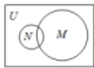

B.

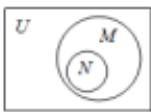

C.

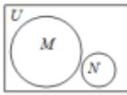

D.

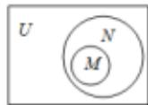

【解答】解：.由 $N = \{x|x^2 +x = 0\}$

得 $N = \{-1, 0\}$ .

$$
\because M = \{- 1, 0, 1 \},
$$

$\therefore N \subseteq M,$

故选：B.

49. 某中学的学生积极参加体育锻炼，其中有 $96\%$ 的学生喜欢足球或游泳， $60\%$ 的学生喜欢足球， $82\%$ 的学生喜欢游泳，则该中学既喜欢足球又喜欢游泳的学生数占该校学生总数的比例是（）

A. 62%

B. 56%

C. 46%

D. 42%

【解答】解：设只喜欢足球的百分比为 $x$ ，只喜欢游泳的百分比为 $y$ ，两个项目都欢

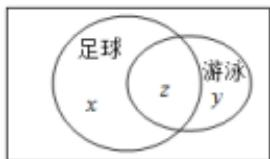

text_image

足球
x
z
游泳
y

的百分比为z，

由题意，可得 $x+z=60,\quad x+y+z=96,\quad y+z=82$ ，解得 z=46。

∴该中学既喜欢足球又喜欢游泳的学生数占该校学生总数的比例是 46%.

故选：C.

50. 某班共 30 人，其中 15 人喜爱篮球运动，10 人喜爱乒乓球运动，8 人对这两项运动都不喜爱，则喜爱篮球运动但不喜爱乒乓球运动的人数为 12。

【解答】解：设两者都喜欢的人数为 x 人，则只喜爱篮球的有 $(15-x)$ 人，只喜爱乒乓球的有 $(10-x)$ 人，

由此可得 $(15-x)+(10-x)+x+8=30$ ，解得x=3，

所以 15 - x = 12，

即所求人数为 12 人，

故答案为：12.

51. 某班有 36 名同学参加数学、物理、化学课外探究小组，每名同学至多参加两个小组，已知参加数学、物理、化学小组的人数分别为 26, 15, 13，同时参加数学和物理小组的有 6 人，同时参加物理和化学小组的有 4 人，则同时参加数学和化学小组的有 8 人。

【解答】解：由条件知，每名同学至多参加两个小组，

故不可能出现一名同学同时参加数学、物理、化学课外探究小组，

设参加数学、物理、化学小组的人数构成的集合分别为 A, B, C,

$$
\text {则} \operatorname{card} (A \cap B) = 6, \operatorname{card} (B \cap C) = 4, \operatorname{card} (A \cap B \cap C) = 0.
$$

$$
\text {由公式} \operatorname{card} (A \cup B \cup C) = \operatorname{card} (A) + \operatorname{card} (B) + \operatorname{card} (C)
$$

$$
\begin{array}{l} - \operatorname{card} (A \cap B) - \operatorname{card} (A \cap C) - \operatorname{card} (B \cap C) + \operatorname{card} (A \cap B \\ \cap C) \end{array}
$$

$$
\text {知} 3 6 = 2 6 + 1 5 + 1 3 - 6 - 4 - \text {card} (A \cap C)
$$

故 $card(A \cap C) = 8$ 即同时参加数学和化学小组的有 8 人.

故答案为：8.

52. 为丰富学生的课外活动，学校开展了丰富的选修课，参与“数学建模选修课”的有169人，参与“语文素养选修课”的有158人，参与“国际视野选修课”的有146人，三项选修课都参与的有30人，三项选修课都没有参与的有20人，全校共有400人。问只参与两项活动的同学有多少人？（）

A. 30

B. 31

C. 32

【解答】解：由题意得，只参与两项活动的同学有 $169+158+146+20-400-30\times2=33$ 人.

故选：D.

53. 《西游记》《三国演义》《水浒传》和《红楼梦》是中国古典文学瑰宝，并称为中国古典小说四大名著。某中学为了解本校学生阅读四大名著的情况，随机调查了100位学生，其中阅读过《西游记》或《红楼梦》的学生共有90位，阅读过《红楼梦》的学生共有80位，阅读过《西游记》且阅读过《红楼梦》的学生共有60位，则该校阅读过《西游记》的学生人数与该学校学生总数比值的估计值为（）

A. 0.5 B. 0.6 C. 0.7

【解答】解：某中学为了了解本校学生阅读四大名著的情况，随机调查了100位学生，

其中阅读过《西游记》或《红楼梦》的学生共有90位，阅读过《红楼梦》的学生共有80位，阅读过《西游记》且阅读过《红楼梦》的学生共有60位，

作出维恩图，得：

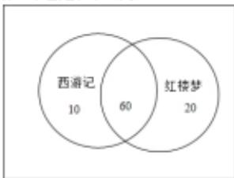

other

| Category   | Count |
| ---------- | ----- |
| 西游记     | 10    |
| 红楼梦     | 20    |
| Both       | 60    |

∴该学校阅读过《西游记》的学生人数为70人，

则该学校阅读过《西游记》的学生人数与该学校学生总数比值的估计值为： $\frac{70}{100}=0.7$ .

故选：C.

# 1.4 充分必要条件

# 题型 1: 充分必要条件

1. 设 $x \in R$ ，则 “ $2 - x \geqslant 0$ ” 是 “ $|x - 1| \leqslant 1$ ” 的（）

A. 充分而不必要条件 B. 必要而不充分条件 C. 充要条件 D. 既不充分也不必要条件

【解答】解：由 $2 - x \geqslant 0$ 得 $x \leqslant 2$

由 $|x-1|\leqslant1$ 得 $-1\leqslant x-1\leqslant1$ ,

得 $0 \leqslant x \leqslant 2$ .

则 “ $2-x\geqslant0$ ” 是 “ $|x-1|\leqslant1$ ” 的必要不充分条件，故选：B.

2. 设 $x \in R$ ，则 “ $x^{3} > 8$ ” 是 “ $|x| > 2$ ” 的（）

A. 充分而不必要条件 B. 必要而不充分条件 C. 充要条件 D. 既不充分也不必要条件

【解答】解：由 $x^{3} > 8$ ，得 $x > 2$ ，则 $|x| > 2$

反之，由 $|x|>2$ ，得x<-2或x>2，

则 $x^{3}<-8$ 或 $x^{3}>8$ .

即“ $x^{3}>8$ ”是“ $|x|>2$ ”的充分不必要条件.

故选：A.

3. 已知 $a, b \in \mathbb{R}$ , 则 “ $a^2 > b^2$ ” 是 “ $|a| > |b|$ ” 的（）

A. 充分非必要条件 B. 必要非充分条件 C. 充要条件 D. 既非充分又非必要条件

【解答】解：∵ $a^{2}>b^{2}$ 等价， $|a|^{2}|b|^{2}$ ，得“ $|a|>|b|$ ”，

∴ “ $a^{2}>b^{2}$ ” 是 “ $|a|>|b|$ ” 的充要条件，

故选：C.

4. 设 $x \in R$ ，则 “ $|x - \frac{1}{2}| < \frac{1}{2}$ ” 是 “ $x^{3} < 1$ ” 的（）

A. 充分而不必要条件 B. 必要而不充分条件 C. 充要条件 D. 既不充分也不必要条件

【解答】解：由 $|x-\frac{1}{2}|<\frac{1}{2}$ 可得 $-\frac{1}{2}<x-\frac{1}{2}<\frac{1}{2}$ ，解得0<x<1，

由 $x^{3}<1$ ，解得 x<1，

故“ $|x-\frac{1}{2}|<\frac{1}{2}$ ”是“ $x^{3}<1$ ”的充分不必要条件，

故选：A.

5. 设 $x \in R$ ，则 “0 < x < 5” 是 “ $|x - 1| < 1$ ” 的（）

A. 充分而不必要条件 B. 必要而不充分条件 C. 充要条件 D. 既不充分也不必要条件

【解答】解：∵ $|x-1|<1$ ，∴0<x<2，

∵0<x<5 推不出 0<x<2，

0<x<2⇒0<x<5,

∴0<x<5是0<x<2的必要不充分条件，

即 0<x<5 是 $|x-1|<1$ 的必要不充分条件

故选：B.

6. 设 $x \in R$ ，则 “ $x^{2} - 5x < 0$ ” 是 “ $|x - 1| < 1$ ” 的（）

A. 充分而不必要条件 B. 必要而不充分条件 C. 充要条件 D. 既不充分也不必要条件

【解答】解： $\because x^{2}-5x<0, \therefore 0<x<5,$

$\because |x - 1| < 1, \therefore 0 < x < 2,$

∵0<x<5 推不出 0<x<2，

0<x<2⇒0<x<5,

∴0<x<5是0<x<2的必要不充分条件，

即 $x^{2}-5x<0$ 是 $|x-1|<1$ 的必要不充分条件.

故选：B.

7. 若 a>0, b>0，则“ $a+b\leqslant4$ ”是“ $ab\leqslant4$ ”的（）

A. 充分不必要条件 B. 必要不充分条件 C. 充分必要条件 D. 既不充分也不必要条件

【解答】解：∵a>0，b>0，∴4≥a+b≥2√ab，

$\therefore 2 \geq \sqrt{ab}, \therefore ab \leqslant 4$ ，即 $a + b \leqslant 4 \Rightarrow ab \leqslant 4$

若 $a = 4$ ， $b = \frac{1}{a}$ 则 $ab = 1\leqslant 4$

但 $a + b = 4 + \frac{1}{4} > 4$

即 $ab \leqslant 4$ 推不出 $a + b \leqslant 4$

$\therefore a + b \leqslant 4$ 是 $ab \leqslant 4$ 的充分不必要条件

故选：A.

8. 已知 $a \in R$ ，则 “a > 1” 是 “ $\frac{1}{a} < 1$ ” 的（）

A. 充分非必要条件 B. 必要非充分条件 C. 充要条件 D. 既非充分又非必要条件

【解答】解： $a\in \mathbb{R}$ ，则“ $a > 1$ ” $\Rightarrow$ “ $\frac{1}{a} < 1$ ”，

“ $\frac{1}{a} < 1$ ” $\Rightarrow$ “ $a > 1$ 或 $a < 0$ ”，

∴ “a>1” 是 “ $\frac{1}{a}<1$ ” 的充分非必要条件.

故选：A.

9. 设 $a \in R$ ，则 “a > 1” 是 “ $a^{2} > a$ ” 的（）

A. 充分不必要条件 B. 必要不充分条件 C. 充要条件 D. 既不充分也不必要条件

【解答】解：由 $a^2 > a$ ，解得 $a < 0$ 或 $a > 1$

故“ $a > 1$ ”是“ $a^2 > a$ ”的充分不必要条件，

故选：A.

10. 设 $x > 0, y \in \mathbb{R}$ , 则“ $x > y$ ”是“ $x > |y|$ ”的（）

A. 充要条件 B. 充分不必要条件 C. 必要而不充分条件 D. 既不充分也不必要条件

【解答】解：设 $x > 0$ ， $y\in \mathbb{R}$ ，当 $x > 0$ ， $y = -1$ 时，满足 $x > y$ 但不满足 $x > |y|$ ，故由 $x > 0$ ， $y\in \mathbb{R}$ ，则“ $x > y$ ”推不出“ $x > |y|$ ”而“ $x > |y|$ ” $\Rightarrow$ “ $x > y$ ”，

故“x>y”是“x>|y|”的必要不充分条件，

故选：C.

11. 设 $a \in R$ ，“a > 0”是“ $\frac{1}{a} > 0$ ”的（）条件.

A. 充分非必要 B. 必要非充分 C. 充要 D. 既非充分也非必要

【解答】解：由 $\frac{1}{a}>0$ ，解得：a>0，

故 $a > 0$ 是“ $\frac{1}{a} >0$ ”的充要条件，

故选：C.

# 题型 2：充分必要条件综合

12. “ $\alpha=\beta$ ” 是 “ $\sin^{2}\alpha+\cos^{2}\beta=1$ ” 的（）

A. 充分非必要条件 B. 必要非充分条件 C. 充要条件 D. 既非充分又非必要条件

【解答】解：（1）若 $\alpha = \beta$ ，则 $\sin^2\alpha +\cos^2\beta = \sin^2\alpha +\cos^2\alpha = 1$

∴ “ $\alpha=\beta$ ” 是 “ $\sin^{2}\alpha+\cos^{2}\beta=1$ ” 的充分条件；

(2) 若 $\sin^{2}\alpha+\cos^{2}\beta=1$ ，则 $\sin^{2}\alpha=\sin^{2}\beta$ ，得不出 $\alpha=\beta$ ，

∴ “ $\alpha=\beta$ ” 不是 “ $\sin^{2}\alpha+\cos^{2}\beta=1$ ” 的必要条件，

∴ “ $\alpha=\beta$ ” 是 “ $\sin^{2}\alpha+\cos^{2}\beta=1$ ” 的充分非必要条件.

故选：A.

13. 设 $a, b, c, d$ 是非零实数，则“ $ad = bc$ ”是“ $a, b, c, d$ 成等比数列”的（）

A. 充分而不必要条件 B. 必要而不充分条件 C. 充分必要条件 D. 既不充分也不必要条件

【解答】解：若 a, b, c, d 成等比数列，则 ad = bc，

反之数列-1，-1，1，1.满足-1×1=-1×1，

但数列-1，-1，1，1不是等比数列，

即“ad=bc”是“a，b，c，d成等比数列”的必要不充分条件.

故选：B.

14. 设 $\theta \in \mathbb{R}$ ，则“ $|\theta - \frac{\pi}{12}| < \frac{\pi}{12}$ ”是“ $\sin \theta < \frac{1}{2}$ ”的（）

A. 充分而不必要条件 B. 必要而不充分条件 C. 充要条件 D. 既不充分也不必要条件

【解答】解： $\left|\theta-\frac{\pi}{12}\right|<\frac{\pi}{12}=-\frac{\pi}{12}<\theta-\frac{\pi}{12}<\frac{\pi}{12}=0<\theta<\frac{\pi}{6}$

$$
\sin \theta <   \frac {1}{2} \Longleftrightarrow - \frac {7 \pi}{6} + 2 k \pi <   \theta <   \frac {\pi}{6} + 2 k \pi , k \in \mathbf {Z},
$$

则 $(0, \frac{\pi}{6}) \subset (-\frac{7\pi}{6} + 2k\pi, \frac{\pi}{6} + 2k\pi)$ ， $k \in \mathbf{Z}$ ，

可得“ $|\theta -\frac{\pi}{12}| <   \frac{\pi}{12}$ ”是“ $\sin \theta <  \frac{1}{2}$ ”的充分不必要条件.

故选：A.

15. 已知非零向量 $\vec{a}, \vec{b}, \vec{c}$ ，则“ $\vec{a} \cdot \vec{c} = \vec{b} \cdot \vec{c}$ ”是“ $\vec{a} = \vec{b}$ ”的（）

A. 充分不必要条件 B. 必要不充分条件 C. 充分必要条件 D. 既不充分也不必要条件

【解答】解：当 $\vec{a} \perp \vec{c}$ 且 $\vec{b} \perp \vec{c}$ ，则 $\vec{a} \cdot \vec{c} = \vec{b} \cdot \vec{c} = 0$ ，但 $\vec{a}$ 与 $\vec{b}$ 不一定相等，

故 $\vec{a} \cdot \vec{b} = \vec{b} \cdot \vec{c}$ 不能推出 $\vec{a} = \vec{b}$ ,

则“ $\vec{a} \cdot \vec{c} = \vec{b} \cdot \vec{c}$ ”是“ $\vec{a} = \vec{b}$ ”的不充分条件；

由 $\vec{a} = \vec{b}$ ，可得 $\vec{a} -\vec{b} = \vec{0}$

则 $(\vec{a} -\vec{b})\cdot \vec{c} = 0$ ，即 $\vec{a}\cdot \vec{b} = \vec{b}\cdot \vec{c},$

所以 $\vec{a} = \vec{b}$ 可以推出 $\vec{a} \cdot \vec{b} = \vec{b} \cdot \vec{c}$ ,

故“ $\vec{a} \cdot \vec{c} = \vec{b} \cdot \vec{c}$ ”是“ $\vec{a} = \vec{b}$ ”的必要条件.

综上所述，“ $\vec{a} \cdot \vec{c} = \vec{b} \cdot \vec{c}$ ”是“ $\vec{a} = \vec{b}$ ”的必要不充分条件。故选：B.

17. 已知平面 $\alpha$ ，直线 $m, n$ 满足 $m \subset \alpha, n \subset \alpha$ ，则“ $m \parallel n$ ”是“ $m \parallel \alpha$ ”的（）

A. 充分不必要条件 B. 必要不充分条件 C. 充分必要条件 D. 既不充分也不必要条件

【解答】解： $m \not\subseteq \alpha$ ， $n \not\subseteq \alpha$ ，“ $m \parallel n$ ” $\Rightarrow$ “ $m \parallel \alpha$ ”.

∴ $m \parallel n$ ” 是 “ $m \parallel \alpha$ ” 的充分不必要条件.

故选：A.

18. 已知空间中不过同一点的三条直线 $l, m, n$ . 则“ $l, m, n$ 共面”是“ $l, m, n$ 两两相交”的（）

A. 充分不必要条件 B. 必要不充分条件 C. 充分必要条件 D. 既不充分也不必要条件

【解答】解：空间中不过同一点的三条直线 $m, n, l$ ，若 $m, n, l$ 在同一平面，则 $m, n, l$ 相交或 $m, n, l$ 有两个平行，另一直线与之相交，或三条直线两两平行。

而若“ $m$ ， $n$ ， $l$ 两两相交”，则“ $m$ ， $n$ ， $l$ 在同一平面”成立.故 $m$ ， $n$ ， $l$ 在同一平面”是“ $m$ ， $n$ ， $l$ 两两相交”的必要不充分条件，

故选：B.

19. 设点 A, B, C 不共线，则“ $\overrightarrow{AB}$ 与 $\overrightarrow{AC}$ 的夹角为锐角”是“ $|\overrightarrow{AB} + \overrightarrow{AC}| > |\overrightarrow{BC}|$ ”的（）

A. 充分而不必要条件 B. 必要而不充分条件 C. 充分必要条

件 D. 既不充分也不必要条件

【解答】解：点 A, B, C 不共线，

$$
\vec {B C} = \vec {A C} - \vec {A B}, \therefore \vec {B C} ^ {2} = \vec {A C} ^ {2} + \vec {A B} ^ {2} - 2 \vec {A C} \cdot \vec {A B},
$$

当 $\vec{AB}$ 与 $\vec{AC}$ 的夹角为锐角时， $\vec{AC} \cdot \vec{AB} = \frac{\vec{AC}^2 + \vec{AB}^2 - \vec{BC}^2}{2} > 0$

∴ “AB与AC的夹角为锐角” $\Rightarrow$ “ $|AB + AC| > |BC|$ ”，

“ $|AB+AC|>|BC|\Rightarrow AB$ 与AC的夹角为锐角”，

∴设点 A, B, C 不共线，则“ $\overrightarrow{AB}$ 与 $\overrightarrow{AC}$ 的夹角为锐角”是“ $|\overrightarrow{AB} + \overrightarrow{AC}| > |\overrightarrow{BC}|$ ”的充分必要条件.

故选：C.

20. 设 $\vec{a}$ ， $\vec{b}$ 均为单位向量，则 “ $|\vec{a}-3\vec{b}|=|3\vec{a}+\vec{b}|$ ” 是 “ $\vec{a}\perp\vec{b}$ ” 的（）

A. 充分而不必要条件 B. 必要而不充分条件 C. 充分必要条件 D. 既不充分也不必要条件

【解答】解：∵“ $|\vec{a}-3\vec{b}|=|3\vec{a}+\vec{b}|$ ”

∴平方得 $|\vec{a}|^2 +9|\vec{b}|^2 -6\vec{a}\cdot \vec{b} = 9|\vec{a}|^2 +|\vec{b}|^2 +6\vec{a}\cdot \vec{b},$

即 $1 + 9 - 6\vec{a}\cdot \vec{b} = 9 + 1 + 6\vec{a}\cdot \vec{b},$

即 $12\vec{a}\cdot\vec{b}=0$ ,

则 $\vec{a} \cdot \vec{b} = 0$ ，即 $\vec{a} \perp \vec{b}$ ，

反之也成立，

则“ $|\vec{a} - 3\vec{b}| = |\vec{3a} + \vec{b}|$ ”是“ $\vec{a}\bot \vec{b}$ ”的充要条件，

故选：C.

21. 设 $S_{n}$ 为数列 $\{a_{n}\}$ 的前 $n$ 项和，“ $\{a_{n}\}$ 是递增数列”是“ $\{S_{n}\}$ 是递增数列”的（）

A. 充分非必要条件 B. 必要非充分条件 C. 充要条件 D. 既非充分又非必要条件

【解答】解：数列-3，-2，-1，0……是递增数列，但 $\{S_{n}\}$ 不是递增数列，即充分性不成立，

数列 1,1,1,……，满足 $\{S_{n}\}$ 是递增数列，但数列 1,1,1,……，不是递增数列，即必要性不成立，

则“ $\{a_n\}$ 是递增数列”是“ $\{S_n\}$ 是递增数列”的既不充分也不必要条件，

故选：D.

22. 等比数列 $\{a_{n}\}$ 的公比为 $q$ ，前 $n$ 项和为 $S_{n}$ 。设甲： $q > 0$ ，乙： $\{S_{n}\}$ 是递增数列，则（）

A. 甲是乙的充分条件但不是必要条件  
B. 甲是乙的必要条件但不是充分条件  
C. 甲是乙的充要条件  
D. 甲既不是乙的充分条件也不是乙的必要条件

【解答】解：若 $a_1 = -1$ ， $q = 1$ ，则 $S_{n} = na_{1} = -n$ ，则 $\{S_n\}$ 是递减数列，不满足充分性；

$$
\because S _ {n} = \frac {a _ {1}}{1 - q} (1 - q ^ {n}),
$$

则 $S_{n + 1} = \frac{u_1}{1 - q}(1 - q^{n + 1})$ ，

$$
\therefore S _ {n + 1} - S _ {n} = \frac {a _ {1}}{1 - q} (q ^ {n} - q ^ {n + 1}) = a _ {1} q ^ {n},
$$

若 $\{S_n\}$ 是递增数列，

$$
\therefore S _ {n + 1} - S _ {n} = a _ {1} q ^ {n} > 0,
$$

则 $a_1 > 0, q > 0$

∴满足必要性，

故甲是乙的必要条件但不是充分条件，

故选：B.

# 1.5 任意与存在命题的否定

23. 命题 “ $\forall x \in [0, +\infty)$ ， $x^3 + x \geqslant 0$ ” 的否定是（）

A. $\forall x\in (-\infty ,0),x^3 +x <   0B.\forall x\in (-\infty ,0),x^3 +x\geqslant 0$   
C. $\exists x_0\in [0, + \infty)$ ， $x_0^3 +x_0 <   0D$ . $\exists x_0\in [0, + \infty)$ ， $x_0^3 +x_0\geqslant 0$

【解答】解：∵命题“ $\forall x\in[0,+\infty)$ ， $x^{3}+x\geqslant0$ ”是一个全称命题.

∴其否定命题为： $\exists x_{0}\in[0,+\infty)$ ， $x_{0}^{3}+x_{0}<0$

故选：C.

24. 设 $x \in \mathbf{Z}$ , 集合 $A$ 是奇数集, 集合 $B$ 是偶数集. 若命题 $p: \forall x \in A$ , $2x \in B$ , 则（）

A. $\neg p: \forall x \in A, 2x \notin BB.$ $\neg p: \forall x \notin A, 2x \notin B$

C. $\neg p: \exists x \notin A, 2x \in BD.$ $\neg p: \exists x \in A, 2x \notin B$

【解答】解：因为全称命题的否定是特称命题，

所以设 $x \in \mathbf{Z}$ ，集合 $A$ 是奇数集，集合 $B$ 是偶数集。若命题 $p: \forall x \in A, 2x \in B$

则 $p: \exists x \in A, 2x \notin B.$

故选：D.

25. 已知命题 $p: \forall x > 0, \ln (x + 1) > 0$ ; 命题 $q$ : 若 $a > b$ , 则 $a^2 > b^2$ , 下列命题为真命题的是（）

A. $p \wedge q$

B. $p \wedge \neg q$

C. $\neg p$

∧q

D. $\neg p\land\neg q$

【解答】解：命题 $p: \forall x > 0, \ln (x + 1) > 0$ ，则命题 $p$ 为真命题，则 $\neg p$ 为假命题；

取 $a = -1, b = -2, a > b$ ，但 $a^2 < b^2$ ，则命题 $q$ 是假命题，则 $\neg q$ 是真命题.

∴ $p \wedge q$ 是假命题， $p \wedge \neg q$ 是真命题， $\neg p \wedge q$ 是假命题， $\neg p \wedge \neg q$ 是假命题.

故选：B.

26. 命题“对 $\forall x \in R$ ，都有 $\sin x \leqslant 1$ ”的否定为（）

A. 对 $\forall x \in \mathbb{R}$ , 都有 $\sin x > 1\mathrm{B}$ . 对 $\forall x \in \mathbb{R}$ , 都有 $\sin x \leqslant -1$

C. $\exists x_0\in R$ ，使得 $\sin x_0 > 1D$ . $\exists x_0\in R$ ，使得 $\sin x_0\leqslant 1$

【解答】解：∵全称命题的否定是特称命题，

∴命题“对 $\forall x\in R$ ，都有 $\sin x\leqslant1$ ”的否定为： $\exists x_{0}\in R$ ，使得 $\sin x_{0}>1$ ;

故选：C.

27. 命题： $\exists x \in \mathbb{R}, x^2 - x + 1 = 0$ 的否定是 $\forall x \in \mathbb{R}, x^2 - x + 1 \neq 0$

【解答】解：因为特称命题的否定是全称命题，

所以 $\exists x\in \mathbf{R}$ ， $x^{2} - x + 1 = 0$ 的否定是： $\forall x\in \mathbf{R}$ ， $x^{2} - x + 1\neq 0$

故答案为： $\forall x\in R,\ x^{2}-x+1\neq0.$

28. 若命题 “ $\exists x_{0}\in[-1,2], -x_{0}^{2}+2\geqslant a$ ” 是假命题，则实数 a 的范围是（）

A. $a > 2B$ . $a \geqslant 2C$ . $a > -2D$ . $a \leqslant -2$

【解答】解：若命题“ $\exists x_0 \in [-1, 2], -x_0^2 + 2 \geq a$ ”是假命题，

则它的否定命题“ $\forall x \in [-1, 2], -x^2 + 2 < a$ ”是真命题，当 $x = 0$ 时， $(-x^2 + 2)_{max} = 2$ ，

所以 a 的取值范围是 a > 2.

故选：A.

# [必修一]第二章 一元二次函数、方程和不等式

# 2.1 不等式的性质

# 题型 1: 不等式的性质

1. 下列命题正确的是（）

A. 若 $a^2 > b^2$ ，则 $a > b\mathrm{B}$ 。若 $|a| > b$ ，则 $a^2 > b^2$

C. 若 $a > |b|$ , 则 $a^2 > b^2$ D. 若 $a > b$ , 则 $a^2 > b^2$

【解答】解：对于 A：错误，如 a = -3, b = 0;

对于 B：错误，如 $\left|a\right|=2,\ b=-5$

对于 C: 正确;

对于 D：错误，如 a=0, b=-3，

故选：C.

2. 若 $a < 0 < b$ ，则下列不等式恒成立的是（）

A. $\frac{1}{a} >\frac{1}{b}\mathrm{B}$ - $a > b\mathrm{C}$ $a^2 >b^2\mathrm{D}$ $a^3 <   b^3$

【解答】解：∵a<0<b，

若 $a = -1, b = 1$

则 $A, B, C$ 不正确，

对于 D，根据幂函数的性质即可判断正确，

故选：D.

3. 若 $a > b > 0, c < d < 0$ ，则一定有（）

A. $\frac{a}{c}>\frac{b}{d}$

B. $\frac{a}{c} < \frac{b}{d}$ C. $\frac{a}{d} > \frac{b}{c}$

D. $\frac{a}{d}<\frac{b}{c}$

【解答】解：不妨令 a=3, b=1, c=-3, d=-1,

则 $\frac{a}{c} = -1, \frac{b}{d} = -1, \therefore A, B$ 不正确；

$\frac{a}{d} = -3, \frac{b}{c} = -\frac{1}{3},$

∴ C 不正确，D 正确.

解法二：

$\because c < d < 0,$

$\therefore -c > -d > 0,$

$\because a > b > 0,$

$\therefore -ac > -bd,$

$\therefore \frac{-ac}{cd} > \frac{-bd}{cd},$

$\therefore \frac{a}{d} < \frac{b}{c}$

故选：D.

4. 已知 2 < x < 4, -1 < y < 3，则 x - y 的取值范围为 \_\_\_\_ (-1, 5).

【解答】解：由题意可得-3<-y<1，又2<x<4，

由不等式的同向可加性可得 $x - y \in (-1, 5)$ .

故答案为： $(-1,5)$ .

(多选) 5. 下列说法正确的的是（）

A. 若 a > b，则 $ac^{2} > bc^{2}$

B. 若 $\frac{a}{c^2} > \frac{b}{c^2}$ , 则 $a > b$

C. 若 a > b, c > d. 则 ac > bd

D. 若 $b > a > 0, c > 0$ ，则 $\frac{a + c}{b + c} > \frac{a}{b}$

【解答】解：当 c=0 时， $ac^{2}=bc^{2}$ ，故 A 错误；

因为 $\frac{a}{c^2} >\frac{b}{c^2}$ ，所以 $c^2 >0$ ，所以 $a > b$ ，故 $B$ 正确；

当 $a = 2$ ， $b = 1$ ， $c = -2$ ， $d = -3$ 时， $ac < bd$ ，故 $C$ 错误；

$\frac{a + c}{b + c} -\frac{a}{b} = \frac{(a + c)b - a(b + c)}{(b + c)b} = \frac{(b - a)c}{(b + c)b},$

又 $b > a > 0, c > 0$ ，所以 $\frac{a + c}{b + c} -\frac{a}{b} >0$ ，所以 $\frac{a + c}{b + c} >\frac{a}{b}$ 故 $D$ 正确.故选：BD.

6. 已知 $a > b > c > d > 0$ ，则下列结论不正确的是（）

A. $a+c>b+d$

B. ac > bdC. $\frac{a}{c} > \frac{b}{d}$

D. $\frac{a}{d}>\frac{c}{b}$

【解答】解：∵a>b，c>d，∴a+c>b+d，故A正确；

$\because a > b > 0, c > d > 0, \therefore ac > bd$ ，故 $B$ 正确；

取 $a = 4$ ， $b = 3$ ， $c = 2$ ， $d = 0.1$ ，则 $\frac{a}{c} = 2$ ， $\frac{b}{d} = 30$ ，此时 $\frac{a}{c} < \frac{b}{d}$ 故 $C$ 错误；

$\because c > d > 0$ ，则 $\frac{1}{d} >\frac{1}{c} >0$ ，又 $a > b > 0$ ，则 $\frac{a}{d} >\frac{b}{c}$ 故 $D$ 正确.故选： $C$

7. 已知等式 ax = by，则下列变形一定正确的是（）

A. $\frac{a}{b} = \frac{y}{x}\mathbf{B}$ . $ax - m = by - m$

C. $\sqrt{ax} = \sqrt{by}\mathrm{D}$ . $\frac{1}{ax} = \frac{1}{by}$

【解答】解：对于选项 A，因为 ax = by，当 b = 0 或 x = 0 时， $\frac{a}{b} = \frac{y}{x}$ 无意义，故选项 A 错误；

对于选项 $B$ ，等式 $ax = by$ 的两边同时减去 $m$ ，根据等式的基本性质，该等式仍然成立，故选项 $B$ 正确；

对于选项 $C$ ，因为 $ax = by$ ，当 $ax < 0$ 或 $by < 0$ 时， $\sqrt{ax} = \sqrt{by}$ 无意义，故选项 $C$ 错误；

对于选项 D，因为 ax = by，当 ax = 0 或 by = 0 时， $\frac{1}{ax} = \frac{1}{by}$ 无意义，故选项 D 错误.

故选：B.

8. 若 $a, b, c \in \mathbb{R}$ 且 $a > b > c$ ，则下列不等式一定成立的是（）

A. $a-b>b-cB$ . $a+b>2cC$ . $ac>bcD$ . $a^{2}>b^{2}>c^{2}$

【解答】解：对于 A，当 a=1, b=0, c=-1 时，a-b=b-c，故 A 错误，

对于 B，∵a>b>c，

$\therefore a > c, b > c,$

∴由不等式的可加性可得， $a+b>2c$ ，故B正确，

对于 C，当 c=0 时，ac=bc，故 C 错误，

对于 $D$ ，当 $a = 1$ ， $b = -2$ ， $c = -3$ ，满足 $a > b > c$ ，但 $a^2 < b^2 < c^2$ ，故 $B$ 错误.

故选：B.

9. 若 $a > b > c > d$ ，则下列不等式恒成立的是（）

A. $a+d>b+cB$ . $a+c>b+dC$ . ac>bd D. ad >bc

【解答】解：对于 A，令 a=2, b=1, c=-1, d=-2，满足 a>b>c>d，但 $a+d=b+c$ ，故 A 错误，

对于 $B$ ， $\because a > b > c > d$ ，即 $a > b$ ， $c > d$

∴由不等式的可加性可得， $a+c>b+d$ ，故B正确，

对于 C，令 a=2, b=1, c=-1, d=-2，满足 a>b>c>d，
但 ac=bd，故 C 错误，

对于 D，令 a=2, b=1, c=-1, d=-2，满足 a>b>c>d，但 ad<bc，故 D 错误.

故选：B.

10. 下列不等式中成立的是 ②③

① $a>b\Rightarrow ac^{2}>bc^{2};$   
② $a>|b|\Rightarrow a^{2}>b^{2};$   
③0<a<1，-1<b<2⇒-4<a-2b<3；  
④ $|a|>b\Rightarrow a^{2}>b^{2}$

【解答】解：①当 $c^2 = 0$ 时不成立.

②由于 $a > |b| \geqslant 0$ ，则 $a^2 > b^2$ 一定成立。  
③由于 0<a<1，-1<b<2，  
则-2<2b<4，-4<-2b<2，  
则-4<a-2b<3成立.   
④当 b<0 时，不一定成立。如： $|2|>-3$ ，但 $2^{2}<(-3)^{2}$   
故答案为：②③.

11. 已知下列四个条件：

①b>0>a;   
②0>a>b;   
③a>0>b;   
④a>b>0.

不能推出 $\frac{1}{a}<\frac{1}{b}$ 成立的序号是 ③.

【解答】解：对于①，由 $b > 0 > a$ ，可得 $\frac{1}{a} < \frac{1}{b}$

对于②，由0>a>b，可得 $\frac{1}{a}<\frac{1}{b}$ ;

对于③，由a>0>b，可得 $\frac{1}{a}>\frac{1}{b}$ ;

对于④，由 a > b > 0，可得 $\frac{1}{a} < \frac{1}{b}$

所以不能推出 $\frac{1}{a}<\frac{1}{b}$ 成立的序号是③.

故答案为：③.

12. 已知 $1 < a < 3, 2 < b < 4$ ，则 $\frac{a}{b}$ 的取值范围是 $\left(\frac{1}{4}, \frac{3}{2}\right)$ .

【解答】解：∵2<b<4，∴ $\frac{1}{4}<\frac{1}{b}<\frac{1}{2}$

又 $1 < a < 3$ ，由不等式性质可知： $\frac{1}{4} < \frac{a}{b} < \frac{3}{2}$

则 $\frac{a}{b}$ 的取值范围是 $(\frac{1}{4}, \frac{3}{2})$ 。

故答案为： $\left(\frac{1}{4},\frac{3}{2}\right)$

（多选）13. 已知 $a$ 、 $b$ 、 $c$ 、 $d$ 均为实数，则下列命题中正确的是（）

A. 若 $ab < 0, bc - ad > 0$ ，则 $\frac{c}{a} - \frac{d}{b} > 0$   
B. 若 $ab > 0$ ， $\frac{c}{a} -\frac{d}{b} >0$ ，则 $bc - ad > 0$   
C. 若 $bc - ad > 0$ ， $\frac{c}{a} -\frac{d}{b} >0$ ，则 $ab > 0$   
D. 若 $\frac{1}{a} < \frac{1}{b} < 0$ ，则 $\frac{1}{a + b} < \frac{1}{ab}$

【解答】解：A 中，∵ ab < 0，∴ $\frac{1}{ab} < 0$ ，又∵ bc - ad > 0，∴ $\frac{1}{ab}$ · (bc - ad) < 0，即 $\frac{c}{a} - \frac{d}{b} < 0$ ，故 A 不正确；

B 中，∵ ab > 0， $\frac{c}{a} - \frac{d}{b} > 0$ ，∴ $ab\left(\frac{c}{a} - \frac{d}{b}\right) > 0$ ，即 bc - ad > 0，
故 B 正确；

C 中， $\because \frac{c}{a} - \frac{d}{b} > 0, \therefore \frac{bc - ad}{ab} > 0$ ，又 $\because bc - ad > 0, \therefore ab > 0,$

故 C 正确；

$D$ 中，由 $\frac{1}{a} < \frac{1}{b} < 0$ ，可知 $b < a < 0, \therefore a + b < 0, ab > 0, \therefore \frac{1}{a + b} < \frac{1}{ab}$ 成立，故 $D$ 正确.

故选：BCD.

14. 设 $a, b \in \mathbb{R}$ , 且 $a < b < 0$ , 则 ( )

A. $\frac{1}{a} < \frac{1}{b}$ B. $\frac{b}{a} >\frac{a}{b}$ C. $\frac{a + b}{2} >\sqrt{ab}$

D. $\frac{b}{a}+\frac{a}{b}$

>>2

【解答】解：由 a<b<0，可得 $\frac{1}{a}>\frac{1}{b}$ ，故 A 错误；

$\frac{b}{a} - \frac{a}{b} = \frac{b^2 - a^2}{ab} = \frac{(b - a)(b + a)}{ab}$ ，由 $a < b < 0$ ，可得 $b - a > 0$ ， $b + a < 0$ ， $ab > 0$ ，

$\therefore \frac{b}{a} -\frac{a}{b} < 0$ ，即 $\frac{b}{a} <  \frac{a}{b}$ 故 $B$ 错误；

由 $a < b < 0$ ，可得 $-a > -b > 0$ ， $\therefore -a - b > 2\sqrt{ab}$ ，即 $\frac{a + b}{2} < -\sqrt{ab}$ ，故 $C$ 错误；

由 $a < b < 0$ ，可得 $\frac{b}{a} > 0, \frac{a}{b} > 0, \therefore \frac{b}{a} + \frac{a}{b} > 2\sqrt{\frac{b}{a} \cdot \frac{a}{b}} = 2$ ，故 $D$ 正确.

故选：D.

15. 若 $a, b, c \in \mathbb{R}, a > b$ ，则下列不等式成立的是（）

A. $\frac{1}{a} < \frac{1}{b}$ B. $a^2 < b^2$ C. $a|c| > b|c|$ D. $\frac{a}{c^2 + 1} > \frac{b}{c^2 + 1}$

【解答】解：由 a > b，

A. 取 a = -1, b = -2 时不成立；

B. 取 a=1, b=-2 时不成立；

C. 取 c=0 时不成立；

D. $\because c^{2} + 1 > 0$ ，可得： $\frac{a}{c^2 + 1} >\frac{b}{c^2 + 1}$ 恒成立.

故选：D.

16. 已知实数 $a > b > 0 > c$ ，则下列结论一定正确的是（）

A. $\frac{a}{b} >\frac{a}{c}$ B. $(\frac{1}{2})^a >(\frac{1}{2})^c$ C. $\frac{1}{a} <  \frac{1}{c}$ D. $a^2 >c^2$

【解答】解：A 选项中，因为 a > b > 0 > c，所以 $\frac{a}{b} > 0 > \frac{a}{c}$ ，故 A 选项正确；

B 选项中，因为函数 $y = \left(\frac{1}{2}\right)^{x}$ 在 R 上单调递减且 a > c，所以 $\left(\frac{1}{2}\right)^{a} < \left(\frac{1}{2}\right)^{c}$ ，故 B 选项错误：

C选项中，因为a>0>c，则 $\frac{1}{a}>0>\frac{1}{c}$ ，故C选项错误；

D 选项中，若 a=1, c=-2，满足 a>0>c，但 $a^{2}<c^{2}$ ，故 D 选项错误.

故选：A

17. 若 $1 < \alpha < 3, -4 < \beta < 2$ ，则 $2\alpha + \beta$ 的取值范围是 \_\_\_\_（2，10）.

【解答】解：∵-4<β<2，∴0≤|β|<4 ①，

再由 $1 < \alpha < 3$ ，可得 $2 < 2\alpha < 6$ ②，

把①②相加可得 $0 + 2 < 2\alpha + |\beta| < 4 + 6$ ，即 $2 < 2\alpha + |\beta| < 10$ .

故答案为：（2，10）

18. 若 $1 \leqslant x \leqslant 3, -2 < y \leqslant 1$ ，则 $x - |y|$ 的取值范围为 \_\_\_\_（-1，3].

【解答】解：因为 $-2 < y \leqslant 1$ ，所以 $0 \leqslant |y| < 2$ ，则 $-2 < -|y| \leqslant 0$

又因为 $1 \leqslant x \leqslant 3$ ，所以 $-1 < x - |y| \leqslant 3$

故 $x - |y|$ 的取值范围为 $(-1, 3]$ .

故答案为： $(-1, 3]$ .

19. 设 a、b、c、d 是实数，则下列命题为真命题的是 ①③④.

①如果 a > b，且 c > d，那么 $a + c > b + d$ ;   
②如果 $a \neq b$ ，且 $c \neq d$ ，那么 $ac \neq bd$ ;  
③如果 a > b > 0，那么 $0 < \frac{1}{a} < \frac{1}{b}$ ;   
④如果 $(a-b)^{2}+(b-c)^{2}\leqslant0$ ，那么a=b=c。

【解答】解：对于①，根据不等式的基本性质得，如果 a > b，且 c > d，那么 $a + c > b + d$ ，命题①正确；

对于②，如果 $a \neq b$ ，且 $c \neq d$ ，那么 $ac \neq bd$ 错误，如 $a = \frac{1}{2}$ $b = 2$ ， $c = -2$ ， $d = -\frac{1}{2}$ 时， $ac = bd = -1$ ，命题②错误；

对于③，如果 $a > b > 0$ ，那么 $\frac{1}{ab} >0$ ，所以 $\frac{1}{b} >\frac{1}{a} >0$ ，即 $0 <   \frac{1}{a} <  \frac{1}{b}$ 命题③正确；

对于④，如果 $(a-b)^{2}+(b-c)^{2}\leqslant0$ ，那么a-b=b-c=0，
所以 a=b=c，命题④正确.

所以真命题的序号是①③④.

# 2.2 基本不等式

# 题型 1: 基本不等式

# 一. 和定

1. 已知正实数 x, y 满足 $2x + y = 1$ ，则 xy 的最大值为（）

A. $\frac{1}{8}$ B. $\frac{2}{3}$ C. $\frac{1}{4}$

【解答】解：∵正实数 x，y 满足 $2x + y = 1$ ，

则 $1 \geq 2\sqrt{2xy}$ ，化为： $xy \leq \frac{1}{8}$ ，当且仅当 $2x = y = \frac{1}{2}$ 时取等号。 $\therefore xy$ 的最大值为 $\frac{1}{8}$ .

故选：A.

2. 若 a>0, b>0, a, b 的等差中项是 1，且 $\frac{1}{ab}$ 的最小值为（）

A. 1 B. 2 C. 3

【解答】解：由题意得 $a + b = 2$ ， $a > 0$ ， $b > 0$

所以 $0 < ab \leqslant \left(\frac{a+b}{2}\right)^{2} = 1$ ，当且仅当 a = b = 1 时取等号，所以 $\frac{1}{ab} \geq 1$ ，即 $\frac{1}{ab}$ 的最小值为 1.

故选：A.

3. 若 x, $y \in R^{+}$ ，且 $\frac{1}{x} + 2y = 3$ ，则 $\frac{y}{x}$ 的最大值为 $\frac{9}{8}$ .

【解答】解： $3=\frac{1}{x}+2y\geqslant2\sqrt{\frac{1}{x}\cdot2y},\therefore\frac{y}{x}\leq(\frac{3}{2\sqrt{2}})^{2}=\frac{9}{8};$

故答案为： $\frac{9}{8}$

4. 若实数 a, b 满足 $\frac{1}{a} + \frac{2}{b} = \sqrt{ab}$ ，则 ab 的最小值为（）

A. $\sqrt{2}$ B. 2 C. $2\sqrt{2}$

D. 4

【解答】解： $\because\frac{1}{a}+\frac{2}{b}=\sqrt{ab}$

$$
\therefore a > 0, b > 0,
$$

$\because \frac{1}{a} +\frac{2}{b}\geq 2\sqrt{\frac{2}{ab}}$ （当且仅当 $b = 2a$ 时取等号），

$$
\therefore \sqrt {a b} \geq 2 \sqrt {\frac {2}{a b}},
$$

解可得， $ab \geq 2\sqrt{2}$ ，即 ab 的最小值为 $2\sqrt{2}$ ，

故选：C.

5. 已知 x > 0, y > 0, $2x + y = 3$ ，则 $9^{x} + 3^{y}$ 的最小值为（）

A. 27 B. $12\sqrt{3}$ C. 12

【解答】解： $x>0,\quad y\geqslant0,\quad 2x+y=3,$

又 $9^{x + 3y}\geqslant 2\sqrt{9^{x} \times 3^{y}} = 2\sqrt{3^{2x + y}} = 6\sqrt{3}$ ，当且仅当 $9^{x} = 3^{y}$ 即 $\mathrm{x} = \frac{3}{4},\mathrm{y} = \frac{3}{2}$ 时取等号，

即 $9^{x}+3^{y}$ 的最小值为 $6\sqrt{3}$ ,

故选：D.

6. 已知 $\mathbf{m}, \mathbf{n} \in \mathbb{R}$ , 且 $\mathbf{m} - 3\mathbf{n} + 4 = 0$ , 则 $2^{\mathrm{m}} + \frac{1}{8^{\mathrm{m}}}$ 的最小值为 ( )

A. $\frac{257}{64}$ B. $\frac{1}{4}$ C. $\frac{\sqrt{2}}{2}$

【解答】解： $\because m - 3n = -4, 2^{m} > 0, 8^{n} = 2^{3n} > 0,$

$\therefore 2^{\mathrm{m}} + \frac{1}{8^{\mathrm{n}}} \geq 2\sqrt{\frac{2^{\mathrm{m}}}{8^{\mathrm{n}}}} = 2\sqrt{2^{\mathrm{m} - 3\mathrm{n}}} = 2\sqrt{2^{-4}} = \frac{1}{2}$ ，当且仅当 $2^{\mathrm{m}} = \frac{1}{8^{\mathrm{n}}}$ ，即 $\mathfrak{m} = -3\mathfrak{n} = -2$ 时取等号.

故选：D.

7. 设 x > 0, y > 0, $x + 2y = 4$ ，则 $\frac{(x+1)(2y+1)}{xy}$ 的最小值为 $\frac{9}{2}$ .

【解答】解：x>0，y>0， $x+2y=4$ ，

则 $\frac{(x + 1)(2y + 1)}{xy} = \frac{2xy + x + 2y + 1}{xy} = \frac{2xy + 5}{xy} = 2 + \frac{5}{xy}$

$$
\mathrm{x} > 0, \mathrm{y} > 0, \mathrm{x} + 2 \mathrm{y} = 4,
$$

由基本不等式有： $4=x+2y\geqslant2\sqrt{2xy}$

$$
\therefore 0 <   \mathrm{xy} \leqslant 2,
$$

$$
\frac {5}{x y} \geq \frac {5}{2},
$$

故： $2+\frac{5}{xy}\geq2+\frac{5}{2}=\frac{9}{2}$ ;

（当且仅当 x=2y=2 时，即：x=2，y=1 时，等号成立），故 $\frac{(x+1)(2y+1)}{xy}$ 的最小值为 $\frac{9}{2}$ ;

故答案为： $\frac{9}{2}$

8. 已知：0<x<1，则函数 $y=x(1-x)$ 的最大值为（）

A. $\frac{1}{2}$ B. $\frac{1}{4}$ C. $\frac{1}{8}$

【解答】解：∵0<x<1，则函数 $y=x(1-x)\leq\left(\frac{x+1-x}{2}\right)^{2}=\frac{1}{4}$ ，当且仅当 $x=\frac{1}{2}$ 时取等号.

故选：B.

9. 已知 $0 < x < \frac{4}{3}$ ，求 x (4 - 3x) 的最大值 $\frac{4}{3}$ .

【解答】解：由 $y=x(4-3x)$ 的图象知，二次函数图象开口向下，对称轴是 $x=\frac{2}{3}$

对称轴在开区间（0， $\frac{4}{3}$ ）内，

$x=\frac{2}{3}$ 时，函数y有最大值为 $\frac{4}{3}$ ;

故答案为 $\frac{4}{3}$

10. 已知 $5x^{2}y^{2}+y^{4}=1$ (x, $y\in R$ )，则 $x^{2}+y^{2}$ 的最小值是 \_\_\_\_。

【解答】解：方法一、由 $5x^{2}y^{2}+y^{4}=1$ ，可得 $x^{2}=\frac{1-y^{4}}{5y^{2}}$

由 $x^{2} \geqslant 0$ ，可得 $y^{2} \in (0, 1]$ ，

则 $\mathrm{x}^2 +\mathrm{y}^2 = \frac{1 - \mathrm{y}^4}{5\mathrm{y}^2} +\mathrm{y}^2 = \frac{1 + 4\mathrm{y}^4}{5\mathrm{y}^2} = \frac{1}{5}(4\mathrm{y}^2 +\frac{1}{\mathrm{y}^2})$

$\geq \frac{1}{5} \cdot 2\sqrt{4y^2 \cdot \frac{1}{y^2}} = \frac{4}{5}$ ，当且仅当 $y^2 = \frac{1}{2}, x^2 = \frac{3}{10}$

可得 $x^{2} + y^{2}$ 的最小值为 $\frac{4}{5}$ ;

方法二、 $4=(5x^{2}+y^{2})\cdot4y^{2}\leqslant(\frac{5x^{2}+y^{2}+4y^{2}}{2})^{2}=\frac{25}{4}(x^{2}+y^{2})^{2}$

故 $\mathbf{x}^2 +\mathbf{y}^2\geq \frac{4}{5},$

当且仅当 $5\mathrm{x}^2 +\mathrm{y}^2 = 4\mathrm{y}^2 = 2$ ，即 $\mathbf{y}^2 = \frac{1}{2},\mathbf{x}^2 = \frac{3}{10}$ 时取得等号，

可得 $x^{2}+y^{2}$ 的最小值为 $\frac{4}{5}$ .

故答案为： $\frac{4}{5}$

# 二. 积定

11. 当 x > 0 时， $x + \frac{9}{2x}$ 的最小值为（）

A. 3 B. $\frac{3}{2}$ C. $2\sqrt{2}$

D. $3\sqrt{2}$

【解答】解：x>0 时， $x+\frac{9}{2x}\geq2\sqrt{x\cdot\frac{9}{2x}}=3\sqrt{2}$

当且仅当 $\mathbf{x} = \frac{9}{2\mathbf{x}}$ 即 $\mathbf{x} = \frac{3\sqrt{2}}{2}$ 时取等号.

故选：D.

12. 函数 $y = 3x + \frac{4}{3x - 1} (x > \frac{1}{3})$ 的最小值为（）

A. 8

B. 7

C. 6

【解答】解：由 $x > \frac{1}{3}$ ，得 3x - 1 > 0，

$$
\begin{array}{l} {\text {所以} \mathrm{y} = 3 \mathrm{x} + \frac {4}{3 \mathrm{x} - 1} = 3 \mathrm{x} - 1 + \frac {4}{3 \mathrm{x} - 1} + 1 \geqslant 2 \sqrt {(3 \mathrm{x} - 1) (\frac {4}{3 \mathrm{x} - 1})} + 1} \\ {= 5,} \end{array}
$$

当且仅当 $3x-1=\frac{4}{3x-1}$ ，即 x=1 时等号成立，

所以 $y=3x+\frac{4}{3x-1}$ 的最小值为 5.

故选：D.

13. 若 x>1，则 $4x+\frac{1}{x-1}$ 的最小值为（）

A. 6

B. 8

C. 10

【解答】解：因为 x>1，

则 $4\mathrm{x} + \frac{1}{\mathrm{x} - 1} = 4(\mathrm{x} - 1) + \frac{1}{\mathrm{x} - 1} +4\geq 2\sqrt{(4\mathrm{x} - 4)\cdot\frac{1}{\mathrm{x} - 1}} +4 = 8,$ 当且仅当 $4\mathrm{x} - 4 = \frac{1}{\mathrm{x} - 1}$ ，即 $\mathbf{x} = \frac{3}{2}$ 时取等号，

故选：B.

14.（1）已知 $x < \frac{5}{4}$ ，求 $y = 4x - 2 + \frac{1}{4x - 5}$ 的最大值.

(2) 已知 $0 < x < \frac{1}{2}$ ，求 $y = \frac{1}{2}x (1 - 2x)$ 的最大值.  
(3) 已知 x > 0，求 $f(x) = \frac{2x}{x^{2} + 1}$ 的最大值.  
(4) 已知 x>0, y>0，且 $\frac{1}{x}+\frac{9}{y}=1$ ，求 $x+y$ 的最小值.

【解答】解：（1） $\because x < \frac{5}{4}$ ， $\therefore 4x - 5 < 0$ ，即 $5 - 4x > 0$

$$
\begin{array}{l} \therefore \mathrm{y} = 4 \mathrm{x} - 2 + \frac {1}{4 \mathrm{x} - 5} = 4 \mathrm{x} - 5 + \frac {1}{4 \mathrm{x} - 5} + 3 = - (5 - 4 \mathrm{x} + \frac {1}{5 - 4 \mathrm{x}}) + 3 \\ \leqslant - 2 \sqrt {(5 - 4 x) \cdot \frac {1}{5 - 4 x}} + 3 = 1, \\ \end{array}
$$

当且仅当 5-4x=1，即 x=1 时，等号成立。

故 y 的最大值为 1.

(2) $\because 0 < x < \frac{1}{2}, \therefore 0 < 1 - 2x < 1,$

$\therefore \mathrm{y} = \frac{1}{2}\mathrm{x}(1 - 2\mathrm{x}) = \frac{1}{4}\cdot 2\mathrm{x}(1 - 2\mathrm{x})\leq \frac{1}{4}\cdot \frac{[2\mathrm{x} + (1 - 2\mathrm{x})]^2}{4} = \frac{1}{16},$ 当且仅当 $2\mathrm{x} = 1 - 2\mathrm{x}$ ，即 $\mathbf{x} = \frac{1}{4}$ 时，等号成立.

故 y 的最大值为 $\frac{1}{16}$ .

(3) $f(x) = \frac{2x}{x^2 + 1} = \frac{2}{x + \frac{1}{x}} \leq \frac{2}{2\sqrt{x - \frac{1}{x}}} = 1$ ，当且仅当 $x = 1$ 时，等号成立.

故 $f(x)$ 的最大值为 1.

(4) $x+y=(x+y)\cdot(\frac{1}{x}+\frac{9}{y})=1+\frac{9x}{y}+\frac{y}{x}+9\geqslant10+2\sqrt{\frac{9x}{y}\cdot\frac{y}{x}}=16,$

当且仅当 $\frac{9\mathrm{x}}{\mathrm{y}} = \frac{\mathrm{y}}{\mathrm{x}}$ ，即 $\mathbf{y} = 3\mathbf{x}$ 时，等号成立.

故 $x+y$ 的最小值为 16.

15. 已知 a > 0, b > 0，且 ab = 1，则 $\frac{1}{2a} + \frac{1}{2b} + \frac{8}{a+b}$ 的最小值为 \_\_\_\_。

【解答】解： $a > 0$ ， $b > 0$ ，且 $\mathrm{ab} = 1$ ，则 $\frac{1}{2\mathrm{a}} +\frac{1}{2\mathrm{b}} +\frac{8}{\mathrm{a} + \mathrm{b}} = \frac{\mathrm{a} + \mathrm{b}}{2\mathrm{ab}} +$ $\frac{8}{\mathrm{a} + \mathrm{b}} = \frac{\mathrm{a} + \mathrm{b}}{2} +\frac{8}{\mathrm{a} + \mathrm{b}}\geq 2\sqrt{\frac{\mathrm{a} + \mathrm{b}}{2}\cdot\frac{8}{\mathrm{a} + \mathrm{b}}} = 4,$

当且仅当 $\frac{a + b}{2} = \frac{8}{a + b}$ ，即 $a = 2 + \sqrt{3}$ ， $b = 2 - \sqrt{3}$ 或 $a = 2 - \sqrt{3}$ ， $b = 2 + \sqrt{3}$ 取等号，

故答案为：4

16. 设 x > 0，则 $x^{2} + \frac{2}{x}$ 的最小值为（）

A. $2\sqrt{2}$

B. 3

C. $3\sqrt{2}$

D. 5

【解答】解：设 $x > 0$ ，则 $x^{2} + \frac{2}{x} = x^{2} + \frac{1}{x} + \frac{1}{x}\geq 3\sqrt[3]{x^2\cdot\frac{1}{x}\cdot\frac{1}{x}} = 3,$ 当且仅当 $x^{2} = \frac{1}{x}$ ，即 $x = 1$ 时取等号.

故选：B.

17. 已知 $a > 0, b > 0$ ，则 $\frac{1}{a} + \frac{a}{b^2} + b$ 的最小值为 $-2\sqrt{2}$ .

【解答】解：法一：∵ a > 0，b > 0，∴

$$
\frac {1}{a} + \frac {a}{b ^ {2}} + b \geq 2 \sqrt {\frac {1}{a} \cdot \frac {a}{b ^ {2}}} + b = \frac {2}{b} + b \geqslant 2 \sqrt {2},
$$

当且仅当 $\frac{1}{a} = \frac{a}{b^2}$ 且 $b = \frac{2}{b}$ ，即 $a = b = \sqrt{2}$ 时取等号，

$\therefore \frac{1}{a} + \frac{a}{b^2} + b$ 的最小值为 $2\sqrt{2}$ ,

法二：∵a>0，b>0，

$$
\therefore \frac {1}{a} + \frac {a}{b ^ {2}} + b = \frac {1}{a} + \frac {a}{b ^ {2}} + \frac {b}{2} + \frac {b}{2} \geq 4 \sqrt [ 4 ]{\frac {1}{a} \cdot \frac {a}{b ^ {2}} \cdot \frac {b}{2} \cdot \frac {b}{2}} = 2 \sqrt {2},
$$

当且仅当 $\frac{1}{a} = \frac{a}{b^2} = \frac{b}{2}$ ，即 $a = b = \sqrt{2}$ 时取等号，

$\therefore \frac{1}{a} + \frac{a}{b^2} + b$ 的最小值为 $2\sqrt{2}$ ,

故答案为： $2\sqrt{2}$ .

# 三. 平方和定

18. 函数 $y = \sqrt{x} + \sqrt{1 - x}$ 的最大值为（）

A. 1

B. $\sqrt{2}$

C. $\sqrt{3}$

【解答】解： $y^{2}=1+2\sqrt{x-x^{2}}$ ， $0\leqslant x\leqslant1$

$$
\because \mathrm{x} - \mathrm{x} ^ {2} = - (\mathrm{x} - \frac {1}{2}) ^ {2} + \frac {1}{4},
$$

∴当 $x=\frac{1}{2}$ 时， $x-x^{2}$ 取得最大值 $\frac{1}{4}$

$\therefore y^{2}$ 的最大值为 $1 + 2\sqrt{\frac{1}{4}} = 2$

又 $y = \sqrt{x} + \sqrt{1 - x} > 0$ ，

∴y的最大值为 $\sqrt{2}$ .

故选：B.

19. 已知 a, b > 0, $a + b = 5$ , 则 $\sqrt{a + 1} + \sqrt{b + 3}$ 的最大值为()

A. 18

B. 9

C. $3\sqrt{2}$

D. $2\sqrt{3}$

【解答】解：由题意， $(\sqrt{a+1}+\sqrt{b+3})^{2}\leqslant(1+1)(a+1+b+3)=18$

$\therefore \sqrt{a + 1} +\sqrt{b + 3}$ 的最大值为 $3\sqrt{2}$

故选：C.

20. 函数 $y=\sqrt{x+1}+\sqrt{1-x}$ 的最大值是 2 .

【解答】解：根据题意得： $\left\{\begin{aligned}&x+1\geq0\\ &1-x\geq0\end{aligned}\right.$

解得： $-1\leqslant x\leqslant 1$

由柯西不等式得： $y = \sqrt{x + 1} + \sqrt{1 - x} \leq \sqrt{1^2 + 1^2} \cdot \sqrt{(\sqrt{x + 1})^2 + (\sqrt{1 - x})^2} = 2$ （当且仅当 $\sqrt{x + 1} = \sqrt{1 - x}$ ，即 $x = 0$ 时，取等号），

故函数 $y=\sqrt{x+1}+\sqrt{1-x}$ 的最大值为 2.

故答案为：2.

# 四. 1 的用法

21. 已知 x > 0, y > 0, $2x + y = 2$ ，则 $\frac{1}{x} + \frac{2}{y}$ 的最小值是（）

A. 1

B. 2

C. 4

【解答】解：∵x>0，y>0，2x+y=2，

$$
\begin{array}{l} \therefore \frac {1}{x} + \frac {2}{y} = (\frac {1}{x} + \frac {2}{y}) (2 x + y) \times \frac {1}{2} = (\frac {y}{x} + \frac {4 x}{y} + 4) \times \frac {1}{2} \geq (2 \sqrt {4} + 4) \\ \times \frac {1}{2} = 4, \end{array}
$$

当且仅当 $\frac{\mathrm{y}}{\mathrm{x}} = \frac{4\mathrm{x}}{\mathrm{y}}$ ，即 $\mathbf{x} = \frac{1}{2}$ ， $\mathbf{y} = 1$ 时，等号成立，

$\therefore \frac{1}{x} + \frac{2}{y}$ 的最小值是 4，

故选：C.

22. 若直线 $\frac{x}{a} + \frac{y}{b} = 1 (a > 0, b > 0)$ 过点（1，2），则 $2a + b$ 的最小值为8.

【解答】解：直线 $\frac{\mathrm{x}}{\mathrm{a}} +\frac{\mathrm{y}}{\mathrm{b}} = 1$ （ $\mathrm{a} > 0$ ， $\mathrm{b} > 0$ ）过点（1，2），则 $\frac{1}{\mathrm{a}} +\frac{2}{\mathrm{b}} = 1$

由 $2a + b = (2a + b) \times (\frac{1}{a} + \frac{2}{b}) = 2 + \frac{4a}{b} + \frac{b}{a} + 2 =$

$$
4 + \frac {4 a}{b} + \frac {b}{a} \geq 4 + 2 \sqrt {\frac {4 a}{b} \times \frac {b}{a}} = 4 + 4 = 8,
$$

当且仅当 $\frac{4a}{b}=\frac{b}{a}$ ，即a=2，b=4时，取等号，

∴2a+b的最小值为8，

故答案为：8.

23. 已知 x>0, y>0，且 $4x+y=xy$ ，则 $x+16y$ 的最小值为（）

A. 64

B. 81

C. 100

【解答】解：由 $4x+y=xy$ （x>0，y>0），可得 $\frac{4}{y}+\frac{1}{x}=1$ ，

则 $\mathrm{x + 16y} = (\mathrm{x + 16y})$ （ $\frac{4}{\mathrm{y}} +\frac{1}{\mathrm{x}}$ ）

$$
= \frac {4 x}{y} + 1 + 6 4 + \frac {1 6 y}{x} \geq 6 5 + 2 \sqrt {\frac {4 x}{y} \cdot \frac {1 6 y}{x}} = 6 5 + 1 6 = 8 1,
$$

当且仅当 $\frac{4x}{y} = \frac{16y}{x}$ 且 $\frac{4}{y} +\frac{1}{x} = 1$ ，即 $x = 9$ ， $y = \frac{9}{2}$ 时取等号，此时取得最小值81.

故选：B.

24. 已知 $a > 0, b > 0$ ，且满足 $2a + b = ab$ ，则 $a + b$ 的最小值为（）

A. 2

B. 3

C. 3+

$2\sqrt{2}$

D. $\frac{3}{2}+\sqrt{2}$

【解答】解：由题意，得 $\frac{2}{b}+\frac{1}{a}=1,\quad a>0,\quad b>0,$

所以 $a + b = (a + b)\left(\frac{2}{b} +\frac{1}{a}\right) = 3 + \frac{b}{a} +\frac{2a}{b}\geq 3 + 2\sqrt{2},$

当且仅当 $\frac{\mathrm{b}}{\mathrm{a}} = \frac{2\mathrm{a}}{\mathrm{b}}$ 且 $\frac{2}{\mathrm{b}} +\frac{1}{\mathrm{a}} = 1$ ，即 $a = 1 + \sqrt{2}$ ， $b = 2 + \sqrt{2}$ 时取等号，

所以 $a + b$ 的最小值为 $3 + 2\sqrt{2}$

故选：C.

25. 若 x, y 满足 $\log_{2}x = -\log_{2}y$ ，则 $x + 4y$ 的最小值为（）

A. $\frac{1}{2}$

B. $\frac{1}{4}$

C. 8

【解答】解：由题意得 $\log_{2}x + \log_{2}y = 0$ ，

所以 xy=1, x>0, y>0,

则 $\mathrm{x + 4y\geq 2\sqrt{4xy} = 4}$

当且仅当 x=4y 且 xy=1，即 $y=\frac{1}{2}$ ，x=2 时取等号。

故选：D.

26. 已知 $x > 0, y > 0, \lg 2^x + \lg 8^y = \lg 2$ ，则 $\frac{1}{x} + \frac{1}{3y}$ 的最小值是（）

A. 2

B. $2\sqrt{2}$

C. 4

【解答】解： $\because \lg 2^{x} + \lg 8^{y} = \lg 2, \therefore \lg (2^{x} \cdot 8^{y}) = \lg 2, \therefore 2^{x + 3y} = 2, \therefore x + 3y = 1.$

$$
\because \mathrm{x} > 0, \mathrm{y} > 0, \therefore \frac {1}{\mathrm{x}} + \frac {1}{3 \mathrm{y}} = (\mathrm{x} + 3 \mathrm{y}) \left(\frac {1}{\mathrm{x}} + \frac {1}{3 \mathrm{y}}\right) = 2 + \frac {3 \mathrm{y}}{\mathrm{x}} + \frac {\mathrm{x}}{3 \mathrm{y}} \geq
$$

$2+2\sqrt{\frac{3y}{x}\cdot\frac{x}{3y}}=4$ ，当且仅当 $x=3y=\frac{1}{2}$ 时取等号.

故选：C.

27. 已知实数 $a > 0, b > 0, a + b = 2$ ，则 $\frac{1}{a} + \frac{a}{b}$ 的最小值为（）

A. $\frac{1}{2}+2\sqrt{2}$

B. $\frac{1}{2}+\sqrt{2}$

C. $\frac{3\sqrt{2}}{2}$

【解答】解：因为 $a > 0$ ， $b > 0$ ， $a + b = 2$

则 $\frac{1}{a} +\frac{a}{b} = \frac{a + b}{2a} +\frac{a}{b} = \frac{1}{2} +\frac{b}{2a} +\frac{a}{b}\geq \frac{1}{2} +2\sqrt{\frac{b}{2a}\cdot\frac{a}{b}} = \frac{1}{2} +\sqrt{2},$

当且仅当 $\frac{\mathrm{a}}{\mathrm{b}} = \frac{\mathrm{b}}{2\mathrm{a}}$ 且 $a + b = 2$ ，即 $a = 2\sqrt{2} -2$ ， $b = 4 - 2\sqrt{2}$ 时取等号，

故选：B.

28. 已知实数 $a > 0, b > 1$ 满足 $a + b = 5$ ，则 $\frac{2}{a} + \frac{1}{b - 1}$ 的最小值为（）

A. $\frac{3+2\sqrt{2}}{4}$

B. $\frac{3+4\sqrt{2}}{4}$

C. $\frac{3+2\sqrt{2}}{6}$

D. $\frac{3+4\sqrt{2}}{6}$

【解答】解：因为 a>0，b>1 满足 $a+b=5$ ，

则 $\frac{2}{a} +\frac{1}{b - 1} = (\frac{2}{a} +\frac{1}{b - 1}) [a + (b - 1)]\times \frac{1}{4},$

$$
= \frac {1}{4} \left[ 3 + \frac {2 (\mathrm{b} - 1)}{\mathrm{a}} + \frac {\mathrm{a}}{\mathrm{b} - 1} \right] \geq \frac {1}{4} (3 + 2 \sqrt {2}),
$$

当且仅当 $\frac{2(b-1)}{a}=\frac{a}{b-1}$ 时取等号，

故选：A.

29. 已知 a, b 为正实数，且 $\frac{1}{a+3b} + \frac{1}{3a+b} = 1$ ，则 $a+b$ 的最小值为（）

A. $\frac{1}{4}$

B. $\frac{1}{3}$

C. $\frac{1}{2}$

【解答】解：因为 a，b 为正实数，且 $\frac{1}{a+3b} + \frac{1}{3a+b} = 1$ ，

则 $a + b = \frac{1}{4} [(a + 3b) + (3a + b)] = \frac{1}{4} [(a + 3b) + (3a + b)](\frac{1}{a + 3b} +\frac{1}{3a + b})$

$$
= \frac {1}{4} (2 + \frac {3 a + b}{a + 3 b} + \frac {a + 3 b}{3 a + b}) \geq \frac {1}{4} (2 + 2 \sqrt {\frac {3 a + b}{a + 3 b} \cdot \frac {a + 3 b}{3 a + b}}) = 1,
$$

当且仅当 $\frac{3a + b}{a + 3b} = \frac{a + 3b}{3a + b}$ 且 $\frac{1}{a + 3b} +\frac{1}{3a + b} = 1$ ，即 $a = b = \frac{1}{2}$ 时取等号.

故选：D.

30. 已知正实数 a, b 满足 $2a+b=4$ ，则 $\frac{2}{a+2}+\frac{2}{b}$ 的最小值是（）

A. $\frac{9}{4}+\sqrt{2}$

B. 4

C. $\frac{9}{2}$

【解答】解：∵正实数 a，b 满足 $2a+b=4$ ，

$$
\therefore 2 a + 4 + b = 8,
$$

$$
\therefore \frac {2}{a + 2} + \frac {2}{b} = \frac {4}{2 a + 4} + \frac {2}{b}
$$

$$
= \left(\frac {4}{2 a + 4} + \frac {2}{b}\right) \times (2 a + 4 + b) \times \frac {1}{8}
$$

$$
= \frac {1}{8} (6 + \frac {4 b}{2 a + 4} + \frac {2 (2 a + 4)}{b})
$$

$\geq \frac{1}{8} (6 + 2\sqrt{\frac{4b}{2a + 4}} \times \frac{2(2a + 4)}{b}) = \frac{3 + 2\sqrt{2}}{4}$ ，当且仅当 $2a + 4 = \sqrt{2} b$ 时等号成立.

故选：D.

31. 设 m, n 为正数，且 $m+n=2$ ，则 $\frac{4}{m+1}+\frac{1}{n+1}$ 的最小值为（）

A. $\frac{13}{4}$

B. $\frac{9}{4}$

C. $\frac{7}{4}$

【解答】解：∵m+n=2，

$$
\therefore (\mathrm{m} + 1) + (\mathrm{n} + 1) = 4,
$$

$$
\therefore \quad \frac {4}{m + 1} + \frac {1}{n + 1} = \quad (\quad \frac {4}{m + 1} + \frac {1}{n + 1}) \quad [ m + 1)
$$

$+(\mathbf{n} + 1)]\times \frac{1}{4} = \frac{1}{4} [5 + \frac{4(n + 1)}{m + 1} +\frac{m + 1}{n + 1} ]\geq \frac{1}{4} (5 + 2\sqrt{\frac{4(n + 1)}{m + 1}\cdot\frac{m + 1}{n + 1}} ] = \frac{9}{4},$

当且仅当 $\frac{\mathrm{m} + 1}{\mathrm{n} + 1} = \frac{4(\mathrm{n} + 1)}{\mathrm{m} + 1}$ 且 $\mathbf{m} + \mathbf{n} = 2$ ，即 $\mathbf{m} = \frac{5}{3}$ ， $\mathbf{n} = \frac{1}{3}$ 时取等号，故选：B.

32. 已知正实数 a、b 满足 $a+b=2$ ，则 $\frac{2a}{b}+\frac{1}{a}$ 的最小值是（）

A. $\frac{5}{2}$

B. 3

C. 2

【解答】解：由正实数 a、b 满足 $a+b=2$ 得 $\frac{1}{2}(a+b)=1$ ，

由正实数 a、b 满足 $a+b=2$ 得 a=2-b 得 $\frac{2a}{b}+\frac{1}{a}=\frac{2(2-b)}{b}+\frac{1}{a}=$

$$
\frac {4}{b} + \frac {1}{a} - 2 = \frac {1}{2} (a + b) \left(\frac {4}{b} + \frac {1}{a}\right) - 2
$$

$= \frac{2a}{b} +\frac{b}{2a} +\frac{1}{2}\geq 2\sqrt{\frac{2a}{b}\cdot\frac{2b}{a}} +\frac{1}{2} = \frac{5}{2}$ ，当且仅当 $\frac{2a}{b} = \frac{b}{2a}$ 且 $a + b = 2$ 即 $\left\{ \begin{array}{ll}a = \frac{2}{3}\\ b = \frac{4}{3} \end{array} \right.$ 时等号成立.

故选：A.

33. 已知 a, b 为正实数，且 $a+2b=2$ ，则 $\frac{4}{a}+\frac{a}{b}$ 的最小值为（）

A. 1

B. 2

C. 4

【解答】解：由于 a, b 为正实数，且 $a+2b=2$ ，所以 $\frac{a}{2}+b=1$ ；

所以 $\frac{4}{a} +\frac{a}{b} = \frac{4}{a} +\frac{2 - 2b}{b} = \frac{4}{a} +\frac{2}{b} -2$

则 $\frac{4}{a} +\frac{2}{b} -2 = \frac{2a + 4b}{a} +\frac{a + 2b}{b} -2 = \frac{4b}{a} +\frac{a}{b} +2\geq 2\sqrt{4} +2 =$

6，当且仅当 $4b^{2} = a^{2}$

整理得 a = 1， $b = \frac{1}{2}$ 时等号成立；

故选：D.

34. 已知 a, b 为正实数，且 $2a + b = 1$ ，则 $\frac{2}{a} + \frac{a}{2b}$ 的最小值为（）

A. 1

B. 2

C. 6

【解答】解：因为 a，b 为正实数，且 $2a+b=1$ ，

则 $\frac{2}{a} +\frac{a}{2b} = \frac{2b + 4a}{a} +\frac{a}{2b} = 4 + \frac{2b}{a} +\frac{a}{2b}\geq 4 + 2\sqrt{\frac{2b}{a}\cdot\frac{a}{2b}} = 6,$

当且仅当 $\frac{2b}{a}=\frac{a}{2b}$ 且 $2a+b=1$ ，即 $b=\frac{1}{5}$ ， $a=\frac{2}{5}$ 时取等号，

所以 $\frac{2}{a} +\frac{a}{2b}$ 的最小值为6.

故选：C.

35. 若 $a, b \in (0, +\infty)$ ，且 $\sqrt{a} + \frac{4}{b} = 9$ ，则 $b + \frac{\sqrt{a}}{a}$ 的最小值为（）

A. 9

B. 3

C. 1

【解答】解：∵a，b∈(0，+∞)，且 $\sqrt{a}+\frac{4}{b}=9$ ，

( $b + \frac{\sqrt{a}}{a}$ ) ( $\sqrt{a} + \frac{4}{b}$ ) =

$b\sqrt{a}+4+1+\frac{4}{b\cdot\sqrt{a}}=5+b\sqrt{a}+\frac{4}{b\cdot\sqrt{a}}\geq5+2\sqrt{b\cdot\sqrt{a}\cdot\frac{4}{b\cdot\sqrt{a}}}=9$ ，当且仅当 $b\sqrt{a}=\frac{4}{b\cdot\sqrt{a}}$ 时等号成立，

$$
\therefore 9 \left(b + \frac {\sqrt {a}}{a}\right) \geqslant 9,
$$

故 $b+\frac{\sqrt{a}}{a}\geq1$

即 $b + \frac{\sqrt{a}}{a}$ 的最小值为 1.

故选：C.

# 五. 不等式成立的条件

36. 已知函数 $f(x) = 3^x + \frac{a}{3^x + 1} (a > 0)$ 的最小值为 5，则 $a = 9$ .

【解答】解： $f(x)=3^{x}+\frac{a}{3^{x}+1}=3^{x}+1+\frac{a}{3^{x}+1}-1\geq2\sqrt{a}-1=5$

所以 a=9，经检验， $3^{x}=2$ 时等号成立。

故答案为：9.

37. 下列函数中最小值为 8 的是（）

A. $y=x^{2}+4x+5$

B. y =

$$
| \cos x | + \frac {1 6}{| \cos x |}
$$

C. $y = \ln x + \frac{16}{\ln x}$

D. y=

$4^{x}+4^{2^{x}}$

【解答】解：A， $\because y = x^2 + 4x + 5 = (x + 2)^2 + 1 \geqslant 1$ ，∴函数的最小值为1，∴A错误，

B，∵y=|cosx|+ $\frac{16}{|cosx|}\geq2\sqrt{16}=8$ ，当且仅当 $|cosx|=\frac{16}{|cosx|}$ ，即 $|cosx|=4$ 时等号成立，

$\because |\cos x| \in (0, 1], \therefore y = |\cos x| + \frac{16}{|\cos x|} > 8, \therefore B$ 错误，

C，当 $x = \frac{1}{e}$ 时，则 $\ln x = -1, y = -1 - 16 = -17, \therefore C$ 错误，

D， $\because y=4^{x}+4^{2-x}\geqslant2\sqrt{4^{x}\cdot4^{2-x}}=2\sqrt{4^{2}}=8$ ，当且仅当 $4^{x}=4^{2-x}$ ，即 $x=1$ 时等号成立，∴D正确，

故选：D.

38. 已知 $a \in (0, +\infty)$ ，则“ $a > 1$ ”是“ $a + \frac{1}{a} > 2$ ”的（）

A. 充分而不必要条件

B. 必要

而不充分条件

C. 充分必要条件

D. 既不

充分也不必要条件

【解答】解：由 $a \in (0, +\infty)$ ，且 a > 1，可得 a 和 $\frac{1}{a}$ 是正数，且不相等，

故有 $a+\frac{1}{a}>2\sqrt{a\cdot\frac{1}{a}}=2$ ，即有 $a+\frac{1}{a}>2$ ，故充分性成立。

由有 $a + \frac{1}{a} > 2$ ，可得 $a$ 和 $\frac{1}{a}$ 是正数，且不相等，即 $a > 0$ 且 $a \neq 1$ ，不能推出 $a > 1$ ，故必要性不成立，

“a>1”是“ $a+\frac{1}{a}>2$ ”的充分而不必要条件，

故选：A.

39. 已知函数 $f(x) = x^2 + \frac{1}{x^2 + 2} - 1$ ，则 $f(x)$ 的最小值为（）

A. $-\frac{1}{2}$

B.-1

C. 0

【解答】解： $f(x) = x^{2} + 2 + \frac{1}{x^{2} + 2} - 3$

令 $x^{2}+2=t(t\geqslant2)$ ，

$$
\mathrm{y} = \mathrm{t} + \frac {1}{\mathrm{t}} - 3,
$$

$$
\mathrm{y} ^ {\prime} = 1 - \frac {1}{\mathrm{t} ^ {2}} = \frac {\mathrm{t} ^ {2} - 1}{\mathrm{t} ^ {2}} > 0,
$$

即 $y=t+\frac{1}{t}-1$ 在 $t\in[2,+\infty)$ 单调递增，

所以当 t=2 时，y 有最小值 $2+\frac{1}{2}-3=-\frac{1}{2}$

即 $\mathbf{x} = 0$ 时， $f(x)$ 有最小值 $-\frac{1}{2}$ .

故选：A.

40. 下列函数中最小值为 4 的是（）

A. $y=x^{2}+2x+4$

B. y=

$$
| \sin x | + \frac {4}{| \sin x |}
$$

$$
C. y = 2 ^ {x} + 2 ^ {2 ^ {x}}
$$

D. y=

$$
\ln x + \frac {4}{\ln x}
$$

【解答】解：对于 A， $y=x^{2}+2x+4=(x+1)^{2}+3\geqslant3$

所以函数的最小值为3，故选项A错误；

对于 B，因为 $0 < |\sin x| \leqslant 1$ ，所以 $y = |\sin x| + \frac{4}{|\sin x|} \geq$

$2\sqrt{|\sin x|\cdot\frac{4}{|\sin x|}}=4,$

当且仅当 $|\sin x| = \frac{4}{|\sin x|}$ ，即 $|\sin x| = 2$ 时取等号，

因为 $|\sin x| \leqslant 1$ ，所以等号取不到，

所以 $y = |\sin x| + \frac{4}{|\sin x|} > 4$ ，故选项 B 错误；

对于 C，因为 $2^{x}>0$ ，所以 $y=2^{x}+2^{2-x}=2^{x}+\frac{4}{2^{x}}\geq2\sqrt{2^{x}\cdot\frac{4}{2^{x}}}=4$ ，

当且仅当 $2^{x}=2$ ，即 x=1 时取等号，

所以函数的最小值为4，故选项C正确；

对于D，因为当 $\mathrm{x} = \frac{1}{\mathrm{e}}$ 时， $\mathrm{y} = \ln \frac{1}{\mathrm{e}} +\frac{4}{\ln_{-}^{1}} = -1 - 4 = -5 <   4$

所以函数的最小值不是4，故选项D错误.

故选：C.

41. 若 x>0, y>0 且 $x+y=2$ ，则下列结论中正确的是（）

A. $x^{2} + y^{2}$ 的最小值是1

B. xy

的最大值是 $\frac{1}{4}$

C. $\frac{2}{x} + \frac{1}{y}$ 的最小值是 $4\sqrt{2}$

D.

$\sqrt{x} + \sqrt{y}$ 的最大值是2

【解答】解：因为 x>0，y>0 且 $x+y=2$ ，

由 $\left(\frac{x+y}{2}\right)^{2}\leq\frac{x^{2}+y^{2}}{2}$ 得 $x^{2}+y^{2}\geqslant2$ ，当且仅当x=y=1时取等号，A错误；

由基本不等式可得 $\mathrm{xy}\leq (\frac{\mathrm{x} + \mathrm{y}}{2})^2 = 1$ ，当且仅当 $\mathbf{x} = \mathbf{y} = 1$ 时取等号，B错误；

$\frac{2}{x} + \frac{1}{y} = \frac{1}{2} (\frac{2x + 2y}{x} + \frac{x + y}{y}) = \frac{1}{2} (3 + \frac{2y}{x} + \frac{x}{y}) \geq \frac{1}{2} (3 + 2\sqrt{\frac{2y}{x} \cdot \frac{x}{y}}) =$

$\frac{3 + 2\sqrt{2}}{2}$ 当且仅当 $\frac{2y}{x} = \frac{x}{y}$ 且 $x + y = 2$ ，即 $y = 2\sqrt{2} - 2, x = 4 - 2\sqrt{2}$ 时取等号，C错误；

$\left(\sqrt{x}+\sqrt{y}\right)^{2}=x+y+2\sqrt{xy}=2+2\sqrt{xy}\leq2+2=4$ ，当且仅当x=y=1时取等号，

所以 $\sqrt{x} +\sqrt{y}\leq 2$ ，D正确.

故选：D.

42. 下列不等式恒成立的是（）

A. $a^{2}+b^{2}\leqslant2ab$

B. $a^2 + b^2 \geqslant -2ab$

C. $a+b$

$$
\geqslant 2 \sqrt {| a b |}
$$

D. $a^{2}+b^{2}\leq-2ab$

【解答】解：A. 显然当 a<0，b>0 时，不等式 $a^{2}+b^{2}\leqslant2ab$ 不成立，故 A 错误；

B. $\because (a + b)^{2} \geqslant 0, \therefore a^{2} + b^{2} + 2ab \geqslant 0, \therefore a^{2} + b^{2} \geqslant -2ab$ ，故 B 正确；

C. 显然当 $a < 0, b < 0$ 时，不等式 $a + b \geqslant 2\sqrt{|ab|}$ 不成立，故 C 错误；

D. 显然当 $a > 0, b > 0$ 时，不等式 $a^2 + b^2 \leqslant -2ab$ 不成立，故 D 错误.

故选：B.

（多选）43. 已知正实数 a, b 满足 $\frac{1}{a} + \frac{1}{b} = 1$ ，则下列不等式恒成立的是（）

$$
\begin{array}{l} \mathrm{A.} \quad \mathrm{a+4b} \geqslant 9 \\ \mathrm{B.ab} \geqslant \\ \mathrm{C.} \quad \mathrm{a} ^ {2} + \mathrm{b} ^ {2} \leqslant 8 \\ D. \frac {1}{a ^ {2}} + \\ \frac {1}{b ^ {2}} \geq \frac {1}{2} \\ \end{array}
$$

4

【解答】解：因为正实数 a，b 满足 $\frac{1}{a} + \frac{1}{b} = 1$ ，

所以 $a+4b=(a+4b)\left(\frac{1}{a}+\frac{1}{b}\right)=5+\frac{4b}{a}+\frac{a}{b}\geq5+2\sqrt{\frac{4b}{a}\cdot\frac{a}{b}}=9$ 当且仅当 $\frac{4b}{a}=\frac{a}{b}$ 且 $\frac{1}{a}+\frac{1}{b}=1$ ，即 $b=\frac{3}{2}$ ，a=3时取等号，A正确；

由 $1 = \frac{1}{a} +\frac{1}{b}\geq 2\sqrt{\frac{1}{ab}}$ ，当且仅当 $a = b = \frac{1}{2}$ 时取等号，

解得 $ab \geqslant 4$ ，B 正确；

当 a=4， $b=\frac{4}{3}$ 时，C 显然不成立，C 错误；

$$
\begin{array}{r l} & \frac {1}{a ^ {2}} + \frac {1}{b ^ {2}} = (\frac {1}{a} + \frac {1}{b}) ^ {2} - \frac {2}{a b} = 1 - \frac {2}{a b} \geq 1 - \frac {1}{2} = \frac {1}{2}, \text {当且仅当} a = b \\ & = 2 \text {时取等号，} D \text {正确.} \end{array}
$$

故选：ABD.

44. 已知正实数 a, b 满足 $a + b = 1$ ，则下列结论不正确的是（）

A. $\sqrt{ab}$ 有最大值 $\frac{1}{2}$   
B. $\frac{1}{a} + \frac{4}{b}$ 的最小值是9  
C. 若 a > b，则 $\frac{1}{a^{2}} < \frac{1}{b^{2}}$   
D. $\log_{2}a+\log_{2}b$ 的最大值为 0

【解答】解：因为 $a+b=1,\quad a>0,\quad b>0,$

所以 $\sqrt{ab} \leq \frac{a+b}{2} = \frac{1}{2}$ ，当且仅当 $a = b = \frac{1}{2}$ 时取等号，A 正确；

$$
\frac {1}{a} + \frac {4}{b} = \frac {a + b}{a} + \frac {4 a + 4 b}{b} = 5 + \frac {b}{a} + \frac {4 a}{b} \geq 5 + 4 = 9, \text {当且仅当} \frac {b}{a} = \frac {4 a}{b}
$$

且 $a+b=1$ 即 $a=\frac{1}{3}$ ， $b=\frac{2}{3}$ 时取等号，B 正确；

由 a>b>0 可得 $a^{2}>b^{2}>0$ ,

所以 $\frac{1}{a^2} < \frac{1}{b^2}$ ，C 正确；

$\log_{2}a+\log_{2}b=\log_{2}ab\leq\log_{2}\frac{1}{4}=-2$ ，D错误.

故选：D.

（多选）45. 已知 a>0, b>0，且 $a+b=1$ ，则（）

$$
\mathrm{A.} \quad \mathrm{a} ^ {2} + \mathrm{b} ^ {2} \geq \frac {1}{2} \quad \mathrm{B.} 2 ^ {\mathrm{a}}
$$

$$
^ \mathrm{b} > \frac {1}{2}
$$

$$
\log_ {2} a + \log_ {2} b \geqslant - 2
$$

D.

$$
\sqrt {a} + \sqrt {b} \leq \sqrt {2}
$$

【解答】解：①已知 a>0，b>0，且 $a+b=1$ ，所以 $(a+b)^{2}\leqslant2a^{2}+2b^{2}$ ，则 $a^{2}+b^{2}\geq\frac{1}{2}$ ，故 A 正确.

②利用分析法：要证 $2^{a - b} > \frac{1}{2}$ ，只需证明 $a - b > -1$ 即可，即 $a > b - 1$ ，由于 $a > 0, b > 0$ ，且 $a + b = 1$ ，所以： $a > 0, -1 < b - 1 < 0$ ，故B正确.  
③ $\log_2\mathrm{a} + \log_2\mathrm{b} = \log_2\mathrm{ab}\leq \log_2(\frac{\mathrm{a} + \mathrm{b}}{2})^2 = -2$ ，故C错误.  
④由于 a>0, b>0，且 $a+b=1$ ，

利用分析法：要证 $\sqrt{\mathrm{a}} +\sqrt{\mathrm{b}}\leq \sqrt{2}$ 成立，只需对关系式进行平方，整理得 $\mathrm{a + b + 2\sqrt{ab}\leq 2}$ ，即 $2\sqrt{\mathrm{ab}}\leq 1$ ，故 $\sqrt{\mathrm{ab}}\leq \frac{1}{2} =$ $\frac{\mathrm{a + b}}{2}$ ，当且仅当 $\mathbf{a} = \mathbf{b} = \frac{1}{2}$ 时，等号成立．故D正确.

故选：ABD.

# 2.3 二次函数与一元二次方程、不等式

# 题型 1: 一元二次不等式

1. 不等式 $-x^{2}-2x+3\geqslant0$ 的解集是 $\{x|-3\leqslant x\leqslant1\}$

【解答】解：由 $-x^{2}-2x+3\geqslant0$ ，得 $x^{2}+2x-3\leqslant0$ ，即 $(x+3)(x-1)\leqslant0$ 。解得 $-3\leqslant x\leqslant1$ 。

所以原不等式的解集为 $\{x\mid-3\leqslant x\leqslant1\}$ .

故答案为 $\{x\mid-3\leqslant x\leqslant1\}$ .

2. 解下列不等式：

(1) $-x^{2}+4x+5<0;$   
(2) $2x^{2}-5x+2\leqslant0;$   
(3) $x^{2}-6x+9\leqslant0;$   
(4) $9-x^{2}\leqslant0.$

【解答】解：（1） $-x^{2}+4x+5<0$ ，即 $x^{2}-4x-5>0$ ，解得x>5或x<-1，

故不等式的解集为 $\{x|x<-1\text{或}x>5\}$ ;

(2) $2x^{2}-5x+2=(2x-1)(x-2)\leqslant0$ ，解得 $\frac{1}{2}\leq x\leq2$

故不等式的解集为 $\{x|\frac{1}{2}\leq x\leq 2\}$

(3) $x^{2}-6x+9=(x-3)^{2}\leqslant0$ ，解得x=3，

故不等式的解集为 $\{3\}$ ;

(4) $9-x^{2}\leqslant0$ ，即 $x\geqslant3$ 或 $x\leqslant-3$ ，

故不等式的解集为 $\{x|x\geqslant3\text{或}x\leqslant-3\}$ .

3. 解下列不等式：

(1) $2x^{2}+5x-3<0;$   
(2) $-3x^{2}+6x-2\leqslant0;$   
(3) $4x^{2}+4x+1>0.$

【解答】解：（1）由 $2x^{2} + 5x - 3 < 0$ ，得 $(x + 3)(2x - 1) < 0$ ，得 $-3 < x < \frac{1}{2}$

所以不等式 $2x^{2} + 5x - 3 < 0$ 的解集为 $\{x| - 3 < x < \frac{1}{2}\}$ .

(2) 由 $-3x^{2}+6x-2 \leqslant 0$ 得 $3x^{2}-6x+2 \geqslant 0$ ，得 $x^{2}-2x+\frac{2}{3} \geq 0$ ，得 $(x-1)^{2} \geq \frac{1}{3}$ ，得 $x-1 \leq -\frac{\sqrt{3}}{3}$ 或 $x-1 \geq \frac{\sqrt{3}}{3}$ ，即 $x \leq \frac{3-\sqrt{3}}{3}$ 或 $x \geq \frac{3+\sqrt{3}}{3}$ ，

所以原不等式的解集为 $\{x|x\leq\frac{3-\sqrt{3}}{3}或x\geq\frac{3+\sqrt{3}}{3}\}$ .

(3) 由 $4x^{2} + 4x + 1 > 0$ 得 $(2x + 1)^{2} > 0$ ，所以 $x \neq -\frac{1}{2}$ .

所以原不等式的解集为 $\{x|x\neq-\frac{1}{2},x\in R\}$ .

4. (1) $2x^{2}-3x-2>0$ ;

(2) $x^{2}-3x+5>0;$   
(3) $-6x^{2}-x+2\geqslant0;$   
(4) $-4x^{2} \geqslant 1 - 4x$ .

【解答】解：（1）不等式 $2x^{2}-3x-2>0$ ，可化为 $(2x+1)(x-2)>0$ ，

解得 $x < -\frac{1}{2}$ 或 x > 2，

所以该不等式的解集为 $(- \infty, -\frac{1}{2}) \cup (2, +\infty)$ ;

(2) 不等式 $x^{2}-3x+5>0$ ,

因为 $x^{2} - 3x + 5 = (x - \frac{3}{2})^{2} + \frac{11}{4} >0$ 恒成立，

所以该不等式的解集为 R;

（3）不等式 $-6x^{2}-x+2\geqslant0$ ，可化为 $(-3x-2)(2x-1)>0$ ，

即 $(3x+2)(2x-1)<0$ ，解得 $-\frac{2}{3}<x<\frac{1}{2}$

所以不等式的解集为 $\left(-\frac{2}{3},\frac{1}{2}\right)$ ;

(4) 不等式 $-4x^{2} \geqslant 1 - 4x$ ，可化为 $4x^{2} - 4x + 1 \leqslant 0$ ，即 $(2x - 1)^{2} \leqslant 0$ ，  
所以该不等式的解集为 $\left\{\frac{1}{2}\right\}$ .

5. 解关于 $x$ 的不等式： $ax^2 - x + 1 - a \leqslant 0$ （其中 $a \leqslant 0$ ）.

【解答】解：不等式 $ax^2 - x + 1 - a \leqslant 0$ 可化为 $(x - 1) (ax + a - 1) \leqslant 0$

当 $a = 0$ 时，不等式化为 $x - 1 \geqslant 0$

解得 $x \geqslant 1$

当 $a < 0$ 时，不等式化为 $(x - 1)(x - \frac{1 - a}{a})\geq 0$

由于 $1 - \frac{1 - a}{a} = \frac{2a - 1}{a} >0$

解得 $x \leq \frac{1 - a}{a}$ 或 $x \geqslant 1$

综上，当 $a = 0$ 时，不等式的解集为 $\{x|x\geqslant 1\}$ ；当 $a < 0$ 时，不等式的解集为 $\{x|x\leq \frac{1 - a}{a}$ 或 $x\geqslant 1\}$ .

# 题型 2：二次函数判别式

6. 若关于 $x$ 的不等式 $x^{2} - 2x + a \geqslant 0$ 的解集是实数集 $\mathbf{R}$ ，则实数 $a$ 的取值范围是（）

A. $(1, +\infty)$

B. $[1, +\infty)$

C. (-

∞, 1)

D. $(-∞,1]$

【解答】解：关于 $x$ 的不等式 $x^{2} - 2x + a\geqslant 0$ 的解集是实数集R，所以 $\Delta = 4 - 4a\leqslant 0$

解得 $a \geqslant 1$ ，所以实数 $a$ 的取值范围是 $[1, +\infty)$ 。

故选：B.

7. 若 $f(x) = ax^2 - ax - 4 < 0$ 恒成立，则实数 $a$ 的取值范围是 \_\_\_\_（-16, 0].

【解答】解：当 $a = 0$ 时， $f(x) = -4 < 0$ 恒成立，符合题意；当 $a \neq 0$ 时， $f(x) = ax^2 - ax - 4 < 0$ 恒成立，则 $\left\{ \begin{array}{l} a < 0 \\ \Delta = a^2 + 16a < 0 \end{array} \right.$

解得：-16<a<0.

综上所述， $-16<a\leqslant0$ ，即实数a的取值范围是 $(-16,0]$ .
故答案为： $(-16,0]$ .

8. 若不等式 $mx^{2} + mx - 4 < 2x^{2} + 2x - 1$ 对任意实数 $x$ 均成立，则实数 $m$ 的取值范围是（）

A. $(-2, 2)$

B. (-

10, 2]

C. $(- \infty, -2) \cup [2, +\infty)$

D. (-

∞，-2)

【解答】解： $mx^{2}+mx-4<2x^{2}+2x-1$ 即 $(m-2)x^{2}+(m-2)x-3<0$

当 m-2=0 即 m=2 时，不等式为 -3<0 成立；

当 $m-2 \neq 0$ 时，有 $\left\{\begin{aligned}m-2 &<0\\ \Delta &=(m-2)^{2}+12(m-2) &<0\end{aligned}\right.$ ，解得 -10 < m < 2；

综上， $m$ 的取值范围是（-10，2]，

故选：B.

9. “关于 x 的不等式 $x^{2}-2ax+a>0$ 的解集为 R”的一个必要不充分条件是（）

A. 0 < a < 1

B. $0 \leqslant a < 1$

C. $0 < a < \frac{1}{3}$

D. 0<a

<0.9

【解答】解：关于 x 的不等式 $x^{2}-2ax+a>0$ 的解集为 R，则 $\Delta=(-2a)^{2}-4a=4a^{2}-4a<0$ ，

解得 $0 < a < 1$ ，所以“关于 $x$ 的不等式 $x^2 - 2ax + a > 0$ 的解集为 $\mathbf{R}$ ”的一个必要不充分条件是“ $0 \leqslant a < 1$ ”。

故选：B.

10. 若关于 $x$ 的不等式 $(m - 1)x^{2 + }(m - 1)x + 2 > 0$ 的解集为 $\mathbf{R}$ ，则实数 $m$ 的取值范围是 [1, 9).

【解答】解：关于 x 的不等式 $(m-1)x^{2}+(m-1)x+2>0$ 的解集为 R，

当 $m - 1 = 0$ ，即 $m = 1$ 时，不等式化为 $2 > 0$ ，显然恒成立，符合题意；

当 $m - 1 \neq 0$ ，即 $m \neq 0$ 时，则 $\left\{ \begin{array}{l} m - 1 > 0 \\ \Delta = (m - 1)^2 - 8(m - 1) < 0 \end{array} \right.$ ，解得 $1 < m < 9$ ，

综上，实数 m 的取值范围是[1, 9).

故答案为：[1，9）.

11. 不等式 $(a - 2)x^{2} + 2(a - 2)x - 4\geqslant 0$ 的解集为 $\varnothing$ ，则实数 $a$ 的取值范围是 $(-2,2]$ ：

【解答】解：由不等式 $(a-2)x^{2}+2(a-2)x-4\geqslant0$ 的解集为0等价于 $(a-2)x^{2}+2(a-2)x-4<0$ 恒成立，

当 a-2=0 时，-4<0 成立，符合条件；

当 $a - 2 > 0$ 时，根据二次函数图像开口向上，肯定会有函数值大于0，故不符合；

当 $a - 2 < 0$ 时，只需让 $\Delta = 4(a - 2)^{2} + 16(a - 2) < 0$ ，解得 $-2 < a < 2$

综上所述，a的取值范围为-2<a≤2，

故答案为： $(-2, 2]$ .

12. 若关于 $x$ 的不等式 $x^{2+}(k-1)x+4>0$ 对一切实数 $x$ 恒成立，则实数 $k$ 的取值范围是 $(-3, 5)$ 。

【解答】解： $\because x^{2}+(k-1)x+4>0$ 对一切实数 x 恒成立， $\therefore \Delta = (k-1)^{2}-16 < 0,$

解得： $k \in (-3, 5)$ ，

故答案为： $(-3,5)$ .

13. 关于 $x$ 的不等式 $mx^2 + 2mx + 1 < 0$ 的解集为空集，则 $m$ 的取值范围为（）

A. (0, 1)

B. $(0,1]$

C. [0,

1]

D. [0, 1)

【解答】解：当 m=0 时，不等式化为 1<0，解集为空集，符合题意.

当 m<0 时，不等式 $mx^{2}+2mx+1<0$ 的解集不是空集，不符合题意.

当 $m > 0$ 时，要使不等式 $mx^{2} + 2mx + 1 <   0$ 的解集为空集，

则需 $\left\{ \begin{array}{l}m > 0\\ \Delta = 4m^2 -4m\leq 0 \end{array} \right.$ ，解得 $0 <   m\leqslant 1$

综上所述，m 的取值范围是[0，1].

故选：C.

14. 若不等式 $ax^2 + 2ax - 1 < 0$ 的解集为 $\mathbf{R}$ ，则 $a$ 的取值范围是（）

A. -1<a<0

B. $-1 \leqslant a < 0$

C.-1

$\leqslant a\leqslant0$

D. -1<a≤0

【解答】解：①当 a=0 时，-1<0 成立；

②当 $a \neq 0$ 时，若不等式 $ax^2 + 2ax - 1 < 0$ 的解集为 $\mathbf{R}$ ，则不等式 $ax^2 + 2ax - 1 < 0$ 在 $R$ 恒成立，

$$
\therefore \left\{ \begin{array}{l} a <   0 \\ \Delta = (2 a) ^ {2} - 4 \times a \times (- 1) = 4   a ^ {2} + 4   a <   0 \end{array} \right.,
$$

解得：-1<a<0，

综上可得实数 a 的取值范围是 $(-1, 0]$ .

故选：D.

# 题型 3：韦达定理

15. 不等式 $ax^2 + bx + 6 < 0$ 的解集为 $(2,3)$ ，则 $a - b$ 的值是 6。

【解答】解：由题意可知：方程 $ax^{2}+bx+6=0$ 的根为 2，3，且 a>0，

则 $\left\{ \begin{array}{l} -\frac{b}{a} = 5 \\ \frac{6}{a} = 6 \end{array} \right.$ ，解得 $\left\{ \begin{array}{l} a = 1 \\ b = -5 \end{array} \right.$ ，

所以 $a-b=1-(-5)=6.$

故答案为：6.

16. 若关于 $x$ 的不等式 $ax^2 - bx + c > 0$ 的解集 $\{x \mid -2 < x < 3\}$ ，则关于 $x$ 的不等式 $cx^2 + bx + a > 0$ 的解集是 $\_ \{x \mid x < -\frac{1}{3} \text{或} x > \frac{1}{2}\}$ 。

【解答】解：因为不等式 $ax^2 - bx + c > 0$ 的解集 $\{x| - 2 < x < 3\}$ ，

所以 a<0，且 $\left\{\begin{aligned}-2+3&=\frac{b}{a}\\ -2\times3&=\frac{c}{a}\end{aligned}\right.$ ，解得 b=a, c=-6a，

所以 $cx^{2}+bx+a>0$ 可化为 $-6ax^{2}+ax+a>0$ ，即 $6x^{2}-x-1>0$ ，

解得： $\{x|x<-\frac{1}{3}或x>\frac{1}{2}\}$ .

故答案为： $\{x|x<-\frac{1}{3}或x>\frac{1}{2}\}$ .

17. 关于 $x$ 的不等式 $ax^2 + bx + c \leqslant 0$ 的解集为[2, 3], 则 $cx^2 + bx + a \leqslant 0$ 的解集为 $\{x\frac{1}{3} \leqslant x \leqslant \frac{1}{2}\}$ .

【解答】解：因为不等式 $ax^2 + bx + c \leqslant 0$ 的解集为[2，3]，所以2和3是方程 $ax^2 + bx + c = 0$ 的解，

由根与系数的关系，得 $\left\{\begin{aligned}a&>0\\ 2+3&=-\frac{b}{a}\end{aligned}\right.$ ，解得 $b=-5a,\quad c=6a;$ $2 \times 3 = \frac{c}{a}$

所以不等式 $cx^2 + bx + a \leqslant 0$ 可化为 $6x^2 - 5x + 1 \leqslant 0$ ，解得 $\frac{1}{3} \leq x \leq \frac{1}{2}$ ，所以该不等式的解集为 $\{x|_{\frac{1}{3}} \leq x \leq \frac{1}{2}\}$ .

故答案为： $\{x|\frac{1}{3}\leq x\leq\frac{1}{2}\}$ .

18. 不等式 $x^{2} - 2x + c < 0$ 的解集为 $(m, m + 6)$ ，则 $c$ 的值为 $-\underline{8}$ .

【解答】解：由已知可得 m， $m+6$ 是方程 $x^{2}-2x+c=0$ 的两根，则由韦达定理可得： $\left\{\begin{aligned}m+m+6&=2\\ m\cdot(m+6)&=c\end{aligned}\right.$ ，解得 m=-2, c=-8，故答案为：-8.

19. 已知不等式 $ax^2 + bx - 1 > 0$ 的解集为 $\{x| - \frac{1}{2} < x < -\frac{1}{3}\}$ ，则不等式 $x^2 - bx - a \geqslant 0$ 的解集为（）

A. $\{x|x\leqslant -3$ 或 $x\geqslant -2\}$

B. $\{x|$

-3≤x≤-2}

C. $\{x\mid2\leqslant x\leqslant3\}$

D. $\{x|x$

≤2或x≥3}

【解答】解：因为不等式 $ax^{2}+bx-1>0$ 的解集为 $\{x|-\frac{1}{2}<x<-\frac{1}{3}\}$ ,

所以 $ax^{2}+bx-1=0$ 的两根为 $-\frac{1}{2}, -\frac{1}{3}$ ,

即 $\left\{\begin{aligned}-\frac{1}{2}+(\frac{1}{3})&=-\frac{b}{a}\\-\frac{1}{2}\times(-\frac{1}{3})&=\frac{-1}{a}\end{aligned}\right.$

解得 a = -6, b = -5.

所以不等式 $x^{2} - bx - a \geqslant 0$ 可化为 $x^{2} + 5x + 6 \geqslant 0$ ，其解集为 $\{x | x \leqslant -3 \text{ 或 } x \geqslant -2\}$ .

故选：A.

20. 若不等式 $ax^2 + bx + 2 > 0$ 的解集是 $\{x \mid -\frac{2}{3} < x < 1\}$ ，则 $a = \underline{-3}$ ， $b = \underline{1}$ 。

【解答】解:因为不等式 $ax^{2}+bx+2>0$ 的解集是 $\{x\mid-\frac{2}{3}<x<1\}$ ,

所以 $-\frac{2}{3}$ ，1是 $ax^2 + bx + 2 = 0$ 的根，

所以 $-\frac{2}{3} + 1 = -\frac{b}{a}, -\frac{2}{3} \times 1 = \frac{2}{a}$ ,

所以 a = -3, b = 1.

故答案为：-3；1.

# 题型 4：二次函数值域

1. 函数 $f(x) = -x^{2} + 4x - 3$ 的最大值为（）

A. $f(1)=1$

B. $f(2)=1$

C. $f(2)$

$= -1$

D. $f(0)=2$

【解答】解： $f(x) = -x^{2} + 4x - 3 = -(x^{2} - 4x - 3) = -(x - 2)^{2} + 1$

当 x=2 时， $f(x)$ 有最大值 1，即 $f(2)=1$ ，

故选：B.

2. 已知函数 $y = 2x^{2} + 2x + 1$ ，则当 $-1 \leqslant x \leqslant 1$ 时， $y$ 的最大值和最小值分别是（）

A. 5, $\frac{1}{2}$

B. 5, 1

C. 5, $\frac{1}{4}$

D. 1, $\frac{1}{2}$

【解答】解：因为 $y = 2x^{2} + 2x + 1$ 开口向上，对称轴 $x = -\frac{1}{2}$ ，因为 $-1 \leqslant x \leqslant 1$ ，

故当 $x = -\frac{1}{2}$ 时，函数取得最小值 $\frac{1}{2}$ ，当 $x = 1$ 时，函数取得最大值5.

故选：A.

3. 已知二次函数 $y = x^{2} + 2x - 8$ ( $-4 \leqslant x \leqslant 4$ )，那么 $y$ 的最大值是（）

A. -8

B.-9

C. 16

【解答】解：二次函数 $y=x^{2}+2x-8(-4\leqslant x\leqslant4)$ 的对称轴为 $x=\frac{-2}{2}=-1$ ，开口向上，

当 $x = -4$ 时， $y = 0$ ，当 $x = 4$ 时， $y = 16$

故当 x=4 时，y 取得最大值为 16.

故选：C.

4. 二次函数 $f(x) = x^{2} - 2x - 3$ 在[0, 4]上的值域是（）

A. $[-3,5]$

B. $[0,5]$

C. [-4,

0]

D. $[-4,5]$

【解答】解： $\because f(x) = x^{2} - 2x - 3 = (x - 1)^{2} - 4$ 在 $[0, 1]$ 上单调递减，在 $[1, 4]$ 上单调递增

∴当x=1时，二次函数有最小值 $f(1)=-4$

$\because f(0) = -3, f(4) = 5$

∴当x=4时二次函数有最大值5

故函数的值域为[-4，5]

故选：D.

5. 函数 $y=x^{2}-2x$ ( $x\in[0,3]$ ) 的值域是 $\{y|-1\leqslant y\leqslant3\}$ .

【解答】解：∵函数 $y=x^{2}-2x$ 的对称轴是：x=1，且开口向上，

∴函数 $y=x^{2}-2x$ 在定义域[0,3]上的最大值为： $y_{x-3}=3^{2}-2\times3=3$

最小值为： $y|_{x=1}=1^{2}-2=-1$

∴函数 $y=x^{2}-2x,\quad x\in[0,3]$ 的值域是 $\{y|-1\leqslant y\leqslant3\}$ .

故答案为： $\{y\mid-1\leqslant y\leqslant3\}$ .

6. 函数 $f(x) = -x^{2} + 4x - 6, x \in [0, 5]$ 的值域为 $[-11, -2]$ .

【解答】解：根据题意，函数 $f(x) = -x^{2} + 4x - 6 = -(x - 2)^{2} - 2, x \in [0, 5]$ ，

由于 $0 \leqslant x \leqslant 5$ ，则 $-2 \leqslant x - 2 \leqslant 3$

则 $-11 \leqslant f(x) \leqslant -2$ ，即函数的值域为[-11，-2]；

故答案为： $[-11, - 2]$

7. 函数 $y=x^{2}-2x+4,\quad x\in[1,3]$ 的值域是 [3,7].

【解答】解： $y=x^{2}-2x+4=(x-1)^{2}+3$ ，对称轴为x=1，函数y在[1，3]上单调递增，

当 $x = 1$ 时， $y$ 取得最小值3，当 $x = 3$ 时， $y$ 取得最大值7，故函数 $y = x^{2} - 2x + 4$ ， $x \in [1,3]$ 的值域是[3，7].

故答案为：[3，7].

8. 函数 $f(x)=x^{2}-4x+5$ ( $x\in[-2,3)$ ) 的值域是（）

A. [2, 17]

B. [1, 17]

C. [2,

13]

D. (1, 13)

【解答】解： $f(x)=x^{2}-4x+5=(x-2)^{2}+1$

$\because x \in [-2, 3), \therefore -4 \leqslant x - 2 < 1,$

$\therefore 0 \leqslant (x - 2)^{2} \leqslant 16,$

$\therefore 1 \leqslant (x - 2)^{2} + 1 \leqslant 17,$

即函数 $f(x) = x^{2} - 4x + 5 (x \in [-2, 3))$ 的值域是[1, 17]，故选：B.

9. 函数 $f(x)=x^{2}-4x+2,\quad x\in[1,4]$ 的值域是 $[-2,2]$ .

【解答】解：因为函数 $f(x) = x^{2} - 4x + 2 = (x - 2)^{2} - 2$ 开口向上，对称轴为 $x = 2$ ，

则函数在区间[1，2]上单调递减，在[2，4]上单调递增，

所以当 x=2 时， $f(x)_{\min}=2^{2}-4\times2+2=-2$ ，

又 $f(1)=1-4+2=-1$ , $f(4)=16-16+2=2$ ,

所以函数的最大值为 2，

所以函数的值域为[-2，2]，

故答案为： $[-2, 2]$ .

10. 下面关于函数 $f(x)=x^{2}+3x+4$ 的说法正确的是（）

A. $f(x) > 0$ 恒成立

B. $f(x)$

最大值是 5

C. $f(x)$ 与 y 轴无交点

D. $f(x)$

没有最小值

【解答】解：∵函数 $f(x)=x^{2}+3x+4=(x+\frac{3}{2})^{2}+\frac{7}{4}\geq\frac{7}{4}$

∴ $f(x) > 0$ 恒成立，且最小值为 $\frac{7}{4}$ ，无最大值，

当 x=0 时，y=4，即与 y 轴有交点，

故选：A.

11. 若函数 $y = x^2 - 3x - 4$ 的定义域为 $[0, m]$ ，值域为 $[- \frac{25}{4}, -4]$ ，则 $m$ 的取值范围是（）

A. (0, 4]

B. $\left[\frac{3}{2},4\right]$

C. $\left[\frac{3}{2}\right]$

, 3]

D. $\left[\frac{3}{2}, +\infty\right)$

【解答】解： $\because f(x)=x^{2}-3x-4=(x-\frac{3}{2})^{2}-\frac{25}{4}$

$$
\therefore f \left(\frac {3}{2}\right) = - \frac {2 5}{4} \text {, 又} f (0) = - 4,
$$

故由二次函数图象可知：

m 的值最小为 $\frac{3}{2}$ ;

最大为3.

m 的取值范围是： $\left[\frac{3}{2}, 3\right]$ ,

故选：C.

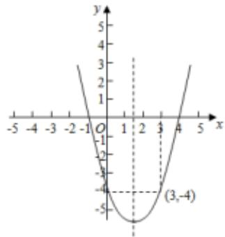

line

| x | y |
|---|---|
| 0 | -5 |
| 1 | -2 |
| 2 | 0 |
| 3 | 2 |
| 4 | 4 |
| 5 | 6 |

12. 已知 $f(x) = 2x^{2} + ax + b$ 过点（0，-1），且满足 $f(-1) = f(2)$ ， $f(x)$ 在 $[m, m + 2]$ 上的值域为 $[- \frac{3}{2}, 3]$ ，则实数 $m$ 的值为 -1 或 0。

【解答】解：因为 $f(x)=2x^{2}+ax+b$ 过点 $(0,-1)$ ，且满足 $f(-1)=f(2)$ ，

则 $\left\{\begin{aligned}b&=-1\\ -\frac{a}{4}&=\frac{-1+2}{2}\end{aligned}\right.$ ，解得a=-2，b=-1，

所以函数 $f(x) = 2x^{2} - 2x - 1 = 2(x - \frac{1}{2})^{2} - \frac{3}{2}$ ，对称轴为 $x = \frac{1}{2}$ ，因为 $f(x)$ 在 $[m, m + 2]$ 上的值域为 $[- \frac{3}{2}, 3]$ ，

则 $m \leq \frac{1}{2} \leq m + 2$ ，且 $f(m) = 2m^{2} - 2m - 1 = 3$ 或 $f(m + 2) = 2$ $(m + 2)^{2} - 2(m + 2) - 1 = 3$ ，

解得 m = -1 或 2（舍去）或 0 或 -3（舍去），

故 m 的值为 -1 或 0，

故答案为：-1或0.

13. 已知函数 $y = x^2 - 4x - 4$ 的定义域为 $[0, m]$ ，值域为 $[-8, -4]$ ，则 $m$ 的取值范围是 [2, 4]。

【解答】解：函数 $f(x)=x^{2}-4x-4$ 的图象是开口向上，且以直线x=2为对称轴的抛物线

$$
\therefore f (0) = f (4) = - 4, f (2) = - 8
$$

∵函数 $f(x)=x^{2}-4x-4$ 的定义域为 $[0,m]$ ，值域为 $[-8,$

-4],

$$
\therefore 2 \leqslant m \leqslant 4
$$

即 m 的取值范围是 $[2, 4]$ .

故答案为：[2，4].

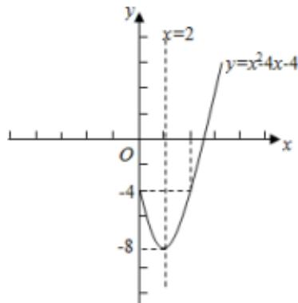

line

| x    | y     |
| ---- | ----- |
| 0    | -8    |
| 2    | -4    |
| 4    | 0     |

14. 已知函数 $f(x) = x^{2} - 2mx - m + 2$ 的值域为 $[0, +\infty)$ ，则实数 $m$ 的取值范围是（）

A. $\{-2, 1\}$

B. $[-2,$

1]

C. $(- \infty, -2] \cup [1, +\infty)$

D. $\{2,$

1}

【解答】解：∵函数 $f(x)=x^{2}-2mx-m+2$ 的值域为 $[0,+\infty)$ ，

$$
\therefore \Delta = 4 m ^ {2} + 4 (m - 2) = 0,
$$

解可得 $m = -2$ 或 $m = 1$

则实数 m 的取值范围为 $\{-2, 1\}$ .

故选：A.

15. 若函数 $f(x) = -x^2 + 2x$ 在定义域 $[0, m]$ 上的值域为 $[0, 1]$ ，则（）

A. $1 \leq m \leq 2$

B. m>1

C.m=2

D. $1<m\leq2$

【解答】解：根据题意， $f(x) = -x^{2} + 2x = -(x - 1)^{2} + 1$ ，所以 $f(x)$ 的对称轴为 $x = 1$ ，在[0，1]单调递增，在[1，+∞)单调递减，且 $f(0) = 0$ ， $f(1) = 1$ ， $f(2) = 0$ ，

因为 $f(x)$ 在 $[0, m]$ 的值域为 $[0, 1]$ ，

所以 $1 \leqslant m \leqslant 2$ .

故选：A.

16. 已知函数 $f(x) = x^{2} - 2x + 3$ 在闭区间[0, m]上的值域是[2, 3], 则实数 $m$ 的取值范围是（）

A. $[1, +\infty)$

B. $[0, 2]$

C. (-

∞, -2]

D. [1, 2]

【解答】解：作出函数 $f(x)$ 的图象，如图所示，

当 x=1 时，y 最小，最小值是 2，当 x=2 时，y=3，

函数 $f(x) = x^{2} - 2x + 3$ 在闭区间[0, m]上的值域是[2, 3],

则实数 m 的取值范围是 $[1, 2]$ .

故选：D.

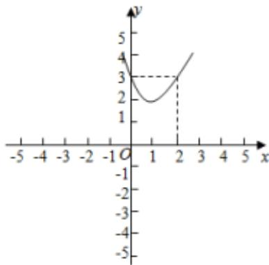

line

| x | y |
|---|---|
| -0.5 | 3 |
| 0.0 | 2 |
| 0.5 | 1.5 |
| 1.0 | 1.8 |
| 1.5 | 2.2 |
| 2.0 | 2.7 |
| 2.5 | 3.2 |
| 3.0 | 3.8 |
| 3.5 | 4.3 |
| 4.0 | 4.8 |
| 4.5 | 5.2 |
| 5.0 | 5.6 |

17. 已知函数 $f(x) = ax^{2} - 2x + 2a + 1 (a > 0)$ .

(1) 当 a=1 时，求函数 $f(x)$ 在区间 $\left[\frac{1}{2}, 2\right]$ 上的值域；

(2) 求函数 $f(x)$ 在区间 $[0, 2]$ 上的最大值 h(a).

【解答】解：（1）由题意，当 $a = 1$ 时， $f(x) = x^2 - 2x + 3$ 又 $x \in [\frac{1}{2}, 2]$ ， $f(x)$ 的对称轴为 $x = 1$

∴当x=1时， $f(x)$ 取得最小值2；

当 x=2 时， $f(x)$ 取得最大值 3，

∴ $f(x)$ 的值域为[2, 3].

(2) 二次函数 $f(x)$ 开口向上，对称轴为 $x=\frac{1}{a}>0$ ，

(i) 当 a > 1 时， $0 < \frac{1}{a} < 1$ ，

此时右端点 2 距离对称轴较远，

$$
\therefore h (a) = f (2) = 6 a - 3;
$$

(ii) 当 $a \leqslant 1$ 时， $\frac{1}{a} \geq 1$

此时左端点 0 距离对称轴较远，

$$
\therefore h (a) = f (0) = 2 a + 1,
$$

综上， $h(a) = \left\{ \begin{array}{ll}3, & a > 1\\ 2a + 1, & a\leq 1 \end{array} \right.$

18. 已知二次函数 $f(x)=x^{2}-2(a-1)x+4$ .

(1) 若 $f(x)$ 为偶函数，求 $f(x)$ 在 $[-1, 3]$ 上的值域；  
(2) 若 $f(x)$ 在区间 $(-∞, 2]$ 上是减函数，求实数 a 的取值范围；  
（3）若 $x \in [1, 2]$ 时， $f(x)$ 的图像恒在直线 $y = ax$ 的上方，求实数 $a$ 的取值范围.

【解答】解：（1）二次函数 $f(x)=x^{2}-2(a-1)x+4$ 的对称轴为x=a-1，

$\because f(x)$ 为偶函数， $\therefore a-1=0,\therefore a=1,$

$$
\therefore f (x) = x ^ {2} + 4,
$$

∵对称轴为x=0， $x\in[-1,3]$ ，

$$
\therefore f (x) _ {\min} = f (0) = 4, f (x) _ {\max} = f (3) = 1 3,
$$

∴ $f(x)$ 在 $[-1, 3]$ 上的值域为 $[4, 13]$ .

(2) $\because f(x)$ 在区间 $(-∞, 2]$ 上是减函数，

$$
\therefore a - 1 \geqslant 2, \therefore a \geqslant 3,
$$

∴实数 a 的取值范围为 $[3, +\infty)$ .

(3) $\because x\in[1,2]$ 时， $f(x)$ 的图像恒在直线 y=ax 的上方，

∴当 $x \in [1, 2]$ 时， $f(x) > ax$ 恒成立，

即 $x^{2}-(3a-2)x+4>0$ ,

∴3a-2<x+ $\frac{4}{x}$ 恒成立，

$\because x + \frac{4}{x} \geq 2\sqrt{4} = 4$ ，当且仅当 $x = \frac{4}{x}$ ，即 $x = 2$ 时等号成立，

$$
\therefore 3 a - 2 <   4, \therefore a <   2,
$$

∴a的取值范围是 $(-∞,2)$ .

19. 已知函数 $f(x)=x^{2}+2ax+2$ .

(1) 当 a=1 时，求函数 $f(x)$ 在区间 $[-2,3)$ 上的值域；  
(2) 当 a = -1 时，求函数 $f(x)$ 在区间 $[t, t+1]$ 上的最大值；  
(3) 求 $f(x)$ 在 $[-5, 5]$ 上的最大值与最小值.

【解答】解：（1）当 $a = 1$ 时， $f(x) = x^2 + 2x + 2 = (x + 1)^2 + 1$ ，函数在 $[-2, -1)$ 上单调递减，在 $(-1, 3]$ 上单调递增，

$$
\therefore x = - 1, f (x) _ {\min} = 1, x = 3, f (x) _ {\max} = 1 7,
$$

∴函数 $f(x)$ 在区间 $[-2,3)$ 上的值域是 $[1,17]$ ;

(2) 当 a = -1 时， $f(x) = x^{2} - 2x + 2 = (x - 1)^{2} + 1$

$t < \frac{1}{2}$ , 函数 $f(x)$ 在区间 $[t, t + 1]$ 上的最大值 $f(t) = (t - 1)^{2} + 1$ ;

$t \geq \frac{1}{2}$ ，函数 $f(x)$ 在区间 $[t, t+1]$ 上的最大值 $f(t+1) = t+1$ ;

∴函数 $f(x)$ 在区间 $[t, t+1]$ 上的最大值 $\left\{\begin{aligned}(t-1)^{2}+1, & t<\frac{1}{2}\\ t^{2}+1, & t\geq\frac{1}{2}\end{aligned}\right.$ ;

(3) $\because$ 函数 $f(x) = x^{2} + 2ax + 2 = (x + a)^{2} + 2 - a^{2}$ 的对称轴为 $x = -a,$

①当 $-a < -5$ ，即 $a > 5$ 时，函数 $y$ 在 $[-5, 5]$ 上是增函数，当 $x = -5$ 时，函数 $y$ 取得最小值为 $27 - 10a$ ；当 $x = 5$ 时，函数 $y$ 取得最大值为 $27 + 10a$ .

②当 $-5 \leqslant -a < 0$ ，即 $0 < a \leqslant 5$ 时，当 x = -a 时，函数 y 取得最小值为 $2 - a^{2}$ ；当 x = 5 时，函数 y 取得最大值为 $27 + 10a$ 。③当 $0 \leqslant -a \leqslant 5$ ，即 $-5 \leqslant a \leqslant 0$ 时，x = -a 时，函数 y 取得最小值为 $2 - a^{2}$ ；当 x = -5 时，函数 y 取得最大值为 $27 - 10a$ 。④当 -a > 5，即 a < -5 时，函数 y 在 [-5, 5] 上是减函数，故当 x = -5 时，函数 y 取得最大值为 $27 - 10a$ ；当 x = 5 时，函数 y 取得最小值为 $27 + 10a$ 。

# [必修一]第三章 函数的概念与性质

# 3.1 函数的概念及其表示

# 题型1 定义域

1. 式子 $\frac{\sqrt{x - 1}}{x + 1}$ 在实数范围内有意义，则 $x$ 的取值范围是（）

A. $x \geqslant 0$

B. $x \geqslant 1$ 且 $x \neq -1$

C. $x \geqslant 1$

D. $x \neq -1$

【解答】解：要使 $\frac{\sqrt{x-1}}{x+1}$ 在实数范围内有意义，

则 $\left\{\begin{aligned}x-1&\geq0\\ x+1&\neq0\end{aligned}\right.$

解得 $x \geqslant 1$ .

故选：C.

2. 若二次根式 $\sqrt{2 - x}$ 有意义，则 $x$ 的取值范围是（）

A. $x \geqslant 2$

B. x>2

C. $x \leq 2$

D. x<2

【解答】解：若二次根式 $\sqrt{2-x}$ 有意义，则 $2-x\geqslant0$ ，即 $x\leqslant2$ .

故选：C.

3. 函数 $f(x) = \frac{1}{x} + \sqrt{1 - x}$ 的定义域是 $(-\infty, 0) \cup (0, 1]$ .

【解答】解：要使函数 $f(x) = \frac{1}{x} + \sqrt{1 - x}$ 有意义，

则 $\left\{\begin{aligned}x&\neq0\\ 1-x&\geq0\end{aligned}\right.$ ，解得 $x\leqslant1$ 且 $x\neq0$ ，
所以函数的定义域为 $(-∞,0)∪(0,1]$ .

故答案为： $(-∞, 0) ∪ (0, 1]$ .

4. 下列函数定义域为 $\mathbf{R}$ 的是（）

A. $y = x^{-\frac{1}{2}}$

B. $y=x^{-1}$

C. $y=x^{\frac{1}{3}}$

D. $y = x^{2}$

【解答】解： $y = x^{-\frac{1}{2}} = \frac{1}{\sqrt{x}}$ ，定义域为 $\{x|x > 0\}$ ，

$y = x^{-1} = \frac{1}{x}$ ，定义域为 $\{x|x \neq 0\}$ ，

$y = x^{\frac{1}{3}} = \sqrt[3]{x}$ ，定义域为 R，

$y = x^{\frac{1}{2}} = \sqrt{x}$ ，定义域为 $\{x|x \geqslant 0\}$ .

∴定义域为 R 的是 $y = x^{\frac{1}{3}}$ .

故选：C.

5. 函数 $f(x) = \frac{1}{x + 1} + \ln x$ 的定义域是 $\{x | x > 0\}$ .

【解答】解：要使函数有意义，则 $\left\{\begin{aligned}x+1&\neq0\\ x&>0\end{aligned}\right.$

所以 $\left\{\begin{aligned}x&\neq-1\\ x&>0\end{aligned}\right.$ ，所以x>0，

所以函数的定义域为 $\{x|x>0\}$ ，

故答案为： $\{x|x>0\}$ .

6. 函数 $y=\sqrt{7+6x-x^{2}}$ 的定义域是 $[-1,7]$ .

【解答】解：由 $7 + 6\mathrm{x} - \mathrm{x}^2\geqslant 0$ ，得 $\mathrm{x}^2 -6\mathrm{x} - 7\leqslant 0$ 解得： $-1\leqslant x\leqslant 7$

∴函数 $y=\sqrt{7+6x-x^{2}}$ 的定义域是 $[-1,7]$ .

故答案为： $[-1, 7]$ .

7. 函数 $f(x) = \sqrt{\log_{2}x - 1}$ 的定义域为 $[2, +\infty)$ .

【解答】解：由题意得： $\log_{2}x\geqslant1$

解得： $x \geqslant 2$ ，

∴函数 $f(x)$ 的定义域是 $[2, +\infty)$ .

故答案为： $[2, + \infty)$

8. 函数 $f(x) = \log_2 (x^2 + 2x - 3)$ 的定义域是（）

A. $[-3,1]$

B. $(-3,1)$

C. $(- \infty, -3] \cup [1, +\infty)$ D. $(- \infty, -3) \cup (1, +\infty)$

【解答】解：由题意得： $x^{2}+2x-3>0$ ，即 $(x-1)(x+3)$

>0

解得 x>1 或 x<-3

所以定义域为 $(- \infty, -3) \cup (1, +\infty)$

故选：D.

9. 函数 $f(x) = \sqrt{4 - |x|} + \lg \frac{x^2 - 5x + 6}{x - 3}$ 的定义域为（）

A. (2, 3)

B. (2, 4]

C. $(2, 3) \cup (3, 4]$ D. $(-1, 3) \cup (3, 6]$

【解答】解：要使函数有意义，则 $\left\{\frac{4-|x|\geq0}{\frac{x^{2}-5x+6}{x-3}>0}\right.$

即 $\left\{\frac{-4\leq x\leq 4}{(x - 2)(x - 3)} >0\right.$

$\frac{(x - 2)(x - 3)}{x - 3} >0$ 等价为① $\left\{ \begin{array}{l} x > 3 \\ (x - 2)(x - 3) > 0 \end{array} \right.$ 即 $\left\{ \begin{array}{l} x > 3 \\ x > 3 \text{或} x < 2 \end{array} \right.,$

即 x>3，

② $\left\{\begin{aligned}&x<3\\&(x-2)(x-3)<0\end{aligned}\right.$ ，即 $\left\{\begin{aligned}&x<3\\&2<x<3\end{aligned}\right.$ ，此时2<x<3，

即 2<x<3 或 x>3，

$\because -4 \leqslant x \leqslant 4,$

∴解得 $3 < x \leqslant 4$ 且 $2 < x < 3$ ,

即函数的定义域为（2，3）∪（3，4]，

故选：C.

10. 函数 $f(x) = \frac{1}{\sqrt{\log_2 x - 1}}$ 的定义域为（）

A. $(0,2)$

B. (0, 2]

C. $(2, +\infty)$

D. $[2, +\infty)$

【解答】解：由题意可得， $\left\{\begin{aligned}&x>0\\&\log_{2}x-1>0\end{aligned}\right.$

解得 $\left\{\begin{aligned}x&>0\\ x&>2\end{aligned}\right.$ ，即x>2.

∴所求定义域为 $(2,+\infty)$ .

故选：C.

# 题型 2 图像变形

①位移练习

1. 若一次函数 $y = 3x + 4$ 的图象平移后经过原点，则下列平移方式正确的是（）

A. 向左平移 4 个单位

B. 向右

平移 4 个单位

C. 向下平移 4 个单位

D. 向上

平移 4 个单位

【解答】解：当 x=0 时， $y=3x+4=4$ ，

∴一次函数 $y=3x+4$ 的图象与 y 轴交于 $(0,4)$ ，

∴当一次函数 $y=3x+4$ 的图象向下平移 4 个单位长度可过原点.

故选：C.

2. 将直线 $y = -3x + 2024$ 先向左平移3个单位，再向下平移4个单位后，所得直线的表达式为（）

A. $y = -3x + 2037$

B. y=

-3x+2029

C. $y = -3x + 2011$

D. y=

-3x+2021

【解答】解：将直线 $y = -3x + 2024$ 先向左平移3个单位，再向下平移4个单位后，所得直线的表达式为 $y = -3(x + 3) + 2024 - 4$ ，即 $y = -3x + 2011$ .

故选：C.

3. 将抛物线 $y=x^{2}$ 向左平移一个单位，得到的新抛物线的解析式是（）

A. $y=x^{2}-1$

B. $y = x^{2} + 1$

C. y=

$(x-1)^{2}$

D. $y = (x + 1)^{2}$

【解答】解：由题意，根据二次函数的变化规律“左加右减，上加下减”，

又抛物线 $y = x^{2}$ 向左平移一个单位，

∴新抛物线的解析式是 $y=(x+1)^{2}$ .

故选：D.

4. 将抛物线 $y = (x - 2)^{2} + 1$ 先向左平移 2 个单位长度，再向上平移 1 个单位长度，所得抛物线的表达式是（）

A. $y = (x - 2)^{2}$

B. y=

$(x-1)^{2}+2$

C. $y = (x - 4)^{2} + 2$

D. y=

$x^{2} + 2$

【解答】解：将抛物线 $y = (x - 2)^{2} + 1$ 先向左平移2个单位长度，再向上平移1个单位长度，所得抛物线的表达式是 $y = (x - 2 + 2)^{2} + 1 + 1$ ，即 $y = x^{2} + 2$ .

故选：D.

5. 把抛物线 $y = x^{2} - 2x$ 向左平移 1 个单位，然后向上平移 2 个单位，则平移后抛物线的表达式是（）

A. $y=x^{2}-1$

B. $y=x^{2}+1$

C. $y = (x - 2)^{2} - 1$

D. $y=(x-2)^{2}+1$

【解答】解： $\because y=x^{2}-2x=(x-1)^{2}-1$ ，

∴ 把抛物线 $y = x^{2} - 2x$ 向左平移 1 个单位，然后向上平移 2 个单位，则平移后抛物线的表达式是： $y = (x - 1 + 1)^{2} - 1 + 2$ ，即 $y = x^{2} + 1$ .

故选：B.

6. 若将抛物线 $y=x^{2}-2x+3$ 平移后得到抛物线 $y=x^{2}$ ，下列平移方法正确的是（）

A. 向左平移 1 个单位，再向上平移 2 个单位

B. 向左平移 1 个单位，再向下平移 2 个单位

C. 向右平移 1 个单位，再向上平移 2 个单位

D. 向右平移 1 个单位，再向下平移 2 个单位

【解答】解：由抛物线 $y=x^{2}-2x+3=(x-1)^{2}+2$

根据“上加下减，左加右减”规律要得到抛物线 $y = x^2$ ，

则 $y = x^{2}$ 即 $y = (x - 1 + 1)^{2} + 2 - 2$ 由抛物线 $y = (x - 1)^{2} + 2$ 向左平移1个单位，再向下平移2个单位，

故答案为：B.

7. 将反比例函数 $y = \frac{4}{x}$ 的图象向左平移 2 个单位长后，所得的图象与 $y$ 轴的交点坐标为 \_\_\_\_（0，2）.

【解答】解：将反比例函数 $y = \frac{4}{x}$ 的图象向左平移2个单位长后得到 $y = \frac{4}{x + 2}$ ，

把 x=0 代入 $y=\frac{4}{x+2}$ ，得到 y=2，

∴所得的图象与y轴的交点坐标为（0，2）.

故答案为：（0，2）.

②对称练习

1. 一次函数 $y = -kx + 3$ 的图象关于 $x$ 轴对称后经过（2，-1），则 $k$ 的值是（）

A. 1

B.-1

C. 5

【解答】解：∵（2，-1）关于x轴对称点为（2，1），

∴一次函数 $y = -kx + 3$ 的图象过点 P(2, 1)，

$\therefore 1 = -2k + 3,$

解得： $k = 1$

故选：A.

2. 抛物线 $y=2x^{2}-4x-6$ 关于 y 轴对称后所得到的抛物线解析式为（）

$$
\begin{array}{l} y = - 2 x ^ {2} + 4 x + 6 \\ B. y = \\ 2 x ^ {2} + 4 x - 6 \\ C. y = 2 x ^ {2} + 2 x - 6 \\ D. y = \\ - 2 x ^ {2} - 2 x + 6 \\ \end{array}
$$

【解答】解： $y=2x^{2}-4x-6=2(x-1)^{2}+8$ ，其顶点坐标是（1，8）。则关于y轴对称的顶点坐标是（-1，8）

与抛物线 $y=2(x-1)^{2}+8$ 关于 y 轴对称的抛物线的解析式为 $y=2(x+1)^{2}+8$ ，即 $y=2x^{2}+4x-6$ 。

故选：B.

3. 在同一平面直角坐标系中，若抛物线 $y = -ax^{2} + 3x - c$ 与 $y = 2x^{2} - 3x - c + a$ 关于 x 轴对称，则 $a + 2c$ 的值为（）

A. 0

B.-4

C. 4

【解答】解：∵抛物线 $y = -ax^{2} + 3x - c$ 关于 x 轴对称的抛物线为 $-y = -ax^{2} + 3x - c$ ，即 $y = ax^{2} - 3x + c$ ，

∵抛物线 $y = -ax^{2} + 3x - c$ 与 $y = 2x^{2} - 3x - c + a$ 关于 x 轴对称，

$$
\therefore \left\{ \begin{array}{l} a = 2 \\ - c + a = c \end{array} \right.,
$$

解得 a=2，2c=a=2，

$$
\therefore a + 2 c = 2 + 2 = 4,
$$

故选：C.

4. 在平面直角坐标系中，抛物线 $y = -(x + 1)^{2} + 2$ 关于 y 轴对称的抛物线的解析式为（）

A. $y = - (x - 1)^{2} + 2$

B. $y = - (x + 1)^{2} - 2$

C. $y=(x+1)^{2}-2$

D. $y=(x-1)^{2}+2$

【解答】解：抛物线 $y = -(x + 1)^{2} + 2$ 关于 y 轴对称的抛物线的解析式为 $y = -(x - 1)^{2} + 2$ ,

即解析式为： $y = -(x - 1)^{2} + 2$ .

故选：A.

5. $y = (x + 1)^{2} - 4$ 关于 x 轴对称的图象所对应的函数表达式为 \_\_\_\_.

【解答】∵关于 x 轴对称的函数图象的特征是：当自变量取相同 x 时，对应的函数值互为相反数，

∴二次函数 $y=(x+1)^{2}-4$ 关于 x 轴对称的图象所对应的函数表达式为 $y=-(x+1)^{2}+4$ ,

故答案为： $y = -(x + 1)^{2} + 4$ .

6. 曲线 $y=f(x)$ 与曲线 $y=\cos x$ 关于 x 轴对称，则（）

A. $f(x) = \sin x$

B. $f(x) = -\sin x$

C. $f(x) = \cos x$

D. $f(x) = -\cos x$

【解答】解：曲线 $y=f(x)$ 与曲线 $y=\cos x$ 关于 x 轴对称，则 $f(x)=-\cos x$ .

故选：D.

7. 函数 $y=3^{x}$ 与 $y=-\frac{1}{3^{x}}$ 的图象（）

A. 关于 x 轴对称

B. 关于 y 轴对称

C. 关于原点对称

D. 关于 y=x 对称

【解答】解：由于函数 $f(x) = 3^x$ ， $g(x) = -f(-x) = -\frac{1}{3^x}$ ，故函数 $y = 3^x$ 与 $y = -\frac{1}{3^x}$ 的图象关于原点对称.

故选：C.

8. 在同一坐标系中，函数 $y=f(x)$ 与 $y=-f(x)$ 的图象（）

A. 关于原点对称

B. 关于 x 轴对称

C. 关于 y 轴对称

D. 关于直线 y = x 对称

【解答】解：当 x=a 时， $y=f(a)$ 与 $y=-f(a)$ 互为相反数，

即函数 $y=f(x)$ 与 $y=-f(x)$ 的图象关于 x 轴对称。

故选：B.

③伸缩

思考题： $1.\sin \frac{1}{2} x\quad \sin \frac{1}{2}(x + 1)$

2. $\sin (x + 1)$ $\sin (\frac{1}{2} x + 1)$ 不一样

④翻折

1. 画出 $f(x) = \ln x$ 图像

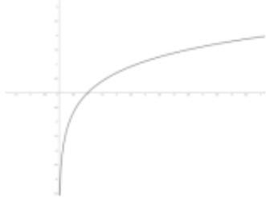

line

| X | Y |
|---|---|
| 0 | 0 |
| 1 | 0.5 |
| 2 | 1 |
| 3 | 1.5 |
| 4 | 2 |
| 5 | 2.5 |
| 6 | 3 |
| 7 | 3.5 |
| 8 | 4 |
| 9 | 4.5 |
| 10 | 5 |

2. 画出 $f(x) = |\ln x|$ 图像

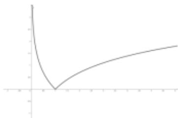

line

| X | Y |
|---|---|
| 0 | 100 |
| 1 | 50 |
| 2 | 30 |
| 3 | 20 |
| 4 | 15 |
| 5 | 10 |
| 6 | 8 |
| 7 | 6 |
| 8 | 5 |
| 9 | 4 |
| 10 | 3 |

3. 画出 $f(x) = \ln |x|$ 图像

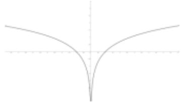

natural_image

Pure mathematical curve diagram with no text, numbers, or symbols

4. 画出 $f(x) = |\ln |x||$ 图像

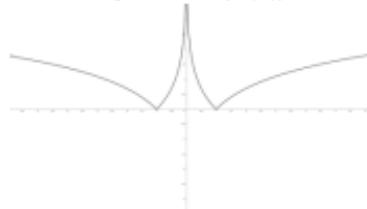

natural_image

Pure mathematical curve diagram with no text, numbers, or symbols

题型3利用函数图像求范围

例1练习

1. 第一步，画出函数 $y = |2x - 1|$ $y = 2$ 和 $y = 4$

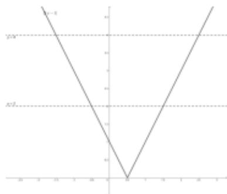

line

| X | Y |
|---|---|
| 0 | 6 |
| 1 | 4 |
| 2 | 2 |
| 3 | 0 |
| 4 | -2 |
| 5 | -4 |
| 6 | -6 |
| 7 | -8 |
| 8 | -10 |

第二步，算出交点， $|2x-1|=2$ 解得 $x=\frac{3}{2}$ 或 $-\frac{1}{2}$

由 $|2x - 1| = 4$ 解得 $x = \frac{5}{2}$ 或 $-\frac{3}{2}$

第三步，由图像可知解为 $\left[-\frac{3}{2}, -\frac{1}{2}\right) \cup \left(\frac{3}{2}, \frac{5}{2}\right]$ （注意取等符号）

2. 第一步，画出函数 $y = x^3$ $y = -4$ 和 $y = 4$ 第二步，算出交点， $x^{3}=-4$ 解得 $x=\sqrt[3]{-4}$ 由 $x^{3}=4$ 解得 $x=\sqrt[3]{4}$

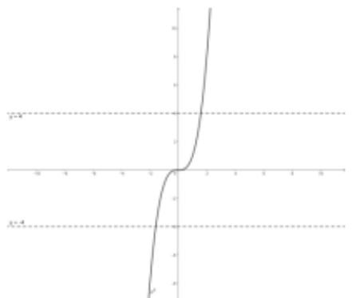

line

| x    | y     |
| ---- | ----- |
| -10  | -4.0  |
| 0    | 0.0   |
| 10   | 4.0   |

第三步，由图像可知解为 $(\sqrt[3]{-4},\sqrt[3]{4})$

3.第一步，画出函数 $y = x + \frac{1}{x} y = 6$ 和 $y = 4$

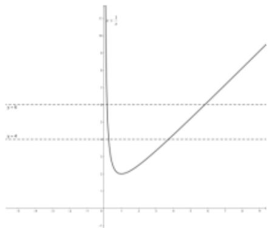

line

| x | y = k |
|---|---|
| 0 | 1 |
| 1 | 0.5 |
| 2 | 0.75 |
| 3 | 1 |
| 4 | 1.5 |
| 5 | 2 |
| 6 | 2.5 |
| 7 | 3 |
| 8 | 3.5 |
| 9 | 4 |

第二步，算出交点， $x+\frac{1}{x}=4$ 解得 $x=2+\sqrt{3}$ 或 $2-\sqrt{3}$

由 $x+\frac{1}{x}=6$ 解得 $x=3+2\sqrt{2}$ 或 $3-2\sqrt{2}$

第三步，由图像可知解为 $(3-2\sqrt{2}, 2-\sqrt{3}) \cup [2+\sqrt{3}, 3+2\sqrt{2})$

# 例2练习

1. 第一步，画出函数 $y=|2x-1|$ $y=x$

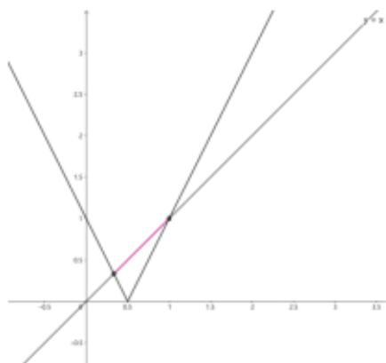

第二步，算出交点， $|2x-1|=x$ 解得 $x=\frac{1}{3}$ 或 1

第三步，由图像可知解为 $\left[\frac{1}{3}, 1\right]$

2. 第一步，画出函数 $y = x^3$ $y = \frac{1}{x}$

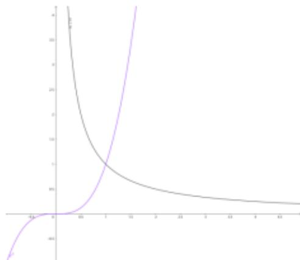

line

| X | Y (Curve 1) | Y (Curve 2) |
|---|---|---|
| 0 | 450 | -600 |
| 1 | 100 | 100 |
| 2 | 50 | 250 |
| 3 | 25 | 400 |
| 4 | 10 | 550 |
| 5 | 5 | 700 |
| 6 | 2 | 850 |
| 7 | 1 | 950 |
| 8 | 0.5 | 1050 |
| 9 | 0.25 | 1150 |
| 10 | 0.1 | 1250 |
| 11 | 0.05 | 1350 |
| 12 | 0.025 | 1450 |
| 13 | 0.01 | 1550 |
| 14 | 0.005 | 1650 |
| 15 | 0.0025 | 1750 |
| 16 | 0.001 | 1850 |
| 17 | 0.0005 | 1950 |
| 18 | 0.00025 | 2050 |
| 19 | 0.0001 | 2150 |
| 20 | 0.00005 | 2250 |
| 21 | 0.000025 | 2350 |
| 22 | 0.00001 | 2450 |
| 23 | 0.000005 | 2550 |
| 24 | 0.0000025 | 2650 |
| 25 | 0.000001 | 2750 |
| 26 | 0.0000005 | 2850 |
| 27 | 0.00000025 | 2950 |
| 28 | 0.0000001 | 3050 |
| 29 | 0.00000005 | 3150 |
| 30 | 0.000000025 | 3250 |
| 31 | 0.00000001 | 3350 |
| 32 | 0.000000005 | 3450 |
| 33 | 0.0000000025 | 3550 |
| 34 | 0.000000001 | 3650 |
| 35 | 0.0000000005 | 375

第二步，算出交点， $x^{3}=\frac{1}{x}$ 解得 x=1 （在 x>0 情况下）

第三步， $0 < x^{3} < \frac{1}{x}$ 由图像可知解为（0，1）

3. 第一步，画出函数 $y = \sin x \quad y = \cos x$

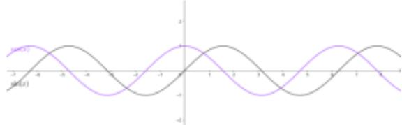

line

| x    | y1     | y2     |
| ---- | ------ | ------ |
| -3.0 | 0.0000 | 0.0000 |
| -2.5 | 0.6667 | 0.6667 |
| -2.0 | 1.2593 | 1.2593 |
| -1.5 | 1.8415 | 1.8415 |
| -1.0 | 2.3239 | 2.3239 |
| -0.5 | 2.7073 | 2.7073 |
| 0.0  | 3.0800 | 3.0800 |
| 0.5  | 2.7073 | 2.7073 |
| 1.0  | 2.3239 | 2.3239 |
| 1.5  | 1.8415 | 1.8415 |
| 2.0  | 1.2593 | 1.2593 |
| 2.5  | 0.6667 | 0.6667 |
| 3.0  | 0.0000 | 0.0000 |

第二步，算出交点， $\sin x=\cos x$ 解得 $x=\frac{\pi}{4}+2k\pi$ 或 $\frac{5\pi}{4}+2k\pi, k \in Z$

第三步，由图像可知解为 $\left(\frac{\pi}{4}+2k\pi,\frac{5\pi}{4}+2k\pi\right)k\in Z$

# 3.2 函数的基本性质

# 题型 4 求单调性

1. 下列函数中，在 $(0, +\infty)$ 上为增函数的是（）

A. $f(x)=3-x$

B. $f(x) = x^{2} - 3x$

C. $f(x) = -\frac{1}{x}$

D. $f(x) = -|x|$

【解答】解：根据题意，依次分析选项：

对于 A, $f(x)=3-x$ 为一次函数，在 $(0,+\infty)$ 上为减函数，不符合题意；

对于 B， $f(x) = x^{2} - 3x$ 为二次函数，在 $(0, \frac{3}{2})$ 上为减函数，不符合题意；

对于 C, $f(x) = -\frac{1}{x}$ 为反比例函数，在 $(0, +\infty)$ 上为增函数，符合题意；

对于 D, $f(x) = -|x|$ ，当 x > 0 时， $f(x) = -x$ ，则函数 f (x) 在 $(0, +\infty)$ 上为减函数，不符合题意；

故选：C.

2. 下列函数中，在 R 上为增函数的是（）

A. $y=3+x$

B. $y=x^{2}$

C. $y=\frac{1}{x}$

D. $y = \left(\frac{1}{2}\right)^{x}$

【解答】解：对于 A，在 R 递增，符合题意；

对于 B，在 $(-∞, 0)$ 递减，不合题意；

对于 C，在 R 无单调性，不合题意；

对于 D，在 R 递减，不合题意；

故选：A.

3. 下列函数中，在（0，2）上为增函数的是（）

A. $y = -3x + 1$

B. $y=x^{2}-2x+3$

C. $y=\sqrt{x}$

D. $y=\frac{4}{x}$

【解答】解：由题意可知：

对 A: $y = -3x + 1$ ，为一次函数，易知在区间 $(0, 2)$ 上为减函数；

对 B: $y=x^{2}-2x+3$ ，为二次函数，开口向上，对称轴为 x=1，所以在区间 $(0,2)$ 上为先减后增函数；

对 C: $y = \sqrt{x}$ ，为幂函数，易知在区间 $(0, 2)$ 上为增函数；对 D: $y = \frac{4}{x}$ ，为反比例函数，易知在 $(-∞, 0)$ 和 $(0, +∞)$ 为单调减函数，所以函数在 $(0, 2)$ 上为减函数；

综上可知： $y=\sqrt{x}$ 在区间（0，2）上为增函数；故选：C.

4. 下列函数中，在 R 上为增函数的是（）

A. $y = -2x + 1$

B. $y=-\frac{2}{x}$

C. y=2x

D. $y=x^{2}$

【解答】解：A、 $y = -2x + 1$ 是一次函数，在定义域 R 上是减函数，A 不符合条件；

B、 $y=-\frac{2}{x}$ 是反比例函数，在 $(-∞,0)$ 和 $(0,+∞)$ 上都是增函数，B不符合条件；

C、y=2x 是一次函数，在定义域 R 上是增函数，C 符合条件；D、 $y=x^{2}$ 是一元二次函数，在 $(-∞,0)$ 上是减函数，在 $(0,+∞)$ 上是增函数，D 不符合条件.

故选：C.

5. 下列函数中，在 $(- \infty, 0)$ 上为减函数的是（）

A. $y = -\frac{1}{x}$

B. $y=2x+1$

C. $y=x^{2}$

D. $y=x^{0}$

【解答】解：根据题意，依次分析选项：

对于 A, $y = -\frac{1}{x}$ ，为反比例函数，在 $(-∞, 0)$ 上为增函数，不符合题意；

对于 B, $y=2x+1$ ，为一次函数，在 $(-∞,0)$ 上为增函数，不符合题意；

对于 C, $y=x^{2}$ ，为二次函数，在 $(-∞,0)$ 上为减函数，符合题意；

对于 D, $y=x^{0}=1$ , $(x\neq0)$ ，在 $(-∞,0)$ 上不是减函数，不符合题意；

故选：C.

6. 下列函数中，在 $(-∞, 0)$ 上为减函数的是（）

A. $y = -x^{2} + 2$

B. y=4x-1

C. y=

$x^{2}+4x$

D. $y=\frac{1}{x}$

【解答】解：A 中，函数 $y = -x^{2} + 2$ 在 $(-∞, 0)$ 上为增函数；

B 中，函数 y=4x-1 在 $(-∞,0)$ 上为增函数；

C 中，函数 $y=x^{2}+4x$ 在 $(-∞,-2)$ 上为减函数，在 $(-2,0)$ 上为增函数；

D 中，函数 $y=\frac{1}{x}$ 在 $(-∞,0)$ 上为减函数
故选：D.

7. 下列函数中，在 $(-1, +\infty)$ 上为减函数的是（）

A. $y=3^{x}$

B. $y=x^{2}-2x+3$

C. y=x

D. $y = -x^{2} - 4x + 3$

【解答】解：根据题意，依次分析选项：

对于 A, $y=3^{x}$ ，为指数函数，在 R 上为增函数，不符合题意；对于 B, $y=x^{2}-2x+3=(x-1)^{2}+2$ ，在 $(1,+\infty)$ 上为增函数，不符合题意；

对于 C, y=x，为正比例函数，在 R 上为增函数，不符合题意；

对于 D， $y=-x^{2}-4x+3=-(x+2)^{2}+7$ ，在 $(-2,+\infty)$ 上为减函数，符合题意；

故选：D.

8. 函数 $y = \sqrt{x^{2} - 2x - 3}$ 的递减区间是 $(-∞, -1]$ ，递增区间是 $[3, +∞)$ .

【解答】解：解 $x^{2}-2x-3\geqslant0$ 得， $x\leqslant-1$ ，或 $x\geqslant3$ ;

函数 $y=x^{2}-2x-3$ 在 $(-∞,-1]$ 上单调递减，在 $[3,+∞)$ 上单调递增；

∴该函数的递减区间为 $(-∞,-1]$ ，递增区间为 $[3,+∞)$ 。
故答案为： $(-∞,-1]$ ， $[3,+∞)$ 。

9. 已知函数 $f(x) = x|x + 2|$ ，则 $f(x)$ 的单调递减区间为（）

A. $[-2,0]$

B. $[-2,1]$

C. [-2,

-1]

D. $\left[-2,+\infty\right)$

【解答】解：由于 $f(x)=x|x+2|=\left\{\begin{aligned}x^{2}+2x,&x\geq-2\\ -x^{2}-2x,&x<-2\end{aligned}\right.$

当 $x \geqslant -2$ 时， $y = x^{2} + 2x = (x + 1)^{2} - 1$ 。显然， $f(x)$ 在 $[-2, -1]$ 上单调递减；

当 x<-2 时， $y=-x^{2}-2x=-(x+1)^{2}+1$ ，显然， $f(x)$ 在 $(-∞,-2)$ 上单调递增.

综上可知， $f(x)$ 的单调递减区间是 $[-2, -1]$ .

故选：C.

10. 函数 $y = |x - 1|$ 的递增区间是 [1, +∞).

【解答】解：函数 y = x - 1 的图象如图所示：

数形结合可得函数的增区间为[1，+∞），

故答案为： $[1, + \infty)$

11. 函数 $f(x) = -x^2 + 2|x| + 3$ 的单调减区间为 $[-1, 0]$ , $[1, +\infty)$ .

【解答】解：（1）x>0时， $f(x)=-x^{2}+2x+3$ ;

∴此时 $f(x)$ 的对称轴为 x=1;

∴此时f(x)的减区间为[1，+∞）；

(2) x<0 时， $f(x)=-x^{2}-2x+3$ ;

∴f(x)此时的对称轴为x=-1;

∴此时 $f(x)$ 的减区间为 $[-1, 0]$ ;

∴综上得， $f(x)$ 的单调减区间为 $[-1, 0]$ ， $[1, +\infty)$ .

故答案为： $[-1,0]$ ， $[1, + \infty)$

12. 函数 $f(x)=3x-x^{3}$ 的单调增区间为 $(-1,1)$ .

【解答】解：函数 $f(x)=3x-x^{3}$ 的导数为 $f'(x)=3-3x^{2}$ ，令 $f'(x)>0$ ，即有 $x^{2}<1$ ，

解得，-1<x<1.

则增区间为 $(-1, 1)$ .

故答案为： $(-1, 1)$ .

13. 函数 $y = x + \frac{4}{x} (x > 0)$ 的递增区间是 $[2, +\infty)$ .

【解答】解： $\because y=x+\frac{4}{x}(x>0)$ ，

$$
\therefore \mathrm{y} ^ {\prime} = 1 - \frac {4}{\mathrm{x} ^ {2}},
$$

$$
\because x > 0
$$

$y' \geqslant 0$ 可得 $x \geqslant 2$

函数 $y=x+\frac{4}{x}$ (x>0) 的递增区间是 $[2, +\infty)$

故答案为： $[2, +\infty)$

14. 函数 $y = x + \frac{1}{|x|}$ 的单调递增区间是 $(-∞, 0)$ ， $(1, +∞)$ .

【解答】解：函数 $y=x+\frac{1}{|x|}$ ,

当 x>0 时， $y=x+\frac{1}{x}$ ，可得在 $(1,+\infty)$ 递增；

当 x<0 时， $y=x-\frac{1}{y}$ ，可得在 $(-∞,0)$ 递增。

即有函数的单调递增区间为 $(- \infty, 0)$ ， $(1, +\infty)$ 。

故答案为： $(-∞,0)$ ， $(1,+∞)$ 。

15. 函数 $y=\frac{x+1}{x-2}$ 的单调减区间为 \_\_\_\_（ $-∞,2$ ）和（ $2,+∞$ ）.

【解答】解：根据题意， $y=\frac{x+1}{x-2}=\frac{x-2+3}{x-2}=1+\frac{3}{x-2}$ ，其定义域为 $\{x|x\neq2\}$ ，

其图象由函数 $y = \frac{3}{x}$ 的图象向右平移2个单位，向上平移1个单位得到，

则函数 $y = \frac{x + 1}{x - 2}$ 的单调减区间为（-∞，2）和（2，+∞）；

故答案为： $(-∞, 2)$ 和 $(2, +∞)$ .

# 题型 5 判断奇偶

（多选）1. 下列函数为奇函数的是（）

A. $f(x) = x^{4}$

B. $f(x) = x^3$

C. $f(x) = x + \frac{1}{x}$

D. $f(x) = \frac{1}{x^{2}}$

【解答】解：根据题意，依次分析选项：

对于 A， $f(x)=x^{4}$ ，定义域为 R，因为 $f(-x)=(-x)^{4}=x^{4}=f(x)$ ，所以 $f(x)=x^{4}$ 为偶函数，所以 A 不符合题意，

对于 B， $f(x) = x^{5}$ ，定义域为 R，因为 $f(-x) = (-x)^{5} = -x^{5} = -f(x)$ ，所以 $f(x) = x^{5}$ 为奇函数，所以 B 正确，对于 C， $f(x) = x + \frac{1}{x}$ ，定义域为 $\{x | x \neq 0\}$ ，因为 $f(-x) = -x + \frac{1}{-x} = -(x + \frac{1}{x}) = -f(x)$ ，所以 $f(x) = x + \frac{1}{x}$ 为奇函数，所以 C 正确，

对于 D， $f(x) = \frac{1}{x^{2}}$ ，定义域为 $\{x \mid x \neq 0\}$ ，因为 $f(-x) = \frac{1}{(-x)^{2}} = \frac{1}{x^{2}} = f(x)$ ，所以 $f(x) = \frac{1}{x^{2}}$ 为偶函数，所以 D 不符合题意，
故选：BC.

2. 下列函数为奇函数的是（）

A. $y=x^{2}-1$

B. $y=2^{x}$

C. $y=\sqrt{x}$

D. $y=\frac{1}{x}$

【解答】解：A. $y=x^{2}-1$ 是偶函数，不满足条件。

B. $y=2^{x}$ 为非奇非偶函数，不满足条件.

C. 函数的定义域为 $[0, +\infty)$ ，定义域关于原点不对称，则函数为非奇非偶函数，不满足条件。

D. $y=\frac{1}{v}$ 是奇函数，满足条件.

故选：D.

3. 下列函数为奇函数的是（）

A. $y = |x|$

B. y=2-x

C. y=

$\mathbf{x}^{3} + \mathbf{x}$

D. $y = -x^{2} + 8$

【解答】解：由 $y = |x|$ ，可得 $f(-x) = |-x| = |x| = f(x)$ ， $x \in \mathbb{R}$ ，即 $f(x) = |x|$ 为偶函数；

由 $y = 2 - x$ ，可得 $f(-x) = 2 + x \neq f(x)$ ，且 $f(-x) \neq -f(x), x \in \mathbb{R}$ ，所以 $f(x) = 2 - x$ 既不是奇函数也不是偶函数；

由 $y=x^{3}+x$ ，可得 $f(-x)=(-x)^{3}+(-x)=-(x^{3}+x)=-f(x)$ ， $x\in R$ ，所以 $f(x)=x^{3}+x$ 是奇函数；

由 $y = -x^{2} + 8$ ，可得 $f(-x) = -(-x)^{2} + 8 = -x^{2} + 8 = f(x)$ ， $x \in R$ ，所以 $f(x) = -x^{2} + 8$ 是偶函数。

故选：C.

4. 下列函数中为偶函数的是（）

A. $y = \sqrt{x}$

B. y=x-1

C. y=

$\mathbf{x}^2$

D. $y=x^{3}$

【解答】解：对 A 选项，∵该函数的定义域为 $[0, +\infty)$ ，

∴该函数不是偶函数，∴A选项错误；

对 B 选项，∵ y = x - 1 的图象不关于 y 轴对称，

∴y=x-1不是偶函数，∴B选项错误；

对 C 选项，∵ $y=x^{2}$ 的图象关于 y 轴对称，

∴该函数为偶函数，∴C选项正确；

对 D 选项，∵ $y=x^{3}$ 的图象关于原点对称，

∴该函数为奇函数，∴D选项错误.

故选：C.

5. 下列函数中为偶函数的是（）

A. $y=x^{2}+2x$

B. $y=3^{x}$

C. y =

$-\frac{1}{x}$

D. $y = |x|$

【解答】解：A：函数 $y=x^{2}+2x$ 是对称轴为 x=-1 的二次函数，不是偶函数，故 A 错误，

B: 函数 $y=3^{x}$ 是单调递增的指数函数，故不是偶函数，故 B 错误，

C: 函数 $y = -\frac{1}{x}$ 是关于 $(0, 0)$ 对称的反比例函数，是奇函数，

故 C 错误，

D：设函数 $y = f(x) = |x|$ ，则 $f(-x) = |-x| = |x| = f(x)$ ，所以函数是定义域 $R$ 上的偶函数，故 $D$ 正确，故选：D.

6. 下列函数中为偶函数的是（）

A. $y = \frac{1}{x}$

B. $y = (x + 2)^{2}$

C. y=

2x

D. $y = |x|$

【解答】解：对于 A， $y=\frac{1}{x}$ 为奇函数，不符合题意；

对于 B， $y=(x+2)^{2}$ 为非奇非偶函数，不符合题意；

对于 C，y=2x 为奇函数，不符合题意；

对于 D，y=|x| 为偶函数，符合题意。

故选：D.

7. 设函数 $f(x) = \frac{1}{x^3 + 1}$ ，则下列函数中为偶函数的是（）

A. $f(x+1)$

B. $f(2x)$

C. f(x

-1)

D. $f(x^{2})$

【解答】解： $f(x+1) = \frac{1}{(x+1)^{3}+1}$ 的定义域为 $\{ x \mid x \neq -2 \}$ ，不关于原点对称，故 A 错误；

$f(2x)=\frac{1}{(2x)^{3}+1}$ 的定义域为 $\{x|x\neq-\frac{1}{2}\}$ ，不关于原点对称，故B错误；

$F(x) = f(x-1) = \frac{1}{(x-1)^{3}+1}$ 的定义域为 $\{x|x \neq 0\}$ ，关于原点对称，

F(1) = f(0) = 1, F(-1) = f(-2) = - $\frac{1}{7}$ ,

即 $F(1) \neq F(-1)$ ，故 $F(x)$ 不为偶函数，故 C 错误；

$f(x^{2})=\frac{1}{x^{6}+1}$ 的定义域为R，且 $f((-x)^{2})=f(x^{2})$ ，所以为偶函数，故D正确.

故选：D.

# 题型6 奇偶求参

1.（2024·上海）已知 $f(x) = x^{3} + a, x \in \mathbb{R}$ ，且 $f(x)$ 是奇函数，则 $a = 0$ .

【解答】解：由题意，可得 $f(0)=0+a=0$ ，解得a=0，
当 a=0 时， $f(x)=x^{3}$ ，满足 $f(-x)=(-x)^{3}=-x^{3}=-f(x)$

即 $f(x)$ 是奇函数，故a=0符合题意.

故答案为：0.

2.（2023·新高考II）若 $f(x) = (x + a)\ln \frac{2x - 1}{2x + 1}$ 为偶函数，则 $a$ $= (\quad)$

A.-1

B. 0

C. $\frac{1}{2}$

【解答】解：由 $\frac{2x-1}{2x+1}>0$ ，得 $x>\frac{1}{2}$ 或 $x<-\frac{1}{2}$

由 $f(x)$ 是偶函数，

$\therefore f(-x) = f(x)$

得 $(-x + a)\ln \frac{-2x - 1}{-2x + 1} = (x + a)\ln \frac{2x - 1}{2x + 1}$

即 $(-x + a)$ ln $\frac{2x + 1}{2x - 1} = (x + a)$ ln $\frac{2x - 1}{2x + 1}$ ,

即 $(-x + a)\ln \left(\frac{2x - 1}{2x + 1}\right)^{-1} = (x + a)\ln \frac{2x - 1}{2x + 1},$

则 $(x - a)\ln \frac{2x - 1}{2x + 1} = (x + a)\ln \frac{2x - 1}{2x + 1},$

$\therefore x - a = x + a$ ，得 $-a = a$

得 a=0.

故选：B.

3.（2023·乙卷）已知 $f(x) = \frac{x e^{x}}{e^{ax} - 1}$ 是偶函数，则 $a = (\quad)$

A.-2

B.-1

C. 1

【解答】解： $\because f(x) = \frac{x e^x}{e^{ax} - 1}$ 的定义域为 $\{x \mid x \neq 0\}$ ，又 $f(x)$ 为偶函数，

$\therefore f(-x) = f(x)$

$\therefore \frac{-x e^{-x}}{e^{-ax} - 1} = \frac{x e^{x}}{e^{ax} - 1},$

$$
\begin{array}{l} \therefore \frac {x e ^ {i x - x}}{e ^ {i x} - 1} = \frac {x e ^ {x}}{e ^ {i x} - 1}, \\ \therefore a x - x = x, \therefore a = 2. \\ \end{array}
$$

故选：D.

4.（2023·甲卷）若 $y = (x - 1)^{2} + ax + \sin \left(x + \frac{\pi}{2}\right)$ 为偶函数，则 $a = 2$ .

【解答】解：根据题意，设 $f(x)=(x-1)^{2}+ax+\sin\left(x+\frac{\pi}{2}\right)=x^{2}-2x+ax+1+\cos x$

其定义域为 R，

若 $f(x)$ 为偶函数，则 $f(-x) = x^2 + 2x - ax + 1 + \cos x = x^2 - 2x + ax + 1 + \cos x = f(x)$ ，

变形可得 $(a-2)x=0$ ，必有a=2。

故答案为：2.

5. (2022·乙卷) 若 $f(x)=ln|a+\frac{1}{1-x}|+b$ 是奇函数，则 $a=\_\_-\frac{1}{2}\_\_$ ， $b=\_\_ln2\_\_$

【解答】解： $f(x)=ln|a+\frac{1}{1-x}|+b$

若 $a = 0$ ，则函数 $f(x)$ 的定义域为 $\{x|x\neq 1\}$ ，不关于原点对称，不具有奇偶性，

∴a≠0，

由函数解析式有意义可得， $x \neq 1$ 且 $a + \frac{1}{1 - x} \neq 0$

$$
\therefore x \neq 1 \text {且} x \neq 1 + \frac {1}{a},
$$

∵函数 $f(x)$ 为奇函数，∴定义域必须关于原点对称，

$$
\therefore 1 + \frac {1}{a} = - 1, \text {解得} a = - \frac {1}{2},
$$

$\therefore f(x) = ln|\frac{1 + x}{2(1 - x)}| + b$ ，定义域为 $\{x|x\neq 1$ 且 $x\neq -1\}$

由 $f(0) = 0$ 得， $ln\frac{1}{2} + b = 0$

$$
\therefore b = \ln 2,
$$

故答案为： $-\frac{1}{2}$ ; ln2.

6.（2022·上海）若函数 $f(x) = \begin{cases} a^2 x - 1 & x < 0 \\ x + a & x > 0 \\ 0 & x = 0 \end{cases}$ ，为奇函数，求参数 $a$ 的值为 \_\_\_\_。

【解答】解：∵函数 $f(x)=\begin{cases}a^{2}x-1 & x<0 \\x+a & x>0 \\0 & x=0\end{cases}$ ，为奇函数，

$$
\therefore f (- x) = - f (x),
$$

$\therefore f(-1) = -f(1), \therefore -a^2 - 1 = -(a + 1)$ ，即 $a(a - 1) = 0$ ，求得 $a = 0$ 或 $a = 1$ 。

当 $a = 0$ 时， $f(x) = \begin{cases} -1, & x < 0 \\ 0, & x = 0 \\ x, & x > 0 \end{cases}$ ，不是奇函数，故 $a \neq 0$ ；

当 $a = 1$ 时， $f(x) = \begin{cases} x - 1, & x < 0 \\ 0, & x = 0 \\ x + 1, & x > 0 \end{cases}$ ，是奇函数，故满足条件，

综上，a=1，

故答案为：1.

7.（2021·新高考I）已知函数 $f(x) = x^{3}(a \cdot 2^{x} - 2^{-x})$ 是偶函数，则 $a = \underline{1}$ .

【解答】解：函数 $f(x)=x^{3}(a\cdot2^{x}-2^{-x})$ 是偶函数，

$y = x^{3}$ 为 $R$ 上的奇函数，

故 $y=a\cdot2^{x}-2^{x}$ 也为R上的奇函数，

所以 $y|_{x = 0} = a \cdot 2^0 - 2^0 = a - 1 = 0$

所以 a=1.

法二：因为函数 $f(x) = x^{3}(a \cdot 2^{x} - 2^{-x})$ 是偶函数，

所以 $f(-x) = f(x)$

即 $-x^{3}(a \cdot 2^{-x} - 2^{x}) = x^{3}(a \cdot 2^{x} - 2^{-x})$

即 $x^{3}(a \cdot 2^{x} - 2^{-x}) + x^{3}(a \cdot 2^{-x} - 2^{x}) = 0,$

即 $(a - 1)$ （ $2^{x} + 2^{x})$ $x^3 = 0$

所以 a=1.

故答案为：1.

8.（2020·上海）若函数 $y = a \cdot 3^x + \frac{1}{3^x}$ 为偶函数，则 $a = \underline{1}$ .

【解答】解：根据题意，函数 $y = a \cdot 3^x + \frac{1}{3^x}$ 为偶函数，则 $f(-x) = f(x)$ ，

即 $a \cdot 3^{(-x)} + \frac{1}{3^{(-x)}} = a \cdot 3^x + \frac{1}{3^x}$ ,

变形可得： $a(3^{x} - 3^{x}) = (3^{x} - 3^{x})$

必有 a=1;

故答案为：1.

# 3.3 幂函数

1. 下列函数中，既是偶函数，又在区间（0，+∞）上单调递减的函数是（）

$$
\mathrm{A.} y = x ^ {2}
$$

$$
B. y = x ^ {- 1}
$$

$$
C. y = x
$$

2

$$
\mathrm{D}. y = x ^ {\frac {1}{3}}
$$

【解答】解：A、令 $f(x)=x^{2}$ ， $f(-x)=x^{2}=f(x)$ ，所以函数为偶函数，在 $(0,+\infty)$ 上单调递增，A不符合题意；

B、令 $f(x)=x^{-1}$ ，定义域是 $\{x|x\neq0\}$ ，则 $f(-x)=-x^{-1}=-f(x)$ ，所以函数是奇函数，B不符合题意；

C、令 $f(x)=x^{-2}$ ，定义域是 $\{x|x\neq0\}$ ，且 $f(-x)=x^{-2}=f(x)$ ，函数则是偶函数，但在 $(0,+\infty)$ 上单调递减，C 符合题意；

$D$ 、令 $f(x) = x^{\frac{1}{3}}$ ，且 $f(-x) = -x^{\frac{1}{3}} = -f(x)$ ，函数则是奇函数， $D$ 不符合题意，

故选：C.

2. 函数 $y = x^{\frac{1}{3}}$ 的图象是（）

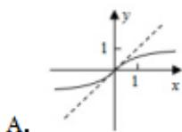

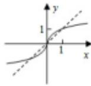

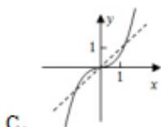

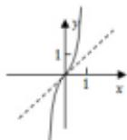

C.

【解答】解：函数图象上的特殊点（1，1），故排除 A，D；由特殊点（8，2）， $\left(\frac{1}{8},\frac{1}{2}\right)$ ，可排除 C.

故选：B.

3. 设 $a \in \{-1, 1, \frac{1}{2}, 3\}$ , 则使函数 $y = x^a$ 的定义域是 $\mathbf{R}$ , 且为奇函数的所有 $a$ 的值是（）

$$
A. 1, 3
$$

$$
B. - 1, 1
$$

$$
C. - 1,
$$

3

$$
D. - 1, 1, 3
$$

【解答】解：当 $a = -1$ 时， $y = x^{-1}$ 的定义域是 $x \mid x \neq 0$ ，且为奇函数；

当 $a = 1$ 时，函数 $y = x$ 的定义域是 $\mathbf{R}$ 且为奇函数；

当 $a = 1$ 时，函数 $y = x$ 的定义域是 $x \mid x \geqslant 0$ 且为非奇非偶函数.

当 $a = 3$ 时，函数 $y = x^3$ 的定义域是 $\mathbf{R}$ 且为奇函数.

故选：A.

4. $y = x^{\overline{3}}$ 在[-1，1]上是（

A. 增函数且是奇函数

$$
B. \text { 增   函 }
$$

数且是偶函数

C. 减函数且是奇函数

$$
D. \text {   减函   }
$$

数且是偶函数

【解答】解：考查幂函数 $y = x^{\frac{3}{5}}$

$\because \frac{3}{5} > 0$ ，根据幂函数的图象与性质

可得在[-1，1]上的单调增函数，是奇函数.

故选：A.

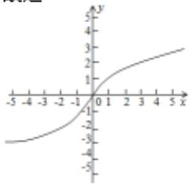

line

| x | y |
|---|---|
| -5 | -4 |
| -4 | -3 |
| -3 | -2 |
| -2 | -1 |
| -1 | 0 |
| 0 | 1 |
| 1 | 2 |
| 2 | 3 |
| 3 | 4 |
| 4 | 5 |
| 5 | 6 |

5. 已知 $a=2^{\frac{4}{3}}$ , $b=4^{\frac{2}{5}}$ , $c=25^{\frac{1}{3}}$ , 则（）

A. b<a<c

B. a<b<c

C. b<c

$<a$

D. c<a<b

【解答】解：∵ $a=2^{\frac{4}{3}}=4^{\frac{2}{3}}$

$$
b = 4 ^ {\frac {2}{5}} = (2 ^ {2}) ^ {\frac {2}{5}} = 2 ^ {\frac {4}{5}} <   2 ^ {\frac {4}{3}} <   a,
$$

$$
c = 2 5 ^ {\frac {1}{3}} = 5 ^ {\frac {2}{3}} > 4 ^ {\frac {2}{3}} = 2 ^ {\frac {4}{3}} = a,
$$

综上可得： $b <   a <   c$

故选：A.

6. 已知幂函数 $f(x) = (m^2 + 2m - 2)x^{m+2}$ 在 $(0, +\infty)$ 上单调递减，则 $m$ 的值为（）

A. 1

B.-3

C.-4

【解答】解：因为该函数是幂函数，

所以 $m^{2}+2m-2=1\Rightarrow m=-3$ ，或 m=1，

当 $m = -3$ 时，函数 $f(x) = x^{-1}$ 在 $(0, +\infty)$ 上单调递减，符合题意；

当 $m = 1$ 时，函数 $f(x) = x^3$ 在 $(0, +\infty)$ 上单调递增，不符合题意：

故选：B.

7. 已知幂函数 $y=f(x)$ 的图象过点 (4, 2)，则 $f(16)=(\quad)$

A. $\frac{1}{8}$

B. $\frac{1}{4}$

C. 4

【解答】解：由题意可设幂函数 $f(x)=x^{a}$

∵幂函数 $y=f(x)$ 的图象过点（4，2），

$$
\therefore 4 ^ {\alpha} = 2, \text {解得} \alpha = \frac {1}{2},
$$

$$
\therefore f (x) = x ^ {\frac {1}{2}},
$$

$$
\therefore f (1 6) = 1 6 ^ {\frac {1}{2}} = 4.
$$

故选：C.

8. 已知函数 $f(x) = (m - 1)x^{m - \frac{3}{2}}$ 是幂函数，则下列关于 $f(x)$ 说法正确的是（）

A. 奇函数

B. 偶函

数

C. 定义域为 $[0, +\infty)$

D. 在(0,

$+\infty$ ）单调递减

【解答】解： $f(x)=(m-1)x^{m-\frac{3}{2}}$ 为幂函数，故 m-1=1，解得 m=2，

所以 $f(x)=x^{\frac{1}{2}}$ ，定义域为 $[0,+\infty)$ ，不关于原点对称，
所以 $f(x)=x^{\frac{1}{2}}$ 既不是奇函数，也不是偶函数，AB错误，
在 $(0,+\infty)$ 上单调递增，D错误.

故选：C.

9. 已知幂函数 $f(x) = x^2$ 的图像过点（2，4），若 $\sqrt{f(m)} = 4$ ，则实数 $m$ 的值为（）

A. 2

B. ±2

C. 4

【解答】解：由题意幂函数 $f(x)=x^{a}$ 的图像过点（2，4），则 $2^{a}=4$ ，

∴α=2，则 $f(x)=x^{2}$ ，

由 $\sqrt{f(m)} = 4$ 得 $\sqrt{m^2} = 4$

$\therefore m^{2} = 16$

$\therefore m = \pm 4$

故选：D.

10. 幂函数 $y=x^{-2}$ 的大致图象是（）

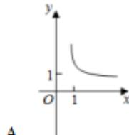

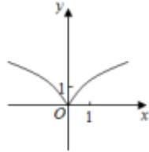

A.

B.

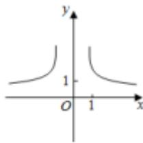

text_image

y
1
O 1 x

D.

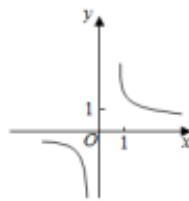

C.

【解答】解：幂函数 $y=x^{2}=\frac{1}{x^{2}}$ ，定义域为 $(-∞,0)∪(0,+∞)$ ，

可排除 A, B;

值域为（0， $+\infty$ ）可排除 $D$

故选：C.

11. 幂函数 $f(x) = (m^2 - 3)x^m$ 在第一象限内是减函数，则 $m = ()$

A. 2

B. $\sqrt{2}$

C. $-\sqrt{2}$

D.-2

【解答】解：由幂函数 $f(x) = (m^2 - 3)x^m$ 的定义可知 $m^2 - 3 = 1$ ，解得 $m = \pm 2$ .

再根据幂函数在第一象限内是减函数，

可知 m<0，所以 m=-2。

故选：D.

12. 设 $m \in \mathbb{R}$ , 若幂函数 $y = x^{m^2 - 2m + 1}$ 定义域为 $\mathbb{R}$ , 且其图像关于 $y$ 轴成轴对称, 则 $m$ 的值可以为 ( )

A. 1

B. 4

C. 7

【解答】解：由于幂函数 $y = x^{m^{2} - 2m + 1}$ （ $m \in R$ ）定义域为 R，且图像关于 y 轴对称，故幂函数是偶函数，
且 $m^{2}-2m+1=(m-1)^{2}$ 为正的偶数，

则 $m$ 的值可以为7.

故选：C.

13. 如图所示是函数 $y = x^{\frac{m}{n}}$ （ $m, n$ 均为正整数且 $m, n$ 互质）的图象，则（）

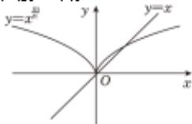

A. $m, n$ 是奇数且 $\frac{m}{n} < 1$   
B. m 是偶数，n 是奇数，且 $\frac{m}{n} < 1$   
C. m 是偶数，n 是奇数，且 $\frac{m}{n} > 1$   
D. m, n 是奇数，且 $\frac{m}{n} > 1$

【解答】解：由幂函数性质可知： $y = x^{\frac{m}{n}}$ 与y=x恒过点（1，1），即在第一象限的交点为（1，1），

当 $0 < x < 1$ 时， $x^{\frac{m}{n}} > x$ ，则 $\frac{m}{n} < 1$

又 $y=x^{m}$ 图象关于y轴对称，

$\therefore y = x^{\frac{n}{n}}$ 为偶函数，

$$
\therefore (- x) ^ {\frac {m}{n}} = \sqrt [ n ]{(- x) ^ {m}} = x ^ {\frac {m}{n}} = \sqrt [ n ]{x ^ {m}},
$$

又 $m$ ， $n$ 互质，

∴m为偶数，n为奇数.

故选：B.

14. 已知幂函数的图象过 $(\frac{1}{2}, \frac{\sqrt{2}}{4})$ ， $P(x_1, y_1)$ ， $Q(x_2, y_2)$ （ $x_1$ ）

$<x_{2}$ 是函数图象上的任意不同两点，则下列结论中正确的是（）

A. $x_{1}f(x_{1}) > x_{2}f(x_{2})$

B. $xf$

$(x_{2})<x_{2}f(x_{1})$

C. $\frac{f(x_{1})}{x_{2}} > \frac{f(x_{2})}{x_{1}}$

D. $\frac{f(x_{1})}{x_{1}}$

$$
<   \frac {f (x _ {2})}{x _ {2}}
$$

【解答】解：设幂函数 $f(x) = x^{\alpha}$ ，图象经过点 $\left(\frac{1}{2}, \frac{\sqrt{2}}{4}\right)$ ，所以 $\left(\frac{1}{2}\right)^{\alpha} = \frac{\sqrt{2}}{4}$ ，解得 $\alpha = \frac{3}{2}$ ，所以 $f(x) = x^{\frac{3}{2}}$ ，

因为函数 $f(x) = x^2$ 在定义域 $[0, +\infty)$ 内单调递增，所以当 $0 < x_1 < x_2$ 时， $0 < f(x_1) < f(x_2)$ ，

所以 $x_{1}f(x_{1})<x_{2}f(x_{2})$ ，选项 A，C 错误；

又因为函数 $\frac{f(x)}{x} = x^{\frac{1}{2}}$ 单调递增，

所以当 $0 < x_{1} < x_{2}$ 时， $\frac{f(x_{1})}{x_{1}} < \frac{f(x_{2})}{x_{2}}$ ，选项 D 正确.

所以 $x_{2}f(x_{1}) < x_{1}f(x_{2})$ ，即 $x_{1}f(x_{2}) < x_{2}f(x_{1})$ ，选项 $B$ 错误.

故选：D.

15. 已知幂函数 $f(x)$ 的图象过点（2，32），若 $f(a+1)+f(-1)>0$ ，则 a 的取值范围为（）

A. $(2, +\infty)$

B. $(1, +\infty)$

C. (0,

+∞)

D. $(-1, +\infty)$

【解答】解：设幂函数 $y=f(x)=x^{\alpha}$ ，其图象过点（2，32），所以 $2^{\alpha}=32$ ，解得 $\alpha=5$ ，

所以 $f(x)=x^{3}$ ,

因为 $f(-x)=(-x)^{3}=-f(x)$ ，所以 $f(x)=x^{5}$ 为奇函数，且在R上单调递增，

所以 $f(a + 1) + f(-1) > 0$ 可化为 $f(a + 1) > -f(-1) = f$ (1)，

可得 $a+1>1$ ，解得 a>0，

所以 a 的取值范围为 $(0, +\infty)$ .

故选：C.

16. 下列函数既是幂函数又是奇函数的是（）

A. $y = \sqrt[3]{x}$

B. $y = \frac{1}{x^{2}}$

C. y=

$2x^{2}$

D. $y = x + \frac{1}{x}$

【解答】解：由幂函数的定义知， $y=2x^{2}$ ， $y=x+\frac{1}{x}$ 不是幂函数，CD错误，

$y=\sqrt[3]{x}=x^{\frac{1}{3}}$ 为幂函数，定义域为 $\{x|x\neq0\}$ ，

$\because f(-x) = (-x)^{\frac{1}{3}} = -x^{\frac{1}{3}}, \therefore f(x)$ 为奇函数， $\therefore A$ 正确， $\because y = \frac{1}{x^2}$ 为偶函数， $\therefore B$ 错误，

故选：A.

17. 已知 $\alpha \in \{-2, -1, -\frac{1}{2}, \frac{1}{2}, 1, 2, 3\}$ ，若幂函数 $f(x) = x^{\alpha}$ 为奇函数，且在 $(0, +\infty)$ 上递减，则 $\alpha = -1$ 。

【解答】解：∵α∈{-2，-1，- $\frac{1}{2}$ ， $\frac{1}{2}$ ，1，2，3}，

幂函数 $f(x) = x^{\alpha}$ 为奇函数，且在 $(0, +\infty)$ 上递减，

∴a是奇数，且a<0，

$\therefore a=-1.$

故答案为：-1.

18. 若函数 $f(x) = a^{x} (a > 0, a \neq 1)$ 在 $[-1, 2]$ 上的最大值为 4，最小值为 $m$ ，且函数 $g(x) = (1 - 4m)\sqrt{x}$ 在 $[0, +\infty)$ 上是增函数，则 $a = \frac{1}{4}$ .

【解答】解：当 a>1 时，有 $a^{2}=4,\ a^{-1}=m$

此时 $a = 2$ ， $m = \frac{1}{2}$ ，此时 $g(x) = -\sqrt{x}$ 为减函数，不合题意；若 $0 < a < 1$ ，则 $a^{-1} = 4$ ， $a^2 = m$ ，故 $a = \frac{1}{4}$ ， $m = \frac{1}{16}$ ， $g(x) = \frac{3}{4}\sqrt{x}$ 在[0， $+\infty$ )上是增函数，符合题意.

故答案为： $\frac{1}{4}$

19. 下列比较大小正确的是（）

$$
\begin{array}{l} > \sqrt {\pi} ^ {- \frac {4}{3}} > 2 ^ {- \frac {2}{3}} \\ > 3 ^ {- \frac {1}{3}} > \sqrt {\pi} ^ {- \frac {4}{3}} \\ \end{array}
$$

A. $\sqrt{\pi}^{-\frac{4}{3}} > 3^{-\frac{1}{3}} > 2^{-\frac{2}{3}}$

B. $3^{\frac{1}{3}}$

C. $3^{-\frac{1}{3}} > 2^{-\frac{2}{3}} > \sqrt{\pi}^{-\frac{4}{3}}$

D. $2^{-\frac{2}{3}}$

【解答】解： $\sqrt{\pi}^{-\frac{4}{3}}=(\pi^{2})^{-\frac{1}{3}},2^{-\frac{2}{3}}=4^{-\frac{1}{3}}$

因为 $y = x^{-\frac{1}{3}}$ 在（0，+∞）上单调递减且 $\pi^2 > 4 > 3$ ，

故 $(\pi^{2})^{-\frac{1}{3}}<4$ $-\frac{1}{3}<3$ $-\frac{1}{3}$ .

故选：C.

20. 若 $(m+1)^{\frac{1}{2}} < (3-2m)^{\frac{1}{2}}$ ，则实数 m 的取值范围 $-1 \leq m < \frac{2}{3}$ .

【解答】解：考察幂函数 $y = x^{\frac{1}{2}}$ ，它在 $[0, +\infty)$ 上是增函数，

$$
\because (m + 1) \quad \frac {1}{2} <   (3 - 2 m) \quad \frac {1}{2},
$$

$$
\therefore 0 \leqslant m + 1 <   3 - 2 m,
$$

解得： $-1\leqslant m <   \frac{2}{3},$

则实数 m 的取值范围 $-1 \leq m < \frac{2}{3}$ .

故答案为： $-1 \leq m < \frac{2}{3}$ .

# [必修一]第四章 指数函数与对数函数

# 题型 1 指数幂运算

1. 下列运算正确的是（）

A. $a^2 \cdot a^3 = a^6$ B. (3a)

$$
^ 3 = 9 a ^ {3}
$$

B. $(3a)$

C. $\sqrt[8]{a^8} = a$ D. (-

$$
2 a ^ {2}) ^ {3} = - 8 a ^ {6}
$$

【解答】解：对于 A: $a^{2} \cdot a^{3} = a^{5}$ ，故 A 错误；

对于 B: $(3a)^{3}=27a^{3}$ ，故 B 错误；

对于 $C: \sqrt[8]{a^8} = |a| = \begin{cases} a & (a \geq 0) \\ -a & (a < 0) \end{cases}$ ，故 $C$ 错误；

对于 $D: (-2a^{2})^{3} = -8a^{6}$ ，故 D 正确.

故选：D.

2. 计算 $(\frac{9}{4})^{\frac{1}{2}} - (-2.5)^{0} - (\frac{8}{27})^{\frac{2}{3}} + (\frac{3}{2})^{-2}$ 的结果为（）

A. $\frac{5}{2}$ B. $\frac{1}{2}$ C. $\frac{25}{18}$

【解答】解：原式 $= (\frac{3}{2})^{2 \times \frac{1}{2}} - 1 - (\frac{2}{3})^{3 \times \frac{2}{3}} + (\frac{2}{3})^2 = \frac{3}{2} - 1 - (\frac{2}{3})^2 + (\frac{2}{3})^2 = \frac{1}{2}$ .

故选：B.

3. 下列各式中成立的是（）

A. $\left(\frac{n}{m}\right)^{7} = n^{7}m^{\frac{1}{7}}$ B.

$$
\sqrt [ 1 2 ]{(- 3) ^ {4}} = \sqrt [ 3 ]{- 3}
$$

C. $\sqrt[4]{x^3 + y^3} = (x + y)^{\frac{3}{4}}$ D.

$$
\sqrt [ 3 ]{\sqrt {9}} = \sqrt [ 3 ]{3}
$$

【解答】解：∵ $\left(\frac{n}{m}\right)^{7}=n^{7}m^{-7}\neq n^{7}m^{\frac{1}{7}}$ ，故A错误；

$\because \sqrt[12]{(-3)^{4}} = 3\frac{4}{12} = 3\frac{1}{3} = \sqrt[3]{3}$ ，故 $B$ 错误；

$\because \sqrt[4]{x^3 + y^3} = (x^3 + y^3)^{\frac{1}{4}}$ ，故 $C$ 错误；

$\because \sqrt[3]{9} = (3^{\frac{2}{3}})^{\frac{1}{2}} = 3^{\frac{1}{3}} = \sqrt[3]{3}$ 故 $D$ 正确.

故选：D.

4. 下列各式正确的是（）

A. $\sqrt[3]{-5}=\sqrt[6]{(-5)^{2}}$

B.

$$
\sqrt {(3 - \pi) ^ {2}} = 3 - \pi
$$

$$
C. \sqrt [ n ]{a ^ {n}} = | a | (n > 1, n \in \mathbf {N} ^ {*})
$$

D.

$$
(\sqrt [ n ]{a}) ^ {n} = a (n > 1, n \in \mathbf {N} ^ {*})
$$

【解答】解： $A.\sqrt[3]{-5}<0,\sqrt[6]{(-5)^{2}}>0$ ，可得. $\sqrt[3]{-5}\neq\sqrt[6]{(-5)^{2}}$ 因此不正确；

$B.\sqrt{(3-\pi)^{2}}=\pi-3$ ，因此不正确；

$C.\sqrt[n]{a^{n}}=\left\{\begin{aligned}&a, &n 为奇数 \\&|a|, &n 为偶数\end{aligned}\right.$ ，不正确；

$D. (\sqrt[n]{a})^n = a, \quad (n > 1, n \in \mathbf{N}^*)$

因此 D 正确.

故选：D.

5. 下列各式中，正确的是（）

A. $\sqrt{(-2)^2} = -2$

B. $(- \sqrt{3})^{2} = 9$

C. $\sqrt{9} =$

± 3

D. $\sqrt{(-3)^{2}}=3$

【解答】解： $\sqrt{(-2)^{2}}=2,(-\sqrt{3})^{2}=3,\sqrt{9}=3,\sqrt{(-3)^{2}}=3,$ 故选：D.

6. $\sqrt[3]{a\cdot\sqrt{a}}$ 的分数指数幂表示为（）

A. $a^{\frac{1}{2}}$

B. $a^{\frac{3}{2}}$

C. $a^{\frac{3}{4}}$

【解答】解： $\sqrt[3]{a\cdot\sqrt{a}}=\sqrt[3]{a\cdot a^{\frac{1}{2}}}=a^{\frac{3}{2}\times\frac{1}{3}}=a^{\frac{1}{2}}.$

故选：A.

# 题型 2 指数函数

1. 设 $a = 0.6^{0.6}, b = 0.6^{1.5}, c = 1.5^{0.6}$ , 则 $a, b, c$ 的大小关系是（）

A. a<b<c

B. a<c<b

C. b<a

<c

D. b<c<a

【解答】解：函数 $y=0.6^{x}$ 为减函数；

故 $a = 0.6^{0.6} > b = 0.6^{1.5}$

函数 $y = x^{0.6}$ 在（0，+∞）上为增函数；

故 $a = 0.6^{0.6} < c = 1.5^{0.6}$

故 b<a<c，

故选：C.

2. 设 $a = 0.6^{0.4}, b = 0.4^{0.6}, c = 0.4^{0.4}$ , 则 $a, b, c$ 的大小关系为 ( )

A. a<b<c

B. b<c<a

C. c < a

<b

D. c<b<a

【解答】解： $\because a=0.6^{0.4}, c=0.4^{0.4}$ ，由幂函数的性质可得 $a>c$ ，

$\because b = 0.4^{0.6}, c = 0.4^{0.4}$ ，由指数函数的性质可得 $b < c$

$\therefore b<c<a.$

故选：B.

3. 函数 $y=a^{x}-a(a>0, a\neq1)$ 的图象可能是（）

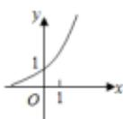  
B.

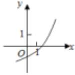

A.

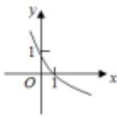

D.

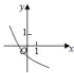

【解答】解：由于当 x=1 时，y=0，即函数 $y=a^{x}-a$ 的图象过点（1，0），故排除 A、B、D.

故选：C.

4. 函数 $f(x) = a^{x - b}$ 的图象如图，其中 $a, b$ 为常数，则下列结论正确的是（

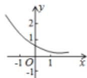

A. 0<a<1, b<0

B. $a > 1, b > 0$

C. 0 < a

<1, b>0

D. a>1, b<0

【解答】解：∵由函数图象得：底数a满足0<a<1，

又 $x = 0$ 时， $0 < y < 1$ ， $\therefore a^{b} < a^0$

$$
\therefore - b > 0, b <   0
$$

故选：A.

5. 若函数 $y = a^x + b - 1$ ( $a > 0$ 且 $a \neq 1$ ) 的图象经过第二、三、四象限，则一定有（）

A. 0<a<1，且b>0

B. a>1,

且 b>0

C. 0<a<1，且 b<0

D. a>1,

且 b<0

【解答】解：如图所示，图象与 y 轴的交点在 y 轴的负半轴上（纵截距小于零），即 $a^{0}+b-1<0$ ，且 0<a<1，

∴0<a<1，且b<0.

故选：C.

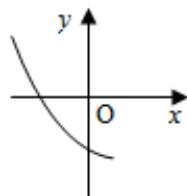

6.函数 $y = a^{x}$ 在[0,1]上的最大值与最小值的和为3，则 $a = (\quad)$

A. $\frac{1}{2}$

B. 2

C. 4

【解答】解：根据题意，由 $y=a^{x}$ 的单调性，

可知其在[0，1]上是单调函数，即当 $x = 0$ 和1时，取得最值，即 $a^0 + a^1 = 3$

再根据其图象，可得 $a^0 = 1$

则 $a^1 = 2$

即 $a = 2$

故选：B.

7. 函数 $f(x) = a^{x} (a > 0$ ，且 $a \neq 1$ 对于任意的实数 $x, y$ 都有（）

A. $f(xy) = f(x)\cdot f(y)$

B. $f(x+y)$

$= f(x)\cdot f(y)$

C. $f(xy) = f(x) + f(y)$

D. f

$(x + y) = f(x) + f(y)$

【解答】解：由函数 $f(x) = a^{x} (a > 0$ ，且 $a \neq 1$

得 $f(x+y)=a^{x+y}=a^{x}\cdot a^{y}=f(x)\cdot f(y)$ .

所以函数 $f(x) = a^{x} (a > 0$ ，且 $a \neq 1$ 对于任意的实数 $x, y$ 都有 $f(x + y) = f(x) \cdot f(y)$ .

故选：B.

8. 函数 $y=a^{x-2}-1$ (a>0 且 a≠1) 的图象恒过的点是（）

A. (0, 0)

B. $(0,-1)$

C. (-

2, 0)

D. $(-2,-1)$

【解答】解：令 $x + 2 = 0$ ，解得 $x = -2$

所以当 $x = -2$ 时，函数 $y = a^0 - 1 = 0$

即函数 $y=a^{x-2}-1(a>0$ 且 $a\neq1)$ 的图象恒过定点 $(-2,0)$ .
故选：C.

9. 某食品保鲜时间 $y$ （单位：小时）与储藏温度 $x$ （单位：℃）满足函数关系 $y = e^{kx - b}$ （ $e = 2.718\cdots$ 为自然对数的底数， $k, b$ 为常数）。若该食品在 $0^{\circ}\mathrm{C}$ 的保鲜时间是192小时，在 $22^{\circ}\mathrm{C}$ 的保鲜时间是48小时，则该食品在 $33^{\circ}\mathrm{C}$ 的保鲜时间是（）

A. 16 小时

B. 20 小时

C. 24

小时

D. 28 小时

【解答】解： $y=e^{bx+b}$ （ $e=2.718\cdots$ 为自然对数的底数，k，b为常数）.

当 $x = 0$ 时， $e^b = 192$

当 $x = 22$ 时 $e^{22k + b} = 48$

$$
\therefore e ^ {2 2 k} = \frac {4 8}{1 9 2} = \frac {1}{4}
$$

$$
e ^ {1 1 k} = \frac {1}{2}
$$

$$
e ^ {b} = 1 9 2
$$

当 $x = 33$ 时， $e^{33k + b} = (e^{11k})^3 \cdot (e^b) = (\frac{1}{2})^3 \times 192 = 24$

故选：C.

# 题型 3 对数运算

1. $\log_{b}N = a(b > 0, b \neq 1, N > 0)$ 对应的指数式是（）

A. $a^{b}=N$

B. $b^{a}=N$

C. $a^{N}=$

b

D. $b^{N}=a$

【解答】解：由 $\log_{b}N=a(b>0,\ b\neq1,\ N>0)$

得 $b^{a}=N.$

故选：B.

2. 若 $\log_a x = 1$ ，则（）

A. x=1

B. a=1

C. x = a

D. x=10

【解答】解：由 $\log_{a}x=1$ ，得 $x=a^{1}=a$ 。

故选：C.

3. 把指数式 $2^{6} = 64$ 化成对数式是 $\log_{2}64 = 6$

【解答】解：指数式 $2^{6}=64$ 化成对数式是：

$\log_{2}64 = 6$

故答案为： $\log_{2}64=6$

4. $\log_{a} x$ 中的 $x, a$ 要分别满足 $x > 0, a > 0$ 且 $a \neq 1$ , 小明同学不知道为什么, 请你帮他解释为 设 $\log_{a} x = M$ , 则 $a^M = x$ , 由于 $a^M > 0$ 恒成立, 则 $x > 0$ , 根据指数函数定义, 对于 $y = a^x$ , 则 $a > 0$ 且 $a \neq 1$ , 故对数中 $a > 0$ 且 $a \neq 1$ .

【解答】解：设 $\log_{a}x = M$ ，则 $a^M = x$

由于 $a^{M}>0$ 恒成立，则 x>0，

根据指数函数定义，对于 $y=a^{x}$ ，则 a>0 且 $a\neq1$ ，

故对数中 a>0 且 a≠1，

故答案为：设 $\log_{a}x = M$ ，则 $a^M = x$ ，由于 $a^M >0$ 恒成立，则 $x > 0$ ，根据指数函数定义，对于 $y = a^x$ ，则 $a > 0$ 且 $a\neq 1$ ，故对数中 $a > 0$ 且 $a\neq 1$

5. $\log_42 - \log_48$ 等于（ ）

A.-2

B.-1

C. 1

【解答】解： $\log_{4}2-\log_{4}8=\log_{4}\frac{2}{8}=\log_{4}4^{-1}=-1$

故选：B.

6. 计算 $\lg4+\lg25=$ ( )

A. 2

B. 3

C. 4

【解答】解：原式= $\lg(4\times25)=\lg10^{2}=2$ .

故选：A.

7. 计算： $2\lg2+\lg25=$ （）

A. 1

B. 2

C. 3

【解答】解： $2\lg2+\lg25=\lg4+\lg25=\lg100=2$

故选：B.

8. 计算： $\log_{2}9\cdot\log_{3}8=$ （）

A. 12

B. 10

C. 8

【解答】解： $\log_{2}9\cdot\log_{3}8=2\log_{2}3\cdot3\log_{3}2=6.$

故选：D.

9. 求值： $\log_{3}15 - \frac{1}{2}\log_{3}25 = \underline{1}$ 。

【解答】解： $\log_315 - \frac{1}{2}\log_325 = \log_315 - \log_35 = \log_33 = 1.$

故答案为：1

10. $\lg \frac{5}{2} + 2\lg 2 - (\frac{1}{2})^{-1} = \underline{-1}$ .

【解答】解： $\lg\frac{5}{2}+2\lg2-\left(\frac{1}{2}\right)^{-1}$

$$
= \lg 5 - \lg 2 + 2 \lg 2 - 2
$$

$$
\begin{array}{l} = \lg 5 + \lg 2 - 2 \\ = 1 - 2 \\ = - 1. \\ \end{array}
$$

故答案为-1.

11. 计算： $2^{\log_{2}3} + 2\log_{3}1 - 3\log_{7}7 + 3\ln1 = \underline{0}$

【解答】解：原式 $= 3 + 2 \times 0 - 3 \times 1 + 3 \times 0 = 0$

故答案为：0.

12. 已知 $2^{3\log_{4}x}=27$ ，则 x 的值为 9。

【解答】解： $2^{3\log_{4}x}=2^{\frac{3}{2}\log_{2}x}=2^{\log_{2}x^{2}}=x^{2}=27$ ;

$$
\begin{array}{l} \therefore x ^ {2} = 3; \\ \therefore x = 9. \\ \end{array}
$$

故答案为：9.

13. $\mathrm{lg}^2 2 + \mathrm{lg}2\mathrm{lg}5 + \mathrm{lg}5 = \underline{1}$ .

【解答】解：∵lg2+lg5=lg10=1，

$$
\begin{array}{l} \therefore \lg^ {2} 2 + \lg 2 \lg 5 + \lg 5 \\ = \lg 2 (\lg 2 + \lg 5) + \lg 5 \\ = \lg 2 + \lg 5 \\ = \lg 1 0 \\ = 1. \\ \end{array}
$$

故答案为：1.

14. $\log_3\frac{\sqrt[4]{27}}{3} +\lg 25 + \lg 4 + 7^{\log_{49}4} = \underline{15}$

【解答】解：原式 $= \log_33^{-\frac{1}{4}} + \lg 100 + 7^{\log_72} = -\frac{1}{4} + 2 + 2 = \frac{15}{4}$

故答案为： $\frac{15}{4}$

15. $2\frac{7^{\frac{2}{3}}}{7} - 2^{\log_23}\cdot \log_2\frac{1}{8} +\lg 5\times \log_510 = \underline{19}$

【解答】解：原式= $(3^{3})^{\frac{2}{3}}-3\times\log_{2}2^{-3}+\lg5\cdot\frac{\lg10}{\lg5}$

$$
\begin{array}{l} = 3 ^ {3 \times \frac {2}{3}} - 3 \times (- 3) + 1 \\ = 9 + 9 + 1 \\ = 1 9 \\ \end{array}
$$

故答案为：19

16. $27^{\frac{1}{3}} + (\frac{1}{5})^{0} + \log_{2}4 = \underline{6}$ .

【解答】解： $27^{\frac{1}{3}}+(\frac{1}{5})^{0}+\log_{2}4=3+1+2=6.$

故答案为：6

17. 已知 x, y 为正实数，则（）

A. $\lg (x^2\cdot y) = (\lg x)^2 +\lg y$

B. lg(x

$\sqrt{\mathrm{y}}) = \lg \mathrm{x} + \frac{1}{2}\lg \mathrm{y}$

C. $e^{\ln x+\ln y}=x+y$

D. $e^{lnx}$

$\ln y = xy$

【解答】解：x，y为正实数，

对于 A， $\lg(x^{2}\cdot y)=\lg x^{2}+\lg y=2\lg x+\lg y$ ，故 A 错误；

对于 B， $\lg(x - \sqrt{y}) = \lg x + \lg \sqrt{y} = \lg x + \frac{1}{2}\lg y$ ，故 B 正确；

对于 C， $e^{lnx+lny}=e^{lnx}\cdot e^{lny}=xy$ ，故 C 错误；

对于 D， $xy=e^{lnx}\cdot e^{lny}=e^{lnx+lny}$ ，故 D 错误.

故选：B.

18.（1）化简： $\frac{\lg 20 + \lg 5 - \lg 80}{\lg 25 - \lg 16}$

(2) 化简： $4^{-\frac{3}{2}} + \left(\frac{9}{4}\right)^{\frac{1}{2}} - (\sqrt{3} - 1)^{0} + \sqrt[3]{(-4)^{3}}$ .

【解答】解：（1） $\frac{\lg20+\lg5-\lg80}{\lg25-\lg16}$

$$
= \frac {\lg (2 0 \times 5) - \lg 8 0}{\lg 2 5 - \lg 1 6}
$$

$$
= \frac {\lg_ {8 0} ^ {1 0 0}}{2 \lg_ {4} ^ {5}}
$$

$$
= \frac {1}{2}.
$$

(2) $4^{-\frac{3}{2}} + (\frac{9}{4})^{\frac{1}{2}} - (\sqrt{3} - 1)^{0} + \sqrt[3]{(-4)^{3}}$

$$
= 2 ^ {- 3} + \frac {3}{2} - 1 + (- 4)
$$

$$
= - \frac {2 7}{8}.
$$

19. 计算：

(1) $0.064^{-\frac{1}{3}} - (-\frac{1}{8})^0 + 16^{\frac{3}{4}} + 0.25^{\frac{1}{2}};$   
(2) $\log_3\sqrt{27} + \lg 25 + 2\lg 2 - 7^{\log_72} + \log_42.$

【解答】解：（1）原式= $\frac{5}{2}-1+8+\frac{1}{2}=10$ ;

(2) 原式= $\frac{3}{2}+(lg25+lg4)-2+\frac{1}{2}=2$ .

20. 计算：

(I) $\left(\frac{16}{81}\right)^{-\frac{3}{4}} - (\sqrt{3} - \sqrt{2})0 - (1\frac{9}{16})^{\frac{1}{2}};$   
(II) $\log_98\cdot \log_29 + 3^{\log_37} - (\lg_{\frac{5}{2}} + 2\lg 2)$ .

【解答】（本小题满分10分）

解：（1） $(\frac{16}{81})^{-\frac{3}{4}} - (\sqrt{3} - \sqrt{2})^0 - (1\frac{9}{16})^{\frac{1}{2}} = (\frac{3}{2})^3 - (\sqrt{3} -$

$$
\sqrt {2}) ^ {0} - \left(\frac {5}{4}\right) ^ {1} = \frac {9}{8} \dots (5 \text {分})
$$

(2) $\log_98\cdot \log_29 + 3^{\log_37} - (\lg \frac{5}{2} +2\lg 2) = \frac{3}{2}\log_32\cdot 2\log_23+$

$7-(\lg5-\lg2+2\lg2)=9\cdots(10\text{分})$

21. 计算:

(1) $(2\frac{1}{4})^{\frac{1}{2}} - (-2020)^{0} - (\frac{27}{8})^{-\frac{2}{3}} + 1.5^{-2}$ ;   
(2) $\log_{3}\frac{4\sqrt{27}}{3} + \lg 25 + \lg 4 + 7^{\log_7 2} + \log_2 3 \times \log_3 4.$

【解答】解：（1）原式= $\frac{3}{2}-1-\frac{4}{9}+\frac{4}{9}=\frac{1}{2}$

(2) 原式 $= \log_{3} 3^{-\frac{1}{4}} + \lg (25 \times 4) + 2 + \log_{2} 4 = -\frac{1}{4} + 2 + 2 + 2 = \frac{23}{4}$ .

22. 化简求值:

(1) $(0.064)^{-\frac{1}{3}} - (-\frac{7}{8})^0 + [(-2)^3]^{-\frac{4}{3}} + 16^{-0.75}$ ;   
(2) $2\log_{3}2 - \log_{3}\frac{32}{9} + \log_{3}8 - 5^{\log_{5}3}$ .

【解答】解：（1） $(0.064)^{-\frac{1}{3}} - (-\frac{7}{8})^0 + [(-2)^3]^{-\frac{4}{3}} + 16^{-0.75}$

$$
\begin{array}{l} = (0. 4 ^ {3}) ^ {- \frac {1}{3}} - 1 + (- 2) ^ {- 4} + (2 ^ {4}) ^ {- \frac {3}{4}} \\ = 0. 4 ^ {- 1} - 1 + \frac {1}{2 ^ {4}} + 2 ^ {- 3} \\ = \frac {5}{2} - 1 + \frac {1}{1 6} + \frac {1}{8} \\ = \frac {2 7}{1 6}. \\ \end{array}
$$

(2) $2\log_{3}2 - \log_{3}\frac{32}{9} + \log_{3}8 - 5^{\log_{5}3}$

$$
= \log_ {3} 4 - \log_ {3} \frac {3 2}{9} + \log_ {3} 8 - 3
$$

$$
= \log_ {3} (4 \times \frac {9}{3 2} \times 8) - 3
$$

$$
= 2 - 3
$$

$$
= - 1.
$$

23. 化简求值：

(1) 0.0081 $-\frac{1}{4} - \left(\frac{16}{9}\right)^{0.5} + (\ln 2)^{0}$ .   
(2) $\lg 4 + \lg 25 + \log_3\sqrt[3]{9} - e^{\ln 2}$ .

【解答】解：（1）原式=0. $3^{4\times(-\frac{1}{4})}-\frac{4}{3}+1=\frac{10}{3}-\frac{4}{3}+1=3$

(2) 原式= $\lg100+\frac{2}{3}-2=\frac{2}{3}$ .

24. (1) 计算: $\lg 25 + \lg 2 \cdot \lg 50 + \lg^2 2$   
(2) 已知 $x^{\frac{1}{2}} + x^{-\frac{1}{2}} = 3$ ，求 $\frac{x^{2} + x^{-2} - 2}{x + x^{-1} - 2}$ 的值.

【解答】解：（1） $\lg25+\lg2\cdot\lg50+\lg^{2}2$

$$
\begin{array}{l} = \lg 5 ^ {2} + \lg 2 (\lg 5 + 1) + \lg^ {2} 2 \\ = 2 \lg 5 + \lg 2 \cdot \lg 5 + \lg 2 + \lg^ {2} 2 \\ = 2 \lg 5 + \lg 2 + \lg 2 (\lg 5 + \lg 2) \\ = 2 (\lg 5 + \lg 2) \\ = 2; \\ \end{array}
$$

(2) 由 $x^{1/2} + x^{-\frac{1}{2}} = 3$ ，得 $(x^{1/2} + x^{-\frac{1}{2}})^{2} = 9$ ，

即 $x+2+x^{-1}=9$ .

$$
\therefore \mathrm{x} + \mathrm{x} ^ {- 1} = 7.
$$

两边再平方得： $x^{2}+2+x^{-2}=49$

$$
\therefore \mathrm{x} ^ {2} + \mathrm{x} ^ {- 2} = 4 7.
$$

$$
\therefore \frac {\mathrm{x} ^ {2} + \mathrm{x} ^ {- 2} - 2}{\mathrm{x} + \mathrm{x} ^ {- 1} - 2} = \frac {4 7 - 2}{7 - 2} = 9.
$$

# 题型 4: 对数函数

1. 函数 $f(x) = \frac{1}{\sqrt{2 - x}} + \ln (x + 1)$ 的定义域为（）

A. $(2, +\infty)$ B. (-

1, 2) ∪ (2, +∞)

C. $(-1, 2)$ D. $(-1, 2)$

1, 2]

【解答】解：由题意得： $\left\{\begin{aligned}&2-x>0\\&x+1>0\end{aligned}\right.$ ，解得：-1<x<2，

故选：C.

2. $f(x) = \sqrt{\log_{\frac{1}{3}}(x - 1)}$ 的定义域 (1, 2].

【解答】解： $f(x) = \sqrt{\log_{\frac{1}{3}}(x - 1)}$ 的定义域为 $\left\{ \begin{aligned} x - 1 & > 0 \\ \log_{\frac{1}{3}}(x - 1) & \geq 0 \end{aligned} \right.$ ，解得 $1 < x \leqslant 2$ .

故答案为：（1，2].

3. 已知函数 $y=\log_{a}(x+c)$ （a, c 为常数，其中 a>0, $a\neq1$ ）的图象如图所示，则下列结论成立的是（）

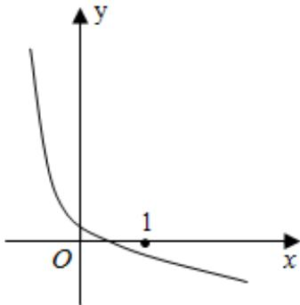

text_image

y
O
1
x

A. a>1, c>1 B. a>1, $c<1$

C. 0<a<1, c>1 D. 0<a

<1, 0<c<1

【解答】解：∵函数单调递减，∴0<a<1，

当 $\mathrm{x} = 1$ 时 $\log_a(x + c) = \log_a(1 + c) < 0$ ，即 $1 + c > 1$ ，即 $c > 0$ 当 $\mathrm{x} = 0$ 时 $\log_a(x + c) = \log_a c > 0$ ，即 $c < 1$ ，即 $0 < c < 1$

故选：D.

4. 设 $a = \lg e, b = (\lg e)^2, c = \lg \sqrt{e}$ ，则（）

A. $a > b > c$ B. $c > a > b$ C. $a > c$

>b D. c>b>a

【解答】解：∵1<e<3< $\sqrt{10}$ ,

$$
\therefore 0 <   \text { lge } <   1, \therefore \text { lge } > \frac {1}{2} \text { lge } > (\text { lge }) ^ {2}.
$$

$$
\therefore a > c > b.
$$

故选：C.

5. 已知函数 $f(x) = \begin{cases} \log_2(x + 1)(x > 3) \\ 2^{x - 3} + 1 (x \leq 3) \end{cases}$ 满足 $f(a) = 3$ ，则 $f(a - 5) = (\quad)$

A. $\log_23$ B. $\frac{17}{16}$ C. $\frac{3}{2}$

【解答】解：若 $a > 3$ ，则 $f(a) = \log_2(x + 1) = 3$ ，解得 $a = 7$ ，则 $a - 5 = 2 \leqslant 3$ ， $f(a - 5) = f(2) = 2^{2 \cdot 3} + 1 = \frac{3}{2}$

若 $a \leqslant 3, f(a) = 2^{a + 3} + 1 = 3$ ，解得 $a = 4$ （舍去）

综上 $f(a - 5) = \frac{3}{2}$

故选：C.

6. 函数 $y=\log_{a}(x+2)+1$ 的图象过定点（）

A. (1, 2) B. (2, 1) C. (-

2, 1) D. $(-1, 1)$

【解答】解：由函数图象的平移公式，我们可得：

将函数 $y=\log_{x}(a>0,\ a\neq1)$ 的图象向左平移 2 个单位，再向上平移 1 个单位，

即可得到函数 $y=\log_{a}(x+2)+1(a>0,\ a\neq1)$ 的图象.

又∵函数 $y=\log_{a}x$ (a>0, a≠1) 的图象恒过 (1, 0) 点，由平移向量公式，易得函数 $y=\log_{a}(x+2)+1$ (a>0, a≠1) 的图象恒过 (-1, 1) 点，

故选：D.

7. 已知 $a = 2^{-\frac{1}{3}}$ , $b = \log_{\frac{1}{3}}$ , $c = \log_{\frac{1}{2}}\frac{1}{3}$ , 则（）

$$
\begin{array}{l} \mathrm{A.} \mathrm{a} > \mathrm{b} > \mathrm{c} \\ B. a > c > b \\ C. c > a \\ \gg b \\ D. c > b > a \\ \end{array}
$$

【解答】解：∵0<a=2 $^{-\frac{1}{3}}$ <2 $^{0}$ =1，

$$
\begin{array}{l} b = \log_ {2} \frac {1}{3} <   \log_ {2} 1 = 0, \\ \mathrm{c} = \log_ {1} \frac {1}{3} = \log_ {2} 3 > \log_ {2} 2 = 1, \\ \therefore c > a > b. \\ \end{array}
$$

故选：C.

8. 已知函数 $f(x) = \ln(-x^{2} - 2x + 3)$ ，则 $f(x)$ 的增区间为（）

$$
\begin{array}{l} \text { A. } (- \infty , - 1) \\ B. (- 3, - 1) \\ C. [ - 1, \\ + \infty) \\ D. [ - 1, 1) \\ \end{array}
$$

【解答】解：由 $-x^{2}-2x+3>0$ ，

解得：-3<x<1，

而 $y = -x^{2} - 2x + 3$ 的对称轴是 x = -1，开口向下，

故 $y = -x^{2} - 2x + 3$ 在 $(-3, -1)$ 递增，在 $(-1, 1)$ 递减，由 $y = \ln x$ 递增，根据复合函数同增异减的原则，

得 $f(x)$ 在 $(-3, -1)$ 递增，

故选：B.

9. 函数 $f(x) = \log_1 (x^2 - 3x + 2)$ 的单调递增区间为（）

$$
\begin{array}{l} A. (- \infty , 1) \\ B. (2, + \infty) \\ C. (- \\ \infty , \frac {3}{2}) \\ D. \quad (\frac {3}{2}, + \infty) \\ \end{array}
$$

【解答】解：由题意，此复合函数，外层是一个递减的对数函数

令 $t=x^{2}-3x+2>0$ 解得 x>2 或 x<1

由二次函数的性质知，t 在 $(-∞, 1)$ 是减函数，在 $(2, +∞)$ 上是增函数，

由复合函数的单调性判断知函数 $f(x)=\log_{\frac{1}{3}}(x^{2}-3x+2)$ 的单调递增区间 $(-∞,1)$

故选：A.

10. 已知 $f(x)=\lg(10+x)+\lg(10-x)$ ，则 $f(x)$ 是（）

A. $f(x)$ 是奇函数，且在 $(0, 10)$ 是增函数

B. f(x) 是偶函数，且在 $(0, 10)$ 是增函数

C. f(x) 是奇函数，且在 (0, 10) 是减函数

D. $f(x)$ 是偶函数，且在 $(0, 10)$ 是减函数

【解答】解：由 $\left\{\begin{aligned}10+x&>0\\ 10-x&>0\end{aligned}\right.$ 得： $x\in(-10,10)$ ，

故函数 $f(x)$ 的定义域为 $(-10, 10)$ ，关于原点对称，

又由 $f(-x)=\lg(10-x)+\lg(10+x)=f(x)$

故函数 $f(x)$ 为偶函数，

而 $f(x) = \lg (10 + x) + \lg (10 - x) = \lg (100 - x^2)$ ， $y = 100 - x^2$ 在（0，10）递减， $y = \lg x$ 在（0，10）递增，故函数 $f(x)$ 在（0，10）递减，

故选：D.

11. 已知定义域为 $\mathbf{R}$ 的偶函数 $f(x)$ 在 $(- \infty, 0]$ 上是减函数，且 $f(\frac{1}{2}) = 2$ ，则不等式 $f(\log x) > 2$ 的解集为（）

$$
\begin{array}{l} A. (0, \frac {1}{2}) \cup (2, + \infty) \\ B. (2, \\ + \infty) \\ C. (0, \frac {\sqrt {2}}{2}) \cup (\sqrt {2}, + \infty) \\ D. (0, \\ \end{array}
$$

$$
\left. \frac {\sqrt {2}}{2}\right)
$$

【解答】解：由题意知不等式 $f(\log_4 x) > 2$ ，即 $f(\log_4 x) > f(\frac{1}{2})$ ，又偶函数 $f(x)$ 在 $(-\infty, 0]$ 上是减函数，

∴ f(x) 在 $[0, +\infty)$ 上是增函数，∴ $\log_{4}x > \frac{1}{2} = \log_{4}^{2}$ ，或

$$
\log_ {4} x <   - \frac {1}{2} = \log_ {\frac {1}{4}} ^ {2},
$$

$$
\therefore 0 <   \mathrm{x} <   \frac {1}{2}, \text {或} \mathrm{x} > 2,
$$

故选：A.

12. 若 $\log_{a}\frac{2}{3} < 1$ ，则 $a$ 的取值范围是（）

$$
\begin{array}{l} \mathrm{A.} \left(\frac {2}{3}, 1\right) \\ B. \left(\frac {2}{3} + \right. \\ \infty) \\ D. (0, \\ \end{array}
$$

$$
C. (0, \frac {2}{3}) \cup (1, + \infty)
$$

$$
\left. \frac {2}{3}\right) \cup \left(\frac {2}{3}, + \infty\right)
$$

【解答】解：当 $a > 1$ 时，函数 $\mathrm{y} = \log_{\mathbf{x}}$ 在它的定义域（0，+∞）上是增函数，

由于 $\log_{a}\frac{2}{3} < 1 = \log_{a}a$ ，故可得 $a > 1$

当 $1 > a > 0$ 时，函数 $\mathrm{y} = \log_{a}\mathrm{x}$ 在它的定义域（0， $+\infty$ ）上是减函数，

由于 $\log_{a}\frac{2}{3} < 1 = \log_{a}a$ ，故可得 $\frac{2}{3} > a > 0$

综上可得 a 的取值范围是 $(0, \frac{2}{3}) \cup (1, +\infty)$ ,

故选：C.

13. 已知函数 $f(x) = \begin{cases} \log_2 x, & x > 0 \\ 3^x, & x \leq 0 \end{cases}$ ，则 $f[f(0)] = \underline{0}$ .

【解答】解：∵函数 $f(x)=\left\{\begin{aligned}\log_{2}xx&>0\\ 3^{x}x&<0\end{aligned}\right.$ ，则 $f(0)&=3^{0}=1$ ，

$\therefore f[f(0)] = f(1) = \log_{2}1 = 0,$

故答案为 0.

14. 已知函数 $f(x) = \begin{cases} f(x + 1), & x \leq 2 \\ 3^{-x}, & x > 2 \end{cases}$ ，则 $f(\log_1 2)$ 的值为 $\frac{1}{18}$ .

【解答】解：∵1<2<3，∴ $\log_{3}1<\log_{3}2<\log_{3}3$ ，即 $0<\log_{3}2<1$

因此 $\log_32 < 1 \leqslant 2$ 且 $\log_32 + 1 \leqslant 2$

$$
\therefore f (\log_ {3} 2) = f (\log_ {3} 2 + 1) = f (\log_ {3} 2 + 2)
$$

而 $\log_32 + 2\in (2,3]$

所以 $f(\log_32 + 2) = 3^{-\log_32 - 2} = 3^{-\log_32} \times 3^{-2} = 3^{\log_{3/2} \frac{1}{2}} \times \frac{1}{9} = \frac{1}{2} \times$

$$
\frac {1}{9} = \frac {1}{1 8}
$$

故答案为： $\frac{1}{18}$

15. 计算：

(1) $0.064^{-\frac{1}{3}} - (-\frac{1}{8})^0 + 16^{\frac{3}{4}} + 0.25^{\frac{1}{2}};$   
(2) $\log_3\sqrt{27} + \lg 25 + 2\lg 2 - 7^{\log_72} + \log_42.$

【解答】解：（1）原式= $\frac{5}{2}-1+8+\frac{1}{2}=10$ ;

(2) 原式= $\frac{3}{2}+(lg25+lg4)-2+\frac{1}{2}=2$ .

16. (1) $(\sqrt{2} - 1)^{0 +}(\frac{16}{9})^{-\frac{1}{2}} + (\sqrt{8})^{-\frac{4}{3}};$

(2) $\log_5 25 + \lg \frac{1}{100} + \ln \sqrt{e} + 2^{\log_2 3}$ .

【解答】解：（1）原式= $1+\frac{3}{4}+\frac{1}{4}=2$ ;

(2) 原式= $2-2+\frac{1}{2}+3=\frac{7}{2}$ .

# 题型 5：分式函数值域

1. 函数 $y=\frac{3x+1}{x}(x>1)$ 的值域是（）

$$
\mathrm{A.} (4, + \infty) \quad \mathrm{B.} (3,
$$

$$
4)
$$

$$
C. (3, + \infty) \quad D. (-
$$

$$
\infty , 3) \cup (3, + \infty)
$$

【解答】解： $y=\frac{3x+1}{x}=3+\frac{1}{x}$ 在 $(1,+\infty)$ 上单调递减，

所以 $3 < 3 + \frac{1}{x} < 3 + 1 = 4$

即函数的值域为（3，4）.

故选：B.

2. 已知函数 $f(x) = \frac{x + 1}{x - 1}, x \in (-1, 0]$ 的值域是（）

A. $(-1, 0)$

B. $[-1,0]$

C. (-

1, 0]

D. $[-1,0)$

【解答】解： $f(x) = \frac{x+1}{x-1} = \frac{x-1+2}{x-1} = 1 + \frac{2}{x-1},$

当 $\mathbf{x}\in (-1,0]$ 时，

$$
\mathrm{x} - 1 \in (- 2, - 1 ], - 1 \leq \frac {1}{\mathrm{x} - 1} <   - \frac {1}{2},
$$

故 $1 + \frac{2}{x - 1} \in [-1,0)$ .

故选：D.

3. 已知函数 $f(x) = \frac{x}{x + 2} + 1, x \in (-1, +\infty)$ ，则 $f(x)$ 的值域为（）

A. $(-∞,0)$

B. $(-∞,2)$

C. (0,

2)

D. $(0, +\infty)$

【解答】解：由题意得 $f(x)=\frac{x+2-2}{x+2}+1=2-\frac{2}{x+2}$ ,

$$
\begin{array}{l} \because \mathrm{x} > - 1, \therefore \mathrm{x} + 2 > 1, \therefore 0 <   \frac {2}{\mathrm{x} + 2} <   2, \therefore 0 <   \mathrm{f(x)} = 2 - \frac {2}{\mathrm{x} + 2} \\ <   2, \end{array}
$$

即 $f(x)$ 的值域为 $(0, 2)$ ，

故选：C.

4. 函数 $f(x) = x + \frac{2}{x}$ ， $x \in [1, 3]$ 的值域为（）

A. $[2\sqrt{2},3]$

B. $[3, \frac{11}{3}]$

C. $[2\sqrt{2},\frac{11}{3} ]$

D. [3,

+∞)

【解答】解：由双勾函数的性质可知，函数 $f(x)$ 在 $[1, \sqrt{2}]$ 上单调递减，在 $(\sqrt{2}, 3]$ 上单调递增，

则 $f(x)_{\min} = f(\sqrt{2}) = 2\sqrt{2}$ ，

又 $f(1) = 3$ ， $f(3) = \frac{11}{3}$ ，

则函数的值域为 $[2\sqrt{2}, \frac{11}{3}]$ .

故选：C.

5. 函数 $f(x) = \frac{1}{x^2 + 1}$ 值域是（）

A. $(-∞,1]$

B. $[1, +\infty)$

C. [0,

+∞}

D. (0, 1]

【解答】解：因为 $x^{2}+1\geqslant1$ ，所以 $0<\frac{1}{x^{2}+1}\leq1$ ，

即函数 $f(x)=\frac{1}{x^{2}+1}$ 值域是 $(0,1]$ .

故选：D.

6. 下面关于函数 $f(x) = \frac{2x - 3}{x - 2}$ 的性质，说法不正确的是（）

A. f(x) 的定义域 $(-∞, 2) ∪ (2, +∞)$

B. $f(x)$ 的值域为 $(- \infty, 2) \cup (2, +\infty)$

C. 点（2，2）是 f(x) 图像的对称中心

D. f(x) 在 $(2, +\infty)$ 上单调递增

【解答】解：∵ $f(x)=\frac{2x-3}{x-2}=2+\frac{1}{x-2}$

$\therefore f(x)$ 的定义域 $(- \infty, 2) \cup (2, +\infty)$ ，又 $\frac{1}{x-2} \neq 0$ ，故 $f(x)$ 的值域为 $(- \infty, 2) \cup (2, +\infty)$ ，

故 AB 均正确；

由 $f(x) = 2 + \frac{1}{x - 2}$ 可得点（2，2）是 $f(x)$ 图像的对称中心，故C正确；

又 $y = \frac{1}{x - 2}$ 在（2，+∞）上单调递减，

∴函数 $f(x)=\frac{2x-3}{x-2}$ 在 $(2,+\infty)$ 上单调递减，故 D 错误；
故选：D.

7. 函数 $y = x^2 + \frac{4}{x^2} - 2 (-1 < x < 0)$ 的值域（）

A. $x \geqslant 2$

B. $y \geqslant 2$

C. {y|y

≥3}

D. $\{y|y>3\}$

【解答】解：令 $t=x^{2}$ ，-1<x<0，则 $t\in(0,1)$ ，

原函数转化为 $y = t + \frac{4}{t} - 2, t \in (0, 1)$ ，

由对勾函数的性质可知函数 $y = t + \frac{4}{t} - 2$ 在（0，1）上单调递减，

所以函数 $y = t + \frac{4}{t} - 2$ 在（0，1）上的值域为 $\{y \mid y > 3\}$ .

故选：D.

8. 已知函数 $f(x) = \frac{x}{x^2 + 1}$ 的定义域为 $[0, +\infty)$ ，则函数 $f(x)$ 的值域为（）

A. $[-2, +\infty)$

B. $[-2, \frac{1}{2}]$

C. [0,

$\frac{1}{2}$

D. $\left[\frac{1}{2}, +\infty\right)$

【解答】解：当 x=0 时， $f(x)=0$ ，

当 $\mathrm{x} > 0$ 时， $f(x) = \frac{x}{x^2 + 1} = \frac{1}{x + \frac{1}{x}}$

当 $\mathrm{x} > 0$ 时， $\mathrm{x} + \frac{1}{\mathrm{x}}\geq 2\sqrt{\mathrm{x}\cdot\frac{1}{\mathrm{x}}} = 2$ ，当且仅当 $\mathrm{x} = \frac{1}{\mathrm{x}}$ ，即 $\mathrm{x} = 1$ 时，取等号，

则 $\frac{1}{x + \frac{1}{x}}\in (0,\frac{1}{2} ]$

即 $f(x) \in (0, \frac{1}{2}]$ ,

综上 $f(x) \in [0, \frac{1}{2}]$ ,

即函数的值域为 $[0, \frac{1}{2}]$ ，

故选：C.

9. 函数 $y = \frac{x^2 + 1}{x} (x > 0)$ 的值域为（）

A. $[1, +\infty)$

B. $(1, +\infty)$

C. [2,

+∞}

D. $(2, +\infty)$

【解答】解： $x > 0$ 时， $y = \frac{x^2 + 1}{x} = x + \frac{1}{x} \geq 2\sqrt{x \cdot \frac{1}{x}} = 2$ ，当且仅当 $x = \frac{1}{x}$ ，即 $x = 1$ 时取等号，此时函数取得最小值2，

所以函数 $y = \frac{x^2 + 1}{x} (x > 0)$ 的值域为[2，+∞）。

故选：C.

10. 函数 $y = \frac{3^{x}}{3^{x} + 2^{x}}$ 的值域为（）

A. $(0, +\infty)$

B. $(-∞,1)$

C. (1,

+∞}

D. $(0,1)$

【解答】解： $\because (\frac{2}{3})^{\mathrm{x}} > 0$

$$
\therefore 1 + \left(\frac {2}{3}\right) ^ {\mathrm{x}} > 1,
$$

$$
\therefore \mathrm{y} = \frac {3 ^ {x}}{3 ^ {x} + 2 ^ {x}} = \frac {1}{1 + (\frac {2}{3}) ^ {x}} \in (0, 1),
$$

故选：D.

11. 已知函数 $f(x) = \frac{9x^2 - 12x + 7}{3x - 1}, x \in [\frac{1}{2}, 2]$ ，则 $f(x)$ 的值域为 $[2, \frac{13}{2}]_-$ .

【解答】解： $f(x) = \frac{(3x-1)^{2}-2(3x-1)+4}{3x-1} = 3x - 1 + \frac{4}{3x-1} - 2$ 令 $t=3x-1\in\left[\frac{1}{2},5\right]$ ， $g(t)=t+\frac{4}{t}-2$ ，

由双勾函数的性质可知，函数 $g(t)$ 在 $[\frac{1}{2}, 2]$ 上单调递减，在（2，5]上单调递增，

则 $g(t)_{\min} = g(2) = 2$ ， $g(\frac{1}{2}) = \frac{13}{2}$ ， $g(5) = \frac{19}{5}$

所以所求函数的值域为 $[2, \frac{13}{2}]$ .

故答案为： $[2, \frac{13}{2} ]$

12. 已知函数 $f(x) = \frac{x^4 + 2x^2 + a}{x^2 + 1} (x \in \mathbb{R})$ 的值域为 $[1, +\infty)$ ，实数 $a = \underline{1}$ .

【解答】解： $f(x) = \frac{x^{4} + 2x^{2} + a}{x^{2} + 1} = \frac{(x^{2} + 1)^{2} + a - 1}{x^{2} + 1}$

$$
= x ^ {2} + 1 + \frac {a - 1}{x ^ {2} + 1}.
$$

令 $t=x^{2}+1$ ，则 $t\geqslant1$ 。

原函数化为 $y = t + \frac{a - 1}{t} (t \geqslant 1)$ .

若 $a < 1$ ，则 $y = t + \frac{a - 1}{t}$ 在 $[1, +\infty)$ 上为增函数，得 $y \geqslant 1 + a - 1 = a$

由函数值域为 $[1, +\infty)$ ，得 $a = 1$ ，舍去；

若 $a = 1$ ， $\mathrm{y} = \mathrm{t} + \frac{\mathrm{a} - 1}{\mathrm{t}}$ 在[1， $+\infty)$ 上为增函数，得 $\mathrm{y}\geqslant 1$ ，符合题意；

若 $1 < a < 2$ ，则 $y = t + \frac{a - 1}{t}$ 在 $[1, +\infty)$ 上为增函数，得 $y \geqslant 1 + a - 1 = a$

由函数值域为 $[1, +\infty)$ ，得 $a = 1$ ，舍去；

若 $a \geqslant 2$ ，则 $y = t + \frac{a - 1}{t} \geq 2\sqrt{t \cdot \frac{a - 1}{t}} = 2\sqrt{a - 1}$ ，

由函数值域为 $[1, +\infty)$ ，得 $2\sqrt{a - 1} = 1$ ，得 $a = \frac{5}{4}$ ，舍去。综上， $a = 1$ 。

故答案为：1.

13. 已知 t<0，则函数 $y=\frac{t^{2}-4t+1}{t}$ 的最大值为（）

A.-4

B.-6

C. 0

【解答】解：∵t<0，

$\therefore y = \frac{t^2 - 4t + 1}{t} = -(-t + \frac{1}{-t}) - 4 \leq -2 - 4 = -6$ ，当且仅当 $t = -1$ 时取等号.

故选：B.

14. 若 $x < 1$ ，则函数 $f(x) = x + \frac{2}{x - 1}$ 的最大值为（）

A. $2\sqrt{2}$

B. $-2\sqrt{2}$

C. $2\sqrt{2} + 1$

D. -

$2\sqrt{2} + 1$

【解答】解：∵x<1，∴1-x>0，

$$
\begin{array}{r l} & {\therefore f (x) = x + \frac {2}{x - 1} = - [ (1 - x) + \frac {2}{1 - x} ] + 1 \leq - 2 \sqrt {(1 - x) \cdot \frac {2}{1 - x}} + 1} \\ & {= - 2 \sqrt {2} + 1,} \end{array}
$$

当且仅当 $1 - \mathrm{x} = \frac{2}{1 - \mathrm{x}}$ ，即 $\mathrm{x} = 1 - \sqrt{2}$ 时等号成立，

故函数 $f(x) = x + \frac{2}{x - 1}$ 的最大值 $-2\sqrt{2} + 1$ ，

故选：D.

15. 若函数 $f(x)$ 的值域是 $\left[\frac{1}{2}, 3\right]$ ，则函数 $F(x) = f(x) + \frac{1}{f(x)}$ 的值域是（）

A. $\left[\frac{1}{2},3\right]$ $\frac{10}{3} ]$

B. $[2, \frac{10}{3}]$

C. $\left[\frac{5}{2},\right.$

D. $[\frac{5}{6}, 5]$

【解答】解：令 $t = f(x) \in [\frac{1}{2}, 3]$ ，则问题转化为求 $g(t) = t + \frac{1}{t}$ 在 $[\frac{1}{2}, 3]$ 上的值域，

由双勾函数的性质可知，函数 $g(t)$ 在 $[\frac{1}{2}, 1]$ 上单调递减，在（1，3]上单调递增，

则 $g(t)_{\min} = g(1) = 2$ ， $g(t)_{\max} = g(3) = \frac{10}{3}$ ，即所求函数的值域为 $[2, \frac{10}{3}]$

故选：B.

16. 函数 $f(x) = \frac{3x}{|x| + 2}$ ，则下列结论错误的是（）

A. 函数 $f(x)$ 在定义域 $R$ 上为奇函数  
B. 函数 f(x) 在区间 $(-3, 3)$ 上单调递增  
C. 函数 $f(x)$ 的值域为(-3, 3)  
D. 函数 $f(x)$ 的图像与直线 $y = \frac{3}{4} x$ 有且只有两个交点

【解答】解：函数定义域为 R，且 $f(-x)=\frac{-3x}{|x|+2}=-f(x)$ ，

故函数为奇函数；

当 $\mathrm{x} \geqslant 0$ 时， $\mathrm{f(x)} = \frac{3\mathrm{x}}{\mathrm{x} + 2} = 3 - \frac{6}{\mathrm{x} + 2}$ ，该函数在 $[0, +\infty)$ 上为增函数，易知 $f(0) = 0$

再结合奇函数的性质，可知函数在 $\mathbf{R}$ 上为增函数，故函数f（x）在区间（-3，3）上单调递增，

当 $x \geqslant 0$ 时， $f(x) = 3 - \frac{6}{x+2} < 3$ ， $f(x)$ 在 $[0, 3)$ 上递增，且 $f(0) = 0$ ，结合奇函数性质，可得函数 $f(x)$ 的值域为 $(-3, 3)$ ，

x≥0时，令 $\frac{3x}{x+2}=\frac{3x}{4}$ ，解得x=0或2，由 $y=\frac{3x}{4}$ ， $y=f(x)$

都是奇函数，故-2也是两函数图象交点的横坐标，故共有三个交点，D错误.

综上可知，ABC 正确，D 错误.

故选：D.

# 题型 6 复合函数单调性

1. 函数 $y=\sqrt{-x^{2}+3x-2}$ 的递增区间为（）

A. $(-\infty, \frac{3}{2})$

B. $\left(\frac{3}{2},+\infty\right)$

C. $\left(\frac{3}{2}\right)$

, 2)

D. $(1, \frac{3}{2})$

【解答】解： $\because -x^{2}+3x-2 \geqslant 0:1 \leqslant x \leqslant 2$

令 $t = -x^{2} + 3x - 2$ ，则 $y = \sqrt{t}$ 单调递增

$\because t = -x^{2} + 3x - 2$ 的单调增区间是 $(- \infty, \frac{3}{2})$

根据复合函数的同增异减性可确定原函数的单调增区间为： $(1, \frac{3}{2})$

故选：D.

2. 函数 $f(x)=2^{x}$ 的单调递减区间是（）

A. $(0, +\infty)$

B. $(-∞,0)$

C. (-

∞, 1)

D. $(1, +\infty)$

【解答】解：由于 $f(-x) = 2^{|x|} = f(x)$ ，

故 $f(x)$ 为定义域R上的偶函数，

当 $x \geqslant 0, f(x) = 2^x$ ，故 $f(x)$ 在 $(0, +\infty)$ 单调递增，

故 $f(x)$ 在 $(-∞,0)$ 单调递减.

故选：B.

3. 函数 $y = \frac{1}{4 + 3x - x^2}$ 的单调增区间为（）

A. $\left[\frac{3}{2}, +\infty\right)$

B. (-

1, $\frac{3}{2}]$

C. $\left[\frac{3}{2}, 4\right)$ 和 $(4, +\infty)$

D. (-

∞, -1) ∪ (-1, 3/2]

【解答】解：设 $t = -x^2 + 3x + 4$ ，则有 $x \neq -1$ 且 $x \neq 4$ ； $t \in (-\infty, 0) \cup (0, \frac{25}{4}]$ ，

所以函数 $y = \frac{1}{4 + 3x - x^2}$ 的定义域为： $\{x | x \neq -1 \text{ 且 } x \neq 4\}$ ，

由二次函数的性质可知 t 的单调递增区间为 $(-∞, -1)$ ， $(-1, \frac{3}{2}]$ ；单调递减区间为： $[\frac{3}{2}, 4)$ ， $(4, +∞)$ ；

又因为 $y = \frac{1}{t}$ 在 $t \in (-\infty, 0)$ 和 $(0, \frac{25}{4}]$ 上单调递减，

由复合函数的单调性可知：函数 $y = \frac{1}{4 + 3x - x^2}$ 的单调增区间为： $[_{\frac{3}{2}}^3, 4)$ 和 $(4, +\infty)$ 。

故选：C.

4. 函数 $f(x) = \sqrt{x^2 + 2x}$ 的增区间是（）

A. $[0, +\infty)$

B. $[-1, +\infty)$

C. (-

∞, -2]

D. $(-∞,-1]$

【解答】解：令 $x^{2} + 2x\geqslant 0$ ，解得 $x\geqslant 0$ 或 $x\leqslant -2$

函数 $f(x) = x^{2} + 2x$

对称轴为 $x = -1$ ，开口向上，

故函数 $f(x)$ 的增区间为 $[0, +\infty)$ 。

故选：A.

5. 若函数 $f(x) = \left(\frac{1}{3}\right)^{|x - 2|}$ ，则 $f(x)$ 的单调递减区间是（）

A. $(- \infty, 2]$

B. $[2, +\infty)$

C. [-2,

+∞)

D. $(-∞,-2]$

【解答】解： $f(x)$ 是由 $t=|x-2|$ 及 $y=(\frac{1}{3})^{t}$ 复合成的复合函数；

且 $y=(\frac{1}{3})^{t}$ 为减函数， $t=|x-2|$ 在 $[2,+\infty)$ 上单调递增；

∴ $f(x)$ 的单调递减区间是 $[2, +\infty)$ .

故选：B.

6. 已知函数 $f(x) = 2^{x^2 + 4ax + 2}$ 在区间 $(- \infty, 6)$ 上单调递减，则 $a$ 的取值范围是（）

A. $a \geqslant 3$

B. $a \leqslant 3$

C. a<

-3

D. $a \leq -3$

【解答】解：函数 $f(x) = 2^{x^2 + 4ax + 2}$

令 $t=x^{2}+4ax+2$ ,

则 $y=2^{t}$ 在 R 上递增，

由 $t=x^{2}+4ax+2$ 在 $(-∞,-2a]$ 递减，

可得 $(- \infty, 6) \subseteq (-\infty, -2a]$ ,

即为 $-2a\geqslant6$ ，解得 $a\leqslant-3$ ，

故选：D.

7. 设 a 为常数且 0 < a < 1，若 $y = (\log_{a} \frac{3}{4})^{x}$ 在 R 上是严格增函数，则实数 a 的取值范围是 $\left(\frac{3}{4}, 1\right)$ .

【解答】解：根据题意，若 $y = (log_{a}\frac{3}{4})^{x}$ 在R上是严格增函数，

则 $\log_{a}\frac{3}{4}>1=\log_{a}a,$

又由 0 < a < 1，则有 $\frac{3}{4} < a < 1$ ，

即 a 的取值范围为 $\left(\frac{3}{4}, 1\right)$ .

故答案为： $\left(\frac{3}{4},1\right)$ .

8. 函数 $y = (-x^{2} + 4x)^{2}$ 的单调递增区间是 [0, 2].

【解答】解：因为 $y=(-x^{2}+4x)^{\frac{1}{2}}=\sqrt{4x-x^{2}}$

令 $t = 4x - x^2$ ，则 $y = \sqrt{t}$

由 $4x - x^{2} \geqslant 0$ 可得 $0 \leqslant x \leqslant 4$ ,

因为 $t=4x-x^{2}$ 的单调递增区间为 [0, 2]，

根据复合函数的单调性可知， $y=\sqrt{4x-x^{2}}$ 的单调递增区间为[0, 2].

故答案为：[0，2].

9. 求函数 $y = \frac{4}{x^2 - 4x + 6}$ 的单调区间.

【解答】解：函数 $y = \frac{4}{x^2 - 4x + 6} = \frac{4}{(x - 2)^2 + 2}$ 的定义域为R，

令 $f(u)=\frac{4}{u},\quad u=x^{2}-4x+6,\quad f(u)=\frac{4}{u}$ 在 $(-∞,0)$ ， $(0,+∞)$ 上单调递减，

$u=x^{2}-4x+6=(x-2)^{2}+2$ 的值域为 $[2,+\infty)$ ，

且 $u=x^{2}-4x+6=(x-2)^{2}+2$ 在 $(-∞,2)$ 上单调递减，在 $(2,+∞)$ 上单调递增，

所以函数 $y = \frac{4}{x^2 - 4x + 8}$ 的单调增区间为（-∞，2），单调减区间为（2，+∞）。

10. 已知指数函数 $y = a^x$ 是减函数，若 $m = a^2$ ， $n = 2^a$ ， $p = \log_2 2$ ，则 $m, n, p$ 的大小关系是（）

A. $m > n > p$

B. n>m>p

C. n > p

>

D. p>n>m

【解答】解：∵指数函数 $y=a^{x}$ 是减函数，∴0<a<1，

$\therefore 0 < a^{2} < a^{0} = 1, \therefore 0 < m < 1,$

$\therefore 2^{a} > 2^{0} = 1, \therefore n > 1,$

$\therefore \log_{a}2 < \log_{a}1 = 0, \therefore p < 0,$

$\therefore n > m > p$

故选：B.

# 题型 7 复合函数值域

1. 函数 $y=(\frac{1}{2})^{x^{2}+2x-1}$ 的值域是（）

A. $(-∞, 4)$

B. $(0, +\infty)$

C. (0,

4]

D. $[4, +\infty)$

【解答】解：由题意令 $t = x^{2} + 2x - 1 = (x + 1)^{2} - 2 \geqslant -2$

$$
\therefore \mathrm{y} = (\frac {1}{2}) ^ {\mathrm{t}} \leq (\frac {1}{2}) ^ {- 2} = 4
$$

$$
\therefore 0 <   \mathrm{y} \leqslant 4
$$

故选：C.

2. 下列函数中，值域是 $(0, +\infty)$ 的共有（）

① $y=\sqrt{3^{x}-1}$ ，② $y=(\frac{1}{3})^{x}$ ，③ $y=\sqrt{1-(\frac{1}{3})^{x}}$ ，④ $y=3^{\frac{1}{x}}$

A. 1个

B. 2个

C. 3个

【解答】解：①、 $y=\sqrt{3^{x}-1}$ 的值域为 $[0,+\infty)$ ；

②、 $y=\left(\frac{1}{3}\right)^{x}$ 的值域为 $(0,+\infty)$ ;

③、 $y=\sqrt{1-(\frac{1}{3})^{x}}$ 的值域为[0，1)；

④、 $y=3^{\frac{1}{2}}$ 的值域为 $(0,1)\cup(1,+\infty)$ .

故选：A.

3. 函数 $f(x) = 1 + e^{(x)}$ 的值域为（）

A. $(1, +\infty)$

B. $[1, +\infty)$

C. [2,

+∞}

D. $(2, +\infty)$

【解答】解：∵ $e^{|x|}\geqslant e^{0}=1$ ，

∴函数 $f(x)=1+e^{(x)}$ 的值域为 $[2,+\infty)$ .

故选：C.

4. 函数 $y=\log_{2}(2^{x}+1)$ 的值域是（）

A. $[1, +\infty)$

B. (0, 1)

C. (-

∞, 0)

D. $(0, +\infty)$

【解答】解：令 $u(x)=2^{x+1}$ ，则 $y=\log_{2}u,\quad u>1$ ，根据对数函数性质，

函数 $y = \log_2(2^x + 1)$ 的值域是：（0，+∞），

故选：D.

5. 函数 $y=2+\log_{2}(x^{2}+3)$ ( $x\geqslant1$ ) 的值域为（）

A. $(2, +\infty)$

B. $(-∞,2)$

C. [4,

+∞)

D. $[3, +\infty)$

【解答】解：因为 $x \geqslant 1$

所以 $3 + \mathrm{x}^2\geqslant 4$ ， $\log_2(x^2 +3)\geqslant 2$

所以 $y \geqslant 4$ .

故选：C.

6. 函数 $y=\log_{\frac{1}{2}}(x^{2}-6x+10)$ 的值域是 $(-∞,0]$ .

【解答】解：令 $t=x^{2}-6x+10$ ，则 $y=\log_{\frac{1}{2}}t$

因为 $t = x^2 - 6x + 10 = (x - 3)^2 + 1 \geqslant 1$

所以 $t = x^{2} - 6x + 10$ 的值域为 $[1, +\infty)$ ，

因为 $y = \log_{\frac{1}{2}} t$ 在 $[1, +\infty)$ 是减函数，

所以 $y=\log_{\frac{1}{2}}t\leq\log_{\frac{1}{2}}1=0$

所以 $y=\log_{\frac{1}{2}}(x^{2}-6x+10)$ 的值域为 $(-∞,0]$ ,

故答案为： $(-∞, 0]$ .

7. 若函数 $y = 2^{x^2 - 6x + 10}$ 的定义域为[2, 5]，则该函数的值域是（）

A. [4, 32]

B. [4, 16]

C. [2,

32]

D. [2, 16]

【解答】解：令 $g(x)=x^{2}-6x+10=(x-3)^{2}+1$

当 $\mathbf{x}\in [2,5]$ 时， $\mathrm{g(x)}_{\min} = \mathrm{g(3)} = 1$ ， $\mathrm{g(x)}_{\max} = \mathrm{g(5)} =$ 5，

则 $2^{x^2 - 6x + 10} \in [2, 2^5]$ ，即所求函数值域为[2，32].

故选：C.

8. 函数 $f(x)=\frac{1}{x^{2}+1}$ 值域是（）

A. $(-∞,1]$

B. $[1, +\infty)$

C. [0,

+∞)

D. (0, 1]

【解答】解：因为 $x^{2}+1\geqslant1$ ，所以 $0<\frac{1}{x^{2}+1}\leq1$ ，

即函数 $f(x) = \frac{1}{x^2 + 1}$ 值域是（0，1].

故选：D.

9. 已知函数 $f(x)=\sqrt{-x^{2}+2x+3}$ ，下列结论正确的是（）

A. 定义域、值域分别是[-1, 3], [0, +∞)   
B. 单调减区间是 $[1, +\infty)$   
C. 定义域、值域分别是[-1, 3], [0, 2]   
D. 单调减区间是 $(-∞, 1]$

【解答】解：由 $-x^{2}+2x+3\geqslant0$ ，得 $x^{2}-2x-3\leqslant0$ ，得 $(x+1)$

$(x - 3) \leqslant 0$ ，得 $-1 \leqslant x \leqslant 3$ ，即 $f(x)$ 的定义域为 $[-1, 3]$ ， $f(x) = \sqrt{-x^2 + 2x + 3} = \sqrt{-(x - 1)^2 + 4} \in [0, 2]$ ，即值域为 $[0, 2]$ ，

函数的单调减区间为[1，3]，

故选：C.

10. 函数 $f(x) = (lgx)^2 - 2lgx^2 + 3$ ( $1 \leqslant x \leqslant 1000$ ) 值域为（）

A. $[-1,0]$

B. $[0, 3]$

C. [-1,

3]

D. $\left[-1,+\infty\right)$

【解答】解：令 $t=\lg x$ ，又 $1 \leqslant x \leqslant 1000$ ，则 $0 \leqslant t \leqslant 3$ ，

令 $g(t) = t^2 - 4t + 3 = (t - 2)^2 - 1$ ,

易知当 $t \in [0, 3]$ 时，则 $g(t)_{\min} = g(2) = -1$ ， $g(t)_{\max} = g(0) = 3$

则 $g(t)$ 的值域为 $[-1, 3]$ ，即函数 $f(x)$ 的值域为 $[-1, 3]$ .
故选：C.

11. 已知 $f(x) = \ln (x^2 + 2x + m)$ . 若 $f(x)$ 的值域为 $R$ , 则实数 $m$ 的取值范围是 $(-\infty, 1]$ .

【解答】解：函数 $f(x)=\ln(x^{2}+2x+m)$ 。若 $f(x)$ 的值域为 R，

则只需在满足 $x^{2}+2x+m>0$ 的条件下，要求其中的 $\Delta=4-4m\geqslant0$ 即可，

整理得 m≤1.

故实数 m 的取值范围为 $(-∞, 1]$ .

故答案为： $(-∞, 1]$ .

# 题型8 性质综合

1. 设 $f(x)$ 是周期为 2 的奇函数，当 $0 \leqslant x \leqslant 1$ 时， $f(x) = 2x$ (1 - x)，则 $f(-\frac{5}{2}) = (\quad)$

A. $-\frac{1}{2}$

B. $-\frac{1}{4}$

C. $\frac{1}{4}$

【解答】解：∵f(x)是周期为2的奇函数，当0≤x≤1时，f(x)=2x(1-x)，

$$
\therefore f \left(- \frac {5}{2}\right) = f \left(- \frac {1}{2}\right) = - f \left(\frac {1}{2}\right) = - 2 \times \frac {1}{2} (1 - \frac {1}{2}) = - \frac {1}{2},
$$

故选：A.

2. 若定义在 $\mathbf{R}$ 上的偶函数 $f(x)$ 和奇函数 $g(x)$ 满足 $f(x) + g(x) = e^x$ ，则 $g(x) = (\quad)$

A. $e^{x}-e^{-x}$

B. $\frac{1}{2}(e^{x}+e^{-x})$

C. $\frac{1}{2}$ (e

$x-e^{x}$

D. $\frac{1}{2} (e^x - e^{x})$

【解答】解：∵f(x)为定义在R上的偶函数

$\therefore f(-x) = f(x)$

又∵g(x)为定义在R上的奇函数

g (-x) = -g (x)

由 $f(x) + g(x) = e^x$ ,

$$
\therefore f (- x) + g (- x) = f (x) - g (x) = e ^ {- x},
$$

$$
\therefore \mathrm{g} (\mathrm{x}) = \frac {1}{2} \left(\mathrm{e} ^ {\mathrm{x}} - \mathrm{e} ^ {- \mathrm{x}}\right)
$$

故选：D.

3. 奇函数 $f(x)$ 的定义域为 $R$ ，若 $f(x + 2)$ 为偶函数，且 $f(1) = 1$ ，则 $f(8) + f(9) = (\quad)$

A.-2

B.-1

C. 0

【解答】解：∵f(x+2)为偶函数，f(x)是奇函数，

∴设 g(x) = f(x+2)，

则 $g(-x) = g(x)$ ，

即 $f(-x+2)=f(x+2)$ ，

∵f(x)是奇函数，

$\therefore f(-x + 2) = f(x + 2) = -f(x - 2)$

即 $f(x + 4) = -f(x), f(x + 8) = f(x + 4 + 4) = -f(x + 4)$

$$
= f (x),
$$

则 $f(8) = f(0) = 0$ , $f(9) = f(1) = 1$ ,

$$
\therefore f (8) + f (9) = 0 + 1 = 1,
$$

故选：D.

4. 已知 $f(x), g(x)$ 分别是定义在 $R$ 上的偶函数和奇函数，且 $f(x) - g(x) = x^2 + x^2 + 1$ ，则 $f(1) + g(1) = (\quad)$

A.-3

B.-1

C. 1

【解答】解：由 $f(x)-g(x)=x^{3}+x^{2}+1$ ，将所有 x 替换成 -x，得

$f(-x) - g(-x) = -x^{3} + x^{2} + 1,$

根据 $f(x) = f(-x)$ ， $g(-x) = -g(x)$ ，得

$f(x)+g(x)=-x^{3}+x^{2}+1$ ，再令x=1，计算得，

$f(1) + g(1) = 1.$

故选：C.

5. 若函数 $f(x) = x^3 + a$ 为奇函数，则实数 $a = 0$ .

【解答】解：∵f(x)是R上的奇函数；

$$
\therefore f (0) = a = 0.
$$

故答案为：0.

6. 若函数 $y = a \cdot 3^{x} + \frac{1}{3^{x}}$ 为偶函数，则 a = 1.

【解答】解：根据题意，函数 $y=a^{x}3^{x}+\frac{1}{3^{x}}$ 为偶函数，则 $f(-x)=f(x)$ ，

即 $a \cdot 3^{(-x)} + \frac{1}{3^{(-x)}} = a \cdot 3^{x} + \frac{1}{3^{x}}$ ,

变形可得：a（3x-3\*x）=（3x-3\*x），

必有 a=1;

故答案为：1.

7. 若函数 $f(x) = x \ln (x + \sqrt{a + x^{2}})$ 为偶函数，则 a = 1.

【解答】解：∵f(x)=xln(x+ $\sqrt{a+x^{2}}$ )为偶函数，

$$
\therefore f (- x) = f (x),
$$

$$
\therefore (- x) \ln (- x + \sqrt {a + x ^ {2}}) = x \ln (x + \sqrt {a + x ^ {2}}),
$$

$$
\therefore - \ln (- x + \sqrt {a + x ^ {2}}) = \ln (x + \sqrt {a + x ^ {2}}),
$$

$$
\therefore \ln (- x + \sqrt {a + x ^ {2}}) + \ln (x + \sqrt {a + x ^ {2}}) = 0,
$$

$$
\therefore \ln (\sqrt {a + x ^ {2}} + x) (\sqrt {a + x ^ {2}} - x) = 0,
$$

$$
\therefore \ln a = 0,
$$

$$
\therefore a = 1.
$$

故答案为：1.

8. 若函数 $f(x) = x^{2} - |x + a|$ 为偶函数，则实数 a = 0。

【解答】解：∵f(x)为偶函数

$\therefore f(-x) = f(x)$ 恒成立

即 $\mathbf{x}^2 -|\mathbf{x} + \mathbf{a}| = \mathbf{x}^2 -|\mathbf{x} - \mathbf{a}|$ 恒成立

即 $|x+a|=|x-a|$ 恒成立

所以 a=0

故答案为：0.

9. 已知函数 $f(x) = x^3 (a \cdot 2^x - 2^x)$ 是偶函数，则 $a = 1$ .

【解答】解：函数 $f(x)=x^{3}(a\cdot2^{x}-2^{x})$ 是偶函数， $y=x^{3}$ 为 R 上的奇函数，

故 $y = a \cdot 2^x - 2^x$ 也为 R 上的奇函数，

所以 $y|_{x=0}=a\cdot2^{0}-2^{0}=a-1=0$

所以 a=1.

法二：因为函数 $f(x) = x^3 (a \cdot 2^x - 2^-x)$ 是偶函数，

所以 $f(-x) = f(x)$ ，

即 $-\mathbf{x}^{3}$ （a·2 $^{\circ}\mathrm{x}-2^{\circ}\mathrm{x}$ ）=x $^{3}$ （a·2 $^{\circ}\mathrm{x}-2^{\circ}\mathrm{x}$ ），

即 $\mathbf{x}^3 (\mathbf{a}\cdot 2^{\mathrm{x}} - 2^{\mathrm{x}}) + \mathbf{x}^3 (\mathbf{a}\cdot 2^{\mathrm{x}} - 2^{\mathrm{x}}) = 0,$

即（a-1） $(2^{x} + 2^{x})\mathbf{x}^{3} = 0$

所以 a=1.

故答案为：1.

10. 设函数 $f(x) = e^{x} + ae^{-x}$ （a为常数）。若 $f(x)$ 为奇函数，则 $a = -1$ ；若 $f(x)$ 是 $R$ 上的增函数，则 $a$ 的取值范围

是 $(-∞, 0]$ .

【解答】解：根据题意，函数 $f(x)=e^{x}+ae^{x}$

若 $f(x)$ 为奇函数，则 $f(-x) = -f(x)$ ，即 $e^{x} + ae^x = -(e^x + ae^{-x})$ ，变形可得 $a = -1$ ，

函数 $f(x)=e^{x}+ae^{x}$ ，导数 $f'(x)=e^{x}-ae^{x}$

若 $f(x)$ 是 $R$ 上的增函数，则 $f(x)$ 的导数 $f'(x) = e^x - ae^x \geqslant 0$ 在 $R$ 上恒成立，

变形可得： $a \leqslant e^{2x}$ 恒成立，分析可得 $a \leqslant 0$ ，即 a 的取值范围为 $(-∞, 0]$ ;

故答案为：-1， $(-∞,0]$ .

11. 已知 $y = f(x)$ 是奇函数，当 $x \geqslant 0$ 时， $f(x) = x^2$ ，则 $f(-8)$ 的值是 -4。

【解答】解： $y=f(x)$ 是奇函数，可得 $f(-x)=-f(x)$ ，当 $x\geqslant0$ 时， $f(x)=x^{\frac{2}{3}}$ ，可得 $f(8)=8^{\frac{2}{3}}=4$

则 $f(-8) = -f(8) = -4$ ,

故答案为：-4.

12. 设 $f(x)$ 是定义域为 $R$ 的奇函数，且 $f(1 + x) = f(-x)$ . 若 $f\left(-\frac{1}{3}\right) = \frac{1}{3}$ ，则 $f\left(\frac{5}{3}\right) = (\quad)$

A. $-\frac{5}{3}$

B. $-\frac{1}{3}$

C. $\frac{1}{3}$

【解答】解：由题意得 $f(-x) = -f(x)$ ，

又 $f(1 + x) = f(-x) = -f(x)$ ，

所以 $f(2+x)=f(x)$ ，

又 $f(-\frac{1}{3}) = \frac{1}{3}$ ,

则 $f\left(\frac{5}{3}\right)=f\left(2-\frac{1}{3}\right)=f\left(-\frac{1}{3}\right)=\frac{1}{3}.$

故选：C.

13. 已知 $f(x)$ 是定义域为 $(-∞, +∞)$ 的奇函数，满足 $f(1 - x) = f(1 + x)$ ，若 $f(1) = 2$ ，则 $f(1) + f(2) + f(3) + \cdots + f(50) = (\quad)$

A. -50

B. 0

C. 2

【解答】解：∵f(x)是奇函数，且f(1-x)=f(1+x)，∴f(1-x)=f(1+x)=-f(x-1)，f(0)=0，

则 $f(x + 2) = -f(x)$ ，则 $f(x + 4) = -f(x + 2) = f(x)$ ，即函数 $f(x)$ 是周期为4的周期函数，

$$
\because f (1) = 2,
$$

$$
\begin{array}{l} \therefore f (2) = f (0) = 0, f (3) = f (1 - 2) = f (- 1) = - f (1) \\ = - 2, \end{array}
$$

$$
f (4) = f (0) = 0,
$$

则 $f(1) + f(2) + f(3) + f(4) = 2 + 0 - 2 + 0 = 0$ ，

则 $f(1) + f(2) + f(3) + \dots + f(50) = 12[f(1) + f(2) + f(3)]$

$$
(3) + f (4) ] + f (4 9) + f (5 0)
$$

$$
= f (1) + f (2) = 2 + 0 = 2,
$$

故选：C.

14. 设 $f(x)$ 为奇函数，且当 $x \geqslant 0$ 时， $f(x) = e^x - 1$ ，则当 $x < 0$ 时， $f(x) = (\quad)$

A. $e^{x}-1$

B. $e^{x+1}$

C. -e

x-1

D. $-e^{x}+1$

【解答】解：设 $\mathbf{x} < 0$ ，则 $-\mathbf{x} > 0$

$\therefore f(-x) = e^{x} - 1,$

∵设 $f(x)$ 为奇函数，∴ $-f(x)=e^{-x}-1$

即 $f(x) = -e^{x} + 1$ .

故选：D.

15. 已知 $f(x)$ 是奇函数，且当 $x < 0$ 时， $f(x) = -e^{ax}$ . 若 $f(\ln 2) = 8$ ，则 $a = -3$ .

【解答】解：∵f(x)是奇函数，∴f(-ln2)=-8，

又∵当x<0时， $f(x)=-e^{ax}$

$$
\therefore f (- \ln 2) = - e ^ {- a \ln 2} = - 8,
$$

$$
\therefore - \mathrm{a} \ln 2 = \ln 8, \therefore \mathrm{a} = - 3.
$$

故答案为：-3

16. 已知函数 $f(x)$ 是定义在 $R$ 上的奇函数，当 $x \in (-\infty, 0)$

时， $f(x) = 2x^{3} + x^{2}$ ，则 $f(2) = \underline{12}$ .

【解答】解：∵当 $x \in (-\infty, 0)$ 时， $f(x) = 2x^{3} + x^{2}$

$$
\therefore f (- 2) = - 1 2,
$$

又∵函数 $f(x)$ 是定义在 R 上的奇函数，

$$
\therefore f (2) = 1 2,
$$

故答案为：12

17. 已知 $f(x)$ 是定义在 $R$ 上的偶函数，且 $f(x + 4) = f(x - 2)$ . 若当 $x \in [-3, 0]$ 时， $f(x) = 6^x$ ，则 $f(919) = 6$ .

【解答】解：由 $f(x + 4) = f(x - 2)$ ，则 $f(x + 6) = f(x)$ ， $\therefore f(x)$ 为周期为6的周期函数，

$$
f (9 1 9) = f (1 5 3 \times 6 + 1) = f (1),
$$

由 $f(x)$ 是定义在 $R$ 上的偶函数，则 $f(1) = f(-1)$ ，当 $x \in [-3, 0]$ 时， $f(x) = 6^x$ ，

$$
f (- 1) = 6 ^ {(- 1)} = 6,
$$

$$
\therefore f (9 1 9) = 6,
$$

故答案为：6.

18. 若函数 $f(x) = \frac{2^x + 1}{2^x - a^x}$ 是奇函数，则使 $f(x) > 3$ 成立的 $x$ 的取值范围为（）

A. $(- \infty, -1)$

B. $(-1,0)$

C. (0,

1)

D. $(1, +\infty)$

【解答】解：∵f(x)= $\frac{2^{x}+1}{2^{x}-a}$ 是奇函数，

$$
\therefore f (- x) = - f (x),
$$

即 $\frac{2^{-x} + 1}{2^{-x} - a} = \frac{2^x + 1}{a - 2^x}$

整理可得， $\frac{1 + 2^x}{1 - a\cdot 2^x} = \frac{1 + 2^x}{a - 2^x},$

$$
\therefore 1 - a \cdot 2 ^ {x} = a - 2 ^ {x},
$$

$$
\therefore a = 1,
$$

$$
\therefore f (x) = \frac {2 ^ {x} + 1}{2},
$$

$$
\begin{array}{c} 2 ^ {x} - 1 \\ 2 ^ {x} + 1 \end{array}
$$

$$
\because f (x) = \frac {2 ^ {x + 1}}{2 ^ {x} - 1} > 3,
$$

$$
\therefore \frac {2 ^ {x} + 1}{2 ^ {x} - 1} - 3 = \frac {4 - 2 \cdot 2 ^ {x}}{2 ^ {x} - 1} > 0,
$$

整理可得， $\frac{2^x - 2}{2^x - 1} < 0$

$$
\therefore 1 <   2 ^ {x} <   2,
$$

解可得，0<x<1，

故选：C.

19. 函数 $f(x)$ 的定义域 $(-\infty, +\infty)$ ，若 $g(x) = f(x + 1)$ 和 $h(x) = f(x - 1)$ 都是偶函数，则（）

A. f(x) 是偶函数

B. $f(x)$

是奇函数

C. $f(2) = f(4)$

D.f(3)

=f(5)

【解答】解： $\because g(x) = f(x + 1)$ 和 $h(x) = f(x - 1)$ 都是偶函数，

$$
\therefore \mathrm{g} (- \mathrm{x}) = \mathrm{g} (\mathrm{x}), \mathrm{h} (- \mathrm{x}) = \mathrm{h} (\mathrm{x}),
$$

得 $f(-x+1)=f(x+1)$ ， $f(-x-1)=f(x-1)$ ，

即 $f(-x+2)=f(x)$ ， $f(-x-2)=f(x)$ ，

则 $f(-x+2)=f(-x-2)$ ，

则 $f(x + 2) = f(x - 2)$ ，则 $f(x + 4) = f(x)$ ，

则函数 $f(x)$ 是周期为4的周期函数，

又当 $\mathrm{x} = 0$ 时， $\mathrm{f}(0) = \mathrm{f}(2)$ ， $\mathrm{f}(-2) = \mathrm{f}(0)$ ， $\mathrm{f}(0) =$ f(4)，

$$
\therefore f (2) = f (4),
$$

故选：C.

20. 偶函数 $y = f(x)$ 的图象关于直线 $x = 2$ 对称， $f(3) = 3$ ，则 $f(-1) = 3$ .

【解答】解：法1：因为偶函数 $y = f(x)$ 的图象关于直线 $x = 2$ 对称，

所以 $f(2+x)=f(2-x)=f(x-2)$ ，

即 $f(x+4)=f(x)$ ,

则 $f(-1) = f(-1 + 4) = f(3) = 3$ ,

法 2: 因为函数 $y=f(x)$ 的图象关于直线 x=2 对称，

所以 $f(1)=f(3)=3$ ，

因为 $f(x)$ 是偶函数，

所以 $f(-1)=f(1)=3$ ,

故答案为：3.

21. 设函数 $f(x)$ 的定义域为 $R$ , $f(x + 1)$ 为奇函数, $f(x + 2)$

为偶函数，当 $x \in [1, 2]$ 时， $f(x) = ax^2 + b$ 。若 $f(0) + f(3)$ =6，则 $f\left(\frac{9}{2}\right)=$ （）

A. $-\frac{9}{4}$

B. $-\frac{3}{2}$

C. $\frac{7}{4}$

【解答】解：∵f(x+1)为奇函数，∴f(1)=0，且f(x+1)=-f(-x+1)，

$\because f(x + 2)$ 偶函数， $\therefore f(x + 2) = f(-x + 2)$

$\therefore f[(x + 1) + 1] = -f[-(x + 1) + 1] = -f(-x)$ ，即 $f(x + 2)$

$$
= - f (- x),
$$

$$
\therefore f (- x + 2) = f (x + 2) = - f (- x).
$$

令 $t = -x$ ，则 $f(t + 2) = -f(t)$

$\therefore f(t + 4) = -f(t + 2) = f(t), \therefore f(x + 4) = f(x)$ .

当 $x \in [1, 2]$ 时， $f(x) = ax^{2} + b$ .

f(0) = f(-1+1) = -f(2) = -4a-b,

f(3) = f(1+2) = f(-1+2) = f(1) = a+b,

又 $f(0)+f(3)=6,\therefore-3a=6$ ，解得a=-2，

$\because f(1) = a + b = 0, \therefore b = -a = 2,$

∴当 $x \in [1, 2]$ 时， $f(x) = -2x^{2} + 2$

$$
\therefore f \left(\frac {9}{2}\right) = f \left(\frac {1}{2}\right) = - f \left(\frac {3}{2}\right) = - (- 2 \times \frac {9}{4} + 2) = \frac {5}{2}.
$$

故选：D.

22. 设 $f(x)$ 是定义域为 $R$ 的偶函数，且在 $(0, +\infty)$ 单调递减，则（）

A. $f(\log \frac{1}{4}) > f(2^{-\frac{3}{2}}) > f(2^{-\frac{2}{3}})$   
B. $f(\log_{3}\frac{1}{4}) > f(2^{-\frac{2}{3}}) > f(2^{-\frac{3}{2}})$   
C. $f(2^{-\frac{3}{2}}) > f(2^{-\frac{2}{3}}) > f(\log_{3}\frac{1}{4})$   
D. $f(2^{-\frac{2}{3}}) > f(2^{-\frac{3}{2}}) > f(\log_{3\frac{1}{4}})$

【解答】解：∵f(x)是定义域为R的偶函数，∴ $f(\log_{3}\frac{1}{4})=f(\log_{3}4)$ ,

$$
\because \log_ {3} 4 > \log_ {3} 3 = 1, 0 <   2 ^ {- \frac {3}{2}} <   2 ^ {- \frac {2}{3}} <   2 ^ {0} = 1,
$$

$$
\therefore 0 <   2 ^ {- \frac {3}{2}} <   2 ^ {- \frac {2}{3}} <   \log_ {3} 4
$$

f(x) 在 $(0, +\infty)$ 上单调递减，

$$
\therefore \mathrm{f} \left(2 ^ {- \frac {3}{2}}\right) > \mathrm{f} \left(2 ^ {- \frac {2}{3}}\right) > \mathrm{f} \left(\log_ {3} \frac {1}{4}\right),
$$

故选：C.

23. 已知函数 $f(x) = \ln (\sqrt{1 + x^2} - x) + 1$ , $f(a) = 4$ , 则 $f(-a) = -2$ .

【解答】解：函数 $g(x)=\ln(\sqrt{1+x^{2}}-x)$

满足 g (-x) = ln ( $\sqrt{1+x^{2}}+x$ ) = ln $\frac{1}{\sqrt{1+x^{2}}-x}=-ln$

$$
(\sqrt {1 + x ^ {2}} - x) = - g (x),
$$

所以 g(x) 是奇函数.

函数 $f(x) = \ln (\sqrt{1 + x^2} - x) + 1, f(a) = 4,$

可得 $f(a)=4=\ln\left(\sqrt{1+a^{2}}-a\right)+1$ ，可得 $\ln\left(\sqrt{1+a^{2}}-a\right)=3$ ，

则 $f(-a) = -\ln (\sqrt{1 + a^2} - a) + 1 = -3 + 1 = -2$ .

故答案为：-2.

24. 若函数 $f(x)$ 是定义 $R$ 上的周期为 2 的奇函数，当 $0 < x < 1$ 时， $f(x) = 4^x$ ，则 $f(-\frac{5}{2}) + f(1) = -2$ .

【解答】解：∵函数 $f(x)$ 是定义 R 上的周期为 2 的奇函数，当 0 < x < 1 时， $f(x) = 4^{x}$ ，

$$
\therefore f (1) = - f (- 1) = - f (- 1 + 2) = - f (1),
$$

$$
\therefore f (1) = 0,
$$

$$
f \left(- \frac {5}{2}\right) = f \left(- \frac {5}{2} + 2\right) = f \left(- \frac {1}{2}\right) = - f \left(\frac {1}{2}\right) = - 4 ^ {\frac {1}{2}} = - \sqrt {4} = - 2,
$$

则 $f(-\frac{5}{2}) + f(1) = -2 + 0 = -2$ ,

故答案为：-2.

25. 已知 $f(x) = \frac{xe^{x}}{e^{ax}-1}$ 是偶函数，则 a = ( )

A.-2

B.-1

C. 1

【解答】解：∵ $f(x) = \frac{xe^{x}}{e^{nx} - 1}$ 的定义域为 $\{x | x \neq 0\}$ ，又 $f(x)$ 为偶函数，

$$
\therefore f (- x) = f (x),
$$

$$
\therefore \frac {- x e ^ {- x}}{e ^ {- a x} - 1} = \frac {x e ^ {x}}{e ^ {a x} - 1},
$$

$$
\therefore \frac {\mathrm{xe} ^ {\mathrm{ax} - \mathrm{x}}}{\mathrm{e} ^ {\mathrm{ax}} - 1} = \frac {\mathrm{xe} ^ {\mathrm{x}}}{\mathrm{e} ^ {\mathrm{ax}} - 1},
$$

$$
\therefore \mathrm{ax} - \mathrm{x} = \mathrm{x}, \therefore \mathrm{a} = 2.
$$

故选：D.

26. 若 $f(x) = (x + a) \ln \frac{2x - 1}{2x + 1}$ 为偶函数，则 $a = (\quad)$

A.-1

B. 0

C. $\frac{1}{2}$

【解答】解：由 $\frac{2x-1}{2x+1}>0$ ，得 $x>\frac{1}{2}$ 或 $x<-\frac{1}{2}$

由 $f(x)$ 是偶函数，

$$
\therefore f (- x) = f (x),
$$

得 $(-x + a)\ln \frac{-2x - 1}{-2x + 1} = (x + a)\ln \frac{2x - 1}{2x + 1},$

即 $(-x + a)\ln \frac{2x + 1}{2x - 1} = (-x + a)\ln \left(\frac{2x - 1}{2x + 1}\right)^{-1} = (x - a)\ln \frac{2x - 1}{2x + 1} =$

$$
(\mathbf {x} + \mathbf {a}) \ln \frac {2 \mathrm{x} - 1}{2 \mathrm{x} + 1},
$$

$\therefore x - a = x + a$ ，得 $-a = a$

得 a=0.

故选：B.

# 题型 9 抽象函数专练

1. 已知函数 $f(x)$ 满足 $\forall x, y \in \mathbb{R}, f(x + y) = f(x) + f(y), f(1) = 1$ ，则 $f(-2) = (\quad)$

A. 0

B. 1

C.-2

【解答】解：因为函数 $f(x)$ 满足 $\forall x, y \in R, f(x+y) = f(x) + f(y)$ ,

所以，令 x=y=0 得 $f(0)=f(0)+f(0)$ ，即 $f(0)=0$ ，

令 $y = -x$ ，得 $f(0) = f(x) + f(-x) = 0$ ，即 $f(-x) = -f(x)$

所以函数 $f(x)$ 为奇函数，又 $f(2) = f(1) + f(1) = 2$ 所以 $f(-2) = -f(2) = -2.$

故选：C.

2. 已知函数 $f(x)$ 是定义在 $\mathbf{R}$ 上的奇函数， $f(1) = 5$ 且 $f(x + 3) = -f(x)$ ，则 $f(2022) + f(2023) = (\quad)$

A.-5

B. 2

C. 0

【解答】解：因为 $f(x)$ 是定义在R上的奇函数，所以 $f(0)=0$ ，

因为 $f(x+3)=-f(x)$ ，所以 $f(x+6)=-f(x+3)$ ，

所以 $f(x+6)=f(x)$ ，

所以 $f(x)$ 的周期为6，

所以 $f(2022)+f(2023)=f(6\times337)+f(6\times337+1)=f$ (0) +f(1) =0+5=5.

故选：D.

3. 已知偶函数 $f(x)$ 在区间 $(- \infty, 0]$ 上单调递减，且 $f(5) = 0$ ，则不等式 $xf(x) > 0$ 的解集为（）

A. $(-5, 0) \cup (5, +\infty)$

B. (0,

5) U (-∞, -5)

C. $(-5,0)\cup (0,5)$

D. (-

∞, -5) ∪ (5, +∞)

【解答】解：∵偶函数 $f(x)$ 在区间 $(-∞,0]$ 上单调递减，
∴ $f(x)$ 在区间 $(0,+\infty)$ 上单调递增，

$$
\because f (5) = 0,
$$

$$
\therefore f (- 5) = 0,
$$

$$
\because x f (x) > 0,
$$

$$
\therefore \left\{ \begin{array}{l} x > 0 \\ f (x) > 0 \end{array} \text {或} \left\{ \begin{array}{l} x <   0 \\ f (x) <   0 \end{array} \right. \right.,
$$

$$
\text {即} \left\{ \begin{array}{l} x <   0 \\ f (x) <   f (- 5) \end{array} \text {或} \left\{ \begin{array}{l} x > 0 \\ f (x) > f (5) \end{array} \right. \right.,
$$

解得-5<x<0或x>5;

即不等式 $xf(x) > 0$ 的解集为 $(-5, 0) \cup (5, +\infty)$ ;

故选：A.

4. 已知函数 $f(x), g(x)$ 的定义域均为 $R$ ，若 $f(\frac{3}{2} - 2x), g(2 + x)$ 均为偶函数，则（）

A. $f(-1) = f(2)$ B. $g(2)$

$$
= 1
$$

C. $f(1) = f(2)$ D.g(1)

$$
= g (5)
$$

【解答】解：因为函数 $f(x), g(x)$ 的定义域均为 $R$ ，若 $f(\frac{3}{2} - 2x), g(2 + x)$ 均为偶函数，

则 $f\left(\frac{3}{2} - 2x\right) = f\left(\frac{3}{2} + 2x\right)$ ，

所以 $f\left(\frac{3}{2} -t\right) = f\left(\frac{3}{2} +t\right)$

所以 $f(3-t)=f(t)$ ，即 $f(3-x)=f(x)$ ，

令 x=2，则 $f(1)=f(2)$ ，故 C 正确，A 无法确定；

又 $g(2 + x) = g(2 - x)$

则 $g(4-x)=g(x)$ ， $g(-1)=g(5)$ ，无法判断 D 是否正确；

因为 $g$ (2) 的值无法求解，无法判断 $B$ .

故选：C.

5. 定义在 R 上的函数 $f(x)$ 满足 $f(x+1)$ 为偶函数， $f(x+2)$

为奇函数，若 $f(\frac{1}{2}) = 1$ ，则 $f(\frac{3}{2}) + f(\frac{5}{2}) = (\quad)$

A. -1 B. 0 C. 1

【解答】解：因为定义在 $\mathbf{R}$ 上的函数 $f(x)$ 满足 $f(x + 1)$ 为偶函数， $f(x + 2)$ 为奇函数，

所以函数的图象既关于 x=1 对称，又关于 $(2,0)$ 对称，

所以 $f(2 - x) = f(x)$ ， $f(2 - x) = -f(2 + x)$ ，

所以 $f(2+x)=-f(x)$ ，即 $f(4+x)=f(x)$ ，

若 $f(\frac{1}{2})=1$ ，则 $f(\frac{3}{2})=f(\frac{1}{2})=1$ ， $f(\frac{5}{2})=-f(\frac{3}{2})=-1$

所以 $f(\frac{3}{2})+f(\frac{5}{2})=0.$

故选：B.

6. 已知函数 $f(x)$ 满足 $f(x) + f(4 - x) = 4, f(x + 2) - f(-x) = 0$ ，且 $f(1) = a$ ，则 $f(1) + f(2) + f(3) + \cdots + f(51)$ 的值为（）

A. 96 B. $98 + a$ C. 102

【解答】解：根据题意：函数 $f(x)$ 满足 $f(x) + f(4 - x) = 4$ ，

可得函数 $f(x)$ 关于点（2，2）成中心对称，函数 $f(x)$ 满足 $f(x + 2) - f(-x) = 0$ ，

所以函数 $f(x)$ 关于 $x = 1$ 对称，所以函数 $f(x)$ 既关于 $x = 1$ 成轴对称，

同时关于点（2，2）成中心对称，所以 $f(2) = 2$ ， $T = 4$ 又因为 $f(1) = a$

所以 $f(3)=4-a$ , $f(4)=f(-2)=f(-2+4)=f(2)=2$ ,

所以 $f(1)+f(2)+f(3)+f(4)=a+2+4-a+2=8$

所以 $f(1)+f(2)+f(3)+\cdots+f(51)$

=12[f(1)+f(2)+f(3)+f(4)]+f(1)+f(2)+f(3)

$= 12 \times 8 + a + 2 + 4 - a = 102.$

故选：C.

7. 设 $f(x)$ 的定义域为 $\mathbf{R}$ ，且满足 $f(3 - 2x) = f(2x - 1)$ ， $f$

$(x) + f(-x) = 2$ ，若 $f(1) = 2$ ，则 $f(1) + f(2) + f(3) + \dots +f(2022) = (\quad)$

A. 2023 B. 2024 C. 3033

D. 3034

【解答】解：因为 $f(x)+f(-x)=2$ ， $f(1)=2$ ，所以 $f(-1)=0$ ， $f(0)=1$ ，

由 $f(3-2x)=f(2x-1)$ 得 $f(-x)=f(x+2)$ ，

所以 $f(x) + f(x + 2) = 2$ , $f(x + 1) + f(x + 3) = 2$ ,

即 $f(x)+f(x+1)+f(x+2)+f(x+3)=4$

所以 $[f(-1) + f(0) + f(1) + f(2)] + [f(3) + f(4) + \dots +f$

(2021) +f(2022)]=4×506=2024,

所以 $f(1)+f(2)+f(3)+\cdots+f(2022)=2024-f(-1)-f(0)=2023.$

故选：A.

8. 已知函数 $f(x)$ 对任意的 $x \in \mathbb{R}$ 都有 $f(x + 8) + f(x) = 4f(4)$ ，若 $y = f(x + 2)$ 的图象关于点（-2，0）对称，且 $f(3) = 3$ ，则 $f(43) = (\quad)$

A. 0 B.-3 C. 3

【解答】解：因为 $y = f(x + 2)$ 的图象关于点 $(-2,0)$ 对称，所以 $y = f(x)$ 的图象关于 $(0,0)$ 对称，即 $f(x)$ 为奇函数，因为函数 $f(x)$ 对任意的 $x\in \mathbb{R}$ 都有 $f(x + 8) + f(x) = 4f(4)$ ，所以 $f(4) + f(-4) = 4f(4)$ ，

所以 $3f(4) = -f(4)$ ，

即 $f(4)=0$ ,

所以 $f(x + 8) + f(x) = 0$ ，即 $f(x + 8) = -f(x)$

所以 $f(x + 16) = f(x)$

故 $f(43)=(32+11)=f(11)=-f(3)=-3$ .

故选：B.

9. 设奇函数 $f(x)$ 在 $(0, +\infty)$ 上单调递减且 $f(1) = 0$ ，则不等式 $\frac{f(x) - f(-x)}{x} > 0$ 的解集为（）

A. $(-1,0)\cup (1, + \infty)$ B. (-

$\infty , - 1)\cup (0,1)$

C. $(- \infty, -1) \cup (1, +\infty)$ D. (-

1, 0) ∪ (0, 1)

【解答】解：∵ $f(x)$ 是奇函数，∴ $f(-x)=-f(x)$ ，则 $\frac{f(x)-f(-x)}{x}=$ $\frac{2f(x)}{x}>0$ ，即 $\left\{\begin{aligned}x>0\\ 2f(x)>0\end{aligned}\right.$ 或 $\left\{\begin{aligned}x<0\\ 2f(x)<0\end{aligned}\right.$

∵奇函数奇函数 $f(x)$ 在 $(0,+\infty)$ 上单调递减且 $f(1)=0$

$\therefore f(x)$ 在 $(- \infty, 0)$ 上单调递减，且 $f(-1) = 0$

则不等式 $\frac{f(x) - f(-x)}{x} > 0$ 的解集为 $(-1, 0) \cup (0, 1)$ .

故选：D.

10. 已知函数 $f(x)$ 的定义域为 $\mathbf{R}(f(x))$ 不恒为 0， $f(x + 2)$ 为偶函数， $f(2x + 1)$ 为奇函数，则（）

A. $f(-\frac{1}{2}) = 0$ B. $f(-1) = 0$ C. $f(2)$

=0 D. $f(4) = 0$

【解答】解：∵函数 $f(x+2)$ 为偶函数，

$\therefore f(2 + x) = f(2 - x)$

∵f(2x+1)为奇函数，

$\therefore f(1 - 2x) = -f(2x + 1)$

用 x 替换上式中 $2x+1$ ，得 $f(2-x) = -f(x)$ ，

$\therefore f(2 + x) = -f(x), f(4 + x) = -f(2 + x) = f(x)$ ，即 $f(x) = f(x + 4)$ ，

故函数 $f(x)$ 是以4为周期的周期函数，

∵f(2x+1)为奇函数，

$\therefore f(1 - 2x) = -f(2x + 1)$ ，即 $f(2x + 1) + f(-2x + 1) = 0$ ，用 $x$ 替换上式中 $2x + 1$ ，可得， $f(x) + f(2 - x) = 0$

∴f(x)关于(1,0)对称，

又∵f(1)=0,

$\therefore f(-1) = -f(2 + 1) = -f(1) = 0.$

故选：B.

11. 已知函数 $f(x), g(x)$ 的定义域均为 $R, f(2x + 1)$ 是奇函数，且 $f(x) + g(3 - x) = -4, y = g(x)$ 的图象关于 $x = 1$ 对称， $f(4) = 2$ ，则 $f(22) + g(24) = (\quad)$

A. 4

B. 8

C.-4

【解答】解：根据题意，因为 $y = g(x)$ 的图象关于 $x = 1$ 对称，所以 $g(3 - x) = g(x - 1)$ .

又由 $f(x) + g(3 - x) = -4①$ ，所以 $f(4 - x) + g(3 - (4 - x)) = -4$ ，即 $f(4 - x) + g(x - 1) = -4②$

①-②得， $f(x)=f(4-x)$ ，所以 $y=f(x)$ 的图像关于x=2对称.

令 $h(x)=f(2x+1)$ ，故函数 $h(x)$ 是奇函数，

所以 $h(\frac{x}{2}) + h(-\frac{x}{2}) = f(x + 1) + f(-x + 1) = 0$ ，即 $f(x + 1)$

$= -f(-x + 1)$ ，所以 $f(x)$ 的图象关于点（1，0）中心对称，则有 $f(4 - x) = -f(x - 2)$ ，所以 $f(x) = -f(x - 2) = f$ $(x - 4)$ ，所以 $f(x)$ 是以4为周期的周期函数.

因为 $f(x) + g(x - 1) = -4$ ，所以 $g(x) = -4 - f(x + 1)$ 。因为 $f(x)$ 是以4为周期的周期函数，所以 $g(x)$ 也是以4为周期的周期函数，

取 $x = 0$ ， $f(1) = -f(1)$ ，所以 $f(1) = 0$

因为 $f(4)=2$ ，所以 $f(0)=2$ ，

则有 $f(2) = -f(0) = -2$ , $f(3) = -f(1) = 0$ .

取 x=3，所以 $f(3)+g(0)=-4$ ，所以 $g(0)=-4$ ;

故 $f(22)+g(24)=f(2)+g(0)=-2-4=-6.$

故选：D.

12. 已知函数 $f(x), g(x)$ 的定义域均为 $R, f(x) + g(x - 2) = 2, f(x - 4) - g(x) = 4, f(-2) = 0$ ，则 $g(2024) =$ （）

A.-4

B.-2

C. 2

【解答】解：因为 $f(x)+g(x-2)=2$ ， $f(-2)=0$ ，

所以令 $x = -2$ ，得 $f(-2) + g(-4) = 2$

所以 $g(-4)=2$ ，

以 $x - 4$ 代 $x$ 得， $f(x - 4) + g(x - 6) = 2$

因为 $f(x-4)-g(x)=4,$

所以 $g(x)+g(x-6)=-2$ ，以 x-6 代 x 得， $g(x-6)+g(x-12)=-2$ ，

所以 $g(x)=g(x-12)$ ，

所以 $g(x)$ 是以 12 为周期的周期函数，

所以 $g(2024)=g(12\times169-4)=g(-4)=2.$

故选：C.

13. 设函数 $f(x)$ 定义域为 R, $f(2x-1)$ 为奇函数, $f(x-2)$

为偶函数，当 $x \in [0, 1]$ 时， $f(x) = x^2 - 1$ ，则 $f(2023) - f(2024) = (\quad)$

A.-1

B. 0

C. 1

【解答】解：根据题意，函数 $f(x)$ 定义域为R，

若 $f(2x - 1)$ 为奇函数，令 $x = 0$ 可得： $f(2 \times 0 - 1) = f(-1) = 0$

同时，由奇函数的性质，有 $f(-2x - 1) = -f(2x - 1)$ ，变形可得 $f(-2 + x) = -f(-x)$ ，

又由 $f(x - 2)$ 为偶函数，则 $f(x - 2) = f(-x - 2)$ ，变形可得 $f(x - 4) = f(-x)$ ，

综合可得： $f(x-4)=-f(x-2)$ ，变形可得 $f(x+2)=-f(x)$ ，故有 $f(x+4)=-f(x+2)=f(x)$ ，

当 $x \in [0, 1]$ 时， $f(x) = x^2 - 1$ ，有 $f(0) = -1$

故 $f(2023)-f(2024)=f(-1)-f(0)=0-(-1)=1$ .

故选：C.

14. 已知函数 $f(x - 1)$ 关于直线 $x = 1$ 对称，对任意实数 $x, f(2 - x) = f(x)$ 恒成立，且当 $x \in [-1, 0]$ 时， $f(x) = \log_2(-x + 1) + 1$ ，则 $f(2021) = (\quad)$

A. 3

B. 2

C. 1

【解答】解：由函数 $y=f(x-1)$ 关于直线 x=1 对称，

所以函数 $f(x)$ 的图象关于 $y$ 轴对称，

故 $f(x)$ 为偶函数，所以 $f(-x)=f(x)$ ，

又对任意实数 x， $f(2-x)=f(x)$ 恒成立，

所以 $f(2-x)=f(x)=f(-x)$ ，

所以 $f(2 + x) = f(x)$

所以函数 $f(x)$ 的周期为2，

当 $x \in [-1, 0]$ 时， $f(x) = \log_2(-x + 1) + 1$

则 $f(2021) = f(2 \times 1010 + 1) = f(1) = f(-1) = \log_2(1 + 1)$

+1=2.

故选：B.

15. 已知函数 $f(x)$ 的定义域为 $\mathbf{R}, \forall x, y \in \mathbb{R}, f(x + 1)f(y + 1)$

$= f(x + y) - f(x - y)$ ，若 $f(0) \neq 0$ ，则 $f(2024) = (\quad)$

A.-2

B.-4

C. 2

【解答】解：令 x=y=0，得 $f(1)\cdot f(1)=f(0)-f(0)=0$ ，即 $f(1)=0$ ，

令 $x = 0$ ，得 $f(1) \cdot f(y + 1) = f(y) - f(-y) = 0$ ，得 $f(-y) = f(y)$ ，

即函数 $f(x)$ 为偶函数，

令 x=y=1，得 $f(2)=f(2)-f(0)$ ，

令 $x = y = -1$ ，得 $f(0) = f(-2) - f(0) = f(2) - f(0)$

$\therefore f^{2}(2) = f^{2}(0), \therefore f(2) = f(0)$ 或 $f(2) = -f(0)$ ，

若 $f(2) = f(0)$ ，解得 $f(2) = f(0) = 0$ 与已知 $f(0) \neq 0$ 矛盾，

$\therefore f(2) = -f(0)$ ，即 $f^2 (2) = 2f(2)$ ，解得 $f(2) = 2$ 或 $f(2) = 0$ （舍），

则 $f(0) = -2$

令 $y = 1$ ，得 $f(x + 1)\cdot f(2) = f(x + 1) - f(x - 1)$

$\therefore 2f(x + 1) = f(x + 1) - f(x - 1), \therefore f(x + 1) = -f(x - 1),$

$\therefore f(x + 2) = -f(x)$

$\therefore f(x + 4) = f(x)$ ，∴函数 $f(x)$ 的周期为4.

$\therefore f(2024) = f(0) = -2.$

故选：A.

16. 已知函数 $f(x)$ 满足 $f(x + y) + f(x - y) = \frac{2}{3} f(x)f(y), f(1) = \frac{3}{2}$ ，则下列结论不正确的是（）

A. $f(0) = 3$

B. 函数 $f(2x - 1)$ 关于直线 $x = \frac{1}{2}$ 对称

C. $f(x) + f(0)\geqslant 0$

D. $f(x)$ 的周期为 3

【解答】解：令 x=1, y=0，则 $2f(1)=\frac{2}{3}f(1)f(0)$ ，解得 f(0)=3，A 正确；

令 $x = 0$ ，则 $f(y) + f(-y) = \frac{2}{3} f(0)f(y) = 2f(y)$

所以 $f(y)=f(-y)$ ，即 $f(x)$ 是偶函数，

所以 $f(2x-1)=f(-2x+1)=f[2(1-x)-1]$ ，所以函数

$f(2x - 1)$ 关于直线 $x = \frac{1}{2}$ 对称， $B$ 正确；

令 $y = x$ ，则 $f(2x) + f(0) = \frac{2}{3} f^2 (x)\geq 0$

令 t=2x，则 $f(t)+f(0)\geqslant0$ ，所以 $f(x)+f(0)\geqslant0$ ，C 正确；

令 $y = 1$ ，则 $f(x + 1) + f(x - 1) = f(x)$ ①，

所以 $f(x+2)+f(x)=f(x+1)$ ②，

①②联立得 $f(x+2)=-f(x-1)$ ，

所以 $f(x + 3) = -f(x)$ ， $f(x + 6) = -f(x + 3) = f(x)$ ，

即 $f(x)$ 的周期为6，D错误.

故选：D.

# 二. 多选题 (共 12 小题)

（多选）17. 已知函数 $f(x)$ 与其导函数 $g(x)$ 的定义域均为 $R$ ，且 $f(x - 1)$ 和 $g(2x + 1)$ 都是奇函数，且 $g(0) = \frac{1}{3}$ ，则下列说法正确的有（）

A. $g(x)$ 关于 x = -1 对称

B. $f(x)$

关于 $(1,0)$ 对称

C. $g(x)$ 是周期函数

D.

$\sum_{12}^{i = 1}ig(2i) = 4$

【解答】解：根据题意，依次分析选项：

对于 A，因为 $f(x-1)$ 为奇函数，所以 $f(x-1) = -f(-x-1)$ ，

所以 $f'(x-1)=f'(-x-1)$ ，即 $g(x-1)=g(-x-1)$ ，
所以 $g(x)$ 的图象关于直线 x=-1 对称。故 A 正确；

对于 B，因为 $f(x-1)$ 为奇函数，则其图象关于 $(0,0)$ 对称，

向左平移一个单位后得到 $f(x)$ 的图象，

则 $f(x)$ 的图象关于 $(-1,0)$ 对称，故B错误；

对于 $C$ ，因为 $g(2x + 1)$ 为奇函数，则 $g(2x + 1) = -g(-2x + 1)$

则有 $g(x + 1) = -g(-x + 1)$

所以 $g(x) = -g(-x+2)$ ①，

又 $g(x-1)=g(-x-1)$ ,

则 $g(x)=g(-x-2)$ ②，

由①②g(-x-2)=-g(-x+2)，

则 $g(x - 2) = -g(x + 2)$

则 $g(x) = -g(x + 4)$ ， $g(x + 4) = -g(x + 8)$ ，

则 $g(x)=g(x+8)$ ，

所以 8 是函数 $g(x)$ 的一个周期，

$g(x)$ 是周期函数，故 C 正确；

对于 $D$ ，因为 $g(0) = \frac{1}{3}$ ， $g(x) = -g(-x + 2)$ ， $g(x) = -g(x + 4)$

所以 $g(2) = -g(2 - 2) = -g(0) = -\frac{1}{3}$

$$
g (4) = - g (0) = - \frac {1}{3}, g (6) = - g (2) = \frac {1}{3},
$$

$$
\sum_ {1 2} ^ {i = 1} i g (2 i) = \frac {1}{3} (- 1 - 2 + 3 + 4 - 5 - 6 + 7 + 8 - 9 - 1 0 + 1 1 + 1 2) = 4,
$$

故 $D$ 正确，

故选：ACD.

（多选）18. 已知定义在 $\mathbf{R}$ 上的函数 $f(x)$ 满足： $f(x - 1)$ 关于（1，0）中心对称， $f(x + 1)$ 是偶函数，且 $f(-\frac{3}{2}) = 1$ 。则下列选项中说法不正确的有（）

A. $f(x)$ 为奇函数

B. $f(x)$

周期为2

C. $f(\frac{9}{2})=1$

D. $f(x)$

-2）是奇函数

【解答】解：根据题意，依次分析选项：

对于 A，由 $f(x-1)$ 关于 $(1,0)$ 中心对称，可得 $f(x-1)+f(2-x-1)=0$ ，

即为 $f(x-1)+f(1-x)=0$ ，即有 $f(-x)=-f(x)$ ，即 $f(x)$ 为奇函数，故A正确；

对于 B，由 $f(x+1)$ 是偶函数，可得 $f(-x+1)=f(x+1)$ ，即为 $f(-x)=f(x+2)$ ，

所以 $f(x+2)=-f(x)$ ，

则 $f(x+4)=-f(x+2)=f(x)$ ，

所以 $f(x)$ 的周期为4，故B不正确；

对于 $C, f(x)$ 的周期为4且 $f(x)$ 为奇函数，则 $f\left(\frac{9}{2}\right) = f$ $\left(\frac{1}{2}\right) = -f\left(-\frac{3}{2}\right) = -1$ ， $C$ 不正确；

对于 $D, f(x - 2) = f(x + 2) = -f(-x - 2)$ ，可得 $f(x - 2)$

为奇函数，故 D 正确；

故选：BC.

（多选）19. 定义域为 $\mathbf{R}$ 的函数 $f(x)$ ，对任意 $x, y \in \mathbb{R}, f(x + y) + f(x - y) = 2f(x)f(y)$ ，且 $f(x)$ 不恒为0，则下列说法正确的是（）

A. $f(0) = 0$

B. $f(x)$ 为偶函数

C. 若 $f(1) = 0$ ，则 $f(x)$ 关于（1，0）中心对称

D. 若 $f(1) = 0$ ，则 $\sum_{i=1}^{2024} f(i) = 4048$

【解答】解：对于 $A$ ，令 $x\in \mathbb{R}$ ， $y = 0$ ，有 $2f(x) = 2f(x)f$ （0），

而 $f(x)$ 不恒为0，

则 $f(0)=1$ ，A 错误；

对于 B，由 A 知 $f(0)=1$ ，

令 $x = 0, y \in \mathbb{R}$ , 有 $f(y) + f(-y) = 2f(0)f(y) = 2f(y)$ ,

即 $f(-y)=f(y)$ ， $f(-x)=f(x)$ ，

则函数 $f(x)$ 为偶函数， $B$ 正确；

对于 C，若 $f(1)=0$ ，令 x=1， $y\in R$ ，

有 $f(1+y)+f(1-y)=2f(1)f(y)=0,$

即 $f(1+x)+f(1-x)=0$ ,

则 $f(x)$ 关于（1，0）中心对称，C正确；

对于 D，显然 $f(x)$ 关于 $(1,0)$ 中心对称，又 $f(x)$ 为偶函数，

则 $f(1 + x) = -f(1 - x) = -f(x - 1)$

即 $f(x+2)=-f(x)$ ，

因此 $f(x + 4) = -f(x + 2) = f(x)$ ， $f(x)$ 是周期为4的周期函数，

显然 $f(1) + f(3) = 0, f(2) + f(4) = 0,$

即 $f(1)+f(2)+f(3)+f(4)=0,$

所以 $\sum_{i=2}^{2024} f(i) = 506 \times [f(1) + f(2) + f(3) + f(4)] = 0$ ， $D$

错误.

故选：BC.

（多选）20. 已知函数 $f(x)$ 的定义域 $\mathbf{R}, f(x + 2)$ 为偶函数， $f(2x + 1)$ 为奇函数，则（）

A. $f(x)$ 关于直线 x=1 对称

B. $f(1)=0$

C. $f(x)$ 关于点 $(\frac{1}{2}, 0)$ 中心对称

D. $f(x)$ 关于点（1，0）中心对称

【解答】解：因为 $f(x)$ 定义域为R，且 $f(x+2)$ 为偶函数，所以 $f(2-x)=f(2+x)$ ①，

所以 $f(x)$ 关于直线x=2，故A错误；

又 $f(2x+1)$ 为奇函数，

所以 $f(-2x + 1) = -f(2x + 1)$

即 $f(2x+1)+f(-2x+1)=0$ ，（\*）

在（\*）式中，令 $x = 0$ 得 $2f(1) = 0$ ，解得 $f(1) = 0$ ，故 $B$ 正确，

在（\*）式中，用 $x$ 替换上式中 $2x + 1$ ，得 $f(x) + f(2 - x) = 0②$

所以 $f(x)$ 关于点 $(1,0)$ 对称，故 $D$ 正确， $C$ 错误.

故选：BD.

(多选)21. 已知函数 $f(x)$ 是定义域为 R 的可导函数，若 $f(x+y)=f(x)+f(y)+3xy(x+y)$ ，且 $f'(0)=-3$ ，则（）

A. $f(x)$ 是奇函数

B. $f(x)$ 是减函数

C. $f(\sqrt{3})=0$

D. x=1 是 $f(x)$ 的极小值点

【解答】解；对于 A：令 x=y=0，得 $f(0)=0$ ，

令 $y = -x$ ，得 $0 = f(x) + f(-x)$

所以 $f(x)$ 是奇函数，故A正确；

对于 B: $f(x+y)=f(x)+f(y)+3xy(x+y)=f(x)+f(y)$

$$
+ (x + y) ^ {3} - x ^ {3} - y ^ {3},
$$

得 $f(x+y)-(x+y)^{3}=f(x)-x^{3}+f(y)-y^{3}$

设 $f(x)-x^{3}=kx$ ，则 $f'(x)=3x^{2}+k$

因为 $f'(0) = -3$ ，

所以 k = -3，

所以 $f(x)=x^{3}-3x,\quad f'(x)=3x^{2}-3,$

令 $f'(x)=0$ ，得 $x=\pm1$ ，

所以在 $(- \infty, -1)$ 上， $f'(x) > 0$ ， $f(x)$ 单调递增，

在 $(-1,1)$ 上， $f'(x)<0$ ， $f(x)$ 单调递减，

在 $(1,+\infty)$ 上， $f'(x)>0,f(x)$ 单调递增，故B错误；

对于 C: 由上可知 $f(x)=x^{3}-3x$ ,

所以 $f(\sqrt{3}) = (\sqrt{3})^{3} - 3\sqrt{3} = 3\sqrt{3} - 3\sqrt{3} = 0$ ，故 C 正确；

对于 D: 由 $f(x)$ 的单调性，可得 x=1 是 $f(x)$ 的极小值点，

故 D 正确.

故选：ACD.

（多选）22. 已知函数 $f(x)$ 的定义域为 $\mathbf{R}$ ， $f(xy) = y^2 f(x) + x^2 f(y)$ ，则（ ）

A. $f(0)=0$

B. $f(1)=0$

C. $f(x)$ 是偶函数

D. x=0 为 $f(x)$ 的极小值点

【解答】解：由 $f(xy)=y^{2}f(x)+x^{2}f(y)$ ，

取 x=y=0，可得 $f(0)=0$ ，故 A 正确；

取 x=y=1，可得 $f(1)=2f(1)$ ，即 $f(1)=0$ ，故 B 正确；

取 x=y=-1，得 $f(1)=2f(-1)$ ，即 $f(-1)=\frac{1}{2}f(1)=0$ ，

取 y = -1，得 $f(-x) = f(x)$ ，可得 $f(x)$ 是偶函数，故 C 正确；

由上可知， $f(-1)=f(0)=f(1)=0$ ，而函数解析式不确定，

不妨取 $f(x)=0$ ，满足 $f(xy)=y^{2}f(x)+x^{2}f(y)$ ，

常数函数 $f(x)=0$ 无极值，故D错误.

故选：ABC.

（多选）23. 已知函数 $f(x)$ 的定义域为 $\mathbf{R}, \forall x, y \in \mathbf{R}, f(xy) + xy = xf(y) + yf(x)$ ，则下列命题正确的是（）

A. $f(x)$ 为奇函数

B. $f(x)$ 为 R 上减函数

C. 若 $x \neq 0$ ，则 $xf\left(\frac{1}{x}\right) + \frac{1}{x} f(x)$ 为定值

D. 若 $f(2) = 2$ ，则 $\sum_{k=1}^{10} f(2^k) = 2046$

【解答】解：令 x=y=1，得 $f(1)+1=2f(1)$ ，

所以 $f(1)=1$ ，

令 x=y=-1，得 $f(1)+1=-2f(-1)$ ，

所以 $f(-1) = -1$ ,

令 y = -1，则有 $f(-x) - x = xf(-1) - f(x)$ ，

所以 $f(-x) - x = -x - f(x)$ ， $f(-x) = -f(x)$ ，

所以 $y=f(x)$ 为奇函数，故 A 正确；

因为 $f(x)$ 是R上的减函数，且 $f(-1)=-1<1=f(1)$ ，

所以 $f(x)$ 不是 R 上的减函数，故 B 错误；

当 $x \neq 0$ 时，令 $y = \frac{1}{x}$ ，

则 $f(1)+1=xf\left(\frac{1}{x}\right)+\frac{1}{x}f(x)$ ，

所以 $xf\left(\frac{1}{x}\right)+\frac{1}{x}f(x)=2$ ，故 C 正确；

令 $x = 2^{k - 1}, y = 2,$

则有 $f(2^{k})+(2^{k-1}\times2)=2^{k-1}f(2)+2f(2^{k-1})$ ，

所以 $f(2^{k}) + 2^{k} = 2^{k} + 2f(2^{k - 1})$

所以 $f(2^{k})=2f(2^{k-1})$ ，

所以 $f(2^{2}) = 2f(2) = 4, f(2^{3}) = 2f(2^{2}) = 8, f(2^{4}) =$

$2f(2^{3}) = 16, \cdots, f(2^{10}) = 2f(2^{9}) = 2^{10} = 1024,$

所以 $\sum_{k=1}^{10}f(2^{k})=2+2^{2}+2^{3}+\cdots+2^{10}=\frac{2(1-2^{10})}{1-2}=2(1024-1)=2046$ ，故D正确.

故选：ACD.

（多选）24. 已知定义在 $\mathbf{R}$ 上的函数 $f(x)$ 可导， $f(x)$ 的导数为 $f''(x)$ ，若 $f(x + \frac{1}{2})$ 是奇函数，且 $f(2 - x) - f(2 + x) + 4x = 0$ ，则（）

A. $f(\frac{1}{2})=0$

B. $f'$ (1) $+f'$ (4) =4

C. $f'(x)$ 的图象关于点（2，0）中心对称

D. $f'$ (2024) = 2

【解答】解：因为 $f(x + \frac{1}{2})$ 是奇函数，

所以 $f(x)$ 的图象关于 $(\frac{1}{2},0)$ 对称，即 $f(\frac{1}{2}) = 0$ ， $A$ 正确；所以 $f(1 - x) + f(x) = 0$

所以 $f^{\prime}$ （x） $-f^{\prime}$ （1-x）=0，

所以 $f^{\prime}(0)=f^{\prime}(1)$ ，

因为 $f(2-x)-f(2+x)+4x=0$

所以 $-f'$ $(2-x)$ $-f'$ $(2+x)$ $+4=0$ ，即 $f'$ $(2-x)$ $+f'$ $(2+x)=4,$

所以 $f'(0) + f'(4) = 4$ ,

故 $f'(1)+f'(4)=4$ ，B正确；

由 $f'(2 - x) + f'(2 + x) = 4$ 可得 $f'(x)$ 的图象关于点（2，2）对称，C错误；

因为 $f^{\prime}(2 - x) + f^{\prime}(2 + x) = 4$ ， $f^{\prime}(x) - f^{\prime}(1 - x) = 0$ ，所以 $f^{\prime}(4 - x) + f^{\prime}(x) = f^{\prime}(4 - x) + f^{\prime}(1 - x) = 4$ ，

故 $f'(3+t)+f'(t)=4,$

所以 $f^{\prime}$ （6+t）+f'（3+t）=4，

所以 $f'(6+t)=f'(t)$ ，即T=6，

故 $f^{\prime}$ （2024）= $f^{\prime}$ （2）=2，D正确.

故选：ABD.

（多选）25. 已知函数 $f(x)$ 满足 $f(x)f(y) = f(xy) + |x| + |y|$ ，则（）

A. $f(0) = 1$ B. $f(1)$ $= -1$

C. $f(x)$ 是偶函数 D. $f(x)$

是奇函数

【解答】解：根据题意，函数 $f(x)$ 满足 $f(x)f(y)=f(xy)+|x|+|y|$

令 x=y=0 可得： $[f(0)]^{2}=f(0)$ ，解可得 $f(0)=0$ 或 $f(0)=1$ ，

令 $y = 0$ 可得： $f(x)f(0) = f(0) + |x|$ ，变形可得 $f(0)[f(x) - 1] = |x|$ ，

若 $f(0) = 0, f(0)[f(x) - 1] = |x|$ 不会恒成立，则必有 $f(0) = 1, A$ 正确；

在 $f(x)f(0) = f(0) + |x|$ 中，由于 $f(0) = 1$ ，则 $f(x) - 1 = |x|$ ，变形可得 $f(x) = |x| + 1$

则 $f(1)=2$ ，B错误；

$f(-x) = |-x| + 1 = |x| + 1 = f(x)$ ，则 $f(x)$ 为偶函数， $C$ 正确， $D$ 错误.

故选：AC.

（多选）26. 已知 $f(x)$ 是定义在 $\mathbf{R}$ 上的偶函数， $f(x + 1)$ 为奇函数，当 $x \in [-1, 0]$ ， $f(x) = k \cdot 3^x - 2$ ，则下列说法中正确的是（）

A. $f(x)$ 关于点 $(1,0)$ 对称

B. k=6

C. $f(2026) = -4$

D. 2 是 $f(x)$ 的一个周期

【解答】解：根据题意，依次分析选项：

对于 $A, f(x + 1)$ 为奇函数，则 $f(1 - x) = -f(1 + x)$ ，即 $f(x)$ 关于点 $(1, 0)$ 对称， $A$ 正确；

对于 B，由于 $f(1-x) = -f(1+x)$ ，令 x=0 可得， $f(1)=0$ ，

又由 $f(x)$ 为偶函数，则 $f(-1) = f(1) = 0$ ，则 $f(-1) = k \cdot 3^{-1} - 2 = 0$ ，解可得 $k = 6$ ， $B$ 正确；

对于 $C$ ，由于 $f(1 - x) = -f(1 + x)$ ，变形可得 $f(-x) = -f(x + 2)$

又由 $f(x)$ 为偶函数，则 $f(-x) = f(x)$ ，

则有 $f(x+2)=-f(x)$ ，变形可得 $f(x+4)=f(x)$ ，

则 $f(2026)=f(2)=-f(0)=-\left(6\cdot3^{0}-2\right)=-4$ ，C正确；

对于 D，由于 $f(x+2) = -f(x)$ ，2 不是 $f(x)$ 的周期，D 错误。

故选：ABC.

（多选）27. $f(x)$ 是定义在 $\mathbf{R}$ 上的函数， $f(x + 1) + 1$ 为奇函数， $f(x + 2)$ 为偶函数， $f(2) = -2$ ，则（）

A. $f(0)=0$

B. $f(2023) + f(-2021) = 2$

C. 4 是 $f(x)$ 的一个周期

D. $f(x)$ 在 $[0, 100)$ 上至少有 25 零点

【解答】解：根据题意，依次分析选项：

对于 A，因为 $f(x+1)+1$ 为奇函数，所以 $f(1+x)+f(1-x)=-2$ ， $f(x)$ 的图象关于点 $(1,-1)$ 对称，

又 $f(2)=-2$ ，所以 $f(0)=0$ ，A正确。

对于 B，由 $f(1+x)+f(1-x)=-2$ ，得 $f(x)+f(2-x)=-2$ ，

所以 $f(2023) + f(-2021) = f(2023) + f(2 - 2023) = -2$ ， $B$ 错误.

对于 C，由 $f(x+2)$ 为偶函数，得 $f(2+x)=f(2-x)$ ，

所以 $f(x)+f(2+x)=-2$ ， $f(x+2)+f(4+x)=-2$ ，

故 $f(4+x)=f(x)$ ，4是 $f(x)$ 的周期，C正确.

对于 D，由 $f(1+x)+f(1-x)=-2$ 可得 $f(1)=-1$ ，

因为 $f(x+2)$ 为偶函数，所以 $f(x)$ 的图象关于直线x=2对称，

所以 $f(3)=f(1)=-1$ , $f(4)=f(0)=0$ ,

所以 $f(x)$ 在 $[0, 4)$ 上至少有一个零点，

因为4是 $f(x)$ 的周期，所以 $f(x)$ 在[0, 100)上必有零点0, 4, 8…, 96，共25个，即 $f(x)$ 在[0, 100)上至少有25零点，D正确.

故选：ACD.

（多选）28. 已知定义在 $\mathbf{R}$ 上的奇函数 $f(x)$ 满足 $f(x) + f(4 - x) = 2, f'(x)$ 是 $f(x)$ 的导函数，下列说法正确的是（）

A. $f(x)$ 不存在最大值

B. $f'$ (x) 不存在最大值

C. $f(x)$ 是周期为 4 的周期函数

D. $f'$ (x) 是周期为 4 的周期函数

【解答】解：对于 A，不妨设 $f(x)$ 的最大值为 M，其图象的最高点的坐标为 $(a, M)$ ，

因为 $f(x)$ 为奇函数，所以 $f(-x) = -f(x)$ ，

$f(x)$ 图象的最低点的坐标为 $(-a, -M)$ ，

由 $f(x)+f(4-x)=2$ ，知 $f(x)$ 的图象关于点（2，1）对称，

所以 $(-a,-M)$ 关于 $(2,1)$ 的对称点坐标为 $(4+a,2+M)$ ，这与M为 $f(x)$ 的最大值矛盾，所以 $f(x)$ 不存在最大值，故A正确；

对于 B，取 $f(x)=\frac{1}{2}x$ ，满足 $f(x)+f(4-x)=2$ ，则 $f'(x)=\frac{1}{2}$ ， $f'(x)$ 存在最大值 $\frac{1}{2}$ ，所以 B 错误；

对于 C，因为奇函数 $f(x)$ 满足 $f(x)+f(4-x)=2$ ，

所以 $f(x)=2-f(4-x)=f(x-4)+2$

假设 $f(x)$ 是周期为4的周期函数，则 $f(x)=f(x-4)$ ，推出0=2，这是错误的，所以C错误；

对于 D，因为 $f(x)$ 为奇函数，所以 $f(-x) = -f(x)$ ，则 $-f(-x) = -f(x)$ 即 $f'(-x) = f'(x)$ ，

所以 $f'(x)$ 为偶函数，因为 $f(x)+f(4-x)=2$ ，且 $f(x)$ 是奇函数，

所以 $f'(x) - f'(4 - x) = 0$ ，即 $f'(x) = f'(4 - x)$ ，
所以 $f(x)=f(4-x)=f(x-4)$ ,

所以 $f'(x)$ 是周期为 4 的周期函数，故 D 正确.

故选：AD.

# 题型10 双f不等式

1. 已知 $f(x)$ 是定义在 $[0, +\infty)$ 上单调递增的函数，则满足 $f(2x - 1) < f(\frac{1}{3})$ 的 $x$ 取值范围是（）

A. $\left(\frac{1}{2},\frac{2}{3}\right)$

B. $(-∞, \frac{2}{3})$

C. $\left[\frac{1}{2},\right.$

$\frac{2}{3}$

D. $(-∞, \frac{2}{3}]$

【解答】解：∵f(x)是定义在[0，+∞）上单调递增的函数，∴不等式f(2x-1)<f( $\frac{1}{3}$ )等价为0≤2x-1< $\frac{1}{3}$ ，即 $\frac{1}{2}\leq x<\frac{2}{3}$ ，即不等式的解集为 $[\frac{1}{2},\frac{2}{3})$ ，

故选：C.

2. 若函数 $f(x)$ 是定义在 $[-2, 2]$ 上的减函数，且 $f(1 + a) < f(3a + 1)$ ，则实数 $a$ 的取值范围是（）

A. $(-∞,0)$

B. $[-1,0)$

C. (0,

$\frac{1}{3}$

D. $(0, +\infty)$

【解答】解：根据题意，函数 $f(x)$ 是定义在[-2, 2]上的减函数，

若 $f(1 + a) < f(3a + 1)$ ，则有 $-2 \leqslant 3a + 1 < a + 1 \leqslant 2$

解可得： $-1 \leqslant a < 0$ ，即 a 的取值范围为 $[-1, 0)$ ;

故选：B.

3. 已知函数 $f(x)$ 是定义在 $[2, +\infty)$ 的单调递增函数，若 $f(2a^2 - 5a + 4) < f(a^2 + a + 4)$ ，则实数 $a$ 的取值范围是（）

A. $(- \infty, \frac{1}{2}) \cup (2, +\infty)$

B. [2,

6)

C. $(0, \frac{1}{2}] \cup [2, 6)$

D. (0,

6)

【解答】解：函数 $f(x)$ 是定义在 $[2, +\infty)$ 的单调递增函数，若 $f(2a^2 - 5a + 4) < f(a^2 + a + 4)$ ，则 $2 \leqslant 2a^2 - 5a + 4 < a^2 + a + 4$ ，解得 $0 < a \leqslant \frac{1}{2}$ 或 $2 \leqslant a < 6$ ，

所以实数 a 的取值范围为 $(0, \frac{1}{2}] \cup [2, 6)$ ，

故选：C.

4. 已知函数 $f(x) = \left(\frac{1}{2}\right)^x$ ，则不等式 $f(a^2 - 4) > f(3a)$ 的解集为（）

A. $(-4,1)$

B. $(-1,4)$

C. (1,

4}

D. $(0,4)$

【解答】解：∵f(x)在R上单调递减；

∴由 $f(a^{2}-4)>f(3a)$ 得， $a^{2}-4<3a;$

解得-1<a<4;

∴原不等式的解集为 $(-1,4)$ .

故选：B.

5. 已知偶函数 $f(x)$ 是定义在 $[-2, 2]$ 上的函数，在 $[0, 2]$ 上递减，且 $f(1 - m) < f(m)$ ，求 $m$ 的取值范围.

已知奇函数 $f(x)$ 在定义域 $(-1, 1)$ 上是减函数，且 $f(1 - a) + f(1 - a^2) < 0$ ，求 $a$ 的取值范围.

【解答】解：∵函数是偶函数，

$\therefore f(1 - m) = f(|1 - m|), f(m) = f(|m|),$

∵定义在[-2, 2]上的偶函数 f(x) 在区间[0, 2]上单调递减，f(1-m) < f(m)，

$\therefore 0 \leqslant |m| < |1 - m| \leqslant 2,$

解得： $-1\leqslant m <   \frac{1}{2};$

∵f(x)是奇函数，

$\therefore f(1 - a) + f(1 - a^2) < 0 \Leftrightarrow f(1 - a) < f(a^2 - 1)$ ，

由题得 $f(1-a)+f(1-a^{2})<0,\therefore\left\{\begin{aligned}1-a>a^{2}-1\\ 1-a<1\\ a^{2}-1>-1\end{aligned}\right.$ ，∴0
<a<1.

6. 奇函数 $f(x)$ 在定义域 $(-1, 1)$ 上是减函数，且 $f(1 + a) + f(1 - a^2) < 0$ ，则实数 $a$ 的取值范围是 $(-1, 0)$ .

【解答】解：∵f(x)是奇函数，

$$
\therefore f (1 + a) + f \left(1 - a ^ {2}\right) <   0 \Leftrightarrow f (1 + a) <   f \left(a ^ {2} - 1\right),
$$

∵函数 $f(x)$ 在定义域 $(-1, 1)$ 上是减函数，

$$
\therefore \left\{ \begin{array}{l} 1 + a > a ^ {2} - 1 \\ 1 + a <   1 \\ a ^ {2} - 1 > - 1 \end{array} \right.
$$

∴所求 a 的取值范围是 -1 < a < 0.

故答案为： $(-1,0)$ .

7. 设函数 $f(x) = e^{x} + e^{-x} + x^2$ ，则使 $f(2x) > f(x + 1)$ 成立的 $x$ 的取值范围是（）

A. $(- \infty, 1)$ B. (1, $+\infty$ )

C. $(- \frac{1}{3}, 1)$ D. $(- \infty, -\frac{1}{2}) \cup (1, +\infty)$

【解答】解：根据题意，函数 $f(x) = e^{x} + e^{-x} + x^2$ ，则 $f(-x) = e^{-x} + e^{x} - (-x)^2 = e^{x} + e^{-x} + x^2 = f(x)$ ，即函数 $f(x)$ 为偶函数，

又由 $f(x) = e^{x} - e^{-x} + 2x$ ，当 $x \geqslant 0$ 时，有 $f'(x) \geqslant 0$ ，即函数 $f(x)$ 在 $[0, +\infty)$ 上为增函数，

$$
f (2 x) > f (x + 1) \Rightarrow f (| 2 x |) > f (| x + 1 |) \Rightarrow | 2 x | > | x + 1 |,
$$

解可得： $x < -\frac{1}{2}$ 或 $x > 1$ ，

即 x 的取值范围为 $(-∞, -\frac{1}{3}) ∪ (1, +∞)$ ;

故选：D.

8. 已知函数 $f(x)$ 是定义在 $R$ 上的偶函数，在区间 $[0, +\infty)$ 上递减，且 $f(1) = 0$ ，则不等式 $f(\log x) < 0$ 的解集为（）

A. $(- \infty, \frac{1}{2}) \cup (2, +\infty)$ B. $(\frac{1}{2},$

1) U (1, 2)

C. $(\frac{1}{2}, 1) \cup (2, +\infty)$ D. (0,

$\frac{1}{2})\cup(2,+\infty)$

【解答】解：根据题意，函数 $f(x)$ 是定义在 R 上的偶函数，在区间 $[0, +\infty)$ 上递减，且 $f(1) = 0$ ，

则不等式 $f(\log_2 x) < 0 \Rightarrow f(\log_2 x) < f(1) \Rightarrow f(|\log_2 x|) < f(1) \Rightarrow |\log_2 x| > 1$ ,

即 $\log_{2}x<-1$ 或 $\log_{2}x>1$ ,

解可得： $0 < x < \frac{1}{2}$ 或 $x > 2$

即不等式的解集为 $(0,\frac{1}{2})\cup(2,+\infty)$ ;

故选：D.

9. 已知函数 $f(x) = x^3 + bx^2 + x$ 为定义在[2a-1, 3-a]上的奇函数，则 $f(2x - 1) + f(x - b) > 0$ 的解集为（）

A. $(\frac{1}{3},4]$ B.[2,4] C. $(\frac{1}{3},$

3] D. [2, 3]

【解答】解：∵函数 $f(x)$ 为定义在 $[2a-1, 3-a]$ 上的奇函数，

∴2a-1+3-a=0，得到a=-2，

∵函数 $f(x)$ 为奇函数，∴满足 $f(-x)+f(x)=0$ ，

则 $(-x)^{3} + bx^{2} - x + x^{3} + bx^{2} + x = 0, \therefore bx^{2} = 0, \therefore b = 0,$

∴ $f(x) = x^{3} + x$ ，即函数 $f(x)$ 的定义域为 $[-5, 5]$ ，

则 $f(2x-1)+f(x-b)>0$ 等价于 $f(2x-1)+f(x)>0$

$$
\therefore f (2 x - 1) > f (- x),
$$

$$
\because f ^ {\prime} (x) = 3 x ^ {2} + 1 > 0,
$$

∴函数 $f(x)$ 在 $[-5, 5]$ 上单调递增，

$\therefore \left\{ \begin{array}{l} -5 \leq 2x - 1 \leq 5 \\ -5 \leq -x \leq 5 \\ 2x - 1 > -x \end{array} \right.$ ，解得 $\frac{1}{3} < x \leq 3$

∴原不等式的解集为 $\left(\frac{1}{3},3\right]$ .

故选：C.

10. 设函数 $f(x) = e^{(x + x^2)}$ ，则使得 $f(2x) > f(x + 1)$ 成立的 $x$ 的取值范围是（）

A. $(- \infty, 1)$ B. (1, $+\infty$ )

C. $(- \frac{1}{3}, 1)$ D. $(- \infty, -\frac{1}{3}) \cup (1, +\infty)$

【解答】解：因为 $f(x)=e^{|x|}+x^{2}$ ,

所以 $f(-x) = e^{1 - x} + (-x)^2 = f(x)$ ，即 $f(x)$ 为偶函数，当 $x > 0$ 时， $f(x) = e^{x} + x^2$ 单调递增，

则由 $f(2x) > f(x + 1)$ 可得 $|2x| > |x + 1|$ ，

故 $4x^{2} > x^{2} + 2x + 1$ 即 $3x^{2} - 2x - 1 > 0$

解可得， $x>1$ 或 $x<-\frac{1}{3}$

故选：D.

11. 设函数 $f(x) = \ln (x^2 + 1)$ ，则使 $f(2x) > f(x + 1)$ 成立的 $x$ 的取值范围是 $\{x | x < -\frac{1}{2} \text{或 } x > 1\}$ .

【解答】解：因为 $f(x) = \ln (x^2 + 1)$ ，

所以 $f(-x) = \ln (x^2 + 1) = f(x)$ 即 $f(x)$ 为偶函数，且 $x > 0$ 时，函数单调递增，

则使 $f(2x) > f(x + 1)$ 成立时，有 $|2x| > |x + 1|$ ，

即 $4x^{2} > x^{2} + 2x + 1$

解可得， $x>1$ 或 $x<-\frac{1}{3}$ .

故答案为： $\{\mathbf{x}|\mathbf{x} <   - \frac{1}{3}$ 或 $\mathbf{x} > 1\}$

12. 已知 $f(x)$ 是定义在 $R$ 上的偶函数，且在区间 $(-\infty, 0)$

上单调递增，若实数 a 满足 $f(2^{|\alpha-1|}) > f(-\sqrt{2})$ ，则 a 的取值范围是（）

A. $(- \infty, \frac{1}{2})$ B. $(- \infty, \frac{1}{2}) \cup (\frac{3}{2}, +\infty)$ C. $(\frac{1}{2}, \frac{3}{2})$ D. $(\frac{3}{2}, +\infty)$

【解答】解：∵f(x)是定义在R上的偶函数，且在区间（-∞，0）上单调递增，

∴f(x) 在 $(0, +\infty)$ 上单调递减.

$$
\because 2 ^ {| a - 1 |} > 0, f (- \sqrt {2}) = f (\sqrt {2}),
$$

$$
\therefore 2 ^ {| a - 1 |} <   \sqrt {2} = 2 ^ {\frac {1}{2}}.
$$

$$
\therefore | a - 1 | <   \frac {1}{2},
$$

解得 $\frac{1}{2}<a<\frac{3}{2}.$

故选：C.

13. 已知定义域为 $(-3, 3)$ 的函数 $f(x) = 27x - x^{3}$ ，如果 $f(3 - m) + f(3 - m^{2}) < 0$ ，则实数 m 的取值范围为（）

A. $(2, \sqrt{6})$ B. ( $-\sqrt{6}, \sqrt{6})$ C. $(- \sqrt{6}, -2)$ D. ( $-\sqrt{6}, -2) \cup (2, \sqrt{6})$

【解答】解： $f'$ (x) = 27 - 3x²;

∵f(x)的定义域为 $(-3,3)$ ;

∴x∈(-3,3)时，f'(x)>0;

即 $f(x)$ 在 $(-3, 3)$ 上单调递增；

又 $f(x)$ 为奇函数；

∴由 $f(3-m)+f(3-m^{2})<0$ 得， $f(3-m)<f(m^{2}-3)$ ;

$$
\therefore \left\{ \begin{array}{l} - 3 <   3 - \mathrm{m} <   3 \\ - 3 <   \mathrm{m} ^ {2} - 3 <   3; \\ 3 - \mathrm{m} <   \mathrm{m} ^ {2} - 3 \end{array} \right.
$$

解得 $2 < m < \sqrt{6}$ ;

∴实数 m 的取值范围为 $(2, \sqrt{6})$ .

故选：A.

14. 已知函数 $f(x) = \ln \frac{1 + x}{1 - x} + x$ ，且 $f(a) + f(a + 1) > 0$ ，则 a 的取值范围为（）

A. $(-1,-\frac{1}{2})$

B. $(- \frac{1}{2}, 0)$

C. $(- \frac{1}{2}$

，1）

D. $(- \frac{1}{2}, +\infty)$

【解答】解：根据题意，函数 $f(x)=\ln\frac{1+x}{1-x}+x$

有 $\frac{1 + x}{1 - x} > 0$ ，解可得 $-1 < x < 1$ ，即函数 $f(x)$ 的定义域为 $(-1, 1)$ ，

有 $f(-x)=\ln\frac{1-x}{1+x}+(-x)=-\left(\frac{1+x}{1-x}+x\right)=-f(x)$ ，则函数 $f(x)$ 为奇函数，

分析易得， $f(x) = \ln \frac{1 + x}{1 - x} + x$ 在 $(-1, 1)$ 上为增函数，

$f(a) + f(a+1) > 0 \Rightarrow f(a) > -f(a+1) \Rightarrow f(a) > f(-a-1)$ ,

则有 $\left\{\begin{aligned}&a>-a-1\\&-1<a<1\\&-1<a+1<1\end{aligned}\right.$ ，解可得 $-\frac{1}{2}<a<0$

即 a 的取值范围为 $(- \frac{1}{2}, 0)$ ;

故选：B.

15. 已知函数 $f(x) = e^{x} + e^{-x}$ ，则不等式 $f(2m) > f(m - 2)$ 的解集为（）

A. $(-∞,-2)∪(\frac{2}{3},+∞)$

B. (-

$$
\infty , - \frac {2}{3}) \cup (2, + \infty)
$$

C. $(-2,\frac{2}{3})$

D. $\left(-\frac{2}{3}\right)$

，2)

【解答】解：因为函数 $f(x)=e^{x}+e^{-x}$

所以 $f(-x)=e^{x}+e^{x}=f(x)$ ，

所以函数为偶函数，

又 $f'(x) = e^{x} - e^{-x}$ ，故 $f''(x) = e^{x} + e^{-x} \geqslant 2 > 0$ ，

所以 $f'$ (x) 在 R 上单调递增，

又 $f'$ (0) = 0,

所以 $f'(0) > 0$ ,

故 $f(x)$ 在 $(0, +\infty)$ 上单调递增，

则不等式 $f(2m) > f(m - 2)$ 等价于 $|2m| > |m - 2|$ ，

解得 $m > \frac{2}{3}$ 或 m < -2，

故选：A.

16. 设函数 $f(x) = \ln (\sqrt{x^2 + 1} - x) + x^2$ ，则使得 $f(2x) > f(x + 1)$ 成立的 $x$ 的取值范围是 $(- \infty, -\frac{1}{3}) \cup (1, +\infty)$ .

【解答】解：根据题意，函数 $f(x) = \ln (\sqrt{x^2 + 1} - x) + x^2$ ，其定义域为 $R$ ，

有 $f(-x) = \ln (\sqrt{x^2 + 1} + x) + x^2 = |- \ln (\sqrt{x^2 + 1} - x) + x^2 = f(x)$ ，即 $f(x)$ 的偶函数，

当 $\mathrm{x} \geqslant 0$ 时， $\sqrt{\mathrm{x}^2 + 1} - \mathrm{x} = \frac{1}{\sqrt{\mathrm{x}^2 + 1} + \mathrm{x}}$ ，则有

$$
0 <   \sqrt {\mathrm{x} ^ {2} + 1} - \mathrm{x} = \frac {1}{\sqrt {\mathrm{x} ^ {2} + 1} + \mathrm{x}} <   1,
$$

则有 $\ln\left(\sqrt{x^{2}+1}-x\right)<0,$

则当 $\mathrm{x} \geqslant 0$ 时， $\mathrm{f(x)} = \ln (\sqrt{\mathrm{x}^2 + 1} - \mathrm{x}) + \mathrm{x}^2 = -\ln (\sqrt{\mathrm{x}^2 + 1} - \mathrm{x})$

$$
+ \mathrm{x} ^ {2} = \ln (\sqrt {\mathrm{x} ^ {2} + 1} + \mathrm{x}) + \mathrm{x} ^ {2},
$$

函数 $y = \ln (\sqrt{x^2 + 1} + x)$ 和 $y = x^2$ 在区间 $[0, +\infty)$ 上都是增

函数，则 $f(x)$ 在 $[0, +\infty)$ 上为增函数，

则不等式 $f(2x) > f(x + 1)$ 等价为 $f(|2x|) > f(|x + 1|)$ ，即 $|2x| > |x + 1|$ ，

平方得 $4x^{2} > x^{2} + 2x + 1$

即 $3\mathrm{x}^2 - 2\mathrm{x} - 1 > 0$ ，解可得： $\mathrm{x} < -\frac{1}{3}$ 或 $\mathrm{x} > 1$

即 x 的取值范围为 $(-∞, -\frac{1}{3}) ∪ (1, +∞)$ ;

故答案为： $(-∞, -\frac{1}{3})∪(1,+∞)$ .

17. 若函数 $f(x) = x^2 + 2x - \ln \frac{1}{1 + e^{[x + 1]}}$ ，则不等式 $f(3x - 1) > f(2)$ 的解集为（）

A. $(-1,1)$

B. (-

4, 2)

C. $(- \infty, -1) \cup (1, +\infty)$

D. (-

∞, -4) ∪ (2, +∞)

【解答】解： $x \geqslant -1$ 时， $y = x^{2} + 2x$ 是增函数， $y = -\ln \frac{1}{1 + e^{[x+1]}} = \ln (1 + e^{x+1})$ 是增函数，

∴f(x) 在 $[-1, +\infty)$ 上是增函数；

$\mathrm{x} < -1$ 时， $\mathrm{y} = \mathrm{x}^2 + 2\mathrm{x}$ 是减函数， $\mathrm{y} = -\ln \frac{1}{1 + \mathrm{e}^{[\mathrm{x} + 1]}} = \ln (1 + \mathrm{e}^{-\mathrm{x} - 1})$ 是减函数，

∴f(x) 在 $(-∞, -1)$ 上是减函数，

又 $f(x)$ 关于 $x = -1$ 对称， $\therefore f(-4) = f(2)$ ，

∴由 $f(3x-1) > f(2)$ 得， $\left\{\begin{aligned}&3x-1\geq-1\\ &3x-1>2\end{aligned}\right.$ 或 $\left\{\begin{aligned}&3x-1<-1\\ &3x-1<-4\end{aligned}\right.$

解得 $\mathbf{x} > 1$ 或 $\mathbf{x} < -1$

∴不等式 $f(3x-1) > f(2)$ 的解集为 $(-∞, -1) ∪ (1, +∞)$ .

故选：C.

# 题型11比较大小

1. 已知 $a=2^{\frac{4}{3}}$ , $b=4^{\frac{2}{5}}$ , $c=25^{\frac{1}{3}}$ , 则（）

A. b<a<c

B. a<b<c

C. b<c

<a

D. c<a<b

【解答】解： $\because a=2^{\frac{4}{3}}=4^{\frac{2}{3}}$

$$
b = 4 ^ {\frac {2}{5}} = (2 ^ {2}) ^ {\frac {2}{5}} = 2 ^ {\frac {4}{5}} <   2 ^ {\frac {4}{3}} <   a,
$$

$$
c = 2 5 \frac {1}{3} = 5 \frac {2}{3} > 4 \frac {2}{3} = 2 \frac {4}{3} = a,
$$

综上可得：b<a<c，

故选：A.

2. 若 a > b > 0, 0 < c < 1，则（）

A. $\log_{a}c<\log_{b}c$

B. $\log_{c}a$

$<\log_{c}b$

C. $a^{c}<b^{c}$

D. $c^{a}$

c $^{b}$

【解答】解：∵a>b>0，0<c<1，

∴ $\log_{a}<\log_{b}$ ，故 B 正确；

∴当a>b>1时，

$0 > \log_{a}c > \log_{b}c$ ，故 A 错误；

$a^{c}>b^{c}$ ，故 C 错误；

$c^{a}<c^{b}$ ，故D错误；

故选：B.

3. 设 $a=0.6^{0.6}$ , $b=0.6^{1.5}$ , $c=1.5^{0.6}$ , 则 a, b, c 的大小关系是()

A. a<b<c

B. a<c<b

C. b<a

<c

D. b<c<a

【解答】解：函数 $y=0.6^{x}$ 为减函数；

故 $a = 0.6^{0.6} > b = 0.6^{1.5}$

函数 $y = x^{0.6}$ 在（0，+∞）上为增函数；

故 $a = 0.6^{0.6} < c = 1.5^{0.6}$

故 b<a<c,

故选：C.

4. 已知 $a = 2^{-\frac{1}{3}}$ , $b = \log_{\frac{1}{3}}$ , $c = \log_{\frac{1}{3}}$ , 则（）

$$
\begin{array}{l} A. a > b > c \\ B. a > c > b \\ C. c > a \\ \gg b \\ D. c > b > a \\ \end{array}
$$

【解答】解：∵0<a=2 $^{-\frac{1}{3}}$ <2 $^{0}$ =1，

$$
\begin{array}{l} b = \log_ {2} \frac {1}{3} <   \log_ {2} 1 = 0, \\ \mathrm{c} = \log_ {\frac {1}{2}} \frac {1}{3} = \log_ {2} 3 > \log_ {2} 2 = 1, \\ \therefore c > a > b. \\ \end{array}
$$

故选：C.

5. 设 $a = 3^{0.7}$ , $b = \left(\frac{1}{3}\right)^{-0.8}$ , $c = \log_{0.7} 0.8$ , 则 $a, b, c$ 的大小关系为（）

$$
\begin{array}{l} A. a <   b <   c \\ B. b <   a <   c \\ C. b <   c \\ <   a \\ D. c <   a <   b \\ \end{array}
$$

【解答】解： $a = 3^{0.7}$ ， $\mathrm{b} = (\frac{1}{3})^{-0.8} = 3^{0.8}$

则 b > a > 1，

$$
\log_ {0. 7} 0. 8 <   \log_ {0. 7} 0. 7 = 1,
$$

$$
\therefore c <   a <   b,
$$

故选：D.

6. 已知 $a = \log_27, b = \log_38, c = 0.3^{0.2}$ ，则 $a, b, c$ 的大小关系为（）

$$
\begin{array}{l} A. c <   b <   a \\ B. a <   b <   c \\ C. b <   c \\ <   a \\ D. c <   a <   b \\ \end{array}
$$

【解答】解：由题意，可知：

$$
\mathrm{a} = \log_ {2} 7 > \log_ {2} 4 = 2,
$$

$$
\mathrm{b} = \log_ {3} 8 <   \log_ {3} 9 = 2,
$$

$$
\mathrm{c} = 0. 3 ^ {0. 2} <   1,
$$

$$
\therefore c <   b <   a.
$$

故选：A.

7. 设 $a=\log_{2}$ , $b=\log_{3}$ , $c=\frac{2}{3}$ , 则（）

$$
\begin{array}{l} A. a <   c <   b \\ B. a <   b <   c \\ C. b <   c \\ \end{array}
$$

【解答】解： $\because a=\log_{3}2=\log_{3}\sqrt[3]{8}<\log_{3}\sqrt[3]{9}=\frac{2}{3}$

$$
b = \log_ {3} 3 = \log_ {5} \sqrt [ 3 ]{2 7} > \log_ {5} \sqrt [ 3 ]{2 5} = \frac {2}{3},
$$

$$
c = \frac {2}{3},
$$

$$
\therefore a <   c <   b.
$$

故选：A.

8. 已知 $a = \log_2 e, b = \ln 2, c = \log_{\frac{1}{2}} \frac{1}{3}$ ，则 $a, b, c$ 的大小关系为（）

$$
\begin{array}{l} A. a > b > c \\ B. b > a > c \\ C. c > b \\ \gg a \\ D. c > a > b \\ \end{array}
$$

【解答】解： $a=\log_{2}e>1,\quad0<b=\ln2<1,\quad c=\log_{\frac{1}{2}}\frac{1}{3}=\log_{2}3>\log_{2}e=a,$

则 a, b, c 的大小关系 c > a > b,

故选：D.

9. 已知偶函数 $g(x)$ 在 $(0, +\infty)$ 上是减函数，若 $a = g(-\log_2 6.1)$ ， $b = g(2^{0.7})$ ， $c = g(3)$ ，则 $a, b, c$ 的大小关系为（）

$$
\begin{array}{l} A. a > b > c \\ B. c > b > a \\ C. b > a \\ > _ {c} \\ D. b > c > a \\ \end{array}
$$

【解答】解：因为偶函数 $g(x)$ 在 $(0, +\infty)$ 上是减函数，

又 $\log_26.1\in (2,3)$ ， $2^{0.7}\in (0,1)$

$$
\mathrm{a} = \mathrm{g} (- \log_ {2} 6. 1) = \mathrm{g} (\log_ {2} 6. 1), \mathrm{b} = \mathrm{g} (2 ^ {0. 7}), \mathrm{c} = \mathrm{g} (3),
$$

则 $3 > \log_{2}6.1 > 2^{0.7}$ ,

所以 $g(3) < g(\log_{2}6.1) < g(2^{0.7})$ ,

则 c<a<b.

故选：C.

10. 已知 $a=\log_{0.2}2,\quad b=0.3^{2},\quad c=2^{0.3}$ ，则（）

$$
\begin{array}{l} A. c <   a <   b \\ B. a <   c <   b \\ C. a <   b \\ \end{array}
$$

【解答】解： $\because a=\log_{0.2}2<\log_{0.2}1<0,\therefore a<0,$

$$
b = 0. 3 ^ {2} = 0. 0 9,
$$

$$
\because c = 2 ^ {0. 3} > 2 ^ {0} = 1, \therefore c > 1,
$$

$$
\therefore c > b > a,
$$

故选：C.

11. 已知 $a = \log_3 0.3, b = 3^{0.3}, c = 0.3^{1.3}$ ，则 $a, b, c$ 的大小关系是（）

$$
\begin{array}{l} A. a <   b <   c \\ B. a <   c <   b \\ C. c <   a \\ <   b \\ D. b <   c <   a \\ \end{array}
$$

【解答】解： $\because \log_{3}0.3 < \log_{3}1 = 0, \therefore a < 0,$

$$
\because 3 ^ {0. 3} > 3 ^ {0} = 1, \therefore b > 1,
$$

$$
\because 0 <   0. 3 ^ {1. 3} <   0. 3 ^ {0} = 1, \therefore 0 <   c <   1,
$$

$$
\therefore a <   c <   b,
$$

故选：B.

12. 设 $a = \log_2 0.3$ ， $b = \log_{\frac{1}{2}} 0.4$ ， $c = 0.4^{0.3}$ ，则三者大小关系为（）

$$
\begin{array}{l} A. a <   b <   c \\ B. c <   a <   b \\ C. b <   c \\ <   a \\ D. a <   c <   b \\ \end{array}
$$

【解答】解： $\because \log_{2}0.3 < \log_{2}1 = 0, \therefore a < 0,$

$$
\because \log_ {1} 0. 4 > \log_ {1} 0. 5 = 1, \therefore b > 1,
$$

$$
\begin{array}{c c c} \overline {{2}} & & \overline {{2}} \\ \vdots & \vdots & \vdots \end{array}
$$

$$
\because 0 <   0. 4 ^ {0. 3} <   0. 4 ^ {0} = 1, \therefore 0 <   c <   1,
$$

$$
\therefore a <   c <   b,
$$

故选：D.

13. 已知 $a = \log_2 2, b = \log_3 3, c = \frac{1}{2}$ ，则下列判断正确的是（）

$$
\begin{array}{l} A. c <   b <   a \\ B. b <   a <   c \\ C. a <   c \\ <   b \\ D. a <   b <   c \\ \end{array}
$$

【解答】解： $\because \log_{5}2 < \log_{5}5^{\frac{1}{2}} = \frac{1}{2}, \log_{8}3 > \log_{8}8^{\frac{1}{2}} = \frac{1}{2}$

$$
\therefore a <   c <   b.
$$

故选：C.

# 题型 12 绝对值函数

$$
\mathrm{略}
$$

# 题型 13 分段函数

1. $f(x) = \begin{cases} 2e^{x-1}, & x < 2 \\ \log_{3}(x^{2} - 1), & x \geq 2. \end{cases}$ ，则 $f(f(2))$ 的值为 \_\_\_\_.

【解答】解：由题意，自变量为2，

故内层函数 $f(2) = \log_3 (2^2 - 1) = 1 < 2$ ，

故有 $f(1) = 2 \times e^{i-1} = 2$ ,

即 $f(f(2)) = f(1) = 2 \times e^{i-1} = 2$ ,

故答案为 2

2. 已知函数 $f(x) = \begin{cases} x^2 + 4x + 3, & x \leq 0 \\ 3 - x, & x > 0 \end{cases}$ ，则 $f(f(5)) =$ （）

A. 0 B.-2 C.-1

【解答】解：因为 5 > 0，代入函数解析式 f(x) = $\left\{\begin{aligned} x^{2} + 4x + 3, & x \leq 0 \\ 3 - x, & x > 0 \end{aligned}\right.$ 得 f(5) = 3 - 5 = -2，

所以 $f(f(5))=f(-2)$ ，因为 -2<0，代入函数解析式 $f(x)=\left\{\begin{aligned}&x^{2}+4x+3,&x\leq0\\ &3-x,&x>0\end{aligned}\right.$ 得 $f(-2)=(-2)^{2}+4\times(-2)+3=-1$

故选：C.

3. 已知函数 $f(x) = \begin{cases} \log_2 x (x > 0) \\ 3^x (x \leq 0) \end{cases}$ ，则 $f[f(\frac{1}{4})]$ 的值是 $\frac{1}{9}$ .

【解答】解： $f(\frac{1}{4}) = \log_{2}\frac{1}{4} = -2$

$$
\mathrm{f} [ \mathrm{f} (\frac {1}{4}) ] = \mathrm{f} (- 2) = 3 ^ {- 2} = \frac {1}{9}
$$

故答案为： $\frac{1}{9}$

4. 设 $f(x) = \begin{cases} x - 2, & x \geq 10 \\ f[f(x + 6)], & x < 10 \end{cases}$ ，则 $f(5)$ 的值为（）

A. 10

B. 11

C. 12

【解答】解析：∵f(x) = {x - 2(x ≥ 10)
    f[f(x + 6)](x < 10)},

$$
\therefore f (5) = f [ f (1 1) ]
$$

$$
= f (9) = f [ f (1 5) ]
$$

$$
= f (1 3) = 1 1.
$$

故选：B.

5. 已知 $f(x) = \begin{cases} f(x + 1), & x < 4 \\ (\frac{1}{2})^x, & x \geq 4 \end{cases}$ ，则 $f(\log_2 3) = (\quad)$

A. $\frac{1}{12}$

B. $\frac{1}{24}$

C. $\frac{1}{4}$

【解答】解：由题意的，∵ $2=\log_{2}4>\log_{2}3>\log_{2}2=1$ ，

$$
\therefore f (\log_ {2} 3) = f (1 + \log_ {2} 3) = f (2 + \log_ {2} 3) = f (3 + \log_ {2} 3) =
$$

$$
(\frac {1}{2}) ^ {3 + \log 2 3} = \frac {1}{2 4}
$$

故选：B.

# 二. 图象 (共3小题)

6. 设 $f(x)=\left\{\begin{aligned}x+2(x&\leq-1)\\ x^{2}&(-1<x<2),\\ 2x(x&\geq2)\end{aligned}\right.$

(1) 在下列直角坐标系中画出 f(x) 的图象；  
(2) 若 $f(t)=3$ ，求 t 值.

【解答】解：（1）如图

(2) 由函数的图象可得: f(t) = 3

即 $t^{2}=3$ 且 -1<t<2.

$$
\therefore t = \sqrt {3}
$$

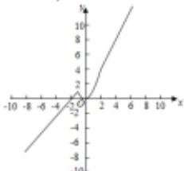

line

| x | y |
|---|---|
| -10 | -8 |
| -8 | -6 |
| -6 | -4 |
| -4 | -2 |
| -2 | 0 |
| 0 | 2 |
| 2 | 4 |
| 4 | 6 |
| 6 | 8 |
| 8 | 10 |
| 10 | 12 |

7. 已知函数 $f(x)=|x-1|-x$ .

(1) 用分段函数的形式表示该函数；  
(2) 在右边所给的坐标系中画出该函数的图象；  
(3) 写出该函数的定义域、值域、单调区间（不要求证明）.

【解答】（1）去掉绝对值， $f(x)=\left\{\begin{aligned}-1,&x\geq1\\ -2x+1,&x<1\end{aligned}\right.$

(2) 函数的图象:

(3) 函数的定义域为 R，值域为 $[-1, +\infty)$

$(-∞, 1)$ 为函数的减区间.

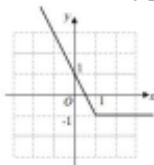

8. 已知函数 $f(x) = \begin{cases} x^2 + 2x, & (x < 0) \\ 0, & (x = 0) \\ -x^2 + 2x, & (x > 0) \end{cases}$

(1) 画出函数 f(x) 图象；

(2) 求函数 f(x) 在区间 $[-2, 2]$ 上的最大值和最小值；  
（3）若函数 $f(x)$ 在区间[-1, a-2]上单调递增，求实数 $a$ 的取值范围.

【解答】解：（1）函数 $f(x)$ 图象如下：

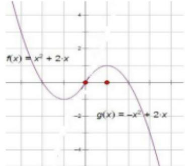

line

| Point | Value     |
|-------|-----------|
| f(x)  | x² + 2x   |
| g(x)  | -x² + 2x  |

（2）由图象观察可知，函数 $f(x)$ 在区间[-2, 2]上的最大值为1，最小值为-1.  
(3) ∵由图象可知 $f(x)$ 在 $[-1, 1]$ 上单调递增，

$\therefore \left\{ \begin{array}{l} a - 2 > -1 \\ a - 2 \leq 1 \end{array} \right.$ ，则有 $1 < a \leq 3$

解得 $1 < a \leqslant 3$ .

# 三. 求参 (共6小题)

9. 已知函数 $f(x) = \begin{cases} 1 - x, & x \leq 0 \\ a^x, & x > 0 \end{cases}$ ，若 $f(1) = f(-1)$ ，则实数 $a$ 的值等于（）

A. 1

B. 2

C. 3

【解答】解：∵函数 $f(x)=\left\{\begin{aligned}1-x,&x\leq0\\ a^{x},&x>0\end{aligned}\right.$

$$
\therefore f (- 1) = 2, f (1) = a,
$$

若 $f(1) = f(-1)$ ，

$$
\therefore a = 2,
$$

故选：B.

10. 已知函数 $f(x) = \begin{cases} x^{2} + 1, & x \leq 0 \\ -2x, & x > 0 \end{cases}$ ，若 $f(x) = 5$ ，则 x 的值是（）

A.-2

B. 2或 $-\frac{5}{2}$

C. 2 或

-2

D. 2或-2或 $-\frac{5}{2}$

【解答】解：由题意，当 $x \leqslant 0$ 时， $f(x) = x^{2} + 1 = 5$ ，得 $x = \pm 2$ ，又 $x \leqslant 0$ ，所以 x = -2；

当 $\mathbf{x} > 0$ 时， $f(x) = -2x = 5$ ，得 $x = -\frac{5}{2}$ ，舍去。

故选：A.

11. 已知函数 $y=\begin{cases}x^{2}+1(x\leq0)\\2x(x>0)\end{cases}$ ，若 $f(a)=10$ ，则 a 的值是（）

A. 3 或 -3

B.-3或5

C.-3

【解答】解：若 $a \leqslant 0$ ，则 $f(a) = a^2 + 1 = 10$

∴a=-3(a=3舍去)

若 $a > 0$ ，则 $f(a) = 2a = 10$

$$
\therefore a = 5
$$

综上可得，a=5 或 a=-3

故选：B.

12. 设函数 $f(x) = \begin{cases} -x, & x \leq 0 \\ x^2, & x > 0 \end{cases}$ ，若 $f(\alpha) = 9$ ，则 $\alpha = -9$ 或 3。

【解答】解：由题意可得 $\left\{ \begin{array}{l} \alpha \leq 0 \\ -\alpha = 9 \end{array} \right.$ 或 $\left\{ \begin{array}{l} \alpha > 0 \\ \alpha^2 = 9 \end{array} \right.$

$$
\therefore \alpha = - 9 \text {或} \alpha = 3
$$

故答案为：-9或3

13. 设函数 $f(x) = \begin{cases} 2^x, & (x < 2) \\ \frac{2x}{x + 3}, & (x \geq 2) \end{cases}$ ，若 $f(x_0) > 1$ ，则 $x_0$ 的取值范围是 $(0, 2) \cup (3, +\infty)$ .

【解答】解：当 x<2 时， $2^{x}>1$ ，可得 0<x<2，

当 $x \geqslant 2$ 时， $\frac{2x}{x+3} > 1$ 解得 x > 3，

分析可得，

$f(x_{0})>1$ ，则 $x_{0}$ 的取值范围是： $(0,2)\cup(3,+\infty)$

故答案为： $(0, 2) \cup (3, +\infty)$

14. 已知函数 $f(x) = \begin{cases} x^2 + 1, & x \geq 0 \\ 1, & x < 0 \end{cases}$ ，则满足不等式 $f(1 - x^2) > f(2x)$ 的 $x$ 的范围是 $(-1, \sqrt{2} - 1)$ .

【解答】解：由题意可得， $\left\{\begin{aligned}1-x^{2}&>0\\ 2x&<0\end{aligned}\right.$ 或 $\left\{\begin{aligned}1-x^{2}&>2x\\ 2x&\geq0\end{aligned}\right.$

解得 $-1 < x < 0$ 或 $0 \leq x < \sqrt{2} - 1$

故所求 x 的取值范围为 $(-1, \sqrt{2}-1)$ .

故答案为： $(-1, \sqrt{2}-1)$ .

# 四. 单调性（共7小题）

15. 已知 $f(x) = \begin{cases} (3a - 1)x + 4a, & x \leq 1 \\ \log_{a}x, & x > 1 \end{cases}$ 是 $(-∞, +∞)$ 上的减函数，那么 a 的取值范围是（）

A. (0, 1)

B. $(0,\ \frac{1}{3})$

C. $\left[\frac{1}{7}\right]$ ,

$\frac{1}{3}$

D. $\left[\frac{1}{7},1\right)$

【解答】解：依题意，有 0 < a < 1 且 3a - 1 < 0，

解得 $0 < a < \frac{1}{3}$ ,

又当 $x \leqslant 1$ 时， $(3a - 1)x + 4a \geqslant 7a - 1$

当 x>1 时， $\log_{a}x<0$ ，

因为 $f(x)$ 在 $R$ 上单调递减，所以 $7a - 1 \geqslant 0$ 解得 $a \geqslant \frac{1}{7}$

综上： $\frac{1}{7} \leq a < \frac{1}{3}$

故选：C.

16. 若函数 $f(x) = \begin{cases} (3a - 1)x + a, & x < 1 \\ -ax, & x \geq 1 \end{cases}$ 是定义在 $\mathbf{R}$ 上的减函数，则 $a$ 的取值范围为 $\left[\frac{1}{5}, \frac{1}{3}\right)$ .

【解答】解：根据题意，函数 $f(x)=\left\{\begin{aligned}(3a-1)x+a,&x<1\\ -ax,&x\geq1\end{aligned}\right.$

是定义在 $\mathbf{R}$ 上的减函数，

则 $\left\{\begin{aligned}&3a-1<0\\ &-a<0\\ &3a-1+a\geq-a\end{aligned}\right.$ ，解可得 $\frac{1}{5}\leq a<\frac{1}{3}$

即 a 的取值范围为 $\left[\frac{1}{5}, \frac{1}{3}\right)$ ，

故答案为： $\left[\frac{1}{5},\frac{1}{3}\right)$

17. 已知函数 $f(x) = \begin{cases} (a - 2)x + 3, & x \leq 1 \\ \frac{2a}{x}, & x > 1 \end{cases}$ 在 $(- \infty, +\infty)$

上是减函数，则 a 的取值范围为（）

A. (0, 1)

B. $(0,1]$

C. (0,

2)

D. $(0,2]$

【解答】解：∵函数 $f(x)=\left\{\begin{aligned}&(a-2)x+3,&x\leq1\\&\frac{2a}{x},&x>1\end{aligned}\right.$ 在（-

$\infty, +\infty)$ 上是减函数，

$$
\therefore \left\{ \begin{array}{l} a - 2 <   0 \\ 2 a > 0 \\ a - 2 + 3 \geq \frac {2 a}{1} \end{array} , \right.
$$

求得 $0 < a \leq 1$ ,

故选：B.

18. 已知函数 $f(x) = \begin{cases} -x^2 + 2(a - 1)x, & x \leq 1 \\ (5 - a)x + 4, & x > 1 \end{cases}$ 满足对任意 $x_1 \neq x_2$ ，都有 $\frac{f(x_1) - f(x_2)}{x_1 - x_2} > 0$ 成立，则实数 $a$ 的取值范围是 [2, 4].

【解答】解：根据题意，函数  \( f(x)=\left\{\begin{aligned}-x^{2}+2(a-1)x,&x\leq1\\(5-a)x+4,&x>1\end{aligned}\right. \)  满足对任意  \( x\_{1}\neq x\_{2} \) ，都有  \( \frac{f(x\_{1})-f(x\_{2})}{x\_{1}-x\_{2}} \) 
>0 成立，则函数  \( f(x) \)  在 R 上为增函数，

必有 $\left\{\begin{aligned}5-a&>0\\ a-1&\geq1\\ -1+2(a-1)&\leq5-a+4\end{aligned}\right.$ ，解可得 $2\leqslant a\leqslant4$

即 a 的取值范围为 $[2, 4]$ ;

故答案为：[2，4].

19. 若 $f(x) = \begin{cases} (4 - \frac{a}{2})x + 2, & x < 1 \\ a^x, & x \geq 1 \end{cases}$ 在 $(- \infty, +\infty)$ 上是增函数，则 $a$ 的取值范围为 [4, 8).

【解答】解：函数 $f(x)=\left\{\begin{aligned}&(4-\frac{a}{2})x+2,&x<1\\&a^{x},&x\geq1\end{aligned}\right.$ 在 $(-∞,+∞)$ 上是增函数，

可得： $\left\{ \begin{array}{l}4 - \frac{\mathrm{a}}{2} >0\\ \mathrm{a} > 1\\ 4 - \frac{\mathrm{a}}{2} +2\leq \mathrm{a} \end{array} \right.$

解得： $4 \leq a < 8$

故实数 a 的取值范围是：[4，8).

故答案为：[4，8）.

（多选）20．已知函数 $f(x)=\left\{\begin{aligned}a^{-x},&x<-1\\ (1-2a)x+3a,\quad x\geq-1\end{aligned}\right.$ 是 R 上的增函数，则实数 a 的值可以是（）

A. 4

B. 3

C. $\frac{1}{3}$

【解答】解：因为 $f(x)=\left\{\begin{aligned}a^{-x},&x<-1\\ (1-2a)x+3a,&x\geq-1\end{aligned}\right.$ 是 R 上的增函数，

所以 $\left\{\begin{aligned}\frac{1}{a}&>1\\ 1&-2a>0\\ 2a&-1+3a\geq a\end{aligned}\right.$ ，

解得 $\frac{1}{4} \leq a < \frac{1}{2}$ .

故选：CD.

21. 已知函数 $f(x) = \begin{cases} x^2 + 2ax + 3, & x \leq 1 \\ ax + 1, & x > 1 \end{cases}$ 是 $R$ 上的减函数，则实数 $a$ 的取值范围是 $[-3, -1]$ .

【解答】解：函数 $f(x)=\left\{\begin{aligned}x^{2}+2ax+3, & x\leq1 \\ ax+1, & x>1\end{aligned}\right.$ 是 R 上的减函数，

可得 $\left\{\begin{aligned}a&<0\\ -a&\geq1\\ 1+2a+3&\geq a+1\end{aligned}\right.$ ，解可得a的取值范围为： $[-3,$ -1].

故答案为： $[-3,-1]$ .

# 五. 解析式 (共3小题)

22. 已知函数 $f(x)$ 是定义在 $R$ 上的偶函数，当 $x \geqslant 0$ 时， $f(x) = x^2 - 2x - 1$ .

(1) 求 $f(x)$ 的函数解析式，并用分段函数的形式给出；  
(2) 作出函数 f(x) 的简图；  
(3) 写出函数 $f(x)$ 的单调区间及最值.

【解答】解：（1）当 $x < 0$ 时， $-x > 0$

则 $f(-x) = (-x)^{2} - 2(-x) - 1 = x^{2} + 2x - 1$ ,

∵f(x)是偶函数，

$$
\therefore f (x) = f (- x) = x ^ {2} + 2 x - 1,
$$

$$
\therefore f (x) = \left\{ \begin{array}{l} x ^ {2} - 2 x - 1, x \geq 0 \\ x ^ {2} + 2 x - 1, x <   0 \end{array} . \right.
$$

(2) 函数 $f(x)$ 的简图:

(3) 单调增区间为[-1, 0]和[1, +∞)，

单调减区间为 $(- \infty, -1]$ 和[0，1]，

当 x=1 或 -1 时， $f(x)$ 有最小值 -2.

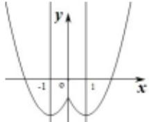

23. 已知函数 $f(x)$ 是定义在 $R$ 上的奇函数，且当 $x \geqslant 0$ 时， $f(x) = x^2 - 2x$ ，则 $y = f(x)$ 在 $x < 0$ 时的解析式为 $f(x) = -x^2 - 2x$ .

【解答】解：根据题意，设 x<0，则 -x>0，

则 $f(-x) = (-x)^{2} - 2(-x) = x^{2} + 2x$ ,

又由 $f(x)$ 为奇函数，则 $f(x) = -f(-x) = -x^{2} - 2x$

故答案为： $-x^{2}-2x$ .

24. 设函数 $f(x)$ 是定义域为 $R$ 上的奇函数，当 $x > 0$ 时， $f(x) = -x^2 + x + 1$ ，则函数 $f(x)$ 在 $R$ 上的解析式为 $f(x) =$

$$
\left\{ \begin{array}{l l} - x ^ {2} + x + 1 & x > 0 \\ 0 & x = 0 \\ x ^ {2} + x - 1 & x <   0 \end{array} \right..
$$

【解答】解：∵f(x)是R上的奇函数，∴f(0)=0，

又 $\mathbf{x} > 0$ 时， $f(x) = -x^{2} + x + 1$

∴设x<0，-x>0，则 $f(-x)=-x^{2}-x+1=-f(x)$ ，

$$
\therefore \mathrm{x} <   0 \text {时,} f (\mathrm{x}) = \mathrm{x} ^ {2} + \mathrm{x} - 1,
$$

$$
\therefore \mathrm{f} (\mathrm{x}) = \left\{ \begin{array}{l l} - \mathrm{x} ^ {2} + \mathrm{x} + 1 & \mathrm{x} > 0 \\ 0 & \mathrm{x} = 0 \\ \mathrm{x} ^ {2} + \mathrm{x} - 1 & \mathrm{x} <   0 \end{array} \right..
$$

故答案为： $f(x) = \begin{cases} -x^{2} + x + 1 & x > 0 \\ 0 & x = 0 \\ x^{2} + x - 1 & x < 0 \end{cases}$

# 题型14 函数模型

1. 青少年视力是社会普遍关注的问题，视力情况可借助视力表测量。通常用五分记录法和小数记录法记录视力数据，五分记录法的数据 $L$ 和小数记录法的数据 $V$ 满足 $L = 5 + \lg V$ 。已知某同学视力的五分记录法的数据为4.9，则其视力的小数记录法的数据约为（）（ $\sqrt[10]{10} \approx 1.259$ ）

A. 1.5

B. 1.2

C. 0.8

【解答】解：在 $L = 5 + \lg V$ 中， $L = 4.9$ ，所以 $4.9 = 5 + \lg V$ ，即 $\lg V = -0.1$

解得 $V = 10^{-0.1} = \frac{1}{10^{0.1}} = \frac{1}{\sqrt[10]{10}} = \frac{1}{1.259}\approx 0.8$

所以其视力的小数记录法的数据约为 0.8。

故选：C.

2. Logistic 模型是常用数学模型之一，可应用于流行病学领域。有学者根据公布数据建立了某地区新冠肺炎累计确诊病例数 $I(t)$

（t的单位：天）的Logistic模型： $I(t) = \frac{K}{1 + e^{-0.23(0 - 53)}}$ ，其中 $K$ 为最大确诊病例数．当 $I(t^{*}) = 0.95K$ 时，标志着已初步遏制疫情，则 $t^{\prime}$ 约为（ ）（ln19≈3）

A. 60

B. 63

C. 66

【解答】解：由已知可得 $\frac{K}{1 + e^{-0.23(g^{*} - 5.3)}} = 0.95K$ ，解得 $e^{-0.23(t^{*} - 5.3)} = \frac{1}{19},$

两边取对数有-0.23 $(t^{*}-53)=-ln19$ ，

解得 $t \approx 66$

故选：C.

3. 基本再生数 $R_{0}$ 与世代间隔 T 是新冠肺炎的流行病学基本参数，基本再生数指一个感染者传染的平均人数，世代间隔指相邻两代间传染所需的平均时间。在新冠肺炎疫情初始阶段，可以用指数模型： $I(t)=e^{r}$ 描述累计感染病例数 $I(t)$ 随时间 t（单位：天）的变化规律，指数增长率 r 与 $R_{0}$ ，T 近似满足 $R_{0}=1+rT$ 。有学者基于已有数据估计出 $R_{0}=3.28, T=6$ 。据此，在新冠肺炎疫情初始阶段，累计感染病例数增加 1 倍需要的时间约为（）（ $ln2\approx0.69$ ）

A. 1.2 天

B. 1.8 天

C. 2.5

天

D. 3.5天

【解答】解：把 $R_0 = 3.28$ ， $T = 6$ 代入 $R_0 = 1 + rT$ ，可得 $r = 0.38$ $\therefore I(t) = e^{0.38}$

当 t=0 时， $I(0)=1$ ，则 $e^{0.38}=2$ ，

两边取对数得 $0.38t = ln2$ ，解得 $t = \frac{ln2}{0.38}\approx 1.8$

故选：B.

4. 已知某物种经过 $x$ 年后的种群数量 $y$ 近似满足冈珀茨模型: $y = k \cdot 9^{\varepsilon^{-0.1x}} (k > 0)$ , 当 $x = 0$ 时, $y$ 的值表示 2021 年年初的种群数量. 若 $t (t \in \mathbf{N}^{*})$ 年后, 该物种的种群数量不超过 2021 年初种群数量的 $\frac{1}{3}$ , 则 $t$ 的最小值为 ( ) (参考值: $\ln 2 \approx 0.693$ )

A. 6

B. 7

C. 8

【解答】解：由题意可知， $y_{0}=k\cdot9^{e^{0}}=9k$

$\therefore y_{1}\leq \frac{1}{3} y_{0}$ ，即 $k\cdot 9^{8 - 0.1x}\leq \frac{1}{3}\times 9k$

$\therefore e^{-0.1t} \leq \frac{1}{2}$ ，即 $t \geq \frac{\ln 2}{0.1} \approx 6.93$

故选：B.

5. 人们用分贝（dB）来划分声音的等级，声音的等级 $d(x)$ （单位：dB）与声音强度 $x$ （单位 $W/m^2$ ）满足 $d(x) = 9lg\frac{x}{1\times 10^{-13}}$ ，一般两人小声交谈时，声音的等级约为 $54dB$ ，在一个40人的教室讲课时，老师声音的强度约为一般两人小声交谈时声音强度的10倍，则老师声音的等级约为（）

A. 36dB

B. 63dB

C. 72dB

D. 81dB

【解答】解：设一般两人小声交谈时声音强度为 x，

则 $54 = 9lg\frac{x}{1\times 10^{-13}}$ ，即 $lg\frac{x}{1\times 10^{-13}} = 6$

所以 $9lg\frac{10x}{1\times 10^{-13}} = 9(lg10 + lg\frac{x}{1\times 10^{-13}}) = 9\times (1 + 6) = 63$ （dB），

则老师声音的等级约为 63（dB）。

故选：B.

6. 某科技公司为解决芯片短板问题，计划逐年加大芯片研发资金投入。若该公司2020年全年投入研发资金1200万元，在此基础上，每年投入的研发资金比上一年增长 $12\%$ ，则该公司全年投入的研发资金开始超过2000万元的年份是（）（参考数据： $lg1.12 \approx 0.05$ ， $lg3 \approx 0.48$ ， $lg2 \approx 0.30$ ）

A. 2023 年

B. 2024年

C. 2025

年

D. 2026年

【解答】解:设经过 x 年后全年投入的研发资金开始超过 2000 万元，

则 1200·(1+0.12) $^{x}$ >2000，

即 $1.12^{x} > \frac{5}{3}$ ，所以 $x > \log_{1.12} \frac{5}{3}$

又 $log_{1.12}\frac{5}{3}=\frac{lg5-lg3}{lg1.12}=\frac{1-lg2-lg3}{lg1.12}\approx\frac{1-0.30-0.48}{0.05}=4.4$

则 $x > 4.4$

所以经过5年后全年投入的研发资金开始超过2000万元，

则该公司全年投入的研发资金开始超过 2000 万元的年份是 2025 年.

故选：C.

7. 教室通风的目的是通过空气的流动，排出室内的污浊空气和致病微生物，降低室内二氧化碳和致病微生物的浓度，送进室外的新鲜空气。按照国家标准，教室内空气中二氧化碳日平均最高容许浓度应小于等于0.1%。经测定，刚下课时，空气中含有0.2%的二氧化碳，若开窗通风后教室内二氧化碳的浓度为y%，且y随时间t（单位：分钟）的变化规律可以用函数 $y=0.05+\lambda e^{-\frac{t}{12}}$ （ $\lambda\in R$ ）描述，则该教室内的二氧化碳浓度达到国家标准至少需要的时间为（）（参考数据 $ln3\approx1.1$ ）

A. 10 分钟

B. 14 分钟

C. 15

分钟

D. 20 分钟

【解答】解：由题意知，当 t=0 时，y=0.2，

$\therefore 0.05 + \lambda e^{0} = 0.2$ ，即 $\lambda = 0.15$

$\therefore y = 0.05 + 0.15e^{-\frac{t}{12}} \leq 0.1$ ，解得 $e^{-\frac{t}{12}} \leq \frac{1}{3}$ ，

$$
\therefore - \frac {t}{1 2} \leq - l n 3, t \geqslant 1 2 l n 3 \approx 1 3. 2,
$$

故该教室内的二氧化碳浓度达到国家标准至少需要的时间为14分钟.

故选：B.

8. 草地贪夜蛾是一种起源于美洲的繁殖能力很强的农业害虫，日增长率为 $8\%$ ，若100只草地贪夜蛾经过 $t$ 天后，数量落在区间 $(2\times 10^{6},2\times 10^{7}]$ 内，则 $t$ 的值可能为（ ）（参考数据：lg1.08≈0.0334，lg2≈0.301）

A. 80

B. 120

C. 150

【解答】解：由题意可得 $\left\{\begin{aligned}100(1+0.08)^{t}&>2\times10^{6}\\ 100(1+0..8)^{t}&\leq2\times10^{7}\end{aligned}\right.$ ，两边取

对数得 $\left\{\begin{aligned}tlg1.08&>lg2+4\\ tlg1.08&\leq lg2+5\end{aligned}\right.$

$\therefore t > \frac{lg2 + 4}{lg1.08} \approx \frac{0.301 + 4}{0.0334} \approx 128.77 \approx 129$ ，且 $t \leq \frac{lg2 + 5}{lg1.08} \approx \frac{0.301 + 5}{0.0334} \approx 158.71 \approx 159$ ，即 $t \in (129, 159)$ ，对照各选项，只有 $C$ 符合。

故选：C.

9. 为了研究疫情有关指标的变化，现有学者给出了如下的模型：假定初始时刻的病例数为 $N_0$ ，平均每个病人可传染给 $K$ 个人，平均每个病人可以直接传染给其他人的时间为 $L$ 天，在 $L$ 天之内，病例数目的增长随时间 $t$ （单位：天）的关系式为 $N(t) = N_0(1 + K)^t$ ，若 $N_0 = 2$ ， $K = 2.4$ ，则利用此模型预测第5天的病例数大约为（）（参考数据： $\log_{1.4}454 \approx 18$ ， $\log_{2.4}454 \approx 7$ ， $\log_{3.4}454 \approx 5$ ）

A. 260

B. 580

C. 910

【解答】解：∵ $N_{0}=2,\ K=2.4,\ N(t)=N_{0}(1+K)^{t}$

$$
\therefore N (t) = 2 (1 + 2. 4) ^ {t},
$$

$$
\because \log_ {3. 4} 4 5 4 \approx 5,
$$

$$
\therefore 3. 4 ^ {5} \approx 4 5 4,
$$

∴当 t=5 时， $N(5)=2\times3.4\approx908$ ，910 与 908 比较接近。
故选：C.

# 题型 15: 函数零点问题

# 类型1练习

1. 函数 $f(x) = \sin x + 3|\sin x|$ ， $x \in [0, 2\pi]$ 的图象与直线 $y = k$ 有且仅有两个不同的交点，则 $k$ 的取值范围是（）

A. $[-2, 2]\mathrm{B}$ . $(-1, 0) \cup (0, 3)$

C. (2, 4) D. (1, 4)

【解答】解：当 $x \in [0, 2\pi]$ 时，函数 $f(x) =$

$\sin x + 3|\sin x| = \begin{cases} 4\sin x, & x \in [0, \pi] \\ -2\sin x, & x \in (\pi, 2\pi] \end{cases}$ 的图象

与直线 y=k 有且仅有两个不同的交点，

∴2<k<4,

则 k 的取值范围为 $(2, 4)$ ，

故选：C.

2. 已知函数 $f(x) = \begin{cases} x^2 + 2x - 3, & x \leq 0 \\ -2 + \ln x, & x > 0 \end{cases}$ 的图象与直线 $y = k$ 有

三个不同的交点，则 $k$ 的取值范围是（）

A. $(-4,-3)$

B. $[-4,-3)$

C. $[-4,-3]$

D. $(-4,-3]$

【解答】解：作函数 $f(x)=\left\{\begin{aligned}x^{2}+2x-3, & x\leq0\\ -2+lnx, & x>0\end{aligned}\right.$ 和y=k的图象，如图所示，可知k的取值范围是 $-4<k\leq-3$ .

故选：D.

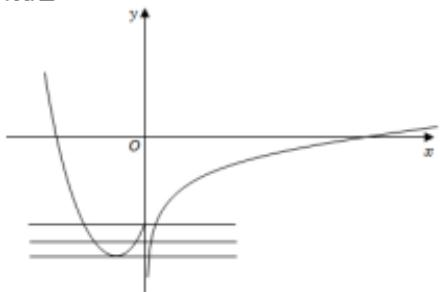

text_image

Mathematical graph showing a parabola and a line intersecting at origin, with horizontal lines indicating levels of the function.

3. 已知函数 $f(x)$ 满足：①定义域为 $\mathbf{R}$ ；② $\forall x \in \mathbb{R}$ ，都有 $f(x + 2) = f(x)$ ；③当 $x \in [-1, 1]$ 时， $f(x) = -|x| + 1$ ，则方程 $f(x) = \frac{1}{2} \log_2 |x|$ 在区间 $[-3, 5]$ 内解的个数是（）

A. 5

B. 6

C. 7

D. 8

【解答】解：∵ $\forall x \in R$ ，都有 $f(x+2) = f(x)$ ，

∴函数的周期为2，

在同一坐标系中，作出 $f(x)$ 的图象，再画出 $y=\frac{1}{2}\log_{2}|x|$ 的图象

观察得出交点数为 5，

即方程 $f(x) = \frac{1}{2} \log_2 |x|$ 在区间 $[-3, 5]$ 内解的个数是 5.

故选：A.

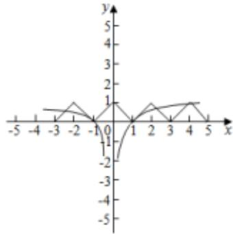

line

| x | y |
|---|---|
| -4 | 0 |
| -3 | 0.5 |
| -2 | 1 |
| -1 | 0 |
| 0 | -1 |
| 1 | 0 |
| 2 | 1 |
| 3 | 0.5 |
| 4 | 1 |
| 5 | 0.5 |

4. 已知函数 $f(x) = \begin{cases} \ln x, & x > 0 \\ e^x + \frac{3}{2}, & x \leq 0 \end{cases}$ ，若关于 $x$ 的方程 $m - f(x) = 0$ 有两个不同的实数根，则实数 $m$ 的取值范围为（）

A. $(\frac{3}{2}, +\infty)\mathrm{B.}(-\infty, \frac{3}{2}] \cup (\frac{5}{2}, +\infty)$

C. $(\frac{3}{2},\frac{5}{2} ]D.$ $(- \infty ,\frac{3}{2})$

【解答】解：关于 $x$ 的方程 $m - f(x) = 0$ 有两个不同的实数根，

即 $y = m$ 与 $y = f(x)$ 有两个不同的交点，

作函数 $y = m$ 与函数 $y = f(x)$ 的图象如下，

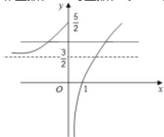

line

| x | y |
|---|---|
| 0 | 0 |
| 1 | 5/2 |
| 3/2 | 3/2 |
| 1 | 1 |

结合图象知，

当 y=m 与 $y=f(x)$ 有两个不同的交点时， $\frac{3}{2}<m\leq\frac{5}{2}$ ;

故选：C.

5. 已知定义在 $\mathbf{R}$ 上的奇函数 $f(x)$ 满足 $f(2 - x) = f(2 + x)$ ，且在区间[0, 2]上是增函数，若方程 $f(x) = m (m > 0)$ ，在区间[-8, 8]上有四个不同的根 $x_{1}, x_{2}, x_{3}, x_{4}$ ，则 $x_{1} + x_{2} + x_{3} + x_{4} = (\quad)$

A. 6

B.-8

C.-6

D. 10

【解答】解：∵ $f(x+4)=-f(x)$ ，

$$
\therefore f (x + 8) = - f (x + 4) = f (x),
$$

即函数的周期是8，

且 $f(x + 4) = -f(x) = f(-x)$

则函数的对称轴为： $\frac{x + 4 - x}{2} = 2$

作出函数 $f(x)$ 的简图，

若方程 $f(x) = m (m > 0)$ 在区间 $[-8, 8]$ 上有四个不同的根 $x_{1}, x_{2}, x_{3}, x_{4}$ ,

则四个根分别关于 $x = 2$ 和 $x = -6$ 对称，

不妨设 $x_{1}<x_{2}<x_{3}<x_{4}$ ,

则 $x_{1}+x_{2}=-12,\quad x_{3}+x_{4}=4,$

则 $x_{1}+x_{2}+x_{3}+x_{4}=-12+4=-8$

故选：B.

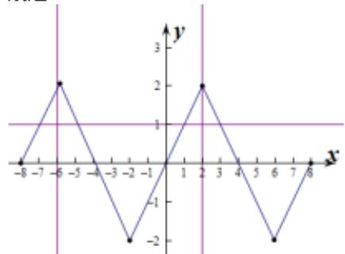

line

| x | y |
|---|---|
| -8 | -1 |
| -7 | 1 |
| -6 | 2 |
| -5 | 0 |
| -4 | -1 |
| -3 | -2 |
| -2 | -1 |
| -1 | 0 |
| 0 | 1 |
| 1 | 0 |
| 2 | 2 |
| 3 | 0 |
| 4 | -1 |
| 5 | -2 |
| 6 | -1 |
| 7 | 0 |
| 8 | 1 |

6. 已知函数 $f(x) = \begin{cases} \ln x + e^x - 3, & x \geq 1 \\ x^2 + ax + 2, & x < 1 \end{cases}$ ，有且仅有 2 个零点，则 $a$ 的范围是 $a < -3$ 或 $a = 2\sqrt{2}$ .

【解答】解：当 $x \geqslant 1$ 时， $f(x)$ 为增函数，且 $f(1) = e - 3 < 0$

∴ $f(x)$ 在 $[1, +\infty)$ 上只有 1 个零点，

$\therefore f(x) = x^{2} + ax + 2$ 在 $(- \infty, 1)$ 上有1个零点，

$\therefore \left\{ \begin{array}{l} a^{2} - 8 = 0 \\ -\frac{a}{2} < 1 \end{array} \right.$ 或 $3 + a < 0$

解得 $a=2\sqrt{2}$ 或 a<-3.

故答案为： $a=2\sqrt{2}$ 或a<-3.

7. 已知函数 $f(x) = |2^x - 1| - a$ , $g(x) = x^2 - 4|x| + 2 - a$ ，则（）

A. 当 $g(x)$ 有 2 个零点时， $f(x)$ 只有 1 个零点

B. 当 $g(x)$ 有 3 个零点时， $f(x)$ 有 2 个零点

C. 当 $f(x)$ 有 2 个零点时， $g(x)$ 有 2 个零点

D. 当 $f(x)$ 有2个零点时， $g(x)$ 有4个零点

【解答】解：分别令函数 $f(x) = |2^x - 1| - a = 0$ ， $g(x) = x^2 - 4|x| + 2 - a = 0$ ，

即 $|2^{x}-1|=a,\quad x^{2}-4|x|+2=a$ ，它们的根为y=a分别与 $y=|2^{x}-1|$ 和 $y=x^{2}-4|x|+2$ 交点的横坐标，

作出 $y = |2^{x} - 1|$ 和 $y = x^{2} - 4|x| + 2$ 的大致图象，如图所示：

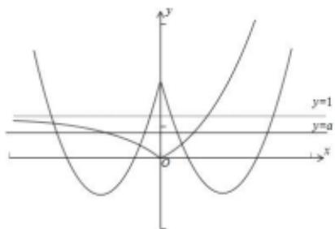

text_image

y
y=1
y=a
O
x

由图可知，当 $g(x)$ 有 2 个零点时， $f(x)$ 无零点或只有 1 个零点，A 错误；

当 $g(x)$ 有 3 个零点时， $f(x)$ 只有 1 个零点，B 错误；

当 $f(x)$ 有2个零点时， $g(x)$ 有4个零点，C错误，D正确.
故选：D.

# 类型2练习

1. 已知方程 $\frac{x}{x - 1} - m = 0$ 在区间[2，5]上有解，则实数 $m$ 的取值范围是（）

A. $\left(\frac{5}{4},2\right)$

B. $\left[\frac{5}{4},2\right]$

C. $\left[\frac{5}{4},2\right)$

D. $(- \frac{5}{4}, 2)$

【解答】解：由 $\frac{x}{x-1}-m=0$ 可得： $m=\frac{x}{x-1}$

令 $f(x)=\frac{x}{x-1}=1+\frac{1}{x-1}$ .

∴ $f(x)$ 在 [2, 5] 上单调递减，

又 $f(2) = 2, f(5) = \frac{5}{4}$ ,

$$
\therefore \frac {5}{4} \leq f (x) \leqslant 2.
$$

∴ m 的取值范围是 $\left[\frac{5}{4}, 2\right]$ .

故选：B.

2. 若关于 $x$ 的方程 $x^{2} - mx + 2 = 0$ 在区间[1, 2]上有解，则实数 $m$ 的取值范围是 $[2\sqrt{2}, 3]$ .

【解答】解：∵方程 $x^{2}-mx+2=0$ 在区间 $[1,2]$ 上有解

∴函数 $f(x)=x^{2}-mx+2$ 在区间 $[1,2]$ 上与 x 轴相交

①有1个交点时，满足

$$
\left\{ \begin{array}{l} \Delta > 0 \\ f (1) f (2) \leq 0 \end{array} \text {或} \left\{ \begin{array}{l} \Delta = 0 \\ 1 \leq \frac {m}{2} \leq 2 \end{array} \right. \right.
$$

$$
\therefore m = 3 \text {或} m = 2 \sqrt {2}
$$

②有2个交点时，满足 $\left\{\begin{aligned}\Delta&>0\\ f(1)&\geq0\\ f(2)&\geq0\\ 1&\leq\frac{m}{2}\leq2\end{aligned}\right.$

$$
\therefore 2 \sqrt {2} <   m \leqslant 3.
$$

综上所述，得 $m$ 的取值范围是 $[2\sqrt{2}, 3]$ .

3. 直线 $y = 1$ 与曲线 $y = x^{2} - |x| + a$ 有四个交点，则 $a$ 的取值范围是（）

A. $[1, \frac{5}{4}]$

B. $(1,\frac{5}{4}]$

C. $[1, \frac{5}{4})$

D. $(1,\frac{5}{4})$

【解答】解：方法1：如图，作出 $y=x^{2}-|x|+a$ 的图象，

若要使 $y = 1$ 与其有四个交点，则需满足 $a - \frac{1}{4} < 1 < a$ ，解得 $1 < a < \frac{5}{4}$ ，

即 a 的取值范围是 $(1, \frac{5}{4})$ ，

故选：D.

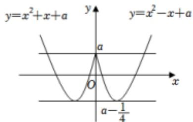

text_image

y=x²+x+a
y=x²-x+a
a
O
x
a-1/4

方法2： $x^{2} - |x| + a = 1$ 变形为 $x^{2} - |x| - 1 = -a$ ，作出 $y = x^2 -|x|$ -1的图象，使 $y = -a$ 与其有四个交点，解得 $1 <   a <   \frac{5}{4}$

4. 已知方程 $\sin^2 x - 4\sin x + 1 - a = 0$ 有解，则实数 $a$ 的取值范围是（）

A. $[-3,6]$

B. $[-2,6]$

C. $[-3,2]$

D. $[-2, 2]$

【解答】解：分离出参数 a，

$$
\begin{array}{l} \because a = (\sin x - 2) ^ {2} - 3, | \sin x | \leqslant 1, \\ \therefore - 2 \leqslant a \leqslant 6. \\ \end{array}
$$

故选：B.

5. 已知关于 $a$ 的方程 $2^{x} + 1 = a^2 + a$ 有解，则实数 $a$ 的取值范围是

$$
\underline {{a}} > \frac {- 1 + \sqrt {5}}{2} \text {或} a <   \frac {- 1 - \sqrt {5}}{2}.
$$

【解答】解：∵ $y=2^{x}+1>1$ ，

∴若关于a的方程 $2^{x}+1=a^{2}+a$ 有解，

则 $a^2 + a > 1$

即 $a^{2}+a-1>0$ ,

解得 $a > \frac{-1 + \sqrt{5}}{2}$ 或 $a < \frac{-1 - \sqrt{5}}{2}$ ,

即实数 $a$ 的取值范围是 $a > \frac{-1 + \sqrt{5}}{2}$ 或 $a < \frac{-1 - \sqrt{5}}{2}$ ,

故答案为： $a > \frac{-1 + \sqrt{5}}{2}$ 或 $a < \frac{-1 - \sqrt{5}}{2}$

6. 已知关于 $x$ 的方程 $4^{x} + (a + 2) \cdot 2^{x} + 3 = 0$ 在 $x \in (-\infty, 0]$ 上有解，则实数 $a$ 的取值范围是 $(- \infty, -6]$ .

【解答】解：令 $t = 2^{x}$

$$
\because x \in (- \infty , 0 ],
$$

$$
\therefore 0 <   t \leqslant 1,
$$

∴关于 x 的方程 $4^{x}+(a+2)\cdot2^{x}+3=0$ 在 $x\in(-\infty,0]$ 上有解，

即 $y = a + 2$ 与 $g(t) = -\frac{t^2 + 3}{t}$ 在（0，1]上有交点，

$g(t)=-\frac{t^{2}+3}{t}=-\left(t+\frac{3}{t}\right)$ 在 $(0,1]$ 上单调递增，

且 $g(1) = -4$

$\therefore a + 2 \leqslant -4$ ，解得 $a \leqslant -6$

故答案为： $(-∞,-6]$ .

7. 已知 $a$ 是实数，函数 $f(x) = 2ax^2 + 2x - 3 - a$ ，如果函数 $y = f(x)$ 在区间 $[-1, 1]$ 上有零点，求 $a$ 的取值范围.

【解答】解：a=0 时，不符合题意，所以 $a \neq 0$ ，

又 $\therefore f(x) = 2ax^2 + 2x - 3 - a = 0$ 在 $[-1, 1]$ 上有解， $\Leftrightarrow (2x^2)$

-1) $a = 3 - 2x$ 在 $[-1, 1]$ 上有解 $\Leftrightarrow \frac{1}{a} = \frac{2x^2 - 1}{3 - 2x}$

在 $[-1, 1]$ 上有解，问题转化为求函数 $y = \frac{2x^2 - 1}{3 - 2x} [-1, 1]$ 上的值域；

设 $t = 3 - 2x, x \in [-1,1]$ , 则 $2x = 3 - t, t \in [1,5], y = \frac{1}{2} \cdot \frac{(t - 3)^2 - 2}{t} = \frac{1}{2}(t + \frac{7}{t} - 6)$ ,

设 $g(t)=t+\frac{7}{t}$ . $g'(t)=\frac{t^{2}-7}{t^{2}}$ , $t\in[1,\sqrt{7})$ 时, $g'(t)<0$ , 此函数 $g(t)$ 单调递减,

$t \in (\sqrt{7}, 5]$ 时， $g'(t) > 0$ ，此函数 $g(t)$ 单调递增，

∴y的取值范围是 $\left[\sqrt{7}-3,1\right]$ ,

$\therefore f(x) = 2ax^{2} + 2x - 3 - a = 0$ 在 $[-1, 1]$ 上有解 $\Leftrightarrow \frac{1}{a} \in [\sqrt{7} - 3, 1] \Leftrightarrow a \geqslant 1$ 或 $a \leq -\frac{3 + \sqrt{7}}{2}$ .

故 $a \geqslant 1$ 或 $a \leq -\frac{3 + \sqrt{7}}{2}$ .

8. 已知 a 是实数，函数 $f(x) = ax^{2} + 2x - 1$ ，如果函数 $y = f(x)$

在区间 $[-1,1]$ 上有零点，求a的取值范围.

【解答】解：由题意得 $ax^2 + 2x - 1 = 0$ 在区间 $[-1, 1]$ 上有解，当 $x = 0$ 时， $-1 = 0$ 显然不成立

当 $x \neq 0$ 时，原方程可化为 $a = \left(\frac{1}{x}\right)^2 - 2 \cdot \frac{1}{x} = \left(\frac{1}{x} - 1\right)^2 - 1$

$$
\frac {1}{x} \in (- \infty , - 1) \cup (1, + \infty).
$$

显然 a > -1.

故所求 a 的范围是 $(-1, +\infty)$ .

9. 已知方程 $2\sin x - \cos 2x - m = 0$ 在区间 $[- \frac{\pi}{2}, \frac{\pi}{2}]$ 有解，则实数 $m$ 的取值范围为（）

A. $[- \frac{3}{2}, 1]$

B. $[-1, 1]$

C. $\left[-\frac{3}{2}\right]$

, 3]

D. $[-1,3]$

【解答】解：由已知得 $m=2\sin x-\cos 2x$ ，令 $f(x)=2\sin x-\cos 2x$

则 $f(x) = 2\sin x - (1 - 2\sin^2 x) = 2\sin^2 x + 2\sin x - 1 =$

$$
2 (s i n x + \frac {1}{2}) ^ {2} - \frac {3}{2},
$$

$$
\because x \in \left[ - \frac {\pi}{2}, \frac {\pi}{2} \right],
$$

$$
\therefore \sin x \in [ - 1, 1 ],
$$

当 $sinx = -\frac{1}{2}$ 时， $f(x)_{min} = -\frac{3}{2}$ ，

当 $\sin x = 1$ 时， $f(x)_{\max} = 3$

因此 $f(x)\in [-\frac{3}{2},3]$

故选：C.

# 类型3练习

1. 已知函数 $f(x) = |x - 2| + 1$ ， $g(x) = kx$ 。若方程 $f(x) = g(x)$ 有两个不相等的实根，则实数 $k$ 的取值范围是（）

A. $(0,\frac{1}{2})$

B. $\left(\frac{1}{2},1\right)$

C. (1, 2)

D. $(2, +\infty)$

【解答】解：由题意可得，

函数 $f(x)$ 的图象和函数 $g(x)$ 的图象有两个交点，

如图所示： $k_{OA}=\frac{1}{2}$ ，数形结合可得 $\frac{1}{2}<k<1$ ，故选：B.

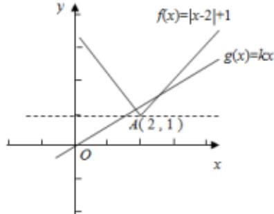

text_image

f(x)=|x-2|+1
g(x)=kx
A(2,1)
O
x
y

2. 已知函数 $f(x) = |x| + 1$ ， $g(x) = k(x + 2)$ 。若方程 $f(x) = g(x)$ 有两个不相等的实根，则实数 $k$ 的取值范围是（）

A. $(0,\frac{1}{2})$

B. $\left(\frac{1}{2},1\right)$

C. (1,

2)

D. $(2, +\infty)$

【解答】解：由题意可得函数 $f(x)$ 的图象和函数 $g(x)$ 的图象，因为 $A(0,1)$ ， $B(-2,0)$ ， $k_{AB} = \frac{1 - 0}{0 - (-2)} = \frac{1}{2}$ ，方程 $f(x) = g(x)$ 有两个不相等的实根，两个函数的图象有两个交点，可知 $\frac{1}{2} < k < 1$ .

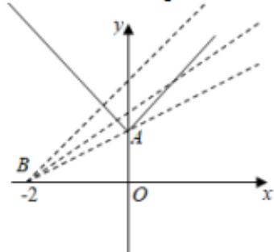

text_image

y
A
B
-2 O x

故选：B.

3. 定义在 $\mathbf{R}$ 上的偶函数 $f(x)$ ，对任意实数 $x$ 都有 $f(x + 2) = f(x)$ ，当 $x \in [0,1]$ 时， $f(x) = x^2$ ，若在区间 $[-1,3]$ 内，函数 $y = f(x)$ 与函数 $y = kx + k$ 的图象恰有 4 个交点，则实数 $k$ 的取值范围是 $(0, \frac{1}{2}]$ .

【解答】解：由题意可得，函数 $f(x)$ 的周期为2， $x\in[-1,1]$ 时， $f(x)=x^{2}$

函数 $f(x)$ 的图象和直线 $y=k(x+1)$ 在区间 $[-1,3]$ 内有4个交点，

如图所示：

故有 $0 < k(3 + 1) \leqslant 1$ ，求得 $0 < k \leqslant \frac{1}{4}$ ，

故答案为 $(0, \frac{1}{4}]$ .

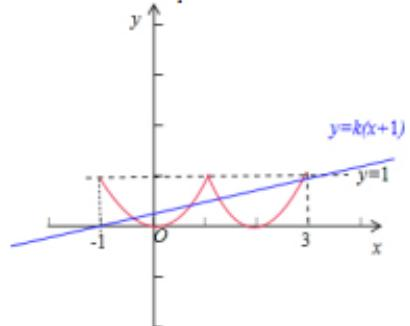

text_image

y
y=k(x+1)
y=1
-1
O
3
x

4. 已知函数 $f(x) = |x - 3| + 2$ ， $g(x) = kx$ ，若方程 $f(x) = g(x)$ 有两个不相等实根，则实数 $k$ 的范围（）

A. $(0,\frac{2}{3})$ C. $(1,\frac{3}{2})$

B. $(\frac{2}{3}, 1)$ D. $(\frac{3}{2}, +\infty)$

【解答】解： $f(x)=\left\{\begin{aligned}x-1,&\quad x\geq3\\ -x+5,&\quad x<3\end{aligned}\right.$

作出函数 $f(x)$ 的图象如图：

$$
f (3) = 2,
$$

当 $g(x)$ 经过点（3，2）时，两个函数只有1个交点，

此时 $g(3)=3k=2$ ，得 $k=\frac{2}{3}$

当 $g(x)$ 与 $f(x)=x-1$ 平行时，两个函数有 0 个交点，此时 k=1，

∴若方程 $f(x)=g(x)$ 有两个不相等的实根，

则 $\frac{2}{3} < k < 1$

则实数 k 的取值范围是 $\left(\frac{2}{3}, 1\right)$ ,

故选：B.

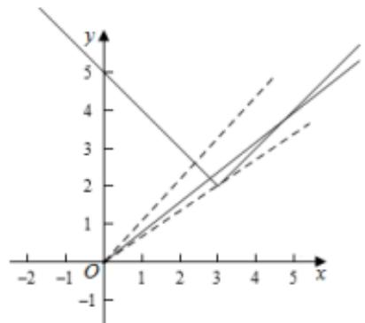

text_image

y
5
4
3
2
1
0
-1
-2 -1 1 2 3 4 5 x

5. 已知函数 $f(x) = |x^2 + 12x + 27|$ ， $g(x) = a|x + 1|$ ，若函数 $f(x)$ 与 $g(x)$ 的图像恰有4个交点，则实数 $a$ 的取值范围是（）

A. (18, +∞)

B. (0,

2)

C. (2, 18)

D. (0,

2) U (18, +∞)

【解答】解：易知， $g(x)$ 的图象过定点 $(-1, 0)$ ，当 a < 0 时，由图可知，函数 $f(x)$ 与 $g(x)$ 的图像无交点，

text_image

y=f(x)
-9
-3
-1
O
x
y=g(x)

当 $a = 0$ 时， $g(x) = 0$ 与 $f(x)$ 的图象有两个交点，

当 a>0 时，设直线 $y=-a(x+1)$ 与 $y=-x^{2}-12x-27$ 相切，
联立方程 $\left\{\begin{aligned}y&=-a(x+1)\\ y&=-x^{2}-12x-27\end{aligned}\right.$ ，消去y得 $x^{2}+(12-a)x+27$ -a=0,

则 $\Delta = (12 - a)^{2} - 4(27 - a) = 0,$

解得 a=2 或 a=18，

结合图象可知，当 $a = 18$ 时，切点位于 $x$ 轴下方，不满足题意，舍去，

text_image

y=f(x)
y=g(x)
-9
-3
-1
0
x

由图可知，要使函数 $f(x)$ 与 $g(x)$ 的图像有4个交点，则 $-2 < -a < 0$

所以实数 a 的取值范围为 $(0, 2)$ .

故选：B.

6. 已知函数 $f(x) = \begin{cases} -x^2 + x, & x \leq 0 \\ ln(x + 1), & x > 0 \end{cases}$ ，若 $|f(x)| \geqslant ax$ ，则 $a$ 的取值范围为（）

A. $(-∞,0]$

B. $[-1,0]$

C. $(-∞,1]$

D. $[-2,0]$

【解答】解：函数 $f(x) = \begin{cases} -x^2 + x, & x \leq 0 \\ ln(x + 1), & x > 0 \end{cases}$ ，

则 $|f(x)|=\begin{cases}x^{2}-x,&x\leq0\\ln(x+1)&x>0\end{cases}$

画出函数 $y=f(x)$ 的图象，如图所示；

当 $x \leqslant 0$ 时， $y = |f(x)| = x^2 - x$

$$
\therefore y ^ {\prime} = 2 x - 1;
$$

令 x=0，求得 $k=y'=-1$ ;

结合图象知，若 $|f(x)|\geqslant ax$ ，则a的取值范围是 $-1\leqslant a\leqslant0$ 。故选：B.

7. 已知定义域为 $\left[\frac{1}{3}, 3\right]$ 的函数 $f(x)$ 满足: 当 $x \in \left[\frac{1}{3}, 1\right]$ 时, $f(x) = 2f\left(\frac{1}{x}\right)$ , 且当 $x \in [1, 3]$ 时, $f(x) = bx$ , 若在区间 $\left[\frac{1}{3}, 3\right]$ 内, 函数 $g(x) = f(x) - ax$ 的图象与 $x$ 轴有 3 个不同的交点, 则实数 $a$ 的取值范围是 ( )

A. $(0, \frac{1}{\varepsilon})$

B. $(0, \frac{1}{2e})$

C. $\left[\frac{ln3}{3}\right]$

， $\frac{1}{8})$

D. $\left[\frac{ln3}{3}, 1\right)$

【解答】解：当 $x \in [\frac{1}{3}, 1]$ 时， $\frac{1}{x} \in [1, 3]$ ，

$$
\therefore f (x) = 2 f \left(\frac {1}{x}\right) = 2 \ln \frac {1}{x} = - 2 \ln x,
$$

$$
\therefore f (x) = \left\{ \begin{array}{l} - 2 l n x, \frac {1}{3} \leq x \leq 1 \\ l n x, 1 <   x \leq 3 \end{array} \right.,
$$

作出 $f(x)$ 的函数图象如图所示：

line

| x    | y (ln3) |
| ---- | ------- |
| 0    | 2ln3    |
| 1/3  | 0       |
| 1    | 0       |
| 3    | ln3     |

$\because$ 函数 $g(x) = f(x) - ax$ 的图象与 $x$ 轴有3个不同的交点， $\therefore y = f(x)$ 与直线 $y = ax$ 在 $[\frac{1}{3}, 3]$ 上有3个交点.

当直线 $y = ax$ 经过点（3，ln3）时， $a = \frac{ln3}{3}$

当直线 y=ax 与 y=lnx 相切时，设切点为 $(x_{0}, y_{0})$ ，

则 $\left\{\begin{aligned}y_{0}&=lnx_{0}\\ y_{0}&=ax_{0}\\ \frac{1}{x_{0}}&=a\end{aligned}\right.$ ，解得 $x_{0}=e,\quad y_{0}=1,\quad a=\frac{1}{e}.$ $\therefore \frac{\ln3}{3} \leq a < \frac{1}{e}.$

故选：C.

8. 定义在 $\mathbf{R}$ 上函数 $f(x)$ 满足 $f(x + 2) = f(x)$ ，且 $x \in (-1, 1]$ 时， $f(x) = x^2$ ，若函数 $y = f(x)$ 的图象与函数 $y = kx$ 的图象恰有3个交点，则实数 $k$ 的取值范围是 $(-1, -\frac{1}{3}] \cup [\frac{1}{3}, 1)$ .

【解答】解：由题意可得，函数 $f(x)$ 的周期为2， $x\in(-1,1]$ 时， $f(x)=x^{2}$

函数 $f(x)$ 的图象和直线y=kx有3个交点，

如图所示：当 $x \geqslant 0$ ，仔细 $y = kx$ 在直线 $OB$ 与 $OA$ 之间满足题意，

故有 $\frac{1}{3} \leq k < 1$ ，当 $x \leqslant 0$ 时，求得 $-1 < k \leq -\frac{1}{3}$ ，

则实数 k 的取值范围是

故答案为： $(-1,-\frac{1}{3}]\cup[\frac{1}{3},1)$

text_image

y
1
A
B
2
O
1
2
3
x

9. 设 $f(x)$ 是定义在 $\mathbf{R}$ 上的偶函数，对 $x \in \mathbb{R}$ ，都有 $f(x - 2) =$

$f(x+2)$ ，且当 $x \in [-2, 0]$ 时， $f(x) = \left(\frac{1}{2}\right)^x - 1$ ，若在区间 $(-2, 6]$ 内关于 x 的方程 $f(x) - \log_a(x+2) = 0 (a > 1)$ 恰有 3 个不同的实数根，则 a 的取值范围是（）

A. (2, 3)

B. $(\sqrt[3]{3},2)$

C. $(\sqrt[3]{4},2)$

D. $(\sqrt[3]{2}, 3)$

【解答】解：由题意 $f(x-2)=f(x+2)$ ，可得 $f(x+4)=f(x)$ ，

周期 $T = 4$ ，当 $x\in [-2,0]$ 时， $f(x) = (\frac{1}{2})^x -1,$

∴可得 $(-2,6]$ 的图象如下：

text_image

Mathematical graph showing a parabola, line, and shaded region with labeled axes and key points at x=-2, x=0, x=2, x=6.

从图可看出，要使 $f(x)$ 的图象与 $y=\log_{a}(x+2)$ 的图象恰有3个不同的交点，

则需满足 $\left\{\begin{aligned}&log_{a}(2+2)<3\\&log_{a}(6+2)>3\end{aligned}\right.$

解得： $\sqrt[3]{4}<a<2$

故选：C.

10. 已知函数 $f(x) = \begin{cases} x^{\frac{1}{2}}, & (x \geq 0) \\ f(x + 1), & (x < 0) \end{cases}$ ，若函数 $g(x) = f(x) + x + a$ 在 $\mathbf{R}$ 上恰有两个相异零点，则实数 $a$ 的取值范围为（）

A. $[-1, +\infty)$

B. $(-1, +\infty)$

C. $(-∞,0)$

D. $(-∞,1]$

【解答】解： $g(x)=0$ 可化为 $f(x)=-x-a$

当 $x \in [-1, 0)$ 时， $x + 1 \in [0, 1)$ ，

$$
f (x) = f (x + 1) = \sqrt {x + 1},
$$

故把 $y=\sqrt{x}$ 图象在[0,1)上的部分向左平移1个单位得到f(x)在[-1,0)上的图象，

再把 $f(x)$ 在 $[-1, 0)$ 上的图象每次向左平移1个单位连续平移就得到 $f(x)$ 在 $\mathbf{R}$ 上的图象，再作出 $y = -x - a$ 的图象；如下图，

text_image

Graph showing a parabola and a line intersecting at three points on the x-axis, with y-axis labeled in units of 2.

由图象可得 $-a < 1, a > -1$

故选：B.

11. 已知函数 $f(x) + 1 = \frac{1}{f(x + 1)}$ ，当 $x \in [0, 1]$ 时， $f(x) = x$ 。若在区间 $x \in (-1, 1]$ 内， $g(x) = f(x) - mx - m$ 有两个零点，则实数 $m$ 的取值范围是（）

A. $(0,\frac{1}{2}]$

B. $\left[\frac{1}{2},+\infty\right)$

C. $[0, \frac{1}{3})$

D. $[0, \frac{1}{2})$

【解答】解：∵ $f(x)+1=\frac{1}{f(x+1)}$ ,

$\therefore$ 数 $f(x) = \frac{1}{f(x + 1)} -1,$

∵当 $x\in[0,1]$ 时， $f(x)=x$ .

∴当 $x \in [-1, 0]$ 时， $f(x) = \frac{1}{f(x+1)} - 1 = \frac{1}{x+1} - 1$ ，

$\because f(x) = m(x + 1)$ 有2个解

即 $m = \frac{f(x)}{x + 1}$ 有2个解

令 $k(x)=\frac{f(x)}{x+1}$ ,
则 $k(x)=\left\{\begin{aligned}&\frac{1}{(x+1)^{2}}-1,-1\leq x<0\\ &1-\frac{1}{x+1},0\leq x\leq1\end{aligned}\right.$

$k(x)$ 图象如下:

line

| x | y |
|---|---|
| -3 | 0 |
| -2 | 0 |
| -1 | 0 |
| 0 | 0 |
| 1 | 1 |
| 2 | 2 |
| 3 | 3 |
| 4 | 4 |

$k(1) = \frac{1}{2},$

$\therefore k(x) = \frac{f(x)}{x + 1}$ ，与 $y = m$ 有2个交点时， $0 < m \leq \frac{1}{2}$

$\therefore g(x) = f(x) - mx - m$ 有两个零点，则实数 $m$ 的取值范围为： $(0, \frac{1}{2}]$ ，

故选：A.

12. 已知函数 $f(x) = \begin{cases} 2^x - a, & x \geq 0 \\ f(x + 1), & x < 0 \end{cases}$ ，若方程 $f(x) + x = 0$ 有且仅有两个解，则实数 $a$ 的取值范围是 $a < 2$ .

【解答】解：我们先研究 $g(x)=\left\{\begin{aligned}&2^{x}-2,&x\geq0\\&g(x+1)&,&x<0\end{aligned}\right.$

①当 $x \geqslant 0$ 时， $f(x) = 2^{x} - 2$ ，

②当 $-1 \leqslant x < 0$ 时， $0 \leqslant x + 1 < 1$ ， $g(x) = g(x + 1) = 2^{(x + 1)} - 2$ .

当 $-2 \leqslant x < -1$ 时， $0 \leqslant x + 2 < 1$ ， $g(x) = g(x + 2) = 2^{(x + 2)} - 2$ .

故 $x < 0$ 时， $f(x)$ 是周期函数，如图，

此时函数 $g(x)$ 与 $y = -x$ 的图象恰有一个交点

因为函数 $f(x) = \begin{cases} 2^x - a, & x \geq 0 \\ f(x + 1), & x < 0 \end{cases}$ ，的图象是由 $g(x)$

$= \left\{ \begin{array}{ll}2^{x} - 2, & x\geq 0\\ g(x + 1), & x <   0 \end{array} \right.$ 向上平移 $2 - a$ 个单位.

若方程 $f(x) + x = 0$ 有且只有两个不相等的实数根，则 $2 - a > 0$ ，即 $a < 2$

故答案为：a<2.

text_image

Graph showing two intersecting lines in a Cartesian coordinate system with labeled x and y axes.

13. 已知函数 $f(x) = \begin{cases} -x^2 + 2x, & -2 \leq x \leq 0 \\ \ln \frac{1}{x+1}, & 0 \leq x \leq 2 \end{cases}$ ，若 $g(x) = f(x) \mid -ax - a$ 的图象与 $x$ 轴有 3 个不同的交点，则实数 $a$ 的取值范围是 $\frac{\ln 3}{3} \leq a < \frac{1}{8}$ .

【解答】解：∵ $f(x)=\left\{\begin{aligned}-x^{2}+2x,&-2\leq x\leq0\\ln\frac{1}{x+1},&0\leq x\leq2\end{aligned}\right.$

$$
\therefore | f (x) | = \left\{ \begin{array}{l} x ^ {2} - 2 x, - 2 \leq x \leq 0 \\ \ln (x + 1), 0 <   x \leq 2 \end{array} , \right.
$$

$\because g(x) = |f(x)| - ax - a$ 的图象与 $x$ 轴有3个不同的交点， $\therefore$ 函数 $|f(x)|$ 与函数 $y = ax + a$ 的图象有3个不同的交点；  
作函数 $|f(x)|$ 与函数 $y = ax + a$ 的图象如下，

text_image

A
O
B
x
y

图中 A(-1,0)，B(2，ln3)，

故此时直线 AB 的斜率 $k=\frac{ln3-0}{2+1}=\frac{ln3}{3}$ ;

当直线 AB 与 $f(x)=\ln(x+1)$ 相切时，设切点为 $(x,\ln(x+1))$ ;

则 $\frac{ln(x + 1) - 0}{x - (-1)} = \frac{1}{x + 1}$

解得， $x = e - 1$

此时直线 $AB$ 的斜率 $k = \frac{1}{\varepsilon}$ ;

结合图象可知，

$$
\frac {\ln 3}{3} \leq a <   \frac {1}{e};
$$

故答案为： $\frac{ln3}{3} \leq a < \frac{1}{e}$

# 类型5练习答案

1. 设函数 $f(x) = \begin{cases} \log_2(-x)(x < 0) \\ 2^x (x \geq 0) \end{cases}$ ，若关于 $x$ 的方程 $f(x) - af(x) = 0$ 恰有三个不同的实数解，则实数 $a$ 的取值范围为 $[1, +\infty)$ .

【解答】解：由题意作函数 $f(x) = \begin{cases} \log_2(-x)(x < 0) \\ 2^x (x\geq 0) \end{cases}$ 的图象如下，

line

| x | y |
|---|---|
| -5 | 1 |
| 0 | 1 |

$$
\because f ^ {2} (x) - a f (x) = 0,
$$

$$
\therefore f (x) = 0 \text {或} f (x) = a;
$$

$\because f(x) = 0$ 有且只有一个解，

$\therefore f(x) = a$ 有且只有两个解，

故 $a \in [1, +\infty)$ ;

故答案为： $[1, + \infty)$

（多选）2. 已知函数 $f(x) = \begin{cases} |x - 3|, & x > 0 \\ -x^2 + 4, & x \leq 0 \end{cases}$ ，则下列说法正确的是（）

A. 函数 $f(x)$ 在 $(-2, 0) \cup (3, +\infty)$ 上单调递增  
B. 若方程 $f(x) = a$ 有3个不等的实根 $x_{1}, x_{2}, x_{3}$ ，则 $a$ 的取值范围是（0，3）  
C. 若方程 $f(x)=a$ 有 3 个不等的实根 $x_{1}, x_{2}, x_{3}$ ，则 $x_{1}+x_{2}+x_{3}$ 的取值范围是（4，5）  
D. 方程 $f(f(x)) = f(x)$ 有 4 个不等的实根

【解答】解：函数 $f(x) = \left\{ \begin{array}{ll} |x - 3|, & x > 0 \\ -x^2 + 4, & x \leq 0 \end{array} \right.$

$$
\left\{ \begin{array}{l} - x ^ {2} + 4, x \leq 0 \\ - x + 3, 0 <   x <   3, \\ x - 3, x \geq 3 \end{array} \right.
$$

则函数的大致图象如下：

line

| x | y |
|---|---|
| -2.5 | -2 |
| -2 | -1 |
| -1.5 | 0 |
| -1 | 1 |
| -0.5 | 2 |
| 0 | 3 |
| 1 | 2 |
| 2 | 1 |
| 3 | 0 |
| 4 | 1 |
| 5 | 2 |

由图可知，函数 $f(x)$ 在 $(-2,0)$ 和 $(3,+\infty)$ 上分别单调递增，故A错误；

要使方程 $f(x) = a$ 有3个不等的实根 $x_{1}, x_{2}, x_{3}$ ,

则函数 $y=f(x)$ 和 y=a 有 3 个交点，则 0<a<3，

line

| x    | y     |
| ---- | ----- |
| -3   | -2    |
| -2   | 0     |
| -1   | 3     |
| 0    | 4     |
| 1    | 3     |
| 2    | 1     |
| 3    | 0     |
| 4    | 1     |
| 5    | 2     |

即 a 的取值范围是 $(0, 3)$ ，故 B 正确；

由 $-x^{2}+4=3(x<0)$ ，得x=-1，

不妨设 $x_{1}<x_{2}<x_{3}$ ,

由图可知 $-2 < x_{1} < -1$ ，且 $x_{2} + x_{3} = 6$

所以 $4 < x_{1} + x_{2} + x_{3} = 5$ ，即 $x_{1} + x_{2} + x_{3}$ 的取值范围是（4，5），故 C 正确；

由图可知，函数 $f(x)$ 的值域为 $(- \infty, 4]$ ，

令 $f(x) = t (t \leqslant 4)$ ，由 $f(f(x)) = f(x)$ ，可得 $f(t) = t$ ，

当 $0 < t \leqslant 4$ 时， $|t - 3| = t$ ，解得 $t = \frac{3}{2}$ ，

由图可知，方程 $f(x) = \frac{3}{2}$ 有个3不等的实根；

当 $t \leqslant 0$ 时， $-t^2 + 4 = t$ ，解得 $t = -\frac{1 + \sqrt{17}}{2}$ ，

由图可知，方程 $f(x) = -\frac{1 + \sqrt{17}}{2}$ 的有个1不等的实根，

综上所述，方程 $f(f(x)) = f(x)$ 有4个不等的实根，故 $D$ 正确.

故选：BCD.

3. 设定义域为 R 的函数 $f(x)=\left\{\begin{aligned}&0 & x=1\\&|lg|x-1|| & x\neq1\end{aligned}\right.$ ，则关于 x 的方程 $f(x)+bf(x)+c=0$ 有 7 个不同实数解的充要条件是（）

A. $b <   0$ 且 $c > 0$

B. b>0 且 c<0

C. b<0

且 $c = 0$

D. b>0 且 c=0

【解答】解：由 $f(x)$ 图象知要使方程 $f^{2}(x) + bf(x) + c = 0$ 有7解，

应有 $f(x)=0$ 有3解，

$f(x)\neq 0$ 有4解.

则 c=0, b<0,

故选：C.

text_image

y
O 1 2 x

4. 已知函数 $f(x) = \begin{cases} 1 - x, & x \leq 0 \\ \log_2 x, & x > 0 \end{cases}$ ，若关于 $x$ 的方程 $f(f(x)) = m$ 只有两个不同的实根，则 $m$ 的取值范围为（）

A. [1, 2]

B. [1, 2)

C. [0,

1]

D. [0, 1)

【解答】解： $f(f(x)) = \begin{cases} \log_2(1 - x), & x\leq 0\\ 1 - \log_2x, & 0 <   x\leq 1,\\ \log_2(\log_2x), & x > 1 \end{cases}$

画出函数图象，因为关于 x 的方程 $f(f(x)) = m$ 只有两个不同的实根， $x_{1}, x_{2}$ ，所以 $x_{1} < 0, x_{2} > 2$ ，

$\therefore 0 \leqslant m < 1.$

text_image

y
2
1
O
1
2
x

故选：D.

5. 已知函数 $f(x)=|2^{x}-1|$ ，若关于 x 的方程 $f^{x}(x)+af(x)+a+2=0$ 恰有 3 个不同的实数根，则实数 a 的取值范围为（）

A. (0, 1)

B. $(-1,-\frac{2}{3}]$

C. (-

1, 0)

D. $(-2,-\frac{3}{2}]$

【解答】解：因为函数 $f(x) = |2^{x} - 1|$ ，作出函数图象如图所示，

因为关于 x 的方程 $f^{2}(x) + af(x) + a + 2 = 0$ 恰有 3 个不同的实数根，

所以令 $t=f(x)$ ，根据图象可得， $t^{2}+at+a+2=0$ 有两个不同的实数根，且 $t_{1}\in(0,1)$ ， $t_{2}\in[1,+\infty)$ ，

记 $g(t) = t^2 + at + a + 2$ ，则有 $\left\{ \begin{array}{l} \Delta = a^2 - 4(a + 2) > 0 \\ g(0) > 0 \\ g(1) \leq 0 \end{array} \right.$ ，

解得 $-2 < a \leq -\frac{3}{2}$ ,

所以实数 a 的取值范围为 $(-2, -\frac{3}{2}]$ .

故选：D.

6. 函数 $f(x) = \begin{cases} x^2 - 2x, & x \leq 0 \\ \frac{2x}{e^x}, & x > 0 \end{cases}$ ，若关于 $x$ 的方程 $f^2(x) - af(x) + a - 1 = 0$ 恰有四个不同的实数根，则实数 $a$ 的取值范围为 $(1, 1 + \frac{2}{e})$ .

【解答】解：由已知得当 $x > 0$ 时， $f'(x) = \left(\frac{2x}{e^x}\right)' = \frac{2(1 - x)}{e^x}, f'$

$(x) >0 \Rightarrow 0 < x < 1, f'(x) < 0, x > 1,$

故 x=1 时， $f(x)$ 取得极大值 $f(1)=\frac{2}{e}$

作出 $f(x)$ 的图象如右图：

令 $t=f(x)$ ，则原方程化为 $t^{2}-at+a-1=0$ ，

解得 t=1，或 t=a-1，

显然 $t = f(x) = 1 > \frac{2}{\varepsilon}$ ，原方程只有一个根；

由题意，必有 $t=f(x)=a-1$ 时，原方程有三个实根，

故 $0 < a - 1 < \frac{2}{e}$ ，解得 $1 < a < 1 + \frac{2}{e}$ .

故答案为： $(1, 1 + \frac{2}{8})$ .

line

| x    | y = a - 1 |
| ---- | --------- |
| 0    | 0         |
| 1    | 1         |
| 2    | ~0.5      |
| 3    | ~0.2      |
| 4    | ~0.1      |

7. 设函数 $f(x) = \begin{cases} \log_2(-x), & x < 0 \\ 2^x, & x \geq 0 \end{cases}$ ，若关于 $x$ 的方程 $f(x) - af(x) = 0$ 恰有三个不同的实数根，则实数 $a$ 的取值范围是（）

A. $[0, +\infty)$

B. $(0, +\infty)$

C. (1,

+∞)

D. $[1, +\infty)$

【解答】解：由题意作函数 $f(x)$ 的图象如下，

text_image

Graph showing a parabola and a line intersecting at the origin, with x-axis labeled from -5 to 0 and y-axis labeled from 0 to 2.

$\because f^{2}(x) - af(x) = 0,$

$\therefore f(x) = 0$ 或 $f(x) = a;$

$\because f(x) = 0$ 有且只有一个解，

$\therefore f(x) = a$ 有且只有两个解，

故 $a \in [1, +\infty)$ ;

故选：D.

8. 设函数 $f(x) = \begin{cases} 2^x + 1 (x \leq 0) \\ |lgx| (x > 0) \end{cases}$ ，若关于 $x$ 的方程 $f(x) - af(x) + 2 = 0$ 恰有6个不同的实数解，则实数 $a$ 的取值范围为 $(2\sqrt{2}, 3)$ .

【解答】

解：函数 $f(x) = \begin{cases} 2^x + 1 (x \leq 0) \\ |lgx|(x > 0) \end{cases}$ 的图象如图所示：

令 $t=f(x)$ ，可得 $t^{2}-at+2=0$ ，（\*）

依题意可得方程（\*）有两个不等实数解都在（1，2]，

可得 $\left\{\begin{aligned}\Delta&=a^{2}-8>0\\ 1&<\frac{a}{2}<2\\ g(1)&=3-a>0\\ g(2)&=6-2a\geq0\end{aligned}\right.$

解得 $2\sqrt{2}<a<3$

故答案为： $(2\sqrt{2},3)$ .

line

| x   | y     |
| --- | ----- |
| -5  | 0.000 |
| -4  | 0.001 |
| -3  | 0.004 |
| -2  | 0.016 |
| -1  | 0.049 |
| 0   | 0.182 |
| 1   | 0.049 |
| 2   | 0.049 |
| 3   | 0.049 |
| 4   | 0.049 |
| 5   | 0.049 |

9. 已知函数 $f(x) = \begin{cases} x + 1, & x \leq 0 \\ x^2 - 2x + 1, & x > 0 \end{cases}$ ，若关于 $x$ 的方程 $f^2(x) - af(x) = 0$ 恰有5个不同的实数解，则 $a$ 的取值范围是 (0, 1).

【解答】解：作 $f(x)$ 的图象如下，

line

| x | y |
|---|---|
| -5 | -4 |
| 0 | 0 |
| 1 | 0 |
| 2 | 2 |
| 3 | 4 |

$f^{2}(x) - af(x) = f(x)(f(x) - a) = 0,$

$\therefore f(x) = 0$ 或 $f(x) = a;$

$\because f(x)=0$ 有两个不同的解，

故 $f(x)=a$ 有三个不同的解，

故 $a \in (0, 1)$ ;

故答案为：（0，1）.

10. 设 $f(x) = \begin{cases} 2^x, & x \leq 0 \\ \log_2 x, & x > 0 \end{cases}$ 关于 $x$ 的方程是 $f(x) - af(x) = 0$ .

(1) 若 a=1，则方程有 3 个实数根；

（2）若方程恰有三个不同的实数解，则实数 a 的取值范围为 $0 < a \leqslant 1$ .

【解答】解：作出函数作出函数 $f(x) = 2^{x}$ 与 $f(x) = \log x$ 的图象：

text_image

y
1
0
1
x

(1) a=1 时，方程是 $f^{2}(x)-af(x)=0$ 可化为 $f^{2}(x)-f(x)=0$ ,

即 $f(x)[f(x) - 1] = 0$ ，解得 $f(x) = 0, f(x) = 1$

方程 $f(x) = 0$ 的根为惟一根： $x = 1$

方程 $f(x) = 1$ 的根可看作函数 $y = 1$ 与函数 $y = f(x)$ 图象交点的横坐标，如图：

text_image

y
1
y=1
0
1
x

从图象知：有两个交点，故方程 $f(x)=1$ 的根有2个，

∴a=1时，则方程有3个实数根；

故答案为：3

(2) 方程是 $f(x) - af(x) = 0$ 可化为 $f(x) [f(x) - a] = 0$ ，解得 $f(x) = 0$ 、 $f(x) = a$ ，

方程 $f(x)=0$ 的根为惟一根：x=1、

方程 $f(x)=a$ 的根可看作函数 y=a 与函数 $y=f(x)$ 图象交点的横坐标，如图：

text_image

y
1
y=a
0
1
x

结合函数的图象：当 $0 < a \leqslant 1$ 时， $y = a$ 与函数 $y = f(x)$ 图象有2个交点，故方程 $f(x) = a$ 有2个根，

∴当 $0 < a \leqslant 1$ 时，方程是 $f^{2}(x) - af(x) = 0$ 有 3 个根，

故答案为： $0 < a \leq 1$

11. 已知函数 $f(x) = \begin{cases} -x^2 + 1, & x \leq 0 \\ |x - 2|, & x > 0 \end{cases}$ ，若关于 $x$ 的方程 $f'(x) - af(x) = 0$ 有且只有3个不同的实数根，则实数 $a$ 的取值范围是 $(-\infty, 0) \cup [2, +\infty)$ .

【解答】解：由题意，可知

$$
f (x) = \left\{ \begin{array}{l} - x ^ {2} + 1, x \leq 0 \\ | x - 2 |, x > 0 \end{array} \right. = \left\{ \begin{array}{l} - x ^ {2} + 1, x \leq 0 \\ - (x - 2), 0 <   x <   2, \\ x - 2, x \geq 2 \end{array} \right.
$$

函数 $f(x)$ 大致图象如右：

∵关于 x 的方程 $f(x)-af(x)=0$ 有且只有 3 个不同的实数根，

$\therefore f(x) \cdot [f(x) - a] = 0$ 有且只有3个不同的实数根，

即 $f(x)=0$ 与 $f(x)=a$ 一共有3个不同的实数根，

$\because f(x)=0$ 有 x=-1 与 x=2 两个实数根，

$\therefore f(x)=a$ 有且只有 1 个实数根，

∴a<0，或 $a\geqslant2$ .

∴实数 a 的取值范围为 $(-∞, 0) ∪ [2, +∞)$ .

故答案为： $(-∞,0)∪[2,+∞)$ .

text_image

y
2
1
O
2
x
1

（多选）12. 已知函数 $f(x) = \begin{cases} 2^x + 1, & x \leq 0, \\ |\log_2 x|, & x > 0, \end{cases}$ ， $g(x) = f^x$ （ $x$ ）-2mf（ $x$ ）+2，下列说法正确的是（）

A. 若 $y=f(x)-a$ 有两个零点，则 a>2  
B. $y=f(x)$ 只有一个零点 x=1  
C. 若 $y = f(x) - a$ 有两个零点. $x_{1}, x_{2} (x_{1} \neq x_{2})$ ，则 $x_{1}x_{2} =$   
D. 若 $g(x)$ 有四个零点，则 $m > \frac{3}{2}$

【解答】解：由题设， $x \leqslant 0$ 时， $f(x) \in (1, 2]$ 且递增，x > 0时，在（0，1）上递减，（1，+∞）上递增且值域均为 $f(x) \in [0, +\infty)$ ，又 $f(1) = 0$ ，

所以 $f(x)$ 只有一个零点 x=1，其函数图象如下：

line

| x | y = log₂x |
|---|---|
| 0 | 2 |
| 1 | 0 |

故 B 正确；

由图，若 $y=f(x)-a$ 有两个零点，则 0<a<1 或 a>2，故 A 错误；

两个零点 $x_{1}, x_{2} (x_{1} \neq x_{2})$ 均在 $y = \log_2 x$ 上，则 $x_{1} = \frac{1}{x_{2}}$ ，即 $x_{1} \cdot x_{2} = 1$ ， $C$ 正确；

要使 $g(x) = f(x) - 2mf(x) + 2$ 有4个零点，即 $g(x) = 0$ 对应两个不同的 $f(x)$ 值，

若零点分别为 $t_{1}=f(x_{1})$ ， $t_{2}=f(x_{2})$ 且 $t_{1}<t_{2}$

所以当 $t_1 = 0$ ，即 $x_{1} = 1$ 时，由 $g(1) = 2\neq 0$ ，故排除；

若 $t_1, t_2 \in (0, 1]$ , $g(x)$ 有四个零点，此时 $\left\{ \begin{array}{l}3 - 2m \geq 0 \\ 0 < m < 1 \\ \Delta = 4m^2 - 8 > 0 \end{array} \right.$ ,

无解；

若 $t_1, t_2 \in (2, +\infty), g(x)$ 有四个零点，此时 $\left\{ \begin{array}{l} 6 - 4m > 0 \\ m > 2 \\ \Delta = 4m^2 - 8 > 0 \end{array} \right.$ ，

无解；

若 $t_{1}\in(0,1]$ , $t_{2}\in(2,+\infty)$ , $g(x)$ 有四个零点， $\left\{\begin{aligned}3-2m&\leq0\\ 6-4m&<0\\ \Delta&=4m^{2}-8>0\end{aligned}\right.$ 可得 $m > \frac{3}{2}$ .

综上， $g(x)$ 有四个零点时， $m > \frac{3}{2}, D$ 正确.

故选：BCD.

# [必修一]第五章 三角函数

# 题型 1: 角度, 弧度, 象限

1. $930^{\circ} = (\quad)$

A. $\frac{31\pi}{3}$

B. $\frac{31\pi}{4}$

C. $\frac{31\pi}{5}$

【解答】解： $930^{\circ}=720^{\circ}+210^{\circ}=4\pi+\frac{7}{6}\pi=\frac{31}{6}\pi.$

故选：D.

2. $-135^{\circ}$ 的角化为弧度制的结果为（）

A. $-\frac{3\pi}{2}$

B. $-\frac{3\pi}{5}$

C. $-\frac{3\pi}{4}$

D. $\frac{3\pi}{4}$

【解答】解： $-135^{\circ}=-135\times\frac{\pi}{180}=-\frac{3\pi}{4}.$

故选：C.

3. $-320^{\circ}$ 用弧度制表示为（）

A. $-\frac{2\pi}{9}$

B. $-\frac{8\pi}{9}$

C. $-\frac{16\pi}{9}$   
D. $-\frac{20\pi}{9}$

【解答】解：因 $1^{\circ} = \frac{\pi}{180}$ ,

从而可得 $-320^{\circ} = -320 \times \frac{\pi}{180} = -\frac{16\pi}{9}$ .

所以 $-320^{\circ}$ 用弧度制表示为 $-\frac{16\pi}{9}$ .

故选：C.

4. $\frac{\pi}{6}\mathrm{rad} =$ （

A. $60^{\circ}$

B. $120^{\circ}$   
C. $150^{\circ}$

D. $30^{\circ}$

【解答】解： $\frac{\pi}{6}rad=\frac{\pi}{6}\times\frac{180^{\circ}}{\pi}=30^{\circ}$

故选：D.

5. 下列给出的各角中，与 $-\frac{5\pi}{3}$ 的终边相同为（）

A. $\frac{\pi}{3}$

B. $\frac{14\pi}{3}$

C. $\frac{2\pi}{3}$

【解答】解：与 $-\frac{5}{3}\pi$ 终边相同的角为 $\alpha=-\frac{5\pi}{3}+2k\pi,\quad k\in\mathbf{Z}$ ，当k=1时， $\alpha=\frac{\pi}{3}$ ，故选项A正确；

令 $-\frac{5\pi}{3} + 2k\pi = \frac{14\pi}{3}$ ，解得 $k = \frac{19}{6} \notin Z$ ，故选项 B 不正确；

令 $-\frac{5\pi}{3}+2k\pi=\frac{2\pi}{3}$ ，解得 $k=\frac{7}{6}\notin Z$ ，故选项C错误；

令 $-\frac{5\pi}{3} + 2k\pi = \frac{5\pi}{3}$ ，解得 $k = \frac{5}{3} \notin z$ ，故选项 D 不正确。

故选：A.

6. $300^{\circ}$ 角的终边落在（）

A. 第一象限

B. 第二象限

C. 第三

象限

D. 第四象限

【解答】解： $\because 300^{\circ} = 1 \times 360^{\circ} - 60^{\circ}$ ，故 $300^{\circ}$ 角的终边和 $-60^{\circ}$ 的终边相同，

而 $-60^{\circ}$ 的终边在第四象限，故 $300^{\circ}$ 的终边在第四象限，故选：D.

7. $-\frac{25}{6}\Pi$ 是（ ）

A. 第一象限角

B. 第二象限角

C. 第三

象限角

D. 第四象限角

【解答】解： $-\frac{25}{6}\pi=-6\pi+\frac{11\pi}{6}$

$\therefore -\frac{25}{6}\pi$ 是第四象限角.

故选：D.

# 题型 2：扇形的弧长与面积公式

# 一. 弧长公式（共5小题）

1. 半径为 3，圆心角为 $\frac{2\pi}{3}$ 的扇形的弧长为（）

A. $\frac{\pi}{2}$

B. $\pi$

C. $\frac{3\pi}{2}$

【解答】解：此扇形所含的弧长= $\alpha r=3\times\frac{2\pi}{3}=2\pi$ .

故选：D.

2. 圆心角弧度数和半径均为 2 的扇形的弧长为（）

A. 1

B. 2

C. 4

【解答】解：根据弧长公式得， $1=\alpha r=2\times2=4$

故选：C.

3. 一个扇形的弧长为6，半径为4，则该扇形的圆心角的弧度数为（）

A. 1

B. $\frac{3}{2}$

C. 2

【解答】解：根据扇形的弧长为6，半径为4，计算该扇形的圆心角弧度数为

$$
\alpha = \frac {1}{r} = \frac {6}{4} = \frac {3}{2}.
$$

故选：B.

4. 半径为 2cm 的圆上的一条弧长为 6cm，则此弧所对圆心角的弧度数是（）

A. 1.5

B. 2

C. 3

【解答】解：由弧长公式 $1 = \alpha r$ ，可得 $\alpha = \frac{1}{r} = \frac{6}{2} = 3$

故选：C.

5. 半径为 2 的圆中，有一条弧长是 $\frac{\pi}{3}$ ，则此弧所对的圆心角是（）

A. $15^{\circ}$

B. $20^{\circ}$

C. $30^{\circ}$

D. $40^{\circ}$

【解答】解：半径为2的圆中，有一条弧长是 $\frac{\pi}{3}$

则该弧所对的圆心角的弧度数为 $\alpha = \frac{\frac{\pi}{3}}{2} = \frac{\pi}{6}$

则此弧所对的圆心角是 $30^{\circ}$

故选：C.

# 二. 面积公式 (共 4 小题)

6. 已知扇形的半径是 1，周长为 $\pi$ ，则扇形的面积是 $\frac{\pi - 2}{2}$ 。

【解答】解：∵扇形的半径是1，周长为π，

∴扇形的弧长为 $\pi-2$ ，

∴扇形的面积 $S=\frac{1}{2}(\pi-2)\times1=\frac{n-2}{2}$ .

故答案为： $\frac{n-2}{2}$ .

7. 已知扇形 AOB 的周长为 10，面积为 6，则该扇形的圆心角为（）

A. 3

B. $\frac{4}{3}$ 或3

C. $\frac{3}{4}$

【解答】解：如图所示，

设扇形 AOB 的半径为 r，弧长为 l，

由题意可得 $\left\{\begin{aligned}&2r+1=10\\ &\frac{1}{2}lr=6\end{aligned}\right.$

解得 $\left\{\begin{aligned}1&=6\\ r&=2\end{aligned}\right.$ 或 $\left\{\begin{aligned}1&=4\\ r&=3\end{aligned}\right.$ ，

当 $1 = 6$ ， $\mathbf{r} = 2$ 时，扇形的圆心角为 $\alpha = \frac{1}{\mathrm{r}} = 3$ 当 $1 = 4$ ， $\mathbf{r} = 3$ 时，扇形的圆心角为 $\alpha = \frac{1}{\mathrm{r}} = \frac{4}{3}$

所以该扇形的圆心角为 $\frac{4}{3}$ 或3.

故选：B.

8. 折扇是一种用竹木做扇骨，韧纸或绫绢做扇面的能折叠的扇子。用时须展开，成扇形，聚头散尾。如图，某折扇的扇骨长度 $OA = 15\mathrm{cm}$ ，扇面长度 $AB = 10\mathrm{cm}$ ，已知折扇展开所对圆心角的弧度为 $\frac{3}{2}$ ，则扇面的面积为（）

A. $100cm^{2}$

B. $150cm^{2}$

C. $200cm^{2}$

D. $300cm^{2}$

【解答】解：由题意可知，扇面的面积为 $\frac{1}{2}\times\frac{3}{2}\times15^{2}-\frac{1}{2}\times\frac{3}{2}\times5^{2}=150cm^{2}$ .

故选：B.

9. 已知扇形 AOB 的周长为 8，面积为 4，则扇形 AOB 的半径是（）

A. 1

B. 2

C. 3

【解答】解：设扇形 AOB 的半径为 r，其圆心角为 $\theta$ ，

由题意可得 $\theta r + 2r = 8$ ， $\frac{1}{2}\theta r^2 = 4$

解得 $\theta=r=2$ ，

故选：B.

# 题型 3: 同角知 1 求 2

1. 已知 $\sin a = \frac{3}{5}$ ，且 $a$ 为第二象限角，则 $\tan a$ 的值为 $-\frac{3}{4}$ .

【解答】解： $\because \sin \alpha = \frac{3}{5}$ ，且 $\alpha$ 为第二象限角，

$$
\therefore \cos \alpha = - \sqrt {1 - \sin^ {2} \alpha} = - \frac {4}{5},
$$

则 $\tan \alpha = \frac{\sin\alpha}{\cos\alpha} = -\frac{3}{4}$

故答案为： $-\frac{3}{4}$

2. 已知 $\cos a = -\frac{4}{5}$ ，且角 $a$ 为第二象限角，则 $\tan a$ 等于 $-\frac{3}{4}$ .

【解答】解：因为 $\cos a = -\frac{4}{5}$ ，且角 a 为第二象限角，

所以 $\sin a = \sqrt{1 - \cos^2a} = \frac{3}{5},$

则 $\tan a = \frac{\sin a}{\cos a} = -\frac{3}{4}$

故答案为： $-\frac{3}{4}$

3. 已知 a 是第三象限角，且 $\tan a = \frac{1}{2}$ ，则 $\sin a$ 等于（）

A. $-\frac{2\sqrt{5}}{5}$

B. $\frac{2\sqrt{5}}{5}$ D. $\frac{\sqrt{5}}{5}$

C. $-\frac{\sqrt{5}}{5}$

【解答】解：∵α是第三象限角，且 $\tan\alpha=\frac{1}{2}$

$$
\therefore \cos^ {2} \alpha = \frac {1}{1 + \tan^ {2} \alpha} = \frac {4}{5},
$$

则 $\sin \alpha = -\sqrt{1 - \cos^2\alpha} = -\frac{\sqrt{5}}{5}$

故选：C.

4. 已知 a 是第二象限角， $\tan a = -\frac{8}{15}$ ，则 $\sin a = \frac{8}{17}$ .

【解答】解：因为 $\left\{\begin{aligned}\sin^{2}a+\cos\\ \frac{\sin a}{\cos a}&=-\frac{8}{15}\end{aligned}\right.$

解得 $\sin a = \pm \frac{8}{17}$

又因为 a 是第二象限角，

所以 $\sin a=\frac{8}{17}$ .

故答案为： $\frac{8}{17}$

5. 已知 $\cos \alpha = \frac{1}{3}, \alpha \in (-\frac{\pi}{2}, 0)$ ，则 $\tan \alpha$ 等于 $-2\sqrt{2}$ .

【解答】解：∵ $\alpha \in (-\frac{\pi}{2}, 0)$ ,

$$
\therefore \sin \alpha = - \sqrt {1 - \cos^ {2} \alpha} = - \frac {2 \sqrt {2}}{3},
$$

$$
\therefore \tan \alpha = \frac {\sin \alpha}{\cos \alpha} = - 2 \sqrt {2}.
$$

故答案为： $-2\sqrt{2}$ .

6. 已知 $\alpha$ 是第四象限角， $\tan \alpha = -\frac{8}{15}$ ，则 $\sin \alpha = -\frac{8}{17}$ 。（用数字作答）

【解答】解：∵α是第四象限角， $\tan\alpha=-\frac{8}{15}$

$$
\therefore \cos^ {2} \alpha = \frac {1}{1 + \tan^ {2} \alpha} = (\frac {1 5}{1 7}) ^ {2},
$$

则 $\sin \alpha = -\sqrt{1 - \cos^2\alpha} = -\frac{8}{17}$

故答案为： $-\frac{8}{17}$

# 题型 4：诱导公式

1. 对于 $\alpha \in \mathbb{R}$ ，下列等式恒成立的是（）

$$
\begin{array}{l} (- \alpha) = - \cos \alpha \\ C. \cos (\frac {\pi}{2} + \alpha) = \sin \alpha \\ (\pi - \alpha) = \tan (2 \pi - \alpha) \\ \end{array}
$$

A. sin (2π-α) = sinα

B. cos

D. tan

【解答】解：对于 A， $\sin(2\pi-\alpha)=-\sin\alpha$ ，错误；

对于 B，cos（-α）=cosα，错误；

对于 C，cos（ $\frac{\pi}{2}+\alpha$ ）=-sinα，错误；

对于 D，因为 $\tan(\pi-\alpha)=-\tan\alpha$ ，而 $\tan(2\pi-\alpha)=-\tan\alpha$ ，故 D 正确.

故选：D.

2. 已知 $\sin (\alpha + \frac{\pi}{2}) = \frac{\sqrt{5}}{5}, \alpha \in (-\frac{\pi}{2}, 0)$ ，则 $\tan \alpha =$ （

A. 2

B.-2

C. $\frac{1}{2}$

【解答】解： $\because \sin (\alpha + \frac{\pi}{2}) = \frac{\sqrt{5}}{5}$ ，即 $\cos \alpha = \frac{\sqrt{5}}{5}$

又 $\alpha \in (-\frac{\pi}{2}, 0)$ ,

$$
\therefore \sin \alpha = - \frac {2 \sqrt {5}}{5},
$$

$$
\therefore \tan \alpha = \frac {- \frac {2 \sqrt {5}}{5}}{\frac {\sqrt {5}}{5}} = - 2,
$$

故选：B.

3. 若 $\alpha \in (\frac{\pi}{2}, \frac{3\pi}{2})$ ，且 $\tan \alpha = 3$ 。则 $\sin (\pi + \alpha) = (\quad)$

A. $\frac{3\sqrt{10}}{10}$

B. $\frac{\sqrt{10}}{10}$

C. $-\frac{3\sqrt{10}}{10}$

D. $-\frac{\sqrt{10}}{10}$

【解答】解：因为 $\alpha\in(\frac{\pi}{2},\frac{3\pi}{2})$ ，且 $\tan\alpha=\frac{\sin\alpha}{\cos\alpha}=3>0$

所以 $\alpha \in (\pi, \frac{3\pi}{2})$ ， $\sin \alpha < 0$ ， $\cos \alpha < 0$

因为 $\sin^2\alpha +\cos^2\alpha = \sin^2\alpha +(\frac{\sin\alpha}{3})^2 = 1,$

所以 $\sin \alpha = -\frac{3\sqrt{10}}{10}$

则 $\sin (\pi +\alpha) = -\sin \alpha = \frac{3\sqrt{10}}{10}.$

故选：A.

4. $\cos (-\frac{31\pi}{3}) = (\quad)$

A. $\frac{\sqrt{3}}{2}$

B. $-\frac{\sqrt{3}}{2}$

C. $\frac{1}{2}$

【解答】解： $\cos (-\frac{31\pi}{3}) = \cos (10\pi +\frac{\pi}{3}) = \cos \frac{\pi}{3} = \frac{1}{2}.$

故选：C.

5. sin (-1500°) 的值等于（）

A. $-\frac{\sqrt{3}}{2}$

B. $\frac{\sqrt{3}}{2}$

C. $-\frac{1}{2}$

【解答】解： $\sin(-1500^{\circ})=\sin(-4\times360^{\circ}-60^{\circ})=\sin(-60^{\circ})=-\sin60^{\circ}=-\frac{\sqrt{3}}{2},$

故选：A.

（多选）6. 下列等式成立的是（）

A. $\sin (-\frac{\pi}{6}) = -\frac{\sqrt{3}}{2}\mathbf{B},\tan \frac{5\pi}{3} = \frac{\sqrt{3}}{3}$

C. $\cos\frac{4\pi}{3}=-\frac{1}{2}D,\sin\frac{9\pi}{2}=1$

【解答】解： $\sin(-\frac{\pi}{6})=-\sin\frac{\pi}{6}=-\frac{1}{2}$ ，故 A 错误；

$\tan \frac{5\pi}{3} = \tan (\pi + \frac{2\pi}{3}) = \tan \frac{2\pi}{3} = -\sqrt{3}$ ，故 B 错误；

$\cos \frac{4\pi}{3} = \cos (\pi + \frac{\pi}{3}) = -\cos \frac{\pi}{3} = -\frac{1}{2}$ ，故 C 正确；

$\sin \frac{9\pi}{2} = \sin (4\pi + \frac{\pi}{2}) = \sin \frac{\pi}{2} = 1$ ，故D正确.

故选：CD.

7. $\tan 585^{\circ} = (\quad)$

A. $-\sqrt{3}$

B.-1

C. 1

D. $\sqrt{3}$

【解答】解： $\tan585^{\circ}=\tan(3\times180^{\circ}+45^{\circ})=\tan45^{\circ}=1$

故选：C.

8. 已知 $\sin \alpha = \frac{5}{13}$ ，则 $\cos \left(\frac{\pi}{2} + \alpha\right) = (\quad)$

A. $-\frac{12}{13}$

B. $-\frac{5}{13}$

C. $\frac{5}{13}$

【解答】解：∵ $\sin\alpha=\frac{5}{13}$ ,

$\therefore \cos \left( \frac{\pi}{2} + \alpha \right) = -\sin \alpha = -\frac{5}{13}$ .

故选：B.

9. 已知 $\sin \left(\frac{5\pi}{2} + \alpha\right) = \frac{1}{5}$ ，那么 $\cos (\pi + \alpha) = (\quad)$

A. $-\frac{2}{5}$

B. $-\frac{1}{5}$

C. $\frac{1}{5}$

【解答】解：∵ $\sin\left(\frac{5\pi}{2}+\alpha\right)=\cos\alpha=\frac{1}{5}$

$$
\therefore \cos (\pi + \alpha) = - \cos \alpha = - \frac {1}{5}.
$$

故选：B.

10. 若 $\alpha$ 是钝角， $\cos \alpha = -\frac{2}{3}$ ，则 $\sin (\pi - \alpha) = (\quad)$

A. $\frac{2}{3}$

B. $-\frac{2}{3}$

C. $-\frac{\sqrt{5}}{3}$

D. $\frac{\sqrt{5}}{3}$

【解答】解：∵α是钝角， $\cos\alpha=-\frac{2}{3}$

$$
\therefore \sin (\pi - \alpha) = \sin \alpha = \sqrt {1 - \cos^ {2} \alpha} = \sqrt {1 - (- \frac {2}{3}) ^ {2}} = \frac {\sqrt {5}}{3}.
$$

故选：D.

11. 已知 $\sin (\alpha - \frac{\pi}{2}) = \frac{\sqrt{3}}{2} (0 \leqslant \alpha \leqslant \pi)$ ，则 $\tan (\pi - \alpha) = (\quad)$

A. $\frac{\sqrt{3}}{3}$

B. $\sqrt{3}$

C. $-\frac{\sqrt{3}}{3}$

D. $-\sqrt{3}$

【解答】解：因为 $0 \leqslant \alpha \leqslant \pi$ ，可得 $-\frac{\pi}{2} \leq \alpha - \frac{\pi}{2} \leq \frac{\pi}{2}$ ，

又 $\sin (\alpha -\frac{\pi}{2}) = \frac{\sqrt{3}}{2},$

所以 $\alpha = \frac{5\pi}{6}$

所以 $\tan(\pi-\alpha)=\tan\frac{\pi}{6}=\frac{\sqrt{3}}{3}.$

故选：A.

12. 已知 $\alpha \in \left(\frac{3\pi}{2}, 2\pi\right)$ , $\sin (\pi + \alpha) = \frac{1}{2}$ , 则 $\tan (3\pi + \alpha) = (\quad)$

A. $\frac{1}{2}$

B. $-\frac{\sqrt{3}}{3}$

C. $-\sqrt{3}$

D. $\frac{\sqrt{3}}{3}$

【解答】解：∵ $\alpha\in\left(\frac{3\pi}{2},2\pi\right)$ ， $\sin\left(\pi+\alpha\right)=-\sin\alpha=\frac{1}{2}$

$$
\therefore \sin \alpha = - \frac {1}{2},
$$

$$
\therefore \cos \alpha = \sqrt {1 - \sin^ {2} \alpha} = \frac {\sqrt {3}}{2}
$$

$$
\therefore \tan (3 \pi + \alpha) = \tan \alpha = \frac {\sin \alpha}{\cos \alpha} = - \frac {\sqrt {3}}{3}.
$$

故选：B.

13. 已知 $\cos (\pi - \alpha) = \frac{3}{5}$ ，则 $\sin \left(\frac{3\pi}{2} - \alpha\right)$ 的值为（）

A. $\pm\frac{4}{5}$

B. $-\frac{4}{5}$

C. $-\frac{3}{5}$

【解答】解：因为 $\cos(\pi-\alpha)=-\cos\alpha=\frac{3}{5}$

所以 $\sin\left(\frac{3\pi}{2}-\alpha\right)=-\cos\alpha=\frac{3}{5}.$

故选：D.

14. 已知 $\cos (\pi + \alpha) = \frac{4}{5}$ , 则 $\sin \left(\frac{3\pi}{2} + \alpha\right)$ 的值为 ( )

A. $\frac{3}{5}$

B. $-\frac{3}{5}$

C. $\frac{4}{5}$

【解答】解：因为 $\cos(\pi + \alpha) = -\cos\alpha = \frac{4}{5}$ ,

所以 $\sin\left(\frac{3\pi}{2}+\alpha\right)=-\cos\alpha=\frac{4}{5}.$

故选：C.

15. 已知 $\cos\alpha=\frac{3}{5}$ ， $\alpha\in(0,\frac{\pi}{2})$ ，则 $\cos\left(\frac{\pi}{2}+\alpha\right)=-\frac{4}{5}$ .

【解答】解： $\because \cos \alpha = \frac{3}{5}, \alpha \in (0, \frac{\pi}{2})$ ，

$$
\therefore \sin \alpha = \sqrt {1 - \cos^ {2} \alpha} = \frac {4}{5},
$$

∴则 $\cos\left(\frac{\pi}{2}+\alpha\right)=-\sin\alpha=-\frac{4}{5}.$

故答案为： $-\frac{4}{5}$

16. 已知 $\cos (\alpha - \frac{\pi}{2}) = -\frac{2\sqrt{5}}{5}, \alpha \in (\pi, \frac{3\pi}{2})$ ，则 $\tan \alpha = (\quad)$

A. 2

B. $\frac{3}{2}$

C. 1

【解答】解： $\because \cos (\alpha - \frac{\pi}{2}) = \sin \alpha = -\frac{2\sqrt{5}}{5}, \alpha \in (\pi, \frac{3\pi}{2})$

$$
\therefore \cos \alpha = - \frac {\sqrt {5}}{5}, \therefore \tan \alpha = 2.
$$

故选：A.

# 题型 5: 齐次式问题

1. 已知函数 $f(\alpha) = \frac{\sin(\alpha - \pi)\cos(2\pi - \alpha)\sin(-\frac{\pi}{2} - \alpha)}{\cos(-\pi - \alpha)\sin(-\pi - \alpha)}$ .

(1) 化简 $f(\alpha)$ ;   
(2) 若 $\sin\left(\frac{3\pi}{2}-\alpha\right)=\frac{1}{5}$ ，求 $f(\alpha)$ 的值.

【解答】解：（1）函数 $f(\alpha)=\frac{\sin(\alpha-\pi)\cos(2\pi-\alpha)\sin(-\frac{\pi}{2}-\alpha)}{\cos(-\pi-\alpha)\sin(-\pi-\alpha)}=$

$$
\frac {(- \sin \alpha) \cos \alpha - (- \cos \alpha)}{(- \cos \alpha) \cdot \sin \alpha} = - \cos \alpha ;
$$

(2) 因为 $\sin\left(\frac{3\pi}{2}-\alpha\right)=\frac{1}{5}$ ，即 $\cos\alpha=-\frac{1}{5}$

所以 $f(\alpha) = -\cos \alpha = \frac{1}{5}$ .

2. 已知 $\tan \theta = 2$ ，则 $\frac{2\sin(\pi - \theta) - \cos(\pi - \theta)}{\sin(\pi + \theta) - \cos(\pi + \theta)} = (\quad)$

A.-3

B.-5

C. $\frac{5}{3}$

【解答】解：因为 $\tan\theta=2$ ，

所以 $\frac{2\sin(\pi - \theta) - \cos(\pi - \theta)}{\sin(\pi + \theta) - \cos(\pi + \theta)} = \frac{2\sin\theta + \cos\theta}{-\sin\theta + \cos\theta} = \frac{2\tan\theta + 1}{-\tan\theta + 1} = \frac{2\times 2 + 1}{-2 + 1} = -5.$

故选：B.

3. 已知 $\alpha \in (\pi, 2\pi)$ ，且 $\tan \alpha = -\frac{3}{4}$ ，则 $\frac{\sin(2\pi - \alpha)\cos(\pi - \alpha)}{\sin(\frac{\pi}{2} - \alpha)}$ 的值为（）

A. $-\frac{4}{5}$

B. $\frac{4}{5}$

C. $-\frac{3}{5}$

【解答】解：因为 $\alpha \in (\pi, 2\pi)$ ，且 $\tan \alpha = -\frac{3}{4} = \frac{\sin \alpha}{\cos \alpha} < 0$ ，所以 $\alpha \in (\frac{3\pi}{2}, 2\pi)$ ，可得 $\cos \alpha = -\frac{4\sin \alpha}{3}$ ，

由于 $\sin^2\alpha +\cos^2\alpha = \sin^2\alpha +(-\frac{4\sin\alpha}{3})^2 = 1$ ，可得 $\sin^2\alpha = \frac{9}{25}$ 可得 $\sin \alpha = -\frac{3}{5},$

所以 $\frac{\sin(2\pi - \alpha)\cos(\pi - \alpha)}{\sin(\frac{\pi}{2} - \alpha)} = \frac{-\sin\alpha(-\cos\alpha)}{\cos\alpha} = \sin \alpha = -\frac{3}{5}$ .

故选：C.

4. 化简 $\frac{\cos(\alpha + 2\pi)\tan(\pi + \alpha)\sin(-\alpha)}{\cos(-\alpha)\tan(\pi - \alpha)}$ 的结果为（）

A. $\tan\alpha$

B. cosα

C. sinα

【解答】解： $\frac{\cos(\alpha+2\pi)\tan(\pi+\alpha)\sin(-\alpha)}{\cos(-\alpha)\tan(\pi-\alpha)}=\frac{\cos\alpha\tan\alpha\cdot(-\sin\alpha)}{\cos\alpha\cdot(-\tan\alpha)}=\sin\alpha.$

故选：C.

5. 已知角 $\alpha$ 的终边经过点 $P(-2, 2\sqrt{3})$ ，求下列各式的值：

( I ) $\cos\left(\alpha-\frac{\pi}{2}\right)+\tan\left(\pi-\alpha\right)$ ;   
(II) $\frac{\cos(\alpha - \pi)\sin(\alpha - \frac{3\pi}{2})}{\sin^2(\frac{\pi}{2} + \alpha)}.$

【解答】解：（I）角α的终边经过点P $(-2, 2\sqrt{3})$ ，

所以： $\sin \alpha = \frac{\sqrt{3}}{2},\cos \alpha = -\frac{1}{2},\tan \alpha = -\sqrt{3},$

所以： $\cos (\alpha -\frac{\pi}{2}) + \tan (\pi -\alpha) = \sin \alpha -\tan \alpha = \frac{3\sqrt{3}}{2}.$

(II) $\frac{\cos(\alpha - \pi)\sin(\alpha - \frac{3\pi}{2})}{\sin^2(\frac{\pi}{2} + \alpha)} = \frac{-\cos\alpha \cdot \cos\alpha}{\cos^2\alpha} = -1.$

6. 已知 $\alpha$ 是第四象限角， $f(\alpha) = \frac{\sin (\alpha - \frac{\pi}{2}) \cos (\frac{3\pi}{2} + \alpha) \tan (\pi - \alpha)}{\tan (\pi - \alpha) \sin (-\pi - \alpha)}.$

(1) 化简 f (α)   
(2) 若 $\cos(\alpha-\frac{3\pi}{2})=\frac{3}{5}$ ，求 $f(\alpha)$ 的值.

【解答】解：（1） $f(\alpha)=\frac{\sin(\alpha-\frac{\pi}{2})\cos(\frac{3\pi}{2}+\alpha)\tan(\pi-\alpha)}{\tan(\pi-\alpha)\sin(-\pi-\alpha)}.$

$$
\begin{array}{l} - \frac {- \sin (\frac {\pi}{2} - \alpha) \sin \alpha (- \tan \alpha)}{} \\ - \tan \alpha \sin \alpha \\ = \frac {\cos \alpha \cdot \sin \alpha \cdot \tan \alpha}{- \tan \alpha \cdot \sin \alpha} \\ \end{array}
$$

$$
= - \cos \alpha .
$$

(2) 因为 $\cos\left(\alpha-\frac{3\pi}{2}\right)$

$$
= \cos \left(\frac {3 \pi}{2} - \alpha\right)
$$

$$
= - \sin \alpha = \frac {3}{5},
$$

所以 $\sin \alpha = -\frac{3}{5}$

因为 $\alpha$ 是第四象限角，

所以 $\cos\alpha=\frac{4}{5}$ ，所以 $f(\alpha)=-\cos\alpha=-\frac{4}{5}$ .

7. 若 $\tan\alpha=\frac{3}{4}$ ，则 $\cos^{2}\alpha+2\sin2\alpha=$ （）

A. $\frac{64}{25}$

B. $\frac{48}{25}$

C. 1

【解答】解：∵ $\tan\alpha=\frac{3}{4}$ ,

$$
\therefore \cos^ {2} \alpha + 2 \sin 2 \alpha = \frac {\cos^ {2} \alpha + 4 \sin \alpha \cos \alpha}{\sin^ {2} \alpha + \cos^ {2} \alpha} = \frac {1 + 4 \tan \alpha}{\tan^ {2} \alpha + 1} = \frac {1 + 4 \times \frac {3}{4}}{\frac {9}{1 6} + 1} = \frac {6 4}{2 5}.
$$

故选：A.

8. 已知 $\cos(\pi+\alpha)=\frac{4}{5}$ ，且 $\tan\alpha>0$ .

(1) 求 $\tan\alpha$ 的值；

(2) 求 $\frac{2\sin(\pi-\alpha)+\sin(\frac{\pi}{2}-\alpha)}{\cos(2\pi-\alpha)+\cos(-\alpha)}$ 的值.

【解答】解：（1）∵ $\cos\left(\pi+\alpha\right)=\frac{4}{5}=-\cos\alpha,\therefore\cos\alpha=-\frac{4}{5}$ ∵ $\tan\alpha>0,\therefore\alpha$ 为第三象限角， $\sin\alpha=-\sqrt{1-\cos^{2}\alpha}=-\frac{3}{5}$ 故 $\tan\alpha=\frac{\sin\alpha}{\cos\alpha}=\frac{3}{4}$ .

(2)

$$
\frac {2 \sin (\pi - \alpha) + \sin \left(\frac {\pi}{2} - \alpha\right)}{\cos (2 \pi - \alpha) + \cos (- \alpha)} = \frac {2 \sin \alpha + \cos \alpha}{\cos \alpha + \cos \alpha} = \frac {2 \sin \alpha + \cos \alpha}{2 \cos \alpha} = \tan \alpha + \frac {1}{2} = \frac {5}{4}.
$$

9. 已知 $\sin \alpha = \frac{1}{3}, \alpha \in (\frac{\pi}{2}, \pi)$ .

(1) 求 $\cos\alpha$ , $\tan\alpha$ ;   
(2) 求 $\frac{\sin(\pi+\alpha)\cos(\pi-\alpha)}{\tan(-\alpha)}$ 的值.

【解答】解：（1）∴已知 $\sin\alpha=\frac{1}{3}$ ， $\alpha\in(\frac{\pi}{2},\pi)$ ，∴ $\cos\alpha=-$

$$
\sqrt {1 - \sin^ {2} \alpha} = - \frac {2 \sqrt {2}}{3},
$$

$$
\therefore \tan \alpha = \frac {\sin \alpha}{\cos \alpha} = - \frac {\sqrt {2}}{4}.
$$

(2) $\frac{\sin(\pi + \alpha)\cos(\pi - \alpha)}{\tan(-\alpha)} = \frac{-\sin\alpha \cdot (-\cos\alpha)}{-\frac{\sin\alpha}{\cos\alpha}} = -\cos^2\alpha = -\frac{8}{9}.$

10. 已知角 $\alpha$ 为第一象限角，且 $\sin \alpha = \frac{\sqrt{5}}{5}$ .

(1) 求 $\cos\alpha$ , $\tan\alpha$ 的值;  
(2) 求 $\frac{3\sin(\pi-\alpha)-2\cos(\pi+\alpha)}{\cos(\frac{\pi}{2}-\alpha)}$ 的值.

【解答】解：（1）∵角α为第一象限角，且 $\sin\alpha=\frac{\sqrt{5}}{5}$

$$
\therefore \cos \alpha = \sqrt {1 - \sin^ {2} \alpha} = \frac {2 \sqrt {5}}{5}, \tan \alpha = \frac {\sin \alpha}{\cos \alpha} = \frac {1}{2}.
$$

(2) $\frac{3\sin(\pi - \alpha) - 2\cos(\pi + \alpha)}{\cos(\frac{\pi}{2} - \alpha)} = \frac{3\sin\alpha + 2\cos\alpha}{\sin\alpha} = 3 + \frac{2}{\tan\alpha} = 3 + \frac{2}{\frac{1}{2}} = 7.$

11. 已知函数 $f(x) = \frac{\sin(\pi - x)\cos\left(\frac{3\pi}{2} + x\right) + 2\cos(-x)\sin\left(\frac{\pi}{2} + x\right)}{2\sin(2\pi - x)\cos(\pi + x)}$ .

(1) 化简 f(x);   
(2) 若 $\tan\alpha=4$ ，求 $f(\alpha)$ 的值.

【解答】解：（1） $f(x) = \frac{\sin(n-x)\cos(\frac{3n}{2}+x)+2\cos(-x)\sin(\frac{n}{2}+x)}{2\sin(2n-x)\cos(n+x)}$

$$
= \frac {\sin x \cdot \sin x + 2 \cos x \cdot \cos x}{- 2 \sin x \cdot (- \cos x)}
$$

$= \frac{\sin^2x + 2\cos^2x}{2\sin x\cos x}$ （写成 $\frac{1 + 2\cos^2x}{2\sin x\cos x}$ 或 $\frac{2 - \sin^2x}{2\sin x\cos x}$ 均可）

(2) 因为 $\tan\alpha=4$ .

所以 $f(\alpha)=\frac{16+2}{2\times4}=\frac{9}{4}.$

题型 6: Asinθ + Bcosθ = C

1. 若 $\sin \theta - \cos \theta = \frac{1}{2}$ , 则 $\sin \theta \cos \theta = (\quad)$

A. $-\frac{3}{8}$

B. $\frac{3}{8}$

C. $-\frac{3}{4}$

【解答】解：因为 $\sin \theta -\cos \theta = \frac{1}{2}$

所以两边平方，可得 $1 - 2\sin\theta\cos\theta = \frac{1}{4}$ ,

解得 $\sin\theta\cos\theta=\frac{3}{8}$ .

故选：B.

2. 已知 $\sin x + \cos x = \frac{1}{5}$ ，则 $\sin x \cdot \cos x$ 的值是（）

A. $-\frac{24}{25}$

B. $\frac{24}{25}$

C. $-\frac{12}{25}$

D. $\frac{12}{25}$

【解答】解：因为 $\sin x + \cos x = \frac{1}{5}$ ,

所以两边平方得 $\sin^{2}x+\cos^{2}x+2\sin x\cos x=1+2\sin x\cos x=\frac{1}{25}$

$$
\therefore \sin x \cos x = - \frac {1 2}{2 5}.
$$

故选：C.

3. 已知 $\sin \alpha \cos \alpha = -\frac{12}{25}, \alpha \in (-\frac{\pi}{2}, 0)$ ，则 $\cos \alpha - \sin \alpha = (\quad)$

A.

B. $\frac{1}{5}$

C. $-\frac{7}{5}$

【解答】解：因为 $\sin\alpha\cos\alpha=-\frac{12}{25}<0,\quad\alpha\in(-\frac{\pi}{2},0)$ ,

从而 $\sin\alpha<0,\cos\alpha>0,$

可得 $\cos \alpha -\sin \alpha = \sqrt{(\cos\alpha - \sin\alpha)^2} = \sqrt{1 - 2\sin\alpha\cos\alpha} =$ $\sqrt{1 - 2\times(-\frac{12}{25})} = \frac{7}{5}.$

故选：D.

4. 已知 $\theta$ 为第四象限角， $\sin \theta + \cos \theta = \frac{\sqrt{2}}{3}$ ，则 $\sin \theta - \cos \theta = (\quad)$

A. $-\sqrt{3}$

B. $-\frac{3\sqrt{2}}{4}$

C. $-\frac{4}{3}$

【解答】解：由于 $\theta$ 为第四象限角， $\sin \theta + \cos \theta = \frac{\sqrt{2}}{3}$ ，

故 $1 + 2\sin \theta \cos \theta = \frac{2}{9}$ ，整理得 $\sin 2\theta = -\frac{7}{9}$

故 $\sin \theta -\cos \theta = -|\sin \theta -\cos \theta | = -\sqrt{(\sin\theta - \cos\theta)^2} =$ $-\sqrt{1 - \sin 2\theta} = -\frac{4}{3}.$

故选：C.

5. 已知 $\sin \alpha + \cos \alpha = \frac{2\sqrt{3}}{3}$ ，且 $\alpha \in (\frac{\pi}{4}, \frac{\pi}{2})$ ，则 $\cos \alpha - \sin \alpha =$ （ ）

A. $-\frac{\sqrt{3}}{3}$

B. $\frac{\sqrt{3}}{3}$

C. $\frac{\sqrt{6}}{3}$

【解答】解：由 $\sin\alpha + \cos\alpha = \frac{2\sqrt{3}}{3}$ ，得 $1 + 2\sin\alpha\cos\alpha = \frac{4}{3}$ ，则 $2\sin\alpha\cos\alpha = \frac{1}{3}$ ，

$\because \alpha \in (\frac{\pi}{4}, \frac{\pi}{2}), \therefore \sin \alpha > \cos \alpha,$

则 $\cos\alpha - \sin\alpha = -\sqrt{(\cos\alpha - \sin\alpha)^{2}} = -\sqrt{1 - 2\sin\alpha\cos\alpha} = -\sqrt{1 - \frac{1}{3}} = -\frac{\sqrt{6}}{3}.$

故选：D.

6. 已知 $\sin \alpha + \cos \alpha = \frac{\sqrt{5}}{2}$ ，且 $\alpha \in (0, \frac{\pi}{4})$ ，则 $\cos \alpha - \sin \alpha = (\quad)$

A. $\frac{\sqrt{3}}{2}$

B. $-\frac{\sqrt{3}}{2}$

C. $\pm\frac{\sqrt{3}}{2}$

D. $\frac{1}{2}$

【解答】解：因为 $\sin \alpha +\cos \alpha = \frac{\sqrt{5}}{2},$

所以 $(\sin\alpha+\cos\alpha)^{2}=1+2\sin\alpha\cos\alpha=\frac{5}{4}$

所以 $2\sin \alpha \cos \alpha = \frac{1}{4}$

所以 $(\cos \alpha - \sin \alpha)^2 = 1 - 2\sin \alpha \cos \alpha = 1 - \frac{1}{4} = \frac{3}{4}$ ,

所以 $\cos \alpha -\sin \alpha = \pm \frac{\sqrt{3}}{2},$

又因为 $\alpha \in (0, \frac{\pi}{4})$

所以 $0 < \sin \alpha < \cos \alpha$ ，即 $\cos \alpha - \sin \alpha = \frac{\sqrt{3}}{2}$ .

故选：A.

7. 已知 $-\frac{\pi}{2}<\alpha<0$ ， $\sin\alpha+\cos\alpha=\frac{1}{5}$ ，则 $\frac{1}{\cos^{2}\alpha-\sin^{2}\alpha}$ 的值为（）

A. $\frac{7}{5}$

B. $\frac{25}{7}$

C. $\frac{7}{25}$

【解答】解： $\because -\frac{\pi}{2} <  \alpha <  0,\sin \alpha +\cos \alpha = \frac{1}{5}$ ，则 $1 + 2\sin \alpha \cos \alpha = \frac{1}{25},$

$$
\begin{array}{l} \therefore 2 \sin \alpha \cos \alpha = - \frac {2 4}{2 5}, \\ \therefore \cos \alpha - \sin \alpha = \sqrt {(\cos \alpha - \sin \alpha) ^ {2}} = \sqrt {1 - 2 \sin \alpha \cos \alpha} = \frac {7}{5}, \end{array}
$$

$$
\text {则} \frac {1}{\cos^ {2} \alpha - \sin^ {2} \alpha} = \frac {1}{(\cos \alpha + \sin \alpha) \cdot (\cos \alpha - \sin \alpha)} = \frac {1}{\frac {1 7}{5 5}} = \frac {2 5}{7},
$$

故选：B.

8. 已知 $\cos A + \sin A = -\frac{7}{13}$ , A 为第四象限角, 则 $\tan A$ 等于 ( )

A. $\frac{12}{5}$

B. $\frac{5}{12}$

C. $-\frac{12}{5}$

D. $-\frac{5}{12}$

【解答】解：∵cosA+sinA=- $\frac{7}{13}$ <0，A为第四象限角，

$$
\therefore \cos A > 0, \sin A <   0, \therefore | \sin A | > \cos A,
$$

$$
\therefore | \tan A | > 1.
$$

又∵tanA<0，

故选：C.

9. 已知△ABC 中， $\sin A + \cos A = \frac{\sqrt{5}}{5}$ ，则 $\tan A = -2$ .

【解答】解： $\triangle ABC$ 中， $\because \sin A + \cos A = \frac{\sqrt{5}}{5}$ ，平方可得 $\sin A \cos A = -\frac{2}{5} < 0$

∴ A 为钝角， $\sin A > 0,\cos A < 0$ ，且 $\left|\sin A\right| > \left|\cos A\right|$ ，故 $A \in \left(\frac{\pi}{2}, \frac{3\pi}{4}\right)$ ，故 $\tan A < -1$ 。

再根据 $\sin A\cos A=\frac{\sin A\cos A}{\sin^{2}A+\cos^{2}A}=\frac{\tan A}{\tan^{2}A+1}=-\frac{2}{5}$ ，求得 $\tan A=-2$ ，或 $\tan A=-\frac{1}{2}$ （舍去），

故答案为：-2.

10. 已知 $\cos A + \sin A = -\frac{7}{13}$ ，A 为第二象限角，则 $\tan A = (\quad)$

A. $\frac{12}{5}$

B. $\frac{5}{12}$

C. $-\frac{12}{5}$

D. $-\frac{5}{12}$

【解答】解：∵cosA+sinA=- $\frac{7}{13}$ ,

$$
\therefore 1 + 2 \cos A \sin A = \frac {4 9}{1 6 9},
$$

$$
\therefore 2 \cos A \sin A = - \frac {1 2 0}{1 6 9}
$$

$$
\therefore (\cos A - \sin A) ^ {2} = \frac {2 8 9}{1 6 9}
$$

∵ A 为第二象限角，

$$
\therefore \cos A - \sin A = - \frac {1 7}{1 3}
$$

$$
\therefore \cos A = - \frac {1 2}{1 3}, \sin A = \frac {5}{1 3}
$$

$$
\therefore \tan A = \frac {\sin A}{\cos A} = - \frac {5}{1 2}
$$

故选：D.

11. 已知 $\frac{\pi}{2} < \theta < \frac{3\pi}{2}$ , $\sin \theta - 2\cos \theta = 1$ , 则 $\tan \theta = (\quad)$

A. $\frac{\sqrt{7}}{4}$

B. $\frac{3}{4}$

C. $-\frac{\sqrt{7}}{4}$

D. $-\frac{3}{4}$

【解答】解：由条件有 $\sin\theta=2\cos\theta+1$ ，由平方和关系有 $(2\cos\theta+1)^{2}+\cos^{2}\theta=1$ ，整理得 $5\cos^{2}\theta+4\cos\theta=0$

又因为 $\frac{\pi}{2} < \theta < \frac{3\pi}{2}$ ，所以 $\cos \theta \neq 0$ ，故 $\cos \theta = -\frac{4}{5}$ ， $\sin \theta = -\sqrt{1 - \cos^2 \theta} = -\frac{3}{5}$ ，所以 $\tan \theta = \frac{3}{4}$ .

故选：B.

12. 已知 $\alpha$ 是第三象限角， $3\cos 2\alpha + \sin \alpha = 2$ ，则 $\tan \alpha = (\quad)$

A. $\frac{\sqrt{2}}{4}$

B. $\frac{\sqrt{3}}{3}$

C. $\sqrt{3}$

【解答】解：∵α是第三象限角， $3\cos2\alpha+\sin\alpha=2$ ，

$$
\therefore 3 (1 - 2 \sin^ {2} \alpha) + \sin \alpha = 2,
$$

∴ $6\sin^{2}\alpha - \sin\alpha - 1 = 0$ ，解得 $\sin\alpha = -\frac{1}{3}$ ，或 $\sin\alpha = \frac{1}{2}$ （舍去），

$$
\therefore \cos \alpha = - \sqrt {1 - \sin^ {2} \alpha} = - \frac {2 \sqrt {2}}{3},
$$

$$
\therefore \tan \alpha = \frac {\sqrt {2}}{4}.
$$

故选：A.

13. 若 $a \in (0, \pi)$ ， $2\sin a + \cos a = \frac{2}{5}$ ，则 $\tan a = (\quad)$

A. $-\frac{3}{5}$

B. $-\frac{4}{5}$

C. $-\frac{3}{4}$

【解答】解：∵a∈(0,π)，2sima+cosa= $\frac{2}{5}$ ， $\sin^{2}a+\cos^{2}a=1$ ， $\therefore5\sin^{2}a-\frac{8}{5}\sin a-\frac{21}{25}=0$ ，求得 $\sin a=\frac{3}{5}$ ，或 $\sin a=-\frac{7}{25}$ （舍去）.

$$
\therefore \frac {6}{5} + \cos a = \frac {2}{5}, \therefore \cos a = - \frac {4}{5}, \therefore \tan a = \frac {\sin a}{\cos a} = - \frac {3}{4},
$$

故选：C.

14. 已知 $\sin \alpha + \cos \alpha = \frac{3\sqrt{5}}{5}$ ，则 $\tan \alpha + \frac{1}{\tan \alpha} = (\quad)$

A. $-\frac{2}{5}$

B. $\frac{5}{2}$

C. $-\frac{4}{5}$

【解答】解：因为 $\sin\alpha + \cos\alpha = \frac{3\sqrt{5}}{5}$ ，即 $\sin^{2}\alpha + 2\sin\alpha\cos\alpha + \cos^{2}\alpha = \frac{9}{5}$ ,

故 $\sin \alpha \cos \alpha = \frac{2}{5}$

整理得 $\tan \alpha +\frac{1}{\tan\alpha} = \frac{1}{\sin\alpha\cos\alpha} = \frac{5}{2}.$

故选：B.

# 题型 7: 和差变形

# 一. 余弦 cos 和差 (共 12 小题)

1. 计算 $\cos105^{\circ} = \frac{\sqrt{2}-\sqrt{6}}{4}$ .

【解答】解： $\cos105^{\circ}=\cos(45^{\circ}+60^{\circ})=\cos45^{\circ}\cos60^{\circ}$

$$
- \sin 4 5 ^ {\circ} \sin 6 0 ^ {\circ} = \frac {\sqrt {2}}{2} \times \frac {1}{2} - \frac {\sqrt {2}}{2} \times \frac {\sqrt {3}}{2} = \frac {\sqrt {2} - \sqrt {6}}{4}.
$$

故答案为： $\frac{\sqrt{2}-\sqrt{6}}{4}$ .

2. $\cos 56^{\circ} \cos 26^{\circ} + \sin 56^{\circ} \sin 26^{\circ}$ 的值为（）

A. $\frac{\sqrt{3}}{2}$

B. $-\frac{\sqrt{3}}{2}$

C. $\frac{1}{2}$

【解答】解： $\cos56^{\circ}\cos26^{\circ}+\sin56^{\circ}\sin26^{\circ}=\sin34^{\circ}\cos26^{\circ}+\cos34^{\circ}\sin26^{\circ}=\sin(34^{\circ}+26^{\circ})=\frac{\sqrt{3}}{2}.$

故选：A.

3. 化简 $\cos15^{\circ}\cos45^{\circ}-\cos75^{\circ}\sin45^{\circ}$ 的值为（）

A. $\frac{1}{2}$

B. $\frac{\sqrt{3}}{2}$

C. $-\frac{1}{2}$

【解答】解：cos15° cos45° - cos75° sin45°

$$
= \cos 1 5 ^ {\circ} \cos 4 5 ^ {\circ} - \sin 1 5 ^ {\circ} \sin 4 5 ^ {\circ}
$$

$$
= \cos (1 5 ^ {\circ} + 4 5 ^ {\circ}) = \cos 6 0 ^ {\circ} = \frac {1}{2}
$$

故选：A.

4. $\sin68^{\circ}\sin67^{\circ}-\sin23^{\circ}\cos68^{\circ}$ 的值为（）

A. $-\frac{\sqrt{2}}{2}$

B. $\frac{\sqrt{2}}{2}$

C. $\frac{\sqrt{3}}{2}$

【解答】解：∵sin $23^{\circ} = \sin(90^{\circ} - 67^{\circ}) = \cos 67^{\circ}$

$$
\therefore \sin 6 8 ^ {\circ} \sin 6 7 ^ {\circ} - \sin 2 3 ^ {\circ} \cos 6 8 ^ {\circ}
$$

$$
= \sin 6 8 ^ {\circ} \sin 6 7 ^ {\circ} - \cos 6 7 ^ {\circ} \cos 6 8 ^ {\circ}
$$

$$
= - \left(\cos 6 7 ^ {\circ} \cos 6 8 ^ {\circ} - \sin 6 8 ^ {\circ} \sin 6 7 ^ {\circ}\right)
$$

$$
= - \cos (6 7 ^ {\circ} + 6 8 ^ {\circ})
$$

$$
= - \cos 1 3 5 ^ {\circ}
$$

$$
= \frac {\sqrt {2}}{2}.
$$

故选：B.

5. 已知角 $\alpha$ 是第一象限角， $\cos \alpha = \frac{3}{5}$ ，则 $\cos (\alpha + \frac{\pi}{3}) = (\quad)$

A. $\frac{3}{10}$

B. $\frac{3-4\sqrt{3}}{10}$

C. $\frac{4\sqrt{3}-3}{10}$

D. $\frac{3+4\sqrt{3}}{10}$

【解答】解： $\cos\alpha=\frac{3}{5}$ ， $\alpha$ 是第一象限角，

则 $\sin \alpha = \sqrt{1 - \cos^2\alpha} = \frac{4}{5},$

则 $\cos (\alpha +\frac{\pi}{3}) = \cos \alpha \cos \frac{\pi}{3} -\sin \alpha \sin \frac{\pi}{3} = \frac{3}{5}\times \frac{1}{2} -\frac{4}{5}\times \frac{\sqrt{3}}{2} = \frac{3 - 4\sqrt{3}}{10}.$

故选：B.

6. 已知 $\sin \alpha = \frac{15}{17}, \alpha \in (\frac{\pi}{2}, \pi)$ ，则 $\cos (\frac{\pi}{3} - \alpha) = \frac{15\sqrt{3} - 8}{34}$ .

【解答】解： $\because \sin \alpha = \frac{15}{17}, \alpha \in (\frac{\pi}{2}, \pi)$ ，

$$
\therefore \cos \alpha = - \sqrt {1 - \sin^ {2} \alpha} = - \sqrt {1 - (\frac {1 5}{1 7}) ^ {2}} = - \frac {8}{1 7},
$$

则 $\cos \left(\frac{\pi}{3} -\alpha\right) = \cos \frac{\pi}{3}\cos \alpha +\sin \frac{\pi}{3}\sin \alpha$

$$
= \frac {1}{2} \times (- \frac {8}{1 7}) + \frac {\sqrt {3}}{2} \times \frac {1 5}{1 7} = \frac {1 5 \sqrt {3} - 8}{3 4}.
$$

故答案为： $\frac{15\sqrt{3} - 8}{34}$

7. 已知 $\alpha$ 是 $\triangle ABC$ 的一个内角， $\tan \alpha = \frac{3}{4}$ ，则 $\cos (\alpha + \frac{\pi}{4})$ 等于（）

A. $\frac{7\sqrt{2}}{10}$

B. $\frac{\sqrt{2}}{10}$

C. $-\frac{\sqrt{2}}{10}$

D. $-\frac{7\sqrt{2}}{10}$

【解答】解：由于α是△ABC的一个内角， $\tan\alpha=\frac{3}{4}$

则 $\frac{\sin\alpha}{\cos\alpha} = \frac{3}{4}$ 又 $\sin^2\alpha +\cos^2\alpha = 1$

解得 $\sin\alpha=\frac{3}{5}$ ， $\cos\alpha=\frac{4}{5}$ （负值舍去）.

则 $\cos (\alpha +\frac{\pi}{4}) = \cos \frac{\pi}{4}\cos \alpha -\sin \frac{\pi}{4}\sin \alpha = \frac{\sqrt{2}}{2}\times (\frac{4}{5} -\frac{3}{5}) = \frac{\sqrt{2}}{10}.$

故选：B.

8. 已知 $\alpha, \beta$ 为锐角，且 $\cos (\alpha + \beta) = \frac{3}{5}, \sin \alpha = \frac{5}{13}$ ，则 $\cos \beta$ 的值为（）

A. $\frac{56}{65}$

B. $\frac{33}{65}$

C. $\frac{16}{65}$

【解答】解：根据题意， $\alpha,\beta$ 为锐角，若 $\sin\alpha=\frac{5}{13}$ ，则 $\cos\alpha=\frac{12}{13}$ ，若 $\cos(\alpha+\beta)=\frac{3}{5}$ ，则 $(\alpha+\beta)$ 也为锐角，

则 $\sin (\alpha +\beta) = \frac{4}{5},$

则 $\cos \beta = \cos[(\alpha + \beta) - \alpha] = \cos(\alpha + \beta) \cos \alpha + \sin(\alpha + \beta) \sin \alpha = \frac{3}{5} \times$

$$
\frac {1 2}{1 3} + \frac {4}{5} \times \frac {5}{1 3} = \frac {5 6}{6 5},
$$

故选：A.

9. 若 $\alpha \in (0, \frac{\pi}{2})$ ， $\sin (\alpha - \frac{\pi}{3}) = \frac{1}{3}$ ，则 $\cos \alpha$ 的值为（）

A. $\frac{2\sqrt{6}+1}{6}$

B. $\frac{2\sqrt{6}-1}{6}$

C. $\frac{2\sqrt{2} + \sqrt{3}}{c}$

D. $\frac{2\sqrt{2}-\sqrt{3}}{6}$

【解答】解： $\because \alpha \in (0, \frac{\pi}{2})$ ， $\therefore \alpha - \frac{\pi}{3} \in (-\frac{\pi}{3}, \frac{\pi}{6})$ ，

$$
\begin{array}{l} \because \sin (\alpha - \frac {\pi}{3}) = \frac {1}{3}, \therefore \cos (\alpha - \frac {\pi}{3}) = \sqrt {1 - \frac {1}{9}} = \frac {2 \sqrt {2}}{3}, \\ \therefore \cos \alpha = \cos [ (\alpha - \frac {\pi}{3}) + \frac {\pi}{3} ] = \cos (\alpha - \frac {\pi}{3}) \cos \frac {\pi}{3} - \sin (\alpha - \frac {\pi}{3}) \sin \frac {\pi}{3} \\ = \frac {2 \sqrt {2}}{3} \times \frac {1}{2} - \frac {1}{3} \times \frac {\sqrt {3}}{2} \\ = \frac {2 \sqrt {2} - \sqrt {3}}{6}. \\ \end{array}
$$

故选：D.

10. 已知 $\cos\left(\theta-\frac{\pi}{4}\right)=\frac{3}{5},\quad\theta\in\left(\frac{\pi}{2},\pi\right)$ ，则 $\cos\theta=\_\frac{\sqrt{2}}{10}$ .

【解答】解： $\because \cos (\theta - \frac{\pi}{4}) = \cos \theta \cos \frac{\pi}{4} + \sin \theta \sin \frac{\pi}{4} = \frac{\sqrt{2}}{2} (\cos \theta + \sin \theta)$

$$
= \frac {3}{5},
$$

$\therefore \cos \theta + \sin \theta = \frac{3\sqrt{2}}{5}$ ，即 $\sin \theta = \frac{3\sqrt{2}}{5} - \cos \theta$

又 $\sin^{2}\theta+\cos^{2}\theta=1$

$\therefore \left(\frac{3\sqrt{2}}{5}-\cos\theta\right)^{2}+\cos^{2}\theta=1$ ，即 $2\cos^{2}\theta-\frac{6\sqrt{2}}{5}\cos\theta-\frac{7}{25}=0$

解得： $\cos \theta = \frac{7\sqrt{2}}{10}, \cos \theta = -\frac{\sqrt{2}}{10}$ ，

$\because \theta \in (\frac{\pi}{2}, \pi), \therefore \cos \theta < 0,$

则 $\cos \theta = -\frac{\sqrt{2}}{10}$

故答案为： $-\frac{\sqrt{2}}{10}$

11. 已知 $\alpha, \beta$ 均为锐角，且 $\tan \alpha = 3$ ， $\sin (\alpha + \beta) = \frac{3}{5}$ ，则 $\cos \beta =$ （）

A. $\frac{13\sqrt{10}}{50}$

B. $\frac{\sqrt{10}}{10}$

C. $\frac{9\sqrt{10}}{50}$

D. $\frac{\sqrt{10}}{10}$

或 $\frac{13\sqrt{10}}{50}$

【解答】解：因为 $\alpha$ 为锐角，且 $\tan \alpha = 3$ ，所以 $\sin \alpha = 3\cos \alpha$ 又 $\sin^2\alpha +\cos^2\alpha = 1$

所以 $\sin \alpha = \frac{3\sqrt{10}}{10},\cos \alpha = \frac{\sqrt{10}}{10}.$

因为 $\sin \alpha > \sin (\alpha + \beta)$ ，且 $0 < \alpha < \alpha + \beta < \pi$ ，所以 $\alpha + \beta$ 为钝角。

因为 $\sin (\alpha +\beta) = \frac{3}{5}$ ，所以 $\cos (\alpha +\beta) = -\frac{4}{5},$

则 $\cos \beta = \cos [(\alpha +\beta) - \alpha ]$

$$
= \cos (\alpha + \beta) \cos \alpha + \sin (\alpha + \beta) \sin \alpha
$$

$$
= - \frac {4}{5} \times \frac {\sqrt {1 0}}{1 0} + \frac {3}{5} \times \frac {3 \sqrt {1 0}}{1 0} = \frac {\sqrt {1 0}}{1 0}.
$$

故选：B.

12. 已知 $\cos \alpha = \frac{2\sqrt{5}}{5}$ , $\sin (\alpha - \beta) = -\frac{\sqrt{10}}{10}$ , $\alpha, \beta \in (0, \frac{\pi}{2})$ ，则 $\cos \beta$ 的值（ ）

A. $\frac{\sqrt{2}}{2}$

B. $\frac{\sqrt{6}-\sqrt{2}}{4}$

C. $\frac{\sqrt{3}}{2}$

【解答】解：∵α，β∈(0， $\frac{\pi}{2}$ )，-β∈(- $\frac{\pi}{2}$ ，0)，

$$
\because \cos \alpha = \frac {2 \sqrt {5}}{5},
$$

$$
\therefore \sin \alpha = \sqrt {1 - \cos^ {2} \alpha} = \sqrt {1 - (\frac {2 \sqrt {5}}{5}) ^ {2}} = \frac {\sqrt {5}}{5},
$$

$$
\because \alpha , \beta \in (0, \frac {\pi}{2}), \sin (\alpha - \beta) = - \frac {\sqrt {1 0}}{1 0} <   0,
$$

$$
\therefore \alpha - \beta \in (- \frac {\pi}{2}, 0),
$$

$$
\therefore \cos (\alpha - \beta) = \sqrt {1 - \sin^ {2} (\alpha - \beta)} = \sqrt {1 - (- \frac {\sqrt {1 0}}{1 0})} = \frac {3 \sqrt {1 0}}{1 0},
$$

$$
\therefore \cos \beta = \cos [ \alpha - (\alpha - \beta) ] = \cos \alpha \cdot \cos (\alpha - \beta) + \sin \alpha \cdot \sin (\alpha
$$

$$
- \beta) = \frac {2 \sqrt {5}}{5} \times \frac {3 \sqrt {1 0}}{1 0} + \frac {\sqrt {5}}{5} \times (- \frac {\sqrt {1 0}}{1 0}) = \frac {\sqrt {2}}{2}.
$$

故选：A.

# 二. 正弦 sin 和差 (共 9 小题)

13. $\sin 15^{\circ} = (\quad)$

A. $\frac{1}{4}$

B. $\frac{\sqrt{6}-\sqrt{2}}{4}$

C. $\frac{\sqrt{6}+\sqrt{2}}{4}$

D. $\frac{\sqrt{2}-1}{2}$

【解答】解： $\sin15^{\circ}=\sin(45^{\circ}-30^{\circ})=\sin45^{\circ}\cos30^{\circ}-$

$$
\cos 4 5 ^ {\circ} \sin 3 0 ^ {\circ} = \frac {\sqrt {2}}{2} \times \frac {\sqrt {3}}{2} - \frac {\sqrt {2}}{2} \times \frac {1}{2}
$$

$$
= \frac {\sqrt {6} - \sqrt {2}}{4},
$$

故选：B.

14. $\sin 345^{\circ} = (\quad)$

A. $\frac{\sqrt{2}-\sqrt{6}}{4}$

B. $\frac{\sqrt{6}-\sqrt{2}}{4}$

$$
C _ {2} - \frac {\sqrt {6} + \sqrt {2}}{}
$$

D. $\frac{\sqrt{6}+\sqrt[4]{2}}{4}$

【解答】解： $\sin345^{\circ}=-\sin15^{\circ}$

$$
= \sin (3 0 ^ {\circ} - 4 5 ^ {\circ})
$$

$$
= - \sin 4 5 ^ {\circ} \cos 3 0 ^ {\circ} + \cos 4 5 ^ {\circ} \sin 3 0 ^ {\circ}
$$

$$
= - \frac {\sqrt {2}}{2} \times \frac {\sqrt {3}}{2} + \frac {\sqrt {2}}{2} \times \frac {1}{2}
$$

$$
= \frac {\sqrt {2} - \sqrt {6}}{4}.
$$

故选：A.

15. $\sin 20^{\circ}\cos 10^{\circ} - \cos 160^{\circ}\sin 10^{\circ} =$ （

A. $-\frac{\sqrt{3}}{2}$

B. $\frac{\sqrt{3}}{2}$

C. $-\frac{1}{2}$

【解答】解： $\sin20^{\circ}\cos10^{\circ}-\cos160^{\circ}\sin10^{\circ}$

$$
= \sin 2 0 ^ {\circ} \cos 1 0 ^ {\circ} + \cos 2 0 ^ {\circ} \sin 1 0 ^ {\circ}
$$

$$
= \sin 3 0 ^ {\circ}
$$

$$
= \frac {1}{2}.
$$

故选：D.

16. $\cos 20^{\circ}\cos 40^{\circ} - \sin 20^{\circ}\cos 50^{\circ}$ 的值等于（）

A. $-\frac{1}{2}$

B. 0

C. $\frac{1}{2}$

【解答】解： $\cos20^{\circ}\cos40^{\circ}-\sin20^{\circ}\cos50^{\circ}=\cos20^{\circ}$

$$
\cos 4 0 ^ {\circ} - \sin 2 0 ^ {\circ} \sin 4 0 ^ {\circ} = \cos (2 0 ^ {\circ} + 4 0 ^ {\circ}) = \cos 6 0 ^ {\circ} = \frac {1}{2}.
$$

故选：C.

17. $\cos 198^{\circ}\cos 132^{\circ} + \cos 42^{\circ}\sin 18^{\circ} = (\quad)$

A. $-\frac{\sqrt{3}}{2}$

B. $-\frac{1}{2}$

C. $\frac{\sqrt{3}}{2}$

【解答】解:原式= $\cos(180^{\circ}+18^{\circ})\cos(90^{\circ}+42^{\circ})+\cos42^{\circ}$

$$
\sin 1 8 ^ {\circ}
$$

$$
= \cos 1 8 ^ {\circ} \sin 4 2 ^ {\circ} + \cos 4 2 ^ {\circ} \sin 1 8 ^ {\circ}
$$

$$
= \sin 6 0 ^ {\circ} = \frac {\sqrt {3}}{2}.
$$

故选：C.

18. 若 $\cos \alpha = -\frac{4}{5}$ , $\alpha$ 是第三象限的角, 则 $\sin (\alpha + \frac{\pi}{4}) = (\quad)$

A. $-\frac{7\sqrt{2}}{10}$

B. $\frac{7\sqrt{2}}{10}$

C. $-\frac{\sqrt{2}}{10}$

D. $\frac{\sqrt{2}}{10}$

【解答】解：∵α是第三象限的角

∴ $\sin\alpha = -\sqrt{1-\frac{16}{25}} = -\frac{3}{5}$ ，所以 $\sin\left(\alpha + \frac{\pi}{4}\right) =$

$$
\sin \alpha \cos \frac {\pi}{4} + \cos \alpha \sin \frac {\pi}{4} = - \frac {3}{5} \times \frac {\sqrt {2}}{2} - \frac {4}{5} \times \frac {\sqrt {2}}{2} = - \frac {7 \sqrt {2}}{1 0}.
$$

故选：A.

19. 如果 $\alpha \in (\frac{\pi}{2}, \pi)$ ，且 $\sin \alpha = \frac{4}{5}$ ，那么 $\sin (\alpha + \frac{\pi}{4}) - \frac{\sqrt{2}}{2} \cos \alpha =$ （ ）

A. $\frac{2\sqrt{2}}{5}$

B. $-\frac{2\sqrt{2}}{5}$

C. $\frac{4\sqrt{2}}{5}$

【解答】解：∵ $\alpha\in(\frac{\pi}{2},\pi)$ ，且 $\sin\alpha=\frac{4}{5}$

$$
\therefore \sin (\alpha + \frac {\pi}{4}) - \frac {\sqrt {2}}{2} \cos \alpha
$$

$$
= \sin \alpha \cos \frac {\pi}{4} + \cos \alpha \sin \frac {\pi}{4} - \frac {\sqrt {2}}{2} \cos \alpha
$$

$$
= \frac {\sqrt {2}}{2} \sin \alpha + \frac {\sqrt {2}}{2} \cos \alpha - \frac {\sqrt {2}}{2} \cos \alpha
$$

$$
= \frac {\sqrt {2}}{2} \sin \alpha = \frac {\sqrt {2}}{2} \times \frac {4}{5} = \frac {2 \sqrt {2}}{5}.
$$

故选：A.

20. 已知 $\sin \alpha = -\frac{3}{5}$ , 且 $\alpha$ 是第三象限的角, 则 $\sin (\alpha + \frac{\pi}{4}) = (\quad)$

A. $\frac{\sqrt{2}}{10}$

B. $-\frac{\sqrt{2}}{10}$

C. $\frac{7\sqrt{2}}{10}$

【解答】解： $\because \sin \alpha = -\frac{3}{5}, \alpha$ 是第三象限的角，

$$
\therefore \cos \alpha = - \sqrt {1 - \sin^ {2} \alpha} = - \frac {4}{5},
$$

则 $\sin (\alpha +\frac{\pi}{4}) = \frac{\sqrt{2}}{2}\sin \alpha +\frac{\sqrt{2}}{2}\cos \alpha = \frac{\sqrt{2}}{2}\times (-\frac{3}{5} -\frac{4}{5}) = -\frac{7\sqrt{2}}{10}.$

故选：D.

21. 若 $\sin (\alpha -\frac{\pi}{3}) = \frac{1}{3},\alpha \in (0,\frac{\pi}{2})$ ，则cosα=（

A. $\frac{\sqrt{3}+2\sqrt{2}}{6}$

B. $\frac{\sqrt{3}-2\sqrt{2}}{6}$

C. $\frac{2\sqrt{2}-\sqrt{3}}{6}$

D. $-\frac{\sqrt{3}+2\sqrt{2}}{6}$

【解答】解：由 $\alpha \in (0, \frac{\pi}{2})$ ，得 $\alpha - \frac{\pi}{3} \in (-\frac{\pi}{3}, \frac{\pi}{6})$

由 $\sin (\alpha -\frac{\pi}{3}) = \frac{1}{3}$ ，得 $\cos (\alpha -\frac{\pi}{3}) = \sqrt{1 - \sin^2 (\alpha -\frac{\pi}{3})} = \frac{2\sqrt{2}}{3},$

所以 $\cos \alpha = \cos [(\alpha -\frac{\pi}{3}) + \frac{\pi}{3}] = \cos (\alpha -\frac{\pi}{3})\cos \frac{\pi}{3} -\sin (\alpha -$ $\frac{\pi}{3})\sin \frac{\pi}{3}$

$$
= \frac {2 \sqrt {2}}{3} \times \frac {1}{2} - \frac {1}{3} \times \frac {\sqrt {3}}{2} = \frac {2 \sqrt {2} - \sqrt {3}}{6}.
$$

故选：C.

# 三. 正切 tan 和差 (共 6 小题)

22. 若 $\tan (\alpha - \frac{\pi}{4}) = \frac{1}{6}$ , 则 $\tan \alpha = \frac{7}{5}$ .

【解答】解： $\because \tan (\alpha - \frac{\pi}{4}) = \frac{\tan \alpha - \tan \frac{\pi}{4}}{1 + \tan \tan \frac{\pi}{4}} = \frac{\tan \alpha - 1}{\tan \alpha + 1} = \frac{1}{6}$

$$
\therefore 6 \tan \alpha - 6 = \tan \alpha + 1,
$$

解得 $\tan \alpha = \frac{7}{5}$

故答案为：

23. 若 $\tan \alpha = \frac{1}{3}, \tan (\alpha + \beta) = \frac{1}{2}$ , 则 $\tan \beta = (\quad)$

A. $\frac{1}{7}$

B. $\frac{1}{6}$

C. $\frac{5}{7}$

【解答】解： $\because \tan \alpha = \frac{1}{3}, \tan (\alpha + \beta) = \frac{1}{2}$ ，则 $\tan \beta = \tan [(\alpha + \beta)]$

$$
- \alpha ] = \frac {\tan (\alpha + \beta) - \tan \alpha}{1 + \tan (\alpha + \beta) \tan \alpha} = \frac {\frac {1}{2} - \frac {1}{3}}{1 + \frac {1}{2} \times \frac {1}{3}} = \frac {1}{7},
$$

故选：A.

24. 已知 $\sin\alpha=\frac{3}{5}$ ， $\alpha$ 是第二象限的角，且 $\tan(\alpha+\beta)=1$ ，则 $\tan\beta$ 的值为（）

A.-7

B. 7

C. $-\frac{3}{4}$

【解答】解：∵ $\sin\alpha=\frac{3}{5}$ ，α是第二象限的角，∴ $\cos\alpha=-\frac{4}{5}$

$$
\therefore \tan \alpha = - \frac {3}{4}
$$

$$
\because \tan (\alpha + \beta) = 1,
$$

$$
\therefore \tan \beta = \tan [ (\alpha + \beta) - \alpha ] = \frac {1 + \frac {3}{4}}{1 - \frac {5}{4}} = 7
$$

故选：B.

25. 若 $\tan (\theta + \frac{\pi}{4}) = \frac{\sqrt{3}}{3}$ , 则 $\tan (\theta - \frac{\pi}{4}) = -\sqrt{3}$ .

【解答】解：∵tan（θ+π/4）=tanθ+1/1-tanθ=√3，

则 $\tan (\theta -\frac{\pi}{4}) = \frac{\tan\theta - 1}{1 + \tan\theta} = \frac{1}{-\frac{\sqrt{3}}{3}} = -\sqrt{3},$

故答案为： $-\sqrt{3}$ .

26. 已知 $\tan \alpha = \frac{1}{3}, \tan \beta = -\frac{1}{7}$ , 且 $\alpha, \beta \in (0, \pi)$ , 则 $2\alpha - \beta = -\frac{3}{4}\pi$

【解答】解：因为 $\alpha \in (0, \pi)$ ， $\tan \alpha = \frac{1}{3} > 0$ ，所以 $\alpha \in (0, \frac{\pi}{2})$ ， $2\alpha \in (0, \pi)$ ，

则 $\tan 2\alpha = \frac{2\tan\alpha}{1 - \tan^2\alpha} = \frac{2\times\frac{1}{3}}{1 - \frac{1}{6}} = \frac{3}{4} >0$ ，所以 $2\alpha \in (0,\frac{\pi}{2})$

因为 $\beta \in (0, \pi)$ ， $\tan \beta = -\frac{1}{7} < 0$ ，所以 $\beta \in (\frac{\pi}{2}, \pi)$ ，

则 $\tan (2\alpha -\beta) = \frac{\tan 2\alpha - \tan\beta}{1 + \tan 2\alpha\tan\beta} = \frac{\frac{3}{4} + \frac{1}{7}}{1 - \frac{3}{4}\times\frac{1}{7}} = 1,$

因为 $2\alpha \in (0, \frac{\pi}{2})$ ， $\beta \in (\frac{\pi}{2}, \pi)$ ，

所以 $2\alpha - \beta \in (-\pi, 0)$ ，

则 $2\alpha - \beta = -\frac{3}{4}\pi$

故答案为： $-\frac{3}{4}\pi.$

27. $\frac{1 + \tan 15^{\circ}}{1 - \tan 15^{\circ}} = \_ \sqrt{3}$ .

【解答】解：原式= $\frac{\tan45^{\circ}+\tan15^{\circ}}{1-\tan45^{\circ}\tan15^{\circ}}=\tan(45^{\circ}+15^{\circ})=\tan60^{\circ}$

$$
= \sqrt {3}.
$$

故答案为： $\sqrt{3}$

# 题型 8: 倍角公式

1. 已知锐角 $\alpha$ 满足 $\tan \alpha = \frac{\sqrt{2}}{2}$ ，则 $\sin 2\alpha = (\quad)$

A. $\frac{2\sqrt{2}}{3}$

B. $\frac{\sqrt{2}}{3}$

C. $\frac{2}{3}$

【解答】解：由 $\tan \alpha = \frac{\sqrt{2}}{2}$ ，得 $\cos \alpha = \sqrt{2} \sin \alpha$

因为 $\sin^2\alpha +\cos^2\alpha = 1$

所以 $\sin^{2}\alpha+2\sin^{2}\alpha=1$

可得 $\sin^2\alpha = \frac{1}{3}$

因为α为锐角，

所以 $\sin \alpha = \frac{\sqrt{3}}{3},\cos \alpha = \frac{\sqrt{6}}{3},$

所以 $\sin2\alpha=2\sin\alpha\cos\alpha=\frac{2\sqrt{2}}{3}.$

故选：A.

2. 已知 $\alpha \in (-\frac{\pi}{2}, 0)$ ， $\cos (\alpha - \frac{\pi}{2}) = -\frac{3}{5}$ ，则 $\sin 2\alpha = (\quad)$

A. $\frac{1}{25}$

B. $\frac{24}{25}$

C. $-\frac{24}{25}$

【解答】解：因为 $\cos(\alpha-\frac{\pi}{2})=\cos(\frac{\pi}{2}-\alpha)=\sin\alpha=-\frac{3}{5}$ ，又

$$
\alpha \in (- \frac {\pi}{2}, 0),
$$

所以 $\cos\alpha=\sqrt{1-\sin^{2}\alpha}=\frac{4}{5}$

则 $\sin 2\alpha = 2\sin \alpha \cos \alpha = 2\times (-\frac{3}{5})\times \frac{4}{5} = -\frac{24}{25}.$

故选：C.

3. 已知 $\alpha \in (0, \pi)$ ， $\cos \alpha = \frac{4}{5}$ ，则 $\sin 2\alpha = (\quad)$

A. $-\frac{12}{25}$

B. $\frac{12}{25}$

C. $-\frac{24}{25}$

【解答】解：因为 $\alpha\in(0,\pi)$ ， $\cos\alpha=\frac{4}{5}$

所以 $\sin\alpha=\frac{3}{5}$ ,

则 $\sin2\alpha=2\sin\alpha\cos\alpha=2\times\frac{3}{5}\times\frac{4}{5}=\frac{24}{25}.$

故选：D.

4. 若 $\tan\theta=\sqrt{5}$ ，则 $\cos2\theta=$ （）

A. $-\frac{3}{5}$

B. $-\frac{2}{3}$

C. $\frac{3}{5}$

【解答】解： $\tan\theta=\sqrt{5}$

$$
\cos 2 \theta = \cos^ {2} \theta - \sin^ {2} \theta = \frac {\cos^ {2} \theta - \sin^ {2} \theta}{\cos^ {2} \theta + \sin^ {2} \theta} = \frac {1 - \tan^ {2} \theta}{1 + \tan^ {2} \theta} = \frac {1 - 5}{1 + 5} = - \frac {2}{3}.
$$

故选：B.

5. 若 $\sin \alpha = \frac{2\sqrt{5}}{5}$ ，则 $\sin \left(\frac{3\pi}{2} - 2\alpha\right) = (\quad)$

A. $-\frac{3}{5}$

B. $-\frac{2}{5}$

C. $\frac{2}{5}$

【解答】解：∵sinα= $\frac{2\sqrt{5}}{5}$ ,

$$
\therefore \sin \left(\frac {3 \pi}{2} - 2 \alpha\right) = - \cos 2 \alpha = 2 \sin^ {2} \alpha - 1 = 2 \times \frac {4}{5} - 1 = \frac {3}{5}.
$$

故选：D.

6. 已知 $\tan\theta=-2$ ，则 $\sin2\theta=$ （）

A. $\frac{3}{5}$

B. $-\frac{3}{5}$

C. $\frac{4}{5}$

【解答】解：因为 $\tan\theta = -2$ ，

所以 $\sin 2\theta = 2\sin \theta \cos \theta$

$$
= \frac {2 \sin \theta \cos \theta}{\frac {\sin^ {2} \theta + \cos^ {2} \theta}{2 \tan \theta}}
$$

$$
= \frac {\tan^ {2} \theta}{\tan^ {2} \theta + 1}
$$

$$
= \frac {2 \times (- 2)}{(- 2) ^ {2} + 1}
$$

$$
= - \frac {4}{5}.
$$

故选：D.

7. 若 $\alpha \in (-\frac{\pi}{2}, 0)$ , $2\tan \alpha = \frac{1}{\sin 2\alpha}$ , 则 $\sin \alpha = (\quad)$

A. $-\frac{\sqrt{2}}{2}$

B. $\frac{\sqrt{2}}{2}$

C. $-\frac{1}{2}$

【解答】解： $\alpha\in(-\frac{\pi}{2},0)$ ， $2\tan\alpha=\frac{1}{\sin2\alpha}$

可得 $2\frac{\sin\alpha}{\cos\alpha}\cdot2\sin\alpha\cos\alpha=1$

解得 $\sin\alpha=-\frac{1}{2}$ .

故选：C.

8. 已知角 $\alpha \in (\frac{\pi}{4}, \frac{\pi}{2})$ ，且 $\sin 2\alpha = \frac{4}{5}$ ，则 $\cos \alpha = (\quad)$

A. $\frac{3}{5}$

B. $\frac{\sqrt{5}}{5}$

C. $\frac{4}{5}$

【解答】解：由 $\sin2\alpha=\frac{4}{5}$ ，即 $2\sin\alpha\cos\alpha=\frac{4}{5}$

又由 $\alpha \in (\frac{\pi}{4}, \frac{\pi}{2})$ ，可得 $\sin \alpha > \cos \alpha > 0$

则 $(\sin \alpha +\cos \alpha)^2 = \sin^2\alpha +\cos^2\alpha +2\sin \alpha \cos \alpha = 1 + \frac{4}{5} = \frac{9}{5},$

可得 $\sin\alpha + \cos\alpha = \frac{3\sqrt{5}}{5}$ ,

$(\sin \alpha - \cos \alpha)^{2} = \sin^{2}\alpha + \cos^{2}\alpha - 2\sin \alpha \cos \alpha = 1 - \frac{4}{5} = \frac{1}{5}$ ，可

得 $\sin \alpha - \cos \alpha = \frac{\sqrt{5}}{5}$

联立方程组，可得 $\cos\alpha=\frac{\sqrt{5}}{5}$ .

故选：B.

9. 已知 $\alpha \in (0, \frac{\pi}{2})$ ， $\cos 2\alpha + 2\sin 2\alpha = 1$ ，则 $\sin \alpha = (\quad)$

A. $\frac{1}{5}$

B. $\frac{\sqrt{5}}{5}$

C. $\frac{4}{5}$

【解答】解：∵α∈(0， $\frac{\pi}{2}$ )，

$$
\therefore \cos \alpha > 0, \sin \alpha > 0,
$$

$$
\because \cos 2 \alpha + 2 \sin 2 \alpha = \cos^ {2} \alpha - \sin^ {2} \alpha + 4 \sin \alpha \cos \alpha = 1 (1),
$$

又 $\sin^2\alpha +\cos^2\alpha = 1②$

由①②得 $\sin\alpha=\frac{2\sqrt{5}}{5}$ .

故选：D.

10. 若 $\tan \alpha = \frac{\sqrt{2}}{4}$ , 则 $\cos 2\alpha = (\quad)$

A. $\frac{7}{9}$

B. $\frac{8}{9}$

C. $-\frac{7}{9}$

【解答】解：因为 $\tan \alpha = \frac{\sqrt{2}}{4}$

所以 $\cos 2\alpha = \cos^2\alpha -\sin^2\alpha = \frac{\cos^2\alpha - \sin^2\alpha}{\cos^2\alpha + \sin^2\alpha} = \frac{1 - \tan^2\alpha}{1 + \tan^2\alpha} = \frac{1 - (\frac{\sqrt{T}}{4})^2}{1 + (\frac{\sqrt{T}}{4})^2} =$

7
9.

故选：A.

11. 已知 $\sin (\alpha + \frac{\pi}{6}) = \frac{1}{3}$ ，则 $\cos (2\alpha + \frac{\pi}{3}) = (\quad)$

A. $-\frac{7}{9}$

B. $-\frac{2}{3}$

C. $\frac{2}{3}$

【解答】解：因为 $\sin(\alpha+\frac{\pi}{6})=\frac{1}{3}$ ,

所以 $\cos (2\alpha +\frac{\pi}{3}) = 1 - 2\sin^2 (\alpha +\frac{\pi}{6}) = 1 - 2\times \frac{1}{9} = \frac{7}{9}.$

故选：D.

12. 已知 $\sin (\alpha - \frac{\pi}{3}) = \frac{2}{5}$ ，则 $\cos (2\alpha + \frac{\pi}{3}) = (\quad)$

A. $-\frac{21}{25}$

B. $-\frac{17}{25}$

C. $-\frac{4\sqrt{5}}{25}$

D. $\frac{4\sqrt{5}}{25}$

【解答】解：依题意， $\cos(2\alpha+\frac{\pi}{3})=\cos[2(\alpha-\frac{\pi}{3})+\pi]=-$

$$
\cos \left[ 2 \left(\alpha - \frac {\pi}{3}\right) \right] = 2 \sin^ {2} \left(\alpha - \frac {\pi}{3}\right) - 1 = 2 \times \left(\frac {2}{5}\right) ^ {2} - 1 = - \frac {1 7}{2 5},
$$

故选：B.

13. $\sin^2\frac{5\pi}{12} -\sin^2\frac{\pi}{12} = (\quad)$

A. $\frac{1}{2}$

B. $\frac{\sqrt{2}}{2}$

C. $\frac{\sqrt{3}}{2}$

【解答】解： $\sin^{2}\frac{5\pi}{12}-\sin^{2}\frac{\pi}{12}$

$$
= \cos^ {2} \left(\frac {\pi}{2} - \frac {5 \pi}{1 2}\right) - \sin^ {2} \frac {\pi}{1 2}
$$

$$
= \cos^ {2} \frac {\pi}{1 2} - \sin^ {2} \frac {\pi}{1 2}
$$

$$
= \cos \frac {\pi}{6}
$$

$$
= \frac {\sqrt {3}}{2}.
$$

故选：C.

14. 若 $\tan\alpha=\frac{3}{4}$ ，则 $\frac{1+\sin2\alpha}{1-2\sin^{2}\alpha}=$ （）

A. $-\frac{1}{7}$

B.-7

C. $\frac{1}{7}$

【解答】解：因为 $\tan\alpha=\frac{3}{4}$ ,

所以 $\frac{1 + \sin 2\alpha}{1 - 2\sin^2\alpha} = \frac{\sin^2\alpha + \cos^2\alpha + 2\sin a\cos\alpha}{\sin^2\alpha + \cos^2\alpha - 2\sin^2\alpha}$

$$
= \frac {\tan^ {2} \alpha + 1 + 2 \tan \alpha}{1 - \tan^ {2} \alpha} = \frac {(\frac {3}{4}) ^ {2} + 1 + 2 \times \frac {3}{4}}{1 - (\frac {5}{4}) ^ {2}}
$$

$$
= 7.
$$

故选：D.

15. 若 $\sin\theta+2\cos\theta=0$ ，则 $\frac{\sin\theta\cos2\theta}{\cos\theta-\sin\theta}=$ （）

A. $-\frac{2}{5}$

B. $\frac{2}{5}$

C. $-\frac{3}{5}$

【解答】解：因为 $\sin\theta+2\cos\theta=0$ ，

所以 $\tan\theta=-2$

则 $\frac{\sin\theta\cos 2\theta}{\cos\theta - \sin\theta} = \frac{\sin\theta(\cos^2\theta - \sin^2\theta)}{\cos\theta - \sin\theta} = \frac{\sin\theta(\cos\theta + \sin\theta)(\cos\theta - \sin\theta)}{\cos\theta - \sin\theta} = \sin \theta$

$$
(\cos \theta + \sin \theta) = \frac {\sin \theta \cos \theta + \sin^ {2} \theta}{\sin^ {2} \theta + \cos^ {2} \theta} = \frac {\tan \theta + \tan^ {2} \theta}{\tan^ {2} \theta + 1} = \frac {- 2 + 4}{4 + 1} = \frac {2}{5}.
$$

故选：B.

16. 已知 $\tan \alpha = 3$ ，则 $\frac{\cos(2\alpha + \pi)}{\sin^2(\alpha + \frac{\pi}{2}) + 1} = (\quad)$

A. $-\frac{8}{11}$

B. $\frac{8}{11}$

C. $-\frac{8}{7}$

【解答】解：因为 $\tan\alpha=3$ ，

所以 $\frac{\cos(2\alpha+\pi)}{\sin^2(\alpha+\frac{5}{2})+1}=\frac{-\cos 2\alpha}{\cos^2\alpha+1}=\frac{\sin^2\alpha-\cos^2\alpha}{2\cos^2\alpha+\sin^2\alpha}=\frac{\tan^2\alpha-1}{2+\tan^2\alpha}=\frac{9-1}{2+9}=\frac{8}{11}$ .

故选：B.

17. 已知 $\tan \alpha = \frac{1}{2}$ ，则 $\frac{\cos 2\alpha}{\sin 2\alpha} = (\quad)$

A. $\frac{2}{3}$

B. $\frac{4}{3}$

C. $\frac{3}{2}$

【解答】解： $\frac{\cos 2\alpha}{\sin 2\alpha} = \frac{1}{\tan 2\alpha} = \frac{1 - \tan^2\alpha}{2\tan\alpha} = \frac{1 - (\frac{1}{2})^2}{2\times\frac{1}{2}} = \frac{3}{4}$

故选：D.

18. 已知 $\tan \alpha = \frac{1}{2}$ ，则 $\tan 2\alpha = (\quad)$

A. 1

B. 2

C. $\frac{4}{3}$

【解答】解：因为 $\tan\alpha=\frac{1}{2}$ ,

所以由二倍角的正切公式得 $\tan 2\alpha = \frac{2\tan\alpha}{1 - \tan^2\alpha} = \frac{2\times\frac{1}{2}}{1 - (\frac{1}{2})^2} = \frac{4}{3}$

故选：C.

19. 已知 $\tan A = 2$ ，则 $\frac{2\sin 2A + \cos^{2}A}{1 + \cos 2A} = (\quad)$

A. $\frac{3}{2}$

B. $\frac{5}{2}$

C. $\frac{7}{2}$

【解答】解：因为 $\tan A = 2$ ，

所以 $\frac{2\sin 2A + \cos^2 A}{1 + \cos 2A} = \frac{4\sin A\cos A + \cos^2 A}{2\cos^2 A} = \frac{4\tan A + 1}{2} = \frac{4\times 2 + 1}{2} = \frac{9}{2}$

故选：D.

20. 已知 $\tan \alpha = 2$ ，则 $\frac{2\cos^2\alpha - \sin^2\alpha}{\cos 2\alpha} = (\quad)$

A. $\frac{7}{3}$

B. 2

C. $\frac{2}{3}$

【解答】解：由于 $\tan\alpha=2$ ，

则 $\frac{2\cos^2\alpha - \sin^2\alpha}{\cos 2\alpha} = \frac{2\cos^2\alpha - \sin^2\alpha}{\cos^2\alpha - \sin^2\alpha} = \frac{2 - \tan^2\alpha}{1 - \tan^2\alpha} = \frac{2 - 2^2}{1 - 2^2} = \frac{2}{3}.$

故选：C.

21. 若 $\cos 2\theta = \frac{1}{4}$ ，则 $\sin^2\theta + 2\cos^2\theta$ 的值为（）

A. $\frac{7}{8}$

B. $\frac{19}{32}$

C. $\frac{13}{8}$

【解答】解： $\because \cos 2\theta = \frac{1}{4}$ ，

$\therefore \sin^{2}\theta + 2\cos^{2}\theta = \frac{1 - \cos 2\theta}{2} + 1 + \cos 2\theta = \frac{3}{2} + \frac{1}{2}\cos 2\theta = \frac{3}{2} + \frac{1}{2} \times \frac{1}{4} = \frac{13}{8}$ .

故选：C.

22. $\cos^2\frac{\pi}{8} -\sin^2\frac{\pi}{8}$ 的值为（

A. $-\frac{\sqrt{3}}{2}$

B. $-\frac{1}{2}$

C. $\frac{1}{2}$

【解答】解： $\cos^{2}\frac{\pi}{8}-\sin^{2}\frac{\pi}{8}=\cos(2\times\frac{\pi}{8})=\cos\frac{\pi}{4}=\frac{\sqrt{2}}{2}$

故选：D.

23. 若 $\cos (\theta -\frac{\pi}{4}) = \frac{\sqrt{2}}{3}$ ，则 $\sin 2\theta =$ （

A. $-\frac{5}{9}$

B. $-\frac{4}{9}$

C. $\frac{2}{3}$

【解答】解：因为 $\cos(\theta-\frac{\pi}{4})=\frac{\sqrt{2}}{3}$ ,

所以 $\cos(\frac{\pi}{4}-\theta)=\frac{\sqrt{2}}{3}$ ,

所以 $\sin2\theta=\cos(\frac{\pi}{2}-2\theta)=\cos[2(\frac{\pi}{4}-\theta)]=2\cos^{2}(\frac{\pi}{4}-\theta)-1=2\times\frac{2}{9}-1=-\frac{5}{9}.$

故选：A.

24. 已知 $16\cos^2\frac{\theta}{2} - 3\cos 2\theta = 3$ ，则 $\cos \theta = (\quad)$

A. $-\frac{\sqrt{5}}{3}$

B. $-\frac{2}{3}$

C. $\frac{2}{3}$

【解答】解：由 $16\cos^2\frac{\theta}{2} - 3\cos 2\theta = 3$

得 $8(1+\cos\theta)-3(2\cos^{2}\theta-1)=3$ ,

即 $3\cos^{2}\theta - 4\cos\theta - 4 = 0$ ,

解得 $\cos \theta = -\frac{2}{3}$ 或 $\cos \theta = 2$ （舍去）.

故选：B.

25. $\sin 15^{\circ} \cos 15^{\circ} = (\quad)$

A. $\frac{1}{4}$

B. $\frac{1}{2}$

C. $\frac{\sqrt{3}}{4}$

【解答】解： $\sin15^{\circ}\cos15^{\circ}=\frac{1}{2}\sin30^{\circ}=\frac{1}{2}\times\frac{1}{2}=\frac{1}{4}.$

故选：A.

26. 已知 $\alpha \in (-\frac{\pi}{2}, 0)$ , $\cos \alpha = \frac{4}{5}$ , 则 $\tan \frac{\alpha}{2} = (\quad)$

A. 3

B.-3

C. $\frac{1}{3}$

【解答】解：因为 $\cos\alpha=\frac{\cos^{2\alpha}\frac{1}{2}-\sin^{2\alpha}\frac{1}{2}}{\cos^{2\alpha}\frac{1}{2}+\sin^{2\alpha}\frac{1}{2}}=\frac{1-\tan^{2\alpha}\frac{1}{2}}{1+\tan^{2\alpha}\frac{1}{2}}=\frac{4}{5}$

所以整理可得 $\tan^2\frac{\alpha}{2} = \frac{1}{9}$

因为 $\alpha \in (-\frac{\pi}{2}, 0), \frac{\alpha}{2} \in (-\frac{\pi}{4}, 0)$ ，

则 $\tan \frac{\alpha}{2} = -\frac{1}{3}$

故选：D.

27. 若 $\cos\alpha=-\frac{24}{25}, -\pi<\alpha<\pi,$ 则 $\cos\frac{\alpha}{2}$ 等于（）

A. $\frac{7\sqrt{2}}{10}$

B. $-\frac{7\sqrt{2}}{10}$

C. $\frac{\sqrt{2}}{10}$

【解答】解： $\because -\pi < \alpha < \pi, -\frac{\pi}{2} < \frac{\alpha}{2} < \frac{\pi}{2},$

故 $\cos \frac{\alpha}{2} > 0$

$$
\because \cos \alpha = 2 \cos^ {2} \frac {\alpha}{2} - 1 = - \frac {2 4}{2 5},
$$

故 $\cos \frac{\alpha}{2} = \frac{\sqrt{2}}{10}$

故选：C.

28. 已知 $\alpha$ 为第一象限角，且 $\tan \alpha = \frac{4}{3}$ ，则 $\sin \frac{\alpha}{2}$ 的值为（）

A. $\frac{\sqrt{5}}{5}$

B. $-\frac{\sqrt{5}}{5}$

C. $\pm\frac{\sqrt{5}}{5}$

D. $\frac{1}{5}$

【解答】解:因为α为第一象限角,则 $2k\pi < \alpha < 2k\pi + \frac{\pi}{2}$ , $k \in Z$ , 所以 $k\pi < \frac{\alpha}{2} < k\pi + \frac{\pi}{4}$ , $k \in Z$

故 $\frac{\alpha}{2}$ 为第一或第三象限角．且 $\tan \alpha = \frac{4}{3}$ ，则 $\cos \alpha = \frac{3}{5}$ .

当 $\frac{\alpha}{2}$ 为第一象限角时， $\sin \frac{\alpha}{2} = \sqrt{\frac{1 - \cos \alpha}{2}} = \frac{\sqrt{5}}{5}$ ;

当 $\frac{\alpha}{2}$ 为第三象限角时， $\sin \frac{\alpha}{2} = -\sqrt{\frac{1 - \cos \alpha}{2}} = -\frac{\sqrt{5}}{5}$ .

故选：C.

29. 已知 $\alpha$ 为锐角， $\cos \alpha = \frac{1 + \sqrt{5}}{4}$ ，则 $\sin \frac{\alpha}{2} = (\quad)$

A. $\frac{3-\sqrt{5}}{8}$

B. $\frac{-1+\sqrt{5}}{8}$

C. $\frac{3-\sqrt{5}}{4}$

D. $\frac{-1+\sqrt{5}}{4}$

【解答】解： $\cos\alpha=\frac{1+\sqrt{5}}{4}$

则 $\cos \alpha = 1 - 2\sin^2{\frac{\alpha}{2}}$

故 $2\sin^2\frac{\alpha}{2} = 1 - \cos \alpha = \frac{3 - \sqrt{5}}{4}$ ，即 $\sin^2\frac{\alpha}{2} = \frac{3 - \sqrt{5}}{8} = \frac{(\sqrt{5})^2 + 1^2 - 2\sqrt{5}}{16} = \frac{(\sqrt{5} - 1)^2}{16},$

∵α为锐角，

$$
\therefore \sin \frac {\alpha}{2} > 0,
$$

$$
\therefore \sin \frac {\alpha}{2} = \frac {- 1 + \sqrt {5}}{4}.
$$

故选：D.

30. 已知 $\alpha \in (0, \pi)$ ，且 $\tan \alpha = 2\sqrt{2}$ ，则 $\tan \frac{\alpha}{2} = (\quad)$

A. $\frac{\sqrt{2}}{4}$

B. $\sqrt{2}$

C. $\frac{\sqrt{2}}{2}$

【解答】解：因为 $\alpha\in(0,\pi)$ ，

所以 $\tan \frac{\alpha}{2} > 0$

因为 $\tan \alpha = 2\sqrt{2} = \frac{2\tan^{\alpha}_{T}}{1 - \tan^{2\alpha}_{T}}$

则 $\tan\frac{\alpha}{2}=\frac{\sqrt{2}}{2}$ （舍负）.

故选：C.

31. 若 $\cos\theta=\frac{1}{3}$ ，且 $270^{\circ}<\theta<360^{\circ}$ ，则 $\cos\frac{\theta}{2}$ 等于（）

A. $\frac{\sqrt{3}}{3}$

B. $\frac{\sqrt{6}}{3}$

C. $\pm\frac{\sqrt{6}}{3}$

D. $-\frac{\sqrt{6}}{3}$

【解答】解：由 $\cos\theta=\frac{1}{3}$ ，得 $2\cos^{2}\frac{\theta}{2}-1=\frac{1}{3}$

进而得 $\cos^{2}\frac{\theta}{2}=\frac{2}{3}$ ,

而由 $270^{\circ}<\theta<360^{\circ}$ ，得 $135^{\circ}<\frac{\theta}{2}<180^{\circ}$ ，

则 $\cos\frac{\theta}{2}=-\sqrt{\frac{2}{3}}=-\frac{\sqrt{6}}{3}.$

故选：D.

32. 若 $\alpha \in (0, \pi)$ ，且 $\sin \alpha + 2\cos \alpha = 2$ ，则 $\tan \frac{\alpha}{2}$ 等于（）

A. 3

B. 2

C. $\frac{1}{2}$

【解答】解：∵α∈(0,π)，

$$
\therefore \frac {\alpha}{2} \in (0, \frac {\pi}{2}),
$$

设 $\tan \frac{\alpha}{2} = x, x > 0,$

$$
\because \sin \alpha = \frac {2 \tan^ {\frac {\alpha}{2}}}{1 + \tan^ {\frac {2 \alpha}{2}}} = \frac {2 x}{1 + x ^ {2}}, \cos \alpha = \frac {1 - \tan^ {2} \frac {\alpha}{2}}{1 + \tan^ {2} \frac {\alpha}{2}} = \frac {1 - x ^ {2}}{1 + x ^ {2}},
$$

$$
\therefore \sin \alpha + 2 \cos \alpha = \frac {2 x}{1 + x ^ {2}} + 2 \cdot \frac {1 - x ^ {2}}{1 + x ^ {2}} = \frac {2 x + 2 - 2 x ^ {2}}{1 + x ^ {2}} = 2,
$$

即 $\mathbf{x} + 1 - \mathbf{x}^2 = 1 + \mathbf{x}^2$

即 $x(2x-1)=0$ ,

解得 $\mathbf{x} = \frac{1}{2}$

故选：C.

33. 若 $\cos \alpha = -\frac{4}{5}$ , $\alpha$ 是第三象限的角, 则 $\frac{1 - \tan_{2}^{\alpha}}{1 + \tan_{2}^{\alpha}} = (\quad)$

A. 2

B. $\frac{1}{2}$

C.-2

【解答】解：由 $\cos\alpha=-\frac{4}{5}$ ， $\alpha$ 是第三象限的角，

∴可得 $\sin\alpha=-\frac{3}{5}\cdot\frac{1+\tan\frac{\alpha}{2}}{1-\tan\frac{\alpha}{2}}=\frac{\cos\frac{\alpha}{2}+\sin\frac{\alpha}{2}}{\cos\frac{\alpha}{2}-\sin\frac{\alpha}{2}}=\frac{1+\sin\alpha}{\cos\alpha}=\frac{1-\frac{3}{5}}{-\frac{4}{5}}=-\frac{1}{2}$

$$
\therefore \frac {1 - \tan \frac {\alpha}{2}}{1 + \tan \frac {\alpha}{2}} = - 2
$$

故选：C.

34. 已知点 P（4，3）是角α的终边上一点，则 $\tan\frac{\alpha}{2}=(\quad)$

A. $\frac{1}{3}$

B. $\pm\frac{1}{3}$

C. 3 或

$\frac{1}{3}$

D. 3

【解答】解：因为点 P（4，3）是角α的终边上一点，

所以 $\cos \alpha = \frac{4}{\sqrt{4^2 + 3^2}} = \frac{4}{5},$

由 $\cos \alpha = \cos^2\frac{\alpha}{2} -\sin^2\frac{\alpha}{2} = \frac{\cos^{2\frac{\alpha}{2}} - \sin^{2\frac{\alpha}{2}}}{\sin^{2\frac{\alpha}{2}} + \cos^{2\frac{\alpha}{2}}} = \frac{1 - \tan^{2\frac{\alpha}{2}}}{\tan^{2\frac{\alpha}{2}} + 1} = \frac{4}{5},$

解得 $\tan \frac{\alpha}{2} = \pm \frac{1}{3}$

因为 $\tan \alpha = \frac{3}{4} < 1$

所以 $2\mathrm{k}\pi <  \alpha <  2\mathrm{k}\pi +\frac{\pi}{4},\mathrm{k}\in \mathbf{Z},$

所以 $k\pi < \frac{\alpha}{2} < k\pi + \frac{\pi}{8}, k \in Z,$

故 $\tan \frac{\alpha}{2} = \frac{1}{3}$

故选：A.

35. $\sin^2 75^\circ -\sin^2 15^\circ$ 的值为（

A. $-\frac{1}{2}$

B. $\frac{1}{2}$

C. $\frac{\sqrt{3}}{2}$

【解答】解：由题意可得： $\sin^{2}75^{\circ}-\sin^{2}15^{\circ}=\sin^{2}(90^{\circ}-15^{\circ})-\sin^{2}15^{\circ}=\cos^{2}15^{\circ}-\sin^{2}15^{\circ}=\cos30^{\circ}=\frac{\sqrt{3}}{2}.$

故选：C.

36. $\frac{\tan 37.5^{\circ}}{1 - \tan^{2}37.5^{\circ}} = (\quad)$

A. $2 + \sqrt{3}$

B. $2 - \sqrt{3}$

C. 1+

$\frac{\sqrt{3}}{2}$

D. $1 - \frac{\sqrt{3}}{2}$

【解答】解： $\frac{\tan37.5^{\circ}}{1-\tan^{2}37.5^{\circ}}=\frac{1}{2}\times\frac{2\tan37.5^{\circ}}{1-\tan^{2}37.5^{\circ}}$

$$
\begin{array}{l} = \frac {1}{2} \tan 7 5 ^ {\circ} = \frac {1}{2} \tan (4 5 ^ {\circ} + 3 0 ^ {\circ}) \\ = \frac {1}{2} \times \frac {\tan 4 5 ^ {\circ} + \tan 3 0 ^ {\circ}}{1 - \tan 4 5 ^ {\circ} \tan 3 0 ^ {\circ}} \\ = \frac {1}{2} \times \frac {1 + \frac {\sqrt {3}}{3}}{1 - \frac {\sqrt {3}}{3}} = \frac {1}{2} \times \frac {\sqrt {3} + 1}{\sqrt {3} - 1} \\ = 1 + \frac {\sqrt {3}}{2}. \\ \end{array}
$$

故选：C.

37. 若 $\tan \alpha = \frac{-\cos \alpha}{3 + \sin \alpha}$ , 则 $\sin (2\alpha + \frac{\pi}{2}) = (\quad)$

A. $\frac{1}{3}$

B. $\frac{2}{3}$

C. $\frac{7}{9}$

【解答】解：因为 $\tan\alpha=\frac{-\cos\alpha}{3+\sin\alpha}$ ,

所以 $\frac{\sin\alpha}{\cos\alpha} = \frac{-\cos\alpha}{3 + \sin\alpha}$

即 $3\sin \alpha + \sin^2\alpha = -\cos^2\alpha$

所以 $3\sin \alpha = -(\sin^2\alpha +\cos^2\alpha) = -1,$

即 $\sin \alpha = -\frac{1}{3}$

所以 $\sin (2\alpha +\frac{\pi}{2}) = \cos 2\alpha = 1 - 2\sin^2\alpha = \frac{7}{9},$

故选：C.

38. 已知 $\tan \alpha = -\sqrt{2}$ ，则 $\tan 2\alpha = (\quad)$

A. $-\frac{2\sqrt{2}}{2}$

B. $\frac{2\sqrt{2}}{2}$

C. $-2\sqrt{2}$

D. $2\sqrt{2}$

【解答】解：因为 $\tan \alpha = -\sqrt{2}$

则 $\tan 2\alpha = \frac{2\tan\alpha}{1 - \tan^2\alpha} = \frac{2\times(-\sqrt{2})}{1 - (-\sqrt{2})^2} = 2\sqrt{2},$

故选：D.

39. 已知 $\sin(\alpha-\beta)=\frac{1}{3}$ , $\cos\alpha\sin\beta=\frac{1}{6}$ , 则 $\cos(2\alpha+2\beta)=(\quad)$

A. $\frac{7}{9}$

B. $\frac{1}{9}$

C. $-\frac{1}{9}$

【解答】解：因为 $\sin(\alpha-\beta)=\sin\alpha\cos\beta-\sin\beta\cos\alpha=\frac{1}{3}$

cosαsinβ=1/6,

所以 $\sin \alpha \cos \beta = \frac{1}{2}$

所以 $\sin (\alpha +\beta) = \sin \alpha \cos \beta +\sin \beta \cos \alpha = \frac{1}{2} +\frac{1}{6} = \frac{2}{3},$

则 $\cos (2\alpha + 2\beta) = 1 - 2\sin^2 (\alpha + \beta) = 1 - 2 \times \frac{4}{9} = \frac{1}{9}$ .

故选：B.

40. 若 $\alpha \in (0, \frac{\pi}{2})$ ， $\tan 2\alpha = \frac{\cos \alpha}{2 - \sin \alpha}$ ，则 $\tan \alpha = (\quad)$

A. $\frac{\sqrt{15}}{15}$

B. $\frac{\sqrt{5}}{5}$

C. $\frac{\sqrt{5}}{3}$

【解答】解：由 $\tan2\alpha=\frac{\cos\alpha}{2-\sin\alpha}$ ，得 $\frac{\sin2\alpha}{\cos2\alpha}=\frac{\cos\alpha}{2-\sin\alpha}$

即 $\frac{2\sin\alpha\cos\alpha}{1-2\sin^{2}\alpha}=\frac{\cos\alpha}{2-\sin\alpha}$

$\because \alpha \in (0, \frac{\pi}{2})$ ， $\therefore \cos \alpha \neq 0$

则 $2\sin \alpha (2 - \sin \alpha) = 1 - 2\sin^2\alpha$ ，解得 $\sin \alpha = \frac{1}{4}$

则 $\cos \alpha = \sqrt{1 - \sin^2\alpha} = \frac{\sqrt{15}}{4},$

$$
\therefore \tan \alpha = \frac {\sin \alpha}{\cos \alpha} = \frac {\frac {1}{4}}{\frac {\sqrt {1 5}}{4}} = \frac {\sqrt {1 5}}{1 5}.
$$

故选：A.

41. $\cos^{2}\frac{\pi}{12}-\cos^{2}\frac{5\pi}{12}=$ ( )

A. $\frac{1}{2}$

B. $\frac{\sqrt{3}}{3}$

C. $\frac{\sqrt{2}}{2}$

【解答】解：法一、 $\cos^{2}\frac{\pi}{12}-\cos^{2}\frac{5\pi}{12}$

$$
= \frac {1 + \cos \frac {\pi}{6}}{2} - \frac {1 + \cos \frac {5 \pi}{6}}{2}
$$

$$
= \frac {1}{2} + \frac {1}{2} \cos \frac {\pi}{6} - \frac {1}{2} - \frac {1}{2} \cos \frac {5 \pi}{6}
$$

$$
= \frac {1}{2} \times \frac {\sqrt {3}}{2} - \frac {1}{2} \times (- \frac {\sqrt {3}}{2}) = \frac {\sqrt {3}}{2}.
$$

法二、 $\cos^{2}\frac{\pi}{12}-\cos^{2}\frac{5\pi}{12}$

$$
= \cos^ {2} \frac {\pi}{1 2} - \sin^ {2} \frac {\pi}{1 2}
$$

$$
= \cos \frac {\pi}{6} = \frac {\sqrt {3}}{2}.
$$

故选：D.

42. 已知 $\sin \theta + \sin \left( \theta + \frac{\pi}{3} \right) = 1$ ，则 $\sin \left( \theta + \frac{\pi}{6} \right) = (\quad)$

A. $\frac{1}{2}$

B. $\frac{\sqrt{3}}{3}$

C. $\frac{2}{3}$

【解答】解：∵sinθ+sin(θ+π/3)=1，

$$
\therefore \sin \theta + \frac {1}{2} \sin \theta + \frac {\sqrt {3}}{2} \cos \theta = 1,
$$

即 $\frac{3}{2}\sin\theta+\frac{\sqrt{3}}{2}\cos\theta=1$

得 $\sqrt{3}\left(\frac{1}{2}\cos\theta+\frac{\sqrt{3}}{2}\sin\theta\right)=1$

即 $\sqrt{3}\sin\left(\theta+\frac{\pi}{6}\right)=1$

得 $\sin (\theta +\frac{\pi}{6}) = \frac{\sqrt{3}}{3}$

故选：B.

43. 若 $\alpha$ 为第四象限角，则（）

A. $\cos2\alpha>0$

B. cos2α<0

C. sin2α

>>0

D. sin2α<0

【解答】解：α为第四象限角，

则 $-\frac{\pi}{2} + 2k\pi < \alpha < 2k\pi, k \in \mathbf{Z}$ ,

则 $-\pi + 4k\pi < 2\alpha < 4k\pi$

∴2α是第三或第四象限角或为y轴负半轴上的角，

$$
\therefore \sin 2 \alpha <   0,
$$

故选：D.

44. 已知 $2\tan \theta - \tan (\theta + \frac{\pi}{4}) = 7$ ，则 $\tan \theta = (\quad)$

A.-2

B.-1

C. 1

【解答】解：由 $2\tan \theta -\tan (\theta +\frac{\pi}{4}) = 7$ ，得 $2\tan \theta -\frac{\tan\theta + 1}{1 - \tan\theta} = 7$

即 $2\tan \theta - 2\tan^{2}\theta - \tan \theta - 1 = 7 - 7\tan \theta$

得 $2\tan^{2}\theta -8\tan \theta +8 = 0$

即 $\tan^{2}\theta-4\tan\theta+4=0$

即 $(\tan \theta - 2)^{2} = 0$

则 $\tan \theta = 2$

故选：D.

45. 已知 $\alpha \in (0, \frac{\pi}{2})$ ， $2\sin 2\alpha = \cos 2\alpha + 1$ ，则 $\sin \alpha = (\quad)$

A. $\frac{1}{5}$

B. $\frac{\sqrt{5}}{5}$

C. $\frac{\sqrt{3}}{3}$

【解答】解：∵2sin2α=cos2α+1，

∴可得： $4\sin\alpha\cos\alpha=2\cos^{2}\alpha$

$$
\because \alpha \in (0, \frac {\pi}{2}), \sin \alpha > 0, \cos \alpha > 0,
$$

$$
\therefore \cos \alpha = 2 \sin \alpha ,
$$

$$
\because \sin^ {2} \alpha + \cos^ {2} \alpha = \sin^ {2} \alpha + (2 \sin \alpha) ^ {2} = 5 \sin^ {2} \alpha = 1,
$$

∴解得： $\sin\alpha=\frac{\sqrt{5}}{5}$

故选：B.

46. 已知 $\alpha \in (0, \frac{\pi}{2})$ ，且 $\tan (\alpha + \frac{\pi}{4}) = 3\cos 2\alpha$ ，则 $\sin 2\alpha = (\quad)$

A. $-\frac{1}{3}$

B. $\frac{1}{6}$

C. $\frac{1}{3}$

【解答】解：设 $\alpha +\frac{\pi}{4} = \beta ,\beta \in (\frac{\pi}{4},\frac{3\pi}{4})$ ，则 $\alpha = \beta -\frac{\pi}{4},\tan (\alpha +$ $\frac{\pi}{4}) = 3\cos 2\alpha$

即 $\tan \beta = 3\cos (2\beta -\frac{\pi}{2}) = 3\sin 2\beta ,\frac{\sin\beta}{\cos\beta} = 6\sin \beta \cos \beta ,\sin \beta \neq 0,$

故 $\cos^2\beta = \frac{1}{6},\sin 2\alpha = \sin (2\beta -\frac{\pi}{2}) = -\cos 2\beta = 1 - 2\cos^2\beta =$ $\frac{2}{3}.$

故选：D.

47. 若 $\alpha$ 为第三象限角，且 $\sin \alpha = -\frac{3}{5}$ ，则 $\tan \frac{\alpha}{2} = -3$ 。

【解答】解：因为α为第三象限角，且 $\sin\alpha=-\frac{3}{5}$

所以 $\cos\alpha=-\frac{4}{5}$ ,

则 $\tan \frac{\alpha}{2} = \frac{\sin\alpha}{1 + \cos\alpha} = \frac{-\frac{3}{5}}{1 - \frac{4}{5}} = -3.$

故答案为：-3.

48. 已知 $\alpha \in (\frac{3\pi}{2}, 2\pi)$ 且 $\cos \alpha = \frac{1}{9}$ ，则 $\sin \frac{\alpha}{2} = \frac{2}{3}$ .

【解答】解：因为 $\alpha \in (\frac{3\pi}{2}, 2\pi)$ ，所以 $\frac{\alpha}{2} \in (\frac{3\pi}{4}, \pi)$ ，所以 $\sin \frac{\alpha}{2} > 0$ ，

又因为 $\cos \alpha = \frac{1}{9}$ ，可得 $\sin \frac{\alpha}{2} = \sqrt{\frac{1 - \cos \alpha}{2}} = \frac{2}{3}$ .

故答案为： $\frac{2}{3}$

49. 已知 $\tan \alpha = 3$ ，则 $\tan 2\alpha = -\frac{3}{4}$ .

【解答】解：∵tanα=3，

$$
\therefore \tan 2 \alpha = \frac {2 \tan \alpha}{1 - \tan^ {2} \alpha} = \frac {2 \times 3}{1 - 3 ^ {2}} = - \frac {3}{4}.
$$

故答案为： $-\frac{3}{4}$

50. 若 $\tan \alpha = 3$ ，则 $\tan (\alpha + \frac{\pi}{4}) = -2$ .

【解答】解：若 $\tan \alpha = 3$

则 $\tan (\alpha +\frac{\pi}{4}) = \frac{\tan\alpha + \tan_{\frac{\pi}{4}}}{1 - \tan\alpha\tan_{\frac{\pi}{4}}} = \frac{3 + 1}{1 - 3\times 1} = -2.$

故答案为：-2.

51. 若 $3\sin \alpha - \sin \beta = \sqrt{10}$ , $\alpha + \beta = \frac{\pi}{2}$ , 则 $\sin \alpha = \frac{3\sqrt{10}}{10}$ , $\cos 2\beta$

$$
= \frac {4}{5}.
$$

【解答】解：∵3sinα-sinβ=√10，α+β=π/2，

$$
\therefore 3 \sin \alpha - \cos \alpha = \sqrt {1 0},
$$

$$
\therefore \cos \alpha = 3 \sin \alpha - \sqrt {1 0},
$$

$$
\because \sin^ {2} \alpha + \cos^ {2} \alpha = 1,
$$

$$
\therefore \sin^ {2} \alpha + (3 \sin \alpha - \sqrt {1 0}) ^ {2} = 1,
$$

解得 $\sin \alpha = \frac{3\sqrt{10}}{10},\cos \beta = \sin \alpha = \frac{3\sqrt{10}}{10},$

$$
\cos 2 \beta = 2 \cos^ {2} \beta - 1 = 2 \times \frac {9 0}{1 0 0} - 1 = \frac {4}{5}.
$$

故答案为： $\frac{3\sqrt{10}}{10}$ ; $\frac{4}{5}$ .

52. 若 $\sin x = -\frac{2}{3}$ , 则 $\cos 2x = \frac{1}{9}$ .

【解答】解：∵sinx=- $\frac{2}{3}$ ，

$$
\therefore \cos 2 x = 1 - 2 \sin^ {2} x = 1 - 2 \times (- \frac {2}{3}) ^ {2} = \frac {1}{9}.
$$

故答案为： $\frac{1}{9}$

53. 已知 $\tan \theta = 2$ ，则 $\cos 2\theta = -\frac{3}{5}$ ， $\tan \left(\theta - \frac{\pi}{4}\right) = \frac{1}{3}$ .

【解答】解： $\tan\theta=2$ ，

则 $\cos 2\theta = \frac{\cos^2\theta - \sin^2\theta}{\cos^2\theta + \sin^2\theta} = \frac{1 - \tan^2\theta}{1 + \tan^2\theta} = \frac{1 - 4}{1 + 4} = -\frac{3}{5}$ .

$$
\tan \left(\theta - \frac {\pi}{4}\right) = \frac {\tan \theta - \tan_ {4} ^ {n}}{1 + \tan \theta \tan_ {4} ^ {n}} = \frac {2 - 1}{1 + 2 \times 1} = \frac {1}{3}.
$$

故答案为： $-\frac{3}{5}$ ; $\frac{1}{3}$ .

54. 已知 $\sin^2\left(\frac{\pi}{4} + \alpha\right) = \frac{2}{3}$ ，则 $\sin 2\alpha$ 的值是 $\frac{1}{3}$ .

【解答】解：因为 $\sin^{2}(\frac{\pi}{4}+\alpha)=\frac{2}{3}$ ，则 $\sin^{2}(\frac{\pi}{4}+\alpha)=\frac{1-\cos(\frac{\pi}{2}+2\alpha)}{2}=\frac{1+\sin2\alpha}{2}=\frac{2}{3}$ ,

解得 $\sin 2\alpha = \frac{1}{3}$

故答案为： $\frac{1}{3}$

55. 已知 $3\sin 2x = 2\sin x, x \in (0, \pi)$ ，则 $x = \arccos \frac{1}{3}$ .

【解答】解：∵3sin2x=2sinx，

$$
6 \sin x \cos x = 2 \sin x,
$$

$$
\because \mathrm{x} \in (0, \pi),
$$

$$
\therefore \sin x \neq 0,
$$

$$
\therefore \cos x = \frac {1}{3},
$$

故 $\mathrm{x} = \arccos \frac{1}{3}$ 故答案为： $\arccos\frac{1}{3}$ .

56. 已知 $\frac{\tan\alpha}{\tan(\alpha + \frac{\pi}{4})} = -\frac{2}{3}$ ，则 $\sin (2\alpha + \frac{\pi}{4})$ 的值是 $-\frac{\sqrt{2}}{10}$ .

【解答】解：已知 $\frac{\tan\alpha}{\tan(\alpha + \frac{a}{4})} = -\frac{2}{3}$ ，整理得 $3\tan^2\alpha - 5\tan \alpha - 2 = 0$

解得 $\tan \alpha = 2$ 或 $-\frac{1}{3}$

(1) 当 $\tan\alpha=2$ 时，

则 $\sin 2\alpha = \frac{2\tan\alpha}{1 + \tan^2\alpha} = \frac{4}{5},\cos 2\alpha = \frac{1 - \tan^2\alpha}{1 + \tan^2\alpha} = -\frac{3}{5},$

故 $\sin (2\alpha +\frac{\pi}{4}) = \frac{\sqrt{2}}{2}\sin 2\alpha +\frac{\sqrt{2}}{2}\cos 2\alpha = \frac{4}{5}\times \frac{\sqrt{2}}{2} -\frac{3}{5}\times \frac{\sqrt{2}}{2} = \frac{\sqrt{2}}{10}.$

(2) 当 $\tan\alpha=-\frac{1}{3}$ 时，

则 $\sin 2\alpha = \frac{2\tan\alpha}{1 + \tan^2\alpha} = -\frac{3}{5},\cos 2\alpha = \frac{1 - \tan^2\alpha}{1 + \tan^2\alpha} = \frac{4}{5},$

$$
\sin (2 \alpha + \frac {\pi}{4}) = \frac {\sqrt {2}}{2} \sin 2 \alpha + \frac {\sqrt {2}}{2} \cos 2 \alpha = - \frac {3}{5} \times \frac {\sqrt {2}}{2} + \frac {4}{5} \times \frac {\sqrt {2}}{2} = \frac {\sqrt {2}}{1 0}.
$$

故答案为： $\frac{\sqrt{2}}{10}$

57. 已知第二象限角 $\alpha$ 满足 $\tan \alpha = -\frac{\sqrt{3}}{2}$ ，则 $\sin (2\alpha + \frac{\pi}{6}) = (\quad)$

A. $-\frac{\sqrt{7}}{7}$

B. $\frac{11}{14}$

C. $\frac{\sqrt{7}}{7}$

【解答】解：根据题意，第二象限角 $\alpha$ 满足 $\tan \alpha = -\frac{\sqrt{3}}{2}$

又 $\cos^2\alpha = \frac{1}{1 + \tan^2\alpha} = \frac{4}{7},$

所以 $\cos\alpha=-\frac{2\sqrt{7}}{7}$ ,

故 $\sin \alpha = \frac{\sqrt{21}}{7}$

所以 $\sin 2\alpha = 2\sin \alpha \cos \alpha = -\frac{4\sqrt{3}}{7},\cos 2\alpha = 1 - 2\sin^2\alpha = \frac{1}{7},$

$$
\sin (2 \alpha + \frac {\pi}{6}) = \sin 2 \alpha \cos \frac {\pi}{6} + \cos 2 \alpha \sin \frac {\pi}{6} = \frac {\sqrt {3}}{2} \sin 2 \alpha + \frac {1}{2} \cos 2 \alpha =
$$

$$
- \frac {1 1}{1 4}.
$$

故选：D.

58. 已知 $\tan \alpha = -\frac{1}{2}$ ，则 $\frac{1 - \sin 2\alpha}{1 + \cos 2\alpha} = (\quad)$

A. $\frac{5}{4}$

B. $\frac{9}{8}$

C. $\frac{7}{8}$

【解答】解：因为 $\frac{1 - \sin 2\alpha}{1 + \cos 2\alpha} = \frac{\sin^2\alpha + \cos^2\alpha - 2\sin \alpha \cos \alpha}{2\cos^2\alpha} = \frac{1}{2} (\tan^2\alpha + 1 - 2\tan \alpha)$ ，

又 $\tan \alpha = -\frac{1}{2}$ ，所以原式 $= \frac{1}{2} [(-\frac{1}{2})^2 + 1 - 2 \times (-\frac{1}{2})] = \frac{1}{2} \times \frac{9}{4} = \frac{9}{8}$ ，

故选：B.

59. 锐角θ满足 tanθ = 2sin2θ，则 cos2θ = （）

A. $-\frac{1}{2}$

B. $-\frac{1}{4}$

C. 0

【解答】解：由 $\tan\theta=2\sin2\theta$ 可得： $\frac{\sin\theta}{\cos\theta}=2\times2\sin\theta\cos\theta$ ，则 $2\cos^{2}\theta=\frac{1}{2}$ ,

所以 $\cos2\theta=2\cos^{2}\theta-1=\frac{1}{2}-1=-\frac{1}{2}$

故选：A.

60. 已知 $\theta$ 为第二象限角， $\tan 2\theta = -2\sqrt{2}$ .

(1) 求 $\tan\theta$ 的值；

(2) 求 $\frac{2\cos^{2}\frac{\theta}{2}-\sin\theta-\tan\frac{5n}{4}}{\sqrt{2}\sin(\theta+\frac{n}{4})}$ 的值.

【解答】解：（1）∵θ为第二象限角，∴tan θ<0，∵tan $2\theta=\frac{2\tan\theta}{1-\tan^{2}\theta}=-2\sqrt{2}$ .

∴ $\tan\theta=-\frac{\sqrt{2}}{2}$ ，或 $\tan\theta=\sqrt{2}$ （舍去）.

(2) $\frac{2\cos^{2\theta}\frac{1}{2}-\sin\theta-\tan\frac{5n}{4}}{\sqrt{2}\sin(\theta+\frac{n}{4})}=\frac{2\cos^{2\theta}\frac{1}{2}-1-\sin\theta}{\sqrt{2}\cdot(\frac{\sqrt{2}}{2}\sin\theta+\frac{\sqrt{2}}{2}\cos\theta)}=\frac{\cos\theta-\sin\theta}{\cos\theta+\sin\theta}$

$$
= \frac {1 - \tan \theta}{1 + \tan \theta} = \frac {1 + \frac {\sqrt {2}}{2}}{1 - \frac {\sqrt {2}}{2}} = 3 + 2 \sqrt {2}.
$$

题型 9: 辅助角公式

1. 已知函数 $f(x) = \sqrt{3} \cos \left( 2x - \frac{\pi}{2} \right) - 2\sin^2 x + 1$ .

(1) 当 $x \in (0, \frac{\pi}{2})$ 时，求 $f(x)$ 的值域；  
(2) 若 $x \in (0, \frac{\pi}{6})$ 且 $f(x) = \frac{3}{2}$ ，求 $f(x - \frac{\pi}{12})$ 的值.

【解答】解：（1） $f(x)=\sqrt{3}\sin2x+\cos2x=2\sin(2x+\frac{\pi}{6})$

$$
\because 0 <   x <   \frac {\pi}{2}, \therefore \frac {\pi}{6} <   2 x + \frac {\pi}{6} <   \frac {7 \pi}{6}, \therefore - \frac {1}{2} <   \sin (2 x + \frac {\pi}{6}) \leq 1
$$

∴f(x)的值域为 $(-1,2]$ .

(2) $\because f(x) = \frac{3}{2},$

$\therefore 2 \sin \left(2 x + \frac {\pi}{6}\right) = \frac {3}{2}$ , 即 $\sin \left(2 x + \frac {\pi}{6}\right) = \frac {3}{4}$ ,

$$
\begin{array}{l} \because 0 <   x <   \frac {\pi}{6}, \therefore \frac {\pi}{6} <   2 x + \frac {\pi}{6} <   \frac {\pi}{2}, \\ \therefore \cos (2 x + \frac {\pi}{6}) = \frac {\sqrt {7}}{4} \\ \therefore f \left(x - \frac {\pi}{1 2}\right) = 2 \sin 2 x = 2 \sin \left[ \left(2 x + \frac {\pi}{6}\right) - \frac {\pi}{6} \right] = 2 \left(\frac {3}{4} \times \frac {\sqrt {3}}{2} - \frac {\sqrt {7}}{4} \times \right. \\ \frac {1}{2}) = \frac {3 \sqrt {3} - \sqrt {7}}{4}. \\ \end{array}
$$

2. 已知函数 $f(x) = \cos^2 x + \sqrt{3} \sin x \cos x - \frac{1}{2} (x \in \mathbb{R})$ .

(1) 求 $f(x)$ 的最小正周期；  
(2) 讨论 $f(x)$ 在区间 $\left[-\frac{\pi}{4}, \frac{\pi}{4}\right]$ 上的单调性.

【解答】解：(1) $f(x)=\frac{1}{2}+\frac{1}{2}\cos2x+\frac{\sqrt{3}}{2}\sin2x-\frac{1}{2}=\sin(2x+\frac{\pi}{6})$

$$
\therefore \mathrm{T} = \pi ;
$$

(2) 依题意，令 $-\frac{\pi}{2} + 2k\pi \leq 2x + \frac{\pi}{6} \leq \frac{\pi}{2} + 2k\pi, k \in Z,$

解得 $-\frac{\pi}{3} + k\pi \leq x \leq \frac{\pi}{6} + k\pi, k \in \mathbb{Z},$

∴ f(x) 的单调递增区间为 $\left[-\frac{\pi}{3}+k\pi,\quad\frac{\pi}{6}+k\pi\right]$ ， $k\in Z$ ;

设 $A = \left[-\frac{\pi}{4}, \frac{\pi}{4}\right]$ ， $B = \left[-\frac{\pi}{3} + k\pi, \frac{\pi}{6} + k\pi\right]$ ，易知 $A \cap B = \left[-\frac{\pi}{4}, \frac{\pi}{6}\right]$ ，

∴当 $x \in [-\frac{\pi}{4}, \frac{\pi}{4}]$ 时， $f(x)$ 在区间 $[-\frac{\pi}{4}, \frac{\pi}{6}]$ 上单调递增，区间 $(\frac{\pi}{6}, \frac{\pi}{4}]$ 上单调递减.

3. 已知 $f(x) = 2\sin x \cos x + \sqrt{3} (\cos^2 x - \sin^2 x)$ .

(1) 求函数 $y = f(x)$ 的最小正周期和对称轴方程；  
(2) 若 $x \in [0, \frac{5\pi}{12}]$ ，求 $y = f(x)$ 的值域.

【解答】解：（1） $f(x)=2\sin x\cos x+\sqrt{3}\left(\cos^{2}x-\sin^{2}x\right)$

$$
= \sin 2 x + \sqrt {3} \cos 2 x = 2 \sin \left(2 x + \frac {\pi}{3}\right)
$$

令 $2x + \frac{\pi}{3} = k\pi +\frac{\pi}{2} (k\in Z)$ ，则

f(x)的对称轴为 $x=\frac{k\pi}{2}+\frac{\pi}{12}(k\in Z)$ ，最小正周期T=π；  
(2) 当 $x \in [0, \frac{5\pi}{12}]$ 时， $2x + \frac{\pi}{3} \in [\frac{\pi}{3}, \frac{7\pi}{6}]$ ,

因为 $y = \sin x$ 在 $[ \frac{\pi}{3}, \frac{\pi}{2} ]$ 单调递增，在 $[ \frac{\pi}{2}, \frac{7\pi}{6} ]$ 单调递减，

在 $\mathrm{x} = \frac{\pi}{2}$ 取最大值，在 $\mathrm{x} = \frac{7\pi}{6}$ 取最小值，

所以 $\sin (2x + \frac{\pi}{3})\in [-\frac{1}{2},1],$

所以 $f(x) \in [-1, 2]$ .

4. 已知函数 $f(x) = \sin (2x + \frac{\pi}{3}) + \sin (2x - \frac{\pi}{3}) + 2\cos^2 x, x \in \mathbb{R}$ .

(1) 求函数 $f(x)$ 的最小正周期和单调递减区间；  
(2) 求函数 $f(x)$ 在区间 $\left[-\frac{\pi}{4}, \frac{\pi}{2}\right]$ 上的最大值和最小值.

【解答】解：(1) $f(x) = \sin 2x + \cos 2x + 1 = \sqrt{2} \sin \left(2x + \frac{\pi}{4}\right) + 1$

所以最小正周期为π.

因为当 $\frac{\pi}{2} + 2\mathrm{k}\pi \leq 2\mathrm{x} + \frac{\pi}{4} \leq \frac{3\pi}{2} + 2\mathrm{k}\pi$ 时， $f(x)$ 单调递减。

所以单调递减区间是 $\left[\frac{\pi}{8} + k\pi, \frac{5\pi}{8} + k\pi\right]$ .

(2) 当 $x \in [-\frac{\pi}{4}, \frac{\pi}{2}]$ 时， $2x + \frac{\pi}{4} \in [-\frac{\pi}{4}, \frac{5\pi}{4}]$ ,

当 $2\mathrm{x} + \frac{\pi}{4} = \frac{\pi}{2}$ 函数取得最大值为 $\sqrt{2} + 1$

当 $2\mathrm{x} + \frac{\pi}{4} = -\frac{\pi}{4}$ 或 $\frac{5\pi}{4}$ 时，函数取得最小值，最小值为 $-\frac{\sqrt{2}}{2} \times \sqrt{2} + 1 = 0.$

5. 已知函数 $f(x) = (\sin x + \cos x)^2 + 2\cos^2 x - 1$ .

(1) 求函数 $f(x)$ 的递增区间；  
(2) 当 $x \in [0, \frac{\pi}{2}]$ 时，求函数 $f(x)$ 的值域.

【解答】解：（1）函数 $f(x) = (\sin x + \cos x)^2 + 2\cos^2 x - 1$ .

$$
= \sqrt {2} \sin \left(2 x + \frac {\pi}{4}\right) + 1,
$$

由 $2\mathrm{k}\pi -\frac{\pi}{2}\leq 2\mathrm{x} + \frac{\pi}{4}\leq 2\mathrm{k}\pi +\frac{\pi}{2} (\mathbf{k}\in \mathbf{Z})$ ，

解得： $k\pi-\frac{3\pi}{8}\leq x\leq k\pi+\frac{\pi}{8}(k\in\mathbf{Z})$

所以函数 $f(x)$ 的递增区间为 $[k\pi - \frac{3\pi}{8}, k\pi + \frac{\pi}{8}]$ ( $k \in \mathbf{Z}$ );

(2) 因为 $x \in [0, \frac{\pi}{2}]$ ,

所以 $2x + \frac{\pi}{4} \in [\frac{\pi}{4}, \frac{5\pi}{4}]$ ,

则 $\sin (2x + \frac{\pi}{4})\in [-\frac{\sqrt{2}}{2},1],$

所以函数 $f(x)$ 的值域为 $[0, \sqrt{2} + 1]$ .

6. 已知 $f(x) = \sin x (\sin x + \cos x) + \cos^{2} x$ .

(1) 求 $f(x)$ 的最小正周期和最大值；

(2) 求 $f(x)$ 的单调递减区间.

【解答】（本题满分为10分）

解：（1）∵f(x)=sinx(sinx+cosx)+cos²x

$$
= \sin^ {2} x + \sin x \cos x + \cos^ {2} x
$$

$$
= \frac {1}{2} \sin 2 x + 1,
$$

∴f(x)的最小正周期 $T = \frac{2\pi}{2} = \pi$ ，最大值为： $\frac{1}{2} + 1 = \frac{3}{2}$ ; …5分

(2) $\because f(x) = \frac{1}{2}\sin 2x + 1,$

∴由 $2k\pi + \frac{\pi}{2} \leq 2x \leqslant 2k\pi + \frac{3\pi}{2}$ ， $k \in Z$ ，解得 $f(x)$ 的单调递减区间为： $[k\pi + \frac{\pi}{4}, k\pi + \frac{3\pi}{4}]$ ， $k \in Z. \cdots 10$ 分

7. 已知函数 $f(x) = \cos x \cdot \sin \left( x + \frac{\pi}{3} \right) - \sqrt{3} \cos^2 x + \frac{\sqrt{3}}{4}, x \in \mathbb{R}$ .

(I) 求 $f(x)$ 的最小正周期；

（II）求 $f(x)$ 在闭区间 $[- \frac{\pi}{4}, \frac{\pi}{4}]$ 上的最大值和最小值.

【解答】解：（I）由题意得， $f(x)=\cos x\cdot(\frac{1}{2}\sin x+\frac{\sqrt{3}}{2}\cos x)$

$$
- \sqrt {3} \cos^ {2} x + \frac {\sqrt {3}}{4}
$$

$$
= \frac {1}{2} \sin x \cdot \cos x - \frac {\sqrt {3}}{2} \cos^ {2} x + \frac {\sqrt {3}}{4}
$$

$$
= \frac {1}{4} \sin 2 x - \frac {\sqrt {3}}{4} (1 + \cos 2 x) + \frac {\sqrt {3}}{4}
$$

$$
= \frac {1}{4} \sin 2 x - \frac {\sqrt {3}}{4} \cos 2 x
$$

$$
= \frac {1}{2} \sin (2 x - \frac {\pi}{3})
$$

所以， $f(x)$ 的最小正周期 $T = \frac{2\pi}{2} = \pi$ .

(II) 由 (I) 得 f(x) = $\frac{1}{2}\sin\left(2x - \frac{\pi}{3}\right)$ ,

由 $\mathrm{x}\in [-\frac{\pi}{4},\frac{\pi}{4} ]$ 得， $2\mathrm{x}\in [-\frac{\pi}{2},\frac{\pi}{2} ]$ ，则 $2\mathrm{x} - \frac{\pi}{3}\in [-\frac{5\pi}{6},\frac{\pi}{6} ]$

∴当 $2x - \frac{\pi}{3} = -\frac{\pi}{2}$ 时，即 $\sin(2x - \frac{\pi}{3}) = -1$ 时，函数 $f(x)$ 取到最小值是： $-\frac{1}{2}$ ,

当 $2\mathrm{x} - \frac{\pi}{3} = \frac{\pi}{6}$ 时，即 $\sin (2\mathrm{x} - \frac{\pi}{3}) = \frac{1}{2}$ 时，f(x)取到最大值是：

所以，所求的最大值为 $\frac{1}{4}$ ，最小值为 $-\frac{1}{2}$ .

8. 已知函数 $f(x) = \sin \left(2x + \frac{\pi}{3}\right) + \sin \left(2x - \frac{\pi}{3}\right) + 2\cos^2 x - 1, x \in \mathbb{R}$ .

(1) 求函数 $f(x)$ 的最小正周期；

(2) 求函数 $f(x)$ 在区间 $\left[-\frac{\pi}{4}, \frac{\pi}{4}\right]$ 上的最大值和最小值.

【解答】解：（1）∵f(x)=sin2x·cos $\frac{\pi}{3}$ +cos2x·sin $\frac{\pi}{3}$ +sin2x

$$
\cos \frac {\pi}{3} - \cos 2 x \sin \frac {\pi}{3} + \cos 2 x
$$

$$
= \sin 2 x + \cos 2 x
$$

$$
= \sqrt {2} \sin \left(2 x + \frac {\pi}{4}\right),
$$

∴函数 $f(x)$ 的最小正周期 $T=\frac{2\pi}{2}=\pi$ .

(2) $\because$ 函数 $f(x)$ 在区间 $[- \frac{\pi}{4}, \frac{\pi}{8}]$ 上是增函数，在区间 $[\frac{\pi}{8}, \frac{\pi}{4}]$ 上是减函数，

又 $f(-\frac{\pi}{4}) = -1$ , $f(\frac{\pi}{8}) = \sqrt{2}$ , $f(\frac{\pi}{4}) = 1$ ,

∴函数 $f(x)$ 在区间 $\left[-\frac{\pi}{4}, \frac{\pi}{4}\right]$ 上的最大值为 $\sqrt{2}$ ，最小值为 -1。

9. 已知函数 $f(x) = \cos x (\sin x + \cos x) - \frac{1}{2}$ .

(1) 若 $0 < \alpha < \frac{\pi}{2}$ ，且 $\sin\alpha = \frac{\sqrt{2}}{2}$ ，求 f（α）的值；  
(2) 求函数 $f(x)$ 的最小正周期及单调递增区间.

【解答】解：（1）∵0<α<π/2，且sinα=√2

$$
\begin{array}{l} \therefore \cos \alpha = \frac {\sqrt {2}}{2}, \\ \therefore f (\alpha) = \cos \alpha (\sin \alpha + \cos \alpha) - \frac {1}{2} \\ = \frac {\sqrt {2}}{2} \times \left(\frac {\sqrt {2}}{2} + \frac {\sqrt {2}}{2}\right) - \frac {1}{2} \\ = \frac {1}{2}; \\ \end{array}
$$

(2) $\because$ 函数 $f(x) = \cos x (\sin x + \cos x) - \frac{1}{2}$

$$
\begin{array}{l} = \sin x \cos x + \cos^ {2} x - \frac {1}{2} \\ = \frac {1}{2} \sin 2 x + \frac {1 + \cos 2 x}{2} - \frac {1}{2} \\ = \frac {1}{2} (\sin 2 x + \cos 2 x) \\ = \frac {\sqrt {2}}{2} \sin \left(2 x + \frac {\pi}{4}\right), \\ \end{array}
$$

∴f(x)的最小正周期为 $T=\frac{2\pi}{2}=\pi$ ;

令 $2k\pi - \frac{\pi}{2} \leq 2x + \frac{\pi}{4} \leq 2k\pi + \frac{\pi}{2}, k \in \mathbf{Z}$ ,

解得 $k\pi - \frac{3\pi}{8} \leq x \leq k\pi + \frac{\pi}{8}, k \in \mathbf{Z}$ ;

∴f(x)的单调增区间为 $[k\pi -\frac{3\pi}{8},k\pi +\frac{\pi}{8} ]$ ， $k\in \mathbf{Z}$

10. 已知函数 $f(x) = \sin^2 x + \sqrt{3} \sin x \cos x$ .

(I) 求 $f(x)$ 的最小正周期；  
（Ⅱ）若 $f(x)$ 在区间 $[-\frac{\pi}{3}, m]$ 上的最大值为 $\frac{3}{2}$ ，求 m 的最小值.

【解答】解：（I）函数 f(x) =

$$
\begin{array}{l} \sin^ {2} x + \sqrt {3} \sin x \cos x = \frac {1 - \cos 2 x}{2} + \frac {\sqrt {3}}{2} \sin 2 x \\ = \sin (2 x - \frac {\pi}{6}) + \frac {1}{2}, \\ \end{array}
$$

f(x)的最小正周期为 $T = \frac{2\pi}{2} = \pi$ ;

(II) 若 $f(x)$ 在区间 $[- \frac{\pi}{3}, m]$ 上的最大值为 $\frac{3}{2}$ ,

可得 $2\mathrm{x} - \frac{\pi}{6}\in [-\frac{5\pi}{6}, 2\mathrm{m} - \frac{\pi}{6}],$

即有 $2\mathrm{m} - \frac{\pi}{6}\geq \frac{\pi}{2}$ ，解得 $\mathrm{m}\geq \frac{\pi}{3}$

则 m 的最小值为 $\frac{\pi}{3}$ .

11. 已知向量 $\vec{a} = (\cos x, \sin x)$ ， $\vec{b} = (3, -\sqrt{3})$ ， $x \in [0, \pi]$ .

(1) 若 $\vec{a} \parallel \vec{b}$ ，求 x 的值；  
(2) 记 $f(x) = \vec{a} \cdot \vec{b}$ ，求 $f(x)$ 的最大值和最小值以及对应的 x 的值.

【解答】解：（1）∵ $\vec{a} = (\cos x, \sin x)$ ， $\vec{b} = (3, -\sqrt{3})$ ， $\vec{a} // \vec{b}$ ，

$$
\therefore - \sqrt {3} \cos x = 3 \sin x,
$$

当 $\cos x = 0$ 时， $\sin x = 1$ ，不合题意，

当 $\cos x \neq 0$ 时， $\tan x = -\frac{\sqrt{3}}{3}$ ，

$$
\begin{array}{l} \because \mathrm{x} \in [ 0, \pi ], \\ \therefore x = \frac {5 \pi}{6}, \\ \end{array}
$$

(2) $f(x) = \vec{a} \cdot \vec{b} = 3\cos x - \sqrt{3}\sin x = 2\sqrt{3} \left( \frac{\sqrt{3}}{2}\cos x - \frac{1}{2}\sin x \right)$

$$
= 2 \sqrt {3} \cos \left(x + \frac {\pi}{6}\right),
$$

$$
\because \mathrm{x} \in [ 0, \pi ],
$$

$$
\therefore x + \frac {\pi}{6} \in [ \frac {\pi}{6}, \frac {7 \pi}{6} ],
$$

$$
\therefore - 1 \leqslant \cos (x + \frac {\pi}{6}) \leq \frac {\sqrt {3}}{2},
$$

当 x=0 时，f(x) 有最大值，最大值 3，

当 $x = \frac{5\pi}{6}$ 时， $f(x)$ 有最小值，最小值 $-2\sqrt{3}$ .

12. 已知函数 $f(x) = \sin^2 x - \cos^2 x - 2\sqrt{3} \sin x \cos x (x \in \mathbb{R})$ .

(I) 求 $f\left(\frac{2\pi}{3}\right)$ 的值.  
（II）求 $f(x)$ 的最小正周期及单调递增区间.

【解答】解：∵函数 $f(x) = \sin^{2}x - \cos^{2}x - 2\sqrt{3}\sin x$ $\cos x = -\sqrt{3}\sin 2x - \cos 2x = 2\sin\left(2x + \frac{7\pi}{6}\right)$

(I) $f\left(\frac{2\pi}{3}\right)=2\sin\left(2\times\frac{2\pi}{3}+\frac{7\pi}{6}\right)=2\sin\frac{5\pi}{2}=2,$   
(II) $\because \omega=2$ ，故 $T=\pi$ ，

即 $f(x)$ 的最小正周期为 $\pi$ ,

由 $2\mathrm{x} + \frac{7\pi}{6}\in [-\frac{\pi}{2} +2\mathrm{k}\pi ,\frac{\pi}{2} +2\mathrm{k}\pi ],\mathrm{k}\in \mathbf{Z}$ 得：

$$
\mathrm{x} \in \left[ - \frac {5 \pi}{6} + \mathrm{k} \pi , - \frac {\pi}{3} + \mathrm{k} \pi \right], \mathrm{k} \in \mathbf {Z},
$$

故 $f(x)$ 的单调递增区间为 $[- \frac{5\pi}{6} + k\pi, - \frac{\pi}{3} + k\pi]$ 或写成 $[k\pi + \frac{\pi}{6}, k\pi + \frac{2\pi}{3}]$ ， $k \in \mathbf{Z}$ .

13. 设函数 $f(x) = \sqrt{3} \cos^2 x - \sin x \cos x - \frac{\sqrt{3}}{2}, x \in \mathbb{R}$ .

(1) 求函数 $f(x)$ 的单调递增区间，并写出对称轴；  
(2) 设 $\theta$ 为锐角，若 $f(\frac{\theta}{2}) = \frac{4}{5}$ ，求 $\sin(2\theta + \frac{\pi}{12})$ 的值.

【解答】解：（1） $f(x) = \frac{\sqrt{3}}{2}(1 + \cos 2x) - \frac{\sin 2x}{2} - \frac{\sqrt{3}}{2} = \cos (2x + \frac{\pi}{6})$ ，

当 $-\pi + 2k\pi \leqslant 2x + \frac{\pi}{6} \leq 2k\pi, k \in \mathbf{Z}$ 时， $f(x)$ 单调递增，

解得 $\mathrm{k}\pi -\frac{7\pi}{12}\leq \mathrm{x}\leq \mathrm{k}\pi -\frac{\pi}{12},\mathrm{k}\in \mathbb{Z},$

故 $f(x)$ 的单调递增区间为 $[k\pi - \frac{7\pi}{12}, k\pi - \frac{\pi}{12}]$ ， $k \in \mathbf{Z}$ .

令 $2\mathrm{x} + \frac{\pi}{6} = \mathrm{k}\pi, \mathrm{k} \in \mathbf{Z}$ , 可得 $f(\mathbf{x})$ 的对称轴为 $\mathbf{x} = \frac{\mathrm{k}\pi}{2} - \frac{\pi}{12}, \mathrm{k} \in \mathbf{Z}$ .

(2) 由 (1) 得 $f\left(\frac{\theta}{2}\right)=\cos\left(\theta+\frac{\pi}{6}\right)=\frac{4}{5}$ ，又 $\theta$ 为锐角，

$$
\therefore \theta + \frac {\pi}{6} \in \left(\frac {\pi}{6}, \frac {2 \pi}{3}\right) \text {, 故} \sin \left(\theta + \frac {\pi}{6}\right) = \frac {3}{5},
$$

所以 $\cos (2\theta + \frac{\pi}{3}) = 2\cos^2 (\theta + \frac{\pi}{6}) - 1 = \frac{7}{25}$

$$
\sin \left(2 \theta + \frac {\pi}{3}\right) = 2 \sin \left(\theta + \frac {\pi}{6}\right) \cos \left(\theta + \frac {\pi}{6}\right) = \frac {2 4}{2 5},
$$

故 $\sin (2\theta + \frac{\pi}{12}) = \sin [ (2\theta + \frac{\pi}{3}) - \frac{\pi}{4}]$

$$
\begin{array}{l} = \frac {2 4}{2 5} \times \frac {\sqrt {2}}{2} - \frac {7}{2 5} \times \frac {\sqrt {2}}{2} \\ = \frac {1 7 \sqrt {2}}{5 0}. \\ \end{array}
$$

14. 设 $f(x) = 2\sin x \cos x - 2\sin^2 (x - \frac{\pi}{4})$ .

(1) 求 $f(x)$ 的单调递增区间及对称中心；  
(2) 当 $x \in (0, \frac{\pi}{2})$ 时， $f(x + \frac{\pi}{6}) = -\frac{1}{3}$ ，求 $\cos 2x$ 的值.

【解答】解：（1）由题意得： $f(x)=\sin2x+\cos(2x-\frac{\pi}{2})-1=2\sin2x-1$

由 $-\frac{\pi}{2} + 2k\pi \leq 2x \leq \frac{\pi}{2} + 2k\pi (k \in \mathbb{Z})$ ，可得 $-\frac{\pi}{4} + k\pi \leq x \leq \frac{\pi}{4} + k\pi (k \in \mathbb{Z})$ ，

所以 $f(x)$ 的单调递增区间是 $[- \frac{\pi}{4} + k\pi, \frac{\pi}{4} + k\pi](k \in \mathbb{Z})$

令 $2\mathrm{x} = \mathrm{k}\pi$ ， $\mathbf{k}\in \mathbf{Z}$ ，解得： $\mathrm{x} = \frac{\mathrm{k}\pi}{2}$ ， $\mathbf{k}\in \mathbf{Z}$ ，此时函数值为-1，所以对称中心为 $(\frac{\mathrm{k}\pi}{2}, - 1)$ ， $\mathbf{k}\in \mathbf{Z}$

(2) $\because f(x + \frac{\pi}{6}) = 2\sin (2x + \frac{\pi}{3}) - 1 = -\frac{1}{3},$

$$
\therefore \sin (2 x + \frac {\pi}{3}) = \frac {1}{3},
$$

$$
\because \mathrm{x} \in (0, \frac {\pi}{2}), \therefore 2 \mathrm{x} + \frac {\pi}{3} \in (\frac {\pi}{3}, \frac {4 \pi}{3}),
$$

∵当 $2x+\frac{\pi}{3}\in(\frac{\pi}{3},\frac{\pi}{2})$ 时， $\sin(2x+\frac{\pi}{3})>\sin\frac{\pi}{3}=\frac{\sqrt{3}}{2}>\frac{1}{3}$

$$
\therefore 2 x + \frac {\pi}{3} \in (\frac {\pi}{2}, \pi), \cos (2 x + \frac {\pi}{3}) = - \sqrt {1 - \sin^ {2} (2 x + \frac {\pi}{3})} = -
$$

$$
\frac {2 \sqrt {2}}{3},
$$

$$
\therefore \cos 2 x = \cos [ (2 x + \frac {\pi}{3}) - \frac {\pi}{3} ] = \cos (2 x + \frac {\pi}{3}) \cos \frac {\pi}{3} + \sin (2 x +
$$

$$
\frac {\pi}{3}) \sin \frac {\pi}{3} = - \frac {2 \sqrt {2}}{3} \times \frac {1}{2} + \frac {1}{3} \times \frac {\sqrt {3}}{2} = \frac {\sqrt {3} - 2 \sqrt {2}}{6}.
$$

15. 已知函数 $f(x) = 2\sqrt{3}\sin x \cos x - \cos 2x (x \in R)$ .

(1) 求函数 $f(x)$ 的最小正周期；

(2) 设 $\alpha \in (0, \frac{\pi}{3})$ ，且 $f(\alpha) = \frac{6}{5}$ ，求 $\sin 2\alpha$ 的值.

【解答】解：（1） $f(x)=\sqrt{3}\sin2x-\cos2x=2\sin(2x-\frac{\pi}{6})$ ∴ $f(x)$ 的最小正周期为 $T = \frac{2\pi}{2} = \pi$ ;

(2) $\because f(\alpha) = \frac{6}{5},$

$$
\begin{array}{l} \therefore \sin (2 \alpha - \frac {\pi}{6}) = \frac {3}{5}, \\ \because \alpha \in (0, \frac {\pi}{3}), \\ \therefore 2 \alpha - \frac {\pi}{6} \in \left(- \frac {\pi}{6}, \frac {\pi}{2}\right), \\ \therefore \cos (2 \alpha - \frac {\pi}{6}) = \frac {4}{5}, \\ \therefore \sin 2 \alpha = \sin \left[ \left(2 \alpha - \frac {\pi}{6}\right) + \frac {\pi}{6} \right] \\ = \sin (2 \alpha - \frac {\pi}{6}) \cos \frac {\pi}{6} + \cos (2 \alpha - \frac {\pi}{6}) \sin \frac {\pi}{6} \\ = \frac {3}{5} \times \frac {\sqrt {3}}{2} + \frac {4}{5} \times \frac {1}{2} \\ = \frac {3 \sqrt {3} + 4}{1 0}. \\ \end{array}
$$

16. 设函数 $f(x) = \frac{\sqrt{3}}{2}\sin 2\omega x + \cos^2\omega x$ ，其中 $0 < \omega < 2$ .

(1) 若 $f(x)$ 的最小正周期为 $\pi$ ，求 $f(x)$ 的单调增区间；  
(2) 若函数 $f(x)$ 图像在 $(0, \frac{\pi}{3}]$ 上存在对称轴，求 $\omega$ 的取值范围.

【解答】解；（1）由题意， $f(x)=\frac{\sqrt{3}}{2}\sin2\omega x+\cos^{2}\omega x=\frac{\sqrt{3}}{2}\sin2\omega x+\frac{1}{2}(\cos2\omega x+1)=\sin(2\omega x+\frac{\pi}{6})+\frac{1}{2},$

又 $0 < \omega < 2$ ，于是 $\frac{2\pi}{2\omega} = \pi$ ，则 $\omega = 1$ ，则 $f(x) = \sin (2x + \frac{\pi}{6}) + \frac{1}{2}$ 根据正弦函数的单调递增区间，令 $2x + \frac{\pi}{6} \in [2k\pi - \frac{\pi}{2}, 2k\pi + \frac{\pi}{2}]$ ， $k \in \mathbb{Z}$ ，

解得 $[- \frac{\pi}{3} + k\pi, \frac{\pi}{6} + k\pi]$ , $k \in \mathbf{Z}$ , 即为 $f(x)$ 的单调递增区间.

(2) 当 $x \in (0, \frac{\pi}{3}]$ , $2\omega x + \frac{\pi}{6} \in (\frac{\pi}{6}, \frac{2\pi\omega}{3} + \frac{\pi}{6}]$ ,

注意到题干 $0 < \omega < 2$ ，则 $\frac{2\pi\omega}{3} + \frac{\pi}{6} \in (\frac{\pi}{6}, \frac{3\pi}{2})$

根据正弦函数 $y = \sin x$ 的对称轴 $x = k\pi + \frac{\pi}{2}$ ， $k \in \mathbb{Z}$ ，

显然只有 k=0 时一条对称轴 $x=\frac{\pi}{2}\in\left(\frac{\pi}{6},\frac{3\pi}{2}\right)$ ,

于是 $\frac{2\pi\omega}{3} +\frac{\pi}{6}\geq \frac{\pi}{2}$ ，解得 $\omega \geq \frac{1}{2}$

结合 $0 <   \omega <  2$ 可得 $\frac{1}{2}\leq \omega <  2$

故 $\omega$ 的取值范围为 $\{\omega | \frac{1}{2} \leq \omega < 2\}$ .

17. 已知函数 $f(x) = 2\cos x(\sin x - \sqrt{3}\cos x) + \sqrt{3}$ .

(1) 求 $f(x)$ 的最小正周期、对称中心和 $f(x)$ 的单调递减区间；  
（2）当 $\mathbf{x}\in [\frac{\pi}{2},\pi ]$ 时，求函数 $f(x)$ 的最小值及取得最小值时 $\mathbf{x}$ 的值.

【解答】解：(1) $f(x)=2\sin x\cos x-2\sqrt{3}\cos^{2}x+\sqrt{3}=\sin 2x-\sqrt{3}\cdot(1+\cos 2x)+\sqrt{3}=\sin 2x-\sqrt{3}\cos 2x=2\sin(2x-\frac{\pi}{3})$

则 $y = f(x)$ 的最小正周期为 $T = \frac{2\pi}{2} = \pi$ .

根据 $y = \sin x$ 的性质，可令 $2x - \frac{\pi}{3} = k\pi (k \in \mathbb{Z})$ ，得 $x = \frac{k\pi}{2} + \frac{\pi}{6}(k \in \mathbb{Z})$ ，

则 $y = f(x)$ 的对称中心为 $\left(\frac{k\pi}{2} + \frac{\pi}{6}, 0\right)(k \in \mathbb{Z})$ ;

令 $\frac{\pi}{2} + 2k\pi \leq 2x - \frac{\pi}{3} \leq \frac{3\pi}{2} + 2k\pi (k \in \mathbb{Z})$ ，解得 $k\pi + \frac{5\pi}{12} \leq x \leq k\pi + \frac{11\pi}{12}(k \in \mathbb{Z})$ 。

因此， $y=f(x)$ 的单调递减区间为 $[k\pi+\frac{5\pi}{12}, k\pi+\frac{11\pi}{12}](k\in Z)$ ;

（2）由于 $x \in [\frac{\pi}{2}, \pi]$ ，则 $\frac{2\pi}{3} \leq 2x - \frac{\pi}{3} \leq \frac{5\pi}{3}$ ，根据三角函数的性质，

当 $2\mathrm{x} - \frac{\pi}{3} = \frac{3\pi}{2}$ ，即 $\mathrm{x} = \frac{11\pi}{12}$ 时， $\mathrm{y} = \mathrm{f(x)}$ 取得最小值，最小值为-2.

18. 已知函数 $f(x) = 2\cos \left( x - \frac{\pi}{3} \right) \cos x + 1$ .

(1) 求 $f(x)$ 的单调递增区间；  
(2) 设 $f\left(\alpha+\frac{\pi}{12}\right)=\frac{7}{6}, \alpha\in\left(0,\frac{\pi}{2}\right)$ ，求 $\sin\left(\frac{7\pi}{6}-2\alpha\right)$ 的值.

【解答】解：(1) $f(x)=2\cos(x-\frac{\pi}{3})\cos x+1=2(\frac{1}{2}\cos x+\frac{\sqrt{3}}{2}\sin x)$

$$
\begin{array}{l} \cos x + 1 = \cos^ {2} x + \sqrt {3} \sin x \cos x + 1 = \frac {1 + \cos 2 x}{2} + \frac {\sqrt {3}}{2} \sin 2 x + 1 = \\ \sin (2 x + \frac {\pi}{5}) + \frac {3}{2}, \end{array}
$$

令 $2k\pi - \frac{\pi}{2} \leq 2x + \frac{\pi}{6} \leq 2k\pi + \frac{\pi}{2}, k \in \mathbf{Z}$ ，解得 $k\pi - \frac{\pi}{3} \leq x \leqslant k\pi + \frac{\pi}{6}, k \in \mathbf{Z}$ ，

所以 $f(x)$ 的单调递增区间为 $[k\pi - \frac{\pi}{3}, k\pi + \frac{\pi}{6}]$ ， $k \in \mathbf{Z}$ ;

(2) 因为 $f\left(\alpha+\frac{\pi}{12}\right)=\sin\left[2\left(\alpha+\frac{\pi}{12}\right)+\frac{\pi}{6}\right]+\frac{3}{2}=\frac{7}{6}$

所以 $\sin (2\alpha + \frac{\pi}{3}) = -\frac{1}{3} < 0$

因为 $\alpha \in (0, \frac{\pi}{2})$ ， $2\alpha + \frac{\pi}{3} \in (\frac{\pi}{3}, \frac{4\pi}{3})$ ，

所以 $2\alpha+\frac{\pi}{3}\in(\pi,\frac{4\pi}{3})$ ，

可得 $\cos (2\alpha +\frac{\pi}{3}) = -\sqrt{1 - \sin^2(2\alpha + \frac{\pi}{3})} = -\frac{2\sqrt{2}}{3},$

所以 $\sin\left(\frac{7\pi}{6}-2\alpha\right)=\sin\left[\frac{3\pi}{2}-(2\alpha+\frac{\pi}{3})\right]=-\cos\left(2\alpha+\frac{\pi}{3}\right)=\frac{2\sqrt{2}}{3}.$ 19. 已知函数 $f(x)=\cos^{2}\omega x+\sqrt{3}\sin\omega x\cos\omega x+a$ ，其中 $0<\omega<2$ ，再从条件①、条件②、条件③这三个条件中选择两个作为已知。

条件①f(0)= $\frac{1}{2}$ ;

条件②f(x)的最小正周期为π;

条件③f(x)的图象经过点 $\left(\frac{\pi}{6},1\right)$ .

(I) 求 $f(x)$ 的解析式；  
(II) 求 $f(x)$ 的单调递增区间.

【解答】解：(I) $f(x)=\cos^{2}\omega x+\sqrt{3}\sin\omega x\cos\omega x+a=\frac{1+\cos2\omega x}{2}+\frac{\sqrt{3}}{2}\sin2\omega x+a=\sin(2\omega x+\frac{\pi}{6})+a+\frac{1}{2},$

若选择①②：因为 $f(0) = 1 + a = \frac{1}{2}$ ，所以 $a = -\frac{1}{2}$ ，

又因为 $f(x)$ 的最小正周期为 $\frac{2\pi}{2\omega} = \pi$ ，所以 $\omega = 1$ ，所以 $f(x) = \sin (2x + \frac{\pi}{6})$ ；

若选择②③：因为 $f(x)$ 的最小正周期为 $\frac{2\pi}{2\omega} = \pi$ ，所以 $\omega = 1$ ，则 $f(x) = \sin (2x + \frac{\pi}{6}) + a + \frac{1}{2}$ ，

又因为 $f\left(\frac{\pi}{6}\right)=1+\frac{1}{2}+a=1$ ，所以 $a=-\frac{1}{2}$ ，所以 $f(x)=\sin\left(2x+\frac{\pi}{6}\right)$ ;

若选择①③：因为 $f(0) = 1 + a = \frac{1}{2}$ ，所以 $a = -\frac{1}{2}$ ，所以 $f(x) = \sin (2\omega x + \frac{\pi}{6})$ ，

又因为 $f(\frac{\pi}{6}) = \sin (\frac{\pi\omega}{3} + \frac{\pi}{6}) - 1$ ，所以 $\frac{\pi\omega}{3} + \frac{\pi}{6} = \frac{\pi}{2} + 2k\pi, (k \in \mathbf{Z})$ ，所以 $\omega = 1 + 6k, k \in \mathbf{Z}$ ，又因为 $0 < \omega < 2$ ，所以 $\omega = 1$ ，所以 $f(x) = \sin (2x + \frac{\pi}{6})$ .

（II）依题意，令 $-\frac{\pi}{2}+2k\pi\leqslant2x+\frac{\pi}{6}\leq\frac{\pi}{2}+2k\pi,\quad k\in\mathbf{Z}$

解得： $-\frac{\pi}{3} + k\pi \leqslant x\leq \frac{\pi}{6} +k\pi ,k\in \mathbf{Z},$

所以 $f(x)$ 的单调递增区间为 $[- \frac{\pi}{3} + k\pi, \frac{\pi}{6} + k\pi]$ ， $k \in \mathbf{Z}$ . 20. 已知 $\alpha \in (0, \frac{\pi}{4})$ ， $\tan(\alpha + \frac{\pi}{4}) = 2\cos 2\alpha$ .

(1) 求 $\alpha$ 的大小；

（2）设函数 $f(x) = \sin (x + 2\alpha)$ ， $x \in [0, \pi]$ ，求 $f(x)$ 的单调区间及值域.

【解答】解：（1）由 $\tan(\alpha+\frac{\pi}{4})=2\cos2\alpha$ ，得 $\frac{\sin(\alpha+\frac{\pi}{4})}{\cos(\alpha+\frac{\pi}{4})}=2(\cos^{2}\alpha-\sin^{2}\alpha)$ ,

则 $\frac{\sqrt{2}}{\frac{\sqrt{2}}{2} (\sin \alpha + \cos \alpha)} = 2 (\cos \alpha - \sin \alpha) (\cos \alpha + \sin \alpha)$ ，因为 $\alpha \in (0, \frac{\pi}{4})$

所以 $\cos \alpha >\sin \alpha >0$ ，所以 $(\cos \alpha -\sin \alpha)^2 = \frac{1}{2}$ ，解得 $\cos \alpha-$ $\sin \alpha = \frac{\sqrt{2}}{2},$

即 $\cos (\alpha +\frac{\pi}{4}) = \frac{1}{2}$ 又 $\alpha +\frac{\pi}{4}\in (\frac{\pi}{4},\frac{\pi}{2})$ ，所以 $\alpha +\frac{\pi}{4} = \frac{\pi}{3}$ 则 $\alpha = \frac{\pi}{12}$

(2) 函数 $f(x)=\sin(x+\frac{\pi}{6})$ ， $x\in[0,\pi]$ ，

令 $-\frac{\pi}{2} \leq x + \frac{\pi}{6} \leq \frac{\pi}{2}$ ，解得 $-\frac{2\pi}{3} \leq x \leq \frac{\pi}{3}$

所以函数 $f(x)$ 在区间 $[0, \frac{\pi}{3}]$ 上单调递增；

令 $\frac{\pi}{2} \leq x + \frac{\pi}{6} \leq \frac{3\pi}{2}$ ，解得 $\frac{\pi}{3} \leq x \leq \frac{4\pi}{3}$

所以函数 $f(x)$ 在区间 $[\frac{\pi}{3}, \pi]$ 上单调递减；

因为 $\mathbf{x}\in [0,\pi ],\mathbf{x} + \frac{\pi}{6}\in [\frac{\pi}{6},\frac{7\pi}{6}],$

当 $x + \frac{\pi}{6} = \frac{\pi}{2}$ 时，即 $x = \frac{\pi}{3}$ ， $f(x)$ 取最大值 1；

当 $x + \frac{\pi}{6} = \frac{7\pi}{6}$ 时，即 $x = \pi$ ， $f(x)$ 取最小值 $-\frac{1}{2}$ ，所以 $f(x)$

值域为 $[- \frac{1}{2}, 1]$ .

21. 设函数 $f(x) = \sin (2x + \frac{\pi}{3}) + \sqrt{3}\sin^2 x - \sqrt{3}\cos^2 x - \frac{1}{2}$ .

(1) 求 $f(x)$ 的最小正周期及单调递增区间；  
(2) 若 $x_{0} \in \left[\frac{5\pi}{12}, \frac{2\pi}{3}\right]$ 且 $f(x_{0}) = \frac{\sqrt{3}}{3} - \frac{1}{2}$ ，求 $\cos 2x_{0}$ 的值.

【解答】解：（1）因为 $f(x)=\sin(2x+\frac{\pi}{3})+\sqrt{3}\sin^{2}x-$

$$
\sqrt {3} \cos^ {2} x - \frac {1}{2}
$$

$$
= \sin 2 x \cos \frac {\pi}{3} + \cos 2 x \sin \frac {\pi}{3} - \sqrt {3} \cos 2 x - \frac {1}{2}
$$

$$
= \frac {1}{2} \sin 2 x - \frac {\sqrt {3}}{2} \cos 2 x - \frac {1}{2} = \sin (2 x - \frac {\pi}{3}) - \frac {1}{2},
$$

即 $f(x) = \sin(2x - \frac{\pi}{3}) - \frac{1}{2}$ ,

所以 f(x) 的最小正周期为 $T=\frac{2\pi}{2}=\pi$ .

由 $2k\pi - \frac{\pi}{2} \leq 2x - \frac{\pi}{3} \leq 2k\pi + \frac{\pi}{2}, k \in \mathbb{Z}$ ，可得 $k\pi - \frac{\pi}{12} \leq x \leq$

$$
\mathrm{k} \pi + \frac {5 \pi}{1 2}, \mathrm{k} \in \mathbb {Z}
$$

∴f(x)的单增区间为： $[k\pi -\frac{\pi}{12},k\pi +\frac{5\pi}{12} ](k\in Z);$

(2) 因为 $f(x_{0})=\frac{\sqrt{3}}{3}-\frac{1}{2}$ ,

即 $f(x_0) = \sin (2x_0 - \frac{\pi}{3}) - \frac{1}{2} = \frac{\sqrt{3}}{3} - \frac{1}{2}$ ,

所以 $\sin (2x_0 - \frac{\pi}{3}) = \frac{\sqrt{3}}{3},$

因为 $x_{0}\in\left[\frac{5\pi}{12},\frac{2\pi}{3}\right]$ ，所以 $2x_{0}-\frac{\pi}{3}\in\left[\frac{\pi}{2},\pi\right]$

所以 $\cos (2\mathrm{x_0} - \frac{\pi}{3}) = -\sqrt{1 - \sin^2(2\mathrm{x_0} - \frac{\pi}{3})} = -\frac{\sqrt{6}}{3},$

所以 $\cos 2x_0 = \cos [(2x_0 - \frac{\pi}{3}) + \frac{\pi}{3}] = \cos (2x_0 - \frac{\pi}{3})\cos \frac{\pi}{3} -$

$$
\sin (2 x _ {0} - \frac {\pi}{3}) \sin \frac {\pi}{3}
$$

$$
= - \frac {\sqrt {6}}{3} \times \frac {1}{2} - \frac {\sqrt {3}}{3} \times \frac {\sqrt {3}}{2} = - \frac {3 + \sqrt {6}}{6}.
$$

# 题型10：换元变形

1. 已知 $\alpha \in (0, \frac{\pi}{2})$ ，若 $\cos \alpha = \frac{3}{5}$ ，则 $\cos (\alpha - \frac{\pi}{6}) = (\quad)$

A. $\frac{4-3\sqrt{3}}{10}$

B. $\frac{3\sqrt{3}-4}{10}$

C. $\frac{4\sqrt{3}-3}{10}$

D. $\frac{4+3\sqrt{3}}{10}$

【解答】解：因为 $\alpha\in(0,\frac{\pi}{2})$ ， $\cos\alpha=\frac{3}{5}$ ，故 $\sin\alpha=\frac{4}{5}$

所以 $\cos (\alpha -\frac{\pi}{6}) = \cos \alpha \cos \frac{\tilde{\pi}}{6} +\sin \alpha \sin \frac{\tilde{\pi}}{6}$

$$
= \frac {3 \sqrt {3} + 4}{1 0}.
$$

故选：D.

2. 已知 $0 < x < \frac{\pi}{2}$ , $\cos (x + \frac{\pi}{4}) = \frac{3}{5}$ , 则 $\sin x = (\quad)$

A. $\frac{\sqrt{2}}{10}$

B. $\frac{\sqrt{2}}{5}$

C. $\frac{7\sqrt{2}}{10}$

【解答】解：因为 $0 < x < \frac{\pi}{3}$ ，则 $\frac{\pi}{4} < x + \frac{\pi}{4} < \frac{7\pi}{12}$ 又 $\cos (\mathrm{x} + \frac{\pi}{4}) = \frac{3}{5}$ 所以 $\sin (\mathrm{x} + \frac{\pi}{4}) = \sqrt{1 - \cos^2(\mathrm{x} + \frac{\pi}{4})} = \frac{4}{5}$ 所以 $\sin x = \sin [(\mathrm{x} + \frac{\pi}{4}) - \frac{\pi}{4}] = \sin (\mathrm{x} + \frac{\pi}{4})\cos \frac{\pi}{4} -\cos (\mathrm{x} + \frac{\pi}{4})$ $\sin \frac{\pi}{4}$

$$
= \frac {4}{5} \times \frac {\sqrt {2}}{2} - \frac {3}{5} \times \frac {\sqrt {2}}{2} = \frac {\sqrt {2}}{1 0}.
$$

故选：A.

3. 已知 $\cos \left(\frac{\pi}{6} - \alpha\right) = \frac{4}{5}$ ，则 $\sin \left(\alpha + \frac{\pi}{3}\right) = (\quad)$

A. $\pm\frac{3}{5}$

B. $\frac{3}{5}$

C. $-\frac{3}{5}$

【解答】解：因为 $\cos\left(\frac{\pi}{6}-\alpha\right)=\cos\left[\frac{\pi}{2}-\left(\alpha+\frac{\pi}{3}\right)\right]=\sin\left(\alpha+\frac{\pi}{3}\right)=\frac{4}{5}$

所以 $\sin(\alpha+\frac{\pi}{3})=\frac{4}{5}$ .

故选：D.

4. 已知 $\sin \left(\frac{4\pi}{3} + \alpha\right) = -\frac{\sqrt{5}}{5}$ ，则 $\cos \left(\frac{\pi}{6} - \alpha\right) = (\quad)$

A. $\frac{\sqrt{5}}{5}$

B. $-\frac{\sqrt{5}}{5}$

C. $\frac{2\sqrt{5}}{5}$

【解答】解： $\because \sin (\frac{4\pi}{3} + \alpha) = -\frac{\sqrt{5}}{5},$

$\therefore \sin (\pi + \frac{\pi}{3} + \alpha) = -\sin (\frac{\pi}{3} + \alpha) = -\frac{\sqrt{5}}{5}$ , 即 $\sin (\frac{\pi}{3} + \alpha) = \frac{\sqrt{5}}{5}$ , 又 $\frac{\pi}{3} + \alpha + \frac{\pi}{6} - \alpha = \frac{\pi}{2}$ ,

则 $\cos \left(\frac{\pi}{6} -\alpha\right) = \cos \left[\frac{\pi}{2} -\left(\frac{\pi}{3} +\alpha\right)\right] = \sin \left(\frac{\pi}{3} +\alpha\right) = \frac{\sqrt{5}}{5},$

故选：A.

5. 如果 $\sin (\frac{\pi}{12} + \alpha) = -\frac{1}{2}$ ，那么 $\cos (\alpha - \frac{5\pi}{12}) = (\quad)$

A. $-\frac{1}{2}$

B. $\frac{1}{2}$

C. $-\frac{\sqrt{3}}{2}$

D. $\frac{\sqrt{3}}{2}$

【解答】解： $\sin (\frac{\pi}{12} +\alpha) = -\frac{1}{2}$ 那么 $\cos (\alpha -\frac{5\pi}{12}) = \sin$ $(\frac{\pi}{2} +\alpha -\frac{5\pi}{12}) = \sin (\frac{\pi}{12} +\alpha) = -\frac{1}{2},$

故选：A.

6. 若 $\tan (\alpha - \frac{5\pi}{12}) = \frac{1}{2}$ , 则 $\tan (\alpha - \frac{\pi}{6})$ 的值为 ( )

A. 3

B. $\frac{1}{3}$

C.-3

【解答】解：因为 $\tan\left(\alpha-\frac{5\pi}{12}\right)$

$$
\begin{array}{l} = \tan [ (\alpha - \frac {\pi}{6}) - \frac {\pi}{4} ] \\ = \frac {\tan (\alpha - \frac {\pi}{6}) - 1}{1 + \tan (\alpha - \frac {\pi}{6})} \\ = \frac {1}{2}, \\ \end{array}
$$

所以解得 $\tan (\alpha -\frac{\pi}{6}) = 3$

故选：A.

7. 若 $\sin (\alpha + \frac{\pi}{4}) = \frac{1}{3}$ , 则 $\sin 2\alpha = (\quad)$

A. $-\frac{7}{9}$

B. $\frac{7}{9}$

C. $\frac{1-\sqrt{2}}{3}$

D. $\frac{2\sqrt{2}}{3}$

【解答】解：∵sin（α+π/4）=1/3，

$$
\therefore \frac {\sqrt {2}}{2} \sin \alpha + \frac {\sqrt {2}}{2} \cos \alpha = \frac {1}{3},
$$

$$
\therefore \sin \alpha + \cos \alpha = \frac {\sqrt {2}}{3},
$$

$$
\therefore 1 + 2 \sin \alpha \cos \alpha = \frac {2}{9},
$$

即 $\sin 2\alpha = -\frac{7}{9}$

故选：A.

8. 若 $\sin (\alpha + \frac{\pi}{6}) = \frac{3}{5}$ , 则 $\sin (2\alpha + \frac{5\pi}{6}) = (\quad)$

A. $-\frac{7}{25}$

B. $-\frac{16}{25}$

C. $\frac{7}{25}$

【解答】解： $\because \sin (\alpha + \frac{\pi}{6}) = \frac{3}{5}$ ，

$$
\therefore \sin (2 \alpha + \frac {5 \pi}{6}) = \sin (2 \alpha + \frac {\pi}{3} + \frac {\pi}{2}) = \cos (2 \alpha + \frac {\pi}{3})
$$

$$
= 1 - 2 \sin^ {2} (\alpha + \frac {\pi}{6}) = 1 - 2 \times (\frac {3}{5}) ^ {2} = \frac {7}{2 5}.
$$

故选：C.

9. 已知 $\sin \left(\frac{\pi}{7} - \alpha\right) = \frac{1}{4}$ ，则 $\cos \left(2\alpha + \frac{5\pi}{7}\right) =$ （ ）

A. $-\frac{7}{8}$

B. $\frac{7}{8}$

C. $\frac{1}{8}$

【解答】解：令 $\frac{n}{7}-\alpha=\theta$ ，则 $\sin\theta=\frac{1}{4}$ ，可得 $\alpha=\frac{n}{7}-\theta$ ，

可得 $2\alpha + \frac{5\pi}{7} = \frac{2\pi}{7} - 2\theta + \frac{5\pi}{7} = \pi - 2\theta,$

可得 $\cos (2\alpha + \frac{5\pi}{7}) = -\cos 2\theta = 2\sin^2\theta - 1 = \frac{2}{16} - 1 = -\frac{7}{8}$ .

故选：A.

10. 已知 $\sin\left(\frac{5\pi}{2}-\alpha\right)=\frac{3}{4}$ ，则 $\cos2\alpha=$ （）

A. $-\frac{7}{8}$

B. $\frac{7}{8}$

C. $-\frac{1}{8}$

【解答】解：由 $\sin\left(\frac{5\pi}{2}-\alpha\right)=\frac{3}{4}$ ，得 $\cos\alpha=\frac{3}{4}$

$\therefore \cos 2\alpha = 2\cos^{2}\alpha - 1 = 2 \times (\frac{3}{4})^{2} - 1 = \frac{1}{8}.$

故选：D.

11. 已知 $\sin (\alpha - \frac{\pi}{3}) + \sqrt{3} \cos \alpha = \frac{1}{3}$ , 则 $\sin (2\alpha + \frac{\pi}{6}) = (\quad)$

A. $\frac{2}{3}$

B. $\frac{2}{9}$

C. $-\frac{1}{9}$

【解答】解：因为 $\sin\left(\alpha-\frac{\pi}{3}\right)+\sqrt{3}\cos\alpha=\frac{1}{3}$

所以 $\frac{1}{2}\sin \alpha -\frac{\sqrt{3}}{2}\cos \alpha +\sqrt{3}\cos \alpha = \frac{1}{2}\sin \alpha +\frac{\sqrt{3}}{2}\cos \alpha = \cos (\alpha -\frac{\pi}{6})$ $= \frac{1}{3},$

则 $\sin (2\alpha + \frac{\pi}{6}) = \cos 2 (\alpha - \frac{\pi}{6}) = 2\cos^2 (\alpha - \frac{\pi}{6}) - 1 = 2 \times (\frac{1}{3})$

$$
^ 2 - 1 = - \frac {7}{9}.
$$

故选：D.

# 题型 11: 三角变形的 4 大金刚

1. 若 $\tan \theta = -2$ ，则 $\frac{\sin \theta (1 - \sin 2\theta)}{\sqrt{2} \sin (\theta - \frac{\pi}{4})} = (\quad)$

A. $\frac{2}{5}$

B. $-\frac{2}{5}$

C. $\frac{6}{5}$

【解答】解： $\frac{\sin\theta(1-\sin2\theta)}{\sqrt{2}\sin(\theta-\frac{\pi}{2})}=\frac{\sin\theta(\sin\theta-\cos\theta)^{2}}{\sin\theta-\cos\theta}=\sin\theta(\sin\theta-\cos\theta)$

$$
= \frac {\sin^ {2} \theta - \sin \theta \cos \theta}{\sin^ {2} \theta + \cos^ {2} \theta} = \frac {\tan^ {2} \theta - \tan \theta}{\tan^ {2} \theta + 1} = \frac {4 + 2}{4 + 1} = \frac {6}{5}.
$$

故选：C.

2. 已知 $\tan \alpha = 2$ ，则 $\frac{1 + \sin 2\alpha}{\cos 2\alpha} = (\quad)$

A.-3

B. $-\frac{1}{3}$

C. 3

【解答】解：因为 $\tan \alpha = 2$

则 $\frac{1 + \sin 2\alpha}{\cos 2\alpha} = \frac{(\sin\alpha + \cos\alpha)^2}{\cos^2\alpha - \sin^2\alpha} = \frac{\cos\alpha + \sin\alpha}{\cos\alpha - \sin\alpha} = \frac{1 + \tan\alpha}{1 - \tan\alpha} = -3.$

故选：A.

3. 已知 $\tan\frac{\alpha}{2}=\sqrt{5}-2$ ，则 $\frac{\cos\alpha\cos2\alpha}{\sin\alpha-\cos\alpha}=(\quad)$

A. $-\frac{6}{5}$

B. $-\frac{3}{5}$

C. $\frac{3}{5}$

【解答】解：因为 $\tan \frac{\alpha}{2} = \sqrt{5} - 2$

所以 $\tan \alpha = \frac{2(\sqrt{5} - 2)}{1 - (\sqrt{5} - 2)^2} = \frac{1}{2},$

则 $\frac{\cos\alpha\cos 2\alpha}{\sin\alpha - \cos\alpha} = \frac{\cos\alpha(\cos^2\alpha - \sin^2\alpha)}{\sin\alpha - \cos\alpha} = \frac{\cos\alpha(\cos\alpha - \sin\alpha)(\cos\alpha + \sin\alpha)}{\sin\alpha - \cos\alpha} = -\cos \alpha$

$(\cos \alpha + \sin \alpha) = -\frac{\cos^2 \alpha + \sin \alpha \cos \alpha}{\sin^2 \alpha + \cos^2 \alpha} = -\frac{1 + \tan \alpha}{1 + \tan^2 \alpha} = -\frac{6}{5}$ .

故选：A.

4. 已知 $\sin\alpha + \cos\alpha = \frac{1}{5}$ ，则 $\frac{\tan(\pi+\alpha)+1}{2\sin^{2}\alpha+\sin2\alpha} = (\quad)$

A. $-\frac{175}{24}$

B. $\frac{175}{24}$

C. $-\frac{25}{24}$

【解答】解：因为 $\sin\alpha+\cos\alpha=\frac{1}{5}$ ,

两边同时平方得 $1 + 2\sin \alpha \cos \alpha = \frac{1}{25}$

所以 $2\sin\alpha\cos\alpha=-\frac{24}{25}$

则 $\frac{\tan(\pi + \alpha) + 1}{2\sin^2\alpha + \sin 2\alpha} = \frac{\frac{\sin\alpha}{\cos\alpha} + 1}{2\sin^2\alpha + 2\sin\alpha\cos\alpha} = \frac{1}{2\sin\alpha\cos\alpha} = -\frac{25}{24}$ .

故选：C.

5. 若 $\tan \theta = 2, \theta \in (0, \frac{\pi}{2})$ ，则 $\frac{\sin \theta(1 - \sin 2\theta)}{\sin \theta - \cos \theta} = (\quad)$

A. $\frac{6}{5}$

B. $\frac{2}{5}$

C. $-\frac{2}{5}$

【解答】解：因为 $\tan\theta=\frac{\sin\theta}{\cos\theta}=2,\quad\theta\in(0,\frac{\pi}{2})$

则 $\frac{\sin\theta(1-\sin2\theta)}{\sin\theta-\cos\theta}=\frac{\sin\theta(\sin\theta-\cos\theta)^{2}}{\sin\theta-\cos\theta}=\sin\theta$ （ $\sin\theta -\cos\theta$ ）

$$
= \frac {\sin^ {2} \theta - \sin \theta \cos \theta}{\sin^ {2} \theta + \cos^ {2} \theta} = \frac {\tan^ {2} \theta - \tan \theta}{\tan^ {2} \theta + 1} = \frac {2 ^ {2} - 2}{2 ^ {2} + 1} = \frac {2}{5}.
$$

故选：B.

6. 已知 $\sin (\theta - \frac{\pi}{4}) = \cos (\theta + \frac{\pi}{4})$ ，则 $\cos 2\theta = (\quad)$

A. $\frac{\sqrt{2}}{2}$

B.-1

C. $\frac{1}{2}$

【解答】解：因为 $\sin(\theta-\frac{\pi}{4})=\cos(\theta+\frac{\pi}{4})$ ,

所以 $\frac{\sqrt{2}}{2}\sin \theta -\frac{\sqrt{2}}{2}\cos \theta = \frac{\sqrt{2}}{2}\cos \theta -\frac{\sqrt{2}}{2}\sin \theta$ ，即 $\sin \theta = \cos \theta$

则 $\cos2\theta=\cos^{2}\theta-\sin^{2}\theta=0.$

故选：D.

7. 已知 $\alpha \in (0, \frac{\pi}{4})$ ，化简 $\sqrt{2 - 2\sin 2\alpha} - \sqrt{1 + \cos 2\alpha}$ 的结果是（）

A. $\sqrt{2}\sin\alpha$

B. $-\sqrt{2}\sin\alpha$

C. $\sqrt{2}\cos\alpha$

D. $-\sqrt{2}\cos\alpha$

【解答】解：∵α∈(0，π/4)，

$$
\begin{array}{l} \therefore \cos \alpha > \sin \alpha > 0, \\ \sqrt {2 - 2 \sin 2 \alpha} - \sqrt {1 + \cos 2 \alpha} \\ = \sqrt {2} \cdot \sqrt {\sin^ {2} \alpha - 2 \sin \alpha \cos \alpha + \cos^ {2} \alpha} - \sqrt {1 + 2 \cos^ {2} \alpha - 1} \\ = \sqrt {2} \cdot \sqrt {(\sin \alpha - \cos \alpha) ^ {2}} - \sqrt {2} \cos \alpha = \sqrt {2} (\cos \alpha - \sin \alpha) - \\ \sqrt {2} \cos \alpha = - \sqrt {2} \sin \alpha . \\ \end{array}
$$

故选：B.

8. 若 $\alpha\in(0,\frac{\pi}{2})$ ， $\sin\alpha+\cos\alpha=4\cos2\alpha$ ，则 $\cos2\alpha=(\quad)$

A. $\frac{15}{16}$

B. $\frac{\sqrt{31}}{16}$

C. $-\frac{\sqrt{31}}{16}$

D. $\pm\frac{\sqrt{31}}{16}$

【解答】解：因为 $\sin\alpha+\cos\alpha=4\cos2\alpha=4\left(\cos^{2}\alpha-\sin^{2}\alpha\right)=4\left(\sin\alpha+\cos\alpha\right)\left(\cos\alpha-\sin\alpha\right)$

因为 $\alpha\in(0,\frac{\pi}{2})$ ，

所以 $\sin\alpha+\cos\alpha\neq0$

则 $\cos \alpha -\sin \alpha = \frac{1}{4},$

又 $\cos^{2}\alpha+\sin^{2}\alpha=1$

所以 $\cos \alpha = \frac{\sqrt{31} + 1}{8},\sin \alpha = \frac{\sqrt{31} - 1}{8},$

所以 $\cos2\alpha=\cos^{2}\alpha-\sin^{2}\alpha=\frac{\sqrt{31}}{16}.$

故选：B.

9. 若 $\alpha, \beta \in (\frac{\pi}{2}, \pi)$ ，满足 $(1 - \sin 2\alpha) \sin \beta = \cos \beta \cos 2\alpha$ ，下列正确的是（）

A. $\beta -\alpha = \frac{\pi}{4}$

B. $\alpha -\beta = \frac{\pi}{4}$

C. $\alpha +$

$\beta = \frac{\pi}{4}$

D. $\alpha=\beta$

【解答】解：因为 $\alpha, \beta \in (\frac{\pi}{2}, \pi)$ ，所以 $\left\{ \begin{array}{l} 2\alpha \in (\pi, 2\pi) \\ \cos \beta < 0 \\ \sin \beta > 0 \\ \sin \alpha > 0 \end{array} \right.$ ，所

以 $\left\{\begin{aligned}1-\sin2\alpha&>0\\ \cos2\alpha&<0\end{aligned}\right.$

所以 $2\alpha \in (\pi, \frac{3\pi}{2})$ ，所以 $\alpha \in (\frac{\pi}{2}, \frac{3\pi}{4})$ ， $\tan \alpha < -1$

所以（ $1 - \sin 2\alpha$ ） $\sin \beta = \cos \beta \cos 2\alpha \Rightarrow \tan \beta = \frac{\cos 2\alpha}{1 - \sin 2\alpha} =$

$\frac{\cos^{2}\alpha - \sin^{2}\alpha}{\sin^{2}\alpha + \cos^{2}\alpha - 2\sin\alpha \cos\alpha} = \frac{1 - \tan^{2}\alpha}{(\tan\alpha - 1)^{2}}$

易知 $\tan \beta < 0$ ，所以 $\tan \beta = \frac{1 - \tan^2\alpha}{(\tan\alpha - 1)^2} = \frac{1 + \tan\alpha}{1 - \tan\alpha} = \tan (\frac{\pi}{4} + \alpha)$ ，

所以 $\beta = \frac{\pi}{4} +\alpha .$

故选：A.

10. 已知 $\alpha \in (0, \pi)$ ，且满足 $\frac{\cos 2\alpha}{\sin (\alpha - \frac{\pi}{5})} = \frac{\sqrt{2}}{5}$ ，则 $\tan \alpha =$ （）

A. $-\frac{3}{4}$

B. $-\frac{4}{3}$

C. $\frac{3}{4}$

【解答】解：因为 $\alpha \in (0, \pi)$ ，且 $\frac{\cos 2\alpha}{\sin (\alpha - \frac{\pi}{4})} = \frac{\sqrt{2}}{5}$

所以 $\frac{\cos^2\alpha - \sin^2\alpha}{\frac{\sqrt{2}}{2} (\sin\alpha - \cos\alpha)} = \frac{\sqrt{2}}{5}$ ，化简得 $\sin \alpha + \cos \alpha = -\frac{1}{5}$

两边平方化简得 $2\sin \alpha \cdot \cos \alpha = -\frac{24}{25} < 0$

所以 $\alpha \in (\frac{\pi}{2},\pi),1 - 2\sin \alpha \cdot \cos \alpha = \frac{49}{25},$

即 $(\sin \alpha -\cos \alpha)^2 = \frac{49}{25}$ ，则 $\sin \alpha -\cos \alpha = \frac{7}{5},$

两式联立求得 $\sin \alpha = \frac{3}{5},\cos \alpha = -\frac{4}{5},$

所以 $\tan \alpha = -\frac{3}{4}$

故选：A.

11. 已知 $\sin \left(\frac{\pi}{4} + \alpha\right) \cos \left(\frac{\pi}{4} - \alpha\right) = \frac{1}{3}$ ，则 $\sin^4 \alpha + \cos^4 \alpha = (\quad)$

A. $\frac{2}{3}$

B. 1

C. $\frac{5}{8}$

【解答】解：∵sin(π/4+α)cos(π/4-α)=1/3,

$$
\therefore \sin (\frac {\pi}{4} + \alpha) \cos [ \frac {\pi}{2} - (\frac {\pi}{4} + \alpha) ] = \sin (\frac {\pi}{4} + \alpha) \sin (\frac {\pi}{4} + \alpha) = \sin^ {2}
$$

$$
(\frac {\pi}{4} + \alpha) = \frac {1}{3},
$$

即 $\frac{1 - \cos\left(\frac{\pi}{2} + 2\alpha\right)}{2} = \frac{1 + \sin 2\alpha}{2} = \frac{1}{3}$ ，即 $1 + \sin 2\alpha = \frac{2}{3}$

得 $\sin 2\alpha = -\frac{1}{3}$

$$
\sin^ {4} \alpha + \cos^ {4} \alpha = (\sin^ {2} \alpha + \cos^ {2} \alpha) ^ {2} - 2 \sin^ {2} \alpha \cos^ {2} \alpha = 1 - 2 (\frac {1}{2} \sin 2 \alpha)
$$

$$
^ 2 = 1 - 2 \times \frac {1}{4} \times (- \frac {1}{3}) ^ {2} = 1 - \frac {1}{1 8} = \frac {1 7}{1 8}.
$$

故选：D.

# 题型 12: 凌角

1. 已知 $\alpha, \beta$ 均为锐角，且 $\tan \alpha = 3$ ， $\sin (\alpha + \beta) = \frac{3}{5}$ ，则 $\cos \beta =$ （）

A. $\frac{13\sqrt{10}}{50}$

B. $\frac{\sqrt{10}}{10}$

C. $\frac{9\sqrt{10}}{50}$

D. $\frac{\sqrt{10}}{10}$

或 $\frac{13\sqrt{10}}{50}$

【解答】解：因为 $\alpha$ 为锐角，且 $\tan \alpha = 3$ ，所以 $\sin \alpha = 3\cos \alpha$ 又 $\sin^2\alpha +\cos^2\alpha = 1$

所以 $\sin\alpha=\frac{3\sqrt{10}}{10},\cos\alpha=\frac{\sqrt{10}}{10}.$

因为 $\sin\alpha > \sin(\alpha + \beta)$ ，且 $0 < \alpha < \alpha + \beta < \pi$ ，所以 $\alpha + \beta$ 为钝角。

因为 $sin(\alpha + \beta) = \frac{3}{5}$ ，所以 $cos(\alpha + \beta) = -\frac{4}{5}$ ，

则 $\cos \beta = \cos [(\alpha +\beta) - \alpha ]$

$$
= \cos (\alpha + \beta) \cos \alpha + \sin (\alpha + \beta) \sin \alpha
$$

$$
= - \frac {4}{5} \times \frac {\sqrt {1 0}}{1 0} + \frac {3}{5} \times \frac {3 \sqrt {1 0}}{1 0} = \frac {\sqrt {1 0}}{1 0}.
$$

故选：B.

2. 已知 $\alpha$ ， $\beta$ 均为锐角，且 $sin\alpha = \frac{3}{5}$ ， $tan(\alpha - \beta) = -\frac{1}{3}$ ，则 $\cos\beta = (\quad)$

A. $\frac{9\sqrt{10}}{50}$

B. $\frac{\sqrt{10}}{50}$

C. $\frac{3\sqrt{10}}{10}$

【解答】解：因为α为锐角，所以 $cos\alpha=\sqrt{1-sin^{2}\alpha}=\frac{4}{5}$

因为 $\alpha$ ， $\beta$ 均为锐角，且 $tan(\alpha -\beta) = -\frac{1}{3}$ ，所以 $-\frac{\pi}{2} <  \alpha -\beta <  0$ 所以 $sin(\alpha -\beta) = -\frac{1}{\sqrt{1^2 + 3^2}} = -\frac{1}{\sqrt{10}}$ ， $cos(\alpha -\beta) = \frac{3}{\sqrt{1^2 + 3^2}} = \frac{3}{\sqrt{10}}$

$$
\begin{array}{l} \text { 所以 } \cos \beta = \cos [ \alpha - (\alpha - \beta) ] = \cos \alpha \cos (\alpha - \beta) + \sin \alpha (\alpha - \beta) \\ = \frac {4}{5} \times \frac {3}{\sqrt {1 0}} + \frac {3}{5} \times (- \frac {1}{\sqrt {1 0}}) = \frac {9}{5 \sqrt {1 0}} = \frac {9 \sqrt {1 0}}{5 0}. \\ \end{array}
$$

故选：A.

3. 已知 $\alpha, \beta$ 为锐角， $\cos \alpha = \frac{4}{5}, \tan (\alpha - \beta) = -\frac{1}{3}$ ，则 $\cos \beta$ 的值为（）

A. $\frac{9\sqrt{10}}{50}$

B. $\frac{3\sqrt{10}}{10}$

C. $-\frac{\sqrt{10}}{10}$

D. $\frac{13\sqrt{10}}{50}$

【解答】解：∵α为锐角， $\cos\alpha=\frac{4}{5}$

$$
\therefore \sin \alpha = \sqrt {1 - \cos^ {2} \alpha} = \frac {3}{5},
$$

$$
\therefore \tan \alpha = \frac {\sin \alpha}{\cos \alpha} = \frac {3}{4}.
$$

$$
\because \tan \beta = \tan [ \alpha - (\alpha - \beta) ] = \frac {\tan \alpha - \tan (\alpha - \beta)}{1 + \tan \alpha \tan (\alpha - \beta)} = \frac {\frac {3}{4} + \frac {1}{3}}{1 - \frac {5}{4} \times (- \frac {1}{3})} = \frac {1 3}{9},
$$

又β是锐角，

$$
\therefore \cos \beta = \frac {1}{\sqrt {1 + \tan^ {2} \beta}} = \frac {1}{\sqrt {1 + (\frac {1 3}{9}) ^ {2}}} = \frac {9 \sqrt {1 0}}{5 0}.
$$

故选：A.

4. 已知 $\cos\alpha=\frac{2\sqrt{5}}{5}$ ， $\sin(\alpha-\beta)=-\frac{\sqrt{10}}{10}$ ， $\alpha,\beta\in(0,\frac{\pi}{2})$ ，则 $\cos\beta$ 的值（）

A. $\frac{\sqrt{2}}{2}$

B. $\frac{\sqrt{6}-\sqrt{2}}{4}$

C. $\frac{\sqrt{3}}{2}$

【解答】解：∵α，β∈(0， $\frac{\pi}{2}$ )，-β∈(- $\frac{\pi}{2}$ ，0)，

$$
\because \cos \alpha = \frac {2 \sqrt {5}}{5},
$$

$$
\therefore \sin \alpha = \sqrt {1 - \cos^ {2} \alpha} = \sqrt {1 - (\frac {2 \sqrt {5}}{5}) ^ {2}} = \frac {\sqrt {5}}{5},
$$

$$
\because \alpha , \beta \in (0, \frac {\pi}{2}), \sin (\alpha - \beta) = - \frac {\sqrt {1 0}}{1 0} <   0,
$$

$$
\therefore \alpha - \beta \in (- \frac {\pi}{2}, 0),
$$

$$
\therefore \cos (\alpha - \beta) = \sqrt {1 - \sin^ {2} (\alpha - \beta)} = \sqrt {1 - (- \frac {\sqrt {1 0}}{1 0})} = \frac {3 \sqrt {1 0}}{1 0},
$$

$$
\therefore \cos \beta = \cos [ \alpha - (\alpha - \beta) ] = \cos \alpha \cdot \cos (\alpha - \beta) + \sin \alpha \cdot \sin (\alpha
$$

$$
- \beta) = \frac {2 \sqrt {5}}{5} \times \frac {3 \sqrt {1 0}}{1 0} + \frac {\sqrt {5}}{5} \times (- \frac {\sqrt {1 0}}{1 0}) = \frac {\sqrt {2}}{2}.
$$

故选：A.

5. 已知 $\tan \alpha = 3, \tan \frac{\alpha + \beta}{2} = 2$ ，则 $\tan \beta = (\quad)$

A.-4

B. $\frac{13}{9}$

C. $\frac{14}{3}$

【解答】解：已知 $\tan\alpha=3,\quad\tan\frac{\alpha+\beta}{2}=2$

则 $tan(\alpha + \beta) = \frac{2\tan^{\frac{\alpha + \beta}{2}}}{1 - \tan^{2\frac{\alpha + \beta}{2}}} = \frac{4}{1 - 4} = -\frac{4}{3},$

则 $\tan\beta=\tan[(\alpha+\beta)-\alpha]=\frac{\tan(\alpha+\beta)-\tan\alpha}{1+\tan(\alpha+\beta)\tan\alpha}=\frac{-\frac{4}{3}-3}{1+(-\frac{4}{3})\times3}=\frac{13}{9}.$

故选：B.

6. 已知 $f(\alpha)=\frac{\sin(\alpha-\pi)\cos(\frac{9}{2}\pi-\alpha)}{\cos(4\pi-\alpha)\tan(\pi+\alpha)}$ .

(1) 化简: $f(\alpha)$ ;

(2) 若 $\alpha, \beta$ 均为锐角， $f(\alpha) = -\frac{3\sqrt{10}}{10}, \sin(\alpha - \beta) = \frac{\sqrt{5}}{5}$ ，求 $\beta$ 的值.

【解答】解：（1） $f(\alpha)=\frac{\sin(\alpha-\pi)\cos(\frac{3}{2}\pi-\alpha)}{\cos(4\pi-\alpha)\tan(\pi+\alpha)}=\frac{-\sin\alpha\cdot\sin\alpha}{\cos\alpha\tan\alpha}=$ $\frac{-\sin\alpha\cdot\sin\alpha}{\sin\alpha}=-\sin\alpha.$

（2）由（1），得 $f(\alpha) = -\sin \alpha = -\frac{3\sqrt{10}}{10}$ ，所以 $\sin \alpha = \frac{3\sqrt{10}}{10}$ . 因为 $\alpha$ ， $\beta$ 均为锐角，所以 $\cos \alpha = \sqrt{1 - \sin^2 \alpha} = \frac{\sqrt{10}}{10}$ .

又 $0 < \alpha, \beta < \frac{\pi}{2}$ , 所以 $-\frac{\pi}{2} < \alpha - \beta < \frac{\pi}{2}$ ,

由 $sin(\alpha - \beta) = \frac{\sqrt{5}}{5}$ ，得 $cos(\alpha - \beta) = \sqrt{1 - sin^2(\alpha - \beta)} = \frac{2\sqrt{5}}{5}$ ，所以 $\cos \beta = \cos [\alpha - (\alpha - \beta)] = \cos \alpha \cos (\alpha - \beta) + \sin \alpha \sin (\alpha - \beta)$ .

$$
- \beta) = \frac {\sqrt {1 0}}{1 0} \times \frac {2 \sqrt {5}}{5} + \frac {3 \sqrt {1 0}}{1 0} \times \frac {\sqrt {5}}{5} = \frac {\sqrt {2}}{2}.
$$

又 $\beta$ 为锐角，故 $\beta = \frac{\pi}{4}$

7. 已知 $\alpha, \beta$ 均为锐角，且 $\sin \alpha = \frac{3}{5}, \sin (\alpha - \beta) = -\frac{\sqrt{10}}{10}$ .

(1) 求 $\tan(\alpha-\beta)$ 的值；  
(2) 求 $\cos\beta$ 的值.

【解答】解：（1）∵α，β∈(0，π/2)，∴-π/2<α-β<π/2.

(2分)

$$
\text {又} \sin (\alpha - \beta) = - \frac {\sqrt {1 0}}{1 0}, \therefore - \frac {\pi}{2} <   \alpha - \beta <   0 \dots (4 \text {分})
$$

$$
\therefore \cos (\alpha - \beta) = \frac {3 \sqrt {1 0}}{1 0}, \therefore \tan (\alpha - \beta) = - \frac {1}{3} \dots (7 \text {分})
$$

(2) $\because \alpha$ 为锐角， $sin\alpha = \frac{3}{5}$ ， $\therefore cos\alpha = \frac{4}{5}$ . … (8分)

$$
\begin{array}{l} \therefore \cos \beta = \cos [ \alpha - (\alpha - \beta) ] = \cos \alpha \cos (\alpha - \beta) + \sin \alpha \sin (\alpha - \beta) \dots \tag {12分} \\ = \frac {4}{5} \times \frac {3 \sqrt {1 0}}{1 0} + \frac {3}{5} \times \left(- \frac {\sqrt {1 0}}{1 0}\right) = \frac {9 \sqrt {1 0}}{5 0}. \quad \dots (1 4 \text {分}) \\ \end{array}
$$

8.（1）已知 $\alpha$ ， $\beta$ 都是锐角，如 $\sin \alpha = \frac{4}{5}$ ， $\cos (\alpha +\beta) = \frac{5}{13}$ ，求 $\sin \beta$ 的值；

(2) 已知 $\cos\left(\frac{\pi}{4}-\alpha\right)=\frac{3}{5}$ ， $\sin\left(\frac{5\pi}{4}+\beta\right)=-\frac{12}{13}$ ， $\alpha\in\left(\frac{\pi}{4},\frac{3\pi}{4}\right)$ ， $\beta\in\left(0,\frac{\pi}{4}\right)$ ，求 $\sin\left(\alpha+\beta\right)$ 的值；  
（3）已知 $\alpha$ ，β都是锐角， $\tan \alpha = \frac{1}{7}$ ， $\sin \beta = \frac{\sqrt{10}}{10}$ ，求 $\tan (\alpha +2\beta)$ 的值.

【解答】（1）解：∵已知α，β都是锐角， $\sin\alpha=\frac{4}{5}$ ，∴ $\cos\alpha=\sqrt{1-\sin^{2}\alpha}=\frac{3}{5}$ .

$$
\because \cos (\alpha + \beta) = \frac {5}{1 3}, \therefore \sin (\alpha + \beta) = \sqrt {1 - \cos^ {2} (\alpha + \beta)} = \frac {1 2}{1 3},
$$

$$
\therefore \sin \beta = \sin [ (\alpha + \beta) - \alpha ] = \sin (\alpha + \beta) \cos \alpha - \cos (\alpha + \beta) \sin \alpha = \frac {1 2}{1 3}.
$$

$$
\frac {3}{5} - \frac {5}{1 3} \cdot \frac {4}{5} = \frac {1 6}{6 5}.
$$

(2) 解：∵已知 $\cos\left(\frac{\pi}{4}-\alpha\right)=\frac{3}{5}$ ， $\sin\left(\frac{5\pi}{4}+\beta\right)=-\frac{12}{13}$ ， $\alpha\in\left(\frac{\pi}{4},\frac{3\pi}{4}\right)$ ， $\beta\in\left(0,\frac{\pi}{4}\right)$ ，

$$
\therefore \frac {\pi}{4} - \alpha \in (- \frac {\pi}{2}, 0), \frac {5 \pi}{4} + \beta \in (\frac {5 \pi}{4}, \frac {3 \pi}{2}),
$$

$$
\therefore \sin (\frac {\pi}{4} - \alpha) = - \sqrt {1 - \cos^ {2} (\frac {\pi}{4} - \alpha)} = - \frac {4}{5}, \cos (\frac {5 \pi}{4} + \beta) = -
$$

$$
\sqrt {1 - \sin^ {2} (\frac {5 \pi}{4} + \beta)} = - \frac {5}{1 3},
$$

$$
\therefore \sin (\alpha + \beta) = - \sin \left[ \left(\frac {5 \pi}{4} + \beta\right) - \left(\frac {\pi}{4} - \alpha\right) \right] = - [ \sin \left(\frac {5 \pi}{4} + \beta\right)
$$

$$
\cos \left(\frac {\pi}{4} - \alpha\right) - \cos \left(\frac {5 \pi}{4} + \beta\right) \sin \left(\frac {\pi}{4} - \alpha\right) ] = - \left[ - \frac {1 2}{1 3} \cdot \frac {3}{5} - (- \frac {5}{1 3}) \right.
$$

$$
\cdot \left(- \frac {4}{5}\right) ] = \frac {5 6}{6 5}.
$$

（3）已知 $\alpha$ ， $\beta$ 都是锐角， $\tan \alpha = \frac{1}{7}$ ， $\sin \beta = \frac{\sqrt{10}}{10}$

$$
\begin{array}{l} \cos \beta = \sqrt {1 - s i n ^ {2} \beta} = \frac {3 \sqrt {1 0}}{1 0},   \tan \beta = \frac {s i n \beta}{c o s \beta} = \frac {1}{3},   \therefore \tan 2 \beta = \frac {2 t a n \beta}{1 - t a n ^ {2} \beta} = \\ \frac {3}{4}, \end{array}
$$

$$
\therefore \tan (\alpha + 2 \beta) = \frac {\tan \alpha + \tan 2 \beta}{1 - \tan \alpha \cdot \tan 2 \beta} = 1.
$$

# 题型 13: 值域

# 一. 基本型 (共 3 小题)

1. 设函数 $y=1-2\sin x$ ，则函数的最大值及取到最大值时的 x 取值集合分别为（）

$$
\mathrm{A.} 3, \{\mathrm{x} | \mathrm{x} = 2 \mathrm{k} \Pi + \frac {\Pi}{2}, \mathrm{k} \in \mathrm{Z} \} \quad \text {B.} 1,
$$

$$
\{\mathrm{x} \mid \mathrm{x} = 2 \mathrm{kn} + \frac {3}{2} \Pi , \mathrm{k} \in Z \}
$$

$$
\mathrm{C.} 3, \{\mathrm{x} | \mathrm{x} = 2 \mathrm{k} \Pi + \frac {3}{2} \Pi , \mathrm{k} \in \mathrm{Z} \} \tag {D.1}
$$

$$
\{\mathrm{x} \mid \mathrm{x} = 2 \mathrm{k} \Pi + \frac {\Pi}{2}, \mathrm{k} \in Z \}
$$

【解答】解：∵sinx∈[-1, 1],

∴当 $\sin x = -1$ 时， $y = 1 - 2\sin x$ 取到最大值，为 3，此时 x =

$$
2 k \pi + \frac {3}{2} \Pi , k \in \mathbf {Z}.
$$

故选：C.

2. 函数 $y = \tan x \left( -\frac{\pi}{4} < x < \frac{\pi}{3} \right)$ 的值域是（）

A. $(-1, 1)$

B. $(-1,\frac{\sqrt{3}}{3})$

C. (-

1, $\sqrt{3}$

D. $[-1, \sqrt{3}]$

【解答】解：因为函数 $y = \tan x$ 在 $(- \frac{\pi}{4}, \frac{\pi}{3})$ 单调递增，

且 $\tan \frac{\pi}{3} = \sqrt{3}$ ; $\tan (-\frac{\pi}{4}) = -1$ ,

则所求的函数的值域是 $(-1, \sqrt{3})$ ，

故选：C.

3. 函数 $f(x) = \frac{1}{2}\sin x\cos x$ 的最小值是（）

A. $\frac{1}{4}$

B. $\frac{1}{2}$

C. $-\frac{1}{2}$

【解答】解：函数 $f(x)=\frac{1}{2}\sin x\cos x=\frac{1}{4}\sin 2x$

当 $2\mathrm{x} = -\frac{\pi}{2} + 2\mathrm{k}\pi$ ，即 $\mathrm{x} = -\frac{\pi}{4} + \mathrm{k}\pi$ ， $\mathbf{k} \in \mathbf{Z}$ 时，f（x）取得最小值为 $-\frac{1}{4}$ .

故选：D.

# 二. 范围型 (共 4 小题)

4. 函数 $f(x) = \sin \left(2x - \frac{\pi}{4}\right)$ ( $0 \leq x \leq \frac{\pi}{2}$ ) 的值域是（）

A. $[-1, 1]$

B. $[- \frac{\sqrt{2}}{2}, 1]$

C. $[- \frac{\sqrt{2}}{2}, \frac{\sqrt{2}}{2}]$

D. $\left[\frac{\sqrt{2}}{2},\right.$

1]

【解答】解：对于函数 $f(x)=\sin(2x-\frac{\pi}{4})$ $(0\leq x\leq\frac{\pi}{2})$

根据 $0 \leq x \leq \frac{\pi}{2}$ ，可得 $-\frac{\pi}{4} \leq 2x - \frac{\pi}{4} \leq \frac{3\pi}{4}$ ，

故 $\sin (2x - \frac{\pi}{4})\in [-\frac{\sqrt{2}}{2},1],$

故选：B.

5. 已知函数 $f(x) = \sqrt{3} \sin \left( 3x - \frac{\pi}{4} \right)$ ， $x \in \left( \frac{\pi}{2}, \frac{5\pi}{6} \right)$ ，则函数 $f(x)$ 的值域为（）

A. $(- \sqrt{3}, \frac{\sqrt{6}}{2})$

B. $\left[-\sqrt{3},\frac{\sqrt{6}}{2}\right)$

C. (-

$\frac{\sqrt{6}}{2}, \frac{\sqrt{6}}{2})$

D. $\left[-\frac{\sqrt{6}}{2}, \frac{\sqrt{6}}{2}\right)$

【解答】解：当 $x \in (\frac{\pi}{2}, \frac{5\pi}{6})$ 时， $3x \in (\frac{3\pi}{2}, \frac{5\pi}{2})$ ,

故 $3x - \frac{\pi}{4} \in (\frac{5\pi}{4}, \frac{9\pi}{4})$

故 $\sin (3x - \frac{\pi}{4})\in [-1,\frac{\sqrt{2}}{2}),$

故 $f(x) \in [-\sqrt{3}, \frac{\sqrt{6}}{2})$ ,

故选：B.

6. 函数 $y = \cos\left(2x + \frac{\pi}{3}\right)$ ， $x \in [0, \frac{\pi}{2}]$ 的值域为（）

A. $[0, 1]$

B. $\left[-1,\frac{1}{2}\right]$

C. $[- \frac{\sqrt{3}}{2}, \frac{1}{2}]$

D. $\left[-\frac{1}{2},\right]$

$\frac{1}{2}$

【解答】解：∵x∈[0， $\frac{n}{2}$ ]，

$$
\therefore 2 x + \frac {\pi}{3} \in [ \frac {\pi}{3}, \frac {4 \pi}{3} ],
$$

$$
\therefore \mathrm{y} = \cos (2 \mathrm{x} + \frac {\pi}{3}) \in [ - 1, \frac {1}{2} ].
$$

故选：B.

7. 已知函数 $f(x) = 2\cos (2x + \varphi)$ （ $|\varphi| < \frac{\pi}{2}$ ）的图象向右平移 $\frac{\pi}{6}$ 个单位得到的函数图象关于 $y$ 轴对称，则函数 $f(x)$ 在 $[0, \frac{\pi}{2}]$ 上的最大值与最小值之和为（）

A. $-\sqrt{3}$

B.-1

C. 0

【解答】解：由题意知， $y=2\cos(2x+\varphi)$ ，图象向右平移 $\frac{\pi}{6}$ 个单位长度后，

得到 $y = 2\cos [2(x - \frac{\pi}{6}) + \varphi] = 2\cos (2x - \frac{\pi}{3} + \varphi)$ ，

其图象关于 y 轴对称，

$$
\therefore - \frac {\pi}{3} + \varphi = k \pi , k \in \mathbf {Z},
$$

即 $\varphi = \frac{\pi}{3} + k\pi, k \in \mathbf{Z}$ ,

又 $|\varphi|\leq\frac{\pi}{2},\quad\therefore\varphi=\frac{\pi}{3};$

$$
f (x) = 2 \cos \left(2 x + \frac {\pi}{3}\right),
$$

又 $\mathbf{x}\in [0,\frac{\pi}{2} ]$

$$
\therefore 2 x + \frac {\pi}{3} \in [ \frac {\pi}{3}, \frac {4 \pi}{3} ],
$$

∴f(x)在 $[0,\frac{n}{2}]$ 上的最大值为：f(0)= $2\cos\frac{n}{3}=1$ ，

最小值为 $f\left(\frac{\pi}{3}\right)=2\cos\pi=-2$ ，

∴最大值与最小值的和为 $f(0)+f(\frac{\pi}{3})=-1$ .

故选：B.

# 三. 辅助角变形 (共 13 小题)

8. 函数 $y=4\sin x+3\cos x$ 的最大值是 5 .

【解答】解：∵函数 $y=4\sin x+3\cos x=5\left(\frac{4}{5}\sin x+\frac{3}{5}\cos x\right)=5\sin(x+\varphi)$ ，（其中， $\cos\varphi=\frac{4}{5}$ ， $\sin\varphi=\frac{3}{5}$ ）

故函数的最大值为5，

故答案为：5.

9. 函数 $y = 2\sin x - \cos x$ 的最大值为 $\sqrt{5}$ .

【解答】解： $y=2\sin x-\cos x=\sqrt{5}\sin(x+\varphi)\leq\sqrt{5}$

故答案为： $\sqrt{5}$

10. 函数 $f(x) = 2\cos x + \sin x$ 的最大值为 $\sqrt{5}$ .

【解答】解：函数 $f(x) = 2\cos x + \sin x = \sqrt{5}\left(\frac{2\sqrt{5}}{5}\cos x + \frac{\sqrt{5}}{5}\sin x\right) = \sqrt{5}\sin (x + \theta)$ ，其中 $\tan \theta = 2$ ，

可知函数的最大值为： $\sqrt{5}$ .

故答案为： $\sqrt{5}$ .

11. 函数 $f(x) = \cos x + \sqrt{3} \sin x$ 在 $[-π, 0]$ 上的最大值为（）

A. 1

B. $\sqrt{3}$

C. 2

【解答】解：函数 $f(x)=\cos x+\sqrt{3}\sin x=2\left(\frac{1}{2}\cos x+\frac{\sqrt{3}}{2}\sin x\right)=2\sin\left(x+\frac{n}{6}\right)$ ,

则 $\mathbf{x}\in [-\pi ,0]$ 时， $\mathbf{x} + \frac{\pi}{6}\in [-\frac{5\pi}{6},\frac{\pi}{6} ]$

$$
\therefore \sin (x + \frac {\pi}{6}) \in [ - 1, \frac {1}{2} ],
$$

$$
\therefore 2 \sin (x + \frac {\pi}{6}) \in [ - 2, 1 ],
$$

∴f(x)在 $[-π,0]$ 上的最大值为1.

故选：A.

12. 函数 $f(x) = (1 + \tan x)\cos x, x \in [-\frac{\pi}{4}, 0]$ ，则 $f(x)$ 的最大值为（）

A. 1

B. $\sqrt{2}$

C. 2

【解答】解：因为函数 $f(x) = (1 + \tan x)\cos x$ ，

$$
= \cos x + \sin x,
$$

$$
= \sqrt {2} \sin \left(x + \frac {\pi}{4}\right),
$$

$$
\because \mathrm{x} \in [ - \frac {\pi}{4}, 0 ],
$$

$$
\therefore \mathrm{x} + \frac {\pi}{4} \in [ 0, \frac {\pi}{4} ],
$$

∴ $x + \frac{\pi}{4} = \frac{\pi}{4}$ 时， $f(x)_{\max} = \sqrt{2} \times \frac{\sqrt{2}}{2} = 1$ ;

故选：A.

13. 若函数 $f(x) = \sqrt{3} \sin x - \cos x, x \in [-\frac{\pi}{2}, \frac{\pi}{2}]$ ，则函数 $f(x)$ 值域为（）

A. $[-1,1]$

B. $[-2,1]$

C. [-

2, $\sqrt{3}]$

D. $[-1, \sqrt{3}]$

【解答】解：函数 $f(x)=\sqrt{3}\sin x-\cos x$

$$
= 2 \left(\frac {\sqrt {3}}{2} \sin x - \frac {1}{2} \cos x\right)
$$

$$
= 2 \sin \left(x - \frac {\pi}{6}\right),
$$

当 $\mathbf{x}\in [-\frac{\pi}{2},\frac{\pi}{2} ]$ 时， $-\frac{2\pi}{3}\leq \mathbf{x} - \frac{\pi}{6}\leq \frac{\pi}{3},$

所以当 $x-\frac{\pi}{6}=-\frac{\pi}{2}$ ，即 $x=-\frac{\pi}{3}$ 时，

f(x) 取得最小值为 $2 \times (-1) = -2$ ;

当 $x - \frac{\pi}{6} = \frac{\pi}{3}$ ，即 $x = \frac{\pi}{2}$ 时，

f(x) 取得最大值为 $2 \times \frac{\sqrt{3}}{2} = \sqrt{3}$ ;

所以函数 $f(x)$ 的值域为 $[-2, \sqrt{3}]$ .

故选：C.

14. 函数 $y = \sin\left(\frac{\pi}{2} + x\right) \cos\left(\frac{\pi}{6} - x\right)$ 的最大值为 $\frac{2 + \sqrt{3}}{4}$ .

【解答】解： $y=\sin(\frac{\pi}{2}+x)\cos(\frac{\pi}{6}-x)=\cos x\cos(\frac{\pi}{6}-x)$

$$
= \frac {1}{2} \sin \left(\frac {\pi}{3} + 2 x\right) + \frac {\sqrt {3}}{4} \leq \frac {2 + \sqrt {3}}{4}
$$

故答案为： $\frac{2+\sqrt{3}}{4}$

15. 函数 $y = (\sin x \cos x + 1) (\sin x \cos x - 1)$ 的最大值为（）

A. 1

B. $\frac{3}{4}$

C. $-\frac{3}{4}$

【解答】解：函数 $y=(\sin x \cos x+1)$ ( $\sin x \cos x-1$ )

$$
\begin{array}{l} = (\sin x \cos x) ^ {2} - 1 \\ = \frac {1}{4} \sin^ {2} 2 x - 1 \\ = \frac {1}{4} \times \frac {1 - \cos 4 x}{2} - 1 \\ = - \frac {1}{8} \cos 4 x - \frac {7}{8}, \\ \end{array}
$$

当 $\cos4x=-1$ 时，函数 y 取得最大值为 $y_{\max}=\frac{1}{8}-\frac{7}{8}=-\frac{3}{4}$ .
故选：C.

16. 函数 $y = 2\cos x + 3\sqrt{1 - \cos 2x}$ 的最大值为（）

A. $\sqrt{22}$

B. 5

C. 4

【解答】解：函数 $y=2\cos x+3\sqrt{1-\cos 2x}$

$$
= 2 \cos x + 3 \sqrt {2} | \sin x |
$$

当 $\sin x\geqslant 0$ 时，

函数 $y = \sqrt{22}\sin (x + \varphi)$ ， $\tan \varphi = \frac{\sqrt{2}}{3}$ ， $(0 \leqslant x < \pi)$ ；

由 $\sin(x+\varphi)$ 的最大值为 1，

∴函数 y 最大值为 $\sqrt{22}$ ,

当 $\sin x < 0$ 时，

函数 $y = \sqrt{22}\cos \left(x + \varphi +\frac{\pi}{2}\right)$ ， $\tan \varphi = -\frac{\sqrt{2}}{3}$ ， $(\pi < x < 2\pi)$ ；

由 $\sin (\mathrm{x} + \varphi +\frac{\pi}{2})$ 的最大值为1，

∴函数 y 最大值为 $\sqrt{22}$ ,

故选：A.

17. 函数 $y = 5\sin \left( x - \frac{\pi}{6} \right) - 12\cos \left( x - \frac{\pi}{6} \right)$ 的最大值是（）

A. 13

B. 17

C.-13

D. 12

【解答】解： $y=5\sin(x-\frac{\pi}{6})-12\cos(x-\frac{\pi}{6})$

$$
= 1 3 \left[ \frac {5}{1 3} \sin \left(x - \frac {\pi}{6}\right) - \frac {1 2}{1 3} \cos \left(x - \frac {\pi}{6}\right) \right]
$$

$= 13\sin \left(x - \frac{\pi}{6} -\theta\right)$ ，（其中 $\sin \theta = \frac{12}{13},\cos \theta = \frac{5}{13})$

故 $\sin\left(x-\frac{\pi}{6}-\theta\right)=1$ 时，y 取最大值 13，

故选：A.

18. 函数 $f(x) = \frac{1}{5} \sin \left( x + \frac{\pi}{3} \right) + \cos \left( x - \frac{\pi}{6} \right)$ 的最大值为（）

A. $\frac{6}{5}$

B. 1

C. $\frac{3}{5}$

【解答】解：函数 $f(x) = \frac{1}{5}\sin (x + \frac{\pi}{3}) + \cos (x - \frac{\pi}{6}) = \frac{1}{5}\sin x$

$$
\left(\mathrm{x} + \frac {\pi}{3}\right) + \cos \left(- \mathrm{x} + \frac {\pi}{6}\right) = \frac {1}{5} \sin \left(\mathrm{x} + \frac {\pi}{3}\right) + \sin \left(\mathrm{x} + \frac {\pi}{3}\right)
$$

$$
= \frac {6}{5} \sin (x + \frac {\pi}{3}) \leq \frac {6}{5}.
$$

故选：A.

19. 已知函数 $f(x) = \sin x + \sin \left( x + \frac{\pi}{3} \right)$ ，则 $f(x)$ 的最小值为（）

A. $-\sqrt{3}$

B. 0

C. $-\frac{\sqrt{3}}{2}$

D. $\frac{1}{2}$

【解答】解：函数 $f(x) = \sin x + \sin\left(x + \frac{\pi}{3}\right) =$

$\sin x + \frac{1}{2}\sin x + \frac{\sqrt{3}}{2}\cos x = \sqrt{3} (\frac{\sqrt{3}}{2}\sin x + \frac{1}{2}\cos x) = \sqrt{3}\sin (x + \frac{\pi}{6})$

当 $\mathbf{x} = 2\mathbf{k}\pi -\frac{2\pi}{3},\mathbf{k}\in \mathbf{Z}$ 时，f（x）取得最小值为 $-\sqrt{3}$

故选：A.

20. 若当 $x = \theta$ 时，函数 $f(x) = \sin x + 2\cos x$ 取得最大值，则 $\cos \theta = (\quad)$

A. $-\frac{\sqrt{5}}{5}$

B. $\frac{\sqrt{5}}{5}$

C. $-\frac{2\sqrt{5}}{5}$

D. $\frac{2\sqrt{5}}{5}$

【解答】解：函数 $f(x) = \sin x + 2\cos x = \sqrt{5} (\sin x \cdot \frac{\sqrt{5}}{5} + \cos x \cdot$

$\frac{2\sqrt{5}}{5}) = \sqrt{5}\sin (x + \alpha)$ 且 $(\tan \alpha = 2)$ ，

当 $\mathrm{x} + \alpha = 2\mathrm{kn} + \frac{\pi}{2} (\mathbf{k}\in \mathbf{Z})$ 时，即 $\mathrm{x} = 2\mathrm{kn} + \frac{\pi}{2} -\alpha$ 时，函数取得最大值，

即当 $\theta = x = 2k\pi +\frac{\pi}{2} -\alpha (k\in \mathbf{Z})$

根据诱导公式， $\cos \theta = \cos (2\mathrm{k}\pi +\frac{\pi}{2} -\alpha) = \sin \alpha = \frac{2\sqrt{5}}{5}.$

故选：D.

# 四. 二次函数型 (共9小题)

21. 函数 $f(x) = \sin^2 x + \sqrt{3} \cos x - \frac{3}{4} (x \in [0, \frac{\pi}{2}])$ 的最大值是 1 .

【解答】解： $f(x)=\sin^{2}x+\sqrt{3}\cos x-\frac{3}{4}=1-\cos^{2}x+\sqrt{3}\cos x-\frac{3}{4}$ ，令 $\cos x=t$ 且 $t\in[0,1]$ ,

则 $y = -t^2 + \sqrt{3} t + \frac{1}{4} = -\left(t - \frac{\sqrt{3}}{2}\right)^2 + 1$ ,

当 $t = \frac{\sqrt{3}}{2}$ 时， $f(t)_{\max} = 1$

即 $f(x)$ 的最大值为 1，

故答案为：1

22. 函数 $f(x)=2|\sin x|+3\cos^{2}x-2$ , $x\in[-\frac{2\pi}{3},\frac{\pi}{6}]$ 的值域为（）

A. $\left[0,\frac{4}{3}\right]$

B. $[1, \frac{4}{3}]$

C. [1,

$\frac{5}{4}$

D. $[0, \frac{5}{4}]$

【解答】解：根据 $\sin^{2}x+\cos^{2}x=1$ ，得 $f(x)=-3|\sin x|^{2}+2|\sin x|+1$ ， $x\in[-\frac{2\pi}{3},\frac{\pi}{6}]$ ，

令 $t = |\sin x|$ ，由 $x \in [-\frac{2\pi}{3}, \frac{\pi}{6}]$ ，得 $\sin x \in [-1, \frac{1}{2}]$ ，

故 $t\in [0,1]$ ，有 $y = -3t^2 +2t + 1$ ， $t\in [0,1]$ ，二次函数对称轴为 $t = \frac{1}{3},$

当 $t = \frac{1}{3}$ 时，最大值 $y = \frac{4}{3}$ ；当 $t = 1$ 时，最小值 $y = 0$

综上，函数 $f(x)$ 的值域为 $[0, \frac{4}{3}]$ .

故选：A.

23. 已知 $\frac{3\sin\alpha + \cos\alpha}{2\sin\alpha - 3\cos\alpha} = 7$ ，则函数 $f(x) = \sin^2 x + 2\tan\alpha |\cos x| - 6$ 的最小值为（）

A.-5

B.-3

C. $-\sqrt{2}$

D.-1

【解答】解：由已知可得： $\sin\alpha=2\cos\alpha$ ，即 $\tan\alpha=2$ ，

所以 $f(x) = \sin^2 x + 2\tan \alpha |\cos x| - 6 = -\cos^2 x + 4|\cos x| - 5$

$$
= - \left(| \cos x | - 2\right) ^ {2} - 1,
$$

因为 $0 \leqslant |\cos x| \leqslant 1$

所以当 $|\cos x| = 0$ 时， $f(x)$ 取得最小值为-5，

故选：A.

24. 函数 $y = \cos 2x + 2\sin x$ 的最大值是 $\frac{3}{2}$ .

【解答】解： $\because y = \cos 2x + 2\sin x = 1 - 2\sin^2 x + 2\sin x = -2 (\sin x - \frac{1}{2})^2 + \frac{3}{2}$

又∵-1≤sinx≤1

当 $\sin x=\frac{1}{2}$ 时，函数有最大值 $\frac{3}{2}$

故答案为： $\frac{3}{2}$

25. 函数 $f(x) = \cos 2x + 6\cos \left(\frac{\pi}{2} - x\right)$ 的最大值为（）

A. 4

B. 5

C. 6

【解答】解：函数 $f(x)=\cos2x+6\cos\left(\frac{\pi}{2}-x\right)$

$$
= 1 - 2 \sin^ {2} x + 6 \sin x,
$$

令 $t = \sin x(-1 \leqslant t \leqslant 1)$

可得函数 $y = -2t^2 + 6t + 1$

$$
= - 2 \left(t - \frac {3}{2}\right) ^ {2} + \frac {1 1}{2},
$$

由 $\frac{3}{2} \notin [-1, 1]$ ，可得函数在 $[-1, 1]$ 递增，

即有 $t = 1$ 即 $\mathbf{x} = 2\mathbf{k}\pi +\frac{\pi}{2},\mathbf{k}\in \mathbf{Z}$ 时，函数取得最大值5.

故选：B.

26. 若方程 $1 - 2\cos^2 x - \sin x + a = 0$ 有实数解，则实数 $a$ 的取值范围是（）

A. $(-∞, \frac{9}{8}]$

B. $\left[-2,\frac{9}{8}\right]$

C. [0,

$\left.\frac{9}{8}\right]$

D. $[-1, \frac{9}{8}]$

【解答】解:方程 $1-2\cos^{2}x-\sin x+a=0$ 可化为 $a=2\cos^{2}x+\sin x-1$ ,

则 $a = -2\sin^2 x + \sin x + 1 = -2(\sin x - \frac{1}{4})^2 + \frac{9}{8}$ ,

由 $\sin x\in [-1, 1]$

$$
\therefore (\sin x - \frac {1}{4}) ^ {2} \in [ 0, \frac {2 5}{1 6} ],
$$

$$
\therefore - 2 (\sin x - \frac {1}{4}) ^ {2} + \frac {9}{8} \in [ - 2, \frac {9}{8} ],
$$

即实数 a 的取值范围是 $\left[-2, \frac{9}{8}\right]$ .

故选：B.

27. 已知函数 $f(x) = \sin x + \cos x + \sin x \cdot \cos x$ ，则 $f(x)$ 的最小值是（）

A. $-\frac{1}{2}$

B. 1

C.-1

【解答】解：令 $t=\sin x+\cos x=\sqrt{2}\sin\left(x+\frac{\pi}{4}\right)$ ，则 $t\in[-\sqrt{2},\sqrt{2}]$ ,

可得 $t^{2}=(\sin x+\cos x)^{2}=1+2\sin x\cos x$

故 $\sin x\cos x = \frac{t^2 - 1}{2}$

所以函数 $f(x) = g(t) = t + \frac{1}{2} t^2 - \frac{1}{2} = \frac{1}{2}(t + 1)^2 - 1, t \in [-\sqrt{2}, \sqrt{2}]$ ，

当 $t = -1$ 时， $f(x)_{\min} = g(t)_{\min} = g(-1) = -1.$

故选：C.

28. 若 $a(\sin x + \cos x) \leqslant 2 + \sin x \cos x$ 对任意 $x \in (0, \frac{\pi}{2})$ 恒成立，则 $a$ 的最大值为（）

A. 2

B. 3

C. $\frac{5\sqrt{2}}{2}$

【解答】解：由题意，得 $a \leq \frac{2 + \sin x \cos x}{\sin x + \cos x}$ ,

令 $y = \frac{2 + \sin x\cos x}{\sin x + \cos x}$ ，则只需 $a \leqslant y_{\min}$ 即可，

令 $\sin x + \cos x = t$ ，则 $\sin x\cos x = \frac{t^2 - 1}{2}$ ，且 $t \in (1, \sqrt{2}]$

于是 $y = f(t) = \frac{t^2 + 3}{2t} = \frac{1}{2}(t + \frac{3}{t})$ ，

且 $f(t)$ 在 $(1, \sqrt{2}]$ 上为减函数，

所以 $f(t)_{\min} = f(\sqrt{2}) = \frac{5\sqrt{2}}{4}$ ,

所以 $a \leq \frac{5\sqrt{2}}{4}$

故选：D.

29. 若函数 $f(x) = \sin x + \cos x - 2\sin x\cos x + 1 - a$ 在 $[- \frac{3\pi}{4}, -\frac{\pi}{4}]$ 上有零点，则实数 $a$ 的取值范围（）

A. $\left[-\sqrt{2},2\right]$

B. $[- \sqrt{2}, \frac{9}{4}]$

C. [-2,

$\sqrt{2} ]$

D. $\left[\sqrt{2},\frac{9}{4}\right]$

【解答】解：函数 $f(x) = \sin x + \cos x - 2\sin x\cos x + 1 - a$ 在 $[- \frac{3\pi}{4}, -\frac{\pi}{4}]$ 上有零点，

可得 $f(x) = 0$ ，即 $a - 1 = \sin x + \cos x - 2\sin x\cos x, x \in [-\frac{3\pi}{4}, -\frac{\pi}{4}]$ ;

设 $t = \sin x + \cos x = \sqrt{2}\sin (x + \frac{\pi}{4})$ ， $t\in [-\sqrt{2},0]$

可得 $t^2 = 1 + 2\sin x\cos x$

即有 $y=\sin x+\cos x-2\sin x\cos x=t-t^{2}+1$

$$
= - \left(t - \frac {1}{2}\right) ^ {2} + \frac {5}{4},
$$

当 $t = 0$ 时，y取得最大值 $1; t = -\sqrt{2}$ 时，y取得最小值 $-\sqrt{2} - 1$ 可得 $-\sqrt{2} - 1 \leqslant a - 1 \leqslant 1$ 即有 $-\sqrt{2} \leqslant a \leqslant 2$

所以实数 a 的取值范围是 $[- \sqrt{2}, 2]$ .

故选：A.

# 五. 分式函数型（共5小题）

30. $y = \frac{\cos\theta}{2 + \sin\theta}$ 的值域为（）

A. $[- \sqrt{2}, \sqrt{2}]$

B. $\left[-\frac{\sqrt{3}}{3}, \frac{\sqrt{3}}{3}\right]$

C. [-

$\sqrt{3},\sqrt{3} ]$

D. $\left[-\frac{\sqrt{3}}{2}, \frac{\sqrt{3}}{2}\right]$

【解答】解：由 $y=\frac{\cos\theta}{2+\sin\theta}$ 可得 $\cos\theta-y\sin\theta=2y$ ，整理 $\sqrt{1+y^{2}}\cos(\theta+\alpha)=2y,\tan\alpha=y,$

所以 $\cos(\theta+\alpha)=\frac{2y}{\sqrt{1+y^{2}}}$ ,

因为 $\cos (\theta +\alpha)\in [-1,1]$ ，所以 $|\frac{2y}{\sqrt{1 + y^2}} |\leqslant 1$ ，整理可得 $3y^{2}\leqslant 1$

解得： $-\frac{\sqrt{3}}{3} \leq y \leq \frac{\sqrt{3}}{3}$

故选：B.

31. 知函数 $f(x) = \frac{2\sin x - 3}{\sin x - 2}$ ，则 $f(x)$ 的最大值是（）

A. $\frac{5}{3}$

B. 2

C. $\frac{3}{2}$

【解答】解：因为 $f(x)=\frac{2\sin x-3}{\sin x-2}=2+\frac{1}{\sin x-2}$ ,

令 $\sin x = t$ ，则 $t\in [-1,1]$

令 $g(t) = 2 + \frac{1}{t - 2}$ ,

易知 $g(t) = 2 + \frac{1}{t - 2}$ ，在区间[-1，1]上单调递减.

所以 $f(x)$ 的最大值是 $g(-1) = \frac{5}{3}$ .

故选：A.

32. 函数 $f(x) = \frac{2 + \sin x + \cos x}{3 - \sin 2x} (x \in \mathbb{R})$ 的最小值为 $\frac{2 - \sqrt{2}}{2}$ .

【解答】解：由于 $\sin x + \cos x = \sqrt{2} \sin(x + \frac{\pi}{4})$ ,

当 $x = -\frac{3\pi}{4}$ 时， $(\sin x + \cos x)_{\min} = -\sqrt{2}, (\sin 2x)_{\min} = -1.$

所以函数 f(x) = $\frac{2 + \sin x + \cos x}{3 - \sin 2x}$ (x∈R)

设 $\sin x + \cos x = t = \sqrt{2}\sin (x + \frac{\pi}{4})\in [-\sqrt{2},\sqrt{2} ]$

故 $f(t) = \frac{2 + t}{3 - (t^2 - 1)} = \frac{2 + t}{(2 + t)(2 - t)} = \frac{1}{2 - t}$ .

当 $t = -\sqrt{2}$ 时，即 $\theta = -\frac{3\pi}{4}$ 时， $f(x)_{\min} = \frac{1}{2 + \sqrt{2}} = \frac{2 - \sqrt{2}}{2}$ .

故答案为： $\frac{2 - \sqrt{2}}{2}$

33. 函数 $y=\frac{4\sin x\cos x+3}{\sin x+\cos x}$ ， $x\in(-\frac{\pi}{4},\frac{3\pi}{4})$ 的最小值是 $2\sqrt{2}$ .

【解答】解：令 $t=\sin x+\cos x=\sqrt{2}\sin\left(x+\frac{\pi}{4}\right)$ ， $x\in\left(-\frac{\pi}{4},\frac{3\pi}{4}\right)$

则 $t \in (0, \sqrt{2}]$ ， $2\sin x \cos x = t^2 - 1$

$\therefore y = \frac{2t^2 + 1}{t} = 2t + \frac{1}{t}, t \in (0, \sqrt{2}],$

$\therefore y \geqslant 2\sqrt{2t \cdot \frac{1}{t}} = 2\sqrt{2}$ （当且仅当 $t = \frac{\sqrt{2}}{2}$ 时取等号）.

故答案为： $2\sqrt{2}$ .

34. 函数 $y=\frac{1}{\sin^{2}x}+\frac{2}{\cos^{2}x}$ 的最小值是 $3+2\sqrt{2}$ .

【解答】解： $y=\frac{1}{\sin^{2}x}+\frac{2}{\cos^{2}x}=\frac{\sin^{2}x+\cos^{2}x}{\sin^{2}x}+\frac{2(\sin^{2}x+\cos^{2}x)}{\cos^{2}x}$

$$
\begin{array}{l} = 3 + \frac {\cos^ {2} x}{\sin^ {2} x} + \frac {2 \sin^ {2} x}{\cos^ {2} x} \\ \geqslant 3 + 2 \sqrt {\frac {\cos^ {2} x}{\sin^ {2} x} \cdot \frac {2 \sin^ {2} x}{\cos^ {2} x}} \\ = 3 + 2 \sqrt {2}, \\ \end{array}
$$

当且仅当 $\sqrt{2}\sin^2\mathrm{x} = \cos^2\mathrm{x}$ 时取等号，

此时 $\mathrm{y}_{\min} = 3 + 2\sqrt{2}$

故答案为： $3+2\sqrt{2}$ .

# 六. 对勾型 (共3小题)

35. 已知 $x \in (0, \frac{\pi}{2})$ ，则函数 $y = \cos x + \frac{4}{\cos x}$ （）

A. 有最小值 4

B. 有最大值 4

C. 无最

小值

D. 有最大值 $+\infty$

【解答】解： $x \in (0, \frac{\pi}{2})$ 时， $\cos x \in (0, 1)$ ，

函数 $y = \cos x + \frac{4}{\cos x}$ 是定义域上的单调增函数，

且 $y>1+4=5$ ，其值域是 $(5,+\infty)$ ；

所以函数无最大、最小值.

故选：C.

36. $\mathrm{x}\in (0,\frac{\pi}{2})$ 时，函数 $f(x) = \frac{\sin x}{3} +\frac{1}{4\sin x}$ 的最小值为（

A. $\frac{7}{12}$

B. $\frac{\sqrt{3}}{6}$

C. $\frac{\sqrt{3}}{3}$

【解答】解： $\because x \in (0, \frac{\pi}{2})$ 时， $\sin x > 0$

∴函数 $f(x)=\frac{\sin x}{3}+\frac{1}{4\sin x}\geq2\sqrt{\frac{\sin x}{3}\cdot\frac{1}{4\sin x}}=\frac{\sqrt{3}}{3}$ ，当且仅当 $\frac{\sin x}{3}=\frac{1}{4\sin x}$ ，即 $x=\frac{n}{3}$ 时等号成立，

∴函数 $f(x)=\frac{\sin x}{3}+\frac{1}{4\sin x}$ 的最小值为 $\frac{\sqrt{3}}{3}$ .

故选：C.

37. 关于函数 $f(x) = \sin x + \frac{1}{\sin x}$ 有如下四个命题：

①f(x) 的图象关于 y 轴对称.

②f(x) 的图象关于原点对称.

③f(x)的图象关于直线 $x=\frac{\pi}{2}$ 对称.

④f(x)的最小值为2.

其中所有真命题的序号是 ②③.

【解答】解：对于①，由 $\sin x\neq 0$ 可得函数的定义域为 $\{\mathbf{x}|\mathbf{x}\neq \mathbf{k}\pi ,\mathbf{k}\in \mathbf{Z}\}$ ，故定义域关于原点对称，由 $f(-x) = \sin (-x)$ $+\frac{1}{\sin(-x)} = -\sin x - \frac{1}{\sin x} = -f(x)$

所以该函数为奇函数，关于原点对称，所以①错②对；

对于③，由 $f(\pi - x) = \sin (\pi - x) + \frac{1}{\sin (n - x)} = \sin x + \frac{1}{\sin x} = f(x)$ ，所以该函数 $f(x)$ 关于 $x = \frac{n}{2}$ 对称，③对；

对于④，令 $t = \sin x$ ，则 $t \in [-1, 0) \cup (0, 1]$ ，由双勾函数 $g(t) = t + \frac{1}{t}$ 的性质，可知， $g(t) = t + \frac{1}{t} \in (-\infty, -2] \cup [2, +\infty)$ ，所以 $f(x)$ 无最小值，④错；

故答案为：②③.

# 七. 求导型 (共3小题)

38. 已知函数 $f(x)=2\cos x+\sin 2x$ ，则 $f(x)$ 的最小值是（）

A. $-\frac{3}{2}\sqrt{3}$

B. $-\sqrt{5}$

C. $-\frac{3}{2}\sqrt{5}$

D. $-\sqrt{3}$

【解答】解：函数 $f(x)=2\cos x+\sin 2x=2\cos x+2\sin x\cos x$ ;

显然 $\cos x < 0,\sin x > 0$ ，值才最小；

由 $f'(x) = -2\sin x + 2\cos 2x = -2\sin x + 2 - 4\sin^{2}x.$

令 $f'$ (x) = 0,

可得： $\sin x=\frac{1}{2}$ 或 $\sin x=-1$ .

当 $\sin x = -1$ ，可得 $\cos x = 0$ ;

当 $\sin x=\frac{1}{2},\quad\cos x=\pm\frac{\sqrt{3}}{2}$

∴ $\sin x = \frac{1}{2}$ , $\cos x = -\frac{\sqrt{3}}{2}$ 时，函数 $f(x)$ 取得最小值为 $-\frac{3\sqrt{3}}{2}$ .

故选：A.

39. 已知函数 $f(x) = 2\sin x + \sin 2x$ ，则 $f(x)$ 的最小值是 $-\frac{3\sqrt{3}}{2}$ .

【解答】解：由题意可得 $T=2\pi$ 是 $f(x)=2\sin x+\sin 2x$ 的一个周期，

故只需考虑 $f(x) = 2\sin x + \sin 2x$ 在 $[0, 2\pi)$ 上的值域，

先来求该函数在 $[0, 2\pi)$ 上的极值点，

求导数可得 $f'(x) = 2\cos x + 2\cos 2x$

$$
= 2 \cos x + 2 (2 \cos^ {2} x - 1) = 2 (2 \cos x - 1) (\cos x + 1),
$$

令 $f'$ (x) = 0 可解得 $\cos x = \frac{1}{2}$ 或 $\cos x = -1$ ,

可得此时 $\mathbf{x} = \frac{\pi}{3}$ ， $\pi$ 或 $\frac{5\pi}{3}$ ；

$\therefore \mathrm{y} = 2\sin \mathrm{x} + \sin 2\mathrm{x}$ 的最小值只能在点 $\mathbf{x} = \frac{\pi}{3},\pi$ 或 $\frac{5\pi}{3}$ 和边界点 $\mathbf{x}$ $= 0$ 中取到，

计算可得 $f\left(\frac{\pi}{3}\right) = \frac{3\sqrt{3}}{2}, f(\pi) = 0, f\left(\frac{5\pi}{3}\right) = -\frac{3\sqrt{3}}{2}, f(0) = 0,$

∴函数的最小值为 $-\frac{3\sqrt{3}}{2}$ ,

故答案为： $-\frac{3\sqrt{3}}{2}$ .

40. 已知函数 $f(x) = \cos^2 x \sin 2x$ ，若存在实数 $M$ ，对任意 $x_1, x_2 \in R$ 都有 $|f(x_1) - f(x_2)| \leqslant M$ 成立，则 $M$ 的最小值为（）

A. $\frac{3\sqrt{3}}{8}$

B. $\frac{\sqrt{3}}{2}$

C. $\frac{3\sqrt{3}}{4}$

【解答】解：因为 $f'$ （x）= -2cosxsinxsin2x+2cos²xcos2x = -4cos²xsin²x+2cos²x（cos²x-sin²x）= 2cos²x（1-4sin²x）= -8cos²x(sinx + $\frac{1}{2}$ )(sinx - $\frac{1}{2}$ )，

又因为 $f(x + \pi) = \cos^2 (x + \pi) \cdot \sin (2x + 2\pi) = f(x)$ ，所以 $f(x)$ 的周期为 $\pi$ ，

所以当 $\mathbf{x}\in (-\frac{\pi}{2}, - \frac{\pi}{6})$ 时， $f(x) <   0$ ， $f(x)$ 单调递减，当 $\mathbf{x}\in (-\frac{\pi}{6},\frac{\pi}{6})$ 时， $f(x) > 0$ ，单调递增，

当 $\mathrm{x}\in (\frac{\pi}{6},\frac{\pi}{2})$ 时， $f(x) <   0$ ， $f(x)$ 单调递减， $f(-\frac{\pi}{2}) =$

$$
\mathrm{f} (\frac {\pi}{2}) = 0, \mathrm{f} (- \frac {\pi}{6}) = - \frac {3 \sqrt {3}}{8}, \mathrm{f} (\frac {\pi}{6}) = \frac {3 \sqrt {3}}{8},
$$

所以 $|\mathrm{f}(\mathbf{x}_1) - \mathrm{f}(\mathbf{x}_2)|\leq \mathrm{f}(\frac{\pi}{6}) - \mathrm{f}(-\frac{\pi}{6}) = \frac{3\sqrt{3}}{4}$ 即 $\mathbf{M}\geq \frac{3\sqrt{3}}{4},$

所以 M 的最小值为 $\frac{3\sqrt{3}}{4}$ .

故选：C.

# 八. 参数 (共 12 小题)

41. 已知函数 $f(x) = \cos \left(\frac{1}{2} x + \frac{\pi}{4}\right)$ ，如果存在实数 $x_1, x_2$ ，使得对任意的实数 $x$ ，都有 $f(x_1) \leqslant f(x) \leqslant f(x_2)$ ，那么 $|x_1 - x_2|$ 的最小值为（）

A. $\frac{\pi}{4}$

B. $\frac{\pi}{2}$

C. $\pi$

【解答】解： $f(x)$ 的周期 $T = \frac{2\pi}{\frac{1}{2}} = 4\pi$ ,

由题意可知 $f(x_1)$ 为 $f(x)$ 的最小值， $f(x_2)$ 为 $f(x)$ 的最大值，

$\therefore |x_{1} - x_{2}|$ 的最小值为 $\frac{T}{2} = 2\pi$

故选：D.

42. 已知函数 $f(x) = \sin \left( \omega x + \frac{\pi}{3} \right)$ ， $f(x) \leqslant f\left(\frac{\pi}{9}\right)$ 对任意 $x \in \mathbb{R}$ 恒成立，则 $\omega$ 可以是（）

A. 1

B. $\frac{3}{2}$

C. $\frac{15}{2}$

【解答】解：函数 $f(x) = \sin \left( \omega x + \frac{\pi}{3} \right)$ ， $f(x) \leqslant f\left(\frac{\pi}{9}\right)$ 对任意 $x \in \mathbb{R}$ 恒成立，

所以 $f\left(\frac{\pi}{9}\right)=1$ ，即 $\sin\left(\frac{\pi}{9}\omega+\frac{\pi}{3}\right)=1$ ，

可得 $\frac{\pi}{9}\omega +\frac{\pi}{3} = \frac{\pi}{2} +2k\pi ,k\in \mathbf{Z},$

解得： $\omega = 18\mathrm{k} + \frac{3}{2},\mathrm{k}\in \mathbf{Z},$

当 $\mathbf{k} = 0$ 时，可得 $\omega = \frac{3}{2}$

故选：B.

43. 若函数 $f(x) = \sin \left(2x + \frac{\pi}{3}\right)$ 在 $[-a, a]$ 上的值域为 $[-1, 1]$ ，则 $a$ 的最小值为（）

A. $\frac{\pi}{12}$

B. $\frac{\pi}{6}$

C. $\frac{5\pi}{12}$

【解答】解： $f(x)$ 的图象上距离 x=0 最近的两个最值点分布是 $(- \frac{5\pi}{12}, -1)$ ， $(\frac{\pi}{12}, 1)$ ，

故 a 的最小值为 $\frac{5\pi}{12}$ .

故选：C.

44. 已函数 $f(x) = \sin^2 x + \cos x, x \in [0, a]$ 的值域为 $[1, \frac{5}{4}]$ ，则实数 $a$ 的取值范围是（）

A. $(0,\ \frac{\pi}{6}]$

B. $(0,\ \frac{\pi}{3}]$

C. $\left[\frac{\pi}{6}\right]$

， $\frac{\pi}{2} ]$

D. $\left[\frac{\pi}{3},\frac{\pi}{2}\right]$

【解答】解：函数 $f(x) = \sin^2 x + \cos x = 1 - \cos^2 x + \cos x = -(\cos x - \frac{1}{2})^2 + \frac{5}{4}$ ，

当 $\cos x=\frac{1}{2}$ 时，取得最大值为 $\frac{5}{4}$ ;

当 $\cos x = 0$ 或 1 时，取得最小值为 1；

那么函数 $y=\cos x$ ,

$\because x\in[0,a]$

当 x=0 时，y=1；

$\therefore 0 \leqslant y \leqslant \frac{1}{2},$

即 $0 \leqslant \cos a \leq \frac{1}{2}$ ,

$\therefore \frac{\pi}{3} \leq a \leq \frac{\pi}{2};$

故选：D.

45. 已知函数 $f(x) = 2\sin (2\omega x + \varphi) (\omega > 0)$ 的最小正周期为 $\pi$ ，且对 $x \in \mathbb{R}$ ， $f(x) \leqslant f(\frac{\pi}{3})$ 恒成立，若 $f(x_1) \cdot f(x_2) = -4$ ，则 $|x_1 + x_2|$ 的最小值是（）

A. $\frac{\pi}{6}$

B. $\frac{\pi}{4}$

C. $\frac{\pi}{3}$

【解答】解：函数 $f(x)=2\sin(2\omega x+\varphi)$ ( $\omega>0$ ) 的最小正周期为 $\pi$ ,

所以 $\frac{2\pi}{2\omega}=\pi$ ，解得 $\omega=1$ 。

且对 $x \in R, f(x) \leqslant f\left(\frac{\pi}{3}\right)$ 恒成立，

所以当 $x=\frac{\pi}{3}$ 时， $f(\frac{\pi}{3})=2\sin(\frac{2\pi}{3}+\varphi)=2$ ，

解得 $\varphi = 2\mathrm{k}\pi -\frac{\pi}{6} (\mathbf{k}\in \mathbf{Z})$

当 k=0 时， $f(x)=2\sin(2x-\frac{\pi}{6})$ .

若 $f(x_{1}) \cdot f(x_{2}) = -4$ ,

所以 $x_{1}=-\frac{\pi}{6},x_{2}=\frac{\pi}{3}$ 时， $|x_{1}+x_{2}|$ 的取得最小值为 $\frac{\pi}{6}$ .

故选：A.

46. 已知函数 $f(x) = \sin (2x - \frac{\pi}{3})$ ，若 $f(x_1) + f(x_2) = 0$ ，且 $x_x x_2 \leqslant 0$ ，则 $|x_1 - x_2|$ 的最小值为（）

A. $\frac{\pi}{6}$

B. $\frac{\pi}{3}$

C. $\frac{\pi}{2}$

【解答】解：根据题意可得：函数 $f(x)=\sin(2x-\frac{\pi}{3})$ ，若 $f(x_{1})+f(x_{2})=0$ .

所以 $\sin(2x_{1}-\frac{\pi}{3})=-\sin(2x_{2}-\frac{\pi}{3})$ ,

所以 $\frac{(2x_1 - \frac{\pi}{3}) + (2x_2 - \frac{\pi}{3})}{2} = k\pi$

整理得 $|x_{1}-x_{2}|=2kn+\frac{n}{3}$ .

当 k=0 时， $|x_{1}-x_{2}|$ 的最小值为 $\frac{\pi}{3}$ .

故选：B.

47. 若函数 $f(x) = \cos (2x - \frac{\pi}{6})$ 在 $(-a, a)$ 上没有最小值，则 $a$ 的最大值为（）

A. $\frac{\pi}{12}$

B. $\frac{\pi}{6}$

C. $\frac{5\pi}{12}$

【解答】解：显然 a > 0，由函数 $f(x) = \cos(2x - \frac{\pi}{6})$ 在 $(-a, a)$ 上没有最小值，

则可得 $(-2a-\frac{\pi}{6},2a-\frac{\pi}{6})$ 为函数的一个完整的递增区间和一个完整的递减区间，即 $-\pi\leqslant-2a-\frac{\pi}{6}<2a-\frac{\pi}{6}\leq\pi,$

解得 $0 < a \leq \frac{5\pi}{12}$ ,

故选：C.

48. 函数 $f(x) = \sin 2x + 2\sqrt{3}\sin^2 x - \sqrt{3}$ ，若 $f(x_1) \cdot f(x_2) = -4$ ，则 $|x_1 + x_2|$ 的最小值是（）

A. $\frac{\pi}{6}$

B. $\frac{\pi}{4}$

C. $\frac{\pi}{3}$

【解答】解： $f(x) = \sin 2x + 2\sqrt{3}\sin^{2}x - \sqrt{3} = 2\sin(2x - \frac{\pi}{3})$ ，又 $f(x_{1}) \cdot f(x_{2}) = -4$ ，

所以 $f(x)$ 在 $x_{1}$ ， $x_{2}$ 处取到最大值和最小值，

不妨设在 $\mathbf{x}_1$ 处有最大值，令 $2\mathrm{x}_1 - \frac{\pi}{3} = 2\mathrm{k}_1\mathrm{n} + \frac{\pi}{2}$ ，则 $\mathbf{x}_1 = \mathbf{k}_1\mathrm{n} + \frac{5\pi}{12}$ ，

设在 $\mathbf{x}_2$ 处取到最小值，令 $2\mathrm{x}_2 - \frac{\pi}{3} = 2\mathrm{k}_2\mathrm{n} - \frac{\pi}{2}$ ，则 $\mathbf{x}_2 = \mathbf{k}_2\mathrm{n} - \frac{\pi}{12}$ ，

得 $|\mathbf{x}_1 + \mathbf{x}_2| = |(\mathbf{k}_1 + \mathbf{k}_2)\pi +\frac{\pi}{3} |,\mathbf{k}_1,\mathbf{k}_2\in \mathbf{Z}.$

当 $k_{1}+k_{2}=0$ 时，所以 $|x_{1}+x_{2}|$ 的最小值为 $\frac{\pi}{3}$ .

故选：C.

49. 已知函数 $f(x) = \sqrt{3} \sin x + a \cos x, x \in [0, \frac{\pi}{3}]$ 的最小值为 $a$ ，则实数 $a$ 的取值范围是（）

A. $[0,2]$

B. $[-2, 2]$

C. (-

∞, 1]

D. $(-∞,3]$

【解答】解： $f(x)=\sqrt{3}\sin x+a\cos x$ 的最小值是 a，并且观察当 x=0 时， $f(0)=a$ ，

所以当 $\mathrm{x}\in [0,\frac{\pi}{3} ]$ 时， $\sqrt{3}\sin x + a\cos x\geq a$ 恒成立，

即 $a(1 - \cos x) \leq \sqrt{3} \sin x$ ，当 x = 0 时， $a \in R$ ，

当 $x \in (0, \frac{\pi}{3}]$ 时， $a \leq \frac{\sqrt{3} \sin x}{1 - \cos x} = \frac{2\sqrt{3} \sin \frac{x}{2} \cos \frac{x}{2}}{2 \sin \frac{x}{2}} = \frac{\sqrt{3}}{\tan \frac{x}{2}}$ 恒成立，

即 $a \leq \left(\frac{\sqrt{3}}{\tan\frac{x}{2}}\right)_{\min}, \because x \in (0, \frac{\pi}{3}]$ 时， $\tan\frac{x}{2}$ 的最大值是 $\frac{\sqrt{3}}{3}$ ，所以 $\frac{\sqrt{3}}{\tan\frac{x}{2}}$ 的最小值是 3，所以 $a \leqslant 3$ .

故选：D.

50. 已知函数 $y = \sin \left( x + \frac{\pi}{3} \right)$ 的定义域为 $[a, b]$ ，值域为 $[\frac{1}{2}, 1]$ ，则 $b - a$ 的值可能为（）

A. $\frac{\pi}{3}$

B. $\pi$

C. $\frac{3\pi}{2}$

【解答】解： $\because \frac{1}{2} \leq \sin \left( x + \frac{\pi}{3} \right) \leq 1$ ，

∴满足上述条件的 $x+\frac{\pi}{3}$ 的最小范围是

$2\mathrm{k}\pi +\frac{\pi}{6}\leq \mathrm{x} + \frac{\pi}{3}\leq \frac{\pi}{2} +2\mathrm{k}\pi (\mathrm{k}\in \mathbf{Z})$

$2k\pi - \frac{n}{6} \leq x \leq \frac{n}{6} + 2k\pi (k \in \mathbf{Z})$

∴ (b-a) $\min\geq\frac{\pi}{6}+\frac{\pi}{6}=\frac{\pi}{3};$

则满足上述条件的 $\mathbf{x} + \frac{\pi}{3}$ 的最大范围是

$2k\pi + \frac{\pi}{6} \leq x + \frac{\pi}{3} \leq \frac{5\pi}{6} + 2k\pi (k \in \mathbf{Z})$

$2k\pi - \frac{n}{6} \leq x \leq \frac{n}{2} + 2k\pi (k \in \mathbf{Z})$

$\therefore (b - a) \max \leq \frac{\pi}{2} + \frac{\pi}{6} = \frac{2\pi}{3}$ .

结合选项可知，b-a 的值可能是 $\frac{n}{3}$ .

故选：A.

51. 已知函数 $f(x) = \sin (\omega x + \frac{\pi}{6})(\omega > 0)$ 在 $x = \theta$ 处取得最大值，则 $f(2\theta) = ()$

A. 1

B. $-\frac{1}{2}$

C.-1

【解答】解：∵函数 $f(x)=\sin(\omega x+\frac{\pi}{6})(\omega>0)$ 在 $x=\theta$ 处取得最大值，

∴ $\omega\theta + \frac{\pi}{6} = \frac{\pi}{2} + 2k\pi$ ，即 $\omega\theta = \frac{\pi}{3} + 2k\pi, k \in Z$ ,不妨取 $\mathbf{k} = 0$ ，则 $\omega \theta = \frac{\pi}{3}$

$$
\therefore f (2 \theta) = \sin \left(2 \omega \theta + \frac {\pi}{6}\right) = \sin \left(\frac {2 \pi}{3} + \frac {\pi}{6}\right) = \frac {1}{2}.
$$

故选：D.

52. 函数 $f(x) = \sin (\omega x + \frac{\pi}{6})(\omega > 0)$ 在 $x = \theta$ 处取得最大值，则 $f(2\theta) - f(3\theta)$ 的值为（）

A. 1

B. 0

C.-1

【解答】解：∵函数 $f(x)=\sin(\omega x+\frac{\pi}{6})(\omega>0)$ 在 $x=\theta$ 处取得最大值，

∴ $\omega\theta + \frac{\pi}{6} = \frac{\pi}{2} + 2k\pi$ ，即 $\omega\theta = \frac{\pi}{3} + 2k\pi, k \in Z$ ,

不妨取 $\mathbf{k} = 0$ ，则 $\omega \theta = \frac{\pi}{3}$

$$
\therefore f (2 \theta) - f (3 \theta) = \sin \left(2 \omega \theta + \frac {\pi}{6}\right) - \sin \left(3 \omega \theta + \frac {\pi}{6}\right) =
$$

$$
\sin \left(\frac {2 \pi}{3} + \frac {\pi}{6}\right) - \sin \left(\pi + \frac {\pi}{6}\right) = \frac {1}{2} - (- \frac {1}{2}) = 1.
$$

故选：A.

# 题型 14: 周期

1. 函数 $f(x) = \sin \left(2x + \frac{\pi}{3}\right)$ 的最小正周期为（）

A. $4\pi$

B. $2\pi$

C. $\pi$

【解答】解: 函数 $f(x)=\sin(2x+\frac{\pi}{3})$ 的最小正周期为: $\frac{2\pi}{2}=\pi$ . 故选: C.

2. 函数 $f(x) = \cos\left(2x + \frac{\pi}{4}\right)$ 的最小正周期是（）

A. $\frac{\pi}{2}$

B. $\pi$

C. $2\pi$

【解答】解：根据复合三角函数的周期公式 $T = \frac{2\pi}{|\omega|}$ 得，

函数 $f(x)=\cos\left(2x+\frac{\pi}{4}\right)$ 的最小正周期是 $\pi$ ,
故选：B.

3. 函数 $y = \sin\left(2x + \frac{\pi}{4}\right)$ 的最小正周期是 $\pi$ .

【解答】解：函数 $y=\sin\left(2x+\frac{\pi}{4}\right)$ 的最小正周期是 $\frac{2\pi}{2}=\pi$ ，故答案为： $\pi$ .

4. 函数 $y = \tan 2x$ 的最小正周期为 $\frac{\pi}{2}$ .

【解答】解：函数 $y=\tan2x$ 的最小正周期为 $\frac{\pi}{2}$ ，故答案为： $\frac{\pi}{2}$ .

5. 函数 $f(x) = \sin^{2}(2x)$ 的最小正周期是 $\frac{\pi}{2}$ .

【解答】解：∵f(x)=sin²(2x)，

$$
\therefore f (x) = - \frac {1}{2} \cos (4 x) + \frac {1}{2},
$$

∴f(x)的周期T= $\frac{n}{2}$ ,

故答案为： $\frac{\pi}{2}$ .

6. 函数 $f(x)=1-3\sin^{2}x$ 的最小正周期为 $\pi$ .

【解答】解：∵函数 $f(x)=1-3\sin^{2}x=1-3\frac{1-\cos2x}{2}=-\frac{1}{2}+\frac{3}{2}\cos2x$ ,

∴函数的最小正周期为 $\frac{2\pi}{2}=\pi$ ,

故答案为：π.

7. 已知函数 $f(x) = 2\cos^2 x - \sin^2 x + 2$ ，则（）

A. $f(x)$ 的最小正周期为 $\pi$ ，最大值为 3

B. $f(x)$ 的最小正周期为 $\pi$ ，最大值为 4

C. f(x) 的最小正周期为 $2\pi$ ，最大值为 3

D. f(x) 的最小正周期为 $2\pi$ ，最大值为 4

【解答】解：函数 $f(x) = 2\cos^2 x - \sin^2 x + 2$

$$
= 2 \cos^ {2} x - \sin^ {2} x + 2 \sin^ {2} x + 2 \cos^ {2} x
$$

$$
= 4 \cos^ {2} x + \sin^ {2} x
$$

$$
= 3 \cos^ {2} x + 1
$$

$$
= 3 \cdot \frac {\cos 2 x + 1}{2} + 1
$$

$$
= \frac {3 \cos 2 x}{2} + \frac {5}{2},
$$

故函数的最小正周期为π，

函数的最大值为 $\frac{3}{2} +\frac{5}{2} = 4$

故选：B.

8. 函数 $y=\sqrt{3}\sin2x+\cos2x$ 的最小正周期为（）

A. $\frac{\pi}{2}$

B. $\frac{2\pi}{3}$

C. $\pi$

【解答】解：∵函数 $y=\sqrt{3}\sin2x+\cos2x=2\sin\left(2x+\frac{\pi}{6}\right)$

$$
\because \omega = 2,
$$

$$
\therefore \mathrm{T} = \pi ,
$$

故选：C.

9. 在函数① $y=\cos|2x|$ ，② $y=|\cos x|$ ，③ $y=\cos(2x+\frac{\pi}{6})$ ，④ $y=\tan(2x-\frac{\pi}{4})$ 中，最小正周期为π的所有函数为（）

A. ①②③

B. ①③④

C. ②

④

D. ①③

【解答】解：∵函数① $y=\cos|2x|=\cos2x$ ，它的最小正周期为 $\frac{2\pi}{2}=\pi$ ，

② $y=|\cos x|$ 的最小正周期为 $\frac{1}{2}\cdot\frac{2\pi}{1}=\pi,$   
③ $y=\cos\left(2x+\frac{\pi}{6}\right)$ 的最小正周期为 $\frac{2\pi}{2}=\pi$ ,  
④ $y=\tan\left(2x-\frac{\pi}{4}\right)$ 的最小正周期为 $\frac{\pi}{2}$

故选：A.

text_image

f(x)= | cos(x) |

10. 下列函数中，以 $\frac{\pi}{2}$ 为最小正周期且在区间 $(\frac{\pi}{4}, \frac{\pi}{2})$ 单调递增的是（）

A. $f(x) = |\cos 2x|$

B. $f(x) = |\sin 2x|$

C. f(x)

= cos|x|

D. $f(x) = \sin|x|$

【解答】解： $f(x) = \sin |x|$ 不是周期函数，可排除 D 选项； $f(x) = \cos |x|$ 的周期为 $2\pi$ ，可排除 C 选项；

$f(x)=|\sin2x|$ 在 $\frac{\pi}{4}$ 处取得最大值，不可能在区间 $\left(\frac{\pi}{4},\frac{\pi}{2}\right)$ 单调递增，可排除B.

故选：A.

11. 函数 $f(x) = \frac{\tan x}{1 + \tan^2 x}$ 的最小正周期为（）

A. $\frac{\pi}{4}$

B. $\frac{\pi}{2}$

C. $\pi$

【解答】解：函数 $f(x) = \frac{\tan x}{1 + \tan^2 x} = \frac{\sin x \cos x}{\cos^2 x + \sin^2 x} = \frac{1}{2} \sin 2x$ 的最小正周期为 $\frac{2\pi}{2} = \pi$ ，

故选：C.

12. 设函数 $f(x)=\sin^{2}x+bsinx+c$ ，则 $f(x)$ 的最小正周期（）

A. 与 b 有关，且与 c 有关

B. 与 b

有关，但与 c 无关

C. 与 b 无关，且与 c 无关

D. 与 b

无关，但与 c 有关

【解答】解：∵设函数 $f(x)=\sin^{2}x+bsinx+c$ ,

∴ f(x) 图象的纵坐标增加了 c，横坐标不变，故周期与 c 无关，

当 b=0 时， $f(x)=\sin^{2}x+bsimx+c=-\frac{1}{2}\cos2x+\frac{1}{2}+c$ 的最小正周期为 $T=\frac{2\pi}{2}=\pi$ ,

当 b≠0 时，f(x) = - $\frac{1}{2}$ cos2x+bsimx+ $\frac{1}{2}$ +c,

$\because y = \cos 2x$ 的最小正周期为 $\pi, y = b \sin x$ 的最小正周期为 $2\pi$

∴f(x)的最小正周期为2π，

故 $f(x)$ 的最小正周期与 b 有关，

故选：B.

13. 若函数 $y = \sin(\omega x + \varphi)$ ( $\omega > 0$ ) 的部分图象如图，则 $\omega =$ ()

line

| x | y |
|---|---|
| x₀ | y₀ |
| x₀ + π/4 | -y₀ |

A. 5

B. 4

C. 3

【解答】解：由函数的图象可知， $(x_{0},y_{0})$ 与 $(x_{0}+\frac{\pi}{4},-y_{0})$ ，纵坐标相反，而且不是相邻的对称点，

所以函数的周期 $T=2\left(x_{0}+\frac{\pi}{4}-x_{0}\right)=\frac{\pi}{2}$ ,

所以 $T=\frac{2\pi}{\omega}=\frac{\pi}{2}$ ，所以 $\omega=\frac{2\pi}{\pi}=4$ 。

故选：B.

14. 若 $x_{1}=\frac{n}{4}$ ， $x_{2}=\frac{3n}{4}$ 是函数 $f(x)=\sin\omega x(\omega>0)$ 两个相邻的极值点，则 $\omega=$ （）

A. 2

B. $\frac{3}{2}$

C. 1

【解答】解： $\because x_{1}=\frac{\pi}{4}, x_{2}=\frac{3\pi}{4}$ 是函数 $f(x)=\sin\omega x (\omega>0)$ 两个相邻的极值点，

$$
\therefore \mathrm{T} = 2 \left(\frac {3 \pi}{4} - \frac {\pi}{4}\right) = \pi = \frac {2 \pi}{\omega}
$$

$$
\therefore \omega = 2,
$$

故选：A.

15. 已知函数 $f(x) = \sqrt{3} \sin \omega x + \cos \omega x (\omega > 0)$ ， $x \in \mathbb{R}$ ，在曲线 $y = f(x)$ 与直线 $y = 1$ 的交点中，若相邻交点距离的最小值为 $\frac{\pi}{3}$ ，则 $f(x)$ 的最小正周期为（）

A. $\frac{\pi}{2}$

B. $\frac{2\pi}{3}$

C. $\pi$

【解答】解：∵已知函数 $f(x)=\sqrt{3}\sin\omega x+\cos\omega x=2\sin(\omega x+\frac{\pi}{6})$ (ω>0)， $x\in R$

在曲线 $y = f(x)$ 与直线 $y = 1$ 的交点中，若相邻交点距离的最小值为 $\frac{\pi}{3}$ ，正好等于 $f(x)$ 的周期的 $\frac{1}{3}$ 倍，

设函数 $f(x)$ 的最小正周期为 $T$ ，则 $\frac{1}{3} \cdot T = \frac{\pi}{3}$ ， $\therefore T = \pi$ ，故选：C.

16. 设函数 $f(x) = \cos \left( \omega x + \frac{\pi}{6} \right)$ 在 $[- \pi, \pi]$ 的图象大致如图，则 $f(x)$ 的最小正周期为（）

text_image

-π
-4π/9
O
y
x

A. $\frac{10\pi}{9}$

B. $\frac{7\pi}{6}$

C. $\frac{4\pi}{3}$

【解答】解：由图象可得最小正周期小于 $\pi-\left(-\frac{4\pi}{9}\right)=\frac{13\pi}{9}$ ，大于 $2\times\left(\pi-\frac{4\pi}{9}\right)=\frac{10\pi}{9}$ ，排除A，D；

由图象可得 $f\left(-\frac{4\pi}{9}\right)=\cos\left(-\frac{4\pi}{9}\omega+\frac{\pi}{6}\right)=0$

即为 $-\frac{4\pi}{9}\omega +\frac{\pi}{6} = k\pi +\frac{\pi}{2},k\in \mathbf{Z},$ （\*）

若选 B，即有 $\omega=\frac{2\pi}{\frac{7\pi}{6}}=\frac{12}{7}$ ，由 $-\frac{4\pi}{9}\times\frac{12}{7}+\frac{\pi}{6}=k\pi+\frac{\pi}{2}$ ，可得 k 不为整数，排除 B；

若选 C，即有 $\omega=\frac{2\pi}{\frac{4\pi}{3}}=\frac{3}{2}$ ，由 $-\frac{4\pi}{9}\times\frac{3}{2}+\frac{\pi}{6}=k\pi+\frac{\pi}{2}$ ，可得 k=-1，成立.

故选：C.

17. 已知函数 $f(x) = A \sin (\omega x + \varphi)$ (A, $\omega$ , $\varphi$ 均为正的常数) 的最小正周期为 $\pi$ ，当 $x = \frac{2\pi}{3}$ 时，函数 $f(x)$ 取得最小值，则

下列结论正确的是（）

$$
\begin{array}{l} \mathrm{A.f(2)} <   \mathrm{f(-2)} <   \mathrm{f(0)} \quad \mathrm{B.f(0)} \\ <   f (2) <   f (- 2) \\ C. f (- 2) <   f (0) <   f (2) \quad D. f (2) \\ <   f (0) <   f (- 2) \\ \end{array}
$$

【解答】解：依题意得，函数 $f(x)$ 的周期为 $\pi$ ，

$$
\begin{array}{l} \because \omega > 0, \\ \therefore \omega = \frac {2 \pi}{\pi} = 2. \\ \end{array}
$$

又∵当 $x=\frac{2\pi}{3}$ 时，函数 $f(x)$ 取得最小值，

$$
\therefore 2 \times \frac {2 \pi}{3} + \varphi = 2 k \pi + \frac {3 \pi}{2}, k \in \mathbf {Z}, \text {可解得:} \varphi = 2 k \pi + \frac {\pi}{6}, k \in \mathbf {Z},
$$

$$
\therefore f (x) = A \sin (2 x + 2 k \pi + \frac {\pi}{6}) = A \sin (2 x + \frac {\pi}{6}).
$$

$$
\therefore f (- 2) = \operatorname{Asin} \left(- 4 + \frac {\pi}{6}\right) = \operatorname{Asin} \left(\frac {\pi}{6} - 4 + 2 \pi\right) > 0.
$$

$$
f (2) = \operatorname{Asin} \left(4 + \frac {\pi}{6}\right) <   0,
$$

$$
f (0) = \mathrm{Asin} \frac {\pi}{6} = \mathrm{Asin} \frac {5 \pi}{6} > 0,
$$

又 $\because \frac{3\pi}{2} >\frac{\pi}{6} -4 + 2\pi >\frac{5\pi}{6} >\frac{\pi}{2}$ 而 $f(x) = A\sin x$ 在区间 $(\frac{\pi}{2},\frac{3\pi}{2})$ 是单调递减的，

$$
\therefore f (2) <   f (- 2) <   f (0).
$$

故选：A.

18. 已知函数 $f(x) = 2\sqrt{3}\sin \omega x\cos \omega x - 2\cos^2\omega x + a (\omega > 0)$ 的最小正周期为 $\pi$ ，最大值为4，则（）

$$
\begin{array}{l} \mathrm{A.} \omega = 1, \mathrm{a} = 3 \quad \mathrm{B.} \omega = 2, \mathrm{a} = 3 \quad \mathrm{C.} \omega = 2, \\ a = 7 \\ D. \omega = 1, a = 7 \\ \end{array}
$$

$$
\begin{array}{r l} & {\text {【解答】解：} f (x) = 2 \sqrt {3} \sin \omega x \cos \omega x - 2 \cos^ {2} \omega x + a (\omega > 0),} \\ & {= \sqrt {3} \sin 2 \omega x - \cos 2 \omega x + a - 1 = 2 \sin (2 \omega x - \frac {\pi}{6}) + a - 1,} \end{array}
$$

因为的最小正周期为 $\pi$ ，最大值为4，

故 $2\omega=2$ 即 $\omega=1,2+a-1=4,$

所以 a=3

故选：A.

19. 已知函数 $f(x) = \sqrt{3} \cos \left(2x - \frac{\pi}{3}\right) - 2\sin x \cos x$ .

(I) 求 $f(x)$ 的最小正周期；  
（II）求证：当 $x \in [-\frac{\pi}{4}, \frac{\pi}{4}]$ 时， $f(x) \geq -\frac{1}{2}$ .

【解答】解：（I） $f(x) = \sqrt{3} \cos\left(2x - \frac{\pi}{3}\right) - 2 \sin x \cos x$

$$
\begin{array}{l} = \sqrt {3} \left(\frac {1}{2} \cos 2 x + \frac {\sqrt {3}}{2} \sin 2 x\right) - \sin 2 x, \\ = \frac {\sqrt {3}}{2} \cos 2 x + \frac {1}{2} \sin 2 x, \\ = \sin (2 x + \frac {\pi}{3}), \\ \therefore \mathrm{T} = \frac {2 \pi}{2} = \pi , \\ \end{array}
$$

∴f(x)的最小正周期为π，

(II) $\because x\in [-\frac{\pi}{4},\frac{\pi}{4} ]$

$$
\therefore 2 x + \frac {\pi}{3} \in [ - \frac {\pi}{6}, \frac {5 \pi}{6} ],
$$

$$
\therefore - \frac {1}{2} \leq \sin (2 x + \frac {\pi}{3}) \leqslant 1,
$$

$$
\therefore f (x) \geq - \frac {1}{2}
$$

20. 已知函数 $f(x) = \sin \omega x, \omega > 0.$

(1) $f(x)$ 的周期是 $4\pi$ ，求 $\omega$ ，并求 $f(x)=\frac{1}{2}$ 的解集；  
(2) 已知 $\omega=1$ , g(x) = f²(x) + $\sqrt{3}$ f(-x) f( $\frac{n}{2}-x$ ), x ∈ [0, $\frac{n}{4}$ ], 求 g(x) 的值域.

【解答】解：（1）由于 $f(x)$ 的周期是 $4\pi$ ，所以 $\omega = \frac{2\pi}{4\pi} = \frac{1}{2}$ ，所以 $f(x) = \sin \frac{1}{2} x$ .

令 $\sin \frac{1}{2}\mathrm{x} = \frac{1}{2}$ ，故 $\frac{1}{2}\mathrm{x} = 2\mathrm{k}\pi + \frac{\pi}{6}$ 或 $2\mathrm{k}\pi + \frac{5\pi}{6}$ ，整理得 $\mathrm{x} = 4\mathrm{k}\pi + \frac{\pi}{3}$ 或 $\mathrm{x} = 4\mathrm{k}\pi + \frac{5\pi}{3}$ .

故解集为 $\{\mathrm{x|x = 4kn + }\frac{\pi}{3}\text{或} \mathrm{x = 4kn + }\frac{5\pi}{3}, \mathrm{k}\in \mathbf{Z}\}$ .

(2) 由于 $\omega=1$ ,

所以 $f(x)=\sin x$ .

所以 g(x) = sin²x + √3sin(-x)sin(π/2 - x) = (1 - cos2x)/2 -

$\frac{\sqrt{3}}{2}\sin 2x = -\frac{\sqrt{3}}{2}\sin 2x - \frac{1}{2}\cos 2x + \frac{1}{2} = \frac{1}{2} - \sin (2x + \frac{\pi}{6})$

由于 $x \in [0, \frac{\pi}{4}]$ ,

所以 $\frac{\pi}{6} \leq 2x + \frac{\pi}{6} \leq \frac{2\pi}{3}$ .

$$
\frac {1}{2} \leq \sin (2 x + \frac {\pi}{6}) \leq 1,
$$

故 $-1\leq -\sin (2x + \frac{\pi}{6})\leq -\frac{1}{2},$

故 $-\frac{1}{2} \leq g(x) \leq 0$ .

所以函数 $g(x)$ 的值域为 $[- \frac{1}{2}, 0]$ .

21. 已知函数 $f(x) = 2\sin^2 x - 4\cos^2 x + 1$ .

(1) 求 $f(x)$ 的最小正周期；

(2) 设 $g(x) = f\left(\frac{x}{2}\right)$ ，求 $g(x)$ 在区间 $[0, \frac{\pi}{3}]$ 的最大值与最小值.

【解答】解： $f(x)=2\sin^{2}x-4\cos^{2}x+1=1-\cos2x-2(1+\cos2x)+1=-3\cos2x.$

(1) f(x) 的最小正周期 $T=\frac{2\pi}{2}=n$ ;

(2) g (x) = f $\left(\frac{x}{2}\right) = -3\cos \left(2 \cdot \frac{x}{2}\right) = -3\cos x,$

$$
\because \mathrm{x} \in [ 0, \frac {\pi}{3} ],
$$

$$
\therefore - 3 \cos x \in [ - 3, - \frac {3}{2} ].
$$

即 $g(x)$ 在区间 $[0, \frac{\pi}{3}]$ 的最大值为 $-\frac{3}{2}$ ，最小值为 $-3$ 。

# 题型 15: 图像变换

1. 为了得到函数 $y = \sin \left( x + \frac{\pi}{3} \right)$ 的图象，只需把函数 $y = \sin x$ 的图象上所有的点（）

A. 向左平行移动 $\frac{\pi}{3}$ 个单位长度  
B. 向右平行移动 $\frac{\pi}{3}$ 个单位长度  
C. 向上平行移动 $\frac{\pi}{3}$ 个单位长度  
D. 向下平行移动 $\frac{\pi}{3}$ 个单位长度

【解答】解：由已知中平移前函数解析式为 $y = \sin x$ ,

平移后函数解析式为： $y=\sin\left(x+\frac{\pi}{3}\right)$ ，
可得平移量为向左平行移动 $\frac{\pi}{3}$ 个单位长度，

故选：A.

2. 为了得到函数 $y = \sin \left(2x - \frac{\pi}{3}\right)$ 的图象，只需把函数 $y = \sin 2x$ 的图象上所有的点（）

A. 向左平行移动 $\frac{\pi}{3}$ 个单位长度  
B. 向右平行移动 $\frac{\pi}{3}$ 个单位长度  
C. 向左平行移动 $\frac{\pi}{6}$ 个单位长度  
D. 向右平行移动 $\frac{\pi}{6}$ 个单位长度

【解答】解：把函数 $y = \sin 2x$ 的图象向右平移 $\frac{\pi}{6}$ 个单位长度，可得函数 $y = \sin 2(x - \frac{\pi}{6}) = \sin (2x - \frac{\pi}{3})$ 的图象，

故选：D.

3. 要得到函数 $y = \sin \left(4x - \frac{\pi}{3}\right)$ 的图象，只需要将函数 $y = \sin 4x$ 的图象（）个单位。

A. 向左平移 $\frac{\pi}{12}$ B. 向右平移 $\frac{\pi}{12}$   
C. 向左平移 $\frac{\pi}{3}$ D. 向右平移 $\frac{\pi}{3}$

【解答】解：因为函数 $y=\sin\left(4x-\frac{\pi}{3}\right)=\sin\left[4\left(x-\frac{\pi}{12}\right)\right]$ ,

要得到函数 $y=\sin\left(4x-\frac{\pi}{3}\right)$ 的图象，只需将函数 $y=\sin4x$ 的图象向右平移 $\frac{\pi}{12}$ 单位.

故选：B.

4. 将函数 $y = 2\sin \left(2x + \frac{\pi}{6}\right)$ 的图象向右平移 $\frac{1}{4}$ 个周期后，所得图象对应的函数为（）

A. $y=2\sin\left(2x+\frac{\pi}{4}\right)$

B. y=

2sin (2x+π/3)

C. $y=2\sin\left(2x-\frac{\pi}{4}\right)$

D. y=

2sin (2x-π/3)

【解答】解：函数 $y = 2\sin \left(2x + \frac{\pi}{6}\right)$ 的周期为 $T = \frac{2\pi}{2} = \pi$ ，由题意即为函数 $y = 2\sin \left(2x + \frac{\pi}{6}\right)$ 的图象向右平移 $\frac{\pi}{4}$ 个单位，可得图象对应的函数为 $y = 2\sin [2(x - \frac{\pi}{4}) + \frac{\pi}{6}]$ ，

即有 $y=2\sin\left(2x-\frac{\pi}{3}\right)$ .

故选：D.

5. 将函数 $y = \sin x$ 的图象上所有的点向右平行移动 $\frac{\pi}{10}$ 个单位长度，再把所得各点的横坐标伸长到原来的 2 倍（纵坐标不变），所得图象的函数解析式是（）

A. $y=\sin\left(2x-\frac{\pi}{10}\right)$

B. y=

sin $(2\mathrm{x} - \frac{\pi}{5})$

C. $y = \sin\left(\frac{1}{2}x - \frac{\pi}{10}\right)$

D. y=

$\sin \left(\frac{1}{2}\mathbf{x}-\frac{\pi}{20}\right)$

【解答】解：将函数 $y=\sin x$ 的图象上所有的点向右平行移动 $\frac{\pi}{10}$ 个单位长度，所得函数图象的解析式为 $y=\sin\left(x-\frac{\pi}{10}\right)$ 再把所得各点的横坐标伸长到原来的 2 倍（纵坐标不变），所得图象的函数解析式是 $y=\sin\left(\frac{1}{2}x-\frac{\pi}{10}\right)$ .

故选：C.

6. 已知曲线 $C_{1}$ : $y = \cos x$ , $C_{2}$ : $y = \sin\left(2x + \frac{2\pi}{3}\right)$ ，则下面结论正确的是（）

A. 把 $C_1$ 上各点的横坐标伸长到原来的 2 倍，纵坐标不变，再把得到的曲线向右平移 $\frac{\pi}{6}$ 个单位长度，得到曲线 $C_2$   
B. 把 $C_{1}$ 上各点的横坐标伸长到原来的 2 倍，纵坐标不变，再把得到的曲线向左平移 $\frac{\pi}{12}$ 个单位长度，得到曲线 $C_{2}$   
C. 把 $\mathbf{C}_1$ 上各点的横坐标缩短到原来的 $\frac{1}{2}$ ，纵坐标不变，再把得到的曲线向右平移 $\frac{\pi}{6}$ 个单位长度，得到曲线 $\mathbf{C}_2$   
D. 把 $C_1$ 上各点的横坐标缩短到原来的 $\frac{1}{2}$ ，纵坐标不变，再把得到的曲线向左平移 $\frac{\pi}{12}$ 个单位长度，得到曲线 $C_2$

【解答】解：曲线 $C_{2}$ : $y=\sin\left(2x+\frac{2\pi}{3}\right)=\cos\left(2x+\frac{\pi}{6}\right)$ ,

把 $C_1: y = \cos x$ 上各点的横坐标缩短到原来的 $\frac{1}{2}$ ，纵坐标不变，可得 $y = \cos 2x$ 的图象；

再把得到的曲线向左平移 $\frac{\pi}{12}$ 个单位长度，可以得到曲线 $C_2: y = \cos (2x + \frac{\pi}{6}) = \sin (2x + \frac{2\pi}{3})$ 的图象，

故选：D.

7. 函数 $y = \cos\left(\frac{x}{2} + \frac{\pi}{3}\right)$ 的图象按向量 $\vec{a} = \left(-\frac{\pi}{3}, 0\right)$ 平移后，所得图象对应的函数为（）

A. $y = \cos \frac{x}{2}$ B. $y = -\cos \frac{x}{2}$ C. $y =$ $\sin \frac{x}{2}$ D. $y = -\sin \frac{x}{2}$

【解答】解：函数 $y=\cos\left(\frac{x}{2}+\frac{\pi}{3}\right)$ 的图象按向量 $\overrightarrow{a}=(-\frac{\pi}{3},0)$ 平移后，

所得图象对应的函数为 $y=\cos\left(\frac{x}{2}+\frac{\pi}{6}+\frac{\pi}{3}\right)=-\sin\frac{x}{2}$ ，故选：D.

8. 将函数 $y = 3\sin \left(2x + \frac{\pi}{4}\right)$ 的图象向右平移 $\frac{\pi}{6}$ 个单位长度，则平移后的图象中与 $y$ 轴最近的对称轴的方程是 $x = -\frac{5\pi}{24}$ .

【解答】解：因为函数 $y=3\sin\left(2x+\frac{\pi}{4}\right)$ 的图象向右平移 $\frac{\pi}{6}$ 个单位长度可得

$$
g (x) = f \left(x - \frac {\pi}{6}\right) = 3 \sin \left(2 x - \frac {\pi}{3} + \frac {\pi}{4}\right) = 3 \sin \left(2 x - \frac {\pi}{1 2}\right),
$$

则 $y = g(x)$ 的对称轴为 $2x - \frac{\pi}{12} = \frac{\pi}{2} + k\pi, k \in \mathbf{Z}$ ,

即 $x=\frac{7n}{24}+\frac{kn}{2},\quad k\in Z,$

当 k=0 时， $x=\frac{7\pi}{24}$

当 k = -1 时， $x = -\frac{5\pi}{24}$ ,

所以平移后的图象中与 y 轴最近的对称轴的方程是 $x=-\frac{5n}{24}$ ,

故答案为： $x=-\frac{5n}{24}$

9.为了得到函数 $y=\sin3x+\cos3x$ 的图象，可以将函数 $y=\sqrt{2}\cos3x$ 的图象（）

A. 向右平移 $\frac{\pi}{4}$ 个单位 B. 向左平移 $\frac{\pi}{4}$ 个单位 C. 向右平移 $\frac{\pi}{12}$ 个单位 D. 向左平移 $\frac{\pi}{12}$ 个单位

【解答】解：函数 $y=\sin3x+\cos3x=\sqrt{2}\cos(3x-\frac{\pi}{4})$ ，故只需将函数 $y=\sqrt{2}\cos3x$ 的图象向右平移 $\frac{\pi}{12}$ 个单位，得到 $y=\sqrt{2}\cos[3(x-\frac{\pi}{12})]=\cos(3x-\frac{\pi}{4})$ 的图象.

故选：C.

10. 函数 $y = \sin x - \sqrt{3} \cos x$ 的图象可由函数 $y = 2\sin x$ 的图象至少向右平移\_个单位长度得到.

【解答】解： $\because y = \sin x - \sqrt{3} \cos x = 2 \sin \left( x - \frac{\pi}{3} \right)$ ，

令 $f(x) = 2\sin x$ ,

则 $f(x - \varphi) = 2\mathrm{in}(x - \varphi) (\varphi > 0)$ ，

依题意可得 $2\sin(x-\varphi)=2\sin(x-\frac{\pi}{3})$ ，

故 $-\varphi=2k\pi-\frac{\pi}{3}(k\in\mathbf{Z})$ ，

即 $\varphi = -2k\pi +\frac{\pi}{3} (k\in \mathbf{Z})$ ，

当 k=0 时，正数 $\varphi_{\min}=\frac{\pi}{3}$ ,

故答案为： $\frac{\pi}{3}$

11. 把函数 $y = \cos 2x + 1$ 的图象上所有点的横坐标伸长到原来的2倍（纵坐标不变），然后向左平移1个单位长度，再向下平移1个单位长度，得到的图象是（）

  
B.

C.   
  
D.

【解答】解：将函数 $y=\cos2x+1$ 的图象上所有点的横坐标伸长到原来的 2 倍（纵坐标不变），

得到的图象对应的解析式为： $y=\cos x+1$ ，

再将 $y=\cos x+1$ 图象向左平移 1 个单位长度，再向下平移 1 个单位长度，

得到的图象对应的解析式为： $y=\cos(x+1)$ ，

∵ 曲线 $y = \cos(x + 1)$ 由余弦曲线 $y = \cos x$ 左移一个单位而得，

∴曲线 $y=\cos(x+1)$ 经过点 $\left(\frac{\pi}{2}-1,0\right)$ 和 $\left(\frac{3\pi}{2}-1,0\right)$ ,

且在区间 $(\frac{\pi}{2} - 1, \frac{3\pi}{2} - 1)$ 上函数值小于0

由此可得，A 选项符合题意。

故选：A.

12. 函数 $y = \sin x - \sqrt{3} \cos x$ 的图象可由函数 $y = \sin x + \sqrt{3} \cos x$ 的图象至少向右平移 $\frac{2\pi}{3}$ 一个单位长度得到.

【解答】解：∵y=f(x)=sinx+ $\sqrt{3}$ cosx=2sin $(x+\frac{\pi}{3})$ ，y

$$
= \sin x - \sqrt {3} \cos x = 2 \sin \left(x - \frac {\pi}{3}\right),
$$

$$
\therefore f (x - \varphi) = 2 \sin \left(x + \frac {\pi}{3} - \varphi\right) (\varphi > 0),
$$

令 $2\sin \left(\mathrm{x} + \frac{\pi}{3} -\varphi\right) = 2\sin \left(\mathrm{x} - \frac{\pi}{3}\right)$

则 $\frac{\pi}{3} -\varphi = 2k\pi -\frac{\pi}{3} (k\in \mathbf{Z})$ ，

即 $\varphi = \frac{2\pi}{3} - 2k\pi (k \in \mathbf{Z})$

当 $\mathbf{k} = 0$ 时，正数 $\varphi_{\mathrm{min}} = \frac{2\pi}{3}$

故答案为： $\frac{2\pi}{3}$

13. 如图是函数 $y = \text{Asin}(\omega x + \varphi)$ (A > 0, $\omega > 0$ , $|\varphi| \leq \frac{\pi}{2}$ ) 图象的一部分。为了得到这个函数的图象，只要将 $y = \sin x (x \in \mathbb{R})$ 的图象上所有的点（）

A. 向左平移 $\frac{\pi}{3}$ 个单位长度，再把所得各点的横坐标缩短到原来的 $\frac{1}{2}$ ，纵坐标不变  
B. 向左平移 $\frac{\pi}{3}$ 个单位长度，再把所得各点的横坐标伸长到原来的2倍，纵坐标不变  
C. 向左平移 $\frac{\pi}{6}$ 个单位长度，再把所得各点的横坐标缩短到原来的 $\frac{1}{2}$ ，纵坐标不变  
D. 向左平移 $\frac{\pi}{6}$ 个单位长度，再把所得各点的横坐标伸长到原来的2倍，纵坐标不变

【解答】解：由图象可知函数的周期为π，振幅为1，

所以函数的表达式可以是 $y=\sin(2x+\varphi)$ .

代入 $(- \frac{\pi}{6}, 0)$ 可得 $\varphi$ 的一个值为 $\frac{\pi}{3}$ ,

故图象中函数的一个表达式是 $y=\sin\left(2x+\frac{\pi}{3}\right)$ ，

即 $y=\sin2\left(x+\frac{\pi}{6}\right)$ ，

所以只需将 $y = \sin x (x \in \mathbb{R})$ 的图象上所有的点向左平移 $\frac{\pi}{3}$ 个单位长度，

再把所得各点的横坐标缩短到原来的 $\frac{1}{2}$ ，纵坐标不变。

故选：A.

# 题型 16: 对称

1. 若将函数 $y=2\sin2x$ 的图象向左平移 $\frac{\pi}{12}$ 个单位长度，则平移后的图象的对称轴为（）

A. $x=\frac{kn}{2}-\frac{n}{6}(k\in\mathbf{Z})$

B. x

$$
= \frac {\mathrm{kn}}{2} + \frac {\pi}{6} (\mathrm{k} \in \mathbf {Z})
$$

C. $x=\frac{k\pi}{2}-\frac{\pi}{12}(k\in\mathbf{Z})$

D. x

$$
= \frac {\mathrm{kn}}{2} + \frac {\mathrm{n}}{1 2} (\mathrm{k} \in \mathbf {Z})
$$

【解答】解：将函数 $y=2\sin2x$ 的图象向左平移 $\frac{\pi}{12}$ 个单位长度，得到 $y=2\sin2\left(x+\frac{\pi}{12}\right)=2\sin\left(2x+\frac{\pi}{6}\right)$ ，

由 $2\mathrm{x} + \frac{\pi}{6} = \mathrm{k}\pi +\frac{\pi}{2} (\mathrm{k}\in \mathbf{Z})$ 得： $\mathbf{x} = \frac{\mathrm{k}\pi}{2} +\frac{\pi}{6} (\mathrm{k}\in \mathbf{Z})$ ，

即平移后的图象的对称轴方程为 $x=\frac{kn}{2}+\frac{n}{6}(k\in\mathbf{Z})$ ，

故选：B.

2. 已知函数 $f(x) = \sin \left(2x + \frac{\pi}{2}\right)$ ，则函数 $f(x)$ 的图象的对称轴方程为（）

A. $x = k \pi - \frac{\pi}{4}, k \in Z$

B. x=

$$
\mathrm{k} \Pi + \frac {\Pi}{4}, \mathrm{k} \in \mathbb {Z}
$$

C. $x = \frac{1}{2}k\pi, k \in Z$

D. x =

$$
\frac {1}{2} \mathrm{k} \Pi + \frac {\Pi}{4}, \mathrm{k} \in \mathrm{Z}
$$

【解答】解：由函数 $f(x)=\sin\left(2x+\frac{\pi}{2}\right)$ ，则 $2\mathrm{x} + \frac{\pi}{2} = \frac{\pi}{2} + k\pi, k \in \mathbf{Z}$ ，得： $x = \frac{1}{2} k\pi, k \in \mathbf{Z}$ ，

故选：C.

3. 函数 $f(x) = 3\cos \left(2x - \frac{\pi}{6}\right)$ 的一条对称轴方程为（）

A. $x = \frac{\pi}{12}$ $\frac{\pi}{3}$

B. $x = \frac{\pi}{6}$ D. $x = 0$

C. x =

【解答】解：对于函数 $f(x)=3\cos\left(2x-\frac{\pi}{6}\right)$ ，令 $2x-\frac{\pi}{6}=k\pi$ ， $k\in Z$ ，

求得 $x=\frac{k\pi}{2}+\frac{\pi}{12}$ ，可得它的图象的对称轴方程为 $x=\frac{k\pi}{2}+\frac{\pi}{12}$ ， $k\in Z$ ，

结合所给的选项，

故选：A.

4. 函数 $f(x) = \sin \left( x - \frac{\pi}{4} \right)$ 的图象的一条对称轴是（）

A. $\mathbf{x} = \frac{\pi}{4}$ $\frac{\pi}{4}$

B. $x = \frac{\pi}{2}$ D. $x = -\frac{1}{2}$

C. x = -

【解答】解：由题意，令 $x - \frac{\pi}{4} = k\pi + \frac{\pi}{2}$ ， $k \in z$

得 $x=k\pi+\frac{3\pi}{4}$ ， $k\in z$ 是函数 $f(x)=\sin\left(x-\frac{\pi}{4}\right)$ 的图象对称轴方程

令 k = -1，得 $x = -\frac{\pi}{4}$

故选：C.

5. 下列函数中，关于直线 $x = -\frac{\pi}{6}$ 对称的是（）

A. $y = \sin(x + \frac{\pi}{3})$ $\sin(2x+\frac{\pi}{3})$

B. y=

C. $y = \cos(x + \frac{\pi}{3})$

D. y=

$\cos (2x + \frac{\pi}{3})$

【解答】解：将 $x = -\frac{\pi}{6}$ 代入 $y = \cos(2x + \frac{\pi}{3})$ ，得函数值为 1，

故 $x = -\frac{\pi}{6}$ 是 $y = \cos (2x - \frac{\pi}{3})$ 的一条对称轴，

故选：D.

6. 如果函数 $y = 3\cos (2x + \varphi)$ 的图象关于点 $(\frac{4\pi}{3}, 0)$ 中心对称，那么 $|\varphi|$ 的最小值为（）

A. $\frac{\pi}{6}$

B. $\frac{\pi}{4}$

C. $\frac{\pi}{3}$

【解答】解：∵函数 $y=3\cos(2x+\varphi)$ 的图象关于点 $\left(\frac{4\pi}{3},0\right)$ 中心对称.

$\therefore 2 \cdot \frac{4\pi}{3} + \varphi = k\pi + \frac{\pi}{2} \therefore \varphi = k\pi - \frac{13\pi}{6} (k \in \mathbb{Z})$ 由此易得 $|\varphi|_{\min} = \frac{\pi}{6}$ .

故选：A.

7. 函数 $f(x) = \cos(2x + \frac{2\pi}{3})$ 的对称轴不可能为（）

A. $x = -\frac{5\pi}{6}$

B. $x = -\frac{\pi}{3}$

C. x =

$\frac{\pi}{6}$

D. $x = \frac{\pi}{3}$

【解答】解：由 $2x + \frac{2\pi}{3} = k\pi, k \in Z,$

得 $x=\frac{1}{2}k\pi-\frac{n}{3}$ ，即函数的对称轴为 $x=\frac{1}{2}k\pi-\frac{n}{3}$ ， $k\in Z$ ，

当 k=0 时， $x=-\frac{\pi}{3}$ ，当 k=1 时， $x=\frac{\pi}{6}$

当 k = -1 时， $x = -\frac{5\pi}{6}$

故不可能是 D，

故选：D.

8. 已知函数 $f(x) = 2\sin \left( \omega x - \frac{\pi}{3} \right) (\omega > 0)$ 图象上相邻的两条对称轴间的距离为 $\frac{\pi}{2}$ ，则该函数图象的对称中心可能是（）

A. $(- \frac{\pi}{4}, 0)$

B. $(- \frac{\pi}{6}, 0)$

C. $\left(\frac{\pi}{3},\right)$

0}

D. $\left(\frac{\pi}{6},0\right)$

【解答】解：∵f(x)图象上相邻的两条对称轴间的距离为 $\frac{n}{2}$

$\therefore \frac{T}{2} = \frac{\pi}{2}$ 即周期 $T = \pi$ ，即 $\frac{2\pi}{\omega} = \pi$ ，得 $\omega = 2$

则 $f(x) = 2\sin \left(2x - \frac{\pi}{3}\right)$ ，

由 $2x - \frac{\pi}{3} = k\pi$ ， $k\in \mathbf{Z}$ 得 $x = \frac{k\pi}{2} +\frac{\pi}{6},k\in \mathbf{Z},$

当 $\mathbf{k} = 0$ 时，得 $\mathrm{x} = \frac{\pi}{6}$ ，此时对称中心为（ $\frac{\pi}{6}, 0$ ），

故选：D.

9. 已知函数 $f(x) = \sin \left(\frac{\pi}{2} x + \varphi\right) (0 < \varphi < \frac{\pi}{2})$ 的图象过点（0， $\frac{\sqrt{3}}{2}$ ），则 $f(x)$ 图象的一个对称中心为（ ）

A. $\left(\frac{1}{3},0\right)$

B. (1, 0)

C. $\left(\frac{4}{3},\right)$

0)

D. $(2,0)$

【解答】解；由已知函数 $f(x)$ 过定点 $(0, \frac{\sqrt{3}}{2})$ ，代入可得 $f(0) = \sin \varphi = \frac{\sqrt{3}}{2}$ ，

又 $0 < \varphi < \frac{\pi}{2}$ ，所以 $\varphi = \frac{\pi}{3}$

则函数 $f(x) = \sin \left(\frac{n}{2} x + \frac{n}{3}\right)$ ，

令 $\frac{\pi}{2}\mathbf{x} + \frac{\pi}{3} = \mathbf{k}\pi$ ， $\mathbf{k}\in \mathbf{Z}$ ，解得 $\mathbf{x} = 2\mathbf{k} - \frac{2}{3}$ ， $\mathbf{k}\in \mathbf{Z}$

当 $\mathbf{k} = 1$ 时， $\mathrm{x} = \frac{4}{3}$ ，即 $(\frac{4}{3}, 0)$ 为函数 $f(x)$ 的一个对称中心，C 正确，

故选：C.

10. 函数 $y = \sin (2x + \frac{\pi}{3})$ 的图象（）

A. 关于点 $\left(\frac{\pi}{6},0\right)$ 对称

B. 关于

点 $\left(\frac{\pi}{3},0\right)$ 对称

C. 关于直线 $x=\frac{\pi}{6}$ 对称

D. 关于

直线 $\mathrm{x} = \frac{\pi}{3}$ 对称

【解答】解：对于函数 $y=\sin(2x+\frac{\pi}{3})$ ,

当 $x = \frac{\pi}{6}$ 时， $y = \sin (2 \times \frac{\pi}{6} + \frac{\pi}{3}) = \sin \frac{2\pi}{3} = \frac{\sqrt{3}}{2} \neq 0$ ，A错误；

当 $x=\frac{\pi}{3}$ 时， $y=\sin(2\times\frac{\pi}{3}+\frac{\pi}{3})=\sin\pi=0$ ，B 正确；

当 $x = \frac{\pi}{6}$ 时， $y = \sin (2 \times \frac{\pi}{6} + \frac{\pi}{3}) = \sin \frac{2\pi}{3} = \frac{\sqrt{3}}{2} \neq \pm 1$ ，不是最值，C错误；

当 $x=\frac{\pi}{3}$ 时， $y=\sin(2\times\frac{\pi}{3}+\frac{\pi}{3})=\sin n=0\neq\pm1$ ，不是最值，D 错误；

故选：B.

11. 函数 $f(x) = \sin \left( \frac{\pi}{2} x + \frac{\pi}{4} \right)$ 的图象的一条对称轴是（）

A. x = -3

B. x=0

C. $x=\frac{\pi}{2}$

D. $x = -\frac{3}{2}$

【解答】解：令 $\frac{\pi}{2}x+\frac{\pi}{4}=k\pi+\frac{\pi}{2},\quad k\in Z,$

解得 $\mathbf{x} = 2\mathbf{k} + \frac{1}{2},\mathbf{k}\in \mathbf{Z},$

再令 $\mathbf{k} = -1$ ，可得 $\mathbf{x} = -\frac{3}{2}$

故选：D.

12. 已知函数 $f(x) = \sin (\omega x + \frac{\pi}{2})(0 < \omega < n)$ ， $f(\frac{\pi}{4}) = 0$ ，则函数 $f(x)$ 的图象的对称轴方程为（）

A. $x = k \pi - \frac{\pi}{4}$ , $k \in Z$

B. x=

$\mathrm{k}\Pi +\frac{\pi}{4},\mathrm{k}\in \mathbb{Z}$

C. $x = \frac{1}{2}k\pi, k \in Z$

D. x =

$\frac{1}{2}\mathrm{k}\Pi +\frac{\Pi}{4},\mathrm{k}\in \mathbb{Z}$

【解答】解：∵ 函数 $f(x)=\sin(\omega x+\frac{\pi}{2})(0<\omega<\pi)$ ， $f(\frac{\pi}{4})=0=\sin\left(\frac{\omega\pi}{4}+\frac{\pi}{2}\right)$ ，

$\therefore \frac{\omega\pi}{4} + \frac{\pi}{2} = \pi, \therefore \omega = 2, f(x) = \sin(2x + \frac{\pi}{2}) = \cos 2x,$

令 $2\mathrm{x} = \mathrm{k}\pi$ ，求得 $\mathbf{x} = \frac{\mathrm{kn}}{2},\mathbf{k}\in \mathbf{Z},$

则函数 $f(x)$ 的图象的对称轴方程为 $x = \frac{kn}{2}$ , $k \in \mathbf{Z}$ ,

故选：C.

13. 已知函数 $f(x) = 2\sin (2x + \varphi)$ ， $|\varphi| \leq \frac{\pi}{2}$ ，若函数 $y = f(x)$ 的图象关于 $x = \frac{\pi}{6}$ 对称，则 $\varphi$ 值为（）

A. $-\frac{\pi}{6}$

B. $-\frac{\pi}{3}$

C. $\frac{\pi}{6}$

【解答】解：函数 $f(x) = 2\sin (2x + \varphi)$ ， $|\varphi| \leq \frac{\pi}{2}$ ，若函数 $y = f(x)$ 的图象关于 $x = \frac{\pi}{6}$ 对称，

可得 $2 \times \frac{\pi}{6} + \varphi = k\pi + \frac{\pi}{2}, k \in \mathbf{Z}, |\varphi| \leq \frac{\pi}{2}$ ,

所以 k=0，所以 $\varphi=\frac{\pi}{6}$ .

故选：C.

14. 使函数 $f(x) = \sin (2x + \varphi)$ 为偶函数的最小正数 $\varphi = (\quad)$

A. $\pi$

B.

C. $\frac{\pi}{4}$

【解答】解：∵函数 $f(x)=\sin(2x+\varphi)$ 为偶函数，

$$
\therefore \varphi = k \Pi + \frac {\Pi}{2}, k \in \mathbf {Z},
$$

∴使函数 $f(x)=\sin(2x+\varphi)$ 为偶函数的最小正数 $\varphi=\frac{\pi}{2}$

故选：B.

15. 函数 $f(x) = 3\sin x + 4\cos x$ 在区间 $[0, \pi]$ 上的对称轴为 $x = \varphi$ ，则 $\cos \varphi = (\quad)$

A.-1

B. 0

C. $\frac{3}{5}$

【解答】解： $f(x) = 3 \sin x + 4 \cos x = 5 \left( \frac{3}{5} \sin x + \frac{4}{5} \cos x \right) = 5 \sin (x + \theta)$ ，其中 $\cos \theta = \frac{3}{5}$ ， $\sin \theta = \frac{4}{5}$ （θ为锐角），

由题意可得： $\varphi + \theta = k\pi + \frac{\pi}{2}, k \in Z,$

解得： $\varphi = k\pi +\frac{\pi}{2} -\theta$ ，仅当 $k = 0$ 时，符合题意，故 $\cos \varphi =$ $\cos (\frac{\pi}{2} -\theta) = \sin \theta = \frac{4}{5}.$

故选：D.

16. 已知函数 $f(x) = A \sin (2x + \varphi) (A > 0, |\varphi| < \frac{\pi}{2})$ 满足 $f(\frac{\pi}{3}) = 0$ ，则 $f(x)$ 图象的一条对称轴是（）

A. $x = \frac{\pi}{6}$

B. $x = \frac{5\pi}{6}$

C. $\frac{5\pi}{12}$

【解答】解：函数 $f(x) = A\sin (2x + \varphi)(A > 0, |\varphi| < \frac{\pi}{2})$ 满足 $f(\frac{\pi}{3}) = 0$ ，

所以 $\mathrm{Asin}\left(\frac{2\pi}{3} +\varphi\right) = 0$

由于 $|\varphi|<\frac{\pi}{2}$ ,

故 $\varphi=\frac{\pi}{3}$ .

所以 $f(x)=A\sin(2x+\frac{\pi}{3})$

令 $2x + \frac{\pi}{3} = k\pi +\frac{\pi}{2}(k\in \mathbf{Z})$ ，解得 $x = \frac{k\pi}{2} +\frac{\pi}{12} (k\in \mathbf{Z})$

当 k=1 时，解得 $x=\frac{7\pi}{12}$ .

故选：D.

17. 函数 $f(x) = \text{Asin}(\omega x + \varphi)$ ( $A > 0, \omega > 0, |\varphi| \leq \frac{\pi}{2}$ ) 的图象关于直线 $x = \frac{\pi}{3}$ 对称，它的最小正周期为 $\pi$ ，则函数 $f(x)$ 图象的一个对称中心是（）

A. $(- \frac{\pi}{12}, 0)$

B. $\left(\frac{\pi}{3},1\right)$

C. $\left(\frac{5\pi}{12},\right)$

0}

D. $\left(\frac{\pi}{12},0\right)$

【解答】解：由已知函数 $f(x)$ 的周期为 $\pi$ ，则 $\frac{2\pi}{\omega} = \pi$ ，

所以 $\omega = 2$ ，则 $f(x) = A\sin (2x + \varphi)$

又函数的对称轴方程为 $x = \frac{\pi}{3}$ ，则 $2 \times \frac{\pi}{3} + \varphi = \frac{\pi}{2} + k\pi$ ， $k \in \mathbb{Z}$ ，解得 $\varphi = k\pi - \frac{\pi}{6}$ ， $k \in \mathbb{Z}$ ，又 $|\varphi| \leq \frac{\pi}{2}$ ，所以 $\varphi = -\frac{\pi}{6}$ ，

故函数 $f(x) = A \sin \left(2x - \frac{\pi}{6}\right)$ ，

令 $2x - \frac{\pi}{6} = k\pi, k \in \mathbf{Z}$ ，解得 $x = \frac{k\pi}{2} + \frac{\pi}{12}, k \in \mathbf{Z}$ ，

令 k=0，则 $x=\frac{\pi}{12}$ ，所以函数的一个对称中心为 $\left(\frac{\pi}{12},0\right)$ ，故选：D.

18. 已知函数 $f(x) = \sin \left(3x + \frac{\pi}{6}\right) - 1$ ，则 $f(x)$ 的图象的一条

对称轴方程是（）

A. $x=\frac{\pi}{9}$

B. $x=\frac{\pi}{6}$

C. $x=\frac{\pi}{3}$

D. $x=\frac{\pi}{2}$

【解答】解：令 $3x + \frac{\pi}{6} = k\pi + \frac{\pi}{2}, k \in \mathbf{Z}$ ，

解得 $x=\frac{kn}{3}+\frac{n}{9}$ ， $k\in Z$ ，当 k=0 时， $x=\frac{n}{9}$ .

因此函数 $f(x)$ 的图象的一条对称轴方程是 $x = \frac{\pi}{9}$ .

故选：A.

19. 函数 $f(x) = 2 \sin(3x + \frac{\pi}{6}) + \cos(3x - \frac{\pi}{3})$ 的图象的一条对称轴方程为（）

A. $x=\frac{2\pi}{9}$

B. $x = \frac{\pi}{2}$

C. x =

$\frac{4\pi}{9}$

D. $x = \frac{5\pi}{9}$

【解答】解：因为 $3x + \frac{\pi}{6} - (3x - \frac{\pi}{3}) = \frac{\pi}{2}$ ,

所以 $3x+\frac{\pi}{6}-\frac{\pi}{2}=3x-\frac{\pi}{3}$ ,

则 $f(x) = 2\sin \left(3x + \frac{\pi}{6}\right) + \cos \left(3x - \frac{\pi}{3}\right) = 2\sin \left(3x + \frac{\pi}{6}\right) + \cos \left(3x - \frac{\pi}{3}\right)$

$(3x + \frac{\pi}{6} - \frac{\pi}{2}) = 2\sin (3x + \frac{\pi}{6}) + \sin (3x + \frac{\pi}{6}) = 3\sin (3x + \frac{\pi}{6}),$

所以其图象的对称轴方程为 $3\mathrm{x} + \frac{\pi}{6} = \frac{\pi}{2} +\mathrm{k}\pi (\mathrm{k}\in Z)$

解得 $x = \frac{\pi}{9} +\frac{\mathrm{kn}}{3} (k\in Z),$

当 k=1 时， $x=\frac{4\pi}{9}$ .

故选：C.

20. 函数 $y=\sin\left(\omega x+\frac{\pi}{6}\right)$ 的图象的一条对称轴方程为 $x=\frac{\pi}{3}$ ，则实数 $\omega$ 的取值不可能为（）

A. 1

B. 4

C. 7

【解答】解：由于函数 $y=\sin\left(\omega x+\frac{\pi}{6}\right)$ 的图象的一条对称轴方程为 $x=\frac{\pi}{3}$ ,

$\therefore \omega \cdot \frac{\pi}{3} + \frac{\pi}{6} = k\pi + \frac{\pi}{2}$ ，即 $\omega = 3k + 1$ ， $k \in \mathbf{Z}$ ，

故 $\mathbf{k}$ 不可能为8，

故选：D.

21. 已知点（2，0）为函数 $f(x) = 2\cos \left(\frac{\pi}{3} x + \varphi\right) (|\varphi| < \frac{\pi}{2})$ 图象的一个对称中心，则实数 $\varphi = (\quad)$

A. $-\frac{\pi}{3}$

B. $\frac{\pi}{6}$

C. $\frac{\pi}{3}$

【解答】解：根据题意，得 $2\cos \left(\frac{\pi}{3} \times 2 + \varphi\right) = 0$

$$
\therefore \frac {2 \pi}{3} + \varphi = k \Pi + \frac {\pi}{2} (k \in Z),
$$

$$
\therefore \varphi = k \Pi - \frac {\Pi}{6} (k \in Z),
$$

又∵ $|\varphi|<\frac{\pi}{2}$

∴取 k=0，可得 $\varphi=-\frac{\pi}{6}$ .

故选：D.

22. 已知函数 $f(x) = \sin (\omega x + \varphi) (\omega \neq 0)$ 的图象经过点 $(\frac{\pi}{24}, 0)$ ，一条对称轴方程为 $x = \frac{\pi}{6}$ . 则函数 $f(x)$ 的周期可以是（）

A. $\frac{3\pi}{4}$

B. $\frac{\pi}{2}$

C. $\frac{\pi}{4}$

【解答】解：由 $\frac{\pi}{6}-\frac{\pi}{24}=\frac{2k+1}{4}T$

则 $\mathrm{T} = \frac{\pi}{4\mathrm{k} + 2},\mathrm{k}\in \mathbf{Z},$

当 k=0 时， $T=\frac{n}{2}$ .

故选：B.

23. 已知函数 $f(x) = \cos(3x + \varphi)(-\frac{\pi}{2} < \varphi < \frac{\pi}{2})$ 图象关于直线 $x = \frac{5\pi}{18}$ 对称，则函数 $f(x)$ 在区间 $[0, \pi]$ 上零点的个数为（）

A. 1

B. 2

C. 3

【解答】解：因为函数 $f(x) = \cos (3x + \varphi)(-\frac{\pi}{2} < \varphi < \frac{\pi}{2})$ 图象关于直线 $x = \frac{5\pi}{18}$ 对称，

$\therefore \cos (3\times \frac{5\pi}{18} +\varphi) = \pm 1,\therefore \frac{5\pi}{6} +\varphi = k n,k\in Z$ ，由 $-\frac{\pi}{2}$ $<  \varphi <  \frac{\pi}{2}$ 知， $\mathbf{k} = 1$ 时， $\varphi = \frac{\pi}{6}.$

故 $f(x) = \cos(3x + \frac{\pi}{6})$ ，令 $f(x) = 0$ 得 $3x + \frac{\pi}{6} = \frac{\pi}{2} +$

$k_{n}, k \in Z, \therefore x = \frac{n}{9} + \frac{k_{n}}{3}, k \in Z.$

因为 $x \in [0, \pi]$ ，所以 k = 0，1，2 时， $x = \frac{\pi}{9}$ ， $\frac{4\pi}{9}$ ， $\frac{7\pi}{9}$ 满足条件。故零点有三个。

故选：C.

24. 若对任意的 $x \in R$ 都有 $f(x) + 2f(-x) = 3\cos x - \sin x$ ，则函数 $f(2x)$ 的对称轴为（）

A. $x = k \pi + \frac{\pi}{4} (k \in Z)$

B. x=

$$
\mathrm{k} \Pi + \frac {\Pi}{8} (\mathrm{k} \in Z)
$$

C. $x=\frac{k\pi}{2}+\frac{\pi}{4}(k\in Z)$

D. x =

$$
\frac {\mathrm{kn}}{2} + \frac {\mathrm{n}}{8} (\mathrm{k} \in Z)
$$

【解答】解：对任意的 $x \in R$ 都有 $f(x) + 2f(-x) = 3\cos x - \sin x$ ,

所以， $f(-x) + 2f(x) = 3\cos(-x) - \sin(-x)$

联立解得， $f(x) = \sqrt{2} \sin\left(x + \frac{\pi}{4}\right)$

所以， $f(2x) = \sqrt{2} \sin\left(2x + \frac{\pi}{4}\right)$

此时对称轴方程为： $2x+\frac{n}{4}=\frac{\dot{n}}{2}+kn,\quad k\in Z,$

$\therefore x = \frac{\pi}{8} + \frac{kn}{2}, k \in \mathbf{Z}$ ,

故选：D.

25. 函数 $y=\sin(1-x)$ 的图象（）

A. 关于直线 x=1 对称

B. 关于

点（1，0）对称

C. 关于 x 轴对称

D. 关于

y轴对称

【解答】解：对于函数 $y=\sin(1-x)$ ，令 x=1，可得 y=0，故它的图象关于点（1，0）对称，

故选：B.

26. 关于函数 $f(x) = \sin x + \frac{1}{\sin x}$ ，下列观点正确的是（）

A. $f(x)$ 的图象关于直线 x=0 对称  
B. $f(x)$ 的图象关于直线 $x=\frac{n}{4}$ 对称  
C. f(x) 的图象关于直线 x= $\frac{π}{2}$ 对称  
D. $f(x)$ 的图象关于直线 x = π 对称

【解答】解：函数的定义域为： $\{x|x\neq k\pi,k\in Z\}$ 关于原点对称，

$f(-x)=\sin(-x)+\frac{1}{\sin(-x)}=-\sin x-\frac{1}{\sin x}=-f(x)$ ，所以函数关于原点对称，A 错误，

选项 B: 因为 $f(\frac{\pi}{2} + x) = \sin(\frac{\pi}{2} + x) + \frac{1}{\sin(\frac{\pi}{2} + x)} = \cos x + \frac{1}{\cos x} \neq f(-x)$ ，所以 B 错误，

选项 C: 因为 $f(\pi+x)=\sin(\pi+x)+\frac{1}{\sin(n+x)}=-\sin x-\frac{1}{\sin x}=f(-x)$ ，所以 C 正确，

选项 D: 因为 $f(2\pi + x) = \sin(2\pi + x) + \frac{1}{\sin(2\pi + x)} = \sin x + \frac{1}{\sin x} \neq f(-x)$ ，所以 D 错误，

故选：C.

27. 已知 $f(x) = \sin x \cos^{2} x$ ，下列结论中错误的是（）

A. $f(x)$ 既是奇函数也是周期函数  
B. $f(x)$ 的最大值为 $\frac{\sqrt{3}}{3}$   
C. $f(x)$ 的图象关于直线 $x=\frac{\pi}{2}$ 对称  
D. f(x) 的图象关于点 (π, 0) 中心对称

【解答】解：选项 A: 因为函数定义域为 R，所以由 f(x)

$= \sin x\cos^2 x$ ，可得 $f(-x) = -\sin x\cos^2 x = -f(x)$

所以函数是奇函数，又 $f(x+2\pi)=\sin(x+2\pi)\cos^{2}(x+2\pi)=\sin x\cos^{2}x=f(x)$

所以函数是周期函数，A 正确；

选项 C: 因为 $f(\pi - x) = \sin(\pi - x) \cos^{2}(\pi - x) = \sin x \cos^{2} x$

$= f(x)$ ，所以函数关于 $x = \frac{n}{2}$ 对称，C正确；

选项D：因为 $f(2\pi -x) = \sin (2\pi -x)\cos^2 (2\pi -x) = -$ $\sin x\cos^2 x = -f(x)$ ，所以函数关于（π，0）对称，D正确；  
选项B：因为 $f^{2}(x) = \sin^{2}x\cos^{4}x = \sin^{2}x(1 - \sin^{2}x)(1 - \sin^{2}x)$ $= \frac{2\sin^2x(1 - \sin^2x)(1 - \sin^2x)}{2}\leq \frac{1}{2}\times (\frac{2}{3})^3 = \frac{4}{27},$

当且仅当 $\sin x = \frac{\sqrt{3}}{3}$ 时取等号，此时 $f(x)_{\max} = \frac{2\sqrt{3}}{9}$ ，B错误；故选：B.

28. 设函数 $f(x) = \frac{\sin nx}{\sin x} (n \in N^*)$ ，则下列说法正确的是（）

A. $f(x)$ 是奇函数  
B. $f(x)$ 是周期函数  
C. $f(x)$ 的图象关于点 $\left(\frac{n}{2},0\right)$ 对称  
D. $|f(x)| \leqslant 1$

【解答】解：对于函数 $f(x)=\frac{\sin nx}{\sin x}(n\in N^{*})$ ,

当 n=1 时，函数 $f(x)=1$ ，为常数函数，显然不是奇函数，故 A 错误；

由于 $f(x + 2\pi) = \frac{\sin n(x + 2\pi)}{\sin (x + 2\pi)} = \frac{\sin nx}{\sin x} = f(x)$ ，故该函数为周期函数，故B正确.

当 $x=\frac{n}{2}$ 时， $f(x)=\frac{\sin\frac{nn}{2}}{\sin\frac{n}{2}}=\sin\frac{nn}{2}$ ，不一定等于零，故 C 错误；

当 $n = 2$ ， $\mathrm{x} = \frac{\pi}{6}$ 时， $f(x) = \frac{\sin\frac{\pi}{3}}{\sin\frac{\pi}{6}} = \sqrt{3} >1$ ，故D不正确，

故选：B.

29. 已知函数 $f(x) = \sin(\pi x - \frac{\pi}{2}) - 1$ ，则下列命题正确的是（）

A. $f(x)$ 是周期为 1 的奇函数  
B. $f(x)$ 是周期为 2 的偶函数  
C. $f(x)$ 是周期为 1 的非奇非偶函数  
D. $f(x)$ 是周期为 2 的非奇非偶函数

【解答】解：因为： $T=\frac{2\pi}{\pi}=2$ ，且 $f(x)=\sin(\pi x-\frac{\pi}{2})-1=-\cos\pi x-1$

因为 $f(-x) = f(x)$

∴f(x)为偶函数.

故选：B.

30. 设函数 $f(x) = 3\sin (\omega x + \frac{2\pi}{3})(\omega > 0)$ 与函数 $g(x) = 2\cos (3x + \varphi)$ （ $|\varphi| \leq \frac{\pi}{3}$ ）的对称轴完全相同，则 $\varphi$ 的值为（）

A. $-\frac{\pi}{6}$

B. $\frac{\pi}{3}$

C. $\frac{\pi}{6}$

【解答】解：由题意，∵函数 $g(x)=2\cos(3x+\varphi)$ ( $|\varphi|\leq\frac{n}{3}$ )，令 $3x+\varphi=k\pi$ ,

∴对称轴 $x=\frac{k\pi-\varphi}{3}(k\in\mathbf{Z})$ ;

∵函数 $f(x)=3\sin\left(\omega x+\frac{2\pi}{3}\right)$ ,

令 $\omega x + \frac{2\pi}{3} = m\pi +\frac{\pi}{2},$

∴对称轴 $x=\frac{mn-\frac{n}{6}}{n}$ (m∈Z)；

又∵函数 $f(x)$ 与函数 $g(x)$ 的对称轴完全相同，

$\therefore \omega = 3, \varphi = \frac{\pi}{6}.$

故选：C.

31. 函数 $f(x) = \cos (3x - \varphi)$ 的图象关于直线 $x = \frac{\pi}{4}$ 对称，则 $\varphi$ 的可能值为（）

A. $-\frac{\pi}{4}$

B. $-\frac{\pi}{3}$

C. $\frac{\pi}{4}$

【解答】解：函数 $f(x) = \cos (3x - \varphi)$ 的图象关于直线 $x = \frac{\pi}{4}$ 对称，则 $3\cdot \frac{\pi}{4} -\varphi = k\pi (k\in \mathbf{Z})$ ，

解得 $\varphi = -\mathrm{k}\pi +\frac{3\pi}{4} (\mathbf{k}\in \mathbf{Z})$ ，

当 $\mathbf{k} = 1$ 时， $\varphi = -\frac{\pi}{4}$

故选：A.

32. 已知直线 $x = -\frac{1}{3}$ 是函数 $f(x) = 3\sin(\pi x + \varphi) (\varphi > 0)$ 图

象的一条对称轴，则 $\varphi$ 的最小值是（）

A. $\frac{\pi}{6}$

B. $\frac{\pi}{3}$

C. $\frac{2\pi}{3}$

【解答】解：由题意，函数 $f(x)$ 的最大值为 3，最小值为 -3；

则 $-\frac{\pi}{3} + \varphi = k\pi + \frac{\pi}{2}(k \in \mathbb{Z})$

即 $\varphi = k\pi +\frac{5\pi}{6} (k\in Z)$

因为 $\varphi > 0$ ，所以 $\varphi_{\mathrm{min}} = \frac{5\pi}{6}$ .

故选：D.

33. 已知函数 $y = \sin (2x + \varphi) (-\frac{\pi}{2} < \varphi < \frac{\pi}{2})$ 的图象关于直线 $x = \frac{\pi}{3}$ 对称，则 $\varphi$ 的值为 $-\frac{\pi}{6}$ .

【解答】解： $\because y = \sin (2x + \varphi) (-\frac{\pi}{2} < \varphi < \frac{\pi}{2})$ 的图象关于直线 $x = \frac{\pi}{3}$ 对称，

$$
\therefore 2 \times \frac {\pi}{3} + \varphi = k \pi + \frac {\pi}{2}, k \in \mathbf {Z},
$$

即 $\varphi = k\pi -\frac{\pi}{6},$

$$
\because - \frac {\pi}{2} <   \varphi <   \frac {\pi}{2},
$$

∴当k=0时， $\varphi=-\frac{\pi}{6}$

故答案为： $-\frac{\pi}{6}$

34. 已知函数 $f(x) = \sin (3x + \varphi) (-\frac{\pi}{2} < \varphi < \frac{\pi}{2})$ 的图象关于直线 $x = \frac{\pi}{4}$ 对称，则 $\varphi = -\frac{\pi}{4}$ .

【解答】解：数 $f(x)=\sin(3x+\varphi)\left(-\frac{\pi}{2}<\varphi<\frac{\pi}{2}\right)$ 的图象关于直线 $x=\frac{\pi}{4}$ 对称，

所以 $3 \times \frac{\pi}{4} + \varphi = k\pi + \frac{\pi}{2} (k \in \mathbf{Z})$ ，

解得 $\varphi = k\pi -\frac{\pi}{4} (k\in \mathbf{Z})$

由于 $-\frac{\pi}{2}<\varphi<\frac{\pi}{2}$

当 $\mathbf{k} = 0$ 时， $\varphi = -\frac{\pi}{4}$

故答案为： $-\frac{\pi}{4}$

35. 若函数 $f(x) = \sin x + a\cos x$ 的图象关于直线 $x = \frac{n}{4}$ 对称，则 $a$ 的值为（）

A. 1

B.-1

C. $\sqrt{3}$

【解答】解： $f(x) = \sin x + a\cos x = \sqrt{a^2 + 1} (\sin x \cdot \frac{1}{\sqrt{a^2 + 1}} + \cos x)$

$$
\left. \cdot \frac {a}{\sqrt {a ^ {2} + 1}}\right),
$$

设 $\cos \theta = \frac{1}{\sqrt{a^2 + 1}}$ ， $\sin \theta = \frac{a}{\sqrt{a^2 + 1}}$ ，则 $\tan \theta = a$

即 $f(x)=\sqrt{a^{2}+1}\sin(x+\theta)$

∵f(x)的图象关于直线 $x=\frac{n}{4}$ 对称，

$$
\therefore \frac {\pi}{4} + \theta = k \pi + \frac {\pi}{2}, k \in \mathbf {Z},
$$

则 $\theta = k\pi +\frac{\pi}{4},k\in \mathbf{Z},$

$$
\because a = \tan \theta = \tan (k \pi + \frac {\pi}{4}) = \tan \frac {\pi}{4} = 1,
$$

故选：A.

36. 若 $f(x) = a \sin (x + \frac{\pi}{4}) + 3 \sin (x - \frac{\pi}{4})$ 是偶函数，则 $a = \underline{3}$ .

【解答】解： $f(x) = a \sin(x + \frac{\pi}{4}) + 3 \sin(x - \frac{\pi}{4}) =$

$a(\frac{\sqrt{2}}{2}\sin x+\frac{\sqrt{2}}{2}\cos x)+3(\frac{\sqrt{2}}{2}\sin x-\frac{\sqrt{2}}{2}\cos x)$ 是偶函数，

取 $a = -3$ ，可得 $\mathrm{f(x) = -3\sqrt{2}\cos x}$ 为偶函数.

故答案为：-3.

# 题型 17: 奇偶

1. 下列函数中，最小正周期为 $\pi$ 的奇函数是（）

A. $y = \sin(2x + \frac{\pi}{2})B$ . $y = \tan 2xC$ . $y = 2\sin(\pi - x)D$ . $y =$

tan (x+π)

【解答】解：对于函数 $y=\sin\left(2x+\frac{\pi}{2}\right)=\cos2x$ ，最小正周期为 $\pi$ ，偶函数，故错误；

对于函数 $y=\tan2x$ ，最小正周期为 $\frac{\pi}{2}$ ，奇函数，故错误；

对于函数 $y = 2\sin (\pi - x) = 2\sin x$ ，最小正周期为 $2\pi$ ，奇函数，故错误；

对于函数 $y=\tan\left(\pi+x\right)=\tan x$ ，最小正周期为 $\pi$ ，奇函数，故正确；

故选：D.

2. 以下四个函数中，在 $(0, \frac{\pi}{2})$ 上为减函数，且以 $\pi$ 为周期的偶函数为（）

A. $y = \sin x$

B. $y=\cos2x$

C. y=

|tanx|

D. y=cosx

【解答】解：A：根据正弦函数的性质可得 $y = \sin x$ 在已知区间上单调递增，故 A 错误，

B: 因为 $x \in (0, \frac{\pi}{2})$ ，所以 $2x \in (0, \pi)$ ，根据余弦函数的性质可得此时函数为单调递减函数，

周期为 $T = \frac{2\pi}{2} = \pi$ ，且函数为偶函数，故B正确，

C: 根据正切函数的性质可得函数 $y = \tan x$ 在已知区间上单调递增，故 C 错误，

D：根据余弦函数的周期性可得函数 $y = \cos x$ 的周期为 $2\pi$ ，故 D 错误，

故选：B.

3. 下列函数中，周期为 1 的奇函数是（）

A. $y=\sin\pi x$

B. y=

$$
\sin (2 \pi x + \frac {\pi}{2})
$$

C. $y = \sin\pi x \cos\pi x$

D. y=

$\tan \frac{\pi}{2} x$

【解答】解：选项 A，周期为 2，故不满足题意；

选项 B， $y=\sin\left(2\pi x+\frac{\pi}{2}\right)=\cos2\pi x$ ，为偶函数，不满足题意；
选项 C, $y = \sin \pi x \cos \pi x = \frac{1}{2} \sin 2\pi x$ , 为奇函数, 周期为 1, 满足题意;

选项 D，周期为 2，不满足题意。

故选：C.

4. 下列函数中，最小正周期为 $\pi$ 的奇函数是（）

A. $y = \sin(x + \frac{\pi}{4})$

B. y=

sin (π+x) cos (π-x)

C. $y=\cos^{2}x-\cos^{2}(x+\frac{\pi}{2})$

D. y=

sin|2x|

【解答】解：对于 A，由于 $y=\sin\left(x+\frac{\pi}{4}\right)$ 是非奇非偶函数，故排除 A；

对于 B，由于 $y=\sin(\pi+x)\cos(\pi-x)=\sin x \cos x=\frac{1}{2} \sin 2x$ 是奇函数，且周期 $T=\frac{2\pi}{2}=\pi$ ，故 B 满足条件；

对于 C，由 $y=\cos^{2}x-\cos^{2}(x+\frac{\pi}{2})=\cos^{2}-\sin^{2}x=\cos2x$ 是偶函数，故排除 C；

对于 D，由于 $y = \sin |2x|$ ，可得 $f(-x) = \sin |-2x| = \sin |2x| = f(x)$ ，为是偶函数，故排除 D.

故选：B.

5. 已知函数 $f(x) = \sin x \cos (2x + \varphi)$ ( $\varphi \in [0, \pi]$ ) 为偶函数，则 $\varphi = (\quad)$

A. 0

B. $\frac{\pi}{4}$

C. $\frac{\pi}{2}$

【解答】解：∵f(x)定义域为R，且为偶函数，

$$
\therefore f \left(- \frac {\pi}{2}\right) = f \left(\frac {\pi}{2}\right) \Rightarrow - \cos (- \pi + \varphi) = \cos (\pi + \varphi) \Rightarrow \cos \varphi
$$

$$
= - \cos \varphi \Rightarrow \cos \varphi = 0,
$$

$$
\because \varphi \in [ 0, \pi ], \varphi = \frac {\pi}{2}.
$$

当 $\varphi = \frac{\pi}{2}$ 时， $f(x) = -\sin x \sin 2x$ 为偶函数满足题意.

故选：C.

6. 下列函数中，最小正周期为 $\pi$ 的奇函数是（）

$$
\begin{array}{l} \mathrm{A.} \mathrm{y} = \sin (\mathrm{x} + \frac {\pi}{4}) \\ \mathrm{B.y} = \\ \sin | 2 x | \\ C. y = \sin x \cos x \\ D. y = \\ \cos^ {2} x - \sin^ {2} x \\ \end{array}
$$

【解答】解：选项 A：函数的最小正周期为 $T=\frac{2\pi}{1}=2\pi$ ，故 A 错误，

选项 B：令 $f(x)=\sin|2x|$ ，则 $f(-x)=\sin|-2x|=\sin|2x|=f(x)$ ，所以函数为偶函数，故 B 错误，

选项 C：因为 $y = \sin x \cos x = \frac{1}{2} \sin 2x$ ，所以最小正周期为 $T = \frac{2\pi}{2} = \pi$ ，

令 $f(x) = \frac{1}{2}\sin 2x$ ，则 $f(-x) = \frac{1}{2}\sin (-2x) = -\frac{1}{2}\sin 2x = -f(x)$ ，所以函数为奇函数，故 C 正确，

选项 D：由已知可得 $y=\cos2x$ ，令 $f(x)=\cos2x$ ，则 $f(-x)=\cos(-2x)=\cos2x=f(x)$ ，所以函数为偶函数，故 D 错误，

故选：C.

7. 下列函数中，以 $\pi$ 为最小正周期的偶函数为（）

$$
\begin{array}{l} \mathrm{A.f(x)} = \sin^ {2} \mathrm{x} \\ B. f (x) = \sin | x | \\ C. f (x) \\ = \tan x \\ D. f (x) = | \cos 2 x | \\ \end{array}
$$

【解答】解：对于 A: $f(x) = \sin^{2}x = \frac{1 - \cos 2x}{2}$ ，故函数为周期为 n 的偶函数；

对于 B: 函数 $f(x) = \sin |x|$ 不是周期函数，故 B 错误；

对于 C: 函数 $f(x) = \tan x$ ，该函数为奇函数，故 C 错误；

对于 D: 函数 $f(x) = |\cos 2x|$ 为周期为 $\frac{\pi}{2}$ 的偶函数，故 D 错误.
故选：A.

8. 下列函数中周期为 $\pi$ ，且为偶函数的是（）

$$
\begin{array}{l} \mathrm{A.} \quad \mathrm{y} = \cos | \mathrm{x} | \\ \mathrm{B}. \mathrm{y} = \\ \tan \frac {x}{2} \\ C. y = | \cos x | \\ D. y = \\ \sin (4 x + \frac {\pi}{2}) \\ \end{array}
$$

【解答】解：由于 $y = \cos |x| = \cos x$ 是偶函数，且它的周期为 $2\pi$ ，故A不满足条件；

由于 $y=\tan\frac{x}{2}$ 是奇函数，故 B 不满足条件；

由于 $y = |\cos x|$ 是偶函数，且它的周期为 $\frac{1}{2} \times 2\pi = \pi$ ，故 C 满足条件；

由于 $y = \sin (4x + \frac{\pi}{2}) = \cos 4x$ 是偶函数，且它的周期为 $\frac{2\pi}{4} = \frac{\pi}{2}$ ，故D不满足条件，

故选：C.

9. 已知函数 $f(x) = \cos (2x + \varphi)$ （ $\varphi$ 为常数）为奇函数，那么 $\sin \varphi = (\quad)$

$$
\mathrm{A.} - 1 \quad \mathrm{B.} 0 \quad \mathrm{C.} 1
$$

【解答】解：∵函数 $f(x)=\cos(2x+\varphi)$ （φ为常数）为奇函数，

所以 $\varphi = \frac{\pi}{2} + k\pi, k \in \mathbb{Z}$

所以 $\sin\varphi=\sin(\frac{\pi}{2}+k\pi)$ ， $k\in Z$ ，

当 k 为偶数，则 $\sin\varphi=\sin(\frac{\pi}{2}+k\pi)=\sin\frac{\pi}{2}=1$ ，

当 $\mathbf{k}$ 为奇数，则 $\sin \varphi = \sin (\frac{\pi}{2} +\mathrm{k}\pi) = \sin (\frac{\pi}{2} +\pi) = -$ $\sin \frac{\pi}{2} = -1$

即 $\sin\varphi=\pm1;$

故选：D.

10. 函数 $f(x) = \sin x - \cos 2x$ 是（）

A. 奇函数，且最小值为 -2  
B. 偶函数，且最小值为 -2  
C. 非奇非偶函数，且最小值为 $-\frac{9}{8}$

D. 非奇非偶函数，且最大值为 $\frac{9}{8}$

【解答】解：函数的定义域为 R，

$$
\begin{array}{r l} & {\mathrm{f(-x)=sin(-x)-cos(-2x)=-sinx-cos2x\neq\pm f(x),}} \\ & {\text {所以函数为非奇非偶函数；}} \end{array}
$$

$$
\begin{array}{l} {{\text {因为} f (x) = \sin x - \cos 2 x = \sin x - (1 - 2 \sin^ {2} x) = 2 \sin^ {2} x + \sin x}} \\ {{- 1,}} \end{array}
$$

令 $t = \sin x$ ，则 $t\in [-1,1]$

所以 $y=2t^{2}+t-1,\quad t\in[-1,1]$ ,

对称轴为 $t = -\frac{1}{4}$

当 $t = -\frac{1}{4}$ 时， $y_{\min} = -\frac{9}{8}$ ，

当 t=1 时， $y_{max}=2$ ，

结合选项可知，C 正确，

故选：C.

11. 若函数 $f(x) = 2\sin \left(2x - \frac{\pi}{3} + \varphi\right)$ 是奇函数，则 $\varphi$ 的值可以是（）

A. $\frac{5\pi}{6}$

B. $\frac{\pi}{2}$

C. $-\frac{2\pi}{3}$

D. $-\frac{\pi}{2}$

【解答】解：若函数 $f(x) = 2\sin (2x - \frac{\pi}{3} +\varphi)$ 是奇函数，

$$
\begin{array}{r l} & {\text {则} - \frac {\pi}{3} + \varphi = k   n, k \in Z, \text {得} \varphi = \frac {\pi}{3} + k   n, k \in Z \Rightarrow k = -} \\ & {1, \varphi = - \frac {2 \pi}{3},} \end{array}
$$

故选：C.

12. 函数 $f(x) = \sin (\omega x + \varphi)$ ( $\omega > 0$ , $|\varphi| < \frac{\pi}{2}$ ) 的最小正周期是 $\pi$ ，若其图象向左平移 $\frac{\pi}{3}$ 个单位后得到的函数为奇函数，则函数 $f(x)$ 的图象（）

A. 关于点 $\left(\frac{\pi}{6},0\right)$ 对称

B. 关于

直线 $x=\frac{\pi}{6}$ 对称

C. 关于点 $(\frac{\pi}{2}, 0)$ 对称

D. 关于

直线 $\mathbf{x} = \frac{\pi}{12}$ 对称

【解答】解：函数 $f(x)=\sin(\omega x+\varphi)$ ， $(\omega>0,|\varphi|<\frac{\pi}{2})$

的最小正周期是 $\frac{2\pi}{\omega} = \pi$

所以 $\omega = 2$ ，f(x) $= \sin (2x + \varphi)$

若其图象向左平移 $\frac{\pi}{3}$ 个单位后得到的函数为 $y = \sin (2x + \frac{2\pi}{3} +\varphi)$

由于所得函数为奇函数，

所以 $\frac{2\pi}{3} +\varphi = k\pi ,k\in \mathbf{Z},$

而 $|\varphi| < \frac{\pi}{2}$

故 $\varphi = \frac{\pi}{3}$

则函数 $f(x) = \sin \left(2x + \frac{\pi}{3}\right)$ ，

当 $x=\frac{n}{12}$ 时， $f(x)=1$ 为最大值，故 D 正确；

当 $\mathrm{x} = \frac{\pi}{6}$ 时， $f(x) = \frac{\sqrt{3}}{2}$ ，故AB错误；

当 $\mathrm{x} = \frac{\pi}{2}$ 时， $f(x) = -\frac{\sqrt{3}}{2}\neq 0$ ，故C错误，

故选：D.

# 题型 18: 单调

1. 将函数 $y = \sin \left(2x + \frac{\pi}{5}\right)$ 的图象向右平移 $\frac{\pi}{10}$ 个单位长度，所得图象对应的函数（）

A. 在区间 $[- \frac{\pi}{4}, \frac{\pi}{4}]$ 上单调递增  
B. 在区间 $[- \frac{\pi}{4}, 0]$ 上单调递减  
C. 在区间 $\left[\frac{\pi}{4}, \frac{\pi}{2}\right]$ 上单调递增  
D. 在区间 $[\frac{\pi}{2}, \pi]$ 上单调递减

【解答】解：将函数 $y = \sin \left(2x + \frac{\pi}{5}\right)$ 的图象向右平移 $\frac{\pi}{10}$ 个单位长度，

所得图象对应的函数解析式为 $y=\sin[2(x-\frac{\pi}{10})+\frac{\pi}{5}]=\sin2x$ .

当 $x \in [-\frac{\pi}{4}, \frac{\pi}{4}]$ 时， $2x \in [-\frac{\pi}{2}, \frac{\pi}{2}]$ ，函数单调递增；

当 $x \in [\frac{\pi}{4}, \frac{\pi}{2}]$ 时， $2x \in [\frac{\pi}{2}, \pi]$ ，函数单调递减；

当 $\mathbf{x}\in [-\frac{\pi}{4},0]$ 时， $2\mathrm{x}\in [-\frac{\pi}{2},0]$ ，函数单调递增；

当 $x \in [\frac{\pi}{2}, \pi]$ 时， $2x \in [\pi, 2\pi]$ ，函数先减后增.

故选：A.

2. 将函数 $y=3\sin\left(2x+\frac{\pi}{3}\right)$ 的图象向右平移 $\frac{\pi}{2}$ 个单位长度，所得图象对应的函数（）

A. 在区间 $[\frac{\pi}{12}, \frac{7\pi}{12}]$ 上单调递增  
B. 在区间 $[\frac{\pi}{12}, \frac{7\pi}{12}]$ 上单调递减  
C. 在区间 $[- \frac{\pi}{6}, \frac{\pi}{3}]$ 上单调递减  
D. 在区间 $[- \frac{\pi}{6}, \frac{\pi}{3}]$ 上单调递增

【解答】解：把函数 $y=3\sin\left(2x+\frac{\pi}{3}\right)$ 的图象向右平移 $\frac{\pi}{2}$ 个单位长度，

得到的图象所对应的函数解析式为： $y=3\sin[2(x-\frac{\pi}{2})+\frac{\pi}{3}]$ ，即 $y=3\sin(2x-\frac{2\pi}{3})$ 。

当函数递增时，由 $-\frac{\pi}{2} + 2\mathrm{k}\pi \leq 2\mathrm{x} - \frac{2\pi}{3} \leq \frac{\pi}{2} + 2\mathrm{k}\pi$ ，得 $\frac{\pi}{12} + \mathrm{k}\pi \leq \mathrm{x} \leq \frac{7\pi}{12} + \mathrm{k}\pi, \mathrm{k} \in \mathbb{Z}$ .

取 $\mathbf{k} = 0$ ，得 $\frac{\pi}{12}\leq x\leq \frac{7\pi}{12}$

∴所得图象对应的函数在区间 $\left[\frac{n}{12},\frac{7n}{12}\right]$ 上单调递增.

故选：A.

3. 已知函数 $f(x) = 2\sin (\omega x + \varphi)$ ， $x \in \mathbb{R}$ ，其中 $\omega > 0, -\pi < \varphi \leqslant \pi$ . 若函数 $f(x)$ 的最小正周期为 $6\pi$ ，且当 $x = \frac{\pi}{2}$ 时， $f(x)$ 取得最大值，则（）

A. $f(x)$ 在区间 $[-2\pi, 0]$ 上是增函数  
B. $f(x)$ 在区间 $[-3\pi, -\pi]$ 上是增函数  
C. $f(x)$ 在区间 $[3\pi, 5\pi]$ 上是减函数  
D. $f(x)$ 在区间 $[4\pi, 6\pi]$ 上是减函数

【解答】解：∵函数 $f(x)$ 的最小正周期为 $6\pi$ ，根据周期公式可得 $\omega = \frac{2\pi}{6\pi} = \frac{1}{3}$ ,

$$
\therefore f (x) = 2 \sin \left(\frac {1}{3} x + \varphi\right),
$$

∵当 $x=\frac{\pi}{2}$ 时， $f(x)$ 取得最大值，∴ $2\sin(\frac{\pi}{6}+\varphi)=2,\varphi=\frac{\pi}{3}+2k\pi,$

$$
\because - \pi <   \varphi \leqslant \pi , \therefore \varphi = \frac {\mathrm{n}}{3}, \therefore \mathrm{f} (\mathrm{x}) = 2 \sin \left(\frac {1}{3} \mathrm{x} + \frac {\mathrm{n}}{3}\right),
$$

由 $-\frac{\pi}{2} + 2\mathrm{k}\pi \leq \frac{1}{3}\mathrm{x} + \frac{\pi}{3} \leq \frac{\pi}{2} + 2\mathrm{k}\pi$ 可得函数的单调增区间：

$$
[ 6 \mathrm{kn} - \frac {5 \pi}{2}, 6 \mathrm{kn} + \frac {\pi}{2} ],
$$

由 $\frac{\pi}{2} + 2\mathrm{k}\pi \leq \frac{x}{3} + \frac{\pi}{3} \leq \frac{3\pi}{2} + 2\mathrm{k}\pi$ 可得函数的单调减区间：

$$
[ 6 \mathrm{kn} + \frac {\pi}{2}, 6 \mathrm{kn} + \frac {7 \pi}{2} ],
$$

结合选项可知 A 正确，

故选：A.

4. 将函数 $y = \sin\left(2x + \frac{\pi}{5}\right)$ 的图象向右平移 $\frac{\pi}{10}$ 个单位长度，所得图象对应的函数（）

A. 在区间 $[\frac{3\pi}{4}, \frac{5\pi}{4}]$ 上单调递增  
B. 在区间 $[\frac{3\pi}{4}, \pi]$ 上单调递减  
C. 在区间 $\left[\frac{5\pi}{4}, \frac{3\pi}{2}\right]$ 上单调递增  
D. 在区间 $\left[\frac{3\pi}{2}, 2\pi\right]$ 上单调递减

【解答】解：将函数 $y=\sin\left(2x+\frac{\pi}{5}\right)$ 的图象向右平移 $\frac{\pi}{10}$ 个单位长度，

得到的函数为： $y=\sin2x$ ，

增区间满足： $-\frac{\pi}{2}+2k\pi\leqslant2x\leqslant\frac{\pi}{2}+2k\pi,\quad k\in\mathbf{Z},$

减区间满足： $\frac{\pi}{2} + 2\mathrm{k}\pi \leq 2\mathrm{x} \leq \frac{3\pi}{2} + 2\mathrm{k}\pi, \mathrm{k} \in \mathbf{Z},$

∴增区间为 $\left[-\frac{\pi}{4}+k\pi,\frac{\pi}{4}+k\pi\right]$ ， $k\in Z$ ，

减区间为 $\left[\frac{\pi}{4} + k\pi, \frac{3\pi}{4} + k\pi\right]$ ， $k \in \mathbf{Z}$ ，

∴将函数 $y=\sin\left(2x+\frac{\pi}{5}\right)$ 的图象向右平移 $\frac{\pi}{10}$ 个单位长度，

所得图象对应的函数在区间 $\left[\frac{3\pi}{4}, \frac{5\pi}{4}\right]$ 上单调递增.

故选：A.

5. 已知函数 $f(x) = \sin (2x + \varphi)$ ，其中 $\varphi$ 为实数，若 $f(x) \leqslant f\left(\frac{\pi}{6}\right)$ 对 $x \in \mathbb{R}$ 恒成立，且 $f\left(\frac{\pi}{2}\right) > f(\pi)$ ，则 $f(x)$ 的单调递增区间是（）

A. $[k\pi - \frac{\pi}{3}, k\pi + \frac{\pi}{6}]$ ( $k \in \mathbf{Z}$ ) B. $[k\pi, k\pi + \frac{\pi}{2}]$ ( $k \in \mathbf{Z}$ )

C. $\left[\mathbf{k}\pi +\frac{\pi}{6},\mathbf{k}\pi +\frac{2\pi}{3}\right](\mathbf{k}\in \mathbf{Z})$

$-\frac{\pi}{2}, k\pi]$ (k∈Z)

【解答】解：若 $f(x) \leq |f(\frac{\pi}{6})|$ 对 $x \in R$ 恒成立，

则 $f(\frac{\pi}{6})$ 等于函数的最大值或最小值

即 $2 \times \frac{\pi}{6} + \varphi = k\pi + \frac{\pi}{2}, k \in \mathbf{Z}$

则 $\varphi = k\pi +\frac{\pi}{6},k\in \mathbf{Z}$

又 $f(\frac{\pi}{2}) > f(\pi)$

即 $\sin \varphi < 0$

令 k = -1，此时 $\varphi = -\frac{5\pi}{6}$ ，满足条件

令 $2x - \frac{5\pi}{6}\in [2k\pi -\frac{\pi}{2}, 2k\pi +\frac{\pi}{2}], k\in \mathbf{Z}$

解得 $\mathrm{x}\in [\mathrm{k}\Pi +\frac{\pi}{6},\mathrm{k}\Pi +\frac{2\pi}{3} ](\mathrm{k}\in \mathbb{Z})$

故选：C.

6. 函数 $f(x) = \cos (\omega x + \varphi)$ 的部分图象如图所示，则 $f(x)$ 的单调递减区间为（）

A. $(\mathrm{k}\pi -\frac{1}{4},\mathrm{k}\pi +\frac{3}{4}),\mathrm{k}\in \mathrm{zB.}(2\mathrm{k}\pi -\frac{1}{4},2\mathrm{k}\pi +\frac{3}{4}),\mathrm{k}\in \mathrm{zC.}(\mathrm{k} - \frac{1}{4},$ $\mathbf{k} + \frac{3}{4})$ ， $\mathbf{k}\in \mathbf{zD.}$ （ $2\mathrm{k} - \frac{1}{4},2\mathrm{k} + \frac{3}{4})$ ， $\mathbf{k}\in \mathbf{z}$

【解答】解：由函数 $f(x)=\cos(\omega x+\phi)$ 的部分图象，可得函数的周期为 $\frac{2\pi}{\omega}=2\left(\frac{5}{4}-\frac{1}{4}\right)=2,\therefore\omega=\pi,f(x)=\cos(\pi x+\phi)$ . 再根据函数的图象以及五点法作图，可得 $\frac{\pi}{4}+\phi=\frac{\pi}{2},k\in z$ ，即 $\phi=\frac{\pi}{4},f(x)=\cos\left(\pi x+\frac{\pi}{4}\right)$ .

由 $2\mathrm{k}\pi \leqslant \pi \mathrm{x} + \frac{\pi}{4}\leq 2\mathrm{k}\pi +\pi$ ，求得 $2\mathrm{k} - \frac{1}{4}\leq \mathrm{x}\leqslant 2\mathrm{k} + \frac{3}{4}$ 故f（x）的单调递减区间为（ $2\mathrm{k} - \frac{1}{4},2\mathrm{k} + \frac{3}{4})$ ， $\mathbf{k}\in z$

故选：D.

7. 设函数 $f(x) = \sin (\omega x + \varphi) + \cos (\omega x + \varphi) (\omega > 0, |\varphi| < \frac{\pi}{2})$ 的最小正周期为 $\pi$ ，且 $f(-x) = f(x)$ ，则（）

A. $f(x)$ 在 $(0, \frac{\pi}{2})$ 单调递减  
B. $f(x)$ 在 $(\frac{\pi}{4}, \frac{3\pi}{4})$ 单调递减  
C. $f(x)$ 在 $(0, \frac{\pi}{2})$ 单调递增  
D. $f(x)$ 在 $(\frac{\pi}{4}, \frac{3\pi}{4})$ 单调递增

【解答】解：由于 $f(x)=\sin(\omega x+\phi)+\cos(\omega x+\phi)$

$$
= \sqrt {2} \sin (\omega x + \phi + \frac {\pi}{4}),
$$

由于该函数的最小正周期为 $T=\frac{2\pi}{\omega}$ ，得出 $\omega=2$ ，

又根据 $f(-x) = f(x)$ ，得 $\varphi + \frac{\pi}{4} = \frac{\pi}{2} + k\pi (k \in \mathbf{Z})$ ，以及 $|\varphi| < \frac{\pi}{2}$ ，得出 $\varphi = \frac{\pi}{4}$ .

因此， $f(x) = \sqrt{2} \sin(2x + \frac{\pi}{2}) = \sqrt{2} \cos 2x$ 若 $x \in (0, \frac{\pi}{2})$ ，则 $2x \in (0, \pi)$ ，从而 $f(x)$ 在 $(0, \frac{\pi}{2})$ 单调递减，

若 $x \in \left(\frac{\pi}{4}, \frac{3\pi}{4}\right)$ ，则 $2x \in \left(\frac{\pi}{2}, \frac{3\pi}{2}\right)$ ，

该区间不为余弦函数的单调区间，故 B, C, D 都错，A 正确.
故选：A.

8. 若函数 $f(x) = \cos 2x + \sin x$ 在区间 $(\frac{\pi}{6}, \frac{\pi}{2})$ 是减函数，则 a 的取值范围是 $(- \infty, 2]$ .

【解答】解：由 $f(x)=\cos2x+\sin x$

$$
= - 2 \sin^ {2} x + a \sin x + 1,
$$

令 $t = \sin x$

则原函数化为 $y = -2t^{2} + at + 1$ .

$\because x \in \left( \frac{\pi}{6}, \frac{\pi}{2} \right)$ 时 $f(x)$ 为减函数，

则 $y = -2t^{2} + at + 1$ 在 $t \in \left(\frac{1}{2}, 1\right)$ 上为减函数，

$\because y = -2t^{2} + at + 1$ 的图象开口向下，且对称轴方程为 $t = \frac{a}{4}$

$\therefore \frac{a}{4} \leq \frac{1}{2}$ ，解得： $a \leq 2$ 。

∴a的取值范围是 $(-∞,2]$ .

故答案为： $(-∞, 2]$ .

9. 已知函数 $f(x) = 2\sin \omega x \cos \omega x + \cos 2\omega x (\omega > 0)$ 的最小正周期为 $\pi$ .

(1) 求 $\omega$ 的值；

(2) 求 $f(x)$ 的单调递增区间.

【解答】解： $f(x)=2\sin\omega x\cos\omega x+\cos2\omega x$

$$
= \sin 2 \omega x + \cos 2 \omega x,
$$

$$
= \sqrt {2} \sin (2 \omega x + \frac {\pi}{4}),
$$

由于函数的最小正周期为π，

则： $T = \frac{2\pi}{2\omega} = \pi$

解得： $\omega=1$ .

(2) 由 (1) 得: 函数 $f(x) = \sqrt{2} \sin \left( 2x + \frac{\pi}{4} \right)$ ,

令 $-\frac{\pi}{2} + 2k\pi \leq 2x + \frac{\pi}{4} \leq 2k\pi + \frac{\pi}{2}(k \in \mathbf{Z})$

解得： $-\frac{3\pi}{8} + k\pi \leq x \leq k\pi + \frac{\pi}{8} (k \in \mathbf{Z})$

所以函数的单调递增区间为： $[- \frac{3\pi}{8} + k\pi, \frac{\pi}{8} + k\pi]$ （ $k \in \mathbf{Z}$ ）.

10. 已知函数 $f(x) = A \sin (\omega x + \varphi)$ ( $x \in \mathbb{R}$ , $\omega > 0$ , $0 < \varphi < \frac{\pi}{2}$ ) 的部分图象如图所示.

(I) 求函数 $f(x)$ 的解析式；

（Ⅱ）求函数 $g(x)=f(x-\frac{\pi}{12})-f(x+\frac{\pi}{12})$ 的单调递增区间.

【解答】解：（I）由图象可知，周期 $T=2\left(\frac{11\pi}{12}-\frac{5\pi}{12}\right)=\pi$

$$
\therefore \omega = \frac {2 \pi}{-} = 2
$$

∵点 $\left(\frac{5\pi}{12},0\right)$ 在函数图象上，∴Asin $\left(2\times\frac{5\pi}{12}+\varphi\right)=0$

$\therefore \sin \left(\frac{5\pi}{6} +\varphi\right) = 0,\therefore \frac{5\pi}{6} +\varphi = \pi +k\pi ,$ 即 $\varphi = k\pi +\frac{\pi}{6},k\in z$

$$
\because 0 <   \varphi <   \frac {\pi}{2}
$$

$$
\therefore \varphi = \frac {\pi}{6}
$$

∵点（0，1）在函数图象上，∴ $A\sin\frac{\pi}{6}=1$ ，A=2

∴函数 $f(x)$ 的解析式为 $f(x)=2\sin(2x+\frac{\pi}{6})$

(Ⅱ) g (x) = 2sin[2 (x - $\frac{\pi}{12}$ ) + $\frac{\pi}{6}$ ] - 2sin[2 (x + $\frac{\pi}{12}$ ) + $\frac{\pi}{6}$ ] =

$$
2 \sin 2 x - 2 \sin (2 x + \frac {\pi}{3})
$$

$$
= 2 \sin 2 x - 2 \left(\frac {1}{2} \sin 2 x + \frac {\sqrt {3}}{2} \cos 2 x\right) = \sin 2 x - \sqrt {3} \cos 2 x
$$

$$
= 2 \sin (2 x - \frac {\pi}{3})
$$

由 $-\frac{\pi}{2} + 2k\pi \leqslant 2x - \frac{\pi}{3} \leqslant \frac{\pi}{2} + 2k\pi, k \in z$

得 $k\pi - \frac{\pi}{12} \leq x \leq k\pi + \frac{5\pi}{12}$

∴函数 $g(x)=f(x-\frac{\pi}{12})-f(x+\frac{\pi}{12})$ 的单调递增区间为 $[k\pi-\frac{\pi}{12}, k\pi+\frac{5\pi}{12}]k\in z$

# 题型 19: 由图像识别解析式

1. 函数 $f(x) = 2\sin (\omega x + \varphi)$ ( $\omega > 0, -\frac{\pi}{2} < \varphi < \frac{\pi}{2}$ ) 的部分图象如图所示，则 $\omega, \varphi$ 的值分别是（）

A. 2, $-\frac{\pi}{3}$

B. 2, $-\frac{\pi}{6}$

C. 4, $-\frac{\pi}{6}$

D. 4,

$\frac{\pi}{3}$

【解答】解：∵在同一周期内，函数在 $x=\frac{5n}{12}$ 时取得最大值， $x=\frac{11n}{12}$ 时取得最小值，

∴函数的周期 T 满足 $\frac{T}{2} = \frac{11n}{12} - \frac{5n}{12} = \frac{n}{2}$ ,

由此可得 $T = \frac{2\pi}{\omega} = \pi$ ，解得 $\omega = 2$

得函数表达式为 $f(x) = 2\sin (2x + \varphi)$

又∵当 $x=\frac{5n}{12}$ 时取得最大值 2，

$\therefore 2 \sin \left(2 \cdot \frac{5 \pi}{12} + \varphi\right) = 2$ ，可得 $\frac{5 \pi}{6} + \varphi = \frac{\pi}{2} + 2 k \pi (k \in \mathbf{Z})$

$\because -\frac{\pi}{2} < \varphi < \frac{\pi}{2}, \therefore$ 取 $k = 0$ ，得 $\varphi = -\frac{\pi}{3}$

故选：A.

2. 函数 $y = A \sin (\omega x + \varphi)$ 的部分图象如图所示，则（）

line

| x | y |
|---|---|
| -π/6 | -2 |
| 0 | 0 |
| π/3 | 2 |
| ∞ | -2 |

A. $y=2\sin\left(2x-\frac{\pi}{6}\right)$

B. y=

2sin (2x-π/3)

C. $y=2\sin(x+\frac{\pi}{6})$

D. y=

2sin (x+π/3)

【解答】解：由图可得：函数的最大值为2，最小值为-2，故A=2，

$\frac{\mathrm{T}}{2} = \frac{\pi}{3} +\frac{\pi}{6}$ ，故 $\mathrm{T} = \pi$ ， $\omega = 2$

故 $y=2\sin(2x+\varphi)$ ，

将 $(\frac{\pi}{3}, 2)$ 代入可得： $2\sin (\frac{2\pi}{3} + \varphi) = 2$

则 $\varphi = -\frac{\pi}{6}$ 满足要求，

故 $y=2\sin(2x-\frac{\pi}{6})$ ，

故选：A.

(多选)3.如图是函数 $y=\sin(\omega x+\varphi)$ 的部分图象，则 $\sin(\omega x+\varphi)=$ ()

line

| x | y |
|---|---|
| 0 | -1 |
| π/6 | -1 |
| 2π/3 | -1 |

A. $\sin\left(x+\frac{\pi}{3}\right)$

B. sin

$(\frac{\pi}{3} - 2x)$

C. $\cos\left(2x+\frac{\pi}{6}\right)$

D. cos

$\left(\frac{5\pi}{6} -2x\right)$

【解答】解：由图象知函数的周期 $T = 2 \times \left( \frac{2\pi}{3} - \frac{\pi}{6} \right) = \pi$ ，即 $\frac{2\pi}{|\omega|} = \pi$ ，即 $\omega = \pm 2$ ，

当 $\omega = 2$ 时，由五点作图法，得 $2\times \frac{\pi}{6} +\varphi = \pi$ ，所以 $\varphi = \frac{2\pi}{3}$

则 $f(x) = \sin (2x + \frac{2\pi}{3}) = \cos (\frac{\pi}{2} - 2x - \frac{2\pi}{3})$

$$
\begin{array}{l} = \cos (- 2 x - \frac {\pi}{6}) = \cos (2 x + \frac {\pi}{6}) \\ = \sin \left(\frac {\pi}{2} - 2 x - \frac {\pi}{6}\right) = \sin \left(\frac {\pi}{3} - 2 x\right), \\ \end{array}
$$

当 $\omega = -2$ 时，由五点作图法，得 $-2 \times \frac{\pi}{6} + \varphi = 0$ ，所以 $\varphi = \frac{\pi}{3}$

所以 $f(x) = \sin(-2x + \frac{\pi}{3}) = \cos(2x + \frac{\pi}{6})$ .

故选：BC.

4. 已知函数 $y = \sin (\omega x + \varphi)$ ( $\omega > 0, |\varphi| < \frac{\pi}{2}$ ) 的部分图象如图所示，则（）

A. $\omega = 1, \varphi = \frac{\pi}{6}$

B. $\omega = 1, \varphi = -\frac{\pi}{6}$

C. $\omega=2,$

$\varphi = \frac{\pi}{6}$

D. $\omega = 2, \varphi = -\frac{\pi}{6}$

【解答】解：由图象可知： $T=4\times\left(\frac{7\pi}{12}-\frac{\pi}{3}\right)=\pi,\quad\therefore\omega=2;$

$\left(\frac{\pi}{3},1\right)$ 在图象上，

所以 $2 \times \frac{\pi}{3} + \varphi = \frac{\pi}{2}, \varphi = -\frac{\pi}{6}.$

故选：D.

5. 函数 $f(x) = A \sin (\omega x + \varphi)$ ，（A, ω, φ 是常数，A > 0, ω > 0）的部分图象如图所示，则 $f(0) = \frac{\sqrt{6}}{2}$ .

【解答】解：由的图象可得函数的周期 T 满足

$\frac{T}{4} = \frac{7\pi}{12} -\frac{\pi}{3}$

解得 $T = \pi = \frac{2\pi}{\omega}$

又∵ω>0，故ω=2

又∵函数图象的最低点为 $\left(\frac{7\pi}{12},-\sqrt{2}\right)$

故 $A=\sqrt{2}$

且 $\sqrt{2}\sin (2\times \frac{7\pi}{12} +\varphi) = -\sqrt{2}$

即 $\frac{7\pi}{6} +\varphi = \frac{3\pi}{2}$

故 $\varphi=\frac{\pi}{3}$

$$
\therefore f (x) = \sqrt {2} \sin \left(2 x + \frac {\pi}{3}\right)
$$

$$
\therefore f (0) = \sqrt {2} \sin \frac {\pi}{3} = \frac {\sqrt {6}}{2}
$$

故答案为： $\frac{\sqrt{6}}{2}$

6. 已知函数 $f(x) = \text{Atan}(\omega x + \varphi) (\omega > 0, |\varphi| < \frac{\pi}{2})$ , $y = f(x)$ 的部分图象如图，则 $f\left(\frac{\pi}{24}\right) = (\quad)$

A. $2 + \sqrt{3}$

B. $\sqrt{3}$

C. $\frac{\sqrt{3}}{3}$

【解答】解：由题意可知 $T=2\times\left(\frac{3\pi}{8}-\frac{\pi}{8}\right)=\frac{\pi}{2}$ ，所以 $\omega=\frac{\pi}{\frac{\pi}{2}}=2$ ，函数的解析式为： $f(x)=\text{Atan}(2x+\varphi)$ ，

因为函数过 $(\frac{3\pi}{8}, 0)$ ，可得： $0 = \operatorname{Atan}\left(\frac{3\pi}{4} + \varphi\right)$ ，

又 $|\varphi| < \frac{\pi}{2}$

所以解得： $\varphi = \frac{\pi}{4}$

又图象经过（0，1），可得： $1=\mathrm{A}\tan\frac{\pi}{4}$

所以：A=1，

所以： $f(x)=\tan(2x+\frac{\pi}{4})$

则 $f\left(\frac{\pi}{24}\right) = \tan \left(\frac{\pi}{12} + \frac{\pi}{4}\right) = \tan \frac{\pi}{3} = \sqrt{3}$ .

故选：B.

7. 函数 $f(x) = \cos (\omega x + \varphi)$ 的部分图象如图所示，则 $f(x)$ 的单调递减区间为（）

A. $(\mathbf{k}\pi -\frac{1}{4},\mathbf{k}\pi +\frac{3}{4})$ ， $\mathbf{k}\in z$

B. $(2k\pi)$

$-\frac{1}{4}, 2k\pi + \frac{3}{4})$ ， $k \in z$

C. $(\mathbf{k} - \frac{1}{4},\mathbf{k} + \frac{3}{4})$ ， $\mathbf{k}\in z$

D. (

$2k-\frac{1}{4},\quad2k+\frac{3}{4})$ , $k\in z$

【解答】解：由函数 $f(x)=\cos(\omega x+\phi)$ 的部分图象，可得函数的周期为 $\frac{2\pi}{\omega}=2\left(\frac{5}{4}-\frac{1}{4}\right)=2,\therefore\omega=\pi,f(x)=\cos(\pi x+\phi)$ . 再根据函数的图象以及五点法作图，可得 $\frac{\pi}{4}+\phi=\frac{\pi}{2},k\in z$ ，即 $\phi=\frac{\pi}{4},f(x)=\cos(\pi x+\frac{\pi}{4})$ .

由 $2\mathrm{k}\pi \leqslant \pi \mathrm{x} + \frac{\pi}{4}\leq 2\mathrm{k}\pi +\pi$ ，求得 $2\mathrm{k} - \frac{1}{4}\leq \mathrm{x}\leqslant 2\mathrm{k} + \frac{3}{4}$ ，故f（x）的单调递减区间为 $(2\mathrm{k} - \frac{1}{4},2\mathrm{k} + \frac{3}{4})$ ， $\mathbf{k}\in z$

故选：D.

8. 如图，某港口一天6时到18时的水深变化曲线近似满足函数 $y=3\sin\left(\frac{n}{6}x+\varphi\right)+k$ 。据此函数可知，这段时间水深（单位：m）的最大值为（）

line

| 时间/h | 水率/m |
| ------ | ------ |
| 0      | 2.5    |
| 6      | 2.0    |
| 12     | 2.5    |
| 18     | 3.5    |

A. 5

B. 6

C. 8

【解答】解：由题意可得当 $\sin\left(\frac{\pi}{6}x+\varphi\right)$ 取最小值 -1 时，函数取最小值 $y_{\min}=-3+k=2$ ，解得 k=5，

$$
\therefore \mathrm{y} = 3 \sin \left(\frac {\pi}{6} \mathrm{x} + \varphi\right) + 5,
$$

∴当当 $\sin\left(\frac{\pi}{6}x+\varphi\right)$ 取最大值 1 时，

函数取最大值 $\mathrm{y}_{\max} = 3 + 5 = 8$

故选：C.

9. 已知函数 $f(x) = A \sin (\omega x + \varphi)$ （ $A > 0, \omega > 0, |\varphi| < \pi$ ）是奇函数，将 $y = f(x)$ 的图象上所有点的横坐标伸长到原来的2倍（纵坐标不变），所得图象对应的函数为 $g(x)$ . 若 $g(x)$ 的最小正周期为 $2\pi$ ，且 $g(\frac{\pi}{4}) = \sqrt{2}$ ，则 $f(\frac{3\pi}{8}) = (\quad)$

A.-2

B. $-\sqrt{2}$

C. $\sqrt{2}$

【解答】解：∵f(x)是奇函数，∴φ=0，

则 $f(x) = A \sin(\omega x)$

将 $y=f(x)$ 的图象上所有点的横坐标伸长到原来的 2 倍（纵坐标不变），所得图象对应的函数为 $g(x)$ .

即 $g(x) = A \sin \left(\frac{1}{2} \omega x\right)$

∵g(x)的最小正周期为2π，

$\therefore \frac{2\pi}{\frac{1}{2}\omega} = 2\pi$ ，得 $\omega = 2$

则 $g(x) = A\sin x, f(x) = A\sin 2x,$

若 $g(\frac{\pi}{4}) = \sqrt{2}$ ，则 $g(\frac{\pi}{4}) = A\sin \frac{\pi}{4} = \frac{\sqrt{2}}{2} A = \sqrt{2}$ ，即 $A = 2$

则 $f(x)=2\sin2x$ ，则 $f(\frac{3\pi}{8})=2\sin(2\times\frac{3\pi}{8}=2\sin\frac{3\pi}{4}=2\times\frac{\sqrt{2}}{2}=\sqrt{2}$ ，故选：C.

10. 设函数 $f(x) = \cos \left( \omega x + \frac{\pi}{6} \right)$ 在 $[- \pi, \pi]$ 的图象大致如图，则 $f(x)$ 的最小正周期为（）

A. $\frac{10\pi}{9}$

B. $\frac{7\pi}{6}$

C. $\frac{4\pi}{3}$

【解答】解：由图象可得最小正周期小于 $\pi - (-\frac{4\pi}{9}) = \frac{13\pi}{9}$ ，大于 $2 \times (\pi - \frac{4\pi}{9}) = \frac{10\pi}{9}$ ，排除 A，D；

由图象可得 $f\left(-\frac{4\pi}{9}\right)=\cos\left(-\frac{4\pi}{9}\omega+\frac{\pi}{6}\right)=0$

即为 $-\frac{4\pi}{9}\omega +\frac{\pi}{6} = k\pi +\frac{\pi}{2},k\in \mathbf{Z},$ （\*）

若选B，即有 $\omega = \frac{2\pi}{\frac{7\pi}{6}} = \frac{12}{7}$ ，由 $-\frac{4\pi}{9}\times \frac{12}{7} +\frac{\pi}{6} = k\pi +\frac{\pi}{2}$ ，可得k不为整数，排除B；

若选C，即有 $\omega = \frac{2\pi}{\frac{4\pi}{3}} = \frac{3}{2}$ ，由 $-\frac{4\pi}{9}\times \frac{3}{2} +\frac{\pi}{6} = k\pi +\frac{\pi}{2}$ ，可得 $k = -1$ ，成立.

故选：C.

# 题型 20：图像交点问题

1. 直线 y = x 与正弦曲线 y = sinx 的交点个数为 1 .

【解答】解：直线 y=x 与正弦曲线 y=sinx 的交点个数，即方程 x=sinx 的解的个数，即函数 g(x)=x-sinx 的零点个数。

由于 $g'(x)=1-\cos x \geqslant 0$ ，故函数 $g(x)$ 在 R 上是增函数。再根据 $g(0)=0$ ，可得函数 $g(x)=x-\sin x$ 的零点个数为 1，

故答案为：1.

2. 若 $0 < x < \pi$ ，则 x 与 $\sin x$ 的大小关系（）

A. x<sinx

B. x>

sinx

C. $x = \sin x$

D. 与 x

的取值有关

【解答】解：①当 $0 < x < \frac{n}{2}$ 时，如右图，OP 为角 x 的终边，图中 MP、 $\widehat{AP}$ 、分别表示 simx、x、由 $S_{\triangle OAP} < S_{\triangle形OAP}$ ，

即 $\frac{1}{2}OA\cdot MP<\frac{1}{2}OA\cdot\widehat{AP}.$

∴MP<AP,

即 $\sin x < x$

②当 $x=\frac{n}{2}$ 时，sinx=1，可得：sinx<x.

③当 $\frac{\pi}{2}<x<\pi$ 时，同①可证 $\sin x<x$ .

故选：B.

text_image

y
P T
O M A x

3. 定义在区间 $[0, 3\pi]$ 上的函数 $y = \sin 2x$ 的图象与 $y = \cos x$ 的图象的交点个数是 7 .

【解答】解：法1：画出函数 $y = \sin 2x$ 与 $y = \cos x$ 在区间[0, 3π] 上的图象如下：

line

| x    | y (Line 1) | y (Line 2) |
| ---- | ---------- | ---------- |
| 0    | 0          | 0          |
| 0.5  | 1          | 0          |
| 1    | 0          | 1          |
| 1.5  | -1         | 0          |
| 2    | 0          | -1         |
| 2.5  | 1          | 0          |
| 3    | 0          | 1          |
| 3.5  | -1         | 0          |
| 4    | 0          | -1         |
| 4.5  | 1          | 0          |
| 5    | 0          | 1          |
| 5.5  | -1         | 0          |
| 6    | 0          | -1         |
| 6.5  | 1          | 0          |
| 7    | 0          | 1          |
| 7.5  | -1         | 0          |
| 8    | 0          | -1         |
| 8.5  | 1          | 0          |
| 9    | 0          | 1          |
| 9.5  | -1         | 0          |
| 10   | 0          | -1         |
| 10.5 | 1          | 0          |
| 11   | 0          | 1          |
| 11.5 | -1         | 0          |
| 12   | 0          | -1         |
| 12.5 | 1          | 0          |
| 13   | 0          | 1          |
| 13.5 | -1         | 0          |
| 14   | 0          | -1         |
| 14.5 | 1          | 0          |
| 15   | 0          | 1          |
| 15.5 | -1         | 0          |
| 16   | 0          | -1         |
| 16.5 | 1          | 0          |
| 17   | 0          | 1          |
| 17.5 | -1         | 0          |
| 18   | 0          | -1         |
| 18.5 | 1          | 0          |
| 19   | 0          | 1          |
| 19.5 | -1         | 0          |
| 20   | 0          | -1         |
| 20.5 | 1          | 0          |
| 21   | 0          | 1          |
| 21.5 | -1         | 0          |
| 22   | 0          | -1         |
| 22.5 | 1          | 0          |
| 23   | 0          | 1          |
| 23.5 | -1         | 0          |
| 24   | 0          | -1         |
| 24.5 | 1          | 0          |
| 25   | 0          | 1          |
| 25.5 | -1         | 0          |
| 26   | 0          | -1         |
| 26.5 | 1          | 0          |
| 27   | 0          | 1          |
| 27.5 | -1         | 0          |
| 28   | 0          | -1         |
| 28.5 | 1          | 0          |
| 29   | 0          | 1          |
| 29.5 | -1         | 0          |
| 30   | 0          | -1         |
| 30.5 | 1          | 0          |
| 31   | 0          | 1          |
| 31.5 | -1         | 0          |
| 32   | 0          | -1         |
| 32.5 | 1          | 0          |
| 33   | 0          | 1          |
| 33.5 | -1         | 0          |
| 34   | 0          | -1         |
| 34.5 | 1          | 0          |
| 35   | 0          | 1          |
| 35.5 | -1         | 0          |
| 36   | 0          | -1         |
| Note: The y values are approximate as they are not explicitly provided in the code. The x values are the indices of the curve labels (e.g., 'x' denotes the index). There is only one data series labeled 'y'.

由图可知，共7个交点.

法2：依题意， $\sin 2x = \cos x$ ，即 $\cos x(2\sin x - 1) = 0$ ，故 $\cos x = 0$ 或 $\sin x = \frac{1}{2}$

因为 $\mathbf{x}\in [0,3\pi ]$ ，故 $\mathbf{x} = \frac{\pi}{2},\frac{3\pi}{2},\frac{5\pi}{2},\frac{\pi}{6},\frac{5\pi}{6},\frac{13\pi}{6},\frac{17\pi}{6}$ 共7个，

故答案为：7.

4. 定义在区间 $[0, 3\pi]$ 上的函数 $y = \cos 2x$ 的图象与 $\sin x$ 的图象的交点个数是 5 .

【解答】解：依题意，令 $\cos2x=\sin x$ ，即 $1-2\sin^{2}x=\sin x$ ， $2\sin^{2}x+\sin x-1=0$ ，解得 $\sin x=-1$ 或 $\sin x=\frac{1}{2}$ ，

因为 $\mathbf{x}\in [0,3\pi ]$

所以 $x=\frac{3n}{2}$ ， $\frac{n}{6}$ ， $\frac{5n}{6}$ ， $\frac{13n}{6}$ ， $\frac{17n}{6}$ ，共5个.

所以交点个数有 5 个.

故答案为：5.

5. 若函数 $f(x) = 2\sin \left(2x - \frac{\pi}{3}\right) - 1$ 在 $[0, \frac{\pi}{2}]$ 上恰有 2 个零点，则 a 的取值范围为（）

A. $[1, \frac{2\sqrt{3}}{3})$

B. $(1,\frac{2\sqrt{3}}{3}]$

C. $\left[\frac{1}{2},\right.$

$\frac{\sqrt{3}}{3})$

D. $\left(\frac{1}{2},\frac{\sqrt{3}}{3}\right]$

【解答】解：令函数 $f(x)=2\sin\left(2x-\frac{\pi}{3}\right)-1=0$ ，得 $\sin\left(2x-\frac{\pi}{3}\right)=\frac{1}{2a}$ ;

$\mathbf{x}\in [0,\frac{\pi}{2} ]$ 时， $2\mathbf{x} - \frac{\pi}{3}\in [-\frac{\pi}{3},\frac{2\pi}{3}],$

令 $2\mathrm{x} - \frac{\pi}{3} = \frac{\pi}{2}$ ，得 $\mathrm{x} = \frac{5\pi}{12}$

所以 $y=g(x)=\sin(2x-\frac{\pi}{3})$ 在 $[0,\frac{5\pi}{12})$ 上单调递增，在 $(\frac{5\pi}{12},\frac{\pi}{2}]$ 上单调递减，

且 $g(0) = -\frac{\sqrt{3}}{2}, g(\frac{\pi}{2}) = \frac{\sqrt{3}}{2}, g(\frac{5\pi}{12}) = 1,$

令 $\frac{\sqrt{3}}{2} \leq \frac{1}{2a} < 1$

解得 $\frac{1}{2} < a \leq \frac{\sqrt{3}}{3}$ ;

所以 a 的取值范围是 $\left(\frac{1}{2}, \frac{\sqrt{3}}{3}\right]$ .

故选：D.

6. 函数 $f(x) = \sin \left(3x - \frac{\pi}{6}\right)$ 在 $[0, \pi]$ 的极值点个数为（）

A. 4

B. 3

C. 2

【解答】解：令 $3\mathrm{x} - \frac{\pi}{6} = \mathrm{k}\Pi +\frac{\pi}{2} (\mathbf{k}\in \mathbf{Z})$ ，解得 $\mathrm{x} = \frac{\mathrm{k}\Pi}{3} +\frac{2\pi}{9}$ （ $\mathbf{k}\in \mathbf{Z}$ ），

由于 $x \in [0, \pi]$ ,

当 k=0 时， $x=\frac{2\pi}{9}$ .

当 k=1 时， $x=\frac{5\pi}{9}$ .

当 k=2 时， $x=\frac{8\pi}{9}$

故选：B.

7. 函数 $f(x) = \sin (\omega x + \varphi)$ ( $\omega > 0, |\varphi| < \frac{\pi}{2}$ ) 的部分图象如图所示，则 $y = f(x)$ 在区间 $(-\pi, \pi)$ 上的零点个数是（）

line

| x | y |
|---|---|
| 0 | -2 |
| 1/3 | -1 |
| 4/3 | 1 |

A. 4

B. 5

C. 6

【解答】解：根据函数图象，可得 $\frac{T}{2} = \frac{4}{3} -\frac{1}{3} = 1$ ，可得 $T = 2$ 所以 $\omega = \frac{2\pi}{T} = \frac{2\pi}{2} = \pi$

可得 $f(x)=\sin(\pi x+\varphi)$ ，

又 $f(x)$ 的图象过点 $\left(\frac{1}{3}, 0\right)$ ， $|\varphi| < \frac{\pi}{2}$ ，

所以 $\frac{\pi}{3} +\varphi = 0$ ，解得 $\varphi = -\frac{\pi}{3}$

所以 $f(x)=\sin\left(\pi x-\frac{\pi}{3}\right)$ ，令 $f(x)=0$ ，则 $\pi x-\frac{\pi}{3}=k\pi$ ，

$k \in Z$ ，可得 $x = \frac{1}{3} + k$ ，令 $-\pi - \frac{1}{3} < k < \pi - \frac{1}{3}$

根据 $\mathbf{k}\in \mathbf{Z}$ ，可得 $\mathbf{k}$ 的取值分别为-3，-2，-1，0，1，2，

于是 $y=f(x)$ 在区间 $(-π, π)$ 上的零点个数为 6.

故选：C.

# 题型 21: $\varphi$ 的求法

1. 已知 $\omega > 0, 0 < \varphi < \pi$ ，直线 $x = \frac{\pi}{4}$ 和 $x = \frac{5\pi}{4}$ 是函数 $f(x) = \sin (\omega x + \varphi)$ 图象的两条相邻的对称轴，则 $\varphi = (\quad)$

A. $\frac{\pi}{4}$

B. $\frac{\pi}{3}$

C. $\frac{\pi}{2}$

【解答】解: 因为直线 $x=\frac{\pi}{4}$ 和 $x=\frac{5\pi}{4}$ 是函数 $f(x)=\sin(\omega x+\varphi)$ 图象的两条相邻的对称轴，

所以 $T = 2 \times \left(\frac{5\pi}{4} - \frac{\pi}{4}\right) = 2\pi$ 。所以 $\omega = 1$ ，并且 $\sin \left(\frac{\pi}{4} + \varphi\right)$ 与 $\sin \left(\frac{5\pi}{4} + \varphi\right)$ 分别是最大值与最小值， $0 < \varphi < \pi$

所以 $\varphi = \frac{\pi}{4}$

故选：A.

2. 函数 $y = \sin (2x + \varphi)$ 的图象沿 $x$ 轴向左平移 $\frac{\pi}{8}$ 个单位后，得到一个偶函数的图象，则 $\varphi$ 的一个可能的值为（）

A. $\frac{3\pi}{4}$

B. $\frac{\pi}{4}$

C. 0

【解答】解：令 $y = f(x) = \sin (2x + \varphi)$ ，则 $f(x + \frac{\pi}{8}) = \sin [2(x + \frac{\pi}{8}) + \varphi] = \sin (2x + \frac{\pi}{4} + \varphi)$ ，

$\because f(x + \frac{\pi}{8})$ 为偶函数，

$$
\therefore \frac {\pi}{4} + \varphi = k \pi + \frac {\pi}{2},
$$

$$
\therefore \varphi = k \pi + \frac {\pi}{4}, k \in \mathbf {Z},
$$

∴当k=0时， $\varphi=\frac{\pi}{4}$ .

故 $\varphi$ 的一个可能的值为 $\frac{\pi}{4}$ .

故选：B.

3. 将函数 $y = \sqrt{3} \cos x + \sin x (x \in \mathbb{R})$ 的图象向左平移 m (m > 0) 个长度单位后，所得到的图象关于 y 轴对称，则 m 的最小值是（）

A. $\frac{\pi}{12}$

B. $\frac{\pi}{6}$

C. $\frac{\pi}{3}$

【解答】解： $y=\sqrt{3}\cos x+\sin x=2\left(\frac{\sqrt{3}}{2}\cos x+\frac{1}{2}\sin x\right)=2\sin\left(x+\frac{\pi}{3}\right)$

∴图象向左平移 m（m>0）个单位长度得到 $y=2\sin[(x+m)$

$$
\left. + \frac {\pi}{3} \right] = 2 \sin \left(\mathrm{x} + \mathrm{m} + \frac {\pi}{3}\right),
$$

∵所得的图象关于 y 轴对称，

$$
\therefore \mathrm{m} + \frac {\mathrm{n}}{3} = \mathrm{k} \pi + \frac {\mathrm{n}}{2} (\mathrm{k} \in \mathbf {Z}),
$$

则 m 的最小值为 $\frac{n}{6}$ .

故选：B.

4. 若函数 $f(x) = \sin \frac{x + \varphi}{3} (\varphi \in [0, 2\pi])$ 是偶函数，则 $\varphi = (\quad)$

A. $\frac{\pi}{2}$

B. $\frac{2\pi}{3}$

C. $\frac{3\pi}{2}$

【解答】解：因为函数 $f(x) = \sin \frac{x + \phi}{3} (\phi \in [0, 2n])$ 是偶函数，

所以 $\frac{\phi}{3} = k\pi +\frac{\pi}{2},k\in z$ ，所以 $k = 0$ 时， $\phi = \frac{3\pi}{2}\in [0,2\pi ]$

故选：C.

5. 若函数 $f(x) = \sin (x + \varphi) + \cos x$ 的最大值为 2，则常数 $\varphi$ 的一个取值为 $\frac{\pi}{2}$ .

【解答】解：解法 1: f(x) = sin(x+φ) + cosx = simxcosφ + cosxsinφ + cosx = simxcosφ + (1 + sinφ)

$\cos x = \sqrt{\cos^2\varphi + (1 + \sin\varphi)^2} \sin (x + \theta)$ ，其中 $\cos \theta = \frac{\cos \varphi}{\sqrt{\cos^2\varphi + (1 + \sin\varphi)^2}}$ ， $\sin \theta = \frac{1 + \sin \varphi}{\sqrt{\cos^2\varphi + (1 + \sin\varphi)^2}}$

所以 $f(x)$ 最大值为 $\sqrt{\cos^2\varphi + (1 + \sin\varphi)^2} = 2$ ，

所以 $\cos^{2}\varphi+(1+\sin\varphi)^{2}=4,$

即 $2+2\sin\varphi=4$ ,

所以 $\sin\varphi=1$ ，

所以 $\varphi = \frac{\pi}{2} + 2k\pi$ ， $k \in \mathbf{Z}$ 时 $\varphi$ 均满足题意，

故可选 k=0 时， $\varphi=\frac{\pi}{2}$ .

解法2：∵sin(x+φ)≤1，cosx≤1，

又函数 $f(x) = \sin (x + \varphi) + \cos x$ 的最大值为 2，

所以当且仅当 $\sin (x + \varphi) = 1$ ， $\cos x = 1$ 时函数 $f(x)$ 取到最大值，

此时 $\mathbf{x} = 2\mathrm{k}\pi$ ， $\mathbf{k}\in \mathbf{Z}$

则 $\sin (x + \varphi) = \sin \varphi = 1$

于是 $\varphi = \frac{\pi}{2} + 2k\pi$ ， $k \in \mathbf{Z}$ 时 $\varphi$ 均满足题意，

故可选 k=0 时， $\varphi=\frac{\pi}{2}$ .

故答案为： $\frac{\pi}{2}$

6. 设函数 $f(x) = \sin x, x \in \mathbb{R}$ .

（I）已知 $\theta \in [0,2\pi)$ ，函数 $f(x + \theta)$ 是偶函数，求的值；  
（II）求函数 $y = [f(x + \frac{\pi}{12})]^2 + [f(x + \frac{\pi}{4})]^2$ 的值域.

【解答】解：（1）由 $f(x) = \sin x$ ，得

$f(x + \theta) = \sin (x + \theta)$

$\because f(x + \theta)$ 为偶函数， $\therefore \theta = \frac{\pi}{2} + k\pi (k \in \mathbf{Z})$

$\because \theta \in [0, 2\pi)$ ， $\therefore \theta = \frac{\pi}{2}$ 或 $\theta = \frac{3\pi}{2}$ ，

$$
y = \left[ f \left(x + \frac {\pi}{1 2}\right) \right] ^ {2} + \left[ f \left(x + \frac {\pi}{4}\right) \right] ^ {2} \tag {2}
$$

$$
= \sin^ {2} \left(x + \frac {\pi}{1 2}\right) + \sin^ {2} \left(x + \frac {\pi}{4}\right)
$$

$$
= \frac {1 - \cos (2 x + \frac {\pi}{6})}{2} + \frac {1 - \cos (2 x + \frac {\pi}{2})}{2}
$$

$$
= 1 - \frac {1}{2} (\cos 2 x \cos \frac {\pi}{6} - \sin 2 x \sin \frac {\pi}{6} - \sin 2 x)
$$

$$
= \frac {3}{4} \sin 2 x - \frac {\sqrt {3}}{4} \cos 2 x + 1
$$

$$
= \frac {\sqrt {3}}{2} \sin \left(2 x - \frac {\pi}{6}\right) + 1,
$$

$$
\because \mathrm{x} \in \mathbf {R}, \therefore \sin (2 \mathrm{x} - \frac {\pi}{6}) \in [ - 1, 1 ],
$$

$$
\therefore \mathrm{y} = \frac {\sqrt {3}}{2} \sin \left(2 \mathrm{x} - \frac {\pi}{6}\right) + 1 \in \left[ 1 - \frac {\sqrt {3}}{2}, 1 + \frac {\sqrt {3}}{2} \right],
$$

∴函数 $y=[f(x+\frac{\pi}{12})]^{2}+[f(x+\frac{\pi}{4})]^{2}$ 的值域为： $[1-\frac{\sqrt{3}}{2},1+\frac{\sqrt{3}}{2}]$ .

7. 若将函数 $f(x) = \sin 2x + \cos 2x$ 的图象向右平移 $\varphi$ 个单位，所得图象关于 $y$ 轴对称，则 $\varphi$ 的最小正值是（）

A. $\frac{\pi}{8}$

B. $\frac{\pi}{4}$

C. $\frac{3\pi}{8}$

【解答】解：函数 $f(x)=\sin2x+\cos2x=\sqrt{2}\sin\left(2x+\frac{\pi}{4}\right)$ 的图象向右平移 $\varphi$ 的单位，

所得图象是函数 $y=\sqrt{2}\sin\left(2x+\frac{\pi}{4}-2\varphi\right)$ ，
图象关于 y 轴对称，可得 $\frac{\pi}{4}-2\varphi=k\pi+\frac{\pi}{2}$ ， $k\in Z$ .

即 $\varphi=-\frac{k\pi}{2}-\frac{\pi}{8},\quad k\in\mathbf{Z}.$

当 k = -1 时， $\varphi$ 的最小正值是 $\frac{3\pi}{8}$ .

故选：C.

8. 函数 $y = \cos (2x + \varphi) (-\pi \leqslant \varphi < \pi)$ 的图象向右平移 $\frac{\pi}{2}$ 个单位后，与函数 $y = \sin (2x + \frac{\pi}{3})$ 的图象重合，则 $\varphi = \frac{5\pi}{6}$ .

【解答】解：函数 $y=\cos(2x+\varphi)(-\pi\leqslant\varphi<\pi)$ 的图象向右平移 $\frac{\pi}{2}$ 个单位后，得平移后的图象的函数解析式为

$$
\mathrm{y} = \cos [ 2 (\mathrm{x} - \frac {\pi}{2}) + \varphi ] = \cos (2 \mathrm{x} + \varphi - \pi),
$$

而函数 $y=\sin\left(2x+\frac{\pi}{3}\right)=\cos\left(2x+\frac{\pi}{3}-\frac{\pi}{2}\right)$ ,

由函数 $y=\cos(2x+\varphi)$ （ $-\pi\leqslant\varphi<\pi$ ）的图象向右平移 $\frac{\pi}{2}$ 个单位后，与函数 $y=\sin(2x+\frac{\pi}{3})$ 的图象重合，得

$2x+\varphi-\pi=2x+\frac{\pi}{3}-\frac{\pi}{2}$ ，解得： $\varphi=\frac{5\pi}{6}$

符合 $-\pi\leqslant\varphi<\pi.$

故答案为 $\frac{5\pi}{6}$ .

9. 已知函数 $y = \sin(2x + \varphi) (-\frac{\pi}{2} < \varphi < \frac{\pi}{2})$ 的图象关于直线 $x = \frac{\pi}{3}$ 对称，则 $\varphi$ 的值为 $-\frac{\pi}{6}$ .

【解答】解： $\because y = \sin (2x + \varphi) (-\frac{\pi}{2} < \varphi < \frac{\pi}{2})$ 的图象关于直线 $x = \frac{\pi}{3}$ 对称，

$$
\therefore 2 \times \frac {\pi}{3} + \varphi = k \pi + \frac {\pi}{2}, k \in \mathbf {Z},
$$

即 $\varphi = k\pi -\frac{\pi}{6},$

$$
\because - \frac {\pi}{2} <   \varphi <   \frac {\pi}{2},
$$

∴当k=0时， $\varphi=-\frac{\pi}{6}$

故答案为： $-\frac{\pi}{6}$

10. 设函数 $f(x) = 2\sin (\omega x + \varphi)$ ， $x \in \mathbb{R}$ ，其中 $\omega > 0, |\varphi| < \pi$ . 若 $f(\frac{5\pi}{8}) = 2$ ， $f(\frac{11\pi}{8}) = 0$ ，且 $f(x)$ 的最小正周期大于 $2\pi$ ，则（）

A. $\omega=\frac{2}{3},\quad\varphi=\frac{\pi}{12}$

B. $\omega=\frac{2}{3}$ ,

$$
\varphi = - \frac {1 1 \pi}{1 2}
$$

C. $\omega = \frac{1}{3},\varphi = -\frac{11\pi}{24}$

$$
= \frac {1}{3}, \varphi = \frac {7 \pi}{2 4}
$$

D. $\omega$

【解答】解：由 $f(x)$ 的最小正周期大于 $2\pi$ ，得 $\frac{T}{4} > \frac{n}{2}$

又 $f\left(\frac{5\pi}{8}\right)=2,\quad f\left(\frac{11\pi}{8}\right)=0$ ，得 $\frac{T}{4}=\frac{11\pi}{8}-\frac{5\pi}{8}=\frac{3\pi}{4}$

$\therefore T = 3\pi$ ，则 $\frac{2\pi}{\omega} = 3\pi$ ，即 $\omega = \frac{2}{3}$

$$
\therefore f (x) = 2 \sin (\omega x + \varphi) = 2 \sin \left(\frac {2}{3} x + \varphi\right),
$$

由 $f\left(\frac{5\pi}{8}\right)=2\sin\left(\frac{2}{3}\times\frac{5\pi}{8}+\varphi\right)=2$ ，得 $\sin\left(\varphi+\frac{5\pi}{12}\right)=1$ 。

$$
\therefore \varphi + \frac {5 \pi}{1 2} = \frac {\pi}{2} + 2 k \pi , k \in \mathbf {Z}.
$$

取 k=0，得 $\varphi=\frac{\pi}{12}<\pi$ .

$$
\therefore \omega = \frac {2}{3}, \varphi = \frac {\pi}{1 2}.
$$

故选：A.

11. 将函数 $f(x) = \sin 2x$ 的图象向右平移 $\varphi (0 < \varphi < \frac{\pi}{2})$ 个单位后得到函数 $g(x)$ 的图象。若对满足 $|f(x_1) - g(x_2)| = 2$ 的 $x_1, x_2$ ，有 $|x_1 - x_2|_{\min} = \frac{\pi}{3}$ ，则 $\varphi = (\quad)$

A. $\frac{5\pi}{12}$

B. $\frac{\pi}{3}$

C. $\frac{\pi}{4}$

【解答】解：因为将函数 $f(x) = \sin 2x$ 的周期为 $\pi$ ，函数的图象向右平移 $\varphi (0 < \varphi < \frac{\pi}{2})$ 个单位后得到函数 $g(x)$ 的图象。若对满足 $|f(x_1) - g(x_2)| = 2$ 的可知，两个函数的最大值与最小值的差为2，有 $|x_1 - x_2|_{\min} = \frac{\pi}{3}$ ，

不妨 $x_{1}=\frac{\pi}{4}$ ， $x_{2}=\frac{7\pi}{12}$ ，即 g(x) 在 $x_{2}=\frac{7\pi}{12}$ ，取得最小值， $\sin(2\times\frac{7\pi}{12}-2\varphi)=-1$ ，此时 $\varphi=-\frac{\pi}{6}$ ，不合题意，

$x_{1}=\frac{3\pi}{4},x_{2}=\frac{5\pi}{12}$ ，即 $g(x)$ 在 $x_{2}=\frac{5\pi}{12}$ ，取得最大值， $\sin(2\times\frac{5\pi}{12}-2\varphi)=1$ ，此时 $\varphi=\frac{\pi}{6}$ ，满足题意.

另解： $f(x) = \sin 2x, g(x) = \sin(2x - 2\varphi)$ ，设 $2x_{1} = 2k\pi + \frac{\pi}{2}$ ， $k \in Z, 2x_{2} - 2\varphi = -\frac{\pi}{2} + 2m\pi, m \in Z,$

$$
\mathrm{x} _ {1} - \mathrm{x} _ {2} = \frac {\pi}{2} - \varphi + (\mathrm{k} - \mathrm{m}) \pi ,
$$

由 $|\mathbf{x}_1 - \mathbf{x}_2|_{\min} = \frac{\pi}{3}$ ，可得 $\frac{\pi}{2} - \varphi = \frac{\pi}{3}$ ，解得 $\varphi = \frac{\pi}{6}$

故选：D.

12. 若函数 $f(x)=\sin(x+\varphi)$ 是偶函数，则 $\varphi$ 的一个值是（）

A. 0

B. $\frac{\pi}{2}$

C. $\pi$

【解答】解：∵函数 $f(x)=\sin(x+\varphi)$ 是偶函数，

$$
\therefore f (- x) = f (x), \text {即} \sin (- x + \varphi) = \sin (x + \varphi),
$$

$$
\therefore (- \mathrm{x} + \varphi) = \mathrm{x} + \varphi + 2 \mathrm{k} \pi \text {或} - \mathrm{x} + \varphi + \mathrm{x} + \varphi = \pi + 2 \mathrm{k} \pi , \mathrm{k} \in \mathbf {Z},
$$

当 $(-x+\varphi)=x+\varphi+2k\pi$ 时，可得 $x=-k\pi$ ，不满足函数定义；

当 $-\mathbf{x} + \varphi +\mathbf{x} + \varphi = \pi +2\mathbf{k}\pi$ 时， $\varphi = \mathbf{k}\pi +\frac{\pi}{2},\mathbf{k}\in \mathbf{Z},$

结合选项可得 B 为正确答案.

故选：B.

# 题型 22: ω 的求法

1. 已知函数 $y = \sin \omega x (\omega > 0)$ 的图象关于直线 $x = \frac{\pi}{3}$ 对称，则 $\omega$ 的最小值为（）

A. 2

B. $\frac{3}{2}$

C. $\frac{2}{3}$

【解答】解：∵函数 $y=\sin\omega x$ ( $\omega>0$ ) 的图象关于直线 $x=\frac{\pi}{3}$ 对称，

$$
\therefore \omega \times \frac {\pi}{3} = k \pi + \frac {\pi}{2}, k \in z,
$$

当 k=0 时，解得 $\omega=\frac{\pi}{2}\times\frac{3}{\pi}=\frac{3}{2}$ .

∴ω的最小值为 $\frac{3}{2}$ .

故选：B.

2. 将函数 $f(x) = \sin \left( \omega x + \frac{\pi}{3} \right) (\omega > 0)$ 的图像向左平移 $\frac{\pi}{2}$ 个单位长度后得到曲线 C，若 C 关于 y 轴对称，则 $\omega$ 的最小值是（）

A. $\frac{1}{6}$

B. $\frac{1}{4}$

C. $\frac{1}{3}$

【解答】解：将函数 $f(x)=\sin\left(\omega x+\frac{\pi}{3}\right)$ （ $\omega>0$ ）的图像向左平移 $\frac{\pi}{2}$ 个单位长度后得到曲线 C，

则 C 对应函数为 $y = \sin\left(\omega x + \frac{\omega n}{2} + \frac{n}{3}\right)$ ，

∵C的图象关于y轴对称，∴ $\frac{\omega\pi}{2}+\frac{\pi}{3}=k\pi+\frac{\pi}{2},k\in Z,$

即 $\omega = 2\mathrm{k} + \frac{1}{3},\mathrm{k}\in \mathbf{Z},$

则令 $\mathbf{k} = 0$ ，可得 $\omega$ 的最小值是 $\frac{1}{3}$

故选：C.

3. 将函数 $y = \sin \omega x$ （其中 $\omega > 0$ ）的图象向右平移 $\frac{\pi}{4}$ 个单位长度，所得图象经过点 $\left(\frac{3\pi}{4}, 0\right)$ ，则 $\omega$ 的最小值是（）

A. $\frac{1}{3}$

B. 1

C. $\frac{5}{3}$

【解答】解：将函数 $y=\sin\omega x$ （其中 $\omega>0$ ）的图象向右平移 $\frac{\pi}{4}$ 个单位长度，所得图象对应的函数为 $y=\sin\omega(x-\frac{\pi}{4})$ .

再由所得图象经过点 $(\frac{3\pi}{4}, 0)$ 可得 $\sin \omega (\frac{3\pi}{4} - \frac{\pi}{4}) = \sin (\omega \frac{\pi}{2}) = 0, \therefore \omega \cdot \frac{\pi}{2} = k\pi, k \in z.$

故 $\omega$ 的最小值是2，

故选：D.

4. 设函数 $f(x) = \cos \omega x (\omega > 0)$ ，将 $y = f(x)$ 的图象向右平移 $\frac{\pi}{3}$ 个单位长度后，所得的图象与原图象重合，则 $\omega$ 的最小值等于（）

A. $\frac{1}{3}$

B. 3

C. 6

【解答】解： $f(x)$ 的周期 $T=\frac{2\pi}{\omega}$ ，函数图象平移 $\frac{\pi}{3}$ 个单位长度后，所得的图象与原图象重合，说明函数平移整数个周期，所以 $\frac{\pi}{2}=k\cdot\frac{2\pi}{\omega}$ ， $k\in Z$ 。令 k=1，可得 $\omega=6$ 。

或： $\frac{\pi}{3}\cdot\omega=2k\pi,\quad k\in Z.$ 令 k=1，可得 $\omega=6.$

故选：C.

5. 记函数 $f(x) = \sin \left( \omega x + \frac{\pi}{4} \right) + b(\omega > 0)$ 的最小正周期为 $T$ . 若 $\frac{2\pi}{3} < T < \pi$ ，且 $y = f(x)$ 的图像关于点 $\left( \frac{3\pi}{2}, 2 \right)$ 中心对称，则 $f\left( \frac{\pi}{2} \right) = (\quad)$

A. 1

B. $\frac{3}{2}$

C. $\frac{5}{2}$

【解答】解：函数 $f(x) = \sin\left(\omega x + \frac{\pi}{4}\right) + b (\omega > 0)$ 的最小正周期为 T，

则 $T = \frac{2\pi}{\omega}$ ，由 $\frac{2\pi}{3} < T < \pi$ ，得 $\frac{2\pi}{3} < \frac{2\pi}{\omega} < \pi$ ， $\therefore 2 < \omega < 3$

$\because y=f(x)$ 的图像关于点 $\left(\frac{3\pi}{2},2\right)$ 中心对称，∴b=2，

且 $\sin\left(\frac{3\pi}{2}\omega+\frac{\pi}{4}\right)=0$ ，则 $\frac{3\pi}{2}\omega+\frac{\pi}{4}=k\pi,\quad k\in Z.$

$\therefore \omega = \frac{2}{3} (\mathbf{k} - \frac{1}{4}),\mathbf{k}\in \mathbf{Z}$ ，取 $\mathbf{k} = 4$ ，可得 $\omega = \frac{5}{2}$

$\therefore f(x) = \sin \left(\frac{5}{2} x + \frac{\pi}{4}\right) + 2$ ，则 $f\left(\frac{\pi}{2}\right) = \sin \left(\frac{5}{2} \times \frac{\pi}{2} + \frac{\pi}{4}\right) + 2 = -1 + 2 = 1.$

故选：A.

6. 设 $\omega > 0$ ，函数 $y = \sin \left( \omega x + \frac{\pi}{3} \right) + 2$ 的图象向右平移 $\frac{4\pi}{3}$ 个单位后与原图象重合，则 $\omega$ 的最小值是（）

A. $\frac{2}{3}$

B. $\frac{4}{3}$

C. $\frac{3}{2}$

【解答】解：将 $y=\sin\left(\omega x+\frac{\pi}{3}\right)+2$ 的图象向右平移 $\frac{4\pi}{3}$ 个单位后为

$$
\mathrm{y} = \sin [ \omega (\mathrm{x} - \frac {4 \pi}{3}) + \frac {\pi}{3} ] + 2 = \sin (\omega \mathrm{x} + \frac {\pi}{3} - \frac {4 \omega \pi}{3}) + 2,
$$

所以有 $\frac{4\omega\pi}{3}=2k\pi$ ，即 $\omega=\frac{3k}{2}$

又因为 $\omega>0$ ，所以 $k\geqslant1$ ，

故 $\omega = \frac{3k}{2} \geq \frac{3}{2}$ ,

故选：C.

7. 将函数 $f(x) = \sin (\omega x + \varphi)$ 的图象向左平移 $\frac{\pi}{2}$ 个单位。若所得图象与原图象重合，则 $\omega$ 的值不可能等于（）

A. 4

B. 6

C. 8

【解答】解：因为将函数 $f(x)=\sin(\omega x+\varphi)$ 的图象向左平移 $\frac{\pi}{2}$ 个单位.

若所得图象与原图象重合，所以 $\frac{\pi}{2}$ 是已知函数周期的整数倍，即 $\mathbf{k} \cdot \frac{2\pi}{\omega} = \frac{\pi}{2} (\mathbf{k} \in \mathbf{Z})$ ，

解得 $\omega=4k(k\in\mathbf{Z})$ ，A，C，D正确.

故选：B.

# 二. 单调 (共 11 小题)

8. 已知 $\omega > 0$ ，函数 $f(x) = \sin \left( \omega x + \frac{\pi}{4} \right)$ 在区间 $(\frac{\pi}{2}, \pi)$ 上单调递减，则实数 $\omega$ 的取值范围是（）

A. $\left[\frac{1}{2},\frac{5}{4}\right]$

B. $\left[\frac{1}{2},\frac{3}{4}\right]$

C. (0,

$\frac{1}{2}]$

D. (0, 2]

【解答】解：法一：令： $\omega=2\Rightarrow(\omega x+\frac{\pi}{4})\in[\frac{5\pi}{4},\frac{9\pi}{4}]$ 不合题意 排除（D）

$\omega = 1 \Rightarrow (\omega x + \frac{\pi}{4}) \in [\frac{3\pi}{4}, \frac{5\pi}{4}]$ 合题意 排除（B）（C）

法二： $\omega (\Pi -\frac{\pi}{2})\leq \Pi \Leftrightarrow \omega \leq 2$ ， $(\omega x + \frac{\pi}{4})\in [\frac{\pi}{2}\omega +\frac{\pi}{4} ]$

$$
, \Pi \omega + \frac {\Pi}{4} ] \subset [ \frac {\Pi}{2}, \frac {3 \Pi}{2} ]
$$

得： $\frac{\pi}{2}\omega +\frac{\pi}{4}\geq \frac{\pi}{2},\quad \pi \omega +\frac{\pi}{4}\leq \frac{3\pi}{2}\Leftrightarrow \frac{1}{2}\leq \omega \leq \frac{5}{4}.$

故选：A.

9. 已知函数 $f(x) = \sin \left( \omega x + \frac{\pi}{6} \right) (\omega > 0)$ 在区间 $[- \frac{\pi}{4}, \frac{2\pi}{3}]$ 上单调递增，则 $\omega$ 的取值范围为（）

A. $(0,\frac{8}{3}]$

B. $(0,\frac{1}{2}]$

C. $\left[\frac{1}{2},\right.$

$\frac{8}{3}$

D. $\left[\frac{3}{8},2\right]$

【解答】解：函数 $f(x) = \sin (\omega x + \frac{\pi}{6}) (\omega > 0)$ 在区间 $[- \frac{\pi}{4}, \frac{2\pi}{3}]$ 上单调递增，

$$
\therefore \left\{ \begin{array}{l} - \frac {\pi \omega}{4} + \frac {\pi}{6} \geq - \frac {\pi}{2} + 2 k \Pi \\ \frac {2 \omega \Pi}{3} + \frac {\pi}{6} \leq \frac {\pi}{2} + 2 k \Pi \end{array} , k \in \mathbf {Z} \right.
$$

解得： $\left\{ \begin{array}{l}\omega \leq \frac{8}{3} -8\mathrm{k}\\ \omega \leq \frac{1}{2} +3\mathrm{k} \end{array} \right.$

$$
\because \omega > 0,
$$

当 $\mathbf{k} = 0$ 时，可得： $0 <   \omega \leq \frac{1}{2}$

故选：B.

10. 若函数 $f(x) = \sin \omega x (\omega > 0)$ 在区间 $[0, \frac{\pi}{3}]$ 上单调递增，在区间 $[\frac{\pi}{3}, \frac{\pi}{2}]$ 上单调递减，则 $\omega = (\quad)$

A. $\frac{2}{3}$

B. $\frac{3}{2}$

C. 2

【解答】解：由题意可知函数在 $x=\frac{\pi}{3}$ 时取得最大值，就是 $\frac{\omega\pi}{3}=2k\pi+\frac{\pi}{2}$ ， $k\in Z$ ，所以 $\omega=6k+\frac{3}{2}$ ；只有 k=0 时， $\omega=\frac{3}{2}$ 满足选项。

故选：B.

11. 设 $\omega > 0$ ，函数 $f(x) = \sin \omega x \cos \omega x$ 在区间 $[- \frac{\pi}{6}, \frac{\pi}{3}]$ 单调增加，则 $\omega$ 的最大值为（）

A. $\frac{3}{2}$

B. $\frac{5}{4}$

C. $\frac{4}{3}$

【解答】解： $\omega>0$ ，函数 $f(x)=\sin\omega x\cos\omega x$ 在区间 $[-\frac{\pi}{6},\frac{\pi}{3}]$ 单调增加，

$\because \omega > 0$ ，函数 $f(x) = \sin \omega x \cos \omega x = \frac{1}{2} \sin 2\omega x$

$\therefore f(x)$ 的增区间满足： $-\frac{\pi}{2} + 2k\pi \leq 2\omega x \leq \frac{\pi}{2} + 2k\pi, k \in \mathbf{Z},$ 解得 $-\frac{\pi}{4\omega} + \frac{k}{\omega}\pi \leqslant x \leqslant \frac{\pi}{4\omega} + \frac{k}{\omega}\pi, k \in \mathbf{Z},$

当 $\mathbf{k} = 0$ 时， $\mathbf{f(x)}$ 的增区间为 $[- \frac{\pi}{4\omega}, \frac{\pi}{4\omega}]$ ，

∵函数 $f(x)=\sin\omega x\cos\omega x$ 在区间 $\left[-\frac{\pi}{6},\frac{\pi}{3}\right]$ 单调增加，

$\therefore \left\{ \begin{array}{l} -\frac{\pi}{4\omega} \leq \frac{\pi}{6}, \\ \frac{\pi}{4\omega} \geq \frac{\pi}{3} \end{array} \right.$ 解得 $-\frac{3}{2} \leq \omega \leq \frac{3}{4}$ ,

∴ ω 的最大值为 $\frac{3}{4}$ .

故选：D.

12. 已知函数 $f(x) = 2\sin(\omega x)$ ，其中常数 $\omega > 0$ ；若 $y = f(x)$ 在 $[- \frac{\pi}{4}, \frac{2\pi}{3}]$ 上单调递增，则 $\omega$ 的取值范围（ $0, \frac{3}{4}$ ）.

【解答】解： $f(x) = 2\sin(\omega x) \quad (\omega > 0)$ 在 $[-\frac{\pi}{4}, \frac{2\pi}{3}]$ 上单调递增，则 $\omega \cdot \frac{2\pi}{3} \leq \frac{\pi}{2}$ ,

$$
\therefore \omega \leq \frac {3}{4}
$$

故答案为： $(0, \frac{3}{4}]$ .

13. 若函数 $y = \tan \omega x$ 在 $(- \pi, \pi)$ 上是递增函数，则 $\omega$ 的取值范围是 $(0, \frac{1}{2}]$

【解答】解：∵根据题设可知 $\omega>0$ ，

又函数 $y = \tan \omega x (\omega > 0)$ 在 $(- \pi, \pi)$ 上是递增函数，

∴ $k\pi - \frac{\pi}{2} \leq \omega \cdot (-\pi)$ ，且 $\omega \cdot \pi \leq \frac{\pi}{2} + k\pi, k \in Z$ ,

∴求得 $\omega\leq\frac{1}{2}-k$ ，且 $\omega\leq\frac{1}{2}+k$ ， $k\in Z$ ，

∴可得： $\omega\leq\frac{1}{2}$

∴ $\omega$ 的取值范围为 $(0, \frac{1}{2}]$ .

故答案为： $(0, \frac{1}{2}]$ .

14. 已知 $\omega > 0$ ，函数 $f(x) = \cos(\omega x + \frac{\pi}{4})$ 在 $(\frac{\pi}{2}, \pi)$ 上单调递减，则 $\omega$ 的取值范围是（）

A. $\left[\frac{1}{2},\frac{5}{4}\right]$

B. $\left[\frac{1}{2},\frac{3}{4}\right]$

C. (0,

$\frac{3}{4}$

D. $(0,2]$

【解答】解：由 $2\mathrm{k}\pi \leqslant \omega \mathrm{x} + \frac{\pi}{4}\leq 2\mathrm{k}\pi +\pi$ ， $\mathbf{k}\in \mathbb{Z}$ ，解得 $\frac{2\mathrm{k}\pi}{\omega} -\frac{\pi}{4\omega}\leq \mathbf{x}\leq \frac{2\mathrm{k}\pi}{\omega} +\frac{3\pi}{4\omega},$

令 $\mathbf{k} = 0$ 可得 $-\frac{\pi}{4\omega}\leq \mathrm{x}\leq \frac{3\pi}{4\omega}$ ，又函数 $f(x) = \cos (\omega x + \frac{\pi}{4})$ 在 $(\frac{\pi}{2},\pi)$ 上单调递减，

所以 $\left\{ \begin{array}{l} -\frac{\pi}{4\omega} \leq \frac{\pi}{2}, \\ \pi \leq \frac{3\pi}{4\omega} \end{array} \right.$ ，解得 $-\frac{1}{2} \leq \omega \leq \frac{3}{4}$ ，由已知可得 $\omega > 0$

故 $0 < \omega \leq \frac{3}{4}$ ，即 $\omega$ 的取值范围是 $(0, \frac{3}{4}]$

故选：C.

15. 若函数 $f(x) = 4\sin \omega x \cdot \sin^2 \left( \frac{\omega x}{2} + \frac{\pi}{4} \right) + \cos 2\omega x - 1 (\omega > 0)$ 在 $[- \frac{\pi}{3}, \frac{2\pi}{3}]$ 上是增函数，则 $\omega$ 的取值范围是（）

A. [0, 1)

B. $\left[\frac{3}{4},+\infty\right)$

C. (0,

$\frac{3}{4}$

D. $(0,\ \frac{3}{4}]$

【解答】解：函数 $f(x) = 4\sin \omega x \cdot \sin^2 \left( \frac{\omega x}{2} + \frac{\pi}{4} \right) + \cos 2\omega x - 1 (\omega > 0)$

化简可得： $f(x) = 4 \sin \omega x \cdot \left( \frac{1}{2} - \frac{1}{2} \cos \left( \omega x + \frac{\pi}{2} \right) \right) + \cos 2\omega x - 1 = 2 \sin \omega x + 2 \sin^{2}\omega x + \cos 2\omega x - 1 = 2 \sin \omega x + 1 - \cos 2\omega x + \cos 2\omega x - 1 = 2 \sin \omega x,$

f(x) 在 $[- \frac{\pi}{3}, \frac{2\pi}{3}]$ 上是增函数，

则 $\left\{\begin{aligned}-\frac{\pi\omega}{3}\geq2k\pi-\frac{\pi}{2}\\ \frac{2\pi\omega}{3}\leq2k\pi+\frac{\pi}{2}\end{aligned}\right.$ ， $k\in Z$ .

解得： $\left\{ \begin{array}{l}2\omega \leq 3 - 12k\\ \omega \leq 3k + \frac{3}{4} \end{array} \right.$

$$
\because \omega > 0,
$$

∴当 k=0 时，可得： $0<\omega\leq\frac{3}{4}$

故选：D.

16. 设 $f(x) = 4\cos \left( \omega x - \frac{\pi}{6} \right) \sin \omega x - \cos (2\omega x + \pi)$ ，其中 $\omega > 0$ .

（I）求函数 $y = f(x)$ 的值域

（Ⅱ）若 $f(x)$ 在区间 $[- \frac{3\pi}{2}, \frac{\pi}{2}]$ 上为增函数，求 $\omega$ 的最大值.

【解答】解： $f(x) = 4 \cos \left( \omega x - \frac{\pi}{6} \right) \sin \omega x - \cos \left( 2 \omega x + \pi \right)$

$$
\begin{array}{l} = 4 \left(\frac {\sqrt {3}}{2} \cos \omega x + \frac {1}{2} \sin \omega x\right) \sin \omega x + \cos 2 \omega x \\ = 2 \sqrt {3} \cos \omega x \sin \omega x + 2 \sin^ {2} \omega x + \cos^ {2} \omega x - \sin^ {2} \omega x \\ = \sqrt {3} \sin 2 \omega x + 1, \\ \because - 1 \leqslant \sin 2 \omega x \leqslant 1, \\ \end{array}
$$

所以函数 $y = f(x)$ 的值域是 $[1 - \sqrt{3}, 1 + \sqrt{3}]$

（Ⅱ）因 $y = \sin x$ 在每个区间 $[2k\pi - \frac{\pi}{2}, 2k\pi + \frac{\pi}{2}]$ ， $k \in z$ 上为增函数，

令 $2\mathrm{k}\Pi -\frac{\Pi}{2}\leq 2\omega \mathrm{x}\leq 2\mathrm{k}\Pi +\frac{\Pi}{2},$ 又 $\omega >0,$

所以，解不等式得 $\frac{\mathrm{kn}}{\omega} -\frac{\pi}{4\omega}\leq \mathbf{x}\leq \frac{\mathrm{kn}}{\omega} +\frac{\pi}{4\omega}$ ，即f（x）

$= \sqrt{3}\sin 2\omega x + 1$ ，（ $\omega >0$ ）在每个闭区间 $[\frac{\mathrm{k}\pi}{\omega} -\frac{\pi}{4\omega},\frac{\mathrm{k}\pi}{\omega} +\frac{\pi}{4\omega} ]$

$k \in z$ 上是增函数

又有题设 $f(x)$ 在区间 $[- \frac{3\pi}{2}, \frac{\pi}{2}]$ 上为增函数

所以 $[- \frac{3\pi}{2}, \frac{\pi}{2}] \subseteq [\frac{\mathrm{k}\pi}{\omega} - \frac{\pi}{4\omega}, \frac{\mathrm{k}\pi}{\omega} + \frac{\pi}{4\omega}]$ ，对某个 $k \in z$ 成立，

于是有 $\left\{\begin{aligned}-\frac{3\pi}{2}\geq-\frac{\pi}{4\omega}\\\frac{\pi}{2}\leq\frac{\pi}{4\omega}\end{aligned}\right.$ . 解得 $\omega\leq\frac{1}{6}$ ，故 $\omega$ 的最大值是 $\frac{1}{6}$ .

17. 已知函数 $f(x) = \sin \left( \omega x + \frac{\pi}{4} \right)$ ，其中 $\omega > 0$

(1) 若对任意 $x \in R$ 都有 $f(x) \leqslant f\left(\frac{5\pi}{12}\right)$ ，求 $\omega$ 的最小值；

（2）若函数 $y = f(x)$ 在区间 $(\frac{\pi}{2}, \pi)$ 上单调递减，求 $\omega$ 的取值范围.

【解答】解：（I）由对任意 $x \in R$ 都有 $f(x) \leqslant f\left(\frac{5n}{12}\right)$ ，知 $f(x)$ 在 $x = \frac{5n}{12}$ 处取得最大值，

$$
\therefore \frac {5 \pi}{1 2} \omega + \frac {\pi}{4} = \frac {\pi}{2} + 2 k \pi , k \in \mathbf {Z};
$$

解得 $\omega = \frac{3}{5} +\frac{24}{5}\mathbf{k},\mathrm{k}\in \mathbf{Z},$

又∵ω>0，

∴当 k=0 时， $\omega$ 的最小值为 $\frac{3}{5}$ ;

(II) 设 $t = \omega x + \frac{\pi}{4}$ ， $x \in (\frac{\pi}{2}, \pi)$ ，

$$
\therefore t \in \left(\frac {\omega \pi}{2} + \frac {\pi}{4}, \omega \pi + \frac {\pi}{4}\right),
$$

由已知 $\left(\frac{\omega\pi}{2} +\frac{\pi}{4},\omega \pi +\frac{\pi}{4}\right)\subseteq [\frac{\pi}{2} +2k\pi ,\frac{3\pi}{2} +2k\pi ],\mathbf{k}\in \mathbf{Z};$

$$
\therefore \left\{ \begin{array}{l} \frac {\omega \Pi}{2} + \frac {\Pi}{4} \geq \frac {\Pi}{2} + 2 k \Pi \\ \omega \Pi + \frac {\Pi}{4} \leq \frac {3 \Pi}{2} + 2 k \Pi \end{array} , \right.
$$

解得 $\left\{ \begin{array}{l} \omega \geq 4k + \frac{1}{2}, \\ \omega \leq 2k + \frac{5}{4} \end{array} \right.$

又 $\omega > 0$

$$
\therefore \left\{ \begin{array}{l} 4 k + \frac {1}{2} \leq 2 k + \frac {5}{4} \\ 2 k + \frac {5}{4} > 0 \end{array} , \right.
$$

解得 $-\frac{5}{8} \leq k \leq \frac{3}{8}$ ,

$$
\therefore k = 0,
$$

∴ $\omega$ 的取值范围是 $\frac{1}{2} \leq \omega \leq \frac{5}{4}$ .

18. 已知函数 $f(x) = \sin \omega x + \cos \omega x (\omega > 0), x \in \mathbb{R}$ ，若函数 $f(x)$ 在区间 $(- \omega, \omega)$ 内单调递增，且函数 $y = f(x)$ 的图象关于直线 $x = \omega$ 对称，则 $\omega$ 的值为 $\frac{\sqrt{n}}{2}$ .

【解答】解：∵f(x)=sinωx+cosωx= $\sqrt{2}$ sin(ωx+ $\frac{\pi}{4}$ )，

∵函数 $f(x)$ 在区间 $(-ω, ω)$ 内单调递增， $ω > 0$

$\therefore 2k\pi - \frac{\pi}{2} \leq \omega x + \frac{\pi}{4} \leq 2k\pi + \frac{\pi}{2}, k \in \mathbf{Z}$ 可解得函数 $f(x)$ 的单调递增区间为： $[\frac{2kn - \frac{3\pi}{4}}{\omega}, \frac{2kn + \frac{\pi}{4}}{\omega}]$ ， $k \in \mathbf{Z}$ ，

∴可得： $-\omega\geq\frac{2kn\frac{3n}{4}}{(1)}①,\quad\omega\leq\frac{2kn+\frac{n}{4}}{(1)}②,\quad k\in\mathbf{Z},$

∴解得： $0<\omega^{2}\leq\frac{3\pi}{4}-2kn$ 且 $0<\omega^{2}\leq2kn+\frac{\pi}{4},k\in Z,$

解得： $-\frac{1}{8} < k < \frac{3}{8}, k \in \mathbf{Z}$

∴可解得：k=0，

又∵由 $\omega x+\frac{\pi}{4}=k\pi+\frac{\pi}{2}$ ，可解得函数 $f(x)$ 的对称轴为： $x=\frac{k\pi+\frac{\pi}{4}}{\omega}$ ， $k\in Z$ ，

∴由函数 $y=f(x)$ 的图象关于直线 x= $\omega$ 对称，可得： $\omega^{2}=\frac{\pi}{4}$ ，
可解得： $\omega=\frac{\sqrt{\pi}}{2}$ .

故答案为： $\frac{\sqrt{\pi}}{2}$

# 三. 最值 (共12小题)

19. 若函数 $f(x) = \sin \left( \omega x - \frac{\pi}{6} \right)$ ( $\omega > 0$ ) 在 $[0, \pi]$ 上的值域为 $[- \frac{1}{2}, 1]$ ，则 $\omega$ 的最小值为（）

A. $\frac{2}{3}$

B. $\frac{3}{4}$

C. $\frac{4}{3}$

【解答】解：函数 $f(x) = \sin (\omega x - \frac{\pi}{6})$ （ $\omega > 0$ ）

∵x在[0，π]上，

$$
\therefore \omega x - \frac {\pi}{6} \in \left[ - \frac {\pi}{6}, \omega \Pi - \frac {\pi}{6} \right]
$$

根据正弦函数的性质：当 x=0 时可得 f(0)=- $\frac{1}{2}$ ,

$$
\therefore \frac {\pi}{2} \leq \omega \Pi - \frac {\pi}{6} \leq \frac {7 \pi}{6},
$$

解得： $\frac{2}{3} \leq \omega \leq \frac{4}{3}$

则则 $\omega$ 的最小值为 $\frac{2}{3}$ ;

故选：A.

20. 设函数 $f(x) = \cos\left(\omega x - \frac{\pi}{6}\right) (\omega > 0)$ ，若 $f(x) \leqslant f\left(\frac{\pi}{4}\right)$ 对任意的实数 $x$ 都成立，则 $\omega$ 的最小值为 $\frac{2}{3}$ .

【解答】解：函数 $f(x) = \cos (\omega x - \frac{\pi}{6}) (\omega > 0)$ ，若 $f(x) \leqslant f(\frac{\pi}{4})$ 对任意的实数 $x$ 都成立，

可得： $\omega \cdot \frac{\pi}{4} -\frac{\pi}{6} = 2k\pi ,k\in \mathbf{Z}$ ，解得 $\omega = 8k + \frac{2}{3},k\in \mathbf{Z},\omega >0$

则 $\omega$ 的最小值为： $\frac{2}{3}$

故答案为： $\frac{2}{3}$

21. 已知函数 $f(x) = 3\cos (\omega x + \varphi) (\omega > 0)$ ，若 $f(-\frac{\pi}{3}) = 3$ ， $f(\frac{\pi}{3}) = 0$ ，则 $\omega$ 的最小值为（）

A. $\frac{1}{2}$

B. $\frac{3}{4}$

C. 2

【解答】解：由函数 $f(x)=3\cos(\omega x+\varphi)$ ,

且 $f(-\frac{\pi}{3}) = 3, f(\frac{\pi}{3}) = 0,$

所以 $\frac{\mathrm{T}}{4} +\mathbf{k}\cdot \frac{\mathrm{T}}{2} = \frac{\pi}{3} -(-\frac{\pi}{3})$ ， $\mathbf{k}\in \mathbf{Z};$

即 $\frac{(2k + 1)T}{4} = \frac{2\pi}{3}, k \in \mathbf{Z}$ ;

所以 $\frac{2k + 1}{4} \cdot \frac{2\pi}{\omega} = \frac{2\pi}{3}, k \in \mathbf{Z}$ ;

解得 $\omega = \frac{3(2k + 1)}{4}, k\in \mathbf{Z};$

又 $\omega > 0$ ，所以 $k = 0$ 时， $\omega$ 取得最小值为 $\frac{3}{4}$

故选：B.

22. 已知函数 $f(x) = 2\sin \omega x$ 在区间 $[- \frac{\pi}{3}, \frac{\pi}{4}]$ 上的最小值是 -2，则 $\omega$ 的取值范围为（）

A. $(- \infty, -\frac{9}{2}]$ B. $(- \infty, -2)$

C. $(- \infty, -2] \cup [\frac{3}{2}, +\infty)$ D. $(- \infty, -\frac{9}{2}) \cup (6, +\infty)$

【解答】解： $\because x \in [-\frac{\pi}{3}, \frac{\pi}{4}]$

$\because f(x) = 2\sin \omega x$ 在区间 $[- \frac{\pi}{3}, \frac{\pi}{4}]$ 上的最小值是 -2，

当 $\omega > 0$ 时， $-\frac{1}{3}\pi \omega \leqslant \omega x \leqslant \frac{\pi}{4}\omega$

由题意知， $-\frac{1}{3}\Pi \omega \leq -\frac{1}{2}\Pi$

即 $\omega \geq \frac{3}{2}$

当 $\omega < 0$ 时， $\frac{\pi}{4}\omega \leqslant \omega x\leq -\frac{1}{3}\pi \omega ,$

由题意知， $\frac{\pi}{4}\omega \leq -\frac{1}{2}\pi$ ，即 $\omega \leqslant -2$

综上知， $\omega$ 的取值范围是 $(- \infty, -2] \cup [\frac{3}{2}, +\infty)$

故选：C.

23. 为了使 $y = \sin \omega x (\omega > 0)$ 在区间[0, 1]上至少出现50次最大值，则 $\omega$ 的最小值是（）

A. $98\pi$

B. $\frac{197\pi}{2}$

C. $\frac{199\pi}{2}$

D. $100\pi$

【解答】解：∵使 $y=\sin\omega x$ ( $\omega>0$ ) 在区间 [0, 1] 上至少出现 50 次最大值

$\therefore 49 \frac{1}{4} \times T \leqslant 1$ ，即 $\frac{197}{4} \times \frac{2\pi}{\omega} \leq 1$

$$
\therefore \omega \geq \frac {1 9 7 \pi}{2}.
$$

故选：B.

24. 函数 $f(x) = 2\sin (\omega x + \frac{\pi}{3})(\omega >0)$ 的图象在[0，1]上恰有两个最大值点，则 $\omega$ 的取值范围为（）

A. $[2\pi, 4\pi]$

B. $[2\pi, \frac{9\pi}{2})$

C. $\left[\frac{13\pi}{6}\right.$

， $\frac{25\pi}{6}$

D. $[2\pi, \frac{25\pi}{6})$

【解答】解：函数 $f(x) = 2\sin (\omega x + \frac{\pi}{3})(\omega >0)$

∵x∈[0,1]上.

$\therefore \frac{\pi}{3} \leq \omega x + \frac{\pi}{3} \leq \omega + \frac{\pi}{3}$ .

在[0，1]上恰有两个最大值点，

$\therefore \frac{5\pi}{2}\leq \omega +\frac{\pi}{3} <  \frac{9\pi}{2},$

解得： $\frac{13\pi}{6}\leq \omega <  \frac{25\pi}{6}.$

故选：C.

25. 函数 $f(x) = 2\sin (\omega x + \frac{\pi}{4})(\omega >0)$ 的图象在[0，2]上恰有两个最大值点，则 $\omega$ 的取值范围为（）

A. $[\pi, 2\pi]$

B. $[n, \frac{9\pi}{2})$

C. $\left[\frac{13\pi}{12}\right.$

， $\frac{9\pi}{2})$

D. $\left[\frac{9\pi}{8}, \frac{17\pi}{8}\right)$

【解答】解：当 \(x \in [0, 2]\) 时，\(\omega x + \frac{\pi}{4} \in \left[\frac{\pi}{4}\right)\)，\(2\omega + +\frac{\pi}{4}\]

$\because f(x) = 2 \sin (\omega x + \frac{\pi}{4})(\omega > 0)$ 的图象在 $[0, 2]$ 上恰有两个最大值点，

$\therefore 2\omega + \frac{\pi}{4} \in [\frac{5\pi}{2}, \frac{9\pi}{2}), \therefore \omega \in [\frac{9\pi}{8}, \frac{17\pi}{8}).$

故选：D.

26. 若函数 $f(x) = 2\sin \omega x (\omega > 0)$ 在 $(0, 2\pi)$ 上的图象与直线 $y = 2$ 恰有两个交点，则 $\omega$ 的取值范围是（）

A. $\left(\frac{5}{4},\frac{9}{4}\right]$

B. $\left(\frac{5}{4},\frac{7}{4}\right]$

C. (1,

$\frac{5}{4}]$

D. $\left(\frac{3}{4},\frac{5}{4}\right]$

【解答】解：函数 $f(x)=2\sin\omega x$ ( $\omega>0$ ) 在 $(0,2\pi)$ 上的图象与直线 y=2 恰有两个交点，

则： $\frac{5}{4}\mathrm{T}\leq 2\pi <\frac{7}{4}\mathrm{T},$

即： $\frac{5}{4}\cdot \frac{2\pi}{\omega}\leq 2\pi <  \frac{7}{4}\cdot \frac{2\pi}{\omega},$

解得： $\frac{5}{4} \leq \omega < \frac{7}{4}$ .

故选：B.

27. 已知函数 $f(x) = \sin (\omega x + \frac{\pi}{3})(\omega > 0)$ 在（0，2]上恰有一个最大值点和一个最小值点，则 $\omega$ 的取值范围是（）

A. $\left(\frac{5\pi}{12},\frac{13\pi}{11}\right)$

B. $\left[\frac{4\pi}{13}\right]$

， $\frac{12\pi}{11})$

C. $\left[\frac{7\pi}{12}, \frac{13\pi}{12}\right)$

D. $\left[\frac{7\pi}{8}\right.$

， $\frac{4\pi}{11})$

【解答】解：由于 $f(x)=\sin\left(\omega x+\frac{\pi}{3}\right)$ ，在当 x>0 时，第一个最大值出现在 $\omega x+\frac{\pi}{3}=\frac{\pi}{2}$ ，第一个最小值出现在 $\omega x+\frac{\pi}{3}=\frac{3\pi}{2}$ ，第二个最大值出现在 $\omega x+\frac{\pi}{3}=\frac{5\pi}{2}$ ，

由于函数 $f(x) = \sin (\omega x + \frac{\pi}{3})(\omega > 0)$ 在 (0, 2]上恰有一个最大值点和一个最小值点，

也就是 $\frac{7\pi}{6\omega} \leq 2$ 且 $\frac{13\pi}{6\omega} > 2$ ，解得 $\omega \geq \frac{7\pi}{12}$ 且 $\omega < \frac{13\pi}{12}$

故 $\omega$ 的取值范围是 $[\frac{7\pi}{12}, \frac{13\pi}{12})$ 。

故选：C.

28. 若 $x_{1}=\frac{\pi}{4}$ ， $x_{2}=\frac{3\pi}{4}$ 是函数 $f(x)=\sin\omega x(\omega>0)$ 两个相邻的极值点，则 $\omega=(\quad)$

A. 2

B. $\frac{3}{2}$

C. 1

【解答】解： $\because x_{1}=\frac{\pi}{4}, x_{2}=\frac{3\pi}{4}$ 是函数 $f(x)=\sin\omega x (\omega>0)$ 两个相邻的极值点，

$$
\therefore \mathrm{T} = 2 \left(\frac {3 \pi}{4} - \frac {\pi}{4}\right) = \pi = \frac {2 \pi}{\omega}
$$

$$
\therefore \omega = 2,
$$

故选：A.

29. 若函数 $y = 2\sin \omega x (\omega > 0)$ 的图象在区间 $(- \frac{\pi}{3}, \frac{\pi}{6})$ 上只有一个极值点，则 $\omega$ 的取值范围为（）

A. $1 < \omega \leq \frac{3}{2}$

B. $\frac{3}{2}<\omega\leq3$

C. $3 \leqslant \omega$

<4

2 3 0

D. $\frac{3}{2} \leq \omega < \frac{3}{2}$

【解答】解：结合题意，函数唯一的极值点只能是 $\omega x=-\frac{\pi}{2}$

所以有 $\left\{\begin{aligned}-\frac{\pi}{3}\times\omega<-\frac{\pi}{2}\\ \frac{\pi}{6}\times\omega\leq\frac{\pi}{2}\end{aligned}\right.$ ，得 $\frac{3}{2}<\omega\leq3$ .

故选：B.

30. 若函数 $f(x) = 2\sin \omega x (\omega > 0)$ 的图象在（0， $3\pi$ ）上恰有一个极大值和一个极小值，则 $\omega$ 的取值范围是（）

A. $\left(\frac{2}{3},1\right]$

B. $\left(\frac{1}{2},\frac{5}{6}\right]$

C. $\left(\frac{2}{3}\right)$ ,

$\frac{4}{3} ]$

D. $\left(\frac{3}{4},\frac{5}{4}\right]$

【解答】解：由题意可知函数的周期为： $\frac{2\pi}{\omega}$

函数 $f(x) = 2\sin \omega x (\omega > 0)$ 的图象在 $(0, 3\pi)$ 上恰有一个极大值和一个极小值，

可得： $\frac{3\mathrm{T}}{4} < 3\pi \leq \frac{5\mathrm{T}}{4}$

即 $\frac{3\times\frac{2\pi}{\omega}}{4}<3\pi\leq\frac{5\times\frac{2\pi}{\omega}}{4}$

解得 $\omega \in (\frac{1}{2}, \frac{5}{6}]$ .

故选：B.

# 四. 零点 (共 5 小题)

31. 已知函数 $f(x) = \cos \omega x - 1 (\omega > 0)$ 在区间 $[0, 2\pi]$ 有且仅有3个零点，则 $\omega$ 的取值范围是 [2, 3).

【解答】解： $x \in [0, 2\pi]$ ，函数的周期为 $\frac{2\pi}{\omega} (\omega > 0)$ ， $\cos\omega x - 1 = 0$ ，可得 $\cos\omega x = 1$ ，

函数 $f(x) = \cos \omega x - 1 (\omega > 0)$ 在区间 $[0, 2\pi]$ 有且仅有3个零点，

可得 $2 \cdot \frac{2\pi}{\omega} \leq 2\pi < 3 \cdot \frac{2\pi}{\omega}$ ,

所以 $2 \leqslant \omega < 3$ .

故答案为：[2，3）.

32. 已知函数 $f(x) = \sin \left( \omega x + \frac{\pi}{3} \right) (\omega > 0)$ 在 (0, 2) 上恰有一个最大值点和最小值点，则 $\omega$ 的取值范围是 $\left( \frac{7\pi}{12}, \frac{13\pi}{12} \right]$ .

【解答】解：∵函数 $f(x)=\sin(\omega x+\frac{\pi}{3})$ （ $\omega>0$ ）在（0，2）上恰有一个最大值点和最小值点，

$\therefore \frac{\pi}{3} < \omega x + \frac{\pi}{3} < 2\omega + \frac{\pi}{3}, \therefore 2\omega + \frac{\pi}{3}$ 应该在第一个最小值后第二个最大值前，

$\therefore \frac{3\pi}{2} < 2\omega + \frac{\pi}{3} \leq \frac{5\pi}{2}$ ，求得 $\frac{7\pi}{12} < \omega \leq \frac{13\pi}{12}$

故答案为： $\left(\frac{7\pi}{12},\frac{13\pi}{12}\right]$ .

33. 设函数 $f(x) = \sin \left( \omega x + \frac{\pi}{3} \right)$ 在区间（0，π）恰有三个极值点、两个零点，则ω的取值范围是（ ）

A. $\left[\frac{5}{3},\frac{13}{6}\right)$

B. $\left[\frac{5}{3},\frac{19}{6}\right)$

C. $\left(\frac{13}{6}\right)$

38

D. $\left(\frac{13}{6},\frac{19}{6}\right]$

【解答】解：当 $\omega<0$ 时，不能满足在区间 $(0,\pi)$ 极值点比零点多，所以 $\omega>0$ ;

函数 $f(x) = \sin (\omega x + \frac{\pi}{3})$ 在区间 $(0, \pi)$ 恰有三个极值点、两个零点，

$$
\omega x + \frac {\pi}{3} \in \left(\frac {\pi}{3}, \omega \pi + \frac {\pi}{3}\right),
$$

$$
\therefore \frac {5 \pi}{2} <   \omega \pi + \frac {\pi}{3} \leq 3 \pi ,
$$

求得 $\frac{13}{6}<\omega\leq\frac{8}{3}$

故选：C.

34. 记函数 $f(x) = \cos (\omega x + \varphi)$ ( $\omega > 0, 0 < \varphi < \pi$ ) 的最小正周期为 T. 若 $f(T) = \frac{\sqrt{3}}{2}$ , $x = \frac{\pi}{9}$ 为 $f(x)$ 的零点，则 $\omega$ 的最小值为 3.

【解答】解：函数 $f(x)=\cos(\omega x+\varphi)$ ( $\omega>0,0<\varphi<\pi$ ) 的最小正周期为 $T=\frac{2\pi}{\omega}$ ,

若 $f(T) = \cos (\omega \times \frac{2\pi}{\omega} + \varphi) = \cos \varphi = \frac{\sqrt{3}}{2}, 0 < \varphi < \pi,$ 则 $\varphi = \frac{\pi}{6},$ 所以 $f(x) = \cos (\omega x + \frac{\pi}{6})$ .

因为 $x=\frac{\pi}{9}$ 为 $f(x)$ 的零点，所以 $\cos\left(\frac{\omega\pi}{9}+\frac{\pi}{6}\right)=0$ ，

故 $\frac{\omega\pi}{9} +\frac{\pi}{6} = k\pi +\frac{\pi}{2},k\in \mathbf{Z}$ ，所以 $\omega = 9k + 3$ ， $k\in \mathbf{Z}$

因为 $\omega>0$ ，则 $\omega$ 的最小值为3.

故答案为：3.

35. 若函数 $f(x) = 2\sin \left( \omega x - \frac{\pi}{6} \right)$ ( $\omega > 0$ ) 在区间 $(-\pi, \pi)$ 上至少存在两个最值点，则 $\omega$ 的取值范围为 $\left( \frac{1}{2}, +\infty \right)$ .

【解答】解：∵f(x)=2sin(ωx- $\frac{\pi}{6}$ )（ω>0）在区间（-π，π）上至少存在两个最值点，

$\therefore \frac{\mathrm{T}}{2} < 2\pi$ ，即 $\mathrm{T} = \frac{2\pi}{\omega} < 4\pi$ ，解得： $\omega >\frac{1}{2}$ 则 $\omega$ 的取值范围为： $(\frac{1}{2}, + \infty)$ ：

故答案为： $\left(\frac{1}{2},+\infty\right)$ .

# 五. 综合 (共 5 小题)

36. 已知函数 $f(x) = \sin \omega x \cos \varphi + \cos \omega x \sin \varphi, \omega > 0, |\varphi| < \frac{\pi}{2}$ .

（I）若 $f(0) = -\frac{\sqrt{3}}{2}$ ，求 $\varphi$ 的值；

（II）若 $f(x)$ 在 $[- \frac{\pi}{3}, \frac{2\pi}{3}]$ 上单调递增，且 $f(\frac{2\pi}{3}) = 1$ ，再从条件①、条件②、条件③这三个条件中选择一个作为已知，求 $\omega, \varphi$ 的值.

条件①： $f\left(\frac{\pi}{3}\right) = 1$ ;

条件②： $f(-\frac{\pi}{3})=-1$ ;

条件③： $f(x)$ 在 $[-\frac{4\pi}{3}, -\frac{\pi}{3}]$ 上单调递减.

注：如果选择多个条件分别解答，按第一个解答计分.

【解答】解：（I）因为函数 $f(x)=\sin\omega x\cos\varphi+\cos\omega x\sin\varphi=\sin(\omega x+\varphi)$ ,

所以 $f(0) = \sin \varphi = -\frac{\sqrt{3}}{2}$ ,

又因为 $|\varphi|<\frac{\pi}{2}$ ，所以 $\varphi=-\frac{\pi}{3}$ .

(II) 若选①: $f\left(\frac{\pi}{3}\right)=1$ ;

因为 $f\left(\frac{2\pi}{3}\right)=1$ ,

所以 $f(x)$ 在 $x = \frac{\pi}{3}$ 和 $x = \frac{2\pi}{3}$ 时取得最大值1，这与 $f(x)$ 在 $[-\frac{\pi}{3}, \frac{2\pi}{3}]$ 上单调递增矛盾，所以 $\omega, \varphi$ 的值不存在.

若选②： $f(-\frac{\pi}{3})=-1$ ;

因为 $f(x)$ 在 $[- \frac{n}{3}, \frac{2n}{3}]$ 上单调递增，且 $f(\frac{2n}{3}) = 1$ ，

所以 $f(x)$ 在 $x = -\frac{\pi}{3}$ 时取得最小值-1， $x = \frac{2\pi}{3}$ 时取得最大值1，

所以 $f(x)$ 的最小正周期为 $T = 2 \times \left( \frac{2\pi}{3} + \frac{\pi}{3} \right) = 2\pi$ ，计算 $\omega = \frac{2\pi}{T} = 1$ ，

又因为 $f(\frac{2\pi}{3}) = \sin (\frac{2\pi}{3} +\varphi) = 1$ ，所以 $\frac{2\pi}{3} +\varphi = 2k\pi +\frac{\pi}{2}, k\in \mathbf{Z}$ ，解得 $\varphi = 2k\pi -\frac{\pi}{6}, k\in \mathbf{Z};$

又因为 $|\varphi|<\frac{\pi}{2}$ ，所以 $\varphi=-\frac{\pi}{6}$ ;

若选③： $f(x)$ 在 $[-\frac{4\pi}{3}, -\frac{\pi}{3}]$ 上单调递减，因为 $f(x)$ 在 $[-\frac{\pi}{3}, \frac{2\pi}{3}]$ 上单调递增，且 $f(\frac{2\pi}{3}) = 1$ ，

所以 $f(x)$ 在 $x = -\frac{\pi}{3}$ 时取得最小值 -1， $x = \frac{2\pi}{3}$ 时取得最大值

1,

所以 $f(x)$ 的最小正周期为 $T = 2\times (\frac{2\pi}{3} +\frac{\pi}{3}) = 2\pi$ ，所以 $\omega = \frac{2\pi}{T} = 1,$

又因为 $f(\frac{2\pi}{3}) = \sin (\frac{2\pi}{3} +\varphi) = 1$ ，所以 $\frac{2\pi}{3} +\varphi = 2k\pi +\frac{\pi}{2}, k\in \mathbf{Z}$ ，解得 $\varphi = 2k\pi -\frac{\pi}{6}, k\in \mathbf{Z}$ ;

又因为 $|\varphi|<\frac{\pi}{2}$ ，所以 $\varphi=-\frac{\pi}{6}$

37. 已知函数 $f(x) = \sin (\omega x + \varphi)$ ( $\omega > 1, 0 \leqslant \varphi \leqslant \pi$ ) 是 R 上的偶函数，其图象关于点 M ( $\frac{3\pi}{4}, 0$ ) 对称，且在区间 [0, $\frac{\pi}{2}$ ] 上是单调函数，则 $\omega$ 和 $\varphi$ 的值分别为（）

A. $\frac{2}{3},\frac{\pi}{4}$

B. 2, $\frac{\pi}{3}$

C. $2, \frac{\pi}{2}$

D. $\frac{10}{3},\frac{\pi}{2}$

【解答】解：由 $f(x)$ 是偶函数， $\varphi = k\pi + \frac{\pi}{2}$ ， $k \in Z$ ，

$\because 0 \leqslant \varphi \leqslant \pi, \therefore$ 当 $k = 0$ 时， $\varphi = \frac{\pi}{2}$ ，

$\therefore f(x) = \sin (\omega x + \frac{\pi}{2}) = \cos \omega x,$

∵f(x)图象上的点关于M( $\frac{3\pi}{4}$ ,0)对称，

$\therefore f\left(\frac{3\pi}{4}\right)=\cos\frac{3\pi}{4}\omega=0$ ，故 $\frac{3\pi}{4}\omega=k\pi+\frac{\pi}{2}, k\in\mathbf{Z}$ ，

即 $\omega = \frac{2}{3} (2k + 1)$

$\because f(x)$ 在区间 $[0, \frac{\pi}{2}]$ 上是单调函数，可得 $\frac{\pi}{2} \leq \frac{1}{2} \cdot \frac{2\pi}{\omega} = \frac{\pi}{\omega}$ ，即 $\omega \leqslant 2$

又∵ω= $\frac{2}{3}(2k+1)$ ，ω>1

∴当 k=1 时可得 $\omega=2$ .

故选：C.

38. 设函数 $f(x) = \sin (\omega x - \frac{\pi}{4})(\omega > 0)$ 的一个零点为 $-\frac{\pi}{4}$ ，且 $f(x)$ 在区间 $(0, \frac{5\pi}{36})$ 上单调，则 $\omega = 3$ .

【解答】解：∵函数 $f(x)=\sin(\omega x-\frac{\pi}{4})(\omega>0)$ 的一个零点为 $-\frac{\pi}{4}$ ,

$\therefore \sin \left(-\frac{\pi}{4} \cdot \omega - \frac{\pi}{4}\right) = 0, \therefore -\frac{\pi}{4} \cdot \omega - \frac{\pi}{4} = -k\pi, \therefore \omega = 4k - 1,$ $k \in \mathbf{N}$ .①.

$\because f(x)$ 在区间 $(0, \frac{5\pi}{36})$ 上单调， $\therefore \omega \cdot \frac{5\pi}{36} - \frac{\pi}{4} \leq \frac{\pi}{2}, \therefore \omega \leq \frac{27}{5}$ ②.

则由①②可得， $\omega = 3$

故答案为：3.

39. 已知函数 $f(x) = \sin (\omega x + \varphi)(\omega > 0, 0 < \varphi < \frac{\pi}{2})$ ，若 $x = -\frac{\pi}{4}$ 为 $f(x)$ 的零点， $x = \frac{\pi}{4}$ 为 $y = f(x)$ 图象的对称轴，且 $f(x)$ 在 $(\frac{\pi}{16}, \frac{\pi}{8})$ 上单调，则 $\omega$ 的取值共有（）

A. 1个

B. 2个

C. 4个

【解答】解：∵函数 $f(x)=\sin(\omega x+\varphi)$ ( $\omega>0,0<\varphi<\frac{\pi}{2}$ ), $x=-\frac{\pi}{4}$ 为 $f(x)$ 的零点，

故有 $\sin \left(-\frac{\pi}{4}\omega +\varphi\right) = 0,\therefore -\frac{\pi}{4}\omega +\varphi = k\pi ,k\in \mathbf{Z}①$

$\because x = \frac{\pi}{4}$ 为 $y = f(x)$ 图象的对称轴， $\therefore \sin \left(\frac{\pi}{4}\omega +\varphi\right) = \pm 1,$

$\therefore \frac{\pi}{4}\omega +\varphi = n\pi +\frac{\pi}{2},n\in \mathbf{Z}②,$

由①②可得 $\omega = 2(n - k) + 1$ ，故 $\omega$ 为正奇数，

$\because f(x)$ 在 $(\frac{\pi}{16},\frac{\pi}{8})$ 上单调， $\therefore \frac{1}{2}\cdot \frac{2\pi}{\omega}\geq \frac{\pi}{8} -\frac{\pi}{16},\omega \leqslant 16,$

而 $\omega$ 为正奇数， $1\sim 16$ 的正奇数是8个，

∵f(x)在 $\left(\frac{\pi}{16},\frac{\pi}{8}\right)$ 上单调，

∴f(x)的对称轴 $x=\frac{n}{4}+\frac{kn}{\omega}$ 不在区间 $\left(\frac{n}{16},\frac{n}{8}\right)$ 上，

设 $f(x)$ 的对称轴 $x = \frac{\pi}{4} + \frac{k\pi}{\omega}$ 在区间 $(\frac{\pi}{16}, \frac{\pi}{8})$ 上，

则 $\frac{\pi}{16} < \frac{\pi}{4} + \frac{kn}{\omega} < \frac{\pi}{8}$ ，解得 $-\frac{16}{3} k < \omega < -8k$

当 $\mathrm{k} = -1$ 时， $\frac{16}{3} <  \omega <  8$

∴ ω = 7,

当 $\mathbf{k} = -2$ 时， $\frac{32}{3} <  \omega <  16,\omega = 11,13,15,$

故当 $\omega = 7, 11, 13, 15$ 时， $f(x)$ 在 $(\frac{\pi}{16}, \frac{\pi}{8})$ 上不具单调性，综上所述， $\omega = 1, 3, 5, 9$ 。

故选：C.

40. 已知函数 $f(x) = \sin (\omega x + \frac{\pi}{4})(\omega > 0)$ ，则下述结论中错误的是（）

A. 若 $f(x)$ 在 $[0, 2\pi]$ 有且仅有4个零点，则 $f(x)$ 在 $[0, 2\pi]$ 有且仅有2个极小值点

B. 若 $f(x)$ 在 $[0, 2\pi]$ 有且仅有4个零点，则 $f(x)$ 在 $(0, \frac{2\pi}{15})$ 上单调递增

C. 若 $f(x)$ 在 $[0, 2\pi]$ 有且仅有4个零点，则 $\omega$ 的范围是 $[\frac{15}{8}, \frac{19}{8})$

D. 若 $f(x)$ 图象关于 $x = \frac{\pi}{4}$ 对称，且在 $(\frac{\pi}{18}, \frac{5\pi}{36})$ 单调，则 $\omega$ 的最大值为9

【解答】解： $\because \in [0, 2\pi]$ ， $\therefore \frac{\pi}{4} \leq \omega x + \frac{\pi}{4} \leq 2\pi \omega + \frac{\pi}{4}$ .

类比函数 $y = \sin x$ 可得，要使 $f(x)$ 在 $[0, 2\pi]$ 有且仅有4个零点，

必有 $4\pi \leq 2\pi \omega + \frac{\pi}{4} < 5\pi$

所以 $\frac{15}{8} \leq \omega < \frac{19}{8}$ . 所以选项 C 正确;

此时， $f(x)$ 在第 1 个零点与第 2 个零点之间有一个

极小值点，在第3个零点与第4个零点之间有一个

极小值点，故 $f(x)$ 在 $[0, 2\pi]$ 有且仅有2个极小值点，故选项A正确；

$\because 0 < x < \frac{2}{15}, \therefore \frac{\pi}{4} < \omega x + \frac{\pi}{4} < \frac{2}{15} \omega \pi + \frac{\pi}{4};$

$\because \frac{15}{8} \leq \omega < \frac{19}{8}$ . 故取 $\omega = 2$ ，此时 $\frac{\pi}{4} < \omega x + \frac{\pi}{4} < \frac{31\pi}{60}$ .

时函数不是单调函数，所以选项 B 错误；

∵ f(x) 图象关于 $x=\frac{\pi}{4}$ 对称，且在 $\left(\frac{\pi}{18},\frac{5\pi}{36}\right)$ 单调，∴

$\left\{ \begin{array}{l} \frac{\pi}{4}\omega + \frac{\pi}{4} = k\pi + \frac{\pi}{2}, k \in \mathbb{Z} \\ \frac{5\pi}{36} - \frac{\pi}{18} \leq \frac{2\pi}{\omega} \times \frac{1}{2} \end{array} \right. \Rightarrow \omega = 4k + 1.0 < \omega \leqslant 12.$

$\omega = 11$ 时， $-\frac{11}{4}\Pi +\varphi = k\pi$ ，可得 $\varphi = -\frac{\pi}{4} f(x) = \sin (11x - \frac{\pi}{4})$

在 $(\frac{\pi}{18}, \frac{5\pi}{36})$ 不单调，

$\omega = 9$ 时， $-\frac{9}{4}\pi +\varphi = k\pi ,\varphi = \frac{\pi}{4},f(x) = \sin (9x + \frac{\pi}{4})$ 在 $(\frac{\pi}{18},$

$\frac{5\pi}{36}$ )单调，

故的最大值为9. 故选项D正确.

故选：B.

# 题型 23: 三角性质综合小题

1. （2017·新课标III）设函数 $f(x) = \cos\left(x + \frac{\pi}{3}\right)$ ，则下列结论错误的是（）

A. $f(x)$ 的一个周期为 $-2\pi$   
B. $y=f(x)$ 的图象关于直线 $x=\frac{8\pi}{3}$ 对称  
C. $f(x+\pi)$ 的一个零点为 $x=\frac{\pi}{6}$   
D. $f(x)$ 在 $(\frac{\pi}{2}, \pi)$ 单调递减

【解答】解：A. 函数的周期为 $2k\pi$ ，当 k = -1 时，周期 T = -2 $\pi$ ，故 A 正确，

B. 当 $x = \frac{8\pi}{3}$ 时， $\cos \left( x + \frac{\pi}{3} \right) = \cos \left( \frac{8\pi}{3} + \frac{\pi}{3} \right) = \cos \frac{9\pi}{3} = \cos 3\pi = -1$ 为最小值，此时 $y = f(x)$ 的图象关于直线 $x = \frac{8\pi}{3}$ 对称，故 B 正确，

C 当 $x=\frac{\pi}{6}$ 时， $f\left(\frac{\pi}{6}+\pi\right)=\cos\left(\frac{\pi}{6}+\pi+\frac{\pi}{3}\right)=\cos\frac{3\pi}{2}=0$ ，则 $f(x+\pi)$ 的一个零点为 $x=\frac{\pi}{6}$ ，故 C 正确，

D. 当 $\frac{\pi}{2} < x < \pi$ 时， $\frac{5\pi}{6} < x + \frac{\pi}{3} < \frac{4\pi}{3}$ ，此时函数 $f(x)$ 不是单调函数，故 $D$ 错误，

故选：D.

2.（2013·大纲版）已知函数 $f(x) = \cos x \sin 2x$ ，下列结论中不正确的是（）

A. $y=f(x)$ 的图象关于 $(\pi,0)$ 中心对称  
B. $y = f(x)$ 的图象关于 $x = \frac{\pi}{2}$ 对称  
C. $f(x)$ 的最大值为 $\frac{\sqrt{3}}{2}$   
D. $f(x)$ 既是奇函数，又是周期函数

【解答】解：对于 A，因为 $f(\pi+x)=\cos(\pi+x)\sin(2\pi+2x)=-\cos x \sin 2x$

$$
\begin{array}{r l} & {\mathrm{f(x-x)=cos(x-x)sin(2π-2x)=cosxsin2x,所以f}} \\ & {(\pi + \mathrm{x}) + \mathrm{f(x-x)=0},} \end{array}
$$

可得 $y=f(x)$ 的图象关于 $(\pi,0)$ 中心对称，故 A 正确；

对于 B，因为 $f\left(\frac{\pi}{2}+x\right)=\cos\left(\frac{\pi}{2}+x\right)\sin\left(\pi+2x\right)=-\sin x$ $(- \sin 2x) = \sin x \sin 2x,$

$$
\begin{array}{l} {{\mathrm{f} (\frac {\pi}{2} - \mathrm{x}) = \cos \left(\frac {\pi}{2} - \mathrm{x}\right) \sin (\pi - 2 \mathrm{x}) = \sin \mathrm{x} \sin 2 \mathrm{x}, \text {所以} \mathrm{f} (\frac {\pi}{2} + \mathrm{x})}} \\ {{= \mathrm{f} (\frac {\pi}{2} - \mathrm{x}),}} \end{array}
$$

可得 $y=f(x)$ 的图象关于直线 $x=\frac{n}{2}$ 对称，故 B 正确；

对于 C，化简得 $f(x) = \cos x \sin 2x = 2 \cos^{2} x \sin x = 2 \sin x (1 - \sin^{2} x)$ ，

令 $t = \sin x, f(x) = g(t) = 2t(1 - t^2), -1 \leqslant t \leqslant 1,$

$$
\begin{array}{l} \because \mathrm{g(t)} = 2 \mathrm{t(1-t} ^ {2}) \text {的导数} \mathrm{g'(t)} = 2 - 6 \mathrm{t} ^ {2} = 2 (1 + \sqrt {3} \mathrm{t}) \\ (1 - \sqrt {3} \mathrm{t}) \end{array}
$$

∴当 $t \in (-1, -\frac{\sqrt{3}}{3})$ 时或 $t \in (\frac{\sqrt{3}}{3}, 1)$ 时 $g'(t) < 0$ ，函数 g (t) 为减函数；

当 $t \in (-\frac{\sqrt{3}}{3}, \frac{\sqrt{3}}{3})$ 时 $g'(t) > 0$ ，函数 $g(t)$ 为增函数。

因此函数 $g(t)$ 的最大值为 $t = -1$ 时或 $t = \frac{\sqrt{3}}{3}$ 时的函数值，

结合 $g(-1)=0<g\left(\frac{\sqrt{3}}{3}\right)=\frac{4\sqrt{3}}{9}$ ，可得 $g(t)$ 的最大值为 $\frac{4\sqrt{3}}{9}$ .
由此可得 f(x) 的最大值为 $\frac{4\sqrt{3}}{9}$ 而不是 $\frac{\sqrt{3}}{2}$ ，故 C 不正确；

对于 D，因为 $f(-x)=\cos(-x)\sin(-2x)=-\cos x \sin 2x=-f(x)$ ，所以 $f(x)$ 是奇函数.

因为 $f(2\pi + x) = \cos (2\pi + x) \sin (4\pi + 2x) = \cos x \sin 2x = f(x)$ ，所以 $2\pi$ 为函数的一个周期，得 $f(x)$ 为周期函数。可得 $f(x)$ 既是奇函数，又是周期函数，得 $D$ 正确。

综上所述，只有 C 项不正确。

故选：C.

3.(2020春·洛阳期中)已知函数 $f(x)=\sin(\frac{\pi}{3}+4x)+\cos(4x-\frac{\pi}{6})+1$ ，则下列判断错误的是（）

A. $f(x)$ 的最小正周期为 $\frac{\pi}{2}$   
B. f(x) 的图象关于直线 $x = -\frac{\pi}{24}$ 对称  
C. $f(x)$ 的值域为 $[-1, 3]$   
D. $f(x)$ 的图象关于点 $(\frac{\pi}{6}, 1)$ 对称

【解答】解： $f(x) = \frac{\sqrt{3}}{2}\cos 4x + \frac{1}{2}\sin 4x + \frac{\sqrt{3}}{2}\cos 4x + \frac{1}{2}\sin 4x + 1 = \sin 4x + \sqrt{3}\cos 4x + 1 = 2\sin (4x + \frac{\pi}{3}) + 1$ ，

对于 A，其最小正周期为 $\frac{2\pi}{4} = \frac{\pi}{2}$ ，正确；

对于 B， $4 \times \left(-\frac{\pi}{24}\right) + \frac{\pi}{3} = -\frac{\pi}{6} + \frac{\pi}{3} = \frac{\pi}{6}$ ， $x = \frac{\pi}{6}$ 不为 y = simx 的对称轴，错误；

对于 C，其值域为 $[-1, 3]$ ，正确；

对于 D， $4 \times \frac{\pi}{6} + \frac{\pi}{3} = \pi$ ，由正弦函数的性质可知，正确.

故选：B.

4.（2021·5月份模拟）将函数 $y = \sin x\cos x - \cos^2 x + \frac{1}{2}$ 的图象向左平移 $\frac{3\pi}{8}$ 个单位长度得到函数 $g(x)$ 的图象，下列结论正确的是（）

A. g(x) 是最小正周期为 $2\pi$ 的偶函数  
B. g(x) 是最小正周期为 $4\pi$ 的奇函数  
C. g(x) 在 $[0, \frac{\pi}{2}]$ 上的最小值为 $-\frac{\sqrt{2}}{2}$   
D. g(x) 在 $(\pi, 2\pi)$ 上单调递减

【解答】解：函数 $y = \sin x \cos x - \cos^{2} x + \frac{1}{2} = \frac{1}{2} \sin 2x - \frac{1}{2} \cos 2x = \frac{\sqrt{2}}{2} \sin (2x - \frac{\pi}{4})$ ,

图象向左平移 $\frac{3\pi}{8}$ 个单位得到 $y = \frac{\sqrt{2}}{2}\sin (2x + \frac{\pi}{2}) = \frac{\sqrt{2}}{2}\cos 2x$ 所以函数的最小正周期为π，故A和B错误.

函数在 $[0, \frac{\pi}{2}]$ 上单调递减，在在 $(\pi, 2\pi)$ 上不是单调函数，故D错误；

当 $x=\frac{n}{2}$ 时， $\cos2x=-1$ ，所以函数 $g(x)$ 的最小值为 $-\frac{\sqrt{2}}{2}$ ，故选项 C 正确；

故选：C.

5.(2020秋·郫都区月考)已知函数 $f(x)=2\sin x\cos x+\cos(2x-\frac{\pi}{6})$ ，则下列说法正确的是（）

A. $f(x)$ 的最大值为 2  
B. $f(x)$ 由 $g(x) = \sqrt{3}\sin 2x$ 的图象向左平移 $\frac{\pi}{6}$ 个单位  
C. $f(x)$ 的最小正周期为 $2\pi$   
D. $f(x)$ 的单调递增区间为 $\left[-\frac{\pi}{3} + k\pi, \frac{\pi}{6} + k\pi\right](k \in Z)$

【解答】解：函数 $f(x) = 2\sin x \cos x + \cos (2x - \frac{\pi}{6}) = \sin 2x + \frac{\sqrt{3}}{2} \cos 2x + \frac{1}{2} \sin 2x = \frac{3}{2} \sin 2x + \frac{\sqrt{3}}{2} \cos 2x = \sqrt{3} \sin (2x + \frac{\pi}{6})$ ，

对于 A: 函数的最大值为 $\sqrt{3}$ ，故 A 错误；

对于B:函数 $f(x) = \sqrt{3}\sin (2x + \frac{\pi}{6})$ 由函数 $g(x) = \sqrt{3}\sin 2x$ 的图象向左平移 $\frac{\pi}{12}$ 个单位得到，故B错误；

对于 C：函数的最小正周期为π，故 C 错误；

对于D:令 $-\frac{\pi}{2}+2kn\leq2x+\frac{\pi}{6}\leq2kn+\frac{\pi}{2}(k\in\mathbf{Z})$ ，解得 $-\frac{\pi}{3}+kn\leq x\leq\frac{\pi}{6}+kn(k\in\mathbf{Z})$ ，

所以函数的单调递增区间为： $[- \frac{\pi}{3} + k\pi, \frac{\pi}{6} + k\pi](k \in \mathbb{Z})$ 故D正确.

故选：D.

6.（2020春·浙江期末）已知函数 $f(x) = \cos (x + \sin 2x)$ ， $x \in \mathbb{R}$ ，则下列错误的是（）

A. $f(x)$ 的最大值是 1  
B. $f(x)$ 是周期函数  
C. $f(x)$ 的图象关于直线 $x = \frac{\pi}{2}$ 对称  
D. $f(x)$ 是偶函数

【解答】解：由于函数 $f(x)=\cos(x+\sin2x)$ ， $x\in R$ ，

所以：当 $x = 2k\pi$ 时， $f(2k\pi) = \cos[2k\pi + \sin(4k\pi)] = 1$ ，故选项A正确.

根据关系式 $f(x + 2k\pi) = f(x) = \cos[(x + 2k\pi) + \sin(2x + 4k\pi)] = \cos(x + \sin 2x)$ ，故函数的周期为 $2k\pi$ ，所以函数为周期函数，故选项B正确.

当 $x=\frac{\pi}{2}$ 时， $f\left(\frac{\pi}{2}\right)=\cos\left(\frac{\pi}{2}+\sin\pi\right)=0\neq1$ ，故选项 C 错误。
根据函数的关系式： $f(-x)=f(x)$ 所以函数为偶函数，故选项 D 正确.

故选：C.

7.（2020春·柯桥区校级期中）已知函数 $f(x) = \text{Asin}(\omega x + \varphi)$ （ $A > 0, \omega > 0, 0 < \varphi < \pi$ ）的图象如图所示，则下列说法正确的是（）

A. 函数 $f(x)$ 的周期为 $\pi$   
B. 函数 $y=f(x-\pi)$ 为奇函数  
C. 函数 $f(x)$ 在 $[- \pi, \frac{\pi}{2}]$ 上单调递增  
D. 函数 $f(x)$ 的图象关于点 $\left(\frac{3\pi}{4}, 0\right)$ 上对称

【解答】解：函数 $f(x) = \text{Asin}(wx + \varphi)$ （ $A > 0, w > 0, 0 < \varphi < \pi$ ）的图象如图所示，

根据函数的图象：A=2，

当 x=0 时， $f(0)=\sqrt{3}$ ，所以 $2\sin\varphi=\sqrt{3}$ ，解得 $\varphi=\frac{n}{3}$ 或 $\frac{2n}{3}$ .
根据函数的图象与函数 y = Asinωx 的图象比较，

$\varphi>\frac{\frac{5\pi}{4}-0}{2}=\frac{5\pi}{8}$ ，故 $\varphi=\frac{\pi}{3}$ 不满足条件，

所以 $\varphi = \frac{2\pi}{3}$

当 $x=\frac{5\pi}{4}$ 时， $f\left(\frac{5\pi}{4}\right)=-2$

整理得 $\frac{5\pi}{4}\omega +\frac{2\pi}{3} = 2k\pi +\frac{3\pi}{2}$ 整理得 $\omega = \frac{2}{3} +\frac{8}{5} k,$

当 k=0 时， $\omega=\frac{2}{3}$ ;

所以 $f(x)=2\sin\left(\frac{2}{3}x+\frac{2n}{3}\right)$ .

所以，

对于选项A：函数的最小正周期为 $\frac{2\pi}{2} = 3\pi$ ，故选项A错误.

对于选项 B: $y = f(x - \pi) = 2\sin\left(\frac{2}{3}x - \frac{2}{3}\pi + \frac{2\pi}{3}\right) = 2\sin\frac{2}{3}x$ ，由于函数满足 $f(-x) = f(x)$ ，所以函数为奇函数，故选项 B 正确.

对于选项 C：由于 $x \in [-n, \frac{n}{2}]$ ,

所以 $\frac{2}{3}\mathbf{x} + \frac{2\pi}{3}\in [0,\mathrm{n}]$ ，所以函数 $f(x)$ 不满足单调递增函数，故选项C错误.

对于选项D：当 $\mathrm{x} = \frac{3\pi}{4}$ 时 $f\left(\frac{3\pi}{4}\right) = 2\sin \left(\frac{\pi}{2} +\frac{2\pi}{3}\right)\neq 0$ ，故选项D错误.

故选：B.

8.（2020秋·大东区校级月考）已知函数 $f(x) = 2\sin \left(x + \frac{\pi}{3}\right)$ ，则下列结论不正确的有（）

A. 函数 $f(x)$ 的图象关于点 $(-\frac{\pi}{6}, 0)$ 对称  
B. 函数 $f(x)$ 的图象左移 $\frac{\pi}{3}$ 个单位可得函数 $g(x) = 2\cos \left( x + \frac{\pi}{6} \right)$ 的图象  
C. 函数 $f(x)$ 的图象与函数 $h(x) = 2\sin \left( x - \frac{2\pi}{3} \right)$ 的图象关于 $x$ 轴对称  
D. 若实数 m 使得方程 $f(x)=m$ 在 $[0,2\pi]$ 上恰好有三个实数解 $x_{1}, x_{2}, x_{3}$ ，则一定有 $x_{1}+x_{2}+x_{3}=\frac{7\pi}{3}$

【解答】解：函数 $f(x)=2\sin\left(x+\frac{\pi}{3}\right)$ ，

对于选项 A：当 $x = -\frac{\pi}{6}$ 时， $f\left(-\frac{\pi}{6}\right) = 2\sin\left(-\frac{\pi}{6} + \frac{\pi}{3}\right) = 1$ ，故选项 A 错误.

对于选项 B: 函数 $f(x)$ 的图象向左平移 $\frac{\pi}{3}$ 个单位，得到 $g(x)=2\sin\left(x+\frac{2\pi}{3}\right)=2\cos\left(x+\frac{\pi}{6}\right)$ ，故选项 B 正确.

对于选项 C: $f(x) = -h(x) = -2\sin(x + \pi - \frac{2\pi}{3}) = -2\sin(x + \frac{\pi}{3})$ ，故选项 C 正确.

对于选项D：当 $\mathbf{x}$ 在 $[0,2\pi ]$ 上，时，函数在 $(0,\frac{\pi}{6})$ 上单调递增，在 $(\frac{7\pi}{6},2\pi)$ 上单调递增，在 $(\frac{\pi}{6},\frac{7\pi}{6})$ 上单调递减，且 $f(0) = f(2\pi)$

当实数 m 使得方程 $f(x)=m$ 在 $[0,2\pi]$ 上恰好有三个实数解 $x_{1}, x_{2}, x_{3}$ ,

所以 $x_{1}+x_{2}=2\times\frac{\pi}{6},x_{3}=2\pi,$

故一定有 $\mathbf{x}_1 + \mathbf{x}_2 + \mathbf{x}_3 = \frac{7\pi}{3}$ ，故选项D正确.

故选：A.

9.（2020秋·大武口区校级月考）下列关于函数 $y = \tan (-2x +$

$\frac{\pi}{3}$ 的说法正确的是（）

A. 在区间 $(- \frac{\pi}{3}, - \frac{\pi}{12})$ 上单调递增  
B. 最小正周期是 $\pi$   
C. 图象关于点 $(\frac{5\pi}{12}, 0)$ 成中心对称  
D. 图象关于直线 $x = -\frac{\pi}{12}$ 成轴对称

【解答】解：函数 $y=\tan(-2x+\frac{\pi}{3})=-\tan(2x-\frac{\pi}{3})$

令 $-\frac{\pi}{2} + k\pi < 2x - \frac{\pi}{3} < \frac{\pi}{2} + k\pi, k \in \mathbf{Z}$ ;

解得 $-\frac{\pi}{12} + \frac{kn}{2} < x < \frac{5n}{12} + \frac{kn}{2}, k \in \mathbf{Z}$ ;

所以 k = -1 时， $-\frac{7\pi}{6}<x<-\frac{\pi}{12}$ ;

所以函数 $y = -\tan (2x - \frac{\pi}{3})$ 在区间 $(- \frac{\pi}{3}, -\frac{\pi}{12})$ 上单调递减，A错误；

又函数 $y = -\tan \left(2x - \frac{\pi}{3}\right)$ 的最小正周期为 $T = \frac{\pi}{2}$ ，所以 B 错误；

当 $x=\frac{5\pi}{12}$ 时， $2x-\frac{\pi}{3}=\frac{\pi}{2}$ ;

所以函数 $y = -\tan \left(2x - \frac{\pi}{3}\right)$ 的图象关于点 $\left(\frac{5\pi}{12}, 0\right)$ 对称，C 正确；

正切型函数 $y = -\tan \left( 2x - \frac{\pi}{3} \right)$ 不成轴对称，所以 D 错误.
故选：C.

10.（2020秋·鼓楼区校级月考）已知M、N是函数 $f(x) = 2\cos (\omega x + \frac{\pi}{4}) - \sqrt{2} (\omega >0)$ 的图象与x轴的两个不同的交点，若MN的最小值是 $\frac{\pi}{4}$ ，则（）

A. $f(x)$ 是偶函数  
B. $f(x)$ 在 $[- \frac{5\pi}{8}, 0]$ 上单调递增  
C. $f(x)$ 的图象关于直线 $x = -\frac{\pi}{8}$ 对称  
D. f(x) 在 $[0, 3\pi]$ 上有 6 个零点

【解答】解：令 $f(x)=0$

所以 $2\cos \left(\omega x + \frac{\pi}{4}\right) - \sqrt{2} = 0$ ，即 $\cos \left(\omega x + \frac{\pi}{4}\right) = \frac{\sqrt{2}}{2}$ ，

所以 $\omega x_{1} + \frac{\pi}{4} = 2k_{1}\mathrm{n} + \frac{\pi}{4},\omega x_{2} + \frac{\pi}{4} = 2k_{2}\mathrm{n} - \frac{\pi}{4} (\mathbf{k}\in \mathbf{Z})$

两式相减得： $\omega (\mathbf{x}_1 - \mathbf{x}_2) = \frac{\pi}{4} +\frac{\pi}{4} +2(\mathrm{k}_1 - \mathrm{k}_2)\Pi ,$

若若MN的最小值是 $\frac{\pi}{4}$

所以 $|MN|=|x_{1}-x_{2}|=\frac{\pi}{2\omega}=\frac{\pi}{4}$ ，解得 $\omega=2$ ，

所以 $f(x) = 2\cos \left(2x + \frac{\pi}{4}\right) - \sqrt{2}$ .

对于选项 A: f(-x) ≠ f(x)，故选项 A 错误.

对于选项B：由于 $-\frac{5\pi}{8} \leq x \leq 0$ ，所以 $-\pi \leq 2x + \frac{\pi}{4} \leq \frac{\pi}{4}$ ，不满足函数的单调性，先增后减递增，故选项B错误.

对于选项 C：当 $x = -\frac{\pi}{8}$ 时， $f(x)$ 取得最大值 $2 - \sqrt{2}$ ，故选项 C 正确.

对于选项D：令 $2\mathrm{x} + \frac{\pi}{4} = 2\mathrm{k}$ $\mathfrak{n} + \frac{\pi}{4}$ ，解得 $\mathbf{x} = \mathbf{k}\pi$ ，所以当 $\mathbf{k} = 0, 1, 2, 3$ ，时 $f(x) = 0$

令 $2\mathrm{x} + \frac{\pi}{4} = 2\mathrm{k}$ $\mathrm{n} - \frac{\pi}{4}$ ，整理得 $\mathrm{x} = \mathrm{k}\mathrm{n} - \frac{\pi}{2}$ ，当 $\mathbf{k} = 1,2,$ 3时f(x) = 0，

故 $f(x)$ 在 $[0, 3\pi]$ 上有7个零点，故选项D错误.

故选：C.

11.（2020·新课标III）关于函数 $f(x)=\sin x+\frac{1}{\sin x}$ 有如下四个命题：

①f(x)的图象关于y轴对称.  
②f(x)的图象关于原点对称.  
③f(x)的图象关于直线 $x=\frac{\pi}{2}$ 对称.  
④f(x)的最小值为2.

其中所有真命题的序号是 ②③.

【解答】解：对于①，由 $\sin x \neq 0$ 可得函数的定义域为 $\{x | x \neq k\pi, k \in \mathbf{Z}\}$ ，故定义域关于原点对称，由 $f(-x) = \sin (-x)$

$$
\mathrm{x}) + \frac {1}{\sin (- \mathrm{x})} = - \sin \mathrm{x} - \frac {1}{\sin \mathrm{x}} = - f (\mathrm{x});
$$

所以该函数为奇函数，关于原点对称，所以①错②对；

对于③，由 $f(\pi - x) = \sin (\pi - x) + \frac{1}{\sin (n - x)} = \sin x + \frac{1}{\sin x} = f(x)$ ，所以该函数 $f(x)$ 关于 $x = \frac{n}{2}$ 对称，③对；

对于④，令 $t = \sin x$ ，则 $t \in [-1, 0) \cup (0, 1]$ ，由双勾函数 $g(t) = t + \frac{1}{t}$ 的性质，可知， $g(t) = t + \frac{1}{t} \in (-\infty, -2] \cup [2, +\infty)$ ，所以 $f(x)$ 无最小值，④错；故答案为：②③.

12.（2020 秋·五华区校级月考）已知 $f(x)=\sin x \cos^{2} x$ ，下列结论中错误的是（）

A. $f(x)$ 即是奇函数也是周期函数  
B. $f(x)$ 的最大值为 $\frac{\sqrt{3}}{3}$   
C. $f(x)$ 的图象关于直线 $x=\frac{\pi}{2}$ 对称  
D. $f(x)$ 的图象关于点 $(\pi, 0)$ 中心对称

【解答】解：选项 A: 因为函数定义域为 R，所以由 f(x) = sinxcos²x，可得 f(-x) = -sinxcos²x = -f(x)，

所以函数是奇函数，又 $f(x+2\pi)=\sin(x+2\pi)\cos^{2}(x+2\pi)=\sin x \cos^{2} x=f(x)$

所以函数是周期函数，A 正确；

选项 C: 因为 $f(\pi - x) = \sin(\pi - x) \cos^{2}(\pi - x) = \sin x \cos^{2}x = f(x)$ ，所以函数关于 $x = \frac{n}{2}$ 对称，C 正确；

选项D：因为 $f(2\pi - x) = \sin (2\pi - x) \cos^2 (2\pi - x) = -\sin x \cos^2 x = -f(x)$ ，所以函数关于（π，0）对称，D正确；

选项 B: 因为 $f^{2}(x)=\sin^{2}x\cos^{4}x=\sin^{2}x(1-\sin^{2}x)(1-\sin^{2}x)$

$$
= \frac {2 \sin^ {2} x (1 - \sin^ {2} x) (1 - \sin^ {2} x)}{2} \leq \frac {1}{2} \times (\frac {2}{3}) ^ {3} = \frac {4}{2 7},
$$

当且仅当 $\sin x=\frac{\sqrt{3}}{3}$ 时取等号，此时 $f(x)_{\max}=\frac{2\sqrt{3}}{9}$ ，B 错误；故选：B.

13.（2020秋·渝中区校级月考）设函数 $f(x) = \frac{\sin nx}{\sin x} (n \in N^*)$ ，则下列说法正确的是（）

A. $f(x)$ 是奇函数  
B. $f(x)$ 是周期函数  
C. $f(x)$ 的图象关于点 $(\frac{\pi}{2}, 0)$ 对称  
D. $|f(x)| \leqslant 1$

【解答】解：对于函数 $f(x)=\frac{\sin nx}{\sin x}(n\in N^{*})$ ,

当 n=1 时，函数 $f(x)=1$ ，为常数函数，显然不是奇函数，故 A 错误；

由于 $f(x+2\pi)=\frac{\sin n(x+2\pi)}{\sin(nx+2\pi)}=\frac{\sin nx}{\sin x}=f(x)$ ，故该函数为周期函数，故 B 正确.

当 $x=\frac{n}{2}$ 时， $f(x)=\frac{\sin\frac{nn}{2}}{\sin\frac{n}{2}}=\sin\frac{nn}{2}$ ，不一定等于零，故 C 错误；
当 n=2, $x=\frac{n}{6}$ 时， $f(x)=\frac{\sin\frac{n}{3}}{\sin\frac{n}{3}}=\sqrt{3}>1$ ，故 D 不正确，

故选：B.

14.（2021·二十模拟）已知函数 $f(x) = \text{Asin}(\omega x + \varphi)$ （A > 0, $\omega > 0$ , $|\varphi| < \frac{\pi}{2}$ ）的部分图象如图所示，则下列关于函数 $f(x)$ 的说法正确的是（）

line

| x | y |
|---|---|
| 0 | 1 |
| π/12 | 2 |
| 3π/12 | -2 |
| 5π/12 | 2 |

A. 图象关于点 $(- \frac{\pi}{3}, 0)$ 对称  
B. 最小正周期为 $\frac{\pi}{2}$   
C. 图象关于直线 $x=\frac{\pi}{6}$ 对称

D. 在区间 $\left[\frac{\pi}{6}, \frac{2\pi}{3}\right]$ 上单调递增

【解答】解：由函数 $f(x)$ 的图象可得 $A = 2, f(0) = 1$ ，所以 $\sin \varphi = \frac{1}{2}$ ，结合图象可得 $\varphi = \frac{\pi}{6} + 2k\pi, k \in \mathbb{Z}$ ，又 $|\varphi| < \frac{\pi}{2}$ ，可得 $\varphi = \frac{\pi}{6}$ ，

所以 $f(x)=2\sin\left(\omega x+\frac{\pi}{6}\right)$ ，

又 $f\left(\frac{11\pi}{12}\right)=0$ ，所以 $2\sin\left(\omega\times\frac{11\pi}{12}+\frac{\pi}{6}\right)=0$ ，所以 $\omega\times\frac{11\pi}{12}+\frac{\pi}{6}=2\pi$ ，解得 $\omega=2$ ，所以 $f(x)=2\sin\left(2x+\frac{\pi}{6}\right)$ ，对于选项 A，当 $x=-\frac{\pi}{3}$ 时， $2x+\frac{\pi}{6}=-\frac{\pi}{2}$ ，故选项 A 不正确；对于选项 B，函数 $f(x)$ 的最小正周期 $T=\frac{2\pi}{2}=\pi$ ，故选项 B 不正确；

对于选项 C，当 $x=\frac{\pi}{6}$ 时， $2x+\frac{\pi}{6}=\frac{\pi}{2}$ ，故选项 C 正确；

对于选项 D，当 $x \in [\frac{\pi}{6}, \frac{2\pi}{3}]$ 时， $2x + \frac{\pi}{6} \in [\frac{\pi}{2}, \frac{3\pi}{2}]$ ，函数 $f(x)$ 单调递减，所以选项 D 不正确.

故选：C.

15.(2019秋·广州期末)已知直线 $x=\frac{\pi}{3}$ 是函数 $f(x)=2\sin(2x+\varphi)$ $\left|\varphi\right|<\frac{\pi}{2}$ 图象的一条对称轴，则（）

A. $\varphi = \frac{\pi}{6}$

B. $f(x)$ 在 $[0, \frac{\pi}{2}]$ 上单调递增

C. 由 $f(x)$ 的图象向左平移 $\frac{\pi}{6}$ 个单位可得到 $y = 2\sin 2x$ 的图象

D. 由 $f(x)$ 的图象向左平移 $\frac{\pi}{12}$ 个单位可得到 $y = 2\sin 2x$ 的图象

【解答】解：∵已知直线 $x=\frac{\pi}{3}$ 是函数 $f(x)=2\sin(2x+\varphi)$ $(|\varphi|<\frac{\pi}{2})$ 图象的一条对称轴，

∴ $2 \times \frac{\pi}{3} + \varphi = k\pi + \frac{\pi}{2}, k \in Z, \therefore \varphi = -\frac{\pi}{6}, f(x) = 2\sin(2x - \frac{\pi}{6})$ ,
故 A 错误；

当 $x \in [0, \frac{\pi}{2}]$ ， $2x - \frac{\pi}{6} \in [-\frac{\pi}{6}, \frac{5\pi}{6}]$ ， $f(x)$ 没有单调性，故 B 错误；

由 f(x) 的图象向左平移 $\frac{\pi}{6}$ 个单位可得到 $y=2\sin(2x+\frac{\pi}{6})$ 的图象，故 C 错误；

由 $f(x)$ 的图象向左平移 $\frac{\pi}{12}$ 个单位可得到 $y = 2\sin 2x$ 的图象，故D正确，故选：D.

16.（2020秋·广州月考）已知函数 $y = \sin \left(\frac{\pi}{3} - 3x\right)$ ，则下列说法正确的是（）

A. 函数的单调减区间是 $\left[\mathrm{k}\Pi -\frac{\Pi}{12},\mathrm{k}\Pi +\frac{5\pi}{12}\right](\mathrm{k}\in Z)$

B. 函数的单调减区间是 $[\mathrm{k}\Pi +\frac{5\Pi}{12},\mathrm{k}\Pi +\frac{1\Pi}{12},]$ $(\mathbf{k}\in Z)$

C. 函数的最小正周期为π

D. 将函数 $y = \cos (2x - \frac{3\pi}{2})$ 的图象向右平移 $\frac{\pi}{6}$ 个单位长度得到函数 $y = \sin (\frac{\pi}{3} - 2x)$ 的图象

【解答】解：对于函数 $y = \sin\left(\frac{\pi}{3} - 3x\right) = -\sin\left(3x - \frac{\pi}{3}\right)$ ，令 $2k\pi - \frac{\pi}{2} \leq 3x - \frac{\pi}{3} \leq 2k\pi + \frac{\pi}{2}$ ，求得 $\frac{2kn}{3} - \frac{\pi}{18} \leq x \leq \frac{2kn}{3} + \frac{5\pi}{18}$ ,

可得函数的减区间为 $\left[\frac{2\mathrm{kn}}{3} -\frac{\pi}{18},\frac{2\mathrm{kn}}{3} +\frac{5\pi}{18}\right]$ ， $\mathbf{k}\in \mathbf{Z}$ ，故A、B错误.

函数的最小正周期为 $T = \frac{2\pi}{\omega} = \frac{2\pi}{3}$ ，故C错误。

将函数 $y = \cos (2x - \frac{3\pi}{2}) = -\sin 2x$ 的图象向右平移 $\frac{\pi}{6}$ 个单位长度，

得到 $y = -\sin\left(2x - \frac{\pi}{3}\right) = \sin\left(\frac{\pi}{3} - 2x\right)$ 的图象，故 D 正确，故选：D.

17.（2020秋·河南月考）已知函数 $f(x) = 2\sin (\omega x +$

$\varphi)(\omega > 0, |\varphi| < \frac{\pi}{2})$ 的部分图象如图，则（）

A. $f(x) = 2 \sin(2x - \frac{\pi}{6})$   
B. $f(\frac{\pi}{12}) = \sqrt{2}$   
C. f(x) 的图象的对称中心为 $(k\pi-\frac{\pi}{12},0)$ $(k\in\mathbf{Z})$   
D. 不等式 $f(x) \geqslant 1$ 的解集为 $[k\pi, k\pi + \frac{n}{3}]$ ( $k \in \mathbf{Z}$ )

【解答】解：根据函数 $f(x)=2\sin(\omega x+\varphi)$ 的部分图象知，

$$
\frac {1}{4} \mathrm{T} = \frac {5 \pi}{1 2} - \frac {\pi}{6} = \frac {\pi}{4},
$$

解得 $\mathrm{T} = \pi$ ，所以 $\omega = \frac{2\pi}{\mathrm{T}} = 2$

又 $f\left(\frac{\pi}{6}\right)=2\sin\left(2\times\frac{\pi}{6}+\varphi\right)=2,$

所以 $\frac{\pi}{3} +\varphi = \frac{\pi}{2} +2k\pi ,\quad k\in \mathbf{Z};$

解得 $\varphi = \frac{\pi}{6} + 2k\pi, k \in \mathbf{Z}$ ;

由 $|\varphi| < \frac{\pi}{2}$ ，所以 $\varphi = \frac{\pi}{6}$

所以 $f(x)=2\sin\left(2x+\frac{\pi}{6}\right)$ ，选项 A 错误；

由 $f\left(\frac{\pi}{12}\right) = 2\sin \left(2\times \frac{\pi}{12} +\frac{\pi}{6}\right) = 2\sin \frac{\pi}{3} = \sqrt{3}$ ，所以选项B错误；

令 $2\mathrm{x} + \frac{\pi}{6} = \mathrm{k}\pi$ ，解得 $\mathbf{x} = \frac{1}{2}\mathbf{k}\pi -\frac{\pi}{12},\mathbf{k}\in \mathbf{Z};$

所以 $f(x)$ 的对称中心为 $\left(\frac{1}{2}k\pi - \frac{n}{12}, 0\right)$ ， $k \in \mathbf{Z}$ ，选项 C 错误；

令 $2\sin \left(2x + \frac{\pi}{6}\right) \geqslant 1$ ，得 $\sin \left(2x + \frac{\pi}{6}\right) \geqslant \frac{1}{2}$ ;

解得 $\frac{\pi}{6} + 2k\pi \leqslant 2x + \frac{\pi}{6} \leqslant \frac{5\pi}{6} + 2k\pi, k \in \mathbf{Z}$ ;

即 $k\pi \leqslant x \leqslant k\pi + \frac{\pi}{3}, k \in Z;$

所以不等式 $f(x) \geqslant 1$ 的解集为 $[k\pi, k\pi + \frac{\pi}{3}](k \in \mathbf{Z})$ ，选项 D 正确.

故选：D.

18.（2020秋·河南月考）已知函数 $f(x) = A\cos (\omega x + \varphi)(A > 0, \omega > 0, |\varphi| < \frac{\pi}{2})$ 的部分图象如图所示，则下列说法正确的是（）

A. $f(x) = 2 \cos\left(\frac{1}{2}x - \frac{\pi}{3}\right)$   
B. 不等式 $f(x) > 1$ 的解集为 $(2k\pi - \frac{\pi}{3}, 2k\pi + \pi)$ ， $k \in \mathbb{Z}$   
C. 函数 $f(x)$ 的一个单调递减区间为 $\left[\frac{\pi}{3}, \frac{7\pi}{3}\right]$   
D. 若将函数 $f(x)$ 的图象向右平移 $\frac{5\pi}{3}$ 个单位长度后所得图象对应的函数为 $g(x)$ ，则 $g(x)$ 是奇函数

【解答】解：根据函数 $f(x)=A\cos(\omega x+\varphi)(A>0,\omega>0,|\varphi|<\frac{\pi}{2})$ 的部分图象，可得 A=2，

$\frac{1}{4} \cdot \frac{2\pi}{\omega} = \frac{\pi}{3} + \frac{2\pi}{3}$ ，求得 $\omega = \frac{1}{2}$ .

再结合五点法作图，可得 $\frac{1}{2} \cdot \frac{\pi}{3} + \varphi = 0$ ， $\therefore \varphi = -\frac{\pi}{6}$ ， $f(x) = 2\cos \left(\frac{1}{2} x - \frac{\pi}{6}\right)$ ，故 A 错误.

不等式 $f(x) > 1$ ，即 $\cos\left(\frac{1}{2}x - \frac{\pi}{6}\right) > \frac{1}{2}, \therefore \frac{1}{2}x - \frac{\pi}{6} \in [2k\pi - \frac{\pi}{3}, 2k\pi + \pi]$ ，

即 $x \in [4k\pi - \frac{\pi}{3}, 4k\pi + \pi]$ ， $k \in Z$ ，故 B 错误。

当 $x \in \left[\frac{\pi}{3}, \frac{7\pi}{3}\right]$ ， $\frac{x}{2} - \frac{\pi}{6} \in [0, \pi]$ ，函数 $f(x)$ 单调递减，故 C 正确.

若将函数 $f(x)$ 的图象向右平移 $\frac{5\pi}{3}$ 个单位长度后，

所得图象对应的函数为 $g(x)=2\cos\left(\frac{1}{2}x-\frac{5\pi}{6}-\frac{\pi}{6}\right)=-2\cos\frac{x}{2}$ ，则 $g(x)$ 是偶函数，故 D 不正确，

故选：C.

19.（2021·天津模拟）已知函数 $f(x) = \sin (\omega x + \varphi)$ （ $\omega > 0$ ， $|\varphi| < \frac{\pi}{2}$ ），其图象相邻两条对称轴之间的距离为 $\frac{\pi}{2}$ ，且函数 $f(x + \frac{\pi}{12})$ 是偶函数，下列判断正确的是（）

A. 函数 $f(x)$ 的最小正周期为 $2\pi$   
B. 函数 f(x) 的图象关于点 $\left(\frac{7n}{12}, 0\right)$ 对称  
C. 函数 $f(x)$ 在 $[ \frac{3\pi}{4}, \pi]$ 上单调递增  
D. 函数 f(x) 的图象关于直线 x=- $\frac{7n}{12}$ 对称

【解答】解：函数 $f(x)=\sin(\omega x+\varphi)$ 图象的相邻两条对称轴之间的距离等于 $\frac{\pi}{2}$ ,

∴函数 $f(x)$ 的周期 T = π，故 A 错误；

$$
\because \omega > 0
$$

$$
\therefore \omega = 2,
$$

$\therefore$ 函数 $f(x + \frac{\pi}{12})$ 的解析式为： $f(x) = \sin [2(x + \frac{\pi}{12}) + \varphi] = \sin (2x + \frac{\pi}{6} + \varphi)$ ，

∵函数 $f(x+\frac{n}{12})$ 是偶函数，

$\therefore \frac{\pi}{6} + \varphi = k\pi + \frac{\pi}{2}, k \in \mathbf{Z}$ ，又 $|\varphi| < \frac{\pi}{2}$ ，解得： $\varphi = \frac{\pi}{3}$ .

$$
\therefore f (x) = \sin \left(2 x + \frac {\pi}{3}\right).
$$

∴由 $2x + \frac{\pi}{3} = k\pi, k \in Z$ ，解得对称中心为： $\left(\frac{kn}{2} - \frac{\pi}{6}, 0\right)$ ， $k \in Z$ ，故 B 错误；

由 $2\mathrm{k}\pi -\frac{\pi}{2}\leq 2\mathrm{x} + \frac{\pi}{3}\leq 2\mathrm{k}\pi +\frac{\pi}{2},\mathrm{k}\in \mathbf{Z}$ ，解得单调递增区间为： $[\mathrm{k}\pi -\frac{5\pi}{12},\mathrm{k}\pi +\frac{\pi}{12}],\mathrm{k}\in \mathbf{Z}$ ，故C正确.

由 $2\mathrm{x} + \frac{\pi}{3} = \mathrm{k}\pi +\frac{\pi}{2},\mathrm{k}\in \mathbf{Z}$ ，解得对称轴是： $\mathrm{x} = \frac{\mathrm{k}\pi}{2} +\frac{\pi}{12},\mathrm{k}\in \mathbf{Z}$ 故D错误；

故选：C.

20.（2020秋·唐山月考）已知 $f(x) = |\sin x|\cos x$ ，则（）

A. $f(x)$ 的值域为[-1, 1]  
B. $f(x)$ 在 $[0, \frac{\pi}{2}]$ 上单调  
C. $\pi$ 为f(x)的周期  
D. $\left(\frac{\pi}{2},0\right)$ 为f(x)图象的对称中心

$$
\text {【解答】解：} \quad \because f (x) = | \sin x | \cos x = \left\{ \begin{array}{l l} \frac {1}{2} \sin 2 x, & 2 k n \leq x \leq n + 2 k n, k \in Z \\ - \frac {1}{2} \sin 2 x, & - n + 2 k n \leq x <   2 k n, k \in Z \end{array} , \right.
$$

函数的值域为 $[- \frac{1}{2}, \frac{1}{2}]$ ，故A错误；

f（x）在区间 $[0, \frac{\pi}{4}]$ 上单调递增，在 $[\frac{\pi}{4}, \frac{\pi}{2}]$ 上单调递减，故B错误；

f(x) 的周期为 $2\pi$ ，故 C 错误；

$\left(\frac{\pi}{2},0\right)$ 为f(x)图象的对称中心，故D正确；

故选：D.

line

| x | y |
|---|---|
| -π/2 | 0 |
| 0 | 1/2 |
| π/2 | 0 |
| 1/2 | -π/2 |
| 3π/2 | 0 |

# [必修二]第六章 平面向量

# 6.1 平面向量的概念

# 题型 1: 概念

1. 下列说法正确的是（）

A. 若 $|\vec{a}| = |\vec{b}|$ ，则 $\vec{a} = \vec{b}$   
B. 若 $\vec{a} \parallel \vec{b}, \vec{b} \parallel \vec{c}$ , 则 $\vec{a} \parallel \vec{c}$   
C. 在菱形 $ABCD$ 中一定有 $|\overrightarrow{AB}| = |\overrightarrow{DC}|$   
D. 共线向量一定是在同一条直线上的向量

【解答】解：A 选项，若 $\left|\vec{a}\right|=\left|\vec{b}\right|$ ，则 $\vec{a}$ 与 $\vec{b}$ 大小相等，方向不确定，故 A 选项错误；

B 选项，若 $\vec{b} = \vec{0}$ 时，则 $\vec{a}$ 与 $\vec{c}$ 方向不确定，

故 $\vec{a}$ 与 $\vec{c}$ 可能共线也可能不共线，故B选项错误；

C 选项，由菱形 ABCD，可 AB // DC 且 AB = DC，

所以 $\overrightarrow{AB} = \overrightarrow{DC}$ ，一定有 $|\overrightarrow{AB}| = |\overrightarrow{DC}|$ ，故 C 选项正确；

D 选项，共线向量不一定是在同一条直线上的向量，也可在相互平行的直线上，故 D 选项错误.

故选：C.

2. 下列命题正确的是（）

A. 平面内所有的单位向量都相等  
B. 模为 0 的向量与任意非零向量共线  
C. 平行向量不一定是共线向量  
D. 若 $\vec{a}$ , $\vec{b}$ 满足 $|\vec{a}| > |\vec{b}|$ , 且 $\vec{a}$ , $\vec{b}$ 同向, 则 $\vec{a} > \vec{b}$

【解答】解：A. 单位向量的方向可能不同，所以所有的单位向量不相等，A 错误；

B. 零向量和任何非零向量共线，B 正确；  
C. 平行向量一定是共线向量，C 错误；  
D. 向量不能比较大小，D 错误。

故选：B.

3. 关于平面向量，下列说法正确的是（）

A. 向量可以比较大小  
B. 向量的模可以比较大小  
C. 速度是向量，位移是数量  
D. 零向量是没有方向的

【解答】解：向量既有大小又有方向，不可以比较大小，但向量的模是数量，可以比较大小，故 A 错误，B 正确；

速度和位移都有方向和大小，是向量，故 C 错误；

零向量的方向是任意的，故 D 错误。

故选：B.

4. 关于平面向量，下列说法正确的是（）

A. 零向量没有方向  
B. 向量的模是一个正实数  
C. 起点相同的单位向量，终点必相同  
D. 若两个非零向量的和为零向量，则它们互为相反向量

【解答】解：A 选项，向量既有大小又有方向，则零向量没有方向不正确，A 不正确；

B选项，零向量的模是0，B不正确；  
C 选项，因为单位向量的方向不确定，C 不正确；  
D 选项，若两个非零向量的和为零向量，则它们互为相反向量，D 正确

故选：D.

# 二. 多选题 (共8小题)

（多选）5. 下列说法正确的是（）

A. 若 $|\vec{a}| > |\vec{b}|$ ，则 $\vec{a} > \vec{b}$

B. 若

$$
\vec {a} = \vec {b}, \text {则} \vec {a} \parallel \vec {b}
$$

C. 若 $\vec{a} \parallel \vec{b}, \vec{b} \parallel \vec{c}$ , 则 $\vec{a} \parallel \vec{c}$

D. 若

$$
\vec {a} = \vec {b}, \vec {b} = \vec {c}, \text {则} \vec {a} = \vec {c}
$$

【解答】解：对于选项 A，向量为矢量，既有大小又有方向，不等比较大小，故 A 错误；

对于选项 B，相等向量的方向与大小都相同，所以也共线，故 B 正确；

对于选项 C，当 $\vec{b} = \vec{0}$ 时，向量 $\vec{a}, \vec{c}$ 不一定共线，故 C 错误；对于选项 D，相等向量具有传递性，故 D 正确.

故选：BD.

(多选)6. 下列说法中不正确的是（）

A. 方向相反的两个非零向量一定共线  
B. 若 $\vec{a} \parallel \vec{b}$ , 则存在唯一实数 $\lambda$ 使得 $\vec{a} = \lambda \vec{b}$   
C. 若 $\vec{a} \parallel \vec{b}, \vec{b} \parallel \vec{c}$ 则 $\vec{a} \parallel \vec{c}$   
D. 单位向量都相等

【解答】解：根据向量平行的定义可知，

方向相反的两个非零向量一定共线，故 A 正确；

若 $\vec{b} = \vec{0}$ ，且 $\vec{a}$ 是非零向量，有 $\vec{a} \parallel \vec{b}$

但此时不存在实数 $\lambda$ ，使得 $\vec{a} = \lambda \vec{b}$ ，故 $B$ 错误；

若 $\vec{a} \parallel \vec{b}, \vec{b} \parallel \vec{c}$ ，则当 $\vec{b} = \vec{0}$ ，此结论成立，

但不一定有 $\vec{a} \parallel \vec{c}$ ，故 $C$ 错误；

单位向量的模长都相等，但方向不一定相同，故 D 错误.

故选：BCD.

（多选）7. 下列结论中，错误的是（）

A. 表示两个相等向里的有向线段，若它们的起点相同，则终点也相同  
B. 若 $\vec{a} \neq \vec{b}$ , 则 $\vec{a}, \vec{b}$ 不是共线向量  
C. 若 $|\overrightarrow{AB}| = |\overrightarrow{DC}|$ ，则四边形 ABCD 是平行四边形  
D. 有向线段就是向量，向量就是有向线段

【解答】解：根据题意，依次分析选项：

对于 $A$ ，由向量相等的定义，表示两个相等向量的有向线段，若它们的起点相同，则终点也相同， $A$ 正确；

对于 $B$ ，若 $\vec{a} \neq \vec{b}$ ， $\vec{a}$ 、 $\vec{b}$ 可以方向相反， $B$ 错误；

对于 C，若 $\left|AB\right|=\left|DC\right|$ ，但 AB 与 DC 可能不共线，四边形 ABCD 不一定是平行四边形，C 错误；

对于 $D$ ，向量可用有向线段来表示，但并不是有向线段，故 $D$ 错误.

故选：BCD.

（多选）8. 关于非零向量 $\vec{a}$ , $\vec{b}$ , 下列命题中正确的是（ ）

A. 若 $|\vec{a}| = |\vec{b}|$ ，则 $\vec{a} = \vec{b}$   
B. 若  
C. 若 $\vec{a} \parallel \vec{c}$ , $\vec{b} \parallel \vec{c}$ , 则 $\vec{a} \parallel \vec{b}$   
D. 若

$$
\vec {a} = - \vec {b}, \text {则} \vec {a} / / \vec {b}
$$

$$
| \vec {a} | > | \vec {b} |, \text {则} \vec {a} > \vec {b}
$$

【解答】解：选项 A，两个向里的模相等，但是方向不确定，所以不一定相等，A 错误；

选项 B，若 $\vec{a} = -\vec{b}$ ，则 $\vec{a} \parallel \vec{b}$ ，D 正确。

选项 C，非零向量 $\vec{a}$ ， $\vec{b}$ ，

若 $\vec{a} \parallel \vec{c}, \vec{b} \parallel \vec{c}$ ，则 $\vec{a} \parallel \vec{b}$ ，故 $C$ 正确.

选项 $D$ ，两个向量不能比较大小， $D$ 错误.

故选：BC.

(多选) 9. 下列命题中的假命题是（）

A. 若 $\vec{a}$ 为非零向量，则 $\frac{a}{|\vec{a}|}$ 与 $\vec{a}$ 同向  
B. 设 $\lambda, \mu$ 为实数，若 $\lambda \vec{a} = \mu \vec{b}$ ，则 $\vec{a}$ 与 $\vec{b}$ 共线

C. 若 $\vec{a} // \vec{b}$ , $\vec{b} // \vec{c}$ , 则 $\vec{a} // \vec{c}$   
D. $\vec{a} = \vec{b}$ 的充要条件是 $|\vec{a}| = |\vec{b}|$ 且 $\vec{a} // \vec{b}$

【解答】解：对于 A，由向量数乘运算的定义，可知 $\frac{\vec{a}}{|a|}$ 表示与 $\vec{a}$ 方向相同的单位向量，

所以 $\frac{a}{|a|}$ 与 $\vec{a}$ 同向，故 $A$ 为真命题；

对于 $B$ ，若 $\lambda = \mu = 0$ ，则 $\lambda \vec{a} = \mu \vec{b}$ 成立，

但 $\vec{a}$ 与 $\vec{b}$ 不一定共线，故 $B$ 为假命题；

对于 $C$ ，若 $\vec{b} = \vec{0}$ ，则 $\vec{a}\parallel \vec{b},\vec{b}\parallel \vec{c},$

但 $\vec{a}$ 与 $\vec{c}$ 不一定共线，故C为假命题；

对于 D，当两向量互为相反向量时，

满足 $|\vec{a}|=|\vec{b}|$ 且 $\vec{a}\parallel\vec{b}$ ，但 $\vec{a}\neq\vec{b}$

$|\vec{a}|=|\vec{b}|$ 且 $\vec{a}\parallel\vec{b}$ 不是 $\vec{a}=\vec{b}$ 的充要条件，故D为假命题.

故选：BCD.

（多选）10. 下列命题是真命题的是（）

A. 在正方形 $ABCD$ 中， $\overrightarrow{AB} = \overrightarrow{BC}$   
B. 0的模长为0   
C. 若 $|\vec{a}| = 1$ ，则向量 $\vec{a}$ 是单位向量  
D. 若向量 $\vec{a}$ 与向量 $\vec{b}$ 是共线向量，则向量 $\vec{a}$ 与向量 $\vec{b}$ 的方向相同

【解答】解：在正方形 ABCD 中， $\overrightarrow{AB}$ 与 $\overrightarrow{BC}$ 的方向不同，A 错误；

0的模长为0，B正确；

若 $|\vec{a}| = 1$ ，则向量 $\vec{a}$ 是单位向量， $C$ 正确；

若向量 $\vec{a}$ 与向量 $\vec{b}$ 是共线向量，则向量 $\vec{a}$ 与向量 $\vec{b}$ 的方向相同或相反， $D$ 错误.

故选：BC.

（多选）11. 下列说法中正确的是（）

A. 若 $\vec{a}$ 与 $\vec{b}$ 都是单位向量，则 $\vec{a} = \vec{b}$   
B. 零向量的长度为零，方向是任意的  
C. 若 $\vec{a}$ 与 $\vec{b}$ 是平行向量，则 $\vec{a} = \vec{b}$   
D. 若 $\vec{a} + \vec{b} = \vec{0}$ 或 $\vec{a} - \vec{b} = \vec{0}$ ，则 $\vec{a} \parallel \vec{b}$

【解答】解：根据题意，依次分析选项：

对于 A，若 $\vec{a}$ 与 $\vec{b}$ 都是单位向量，但其方向不一定相同，A 错误；

对于 B，零向量的长度为零，方向是任意的，B 正确；

对于 C，若 $\vec{a}$ 与 $\vec{b}$ 是平行向量，但其方向可能相反，C 错误；

对于 $D$ ，若 $\vec{a} +\vec{b} = \vec{0}$ 或 $\vec{a} -\vec{b} = \vec{0}$ ，即 $\vec{a} = \vec{b}$ 或 $\vec{a} = -\vec{b}$ ，则有 $\vec{a}$ // $\vec{b}$ ， $D$ 正确.

故选：BD.

（多选）12. 下列关于平面向量的说法正确的是（）

A. 若 $\vec{a}$ , $\vec{b}$ 是共线的单位向量, 则 $\vec{a} = \vec{b}$   
B. 若 $\vec{a}$ , $\vec{b}$ 是相反向量, 则 $|\vec{a}| = |\vec{b}|$   
C. 若 $\vec{a} + \vec{b} = 0$ ，则向量 $\vec{a}$ ， $\vec{b}$ 共线  
D. 若 $\overrightarrow{AB} \parallel \overrightarrow{CD}$ ，则点 A, B, C, D 必在同一条直线上

【解答】解:对于 $A, \vec{a}, \vec{b}$ 是共线的单位向量，则 $\vec{a} = \vec{b}$ 或 $\vec{a} = -\vec{b}$ ，A 错误；

对于 B，若 $\vec{a}$ ， $\vec{b}$ 是相反向量，则 $|\vec{a}| = |\vec{b}|$ ，B 正确；

对于 $C$ ， $\vec{a} +\vec{b} = \vec{0}$ ，即 $\vec{a} = -\vec{b}$ ，则向量 $\vec{a}$ ， $\vec{b}$ 共线， $C$ 正确；

对于 $D$ ， $\overrightarrow{AB}\parallel \overrightarrow{CD}$ ，点 $A,B,C,D$ 可以不在同一直线上， $D$ 错误.

故选：BC.

# 6.2 平面向量的运算

# 6.3 平面向量的基本定理及坐标表示

# 题型 1: 平行垂直

1. 已知向量 $\vec{a} = (3, 4)$ ， $\vec{b} = (1, 2)$ ，则 $\vec{a} - 2\vec{b} = \underline{(1, 0)}$ .

【解答】解：因为向量 $\vec{a} = (3, 4)$ ， $\vec{b} = (1, 2)$ ，

所以 $\vec{a} - 2\vec{b} = (3 - 2 \times 1, 4 - 2 \times 2) = (1, 0)$ .

故答案为：（1，0）.

2. 已知向量 $\vec{a} = (m, 3)$ ， $\vec{b} = (1, m+1)$ 。若 $\vec{a} \perp \vec{b}$ ，则 m = - $\frac{3}{4}$ 一。

【解答】解：∵向量 $\vec{a}=(m,3)$ ， $\vec{b}=(1,m+1)$ 。 $\vec{a}\perp\vec{b}$

$\therefore \overrightarrow{a} \cdot \overrightarrow{b} = m + 3 (m + 1) = 0,$

则 $\mathbf{m} = -\frac{3}{4}$

故答案为： $-\frac{3}{4}$

3. 已知向量 $\overrightarrow{a} = (2, 5)$ ， $\overrightarrow{b} = (\lambda, 4)$ ，若 $\overrightarrow{a} \parallel \overrightarrow{b}$ ，则 $\lambda = \frac{8}{5}$ .

【解答】解：因为 $\vec{a} = (2, 5)$ ， $\vec{b} = (\lambda, 4)$ ， $\vec{a} // \vec{b}$ ，

所以 $8 - 5\lambda = 0$ ，解得 $\lambda = \frac{8}{5}$

故答案为： $\frac{8}{5}$

4. 已知向量 $\vec{a} = (-4, 3)$ ， $\vec{b} = (6, m)$ ，且 $\vec{a} \perp \vec{b}$ ，则 m = 8。

【解答】解：由向量 $\vec{a}=(-4,3)$ ， $\vec{b}=(6,m)$ ，且 $\vec{a}\perp\vec{b}$ ，

得 $\vec{a} \cdot \vec{b} = -24 + 3m = 0$

∴m=8.

故答案为：8.

5. 已知向量 $\vec{a} = (2, 6)$ ， $\vec{b} = (-1, \lambda)$ ，若 $\vec{a} \parallel \vec{b}$ ，则 $\lambda = -\frac{3}{3}$ .

【解答】解：∵ $\vec{a} \parallel \vec{b}$ ，∴ -6 - 2λ = 0，解得 λ = -3。

故答案为：-3.

6. 设向量 $\vec{a} = (1, 0)$ ， $\vec{b} = (-1, m)$ 。若 $\vec{a} \perp (\vec{m}\vec{a} - \vec{b})$ ，则 $m = -1$ 。

【解答】解：向量 $\vec{a} = (1, 0)$ ， $\vec{b} = (-1, m)$ .

$m\vec{a}-\vec{b}=(m+1,-m)$ .

$\because \vec{a} \perp (\vec{m a} - \vec{b})$

∴m+1=0，解得m=-1.

故答案为：-1.

7. 已知向量 $\vec{a} = (1, 2)$ ， $\vec{b} = (2, -2)$ ， $\vec{c} = (1, \lambda)$ 。若 $\vec{c} \parallel (2\vec{a} + \vec{b})$ ，则 $\lambda = \frac{1}{2}$ 。

【解答】解：∵向量 $\overrightarrow{a}=(1,2)$ ， $\overrightarrow{b}=(2,-2)$ ，

$\therefore 2\overrightarrow{a} +\overrightarrow{b} = (4,2)$

$\because \overrightarrow{\mathrm{c}} = (1, \lambda), \overrightarrow{\mathrm{c}} / / (2\overrightarrow{\mathrm{a}} + \overrightarrow{\mathrm{b}})$

$\therefore \frac{1}{4} = \frac{\lambda}{2},$

解得 $\lambda = \frac{1}{2}$

故答案为： $\frac{1}{2}$

# 题型 2: 线性表示

8. 在 $\triangle ABC$ 中，点 $D$ 在边 $AB$ 上， $BD = 2DA$ . 记 $\overrightarrow{CA} = \overrightarrow{m}, \overrightarrow{CD} = \overrightarrow{n}$ ，则 $\overrightarrow{CB} = (\quad)$

A. $3\vec{m}-2\vec{n}B.-2\vec{m}+3\vec{n}$

C. $3\vec{m} + 2\vec{n}D$ . $2\vec{m} + 3\vec{n}$

【解答】解：如图，

text_image

A
D
B
C

$$
\overrightarrow {\mathrm{CD}} = \overrightarrow {\mathrm{CA}} + \overrightarrow {\mathrm{AD}} = \overrightarrow {\mathrm{CA}} + \frac {1}{2} \overrightarrow {\mathrm{DB}} = \overrightarrow {\mathrm{CA}} + \frac {1}{2} (\overrightarrow {\mathrm{CB}} - \overrightarrow {\mathrm{CD}}) =
$$

$$
\overrightarrow {\mathrm{CA}} + \frac {1}{2} \overrightarrow {\mathrm{CB}} - \frac {1}{2} \overrightarrow {\mathrm{CD}},
$$

$$
\therefore \frac {1}{2} \overrightarrow {\mathrm{CB}} = \frac {3}{2} \overrightarrow {\mathrm{CD}} - \overrightarrow {\mathrm{CA}}, \text {即} \overrightarrow {\mathrm{CB}} = 3 \overrightarrow {\mathrm{CD}} - 2 \overrightarrow {\mathrm{CA}} = 3 \overrightarrow {\mathrm{n}} - 2 \overrightarrow {\mathrm{m}}.
$$

故选：B.

9. 在 $\triangle ABC$ 中，AD 为 BC 边上的中线，E 为 AD 的中点，则 $EB =$ （）

A. $\frac{3}{4}\overrightarrow{AB}-\frac{1}{4}\overrightarrow{AC}$

B. $\frac{1}{4}\overrightarrow{\mathrm{AB}} -\frac{3}{4}\overrightarrow{\mathrm{AC}}$

C. $\frac{3}{4}\overrightarrow{\mathrm{AB}} +\frac{1}{4}\overrightarrow{\mathrm{AC}}$

D. $\frac{1}{4}\overrightarrow{\mathrm{AB}} +\frac{3}{4}\overrightarrow{\mathrm{AC}}$

【解答】解：在△ABC中，AD为BC边上的中线，E为AD的中点，

$$
\overrightarrow {\mathrm{EB}} = \overrightarrow {\mathrm{AB}} - \overrightarrow {\mathrm{AE}} = \overrightarrow {\mathrm{AB}} - \frac {1}{2} \overrightarrow {\mathrm{AD}}
$$

$$
= \overrightarrow {\mathrm{AB}} - \frac {1}{2} \times \frac {1}{2} (\overrightarrow {\mathrm{AB}} + \overrightarrow {\mathrm{AC}})
$$

$$
= \frac {3}{4} \overrightarrow {\mathrm{AB}} - \frac {1}{4} \overrightarrow {\mathrm{AC}},
$$

故选：A.

10. 在△ABC中，D是AB边上的中点，则 $\overrightarrow{CB}=(\quad)$

A. $2\overrightarrow{CD} + \overrightarrow{CA}$

B. CD-2CA

C. $2\overrightarrow{CD}-\overrightarrow{CA}$

D. $\overrightarrow{CD} + 2\overrightarrow{CA}$

【解答】解：在△ABC中，D是AB边上的中点，

$$
\text {则} \overrightarrow {\mathrm{CB}} = \overrightarrow {\mathrm{CD}} + \overrightarrow {\mathrm{DB}} = \overrightarrow {\mathrm{CD}} + \overrightarrow {\mathrm{AD}}
$$

$$
= \overrightarrow {\mathrm{CD}} + (\overrightarrow {\mathrm{AC}} + \overrightarrow {\mathrm{CD}})
$$

$$
= 2 \overrightarrow {\mathrm{CD}} - \overrightarrow {\mathrm{CA}}.
$$

故选：C.

11. 已知点 D 在 $\triangle ABC$ 的边 AC 上，CD = 2DA，点 E 是 BD 中点，则 $\overrightarrow{EC} = (\quad)$

A. $\frac{1}{3}\overrightarrow{AB}+\frac{2}{3}\overrightarrow{AC}$

B. $\frac{1}{2}\overrightarrow{\mathrm{AB}} +\frac{2}{3}\overrightarrow{\mathrm{AC}}$

C. $-\frac{1}{3}\overrightarrow{\mathrm{AB}} +\frac{5}{6}\overrightarrow{\mathrm{AC}}$

D. $-\frac{1}{2}\overrightarrow{\mathrm{AB}} +\frac{5}{6}\overrightarrow{\mathrm{AC}}$

【解答】解：如图，根据题意，

$$
\overrightarrow {\mathrm{EC}} = - \frac {1}{2} (\overrightarrow {\mathrm{CD}} + \overrightarrow {\mathrm{CB}}) = - \frac {1}{2} \cdot (\frac {2}{3} \overrightarrow {\mathrm{CA}} + \overrightarrow {\mathrm{AB}} - \overrightarrow {\mathrm{AC}}) = - \frac {1}{2} \cdot (-
$$

$$
\frac {2}{3} \overrightarrow {\mathrm{AC}} - \overrightarrow {\mathrm{AC}} + \overrightarrow {\mathrm{AB}}) = - \frac {1}{2} \overrightarrow {\mathrm{AB}} + \frac {5}{6} \overrightarrow {\mathrm{AC}}.
$$

故选：D.

text_image

Geometric diagram of triangle ABC with internal points D and E, showing segments AD and BE

12. 如图 ABCD 为正方形，E 是 CD 的中点，且 $\overrightarrow{AB} = \overrightarrow{a}, \overrightarrow{AC} = \overrightarrow{b}$ ，则 $\overrightarrow{BE}$ 等于（）

flowchart

A. $\vec{b} + \frac{1}{2}\vec{a}$

B. $\vec{b}-\frac{3}{2}\vec{a}$

C. $\vec{a} + \frac{1}{2}\vec{b}$

D. $\vec{a}-\frac{3}{2}\vec{b}$

【解答】解：ABCD为正方形，E是CD的中点，且 $\overrightarrow{AB}=\overrightarrow{a}$ ， $\overrightarrow{AC}=\overrightarrow{b}$ ，

则 $\overrightarrow{\mathrm{BE}} = \overrightarrow{\mathrm{BC}} +\overrightarrow{\mathrm{CE}} = \overrightarrow{\mathrm{AC}} -\overrightarrow{\mathrm{AB}} -\frac{1}{2}\overrightarrow{\mathrm{AB}} = \overrightarrow{\mathrm{AC}} -\frac{3}{2}\overrightarrow{\mathrm{AB}} = \overrightarrow{\mathrm{b}} -$ $\frac{3\overrightarrow{\mathrm{a}}}{2}\overrightarrow{\mathrm{a}},$

故选：B.

13. 如图，梯形 ABCD 中，AB//CD，AB=2CD，E 为 BC 中点，则 AE = （）

A. $\frac{1}{2}\overrightarrow{AB}+\frac{1}{2}\overrightarrow{AD}$

B. $\frac{3}{4}\overrightarrow{\mathrm{AB}} +\overrightarrow{\mathrm{AD}}$

C. $\frac{3}{4}\overrightarrow{AB}+\frac{1}{2}\overrightarrow{AD}$

D. $\frac{3}{2}\overrightarrow{\mathrm{A B}} +\frac{1}{2}\overrightarrow{\mathrm{A D}}$

【解答】解：如图，梯形 ABCD 中，AB//CD，AB=2CD，E 为 BC 中点，

$$
\therefore \overrightarrow {A E} = \frac {\overrightarrow {A C} + \overrightarrow {A B}}{2} = \frac {\overrightarrow {A D} + \overrightarrow {D C} + \overrightarrow {A B}}{2} = \frac {\overrightarrow {A D} + \frac {1}{2} \overrightarrow {A B} + \overrightarrow {A B}}{2} = \frac {3}{4} \overrightarrow {A B} + \frac {1}{2} \overrightarrow {A D},
$$

故选：C.

14. 在 $\triangle ABC$ 中，D 是 BC 边的中点， $\overrightarrow{AE} = 2\overrightarrow{EB}$ ，CE 与 AD 交于点 F，则 $\overrightarrow{AF} = (\quad)$

A. $\frac{2}{3}\overrightarrow{AB}+\frac{2}{3}\overrightarrow{AC}$

B. $\frac{1}{3}\overrightarrow{\mathrm{AB}} +\frac{3}{4}\overrightarrow{\mathrm{AC}}$

C. $\frac{2}{5}\overrightarrow{AB}+\frac{2}{5}\overrightarrow{AC}$

D. $\frac{2}{9}\overrightarrow{\mathrm{AB}} +\frac{2}{9}\overrightarrow{\mathrm{AC}}$

【解答】解：设 $\overrightarrow{AF}=\lambda\overrightarrow{AD}=\frac{\lambda}{2}\overrightarrow{AB}+\frac{\lambda}{2}\overrightarrow{AC}$

又设 $\vec{EF} = \mu \vec{FC}$ ，则 $\vec{AF} = \frac{1}{1 + \mu} \vec{AE} + \frac{\mu}{1 + \mu} \vec{AC} = \frac{2}{3 + 3\mu} \vec{AB} + \frac{\mu}{1 + \mu} \vec{AC}$ ,

$\therefore \left\{ \begin{array}{l} \frac{\lambda}{2} = \frac{2}{3 + 3\lambda} \\ \frac{\lambda}{2} = \frac{\mu}{1 + \mu} \end{array} \right.$ ，解之得 $\lambda = \frac{4}{5}$

$$
\therefore \overrightarrow {\mathrm{AF}} = \frac {2}{5} \overrightarrow {\mathrm{AB}} + \frac {2}{5} \overrightarrow {\mathrm{AC}},
$$

故选：C.

15. 在平行四边形 ABCD 中，E，F 分别为 CD，BC 的中点，则 $\overrightarrow{AE} = (\quad)$

A. $\frac{3}{4}\overrightarrow{AD}+\frac{1}{2}\overrightarrow{AF}$

B. $\frac{1}{2}\vec{\mathrm{AD}} +\frac{1}{2}\vec{\mathrm{AF}}$

C. $\frac{1}{2}\vec{\mathrm{AD}} +\frac{3}{4}\vec{\mathrm{AF}}$

D. $\overrightarrow{AD} + \frac{1}{2}\overrightarrow{AF}$

【解答】解：如图，

由题意得 $\overrightarrow{\mathrm{AE}} = \overrightarrow{\mathrm{AD}} +\overrightarrow{\mathrm{DE}} = \overrightarrow{\mathrm{AD}} +\frac{1}{2}\overrightarrow{\mathrm{AB}},$ $\overrightarrow{\mathrm{AB}} = \overrightarrow{\mathrm{AF}} +\overrightarrow{\mathrm{FB}} =$ $\overrightarrow{\mathrm{AF}} -\frac{1}{2}\overrightarrow{\mathrm{AD}},$

$$
\therefore \overrightarrow {\mathrm{AE}} = \frac {3}{4} \overrightarrow {\mathrm{AD}} + \frac {1}{2} \overrightarrow {\mathrm{AF}}.
$$

故选：A.

text_image

A
B
F
C
E
D

16. 如图，在 $\triangle ABC$ 中， $\overrightarrow{AN} = 2\overrightarrow{NC}$ ，P 是 BN 上一点，若 $\overrightarrow{AP} = t\overrightarrow{AB} + \frac{1}{3}\overrightarrow{AC}$ ，则实数 $t$ 的值为（）

text_image

A
P
N
B
C

A. $\frac{1}{6}$

B. $\frac{2}{3}$ D. $\frac{3}{4}$

C. $\frac{1}{2}$

【解答】解：∵ $\overline{AN}=2\overline{NC}$ ,

$$
\therefore \overrightarrow {A C} = \frac {3}{2} \overrightarrow {A N},
$$

$\therefore \overrightarrow{AP} = t\overrightarrow{AB} + \frac{1}{3}\overrightarrow{AC} = t\overrightarrow{AB} + \frac{1}{2}\overrightarrow{AN}$ ，且 $B, P, N$ 三点共线， $\therefore t + \frac{1}{2} = 1$ ，解得 $t = \frac{1}{2}$ .

故选：C.

17. 在 $\triangle ABC$ 中，点 $M, N$ 分别在边 $BC, CA$ 上，若 $\overrightarrow{BC} = 2\overrightarrow{BM}$ ， $\overrightarrow{CA} = 3\overrightarrow{CN}$ ，则 $\overrightarrow{MN} = (\quad)$

A. $-\frac{1}{2}\overrightarrow{\mathrm{AB}} +\frac{1}{6}\overrightarrow{\mathrm{AC}}$

B. $\frac{1}{2}\overrightarrow{\mathrm{AB}} -\frac{1}{6}\overrightarrow{\mathrm{AC}}$

C. $\frac{1}{6}\overrightarrow{\mathrm{AB}} -\frac{1}{2}\overrightarrow{\mathrm{AC}}$

D. $\frac{1}{6}\overrightarrow{\mathrm{AB}} +\frac{1}{2}\overrightarrow{\mathrm{AC}}$

【解答】解：如图，

$$
\because \overrightarrow {\mathrm{BC}} = 2 \overrightarrow {\mathrm{BM}}, \overrightarrow {\mathrm{CA}} = 3 \overrightarrow {\mathrm{CN}},
$$

$$
\begin{array}{l} \therefore \overrightarrow {\mathrm{MN}} = \overrightarrow {\mathrm{MC}} + \overrightarrow {\mathrm{CN}} \\ = \frac {1}{2} \overrightarrow {\mathrm{BC}} + \frac {1}{3} \overrightarrow {\mathrm{CA}} \\ = \frac {1}{2} (\overrightarrow {\mathrm{AC}} - \overrightarrow {\mathrm{AB}}) - \frac {1}{3} \overrightarrow {\mathrm{AC}} \\ = - \frac {1}{2} \overrightarrow {\mathrm{AB}} + \frac {1}{6} \overrightarrow {\mathrm{AC}}. \\ \end{array}
$$

故选：A.

text_image

Geometric diagram of triangle ABC with points M and N on sides BC and AC, respectively, and segment MN drawn

18. 如图所示，矩形 ABCD 的对角线相交于点 O，E 为 AO 的中点，若 $\overrightarrow{DE} = \lambda \overrightarrow{AB} + \mu \overrightarrow{AD} (\lambda, \mu \in \mathbb{R})$ ，则 $\lambda \cdot \mu$ 等于（）

A. $-\frac{3}{16}$

B. $\frac{3}{16}$

C. $\frac{1}{2}$

D. $-\frac{1}{2}$

【解答】解：由题意及图，可知：

$$
\begin{array}{l} \overrightarrow {\mathrm{DE}} = \overrightarrow {\mathrm{DA}} + \overrightarrow {\mathrm{AE}} = \overrightarrow {\mathrm{DA}} + \frac {1}{4} \overrightarrow {\mathrm{AC}} = \overrightarrow {\mathrm{DA}} + \frac {1}{4} (\quad \overrightarrow {\mathrm{AB}} + \overrightarrow {\mathrm{BC}}) \\ = \frac {1}{4} \overrightarrow {\mathrm{AB}} - \frac {3}{4} \overrightarrow {\mathrm{AD}}, \\ \therefore \lambda = \frac {1}{4}, \mu = - \frac {3}{4}, \\ \therefore \lambda \cdot \mu = - \frac {3}{1 6}. \\ \end{array}
$$

故选：A.

19. 如图，正方形 ABCD 中，M、N 分别是 BC、CD 的中点，若 $\overrightarrow{AC} = \lambda \overrightarrow{AM} + \mu \overrightarrow{BN}$ ，则 $\lambda + \mu = (\quad)$

A. 2

B. $\frac{8}{3}$

C. $\frac{6}{5}$

【解答】解：以 AB，AD 为坐标轴建立平面直角坐标系，如图：

设正方形边长为1，则 $\overrightarrow{\mathrm{AM}} = (1, \frac{1}{2})$ ， $\overrightarrow{\mathrm{BN}} = (-\frac{1}{2}, 1)$ ， $\overrightarrow{\mathrm{AC}} = (1, 1)$ 。

$$
\because \overrightarrow {A C} = \lambda \overrightarrow {A M} + \mu \overrightarrow {B N},
$$

$\therefore \left\{ \begin{array}{l} \lambda - \frac{1}{2} \mu = 1 \\ \frac{1}{2} \lambda + \mu = 1 \end{array} \right.$ ，解得 $\left\{ \begin{array}{l} \lambda = \frac{6}{5} \\ \mu = \frac{2}{5} \end{array} \right.$ .

$$
\therefore \lambda + \mu = \frac {8}{5}.
$$

故选：D.

20. 如图所示， $\triangle ABC$ 中，点 $D$ 是线段 $BC$ 的中点， $E$ 是线段 $AD$ 的靠近 $A$ 的三等分点，则 $\overrightarrow{AC} = (\quad)$

A. $\frac{4}{3}\overrightarrow{AD}+\overrightarrow{BE}$   
B. $\frac{5}{3}\vec{\mathrm{AD}} +\vec{\mathrm{BE}}$   
C. $\frac{4}{3}\overrightarrow{AD}+\frac{1}{2}\overrightarrow{BE}$   
D. $\frac{5}{3}\overrightarrow{AD}+\frac{1}{2}\overrightarrow{BE}$

【解答】解：据题意， $\overline{AC}=\overline{DC}-\overline{DA}=\overline{BD}+\overline{AD}=\overline{BE}+$

$$
\overrightarrow {\mathrm{ED}} + \overrightarrow {\mathrm{AD}} = \overrightarrow {\mathrm{BE}} + \frac {2}{3} \overrightarrow {\mathrm{AD}} + \overrightarrow {\mathrm{AD}} = \frac {5}{3} \overrightarrow {\mathrm{AD}} + \overrightarrow {\mathrm{BE}}.
$$

故选：B.

# 题型 3: 数量积

21. 已知向量 $\vec{a}$ ， $\vec{b}$ 满足 $|\vec{a}| = 1$ ， $|\vec{b}| = \sqrt{3}$ ， $|\vec{a} - 2\vec{b}| = 3$ ，则 $\vec{a} \cdot \vec{b} =$ ()

A.-2

B.-1

C. 1

【解答】解：因为向量 $\vec{a}$ ， $\vec{b}$ 满足 $|\vec{a}|=1$ ， $|\vec{b}|=\sqrt{3}$ ， $|\vec{a}-2\vec{b}|=3$ ，

所以 $|\vec{a} - 2\vec{b}| = \sqrt{(\vec{a} - 2\vec{b})^2} = \sqrt{\vec{a}^2 - 4\vec{a}\cdot\vec{b} + 4\vec{b}^2} =$ $\sqrt{1 - 4\vec{a}\cdot\vec{b} + 4\times 3} = 3,$

两边平方得，

$$
1 3 - 4 \overrightarrow {\mathrm{a}} \cdot \overrightarrow {\mathrm{b}} = 9,
$$

解得 $\vec{a} \cdot \vec{b} = 1$ ,

故选：C.

22. 已知 $\overrightarrow{AB} = (2, 3)$ ， $\overrightarrow{AC} = (3, t)$ ， $|\overrightarrow{BC}| = 1$ ，则 $\overrightarrow{AB} \cdot \overrightarrow{BC} =$ ()

A.-3

B.-2

C. 2

【解答】解：∵AB=(2,3)，AC=(3,t)，

$$
\therefore \overrightarrow {B C} = \overrightarrow {A C} - \overrightarrow {A B} = (1, t - 3),
$$

$$
\because | \mathrm{BC} | = 1,
$$

$$
\therefore t - 3 = 0 \text {即} \overrightarrow {\mathrm{BC}} = (1, 0),
$$

则 $\overrightarrow{AB}\cdot\overrightarrow{BC}=2$

故选：C.

23. 正方形 ABCD 的边长是 2，E 是 AB 的中点，则 $\overrightarrow{EC} \cdot \overrightarrow{ED} =$ （）

A. $\sqrt{5}$

B. 3

C. $2\sqrt{5}$

D. 5

【解答】解：正方形 ABCD 的边长是 2，E 是 AB 的中点，

所以 $\overline{\mathrm{EB}}\cdot \overline{\mathrm{EA}} = -1$ ， $\overline{\mathrm{EB}}\bot \overline{\mathrm{AD}}$ ， $\overline{\mathrm{EA}}\bot \overline{\mathrm{BC}}$ ， $\overline{\mathrm{BC}}\cdot \overline{\mathrm{AD}} = 2\times 2$ $= 4$

则 $\vec{\mathrm{EC}}\cdot \vec{\mathrm{ED}} = (\vec{\mathrm{EB}} +\vec{\mathrm{BC}})\cdot (\vec{\mathrm{EA}} +\vec{\mathrm{AD}}) = \vec{\mathrm{EB}}\cdot \vec{\mathrm{EA}} +\vec{\mathrm{EB}}$ $\vec{\mathrm{AD}} +\vec{\mathrm{EA}}\cdot \vec{\mathrm{BC}} +\vec{\mathrm{BC}}\cdot \vec{\mathrm{AD}} = -1 + 0 + 0 + 4 = 3.$

故选：B.

24. 已知向量 $\vec{a}$ ， $\vec{b}$ 满足 $|\vec{a}| = 1$ ， $\vec{a} \cdot \vec{b} = -1$ ，则 $\vec{a} \cdot (2\vec{a} - \vec{b}) =$ ()

A. 4

B. 3

C. 2

【解答】解：由已知得 $\vec{a} \cdot (2\vec{a} - \vec{b})$

$$
= 2 \vec {\mathrm{a}} ^ {2} - \vec {\mathrm{a}} \cdot \vec {\mathrm{b}}
$$

$$
= 2 | \vec {a} | ^ {2} - \vec {a} \cdot \vec {b}
$$

$$
= 2 + 1 = 3.
$$

故选：B.

25. 设向量 $\vec{a}, \vec{b}$ 的夹角的余弦值为 $\frac{1}{3}$ ，且 $|\vec{a}| = 1, |\vec{b}| = 3$ ，则 $(2\vec{a} + \vec{b}) \cdot \vec{b} = \underline{11}$ .

【解答】解：由题意可得 $\vec{a} \cdot \vec{b} = 1 \times 3 \times \frac{1}{3} = 1, \vec{b}^{2} = 9$ ,

则 $(2\overrightarrow{\mathrm{a}} +\overrightarrow{\mathrm{b}})\cdot \overrightarrow{\mathrm{b}} = 2\overrightarrow{\mathrm{a}}\cdot \overrightarrow{\mathrm{b}} +\overrightarrow{\mathrm{b}}^{2} = 2 + 9 = 11$

故答案为：11.

26. 三角形 ABC 中，D 是 BC 中点，AB = 2，BC = 3，AC = 4，则 $\overrightarrow{AD} \cdot \overrightarrow{AB} = \frac{19}{4}$ .

【解答】解：∵在△ABC中，AB=2，BC=3，AC=4，

∴由余弦定理得， $\cos\angle BAC=\frac{AB^{2}+AC^{2}-BC^{2}}{2AB\cdot AC}=\frac{4+16-9}{2\times2\times4}=\frac{11}{16}$

∴ $\overrightarrow{AB} \cdot \overrightarrow{AC} = 2 \times 4 \times \frac{11}{16} = \frac{11}{2}$ ，且 D 是 BC 的中点，

$$
\therefore \overrightarrow {A D} \cdot \overrightarrow {A B} = \frac {1}{2} (\overrightarrow {A B} + \overrightarrow {A C}) \cdot \overrightarrow {A B}
$$

$$
= \frac {1}{2} (\overrightarrow {\mathrm{AB}} ^ {2} + \overrightarrow {\mathrm{AB}} \cdot \overrightarrow {\mathrm{AC}})
$$

$$
= \frac {1}{2} \times (4 + \frac {1 1}{2})
$$

$$
= \frac {1 9}{4}.
$$

故答案为： $\frac{19}{4}$

27. 如图正方形 ABCD 的边长为 3，求 $\overrightarrow{AB} \cdot \overrightarrow{AC} = \underline{9}$ .

【解答】解：由数量积的定义，可得 $\overrightarrow{AB}\cdot\overrightarrow{AC}=\overrightarrow{AB}\times\overrightarrow{AC}\times\cos\angle BAC$ ，

因为 $\overrightarrow{AB} = \overrightarrow{AC} \times \cos \angle BAC$ ，所以 $\overrightarrow{AB} \cdot \overrightarrow{AC} = \overrightarrow{AB}^2 = 9$ . 故答案为：9.

# 题型 4: 模长

28. 已知向量 $\vec{a} = (2, 1)$ ， $\vec{b} = (-2, 4)$ ，则 $|\vec{a} - \vec{b}| = (\quad)$

A. 2

B. 3

C. 4

【解答】解： $\vec{a}-\vec{b}=(4,-3)$ ,

故 $|\cdot| = \sqrt{4^2 + (-3)^2} = 5$

故选：D.

29. 已知向量 $\vec{a}$ ， $\vec{b}$ 满足 $\vec{a} + \vec{b} = (2, 3)$ ， $\vec{a} - \vec{b} = (-2, 1)$ ，则 $|\vec{a}|^{2} - |\vec{b}|^{2} = (\quad)$

A.-2

B.-1

C. 0

【解答】解：∵ $\vec{a} + \vec{b} = (2, 3)$ ， $\vec{a} - \vec{b} = (-2, 1)$ ，

$$
\therefore \overrightarrow {\mathrm{a}} = (0, 2), \overrightarrow {\mathrm{b}} = (2, 1),
$$

$$
\therefore | \overrightarrow {\mathrm{a}} | ^ {2} - | \overrightarrow {\mathrm{b}} | ^ {2} = 4 - 5 = - 1.
$$

故选：B.

30. 已知向量 $\vec{a} = (2, 3)$ ， $\vec{b} = (3, 2)$ ，则 $|\vec{a} - \vec{b}| = (\quad)$

A. $\sqrt{2}$

B. 2

C. $5\sqrt{2}$

D. 50

【解答】解：∵ $\vec{a} = (2, 3)$ ， $\vec{b} = (3, 2)$ ，

$$
\therefore \overrightarrow {\mathrm{a}} - \overrightarrow {\mathrm{b}} = (2, 3) - (3, 2) = (- 1, 1),
$$

$$
\therefore | \overrightarrow {a} - \overrightarrow {b} | = \sqrt {(- 1) ^ {2} + 1 ^ {2}} = \sqrt {2}.
$$

故选：A.

31. 设 $\vec{a}$ ， $\vec{b}$ 为单位向量，且 $|\vec{a} + \vec{b}| = 1$ ，则 $|\vec{a} - \vec{b}| = \_\sqrt{3}$ .

【解答】解： $\vec{a}$ ， $\vec{b}$ 为单位向量，且 $|\vec{a}+\vec{b}|=1$ ，

$$
| \overrightarrow {\mathrm{a}} + \overrightarrow {\mathrm{b}} | ^ {2} = 1,
$$

可得 $\vec{a}^2 + 2\vec{a} \cdot \vec{b} + \vec{b}^2 = 1$

$$
1 + 2 \overrightarrow {\mathrm{a}} \cdot \overrightarrow {\mathrm{b}} + 1 = 1,
$$

所以 $2\vec{a}\cdot\vec{b}=-1$

则 $|\vec{a} - \vec{b}| = \sqrt{\vec{a}^2 - 2\vec{a}\cdot\vec{b} + \vec{b}^2} = \sqrt{3}.$

故答案为： $\sqrt{3}$ .

32. 设非零向量 $\vec{a}$ ， $\vec{b}$ 满足 $|\vec{a} + \vec{b}| = |\vec{a} - \vec{b}|$ ，则（）

A. $\vec{a} \perp \vec{b}$

B. $|\vec{a}| = |\vec{b}|$

C. $\vec{a} \parallel \vec{b}$

D. $|\vec{a}| > |\vec{b}|$

【解答】解：∵非零向量 $\overrightarrow{a}$ ， $\overrightarrow{b}$ 满足 $|\overrightarrow{a}+\overrightarrow{b}|=|\overrightarrow{a}-\overrightarrow{b}|$ ，

$$
\therefore (\overrightarrow {\mathrm{a}} + \overrightarrow {\mathrm{b}}) ^ {2} = (\overrightarrow {\mathrm{a}} - \overrightarrow {\mathrm{b}}) ^ {2},
$$

$$
\vec {a} ^ {2} + \vec {b} ^ {2} + 2 \vec {a} \vec {b} = \vec {a} ^ {2} + \vec {b} ^ {2} - 2 \vec {a} \vec {b},
$$

$$
4 \overrightarrow {\mathrm{ab}} = 0,
$$

解得 $\vec{a} \cdot \vec{b} = 0$ ,

$$
\therefore \vec {a} \perp \vec {b}.
$$

故选：A.

33. 若向量 $\vec{a}$ ， $\vec{b}$ 满足 $|\vec{a}| = 3$ ， $|\vec{a} - \vec{b}| = 5$ ， $\vec{a} \cdot \vec{b} = 1$ ，则 $|\vec{b}| =$

$3\sqrt{2}$ .

【解答】解：由题意，可得 $(\vec{a}-\vec{b})^{2}=\vec{a}^{2}-2\vec{a}\cdot\vec{b}+\vec{b}^{2}=25$ ，

因为 $|\vec{a}| = 3$ ， $\vec{\mathrm{a}}\cdot \vec{\mathrm{b}} = 1$ ，所以 $9 - 2\times 1 + \overline{\mathrm{b}}^2 = 25$

所以 $\vec{\mathbf{b}}^2 = 18$ ， $|\vec{\mathbf{b}}| = \sqrt{\vec{\mathbf{b}}^2} = 3\sqrt{2}$

故答案为： $3\sqrt{2}$ .

34. 已知向量 $\vec{a}$ ， $\vec{b}$ 的夹角为 $30^{\circ}$ ， $|\vec{a}| = \sqrt{3}$ ， $|\vec{b}| = 3$ ，则 $|2\vec{a} + \vec{b}| = (\quad)$

A. $\sqrt{5}$

B. $\sqrt{6}$

C. $\sqrt{39}$

D. 7

【解答】解：由题意可知， $|2\vec{a}+\vec{b}|^{2}=4|\vec{a}|^{2}+|\vec{b}|^{2}+4\vec{a}\cdot\vec{b}=12+9+4\times\sqrt{3}\times3\times\frac{\sqrt{3}}{2}=39$

解得 $|2\vec{a}+\vec{b}|=\sqrt{39}$ .

故选：C.

35. 已知向量 $\vec{a}$ ， $\vec{b}$ 满足 $|\vec{a}| = 1$ ， $|\vec{b}| = 2$ ， $\vec{a} + \vec{b} = (2\sqrt{2}, 1)$ ，则 $|3\vec{a} + \vec{b}| = (\quad)$

A. $2\sqrt{2}$

B. $\sqrt{15}$

C. $3\sqrt{2}$

D. 5

【解答】解：因为 $|\vec{a} + \vec{b}| = \sqrt{(2\sqrt{2})^2 + 1^2} = 3$ ，即 $|\vec{a} + \vec{b}| = |\vec{a}| + |\vec{b}|$

则 $\vec{\mathrm{a}}$ ， $\vec{\mathrm{b}}$ 同向，所以 $|3\vec{\mathrm{a}} +\vec{\mathrm{b}}| = 3|\vec{\mathrm{a}} | + |\vec{\mathrm{b}} | = 5.$

故选：D.

# 题型 5: 夹角

36. 设向量 $\overline{a} = (\sqrt{3}, 1)$ ， $\overline{b} = (-\sqrt{3}, 1)$ ，则 $\overline{a}$ 和 $\overline{b}$ 的夹角为（）

A. 30°

B. $60^{\circ}$

C. $120^{\circ}$

D. $150^{\circ}$

【解答】解：设 $\overline{a}$ 和 $\overline{b}$ 的夹角为 $\theta,\theta\in[0^{\circ},180^{\circ}]$ ，∵向量 $\overline{a}=(\sqrt{3},1),\overline{b}=(-\sqrt{3},1)$

$$
\therefore \overrightarrow {a} \cdot \overrightarrow {b} = \sqrt {3} \cdot (- \sqrt {3}) + 1 = - 2 = | \overrightarrow {a} | \cdot | \overrightarrow {b} | \cos \theta = 2 \cdot 2 \cdot \cos \theta , \therefore
$$

$$
\cos \theta = - \frac {1}{2}, \therefore \theta = 1 2 0 ^ {\circ},
$$

故选：C.

37. 已知向量 $\vec{a} = (2, 2)$ ， $\vec{b} = (-8, 6)$ ，则 $\cos <\vec{a}, \vec{b}> = -\frac{\sqrt{2}}{10}-$ .

【解答】解： $\vec{a}\cdot\vec{b}=2\times(-8)+2\times6=-4,$

$$
| \overrightarrow {\mathrm{a}} | = \sqrt {2 ^ {2} + 2 ^ {2}} = 2 \sqrt {2},
$$

$$
| \overrightarrow {\mathrm{b}} | = \sqrt {(- 8) ^ {2} + 6 ^ {2}} = 1 0,
$$

$$
\cos <   \overrightarrow {\mathrm{a}}, \overrightarrow {\mathrm{b}} > = \frac {- 4}{2 \sqrt {2} \times 1 0} = - \frac {\sqrt {2}}{1 0}.
$$

故答案为： $-\frac{\sqrt{2}}{10}$

38. 已知向量 $\vec{a}$ ， $\vec{b}$ 满足 $|\vec{a}| = 5$ ， $|\vec{b}| = 6$ ， $\vec{a} \cdot \vec{b} = -6$ ，则 $\cos < \vec{a}$ ， $\vec{a} + \vec{b} > = (\quad)$

A. $-\frac{31}{35}$

B. $-\frac{19}{35}$

C. $\frac{17}{35}$

D. $\frac{19}{35}$

【解答】解：向量 $\overrightarrow{a}$ ， $\overrightarrow{b}$ 满足 $|\overrightarrow{a}|=5$ ， $|\overrightarrow{b}|=6$ ， $\overrightarrow{a}\cdot\overrightarrow{b}=-6$ ，

可得 $|\vec{a} +\vec{b}| = \sqrt{\vec{a}^2 + 2\vec{a}\cdot\vec{b} + \vec{b}^2} = \sqrt{25 - 12 + 36} = 7,$

$$
\cos <   \overrightarrow {\mathrm{a}}, \overrightarrow {\mathrm{a}} + \overrightarrow {\mathrm{b}} > = \frac {\overrightarrow {\mathrm{a}} \cdot (\overrightarrow {\mathrm{a}} + \overrightarrow {\mathrm{b}})}{| \overrightarrow {\mathrm{a}} | | \overrightarrow {\mathrm{a}} + \overrightarrow {\mathrm{b}} |} = \frac {\overrightarrow {\mathrm{a}} ^ {2} + \overrightarrow {\mathrm{a}} \cdot \overrightarrow {\mathrm{b}}}{5 \times 7} = \frac {2 5 - 6}{5 \times 7} = \frac {1 9}{3 5}.
$$

故选：D.

39. 已知向量 $\vec{a} = (3, 4)$ ， $\vec{b} = (1, 0)$ ， $\vec{c} = \vec{a} + t\vec{b}$ ，若 $<\vec{a}$ ， $\vec{c}> = <\vec{b}, \vec{c}>$ ，则 $t = (\quad)$

A.-6

B.-5

C. 5

D. 6

【解答】解：∵向量 $\vec{a}=(3,4)$ ， $\vec{b}=(1,0)$ ， $\vec{c}=\vec{a}+\vec{tb}$ ，

$$
\therefore \overrightarrow {\mathrm{c}} = (3 + \mathrm{t}, 4),
$$

$$
\because \langle \vec {a}, \vec {c} \rangle = \langle \vec {b}, \vec {c} \rangle ,
$$

$$
\therefore \frac {\vec {a} \cdot \vec {c}}{| \vec {a} | \cdot | \vec {c} |} = \frac {\vec {b} \cdot \vec {c}}{| \vec {b} | \cdot | \vec {c} |}, \therefore \frac {2 5 + 3 t}{5} = \frac {3 + t}{1},
$$

解得实数 t=5.

故选：C.

40. 已知非零向量 $\vec{a}$ ， $\vec{b}$ 满足 $|\vec{a}| = 2|\vec{b}|$ ，且 $(\vec{a} - \vec{b}) \perp \vec{b}$ ，则 $\vec{a}$ 与 $\vec{b}$ 的夹角为（）

A. $\frac{\pi}{6}$

B. $\frac{\pi}{3}$

C. $\frac{2\pi}{3}$

D. $\frac{5\pi}{6}$

【解答】解：∵（a-b）⊥b，

$$
\therefore (\vec {a} - \vec {b}) \cdot \vec {b} = \vec {a} \cdot \vec {b} - \vec {b} ^ {2}
$$

$$
= | \vec {a} | \vec {b} | \cos <   \vec {a}, \vec {b} > - \vec {b} ^ {2} = 0,
$$

$$
\therefore \cos <   \overrightarrow {\mathrm{a}}, \overrightarrow {\mathrm{b}} > = \frac {| \overrightarrow {\mathrm{b}} | ^ {2}}{| \overrightarrow {\mathrm{a}} | | \overrightarrow {\mathrm{b}} |}
$$

$$
= \frac {| \vec {b} | ^ {2}}{2 | \vec {b} | ^ {2}} = \frac {1}{2},
$$

$$
\because \langle \overrightarrow {\mathrm{a}}, \overrightarrow {\mathrm{b}} \rangle \in [ 0, \Pi ],
$$

$$
\therefore \langle \vec {a}, \vec {b} \rangle = \frac {\pi}{3}.
$$

故选：B.

41. 已知 $\vec{a}, \vec{b}$ 为单位向量，且 $\vec{a} \cdot \vec{b} = 0$ ，若 $\vec{c} = 2\vec{a} - \sqrt{5}\vec{b}$ ，则 $\cos < \vec{a}$ ， $\vec{c} > = \frac{2}{3}$ .

【解答】解： $\vec{\mathrm{a}}\cdot \vec{\mathrm{c}} = \vec{\mathrm{a}}\cdot (2\vec{\mathrm{a}} -\sqrt{5}\vec{\mathrm{b}}) = 2\vec{\mathrm{a}}^{2} - \sqrt{5}\vec{\mathrm{a}}\cdot \vec{\mathrm{b}} = 2,$

$$
\because \overrightarrow {\mathrm{c}} ^ {2} = (2 \overrightarrow {\mathrm{a}} - \sqrt {5} \overrightarrow {\mathrm{b}}) ^ {2} = 4 \overrightarrow {\mathrm{a}} ^ {2} - 4 \sqrt {5} \overrightarrow {\mathrm{a}} \cdot \overrightarrow {\mathrm{b}} + 5 \overrightarrow {\mathrm{b}} ^ {2} = 9,
$$

$$
\therefore | \overrightarrow {c} | = 3,
$$

$$
\therefore \cos <   \overrightarrow {a}, \overrightarrow {c} > = \frac {\overrightarrow {a} \cdot \overrightarrow {c}}{| \overrightarrow {a} | | \overrightarrow {c} |} = \frac {2}{3}.
$$

故答案为： $\frac{2}{3}$

42. 已知 $\vec{a}$ 和 $b$ 为非零向量，且 $|2\vec{a} + 3b| = |2\vec{a} - 3b|$ ， $\vec{a}$ 与 $b$ 的夹角为（）

A. $\frac{\pi}{6}$

B. $\frac{\pi}{4}$

C. $\frac{\pi}{2}$

D. $\frac{2\pi}{3}$

【解答】解：∵ $|2\overrightarrow{a}+3\overrightarrow{b}|=|2\overrightarrow{a}-3\overrightarrow{b}|$

$$
\therefore 4 \overrightarrow {\mathrm{a}} ^ {2} + 1 2 \overrightarrow {\mathrm{a}} \cdot \overrightarrow {\mathrm{b}} + 9 \overrightarrow {\mathrm{b}} ^ {2} = 4 \overrightarrow {\mathrm{a}} ^ {2} - 1 2 \overrightarrow {\mathrm{a}} \cdot \overrightarrow {\mathrm{b}} + 9 \overrightarrow {\mathrm{b}} ^ {2},
$$

$$
\therefore \overrightarrow {\mathrm{a}} \cdot \overrightarrow {\mathrm{b}} = 0, \therefore \overrightarrow {\mathrm{a}} \perp \overrightarrow {\mathrm{b}},
$$

∴ $\vec{a}$ 与 $\vec{b}$ 的夹角为 $\frac{n}{2}$ ,

故选：C.

43. 已知 $\vec{a}$ 和 $\vec{b}$ 为非零向量，且 $|2\vec{a}+\vec{b}|=|2\vec{a}-\vec{b}|$ ， $\vec{a}$ 与 $\vec{b}$ 的夹角为（）

A. $\frac{\pi}{6}$

B. $\frac{\pi}{4}$

C. $\frac{\pi}{2}$

D. $\frac{2\pi}{3}$

【解答】解：∵ $|2\vec{a}+\vec{b}|=|2\vec{a}-\vec{b}|$

$$
\therefore 4 \overrightarrow {a} ^ {2} + \overrightarrow {b} ^ {2} + 4 \overrightarrow {a} \cdot \overrightarrow {b} = 4 \overrightarrow {a} ^ {2} + \overrightarrow {b} ^ {2} - 4 \overrightarrow {a} \cdot \overrightarrow {b},
$$

$\therefore \vec{a} \cdot \vec{b} = 0, \because \vec{a}$ 和 $b$ 为非零向量，

$$
\therefore \vec {a} \perp \vec {b},
$$

∴ $\vec{a}$ 与 $\vec{b}$ 的夹角为 $\frac{\pi}{2}$ ,

故选：C.

44. 已知 $|\vec{a} + \vec{b}| = |\vec{a} - \vec{b}| = \frac{2\sqrt{3}}{3} |\vec{a}|$ ，则向量 $\vec{a} + \vec{b}$ 与 $\vec{a}$ 的夹角为（）

A. $\frac{5\pi}{6}$

B. $\frac{2\pi}{3}$

C. $\frac{\pi}{3}$

D. $\frac{\pi}{6}$

【解答】解：根据题意，设 $|\vec{a}| = 3t$ ，则 $|\vec{a} + \vec{b}| = |\vec{a} - \vec{b}| = 2\sqrt{3} t$ 又由 $|\vec{a} + \vec{b}| = |\vec{a} - \vec{b}|$ ，则 $(\vec{a} + \vec{b})^2 = (\vec{a} - \vec{b})^2$ ，变形可得 $\vec{a}\cdot \vec{b} = 0$

$$
\cos <   \overrightarrow {\mathrm{a}} + \overrightarrow {\mathrm{b}}, \overrightarrow {\mathrm{a}} > = \frac {(\overrightarrow {\mathrm{a}} + \overrightarrow {\mathrm{b}}) \cdot \overrightarrow {\mathrm{a}}}{| \overrightarrow {\mathrm{a}} + \overrightarrow {\mathrm{b}} | | \overrightarrow {\mathrm{a}} |} = \frac {\overrightarrow {\mathrm{a}} ^ {2}}{| \overrightarrow {\mathrm{a}} | | \overrightarrow {\mathrm{a}} + \overrightarrow {\mathrm{b}} |} = \frac {\sqrt {3}}{2}, \text {又由} 0 \leq <   \overrightarrow {\mathrm{a}} + \overrightarrow {\mathrm{b}},
$$

$$
\overrightarrow {a} > \leq \pi ,
$$

故向量 $\vec{a} + \vec{b}$ 与 $\vec{a}$ 的夹角为 $\frac{n}{6}$ ,

故选：D.

45. 非零向量 $\vec{a}$ ， $\vec{b}$ 满足 $|\vec{a} + \vec{b}| = |\vec{a} - \vec{b}| = 2|\vec{a}|$ ，则 $\vec{a} - \vec{b}$ 与 $\vec{a}$ 的夹角为（）

A. $\frac{\pi}{6}$

B. $\frac{\pi}{3}$

C. $\frac{2\pi}{3}$

【解答】解： $\because |\vec{a} + \vec{b}| = |\vec{a} - \vec{b}|$ ， $\therefore (\vec{a} + \vec{b})^2 = (\vec{a} - \vec{b})^2$

$$
\therefore \overrightarrow {\mathrm{a}} ^ {2} + 2 \overrightarrow {\mathrm{a}} \cdot \overrightarrow {\mathrm{b}} + \overrightarrow {\mathrm{b}} ^ {2} = \overrightarrow {\mathrm{a}} ^ {2} - 2 \overrightarrow {\mathrm{a}} \cdot \overrightarrow {\mathrm{b}} + \overrightarrow {\mathrm{b}} ^ {2}, \text {所以} \overrightarrow {\mathrm{a}} \cdot \overrightarrow {\mathrm{b}} = 0,
$$

$$
\because | \vec {a} - \vec {b} | = 2 | \vec {a} |,
$$

$$
\therefore (\overrightarrow {a} - \overrightarrow {b}) \cdot \overrightarrow {a} = \overrightarrow {a ^ {2}} - \overrightarrow {a} \cdot \overrightarrow {b} = \overrightarrow {a ^ {2}},
$$

$$
\therefore \cos <   \vec {a} - \vec {b}, \vec {a} > = \frac {(\vec {a} - \vec {b}) \cdot \vec {a}}{| \vec {a} - \vec {b} | | \vec {a} |} = \frac {\vec {a} ^ {2}}{2 | \vec {a} | ^ {2}} = \frac {1}{2},
$$

$$
\because <   \overrightarrow {a} - \overrightarrow {b}, \overrightarrow {a} > \in [ 0, \pi ],
$$

$\therefore < \vec{a} - \vec{b}, \vec{a} > = \frac{\pi}{3}$ ，即 $\vec{a} - \vec{b}$ 与 $\vec{a}$ 的夹角为 $\frac{\pi}{3}$ .

故选：B.

46. 若向量 $\vec{a}$ ， $\vec{b}$ 满足 $|\vec{a}| = 1$ ， $|\vec{b}| = 2$ ， $\vec{a} \cdot (2\vec{a} + 3\vec{b}) = 5$ ，则 $\vec{a}$ 与 $\vec{b}$ 的夹角为（）

A. $\frac{\pi}{6}$

B. $\frac{\pi}{3}$

C. $\frac{2\pi}{3}$

【解答】解：已知向量 $\vec{\mathrm{a}}$ ， $\vec{\mathrm{b}}$ 满足 $|\vec{\mathrm{a}}| = 1$ ， $|\vec{\mathrm{b}}| = 2$ ， $\vec{\mathrm{a}}\cdot (2\vec{\mathrm{a}} +$ $3\vec{\mathrm{b}}) = 5$

则 $2\overrightarrow{a}^{2} + 3\overrightarrow{a}\cdot \overrightarrow{b} = 5$

即 $\vec{a} \cdot \vec{b} = 1$ ，

设 $\overline{a}$ 与b的夹角为 $\theta$ ，

则 $\cos \theta = \frac{\vec{a} \cdot \vec{b}}{|\vec{a}| |\vec{b}|} = \frac{1}{1 \times 2} = \frac{1}{2}$ ,

又 $\theta \in [0, \pi]$ ,

则 $\vec{a}$ 与 $\vec{b}$ 的夹角为 $\frac{n}{3}$ .

故选：B.

47. 已知平面向量 $\vec{a}$ ， $\vec{b}$ 满足 $|\vec{a}| = 4$ ， $|\vec{b}| = 1$ ， $(\vec{a} - \vec{b}) \perp \vec{b}$ ，则 $\cos <\vec{a}, \vec{b}> = (\quad)$

A. $\frac{1}{4}$

B. $\frac{\sqrt{3}}{4}$

C. $\frac{\sqrt{7}}{4}$

【解答】解：∵(a-b)⊥b，

$$
\therefore (\overrightarrow {\mathrm{a}} - \overrightarrow {\mathrm{b}}) \cdot \overrightarrow {\mathrm{b}} = 0, \text {即} \overrightarrow {\mathrm{a}} \cdot \overrightarrow {\mathrm{b}} - \overrightarrow {\mathrm{b}} ^ {2} = 0,
$$

$$
\because | \overrightarrow {\mathrm{b}} | = 1,
$$

$$
\therefore \vec {a} \cdot \vec {b} = 1,
$$

$$
\therefore \cos <   \overrightarrow {\mathrm{a}}, \overrightarrow {\mathrm{b}} > = \frac {\overrightarrow {\mathrm{a}} \cdot \overrightarrow {\mathrm{b}}}{| \overrightarrow {\mathrm{a}} | | \overrightarrow {\mathrm{b}} |} = \frac {1}{4 \times 1} = \frac {1}{4}.
$$

故选：A.

48. 已知非零向量 $\vec{a}$ ， $\vec{b}$ 满足 $(\vec{a} + \vec{b}) \perp (\vec{a} - \vec{b})$ ， $|\vec{a} + \vec{b}| = \sqrt{3} |\vec{a}|$ ，则向量 $\vec{a}$ ， $\vec{b}$ 的夹角是（）

A. $\frac{\pi}{6}$

B. $\frac{\pi}{3}$

C. $\frac{\pi}{2}$

【解答】解：∵(a+b)⊥(a-b)，

$$
\therefore (\overrightarrow {\mathrm{a}} + \overrightarrow {\mathrm{b}}) \cdot (\overrightarrow {\mathrm{a}} - \overrightarrow {\mathrm{b}}) = \overrightarrow {\mathrm{a}} ^ {2} - \overrightarrow {\mathrm{b}} ^ {2} = 0,
$$

$$
\therefore | \vec {\mathrm{a}} | = | \vec {\mathrm{b}} |,
$$

$$
\because | \overrightarrow {\mathrm{a}} + \overrightarrow {\mathrm{b}} | = \sqrt {3} | \overrightarrow {\mathrm{a}} |,
$$

$$
\therefore \overrightarrow {a} ^ {2} + \overrightarrow {b} ^ {2} + 2 \overrightarrow {a} \cdot \overrightarrow {b} = 2 \overrightarrow {a} ^ {2} + 2 \overrightarrow {a} \cdot \overrightarrow {b} = 3 \overrightarrow {a} ^ {2},
$$

$$
\therefore \vec {a} \cdot \vec {b} = \frac {1}{2} \vec {a} ^ {2},
$$

$$
\therefore \cos <   \overrightarrow {\mathrm{a}}, \overrightarrow {\mathrm{b}} > = \frac {\overrightarrow {\mathrm{a}} \cdot \overrightarrow {\mathrm{b}}}{| \overrightarrow {\mathrm{a}} | | \overrightarrow {\mathrm{b}} |} = \frac {1}{2}, \text {且} <   \overrightarrow {\mathrm{a}}, \overrightarrow {\mathrm{b}} > \in [ 0, \pi ],
$$

$$
\therefore \langle \vec {a}, \vec {b} \rangle = \frac {\pi}{3}.
$$

故选：B.

49. 已知 $|\vec{a}| = 1$ ， $|\vec{b}| = 2$ ， $(\vec{a} + \vec{b}) \perp \vec{a}$ ，则 $\vec{a}$ 与 $\vec{b}$ 的夹角余弦值大小为（）

A. $\frac{1}{2}$

B. $-\frac{1}{2}$

C. $-\frac{\sqrt{3}}{2}$

D. $\frac{\sqrt{3}}{2}$

【解答】解：∵ $(\vec{a}+\vec{b})\perp\vec{a},|\vec{a}|=1$ ，

$$
\therefore (\overrightarrow {\mathrm{a}} + \overrightarrow {\mathrm{b}}) \cdot \overrightarrow {\mathrm{a}} = \overrightarrow {\mathrm{a}} ^ {2} + \overrightarrow {\mathrm{a}} \cdot \overrightarrow {\mathrm{b}} = 1 + \overrightarrow {\mathrm{a}} \cdot \overrightarrow {\mathrm{b}} = 0,
$$

$$
\therefore \overrightarrow {\mathrm{a}} \cdot \overrightarrow {\mathrm{b}} = - 1, \text {且} | \overrightarrow {\mathrm{b}} | = 2,
$$

$$
\therefore \cos <   \vec {a}, \vec {b} > = \frac {\vec {a} \cdot \vec {b}}{| \vec {a} | | \vec {b} |} = - \frac {1}{2}.
$$

故选：B.

# 题型6：投影

50. 已知 $|\vec{a}| = 2$ ， $\vec{b}$ 在 $\vec{a}$ 上的投影为 1，则 $\vec{a} + \vec{b}$ 在 $\vec{a}$ 上的投影为（）

A.-1

B. 2

C. 3

【解答】解：因为 $|\vec{a}| = 2$ ， $\vec{\mathbf{b}}$ 在 $\vec{\mathbf{a}}$ 上的投影为 $|\vec{\mathbf{b}}|\cos \theta = \frac{\vec{\mathbf{a}}\cdot\vec{\mathbf{b}}}{|\vec{\mathbf{a}}|} = 1,$ $\vec{\mathbf{a}}\cdot \vec{\mathbf{b}} = |\vec{\mathbf{a}}| = 2,$

则 $\vec{\mathrm{a}} +\vec{\mathrm{b}}$ 在 $\vec{\mathrm{a}}$ 上的投影为 $|\vec{\mathrm{a}} +\vec{\mathrm{b}} |\cos \alpha = \frac{(\vec{\mathrm{a}} + \vec{\mathrm{b}})\cdot\vec{\mathrm{a}}}{|\vec{\mathrm{a}}|} = \frac{\vec{\mathrm{a}}^2 + \vec{\mathrm{b}}\cdot\vec{\mathrm{a}}}{|\vec{\mathrm{a}}|} =$ $\frac{2^2 + 2}{2} = 3.$

故选：C.

51. 已知向量 $\vec{a}$ , $\vec{b}$ 满足 $|\vec{b}| = 1$ , $\vec{a} \perp \vec{b}$ , 则 $\vec{a} - 2\vec{b}$ 在 $\vec{b}$ 方向上的投影向量为（）

A. 2

B. $2\vec{a}$

C. $-2\overline{b}$

D.-2

【解答】解：由 $\vec{\mathrm{a}}\perp \vec{\mathrm{b}}$ ，得 $\vec{\mathrm{a}}\cdot \vec{\mathrm{b}} = 0$

根据投影向量的定义可知： $\vec{\mathrm{a}} -2\mathrm{b}$ 在 $\mathbf{b}$ 方向上的投影向量为 $\frac{(\vec{\mathrm{a}} - 2\vec{\mathrm{b}})\cdot\vec{\mathrm{b}}}{|\vec{\mathrm{b}}|^2}\cdot \vec{\mathrm{b}} = \frac{\vec{\mathrm{a}}\cdot\vec{\mathrm{b}} - 2|\vec{\mathrm{b}}|^2}{|\vec{\mathrm{b}}|^2}\cdot \vec{\mathrm{b}} = -2\vec{\mathrm{b}}.$

故选：C.

52. 已知 $\vec{a}=(2,1)$ ， $\vec{b}=(-3,4)$ ，则向量 $\vec{a}$ 在向量 $\vec{b}$ 上的投影向量为（）

A. $\left(\frac{6}{5},-\frac{8}{5}\right)$

B. $\left(\frac{6}{25},-\frac{8}{25}\right)$

C. $\left(-\frac{6}{5},\frac{8}{5}\right)$

D. $\left(-\frac{6}{25},\frac{8}{25}\right)$

【解答】解：由向量 $\vec{a}=(2,1)$ ， $b=(-3,4)$ ，

得 $\vec{\mathrm{a}}\cdot \vec{\mathrm{b}} = 2\times (-3) + 1\times 4 = -2$ ， $|\vec{\mathrm{b}} | = \sqrt{(-3)^2 + 4^2} =$ 5，

故向量 $\vec{a}$ 在 $\vec{b}$ 方向上的投影向量为 $\frac{\vec{a}\cdot\vec{b}}{|\vec{b}|}\cdot\frac{\vec{b}}{|\vec{b}|}=-\frac{2}{5}\cdot\frac{(-3,4)}{5}=(\frac{6}{25},-\frac{8}{25})$ .

故选：B.

53. 已知 O 是坐标原点，A(3,1)，B(-2,2)，则 $\overrightarrow{AB} + \overrightarrow{OA} =$ （）

A. $(-1, 3)$   
B. $(-2, 2)$   
C. $(-1,1)$   
D. $(3,-1)$

【解答】解: 因为 A(3,1), B(-2,2), 所以 $\overline{AB}=(-5,1)$ ,

因为 O 是坐标原点，所以 $\overrightarrow{OA} = (3, 1)$ ,

所以 $AB + OA = (-2, 2)$ .

故选：B.

54. 已知向量 $\vec{a}=(-1,1)$ ， $\vec{b}=(2,x)$ ，若 $\vec{a}\parallel\vec{b}$ ，则 $|\vec{a}-\vec{b}|=()$

A. $3\sqrt{2}$

B. 3

C. $2\sqrt{2}$

D. 2

【解答】解：∵ $\vec{a} \parallel \vec{b}$ ,

$\therefore -x - 2 = 0,$

解得 x = -2，

$$
\therefore \overrightarrow {\mathrm{b}} = (2, - 2), \text {又} \because \overrightarrow {\mathrm{a}} = (- 1, 1),
$$

$$
\therefore \overrightarrow {\mathrm{a}} - \overrightarrow {\mathrm{b}} = (- 3, 3),
$$

$$
\therefore | \overrightarrow {\mathrm{a}} - \overrightarrow {\mathrm{b}} | = \sqrt {(- 3) ^ {2} + 3 ^ {2}} = 3 \sqrt {2}.
$$

故选：A.

# 题型 7: 解决 $\overrightarrow{AB} \cdot \overrightarrow{AC}$ 的 3 种常用方法

篇幅原因本节答案只给出单一方法，同学用其他方法解出亦可。

1. 如图正方形 ABCD 的边长为 3，求 $\overrightarrow{AB} \cdot \overrightarrow{AC} = \underline{9}$ .

【解答】解：由数量积的定义，可得 $\overrightarrow{AB} \cdot \overrightarrow{AC} = \overrightarrow{AB} \times \overrightarrow{AC} \times \cos \angle BAC$ ,

因为 $\vec{AB} = \vec{AC} \times \cos \angle BAC$ ，所以 $\vec{AB} \cdot \vec{AC} = \vec{AB}^2 = 9$ .

故答案为：9.

2. 在 $\triangle ABC$ 中， $M$ 是 $BC$ 的中点， $AM = 3$ ， $BC = 10$ ，则 $\overrightarrow{AB} \cdot \overrightarrow{AC} = -16$ 。

【解答】解：法一：特殊化为等腰三角形，然后建系，速解。

法二：一般方法。设 $\angle AMB = \theta$ ，则 $\angle AMC = \pi -\theta$ 又 $AB =$ $\vec{MB} -\vec{MA},\vec{AC} = \vec{MC} -\vec{MA},$

$$
\therefore \vec {A B} \cdot \vec {A C} = (\vec {M B} - \vec {M A}) \cdot (\vec {M C} - \vec {M A}) = \vec {M B} \cdot \vec {M C} - \vec {M B}
$$

$$
\cdot \vec {M A} - \vec {M A} \cdot \vec {M C} + \vec {M A ^ {2}},
$$

$$
= - 2 5 - 5 \times 3 \cos \theta - 3 \times 5 \cos (\pi - \theta) + 9 = - 1 6,
$$

这里也可以获得二级结论：极化恒等式 $\vec{AB} \cdot \vec{AC} = \vec{AM}^2 - \vec{MB}^2$ ( $M$ 是 $BC$ 的中点)

3. 在 $\triangle ABC$ 中， $O$ 为中线 $AM$ 上一个动点，若 $AM = 2$ ，则 $\overrightarrow{OA} \cdot (\overrightarrow{OB} + \overrightarrow{OC})$ 的最小值是 -2。

【解答】解：以 OB 和 OC 做平行四边形 OBNC.

则 $\overrightarrow{ON} = \overrightarrow{OB} +\overrightarrow{OC}$

因为 M 为 BC 的中点

所以 $\vec{ON} = 2\vec{OM}$ 且 $\vec{ON}$ ， $\vec{OA}$ 反向

$$
\therefore \quad \vec {O A} \cdot (\vec {O B} + \vec {O C}) = \vec {O A} \cdot \vec {O N} = | \vec {O A} | | \vec {O N} | \cos 1 8 0 ^ {\circ} = -
$$

$$
| \vec {O A} | | \vec {O N} |,
$$

设 $OA = x$ ， $(0\leqslant x\leqslant 2)$ $OM = 2 - x$ ， $ON = 4 - 2x$

$$
\therefore \overrightarrow {O A} \cdot (\overrightarrow {O B} + \overrightarrow {O C}) = - x (4 - 2 x) = 2 x ^ {2} - 4 x (0 \leqslant x \leqslant 2)
$$

其对称轴 $x = 1$

所以当 $x = 1$ 时有最小值-2

故答案为-2

4. 已知△ABC 是边长为 1 的等边三角形，点 D、E 分别是边 AB、BC 的中点，连接 DE 并延长到点 F，使得 DE = 2EF，则 $AF \cdot BC$ 的值为（）

A. $-\frac{5}{8}$

B. $\frac{1}{4}$

C. $\frac{1}{8}$

【解答】解：如图，

∵D、E分别是边AB、BC的中点，且DE=2EF，

$$
\therefore \vec {A F} \cdot \vec {B C} = (\vec {A D} + \vec {D F}) \cdot \vec {B C} = (- \frac {1}{2} \vec {B A} + \frac {3}{2} \vec {D E}) \cdot \vec {B C}
$$

$$
= \left(- \frac {1}{2} \vec {B A} + \frac {3}{4} \vec {A C}\right) \cdot \vec {B C} = \left(- \frac {1}{2} \vec {B A} + \frac {3}{4} \vec {B C} - \frac {3}{4} \vec {B A}\right) \cdot \vec {B C}
$$

$$
= (- \frac {5}{4} \vec {B A} + \frac {3}{4} \vec {B C}) \cdot \vec {B C} = - \frac {5}{4} \vec {B A} \cdot \vec {B C} + \frac {3}{4} \vec {B C ^ {2}} = - \frac {5}{4} | \vec {B A} |.
$$

$$
| \vec {B C} | \cos 6 0 ^ {\circ} + \frac {3}{4} \times 1 ^ {2}
$$

$$
= - \frac {5}{4} \times 1 \times 1 \times \frac {1}{2} + \frac {3}{4} = \frac {1}{8}.
$$

故选：C.

5. 正方形 ABCD 的边长是 2, E 是 AB 的中点，则 $\overrightarrow{EC} \cdot \overrightarrow{ED} = (\quad)$

A. $\sqrt{5}$

B. 3

C. $2\sqrt{5}$

【解答】解：正方形ABCD的边长是2，E是AB的中点，所以 $\overrightarrow{EB}\cdot\overrightarrow{EA}=-1,\overrightarrow{EB}\perp\overrightarrow{AD},\overrightarrow{EA}\perp\overrightarrow{BC},\overrightarrow{BC}\cdot\overrightarrow{AD}=2\times2=4,$ 则 $\overrightarrow{EC}\cdot\overrightarrow{ED}=(\overrightarrow{EB}+\overrightarrow{BC})\cdot(\overrightarrow{EA}+\overrightarrow{AD})=\overrightarrow{EB}\cdot\overrightarrow{EA}+\overrightarrow{EB}\cdot\overrightarrow{AD}+\overrightarrow{EA}\cdot\overrightarrow{BC}+\overrightarrow{BC}\cdot\overrightarrow{AD}=-1+0+0+4=3.$

故选：B.

6. 在 $\triangle ABC$ 中， $\angle A=90^{\circ}$ ， $AB=AC=2$ ，点 $M$ 为边 $AB$ 的中点，点 $P$ 在边 $BC$ 上，则 $\vec{MP} \cdot \vec{CP}$ 的最小值为 $-\frac{9}{8}$ .

【解答】解：建立平面直角坐标系如下，

则 $B(2,0)$ ， $C(0,2)$ ， $M(1,0)$

直线 BC 的方程为 $\frac{x}{2} + \frac{y}{2} = 1$ ，即 $x + y = 2$ ，

点 $P$ 在直线上，设 $P(x, 2 - x)$ ，

$$
\therefore \vec {M P} = (x - 1, 2 - x), \vec {C P} = (x, - x),
$$

$$
\therefore \vec {M P} \cdot \vec {C P} = x (x - 1) - x (2 - x) = 2 x ^ {2} - 3 x = 2 \left(x - \frac {3}{4}\right) ^ {2} - \frac {9}{8} \geq - \frac {9}{8},
$$

∴ $\vec{MP} \cdot \vec{CP}$ 的最小值为 $-\frac{9}{8}$ .

故答案为： $-\frac{9}{8}$

7. 已知正方形 ABCD 的边长为 2，点 P 满足 $\overrightarrow{AP} = \frac{1}{2} (\overrightarrow{AB} + \overrightarrow{AC})$ ，则 $|\overrightarrow{PD}| = \sqrt{5}$ ； $\overrightarrow{PB} \cdot \overrightarrow{PD} = -1$ 。

【解答】解：由 $\overrightarrow{AP} = \frac{1}{2} (\overrightarrow{AB} + \overrightarrow{AC})$ ，可得 P 为 BC 的中点，则 $|CP| = 1$ ，

$$
\therefore | P D | = \sqrt {2 ^ {2} + 1 ^ {2}} = \sqrt {5},
$$

$$
\therefore \vec {P B} \cdot \vec {P D} = \vec {P B} \cdot (\vec {P C} + \vec {C D}) = - \vec {P C} \cdot (\vec {P C} + \vec {C D}) = - \vec {P C ^ {2}} - \vec {P C}
$$

$$
\cdot \vec {C D} = - 1,
$$

故答案为： $\sqrt{5}$ ，-1.

8. 已知 $\overrightarrow{AB} = (2, 3)$ ， $\overrightarrow{AC} = (3, t)$ ， $|\overrightarrow{BC}| = 1$ ，则 $\overrightarrow{AB} \cdot \overrightarrow{BC} = (\quad)$

A.-3

B.-2

C. 2

【解答】解：∵ $\overrightarrow{AB} = (2, 3)$ ， $\overrightarrow{AC} = (3, t)$ ，

$$
\therefore \vec {B C} = \vec {A C} - \vec {A B} = (1, t - 3),
$$

$$
\because | \vec {B C} | = 1,
$$

$$
\therefore t - 3 = 0 \text {即} \vec {B C} = (1, 0),
$$

则 $\overrightarrow{AB}\cdot\overrightarrow{BC}=2$

故选：C.

9. 已知 $\triangle ABC$ 是边长为 2 的等边三角形，P 为平面 ABC 内一点，则 $\overrightarrow{PA} \cdot (\overrightarrow{PB} + \overrightarrow{PC})$ 的最小值是（）

A.-2

B. $-\frac{3}{2}$

C. $-\frac{4}{3}$

【解答】解：建立如图所示的坐标系，以 BC 中点为坐标原点，则 $A(0, \sqrt{3})$ ， $B(-1, 0)$ ， $C(1, 0)$ ，

设 $P(x,y)$ ，则 $\vec{PA} = (-x,\sqrt{3} -y)$ ， $\vec{PB} = (-1 - x, - y),$ $\vec{PC} = (1 - x, - y)$

则 $\vec{PA}\cdot(\vec{PB}+\vec{PC})=2x^{2}-2\sqrt{3}y+2y^{2}=2[x^{2}+(y-\frac{\sqrt{3}}{2})^{2}-\frac{3}{4}]$ ∴当 $x=0,\ y=\frac{\sqrt{3}}{2}$ 时，取得最小值 $2\times(-\frac{3}{4})=-\frac{3}{2}$

方法 2: 取 BC 的中点 M, AM 的中点 N,

则， $\vec{PA}\cdot(\vec{PB}+\vec{PC})=\vec{PA}\cdot2\vec{PM}=2(PN^{2}-\frac{1}{4}AM^{2})\geqslant2[0-\frac{1}{4}-(\sqrt{3})^{2}]=-\frac{3}{2},$

当且仅当 $\bar{P}$ 与 N 重合时，取得等号.

故选：B.

10. 线段 AB 的长度为 6, C, D 为其三等分点 (C 靠近 A, D 靠近 B), 若 P 为线段 AB 外一点, 且满足 $\overrightarrow{PC} \cdot \overrightarrow{PD} = 0$ , 则 $\overrightarrow{PA} \cdot \overrightarrow{PB} =$ ()

A. 36

B.-36

C.-8

【解答】解：因为线段 AB 的长度为 6，且 C, D 为 AB 的三等分点（C 靠近 A, D 靠近 B），

所以 $\overrightarrow{AC} = \overrightarrow{CD} = \overrightarrow{DB}, |\overrightarrow{AC}| = 2,$

因为 $\vec{PA}=\vec{PC}+\vec{CA},\quad\vec{PB}=\vec{PD}+\vec{DB}=\vec{PD}+\vec{AC},$

因为 $\vec{PC} \cdot \vec{PD} = 0$ ，

所以 $\vec{PA} \cdot \vec{PB} = (\vec{PC} + \vec{CA}) \cdot (\vec{PD} + \vec{AC}) = \vec{PC} \cdot \vec{PD} + \vec{PC} \cdot \vec{AC} +$

$$
\vec {P D} \cdot \vec {C A} - \vec {A C} ^ {2}
$$

$$
= 0 + \vec {A C} \cdot (\vec {P C} - \vec {P D}) - \vec {A C} ^ {2} = \vec {A C} \cdot \vec {D C} - \vec {A C} ^ {2} = - \vec {A C} ^ {2} -
$$

$$
\overrightarrow {A C} ^ {2} = - 2 \overrightarrow {A C} ^ {2} = - 2 \times 2 ^ {2} = - 8.
$$

故选：C

11. 已知长方形 ABCD 的边 AB = 4, AD = 2, E 为 BC 的中点，则 $\overrightarrow{AE} \cdot \overrightarrow{BD} = (\quad)$

A. -14

B. 14

C.-18

D. 18

【解答】解：因为长方形 ABCD 的边 AB = 4, AD = 2, E 为 BC 的中点，

所以 $\vec{AE} \cdot \vec{BD} = (\vec{AB} + \frac{1}{2}\vec{AD})(\vec{AD} - \vec{AB})$

$$
= - \vec {A} \vec {B} ^ {2} + \frac {1}{2} \vec {A} \vec {D} ^ {2} + \frac {1}{2} \vec {A} \vec {B} \cdot \vec {A} \vec {D} = - 4 ^ {2} + \frac {1}{2} \times 2 ^ {2} = - 1 4.
$$

故选：A.

12. 已知 $\triangle ABC$ 的每条边长均为 2, $D$ , $E$ 分别是 $BC$ , $AC$ 的中点, 则 $\overrightarrow{DA} \cdot \overrightarrow{DE} = (\quad)$

A. $\frac{\sqrt{3}}{2}$

B. $\frac{3}{4}$

C. $\frac{3}{2}$

【解答】解：因为 $DE$ 是 $\triangle ABC$ 的中位线，所以 $DE \parallel AB$ 且 $DE = \frac{1}{2} AB = 1$ ， $\angle ADE = \angle BAD = \frac{\pi}{6}$ ， $DA \perp BC$

又 $AD = \sqrt{2^2 - (2 \times \frac{1}{2})^2} = \sqrt{3}$ ,

所以 $\vec{DA} \cdot \vec{DE} = \sqrt{3} \times 1 \times \cos \frac{\pi}{6} = \frac{3}{2}$ .

故选：C.

13. 在 $\triangle ABC$ 中， $\cos A = \frac{1}{2}$ ， $AB = 2$ ， $AC = 3$ ， $D$ 是线段上 $BC$ 靠近 $C$ 的一个三等分点，则 $\overrightarrow{AD} \cdot \overrightarrow{BD} = (\quad)$

A. $\frac{22}{9}$

B. $-\frac{22}{9}$

C. $\frac{16}{9}$

【解答】解：建立如图坐标系， $\cos A=\frac{1}{2}$ ，AB=2，AC=3，所以 $A=60^{\circ}$ ，

则 $A(0,0), B(2,0), C(\frac{3}{2}, \frac{3\sqrt{3}}{2}), \vec{B}C = (-\frac{1}{2}, \frac{3\sqrt{3}}{2}), D$ 是线段上 $BC$ 靠近 $C$ 的一个三等分点， $\vec{BD} = (-\frac{1}{3}, \sqrt{3})$ ， $\vec{AD} = (\frac{5}{3}, \sqrt{3})$

所以 $\vec{AD} \cdot \vec{BD} = (-\frac{1}{3}, \sqrt{3}) \cdot (\frac{5}{3}, \sqrt{3})$

$$
= \frac {2 2}{9}.
$$

故选：A.

text_image

y
C
D
A
B
x

14. 三角形 ABC 中，D 是 BC 中点，AB = 2，BC = 3，AC = 4，则 $\overrightarrow{AD} \cdot \overrightarrow{AB} = \frac{19}{4}$ .

【解答】解：∵在△ABC中，AB=2，BC=3，AC=4，
∴由余弦定理得， $cos\angle BAC=\frac{AB^{2}+AC^{2}-BC^{2}}{2AB\cdot AC}=\frac{4+16-9}{2\times2\times4}=\frac{11}{16}$

$\therefore \overrightarrow{AB} \cdot \overrightarrow{AC} = 2 \times 4 \times \frac{11}{16} = \frac{11}{2}$ ，且 $D$ 是 $BC$ 的中点，

$$
\begin{array}{l} \therefore \vec {A D} \cdot \vec {A B} = \frac {1}{2} (\vec {A B} + \vec {A C}) \cdot \vec {A B} \\ = \frac {1}{2} (\vec {A B} ^ {2} + \vec {A B} \cdot \vec {A C}) \\ = \frac {1}{2} \times (4 + \frac {1 1}{2}) \\ = \frac {1 9}{4}. \\ \end{array}
$$

故答案为： $\frac{19}{4}$

15. 已知 $\triangle ABC$ 中， $AB = AC = 5$ ， $BC = 6$ ，点 $D$ 为 $AC$ 的中点，点 $M$ 为边 $BC$ 上一动点，则 $\overrightarrow{MD} \cdot \overrightarrow{MC}$ 的最小值为（）

A. 27

B. 0

C. $-\frac{7}{16}$

【解答】解：由题意，以 BC 所在直线为 x 轴，线段 BC 的中垂线为 y 轴建立平面直角坐标系，如图所示.

∵ AB = AC = 5, BC = 6, D 为 AC 中点，∴ C(3, 0), A(0, 4), D( $\frac{3}{2}$ , 2),

又点 M 在 BC 边上运动，可设 $M(t, 0)$ ，其中 $t \in [-3, 3]$ ，

$$
\therefore \vec {M D} = (\frac {3}{2} - t, 2), \vec {M C} = (3 - t, 0),
$$

故 $\vec{MD}\cdot\vec{MC}=(\frac{3}{2}-t)\times(3-t)=t^{2}-\frac{9}{2}t+\frac{9}{2}=(t-\frac{9}{4})^{2}-\frac{9}{16},$ $t \in [-3, 3]$ ,

∴当 $t=\frac{9}{4}$ 时，上式有最小值 $-\frac{9}{16}$ .

故选：D.

16. 在正方形 ABCD 中，AB = 4，P，Q 分别为 BC，CD 的中点， $\overrightarrow{BM} = 3\overrightarrow{MA}$ ，则 $\overrightarrow{PQ} \cdot \overrightarrow{PM} = (\quad)$

A. 2

B. 1

C. 10

【解答】解：由题知，在正方形 ABCD 中，AB=4，所以以 B 为原点，BC，BA 所在直线分别为 x，y 轴，建立如图所示的平面直角坐标系，

由题可知 $P(2,0)$ ， $Q(4,2)$ ，由于 $\vec{BM} = 3\vec{MA}$ ，则 $M(0,3)$ ，

则 $\vec{PM}=(-2,3)$ ， $\vec{PQ}=(2,2)$ ，

所以 $PQ \cdot PM = -2 \times 2 + 3 \times 2 = 2$ .

故选：A.

17. 设四边形 ABCD 为平行四边形， $|\overrightarrow{AB}|=6,\quad|\overrightarrow{AD}|=4$ ，若点 M、N 满足 $\overrightarrow{BM}=3\overrightarrow{MC},\quad\overrightarrow{DN}=2\overrightarrow{NC}$ ，则 $\overrightarrow{AM}\cdot\overrightarrow{NM}=(\quad)$

A. 20

B. 15

C. 9

【解答】解：∵四边形ABCD为平行四边形，点M、N满足 $BM=3MC,\quad DN=2NC,$

∴根据图形可得： $\overrightarrow{AM}=\overrightarrow{AB}+\frac{3}{4}\overrightarrow{BC}=\overrightarrow{AB}+\frac{3}{4}\overrightarrow{AD},$

$$
\vec {A N} = \vec {A D} + \frac {2}{3} \vec {D C} = \vec {A D} + \frac {2}{3} \vec {A B},
$$

$$
\therefore \vec {N M} = \vec {A M} - \vec {A N},
$$

$$
\because \vec {A M} \cdot \vec {N M} = \vec {A M} \cdot (\vec {A M} - \vec {A N}) = \vec {A M ^ {2}} - \vec {A M} \cdot \vec {A N},
$$

$$
\vec {A M} ^ {2} = \vec {A B} ^ {2} + \frac {3}{2} \vec {A B} \cdot \vec {A D} + \frac {9}{1 6} \vec {A D} ^ {2},
$$

$$
\vec {A M} \cdot \vec {A N} = \frac {2}{3} \vec {A B ^ {2}} + \frac {3}{4} \vec {A D ^ {2}} + \frac {3}{2} \vec {A B} \cdot \vec {A D},
$$

$$
| \overrightarrow {A B} | = 6, | \overrightarrow {A D} | = 4,
$$

$$
\therefore \vec {A M} \cdot \vec {N M} = \frac {1}{3} \vec {A B ^ {2}} - \frac {3}{1 6} \vec {A D ^ {2}} = 1 2 - 3 = 9
$$

故选：C.

18. 在 $\triangle ABC$ 中， $M$ 是 $BC$ 的中点， $AM = 1$ ，点 $P$ 在 $AM$ 上且满足 $\overrightarrow{AP} = 2\overrightarrow{PM}$ ，则 $\overrightarrow{PA} \cdot (\overrightarrow{PB} + \overrightarrow{PC})$ 等于（）

A. $-\frac{4}{9}$

B. $-\frac{4}{3}$

C. $\frac{4}{3}$

【解答】解：∵M是BC的中点，知AM是BC边上的中线，

text_image

A
P
B
M
C

又由点 $P$ 在 $AM$ 上且满足 $\vec{AP} = 2\vec{PM}$

∴ P 是三角形 ABC 的重心

$$
\therefore \vec {P A} \cdot (\vec {P B} + \vec {P C})
$$

$$
= \vec {P A} \cdot \vec {A P} = - | \vec {P A} | ^ {2}
$$

又∵AM=1

$$
\therefore | \vec {P A} | = \frac {2}{3}
$$

$$
\therefore \vec {P A} \cdot (\vec {P B} + \vec {P C}) = - \frac {4}{9}
$$

故选：A.

题型 8: 三点共线模型专练 $\overrightarrow{AP} = \lambda \overrightarrow{AB} + \mu \overrightarrow{AC}$

1. 在 $\triangle ABC$ 中， $M$ 是 $AC$ 边上一点，且 $AM = 2MC$ ，若 $BM = xBA + yBC$ ，则 $y$ 的值为（）

A. $-\frac{1}{3}$

B. $\frac{1}{3}$

C. $-\frac{2}{3}$

【解答】解： $\triangle ABC$ 中，M 是 AC 边上一点，且 $\overrightarrow{AM} = 2\overrightarrow{MC}$ ，如图所示，

则 $\vec{BM}=\vec{BA}+\vec{AM}=\vec{BA}+\frac{2}{3}\vec{AC}=\vec{BA}+\frac{2}{3}(\vec{BC}-\vec{BA})=\frac{1}{3}\vec{BA}+\frac{2}{3}\vec{BC},$

所以 y 的值为 $\frac{2}{3}$ .

故选：D.

2. 在 $\triangle ABC$ 中，点 $M, N$ 满足 $\overrightarrow{AM} = 2\overrightarrow{MC}$ ， $\overrightarrow{BN} = \overrightarrow{NC}$ ，若 $\overrightarrow{MN} = x\overrightarrow{AB} + y\overrightarrow{AC}$ ，则 $x = \frac{1}{2}$ ， $y = -\frac{1}{6}$ 。

【解答】解：由已知得到 $\vec{MN} = \vec{MC} + \vec{CN} = \frac{1}{3}\vec{AC} + \frac{1}{2}\vec{CB} = \frac{1}{3}\vec{AC} + \frac{1}{2}(\vec{AB} - \vec{AC}) = \frac{1}{2}\vec{AB} - \frac{1}{6}\vec{AC};$

由平面向量基本定理，得到 $x=\frac{1}{2}$ ， $y=-\frac{1}{6}$ ;

故答案为： $\frac{1}{2}$ ， $-\frac{1}{6}$ .

3. 如图，在 $\triangle ABC$ 中， $\overrightarrow{AN} = 2\overrightarrow{NC}$ ， $P$ 是 $BN$ 上一点，若 $\overrightarrow{AP} = t\overrightarrow{AB} + \frac{1}{3}\overrightarrow{AC}$ ，则实数 $t$ 的值为（）

A. $\frac{1}{6}$

B. $\frac{2}{3}$

C. $\frac{1}{2}$

【解答】解：∵ $\overrightarrow{AN}=2\overrightarrow{NC}$ ,

$$
\therefore \vec {A C} = \frac {3}{2} \vec {A N},
$$

$\therefore \overrightarrow{AP} = t\overrightarrow{AB} +\frac{1}{3}\overrightarrow{AC} = t\overrightarrow{AB} +\frac{1}{2}\overrightarrow{AN}$ ，且 $B,P,N$ 三点共线，

$\therefore t + \frac{1}{2} = 1$ ，解得 $t = \frac{1}{2}$

故选：C.

4. 如图所示，在 $\triangle ABC$ 中，点 $O$ 是 $BC$ 的中点，过点 $O$ 的直线分别交直线 $AB, AC$ 于不同的两点 $M, N$ ，若 $\overrightarrow{AB} = m\overrightarrow{AM}, \overrightarrow{AC} = n\overrightarrow{AN}$ ( $m, n > 0$ )，则 $m + n$ 的值为（）

A. 2

B. 3

C. $\frac{9}{2}$

【解答】解：因为点 O 是 BC 的中点，

所以 $\vec{AO} = \frac{1}{2}\vec{AB} +\frac{1}{2}\vec{AC} = \frac{1}{2} m\vec{AM} +\frac{1}{2} n\vec{AN},$

而 M、N、O 三点共线，所以 $\overrightarrow{AO}=t\overrightarrow{AM}+(1-t)\overrightarrow{AN}$

则有 $\left\{\begin{aligned}\frac{1}{2}m=t\\ \frac{1}{2}n=1-t\end{aligned}\right.\Rightarrow m+n=2.$

故选：A.

5.如图，在 $\triangle ABC$ 中， $\overrightarrow{AD} = \frac{5}{8}\overrightarrow{AC},\overrightarrow{BP} = \frac{2}{5}\overrightarrow{PD}$ ，若 $\overrightarrow{AP} = \lambda \overrightarrow{AB} +\mu \overrightarrow{AC}$ 则的值为（ ）

A. $\frac{11}{12}$

B. $\frac{3}{4}$

C. $\frac{1}{4}$

【解答】解：由 $\vec{BP} = \frac{2}{5} \vec{PD}$

可知 $\vec{BP} = \frac{2}{7}\vec{BD}$

$$
\vec {A P} = \vec {A B} + \vec {B P}
$$

$$
= \vec {A B} + \frac {2}{7} B D
$$

$$
= \vec {A B} + \frac {2}{7} (\vec {A D} - \vec {A B})
$$

$$
= \vec {A B} + \frac {2}{7} \left(\frac {5}{8} \vec {A C} - \vec {A B}\right)
$$

$$
= \frac {5}{7} \vec {A B} + \frac {5}{2 8} \vec {A C}
$$

$$
\therefore \lambda = \frac {5}{7}, \mu = \frac {5}{2 8}
$$

$$
, \frac {\mu}{\lambda} = \frac {1}{4},
$$

故选：C.

6. 如图，正方形 $ABCD$ 中， $M$ 、 $N$ 分别是 $BC$ 、 $CD$ 的中点，若

$\overrightarrow{AC}=\lambda\overrightarrow{AM}+\mu\overrightarrow{BN}$ ，则 $\lambda+\mu=$ （）

A. 2

B. $\frac{8}{3}$

C. $\frac{6}{5}$

【解答】解：以 AB，AD 为坐标轴建立平面直角坐标系，如图：

设正方形边长为1，则 $\vec{AM} = (1, \frac{1}{2})$ ， $\vec{BN} = (-\frac{1}{2}, 1)$ ， $\vec{AC} = (1, 1)$ 。

$$
\because \vec {A C} = \lambda \vec {A M} + \mu \vec {B N},
$$

$\therefore \left\{ \begin{array}{l} \lambda - \frac{1}{2} \mu = 1 \\ \frac{1}{2} \lambda + \mu = 1 \end{array} \right.$ ，解得 $\left\{ \begin{array}{l} \lambda = \frac{6}{5} \\ \mu = \frac{2}{5} \end{array} \right.$ .

$$
\therefore \lambda + \mu = \frac {8}{5}.
$$

故选：D.

7. 如图所示，矩形 ABCD 的对角线相交于点 O, E 为 AO 的中点，若 $\overrightarrow{DE} = \lambda \overrightarrow{AB} + \mu \overrightarrow{AD} (\lambda, \mu \in R)$ ，则 $\lambda \cdot \mu$ 等于（）

A. $-\frac{3}{16}$

B. $\frac{3}{16}$

C. $\frac{1}{2}$

【解答】解：由题意及图，可知：

$$
\begin{array}{l} \overrightarrow {D E} = \overrightarrow {D A} + \overrightarrow {A E} = \overrightarrow {D A} + \frac {1}{4} \overrightarrow {A C} = \overrightarrow {D A} + \frac {1}{4} (\overrightarrow {A B} + \overrightarrow {B C}) = \frac {1}{4} \overrightarrow {A B} - \\ \frac {3}{4} \overrightarrow {A D}, \end{array}
$$

$$
\therefore \lambda = \frac {1}{4}, \mu = - \frac {3}{4},
$$

$$
\therefore \lambda \cdot \mu = - \frac {3}{1 6}.
$$

故选：A.

8. 如图，在 $\triangle ABC$ 中， $\vec{AN} = \frac{1}{3}\vec{NC}$ ， $P$ 是 $BN$ 上的一点，若 $\vec{AP} = m\vec{AB} + \frac{2}{5}\vec{AC}$ ，则实数 $m$ 的值为（）

A. $\frac{1}{9}$

B. $\frac{1}{3}$

C. 1

【解答】解：∵ $\overrightarrow{AN} = \frac{1}{3}\overrightarrow{NC}, \quad \overrightarrow{AP} = m\overrightarrow{AB} + \frac{2}{9}\overrightarrow{AC}$

$$
\therefore \vec {A P} = m \vec {A B} + \frac {8}{9} \vec {A N}
$$

设 $\vec{BP} = \lambda \vec{PN}$ ，（ $\lambda >0$ ）得 $\vec{AP} = \frac{1}{1 + \lambda}\vec{AB} +\frac{\lambda}{1 + \lambda}\vec{AN}$

$\therefore m = \frac{1}{1 + \lambda}$ 且 $\frac{8}{9} = \frac{\lambda}{1 + \lambda}$ ，解之得 $\lambda = 8$ ， $m = \frac{1}{9}$

故选：A.

9. 如图，在 $\triangle ABC$ 中， $\overrightarrow{AN} = \frac{2}{3}\overrightarrow{NC}$ ， $P$ 是 $BN$ 上一点，若 $\overrightarrow{AP} = t\overrightarrow{AB} + \frac{1}{3}\overrightarrow{AC}$ ，则实数 $t$ 的值为（）

A. $\frac{2}{3}$

B. $\frac{2}{5}$

C. $\frac{1}{6}$

【解答】解：由题意及图， $\overrightarrow{AP}=\overrightarrow{AB}+\overrightarrow{BP}=\overrightarrow{AB}+m\overrightarrow{BN}=\overrightarrow{AB}+m(\overrightarrow{AN}-\overrightarrow{AB})=m\overrightarrow{AN}+(1-m)\overrightarrow{AB}$

又， $\vec{AN}=\frac{2}{3}\vec{NC}$ ，所以 $\vec{AN}=\frac{2}{5}\vec{AC},\therefore\vec{AP}=\frac{2}{5}m\vec{AC}+(1-m)\vec{AB}$ ，
又 $\vec{AP}=t\vec{AB}+\frac{1}{3}\vec{AC}$ ，所以 $\left\{\begin{aligned}&\frac{1-m=m}{2}\\&m=\frac{1}{3}\end{aligned}\right.$ ，解得 $m=\frac{5}{6}, t=\frac{1}{6}$

故选：C.

10. 在矩形 $ABCD$ 中, $AB = 1$ , $AD = \sqrt{3}$ , $P$ 为矩形内一点, 且 $AP = \frac{\sqrt{3}}{2}$ , 若 $\overrightarrow{AP} = \lambda \overrightarrow{AB} + \mu \overrightarrow{AD} (\lambda, \mu \in \mathbb{R})$ , 则 $\lambda + \sqrt{3}\mu$ 的最大值为 ( )

A. $\frac{3}{2}$

B. $\frac{3+\sqrt{3}}{4}$

C. $\frac{\sqrt{6}}{2}$

【解答】解：如图所示，在图中，设 $P(x, y)$ 。

$B(1,0),D(0,\sqrt{3}),C(1,\sqrt{3})$

由 $AP = \frac{\sqrt{3}}{2}$ ，得 $x^{2} + y^{2} = \frac{3}{4}$

则点 P 满足的约束条件为 $\left\{\begin{aligned}0&\leq x\leq\frac{\sqrt{3}}{2}\\ 0&\leq y\leq\frac{\sqrt{3}}{2}\\ x^{2}+y^{2}&=\frac{3}{4}\end{aligned}\right.$

$\because \overrightarrow{AP} = \lambda \overrightarrow{AB} + \mu \overrightarrow{AD}$ 即 $(x, y) = \lambda (1, 0) + \mu (0, \sqrt{3})$

$\therefore x = \lambda, y = \sqrt{3}\mu, \therefore \lambda + \sqrt{3}\mu = x + y.$

由于 $x + y \leq \sqrt{2(x^2 + y^2)} = \sqrt{2 \times \frac{3}{4}} = \frac{\sqrt{6}}{2}$ ,

当且仅当 x=y 时取等号.

则 $\lambda +\sqrt{3}\mu = x + y$ 的最大值为 $\frac{\sqrt{6}}{2}$

故选：C.

text_image

y
2
D
C'
1
R
-1
x
A
B
-1
2

11. 在 $\triangle ABC$ 中， $M$ 是 $AB$ 边所在直线上任意一点，若 $\overrightarrow{CM} = -2\overrightarrow{CA} + \lambda \overrightarrow{CB}$ ，则 $\lambda = (\quad)$

A. 1

B. 2

C. 3

【解答】解：∵△ABC中，M是AB边所在直线上任意一点，
∴存在实数μ，使得 $\overrightarrow{AM}=\mu\overrightarrow{MB}$ ，即 $\overrightarrow{CM}-\overrightarrow{CA}=\mu(\overrightarrow{CB}-\overrightarrow{CM})$ 化简得 $\overrightarrow{CM} = \frac{1}{1 + \mu} \overrightarrow{CA} + \frac{\mu}{1 + \mu} \overrightarrow{CB}$ ,

$\because \vec{CM} = -2\vec{CA} +\lambda \vec{CB},\therefore$ 结合平面向里基本定理，得 $\left\{ \begin{array}{l}\frac{1}{1 + \mu} = -2\\ \frac{\mu}{1 + \mu} = \lambda \end{array} \right.$ 解之得 $\lambda = 3$ ， $\mu = -\frac{3}{2}$

故选：C.

12. 设 D, E 分别是 $\triangle ABC$ 的边 AB, BC 上的点, $AD = \frac{1}{2} AB$ , $BE = \frac{2}{3} BC$ , 若 $\overrightarrow{DE} = \lambda_{1} \overrightarrow{AB} + \lambda_{2} \overrightarrow{AC}$ ( $\lambda_{1}, \lambda_{2}$ 为实数), 则 $\lambda_{1} + \lambda_{2}$ 的值为 $\frac{1}{2}$ .

【解答】解：由题意结合向量的运算可得 $\overrightarrow{DE}=\overrightarrow{DB}+\overrightarrow{BE}$

$$
\begin{array}{l} = \frac {1}{2} \vec {A B} + \frac {2}{3} \vec {B C} = \frac {1}{2} \vec {A B} + \frac {2}{3} (\vec {B A} + \vec {A C}) \\ = \frac {1}{2} \vec {A B} - \frac {2}{3} \vec {A B} + \frac {2}{3} \vec {A C} = - \frac {1}{6} \vec {A B} + \frac {2}{3} \vec {A C}, \\ \end{array}
$$

又由题意可知若 $DE=\lambda_{1}AB+\lambda_{2}AC$ ,

故可得 $\lambda_{1} = -\frac{1}{6},\lambda_{2} = \frac{2}{3}$ 所以 $\lambda_1 + \lambda_2 = \frac{1}{2}$

故答案为： $\frac{1}{2}$

13. 如图所示，在 $\triangle ABC$ 中， $\vec{AN} = \frac{1}{3}\vec{NC}$ ， $P$ 是 $BN$ 上的一点，若 $\vec{AP} = m\vec{AB} + \frac{2}{11}\vec{AC}$ ，则实数 $m = \frac{3}{11}$ 。

【解答】解：∵P是BN上的一点，

设 $\vec{BP} = \lambda \vec{BN}$ ，由 $\vec{AN} = \frac{1}{3}\vec{NC}$

则 $\vec{AP} = \vec{AB} +\vec{BP}$

$$
= \vec {A B} + \lambda \vec {B N}
$$

$$
= \vec {A B} + \lambda (\vec {A N} - \vec {A B})
$$

$$
= (1 - \lambda) \vec {A B} + \lambda \vec {A N}
$$

$$
= (1 - \lambda) \vec {A B} + \frac {\lambda}{4} \vec {A C}
$$

$$
= m \vec {A B} + \frac {2}{1 1} \vec {A C}
$$

$$
\therefore m = 1 - \lambda , \frac {\lambda}{4} = \frac {2}{1 1}
$$

解得 $\lambda = \frac{8}{11}, m = \frac{3}{11}$

故答案为： $\frac{3}{11}$

14. 已知 $\vec{a}$ ，b 是不共线的向量， $\vec{OA} = \lambda \vec{a} + \mu \vec{b}$ ， $\vec{OB} = 3 \vec{a} + 2 \vec{b}$ ， $\vec{OC} = 2 \vec{a} + 3 \vec{b}$ 。若 A, B, C 三点共线，则实数 $\lambda, \mu$ 满足（）

A. $\lambda=\mu-1$

B. $\lambda = \mu + 5$

C. $\lambda=5$

-μ

D. $\lambda=\mu+1$

【解答】解：由 A, B, C 点共线，得 $\overrightarrow{OA} = t\overrightarrow{OB} + (1 - t)\overrightarrow{OC} = (t + 2)\overrightarrow{a} + (3 - t)\overrightarrow{b}$ ,

而 $\vec{OA} = \lambda \vec{a} +\mu \vec{b},$

于是有 $\lambda \vec{a} +\mu \vec{b} = (t + 2)\vec{a} +(3 - t)\vec{b},$

即 $\left\{\begin{aligned}\lambda &= t+2 \\ \mu &= 3-t\end{aligned}\right.\Rightarrow\lambda=5-\mu.$

故选：C.

15. 如图，在矩形 $OABC$ 中，点 $E, F$ 分别在 $AB, BC$ 上，且满足 $AB = 3AE, BC = 3CF$ ，若 $\overrightarrow{OB} = \lambda \overrightarrow{OE} + \mu \overrightarrow{OF}$ ( $\lambda, \mu \in \mathbb{R}$ ) 则 $\lambda + \mu = \frac{3}{2}$ .

【解答】解：如图所示，建立直角坐标系.

设 $A(a,0)$ ， $C(0,b)$ ，则 $B(a,b)$

$$
\because A B = 3 A E, \quad B C = 3 C F,
$$

$$
\therefore E (a, \frac {b}{3}), F (\frac {a}{3}, b).
$$

$$
\because \vec {O B} = \lambda \vec {O E} + \mu \vec {O F},
$$

$$
\therefore (a, b) = \lambda (a, \frac {b}{3}) + \mu (\frac {a}{3}, b),
$$

$\therefore \left\{ \begin{array}{l}a = \lambda a + \frac{\mu}{3} a\\ b = \frac{\lambda}{3} b + \mu b \end{array} \right.$ 解得 $\lambda +\mu = \frac{3}{2}$

故答案为： $\frac{3}{2}$

# 题型 1: 算边角问题

1. 在 $\triangle ABC$ 中，已知 $B = 120^{\circ}$ ， $AC = \sqrt{19}$ ， $AB = 2$ ，则 $BC =$ （）

A. 1

B. $\sqrt{2}$

C. $\sqrt{5}$

【解答】解：设角 A，B，C 所对的边分别为 a，b，c，结合余弦定理，可得 $19 = a^{2} + 4 - 2 \times a \times 2 \times \cos 120^{\circ}$ ，即 $a^{2} + 2a - 15 = 0$ ，解得 a = 3 （a = -5 舍去），所以 BC = 3。

故选：D.

2. 在△ABC中， $\cos C=\frac{2}{3}$ ，AC=4，BC=3，则 $\cos B=$ （）

A. $\frac{1}{9}$

B. $\frac{1}{3}$

C. $\frac{1}{2}$

【解答】解：在△ABC中， $\cos C=\frac{2}{3}$ ，AC=4，BC=3，
由余弦定理可得 $AB^{2}=AC^{2}+BC^{2}-2AC\cdot BC\cdot\cos C=4^{2}+3^{2}-2\times4\times3\times\frac{2}{3}=9;$

故 AB = 3;

$$
\therefore \cos B = \frac {A B ^ {2} + B C ^ {2} - A C ^ {2}}{2 A B \cdot B C} = \frac {3 ^ {2} + 3 ^ {2} - 4 ^ {2}}{2 \times 3 \times 3} = \frac {1}{9},
$$

故选：A.

3. 在 $\triangle ABC$ 中， $\cos C = \frac{2}{3}$ ， $AC = 4$ ， $BC = 3$ ，则 $\tan B = (\quad)$

A. $\sqrt{5}$

B. $2\sqrt{5}$

C. $4\sqrt{5}$

D. $8\sqrt{5}$

【解答】解：∵cosC= $\frac{2}{3}$ ，AC=4，BC=3，

$$
\therefore \tan C = \sqrt {\frac {1}{\cos^ {2} C} - 1} = \frac {\sqrt {5}}{2},
$$

$$
\begin{array}{r l} & {\therefore \quad \mathrm{AB} = \sqrt {\mathrm{AC} ^ {2} + \mathrm{BC} ^ {2} - 2 \mathrm{AC} \cdot \mathrm{BC} \cdot \cos \mathrm{C}} =} \\ & {\sqrt {4 ^ {2} + 3 ^ {2} - 2 \times 4 \times 3 \times \frac {2}{3}} = 3, \text {可得} \mathrm{A=C},} \end{array}
$$

$$
\therefore B = \pi - 2 C,
$$

则 $\tan B = \tan (\pi - 2C) = -\tan 2C = \frac{-2\tan C}{1 - \tan^2 C} = \frac{-2\times \frac{\sqrt{5}}{2}}{1 - \frac{3}{4}} = 4\sqrt{5}$ .

故选：C.

4. 已知在 $\triangle ABC$ 中， $\angle A = \frac{\pi}{3}$ ， $AB = 2$ ， $AC = 3$ ，则 $\triangle ABC$ 的外接圆半径为 $-\frac{\sqrt{21}}{3}$ 。

【解答】解：在△ABC中， $\angle A=\frac{\pi}{3}$ ，AB=2，AC=3，
利用余弦定理 $BC^{2}=AC^{2}+AB^{2}-2AB\cdot AC\cdot\cos A$ ，整理得 $BC=\sqrt{7}$ ，

所以 $\frac{\mathrm{BC}}{\sin\mathrm{A}} = 2\mathrm{R}$ ，解得 $R = \frac{\sqrt{21}}{3}$

故答案为： $\frac{\sqrt{21}}{3}$

5. 在 $\triangle ABC$ 中， $\angle B = 60^{\circ}$ ， $AB = 2$ ， $M$ 是 $BC$ 的中点， $AM = 2\sqrt{3}$ ，则 $AC = \underline{2}\sqrt{13}$ ； $\cos \angle MAC = \underline{\frac{2\sqrt{39}}{13}}$ 。

【解答】解：在 $\triangle ABM$ 中： $AM^2 = BA^2 +BM^2 -2BA\cdot BM\cos 60^\circ$ ， $\therefore (2\sqrt{3})^2 = 2^2 +BM^2 -2\times 2\cdot BM\cdot \frac{1}{2},\therefore BM^2 -2BM - 8 = 0,$

解得：BM=4 或 -2（舍去）.

∵点M是BC中点，∴MC=4，BC=8，在△ABC中： $AC^{2}=2^{2}+8^{2}-2\times2\times8\cos60^{\circ}=52$ ，∴AC= $2\sqrt{13}$ ;

在 $\triangle\mathrm{AMC}$ 中： $\cos\angle\mathrm{MAC}=\frac{(2\sqrt{3})^{2}+(2\sqrt{13})^{2}-4^{2}}{2\times2\sqrt{3}\times2\sqrt{13}}=\frac{2\sqrt{39}}{13}$ .

故答案为： $2\sqrt{13}$ ; $\frac{2\sqrt{39}}{13}$ .

6. 在 $\triangle ABC$ 中，角 $A, B, C$ 所对的边分别为 $a, b, c$ . 已知 $a = 2\sqrt{2}, b = 5, c = \sqrt{13}$ .

（I）求角 C 的大小；

(II) 求 $\sin A$ 的值；

(III) 求 $\sin\left(2A+\frac{\pi}{4}\right)$ 的值.

【解答】解：（I）由余弦定理以及 $a = 2\sqrt{2}, b = 5, c = \sqrt{13}$ ，则 $\cos C = \frac{a^2 + b^2 - c^2}{2ab} = \frac{8 + 25 - 13}{2\times 2\sqrt{2}\times 5} = \frac{\sqrt{2}}{2}$ ，

$$
\because C \in (0, \pi),
$$

$$
\therefore \mathrm{C} = \frac {\pi}{4};
$$

（II）由正弦定理，以及 $C=\frac{\pi}{4}$ ， $a=2\sqrt{2}$ ， $c=\sqrt{13}$ ，可得 $\sin A=\frac{a\sin C}{c}=\frac{2\sqrt{2}\times\frac{\sqrt{2}}{2}}{\sqrt{13}}=\frac{2\sqrt{13}}{13};$

（III）由 a<c，及 $\sin A=\frac{2\sqrt{13}}{13}$ ，可得 $\cos A=\sqrt{1-\sin^{2}A}=\frac{3\sqrt{13}}{13}$ ,

则 $\sin 2A = 2\sin A\cos A = 2\times \frac{2\sqrt{13}}{13}\times \frac{3\sqrt{13}}{13} = \frac{12}{13},$

$$
\therefore \cos 2 A = 2 \cos^ {2} A - 1 = \frac {5}{1 3},
$$

$\therefore \sin (2A + \frac{\pi}{4}) = \frac{\sqrt{2}}{2} (\sin 2A + \cos 2A) = \frac{\sqrt{2}}{2} (\frac{12}{13} + \frac{5}{13}) = \frac{17\sqrt{2}}{26}$ .

7. 已知 A、B、C 为 $\triangle ABC$ 的三个内角，a、b、c 是其三条边，
a=2, $\cos C=-\frac{1}{4}$ .

(1) 若 $\sin A = 2\sin B$ ，求 b、c；  
(2) 若 $\cos\left(A-\frac{\pi}{4}\right)=\frac{4}{5}$ ，求 c.

【解答】解：（1）因为 $\sin A = 2\sin B$ ，可得 a = 2b，又 a = 2，可得 b = 1，

由于 $\cos C = \frac{a^2 + b^2 - c^2}{2ab} = \frac{2^2 + 1^2 - c^2}{2\times 2\times 1} = -\frac{1}{4}$ ，可得 $c = \sqrt{6}$

(2) 因为 $\cos\left(A-\frac{\pi}{4}\right)=\frac{\sqrt{2}}{2}\left(\cos A+\sin A\right)=\frac{4}{5}$

可得 $\cos A + \sin A = \frac{4\sqrt{2}}{5}$

又 $\cos^2\mathrm{A} + \sin^2\mathrm{A} = 1$

可解得 $\cos A = \frac{7\sqrt{2}}{10}$ , $\sin A = \frac{\sqrt{2}}{10}$ , 或 $\sin A = \frac{7\sqrt{2}}{10}$ , $\cos A = \frac{\sqrt{2}}{10}$ ,

因为 $\cos C = -\frac{1}{4}$ ，可得 $\sin C = \frac{\sqrt{15}}{4}$ ， $\tan C = -\sqrt{15}$ ，可得 $C$ 为钝角，

若 $\sin A = \frac{7\sqrt{2}}{10},\cos A = \frac{\sqrt{2}}{10}$ ，可得 $\tan A = 7$ ，可得 $\tan B = -\tan$ （A+C） $= \frac{\tan A + \tan C}{\tan A\tan C - 1} = \frac{7 - \sqrt{15}}{7\times(-\sqrt{15}) - 1} < 0,$

可得 B 为钝角，这与 C 为钝角矛盾，舍去，

所以 $\sin A = \frac{\sqrt{2}}{10}$ ，由正弦定理 $\frac{2}{\sin A} = \frac{c}{\sin C}$ ，可得 $c = \frac{5\sqrt{30}}{2}$ .

8. 在 $\triangle ABC$ 中，角 $A, B, C$ 的对边分别为 $a, b, c$ . 已知 $a = 3$ , $c = \sqrt{2}$ , $B = 45^\circ$ .

(1) 求 $\sin C$ 的值；

（2）在边BC上取一点D，使得 $\cos \angle ADC = -\frac{4}{5}$ ，求 $\tan \angle$ DAC的值.

【解答】解：（1）因为 $a = 3$ ， $c = \sqrt{2}$ ， $B = 45^{\circ}$ ，由余弦定理可得： $b = \sqrt{a^2 + c^2 - 2accosB} = \sqrt{9 + 2 - 2\times 3\times\sqrt{2}\times\frac{\sqrt{2}}{2}} = \sqrt{5},$

由正弦定理可得 $\frac{c}{\sin C} = \frac{b}{\sin B}$ ，所以 $\sin C = \frac{c}{b} \cdot \sin 45^\circ = \frac{\sqrt{2}}{\sqrt{5}} \cdot \frac{\sqrt{2}}{2} = \frac{\sqrt{5}}{5}$ ，

所以 $\sin C=\frac{\sqrt{5}}{5}$ ;

（2）因为 $\cos \angle ADC = -\frac{4}{5}$ ，所以 $\sin \angle ADC = \sqrt{1 - \cos^2\angle ADC} = \frac{3}{5}$ ，

在三角形 ADC 中，易知 C 为锐角，由（1）可得 $\cos C=\sqrt{1-\sin^{2}C}=\frac{2\sqrt{5}}{5}$

所以在三角形 ADC 中， $\sin\angle DAC=\sin(\angle ADC+\angle C)=\sin\angle ADC\cos\angle C+\cos\angle ADC\sin\angle C=\frac{2\sqrt{5}}{25}$

因为 $\angle \mathrm{DAC} \in (0, \frac{\pi}{2})$ ，所以 $\cos \angle \mathrm{DAC} = \sqrt{1 - \sin^2 \angle \mathrm{DAC}} = \frac{11\sqrt{5}}{25}$ ，

所以 $\tan\angle DAC=\frac{\sin2DAC}{\cos\angle DAC}=\frac{2}{11}.$

9. 在 $\triangle ABC$ 中，角 $A, B, C$ 所对的边分别为 $a, b, c$ . 已知 $a = \sqrt{6}$ , $b = 2c$ , $\cos A = -\frac{1}{4}$ .

(1) 求 c 的值;  
(2) 求 $\sin B$ 的值；  
(3) 求 $\sin(2A-B)$ 的值.

【解答】解（1）因为 $a=\sqrt{6}$ ，b=2c， $\cos A=-\frac{1}{4}$

由余弦定理可得 $\cos A=\frac{b^{2}+c^{2}-a^{2}}{2bc}=\frac{4c^{2}+c^{2}-6}{4c^{2}}=-\frac{1}{4}$

解得：c=1；

(2) $\cos A = -\frac{1}{4}, A \in (0, \pi)$ , 所以 $\sin A = \sqrt{1 - \cos^2 A} = \frac{\sqrt{15}}{4}$ , 由 $b = 2c$ , 可得 $\sin B = 2\sin C$ ,

由正弦定理可得 $\frac{\mathrm{a}}{\sin\mathrm{A}} = \frac{\mathrm{c}}{\sin\mathrm{C}}$ ，即 $\frac{\sqrt{6}}{\frac{\sqrt{15}}{4}} = \frac{1}{\sin C}$

可得 $\sin C=\frac{\sqrt{10}}{8}$ ,

所以 $\sin B = 2\sin C = 2\times \frac{\sqrt{10}}{8} = \frac{\sqrt{10}}{4};$

(3) 因为 $\cos A = -\frac{1}{4}$ ， $\sin A = \frac{\sqrt{15}}{4}$

所以 $\sin2A=2\sin A\cos A=2\times(-\frac{1}{4})\times\frac{\sqrt{15}}{4}=-\frac{\sqrt{15}}{8},\cos2A=$

$$
2 \cos^ {2} A - 1 = 2 \times \frac {1}{1 6} - 1 = - \frac {7}{8},
$$

$\sin B = \frac{\sqrt{10}}{4}$ ，可得 $\cos B = \frac{\sqrt{6}}{4}$

所以 $\sin (2A - B) = \sin 2A\cos B - \cos 2A\sin B = -\frac{\sqrt{15}}{8}\times \frac{\sqrt{6}}{4} -(-\frac{7}{8})$

$$
\times \frac {\sqrt {1 0}}{4} = \frac {\sqrt {1 0}}{8},
$$

所以 $\sin(2A-B)$ 的值为 $\frac{\sqrt{10}}{8}$ .

10. $\triangle ABC$ 的内角 A, B, C 的对边分别为 a, b, c, 已知 $\cos^2$

$$
\left(\frac {\pi}{2} + A\right) + \cos A = \frac {5}{4}.
$$

(1) 求 A;

(2) 若 $b - c = \frac{\sqrt{3}}{3}a$ ，证明：△ABC 是直角三角形.

【解答】解：（1）∵ $\cos^{2}\left(\frac{\pi}{2}+A\right)+\cos A=\sin^{2}A+\cos A=1-$

$$
\cos^ {2} \mathrm{A} + \cos \mathrm{A} = \frac {5}{4},
$$

$\therefore \cos^{2}A - \cos A + \frac{1}{4} = 0$ ，解得 $\cos A = \frac{1}{2}$

$$
\because A \in (0, \pi),
$$

$$
\therefore \mathrm{A} = \frac {\pi}{3};
$$

(2) 证明: $\because b - c = \frac{\sqrt{3}}{3} a, A = \frac{\pi}{3}$ ,

∴由正弦定理可得 $\sin B - \sin C = \frac{\sqrt{3}}{3} \sin A = \frac{1}{2}$ ,

$$
\therefore \sin B - \sin \left(\frac {2 \pi}{3} - B\right) = \sin B - \frac {\sqrt {3}}{2} \cos B - \frac {1}{2} \sin B = \frac {1}{2} \sin B - \frac {\sqrt {3}}{2} \cos B
$$

$$
= \sin (B - \frac {\pi}{3}) = \frac {1}{2},
$$

$\because B \in (0, \frac{2\pi}{3}), B - \frac{\pi}{3} \in (-\frac{\pi}{3}, \frac{\pi}{3})$

$\therefore B - \frac{\pi}{3} = \frac{\pi}{6}$ 可得 $B = \frac{\pi}{2}$ ，可得 $\triangle ABC$ 是直角三角形，得证.

# 题型 2: 面积周长

11. 在 $\triangle ABC$ 中，设内角 $A, B, C$ 所对的边分别为 $a, b, c$ 已知 $4S = \sqrt{3}(b^2 + c^2 - 4)$ ， $a = 2$ .

(1) 求角 A 的值;  
(2) 若三角形 ABC 的面积为 $\sqrt{3}$ ，求 $\triangle ABC$ 的周长.

【解答】解：（1）由 $4S = \sqrt{3}(b^{2} + c^{2} - 4)$ ，a = 2，得 $2bcsinA = \sqrt{3}(b^{2} + c^{2} - a^{2}) = 2\sqrt{3}bccosA, \tan A = \sqrt{3}, A = \frac{\pi}{3}.$

（2）因为三角形 ABC 的面积为 $\sqrt{3}$ ，所以 $\frac{1}{2}bc \times \frac{\sqrt{3}}{2} = \sqrt{3}$ ，则 bc = 4，

又 $a = 2$ ， $\mathrm{A} = \frac{\pi}{3}$ ，由余弦定理可得 $a^2 = b^2 +c^2 -2bccosA$

即 $4=b^{2}+c^{2}-bc=(b+c)^{2}-3bc=(b+c)^{2}-12$ ，所以 $b+c=4$ ，

因此△ABC的周长为 $a+b+c=6$ .

12. 在 $\triangle ABC$ 中，角 A、B、C 所对应的边分别为 a、b、c，其中 $b = 2$ 。

(1) 若 $A+C=120^{\circ}$ ，a=2c，求边长 c；  
(2) 若 $A - C = 15^{\circ}$ ， $a = \sqrt{2} \sin A$ ，求 $\triangle ABC$ 的面积.

【解答】解：（1）∵A+C=120°，且a=2c，

$$
\begin{array}{l} \therefore \sin A = 2 \sin C = 2 \sin (1 2 0 ^ {\circ} - A) = \sqrt {3} \cos A + \sin A, \\ \therefore \cos A = 0, \\ \therefore \mathrm{A} = 9 0 ^ {\circ}, \mathrm{C} = 3 0 ^ {\circ}, \mathrm{B} = 6 0 ^ {\circ}, \\ \because b = 2, \\ \therefore c = \frac {2 \sqrt {3}}{3}; \\ \end{array}
$$

(2) $a=\sqrt{2}c\sin A$ ,

则 $\sin A = \sqrt{2}\sin C\sin A$

$$
\sin A > 0,
$$

$$
\therefore \sin C = \frac {\sqrt {2}}{2},
$$

$$
\because \mathrm{A} - \mathrm{C} = 1 5 ^ {\circ},
$$

∴ C 为锐角，

$$
\begin{array}{l} \therefore \mathrm{C} = 4 5 ^ {\circ}, \mathrm{A} = 6 0 ^ {\circ}, \mathrm{B} = 7 5 ^ {\circ}, \\ \therefore \frac {a}{\sin 6 0 ^ {\circ}} = \frac {2}{\sin 7 5 ^ {\circ}} = \frac {8}{\sqrt {2} + \sqrt {6}}, \\ \therefore a = \frac {4 \sqrt {3}}{\sqrt {2} + \sqrt {6}} = 3 \sqrt {2} - \sqrt {6}, \\ \therefore S _ {\triangle A B C} = \frac {1}{2} \text {absinC} = \frac {1}{2} \times \frac {4 \sqrt {3}}{\sqrt {2 + \sqrt {6}}} \times 2 \times \frac {\sqrt {2}}{2} = 3 - \sqrt {3}. \\ \end{array}
$$

13. 在 $\triangle ABC$ 中，角 $A, B, C$ 所对的边分别为 $a, b, c$ . 已知 $4a = \sqrt{5}c, \cos C = \frac{3}{5}$ .

( I ) 求 $\sin A$ 的值;  
（II）若 b=11，求△ABC 的面积.

【解答】解：（I）因为 $\cos C=\frac{3}{5}>0$ ，所以 $C\in(0,\frac{\pi}{2})$ ，

且 $\sin C = \sqrt{1 - \cos^2C} = \frac{4}{5}$

由正弦定理可得： $\frac{\mathrm{a}}{\sin\mathrm{A}} = \frac{\mathrm{c}}{\sin\mathrm{C}}$

即有 $\sin A = \frac{a\sin C}{c} = \frac{a}{c}\sin C = \frac{\sqrt{5}}{4}\times \frac{4}{5} = \frac{\sqrt{5}}{5};$

（II）因为 $4a=\sqrt{5}c\Rightarrow a=\frac{\sqrt{5}}{4}c<c,$

所以 A<C，故 $A \in (0, \frac{\pi}{2})$ ，

又因为 $\sin A = \frac{\sqrt{5}}{5}$ ，所以 $\cos A = \frac{2\sqrt{5}}{5}$

所以 $\sin B = \sin[\pi - (A + C)] = \sin(A + C) = \sin A \cos C + \cos A \sin C = \frac{11\sqrt{5}}{25};$

由正弦定理可得： $\frac{\mathrm{a}}{\sin\mathrm{A}} = \frac{\mathrm{c}}{\sin\mathrm{C}} = \frac{\mathrm{b}}{\sin\mathrm{B}} = 5\sqrt{5}$

所以 $a=5\sqrt{5}\sin A=5$

所以 $S_{\triangle ABC}=\frac{1}{2}absinC=\frac{1}{2}\times5\times11\times\frac{4}{5}=22.$

14. 在 $\triangle ABC$ 中， $\sin 2C = \sqrt{3}\sin C$

(I) 求 $\angle C;$

（II）若 b=6，且 $\triangle ABC$ 的面积为 $6\sqrt{3}$ ，求 $\triangle ABC$ 的周长.

【解答】解：（I）∵ $\sin2C=\sqrt{3}\sin C$

$$
\therefore 2 \sin C \cos C = \sqrt {3} \sin C,
$$

又 $\sin C \neq 0, \therefore 2\cos C = \sqrt{3}$ ,

$$
\therefore \cos C = \frac {\sqrt {3}}{2}, \because 0 <   C <   \pi ,
$$

$$
\therefore \mathrm{C} = \frac {\pi}{6};
$$

(II) $\because \triangle ABC$ 的面积为 $6\sqrt{3}$ ,

$$
\therefore \frac {1}{2} \mathrm{absinC} = 6 \sqrt {3},
$$

又 b=6，C= $\frac{n}{6}$

$$
\therefore \frac {1}{2} \times a \times 6 \times \frac {1}{2} = 6 \sqrt {3},
$$

$$
\therefore a = 4 \sqrt {3},
$$

又 $\cos C = \frac{a^2 + b^2 - c^2}{2ab}$

$$
\therefore \frac {\sqrt {3}}{2} = \frac {(4 \sqrt {3}) ^ {2} + 6 ^ {2} - c ^ {2}}{2 \times 4 \sqrt {3} \times 6},
$$

$$
\therefore c = 2 \sqrt {3},
$$

$$
\therefore a + b + c = 6 + 6 \sqrt {3},
$$

∴△ABC的周长为6+6√3.

15. 记△ABC 的内角 A, B, C 的对边分别为 a, b, c，已知 $\sin C \sin$

(A-B) = sinBsin(C-A).

(1) 证明： $2a^{2}=b^{2}+c^{2}$ ;

(2) 若 a=5， $\cos A=\frac{25}{31}$ ，求△ABC 的周长.

【解答】（1）证明： $\triangle ABC$ 中， $\sin C \sin (A - B) = \sin B \sin (C - A)$ ，

所以 $\sin C(\sin A\cos B - \cos A\sin B) = \sin B(\sin C\cos A - \cos C\sin A)$ ,

所以 $\sin A\sin B\cos C + \sin A\cos B\sin C = 2\cos A\sin B\sin C$ ,

即 $\sin A(\sin B\cos C+\cos B\sin C)=2\cos A\sin B\sin C,$

所以 $\sin A\sin(B+C)=2\cos A\sin B\sin C$

由正弦定理得 $a^{2}=2bccosA$ ，

由余弦定理得 $a^{2}=b^{2}+c^{2}-2bccosA$ ，

所以 $2a^{2}=b^{2}+c^{2}$ ;

(2) 当 a=5, $\cos A=\frac{25}{31}$ 时, $b^{2}+c^{2}=2\times5^{2}=50$ , $2bc=\frac{a^{2}}{\cos A}=\frac{25}{31}=31$ ,

所以 $(b+c)^{2}=b^{2}+c^{2}+2bc=50+31=81$ ，解得 $b+c=9$ ，

所以 $\triangle ABC$ 的周长为 $a+b+c=5+9=14$ .

16. 在△ABC 中，已知 a=3，b=2c。

(1) 若 $A=\frac{2\pi}{3}$ ，求 $S_{\triangle ABC}$ .

(2) 若 $2\sin B - \sin C = 1$ ，求 $C_{\triangle ABC}$ .

【解答】解：(1)由余弦定理得 $\cos A = -\frac{1}{2} = \frac{b^{2} + c^{2} - a^{2}}{2bc} = \frac{5c^{2} - 9}{4c^{2}}$ ，解得 $c^{2} = \frac{9}{7}$ ,

$$
\therefore \mathrm{S} _ {\triangle A B C} = \frac {1}{2} \mathrm{bcsinA} = \frac {\sqrt {3}}{4} \times 2 \mathrm{c} ^ {2} = \frac {9 \sqrt {3}}{1 4};
$$

(2) $\because b=2c,\therefore$ 由正弦定理得 $\sin B=2\sin C$ ，又 $\because2\sin B-\sin C=1$ ，

$\therefore \sin C = \frac{1}{3}, \sin B = \frac{2}{3}, \therefore \sin C < \sin B, \therefore C < B, \therefore C$ 为锐角，

$$
\therefore \cos C = \sqrt {1 - (\frac {1}{3}) ^ {2}} = \frac {2 \sqrt {2}}{3}.
$$

由余弦定理得： $c^{2}=a^{2}+b^{2}-2ab\cos C$ ，又∵a=3，b=2c，

$\therefore c^{2} = 9 + 4c^{2} - 8\sqrt{2} c$ ，得： $3c^{2} - 8\sqrt{2} c + 9 = 0$ ，解得： $c = \frac{4\sqrt{2}\pm\sqrt{5}}{3}$

当 $c=\frac{4\sqrt{2}+\sqrt{5}}{3}$ 时， $b=\frac{8\sqrt{2}+2\sqrt{5}}{3}$ 时 $C_{\triangle ABC}=3+4\sqrt{2}+\sqrt{5}$ ;

当 $c = \frac{4\sqrt{2} - \sqrt{5}}{3}$ 时， $b = \frac{8\sqrt{2} - 2\sqrt{5}}{3}$ 时 $C_{\triangle ABC} = 3 + 4\sqrt{2} - \sqrt{5}$ .

17. 在 $\triangle ABC$ 中， $a + b = 11$ ，再从条件①、条件②这两个条件中选择一个作为已知，求：

( I ) a 的值;

(II) $\sin C$ 和 $\triangle ABC$ 的面积.

条件①： $c = 7$ ， $\cos A = -\frac{1}{7}$

条件②： $\cos A=\frac{1}{8},\cos B=\frac{9}{16}$

注：如果选择条件①和条件②分别解答，按第一个解答计分.

【解答】解：选择条件①（Ⅰ）由余弦定理得 $a^2 = b^2 + c^2 - 2b\cos A$ ，即 $a^2 - b^2 = 49 - 14b \times (-\frac{1}{7}) = 49 + 2b$

$$
\therefore (a + b) (a - b) = 4 9 + 2 b,
$$

$$
\because a + b = 1 1,
$$

$$
\therefore 1 1 a - 1 1 b = 4 9 + 2 b,
$$

即 11a-13b=49，

联立 $\left\{ \begin{array}{l} \mathrm{a + b = 11}\\ 11\mathrm{a - 13b = 49} \end{array} \right.$ ，解得 $a = 8$ ， $b = 3$

故 a=8.

（II）在 $\triangle ABC$ 中， $\sin A>0$ ，

$$
\therefore \sin A = \sqrt {1 - \cos^ {2} A} = \frac {4 \sqrt {3}}{7},
$$

由正弦定理可得 $\frac{a}{\sin A} = \frac{c}{\sin C}$

$$
\therefore \sin C = \frac {c \sin A}{a} = \frac {7 \times \frac {4 \sqrt {3}}{7}}{8} = \frac {\sqrt {3}}{2},
$$

$$
\therefore S _ {\triangle A B C} = \frac {1}{2} \text {absinC} = \frac {1}{2} \times 8 \times 3 \times \frac {\sqrt {3}}{2} = 6 \sqrt {3}.
$$

选择条件②（Ⅰ）在△ABC中， $\sin A>0,\sin B>0,C=\pi-(A+B)$ ，

$$
\because \cos A = \frac {1}{8}, \cos B = \frac {9}{1 6},
$$

$$
\therefore \sin A = \sqrt {1 - \cos^ {2} A} = \frac {3 \sqrt {7}}{8}, \sin B = \sqrt {1 - \cos^ {2} B} = \frac {5 \sqrt {7}}{1 6},
$$

由正弦定理可得 $\frac{a}{\sin A}=\frac{b}{\sin B}$

$$
\therefore \frac {a}{b} = \frac {\sin A}{\sin B} = \frac {6}{5},
$$

$$
\because a + b = 1 1,
$$

$$
\therefore a = 6, b = 5,
$$

故 a=6;

（II）在△ABC中， $C=\pi-(A+B)$ ，

$$
\therefore \sin C = \sin (A + B) = \sin A \cos B + \cos A \sin B = \frac {3 \sqrt {7}}{8} \times \frac {9}{1 6} + \frac {5 \sqrt {7}}{1 6} \times
$$

$$
\frac {1}{8} = \frac {\sqrt {7}}{4},
$$

$$
\therefore S _ {\triangle A B C} = \frac {1}{2} a b s i n C = \frac {1}{2} \times 6 \times 5 \times \frac {\sqrt {7}}{4} = \frac {1 5 \sqrt {7}}{4}
$$

18. $\triangle ABC$ 的内角 A, B, C 的对边分别为 a, b, c. 已知 $B = 150^{\circ}$ .

(1) 若 $a=\sqrt{3}c,\ b=2\sqrt{7}$ ，求△ABC 的面积；  
(2) 若 $\sin A + \sqrt{3}\sin C = \frac{\sqrt{2}}{2}$ ，求 C.

【解答】解：（1）△ABC中， $B=150^{\circ}$ ， $a=\sqrt{3}c$ ， $b=2\sqrt{7}$ ，

$$
\cos B = \frac {a ^ {2} + c ^ {2} - b ^ {2}}{2 a c} = \frac {3 c ^ {2} + c ^ {2} - 2 8}{2 \sqrt {3} c ^ {2}} = - \frac {\sqrt {3}}{2},
$$

∴c=2（负值舍去），a=2 $\sqrt{3}$ ，

$$
\therefore S _ {\triangle A B C} = \frac {1}{2} \mathrm{acsinB} = \frac {1}{2} \cdot 2 \sqrt {3} \cdot 2 \cdot \frac {1}{2} = \sqrt {3}.
$$

(2) $\sin A + \sqrt{3}\sin C = \frac{\sqrt{2}}{2},$

即 $\sin (180^{\circ} - 150^{\circ} - C) + \sqrt{3}\sin C = \frac{\sqrt{2}}{2},$

化简得 $\frac{1}{2}\cos C + \frac{\sqrt{3}}{2}\sin C = \frac{\sqrt{2}}{2},$

$$
\sin (C + 3 0 ^ {\circ}) = \frac {\sqrt {2}}{2},
$$

$$
\because 0 ^ {\circ} <   \mathrm{C} <   3 0 ^ {\circ},
$$

$$
\therefore 3 0 ^ {\circ} <   \mathrm{C} + 3 0 ^ {\circ} <   6 0 ^ {\circ},
$$

$$
\therefore \mathrm{C} + 3 0 ^ {\circ} = 4 5 ^ {\circ},
$$

$$
\therefore \mathrm{C} = 1 5 ^ {\circ}.
$$

19. 记△ABC 的内角 A, B, C 的对边分别为 a, b, c，面积为 $\sqrt{3}$ ， $B = 60^{\circ}$ ， $a^{2} + c^{2} = 3ac$ ，则 $b = \underline{2}\sqrt{2}$ .

【解答】解：∵△ABC的内角A，B，C的对边分别为a，b，c，面积为 $\sqrt{3}$ ， $B=60^{\circ}$ ， $a^{2}+c^{2}=3ac$ ，

$$
\therefore \frac {1}{2} \mathrm{acsinB} = \sqrt {3} \Rightarrow \frac {1}{2} \mathrm{ac} \times \frac {\sqrt {3}}{2} = \sqrt {3} \Rightarrow \mathrm{ac} = 4 \Rightarrow \mathrm{a} ^ {2} + \mathrm{c} ^ {2} = 1 2,
$$

又 $\cos B=\frac{a^{2}+c^{2}-b^{2}}{2ac}\Rightarrow\frac{1}{2}=\frac{12-b^{2}}{8}\Rightarrow b=2\sqrt{2}$ ，（负值舍）

故答案为： $2\sqrt{2}$ .

20. $\triangle ABC$ 的内角 A, B, C 的对边分别为 a, b, c. 若 $b = 6$ , a = 2c, $B = \frac{\pi}{3}$ , 则 $\triangle ABC$ 的面积为 $-6\sqrt{3}$ .

【解答】解：由余弦定理有 $b^{2}=a^{2}+c^{2}-2accosB$ ，

$$
\because b = 6, a = 2 c, B = \frac {\pi}{3},
$$

$$
\therefore 3 6 = (2 c) ^ {2} + c ^ {2} - 4 c ^ {2} \cos \frac {\pi}{3},
$$

$$
\therefore c ^ {2} = 1 2,
$$

$$
\therefore S _ {\triangle A B C} = \frac {1}{2} \mathrm{acsinB} = \mathrm{c} ^ {2} \sin \mathrm{B} = 6 \sqrt {3},
$$

故答案为： $6\sqrt{3}$ .

21. 在△ABC中，角A，B，C所对的边长为a，b，c， $b=a+1$ ， $c=a+2$ 。

(1) 若 $2\sin C = 3\sin A$ ，求 $\triangle ABC$ 的面积；

(2) 是否存在正整数 a，使得 $\triangle ABC$ 为钝角三角形？若存在，求出 a 的值；若不存在，说明理由.

【解答】解：（1）∵2sinC=3sinA，

∴根据正弦定理可得 2c=3a，

$$
\because b = a + 1, c = a + 2,
$$

$$
\therefore a = 4, b = 5, c = 6,
$$

在 $\triangle ABC$ 中，运用余弦定理可得 $\cos C = \frac{a^2 + b^2 - c^2}{2ab} = \frac{4^2 + 5^2 - 6^2}{2\times 4\times 5} = \frac{1}{8},$

$$
\because \sin^ {2} C + \cos^ {2} C = 1,
$$

$$
\therefore \sin C = \sqrt {1 - \cos^ {2} C} = \sqrt {1 - (\frac {1}{8}) ^ {2}} = \frac {3 \sqrt {7}}{8},
$$

$$
\therefore \mathrm{S} _ {\triangle \mathrm{ABC}} = \frac {1}{2} \text {absinC} = \frac {1}{2} \times 4 \times 5 \times \frac {3 \sqrt {7}}{8} = \frac {1 5 \sqrt {7}}{4}.
$$

(2) $\because c > b > a$

∴△ABC为钝角三角形时，角C必为钝角，

$$
\cos C = \frac {a ^ {2} + b ^ {2} - c ^ {2}}{2 a b} = \frac {a ^ {2} + (a + 1) ^ {2} - (a + 2) ^ {2}}{2 a (a + 1)} <   0,
$$

$$
\therefore a ^ {2} - 2 a - 3 <   0,
$$

$$
\because a > 0,
$$

$$
\therefore 0 <   a <   3,
$$

∵三角形的任意两边之和大于第三边，

∴a+b>c，即a+a+1>a+2，即a>1，

$$
\therefore 1 <   a <   3,
$$

∵a为正整数，

$$
\therefore a = 2.
$$

# 题型 3: 边角变形

22. 已知 a, b, c 分别是 $\triangle ABC$ 内角 A, B, C 的对边， $\sin^{2}B = 2\sin A\sin C$ .

(I) 若 a=b，求 cosB;

（II）设 $B=90^{\circ}$ ，且 $a=\sqrt{2}$ ，求 $\triangle ABC$ 的面积.

【解答】解：（I）∵ $\sin^{2}B=2\sin A\sin C$

由正弦定理可得： $\frac{a}{\sin A}=\frac{b}{\sin B}=\frac{c}{\sin C}=\frac{1}{k}>0,$

代入可得（bk） $^{2}=2ak\cdot ck$ ，

$$
\therefore b ^ {2} = 2 a c,
$$

$$
\because a = b, \therefore a = 2 c,
$$

由余弦定理可得： $\cos B = \frac{a^2 + c^2 - b^2}{2ac} = \frac{a^2 + \frac{1}{4} a^2 - a^2}{2ax\frac{1}{2} a} = \frac{1}{4}.$

(Ⅱ) 由 (Ⅰ) 可得: $b^{2} = 2ac$ ,

$\because B=90^{\circ}$ ，且 $a=\sqrt{2}$ ，

$\therefore a^{2} + c^{2} = b^{2} = 2ac$ ，解得 $a = c = \sqrt{2}$

$$
\therefore \mathrm{S} _ {\triangle \mathrm{ABC}} = \frac {1}{2} \mathrm{ac} = 1.
$$

23. 在 $\triangle ABC$ 中，内角 $A, B, C$ 所对的边分别为 $a, b, c$ ，已知 $\mathrm{asim} 2\mathrm{B} = \sqrt{3}\mathrm{bsim} A.$

(1) 求 B;   
(2) 已知 $\cos A = \frac{1}{3}$ ，求 $\sin C$ 的值.

【解答】解：（1）∵asin2B= $\sqrt{3}$ bsinA，

$$
\therefore 2 \sin A \sin B \cos B = \sqrt {3} \sin B \sin A,
$$

$$
\therefore \cos B = \frac {\sqrt {3}}{2}, \therefore B = \frac {\pi}{6}.
$$

(2) $\because \cos A = \frac{1}{3}, \therefore \sin A = \sqrt{1 - \cos^2 A} = \frac{2\sqrt{2}}{3}$ ,

$$
\begin{array}{l} \therefore \sin C = \sin (A + B) = \sin A \cos B + \cos A \sin B = \frac {2 \sqrt {2}}{3} \times \frac {\sqrt {3}}{2} + \frac {1}{2} \times \frac {1}{3} = \\ \frac {2 \sqrt {6} + 1}{6}. \end{array}
$$

24. $\triangle ABC$ 的内角 $A, B, C$ 的对边分别为 $a, b, c$ , 已知 $\sin(A + C) = 8\sin^2\frac{B}{2}$ .

(1) 求 $\cos B;$   
(2) 若 $a+c=6$ ， $\triangle ABC$ 的面积为 2，求 b.

【解答】解：（1） $\sin(A+C)=8\sin^{2}\frac{B}{2}$

$$
\therefore \sin B = 4 (1 - \cos B),
$$

$$
\because \sin^ {2} B + \cos^ {2} B = 1,
$$

$$
\therefore 1 6 (1 - \cos B) ^ {2} + \cos^ {2} B = 1,
$$

$$
\therefore 1 6 (1 - \cos B) ^ {2} + \cos^ {2} B - 1 = 0,
$$

$$
\therefore 1 6 (\cos B - 1) ^ {2} + (\cos B - 1) (\cos B + 1) = 0,
$$

$$
\therefore (1 7 \cos B - 1 5) (\cos B - 1) = 0,
$$

$$
\therefore \cos B = \frac {1 5}{1 7};
$$

(2) 由 (1) 可知 $\sin B = \frac{8}{17}$ ,

$$
\begin{array}{l} \because S _ {\triangle A B C} = \frac {1}{2} a c \cdot \sin B = 2, \\ \therefore \mathrm{ac} = \frac {1 7}{2}, \\ \therefore b ^ {2} = a ^ {2} + c ^ {2} - 2 \text {accos} B = a ^ {2} + c ^ {2} - 2 \times \frac {1 7}{2} \times \frac {1 5}{1 7} \\ = a ^ {2} + c ^ {2} - 1 5 = (a + c) ^ {2} - 2 a c - 1 5 = 3 6 - 1 7 - 1 5 = 4, \\ \therefore b = 2. \\ \end{array}
$$

25. $\triangle ABC$ 的内角 $A, B, C$ 的对边分别为 $a, b, c$ , 已知 $\triangle ABC$ 的面积为 $\frac{a^2}{3\sin A}$ .

(1) 求 $\sin B \sin C$ ;   
(2) 若 $6\cos B\cos C = 1, a = 3$ ，求 $\triangle ABC$ 的周长.

【解答】解：（1）由三角形的面积公式可得 S。

$$
\begin{array}{l} _ {\mathrm{ABC}} = \frac {1}{2} \mathrm{acsinB} = \frac {\mathrm{a} ^ {2}}{3 \sin \mathrm{A}}, \\ \therefore 3 \mathrm{csinBsinA} = 2 \mathrm{a}, \\ \end{array}
$$

由正弦定理可得 $3\sin C\sin B\sin A = 2\sin A$

$$
\because \sin A \neq 0,
$$

$$
\therefore \sin B \sin C = \frac {2}{3};
$$

(2) $\because 6\cos B\cos C = 1,$

$$
\therefore \cos B \cos C = \frac {1}{6},
$$

$$
\therefore \cos B \cos C - \sin B \sin C = \frac {1}{6} - \frac {2}{3} = - \frac {1}{2},
$$

$$
\therefore \cos (B + C) = - \frac {1}{2},
$$

$$
\therefore \cos A = \frac {1}{2},
$$

$$
\because 0 <   \mathrm{A} <   \pi ,
$$

$$
\therefore \mathrm{A} = \frac {\pi}{3},
$$

$$
\because \frac {\mathrm{a}}{\sin \mathrm{A}} = \frac {\mathrm{b}}{\sin \mathrm{B}} = \frac {\mathrm{c}}{\sin \mathrm{C}} = 2 \mathrm{R} = \frac {3}{\frac {\sqrt {3}}{2}} = 2 \sqrt {3},
$$

$$
\therefore \sin B \sin C = \frac {b}{2 R} \cdot \frac {c}{2 R} = \frac {b c}{(2 \sqrt {3}) ^ {2}} = \frac {b c}{1 2} = \frac {2}{3},
$$

$$
\therefore b c = 8,
$$

$$
\because a ^ {2} = b ^ {2} + c ^ {2} - 2 b \cos A,
$$

$$
\therefore b ^ {2} + c ^ {2} - b c = 9,
$$

$$
\therefore (b + c) ^ {2} = 9 + 3 c b = 9 + 2 4 = 3 3,
$$

$$
\therefore b + c = \sqrt {3 3}
$$

∴周长 $a+b+c=3+\sqrt{33}$ .

26. $\triangle ABC$ 的内角 A, B, C 的对边分别为 a, b, c. 设（ $\sin B - \sin C$ ） $^{2} = \sin^{2}A - \sin B\sin C$ .

(1) 求 A;

(2) 若 $\sqrt{2}a+b=2c$ ，求 $\sin C$ .

【解答】解：（1） $\triangle ABC$ 的内角 A，B，C 的对边分别为 a，b，c.

$$
\because (\sin B - \sin C) ^ {2} = \sin^ {2} A - \sin B \sin C.
$$

$$
\therefore \sin^ {2} B + \sin^ {2} C - 2 \sin B \sin C = \sin^ {2} A - \sin B \sin C,
$$

∴由正弦定理得： $b^{2}+c^{2}-a^{2}=bc$

$$
\therefore \cos A = \frac {b ^ {2} + c ^ {2} - a ^ {2}}{2 b c} = \frac {b c}{2 b c} = \frac {1}{2},
$$

$$
\because 0 <   \mathrm{A} <   \pi , \therefore \mathrm{A} = \frac {\pi}{3}.
$$

(2) $\because \sqrt{2} a + b = 2c, A = \frac{\pi}{3},$

∴由正弦定理得 $\sqrt{2}\sin A+\sin B=2\sin C$

$$
\therefore \frac {\sqrt {6}}{2} + \sin \left(\frac {2 \pi}{3} - C\right) = 2 \sin C
$$

解得 $\sin (C - \frac{\pi}{6}) = \frac{\sqrt{2}}{2}$

$$
\therefore \mathrm{C} - \frac {\pi}{6} = \frac {\pi}{4} \text {或} \mathrm{C} - \frac {\pi}{6} = \frac {3 \pi}{4},
$$

$$
\because 0 <   \mathrm{C} <   \frac {2 \pi}{3}, \therefore \mathrm{C} = \frac {\pi}{4} + \frac {\pi}{6},
$$

$$
\therefore \sin C = \sin \left(\frac {\pi}{4} + \frac {\pi}{6}\right) = \sin \frac {\pi}{4} \cos \frac {\pi}{6} + \cos \frac {\pi}{4} \sin \frac {\pi}{6} = \frac {\sqrt {2}}{2} \times \frac {\sqrt {3}}{2} + \frac {\sqrt {2}}{2} \times
$$

$$
\frac {1}{2} = \frac {\sqrt {6} + \sqrt {2}}{4}.
$$

27. 在△ABC中，内角A，B，C所对的边分别为a，b，c。已知 $b+c=2a$ ， $3\sin B=4\sin C$ 。

(I) 求 $\cos B$ 的值；  
(II) 求 $\sin\left(2B+\frac{\pi}{6}\right)$ 的值.

【解答】解（Ⅰ）在三角形 ABC 中，由正弦定理 $\frac{b}{\sin B} = \frac{c}{\sin C}$ ，得 $b \sin C = c \sin B$ ，又由 $3 \sin B = 4 a \sin C$ ，

得 $3\mathrm{b}\sin C = 4\mathrm{a}\sin C$ ，即 $3\mathrm{b} = 4\mathrm{a}$ ，又因为 $\mathrm{b + c = 2a}$ ，得 $\mathrm{b = \frac{4a}{3}}$ $\mathrm{c = \frac{2a}{3}}$ ，由余弦定理可得 $\cos B = \frac{\mathrm{a}^2 + \mathrm{c}^2 - \mathrm{b}^2}{2\mathrm{ac}} = \frac{\mathrm{a}^2 + \frac{4}{9}\mathrm{a}^2 - \frac{16}{9}\mathrm{a}^2}{2\cdot\mathrm{a}\cdot\frac{2}{3}\mathrm{a}} = -\frac{1}{4}.$

（II）由（I）得 $\sin B = \sqrt{1 - \cos^{2}B} = \frac{\sqrt{15}}{4}$ ，从而 $\sin 2B = 2\sin B \cos B = -\frac{\sqrt{15}}{8}$ ,

$$
\cos 2 B = \cos^ {2} B - \sin^ {2} B = - \frac {7}{8},
$$

故 $\sin (2B + \frac{\pi}{6}) = \sin 2B\cos \frac{\pi}{6} +\cos 2B\sin \frac{\pi}{6} = -\frac{\sqrt{15}}{8}\times \frac{\sqrt{3}}{2} -\frac{7}{8}\times \frac{1}{2} =$ $-\frac{3\sqrt{5} + 7}{16}.$

28. 在 $\triangle ABC$ 中，内角 $A, B, C$ 所对的边分别为 $a, b, c$ . 已知 $b \sin A = a \cos \left( B - \frac{\pi}{6} \right)$ .

（Ⅰ）求角 B 的大小；  
（II）设 a=2, c=3，求 b 和 $\sin(2A-B)$ 的值.

【解答】解：（Ⅰ）在△ABC中，由正弦定理得 $\frac{a}{\sin A}=\frac{b}{\sin B}$ ，得 $b\sin A=asinB$ ，

又 $\mathrm{bsinA} = \mathrm{acos}\left(\mathrm{B}-\frac{\pi}{6}\right)$

∴ $\operatorname{asin}B = \operatorname{acos}\left(B - \frac{\pi}{6}\right)$ ，即 $\sin B = \cos\left(B - \frac{\pi}{6}\right) = \cos B \cos \frac{\pi}{6} + \sin B \sin \frac{\pi}{6} = \frac{\sqrt{3}}{2} \cos B + \frac{1}{2} \sin B$ ,

$\therefore \tan B = \sqrt{3},$

又 $B \in (0, \pi)$ ， $\therefore B = \frac{\pi}{3}$ .

（II）在△ABC中，a=2，c=3， $B=\frac{\pi}{3}$

由余弦定理得 $b = \sqrt{a^2 + c^2 - 2ac\cos B} = \sqrt{7}$ ，由 $b\sin A = a\cos (B - \frac{\pi}{6})$ ，得 $\sin A = \frac{\sqrt{3}}{\sqrt{7}}$ ，

$$
\because \mathrm{a} <   \mathrm{c}, \therefore \cos \mathrm{A} = \frac {2}{\sqrt {7}},
$$

$$
\therefore \sin 2 A = 2 \sin A \cos A = \frac {4 \sqrt {3}}{7},
$$

$$
\cos 2 \mathrm{A} = 2 \cos^ {2} \mathrm{A} - 1 = \frac {1}{7},
$$

$$
\therefore \sin (2 A - B) = \sin 2 A \cos B - \cos 2 A \sin B = \frac {4 \sqrt {3}}{7} \times \frac {1}{2} - \frac {1}{7} \times \frac {\sqrt {3}}{2} =
$$

$$
\frac {3 \sqrt {3}}{1 4}.
$$

29. 在 $\triangle ABC$ 中，角 $A, B, C$ 的对边分别为 $a, b, c$ ，已知 $b^2 = a^2 - 2c^2$ .

(1) 求 $\frac{\tan A}{\tan B}$ 的值；  
(2) 求 $\tan C$ 的最大值.

【解答】解：（1）由余弦定理： $b^{2}=a^{2}+c^{2}-2accosB$

则 $a^2 - 2c^2 = a^2 + c^2 - 2accosB$

$\therefore 3c^{2}=2accosB$ ，即 $3c=2acosB$ ，

由正弦定理： $3\sin C=2\sin A\cos B$ ，即 $3\sin(A+B)=2\sin A\cos B$ ，

化简得： $3\cos A\sin B = -\sin A\cos B$

$$
\therefore 3 \tan B = - \tan A,
$$

$$
\therefore \frac {\tan A}{\tan B} = - 3.
$$

(2) $\tan C = -\tan(A + B) = -\frac{\tan A + \tan B}{1 - \tan A \tan B}$ ,

由（1）知 $\tan A = -3\tan B$

$$
\therefore \tan C = \frac {2 \tan B}{1 + 3 \tan^ {2} B} = \frac {2}{\frac {1}{\tan B} + 3 \tan B},
$$

$$
\because b ^ {2} = a ^ {2} - 2 c ^ {2} <   a ^ {2},
$$

$$
\therefore b <   a,
$$

∴B为锐角，tanB>0，

$\therefore \frac{1}{\tan B} + 3\tan B \geq 2\sqrt{3}$ ，当且仅当 $\tan B = \frac{\sqrt{3}}{3}$ 时等号成立，

$\therefore \tan C \leq \frac{\sqrt{3}}{3}$ ，即 $\tan C$ 的最大值为 $\frac{\sqrt{3}}{3}$ .

30. 记△ABC的内角 A, B, C 的对边分别为 a, b, c. 已知 $b^{2} = ac$ ，点 D 在边 AC 上， $BD\sin\angle ABC = asinC$ .

(1) 证明: BD=b;   
(2) 若 AD=2DC，求 $\cos\angle ABC$ .

【解答】解:(1)证明:由正弦定理知, $\frac{b}{\sin\angle ABC}=\frac{c}{\sin\angle ACB}=2R$ ,

$$
\therefore b = 2 R \sin \angle A B C, c = 2 R \sin \angle A C B,
$$

$$
\because b ^ {2} = a c, \therefore b \cdot 2 R \sin \angle A B C = a \cdot 2 R \sin \angle A C B,
$$

即 $b\sin\angle ABC=asinC$ ,

$$
\because \mathrm{BD} \sin \angle \mathrm{ABC} = \text { asinC },
$$

$$
\therefore \mathrm{BD} = \mathrm{b};
$$

(2) 法一: 由 (1) 知 BD=b,

$$
\because \mathrm{AD} = 2 \mathrm{DC}, \therefore \mathrm{AD} = \frac {2}{3} \mathrm{b}, \mathrm{DC} = \frac {1}{3} \mathrm{b},
$$

在 $\triangle ABD$ 中，由余弦定理知， $\cos \angle BDA = \frac{BD^2 + AD^2 - AB^2}{2BD \cdot AD} = \frac{b^2 + (\frac{2}{3}b)^2 - c^2}{2b_{-3}^2b} = \frac{13b^2 - 9c^2}{12b^2}$ ，

在 $\triangle$ CBD中，由余弦定理知， $\cos \angle BDC = \frac{BD^2 + CD^2 - BC^2}{2BD \cdot CD} = \frac{b^2 + (\frac{1}{3}b)^2 - a^2}{2b - \frac{1}{3}b} = \frac{10b^2 - 9a^2}{6b^2}$ ，

$$
\because \angle B D A + \angle B D C = \pi ,
$$

$$
\therefore \cos \angle B D A + \cos \angle B D C = 0,
$$

即 $\frac{13\mathrm{b}^2 - 9\mathrm{c}^2}{12\mathrm{b}^2} +\frac{10\mathrm{b}^2 - 9\mathrm{a}^2}{6\mathrm{b}^2} = 0,$

得 $11\mathrm{b}^2 = 3\mathrm{c}^2 +6\mathrm{a}^2$

$$
\because b ^ {2} = a c,
$$

$$
\therefore 3 c ^ {2} - 1 1 a c + 6 a ^ {2} = 0,
$$

$\therefore c = 3a$ 或 $c = \frac{2}{3} a$

在 $\triangle ABC$ 中，由余弦定理知， $\cos \angle ABC = \frac{a^2 + c^2 - b^2}{2ac} = \frac{a^2 + c^2 - ac}{2ac}$ ，当 $c = 3a$ 时， $\cos \angle ABC = \frac{7}{6} > 1$ （舍）；

当 $c=\frac{2}{3}a$ 时， $\cos\angle ABC=\frac{7}{12}$ ;

综上所述， $\cos \angle ABC = \frac{7}{12}$

法二：∵点D在边AC上且AD=2DC，

$$
\therefore \overrightarrow {\mathrm{BD}} = \frac {1}{3} \overrightarrow {\mathrm{BA}} + \frac {2}{3} \overrightarrow {\mathrm{BC}},
$$

$$
\therefore \overrightarrow {\mathrm{BD}} ^ {2} = \frac {1}{3} \overrightarrow {\mathrm{BA}} \cdot \overrightarrow {\mathrm{BD}} + \frac {2}{3} \overrightarrow {\mathrm{BC}} \cdot \overrightarrow {\mathrm{BD}},
$$

而由（1）知 BD=b，

$$
\therefore \mathrm{b} ^ {2} = \frac {1}{3} \mathrm{bc} \cdot \cos \angle A B D + \frac {2}{3} \mathrm{ab} \cdot \cos \angle C B D,
$$

即 $3b = c \cdot \cos \angle ABD + 2a \cdot \cos \angle CBD$ ,

由余弦定理知： $3\mathrm{b} = \mathrm{c}\cdot \frac{\mathrm{b}^2 + \mathrm{c}^2 - \frac{4}{9}\mathrm{b}^2}{2\mathrm{bc}} +2\mathrm{a}\cdot \frac{\mathrm{a}^2 + \mathrm{b}^2 - \frac{1}{9}\mathrm{b}^2}{2\mathrm{ab}},$

$$
\therefore 1 1 b ^ {2} = 3 c ^ {2} + 6 a ^ {2},
$$

$$
\because b ^ {2} = a c,
$$

$$
\therefore 3 c ^ {2} - 1 1 a c + 6 a ^ {2} = 0,
$$

∴ c=3a 或 $c=\frac{2}{3}a$ ,

在△ABC中，由余弦定理知， $\cos\angle ABC=\frac{a^{2}+c^{2}-b^{2}}{2ac}=\frac{a^{2}+c^{2}-ac}{2ac}$

当 c=3a 时， $\cos\angle ABC=\frac{7}{6}>1$ （舍）；

当 $c = \frac{2}{3} a$ 时， $\cos \angle ABC = \frac{7}{12}$

综上所述， $\cos \angle ABC = \frac{7}{12}$

法三：在 $\triangle BCD$ 中，由正弦定理可知 $\mathrm{asimC} = \mathrm{BD}\sin \angle BDC =$ $\mathrm{bsin}\angle BDC$

而由题意可知 $ac = b' \Rightarrow a \sin C = b \sin \angle ABC$

于是 $\sin \angle BDC = \sin \angle ABC$ ，从而 $\angle BDC = \angle ABC$ 或 $\angle BDC + \angle ABC = \pi .$

若 $\angle BDC = \angle ABC$ ，则 $\triangle CBD\sim \triangle CAB$ ，于是 $CB^2 = CD\cdot$

$$
\mathrm{CA} \Rightarrow \mathrm{a} ^ {3} = \frac {\mathrm{b} ^ {2}}{3} \Rightarrow \mathrm{a}: \mathrm{b}: \mathrm{c} = 1: \sqrt {3}: 3,
$$

无法构成三角形，不合题意。

若 $\angle BDC+\angle ABC=\pi$ ，则 $\angle ADB=\angle ABC\Rightarrow\triangle ABD\sim\triangle ACB$ ，

于是 $\mathrm{AB}^3 = \mathrm{AD}\cdot \mathrm{AC}\Rightarrow \mathrm{c}^3 = \frac{2\mathrm{b}^2}{3}\Rightarrow \mathrm{a}$ ：b： $c = 3$ ： $\sqrt{6}$ ：2，满足题意，

因此由余弦定理可得 $\cos \angle ABC = \frac{a^2 + c^2 - b^2}{2ac} = \frac{7}{12}$ .

31. 已知在△ABC中，A+B=3C，2sin(A-C)=sinB.

(1) 求 $\sin A$ ;

(2) 设 AB=5，求 AB 边上的高.

【解答】解：（1）∵A+B=3C，A+B+C=π，

$$
\therefore 4 \mathrm{C} = \pi ,
$$

$$
\therefore C = \frac {\pi}{4},
$$

$$
\because 2 \sin (A - C) = \sin B,
$$

$$
\therefore 2 \sin (A - C) = \sin [ \pi - (A + C) ] = \sin (A + C),
$$

$$
\therefore 2 \sin A \cos C - 2 \cos A \sin C = \sin A \cos C + \cos A \sin C,
$$

$$
\therefore \sin A \cos C = 3 \cos A \sin C,
$$

$$
\therefore \frac {\sqrt {2}}{2} \sin A = 3 \times \frac {\sqrt {2}}{2} \cos A,
$$

$\therefore \sin A = 3\cos A$ ，即 $\cos A = \frac{1}{3}\sin A$

又∵ $\sin^{2}A+\cos^{2}A=1$ ，∴ $\sin^{2}A+\frac{1}{9}\sin^{2}A=1$ ，

解得 $\sin^2\mathrm{A} = \frac{9}{10}$

又∵A∈(0,π)，∴sinA>0，

$$
\therefore \sin A = \frac {3 \sqrt {1 0}}{1 0};
$$

(2) 由 (1) 可知 $\sin A = \frac{3\sqrt{10}}{10}, \cos A = \frac{1}{3}\sin A = \frac{\sqrt{10}}{10}$ ,

$$
\therefore \sin B = \sin (A + C) = \sin A \cos C + \cos A \sin C = \frac {3 \sqrt {1 0}}{1 0} \times \frac {\sqrt {2}}{2} + \frac {\sqrt {1 0}}{1 0} \times
$$

$$
\frac {\sqrt {2}}{2} = \frac {2 \sqrt {5}}{5},
$$

$$
\therefore \frac {A B}{\sin C} = \frac {A C}{\sin B} = \frac {B C}{\sin A} = \frac {5}{\sin_ {\frac {\pi}{4}}} = 5 \sqrt {2},
$$

$$
\therefore \mathrm{AC} = 5 \sqrt {2} \sin \mathrm{B} = 5 \sqrt {2} \times \frac {2 \sqrt {5}}{5} = 2 \sqrt {1 0}, \quad \mathrm{BC} =
$$

$$
5 \sqrt {2} \times \sin A = 5 \sqrt {2} \times \frac {3 \sqrt {1 0}}{1 0} = 3 \sqrt {5},
$$

设 AB 边上的高为 h，

则 $\frac{1}{2}\mathrm{AB}\cdot \mathrm{h} = \frac{1}{2}\times \mathrm{AC}\times \mathrm{BC}\times \sin C,$

$$
\therefore \frac {5}{2} h = \frac {1}{2} \times 2 \sqrt {1 0} \times 3 \sqrt {5} \times \frac {\sqrt {2}}{2},
$$

解得 h=6，

即 AB 边上的高为 6.

32. 在 $\triangle ABC$ 中，角 $A, B, C$ 的对边分别为 $a, b, c$ ，且满足 $\frac{\sqrt{3}a}{1 + \cos A} = \frac{c}{\sin C}$ .

(1) 求角 A 的大小;  
(2) 若 $a = \sqrt{3}$ , $c - b = \frac{\sqrt{6} - \sqrt{2}}{2}$ , 求 $\triangle ABC$ 的面积.

【解答】解：（1）在△ABC中，由正弦定理得： $\frac{a}{\sin A}=\frac{c}{\sin C}$

又 $\frac{\sqrt{3}a}{1 + \cos A} = \frac{c}{\sin C}$

所以 $\frac{\sqrt{3}a}{1 + \cos A} = \frac{a}{\sin A}$

所以 $\sqrt{3}\sin A = 1 + \cos A$ ，即 $\sqrt{3}\sin A - \cos A = 1$

即 $\sin (\mathrm{A} - \frac{\pi}{6}) = \frac{1}{2},$

又 $\mathrm{A}\in (0,\pi)$

所以 $\mathrm{A} - \frac{\pi}{6}\in (-\frac{\pi}{6},\frac{5\pi}{6})$

所以 $\mathrm{A} - \frac{\pi}{6} = \frac{\pi}{6}$ ，即 $\mathrm{A} = \frac{\pi}{3}$ .

（2）由（1）及题意知△ABC中， $a=\sqrt{3}$ ， $c-b=\frac{\sqrt{6}-\sqrt{2}}{2}$ ， $A=\frac{\pi}{3}$ .

由余弦定理得 $a^2 = b^2 + c^2 - 2bccosA$ ，即 $3 = (c - b)^2 + bc$ .

所以 $\mathrm{bc} = 1 + \sqrt{3}$

所以 $S_{\triangle ABC} = \frac{1}{2} bc\sin A = \frac{1}{2}\times (1 + \sqrt{3})\times \frac{\sqrt{3}}{2} = \frac{3 + \sqrt{3}}{4}.$

33. 在 $\triangle ABC$ 中，角 $A, B, C$ 的对边分别为 $a, b, c, 6\cos B\cos C - 1 = 3\cos (B - C)$ 。

(1) 若 $B = \frac{\pi}{6}$ ，求 $\cos C$ ;

(2) 若 c=3，点 D 在 BC 边上，且 AD 平分 $\angle BAC$ ， $AD=\frac{8\sqrt{3}}{7}$ ，求 $\triangle ABC$ 的面积.

【解答】解：（1）∵ $6\cos B\cos C - 1 = 3\cos (B - C) = 3\cos B\cos C + 3\sin B\sin C$ ,

则 $3\cos B\cos C - 3\sin B\sin C = 3\cos (B + C) = 1, \cos (B + C) = \frac{1}{3}$ ,

又 $A+B+C=\pi,\cos(B+C)=\cos(\pi-A)=-\cos A$ ，则 $\cos A=-\frac{1}{3}$

又 $\mathrm{A}\in (0,\pi)$ ，则 $\sin \mathrm{A} = \sqrt{1 - \cos^2\mathrm{A}} = \frac{2\sqrt{2}}{3},$

则 $\cos C = -\cos (A + B) = \sin A\sin B - \cos A\cos B = \frac{2\sqrt{2} + \sqrt{3}}{6};$

(2) 由 (1) 得 $\cos A = -\frac{1}{3}$ , 则 $\cos \frac{A}{2} = \sqrt{\frac{1 + \cos A}{2}} = \frac{\sqrt{3}}{3}$ ,

又 $S_{\triangle ABC} = S_{\triangle ADC} + S_{\triangle ADB}$ ，则 $\frac{1}{2}\mathrm{bcsinA} = \frac{1}{2}\mathrm{b}\cdot \mathrm{ADsin}\frac{\mathrm{A}}{2} +\frac{1}{2}\mathrm{c}\cdot$ ADsin $\frac{\mathrm{A}}{2},$

即 $2\mathrm{b}\mathrm{c}\sin \frac{\mathrm{A}}{2}\cos \frac{\mathrm{A}}{2} = \mathrm{b}\cdot \mathrm{AD}\sin \frac{\mathrm{A}}{2} +\mathrm{c}\cdot \mathrm{AD}\sin \frac{\mathrm{A}}{2},$

则 $6\mathrm{b}\cos \frac{\mathrm{A}}{2} = (3 + \mathrm{b})\mathrm{AD}$ ，即 $2\sqrt{3}\mathrm{b} = (3 + \mathrm{b})\cdot \frac{8\sqrt{3}}{7}$ ，解得 $b = 4$

故△ABC的面积 $S_{\triangle ABC}=\frac{1}{2}\times3\times4\times\frac{2\sqrt{2}}{3}=4\sqrt{2}$ .

# 题型 4：拆角，合角，化简

34. 在 $\triangle ABC$ 中，内角 $A, B, C$ 所对的边分别为 $a, b, c$ ，已知 $b + c = 2acosB$ .

(1) 证明：A=2B；

(2) 若 $\cos B = \frac{2}{3}$ ，求 $\cos C$ 的值.

【解答】（1）证明：∵b+c=2acosB，

$$
\therefore \sin B + \sin C = 2 \sin A \cos B,
$$

$$
\because \sin C = \sin (A + B) = \sin A \cos B + \cos A \sin B,
$$

$$
\therefore \sin B = \sin A \cos B - \cos A \sin B = \sin (A - B), \text {由} A, B \in (0, \pi),
$$

$$
\begin{array}{l} \therefore 0 <   A - B <   \pi , \therefore B = A - B, \text {或} B = \pi - (A - B), \text {化为} A \\ = 2 B, \text {或} A = \pi (\text {舍去}). \end{array}
$$

$$
\therefore \mathrm{A} = 2 \mathrm{B}.
$$

（Ⅱ）解： $\cos B = \frac{2}{3},\therefore \sin B = \sqrt{1 - \cos^2B} = \frac{\sqrt{5}}{3}.$

$$
\cos A = \cos 2 B = 2 \cos^ {2} B - 1 = - \frac {1}{9}, \sin A = \sqrt {1 - \cos^ {2} A} = \frac {4 \sqrt {5}}{9}.
$$

$$
\therefore \cos C = - \cos (A + B) = - \cos A \cos B + \sin A \sin B = - \frac {2}{3} \times (-
$$

$$
\left. \frac {1}{9}\right) + \frac {\sqrt {5}}{3} \times \frac {4 \sqrt {5}}{9} = \frac {2 2}{2 7}.
$$

35. $\triangle ABC$ 个内角 $A, B, C$ 的对边分别是 $a, b, c$ , 且 $b \cos A + \sqrt{3} b \sin A = a + c$ .

(1) 求 $\angle B$ 的大小；

(2) 若 $b=\sqrt{3}$ ， $a+c=3$ ，求△ABC 的面积.

【解答】解：（1）由正弦定理得， $\sin B\cos A+\sqrt{3}\sin B\sin A=\sin A+\sin C$

因为 $\sin C = \sin (A + B) = \sin A\cos B + \cos A\sin B$

所以 $\sin B\cos A + \sqrt{3}\sin B\sin A = \sin A + \sin A\cos B + \cos A\sin B$

所以 $\sqrt{3}\sin B\sin A = \sin A + \sin A\cos B$

因为 $\mathrm{A}\in (0,\pi)$ ，

所以 $\sin A \neq 0$ ，

所以 $\sqrt{3}\sin B = 1 + \cos B$

即 $\sqrt{3}\sin B - \cos B = 1$

所以 $2\sin \left(\mathrm{B}-\frac{\pi}{6}\right)=1$

即 $\sin (B - \frac{\pi}{6}) = \frac{1}{2}$

因为 $B \in (0, \pi)$ ，

所以 $B - \frac{\pi}{6}\in (-\frac{\pi}{6},\frac{5\pi}{6})$ ，

故 $\mathrm{B} = \frac{\pi}{3}$ ;

(2)由余弦定理 $b^{2}=a^{2}+c^{2}-2ac\cos B$ 得， $3=a^{2}+c^{2}-2ac\cos\frac{\pi}{3}=(a+c)^{2}-3ac=9-3ac$

所以 ac = 2，

所以 $S_{\triangle ABC} = \frac{1}{2} ac\sin B = \frac{\sqrt{3}}{2}$

36. 记△ABC 的内角 A, B, C 的对边分别为 a, b, c，已知 $\sin C\sin(A-B)=\sin B\sin(C-A)$ .

(1) 若 A=2B，求 C;  
(2) 证明： $2a^{2}=b^{2}+c^{2}$

【解答】解：（1）由 $\sin C\sin(A-B)=\sin B\sin(C-A)$ ，又 A=2B，∴ $\sin C\sin B=\sin B\sin(C-A)$ ，

$\because \sin B \neq 0, \therefore \sin C = \sin (C - A)$ ，即 $C = C - A$ （舍去）或 $C + C - A = \pi$

联立 $\left\{\begin{aligned}A&=2B\\ 2C-A&=n\\ A+B+C&=n\end{aligned}\right.$ ，解得 $C=\frac{5}{8}n$ ;

证明：（2）由 $\sin C\sin (A - B) = \sin B\sin (C - A)$

得 $\sin C\sin A\cos B - \sin C\cos A\sin B = \sin B\sin C\cos A - \sin B\cos C\sin A,$

由正弦定理可得 $accosB - bccosA = bccosA - abcosC$ ,

由余弦定理可得： $\mathrm{ac}\cdot \frac{\mathrm{a}^2 + \mathrm{c}^2 - \mathrm{b}^2}{2\mathrm{ac}} = 2\mathrm{bc}\cdot \frac{\mathrm{b}^2 + \mathrm{c}^2 - \mathrm{a}^2}{2\mathrm{bc}} -\mathrm{ab}\cdot$ $\frac{\mathrm{a}^2 + \mathrm{b}^2 - \mathrm{c}^2}{2\mathrm{ab}},$

整理可得： $2a^{2} = b^{2} + c^{2}$

37. 在 $\triangle ABC$ 中，角 $A, B, C$ 的对边分别是 $a, b, c$ ，若 $\frac{2c - b}{a} = \frac{\cos B}{\cos A}$ 。（1）求角 $A$ 的大小；

(2) 若 a=2，求中线 AD 长的最大值（点 D 是边 BC 中点）.

【解答】解：（1）因为 $\frac{2c-b}{a}=\frac{\cos B}{\cos A}$

由正弦定理可得： $\frac{2\sin C - \sin B}{\sin A} = \frac{\cos B}{\cos A}$

即（2sinC-sinB）·cosA=sinA·cosB，

$2\sin C\cos A = \sin (A + B) = \sin (\pi - C) = \sin C,$

因为 $C \in (0, \pi)$ ，所以 $\sin C > 0$

所以 $\cos A = \frac{1}{2}$

因为 $\mathrm{A}\in (0,\bar{\pi})$ ，所以 $\mathrm{A} = \frac{\pi}{3}$

(2) 由 (1) 得 A= $\frac{n}{3}$ ,

则 $\cos A = \frac{b^2 + c^2 - a^2}{2bc} = \frac{1}{2},$

所以 $b^{2} + c^{2} = bc + 4 \geqslant 2bc$ ，即 $bc \leqslant 4$ ，

当且仅当 $b = c = 2$ 时等号成立，

因为点D是边BC中点，

所以 $2\overrightarrow{AD}=\overrightarrow{AB}+\overrightarrow{AC}$

两边平方可得： $4|\overrightarrow{\mathrm{AD}} |^{2} = |\overrightarrow{\mathrm{AB}} |^{2} + |\overrightarrow{\mathrm{AC}} |^{2} + 2\overrightarrow{\mathrm{AB}}\cdot \overrightarrow{\mathrm{AC}} = \mathrm{b}^{2}+$ $\mathrm{c^2 + 2bc\cdot cosA},$

则 $4|\mathrm{AD}|^2 = \mathrm{b}^2 +\mathrm{c}^2 +\mathrm{bc} = \mathrm{bc} + 4 + \mathrm{bc} = 2\mathrm{bc} + 4\leq 12$

所以 $|\mathrm{AD}|\leq\sqrt{3}$

中线 AD 长的最大值为 $\sqrt{3}$ .

38. $\triangle ABC$ 的内角 $A, B, C$ 的对边分别为 $a, b, c$ , 已知 $2\cos C$ ( $\cos B + b\cos A$ ) = c.

(I) 求 C;

（II）若 $c = \sqrt{7}$ ， $\triangle ABC$ 的面积为 $\frac{3\sqrt{3}}{2}$ ，求 $\triangle ABC$ 的周长.

【解答】解：（I）∵在△ABC中，0<C<π，∴sinC≠0
已知等式利用正弦定理化简得：2cosC（simAcosB+simBcosA）
= simC,

整理得： $2\cos C\sin(A+B)=\sin C$

即 $2\cos C\sin (\pi - (A + B)) = \sin C$

$$
2 \cos C \sin C = \sin C
$$

$$
\therefore \cos C = \frac {1}{2},
$$

$$
\therefore C = \frac {\pi}{3};
$$

(II) 由余弦定理得 $7 = a^{2} + b^{2} - 2ab \cdot \frac{1}{2}$ ,

$\therefore (a+b)^{2}-3ab=7,$

$$
\because S = \frac {1}{2} \text {absin} C = \frac {\sqrt {3}}{4} a b = \frac {3 \sqrt {3}}{2},
$$

$$
\therefore a b = 6,
$$

$$
\therefore (a + b) ^ {2} - 1 8 = 7,
$$

$$
\therefore a + b = 5,
$$

∴△ABC的周长为5+√7.

39. 已知 $\triangle ABC$ 中角 $A, B, C$ 的对边分别为 $a, b, c, \cos C + \sqrt{3} \sin C - b - c = 0$ .

(1) 求 A;

(2) 若 $a = \sqrt{13}$ , 且 $\triangle ABC$ 的面积为 $3\sqrt{3}$ , 求 $\triangle ABC$ 周长.

【解答】解：（1）∵acosC+ $\sqrt{3}$ asinC-b-c=0，

∴在△ABC中，由正弦定理得 $\sin A\cos C + \sqrt{3}\sin A\sin C - \sin B - \sin C = 0$ ，即 $\sin A\cos C + \sqrt{3}\sin A\sin C - \sin(A + C) - \sin C = 0$ ，

$$
\because 0 <   \mathrm{C} <   \pi , \therefore \sin \mathrm{C} \neq 0,
$$

$$
\therefore \sqrt {3} \sin A - \cos A = 1,
$$

$$
\therefore \sin (\mathrm{A} - \frac {\pi}{6}) = \frac {1}{2},
$$

又 $\mathrm{A}\in (0,\pi)$ ，则 $\mathrm{A} - \frac{\pi}{6}\in (-\frac{\pi}{6},\frac{5\pi}{6})$

$\therefore A - \frac{\pi}{6} = \frac{\pi}{6}$ , 解得 $A = \frac{\pi}{3}$ ;

(2) $\because a = \sqrt{13}$ , 且 $\triangle ABC$ 的面积为 $3\sqrt{3}$ ,

$\therefore \mathrm{S}_{\triangle \mathrm{ABC}} = \frac{1}{2}\mathrm{bc}\sin \mathrm{A} = \frac{\sqrt{3}}{4}\mathrm{bc} = 3\sqrt{3}$ ，解得 $\mathrm{bc} = 12$

$$
\text { 又 } \mathrm{a} ^ {2} = \mathrm{b} ^ {2} + \mathrm{c} ^ {2} - 2 \mathrm{bccosA} = (\mathrm{b} + \mathrm{c}) ^ {2} - 2 \mathrm{bc} - \mathrm{bc} = 1 3,
$$

$$
\therefore b + c = 7,
$$

$$
\therefore \mathrm{a} + \mathrm{b} + \mathrm{c} = 7 + \sqrt {1 3},
$$

故 $\triangle ABC$ 的周长为 $7+\sqrt{13}$ .

40. 在 $\triangle ABC$ 中，内角 $A, B, C$ 的对边分别为 $a, b, c$ ，若 $\frac{\cos A}{a} = \frac{\cos B + \cos C}{b + c}$ .

(1) 求 A;

(2)已知 D 为边 BC 上一点， $\angle DAB = \angle DAC$ ，若 $AD = \sqrt{3}$ ， $a = 3\sqrt{2}$ ，求 $\triangle ABC$ 的周长.

【解答】解：（1）因为 $\frac{\cos A}{a}=\frac{\cos B+\cos C}{b+c}$

由正弦定理可得 $\frac{\cos A}{\sin A} = \frac{\cos B + \cos C}{\sin B + \sin C}$

所以 $\sin A\cos B + \sin A\cos C = \cos A\sin B + \cos A\sin C,$

所以 $\sin A\cos B - \cos A\sin B = \cos A\sin C - \sin A\cos C$

所以 $\sin (A - B) = \sin (C - A)$

因为 $A-B \in (-\pi, \pi)$ ， $C-A \in (-\pi, \pi)$ ，

所以 $\mathrm{A - B = C - A}$ 或 $(\mathrm{A - B}) + (\mathrm{C - A}) = 2\times \frac{\pi}{2}$ 或（ $\mathrm{A - B}$ ）

$$
+ (\mathrm{C} - \mathrm{A}) = 2 \times \left(- \frac {\pi}{2}\right),
$$

即 $2A=B+C$ 或 $C=B+\pi$ （舍去）或 $B=C+\pi$ （舍去），

又 $\mathrm{A} + \mathrm{B} + \mathrm{C} = \pi$ ，所以 $\mathrm{A} = \frac{\pi}{3}$

(2) 由题意得 $S_{\triangle DAB} + S_{\triangle DAC} = S_{\triangle ABC}$ ,

即 $\frac{1}{2}\mathrm{AB}\cdot \mathrm{AD}\sin \angle \mathrm{DAB} + \frac{1}{2}\mathrm{AC}\cdot \mathrm{AD}\sin \angle \mathrm{DAC} = \frac{1}{2}\mathrm{AB}\cdot$ ACsin∠BAC，

因为 $\angle BAC = \frac{\pi}{3}$ ， $\angle DAB = \angle DAC = \frac{\pi}{6},\mathrm{AD} = \sqrt{3},$

所以 $\frac{\sqrt{3}}{4}\mathrm{AB} + \frac{\sqrt{3}}{4}\mathrm{AC} = \frac{\sqrt{3}}{4}\mathrm{AB}\cdot \mathrm{AC},$

所以 AB+AC=AB·AC，即 $c+b=cb$ ，

由余弦定理得 $a^{2}=b^{2}+c^{2}-2bc\cos\frac{\pi}{3}=(b+c)^{2}-3bc$

所以 $(b + c)^{2} - 3(b + c) - 18 = 0$

所以 $b+c=6$ 或 $b+c=-3$ （舍去），

所以 $\triangle ABC$ 的周长为 $6+3\sqrt{2}$ .

# 题型 5：基本不等式求范围

41. $\triangle ABC$ 中，角 $A, B, C$ 的对边分别为 $a, b, c$ ，已知 $a = 2\sqrt{3}$ ，且 $a^2 - (b - c)^2 = bc$ .

(1) 若 $B = \frac{\pi}{4}$ ，求边长 b 的值；

(2) 求 $\triangle ABC$ 的面积 S 的最大值.

【解答】解：（1） $\therefore a^{2}-(b-c)^{2}=bc$ ，

$$
\therefore a ^ {2} - b ^ {2} + 2 b c - c ^ {2} = b c,
$$

$$
\therefore b ^ {2} + c ^ {2} - a ^ {2} = b c,
$$

$$
\therefore \frac {\mathrm{b} ^ {2} + \mathrm{c} ^ {2} - \mathrm{a} ^ {2}}{2 \mathrm{bc}} = \frac {\mathrm{bc}}{2 \mathrm{bc}} = \frac {1}{2},
$$

由余弦定理可知 $\cos A = \frac{b^2 + c^2 - a^2}{2bc} = \frac{1}{2}$

$$
\mathrm{A} \in (0, \pi),
$$

$$
\therefore \mathrm{A} = \frac {\pi}{3},
$$

又∵a=2√3，B=π/4，

∴由正弦定理可知： $\frac{a}{\sin A}=\frac{b}{\sin B}$

$$
\frac {2 \sqrt {3}}{\frac {\sqrt {3}}{2}} = \frac {\mathrm{b}}{\frac {\sqrt {2}}{2}},
$$

$$
\therefore \mathrm{b} = 4 \times \frac {\sqrt {2}}{2} = 2 \sqrt {2}.
$$

(2) $\because S_{\triangle ABC} = \frac{1}{2} bc \cdot \sin A,$

由（1）可知 $A=\frac{\tilde{n}}{3}$ ,

$$
\therefore S = \frac {\sqrt {3}}{4} b c,
$$

又∵bc≤ $\frac{b^{2}+c^{2}}{2}$ ,

由余弦定理可知 $a^{2}=b^{2}+c^{2}-2bc\cdot\cos A$

$$
\therefore b ^ {2} + c ^ {2} = 1 2 + b c,
$$

$$
\therefore \mathrm{bc} \leq \frac {1 2 + \mathrm{bc}}{2},
$$

$$
\therefore \mathrm{bc} \leqslant 1 2,
$$

当且仅当 b=c 时，bc 有最大值为 12，

$$
\therefore \left(\mathrm{S} _ {\triangle \mathrm{ABC}}\right) _ {\max} = \frac {\sqrt {3}}{4} \cdot 1 2 = 3 \sqrt {3},
$$

则△ABC面积最大值3√3.

42. 在 $\triangle ABC$ 中，内角 A、B、C 所对边分别为 a、b、c，已知 $c\sin C - b\sin B = a (\sin A - \sin B)$ 。

(1) 求角 C 的值;  
(2) 若 c=3，求 $\triangle ABC$ 周长的最大值.

【解答】解：（1）已知 $c\sin C - b\sin B = a (\sin A - \sin B)$ ，利用正弦定理： $c^{2} - b^{2} = a^{2} - ab$ ，

整理得 $\cos C = \frac{a^2 + b^2 - c^2}{2ab} = \frac{1}{2}$

由于 $C \in (0, \pi)$ ，

故 $C=\frac{\pi}{3}$ ;

(2) 由于 c=3, $C=\frac{\pi}{3}$ ,

利用余弦定理： $c^{2}=a^{2}+b^{2}-2ab\cos C$

所以 $9 = (a + b)^{2} - 3ab$

利用基本不等式的应用： $3 \times (\frac{a + b}{2})^2 \geq 3ab = (a + b)^2 - 9$ 整理得： $(a + b)^2 \leqslant 36$ ，（当且仅当 $a = b = 3$ 时，等号成立）所以 $3 < a + b \leqslant 6$

故三角形的周长的最大值为 $3+6=9$ .

43. 在 $\triangle ABC$ 中，角 $A, B, C$ 的对边分别是 $a, b, c$ . 已知 $\mathrm{asinB} + \sqrt{3} \mathrm{bcosA} = 0$ .

(1) 求角 A;  
(2) 若 $a = 2\sqrt{3}$ ，求 $\triangle ABC$ 周长的最大值.

【解答】解：（1）因为 $asinB + \sqrt{3}b\cos A = 0$ ，所以 $sinAsinB + \sqrt{3}\sin B\cos A = 0$ ，

因为 $0 < B < \pi$ ，所以 $\sin B \neq 0$ ，所以 $\sin A + \sqrt{3}\cos A = 0$ 则 $\tan A = -\sqrt{3}$

因为 $0 < A < \pi$ ，所以 $A = \frac{2\pi}{3}$

(2) 由余弦定理可得 $a^{2}=b^{2}+c^{2}-2bccosA=b^{2}+c^{2}+bc=(b+c)^{2}-bc=12$ ,

因为 $\mathrm{bc} \leq (\frac{\mathrm{b} + \mathrm{c}}{2})^2 = \frac{(\mathrm{b} + \mathrm{c})^2}{4}$ ，所以 $(\mathrm{b} + \mathrm{c})^2 - \mathrm{bc} \geq (\mathrm{b} + \mathrm{c})^2 - \frac{(\mathrm{b} + \mathrm{c})^2}{4}$ ，

即 $(\mathrm{b} + \mathrm{c})^2 -\frac{(\mathrm{b} + \mathrm{c})^2}{4}\leq 12$ ，解得 $b + c\leqslant 4$ ，当且仅当 $b = c = 2$ 时，等号成立，

故△ABC 周长的最大值为 $2\sqrt{3} + 4$ .

44. $\triangle ABC$ 中， $\sin^2 A - \sin^2 B - \sin^2 C = \sin B \sin C$ .

(1) 求 A;   
(2) 若 BC=3，求 $\triangle ABC$ 面积的最大值.

natural_image

Geometric diagram of a quadrilateral ABCD with diagonal BD, no text or symbols present

【解答】解：（1）由正弦定理可得 $BC^{2}-AC^{2}-AB^{2}=AC-$ AB，

所以 $\cos A = \frac{AC^{2} + AB^{2} - BC^{2}}{2AC \cdot AB} = -\frac{1}{2}$ ,

因为 $\mathrm{A}\in (0,\pi)$

所以 $\mathrm{A} = \frac{2\pi}{3}$ ;

（2）由余弦定理可得 $\mathrm{BC}^2 = \mathrm{AC}^2 +\mathrm{AB}^2 -2\mathrm{AC}\cdot \mathrm{AB}\cos A =$ $\mathrm{AC}^2 +\mathrm{AB}^2 +\mathrm{AC}\cdot \mathrm{AB} = 9,$

即 $AC^{2}+AB^{2}+AB\cdot AC=9$

因为 $AC^{2}+AB^{2}\geqslant2AB\cdot AC,$

所以 $AC^{2}+AB^{2}+AB\cdot AC \geqslant 3AB\cdot AC,$

即 $3AB \cdot AC \leqslant 9$ ,

故 AB·AC≤3，当且仅当 AB=AC 时等号成立，

所以 S $_{\triangle ABC}$ $=\frac{1}{2}\times AB\times AC\times\sin A=\frac{\sqrt{3}}{4}$ AB ×

$AC \leq \frac{\sqrt{3}}{4} \times 3 = \frac{3\sqrt{3}}{4}$ ，当且仅当 AB = AC 时等号成立，

所以 $\triangle ABC$ 面积的最大值为 $\frac{3\sqrt{3}}{4}$ .

45. $\triangle ABC$ 中， $\sin^2 A - \sin^2 B - \sin^2 C = \sin B \sin C$ .

(1) 求 A;   
(2) 若 BC=3，求△ABC 周长的最大值.

【解答】解：（1）设△ABC的内角A，B，C所对的边分别为a，b，c，

因为 $\sin^2\mathrm{A} - \sin^2\mathrm{B} - \sin^2\mathrm{C} = \sin B\sin C$

由正弦定理可得 $a^{2}-b^{2}-c^{2}=bc$ ，

即为 $b^{2}+c^{2}-a^{2}=-bc$

由余弦定理可得 $\cos A=\frac{b^{2}+c^{2}-a^{2}}{2bc}=-\frac{bc}{2bc}=-\frac{1}{2}$

由 $0 < A < \pi$ ，可得 $A = \frac{2\pi}{3}$

(2) 由题意可得 a=3，

又 $B + C = \frac{\pi}{3}$ ，可设 $B = \frac{\pi}{6} -d$ ， $C = \frac{\pi}{6} +d$ ， $-\frac{\pi}{6} <  d <   \frac{\pi}{6},$

由正弦定理可得 $\frac{3}{\sin\frac{2\pi}{3}} = \frac{\mathrm{b}}{\sin\mathrm{B}} = \frac{\mathrm{c}}{\sin\mathrm{C}} = 2\sqrt{3}$

可得 $b = 2\sqrt{3}\sin \left(\frac{\pi}{6} - d\right)$ ， $c = 2\sqrt{3}\sin \left(\frac{\pi}{6} + d\right)$ ，

则△ABC周长为 $a + b + c = 3 + 2\sqrt{3} [\sin (\frac{\pi}{6} - d) + \sin (\frac{\pi}{6} + d)]$

$$
\begin{array}{l} = 3 + 2 \sqrt {3} \left(\frac {1}{2} \cos d - \frac {\sqrt {3}}{2} \sin d + \frac {1}{2} \cos d + \frac {\sqrt {3}}{2} \sin d\right), \\ = 3 + 2 \sqrt {3} \cos d, \\ \end{array}
$$

当 $d = 0$ ，即 $\mathrm{B} = \mathrm{C} = \frac{\pi}{6}$ 时，△ABC的周长取得最大值 $3 + 2\sqrt{3}$

另解： $a = 3$ ， $\mathrm{A} = \frac{2\pi}{3}$ 又 $a^2 = b^2 +c^2 -2bccosA$

$$
\therefore 9 = b ^ {2} + c ^ {2} + b c = (b + c) ^ {2} - b c \geqslant (b + c) ^ {2} - \frac {1}{4} (b + c) ^ {2},
$$

由 $b+c>3$ ，则 $b+c\leqslant2\sqrt{3}$ （当且仅当b=c时，“=”成立），

则△ABC周长的最大值为 $3 + 2\sqrt{3}$

# 题型 6：边化角求范围

46. $\triangle ABC$ 的内角 $A$ 、 $B$ 、 $C$ 的对边分别为 $a$ ， $b$ ， $c$ 。已知 $\mathrm{asin}\frac{\mathrm{A} + \mathrm{C}}{2} = \mathrm{bsinA}$ 。

(1) 求 B;

（2）若 $\triangle ABC$ 为锐角三角形，且 $c = 1$ ，求 $\triangle ABC$ 面积的取值范围.

【解答】解：(1) $\text{asin}\frac{\text{A+C}}{2}=\text{bsinA}$ ，即为 $\text{asin}\frac{\pi-B}{2}=\text{acos}\frac{B}{2}=\text{bsinA}$

可得 $\sin A\cos \frac{B}{2} = \sin B\sin A = 2\sin \frac{B}{2}\cos \frac{B}{2}\sin A$

$$
\because \sin A > 0,
$$

$$
\therefore \cos \frac {B}{2} = 2 \sin \frac {B}{2} \cos \frac {B}{2},
$$

若 $\cos \frac{B}{2} = 0$ ，可得 $B = (2k + 1)\pi ,k\in Z$ 不成立，

$$
\therefore \sin \frac {B}{2} = \frac {1}{2},
$$

由 $0 < B < \pi$ ，可得 $B = \frac{\pi}{3}$ ;

(2) 若 $\triangle ABC$ 为锐角三角形，且 c=1，

由余弦定理可得 $b = \sqrt{a^2 + 1 - 2a \cdot 1 \cdot \cos \frac{\pi}{3}} = \sqrt{a^2 - a + 1}$ ，由三角形ABC为锐角三角形，可得 $a^2 + a^2 - a + 1 > 1$ 且 $1 + a^2 - a + 1 > a^2$ ，且 $1 + a^2 > a^2 - a + 1$ ，

解得 $\frac{1}{2} < a < 2$

可得 $\triangle ABC$ 面积 $S = \frac{1}{2} a \cdot \sin \frac{\pi}{3} = \frac{\sqrt{3}}{4} a \in (\frac{\sqrt{3}}{8}, \frac{\sqrt{3}}{2})$ .

47. 已知 $\triangle ABC$ 的面积为 $\frac{\sqrt{3}}{4} (a^2 + c^2 - b^2)$ ，且 $C$ 为钝角。

(1) 求 B;

(2) 求 $\frac{c}{a}$ 的取值范围.

【解答】解：（1）∵△ABC的面积为 $\frac{\sqrt{3}}{4}(a^{2}+c^{2}-b^{2})$ ，

$\therefore \frac{\sqrt{3}}{4} \times 2 \mathrm{accosB} = \frac{1}{2} \mathrm{acsinB}$ ，解得： $\tan B = \sqrt{3}$ ，

$$
\because \mathrm{B} \in (0, \pi),
$$

$$
\therefore B = \frac {\pi}{3}.
$$

(2) $\because A+C=\frac{2\pi}{3}$ ，∠C为钝角，

$\therefore A \in (0, \frac{\pi}{6})$ ，可得 $\tan A \in (0, \frac{\sqrt{3}}{3})$ ， $\frac{1}{\tan A} \in (\sqrt{3}, +\infty)$

$$
\therefore \frac {c}{a} = \frac {\sin C}{\sin A} = \frac {\sin (\frac {2 \pi}{3} - A)}{\sin A} = \frac {\frac {\sqrt {3}}{2} \cos A + \frac {1}{2} \sin A}{\sin A} = \frac {\sqrt {3}}{2} \cdot \frac {1}{\tan A} + \frac {1}{2} \in (2, + \infty),
$$

故的取值范围为（2，+∞）.

48. 在锐角 $\triangle ABC$ 中，角 A, B, C 所对的边分别为 a, b, c. 已知 $2\mathrm{bsinA} - \sqrt{3}\mathrm{a} = 0$ .

(I) 求角 B 的大小；

（II）求 $\cos A + \cos B + \cos C$ 的取值范围.

【解答】解：（I）∵2bsinA= $\sqrt{3}$ a，

$$
\therefore 2 \sin B \sin A = \sqrt {3} \sin A,
$$

$$
\because \sin A \neq 0,
$$

$$
\therefore \sin B = \frac {\sqrt {3}}{2},
$$

∵△ABC为锐角三角形，

$$
\therefore \mathrm{B} = \frac {\pi}{3},
$$

(II) $\because \triangle ABC$ 为锐角三角形， $B = \frac{\pi}{3}$ ，

$$
\therefore \mathrm{C} = \frac {2 \pi}{3} - \mathrm{A},
$$

$$
\therefore \quad \cos A + \cos B + \cos C = \cos A + \cos \left(\frac {2 n}{3} - A\right)
$$

$$
+ \cos \frac {\pi}{3} = \cos A - \frac {1}{2} \cos A + \frac {\sqrt {3}}{2} \sin A + \frac {1}{2} = \frac {1}{2} \cos A + \frac {\sqrt {3}}{2} \sin A + \frac {1}{2} = \sin
$$

$$
(\mathrm{A} + \frac {\pi}{6}) + \frac {1}{2},
$$

△ABC为锐角三角形， $0 <   A <   \frac{\pi}{2}, 0 <   C <   \frac{\pi}{2},$

解得 $\frac{\pi}{6} <  A <   \frac{\pi}{2},$

$$
\therefore \frac {\pi}{3} <   A + \frac {\pi}{6} <   \frac {2 \pi}{3},
$$

$$
\therefore \frac {\sqrt {3}}{2} <   \sin \left(\mathrm{A} + \frac {\pi}{6}\right) \leqslant 1,
$$

$$
\therefore \frac {\sqrt {3}}{2} + \frac {1}{2} <   \sin \left(\mathrm{A} + \frac {\pi}{6}\right) + \frac {1}{2} \leq \frac {3}{2},
$$

$\therefore \cos A + \cos B + \cos C$ 的取值范围为 $(\frac{\sqrt{3} + 1}{2}, \frac{3}{2}]$ .

49. $\triangle ABC$ 的内角 A, B, C 的对边分别为 a, b, c 已知 (2a-c) $\sin A + (2c - a)\sin C = 2b\sin B.$

(1) 求 B;

（2）若△ABC为锐角三角形，且b=1，求△ABC周长的取值范围.

【解答】解：（1）因为 $(2a-c)\sin A+(2c-a)\sin C=2b\sin B$ ，由正弦定理可得 $(2a-c)a+(2c-a)c=2b^{2}$ ，整理得 $a^{2}+c^{2}-b^{2}=ac$ ，

由余弦定理可得 $\cos B = \frac{a^2 + c^2 - b^2}{2ac} = \frac{1}{2}$

且 $B \in (0, \pi)$ ，故 $B = \frac{\pi}{3}$ .

(2) 由正弦定理可得 $\frac{\mathrm{a}}{\sin\mathrm{A}} = \frac{\mathrm{b}}{\sin\mathrm{B}} = \frac{\mathrm{c}}{\sin\mathrm{C}} = \frac{1}{\frac{\sqrt{3}}{2}} = \frac{2\sqrt{3}}{3}$ ,

可得 $a = \frac{2\sqrt{3}}{3}\sin A, c = \frac{2\sqrt{3}}{3}\sin C,$

$$
\text {则} \quad \mathrm{a} + \mathrm{b} + \mathrm{c} = \frac {2 \sqrt {3}}{3} \sin \mathrm{A} + 1 + \frac {2 \sqrt {3}}{3} \sin \mathrm{C} = \frac {2 \sqrt {3}}{3} \sin \mathrm{A} +
$$

$$
\frac {2 \sqrt {3}}{3} \sin (A + B) + 1
$$

$$
= \frac {2 \sqrt {3}}{3} \sin A + \frac {\sqrt {3}}{3} \sin A + \cos A + 1 = \sqrt {3} \sin A + \cos A +
$$

$$
1 = 2 \sin (A + \frac {\pi}{6}) + 1,
$$

因为 $B = \frac{\pi}{3}$ ，则 $C = \frac{2\pi}{3} - A$

且△ABC为锐角三角形，则 $\left\{ \begin{array}{l}0 < A < \frac{\pi}{2}\\ 0 < \frac{2\pi}{3} -A < \frac{\pi}{2} \end{array} \right.$ 解得 $\frac{\pi}{6} <  A <   \frac{\pi}{2},$

可得 $\frac{\pi}{3} < A + \frac{\pi}{6} < \frac{2\pi}{3}$ ，则 $\frac{\sqrt{3}}{2} < \sin (A + \frac{\pi}{6}) \leq 1$

所以 $a + b + c = 2 \sin(A + \frac{\pi}{6}) + 1 \in (\sqrt{3} + 1, 3]$ ,

故 $\triangle ABC$ 周长的取值范围为 $(\sqrt{3}+1,3]$ .

50. 在△ABC中， $a^{2}+c^{2}=b^{2}+\sqrt{2}ac$

(I) 求 $\angle B$ 的大小；

（II）求 $\sqrt{2}\cos A+\cos C$ 的最大值.

【解答】解：（I）∵在△ABC中， $a^{2}+c^{2}=b^{2}+\sqrt{2}ac$

$$
\therefore a ^ {2} + c ^ {2} - b ^ {2} = \sqrt {2} a c.
$$

$$
\therefore \cos B = \frac {a ^ {2} + c ^ {2} - b ^ {2}}{2 a c} = \frac {\sqrt {2} a c}{2 a c} = \frac {\sqrt {2}}{2},
$$

$$
\therefore \mathrm{B} = \frac {\pi}{4}
$$

(Ⅱ) 由 (Ⅰ) 得: $C=\frac{3\pi}{4}-A$ ,

$$
\therefore \sqrt {2} \cos A + \cos C = \sqrt {2} \cos A + \cos \left(\frac {3 \pi}{4} - A\right)
$$

$$
= \sqrt {2} \cos A - \frac {\sqrt {2}}{2} \cos A + \frac {\sqrt {2}}{2} \sin A
$$

$$
= \frac {\sqrt {2}}{2} \cos A + \frac {\sqrt {2}}{2} \sin A
$$

$$
= \sin \left(\mathrm{A} + \frac {\pi}{4}\right).
$$

$$
\because \mathrm{A} \in (0, \frac {3 \pi}{4}),
$$

$$
\therefore A + \frac {\pi}{4} \in (\frac {\pi}{4}, \pi),
$$

故当 $A + \frac{\pi}{4} = \frac{\pi}{2}$ 时， $\sin\left(A + \frac{\pi}{4}\right)$ 取最大值 1，

即 $\sqrt{2}\cos A+\cos C$ 的最大值为1.

51. 设△ABC 的内角 A、B、C 的对边分别为 a、b、c，a = btanA，且 B 为钝角。

(I) 证明: $B - A = \frac{\pi}{2}$ ;   
(II) 求 $\sin A + \sin C$ 的取值范围.

【解答】解:(I)由 $a=b\tan A$ 和正弦定理可得 $\frac{\sin A}{\cos A}=\frac{a}{b}=\frac{\sin A}{\sin B}$ ,

$$
\therefore \sin B = \cos A, \text {即} \sin B = \sin \left(\frac {\pi}{2} + A\right)
$$

又 B 为钝角， $\therefore \frac{\pi}{2} + A \in \left(\frac{\pi}{2}, \pi\right)$ ，

$$
\therefore \mathrm{B} = \frac {\pi}{2} + \mathrm{A}, \therefore \mathrm{B} - \mathrm{A} = \frac {\pi}{2};
$$

(Ⅱ) 由 (Ⅰ) 知 C = π - (A + B) = π - (A + $\frac{\pi}{2}$ + A) = $\frac{\pi}{2}$ -2A > 0,

$$
\therefore \mathrm{A} \in (0, \frac {\pi}{4}), \therefore \sin \mathrm{A} + \sin \mathrm{C} = \sin \mathrm{A} + \sin (\frac {\pi}{2} - 2 \mathrm{A})
$$

$$
= \sin A + \cos 2 A = \sin A + 1 - 2 \sin^ {2} A
$$

$$
= - 2 \left(\sin A - \frac {1}{4}\right) ^ {2} + \frac {9}{8},
$$

$$
\because \mathrm{A} \in (0, \frac {\pi}{4}), \therefore 0 <   \sin \mathrm{A} <   \frac {\sqrt {2}}{2},
$$

∴由二次函数可知 $\frac{\sqrt{2}}{2}<-2\left(\sin A-\frac{1}{4}\right)^{2}+\frac{9}{8}\leq\frac{9}{8}$

∴sinA+sinC的取值范围为 $\left(\frac{\sqrt{2}}{2},\frac{9}{8}\right]$

52. 记△ABC 的内角 A, B, C 的对边分别为 a, b, c, 已知 $\frac{\cos A}{1 + \sin A} = \frac{\sin 2B}{1 + \cos 2B}$ .

(1) 若 $C=\frac{2\pi}{3}$ ，求 B;  
(2) 求 $\frac{a^{2}+b^{2}}{c^{2}}$ 的最小值.

【解答】解：（1） $\because \frac{\cos A}{1 + \sin A} = \frac{\sin 2B}{1 + \cos 2B}, 1 + \cos 2B = 2\cos^{2}B \neq 0,$ $\cos B \neq 0.$

$$
\therefore \frac {\cos A}{1 + \sin A} = \frac {2 \sin B \cos B}{2 \cos^ {2} B} = \frac {\sin B}{\cos B},
$$

化为：cosAcosB=sinAsinB+sinB，

$$
\begin{array}{l} \therefore \cos (B + A) = \sin B, \\ \therefore - \cos C = \sin B, C = \frac {2 \pi}{3}, \\ \therefore \sin B = \frac {1}{2}, \\ \end{array}
$$

$$
\because 0 <   \mathrm{B} <   \frac {\pi}{3}, \therefore \mathrm{B} = \frac {\pi}{6}.
$$

(2) 由 (1) 可得: $-\cos C = \sin B > 0, \therefore \cos C < 0, C \in (\frac{\pi}{2}, \pi)$ ,

∴ C 为钝角，B，A 都为锐角， $B = C - \frac{\pi}{2}$ .

$$
\sin A = \sin (B + C) = \sin \left(2 C - \frac {\pi}{2}\right) = - \cos 2 C,
$$

$$
\frac {\mathrm{a} ^ {2} + \mathrm{b} ^ {2}}{\mathrm{c} ^ {2}} = \frac {\sin^ {2} \mathrm{A} + \sin^ {2} \mathrm{B}}{\sin^ {2} \mathrm{C}} = \frac {\cos^ {2} 2 \mathrm{C} + \cos^ {2} \mathrm{C}}{\sin^ {2} \mathrm{C}} = \frac {(1 - 2 \sin^ {2} \mathrm{C}) ^ {2} + (1 - \sin^ {2} \mathrm{C})}{\sin^ {2} \mathrm{C}} =
$$

$$
\frac {2 + 4 \sin^ {4} \mathrm{C} - 5 \sin^ {2} \mathrm{C}}{\sin^ {2} \mathrm{C}} = \frac {2}{\sin^ {2} \mathrm{C}} + 4 \sin^ {2} \mathrm{C} - 5 \geqslant 2 \sqrt {2 \times 4} - 5 = 4 \sqrt {2} - 5,
$$

当且仅当 $\sin C = \frac{1}{\sqrt[4]{2}}$ 时取等号.

$\therefore \frac{a^{2}+b^{2}}{c^{2}}$ 的最小值为 $4\sqrt{2}-5$ .

# 题型 7: 中线，角平分线

53. 如图，在△ABC中，内角A，B，C的对边分别为a，b，c，已知c=4，b=2， $2\cos C=b$ ，D，E分别为线段BC上的点，且BD=CD， $\angle BAE=\angle CAE$ .

(1) 求线段 AD 的长；  
(2) 求 $\triangle ADE$ 的面积.

text_image

A
B D E C

【解答】解：（1）根据题意，b=2，c=4， $2\cos C=b$ ，则 $\cos C=\frac{b}{2c}=\frac{1}{4}$ ;

又由 $\cos C = \frac{a^2 + b^2 - c^2}{2ab} = \frac{4 + a^2 - 16}{2\times 2\times a} = \frac{1}{4},$

解可得 a=4，

即 BC=4，则 CD=2，

在△ACD中，

由余弦定理得： $AD^{2}=AC^{2}+CD^{2}-2AC\cdot CD\cos C=6$

则 $\mathrm{AD} = \sqrt{6}$

(2) 根据题意，AE 平分 $\angle BAC$ ，

则 $\frac{\mathrm{CE}}{\mathrm{BE}} = \frac{\mathrm{AC}}{\mathrm{AB}} = \frac{1}{2}$

变形可得： $CE=\frac{1}{3}BC=\frac{4}{3}$

$\cos C = \frac{1}{4}$ 则 $\sin C = \sqrt{1 - (\frac{1}{4})^2} = \frac{\sqrt{15}}{4},$

$$
\mathrm{S} _ {\triangle \mathrm{ADE}} = \mathrm{S} _ {\triangle \mathrm{ACD}} - \mathrm{S} _ {\triangle \mathrm{ACE}} = \frac {1}{2} \times 2 \times 2 \times \frac {\sqrt {1 5}}{4} - \frac {1}{2} \times 2 \times \frac {4}{3} \times \frac {\sqrt {1 5}}{4} = \frac {\sqrt {1 5}}{6}.
$$

54. 在△ABC中，c=2bcosB，∠C= $\frac{2\pi}{3}$ .

(I) 求 $\angle B;$

（II）在条件①、条件②、条件③这三个条件中选择一个作为已知，使△ABC存在且唯一确定，并求BC边上的中线的长.

条件① $c=\sqrt{2}b$ ;

条件②△ABC的周长为 $4+2\sqrt{3}$ ;

条件③△ABC的面积为 $\frac{3\sqrt{3}}{4}$ .

注：如果选择的条件不符合要求，第（Ⅱ）问得0分；如果选择多个符合要求的条件分别解答，按第一个解答计分.

【解答】解：（I）∵c=2bcosB，

由正弦定理可得 $\sin C = 2\sin B\cos B$ ，即 $\sin C = \sin 2B$

$$
\because C = \frac {2 \pi}{3},
$$

∴当 C=2B 时， $B=\frac{\pi}{3}$ ，即 $C+B=\pi$ ，不符合题意，舍去，

$$
\therefore \mathrm{C} + 2 \mathrm{B} = \pi ,
$$

$$
\therefore 2 \mathrm{B} = \frac {\pi}{3},
$$

即 $B = \frac{\pi}{6}$

(II) 选① $c=\sqrt{2}b$ ,

由正弦定理可得

$\frac{\mathrm{c}}{\mathrm{b}} = \frac{\sin C}{\sin B} = \frac{\frac{\sqrt{3}}{2}}{\frac{1}{2}} = \sqrt{3}$ ，与已知条件 $c = \sqrt{2} b$ 矛盾，故△ABC不存在，

选②周长为 $4+2\sqrt{3}$ ，

$$
\because \mathrm{C} = \frac {2 \pi}{3}, \mathrm{B} = \frac {\pi}{6},
$$

$$
\therefore \mathrm{A} = \frac {\mathrm{n}}{6},
$$

由正弦定理可得 $\frac{\mathrm{a}}{\sin\mathrm{A}} = \frac{\mathrm{b}}{\sin\mathrm{B}} = \frac{\mathrm{c}}{\sin\mathrm{C}} = 2\mathrm{R}$ 即 $\frac{\mathrm{a}}{\frac{1}{2}} = \frac{\mathrm{b}}{\frac{1}{2}} = \frac{\mathrm{c}}{\frac{\sqrt{3}}{2}} = 2\mathrm{R},$

$$
\therefore \mathrm{a} = \mathrm{R}, \mathrm{b} = \mathrm{R}, \mathrm{c} = \sqrt {3} \mathrm{R},
$$

$$
\therefore a + b + c = (2 + \sqrt {3}) R = 4 + 2 \sqrt {3},
$$

$$
\therefore \mathrm{R} = 2, \text {即} \mathrm{a} = 2, \mathrm{b} = 2, \mathrm{c} = 2 \sqrt {3},
$$

∴△ABC 存在且唯一确定，

设 BC 的中点为 D，

$$
\therefore \mathrm{CD} = 1,
$$

在 $\triangle ACD$ 中，运用余弦定理， $AD^{2}=AC^{2}+CD^{2}-2AC\cdot CD\cdot cos \angle C$ ，

即 $\mathrm{AD}^2 = 4 + 1 - 2\times 2\times 1\times (-\frac{1}{2}) = 7$ ， $\mathrm{AD} = \sqrt{7}$

∴BC边上的中线的长度 $\sqrt{7}$ .

选③面积为 $S_{\triangle ABC}=\frac{3\sqrt{3}}{4}$ ,

$$
\because \mathrm{A} = \mathrm{B} = \frac {\pi}{6},
$$

$$
\therefore a = b,
$$

$\therefore S_{\triangle ABC} = \frac{1}{2} a b \sin C = \frac{1}{2} a^2 \times \frac{\sqrt{3}}{2} = \frac{3\sqrt{3}}{4}$ , 解得 $a = \sqrt{3}$ ,

余弦定理可得

$$
\begin{array}{l} \mathrm{AD} ^ {2} = \mathrm{AC} ^ {2} + \mathrm{CD} ^ {2} - 2 \times \mathrm{AC} \times \mathrm{CD} \times \cos \frac {2 \pi}{3} = 3 + \frac {3}{4} + \sqrt {3} \times \frac {\sqrt {3}}{2} = \\ \frac {2 1}{4}, \end{array}
$$

$$
\mathrm{AD} = \frac {\sqrt {2 1}}{2}.
$$

55. $\triangle ABC$ 中，三个内角 A, B, C 所对的边分别为 a, b, c. 且 $\sin (A + C) = \frac{2\sqrt{3}S}{a^2 + c^2 - b^2}$ .

(1) 若 $\sin B\cos(\frac{\pi}{2}-C)=\cos^{2}\frac{A}{2}$ ，求角 C 的大小.

(2) 若 AC 边上的中线 BM 的长为 2，求 $\triangle ABC$ 面积的最大值.

【解答】解：（1）由于 $\sin(A+C)=\frac{2\sqrt{3}S}{a^{2}+c^{2}-b^{2}}$

可得： $\sin B = \frac{2\sqrt{3} - 1}{a^2 + c^2 - b^2}$ ，

所以 $\frac{a^2 + c^2 - b^2}{2ac} = \frac{\sqrt{3}}{2}$ ，可得 $\cos B = \frac{\sqrt{3}}{2}$

所以由 $B \in (0, \pi)$ ，可得 $B = \frac{\pi}{6}$

由 $\sin B\cos (\frac{\pi}{2} -C) = \cos^2\frac{A}{2}$ 可得 $\sin B\sin C = \frac{1 + \cos A}{2},$

可得： $\frac{1}{2}\sin C=\frac{1+\cos A}{2}$ ，

可得 $\sin C = 1 + \cos \left(\frac{5\pi}{6} -C\right)$ ，可得 $\sin (C + \frac{\pi}{3}) = 1,$

因为 $C \in (0, \pi)$ ，可得 $C + \frac{\pi}{3} \in (\frac{\pi}{3}, \frac{4\pi}{3})$ ，可得 $C + \frac{\pi}{3} = \frac{\pi}{2}$ ，可得 $C = \frac{\pi}{6}$ .

(2) 延长 BM 到 D，使得 BM=MD，连接 AD，

在△ABD中，有 AB=c，AD=a，∠BAD= $\frac{5\pi}{6}$

由余弦定理可得 $16 = a^{2} + c^{2} - 2ac\cdot (-\frac{\sqrt{3}}{2})$ ，即 $16 = a^2 +c^2 +\sqrt{3} ac$ 可得 $16 - \sqrt{3} ac = a^2 +c^2\geqslant 2ac$ ，可得 $\mathrm{ac}\leqslant 32 - 16\sqrt{3}$ ，当且仅当 $a = c = 2\sqrt{6} -2\sqrt{2}$ 时取等号，

可得 $\triangle ABC$ 的面积 $S = \frac{1}{2} ac\sin B = \frac{1}{2}\times \frac{1}{2}\times ac\leqslant 8 - 4\sqrt{3}$ ，当且仅当 $a = c = 2\sqrt{6} -2\sqrt{2}$ 时取等号，即 $\triangle ABC$ 面积的最大值是 $8-\sqrt{3}$

text_image

Geometric diagram with labeled points A, B, C, D, and M forming intersecting triangles

56. $\triangle ABC$ 的内角 A, B, C 所对的边分别为 a, b, c, 已知 b = 2, c = 1.

(1) 若 $B=45^{\circ}$ ，求 cosC;

(2) 若 $a = \sqrt{7}$ ，点 D 在 BC 边上，AD 平分 $\angle BAC$ ，求 AD 的长.

【解答】解：（1）由正弦定理 $\frac{b}{\sin B}=\frac{c}{\sin C}$ 可得 $\sin C=\frac{c\sin B}{b}=\frac{1\times\frac{\sqrt{2}}{2}}{2}=\frac{\sqrt{2}}{4}$

因为 $b > c$ ，所以 $\cos C = \sqrt{1 - \sin^2C} = \sqrt{1 - \frac{2}{16}} = \frac{\sqrt{14}}{4};$

（2）在△ABC中，由余弦定理可得 $\cos\angle BAC=\frac{b^{2}+c^{2}-a^{2}}{2bc}=\frac{4+1-7}{2\times2}=-\frac{1}{2}$

所以 $\angle BAC = 120^{\circ}$ ，

因为 AD 平分 $\angle BAC$ ，所以 $\angle BAD = \angle CAD = 60^{\circ}$ ，

又 $S_{\triangle ABD} + S_{\triangle ADC} = S_{\triangle ABC}$ ，由三角形面积公式可得：

$$
\begin{array}{l} \frac {1}{2} \times 1 \times \mathrm{AD} \cdot \sin 6 0 ^ {\circ} + \frac {1}{2} \times 2 \times \mathrm{AD} \cdot \sin 6 0 ^ {\circ} = \frac {1}{2} \times 1 \times \\ 2 \sin 1 2 0 ^ {\circ}, \end{array}
$$

解得 $AD=\frac{2}{3}$ .

57. 在锐角 $\triangle ABC$ 中，角 A, B, C 所对的边为 a, b, c，已知 $2\mathrm{asin}B - \sqrt{3} b = 0$ 。

(1) 求角 A;

（2）若 AD 是 BC 边上的中线，且 $AD = \sqrt{3}$ ，求 $\triangle ABC$ 面积的最大值.

【解答】解：(1)在锐角△ABC中，满足 $2\mathrm{asinB}-\sqrt{3}\mathrm{b}=0$ ，整理得： $\sin A\sin B-\frac{\sqrt{3}}{2}\sin B=0$ ，

由于 $\sin B \neq 0$ ，

所以 $\sin A=\frac{\sqrt{3}}{2}$ ,

整理得 $A=\frac{\pi}{3}$ ;

(2) 由于 AD 是 BC 边上的中线，且 $AD = \sqrt{3}$ ，

所以： $\overrightarrow{AD}=\frac{1}{2}(\overrightarrow{AB}+\overrightarrow{AC})$

故 $|\overrightarrow{AD}|^{2}=\frac{1}{4}(\overrightarrow{AB}+\overrightarrow{AC})^{2}$

整理得： $12=c^{2}+b^{2}+cb\geqslant3cb$

所以 $ab \leqslant 4$ ，（当且仅当 c = b = 2 时，等号成立）

所以 $S_{\triangle ABC}=\frac{1}{2}bc\sin A\leq\frac{1}{2}\times4\times\frac{\sqrt{3}}{2}=\sqrt{3}.$

58. 在 $\triangle ABC$ 中，角 $A, B, C$ 所对的边分别为 $a, b, c$ ，且满足 $\cos C = \frac{a}{b} - \frac{c}{2b}$ .

(1) 求角 B;

(2) 若 $\triangle ABC$ 外接圆的半径为 $\sqrt{3}$ ，且 AC 边上的中线长为 $\frac{5}{2}$ ，求 $\triangle ABC$ 的面积和周长.

【解答】解：（1）由 $\cos C = \frac{a}{b} - \frac{c}{2b}$ ，得 $2b\cos C = 2a - c$ ，利用正弦定理得： $2\sin B\cos C = 2\sin A - \sin C$ ，即 $2\sin B\cos C = 2\sin (B + C) - \sin C$ ，化简得 $\sin C = 2\sin C\cos B$ ，

$$
\because C \in (0, \pi), \sin C \neq 0,
$$

$$
\therefore \cos B = \frac {1}{2},
$$

又∵B∈(0,π)，

$$
\therefore B = \frac {\pi}{3}.
$$

(2) 由正弦定理得 $\frac{b}{\sin B}=2\sqrt{3}\Rightarrow b=3$

设 D 为 AC 边上的中点，则 $AD=\frac{3}{2}$ ， $BD=\frac{5}{2}$

解法一：在△BCD中， $\cos\angle BDC=\frac{\frac{25}{4}+\frac{9}{4}-a^{2}}{2\times\frac{5}{2}\times\frac{3}{2}}$

在 $\triangle ABD$ 中， $\cos\angle ADB=\frac{\frac{25}{4}+\frac{9}{4}-c^{2}}{2\times\frac{5}{2}\times\frac{3}{2}}$

$$
\begin{array}{l} \because \angle A D B + \angle B D C = \pi , \therefore \cos \angle A D B + \cos \angle B D C = 0, \therefore a ^ {2} + c ^ {2} \\ = 1 7, \end{array}
$$

由余弦定理 $b^{2}=c^{2}+a^{2}-2accosB$ ，即 $9=c^{2}+a^{2}-ac$ ，ac=8，

由三角形面积公式得： $S_{\triangle ABC}=\frac{1}{2}ac\sin B=2\sqrt{3}$

由 $25=c^{2}+a^{2}+ac$ ，得 $(a+c)^{2}-ac=25$ ， $a+c=\sqrt{33}$

所以周长为 $3 + \sqrt{33}$ .

解法二：利用向量加法法则得： $2\overrightarrow{BD}=\overrightarrow{BA}+\overrightarrow{BC}$

两边平方得： $4BD^{2}=BA^{2}+BC^{2}+2BA\cdot BC$ ，即 $25=c^{2}+a^{2}+ac$ ，

由余弦定理 $b^{2}=c^{2}+a^{2}-2accosB$ ，即 $9=c^{2}+a^{2}-ac$ ，

两式相减得 16=2ac，即 ac=8，

由三角形面积公式得： $S_{\triangle ABC} = \frac{1}{2} \text{acsin} B = 2\sqrt{3}$ ，

由 $25 = c^{2} + a^{2} + ac$ ，得 $(a + c)^{2} - ac = 25$ ， $a + c = \sqrt{33}$

所以周长为 $3 + \sqrt{33}$ .

text_image

A
D
B
C

59. $\triangle ABC$ 中，角 $A, B, C$ 的对边分别为 $a, b, c, 2\sin A + \sin C = 2\sin B\cos C$ .

(1) 求 B 的大小;

(2) 若 a=3，且 AC 边上的中线长为 $\frac{\sqrt{19}}{2}$ ，求 $\triangle ABC$ 的面积.

【解答】解：（1）因为 $2\sin A + \sin C = 2\sin B\cos C$ ,

所以 $2\sin(B+C)+\sin C=2\sin B\cos C$ ，可得 $2\sin B\cos C+2\cos B\sin C+\sin C=2\sin B\cos C$ ，

所以 $2\cos B\sin C + \sin C = 0$ ，

因为 $\sin C \neq 0$ ，

所以 $2\cos B+1=0$ ，可得 $\cos B=-\frac{1}{2}$

因为 $B \in (0, \pi)$ ，

所以 $B=\frac{2\pi}{3}$ .

(2) 由 $B=\frac{2\pi}{3}$ ，可得 $b^{2}=a^{2}+c^{2}+ac=c^{2}+3c+9$ ，①

在 $\triangle ABC$ 中，取AC的中点D，连接BD，

因为 a=3， $BD=\frac{\sqrt{19}}{2}$

所以在△CBD中， $\cos C=\frac{BC^{2}+CD^{2}-BD^{2}}{2BC\cdot CD}=\frac{9+\frac{b^{2}}{4}\cdot\frac{19}{4}}{ab}$ ，在△ABC中， $\cos C=\frac{BC^{2}+AC^{2}-AB^{2}}{2BC\cdot AC}=\frac{9+b^{2}-c^{2}}{2ab}$

所以 $9+b^{2}-c^{2}=2\left(9+\frac{b^{2}}{4}-\frac{19}{4}\right)$ ，②

把①代入②，化简可得 $c^{2}-3c-10=0$ ，解得c=5，或c=-2（舍去），

所以 c=5，

所以 $\triangle ABC$ 的面积 $S = \frac{1}{2} ac\sin B = \frac{1}{2}\times 3\times 5\times \sin \frac{2\pi}{3} = \frac{15\sqrt{3}}{4}.$

60. 在 $\triangle ABC$ 中，角 $A, B, C$ 所对的边分别为 $a, b, c, b\sin A = 3\sin B, b^2 + c^2 - a^2 = bc.$

(1) 求 $\triangle ABC$ 外接圆的面积；

(2) 若 BC 边上的中线长为 $\frac{3\sqrt{3}}{2}$ ，求 $\triangle ABC$ 的周长.

【解答】解：（1）因为 $b\sin A = 3\sin B$ ，又 $\frac{a}{\sin A} = \frac{b}{\sin B}$ ，即 $b\sin A = a\sin B$ ，所以 a = 3，

由 $\cos A = \frac{b^{2} + c^{2} - a^{2}}{2bc} = \frac{1}{2}$ ，得 $A = \frac{\pi}{3}$ ,

△ABC 外接圆的半径为： $\frac{1}{2}\cdot\frac{a}{\sin A}=\frac{3}{2\times\frac{\sqrt{3}}{2}}=\sqrt{3}$

所以 $\triangle ABC$ 外接圆的面积为 $3\pi$ .

(2)设BC的中点为D，BC边上的中线长为 $\frac{3\sqrt{3}}{2}$ ，则AD = $\frac{3\sqrt{3}}{2}$ .

因为 $\vec{\mathrm{AD}} = \frac{1}{2} (\vec{\mathrm{AB}} +\vec{\mathrm{AC}})$ ，所以 $|\vec{\mathrm{AD}} |^2 = \frac{1}{4} (\vec{\mathrm{AB}} ^2 +\vec{\mathrm{AC}} ^2 +$

$$
2 \overrightarrow {\mathrm{AB}} \cdot \overrightarrow {\mathrm{AC}}) = \frac {1}{4} (\mathrm{c} ^ {2} + \mathrm{b} ^ {2} + \mathrm{bc}) = \frac {2 7}{4},
$$

即 $c^{2}+b^{2}+bc=27$ ，

又 $b^{2}+c^{2}-a^{2}=bc$ ，得b=3，c=3。

所以 $\triangle ABC$ 的周长为9.

text_image

Geometric diagram of triangle ABC with point D on side BC and line segment AD drawn

# [必修二]第七章 复数

形如 $z = a + bi$ 的数称为复数

# 题型 1: 定义与乘法运算

1.（2015·湖北）i为虚数单位， $i^{607}=$ （）

A. -i

B. i

C. 1

【解答】解： $i^{607}=i^{606}\cdot i=(i^{2})^{303}\cdot i=(-1)^{303}\cdot i=-i.$

故选：A.

2. $i^{2020}=$ ( )

A. 1

B.-1

C. i

【解答】解： $i^{2020}=i^{4\times505}=(i^{4})^{505}=1$ .

故选：A.

3. (2018·新课标III) (1+i) (2-i) = ()

A. -3-i

B. $-3+i$

C. 3-i

D. $3+i$

【解答】解： $(1+i)(2-i)=3+i.$

故选：D.

4. (2018·新课标II) i(2+3i) = ()

A. 3-2i

B. $3+2i$

C.-3

-2i

D. $-3+2i$

【解答】解： $i(2+3i)=2i+3i^{2}=-3+2i.$

故选：D.

题型 2: 除法 $z=\frac{a+bi}{c+di}$

1.（2019·新课标III）若 $z(1 + \mathrm{i}) = 2\mathrm{i}$ ，则 $z =$ （

A. -1-i

B. $-1+i$

C. 1-i

D. 1+i

【解答】解：由 $z(1 + i) = 2i$ ，得

$$
z = \frac {2 i}{1 + i} = \frac {2 i (1 - i)}{2}
$$

$$
= 1 + \mathrm{i}.
$$

故选：D.

2. (2018·新课标II) $\frac{1 + 2\mathrm{i}}{1 - 2\mathrm{i}} =$ （

A. $-\frac{4}{5}-\frac{3}{5}$ iB. $-\frac{4}{5}+\frac{3}{5}$ i

C. $-\frac{3}{5}-\frac{4}{5}$ iD. $-\frac{3}{5}+\frac{4}{5}$ i

【解答】解： $\frac{1+2i}{1-2i}=\frac{(1+2i)(1+2i)}{(1-2i)(1+2i)}=-\frac{3}{5}+\frac{4}{5}i.$

故选：D.

3.（2017·新课标III）设复数 z 满足 $(1+i)$ z=2i，则 z= \_\_\_\_.

【解答】解：∵（1+i）z=2i，∴（1-i）（1+i）z=2i（1-i）， $z=i+1$ .

4.（2018·天津）i是虚数单位，复数 $\frac{6 + 7\mathrm{i}}{1 + 2\mathrm{i}} = \underline{4 - \mathrm{i}}$

【解答】

解： $\frac{6 + 7\mathrm{i}}{1 + 2\mathrm{i}} = \frac{(6 + 7\mathrm{i})(1 - 2\mathrm{i})}{(1 + 2\mathrm{i})(1 - 2\mathrm{i})} = \frac{6 + 14 + 7\mathrm{i} - 12\mathrm{i}}{5} =$

$$
\frac {2 0 - 5 \mathrm{i}}{5} = 4 - \mathrm{i},
$$

故答案为：4-i

题型3： $z = a + bi$ 实a、虚b

1.（2016·上海）复数 $3 + 4\mathrm{i}$ （i为虚数单位）的实部是

【解答】解：复数 $3+4i$ （i 为虚数单位）的实部是 3，故答案为：3.

2.（2018·江苏）若复数 $z$ 满足 $\mathrm{i} \cdot z = 1 + 2\mathrm{i}$ ，其中 $i$ 是虚数单位，则 $z$ 的虚部为

【解答】解：由 $i \cdot z = 1 + 2i$ ，

得 $z=\frac{1+2i}{i}=\frac{(1+2i)(-i)}{-i^{2}}=2-i$

∴z的虚部为-1.

3.（2019·江苏）已知复数 $(\mathrm{a} + 2\mathrm{i})(1 + \mathrm{i})$ 的实部为0，其中i为虚数单位，则实数a的值是2。

【解答】解：∵ $(a+2i)$ $(1+i) = (a-2) + (a+2)i$ 的实部为 0，

∴a-2=0，即a=2.

故答案为：2.

4.（2016·新课标I）设（1+2i）（a+i）的实部与虚部相等，其中a为实数，则a等于（ ）

A.-3

B.-2

C. 2

【解答】解： $(1+2i)(a+i)=a-2+(2a+1)i$ 的实部与虚部相等，

可得： $a-2=2a+1$ ，

解得 a = -3.

故选：A.

5.（2016·上海）设 $z = \frac{3 + 2\mathrm{i}}{\mathrm{i}}$ ，其中i为虚数单位，则z的虚部等于-3.

【解答】解： $z=\frac{3+2i}{i}=\frac{-i(3+2i)}{-i\cdot i}=-3i+2$ ，则z的虚部为-3.

故答案为：-3.

题型 4: 纯虚数

$z_{\text{是实数}} \Leftrightarrow b = 0$ $z_{\text{是纯虚数}} \Leftrightarrow a = 0, b \neq 0$

1.（2015·天津）i是虚数单位，若复数（1-2i）（a+i）是纯虚数，则实数a的值为-2。

【解答】解：由 $(1-2i)(a+i)=(a+2)+(1-2a)i$ 为纯虚数，

得 $\left\{\begin{aligned}a+2&=0\\ 1-2a&\neq0\end{aligned}\right.$ ，解得：a=-2.

故答案为：-2.

2.（2019·武侯区校级模拟）已知复数 $z = (m^2 - 2m - 3) + (m + 1)$ i（i为虚数单位）是纯虚数，则实数 $m$ 的值为3。

【解答】解：复数 $z=(m^{2}-2m-3)+(m+1)i$ （i 为虚数单位）是纯虚数，

$\therefore \mathrm{m}^{2}-2\mathrm{m}-3=0,\mathrm{m}+1\neq0,$

解得 m=3.

故答案为：3.

3.（2017·新课标I）下列各式的运算结果为纯虚数的是（

A. i (1+i) $^{2}$

B. $i^{2}(1-i)$

C. (1+i)

[Non-Text]

D. i (1+i)

【解答】解：A. $i(1+i)^{2}=i\cdot2i=-2$ ，是实数。

B. $i^{2}(1-i) = -1+i$ ，不是纯虚数。

C. $(1 + \mathrm{i})^2 = 2\mathrm{i}$ 为纯虚数.

D. $i(1 + i) = i - 1$ 不是纯虚数.

故选：C.

4.（2019·路南区校级模拟）若 $z = \sin \theta -\frac{3}{5} +\mathrm{i}\left(\cos \theta -\frac{4}{5}\right)$ 是纯虚数，则 $\tan (\theta -\pi)$ 的值为（ ）

A. $\frac{3}{4}$

B. $\frac{4}{3}$

c. $\frac{3}{4}$

D. $\frac{4}{3}$

【解答】解： $\because z = \sin \theta - \frac{3}{5} + i (\cos \theta - \frac{4}{5})$ 是纯虚数，

$\therefore \sin \theta - \frac{3}{5} = 0$ 且 $\cos \theta - \frac{4}{5} \neq 0,$

即 $\sin \theta = \frac{3}{5}$ 且 $\cos \theta \neq \frac{4}{5}$ ,

即 $\cos\theta=-\frac{4}{5}$ ,

则 $\tan \theta = \frac{\frac{3}{5}}{-\frac{4}{5}} = -\frac{3}{4}$

则 $\tan (\theta -\pi) = \tan \theta = -\frac{3}{4},$

故选：C.

题型 5: 共轭复数

$z = a + bi$ 的共轭复数： $\overline{z} = a - bi$

1.（2019·新课标II）设 $z = i(2 + i)$ ，则 $z =$ （

A. $1+2i$

B. $-1+2i$

C. 1-

2i

D. -1-2i

【解答】解：∵z=i(2+i)=-1+2i,

∴ z = -1 - 2i,

故选：D.

2.（2019·北京）已知复数 $z = 2 + \mathrm{i}$ ，则 $z\cdot z =$ （

A. $\sqrt{3}$

B. $\sqrt{5}$

C. 3

【解答】解：∵z=2+i，

$\therefore z \cdot \overline{z} = |z|^2 = (\sqrt{2^2 + 1^2})^2 = 5.$

故选：D.

3.（2018·浙江）复数 $\frac{2}{1 - i}$ （i为虚数单位）的共轭复数是（

A. $1+i$

B. 1-i

C. $-1+i$

D. -1-i

【解答】解：化简可得

$$
\begin{array}{l} z = \frac {2}{1 - i} \\ = \frac {2 (1 + i)}{(1 - i) (1 + i)} = 1 + i, \\ \end{array}
$$

∴z的共轭复数 z=1-i

故选：B.

# 题型6: 复数 $z$ 对应的点 $(a, b)$ 所在象限

复数 $z$ 对应的点 $(a,b)$ 所在象限

1.（2019·全国）复数 $z = \frac{1 - \mathrm{i}}{2\mathrm{i}}$ 在复平面内对应的点在（

A. 第一象限
象限

B. 第二象限

C. 第三

D. 第四象限

【解答】解： $\because z=\frac{1-i}{2i}=\frac{(1-i)(-i)}{-2i^{2}}=-\frac{1}{2}-\frac{1}{2}i$ ，

∴ z 在复平面内对应的点的坐标为 $\left(-\frac{1}{2}, -\frac{1}{2}\right)$ ，在第三象限.

故选：C.

2.（2019·新课标II）设 $z = -3 + 2\mathrm{i}$ ，则在复平面内 $z$ 对应的点位于（）

A. 第一象限

B. 第二象限

C. 第三象限

D. 第四象限

【解答】解：∵z=-3+2i，

$$
\therefore \overline {{z}} = - 3 - 2 i,
$$

∴在复平面内 2对应的点为（-3，-2），在第三象限.故选：C.

3.（2018·北京）在复平面内，复数 $\frac{1}{1 - i}$ 的共轭复数对应的点位于（ ）

A. 第一象限

B. 第二象限

C. 第三象限

D. 第四象限

【解答】解：复数 $\frac{1}{1-i}=\frac{1+i}{(1-i)(1+i)}=\frac{1}{2}+\frac{1}{2}i$

共轭复数对应点的坐标（ $\frac{1}{2}, -\frac{1}{2}$ ）在第四象限.

故选：D.

4.（2017·北京）若复数（1-i）（a+i）在复平面内对应的点在第二象限，则实数a的取值范围是（ ）

A. $(- \infty, 1)$ $+\infty)$

B. $(- \infty, -1)$ D. $(-1, +\infty)$

C. (1,

【解答】解：复数 $(1-i)(a+i)=a+1+(1-a)i$ 在复平面内对应的点在第二象限，

$\therefore \left\{ \begin{array}{l} a + 1 < 0 \\ 1 - a > 0 \end{array} \right.$ ，解得 $a < -1$ 。

则实数 a 的取值范围是 $(-∞, -1)$ .

故选：B.

# 题型 7: 模长

1.（2019·新课标I）设 $z = \frac{3 - i}{1 + 2i}$ ，则 $|z| =$ （

A. 2

B. $\sqrt{3}$

c. $\sqrt{2}$

# 【解答】

解: 由 $z=\frac{3-i}{1+2i}$ ，得 $|z|=\frac{3-i}{1+2i}=\frac{|3-i|}{|1+2i|}=\frac{\sqrt{10}}{\sqrt{5}}=\sqrt{2}$ .
故选：C.

2.（2018·新课标I）设 $z = \frac{1 - i}{1 + i} + 2i$ ，则 $|z| = (\quad)$

A. 0

B. $\frac{1}{2}$

C. 1

D. $\sqrt{2}$

# 【解答】

解： $z = \frac{1 - \mathrm{i}}{1 + \mathrm{i}} +2\mathrm{i} = \frac{(1 - \mathrm{i})(1 - \mathrm{i})}{(1 - \mathrm{i})(1 + \mathrm{i})} +2\mathrm{i} = -\mathrm{i} + 2\mathrm{i} = \mathrm{i},$

则 $|z|=1$ .

故选：C.

15.（2019·天津）i是虚数单位，则 $\frac{5 - i}{1 + i}$ 的值为 $\sqrt{13}$

# 【解答】

解：由题意，可知：

$$
\frac {5 - \mathrm{i}}{1 + \mathrm{i}} = \frac {(5 - \mathrm{i}) (1 - \mathrm{i})}{(1 + \mathrm{i}) (1 - \mathrm{i})} = \frac {5 - 6 \mathrm{i} + \mathrm{i} ^ {2}}{1 - \mathrm{i} ^ {2}} = 2 - 3 \mathrm{i},
$$

$$
\therefore \left| \frac {5 - i}{1 + i} \right| = | 2 - 3 i | = \sqrt {2 ^ {2} + (- 3) ^ {2}} = \sqrt {1 3}.
$$

故答案为： $\sqrt{13}$ .

17.（2019·上海）设i为虚数单位， $3z-i=6+5i$ ，则z的值为 $2\sqrt{2}$

# 【解答】

解：由 $\overline{3z}-i=6+5i$ ，得 $3\overline{z}=6+6i$ ，即 $z=2+2i$ ， $\therefore |z|=|\overline{z}|=\sqrt{2^{2}+2^{2}}=2\sqrt{2}.$

故答案为： $2\sqrt{2}$ .

18.(2019·浙江)复数 $z=\frac{1}{1+i}$ (i为虚数单位)，则 $|z|=\frac{\sqrt{2}}{2}$ .

【解答】解： $\because z=\frac{1}{1+i}=\frac{1-i}{(1+i)(1-i)}=\frac{1}{2}-\frac{1}{2}i.$

$$
\therefore | z | = \sqrt {\left(\frac {1}{2}\right) ^ {2} + \left(- \frac {1}{2}\right) ^ {2}} = \frac {\sqrt {2}}{2}.
$$

故答案为： $\frac{\sqrt{2}}{2}$ .

20.（2018·上海）已知复数 z 满足 $(1+i)$ z=1-7i（i 是虚数单位），则 $|z|=5$ .

【解答】解：由 $(1+i)$ z=1-7i，

得 $z=\frac{1-7i}{1+i}=\frac{(1-7i)(1-i)}{(1+i)(1-i)}=\frac{-6-8i}{2}=-3-4i$ 则 $|z|=\sqrt{(-3)^{2}+(-4)^{2}}=5.$

故答案为：5.

# 题型8：复数的相等：

14.(2020·上海)已知复数z满足 $z+2\ z=6+i$ ，则z的实部为2.

【解答】解：设 $z = a + bi$ ，（a，b∈R）.

∵复数z满足 $z+2z=6+i$ ,

∴ 3a - bi = 6 + i,

可得：3a=6，-b=1，解得 a=2，b=1。

则 z 的实部为 2.

故答案为：2.

2.（2015·新课标II）若a为实数，且 $(2+ai)(a-2i)=-4i$ ，则 $a=(\quad)$

A.-1

B. 0

C. 1

【解答】解：因为 $(2+ai)(a-2i)=-4i$ ，所以 $4a+(a^{2}-4)$

$$
\mathrm{i} = - 4 \mathrm{i},
$$

4a=0，并且 $a^{2}-4=-4$ ，

所以 a=0;

故选：B.

3.（2016·新课标I）设 $(1 + \mathrm{i})\mathrm{x} = 1 + \mathrm{yi}$ ，其中 $\mathbf{x},\mathbf{y}$ 是实数，则 $|\mathbf{x} + \mathbf{yi}| =$ （

A. 1

B. $\sqrt{2}$

c. $\sqrt{3}$

【解答】解：∵（1+i）x=1+yi，

$$
\therefore \mathrm{x} + \mathrm{xi} = 1 + \mathrm{yi},
$$

即 $\left\{\begin{aligned}x&=1\\ y&=x\end{aligned}\right.$ ，解得 $\left\{\begin{aligned}x&=1\\ y&=1\end{aligned}\right.$ ，即 $|x+yi|=|1+i|=\sqrt{2}$

故选：B.

4.（2015·福建）若 $(1 + \mathrm{i}) + (2 - 3\mathrm{i}) = \mathrm{a} + \mathrm{bi}$ （a， $b\in R$ ，i是虚数单位），则a，b的值分别等于（

A. 3, -2

B. 3,2

C. 3,

-3

D.-1,4

【解答】解：由 $(1+i)+(2-3i)=3-2i=a+bi$

得 a=3, b=-2.

故选：A.

5.（2015·新课标II）若a为实数，且 $(2+ai)(a-2i)=-4i$ ，则 $a=$ （）

A.-1

B. 0

C. 1

【解答】解：因为 $(2+ai)(a-2i)=-4i$ ，所以 $4a+(a^{2}-4)$

$$
\mathrm{i} = - 4 \mathrm{i},
$$

$4a = 0$ ，并且 $a^2 - 4 = -4$

所以 a=0;

故选：B.

6.（2016·天津）已知 a, b∈R, i 是虚数单位，若（1+i）（1-bi）=a，则 $\frac{a}{b}$ 的值为 2.

【解答】解：∵（1+i）（1-bi）=1+b+（1-b）i=a，a，

$$
b \in R,
$$

$$
\therefore \left\{ \begin{array}{l} 1 + b = a \\ 1 - b = 0 \end{array} , \right.
$$

解得： $\left\{\begin{array}{l}a=2\\b=1\end{array}\right.$

$$
\therefore \frac {a}{b} = 2,
$$

故答案为：2

# 题型 9: 复数几何意义

1.（2018春·南关区校级月考）已知复数 $z$ 满足 $|z - 1| = 1$ ，则 $|z - 1 - 2i|$ 的最大值为（

A. 1

B. 2

C. 3

【解答】解：满足 $|z - 1| = 1$ 的复数 $z$ 在复平面内对应的点在以（1，0）为圆心，以1为半径的圆上，

$|z-1-2i|$ 的几何意义为动点 Z 到定点（1，2）的距离，如图：

则 $|z-1-2i|$ 的最大值为 $\sqrt{(1-1)^{2}+(2-0)^{2}}+1=3$

故选：C.

2.（2016春·赣州期中）已知复数 z 满足 $|z+3+4i|=2$ ，则 $|z|$ 的最大值是 7。

【解答】解：∵ $|z+3+4i|=2 \geqslant |z|-|3+4i|\therefore |z|\leqslant2+|3+4i|=2+5=7$

故z的最大值是7，

故答案为：7.

3.（2020·浙江模拟）若复数 $z_{1} = 2 + \mathrm{i}$ ， $z_{2} = \cos \alpha +\mathrm{i}\sin \alpha (\alpha \in R)$ 其中i是虚数单位，则 $|z_1 - z_2|$ 的最大值为（

A. $\sqrt{5} - 1\mathrm{B}$ . $\frac{\sqrt{5} - 1}{2}\mathrm{C}$ . $\sqrt{5} + 1\mathrm{D}$ . $\frac{\sqrt{5} + 1}{2}$

【解答】解：∵ $z_{1}=2+i$ ， $z_{2}=\cos\alpha+i\sin\alpha(\alpha\in\mathbb{R})$ ，

∴ $z_{2}$ 对应的点在以原点为圆心，以 1 为半径的圆上， $z_{1}=2+i$ 对应的点为 $Z_{1}$ （2，1）.

如图：

text_image

y
Z₁
O
x
Z₂

则 $z_{1}-z_{2}$ 的最大值为 $\sqrt{5}+1$ .

故选：C.

4.（2014春·赣榆县校级期末）已知复数 $z$ 满足 $|z + 1| + |z - 1| = 2$ 则 $|z - 2 - 2|$ 最大值是 $\sqrt{13}$

【解答】解：由 $|z + 1| + |z - 1| = 2$ 可得复数 $z$ 所对应的点的轨迹是以A（-1，0）、B（1，0）为端点的线段，

而 $|z - 2 - 2i|$ 表示线段AB上的点与C（2，2）之间的距离，则距离最大时线段上点是左端点A，

所以最大距离 $\sqrt{(2 + 1)^2 + (2 - 0)^2} = \sqrt{13}$

故答案为： $\sqrt{13}$ .

5.（2011·江苏模拟）已知复数 $z$ 满足 $|z - 3 - i| = 1$ ，则 $|z|$ 的最大值为 $\sqrt{10 + 1}$

【解答】解：复数 z 满足 $|z-3-i|=1$ ，故复数 z 在以 A（3，1）为圆心，以 1 为半径的圆上， $AO=\sqrt{10}$ ，

故 $|z|$ 的最大值为 $\sqrt{10}+1$ ，

故答案为： $\sqrt{10+1}$ 。

6. 已知复数 $z$ 满足 $|z + 2 - 2i| = 1$ ，求 $|z - 3 - 2i|$ 的最大值与最小值。

【解答】解：∵ $|z+2-2i|=|z-(-2+2i)|=1$ ，

∴复数 z 的几何意义是复平面内的动点 $(x, y)$ 到定点 A $(-2, 2)$ 的距离等于 1，

对应的轨迹为以 A 为圆心，半径为 1 的圆；

$|z-3-2i|=|z-(3+2i)$ 的几何意义是：

z对应的点P到点B（3，2）的距离，

当点 P 位于 C 时， $|z-3-2i|$ 取得最小值，

$|AB| = \sqrt{(-2 - 3)^2 + (2 - 2)^2} = 5,$

∴|z-3-2i|的最小值为|AB|-r=5-1=4.

$|z-3-2i|$ 的最大值为 $|AB|+r=5+1=6$ .

# [必修二]第八章 立体几何

# 题型 1: 线面平行的判定

1. 设 $\alpha, \beta$ 是两个平面， $m, l$ 是两条直线，则下列命题为真命题

的是（）

A. 若 $\alpha \perp \beta$ , $m \parallel \alpha$ , $l \parallel \beta$ , 则 $m \perp l$   
B. 若 $m \subset \alpha, l \subset \beta, m \parallel l$ ，则 $\alpha \parallel \beta$   
C. 若 $\alpha \cap \beta = m, l \parallel \alpha, l \parallel \beta$ ，则 $m \parallel l$   
D. 若 $m \perp \alpha$ , $l \perp \beta$ , $m \parallel l$ , 则 $\alpha \perp \beta$

【解答】解：根据题意，依次分析选项：

对于 A，直线 m，l 可能平行，相交或异面，故 A 错误，

对于 B，平面 $\alpha$ ， $\beta$ 可能相交或平行，故 B 错误，

对于 C，由直线与平面平行性质，分析可得 C 正确；

对于 D，平面 $\alpha$ ， $\beta$ 可能相交或平行，故 D 错误。

故选：C.

2. 对于直线 m, n 和平面 $\alpha$ , $\beta$ ，下列说法错误的是（）

A. 若 $m \parallel \alpha, n \parallel \alpha, m, n$ 共面，则 $m \parallel n$   
B. 若 $m \subset \alpha, n \parallel \alpha, m, n$ 共面，则 $m \parallel n$   
C. 若 $m \perp \beta$ ，且 $\alpha \parallel \beta$ ，则 $m \perp \alpha$   
D. 若 $m \perp \alpha$ ，且 $m \parallel \beta$ ，则 $\alpha \perp \beta$

【解答】解：若 $m \parallel \alpha, n \parallel \alpha, m, n$ 共面，则 $m \parallel n$ 或 $m$ 与 $n$ 相交，故 $A$ 错误；

若 $m \subset \alpha, n \parallel \alpha, m, n$ 共面，则 $m \parallel n$ ，故 $B$ 正确；

若 $m \perp \beta$ ，且 $\alpha \parallel \beta$ ，由直线与平面垂直的判定可得 $m \perp \alpha$ ，故 C 正确；

若 $m \perp \alpha$ ，且 $m \parallel \beta$ ，由平面与平面垂直的判定可得 $\alpha \perp \beta$ ，故 $D$ 正确.

故选：A.

3. 已知两条不同的直线 m, n，两个不同的平面 $\alpha$ ， $\beta$ ，则下列说法正确的是（）

A. 若 $\alpha \parallel \beta, m \subset \alpha, n \subset \beta$ ，则 $m \parallel n$   
B. 若 $m \perp \alpha$ , $n \perp m$ , 则 $n \parallel \alpha$   
C. 若 $\alpha \perp \beta, \alpha \cap \beta = n, n \perp m$ ，则 $m \perp \beta$   
D. 若 $\alpha \cap \beta = n, m \subset \alpha, m \nparallel \beta$ ，则 $m \nparallel n$

【解答】解：根据题意，依次分析选项：

对于 A，如图，若 $\alpha \parallel \beta, m \subset \alpha, n \subset \beta$ ，则 $m \parallel n$ 或 m 与 n 异面，故 A 错误；

对于 $B$ ， $m\bot \alpha$ ，若 $n\subset \alpha$ ，则由线面垂直定义 $n\bot m$ ，故 $B$ 错误；对于 $C$ ，如图， $\alpha \bot \beta$ ， $\alpha \cap \beta = n$ ， $n\bot m$ ，此时 $m\subset \beta$ ，故 $C$ 错误；

对于 D，若 $\alpha \cap \beta = n, m \subset \alpha, m \parallel \beta$ ，则由线面平行性质定理 m ∥ n，故 D 正确.

故选：D.

4. 已知 m, n 是两条不同的直线， $\alpha$ ， $\beta$ 是两个不同的平面，则下列命题错误的是（）

A. 若 $m \perp n$ , $m \perp \alpha$ , 则 $n \parallel \alpha$ 或 $n \subset \alpha$   
B. 若 $m \perp \beta$ , $n \perp \beta$ , 则 $n \parallel m$   
C. 若 $\alpha / / \beta, m \subset \alpha, n \subset \beta$ , 则 $m$ 与 $n$ 平行或异面  
D. 若 $\alpha \perp \beta, m \subset \alpha, n \subset \beta$ ，则 $m$ 与 $n$ 相交或平行

【解答】解：若 $m \perp \alpha$ ， $m \perp n$ ，则 $n \subset \alpha$ 或 $n \parallel \alpha$ ，故 A 正确；

若 $m \perp \beta$ ， $n \perp \beta$ ，由线面垂直的性质定理可得 $n \parallel m$ ，故 B 正确；

若 $\alpha // \beta, m \subset \alpha, n \subset \beta$ ，则 $n$ 与 $m$ 的位置关系是平行或异面，故 $C$ 正确；

若 $\alpha \perp \beta$ ， $m\subset \alpha$ ， $n\subset \beta$ ，可得 $m$ 与 $n$ 的位置关系是相交或平行或异面，故 $D$ 错误.

故选：D.

5. 已知 $\alpha, \beta, \gamma$ 是三个不同的平面， $l, m, n$ 是三条不同的直线，则（）

A. 若 $m \parallel \alpha, n \parallel \alpha$ ，则 $m \parallel n$   
B. 若 $\alpha \cap \gamma = m, \beta \cap \gamma = n, \alpha \parallel \beta$ ，则 $m \parallel n$   
C. 若 $m \subset \alpha$ , $n \perp \alpha$ , $l \perp n$ , 则 $l \parallel m$   
D. 若 $\alpha \cap \beta = l$ ，且 $m \parallel l$ ，则 $m \parallel \alpha$

【解答】解： $\alpha$ 、 $\beta$ 、 $\gamma$ 是三个不同的平面，l、m、n是三条不同的直线，

对于 A，若 $m \parallel \alpha$ ， $n \parallel \alpha$ ，则 m 与 n 相交、平行或异面，故 A 错误；

对于 B，若 $\alpha \cap \gamma = m,\quad \beta \cap \gamma = n,\quad \alpha \parallel \beta$ ，则由面面平行的性质得 $m \parallel n$ ，故 B 正确；

对于 C，若 $m \subset \alpha, n \perp \alpha, l \perp n$ ，则 l 与 m 相交、平行或异面，故 C 错误；

对于 D，若 $\alpha \cap \beta = l$ ，且 $m \parallel l$ ，则 $m \parallel \alpha$ 或 $m \subset \alpha$ ，故 D 错误。
故选：B.

6. 已知 $m, n$ 是两条不同的直线， $\alpha, \beta$ 是两个不同的平面，则下列说法正确的是（）

A. 若 $m \parallel n, n \subset \alpha$ ，则 $m \parallel \alpha$   
B. 若 $m \parallel \alpha, n \parallel \beta, \alpha \parallel \beta$ , 则 $m \parallel n$   
C. 若 $m \subset \alpha, n \subset \beta, m \parallel n$ ，则 $\alpha \parallel \beta$   
D. 若 $\alpha \cap \beta = m, n \parallel \beta, n \parallel \alpha$ ，则 $m \parallel n$

【解答】解：对于 A，若 $m \parallel n, n \subset \alpha$ ，则 $m \parallel \alpha$ 或 $m \subset \alpha$ ，故 A 错误；

对于 B，若 $m \parallel \alpha, n \parallel \beta, \alpha \parallel \beta$ ，则 $m \parallel n$ 或 m 与 n 相交或 m 与 n 异面，故 B 错误；

对于 C，若 $m \subset \alpha, n \subset \beta, m \parallel n$ ，则 $\alpha \parallel \beta$ 或 $\alpha$ 与 $\beta$ 相交，故 C 错误；

对于 D，若 $n \parallel \alpha$ ，则存在直线 $a \subset \alpha$ （a 不与 m 重合），使得 $n \parallel \alpha$ ，又 $\alpha \cap \beta = m$ ，则 $a \parallel m$ 或 a 与 m 相交，

若 $a \parallel m$ ，则 $m \parallel n$ ，此时可以满足 $n \parallel \beta$ ，只需 $n \subset \beta$ 即可，所以 $m \parallel n$ ，

若 $a$ 与 $m$ 相交，则 $a$ 与 $\beta$ 也相交，又 $n / / a$ ，所以 $n$ 与 $\beta$ 也相交，与 $n / / \beta$ 相矛盾，

所以 $a \parallel m$ ，则 $m \parallel n$ ，故 $D$ 正确；

故选：D.

7. 若 $m, n$ 为两条直线， $\alpha$ 为一个平面，则下列结论中正确的是（）

A. 若 $m \parallel \alpha, n \subset \alpha$ ，则 $m \parallel n$   
B. 若 $m \parallel \alpha, n \parallel \alpha$ , 则 $m \parallel n$   
C. 若 $m \parallel \alpha, n \perp \alpha$ , 则 $m \perp n$   
D. 若 $m \parallel \alpha$ , $n \perp \alpha$ , 则 m 与 n 相交

【解答】解：根据题意，依次分析选项：

对于 A，若 $m \parallel a, n \subset a$ ，则 m 与 n 平行或异面，A 错误；

对于 B，若 $m \parallel \alpha$ ， $n \parallel \alpha$ ，则 m 与 n 异面、平行或相交，B 错误；

对于 C，设直线 l，满足 $l \subset \alpha$ 且 $l \parallel m$ ，若 $n \perp \alpha$ ，则 $n \perp l$ ，而 $l \parallel m$ ，则 $m \perp n$ ，C 正确；

对于 D，若 $m \parallel a, n \perp a$ ，则 m 与 n 相交或异面，D 错误。

故选：C.

8. 空间中有两个不同的平面 $\alpha, \beta$ 和两条不同的直线 $m, n$ , 则下列说法中正确的是 ( )

A. 若 $\alpha \perp \beta$ , $m \perp \alpha$ , $n \perp \beta$ , 则 $m \perp n$   
B. 若 $\alpha \perp \beta, m \perp \alpha, m \perp n$ ，则 $n \perp \beta$   
C. 若 $\alpha \parallel \beta, m \parallel \alpha, n \parallel \beta$ , 则 $m \parallel n$   
D. 若 $\alpha \parallel \beta, m \parallel \alpha, m \parallel n$ , 则 $n \parallel \beta$

【解答】解：根据题意，依次分析选项：

对于 A，若 $\alpha \perp \beta$ ， $m \perp \alpha$ ，则 $m \parallel \beta$ 或 $m \subset \beta$ ，又 $n \perp \beta$ ，所以 $m \perp n$ ，故 A 正确；

对于 B，若 $\alpha \perp \beta$ ， $m \perp \alpha$ ，则 $m \parallel \beta$ 或 $m \subset \beta$ ，由 $m \perp n$ ，则 n 与

β斜交、垂直、平行均有可能，故B错误；

对于 C，若 $\alpha \parallel \beta$ ， $m \parallel \alpha$ ，则 $m \parallel \beta$ 或 $m \subset \beta$ ，由 $n \parallel \beta$ ，则 m 与 n 相交、平行、异面均有可能，故 C 错误；

对于 D，若 $\alpha \parallel \beta$ ， $m \parallel \alpha$ ，则 $m \parallel \beta$ 或 $m \subset \beta$ ，又 $m \parallel n$ ，则 $n \parallel \beta$ 或 $n \subset \beta$ ，故 D 错误.

故选：A.

9. 已知 $m, n$ 是两条不同的直线， $\alpha, \beta, \gamma$ 是三个不同的平面，则下列命题是真命题的是（）

A. 若 $\alpha \perp \beta, m \subset \alpha, n \subset \beta$ ，则 $m \perp n$   
B. 若 $\alpha \perp \beta, \beta \perp \gamma$ , 则 $\alpha \parallel \gamma$   
C. 若 $m \perp \alpha, m \parallel n, n \parallel \beta$ , 则 $\alpha \perp \beta$   
D. 若 $m \parallel n$ , $m \parallel \alpha$ , 则 $n \parallel \alpha$

【解答】解：对 A 选项，若 $\alpha \perp \beta, m \subset \alpha, n \subset \beta$ ，则 m 与 n 可以成任意角，∴ A 选项错误；

对 B 选项，若 $\alpha \perp \beta$ ， $\beta \perp \gamma$ ，则 $\alpha$ 与 $\gamma$ 可以成任意角，∴ B 选项错误；

对 C 选项，若 $m \perp \alpha, m \parallel n$ ，则 $n \perp \alpha$ ，又 $n \parallel \beta$ ，则可得 $\alpha \perp \beta$ ，∴ C 选项正确；

对 D 选项，若 $m \parallel n$ ， $m \parallel \alpha$ ，则 $n \parallel \alpha$ 或 $n \subset \alpha$ ，∴ D 选项错误。
故选：C.

10. 已知 $\alpha, \beta$ 是两个互相垂直的平面， $l, m$ 是两条直线， $\alpha \cap \beta = l$ ，则“ $m \perp l$ ”是“ $m \perp \alpha$ ”的（）

A. 充分不必要条件  
B. 必要不充分条件  
C. 充要条件  
D. 既不充分也不必要条件

【解答】解： $\alpha,\beta$ 是两个互相垂直的平面，l,m是两条直线， $\alpha\cap\beta=l,$

若 $m \perp l$ ，则 m 与 $\alpha$ 相交，但不一定垂直，充分性不成立；

$m \perp \alpha \Rightarrow m \perp l$ ，必要性成立。

故“ $m \perp l$ ”是“ $m \perp \alpha$ ”的必要不充分条件.

故选：B.

11. 设 $l, m$ 是两条直线， $\alpha, \beta$ 是两个平面，则（）

A. 若 $\alpha \parallel \beta, l \parallel \alpha, m \parallel \beta$ , 则 $l \parallel m$   
B. 若 $\alpha \parallel \beta, l \parallel m, m \perp \beta$ , 则 $l \perp \alpha$   
C. 若 $\alpha \perp \beta, l \parallel \alpha, m \parallel \beta$ , 则 $l \perp m$   
D. 若 $\alpha \perp \beta, l \parallel \alpha, m \parallel \beta$ , 则 $l \parallel m$

【解答】解：因为 l, m 是两条直线， $\alpha$ ， $\beta$ 是两个平面，

对于 A：若 $\alpha \parallel \beta$ ， $l \parallel \alpha$ ， $m \parallel \beta$ ，则 l 与 m 可能平行，也可能相交，还可能异面，故 A 错误；

对于 B：若 $l \parallel m, m \perp \beta$ ，则 $l \perp \beta$ ，因为 $\alpha \parallel \beta$ ，所以 $l \perp \alpha$ ，故 B 正确；

对于 C：若 $\alpha \perp \beta$ ， $l \parallel \alpha$ ， $m \parallel \beta$ ，则 l 与 m 也可能平行或异面，故 C 错误；

对于 D：若 $\alpha \perp \beta$ ， $l \parallel \alpha$ ， $m \parallel \beta$ ，则 l 与 m 也可能平行、相交或异面，故 D 错误。

故选：B.

12. 设 $I$ 是直线， $\alpha, \beta$ 是两个不同平面，则下面命题中正确的是（）

A. 若 $l \parallel \alpha, l \parallel \beta$ ，则 $\alpha \parallel \beta$

B. 若 l

// α, l⊥β, 则α⊥β

C. 若 $l \perp \beta, \alpha \perp \beta$ ，则 $l \parallel \alpha$

D. 若 l

// α, α⊥β则 l⊥β

【解答】解：根据题意，依次分析选项：

对于 A，若 $l \parallel \alpha$ ， $l \parallel \beta$ ，则 $\alpha \parallel \beta$ 或平面 $\alpha$ 与平面 $\beta$ 相交，故 A 错误；

对于 B，由直线与平面垂直的判断方法，若 $l \parallel \alpha, l \perp \beta$ ，则 $\alpha \perp \beta$ ，故 B 正确；

对于 C，若 $l \perp \beta, \alpha \perp \beta$ ，则 $l \parallel \alpha$ 或 $l \subset \alpha$ ，故 C 错误；

对于 D，若 $l \parallel \alpha, \alpha \perp \beta$ 则 l 与平面 $\beta$ 相交或 $l \parallel \beta$ 或 $l \subset \beta$ ，故 D 错误.

故选：B.

# 题型 2：线面平行的判定

1. 如图所示，已知 AB⊥平面 BCD，M，N 分别是 AC，AD 的中点，BC⊥CD.

(1) 求证: MN// 平面 BCD;  
(2) 求证: CD⊥BM;

【解答】证明：（1）∵M，N分别是AC，AD的中点，∴MN//CD，

∵MNc平面BCD，且CDc平面BCD，

∴MN//平面BCD;

(2)∵AB⊥平面BCD，M，N分别是AC，AD的中点，  
∴ AB⊥CD, MN∥CD,   
∵BC⊥CD，AB∩BC=B，   
∴CD⊥平面ABC，∴MN⊥平面ABC，  
∵BM⊂平面ABC，∴CD⊥BM.

2. 如图所示，在正方体 $ABCD-A_{1}B_{1}C_{1}D_{1}$ 中，M、N 分别是 $C_{1}C$ 、 $B_{1}C_{1}$ 的中点．求证：MN// 平面 ABD.

【解答】解：分别以 DA、DC、 $DD_{1}$ 为 x、y、z 轴，建立如图所示空间直角坐标系

设正方体的棱长等于2，则

D (0, 0, 0), A₁ (2, 0, 2), M (0, 2, 1), N (1, 2, 2)

$$
\therefore \overrightarrow {\mathrm{MN}} = (1, 0, 1), \overrightarrow {\mathrm{DA}} _ {1} = (2, 0, 2)
$$

可得 $\overrightarrow{\mathrm{MN}} = \frac{1}{2}\overrightarrow{\mathrm{DA}}_1$ ，得到 $\mathrm{MN} / / \mathrm{DA}_1$

∵MNc平面A,BD，DA,c平面A,BD，

∴MN∥平面A₁BD.

text_image

z
D₁
C₁
A
N
B₁
M
A
D
B
C
y
x

3. 如图，在三棱柱 $ABC-A_{1}B_{1}C_{1}$ 中，D, E, F 分别为 BC, AC, $A_{1}C_{1}$ 的中点，AB=BC. 求证：

(1) $A_{1}B_{1} \parallel$ 平面 $DEC_{1}$ ;  
(2) 平面 ABF// 平面 DEC.

【解答】证明：（1）∵在三棱柱 ABC-A₁B₁C₁ 中，D，E 分别为 BC，AC 的中点，

∴ DE∥ AB, AB∥ A₁B₁,

$\therefore \mathrm{DE} / / \mathrm{A}_{1}\mathrm{B}_{1}$ ，又 $\because \mathrm{DE} <   \text{平面} \mathrm{DEC}_{1},\mathrm{A}_{1}\mathrm{B}_{1}\notin$ 平面 $\mathrm{DEC}_{1}$

由线面平行的判定定理可得， $A_{1}B_{1}$ // 平面 $DEC_{1}$

(2) $\because AB \parallel A_{1}B_{1}, A_{1}B_{1} \parallel$ 平面 $DEC_{1}$ , $\therefore AB \parallel$ 平面 $DEC_{1}$ ,∵ F，E 分别为 $A_{1}C_{1}$ ，AC 的中点， $A_{1}C_{1} \parallel AC$ ，∴ $FC_{1} \parallel AE$ ，且 $FC_{1} = AE$ ，

∴四边形 $FC_{1}EA$ 是平行四边形，∴ $AF \parallel EC_{1}$ ，
又 $EC_{1} \subset$ 平面 $DEC_{1}$ ， $AF \subset$ 平面 $DEC_{1}$ ，∴ $AF \parallel$ 平面 $DEC_{1}$ ，
又 AB，AF⊂平面 ABF，AB∩AF=A，
由面面平行的判定定理可得，平面 ABF∥平面 $DEC_{1}$ .

4. 如图，四边形 ABCD 是平行四边形，P 是平面 ABCD 外一点，M、N 分别是 AB，PC 的中点．求证：MN// 平面 PAD.

【解答】证明：如图，取 PD 的中点 G，连接 GA，GN.

text_image

Geometric diagram of a triangular pyramid with labeled vertices and internal points, used for spatial geometry problems.

∵G、N分别是△PDC的边PD，PC的中点，

$$
\therefore \mathrm{GN} / / \mathrm{DC}, \quad \mathrm{GN} = \frac {1}{2} \mathrm{DC},
$$

∵M为平行四边形ABCD的边AB的中点，

$$
\therefore \mathrm{AM} = \frac {1}{2} \mathrm{DC}, \mathrm{AM} / / \mathrm{DC}, \therefore \mathrm{AM} / / \mathrm{GN}, \mathrm{AM} = \mathrm{GN},
$$

∴四边形 AMNG 为平行四边形，∴MN// AG，

又∵MN⊂平面PAD，AG⊂平面PAD，∴MN∥平面PAD.

5. 如图，四棱锥 P-ABCD 中，底面 ABCD 是梯形，AB//CD， $\angle DAB=60^{\circ}$ ，AB=AD=2CD， $\triangle PAD$ 为等腰直角三角形， $\angle APD=90^{\circ}$ ，M 为 AP 的中点.

(1) 求证: DM// 平面 PCB;  
(2) 求证: AD⊥PB.

【解答】证明：（1）取 PB 的中点 F，连接 MF，CF，因为 M，F 分别为 PA，PB 的中点，

所以 $\mathrm{MF}\parallel \mathrm{AB},\mathrm{MF} = \frac{1}{2}\mathrm{AB},$

因为 AB//CD，AB=2CD，

所以 MF//CD，MF=CD，

所以四边形 MFCD 是平行四边形，

所以 MD//FC,

因为 MD//FC, MD⊂平面 PCB, FC⊂平面 PCB,

所以 DM// 平面 PCB;

6. 如图，已知 $\triangle ABC$ 是正三角形，直角梯形 ACDE 所在平面垂直于平面 ABC，且 CD // AE， $\angle ACD = \frac{\pi}{2}$ ，AE = AB = 2，DC = 1，F 是 BE 的中点。

(1) 求证: DF// 平面 ABC;

【解答】证明：（1）取 AB 中点 G，连接 FG，CG，如图所示；

则 FG//AE 且 FG = $\frac{1}{2}$ AE = 1.

∵CD∥AE，∴FG∥CD，又DC=1=FG，

∴四边形CDFG是平行四边形，

∴DF//CG，又CG⊂平面ABC，DF⊂平面ABC，

∴DF∥平面ABC;

7. 在四棱锥 P-ABCD 中， $\triangle PAB$ 为正三角形，四边形 ABCD 为等腰梯形，E, F, M 分别为棱 PD, PC, AP 的中点，且 AB = 2AD = 2BC = 2CD = 4, DM = $\sqrt{3}$ .

(1) 求证: EF//平面 PAB;  
(2) 求证: DM// 平面 PBC.

【解答】证明：（1）因为 E，F 分别为棱 PD，PC 的中点，所以 EF // CD，

由四边形 ABCD 为等腰梯形，AB=2AD=2BC=2CD=4，可得 DC// AB，

所以 EF∥AB，

而 EF⊂平面 PAB，AB⊂平面 PAB，

所以 EF// 平面 PAB;

(2) 证明: 取 AB 的中点 G, 连接 DG, MG,

由 MG 为△PAB 的中位线，可得 MG// PB，

由 MGc 平面 PBC，PBc 平面 PBC，可得 MG// 平面 PBC；
由 BG// DC，且 BG=DC=2，

可得四边形 DCBG 为平行四边形，则 DG// BC，

由 DGc 平面 PBC，BCc 平面 PBC，可得 DG// 平面 PBC，又 DG∩MG=G，所以平面 MDG// 平面 PBC，

而 DM⊂平面 MDG，所以 DM∥ 平面 PBC.

8. 在如图所示的五面体 ABCDFE 中，面 ABCD 是边长为 2 的正方形，AE⊥面 ABCD，DF∥AE，且 DF = $\frac{1}{2}$ AE = 1，N 为 BE 的中点，M 为 CD 中点。求证：FN∥平面 ABCD。

text_image

Geometric diagram of a triangular pyramid with labeled vertices and internal points, used for spatial geometry problems.

【解答】证明：如图建立空间直角坐标系，

text_image

z
E
F
N
A
D
y
B
C
M
x

则A（0，0，0），B（2，0，0），D（0，2，0），E（0，0，2），N（1，0，1），M（1，2，0），F（0，2，1），

所以 $NF=(-1,2,0)$ ,

又平面 ABCD 的法向量可以为 $\vec{n} = (0, 0, 1)$ ,

所以 $\vec{\mathrm{NF}}\cdot \vec{\mathrm{n}} = 0$ ，即 $\vec{\mathrm{NF}}\bot \vec{\mathrm{n}}$

又 NF $\varphi$ 平面 ABCD，

所以 NF// 平面 ABCD.

9. 如图所示，在四棱锥 P-ABCD 中，底面 ABCD 为平行四边形，侧面 PAD 为正三角形，M 为线段 PD 上一点，N 为 BC 的中点.

(1) 当 M 为 PD 的中点时，求证：MN// 平面 PAB.  
(2) 当 PB// 平面 AMN，求出点 M 的位置，说明理由.

text_image

Geometric diagram of a pyramid with labeled vertices and internal points, used for spatial geometry problems.

【解答】证明：（1）在四棱锥 P-ABCD 中，底面 ABCD 为平行四边形，侧面 PAD 为正三角形，

取 AP 中点为 E，连接 EM，EB，

在 $\triangle PAD$ 中，M为PD的中点，E为AP中点，

$$
\therefore \mathrm{EM} \| \mathrm{AD}, \mathrm{EM} = \frac {1}{2} \mathrm{AD},
$$

在平行四边形 ABCD 中，N 为 BC 的中点，

$$
\therefore \mathrm{BN} \| \mathrm{AD}, \mathrm{BN} = \frac {1}{2} \mathrm{AD},
$$

$\therefore BN \parallel ME, BN = ME,$

∴四边形 BNME 为平行四边形，

∴MN//BE，MN⊂面PAB，BE⊂面PAB，

∴MN∥平面PAB;

解：（2）连接 AN，BD，相交于 O，连接 OM，

∵PB∥面AMN，面PBD∩面AMN=OM，PB⊂面PBD，

$$
\therefore \mathrm{PB} \parallel \mathrm{OM}, \frac {\mathrm{PM}}{\mathrm{MD}} = \frac {\mathrm{OB}}{\mathrm{OD}} = \frac {\mathrm{BN}}{\mathrm{AD}} = \frac {1}{2},
$$

即存在点 M，M 为 PD 上靠近 P 点的三等分点.

text_image

Geometric diagram of a pyramid with labeled vertices and internal points, used for spatial geometry problems.

10. 如图，在直三棱柱 ABC-A₁B₁C₁ 中，AB⊥AC，D，E 分别为 AA₁，B₁C 的中点.

(1) 求证: DE// 平面 ABC;

text_image

Geometric diagram of a cube with labeled vertices and internal points, showing solid and dashed edges for spatial relationships.

【解答】解：（1）证明：取BC的中点M，连接AM，EM，如图：

则 DA//BB₁，且 DA= $\frac{1}{2}$ BB₁，EM//BB₁，且 EM= $\frac{1}{2}$ BB₁，所以 DA//EM，且 DA=EM，所以四边形 AMED 为平行四边形，

所以 DM// AM，又 AM⊂面 ABC，DE⊂面 ABC，所以 DE∥面 ABC；

text_image

Geometric diagram of a cube with labeled vertices and internal points, used for spatial geometry problems.

11. 在斜棱柱 ABC-A₁B₁C₁ 中，D 为 AC 的中点，求证：AB₁//

平面 BC₁D.

【解答】证明：设 $B_{1}C$ 交 $BC_{1}$ 于点 O，连接 OD，则点 O 为 $B_{1}C$ 的中点.

∵D为AC中点，得DO为△ABC中位线，

$\therefore A_{1}B\parallel OD.$

∵OD⊂平面AB₁C，A₁B⊂平面AB₁C，

∴直线 $AB_{1} \parallel$ 平面 $BC_{1}D$ .

text_image

Geometric diagram of a 3D polyhedron with labeled vertices and internal diagonals

12.如图，四边形ABCD是边长为1的正方形，MD⊥平面ABCD，NB⊥平面ABCD，且 $\mathrm{MD} = \mathrm{NB} = 1$ ，E为BC的中点.

(1) 证明: MN// 平面 ABCD;

text_image

Geometric diagram of a polyhedron with labeled vertices and internal points, used for spatial geometry problems.

【解答】解：（1）证明：连接 BD，

因为 MD⊥平面 ABCD，NB⊥平面 ABCD，

所以 MD // NB，又因为 MD = NB = 1，所以四边形 MDBN 为平行四边形，

所以 MN//DB, BDc平面 ABCD, MN∅ABCD, 所以 MN//平面 ABCD.

13. 如图，P 是正方形 ABCD 所在平面外一点，PA = PC = AB，且平面 PAC⊥平面 ABCD，E，F 分别是线段 AB，PC 的中点。求证：EF // 平面 PAD.

text_image

P
F
D
C
A
E
B

取 G 为 PD 中点，连接 GF，GA，

text_image

Geometric diagram of a pyramid with labeled vertices and internal points, showing solid and dashed edges for spatial relationships.

由题意，E，F分别是线段AB，PC的中点.

故GF为△PCD的中位线， $\mathrm{GF}\parallel \mathrm{DC}$ ， $\mathrm{GF} = \frac{1}{2}\mathrm{DC},$

又 AE ∥ DC，AE = $\frac{1}{2}$ DC，故 GF∥ AE，GF = AE，

即四边形 AEFG 为平行四边形，故 AG// EF，

又 EF⊂平面 PAD，AG⊂平面 PAD，

故 EF// 平面 PAD.

14. 如图，在棱长是 2 的正方体 ABCD-A₁B₁C₁D₁ 中，E，F 分别为 AB，A₁C 的中点.

(1) 求证: EF// 平面 ACD;

text_image

D₁
C₁
A₁
F
B₁
D
C
A
E
B

【解答】证明：（1）如图，连接 $AD_{i}$ ，设 $AD_{i} \cap A_{i}D = 0$ ，连接 OF，

则由正方体 $ABCD-A_{1}B_{1}C_{1}D_{1}$ 可得点 O 是 A,D 的中点，

因为点 F 是 AC 的中点，所以 OF // DC 且 OF = $\frac{1}{2}$ DC.

又 E 是 AB 的中点，所以 AE // DC 且 AE = $\frac{1}{2}$ DC，所以 OF // AE 且 OF = AE，

则四边形 AEFO 是平行四边形，所以 EF // AO，

而 AO⊂平面 ACD₁，EF⊂平面 ACD₁，

所以 EF∥平面 ACD₁.

15. 如图，在三棱柱 $ABC-A_{1}B_{1}C_{1}$ 中， $AC=CC_{1}=CB=2$ ，且 $AC\perp CB, AA_{1}\perp$ 底面 ABC，E 为 AB 中点.

(II) 求证: BC₁∥ 平面 A₁CE.

text_image

Geometric diagram of a cube with labeled vertices and internal diagonals, used for spatial geometry problems.

(II) $\overrightarrow{\mathrm{BC}}_1 = (0, -2, 2)$ , $\overrightarrow{\mathrm{A}_1\mathrm{C}} = (-2, 0, -2)$ , $\overrightarrow{\mathrm{CE}} = (1, 1, 0)$ ,

设平面 A₁CE 的一个法向量 $\vec{n} = (x, y, z)$ ，

则 $\left\{ \begin{array}{l} \vec{\mathrm{n}} \cdot \mathrm{A}_{1}\mathrm{C} = 0 \\ \vec{\mathrm{n}} \cdot \mathrm{CE} = 0 \end{array} \right.$ ，即 $\left\{ \begin{array}{l} -2\mathrm{x} - 2\mathrm{z} = 0 \\ \mathrm{x} + \mathrm{y} = 0 \end{array} \right.$ ，

令 x=1，则 $\overline{n}=(1,-1,-1)$ ，

因为 $\vec{n}\cdot\vec{BC}_{1}=0+2-2=0$ ，所以 $\vec{n}\perp\vec{BC}_{1}$ ，又 $BC_{1}\varphi$ 平面 $A_{1}CE$ ，所以 $BC_{1}\parallel$ 平面 $A_{1}CE$ .

text_image

3D geometric diagram of a cube with labeled vertices and coordinate axes (x, y, z)

16.如图所示，在三棱柱 $\mathrm{ABC - A_1B_1C_1}$ 中，侧棱 $\mathrm{AA}_{\perp}$ 底面ABC，AB⊥BC，D为AC的中点， $\mathrm{AA}_{\parallel} = \mathrm{AB} = 2$ ，BC=3.求证： $\mathrm{AB}_{\parallel} / /$ 平面 $\mathrm{BC}_{\parallel}\mathrm{D}$

text_image

A₁
A
B₁
D
B
C₁
C

【解答】证明：连接 $\mathbf{B}_{1}\mathbf{C}$ ，交 $\mathbf{BC}_1$ 于Q，

由题意可得 Q 为 B₁C 的中点，D 为 AC 的中点，可得 DQ 为 $\triangle AB_{1}C$ 的中位线，可得 $QD \parallel AB_{1}$ ，而 $QD \cong$ 面 $DBC_{1}$ ， $AB_{1} \not\cong$ 面 $DBC_{1}$ ，所以 $AB_{1} \parallel$ 面 $DBC_{1}$ 。

17. 如图所示，在四棱锥 E-ABCD 中，底面 ABCD 是菱形， $\angle ADC = 60^{\circ}$ ，AC 与 BD 交于点 O，EC⊥底面 ABCD，F 为 BE 的中点，AB = CE.

(1) 求证: DE// 平面 ACF;

【解答】（1）证明：如图，连接 OF，

text_image

z
E
F
B
y
C
O
D
G
A
x

因为底面 ABCD 是菱形，AC∩BD=0，

可得 O 点为 BD 的中点，又 F 为 BE 的中点，所以 OF 为 $\triangle_{BDE}$ 的中位线，

可得 OF//DE，又 OFc 平面 ACF，DEφ 平面 ACF 内，可得 DE//平面 ACF；

18. 如图，在正方体 ABCD-A₁B₁C₁D₁ 中，E 为 BB₁ 的中点.
（Ⅰ）求证：BC∥平面AD₁E；

text_image

A₁
B₁
D₁
C
E
A
B
D
C

【解答】解：（Ⅰ）由正方体的性质可知， $AB \parallel C_{1}D_{1}$ 中，且 $AB = C_{1}D_{1}$ ，

∴四边形 $ABC_{1}D_{1}$ 是平行四边形，∴ $BC_{1} \parallel AD_{1}$ ，
又 $BC_{1} \subset$ 平面 $AD_{1}E$ ， $AD_{1} \subset$ 平面 $AD_{1}E$ ，∴ $BC_{1} \parallel$ 平面 $AD_{1}E$ .

19. 在三棱柱 ABC-A₁B₁C₁ 中，AB⊥AC，B₁C⊥平面 ABC，E，F 分别是 AC，B₁C 的中点.

(1) 求证: EF// 平面 AB₁C₁;

text_image

A₁
B₁
C₁
A
E
C
B

【解答】证明：（1）E，F分别是AC，B,C的中点.

所以 EF//AB₁，因为 EF⊂平面 AB₁C₁，AB₁⊂平面 AB₁C₁，所以 EF∥平面 AB₁C₁；

20. 如图，在直三棱柱 ABC-A₁B₁C₁ 中，D，E 分别为 BC，AC

的中点，AB=BC. 求证：

(1) $A_{1}B_{1} \parallel$ 平面 $DEC_{1}$ ;

text_image

A₁
B₁
C₁
A
E
D
C
B

【解答】证明：（1）∵在直三棱柱 ABC-A₁B₁C₁ 中，D，E 分别为 BC，AC 的中点，

∴ DE∥ AB, AB∥ A₁B₁, ∴ DE∥ A₁B₁,

∵ DE⊂平面 DEC₁，A₁B₁∉平面 DEC₁，

$\therefore A_{1}B_{1} \parallel$ 平面 $DEC_{1}$ .

21. 已知直四棱柱 $ABCD-A_{1}B_{1}C_{1}D_{1}$ ，AB⊥AD，AB∥CD，AB=2，AD=3，CD=4.

(1) 证明：直线 A₁B∥ 平面 DCC₁D₁；

【解答】解：（1）证明：根据题意可知 AB//DC, AA₁//DD₁，且 AB∩AA₁=A，

∴ 可得平面 $A_{1}ABB_{1} \parallel$ 平面 $DCC_{1}D_{1}$ ，又直线 $A_{1}B \subset$ 平面 $A_{1}ABB_{1}$ ，

∴直线 A₁B∥ 平面 DCC₁D₁;

22. 如图，在三棱锥 P-ABC 中，AB⊥BC，AB=2，BC= $2\sqrt{2}$ ，PB=PC= $\sqrt{6}$ ，BP，AP，BC 的中点分别为 D，E，O，点 F 在 AC 上，BF⊥AO.

(1) 求证: EF// 平面 ADO;

text_image

Geometric diagram of a pyramid with labeled vertices and internal points, used for spatial geometry problems.

【解答】（1）证明：在 Rt△ABC 中，作 FH⊥AB，垂足为 H，设 AH=x，则 HB=2-x，

因为 FH//CB，所以 Rt△AHF∽Rt△ABC，所以 $\frac{AH}{AB} = \frac{HF}{BC}$ ，即 $\frac{x}{2} = \frac{HF}{2\sqrt{2}}$ ，解得 HF = $\sqrt{2}x$ ，

又因为 $\angle BFH=\angle FBO$ ，所以 $\angle AOB=\angle FBH$ ，且 $\angle BHF=\angle OBA=90^{\circ}$ ，

所以 Rt△BHF∽Rt△OBA，所以 $\frac{HF}{BH} = \frac{AB}{BO}$ ，即 $\frac{\sqrt{2}x}{2-x} = \frac{2}{\sqrt{2}}$ ，解得 x = 1，

即 AH=1，所以 H 是 AB 的中点，F 是 AC 的中点，

又因为 E 是 PA 的中点，所以 EF // PC，同理，DO // PC，所以 EF // DO，

又因为 EFc 平面 ADO，DOc 平面 ADO，

所以 EF// 平面 ADO;

text_image

Geometric diagram of a pyramid with labeled vertices and internal points, used for spatial geometry problems.

23. 在三棱台 ABC-A₁B₁C₁ 中，若 A₁A⊥平面 ABC，AB⊥AC，AB=AC=AA₁=2，A₁C₁=1，M，N 分别为 BC，AB 中点.
（Ⅰ）求证：A₁N∥平面 C₁MA；

text_image

A₁
B₁
C₁
A
N
R
M
C

【解答】解：（I）证明：连接 MN，可得 MN 为 $\triangle AC$ 的中位线，

可得 MN// AC，且 $MN=\frac{1}{2}AC=1$ ，

而 $A_{1}C_{1}=1$ ，AC// $A_{1}C_{1}$ ，

则 MN//A₁C₁，MN=A₁C₁，

可得四边形 $MNA_{1}C_{1}$ 为平行四边形，

则 $A_{1}N \parallel C_{1}M$ ,

而 $A_{1}Nc$ 平面 $C_{1}MA$ ， $C_{1}Mc$ 平面 $C_{1}MA$ ，

所以 A₁N// 平面 C₁MA;

text_image

A₁
B₂
C₁
D
H
N
M
B
C

24. 如图，在正四棱柱 $ABCD-A_{1}B_{1}C_{1}D_{1}$ 中，AB=2， $AA_{1}=4$ 。点 $A_{2}$ ， $B_{2}$ ， $C_{2}$ ， $D_{2}$ 分别在棱 $AA_{1}$ ， $BB_{1}$ ， $CC_{1}$ ， $DD_{1}$ 上， $AA_{2}=1$ ， $BB_{2}=DD_{2}=2$ ， $CC_{2}=3$ 。

(1) 证明： $B_{2}C_{2} \parallel A_{2}D_{2}$ ;

text_image

C₁
B₁
D₁
C₂
A₁
P
B₂
D₂
C
A₂
B
D
A

【解答】解：（1）证明：根据题意建系如图，则有：

$B_{2}(0,2,2)$ , $C_{2}(0,0,3)$ , $A_{2}(2,2,1)$ , $D_{2}(2,0,2)$ ,

$$
\therefore \mathrm{B} _ {2} \overrightarrow {\mathrm{C}} _ {2} = (0, - 2, 1), \mathrm{A} _ {2} \overrightarrow {\mathrm{D}} _ {2} = (0, - 2, 1),
$$

$\therefore \mathrm{B}_{2} \mathrm{C}_{2} = \mathrm{A}_{2} \mathrm{D}_{2}$ ，又 $\mathrm{B}_{2}, \mathrm{C}_{2}, \mathrm{A}_{2}, \mathrm{D}_{2}$ 四点不共线，

$\therefore B_{2}C_{2}\parallel A_{2}D_{2};$

25. 如图，PO 是三棱锥 P-ABC 的高，PA=PB，AB⊥AC，E

为 PB 的中点.

(1) 证明: OE// 平面 PAC;

text_image

Geometric diagram of a pyramid with labeled vertices and internal points, used for spatial geometry problems.

【解答】解：（1）证明：连接 OA，OB，依题意，OP⊥平面 ABC，

又 $OA \subset$ 平面ABC， $OB \subset$ 平面ABC，则 $OP \perp OA$ ， $OP \perp OB$ ， $\therefore \angle POA = \angle POB = 90^{\circ}$ ，

又 PA=PB，OP=OP，则△POA≌△POB，

$\therefore OA=OB,$

延长 BO 交 AC 于点 F，又 AB⊥AC，则在 Rt△ABF 中，O 为 BF 中点，连接 PF，

在△PBF 中，O，E 分别为 BF，BP 的中点，则 OE// PF，

∵ OE≠平面 PAC，PF⊂平面 PAC，

∴OE∥平面PAC;

26. 直三棱柱 $ABC-A_{1}B_{1}C_{1}$ 中， $AA_{1}=AB=AC=2$ ， $AA_{1}\perp AB$ ， $AC\perp AB$ ，D 为 $A_{1}B_{1}$ 中点，E 为 $AA_{1}$ 中点，F 为 CD 中点.

(1) 求证: EF// 平面 ABC;

text_image

Geometric diagram of a triangular prism with labeled vertices and internal points, used for spatial geometry problems.

【解答】解：（1）证明：取 $BB_{i}$ 的中点 G，连接 FG，EG，连接 AD 交 EG 于 K，

再连接 FK，

∵EK∥A₁B₁，且E是AA₁的中点，则K是AD的中点，

∴FK∥AC, EG∥AB,

又FKc平面ABC，ACc平面ABC，

∴FK∥平面ABC,

同理可得，EG//平面ABC，

又 $\mathrm{FK} \cap \mathrm{EG} = \mathrm{K}$ ,

∴平面 EFG∥ 平面 ABC，

∴EF∥平面ABC，

27. 如图，在长方体 $ABCD-A_{1}B_{1}C_{1}D_{1}$ 中，点 E，F 分别在棱 $DD_{1}$ ， $BB_{1}$ 上，且 $2DE=ED_{1}$ ， $BF=2FB_{1}$ .

(1) 证明：点 $C_{1}$ 在平面 AEF 内；

text_image

Geometric diagram of a rectangular prism with labeled vertices and internal diagonals

【解答】（1）证明：在 $\mathrm{AA}_{1}$ 上取点M，使得 $\mathrm{A}_{1}\mathrm{M} = 2\mathrm{AM}$ ，连接EM， $\mathbf{B}_1\mathbf{M}$ ，EC，FC，

在长方体 ABCD-A₁B₁C₁D₁ 中，有 DD₁∥ AA₁∥ BB₁，且 DD₁ = AA₁ = BB₁。

又 $2\mathrm{DE} = \mathrm{ED}_{1}$ ， $\mathrm{A_1M = 2AM}$ ，BF=2FB，∴DE=AM=FB.

∴ 四边形 B₁FAM 和四边形 EDAM 都是平行四边形.

∴ AF∥MB₁，且 AF=MB₁，AD∥ME，且 AD=ME.

又在长方体 ABCD-A₁B₁C₁D₁中，有 AD∥B₁C₁，且 AD=B₁C₁，
∴ B₁C₁∥ME 且 B₁C₁=ME，则四边形 B₁C₁EM 为平行四边形，
∴ EC₁∥MB₁，且 EC₁=MB₁，

又 AF//MB，且 AF=MB，∴AF//EC，且 AF=EC，则四边形 AFC,E 为平行四边形，

∴点 $C_{1}$ 在平面 AEF 内；

28. 图1是由矩形 ADEB、Rt△ABC 和菱形 BFGC 组成的一个平面图形，其中 AB=1，BE=BF=2，∠FBC=60°．将其沿 AB，BC 折起使得 BE 与 BF 重合，连结 DG，如图2.

text_image

Geometric diagram with labeled points A, B, C, D, E, F, G forming connected polygons

图1

text_image

D
E(F)
G
A
B
C

图2

（1）证明：图2中的A，C，G，D四点共面，且平面ABC⊥平面BCGE；

【解答】证明：（1）由已知得 AD// BE，CG// BE，∴AD// CG，

∴ AD，CG 确定一个平面，

∴A，C，G，D四点共面，

由已知得 AB⊥BE，AB⊥BC，∴AB⊥面 BCGE，

∵AB⊂平面ABC，∴平面ABC⊥平面BCGE.

29. 如图，在三棱柱 $ABC-A_{1}B_{1}C_{1}$ 中，侧面 $BCC_{1}B_{1}$ 为正方形，平面 $BCC_{1}B_{1}\perp$ 平面 $ABB_{1}A_{1}, AB=BC=2, M, N$ 分别为 $A_{1}B_{1}$ ，AC 的中点.

（I）求证：MN//平面BCC₁B₁；

text_image

Geometric diagram of a cube with labeled vertices and internal points, used for spatial geometry problems.

【解答】解：（I）证明：取 AB 中点 K，连接 NK，MK，

∵M为A₁B₁的中点.∴B₁M∥BK，且B₁M=BK，

∴四边形 BKMB 是平行四边形，故 MK//BB，

MKc平面 BCCiB1；BB1c平面 BCCiB1，

∴MK∥平面 BCC₁B₁，

∵K是AB中点，N是AC的点，

∴NK∥BC，∵NK⊂平面BCC₁B₁；BC⊂平面BCC₁B₁，

∴ NK∥平面 BCC₁B₁，又 NK∩MK=K，

∴平面 NMK// 平面 BCC₁B₁，

又MN⊂平面NMK，∴MN∥平面BCC₁B₁；

30. 如图，在棱长为 2 的正方体 ABCD-A₁B₁C₁D₁ 中，E，F 分别为棱 BC，CD 的中点.

(1) 求证: D₁F∥平面 A₁EC₁;

text_image

Geometric diagram of a cube with labeled vertices and internal diagonals, used for spatial geometry problems.

【解答】（1）证明：以点 A 为坐标原点，建立空间直角坐标系如图所示，

则 $\mathrm{A}_1(0,0,2)$ ，E（2，1，0）， $\mathrm{C}_1(2,2,2)$

故 $A_{1}\overrightarrow{C}_{1}=(2,2,0)$ ， $\overrightarrow{EC}_{1}=(0,1,2)$ ，

设平面 $A_{1}EC_{1}$ 的法向量为 $\overline{n} = (x, y, z)$ ,

则 $\left\{ \begin{array}{l} \vec{\mathrm{n}} \cdot \mathrm{A}_{1}\vec{\mathrm{C}}_{1} = 0 \\ \vec{\mathrm{n}} \cdot \mathrm{E}\vec{\mathrm{C}}_{1} = 0 \end{array} \right.$ ，即 $\left\{ \begin{array}{l} \mathrm{x} + \mathrm{y} = 0 \\ \mathrm{y} + 2\mathrm{z} = 0 \end{array} \right.$ ，

令 z=1，则 x=2，y=-2，故 $\overline{n}=(2,-2,1)$ ，

又 $F(1,2,0)$ ， $D_{1}(0,2,2)$ ，

所以 $\overrightarrow{\mathrm{FD}}_1 = (-1,0,2)$

则 $\vec{\mathrm{n}}\cdot \overrightarrow{\mathrm{FD}}_1 = 0$ ，又 $\mathrm{D}_1\mathrm{F}\subset$ 平面 $\mathrm{A}_1\mathrm{EC}_1$

故 $D_{1}F \parallel$ 平面 $A_{1}EC_{1}$ ;

# 题型 3: 面面平行

1. 如图，在三棱柱 ABC-A₁B₁C₁ 中，D, D₁ 分别为棱 AC, A₁C₁ 的中点．求证：平面 AB₁D₁ // 平面 BC₁D.

text_image

A₁
D₁
C₁
m
B₁
A
D
C
B

【解答】证明：连接 B₁C 交 BC₁ 于点 E，连接 DE.

由三棱柱 ABC-A₁B₁C₁ 可知四边形 BCC₁B₁、ACC₁A₁ 均为平行四边形，所以 E 为 B₁C 的中点.

因为 D 为 AC 的中点，所以 DE 为 $\triangle ABC$ 的中位线，所以 DE // AB.

又因为 DEc 平面 BC,D，AB1c 平面 BC,D，所以 AB1// 平面 BC,D.

在平行四边形 $ACC_{1}A_{1}$ 中，D、 $D_{1}$ 分别为棱 AC、 $A_{1}C_{1}$ 的中点，所以 $ADC_{1}D_{1}$ 为平行四边形，所以 $AD_{1} \parallel DC_{1}$ .

又因为 $DC_{1} \subset$ 平面 $BC_{1}D$ ， $AD_{1} \subset$ 平面 $BC_{1}D$ ，所以 $AD_{1} \parallel$ 平面 $BC_{1}D$ 。

又因为 $AB_{1} \cap AD_{1} = A$ ，所以平面 $AB_{1}D_{1} \parallel$ 平面 $BC_{1}D$ .

text_image

Geometric diagram of a polyhedron with labeled vertices and internal points, showing edges and diagonals.

2. 如图，在四棱锥 P-ABCD 中，PD⊥底面 ABCD，且底面 ABCD 为正方形，PD=DC=2，E，F，G 分别是 AB，PB，CD 的中点。

(2) 求证: 平面 EFG// 平面 PAD.

text_image

Geometric diagram of a pyramid with labeled vertices and internal points, used for spatial geometry problems.

# 【解答】

(2) $\because E, F, G$ 分别是 AB, PB, CD 的中点,

∴ EF∥ PA, EG∥ AD,

又 PAc 平面 PAD, EFc 平面 PAD, ADc 平面 PAD, EGc 平面 PAD,

∴ EF∥平面 PAD, EG∥平面 PAD, 且 EF∩EG=E, EF⊂平面 EFG, EG⊂平面 EFG,

∴平面 EFG∥ 平面 PAD.

3. 如图所示，在四棱锥 C-ABED 中，四边形 ABED 是正方形，点 G，F 分别是线段 EC，BD 的中点。

(1) 求证: GF// 平面 ABC;

(2) 线段 BC 上是否存在一点 H，使得面 GFH// 面 ACD. 若存在，请找求出点 H 并证明；若不存在，请说明理由.

【解答】（本小题满分12分）

证明：（1）由四边形ABED为正方形可知，连接AE必与BD相交于中点F……（2分）

故 GF//AC……（4分）

∵GF∅面ABC……（5分）

∴GF//面ABC……（6分）

解：（2）线段 BC 上存在一点 H 满足题意，且点 H 是 BC 中点
……（7 分）

理由如下：由点 G，H 分别为 CE，CB 中点可得：GH//EB //AD

∵GH∅面 ACD

∴GH//面ACD……（9分）

由（1）可知，GF//面 ACD

且 $GF \cap GH = G$ …… (10 分)

故面 GFH// 面 ACD……（12 分）

4. 已知正方体 $ABCD-A_{1}B_{1}C_{1}D_{1}, O_{1}$ 为底面 $A_{1}B_{1}C_{1}D_{1}$ 的中心. 求证:

(1) 平面 $AB_{1}D_{1} \parallel$ 平面 $C_{1}BD$ ;

text_image

Geometric diagram of a cube with labeled vertices and internal diagonals, used for spatial geometry problems.

【解答】证明：（1）∵BB∥DD，BB=DD，

$\therefore BB_{1}D_{1}D$ 为平行四边形，

$\therefore BD\parallel B_{1}D_{1},$

∵ AB∥CD₁, AB=CD₁,

∴ABCD为平行四边形，

$\therefore \mathrm{AD}_{1} / / \mathrm{BC}_{1}$

$\because AD_{1} \cap B_{1}D_{1} = D_{1}, BC_{1} \cap BD = B,$

∴平面 $AB_{1}D_{1} \parallel$ 平面 $C_{1}BD$ ;

5. 如图，在三棱柱 $ABC-A_{1}B_{1}C_{1}$ 中，D, E, F 分别为 BC, AC, $A_{1}C_{1}$ 的中点，AB=BC. 求证：

(1) $A_{1}B_{1} \parallel$ 平面 $DEC_{1}$ ;

(2) 平面 ABF// 平面 DEC $_{1}$ .

text_image

A₁
F
B₁
C₁
A
E
D
B
C

【解答】证明：（1）∵在三棱柱 ABC-A₁B₁C₁ 中，D，E 分别为 BC，AC 的中点，

∴ DE∥ AB, AB∥ A₁B₁,

∴ DE∥ A₁B₁，又∵ DE⊂平面 DEC₁，A₁B₁∉平面 DEC₁，

由线面平行的判定定理可得， $A_{1}B_{1}$ // 平面 $DEC_{1}$ .

(2) $\because AB \parallel A_{1}B_{1}, A_{1}B_{1} \parallel$ 平面 $DEC_{1}$ , $\therefore AB \parallel$ 平面 $DEC_{1}$ ,

∵ F，E 分别为 $A_{1}C_{1}$ ，AC 的中点， $A_{1}C_{1} \parallel AC$ ，∴ $FC_{1} \parallel AE$ ，且 $FC_{1} = AE$ ，

∴四边形FC1EA是平行四边形，∴AF//EC1，

又 $EC_{1} \subset$ 平面 $DEC_{1}$ ，AF ≠ 平面 $DEC_{1}$ ，∴ AF ∥ 平面 $DEC_{1}$ ，

又 AB，AFc 平面 ABF，AB∩AF=A，

由面面平行的判定定理可得，平面 ABF// 平面 DEC.

6. 在正方体 $ABCD-A_{1}B_{1}C_{1}D_{1}$ 中，M, N, E 分别是 AB, $DD_{1}$ , $AA_{1}$ 的中点.

(1) 证明: 平面 MNE// 平面 BCD;

text_image

D₁
A₁
N
B₁
E
D
C
A
M
B

【解答】（1）证明：∵在正方体 $ABCD-A_{1}B_{1}C_{1}D_{1}$ 中，M，N，E 分别是 AB， $DD_{1}$ ， $AA_{1}$ 的中点，

∴ EN∥ BC，且 EN⊂平面 MNE，BC∉平面 MNE，

∴BC∥平面MNE.

又∵D₁C∥EM，且EM⊂平面MNE，D₁C∉平面MNE，

$\therefore D_{1}C\parallel$ 平面 MNE,

又∵D₁C∩BC=C，∴平面MNE∥平面BCD₁.

7. 如图所示，在三棱柱 $ABC-A_{1}B_{1}C_{1}$ 中，若 D 是棱 $CC_{1}$ 的中点，E 是棱 $BB_{1}$ 的中点，问在棱 AB 上是否存在一点 F，使平面 DEF // 平面 $AB_{1}C_{1}$ ? 若存在，请确定点 F 的位置；若不存在，请说明理由.

text_image

A
C
D
C₁
B
E
B₁
A₁

【解答】解：存在点 F，且 F 为 AB 的中点，如图，取 AB 的中点 F，连接 DF，EF，

因为四边形 $\mathrm{BCC}_1\mathrm{B}_1$ 是平行四边形，

所以 $\mathrm{BB}_{1} / / \mathrm{CC}_{1}$ ，且 $\mathrm{BB}_{1} = \mathrm{CC}_{1}$

因为 D，E 分别是 $CC_{1}$ 和 $BB_{1}$ 的中点，

所以 $C_{1}D \parallel B_{1}E$ 且 $C_{1}D = B_{1}E$ ,

所以四边形 $B_{1}C_{1}DE$ 是平行四边形，所以 $DE \parallel B_{1}C_{1}$ ，

因为 DE≠平面 $AB_{1}C_{1}$ ， $B_{1}C_{1} \subset$ 平面 $AB_{1}C_{1}$ ，所以 DE∥平面 $AB_{1}C_{1}$ ，

因为 E，F 分别是 BB₁，AB 的中点，所以 EF∥AB₁，

又 $EF \subset$ 平面 $AB_{1}C_{1}, AB_{1} \subset$ 平面 $AB_{1}C_{1}$ ，所以 $EF \parallel$ 平面 $AB_{1}C_{1}$ ，

又 DE⊂平面 DEF，EF⊂平面 DEF，且 DE∩ EF = E，

所以平面 DEF// 平面 $AB_{1}C_{1}$ ,

因此，当点 F 为线段 AB 的中点时，平面 DEF// 平面 AB₁C₁.

8. 如图，正方形 ABCD 和直角梯形 ABEF 不在同一个平面内，AF//BE， $\angle ABE=90^{\circ}$ ，AB=AF=1，BE=2，CE= $\sqrt{5}$ ，P 是 BE 的中点。

(1) 证明: 平面 DEF// 平面 PAC;

text_image

Geometric diagram of a tetrahedron with labeled vertices and internal points, showing solid and dashed edges.

【解答】证明：（1）设 AC∩BD=0，连接 OP，

∵ O，P 分别为 BD，BE 的中点，∴ OP// DE，

∵ DE⊂平面 PAC, OP⊂平面 PAC, ∴ DE∥平面 PAC,

∵P是BE的中点，BE=2，

∴ PE = AF = 1,

∵ AF∥BE，∴四边形 APEF 是平行四边形，∴ AP∥EF，

∵ EF∉平面 PAC，AP⊂平面 PAC，∴ EF∥平面 PAC，

∵ DE⊂平面 DEF，EF⊂平面 DEF，DE∩EF = E，

∴平面 DEF∥平面 PAC.

text_image

Geometric diagram of a tetrahedron with labeled vertices and internal points, showing solid and dashed edges for spatial relationships.

9. 如图，在四棱锥 P-ABCD 中，底面 ABCD 是正方形，PD⊥底面 ABCD，Q 为线段 PB 的中点，PD=AB=2，E、F、G 分别是 PC、PD、BC 的中点.

(1) 求证: 平面 PAB// 平面 EFG;

text_image

Geometric diagram of a triangular pyramid with labeled vertices and internal points, used for spatial geometry problems.

【解答】证明：（1）△PCD 中，E、F 分别是线段 PC、PD 的中点，所以 EF // CD，

又因为四边形 ABCD 为正方形，所以 AB// CD，EF// AB，又因为 EFc 平面 PAB，ABC 平面 PAB，所以 EF// 平面 PAB。同理可证：EG// 平面 PAB，

又因为 EF、EG 是平面 EFG 内的相交直线，所以平面 PAB// 平面 EFG；

text_image

Geometric diagram of a triangular pyramid with labeled vertices and internal points, used for spatial geometry problems.

10. 如图，在正方体 ABCD-A,B,C,D 中，E，F，G 分别为所在棱的中点，Q，H 分别为正方形 ADD,A 和正方形 ABCD 的中心，连接 EF，EG，FG，D,Q，CH，QH，CD。

(1) 证明：平面 EFG// 平面 CDQH;

(2)问在线段 CD 上是否存在一点 P，使得 DQ// 平面 D₁PH? 若存在，写出 P 点的位置并给出证明；若不存在，请说明理由.

text_image

Geometric diagram of a cube with labeled vertices and internal points, used for spatial geometry problems.

【解答】解：（1）证明：以 D 为坐标原点，建立空间直角坐标系 D-xyz，如图，

text_image

3D geometric diagram of a cube with labeled vertices and coordinate axes, used for spatial geometry problems.

设正方体 ABCD-A₁B₁C₁D₁ 中棱长为 2，

则 $D_{1}(0,0,2),C(0,2,0),H(1,1,0),E(2,2,$ 1），F（1，2，2），G（2，1，2），

$$
\begin{array}{l} \overrightarrow {\mathrm{CD}} _ {1} = (0, - 2, 2), \overrightarrow {\mathrm{CH}} = (1, - 1, 0), \overrightarrow {\mathrm{EF}} = (- 1, \\ 0, 1), \overrightarrow {\mathrm{EG}} = (0, - 1, 1), \end{array}
$$

设平面 CD₁QH 的法向量 $\vec{n} = (x, y, z)$ ，

则 $\left\{ \begin{array}{l} \vec{\mathrm{n}} \cdot \vec{\mathrm{CD}}_1 = -2\mathrm{y} + 2\mathrm{z} = 0 \\ \vec{\mathrm{n}} \cdot \vec{\mathrm{CH}} = \mathrm{x} - \mathrm{y} = 0 \end{array} \right.$ ，取 $\mathbf{x} = 1$ ，得 $\vec{\mathrm{n}} = (1, 1, 1)$ ，

设平面 EFG 的法向量 $\vec{m} = (a, b, c)$ ,

则 $\left\{ \begin{array}{l} \vec{\mathrm{m}} \cdot \vec{\mathrm{EF}} = -\mathrm{a} + \mathrm{c} = 0 \\ \vec{\mathrm{m}} \cdot \vec{\mathrm{EG}} = -\mathrm{b} + \mathrm{c} = 0 \end{array} \right.$ ，取 $a = 1$ ，得 $\vec{\mathrm{m}} = (1, 1, 1)$ ，

$\because \vec{m} = \vec{n}$ ，平面 EFG 与平面 CD₁QH 不重合，

∴平面 EFG∥ 平面 CD₁QH;

（2）假设线段 CD 上是存在一点 P（0，t，0），使得 DQ// 平面 D₁PH，

则 $\mathrm{D}(0,0,0),\mathrm{Q}(1,0,1),\overrightarrow{\mathrm{DQ}} = (1,0,1),\overrightarrow{\mathrm{PD}}_1 =$ $(0, - t,2),\mathrm{D}_1\mathrm{H} = (1,1, - 2)$

设平面 $\mathrm{D}_1\mathrm{PH}$ 的法向量 $\overline{\mathbf{p}} = (\mathbf{m},\mathbf{n},\mathbf{p})$

则 $\left\{ \begin{array}{l} \overrightarrow{\mathrm{p}} \cdot \overrightarrow{\mathrm{PD}}_{1} = -\mathrm{tn} + 2\mathrm{p} = 0 \\ \overrightarrow{\mathrm{p}} \cdot \overrightarrow{\mathrm{D}}_{1}\mathrm{H} = \mathrm{m} + \mathrm{n} - 2\mathrm{p} = 0 \end{array} \right.$ ，取 $\mathbf{m} = 1$ ，得 $\overrightarrow{\mathrm{p}} = (1, \frac{1}{t-1}, \frac{t}{2t-2})$ ，

∵DQ∥平面D₁PH，∴ $\overrightarrow{DQ}\cdot\overrightarrow{p}=1+\frac{t}{2t-2}=0$ ，
解得 $t=\frac{2}{3}$ .

∴在线段 CD 上是存在一点 P，使得 DQ∥ 平面 D₁PH，且 DP= $\frac{2}{3}$ .

11. 如图，在三棱柱 $ABC-A_{1}B_{1}C_{1}$ 中，E，F 分别为线段 $AC_{1}$ ， $AC_{1}$ 的中点.

(1) 求证: EF// 平面 BCC₁B₁;

（2）在线段 BC 上是否存在一点 G，使平面 EFG // 平面 ABB₁A₁？请说明理由.

text_image

A
A₁
E
F
B
C
C₁
B₁

【解答】（1）证明：因为 E，F 分别为线段 $AC_{1}A_{1}C_{1}$ 的中点，所以 EF // A,

因为 $B_{1}B \parallel A_{1}A$ ，所以 $EF \parallel B_{1}B$ ，

又因为 EF⊂平面 BCC₁B₁，B₁B⊂平面 BCC₁B₁，所以 EF∥平面 BCC₁B₁.

解：（2）取 BC 的中点 G，连接 GE，GF，

因为 E 为 AC 的中点，所以 GE // AB，

因为 GE≠平面 $ABB_{1}A_{1}$ ，AB⊂平面 $ABB_{1}A_{1}$ ，所以 GE∥平面 $ABB_{1}A_{1}$ ，

同理可得，EF//平面 $\mathrm{ABB}_{1}\mathrm{A}_{1}$

又因为 $EF \cap EG = E$ ，EG，EF⊂平面 EFG，所以平面 EFG∥平面 $ABB_{1}A_{1}$ ，

故在线段 BC 上存在一点 G，使平面 EFG // 平面 ABB\_A.

text_image

Geometric diagram of a cube with labeled vertices and internal points, showing solid and dashed edges for spatial relationships.

12. 如图，在正方体中，S 是 $B_{1}D_{1}$ 的中点，E、F、G 分别是 BC、DC、SC 的中点．求证：

(1) 平面 EFG// 平面 DBB,D;

text_image

D₁
S
C₁
A₁
B₁
G
D
F
C
E
A
B

【解答】解：（1）证明：连接 SB，由 EG 为△CSB 的中位线，可得 EG//SB，

由 $EG\subset$ 平面 $\mathrm{BDD}_1\mathrm{B}_1$ ，SB⊂平面 $\mathrm{BDD}_1\mathrm{B}_1$ ，可得 $EG / /$ 平面 $\mathrm{BDD}_1\mathrm{B}_1$

由 EF∥DB，EF∉平面 BDD₁B₁，DB⊂∥平面 BDD₁B₁，

可得 EF∥平面 BDD₁B₁，

$\mathrm{EF} \cap \mathrm{EG} = \mathrm{E}$ ,

∴平面 EFG∥ 平面 BDD₁B₁;

# 题型 4：线线平行（线面平行性质）

1. 如图，四棱锥 P-ABCD 的底面是边长为 8 的正方形，四条侧棱长均为 $2\sqrt{17}$ ，点 G，E，F，H 分别是棱 PC，AB，CD，PB 上共面的四点，平面 EFGH⊥平面 ABCD，BC∥平面 EFGH.

(1) 证明: GH//EF;

text_image

P
G
H
D
F
C
A
E
B

【解答】（1）证明：因为 BC// 平面 EFGH，BC⊂平面 PBC，且平面 PBC∩平面 EFGH=GH，所以 GH// BC.
同理可证 EF// BC，因此 GH// EF.

2. 在正四棱锥 P-ABCD 中，已知 AB=2，PA=3，E，G 分别为 PB，PD 的中点，平面 AEG∩平面 ABCD=1.

(1) 求证: EG//1;

text_image

Geometric diagram of a pyramid with labeled vertices and internal points, used for spatial geometry problems.

【解答】解：（1）证明：连结 BD，如图所示：

∵E，G分别为PB，PD的中点，

∴EG∥BD,

又EGc平面ABCD，BDc平面ABCD，

∴EG∥平面ABCD，

又EG⊂平面AEG，平面AEG∩平面ABCD=1，

∴EG//1;

text_image

Geometric diagram of a tetrahedron with labeled vertices and internal points, used for spatial geometry problems.

3. 在四棱锥 P-ABCD 中, 已知 AB// CD, 平面 PAB 与平面 PCD 的交线为 1.

(1) 求证: AB//1;

text_image

P
A
B
C
D
I

【解答】证明：（1）因为 AB// CD，ABc面 PCD，CDc面 PCD，所以 AB// 面 PCD，

AB⊂面PAB，面PCD∩面PAB=1，所以AB∥1.

4. 如图，在四棱锥 P-ABCD 中，BC// 平面 PAD，AD≠BC，E，F，H，G 分别是棱 PA，PB，PC，PD 的中点，

( I ) 求证: BC// AD;

（II）判断直线 EF 与直线 GH 的位置关系，并说明理由.

text_image

Geometric diagram of a triangular pyramid with labeled vertices and internal points, used for spatial geometry problems.

【解答】证明：（I）因为 BC// 平面 PAD，BC⊂平面 ABCD，平面 ABCD∩平面 PAD=AD，所以 BC// AD.

证明：（Ⅱ）直线 EF 与直线 GH 相交，理由如下：

连接 EF, FH, HG, GE, 如图所示,

text_image

Geometric diagram of a pyramid with labeled vertices and internal points, showing solid and dashed edges for 3D perspective.

因为 E, G 分别是 PA, PD 的中点, 所以 EG 是 $\triangle PAD$ 的中位线, 所以 EG // AD, 且 $EG = \frac{1}{2}AD$ ,

因为 F，H 分别是 PB，PC 的中点，所以 FH 是 $\triangle PBC$ 的中位线，

所以 FH// BC，且 FH = $\frac{1}{2}$ BC，

因为 BC//AD，所以 EG//FH，

因为 AD≠BC，所以 EG≠FH，

所以四边形 EFHG 是梯形，

所以直线 EF 与直线 GH 相交.

5. 在四棱锥 P-ABCD 中，PA⊥平面 ABCD，AB∥CD 且 CD=2AB，AB⊥AD，E 是 CD 的中点，M，N 分别为 PA，PD 上的点，B，E，N，M 四点共面。

（Ⅰ）证明：平面 PAB⊥平面 PAD；  
(II) 证明: BE//MN.

text_image

P
M
N
B
E
C
D
V
H

【解答】证明：(1)∵PA⊥平面ABCD，且AB⊂平面ABCD，∴PA⊥AB，

又 AB⊥AD，PA∩AD=A，PA、AD⊂平面 PAD，

∴ AB⊥平面 PAD,

∵AB⊂平面PAB,

∴平面 PAB⊥平面 PAD.

(2) $\because CD=2AB$ ，E 是 CD 的中点，

∴ DE = AB,

∵ AB∥ CD，即 AB∥ DE，

∴四边形ABED为平行四边形，∴BE//AD.

∵BE⊂平面PAD，AD⊂平面PAD，

∴BE∥平面PAD.

又平面 PAD∩平面 BENM=MN，BE⊂平面 BENM，

∴ BE∥ MN.

# 题型 5: 线面垂直

1. 如图，三棱锥中 A-BCD 中，AB⊥平面 BCD，CD⊥BD.

(1) 求证: CD⊥平面 ABD;

text_image

Geometric diagram of a tetrahedron with labeled vertices A, B, C, D and point M on edge AB

【解答】（1）证明：∵AB⊥平面BCD，CD⊂平面BCD，

∴ AB⊥CD,

∵CD⊥BD，AB∩BD=B，

∴ CD⊥平面 ABD;

2. 如图，已知 PA 垂直于圆 O 所在的平面，AB 是圆 O 的直径，C 是圆 O 上异于 A，B 的任意一点，过点 A 作 AE⊥PC，垂足为 E.

(1) 求证: BC⊥平面 PAC;  
(2) 求证: AE⊥平面 PBC.

text_image

P
E
A
O
B
C

【解答】证明：（1）∵PA⊥平面ABC，且BC⊂平面ABC，∴PA⊥BC，

∵ AB 是圆 O 的直径，∴ BC ⊥ AC，

∵ PA∩AC=A, PA, AC⊂平面ABC,

∴BC⊥平面PAC.

(2)∵AE在平面PAC内，由（1）知BC⊥平面PAC，  
∴BC⊥AE,   
∵PC⊥AE，且PC∩BC=C，PC，BC⊂平面PBC，  
∴AE⊥平面PBC.

3. 在如图所示的多面体 ABCDE 中，四边形 ABCD 为菱形，在梯形 ABEF 中，AF// BE，AF⊥ AB，AB = BE = 2AF = 2，平面 ABEF⊥ 平面 ABCD.

（Ⅰ）证明：BD⊥平面 ACF；

text_image

Geometric diagram of a polyhedron with labeled vertices A, B, C, D, E, F and dashed internal lines indicating hidden edges.

【解答】Ⅰ）证明：∵平面 ABEF⊥平面 ABCD，AF⊥AB，AF⊂平面 ABEF，平面 ABEF∩平面 ABCD=AB，

∴ AF⊥平面 ABCD，又 BD⊂平面 ABCD，∴ AF⊥BD，

∵四边形 ABCD 为菱形，∴BD⊥AC，

又 AF∩AC=A，∴BD⊥平面 ACF.

4. 如图，已知 $AA_{1}$ ⊥ 平面 ABC， $BB_{1} \parallel AA_{1}$ ，AB = AC，点 E 和 F 分别为 BC 和 $A_{1}C$ 的中点.

(1) 求证: AE⊥平面 BCB₁;  
(2) 判断 EF 是否与平面 A₁B₁BA 平行，并说明理由.

text_image

B1
A1
B
F
A
E
C

【解答】解：（1）证明： $AA_{1}$ ⊥ 平面 ABC， $BB_{1} \parallel AA_{1}$ ，AB = AC，点 E 和 F 分别为 BC 和 AC 的中点.

text_image

B1
A1
B
F
A
E
C

∵ AB = AC，E 为 BC 中点，∴ AE ⊥ BC，

∵ AA⊥平面 ABC, BB∥AA₁, ∴BB⊥平面 ABC, ∴BB⊥AE,

又∵BC∩BB₁=B，BC，BB₁⊂平面BCB₁，∴AE⊥平面BCB₁.

(2) EF// 平面 A₁B₁BA，理由如下：

连接 $\mathrm{A}_{1}\mathrm{B}$ ，在 $\triangle \mathrm{A}_1\mathrm{BC}$ 中，∵E和F分别是BC和 $\mathbf{A}_1\mathbf{C}$ 的中点，∴EF//A,B，

又∵A,B⊂平面A,B,BA，EF⊂平面A,B,BA，∴EF∥平面A,B,BA.

5. 如图，AB 为 $\odot O$ 的直径，PA 垂直于 $\odot O$ 所在的平面，M 为圆周上任意一点，AN⊥PM，N 为垂足。

(1) 求证: AN⊥平面 PBM.  
(2) 若 AQ⊥PB，证明 NQ⊥PB.

text_image

P
N
Q
A
M
B

【解答】证明（1）∵AB为⊙O的直径，∴∠AMB=90°，即AM⊥BM，

又 PA⊥平面 ABM，BM⊂平面 ABM，∴PA⊥BM，

又∵PA∩AM=A，∴BM⊥平面PAM，

∵ AN⊂平面 PAM, ∴ BM⊥AN,

又 AN⊥PM，且 BM∩PM=M，∴AN⊥平面 PBM;

(2) 由 (1) 知 AN⊥平面 PBM, PB⊂平面 PBM,  
∴ AN⊥PB. 又∵ AQ⊥PB, AN∩AQ=A,   
∴PB⊥平面 ANQ. 又 NQ⊂平面 ANQ, ∴PB⊥NQ.

6. 如图，在三棱柱 $ABC-A_{1}B_{1}C_{1}$ 中，侧面 $AA_{1}C_{1}C \perp$ 底面 ABC， $AA_{1}=AC=A_{1}C=2$ ，AB=BC，且 AB⊥BC，O 为 AC 中点.

(1) 求证 AC⊥平面 A₁OB;   
（2）在 BC 上是否存在一点 E，使得 OE // 平面 A, AB，若不存在，说明理由；若存在，确定点 E 的位置.

text_image

A₁
B₁
C₁
A
O
C
B

【解答】（1）证明：连接 BO，

∵ AB = BC，且 O 为 AC 的中点，

所以 BO⊥AC. ∵ AA₁ = A₁C，且 O 为 AC 的中点，

$\therefore A_{1}O\perp AC.$

又 $A_{1}O \cap OB = O, A_{1}O \subset$ 平面 $A_{1}OB, OB \subset$ 平面 $A_{1}OB, \therefore AC \perp$ 平面 $A_{1}OB.$

(2) 解: 存在点 E, 且 E 为线段 BC₁ 的中点.

理由：连接 $\mathrm{B}_{1}\mathrm{C}$ ，交 $\mathrm{BC}_{1}$ 于M，连接OM，

则 OM 是 $\triangle CAB_{1}$ 的一条中位线，OM // AB,

又 $\mathrm{AB}_{1}\subset$ 平面 $\mathrm{A}_{1}\mathrm{AB}$ ，OMc平面 $\mathrm{A}_{1}\mathrm{AB}$ ∴OM//平面AAB，
故BC的中点M即为所求的E点.

text_image

Geometric diagram of a triangular prism with labeled vertices and internal points, used for spatial geometry problems.

text_image

A₁
B₁
C₁
A
O
B
C

7. 如图，在三棱柱 $ABC-A_{1}B_{1}C_{1}$ 中， $CC_{1}$ ⊥ 平面 ABC，D、E、F、G 分别为 $AA_{1}$ 、AC、 $A_{1}C_{1}$ 、 $BB_{1}$ 的中点， $AB=BC=\sqrt{5}$ ， $AC=AA_{1}=2$ 。

(1) 求证: AC⊥平面 BEF;  
（2）判断直线 FG 与平面 BCD 是否相交。若相交，在图中画出交点 P（保留作图痕迹）；若不存在，说明理由。

text_image

Geometric diagram of a cube with labeled vertices and internal diagonals, used for spatial geometry problems.

【解答】解：（1）证明：在三棱柱 ABC-A₁B₁C₁ 中，

$\because CC_{1} \perp$ 平面 ABC,

∴四边形 $A_{1}ACC_{1}$ 为矩形，

又 E, F 分别为 AC, $A_{1}C_{1}$ 的中点，

∴ AC⊥EF,

∵ AB=BC，E 为 AC 的中点，

∴ AC⊥BE，而 BE∩EF=B，BE⊂平面 BEF，EF⊂平面 BEF，
∴ AC⊥平面 BEF.

(2) 因为 BG//FH, BG≠FH, 则直线 FG 与平面 BCD 相交.

text_image

A₁
F
C₁
B₁
D
H
G
E
C
A
B
P

8. 直三棱柱 $ABC-A_{1}B_{1}C_{1}$ 中，点 D 为棱 AC 的中点，AC=BC = CC₁=2，AC⊥BC₁.

(1) 求证: $AB_{1} //$ 平面 $C_{1}BD$ ;  
(2) 求证: BC⊥平面 ACC₁A₁;  
（3）判断是否存在经过 BC 的平面 $\alpha$ 满足 $AB_{1} \perp \alpha$ ，并说明理由。

text_image

C₁
A₁ B₁
C
D
A B

【解答】（1）证明：连接 $B_{1}C$ 交 $BC_{1}$ 于点 E，连接 DE，

text_image

Geometric diagram of a triangular prism with labeled vertices and internal points, used for spatial geometry problems.

在三棱柱 ABC-A₁B₁C₁ 中，BB₁//CC₁ 且 BB₁=CC₁，

故四边形 $\mathrm{BB}_{1}\mathrm{C}_{1}\mathrm{C}$ 为平行四边形，

因为 $B_{1}C \cap BC_{1} = E$ ，

则 E 为 B,C 的中点，

又因为 D 为 AC 的中点，

故 $AB_{1} \parallel DE$ ，

因为 $AB_{1}$ ≠ 平面 $C_{1}BD$ ，DE ⊂ 平面 $C_{1}BD$ ，

因此， $AB_{1}$ // 平面 $C_{1}BD$ .

(2) 证明: $\because CC_{1} \perp$ 平面 ABC, BC、AC=平面 ABC,

$\therefore AC\perp CC_{1}, BC\perp CC_{1},$

$\because AC \perp BC_{1}, BC_{1} \cap CC_{1} = C_{1}, BC_{1}, CC_{1} \subset$ 平面 $BB_{1}C_{1}C,$

∴ AC⊥平面 BB₁C₁C，∵ BC⊂平面 BB₁C₁C，∴ AC⊥BC，

又因为 $\mathrm{AC} \cap \mathrm{CC}_1 = \mathrm{C}$ ， $\mathrm{AC}, \mathrm{CC}_1 \subset$ 平面 $\mathrm{AA}_1\mathrm{C}_1\mathrm{C}$ ，

∴BC⊥平面 AA₁C₁C.

（3）解：假设存在经过 BC 的平面 $\alpha$ 满足 $AB_{1} \perp \alpha$ ，因为 BC = 平面 $\alpha$ ，则 $BC \perp AB_{1}$ ，

因为 $BB_{1}$ ⊥ 平面 ABC，BC⊂平面 ABC，

$\therefore BC \perp BB_{1}$ ,

∵ AB₁∩BB₁=B₁，AB₁、BB₁⊂平面 AA₁B₁B，

∴BC⊥平面AA,B,B，

∵AB⊂平面AA₁B₁B，

∴BC⊥AB,

事实上，AC⊥BC，AC=BC=2，故△ABC为等腰直角三角形，且∠ABC=45°，矛盾.

因此，不存在经过 BC 的平面 $\alpha$ 满足 $AB_{1} \perp \alpha$ .

9. 如图，已知在棱长为 2 的正方体 ABCD-A₁B₁C₁D₁ 中，M, N, P 分别是 AD₁, BD, B₁C 的中点.

(1) 求证: MN// 平面 CC,D,D;  
(2) 求证：直线 AD⊥平面 MPN.

text_image

Geometric diagram of a cube with labeled vertices and internal points, used for spatial geometry problems.

【解答】证明：（1）连接 AC，CD $_{1}$ ，

由于 M，N 是 $AD_{1}$ ，AC 的中点，则 $MN \parallel CD_{1}$ ，

又 MNc 平面 CC₁D₁D，CD₁⊂平面 CC₁D₁D，

则 MN// 平面 CC₁D₁D;

（2）由于 M，P 是 $AD_{1}$ ， $B_{1}C$ 的中点，则由正方体的性质可知，AD⊥MP，

又 $AD \perp CD_{1}$ ， $CD_{1} \parallel MN$ ，则 $AD \perp MN$ ，

而 $\mathrm{MN} \cap \mathrm{MP} = \mathrm{M}$ , $\mathrm{MN} \subset$ 平面 MPN, $\mathrm{MP} \subset$ 平面 MPN,

则直线 AD⊥平面 MPN.

text_image

Geometric diagram of a cube with labeled vertices and internal points, used for spatial geometry problems.

10. 如图, 三棱锥 P-ABC 中, 平面 PAC⊥平面 ABC, ∠ABC= $\frac{\pi}{2}$ , 点 D、E 在线段 AC 上, 且 AD=DE=EC=2, PD=PC=4, 点 F 在线段 AB 上, 且 EF∥BC.

（Ⅰ）证明：AB⊥平面PFE.  
（II）若四棱锥 P-DFBC 的体积为 7，求线段 BC 的长.

text_image

Geometric diagram of a pyramid with labeled vertices and internal points, used in spatial geometry problems.

【解答】解：（I）如图，由 DE=EC，PD=PC 知，E 为等腰△PDC 中 DC 边的中点，故 PE⊥AC，

又平面 PAC⊥平面 ABC，平面 PAC∩平面 ABC = AC，PE⊂平面 PAC，PE⊥AC，

所以 PE⊥平面 ABC，从而 PE⊥AB.

因为 $\angle ABC=\frac{\pi}{2}$ ，EF//BC，

故 AB⊥EF，

从而 AB 与平面 PEF 内两条相交直线 PE，EF 都垂直，所以 AB⊥平面 PEF.

（II）设 BC = x，则在直角 $\triangle ABC$ 中， $AB = \sqrt{AC^{2} - BC^{2}} = \sqrt{36 - x^{2}}$ ,

从而 $S_{\triangle ABC}=\frac{1}{2}AB\cdot BC=\frac{1}{2}x\sqrt{36-x^{2}}$

由 EF∥BC 知 $\frac{AF}{AB} = \frac{AE}{AC} = \frac{2}{3}$ ，得 $\triangle AFE \sim \triangle ABC$ ，

故 $\frac{\mathrm{S}_{\triangle \mathrm{AFE}}}{\mathrm{S}_{\triangle \mathrm{ABC}}} = (\frac{2}{3})^2 = \frac{4}{9}$ ，即 $\mathrm{S}_{\triangle \mathrm{AFE}} = \frac{4}{9}\mathrm{S}_{\triangle \mathrm{ABC}}$

由 AD = $\frac{1}{2}$ AE，S $_{\triangle AFD}$ = $\frac{1}{2}$ S $_{\triangle AFE}$ = $\frac{1}{2} \cdot \frac{4}{9}$ S $_{\triangle ABC}$ = $\frac{2}{9}$ S $_{\triangle ABC}$ = $\frac{1}{9}$ x $\sqrt{36 - x^{2}}$ ,

从而四边形DFBC的面积为： $\mathrm{S_{DFBC} = S_{\triangle ABC} - }$ $\mathrm{S_{AFD} = \frac{1}{2} x\sqrt{36 - x^2} - \frac{1}{9} x\sqrt{36 - x^2} = \frac{7}{18} x\sqrt{36 - x^2}}.$

由（Ⅰ）知，PE⊥平面 ABC，所以 PE 为四棱锥 P-DFBC 的高.

在直角 $\triangle$ PEC中， $\mathrm{PE} = \sqrt{\mathrm{PC}^2 - \mathrm{EC}^2} = \sqrt{4^2 - 2^2} = 2\sqrt{3}$

故体积 $V_{P,DFBC}=\frac{1}{3}\cdot S_{DFBC}\cdot PE=\frac{1}{3}\cdot\frac{7}{18}x\sqrt{36-x^{2}}\cdot2\sqrt{3}=7$

故得 $x^{4}-36x^{2}+243=0$ ，解得 $x^{2}=9$ 或 $x^{2}=27$ ，由于 x>0，可得 x=3 或 $x=3\sqrt{3}$ .

所以：BC=3 或 BC=3 $\sqrt{3}$ .

text_image

P
A
D
E
C
F
B

11. 如图，在四棱锥 P-ABCD 中，PA⊥平面 ABCD，底面 ABCD 为菱形，E 为 CD 的中点.

（Ⅰ）求证：BD⊥平面 PAC；

（II）若 $\angle ABC=60^{\circ}$ ，求证：平面PAB⊥平面PAE；  
（III）棱 PB 上是否存在点 F，使得 CF// 平面 PAE？说明理由.

text_image

Geometric diagram of a pyramid with labeled vertices and internal points, used in spatial geometry problems.

【解答】证明：(I)∵四棱锥P-ABCD中，PA⊥平面ABCD，底面ABCD为菱形，

∴ BD⊥PA, BD⊥AC,

∵PA∩AC=A，∴BD⊥平面PAC.

(Ⅱ)∵在四棱锥 P-ABCD 中，PA⊥平面 ABCD，底面 ABCD 为菱形，

E 为 CD 的中点， $\angle ABC = 60^{\circ}$ ，

∴ AB⊥AE, PA⊥AE,

∵PA∩AB=A，∴AE⊥平面PAB，

∵AE⊂平面PAE，∴平面PAB⊥平面PAE.

解：（III）棱PB上是存在中点F，使得CF//平面PAE.

理由如下：取 AB 中点 G，连结 GF，CG，

∵在四棱锥 P-ABCD 中，PA⊥平面 ABCD，底面 ABCD 为菱形，E 为 CD 的中点，

∴ CG∥ AE, FG∥ PA,

$\because \mathrm{CG} \cap \mathrm{FG} = \mathrm{G}, \mathrm{AE} \cap \mathrm{PA} = \mathrm{A},$

∴平面 CFG∥平面 PAE，

∵CF⊂平面CFG，∴CF∥平面PAE.

text_image

Geometric diagram of a pyramid with labeled vertices and internal points, used for spatial geometry problems.

12. 如图，在四棱锥 P-ABCD 中，底面 ABCD 是矩形，AB=2，BC=a，PA⊥底面 ABCD.

(1) 当 a 为何值时，BD⊥平面 PAC? 证明你的结论；  
(2) 若在 BC 边上至少存在一点 M，使 PM⊥DM，求 a 的取值范围.

natural_image

Geometric diagram of a tetrahedron with labeled vertices P, A, B, C, D (no text or symbols present)

【解答】解：（1）当 $a = 2$ 时，四边形ABCD为正方形，则BD⊥AC.

因为 PA⊥平面 ABCD，BD⊂平面 ABCD，

所以 BD⊥PA，

又 AC∩PA=A，AC⊂平面 PAC，PA⊂平面 PAC

所以 BD⊥平面 PAC.

故当 a=2 时，BD⊥平面 PAC.

(2) 设 M 是符合条件的 BC 边上的点.

因为 PA⊥平面 ABCD，DM⊂平面 ABCD

所以 DM⊥PA，

又 PM⊥DM, PA∩PM=P, PAC平面PAM, PMc平面PAM
所以 DM⊥平面PAM,

因为 AMc 平面 PAM,

所以 DM⊥AM.

因此，M点应是以AD为直径的圆和BC边的一个公共点.

则半径 $r=\frac{AD}{2}\geq AB$ ，即 $a\geq4$ .

所以 $a \in [4, +\infty)$ .

13. 如图，在三棱柱 ABC-A₁B₁C₁ 中，AA₁C₁C 是边长为 4 的正方形，平面 ABC⊥平面 AA₁C₁C，AB=3，BC=5，点 E 是 BC 的中点，

(1) 求证: A₁B∥平面 AC₁E;

(2) 求证: $A_{1} C \perp$ 平面 $A B C_{1}$ ;

(3) 证明: 在线段 $BC_{1}$ 上存在点 D, 使得 $AD \perp A_{1}B$ . 并求 $\frac{BD}{BC_{1}}$ 的值.

【解答】（1）证明：∵AA₁C₁C是正方形，∴AA₁⊥AC.

又∵平面 ABC⊥平面 AA₁C₁C，平面 ABC∩平面 AA₁C₁C = AC，

∴ AA⊥平面 ABC. ∴ AA⊥AB, AA⊥AC,

由 AC=4, BC=5, AB=3.

$\therefore \mathrm{AC}^{2} + \mathrm{AB}^{2} = \mathrm{BC}^{2}, \therefore \mathrm{AB} \perp \mathrm{AC}$ .

∴以 A 为原点，AC，AB，AA 分别为 x，y，z 轴

建立如图所示的空间直角坐标系，

则 $A_{1}(0,0,4)$ ，B(0,3,0)， $B_{1}(0,3,4)$ ，

$C_{1}(4,0,4)$ , $E(2,\frac{3}{2},0)$ ,

$\therefore \overrightarrow{AC_1} = (4, 0, 4), \overrightarrow{AE} = (2, \frac{3}{2}, 0), \overrightarrow{A_1B} = (0, 3,$

-4），

设平面 $\mathrm{AC}_1\mathrm{E}$ 的一个法向量为 $\vec{\mathbf{n}} = (\mathbf{a},\mathbf{b},\mathbf{c})$

则 $\left\{\begin{aligned}\overrightarrow{\mathrm{n}}\cdot\overrightarrow{\mathrm{AC}}_{1}&=0\\\overrightarrow{\mathrm{n}}\cdot\overrightarrow{\mathrm{AE}}&=0\end{aligned}\right.$ ，即 $\left\{\begin{aligned}4\mathrm{a}+4\mathrm{c}&=0\\ 2\mathrm{a}+\frac{3}{2}\mathrm{b}&=0\end{aligned}\right.$ ，取b=4，则 $\overrightarrow{\mathrm{n}}=(-3,4,3)$ ，

$\because \overrightarrow{n} \cdot A_{1}B = 0, A_{1}B \subset$ 平面 $AC_{1}E,$

$\therefore A_{1}B\parallel$ 平面 $AC_{1}E$ .

(2) 证明：∵C(4,0,0)，∴ $A_{1}C=(4,0,-4)$ ，

$\because \overrightarrow{AB} = (0, 3, 0), \overrightarrow{AC}_{1} = (4, 0, 4)$

$\therefore \mathrm{A}_{1} \mathrm{C} \cdot \mathrm{AB} = 0, \mathrm{A}_{1} \mathrm{C} \cdot \mathrm{AC}_{1} = 0, \therefore \mathrm{A}_{1} \mathrm{C} \perp \mathrm{AB}, \mathrm{A}_{1} \mathrm{C} \perp \mathrm{AC}_{1}$ ,

又 $AB \cap AC_{1} = A$ ,

$\therefore A_{1}C \perp$ 平面 $ABC_{1}$ .

(3) 解：设点 D 的竖坐标为 t (0 < t < 4)，

在平面 $BCC_{1}B_{1}$ 中作 DE⊥BC 于 E，可得 D(t, $\frac{3}{4}(4-t)$ , t)，

$\therefore \overrightarrow{AD} = (t, \frac{3}{4}(4 - t), t), \overrightarrow{A_1B} = (0, 3, -4)$

$\because \overrightarrow{AD} \perp \overrightarrow{A_{1}B}, \therefore \overrightarrow{AD} \cdot \overrightarrow{A_{1}B} = 0,$

∴ $0 + \frac{9}{4}(4 - t) - 4t = 0$ ，解得 $t = \frac{36}{25}$ .

$\therefore \frac{\mathrm{BD}}{\mathrm{BC}_{1}} = \frac{\mathrm{DE}}{\mathrm{CC}_{1}} = \frac{9}{25}.$

text_image

z
A₁
B₁
C₁
D
A₂
B₂
y
C
E
x

14. 如图，已知平行四边形 ABCD 与直角梯形 ABEF 所在的平面互相垂直，且 AB⊥AF，BE∥AF，AF=2BE，∠CBA=45°，AB=1，AD= $\sqrt{2}$ ，P 为 DF 的中点。

(1) 证明: PE// 平面 ABCD;  
(2) 证明: CA⊥平面 ABEF.

text_image

Geometric diagram of a tetrahedron with labeled vertices and internal points, used for spatial geometry problems.

【解答】证明：（1）取 AD 的中点 M，连接 MP，MB，如图，

text_image

Geometric diagram of a tetrahedron with labeled vertices and internal points, used for spatial geometry problems.

∵P为DF的中点，∴MP∥AF，且MP= $\frac{1}{2}$ AF，

又∵BE∥AF，且 BE= $\frac{1}{2}$ AF，∴BE∥MP，且 BE=MP，

∴四边形 BEPM 是平行四边形，∴PE∥BM，

又 PEc 平面 ABCD，BMc 平面 ABCD，

∴PE∥平面ABCD.

(2) $\because$ 四边形ABCD是平行四边形， $\therefore BC = AD = \sqrt{2}$ ，又 $\because AB = 1$ ， $\therefore$ 在 $\triangle ABC$ 中，由余弦定理可得：

$$
\mathrm{AC} ^ {2} = \mathrm{AB} ^ {2} + \mathrm{BC} ^ {2} - 2 \mathrm{AB} \cdot \mathrm{BC} \cos \angle \mathrm{ABC} = 1 + (\sqrt {2}) ^ {2} - 2 \times 1 \times
$$

$$
\sqrt {2} \cos 4 5 ^ {\circ} = 1, \therefore \mathrm{AC} = 1,
$$

$$
\therefore \mathrm{AC} ^ {2} + \mathrm{AB} ^ {2} = \mathrm{BC} ^ {2}, \therefore \mathrm{AC} \perp \mathrm{AB},
$$

∵平面 ABCD⊥平面 ABEF，平面 ABCD∩平面 ABEF = AB，

∴ AC⊥平面 ABEF.

15. 如图，在四棱锥 A-BCDE 中，平面 ABC⊥平面 BCDE；∠ CDE=BED=90°，AB=CD=2，DE=BE=1，AC= $\sqrt{2}$ .

(1) 证明：平面 ACE⊥平面 BCDE;  
(2) 求点 D 到面 AEB 的距离.

natural_image

Geometric diagram of a tetrahedron with labeled vertices A, B, C, D, E (no text or symbols present)

【解答】证明：（1）∵在四棱锥 A-BCDE 中，平面 ABC ⊥ 平面 BCDE，

$$
\angle C D E = B E D = 9 0 ^ {\circ}, A B = C D = 2, D E = B E = 1, A C = \sqrt {2}.
$$

$$
\therefore \mathrm{BC} = \sqrt {1 ^ {2} + 1 ^ {2}} = \sqrt {2}, \therefore \mathrm{BC} ^ {2} + \mathrm{AC} ^ {2} = \mathrm{AB} ^ {2}, \therefore \mathrm{AB} \perp \mathrm{BC},
$$

$$
\therefore \mathrm{AC} \perp \text { 平面 } \mathrm{BCDE},
$$

∵ AC⊂平面 ACE，∴平面 ACE⊥平面 BCDE.

解：（2）以 D 为原点，DE 为 x 轴，DC 为 y 轴，过 D 作平面 BCDE 的垂线为 z 轴，建立空间直角坐标系，

D (0, 0, 0), E (1, 0, 0), A (0, 2, $\sqrt{2}$ ), B (1, 1, 0),

$$
\vec {\mathrm{ED}} = (- 1, 0, 0), \vec {\mathrm{EA}} = (- 1, 2, \sqrt {2}), \vec {\mathrm{EB}} = (0, 1, 0),
$$

设平面 AEB 的法向量 $\vec{n} = (x, y, z)$ ，

则 $\left\{ \begin{array}{l} \vec{\mathrm{n}} \cdot \vec{\mathrm{EA}} = -\mathrm{x} + 2\mathrm{y} + \sqrt{2}\mathrm{z} = 0 \\ \vec{\mathrm{n}} \cdot \vec{\mathrm{EB}} = \mathrm{y} = 0 \end{array} \right.$ ，取 $x = \sqrt{2}$ ，得 $\vec{\mathrm{n}} = (\sqrt{2}, 0, 1)$ ，

∴点 D 到面 AEB 的距离 $d=\frac{|\vec{n}\cdot\vec{ED}|}{|\vec{n}|}=\frac{\sqrt{2}}{\sqrt{3}}=\frac{\sqrt{6}}{3}$ .

text_image

A
z
D
C
y
E
B
x

# 题型 6: 面面垂直

1. 如图，AB 是圆 O 的直径，PA 垂直于圆 O 所在的平面，C 是圆周上不同于 A、B 的任意一点.

(1) 求证: BC⊥平面 PAC;  
(2) 求证: 平面 PAC⊥平面 PBC.

text_image

P
A
O
C
B

【解答】证明：（1）因为 PA⊥平面 ABC，且 BC⊂平面 ABC，所以 PA⊥BC.

又△ABC 中，AB 是圆 O 的直径，所以 BC⊥AC.

又 $\mathrm{PA} \cap \mathrm{AC} = \mathrm{A}$ ，所以 $\mathrm{BC} \perp$ 平面 PAC.

(2) 由 (1) 知 BC⊥平面 PAC, ∵ BC⊂平面 PBC, ∴ 平面 PAC⊥平面 PBC.

2. 如图，已知三棱锥 P-ABC 中，PC⊥平面 ABC，AB⊥BC，PC=BC=4，AB=2，E、F 分别是 PB、PA 的中点.

(1) 求证：侧面 PAB⊥侧面 PBC；  
(2) 求三棱锥 P-CEF 的外接球的表面积.

text_image

Geometric diagram of a pyramid with labeled vertices and internal points, including dashed lines for hidden edges.

【解答】（1）证明：∵PC⊥平面ABC，∴AB⊥PC，又AB⊥BC，则AB⊥侧面PBC，AB⊂侧面PAB，故侧面PAB⊥侧面PBC。（6分）

（2）解：∵PC=BC=4，E为PB的中点，∴CE⊥PB，而侧面PAB垂直侧面PBC于PB，∴CE⊥EF.

由 E、F 分别是 PB、PA 的中点有 EF // AB，则 EF ⊥ 侧面 PBC.

故 EC、EF、EP 两两垂直，（9 分）

三棱锥 P-CEF 的外接球就是以 EC、EF、EP 为长、宽、高的长方体的外接球，

由已知得 $\mathrm{EC} = \mathrm{EP} = 2\sqrt{2}$ ， $\mathrm{EF} = 1$

其外接球的直径是 $\sqrt{8 + 8 + 1} = \sqrt{17}$

故所求三棱锥 P-CEF 的外接球的表面积是 =17π。（12分）

3. 如图，四棱锥 P-ABCD 的底面是矩形，PD⊥底面 ABCD，M 为 BC 的中点，且 PB⊥AM.

(1) 证明：平面 PAM⊥平面 PBD;

(2) 若 PD = DC = 1，求四棱锥 P - ABCD 的体积.

text_image

Geometric diagram of a pyramid with labeled vertices and internal points, used for spatial geometry problems.

【解答】（1）证明：∵PD⊥底面ABCD，AM⊂平面ABCD，∴PD⊥AM，

又∵PB⊥AM，

$\mathrm{PD} \cap \mathrm{PB} = \mathrm{P}, \mathrm{PB}, \mathrm{PD} \subset$ 平面 PBD.

∴ AM⊥平面 PBD.

∵AM⊂平面PAM,

∴平面 PAM⊥平面 PBD;

(2) 解: 由 PD⊥底面 ABCD,

∴ PD 即为四棱锥 P-ABCD 的高，△DPB 是直角三角形；

∵ ABCD 底面是矩形，PD = DC = 1，M 为 BC 的中点，且 PB ⊥ AM.

设 AD=BC=2a，取 CP 的中点为 F．作 EF⊥CD 交于 E，连接 MF，AF，AE，

可得 MF//PB, EF//DP,

那么 $\mathrm{AM} \perp \mathrm{MF}$ . 且 $\mathrm{EF} = \frac{1}{2}$ . $\mathrm{AE} = \sqrt{\mathrm{AD}^2 + \mathrm{ED}^2} = \sqrt{\frac{1}{4} + 4\mathrm{a}^2}$ , $\mathrm{AM} = \sqrt{\mathrm{AB}^2 + \mathrm{BM}^2} = \sqrt{\mathrm{a}^2 + 1}$ ,

$$
\mathrm{AF} = \sqrt {\mathrm{EF} ^ {2} + \mathrm{AE} ^ {2}} = \sqrt {\frac {1}{2} + 4 \mathrm{a} ^ {2}}.
$$

∵△DPB 是直角三角形，

∴根据勾股定理： $BP=\sqrt{2+4a^{2}}$ ，则 $MF=\frac{\sqrt{2+4a^{2}}}{2}$ ;

由 $\triangle AMF$ 是直角三角形，

可得 $\mathrm{AM}^2 +\mathrm{MF}^2 = \mathrm{AF}^2$

解得 $a=\frac{\sqrt{2}}{2}$ .

底面 ABCD 的面积 $S=\sqrt{2}$ ,

则四棱锥 P-ABCD 的体积 $V=\frac{1}{3}\cdot h\cdot S=\frac{1}{3}\times1\times\sqrt{2}=\frac{\sqrt{2}}{3}$

text_image

P
1
F
√2
1
D
2a
E
C
a
M
a
A
B

4. 在三棱柱 ABC-A₁B₁C₁ 中，AB⊥AC，B₁C⊥平面 ABC，E，F 分别是 AC，B₁C 的中点.

(1) 求证: EF// 平面 AB₁C₁;  
(2) 求证：平面 $AB_{1}C \perp$ 平面 $ABB_{1}$ .

text_image

A₁
B₁
C₁
A
E
C
B

【解答】证明：（1）E，F分别是AC， $B_{1}C$ 的中点。所以EF//AB $_{1}$ ，因为EFc平面AB $_{1}$ C $_{1}$ ，AB $_{1}$ c平面AB $_{1}$ C $_{1}$ ，所以EF//平面AB $_{1}$ C $_{1}$ ；

(2) 因为 B₁C⊥平面 ABC，AB⊂平面 ABC，所以 B₁C⊥AB，

又因为 AB⊥AC，AC∩B₁C=C，AC⊂平面 AB₁C，B₁C⊂平面 AB₁C，

所以 AB⊥平面 AB,C,

因为 AB⊂平面 ABB₁，

所以平面 $AB_{1}C \perp$ 平面 $ABB_{1}$ .

5. 在平行六面体 $ABCD-A_{1}B_{1}C_{1}D_{1}$ 中， $AA_{1}=AB, AB_{1}\perp B_{1}C_{1}$ . 求证：

(1) AB// 平面 A₁B₁C;  
(2) 平面 $ABB_{1}A_{1}\perp$ 平面 $A_{1}BC$ .

text_image

Geometric diagram of a cube with labeled vertices and internal diagonals, used for spatial geometry problems.

【解答】证明：（1）平行六面体 ABCD-A₁B₁C₁D₁ 中，平行六面体可得每个面均为平行四边形，所以 AB∥A₁B₁，

AB// A₁B₁, AB⊂平面 A₁B₁C, A₁B₁⊂平面 A₁B₁C⇒AB // 平面 A₁B₁C;

（2）在平行六面体 $ABCD-A_{1}B_{1}C_{1}D_{1}$ 中， $AA_{1}=AB,\Rightarrow$ 四边形 $ABB_{1}A_{1}$ 是菱形， $AB_{1}\perp A_{1}B.$

在平行六面体 $ABCD-A_{1}B_{1}C_{1}D_{1}$ 中， $B_{1}C_{1}\parallel CB$ ， $AB_{1}\perp B_{1}C_{1}\Rightarrow AB_{1}\perp BC$ .

$$
\therefore \left\{ \begin{array}{l} \mathrm{AB} _ {1} \perp \mathrm{A} _ {1} \mathrm{B}, \mathrm{AB} _ {1} \perp \mathrm{BC} \\ \mathrm{A} _ {1} \mathrm{B} \cap \mathrm{BC} = \mathrm{B} \\ \mathrm{A} _ {1} \mathrm{B} \subset \text {面A} _ {1} \mathrm{BC}, \mathrm{BC} \subset \text {面A} _ {1} \mathrm{BC} \end{array} \right.
$$

$\Rightarrow AB_{1} \perp$ 面 $A_{1}BC$ ，且 $AB_{1} \subset$ 平面 $ABB_{1}A_{1} \Rightarrow$ 平面 $ABB_{1}A_{1} \perp$ 平面 $A_{1}BC$ .

6. 如图，矩形 ABCD 所在平面与半圆弧 $\widehat{CD}$ 所在平面垂直，M 是 $\widehat{CD}$ 上异于 C，D 的点.

(1) 证明：平面 AMD⊥平面 BMC；  
（2）在线段 AM 上是否存在点 P，使得 MC// 平面 PBD？说明理由.

【解答】（1）证明：矩形 ABCD 所在平面与半圆弦 $\widehat{CD}$ 所在平面垂直，

所以 AD⊥半圆弦CD所在平面，CMc半圆弦CD所在平面，∴ CM⊥AD，

M 是 $\widehat{CD}$ 上异于 C，D 的点. $\therefore CM \perp DM, DM \cap AD = D$ ,

∴ CM⊥平面 AMD，CM⊂平面 CMB，

∴平面 AMD⊥平面 BMC;

(2) 解: 存在 P 是 AM 的中点,

理由：连接 BD、AC 交于 O，取 AM 的中点 P，连接 OP，连接 PD，PB，

可得 MC// OP，MC⊂平面 BDP，OP⊂平面 BDP，所以 MC// 平面 PBD.

text_image

Geometric diagram with labeled points and lines, including a semicircle and triangles

7. 如图，在四棱锥 P-ABCD 中，底面 ABCD 为矩形，平面 PAD⊥平面 ABCD，PA⊥PD，PA=PD，E，F 分别为 AD，PB 的中点。

( I ) 求证: PE⊥BC;   
（II）求证：平面 PAB⊥平面 PCD；

（III）求证：EF//平面PCD.

text_image

Geometric diagram of a pyramid with labeled vertices and internal points, used for spatial geometry problems.

【解答】证明：（Ⅰ）PA=PD，E为AD的中点，可得PE⊥AD，

底面 ABCD 为矩形，可得 BC// AD，

则 PE⊥BC;

（II）由于平面 PAB 和平面 PCD 有一个公共点 P，且 AB // CD，

在平面 PAB 内过 P 作直线 PG// AB，可得 PG// CD，

即有平面 PAB∩平面 PCD = PG,

由平面 PAD⊥平面 ABCD，又 AB⊥AD，

可得 AB⊥平面 PAD，即有 AB⊥PA，PA⊥PG；

同理可得 CD⊥PD，即有 PD⊥PG，

可得∠APD为平面PAB和平面PCD的平面角，由PA⊥PD，

可得平面 PAB⊥平面 PCD；

（III）取 PC 的中点 H，连接 DH，FH，

在三角形PBC中，FH为中位线，可得 $\mathrm{FH} / / \mathrm{BC}$ $\mathrm{FH} = \frac{1}{2}\mathrm{BC}$

由 DE∥BC，DE= $\frac{1}{2}$ BC，

可得 DE = FH, DE // FH,

四边形 EFHD 为平行四边形，

可得 EF//DH，

EF≠平面 PCD，DH⊂平面 PCD，

即有 EF// 平面 PCD.

text_image

Geometric diagram of a pyramid with labeled vertices and internal points, used for spatial geometry problems.

8. 如图，在四棱锥 P-ABCD 中，AB//CD，且 $\angle BAP = \angle CDP = 90^{\circ}$ .

(1) 证明：平面 PAB⊥平面 PAD;  
（2）若 PA=PD=AB=DC， $\angle APD=90^{\circ}$ ，且四棱锥 P-ABCD 的体积为 $\frac{8}{3}$ ，求该四棱锥的侧面积。

text_image

P
D
A
B
C

【解答】证明：（1）∵在四棱锥 P-ABCD 中， $\angle BAP = \angle CDP = 90^{\circ}$ ，

∴ AB⊥PA, CD⊥PD,

又 AB∥CD，∴AB⊥PD，

∵ PA∩PD=P, ∴ AB⊥平面 PAD,

∵AB⊂平面PAB，∴平面PAB⊥平面PAD.

解：（2）设 PA=PD=AB=DC=a，取 AD 中点 O，连结 PO，
∵ PA = PD = AB = DC, ∠APD = 90°，平面 PAB ⊥ 平面 PAD，

∴PO⊥底面ABCD，且AD= $\sqrt{a^{2}+a^{2}}=\sqrt{2}a$ ，PO= $\frac{\sqrt{2}}{2}a$ ，

∵ 四棱锥 P-ABCD 的体积为 $\frac{8}{3}$ ,

由 AB⊥平面 PAD，得 AB⊥AD，

$$
\begin{array}{l} \therefore \mathrm{V} _ {\mathrm{P}, \mathrm{ABCD}} = \frac {1}{3} \times \mathrm{S} _ {\text {四边形ABCD}} \times \mathrm{PO} \\ = \frac {1}{3} \times A B \times A D \times P O = \frac {1}{3} \times a \times \sqrt {2} a \times \frac {\sqrt {2}}{2} a = \frac {1}{3} a ^ {3} = \frac {8}{3}, \\ \end{array}
$$

解得 a=2，∴PA=PD=AB=DC=2，AD=BC= $2\sqrt{2}$ ，

$$
\mathrm{PO} = \sqrt {2},
$$

$$
\therefore \mathrm{PB} = \mathrm{PC} = \sqrt {4 + 4} = 2 \sqrt {2},
$$

∴该四棱锥的侧面积：

$$
\begin{array}{l} S _ {\text {侧}} = S _ {\triangle P A D} + S _ {\triangle P A B} + S _ {\triangle P D C} + S _ {\triangle P B C} \\ = \frac {1}{2} \times \mathrm{PA} \times \mathrm{PD} + \frac {1}{2} \times \mathrm{PA} \times \mathrm{AB} + \frac {1}{2} \times \mathrm{PD} \times \mathrm{DC} + \frac {1}{2} \times \mathrm{BC} \times \\ \sqrt {\mathrm{PB} ^ {2} - (\frac {\mathrm{BC}}{2}) ^ {2}} \\ = \frac {1}{2} \times 2 \times 2 + \frac {1}{2} \times 2 \times 2 + \frac {1}{2} \times 2 \times 2 + \frac {1}{2} \times 2 \sqrt {2} \times \sqrt {8 - 2} \\ = 6 + 2 \sqrt {3}. \\ \end{array}
$$

text_image

Geometric diagram of a tetrahedron with labeled vertices and internal points

9. 如图，四边形 ABCD 为菱形，G 为 AC 与 BD 的交点，BE ⊥ 平面 ABCD.

（Ⅰ）证明：平面 AEC⊥平面 BED；  
（Ⅱ）若 $\angle ABC=120^{\circ}$ ，AE⊥EC，三棱锥E-ACD的体积为 $\frac{\sqrt{6}}{3}$ ，求该三棱锥的侧面积.

text_image

Geometric diagram of a polyhedron with labeled vertices A, B, C, D, E, and G, showing solid and dashed edges.

【解答】证明：（Ⅰ）∵四边形 ABCD 为菱形，

$$
\therefore \mathrm{AC} \perp \mathrm{BD},
$$

$$
\because \mathrm{BE} \perp \text {平面ABCD},
$$

$$
\therefore \mathrm{AC} \perp \mathrm{BE},
$$

则 AC⊥平面 BED，

$$
\because \mathrm{AC} \subset \text {平面AEC},
$$

∴平面 AEC⊥平面 BED;

解：（II）设 AB = x，在菱形 ABCD 中，由 $\angle ABC = 120^{\circ}$ ，

得 $\mathrm{AG} = \mathrm{GC} = \frac{\sqrt{3}}{2}\mathrm{x},\mathrm{GB} = \mathrm{GD} = \frac{\mathrm{x}}{2},$

∵BE⊥平面ABCD，

∴BE⊥BG，则△EBG为直角三角形，

$$
\therefore \mathrm{EG} = \frac {1}{2} \mathrm{AC} = \mathrm{AG} = \frac {\sqrt {3}}{2} \mathrm{x},
$$

则 $\mathrm{BE} = \sqrt{\mathrm{EG}^2 - \mathrm{BG}^2} = \frac{\sqrt{2}}{2}\mathbf{x},$

$\because$ 三棱锥 $E - ACD$ 的体积 $\mathrm{V} = \frac{1}{3}\times \frac{1}{2}\mathrm{AC}\cdot \mathrm{GD}\cdot \mathrm{BE} = \frac{\sqrt{6}}{24}\mathrm{x}^3 =$ $\frac{\sqrt{6}}{3},$

解得 x=2，即 AB=2，

$$
\because \angle A B C = 1 2 0 ^ {\circ},
$$

$$
\therefore \mathrm{AC} ^ {2} = \mathrm{AB} ^ {2} + \mathrm{BC} ^ {2} - 2 \mathrm{AB} \cdot \mathrm{BC} \cos \mathrm{ABC} = 4 + 4 - 2 \times 2 \times 2 \times (- \frac {1}{2}) = 1 2,
$$

即 $\mathrm{AC} = \sqrt{12} = 2\sqrt{3}$

在三个直角三角形 EBA, EBD, EBC 中，斜边 AE = EC = ED,

∵AE⊥EC，∴△EAC为等腰三角形，

则 $\mathrm{AE}^2 +\mathrm{EC}^2 = \mathrm{AC}^2 = 12$

即 $2AE^{2}=12$ ，

$$
\therefore \mathrm{AE} ^ {2} = 6,
$$

则 AE= $\sqrt{6}$ ,

∴从而得 AE=EC=ED= $\sqrt{6}$ ,

$\therefore \triangle EAC$ 的面积 $S = \frac{1}{2} \times EA \cdot EC = \frac{1}{2} \times \sqrt{6} \times \sqrt{6} = 3,$

在等腰三角形 EAD 中，过 E 作 EF⊥AD 于 F，

则 $\mathrm{AE} = \sqrt{6}$ ， $\mathrm{AF} = \frac{1}{2}\mathrm{AD} = \frac{1}{2}\times 2 = 1$

则 $\mathrm{EF} = \sqrt{(\sqrt{6})^2 - 1^2} = \sqrt{5}$

∴△EAD的面积和△ECD的面积均为 $S = \frac{1}{2} \times 2 \times \sqrt{5} = \sqrt{5}$ ，故该三棱锥的侧面积为 $3 + 2\sqrt{5}$ 。

text_image

E
√6
√5
A
F
D
√6

10. 如图，在四棱锥 P-ABCD 中，PA⊥CD，AD∥BC，∠ADC = ∠PAB=90°，BC=CD= $\frac{1}{2}$ AD.

（Ⅰ）在平面 PAD 内找一点 M，使得直线 CM// 平面 PAB，并说明理由；

（II）证明：平面PAB⊥平面PBD.

【解答】证明：（I）M为PD的中点，直线CM//平面PAB.

text_image

Geometric diagram of a triangular pyramid with labeled vertices and internal points, including dashed lines indicating hidden edges.

取 AD 的中点 E，连接 CM，ME，CE，则 ME//PA，

∵MEc平面PAB，PAc平面PAB，

∴ME∥平面PAB.

∵ AD∥ BC, BC = AE,

∴ ABCE 是平行四边形，

∴ CE // AB.

∵CEc平面PAB，ABc平面PAB，

∴ CE ∥ 平面 PAB.

$\because ME\cap CE=E,$

∴平面 CME∥ 平面 PAB,

∵CMc平面CME，

∴CM∥平面PAB

若M为AD的中点，连接CM，

由四边形ABCD中， $\mathrm{AD} /   / \mathrm{BC}$ ， $\angle \mathrm{ADC} = \angle \mathrm{PAB} = 90^{\circ}$ ，BC $= \mathrm{CD} = \frac{1}{2}\mathrm{AD}.$

可得四边形 ABCM 为平行四边形，即有 CM// AB，

CMc平面PAB，ABc平面PAB，

∴CM//平面PAB;

(II) $\because PA \perp CD, \angle PAB = 90^{\circ}$ , AB 与 CD 相交,

∴PA⊥平面ABCD，

∵BD⊂平面ABCD,

∴ PA⊥BD,

由（I）及 BC=CD= $\frac{1}{2}$ AD，可得 $\angle BAD=\angle BDA=45^{\circ}$ ，
∴∠ABD=90°，∴BD⊥AB，

∵PA∩AB=A,

∴ BD⊥平面 PAB,

∵BD⊂平面PBD,

∴平面 PAB⊥平面 PBD.

11. 如图，在三棱锥 P-ABC 中，D，E，F 分别为棱 PC，AC，AB 的中点，已知 PA⊥AC，PA=6，BC=8，DF=5。求证：

(1) 直线 PA// 平面 DEF;  
(2) 平面 BDE⊥平面 ABC.

【解答】证明：（1）∵D、E为PC、AC的中点，∴DE∥PA，又∵PA⊂平面DEF，DE⊂平面DEF，

∴PA//平面DEF;

(2) $\because D、E$ 为 PC、AC 的中点， $\therefore DE=\frac{1}{2}PA=3;$

又∵E、F为AC、AB的中点，∴EF= $\frac{1}{2}$ BC=4；

$\therefore DE^{2}+EF^{2}=DF^{2},$   
$\therefore \angle DEF = 90^{\circ}$   
∴ DE⊥EF;   
∵DE∥PA, PA⊥AC, ∴DE⊥AC;   
∵ AC∩EF=E，∴ DE⊥平面 ABC；  
∵ DE⊂平面 BDE，∴平面 BDE⊥平面 ABC.

12. 如图，在直三棱柱 $ABC-A_{1}B_{1}C_{1}$ 中， $A_{1}B_{1}=A_{1}C_{1}$ ，D，E 分别是棱 BC， $CC_{1}$ 上的点（点 D 不同于点 C），且 AD⊥DE，F 为 $B_{1}C_{1}$ 的中点。求证：

(1) 平面 ADE⊥平面 BCC₁B₁;  
(2) 直线 A1F// 平面 ADE.

text_image

A₁
B₁
F
C₁
E
A
B
D
C

【解答】解：（1）∵三棱柱 ABC-A₁B₁C₁ 是直三棱柱，

$\therefore CC_{1} \perp$ 平面 ABC,

∵AD⊂平面ABC，

$\therefore AD\perp CC_{1}$

又∵AD⊥DE，DE、CC₁是平面BCC₁B₁内的相交直线

∴AD⊥平面 BCC₁B₁，

∵ADc平面ADE

∴平面 ADE⊥平面 BCC₁B₁;

(2) $\because \triangle A_{1}B_{1}C_{1}$ 中， $A_{1}B_{1}=A_{1}C_{1}$ ，F为 $B_{1}C_{1}$ 的中点

$\therefore A_{1}F \perp B_{1}C_{1}$ ,

$\because CC_{1} \perp$ 平面 $A_{1}B_{1}C_{1}$ , $A_{1}F \subset$ 平面 $A_{1}B_{1}C_{1}$ ,

$\therefore A_{1}F \perp CC_{1}$

又∵B₁C₁、CC₁是平面 BCC₁B₁内的相交直线

$\therefore A_{1}F \perp$ 平面 $BCC_{1}B_{1}$

又∵AD⊥平面BCC₁B₁，

$\therefore A_{1}F \parallel AD$   
∵A₁Fc平面ADE，ADc平面ADE，  
∴直线 A₁F∥平面 ADE.

13. 如图，在梯形 ABCD 中，AB//CD，E，F 是线段 AB 上的两点，且 DE⊥AB，CF⊥AB，AB=12，AD=5，BC=4√2，DE=4。现将△ADE，△CFB 分别沿 DE，CF 折起，使 A，B 两点重合与点 G，得到多面体 CDEFG。

(1) 求证: 平面 DEG⊥平面 CFG;  
(2) 求多面体 CDEFG 的体积.

【解答】解：（1）证明：因为 DE⊥EF，CF⊥EF，所以四边形 CDEF 为矩形，

由 AD=5，DE=4，得 AE=GE= $\sqrt{GD^{2}-DE^{2}}=3$ ，

由 $\mathrm{GC} = 4\sqrt{2}$ ， $\mathrm{CF} = 4$ ，得 $\mathrm{BF} = \mathrm{FG} = \sqrt{\mathrm{GC}^2 - \mathrm{CF}^2} = 4$ ，所以 $\mathrm{EF} = 5$

在 $\triangle EFG$ 中，有 $EF^{2}=GE^{2}+FG^{2}$ ，所以 $EG\perp GF$ ，

又因为 CF⊥EF，CF⊥FG，得 CF⊥平面 EFG，

所以 CF⊥EG，所以 EG⊥平面 CFG，即平面 DEG⊥平面 CFG.

（2）解：在平面 EGF 中，过点 G 作 GH⊥EF 于 H，则 GH= $\frac{EGGF}{EF}=\frac{12}{5}$ ,

因为平面 CDEF⊥平面 EFG，得 GH⊥平面 CDEF，

$\mathrm{V_{CDEFG}} = \frac{1}{3}\mathrm{S_{CDEF}}\cdot \mathrm{GH} = \frac{1}{3}\times 4\times 5\times \frac{12}{5} = 16.$

14. 如图，三棱柱 $ABC-A_{1}B_{1}C_{1}$ 中，侧棱垂直底面， $\angle ACB=90^{\circ}$ ， $AC=BC=\frac{1}{2}AA_{1}$ ，D 是棱 $AA_{1}$ 的中点.

（Ⅰ）证明：平面 BDC⊥平面 BDC；  
（II）平面 $\mathrm{BDC}_1$ 分此棱柱为两部分，求这两部分体积的比.

text_image

C₁
A₁
B₁
D
C
B
A

【解答】证明：（1）由题意知 BC⊥CC₁，BC⊥AC，CC₁∩ AC=C，

∴ BC⊥平面 ACC₁A₁，又 DC₁⊂平面 ACC₁A₁，

$\therefore DC_{1} \perp BC.$

由题设知 $\angle A_{1}DC_{1}=\angle ADC=45^{\circ}$ ，

$\therefore \angle CDC_{1} = 90^{\circ}$ ，即 $DC_{1}\bot DC$ ，又 $DC\cap BC = C$

$\therefore DC_{1} \perp$ 平面 BDC，又 $DC_{1} \subset$ 平面 $BDC_{1}$ ，

∴平面 BDC⊥平面 BDC;

（2）设棱锥 B-DACC 的体积为 $V_{1}$ ，AC=1，由题意得 $V_{1}=\frac{1}{3}\times\frac{1+2}{2}\times1\times1=\frac{1}{2}$

又三棱柱 ABC-A₁B₁C₁ 的体积 V=1，

$\therefore (V - V_{1}):V_{1} = 1:1,$

∴平面 BDC 分此棱柱两部分体积的比为 1:1.

15. 如图，在三棱柱 $ABC-A_{1}B_{1}C_{1}$ 中， $AA_{1}=AC=2,\angle A_{1}AC=60^{\circ},\angle ABC=90^{\circ}$ ，点 D，E，F 分别为线段 BC， $AA_{1}A_{1}C_{1}$ 的中点，且 BC⊥A₁D.

(1) 证明：平面 $ACC_{1}A_{1}\perp$ 平面 ABC；  
(2) 若 AB=1，求三棱锥 $A_{1}-DEF$ 的体积.

text_image

Geometric diagram of a parallelepiped with labeled vertices and internal points, used for spatial geometry problems.

【解答】解：（1）证明：如图，取 AC 的中点 O，连接 OD，

OA,

$$
\because \mathrm{AA} _ {1} = \mathrm{AC} = 2, \angle \mathrm{A} _ {1} \mathrm{AC} = 6 0 ^ {\circ},
$$

$\therefore \triangle A_{1}AC$ 为等边三角形，

$\therefore \mathrm{A}_{1} \mathrm{O} \perp \mathrm{AC}$ ，又 $\angle ABC = 90^{\circ}$ ，点 O，D 分别为线段 AC，BC 的中点，

$\therefore \mathrm{OD} / / \mathrm{AB}, \therefore \mathrm{OD} \perp \mathrm{BC}, \text { 又 } \mathrm{BC} \perp \mathrm{A}_{1} \mathrm{D}, \mathrm{OD} \cap \mathrm{A}_{1} \mathrm{D} = \mathrm{D},$

∴BC⊥平面A₁OD，又A₁O⊂平面A₁OD，

∴BC⊥A₁O，又AC∩BC=C，

$\therefore A_{1}O \perp$ 平面 $ABC$ ，又 $A_{1}O \subset$ 平面 $ACC_{1}A_{1}$ ，

∴平面 $ACC_{1}A_{1}\perp$ 平面 ABC;

(2) 如图，过 B 作 BG⊥AC 于点 G，

由（1）得平面 $\mathrm{ACC}_{\mathrm{i}}\mathrm{A}_{\mathrm{i}} \perp$ 平面ABC，且平面 $\mathrm{ACC}_{\mathrm{i}}\mathrm{A}_{\mathrm{i}} \cap$ 平面ABC=AC，BG⊂平面ABC，

∴BG⊥平面 ACC₁A₁，

在直角ABC中， $\mathrm{AC} = 2$ ， $\mathrm{AB} = 1$ ， $\angle \mathrm{ABC} = 90^{\circ}$ ，所以 $\mathrm{BC} = \sqrt{3}$

由 AB·BC = AC·BG $\Rightarrow$ BG = $\frac{\sqrt{3}}{2}$ ，又点 D 为线段 BC 的中点，

∴点 D 到平面 $ACC_{1}A_{1}$ 的距离 h 为点 B 到平面 $ACC_{1}A_{1}$ 的距离 BG 的一半，

即 $\mathrm{h} = \frac{1}{2}\mathrm{BG} = \frac{1}{2}\times \frac{\sqrt{3}}{2} = \frac{\sqrt{3}}{4},$

∵点E，F分别为线段 $AA_{1}$ ， $A_{1}C_{1}$ 的中点，∴ $A_{1}E=A_{1}F=1$ ，又 $\angle EA_{1}F=120^{\circ}$

$\therefore \triangle EA_{1}F$ 的面积为 $S_{\triangle EA_1F} = \frac{1}{2}\times 1\times 1\times \frac{\sqrt{3}}{2} = \frac{\sqrt{3}}{4},$

$$
\therefore \mathrm{V} _ {\mathrm{A} _ {1} - \mathrm{DEF}} = \mathrm{V} _ {\mathrm{D} - \mathrm{A} _ {1} \mathrm{EF}} = \frac {1}{3} \times \mathrm{S} _ {\mathrm{EA} _ {1} \mathrm{F}} \times \mathrm{h} = \frac {1}{3} \times \frac {\sqrt {3}}{4} \times \frac {\sqrt {3}}{4} = \frac {1}{1 6},
$$

故三棱锥 $\mathrm{A}_1 - \mathrm{DEF}$ 的体积为 $\frac{1}{16}$ .

text_image

Geometric diagram of a parallelepiped with labeled vertices and internal points, used for spatial geometry problems.

16. 如图，已知四棱锥 P-ABCD 的底面是平行四边形，侧面 PAB 是等边三角形，BC=2AB， $\angle ABC=60^{\circ}$ ，PB⊥AC.

(1) 求证: 面 PAB⊥面 ABCD;

（2）设 Q 为侧棱 PD 上一点，四边形 BEQF 是过 B，Q 两点的截面，且 AC// 平面 BEQF，是否存在点 Q，使得平面 BEQF ⊥ 平面 PAD？若存在，确定点 Q 的位置；若不存在，说明理由。

text_image

Geometric diagram of a pyramid with labeled vertices and internal points, used for spatial geometry problems.

【解答】解：（1）证明：在△ABC中，∵BC=2AB，∠ABC=60°，

$$
\begin{array}{l} \therefore \mathrm{AC} ^ {2} = \mathrm{AB} ^ {2} + \mathrm{BC} ^ {2} - 2 \mathrm{AB} \cdot \quad \mathrm{BC} \cos 6 0 ^ {\circ} = 3 \mathrm{AB} ^ {2}, \quad \therefore \mathrm{AC} = \\ \sqrt {3} \mathrm{AB}, \end{array}
$$

$$
\therefore \mathrm{AC} ^ {2} + \mathrm{AB} ^ {2} = \mathrm{BC} ^ {2},
$$

∴AC⊥AB，又AC⊥PB，PB∩AB=B，

∴ AC⊥平面 PAB，又 AC⊂平面 ABCD，

∴平面PAB⊥平面ABCD;

(2) 假设存在点 Q，使得平面 BEQF⊥平面 PAD，

分别以 AB，AC 所在直线为 x，y 轴，以过 A 且垂直于平面 ABCD 的直线为 z 轴，建系如图，

设 AB=2，则 A(0,0,0)，B(2,0,0)，D(-2， $2\sqrt{3}$ ，0)，

P(1, 0, $\sqrt{3}$ ),

$$
\begin{array}{l} \therefore \overrightarrow {\mathrm{AD}} = (- 2, 2 \sqrt {3}, 0), \overrightarrow {\mathrm{AP}} = (1, 0, \sqrt {3}), \overrightarrow {\mathrm{BD}} = (- \\ 4, 2 \sqrt {3}, 0), \overrightarrow {\mathrm{DP}} = (3, - 2 \sqrt {3}, \sqrt {3}), \end{array}
$$

设 $\vec{\mathrm{n}}_1 = (\mathrm{x}_1, \mathrm{y}_1, \mathrm{z}_1)$ 是平面PAD的法向量，

则 $\left\{ \begin{array}{l} \vec{\mathrm{n}}_1 \cdot \vec{\mathrm{AD}} = -2\mathrm{x}_1 + 2\sqrt{3}\mathrm{y}_1 = 0 \\ \vec{\mathrm{n}}_1 \cdot \vec{\mathrm{AP}} = \mathrm{x}_1 + \sqrt{3}\mathrm{z}_1 = 0 \end{array} \right.$ ，取 $\vec{\mathrm{n}}_1 = (\sqrt{3}, 1, -1)$ ，

设DQ=λDP，0≤λ≤1，

则 $\vec{\mathrm{BQ}} = \vec{\mathrm{BD}} +\vec{\mathrm{DQ}} = \vec{\mathrm{BD}} +\lambda \vec{\mathrm{DP}} = (3\lambda -4,2\sqrt{3}-$ $2\sqrt{3}\lambda ,\sqrt{3}\lambda )$

连接 EF，∵ AC∥ 平面 BEQF，AC⊂平面 PAC，平面 PAC∩ 平面 BEQF = EF，

∴ AC// EF，取与EF同向的单位向量 $\vec{j} = (0, 1, 0)$ ,

设 $\vec{\mathrm{n}}_2 = (\mathrm{x}_2, \mathrm{y}_2, \mathrm{z}_2)$ 是平面BEQF的法向量，

则

$$
\left\{ \begin{array}{l} \vec {\mathrm{n}} _ {2} \cdot \vec {\mathrm{j}} = \mathrm{y} _ {2} = 0 \\ \vec {\mathrm{n}} _ {2} \cdot \vec {\mathrm{BQ}} = (3 \lambda - 4) \mathrm{x} _ {2} + (2 \sqrt {3} - 2 \sqrt {3} \lambda) \mathrm{y} _ {2} + \sqrt {3} \lambda z _ {2} = 0 \end{array} \right.,
$$

取 $\vec{\mathrm{n}}_2 = (\sqrt{3}\lambda, 0, 4 - 3\lambda)$ ,

∵平面 BEQF⊥平面 PAD，∴n₁⊥n₂，

$$
\therefore \overrightarrow {\mathrm{n} _ {1}} \cdot \overrightarrow {\mathrm{n} _ {2}} = 3 \lambda + 3 \lambda - 4 = 0, \therefore \lambda = \frac {2}{3},
$$

故在侧棱 PD 上存在点 Q，且 $DQ = \frac{2}{3}DP$ ，使得平面 BEQF ⊥ 平面 PAD.

text_image

P
z
Q
E
A
F
D
B
C
y
x

17. 图 1 是由矩形 ADEB, Rt△ABC 和菱形 BFGC 组成的一个平面图形, 其中 AB = 1, BE = BF = 2, ∠FBC = 60°. 将其沿 AB, BC 折起使得 BE 与 BF 重合, 连结 DG, 如图 2.

  
图1

  
图2

（1）证明：图 2 中的 A，C，G，D 四点共面，且平面 ABC ⊥ 平面 BCGE；  
(2) 求图 2 中的四边形 ACGD 的面积.

【解答】解：（1）证明：由已知可得 AD//BE，CG//BE，即有 AD//CG，

则 AD, CG 确定一个平面，从而 A, C, G, D 四点共面；

由四边形ABED为矩形，可得 $\mathrm{AB}\bot \mathrm{BE}$

由 $\triangle ABC$ 为直角三角形，可得 $AB\perp BC$ ，

又 BC∩BE=B，可得 AB⊥平面 BCGE，

AB⊂平面 ABC，可得平面 ABC⊥平面 BCGE；

(2) 连接 BG, AG,

由 AB⊥平面 BCGE，可得 AB⊥BG，

在 $\triangle \mathrm{BCG}$ 中， $\mathrm{BC} = \mathrm{CG} = 2$ ， $\angle \mathrm{BCG} = 120^{\circ}$ ，可得 $\mathrm{BG} = 2\mathrm{BCsim60^{\circ}} = 2\sqrt{3}$

可得 $\mathrm{AG} = \sqrt{\mathrm{AB}^2 + \mathrm{BG}^2} = \sqrt{13}$

在△ACG中，AC=√5，CG=2，AG=√13，

可得 $\cos \angle ACG = \frac{4 + 5 - 13}{2\times 2\times\sqrt{5}} = -\frac{1}{\sqrt{5}}$ ，即有 $\sin \angle ACG = \frac{2}{\sqrt{5}}$

则平行四边形 ACGD 的面积为 $2 \times \sqrt{5} \times \frac{2}{\sqrt{5}} = 4$ .

text_image

D
E(F)
G
A
B
C

18. 如图，在平行四边形 ABCM 中， $AB = AC = 3, \angle ACM = 90^{\circ}$ ，以 AC 为折痕将 $\triangle ACM$ 折起，使点 M 到达点 D 的位置，且 AB⊥DA.

(1) 证明：平面 ACD⊥平面 ABC;

(2) Q 为线段 AD 上一点，P 为线段 BC 上一点，且 BP = DQ = $\frac{2}{3}$ DA，求三棱锥 Q - ABP 的体积.

text_image

Geometric diagram with labeled points and lines, including triangle ABC and auxiliary points D, M, Q, P

【解答】解：（1）证明：∵在平行四边形ABCM中，∠ACM=90°，∴AB⊥AC，

又 AB⊥DA. 且 AD∩AC=A,

∴AB⊥面ADC，∵ABC⊂面ABC，

∴平面 ACD⊥平面 ABC;

(2) $\because AB = AC = 3, \angle ACM = 90^{\circ}, \therefore AD = AM = 3\sqrt{2}$ ,

$$
\therefore \mathrm{BP} = \mathrm{DQ} = \frac {2}{3} \mathrm{DA} = 2 \sqrt {2},
$$

由（1）得 DC⊥AB，又 DC⊥CA，∴DC⊥面 ABC，

∴三棱锥 Q-ABP 的体积 $V=\frac{1}{3}S_{\triangle ABP}\times\frac{1}{3}DC$

$$
= \frac {1}{3} \times \frac {2}{3} S _ {\triangle A B C} \times \frac {1}{3} D C = \frac {1}{3} \times \frac {2}{3} \times \frac {1}{2} \times 3 \times 3 \times \frac {1}{3} \times 3 = 1.
$$

19. 如图，在直三棱柱 ABC-A₁B₁C₁ 中，D，E 分别为 AB，BC 的中点，点 F 在侧棱 B₁B 上，且 B₁D⊥A₁F，A₁C₁⊥A₁B₁。求证：

(1) 直线 DE// 平面 A₁C₁F;  
(2) 平面 B₁DE⊥平面 A₁C₁F.

text_image

Geometric diagram of a cube with labeled vertices and internal points, showing solid and dashed edges for spatial relationships.

【解答】解：（1）∵D，E分别为AB，BC的中点，

∴ DE 为△ABC 的中位线，

∴ DE∥ AC,

∵ABC-A₁B₁C₁为棱柱，

$\therefore \mathrm{AC} / / \mathrm{A}_{1}\mathrm{C}_{1},$

$\therefore DE \parallel A_{1}C_{1},$

∵A₁C₁⊂平面A₁C₁F，且DE⊂平面A₁C₁F，

∴ DE∥ A₁C₁F;

(2) 在 $ABC-A_{1}B_{1}C_{1}$ 的直棱柱中，

$\therefore AA_{1} \perp$ 平面 $A_{1}B_{1}C_{1}$ ,

$\therefore AA_{1}\perp A_{1}C_{1},$

又∵ $A_{1}C_{1}\perp A_{1}B_{1}$ ，且 $AA_{1}\cap A_{1}B_{1}=A_{1}$ ， $AA_{1}$ 、 $A_{1}B_{1}\subset$ 平面 $AA_{1}B_{1}B$ ，

$\therefore A_{1}C_{1}\perp\text{平面}AA_{1}B_{1}B,$

∵ DE∥ A₁C₁,

∴ DE⊥平面 AA₁B₁B，

又∵A₁Fc平面AA₁B₁B，

$\therefore \mathrm{DE} \perp \mathrm{A}_{1} \mathrm{~F}$ ,

又∵A₁F⊥B₁D，DE∩B₁D=D，且DE、B₁D⊂平面B₁DE，

$\therefore A_{1}F \perp$ 平面 $B_{1}DE$ ,

又∵A₁F⊂平面A₁C₁F，

∴平面 B₁DE⊥平面 A₁C₁F.

20. 如图，三棱台 DEF-ABC 中，AB=2DE，G，H 分别为 AC，BC 的中点.

(1) 求证: BD// 平面 FGH;  
(2) 若 CF⊥BC, AB⊥BC, 求证: 平面 BCD⊥平面 EGH.

text_image

Geometric diagram of a triangular prism with labeled vertices and internal points, used for spatial geometry problems.

【解答】（I）证法一：如图所示，连接 DG，CD，设 CD∩ GF=M，连接 MH.

在三棱台 DEF-ABC 中，AB=2DE，G 为 AC 的中点.

∴DF∥GC，∴四边形CFDG是平行四边形，

$\therefore \mathrm{DM} = \mathrm{MC}$ 又 $\mathrm{BH} = \mathrm{HC}$

∴MH//BD，又BDc平面FGH，MHc平面FGH，

∴BD∥平面FGH;

证法二：在三棱台 DEF-ABC 中，AB=2DE，H 为 BC 的中点.

$\therefore BH\parallel EF,$

∴四边形 BHFE 为平行四边形.

∴ BE∥ HF.

在△ABC中，G为AC的中点，H为BC的中点，

∴GH∥AB，又GH∩HF=H，

∴平面FGH//平面ABED，

∵BD⊂平面ABED，∴BD∥平面FGH.

（Ⅱ）证明：连接 HE，∵G，H 分别为 AC，BC 的中点，

∴ GH∥ AB,

∵ AB⊥BC, ∴ GH⊥BC,

又 H 为 BC 的中点，∴ EF∥HC，EF=HC，CF⊥BC.

∴ EFCH 是矩形，∴ CF ∥ HE.

∵CF⊥BC，∴HE⊥BC.

又 HE, GH⊂平面 EGH, HE∩GH=H,

∴BC⊥平面EGH，又BC⊂平面BCD，

∴平面 BCD⊥平面 EGH.

text_image

Geometric diagram of a triangular prism with labeled vertices and internal points, used for spatial geometry problems.

21. 如图，已知四棱锥 P-ABCD 的底面是直角梯形， $\angle ABC = \angle BCD = 90^{\circ}$ ，AB = BC = PB = PC = 2CD = 2，侧面 PBC⊥底面 ABCD，E 为 PB 的中点．求：

(1) 求证: CE// 平面 ADP;  
(2) 求证: 平面 PAD⊥平面 PAB.

text_image

Geometric diagram of a pyramid with labeled vertices and internal points, showing solid and dashed edges for 3D perspective.

【解答】解：（1）证明：取棱AP中点F，连接DF，EF.

∵ EF 为△PAB 的中位线，∴ EF ∥ AB，且 EF = $\frac{1}{2}$ AB，

∵CD∥AB，且 CD= $\frac{1}{2}$ AB，∴EF∥CD，且 EF=CD，

∴四边形 EFDC 为平行四边形，∴CE//DF，

∵DF⊂平面ADP，CE∉平面ADP，

∴ CE∥平面 ADP;

(2) 证明: 由 (1) 可得 CE//DF,

∵PC=BC，E为PB的中点，∴CE⊥PB，

∵ AB⊥BC，平面 PBC⊥平面 ABCD，平面 PBC∩平面 ABCD

=BC，AB⊂平面ABCD，

∴AB⊥平面PBC，

又∵CE⊂平面PBC，

∴ AB⊥CE,

又∵CE⊥PB，AB∩PB=B，AB，PB⊂平面PBC，

∴ CE⊥平面 PAB，

∵ CE∥ DF,

∴DF⊥平面PAB，

又∵DF⊂平面PAD，

∴平面 PAD⊥平面 PAB.

text_image

Geometric diagram of a pyramid with labeled vertices and internal points, showing solid and dashed edges for spatial relationships.

22. 如图 1 所示，在△ABC 中，点 E，F 在线段 AB 上，点 D 在线段 BC 上，AE=EF=FB=1，CE=2，DF=1，CE⊥AB。将 △ACE，△BDF 分别沿 CE，DF 折起至点 A，B 重合为点 G，形成如图 2 所示的几何体 W，在几何体 W 中作答下面的问题。

(1) 证明：平面 EFG⊥平面 CEF D；  
(2) 求点 D 到平面 CFG 的距离.

text_image

C
D
A E F B

图1

  
图2

【解答】解：（1）证明：由题意知DF⊥EF，DF⊥FG，

$\because EF \cap FG = F$ ，且 $EF, FG \subset$ 平面 $EFG, \therefore DF \perp$ 平面 $EFG,$

∵DF⊂平面CEFG，∴平面EFG⊥平面CEFD.

(2) 由题意知: $\triangle EFG$ 是边长为 1 的正三角形, 取 EF 的中点 P, 连接 GP,

则 $\mathrm{GP} \perp \mathrm{EF}$ ，且 $\mathrm{GP} = \frac{\sqrt{3}}{2}$

由（1）知平面 EFG⊥平面 CEFG，且平面 EFG∩平面 CEFG = EF，

∴ GP⊥平面 CEFD,

由（1）知DF⊥平面EFG，

∵ CE∥DF, ∴ CE⊥平面 EFG,

$\because EF = EG = 1, CE = 2, \therefore CF = CG = \sqrt{5},$

在 $\triangle CGF$ 中，过点C作CQ⊥GF，则Q为GF的中点，

$$
\therefore \mathrm{CQ} = \sqrt {\mathrm{CG} ^ {2} - \mathrm{GQ} ^ {2}} = \frac {\sqrt {1 9}}{2}, \therefore \mathrm{S} _ {\triangle \mathrm{CGF}} = \frac {1}{2} \mathrm{GF} \cdot \mathrm{CQ} = \frac {1}{2} \times
$$

$$
1 \times \frac {\sqrt {1 9}}{2} = \frac {\sqrt {1 9}}{4},
$$

$$
\because S _ {\triangle C D F} = \frac {1}{2} D F \cdot E F = \frac {1}{2} \times 1 \times 1 = \frac {1}{2},
$$

设点 D 到平面 CGF 的距离为 h，

由 $\mathrm{V}_{\mathrm{D},\mathrm{CGF}} = \mathrm{V}_{\mathrm{G},\mathrm{CDF}}$ ，得 $\frac{1}{3}\mathrm{S}_{\triangle \mathrm{GCF}}\cdot \mathrm{h} = \frac{1}{3}\mathrm{S}_{\triangle \mathrm{CDF}}\cdot \mathrm{GP},\therefore \frac{1}{3}\times$

$$
\frac {\sqrt {1 9}}{4} \times h = \frac {1}{3} \times \frac {1}{2} \times \frac {\sqrt {3}}{2},
$$

解得 $h = \frac{\sqrt{57}}{19}$ ，∴点 D 到平面 CGF 的距离为 $\frac{\sqrt{57}}{19}$ .

text_image

Geometric diagram of a triangular prism with labeled vertices and internal points, used for spatial geometry problems.

# 题型 7：空间体的体积与面积

1. 已知圆柱的高为 4，底面积为 $9\pi$ ，则圆柱的侧面积为 $24\pi$ 。

【解答】解：因为圆柱的底面积为 $9\pi$ ，即 $\pi R^{2}=9\pi$ ，

所以 R=3，

所以 $S_{\text{测}} = 2\pi \mathrm{Rh} = 24\pi$

故答案为：24π.

2. 已知圆柱的底面半径为 1，高为 2，则圆柱的侧面积为 $4\pi$ .

【解答】解：圆柱的底面半径为 r=1，高为 h=2，

所以圆柱的侧面积为 $S_{\text{圆}} = 2\pi \mathrm{rh} = 2\pi \times 1 \times 2 = 4\pi$ .

故答案为： $4\pi$ .

3. 已知圆锥的底面半径为 $\sqrt{2}$ ，其侧面展开图为一个半圆，则该圆锥的母线长为（）

A. 2

B. $2\sqrt{2}$

C. 4

【解答】解：由题意，设母线长为1，

因为圆锥底面周长即为侧面展开图半圆的弧长，圆锥的母线长即为侧面展开图半圆的半径，

则有 $2\pi \cdot \sqrt{2} = \pi \cdot 1$ ，解得 $1 = 2\sqrt{2}$

所以该圆锥的母线长为 $2\sqrt{2}$

故选：B.

4. 已知正三棱锥 P-ABC, AB=2, PA= $\sqrt{3}$ , D 为 PC 中点, 则三棱锥 D-ABC 的体积为（）

A. $\frac{\sqrt{5}}{6}$

B. $\frac{1}{3}$

C. $\frac{\sqrt{3}}{6}$

【解答】解：如图，

text_image

Geometric diagram of a triangle with internal points and lines, labeled with vertices P, A, B, C, D, E, and O.

正三棱锥 P-ABC 中，AB=2，则 $S_{\triangle ABC}=\frac{1}{2}\times2\times2\times\frac{\sqrt{3}}{2}=\sqrt{3}$

设 AC 的中点为 E，连接 BE，则△ABC 的中心 O 在 BE 上，

且 $BO=\frac{2}{3}BE=\frac{2}{3}\sqrt{3}$ ,

又 $\mathrm{PA} = \sqrt{3}$ ，∴三棱锥的高 $\mathrm{PO} = \sqrt{(\sqrt{3})^2 - (\frac{2\sqrt{3}}{3})^2} = \frac{\sqrt{15}}{3},$

∵D为PC中点，∴D到平面ABC的距离为 $\frac{1}{2}PO=\frac{\sqrt{15}}{6}$

∴三棱锥 D-ABC 的体积为 $V=\frac{1}{3}\times\sqrt{3}\times\frac{\sqrt{15}}{6}=\frac{\sqrt{5}}{6}$ .

故选：A.

5. 正四棱台的上、下底面的边长分别为 2, 4, 侧棱长为 2, 则其体积为（）

A. $20+12\sqrt{3}$

B. $28\sqrt{2}$

C. $\frac{56}{3}$

【解答】解法一：如图 ABCD-A₁B₁C₁D₁ 为正四棱台，AB=2，A₁B₁=4，AA₁=2.

在等腰梯形 $\mathrm{A_{1}B_{1}BA}$ 中，过A作 $\mathrm{AE}\bot \mathrm{A_B}$ ，可得 $\mathrm{A_E = \frac{4 - 2}{2} = 1}$

$\mathrm{AE} = \sqrt{\mathrm{AA}_1^2 - \mathrm{A}_1\mathrm{E}^2} = \sqrt{4 - 1} = \sqrt{3}$ .

连接 AC， $A_{1}C_{1}$ ，

$$
\mathrm{AC} = \sqrt {4 + 4} = 2 \sqrt {2}, \mathrm{A} _ {1} \mathrm{C} _ {1} = \sqrt {1 6 + 1 6} = 4 \sqrt {2},
$$

过A作 $\mathrm{AG}\bot \mathrm{A}_1\mathrm{C}_1$ ， $\mathrm{A_1G} = \frac{4\sqrt{2} - 2\sqrt{2}}{2} = \sqrt{2},$

$$
\mathrm{AG} = \sqrt {\mathrm{AA} _ {1} ^ {2} - \mathrm{A} _ {1} \mathrm{G} ^ {2}} = \sqrt {4 - 2} = \sqrt {2},
$$

∴正四棱台的体积为：

$$
\mathrm{V} = \frac {\mathrm{S} _ {\text {上} + \mathrm{S} _ {\text {下}}} + \sqrt {\mathrm{S} _ {\text {上}} \cdot \mathrm{S} _ {\text {下}}}}{3} \times \mathrm{h}
$$

$$
= \frac {2 ^ {2} + 4 ^ {2} + \sqrt {2 ^ {2} \times 4 ^ {2}}}{3} \times \sqrt {2}
$$

$$
= \frac {2 8 \sqrt {2}}{3}.
$$

解法二：作出图形，连接该正四棱台上下底面的中心，如图，

∵该四棱台上下底面边长分别为2，4，侧棱长为2，

∴该棱台的高 $h=\sqrt{2^{2}-(2\sqrt{2}-\sqrt{2})^{2}}=\sqrt{2}$

下底面面积 $S_{1}=16$ ，上底面面积 $S_{2}=4$ ，

则该棱台的体积为：

$$
\mathrm{V} = \frac {1}{3} \mathrm{h} (\mathrm{S} _ {1} + \mathrm{S} _ {2} + \sqrt {\mathrm{S} _ {1} \mathrm{S} _ {2}}) = \frac {1}{3} \times \sqrt {2} \times (1 6 + 4 + \sqrt {6 4}) =
$$

$$
\frac {2 8 \sqrt {2}}{3}.
$$

故选：D.

text_image

Geometric diagram of a cube with labeled vertices and internal points, used for spatial geometry problems.

6. 已知一个圆锥的底面半径为 6，其体积为 $30\pi$ ，则该圆锥的侧面积为 $39\pi$ 。

【解答】解：由圆锥的底面半径为6，其体积为30π，

设圆锥的高为 h，则 $\frac{1}{3} \times (\pi \times 6^{2}) \times h = 30\pi$ ，解得 $h = \frac{5}{2}$

所以圆锥的母线长 $1 = \sqrt{(\frac{5}{2})^2 + 6^2} = \frac{13}{2}$

所以圆锥的侧面积 $S = \mathrm{nrl} = \mathrm{n} \times 6 \times \frac{13}{2} = 39\mathrm{n}$ .

故答案为：39π.

7. 已知圆柱的上、下底面的中心分别为 $O_{1}$ ， $O_{2}$ ，过直线 $O_{1}O_{2}$ 的平面截该圆柱所得的截面是面积为 8 的正方形，则该圆柱的表面积为（）

A. $12\sqrt{2}\pi$

B. $12\pi$

C. $8\sqrt{2}\pi$

D. $10\pi$

【解答】解：设圆柱的底面直径为2R，则高为2R，

圆柱的上、下底面的中心分别为 $O_{1}$ ， $O_{2}$ ，

过直线 $\mathrm{O_1O_2}$ 的平面截该圆柱所得的截面是面积为8的正方形，可得： $4\mathrm{R}^2 = 8$ ，解得 $\mathbb{R} = \sqrt{2}$

则该圆柱的表面积为： $\Pi \cdot (\sqrt{2})^2\times 2 + 2\sqrt{2}\Pi \times 2\sqrt{2} = 12\pi .$ 故选：B.

8. 底面边长为 4 的正四棱锥被平行于其底面的平面所截，截去一个底面边长为 2，高为 3 的正四棱锥，所得棱台的体积为 28。

【解答】解：如图所示，根据题意易知 $\triangle SO_{1}A\sim\triangle SOA$ ，

$$
\therefore \frac {\mathrm{SO} _ {1}}{\mathrm{SO}} = \frac {\mathrm{O} _ {1} \mathrm{A} _ {1}}{\mathrm{OA}} = \frac {\sqrt {2}}{2 \sqrt {2}} = \frac {1}{2}, \text {又} \mathrm{SO} _ {1} = 3,
$$

$\therefore SO=6,\therefore OO_{1}=3,$ 又上下底面正方形边长分别为2,4,

∴所得棱台的体积为 $\frac{1}{3}\times(4+16+\sqrt{4\times16})\times3=28.$

故答案为：28.

text_image

S
D₁
C₁
D₂
A₁
B₂
D
O
C
B
A

9. 在正四棱台 $ABCD-A_{1}B_{1}C_{1}D_{1}$ 中， $AB=2, A_{1}B_{1}=1, AA_{1}=\sqrt{2}$ ，则该棱台的体积为 $\frac{7\sqrt{6}}{6}$ .

【解答】解：如图，设正四棱台 ABCD-A₁B₁C₁D₁ 的上下底面中心分别为 M, N,

过 $\mathrm{A}_{1}$ 作 $\mathrm{A}_{1}\mathrm{H}\bot \mathrm{AC}$ ，垂足点为H，由题意易知 $\mathrm{A}_1\mathrm{M} = \mathrm{HN} = \frac{\sqrt{2}}{2}$ 又 $\mathrm{AN} = \sqrt{2}$

$$
\therefore \mathrm{AH} = \mathrm{AN} - \mathrm{HN} = \frac {\sqrt {2}}{2}, \text {又} \mathrm{AA} _ {1} = \sqrt {2}, \therefore \mathrm{A} _ {1} \mathrm{H} = \mathrm{MN} = \frac {\sqrt {6}}{2},
$$

∴该四棱台的体积为 $\frac{1}{3}\times(1+4+\sqrt{1\times4})\times\frac{\sqrt{6}}{2}=\frac{7\sqrt{6}}{6}.$

故答案为： $\frac{7\sqrt{6}}{6}$ .

text_image

D₁
M
C₁
A₁
1
B₁
√2
D
C
H
N
2
A
B

10. 三棱锥 P-ABC 中，PA⊥底面 ABC，且 PA=3，AB=CB=2，AC=2√2，则侧面 PBC 的面积是 \_\_\_\_。

【解答】解：如图：

∵PA⊥底面ABC，

CB⊂底面 ABC，

∴PA⊥BC,

又 AB = CB = 2，AC = $2\sqrt{2}$ ，即 $AB^{2} + BC^{2} = AC^{2}$ ，

可得 BC⊥AB，

$AB \cap PA = A,$

AB⊂平面PAB，

APc平面PAB，

∴BC⊥平面PAB，

PB⊂平面PAB，

∴BC⊥PB,

∵PA⊥底面ABC，PA⊥AB，

$\mathrm{PB} = \sqrt{3^2 + 2^2} = \sqrt{13},$

在 Rt△PBC 中，BC=2，

$$
\therefore \mathrm{S} _ {\text {侧面PBC}} = \frac {1}{2} \times \mathrm{BC} \times \mathrm{PB} = \frac {1}{2} \times 2 \times \sqrt {1 3} = \sqrt {1 3}.
$$

故答案为： $\sqrt{13}$ .

11. 已知圆锥的侧面积（单位： $\mathrm{cm}^2$ ）为 $2\pi$ ，且它的侧面展开图是一个半圆，则这个圆锥的底面半径（单位： $\mathrm{cm}$ ）是 $1\mathrm{cm}$ 。

【解答】解：∵圆锥侧面展开图是半圆，面积为 $2\pi cm^{2}$ ，

text_image

A
B
O
C

设圆锥的母线长为 $\mathrm{acm}$ ，则 $\frac{1}{2} \times \mathrm{a}^2\pi = 2\pi$ ， $\therefore \mathrm{a} = 2\mathrm{cm}$ ，

∴侧面展开扇形的弧长为2πcm，

设圆锥的底面半径 OC = rcm，则 $2\pi r = 2\pi$ ，解得 r = 1cm。

故答案为：1cm.

12. 如图，已知正方体 $ABCD-A_{1}B_{1}C_{1}D_{1}$ 的棱长为 1，则四棱锥 $A_{1}-BB_{1}D_{1}D$ 的体积为 $\frac{1}{3}$ .

text_image

D₁
C₁
A₁
B₁
D
C
A
B

【解答】解：由题意可知四棱锥 $\mathrm{A}_1 - \mathrm{BB}_1\mathrm{D}_1\mathrm{D}$ 的底面是矩形，边长：1和 $\sqrt{2}$ ，

四棱锥的高： $\frac{1}{2}\mathrm{A}_1\mathrm{C}_1 = \frac{\sqrt{2}}{2}.$

则四棱锥 $\mathrm{A}_{1} - \mathrm{BB}_{1}\mathrm{D}_{1}\mathrm{D}$ 的体积为： $\frac{1}{3}\times 1\times \sqrt{2}\times \frac{\sqrt{2}}{2} = \frac{1}{3}.$

故答案为： $\frac{1}{3}$

text_image

D₁
C₁
A₁
B₁
D
C
A
B

13. 已知正方体 $ABCD-A_{1}B_{1}C_{1}D_{1}$ 的棱长为 1，除面 ABCD 外，该正方体其余各面的中心分别为点 E，F，G，H，M（如图），则四棱锥 M-EFGH 的体积为 $\frac{1}{12}$ .

text_image

Geometric diagram of a cube with labeled vertices and internal points, used for spatial geometry problems.

【解答】解：正方体的棱长为 1，M-EFGH 的底面是正方形的边长为： $\frac{\sqrt{2}}{2}$ ，

四棱锥是正四棱锥，棱锥的高为 $\frac{1}{2}$ ，

四棱锥 M-EFGH 的体积： $\frac{1}{3}\times\left(\frac{\sqrt{2}}{2}\right)^{2}\times\frac{1}{2}=\frac{1}{12}.$

故答案为： $\frac{1}{12}$

14. 如图，在长方体 $ABCD-A_{1}B_{1}C_{1}D_{1}$ 中，AB=3，BC=4， $AA_{1}=5$ ，O 是 $A_{1}C_{1}$ 的中点，则三棱锥 $A-A_{1}OB_{1}$ 的体积为 \_\_\_\_

【解答】解： $V_{A-A_{1}OB_{1}}=V_{C-A_{1}OB_{1}}=\frac{1}{3}\cdot S_{\triangle A_{1}OB_{1}}\cdot CC_{1}=\frac{1}{3}\times$

$$
\frac {1}{2} \times 3 \times 4 \times \frac {1}{2} \times 5 = 5.
$$

故答案为：5.

15. 若正三棱柱的所有棱长均为 a，且其体积为 $16\sqrt{3}$ ，则 a = 4。

【解答】解：由题意可得，正棱柱的底面是变长等于a的等边三角形，面积为 $\frac{1}{2}\cdot a\cdot a\cdot\sin60^{\circ}$ ，正棱柱的高为a，

$$
\therefore \left(\frac {1}{2} \cdot a \cdot a \cdot \sin 6 0 ^ {\circ}\right) \cdot a = 1 6 \sqrt {3}, \therefore a = 4,
$$

故答案为：4.

16. 在三棱锥 P-ABC 中， $\triangle ABC$ 是边长为 2 的等边三角形，PA = PB = 2，PC = $\sqrt{6}$ ，则该棱锥的体积为（）

A. 1 B. $\sqrt{3}$ C. 2

【解答】解：如图，

text_image

P
C
A
D
B

$\mathrm{PA} = \mathrm{PB} = 2$ ， $\mathrm{AB} = \mathrm{BC} = 2$ ，取AB的中点D，连接PD，CD，可得 $\mathrm{AB}\bot \mathrm{PD}$ ， $\mathrm{AB}\bot \mathrm{CD}$

又 PD∩CD=D，PD、CD⊂平面 PCD，∴AB⊥平面 PCD，在 $\triangle PAB$ 与 $\triangle ABC$ 中，求得 $PD = CD = \sqrt{2^2 - 1^2} = \sqrt{3}$ ，

在 $\triangle \mathrm{PCD}$ 中，由 $\mathrm{PD} = \mathrm{CD} = \sqrt{3},\mathrm{PC} = \sqrt{6}$ ，得 $\mathrm{PD}^2 +\mathrm{CD}^2 = \mathrm{PC}^2$ 则 $\mathrm{PD}\bot \mathrm{CD}$

$$
\therefore \mathrm{S} _ {\triangle \mathrm{PCD}} = \frac {1}{2} \times \mathrm{PD} \times \mathrm{CD} = \frac {1}{2} \times \sqrt {3} \times \sqrt {3} = \frac {3}{2},
$$

$$
\therefore \mathrm{V} _ {\mathrm{P} - \mathrm{ABC}} = \frac {1}{3} \mathrm{S} _ {\triangle \mathrm{PCD}} \times \mathrm{AB} = \frac {1}{3} \times \frac {3}{2} \times 2 = 1.
$$

故选：A.

17. 已知三棱锥 O-ABC 的体积为 1， $A_{1}$ 、 $B_{1}$ 、 $C_{1}$ 分别为 OA、OB、OC 的中点，则三棱锥 $O-A_{1}B_{1}C_{1}$ 的体积为 $\frac{1}{8}$ .

【解答】解：如图，

∵A₁、B₁、C₁分别为OA、OB、OC的中点，

$\therefore \triangle A_{1}B_{1}C_{1}\sim \triangle ABC$ ，则 $S_{\triangle A_1B_1C_1} = \frac{1}{4} S_{\triangle ABC},$

过O作OG⊥平面ABC，交平面A1B1C1于G1，则OG1= $\frac{1}{2}$ OG.

$$
\therefore \mathrm{V} _ {\text {三棱锥} \mathrm{O} - \mathrm{A} _ {1} \mathrm{B} _ {1} \mathrm{C} _ {1}} = \frac {1}{3} \mathrm{S} _ {\triangle \mathrm{A} _ {1} \mathrm{B} _ {1} \mathrm{C} _ {1}} \cdot \mathrm{OG} _ {1} = \frac {1}{8} \times \frac {1}{3} \mathrm{S} _ {\triangle \mathrm{ABC}} \cdot \overline {{\mathrm{OG}}}
$$

$$
= \frac {1}{8} \mathrm{V} _ {\mathrm{O-ABC}} = \frac {1}{8}.
$$

故答案为： $\frac{1}{8}$

text_image

O
A₁ G C₁ B₁
C
G
A B

18. 已知圆锥 PO 的底面半径为 $\sqrt{3}$ ，O 为底面圆心，PA，PB 为圆锥的母线， $\angle AOB = 120^{\circ}$ ，若 $\triangle PAB$ 的面积等于 $\frac{9\sqrt{3}}{4}$ ，则该圆锥的体积为（）

A. $\pi$ B. $\sqrt{6}\pi$ C. $3\pi$

【解答】解：根据题意，设该圆锥的高为 h，即 PO = h，取 AB 的中点 E，连接 PE、OE，

由于圆锥 PO 的底面半径为 $\sqrt{3}$ ，即 OA = OB = $\sqrt{3}$ ，

而 $\angle AOB = 120^{\circ}$ ，故

AB = $\sqrt{OA^2 + OB^2 - 2OA\cdot OB\cdot cos120^\circ} =$

$$
\sqrt {3 + 3 + 3} = 3,
$$

同时 $OE=OA\times\sin30^{\circ}=\frac{\sqrt{3}}{2}$ ,

△PAB中，PA=PB，E为AB的中点，则有PE⊥AB，

又由 $\triangle PAB$ 的面积等于 $\frac{9\sqrt{3}}{4}$ ，即 $\frac{1}{2} PE \cdot AB = \frac{9\sqrt{3}}{4}$ ，变形可得 $PE = \frac{3\sqrt{3}}{2}$ ，

而 $\mathrm{PE} = \sqrt{\mathrm{h}^2 + \frac{3}{4}}$ ，则有 $\mathrm{h}^2 + \frac{3}{4} = \frac{27}{4}$ ，解可得 $\mathrm{h} = \sqrt{6}$ ，

故该圆锥的体积 $V=\frac{1}{3}\pi\times(\sqrt{3})^{2}h=\sqrt{6}\pi.$

故选：B.

text_image

P
O
A
B

（多选）19. 下列物体中，能够被整体放入棱长为 1（单位：m）的正方体容器（容器壁厚度忽略不计）内的有（）

A. 直径为 0.99m 的球体  
B. 所有棱长均为 1.4m 的四面体  
C. 底面直径为 0.01m，高为 1.8m 的圆柱体  
D. 底面直径为 1.2m，高为 0.01m 的圆柱体

【解答】解：对于 A，棱长为 1 的正方体内切球的直径为 1 >0.99，选项 A 正确；

对于 B，如图，

text_image

A
B
C
D
B₁
C₁
A₁
D₁

正方体内部最大的正四面体 $\mathrm{D - A_1BC_1}$ 的棱长为 $\sqrt{1^2 + 1^2} =$ $\sqrt{2} >1.4$ ，选项B正确；

对于 C，棱长为 1 的正方体的体对角线为 $\sqrt{3}<1.8$ ，选项 C 错误；

对于D，如图，六边形EFGHIJ为正六边形，E，F，G，H，I，J为棱的中点，

text_image

A
B
E
C
D
F
J
B₁
G
I
C₁
A₁
H
D₁

text_image

E
F
J
G
I
H

高为 0.01 米可忽略不计，看作直径为 1.2 米的平面圆，

六边形 EFGHIJ 棱长为 $\frac{\sqrt{2}}{2}$ 米， $\angle GFH = \angle GHF = 30^{\circ}$ ，

所以 $\mathrm{FH} = \sqrt{3}\mathrm{FG} = \sqrt{3}\mathrm{GH} = \frac{\sqrt{6}}{2}$ 米，故六边形EFGHIJ内切圆直径为 $\frac{\sqrt{6}}{2}$ 米，

而 $(\frac{\sqrt{6}}{2})^2 = \frac{3}{2} > (1.2)^2 = 1.44$ ，选项D正确。

故选：ABD.

20. 已知圆锥的底面半径为 1，母线长为 3，则该圆锥内半径最大的球的体积为 $\frac{\sqrt{2}}{3}\pi$ 。

【解答】解：因为圆锥内半径最大的球应该为该圆锥的内切球，

如图，圆锥母线 BS=3，底面半径 BC=1，

则其高 $SC=\sqrt{BS^{2}-BC^{2}}=2\sqrt{2}$ ,

不妨设该内切球与母线 BS 切于点 D，

令 $\mathrm{OD} = \mathrm{OC} = \mathbf{r}$ ，由△SOD∽△SBC，则 $\frac{\mathrm{OD}}{\mathrm{OS}} = \frac{\mathrm{BC}}{\mathrm{BS}}$

即 $\frac{r}{2\sqrt{2}-r}=\frac{1}{3}$ ，解得 $r=\frac{\sqrt{2}}{2}$

$\mathrm{V} = \frac{4}{3}\pi \mathrm{r}^3 = \frac{\sqrt{2}}{3}\pi ,$

故答案为： $\frac{\sqrt{2}}{3}\pi.$

text_image

S
O
D
A
C
B

21. 如图所示，正方体的棱长为 2，以其所有面的中心为顶点的多面体的体积为 $\frac{4}{3}$ .

【解答】解：正方体的棱长为2，中间四边形的边长为： $\sqrt{2}$ ，八面体看作两个正四棱锥，棱锥的高为1，

多面体的中心为顶点的多面体的体积为： $2 \times \frac{1}{3} \times \sqrt{2} \times \sqrt{2} \times 1 = \frac{4}{3}$ .

故答案为： $\frac{4}{3}$

22. 已知圆锥的顶点为 S，母线 SA，SB 互相垂直，SA 与圆锥底面所成角为 $30^{\circ}$ 。若 $\triangle SAB$ 的面积为 8，则该圆锥的体积为 $8\pi$ 。

【解答】解：圆锥的顶点为 S，母线 SA，SB 互相垂直，△SAB 的面积为 8，可得： $\frac{1}{2}SA^{2}=8$ ，解得 SA=4，

SA 与圆锥底面所成角为 $30^{\circ}$ . 可得圆锥的底面半径为: $2\sqrt{3}$ ,

圆锥的高为：2，

则该圆锥的体积为： $V=\frac{1}{3}\times\pi\times(2\sqrt{3})^{2}\times2=8\pi.$

故答案为： $8\pi$ .

23. 在四棱锥 P-ABCD 中，底面 ABCD 为正方形，AB=4，PC = PD=3， $\angle PCA=45^{\circ}$ ，则 $\triangle PBC$ 的面积为（）

A. $2\sqrt{2}$

B. $3\sqrt{2}$

C. $4\sqrt{2}$

D. $5\sqrt{2}$

【解答】解：解法一：∵四棱锥 P-ABCD 中，底面 ABCD 为正方形，

又 PC=PD=3， $\angle PCA=45^{\circ}$ ，

∴根据对称性易知 $\angle PDB=\angle PCA=45^{\circ}$ ，

又底面正方形 ABCD 得边长为 4，∴ BD = 4√2，

∴在△PBD中，根据余弦定理可得：

$$
\mathrm{PB} = \sqrt {(4 \sqrt {2}) ^ {2} + 3 ^ {2} - 2 \times 4 \sqrt {2} \times 3 \times \frac {\sqrt {2}}{2}} = \sqrt {1 7},
$$

又 BC=4，PC=3，∴在△PBC中，由余弦定理可得：

$$
\cos \angle \mathrm{PCB} = \frac {1 6 + 9 - 1 7}{2 \times 4 \times 3} = \frac {1}{3}, \therefore \sin \angle \mathrm{PCB} = \frac {2 \sqrt {2}}{3},
$$

$\therefore \triangle PBC$ 的面积为 $\frac{1}{2} \times BC \times PC \times \sin \angle PCB = \frac{1}{2} \times 4 \times 3 \times \frac{2\sqrt{2}}{3} = 4\sqrt{2}$ .

解法二：如图，设 P 在底面的射影为 H，连接 HC，

text_image

P
3
3
A
H
B
4
C
4
D
α
β
4

设 $\angle PCH = \theta, \angle ACH = \alpha$ ，且 $\alpha \in (0, \frac{\pi}{2})$ ，

则 $\angle HCD = 45^{\circ} - \alpha$ ，或 $\angle HCD = 45^{\circ} + \alpha$

易知 $\cos\angle PCD=\frac{2}{3}$ ，又 $\angle PCA=45^{\circ}$ ，

则根据最小角定理（三余弦定理）可得：

$$
\left\{ \begin{array}{l} \cos \angle P C A = \cos \theta \cos \alpha \\ \cos \angle P C D = \cos \theta \cos \angle H C D ^ {\prime} \end{array} \right.
$$

$$
\therefore \left\{ \begin{array}{l} \frac {\sqrt {2}}{2} = \cos \theta \cos \alpha \\ \frac {2}{3} = \cos \theta \cos (4 5 ^ {\circ} - \alpha) \end{array} \text {或} \left\{ \begin{array}{l} \frac {\sqrt {2}}{2} = \cos \theta \cos \alpha \\ \frac {2}{3} = \cos \theta \cos (4 5 ^ {\circ} + \alpha) \end{array} , \right. \right.
$$

$$
\therefore \frac {\cos (4 5 ^ {\circ} - \alpha)}{\cos \alpha} = \frac {2 \sqrt {2}}{3} \text {或} \frac {\cos (4 5 ^ {\circ} + \alpha)}{\cos \alpha} = \frac {2 \sqrt {2}}{3},
$$

$$
\therefore \frac {\cos \alpha + \sin \alpha}{\cos \alpha} = \frac {4}{3} \text {或} \frac {\cos \alpha - \sin \alpha}{\cos \alpha} = \frac {4}{3},
$$

$$
\begin{array}{r l} & {\therefore \tan \alpha = \frac {1}{3} \text {或} \tan \alpha = - \frac {1}{3}, \text {又} \alpha \in (0, \frac {\pi}{2}),} \\ & {\therefore \tan \alpha = \frac {1}{3}, \therefore \cos \alpha = \frac {3}{\sqrt {1 0}}, \sin \alpha = \frac {1}{\sqrt {1 0}},} \end{array}
$$

$$
\therefore \frac {\sqrt {2}}{2} = \frac {3}{\sqrt {1 0}} \cos \theta , \therefore \cos \theta = \frac {\sqrt {5}}{3},
$$

再根据最小角定理可得：

$$
\cos \angle P C B = \cos \theta \cos (4 5 ^ {\circ} + \alpha) = \frac {\sqrt {5}}{3} \times \frac {\sqrt {2}}{2} \left(\frac {3}{\sqrt {1 0}} - \frac {1}{\sqrt {1 0}}\right) = \frac {1}{3},
$$

$$
\therefore \sin \angle P C B = \frac {2 \sqrt {2}}{3}, \text {又} B C = 4, P C = 3,
$$

$\therefore \triangle \mathrm{PBC}$ 的面积为 $\frac{1}{2} \times \mathrm{BC} \times \mathrm{PC} \times \sin \angle \mathrm{PCB} = \frac{1}{2} \times 4 \times 3 \times \frac{2\sqrt{2}}{3} = 4\sqrt{2}$ .

故选：C.

# 二. 实际问题 (共2小题)

24. 学生到工厂劳动实践，利用 3D 打印技术制作模型。如图，该模型为长方体 ABCD-A₁B₁C₁D₁ 挖去四棱锥 O-EFGH 后所得的几何体，其中 O 为长方体的中心，E, F, G, H 分别为所在棱的中点，AB=BC=6cm，AA₁=4cm.3D 打印所用原料密度为 0.9g/cm³。不考虑打印损耗，制作该模型所需原料的质量为 118.8 g。

text_image

Geometric diagram of a cube with labeled vertices and internal points, used for spatial geometry problems.

【解答】解：该模型为长方体 ABCD-A₁B₁C₁D₁，挖去四棱锥 O-EFGH 后所得的几何体，其中 O 为长方体的中心，E，F，G，H，分别为所在棱的中点，AB=BC=6cm，AA₁=4cm，

∴该模型体积为：

$$
\mathrm{V} _ {\mathrm{ABCD-A} _ {1} \mathrm{B} _ {1} \mathrm{C} _ {1} \mathrm{D} _ {1}} - \mathrm{V} _ {\mathrm{O}, \text { EFGH }}
$$

$$
= 6 \times 6 \times 4 - \frac {1}{3} \times (4 \times 6 - 4 \times \frac {1}{2} \times 3 \times 2) \times 3
$$

$$
= 1 4 4 - 1 2 = 1 3 2 \left(\mathrm{cm} ^ {3}\right),
$$

∵3D打印所用原料密度为0.9g/cm³，不考虑打印损耗，

∴制作该模型所需原料的质量为： $132 \times 0.9 = 118.8$ （g）.
故答案为：118.8.

text_image

Geometric diagram of a cube with labeled vertices and internal points, used for spatial geometry problems.

25. 南水北调工程缓解了北方一些地区水资源短缺问题，其中一部分水蓄入某水库。已知该水库水位为海拔148.5m时，相应水面的面积为 $140.0km^{2}$ ；水位为海拔157.5m时，相应水面的面积为 $180.0km^{2}$ 。将该水库在这两个水位间的形状看作一个棱台，则该水库水位从海拔148.5m上升到157.5m时，增加的水量约为 $(\sqrt{7}\approx2.65)$ （）

A. $1.0 \times 10^{9} m^{3}$

B. $1.2 \times 10^{9} m^{3}$

C. 1.4

×10 $^{9}$ m $^{3}$

D. $1.6 \times 10^{9} m^{3}$

【解答】解： $140km^{2}=140\times10^{6}m^{2}$ ， $180km^{2}=180\times10^{6}m^{2}$ ，根据题意，增加的水量约为 $\frac{140\times10^{6}+180\times10^{6}+\sqrt{140\times10^{6}\times180\times10^{6}}}{3}\times(157.5-148.5)$ $=\frac{(140+180+60\sqrt{7})\times10^{6}}{3}\times9$ $\approx(320+60\times2.65)\times10^{6}\times3=1437\times10^{6}\approx1.4\times10^{9}m^{3}$ . 故选：
C.

text_image

180km²
157.5m
140km²
148.5m

# 三. 比例（共5小题）

26. 如图，长方体 $ABCD-A_{1}B_{1}C_{1}D_{1}$ 的体积是 120，E 为 $CC_{1}$ 的中点，则三棱锥 E-BCD 的体积是 \_\_\_\_。

【解答】解：∵长方体 ABCD-A₁B₁C₁D₁ 的体积是 120，E 为 CC₁ 的中点，

$$
\therefore \mathrm{V} _ {\mathrm{ABCD-A} _ {1} \mathrm{B} _ {1} \mathrm{C} _ {1} \mathrm{D} _ {1}} = \mathrm{AB} \times \mathrm{BC} \times \mathrm{DD} _ {1} = 1 2 0,
$$

∴三棱锥 E-BCD 的体积：

$$
\mathrm{V} _ {\mathrm{E}, \mathrm{BCD}} = \frac {1}{3} \times \mathrm{S} _ {\triangle \mathrm{BCD}} \times \mathrm{CE}
$$

$$
= \frac {1}{3} \times \frac {1}{2} \times \mathrm{BC} \times \mathrm{DC} \times \mathrm{CE}
$$

$$
\begin{array}{l} = \frac {1}{1 2} \times \mathrm{AB} \times \mathrm{BC} \times \mathrm{DD} _ {1} \\ = 1 0. \\ \end{array}
$$

故答案为：10.

27. 甲、乙两个圆锥的母线长相等，侧面展开图的圆心角之和为 $2\pi$ ，侧面积分别为 $\mathrm{S}_{\text{甲}}$ 和 $\mathrm{S}_{\text{乙}}$ ，体积分别为 $\mathrm{V}_{\text{甲}}$ 和 $\mathrm{V}_{\text{乙}}$ 。若 $\frac{\mathrm{S}_{\text{甲}}}{\mathrm{S}_{\text{乙}}} = 2$ 则 $\frac{\mathrm{V}_{\text{甲}}}{\mathrm{V}_{\text{乙}}} = (\quad)$

A. $\sqrt{5}$

B. $2\sqrt{2}$

C. $\sqrt{10}$

D. $\frac{5\sqrt{10}}{4}$

【解答】解：如图，

text_image

甲
O
120
A
乙
B

甲，乙两个圆锥的侧面展开图刚好拼成一个圆，设圆的半径（即圆锥母线）为3，甲、乙两个圆锥的底面半径分别为 $r_{1}$ ， $r_{2}$ ，高分别为 $h_{1}$ ， $h_{2}$ ，

则 $2\pi r_{1} = 4\pi$ ， $2\pi r_{2} = 2\pi$ ，解得 $\mathbf{r}_1 = 2$ ， $\mathbf{r}_2 = 1$

由勾股定理可得 $h_{1}=\sqrt{5},\quad h_{2}=2\sqrt{2},$

$$
\therefore \frac {\mathrm{V} _ {\text {甲}}}{\mathrm{V} _ {\text {乙}}} = \frac {\frac {1}{3} \mathrm{mr} _ {1} ^ {2} \mathrm{h} _ {1}}{\frac {1}{3} \mathrm{mr} _ {2} ^ {2} \mathrm{h} _ {2}} = \sqrt {1 0}.
$$

故选：C.

28. 两个圆锥的底面是一个球的同一截面，顶点均在球面上，若球的体积为 $\frac{32\pi}{3}$ ，两个圆锥的高之比为 $1:3$ ，则这两个圆锥的体积之和为（）

A. $3\pi$

B. $4\pi$

C. $9\pi$

【解答】解：如图，设球 O 的半径为 R，由题意， $\frac{4}{3}\pi R^{3}=\frac{32\pi}{3}$ ，可得 R=2，则球 O 的直径为 4，

∵两个圆锥的高之比为1:3，∴ $AO_{1}=1$ ， $BO_{1}=3$ ，

由直角三角形中的射影定理可得： $r^{2}=1\times3$ ，即 $r=\sqrt{3}$ .

∴这两个圆锥的体积之和为 $V=\frac{1}{3}\pi\times(\sqrt{3})^{2}\times(1+3)=4\pi$ .
故选：B.

29. 在三棱锥 P-ABC 中，线段 PC 上的点 M 满足 $PM=\frac{1}{3}PC$ ，线段 PB 上的点 N 满足 $PN=\frac{2}{3}PB$ ，则三棱锥 P-AMN 和三棱锥 P-ABC 的体积之比为（）

A. $\frac{1}{9}$

B. $\frac{2}{9}$

C. $\frac{1}{3}$

【解答】解：在三棱锥 P-ABC 中，线段 PC 上的点 M 满足 $PM=\frac{1}{3}PC$ ，线段 PB 上的点 N 满足 $PN=\frac{2}{3}PB$ ，

所以 $S_{\triangle PMA}=\frac{1}{3}S_{\triangle PAC}$ ,

设 N 到平面 PAC 的距离 $d_{1}$ ，B 到平面 PAC 的距离 $d_{2}$ ，则 $d_{1}=$

$\frac{2}{3}\mathrm{d}_{2}$

则三棱锥 P-AMN 的体积为 $V_{二棱锥 P, AMN}=V_{二棱锥 N, APM}=\frac{1}{3}S_{\triangle}$

$$
\mathrm{PAM} \cdot \mathrm{d} _ {1} = \frac {1}{3} \times \frac {1}{3} \mathrm{S} _ {\triangle \text { PAC }} \times \frac {2}{3} \mathrm{d} _ {2} = \frac {2}{9} \mathrm{V} _ {\text { 三棱锥B.PAC}}.
$$

故三棱锥 P-AMN 和三棱锥 P-ABC 的体积之比为 $\frac{2}{9}$ .

故选：B.

（多选）30. 如图，四边形 ABCD 为正方形，ED⊥平面 ABCD，FB∥ED，AB=ED=2FB。记三棱锥 E-ACD，F-ABC，F-ACE 的体积分别为 V₁，V₂，V₃，则（）

text_image

Geometric diagram of a tetrahedron with labeled vertices A, B, C, D, E and internal points F and D, showing solid and dashed edges.

A. $V_{3}=2V_{2}$

B. $V_{3}=V_{1}$

C. $V_{3}$

$= \mathrm{V}_{1} + \mathrm{V}_{2}$

D. $2\mathrm{V}_{3} = 3\mathrm{V}_{1}$

【解答】解：设 AB=ED=2FB=2，

$$
\mathrm{V} _ {1} = \frac {1}{3} \times \mathrm{S} _ {\triangle A C D} \times | E D | = \frac {4}{3},
$$

$$
\mathrm{V} _ {2} = \frac {1}{3} \times \mathrm{S} _ {\triangle A B C} \times | \mathrm{FB} | = \frac {2}{3},
$$

如图所示，

text_image

Geometric diagram of a tetrahedron with labeled vertices and internal points, used for spatial geometry problems.

连接 BD 交 AC 于点 M，连接 EM、FM，

则 $\mathrm{FM} = \sqrt{3}$ ， $\mathrm{EM} = \sqrt{6}$ ， $\mathrm{EF} = 3$

故 $S_{\triangle EMF} = \frac{1}{2}\times \sqrt{3}\times \sqrt{6} = \frac{3\sqrt{2}}{2},$

$$
\mathrm{V} _ {3} = \frac {1}{3} \mathrm{S} _ {\triangle \mathrm{EMF}} \times \mathrm{AC} = \frac {1}{3} \times \frac {3 \sqrt {2}}{2} \times 2 \sqrt {2} = 2,
$$

故 C、D 正确，A、B 错误.

故选：CD.

# 题型 8: 体积大题

# 一. 直接法（共4小题）

1. 如图，直三棱柱 $ABC-A_{1}B_{1}C_{1}$ 中，D，E 分别是 AB，BB 的中点

（I）证明： $BC_{1}$ // 平面 A₁CD；

（II） $AA_{1}=AC=CB=2,\quad AB=2\sqrt{2}$ ，求三棱锥C-ADE的体积.

text_image

Geometric diagram of a cube with labeled vertices and internal diagonals, used for spatial geometry problems.

【解答】解：（I）证明：连接 $AC_{1}$ 交 $A_{1}C$ 于点 F，则 F 为 $AC_{1}$ 的中点.

∵ 直棱柱 ABC-A₁B₁C₁ 中，D，F 分别是 AB，BB₁ 的中点，故 DF 为三角形 ABC₁ 的中位线，故 DF∥BC₁.

由于 DFc 平面 A₁CD，而 BC₁ 不在平面 A₁CD 中，故有 BC₁ // 平面 A₁CD.

text_image

Geometric diagram of a cube with labeled vertices and internal points, showing solid and dashed edges for spatial relationships.

（II）∵ $AA_{1}=AC=CB=2$ ， $AB=2\sqrt{2}$ ，故此直三棱柱的底面 ABC 为等腰直角三角形。

由 D 为 AB 的中点可得 CD⊥平面 ABB₁A₁，∴ CD = $\frac{AC-BC}{AB} = \sqrt{2}$ .

∵ $A_{1}D = \sqrt{A_{1}A^{2} + AD^{2}} = \sqrt{6}$ ，同理，利用勾股定理求得 $DE = \sqrt{3}$ ， $A_{1}E = 3$ .

再由勾股定理可得 $A_{1}D^{2}+DE^{2}=A_{1}E^{2},\therefore A_{1}D\perp DE.$

$$
\therefore \mathrm{S} _ {\triangle \mathrm{A} _ {1} \mathrm{DE}} = \frac {1}{2} \cdot \mathrm{A} _ {1} \mathrm{D} \cdot \mathrm{DE} = \frac {3 \sqrt {2}}{2},
$$

$$
\therefore \mathrm{V} _ {\mathrm{C} - \mathrm{A} _ {1} \mathrm{DE}} = \frac {1}{3} \cdot \mathrm{S} _ {\triangle \mathrm{A} _ {1} \mathrm{DE}} \cdot \mathrm{CD} = 1.
$$

2. 如图，三棱柱 $ABC-A_{1}B_{1}C_{1}$ 中，CA=CB，AB=AA， $\angle BAA_{1}=60^{\circ}$

（Ⅰ）证明：AB⊥A,C；

（II）若 AB = CB = 2， $A_{1}C = \sqrt{6}$ ，求三棱柱 ABC - A₁B₁C₁ 的体积.

text_image

C
C₁
B
B₁
A
A₁

【解答】（I）证明：如图，

取 AB 的中点 O，连结 OC，OA，A₁B.

因为 CA = CB，所以 OC ⊥ AB.

由于 $AB = AA_{1}$ ， $\angle BAA_{1} = 60^{\circ}$ ，故 $\triangle AA_{1}B$ 为等边三角形，所以 $OA_{1} \perp AB$ 。

因为 $OC \cap OA_{1} = O$ ，所以 AB⊥平面 $OA_{1}C$ 。

又 $A_{1}C \subset$ 平面 $OA_{1}C$ ，故 $AB \perp A_{1}C$ ;

（Ⅱ）解：由题设知△ABC与△AA,B都是边长为2的等边三角形，

所以 $OC = OA_{1} = \sqrt{3}$ .

又 $A_{1}C=\sqrt{6}$ ，则 $A_{1}C^{2}=OC^{2}+OA_{1}^{2}$ ，故 $OA_{1}\perp OC$ .

因为 $OC \cap AB = O$ ，所以 $OA_{1} \perp$ 平面 ABC， $OA_{1}$ 为三棱柱 ABC - A₁B₁C₁ 的高.

又 $\triangle ABC$ 的面积 $S_{\triangle ABC} = \sqrt{3}$ ，故三棱柱 $ABC - A_1B_1C_1$ 的体积 $V = S_{\triangle ABC} \times OA_1 = \sqrt{3} \times \sqrt{3} = 3$ 。

text_image

Geometric diagram of a polyhedron with labeled vertices and internal points, including dashed lines indicating hidden edges.

3. 如图，四棱锥 P-ABCD 中，PA⊥底面 ABCD，AD∥BC，AB=AD=AC=3，PA=BC=4，M 为线段 AD 上一点，AM =2MD，N 为 PC 的中点.

（Ⅰ）证明：MN//平面PAB；

（II）求四面体 N-BCM 的体积.

text_image

Geometric diagram of a pyramid with labeled vertices and internal points, used for spatial geometry problems.

【解答】证明：（I）取 BC 中点 E，连结 EN，EM，

∵N为PC的中点，∴NE是△PBC的中位线

∴NE∥PB,

又∵AD∥BC，∴BE∥AD，

∵ AB = AD = AC = 3, PA = BC = 4, M 为线段 AD 上一点, AM = 2MD,

$$
\therefore \mathrm{BE} = \frac {1}{2} \mathrm{BC} = \mathrm{AM} = 2,
$$

∴四边形 ABEM 是平行四边形，

∴EM∥AB，∴平面 NEM∥平面 PAB，

∵MN⊂平面 NEM, ∴MN∥平面 PAB.

解：（II）取 AC 中点 F，连结 NF，

∵NF 是△PAC 的中位线，

$$
\therefore \mathrm{NF} / / \mathrm{PA}, \mathrm{NF} = \frac {1}{2} \mathrm{PA} = 2,
$$

又∵PA⊥面ABCD，∴NF⊥面ABCD，

如图，延长 BC 至 G，使得 CG = AM，连结 GM，

∵ AM∥CG，∴ 四边形 AGCM 是平行四边形，

$$
\therefore \mathrm{AC} = \mathrm{MG} = 3,
$$

又∵ME=3，EC=CG=2，

∴△MEG的高h= $\sqrt{5}$ ,

$$
\therefore \mathrm{S} _ {\triangle \mathrm{BCM}} = \frac {1}{2} \times \mathrm{BC} \times \mathrm{h} = \frac {1}{2} \times 4 \times \sqrt {5} = 2 \sqrt {5},
$$

∴ 四面体 N-BCM 的体积 $V_{N,BCM}=\frac{1}{3}\times S_{\triangle BCM}\times NF=\frac{1}{3}\times2\sqrt{5}\times2=\frac{4\sqrt{5}}{3}.$

text_image

Geometric diagram of a pyramid with labeled vertices and internal points, used for spatial geometry problems.

4. 如图，长方体 $ABCD-A_{1}B_{1}C_{1}D_{1}$ 的底面 ABCD 是正方形，点 E 在棱 $AA_{1}$ 上， $BE\perp EC_{1}$ .

(1) 证明：BE⊥平面 EB₁C₁；  
(2) 若 $AE = A_{1}E$ ，AB = 3，求四棱锥 $E - BB_{1}C_{1}C$ 的体积.

text_image

Geometric diagram of a rectangular prism with labeled vertices and internal points, used for spatial geometry problems.

【解答】解：（1）证明：由长方体 $ABCD-A_{1}B_{1}C_{1}D_{1}$ ，可知 $B_{1}C_{1}\perp$ 平面 $ABB_{1}A_{1}$ ，BE⊂平面 $ABB_{1}A_{1}$ ，

$\therefore B_{1}C_{1}\perp BE,$

$$
\because \mathrm{BE} \perp \mathrm{EC} _ {1}, \mathrm{B} _ {1} \mathrm{C} _ {1} \cap \mathrm{EC} _ {1} = \mathrm{C} _ {1},
$$

∴BE⊥平面EB₁C₁;

（2）由（1）知 $\angle BEB_{1} = 90^{\circ}$ ，由题设可知 Rt△ABE≌Rt△A,B,E，

$$
\therefore \angle A E B = \angle A _ {1} E B _ {1} = 4 5 ^ {\circ}, \therefore A E = A B = 3, A A _ {1} = 2 A E = 6,
$$

∵ 在长方体 ABCD-A₁B₁C₁D₁ 中，AA₁∥ 平面 BB₁C₁C，E∈AA₁，AB⊥平面 BB₁C₁C，

∴E到平面BB,C,C的距离d=AB=3，

∴四棱锥 $E-BB_{1}C_{1}C$ 的体积 $V=\frac{1}{3}\times3\times6\times3=18$ .

# 二. 等体积法（共9小题）

5. 如图，直四棱柱 $ABCD-A_{1}B_{1}C_{1}D_{1}$ 的底面是菱形， $AA_{1}=4$ ，AB=2， $\angle BAD=60^{\circ}$ ，E，M，N 分别是 BC，BB，A1D 的中点。

(1) 证明: MN// 平面 CDE;  
(2) 求点 C 到平面 $C_{1}DE$ 的距离.

text_image

Geometric diagram of a cube with labeled vertices and internal points, used for spatial geometry problems.

# 【解答】解法一：

证明：（1）连结 B₁C，ME，∵M，E 分别是 BB₁，BC 的中点，

∴ME∥B₁C，又N为A₁D的中点，∴ND= $\frac{1}{7}$ A₁D，

由题设知 $A_{1}B_{1}\parallel DC$ ，∴ $B_{1}C\parallel A_{1}D$ ，∴ $ME\parallel ND$ ，

∴四边形 MNDE 是平行四边形，

MN// ED,

又 MN¢平面 C1DE，∴MN∥平面 C1DE.

解：（2）过C作C,E的垂线，垂足为H，

由已知可得 DE⊥BC，DE⊥C₁C，

∴ DE⊥平面 C₁CE，故 DE⊥CH，

∴ CH⊥平面 $C_{1}DE$ ，故 CH 的长即为 C 到平面 $C_{1}DE$ 的距离，
由已知可得 CE = 1， $CC_{1} = 4$ ，

$\therefore \mathrm{C}_{1}\mathrm{E} = \sqrt{17}$ ，故 $\mathrm{CH} = \frac{4\sqrt{17}}{17}$

∴点 C 到平面 $C_{1}DE$ 的距离为 $\frac{4\sqrt{17}}{17}$ .

解法二：

证明：（1）∵直四棱柱 ABCD-A₁B₁C₁D₁ 的底面是菱形，

$\mathrm{AA}_{1}=4,\mathrm{AB}=2,\angle BAD=60^{\circ},\mathrm{E},\mathrm{M},\mathrm{N}$ 分别是 $\mathrm{BC},\mathrm{BB}_{1}$

$A_{1}D$ 的中点.

$\therefore DD_{1} \perp$ 平面 ABCD，DE⊥AD，

以 D 为原点，DA 为 x 轴，DE 为 y 轴， $DD_{1}$ 为 z 轴，建立空间直角坐标系，

M (1, $\sqrt{3}$ , 2), N (1, 0, 2), D (0, 0, 0), E (0, $\sqrt{3}$ , 0), C₁ (-1, $\sqrt{3}$ , 4),

$\vec{\mathrm{MN}} = (0, -\sqrt{3}, 0), \vec{\mathrm{DC}}_1 = (-1, \sqrt{3}, 4), \vec{\mathrm{DE}} = (0, \sqrt{3}, 0)$

设平面 C1DE 的法向量 $\overline{n} = (x, y, z)$ ,

则 $\left\{ \begin{array}{l} \vec{\mathrm{n}} \cdot \vec{\mathrm{DC}}_1 = -\mathrm{x} + \sqrt{3}\mathrm{y} + 4\mathrm{z} = 0 \\ \vec{\mathrm{n}} \cdot \vec{\mathrm{DE}} = \sqrt{3}\mathrm{y} = 0 \end{array} \right.$

取 $z = 1$ ，得 $\overline{\mathbf{n}} = (4,0,1)$

$\because \overrightarrow{MN} \cdot \overrightarrow{n} = 0, MN \notin$ 平面 $C_{1}DE,$

∴MN//平面CDE.

解：（2）C $(-1, \sqrt{3}, 0)$ ， $\overrightarrow{\mathrm{DC}} = (-1, \sqrt{3}, 0)$ ，

平面 C1DE 的法向量 n = (4, 0, 1)，

∴点 C 到平面 $C_{1}DE$ 的距离：

$$
\mathrm{d} = \frac {| \overrightarrow {\mathrm{DC}} \cdot \overrightarrow {\mathrm{n}} |}{| \overrightarrow {\mathrm{n}} |} = \frac {4}{\sqrt {1 7}} = \frac {4 \sqrt {1 7}}{1 7}.
$$

text_image

z
D₁
A₁
B₁
C₁
N
M
D
A
B
E
C
y
x

text_image

Geometric diagram of a cube with labeled vertices and internal points, used for spatial geometry problems.

6. 如图，四棱锥 P-ABCD 中，底面 ABCD 为矩形，PA⊥平面 ABCD，E 为 PD 的中点.

( I ) 证明: PB// 平面 AEC;

（II）设 AP=1，AD= $\sqrt{3}$ ，三棱锥 P-ABD 的体积 $V=\frac{\sqrt{3}}{4}$ ，求 A 到平面 PBC 的距离.

text_image

Geometric diagram of a tetrahedron with labeled vertices P, A, B, C, D and internal points E, F, showing solid and dashed edges.

【解答】解：（Ⅰ）证明：设 BD 与 AC 的交点为 O，连结 EO，

∵ABCD是矩形，

∴O为BD的中点

∵E为PD的中点，

∴EO∥PB.

EOc平面 AEC，PB∅平面 AEC

∴PB∥平面AEC;

（II）∵AP=1，AD= $\sqrt{3}$ ，三棱锥P-ABD的体积V= $\frac{\sqrt{3}}{4}$

$$
\therefore \mathrm{V} = \frac {1}{6} \mathrm{PA} \cdot \mathrm{AB} \cdot \mathrm{AD} = \frac {\sqrt {3}}{6} \mathrm{AB} = \frac {\sqrt {3}}{4},
$$

$$
\therefore \mathrm{AB} = \frac {3}{2}, \mathrm{PB} = \sqrt {1 + (\frac {3}{2}) ^ {2}} = \frac {\sqrt {1 3}}{2}.
$$

作AH⊥PB交PB于H，

由题意可知 BC⊥平面 PAB，

∴BC⊥AH,

故 AH⊥平面 PBC.

又在三角形PAB中，由等面积法可得： $\mathrm{AH} = \frac{\mathrm{PA - AB}}{\mathrm{PB}} = \frac{3\sqrt{13}}{13}$ A到平面PBC的距离 $\frac{3\sqrt{13}}{13}$

text_image

Geometric diagram of a tetrahedron with labeled vertices and internal points, used for spatial geometry problems.

7. 如图，三棱柱 ABC-A₁B₁C₁ 中，侧面 BB₁C₁C 为菱形，B₁C 的中点为 O，且 AO⊥平面 BB₁C₁C.

(1) 证明: B₁C⊥AB;

(2) 若 $AC \perp AB_{1}$ ， $\angle CBB_{1} = 60^{\circ}$ ，BC = 1，求三棱柱 ABC - A₁B₁C₁ 的高.

【解答】（1）证明：连接 BC，则 O 为 B₁C 与 BC 的交点，∵侧面 BB₁C₁C 为菱形，

$\therefore BC_{1}\perp B_{1}C,$

∵AO⊥平面BB₁C₁C，

$\therefore AO \perp BC,$

$\because A O \cap B C_{1} = 0,$

$\therefore B_{1}C \perp$ 平面 ABO,

∵AB⊂平面ABO,

$\therefore B_{1}C\perp AB;$

（2）解：作 $OD \perp BC$ ，垂足为 D，连接 AD，作 $OH \perp AD$ ，垂足为 H，

∵BC⊥AO，BC⊥OD，AONOD=0，

∴BC⊥平面AOD，

$\therefore OH\perp BC,$

$\because OH \perp AD, BC \cap AD = D,$

∴OH⊥平面ABC，

$\because \angle CBB_{1} = 60^{\circ}$

$\therefore \triangle CBB_{1}$ 为等边三角形，

$\because \mathrm{BC} = 1, \therefore \mathrm{OD} = \frac{\sqrt{3}}{4},$

$\because \mathrm{AC} \perp \mathrm{AB}_{1}, \therefore \mathrm{OA} = \frac{1}{2} \mathrm{B}_{1} \mathrm{C} = \frac{1}{2},$

由 $\mathrm{OH}\cdot \mathrm{AD} = \mathrm{OD}\cdot \mathrm{OA}$ ，可得 $\mathrm{AD} = \sqrt{\mathrm{OD}^2 + \mathrm{OA}^2} = \frac{\sqrt{7}}{4},\therefore$

$\mathrm{OH} = \frac{\sqrt{21}}{14},$

∵O为B₁C的中点，

$\therefore \mathrm{B}_{1}$ 到平面ABC的距离为 $\frac{\sqrt{21}}{7}$

∴三棱柱 ABC-A₁B₁C₁ 的高 $\frac{\sqrt{21}}{7}$ .

text_image

Geometric diagram of a parallelepiped with labeled vertices and internal points, used for spatial geometry problems.

8. 如图，在三棱锥 P-ABC 中， $AB=BC=2\sqrt{2}$ ，PA=PB=PC=AC=4，O 为 AC 的中点.

(1) 证明: PO⊥平面 ABC;

(2) 若点 M 在棱 BC 上，且 MC=2MB，求点 C 到平面 POM 的距离.

text_image

P
A
O
B
M
C

【解答】（1）证明：∵ AB = BC = $2\sqrt{2}$ ，AC = 4，∴ $AB^{2} + BC^{2} = AC^{2}$ ，即△ABC 是直角三角形，

又 O 为 AC 的中点，∴ OA = OB = OC，

∵ PA = PB = PC, ∴ △POA ≅ △POB ≅ △POC, ∴ ∠POA = ∠POB = ∠POC = 90°,

∴PO⊥AC, PO⊥OB, OB∩AC=O, ∴PO⊥平面ABC;

(2) 解: 由(1)得 PO⊥平面 ABC, PO = $\sqrt{PA^{2} - AO^{2}} = 2\sqrt{3}$ , 在 $\triangle COM$ 中, OM = $\sqrt{OC^{2} + CM^{2} - 2OC \cdot CMcos45^{0}} = \frac{2\sqrt{5}}{3}$ .

$\mathrm{S}_{\triangle \mathrm{POM}} = \frac{1}{2}\times \mathrm{PO}\times \mathrm{OM} = \frac{1}{2}\times 2\sqrt{3}\times \frac{2\sqrt{5}}{3} = \frac{2\sqrt{15}}{3},$

$\mathrm{S}_{\triangle \mathrm{COM}} = \frac{1}{2} \times \frac{2}{3} \times \mathrm{S}_{\triangle \mathrm{ABC}} = \frac{4}{3}$ .

设点C到平面POM的距离为d．由 $\mathrm{V}_{\mathrm{P-OMC}} = \mathrm{V}_{\mathrm{C-POM}} \Rightarrow \frac{1}{3} \times \mathrm{S}_{\triangle \mathrm{POM}} \cdot \mathrm{d} = \frac{1}{3} \times \mathrm{S}_{\triangle \mathrm{OCM}} \times \mathrm{PO}$ ，

解得 $d = \frac{4\sqrt{5}}{5}$

∴点 C 到平面 POM 的距离为 $\frac{4\sqrt{5}}{5}$ .

9. 如图，在以 A、B、C、D、E 为顶点的五面体中，AD⊥平面 ABC，AD∥BE，AC = 2√2，AB = 2BE = 4AD = 4。△ABC 的面积 S = 4 且 ∠BAC 为锐角。

(1) 求证: AC⊥平面 BCE;

(2) 求三棱锥 B-DCE 的体积 V.

natural_image

Geometric diagram of a tetrahedron with labeled vertices A, B, C, D, E (no text or symbols present)

【解答】(1) 证明：由 $S_{\triangle ABC} = \frac{1}{2} AB \cdot AC \cdot \sin \angle BAC = \frac{1}{2} \times 4 \times 2\sqrt{2} \times \sin \angle BAC = 4$ ，

解得 $\sin \angle BAC = \frac{\sqrt{2}}{2}$ ，又∠BAC为锐角，所以∠BAC= $\frac{\pi}{4}$ 。在△ABC中，由余弦定理可得，

$\mathrm{BC}^{2}=\mathrm{AB}^{2}+\mathrm{AC}^{2}-2\mathrm{AB}\cdot\mathrm{AC}\cdot\cos\angle\mathrm{BAC}$

$$
= 4 ^ {2} + (2 \sqrt {2}) ^ {2} - 2 \times 4 \times 2 \sqrt {2} \times \frac {\sqrt {2}}{2} = 8,
$$

即 BC = 2√2.

所以△ABC为等腰三角形，且∠CBA=∠CAB= $\frac{\pi}{4}$

故 $\angle ACB = \frac{\pi}{2}$ ，即 $AC \perp CB$ .

∵EB∥DA，DA⊥平面ABC，

∴BE⊥平面ABC，而AC⊂平面ABC，∴AC⊥BE，

又 AC⊥CB，BE∩BC=B，BE⊂平面 BCE，CB⊂平面 BCE，
∴ AC⊥平面 BCE.

(2) 解：由 AD//BE，利用等体积法，可得 $V_{B,DCE}=V_{D,ECB}=V_{A,BCE}=V_{E,ACB}$

因为 BE⊥平面 ABC，BE=2， $S_{\triangle ABC}=4$ ，

所以 $V_{E,ACB}=\frac{1}{3}\times4\times2=\frac{8}{3}$

故三棱锥 B-DCE 的体积为 $\frac{8}{3}$ .

10. 如图，在四棱锥 P-ABCD 中，底面 ABCD 为平行四边形， $\triangle PCD$ 为等边三角形，平面 PAC⊥平面 PCD，PA⊥CD，CD =3，AD=5.

(1) 设 G, H 分别为 PB, AC 的中点, 求证: GH// 平面 PAD;  
(2) 求证: PA⊥平面 PCD;  
(3) 求三棱锥 D-PAC 的体积.

text_image

Geometric diagram of a tetrahedron with labeled vertices and internal points, used for spatial geometry problems.

【解答】（1）证明：连 BD，则 H 为 BD 中因为 G 为 BP 中点，故 GH// PD，

因为 GHc 平面 PAD，PDc 平面 PAD，所以 GH// 平面 PAD.

（2）证明：取PC中点M，连DM，则DM⊥PC，因为PCD⊥平面PAD，则DM⊥平面PAC，所以DM⊥PA，

又 PA⊥CD，DM∩CD=D，所以 PA⊥平面 PCD；

（3）因为 PA⊥平面 PCD，所以 PA⊥PD，
所以 $PA = \sqrt{AD^{2} - PD^{2}} = 4$ ，

故三棱锥 D-PAC 的体积为:

$$
\mathrm{V} _ {\mathrm{D} - \mathrm{PAC}} = \mathrm{V} _ {\mathrm{A} - \mathrm{PCD}} = \frac {1}{3} \times 4 \times \frac {\sqrt {3}}{4} \times 3 ^ {2} = 3 \sqrt {3}.
$$

text_image

Geometric diagram of a tetrahedron with labeled vertices and internal points, used for spatial geometry problems.

11. 如图，四边形 ABCD 是边长为 2 的正方形，平面 ABCD⊥平面 ABEF, AF∥BE, AB⊥BE, AB=BE=2, AF=1.

(1) 求证: AC⊥平面 BDE;  
(2) 求三棱锥 A-DEF 的体积.

text_image

Geometric diagram of a polyhedron with labeled vertices A, B, C, D, E, F and internal diagonals

【解答】证明：（1）∵AB⊥BE，平面ABCD⊥平面ABEF，平面ABCD∩平面ABEF=AB，BE⊂平面ABEF，

∴BE⊥平面ABCD，  
∵AC⊂平面ABCD，∴AC⊥BE，  
∵四边形ABCD是正方形，∴AC⊥BD；  
∵BD∩BE=B，BD，BE⊂平面BDE，  
∴ AC⊥平面 BDE.

解:(2)由平面 ABCD⊥平面 ABEF, 平面 ABCD∩平面 ABEF = AB,

ADc平面ABCD，AB⊥AD，得ADE⊥平面ABEF，又AF∥BE，AB⊥BE，∴AF⊥AB，

$$
\because \mathrm{AB} = 2, \mathrm{AF} = 1, \therefore \mathrm{S} _ {\triangle \mathrm{AEF}} = \frac {1}{2} \times 1 \times 2 = 1,
$$

又 AB = AD = 2，

$$
\therefore \mathrm{V} _ {\mathrm{A-DEF}} = \mathrm{V} _ {\mathrm{D-AEF}} = \frac {1}{3} \mathrm{S} _ {\triangle \mathrm{AEF}} \cdot \mathrm{AD} = \frac {1}{3} \times 1 \times 2 = \frac {2}{3}.
$$

natural_image

Geometric diagram of a polyhedron with labeled vertices A, B, C, D, E, F (no text or symbols present)

12. 如图，已知 PA⊥平面 ABCD，ABCD 为矩形，M、N 分别为 AB、PC 的中点，PA = AD，AB = 2，AD = $\sqrt{2}$ .

(1) 求证: 平面 MPC⊥平面 PCD;  
(2) 求三棱锥 B-MNC 的高.

text_image

Geometric diagram of a triangular pyramid with labeled vertices and internal points, used for spatial geometry problems.

【解答】（1）证明：取 PD 中点为 G，连接 NG，AG，M、N 分别为 AB、PC 的中点，

$$
\therefore \mathrm{NG} / / \mathrm{CD}, \mathrm{NG} = \frac {1}{2} \mathrm{CD}, \mathrm{AM} / / \mathrm{CD}, \mathrm{AM} = \frac {1}{2} \mathrm{CD},
$$

∴ AMNG 是平行四边形，MN// AG，

∵ AG⊂平面 PAD, MN⊂平面 PAD,

∴MN//平面PAD

∴MN//AG,

$\because \mathrm{PM} = \mathrm{MC} = \sqrt{3}, \mathrm{N}$ 为PC中点，∴MN⊥PC，即AG⊥PC，

∵G为PD的中点，AP=AD，∴AG⊥PD，且PD∩PC=P，

AG⊥平面 PDC，∴MN⊥平面 PDC，

∵MN⊂平面MPC，∴平面MPC⊥平面PCD，

(2) 解: $V_{B,MNC}=V_{N,MBC}=\frac{1}{3}S_{\triangle MBC}\cdot\frac{1}{2}PA,$

$S_{\triangle MBC}=\frac{1}{2}BC\cdot BM=\frac{\sqrt{2}}{2},\quad S_{\triangle MNC}=\frac{1}{2}MN\cdot NC=\frac{\sqrt{2}}{2},$ 则点 B 到平面 MNC 的距离为 $h=\frac{1}{2}PA=\frac{\sqrt{2}}{2}$ .

text_image

Geometric diagram of a triangular pyramid with labeled vertices and internal points, used for spatial geometry problems.

13. 如图，在直三棱柱 ABC-A₁B₁C₁ 中，D 为 AC 中点.

(1) 求证: B₁A∥平面 C₁BD;

(2) 若 $AA_{1}=AB=3$ , BC=4，且 AB⊥BC，求三棱锥 B-B₁C₁D 的体积.

text_image

Geometric diagram of a cube with labeled vertices and internal points, showing solid and dashed edges for spatial relationships.

【解答】（1）证明：连接 $B_{1}C$ 交 $BC_{1}$ 于点 O，连接 OD，

∵四边形 $BCC_{1}B_{1}$ 是平行四边形，∴O 是 $BC_{1}$ 的中点，又 D 是 AC 的中点，

$\therefore OD \parallel AB_{1}$ ,

又 OD⊂平面 BDC₁，AB₁∉平面 BDC₁，

$\therefore B_{1}A$ 平面 CBD.

(2) 解: $\because CC_{1} \parallel BB_{1}, CC_{1} \not\subset$ 平面 $B_{1}BD, BB_{1} \subset$ 平面 $B_{1}BD$ , $\therefore CC_{1} \parallel$ 平面 $B_{1}BD$ ,

$$
\therefore \mathrm{V} _ {\mathrm{C} _ {1} - \mathrm{B} _ {1} \mathrm{BD}} = \mathrm{V} _ {\mathrm{C} - \mathrm{B} _ {1} \mathrm{BD}} = \mathrm{V} _ {\mathrm{B} _ {1} - \mathrm{BCD}},
$$

∵ AB=3, BC=4, AB⊥BC, D是AC的中点，

$$
\therefore \mathrm{S} _ {\triangle \mathrm{BCD}} = \frac {1}{2} \mathrm{S} _ {\triangle \mathrm{ABC}} = \frac {1}{2} \times \frac {1}{2} \times 3 \times 4 = 3,
$$

又 $BB_{1}=AA_{1}=3$ ， $BB_{1}$ ⊥ 平面 ABC，

$$
\therefore \mathrm{V} _ {\mathrm{B} _ {1} - \mathrm{BCD}} = \frac {1}{3} \mathrm{S} _ {\triangle \mathrm{BCD}} \cdot \mathrm{BB} _ {1} = \frac {1}{3} \times 3 \times 3 = 3,
$$

∴ 三棱锥 B - B₁C₁D 的体积

$$
V _ {B - B _ {1} C _ {1} D} = V _ {C _ {1} - B _ {1} B D} = V _ {B _ {1} - B C D} = 3.
$$

text_image

Geometric diagram of a triangular prism with labeled vertices and internal diagonals

# 三. 割补法 (共3小题)

14. 如图，在四棱锥 P-ABCD 中，四边形 ABCD 是菱形， $\angle BCD = 120^{\circ}$ ，PA⊥底面 ABCD，PA=4，AB=2。

(1) 求证: BD⊥平面 PAC;  
（2）过 AC 的平面交 PD 于点 M，若 PB// 平面 AMC，求三棱锥 M-ACD 的体积.

【解答】证明：（1）∵四边形ABCD是菱形，∴BD⊥AC

∵ PA⊥平面 ABCD，BD⊂平面 ABCD，

∴ BD⊥PA，又 PA∩AC=A，

∴ BD⊥平面 PAC;

解：（2）设 AC∩BD=0，

∵PB∥平面AMC，平面PBD∩平面AMC=OM，

∴PB//OM,

又 O 为 BD 的中点，∴ M 为 PD 的中点，

则 $\mathrm{V_{M - ACD}} = \frac{1}{2}\mathrm{V_{P - ACD}}$

∵四边形 ABCD 是边长为 2 的菱形，且 $\angle BCD = 120^{\circ}$ ，

$\therefore S_{\triangle ACD} = \frac{1}{2}\times 2\times 2\times \sin 60^{\circ} = \sqrt{3},$

又 PA=4，

$$
\therefore \mathrm{V} _ {\mathrm{M-ACD}} = \frac {1}{2} \mathrm{V} _ {\mathrm{P-ACD}} = \frac {1}{2} \times \frac {1}{3} \times \sqrt {3} \times 4 = \frac {2 \sqrt {3}}{3}.
$$

text_image

Geometric diagram of a tetrahedron with labeled vertices and internal points, used for spatial geometry problems.

15. 如图在三棱柱 ABC-A₁B₁C₁ 中，BA=BC，BA⊥BC，且 AA⊥平面 ABC，D、E、F 分别是棱 AB、AC、A₁C₁ 的中点.

(1) 求证：平面 ABC∩平面 EB₁C₁ = DE;  
(2) 若 AB=2, $AA_{1}=AC$ ，求三棱锥 E-A\_{1}DF 的体积.

【解答】证明：（1）在三棱柱 ABC-A₁B₁C₁ 中，BC∥B₁C₁，在三角形 ABC 中，由 D、E 分别为 AB、AC 的中点，得 DE∥BC，

由平行公理可得， $DE \parallel B_{1}C_{1}$ ，可得四边形 $DEC_{1}B_{1}$ 为平面四边形，

∵ DE=平面 ABC, DE=平面 $DEC_{1}B_{1}$ , ∵ DE 为两平面的交线，即平面 $ABC\cap$ 平面 $EB_{1}C_{1}=DE$ ;

解：（2）∵BA=BC，BA⊥BC，AB=2，∴AC= $2\sqrt{2}$ ，则 $AA_{1}=AC=2\sqrt{2}$ ，

又 $AA_{1}$ ⊥ 平面 ABC, $AA_{1} \subset$ 平面 $AA_{1}C_{1}C$ , ∴ 平面 ABC ⊥ 平面 $AA_{1}C_{1}C$ ,

连接 BE，由 BA=BC，E 为 AC 中点，可得 BE⊥AC，则 BE⊥平面 AA₁C₁C，

又 $BE=\frac{1}{2}AC=\sqrt{2}$ ,

则 $\mathrm{V_{B - A_1EF}} = \frac{1}{2}\mathrm{V_{B - AA_1FE}} = \frac{1}{2}\times \frac{1}{3}\times \sqrt{2}\times 2\sqrt{2}\times \sqrt{2} = \frac{2\sqrt{2}}{3}.$

而 D 为 AB 的中点，∴三棱锥 $E-A_{1}DF$ 的体积 $V_{E-A_{1}DF}=V_{D-A_{1}EF}=\frac{1}{2}V_{B-A_{1}EF}=\frac{\sqrt{2}}{3}.$

text_image

A₁
F
C₁
B
A
D
E
B
C

16. 如图，在平行四边形 ABCM 中， $AB = AC = 3, \angle ACM = 90^{\circ}$ ，以 AC 为折痕将 $\triangle ACM$ 折起，使点 M 到达点 D 的位置，且 AB⊥DA.

(1) 证明: 平面 ACD⊥平面 ABC;

(2) Q 为线段 AD 上一点，P 为线段 BC 上一点，且 BP = DQ = $\frac{2}{3}$ DA，求三棱锥 Q - ABP 的体积.

text_image

Geometric diagram with labeled points A, B, C, D, M, Q and dashed/solid lines indicating relationships or projections

【解答】解：（1）证明：∵在平行四边形ABCM中，∠ACM=90°，∴AB⊥AC，

又 AB⊥DA. 且 AD∩AC=A,

∴AB⊥面ADC，∵AB⊂面ABC，

∴平面 ACD⊥平面 ABC;

(2) $\because AB = AC = 3, \angle ACM = 90^{\circ}, \therefore AD = AM = 3\sqrt{2}, \therefore BP = DQ = \frac{2}{3} DA = 2\sqrt{2},$

由（1）得 DC⊥AB，又 DC⊥CA，∴DC⊥面 ABC，

∴三棱锥 Q-ABP 的体积 $V=\frac{1}{3}S_{\triangle ABP}\times\frac{1}{3}DC$

$= \frac{1}{3}\times \frac{2}{3} S_{\triangle ABC}\times \frac{1}{3} DC = \frac{1}{3}\times \frac{2}{3}\times \frac{1}{2}\times 3\times 3\times \frac{1}{3}\times 3 = 1.$

# 四. 面积与体积相互转换（共4小题）

17. 如图，D 为圆锥的顶点，O 是圆锥底面的圆心， $\triangle ABC$ 是底面的内接正三角形，P 为 DO 上一点， $\angle APC = 90^{\circ}$

(1) 证明：平面 PAB⊥平面 PAC；

（2）设 $DO = \sqrt{2}$ ，圆锥的侧面积为 $\sqrt{3}\pi$ ，求三棱锥P-ABC的体积.

【解答】解：（1）连接 OA，OB，OC，△ABC 是底面的内接正三角形，

所以 AB=BC=AC.

O 是圆锥底面的圆心，所以：OA=OB=OC，

所以 $\mathrm{AP}^2 = \mathrm{BP}^2 = \mathrm{CP}^2 = \mathrm{OA}^2 +\mathrm{OP}^2 = \mathrm{OB}^2 +\mathrm{OP}^2 = \mathrm{OC}^2 +\mathrm{OP}^2$

所以 $\triangle APB\cong\triangle BPC\cong\triangle APC$ ，

由于 $\angle APC=90^{\circ}$ ，

所以 $\angle APB = \angle BPC = 90^{\circ}$

所以 AP⊥BP，CP⊥BP，

由于 AP∩CP=P，

所以 BP⊥平面 APC,

由于BPc平面PAB，

所以：平面 PAB⊥平面 PAC.

(2) 设圆锥的底面半径为 r，圆锥的母线长为 1，

所以 $1 = \sqrt{2 + r^2}$

由于圆锥的侧面积为 $\sqrt{3}\pi$

所以 $\mathrm{n}\cdot \mathrm{r}\cdot \sqrt{2 + \mathrm{r}^2} = \sqrt{3}\mathrm{n}$ ，整理得 $(\mathbf{r}^2 +3)$ （ $\mathbf{r}^2 -1$ ） $= 0$ 解得 $\mathbf{r} = 1$

所以 AB= $\sqrt{1+1-2\times1\times1\times(-\frac{1}{2})}=\sqrt{3}$ .

由于 $\mathrm{AP}^2 +\mathrm{BP}^2 = \mathrm{AB}^2$ ，解得 $\mathrm{AP} = \sqrt{\frac{3}{2}}$

则： $\mathrm{V}_{\mathrm{P - ABC}} = \frac{1}{3}\times \frac{1}{2}\times \sqrt{\frac{3}{2}}\times \sqrt{\frac{3}{2}}\times \sqrt{\frac{3}{2}} = \frac{\sqrt{6}}{8}.$

18. 如图，在四棱锥 P-ABCD 中，AB// CD，且 $\angle BAP = \angle CDP = 90^{\circ}$ .

(1) 证明：平面 PAB⊥平面 PAD;

(2) 若 PA=PD=AB=DC， $\angle APD=90^{\circ}$ ，且四棱锥 P-ABCD 的体积为 $\frac{8}{3}$ ，求该四棱锥的侧面积。

text_image

P
D
A
B
C

【解答】证明：（1）∵在四棱锥 P-ABCD 中， $\angle BAP = \angle CDP = 90^{\circ}$ ，

∴ AB⊥PA, CD⊥PD,

又 AB∥CD，∴AB⊥PD，

∵PA∩PD=P，∴AB⊥平面PAD，

∵ AB⊂平面 PAB，∴平面 PAB⊥平面 PAD.

解：（2）设 PA=PD=AB=DC=a，取 AD 中点 O，连结 PO，

∵ PA = PD = AB = DC, ∠APD = 90°，平面 PAB ⊥ 平面 PAD，

∴ PO⊥底面 ABCD，且 AD= $\sqrt{a^{2}+a^{2}}=\sqrt{2}a$ ，PO= $\frac{\sqrt{2}}{2}a$ ，

∵四棱锥 P-ABCD 的体积为 $\frac{8}{3}$ ,

由 AB⊥平面 PAD，得 AB⊥AD，

$$
\therefore \mathrm{V} _ {\mathrm{P}, \mathrm{ABCD}} = \frac {1}{3} \times \mathrm{S} _ {\text {四边形ABCD}} \times \mathrm{PO}
$$

$$
= \frac {1}{3} \times A B \times A D \times P O = \frac {1}{3} \times a \times \sqrt {2} a \times \frac {\sqrt {2}}{2} a = \frac {1}{3} a ^ {3} = \frac {8}{3},
$$

解得 $a = 2$ ， $\therefore \mathrm{PA} = \mathrm{PD} = \mathrm{AB} = \mathrm{DC} = 2$ ， $\mathrm{AD} = \mathrm{BC} = 2\sqrt{2}$ ， $\mathrm{PO} = \sqrt{2}$

$$
\therefore \mathrm{PB} = \mathrm{PC} = \sqrt {4 + 4} = 2 \sqrt {2},
$$

∴该四棱锥的侧面积：

$$
\mathrm{S} _ {\text {则}} = \mathrm{S} _ {\triangle \mathrm{PAD}} + \mathrm{S} _ {\triangle \mathrm{PAB}} + \mathrm{S} _ {\triangle \mathrm{PDC}} + \mathrm{S} _ {\triangle \mathrm{PBC}}
$$

$$
= \frac {1}{2} \times \mathrm{PA} \times \mathrm{PD} + \frac {1}{2} \times \mathrm{PA} \times \mathrm{AB} + \frac {1}{2} \times \mathrm{PD} \times \mathrm{DC} + \frac {1}{2} \times \mathrm{BC} \times
$$

$$
\sqrt {\mathrm{PB} ^ {2} - (\frac {\mathrm{BC}}{2}) ^ {2}}
$$

$$
= \frac {1}{2} \times 2 \times 2 + \frac {1}{2} \times 2 \times 2 + \frac {1}{2} \times 2 \times 2 + \frac {1}{2} \times 2 \sqrt {2} \times \sqrt {8 - 2}
$$

$$
= 6 + 2 \sqrt {3}.
$$

19. 如图，四棱锥 P-ABCD 中，侧面 PAD 为等边三角形且垂直于底面 ABCD， $AB=BC=\frac{1}{2}AD,\angle BAD=\angle ABC=90^{\circ}$

(1) 证明: 直线 BC// 平面 PAD;  
(2) 若 $\triangle PCD$ 面积为 $2\sqrt{7}$ ，求四棱锥 P-ABCD 的体积.

【解答】(1) 证明: 四棱锥 P-ABCD 中, ∵∠BAD=∠ABC=90°. ∴BC∥AD, ∵AD⊂平面 PAD, BC⊂平面 PAD,

∴直线 BC// 平面 PAD;

（2）解：四棱锥 P-ABCD 中，侧面 PAD 为等边三角形且垂直于底面 ABCD，

设 O 是 AD 的中点，则 PO⊥BC，

而 PO⊂面 PAD，面 PAD∩面 ABCD=BC，

所以 PO⊥面 ABCD，

$$
\mathrm{AB} = \mathrm{BC} = \frac {1}{2} \mathrm{AD}, \angle \mathrm{BAD} = \angle \mathrm{ABC} = 9 0 ^ {\circ} \text {. 设} \mathrm{AD} = 2 \mathrm{x},
$$

则 AB=BC=x，CD= $\sqrt{2}$ x，连接 OC，设 CD 的中点为 E，连接 OE，

则 $OE = \frac{\sqrt{2}}{2} x, PO = \sqrt{3} x, PE = \sqrt{PO^2 + OE^2} = \frac{\sqrt{7}x}{\sqrt{2}},$

△PCD 面积为 $2\sqrt{7}$ ，可得： $\frac{1}{2}PE \cdot CD = 2\sqrt{7}$ ，

即： $\frac{1}{2}\times \frac{\sqrt{7}}{\sqrt{2}}\mathbf{x}\cdot \sqrt{2}\mathbf{x} = 2\sqrt{7}$ ，解得 $\mathbf{x} = 2$ ， $\mathrm{PO} = 2\sqrt{3}$

则 $V_{P,ABCD}=\frac{1}{3}\times\frac{1}{2}(BC+AD)\times AB\times PO=\frac{1}{3}\times\frac{1}{2}\times(2+4)\times2\times2\sqrt{3}=4\sqrt{3}.$

20. 如图，四边形 ABCD 为菱形，G 为 AC 与 BD 的交点，BE ⊥ 平面 ABCD.

（Ⅰ）证明：平面 AEC⊥平面 BED；

（II）若 $\angle ABC = 120^{\circ}$ ，AE⊥EC，三棱锥E-ACD的体积为 $\frac{\sqrt{6}}{3}$ ，求该三棱锥的侧面积.

【解答】证明：（I）∵四边形ABCD为菱形，

∴ AC⊥BD,

∵BE⊥平面ABCD，

∴ AC⊥BE,

则 AC⊥平面 BED，

∵AC⊂平面AEC，

∴平面 AEC⊥平面 BED;

解：（II）设 AB = x，在菱形 ABCD 中，由 $\angle ABC = 120^{\circ}$ ，得 $AG = GC = \frac{\sqrt{3}}{2}x$ ，GB = GD = $\frac{x}{2}$ ，

∵BE⊥平面ABCD，

∴BE⊥BG，则△EBG为直角三角形，

$$
\therefore \mathrm{EG} = \frac {1}{2} \mathrm{AC} = \mathrm{AG} = \frac {\sqrt {3}}{2} \mathrm{x},
$$

则 $\mathrm{BE} = \sqrt{\mathrm{EG}^2 - \mathrm{BG}^2} = \frac{\sqrt{2}}{2}\mathbf{x},$

$\because$ 三棱锥 $\mathrm{E - ACD}$ 的体积 $\mathrm{V} = \frac{1}{3}\times \frac{1}{2}\mathrm{AC}\cdot \mathrm{GD}\cdot \mathrm{BE} = \frac{\sqrt{6}}{24}\mathrm{x}^3 =$ $\frac{\sqrt{6}}{3},$

解得 x=2，即 AB=2，

$$
\because \angle A B C = 1 2 0 ^ {\circ},
$$

$$
\therefore \mathrm{AC} ^ {2} = \mathrm{AB} ^ {2} + \mathrm{BC} ^ {2} - 2 \mathrm{AB} \cdot \mathrm{BC} \cos \mathrm{ABC} = 4 + 4 - 2 \times 2 \times 2 \times (- \frac {1}{2}) = 1 2,
$$

即 AC= $\sqrt{12}=2\sqrt{3}$ ,

在三个直角三角形 EBA, EBD, EBC 中，斜边 AE = EC = ED，
∵ AE⊥EC，∴△EAC 为等腰三角形，

则 $\mathrm{AE}^2 +\mathrm{EC}^2 = \mathrm{AC}^2 = 12$

即 $2AE^{2}=12$ ，

$$
\therefore \mathrm{AE} ^ {2} = 6,
$$

则 $\mathrm{AE} = \sqrt{6}$

∴从而得 AE=EC=ED= $\sqrt{6}$ ,

$\therefore \triangle EAC$ 的面积 $S = \frac{1}{2} \times EA \cdot EC = \frac{1}{2} \times \sqrt{6} \times \sqrt{6} = 3,$

在等腰三角形 EAD 中，过 E 作 EF⊥AD 于 F，

则 $\mathrm{AE} = \sqrt{6}$ ， $\mathrm{AF} = \frac{1}{2}\mathrm{AD} = \frac{1}{2}\times 2 = 1$

则 $\mathrm{EF} = \sqrt{(\sqrt{6})^2 - 1^2} = \sqrt{5}$

$\therefore \triangle EAD$ 的面积和 $\triangle ECD$ 的面积均为 $S = \frac{1}{2} \times 2 \times \sqrt{5} = \sqrt{5}$ ，故该三棱锥的侧面积为 $3 + 2\sqrt{5}$ .

text_image

E
√6
√6
√5
A
F
D

# 题型 9: 异面直线所成角

1.（2018·新课标II）在正方体 $ABCD - A_{1}B_{1}C_{1}D_{1}$ 中， $E$ 为棱 $CC_{1}$ 的中点，则异面直线 $AE$ 与 $CD$ 所成角的正切值为（

A. $\frac{\sqrt{2}}{2}$

B. $\frac{\sqrt{3}}{2}$

c. $\frac{\sqrt{5}}{2}$

D. $\frac{\sqrt{7}}{2}$

【解答】解以 D 为原点，DA 为 x 轴，DC 为 y 轴， $DD_{1}$ 为 z 轴，建立空间直角坐标系，

设正方体 $ABCD-A_{1}BC_{1}D_{1}$ 棱长为 2，

则 $A(2,0,0),E(0,2,1),D(0,0,0)$

$$
C (0, 2, 0),
$$

$$
\overrightarrow {A E} = (- 2, 2, 1), \overrightarrow {C D} = (0, - 2, 0),
$$

设异面直线 AE 与 CD 所成角为 $\theta$ ，

则 $\cos\theta=\frac{|\overrightarrow{AE}\cdot\overrightarrow{CD}|}{|\overrightarrow{AE}|\cdot|\overrightarrow{CD}|}=\frac{4}{\sqrt{9}\cdot2}=\frac{2}{3}$

$$
\sin \theta = \sqrt {1 - (\frac {2}{3}) ^ {2}} = \frac {\sqrt {5}}{3},
$$

$$
\therefore \tan \theta = \frac {\sqrt {5}}{2}.
$$

∴ 异面直线 AE 与 CD 所成角的正切值为 $\frac{\sqrt{5}}{2}$ .

故选：C.

text_image

z
D₁
C₁
A₁
B₁
E
D
C
y
A
B
x

2.（2017·新课标Ⅱ）已知直三棱柱 $ABC - A_{1}B_{1}C_{1}$ 中， $\angle ABC = 120^{\circ}$ ， $AB = 2$ ， $BC = CC_{1} = 1$ ，则异面直线 $AB_{1}$ 与 $BC_{1}$ 所成角的余弦值为（）

A. $\frac{\sqrt{3}}{2}$

B. $\frac{\sqrt{15}}{5}$

C. $\frac{\sqrt{10}}{5}$

D. $\frac{\sqrt{3}}{3}$

【解答】解：【解法一】如图所示，设 M、N、P 分别为 AB， $BB_{1}$ 和 $B_{1}C_{1}$ 的中点，

则 $AB_{1}$ 、 $BC_{1}$ 夹角为 MN 和 NP 夹角或其补角

(因异面直线所成角为 $(0,\frac{\pi}{2}]$ )，

可知 $MN = \frac{1}{2} AB_{1} = \frac{\sqrt{5}}{2}$

$$
N P = \frac {1}{2} B C _ {1} = \frac {\sqrt {2}}{2};
$$

作 $BC$ 中点 $Q$ ，则 $\Delta PQM$ 为直角三角形；

$$
\because P Q = 1, \quad M Q = \frac {1}{2} A C,
$$

$\Delta ABC$ 中，由余弦定理得

$$
A C ^ {2} = A B ^ {2} + B C ^ {2} - 2 A B \cdot B C \cdot \cos \angle A B C
$$

$$
= 4 + 1 - 2 \times 2 \times 1 \times \left(- \frac {1}{2}\right)
$$

$$
= 7,
$$

$$
\therefore A C = \sqrt {7},
$$

$$
\therefore M Q = \frac {\sqrt {7}}{2};
$$

在 $\Delta MQP$ 中， $MP = \sqrt{MQ^2 + PQ^2} = \frac{\sqrt{11}}{2}$

在 $\Delta PMN$ 中，由余弦定理得

$$
\cos \angle M N P = \frac {M N ^ {2} + N P ^ {2} - P M ^ {2}}{2 \cdot M N \cdot N P} = \frac {\left(\frac {\sqrt {5}}{2}\right) ^ {2} + \left(\frac {\sqrt {2}}{2}\right) ^ {2} - \left(\frac {\sqrt {1 1}}{2}\right) ^ {2}}{2 \times \frac {\sqrt {5}}{2} \times \frac {\sqrt {2}}{2}} = - \frac {\sqrt {1 0}}{5};
$$

又异面直线所成角的范围是 $(0, \frac{\pi}{2}]$ ，

∴ $AB_{1}$ 与 $BC_{1}$ 所成角的余弦值为 $\frac{\sqrt{10}}{5}$ .

【解法二】如图所示，

text_image

Geometric diagram of a cube with labeled vertices and internal diagonals, used for spatial geometry problems.

补成四棱柱 $ABCD - A_{1}B_{1}C_{1}D_{1}$ ，求 $\angle BC_{1}D$ 即可；

$$
B C _ {1} = \sqrt {2}, B D = \sqrt {2 ^ {2} + 1 ^ {2} - 2 \times 2 \times 1 \times \cos 6 0 ^ {\circ}} = \sqrt {3},
$$

$$
C _ {1} D = \sqrt {5},
$$

$$
\therefore B C _ {1} ^ {2} + B D ^ {2} = C _ {1} D ^ {2},
$$

$$
\therefore \angle D B C _ {1} = 9 0 ^ {\circ},
$$

$$
\therefore \cos \angle B C _ {1} D = \frac {\sqrt {2}}{\sqrt {5}} = \frac {\sqrt {1 0}}{5}.
$$

故选：C.

text_image

Geometric diagram of a rectangular prism with labeled vertices and internal points, used for spatial geometry problems.

3.（2018·新课标Ⅱ）在长方体 $ABCD - A_{1}B_{1}C_{1}D_{1}$ 中， $AB = BC = 1$ ， $AA_{1} = \sqrt{3}$ ，则异面直线 $AD_{1}$ 与 $DB_{1}$ 所成角的余弦值为（ ）

A. $\frac{1}{5}$

B. $\frac{\sqrt{5}}{6}$

C. $\frac{\sqrt{5}}{5}$

D. $\frac{\sqrt{2}}{2}$

【解答】解：以 D 为原点，DA 为 x 轴，DC 为 y 轴， $DD_{1}$ 为 z 轴，建立空间直角坐标系，

∵ 在长方体 $ABCD - A_{1}B_{1}C_{1}D_{1}$ 中，AB = BC = 1，

$$
A A = \sqrt {3},
$$

$$
\therefore A (1, 0, 0), D _ {1} (0, 0, \sqrt {3}), D (0, 0, 0),
$$

$$
B _ {1} (1, 1, \sqrt {3}),
$$

$$
\overrightarrow {A D _ {1}} = (- 1, 0, \sqrt {3}), \overrightarrow {D B _ {1}} = (1, 1, \sqrt {3}),
$$

设异面直线 $AD_{1}$ 与 $DB_{1}$ 所成角为 $\theta$

则 $\cos \theta = \frac{|\overrightarrow{AD_1} |\cdot\overrightarrow{DB_1}|}{|\overrightarrow{AD_1}| |\overrightarrow{DB_1}|} = \frac{2}{2\sqrt{5}} = \frac{\sqrt{5}}{5}$

∴ 异面直线 $AD_{1}$ 与 $DB_{1}$ 所成角的余弦值为 $\frac{\sqrt{5}}{5}$ .

故选：C.

text_image

z
D₁ C₁
A₁ B₁
D
A B C y
x

4.（2020·全国三模）如图，直四棱柱 $ABCD - A_{1}B_{1}C_{1}D_{1}$ 的底面是菱形， $AA_{1} = AB = 2$ ， $\angle BAD = 60^{\circ}$ ， $M$ 是 $BB_{1}$ 的中点，则异面直线 $AM$ 与 $BC$ 所成角的余弦值为（）

text_image

D₁
A₁
B₁
C₁
M
D₁
A
B
C

A. $-\frac{\sqrt{10}}{5}$

B. $-\frac{1}{5}$

C. $\frac{1}{5}$

【解答】解：∵ M 是 $BB_{1}$ 的中点，

$$
\therefore \overrightarrow {A _ {1} M} = \overrightarrow {A _ {1} B _ {1}} + \frac {1}{2} \overrightarrow {A _ {1} A}, \overrightarrow {B _ {1} C} = \overrightarrow {A _ {1} D _ {1}} + \overrightarrow {A _ {1} A},
$$

∵ $AA_{1}=AB=2$ ，直四棱柱 $ABCD-A_{1}B_{1}C_{1}D_{1}$ 的底面是菱形，

$$
\therefore | \overrightarrow {A M} | = \sqrt {5}, | \overrightarrow {B C} | = 2 \sqrt {2},
$$

又 $\angle BAD = 60^{\circ}$ ， $\angle AA_{1}B_{1} = \angle AA_{1}D_{1} = 90^{\circ}$

$$
\overline {{A _ {1} M}} \cdot \overline {{B _ {1} C}} = (\overline {{A _ {1} B _ {1}}} + \frac {1}{2} \overline {{A _ {1} A}}) \cdot (\overline {{A _ {1} D _ {1}}} + \overline {{A _ {1} A}}) = \overline {{A _ {1} B _ {1}}} \cdot \overline {{A _ {1} D _ {1}}} + \frac {1}{2} \overline {{A _ {1} A ^ {2}}} = 2 \times 2 \times \frac {1}{2} + \frac {1}{2} \times 4 =
$$

$$
\therefore \cos <   \overline {{{A _ {1} M}}}, \overline {{{B _ {1} C}}} > = \frac {\overline {{{A _ {1} M}}} \cdot \overline {{{B _ {1} C}}}}{| \overline {{{A _ {1} M}}} | | \overline {{{B _ {1} C}}} |} = \frac {4}{\sqrt {5} \times 2 \sqrt {2}} = \frac {\sqrt {1 0}}{5},
$$

∴ 异面直线 $A_{1}M$ 与 $B_{1}C$ 所成角的余弦值为 $\frac{\sqrt{10}}{5}$ .

故选：D.

5.（2019秋·临渭区期末）如图，在正方形 $ABCD - A_{1}B_{1}C_{1}D_{1}$ 中，异面直线 $AC$ 与 $AB$ 所成的角是（

A. $\frac{2\pi}{3}$

B. $\frac{\pi}{2}$

C. $\frac{\pi}{3}$

【解答】解：如图，连接 $D_{1}C$ ， $AD_{1}$ ，则 $D_{1}C // AB$ ， $\therefore \angle ACD_{1}$ 是异面直线 $AC$ 与 $AB$ 所成的角，且 $\triangle ACD_{1}$ 是等边三角形，

∴异面直线 AC 与 $A_{1}B$ 所成的角是 $\frac{\pi}{3}$ .

故选：C.

text_image

Geometric diagram of a cube with labeled vertices and internal diagonals, used for spatial geometry problems.

6.(2020·四川模拟)正三棱柱 $ABC-A_{1}B_{1}C_{1}$ 中， $AA_{1}=\sqrt{2}AB$ ，D 是 BC 的中点，则异面直线 AD 与 AC 所成的角为（）

A. $\frac{\pi}{6}$

B. $\frac{\pi}{4}$

C. $\frac{\pi}{3}$

【解答】解：如图，取 $B_{1}C_{1}$ 中点E，连接AE，CE，则AE//AD， $\angle A_{1}EC=90^{\circ}$ ，

∴ $\angle CA, E$ 即为异面直线 AD 与 AC 所成角，

设 $AB = 2$ ，则 $AA_{1} = 2\sqrt{2}$ ， $AE = \sqrt{3}$ ， $CE = 3$

$$
\tan \angle C A E = \frac {3}{\sqrt {3}} = \sqrt {3},
$$

$$
\therefore \angle C A _ {1} E = \frac {\pi}{3}.
$$

故选：C.

7.(2020春·乐山期中)如图,点M是正方体ABCD-A\_{1}B\_{1}C\_{1}D\_{1}的棱CD的中点,则异面直线AM与BC\_{1}所成角的余弦值是()

A. $\frac{\sqrt{10}}{5}$

B. $\frac{2\sqrt{5}}{5}$

c. $\frac{\sqrt{5}}{5}$

D. $\frac{\sqrt{10}}{10}$

【解答】解：如图，

连接 $AD_{1}$ ，∵ $AB = C_{1}D_{1}$ ， $AB // C_{1}D_{1}$ ，

∴ 四边形 $ABC_{1}D_{1}$ 为平行四边形，则 $AD_{1}//BC_{1}$ ，

则 $\angle D_{1}AM$ 为异面直线 $AM$ 与 $BC_{1}$ 所成角，连接 $D_{1}M$

设正方体的棱长为2，则 $AD_{1} = 2\sqrt{2}$ ， $AM = D_{1}M = \sqrt{5}$

$$
\therefore \cos \angle D _ {1} A M = \frac {(2 \sqrt {2}) ^ {2} + (\sqrt {5}) ^ {2} - (\sqrt {5}) ^ {2}}{2 \times 2 \sqrt {2} \times \sqrt {5}} = \frac {\sqrt {1 0}}{5}.
$$

即异面直线 $AM$ 与 $BC_{1}$ 所成角的余弦值是 $\frac{\sqrt{10}}{5}$ .

故选：A.

8.（2020·顺庆区校级模拟）直三棱柱 $ABC - A_{1}B_{1}C_{1}$ 中， $AB \perp AC$ ， $AB = AC = AA$ ，则直线 $A_{1}B$ 与 $AC_{1}$ 所成角的大小为（）

A. $30^{\circ}$

B. $60^{\circ}$

C. $90^{\circ}$

D. $120^{\circ}$

【解答】解：如图，

不妨设 $AB = AC = AA = 1$ ，

则 $A(0,0,0)$ ， $B(1,0,0)$ ， $A_{1}(0,0,1)$ ， $C_1(0,1,1)$ ， $\overrightarrow{AC_1} = (1,0,-1)$ ， $\overrightarrow{AC_1} = (0,1,1)$

$$
\cos <   \overline {{A B}}, \overline {{A C _ {1}}} > = \frac {\overline {{A B}} \cdot \overline {{A C _ {1}}}}{| \overline {{A B}} | \cdot | \overline {{A C _ {1}}} |} = \frac {- 1}{\sqrt {2} \times \sqrt {2}} = - \frac {1}{2},
$$

则直线 AB 与 $AC_{1}$ 所成角的大小为 $60^{\circ}$ .

故选：B.

text_image

z
A₁
C₁
B₁
y
C'
A
B
x

9.（2019秋·洮北区校级期中）直三棱柱 $ABC-A'B'C'$ 中， $AC=BC=A A'$ ， $\angle ACB=90^{\circ}$ ，E为 $BB'$ 的中点．异面直线CE与 $C'A$ 所成角的余弦值是（）

A. $\frac{\sqrt{5}}{5}$ B. $-\frac{\sqrt{5}}{5}$ C. $-\frac{\sqrt{10}}{10}$

D. $\frac{\sqrt{10}}{10}$

【解答】解：直三棱柱 $ABC-A'B'C'$ 中， $AC=BC=AA'$ ， $\angle ACB=90^{\circ}$ ，E 为 $BB'$ 的中点.

以 C 为原点，CA 为 x 轴，CB 为 y 轴， $CC'$ 为 z 轴，建立空间直角坐标系，

设 $AC = BC = AA' = 2$ ，则 $C(0,0,0)$ ， $E(0,2,1)$ ， $C'(0,$ $0,2)$ ， $A(2,0,0)$

$$
\overrightarrow {C E} = (0, 2, 1), \overrightarrow {C ^ {\prime} A} = (2, 0, - 2),
$$

设异面直线 CE 与 $C'A$ 所成角为 $\theta$ ，

则 $\cos \theta = \frac{|\overrightarrow{CE} \cdot \overrightarrow{C'A}|}{|\overrightarrow{CE}| \cdot |\overrightarrow{C'A}|} = \frac{2}{\sqrt{5} \cdot \sqrt{8}} = \frac{\sqrt{10}}{10}$ .

∴ 异面直线 CE 与 $C' A$ 所成角的余弦值为 $\frac{\sqrt{10}}{10}$ .

故选：D.

text_image

A
C'
B'
A'
E
C
B
Y
A
X

10.（2020·甘肃模拟）侧棱长与底面边长都相等的四棱锥P-ABCD中，若E为侧棱PB的中点，则异面直线PD与AE所成角的正弦值为（ ）

A. $\frac{\sqrt{6}}{3}$

B. $\frac{2}{3}$

C. $\frac{\sqrt{3}}{3}$

D. $\frac{\sqrt{2}}{2}$

【解答】解：如图，连接 AC，BD，设 $AC \cap BD = O$ ，则 O 为 BD 的中点，连接 OE，则 OE // PD，

∴ $\angle AEO$ （或其补角）为异面直线 PD 与 AE 所成角.

设侧棱长与底面边长为 $2a$ ，可得 $AO = \frac{1}{2} AC = \sqrt{2} a$

$$
O E = \frac {1}{2} P D = a, A E = \sqrt {(2 a) ^ {2} - a ^ {2}} = \sqrt {3} a,
$$

得 $AE^2 = AO^2 +OE^2$ ，即 $AO\perp OE$

则 $\sin \angle AEO = \frac{AO}{AE} = \frac{\sqrt{2}a}{\sqrt{3}a} = \frac{\sqrt{6}}{3}$

即异面直线 $PD$ 与 $AE$ 所成角的正弦值为 $\frac{\sqrt{6}}{3}$ .

故选：A.

text_image

Geometric diagram of a tetrahedron with labeled vertices and internal points, used for spatial geometry problems.

11.(2020·钦州模拟)在四面体 ABCD 中，E，F 分别为棱 AC，BD 的中点 AD = 6，BC = 4，EF = $\sqrt{2}$ ，则异面直线 AD 与 BC 所成角的余弦值为（）

A. $\frac{3}{4}$

B. $\frac{5}{6}$

C. $\frac{9}{10}$

【解答】解：如图所示，取 CD 的中点，连接 EG，FG，则 FG // BC，EG // AD。

则 $\angle EGF$ 为异面直线 AD 与 BC 所成角或补角，

$$
\because F G = \frac {1}{2} B C = 2, E G = \frac {1}{2} A D = 3,
$$

$$
\therefore \cos \angle E G F = \frac {4 + 9 - 2}{2 \times 2 \times 3} = \frac {1 1}{1 2}.
$$

∴ 异面直线 AD 与 BC 所成角的余弦值为 $\frac{11}{12}$ .

故选：D.

text_image

A
B
E
F
C
G
D

12.（2018·海南三模）已知 A，B 两点都在以 PC 为直径的球 O 的表面上， $AB \perp BC$ ，AB = 2，BC = 4，若球 O 的体积为 $8\sqrt{6}\pi$ ，则异面直线 PB 与 AC 所成角的余弦值为（）

A. $\frac{\sqrt{10}}{10}$

B. $\frac{\sqrt{10}}{5}$

C. $\frac{\sqrt{5}}{10}$

D. $\frac{\sqrt{5}}{5}$

【解答】解：∵ A，B 两点都在以 PC 为直径的球 O 的表面上， $AB \perp BC$ ，AB = 2，BC = 4，

$\therefore \triangle ABC$ 的外心 $O'$ 是 $AC$ 的中点， $\therefore OO' \perp$ 平面 $ABC$ ，由题意得 $PA // OO'$ ， $\therefore PA \perp$ 平面 $ABC$ ，

∴球 O 的半径 R = OA，

∵球 O 的体积为 $8\sqrt{6}\pi$ ，∴ $\frac{4}{3}\pi R^{3}=8\sqrt{6}\pi$ ，解得 $R=\sqrt{6}$ ，

$$
\begin{array}{l} \because A C = \sqrt {2 ^ {2} + 4 ^ {2}} = 2 \sqrt {5}, \quad \therefore A O ^ {\prime} = \sqrt {5}, \quad O O ^ {\prime} = 1, \\ P A = A B = 2, \end{array}
$$

设 PB 与 AC 所成角为 $\theta$ ，

则 $\cos \theta = \cos \angle PBA\cdot \cos \angle BAC = \frac{1}{\sqrt{2}}\times \frac{2}{2\sqrt{5}} = \frac{\sqrt{10}}{10}.$

∴ 异面直线 PB 与 AC 所成角的余弦值为 $\frac{\sqrt{10}}{10}$ .

故选：A.

13.（2020·阿拉善盟一模）如图，在三棱柱 $ABC - A_{1}B_{1}C_{1}$ 中，底面为正三角形，侧棱垂直底面， $AB = 4$ ， $AA_{1} = 6$ ，若 $E$ ， $F$ 分别是棱 $BB_{1}, CC_{1}$ 上的点，且 $BE = B_{1}E, C_{1}F = \frac{1}{3} CC_{1}$ ，则异面直线 $AE$ 与 $AF$ 所成角的余弦值为（）

text_image

A₁
C₁
B₁
F
E
C
A
B

A. $\frac{\sqrt{3}}{6}$

B. $\frac{\sqrt{2}}{6}$

C. $\frac{\sqrt{3}}{10}$

D. $\frac{\sqrt{2}}{10}$

【解答】解以 C 为原点，CA 为 x 轴，在平面 ABC 中过作 AC 的垂线为 y 轴， $CC_{1}$ 为 z 轴，建立空间直角坐标系，

∵ 在三棱柱 $ABC - A_{1}B_{1}C_{1}$ 中，底面为正三角形，侧棱垂直底面，
AB = 4, $AA_{1} = 6$ ,

$E$ ， $F$ 分别是棱 $BB_{1}$ ， $CC_{1}$ 上的点，且 $BE = B_{1}E$ ， $C_{1}F = \frac{1}{3} CC_{1}$

$$
\therefore A (4, 0, 6), E (2, 2 \sqrt {3}, 3), F (0, 0, 4), A (4, 0, 0),
$$

$$
\overrightarrow {A E} = (- 2, 2 \sqrt {3}, - 3), \overrightarrow {A F} = (- 4, 0, 4),
$$

设异面直线 $AE$ 与 $AF$ 所成角所成角为 $\theta$

则 $\cos \theta = \frac{|\overrightarrow{A_E}\cdot\overrightarrow{AF}|}{|\overrightarrow{A_E}|\cdot|\overrightarrow{AF}|} = \frac{4}{20\sqrt{2}} = \frac{\sqrt{2}}{10}$

∴ 异面直线 $A_{1}E$ 与 AF 所成角的余弦值为 $\frac{\sqrt{2}}{10}$ .

故选：D.

text_image

z
C₁
A₁
B₁
F
E
C
A
B
y
x

14.（2020·江西模拟）如图，正三角形 ABC 为圆锥的轴截面，D 为 AB 的中点，E 为弧 $\widehat{BC}$ 的中点，则直线 DE 与 AC 所成角的余弦值为（）

A. $\frac{1}{3}$

B. $\frac{1}{2}$

c. $\frac{\sqrt{2}}{2}$

D. $\frac{3}{4}$

【解答】解：取 BC 中点 O，连接 AO，则 $AO \perp$ 底面 BEC，可得平面 $ABC \perp$ 平面 BEC，

连接 $OD$ ，则 $OD \parallel AC$ ， $\therefore \angle ODE$ 就是直线 $DE$ 与 $AC$ 所成角.

连接 OE，∵ E 为弧 BC 的中点，∴ OE ⊥ BC，

∵平面 ABC ⊥ 平面 BEC，ABC ∩ 平面 BEC = BC，

$\therefore OE \perp$ 平面 ABC，则 $OE \perp OD$ 。

$$
\because O D = \frac {1}{2} A C = O E, \therefore \angle O D E = \frac {\pi}{4},
$$

则直线 DE 与 AC 所成角的余弦值为 $\frac{\sqrt{2}}{2}$ .

故选：C.

text_image

A
D
B
O
C
E

15.（2019·上海）如图，在正三棱锥 $P - ABC$ 中， $PA = PB = PC = 2, AB = BC = AC = \sqrt{3}$ .

（1）若 $PB$ 的中点为 $M$ ， $BC$ 的中点为 $N$ ，求 $AC$ 与 $MN$ 的夹角；  
(2) 求 P-ABC 的体积.

text_image

P
M
A
C
B
N

【解答】解：（1）∵M，N分别为PB，BC的中点，∴MN//PC，

则 $\angle PCA$ 为 $AC$ 与 $MN$ 所成角，

在 $\Delta PAC$ 中，由 $PA = PC = 2$ ， $AC = \sqrt{3}$

可得 $\cos\angle PCA=\frac{PC^{2}+AC^{2}-PA^{2}}{2PC\cdot AC}=\frac{3}{2\times2\times\sqrt{3}}=\frac{\sqrt{3}}{4}$

∴ AC 与 MN 的夹角为 $\arccos\frac{\sqrt{3}}{4}$ ;

（2）过 $P$ 作底面垂线，垂直为 $O$ ，则 $O$ 为底面三角形的中心，连接 $AO$ 并延长，交 $BC$ 于 $N$ ，则 $AN = \frac{3}{2}$ ， $AO = \frac{2}{3} AN = 1$

$$
\therefore P O = \sqrt {2 ^ {2} - 1 ^ {2}} = \sqrt {3}.
$$

$$
\therefore V _ {P - A B C} = \frac {1}{3} \times \frac {1}{2} \times \sqrt {3} \times \frac {3}{2} \times \sqrt {3} = \frac {3}{4}.
$$

text_image

P
M
A
O
C
B
N

16.(2019·宝鸡三模)异面直线a，b所成的角为 $\frac{\pi}{6}$ ，直线 $a\perp c$ ，则异面直线b与c所成角的范围为()

A. $[\frac{\pi}{3},\frac{\pi}{2} ]\mathrm{B.}$ $[\frac{\pi}{6},\frac{\pi}{2} ]\mathrm{C.}$ $[\frac{\pi}{3},\frac{2\pi}{3} ]\mathrm{D.}$ $[\frac{\pi}{6},\frac{5\pi}{6} ]$

【解答】解：在长方体中，对角线 $AC$ 表示直线 $b$ ，棱 $B_{1}C_{1}$ 表示直线 $a$ ，则 $a$ 、 $b$ 异面，且所成的角为 $\frac{\pi}{6}$

text_image

D₁
C₁
A₁
c
B₁
a
E
F
D
b
C
A
c
B

如图所示；

在图中找出与 a 垂直的平面 $CDD_{1}C_{1}$ ，

显然当 $DD_{1}$ 为直线 c 时，异面直线 b、c 所成的角最大，为 $\frac{\pi}{2}$ ；当直线 c 过 $DD_{1}$ 、 $CC_{1}$ 的中点 E、F 时，异面直线 b、c 所成的角最小，为 $\frac{\pi}{3}$ ；

所以异面直线 b 与 c 所成角的范围是 $\left[\frac{\pi}{3}, \frac{\pi}{2}\right]$ .

故选：A.

17.（2020·甘肃模拟）在棱长均相等的四面体 OABC 中，M，N 分别是棱 OA，BC 的中点，则异面直线 MN 与 AB 所成角的大小为（）

text_image

O
M
A
C
N
B

A. $30^{\circ}$

B. $45^{\circ}$

C. $60^{\circ}$

D. $90^{\circ}$

【解答】解:取 AB 中点 D, OB 中点 E, 连结 OD、CD、ME、NE,

∵ 在棱长均相等的四面体 OABC 中，

$\therefore OD \perp AB, CD \perp AB,$

$\because OD\bigcap CD=D,\therefore AB\perp$ 平面CDO，

$\because OC \subset$ 平面 CDO， $\therefore AB \perp CD$ ，

∵ M，N 分别是棱 OA，BC 的中点，

∴ ME = AB，且 $ME = \frac{1}{2} AB$ ，NE // OC，且 $NE = \frac{1}{2} OC$ ，

∵ AB = OC，AB ⊥ DC，∴ ME = NE，且 ME ⊥ NE，

$\therefore \angle NME = 45^{\circ}$

$\because ME//AB, \therefore \angle NME = 45^{\circ}$ 是异面直线 $MN$ 与 $AB$ 所成角，

∴ 异面直线 MN 与 AB 所成角的大小为 $45^{\circ}$ .

故选：B.

text_image

Geometric diagram of a tetrahedron with labeled vertices and internal points, used for spatial geometry problems.

18.(2019·甘肃模拟)直三棱柱 $ABC-A'B'C'$ 中， $\angle ABC=90^{\circ}$ ，AB=4，BC=2， $BB'=\sqrt{5}$ ，则异面直线 $AC'$ 与 $B'C$ 所成角的余弦值为 $-\frac{1}{15}$ .

【解答】解：以 B 为原点建立如图所示空间直角坐标系，

由 AB = 4，BC = 2， $BB' = \sqrt{5}$ ，

则 $A(4,0,0)$ ， $C(0,2,0)$ ， $C'(0,2,\sqrt{5})$ ， $B'(0,0,\sqrt{5})$ ，

$$
\therefore \overrightarrow {A C ^ {\prime}} = (- 4, 2, \sqrt {5}), \overrightarrow {B ^ {\prime} C} = (0, 2, - \sqrt {5}),
$$

$$
\therefore \cos <   \overline {{{A C ^ {\prime}}}}, \overline {{{B ^ {\prime} C}}} > = \frac {\overline {{{A C ^ {\prime}}}} \cdot \overline {{{B ^ {\prime} C}}}}{| \overline {{{A C ^ {\prime}}}} | \times | \overline {{{B ^ {\prime} C}}} |} = \frac {4 - 5}{5 \times 3} = - \frac {1}{1 5}.
$$

由异面直线所成角的范围知，

异面直线 $AC'$ 与 $B'C$ 所成角的余弦值为 $\frac{1}{15}$ .

故答案为： $\frac{1}{15}$

text_image

z
B'
A'
C'
B
A
C
x
y

19.（2019秋·南岗区校级期中）在各棱长均相等的四面体A-BCD中，已知M，N分别是棱AD，BC中点，则异面直线BM与AN所成角的余弦值（ ）

A. $\frac{\sqrt{2}}{3}$

B. $\frac{\sqrt{3}}{3}$

c. $\frac{2}{3}$

【解答】解：取 DN 中点，连结 MO，BO，

∵三棱锥 A-BCD 的所有棱长都相等，M，N 别是棱 AD，BC 的中点，

∴ MO // AN，∴ ∠BMO 是异面直线 BM 与 AN 所成角，设三棱锥 A-BCD 的所有棱长为 2，

则 $AN = BM = DN = \sqrt{2^2 - 1^2} = \sqrt{3}$

$$
M O = \frac {1}{2} A N = N O = \frac {1}{2} D N,
$$

$$
B O = \sqrt {B N ^ {2} + N O ^ {2}} = \sqrt {1 + \frac {3}{4}} = \frac {\sqrt {7}}{2},
$$

$$
\therefore \cos \angle B M O = \frac {B M ^ {2} + M O ^ {2} - B O ^ {2}}{2 \times B M \times O M} = \frac {3 + \frac {3}{4} - \frac {7}{4}}{2 \times \sqrt {3} \times \frac {\sqrt {3}}{2}} = \frac {2}{3}.
$$

∴异面直线 BM 与 AN 所成角的余弦值为 $\frac{2}{3}$ .

故选：C.

text_image

Geometric diagram of a tetrahedron with labeled vertices and internal points, used for spatial geometry problems.

20. （2016·全国）已知 B-AC-D 为直二面角，Rt△ABC ≅ Rt△ADC，且 AB=BC，则异面直线 AB 与 CD 所成角的大小为 $\frac{\pi}{3}$ .

【解答】解：分别取 $AD$ 、BD、AC的中点 $E$ 、F、G，连结 $EF$ 、EG、BG、DG，

设 $AB = BC = 2$ ，则 $AD = CD = 2$ ， $EF = \frac{1}{2} AB = 1$ ， $EG = \frac{1}{2} CD = 1$

$BG \perp AC$ ， $DG \perp AC$ ，∴ $\angle BGD$ 是二面角 B-AC-D 的平面角，

∵ B - AC - D 为直二面角，∴ ∠BGD = $\frac{\pi}{2}$ ，BG = DG = $\sqrt{2}$ ，

$$
\therefore B D = \sqrt {2 + 2} = 2, \therefore F G = 1,
$$

∴ $\Delta EFG$ 是等边三角形，

∵ EF // AB，EG // DC，∴ ∠FEG 是异面直线 AB 与 CD 所成角，

$$
\because \angle F E G = \frac {\pi}{3},
$$

∴异面直线 AB 与 CD 所成角为 $\frac{\pi}{3}$ .

故答案为： $\frac{\pi}{3}$ .

text_image

Geometric diagram of a tetrahedron with labeled vertices and internal points, used for spatial geometry problems.

21.（2020·全国Ⅰ卷模拟）已知 O 为等腰直角三角形 POD 的直角顶点，以 OP 为旋转轴旋转一周得到几何体，CD 是底面圆 O 上的弦， $\Delta COD$ 为等边三角形，则异面直线 OC 与 PD 所成角的余弦值为（）

A. $\frac{1}{4}$

B. $\frac{\sqrt{2}}{4}$

C. $\frac{\sqrt{3}}{4}$

D. $\frac{\sqrt{2}}{2}$

【解答】解：设 $OP = r$ ，过点 $D$ 作 $OC$ 的平行线交与 $CD$ 于行的半径于点 $E$ ，

则 $OE = OC = CD = OD = r$ ， $PC = PD = \sqrt{2} r$

∴ $\angle PDE$ （或其补角）为其异面直线 OC 与 PD 所成角，

在 $\Delta PDE$ 中， $PE = PO = \sqrt{2}r$ ，DE = r，

$$
\therefore \cos \angle P D E = \frac {\frac {r}{2}}{\sqrt {2} r} = \frac {\sqrt {2}}{4}.
$$

故选：B.

22.（2020·柳州模拟）在直棱柱 $ABC - A_{1}B_{1}C_{1}$ 中，若 $\Delta ABC$ 为等边三角形，且 $BB_{1} = \sqrt{3} AB$ ，则 $AB_{1}$ 与 $C_1B$ 所成角的余弦值为（）

A. $\frac{3}{8}$

B. $\frac{1}{4}$

C. $\frac{\sqrt{3}}{4}$

D. $\frac{5}{8}$

【解答】解：设 AB = 1， $BB_{1} = \sqrt{3}$ ，

连结 $B_{1}C$ 交 $BC_{1}$ 于点 $M$ ，取 $AC$ 中点 $N$

连结 MN，BN，则 $AB_{1} // MN$ 且 $MN = \frac{1}{2} AB_{1} = \frac{1}{2} \sqrt{3 + 1} = 1$ ，则 $AB_{1}$ 与 $C_{1} B$ 所成角即为 $\angle NMB$ ，

又 $BN = \frac{\sqrt{3}}{2}$ ， $BM = \frac{1}{2} BC_{1} = 1$

所以 $\cos\angle NMB=\frac{1+1-\frac{3}{4}}{2\times1\times1}=\frac{5}{8}$

故 $AB_{1}$ 与 $C_{1}B$ 所成角的余弦值为 $\frac{5}{8}$ .

故选：D.

text_image

Geometric diagram of a rectangular prism with labeled vertices and internal points, used for spatial geometry problems.

# 题型 10: 线面角的求法

1. 如图，正方体 ABCD-A₁B₁C₁D₁ 中，E，F 分别为 AB，A₁D₁ 的中点.

(1) 证明: EF//平面 ACD;  
(2) 求直线 AC 与平面 B, EF 所成的角的正弦值.

text_image

Geometric diagram of a cube with labeled vertices and internal points, used for spatial geometry problems.

【解答】（1）证明：以 D 为原点，DA，DC， $DD_{1}$ 所在直线分别为 x，y，z 轴建立空间直角坐标系 D-xyz，设 AB=2，则 E(2,1,0)，F(1,0,2)，A(2,0,0)，C(0,2，

$$
0), \mathrm{D} _ {1} (0, 0, 2), \mathrm{B} _ {1} (2, 2, 2), \mathrm{EF} = (- 1, - 1, 2),
$$

$$
\overline {{{\mathrm{AC}}}} = (- 2, 2, 0), \overline {{{\mathrm{AD}}}} _ {1} = (- 2, 0, 2), \overline {{{\mathrm{DB}}}} _ {1} =
$$

$$
(2, 2, 2),
$$

$$
\because \overrightarrow {\mathrm{DB}} _ {1} \cdot \overrightarrow {\mathrm{AC}} = - 4 + 4 = 0, \overrightarrow {\mathrm{DB}} _ {1} \cdot \overrightarrow {\mathrm{AD}} _ {1} = - 4 + 4 = 0,
$$

$$
\therefore \overrightarrow {\mathrm{DB}} _ {1} \perp \overrightarrow {\mathrm{AC}}, \overrightarrow {\mathrm{DB}} _ {1} \perp \overrightarrow {\mathrm{AD}} _ {1},
$$

又∵AC∩AD₁=A，∴DB₁为平面ACD₁的法向量，

$$
\because \overrightarrow {D B _ {1}} \cdot \overrightarrow {E F} = - 2 - 2 + 4 = 0, \therefore \overrightarrow {D B _ {1}} \perp \overrightarrow {E F},
$$

又∵EF≠平面 ACD₁，

故 EF// 平面 ACD $_{1}$ .

（2）解：由（1）知 $\mathrm{EB}_1 = (0, 1, 2)$ ，设平面 $B_{1}EF$ 的法向量 $\vec{\mathrm{m}} = (\mathrm{x}, \mathrm{y}, \mathrm{z})$

则 $\left\{ \begin{array}{l} \vec{\mathrm{m}} \cdot \vec{\mathrm{EF}} = -\mathrm{x} - \mathrm{y} + 2\mathrm{z} = 0 \\ \vec{\mathrm{m}} \cdot \vec{\mathrm{EB}}_{1} = \mathrm{y} + 2\mathrm{z} = 0 \end{array} \right.$ ，即 $\left\{ \begin{array}{l} \mathrm{x} = 4\mathrm{z}\\ \mathrm{y} = -2\mathrm{z} \end{array} \right.$ 令 $z = 1$ ，则 $\vec{\mathrm{m}} = (4, - 2,1),$

设直线AC与平面 $\mathbf{B}_1\mathbf{EF}$ 所成的角为 $\theta$ ，则 $\sin \theta = |\cos \langle \overrightarrow{\mathrm{AC}},$ $\vec{\mathrm{m}}\rangle | = \frac{12}{\sqrt{21}\times 2\sqrt{2}} = \frac{\sqrt{42}}{7},$

故答案为： $\frac{\sqrt{42}}{7}$ .

text_image

z
D₁
C₁
F
A₁
B₁
D
C
y
A
E
B
x

2. 如图，在四棱锥 P-ABCD 中，底面 ABCD 为平行四边形，O 是 AC 与 BD 的交点， $\angle ADC = 45^{\circ}$ ，AD = AC = 2，PO⊥平面 ABCD，PO = 2，M 是 PD 的中点.

(1) 证明: PB// 平面 ACM  
(2) 求直线 AM 与平面 ABCD 所成角的大小.

text_image

Geometric diagram of a pyramid with labeled vertices and internal points, used for spatial geometry problems.

【解答】解：（1）证明：连接 OM，

在平行四边形 ABCD 中，因为 O 为 AC 的中点，所以 O 为 BD 的中点，

又 M 为 PD 的中点，所以 PB//MO，

因为 PBc 平面 ACM, MOc 平面 ACM, 所以 PB// 平面 ACM;

(2) 取 DO 的中点 N，连接 MN，AN，

因为 M 为 PD 的中点，所以 MN//PO，且 $MN = \frac{1}{2} PO = 1$ ，由 PO⊥平面 ABCD，得 MN⊥平面 ABCD，所以 ∠MAN 是直线 AM 与平面 ABCD 所成的角，

因为 $\angle ADC = 45^{\circ}$ ， $\mathrm{AD} = \mathrm{AC} = 2$ ，所以 $\angle \mathrm{ACD} = \angle \mathrm{ADC} = 45^{\circ}$ ，所以 $\angle \mathrm{CAD} = 90^{\circ}$

在 Rt△DAO 中，AD=2，AO= $\frac{1}{2}$ AC=1，

所以 $\mathrm{DO} = \sqrt{5}$ ，从而 $\mathrm{AN} = \frac{1}{2}\mathrm{DO} = \frac{\sqrt{5}}{2}$

在 Rt△ANM 中， $\tan\angle MAN=\frac{MN}{AN}=\frac{1}{\frac{\sqrt{5}}{2}}=\frac{2\sqrt{5}}{5}$

所以直线 AM 与平面 ABCD 所成角的大小为 $\arctan\frac{2\sqrt{5}}{5}$ .

text_image

Geometric diagram of a pyramid with labeled vertices and internal points, used for spatial geometry problems.

3. 如图，在四棱锥 P-ABCD 中，底面 ABCD 是正方形，PA⊥平面 ABCD，PA=AB，M 是 PD 的中点.

(1) 证明: PB// 平面 ACM;  
(2) 求直线 CD 与平面 ACM 所成角的正弦值.

text_image

Geometric diagram of a pyramid with labeled vertices P, B, C, D and internal points M, showing solid and dashed edges.

【解答】（1）证明：连接 BD 交 AC 于点 N，连接 MN，因为四边形 ABCD 为正方形，且 $AC \cap BD = N$ ，∴ N 为 BD 的中点，

又因为 M 为 PD 的中点，∴ MN//PB，

∵PB≠平面ACM，MN≠平面ACM，∴PB∥平面ACM；

(2) 解: 设 PA = AB = 2, ∵ PA ⊥ 底面 ABCD, 且四边形 ABCD 为正方形,

以点 A 为坐标原点，AB、AD、AP 所在直线分别为 x、y、z 轴建立空间直角坐标系，如图所示：

natural_image

Geometric diagram of a tetrahedron with labeled vertices (no text or symbols)

则 A(0, 0, 0)、C(2, 2, 0)、D(0, 2, 0)、M(0, 1, 1)，

$$
\overrightarrow {A C} = (2, 2, 0), \overrightarrow {A M} = (0, 1, 1), \overrightarrow {D C} = (2, 0, 0),
$$

设平面 ACM 的法向量为 $\vec{n} = (x, y, z)$ ,

由 $\left\{ \begin{array}{l} \vec{\mathrm{n}} \cdot \vec{\mathrm{AC}} = 2\mathrm{x} + 2\mathrm{y} = 0 \\ \vec{\mathrm{n}} \cdot \vec{\mathrm{AM}} = \mathrm{y} + \mathrm{z} = 0 \end{array} \right.$ ，令 $y = -1$ ，可得 $x = z = 1$ ，则 $\vec{\mathrm{n}} =$

$$
(1, - 1, 1),
$$

$$
\cos <   \vec {\mathrm{n}}, \vec {\mathrm{DC}} > = \frac {\vec {\mathrm{n}} \cdot \vec {\mathrm{DC}}}{| \vec {\mathrm{n}} | \cdot | \vec {\mathrm{DC}} |} = \frac {2}{\sqrt {3} \times 2} = \frac {\sqrt {3}}{3},
$$

因此，直线 CD 与平面 ACM 所成角的正弦值为 $\frac{\sqrt{3}}{3}$ .

4. 如图，在正三棱柱 $ABC-A_{1}B_{1}C_{1}$ 中，已知 $AB=AA_{1}=3$ ，且 D 为 $A_{1}C_{1}$ 的中点.

(1) 求证: A₁B∥平面 B₁CD;  
(2) 求 $A_{1}B$ 与平面 $BCC_{1}B_{1}$ 所成角的余弦值.

text_image

A
A₁
D
C
C₁
B
B₁

【解答】（1）证明：连接 BC₁，设 BC₁ ∩ B₁C = E，连接 DE，在正三棱柱 ABC-A₁B₁C₁ 中，四边形 BCC₁B₁ 为矩形，则 E 为 BC₁ 的中点，

又 D 为 $A_{1}C_{1}$ 的中点，所以 DE//A,B, A,B⊂平面 B₁CD, DE⊂平面 B₁CD,

所以 A₁B∥ 平面 B₁CD.

text_image

Geometric diagram of a parallelepiped with labeled vertices and internal points, used for spatial geometry problems.

（2）解：取 $B_{1}C_{1}$ 的中点F，连接 $A_{1}F$ 、BF，在正三棱柱ABC- $A_{1}B_{1}C_{1}$ 中， $BB_{1}\perp$ 平面 $A_{1}B_{1}C_{1}$ ， $A_{1}F\subset$ 平面 $A_{1}B_{1}C_{1}$ ，所以 $BB_{1}\perp A_{1}F$ ，又 $\triangle A_{1}B_{1}C_{1}$ 为等边三角形，所以 $C_{1}B_{1}\perp A_{1}F$ ， $C_{1}B_{1}\cap BB_{1}=B_{1}$ ， $BB_{1}\subset$ 平面 $BCC_{1}B_{1}$ ， $C_{1}B_{1}\subset$ 平面 $BCC_{1}B_{1}$ ，所以 $A_{1}F\perp$ 平面 $BCC_{1}B_{1}$ ，

所以 $\angle A_{1}BF$ 为直线 $A_{1}B$ 与平面 $BCC_{1}B_{1}$ 所成角，

因为 $\mathrm{AB} = \mathrm{AA}_1 = 3$ ，所以 $\mathrm{BF} = \sqrt{\mathrm{BB}_1^2 + \mathrm{FB}_1^2} = \sqrt{3^2 + (\frac{3}{2})^2} = \frac{3\sqrt{5}}{2},$ $\mathrm{A_1B} = \sqrt{\mathrm{BB_1}^2 + \mathrm{A_1B_1}^2} = 3\sqrt{2},$

所以 $\cos\angle A_{1}BF=\frac{BF}{A_{1}B}=\frac{\frac{3\sqrt{5}}{2}}{3\sqrt{2}}=\frac{\sqrt{10}}{4}$

所以直线 A₁B 与平面 BCC₁B₁ 所成角的余弦值为 $\frac{\sqrt{10}}{4}$ .

5. 如图，在四棱锥 P-ABCD 中，底面 ABCD 是正方形，侧面 PAD 是等边三角形，平面 PAD⊥平面 ABCD，E，F 分别是 PC，PB 上的点，且 PF=2FB，PE=3EC。

(1) 证明: AF// 平面 BDE;  
(2) 求直线 BC 与平面 BDE 所成角的正弦值.

text_image

Geometric diagram of a tetrahedron with labeled vertices and internal points, used for spatial geometry problems.

【解答】（1）证明：如图，取PC的中点Q，连接QF，

text_image

Geometric diagram of a tetrahedron with labeled vertices and internal points, showing solid and dashed edges for spatial relationships.

因为 $\mathrm{PE} = 3\mathrm{EC} = \frac{3}{4}\mathrm{PC},\mathrm{PQ} = \frac{1}{2}\mathrm{PC},$

所以 $\frac{PQ}{PE}=\frac{2}{3}$ ，且E为QC的中点.

又因为 PF = 2FB，所以 $\frac{PF}{PB} = \frac{2}{3}$ ，所以 $\frac{PQ}{PE} = \frac{PF}{PB}$ .

又因为 $\angle FPQ=\angle BPE$ ，所以 $\triangle FPQ\sim\triangle BPE$ ，所以 $\angle PFQ=\angle PBE$ ，

所以 FQ// BE.

因为 FQc 平面 BDE，BEc 平面 BDE，

所以 FQ// 平面 BDE.

连接 AC，交 BD 于点 M，连接 AQ，ME，

因为 M 为 AC 的中点，E 为 QC 的中点，所以 AQ//ME.

因为 AQc 平面 BDE，MEc 平面 BDE，

所以 AQ// 平面 BDE.

因为 AQ⊂平面 AQF，FQ⊂平面 AQF，AQ∩ QF = Q，所以平面 AQF∥ 平面 BDE.

因为 AFc 平面 AQF，

所以 AF// 平面 BDE.

(2) 解: 如图, 取 AD 的中点 H, BC 的中点 G, 连接 PH, HG, 则 HG⊥AD.

因为 PA=PD，所以 PH⊥AD.

因为平面 PAD⊥平面 ABCD，平面 PAD∩平面 ABCD = AD，PH⊂平面 PAD，

所以 PH⊥平面 ABCD，所以直线 PH，AD，HG 两两垂直。以 H 为原点，以 HA 所在直线为 x 轴，HG 所在直线为 y 轴，HP 所在直线为 z 轴，建立如图所示的空间直角坐标系。

text_image

z
P
E
C
D
F
H
G
y
A
B
x

设 PA=2，则 H(0,0,0)，P(0,0, $\sqrt{3}$ )，B(1,2,0)，

$$
C (- 1, 2, 0), D (- 1, 0, 0), \overline {{B C}} = (- 2, 0, 0),
$$

$$
\overrightarrow {\mathrm{DB}} = (2, 2, 0), \overrightarrow {\mathrm{DP}} = (1, 0, \sqrt {3}), \overrightarrow {\mathrm{PC}} = (- 1, 2, -
$$

$$
\sqrt {3}), \overrightarrow {\mathrm{DE}} = \overrightarrow {\mathrm{DP}} + \frac {3}{4} \overrightarrow {\mathrm{PC}} = (\frac {1}{4}, \frac {3}{2}, \frac {\sqrt {3}}{4}),
$$

设平面 BDE 的一个法向量为 $\vec{n} = (x, y, z)$ ,

则 $\left\{ \begin{array}{l} \overline{\mathbf{n}}\cdot \overline{\mathrm{DB}} = \mathbf{x} + \mathbf{y} = 0 \\ \overline{\mathbf{n}}\cdot \overline{\mathrm{DE}} = \mathbf{x} + 6\mathbf{y} + \sqrt{3}\mathbf{z} = 0 \end{array} \right.$

令 $x = \sqrt{3}$ ，得 $y = -\sqrt{3}$ ， $z = 5$ ，所以 $\vec{n} = (\sqrt{3}, -\sqrt{3}, 5)$ .

设直线 BC 与平面 BDE 所成的角为 $\theta$ ，

则 $\sin \theta = \frac{|\vec{\mathrm{BC}}\cdot\vec{\mathrm{n}}|}{|\vec{\mathrm{BC}}||\vec{\mathrm{n}}|} = \frac{2\sqrt{3}}{2\times\sqrt{31}} = \frac{\sqrt{93}}{31}.$

所以直线 BC 与平面 BDE 所成角的正弦值为 $\frac{\sqrt{93}}{31}$ .

6. 如图，直三棱柱 ABC-A₁B₁C₁ 中，E 为 BC 中点.

(1) 证明: A₁B∥平面 AEC₁;

（2）若此三棱柱的体积为1， $AB=CC_{1}=1$ ， $A_{1}B\perp BC$ ，求直线 $B_{1}E$ 与平面 $AEC_{1}$ 所成角的正弦值.

text_image

A₁
B₁
C₁
A
B
E
C

【解答】（1）证明：连接 $A_{1}C$ 交 $AC_{1}$ 于点 O，连接 OE，在直三棱柱 ABC- $A_{1}B_{1}C_{1}$ 中， $ACC_{1}A_{1}$ 为矩形，所以 O 为 $A_{1}C$ 中点，

又因为 E 为 BC 中点，所以 OE//A,B，

又由 OEc 平面 AEC₁, A₁B ≠ 平面 AEC₁, 所以 A₁B ∥ 平面 AEC₁.

（2）解：在直三棱柱 ABC-A₁B₁C₁ 中，BB₁⊥平面 ABC，所以 BC⊥BB₁，

又因为 $A_{1}B \perp BC$ ， $A_{1}B \cap B_{1}B = B$ ，所以 $BC \perp$ 平面 $AA_{1}B_{1}B$ ，所以 $BC \perp AB$ ，

由 $V_{ABC-A_{1}B_{1}C_{1}}=\frac{1}{2}\times1\times BC\times1=1$ ，可得BC=2，

以 B 点为坐标原点，BC，BA，BB 所在直线分别为 x，y，z 轴建立如图所示空间直角坐标系，如图所示，

则 A(0, 1, 0), E(1, 0, 0), C₁(2, 0, 1), B₁(0, 0, 1),

可得 $\overrightarrow{AE}=(1,-1,0)$ ， $\overrightarrow{AC_{1}}=(2,-1,1)$ ， $\overrightarrow{B_{1}E}=(1,0,-1)$ ，

设平面 $\mathrm{AEC}_1$ 的法向量为 $\vec{\mathrm{n}} = (\mathrm{x},\mathrm{y},\mathrm{z})$ ，则

$$
\left\{ \begin{array}{l} \overrightarrow {\mathrm{n}} \cdot \overrightarrow {\mathrm{AE}} = \mathrm{x-y=0} \\ \overrightarrow {\mathrm{n}} \cdot \overrightarrow {\mathrm{AC} _ {1}} = 2 \mathrm{x-y+z=0} \end{array} \right.,
$$

令 x=1，则 y=1，z=-1，所以 $\vec{n}=(1,1,-1)$ 为平面 AEC 的一个法向量，

设直线 B1E 与平面 AEC 所成角为 $\theta$ ，则 $\sin\theta = |\cos(\vec{n})|$

$$
\vec {\mathrm{B} _ {1} \mathrm{E}} \rangle | = \frac {| \vec {\mathrm{n}} \cdot \vec {\mathrm{B} _ {1} \mathrm{E}} |}{| \vec {\mathrm{n}} | | \vec {\mathrm{B} _ {1} \mathrm{E}} |} = \frac {\sqrt {6}}{3},
$$

所以直线 $B_{1}E$ 与平面 $AEC_{1}$ 所成角的正弦值为 $\frac{\sqrt{6}}{3}$ .

text_image

A₁
z
B₁
O
y
A
B
E
C₁
x
C

7. 如图，在四棱锥 P-ABCD 中，底面 ABCD 是边长为 2 的正方形，点 E、F 分别是棱 PC 和 PD 的中点.

(1) 求证: EF// 平面 PAB;

(2) 若 AP=PD=2，平面 PAD⊥平面 ABCD，求直线 PB 和平面 ABCD 所成角的正切值.

text_image

Geometric diagram of a tetrahedron with labeled vertices and internal points, used for spatial geometry problems.

【解答】证明：（1）∵点 E、F 分别是棱 PC 和 PD 的中点，∴ EF // CD，

又∵四边形 ABCD 是正方形，∴CD∥AB，∴EF∥AB，

又 EF∅面 PAB，AB⊂面 PAB，∴EF∥面 PAB；

解：（2）取 AD 中点 G，连接 PG，BG，

∵ AP = PD，G 是 AD 中点，∴ PG ⊥ AD，

又∵平面 PAD⊥平面 ABCD，平面 PAD∩平面 ABCD = AD，PG⊂面 PAD，

∴ PG⊥平面 ABCD,

∴∠PBG为直线PB和平面ABCD所成角，

在 $\triangle PAG$ 中，PG= $\sqrt{3}$ ，

在 $\triangle ABG$ 中， $BG=\sqrt{5}$ ，

$$
\therefore \tan \angle P B G = \frac {\sqrt {1 5}}{5},
$$

即直线 PB 和平面 ABCD 所成角的正切值为 $\frac{\sqrt{15}}{5}$ .

text_image

Geometric diagram of a pyramid with labeled vertices and internal points, showing dashed lines for hidden edges.

8. 如图几何体中，底面 ABCD 为正方形，PD⊥平面 ABCD，EC // PD，且 PD = AD = 2EC = 2.

(1) 求证: BE//平面 PDA;  
(2) 求 PA 与平面 PBD 所成角的正弦值.

text_image

P
D
A
B
C
E

【解答】解：（1）证明：因为底面 ABCD 为正方形，所以 AD// BC，

又 EC// PD，EC⊂平面 PDA，PD⊂平面 PDA，所以 EC// 平面 PDA，

同理 BC// 平面 PDA，且 BC∩EC=C，

所以平面 ECB // 平面 PDA，

又 EC⊂平面 EBC，

所以 BE// 平面 PDA;

(2) 由 PD⊥平面 ABCD, PD⊂平面 PDB,

所以平面 PDB⊥平面 ABCD，

连接 AC 交 BD 于 O，则 AO⊥BD，

由平面与平面垂直的性质定理得：AO⊥平面PDB，

所以∠APO为PA与平面PBD所成角.

在直角三角形APO中，求得 $\mathrm{PA} = 2\sqrt{2}$ ， $\mathrm{PO} = \sqrt{6}$

所以 $\cos \angle APO = \frac{\sqrt{6}}{2\sqrt{2}} = \frac{\sqrt{3}}{2}$ ，所以 $\sin \angle APO = \frac{\sqrt{6}}{2\sqrt{2}} = \frac{1}{2}$

即 PA 与平面 PBD 所成角的正弦值为 $\frac{1}{2}$ .

text_image

P
D
A
O
B
C
E

9. 如图，多面体 ABC-A₁B₁C₁ 中，平面 A₁B₁BA⊥平面 ABC，平面 A₁B₁C₁∥ 平面 ABC，∠A₁B₁C₁=∠ABC=90°，四边形 A₁B₁BA 为正方形，B₁C₁=A₁B₁=2BC=2，E 为棱 A₁B₁ 的中点.

（Ⅰ）求证：BE//平面 $A_{1}CC_{1}$ ;  
（II）求直线 $A_{1}C$ 与平面 $A_{1}AC_{1}$ 所成角的正弦值.

text_image

A₁
E
B₁
C₃
A
B
C

【解答】解：（I）证明：取 $A_{1}C_{1}$ 的中点 M，连接 EM，

因为E，M为中点，故 $\mathrm{EM} / / \mathrm{B}_1\mathrm{C}_1$ ，而 $\mathrm{EM} = \frac{1}{2}\mathrm{B}_1\mathrm{C}_1$ ，BC// $\mathrm{B_1C_1}$ ， $\mathrm{BC} = \frac{1}{2}\mathrm{B_1C_1}$

∴ 四边形 EMCB 为平行四边形，∴ BE∥ MC，∵ BEφ 平面 A₁CC₁

MCc平面 $\mathrm{A_{1}CC_{1}}$ ，∴BE//平面 $\mathrm{A_{1}CC_{1}}$

（II）因为四边形 $ABB_{1}A_{1}$ 为正方形，所以 $B_{1}B \perp BA$ ，

而平面 $\mathrm{A_{1}B_{1}BA\perp}$ 平面ABC，平面 $\mathrm{A_{1}B_{1}BA\cap}$ 平面ABC=AB， $\mathrm{B_{1}B_{2}\subset}$ 平面 $\mathrm{A_{1}B_{1}BA}$ ，

故 $\mathrm{BB}_{1}\bot$ 平面ABC，而AB，BC⊂平面ABC，故 $\mathrm{BB}_{1}\bot\mathrm{AB}$ ， $\mathrm{BB}_{1}\bot\mathrm{BC}$ ，

又 AB⊥BC，故可建立如图所示的空间直角坐标系，

则B（0，0，0），C（1，0，0），A（0，2，0）， $\mathrm{B}_1(0,0,$ 2）， $\mathrm{A}_1(0,2,2)$ ， $\mathrm{C}_1(2,0,2)$ ，

故 $\overrightarrow{\mathrm{CA}}_1 = (-1,2,2)$ ， $\overrightarrow{\mathrm{AA}}_1 = (0,0,2)$ ， $\overrightarrow{\mathrm{A}_1\mathrm{C}_1} =$ $(2, - 2,0)$

设平面 $\mathbf{A}_{1}\mathbf{A}\mathbf{C}_{1}$ 的法向量为 $\vec{\mathrm{n}} = (\mathrm{x},\mathrm{y},\mathrm{z})$ ，则 $\left\{ \begin{array}{l}\overrightarrow{\mathrm{AA_1}}\cdot \overrightarrow{\mathrm{n}} = 0\\ \overrightarrow{\mathrm{A_1C_1}}\cdot \overrightarrow{\mathrm{n}} = 0 \end{array} \right.\Rightarrow \left\{ \begin{array}{l}\mathrm{z} = 0\\ 2\mathrm{x} - 2\mathrm{y} = 0 \end{array} \right.,$

取 x=1，则 $n=(1,1,0)$ .

设直线 $A_{1}C$ 与平面 $A_{1}AC_{1}$ 所成角为 $\theta$ ,

$$
\therefore \sin \theta = | \cos \langle \overrightarrow {\mathrm{CA}} _ {1}, \overrightarrow {\mathrm{n}} \rangle | = \frac {| \overrightarrow {\mathrm{CA}} _ {1} \cdot \overrightarrow {\mathrm{n}} |}{| \overrightarrow {\mathrm{CA}} _ {1} | \cdot | \overrightarrow {\mathrm{n}} |} = \frac {\sqrt {2}}{6}.
$$

text_image

z
A₁
E
M
B₁
C₁
y
A
B
C
x

10. 已知正方体 $ABCD-A_{1}B_{1}C_{1}D_{1}$ 的棱长为 2，E，F 分别是 BD， $DD_{1}$ 的中点，M 是 $A_{1}B_{1}$ 上一点，且 $A_{1}\overrightarrow{M}=\frac{1}{3}A_{1}\overrightarrow{B}_{1}$ .

(1) 证明: BM// 平面 EFA;  
(2) 求直线 $EC_{1}$ 与平面 $EFA_{1}$ 所成角的正弦值.

text_image

M
A₁
B₁
C₁
D₁
F
A
E
B
C
D

【解答】（1）证明：如图，以点 A 为原点，分别以直线 AB，AD， $AA_{1}$ 为 x 轴，y 轴，z 轴，建立空间直角坐标系，

则 A(0, 0, 0), B(2, 0, 0), M( $\frac{2}{3}$ , 0, 2), A₁(0, 0, 2), E(1, 1, 0), F(0, 2, 1), B₁(2, 0, 2), C₁(2, 2, 2),

所以 $\overrightarrow{\mathrm{BM}} = (-\frac{4}{3}, 0, 2)$ , $\overrightarrow{\mathrm{EF}} = (-1, 1, 1)$ , $\overrightarrow{\mathrm{EA}}_1 = (-1, -1, 2)$ ,

设平面 $\mathrm{EFA}_1$ 的法向量为 $\vec{\mathbf{n}} = (\mathbf{x},\mathbf{y},\mathbf{z})$

由 $\left\{ \begin{array}{l}\vec{\mathrm{EA}}_1\cdot \vec{\mathrm{n}} = 0\\ \vec{\mathrm{EF}}\cdot \vec{\mathrm{n}} = 0 \end{array} \right.$ ，得 $\left\{ \begin{array}{l} - x - y + 2z = 0\\ -x + y + z = 0 \end{array} \right.$ ，可取 $\vec{\mathrm{n}} = (3,1,2),$

因为 $\overline{\mathbf{n}}\cdot \mathbf{BM} = 0$ ，BM在平面EFA外，所以BM//平面EFA；

text_image

z
A₁
M
B₁
C₁
D₁
F
A
E
B
C
D
y
x

(2) 解：因为 $\overrightarrow{EC_{1}} = (1, 1, 2)$ ，平面 $EFA_{i}$ 的法向量 $\overrightarrow{n} = (3, 1, 2)$ ,

设直线 EC₁ 与平面 EFA₁ 所成角为 θ，

故 $\sin \theta = |\cos \langle \vec{\mathrm{EC}}_1,\vec{\mathrm{n}}\rangle | = |\frac{\vec{\mathrm{EC}}_1\cdot\vec{\mathrm{n}}}{|\vec{\mathrm{EC}}_1||\vec{\mathrm{n}}|} | = \frac{4\sqrt{21}}{21},$

直线 $\mathrm{EC}_1$ 与平面 $\mathrm{EFA}_1$ 所成角的正弦值为 $\frac{4\sqrt{21}}{21}$ .

11. 如图，四棱锥 C-ABED 中， $\angle ACB=120^{\circ}$ ，AD⊥ABC，BE⊥平面 ABC，AC=AB=BE= $\frac{1}{2}$ AD=1，F，M，N 分别为 AD，BC，EF 的中点.

(1) 求证: MN// 平面 ACD;  
(2) 求直线 CD 与平面 BCE 所成角的正弦值.

text_image

Geometric diagram of a triangular prism with labeled vertices and internal points

【解答】（1）证明：取 AB 的中点 G，连接 MG，NG，则由 M，G 分别为 BC，AB 的中点易得 MG//AC，

MGc平面 ACD，ACc平面 ACD，

∴MG∥平面 ACD,

同理：NG// 平面 ACD，

又 $\mathrm{MG}\cap \mathrm{NG} = \mathrm{G}$

所以平面MNG//平面ACD，

所以 MN// 平面 ACD.

(2) 解: 由题意可得 AD// BE,

ADc平面 BCE，ADc平面 BCE，

AD// 平面 BCE，

所以 D 点到平面 BCE 的距离等于 A 点到平面 BCE 的距离 $d_{A}$ ,

连接 AM，三角形 ABC 为正三角形，M 为 BC 中点，所以 AM ⊥ BC，

BE⊥平面 ABC, AMc平面 ABC, 所以 AM⊥BE,

BC∩ BE = B,

∴AM⊥平面 BCE，

即 $\mathrm{d_A = AM = \frac{\sqrt{3}}{2}}$ ，又 $\mathrm{CD} = \sqrt{5}$ ，设直线CD与平面BCE所成角为 $\theta$

则 $\sin \theta = \frac{\mathrm{d_A}}{\mathrm{CD}} = \frac{\sqrt{15}}{10}.$

text_image

Geometric diagram of a triangular prism with labeled vertices and internal points, used for spatial geometry problems.

12. 如图，在四棱锥 P-ABCD 中，底面 ABCD 为矩形，PA⊥平面 ABCD，M 为 PC 中点.

(1) 求证: PA// 平面 MBD;

（2）若 AB=AD=PA=2，求直线 BM 与平面 AMD 所成角的正弦值.

text_image

P
M
A
B
C
D

【解答】解：（1）证明：连接 AC 交 BD 于点 O，则 O 为 AC 中点，连接 OM，

text_image

Geometric diagram of a pyramid with labeled vertices and internal points, used in spatial geometry problems.

又 M 为 PC 中点，

则在△PAC中，有 PA//MO，

又 PA≠平面 MBD，MO≠平面 MBD，

所以，PA// 平面 MBD；

（2）以 A 为原点，AB，AD，AP 所在直线为 x，y，z 轴建立空间直角坐标系，

text_image

P
z
M
A
B
C
D
y

因为 AB = AD = PA = 2，

则A（0，0，0），B（2，0，0），M（1，1，1），D（0，2，0），P（0，0，2），

所以 $\overrightarrow{\mathrm{BM}} = (-1, 1, 1), \overrightarrow{\mathrm{AM}} = (1, 1, 1), \overrightarrow{\mathrm{AD}} = (0, 2, 0)$

设平面 AMD 的法向量为 $\vec{n} = (x, y, z)$ ,

则 $\left\{\begin{aligned}\vec{n}\cdot\vec{A}M&=x+y+z=0\\ \vec{n}\cdot\vec{A}D&=y=0\end{aligned}\right.$ ，取 $\vec{n}=(1,0,-1)$ ,

设直线 BM 与平面 AMD 所成角为 $\theta$ ，

则 $\sin \theta = |\cos < \overrightarrow{\mathrm{BM}},\overrightarrow{\mathrm{n}} >| = \frac{2}{\sqrt{3} - \sqrt{2}} = \frac{\sqrt{6}}{3},$

所以直线BM与平面AMD所成角的正弦值为 $\frac{\sqrt{6}}{3}$

13. 在如图所示的几何体中，四边形 ABCD 为菱形， $\angle BCD = 60^{\circ}$ ，AB = 4，EF // CD，EF = 2，CF = 4，点 F 在平面 ABCD 内的射影恰为 BC 的中点 G.

（Ⅰ）求证：平面 ACE⊥平面 BED；  
（II）求直线 BD 与平面 ABFE 所成的角的正弦值.

text_image

Geometric diagram of a triangular pyramid with labeled vertices and internal points

【解答】（Ⅰ）证明：设 AC 与 BD 相交于点 O，连接 OE，OG，则 O 为 BD 的中点，

因为 G 为 BC 的中点，所以 OG//CD，OG= $\frac{1}{2}$ CD，

又 $\mathrm{EF} / / \mathrm{CD}$ ， $\mathrm{EF} = 2$ ， $\mathrm{CD} = 4$ ，即 $\mathrm{EF} / / \mathrm{CD}$ ， $\mathrm{EF} = \frac{1}{2}\mathrm{CD}$

所以 OG// EF，OG=EF，所以四边形 OEFG 为平行四边形，所以 OE// FG，

因为点 F 在平面 ABCD 内的射影恰为 BC 的中点 G，即 FG 上平面 ABCD，

所以 OE⊥平面 ABCD，

又 AC⊂平面 ABCD，所以 OE⊥AC，

因为四边形 ABCD 为菱形，所以 AC⊥BD，

因为 $OE \cap BD = O$ ，OE、BD⊂平面 BED，

所以 AC⊥平面 BED，

因为 AC⊂平面 ACE，所以平面 ACE⊥平面 BED.

（II）解：以 O 为坐标原点，OA，OB，OE 分别为 x，y，z 轴建立如图所示的空间直角坐标系，

text_image

3D geometric diagram of a pyramid with labeled vertices and coordinate axes

则 A $(2\sqrt{3}, 0, 0)$ ，B $(0, 2, 0)$ ，D $(0, -2, 0)$ ，E $(0, 0, 2\sqrt{3})$ ，

所以 $\vec{\mathrm{DB}} = (0, 4, 0)$ ， $\vec{\mathrm{AB}} = (-2\sqrt{3}, 2, 0)$ ， $\vec{\mathrm{AE}} = (-2\sqrt{3}, 0, 2\sqrt{3})$ ，

设平面ABFE的法向量为 $\vec{\mathrm{n}} = (\mathrm{x},\mathrm{y},\mathrm{z})$ ，则 $\left\{ \begin{array}{ll}\overrightarrow{\mathrm{n}}\cdot \overrightarrow{\mathrm{AB}} = 0\\ \overrightarrow{\mathrm{n}}\cdot \overrightarrow{\mathrm{AE}} = 0 \end{array} \right.$

即 $\left\{\begin{aligned}-2\sqrt{3}x+2y&=0\\ -2\sqrt{3}x+2\sqrt{3}z&=0\end{aligned}\right.$

令 x=1，则 $y=\sqrt{3}$ ，z=1，所以 $\vec{n}=(1,\sqrt{3},1)$ ，

设直线 BD 与平面 ABFE 所成的角为 $\theta$ ，则 $\sin\theta = |\cos < DB$ ，

$$
\overrightarrow {\mathrm{n}} > | = \frac {| \overrightarrow {\mathrm{DB}} - \overrightarrow {\mathrm{n}} |}{| \overrightarrow {\mathrm{DB}} | - | \overrightarrow {\mathrm{n}} |} = \frac {4 \sqrt {3}}{4 \times \sqrt {5}} = \frac {\sqrt {1 5}}{5},
$$

故直线 BD 与平面 ABFE 所成的角的正弦值为 $\frac{\sqrt{15}}{5}$ .

14. 如图，四边形 ABCD 是正方形，ABEF 是矩形，平面 ABCD ⊥ 平面 ABEF， $AF=\frac{1}{2}AB=2$ ，G 是 EF 上一点且 EG=m（0<m<4）。

(1) 当 m=2 时，求证：平面 AGC⊥平面 BGC；  
(2) 当 m=1 时，求直线 AC 与平面 BCG 所成角的余弦值.

【解答】证明：（1）∵四边形ABCD是正方形，∴BC⊥AB，又平面ABCD⊥平面ABEF，且平面ABCD∩平面ABEF=AB，

∴ BC⊥平面 ABEF，可得 BC⊥AG，

当 m=2 时，G 为 EF 的中点，此时 $AF=\frac{1}{2}AB=2$ ，FG=2，则 $AG=2\sqrt{2}$ ，

$CG^{2}=BC^{2}+BE^{2}+EG^{2}=16+4+4=24,$

$AC^{2}=16+16=32$ ，满足 $AG^{2}+CG^{2}=AC^{2}$ ，即 $AG\perp CG$ ，

又 BC∩CG=C，∴AG⊥平面 BCG，

而 AG⊂平面 ACG，∴平面 AGC⊥平面 BGC；

解：（2）以 A 为原点，分别以 AF、AB、AD 所在直线为 x、y、z 轴，建立空间直角坐标系，

$\because \mathrm{m} = 1, \therefore \mathrm{A}(0,0,0), \mathrm{C}(0,4,4), \mathrm{B}(0,4,0), \mathrm{G}(2,3,0)$

$\vec{\mathrm{AC}} = (0, 4, 4), \vec{\mathrm{BG}} = (2, -1, 0), \vec{\mathrm{BC}} = (0, 0, 4)$ ,

设平面 BCG 的一个法向量为 $\vec{n} = (x, y, z)$ ，

由 $\left\{ \begin{array}{l} \overrightarrow{\mathrm{n}} \cdot \overrightarrow{\mathrm{BC}} = 4z = 0 \\ \overrightarrow{\mathrm{n}} \cdot \overrightarrow{\mathrm{BG}} = 2x - y = 0 \end{array} \right.$ ，取 $x = 1$ ，得 $\overrightarrow{\mathrm{n}} = (1, 2, 0)$ .

设 AC 与平面 BCG 所成角为 $\theta$ ,

则 $\sin\theta=\frac{|\overrightarrow{AC}\cdot\overrightarrow{n}|}{|\overrightarrow{AC}|\cdot\overrightarrow{n}|}=\frac{8}{4\sqrt{2}\times\sqrt{5}}=\frac{\sqrt{10}}{5},\quad\cos\theta=\sqrt{1-\frac{10}{25}}=\frac{\sqrt{15}}{5}.$

∴ AC 与平面 BCG 所成角的余弦值为 $\frac{\sqrt{15}}{5}$ .

text_image

z
D
C
A
B
y
F
G
E
x

15. 如图，四边形 ABCD 为正方形，E，F 分别为 AD，BC 的中点，以 DF 为折痕把△DFC 折起。使点 C 到达点 P 的位置，且 PF⊥BF。

(1) 证明：平面 PEF⊥平面 ABFD;

(2) 求 DP 与平面 ABFD 所成角的余弦值.

text_image

Geometric diagram of a triangular pyramid with labeled vertices and internal points, used for spatial geometry problems.

【解答】解：（1）证明：由已知可得，BF⊥PF，BF⊥EF，又 PF∩EF=F，PF，EF⊂平面 PEF，

所以 BF⊥平面 PEF，又 BF⊂平面 ABFD，

所以平面 PEF⊥平面 ABFD;

（2）作 PH⊥EF，垂足为 H，又平面 PEF⊥平面 ABFD，且平面 PEF∩平面 ABFD=EF，PH⊂平面 PEF，所以 PH⊥平面 ABFD，

以 H 为坐标原点，建系如图，不妨设 $\left|\overrightarrow{BF}\right|=1$ ，

因为 DE∥ BF，BF⊥平面 PEF，

所以 DE⊥平面 PEF，又 PE⊂平面 PEF，

所以 DE⊥PE，又 DP=2，DE=1，所以 PE = $\sqrt{3}$ ，又 PF=1，EF=2，

故 $\mathrm{PE} \perp \mathrm{PF}$ . 可得 $\mathrm{PH} = \frac{\sqrt{3}}{2}, \mathrm{EH} = \frac{3}{2}$ ,

则 $\mathrm{H}(0,0,0),\mathrm{P}(0,0,\frac{\sqrt{3}}{2}),\mathrm{D}(-1,-\frac{3}{2},0)$ ，则 $\overrightarrow{\mathrm{DP}} =$ $(1,\frac{3}{2},\frac{\sqrt{3}}{2})$

易知平面 ABFD 的一个法向量为 $\vec{n}=(0,0,1)$ ,

所以 $\cos\langle\vec{n},\vec{D}P\rangle=\frac{\vec{n}\cdot\vec{D}P}{|\vec{n}|\cdot|\vec{D}P|}=\frac{0+0+\frac{\sqrt{3}}{2}}{2}=\frac{\sqrt{3}}{4},$

设 DP 与平面 ABFD 所成角为 $\theta$ ,

则 $\sin \theta = |\cos \langle \vec{\mathrm{n}},\vec{\mathrm{DP}}\rangle | = \frac{\sqrt{3}}{4},$

$$
\therefore \cos \theta = \frac {\sqrt {1 3}}{4},
$$

即 DP 与平面 ABFD 所成角的余弦值为 $\frac{\sqrt{13}}{4}$ .

text_image

z
P
D
C
E
H
F
y
A
B
x

16. 如图 1, 在直角梯形 ABCD 中, AB // CD, AB ⊥ AD, 且 AB = AD = $\frac{1}{2}$ CD = 1. 现以 AD 为一边向梯形外作正方形 ADEF, 然后沿边 AD 将正方形 ADEF 折叠, 使 ED ⊥ DC, 如图 2.

text_image

E
D
C
F
A
B

图1

  
图2

(1) 求证: BC⊥平面 BDE;

(2) 求直线 DB 和平面 BEC 所成的角的正弦值.

【解答】解：（1）证明：在正方形 ADEF 中，ED⊥AD，因为 ED⊥DC，AD∩DC=D，AD，DC⊂平面 ABCD，所以 ED⊥平面 ABCD。∵BC⊂平面 ABCD，∴ED⊥BC。在直角梯形 ABCD 中，AB=AD=1，CD=2，BD= $\sqrt{2}$ 。取 CD 的中点 G，连接 BG，则四边形 ABGD 为正方形，所以 BG⊥CG，CG=1，所以 BC= $\sqrt{BG^{2}+CG^{2}}=\sqrt{1^{2}+1^{2}}=\sqrt{2}$ ，

在 $\triangle BCD$ 中， $BD=BC=\sqrt{2}$ ，CD=2，

所以 $BC^{2}+BD^{2}=DC^{2}$ ，故 $BC\perp BD$ ，

因为 $\mathrm{ED} \cap \mathrm{BD} = \mathrm{D}$ , ED, BD⊂平面 BDE,

所以 BC⊥平面 BDE;

text_image

(2)

以 D 为原点，DA，DC，DE 为 x，y，z 轴正方向建立空间直角坐标系，

所以 D(0, 0, 0), A(1, 0, 0), B(1, 1, 0), C(0, 2, 0), E(0, 0, 1), F(1, 0, 1).

所以 $\overrightarrow{DB}=(1,1,0)$ ， $\overrightarrow{BC}=(-1,1,0)$ ， $\overrightarrow{EC}=(0,2,-1)$ .

设 $\vec{m}=(x,y,z)$ 为平面BCE当一个法向量，

则 $\left\{\begin{aligned}\vec{\mathrm{m}}\cdot\vec{\mathrm{BC}}&=-\mathrm{x}+\mathrm{y}=0\\\vec{\mathrm{m}}\cdot\vec{\mathrm{EC}}&=2\mathrm{y}-\mathrm{z}=0\end{aligned}\right.$ ，取 $\vec{\mathrm{m}}=(1,1,2)$

所以直线 DB 和平面 BEC 所成的角的正弦值为:

$$
\sin \theta = | \cos \langle \vec {\mathrm{m}}, \vec {\mathrm{DB}} \rangle | = \frac {| \vec {\mathrm{m}} \cdot \vec {\mathrm{DB}} |}{| \vec {\mathrm{m}} | \times | \vec {\mathrm{DB}} |} = \frac {1 + 1 + 0}{\sqrt {1 + 1 + 0 \times \sqrt {1 + 1 + 4}}} = \frac {\sqrt {3}}{3}.
$$

17. 如图，在四棱锥 P-ABCD 中，底面 ABCD 为矩形，点 S 是边 AB 的中点。AB=2，AD=4，PA=PD=2√2。

(1) 若 O 是侧棱 PC 的中点，求证：SO// 平面 PAD;

(2)若二面角 P-AD-B 的大小为 $\frac{2\pi}{3}$ ，求直线 PD 与平面 PBC 所成角的正弦值.

【解答】解：（1）证明：设 PD 的中点为 E，连接 EO，EA，又 O 是侧棱 PC 的中点，∵ EO // DC，且 EO = $\frac{1}{2}$ DC，

又点 S 是边 AB 的中点，底面 ABCD 为矩形，∴ AB // DC，
∴ AS // DC，且 AS = $\frac{1}{2}$ DC，

∴ EO∥ AS，且 EO=AS，∴ 四边形 ASOE 为□，∴ SO∥ AE，又 SO⊂平面 PAD，AE⊂平面 PAD，

∴ SO∥平面 PAD.

(2) $\because \mathrm{PA} = \mathrm{PD} = 2\sqrt{2}, \mathrm{AD} = 4, \therefore \mathrm{PA}^2 + \mathrm{PD}^2 = \mathrm{AD}^2 = 16, \therefore \triangle \mathrm{PAD}$ 是以 $\angle \mathrm{APD}$ 为直角的当腰直角三角形，

设 AD 中点为 F, BC 中点为 G, 连接 PF, GF, 则 PF = $\frac{1}{2}$ AD = 2, PF ⊥ AD 且 GF ⊥ AD,

∴二面角 P-AD-B 的平面角为 $\angle PFG$ ，∴ $\angle PFG = \frac{2\pi}{3}$

如图，以 DA 为 x 轴，以 FG 为 y 轴，以过 F 且垂直底面 ABCD 的直线为 z 轴，建立空间右手直角坐标系，

又 AB=2, AD=4, PF=2, ∴ B(2, 2, 0), C(-2, 2,

0），D（-2，0，0），P（0， $2\cos\frac{2\pi}{3}$ ， $2\sin\frac{2\pi}{3}$ ），即P为（0，-1， $\sqrt{3}$ ），

∴ $\overrightarrow{PD} = (-2, 1, -\sqrt{3})$ ， $\overrightarrow{PB} = (2, 3, -\sqrt{3})$ ， $\overrightarrow{CB} = (4, 0, 0)$ ，设平面 PBC 的一个法向量为 $\overrightarrow{n} = (x, y, z)$ ，

则 $\left\{ \begin{array}{l} \vec{\mathrm{n}} \cdot \vec{\mathrm{PB}} = 2\mathrm{x} + 3\mathrm{y} - \sqrt{3}\mathrm{z} = 0 \\ \vec{\mathrm{n}} \cdot \vec{\mathrm{CB}} = 4\mathrm{x} = 0 \end{array} \right.$ ，令 $y = 1$ ，则 $z = \sqrt{3}, x = 0$

∴ $\vec{n}=(0,1,\sqrt{3})$ ，设直线 PD 与平面 PBC 所成角为 $\theta$ ，

$$
\therefore \sin \theta = | \cos <   \vec {n}, \quad \overrightarrow {P D} > | = \frac {| \vec {n} - \overrightarrow {P D} |}{| \vec {n} | - | \overrightarrow {P D} |} = \frac {2}{2 \times 2 \sqrt {2}} = \frac {\sqrt {2}}{4},
$$

∴直线PD与平面PBC所成角的正弦值为 $\frac{\sqrt{2}}{4}$ .

text_image

P
E'
O
D
C
y
G
A
S
B
x

# 题型 11: 二面角的求法

1. 如图，四棱锥 P-ABCD 的底面是矩形，PD⊥底面 ABCD，PD=DC=1，M 为 BC 中点，且 PB⊥AM.

(1) 求 BC;   
(2) 求二面角 A-PM-B 的正弦值.

【解答】解：（1）连结 BD，因为 PD⊥底面 ABCD，且 AMc 平面 ABCD，

则 AM⊥PD，又 AM⊥PB，PB∩PD=P，PB，PD⊂平面 PBD，所以 AM⊥平面 PBD，又 BD⊂平面 PBD，则 AM⊥BD，

所以 $\angle ABD+\angle MAB=90^{\circ}$ ，又 $\angle ABD+\angle ADB=90^{\circ}$ ，

则有 $\angle ADB=\angle MAB$ ，所以 Rt $\triangle DAB\sim Rt\triangle ABM$ ，

则 $\frac{\mathrm{AD}}{\mathrm{AB}} = \frac{\mathrm{BA}}{\mathrm{BM}}$ ，所以 $\frac{1}{2}\mathrm{BC}^2 = 1$ ，解得 $\mathrm{BC} = \sqrt{2}$

（2）因为 DA，DC，DP 两两垂直，故以点 D 位坐标原点建立空间直角坐标系如图所示，

则 A( $\sqrt{2}$ ，0，0)，B( $\sqrt{2}$ ，1，0)，M( $\frac{\sqrt{2}}{2}$ ，1，0)，P(0，0，1)，

所以 $\vec{AP}=(-\sqrt{2},0,1)$ ， $\vec{AM}=(-\frac{\sqrt{2}}{2},1,0)$ ， $\vec{BM}=(-\frac{\sqrt{2}}{2},0,0)$ ， $\vec{BP}=(-\sqrt{2},-1,1)$ ，

设平面 AMP 的法向量为 $\vec{n} = (x, y, z)$ ,

则有 $\left\{ \begin{array}{l} \vec{\mathrm{n}} \cdot \vec{\mathrm{AP}} = 0 \\ \vec{\mathrm{n}} \cdot \vec{\mathrm{AM}} = 0 \end{array} \right.$ ，即 $\left\{ \begin{array}{l} -\sqrt{2}\mathrm{x} + \mathrm{z} = 0 \\ -\frac{\sqrt{2}}{2}\mathrm{x} + \mathrm{y} = 0 \end{array} \right.$ ，

令 $x = \sqrt{2}$ ，则 $y = 1, z = 2$ ，故 $\vec{n} = (\sqrt{2}, 1, 2)$

设平面 BMP 的法向量为 $\overline{\mathbf{m}} = (\mathbf{p}, \mathbf{q}, \mathbf{r})$ ,

则有 $\left\{ \begin{array}{ll}\vec{\mathrm{m}}\cdot \vec{\mathrm{BM}} = 0\\ \vec{\mathrm{m}}\cdot \vec{\mathrm{BP}} = 0 \end{array} \right.$ ，即 $\left\{ \begin{array}{ll} - \frac{\sqrt{2}}{2}\mathrm{p} = 0\\ -\sqrt{2}\mathrm{p} - \mathrm{q} + \mathrm{r} = 0 \end{array} \right.$

令 $q = 1$ ，则 $\mathbf{r} = 1$ ，故 $\vec{\mathrm{m}} = (0,1,1)$

所以 $|\cos < \vec{n}, \vec{m} >| = \frac{|\vec{n} \cdot \vec{m}|}{|\vec{n}||\vec{m}|} = \frac{3}{\sqrt{7} \times \sqrt{2}} = \frac{3\sqrt{14}}{14}$ ,

设二面角 A-PM-B 的平面角为 $\alpha$ ,

则 $\sin \alpha = \sqrt{1 - \cos^2\alpha} = \sqrt{1 - \cos^2 <   \vec{\mathrm{n}},\vec{\mathrm{m}} >} =$ $\sqrt{1 - (\frac{3\sqrt{14}}{14})^2} = \frac{\sqrt{70}}{14},$

所以二面角 A-PM-B 的正弦值为 $\frac{\sqrt{70}}{14}$ .

text_image

z
P
D
C
y
A
B
M
x

text_image

Geometric diagram of a pyramid with labeled vertices and internal points, including dashed lines indicating hidden edges.

2. 在四棱锥 Q-ABCD 中，底面 ABCD 是正方形，若 AD=2， $QD=QA=\sqrt{5}$ ，QC=3。

（Ⅰ）求证：平面 QAD⊥平面 ABCD；  
（II）求二面角 B-QD-A 的平面角的余弦值.

【解答】（I）证明：△QCD中， $CD=AD=2,\ QD=\sqrt{5}$ ，QC=3，所以 $CD^{2}+QD^{2}=QC^{2}$ ，所以 $CD\perp QD$ ;

又 CD⊥AD, AD∩QD = D, AD⊂平面 QAD, QD⊂平面 QAD, 所以 CD⊥平面 QAD;

又 CD⊂平面 ABCD，所以平面 QAD⊥平面 ABCD.

（II）解：取 AD 的中点 O，在平面 ABCD 内作 Ox⊥AD，以 OD 所在直线为 y 轴，OQ 所在直线为 z 轴，建立空间直角坐标系 O-xyz，如图所示：

则 O（0，0，0），B（2，-1，0），D（0，1，0），Q（0，0，2），

因为 $Ox \perp$ 平面 ADQ，所以平面 ADQ 的一个法向量为 $\vec{\alpha} = (1, 0, 0)$ ，

设平面 BDQ 的一个法向量为 $\vec{\beta} = (x, y, z)$ ，
由 $\overrightarrow{BD}=(-2,2,0)$ ， $\overrightarrow{DQ}=(0,-1,2)$

得 $\left\{ \begin{array}{l}\overrightarrow{\beta}\cdot \overrightarrow{\mathrm{BD}} = 0\\ \overrightarrow{\beta}\cdot \overrightarrow{\mathrm{DQ}} = 0 \end{array} \right.$ ，即 $\left\{ \begin{array}{l} - 2x + 2y = 0\\ -y + 2z = 0 \end{array} \right.$

令 z=1，得 y=2，x=2，所以 $\beta=(2,2,1)$ ；

所以 $\cos < \vec{\alpha}$ , $\vec{\beta} > = \frac{\vec{\alpha} \cdot \vec{\beta}}{|\vec{\alpha}| \cdot |\vec{\beta}|} = \frac{2 + 0 + 0}{1 \times \sqrt{4 + 4 + 1}} = \frac{2}{3}$ ,

所以二面角 B-QD-A 的平面角的余弦值为 $\frac{2}{3}$ .

text_image

z
Q
O
A
B
C
y
x

3. 如图，四面体 P-ABC 中，PA=AB=BC=1，PC= $\sqrt{3}$ ，PA⊥平面 ABC.

（Ⅰ）求证：BC⊥平面PAB；  
（II）求二面角 A-PC-B 的大小.

natural_image

Geometric diagram of a triangular pyramid with vertices labeled P, A, B, C (no text or symbols beyond labels)

【解答】证明：（Ⅰ）∵PA⊥平面ABC，AC⊂平面ABC，BC⊂平面ABC，

$\therefore PA \perp AC, PA \perp BC,$

$$
\because \mathrm{PA} = 1, \quad \mathrm{PC} = \sqrt {3},
$$

$$
\therefore \mathrm{AC} = \sqrt {\mathrm{PC} ^ {2} - \mathrm{PA} ^ {2}} = \sqrt {3 - 1} = \sqrt {2},
$$

又∵AB=BC=1，∴AC²=AB²+BC²，

∴BC⊥AB，又∵PA∩AB=A，

∴BC⊥平面PAB;

解：（II）以点 B 为坐标原点，分别以 BA，BC 所在直线为 x 轴，y 轴的正方向，建立空间直角坐标系，如图所示：

text_image

P
z
y
A
B
C
x

则 A(0, 1, 0), B(0, 0, 0), C(1, 0, 0), P(0, 1, 1),

$$
\therefore \overrightarrow {A P} = (0, 0, 1), \overrightarrow {A C} = (1, - 1, 0), \overrightarrow {B P} = (0, 1,
$$

$$
1), \mathrm{BC} = (1, 0, 0),
$$

设平面 APC 的一个法向量为 $\vec{n} = (x, y, z)$ ，

则 $\left\{ \begin{array}{l} \overrightarrow{\mathrm{AP}} \cdot \overrightarrow{\mathrm{n}} = z = 0 \\ \overrightarrow{\mathrm{AC}} \cdot \overrightarrow{\mathrm{n}} = x - y = 0 \end{array} \right.$ ，取 $x = 1$ ，得 $\overrightarrow{\mathrm{n}} = (1, 1, 0)$ ，

设平面 BPC 的一个法向量为 $\vec{m} = (a, b, c)$ ,

则 $\left\{ \begin{array}{l} \overrightarrow{\mathrm{BP}} \cdot \overrightarrow{\mathrm{m}} = \mathrm{b} + \mathrm{c} = 0 \\ \overrightarrow{\mathrm{BC}} \cdot \overrightarrow{\mathrm{m}} = \mathrm{a} = 0 \end{array} \right.$ ，取 $b = 1$ ，得 $\overrightarrow{\mathrm{m}} = (0, 1, -1)$ ，

$$
\therefore \cos <   \vec {\mathrm{m}}, \vec {\mathrm{n}} > = \frac {\vec {\mathrm{m}} \cdot \vec {\mathrm{n}}}{| \vec {\mathrm{m}} | | \vec {\mathrm{n}} |} = \frac {1}{\sqrt {2} \times \sqrt {2}} = \frac {1}{2},
$$

由图可知二面角 A-PC-B 为锐角，设二面角 A-PC-B 的大小为 $\theta$ ，

则 $\cos \theta = |\cos < \vec{\mathrm{m}},\vec{\mathrm{n}} >| = \frac{1}{2},$

$$
\therefore \theta = \frac {\pi}{3},
$$

即二面角 A-PC-B 的大小为 $\frac{\pi}{3}$ .

4. 如图，在三棱锥 P-ABC 中，AB⊥BC，AB=2，BC= $2\sqrt{2}$ ，PB=PC= $\sqrt{6}$ ，AD= $\sqrt{5}$ DO，BP，AP，BC 的中点分别为 D，E，O，点 F 在 AC 上，BF⊥AO。

(1) 证明: EF// 平面 ADO;  
(2) 证明：平面 ADO⊥平面 BEF；  
(3) 求二面角 D-AO-C 的正弦值.

text_image

Geometric diagram of a pyramid with labeled vertices and internal points, used for spatial geometry problems.

【解答】证明：（1）由题可知， $|\overrightarrow{AC}|=2\sqrt{3}$ ，设 $\overrightarrow{AF}=\lambda\overrightarrow{AC}$ ，
∵ $\overrightarrow{AB}\cdot\overrightarrow{AC}=|\overrightarrow{AB}||\overrightarrow{AC}|\cos\angle BAC=4$

则 $\overrightarrow{\mathrm{BF}}\cdot \overrightarrow{\mathrm{AO}} = (\lambda \overrightarrow{\mathrm{AC}} -\overrightarrow{\mathrm{AB}})\cdot (\frac{1}{2}\overrightarrow{\mathrm{AB}} +\frac{1}{2}\overrightarrow{\mathrm{AC}}) = \frac{\lambda}{2} |\overrightarrow{\mathrm{AC}} |^{2}-$

$$
\frac {1}{2} | \overrightarrow {\mathrm{AB}} | ^ {2} + (\frac {1}{2} \lambda - \frac {1}{2}) \overrightarrow {\mathrm{AB}} \cdot \overrightarrow {\mathrm{AC}} = 8 \lambda - 4 = 0, \text {解得} \lambda = \frac {1}{2},
$$

$$
\therefore \mathrm{OF} / / \mathrm{AB}, \quad \mathrm{OF} = \frac {1}{2} \mathrm{AB},
$$

而 DE∥ AB，DE= $\frac{1}{2}$ AB，∴ DE∥ OF，DE=OF，∴ 四边形 ODEF 为平行四边形，

$$
\therefore \mathrm{EF} \parallel \mathrm{OD},
$$

$$
\because \mathrm{OD} \subset \text {平面 ADO}, \mathrm{EF} \notin \text {平面 ADO},
$$

$$
\therefore E F \parallel \text { 平面 } A D O.
$$

证明：(2) $AO=\sqrt{AB^{2}+OB^{2}}=\sqrt{6}=PC=2OD,AD=\sqrt{5}OD,$

$$
\therefore \mathrm{AD} ^ {2} = \mathrm{AO} ^ {2} + \mathrm{OD} ^ {2} \text {, 即} \mathrm{AO} \perp \mathrm{OD}, \mathrm{AO} \perp \mathrm{EF},
$$

$$
\because \mathrm{BF} \perp \mathrm{AO}, \mathrm{BF} \cap \mathrm{EF} = \mathrm{F},
$$

$$
\therefore \mathrm{AO} \perp \text { 平面   BEF },
$$

$$
\because A O \subset \text { 平面 } A D O,
$$

$$
\therefore \text { 平面 } A D O \perp \text { 平面 } B E F.
$$

解：（3）设二面角 D-AO-C 的平面角为 $\theta$ ，

$$
\because \mathrm{AO} \perp \mathrm{OD}, \mathrm{AO} \perp \mathrm{BF},
$$

$$
\therefore \theta \text {   为   } \overrightarrow {\mathrm{OD}} \text {   和   } \overrightarrow {\mathrm{BF}} \text {   的夹角，   }
$$

$$
| \overrightarrow {\mathrm{BF}} | = \frac {1}{2} | \overrightarrow {\mathrm{AC}} | = \sqrt {3}, | \overrightarrow {\mathrm{OD}} | = \frac {1}{2} | \overrightarrow {\mathrm{PC}} | = \frac {\sqrt {6}}{2},
$$

$$
\cos \theta = \frac {\overrightarrow {B F} \cdot \overrightarrow {O D}}{| \overrightarrow {B F} | | \overrightarrow {O D} |} = \frac {\frac {1}{2} (\overrightarrow {O A} - 3 \overrightarrow {O B}) \cdot \overrightarrow {O D}}{| \overrightarrow {B F} | | \overrightarrow {O D} |} = \frac {- \frac {3}{2} \overrightarrow {O B} \cdot \overrightarrow {O D}}{| \overrightarrow {B F} | | \overrightarrow {O D} |} = \frac {- \frac {3}{2}}{\sqrt {3} \times \frac {\sqrt {6}}{2}} = - \frac {\sqrt {2}}{2},
$$

$$
\sin \theta = \frac {\sqrt {2}}{2},
$$

∴二面角 D-AO-C 的正弦值为 $\frac{\sqrt{2}}{2}$ .

5. 如图，三棱锥 A-BCD 中，DA=DB=DC，BD⊥CD，∠ADB = ∠ADC = 60°，E 为 BC 中点.

(1) 证明 BC⊥DA;  
(2) 点 F 满足 $\overrightarrow{EF} = \overrightarrow{DA}$ ，求二面角 D-AB-F 的正弦值.

【解答】证明：（1）连接 AE，DE，

∵DB=DC，E为BC中点.

∴ DE⊥BC,

又∵DA=DB=DC，∠ADB=∠ADC=60°，

∴△ACD与△ABD均为等边三角形，

$\therefore AC=AB,$

∴ AE⊥BC, AE∩DE=E,

∴BC⊥平面 ADE,

∵ADc平面ADE，

∴BC⊥DA.

(2) 解: 设 DA=DB=DC=2,

$$
\therefore \mathrm{BC} = 2 \sqrt {2},
$$

$$
\because \mathrm{DE} = \mathrm{AE} = \sqrt {2}, \mathrm{AD} = 2,
$$

$$
\therefore \mathrm{AE} ^ {2} + \mathrm{DE} ^ {2} = 4 = \mathrm{AD} ^ {2},
$$

$$
\therefore \mathrm{AE} \perp \mathrm{DE},
$$

又∵AE⊥BC，DE∩BC=E，

∴AE⊥平面BCD，

以 E 为原点，建立如图所示空间直角坐标系，

text_image

z
A
F
C
E
D
B
x
y

D( $\sqrt{2}$ , 0, 0), A(0, 0, $\sqrt{2}$ ), B(0, $\sqrt{2}$ , 0), E(0, 0,

0），

$$
\because \overrightarrow {\mathrm{EF}} = \overrightarrow {\mathrm{DA}},
$$

$$
\therefore F (- \sqrt {2}, 0, \sqrt {2}),
$$

$$
\begin{array}{l} \therefore \overrightarrow {\mathrm{DA}} = (- \sqrt {2}, 0, \sqrt {2}), \overrightarrow {\mathrm{AB}} = (0, \sqrt {2}, - \sqrt {2}), \overrightarrow {\mathrm{AF}} = \\ (- \sqrt {2}, 0, 0), \end{array}
$$

设平面DAB与平面ABF的一个法向量分别为 $\vec{\mathrm{n}}_1 = (\mathrm{x}_1,\mathrm{y}_1$ ， $\mathbf{z}_1)$ ， $\vec{\mathrm{n}}_2 = (\mathrm{x}_2,\mathrm{y}_2,\mathrm{z}_2)$

则 $\left\{ \begin{array}{l} -\sqrt{2}\mathrm{x}_1 + \sqrt{2}\mathrm{z}_1 = 0\\ \sqrt{2}\mathrm{y}_1 - \sqrt{2}\mathrm{z}_1 = 0 \end{array} \right.$ ，令 $\mathbf{x}_1 = 1$ ，解得 $y_{1} = z_{1} = 1$

$$
\left\{ \begin{array}{l l} {{\sqrt {2} y _ {2} - \sqrt {2} z _ {2} = 0}} \\ {{- \sqrt {2} x _ {2} = 0}} \end{array} \right.,   \text {令}   y _ {2} = 1,   \text {解得}   x _ {2} = 0,   z _ {2} = 1,
$$

故 $\vec{\mathrm{n}}_1 = (1, 1, 1)$ ， $\vec{\mathrm{n}}_2 = (0, 1, 1)$ ，

设二面角 D-AB-F 的平面角为 $\theta$ ，

则 $|\cos \theta | = \frac{|\vec{n_1} \cdot \vec{n_2}|}{|\vec{n_1}| |\vec{n_2}|} = \frac{2}{\sqrt{3} \times \sqrt{2}} = \frac{\sqrt{6}}{3},$

故 $\sin \theta = \frac{\sqrt{3}}{3}$

所以二面角 D-AB-F 的正弦值为 $\frac{\sqrt{3}}{3}$ .

6. 如图，PO 是三棱锥 P-ABC 的高，PA=PB，AB⊥AC，E 为 PB 的中点.

(1) 证明: OE// 平面 PAC;

(2) 若 $\angle ABO = \angle CBO = 30^{\circ}$ ，PO = 3，PA = 5，求二面角 C - AE - B 的正弦值.

text_image

Geometric diagram of a triangular pyramid with labeled vertices and internal points

【解答】解：（1）证明：连接 OA，OB，依题意，OP⊥平面 ABC，

又OA⊂平面ABC，OB⊂平面ABC，则OP⊥OA，OP⊥OB，∴∠POA=∠POB=90°，

又 PA=PB，OP=OP，则△POA≌△POB，

$\therefore OA=OB,$

延长 BO 交 AC 于点 F，又 AB⊥AC，则在 Rt△ABF 中，O 为 BF 中点，连接 PF，

在△PBF中，O，E分别为BF，BP的中点，则OE//PF，∵OE⊂平面PAC，PF⊂平面PAC，

∴OE∥平面PAC;

（2）过点 A 作 AM// OP，以 AB，AC，AM 分别为 x 轴，y 轴，z 轴建立如图所示的空间直角坐标系，

由于 PO=3，PA=5，由（1）知 OA=OB=4，

又 $\angle ABO=\angle CBO=30^{\circ}$ ，则 $AB=4\sqrt{3}$ ，

$$
\begin{array}{l} \therefore \mathrm{P} (2 \sqrt {3}, 2, 3), \mathrm{B} (4 \sqrt {3}, 0, 0), \mathrm{A} (0, 0, 0), \mathrm{E} (3 \sqrt {3} \\ , 1, \frac {3}{2}), \end{array}
$$

又 $AC = AB \tan 60^{\circ} = 12$ ，即 C（0，12，0），

设平面 AEB 的一个法向量为 $\vec{n}=(x,y,z)$ ，又 $\overrightarrow{AB}=(4\sqrt{3},0,0)$ ， $\overrightarrow{AE}=(3\sqrt{3},1,\frac{3}{2})$ ，

则 $\left\{ \begin{array}{l} \vec{\mathrm{n}} \cdot \vec{\mathrm{AB}} = 4\sqrt{3}\mathrm{x} = 0 \\ \vec{\mathrm{n}} \cdot \vec{\mathrm{AE}} = 3\sqrt{3}\mathrm{x} + \mathrm{y} + \frac{3}{2}\mathrm{z} = 0 \end{array} \right.$ ，则可取 $\vec{\mathrm{n}} = (0, 3, -2)$ ，

设平面AEC的一个法向量为 $\vec{\mathrm{m}} = (\mathrm{a},\mathrm{b},\mathrm{c})$ ，又 $\overrightarrow{\mathrm{AC}} =$ $(0,12,0)$ ， $\overrightarrow{\mathrm{AE}} = (3\sqrt{3},1,\frac{3}{2})$

则 $\left\{\begin{aligned}\vec{m}\cdot\vec{A}C=12b=0\\\vec{m}\cdot\vec{A}E=3\sqrt{3}a+b+\frac{3}{2}c=0\end{aligned}\right.$ ，则可取 $\vec{m}=(-\sqrt{3},0,6)$ ,

设锐二面角 C-AE-B 的平面角为 $\theta$ ，则 $\cos\theta = |\cos < \vec{m}, \vec{n}| > | = |\frac{\vec{m} \cdot \vec{n}}{|\vec{m}||\vec{n}|}| = \frac{4\sqrt{3}}{13}$ ,

$\therefore \sin \theta = \sqrt{1 - \cos^2\theta} = \frac{11}{13}$ 即二面角C-AE-B正弦值为

text_image

11
13
y
z
M
P
C
F
O
E
A
B
x

7. 如图，直三棱柱 $ABC-A_{1}B_{1}C_{1}$ 的体积为 4， $\triangle A_{1}BC$ 的面积为 $2\sqrt{2}$ .

(1) 求 A 到平面 $A_{1}BC$ 的距离；

(2) 设 D 为 $A_{1}C$ 的中点， $AA_{1}=AB$ ，平面 $A_{1}BC \perp$ 平面 $ABB_{1}A_{1}$ ，求二面角 A-BD-C 的正弦值.

text_image

A₁
B₁
C₁
D
A
B
C

【解答】解：（1）由直三棱柱 ABC-A₁B₁C₁ 的体积为 4，可得 V\_A₁-ABC = $\frac{1}{3}$ V\_A₁B₁C₁-ABC = $\frac{4}{3}$ ，

设 A 到平面 $A_{1}BC$ 的距离为 d，由 $V_{A_{1}-ABC}=V_{A-A_{1}BC}$

$\therefore \frac{1}{3} S_{\triangle A_1BC} \cdot d = \frac{4}{3}, \therefore \frac{1}{3} \times 2\sqrt{2} \cdot d = \frac{4}{3}$ , 解得 $d = \sqrt{2}$ .

(2) 连接 $AB_{1}$ 交 $A_{1}B$ 于点 E, $\because AA_{1}=AB$ , $\therefore$ 四边形 $ABB_{1}A_{1}$ 为正方形,

$\therefore AB_{1} \perp A_{1}B$ ，又 $\because$ 平面 $A_{1}BC \perp$ 平面 $ABB_{1}A_{1}$ ，平面 $A_{1}BC \cap$ 平面 $ABB_{1}A_{1} = A_{1}B$ ，

$\therefore AB_{1}\perp$ 平面 $A_{1}BC,\therefore AB_{1}\perp BC,$

由直三棱柱 ABC-A,B,C,知 BB⊥平面 ABC，∴BB⊥BC，又 AB∩BB=B₁，

∴BC⊥平面 ABB₁A₁，∴BC⊥AB，

以 B 为坐标原点，BC，BA，BB 所在直线为坐标轴建立如图所示的空间直角坐标系，

text_image

A₁
B₁
C₁
D
E
y
A
R
C
x
z

∵ AA₁ = AB, ∴ BC × $\sqrt{2}$ AB × $\frac{1}{2}$ =2 $\sqrt{2}$ , 又 $\frac{1}{2}$ AB × BC × AA₁ = 4,
解得 AB = BC = AA₁ = 2,

则 B(0, 0, 0), A(0, 2, 0), C(2, 0, 0), A₁(0, 2, 2), D(1, 1, 1),

则 $\overrightarrow{\mathrm{BA}} = (0,2,0)$ ， $\overrightarrow{\mathrm{BD}} = (1,1,1)$ ， $\overrightarrow{\mathrm{BC}} = (2,0,0)$

设平面 ABD 的一个法向量为 $\vec{n} = (x, y, z)$ ，

则 $\left\{ \begin{array}{l} \vec{\mathrm{n}} \cdot \vec{\mathrm{BA}} = 2\mathrm{y} = 0 \\ \vec{\mathrm{n}} \cdot \vec{\mathrm{BD}} = \mathrm{x} + \mathrm{y} + \mathrm{z} = 0 \end{array} \right.$ ，令 $x = 1$ ，则 $y = 0$ ， $z = -1$ ，

∴平面 ABD 的一个法向量为 $\vec{n} = (1, 0, -1)$ ,

设平面BCD的一个法向量为 $\vec{\mathrm{m}} = (\mathrm{a},\mathrm{b},\mathrm{c})$ ，

$\left\{ \begin{array}{l} \vec{\mathrm{m}} \cdot \vec{\mathrm{BC}} = 2\mathrm{a} = 0 \\ \vec{\mathrm{m}} \cdot \vec{\mathrm{BD}} = \mathrm{a} + \mathrm{b} + \mathrm{c} = 0 \end{array} \right.$ ，令 $b = 1$ ，则 $a = 0, c = -1$

平面 BCD 的一个法向量为 $\overline{m} = (0, 1, -1)$ ，

$\cos < \vec{n}, \vec{m} > = \frac{1}{\sqrt{2} \cdot \sqrt{2}} = \frac{1}{2}$ ,

二面角 A-BD-C 的正弦值为 $\sqrt{1-(\frac{1}{2})^{2}}=\frac{\sqrt{3}}{2}$ .

8. 如图，D 为圆锥的顶点，O 是圆锥底面的圆心，AE 为底面直径，AE = AD。△ABC 是底面的内接正三角形，P 为 DO 上一点， $PO = \frac{\sqrt{6}}{6}DO$ 。

(1) 证明: PA⊥平面 PBC;  
(2) 求二面角 B-PC-E 的余弦值.

【解答】解：（1）不妨设圆 O 的半径为 1，OA = OB = OC = 1，AE = AD = 2，AB = BC = AC = $\sqrt{3}$ ，DO =

$$
\sqrt {\mathrm{DA} ^ {2} - \mathrm{OA} ^ {2}} = \sqrt {3}, \mathrm{PO} = \frac {\sqrt {6}}{6} \mathrm{DO} = \frac {\sqrt {2}}{2},
$$

$$
\mathrm{PA} = \mathrm{PB} = \mathrm{PC} = \sqrt {\mathrm{PO} ^ {2} + \mathrm{AO} ^ {2}} = \frac {\sqrt {6}}{2},
$$

在△PAC中， $PA^{2}+PC^{2}=AC^{2}$ ，故PA⊥PC，

同理可得 PA⊥PB，又 PB∩PC=P，

故 PA⊥平面 PBC;

(2) 建立如图所示的空间直角坐标系，

则有 $\mathrm{B}(\frac{\sqrt{3}}{2},\frac{1}{2},0),\mathrm{C}(-\frac{\sqrt{3}}{2},\frac{1}{2},0),\mathrm{P}(0,0,\frac{\sqrt{2}}{2}),\mathrm{E}(0,1,0)$

故 $\vec{\mathrm{BC}} = (-\sqrt{3}, 0, 0), \vec{\mathrm{CE}} = (\frac{\sqrt{3}}{2}, \frac{1}{2}, 0), \vec{\mathrm{CP}} = (\frac{\sqrt{3}}{2}, -\frac{1}{2}, \frac{\sqrt{2}}{2}),$

设平面 PCE 的法向量为 $\vec{n}=(x,y,z)$ ,

则由 $\left\{\begin{aligned}\overrightarrow{\mathrm{n}}\cdot\overrightarrow{\mathrm{CE}}=0\\\overrightarrow{\mathrm{n}}\cdot\overrightarrow{\mathrm{CP}}=0\end{aligned}\right.$ ，得 $\left\{\begin{aligned}\frac{\sqrt{3}}{2}\mathrm{x}+\frac{1}{2}\mathrm{y}=0\\\frac{\sqrt{3}}{2}\mathrm{x}-\frac{1}{2}\mathrm{y}+\frac{\sqrt{2}}{2}\mathrm{z}=0\end{aligned}\right.$ ，取x=1，则y=- $\sqrt{3},z=-\sqrt{6},$

所以平面PCE的法向量为 $\vec{\mathrm{n}} = (1, -\sqrt{3}, -\sqrt{6})$

由(1)可知 PA⊥平面 PBC, 不妨取平面 PBC 的法向量为 $\overrightarrow{AP} = (0, 1, \frac{\sqrt{2}}{2})$ ,

故 $\cos \theta = \frac{|\vec{\mathrm{PA}}\cdot\vec{\mathrm{n}}|}{|\vec{\mathrm{PA}}||\vec{\mathrm{n}}|} = \frac{2\sqrt{5}}{5}$ ，即二面角 B-PC-E 的余弦值为 $\frac{2\sqrt{5}}{5}$ .

text_image

z
D
P
C
A
O
B
E
y
x

9. 如图，在长方体 ABCD-A₁B₁C₁D₁ 中，点 E, F 分别在棱 DD₁, BB₁ 上，且 2DE = ED₁, BF = 2FB₁.

(1) 证明：点 $C_{1}$ 在平面 AEF 内；  
（2）若 AB=2，AD=1， $AA_{1}=3$ ，求二面角 A-EF-A $_{1}$ 的正弦值.

text_image

Geometric diagram of a rectangular prism with labeled vertices and internal points, used for spatial geometry problems.

【解答】（1）证明：在 $\mathrm{AA}_{1}$ 上取点M，使得 $\mathrm{A_{i}M = 2AM}$ 连接EM， $\mathbf{B}_1\mathbf{M}$ ，EC，FC

在长方体 ABCD-A₁B₁C₁D₁ 中，有 DD₁∥ AA₁∥ BB₁，且 DD₁ = AA₁ = BB₁。

又 $2\mathrm{DE} = \mathrm{ED}_{1}$ ， $\mathrm{A}_1\mathrm{M} = 2\mathrm{AM}$ ，BF=2FB，∴DE=AM=FB.

∴ 四边形 B,FAM 和四边形 EDAM 都是平行四边形.

∴ AF∥MB₁，且 AF=MB₁，AD∥ME，且 AD=ME.

又在长方体 ABCD-A₁B₁C₁D₁ 中，有 AD∥B₁C₁，且 AD=B₁C₁，

$\therefore B_{1}C_{1} \parallel ME$ 且 $B_{1}C_{1} = ME$ ，则四边形 $B_{1}C_{1}EM$ 为平行四边形，

$\therefore EC_{1} \parallel MB_{1}$ ，且 $EC_{1} = MB_{1}$ ，

又 $AF \parallel MB_{1}$ ，且 $AF = MB_{1}$ ，∴ $AF \parallel EC_{1}$ ，且 $AF = EC_{1}$ ，

则四边形 AFC E 为平行四边形，

∴点 $C_{1}$ 在平面 AEF 内；

（2）解：在长方体 ABCD-A₁B₁C₁D₁ 中，以 C₁ 为坐标原点，分别以 C₁D₁，C₁B₁，C₁C 所在直线为 x，y，z 轴建立空间直角坐标系.

∵ AB=2, AD=1, AA₁=3, 2DE=ED₁, BF=2FB₁,

$\therefore \mathrm{A}(2,1,3),\mathrm{E}(2,0,2),\mathrm{F}(0,1,1),\mathrm{A}_{1}(2,1,0)$

则 $\vec{\mathrm{EF}} = (-2, 1, -1)$ ， $\vec{\mathrm{AE}} = (0, -1, -1)$ ， $\vec{\mathrm{A}_1\mathrm{E}} = (0, -1, 2)$ .

设平面 AEF 的一个法向量为 $\vec{n}_{1}=(x_{1},y_{1},z_{1})$ .

则 $\left\{ \begin{array}{l} \vec{\mathrm{n}}_1 \cdot \vec{\mathrm{EF}} = -2\mathrm{x}_1 + \mathrm{y}_1 - \mathrm{z}_1 = 0 \\ \vec{\mathrm{n}}_1 \cdot \vec{\mathrm{AE}} = -\mathrm{y}_1 - \mathrm{z}_1 = 0 \end{array} \right.$ ，取 $\mathbf{x}_1 = 1$ ，得 $\vec{\mathrm{n}}_1 = (1, 1, -1)$ ;

设平面 $\mathbf{A}_1\mathbf{EF}$ 的一个法向量为 $\vec{\mathrm{n}}_2 = (\mathrm{x}_2,\mathrm{y}_2,\mathrm{z}_2)$

则 $\left\{ \begin{array}{l} \vec{\mathrm{n}}_2 \cdot \vec{\mathrm{EF}} = -2\mathrm{x}_2 + \mathrm{y}_2 - \mathrm{z}_2 = 0 \\ \vec{\mathrm{n}}_2 \cdot \vec{\mathrm{A}}_1\mathrm{E} = -\mathrm{y}_2 + 2\mathrm{z}_2 = 0 \end{array} \right.$ ，取 $\mathbf{x}_2 = 1$ ，得 $\vec{\mathrm{n}}_2 = (1, 4, 2)$ .

$$
\therefore \cos <   \vec {n _ {1}}, \vec {n _ {2}} > = \frac {\vec {n _ {1}} \cdot \vec {n _ {2}}}{| \vec {n _ {1}} | \cdot | \vec {n _ {2}} |} = \frac {1 + 4 - 2}{\sqrt {3} \cdot \sqrt {2 1}} = \frac {\sqrt {7}}{7}.
$$

设二面角 $\mathbf{A} - \mathbf{EF} - \mathbf{A}_1$ 为 $\theta$ ，则 $\sin \theta = \sqrt{1 - \frac{1}{7}} = \frac{\sqrt{42}}{7}$

∴二面角 A-EF-A 的正弦值为 $\frac{\sqrt{42}}{7}$ .

text_image

3D geometric diagram of a rectangular prism with labeled vertices and coordinate axes (x, y, z)

10. 如图，直四棱柱 $ABCD-A_{1}B_{1}C_{1}D_{1}$ 的底面是菱形， $AA_{1}=4$ ，AB=2， $\angle BAD=60^{\circ}$ ，E，M，N 分别是 BC，BB，A,D 的中点.

(1) 证明: MN// 平面 CIDE;  
(2) 求二面角 A-MA₁-N 的正弦值.

text_image

Geometric diagram of a cube with labeled vertices and internal points, used for spatial geometry problems.

【解答】（1）证明：如图，过 N 作 NH⊥AD，则 NH∥ AA₁，且 NH = $\frac{1}{2}$ AA₁，

又 $\mathrm{MB} / / \mathrm{AA}_1$ ， $\mathrm{MB} = \frac{1}{2}\mathrm{AA}_1$ ，∴四边形NMBH为平行四边形，则 $\mathrm{NM} / / \mathrm{BH}$

由 $\mathrm{NH} / / \mathrm{AA}_{1}$ ，N为 $\mathrm{A}_1\mathrm{D}$ 中点，得H为AD中点，而E为BC中点，

∴ BE// DH, BE = DH, 则四边形 BEDH 为平行四边形, 则 BH// DE,

∴NM//DE,

∵NMc平面C1DE，DEc平面C1DE，

∴MN//平面CDE;

（2）解：以 D 为坐标原点，以垂直于 DC 的直线为 x 轴，以 DC 所在直线为 y 轴，以 DD 所在直线为 z 轴建立空间直角坐标系，

则 $\mathrm{N}\left(\frac{\sqrt{3}}{2}, -\frac{1}{2}, 2\right), \mathrm{M}\left(\sqrt{3}, 1, 2\right), \mathrm{A}_1\left(\sqrt{3}, -1, 4\right)$ ， $\vec{\mathrm{NM}} = \left(\frac{\sqrt{3}}{2}, \frac{3}{2}, 0\right), \vec{\mathrm{NA}}_1 = \left(\frac{\sqrt{3}}{2}, -\frac{1}{2}, 2\right)$ ，

设平面 A:MN 的一个法向量为 $\overline{\mathrm{m}} = (\mathrm{x}, \mathrm{y}, \mathrm{z})$ ,

由 $\left\{\begin{aligned}\vec{\mathrm{m}}\cdot\mathrm{NM}=\frac{\sqrt{3}}{2}\mathrm{x}+\frac{3}{2}\mathrm{y}&=0\\ \vec{\mathrm{m}}\cdot\mathrm{NA}_{1}=\frac{\sqrt{3}}{2}\mathrm{x}-\frac{1}{2}\mathrm{y}+2\mathrm{z}&=0\end{aligned}\right.$ ，取 $x=\sqrt{3}$ ，得 $\vec{\mathrm{m}}=(\sqrt{3}$ ，-1,-1),

又平面 $\mathrm{MAA}$ 的一个法向量为 $\vec{\mathrm{n}} = (1,0,0)$

$$
\therefore \cos <   \vec {\mathrm{m}}, \vec {\mathrm{n}} > = \frac {\vec {\mathrm{m}} \cdot \vec {\mathrm{n}}}{| \vec {\mathrm{m}} | \cdot | \vec {\mathrm{n}} |} = \frac {\sqrt {3}}{\sqrt {5}} = \frac {\sqrt {1 5}}{5}.
$$

∴二面角 $A - MA_{1} - N$ 的正弦值为 $\sqrt{1 - \cos^{2} < \vec{m}, \vec{n} >} = \sqrt{1 - (\frac{\sqrt{15}}{5})^{2}} = \frac{\sqrt{10}}{5}.$

text_image

z
D₁
A₁
B₁
C₁
N
M
H
D₂
A
B
E
C
y
x

11. 如图，长方体 $ABCD-A_{1}B_{1}C_{1}D_{1}$ 的底面 ABCD 是正方形，点 E 在棱 $AA_{1}$ 上， $BE\perp EC_{1}$ .

(1) 证明：BE⊥平面 EB₁C₁；  
(2) 若 $AE = A_{1}E$ ，求二面角 $B - EC - C_{1}$ 的正弦值.

text_image

Geometric diagram of a rectangular prism with labeled vertices and internal points, used for spatial geometry problems.

【解答】证明：（1）长方体 ABCD-A₁B₁C₁D₁ 中，B₁C₁⊥平面 ABA₁B₁，

$$
\therefore \mathrm{B} _ {1} \mathrm{C} _ {1} \perp \mathrm{BE}, \because \mathrm{BE} \perp \mathrm{EC} _ {1},
$$

$$
\because \mathrm{B} _ {1} \mathrm{C} _ {1} \cap \mathrm{EC} _ {1} = \mathrm{C} _ {1}, \therefore \mathrm{BE} \perp \text { 平面 } \mathrm{EB} _ {1} \mathrm{C} _ {1}.
$$

解：（2）以 C 为坐标原点，建立如图所示的空间直角坐标系，设 $AE = A_{1}E = 1$ ，则 $BE = EB_{1}$ ，∵ $BE \perp$ 平面 $EB_{1}C_{1}$ ，∴ $BE \perp EB_{1}$ ，

$$
\therefore \mathrm{BE} ^ {2} + \mathrm{EB} _ {1} ^ {2} = 2 \mathrm{BE} ^ {2} = \mathrm{BB} _ {1} ^ {2} = 4, \therefore \mathrm{BE} ^ {2} = 2,
$$

$$
\because \mathrm{AE} ^ {2} + \mathrm{AB} ^ {2} = 1 + \mathrm{AB} ^ {2} = \mathrm{BE} ^ {2} = 2, \therefore \mathrm{AB} = 1,
$$

则 E(1, 1, 1), A(1, 1, 0), B(0, 1, 2), C(0, 0, 2), C(0, 0, 0),

$$
\because \mathrm{BC} \perp \mathrm{EB} _ {1}, \therefore \mathrm{EB} _ {1} \perp \text {   面   } \mathrm{EBC},
$$

故取平面 EBC 的法向量为 $\vec{m} = \vec{EB}_{1} = (-1, 0, 1)$ ,

设平面 $\mathrm{ECC}_1$ 的法向量 $\vec{\mathbf{n}} = (\mathbf{x},\mathbf{y},\mathbf{z})$ ，

由 $\left\{ \begin{array}{l} \vec{\mathrm{n}} \cdot \vec{\mathrm{CC}}_1 = 0 \\ \vec{\mathrm{n}} \cdot \vec{\mathrm{CE}} = 0 \end{array} \right.$ ，得 $\left\{ \begin{array}{l} z = 0 \\ x + y + z = 0 \end{array} \right.$ ，取 $x = 1$ ，得 $\vec{\mathrm{n}} = (1, -1, 0)$ ，

$$
\therefore \cos <   \vec {m}, \vec {n} > = \frac {\vec {m} \cdot \vec {n}}{| \vec {m} | \cdot | \vec {n} |} = - \frac {1}{2},
$$

∴二面角 B-EC-C 的正弦值为 $\sqrt{1-(-\frac{1}{2})^{2}}=\frac{\sqrt{3}}{2}$ .

text_image

z
C₁
B₁
D₁
A₁
E
C
B
D
A
y
x

12. 图 1 是由矩形 ADEB、Rt△ABC 和菱形 BFGC 组成的一个平面图形，其中 AB=1，BE=BF=2，∠FBC=60°。将其沿 AB，BC 折起使得 BE 与 BF 重合，连结 DG，如图 2.  

text_image

Geometric diagram with labeled points A, B, C, D, E, F, G forming connected polygons and lines

图1

  
图2

（1）证明：图2中的A，C，G，D四点共面，且平面ABC⊥平面BCGE；

(2) 求图 2 中的二面角 B-CG-A 的大小.

【解答】证明：（1）由已知得 AD// BE，CG// BE，∴ AD// CG，

∴AD，CG确定一个平面，

∴A，C，G，D四点共面，

由已知得 AB⊥BE，AB⊥BC，∴AB⊥面 BCGE，

∵ AB⊂平面 ABC，∴平面 ABC⊥平面 BCGE.

解：（2）作 EH⊥BC，垂足为 H，

∵EH⊂平面BCGE，平面BCGE⊥平面ABC，

∴EH⊥平面ABC，

由已知，菱形 BCGE 的边长为 2， $\angle EBC = 60^{\circ}$ ，

$$
\therefore \mathrm{BH} = 1, \quad \mathrm{EH} = \sqrt {3},
$$

以 H 为坐标原点，HC 的方向为 x 轴正方向，建立如图所求的空间直角坐标系 H-xyz，

则 A $(-1, 1, 0)$ ，C $(1, 0, 0)$ ，G $(2, 0, \sqrt{3})$ ，

$$
\vec {\mathrm{CG}} = (1, 0, \sqrt {3}), \vec {\mathrm{AC}} = (2, - 1, 0),
$$

设平面 ACGD 的法向量 $\overline{n} = (x, y, z)$ ，

则 $\left\{ \begin{array}{l} \overrightarrow{\mathrm{CG}}\cdot \overrightarrow{\mathrm{n}} = \mathrm{x} + \sqrt{3}\mathrm{z} = 0\\ \overrightarrow{\mathrm{AC}}\cdot \overrightarrow{\mathrm{n}} = 2\mathrm{x} - \mathrm{y} = 0 \end{array} \right.$ ，取 $\mathbf{x} = 3$ ，得 $\vec{\mathrm{n}} = (3,6, - \sqrt{3})$

又平面 BCGE 的法向量为 $\vec{m} = (0, 1, 0)$ ，

$$
\therefore \cos <   \vec {n}, \vec {m} > = \frac {\vec {n} \cdot \vec {m}}{| \vec {n} | \cdot | \vec {m} |} = \frac {\sqrt {3}}{2},
$$

∴二面角 B-CG-A 的大小为 $30^{\circ}$ .

text_image

z
D
E(F)
G
y
A
B
H
C
x

13. 如图，边长为 2 的正方形 ABCD 所在的平面与半圆弧 CD 所在平面垂直，M 是 CD 上异于 C，D 的点.

(1) 证明：平面 AMD⊥平面 BMC；

（2）当三棱锥M-ABC体积最大时，求面MAB与面MCD所成二面角的正弦值.

text_image

Geometric diagram with labeled points A, B, C, D, M and a semicircle, showing triangles and a dashed line.

【解答】解：（1）证明：在半圆中，DM⊥MC，

∵ 正方形 ABCD 所在的平面与半圆弧 $\widehat{CD}$ 所在平面垂直，面 ABCD ∩ 面 DMC = CD，

∵ AD⊥CD,

∴AD⊥平面DCM，则AD⊥MC，

∵AD∩DM=D,

∴MC⊥平面ADM,

∵MC⊂平面MBC，

∴平面 AMD⊥平面 BMC.

(2) $\because \triangle ABC$ 的面积为定值，

∴要使三棱锥 M-ABC 体积最大，则三棱锥的高最大，此时 M 为圆弧的中点，

建立以 O 为坐标原点，如图所示的空间直角坐标系如图
∵ 正方形 ABCD 的边长为 2，

∴ A(2, -1, 0), B(2, 1, 0), M(0, 0, 1),

则平面 MCD 的法向量 $\overline{m} = (1, 0, 0)$ ，

设平面 MAB 的法向量为 $\vec{n} = (x, y, z)$

则 $\overrightarrow{\mathrm{AB}} = (0,2,0)$ ， $\overrightarrow{\mathrm{AM}} = (-2,1,1)$

由 $\vec{\mathrm{n}}\cdot \vec{\mathrm{AB}} = 2\mathrm{y} = 0$ ， $\vec{\mathrm{n}}\cdot \vec{\mathrm{AM}} = -2\mathrm{x} + \mathrm{y} + \mathrm{z} = 0$

令 x=1,

则 $y = 0, z = 2$ ，即 $\vec{n} = (1, 0, 2)$ ，

则 $\cos <\vec{\mathrm{m}},\vec{\mathrm{n}} > = \frac{\vec{\mathrm{m}}\cdot\vec{\mathrm{n}}}{|\vec{\mathrm{m}}||\vec{\mathrm{n}}|} = \frac{1}{1\times\sqrt{1 + 4}} = \frac{1}{\sqrt{5}},$

则面MAB与面MCD所成二面角的正弦值 $\sin \alpha = \sqrt{1 - (\frac{1}{\sqrt{5}})^2} = \frac{2\sqrt{5}}{5}.$

text_image

Geometric diagram showing a circle inscribed in a quadrilateral with coordinate axes and labeled points

14. 如图，在三棱锥 A-BCD 中，平面 ABD⊥平面 BCD，AB = AD，O 为 BD 的中点.

(1) 证明：OA⊥CD；

（2）若 $\triangle OCD$ 是边长为1的等边三角形，点E在棱AD上， $DE=2EA$ ，且二面角E-BC-D的大小为 $45^{\circ}$ ，求三棱锥A-BCD的体积.

text_image

Geometric diagram of a tetrahedron with labeled vertices A, B, C, D and internal points E, O, showing solid and dashed edges.

【解答】解：（1）证明：因为 AB = AD，O 为 BD 的中点，所以 AO⊥BD，

又平面 ABD⊥平面 BCD，平面 ABD∩平面 BCD = BD，AO⊂平面 ABD，

所以 AO⊥平面 BCD，又 CD⊂平面 BCD，

所以 AO⊥CD;

(2) 方法一:

取 OD 的中点 F，因为 $\triangle OCD$ 为正三角形，所以 $CF \perp OD$ ，过 O 作 OM//CF 与 BC 交于点 M，则 OM⊥OD，

所以 OM, OD, OA 两两垂直,

以点 O 为坐标原点，分别以 OM, OD, OA 所在直线为 x 轴，y 轴，z 轴建立空间直角坐标系如图所示，

则 B(0, -1, 0), C( $\frac{\sqrt{3}}{2}$ , $\frac{1}{2}$ , 0), D(0, 1, 0),

设 A (0, 0, t)，则 E(0, $\frac{1}{3}$ , $\frac{2t}{3}$ ),

因为OA⊥平面BCD，故平面BCD的一个法向量为 $\overrightarrow{OA} = (0, 0, t)$ ，

设平面 BCE 的法向量为 $\vec{n} = (x, y, z)$ ,

又 $\overrightarrow{\mathrm{BC}} = (\frac{\sqrt{3}}{2},\frac{3}{2},0),\overrightarrow{\mathrm{BE}} = (0,\frac{4}{3},\frac{2t}{3}),$

所以由 $\left\{ \begin{array}{l} \vec{\mathrm{n}} \cdot \vec{\mathrm{BC}} = 0 \\ \vec{\mathrm{n}} \cdot \vec{\mathrm{BE}} = 0 \end{array} \right.$ ，得 $\left\{ \begin{array}{l} \frac{\sqrt{3}}{2}\mathrm{x} + \frac{3}{2}\mathrm{y} = 0 \\ \frac{4}{3}\mathrm{y} + \frac{2\mathrm{t}}{3}\mathrm{z} = 0 \end{array} \right.$ ，

令 $x=\sqrt{3}$ ，则 $y=-1,\quad z=\frac{2}{t}$ ，故 $\vec{n}=(\sqrt{3},\quad-1,\quad\frac{2}{t})$

因为二面角 E-BC-D 的大小为 $45^{\circ}$ ，

所以 $|\cos < \vec{\mathrm{n}},\vec{\mathrm{OA}} >| = \frac{|\vec{\mathrm{n}} - \vec{\mathrm{OA}}|}{|\vec{\mathrm{n}}||\vec{\mathrm{OA}}|} = \frac{2}{\mathrm{t}\sqrt{4 + \frac{4}{\epsilon^2}}} = \frac{\sqrt{2}}{2},$

解得 t=1，所以 OA=1，

又 $S_{\triangle OCD}=\frac{1}{2}\times1\times1\times\frac{\sqrt{3}}{2}=\frac{\sqrt{3}}{4}$ ，所以 $S_{\triangle BCD}=\frac{\sqrt{3}}{2}$

故 $V_{A-BCD}=\frac{1}{3}S_{\triangle BCD}\cdot OA=\frac{1}{3}\times\frac{\sqrt{3}}{2}\times1=\frac{\sqrt{3}}{6}.$

方法二：

过 E 作 EF⊥BD，交 BD 于点 F，过 F 作 FG⊥BC 于点 G，连结 EG，

由题意可知，EF//AO，又AO⊥平面BCD1

所以 EF⊥平面 BCD，又 BC⊂平面 BCD，

所以 EF⊥BC，又 BC⊥FG，FG∩EF=F

所以 BC⊥平面 EFG，又 EG⊂平面 EFG，

所以 BC⊥EG，

则 $\angle EGF$ 为二面角 $E - BC - D$ 的平面角，即 $\angle EGF = 45^{\circ}$ 又 $CD = DO = OB = OC = 1$

所以 $\angle BOC=120^{\circ}$ ，则 $\angle OCB=\angle OBC=30^{\circ}$ ，

故 $\angle BCD=90^{\circ}$ ，

所以 FG//CD,

因为 $\frac{DE}{AD}=\frac{DF}{OD}=\frac{EF}{AO}=\frac{2}{3}$

则 $AO=\frac{3}{2}EF,\quad OF=\frac{1}{3},\quad DF=\frac{2}{3},$

所以 $\frac{BF}{BD}=\frac{GF}{CD}$ ，则 $GF=\frac{1+\frac{1}{3}}{2}=\frac{2}{3}$

所以 $\mathrm{EF} = \mathrm{GF} = \frac{2}{3}$ ，则 $\mathrm{AO} = \frac{3}{2}\mathrm{EF} = 1$

所以 $\mathrm{V}_{\mathrm{A - BCD}} = \frac{1}{3}\mathrm{S}_{\triangle \mathrm{BCD}}\cdot \mathrm{AO} = \frac{1}{3}\times \frac{1}{2}\times \sqrt{3}\times 1\times 1 = \frac{\sqrt{3}}{6}.$

text_image

Geometric diagram showing two 3D polyhedra with labeled vertices and coordinate axes (x, y, z)

15. 如图，在正四棱柱 $ABCD-A_{1}B_{1}C_{1}D_{1}$ 中，AB=2， $AA_{1}=4$ 。点 $A_{2}$ ， $B_{2}$ ， $C_{2}$ ， $D_{2}$ 分别在棱 $AA_{1}$ ， $BB_{1}$ ， $CC_{1}$ ， $DD_{1}$ 上， $AA_{2}=1$ ， $BB_{2}=DD_{2}=2$ ， $CC_{2}=3$ 。

(1) 证明： $B_{2}C_{2} \parallel A_{2}D_{2}$ ;

(2) 点 P 在棱 $BB_{1}$ 上，当二面角 $P-A_{2}C_{2}-D_{2}$ 为 $150^{\circ}$ 时，求 $B_{2}P$ .

text_image

C₁
D₁ C₂ A₁ P
D₂ B₂
C₁ A₂ B
D A

【解答】解：（1）证明：根据题意建系如图，则有：

$B_{2}(0,2,2)$ , $C_{2}(0,0,3)$ , $A_{2}(2,2,1)$ , $D_{2}(2,0,2)$ ,

$$
\therefore \mathrm{B} _ {2} \overrightarrow {\mathrm{C}} _ {2} = (0, - 2, 1), \mathrm{A} _ {2} \overrightarrow {\mathrm{D}} _ {2} = (0, - 2, 1),
$$

$\therefore \mathrm{B}_{2} \mathrm{C}_{2} = \mathrm{A}_{2} \mathrm{D}_{2}$ ，又 $\mathrm{B}_{2}, \mathrm{C}_{2}, \mathrm{A}_{2}, \mathrm{D}_{2}$ 四点不共线，

$\therefore B_{2}C_{2}\parallel A_{2}D_{2};$

(2) 在 (1) 的坐标系下，可设 P(0, 2, t)，t∈[0, 4]，

又由（1）知 $\mathrm{C}_2(0,0,3)$ ， $\mathrm{A}_2(2,2,1)$ ， $\mathrm{D}_2(2,0,2)$

$$
\begin{array}{l} \therefore C _ {2} \overrightarrow {A} _ {2} = (2, 2, - 2), C _ {2} \overrightarrow {P} = (0, 2, t - 3), A _ {2} \overrightarrow {D} _ {2} = \\ (0, - 2, 1), \end{array}
$$

设平面 $PA_{2}C_{2}$ 的法向量为 $\vec{m} = (x, y, z)$ ,

则 $\left\{ \begin{array}{ll}\vec{\mathrm{m}}\cdot \vec{\mathrm{C}_2\mathrm{A}_2} = 2\mathrm{x} + 2\mathrm{y} - 2\mathrm{z} = 0\\ \vec{\mathrm{m}}\cdot \vec{\mathrm{C}_2\mathrm{P}} = 2\mathrm{y} + (\mathrm{t} - 3)\mathrm{z} = 0 \end{array} \right.$ ，取 $\vec{\mathrm{m}} = (t - 1,3-$ t，2)，

设平面 $\mathrm{A}_2\mathrm{C}_2\mathrm{D}_2$ 的法向量为 $\vec{\mathbf{n}} = (\mathbf{a},\mathbf{b},\mathbf{c})$

则 $\left\{ \begin{array}{l} \vec{\mathrm{n}} \cdot \mathrm{C}_2 \vec{\mathrm{A}}_2 = 2\mathrm{a} + 2\mathrm{b} - 2\mathrm{c} = 0 \\ \vec{\mathrm{n}} \cdot \mathrm{A}_2 \vec{\mathrm{D}}_2 = -2\mathrm{b} + \mathrm{c} = 0 \end{array} \right.$ ，取 $\vec{\mathrm{n}} = (1, 1, 2)$ ，

∴根据题意可得 $|\cos 150^\circ | = |\cos < \vec{\mathrm{m}},\vec{\mathrm{n}} >| = \frac{|\vec{\mathrm{m}}\cdot\vec{\mathrm{n}}|}{|\vec{\mathrm{m}}||\vec{\mathrm{n}}|}$

$$
\therefore \frac {\sqrt {3}}{2} = \frac {6}{\sqrt {(t - 1) ^ {2} + (3 - t) ^ {2} + 4} \times \sqrt {6}},
$$

$\therefore t^{2}-4t+3=0$ ，又 $t \in [0, 4]$ ，

∴解得 t=1 或 t=3，

∴P为 $B_{1}B_{2}$ 的中点或 $B_{2}B$ 的中点，

$\therefore B_{2}P=1.$

text_image

C₁
z
B₁
D₁
C₂
A₁
P
B₂
D₂
C
A₂
B
y
D
x
A

16. 已知直三棱柱 $ABC-A_{1}B_{1}C_{1}$ 中，侧面 $AA_{1}B_{1}B$ 为正方形，AB=BC=2，E，F 分别为 AC 和 $CC_{1}$ 的中点，D 为棱 $A_{1}B_{1}$ 上的点， $BF\perp A_{1}B_{1}$ .

(1) 证明: BF⊥DE;

（2）当 $B_{1}D$ 为何值时，面 $BB_{1}C_{1}C$ 与面 DFE 所成的二面角的正弦值最小？

【解答】（1）证明：连接 AF，

∵E,F分别为直三棱柱ABC-A\_{1}B\_{1}C\_{1}的棱AC和CC\_{1}的中点，且AB=BC=2，

$$
\therefore \mathrm{CF} = 1, \quad \mathrm{BF} = \sqrt {5},
$$

$$
\because \mathrm{BF} \perp \mathrm{A} _ {1} \mathrm{B} _ {1}, \mathrm{AB} / / \mathrm{A} _ {1} \mathrm{B} _ {1},
$$

$$
\therefore \mathrm{BF} \perp \mathrm{AB}
$$

$$
\therefore \quad A F = \sqrt {A B ^ {2} + B F ^ {2}} = \sqrt {2 ^ {2} + (\sqrt {5}) ^ {2}} = 3,
$$

$$
\mathrm{AC} = \sqrt {\mathrm{AF} ^ {2} - \mathrm{CF} ^ {2}} = \sqrt {3 ^ {2} - 1 ^ {2}} = 2 \sqrt {2},
$$

$\therefore AC^{2}=AB^{2}+BC^{2}$ ，即BA⊥BC，

故以 B 为原点，BA，BC，BB 所在直线分别为 x，y，z 轴建立如图所示的空间直角坐标系，

则 A(2,0,0), B(0,0,0), C(0,2,0), E(1,1,0), F(0,2,1),

设 $B_{1}D=m$ ，则D(m，0，2)，

$$
\therefore \overrightarrow {\mathrm{BF}} = (0, 2, 1), \overrightarrow {\mathrm{DE}} = (1 - \mathrm{m}, 1, - 2),
$$

$\therefore \overrightarrow{BF} \cdot \overrightarrow{DE} = 0$ ，即 $BF \perp DE$ .

（2）解：∵AB⊥平面BB₁C₁C，∴平面BB₁C₁C的一个法向量为 $\vec{p}=(1,0,0)$ ，

由（1）知， $\overrightarrow{DE}=(1-m,1,-2)$ ， $\overrightarrow{EF}=(-1,1,1)$ ，
设平面 DEF 的法向量为 $\vec{n} = (x, y, z)$ ，则 $\left\{\begin{aligned}\vec{n}&\cdot\vec{DE}=0\\ \vec{n}&\cdot\vec{EF}=0\end{aligned}\right.$ 即 $\left\{\begin{aligned}(1-\mathrm{m})\mathrm{x}+\mathrm{y}-2\mathrm{z}=0\\ -\mathrm{x}+\mathrm{y}+\mathrm{z}=0\end{aligned}\right.$

$$
\begin{array}{l} \therefore \quad \cos \quad <   \vec {p}, \quad \vec {n} > = \frac {\vec {p} \cdot \vec {n}}{| \vec {p} | | \vec {n} |} = \frac {3}{1 \times \sqrt {9 + (m + 1) ^ {2} + (2 - m) ^ {2}}} = \\ \frac {3}{\sqrt {2 \mathrm{m} ^ {2} - 2 \mathrm{m} + 1 4}} = \frac {3}{\sqrt {2 (\mathrm{m} - \frac {1}{2}) ^ {2} + \frac {2 7}{2}}}, \\ \end{array}
$$

令 x=3，则 $y=m+1,\quad z=2-m,\quad \therefore \overrightarrow{n}=(3,m+1,2-m)$ ，

∴当 $m=\frac{1}{2}$ 时，面 $BB_{1}C_{1}C$ 与面 DFE 所成的二面角的余弦值最大，此时正弦值最小，

故当 $B_{1}D=\frac{1}{2}$ 时，面 $BB_{1}C_{1}C$ 与面 DFE 所成的二面角的正弦值最小.

text_image

A
C1
D
B1
F
x
A
E
C
y
z

题型 12：多选小题经典

(多选)1. 在正三棱柱 $ABC-A_{1}B_{1}C_{1}$ 中，D 为 BC 中点，则()

A. $AD \perp A_{1}C$ B. BC⊥平面 $AA_{1}D$   
C. $CC_{1} \parallel$ 平面 $AA_{1}D$ D. $AD \parallel A_{1}B_{1}$

【解答】解：在正三棱柱 $ABC - A_{1}B_{1}C_{1}$ 中， $D$ 为 $BC$ 中点，对于 $A$ ，取 $B_{1}C_{1}$ 中点 $D_{1}$ ，连接 $A_{1}D_{1}$ ， $CD_{1}$

因为 $A_{1}D_{1} \perp CD_{1}$ ， $A_{1}D_{1} \parallel AD$ ，所以 $A_{1}D_{1}$ 与 $A_{1}C$ 不垂直，即 AD 与 $A_{1}C$ 不垂直，故 A 错误；

对于 B， $AD \perp BC$ ， $AA_{1} \perp BC$ ， $AD \cap AA_{1} = A$ ，

∴ BC ⊥ 平面 AA, D，故 B 正确；

对于 $C, \because CC_{1} \parallel AA_{1}, CC_{1} \subset$ 平面 $AA_{1}D, AA_{1} \subset$ 平面 $AA_{1}D, \therefore CC_{1} \parallel$ 平面 $AA_{1}D$ , 故 $C$ 正确;

对于 $D$ ， $\because AB\cap AD = A$ ， $AB\parallel A_{1}B_{1}$

∴AD与 $A_{1}B_{1}$ 不平行，故D错误.

故选：BC.

text_image

A₁
B₁ C₁
D₁
A
B D C

（多选）2. 已知正方体 $ABCD - A_{1}B_{1}C_{1}D_{1}$ ，则（ ）

A. 直线 $BC_{1}$ 与 $DA_{1}$ 所成的角为 $90^{\circ}$   
B. 直线 $BC_{1}$ 与 $CA_{1}$ 所成的角为 $90^{\circ}$   
C. 直线 $BC_{1}$ 与平面 $BB_{1}D_{1}D$ 所成的角为 $45^{\circ}$   
D. 直线 $BC_{1}$ 与平面ABCD所成的角为 $45^{\circ}$

【解答】解：如图，

text_image

Geometric diagram of a cube with labeled vertices and internal diagonals, used for spatial geometry problems.

连接 $B_{1}C$ ，由 $A_{1}B_{1}\parallel DC$ ， $A_{1}B_{1} = DC$ ，得四边形 $DA_{1}B_{1}C$ 为平行四边形，

可得 $DA_{1} \parallel B_{1}C, \because BC_{1} \perp B_{1}C, \therefore$ 直线 $BC_{1}$ 与 $DA_{1}$ 所成的角为 $90^{\circ}$ ，故 A 正确；

$\because A_{1}B_{1}\perp BC_{1}, BC_{1}\perp B_{1}C, A_{1}B_{1}\cap B_{1}C=B_{1}, \therefore BC_{1}\perp$ 平面 $DA_{1}B_{1}C$ ，而 $CA_{1}\subset$ 平面 $DA_{1}B_{1}C$ ，

$\therefore BC_{1}\perp CA_{1}$ ，即直线 $BC_{1}$ 与 $CA_{1}$ 所成的角为 $90^{\circ}$ ，故B正确；设 $A_{1}C_{1}\cap B_{1}D_{1}=O$ ，连接BO，可得 $C_{1}O\perp$ 平面 $BB_{1}D_{1}D$ ，即 $\angle C_{1}BO$ 为直线 $BC_{1}$ 与平面 $BB_{1}D_{1}D$ 所成的角，

$\because \sin \angle C_{1}BO = \frac{OC_{1}}{BC_{1}} = \frac{1}{2}, \therefore$ 直线 $BC_{1}$ 与平面 $BB_{1}D_{1}D$ 所成的角为 $30^{\circ}$ ，故 $C$ 错误；

∵ $CC_{1}$ ⊥ 底面 ABCD，∴ $\angle C_{1}BC$ 为直线 $BC_{1}$ 与平面 ABCD 所成的角为 $45^{\circ}$ ，故 D 正确.

故选：ABD.

（多选）3. 如图，棱长为2的正方体 $ABCD - A_{1}B_{1}C_{1}D_{1}$ ， $O$ 为底面 $ABCD$ 的中心， $E$ 为棱 $CC_{1}$ 的中点， $M$ 是线段 $A_{1}D$ 上的动点， $P$ 为平面 $A_{1}C_{1}D$ 内的动点，则下列说法正确的是（）

text_image

A
O
B
D
C
M
P
E
A₁
B₁
D₁
C₁

A. $OE \parallel$ 平面 $A_{1}C_{1}D$   
B. $OE \perp A_{1}D$   
C. $OM+MC_{1}$ 的最小值为 $\sqrt{14}$   
D. OP 的最小值为 $\frac{2\sqrt{3}}{3}$

【解答】解：选项 A 中，如图，

text_image

Geometric diagram of a cube with labeled vertices and internal points, used for spatial geometry problems.

分别取 $AA_{1}, A_{1}C_{1}$ 中点 $F, G$ ，连接 $FG, AC_{1}, AC$

可知 $AC_{1} \parallel OE$ ，又因为 $FG \parallel AC_{1}$ ，所以 $FG \parallel OE$ ，所以 $OE \parallel$ 平面 $A_{1}C_{1}D$ 不成立，选项 $A$ 错误；

选项 B 中，如图，

text_image

Geometric diagram of a cube with labeled vertices and internal points, used for spatial geometry problems.

取 $A_{1}D_{1}$ 中点 $H$ ，连接 $FH, AD_{1}, HG$ ，所以 $HG \parallel C_{1}D_{1}$

因为正方体 $ABCD-A_{1}B_{1}C_{1}D_{1}$ ，所以 $C_{1}D_{1}$ 上面 $DAA_{1}D_{1}$ ，

因为 $FH \subset$ 平面 $DAA_{1}D_{1}$ ，所以 $C_{1}D_{1} \perp FH$ ，即 $HG \perp FH$ ，因为 $DA_{1} \perp AD_{1}$ ， $FH \parallel AD_{1}$ ，所以 $DA_{1} \perp FH$ ，

$FH \cap HG = H, FH \subset$ 平面 $FGH, HG \subset$ 平面 $FGH$ ，所以 $A_{1}D \perp$ 平面 $FGH$ ，因为 $FG \subset$ 平面 $FGH$ ，所以 $A_{1}D \perp FG$ ，故 $A_{1}D \perp OE$ ，选项 $B$ 正确；

选项 C 中，要求 $OM-MC_{1}$ 的最小值，OM⊂面 $A_{1}BD$ ， $MC_{1} \subset$ 面 $A_{1}C_{1}D$ ，

$\triangle BA_{1}D$ 和 $\triangle CA_{1}D$ 都是边长为 $2\sqrt{2}$ 的正三角形，

将它们置入同一平面可以得到平行四边形 $A_{1}C_{1}BD$ ， $O$ 为 $BD$ 中点，如图，

text_image

D O B
C₁ A₁

在 $\triangle ODC_{1}$ 中，由余弦定理可得 $C_1O^2 = 8 + 2 - 2\times \sqrt{2}\times$ $2\sqrt{2}\times (-\frac{1}{2}) = 14,$

所以 $C_{1}O=\sqrt{14}$ ，选项C正确；

选项 D 中，OP 垂直平面 $A_{1}C_{1}D$ 时的值最小，又 O 到平面 $A_{1}C_{1}D$ 的距离等于 B 到平面 $A_{1}C_{1}D$ 距离的 $\frac{1}{2}$ ，

设正四面体 $A_{1}C_{1}DB$ 的高等于 h，因为 $V_{A_{1}C_{1}DB}=V_{ABCD-A_{1}B_{1}C_{1}D_{1}}-4\times V_{A-DCD_{1}}$

即 $\frac{1}{3} S_{A_1C_1D}\times h = 2^3 -4\times \frac{1}{3} S_{DCD_1}\times AD,$

即 $\frac{1}{3} \times \frac{1}{2} \times 2\sqrt{2} \times 2\sqrt{2} \times \sin 60^\circ \times h = 2^3 - 4 \times \frac{1}{3} \times \frac{1}{2} \times 2 \times 2 \times 2,$

解得 $h=\frac{4\sqrt{3}}{3}$ ，正四面体 $A_{1}C_{1}DB$ 的高等于 $\frac{4\sqrt{3}}{3}$ ，所以 OP 的最小值为 $\frac{2\sqrt{3}}{3}$ ，选项 D 正确。

故选：BCD.

（多选）4. 在棱长为2的正方体 $ABCD - A_{1}B_{1}C_{1}D_{1}$ 中， $E, F$ 分别为 $A_{1}D_{1}, C_{1}D_{1}$ 的中点， $G$ 为棱 $BB_{1}$ 上不同于 $B_{1}$ 的任一点，则（）

A. 面 $EFG \perp$ 面 $BB_{1}D_{1}D$

B. 存在点 $G$ ，使得 $B_{1}D$ ⊥面 $EFG$

C. 当点 G 为棱 $BB_{1}$ 中点时，顶点 A 到面 EFG 的距离为 $\frac{4\sqrt{11}}{11}$

D. 当点 $G$ 与 $B$ 重合时，面 $EFG$ 截正方体所得截面的周长为 $\sqrt{2} + 2\sqrt{13}$

【解答】解：对 A 选项，作出示意图如下：

因为 E, F 分别为 $A_{1}D_{1}$ , $C_{1}D_{1}$ 的中点，

所以 $EF \parallel A_{1}C_{1}$ ，又 $A_{1}C_{1} \perp B_{1}D_{1}$ ，

所以 $EF \perp B_{1}D_{1}$ ，又 $EF \perp BB_{1}$ ，且 $B_{1}D_{1} \cap BB_{1} = B_{1}$ ，

所以 $EF \perp$ 面 $BB_{1}D_{1}D$ ，又 $EF \subset$ 平面 EFG，

所以面 EFG⊥面 $BB_{1}D_{1}D$ ，所以 A 选项正确；

对 B 选项，建立空间直角坐标系 D-xyz，如图所示：

text_image

z
D₁ F C₁
E
A₁ B₁
D G C y
A B x

则 $D(0, 0, 0), B_{1}(2, 2, 2), F(0, 1, 2)$ ，设 $G(2, 2, z) (0 \leqslant z < 2)$ ，

所以 $\vec{D\vec{B}}_1 = (2, 2, 2)$ ， $\vec{FG} = (2, 1, z - 2)$ ，

若存在点 $G$ ，使得 $B_{1}D$ 上面 $EFG$

则 $DB_{1}\cdot FG=4+2+2z-4=0$ ，解得z=-1，不合题意，故不存在点G，所以B选项错误；

对 C 选项，当点 G 为棱 $BB_{1}$ 中点时，A（2，0，0），E（1，0，2），F（0，1，2），G（2，2，1），

所以 $\vec{EF} = (-1, 1, 0)$ ， $\vec{EG} = (1, 2, -1)$ ， $\vec{AE} = (-1, 0, 2)$ ，

设平面 EFG 的法向量为 $\vec{n} = (x, y, z)$ ，

则 $\left\{ \begin{array}{l} \vec{n} \cdot \vec{EF} = -x + y = 0 \\ \vec{n} \cdot \vec{EG} = x + 2y - z = 0 \end{array} \right.$ ，取 $\vec{n} = (1, 1, 3)$ ，

所以顶点 A 到面 EFG 的距离为 $\frac{|\vec{AE}\cdot\vec{n}|}{|n|}=\frac{5}{\sqrt{11}}=\frac{5\sqrt{11}}{11}$ ，所以 C 选项错误；

对 $D$ 选项，当点 $G$ 与 $B$ 重合时，面 $EFG$ 即为 $EFB$ ，延长 $EF$ 分别交 $BA_{1}$ ， $B_{1}C$ 于 $M$ ， $N$

连接 BM, BN 分别交 $AA_{1}$ , $CC_{1}$ 于 P, Q, 连接 EP, FQ, 如图:

text_image

Geometric diagram of a cube with labeled vertices and internal points, used for spatial geometry problems.

易知截面图形即为五边形 EFQBP，又 E 为 $A_{1}D_{1}$ 中点， $A_{1}B_{1} \parallel D_{1}C_{1}$ ，

所以 $\triangle MA_{1}E\cong \triangle FD_{1}E$ ，所以 $MA_{1} = D_{1}F = 1$

所以 $A_{1}$ 为靠近 M 的线段 $B_{1}M$ 的三等分点，又 $A_{1}P \parallel BB_{1}$ ，

所以 P 为靠近 M 的线段 BM 三等分点，且 $A_{1}P = \frac{1}{3}BB_{1} = \frac{2}{3}$ ，同理可得 $C_{1}Q = \frac{2}{3}$ ，

所以截面周长为 $BP + BQ + QF + EF + EP = 2\sqrt{(\frac{4}{3})^2 + 2^2} + 2\sqrt{(\frac{2}{3})^2 + 1^2} + \sqrt{1^2 + 1^2} = 2\sqrt{13} + \sqrt{2}$ ，所以 $D$ 选项正确.

故选：AD.

（多选）5. 在棱长为2的正方体 $ABCD - A_{1}B_{1}C_{1}D_{1}$ 中， $E$ 为 $AB$

的中点，P 是侧面 $BCC_{1}B_{1}$ 内的动点，下列说法正确的是（）

A. 平面 $APC_{1} \perp$ 平面 $A_{1}BD$   
B. 若四面体 $A_{1} - BDC_{1}$ 的四个顶点均在球 $O$ 的表面上，则球 $O$ 的表面积为 $48\pi$   
C. 当点 $P$ 在线段 $BC_{1}$ 上运动时，异面直线 $A_{1}P$ 与 $AD_{1}$ 所成角的取值范围是 $[\frac{\pi}{3}, \frac{\pi}{2}]$   
D. 当直线 $PE$ 与直线 $CD$ 所成的角是 $\frac{\pi}{3}$ 时，点 $P$ 的轨迹长度为 $\frac{\sqrt{3}\pi}{2}$

【解答】解：对于选项 A，因为 $AC \perp BD$ ，又 $CC_{1} \perp$ 面 ABCD，BD = 面 ABCD，

所以 $CC_{1} \perp BD$ ，又 $AC \cap CC_{1} = C$ ，AC， $CC_{1} \subset$ 面 $ACC_{1}$ ，所以 $BD \perp AC_{1}$ ，

连接 $AD_{1}$ ，同理可证 $A_{1}D \perp AC_{1}$ ，又 $A_{1}D \cap BD = D, A_{1}D, BD \subset$ 面 $A_{1}BD$ ，所以 $AC_{1} \perp$ 面 $A_{1}BD$ ，

又 $AC_{1} \subset$ 面 $APC_{1}$ ，所以平面 $APC_{1} \perp$ 平面 $A_{1}BD$ ，故选项 A 正确；

对于选项 B，如图建立空间直角坐标系，因为正方体棱长为 2，

text_image

3D cube diagram with labeled vertices and coordinate axes, showing spatial relationships and point projections.

则 $A(2,0,0), A_{1}(2,0,2), B(2,2,0), D(0,0,0), C_{1}(0,2,2), D_{1}(0,0,2)$

设四面体 $A_{1} - BDC_{1}$ 的外接球球心 $O(x,y,z)$ ，半径为 $R$ ，由 $|OA_{1}| = |OD| = |OC_{1}| = |OB|$ ，得到 $R^2 = (x - 2)^2 + y^2 + (z - 2)$

$$
^ 2 = x ^ {2} + y ^ {2} + z ^ {2} = x ^ {2} + (y - 2) ^ {2} + (z - 2) ^ {2} = (x - 2) ^ {2} + (y - 2) ^ {2} + z ^ {2},
$$

解得 x=y=z=1，则 $R^{2}=3$ ，则球 O 的表面积为 $4\pi R^{2}=12\pi$ ，所以选项 B 错误；

对于选项 C，因为点 P 在线段 $BC_{1}$ 上，设 $\vec{BP} = \lambda \vec{BC}_{1} (0 \leq \lambda \leq 1)$ ，设异面直线 $A_{1}P$ 与 $AD_{1}$ 所成的角为 $\theta$ ，则 $\cos\theta = |\cos(A_{1}P|$

$$
\vec {A D _ {1}} \rangle | = \frac {| A _ {1} ^ {\rightarrow} P \cdot A \vec {D _ {1}} |}{| A _ {1} ^ {\rightarrow} P | \cdot | A \vec {D _ {1}} |} = \frac {| 8 \lambda - 4 |}{2 \sqrt {2} \times \sqrt {8 \lambda^ {2} - 8 \lambda + 8}} = \sqrt {\frac {\lambda^ {2} - \lambda + \frac {1}{4}}{\lambda^ {2} - \lambda + 1}} = \sqrt {1 - \frac {\frac {3}{4}}{\lambda^ {2} - \lambda + 1}},
$$

又 $0 \leqslant \lambda \leqslant 1$ ，则 $\lambda^2 - \lambda + 1 = (\lambda - \frac{1}{2})^2 + \frac{3}{4} \in [\frac{3}{4}, 1]$ ，所以 $\cos \theta \in [0, \frac{1}{2}]$ ，

又 $\theta \in (0, \frac{\pi}{2}]$ ，所以 $\theta \in [\frac{\pi}{3}, \frac{\pi}{2}]$ ，故选项 $C$ 正确；

对于选项 $D$ ，易知 $E(2,1,0)$ ，设 $P(x,2,z)$ ，则 $\vec{PE} = (2 - x, - 1, - z)$ ，又 $\vec{CD} = (0, - 2,0)$

则 $|\cos (\vec{PE},\vec{CD})| = \frac{|\vec{PE}\cdot\vec{CD}|}{|\vec{PE}|\cdot|\vec{CD}|} = \frac{2}{2\sqrt{(2 - x)^2 + 1 + z^2}} = \frac{1}{\sqrt{(2 - x)^2 + 1 + z^2}} = \frac{1}{2},$

整理得到 $(x-2)^{2}+z^{2}=3$ ，其轨迹为平面 $BCC_{1}B_{1}$ 上，以B为圆心， $\sqrt{3}$ 为半径的圆，

又 P 是侧面 $BCC_{1}B_{1}$ 内的动点，所以点 P 的轨迹长度为 $\frac{1}{4} \times 2\pi \times \sqrt{3} = \frac{\sqrt{3}\pi}{2}$ ，所以选项 D 正确。

故选：ACD.

（多选）6. 如图，AC 为圆锥 SO 底面圆 O 的直径，点 B 是圆 O 上异于 A，C 的动点， $SO = OC = \sqrt{3}$ ，则下列结论正确的是（）

A. 圆锥 SO 的侧面积为 $3\pi$

B. 三棱锥 S-ABC 体积的最大值为 $\sqrt{3}$

C. 圆锥 SO 外接球体积为 $4\sqrt{3}\pi$

D. 若 $AB = BC$ ， $E$ 为线段 $AB$ 上的动点，则 $SE + CE$ 的最小值为 $3 + \sqrt{3}$

【解答】解：在 Rt△SOC 中， $SC = \sqrt{SO^{2} + OC^{2}} = \sqrt{6}$

则圆锥的母线长 $l=\sqrt{6}$ ，半径 $r=OC=\sqrt{3}$ ，

对于 A，圆锥 SO 的侧面积为： $\pi rl = 3\sqrt{2}\pi$ ，故 A 不正确；

对于 B，当 $OB \perp AC$ 时， $\triangle ABC$ 的面积最大，

此时 $S_{\triangle ABC}=\frac{1}{2}\times2\sqrt{3}\times\sqrt{3}=3$ ，

则三棱锥 S-ABC 体积的最大值为： $\frac{1}{3}S_{\triangle ABC}\cdot SO=\frac{1}{3}\times3\times\sqrt{3}=\sqrt{3}$ ，故 B 正确；

对于 C，如图：设外接球球心为 $O'$ ，半径为 R，

text_image

S
Q
A
O
B
C
,

则 $AO^{\prime 2}=O^{\prime}O^{2}+AO^{2}$ ,

即 $R^2 = (\sqrt{3} - R)^2 + (\sqrt{3})^2$

即 $R = \sqrt{3}$

所以圆锥 SO 外接球体积为 $\frac{4}{3}\pi \times (\sqrt{3})^{3} = 4\sqrt{3}\pi$ ，故 C 正确；

对于 D，由 AB = BC， $\angle ABC = 90^{\circ}$ ， $AC = 2\sqrt{3}$ ，

得 $AB = BC = \sqrt{6}$ ，又 $SA = SB = \sqrt{6}$

则 $\triangle SAB$ 为等边三角形，则 $\angle SBA=60^{\circ}$ ，

将 $\triangle SAB$ 以AB为轴旋转到与 $\triangle ABC$ 共面，得到 $\triangle S_{1}AB$ ，则 $\triangle S_{1}AB$ 为等边三角形， $\angle S_{1}BA=60^{\circ}$ ，

如图可知 $(SE+CE)_{min}=S_{1}C$ ,

因为 $S_{1}B=BC=\sqrt{6}$ ， $\angle S_{1}BC=\angle S_{1}BA+\angle ABC=150^{\circ}$ ，

所以 $S_{1}C^{2} = S_{1}B^{2} + BC^{2} - 2 \times S_{1}B \times BC \times \cos 150^{\circ} = 12 + 6\sqrt{3}$

则 $(SE + CE)_{min} = S_1C = \sqrt{3} + 3$ ，故 $D$ 正确.

故选：BCD.

（多选）7. 在四边形ABCD中， $BD = 2AB = 2\sqrt{3}$ ， $BC = 2$ ， $\angle A = \angle CBD = 90^{\circ}$ ，将 $\triangle BCD$ 沿BD折起，使点C到达点 $C_{1}$ 的位置，下面正确的是（）

A. 直线 $C_{1}D$ 与平面 ABD 所成角的最大值为 $30^{\circ}$

B. 异面直线 $BC_{1}$ 与 $AD$ 所成角的余弦值取值范围 $[0, \frac{1}{2}]$

C. 若平面 $C_{1}BD \perp$ 平面 $ABD$ , 则 $B$ 到平面 $C_{1}AD$ 的距离为 $\frac{2\sqrt{21}}{7}$

D. 三棱锥 $C_{1} - ABD$ 的各顶点都在同一球面上，则该球的表面积的最小值为 $16\pi$

【解答】解：对于 A，∵ BD = 2AB = 2 $\sqrt{3}$ ，BC = 2，∠A = ∠CBD = 90°，

$\therefore AD=3,\ CD=4,$ 且 $\angle BDC=30^{\circ}=\angle BDC_{1}=\angle ABD,$

所以直线 $C_{1}D$ 与平面 ABD 所成角的最大值为 $30^{\circ}$ ，故 A 正确；

对于 B，∵∠CBD=90°，∴BD⊥BC，BD⊥BC₁，又BC∩BC₁=B，BC，BC₁⊂平面BCC₁，

所以 $BD \perp$ 平面 $BCC_{1}$ ，又 $\angle ABD = 30^{\circ}$ ，所以直线 AD 与平面 $BCC_{1}$ 的夹角为 $60^{\circ}$ ，

则直线 $BC_{1}$ 与 AD 所成角最小角为 $60^{\circ}$ ，此时 $C_{1}$ 在直线 BC 上，直线 $BC_{1}$ 与 AD 所成角最大角为 $90^{\circ}$ ，

当平面 $C_{1}BD \perp$ 平面 ABD 垂直时，∵ $BC_{1} \perp BD$ ，平面 $C_{1}BD \cap$ 平面 ABD = BD，

$\therefore BC_{1} \perp$ 平面 ABD， $\because ADC$ 平面 ABD， $\therefore BC_{1} \perp AD$ ，

所以异面直线 $BC_{1}$ 与 AD 所成角的余弦值取值范围 $[0, \frac{1}{2})$ ，故 B 错误；

对于 C，由 B 知当平面 $C_{1}BD \perp$ 平面 ABD 垂直时， $BC_{1} \perp$ 平面 ABD，

$V_{C_{1}-ABD}=\frac{1}{3}S_{\triangle ABD}|C_{1}B|=\frac{1}{3}\times\frac{1}{2}\times\sqrt{3}\times3\times2=\sqrt{3},\quad\because ABC$ 平面 ABD，

$$
\therefore B C _ {1} \perp A B, C _ {1} A = \sqrt {A B ^ {2} + B C _ {1} ^ {2}} = \sqrt {7} \text {又} A D ^ {2} + C _ {1} A ^ {2} = 9 +
$$

$$
7 = 1 6 = C _ {1} D ^ {2},
$$

所以 $AD \perp AC \mid S_{\triangle ADC_1} = \frac{1}{2} \times 3 \times \sqrt{7} = \frac{3\sqrt{7}}{2}$ ,

设 B 到平面 $CAD$ 的距离为 h，

则 $V_{C_{1}-ABD}=V_{B-ADC_{1}}=\frac{1}{3}S_{\triangle ADC_{1}}h=\frac{\sqrt{7}}{2}h=\sqrt{3}$ ，解得 $h=\frac{2\sqrt{2}\overline{1}}{7}$ ，故C正确；

对于 D，因为 $\angle A = \angle CBD = 90^{\circ}$ ，所以 $\triangle ABD, \triangle BDC_{1}$ 为直角三角形，外接圆半径分别为 $\sqrt{3}, 2$ ，

故三棱锥 $C_{1}-ABD$ 外接球半径最小为 2，此时球心在 $C_{1}D$ 中点处，表面积为 $16\pi$ ，故 D 正确.

故选：ACD.

（多选）8. 已知平行六面体 $ABCD - A_{1}B_{1}C_{1}D_{1}$ 的各棱长均为 1，且 $\angle A_{1}AB = \angle A_{1}AD = \angle BAD = \frac{\pi}{3}$ ，则下列说法正确的是（

A. $A_{1}C \perp BD$

B. 线段 $A_{1}C$ 的长度为 $\sqrt{2}$

C. 直线 $AA_{1}$ 与平面ABCD所成角的正切值为 $\sqrt{2}$

D. 三棱锥 $A_{1} - BCD$ 的体积是平行六面体 $ABCD - A_{1}B_{1}C_{1}D_{1}$ 的体积的 $\frac{1}{4}$

【解答】解：以 $\overrightarrow{AB}=\overrightarrow{a},\overrightarrow{AD}=\overrightarrow{b},\overrightarrow{AA_{1}}=\overrightarrow{c}$ 为空间向量的基

$$
\begin{array}{l} \text { 底来表示空间向量， } \vec {A C} = \vec {a} + \vec {b}, \\ \begin{array}{l} \overrightarrow {A _ {1}} C = \overrightarrow {A C} - \overrightarrow {A A _ {1}} = \overrightarrow {A B} + \overrightarrow {A D} - \overrightarrow {A A _ {1}} = \overrightarrow {a} + \overrightarrow {b} - \overrightarrow {c}, \overrightarrow {B D} = \overrightarrow {A D} - \\ \overrightarrow {A B} = \overrightarrow {b} - \overrightarrow {a} \end{array} \\ \end{array}
$$

因为 $|\vec{a}| = 1$ ， $|\vec{b}| = 1$ ， $|\vec{c}| = 1$ ， $\vec{a}\cdot \vec{b} = 1\times 1\times cos\frac{\pi}{3} = \frac{1}{2},$

$$
\vec {a} \cdot \vec {c} = 1 \times 1 \times \cos \frac {\pi}{3} = \frac {1}{2}, \vec {b} \cdot \vec {c} = 1 \times 1 \times \cos \frac {\pi}{3} = \frac {1}{2},
$$

所以 $|\vec{A_1C}| = |\vec{a} +\vec{b} -\vec{c}| =$

$$
\sqrt {\vec {a} ^ {2} + \vec {b} ^ {2} + \vec {c} ^ {2} + 2 \vec {a} \cdot \vec {b} - 2 \vec {a} \cdot \vec {c} - 2 \vec {b} \cdot \vec {c}} =
$$

$\sqrt{1 + 1 + 1 + 1 - 1 - 1} = \sqrt{2}$ ，故 $B$ 选项正确；

又由 $\vec{A_{1}C}\cdot\vec{B D}=(\vec{a}+\vec{b}-\vec{c})\cdot(\vec{b}-\vec{a})=\frac{1}{2}-1+1-\frac{1}{2}-\frac{1}{2}+\frac{1}{2}=0,$

则 $\overrightarrow{A_{1}C}\perp\overrightarrow{BD}$ ，故A选项正确；

text_image

D₁
A₁
C₁
B₁
D
A
B
C

由底面 ABCD 是菱形，则 $AC \perp BD$ ，

又因为 $A_{1}C \perp BD$ ， $AC \cap A_{1}C = C$ ， $AC$ ， $A_{1}C \subset$ 平面 $A_{1}AC$

所以 $BD \perp$ 平面 $A_{1}AC$ ，又因为 $BD \subset$ 平面 ABCD，

所以平面 $A_{1}AC \perp$ 平面 ABCD，

因为 $AA_{1} \subset$ 平面 $A_{1}AC$ ，平面 $A_{1}AC \cap$ 平面 ABCD = AC，

所以直线 $AA_{1}$ 与平面 ABCD 所成的角就是 $\angle A_{1}AC$ ，

利用 $\angle DAB = \frac{\pi}{3}$ 的菱形 ABCD 可得： $AC = \sqrt{3}$ ，

再由余弦定理得： $cos\angle A_{1}AC=\frac{1+3-2}{2\times1\times\sqrt{3}}=\frac{\sqrt{3}}{3}$

则 $sin\angle A_{1}AC = \frac{\sqrt{6}}{3}\Rightarrow tan\angle A_{1}AC = \sqrt{2}$ ，故 $C$ 选项正确；

设平行六面体的高为 $h$ ，则三棱锥 $A_{1} - BCD$ 的体积为 $\frac{1}{3} \times \frac{1}{2} \times 1 \times 1 \times \frac{\sqrt{3}}{2} \times h = \frac{\sqrt{3}}{12} h$ ，而平行六面体 $ABCD - A_{1}B_{1}C_{1}D_{1}$ 的体积

为 $1 \times 1 \times \frac{\sqrt{3}}{2} \times h = \frac{\sqrt{3}}{2} h$

所以三棱锥 $A_{1} - BCD$ 的体积是平行六面体 $ABCD - A_{1}B_{1}C_{1}D_{1}$ 的体积的 $\frac{1}{6}$ ，故 $D$ 选项错误。

故选：ABC.

（多选）9.如图，正方体 $ABCD - A_{1}B_{1}C_{1}D_{1}$ 的棱长为2， $E,F$ 分别是棱 $CC_{1}$ 和 $B_{1}C_{1}$ 的中点，则（ ）

A. $B_{1}D \perp EF$   
B. 平面 $A_{1}EF$ 与侧面 $AA_{1}D_{1}D$ 的交线长为 $2\sqrt{2}$   
C. 点 C 到平面 $A_{1}EF$ 的距离为 $\frac{2}{3}$

D. $B \cup D$ 与平面 $A \cup EF$ 所成角的余弦值为 $\frac{\sqrt{3}}{9}$

【解答】解：∵ $B_{1}D$ 与 $B_{1}C$ 不垂直，又 $B_{1}C\parallel EF$ ，∴ $B_{1}D$ 与EF不垂直，故A错误；

由 $EF \parallel A_{1}D$ ， $\therefore E, F, A_{1}, D$ 四点共面， $A_{1}D \subset$ 平面 $A_{1}EFD$ ， $\therefore$ 平面 $A_{1}EFD$ 与侧面 $AA_{1}D_{1}D$ 的交线为 $A_{1}D$ ，

由正方体棱长为2，得 $A_{1}D=2\sqrt{2}$ ，故B正确；

根据题意可知，正方体 $ABCD-A_{1}B_{1}C_{1}D_{1}$ 的棱长为 2，E，F 分别是棱 $CC_{1}$ 和 $B_{1}C_{1}$ 的中点，

以 D 为坐标原点，建立如图所示坐标系，则 $C(0,2,0)$ ， $B_{1}(2,2,2)$ ， $A_{1}(2,0,2)$ ， $E(0,2,1)$ ， $F(1,2,2)$ ，

$$
\begin{array}{l}\therefore A _ {1} ^ {\rightarrow} F = (- 1, 2, 0), \vec {E F} = (1, 0, 1), B _ {1} ^ {\rightarrow} D = (- 2, -\\2, - 2), \vec {C E} = (0, 0, 1),\end{array}
$$

设平面 $A_{1}EF$ 的一个法向量为 $\vec{n}=(x,y,z)$ ，由 $\left\{\begin{aligned}\vec{n}\cdot\vec{EF}&=0,\\ \vec{n}\cdot\vec{A_{1}F}&=0,\end{aligned}\right.$ 得 $\left\{\begin{aligned}x+z&=0,\\ -x+2y&=0,\end{aligned}\right.$

令 $x = 1$ ，则 $y = \frac{1}{2}, z = -1,$

$\therefore \vec{n} = (1, \frac{1}{2}, -1)$ 为平面 $A_{1}EF$ 的一个法向量，

∴点 C 到平面 $A \backslash EF$ 的距离 $d = \frac{|\vec{n} \cdot \vec{CE}|}{|\vec{n}|} = \frac{2}{3}$ ，故 C 正确；

设 $B_{1}D$ 与平面 $A_{1}EF$ 所成角为 $\alpha$ ，则 $sin\alpha = \left|\frac{\vec{n}\cdot B_{1}\vec{D}}{|\vec{n}||B_{1}\vec{D}|}\right| = \frac{1}{\frac{3}{2}\times 2\sqrt{3}} = \frac{\sqrt{3}}{9}$ ，

$$
\therefore \cos \alpha = \sqrt {1 - \sin^ {2} \alpha} = \frac {\sqrt {7 8}}{9},
$$

∴ $B_{1}D$ 与平面 $A_{1}EF$ 所成角的余弦值为 $\frac{\sqrt{78}}{9}$ ，故 D 错误.

故选：BC.

text_image

z
D₁
C₁
F
A₁
B₁
E
D
C
y
A
B
x

（多选）10. 如图，已知正方体 $ABCD - A_{1}B_{1}C_{1}D_{1}$ 的棱长为 2， $M, N, P$ 分别为棱 $AB, CC_{1}, A_{1}D_{1}$ 的中点，则下列结论正确的是（）

text_image

D₁
P
A₁
B₁
C₁
N
D
C
A
M
B

A. 若 O 是正方体表面上的动点，且 $BO \perp PD$ ，则 BO 长度的最大值为 3

B. 四面体 BPMN 的体积为 $\frac{1}{3}$   
C. 平面 MNP 截正方体所得截面的面积为 $3\sqrt{3}$   
D. $B_{1}D \perp$ 平面 MNP

【解答】解：对于 A，正方体 $ABCD-A_{1}B_{1}C_{1}D_{1}$ 的棱长为 2，

M, N, P 分别为棱 AB, $CC_{1}$ , $A_{1}D_{1}$ 的中点，

取 $DD_{1}$ 的中点 Q，连接 AQ，QN，NB，

text_image

Geometric diagram of a cube with labeled vertices and internal points, used for spatial geometry problems.

$$
\begin{array}{l} \because Q N \parallel C D, Q N = C D, A B \parallel C D, A B = C D, \therefore A B \parallel Q N, A B \\ = Q N, \end{array}
$$

$$
\begin{array}{r l} & {\therefore \text {四边形} A B N Q \text {是平行四边形}, \therefore \triangle A D Q \cong \triangle D D _ {1} P, \therefore \angle Q A D} \\ & {= \angle P D D _ {1},} \end{array}
$$

$$
\therefore \angle Q A D + \angle P D A = \angle P D D _ {1} + \angle P D A = 9 0 ^ {\circ}, \therefore P D \perp A Q.
$$

∵ AB⊥平面 $ADD_{1}A_{1}$ ，PD⊂平面 $ADD_{1}A_{1}$ ，∴ AB⊥PD.

又 $AQ \cap AB = A, AB, AQ \subset$ 平面 $ABNQ, \therefore PD \perp$ 平面 $ABNQ$ . 而 $PD \perp BO$ , 则 $O \in$ 平面 $ABNQ$ ,

∴点 O 的轨迹是矩形 ABNQ（点 B 除外）.

当 O 与 Q 重合时，BO 的长度最大，且最大值为 BQ = 3，

∴ 若 O 是正方体表面上的动点，且 $BO \perp PD$ ，则 BO 长度的最大值为 3，故 A 正确；

对于 B，在四边形 $ADD_{1}A_{1}$ 中，取 $AA_{1}$ 的中点 R，连接 $RD_{1}$ ，过点 P 作 $PS \perp RD_{1}$ 于 S，且交 AQ 于点 T，过 R 作 $RU \parallel ST$ 且交 AQ 于点 U.

$$
\because R D _ {1} \parallel A Q, P S \perp R D _ {1}, \therefore P S \perp A Q.
$$

而 $PT = PS + ST = PS + RU = PD_{1}\sin \angle PD_{1}S +$

$$
A R \sin \angle R A U = 1 \times \frac {1}{\sqrt {5}} + 1 \times \frac {2}{\sqrt {5}} = \frac {3 \sqrt {5}}{5}.
$$

∵ AB⊥平面 $ADD_{1}A_{1}$ ，PT⊂平面 $ADD_{1}A_{1}$ ，∴ AB⊥PT.

又 $PT \perp AQ$ ， $AB$ ， $AQ \subset$ 平面 $AQNB$ ， $AB \cap AQ = A$ ， $\therefore PT \perp$ 平面 $AQNB$ .

∴点 P 到平面 AQNB 即平面 BMN 的距离为 $\frac{3\sqrt{5}}{5}$ ,

$$
\therefore V _ {B - P M N} = V _ {P - B M N} = \frac {1}{3} \times \left(\frac {1}{2} \times 1 \times \sqrt {5}\right) \times \frac {3 \sqrt {5}}{5} = \frac {1}{2},
$$

∴四面体 BPMN 的体积为 $\frac{1}{2}$ ，故 B 错误；

对于 C，分别取 BC， $C_{1}D_{1}$ 的中点 V，W，连接 PW，WN，NV，VM，MR，RP，

平面 MNP 截正方体所得截面即为正六边形 PWNVMR，

其面积为 $\frac{\sqrt{3}}{4}\times(\sqrt{2})^{2}\times6=3\sqrt{3}$

∴平面 MNP 截正方体所得截面的面积为 $3\sqrt{3}$ ，故 C 正确；对于 D， $BB_{1} \perp$ 平面 ABCD， $MV \subset$ 平面 ABCD，则 $BB_{1} \perp MV$ ，而 $BD \perp MV$ ，

由 $BB_{1} \cap BD = B$ 都在平面 $BB_{1}D$ 内，则 $MV \perp$ 平面 $BB_{1}D, B_{1}D \subset$ 平面 $BB_{1}D$ ，

$\therefore MV\perp B_{1}D$ ，同理 $NV\perp B_{1}D$ ，

又 $MV \cap NV = V$ 且都在平面 PWNVMR 内，

$\therefore B_{1}D \perp$ 平面 $PWNVMR$ ，即 $B_{1}D \perp$ 平面 $MNP$ ，故 $D$ 正确。故选： $ACD$ 。

（多选）11. 如图，在棱长为2的正方体 $ABCD - A_{1}B_{1}C_{1}D_{1}$ 中，点 $E, F$ 分别是棱 $BC, CC_{1}$ 的中点， $P$ 是侧面 $BCC_{1}B_{1}$ 内（含边界）的一动点，且满足 $A_{1}P \parallel$ 平面 $AEF$ ，则下列说法正确的是（）

text_image

Geometric diagram of a cube with labeled vertices and internal points, used for spatial geometry problems.

A. 点 P 的轨迹是一条长为 $\sqrt{2}$ 的线段  
B. 平面 AEF 截正方体 $ABCD-A_{1}B_{1}C_{1}D_{1}$ 所得截面的面积为 $\frac{3\sqrt{5}}{2}$   
C. 直线 $A_{1}P$ 与平面 $BCC_{1}B_{1}$ 所成角的正弦值的最大值为 $\frac{2\sqrt{2}}{3}$   
D. 过点 P 作正方体外接球的截面，所得截面面积的最小值为

π

【解答】解：对于选项 A，取 G，H 分别为 $BB_{1}$ ， $B_{1}C_{1}$ 的中点，连接 GH， $A_{1}G$ ， $A_{1}F$ ，HE， $BC_{1}$ ，∴ $GH \parallel BC_{1}$ ，

∵ E, F 分别是棱 BC, CC 的中点, ∴ EF∥BC₁, ∴ EF∥GH, 又∵ EF⊂平面 AEF, GH⊂平面 AEF, ∴ GH∥平面 AEF, 又易得 BE∥B₁H, 且 BE=B₁H, ∴ 四边形 BB₁HE 是平行四边形,

$\therefore BB_{1} \parallel EH$ ，且 $BB_{1}=EH$ ，又∵ $BB_{1} \parallel AA_{1}$ 且 $BB_{1}=AA_{1}$ ，

∴ $AA_{1} \parallel EH$ 且 $AA_{1} = EH$ ，∴ 四边形 $AA_{1}HE$ 是平行四边形，

$\therefore AE \parallel A_{1}H$ ，又 $\because AE \subset$ 平面 $AEF, A_{1}H \subset$ 平面 $AEF, \therefore A_{1}H \parallel$ 平面 $AEF$ ，

又∵ $A_{1}H\cap GH=H$ ， $A_{1}H$ ，GH⊂平面 $A_{1}HG$ ，∴平面 $A_{1}HG\parallel$ 平面AEF，

∵ $A_{1}P \parallel$ 平面 AEF，∴ $A_{1}P \subset$ 平面 $A_{1}HG$ ，又∵ P 是侧面 $BCC_{1}B_{1}$ 内，

$\therefore P \in GH$ ，又 $GH = \sqrt{2}$ ，∴点 $P$ 的轨迹是一条长为 $\sqrt{2}$ 的线段，故选项 $A$ 正确；

对于选项 B，易证 $AD_{1} \parallel BC_{1}$ ，又∵ $EF \parallel BC_{1}$ ，∴ $EF \parallel AD_{1}$ ，

∴平面 AEF 截正方体 $ABCD-A_{1}B_{1}C_{1}D_{1}$ 所得截面截面为等腰梯形 $AEFD_{1}$ ,

又∵ $AD_{1}=2\sqrt{2}$ ，AE= $\sqrt{5}$ ，EF= $\sqrt{2}$ ，

∴等腰梯形 $AEFD_{1}$ 的高为 $\sqrt{5 - \left[\frac{1}{2}(2\sqrt{2} - \sqrt{2})\right]^{2}} = \frac{3\sqrt{2}}{2}$ ,

∴截面面积为 $\frac{2\sqrt{2}+\sqrt{2}}{2}\cdot\frac{3\sqrt{2}}{2}=\frac{9}{2}$ ，故选项B错误；

text_image

Geometric diagram of a cube with labeled vertices and internal points, used for spatial geometry problems.

对于选项 C，∵ $A_{1}B_{1} \perp$ 平面 $B_{1}C_{1}CB$ ，∴ $\angle A_{1}PB_{1}$ 为直线 $A_{1}P$ 与平面 $BCC_{1}B_{1}$ 所成的角，

在 Rt△A₁PB₁ 中， $\sin\angle A_{1}PB_{1}=\frac{A_{1}B_{1}}{A_{1}P}$ ，∴A₁P 最小时，正弦值最大，

∴ 当点 P 在线段 GH 中点时， $A_{1}P$ 最小，最小值为 $\sqrt{2^{2}+(\frac{\sqrt{2}}{2})^{2}}=\frac{3\sqrt{2}}{2}$ ,

此时线面角的正弦值为 $\sin\angle A_{1}PB_{1}=\frac{A_{1}B_{1}}{A_{1}P}=\frac{2\sqrt{2}}{3}$ ，故选项C正确；

对于选项 D，正方体的外接球的半径为 $\frac{1}{2}\sqrt{2^{2}+2^{2}+2^{2}}=\sqrt{3}$ ，当点 P 在 G 或 H 处时，正方体的中心（即外接球球心）离 P 点距离最远为 $\sqrt{2}$ ，

此时以 P 点为截面圆心，截面圆半径最小为 $\sqrt{3-2}=1$ ，∴截面面积的最小值为 $\pi r^{2}=\pi$ ，故选项 D 正确.

故选：ACD.

（多选）12. 如图，在棱长为 2 的正方体 $ABCD - A_{1}B_{1}C_{1}D_{1}$ 中， $M, N$ ，分别是 $AA_{1}, CC_{1}, C_{1}D_{1}$ 的中点， $Q$ 是线段 $D_{1}A_{1}$ 上的动点，则（）

text_image

D₁ P C₁
Q
A₁ B₁ N
M D C
A B

A. 存在点 $Q$ ，使 $B, N, P, Q$ 四点共面

B. 存在点 $Q$ ，使 $PQ \parallel$ 平面 $MBN$

C. 过 $Q, M, N$ 三点的平面截正方体 $ABCD - A_{1}B_{1}C_{1}D_{1}$ 所得

截面面积的取值范围为 $[2\sqrt{6},3\sqrt{3}]$

D. 经过 C, M, B, N 四点的球的表面积为 $9\pi$

【解答】解：对 A 选项，当 Q 与 $A_{1}$ 重合时，易知 $PN \parallel A_{1}B$ ，从而可得 B，N，P，Q 四点共面，∴ A 选项正确；

对 B 选项，当 Q 为 $A_{1}D_{1}$ 的中点时，易知 $PQ \parallel MN$ ，从而可得 $PQ \parallel$ 平面 MBN，∴ B 选项正确；

对 C 选项，当 Q 与 $A_{1}$ 重合时，易知截面为对角面 $A_{1}C_{1}CA$ ，其面积为 $4\sqrt{2}>3\sqrt{3}$ ，∴ C 选项错误；

对 D 选项，根据分割补形法易知：经过 C, M, B, N 四点的球即为长宽高分别为 2, 2, 1 的长方体的外接球，

∴所求球的直径2R满足： $(2R)^{2}=2^{2}+2^{2}+1^{2}=9$

∴经过 C, M, B, N 四点的球的表面积为 $4\pi R^{2}=9\pi$ , ∴ D 选项正确.

故选：ABD.

# [必修二]第九章 统计

# 9.1 随机抽样

# 9.2 用样本估计总体

# 题型 4: 百分位数

1.（2021春·宝坻区期末）已知一组数据为4，5，6，7，8，8，第40百分位数是（）

A. 8 B. 7 C. 6

【解答】解：因为数据共有6个，

所以 $6 \times 40\% = 2.4$ ,

所以第 40 百分位数是 6.

故选：C.

2.（2023春·西安校级期末）某校高一年级一名学生七次月考数学成绩（满分100分）分别为78，82，84，84，86，89，96，则这名学生七次月考数学成绩的第80百分位数为（）

A. 82 B. 84 C. 89

【解答】解：因为 $7 \times 80\% = 5.6$ ，

所以这名学生七次月考数学成绩的第 80 百分位数为 89.
故选：C.

3.（2020春·临近期末）某工厂12名工人的保底月薪如表所示，第80百分位是（）

<table><tr><td>工人</td><td>保底月薪</td><td>工人</td><td>保底月薪</td></tr><tr><td>1</td><td>2890</td><td>7</td><td>2850</td></tr><tr><td>2</td><td>2860</td><td>8</td><td>3130</td></tr><tr><td>3</td><td>3050</td><td>9</td><td>2880</td></tr><tr><td>4</td><td>2940</td><td>10</td><td>3325</td></tr><tr><td>5</td><td>2755</td><td>11</td><td>2920</td></tr><tr><td>6</td><td>2710</td><td>12</td><td>2950</td></tr></table>

A. 3050 B. 2950 C. 3130

D. 3325

【解答】解：这组数据从小到大排列为：

2710, 2755, 2850, 2860, 2880, 2890, 2920, 2940, 2950, 3050, 3130, 3325;

由 $12 \times 80\% = 9.6$ ，所以这组数据的第 80 百分位是第 10 个数据，为 3050。

故选：A.

4.（2021春·辽源期末）高二（1）班7人宿舍中每个同学的身高分别为170，168，172，172，175，176，180，求这7人的第60百分位数为（）

A. 168

B. 175

C. 172

【解答】解：高二（1）班7人宿舍中每个同学的身高分别为170，168，172，172，175，176，180，

把这7人的身高从小到大排列为：168，170，172，172，175，176，180，

$$
7 \times 60 \% = 4.2,
$$

∴第5个数据为这7人的第60百分位数，即这7人的第60百分位数为175.

故选：B.

5.（2021春·西青区期末）为做好“新冠肺炎”防疫防控工作，西青区学校坚持落实每日体温检测制度，以下为某校某班级六名同学某日上午的体温记录：36.3，36.1，36.4，35.9，36.2，36.6（单位：℃），则该组数据的第70百分位数 36.4。

【解答】解：将六名同学某日上午的体温从小到大排列为：35.9，36.1，36.2，36.3，36.4，36.6，

因为 $70\% \times 6 = 4.2$ ，

所以该组数据的第 70 百分位数为 36.4.

故答案为：36.4.

6.（2021春·鼓楼区校级期末）某年级举行健美操比赛，10位评委对某班级代表队的评分如下：83、77、78、85、77、85、84、79、80、80，则评分的第60百分位数是 81.5。

【解答】解：将评分按照从小到大排列：77，77，78，79，80，80，83，84，85，85，

因为 $10 \times 60\% = 6$ ，

所以评分的第60百分位数是 $\frac{80 + 83}{2} = 81.5$

故答案为：81.5.

7.（2023春·临沂期末）某校在运动会期间组织了20名啦啦队队员，她们的身高（单位：cm）数据按从小到大排序如下：

162 162 163 165 165 165 165 167 167 167

168 168 170 170 171 173 175 175 178 178

则这20名队员身高的第80百分位数为（）

A. 171

B. 172

C. 173

【解答】解：因为 $20 \times 80\% = 16$ ，第16个数据为173，第17个数据为175，

所以估计这20名队员身高的第80百分位数为 $\frac{173 + 175}{2} = 174$ 故选：D.

8.（2023春·鼓楼区校级期末）某校从高一新生中随机抽取了一个容量为10的身高样本，数据（单位：cm）从小到大排序下：158, 165, 165, 167, 168, 169, x, 172, 173, 175. 若样本数据的第60百分位数是170，则 $x=$ （）

A. 169

B. 170

C. 171

【解答】解：因为 $60\% \times 10 = 6$ ，

则第60百分位数为 $\frac{169 + x}{2} = 170$ ，解得 $x = 171$

故选：C.

9.（2023春·唐山期末）为了解某块田地小麦的株高情况，随机抽取了10株，测量数据如下（单位cm）：60，61，62，63，65，65，66，67，69，70，则第40百分位数是（）

A. 62

B. 63

C. 64

【解答】解：因为 $10 \times 40\% = 4$ 为整数，

所以第 40 百分位数是 $\frac{63+65}{2}=64$ .

故选：C.

10.（2023春·来宾期末）某市为了了解该市的“全民健身运动”的开展情况，从全体市民中随机调查了100位市民每天的健身运动时间（健身运动时间是考查“全民健身运动”情况的重要指标），所得数据都在区间[5, 40]（单位：分钟）中，其频率直方图如图所示，估计市民健身运动时间的样本数据的70

百分位数是（）

A. 29 分钟

B. 27 分钟

C. 29.5

分钟

D. 30.5 分钟

【解答】解：健身运动时间在30分钟以下的比例为 $(0.01+0.01+0.04+0.06+0.05)\times5=0.85=85\%$ ,

在 25 分钟以下的比例为 $85\% - 0.05 \times 5 = 60\%$ ，因此 70 百分位数一定位于 [25, 30) 内，

由 $25 + 5 \times \frac{0.7 - 0.6}{0.85 - 0.6} = 27$ ，可以估计健身运动时间的样本数据的70百分位数是27分钟.

故选：B.

11. （2023春·武汉月考）杂交水稻的育种理论由袁隆平院士在1966年率先提出，1972年全国各地农业专家齐聚海南攻关杂交水稻育种，从此杂交水稻育种在袁隆平院士的理论基础上快速发展。截至2021年5月22日，中国国家水稻数据中心收录杂交水稻品种超1000种。如图为部分水稻稻种的生育期天数的频率分布直方图。

（1）根据频率分布直方图，估算水稻稻种生育期天数的平均值和第80百分位数；

【解答】解：（1）平均值为 $125 \times 0.04 + 135 \times 0.12 + 145 \times 0.64 + 155 \times 0.2 = 145$ ，

$\because 0.04 + 0.12 + 0.64 = 0.8$ ，∴第80百分位数为150.

# 题型 5: 样本方差的计算

1. 已知一组数据 4.7, 4.8, 5.1, 5.4, 5.5, 则该组数据的方差是 0.1。

【解答】解：∵数据4.7，4.8，5.1，5.4，5.5的平均数为：

$$
\overline {{{x}}} = \frac {1}{5} (4. 7 + 4. 8 + 5. 1 + 5. 4 + 5. 5) = 5. 1,
$$

∴该组数据的方差：

$$
\mathrm{S} ^ {2} = \frac {1}{n} [ (4. 7 - 5. 1) ^ {2} + (4. 8 - 5. 1) ^ {2} + (5. 1 - 5. 1) ^ {2} + (5. 4 - 5. 1)
$$

$$
^ {2} + (5. 5 - 5. 1) ^ {2} ] = 0. 1.
$$

故答案为：0.1.

2. 已知一组数据 6, 7, 8, 8, 9, 10，则该组数据的方差是 $\frac{5}{3}$ 。

【解答】解：一组数据6，7，8，8，9，10的平均数为：

$$
\bar {x} = \frac {1}{6} (6 + 7 + 8 + 8 + 9 + 1 0) = 8,
$$

∴该组数据的方差为：

$$
\mathrm{S} ^ {2} = \frac {1}{6} [ (6 - 8) ^ {2} + (7 - 8) ^ {2} + (8 - 8) ^ {2} + (8 - 8) ^ {2} + (9 - 8)
$$

$$
^ {2 +} (1 0 - 8) ^ {2} ] = \frac {5}{3}.
$$

故答案为： $\frac{5}{3}$

3. 某厂研制了一种生产高精产品的设备，为检验新设备生产产品的某项指标有无提高，用一台旧设备和一台新设备各生产了10件产品，得到各件产品该项指标数据如下：

<table><tr><td>旧设备</td><td>9.8</td><td>10.3</td><td>10.0</td><td>10.2</td><td>9.9</td><td>9.8</td><td>10.0</td><td>10.1</td><td>10.2</td><td>9.7</td></tr><tr><td>新设备</td><td>10.1</td><td>10.4</td><td>10.1</td><td>10.0</td><td>10.1</td><td>10.3</td><td>10.6</td><td>10.5</td><td>10.4</td><td>10.5</td></tr></table>

旧设备和新设备生产产品的该项指标的样本平均数分别记为 $\overline{\mathbf{x}}$ 和 $\overline{\mathbf{y}}$ ，样本方差分别记为 $s_1^2$ 和 $s_2^2$

(1) 求 $\bar{x}$ ， $\bar{y}$ ， $s_{1}^{2}$ ， $s_{2}^{2}$ ;

【解答】解：（1）由题中的数据可得， $\bar{x}=\frac{1}{10}\times(9.8+10.3+10.0+10.2+9.9+9.8+10.0+10.1+10.2+9.7)=10,$

$$
\begin{array}{l} \overline {{y}} = \frac {1}{1 0} \times \\ (1 0. 1 + 1 0. 4 + 1 0. 1 + 1 0. 0 + 1 0. 1 + 1 0. 3 + 1 0. 6 + 1 0. 5 + 1 0. 4 + 1 0. 5) = \\ 1 0. 3, \end{array}
$$

$$
\mathrm{s} _ {1} ^ {2} = \frac {1}{1 0} \times [ (9. 8 - 1 0) ^ {2} + (1 0. 3 - 1 0) ^ {2} + (1 0 - 1 0) ^ {2} + (1 0. 2
$$

$$
- 1 0) ^ {2} + (9. 9 - 1 0) ^ {2} + (9. 8 - 1 0) ^ {2}
$$

$$
+ (1 0 - 1 0) ^ {2} + (1 0. 1 - 1 0) ^ {2} + (1 0. 2 - 1 0) ^ {2} + (9. 7 - 1 0) ^ {2} ]
$$

$$
= 0. 0 3 6;
$$

$$
\begin{array}{l} \mathrm{s} _ {2} ^ {2} = \frac {1}{1 0} \times [ (1 0. 1 - 1 0. 3) ^ {2} + (1 0. 4 - 1 0. 3) ^ {2} + (1 0. 1 - 1 0. 3) ^ {2} + \\ (1 0. 0 - 1 0. 3) ^ {2} + (1 0. 1 - 1 0. 3) ^ {2} \end{array}
$$

$$
\begin{array}{l} + (1 0. 3 - 1 0. 3) ^ {2} + (1 0. 6 - 1 0. 3) ^ {2} + (1 0. 5 - 1 0. 3) ^ {2} + (1 0. 4 - \\ 1 0. 3) ^ {2} + (1 0. 5 - 1 0. 3) ^ {2} ] = 0. 0 4; \end{array}
$$

4. 某厂为比较甲乙两种工艺对橡胶产品伸缩率的处理效应，进行10次配对试验，每次配对试验选用材质相同的两个橡胶产品，随机地选其中一个用甲工艺处理，另一个用乙工艺处理，测量处理后的橡胶产品的伸缩率，甲、乙两种工艺处理后的橡胶产品的伸缩率分别记为 $x_{i}, y_{i} (i=1,2,\cdots10)$ 。试验结果如下：

记 $z_{i}=x_{i}-y_{i}$ ( $i=1,2,\cdots,10$ )，记 $z_{1},z_{2},\cdots,z_{10}$ 的样本平均数为 z，样本方差为 $s^{2}$ .

(1) 求 $\bar{z}$ ， $s^{2}$ ;

【解答】解：(1) 根据表中数据，计算 $z_{i}=x_{i}-y_{i}(i=1,2,\cdots,10)$ ，填表如下：

<table><tr><td>试验序号i</td><td>1</td><td>2</td><td>3</td><td>4</td><td>5</td><td>6</td><td>7</td><td>8</td><td>9</td><td>10</td></tr><tr><td>伸缩率 xi</td><td>545</td><td>533</td><td>551</td><td>522</td><td>575</td><td>544</td><td>541</td><td>568</td><td>596</td><td>548</td></tr><tr><td>伸缩率 yi</td><td>536</td><td>527</td><td>543</td><td>530</td><td>560</td><td>533</td><td>522</td><td>550</td><td>576</td><td>536</td></tr><tr><td>zi=x_i-y_i</td><td>9</td><td>6</td><td>8</td><td>-8</td><td>15</td><td>11</td><td>19</td><td>18</td><td>20</td><td>12</td></tr></table>

计算平均数为 $\bar{z}=\frac{1}{10}\sum_{i=1}^{10}z_{i}=\frac{1}{10}\times(9+6+8-8+15+11+19+18+20+12)=11$

方差为 $s^2 = \frac{1}{10}\sum_{i=1}^{10}(z_i - \overline{z})^2 = \frac{1}{10}\times [(-2)^2 + (-5)^2 + (-3)^2 + (-19)^2 + 4^2 + 0^2 + 8^2 + 7^2 + 9^2 + 1^2] = 61.$

# 题型 6: 频率分布直方图

# 一. 估算

1. 从某网络平台推荐的影视作品中抽取400部，统计其评分数据，将所得400个评分数据分为8组：[66, 70)，[70, 74)，…，[94, 98)，并整理得到如下的频率分布直方图，则评分在区间[82, 86）内的影视作品数量是（）

  
A. 20   
B. 40   
C. 64

【解答】解：由频率分布直方图知，

评分在区间[82，86）内的影视作品的频率为（86-82）×0.05=0.2，

故评分在区间[82，86）内的影视作品数量是 $400\times 0.2 = 80$ 故选：D.

2. 为研究某药品的疗效，选取若干名志愿者进行临床试验，所有志愿者的舒张压数据（单位：kPa）的分组区间为[12, 13)，[13, 14)，[14, 15)，[15, 16)，[16, 17]，将其按从左到右的顺序分别编号为第一组，第二组，…，第五组，右图是根据试验数据制成的频率分布直方图。已知第一组与第二组共有20人，第三组中没有疗效的有6人，则第三组中有疗效的人数为（）

histogram

| 质量 (kPa) | 频率 (组距) |
| :--- | :--- |
| 12 | 0.24 |
| 13 | 0.16 |
| 14 | 0.36 |
| 15 | 0.16 |
| 16 | 0.08 |
| 17 | 0.00 |

A. 8   
B. 12   
C. 16

【解答】解：志愿者的总人数为 $\frac{20}{(0.24+0.16)\times1}=50$ ，

∴第3组的人数为 $50 \times 0.36 = 18$ ，

有疗效的人数为 18 - 6 = 12 人。

故选：B.

3. 某中学为了解高中一年级学生对《生涯规划》读本学习情况，在该年级600名学生中随机抽取了40名学生作为样本，对他们一周内对《生涯规划》读本学习时间进行调查，经统计，这些时间全部介于10至60（单位：分钟）之间。现将数据分组，并制成如图所示的频率分布直方图。为了研究的方便，该年级规定，若一周学习《生涯规划》读本时间多于50分钟的学生称为“精生涯生”，若一周学习《生涯规划》读本时间小于20分钟的学生称为“泛生涯生”。

(1) 求图中 a 的值;  
（2）用样本估计总体，估计该年级“精生涯生”和“泛生涯生”的数量各为多少人？  
（3）从样本中的“精生涯生”和“泛生涯生”中任选2名学生，求这两名学生一周内对《生涯规划》读本学习时间的差不超过10分钟的概率.

histogram

| 时间 | 概率 |
|---|---|
| 10 | 0.005 |
| 20 | 0.035 |
| 30 | 0.030 |
| 40 | 0.015 |
| 50 | 0.010 |
| 60 | 0.005 |

【解答】解：（1）由频率分布直方图可得：

10（0.035+0.030+a+0.010+0.005）=1，解得a=0.02。

（2）由频率分布直方图得样本“精生涯生”的频率为0.1，样本“泛生涯生”的频率为0.05，

∴估计该年级学生中“精生涯生”的数量为 $1500 \times 0.10 = 150$ （人），

该年级中“泛生涯生”的数量为 $1500 \times 0.05 = 75$ （人）.

（3）在这 40 名学生样本中有 2 名“泛生涯生”，有 4 名“业生涯生”，

从这6人中选取2人的不同选法有 $n=C_{6}^{2}=15$ ，

这两名学生一周内对《生涯规划》读本学习时间的差不超过10分钟包含的不同选法有 $m = C_2^2 + C_4^2 = 7$ ，

∴这两名学生一周内对《生涯规划》读本学习时间的差不超过10分钟的概率 $P = \frac{m}{n} = \frac{7}{15}$ .

4. 海水养殖场进行某水产品的新、旧网箱养殖方法的产量对比，收获时各随机抽取了 100 个网箱，测量各箱水产品的产量（单位：kg），其频率分布直方图如下：

bar

| 箱产量 (kg) | 频率/组距 | 组率/组数 |
|---|---|---|
| 25-30 | 0.01 | 0.01 |
| 30-35 | 0.02 | 0.02 |
| 35-40 | 0.03 | 0.03 |
| 40-45 | 0.04 | 0.04 |
| 45-50 | 0.05 | 0.05 |
| 50-55 | 0.06 | 0.06 |
| 55-60 | 0.07 | 0.07 |
| 60-65 | 0.08 | 0.08 |
| 65-70 | 0.09 | 0.09 |
| 70+ | 0.10 | 0.10 |

（1）记 A 表示事件 “旧养殖法的箱产量低于 50kg”，估计 A 的概率；  
（2）填写下面列联表，并根据列联表判断是否有 99% 的把握认为箱产量与养殖方法有关：

<table><tr><td></td><td>箱产量&lt;50kg</td><td>箱产量≥50kg</td></tr><tr><td>旧养殖法</td><td></td><td></td></tr><tr><td>新养殖法</td><td></td><td></td></tr></table>

（3）根据箱产量的频率分布直方图，对两种养殖方法的优劣进行比较。

附：

<table><tr><td>P (K2≥K)</td><td>0.050</td><td>0.010</td><td>0.001</td></tr><tr><td>K</td><td>3.841</td><td>6.635</td><td>10.828</td></tr></table>

$$
\mathrm{K} ^ {2} = \frac {\mathrm{n} (\mathrm{ad} - \mathrm{bc}) ^ {2}}{(\mathrm{a} + \mathrm{b}) (\mathrm{c} + \mathrm{d}) (\mathrm{a} + \mathrm{c}) (\mathrm{b} + \mathrm{d})}.
$$

【解答】解：（1）根据题意，由旧养殖法的频率分布直方图可得：

$$
P (A) = (0. 0 1 2 + 0. 0 1 4 + 0. 0 2 4 + 0. 0 3 4 + 0. 0 4 0) \times 5 = 0. 6 2;
$$

(2) 根据题意，补全列联表可得：

<table><tr><td></td><td>箱产量&lt;50kg</td><td>箱产量≥50kg</td><td>总计</td></tr><tr><td>旧养殖法</td><td>62</td><td>38</td><td>100</td></tr><tr><td>新养殖法</td><td>34</td><td>66</td><td>100</td></tr><tr><td>总计</td><td>96</td><td>104</td><td>200</td></tr></table>

则有 $\mathrm{K}^2 = \frac{200(62\times 66 - 38\times 34)^2}{100\times 100\times 96\times 104}\approx 15.705 > 6.635$

故有 99% 的把握认为箱产量与养殖方法有关；

(3) 由频率分布直方图可得:

旧养殖法 100 个网箱产量的平均数 $\bar{x}_{i} = (27.5 \times 0.012 + 32.5 \times 0.014 + 37.5 \times 0.024 + 42.5 \times 0.034 + 47.5 \times 0.040 + 52.5 \times 0.032 + 57.5 \times 0.02 + 62.5 \times 0.012 + 67.5 \times 0.012) \times 5 = 5 \times 9.42 = 47.1;$

新养殖法 100 个网箱产量的平均数 $\overline{x}_{2} = (37.5 \times 0.004 + 42.5 \times 0.020 + 47.5 \times 0.044 + 52.5 \times 0.054 + 57.5 \times 0.046 + 62.5 \times 0.010 + 67.5 \times 0.008) \times 5 = 5 \times 10.47 = 52.35;$

比较可得： $\bar{x}_{1}<\bar{x}_{2}$

故新养殖法更加优于旧养殖法。

5. 为了解某地农村经济情况，对该地农户家庭年收入进行抽样调查，将农户家庭年收入的调查数据整理得到如下频率分布直方图：

histogram

| 收入/万元 | 随率 |
|---|---|
| 2.5-3.3 | 0.01 |
| 3.3-4.5 | 0.06 |
| 4.5-5.5 | 0.10 |
| 5.5-6.5 | 0.14 |
| 6.5-7.5 | 0.20 |
| 7.5-8.5 | 0.20 |
| 8.5-9.5 | 0.10 |
| 9.5-10.5 | 0.10 |
| 10.5-11.5 | 0.06 |
| 11.5-12.5 | 0.02 |
| 12.5-13.5 | 0.02 |
| 13.5-14.5 | 0.02 |
| 14.5-16.5 | 0.02 |

根据此频率分布直方图，下面结论中不正确的是（）

A. 该地农户家庭年收入低于4.5万元的农户比率估计为6%  
B. 该地农户家庭年收入不低于 10.5 万元的农户比率估计为 10%  
C. 估计该地农户家庭年收入的平均值不超过6.5万元  
D. 估计该地有一半以上的农户，其家庭年收入介于 4.5 万元至 8.5 万元之间

【解答】解：对于 A，该地农户家庭年收入低于 4.5 万元的农户比率为 $(0.02+0.04)\times1=0.06=6\%$ ，故选项 A 正确；

对于 B，该地农户家庭年收入不低于 10.5 万元的农户比率为 $(0.04+0.02\times3)\times1=0.1=10\%$ ，故选项 B 正确；

对于 C，估计该地农户家庭年收入的平均值为 $3 \times 0.02 + 4 \times 0.04 + 5 \times 0.1 + 6 \times 0.14 + 7 \times 0.2 + 8 \times 0.2 + 9 \times 0.1 + 10 \times 0.1 + 11 \times 0.04 + 12 \times 0.02 + 13 \times 0.02 + 14 \times 0.02 = 7.68 > 6.5$ 万元，故选项 C 错误；

对于 D，家庭年收入介于 4.5 万元至 8.5 万元之间的频率为 $(0.1+0.14+0.2+0.2)\times1=0.64>0.5$ ，

故估计该地有一半以上的农户，其家庭年收入介于4.5万元至8.5万元之间，故选项D正确.

故选：C.

# 二. 中位数 (共4小题)

6. 某城市 100 户居民的月平均用电量（单位：度），以 [160, 180)，[180, 200)，[200, 220)，[220, 240)，[240, 260)，[260, 280)，[280, 300）分组的频率分布直方图如图.

(1) 求直方图中 x 的值;  
(2) 求月平均用电量的众数和中位数；

histogram

| 月平均用电量 | 频率组距 |
| :--- | :--- |
| 160180 | 0.002 |
| 200220 | 0.011 |
| 240260 | 0.0125 |
| 280300 | 0.0095 |
| 320440 | 0.005 |
| 360680 | 0.0025 |
| 401120 | 0.0011 |
| 441560 | 0.0005 |
| 481990 | 0.0002 |
The chart displays the frequency distribution of monthly average electricity consumption (in kWh). The x-axis represents the specific months of the year, and the y-axis represents the frequency. There is no label for the data series.

【解答】解：（1）由直方图的性质可得

(0.002+0.0095+0.011+0.0125+x+0.005+0.0025) ×20=1,

解方程可得 x=0.0075，∴直方图中 x 的值为 0.0075；

(2) 月平均用电量的众数是 $\frac{220+240}{2}=230$ ,

$\because (0.002 + 0.0095 + 0.011) \times 20 = 0.45 < 0.5,$   
∴月平均用电量的中位数在[220，240）内，  
设中位数为 a，由 $(0.002+0.0095+0.011)\times20+0.0125\times(a-220)=0.5$ 可得 a=224，  
∴月平均用电量的中位数为224；

7. 广元市某中学校为鼓励学生课外阅读，高二学年进行了一次百科知识竞赛考试。全年级共1500人，现从中抽取了100人的考试成绩，绘制成频率分布直方图（如图所示）。

（1）根据频率分布直方图，求 a 的值，并估算抽取的 100 名同学考试成绩的中位数；

histogram

| 分数 | 频率/组距 |
|---|---|
| 70-80 | 0.002 |
| 80-90 | 0.008 |
| 90-100 | 0.014 |
| 100-110 | 0.019 |
| 110-120 | 0.014 |
| 120-130 | 0.010 |
| 130-140 | 0.005 |
| 140-150 | 0.002 |

【解答】解：（1）

$10 \times (0.002 + 0.008 + 0.014 + 0.019 + 0.015 + 0.01 + 0.005 + a) = 1,$

解得：a=0.027，

$\because 10 \times (0.002 + 0.008 + 0.014 + 0.019) = 0.43, 10 \times (0.002 + 0.008 + 0.014 + 0.019 + 0.027) = 0.7,$

估计抽取的 100 名同学数学成绩的中位数为:

110+10× $\frac{0.5-0.43}{0.7-0.43}$ = $\frac{3040}{27}$ .

8. 我国是世界上严重缺水的国家。某市为了制定合理的节水方案，对居民用水情况进行了调查，通过抽样，获得了某年100位居民每人的月均用水量（单位：吨）。将数据按照[0, 0.5)，[0.5, 1)，…，[4, 4.5]分成9组，制成了如图所示的频率分布直方图。

（Ⅰ）求直方图中 a 的值；  
（Ⅱ）设该市有30万居民，估计全市居民中月均用水量不低于3吨的人数，并说明理由；  
（III）估计居民月均水量的中位数。

histogram

| 月均用水量 (吨) | 频率 |
|---|---|
| 0-0.5 | 0.16 |
| 0.5-1.0 | 0.42 |
| 1.0-1.5 | 0.50 |
| 1.5-2.0 | 0.42 |
| 2.0-2.5 | 0.38 |
| 2.5-3.0 | 0.16 |
| 3.0-3.5 | 0.12 |
| 3.5-4.0 | 0.08 |
| 4.0-4.5 | 0.04 |

【解答】解：（I）∵1=

(0.08+0.16+a+0.42+0.50+a+0.12+0.08+0.04) × 0.5,

整理可得： $2 = 1.4 + 2\mathrm{a}$

∴解得：a=0.3.

(Ⅱ)估计全市居民中月均用水量不低于3吨的人数为3.6万，理由如下：

由已知中的频率分布直方图可得月均用水量不低于3吨的频率为 $(0.12+0.08+0.04)\times0.5=0.12$ ，

又样本容量为 30 万，

则样本中月均用水量不低于3吨的户数为 $30\times0.12=3.6$ 万。

（III）根据频率分布直方图，得；

$$
0. 0 8 \times 0. 5 + 0. 1 6 \times 0. 5 + 0. 3 0 \times 0. 5 + 0. 4 2 \times 0. 5 = 0. 4 8 <   0. 5,
$$

$$
0. 4 8 + 0. 5 \times 0. 5 = 0. 7 3 > 0. 5,
$$

∴中位数应在[2，2.5）组内，设出未知数x，

令 $0.08 \times 0.5 + 0.16 \times 0.5 + 0.30 \times 0.5 + 0.42 \times 0.5 + 0.5 \times x = 0.5$ ,

解得 x=0.04;

∴中位数是 $2+0.04=2.04$ .

9. 某公司组织了丰富的团建活动，为了解员工对活动的满意程度，随机选取了100位员工进行问卷调查，并将问卷中的这100人根据其满意度评分值（百分制）按照[40, 50），[50, 60)，[60, 70)，…，[90, 100]分成6组，制成如图所示的频率分布直方图（这100人的评分值都分布在[40, 100]之间）.

(1) 求实数 m 的值以及这 100 人的评分值的中位数；

histogram

| 分数 | 频率组距 |
|---|---|
| 40-50 | 0.005 |
| 50-60 | 0.010 |
| 60-70 | 0.020 |
| 70-80 | 0.030 |
| 80-90 | 0.025 |
| 90-100 | 0.010 |

【解答】解：（1）由 $(0.005+0.010+0.030+0.025+0.010+m)\times10=1$ ，

解得 m=0.020，

中位数设为 x，则 $0.05+0.1+0.2+(x-70)\times0.03=0.5$

解得 x=75;

# 三. 百分位数（共3小题）

10. 某市为了了解人们对“中国梦”的伟大构想的认知程度，针对本市不同年龄和不同职业的人举办了一次“一带一路”知识竞赛，满分100分（95分及以上为认知程度高），结果认知程度高的有m人，按年龄分成5组，其中第一组：[20，25)，第二组：[25，30)，第三组：[30，35)，第四组：[35，40)，第五组：[40，45]，得到如图所示的频率分布直方图，已知第一组有10人。

（1）根据频率分布直方图，估计这 m 人的平均年龄和第 80 百分位数；

histogram

| 年龄/岁 | 频率 |
|---|---|
| 20-25 | 0.01 |
| 25-30 | 0.07 |
| 30-35 | 0.06 |
| 35-40 | 0.04 |
| 40-45 | 0.02 |
| 45-50 | 0.01 |

【解答】解：（1）设这 $\mathbf{m}$ 人的平均年龄为 $\overline{\mathbf{x}}$ ，则 $\overline{\mathbf{x}} = 22.5\times$ $0.05 + 27.5\times 0.35 + 32.5\times 0.3 + 37.5\times 0.2 + 42.5\times$ $0.1 = 32.25$ （岁），

设第 80 百分位数为 a，

由 $0.05+0.35+0.3+(a-35)\times0.04=0.8$

解得 a=37.5.

11. 杂交水稻的育种理论由袁隆平院士在 1966 年率先提出，1972 年全国各地农业专家齐聚海南攻关杂交水稻育种，从此杂交水稻育种在袁隆平院士的理论基础上快速发展。截至 2021 年 5 月 22 日，中国国家水稻数据中心收录杂交水稻品种超 1000 种。如图为部分水稻稻种的生育期天数的频率分布直方图。

histogram

| 生育期 (天) | 频率 |
|---|---|
| 120-130 | 0.004 |
| 130-140 | 0.012 |
| 140-150 | 0.064 |
| 150-160 | 0.020 |
(单位: 天)

（1）根据频率分布直方图，估算水稻稻种生育期天数的平均值和第80百分位数；

【解答】解：（1）平均值为 $125 \times 0.04 + 135 \times 0.12 + 145 \times 0.64 + 155 \times 0.2 = 145$ ，

$\because 0.04 + 0.12 + 0.64 = 0.8$ ，∴第80百分位数为150.

12. 某市为了了解该市的“全民健身运动”的开展情况，从全体市民中随机调查了100位市民每天的健身运动时间（健身运动时间是考查“全民健身运动”情况的重要指标），所得数据都在区间[5, 40]（单位：分钟）中，其频率直方图如图所示，估计市民健身运动时间的样本数据的70百分位数是（）

histogram

| 分钟 | 每率 |
|---|---|
| 8-10 | 0.01 |
| 10-13 | 0.01 |
| 13-20 | 0.04 |
| 20-25 | 0.06 |
| 25-30 | 0.05 |
| 30-35 | 0.02 |
| 35-40 | 0.01 |

A. 29 分钟

B. 27 分钟

C. 29.5

分钟

D. 30.5 分钟

【解答】解：健身运动时间在30分钟以下的比例为 $(0.01+0.01+0.04+0.06+0.05)\times5=0.85=85\%$ ,

在 25 分钟以下的比例为 85% - 0.05 × 5 = 60%，因此 70 百分位数一定位于 [25, 30) 内，

由 $25 + 5 \times \frac{0.7 - 0.6}{0.85 - 0.6} = 27$ ，可以估计健身运动时间的样本数据的70百分位数是27分钟。

故选：B.

# 四. 平均数（共4小题）

13. 2022年4月16日，神舟十三号载人飞船返回舱在东风着陆场预定区域成功着陆，航天员翟志刚，王亚平，叶光富顺利出舱，神舟十三号载人飞行任务圆满完成。为纪念中国航天事业成就，发扬并传承中国航天精神，某校抽取100名学生进行了航天知识竞赛并纪录得分（满分：100分），根据得分将他们的成绩分成[40，50)，[50，60)，[60，70)，[70，80)，[80，90)，[90，100]六组，制成如图所示的频率分布直方图。

（I）求图中 a 的值，并估计这 100 人竞赛成绩的平均数；（同一组数据用该组数据的中点值代替）

（II）估计竞赛成绩不低于60分的概率.

histogram

| 成绩 / 分 | 频率 |
|---|---|
| 40-50 | 0.005 |
| 50-60 | 0.020 |
| 60-70 | 0.030 |
| 70-80 | 0.025 |
| 80-90 | 0.005 |
| 90-100 | 0.005 |

【解答】解：(I)由题意， $(0.005+a+0.020+0.030+0.025+0.005)\times10=1$

解得 $a=\frac{0.15}{10}=0.015$ ,

$$
\begin{array}{l} (0. 0 0 5 \times 4 5 + 0. 0 1 5 \times 5 5 + 0. 0 2 0 \times 6 5 + 0. 0 3 0 \times 7 5 + 0. 0 2 5 \times \\ 8 5 + 0. 0 0 5 \times 9 5) \times 1 0 \end{array}
$$

$$
= (0. 2 2 5 + 0. 8 2 5 + 1. 3 0 0 + 2. 2 5 0 + 2. 1 2 5 + 0. 4 7 5) \times 1 0
$$

$$
= 7 2,
$$

故这100人竞赛成绩的平均数为72；

(Ⅱ) 竞赛成绩不低于60分的概率为

$$
(0. 0 2 0 + 0. 0 3 0 + 0. 0 2 5 + 0. 0 0 5) \times 1 0 = 0. 8.
$$

14. 某公司为了解所开发 APP 使用情况，随机调查了 100 名用户。根据这 100 名用户的评分，绘制出了如图所示的频率分布直方图，其中样本数据分组为 [40, 50)，[50, 60)，…，[90, 100]。

(1) 求频率分布直方图中 a 的值；  
(2) 若采用比例分配的分层随机抽样方法从评分在[40, 60)，[60, 80)，[80, 100) 的中抽取 20 人，则评分在[40, 60) 内的顾客应抽取多少人？  
（3）用每组数据的中点值代替该组数据，试估计用户对该APP评分的平均分.

histogram

| 分数 | 频率/组距 |
|---|---|
| 40-50 | 0.004 |
| 50-60 | 0.008 |
| 60-70 | 0.022 |
| 70-80 | 0.028 |
| 80-90 | 0.022 |
| 90-100 | 0.018 |

【解答】解：（1）由 $(0.004+a+0.022+0.028+0.022+0.018)\times10=1$ ，解得a=0.006；

(2) 由频率分布直方图可知，

评分在[40，60)，[60，80)，[80，100]内的顾客人数之比为： $(0.004 + 0.006)$ ： $(0.022 + 0.028)$ ： $(0.022 + 0.018) = 1:5:4,$

所以评分在[40，60）内的顾客应抽取 $20 \times \frac{1}{1 + 5 + 4} = 2$ （人）；

（3）用户对该APP评分的平均分为： $\overline{\mathbf{x}} = (45\times 0.004+$ $55\times 0.006 + 65\times 0.022 + 75\times 0.028 + 85\times 0.022+$ $95\times 0.018)\times 10 = 76.2.$

15. 某线上零售产品公司为了解产品销售情况，随机抽取 50 名线上销售员，分别统计了他们 2022 年 12 月的销售额（单位：万元），并将数据按照[12, 14)，[14, 16) …[22, 24]分成 6 组，制成了如图所示的频率分布直方图。

（1）根据频率分布直方图，估计该公司销售员月销售额的平均数是多少（同一组中的数据用该组区间的中间值代表）？

histogram

| 销售额 / 万元 | 频率 / 出距 |
|---|---|
| 12 | 0.03 |
| 14 | 0.05 |
| 16 | 0.12 |
| 18 | 0.14 |
| 20 | 0.10 |
| 22 | 0.04 |
| 24 | 0.03 |

【解答】解：（1）根据频率分布直方图可得：

$(0.03+a+0.12+0.14+0.1+0.04)\times2=1,$

解得 a=0.07，

∴该公司销售员月销售额的平均数为：

$$
\begin{array}{l} \bar {x} = 1 3 \times 0. 0 3 \times 2 + 1 5 \times 0. 0 7 \times 2 + 1 7 \times 0. 1 2 \times 2 + 1 9 \times 0. 1 4 \times 2 + 2 1 \\ \times 0. 1 \times 2 + 2 3 \times 0. 0 4 \times 2 = 1 8. 3 2 (\text {万元}); \\ \end{array}
$$

16. 在某地区进行流行病学调查，随机调查了 100 位某种疾病患者的年龄，得到如下的样本数据的频率分布直方图：

（1）估计该地区这种疾病患者的平均年龄（同一组中的数据用该组区间的中点值为代表）；  
（2）估计该地区一位这种疾病患者的年龄位于区间[20，70)的概率；

histogram

| 年龄 (岁) | 频率/组距 |
|---|---|
| 0-10 | 0.001 |
| 10-20 | 0.002 |
| 20-30 | 0.012 |
| 30-40 | 0.017 |
| 40-50 | 0.023 |
| 50-60 | 0.020 |
| 60-70 | 0.017 |
| 70-80 | 0.006 |
| 80-90 | 0.002 |

【解答】解：（1）由频率分布直方图得该地区这种疾病患者的平均年龄为：

$$
\bar {x} = 5 \times 0. 0 0 1 \times 1 0 + 1 5 \times 0. 0 0 2 \times 1 0 + 2 5 \times 0. 0 1 2 \times 1 0 + 3 5 \times 0. 0 1 7
$$

$$
\times 1 0 + 4 5 \times 0. 0 2 3 \times 1 0 + 5 5 \times 0. 0 2 0 \times 1 0 + 6 5 \times 0. 0 1 7 \times 1 0 + 7 5 \times
$$

$$
0. 0 0 6 \times 1 0 + 8 5 \times 0. 0 0 2 \times 1 0 = 4 7. 9 \text {   岁   }.
$$

（2）该地区一位这种疾病患者的年龄位于区间[20，70)的频率为：

$$
(0. 0 1 2 + 0. 0 1 7 + 0. 0 2 3 + 0. 0 2 0 + 0. 0 1 7) \times 1 0 = 0. 8 9,
$$

∴估计该地区一位这种疾病患者的年龄位于区间[20，70）的概率为0.89.

# 9.3 统计案例

# 题型 1: 数字特征综合

（多选）22. 下列统计量中，能度量样本 $x_{1}, x_{2}, \cdots, x_{n}$ 的离散程度的有（）

A. 样本 $x_{1}, x_{2}, \cdots, x_{n}$ 的标准差  
B. 样本 $x_{1}, x_{2}, \cdots, x_{n}$ 的中位数  
C. 样本 $x_{1}, x_{2}, \cdots, x_{n}$ 的极差  
D. 样本 $x_{1}$ , $x_{2}$ , $\cdots$ , $x_{n}$ 的平均数

【解答】解：中位数是反应数据的变化，

方差是反应数据与均值之间的偏离程度，

极差是用来表示统计资料中的变异里数，反映的是最大值与最小值之间的差距，

平均数是反应数据的平均水平，

故能反应一组数据离散程度的是标准差，极差。

故选：AC.

（多选）23. 某校有 5 名同学参加国家安全知识竞赛，甲同学得知其他 4 名同学的成绩（单位：分）分别为 80, 84, 86, 90，若这 5 名同学的平均成绩为 87，则下列结论正确的是（）

A. 甲同学的竞赛成绩为 95  
B. 这 5 名同学竞赛成绩的方差为 26.4  
C. 这 5 名同学竞赛成绩的第 40 百分位数是 84  
D. 从这5名同学中任取一人，其竞赛成绩高于平均成绩的概率为0.6

【解答】解：根据题意，依次分析选项：

对于 A，设甲的成绩为 x，则有 $\frac{1}{5}(x+80+84+86+90)=87$ ，解可得 x=95，A 正确；

对于 B，甲的成绩为 95，则这 5 名同学竞赛成绩的方差 $S^{2}=\frac{1}{5}\left[(95-87)^{2}+(80-87)^{2}+(94-87)^{2}+(86-87)^{2}+(90-87)^{2}\right]=26.4$ ，B 正确；

对于 C，五人的成绩从小到大排列，依次为：80、84、86、90、95，而 $5 \times 40\% = 2$ ，则其第 40 百分位数是 $\frac{1}{2}(84 + 86) = 85$ ，C 错误；

对于 D，五人的成绩中，高于平均分的有 2 人，则从这 5 名同学中任取一人，其竞赛成绩高于平均成绩的概率为 $\frac{2}{5}=0.4$ ，D 错误。

故选：AB.

（多选）24. 有一组样本数据 $x_{1}, x_{2}, \cdots, x_{n}$ ，由这组数据得到新样本数据 $y_{1}, y_{2}, \cdots, y_{n}$ ，其中 $y_{i} = x_{i} + c (i = 1, 2, \cdots, n)$ ，c 为非零常数，则（）

A. 两组样本数据的样本平均数相同  
B. 两组样本数据的样本中位数相同  
C. 两组样本数据的样本标准差相同  
D. 两组样本数据的样本极差相同

【解答】解：对于 A，两组数据的平均数的差为 c，故 A 错误；

对于 B，两组样本数据的样本中位数的差是 c，故 B 错误；对于 C，∵ 标准差 D $(y_{1}) = D(x_{1} + c) = D(x_{2})$ ，

∴两组样本数据的样本标准差相同，故 C 正确；

对于 D，∵ $y_{i}=x_{i}+c$ (i=1,2,…,n)，c 为非零常数，

x 的极差为 $x_{max}-x_{min}$ ，y 的极差为 $(x_{\max}+c)-(x_{\min}+c)=x_{\max}-x_{\min}$

∴两组样本数据的样本极差相同，故 D 正确.

故选：CD.

（多选）25. 给定数 5, 4, 3, 5, 3, 2, 2, 3, 1, 2，则这组数据的（）

A. 中位数为 3

B. 方差

为 $\frac{8}{5}$

C. 众数为3

D. 85%

分位数为4.5

【解答】解：将数 5，4，3，5，3，2，2，3，1，2，按小到大的顺序排列为：1，2，2，2，3，3，3，4，5，5，

则这组数据的中位数为 $\frac{3+3}{2}=3$ ，故A正确；

数据中 2, 3, 出现的次数最多, 所以众数为 2 和 3, 故 C 错误;

平均数为： $\frac{1+2\times3+3\times3+4+5\times2}{10}=3$ ，

则方差为 $\frac{1}{10} [(1 - 3)^2 +(2 - 3)^2\times 3 + (3 - 3)^2\times 3+$

$(4-3)^{2}+(5-3)^{2}\times2]=\frac{8}{5}$ ，故B正确；

第 85% 分位数是数据中至少有 85% 的数据小于或等于该数，

因此，从小到大第9个数字为5，故D错误，

故选：AB.

（多选）26. 秋季开学前，某学校要求学生提供由当地社区医疗服务站或家长签字认可的返校前一周（7天）的体温测试记录，已知小明在一周内每天自测的体温（单位：℃）依次为36.0，36.2，36.1，36.4，36.3，36.1，36.3，则该组数据的（）

A. 极差为 $0.4^{\circ}$ C

B. 平均

数为 $36.2^{\circ}$ C

C. 中位数为 $36.1^{\circ}$ C

D. 第

75 百分位数为 36.3℃

【解答】解：体温从低到高依次为36.0，36.1，36.1，36.2，

36.3, 36.3, 36.4,

极差为 $36.4 - 36.0 = 0.4^{\circ}$ C，故 A 正确；

平均数为 $\frac{36+36.2+\cdots+36.3}{7}=36.2^{\circ}C$ ，故B正确；

中位数为 $36.2^{\circ}$ C，故 C 错误；

因为 $7 \times 75\% = 5.25$ ，所以体温的第 75 百分位数为从小到大排列的第 6 个数，是 $36.3^{\circ}$ C，故 D 正确。

故选：ABD.

(多选)27.有一组样本数据 $x_{1}, x_{2}, \cdots, x_{n}$ ，其样本平均数为 X。现加入一个新数据 $x_{n+1}$ ，且 $x_{n+1} < \overline{x}$ ，组成新的样本数据 $x_{1}, x_{2}, \cdots, x_{n}, x_{n+1}$ ，与原样本数据相比，新的样本数据可能（）

A. 平均数不变

B. 众数

不变

C. 极差变小

D. 第

20 百分位数变大

【解答】解：因为 $x_{n-1}<\bar{x}$ ，所以新的样本数据平均数减小，故 A 错误；

加入一个新数据 $x_{n+1}$ ，则众数仍有可能为原数据的众数，故 B 正确；

若加入一个新数据 $x_{n-1}$ 不是最大值也不是最小值，则新数据极差等于原数据极差，故 C 错误；

若 $\mathbf{x}_{n - 1}$ 为原数据从小到大排列的第20为后的数，因为样本数增加，所以第20百分位数可能后移，则新数据第20百分位数可能变大，故D正确，

故选：BD.

28. 某社区通过公益讲座以普及社区居民的垃圾分类知识，为了解讲座效果，随机抽取10位社区居民，让他们在讲座前和讲座后各回答一份垃圾分类知识问卷，这10位社区居民在讲座前和讲座后问卷答题的正确率如图：

scatter

| 评级 | 1 | 2 | 3 | 4 | 5 | 6 | 7 | 8 | 9 | 10 |
|---|---|---|---|---|---|---|---|---|---|---|
| 非标度 | 90% | 80% | 80% | 80% | 80% | 80% | 100% | 100% | 100% | 100% |
| 非标度后 | 90% | 80% | 80% | 80% | 80% | 80% | 100% | 100% | 100% | 100% |

则（）

A. 讲座前问卷答题的正确率的中位数小于 70%

B. 讲座后问卷答题的正确率的平均数大于 85%

C. 讲座前问卷答题的正确率的标准差小于讲座后正确率的标准差

D. 讲座后问卷答题的正确率的极差大于讲座前正确率的极差

【解答】解：对于 A，讲座前问卷答题的正确率从小到大为：60%，60%，65%，65%，70%，75%，80%，85%，90%，95%，∴讲座前问卷答题的正确率的中位数为： $(70\%+75\%)/2=72.5\%$ ，故 A 错误；

对于 B，讲座后问卷答题的正确率的平均数为：

$\frac{1}{10}$ (80%+85%+85%+85%+85%+90%+90%+95%+100%+100%)

=89.5%>85%，故B正确；

对于 C，由图形知讲座前问卷答题的正确率相对分散，讲座后问卷答题的正确率相对集中，

∴讲座前问卷答题的正确率的标准差大于讲座后正确率的标准差，故C错误；

对于 D，讲座后问卷答题的正确率的极差为：100% - 80% = 20%，

讲座前正确率的极差为：95%-60%=35%，

∴讲座后问卷答题的正确率的极差小于讲座前正确率的极差，故D错误.

故选：B.

（多选）29. 某校抽取了某班 20 名学生的化学成绩，并将他们的成绩制成如下所示的表格：

<table><tr><td>成绩</td><td>60</td><td>65</td><td>70</td><td>75</td><td>80</td><td>85</td><td>90</td></tr><tr><td>人数</td><td>2</td><td>3</td><td>3</td><td>5</td><td>4</td><td>2</td><td>1</td></tr></table>

下列结论正确的是（）

A. 这 20 人成绩的众数为 75  
B. 这 20 人成绩的极差为 30  
C. 这 20 人成绩的 25% 分位数为 65  
D. 这 20 人成绩的平均数为 75

【解答】解：对 A 选项，∵这 20 名学生的化学成绩的众数为 75，∴A 正确；

对 B 选项，∵这 20 名学生的化学成绩的极差为 90 - 60 = 30，
∴B 正确；

对 C 选项，∵ $20 \times 25\% = 5$ ，∴ 这 20 人成绩的 25% 分位数为 $\frac{65 + 70}{2} = 67.5$ ，∴ C 错误；

对 D 选项，∵这 20 名学生的化学成绩的平均数为：

$\frac{60\times 2 + 65\times 3 + 70\times 3 + 75\times 5 + 80\times 4 + 85\times 2 + 90}{20} = 74$ ，∴D错误.

故选：AB.

（多选）30．树人中学2006班某科研小组，持续跟踪调查了他们班全体同学一学期中16周锻炼身体的时长，经过整理得到男生、女生各周锻炼身体的平均时长（单位：h）的数据如下：

男生：6.3、7.4、7.6、8.1、8.2、8.2、8.5、8.6、8.6、8.6、8.6、9.0、9.2、9.3、9.8、10.1；

女生：5.1、5.6、6.0、6.3、6.5、6.8、7.2、7.3、7.5、7.7、8.1、8.2、8.4、8.6、9.2、9.4。

以下判断中正确的是（）

A. 女生每周锻炼身体的平均时长的平均值等于 8  
B. 男生每周锻炼身体的平均时长的 $80\%$ 分位数是9.2  
C. 男生每周锻炼身体的平均时长大于 $9\mathrm{h}$ 的概率的估计值为125

D. 与男生相比，女生每周锻炼身体的平均时长波动性比较大

【解答】解：对于 A 选项，由平均数公式可知，

女生每周锻炼身体的平均时长的平均值等于5.1+5.6+6+6.3+6.5+6.8+7.2+7.3+7.5+7.7+8.1+8.2+8.4+8.6+9.2+9.4

16

7.36875 (h), A 错;

对于 B 选项，因为 $16 \times 0.8 = 12.8$ ，

因此，男生每周锻炼身体的平均时长的 $80\%$ 分位数是9.2h，B对；

对于C选项，男生每周锻炼身体的平均时长大于9h的有4周，所求概率为 $\frac{4}{16} = 0.25$ ，C错；

对于D选项，男生每周锻炼身体的平均时长分布在区间（8，9）内共有8个，女生有4个，

男生每周锻炼身体的平均时长分布在区间（7，10）内的共14个，女生为10个，

男生每周锻炼身体的平均时长的极差为 $10.1 - 6.3 = 3.8$ ，女生为 $9.4 - 5.1 = 4.3$

据此可知与男生相比，女生每周锻炼身体的平均时长波动性比较大，

所以，与男生相比，女生每周锻炼身体的平均时长波动性比较大，D对.

故选：BD.

# [必修二]第十章 概率

# 题型 1: 互斥, 对立, 独立

1. 关于事件 A, B 的以下结论，其中一定正确的为（）

A. 若 A, B 为对立事件，则 A, B 可能不是互斥事件  
B. 若 A, B 为对立事件，则 A, B 必为互斥事件  
C. 若 A, B 为互斥事件，则 A, B 必为对立事件  
D. 若 A, B 为互斥事件，则 A, B 不可能为对立事件

【解答】解：互斥事件不一定是对立事件，

对立事件一定是互斥事件，

由此得到 ACD 均错误，B 正确.

故选：B.

2. 袋中装有质地和大小相同的 6 个球，其中红球 3 个、白球 2 个、黑球 1 个，从中任取 2 个，则互斥而不对立的两个事件是（）

A. 至少有一个白球；都是白球  
B. 至少有一个白球；至少有一个红球  
C. 至少有一个白球；红、黑球各一个  
D. 至多有一个红球；恰有两个红球

【解答】解：根据题意，袋中装有红球3个、白球2个、黑球1个，从中任取2个，

依次分析选项：

在 A 中，至少有一个白球和都是白球两个事件能同时发生，不是互斥事件，故 A 不成立。

在 B 中，至少有一个白球和至少有一个红球两个事件能同时发生，不是互斥事件，故 B 不成立；

在 C 中，至少有一个白球和红、黑球各一个两个事件不能同时发生但能同时不发生，是互斥而不对立的两个事件，故 C 成立；

在 D 中，至多有一个红球；恰有两个红球，是互斥事件同时是对立事件，故 D 不成立；

故选：C.

3. 将标有数字 3, 4, 5 的三张扑克牌随机分给甲、乙、丙三人，每人一张，事件 A：“甲得到的扑克牌数字小于乙得到的扑克牌数字”与事件 B：“乙得到的扑克牌数字为 3”是（）

A. 互斥但不对立事件

B. 对立

事件

C. 既不互斥又不对立事件

D. 以上

都不对

【解答】解：将标有数字 3，4，5 的三张扑克牌随机分给甲、乙、丙三人，每人一张，

事件 A：“甲得到的扑克牌数字小于乙得到的扑克牌数字”，事件 B：“乙得到的扑克牌数字为 3”，

事件 A 为： $(3, 4)$ ， $(3, 5)$ ， $(4, 5)$ ，

事件 B 为： $(4, 3)$ ， $(5, 3)$ ，

事件 A 与事件不能同时发生，但能同时不发生，

∴事件 A 与事件 B 是互斥但不对立事件.

故选：A.

4. 在 8 件同类产品中，有 6 件是正品，2 件是次品，从这 8 件产品中任意抽取 3 件产品，则下列说法错误的是（）

A. 事件 “至少有一件是正品” 是必然事件  
B. 事件 “都是次品” 是不可能事件  
C. 事件 “都是正品” 和 “至少一件正品” 是互斥事件  
D. 事件 “至少一件次品” 和 “都是正品” 是对立事件

【解答】解：在8件同类产品中，有6件是正品，2件是次品，从这8件产品中任意抽取3件产品，

在 A 中，事件 “至少有一件是正品” 是必然事件，故 A 正确；  
在 B 中，事件 “都是次品” 是不可能事件，故 B 正确；

在 C 中，事件“都是正品”和“至少一件正品”能同时发生，不是互斥事件，故 C 错误；

在 D 中，事件 “至少一件次品” 和 “都是正品” 是对立事件，故 D 正确.

故选：C.

5. 国际羽联规定，标准羽毛球的质量应在[4.8, 4.85]内（单位：克）。现从一批羽毛球产品中任取一个，已知其质量小于4.8的概率为0.1，质量大于4.85的概率为0.2，则其质量符合规定标准的概率是（）

A. 0.3

B. 0.7

C. 0.8

【解答】解：∵质量小于4.8的概率为0.1，

质量大于 4.85 的概率为 0.2，

∴质量符合规定标准的是上面两个事件的对立事件，

∴质量符合规定标准的概率是 1-0.1-0.2=0.7

故选：B.

6. 若某群体中的成员只用现金支付的概率为 0.45，既用现金支付也用非现金支付的概率为 0.15，则不用现金支付的概率为（）

A. 0.3

B. 0.4

C. 0.6

【解答】解：某群体中的成员只用现金支付，既用现金支付也用非现金支付，不用现金支付，是互斥事件，

所以不用现金支付的概率为： $1-0.45-0.15=0.4$

故选：B.

7. 甲、乙两人下棋，两人下成和棋的概率是 $\frac{1}{2}$ ，甲获胜的概率是 $\frac{1}{3}$ ，则甲不输的概率为（）

A. $\frac{5}{6}$

B. $\frac{2}{5}$

C. $\frac{1}{6}$

【解答】解：∵甲获胜与甲、乙两人下成和棋是互斥事件.

∴根据互斥事件的概率计算公式可知：甲不输的概率 $P=\frac{1}{3}+\frac{1}{2}=\frac{5}{6}$ .

故选：A.

8. 下列叙述正确的是（）

A. 频率是稳定的，概率是随机的  
B. 互斥事件一定不是对立事件，但是对立事件一定是互斥事件  
C. 5 张奖券中有 1 张有奖，甲先抽，乙后抽，那么乙比甲抽到有奖奖券的可能性小  
D. 若事件 A 发生的概率为 P(A)，则 $0 \leqslant P(A) \leqslant 1$

【解答】解：对于 A，频率是随机的，概率是稳定的，故 A

错误；

对于 B，互斥事件不一定是对立事件，但是对立事件一定是互斥事件，故 B 错误；

对于 C，5 张奖券中有 1 张有奖，甲先抽，乙后抽，那么乙与甲抽到有奖奖券的可能性相同，故 C 错误；

对于 D，若事件 A 发生的概率为 P（A），则由概率的定义得 $0 \leqslant P(A) \leqslant 1$ ，故 D 正确.

故选：D.

9. 下列说法正确的是（）

A. 抛一枚硬币 10 次，一定有 5 次正面向上  
B. 明天本地降水概率为 70%，是指本地下雨的面积是 70%  
C. 互斥事件一定是对立事件，对立事件不一定是互斥事件  
D. 若 A 与 B 为互斥事件，则 P(A) + P(B) ≤ 1

【解答】解：抛一枚硬币 10 次，可能有 5 次正面向上，但不一定，故 A 错误；

明天本地降水概率为 70%，是指本地下雨的可能性是 70%，而不是面积，故 B 错误；

互斥事件不一定是对立事件，对立事件一定是互斥事件，故C错误；

若 A 与 B 为互斥事件，则 P(A) + P(B) ≤ 1，故 D 正确；故选：D.

10. 下列叙述错误的是（）

A. 频率是随机的，在试验前不能确定，随着试验次数的增加，频率一般会越来越接近概率  
B. 若随机事件 A 发生的概率为 P(A)，则 $0 \leqslant P(A) \leqslant 1$   
C. 互斥事件不一定是对立事件，但是对立事件一定是互斥事件  
D. 5 张奖券中有一张有奖，甲先抽，乙后抽，那么乙与甲抽到有奖奖券的可能性相同

【解答】解：根据频率的意义，频率和概率之间的关系知道 A 正确，

根据随机事件的意义,知道随机事件的概率是大于0且小于1,故B不正确,

互斥事件和对立事件之间的关系是包含关系，是对立事件一定是互斥事件，反过来不成立，故 C 正确，

抽签先后抽到的概率是相同的，故 D 正确.

故选：B.

11. 下列说法正确的是（）

A. 对于任意事件 A 和 B，都有 P (A ∪ B) = P (A) + P (B)  
B. 若 A, B 为互斥事件，则 P(A) + P(B) = 1  
C. 在一次试验中，其基本事件的发生一定是等可能的  
D. 在大量重复试验中，概率是频率的稳定值

【解答】解：根据题意，依次分析选项：

对于 A，若事件 A、B 不是互斥事件，则 P（A∪B）＜P（A）+P（B），A 错误；  
对于 B，若事件 A、B 互斥不对立，则 P（A）+P（B）<1，B 错误，  
对于 C，在一次试验中，其基本事件的发生不一定是等可能，C 错误，  
对于 D，在大量重复试验中，概率是频率的稳定值，D 正确；故选：D.

12. 在一次试验中，随机事件 A，B 满足 $P(A)=P(B)=\frac{2}{3}$ ，则（）

A. 事件 A, B 一定互斥  
B. 事件 A, B 一定不互斥  
C. 事件 A, B 一定互相独立  
D. 事件 A, B 一定不互相独立

【解答】解：由题意，若事件 A 与事件 B 为互斥事件，

则 $\mathrm{P(A + B) = P(A) + P(B) = \frac{4}{3} > 1}$ ，与 $0\leqslant P(A + B)\leqslant 1$ 矛盾，

∴P(A+B)≠P(A)+P(B)，

∴事件 A 与 B 一定不互斥，故 B 正确，A 错误；

没有条件判断 P（AB）=P（A）P（B）是否成立，

故不能判断 AB 是否互相独立，故 CD 错误.

故选：B.

13. 抛掷一枚质地均匀的骰子一次，记事件 A 为“向上的点数为奇数”，记事件 B 为“向上的点数为 1 或 2”，则事件 A 与事件 B 的关系是（）

A. 相互独立

B. 互斥

C. 既相互独立又互斥

D. 既不

相互独立又不互斥

【解答】解：根据题意，事件 A 为 “向上的点数为奇数”，记事件 B 为 “向上的点数为 1 或 2”，

则 P（A）= $\frac{3}{6}$ = $\frac{1}{2}$ ，P（B）= $\frac{2}{6}$ = $\frac{1}{3}$ ，P（AB）= $\frac{1}{6}$ ，

则有 P(A) P(B) = P(AB)，AB 事件相互独立，

向上的点数为 1 时，AB 事件同时发生，AB 事件不互斥，故选：A.

14. 设 A、B 是两个概率大于 0 的随机事件，则下列论述正确的是（）

A. 事件 A⊆B，则 P(A) <P(B)  
B. 若 A 和 B 互斥，则 A 和 B 一定相互独立  
C. 若 A 和 B 相互独立，则 A 和 B 一定不互斥  
D. P(A) + P(B) ≤ 1

【解答】解：若事件 B 包含事件 A，则 P（A） $\leqslant$ P（B），故 A 错误；

若事件 A、B 互斥，则 P（AB）=0，

若事件 A、B 相互独立，则 P（AB）=P（A）P（B）>0，故 B 错误，C 正确；

若事件 A，B 相互独立，且 P(A) > $\frac{1}{2}$ ，P(B) > $\frac{1}{2}$ ，则 P(A) + P(B) > 1，故 D 错误.

故选：C.

15. 有 6 个相同的球，分别标有数字 1, 2, 3, 4, 5, 6，从中有放回的随机取两次，每次取 1 个球。甲表示事件“第一次取出的球的数字是 1”，乙表示事件“第二次取出的球的数字是 2”，丙表示事件“两次取出的球的数字之和是 8”，丁表示事件“两次取出的球的数字之和是 7”，则（）

A. 甲与丙相互独立

B. 甲与

丁相互独立

C. 乙与丙相互独立

D. 丙与

丁相互独立

【解答】解：由题意可知，两点数和为8的所有可能为：（2，6），（3，5），（4，4），（5，3），（6，2），

两点数和为7的所有可能为（1，6），（2，5），（3，4），（4，3），（5，2），（6，1），

$\mathrm{P(甲)} = \frac{1}{6},\mathrm{P(乙)} = \frac{1}{6},\mathrm{P(丙)} = \frac{5}{6\times 6} = \frac{5}{36},\mathrm{P(丁)} = \frac{6}{6\times 6} = \frac{1}{6},$

A: P（甲丙）=0≠P（甲）P（丙），

B: P（甲丁）= $\frac{1}{36}$ =P（甲）P（丁），

C: P（乙丙）= $\frac{1}{36}\neq P$ （乙）P（丙），

D: P (丙丁) = 0 ≠ P (丙) P (丁),

故选:B.

# 题型 2: 古典概型

1. 袋中装有大小相同的 2 个白球和 5 个红球，从中任取 2 个球，则取到的 2 个球颜色相同的概率是（）

A. $\frac{3}{7}$

B. $\frac{4}{7}$

C. $\frac{10}{21}$

【解答】解：设“取到的2个球颜色相同”为事件为A，则 $\mathrm{P(A) = \frac{C_2^2 + C_3^2}{C_7^2} = \frac{11}{21}}$

所以取到的 2 个球颜色相同的概率为 $\frac{11}{21}$ .

故选：D.

2. 某学校为落实“双减”政策，在课后服务时间开设了“球类”、“棋类”、“书法”、“绘画”“舞踩”等五项活动。若甲同学准备从这五项活动中随机选三项，则“书法”和“绘画”这两项中至多有一项被选中的概率为（）

A. 0.9

B. 0.7

C. 0.6

【解答】解：随机试验从五项活动中随机选三项的样本空间共有 $C_{5}^{3}$ 个样本点，

“书法”和“绘画”这两项活动至多有一项被选中”分两种情况：

①都没有被选中，有 $C_{3}^{3}$ 种情况；②两项活动只有一项被选中，有 $C_{2}^{1}C_{3}^{2}$ 种情况，

则所求概率为 $P=\frac{C_{3}^{3}+C_{2}^{1}C_{3}^{2}}{C_{5}^{3}}=\frac{7}{10}=0.7$

故选：B.

3. 一个口袋中装有 2 个白球和 3 个黑球，先摸出一个球后放回，再摸出一个球，则两次摸出的球都是白球的概率是（）

A. $\frac{2}{5}$

B. $\frac{3}{5}$

C. $\frac{1}{5}$

【解答】解：设 A=“第一次摸出的是白球”，B=“第二次摸出的是白球”，

则 P（AB）=P（A）P（B）= $\frac{2}{5}\times\frac{2}{5}=\frac{4}{25}$ .

故选：D.

4. 欧几里得大约生活在公元前 330～前 275 年之间，著有《几何原本》《已知数》《圆锥曲线》《曲面轨迹》等著作。若从上述 4 部书籍中任意抽取 2 部，则抽到《几何原本》的概率为（）

A. $\frac{1}{2}$

B. $\frac{1}{3}$

C. $\frac{1}{4}$

【解答】解：记4部书籍分别为a、b、c、d，

则从从 4 部书籍中任意抽取 2 部的基本事件为 ab、ac、ad、bc、bd、cd，共有 6 个，

抽到《几何原本》的基本事件为 ab、ac、ad，共有 3 个，所以抽到《几何原本》的概率为： $P=\frac{3}{6}=\frac{1}{2}$ .

故选：A.

5. 从分别写有 1, 2, 3, 4, 5, 6 的 6 张卡片中无放回随机抽取 2 张，则抽到的 2 张卡片上的数字之积是 4 的倍数的概率为（）

A. $\frac{1}{5}$

B. $\frac{1}{3}$

C. $\frac{2}{5}$

【解答】解：根据题意，从6张卡片中无放回随机抽取2张，有（1，2），（1，3），（1，4），（1，5），（1，6），

(2, 3), (2, 4), (2, 5), (2, 6),

(3, 4), (3, 5), (3, 6), (4, 5), (4, 6), (5, 5), 共 15 种取法，

其中抽到的2张卡片上的数字之积是4的倍数有（1，4），（2，4），（2，6），（3，4），（4，5），（4，6），共6种情况，

则抽到的2张卡片上的数字之积是4的倍数的概率 $P = \frac{6}{15} = \frac{2}{5}$ ；故选：C.

6. 从 2 至 8 的 7 个整数中随机取 2 个不同的数，则这 2 个数互质的概率为（）

A. $\frac{1}{6}$

B. $\frac{1}{3}$

C. $\frac{1}{2}$

【解答】解：从2至8的7个整数中任取两个数共有 $C_{7}^{2}=21$ 种方式，

其中互质的有：23，25，27，34，35，37，38，45，47，56，

57, 58, 67, 78, 共 14 种,

故所求概率为 $\frac{14}{21}=\frac{2}{3}$ .

故选：D.

7. 将 3 个 1 和 2 个 0 随机排成一行，则 2 个 0 不相邻的概率为（）

A. 0.3

B. 0.5

C. 0.6

【解答】解：将两个0捆绑在一起，进行插空，故共有 $\mathrm{A}_4^1$ 种方法，

故2个0不相邻的概率 $P = 1 - \frac{A_4^1}{\frac{A_3^2}{A_2^2 A_3^2}} = 0.6$

故选：C.

8. 设 O 为正方形 ABCD 的中心，在 O, A, B, C, D 中任取 3 点，则取到的 3 点共线的概率为（）

A. $\frac{1}{5}$

B. $\frac{2}{5}$

C. $\frac{1}{2}$

【解答】解：O，A，B，C，D中任取3点，共有OAB，OAC，OAD，OBC，OBD，OCD，ABC，ABD，ACD，BCD十种，其中共线为A，O，C和B，O，D两种，

故取到的 3 点共线的概率为 $P=\frac{2}{10}=\frac{1}{5}$ ,

故选：A.

9. 两位男同学和两位女同学随机排成一列，则两位女同学相邻的概率是（）

A. $\frac{1}{6}$

B. $\frac{1}{4}$

C. $\frac{1}{3}$

【解答】解：方法一：用捆绑法将两女生捆绑在一起作为一个人排列，有 $A_{3}^{3}A_{2}^{2}=12$ 种排法，

再所有的4个人全排列有： $A_{4}^{4}=24$ 种排法，

利用古典概型求概率原理得： $p=\frac{12}{24}=\frac{1}{2}$

方法二：假设两位男同学为 A、B，两位女同学为 C、D，所有的排列情况有 24 种，如下：

(ABCD) (ABDC) (ACBD) (ACDB) (ADCB) (ADBC)

(BACD) (BADC) (BCAD) (BCDA) (BDAC) (BDCA)

(CABD) (CADB) (CBAD) (CBDA) (CDAB) (CDBA)

(DABC) (DACB) (DBAC) (DBCA) (DCAB) (DCBA)

其中两位女同学相邻的情况有 12 种，分别为（ABCD）、（ABDC）、（ACDB）、（ADCB）、（BACD）、（BADC）、（BCDA）、（BDCA）、（CDAB）、（CDBA）、（DCAB）、（DCBA），

故两位女同学相邻的概率是： $p=\frac{12}{24}=\frac{1}{2}$

故选：D.

# 题型 3：独立事件的概率

10. 投篮测试中，每人投3次，至少投中2次才能通过测试。已知某同学每次投篮投中的概率为0.6，且各次投篮是否投中相互独立，则该同学通过测试的概率为（）

A. 0.648

B. 0.432

C. 0.36

【解答】解：由题意可知：同学3次测试满足 $\mathrm{X}\sim \mathrm{B}(3,0.6)$ 该同学通过测试的概率为 $C_3^2 (0.6)^2\times (1 - 0.6) +$ $C_3^3 (0.6)^3 = 0.648$

故选：A.

11. 某地区空气质量监测资料表明，一天的空气质量为优良的概率是 0.75，连续两天为优良的概率是 0.6，已知某天的空气质量为优良，则随后一天的空气质量为优良的概率是（）

A. 0.8

B. 0.75

C. 0.6

【解答】解：设随后一天的空气质量为优良的概率为 p，则由题意可得 $0.75 \times p = 0.6$ ，

解得 p=0.8，

故选：A.

12. 甲、乙两队进行排球决赛，现在的情形是甲队只要再赢一次就获冠军，乙队需要再赢两局才能得冠军，若两队胜每局的概率相同，则甲队获得冠军的概率为（）

A. $\frac{1}{2}$

B. $\frac{3}{5}$

C. $\frac{2}{3}$

【解答】解：甲要获得冠军共分为两个情况

一是第一场就取胜，这种情况的概率为 $\frac{1}{2}$ 一是第一场失败，第二场取胜，这种情况的概率为 $\frac{1}{2} \times \frac{1}{2} = \frac{1}{4}$ 则甲获得冠军的概率为 $\frac{1}{2} + \frac{1}{4} = \frac{3}{4}$

故选：D.

13. 两个实习生每人加工一个零件，加工为一等品的概率分别为 $\frac{2}{3}$ 和 $\frac{3}{4}$ ，两个零件是否加工为一等品相互独立，则这两个零件中恰有一个一等品的概率为（）

A. $\frac{1}{2}$

B. $\frac{5}{12}$

C. $\frac{1}{4}$

【解答】解：记两个零件中恰好有一个一等品的事件为 A，即仅第一个实习生加工一等品（ $A_{1}$ ）与仅第二个实习生加工一等品（ $A_{2}$ ）两种情况，

则 $P(A)=P(A_{1})+P(A_{2})=\frac{2}{3}\times\frac{1}{4}+\frac{1}{3}\times\frac{3}{4}=\frac{5}{12}$

故选：B.

14. 投掷一枚均匀硬币和一枚均匀骰子各一次，记“硬币正面向上”为事件 A，“骰子向上的点数是 3”为事件 B，则事件 A，B 中至少有一件发生的概率是（）

A. $\frac{5}{12}$

B. $\frac{1}{2}$

C. $\frac{7}{12}$

【解答】解：根据题意，“事件 A，B 中至少有一件发生”与“事件 A、B 一个都不发生”互为对立事件，

由古典概型的计算方法，可得 $P(A)=\frac{1}{2}$ ， $P(B)=\frac{1}{6}$

则 $\mathrm{P}(\overline{\mathrm{A}}\cdot \overline{\mathrm{B}}) = (1 - \frac{1}{2})(1 - \frac{1}{6}) = \frac{5}{12},$

则“事件 A，B 中至少有一件发生”的概率为 $1 - \frac{5}{12} = \frac{7}{12}$ ;

故选：C.

15. 若事件 E 与 F 相互独立，且 P(E) = P(F) = $\frac{1}{4}$ ，则 P(E ∩ F) 的值等于（）

A. 0

B. $\frac{1}{16}$

C. $\frac{1}{4}$

【解答】解：P（E∩F）

$$
= P (E) \cdot P (F)
$$

$$
= \frac {1}{4} \times \frac {1}{4}
$$

$$
= \frac {1}{1 6}.
$$

故选：B.

16. 某一批花生种子，如果每 1 粒发芽的概率为 $\frac{4}{5}$ ，那么播下 4 粒种子恰有 2 粒发芽的概率是（）

A. $\frac{16}{625}$

B. $\frac{96}{625}$

C. $\frac{192}{625}$

【解答】解：根据题意，播下4粒种子恰有2粒发芽即4次独立重复事件恰好发生2次，

由 n 次独立重复事件恰好发生 k 次的概率的公式可得，

$$
\mathrm{P} _ {4} (2) = \mathrm{C} _ {4} ^ {2} (\frac {4}{5}) ^ {2} (\frac {1}{5}) ^ {2} = \frac {9 6}{6 2 5}
$$

故选：B.

17. 有 6 个相同的球，分别标有数字 1, 2, 3, 4, 5, 6，从中有放回的随机取两次，每次取 1 个球。甲表示事件“第一次取出的球的数字是 1”，乙表示事件“第二次取出的球的数字是 2”，丙表示事件“两次取出的球的数字之和是 8”，丁表示事件“两次取出的球的数字之和是 7”，则（）

A. 甲与丙相互独立

B. 甲与

丁相互独立

C. 乙与丙相互独立

D. 丙与

丁相互独立

【解答】解：由题意可知，两点数和为8的所有可能为：（2，6），（3，5），（4，4），（5，3），（6，2），

两点数和为 7 的所有可能为 $(1, 6)$ ， $(2, 5)$ ， $(3, 4)$ ，

(4, 3), (5, 2), (6, 1),

$P(\text{甲})=\frac{1}{6},P(\text{乙})=\frac{1}{6},P(\text{丙})=\frac{5}{6\times6}=\frac{5}{36},P(\text{丁})=\frac{6}{6\times6}=\frac{1}{6},$

A: P（甲丙）=0≠P（甲）P（丙），

B: P（甲丁）= $\frac{1}{36}$ =P（甲）P（丁），

C: P（乙丙）= $\frac{1}{36}\neq P$ （乙）P（丙），

D: P(丙丁) = 0 ≠ P(丙) P(丁),

故选：B.

# [选修一]第一章 空间向量

# 一. 空间向量的数乘及线性运算

1. 如图，空间四边形 OABC 中， $\overrightarrow{OA} = \overrightarrow{a}, \overrightarrow{OB} = \overrightarrow{b}, \overrightarrow{OC} = \overrightarrow{c}$ ，点 M 为 BC 中点，点 N 在侧棱 OA 上，且 ON = 2NA，则 $\overrightarrow{MN} = (\quad)$

A. $-\frac{1}{2}\vec{a} -\frac{2}{3}\vec{b} +\frac{1}{2}\vec{c}$

B.

$$
- \frac {2}{3} \vec {a} + \frac {1}{2} \vec {b} + \frac {1}{2} \vec {c}
$$

C. $\frac{2}{3}\vec{a} -\frac{1}{2}\vec{b} -\frac{1}{2}\vec{c}$

D. $\frac{1}{2}\vec{a}+$

$$
\frac {1}{2} \vec {b} - \frac {1}{2} \vec {c}
$$

【解答】解： $\overrightarrow{MN}=\overrightarrow{MB}+\overrightarrow{BO}+\overrightarrow{ON}=\frac{1}{2}\overrightarrow{CB}-\overrightarrow{OB}+\frac{2}{3}\overrightarrow{OA}=\frac{2}{3}\overrightarrow{OA}+\frac{1}{2}(\overrightarrow{OB}-\overrightarrow{OC})-\overrightarrow{OB}=\frac{2}{3}\overrightarrow{OA}-\frac{1}{2}\overrightarrow{OB}-\frac{1}{2}\overrightarrow{OC}=\frac{2}{3}\overrightarrow{a}-\frac{1}{2}\overrightarrow{b}-\frac{1}{2}\overrightarrow{c}.$

故选：C.

# 二. 空间向量的共线与共面

2. 已知空间向量 $\vec{a} = (1, 1, 1)$ ， $\vec{b} = (0, m, 2)$ ， $\vec{c} = (1, 0, 0)$ ，若 $\vec{a}, \vec{b}, \vec{c}$ 共面，则 m 的值为（）

A. 1

B.-1

C.-2

【解答】解：空间向量 $\vec{a} = (1, 1, 1)$ ， $\vec{b} = (0, m, 2)$ ， $\vec{c} = (1, 0, 0)$ ，若 $\vec{a}, \vec{b}, \vec{c}$ 共面，

则 $\vec{a} = \lambda \vec{b} +\mu \vec{c}$ ，整理得：（1，1，1） $= \lambda (0,m,2) + \mu (1,$ $0,0)$ ，解得 $\mu = 1$ ， $\lambda = \frac{1}{2},m = 2.$

故选：D.

3. 在空间四面体 PABC 中，对空间内任意一点 Q，满足 $\vec{PQ} = x\vec{PA} + \frac{1}{3}\vec{PB} + \frac{1}{4}\vec{PC}$ ，则下列条件中可以确定点 Q 与 A, B, C 共面的为（）

A. $x = \frac{5}{12}$

B. $x = \frac{7}{12}$

C. x =

$\frac{1}{12}$

D. $x = \frac{1}{8}$

【解答】解：由于空间内任意一点 $Q$ ，满足 $\vec{PQ} = x\vec{PA} + \frac{1}{3}\vec{PB} + \frac{1}{4}\vec{PC}$ ，则下列条件中可以确定点 $Q$ 与 $A, B, C$ 共面的，

故 $x+\frac{1}{3}+\frac{1}{4}=1$ ，解得 $x=\frac{5}{12}$ .

故选：A.

4. 已知点 D 在 $\triangle ABC$ 确定的平面内，O 是平面 ABC 外任意一点，满足 $\overrightarrow{CD} = 2\overrightarrow{OC} - x\overrightarrow{OA} - y\overrightarrow{OB}$ ，且 x > 0, y > 0，则 $\frac{2}{x} + \frac{1}{y}$ 的最小值为（）

A. $\frac{3}{4}+\frac{\sqrt{2}}{2}$

B. $\frac{3}{2}+\sqrt{2}$

C. $\frac{9}{4}+$

$$
\frac {3 \sqrt {2}}{2}
$$

$$
D. 3 + 2 \sqrt {2}
$$

【解答】解：满足 $\overrightarrow{CD}=2\overrightarrow{OC}-x\overrightarrow{OA}-y\overrightarrow{OB}$ ，整理得： $\overrightarrow{OD}=3\overrightarrow{OC}-x\overrightarrow{OA}-y\overrightarrow{OB}$ ，

因为 A, B, C, D 四点共面，所以 $3 - x - y = 1 \Rightarrow x + y = 2$ ，注意到 x > 0, y > 0，从而 $\frac{2}{x} + \frac{1}{y} = (\frac{2}{x} + \frac{1}{y}) \frac{x + y}{2} = \frac{3}{2} + \frac{y}{x} + \frac{x}{2y} \geq \frac{3}{2} + 2 \sqrt{\frac{1}{2}} = \frac{3}{2} + \sqrt{2}$ （当且仅当 $x = \sqrt{2} y$ 时，等号成立）.

故选：B.

5. 已知空间向量 $\vec{a}$ , $\vec{b}$ , 且 $AB = \vec{a} + 2\vec{b}$ , $BC = -5\vec{a} + 6\vec{b}$ , $CD = 7\vec{a} - 2\vec{b}$ , 则一定共线的三点是（）

A. A、B、C

B. B、C、D

C.A.B.

D

D. A、C、D

【解答】解：∵ $\overrightarrow{BC}=-5\overrightarrow{a}+6\overrightarrow{b},\quad\overrightarrow{CD}=7\overrightarrow{a}-2\overrightarrow{b},$

$$
\therefore \vec {B D} = \vec {B C} + \vec {C D} = - 5 \vec {a} + 6 \vec {b} + 7 \vec {a} - 2 \vec {b} = 2 \vec {a} + 4 \vec {b},
$$

$$
\because \vec {A B} = \vec {a} + 2 \vec {b},
$$

$\therefore \overrightarrow{BD} = 2\overrightarrow{AB}$ ，即 $A,B,D$ 共线.

故选：C.

6. 已知平面 $\alpha$ 的一个法向量为 $\vec{m} = (-4, 2, t)$ ，平面 $\beta$ 的一个法向量为 $\vec{n} = (6, s, 1)$ ，若 $\alpha // \beta$ ，则 $st = (\quad)$

A. 2

B. 1

C.-1

【解答】解：平面 $\alpha$ 的一个法向量为 $\vec{m} = (-4, 2, t)$ ，平面 $\beta$ 的一个法向量为 $\vec{n} = (6, s, 1)$ ，

若 $\alpha\parallel\beta$ ，

由题意可知， $\vec{m}\parallel\vec{n}$ ，所以 $\frac{-4}{6}=\frac{2}{s}=\frac{t}{1}$

解得s=-3， $t=-\frac{2}{3}$ ，所以st=2。

故选：A.

7. 已知 $\vec{a}=(2,-1,3)$ ， $\vec{b}=(-4,2,-x)$ ，且 $\vec{a}\parallel\vec{b}$ ，则 x 的值为（）

A. 6

B.-6

C. $\frac{10}{3}$

【解答】解：因为 $\vec{a} \parallel \vec{b}$ ，所以 $\frac{2}{-4} = \frac{-1}{2} = \frac{3}{-x}$ ， $(x \neq 0)$ ，解得 $x = 6$ 。

故选：A.

8. 已知 $P$ 为平行四边形ABCD外的一点，且 $\overrightarrow{AB} = (2, 1, 3)$ ， $\overrightarrow{AD} = (3, 2, 5)$ ， $\overrightarrow{PA} = (-2, -2, 2)$ ，则（）

A. $\vec{PA} \parallel \vec{BD}$   
B. 与 $\overrightarrow{PA}$ 同向的单位向量为 $(-1, -1, 1)$   
C. $AC=(5,3,8)$   
D. 平面 PAD 的一个法向量为 $(1, 1, -1)$

【解答】解：已知 P 为平行四边形 ABCD 外的一点，且 $\overrightarrow{AB} = (2, 1, 3)$ ， $\overrightarrow{AD} = (3, 2, 5)$ ， $\overrightarrow{PA} = (-2, -2, 2)$ ，

对于 A，由题 $\overrightarrow{BD} = \overrightarrow{AD} - \overrightarrow{AB} = (1, 1, 2)$ ，又 $\overrightarrow{PA} = (-2, -2, 2)$ ，

因为 $\frac{-2}{1} = \frac{-2}{1} \neq \frac{2}{2}$ ，所以 $\vec{BD}$ 与 $\vec{PA}$ 不平行，故 $A$ 错误；

对于 $B$ ，因 $\overrightarrow{PA} = (-2, - 2, 2)$ ，则 $|\overrightarrow{PA}| = 2\sqrt{3}$

得与 $\overrightarrow{PA}$ 同向的单位向量为 $\frac{\overrightarrow{PA}}{|\overrightarrow{PA}|} = (-\frac{\sqrt{3}}{3}, -\frac{\sqrt{3}}{3}, \frac{\sqrt{3}}{3})$ ，故 $B$ 错误；

对于 C，由图可得 $\overrightarrow{AC} = \overrightarrow{AB} + \overrightarrow{BC} = \overrightarrow{AB} + \overrightarrow{AD} = (5, 3, 8)$ ，故 C 正确；

对于 $D$ ，由 $\vec{AD} = (3,2,5),\vec{PA} = (-2, - 2,2)$ ，设 $\vec{n} =$ $(1,1, - 1),$

则 $\vec{AD}\cdot\vec{n}=3\times1+2\times1+5\times(-1)=0,\quad\vec{PA}\cdot\vec{n}=(-2)\times1+(-2)\times1+2\times(-1)=-6\neq0,$

则 $\overrightarrow{AD} \perp \overrightarrow{n}, \overrightarrow{PA}$ 与 $\overrightarrow{n}$ 不垂直，这与法向量定义不符，故D错误.
故选：C.

# 三. 空间向量的数量积运算

9. 已知 $\overrightarrow{OA} = (5, 1, 3)$ ， $\overrightarrow{OB} = (-2, 1, x)$ ，且 $OA \perp OB$ ，则 $|\overrightarrow{AB}| = \underline{7}$ 。

【解答】解：根据题意可知， $\overrightarrow{OA}\cdot\overrightarrow{OB}=-10+1+3x=0$ ，解得x=3，

故 $\vec{OB} = (-2, 1, 3)$ ，所以 $\vec{AB} = \vec{OB} - \vec{OA} = (-2, 1, 3) - (5, 1, 3) = (-7, 0, 0)$ ，

故 $|\overrightarrow{AB}| = \sqrt{(-7)^2 + 0^2 + 0^2} = 7$

故答案为：7.

# 四. 空间向量的投影向量与投影

10. 已知向量 $\vec{a} = (9, 1, 1)$ , $\vec{b} = (1, 1, 0)$ , 则向量 $\vec{a}$ 在向量 $\vec{b}$ 上的投影为 $_5\sqrt{2}$ .

【解答】解：根据题意可知，向量 $\vec{a}=(9,1,1)$ ， $\vec{b}=(1,1,0)$ ，

则向量 $\vec{a}$ 在向量 $\vec{b}$ 上的投影为 $\frac{\vec{a} \cdot \vec{b}}{|\vec{b}|} = \frac{10}{\sqrt{2}} = 5\sqrt{2}$ .

故答案为： $5\sqrt{2}$ .

11. 若空间向量 $\vec{a} = (2, 1, 0)$ ， $\vec{b} = (1, 0, 1)$ ，则向量 $\vec{a}$ 在向量 $\vec{b}$ 上的投影向量的坐标是（）

A. (4, -1, 0)

B. $(-1,0,-1)$

C. (-

2, 1, 0)

D. (1, 0, 1)

【解答】解：空间向量 $\vec{a} = (2, 1, 0)$ ， $\vec{b} = (1, 0, 1)$ ，则 $\vec{a} \cdot \vec{b} = 2 + 0 + 0 = 2$ ， $|\vec{b}| = \sqrt{1^2 + 0^2 + 1^2} = \sqrt{2}$ ，

故向量 $\vec{a}$ 在向量 $\vec{b}$ 上的投影向量的坐标是 $\frac{\vec{a}\cdot\vec{b}}{|\vec{b}|}\times\frac{\vec{b}}{|\vec{b}|}=\vec{b}=$ (1, 0, 1).

故选：D.

# 五. 空间向量基本定理及空间向量的基底

12. 已知空间向量 $\vec{a} = (1, 0, 0)$ , $\vec{b} = (0, 1, 0)$ , 则下列向量可以与 $\vec{a}$ , $\vec{b}$ 构成空间向量的一组基底的是（）

A. $\vec{c} = (0, 0, 0)$

B. $\vec{c}=(0,0,1)$

C. $\vec{c}=$

(1, 1, 0)

D. $\vec{c}=(1,2,0)$

【解答】解：由基底定义可知，空间中三个不共面的向量可以作为空间向量的一组基底，

选项 $A$ ，零向量与任一向量共线，故不能与 $\vec{a},\vec{b}$ 构成空间向量的一组基底；

选项 B，设 $\vec{c}=x\vec{a}+y\vec{b}$ ，可得 $(0,0,1)=x(1,0,0,+)$ $+y(0,1,0)$ ，此式无解，

故能与 $\vec{a}$ ， $\vec{b}$ 构成空间向量的一组基底；

选项 $C$ ，显然 $\vec{c} = \vec{a} +\vec{b}$ ，故 $\vec{a},\vec{b},\vec{c}$ 共面，不能构成空间向量的一组基底；

选项 $D$ ，显然 $\vec{c} = \vec{a} +2\vec{b}$ ，故 $\vec{a},\vec{b},\vec{c}$ 共面，不能构成空间向量的一组基底.

故选：B.

# 六. 空间向量基底表示空间向量

13. 在四面体 $O - ABC$ 中， $\vec{OA} = \vec{a}$ ， $\vec{OB} = \vec{b}$ ， $\vec{OC} = \vec{c}$ ，点 $D$ 满足 $\vec{BD} = x\vec{BC}$ ， $E$ 为 $AD$ 的中点，且 $\vec{OE} = \frac{1}{2}\vec{a} + \frac{1}{6}\vec{b} + \frac{1}{3}\vec{c}$ ，则 $x = (\quad)$

A. $\frac{1}{6}$

B. $\frac{1}{3}$

C. $\frac{1}{2}$

【解答】解：根据题意，E 为 AD 中点，故 $\overrightarrow{OE} = \frac{1}{2} (\overrightarrow{OA} + \overrightarrow{OD})$ ，由 $\overrightarrow{BD} = x\overrightarrow{BC}$ ，得 $\overrightarrow{OD} - \overrightarrow{OB} = x (\overrightarrow{OC} - \overrightarrow{OB})$ ，

即： $\vec{OD}=\vec{OB}+x(\vec{OC}-\vec{OB})=(1-x)\vec{b}+x\vec{c}$ 代入 $\vec{OE}$ ，

$$
\vec {O E} = \frac {1}{2} [ \vec {a} + (1 - x) \vec {b} + x \vec {c} ] = \frac {1}{2} \vec {a} + \frac {1 - x}{2} \vec {b} + \frac {x}{2} \vec {c},
$$

对比已知 $\vec{OE} = \frac{1}{2}\vec{a} +\frac{1}{6}\vec{b} +\frac{1}{3}\vec{c}$ ，得 $\frac{1 - x}{2} = \frac{1}{6}$ ，解得 $x = \frac{2}{3}$ 故选： $D$

14.如图，在四面体 $OABC$ 中， $N$ 是 $BC$ 的中点.设 $\vec{OA} = \vec{a},\vec{OB} = \vec{b},$ $\vec{OC} = \vec{c}$ ，用 $\vec{a},\vec{b},\vec{c}$ 表示 $\vec{AN}$ ，则（）

A. $\vec{A}N = \vec{a} + \frac{1}{2}\vec{b} + \frac{1}{2}\vec{c}$

B.

$$
\vec {A N} = \frac {1}{2} \vec {a} + \vec {b} + \vec {c}
$$

C. $\overrightarrow{AN} = -\overrightarrow{a} + \frac{1}{2}\overrightarrow{b} + \overrightarrow{c}$

D.

$$
\vec {A N} = - \vec {a} + \frac {1}{2} \vec {b} + \frac {1}{2} \vec {c}
$$

【解答】解：∵在四面体 OABC 中，N 是 BC 的中点， $\overrightarrow{OA} = \overrightarrow{a}$ ， $\overrightarrow{OB} = \overrightarrow{b}$ ， $\overrightarrow{OC} = \overrightarrow{c}$ ，

$$
\therefore \vec {A N} = \vec {O N} - \vec {O A} = \frac {1}{2} (\vec {O B} + \vec {O C}) - \vec {O A} = - \vec {a} + \frac {1}{2} \vec {b} + \frac {1}{2} \vec {c}.
$$

故选：D.

# 七. 空间向量数量积的坐标表示

15. 已知 $\vec{a}=(1,-2,3)$ ， $\vec{b}=(-4,x,2)$ ，且 $\vec{a}\perp\vec{b}$ ，则实数 x 的值为（）

A.-1

B. 0

C. 1

【解答】解：由题意， $\vec{a}\cdot\vec{b}=-4-2x+6=0$ ，解得x=1。故选：C.

16. 已知向量 $\vec{a} = (3, 5, 1)$ ， $\vec{b} = (2, 1, 4)$ ，则 $(\vec{a} + \vec{b}) \cdot \vec{b} = (\quad)$

A. 36

B. 32

C. 56

【解答】解：由题意， $\vec{a}+\vec{b}=(5,6,5)$ ,

所以 $(\vec{a} +\vec{b})\cdot \vec{b} = 2\times 5 + 6\times 1 + 4\times 5 = 36$

故选：A.

# 八. 空间向量的数量积判断向量的共线与垂直

17. 已知空间三点 $A(-2, 0, 8)$ , $P(m, m, m)$ , $B(4, -4, 5)$ , 若向量 $\overrightarrow{PA} \perp \overrightarrow{AB}$ , 则实数 $m = (\quad)$

A. 37

B. 36

C.-38

D.-36

【解答】解：∵A（-2，0，8），P（m，m，m），B（4，-4，5），

苏破译 $\vec{PA} = (-2 - m, -m, 8 - m)$ ， $\vec{AB} = (6, -4, -3)$ ，

$$
\because \vec {P A} \perp \vec {A B},
$$

$$
\begin{array}{r l} & {\therefore \quad \vec {P A} \cdot \vec {A B} = (- 2 - m) \times 6 + (- m) \times (- 4) + (8 - m) \times} \\ & {(- 3) = 0, \text {解得} m = 3 6,} \end{array}
$$

故选：B.

18. 已知点 $A(1, 2)$ , $B(-2, 3)$ , $C(m, 2 - m)$ .

(1) 若 $\overrightarrow{AC} \parallel \overrightarrow{BC}$ ，求实数 m 的值；

(2) 若 $\overrightarrow{AC} \perp \overrightarrow{BC}$ ，求实数 m 的值.

【解答】解：（1）点 $A(1,2)$ ， $B(-2,3)$ ， $C(m,2 - m)$ ：

则 $\vec{AC} = (m - 1, -m),\vec{BC} = (m + 2, - m - 1).$

若 $\overrightarrow{AC}\parallel\overrightarrow{BC}$ ，则 $(m-1)(-m-1)-(-m)(m+2)=0$ ，
解得 $m=-\frac{1}{2}$ ，故实数m的值为 $-\frac{1}{2}$ .

(2) 若 $AC \perp BC$ ，则 $(m-1)$ $(m+2) + (-m)$ $(-m-1) = 0$ ，整理得 $m^{2} + m - 1 = 0$ ，

解得 $m = -\frac{1 + \sqrt{5}}{2}$ 或 $m = \frac{\sqrt{5} - 1}{2}$ .

# 九. 平面的法向量

19. 在空间直角坐标系 $O - xyz$ 中，已知点 $A(-1, 0, 0)、B(0, 0, 1)、C(1, 1, 1)$ ，则下列向量可以作为平面 $ABC$ 的一个法向量的是（）

A. $(-1, 1, -1)$

B. $(-1, 1, 1)$

C. (1,

1, -1)

D. $(-1,-1,1)$

【解答】解：根据题意， $A(-1,0,0)$ ， $B(0,0,1)$ ， $C(1,1,1)$ ，

则 $\vec{AB} = (1, 0, 1)$ , $\vec{AC} = (2, 1, 1)$ ,

设平面 ABC 的法向量为 $\vec{m} = (x, y, z)$ ,

则 $\left\{ \begin{array}{ll}\overrightarrow{AB}\cdot \overrightarrow{m} = x + z = 0\\ \overrightarrow{AC}\cdot \overrightarrow{m} = 2x + y + z = 0 \end{array} \right.$ ，令 $x = 1$ ，则 $y = -1$ ， $z = -1$

故 $\vec{m}=(1,-1,-1)$ ,

依次分析选项：

对于 A，对于向量 $(-1, 1, -1)$ ，因为 $\frac{-1}{1} = \frac{1}{-1} \neq \frac{-1}{-1}$ ，所以此向量与 $\vec{m}$ 不共线，不能作为平面 ABC 的法向量，所以 A 错误，

对于 B，对于向量 $(-1, 1, 1)$ ，因为 $\frac{-1}{1} = \frac{1}{-1} = \frac{1}{-1}$ ，所以此向量与 $\vec{m}$ 共线，可以作为平面 ABC 的法向量，所以 B 正确，对于 C，对于向量 $(1, 1, -1)$ ，因为 $\frac{1}{1} \neq \frac{1}{-1} \neq \frac{-1}{-1}$ ，所以此向量与 $\vec{m}$ 不共线，不能作为平面 ABC 的法向量，所以 C 错误，对于 D，对于向量 $(-1, -1, 1)$ ，因为 $\frac{-1}{1} \neq \frac{-1}{-1} \neq \frac{1}{-1}$ ，所以此向量与 $\vec{m}$ 不共线，不能作为平面 ABC 的法向量，所以 D 错误。

故选：B.

20. 若平面 $\alpha, \beta$ 的法向量分别为 $\vec{a} = (2, -1, 0), \vec{b} = (1, 2, 1)$ ，则 $\alpha$ 与 $\beta$ 的位置关系是（）

A. 平行

B. 垂直

C. 相交但不垂直

D. 无法

确定

【解答】解：已知平面α的法向量为 $\vec{a}=(2,-1,0)$ ，平面β的法向量 $\vec{b}=(1,2,1)$ 。根据向量数量积的坐标运算公式，

$\vec{a} \cdot \vec{b} = 2 \times 1 + (-1) \times 2 + 0 \times 1 = 2 - 2 + 0 = 0$ ，所以 $\vec{a} \perp \vec{b}$ ，故面 $\alpha$ ， $\beta$ 所成的二面角平面角为 $\frac{\pi}{2}$ ，

则平面 $\alpha$ 与 $\beta$ 垂直.

故选：B.

# 十. 点面距离

21. 已知点 $A(2, 1, 1)$ 在平面 $\alpha$ 内，点 $B(9, 8, 5)$ 在平面 $\alpha$ 外，且平面 $\alpha$ 的一个法向量为 $\vec{a} = (1, 1, 1)$ ，则点 $B$ 到平面 $\alpha$ 的距离为（）

A. $6\sqrt{3}$

B. $6\sqrt{2}$

C. $3\sqrt{6}$

【解答】解:根据题意可知,点 B 到平面 $\alpha$ 的距离为 $\frac{|\overrightarrow{AB}\cdot\overrightarrow{\alpha}|}{|\overrightarrow{\alpha}|}=\frac{18}{\sqrt{3}}=$

$6\sqrt{3}.$

故选：A.

22. 已知平面 $\alpha$ 的一个法向量 $\vec{n} = (3, 4, 0)$ ，点 $A(-1, 1, 1)$ 在 $\alpha$ 内，则 $P(1, 2, 3)$ 到 $\alpha$ 的距离为（）

A. $\frac{10}{3}$

B. 2

C. 4

【解答】解：由于点 $A(-1, 1, 1)$ 在 $\alpha$ 内，则 $P(1, 2, 3)$ ，所以 $\vec{PA} = (-2, -1, -2)$ ， $\vec{n} = (3, 4, 0)$ ；

所以： $|\cos < \vec{n},\vec{PA} >| = |\frac{\vec{n}\cdot\vec{PA}}{|\vec{n}||\vec{PA}|} | = |\frac{-10}{3\times 5}| = | - \frac{2}{3}| = \frac{2}{3},$

所以 $d = |\vec{PA}|\cdot |\cos < \vec{n},\vec{PA} >| = 3\times \frac{2}{3} = 2.$

故选：B.

23. 已知平面 $\alpha$ 的一个法向量 $\vec{n} = (-2, -2, 1)$ ，点 $A(-1, 3, 0)$ 在平面 $\alpha$ 内则点 $P(-2, 1, 4)$ 到 $\alpha$ 的距离为（）

A. 10

B. 3

C. $\frac{8}{3}$

【解答】解：平面α的一个法向量 $\vec{n}=(-2,-2,1)$ ， $A(-1,3,0)$ ， $P(-2,1,4)$ ，

则 $\overrightarrow{AP}=(-1,-2,4)$ ,

故点 $A(-1,3,0)$ 在平面 $\alpha$ 内则点 $P(-2,1,4)$ 到 $\alpha$ 的距离为 $\frac{AP\cdot n}{|n|} = \frac{10}{3}$ .

故选：D.

# 十一. 空间向量语言表述线面的垂直、平行关系

24. 若 $l \parallel \alpha$ ，且 $\vec{m} = (2, 2t, 1)$ 为直线 $l$ 的一个方向向量， $\vec{n} = (1, \frac{1}{2}, 2)$ 为平面 $\alpha$ 的一个法向量，则 $t$ 的值为（）

A. 8

B.-8

C.-6

【解答】解：根据题意，若 $l \parallel a$ ，必有 $\vec{m} \perp \vec{n}$ ，

则有 $\vec{m}\cdot\vec{n}=2+t+2=0$ ，解可得t=-4。

故选：D.

# [选修一]第二章 直线与圆

# 题型 1：两点的中点坐标距离与斜率公式

1. 若 A(-3, 5), B(2, 0), 则 |AB| 为 $\_5\sqrt{2}$ \_, A 和 B 的中点坐标为 $\_(-\frac{1}{2}, \frac{5}{2})$ \_.

【解答】解：因为 A（-3，5），B（2，0），

则 $|AB|=\sqrt{(2+3)^{2}+(0-5)^{2}}=5\sqrt{2}$

A 和 B 的中点坐标为 $\left(-\frac{1}{2}, \frac{5}{2}\right)$ .

故答案为： $5\sqrt{2}$ ； $(- \frac{1}{2}, \frac{5}{2})$

2. 已知 $\triangle ABC$ 的顶点为 A（2，1），B（-2，3），C（0，-1），则 AC 边上的中线长为（）

A. 3

B. $3\sqrt{2}$

C. 4

【解答】解：根据题意，设 AC 的中点为 D，

△ABC的顶点为A（2，1），B（-2，3），C（0，-1），则D（1，0），

$$
\vert \mathrm{BD} \vert = \sqrt {9 + 9} = 3 \sqrt {2},
$$

故选：B.

3. 设点 A 在 x 轴上，点 B 在 y 轴上，AB 的中点是 P(2, -1)，则 AB 等于（）

A. 5

B. $4 \sqrt{2}$

C. $2\sqrt{5}$

D. $2\sqrt{10}$

【解答】解：设 A（a，0），B（0，b），由 AB 的中点是 P

(2, -1) 可得: $\begin{cases} \frac{a}{2} = 2 \\ \frac{b}{2} = -1 \end{cases}$ , 解得 $a = 4$ , $b = -2$ ,

$$
\therefore \mathrm{A} (4, 0), \mathrm{B} (0, - 2),
$$

$$
\therefore | \mathrm{AB} | = \sqrt {1 6 + 4} = 2 \sqrt {5}.
$$

故选：C.

4. 已知点 A(1, 3)，B(5, 2)，点 P 在 x 轴上，则 $|AP| + |PB|$ 的最小值为（）

A. 6

B. $\sqrt{41}$

C. $\sqrt{17}$

D. $5\sqrt{2}$

【解答】解：∵点A（1，3），B（5，2），点P在x轴上，点B关于x轴的对称点为 $B'(5,-2)$ ，

$\because \mathrm{PB} = \mathrm{PB}'$ ， $\therefore \mathrm{PA} + \mathrm{PB}' \geqslant |\mathrm{AB}'|$

$\therefore (|\mathbf{AP}| + |\mathbf{PB}|)_{\min} = |\mathbf{AB}'| = \sqrt{(5 - 1)^2 + (-2 - 3)^2} = \sqrt{41}$ .

故选：B.

5. 数学家华罗庚说：“数缺形时少直观，形少数时难入微。”事实上，很多代数问题可以转化为几何问题加以解决。例如，与 $\sqrt{(x - a)^2 + (y - b)^2}$ 相关的代数问题，可以转化为点 A(x, y) 与点 B(a, b) 之间的距离的几何问题结合上述观点。对于函数 $f(x) = \sqrt{x^2 + 2x + 2} + \sqrt{x^2 - 2x + 2}$ ， $f(x)$ 的最小值为（）

A. $2\sqrt{2}$

B. $2\sqrt{3}$

C. $2\sqrt{5}$

D. 2

【解答】解：函数 $f(x) = \sqrt{x^2 + 2x + 2} + \sqrt{x^2 - 2x + 2} = \sqrt{(x + 1)^2 + 1} + \sqrt{(x - 1)^2 + 1}$ ，

表示点 P(x, 0) 与点 E(-1, 1) 与 F(1, 1) 距离之和的最小值，

则点 P 在 x 轴上，点 E 关于 x 轴的对称点 $E'(-1,-1)$ ，所以 $PE+PF=PE'+PF\geqslant EF=\sqrt{(1+1)^{2}+(1+1)^{2}}=2\sqrt{2}$ ，则 f(x) 的最小值为 $2\sqrt{2}$ .

故选：A.

6. 若已知点 M（3，4，1），点 N（0，0，1），则线段 MN 的长为（）

A. 5

B. 0

C. 3

【解答】解：已知点M（3，4，1），点N（0，0，1），所以MN= $\sqrt{(3-0)^{2}+(4-0)^{2}+(1-1)^{2}}=5$ .

故选：A.

7. 过点 P(2, 1)，Q(4, 5) 的直线斜率为（）

A. 1

B. 2

C. 3

【解答】解：过点 P(2,1)，Q(4,5) 的直线斜率为 $k=\frac{5-1}{4-2}=2$ .
故选：B.

8. 过点 A(-2,3) 和点 B(0,-1) 的直线的斜率为（）

A.-2

B. $-\frac{1}{2}$

C. $\frac{1}{2}$

【解答】解：过点 A（-2，3）和点 B（0，-1）的直线的斜率为

$$
\mathrm{k} = \frac {- 1 - 3}{0 - (- 2)} = - 2.
$$

故选：A.

9. 已知经过两点（5，m）和（2，8）的直线的斜率大于1，则m的取值范围是（ ）

A. (2, 8)

B. $(8, +\infty)$

C. (11,

+∞}

D. $(-∞,11)$

【解答】解：由题意得 $\frac{8-m}{2-5}>1$ ，解得m>11.

故选：C.

# 题型 2：直线倾斜角与斜率

1. 若直线经过两点 A(m, 2), B(1, 2m - 1) 且倾斜角为 $135^{\circ}$ ，则 m 的值为（）

A. 2

B. $\frac{3}{2}$

C. 1

【解答】解：经过两点 A（m，2），B（1，2m-1）的直线的斜率

$$
\mathbf {k} = \frac {2 \mathrm{m} - 1 - 2}{1 - \mathrm{m}} = \frac {2 \mathrm{m} - 3}{1 - \mathrm{m}},
$$

又直线的倾斜角为 $135^{\circ}$ ，

$\therefore\frac{2m-3}{1-m}=\tan135^{\circ}=-1$ ，解得 m=2。

故选：A.

2. 若直线的斜率是 1，则其倾斜角为（）

A. $30^{\circ}$

B. $60^{\circ}$

C. $45^{\circ}$

D. $90^{\circ}$

【解答】解：由于直线的斜率为1，

故 $\tan \alpha = 1$ ，（ $0^{\circ}\leqslant \alpha <  180^{\circ}$ ），

所以 $\alpha=45^{\circ}$

故选：C.

3.一条直线过原点和点P(1,-1)，则这条直线的倾斜角是（

A. $\frac{\pi}{4}$

B. $-\frac{\pi}{4}$

C. $\frac{3\pi}{4}$

【解答】解：过原点和 P（1，-1）的直线的斜率 k = -1，所以 $\tan\alpha = -1,\quad(0 \leqslant \alpha < \pi)$ ，

故 $\alpha=\frac{3\pi}{4}$ .

故选：C.

4. 在平面直角坐标系 xOy 中，直线 $y = -\sqrt{3}x + 1$ 的倾斜角为（）

A. $\frac{\pi}{6}$

B. $\frac{\pi}{3}$

C. $\frac{2\pi}{3}$

【解答】解：设直线的倾斜角为θ，

∵ 直线 $y = -\sqrt{3}x + 1$ ,

$$
\therefore \mathrm{k} = \tan \theta = - \sqrt {3},
$$

$$
\therefore \theta = \frac {2 \pi}{3}.
$$

故选：C.

5. 直线 $y + \sqrt{3}x - 3 = 0$ 的倾斜角为（）

A. $\frac{\pi}{6}$

B. $\frac{\pi}{3}$

C. $\frac{2\pi}{3}$

【解答】解：设直线 $y + \sqrt{3}x - 3 = 0$ 的倾斜角是 $\alpha (0 \leqslant \alpha < \pi)$ ，

则直线方程可化为 $y=-\sqrt{3}x+3$ ，

∴斜率 $k=\tan\alpha=-\sqrt{3}$ ,

$$
\because 0 \leqslant \alpha <   \pi ,
$$

$$
\therefore \alpha = \frac {2}{3} \Pi .
$$

故选：C.

6. 直线1的倾斜角等于直线 $x - \sqrt{3} y = 0$ 倾斜角的2倍，则直线1的斜率是（）

A. $\frac{2\sqrt{3}}{3}$

B. $\sqrt{3}$

C. $2\sqrt{3}$

D. $-\sqrt{3}$

【解答】解：设直线 $x - \sqrt{3} y = 0$ 倾斜角为 $\alpha, \alpha \in [0, \pi)$ ，则 $\tan \alpha = -\frac{1}{-\sqrt{3}} = \frac{\sqrt{3}}{3}$ ，

解得 $\alpha=\frac{\pi}{6}$ ,

∴直线1的斜率= $\tan\left(2\times\frac{\pi}{6}\right)=\sqrt{3}$ ,

故选：B.

7. 如图，若直线 $l_{1}$ ， $l_{2}$ ， $l_{3}$ 的斜率分别为 $k_{1}$ ， $k_{2}$ ， $k_{3}$ ，则 $k_{1}$ ， $k_{2}$ ， $k_{3}$ 的大小关系为（）

text_image

l₃
y
l₂
l₁
O
x

A. $k_{1}<k_{2}<k_{3}$

B. $k_{3}<k_{2}<k_{1}$

C. $k_{3}<$

$k_{1}<k_{2}$

D. $k_{1}<k_{3}<k_{2}$

【解答】解：由图可知，直线 $l_{1}$ ， $l_{2}$ 的斜率大于0，直线 $l_{3}$ 的斜率小于0，

且 $l_{2}$ 的倾斜角大于 $l_{1}$ 的倾斜角，结合正切函数在 $(0, \frac{\pi}{2})$ 上为增函数，

可得 $\mathbf{k}_3 <   \mathbf{k}_1 <   \mathbf{k}_2$

故选：C.

8. 直线 $x=\tan120^{\circ}$ 的倾斜角是（）

A. $30^{\circ}$

B. $45^{\circ}$

C. $60^{\circ}$

【解答】解：直线 $x = \tan 120^{\circ} = -\sqrt{3}$

故直线的倾斜角为 $90^{\circ}$

故选：D.

9. 已知直线 l: y=1，则直线 l 的斜率为（）

A. 0

B. 1

C.-1

【解答】解：∵直线1：y=1，∴直线1的斜率为0，

故选：A.

10. 直线 $x\sin\theta-y+2=0$ 的倾斜角的取值范围是（）

A. $[0, \frac{\pi}{4}]$

B. [0,

$\frac{3\pi}{4}$

C. $\left[\frac{\pi}{4},\frac{\pi}{2}\right)\cup \left(\frac{\pi}{2},\frac{3\pi}{4}\right]$

D. [0,

$\left.\frac{\pi}{4}\right]\cup \left[\frac{3\pi}{4},\pi\right)$

【解答】解：直线 $x\sin\theta-y+2=0$ 的斜率 $k=\sin\theta\in[-1,1]$ ，设直线 $x\sin\theta-y+2=0$ 的倾斜角为 $\alpha(0\leqslant\alpha<\pi)$ ，则 $\tan\alpha\in[-1,1]$ ，

解得 $\alpha \in [0, \frac{\pi}{4}] \cup [\frac{3\pi}{4}, \pi)$ .

故选：D.

11. 若直线 $y = kx + 2 (k \in \mathbb{R})$ 不过第三象限，则 $k$ 的取值范围是（）

A. $(-∞,0)$

B. $(-∞,0]$

C. (0,

+∞)

D. $[0, +\infty)$

【解答】解：因为直线 $y=kx+2(k\in\mathbb{R})$ 不过第三象限，所以 $k\leqslant0$ ，

则 k 的取值范围是 $(-∞, 0]$ .

故选：B.

12. 已知 A(3, 0)，B(-3, 2)，若直线 ax-y-1=0 与线段 AB 总有公共点，则 a 的取值范围是（）

A. $\left[-1,\frac{1}{3}\right]$

B. (-

∞, -1]∪[1/3, +∞)

C. $[- \frac{1}{3}, 1]$

D. (-

$\infty , - \frac{1}{3} ]\cup [1, + \infty)$

【解答】解：直线 ax-y-1=0 恒过定点 P(0,-1)，

因为 A（3，0），B（-3，2），

所以 $\mathbf{k}_{\mathrm{PA}} = \frac{-1 - 0}{0 - 3} = \frac{1}{3},\mathbf{k}_{\mathrm{PB}} = \frac{-1 - 2}{0 - (-3)} = -1,$

因为直线与线段 AB 相交，

所以 $\mathbf{k}\leqslant -1$ 或 $\mathbf{k}\geq \frac{1}{3}$

即 $a \leqslant -1$ 或 $a \geq \frac{1}{3}$ .

故选：B.

# 题型3：直线的斜截式，点斜式，一般式

# 一. 斜截式方程

1. 已知直线的倾斜角为 $60^{\circ}$ ，在 y 轴上的截距为 2，则此直线的方程为（）

A. $y=\sqrt{3}x+2$

B. $y=-\sqrt{3}x+2$

C. y=-

$\sqrt{3} x - 2$

D. $y=\sqrt{3}x-2$

【解答】解：已知直线的倾斜角为 $60^{\circ}$ ，

所以 $k=\tan60^{\circ}=\sqrt{3}$ ,

在 y 轴上的截距为 2，

故直线的方程为 $y=\sqrt{3}x+2$ .

故选：A.

2. 倾斜角为 $45^{\circ}$ ，在 $\mathbf{y}$ 轴上的截距为 2 的直线方程是（）

A. $x - y + 2 = 0$

B. x-y-2=0

C. $x+y$

-2=0

D. $x+y+2=0$

【解答】解：因为倾斜角为 $45^{\circ}$ ，所以直线的斜率为 $\mathrm{k} = \tan 45^{\circ} = 1$

又在 y 轴上的截距为 2，

所以所求直线的方程为 $y=x+2$ ，即 $x-y+2=0$ 。

故选：A.

3. 与直线 $y = 2x + 1$ 垂直，且在 $y$ 轴上的截距为4的直线的斜截式方程是（）

A. $y=\frac{1}{2}x+4$

B. $y=2x+4$

C. y=

-2x+4

D. $y=-\frac{1}{2}x+4$

【解答】解：直线 $y=2x+1$ 的斜率 k=2，

则与直线 $y = 2x + 1$ 垂直的直线斜率 $k = -\frac{1}{2}$

∵y轴上的截距为4，

∴直线过点（0，4）

即直线方程为 $y-4=-\frac{1}{2}(x-0)$ ，

即 $y=-\frac{1}{2}x+4$

故选：D.

4. 若直线 $x+2y+1=0$ 的斜率为 k，在 y 轴上的截距为 b，则（）

A. k = -2, b = - $\frac{1}{2}$

B. k=

$-\frac{1}{2}, b = -1$

C. $k = -\frac{1}{2}$ , $b = -\frac{1}{2}$

D. k=

-2, b=-1

【解答】解：根据题意，直线 $x+2y+1=0$ ，其斜截式方程为

$y=-\frac{1}{2}x-\frac{1}{2},$

其斜率 $k=-\frac{1}{2}$ ，在 y 轴上的截距 $b=-\frac{1}{2}$ ;

故选：C.

5. 直线1的方向向量为（1，3），且在y轴上的截距为-2的斜截式方程为 $y=3x-2$ .

【解答】解：直线1的方向向量为(1,3)，可得斜率 $k=\frac{3}{1}=3$ ，且在y轴上的截距为-2的斜截式方程为y=3x-2.

故答案为：y=3x-2.

# 二. 点斜式方程（共5小题）

6. 经过点（1，2），且倾斜角为 $90^{\circ}$ 的直线方程是（）

A. y=2

B. y=1

C. x=1

D. x=2

【解答】解：∵直线的倾斜角为90°，

∴直线垂直于x轴，

∵直线过点（1，2），

∴所求直线的方程为 x=1.

故选：C.

7. 过点 P(-1, 3) 且垂直于直线 x - 2y + 3 = 0 的直线方程为 ( )

A. $2x+y-1=0$

B. $2x+y-5=0$

C. $x+2y$

-5=0

D. $x - 2y + 7 = 0$

【解答】解：根据题意，易得直线 $x-2y+3=0$ 的斜率为 $\frac{1}{2}$ ，由直线垂直的斜率关系，可得所求直线的斜率为 -2，

又知其过点（-1，3），

由点斜式得所求直线方程为 $2x+y-1=0$ .

故选：A.

8. 若直线1过点（3，4），且（1，2）是它的一个法向量，则直线1的方程为 $x+2y-11=0$ 。

【解答】解：直线的法向量是（1，2），直线的方向向量为： $(-2, 1)$ ，所以直线的斜率为： $-\frac{1}{2}$ ，所以直线的方程为：

y-4=- $\frac{1}{2}$ (x-3),

所以直线方程为： $x+2y-11=0$

故答案为： $x+2y-11=0$

9. 已知点 A（1，2），B（3，1），则线段 AB 的垂直平分线的方程是（）

A. $4x+2y=5$

B. 4x - 2y = 5

C. $x+2y$

= 5

D. x - 2y = 5

【解答】解：线段 AB 的中点为 $(2, \frac{3}{2})$ ， $k_{AB} = \frac{1 - 2}{3 - 1} = -\frac{1}{2}$

∴垂直平分线的斜率 $k=\frac{-1}{K_{AB}}=2$

∴线段 AB 的垂直平分线的方程是 $y-\frac{3}{2}=2(x-2)\Rightarrow4x-2y-5=0$ ,

故选：B.

10. 过点 A(-2, 1)，且倾斜角的余弦值为 $-\frac{\sqrt{5}}{5}$ 的直线的一般式方程为 $2x + y + 3 = 0$ .

【解答】解：过点 A（-2，1），且倾斜角的余弦值为 $-\frac{\sqrt{5}}{5}$ ，故倾斜角的正弦值为 $\sqrt{1-\frac{1}{5}}=\frac{2\sqrt{5}}{5}$ ，

故倾斜角的正切值为-2，故直线的方程为 $y-1=-2\times(x+2)$ ，即 $2x+y+3=0$ ，

故答案为： $2x+y+3=0$ .

# 题型 4：直线的平行与垂直

# 参考答案与试题解析

# 一. 试题 (共11小题)

1. 若直线 $x+(1+m)y-2=0$ 和直线 $mx+2y+4=0$ 平行，则 m 的值为（）

A. 1

B.-2

C. 1 或

-2

D. $-\frac{2}{3}$

【解答】解：直线 $x+(1+m)y-2=0$ 和直线 $mx+2y+4=0$ 平行，可得 $\left\{\begin{aligned}1\times2&=m(1+m)\\ m&\neq-2\end{aligned}\right.$ ，得：m=1，

故选：A.

2. 已知：直线 $l_{1}$ : $ax + y + 3 = 0$ , $l_{2}$ : $x - y + 1 = 0$ , 若 $l_{1} // l_{2}$ , 则 a 的值为（）

A. 1

B.-1

C. $-\frac{1}{3}$

【解答】解： $\because l_{1} \parallel l_{2}, \therefore -a - 1 = 0$ ，解得 $a = -1$ .

经过验证两条直线平行，

∴ a = -1.

故选：B.

3. 过点(1,0)且与直线x-2y-2=0平行的直线方程是()

A. x-2y-1=0

B. $x - 2y + 1 = 0$

C. $2x+y$

-2=0

D. $x+2y-1=0$

【解答】解：设直线方程为 $x-2y+c=0$ ，又经过（1，0），∴ $1-0+c=0$

故 c = -1，

∴所求方程为 x-2y-1=0;

故选：A.

4. 已知直线 $l_{1}$ : ax+2y-1=0，直线 $l_{2}$ : 8x+ay+2-a=0，则 “a

$= -4"$ 是“ $l_{1} // l_{2}$ ”的（）

A. 充分不必要条件 B. 必要
不充分条件
C. 充要条件 D. 既不

充分也不必要条件

【解答】解：直线 $l_{1}$ ： $ax+2y-1=0$ ，直线 $l_{2}$ ： $8x+ay+2-a=0$ ，

$\because a = -4$ 时， $\frac{a}{8} = \frac{2}{a}\neq \frac{-1}{2 - a},\therefore l_1 / / l_2,$

当 $l_{1} \parallel l_{2}$ 时， $\frac{a}{8} = \frac{2}{a} \neq \frac{-1}{2 - a}$ ，解得 a = -4，

∴ “a = -4” 是 “ $l_1 // l_2$ ” 的充要条件.

故选：C.

5. 设 $a > 0, b > 0$ . 若关于 $x, y$ 的方程组 $\left\{ \begin{array}{l} ax + y = 1 \\ x + by = 1 \end{array} \right.$ 无解，则 $a + b$ 的取值范围是 $(2, +\infty)$ .

【解答】解：∵关于 x，y 的方程组 $\left\{\begin{aligned} ax+y=1 \\ x+by=1 \end{aligned}\right.$ 无解，

∴ 直线 $ax + y - 1 = 0$ 与直线 $x + by - 1 = 0$ 平行，

$$
\therefore - a = - \frac {1}{b}, \text {且} \frac {1}{b} \neq 1.
$$

即 $a=\frac{1}{b}$ 且 b≠1.

$$
\because a > 0, b > 0. \therefore a + b = b + \frac {1}{b} > 2.
$$

故答案为： $(2, +\infty)$ .

6. 已知直线 $l_{1}$ : $2x - y + 1 = 0$ , $l_{2}$ : $ax + 4y - 2 = 0$ , 若 $l_{1} \perp l_{2}$ , 则 a 的值为（）

A. $-\frac{1}{2}$ B. $\frac{1}{2}$ C.-2

【解答】解：由题意得， $l_{1}$ ： $2x-y+1=0$ ， $l_{2}$ ： $ax+4y-2=0$ ，则直线 $l_{1}$ 的斜率是2， $l_{2}$ 的斜率是 $-\frac{a}{4}$

$$
\because 1 _ {1} \perp 1 _ {2}, \therefore (- \frac {\mathrm{a}}{4}) \times 2 = - 1, \text {解得} \mathrm{a} = 2,
$$

故选：D.

7. 若直线 1 经过点 $(a-2,-1)$ 和 $(-a-2,1)$ 且与直线 $2x+3y+1=0$ 垂直，则实数 a 的值为 $-\frac{2}{3}$ .

【解答】解：∵直线1经过点 $(a-2,-1)$ 和 $(-a-2,1)$ 且与直线 $2x+3y+1=0$ 垂直，

$$
\therefore \frac {- 1 - 1}{a - 2 - (- a - 2)} \times (- \frac {2}{3}) = - 1,
$$

解得 $a = -\frac{2}{3}$

故答案为： $-\frac{2}{3}$

8. 已知倾斜角为 $\theta$ 的直线 $1$ 与直线 $3x - 4y - 1 = 0$ 垂直，则 $\cos \theta$ 的值为（）

A. $-\frac{3}{5}$ B. $-\frac{4}{5}$ C. $\frac{3}{5}$

【解答】解：由垂直知两直线的斜率之积为-1，而直线3x-4y-1=0的斜率为 $\frac{3}{4}$ ，

得直线1的斜率为 $-\frac{4}{3}$ ，即 $\tan \theta = -\frac{4}{3} = \frac{\sin \theta}{\cos \theta}$ ，得 $\theta$ 为钝角，

再根据 $\sin^{2}\theta+\cos^{2}\theta=1$ ，求得 $\cos\theta=-\frac{3}{5}$

故选：A.

9. 设动直线1经过定点 A(-1, 1)，则当点 B(2, -1) 与直线1的距离最大时，直线1的斜率为 $\frac{3}{2}$ .

【解答】解：当直线 AB⊥1 时，点 B 与直线 l 的距离最大，此时直线 AB 的斜率为 $\frac{1-(-1)}{-1-2}=-\frac{2}{3}$ ,

所以直线1的斜率为 $\frac{3}{2}$ .

故答案为： $\frac{3}{2}$

10. 过点 P(1, -2) 且与直线 $3x + 2y - 5 = 0$ 垂直的直线方程是 $2x - 3y - 8 = 0$ .

【解答】解：因为 $3x+2y-5=0$ 的斜率 $k=-\frac{3}{2}$ ,

故过点 P（1，-2）且与直线 $3x+2y-5=0$ 垂直的直线方程 $y+2=\frac{2}{3}(x-1)$ ，

化简得 2x - 3y - 8 = 0.

故答案为： $2x - 3y - 8 = 0$ .

11. 若直线 $l_1: ax + 2y + 6 = 0$ 与直线 $l_2: x + (a - 1)y + a^2 - 1 = 0$ 垂直，则 $a = \frac{2}{3}$ .

【解答】解：当 a=1 时，直线 $l_{1}$ : $x+2y+6=0$ ，直线 $l_{2}$ : $x+a^{2}-1=0$ ，显然两直线不垂直.

当 $a \neq 1$ 时，由斜率之积等于-1可得 $\frac{-a}{2} \cdot \frac{1}{1 - a} = -1$

解得 $\mathbf{a} = \frac{2}{3}$

故答案为 $\frac{2}{3}$

# 题型 5：直线的交点与定点问题

# 一. 直线交点

1. 直线 $l_1: x + 2y + 2 = 0$ 与 $l_2: x - 2y - 4 = 0$ 的交点坐标是 (1, $-\frac{3}{2}$ ).

【解答】解：联立 $\left\{\begin{aligned}x+2y+2&=0\\ x-2y-4&=0\end{aligned}\right.$

解得 x=1， $y=-\frac{3}{2}$ .

∴ 直线 $l_{1}$ : $x+2y+2=0$ 与 $l_{2}$ : x-2y-4=0 的交点坐标是 $(1, -\frac{3}{2})$ .

故答案为： $(1, -\frac{3}{2})$ .

2. 斜率为 -1，且过两条直线 $2x + y + 4 = 0$ 和 x - 2y - 3 = 0 交点的直线方程为 $x + y + 3 = 0$ .

【解答】解：联立直线 $2x + y + 4 = 0$ 和 x - 2y - 3 = 0，

解得 x = -1, y = -2,

所以两条直线 $2\mathrm{x} + \mathrm{y} + 4 = 0$ 和 $\mathbf{x} - 2\mathbf{y} - 3 = 0$ 交点为 $(-1, -2)$ 又直线的斜率为-1，

所以所求直线的方程为 $y+2=-(x+1)$ ，即 $x+y+3=0$ 。

故答案为： $x+y+3=0$ .

# 二. 定点

3. 设直线 $y=k(x-3)+1$ ，当 k 变动时，所有直线都经过定点 $(3,1)$ .

【解答】解：直线 $y=k(x-3)+1$ 方程可化为： $y-1=k(x-3)$ ，

所以当 $\left\{ \begin{array}{l} y - 1 = 0 \\ x - 3 = 0 \end{array} \right.$ 时，方程恒成立，解得 $\left\{ \begin{array}{l} x = 3 \\ y = 1 \end{array} \right.$ ，

所以所有直线都经过定点（3，1）.

故答案为：（3，1）.

4. 直线 $y+1=m(x-2)$ 总过一个定点，其中 $m\in R$ ，该定点坐标为 \_\_\_\_（2，-1）.

【解答】解：由点斜式方程可知，直线 $y+1=m(x-2)$ 总过一个定点 $(2,-1)$ .

故答案为：（2，-1）.

5. 直线 $y=kx+3k+1$ 经过的定点为 $(-3,1)$ .

【解答】解：根据题意，直线 $y=kx+3k+1$ ，变形可得 $y-1=k(x+3)$ ，

恒过定点（-3，1），

故答案为： $(-3,1)$ .

6. 已知 $m \in R$ ，则直线 $mx + y - 2m + 1 = 0$ 恒过定点 \_\_\_\_（2，-1）．（写出该点坐标）

【解答】解：将直线方程改写为： $(x-2)m+y+1=0$ ，令x-2=0，得 $y+1=0$

所以 x=2, y=-1,

所以直线过定点（2，-1），

故答案为： $(2,-1)$ .

7. 直线 1: $(k+1)x-(k-1)y-2k=0$ 恒过定点 $(1,-1)$ .

【解答】解：将直线1的方程整理可得 $(x-y-2)k+(x+y)=0$ ，

令 $\left\{\begin{aligned}x-y-2&=0\\ x+y&=0\end{aligned}\right.$ ，解得x=1，y=-1，

所以直线1恒过定点（1，-1）.

故答案为： $(1,-1)$ .

8. 不论 m 为何数，直线 $(m-1)x+(2m-3)y+m=0$ 恒过定点 $(-3,1)$ .

【解答】解：直线 $(\mathrm{m} - 1)\mathrm{x} + (2\mathrm{m} - 3)\mathrm{y} + \mathrm{m} = 0$ 即为 $\mathrm{m(x + 2y + 1)}$ $+(-\mathrm{x} - 3\mathrm{y}) = 0,$

可得 $x+2y+1=0$ ，且 -x-3y=0，

解得 x = -3, y = 1,

所以直线恒过定点 $(-3,1)$ .

故答案为： $(-3,1)$ .

9. 点（0，1）到直线 $y=k(x+1)$ 的最大值为（）

A. $\frac{|k - 1|}{\sqrt{k^2 + 1}}$

B. 1

C. $\sqrt{2}$

【解答】解：根据题意，直线 $y=k(x+1)$ 恒过定点 $(-1,0)$ ，设 M $(-1,0)$ ，N $(0,1)$ ，

而 $|MN|=\sqrt{1+1}=\sqrt{2}$ ,

则点（0，1）到直线 $y=k(x+1)$ 的最大值为 MN，即最大值为 $\sqrt{2}$ ，

故选：C.

# 题型 6：点到直线的距离，直线间的距离

# 一. 点线距离

1. 点（3，0）到直线 $x + \sqrt{3}y - 4 = 0$ 的距离等于（）

A. 4

B. $\sqrt{3}$

C. 1

【解答】解：点(3,0)到直线 $x + \sqrt{3}y - 4 = 0$ 的距离 $d = \frac{|3-4|}{\sqrt{1+3}} = \frac{1}{2}$ .

故选：D.

2. 平面直角坐标系中，原点到直线 $6x + 8y - 10 = 0$ 的距离为（）

A. $\frac{1}{10}$

B. 10

C. 1

【解答】解：原点到直线 $6x+8y-10=0$ 的距离为 $d=\frac{|6\times0+8\times0-10|}{\sqrt{6^{2}+8^{2}}}=1$ .

故选：C.

3. 点 A(a,1) 到直线 $4x + 3y - 5 = 0$ 的距离为 2，则 a 的值为（）

A. 3

B.-2

C.-3

或2

D.-2或3

【解答】解：点 A（a，1）到直线 $4x+3y-5=0$ 的距离为 $d=\frac{|4a+3-5|}{\sqrt{16+9}}=\frac{|4a-2|}{5}=2$ ，

解得 a=3 或 -2.

故选：D.

4. 已知点 P 与点 $(3, 4)$ 的距离不大于 1，则点 P 到直线 $3x + 4y + 5 = 0$ 的距离最小值为（）

A. 4

B. 5

C. 6

【解答】解：设 $P(x, y)$ ，则 $(x-3)^{2}+(y-4)^{2}\leqslant1$ ，∴P在圆 $(x-3)^{2}+(y-4)^{2}=1$ 内或在圆上，

则点 P 到直线 $3x + 4y + 5 = 0$ 的距离最小值为 $\frac{|3 \times 3 + 4 \times 4 + 5|}{\sqrt{3^{2} + 4^{2}}} - 1 = 5$ .
故选：B.

# 二. 直线间的距离 (共3小题)

5. 已知两条直线 $l_{1}$ : $x + 2y - 4 = 0$ , $l_{2}$ : $2x + 4y + 7 = 0$ , 则直线 $l_{1}$ 与直线 $l_{2}$ 间的距离为（）

A. $\frac{3\sqrt{5}}{2}$

B. $\frac{3\sqrt{10}}{2}$

C. $\sqrt{5}$

【解答】解：∵两条直线 $l_{1}$ ： $x+2y-4=0$ ， $l_{2}$ ： $2x+4y+7=0$ 平行，

直线 $x+2y-4=0$ 转化为 $2x+4y-8=0$ ，

∴ 直线 $l_{1}$ 与直线 $l_{2}$ 间的距离为 $d=\frac{|7+8|}{\sqrt{2^{2}+4^{2}}}=\frac{3\sqrt{5}}{2}$ .

故选：A.

6. 直线 $l_{1}$ : x - 2y + m = 0 与直线 $l_{2}$ : mx + 6y - 1 = 0 平行，则两直线间的距离为（）

A. $\frac{4\sqrt{5}}{5}$

B. $\frac{2\sqrt{5}}{3}$

C. $\frac{4\sqrt{5}}{15}$

【解答】解：∵直线 $l_{1}$ ：x-2y+m=0 与直线 $l_{2}$ ：mx+6y-1=0 平行，

$\therefore\frac{1}{-2}=\frac{6}{m}$ ，解得 m=-3，

$\therefore l_{2}$ 的方程可表示为 $x - 2y + \frac{1}{3} = 0$

∴两直线间的距离 $d=\frac{1-3-\frac{1}{3}}{\sqrt{1^{2}+2^{2}}}=\frac{2\sqrt{5}}{3}$ .

故选：B.

7. 若平面内两条平行线 $l_{1}: x + (a - 1)y + 2 = 0$ , $l_{2}: ax + 2y + 1 = 0$ 间的距离为 $\frac{3\sqrt{5}}{5}$ ，则实数 a = （）

A.-2

B.-2或1

C.-1

【解答】解：∵平面内两条平行线 $l_{1}$ ： $x+(a-1)y+2=0$ ， $l_{2}$ ： $ax+2y+1=0$ ，

$\therefore \frac{1}{a} = \frac{a - 1}{2} \neq \frac{2}{1}, \therefore a = 2$ 或 $a = -1$ .

当 a=2 时，两条平行直线即 $l_{1}$ : $2x+2y+4=0$ , $l_{2}$ : $2x+2y+1=0$ ,

它们之间的距离为 $\frac{|4 - 1|}{\sqrt{4 + 4}} = \frac{3}{2\sqrt{2}}$ ，不满足条件.

当 $a = -1$ 时，两条平行直线即 $l_{1}: x - 2y + 2 = 0, l_{2}: -x + 2y + 1 = 0$ ，即 $x - 2y - 1 = 0$

它们之间的距离为 $\frac{|2 + 1|}{\sqrt{1 + 4}} = \frac{3\sqrt{5}}{5}$ ，满足条件，

故实数 a = -1，

故选：C.

# 题型 7: 点线对称问题

# 一. 点关于线对称

1. 坐标原点关于直线 x-y-6=0 的对称点的坐标为 \_\_\_\_ (6, -6).

【解答】解：设坐标原点关于直线 x-y-6=0 的对称点的坐标为 $(a, b)$ ，

则 $\left\{ \begin{array}{l} \frac{\mathrm{b}}{\mathrm{a}} \times 1 = -1 \\ \frac{\mathrm{a}}{2} - \frac{\mathrm{b}}{2} - 6 = 0 \end{array} \right.$

解得 a=6, b=-6,

∴坐标原点关于直线x-y-6=0的对称点的坐标为(6,-6).故答案为：（6，-6）.

2. 点（a，b）关于直线 $x+y=1$ 的对称点的坐标是（）

A. (1-b, 1-a)

B. (1-a, 1-b)

C. (-

a, -b)

D. $(-b,-a)$

【解答】解：点（a，b）关于直线 $x+y=1$ 对称的点为 $(x, y)$ ，则 $\left\{\begin{aligned}\frac{b-y}{a-x}&=1\\ \frac{a+x}{2}&+\frac{b+y}{2}=1\end{aligned}\right.$ ，解得： $\left\{\begin{aligned}x&=1-b\\ y&=1-a\end{aligned}\right.$

故选：A.

3. 已知点 P 与 Q(1, -2) 点关于直线 $x + y - 1 = 0$ 对称，则点 P 的坐标为（）

A. $(-1,2)$

B. $(-3,2)$

C. (-

3, 0)

D. (3, 0)

【解答】解：设 P 的坐标为 $(a, b)$ ，则 PQ 的中点坐标为 $\left(\frac{a+1}{2}, \frac{b-2}{2}\right)$ ，

若点P与Q(1,-2)关于 $x+y-1=0$ 对称，则有 $\left\{\begin{aligned}\frac{b+2}{a-1}&=1\\\frac{a+1}{2}&+\frac{b-2}{2}=1\end{aligned}\right.$

解可得：a=3，b=0，

则点 P 的坐标为 $(3, 0)$ ;

故选：D.

4. 点（3，-1）关于直线 $x+y=0$ 的对称点为 \_\_\_\_（1，-3）.

【解答】解：设点 $(3,-1)$ 关于直线 $x+y=0$ 的对称点为 $(a,b)$ ，

则 $\left\{ \begin{array}{l} \frac{\mathrm{a} + 3}{2} + \frac{-1 + \mathrm{b}}{2} = 0 \\ \frac{\mathrm{b} + 1}{\mathrm{a} - 3} = 1 \end{array} \right.$

解得 a=1, b=-3,

∴点 $(3,-1)$ 关于直线 $x+y=0$ 的对称点为 $(1,-3)$ .

故答案为： $(1, -3)$ .

# 二. 线关于点对称（共2小题）

5. 直线 $x+2y=1$ 关于点 M（1，2）对称的直线的方程为 $x+2y=9$ .

【解答】解：设直线 $x+2y=1$ 关于点 M（1，2）的对称直线为 1，则直线 $x+2y=1$ 上任意一点 P（ $x_{1}, y_{1}$ ）关于点 M 的对称点 $p_{1}(x, y)$ 在直线 1 上，

则 $\left\{ \begin{array}{l} \frac{x + x_1}{2} = 1 \\ \frac{y + y_1}{2} = 2 \end{array} \right.$ ，即 $\left\{ \begin{array}{l} x_1 = 2 - x \\ y_1 = 4 - y \end{array} \right.$ ，

将 $P(x_{1}, y_{1})$ 代入直线 $x+2y=1$ 的方程得 $x+2y=9$ .

故答案为： $x+2y=9$ .

6. 直线 y=4x-5 关于点 P(2,1) 对称的直线方程是（）

A. $y=4x+5$

B. y=4x-5

C. y=

4x-9

D. $y=4x+9$

【解答】解：设直线 y=4x-5 上的点 P(x₀, y₀) 关于点（2，1）的对称点的坐标为（x, y），

所以 $\frac{x_0 + x}{2} = 2$ ， $\frac{y_0 + y}{2} = 1$ ，所以 $x_0 = 4 - x, y_0 = 2 - y,$

将其代入直线 y=4x-5 中，得到 $2-y=4(4-x)-5$ ，

化简，得 y=4x-9.

故选：C.

# 三. 线关于线对称（共2小题）

7. 直线 $x-2y+1=0$ 关于直线 x=1 对称的直线方程是（）

A. $x+2y-1=0$

B. $2x+y-1=0$

C. $2x+y$

-3=0

D. $x+2y-3=0$

【解答】解：解法一（利用相关点法）设所求直线上任一点 $(x, y)$ ，则它关于 x=1 对称点为 $(2-x, y)$

在直线 $x-2y+1=0$ 上，∴ $2-x-2y+1=0$ 化简得 $x+2y-3=0$ 故选答案 D.

解法二：根据直线 $x - 2y + 1 = 0$ 关于直线 x = 1 对称的直线斜率是互为相反数得答案 A 或 D，

再根据两直线交点为（1，1）选答案D

故选：D.

8. 已知直线 $l_{1}: x - y - 2 = 0$ 与直线 $l_{2}$ 关于直线 $l: 2x - y - 4 = 0$ 对称，则直线 $l_{2}$ 的方程为（）

A. $7x+y-14=0$

B. 7x-y-14=0

C. 3x-

2y-6=0

D. x=2

【解答】解：∵直线 $l_{1}$ ：x-y-2=0与直线 $l_{2}$ 关于直线1：2x-y-4=0对称，

联立 $\left\{\begin{aligned}x-y-2&=0\\ 2x-y-4&=0\end{aligned}\right.$ ，得x=2，y=0，

∴直线 $l_{2}$ 过点（2，0），

在直线 $l_{1}$ : x-y-2=0 中，x=0 时，y=-2，即 $l_{1}$ 过点 A(0,-2)，

设在直线 $l_{2}$ 上与点A（0，-2）对称的点为B（a，b），

则 $\left\{ \begin{array}{l} \frac{\mathrm{b} + 2}{\mathrm{a}} = -\frac{1}{2} \\ 2 \times \frac{\mathrm{a}}{2} - \frac{\mathrm{b} - 2}{2} - 4 = 0 \end{array} \right.$

解得 $a=\frac{8}{5}$ ，b=2，∴直线 $l_{2}$ 过点 B ( $\frac{8}{5}$ ， $-\frac{14}{5}$ )，

∴ 直线 $l_{2}$ 的方程为 $\frac{y}{x-2} = \frac{-\frac{14}{5}}{-\frac{2}{5}}$ ，即 $7x - y - 14 = 0$ .

故选：B.

# 题型 8：圆的标准方程与一般方程

# 一. 圆的标准方程

1. 圆心为 $(-3, 1)$ ，半径为5的圆的标准方程是（）

A. $(x+3)^{2}+(y+1)^{2}=5$

B. $(x+3)$

$^{2}+ \left( y-1 \right)^{2}=25$

C. $(x-3)^{2}+(y-1)^{2}=5$

D. (x

-3) $^{2}$ +(y-1) $^{2}$ =25

【解答】解：圆的圆心为 $(-3,1)$ ，半径为5，

∴圆的标准方程为 $(x+3)^{2}+(y-1)^{2}=25$ .

故选：B.

2. 已知圆 C: $(x+1)^{2}+(y-1)^{2}=2$ ，则其圆心 C 与半径 r 分别为（）

A. C(1, -1), r=2

B.C(-

1, 1), r=2

C. C(1, -1), r= $\sqrt{2}$

D.C(-

1, 1), $r = \sqrt{2}$

【解答】解：∵圆 C: $(x+1)^{2}+(y-1)^{2}=2$ ,

$\therefore C(-1, 1), r = \sqrt{2}$ .

故选：D.

3. 已知两点 P(-2, 0)，Q(0, 4)，则以 PQ 为直径的圆的标准方程是（）

A. $(x+1)^{2}+(y-2)^{2}=5$

B. $(x+1)$

$^{2}+ (y+2)^{2}=5$

C. $(x-1)^{2}+(y-2)^{2}=5$

D. $(x+1)$

$^{2}+ \left( y-2 \right)^{2}=20$

【解答】解：设线段 PQ 的中点为 M，

∵P(-2,0)，Q(0,4)，∴圆心M(-1,2)，

又 $PQ=\sqrt{(-2-0)^{2}+(0-4)^{2}}=2\sqrt{5}$

∴圆的半径为 $\frac{1}{2}PQ=\sqrt{5}$ ,

则所求圆的方程为： $(x+1)^{2}+(y-2)^{2}=5$

故选：A.

4. 过点 A(-6, 2), B(2, -2) 且圆心在直线 x-y+1=0 上的圆的方程是（）

A. $(x-3)^{2}+(y-2)^{2}=25$

B. $(x+3)$

$^{2}+ (y+2)^{2}=5$

C. $(x-3)^{2}+(y-2)^{2}=5$

D. $(x+3)$

$^{2}+ (y+2)^{2}=25$

【解答】解：∵圆心在直线 $x-y+1=0$ ，

∴可设圆心为 C（a，a+1），

$\therefore \quad |\mathrm{AC}| = |\mathrm{BC}|$ ，即 $\sqrt{(a + 6)^2 + (a + 1 - 2)^2} = \sqrt{(a - 2)^2 + (a + 1 + 2)^2}$ ，解得 $a = -3$

∴圆心为 $(-3,-2)$ ，半径r=5，

∴圆的方程为 $(x+3)^{2}+(y+2)^{2}=25$ .

故选：D.

5. 已知直线1过圆 $x^{2}+(y-3)^{2}=9$ 的圆心，且与直线 $x+y+3=0$ 垂直，则1的方程是（）

A. $x - y + 3 = 0$

B. $x - y + 2 = 0$

C. $x+y$

-3=0

D. $x+y-2=0$

【解答】解：因为圆 $x^{2}+(y-3)^{2}=9$ 的圆心为 $(0,3)$ ，

又直线1与直线 $x+y+3=0$ 垂直，

则直线1的斜率为1，

所以直线1的方程为 $y = x + 3$ ，即 $x - y + 3 = 0$ 。

故选：A.

6. 圆 $(x-1)^{2}+y^{2}=1$ 的圆心到直线 $y=\sqrt{3}x$ 的距离是（）

A. $\frac{1}{2}$

B. $\frac{\sqrt{3}}{2}$

C. .1

【解答】解：根据题意，圆 $(x-1)^{2}+y^{2}=1$ 的圆心为(1,0)，则点(1,0)到直线 $y=\sqrt{3}x$ 的距离 $d=\frac{\sqrt{3}}{\sqrt{1+3}}=\frac{\sqrt{3}}{2}$

故选：B.

7. 圆 $(x-3)^{2}+(y+4)^{2}=1$ 关于点 $(1,2)$ 的对称圆的方程是 $(x+1)^{2}+(y-8)^{2}=1$ .

【解答】解：圆 $(x-3)^{2}+(y+4)^{2}=1$ 的圆心O(3,-4)，半径为r=1，

设所求圆的圆心为（a，b），

则（a，b）关于点（1，2）对称，

$\therefore \left\{ \begin{array}{l} \frac{3 + a}{2} = 1 \\ \frac{-4 + b}{2} = 2 \end{array} \right.$ ，解得 $a = -1, b = 8$

∴圆 $(x-3)^{2}+(y+4)^{2}=1$ 关于点 $(1,2)$ 的对称圆的方程是 $(x+1)^{2}+(y-8)^{2}=1$ .

故答案为： $(x+1)^{2}+(y-8)^{2}=1$ .

8. 若圆 $(x-1)^{2}+(y-1)^{2}=5$ 关于直线 $y=kx+2$ 对称，则 k = ()

A. 2

B.-2

C. 1

【解答】解：因为圆 $(x-1)^{2}+(y-1)^{2}=5$ 关于直线 $y=kx+2$ 对称，

所以圆心（1，1）在直线 $y=kx+2$ 上，

所以 $1=k+2$ ，得 k=1-2=-1。

故选：D.

9. 已知 O 为坐标原点，P 为圆 C: $(x-2)^{2}+(y+4)^{2}=5$ 上的动点，则 PO 的最小值为（）

A. $\sqrt{5}$

B. $2\sqrt{5}$

C. 5

【解答】解：根据题意，圆C： $(x-2)^{2}+(y+4)^{2}=5$ ，其圆心C（2，-4），半径 $r=\sqrt{5}$ ，

则 $|OC|=\sqrt{4+16}=2\sqrt{5}$ ,

则PO的最小值为 $|OC|-r=\sqrt{5}$ ;

故选：A.

10. 已知半径为 1 的圆经过点（3，4），则其圆心到原点的距离的最小值为（）

A. 4

B. 5

C. 6

【解答】解：如图示：

text_image

y
A
B
C
O
x

半径为 1 的圆经过点（3，4），可得该圆的圆心轨迹为（3，4）为圆心，1 为半径的圆，

故当圆心到原点的距离的最小时，

连结 OB，A 在 OB 上且 AB=1，此时距离最小，由 OB=5，得 OA=4，

即圆心到原点的距离的最小值是 4，

故选：A.

11. 若过点（2，1）的圆与两坐标轴都相切，则圆心到直线 $2x - y - 3 = 0$ 的距离为（）

A. $\frac{\sqrt{5}}{5}$

B. $\frac{2\sqrt{5}}{5}$

C. $\frac{3\sqrt{5}}{5}$

【解答】解：由题意可得所求的圆在第一象限，设圆心为（a，

a），则半径为 a，a>0。

故圆的方程为 $(\mathbf{x} - \mathbf{a})^2 + (\mathbf{y} - \mathbf{a})^2 = \mathbf{a}^2$ ，再把点（2，1）代入，求得 $a = 5$ 或 1，

故要求的圆的方程为 $(\mathbf{x} - 5)^2 + (\mathbf{y} - 5)^2 = 25$ 或 $(\mathbf{x} - 1)^2 + (\mathbf{y} - 1)^2 = 1$ .

故所求圆的圆心为（5，5）或（1，1）；

故圆心到直线 $2\mathrm{x} - \mathrm{y} - 3 = 0$ 的距离 $d = \frac{|2\times 5 - 5 - 3|}{\sqrt{2^2 + 1^2}} = \frac{2\sqrt{5}}{5}$ 或 $d = \frac{|2\times 1 - 1 - 3|}{\sqrt{2^2 + 1^2}} = \frac{2\sqrt{5}}{5};$

故选：B.

# 二. 圆的一般方程 (共9小题)

12. 圆 $x^{2}+y^{2}-2x=0$ 的圆心是（）

A. (1, 0)

B. $(-1,0)$

C. (0,

1)

D. $(0, -1)$

【解答】解： $x^{2}+y^{2}-2x=0$ 化为标准方程可得： $(x-1)^{2}+y^{2}=1$ ，

所以圆心的坐标为（1，0），

故选：A.

13. 已知圆的方程为 $x^{2}+y^{2}-2x+6y+1=0$ ，那么圆心坐标和半径分别为（）

A. $(-1, -3)$ , 9

B. $(1,-3)$ , 3

C. (-

1, 3), 3

D. (1, 3), 9

【解答】解：根据题意，圆的方程是 $x^{2}+y^{2}-2x+6y+1=0$ ，即 $(x-1)^{2}+(y+3)^{2}=9$ ，

其圆心为（1，-3），半径r=3，

故选：B.

14. 方程 $x^{2}+y^{2}+2ax-by+4=0$ 表示圆心为 C（2，2），半径为 2 的圆，则 a，b 的值依次为（）

A. 2,4

B.-2,4

C. 2,

-4

D.-2,-4

【解答】解：∵方程 $x^{2}+y^{2}+2ax-by+4=0$ ，即 $(x+a)^{2}+(y-\frac{b}{2})^{2}=a^{2}+\frac{b^{2}}{4}-4$ 表示圆心为 C（2，2），半径为 2 的圆，

∴ a = -2, $\frac{b}{2} = 2$ ，且 $a^{2} + \frac{b^{2}}{4} - 4 = 4$ ，

则 a, b 的值依为 -2, 4,

故选：B.

15. 圆 $x^{2}+y^{2}-2x+10y+7=0$ 的圆心坐标为（）

A. $(1,-5)$

B. $(1,5)$

C. (-

1, 5)

D. $(2, -10)$

【解答】解： $x^{2}+y^{2}-2x+10y+7=0$ 化为标准方程可得： $(x-1)^{2}+(y+5)^{2}=19$

所以圆心的坐标为（1，-5），

故选：A.

16. 已知圆 $x^{2}+y^{2}+x+4y-m=0$ 的半径为 $\frac{1}{2}$ ，则 m 的值为（）

A. 1

B. 2

C.-4

【解答】解：圆 $x^{2} + y^{2} + x + 4y - m = 0$ 可变形为 $(x + \frac{1}{2})^2 +(y + 2)^2 = m + \frac{17}{4}$

又圆的半径为 $\frac{1}{2}$ ，

则 $\mathrm{m} + \frac{17}{4} = \frac{1}{4}$ ，解得 $\mathrm{m} = -4$ 。

故选：C.

17. 已知实数 x，y 满足 $x^{2}+y^{2}+4x-6y+12=0$ ，则 x 的最大值是（）

A. 3

B. 2

C.-1

【解答】解：根据题意， $x^{2}+y^{2}+4x-6y+12=0$ ，即 $(x+2)^{2}+(y-3)^{2}=1$ ，

则有 $-1 \leqslant x + 2 \leqslant 1$ ，解可得 $-3 \leqslant x \leqslant -1$

即 x 的最大值是 -1，

故选：C.

18. 已知圆 $C_1: x^2 + y^2 + 6x = 0$ 关于直线 $l_1: y = x$ 对称的圆为 $C$ , 则圆 $C$ 的方程为（）

$$
\begin{array}{l} \mathrm{A.} \mathrm{x} ^ {2 +} (\mathrm{y} + 3) ^ {2} = 9 \\ (y - 3) ^ {2} = 9 \\ C. (x + 3) ^ {2} + y ^ {2} = 9 \\ - 3) ^ {2} + y ^ {2} = 9 \\ \end{array}
$$

B. $x^{2+}$

D. (x

【解答】解：易知圆心 $C_{1}$ 与圆心 C 关于直线 y=x 对称，且两圆半径相等，

方程 $x^{2}+y^{2}+6x=0$ 可化为： $(x+3)^{2}+y^{2}=9$ ，故 $C_{1}(-3,0)$ ，半径为 3，

结合两点关于 y=x 对称，则它们的横纵坐标互换，可知 C(0, -3)，半径 r=3，

故圆 C 方程为 $x^{2}+(y+3)^{2}=9$ .

故选：A.

19. 若方程 $x^{2}+y^{2}+4x-6y+1-2m=0$ 表示圆，则实数 m 的取值范围为（）

$$
\text { A. } (- 6, + \infty)
$$

$$
B. (6, + \infty)
$$

C. (-

$$
7, + \infty)
$$

$$
D. (7, + \infty)
$$

【解答】解：若方程表示圆，则 $4^{2} + 6^{2} - 4(1 - 2\mathrm{m}) > 0$ 即 $16 + 36 - 4 + 8\mathrm{m} > 0$

得 8m > -48，

得 m > -6.

故选：A.

20. “a<8” 是 “方程 $x^{2}+y^{2}+2x+4y+a=0$ 表示圆”的（）

A. 充分不必要条件

B. 必要

不充分条件

C. 充要条件

D. 既不

充分也不必要条件

【解答】解：∵方程 $x^{2}+y^{2}+2x+4y+a=0$ 表示圆，

$$
\therefore 4 + 1 6 - 4 a > 0, \therefore a <   5,
$$

$$
\because (- \infty , 5) \subseteq (- \infty , 8),
$$

∴ a<8 是方程 $x^{2}+y^{2}+2x+4y+a=0$ 表示圆的必要不充分条件，故选：B.

# 题型 9: 点, 线, 圆的位置关系

# 一. 点圆关系 (共 2 小题)

1. 若点 A(-1, 1) 在圆 $x^{2}+y^{2}-2x-y-a=0$ 外，则实数 a 的取值范围为（）

$$
\mathrm{A.a} <   3
$$

$$
B. a <   - 3
$$

C. $\frac{5}{4}<a$

$$
<   3
$$

$$
D. - \frac {5}{4} <   a <   3
$$

【解答】解：∵圆 $x^{2}+y^{2}-2x-y-a=0$ ，

$\therefore (x - 1)^{2} + (y - \frac{1}{2})^{2} = a + \frac{5}{4}$ ，即圆心为 $(1, \frac{1}{2})$ ，半径为 $\sqrt{a + \frac{5}{4}}$

$\therefore \mathrm{a} + \frac{5}{4} > 0$ ，解得 $\mathrm{a} > -\frac{5}{4}$ ，

∵点 A（-1，1）在圆 $x^{2}+y^{2}-2x-y-a=0$ 外，

$$
\therefore \sqrt {(- 1 - 1) ^ {2} + (1 - \frac {1}{2}) ^ {2}} > \sqrt {\mathrm{a} + \frac {5}{4}}, \text {解得} \mathrm{a} <   3,
$$

$$
\therefore - \frac {5}{4} <   a <   3.
$$

故选：D.

2. 过点（1，2）且与圆 $x^{2}+y^{2}=5$ ，相切的直线有几条（）

A. 0 条

B. 1 条

C.2 条

D. 不确定

【解答】解：点（1，2）满足圆 $x^{2}+y^{2}=5$ ，所以过点（1，2）且与圆 $x^{2}+y^{2}=5$ ，相切的直线有1条，

故选：B.

# 二. 线与圆关系 (共 22 小题)

3. 以点(2,-1)为圆心且与直线 $x+y=6$ 相切的圆的方程是 $(x-2)^{2}+(y+1)^{2}=\frac{25}{2}$ .

【解答】解：将直线 $x+y=6$ 化为 $x+y-6=0$ ，

圆的半径 $r = \frac{|2 - 1 - 6|}{\sqrt{1 + 1}} = \frac{5}{\sqrt{2}}$ ,

所以圆的方程为 $(\mathbf{x} - 2)^{2} + (\mathbf{y} + 1)^{2} = \frac{25}{2}$

答案： $(\mathrm{x} - 2)^{2} + (\mathrm{y} + 1)^{2} = \frac{25}{2}$

4. 直线 $3x + 4y = b$ 与圆 $x^{2} + y^{2} - 2x - 2y + 1 = 0$ 相切，则 b = ( )

A. -2或12

B. 2或-12

C.-2

或-12

D. 2或12

【解答】解：由圆 $x^{2}+y^{2}-2x-2y+1=0$ ，化为标准方程为 $(x-1)^{2}+(y-1)^{2}=1$ ，

∴圆心坐标为（1，1），半径为1，

∵ 直线 $3x+4y=b$ 与圆 $x^{2}+y^{2}-2x-2y+1=0$ 相切，

∴圆心（1，1）到直线 $3x+4y-b=0$ 的距离等于圆的半径，

即 $\frac{|3\times 1 + 4\times 1 - b|}{\sqrt{3^2 + 4^2}} = \frac{|7 - b|}{5} = 1$ ，解得： $b = 2$ 或 $b = 12$

故选：D.

5. 已知直线 $5\mathrm{x} + 12\mathrm{y} + \mathrm{m} = 0$ 与圆 $\mathrm{x}^2 - 2\mathrm{x} + \mathrm{y}^2 = 0$ 相切，则 $\mathfrak{m}$ 的值为（）

A. 10

B. 8

C. 8 或

-18

D. -18

【解答】解：整理圆的方程为 $(x-1)^{2}++y^{2}=1$

故圆的圆心为（1，0），半径为1

直线与圆相切

∴圆心到直线的距离为半径

即 $\frac{|5 + m|}{\sqrt{25 + 144}} = 1$ ，求得 $m = 8$ 或-18，

故选：C.

6. 平行于直线 $2\mathrm{x} + \mathrm{y} + 1 = 0$ 且与圆 $\mathrm{x}^2 +\mathrm{y}^2 = 5$ 相切的直线的方程是（）

A. $2x+y+5=0$ 或 $2x+y-5=0$

B. $2x+y$

$+\sqrt{5}=0$ 或 $2x+y-\sqrt{5}=0$

C. $2x - y + 5 = 0$ 或 $2x - y - 5 = 0$

D. 2x

$-y + \sqrt{5} = 0$ 或 $2x - y - \sqrt{5} = 0$

【解答】解：设所求直线方程为 $2x+y+b=0$ （ $b\neq1$ ），

所以 $\frac{|b|}{\sqrt{5}} = \sqrt{5}$ ，所以 $b = \pm 5$

所以所求直线方程为： $2x+y+5=0$ 或 $2x+y-5=0$

故选：A.

7. 垂直于直线 $x - 2y + 1 = 0$ 且与圆 $x^2 + y^2 = 5$ 相切的直线的方程是（）

A. $2\mathrm{x} - \mathrm{y} + \sqrt{5} = 0$ 或 $2\mathrm{x} - \mathrm{y} - \sqrt{5} = 0$

B. $2x+y$

$+\sqrt{5}=0$ 或 $2x+y-\sqrt{5}=0$

C. $2x - y + 5 = 0$ 或 $2x - y - 5 = 0$

D. $2x+y$

+5=0 或 $2x+y-5=0$

【解答】解：所求直线与直线 $x-2y+1=0$ 垂直，

设所求直线方程为 $2\mathrm{x} + \mathrm{y} + \mathrm{b} = 0$ ，直线与圆 $\mathbf{x}^2 +\mathbf{y}^2 = 5$ 相切，

所以 $\frac{|b|}{\sqrt{5}} = \sqrt{5}$ ，所以 $b = \pm 5$

所以所求直线方程为： $2x+y+5=0$ 或 $2x+y-5=0$

故选：D.

8. 若点 P（1，2）在以坐标原点为圆心的圆上，则该圆在点 P 处的切线方程为 $x+2y-5=0$ 。

【解答】解：由题意可得 OP 和切线垂直，故切线的斜率为 $-\frac{1}{K_{OP}}=\frac{-1}{\frac{2-0}{1-0}}=-\frac{1}{2}$ ,

故切线的方程为 $y-2=-\frac{1}{2}(x-1)$ ，即 $x+2y-5=0$ ，

故答案为： $x+2y-5=0$

9. 已知圆 C: $x^{2}+y^{2}-4x=0$ 与直线 l 切于点 P(1, $\sqrt{3}$ ), 则直线 l 的方程为（）

A. $x - \sqrt{3}y + 2 = 0$

B. $x - \sqrt{3}y + 4 = 0$

C. $x + \sqrt{3}y - 4 = 0$

D. $x + \sqrt{3} y - 2 = 0$

【解答】解：圆 C: $x^{2}+y^{2}-4x=0$ 的圆心坐标（2，0），

所以，由题意与直线1垂直的斜率为： $\frac{\sqrt{3}-0}{1-2}=-\sqrt{3}$ ，所以切线的斜率为： $\frac{\sqrt{3}}{3}$

所以切线方程为： $y-\sqrt{3}=\frac{\sqrt{3}}{3}(x-1)$ ，即 $x-\sqrt{3}y+2=0$ ;
故选：A.

10. 已知斜率 1 的直线 $l_{1}$ 与圆 C: $(x+1)^{2}+y^{2}=1$ 相切于点 P，经过点 P 且与 $l_{1}$ 垂直的直线 $l_{2}$ 的方程为（）

A. $x+y+1=0$

B. $x+y-1=0$

C. x-

$y+1=0$

D. x-y-1=0

【解答】解：由圆 C: $(x+1)^{2}+y^{2}=1$ 的圆心为 $(-1,0)$ ，且直线 CP 与 $l_{1}$ 垂直，

可得经过点 P 且与 $l_{1}$ 垂直的直线 $l_{2}$ 即为直线 PC，而直线 PC 的方程为 $y = -\left(x + 1\right)$ ，即 $x + y + 1 = 0$ 。

故选：A.

11. 已知直线 $y = kx + m$ （m 为常数）与圆 $x^2 + y^2 = 4$ 交于 M，N，当 k 变化时，若 MN 的最小值为 2，则 $m = (\quad)$

A. $\pm1$

B. $\pm\sqrt{2}$

C. $\pm$

$\sqrt{3}$

D. $\pm2$

【解答】解：圆 C: $x^{2}+y^{2}=4$ ，直线 l: $y=kx+m$ ，直线被圆 C 所截的弦长的最小值为 2，设弦长为 a

则圆心 C 到直线 l 的距离 $d=\sqrt{4-(\frac{a}{2})^{2}}=\sqrt{4-\frac{a^{2}}{4}}$ ，当弦长取得最小值 2 时，则 d 有最大值 $\sqrt{4-1}=\sqrt{3}$ ，又 $d=\frac{|m|}{\sqrt{1+k^{2}}}$ ，因为 $k^{2}\geq0$ ，则 $\sqrt{1+k^{2}}\geq1$ ，

故 d 的最大值为 $|m| = \sqrt{3}$ ，解得 $m = \pm \sqrt{3}$ .
故选：C.

12. 已知圆 $x^{2}+y^{2}-6x=0$ ，过点（1，2）的直线被该圆所截得的弦的长度的最小值为（）

A. 1

B. 2

C. 3

【解答】解：由圆的方程可得圆心坐标 C（3，0），半径 r=3；

设圆心到直线的距离为 d，则过 D（1，2）的直线与圆的相交弦长 $\left|AB\right|=2\sqrt{r^{2}-d^{2}}$ ，

当 $d$ 最大时弦长 $|\mathbf{AB}|$ 最小，当直线与CD所在的直线垂直时 $d$ 最大，这时 $d = |\mathrm{CD}| = \sqrt{(3 - 1)^2 + (2 - 0)^2} = 2\sqrt{2}$ ，

所以最小的弦长 $|AB|=2\sqrt{3^{2}-(2\sqrt{2})^{2}}=2$ ，故选：B.

13. 在平面直角坐标系 xOy 中，以点（1，0）为圆心且与直线 $mx - y - 2m - 1 = 0$ ( $m \in R$ ) 相切的所有圆中，半径最大的圆的标准方程为 $(x - 1)^{2} + y^{2} = 2$ .

【解答】解：圆心到直线的距离 $d = \frac{| - m - 1|}{\sqrt{m^2 + 1}} = \sqrt{1 + \frac{2}{m + \frac{1}{m}}} \leq \sqrt{2}$ ，

∴m=1时，圆的半径最大为 $\sqrt{2}$ ，

∴所求圆的标准方程为 $(x-1)^{2}+y^{2}=2$ .

故答案为： $(x-1)^{2}+y^{2}=2.$

15. 直线 $y = x + 1$ 与圆 $x^2 + y^2 + 2y - 3 = 0$ 交于 A，B 两点，则 $|AB| = 2\sqrt{2}$ .

【解答】解：圆 $x^{2}+y^{2}+2y-3=0$ 的圆心 $(0,-1)$ ，半径为：2，

圆心到直线的距离为： $\frac{|0 + 1 + 1|}{\sqrt{2}} = \sqrt{2}$

所以 $|AB|=2\sqrt{2^{2}-(\sqrt{2})^{2}}=2\sqrt{2}$ .

故答案为： $2\sqrt{2}$ .

16. 已知直线 $x - \sqrt{3} y + 8 = 0$ 和圆 $x^2 + y^2 = r^2 (r > 0)$ 相交于 A, B 两点. 若 $|AB| = 6$ ，则 $r$ 的值为 5.

【解答】解：根据题意，圆 $x^{2}+y^{2}=r^{2}$ 的圆心为（0，0），半径为 r；

则圆心到直线 $x - \sqrt{3}y + 8 = 0$ 的距离 $d = \frac{8}{\sqrt{1 + 3}} = 4$ ，

若 $|AB|=6$ ，则有 $r^{2}=d^{2}+\left(\frac{|AB|}{2}\right)^{2}=16+9=25$ ，

故 r=5;

故答案为：5

17. 已知圆 $x^{2}+y^{2}+2x-2y+a=0$ 截直线 $x+y+2=0$ 所得弦的长度为 4，则实数 a 的值是（）

A.-2

B.-4

C.-6

【解答】解：圆 $x^{2}+y^{2}+2x-2y+a=0$ 即 $(x+1)^{2}+(y-1)^{2}=2-a$

故弦心距 $d = \frac{| - 1 + 1 + 2|}{\sqrt{2}} = \sqrt{2}$

再由弦长公式可得 $2-a=2+4,\therefore a=-4,$

故选：B.

18. 若斜率为 $\sqrt{3}$ 的直线与 y 轴交于点 A，与圆 $x^{2+}(y-1)^{2}=1$ 相切于点 B，则 $|AB|= \sqrt{3}$ .

【解答】解假设 A 在 x 轴的上方，斜率为 $\sqrt{3}$ 的直线与 x 轴交于 D，

则可得 $\tan\angle ADO=\sqrt{3}$ ，所以 $\cot\angle BAC=\sqrt{3}$ ，如图所示，由圆 C 的方程可得，圆的半径为 $BC|=1$ ，

由于 B 为切点，所以 AB ⊥ BC，所以 $|AB| = |BC| \cdot \cot \angle BAC = \sqrt{3}$ ，

故答案为： $\sqrt{3}$ .

text_image

A
B
C
D
O
x
y

19. 圆 $x^{2}+y^{2}-2x-8y+13=0$ 的圆心到直线 $ax+y-1=0$ 的距离为 1，则 a=（）

A. $-\frac{4}{3}$

B. $-\frac{3}{4}$

C. $\sqrt{3}$

【解答】解：圆 $x^{2}+y^{2}-2x-8y+13=0$ 的圆心坐标为：(1,4)，故圆心到直线 $ax+y-1=0$ 的距离 $d=\frac{|a+4-1|}{\sqrt{a^{2}+1}}=1$ ，

解得： $a=-\frac{4}{3}$

故选：A.

20. 若直线 $3x - 4y + 5 = 0$ 与圆 $x^{2} + y^{2} = r^{2}$ （r > 0）相交于 A，B 两点，且 $\angle AOB = 120^{\circ}$ ，（O 为坐标原点），则 r = 2。

【解答】解：若直线 $3x - 4y + 5 = 0$ 与圆 $x^{2} + y^{2} = r^{2} (r > 0)$ 交于 A、B 两点，O 为坐标原点，

且 $\angle AOB=120^{\circ}$ ，

则圆心（0，0）到直线 $3x - 4y + 5 = 0$ 的距离 $d = r \cos \frac{120^{\circ}}{2} = \frac{1}{2} t$ ，即 $\frac{5}{\sqrt{3^{2} + 4^{2}}} = \frac{1}{2} t$ ，

解得 r=2，

故答案为：2.

21. 已知直线 $x - y + a = 0$ 与圆心为 C 的圆 $x^2 + y^2 + 2x - 4y - 4 = 0$ 相交于 A、B 两点，且 AC⊥BC，则实数 a 的值为 \_\_\_\_ 0 或 6。

【解答】解：圆的标准方程为 $(x+1)^{2}+(y-2)^{2}=9$ ，圆心C(-1,2)，半径r=3，

∵ AC⊥BC,

∴圆心 C 到直线 AB 的距离 $d=\frac{\sqrt{2}}{2}\times3=\frac{3\sqrt{2}}{2}$ ,即 $d = \frac{| - 1 - 2 + a|}{\sqrt{2}} = \frac{|a - 3|}{\sqrt{2}} = \frac{3\sqrt{2}}{2},$

即 $|a-3|=3$ ，

解得 a=0 或 a=6，

故答案为：0或6.

22. 直线 $x+y+2=0$ 分别与 x 轴，y 轴交于 A, B 两点，点 P 在圆 $(x-2)^{2}+y^{2}=2$ 上，则 $\triangle ABP$ 面积的取值范围是（）

A. [2, 6]

B. [4, 8]

C. $\left[\sqrt{2},\right.$

$3\sqrt{2}]$

D. $[2\sqrt{2},3\sqrt{2}]$

【解答】解：∵ 直线 $x+y+2=0$ 分别与 x 轴，y 轴交于 A，B 两点，

∴令 x=0，得 y=-2，令 y=0，得 x=-2，

$\therefore A(-2,0), B(0,-2), |AB| = \sqrt{4 + 4} = 2\sqrt{2},$

∵点P在圆 $(x-2)^{2}+y^{2}=2$ 上，∴设P $(2+\sqrt{2}\cos\theta,\sqrt{2}\sin\theta)$ ,

∴点 P 到直线 $x+y+2=0$ 的距离：

$$
d = \frac {| 2 + \sqrt {2} \cos \theta + \sqrt {2} \sin \theta + 2 |}{\sqrt {2}} = \frac {| 2 \sin (\theta + \frac {\pi}{4}) + 4 |}{\sqrt {2}},
$$

$$
\because \sin (\theta + \frac {\pi}{4}) \in [ - 1, 1 ], \therefore d = \frac {| 2 \sin (\theta + \frac {\pi}{4}) + 4 |}{\sqrt {2}} \in [ \sqrt {2}, 3 \sqrt {2} ],
$$

∴△ABP 面积的取值范围是：

$$
[ \frac {1}{2} \times 2 \sqrt {2} \times \sqrt {2}, \frac {1}{2} \times 2 \sqrt {2} \times 3 \sqrt {2} ] = [ 2, 6 ].
$$

故选：A.

23. 直线 $x+y=1$ 与圆 $x^{2}+y^{2}-2ay=0(a>0)$ 没有公共点，则 a 的取值范围是（）

A. $(0, \sqrt{2} - 1)$

B. $(\sqrt{2}-1,\sqrt{2}+1)$

C. $(- \sqrt{2}-1, \sqrt{2}+1)$

【解答】解：把圆 $x^{2}+y^{2}-2ay=0(a>0)$ 化为标准方程为 $x^{2}+(y-a)^{2}=a^{2}$ ，所以圆心（0，a），半径 r=a，

由直线与圆没有公共点得到：圆心（0，a）到直线 $x + y = 1$ 的距离 $d = \frac{|a - 1|}{\sqrt{1 + 1}} > r = a$ ，

当 $a - 1 > 0$ 即 $a > 1$ 时，化简为 $a - 1 > \sqrt{2} a$ ，即 $a(1 - \sqrt{2}) > 1$ ，因为 $a > 0$ ，无解；

当 $a - 1 < 0$ 即 $0 < a < 1$ 时，化简为 $-a + 1 > \sqrt{2} a$ ，即 $(\sqrt{2} + 1)$ $a < 1, a < \frac{1}{\sqrt{2} + 1} = \sqrt{2} - 1,$

所以 a 的范围是 $(0, \sqrt{2}-1)$

故选：A.

24. 若直线 $x - y + 1 = 0$ 与圆 $(x - a)^{2} + y^{2} = 2$ 有公共点，则实数 a 取值范围是（）

A. $[-3,-1]$

B. $[-1,$

3] C. $[-3, 1]$

D. (-

∞, -3]∪[1, +∞)

【解答】解：∵直线 $x-y+1=0$ 与圆 $(x-a)^{2}+y^{2}=2$ 有公共点

∴圆心到直线 $x-y+1=0$ 的距离为 $\frac{|a+1|}{\sqrt{2}}\leq\sqrt{2}$

$$
\therefore | a + 1 | \leqslant 2
$$

∴ -3≤a≤1 故选：C.

# 题型 10: 圆与圆的题型

# 一. 位置关系

1. 圆 $C_{1}, x^{2} + y^{2} - 14x = 0$ 与圆 $C_{2}: (x - 3)^{2} + (y - 4)^{2} = 15$ 的位置关系为（）

A. 相交

B. 内切

C. 外切

D. 相离

【解答】解：圆 $C_{1}$ : $x^{2} + y^{2} - 14x = 0$ 的圆心 O（7，0），半径 $r_{1} = 7$ ，

圆 $C_{2}:(x-3)^{2}+(y-4)^{2}=15$ 的圆心 A(3,4)，半径 $r_{2}=\sqrt{15}$ ，
∵ 两 圆 心 之 间 的 距 离

$$
| \mathrm{AO} | = \sqrt {(7 - 3) ^ {2} + (0 - 4) ^ {2}} = 4 \sqrt {2} \in (7 - \sqrt {1 5}, 7 + \sqrt {1 5}),
$$

∴两圆相交.

故选：A.

2. 圆 $C_{1}$ : $x^{2}+y^{2}-4=0$ 和圆 $C_{2}$ : $x^{2}+y^{2}-6x-8y+9=0$ 的位置关系为（）

A. 外离

B. 外切

C. 相交

D. 内切

【解答】解：由于圆 $C_{1}$ : $x^{2}+y^{2}-4=0$ ，即 $x^{2}+y^{2}=4$ ，

表示以 $C_1(0, 0)$ 为圆心，半径等于2的圆.

圆 $C_{2}$ : $x^{2}+y^{2}-6x-8y+9=0$ ，即 $(x-3)^{2}+(y-4)^{2}=16$ ，

表示以 $C_{2}$ (3, 4) 为圆心，半径等于 4 的圆.

由于两圆的圆心距等于 $\sqrt{3^2 + 4^2} = 5$ ，大于半径之差而小于半径之和，故两个圆相交.

故选：C.

3. 圆 $(x-1)^{2}+(y-1)^{2}=1$ 与圆 $x^{2}+y^{2}=4$ 的位置关系是（）

A. 相离

B. 内含

C. 相切

D. 相交

【解答】解：根据题意，圆 $(x-1)^{2}+(y-1)^{2}=1$ 的圆心为 $(1,1)$ ，半径r=1，

圆 $x^{2}+y^{2}=4$ 的圆心为（0，0），半径R=2，

两圆圆心距 $d = \sqrt{1 + 1} = \sqrt{2}$ ，有 $2 - 1 < \sqrt{2} < 2 + 1$ ，两圆相交，故选：D.

4. 已知圆 M: $(x-2)^{2}+y^{2}=4$ ，圆 N: $(x-1)^{2}+(y-1)^{2}=1$ ，则圆 M 与圆 N 的位置关系是（）

A. 内切

B. 相交

C. 外切

D. 相离

【解答】解：根据题意，圆 M: $(x-2)^{2}+y^{2}=4$ ，其圆心 M 为 $(2,0)$ ，半径 r=2；

圆 N: $(x-1)^{2}+(y-1)^{2}=1$ ，其圆心 N(1,1)，半径 R=1，

圆心距 $\mathrm{MN} = \sqrt{2}$ ，有 $|\mathbf{R} - \mathbf{r}| < |\mathbf{MN}| < |\mathbf{R} + \mathbf{r}$

故两圆相交，

故选：B.

5. 已知圆 $C_{1}: x^{2}+y^{2}-6x+4y+12=0$ 与圆 $C_{2}: x^{2}+y^{2}-14x-2y+a=0$ ，若圆 $C_{1}$ 与圆 $C_{2}$ 有且仅有一个公共点，则实数 a 等于（）

A. 14

B. 34

C. 14

或 45

D. 34 或 14

【解答】解：圆 $C_{1}: x^{2}+y^{2}-6x+4y+12=0$ ，即 $(x-3)^{2}+(y+2)^{2}=1$ ，圆心 $(3,-2)$ ，半径为 1，

圆 $C_{2}$ : $x^{2}+y^{2}-14x-2y+a=0$ ，即 $(x-7)^{2}+(y-1)^{2}=50-a$ ，圆心（7，1），半径为 $\sqrt{50-a}$ ，

∵两个圆有且只有一个公共点，

∴两个圆内切或外切，圆心距： $\sqrt{(7-3)^{2}+(1+2)^{2}}=5$

内切时， $5=\sqrt{50-a}-1$ ，解得a=14，外切时， $5=\sqrt{50-a}+1$ ，解得a=34，

故选：D.

# 二. 切线 (共7小题)

6. 已知圆 $\mathrm{O}_1: \mathrm{x}^2 + \mathrm{y}^2 = 4$ ，圆 $\mathrm{O}_2: \mathrm{x}^2 + \mathrm{y}^2 - 2\mathrm{mx} - 2\mathrm{my} - 4 = 0 (\mathrm{m} \neq 0)$ ，则同时与圆 $\mathrm{O}_1$ 和圆 $\mathrm{O}_2$ 相切的直线有（）

A. 0 条

B. 1 条

C. 2 条

【解答】解：圆 $O_{1}: x^{2}+y^{2}=4$ 圆心为 $O_{1}(0,0)$ ，半径为 R=2，

圆 $O_{2}$ : $x^{2}+y^{2}-2mx-2my-4=0(m\neq0)$ ，的标准方程为 $(x-m)^{2}+(y-m)^{2}=4+2m^{2}$ ,

圆心为 $\mathrm{O_2}$ （m，m），半径为 $r = \sqrt{4 + 2m^2}$

则 $\left|O_{1}O_{2}\right|=\sqrt{2m^{2}}<R+r,\quad\sqrt{2m^{2}}>r-R.$

故圆 $\mathrm{O}_1$ 和圆 $\mathrm{O}_2$ 的位置关系是相交，

所以同时与圆 $\mathrm{O_1}$ 和圆 $\mathrm{O_2}$ 相切的直线有2条.

故选：C.

7. 已知两圆方程分别为 $x^{2}+y^{2}=4$ 和 $(x-3)^{2}+(y-4)^{2}=9$ ，则两圆的公切线有（）

A. 1 条

B. 2 条

C. 3 条

【解答】解：根据题意，圆 $x^{2}+y^{2}=4$ ，其圆心为（0，0），半径 R=2，

圆 $(x-3)^{2}+(y-4)^{2}=9$ ，其圆心为 $(3,4)$ ，半径r=3，两圆的圆心距 $d=\sqrt{9+16}=5$ ，有 $d=R+r$ ，即两圆外切，则两圆的公切线有3条，

故选：C.

8. 若圆 $x^{2}+y^{2}=1$ 与圆 $(x-a)^{2}+(y-4)^{2}=16$ 有 3 条公切线，则正数 a=（）

A.-3

B. 3

C. 5

【解答】解：由圆 $x^{2}+y^{2}=1$ 与圆 $(x-a)^{2}+(y-4)^{2}=16$ 有3条公切线可知，两圆外切，

$$
\therefore \sqrt {a ^ {2} + 4 ^ {2}} = 5, \therefore a = \pm 3, \text {   ,   又   } a > 0,
$$

故选：B.

9. 两圆 $(\mathrm{x} - 2)^{2} + (\mathrm{y} - 1)^{2} = 4$ 与 $(\mathrm{x} + 1)^{2} + (\mathrm{y} - 2)^{2} = 1$ 的公切线有（）条.

A. 1

B. 2

C. 3

【解答】解：两圆 $(x-2)^{2}+(y-1)^{2}=4$ 与 $(x+1)^{2}+(y-2)^{2}=1$ 的圆心距为： $\sqrt{(2+1)^{2}+(1-2)^{2}}=\sqrt{10}$ .

两个圆的半径和为：3，半径差为：1，

$$
\because 3 <   \sqrt {1 0}, \therefore \text {   两个圆相离   }.
$$

公切线有 4 条.

故选：D.

10. 圆 $C_{1}: x^{2}+y^{2}-10x-10y=0$ 与圆 $C_{2}: x^{2}+y^{2}+6x+2y+8=0$ 公切线的条数为（）

A. 1

B. 2

C. 3

【解答】解：依题意，圆 $C_{1}$ : $x^{2} + y^{2} - 10x - 10y = 0$ ，圆心（5，5），半径为 $5\sqrt{2}$ ，

圆 $C_2$ ： $\mathrm{x}^2 +\mathrm{y}^2 +6\mathrm{x} + 2\mathrm{y} + 8 = 0$ ，圆心（-3，-1），半径为 $\sqrt{2}$ 圆心距为 $\sqrt{(5 + 3) + (5 + 1)^2} = 10 > \sqrt{2} +5\sqrt{2}$

故圆 $C_{1}$ ， $C_{2}$ 相离，故两圆有 4 条公切线，

故选：D.

11. 若圆 $C_{1}:(x-2)^{2}+y^{2}=1$ 与圆 $C_{2}:x^{2}+y^{2}+4x+6y+m=0$ 有且仅有一条公切线，则 m=（）

A.-23

B.-3

C.-12

D.-13

【解答】解：圆 $C_{1}:(x-2)^{2}+y^{2}=1$ 与圆 $C_{2}:x^{2}+y^{2}+4x+6y+m=0$ 有且仅有一条公切线，说明两个圆内切，

圆 $C_{1}:\left(x-2\right)^{2}+y^{2}=1$ 的圆心 $(2,0)$ ，半径为 1；与圆 $C_{2}:x^{2}+y^{2}+4x+6y+m=0$ ，的圆心 $(-2,-3)$ ，半径为： $\sqrt{13-m}$ ，可得 $\sqrt{(-2-2)^{2}+(-3-0)^{2}}=\sqrt{13-m}-1$ ，

可得 m = -23.

故选：A.

12. 已知圆 $O_{1}: x^{2}-2ax+y^{2}+a^{2}-1=0$ 与圆 $O_{2}: x^{2}+y^{2}=4$ 有且仅有两条公共切线，则正数 a 的取值范围为（）

A. (0, 1)

B. $(0,3)$

C. (1,

3)

D. $(3, +\infty)$

【解答】解：圆 $O_{1}$ : $x^{2}-2ax+y^{2}+a^{2}-1=0$ 与圆 $O_{2}$ : $x^{2}+y^{2}=4$ 有且仅有两条公共切线，

所以两个圆相交，圆 $O_{1}: x^{2}-2ax+y^{2}+a^{2}-1=0$ 的圆心 $(a,0)$ ，半径为 1，

所以 $1<\sqrt{a^{2}}<3$ ，又 a>0，

解得 $a \in (1, 3)$ .

故选：C.

# 三. 公共弦 (共 10 小题)

13. 两圆 $x^{2}+y^{2}+4x-4y=0$ 和 $x^{2}+y^{2}+2x-12=0$ 的公共弦所在直线的方程为（）

A. $x+2y-6=0$

B. $x - 3y + 5 = 0$

C. x-

$2y+6=0$

D. $x+3y-8=0$

【解答】解：两个圆的方程联立 $\left\{\begin{aligned}x^{2}+y^{2}+4x-4y=0\\ x^{2}+y^{2}+2x-12=0\end{aligned}\right.$ ，两式相减整理可得： $x-2y+6=0$ ，

所以两个圆的公共弦所在的直线方程为： $x-2y+6=0$ ，故选：C.

14. 圆 $x^{2}+y^{2}-4=0$ 与圆 $x^{2}+y^{2}-4x+4y-12=0$ 公共弦所在直线方程为（）

A. x - 2y - 1 = 0

B. $x - y + 2 = 0$

C. x-y

-2=0

D. $x - 2y + 1 = 0$

【解答】解：由圆 $x^{2}+y^{2}-4=0$ 可得 $x^{2}+y^{2}=4$ ，代入圆 $x^{2}+y^{2}-4x+4y-12=0$ 可得 $x-y+2=0$ ，

所以圆 $\mathrm{x}^2 +\mathrm{y}^2 -4 = 0$ 与圆 $\mathrm{x}^2 +\mathrm{y}^2 -4\mathrm{x} + 4\mathrm{y} - 12 = 0$ 的公共弦所在的直线方程为 $\mathbf{x} - \mathbf{y} + 2 = 0$

故选：B.

15. 已知圆 $C_1: x^2 + y^2 - kx + 2y = 0$ 与圆 $C_2: x^2 + y^2 + ky - 2 = 0$ 的公共弦所在直线恒过点 $\mathbf{P}$ ，则点 $\mathbf{P}$ 的坐标为（）

A. $(1,-1)$

B. $(-1,-1)$

C. (-

1, 1)

D. (1, 1)

【解答】解：∵圆 $C_{1}$ ： $x^{2}+y^{2}-kx+2y=0$ ，圆 $C_{2}$ ： $x^{2}+y^{2}+ky-2=0$ ，将两圆方程对减得公共弦所在直线方程为： $k(x+y)-2(y+1)=0$ ，令 $\left\{\begin{aligned}x+y&=0\\ y+1&=0\end{aligned}\right.$ ，得 $\left\{\begin{aligned}x&=1\\ y&=-1\end{aligned}\right.$ ，∴公共弦所在直线过定点（1，-1），

故选：A.

16. 圆 $O_{1}$ : $(x-1)^{2}+(y-1)^{2}=28$ 与 $O_{2}$ : $x^{2}+(y-4)^{2}=18$ 的公共弦长为（）

A. $2\sqrt{3}$

B. $2\sqrt{6}$

C. $3\sqrt{2}$

D. $6\sqrt{2}$

【解答】解：由圆 $O_{1}:(x-1)^{2}+(y-1)^{2}=28,\quad O_{2}:x^{2}+(y-4)^{2}=18,$

可得两圆的公共弦所在直线方程为 $x - 3y + 12 = 0$ .

圆心 $\mathrm{O}_1$ （1，1）到直线 $\mathbf{x} - 3\mathbf{y} + 12 = 0$ 的距离 $d = \frac{|1 - 3 + 12|}{\sqrt{1^2 + (-3)^2}} = \sqrt{10}$

∴圆 $O_{1}:(x-1)^{2}+(y-1)^{2}=28$ 与 $O_{2}:x^{2}+(y-4)^{2}=18$ 的公共弦长为 $2\sqrt{28-10}=6\sqrt{2}$ .

故选：D.

17. 已知圆 $C_{1}: x^{2} + y^{2} + 2x = 0$ ，圆 $C_{2}: x^{2} + y^{2} - 6y = 0$ 相交于 P，Q 两点，则 $PQ = (\quad)$

A. $\frac{3\sqrt{10}}{10}$

B. $\frac{3\sqrt{10}}{5}$

C. $\frac{4\sqrt{10}}{5}$

D. $\sqrt{10}$

【解答】解：圆 $C_{1}$ : $x^{2}+y^{2}+2x=0$ 化为 $(x+1)^{2}+y^{2}=1$ ，圆心坐标为 $C_{1}(-1,0)$ ，半径 $r_{1}=1$ ;

联立两圆的方程，可得两圆的公共弦所在直线方程为 $2x+6y=0$ ，即 $x+3y=0$ 。

圆心 $C_{1}(-1,0)$ 到直线 $x+3y=0$ 的距离 $d=\frac{|-1|}{\sqrt{1^{2}+3^{2}}}=\frac{\sqrt{10}}{10}$ ,
则 $PQ|=2\sqrt{1-(\frac{\sqrt{10}}{10})^{2}}=\frac{3\sqrt{10}}{5}.$

故选：B.

18. 已知圆 $C_{1}$ 的圆心在 x 轴上，半径为 1，且过点 $(2, -1)$ ，圆 $C_{2}:(x-4)^{2}+(y-2)^{2}=10$ ，则圆 $C_{1}, C_{2}$ 的公共弦长为（）

A. $\frac{\sqrt{62}}{4}$

B. $3\sqrt{2}$

C. $\frac{3\sqrt{7}}{4}$

【解答】解：设圆 $C_{1}$ 的方程为 $(x-a)^{2}+y^{2}=1$ ，代入点 $(2,-1)$ 的坐标得 $(2-a)^{2}+1=1$ ，

解得 a=2，故圆 $C_{1}$ 的方程为 $(x-2)^{2}+y^{2}=1$ ，化为一般方程

为 $x^{2}+y^{2}-4x+3=0$ ，

圆 $C_{2}$ 的一般方程为 $x^{2}+y^{2}-8x-4y+10=0$

两圆方程作差得 $4x+4y-7=0$ ，

点 $C_1(2,0)$ 到直线 $4\mathrm{x} + 4\mathrm{y} - 7 = 0$ 的距离为： $\mathrm{d} = \frac{|8 + 0 - 7|}{\sqrt{16 + 16}} = \frac{1}{4\sqrt{2}} = \frac{\sqrt{2}}{8},$

则圆 $C_1$ ， $C_2$ 的公共弦长为 $2\sqrt{1 - (\frac{\sqrt{2}}{8})^2} = \frac{\sqrt{62}}{4}$

故选：A.

19. 圆 $x^{2} + y^{2} - 2x - 5 = 0$ 与圆 $x^{2} + y^{2} + 2x - 4y - 4 = 0$ 的交点为 A，B，则线段 AB 的垂直平分线的方程是（）

A. $x+y-1=0$

B. $2x - y + 1 = 0$

C. x-

$2y+1=0$

D. $x - y + 1 = 0$

【解答】解：因为两圆的圆心坐标分别为（1，0），（-1，

2），那么过两圆圆心的直线为： $\frac{\mathrm{y} - 0}{\mathrm{x} - 1} = \frac{0 - 2}{1 + 1}$

即： $x+y-1=0$ ，与公共弦垂直且平分.

故选：A.

20. 圆 $x^{2} + y^{2} + 4x = 0$ 与圆 $x^{2} + y^{2} + 4y = 0$ 的公共弦长为 $2\sqrt{2}$ .

【解答】解：设圆 $C_{1}$ ： $x^{2}+y^{2}+4x=0$ 与圆 $C_{2}$ ： $x^{2}+y^{2}+4y=0$ 交于A，B两点，

把两圆方程相减，化简得 x-y=0，

即 $1_{AB}$ : x - y = 0,

圆心 $C_1(-2,0)$ 到直线AB的距离 $\mathrm{d} = \frac{| - 2|}{\sqrt{2}} = \sqrt{2}$

又 $\mathbf{r}_1 = 2$ 而 $(\frac{|AB|}{2})^2 +\mathrm{d}^2 = \mathrm{r}_1^2$

所以 $|AB|=2\sqrt{r_{1}^{2}-d^{2}}=2\sqrt{2}$ ,

故答案为： $2\sqrt{2}$ .

21. 若圆 $x^{2}+y^{2}=4$ 与圆 $x^{2}+y^{2}+2ax+4ay-9=0$ 相交，且公共弦长为 $2\sqrt{2}$ ，则 $a=\pm\frac{\sqrt{10}}{4}$ .

【解答】解：圆 $x^{2}+y^{2}=4$ 与圆 $x^{2}+y^{2}+2ax+4ay-9=0$ 的方程相减即为公共弦所在直线方程，

$$
2 \mathrm{ax} + 4 \mathrm{ay} - 5 = 0,
$$

圆 $x^{2} + y^{2} = 4$ 的圆心 $(0,0)$ 到公共弦距离 $d = \frac{5}{\sqrt{4a^2 + 16a^2}} = \frac{\sqrt{5}}{2\sqrt{a^2}},$

则公共弦长度为 $2\sqrt{2} = 2\sqrt{4 - \mathrm{d}^2}$ ，解得 $\mathbf{a} = \pm \frac{\sqrt{10}}{4}$

故答案为： $\pm\frac{\sqrt{10}}{4}$ .

22. 圆 $C_{1}$ : $x^{2}+y^{2}-2x-6y-1=0$ 和圆 $C_{2}$ : $x^{2}+y^{2}-10x-12y+45=0$ 的公共弦的长为 $2\sqrt{7}$ .

【解答】解：因为圆 $C_{1}: x^{2}+y^{2}-2x-6y-1=0$ 和圆 $C_{2}: x^{2}+y^{2}-10x-12y+45=0$ ，

两式相减得，公共弦所在直线的方程 $4x+3y-23=0$ ，

因为圆心 $C_1(1,3)$ ，半径 $\mathbf{r}_1 = \sqrt{11}$

所以圆心 $C_{1}$ 到公共弦的距离为 $d=\frac{|4+9-23|}{\sqrt{4^{2}+3^{2}}}=2$ ，

所以公共弦长为 $2\sqrt{r_1^2 - d^2} = 2\sqrt{11 - 4} = 2\sqrt{7}$

故答案为： $2\sqrt{7}$ .

# 四. 最值（共3小题）

23. 过圆 $C_{1}: x^{2} + y^{2} = 1$ 上的点 P 作圆 $C_{2}: (x - 3)^{2} + (y - 4)^{2} = 4$ 的切线，切点为 Q，则 PQ 的最大值为（）

A. $2\sqrt{3}$

B. $\sqrt{21}$

C. $4\sqrt{2}$

D. $\sqrt{35}$

【解答】解：如图所示， $PQ=\sqrt{|PC_{2}|^{2}-|C_{2}Q|^{2}}=\sqrt{|PC_{2}|^{2}-4}$

要求PQ的最大值，只要求 $PC_{2}$ 的最大值，

因为 $PC_{2}|\leqslant|C_{1}C_{2}|+1=\sqrt{3^{2}+4^{2}}+1=6,$

所以 $PQ \leq \sqrt{32} = 4\sqrt{2}$ ，即PQ的最大值 $4\sqrt{2}$ .

故选：C.

text_image

P
C₁
C₂
Q
x

24. 经过直线 $y=2x+1$ 上的点作圆 $x^{2}+y^{2}-4x+3=0$ 的切线，则切线长的最小值为（）

A. 2

B. $\sqrt{3}$

C. 1

【解答】解：根据题意，圆 $x^{2}+y^{2}-4x+3=0$ ，即 $(x-2)^{2}+y^{2}=1$ ，

其圆心为（2，0），半径 r=1，设点 M（2，0），P 为直线 y = 2x+1 上任意一点，

当直线 MP 与直线 $y=2x+1$ 垂直时，MP 最小，此时切线长最小，

此时MP的值就是点M到直线 $y = 2x + 1$ 的距离，故 $|MP|_{\min} = d = \frac{|4 + 1|}{\sqrt{4 + 1}} = \sqrt{5}$ ，

且切线长的最小值为 $\sqrt{\mathrm{d}^2 - \mathrm{r}^2} = 2$

故选：A.

25. 已知点 P(x, y) 在圆 C: $x^{2+}(y-1)^{2}=16$ 上，则 z= $\sqrt{x^{2}+y^{2}-8x-8y+32}$ 的最小值为（）

A. 1

B. $\sqrt{2}$

C. $\sqrt{3}$

【解答】解：根据题意，圆 C: $x^{2}+(y-1)^{2}=16$ 的圆心为 $(0,1)$ ，半径 r=4，

又由 $z = \sqrt{x^2 + y^2 - 8x - 8y + 32} = \sqrt{(x - 4)^2 + (y - 4)^2}$ 其几何意义为点（x，y）到点（4，4）的距离，

圆心 C 到点（4，4）的距离 $d=\sqrt{9+16}=5$ ，

而点 P(x, y) 在圆 C: $x^{2} + (y - 1)^{2} = 16$ 上，则 z 的最小值为 d - r = 5 - 4 = 1，

故选：A.

# 题型 11: 直线与圆最值与范围问题

# 一. 点与线

1. （5分）已知平面内一点 M（x₀，y₀）到直线 l: Ax+By+C=0 的距离公式为 $d=\frac{|Ax_{0}+By_{0}+C|}{\sqrt{A^{2}+B^{2}}}$ ，当点 P(3,2) 到直线 mx-y+1 -2m=0 的距离最大时，m 的值为 -1。

【解答】解：直线1： $mx-y+1-2m=0$ 可化为： $m(x-2)+1-y=0$ ，

令 $\left\{\begin{aligned}x-2&=0\\ 1-y&=0\end{aligned}\right.$ ，解得x=2，y=1。

所以直线1过定点M（2，1）.

当PM⊥1时，点P（3，2）到直线 $\mathrm{mx - y + 1 - 2m = 0}$ 的距离最大，如图所示：

所以 $\mathbf{k}_{\mathrm{PM}}\cdot \mathbf{k}_1 = -1$

即 $\frac{2-1}{3-2}\cdot m=-1$

解得 m = -1.

故答案为：-1.

text_image

y
4
3
l
P
M
-1
-2
-3
-4
-5
-6 -5 -4 -3 -2 -1 0 1 2 3 4 5 x

2.(5分)点(0,-1)到直线 $y=k(x+1)$ 距离的最大值为()

A. 1

B. $\sqrt{2}$

C. $\sqrt{3}$

【解答】解：方法一：因为点（0，-1）到直线 $y = k(x + 1)$

距离 $d = \frac{|1 + k|}{\sqrt{k^2 + 1}} = \sqrt{\frac{k^2 + 2k + 1}{k^2 + 1}} = \sqrt{1 + \frac{2k}{k^2 + 1}}$ ;

∵要求距离的最大值，故需 k>0;

$\because k^{2}+1 \geqslant 2k$ ，当且仅当 $k=1$ 时等号成立，

可得 $d \leq \sqrt{1 + \frac{2k}{2k}} = \sqrt{2}$ ，当 $k = 1$ 时等号成立.

方法二：由 $\mathbf{y} = \mathbf{k}(\mathbf{x} + 1)$ 可知，直线 $\mathbf{y} = \mathbf{k}(\mathbf{x} + 1)$ 过定点B（-1，0），

记 A（0，-1），则点 A（0，-1）到直线 $y=k(x+1)$ 距离 $d\leqslant|AB|=\sqrt{2}$ .

故选：B.

# 二. 点与圆（共3小题，满分15分，每小题5分）

3.(5分)若实数x、y满足 $(x-2)^{2}+y^{2}=3$ ，则 $\frac{y}{x}$ 的最大值为 $\sqrt{3}$ .

【解答】解： $\frac{y}{x}=\frac{y-0}{x-0}$ ，即连接圆上一点与坐标原点的直线的斜率，

因此的最值即为过原点的直线与圆相切时该直线的斜率.

设 $\frac{\mathrm{y}}{\mathrm{x}} = \mathbf{k}$ ，则 $\mathrm{kx - y = 0}$ 由 $\frac{|2\mathrm{k}|}{\sqrt{1 + \mathrm{k}^2}} = \sqrt{3}$ ，得 $\mathbf{k} = \pm \sqrt{3}$

故 $\left(\frac{y}{x}\right)_{\max} = \sqrt{3},\quad \left(\frac{y}{x}\right)_{\min} = -\sqrt{3}.$

故答案为： $\sqrt{3}$

4.（5分）已知半径为1的圆经过点（3，4），则其圆心到原点的距离的最小值为（）

A. 4

B. 5

C. 6

【解答】解：如图示：

text_image

y
A
B
C
O
x

半径为 1 的圆经过点（3，4），可得该圆的圆心轨迹为（3，4）为圆心，1 为半径的圆，

故当圆心到原点的距离的最小时，

连结 OB，A 在 OB 上且 AB=1，此时距离最小，

由 OB=5，得 OA=4，

即圆心到原点的距离的最小值是 4，

故选：A.

5.（5分）已知圆C： $x^{2}+y^{2}+ax+2y+a^{2}=0$ 和定点A（1，2），要使过点A的圆C的切线有且仅有两条，则实数a的取值范围是（）

A. $(- \frac{2\sqrt{3}}{3}, \frac{2\sqrt{3}}{3})$

B. $(- \frac{\sqrt{3}}{3}, \frac{\sqrt{3}}{3})$

C. (-

∞，+∞）

D. $(0, +\infty)$

【解答】解：∵圆 C: $x^{2}+y^{2}+ax+2y+a^{2}=0$ 和定点 A（1，2），过点 A 的圆 C 的切线有且仅有两条，

∴点 A（1，2）在圆外，

故点 A 到圆心的距离大于圆的半径．圆 C： $x^{2}+y^{2}+ax+2y+a^{2}=0$ 即 $\left(x+\frac{a}{2}\right)^{2}+\left(y+1\right)^{2}=-\frac{3}{4}a^{2}+1$

∴半径的平方为 $-\frac{3}{4}a^{2}+1>0$ ①， $(1+\frac{a}{2})^{2}+(2+1)^{2}>-\frac{3}{4}a^{2}+1$ ②,

解①可得 $-\frac{2\sqrt{3}}{3}<a<\frac{2\sqrt{3}}{3}$ ，解②可得 $a\in R$ .

把①②的解集取交集得 $-\frac{2\sqrt{3}}{3}<a<\frac{2\sqrt{3}}{3}$ .

故选：A.

# 三. 线与圆（共20小题，满分100分，每小题5分）

6.（5分）圆 $x^{2} + y^{2} = 1$ 上的点到直线 $3x + 4y - 25 = 0$ 的距离的最小值是（

A. 6

B. 4

C. 5

【解答】解：圆的圆心坐标（0，0），到直线 $3\mathrm{x} + 4\mathrm{y} - 25 = 0$ 的距离是 $\frac{1 - 25}{5} = 5$ ，所以圆 $\mathbf{x}^2 +\mathbf{y}^2 = 1$ 上的点到直线 $3\mathrm{x} + 4\mathrm{y} - 25$ $= 0$ 的距离的最小值是 $5 - 1 = 4$

故选：B.

7.（5分）已知直线 $1: x + 2y + 4 = 0$ ，圆 $C: (x - 2)^{2} + (y - 2)^{2} = 5$ ，若点 $M$ 是圆 $C$ 上一动点，则点 $M$ 到直线 $l$ 的距离的最小值为（）

A. $\sqrt{5}$

B. 5

C. $2\sqrt{5}$

D. $3\sqrt{5}$

【解答】解：圆 C: $(x-2)^{2}+(y-2)^{2}=5$ ，的圆心 $(2,2)$ ，半径为： $\sqrt{5}$ ，

所以圆心到直线的距离为： $\frac{|2 + 2\times 2 + 4|}{\sqrt{1 + 4}} = 2\sqrt{5}$

点 M 到直线 l 的距离的最小值为： $2\sqrt{5}-\sqrt{5}=\sqrt{5}$

故选：A.

8.（5分）已知圆 $x^{2}+y^{2}-6x=0$ ，过点（1，2）的直线被该圆所截得的弦的长度的最小值为（）

A. 1

B. 2

C. 3

【解答】解：由圆的方程可得圆心坐标 C（3，0），半径 r=3；

设圆心到直线的距离为 $d$ ，则过D（1，2）的直线与圆的相交弦长 $\vert AB\vert = 2\sqrt{r^2 - d^2}$

当 $d$ 最大时弦长 $\vert AB\vert$ 最小，当直线与CD所在的直线垂直时 $d$ 最大，这时 $d = \vert CD\vert = \sqrt{(3 - 1)^2 + (2 - 0)^2} = 2\sqrt{2}$

所以最小的弦长 $|AB|=2\sqrt{3^{2}-(2\sqrt{2})^{2}}=2$

故选：B.

9.（5分）已知直线 $l: \mathrm{mx} - \mathrm{y} - 3\mathrm{m} + 1 = 0$ 恒过点P，过点P作直线与圆 $(\mathrm{x} - 1)^2 + \mathrm{y}^2 = 9$ 相交于M、N两点，则MN的最小值为（）

A. $2\sqrt{5}$

B. 2

C. 4

【解答】解：直线 l: mx - y - 3m + 1 = 0 可化为 y - 1 = m (x - 3)，故点 P(3, 1)，

由圆 $(x-1)^{2}+y^{2}=9$ 可得圆心O(1,0)，半径r=3，

则当OP⊥l时，MN最小，此时|OP| $= \sqrt{(3 - 1)^{2} + (0 - 1)^{2}} =$ $\sqrt{5}$

则由弦长公式可得 $\mathrm{MN} = 2\sqrt{\mathrm{r}^2 - |\mathrm{OP}|^2} = 2\sqrt{9 - 5} = 4$

故选：C.

10.（5分）已知动直线 $l:(m+1)x+(m+2)y-m-3=0$ 与圆 $C_{1}:(x-2)^{2}+(y+1)^{2}=36$ 交于A，B两点，以弦AB为直径的圆为 $C_{2}$ ，则圆 $C_{2}$ 的面积的最小值是（）

A. $6\pi$

B. $9\pi$

C. $12\pi$

【解答】解：根据题意，直线 $l:(m+1)x+(m+2)y-m-3=0$ ，即 $m(x+y-1)+(x+2y-3)=0$ ，

由 $\left\{ \begin{array}{l} x + y - 1 = 0 \\ x + 2y - 3 = 0 \end{array} \right.$ ，解得 $\left\{ \begin{array}{l} x = -1 \\ y = 2 \end{array} \right.$ ，则直线1恒过定点（-1，2），设M（-1，2），

圆 $C_{1}$ ： $(x - 2)^{2} + (y + 1)^{2} = 36$ ，圆心 $C_{1}$ 为（2，-1），半径 $r = 6$ ， $\| MC_1\| = \sqrt{3^2 + 3^2} = 3\sqrt{2}$

若直线1与圆 $C_{1}:(x-2)^{2}+(y+1)^{2}=36$ 交于A，B两点，以弦AB为直径的圆为 $C_{2}$ ，

当 $|AB|$ 最小时，圆 $C_{2}$ 的面积的最小；

当 $MC_{1}$ 与直线 1 垂直，即 M 为 AB 的中点时，|AB| 最小，

此时 $\frac{|\mathrm{AB}|}{2} = \sqrt{\mathrm{r}^2 - |\mathrm{MC}_1|^2} = 3\sqrt{2}$

此时圆 $C_2$ 的面积 $S = (3\sqrt{2})^2 \times \pi = 18\pi$

故选：D.

11.（5分）已知直线 $y = kx + m$ （m为常数）与圆 $x^{2} + y^{2} = 4$ 交于M，N，当k变化时，若MN的最小值为2，则 $m =$ （

A. $\pm1$

B. $\pm\sqrt{2}$

C. $\pm$

$\sqrt{3}$

D. $\pm2$

【解答】解：圆 C: $x^{2}+y^{2}=4$ ，直线 l: $y=kx+m$ ，

直线被圆 C 所截的弦长的最小值为 2，设弦长为 a，

则圆心 C 到直线 l 的距离 $d=\sqrt{4-\left(\frac{a}{2}\right)^{2}}=\sqrt{4-\frac{a^{2}}{4}}$ ,

当弦长取得最小值2时，则d有最大值 $\sqrt{4-1}=\sqrt{3}$

又 $d = \frac{|m|}{\sqrt{1 + k^2}}$ ，因为 $\mathbf{k}^2\geqslant 0$ ，则 $\sqrt{1 + k^2}\geq 1$

故 d 的最大值为 $\left|m\right|=\sqrt{3}$ ，解得 $m=\pm\sqrt{3}$ .

故选：C.

12.（5分）已知圆 $x^{2}+y^{2}=25$ 的一条弦经过点P（1，3），当弦长最短时，该弦所在直线的方程为（）

A. 3x - y = 0

B. $2x+y-5=0$

C. $x+3y$

-10=0

D. $x+y-4=0$

【解答】解：因为弦长最短，∴该直线与直线 OP 垂直，又 $k_{OP}=\frac{3-0}{1-0}=3$ ，

所以直线的斜率为 $-\frac{1}{3}$ ,

由点斜式可求得直线方程为 $x+3y-10=0$ ，

故选：C.

13.（5分）直线 $x + y + 2 = 0$ 分别与 $x$ 轴， $y$ 轴交于 $A, B$ 两点，点 $P$ 在圆 $(x - 2)^{2} + y^{2} = 2$ 上，则 $\triangle ABP$ 面积的取值范围是（）

A. [2, 6]

B. [4, 8]

C. $\left[\sqrt{2},\right.$

$3\sqrt{2}]$

D. $[2\sqrt{2},3\sqrt{2}]$

【解答】解：∵ 直线 $x+y+2=0$ 分别与 x 轴，y 轴交于 A，B 两点，

∴令 x=0，得 y=-2，令 y=0，得 x=-2，

∴ A $(-2, 0)$ ，B $(0, -2)$ ， $|AB| = \sqrt{4 + 4} = 2\sqrt{2}$

∵点P在圆 $(x-2)^{2}+y^{2}=2$ 上，∴设 $P(2+\sqrt{2}\cos\theta,\sqrt{2}\sin\theta)$ ,

∴点 P 到直线 $x+y+2=0$ 的距离：

$$
d = \frac {\left| 2 + \sqrt {2} \cos \theta + \sqrt {2} \sin \theta + 2 \right|}{\sqrt {2}} = \frac {\left| 2 \sin \left(\theta + \frac {\pi}{4}\right) + 4 \right|}{\sqrt {2}},
$$

$$
\because \sin (\theta + \frac {\pi}{4}) \in [ - 1, 1 ], \therefore d = \frac {[ 2 \sin (\theta + \frac {\pi}{4}) + 4 ]}{\sqrt {2}} \in [ \sqrt {2}, 3 \sqrt {2} ],
$$

∴△ABP 面积的取值范围是：

$$
[ \frac {1}{2} \times 2 \sqrt {2} \times \sqrt {2}, \frac {1}{2} \times 2 \sqrt {2} \times 3 \sqrt {2} ] = [ 2, 6 ].
$$

故选：A.

14.（5分）点M为圆C： $(\mathrm{x} + 2)^{2} + (\mathrm{y} + 1)^{2} = 4$ 上任意一点直线 $(3\lambda +1)\mathrm{x} + (2\lambda +1)\mathrm{y} = 5\lambda +2$ 过定点P，则MP的最大值为（

A. $\sqrt{13}$

B. $\sqrt{13}+2$

C. $2\sqrt{3}$

D. $2\sqrt{3} + 2$

【解答】解： $(3\lambda+1)\mathrm{x}+(2\lambda+1)\mathrm{y}=5\lambda+2$ 整理为： $(3\mathrm{x}+2\mathrm{y}-5)\lambda+\mathrm{x}+\mathrm{y}-2=0$ ，

令 $\left\{\begin{aligned}3x+2y-5&=0\\ x+y&-2=0\end{aligned}\right.$ ，解得： $\left\{\begin{aligned}x&=1\\ y&=1\end{aligned}\right.$

所以定点 P 坐标为 P（1，1），

代入圆的方程中， $(1+2)^{2}+(1+1)^{2}>4$ ，所以 P(1,1) 在圆外，

text_image

y
2
1
P
-1
-2
-3
-4
-5
-3
-2
0
1
x
C
M

因为点 M 为圆 C: $(x+2)^{2}+(y+1)^{2}=4$ 上任意一点，设圆 C 的半径为 r=2，

所以MP的最大值应该为PC+r，

由两点间距离公式： $\mathrm{PC} = \sqrt{(-2 - 1)^2 + (-1 - 1)^2} =$ $\sqrt{13}$ ，所以MP的最大值为 $\sqrt{13} +2$

故选：B.

15.（5分）在平面直角坐标系xOy中，以点（1，0）为圆心且与直线mx-y-2m-1=0（m∈R）相切的所有圆中，半径最大的圆的标准方程为 $(x-1)^{2}+y^{2}=2$ 。

【解答】解：圆心到直线的距离 $d = \frac{| - m - 1|}{\sqrt{m^2 + 1}} = \sqrt{1 + \frac{2}{m + \frac{1}{m}}} \leq \sqrt{2}$ ，

∴m=1时，圆的半径最大为 $\sqrt{2}$ ，

∴所求圆的标准方程为 $(x-1)^{2}+y^{2}=2$ .

故答案为： $(x-1)^{2}+y^{2}=2.$

16.（5分）在平面直角坐标系xOy中，以点O为圆心且与直线 $\mathrm{mx - y - m - 1 = 0(m\in R)}$ 相切的所有圆中，半径最大的圆的面积为（）

A. $\pi$

B. $\sqrt{3}\pi$

C. $2\pi$

【解答】解：直线 $mx - y - m - 1 = 0$ 为 $m(x - 1) - y - 1 = 0$ ，联立 $\left\{\begin{aligned}x - 1 &= 0 \\ -y - 1 &= 0\end{aligned}\right.$ ，得 $\left\{\begin{aligned}x &= 1 \\ y &= -1\end{aligned}\right.$ ，则直线 $mx - y - m - 1 = 0$ 过定点 P(1, -1)，

$$
\because | O P | = \sqrt {1 ^ {2} + (- 1) ^ {2}} = \sqrt {2},
$$

∴原点 O 到直线 mx-y-m-1=0 的最短距离为 $\sqrt{2}$ ,

则以点 O 为圆心且与直线 $mx - y - m - 1 = 0$ （ $m \in R$ ）相切的所有圆中，半径最大的圆的半径为 $\sqrt{2}$ ，

圆的面积为 $\Pi \times (\sqrt{2})^2 = 2\Pi$

故选：C.

17.（5分）已知过点A（0，1）且斜率为k的直线l与圆C： $(x - 2)^{2} + (y - 3)^{2} = 1$ 交于点M、N两点.

(1) 求 k 的取值范围；  
(2) 若 $OM \cdot ON = 12$ ，其中 O 为坐标原点，求 MN.

【解答】（1）由题意可得，直线1的斜率存在，

设过点 A（0，1）的直线方程： $y=kx+1$ ，即： $kx-y+1=0$ 。
由已知可得圆 C 的圆心 C 的坐标（2，3），半径 R=1。

故由 $\frac{|2k - 3 + 1|}{\sqrt{k^2 + 1}} < 1$

故当 $\frac{4-\sqrt{7}}{3}<k<\frac{4+\sqrt{7}}{3}$ ，过点A(0,1)的直线与圆C：(x-2) $^{2+}(y-3)^{2}=1$ 相交于M，N两点.

(2) 设 $M(x_{1}, y_{1})$ ; $N(x_{2}, y_{2})$ ,

由题意可得，经过点 M、N、A 的直线方程为 $y=kx+1$ ，代入圆 C 的方程 $(x-2)^{2}+(y-3)^{2}=1$ ，

可得 $(1 + \mathbf{k}^2)\mathbf{x}^2 -4(\mathbf{k} + 1)\mathbf{x} + 7 = 0,$

$$
\therefore \mathrm{x} _ {1} + \mathrm{x} _ {2} = \frac {4 (1 + k)}{1 + k ^ {2}}, \quad \mathrm{x} _ {1} \cdot \mathrm{x} _ {2} = \frac {7}{1 + k ^ {2}},
$$

$$
\therefore \mathrm{y} _ {1} \cdot \mathrm{y} _ {2} = (\mathrm{kx} _ {1} + 1) (\mathrm{kx} _ {2} + 1) = \mathrm{k} ^ {2} \mathrm{x} _ {1} \mathrm{x} _ {2} + \mathrm{k} (\mathrm{x} _ {1} + \mathrm{x} _ {2}) + 1
$$

$$
= \frac {7}{1 + k ^ {2}} \cdot k ^ {2} + k \cdot \frac {4 (1 + k)}{1 + k ^ {2}} + 1 = \frac {1 2 k ^ {2} + 4 k + 1}{1 + k ^ {2}},
$$

由 $\overrightarrow{\mathrm{OM}}\cdot \overrightarrow{\mathrm{ON}} = \mathbf{x}_1\cdot \mathbf{x}_2 + \mathbf{y}_1\cdot \mathbf{y}_2 = \frac{12k^2 + 4k + 8}{1 + k^2} = 12$ ，解得 $k = 1$

故直线1的方程为 $y=x+1$ ，即 $x-y+1=0$ 。

圆心 C 在直线 1 上，MN 长即为圆的直径.

所以 $|MN|=2$ .

18.（5分）当曲线 $y = \sqrt{4 - x^2}$ 与直线 $kx - y + 2k + 4 = 0$ 有两个不同的交点时，则实数 $k$ 的取值范围是（）

A. $(- \frac{3}{4}, 0)$

B. $\left[-\frac{3}{4},\frac{5}{12}\right)$

C. (-

∞， $-\frac{3}{4}]$

D. $\left[-1,-\frac{3}{4}\right)$

【解答】解：由题可得直线 $y=k(x+2)+4$ 过定点 $(-2,4)$ ,

曲线 $y=\sqrt{4-x^{2}}$ ，是以（0，0）为圆心，2为半径的半圆。

当直线过点（2，0）时，直线与曲线有两个不同的交点，此时 $0 = 4k + 4$ ，解得 k = -1，

当直线与曲线相切时，直线和圆有一个交点，

圆心（0，0）到直线 $\mathrm{kx - y + 4 + 2k = 0}$ 的距离 $d = \frac{|4 + 2k|}{\sqrt{1 + k^2}} = 2$

解得 $\mathbf{k} = -\frac{3}{4}$

要使当曲线 $y = \sqrt{4 - x^{2}}$ 与直线 $kx - y + 2k + 4 = 0$ 有两个不同的交点时，

则直线夹在两条直线之间，如图所示：

因此 $-1 \leqslant k < -\frac{3}{4}$ ,

故选：D.

text_image

A
4
2
-2 O 2 x

19.（5分）直线 $y = x + b$ 与圆 $x^{2} + y^{2} - 2x - 1 = 0$ 有两个交点，则实数 $b$ 的取值范围是（）

A. $(- \sqrt{2}, \sqrt{2})$

B. $(-2,2)$

C. (-

3, 0)

D. $(-1,3)$

【解答】解：由圆的方程 $x^{2}+y^{2}-2x-1=0$ 可知圆心为 $(1,0)$ ，半径 $r=\sqrt{2}$ ，

因为直线与圆有两个交点，

所以 $\frac{|1+b|}{\sqrt{2}}<\sqrt{2}$ ,

解得-3<b<1.

故选：C.

20.（5分）过点 $P(-\sqrt{3}, - 1)$ 的直线1与圆 $\mathrm{x}^2 +\mathrm{y}^2 = 1$ 有公共点，则直线1的倾斜角的取值范围是（

A. $(0, \frac{\pi}{6}]$

B. $(0, \frac{\pi}{3}]$

C. [0,

$\frac{\pi}{6}]$

D. $[0, \frac{\pi}{3}]$

【解答】解：由题意可得点 $\mathrm{P}(-\sqrt{3}, - 1)$ 在圆 $\mathbf{x}^2 +\mathbf{y}^2 = 1$ 的外部，故要求的直线的斜率一定存在，设为k，

则直线方程为 $y + 1 = k(x + \sqrt{3})$ ，即 $kx - y + \sqrt{3}k - 1 = 0$ .

根据直线和圆有交点、圆心到直线的距离小于或等于半径可得 $\frac{|0 - 0 + \sqrt{3k - 1}|}{\sqrt{k^2 + 1}} \leq 1$

即 $3\mathrm{k}^2 - 2\sqrt{3}\mathrm{k} + 1 \leqslant \mathrm{k}^2 + 1$ ，解得 $0 \leqslant \mathrm{k} \leqslant \sqrt{3}$ ，故直线1的倾斜角的取值范围是 $[0, \frac{\pi}{3}]$ ，

故选：D.

21.（5分）直线 $x - y + 2\sqrt{2} = 0$ 上的点P到圆 $x^{2} + y^{2} = 1$ 的切线长最短为 $\sqrt{3}$ .

【解答】解：圆 $x^{2}+y^{2}=1$ 的圆心坐标 C(0,0)，半径 R=1。要使切线长最小，则只需要点 P 到圆心的距离最小，

此时最小值为圆心 C 到直线的距离 $d=\frac{2\sqrt{2}}{\sqrt{2}}=2$ ，

此时切线长的最小值为 $\sqrt{4 - 1} = \sqrt{3}$

故答案为： $\sqrt{3}$ .

22.（5分）已知点P是直线1： $2x-y+2=0$ 上的动点，过点P作圆M： $(x-4)^{2}y^{2}=4$ 的切线，切点为C，D，则四边形PCMD的面积的最小值是（）

A. $2\sqrt{3}$

B. 4

C. $4\sqrt{3}$

D. 8

【解答】解：圆 M: $(x-4)^{2}+y^{2}=4$ 的圆心 $(4,0)$ ，半径为 2，设四边形 PCMD 的面积为 S，

因为 PC，PD 是圆 M 的切线，

所以有 MC⊥PC，MD⊥PD，即 S=2S $_{△PCM}$ ，

因为 MC=2， $S_{\triangle PCM}=\frac{1}{2}\cdot MC\cdot PC,$

即当 PC 取得最小值时四边形 PCMD 的面积取得最小值，

圆的圆心到直线的距离为 $\mathrm{MP} = \frac{|8 + 2|}{\sqrt{5}} = 2\sqrt{5}$

所以 $PC=\sqrt{PM^{2}-MC^{2}}=4$

所以四边形PCMD面积的最小值为 $S = 2\times \frac{1}{2}\times 2\times 4 = 8$

故选：D.

23.（5分）圆 $(\mathrm{x} - 1)^{2 + }(\mathrm{y} + 1)^{2} = \mathbf{r}^{2}$ 上有且仅有两个点到直线 $4\mathrm{x} + 3\mathrm{y} - 11 = 0$ 的距离等于1，则半径 $\mathbf{r}$ 的取值范围是（

A. r>1

B. r<3

C. 1<r

<3

D. 1<r<2

【解答】解：圆 $(x-1)^{2}+(y+1)^{2}=r^{2}$ 的圆心坐标 $(1,-1)$ ，圆心到直线的距离为： $\frac{|4-3-1|}{\sqrt{4^{2}+3^{2}}}=2$ ，

又圆 $(\mathbf{x} - 1)^{2 + }(y + 1)^{2} = r^{2}$ 上有且仅有两个点到直线 $4x + 3y$ $= 11$ 的距离等于1，满足 $\left|\mathbf{r} - \frac{|4 - 3 - 1|}{\sqrt{4^2 + 3^2}}\right| <   1$

即： $|r-2|<1$ ，解得 $1<r<3$ 。

故半径 R 的取值范围是 1<r<3，（如图）

故选：C.

text_image

Mathematical diagram showing a circle centered at (-1, 0) with a diagonal line passing through the origin, labeled with x and y axes.

24.（5分）已知点P，Q是圆O： $x^{2}+y^{2}=1$ 上的两个动点，点A在直线1： $x+y-\sqrt{2}=0$ 上，若 $\angle PAQ$ 的最大值为 $90^{\circ}$ ，则点A的坐标是（）

A. $(1,\sqrt{2}-1)$

B. (0,

$\sqrt{2}$ 或 $(\sqrt{2}, 0)$

C. $(\pm\sqrt{2},0)$

D. (

$\sqrt{2}-1,1)$

【解答】解：设点 A 坐标为 $(t, \sqrt{2}-t)$ ，当 AP、AQ 均为圆切线时， $\angle PAQ=90^{\circ}$ ，

此时四边形 PAQO 为正方形，则 $\left|OA\right|=\sqrt{2}\times1=\sqrt{2}$ ，即 $t^{2}+\left(\sqrt{2}-t\right)^{2}=2$ ，

解得 t=0, $t=\sqrt{2}$ ,

故 A $(0, \sqrt{2})$ ，B $(\sqrt{2}, 0)$ ，

故选：B.

25.（5分）设点 $\mathrm{M}(\mathbf{x}_0,1)$ ，若在圆 $0:\mathbf{x}^2 +\mathbf{y}^2 = 1$ 上存在点N，使得 $\angle \mathrm{OMN} = 45^{\circ}$ ，则 $\mathbf{x}_0$ 的取值范围是（

A. $[-1, 1]$

B. $[- \frac{1}{2}, \frac{1}{2}]$

C. $[- \sqrt{2}, \sqrt{2}]$   
D. $[- \frac{\sqrt{2}}{2}, \frac{\sqrt{2}}{2}]$

【解答】解：由题意画出图形如图：点 M（ $x_{0}$ ，1），要使圆 O： $x^{2}+y^{2}=1$ 上存在点 N，使得 $\angle OMN=45^{\circ}$ ，

则 $\angle$ OMN的最大值大于或等于 $45^{\circ}$ 时一定存在点N，使得 $\angle$ OMN= $45^{\circ}$ ，

而当 MN 与圆相切时 $\angle OMN$ 取得最大值，

此时 MN=1，

图中只有 M' 到 M" 之间的区域满足 MN=1，

∴ $x_{0}$ 的取值范围是[-1, 1].

故选：A.

text_image

M''
-2
N''
-1
O
1
N'
2
x
y
2
M'
M
N
-1
-2

# 四. 圆与圆（共3小题，满分15分，每小题5分）

26.（5分）已知点P、Q分别为圆 $C_{1}$ ： $(x-2)^{2}+(y+4)^{2}=1$

与圆 $C_{2}:(x+2)^{2}+(y+3)^{2}=4$ 上的任意一点，则 PQ 的取值范围为（）

A. $[\sqrt{17} - 4, \sqrt{17} + 4]$ B. $[\sqrt{17} - 3, \sqrt{17} + 3]$   
C. $[\sqrt{17} - 2, \sqrt{17} + 2]$   
D. $[\sqrt{17} - 1, \sqrt{17} + 1]$

【解答】解：因为点 P、Q 分别为圆 $C_{1}$ ： $(x-2)^{2}+(y+4)$

$^{2}=1$ 与圆 $C_{2}:\quad(x+2)^{2}+(y+3)^{2}=4$ 上的任意一点，

所以 $|C_{1}C_{2}|-1-2\leqslant PQ\leqslant C_{1}C_{2}|+1+2$

又 $|C_{1}C_{2}|=\sqrt{(2+2)^{2}+(-3+4)^{2}}=\sqrt{17}$

所以PQ的取值范围为 $\left[\sqrt{17}-3,\sqrt{17}+3\right]$ .

故选：B.

27.（5分）若圆 $x^{2}+(y-a)^{2}=4$ 上总存在两个点到坐标原点的距离为1，则实数a的取值范围是（）

A. (1, 3) B. [1,

3]

C. $(-3, -1) \cup (1, 3)$ D. $[-3,$

-1]∪[1, 3]

【解答】解：根据题意，到坐标原点的距离为1的点的轨迹方程为 $x^{2}+y^{2}=1$ ，是圆心为（0，0），半径r=1的圆，

若圆 $x^{2}+(y-a)^{2}=4$ 上总存在两个点到坐标原点的距离为 1，则圆 $x^{2}+(y-a)^{2}=4$ 与圆 $x^{2}+y^{2}=1$ 相交，

圆 $x^{2}+(y-a)^{2}=4$ ，圆心为 $(0,a)$ ，半径 R=2，

则有 $2-1<|a|<2+1$ ，即 $1<|a|<3$ ，解可得 -3<a<-1 或 1<a<3，

即 a 的取值范围为 $(-3, -1) \cup (1, 3)$ ;

故选：C.

28.（5分）已知圆 $C_1:(x - 2)^2 +(y - 3)^2 = 1$ ，圆 $C_2:(x-$ $-3)^{2 + }(y - 4)^{2} = 9$ ，M，N分别是圆 $C_1$ ， $C_2$ 上的动点，P为 $\mathbf{x}$ 轴上的动点，则PM+PN的最小值为（）

A. $\sqrt{17} - 1$ B. $5\sqrt{2} - 4$ C. 6-

$2\sqrt{2}$

D. $\sqrt{17}$

【解答】解：如图圆 $C_{1}$ 关于 x 轴的对称圆的圆心坐标 A（2，-3），半径为 1，

圆 $C_{2}$ 的圆心坐标（3，4），半径为 3，

由图象可知当 P, M, N, 三点共线时, $|PM|+PN|$ 取得最小值, $|PM|+PN|$ 的最小值为圆 $C_{3}$ 与圆 $C_{2}$ 的圆心距减去两个圆的半

径和，

即： $|\mathrm{AC}_2| - 3 - 1 = \sqrt{(3 - 2)^2 + (-3 - 4)^2} -4 = \sqrt{50} -4 =$ $5\sqrt{2} -4.$

故选：B.

text_image

y
7
6
5
4
3
2
1
C2
C1
P
-2 -1 1 2 3 4 5 6 x
-1
-2
-3

# [选修一]第三章 圆锥曲线

# 椭圆

# 题型 1: 基本量 a,b,c

1.（2015·上海）以（-3，0）和（3，0）为焦点，长轴长为8的椭圆方程为（ ）

A. $\frac{x^2}{16} +\frac{y^2}{25} = 1$ B. $\frac{x^2}{16} +\frac{y^2}{7} = 1$ C. $\frac{x^2}{25} +\frac{y^2}{16} = 1$ D. $\frac{x^2}{7} +\frac{y^2}{16} = 1$

【解答】解：以 $(-3,0)$ 和 $(3,0)$ 为焦点，长轴长为8的椭圆，可知a=4，c=3，则 $b=\sqrt{7}$ ，

椭圆的标准方程为： $\frac{x^{2}}{16}+\frac{y^{2}}{7}=1$

故选：B.

2.（2015·广东）已知椭圆 $\frac{x^2}{25} +\frac{y^2}{m^2} = 1$ （ $\mathbf{m} > 0$ ）的左焦点为 $F_{1}$ （-4，0），则 $\mathbf{m} =$ （

A. 2 B. 3   
C. 4 D. 9

【解答】解：∵椭圆 $\frac{x^{2}}{25}+\frac{y^{2}}{m^{2}}=1\left(m>0\right)$ 的左焦点为 $F_{1}\left(-4,0\right)$ ，

$$
\therefore 2 5 - \mathrm{m} ^ {2} = 1 6,
$$

$$
\because \mathrm{m} > 0,
$$

$$
\therefore \mathrm{m} = 3,
$$

故选：B.

3.（2008·上海）已知椭圆 $\frac{x^2}{10 - m} +\frac{y^2}{m - 2} = 1$ ，长轴在y轴上，若焦距为4，则m等于（

A. 4 B. 5   
C. 7 D. 8

【解答】解：将椭圆的方程转化为标准形式为 $\frac{y^{2}}{(\sqrt{m-2})^{2}}+\frac{x^{2}}{(\sqrt{10-m})^{2}}=1$ ，

显然 m-2>10-m，即 m>6，

$(\sqrt{\mathrm{m} - 2})^2 - (\sqrt{10 - \mathrm{m}})^2 = 2^2$ ，解得 $\mathbf{m} = 8$

故选：D.

4.（2017·浙江）椭圆 $\frac{x^2}{9} +\frac{y^2}{4} = 1$ 的离心率是（

A. $\frac{\sqrt{13}}{3}$ B. $\frac{\sqrt{5}}{3}$   
C. $\frac{2}{3}$ D. $\frac{5}{9}$

【解答】解：椭圆 $\frac{x^{2}}{9}+\frac{y^{2}}{4}=1$ ，可得a=3，b=2，则 $c=\sqrt{9-4}=\sqrt{5}$ ，所以椭圆的离心率为： $\frac{c}{a}=\frac{\sqrt{5}}{3}$ .

故选：B.

5.（2018·新课标I）已知椭圆C: $\frac{x^2}{a^2} +\frac{y^2}{4} = 1$ 的一个焦点为（2，0），则C的离心率为（）

A. $\frac{1}{3}$

B. $\frac{1}{2}$

C. $\frac{\sqrt{2}}{2}$

【解答】解：椭圆 C: $\frac{x^{2}}{a^{2}} + \frac{y^{2}}{4} = 1$ 的一个焦点为（2，0），可得 $a^{2} - 4 = 4$ ，解得 $a = 2\sqrt{2}$ ，

$$
\because c = 2,
$$

$$
\therefore \mathrm{e} = \frac {\mathrm{c}}{\mathrm{a}} = \frac {2}{2 \sqrt {2}} = \frac {\sqrt {2}}{2}.
$$

故选：C.

6.（2020·全国）离心率为 $\frac{1}{2}$ 的椭圆的焦距为2，则该椭圆的短轴长为（ ）

A. 1

B. $\sqrt{3}$

C. $2\sqrt{3}$

D. $4\sqrt{3}$

【解答】解：∵椭圆的离心率 $e=\frac{c}{a}=\frac{1}{2}$ ，又椭圆的焦距为 2c=2，

$$
\therefore c = 1, a = 2, \therefore b = \sqrt {a ^ {2} - c ^ {2}} = \sqrt {4 - 1} = \sqrt {3},
$$

∴该椭圆的短轴长为 $2b=2\sqrt{3}$ .

故选：C.

7.（2023春·井冈山市校级期末）已知椭圆 $x^{2}+ky^{2}=2$ 的焦点在y轴上，若椭圆的焦距为4，则k的值为（）

A. $\frac{1}{3}$ C. 3

B. $\frac{1}{4}$ D. 4

【解答】解：椭圆 $x^{2}+ky^{2}=2$ 即 $\frac{x^{2}}{2}+\frac{y^{2}}{\frac{k}{k}}=1$ ，焦点在 y 轴上，所以 $a^{2}=\frac{2}{k}$ ， $b^{2}=2$ ，所以 $c=\sqrt{a^{2}-b^{2}}=\sqrt{\frac{2}{k}-2}$ ，

又椭圆的焦距为4，所以 $\sqrt{\frac{2}{k} - 2} = 2$ ，解得 $k = \frac{1}{3}$

故选：A.

8.（2023·天津）设椭圆 $\frac{x^{2}}{a^{2}}+\frac{y^{2}}{b^{2}}=1(a>b>0)$ 的左、右顶点分别为 $A_{1},A_{2}$ ，右焦点为F，已知 $|A_{1}F|=3,|A_{2}F|=1$ 。求椭圆方程及其离心率；

【解答】解：（I）由题意可知， $\left\{\begin{aligned}a+c&=3\\ a-c&=1\end{aligned}\right.$ ，解得 $\left\{\begin{aligned}a&=2\\ c&=1\end{aligned}\right.$ $\therefore b^{2}=a^{2}-c^{2}=4-1=3.$

则椭圆方程为 $\frac{x^{2}}{4}+\frac{y^{2}}{3}=1$ ，椭圆的离心率为 $e=\frac{c}{a}=\frac{1}{2}$ ;

9.（2023·乙卷）已知椭圆 C: $\frac{y^{2}}{a^{2}} + \frac{x^{2}}{b^{2}} = 1 (a > b > 0)$ 的离心率为 $\frac{\sqrt{5}}{3}$ ，点 A (-2, 0) 在 C 上.

(1) 求 C 的方程；

【解答】解：（1）由题意， $\left\{\begin{aligned}\frac{c}{a}&=\frac{\sqrt{5}}{3}\\ b&=2\\ a^{2}&=b^{2}+c^{2}\end{aligned}\right.$ ，解得 $\left\{\begin{aligned}a&=3\\ b&=2\\ c&=\sqrt{5}\end{aligned}\right.$

∴椭圆 C 的方程为 $\frac{y^{2}}{9} + \frac{x^{2}}{4} = 1$ ;

10.（2023·桐乡市校级模拟）已知椭圆 $\frac{x^2}{16} +\frac{y^2}{m} = 1$ 的左、右焦点分别为点 $F_{1},F_{2}$ ，若椭圆上顶点为点B，且△ $F_{1}BF_{2}$ 为等腰直角三角形，则 $\mathrm{m} = \underline{8}$

【解答】解：椭圆 $\frac{x^{2}}{16}+\frac{y^{2}}{m}=1$ ，故 $a^{2}=16,\quad b^{2}=m$ ，

$\triangle F_{1}BF_{2}$ 为等腰直角三角形，故 b=c，

故 $a^{2}=2b^{2}$ ，即 16=2m，m=8。

故答案为：8.

11.（2023·新高考I）设椭圆 $C_1: \frac{x^2}{a^2} + y^2 = 1 (a > 1)$ ， $C_2: \frac{x^2}{4} + y^2 = 1$ 的离心率分别为 $e_1, e_2$ 。若 $e_2 = \sqrt{3} e_1$ ，则 $a = (\quad)$

A. $\frac{2\sqrt{3}}{3}$

B. $\sqrt{2}$

C. $\sqrt{3}$

D. $\sqrt{6}$

【解答】解：由椭圆 $C_{2}:\frac{x^{2}}{4}+y^{2}=1$ 可得 $a_{2}=2,\ b_{2}=1,\therefore c_{2}=\sqrt{4-1}=\sqrt{3},$

∴椭圆 $C_{2}$ 的离心率为 $e_{2}=\frac{\sqrt{3}}{2}$ ,

$$
\because \mathrm{e} _ {2} = \sqrt {3} \mathrm{e} _ {1}, \therefore \mathrm{e} _ {1} = \frac {1}{2}, \therefore \frac {\mathrm{c} _ {1}}{\mathrm{a} _ {1}} = \frac {1}{2},
$$

$$
\therefore \mathrm{a} _ {1} ^ {2} = 4 \mathrm{c} _ {1} ^ {2} = 4 \left(\mathrm{a} _ {1} ^ {2} - \mathrm{b} _ {1} ^ {2}\right) = 4 \left(\mathrm{a} _ {1} ^ {2} - 1\right),
$$

∴ $a=\frac{2\sqrt{3}}{3}$ 或 $a=-\frac{2\sqrt{3}}{3}$ （舍去）.

故选：A.

12.（2013·广东）已知中心在原点的椭圆 C 的右焦点为 F（1，0），离心率等于 $\frac{1}{2}$ ，则 C 的方程是（）

A. $\frac{x^{2}}{3}+\frac{y^{2}}{4}=1$

B. $\frac{x^{2}}{4} +\frac{y^{2}}{\sqrt{3}} = 1$

C. $\frac{x^2}{4} +\frac{y^2}{2} = 1$

D. $\frac{x^{2}}{4} +\frac{y^{2}}{3} = 1$

【解答】解：由题意设椭圆的方程为 $\frac{x^{2}}{a^{2}}+\frac{y^{2}}{b^{2}}=1\left(a>0,b>0\right)$ . 因为椭圆C的右焦点为F（1，0），所以c=1，又离心率等于 $\frac{1}{2}$

即 $\frac{c}{a} = \frac{1}{2}$ ，所以 $a = 2$ ，则 $b^2 = a^2 - c^2 = 3$ 。

所以椭圆的方程为 $\frac{x^2}{4} +\frac{y^2}{3} = 1$

故选：D.

13.（2023·北京）已知椭圆 $E: \frac{x^2}{a^2} + \frac{y^2}{b^2} = 1 (a > b > 0)$ 的离心率为 $\frac{\sqrt{5}}{3}$ ，A、C分别为E的上、下顶点，B、D分别为E的左、右顶点， $|AC| = 4$ 。求E的方程；

【解答】解：由题意可得： $2b=4,\quad e=\frac{\sqrt{5}}{3}=\frac{c}{a},\quad a^{2}=b^{2}+c^{2}$ ，
解得 b=2, $a^{2}=9$ ,

∴椭圆 E 的方程为 $\frac{x^{2}}{9} + \frac{y^{2}}{4} = 1$ .

14.（2022·甲卷）已知椭圆 C: $\frac{x^{2}}{a^{2}} + \frac{y^{2}}{b^{2}} = 1$ (a > b > 0) 的离心率为 $\frac{1}{3}$ ，A₁，A₂ 分别为 C 的左、右顶点，B 为 C 的上顶点。若 B A₁ · B A₂ = -1，则 C 的方程为（）

A. $\frac{x^2}{18} +\frac{y^2}{16} = 1B.\frac{x^2}{9} +\frac{y^2}{8} = 1C.\frac{x^2}{3} +\frac{y^2}{2} = 1D.\frac{x^2}{2} +y^2 = 1$

【解答】解：由椭圆的离心率可设椭圆方程为 $\frac{x^2}{9m^2} +\frac{y^2}{8m^2} = 1(m > 0)$

则 $\mathrm{A}_1(-3\mathrm{m},0),\mathrm{A}_2(3\mathrm{m},0),\mathrm{B}(0,2\sqrt{2}\mathrm{m})$

由平面向量数量积的运算法则可得：

$$
\begin{array}{l} \mathrm{BA} _ {1} \cdot \mathrm{BA} _ {2} = (- 3 \mathrm{m}, - 2 \sqrt {2} \mathrm{m}) \cdot (3 \mathrm{m}, - 2 \sqrt {2} \mathrm{m}) = - \\ 9 \mathrm{m} ^ {2} + 8 \mathrm{m} ^ {2} = - 1, \therefore \mathrm{m} ^ {2} = 1, \end{array}
$$

则椭圆方程为 $\frac{x^2}{9} +\frac{y^2}{8} = 1$ ：

故选：B.

# 题型 2: 焦三角形

15.（2023·广西模拟）已知 $F_{1}$ ， $F_{2}$ 是椭圆 C 的两个焦点，P 为 C 上一点，且 $|PF_{1}| = 2|PF_{2}|$ ，若 C 的离心率为 $\frac{\sqrt{7}}{3}$ ，则 $\angle F_{1}PF_{2} =$ （）

A. $150^{\circ}$

B. $120^{\circ}$

C. $90^{\circ}$

D. $60^{\circ}$

【解答】解：记 $\left|PF_{1}\right|=m,\left|PF_{2}\right|=n$ ，由m=2n，及 $m+n=2a$ ，得 $m=\frac{4}{3}a,\quad n=\frac{2}{3}a$

又由余弦定理可得 $\mathrm{m}^2 +\mathrm{n}^2 -2\mathrm{mn}\cos \angle \mathrm{F}_1\mathrm{PF}_2 = 4\mathrm{c}^2$ ，得 $\frac{20\mathrm{a}^2}{9} -$ $\frac{16\mathrm{a}^2}{9}\cos \angle \mathrm{F}_1\mathrm{PF}_2 = 4\mathrm{c}^2$

由 $e = \frac{c}{a} = \frac{\sqrt{7}}{3}$ ，得 $c^2 = \frac{7}{9} a^2$ ，从而 $-\frac{16a^2}{9}\cos \angle F_1PF_2 = \frac{8a^2}{9}$ ，∴ cos

$$
\angle F _ {1} P F _ {2} = - \frac {1}{2}.
$$

$$
\because 0 ^ {\circ} <   \angle F _ {1} P F _ {2} <   1 8 0 ^ {\circ}, \therefore \angle F _ {1} P F _ {2} = 1 2 0 ^ {\circ}.
$$

故选：B.

16.（2023·甲卷）设 $\mathrm{F}_1$ ， $\mathbf{F}_2$ 为椭圆C： $\frac{\mathrm{x}^2}{5} +\mathrm{y}^2 = 1$ 的两个焦点，点P在C上，若 $\overrightarrow{\mathrm{PF_1}}\cdot \overrightarrow{\mathrm{PF_2}} = 0$ ，则 $\vert \mathrm{PF}_{1}\vert \cdot \vert \mathrm{PF}_{2}\vert = ()$

A. 1

B. 2

C. 4

【解答】解：根据题意，点 P 在椭圆上，满足 $PF_{1} \cdot PF_{2} = 0$ ，可得 $\angle F_{1}PF_{2} = \frac{\pi}{2}$ ,

又由椭圆 C: $\frac{x^{2}}{5} + y^{2} = 1$ ，其中 $c^{2} = 5 - 1 = 4$ ，

则有 $\left|\mathrm{PF}_{1}\right| + \left|\mathrm{PF}_{2}\right| = 2\mathrm{a} = 2\sqrt{5},\left|\mathrm{PF}_{1}\right|^{2} + \left|\mathrm{PF}_{2}\right|^{2} = (2c)^{2} = 16,$

可得 $\left|PF_{1}\right|\cdot\left|PF_{2}\right|=2,$

故选：B.

17.（2023·山西模拟）已知 $F_{1}$ ， $F_{2}$ 是椭圆C的两个焦点，P是C上一点，若 $|PF_{1}|=|F_{1}F_{2}|$ ， $\cos\angle PF_{2}F_{1}=\frac{1}{4}$ ，则C的离心率为（）

A. $\frac{3}{4}$

B. $\frac{2}{3}$

C. $\frac{1}{2}$

【解答】解：设 $\left|PF_{1}\right|= \left|F_{1}F_{2}\right|=2c,\quad\left|PF_{2}\right|=m,$

由余弦定理可得 $\frac{4c^2 + m^2 - 4c^2}{2\times 2c\times m} = \frac{1}{4}$ 解得 $m = c$

则 $\left|PF_{1}\right|+\left|PF_{2}\right|=3c=2a$

根据椭圆的定义，离心率为 $\frac{2c}{3c}=\frac{2}{3}$ .

故选：B.

18.（2021·新高考I）已知 $\mathrm{F}_1$ ， $\mathbb{F}_2$ 是椭圆C： $\frac{x^2}{9} +\frac{y^2}{4} = 1$ 的两个焦点，点M在C上，则 $[\mathrm{MF}_1|\cdot |\mathrm{MF}_2]$ 的最大值为（

A. 13

B. 12

C. 9

【解答】解： $F_{1}$ ， $F_{2}$ 是椭圆 C: $\frac{x^{2}}{9} + \frac{y^{2}}{4} = 1$ 的两个焦点，点 M 在 C 上， $MF_{1} + MF_{2} = 6$ ，

所以 $\left|\mathrm{MF}_1\right| \cdot \left|\mathrm{MF}_2\right| \leq \left(\frac{\left|\mathrm{MF}_1\right| + \left|\mathrm{MF}_2\right|}{2}\right)^2 = 9$ ，当且仅当 $\left|\mathrm{MF}_1\right| = \left|\mathrm{MF}_2\right| = 3$ 时，取等号，

所以 $MF_{1} \cdot MF_{2}$ 的最大值为9.

故选：C.

19.（2018秋·翠屏区校级期中）设椭圆 $\frac{x^2}{9} +\frac{y^2}{5} = 1$ 的左，右焦点分别为 $F_{1},F_{2}$ ，过焦点 $F_{1}$ 的直线交椭圆于A $(x_{1},y_{1})$ ，B $(x_{2},$ $y_{2})$ 两点，若 $\triangle ABF_2$ 的内切圆的面积为π，则 $\left|y_1 - y_2\right| = \underline{3}$

【解答】解：∵椭圆 $\frac{x^{2}}{9}+\frac{y^{2}}{5}=1$ 的左、右焦点分别为 $F_{1},F_{2}$ ，过焦点 $F_{1}$ 的直线交椭圆于A $(x_{1},y_{1})$ B $(x_{2},y_{2})$ 两点，△ABF $_{2}$ 内切圆的面积为π，

$\therefore \triangle ABF_{2}$ 内切圆半径 r=1，

$\triangle ABF_{2}$ 面积 $S = \frac{1}{2} \times 1 \times (AB + AF_{2} + BF_{2}) = 2a = 6$

$\therefore \mathrm{ABF}_2$ 面积 $= \frac{1}{2} |\mathrm{y}_1 - \mathrm{y}_2|\times 2\mathrm{c} = \frac{1}{2} |\mathrm{y}_1 - \mathrm{y}_2|\times 2\times 2 = 6,$ 则 $\left|\mathbf{y}_1 - \mathbf{y}_2\right| = 3$

故答案为：3.

20. $F_{1}, F_{2}$ 为椭圆 $\frac{x^{2}}{25} + \frac{y^{2}}{9} = 1$ 的焦点，P 为椭圆上的一点且 $\angle F_{1}PF_{2} = 90^{\circ}$ ，则 $\triangle F_{1}PF_{2}$ 的面积为（）

A. 9

B. 12

C. 18

【解答】解：根据题意，椭圆的方程为 $\frac{x^{2}}{25}+\frac{y^{2}}{9}=1$ ，

则 a=5，b=3；则 c=4，则 $\left|F_{1}F_{2}\right|=2c=8$ ，

设 $\left|PF_{1}\right|=t_{1},\quad\left|PF_{2}\right|=t_{2}$

则 $t_{1}+t_{2}=2a=10$ ，①， $t_{1}^{2}+t_{2}^{2}=4c^{2}=64$ ②，

由① $^{2}$ -②得 $t_{1}t_{2}=18$ ,

则 $\triangle F_{1}PF_{2}$ 的面积 $S = \frac{1}{2} t_{1}t_{2} = 9$

故选：A.

21.（2023·沙市区校级模拟）已知椭圆 C: $\frac{x^{2}}{a^{2}}+\frac{y^{2}}{b^{2}}=1$ (a>b

>0)，F为其左焦点，直线y=kx(k>0)与椭圆C交于点A，B，且AF⊥AB.若∠ABF=30°，则椭圆C的离心率为（

A. $\frac{\sqrt{7}}{3}$

B. $\frac{\sqrt{6}}{3}$

C. $\frac{\sqrt{7}}{6}$

【解答】解：已知椭圆 C: $\frac{x^{2}}{a^{2}} + \frac{y^{2}}{b^{2}} = 1$ （a > b > 0），F 为其左焦点，直线 y = kx （k > 0）与椭圆 C 交于点 A，B，且 AF ⊥ AB，

设椭圆的右焦点为 $F_{1}$ ，

则四边形 $\mathrm{AFBF}_1$ 为平行四边形，

又 $\angle ABF=30^{\circ}$ ，

则 $2\mathrm{BF}_1 = |\mathrm{BF}|$

又 $\left|BF\right|+\left|BF_{1}\right|=2a,$

则 $|BF_{1}|=\frac{2a}{3},\quad|BF|=\frac{4a}{3},$

又 $\angle FBF_{1} = 90^{\circ} + 30^{\circ} = 120^{\circ}$

由余弦定理 $|\mathrm{FF}_1|^2 = |\mathrm{BF}|^2 +|\mathrm{BF}_1|^2 -2\times |\mathrm{BF}||\mathrm{BF}_1|\cos \angle \mathrm{FBF}_1$

可得： $c^{2}=\frac{7a^{2}}{9}$

即 $\frac{c}{a} = \frac{\sqrt{7}}{3}$

故选：A.

text_image

A
F
O
B
F₁
x
y
A

22.（2020秋·泗水县期中）已知 $F_{1}$ ， $F_{2}$ 是椭圆C的两个焦点，P是C上的一点，若 $PF_{1}\perp PF_{2}$ ，且 $\angle PF_{2}F_{1}=60^{\circ}$ ，则C的离心率为 $\sqrt{3}-1$ 。

【解答】解：不妨设椭圆方程为 $\frac{x^{2}}{a^{2}}+\frac{y^{2}}{b^{2}}=1\quad(a>b>0)$ ，则椭圆的右焦点坐标 $F_{2}(c,0)$

由 $\mathrm{PF}_1\bot \mathrm{PF}_2$ ，且 $\angle \mathrm{PF}_2\mathrm{F}_1 = 60^\circ$ ，得 $\mathrm{PF}_1| = \sqrt{3}\mathrm{c}$

得 $\mathrm{P}\left(\frac{1}{2}\mathrm{c},\frac{\sqrt{3}}{2}\mathrm{c}\right)$ ，代入椭圆方程，可得 $\frac{\mathrm{c}^2}{4\mathrm{a}^2} +\frac{3\mathrm{c}^2}{4\mathrm{b}^2} = 1$ 与 $\mathbf{a}^2 = \mathbf{b}^2 +\mathbf{c}^2$ 联立，可得 $\mathrm{e}^4 -8\mathrm{e}^2 +4 = 0$

又 $e \in (0, 1)$ ，解得 $e = \sqrt{3} - 1$ .

故答案为： $\sqrt{3}-1$ .

23.（2022秋·海淀区期末）已知椭圆M: $\frac{x^{2}}{a^{2}}+\frac{y^{2}}{b^{2}}=1(a>b>0)$ 的左、右焦点分别是F $_{1}$ , F $_{2}$ , A(0, b)，且△AF $_{1}$ F $_{2}$ 是面积为√3的正三角形。过F $_{1}$ 垂直于AF $_{2}$ 的直线交椭圆M于B，C两点，则△ABC的周长为\_\_8\_\_。

【解答】解：如图，设 $\left|OF_{2}\right|=c$ ，则 $a^{2}=b^{2}+c^{2}$

因 $\triangle \mathrm{AF}_1\mathrm{F}_2$ 面积为 $\sqrt{3}$ ，且其为正三角形，

又 $|OA|=b$ ，则 $\left\{\begin{aligned}\mathrm{b}&=\sqrt{3}\mathrm{c}\\ \frac{1}{2}\cdot2\mathrm{c}\cdot\mathrm{b}&=\sqrt{3}\end{aligned}\right.\Rightarrow\left\{\begin{aligned}\mathrm{b}&=\sqrt{3}\\ \mathrm{c}&=1\end{aligned}\right.$ ，则a=2，

又直线 BC 过 $F_{1}$ ，与 $AF_{2}$ 垂直， $\triangle AF_{1}F_{2}$ 为正三角形，则直线 BC 为 $AF_{2}$ 中垂线，

则 $|AB|=BF_{2}|$ ， $|AC|=CF_{2}|$ ，又 $|BC|=BF_{1}|+F_{1}C|$

故△ABC的周长 $C=BF_{2}|+BF_{1}|+F_{1}C|+F_{2}C|$

又 C，B 在椭圆上，则由椭圆定义有 C=4a=8.

故答案为：8.

text_image

y
A
B
O
F₁
F₂
C
x

24.（2023·山东模拟）已知椭圆 C: $\frac{x^{2}}{6} + \frac{y^{2}}{3} = 1$ ，直线 l: $y = \frac{\sqrt{3}}{3} x + 1$ 交 C 于 M, N 两点，点 P(0,3)，则 $\triangle PMN$ 的周长为 $4\sqrt{6}$ .

【解答】解：设 $F_{1}, F_{2}$ 分别是 C 的左、右焦点，由已知得 $a = \sqrt{6}$ ， $b = \sqrt{3}$ ，

则 $c = \sqrt{3}$ ，所以 $\mathrm{F}_1(-\sqrt{3},0),\mathrm{F}_2(\sqrt{3},0),$

因为 P（0，3），所以 $\triangle PF_{1}F_{2}$ 为等边三角形，

又直线1经过点 $F_{1}$ 且倾斜角为 $30^{\circ}$ ，所以直线1垂直平分 $PF_{2}$ ，则 $PM|=MF_{2}|,PN|=NF_{2}|$ ，故△PMN的周长等于△ $F_{2}MN$ 的周长，即为 $4a=4\sqrt{6}$ .

故答案为： $4\sqrt{6}$ .

25.（2021·甲卷）已知 $F_{1}$ ， $F_{2}$ 为椭圆 C: $\frac{x^{2}}{16} + \frac{y^{2}}{4} = 1$ 的两个焦点，P，Q 为 C 上关于坐标原点对称的两点，且 $|PQ| = |F_{1}F_{2}|$ ，则四边形 $PF_{1}QF_{2}$ 的面积为 \_\_\_\_。

【解答】解：因为 P，Q 为 C 上关于坐标原点对称的两点，且 $PQ = F_{1}F_{2}$ ，

所以四边形 $PF_{1}QF_{2}$ 为矩形，

设 $\left|PF_{1}\right|=m,\left|PF_{2}\right|=n,$

由椭圆的定义可得 $\left|PF_{1}\right|+\left|PF_{2}\right|=m+n=2a=8$ ，

所以 $m^{2}+2mn+n^{2}=64$ ，

因为 $\left|PF_{1}\right|^{2}+\left|PF_{2}\right|^{2}=\left|F_{1}F_{2}\right|^{2}=4c^{2}=4\left(a^{2}-b^{2}\right)=48$

即 $m^{2}+n^{2}=48$ ，

所以 mn = 8，

所以四边形 $PF_{1}QF_{2}$ 的面积为 $\left|PF_{1}\right|\left|PF_{2}\right|=mn=8$ .

故答案为：8.

26.（2023·新高考II）已知椭圆 $C: \frac{x^2}{3} + y^2 = 1$ 的左焦点和右焦点分别为 $F_1$ 和 $F_2$ ，直线 $y = x + m$ 与 $C$ 交于点 $A, B$ 两点，若 $\triangle F_1AB$ 面积是 $\triangle F_2AB$ 面积的两倍，则 $m = (\quad)$

A. $\frac{2}{3}$

B. $\frac{\sqrt{2}}{3}$

C. $-\frac{\sqrt{2}}{3}$

D. $-\frac{2}{3}$

【解答】解：记直线 $y=x+m$ 与 x 轴交于 M(-m,0)，

椭圆 C: $\frac{x^{2}}{3} + y^{2} = 1$ 的左，右焦点分别为 $F_{1}(-\sqrt{2}, 0)$ ， $F_{2}(\sqrt{2}, 0)$ ，

由 $\triangle F_{1}AB$ 面积是 $\triangle F_{2}AB$ 的2倍，可得 $|F_1M| = 2|F_2M|$ ，

$\therefore \left| -\sqrt{2} - \mathbf{x}_{\mathrm{M}} \right| = 2 \left| \sqrt{2} - \mathbf{x}_{\mathrm{M}} \right|$ ，解得 $\mathbf{x}_{\mathrm{M}} = \frac{\sqrt{2}}{3}$ 或 $\mathbf{x}_{\mathrm{M}} = 3 \sqrt{2}$ ，

$\therefore -\mathbf{m} = \frac{\sqrt{2}}{3}$ 或 $-\mathbf{m} = 3\sqrt{2},\therefore \mathbf{m} = -\frac{\sqrt{2}}{3}$ 或 $\mathbf{m} = -3\sqrt{2},$

联立 $\left\{\begin{aligned}\frac{x^{2}}{3}+y^{2}&=1\\ y=x+m\end{aligned}\right.$ 可得， $4x^{2}+6mx+3m^{2}-3=0$

∵ 直线 $y=x+m$ 与 C 相交，所以 $\Delta>0$ ，解得 $m^{2}<4$ ，

∴m=-3 $\sqrt{2}$ 不符合题意，

故 $m=-\frac{\sqrt{2}}{3}$ .

故选：C.

27.（2023春·浦东新区校级期中） $F_{1}$ 、 $F_{2}$ 分别为椭圆 $\frac{x^{2}}{4}+y^{2}=1$ 的左、右焦点，P为该椭圆上一点，且 $\angle F_{1}PF_{2}=60^{\circ}$ ，则 $\triangle F_{1}PF_{2}$ 的面积等于 $\frac{\sqrt{3}}{3}$ .

【解答】解：因为 $F_{1}$ 、 $F_{2}$ 分别为椭圆 $\frac{x^{2}}{4} + y^{2} = 1$ 的左、右焦点，P 为该椭圆上一点，

所以 $|F_{1}P|+|PF_{2}|=4,\quad|F_{1}F_{2}|=2\sqrt{3},$

则由余弦定理得，

$$
\left| F _ {1} F _ {2} \right| ^ {2} = \left| F _ {1} P \right| ^ {2} + \left| P F _ {2} \right| ^ {2} - 2 \left| F _ {1} P \right| \left| P F _ {2} \right| \cos 6 0 ^ {\circ},
$$

则 $12 = (|F_1P| + |PF_2|)^2 - 2|F_1P||PF_2|\cos 60^\circ - 2|F_1P||PF_2|$ ，

即 $12 = 16 - 3|F_{1}P|PF_{2}|$ ,

所以 $|F_{1}P||PF_{2}|=\frac{4}{3},$

故 $\triangle \mathrm{PF}_1\mathrm{F}_2$ 的面积 $S = \frac{1}{2} |\mathrm{F}_1\mathrm{P}||\mathrm{PF}_2|\cdot \sin 60^\circ = \frac{\sqrt{3}}{3}$

故答案为： $\frac{\sqrt{3}}{3}$ .

28.（2023·甲卷）已知椭圆 $\frac{x^2}{9} +\frac{y^2}{6} = 1$ ， $\mathbf{F}_1$ ， $\mathbf{F}_2$ 为两个焦点，O为原点，P为椭圆上一点， $\cos \angle F_1PF_2 = \frac{3}{5}$ ，则 $|PO| =$ （

A. $\frac{2}{5}$

B. $\frac{\sqrt{30}}{2}$

C. $\frac{3}{5}$

【解答】解：椭圆 $\frac{x^{2}}{9}+\frac{y^{2}}{6}=1$ ， $F_{1}$ ， $F_{2}$ 为两个焦点， $c=\sqrt{3}$ ，O为原点，P为椭圆上一点， $\cos\angle F_{1}PF_{2}=\frac{3}{5}$

设 $\left|PF_{1}\right|=m,\left|PF_{2}\right|=n$ ，不妨m>n，

可得 $m+n=6$ ， $4c^{2}=m^{2}+n^{2}-2mn\cos\angle F_{1}PF_{2}$ ，即 $12=m^{2}+n^{2}-\frac{6}{5}mn$ ，可得 $mn=\frac{15}{2}$ ， $m^{2}+n^{2}=21$ ，

$$
\overrightarrow {\mathrm{PO}} = \frac {1}{2} \left(\overrightarrow {\mathrm{PF} _ {1}} + \overrightarrow {\mathrm{PF} _ {2}}\right),
$$

可得 $\mathsf{PO|^2} = \frac{1}{4} (\overrightarrow{\mathrm{PF_1}}^2 +\overrightarrow{\mathrm{PF_2}}^2 +2\overrightarrow{\mathrm{PF_1}}\cdot \overrightarrow{\mathrm{PF_2}})$

$$
= \frac {1}{4} \left(\mathrm{m} ^ {2} + \mathrm{n} ^ {2} + 2 \mathrm{mn} \cos \angle \mathrm{F} _ {1} \mathrm{PF} _ {2}\right)
$$

$$
= \frac {1}{4} \left(\mathrm{m} ^ {2} + \mathrm{n} ^ {2} + \frac {6}{5} \mathrm{mn}\right)
$$

$$
= \frac {1}{4} (2 1 + \frac {6}{5} \times \frac {1 5}{2}) = \frac {1 5}{2}.
$$

可得 $|PO|=\frac{\sqrt{30}}{2}$ .

故选：B.

29.（2018·珠海二模）已知椭圆 C 的两个焦点分别为 $F_{1}$ 与 $F_{2}$ ，若在椭圆 C 上存点 M，使得 $\angle F_{1}MF_{2} = \frac{\pi}{3}$ ，则椭圆 C 的离心率的取值范围为 $\left[\frac{1}{2}, 1\right)$ .

【解答】解：设椭圆方程为 $\frac{x^{2}}{a^{2}}+\frac{y^{2}}{b^{2}}=1\quad(a>b>0)$ ，

设 $\left|MF_{1}\right|=m,\left|MF_{2}\right|=n$ ，则 $m+n=2a$

由 $\angle F_{1}MF_{2} = \frac{\pi}{3}$ ，在 $\triangle MF_1F_2$ 中由余弦定理可得： $\mathrm{m}^{2} + \mathrm{n}^{2} - 2\mathrm{mn}\cdot \frac{1}{2} = 4\mathrm{c}^{2}$

即有 $(m+n)^{2}-3mn=4a^{2}-3mn=4c^{2}$

则 $3\mathrm{mn}\leqslant 3\cdot (\frac{\mathrm{m} + \mathrm{n}}{2})^2 = 3\mathrm{a}^2$

可得 $a^2 \leqslant 4c^2$

可得 $e=\frac{c}{a}\geq\frac{1}{2}$ ,

即有椭圆 C 的离心率的取值范围为 $\left[\frac{1}{2}, 1\right)$ ，

故答案为： $\left[\frac{1}{2},1\right)$ .

30.（2016秋·双台子区校级期中）设椭圆 $\frac{x^{2}}{a^{2}}+\frac{y^{2}}{b^{2}}=1$ 的左、右焦点分别是 $F_{1},F_{2}$ ，如果在椭圆上存在一点p，使 $\angle F_{1}PF_{2}$ 为钝角，则椭圆离心率的取值范围是 $\left(\frac{\sqrt{2}}{2},1\right)$ .

【解答】解：设 $P(x_{0}, y_{0})$ ，则 $|x_{0}| < a$ ，

又 $\angle F_{1}PF_{2}$ 为钝角，当且仅当 $\mathrm{PF}_1\cdot \mathrm{PF}_2 < 0$ 有解，即 $c^2 >x_0^2 +y_0^2$ 有解，即 $c^2 >(x_0^2 +y_0^2)\min .$

又 $\mathbf{y}_0^2 = \mathbf{b}^2 -\frac{\mathrm{b}^2}{\mathrm{a}^2}\mathbf{x}_0^2$

$$
\therefore \mathrm{x} _ {0} ^ {2} + \mathrm{y} _ {0} ^ {2} = \mathrm{b} ^ {2} + \frac {\mathrm{c} ^ {2}}{\mathrm{a} ^ {2}} \mathrm{x} _ {0} ^ {2} \in [ \mathrm{b} ^ {2}, \mathrm{a} ^ {2}),
$$

即 $(\mathbf{x}_0^2 +\mathbf{y}_0^2)$ min $= b^{2}$

故 $c^{2}>b^{2}$ ， $c^{2}>a^{2}-c^{2}$

$\therefore \frac{c^2}{a^2} > \frac{1}{2}$ , 即 $e > \frac{\sqrt{2}}{2}$ , 又 $0 < e < 1$

$$
\therefore \frac {\sqrt {2}}{2} <   e <   1.
$$

故答案为： $\left(\frac{\sqrt{2}}{2},1\right)$ .

31.（2021·无极县校级模拟）已知椭圆 $\frac{x^2}{9} +\frac{y^2}{5} = 1$ 的左、右焦点为F和F，点P在椭圆上且在x轴的上方，若线段PF的中点在以原点O为圆心，|OF|为半径的圆上，则直线PF的斜率是 $\sqrt{15}$

【解答】解：设线段 PF 的中点为 M，连接 OM，连接 PF，如图所示，

text_image

y
P
M
F
O
F'
x

则 OM// PF,

∵椭圆的方程为椭圆 $\frac{x^{2}}{9}+\frac{y^{2}}{5}=1$ ，

∴ $a^{2}=9,\quad b^{2}=5,\quad c^{2}=a^{2}-b^{2}=4$ ，即 a=3，c=2，

$$
\because | \mathrm{OM} | = | \mathrm{OF} | = \frac {1}{2} | \mathrm{FP} ^ {\prime} | = c,
$$

$$
\therefore | \mathrm{FM} | = \frac {1}{2} | \mathrm{PF} | = \frac {1}{2} (2 \mathrm{a} - 2 \mathrm{c}) = \mathrm{a} - \mathrm{c} = 1,
$$

设 $\angle MFO=\alpha,$

在 $\triangle$ OMF中， $\cos\alpha=\frac{2^{2}+1^{2}-2^{2}}{2\times2\times1}=\frac{1}{4}$ ，

$$
\therefore \sin \alpha = \sqrt {1 - \cos^ {2} \alpha} = \frac {\sqrt {1 5}}{4},
$$

$$
\therefore \tan \alpha = \frac {\sin \alpha}{\cos \alpha} = \frac {\frac {\sqrt {1 5}}{4}}{\frac {1}{4}} = \sqrt {1 5},
$$

故直线 PF 的斜率为 $\sqrt{15}$ .

故答案为： $\sqrt{15}$ .

32.（2018秋·杏花岭区校级月考）已知椭圆的左焦点为F，过坐标原点直线1交椭圆于P、Q两点， $|PF|=4,\quad|PQ|=2\sqrt{7}$ ， $\angle PFQ=120^{\circ}$ ，则此椭圆的标准方程是（）

A. $\frac{x^2}{16} +\frac{y^2}{7} = 1$ B. $\frac{x^2}{7} +\frac{y^2}{4} = 1$ C. $\frac{x^2}{9} +\frac{y^2}{6} = 1$ D. $\frac{x^2}{9} +\frac{y^2}{7} = 1$

【解答】解：设此椭圆的标准方程为： $\frac{x^{2}}{a^{2}}+\frac{y^{2}}{b^{2}}=1(a>b>0)$ . 如图所示，

设椭圆的右焦点为 $F'$ ，连接 $PF'$ ， $QF'$ 。

设 $|QF|=m>0$ ，则 $|PF'|=m$ 。

在 $\triangle \mathrm{PFQ}$ 中，由余弦定理可得： $(2\sqrt{7})^{2} = 4^{2} + \mathbf{m}^{2} - 2\times 4\times \mathbf{m}\times$ $\cos 120^{\circ}$ ，

化为： $m^{2}+4m-12=0$ ，解得 m=2。

∴2a=4+2，解得a=3.

在 $\triangle\mathrm{FPF}^{\prime}$ 中，由余弦定理可得：（2c） $^{2}=4^{2}+2^{2}-2\times4\times2\cos60^{\circ}$ ，

解得 $c^{2}=3$ .

$$
\therefore b ^ {2} = 6.
$$

∴此椭圆的标准方程是 $\frac{x^{2}}{9}+\frac{y^{2}}{6}=1$ .

故选：C.

text_image

y
P
F
O
x
F
Q

33.（2022·新高考I）已知椭圆C: $\frac{x^2}{a^2} +\frac{y^2}{b^2} = 1(a > b > 0)$ ，C的上顶点为A，两个焦点为 $\mathbf{F}_1$ ， $\mathbf{F}_2$ ，离心率为 $\frac{1}{2}$ 过 $\mathbf{F}_1$ 且垂直于 $\mathrm{AF_2}$ 的直线与C交于D，E两点，DE=6，则△ADE的周长是 13 .

【解答】解：∵椭圆 C: $\frac{x^{2}}{a^{2}} + \frac{y^{2}}{b^{2}} = 1 (a > b > 0)$ 的离心率为 $\frac{1}{2}$ ,
∴不妨可设椭圆 C: $\frac{x^{2}}{4c^{2}} + \frac{y^{2}}{3c^{2}} = 1$ , a = 2c,

∵C的上顶点为A，两个焦点为 $F_{1}$ ， $F_{2}$ ，

$\therefore\triangle AF_{1}F_{2}$ 为等边三角形，

∵过 $F_{1}$ 且垂直于 $AF_{2}$ 的直线与C交于D，E两点，

$$
\therefore \mathrm{k} _ {\mathrm{DE}} = \tan 3 0 ^ {\circ} = \frac {\sqrt {3}}{3},
$$

由等腰三角形的性质可得， $|AD|=DF_{2}|$ ， $|AE|=EF_{2}|$ ，

设直线 DE 方程为 $y=\frac{\sqrt{3}}{3}(x+c)$ ， $D(x_{1},y_{1})$ ， $E(x_{2},y_{2})$ ，将其与椭圆 C 联立化简可得， $13x^{2}+8cx-32c^{2}=0$ ，

由韦达定理可得， $\mathrm{x_1 + x_2 = -\frac{8c}{13}, x_1x_2 = -\frac{32c^2}{13}}$

$\left| \mathrm{DE} \right| = \sqrt{\mathrm{k}^2 + 1} \left| \mathrm{x}_1 - \mathrm{x}_2 \right| = \sqrt{\mathrm{k}^2 + 1} \sqrt{\left( \mathrm{x}_1 + \mathrm{x}_2 \right)^2 - 4 \mathrm{x}_1 \mathrm{x}_2} = \sqrt{\frac{1}{3} + 1} \cdot \sqrt{(-\frac{8c}{13})^2 + \frac{128c^2}{13}} = \frac{48}{13} c = 6$ ，解得 $c = \frac{13}{8}$ ，

$\triangle ADE$ 的周长等价于 $\mathrm{DE} + \mathrm{DF}_2 + \mathrm{EF}_2 = 4\mathrm{a} = 8\mathrm{c} = 8\times \frac{13}{8} = 13.$ 故答案为：13.

text_image

z
D
F₁
E
F₂
x
-7

# 题型 3：求离心率的值

34.（2022 秋·昆都仑区校级期末）若椭圆 C: $\frac{x^{2}}{a^{2}} + \frac{y^{2}}{b^{2}} = 1 (a > b > 0)$ 满足 a = 2b，则该椭圆的离心率 e = （）

A. $\frac{1}{2}$

B. $\frac{\sqrt{3}}{2}$

C. $\sqrt{3}$

【解答】解：因为 a=2b，

所以 $\mathrm{e} = \sqrt{\frac{\mathrm{c}^2}{\mathrm{a}^2}} = \sqrt{1 - \frac{\mathrm{b}^2}{\mathrm{a}^2}} = \sqrt{1 - \frac{1}{4}} = \frac{\sqrt{3}}{2}$

故选：B.

35.（2022·天津）椭圆 $\frac{x^2}{a^2} +\frac{y^2}{b^2} = 1(a > b > 0)$ 的右焦点为F、右顶点为A，上顶点为B，且满足 $\frac{|BF|}{|AB|} = \frac{\sqrt{3}}{2}$

(1) 求椭圆的离心率 e;

（2）直线1与椭圆有唯一公共点M，与y轴相交于N（N异于M）。记O为坐标原点，若 $|OM|=|ON|$ ，且 $\triangle OMN$ 的面积为 $\sqrt{3}$ ，求椭圆的标准方程。

【解答】解：（1） $\because \frac{|BF|}{|AB|} = \frac{a}{\sqrt{a^2 + b^2}} = \frac{\sqrt{3}}{2}, \therefore \frac{a^2}{a^2 + b^2} = \frac{3}{4}$

$$
\therefore a ^ {2} = 3 b ^ {2},
$$

$$
\therefore a ^ {2} = 3 \left(a ^ {2} - c ^ {2}\right), \therefore 2 a ^ {2} = 3 c ^ {2},
$$

$$
\therefore \mathrm{e} = \sqrt {\frac {\mathrm{c} ^ {2}}{\mathrm{a} ^ {2}}} = \sqrt {\frac {2}{3}} = \frac {\sqrt {6}}{3};
$$

(2) 由 (1) 可知椭圆为 $\frac{x^{2}}{a^{2}} + \frac{y^{2}}{\frac{a^{2}}{3}} = 1$ ,

即 $x^{2}+3y^{2}=a^{2}$ ,

设直线1： $y=kx+m$ ，联立 $x^{2}+3y^{2}=a^{2}$ ，消去y可得：

$(3k^{2}+1)x^{2}+6kmx+(3m^{2}-a^{2})=0$ ，又直线1与椭圆只有一个公共点，

$$
\therefore \Delta = 3 6 k ^ {2} m ^ {2} - 4 (3 k ^ {2} + 1) (3 m ^ {2} - a) = 0, \therefore 3 m ^ {2} = a ^ {2} (3 k ^ {2} + 1),
$$

又 $\mathrm{x_M} = \frac{-3\mathrm{km}}{3\mathrm{k}^2 + 1},\therefore \mathrm{y_M} = \mathrm{k}\mathrm{x_M} + \mathrm{m} = \frac{-3\mathrm{k}^2\mathrm{m}}{3\mathrm{k}^2 + 1} +\mathrm{m} = \frac{\mathrm{m}}{3\mathrm{k}^2 + 1},$

又 $|\mathrm{OM}| = |\mathrm{ON}|$ ， $\therefore (\frac{-3\mathrm{km}}{3\mathrm{k}^2 + 1})^2 + (\frac{\mathrm{m}}{3\mathrm{k}^2 + 1})^2 = \mathrm{m}^2$

解得 $k^{2}=\frac{1}{3},\therefore k=\pm\frac{\sqrt{3}}{3},$

又△OMN的面积为 $\frac{1}{2}\cdot|ON|\cdot|x_{M}|=\frac{1}{2}\cdot|m|\cdot|\frac{-3km}{3k^{2}+1}|=\sqrt{3}$

$$
\therefore \frac {1}{2} \cdot \frac {\sqrt {3} \mathrm{m} ^ {2}}{2} = \sqrt {3}, \therefore \mathrm{m} ^ {2} = 4,
$$

又 $k=\frac{\sqrt{3}}{3}$ ， $3m^{2}=a^{2}(3k^{2}+1)$ ，∴ $a^{2}=6$ ， $b^{2}=2$ ，

∴椭圆的标准方程为 $\frac{x^{2}}{6}+\frac{y^{2}}{2}=1$ .

36.（2013·四川）从椭圆 $\frac{x^2}{a^2} +\frac{y^2}{b^2} = 1(a > b > 0)$ 上一点P向x轴作垂线，垂足恰为左焦点 $F_{1}$ ，A是椭圆与x轴正半轴的交点，B是椭圆与y轴正半轴的交点，且AB//OP(O是坐标原点)，则该椭圆的离心率是（

A. $\frac{\sqrt{2}}{4}$

B. $\frac{1}{2}$

C. $\frac{\sqrt{2}}{2}$

【解答】解：依题意，设 $P(-c, y_{0})$ （ $y_{0}>0$ ），

则 $\frac{(-c)^2}{a^2} +\frac{y_0^2}{b^2} = 1$

$$
\therefore \mathrm{y} _ {0} = \frac {\mathrm{b} ^ {2}}{\mathrm{a}},
$$

$$
\therefore P (- c, \frac {b ^ {2}}{a}),
$$

又 A (a, 0), B (0, b), AB//OP,

$\therefore \mathbf{k}_{\mathrm{AB}} = \mathbf{k}_{\mathrm{OP}}$ ，即 $\frac{\mathrm{b}}{-\mathrm{a}} = \frac{\frac{\mathrm{b}^2}{\mathrm{a}}}{-\mathrm{c}} = \frac{\mathrm{b}^2}{-\mathrm{ac}}$

$$
\therefore b = c.
$$

设该椭圆的离心率为 e，则 $e^{2}=\frac{c^{2}}{a^{2}}=\frac{c^{2}}{b^{2}+c^{2}}=\frac{c^{2}}{2c^{2}}=\frac{1}{2}$

∴椭圆的离心率 $e=\frac{\sqrt{2}}{2}$ .

故选：C.

37.（2016·新课标I）直线1经过椭圆的一个顶点和一个焦点，若椭圆中心到1的距离为其短轴长的 $\frac{1}{4}$ ，则该椭圆的离心率为（）

A. $\frac{1}{3}$

B. $\frac{1}{2}$

C. $\frac{2}{3}$

【解答】解：设椭圆的方程为： $\frac{x^{2}}{a^{2}}+\frac{y^{2}}{b^{2}}=1$ ，直线1经过椭圆的一个顶点和一个焦点，

则直线方程为： $\frac{x}{c}+\frac{y}{b}=1$ ，椭圆中心到1的距离为其短轴长的 $\frac{1}{4}$

可得： $\frac{1}{\sqrt{\frac{1}{c^2} + \frac{1}{b^2}}} = \frac{b}{2},$

$$
4 = b ^ {2} \left(\frac {1}{c ^ {2}} + \frac {1}{b ^ {2}}\right),
$$

$$
\therefore \frac {\mathrm{b} ^ {2}}{\mathrm{c} ^ {2}} = 3,
$$

$$
\frac {a ^ {2} - c ^ {2}}{c ^ {2}} = 3,
$$

$$
\therefore \mathrm{e} = \frac {\mathrm{c}}{\mathrm{a}} = \frac {1}{2}.
$$

故选：B.

38.（2021秋·永昌县校级期末）已知 $F_{1}$ 、 $F_{2}$ 是椭圆 $\frac{y^{2}}{a^{2}}+\frac{x^{2}}{b^{2}}=1(a>b>0)$ 的两焦点，过 $F_{2}$ 且垂直于y轴的直线与椭圆交于A、B两点，若 $\triangle ABF_{1}$ 为直角三角形，则该椭圆离心率的值为()

A. $\frac{\sqrt{2}}{2}$

B. $\frac{4}{5}$

$$
\mathrm{C.} \sqrt {2} + 1
$$

$$
\mathrm{D.} \sqrt {2} - 1
$$

【解答】解： $F_{1}$ ， $F_{2}$ 是 $\frac{y^{2}}{a^{2}}+\frac{x^{2}}{b^{2}}=1(a>b>0)$ 的两个焦点，过 $F_{2}$ 且垂直于y轴的直线与椭圆交于A，B两点，

若 $\triangle ABF_{1}$ 为直角三角形，

$\therefore \frac{b^{2}}{a}=2c$ ，即 $a^{2}-c^{2}=2ac$

由 $e=\frac{c}{a}$ ，化为 $e^{2}+2e-1=0$ ，由 0<e<1，

解得 $e=\sqrt{2}-1$ ，

故选：D.

39.（2021秋·蓝田县期末）设 $F_{1}$ ， $F_{2}$ 是椭圆E： $\frac{x^{2}}{a^{2}}+\frac{y^{2}}{b^{2}}=1(a>b>0)$ 的左、右焦点，过点 $F_{2}(c,0)$ 且倾斜角为 $60^{\circ}$ 的直线l与直线 $x=\frac{a^{2}}{c}$ 相交于点P，若 $\triangle PF_{1}F_{2}$ 为等腰三角形，则椭圆E的离心率e的值是（）

A. $\frac{\sqrt{2}}{2}$

B. $\frac{1}{3}$

C. $\frac{\sqrt{3}}{3}$

【解答】解：直线1的方程为 $y = \sqrt{3}(x - c)$ ，

由 $\left\{ \begin{array}{l} y = \sqrt{3} (x - c) \\ x = \frac{a^2}{c} \end{array} \right.$ ，解得 $y = \frac{\sqrt{3} b^2}{c}$ ，则 $P(\frac{a^2}{c}, \frac{\sqrt{3} b^2}{c})$

由于 $\triangle PF_{1}F_{2}$ 为等腰三角形，

所以 $\cos 60^{\circ} = \frac{\frac{a^{2}}{c}c}{2c} = \frac{1}{2}, a^{2} = 2c^{2}, \frac{c^{2}}{a^{2}} = \frac{1}{2}, \frac{c}{a} = \frac{\sqrt{2}}{2}$ .

故选：A.

40.（2022·甲卷）椭圆 C: $\frac{x^{2}}{a^{2}} + \frac{y^{2}}{b^{2}} = 1$ (a > b > 0) 的左顶点为 A，点 P，Q 均在 C 上，且关于 y 轴对称。若直线 AP，AQ 的斜率之积为 $\frac{1}{4}$ ，则 C 的离心率为（）

A. $\frac{\sqrt{3}}{2}$

B. $\frac{\sqrt{2}}{2}$

C. $\frac{1}{2}$

【解答】解：已知 A（-a，0），设 P(x₀，y₀)，则 Q（-x₀，y₀），

$$
\mathrm{k} _ {\mathrm{AP}} = \frac {\mathrm{y} _ {0}}{\mathrm{x} _ {0} + \mathrm{a}},
$$

$$
\mathrm{k} _ {\mathrm{AQ}} = \frac {\mathrm{y} _ {0}}{\mathrm{a} - \mathrm{x} _ {0}},
$$

故 $\mathbf{k}_{\mathrm{AP}} \cdot \mathbf{k}_{\mathrm{AQ}} = \frac{\mathrm{y}_0}{\mathrm{x}_0 + \mathrm{a}} \cdot \frac{\mathrm{y}_0}{\mathrm{a} - \mathrm{x}_0} = \frac{\mathrm{y}_0^2}{\mathrm{a}^2 - \mathrm{x}_0^2} = \frac{1}{4}$ ①，

$\because \frac{x_{0}^{2}}{a^{2}} +\frac{y_{0}^{2}}{b^{2}} = 1$ ，即 $y_0^2 = \frac{b^2(a^2 - x_0^2)}{a^2}$ ②，

②代入①整理得： $\frac{b^{2}}{a^{2}}=\frac{1}{4}$

$$
\mathrm{e} = \frac {\mathrm{c}}{\mathrm{a}} = \sqrt {1 - \frac {\mathrm{b} ^ {2}}{\mathrm{a} ^ {2}}} = \frac {\sqrt {3}}{2}.
$$

故选：A.

41.（2017·新课标III）已知椭圆 C: $\frac{x^{2}}{a^{2}} + \frac{y^{2}}{b^{2}} = 1 (a > b > 0)$ 的左、右顶点分别为 A₁, A₂，且以线段 A₁A₂ 为直径的圆与直线 bx - ay + 2ab = 0 相切，则 C 的离心率为（）

A. $\frac{\sqrt{6}}{3}$

B. $\frac{\sqrt{3}}{3}$

C. $\frac{\sqrt{2}}{3}$

【解答】解：以线段 $\mathrm{A}_1\mathrm{A}_2$ 为直径的圆与直线 $\mathrm{bx - ay + 2ab = 0}$ 相切，

∴原点到直线的距离 $\frac{2ab}{\sqrt{a^{2}+b^{2}}}=a$ ，化为： $a^{2}=3b^{2}$

∴椭圆 C 的离心率 $e=\frac{c}{a}=\sqrt{1-\frac{b^{2}}{a^{2}}}=\frac{\sqrt{6}}{3}$ .

故选：A.

42.（2023·临泉县校级三模）已知椭圆长轴、短轴的一个端点分别为A，B，F为椭圆的一个焦点，若△ABF为直角三角形，则该椭圆的离心率为（）

A. $\frac{\sqrt{2}}{2}$

B. $\frac{\sqrt{2}}{4}$

C. $\frac{\sqrt{5}-1}{2}$

D. $\frac{\sqrt{5}+1}{4}$

【解答】解：椭圆长轴、短轴的一个端点分别为 A，B，F 为椭圆的一个焦点，

若△ABF为直角三角形，则只有AB⊥BF，

$$
\therefore \mathrm{k} _ {\mathrm{AB}} \cdot \mathrm{k} _ {\mathrm{BF}} = - 1,
$$

不妨取 A 为右顶点（a，0），B 为上顶点（0，b），则 F 为左焦点（-c，0），

则 $-\frac{b}{a} \cdot \frac{b}{c} = -1$ ，即 $b^2 = ac$

$\therefore a^{2}-c^{2}=ac$ ，两边同除以 $a^{2}$ ，得 $e^{2}+e-1=0$ ，

$\therefore e = \frac{-1 \pm \sqrt{5}}{2}$ （舍负）.

故选：C.

43.（2023·甘肃模拟）已知椭圆 C: $\frac{x^{2}}{a^{2}} + \frac{y^{2}}{b^{2}} = 1 (a > b > 0)$ 的左、右焦点分别为 $F_{1}, F_{2}$ ，直线 $y = \sqrt{3}x$ 与椭圆 C 相交于 A，B 两点，若四边形 $AF_{1}BF_{2}$ 为矩形，则椭圆 C 的离心率为（）

A. $\frac{\sqrt{3}-1}{2}$

B. $\frac{1}{3}$

C. $\sqrt{3}-1$

D. $\sqrt{2}-1$

【解答】解：由题意设 A $(x_{1}, y_{1})$ ，B $(-x_{1}, -y_{1})$ ，AF $_{1}$ ⊥ AF $_{2}$ ，

所以 $|OA|=\frac{1}{2}|F_{1}F_{2}|=c$

联立 $\left\{ \begin{array}{l} \mathrm{y} = \sqrt{3}\mathrm{x}\\ \mathrm{b}^2\mathrm{x}^2 +\mathrm{a}^2\mathrm{y}^2 = \mathrm{a}^2\mathrm{b}^2 \end{array} \right.$ ，解得 $\mathbf{x}^2 = \frac{\mathrm{a}^2\mathrm{b}^2}{3\mathrm{a}^2 + \mathrm{b}^2},\mathrm{y}^2 = \frac{3\mathrm{a}^2\mathrm{b}^2}{3\mathrm{a}^2 + \mathrm{b}^2},$

所以 $|OA|^{2}=\frac{4a^{2}b^{2}}{3a^{2}+b^{2}}=c^{2},\quad b^{2}=a^{2}-c^{2},$

整理可得： $c^{4}-8a^{2}c^{2}+4a^{4}=0$ ，

即 $e^{4}-8e^{2}+4=0$ ，解得 $e^{2}=4\pm2\sqrt{3}$ ，

可得 $e = \sqrt{3} \pm 1$ ，而 $e \in (0, 1)$ ，

所以 $e=\sqrt{3}-1$ .

故选：C.

44.（2023春·万州区校级期中）已知椭圆C: $\frac{x^2}{a^2} +\frac{y^2}{b^2} = 1$ （a> b>0）的左右焦点分别为 $F_{1}, F_{2}$ ，P为椭圆上一点， $\angle F_{1}PF_{2}$ $= 60^{\circ}$ ，若坐标原点O到 $\mathrm{PF}_1$ 的距离为 $\frac{\sqrt{3}}{6}\mathrm{a}$ ，则椭圆离心率为（）

A. $\frac{\sqrt{2}}{5}\mathrm{B}.\frac{\sqrt{6}}{3}\mathrm{C}.\frac{\sqrt{7}}{3}\mathrm{D}.\frac{\sqrt{3}}{3}$

【解答】解：设 $\left|PF_{1}\right|=m,\left|PF_{2}\right|=n,$

作 ON⊥PF₁，F₂M⊥PF₁，

由题意可得 $|ON|=\frac{\sqrt{3}}{6}a,\quad|F_{2}M|=\frac{\sqrt{3}}{3}a,\quad\angle F_{1}PF_{2}=60^{\circ}$ ，

即有 $|PM|=\frac{1}{3}a,\quad|PF_{2}|=\frac{2}{3}a$ ，由 $m+n=2a$

可得 $MF_{1}=a$ ，

因为 $F_{1}F_{2}|=2c$ ，在直角三角形 $F_{1}MF_{2}$ 中，由勾股定理得 $a^{2}+$

$$
(\frac {\sqrt {3}}{3} \mathrm{a}) ^ {2} = 4 \mathrm{c} ^ {2},
$$

可得 $e=\frac{c}{a}=\frac{\sqrt{3}}{3}.$

故选：D.

45.（2022·汕头二模）已知椭圆的左、右焦点分别为 $F_{1}$ ， $F_{2}$ ，直线AB过 $F_{1}$ 与椭圆交于A，B两点，若 $\triangle F_{2}AB$ 为正三角形，该椭圆的离心率为（）

A. $\frac{1}{3}$

B. $\frac{1}{2}$

C. $\frac{\sqrt{3}}{3}$

【解答】解：不妨设椭圆的方程为 $\frac{x^{2}}{a^{2}}+\frac{y^{2}}{b^{2}}=1(a>b>0)$ ,

则 $\left|AF_{1}\right|=2a-\left|AF_{2}\right|,\quad\left|BF_{1}\right|=2a-\left|BF_{2}\right|,$

因为 $\triangle F_{2}AB$ 为正三角形，所以 $|\mathbf{AF}_1| = |\mathbf{BF}_1|$ ，即 $F_{1}$ 为线段AB的中点，

根据椭圆的对称性知 AB 垂直与 x 轴，

设 $|F_{1}F_{2}|=2c$ ，则 $|AF_{1}|=2c\cdot\tan30^{\circ}=\frac{2\sqrt{3}c}{3},|AF_{2}|=\frac{2c}{\cos30^{\circ}}=\frac{4\sqrt{3}c}{3},$

所以 $\frac{2\sqrt{3}c}{3} +\frac{4\sqrt{3}c}{3} = 2a$ ，即 $2\sqrt{3} c = 2a$ ，所以 $\mathrm{e} = \frac{\mathrm{c}}{\mathrm{a}} = \frac{\sqrt{3}}{3}$

故选：C.

46.（2022秋·广陵区校级月考）椭圆 $\frac{x^2}{a^2} +\frac{y^2}{b^2} = 1(a > b > 0)$ 的两顶点为A（a，0），B（0，b），且左焦点为F，若∠ABF

$=90^{\circ}$ ，则椭圆的离心率 e 为（）

A. $\frac{\sqrt{3}-1}{2}$

B. $\frac{\sqrt{5}-1}{2}$

C. $\frac{\sqrt{5}+1}{4}$

D. $\frac{\sqrt{3}+1}{4}$

【解答】解：据题意，A（a，0），B（0，b），F（-c，0），

$\because \angle B = 90^{\circ}$ ， $\therefore \mathbf{k}_{\mathrm{AB}}\cdot \mathbf{k}_{\mathrm{BF}} = -1$ ，即 $\frac{\mathrm{b} - 0}{0 - \mathrm{a}}\times \frac{0 - \mathrm{b}}{-\mathrm{c} - 0} = -1$ ， $\therefore \frac{\mathrm{b}^2}{\mathrm{ac}} = 1$ 即 $b^{2} = ac$

又 $\because c^{2} = a^{2} - b^{2},\therefore c^{2} - a^{2} + ac = 0,$

同除 $a^{2}$ 得 $\left(\frac{c}{a}\right)^{2}-1+\left(\frac{c}{a}\right)=0$ ，即 $e^{2}+e-1=0$ ，

$\therefore e = -\frac{\sqrt{5} + 1}{2}$ （舍）或 $e = \frac{\sqrt{5} - 1}{2}$

故选：B.

47.（2018·新课标II）已知 $F_{1}$ ， $F_{2}$ 是椭圆 C: $\frac{x^{2}}{a^{2}} + \frac{y^{2}}{b^{2}} = 1$ (a > b > 0) 的左、右焦点，A 是 C 的左顶点，点 P 在过 A 且斜率为 $\frac{\sqrt{3}}{6}$ 的直线上， $\triangle PF_{1}F_{2}$ 为等腰三角形， $\angle F_{1}F_{2}P = 120^{\circ}$ ，则 C 的离心率为（）

A. $\frac{2}{3}$

B. $\frac{1}{2}$

C. $\frac{1}{3}$

【解答】解：由题意可知：A（-a，0）， $F_{1}$ （-c，0）， $F_{2}$ （c，0），

直线AP的方程为： $\mathrm{y} = \frac{\sqrt{3}}{6} (\mathbf{x} + \mathbf{a})$ ，

由 $\angle F_{1}F_{2}P = 120^{\circ}$ ， $\left|PF_2\right| = \left|F_1F_2\right| = 2c$ ，则 $P(2c,\sqrt{3} c)$

代入直线 AP: $\sqrt{3}c = \frac{\sqrt{3}}{6}(2c + a)$ ，整理得： $a = 4c$

∴题意的离心率 $e=\frac{c}{a}=\frac{1}{4}$ .

故选：D.

text_image

y
P
A
F₁ O F₂
x

48.（2023春·永昌县校级期末）记椭圆C: $\frac{x^2}{a^2} +\frac{y^2}{b^2} = 1(a > b > 0)$ 的左顶点为A，右焦点为F，过点A且倾斜角为 $30^{\circ}$ 的直线1与椭圆C交于另一点B，若BF⊥AF，则椭圆C的离心率为（

A. $\frac{3-\sqrt{3}}{3}$

B. $\frac{3-\sqrt{3}}{2}$

C. $\frac{\sqrt{3}-1}{2}$

D. $\sqrt{3}-1$

【解答】解：因为椭圆 $\frac{x^2}{a^2} +\frac{y^2}{b^2} = 1$ 的左顶点为A，右焦点为F，所以A（一a，0），F（c，0），

因为点 B 在 x 轴上方，又 BF⊥AF，所以将 x=c 代入椭圆 C 可得 $y=\frac{b^{2}}{a}$ ，即 $B(c,\frac{b^{2}}{a})$ ，

因为直线1的倾斜角为 $30^{\circ}$ ，

所以 $a + c = \sqrt{3} \cdot \frac{b^2}{a}$ ，又 $b^2 = a^2 - c^2$

化简 $\mathrm{a}^2 +\mathrm{ac} = \sqrt{3} (\mathrm{a}^2 -\mathrm{c}^2)$ ，所以 $1 + \mathrm{e} = \sqrt{3} (1 - \mathrm{e}^2)$ ，解得 $\mathrm{e} = \frac{3 - \sqrt{3}}{3}$

故选：A.

# 题型 4: 点差法问题

49.（2020·安庆模拟）已知椭圆 E: $\frac{x^{2}}{2m} + \frac{y^{2}}{m} = 1 (m > 0)$ 的右焦点为 F，过点 F 的直线交椭圆 E 于 A，B 两点，若 AB 的中点坐标为 $(1, -1)$ ，则椭圆 E 的方程为（）

A. $\frac{\mathrm{x}^2}{18} +\frac{\mathrm{y}^2}{9} = 1$ $\frac{\mathrm{y}^2}{18} = 1$

B. $\frac{x^{2}}{27}+$

C. $\frac{x^2}{36} +\frac{y^2}{27} = 1$

D. $\frac{x^{2}}{45}+$

$$
\frac {\mathrm{y} ^ {2}}{3 6} = 1
$$

【解答】解：由椭圆的方程 $\frac{x^{2}}{2m}+\frac{y^{2}}{m}=1\quad(m>0)$ 可得 $a^{2}=2m$ ， $b^{2}=m$ ，所以 $c^{2}=a^{2}-b^{2}=m$ ，所以右焦点F( $\sqrt{m}$ ，0)，

由题意可得直线 AB 的斜率存在且不为 0，设直线 BA 的方程为 $x = ty + \sqrt{m}$ ，设 A $(x_{1}, y_{1})$ ，B $(x_{2}, y_{2})$ ，则弦 AB 的中点坐标为： $\left(\frac{x_{1} + x_{2}}{2}, \frac{y_{1} + y_{2}}{2}\right)$ ，

由题意 AB 的中点坐标为 $(1, -1)$ ，所以 $x_{1} + x_{2} = 2$ ， $y_{1} + y_{2} = -2$ ，

联立直线与椭圆的方程： $\left\{ \begin{array}{l} \mathrm{x} = \mathrm{ty} + \sqrt{\mathrm{m}} \\ \mathrm{x}^2 + 2\mathrm{y}^2 - 2\mathrm{m} = 0 \end{array} \right.$ ，整理可得：

$$
(2 + t ^ {2}) y ^ {2} + 2 t \sqrt {m} y - m = 0, y _ {1} + y _ {2} = \frac {- 2 t \sqrt {m}}{2 + t ^ {2}}, x _ {1} + x _ {2} = t (y _ {1} + y _ {2})
$$

$$
+ 2 \sqrt {\mathrm{m}} = \frac {4 \sqrt {\mathrm{m}}}{2 + \mathrm{t} ^ {2}},
$$

所以可得 $\left\{ \begin{array}{l} \frac{-2t\sqrt{m}}{2 + t^2} = -2 \\ \frac{4\sqrt{m}}{2 + t^2} = 2 \end{array} \right.$ ，解得： $\left\{ \begin{array}{l} t = 2 \\ m = 9 \end{array} \right.$ ，

所以椭圆的方程为： $\frac{x^{2}}{18}+\frac{y^{2}}{9}=1$

故选：A.

50.（2022·新高考II）已知直线1与椭圆 $\frac{x^2}{6} +\frac{y^2}{3} = 1$ 在第一象限交于A，B两点，1与x轴、y轴分别相交于M，N两点，且MA=|NB|，MN=2√3，则1的方程为 $x + \sqrt{2} y - 2\sqrt{2} = 0$

【解答】解：设 A $(x_{1}, y_{1})$ ，B $(x_{2}, y_{2})$ ，线段 AB 的中点为 E，

由 $\frac{x_1^2}{6} +\frac{y_1^2}{3} = 1$ ， $\frac{x_2^2}{6} +\frac{y_2^2}{3} = 1$

相减可得： $\frac{y_{2}^{2}-y_{1}^{2}}{x_{2}^{2}-x_{1}^{2}}=-\frac{1}{2}$

则 $\mathbf{k}_{\mathrm{OE}}\cdot \mathbf{k}_{\mathrm{AB}} = \frac{\mathrm{y}_1 + \mathrm{y}_2}{\mathrm{x}_1 + \mathrm{x}_2}\cdot \frac{\mathrm{y}_2 - \mathrm{y}_1}{\mathrm{x}_2 - \mathrm{x}_1} = \frac{\mathrm{y}_2^2 - \mathrm{y}_1^2}{\mathrm{x}_2^2 - \mathrm{x}_1^2} = -\frac{1}{2},$

设直线1的方程为： $y=kx+m,\quad k<0,\quad m>0,\quad M\left(-\frac{m}{k},\quad 0\right)$ ，N（0，m），

$$
\therefore \mathrm{E} \left(- \frac {\mathrm{m}}{2 \mathrm{k}}, \frac {\mathrm{m}}{2}\right), \therefore \mathrm{k} _ {\mathrm{OE}} = - \mathrm{k},
$$

$\therefore -k \cdot k = -\frac{1}{2}$ , 解得 $k = -\frac{\sqrt{2}}{2}$ ,

$\because \mathrm{MN} = 2\sqrt{3}, \therefore \sqrt{\frac{\mathrm{m}^2}{\mathrm{k}^2} + \mathrm{m}^2} = 2\sqrt{3}$ ，化为： $\frac{\mathrm{m}^2}{\mathrm{k}^2} + \mathrm{m}^2 = 12$ 。

$\therefore 3m^{2}=12,\ m>0,$ 解得 m=2.

∴1的方程为 $y=-\frac{\sqrt{2}}{2}x+2$ ，即 $x+\sqrt{2}y-2\sqrt{2}=0$ ，

故答案为： $x + \sqrt{2}y - 2\sqrt{2} = 0$ .

51.（2022·南充模拟）已知椭圆 C: $\frac{x^{2}}{a^{2}} + \frac{y^{2}}{b^{2}} = 1$ （a > b > 0）的左焦点为 F，过点 F 的直线 $x - y + \sqrt{2} = 0$ 与椭圆 C 相交于不同的两点 A，B。若 P 为线段 AB 的中点，O 为坐标原点，直线 OP 的斜率为 $-\frac{1}{2}$ ，则椭圆 C 的方程为（）

A. $\frac{x^2}{3} + y^2 = 1$

B. $\frac{x^{2}}{4}+$

$$
\frac {y ^ {2}}{2} = 1
$$

C. $\frac{x^{2}}{5}+\frac{y^{2}}{3}=1$

D. $\frac{x^{2}}{6}+$

$$
\frac {y ^ {2}}{3} = 1
$$

【解答】解：设 A $(x_{1}, y_{1})$ ，B $(x_{2}, y_{2})$ ，P $(x_{0}, y_{0})$ ，

$$
\therefore \mathrm{x} _ {1} + \mathrm{x} _ {2} = 2 \mathrm{x} _ {0}, \quad \mathrm{y} _ {1} + \mathrm{y} _ {2} = 2 \mathrm{y} _ {0},
$$

$$
\therefore \mathrm{k} _ {\mathrm{OP}} = \frac {\mathrm{y} _ {0}}{\mathrm{x} _ {0}} = \frac {\mathrm{y} _ {1} + \mathrm{y} _ {2}}{\mathrm{x} _ {1} + \mathrm{x} _ {2}} = - \frac {1}{2},
$$

∵过点 F 的直线 $x - y + \sqrt{2} = 0$ 的斜率为 1，

$$
\therefore \frac {y _ {1} - y _ {2}}{x _ {1} - x _ {2}} = 1,
$$

由 $\left\{\begin{aligned}\frac{x_{1}^{2}}{a^{2}}+\frac{y_{1}^{2}}{b^{2}}&=1\\\frac{x_{2}^{2}}{a^{2}}+\frac{y_{2}^{2}}{b^{2}}&=1\end{aligned}\right.$ ，可得 $\frac{1}{a^{2}}\left(x_{1}+x_{2}\right)\quad\left(x_{1}-x_{2}\right)=-\frac{1}{b^{2}}\left(y_{1}+y_{2}\right)$

$$
\left(\mathrm{y} _ {1} - \mathrm{y} _ {2}\right),
$$

$$
\therefore \frac {y _ {1} + y _ {2}}{x _ {1} + x _ {2}} \cdot \frac {y _ {1} - y _ {2}}{x _ {1} - x _ {2}} = - \frac {b ^ {2}}{a ^ {2}} = - \frac {1}{2} \times 1,
$$

则 $a^{2}=2b^{2}$ ,

过点 F 的直线 $x - y + \sqrt{2} = 0$ ，当 y = 0 时， $x = -\sqrt{2}$ ，

$$
\therefore F (- \sqrt {2}, 0),
$$

$$
\therefore c = \sqrt {2},
$$

$$
\therefore a ^ {2} - b ^ {2} = c ^ {2} = 2,
$$

$$
\therefore b ^ {2} = 2, a ^ {2} = 4,
$$

∴椭圆方程为 $\frac{x^{2}}{4}+\frac{y^{2}}{2}=1$ .

故选：B.

52.（2017秋·佛山期末）已知椭圆 $E:\frac{x^{2}}{18}+\frac{y^{2}}{9}=1$ 的右焦点为F，过点F的直线1交E于A，B两点．若过原点与线段AB中点的直线的倾斜角为 $135^{\circ}$ ，则直线1的方程为（）

A. $x - \sqrt{2}y - 3 = 0$

B. $x + \sqrt{2}y - 3 = 0$

C. x - y

$$
- 3 = 0
$$

D. x - 2y - 3 = 0

【解答】解：由椭圆 E: $\frac{x^{2}}{18}+\frac{y^{2}}{9}=1$ ，得 $a^{2}=18,\ b^{2}=9$ ，

则 $c = \sqrt{a^2 - b^2} = 3$

∴椭圆 E: $\frac{x^{2}}{18}+\frac{y^{2}}{9}=1$ 的右焦点为 F（3，0），

设 A $(x_{1}, y_{1})$ ，B $(x_{2}, y_{2})$ ，AB 中点 M $(x_{0}, y_{0})$ ，

则 $\frac{x_1^2}{18} +\frac{y_1^2}{9} = 1$ ， $\frac{x_2^2}{18} +\frac{y_2^2}{9} = 1$

两式作差可得： $\frac{(x_1 - x_2)(x_1 + x_2)}{18} = -\frac{(y_1 - y_2)(y_1 + y_2)}{9},$

即 $\frac{y_1 + y_2}{x_1 + x_2} = -\frac{x_1 - x_2}{2(y_1 - y_2)}$

∵过原点与线段 AB 中点的直线的倾斜角为 $135^{\circ}$ ，

$\therefore \frac{y_1 + y_2}{x_1 + x_2} = -1$ ，则 $\frac{y_1 - y_2}{x_1 - x_2} = \frac{1}{2}$ 即AB所在直线的斜率为 $\frac{1}{2}$

∴直线1的方程为 $y-0=\frac{1}{2}(x-3)$ ，即x-2y-3=0。

故选：D.

# 题型 5: 范围问题

53.（2023春·武陵区校级期中）已知椭圆 $C: \frac{x^2}{a^2} + \frac{y^2}{b^2} = 1(a > b > 0)$ ，点 $P$ 是 $C$ 上任意一点，若圆 $O: x^2 + y^2 = b^2$ 上存在点 $M, N$ ，使得 $\angle MPN = 120^\circ$ ，则 $C$ 的离心率的取值范围是（）

A. $(0,\ \frac{\sqrt{3}}{2}]$

B. $\left[\frac{\sqrt{3}}{2},1\right)$

C. (0,

$$
\left. \frac {1}{2} \right]
$$

D. $\left[\frac{1}{2},1\right)$

【解答】解：过 P 作 PM、PN 与圆 $x^{2}+y^{2}=b^{2}$ 相切，且切于点 M、N，此时 $\angle MPN$ 最大，

又圆 O: $x^{2}+y^{2}=b^{2}$ 上存在点 M、N，使得 $\angle MPN=120^{\circ}$ ，则 $\angle MPN\geqslant120^{\circ}$ ，

则 $\angle OPM \geqslant 60^{\circ}$ ，

即 $\sin \angle MPO = \frac{b}{a} \geq \frac{\sqrt{3}}{2}$ ,

即 $\frac{a^2 - c^2}{a^2} \geq \frac{3}{4}$ ,

即 $0 < \frac{c}{a} \leq \frac{1}{2}$ ,

即 C 的离心率的取值范围是 $(0, \frac{1}{2}]$ ,

故选：C.

text_image

M
P
N
O
x
y

54.（2021秋·怀仁市校级月考）已知 $F_{1}$ ， $F_{2}$ 是椭圆的两个焦点，满足 $MF_{1}\cdot MF_{2}=0$ 的点M总在椭圆内部，则椭圆离心率的取值范围是 $(0,\frac{\sqrt{2}}{2})$ 。

【解答】解：设椭圆的方程为 $\frac{x^{2}}{a^{2}}+\frac{y^{2}}{b^{2}}=1\quad(a>b>0)$ ，得 $F_{1}(-c,0)$ ， $F_{2}(c,0)$

$$
\because \overrightarrow {\mathrm{MF}} _ {1} \cdot \overrightarrow {\mathrm{MF}} _ {2} = 0, \therefore \mathrm{MF} _ {1} \perp \mathrm{MF} _ {2},
$$

∴ M 点的轨迹是以原点 O 为圆心，半焦距 c 为半径的圆.

又∵M点总在椭圆内部，

∴该圆内含于椭圆，可得 c<b，

平方得 $c^{2}<b^{2}$ ，即 $c^{2}<a^{2}-c^{2}$ .

∴ $e^{2}=\frac{c^{2}}{a^{2}}<\frac{1}{2}$ ，可得离心率 e 满足： $0<e<\frac{\sqrt{2}}{2}$ .

∴椭圆离心率的取值范围是 $(0,\frac{\sqrt{2}}{2})$ .

故答案为： $(0, \frac{\sqrt{2}}{2})$ .

text_image

y
1
M
F₁ 0 F₂ x
-1

55.（2023·秦淮区一模）正方形ABCD的四个顶点都在椭圆 $\frac{x^2}{a^2} + \frac{y^2}{b^2} = 1 (a > b > 0)$ 上，若椭圆的焦点在正方形的内部，则椭圆的离心率的取值范围是（）

A. $(0,\ \frac{\sqrt{5}-1}{2})$

B. $\left(\frac{\sqrt{5}-1}{2},1\right)$

C. (0,

$\frac{\sqrt{3}-1}{2})$

D. $\left(\frac{\sqrt{3}-1}{2},1\right)$

【解答】解：如图，椭圆的焦点在正方形的内部，

∴ BD 直线方程为 y = x，

∴点（c，c）在椭圆内，

$$
\therefore \frac {c ^ {2}}{a ^ {2}} + \frac {c ^ {2}}{b ^ {2}} <   1, \text {又} b ^ {2} = c ^ {2} - a ^ {2},
$$

∴可得： $e^{4}-3e^{2}+1>0$ ，又 $e^{2}\in(0,1)$ ，

$$
\therefore \mathrm{e} ^ {2} \in (0, \frac {3 - \sqrt {5}}{2}),
$$

$$
\therefore e \in (0, \frac {\sqrt {5} - 1}{2}),
$$

故选：A.

text_image

x
y=x
A
D
O
F
B
C
y

56.（2022秋·仁寿县期末）已知椭圆C： $\frac{x^{2}}{a^{2}}+\frac{y^{2}}{b^{2}}=1(a>b>0)$ ，P是椭圆C上的点， $F_{1}(-c,0)$ 、 $F_{2}(c,0)$ 是椭圆C的左、右焦点，若 $PF_{1}\cdot PF_{2}\leq ac$ 恒成立，则椭圆C的离心率e的取值范围是（）

A. $\left[\frac{\sqrt{5}-1}{2},1\right)$

B. $(0,\sqrt{2}-1]$

C. (0,

$\frac{\sqrt{5}-1}{2}]$

D. $\left[\sqrt{2}-1,1\right)$

【解答】解：设 $\mathrm{P}(\mathbf{x}_0,\mathbf{y}_0)$ ，

则 $\mathrm{PF}_1\cdot \mathrm{PF}_2 = (-\mathbf{c} - \mathbf{x}_0, - \mathbf{y}_0)\cdot (\mathbf{c} - \mathbf{x}_0, - \mathbf{y}_0) = -\mathbf{c}^2 +\mathbf{cx}_0$

$$
- \mathrm{cx} _ {0} + \mathrm{x} _ {0} ^ {2} + \mathrm{y} _ {0} ^ {2} = - \mathrm{c} ^ {2} + \mathrm{x} _ {0} ^ {2} + \mathrm{y} _ {0} ^ {2},
$$

$\mathbf{x}_0^2 +\mathbf{y}_0^2$ 表示椭圆上的点到原点的距离的平方，

所以 $\mathbf{x}_0^2 +\mathbf{y}_0^2\leqslant \mathbf{a}^2$

所以 $(\mathrm{PF}_1\cdot \mathrm{PF}_2)$ max≤-c²+a²，

若 $\mathrm{PF}_1\cdot \mathrm{PF}_2\leq \mathrm{ac}$ 恒成立，则 $-\mathrm{c}^2 +\mathrm{a}^2\leqslant \mathrm{ac}$

所以 $\frac{c^2}{a^2} +\frac{c}{a} -1\geqslant 0$

所以 $\frac{-1 + \sqrt{5}}{2} \leq e$

又因为 e<1，

所以 $\frac{-1+\sqrt{5}}{2}\leq e<1,$ 故选：A.

57.（2021·乙卷）设 B 是椭圆 C: $\frac{x^{2}}{a^{2}} + \frac{y^{2}}{b^{2}} = 1 (a > b > 0)$ 的上顶点，若 C 上的任意一点 P 都满足 $|PB| \leqslant 2b$ ，则 C 的离心率的取值范围是（）

A. $\left[\frac{\sqrt{2}}{2},1\right)$

B. $\left[\frac{1}{2},1\right)$

C. (0,

$\frac{\sqrt{2}}{2}]$

D. $(0,\frac{1}{2}]$

【解答】解：点 B 的坐标为 $(0, b)$ ，设 $P(x_{0}, y_{0})$ ，

则 $\frac{x_0^2}{a^2} +\frac{y_0^2}{b^2} = 1$

$$
\therefore \mathrm{x} _ {0} ^ {2} = \mathrm{a} ^ {2} \left(1 - \frac {\mathrm{y} _ {0} ^ {2}}{\mathrm{b} ^ {2}}\right),
$$

故 $|PB|^{2}=x_{0}^{2}+(y_{0}-b)^{2}=a^{2}(1-\frac{y_{0}^{2}}{b^{2}})+(y_{0}-b)^{2}=-\frac{c^{2}}{b^{2}}y_{0}^{2}-$

$2by_{0}+a^{2}+b^{2},\quad y_{0}\in[-b,b],$

又对称轴 $\mathrm{y_0 = -\frac{b^3}{c^2} < 0}$

当 $-\frac{b^3}{c^2} \leq -b$ 时，即 $b \geq c$ 时，

则当 $y_0 = -b$ 时， $|PB|^2$ 最大，此时 $|PB| = 2b$ ，

故只需要满足 $-\frac{b^3}{c^2} \leq -b$ ，即 $b^2 \geqslant c^2$ ，则 $a^2 - c^2 \geqslant c^2$

所以 $e = \frac{c}{a} \leq \frac{\sqrt{2}}{2}$ ,

又 0 < e < 1，

故 $\mathbf{e}$ 的范围为 $(0, \frac{\sqrt{2}}{2}]$ ,

当 $-\frac{b^{3}}{c^{2}}>-b$ 时，即b<c时，

则当 $y_0 = -\frac{b^3}{c^2}$ 时， $|PB|^2$ 最大，

此时 $|PB|^{2}=\frac{b^{4}}{c^{2}}+a^{2}+b^{2}=\frac{b^{4}}{c^{2}}+2b^{2}+c^{2}\geqslant2\sqrt{\frac{b^{4}}{c^{2}}\cdot c^{2}}+2b^{2}=4b^{2},$

当且仅当 $\frac{\mathrm{b}^4}{\mathrm{c}^2} = \mathrm{c}^2$ 即 $b = c$ 时等号成立，

又 b<c，所以 $PB|^{2}>4b^{2}$ ，即 $PB|>2b$ ，

故不满足题意，

综上所述的 $\mathbf{e}$ 的范围为（0， $\frac{\sqrt{2}}{2} ]$

方法二：根据题意，有 B（0，b），设 P（ $x_{0}$ ， $y_{0}$ ），则 PB|≤2b=x₀²+( $y_{0}-b$ )²≤4b²，

也即 $a^2 (1 - \frac{y_0^2}{b^2}) + (y_0 - b)^2 \leqslant 4b^2$

不妨设 b=1，则 $\forall y_{0}\in[-1,1]$ ， $(a^{2}-1)y_{0}^{2}+2y_{0}-a^{2}+3\geqslant0$

也即 $\forall y_0 \in [-1, 1]$ ， $(y_0 + 1) [(a^2 - 1)y_0 - a^2 + 3] \geqslant 0$

也即 $\forall y_0\in [-1, 1], (a^2 - 1)y_0 - a^2 +3\geqslant 0,$

从而可得 $(\mathbf{a}^2 - 1)(-1) - \mathbf{a}^2 + 3 \geqslant 0 \Leftrightarrow \mathbf{a} \in (1, \sqrt{2}]$ ，

从而离心率的取值范围为 $(0, \frac{\sqrt{2}}{2}]$ ,

故选：C.

58.（2023春·桃江县期末）若椭圆上存在点P，使得P到椭圆两个焦点的距离之比为2:1，则称该椭圆为“倍径椭圆”。则“倍径椭圆”的离心率 e 的取值范围是（）

A. $\left[\frac{\sqrt{3}}{3},1\right)$

B. $(0,\ \frac{\sqrt{3}}{3}]$

C. $\left[\frac{1}{3}\right]$

，1)

D. $(0,\ \frac{1}{3}]$

【解答】解：假设 $\left|PF_{1}\right|=2\left|PF_{2}\right|$ ，在椭圆中， $\left|PF_{1}\right|+\left|PF_{2}\right|=2\left|PF_{2}\right|+\left|PF_{2}\right|=3\left|PF_{2}\right|=2a$

即 $\left|PF_{2}\right|=\frac{2a}{3},\quad\left|PF_{1}\right|=\frac{4a}{3};$

椭圆上存在点 P，使得点 P 到椭圆的两个焦点的距离之比为 2:1，则称该椭圆为“倍径椭圆”，

等价于满足 $\frac{2a}{3}\geq a-c$ ，即 $a\leqslant3c$ ，

$\therefore e = \frac{c}{a} \geq \frac{1}{3}$ ，又椭圆离心率 $e < 1$ ，

∴ “倍径椭圆”的离心率 e 的取值范围是 $\left[\frac{1}{3}, 1\right)$ .

故选：C.

59.（2022秋·驻马店期末）已知椭圆C: $\frac{x^2}{a^2} +\frac{y^2}{b^2} = 1(a > b > 0)$ 的左、右焦点分别是 $F_{1},F_{2}$ ，若椭圆C上存在点P，使得 $\overrightarrow{\mathrm{PF}_1}\cdot$ $\overrightarrow{\mathrm{PF}_2} <   0$ ，则椭圆C离心率的取值范围是（

A. $(0, \frac{\sqrt{2}}{2})$

B. $\left(\frac{\sqrt{2}}{2},1\right)$

C. (0,

$\frac{1}{2}$

D. $\left(\frac{1}{2},1\right)$

【解答】解：由椭圆的对称性可知，当 P 是短轴的端点时， $\angle F_{1}PF_{2}$ 最大，

不妨设 P(0, b)， $F_{1}(-c, 0)$ ， $F_{2}(c, 0)$ ，

则 $\overrightarrow{\mathrm{PF}}_1 = (-\mathrm{c}, -\mathrm{b}), \overrightarrow{\mathrm{PF}}_2 = (\mathrm{c}, -\mathrm{b})$

又 $\mathrm{PF}_1\cdot \mathrm{PF}_2 = \mathrm{b}^2 -\mathrm{c}^2 < 0,\therefore \mathbf{a}^2 <   2\mathbf{c}^2$

$$
\therefore \mathrm{e} ^ {2} > \frac {1}{2}, \text {又} 0 <   \mathrm{e} <   1,
$$

$$
\therefore \frac {\sqrt {2}}{2} <   e <   1.
$$

故选：B.

60.（2021·乙卷）设B是椭圆C: $\frac{x^2}{5} + y^2 = 1$ 的上顶点，点P在C上，则PB的最大值为（）

A. $\frac{5}{2}$

B. $\sqrt{6}$

C. $\sqrt{5}$

【解答】解：B 是椭圆 C: $\frac{x^{2}}{5} + y^{2} = 1$ 的上顶点，所以 B（0，1），

点P在C上，设 $P(\sqrt{5}\cos\theta,\sin\theta)$ ， $\theta\in[0,2\pi)$ ，

所以 $\left|\mathbb{P}\mathbb{B}\right| = \sqrt{(\sqrt{5}\cos\theta - 0)^2 + (\sin\theta - 1)^2} =$

$$
\sqrt {4 \cos^ {2} \theta - 2 \sin \theta + 2}
$$

$$
= \sqrt {- 4 \sin^ {2} \theta - 2 \sin \theta + 6} = \sqrt {- 4 (\sin \theta + \frac {1}{4}) ^ {2} + \frac {2 5}{4}},
$$

当 $\sin\theta=-\frac{1}{4}$ 时，PB取得最大值，最大值为 $\frac{5}{2}$ .

故选：A.

# 双曲线

# 题型 1: 基本量 a,b,c

1.（2017·北京）若双曲线 $\mathrm{x}^2 -\frac{\mathrm{y}^2}{\mathrm{m}} = 1$ 的离心率为 $\sqrt{3}$ ，则实数 $\mathbf{m}$ $= \underline{2}$

【解答】解：双曲线 $x^{2}-\frac{y^{2}}{m}=1$ （m>0）的离心率为 $\sqrt{3}$ ，

可得： $\frac{\sqrt{1 + m}}{1} = \sqrt{3}$

解得 m=2.

故答案为：2.

2.（2018·新课标III）已知双曲线C： $\frac{x^2}{a^2} -\frac{y^2}{b^2} = 1(a > 0,b > 0)$ 的离心率为 $\sqrt{2}$ ，则点（4，0）到C的渐近线的距离为（

A. $\sqrt{2}$

B. 2

C. $\frac{3\sqrt{2}}{2}$

【解答】解：双曲线 C: $\frac{x^{2}}{a^{2}} - \frac{y^{2}}{b^{2}} = 1 (a > 0, b > 0)$ 的离心率为 $\sqrt{2}$ ,

可得 $\frac{c}{a} = \sqrt{2}$ ，即： $\frac{a^2 + b^2}{a^2} = 2$ ，解得 $a = b$

双曲线 C: $\frac{x^{2}}{a^{2}} - \frac{y^{2}}{b^{2}} = 1$ (a > b > 0) 的渐近线方程为： $y = \pm x$ ，点（4，0）到 C 的渐近线的距离为： $\frac{|\pm 4|}{\sqrt{2}} = 2\sqrt{2}$ .

故选：D.

3.（2016·天津）已知双曲线 $\frac{x^2}{a^2} -\frac{y^2}{b^2} = 1(a > 0,b > 0)$ 的焦距为 $2\sqrt{5}$ ，且双曲线的一条渐近线与直线 $2x + y = 0$ 垂直，则双曲线的方程为（

A. $\frac{x^2}{4} - y^2 = 1$ B. $x^2 - \frac{y^2}{4} = 1$ C. $\frac{3x^2}{20} - \frac{3y^2}{5} = 1$ D. $\frac{3x^2}{5} - \frac{3y^2}{20} = 1$

【解答】解：∵双曲线 $\frac{x^{2}}{a^{2}}-\frac{y^{2}}{b^{2}}=1(a>0,b>0)$ 的焦距为 $2\sqrt{5}$ ，∴ $c=\sqrt{5}$

∵双曲线的一条渐近线与直线 $2x+y=0$ 垂直，

$$
\therefore \frac {b}{a} = \frac {1}{2},
$$

$$
\therefore a = 2 b,
$$

$$
\because c ^ {2} = a ^ {2} + b ^ {2},
$$

$$
\therefore a = 2, b = 1,
$$

∴双曲线的方程为 $\frac{x^{2}}{4}-y^{2}=1$ .

故选：A.

4.（2020·新课标III）设双曲线C： $\frac{x^2}{a^2} -\frac{y^2}{b^2} = 1$ （ $a > 0$ ， $b > 0$ ）的一条渐近线为 $y = \sqrt{2} x$ ，则C的离心率为 $\_ \sqrt{3}$

【解答】解：由双曲线的方程可得渐近线的方程为： $y = \pm \frac{b}{a} x$ ，由题意可得 $\frac{b}{a} = \sqrt{2}$ ，所以离心率 $e = \frac{c}{a} = \sqrt{1 + \frac{b^2}{a^2}} = \sqrt{3}$ ，

故答案为： $\sqrt{3}$ .

5.（2018·新课标Ⅱ）双曲线 $\frac{x^{2}}{a^{2}}-\frac{y^{2}}{b^{2}}=1(a>0,b>0)$ 的离心率为 $\sqrt{3}$ ，则其渐近线方程为（）

A. $y = \pm \sqrt{2}x$

B. $y = \pm \sqrt{3}x$

C. y=

$\pm \frac{\sqrt{2}}{2}\mathbf{x}$

D. $y=\pm\frac{\sqrt{3}}{2}x$

【解答】解：∵双曲线的离心率为 $e=\frac{c}{a}=\sqrt{3}$ ，

则 $\frac{\mathrm{b}}{\mathrm{a}} = \sqrt{\frac{\mathrm{b}^2}{\mathrm{a}^2}} = \sqrt{\frac{\mathrm{c}^2 - \mathrm{a}^2}{\mathrm{a}^2}} = \sqrt{(\frac{\mathrm{c}}{\mathrm{a}})^2 - 1} = \sqrt{3 - 1} = \sqrt{2},$

即双曲线的渐近线方程为 $y = \pm \frac{b}{a} x = \pm \sqrt{2} x$ ,

故选：A.

6.（2023·北京）已知双曲线C的焦点为 $(-2,0)$ 和 $(2,0)$ ，离心率为 $\sqrt{2}$ ，则C的方程为 $\frac{x^2}{2} -\frac{y^2}{2} = 1$ 。

【解答】解：根据题意可设所求方程为 $\frac{x^{2}}{a^{2}}-\frac{y^{2}}{b^{2}}=1$ ，（a>0，b>0），

又 $\left\{ \begin{array}{l} c = 2 \\ \frac{c}{a} = \sqrt{2} \\ b^2 = c^2 - a^2 \end{array} \right.$ ，解得 $a = \sqrt{2}$ ， $c = 2$ ， $b = 2$

∴所求方程为 $\frac{x^{2}}{2}-\frac{y^{2}}{2}=1$ .

故答案为： $\frac{x^2}{2} -\frac{y^2}{2} = 1$ ：

7.（2019·新课标III）双曲线 C: $\frac{x^{2}}{4}-\frac{y^{2}}{2}=1$ 的右焦点为 F，点 P 在 C 的一条渐近线上，O 为坐标原点。若 $|PO|=|PF|$ ，则 $\triangle PFO$ 的面积为（）

A. $\frac{3\sqrt{2}}{4}$

B. $\frac{3\sqrt{2}}{2}$

C. $2\sqrt{2}$

D. $3\sqrt{2}$

【解答】解：双曲线 C: $\frac{x^{2}}{4}-\frac{y^{2}}{2}=1$ 的右焦点为 F ( $\sqrt{6}$ , 0)，

渐近线方程为： $y=\pm\frac{\sqrt{2}}{2}x$ ，不妨P在第一象限，

可得 $\tan\angle POF=\frac{\sqrt{2}}{2},\quad P\left(\frac{\sqrt{6}}{2},\quad\frac{\sqrt{3}}{2}\right)$

所以 $\triangle PFO$ 的面积为： $\frac{1}{2}\times\sqrt{6}\times\frac{\sqrt{3}}{2}=\frac{3\sqrt{2}}{4}$

故选：A.

8.（2022秋·武汉期末）已知双曲线 $\frac{\mathrm{y}^2}{\mathrm{a}^2} -\frac{\mathrm{x}^2}{\mathrm{b}^2} = 1(a > 0,b > 0)$ 的实轴长为4，虚轴长为6，则双曲线的渐近线方程为（

A. $y = \pm \frac{\sqrt{5}}{2}x$

B. $y = \pm \frac{3}{2}x$

C. y =

± $\frac{2}{3}$ x

D. $y=\pm\frac{\sqrt{13}}{2}x$

【解答】解：由题知双曲线 $\frac{y^{2}}{a^{2}}-\frac{x^{2}}{b^{2}}=1(a>0,\quad b>0)$ 中2a=4，2b=6，

所以 a=2, b=3，双曲线焦点在 y 轴上，

所以双曲线的渐近线方程为 $y = \pm \frac{a}{b} x = \pm \frac{2}{3} x$ ,

故选：C.

9.（2023·海淀区校级模拟）设双曲线 $\frac{x^2}{a^2} -\frac{y^2}{b^2} = 1(a > 0,b > 0)$ 的虚轴长为2.焦距为 $2\sqrt{3}$ ，则双曲线的渐近线方程为（

A. $y = \pm \sqrt{2}x$

B. $y = \pm 12x$

C. y=

$\pm \frac{\sqrt{2}}{2}\mathbf{x}$

D. $y=\pm\frac{1}{2}x$

【解答】解：由已知得到 b=1， $c=\sqrt{3}$ ， $a=\sqrt{c^{2}-b^{2}}=\sqrt{2}$ ，

因为双曲线的焦点在 x 轴上，

故渐近线方程为 $y=\pm\frac{b}{a}x=\pm\frac{\sqrt{2}}{2}x$ .

故选：C.

10.（2020·北京）已知双曲线 C: $\frac{x^{2}}{6}-\frac{y^{2}}{3}=1$ ，则 C 的右焦点的坐标为 \_\_\_\_（3，0）；C 的焦点到其渐近线的距离是 $\sqrt{3}$ .

【解答】解：双曲线 C: $\frac{x^{2}}{6}-\frac{y^{2}}{3}=1$ ，则 $c^{2}=a^{2}+b^{2}=6+3=9$ ，则 c=3，则 C 的右焦点的坐标为（3，0），

其渐近线方程为 $y = \pm \frac{\sqrt{3}}{\sqrt{6}}x$ ，即 $x \pm \sqrt{2}y = 0$ ，

则点（3，0）到渐近线的距离 $d=\frac{3}{\sqrt{1+2}}=\sqrt{3}$ ，

故答案为： $(3,0)$ ， $\sqrt{3}$ .

11.（2021·乙卷）双曲线 $\frac{x^{2}}{4}-\frac{y^{2}}{5}=1$ 的右焦点到直线 $x+2y-8=0$ 的距离为 $\sqrt{5}$ .

【解答】解：双曲线 $\frac{x^{2}}{4}-\frac{y^{2}}{5}=1$ 的右焦点（3，0），

所以右焦点到直线 $x+2y-8=0$ 的距离为 $d=\frac{|3+0-8|}{\sqrt{1^{2}+2^{2}}}=\sqrt{5}$ .

故答案为： $\sqrt{5}$ .

12.（2021·北京）双曲线 C: $\frac{x^{2}}{a^{2}} - \frac{y^{2}}{b^{2}} = 1$ 的离心率为 2，且过点 $(\sqrt{2}, \sqrt{3})$ ，则双曲线的方程为（）

A. $2\mathrm{x}^2 -\mathrm{y}^2 = 1\mathrm{B},\mathrm{x}^2 -\frac{\mathrm{y}^2}{3} = 1\mathrm{C},5\mathrm{x}^2 -3\mathrm{y}^2 = 1\mathrm{D},\frac{\mathrm{x}^2}{2} -\frac{\mathrm{y}^2}{6} = 1$

【解答】解：因为双曲线 $\frac{x^{2}}{a^{2}}-\frac{y^{2}}{b^{2}}=1$ 过点（ $\sqrt{2}$ ， $\sqrt{3}$ ），则有 $\frac{2}{a^{2}}-\frac{3}{b^{2}}=1①$ ，

又离心率为2，

则 $e=\frac{c}{a}=\sqrt{1+\frac{b^{2}}{a^{2}}}=2$ ②，

由①②可得， $a^{2}=1,\ b^{2}=3$ ，

所以双曲线的标准方程为 $x^{2}-\frac{y^{2}}{3}=1$ 。

故选：B.

13.（2021·甲卷）点（3，0）到双曲线 $\frac{x^2}{16} -\frac{y^2}{9} = 1$ 的一条渐近线的距离为（）

A. $\frac{9}{5}$

B. $\frac{8}{5}$

C. $\frac{6}{5}$

【解答】解：由题意可知，双曲线的渐近线方程为 $\frac{x^{2}}{16}-\frac{y^{2}}{9}=0$ ，即 $3x\pm4y=0$ ，

结合对称性，不妨考虑点（3，0）到直线 $3x - 4y = 0$ 的距离，则点（3，0）到双曲线的一条渐近线的距离 $d = \frac{9 - 0}{\sqrt{9 + 16}} = \frac{9}{5}$ . 故选：A.

14.（2016·新课标I）已知方程 $\frac{x^2}{m^2 + n} -\frac{y^2}{3m^2 - n} = 1$ （ $\mathbf{m}$ ， $\mathbf{n}\in \mathbb{R}$ 表示双曲线，且该双曲线两焦点间的距离为4，则 $\mathbf{n}$ 的取值范围是（

A. $(-1, 3)$ B. $(-1, \sqrt{3})$ C. $(0, 3)$ D. $(0, \sqrt{3})$

【解答】解：∵双曲线两焦点间的距离为4，∴c=2，当焦点在x轴上时，

可得： $4=(m^{2}+n)+(3m^{2}-n)$ ，解得： $m^{2}=1$ ，

∵方程 $\frac{x^{2}}{m^{2}+n}-\frac{y^{2}}{3m^{2}-n}=1$ 表示双曲线，

∴ $(m^{2}+n)$ $(3m^{2}-n)>0$ ，可得： $(n+1)$ $(3-n)>0$ ，

解得：-1<n<3，即n的取值范围是： $(-1,3)$ .

当焦点在 y 轴上时，

可得： $-4=(m^{2}+n)+(3m^{2}-n)$ ，解得： $m^{2}=-1$ ，

无解.

故选：A.

15.（2019·北京）已知双曲线 $\frac{x^{2}}{a^{2}}-y^{2}=1(a>0)$ 的离心率是 $\sqrt{5}$ ，则a=（）

A. $\sqrt{6}$

B. 4

C. 2

【解答】解：由双曲线 $\frac{x^{2}}{a^{2}}-y^{2}=1(a>0)$ ，得 $b^{2}=1$ ，

又 $e = \frac{c}{a} = \sqrt{5}$ ，得 $\frac{c^2}{a^2} = 5$ ，即 $\frac{a^2 + b^2}{a^2} = \frac{a^2 + 1}{a^2} = 5$ ，

解得 $a^{2}=\frac{1}{4},\quad a=\frac{1}{2}.$

故选：D.

16.（2021·新高考II）已知双曲线 $\frac{x^2}{a^2} -\frac{y^2}{b^2} = 1(a > 0,b > 0)$ 的离心率 $e = 2$ ，则该双曲线的渐近线方程为 $\underline{\mathbf{y}} = \pm \sqrt{3}\mathbf{x}$

【解答】解：∵双曲线的方程是 $\frac{x^{2}}{a^{2}}-\frac{y^{2}}{b^{2}}=1(a>0,b>0)$ ,

∴双曲线渐近线为 $y=\pm\frac{b}{a}x$

又∵离心率为 $e=\frac{c}{a}=2$ ，可得c=2a

$\therefore c^{2} = 4a^{2}$ ，即 $a^2 + b^2 = 4a^2$ ，可得 $b = \sqrt{3} a$

由此可得双曲线渐近线为 $y = \pm \sqrt{3} x$

故答案为： $y=\pm\sqrt{3}x$

17.（2022·北京）已知双曲线 $y^{2} + \frac{x^{2}}{m} = 1$ 的渐近线方程为 $y = \pm \frac{\sqrt{3}}{3} x$ ，则 $m = -3$ .

【解答】解：双曲线 $y^{2}+\frac{x^{2}}{m}=1$ 化为标准方程可得 $y^{2}-\frac{x^{2}}{-m}=1$ ，所以 m<0，双曲线的渐近线方程 $y=\pm\frac{1}{\sqrt{-m}}x$ ，

又双曲线 $\mathrm{y}^2 +\frac{\mathrm{x}^2}{\mathrm{m}} = 1$ 的渐近线方程为 $\mathbf{y} = \pm \frac{\sqrt{3}}{3}\mathbf{x},$

所以 $\frac{1}{\sqrt{-m}} = \frac{\sqrt{3}}{3}$ ，解得 $m = -3$ 。

故答案为：-3.

18.（2023春·河北期末）已知双曲线 $\frac{x^{2}}{25}-\frac{y^{2}}{9}=1$ 与双曲线 $\frac{x^{2}}{25+k}-\frac{y^{2}}{9-k}=1(0<k<9)$ ，则两双曲线的（）

A. 实轴长相等

B. 虚轴长相等

C. 离心

率相等

D. 焦距相等

【解答】解：由双曲线 $\frac{x^2}{25} -\frac{y^2}{9} = 1$ ，得 $c_{1} = \sqrt{25 + 9} = \sqrt{34}$ 由双曲线 $\frac{x^2}{25 + k} -\frac{y^2}{9 - k} = 1(0 <   k <   9)$ ，得 $c_{2} =$ $\sqrt{25 + k + 9 - k} = \sqrt{34},$

∴两双曲线的焦距相等.

故选：D.

19.（2021·乙卷）已知双曲线 C: $\frac{x^{2}}{m}-y^{2}=1(m>0)$ 的一条渐近线为 $\sqrt{3}x+my=0$ ，则 C 的焦距为 4。

【解答】解：根据题意，双曲线 C: $\frac{x^{2}}{m}-y^{2}=1(m>0)$ 的一条渐近线为 $\sqrt{3}x+my=0$ ，

则有 $\frac{\mathrm{m}}{\sqrt{3}} = \sqrt{\mathrm{m}}$ ，解可得 $\mathbf{m} = 3$

则双曲线的方程为 $\frac{x^{2}}{3}-y^{2}=1$ ，则 $c=\sqrt{3+1}=2$ ，

其焦距 2c=4;

故答案为：4.

（多选）20.（2023·石家庄开学）已知双曲线 E: $\frac{x^{2}}{4}-y^{2}=\lambda(\lambda\neq0)$ ，则（）

A. $\forall\lambda\neq0$ , E 的渐近线方程为 $x\pm2y=0$   
B. $\forall \lambda \neq 0$ ，E的离心率为 $\frac{\sqrt{5}}{2}$   
C. $\exists\lambda\neq0$ , E 的离心率为 $\sqrt{5}$   
D. $\forall\lambda\neq0,\ E$ 的虚轴长为 $2\sqrt{\lambda}$

【解答】解：当 $\lambda > 0$ 时，E的方程可化为 $\frac{x^2}{4\lambda} - \frac{y^2}{\lambda} = 1$ ，此时其渐近线方程为 $x \pm 2y = 0$

离心率为 $\sqrt{\frac{5\lambda}{4\lambda}} = \frac{\sqrt{5}}{2}$ ，虚轴长为 $2\sqrt{\lambda}$ ；

当 $\lambda<0$ 时，E的方程可化为 $\frac{y^{2}}{-\lambda}-\frac{x^{2}}{-4\lambda}=1$ ，此时其渐近线方程为 $x\pm2y=0$ ，

离心率为 $\sqrt{\frac{-5\lambda}{-\lambda}}=\sqrt{5}$ ，虚轴长为 $4\sqrt{-\lambda}$ ，故A、C正确，B、D错误.

故选：AC.

21.（2022·甲卷）若双曲线 $y^{2}-\frac{x^{2}}{m^{2}}=1$ （m>0）的渐近线与圆 $x^{2}+y^{2}-4y+3=0$ 相切，则 $m=\frac{\sqrt{3}}{3}$ .

【解答】解：双曲线 $y^{2}-\frac{x^{2}}{m^{2}}=1(m>0)$ 的渐近线： $x=\pm my$ ，圆 $x^{2}+y^{2}-4y+3=0$ 的圆心（0，2）与半径 1，

双曲线 $y^{2}-\frac{x^{2}}{m^{2}}=1$ （m>0）的渐近线与圆 $x^{2}+y^{2}-4y+3=0$ 相切，

$\frac{2\mathrm{m}}{\sqrt{1 + \mathrm{m}^2}} = 1$ ，解得 $\mathbf{m} = \frac{\sqrt{3}}{3},\mathbf{m} = -\frac{\sqrt{3}}{3}$ 舍去.

故答案为： $\frac{\sqrt{3}}{3}$

22.（2022·甲卷）记双曲线 C: $\frac{x^{2}}{a^{2}} - \frac{y^{2}}{b^{2}} = 1$ (a > 0, b > 0) 的离心率为 e，写出满足条件“直线 y = 2x 与 C 无公共点”的 e 的一个值 $2(e \in (1, \sqrt{5}])$ 内的任意一个值都满足题意).

【解答】解：双曲线 C: $\frac{x^{2}}{a^{2}} - \frac{y^{2}}{b^{2}} = 1$ (a > 0, b > 0) 的离心率为 e, $e = \frac{c}{a}$ ,

双曲线的渐近线方程为 $y = \pm \frac{b}{a} x$ ,

直线 y=2x 与 C 无公共点，可得 $\frac{b}{a} \leq 2$ ，即 $\frac{b^{2}}{a^{2}} \leq 4$ ，即 $\frac{c^{2}-a^{2}}{a^{2}} \leq 4$ ，可得 $1 < e \leq \sqrt{5}$ ，

满足条件“直线 y=2x 与 C 无公共点”的 e 的一个值可以为：2.

故答案为：2（e∈（1，√5]内的任意一个值都满足题意）.

23.（2019·新课标III）已知 F 是双曲线 C: $\frac{x^{2}}{4}-\frac{y^{2}}{5}=1$ 的一个焦点，点 P 在 C 上，O 为坐标原点。若 $|OP|=|OF|$ ，则 $\triangle OPF$ 的面积为（）

A. $\frac{3}{2}$ C. $\frac{7}{2}$

B. $\frac{5}{2}$ D. $\frac{9}{2}$

【解答】解：如图，不妨设 F 为双曲线 C: $\frac{x^{2}}{4}-\frac{y^{2}}{5}=1$ 的右焦点，P 为第一象限点.

text_image

y
P
O
F
x

由双曲线方程可得， $a^{2}=4,\ b^{2}=5$ ，则 $c=\sqrt{a^{2}+b^{2}}=3$ ，则以 O 为圆心，以 3 为半径的圆的方程为 $x^{2}+y^{2}=9$ 。

联立 $\left\{ \begin{array}{l} x^{2} + y^{2} = 9 \\ \frac{x^{2}}{4} - \frac{y^{2}}{5} = 1 \end{array} \right.$ ，解得 $P\left(\frac{2\sqrt{14}}{3}, \frac{5}{3}\right)$ .

$$
\therefore S _ {\triangle O P F} = \frac {1}{2} \times 3 \times \frac {5}{3} = \frac {5}{2}.
$$

故选：B.

24.（2023·凉山州模拟）已知以直线 $y = \pm 2x$ 为渐近线的双曲线，经过直线 $x + y - 3 = 0$ 与直线 $2x - y + 6 = 0$ 的交点，则双曲线的实轴长为（）

A. 6

B. $2\sqrt{3}$

C. $4\sqrt{3}$

D. 8

【解答】解：由 $\left\{\begin{aligned}x+y-3&=0\\ 2x-y+6&=0\end{aligned}\right.$ ，解得 $\left\{\begin{aligned}x&=-1\\ y&=4\end{aligned}\right.$ ，则双曲线过点 $(-1,4)$ 。

若双曲线的焦点在 x 轴，设为 $\frac{x^{2}}{a^{2}} - \frac{y^{2}}{b^{2}} = 1 (a, b > 0)$ ,

由双曲线的渐近线方程为 $y = \pm 2x$ ，得 $\frac{b}{a} = 2$ ，即 b = 2a，

将 $(-1,4)$ 代入方程 $\frac{x^{2}}{a^{2}}-\frac{y^{2}}{b^{2}}=1(a,b>0)$ ，得 $\frac{1}{a^{2}}-\frac{16}{b^{2}}=1$ ，
有 $\left\{\begin{aligned}&b=2a\\&\frac{1}{a^{2}}-\frac{16}{b^{2}}=1\end{aligned}\right.$ ，无解，不符合题意；

若双曲线的焦点在 y 轴，设为 $\frac{y^{2}}{a^{2}} - \frac{x^{2}}{b^{2}} = 1 (a, b > 0)$ ,

由双曲线的渐近线方程为 $y = \pm 2x$ ，得 $\frac{a}{b} = 2$ ，即 a = 2b，

将 $(-1,4)$ 代入方程 $\frac{y^{2}}{a^{2}}-\frac{x^{2}}{b^{2}}=1(a,b>0)$ ，得 $\frac{16}{a^{2}}-\frac{1}{b^{2}}=1$ ，
有 $\left\{\begin{aligned}&a=2b\\&\frac{16}{a^{2}}-\frac{1}{b^{2}}=1\end{aligned}\right.$ ，解得 $a=2\sqrt{3}$ ， $b=\sqrt{3}$

所以双曲线的实轴长为 $4\sqrt{3}$ .

故选：C.

25.（2023·甲卷）已知双曲线 C: $\frac{x^{2}}{a^{2}} - \frac{y^{2}}{b^{2}} = 1$ (a > 0, b > 0) 的离心率为 $\sqrt{5}$ ，C 的一条渐近线与圆 $(x - 2)^{2} + (y - 3)^{2} = 1$ 交于 A，B 两点，则 $|AB| = (\quad)$

A. $\frac{\sqrt{5}}{5}$ C. $\frac{3\sqrt{5}}{5}$

B. $\frac{2\sqrt{5}}{5}$ D. $\frac{4\sqrt{5}}{5}$

【解答】解：双曲线 C: $\frac{x^{2}}{a^{2}} - \frac{y^{2}}{b^{2}} = 1 (a > 0, b > 0)$ 的离心率为 $\sqrt{5}$ ,

可得 $c=\sqrt{5}a$ ，所以 b=2a，

所以双曲线的渐近线方程为： $y=\pm2x$

一条渐近线与圆 $(x-2)^{2}+(y-3)^{2}=1$ 交于A，B两点，圆的圆心 $(2,3)$ ，半径为1，

圆的圆心到直线 y=2x 的距离为： $\frac{|4-3|}{\sqrt{1+4}}=\frac{1}{\sqrt{5}}$

所以 $|AB|=2\sqrt{1-\frac{1}{5}}=\frac{4\sqrt{5}}{5}$ .

故选：D.

26.（2018·天津）已知双曲线 $\frac{x^2}{a^2} -\frac{y^2}{b^2} = 1(a > 0,b > 0)$ 的离心率为2，过右焦点且垂直于 $\mathbf{x}$ 轴的直线与双曲线交于A，B两点．设A，B到双曲线的同一条渐近线的距离分别为 $d_{1}$ 和 $d_{2}$ 且 $d_{1} + d_{2} = 6$ ，则双曲线的方程为（

A. $\frac{x^2}{4} -\frac{y^2}{12} = 1$   
B. $\frac{x^{2}}{12} -\frac{y^{2}}{4} = 1$   
C. $\frac{x^{2}}{2} -\frac{y^{2}}{0} = 1$   
D. $\frac{x^{2}}{9} -\frac{y^{2}}{3} = 1$

【解答】解：由题意可得图象如图，CD 是双曲线的一条渐近线

$y=\frac{b}{a}x$ ，即bx-ay=0，F(c,0)，

AC⊥CD，BD⊥CD，FE⊥CD，ACDB是梯形，

F 是 AB 的中点， $EF=\frac{d_{1}+d_{2}}{2}=3$ ，

$$
\mathrm{EF} = \frac {\mathrm{bc}}{\sqrt {\mathrm{a} ^ {2} + \mathrm{b} ^ {2}}} = \mathrm{b},
$$

所以 b=3，双曲线 $\frac{x^{2}}{a^{2}}-\frac{y^{2}}{b^{2}}=1$ （a>0，b>0）的离心率为 2，
可得 $\frac{c}{a}=2$ ，

可得： $\frac{a^{2}+b^{2}}{a^{2}}=4$ ，解得 $a=\sqrt{3}$ .

则双曲线的方程为： $\frac{x^{2}}{3}-\frac{y^{2}}{9}=1$ .

故选：C.

text_image

y
C
E
D
O
F
x
B

27.（2023春·安康期末）如图，这是一个落地青花瓷，其外形被称为单叶双曲面，可以看成是双曲线 $C: \frac{x^2}{a^2} - \frac{y^2}{b^2} = 1$ 的一部分绕其虚轴所在直线旋转所形成的曲面。若该花瓶横截面圆的最小直径为 $8\mathrm{cm}$ ，瓶高等于双曲线 $C$ 的虚轴长，则该花瓶的瓶口直径为（）

text_image

Mathematical diagram showing a blue-and-white vase and a parabola with coordinate axes labeled x and y.

A. $16\sqrt{2}$ cm

B. 24cm

C. 32cm

D. $8\sqrt{2}$ cm

【解答】解：因为该花瓶横截面圆的最小直径为 8cm，所以 a = 4.

设 M 是双曲线 C 与瓶口截面的一个交点，该花瓶的瓶口半径为 r，则 M (r, b)，

所以 $\frac{\mathrm{r}^2}{4^2} -\frac{\mathrm{b}^2}{\mathrm{b}^2} = 1$ ，解得 $r = 4\sqrt{2}$ ，故该花瓶的瓶口直径为 $2\mathrm{r} = 8\sqrt{2}\mathrm{cm}$

故选：D.

28.（2023·新高考Ⅱ）已知双曲线 C 中心为坐标原点，左焦点为 $(-2\sqrt{5}, 0)$ ，离心率为 $\sqrt{5}$ .

(1) 求 C 的方程；

（2）记 C 的左、右顶点分别为 $A_{1}$ ， $A_{2}$ ，过点 $(-4,0)$ 的直线与 C 的左支交于 M，N 两点，M 在第二象限，直线 $MA_{1}$ 与 $NA_{2}$ 交于 P，证明 P 在定直线上.

【解答】解：（1）双曲线 C 中心为原点，左焦点为 $(-2\sqrt{5}, 0)$ ，离心率为 $\sqrt{5}$ ，

则 $\left\{\begin{aligned}c^{2}&=a^{2}+b^{2}\\ c&=2\sqrt{5}\\ e&=\frac{c}{a}=\sqrt{5}\end{aligned}\right.$ ，解得 $\left\{\begin{aligned}a&=2\\ b&=4\end{aligned}\right.$

故双曲线 C 的方程为 $\frac{x^{2}}{4}-\frac{y^{2}}{16}=1$ ;

(2) 证明：过点 $(-4, 0)$ 的直线与 C 的左支交于 M，N 两点，

则可设直线MN的方程为 $\mathrm{x} = \mathrm{my} - 4$ ，M（ $\mathbf{x}_1$ ， $\mathbf{y}_1$ ），N（ $\mathbf{x}_2$ ， $\mathbf{y}_2$ ），

记 C 的左，右顶点分别为 $A_{1}$ ， $A_{2}$ ，

则 $\mathrm{A}_1(-2,0),\mathrm{A}_2(2,0)$

联立 $\left\{ \begin{array}{l} x = my - 4 \\ 4x^{2} - y^{2} = 16 \end{array} \right.$ ，化简整理可得， $(4m^{2} - 1)y^{2} - 32my + 48 = 0$

故 $\Delta = (-32\mathrm{m})^2 - 4 \times 48 \times (4\mathrm{m}^2 - 1) = 256\mathrm{m}^2 + 192 > 0$ 且 $4\mathrm{m}^2 - 1 \neq 0$

$$
\mathrm{y} _ {1} + \mathrm{y} _ {2} = \frac {3 2 \mathrm{m}}{4 \mathrm{m} ^ {2} - 1}, \mathrm{y} _ {1} \mathrm{y} _ {2} = \frac {4 8}{4 \mathrm{m} ^ {2} - 1},
$$

直线 $\mathrm{MA}_1$ 的方程为 $y = \frac{y_1}{x_1 + 2} (x + 2)$ ，直线 $\mathrm{NA}_2$ 方程

$$
\mathrm{y} = \frac {\mathrm{y} _ {2}}{\mathrm{x} _ {2} - 2} (\mathrm{x} - 2),
$$

故 $\frac{x + 2}{x - 2} = \frac{y_2(x_1 + 2)}{y_1(x_2 - 2)} = \frac{y_2(my_1 - 2)}{y_1(my_2 - 6)}$

$$
= \frac {\mathrm{my} _ {1} \mathrm{y} _ {2} - 2 (\mathrm{y} _ {1} + \mathrm{y} _ {2}) + 2 \mathrm{y} _ {1}}{}
$$

$$
\mathrm{my} _ {1} \mathrm{y} _ {2} - 6 \mathrm{y} _ {1}
$$

$$
= \frac {\mathrm{m} \cdot \frac {4 8}{4 \mathrm{m} ^ {2} - 1} - 2 \cdot \frac {3 2 \mathrm{m}}{4 \mathrm{m} ^ {2} - 1} + 2 \mathrm{y} _ {1}}{\mathrm{m} \cdot \frac {4 8}{4 \mathrm{m} ^ {2} - 1} - 6 \mathrm{y} _ {1}}
$$

$$
= \frac {\frac {- 1 6 m}{4 m ^ {2} - 1} + 2 y _ {1}}{\frac {4 8 m}{4 m ^ {2} - 1} 6 y _ {1}} = - \frac {1}{3},
$$

故 $\frac{x+2}{x-2}=-\frac{1}{3}$ ，解得x=-1，

所以 $x_{p} = -1$ ,

故点 P 在定直线 x = -1 上运动.

# 题型 2: 焦三角形

29.（2017·上海）设双曲线 $\frac{x^2}{9} -\frac{y^2}{b^2} = 1$ （ $b > 0$ ）的焦点为 $\mathbf{F}_1,\mathbf{F}_2$ P为该双曲线上的一点，若 $\mathrm{PF_1| = 5}$ ，则 $\mathrm{PF_2| = \underline{11}}$

【解答】解：根据题意，双曲线的方程为： $\frac{x^{2}}{9}-\frac{y^{2}}{b^{2}}=1$ ，

其中 $a=\sqrt{9}=3$ ，

则有 $\left|PF_{1}\right|-\left|PF_{2}\right|=6,$

又由 $\left|PF_{1}\right|=5$ ，

解可得 $\left|PF_{2}\right|=11$ 或-1（舍）

故 $\left|PF_{2}\right|=11$ ，

故答案为：11.

30.（2020·新课标III）设双曲线 C: $\frac{x^{2}}{a^{2}} - \frac{y^{2}}{b^{2}} = 1$ (a > 0, b > 0) 的左、右焦点分别为 $F_{1}$ , $F_{2}$ ，离心率为 $\sqrt{5}$ 。P 是 C 上一点，且 $F_{1}P \perp F_{2}P$ 。若 $\triangle PF_{1}F_{2}$ 的面积为 4，则 a = ()

A. 1 B. 2 C. 4

【解答】解：由题意，设 $PF_{2}=m$ ， $PF_{1}=n$ ，可得 m-n=2a， $\frac{1}{2}mn=4,\quad m^{2}+n^{2}=4c^{2},\quad e=\frac{c}{a}=\sqrt{5}$

可得 $4c^{2}=16+4a^{2}$ ，可得 $5a^{2}=4+a^{2}$ ，

解得 a=1.

故选：A.

31.（2017·新课标I）已知F是双曲线C: $x^{2}-\frac{y^{2}}{3}=1$ 的右焦点，P是C上一点，且PF与x轴垂直，点A的坐标是（1，3），则△APF的面积为（）

A. $\frac{1}{3}$

B. $\frac{1}{2}$

C. $\frac{2}{3}$

【解答】解：由双曲线 C: $x^{2}-\frac{y^{2}}{3}=1$ 的右焦点 F（2，0），PF 与 x 轴垂直，设 P（2，y），y>0，则 y=3，则 P（2，3），

∴AP⊥PF，则|AP|=1，|PF|=3，

$\therefore \triangle APF$ 的面积 $S = \frac{1}{2} \times |AP| \times |PF| = \frac{3}{2}$ ,

同理当 y<0 时，则△APF 的面积 $S=\frac{3}{2}$ ,

故选：D.

text_image

y
A
P
O
F
x

32.（2023·天山区校级模拟）已知双曲线 $\frac{x^2}{a^2} -\frac{y^2}{b^2} = 1$ （ $a > 0$ ，b>0）的左右焦点分别为 $\mathbf{F}_1,\mathbf{F}_2$ ，过 $\mathbf{F}_2$ 且垂直于 $\mathbf{x}$ 轴的直线与双曲线交于A、B两点，若 $\triangle F_{1}AB$ 为等腰直角三角形，则该双曲线的离心率为（

A. 2

B. $\sqrt{2}-1$

C. $\sqrt{2} + 1$

D. $\sqrt{2}$

【解答】解：已知双曲线 $\frac{x^{2}}{a^{2}} - \frac{y^{2}}{b^{2}} = 1 (a > 0, b > 0)$ 的左右焦点分别为 $F_{1}$ 、 $F_{2}$ ，

过 $F_{2}$ 且垂直于 x 轴的直线与双曲线交于 A、B 两点，

若 $\triangle F_{1}AB$ 为等腰直角三角形，

此时 $\left|AF_{1}\right|=\left|BF_{1}\right|$ ，且 $\angle AF_{1}B=90^{\circ}$ ，

因为 $\angle AF_{1}F_{2}=\angle BF_{1}F_{2}=45^{\circ}$ ，

而 $\left|AF_{2}\right|= \left|F_{1}F_{2}\right|$ ,

则 $\frac{\mathrm{b}^2}{\mathrm{a}} = 2\mathrm{c}$

即 $b^{2}=2ac$ ，①

又 $b^{2}=c^{2}-a^{2}$ ，②

联立①②，解得 $e=1\pm\sqrt{2}$ ，

因为 e>1，

所以 $e=1+\sqrt{2}$ .

故选：C.

33.（2015·新课标I）已知F是双曲线C: $x^{2}-\frac{y^{2}}{8}=1$ 的右焦点，P是C的左支上一点，A（0，6√6）。当△APF周长最小时，该三角形的面积为 $12\sqrt{6}$ 。

【解答】解：由题意，设 $F'$ 是左焦点，则 $\triangle APF$ 周长 = $|AF| + |AP| + |PF| = |AF| + |AP| + |PF'| + 2$

$\geqslant|AF|+|AF'|+2(A,P,F'三点共线时,取等号)$ ,

直线 AF′ 的方程为 $\frac{x}{-3} + \frac{y}{6\sqrt{6}} = 1$ 与 $x^{2} - \frac{y^{2}}{8} = 1$ 联立可得 $y^{2} + 6\sqrt{6}y - 96 = 0$ ,

∴P的纵坐标为 $2\sqrt{6}$ ,

∴△APF周长最小时，该三角形的面积为 $\frac{1}{2}\times6\times6\sqrt{6}-\frac{1}{2}\times6\times2\sqrt{6}=12\sqrt{6}$ .

故答案为： $12\sqrt{6}$ .

text_image

P
A
F'
F
x
y

34.（2020·大同模拟）已知 M 为双曲线 C: $\frac{x^{2}}{a^{2}} - \frac{y^{2}}{b^{2}} = 1 (a > 0,$

b>0）的右支上一点，A，F分别为双曲线C的左顶点和右焦点，线段FA的垂直平分线过M， $\angle MFA=60^{\circ}$ ，则双曲线C的离心率为（）

A. $\sqrt{5}$

B. 2

C. 3

【解答】解：设双曲线另一个焦点为 $F'$ ，如下图所示：

text_image

F'
A
O
M
F
x
y

因为线段 FA 的垂直平分线过点 M， $\angle MFA = 60^{\circ}$ ，所以 $\triangle MFA$ 是等边三角形，边长为 $a+c$ ，M 为双曲线 C: $\frac{x^{2}}{a^{2}} - \frac{y^{2}}{b^{2}} = 1$ （a > 0，b > 0）的右支上一点，所以有 $MF' - MF = 2a$ ，可得 $MF' = 3a + c$ ，在 $\triangle MFF'$ 中，由余弦定理可得：

$MF^{\prime 2}=MF^{2}+FF^{\prime 2}-2MF\cdot FF^{\prime}\cos60^{\circ}$ ，即 $4a^{2}+3ac-c^{2}=0$ ，
解得 4a = c，即

$\frac{c}{a} = 4$ ，双曲线的离心率为4，

故选：D.

35.(2023春·赤峰期末)已知双曲线 $C:\frac{x^{2}}{a^{2}}-\frac{y^{2}}{b^{2}}=1(a>0,b>0)$ 的左、右焦点分别为 $F_{1},F_{2}$ ，过点 $F_{2}$ 且与x轴垂直的直线l与双曲线C交于A，B两点，若 $\frac{|AF_{1}|}{|AB|}=\frac{5}{2}$ ，则双曲线C的离心率为（）

A. $\sqrt{5}$

B. $\frac{\sqrt{85}}{9}$

C. $\frac{\sqrt{6}}{2}$

【解答】解：因为过点 $F_{2}$ 且与 x 轴垂直的直线 l 与双曲线 C 交于 A，B 两点，

所以 $|AB|=2|AF_{2}|$ ,

因为 $\frac{|AF_1|}{|AB|} = \frac{5}{2}$ ，所以 $\frac{|AF_1|}{2|AF_2|} = \frac{5}{2}$ ，所以 $|AF_1| = 5|AF_2|$ ，

设 $|\mathrm{AF}_2| = \mathrm{m}$ ，则 $|\mathrm{AF}_1| = 5\mathrm{m}$ ，所以 $|\mathrm{AF}_1| - |\mathrm{AF}_2| = 4\mathrm{m} = 2\mathrm{a}$ ，得 $\mathrm{m} = \frac{1}{2}\mathrm{a}$

所以 $\left|AF_{2}\right|=\frac{1}{2}a,\left|AF_{1}\right|=\frac{5}{2}a,$

因为 $\angle \mathrm{AF}_2\mathrm{F}_1 = 90^\circ$ ，所以 $|\mathrm{AF}_1|^2 = |\mathrm{AF}_2|^2 +|\mathrm{F}_1\mathrm{F}_2|^2$

所以 $\frac{25}{4}a^{2}=\frac{1}{4}a^{2}+4c^{2}$ ,

所以 $6a^{2}=4c^{2}$ ，所以 $\sqrt{6}a=2c$ ，

所以离心率 $e=\frac{c}{a}=\frac{\sqrt{6}}{2}$ ,

故选：C.

text_image

y
A
F₁ O F₂ x
B
l

36.（2020·新课标I）设 $F_{1}$ ， $F_{2}$ 是双曲线C： $x^{2}-\frac{y^{2}}{3}=1$ 的两个焦点，O为坐标原点，点P在C上且 $|OP|=2$ ，则 $\triangle PF_{1}F_{2}$ 的面积为（）

A. $\frac{7}{2}$

B. 3

C. $\frac{5}{2}$

【解答】解：由题意可得 $a=1,\ b=\sqrt{3},\ c=2,$

$$
\therefore \left| F _ {1} F _ {2} \right| = 2 c = 4,
$$

$$
\because | \mathrm{OP} | = 2,
$$

$$
\therefore | \mathrm{OP} | = \frac {1}{2} \left| F _ {1} F _ {2} \right|,
$$

$\therefore \triangle PF_{1}F_{2}$ 为直角三角形，

$$
\therefore \mathrm{PF} _ {1} \perp \mathrm{PF} _ {2},
$$

$$
\therefore \left| \mathrm{PF} _ {1} \right| ^ {2} + \left| \mathrm{PF} _ {2} \right| ^ {2} = 4 \mathrm{c} ^ {2} = 1 6,
$$

$$
\because \left| \mathrm{PF} _ {1} \right| - \left| \mathrm{PF} _ {2} \right| = 2 a = 2,
$$

$$
\therefore \left| \mathrm{PF} _ {1} \right| ^ {2} + \left| \mathrm{PF} _ {2} \right| ^ {2} - 2 \left| \mathrm{PF} _ {1} \right| \cdot \left| \mathrm{PF} _ {2} \right| = 4,
$$

$$
\therefore \left| \mathrm{PF} _ {1} \right| \cdot \left| \mathrm{PF} _ {2} \right| = 6,
$$

$$
\therefore \triangle \mathrm{PF} _ {1} \mathrm{F} _ {2} \text {的面积为} \mathrm{S} = \frac {1}{2} | \mathrm{PF} _ {1} | \cdot | \mathrm{PF} _ {2} | = 3,
$$

故选：B.

37.（2017·宁德三模）已知 M 为双曲线 C: $\frac{x^{2}}{a^{2}} - \frac{y^{2}}{b^{2}} = 1$ 右支上一点，A，F 分别为双曲线 C 左顶点和的右焦点，MF = AF，若 $\angle MFA = 60^{\circ}$ ，则双曲线 C 的离心率为（）

A. 2

B. 3

C. 4

【解答】解：如图所示，∵MF=FA，∠MFA=60°，∴△MFA是等边三角形.

则有 AF = a + c, MF = a + c,

设双曲线的另一焦点为 $F'$ ，根据双曲线的定义得 $MF' = 3a + c$ ，

在 $\triangle MFF'$ 中，由余弦定理得 $MF'^{2}=MF^{2}+FF'^{2}-2MF\cdot FF'\cos60^{\circ}$ ，

即 $4a^{2}+3ac-c^{2}=0$ ，解得 4a=c，即 $\frac{c}{a}=4$ ，

∴双曲线 C 的离心率为 4.

故选：C.

text_image

P
A
O
M
y
x
F

# 题型 3: 渐近线

38.（2023·天津）双曲线 $\frac{x^2}{a^2} -\frac{y^2}{b^2} = 1$ （ $a > 0$ ， $b > 0$ ）的左、右焦点分别为 $\mathbf{F}_1,\mathbf{F}_2$ .过 $\mathbf{F}_2$ 作其中一条渐近线的垂线，垂足为P.已知 $\left|PF_2\right| = 2$ ，直线 $\mathrm{PF}_{1}$ 的斜率为 $\frac{\sqrt{2}}{4}$ ，则双曲线的方程为（

A. $\frac{x^2}{8} -\frac{y^2}{4} = 1B.\frac{x^2}{4} -\frac{y^2}{8} = 1C.\frac{x^2}{4} -\frac{y^2}{2} = 1D.\frac{x^2}{2} -\frac{y^2}{4} = 1$

【解答】解：因为过 $F_{2}(c,0)$ 作一条渐近线 $y=\frac{b}{a}x$ 的垂线，垂足为 P，

则 $\left|PF_{2}\right|=\frac{bc}{\sqrt{a^{2}+b^{2}}}=b=2,$

所以 b=2①，

联立 $\left\{ \begin{array}{l} y = \frac{b}{a} x \\ y = -\frac{a}{b} (x - c) \end{array} \right.$ ，可得 $x = \frac{a^2}{c}$ ， $y = \frac{ab}{c}$ ，即 $P\left(\frac{a^2}{c}, \frac{ab}{c}\right)$ ，

因为直线 $\mathrm{PF}_1$ 的斜率 $\frac{\frac{\mathrm{ab}}{\mathrm{c}}}{\frac{\mathrm{a}^2}{\mathrm{c}} + \mathrm{c}} = \frac{\sqrt{2}}{4}$

整理得 $\sqrt{2}(a^{2}+c^{2})=4ab②$

①②联立得， $a=\sqrt{2}$ ，b=2，

故双曲线方程为 $\frac{x^{2}}{2}-\frac{y^{2}}{4}=1$ .

故选：D.

39.（2018·新课标I）已知双曲线C: $\frac{x^2}{3} - y^2 = 1$ ，O为坐标原点，F为C的右焦点，过F的直线与C的两条渐近线的交点分别为M，N。若△OMN为直角三角形，则 $|MN| = (\quad)$

A. $\frac{3}{2}$

B. 3

C. $2\sqrt{3}$

D. 4

【解答】解：双曲线 C: $\frac{x^{2}}{3}-y^{2}=1$ 的渐近线方程为： $y=\pm\frac{\sqrt{3}}{3}x$ ，渐近线的夹角为： $60^{\circ}$ ，不妨设过 F（2，0）的直线为：

$$
\mathrm{y} = \sqrt {3} (\mathrm{x} - 2),
$$

则： $\left\{ \begin{array}{ll}y = -\frac{\sqrt{3}}{3} x\\ y = \sqrt{3} (x - 2) \end{array} \right.$ 解得 $M(\frac{3}{2}, - \frac{\sqrt{3}}{2})$ ，

$$
\left\{ \begin{array}{l l} \mathrm{y} = \frac {\sqrt {3}}{3} \mathrm{x} \\ \mathrm{y} = \sqrt {3} (\mathrm{x} - 2) \end{array} \right. \text {解得: N(3, \sqrt {3}) ,}
$$

则 $|MN|=\sqrt{(3-\frac{3}{2})^{2}+(\sqrt{3}+\frac{\sqrt{3}}{2})^{2}}=3.$

故选：B.

40.（2017·重庆模拟）过双曲线 $\frac{x^2}{a^2} -\frac{y^2}{b^2} = 1$ （ $a > 0$ ， $b > 0$ ）的右顶点A作斜率为-1的直线，该直线与双曲线的两条渐近线的交点分别为B、C，若 $\overrightarrow{AB} = \frac{1}{2}\overrightarrow{BC}$ ，则双曲线的渐近线方程为（

A. $y = \pm \sqrt{2}x$

B. $y = \pm \sqrt{3}x$

C. y=

± 2x

D. $y = \pm \sqrt{5}x$

【解答】解：对于 A（a，0），则直线方程为 $x+y-a=0$ ，直线与渐近线的交点 B，C，

则 $\mathrm{B}\left(\frac{\mathrm{a}^2}{\mathrm{a} + \mathrm{b}},\frac{\mathrm{ab}}{\mathrm{a} + \mathrm{b}}\right)$ ，C（ $\frac{\mathrm{a}^2}{\mathrm{a} - \mathrm{b}}, - \frac{\mathrm{ab}}{\mathrm{a} - \mathrm{b}}$ ），

则 $\overline{\mathrm{BC}} = (\frac{2\mathrm{a}^2\mathrm{b}}{\mathrm{a}^2 - \mathrm{b}^2}, -\frac{2\mathrm{a}^2\mathrm{b}}{\mathrm{a}^2 - \mathrm{b}^2})$ ， $\overline{\mathrm{AB}} = (-\frac{\mathrm{ab}}{\mathrm{a} + \mathrm{b}},\frac{\mathrm{ab}}{\mathrm{a} + \mathrm{b}})$

则 $\overrightarrow{\mathrm{AB}} = \frac{1}{2}\overrightarrow{\mathrm{BC}}$ ，即 $4\mathbf{a}^2 = \mathbf{b}^2$

∴双曲线的渐近线方程 $y=\pm\frac{b}{a}x$ ，即有 $y=\pm2x$ ，

故选：C.

41.（2023·朝阳区一模）过双曲线 $\frac{x^2}{a^2} -\frac{y^2}{b^2} = 1(a > 0,b > 0)$ 的右焦点F作一条渐近线的垂线，垂足为A.若∠AFO=2∠AOF（O为坐标原点），则该双曲线的离心率为（

A. $\frac{\sqrt{5}}{2}$

B. $\frac{2\sqrt{3}}{3}$

C. 2

【解答】解：在 Rt△AFO 中，因为∠AFO=2∠AOF，

所以 $\angle AOF = 30^{\circ}$ ，则 $\tan 30^{\circ} = \frac{\mathrm{b}}{\mathrm{a}} = \frac{\sqrt{3}}{3},$

所以 $\mathrm{e} = \frac{\mathrm{c}}{\mathrm{a}} = \sqrt{1 + (\frac{\mathrm{b}}{\mathrm{a}})^2} = \sqrt{1 + (\frac{\sqrt{3}}{3})^2} = \frac{2\sqrt{3}}{3},$

故选：B.

42.（2023春·柳州月考）已知双曲线C： $\frac{x^2}{a^2} -\frac{y^2}{b^2} = 1$ ，过右焦点F作C的一条渐近线的垂线1，垂足为点A，1与C的另一条渐近线交于点B，若AB=4AF，则C的离心率为（

A. 2

B. $\frac{\sqrt{6}}{2}$

C. $\frac{2\sqrt{3}}{3}$

【解答】解：作出图形，如图所示：

text_image

y
A
F
O
x
B

不妨设右焦点 F（c，0），一条渐近线为 bx - ay = 0，F 到 bx - ay = 0 的距离为 $\frac{bc}{c} = b$ ，

即 $|AF|=b,\quad|OF|=c,\quad|OA|=a,$

$$
\because \overrightarrow {A B} = 4 \overrightarrow {A F},
$$

$\therefore |BF|=3b,$

又 $\angle FOA = \angle FOB$

由正弦定理得 $\frac{|AF|}{\sin\angle FOA} = \frac{|OA|}{\sin\angle OFA}$ ， $\frac{|BF|}{\sin\angle FOB} = \frac{|OB|}{\sin\angle OFB}$

$$
\sin \angle O F A = \sin \angle O F B,
$$

$$
\therefore \frac {| O A |}{| O B |} = \frac {| A F |}{| B F |}, \frac {a}{\sqrt {a ^ {2} + (4 b) ^ {2}}} = \frac {b}{3 b} = \frac {1}{3},
$$

即 $\frac{\mathrm{b}^2}{\mathrm{a}^2} = \frac{1}{2}$ ， $\mathrm{e} = \sqrt{\frac{\mathrm{c}^2}{\mathrm{a}^2}} = \sqrt{1 + \frac{\mathrm{b}^2}{\mathrm{a}^2}} = \sqrt{1 + \frac{1}{2}} = \frac{\sqrt{6}}{2}.$

故选：B.

43.（2023春·富锦市校级月考）如图，已知双曲线C: $\frac{x^2}{a^2} -\frac{y^2}{b^2} =$ $1(a > 0,b > 0)$ 的左、右焦点分别为 $\mathbf{F}_1,\mathbf{F}_2$ ，以 $\mathrm{OF_2}$ 为直径的圆与双曲线 C 的渐近线在第一象限的交点为 P，线段 $PF_{1}$ 与另一条渐近线交于点 Q，且 $\triangle OPF_{2}$ 的面积是 $\triangle OPQ$ 面积的 2 倍，则该双曲线的渐近线方程为（）

text_image

y
Q
P
F₁ O F₂ x

A. $y = \pm \frac{\sqrt{2}}{2}x$

B. $y = \pm \frac{\sqrt{14}}{2}x$

C. $y = \pm x$

D. $y = \pm \sqrt{2} x$

【解答】解：因为O为 $F_{1}F_{2}$ 的中点，则 $S_{\triangle OPF_1} = S_{\triangle OPF_2} = 2S_{\triangle OPQ}$ ，即 $\frac{S_{\triangle OPQ}}{S_{\triangle OPF_1}} = \frac{|PQ|}{|PF_1|} = \frac{1}{2}$ ，

所以 $|\mathrm{PQ}| = \frac{1}{2} |\mathrm{PF}_1|$ ，所以Q为线段 $\mathrm{PF}_1$ 的中点，由图可知，直线OP的方程为 $\mathbf{y} = \frac{\mathbf{b}}{\mathbf{a}}\mathbf{x}$

因为 $\mathrm{PF}_2\perp \mathrm{OP}$ ，所以直线 $\mathrm{PF}_2$ 的方程为 $y = -\frac{a}{b} (x - c)$

联立 $\left\{ \begin{array}{l} y = \frac{b}{a} x \\ y = -\frac{a}{b} (x - c) \end{array} \right.$ ，解得 $\left\{ \begin{array}{l} x = \frac{a^2}{c} \\ y = \frac{ab}{c} \end{array} \right.$ ，即点 $P(\frac{a^2}{c}, \frac{ab}{c})$

因为点 $F_{1}(-c,0)$ ，所以点 Q 的坐标为 $\left(-\frac{b^{2}}{2c},\frac{ab}{2c}\right)$ ,

又点 Q 在直线 $y = -\frac{b}{a}x$ 上，则有 $\frac{ab}{2c} = \frac{b}{a} \cdot \frac{b^{2}}{2c}, \therefore b = a,$

因此，该双曲线的渐近线方程为 $y = \pm x$ .

故选：C.

# 题型 4: 离心率

44.（2016·新课标II）已知 $F_{1}$ ， $F_{2}$ 是双曲线E： $\frac{x^{2}}{a^{2}}-\frac{y^{2}}{b^{2}}=1$ 的左，右焦点，点M在E上， $MF_{1}$ 与x轴垂直， $\sin\angle MF_{2}F_{1}=\frac{1}{3}$ ，则E的离心率为（）

A. $\sqrt{2}$

B. $\frac{3}{2}$

C. $\sqrt{3}$

【解答】解：由题意，M为双曲线左支上的点，

则 $\mathrm{MF}_1 = \frac{\mathrm{b}^2}{\mathrm{a}}$ ， $\mathrm{MF}_2 = \sqrt{4\mathrm{c}^2 + (\frac{\mathrm{b}^2}{\mathrm{a}})^2}$

$$
\therefore \sin \angle M F F _ {1} = \frac {1}{3}, \therefore \frac {\frac {b ^ {2}}{a}}{\sqrt {4 c ^ {2} + \frac {b ^ {4}}{a ^ {2}}}} = \frac {1}{3},
$$

可得： $2b^{4}=a^{2}c^{2}$ ，即 $\sqrt{2}b^{2}=ac$ ，又 $c^{2}=a^{2}+b^{2}$ ，

可得 $\sqrt{2} e^{2} - e - \sqrt{2} = 0$

e>1，解得 $e=\sqrt{2}$ .

故选：A.

text_image

y
M
F₁ O F₂ x

45.（2020·新课标I）已知F为双曲线C: $\frac{x^2}{a^2} -\frac{y^2}{b^2} = 1(a > 0,b$ $>0)$ 的右焦点，A为C的右顶点，B为C上的点，且BF垂直于x轴．若AB的斜率为3，则C的离心率为2．

【解答】解：F 为双曲线 C: $\frac{x^{2}}{a^{2}} - \frac{y^{2}}{b^{2}} = 1 (a > 0, b > 0)$ 的右焦点（c，0），A 为 C 的右顶点（a，0），

B 为 C 上的点，且 BF 垂直于 x 轴。所以 B（c， $\frac{b^{2}}{a}$ ），

若 AB 的斜率为 3，可得： $\frac{b^{2}-0}{c-a}=3$ ，

$b^{2}=c^{2}-a^{2}$ ，代入上式化简可得 $c^{2}=3ac-2a^{2}$ ， $e=\frac{c}{a}$

可得 $e^{2}-3e+2=0,\quad e>1$

解得 e=2.

故答案为：2.

46.（2021·甲卷）已知 $\mathbf{F}_1$ ， $\mathbf{F}_2$ 是双曲线C的两个焦点，P为C上一点，且 $\angle F_{1}PF_{2} = 60^{\circ}$ ， $\left|PF_1\right| = 3\left|PF_2\right|$ ，则C的离心率为（

A. $\sqrt{7}$

B. $\sqrt{13}$

C. $\frac{\sqrt{7}}{2}$

【解答】解：设 $\left|PF_{1}\right|=m,\left|PF_{2}\right|=n,$

则根据题意及余弦定理可得：

$\left\{ \begin{array}{l} \mathrm{m} = 3\mathrm{n}\\ \frac{1}{2} = \frac{\mathrm{m}^2 + \mathrm{n}^2 - 4\mathrm{c}^2}{2\mathrm{mn}} \end{array} \right.$ 解得 $\left\{ \begin{array}{l}\mathrm{m} = \frac{6}{\sqrt{7}}\mathrm{c}\\ \mathrm{n} = \frac{2}{\sqrt{7}}\mathrm{c} \end{array} \right.,$

∴所求离心率为 $\frac{2c}{2a}=\frac{2c}{m-n}=\frac{2c}{\frac{4}{\sqrt{7}}c}=\frac{\sqrt{7}}{2}.$

故选：C.

47.（2016·三亚校级模拟）已知 A、F 分别为双曲线 C 的左顶点和右焦点，点 D 在 C 上， $\triangle AFD$ 是等腰直角三角形，且 $\angle AFD = 90^{\circ}$ ，则 C 的离心率为（）

A. $\sqrt{2}$

B. $\sqrt{3}$

C. 2

【解答】解：由题意， $|AF|=|DF|$

$\therefore c + a = \frac{b^2}{a}, \therefore e^2 - e - 2 = 0, \because e > 1, \therefore e = 2,$ 故选：C.

48.（2023·驻马店三模） $F_{1}$ 、 $F_{2}$ 分别是双曲线 $\frac{x^{2}}{a^{2}}-\frac{y^{2}}{b^{2}}=1(a>0,b>0)$ 的左、右焦点，过点 $F_{1}$ 的直线1与双曲线的左、右两支分别交于A、B两点，若 $\triangle ABF_{2}$ 是等边三角形，则该双曲线的离心率为（）

text_image

y
A
F₁ O F₂ x
B

A. $\sqrt{2}$

B. $\sqrt{3}$

C. $\sqrt{5}$

【解答】解：因为 $\triangle ABF_{2}$ 为等边三角形，不妨设 $|AB|=|BF_{2}|=|AF_{2}|=m$ ，

B 为双曲线上一点， $F_{1}B|-F_{2}B|=F_{1}B|-BA|=F_{1}A|=2a$

A 为双曲线上一点，则 $\left|AF_{2}\right| - \left|AF_{1}\right| = 2a,\quad \left|AF_{2}\right| = 4a,\quad \left|F_{1}F_{2}\right| = 2c,$

由 $\angle ABF_{2} = 60^{\circ}$ ，则 $\angle F_{1}AF_{2} = 120^{\circ}$

在 $\triangle F_{1}AF_{2}$ 中应用余弦定理得： $4c^{2} = 4a^{2} + 16a^{2} - 2\cdot 2a\cdot 4a\cdot$ $\cos 120^{\circ}$ ，

得 $c^2 = 7a^2$ ，则 $e^2 = 7$ ，解得 $e = \sqrt{7}$

故选：D.

49.（2017·新课标I）已知双曲线C: $\frac{x^2}{a^2} -\frac{y^2}{b^2} = 1(a > 0,b > 0)$ 的右顶点为A，以A为圆心，b为半径作圆A，圆A与双曲线C的一条渐近线交于M、N两点．若∠MAN=60°，则C的离心率为 $\frac{2\sqrt{3}}{3}$ ．

【解答】解：双曲线 C: $\frac{x^{2}}{a^{2}} - \frac{y^{2}}{b^{2}} = 1 (a > 0, b > 0)$ 的右顶点为 A (a, 0)，

以 A 为圆心，b 为半径做圆 A，圆 A 与双曲线 C 的一条渐近线交于 M、N 两点.

若 $\angle \mathrm{MAN} = 60^{\circ}$ ，可得A到渐近线 $\mathrm{bx + ay = 0}$ 的距离为： $\mathrm{bcos30^{\circ} = \frac{\sqrt{3}}{2} b}$

可得： $\frac{|\mathrm{ab}|}{\sqrt{\mathrm{a}^2 + \mathrm{b}^2}} = \frac{\sqrt{3}}{2}\mathrm{b}$ ，即 $\frac{\mathrm{a}}{\mathrm{c}} = \frac{\sqrt{3}}{2}$ ，可得离心率为： $\mathbf{e} = \frac{2\sqrt{3}}{3}$

故答案为： $\frac{2\sqrt{3}}{3}$ .

50.（2019·新课标I）已知双曲线C: $\frac{x^2}{a^2} -\frac{y^2}{b^2} = 1(a > 0,b > 0)$ 的左、右焦点分别为 $F_{1},F_{2}$ ，过 $F_{1}$ 的直线与C的两条渐近线分别交于A，B两点．若 $\overrightarrow{F_1A} = \overrightarrow{AB},\overrightarrow{F_1B}\cdot \overrightarrow{F_2B} = 0$ ，则C的离心率为2．

【解答】解：如图，

text_image

y
A
B
F₁ O F₂ x

$\because F_{1}A = AB, \therefore A$ 为 $F_{1}B$ 的中点，且 $O$ 为 $F_{1}F_{2}$ 的中点，

∴AO为 $\triangle F_{1}F_{2}B$ 的中位线，

又∵ $F_{1}B \cdot F_{2}B = 0$ ，∴ $F_{1}B \perp F_{2}B$ ，则 OB = $F_{1}O = c$ .

设 B $(x_{1}, y_{1})$ ，A $(x_{2}, y_{2})$ ，

∵点 B 在渐近线 $y=\frac{b}{a}x$ 上，

$\therefore \left\{ \begin{array}{l} x_{1}^{2} + y_{1}^{2} = c^{2} \\ y_{1} = \frac{b}{a} x_{1} \end{array} \right.$ ，得 $\left\{ \begin{array}{l} x_{1} = a \\ y_{1} = b \end{array} \right.$ .

又∵A为F,B的中点，∴ $\left\{\begin{aligned}x_{2}&=\frac{-c+a}{2}\\ y_{2}&=\frac{b}{2}\end{aligned}\right.$

∵ A 在渐近线 $y=-\frac{b}{a}x$ 上，

$\therefore \frac{b}{2} = -\frac{b}{a} \cdot \frac{a - c}{2}$ ，得 $c = 2a$ ，则双曲线的离心率 $e = \frac{c}{a} = 2$ 。

故答案为：2.

51.（2019·新课标II）设F为双曲线C: $\frac{x^2}{a^2} -\frac{y^2}{b^2} = 1(a > 0,b$ $>0)$ 的右焦点，O为坐标原点，以OF为直径的圆与圆 $x^{2} + y^{2}$ $= a^{2}$ 交于P，Q两点．若 $\left|PQ\right| = \left|OF\right|$ ，则C的离心率为（

A. $\sqrt{2}$

B. $\sqrt{3}$

C. 2

【解答】解：如图，

text_image

y
P
O
F
x
Q

由 $PQ=|OF|$ ，可知PQ过点 $\left(\frac{c}{2},0\right)$ ，

由图可得 $a=\frac{\sqrt{2}}{2}c$ ，得 $e=\frac{c}{a}=\sqrt{2}$ .

故选：A.

52.（2018·新课标III）设 $F_{1}$ ， $F_{2}$ 是双曲线C： $\frac{x^{2}}{a^{2}}-\frac{y^{2}}{b^{2}}=1(a>0,b>0)$ 的左，右焦点，O是坐标原点。过 $F_{2}$ 作C的一条渐近线的垂线，垂足为P，若 $|PF_{1}|=\sqrt{6}|OP|$ ，则C的离心率为（）

A. $\sqrt{5}$

B. 2

C. $\sqrt{3}$

【解答】解：方法一：双曲线 C: $\frac{x^{2}}{a^{2}} - \frac{y^{2}}{b^{2}} = 1$ (a > 0, b > 0) 的一条渐近线方程为 $y = \frac{b}{a}x$ ,

∴点 $F_{2}$ 到渐近线的距离 $d=\frac{bc}{\sqrt{a^{2}+b^{2}}}=b$ ，即 $\left|PF_{2}\right|=b$ ，

$$
\therefore | O P | = \sqrt {\left| O F _ {2} \right| ^ {2} - \left| P F _ {2} \right| ^ {2}} = \sqrt {c ^ {2} - b ^ {2}} = a, \cos \angle P F _ {2} O = \frac {b}{c},
$$

$$
\because \left| P F _ {1} \right| = \sqrt {6} | O P |,
$$

$$
\therefore \left| P F _ {1} \right| = \sqrt {6} a,
$$

在三角形 $F_{1}PF_{2}$ 中，由余弦定理可得 $\left|PF_{1}\right|^{2}=\left|PF_{2}\right|^{2}+\left|F_{1}F_{2}\right|^{2}-2\left|PF_{2}\right|\cdot\left|F_{1}F_{2}\right|\cos\angle PF_{2}O$

$$
\therefore 6 a ^ {2} = b ^ {2} + 4 c ^ {2} - 2 \times b \times 2 c \times \frac {b}{c} = 4 c ^ {2} - 3 b ^ {2} = 4 c ^ {2} - 3 (c ^ {2} - a ^ {2}),
$$

即 $3a^{2} = c^{2}$ ，即 $\sqrt{3} a = c$ ，∴ $e = \frac{c}{a} = \sqrt{3}$

方法二：过 $F_{1}$ 作 $F_{1}Q \perp$ 直线 $y=\frac{b}{a}x$ ，垂足为 Q，

则 $\left|F_{1}Q\right|=\left|PF_{2}\right|=b$ ，则 $\left|OP\right|=\left|OQ\right|=a,\therefore\left|PQ\right|=2a,\because$ $\left|PF_{1}\right|=\sqrt{6}\left|OP\right|=\sqrt{6}a,$

$$
\therefore (\sqrt {6} a) ^ {2} = b ^ {2} + (2 a) ^ {2}, \therefore b = \sqrt {2} a, c = \sqrt {3} a, \therefore e = \frac {c}{a} = \sqrt {3},
$$

故选：C.

text_image

y
P
P₁ O P₂ x
Q

53.（2015·新课标Ⅱ）已知 A，B 为双曲线 E 的左，右顶点，点 M 在 E 上，△ABM 为等腰三角形，顶角为 $120^{\circ}$ ，则 E 的离心率为（）

A. $\sqrt{5}$

B. 2

C. $\sqrt{3}$

【解答】解：设 M 在双曲线 $\frac{x^{2}}{a^{2}} - \frac{y^{2}}{b^{2}} = 1$ 的左支上，

且 MA = AB = 2a， $\angle MAB = 120^{\circ}$ ，

则 M 的坐标为 $(-2a, \sqrt{3}a)$ ，

代入双曲线方程可得，

$$
\frac {4 a ^ {2}}{a ^ {2}} - \frac {3 a ^ {2}}{b ^ {2}} = 1,
$$

可得 a=b，

$$
\mathrm{c} = \sqrt {\mathrm{a} ^ {2} + \mathrm{b} ^ {2}} = \sqrt {2} \mathrm{a},
$$

即有 $e=\frac{c}{a}=\sqrt{2}$ .

若 M 在双曲线 $\frac{x^{2}}{a^{2}} - \frac{y^{2}}{b^{2}} = 1$ 的右支上，同理可得 $e = \sqrt{2}$ .

故选：D.

54.（2023·济南模拟）已知双曲线 $\frac{x^{2}}{a^{2}}-\frac{y^{2}}{b^{2}}=1\quad(a>0,\quad b>0)$ 的左焦点为 $F_{1}$ ，过点 $F_{1}$ 向圆O： $x^{2}+y^{2}=a^{2}$ 引一条切线1，1与该双曲线的两条渐近线分别交于点A，B，若 $|AB|=\sqrt{3}a$ ，则该双曲线的离心率为（）

A. 2

B. $\frac{2\sqrt{3}}{3}$

C. 2 或

$\frac{2\sqrt{3}}{3}$

D. $2\sqrt{3}$

【解答】解：依题意可知直线1的斜率存在，设 $l:y=k(x+c)$ ，不妨设k>0，

即直线1的方程为 $\mathrm{kx - y + kc = 0}$

直线1和圆O相切，所以 $\frac{\mathrm{kc}}{\sqrt{\mathrm{k}^2 + 1}} = \mathrm{a}$ ，整理得 $\mathrm{k} = \frac{\mathrm{a}}{\mathrm{b}}$

由于 $\frac{\mathrm{a}}{\mathrm{b}}\times (-\frac{\mathrm{b}}{\mathrm{a}}) = -1$ ，所以1与渐近线 $\mathbf{y} = -\frac{\mathrm{b}}{\mathrm{a}}\mathbf{x}$ 垂直，设切点为A，

则1与渐近线 $y = \frac{b}{a} x$ 的交点为B.

在 Rt△OAB 中， $|AB|=\sqrt{3}a,\quad|OA|=a,\quad OA\perp AB$ ，则 $|OB|=2a$ ，

所以 $\angle AOB = \frac{\pi}{3}$

根据双曲线渐近线的对称性可知，

渐近线 $y = \frac{b}{a} x$ 即直线 OB 的倾斜角为 $\frac{n}{3}$ 或 $\frac{n}{6}$ ，

即 $\frac{\mathrm{b}}{\mathrm{a}} = \sqrt{3}$ 或 $\frac{\mathrm{b}}{\mathrm{a}} = \frac{\sqrt{3}}{3}$

由于 $\mathrm{e} = \frac{\mathrm{c}}{\mathrm{a}} = \sqrt{\frac{\mathrm{c}^2}{\mathrm{a}^2}} = \sqrt{\frac{\mathrm{a}^2 + \mathrm{b}^2}{\mathrm{a}^2}} = \sqrt{1 + (\frac{\mathrm{b}}{\mathrm{a}})^2},$

所以双曲线的离心率为 $\sqrt{1 + 3} = 2$ 或 $\sqrt{1 + \frac{1}{3}} = \frac{2\sqrt{3}}{3}$

故选：C.

55.（2023·新高考I）已知双曲线C: $\frac{x^2}{a^2} -\frac{y^2}{b^2} = 1(a > 0,b > 0)$

的左、右焦点分别为 $F_{1}, F_{2}$ . 点 A 在 C 上，点 B 在 y 轴上， $F_{1}A$

$\perp \mathrm{F}_1\mathrm{B},\mathrm{F}_2\mathrm{A} = -\frac{2}{3}\mathrm{F}_2\mathrm{B}$ ，则C的离心率为 $\frac{3\sqrt{5}}{5}$

【解答】解：（法一）如图，设 $F_{1}(-c,0)$ ， $F_{2}(c,0)$ ，B(0,n)，

设 A (x, y)，则 $\overrightarrow{F_{2}A} = (x - c, y)$ ， $\overrightarrow{F_{2}B} = (-c, n)$ ，

又 $\vec{\mathrm{F}_2\mathrm{A}} = -\frac{2}{3}\vec{\mathrm{F}_2\mathrm{B}}$ ，则 $\left\{ \begin{array}{l} \mathrm{x - c = \frac{2}{3}c}\\ \mathrm{y = -\frac{2}{3}n} \end{array} \right.$ ，可得 $\mathrm{A}(\frac{5}{3}\mathrm{c}, - \frac{2}{3}\mathrm{n})$

又 $\vec{F_{1}A}\perp\vec{F_{1}B}$ ，且 $\vec{F_{1}A}=(\frac{8}{3}c,-\frac{2}{3}n)$ ， $\vec{F_{1}B}=(c,n)$ ，
则 $F_{1}A\cdot F_{1}B=\frac{8}{3}c^{2}-\frac{2}{3}n^{2}=0$ ，化简得 $n^{2}=4c^{2}$ .

又点 A 在 C 上，

则 $\frac{\frac{25}{9}c^2}{a^2} -\frac{\frac{4}{9}n^2}{b^2} = 1$ ，整理可得 $\frac{25c^2}{9a^2} -\frac{4n^2}{9b^2} = 1$

代 $n^{2}=4c^{2}$ ，可得 $\frac{25c^{2}}{a^{2}}-\frac{16c^{2}}{b^{2}}=9$ ，即 $25e^{2}-\frac{16e^{2}}{e^{2}-1}=9$ ，解得 $e^{2}=\frac{9}{5}$ 或 $\frac{1}{5}$ （舍去），

故 $e=\frac{3\sqrt{5}}{5}$ .

（法二）由 $\overrightarrow{\mathrm{F}_2\mathrm{A}} = -\frac{2}{3}\overrightarrow{\mathrm{F}_2\mathrm{B}}$ ，得 $\frac{|\overrightarrow{\mathrm{F}_2\mathrm{A}}|}{|\overrightarrow{\mathrm{F}_2\mathrm{B}}|} = \frac{2}{3},$

设 $|\overrightarrow{F_2A}| = 2t$ ， $|\overrightarrow{F_2B}| = 3t$ ，由对称性可得 $|\overrightarrow{F_1B}| = 3t$

则 $|\overrightarrow{AF_{1}}|=2t+2a,\quad|\overrightarrow{AB}|=5t,$

设 $\angle F_{1}AF_{2} = \theta$ ，则 $\sin \theta = \frac{3t}{5t} = \frac{3}{5}$

所以 $\cos\theta=\frac{4}{5}=\frac{2t+2a}{5t}$ ，解得 t=a，

所以 $|\overrightarrow{AF_{1}}|=2t+2a=4a,\quad|\overrightarrow{AF_{2}}|=2a,$

在 $\triangle \mathrm{AF}_1\mathrm{F}_2$ 中，由余弦定理可得 $\cos \theta = \frac{16\mathrm{a}^2 + 4\mathrm{a}^2 - 4\mathrm{c}^2}{16\mathrm{a}^2} = \frac{4}{5}$ 即 $5\mathrm{c}^2 = 9\mathrm{a}^2$ ，则 $\mathrm{e} = \frac{3\sqrt{5}}{5}$

故答案为： $\frac{3\sqrt{5}}{5}$ .

text_image

y
A
F₁ O F₂ x
B

56.（2015·南充模拟）已知双曲线 C: $\frac{x^{2}}{a^{2}} - \frac{y^{2}}{b^{2}} = 1$ 的左、右焦点分别是 M、N。正三角形 AMN 的一边 AN 与双曲线右支交于点 B，且 $\overrightarrow{AN} = 4\overrightarrow{BN}$ ，则双曲线 C 的离心率为（）

A. $\frac{\sqrt{3}}{2}+1$

B. $\frac{\sqrt{13} + 1}{3}$ C. $\frac{\sqrt{13}}{3} + 1$

D. $\frac{\sqrt{3}+1}{2}$

【解答】解：因为正三角形AMN，其边长MN=2c， $\overrightarrow{AN}=4\overrightarrow{BN}$ ，设 $|\overrightarrow{BN}|=m$ ，则 $|\overrightarrow{AN}|=4m=2c$ ，解得 $m=\frac{c}{2}$ ，根据双曲线的定义可得 $|\overrightarrow{BM}|=2a+m=2a+\frac{c}{2}$ ，在三角形AMN中，由余弦定理 $\cos60^{0}=\frac{4c^{2}+\frac{c^{2}}{4}-(2a+\frac{c}{2})^{2}}{2\times2cx_{2}^{c}}=\frac{1}{2}$ ，整理得： $3e^{2}-2e-4=0$ ，即 $e=\frac{\sqrt{13}+1}{3}$ ，或 $e=\frac{-\sqrt{13}+1}{3}$ （舍去），故选：B.

# 题型 5: 范围问题

57.（2020·新课标Ⅱ）设 O 为坐标原点，直线 x=a 与双曲线 C: $\frac{x^{2}}{a^{2}}-\frac{y^{2}}{b^{2}}=1(a>0,b>0)$ 的两条渐近线分别交于 D, E 两点。若 $\triangle ODE$ 的面积为 8，则 C 的焦距的最小值为（）

A. 4

B. 8

C. 16

【解答】解：由题意可得双曲线的渐近线方程为 $y = \pm \frac{b}{a} x$ ，分别将 x = a，代入可得 $y = \pm b$ ，

即 D (a, b), E (a, -b),

则 $S_{\triangle \mathrm{ODE}} = \frac{1}{2}\mathbf{a}\times 2\mathbf{b} = \mathbf{ab} = 8$

$\therefore c^{2} = a^{2} + b^{2}\geqslant 2ab = 16$ ，当且仅当 $a = b = 2\sqrt{2}$ 时取等号，

∴C的焦距的最小值为 $2 \times 4 = 8$ ，

故选：B.

58.（2015·新课标I）已知 $\mathrm{M}(\mathbf{x}_0,\mathbf{y}_0)$ 是双曲线 $\mathrm{C}\colon \frac{\mathrm{x}^2}{2} -\mathrm{y}^2 = 1$ 上的一点， $\mathbf{F}_1,\mathbf{F}_2$ 是C的左、右两个焦点，若 $\overrightarrow{\mathrm{MF}}_1\cdot \overrightarrow{\mathrm{MF}}_2 <   0$ 则 $\mathbf{y}_0$ 的取值范围是（

A. $\left(-\frac{\sqrt{3}}{3},\frac{\sqrt{3}}{3}\right)$

B. $\left(-\frac{\sqrt{3}}{6},\frac{\sqrt{3}}{6}\right)$

C. (-

$\frac{2\sqrt{2}}{3}, \frac{2\sqrt{2}}{3}$

D. $\left(-\frac{2\sqrt{3}}{3},\frac{2\sqrt{3}}{3}\right)$

【解答】解：由题意， $\overrightarrow{MF}_{1}\cdot\overrightarrow{MF}_{2}=(-\sqrt{3}-x_{0},-y_{0})\cdot(\sqrt{3}-x_{0},-y_{0})=x_{0}^{2}-3+y_{0}^{2}=3y_{0}^{2}-1<0,$

所以 $-\frac{\sqrt{3}}{3}<y_{0}<\frac{\sqrt{3}}{3}.$

故选：A.

59.（2023·抚松县校级模拟）已知 F 为双曲线 C: $\frac{x^{2}}{a^{2}} - \frac{y^{2}}{b^{2}} = 1 (a > 0, b > 0)$ 的右焦点，过 F 且垂直于 x 轴的直线与双曲线 C 的右支交于 A、B 两点，若在双曲线 C 左支上存在点 P 使得 PA⊥PB，则该双曲线的离心率的取值范围是（）

A. (1, 3]

B. $[3, +\infty)$

C. (1,

2]

D. $[2, +\infty)$

【解答】解：将 x=c 代入双曲线 C 的方程可得 $\frac{c^{2}}{a^{2}} - \frac{y^{2}}{b^{2}} = 1$ ，可得 $y = \pm \frac{b^{2}}{a}$ ,

不妨取点 A(c, $\frac{b^{2}}{a}$ )、B(c, $-\frac{b^{2}}{a}$ )，

设点 P(x, y)，其中 $x \leqslant -a$ ，且 $y^{2} = \frac{b^{2}x^{2}}{a^{2}} - b^{2}$ ，

$$
\overrightarrow {\mathrm{AP}} = (\mathrm{x} - \mathrm{c}, \mathrm{y} - \frac {\mathrm{b} ^ {2}}{\mathrm{a}}), \overrightarrow {\mathrm{BP}} = (\mathrm{x} - \mathrm{c}, \mathrm{y} + \frac {\mathrm{b} ^ {2}}{\mathrm{a}}),
$$

因为 $\mathrm{PA} \perp \mathrm{PB}$ ，所以 $\overrightarrow{\mathrm{AP}} \cdot \overrightarrow{\mathrm{BP}} = (\mathrm{x} - \mathrm{c})^2 + \mathrm{y}^2 - \frac{\mathrm{b}^4}{\mathrm{a}^2} = \mathrm{x}^2 -$

$$
2 \mathrm{c} + \mathrm{c} ^ {2} + \frac {\mathrm{b} ^ {2}}{\mathrm{a} ^ {2}} \mathrm{x} ^ {2} - \mathrm{b} ^ {2} - \frac {\mathrm{b} ^ {4}}{\mathrm{a} ^ {2}}
$$

$$
= \frac {c ^ {2}}{a ^ {2}} x ^ {2} - 2 c x + a ^ {2} - \frac {b ^ {4}}{a ^ {2}} = (\frac {c}{a} x - a) ^ {2} - \frac {b ^ {4}}{a ^ {2}} = 0,
$$

因为 $x \leqslant -a$ ，则 $\frac{c}{a} x - a < 0$ ，所以， $\frac{c}{a} x - a = -\frac{b^2}{a}$ ，

可得 $x=\frac{a^{2}-b^{2}}{c}=\frac{a^{2}-(c^{2}-a^{2})}{c}=\frac{2a^{2}-c^{2}}{c}\leq-a$

即 $c^{2}-ac-2a^{2}\geqslant0$

整理可得 $e^{2}-e-2\geqslant0$ ，因为 e>1，

解得 $e \geqslant 2$ .

故选：D.

60.（2023·湖北二模）已知双曲线 C: $\frac{x^{2}}{a^{2}} - \frac{y^{2}}{b^{2}} = 1 (a > 0, b > 0)$ 的左、右焦点分别为 $F_{1}, F_{2}, P$ 为 C 右支上一点， $PF_{1}$ 与 C 的左支交于点 Q．若 $|PQ| = |PF_{2}|$ ，则 C 的离心率的取值范围是（）

A. (1, 3]

B. $(2,3]$

C. $(\sqrt{5}$

，3]

D. $(2,\sqrt{7}]$

【解答】解：由题意易得： $\left|PF_{1}\right|-\left|PF_{2}\right|=$ PQ $\left|+\left|QF_{1}\right|\right|-\left|PF_{2}\right|=\left|QF_{1}\right|$

$$
= 2 \mathrm{a}, \text { 所   以 } | \mathrm{QF} _ {2} | = 4 \mathrm{a},
$$

设 $\angle F_{1}PF_{2} = \theta$ ， $PF_{2} = m$ ，由余弦定理可得 $\cos \theta =$ $\frac{(m + 2a)^2 + m^2 - 4c^2}{2m(m + 2a)} = \frac{m^2 + m^2 - 16a^2}{2m^2}\Rightarrow m = \frac{8a^3}{c^2 - 5a^2},$

则 $c^{2}-5a^{2}>0\Rightarrow e>\sqrt{5},$

设点 $\mathrm{P}(\mathbf{x}_0,\mathbf{y}_0)(\mathbf{x}_0\geqslant \mathbf{a})$ ，则 $\mathrm{y}_0^2 = \mathrm{b}^2\cdot (\frac{\mathrm{x}_0^2}{\mathrm{a}^2} -1)$ ， $\mathrm{m}^2 = (\mathrm{x}_0-$ c) $^2 +\mathrm{y}_0^2 = (\mathrm{ex}_0 - \mathrm{a})^2$

即 $m = ex_{0} - a \geq c - a$ ,

所以 $\frac{8a^3}{c^2 - 5a^2} \geq c - a \Rightarrow (e + 1)(e + 1)(e - 3) \leq 0 \Rightarrow e \leq 3$ 故 $e \in (\sqrt{5}, 3]$ .

故选：C.

# 抛物线

1. 抛物线 $y^{2}=4x$ 的焦点坐标是（）

A. (0, 2)

B. $(0,1)$

C. (2, 0)

D. (1, 0)

【解答】解：抛物线 $y^{2}=4x$ 的焦点坐标是（1，0），故选：D.

2. 已知抛物线 $y^{2}=2px$ (p>0) 的准线经过点 $(-1,1)$ ，则该抛物线焦点坐标为（）

A. $(-1,0)$

B. $(1,0)$

C. $(0, -1)$

D. (0, 1)

【解答】解：∵抛物线 $y^{2}=2px$ （p>0）的准线经过点（-1，1），

$\therefore \frac{p}{2} = 1,$

∴该抛物线焦点坐标为（1，0）.

故选：B.

3. 抛物线 $y^{2} = -8x$ 的准线方程为（）

A. x = -2

B. x = -1

C. y=1

D. x=2

【解答】解：抛物线 $y^{2} = -8x$ 的开口向左，2p = 8，

∴抛物线 $y^{2}=-8x$ 的准线方程为 $x=\frac{p}{2}=2$

故选：D.

4. 抛物线 $y=\frac{1}{4}x^{2}$ 的准线方程是（）

A. y = -1

B. y = -2

C. x = -1

D. x = -2

【解答】解：抛物线 $y=\frac{1}{4}x^{2}$ 的标准方程为 $x^{2}=4y$ ，焦点在 y 轴上，2p=4，

$\therefore \frac{p}{2} = 1,$

∴准线方程 $y=-\frac{p}{2}=-1$ .

故选：A.

5. 抛物线 $x^{2}=16y$ 的准线方程为（）

A. y = -4

B. y = -8

C. x = -4

D. x = -8

【解答】解：由已知 $2p = 16$ ，所以 $p = 8$ ，所以准线方程为 $\mathbf{y} = -4$

故选：A.

6. 已知点 A（-2, 3）在抛物线 C: $y^{2}=2px$ 的准线上，记 C 的焦点为 F，则直线 AF 的斜率为（）

A. $-\frac{4}{3}$

B.-1

C. $-\frac{5}{4}$

D. $-\frac{1}{2}$

【解答】解：∵点 A（-2，3）在抛物线 C: $y^{2}=2px$ 的准线

上，

$$
\therefore - \frac {p}{2} = - 2,
$$

$$
\therefore F (2, 0),
$$

∴直线 AF 的斜率为 $\frac{3}{-2-2}=-\frac{3}{4}$ .

故选：C.

7. 抛物线 $y^{2}=8x$ 的焦点到直线 $x-\sqrt{3}y=0$ 的距离是（）

A. $2\sqrt{3}$

B. 2

C. $\sqrt{3}$

D. 1

【解答】解：由抛物线 $y^{2}=8x$ 得焦点 F（2，0），

∴点 $F(2,0)$ 到直线 $x-\sqrt{3}y=0$ 的距离 $d=\frac{2}{\sqrt{1^{2}+(-\sqrt{3})^{2}}}=1$ .
故选：D.

8. 抛物线 $\mathrm{y}^2 = 4\mathrm{x}$ 的焦点到双曲线 $\mathrm{x}^2 -\frac{\mathrm{y}^2}{3} = 1$ 的渐近线的距离是（）

A. $\frac{1}{2}$

B. $\frac{\sqrt{3}}{2}$

C. 1

【解答】解：∵抛物线方程为 $y^{2}=4x$

$\therefore 2p = 4$ ，可得 $\frac{p}{2} = 1$ ，抛物线的焦点F（1，0）

又∵双曲线的方程为 $x^{2}-\frac{y^{2}}{3}=1$

$\therefore a^{2}=1$ 且 $b^{2}=3$ ，可得 $a=1$ 且 $b=\sqrt{3}$ ，

双曲线的渐近线方程为 $y = \pm \frac{b}{a} x$ ，即 $y = \pm \sqrt{3} x$ ，

化成一般式得： $\sqrt{3}\mathrm{x}\pm \mathrm{y} = 0$

因此，抛物线 $\mathrm{y}^2 = 4\mathrm{x}$ 的焦点到双曲线渐近线的距离为 $d = \frac{|\sqrt{3}\times 1\pm 0|}{\sqrt{3} + 1} = \frac{\sqrt{3}}{2}$

故选：B.

9. 设抛物线的顶点在原点，准线方程为 x = -2，则抛物线的方程是（）

A. $y^{2}=-8x$

B. $y^{2}=8x$

C. $y^{2} = -4x$

D. $y^{2}=4x$

【解答】解：∵准线方程为 x = -2

$\therefore \frac{p}{2} = 2$

∴p=4

∴抛物线的方程为 $y^{2}=8x$

故选：B.

10. 抛物线 $y^{2}=8x$ 的焦点到准线的距离是（）

A. 1

B. 2

C. 4

【解答】解：由 $y^{2}=2px=8x$ ，知 p=4，又焦点到准线的距离就是 p.

故选：C.

11. 已知抛物线 $y^{2}=2px$ (p>0) 的准线与圆 $x^{2}+y^{2}-6x-7=0$ 相切，则 p 的值为（）

A. $\frac{1}{2}$

B. 1

C. 2

【解答】解：抛物线 $y^{2}=2px$ （p>0）的准线方程为 $x=-\frac{p}{2}$ ，因为抛物线 $y^{2}=2px$ （p>0）的准线与圆 $(x-3)^{2}+y^{2}=16$ 相切，

所以 $3 + \frac{\mathrm{p}}{2} = 4$ ， $\mathrm{p} = 2$

故选：C.

12. 若抛物线 $y^{2}=2px$ (p>0) 的焦点是椭圆 $\frac{x^{2}}{3p}+\frac{y^{2}}{p}=1$ 的一个焦点，则 p=（）

A. 2

B. 3

C. 4

【解答】解：由题意可得： $3p-p=\left(\frac{p}{2}\right)^{2}$ ，解得 p=8。

故选：D.

13. 若双曲线 C: $\frac{x^{2}}{a^{2}} - \frac{y^{2}}{b^{2}} = 1 (a > 0, b > 0)$ 的一条渐近线被圆 $(x - 2)^{2} + y^{2} = 4$ 所截得的弦长为 2，则 C 的离心率为（）

A. 2

B. $\sqrt{3}$

C. $\sqrt{2}$

【解答】解：双曲线 C: $\frac{x^{2}}{a^{2}} - \frac{y^{2}}{b^{2}} = 1 (a > 0, b > 0)$ 的一条渐近线不妨为： $bx + ay = 0$ ，

圆 $(x-2)^{2}+y^{2}=4$ 的圆心 $(2,0)$ ，半径为：2，

双曲线 C: $\frac{x^{2}}{a^{2}} - \frac{y^{2}}{b^{2}} = 1$ (a > 0, b > 0) 的一条渐近线被圆 (x - 2) $^{2} + y^{2} = 4$ 所截得的弦长为 2,

可得圆心到直线的距离为： $\sqrt{2^2 - 1^2} = \sqrt{3} = \frac{|2b|}{\sqrt{a^2 + b^2}}$

解得： $\frac{4c^{2}-4a^{2}}{c^{2}}=3$ ，可得 $e^{2}=4$ ，即e=2。

故选：A.

14. 已知椭圆 E 的中心在坐标原点，离心率为 $\frac{1}{2}$ ，E 的右焦点与抛物线 C: $y^{2}=8x$ 的焦点重合，A, B 是 C 的准线与 E 的两个交点，则 $|AB|=(\quad)$

A. 3

B. 6

C. 9

【解答】解：椭圆 E 的中心在坐标原点，离心率为 $\frac{1}{2}$ ，E 的右焦点（c，0）与抛物线 C: $y^{2}=8x$ 的焦点（2，0）重合，

可得 c=2，a=4， $b^{2}=12$ ，椭圆的标准方程为： $\frac{x^{2}}{16}+\frac{y^{2}}{12}=1$ ，抛物线的准线方程为：x=-2，

由 $\left\{\begin{aligned}\mathrm{x}&=-2\\\frac{\mathrm{x}^{2}}{16}+\frac{\mathrm{y}^{2}}{12}&=1\end{aligned}\right.$ ，解得 $y=\pm3$ ，所以A $(-2,3)$ ，B $(-2,-3)$ 。

$|AB|=6.$

故选：B.

15. 已知 A 为抛物线 C: $y^{2}=2px$ (p>0) 上一点，点 A 到 C 的焦点的距离为 12，到 y 轴的距离为 9，则 p=（）

A. 2

B. 3

C. 6

【解答】解：A 为抛物线 C: $y^{2}=2px$ (p>0) 上一点，点 A 到 C 的焦点的距离为 12，到 y 轴的距离为 9，

因为抛物线上的点到焦点的距离和到准线的距离相等，

故有： $9+\frac{p}{2}=12\Rightarrow p=6;$

故选：C.

16. 已知 F 是抛物线 $y^{2}=x$ 的焦点，A，B 是该抛物线上的两点， $|AF|+|BF|=3$ ，则线段 AB 的中点到 y 轴的距离为（）

A. $\frac{3}{4}$

B. 1

C. $\frac{5}{4}$

【解答】解：∵F是抛物线 $y^{2}=x$ 的焦点，

$F\left(\frac{1}{4},0\right)$ 准线方程 $x=-\frac{1}{4}$ ,

设 A $(x_{1}, y_{1})$ ，B $(x_{2}, y_{2})$ ，

根据抛物线的定义抛物线上的点到焦点的距离等于到准线的距离 $|AF|=x_{1}+\frac{1}{4},\quad|BF|=x_{2}+\frac{1}{4},$

$$
\therefore | \mathrm{AF} | + | \mathrm{BF} | = \mathrm{x} _ {1} + \frac {1}{4} + \mathrm{x} _ {2} + \frac {1}{4} = 3
$$

解得 $x_{1}+x_{2}=\frac{5}{2}$ ,

∴线段 AB 的中点横坐标为 $\frac{5}{4}$ ,

∴线段 AB 的中点到 y 轴的距离为 $\frac{5}{4}$ .

故选：C.

17. 设 O 为坐标原点，直线 x=2 与抛物线 C: $y^{2}=2px$ (p>0)

交于 D，E 两点，若 OD⊥OE，则 C 的焦点坐标为（）

A. $\left(\frac{1}{4},0\right)$

B. $\left(\frac{1}{2},0\right)$

C. (1,

0}

D. (2, 0)

【解答】解：法一：将 x=2 代入抛物线 $y^{2}=2px$ ，可得 $y=\pm2\sqrt{p}$ ，OD⊥OE，可得 $k_{OD}\cdot k_{OE}=-1$ ，

即 $\frac{2\sqrt{p}}{2}\cdot\frac{-2\sqrt{p}}{2}=-1$ ，解得p=1，

所以抛物线方程为： $y^{2}=2x$ ，它的焦点坐标（ $\frac{1}{2}$ ，0）.

故选：B.

法二：易知， $\angle ODE=45^{\circ}$ ，可得D（2，2），代入抛物线方程 $y^{2}=2px$ ，

可得 4=4p，解得 p=1，

故选：B.

text_image

-5 -4 -3 -2 -1 O 1 2 3 4 5 x
-1
-2
-3
-4
-5
y
4
3
2
1
D
E

18. 过抛物线 $y^{2}=2x$ 的焦点且与 x 轴垂直的直线与抛物线交于 M、N 两点，O 为坐标原点，则 $\overrightarrow{OM} \cdot \overrightarrow{ON} = (\quad)$

A. $\frac{3}{4}$

B. $\frac{1}{4}$

C. $-\frac{1}{4}$

【解答】解： $y^{2}=2x$ 的焦点坐标是 $(\frac{1}{2},0)$ ，

则过焦点且垂直 x 轴的直线是 $x=\frac{1}{2}$ ，代入 $y^{2}=2x$ 得 $y=\pm1$ ，故 $\overrightarrow{OM}\cdot\overrightarrow{ON}=(\frac{1}{2},1)\cdot(\frac{1}{2},-1)=\frac{1}{4}-1=-\frac{3}{4}$ .

故选：D.

19. 设抛物线 C: $y^{2}=4x$ 的焦点为 F，过点 $(-2,0)$ 且斜率为 $\frac{2}{3}$ 的直线与 C 交于 M，N 两点，则 $\overrightarrow{FM}\cdot\overrightarrow{FN}=(\quad)$

A. 5

B. 6

C. 7

【解答】解：抛物线 C: $y^{2}=4x$ 的焦点为 F(1,0)，过点（-2,0）且斜率为 $\frac{2}{3}$ 的直线为： $3y=2x+4$ ，

联立直线与抛物线 C: $y^{2}=4x$ ，消去 x 可得： $y^{2}-6y+8=0$ ，解得 $y_{1}=2, y_{2}=4$ ，不妨 M(1,2)，N(4,4)，FM=(0,2)，

$$
\mathrm{FN} = (3, 4).
$$

则 $FM \cdot FN = (0, 2) \cdot (3, 4) = 8.$

故选：D.

20. 已知抛物线 $y^{2}=4x$ 的焦点为 F，准线为 1。若 1 与双曲线 $\frac{x^{2}}{a^{2}}-\frac{y^{2}}{b^{2}}=1(a>0, b>0)$ 的两条渐近线分别交于点 A 和点 B，且 $|AB|=4|OF|$ （O 为原点），则双曲线的离心率为（）

A. $\sqrt{2}$

B. $\sqrt{3}$

C. 2

【解答】解：∵抛物线 $y^{2}=4x$ 的焦点为 F，准线为 1.

∴F（1，0），准线1的方程为x=-1，

∵1与双曲线 $\frac{x^{2}}{a^{2}}-\frac{y^{2}}{b^{2}}=1\quad(a>0,\quad b>0)$ 的两条渐近线分别交于点A和点B，且 $|AB|=4|OF|$ （O为原点），

$$
\therefore | \mathrm{AB} | = \frac {2 \mathrm{b}}{\mathrm{a}}, | \mathrm{OF} | = 1, \therefore \frac {2 \mathrm{b}}{\mathrm{a}} = 4, \therefore \mathrm{b} = 2 \mathrm{a},
$$

$$
\therefore c = \sqrt {a ^ {2} + b ^ {2}} = \sqrt {5} a,
$$

∴双曲线的离心率为 $e=\frac{c}{a}=\sqrt{5}$ .

故选：D.

# 抛物线的性质小题

1. 已知 $F$ 为抛物线 $C: y^2 = 12x$ 的焦点，点 $M(x_0, 6)$ 在抛物线 $C$ 上，则 $|MF| = (\quad)$

A. 8

B. 9

C. 7

【解答】解：已知 F 为抛物线 C: $y^{2}=12x$ 的焦点，点 $M(x_{0}, 6)$ 在抛物线 C 上，

则 $12x_{0}=36$ ，

即 $x_0 = 3$

则 $|MF|=x_{0}+\frac{p}{2}=3+3=6.$

故选：D.

2. 已知抛物线 $x^{2} = 16y$ 上的点 $M$ 到焦点 $F$ 的距离为 6，则点 $M$ 到 $y$ 轴的距离为（）

A. $2\sqrt{2}$

B. $4\sqrt{2}$

C. 2

【解答】解：已知抛物线 $x^{2} = 16y$ 上的点 $M$ 到焦点 $F$ 的距离为6，

则 $F(0,4)$ ，

则 $y_{M}+4=6$ ，

即 $y_{M}=2$ ，

则 $x_{M}^{2} = 32$

则 $|x_{M}|=4\sqrt{2}$ ,

则点 M 到 y 轴的距离为 $4\sqrt{2}$ .

故选：B.

3. 已知定点 $A(2, 2)$ ， $B(0, 2)$ ，点 $P$ 在抛物线 $C: y = \frac{1}{8} x^2$ 上，则 $|PA| + |PB|$ 的最小值为（）

A. 3

B. 4

C. 5

【解答】解：抛物线 C 的标准方程为： $x^{2}=8y$ ，焦点 $F(0,2)$ ，准线方程为 l: y=-2，

易知 A（2，2）在抛物线的内部，点 B 即为焦点 F，如图所示，过点 P 作 $PQ \perp I$ 于点 Q，

text_image

y
2 B A
O 2 x
-2 Q

则 $|PB|=|PQ|$ ,

所以 $|PA|+|PB|=|PA|+|PQ|$ ,

显然当 $P, A, Q$ 三点共线时 $|PA| + |PB|$ 最小，最小值为 $2 - (-2) = 4$

即 $|PA|+|PB|$ 的最小值为4.

故选：B.

4. 已知点 $P$ 是抛物线 $y^{2} = -4x$ 上的一个动点，则点 $P$ 到点 $M(0, 2)$ 的距离与点 $P$ 到该抛物线准线的距离之和的最小值为（）

A. 3

B. $\frac{\sqrt{17}}{2}$

C. $\sqrt{5}$

【解答】解：依题设 P 在抛物线准线的投影为 $P'$ ，抛物线的焦点为 F，M(0,2).

∵抛物线 $y^{2}=-4x,\therefore F(-1,0)$

依抛物线的定义知 P 到该抛物线准线的距离为 $\left|PP'\right| = \left|PF\right|$ ，则点 P 到点 M（0，2）的距离与 P 到该抛物线准线的距离之和 $d = |PF| + |PM| \geqslant |MF| = \sqrt{1^{2} + 2^{2}} = \sqrt{5}$ .

故选：C.

5. 已知抛物线 $C: 32x = y^2$ 的焦点为 $F$ ，点 $H(4, 2)$ ， $P$ 是抛物线 $C$ 上的一个动点，则 $|PF| + |PH|$ 的最小值为（）

A. 8

B. 12

C. 10

【解答】解：设点 H 在准线上的射影为 D，H（4，2）在抛物线内部，

text_image

y
D
P
H
O
F
x

由抛物线的定义可知 $|PF|=|PD|$ ，抛物线C： $y^{2}=32x$ ，

$p = 16$ ，可得准线方程为 $x = -8$

要求 $|PF|+|PH|$ 的最小值，即求 $|PD|+|PH|$ 的最小值，

只有当 D, P, H 三点共线时 $\left|PD\right|+\left|PH\right|$ 最小，且最小值为 4-(-8)=12.

故选：B.

6. 已知抛物线 $C: x^{2} = 12y$ 的焦点为 $F$ ，点 $P$ 是 $C$ 上的一点，点 $M(1, 2)$ ，则 $\triangle PMF$ 周长的最小值是（）

A. $4 + \sqrt{2}$

B. $4 + 2\sqrt{2}$

C. 5+

$\sqrt{2}$

D. $5 + 2\sqrt{2}$

【解答】解：由题抛物线 C: $x^{2}=12y$ ，可知 F(0,3)，准线方程为 y=-3，过点 P 作 C 的准线的垂线，垂足为 $P'$ ，由抛物线的定义知 $|PF|=|PP'|$ ，又 $|MF|=\sqrt{1^{2}+(2-3)^{2}}=\sqrt{2}$ ，

$$
\begin{array}{l} \therefore | P M | + | P F | + | M F | = | P M | + | P P \uparrow + \sqrt {2} \geq | M P \uparrow + \sqrt {2} = \\ 5 + \sqrt {2}, \end{array}
$$

当且仅当 M, P, $P'$ 三点共线时取得最小值，

故 $\triangle PMF$ 周长的最小值是 $5+\sqrt{2}$ .

故选：C.

text_image

y
F
M
P
O
x
P

# 抛物线与直线联立大题

1. 已知抛物线 $y^{2} = -4x$ 的焦点为 F，过点 F 且斜率为 1 的直线 l 与抛物线交于 A、B 两点.

(1) 求 $\vert AB$ 的值；  
(2) 求 $\frac{1}{|AF|} + \frac{1}{|BF|}$ 的值.

【解答】解：抛物线 C: $y^{2} = -4x$ 的焦点为 F(-1, 0)，AB 的方程为 $y = 1 \times (x + 1) = x + 1$ ，代入 $y^{2} = -4x$

整理得 $x^{2} + 6x + 1 = 0$ ，故 $x_{1} + x_{2} = -6$ ， $x_{1}x_{2} = 1$

(1) 所以， $|AB| = -(x_{1} + x_{2}) + p = 6 + 2 = 8$ .  
(2) 利用抛物线定义可得 $\left|AF\right| = -x_{1} + 1, \left|BF\right| = -x_{2} + 1,$

$$
\therefore \frac {1}{| A F |} + \frac {1}{| B F |} = \frac {1}{1 - x _ {1}} + \frac {1}{1 - x _ {2}} = \frac {2 - (x _ {1} + x _ {2})}{1 - (x _ {1} + x _ {2}) + x _ {1} x _ {2}} = 1.
$$

2. 已知抛物线 $y^{2}=2px$ (p>0)，并且经过点 P(2,4).

(1) 求抛物线方程；

(2) 若直线 x-y-2=0 与抛物线交于 A, B 两点，求 $\left|AB\right|$ .

【解答】解：（1）根据题意可得 16=4p，解得 p=4，
∴抛物线方程为 $y^{2}=8x$ ;

(2) 联立 $\left\{\begin{aligned}y&=x-2,\\ y^{2}&=8x,\end{aligned}\right.$ ，可得 $x^{2}-12x+4=0$ ，

设 $A(x_{1},y_{1})$ ， $B(x_{2},y_{2})$

则 $x_{1}+x_{2}=12,\quad x_{1}x_{2}=4.$

$$
\therefore | A B | = \frac {p}{2} + x _ {1} + \frac {p}{2} + x _ {2} = x _ {1} + x _ {2} + 4 = 1 2 + 4 = 1 6.
$$

3. 已知顶点在原点的抛物线 $C$ 焦点坐标 $F(1,0)$ ，斜率为-1的直线 $l$ 与 $C$ 相交于 $A, B$ .

(1) 求抛物线 C 的标准方程；

(2) 若 $\left|AF\right|+\left|BF\right|=10$ ，求 l 的方程.

【解答】解：（1）因为顶点在原点的抛物线 C 焦点坐标 $F(1,0)$ ，

所以 $\frac{p}{2} = 1$

解得 p=2，

则抛物线 C 的标准方程为 $y^{2}=4x$ ;

（2）设直线 l 的方程为 $y = -x + m$ ， $A(x_{1}, y_{1})$ ， $B(x_{2}, y_{2})$ ，联立 $\left\{\begin{aligned}y &= -x + m \\ y^{2} &= 4x\end{aligned}\right.$ ，消去 y 并整理得 $x^{2} - (2m + 4)x + m^{2} = 0$ ，

韦达定理得 $x_{1} + x_{2} = 2m + 4$

此时 $|AF|+|BF|=x_{1}+x_{2}+2=10$ ，

即 $2m+4=8$ ，

解得 m=2.

则 l 的方程 $x+y-2=0$ .

4. 已知抛物线 $C: y^{2} = 2px (p > 0)$ 的焦点为 $F$ ，点 $P(2, y_{0})$ 在抛物线上，且 $|PF| = 4$ .

(1) 求抛物线 C 的方程.

(2) 已知过点 F 的直线交抛物线 C 于 A, B 两点， $\triangle AOB$ 的面积为 $8\sqrt{2}$ ，求直线 AB 的方程.

【解答】解：（1）根据题目：已知抛物线 $C: y^{2}=2px (p>0)$ 的焦点为 F，点 $P(2, y_{0})$ 在抛物线上，且 $|PF|=4$ .

所以 $2 + \frac{p}{2} = 4, p = 4,$

所以抛物线方程为 $y^{2}=8x$ .

(2) 抛物线方程为 $y^{2}=8x$ ，焦点坐标为 F(2,0)，

设直线 $AB$ 的方程为 $x = my + 2$ ， $A(x_{1},y_{1})$ ， $B(x_{2},y_{2})$ ，由 $\left\{ \begin{array}{l}x = my + 2\\ y^2 = 8x \end{array} \right.$ ，消去 $y$ 并化简整理得 $y^{2} - 8my - 16 = 0$

$\Delta = 64m^{2} + 64 > 0$ ，则 $y_{1} + y_{2} = 8m$ ，则 $x_{1} + x_{2} = m(y_{1} + y_{2})+$ $4 = 8m^2 +4$

所以 $|AB|=x_{1}+x_{2}+4=8m^{2}+8$

原点 O 到直线 x-my-2=0 的距离为 $\frac{2}{\sqrt{1+m^{2}}}$ ,

所以 $S_{\triangle AOB} = \frac{1}{2}\times (8m^2 +8)\times \frac{2}{\sqrt{1 + m^2}} = 8\sqrt{1 + m^2} = 8\sqrt{2},$

解得 $m = \pm 1$

所以直线 AB 的方程为 $x=y+2$ 或 $x=-y+2$ ，即 y=x-2 或 y=-x+2。

text_image

y
P A
O F x
x=-2 B

5. 已知 O 为坐标原点，抛物线 C: $y^{2}=4x$ . 过点（4，0）的直线 l 交 C 于 A, B 两点，且 $OD \perp AB$ 交 AB 于点 D.

(1) 当 l 的斜率为 1 时，求点 D 的坐标；  
(2) 求 $\overrightarrow{OA} \cdot \overrightarrow{OB}$ .

【解答】解：（1）如图，

根据题意得，l: y = x - 4.

又因为 $OD \perp AB$ ，因此 OD 的斜率为 -1。

因此直线 OD 的方程为 y = -x.

联立直线 OD 和直线 l 可得 $\left\{\begin{aligned} y &= x - 4, \\ y &= -x, \end{aligned}\right.$ 解得 $\left\{\begin{aligned} x &= 2, \\ y &= -2. \end{aligned}\right.$

因此 $D(2, -2)$ 。

(2) 设 l 的方程为 $x = ty + 4$ , $B(x_{2}, y_{2})$ , $A(x_{1}, y_{1})$ ,

联立直线 l 方程和抛物线方程可得 $\left\{\begin{aligned} y^{2}&=4x\\ x&=ty+4\end{aligned}\right.$ 化简得 $y^{2}-4ty-16=0$ ,

因此 $y_{1}y_{2}=-16$ .

又因为 $x_{1}x_{2} = \frac{1}{4} y_{1}^{2}\times \frac{1}{4} y_{2}^{2} = 16$

因此 $\vec{OA} \cdot \vec{OB} = x_1x_2 + y_1y_2 = 0$

# 附加专题 轨迹方程

# 类型一：定义法

# 1. 横圆的定义

平面内与两个定点 $F_{1},F_{2}$ 的距离的和等于\_\_定值 2a\_\_（大于 $|F_{1}F_{2}|$ ）的点的轨迹叫做\_\_椭圆\_\_。

当 $|PF_{1}| + |PF_{2}| = |F_{1}F_{2}|$ 时，轨迹是\_\_\_\_线段\_\_\_\_，

当 $|PF_{1}| + |PF_{2}| < |F_{1}F_{2}|$ 时无轨迹.

例题：

1. 平面内一动点 M 到两定点 $F_{1}$ 、 $F_{2}$ 距离之和为常数 2a，则点 M 的轨迹为（）.

A. 椭圆

B. 圆

C. 无轨迹

D. 椭

圆或线段或无轨迹

答案：D

2. 已知 $F_{1}(-4,0)$ ， $F_{2}(4,0)$ ，到 $F_{1}$ ， $F_{2}$ 两点的距离之和等于 8 的点的轨迹是 \_\_\_\_。

答案：平面内与两个定点 $F_{1}$ ， $F_{2}$ 的距离的和等于 $8 = |F_{1}F_{2}|$ ，轨迹是线段

练习

1. 如果点 $M(x, y)$ 在运动过程中，总满足关系式 $\sqrt{x^2 + (y + 3)^2} + \sqrt{x^2 + (y - 3)^2} = 10$ ，点 $M$ 的轨迹是 \_\_\_\_，它的方程是 \_\_\_\_。

答案：平面内与两个定点 $F_1$ ， $F_2$ 的距离的和等于 $8 > |F_1F_2| = 6$ ，轨迹为椭圆， $2a = 8, a = 4, 2c = 6, c = 3$ ，所以 $b = \sqrt{7}$

方程是 $\frac{x^{2}}{16}+\frac{y^{2}}{7}=1$

2. 已知圆 $(x+2)^{2}+y^{2}=36$ 的圆心为M，设A为圆上任一点，且点N(2,0)，线段AN的垂直平分线交MA于点P，则动点P的轨迹是()

A. 圆 B. 椭圆

C. 双曲线 D. 抛物线

答案：(1)点 P 在线段 AN 的垂直平分线上，

故 $|PA|=|PN|$ ,

又 AM 是圆的半径，

$$
\therefore | P M | + | P N | = | P M | + | P A | = | A M | = 6 > | M N |,
$$

由椭圆定义知，P 的轨迹是椭圆。

# 2. 双曲线的定义

平面内与两个定点 $F_1$ ， $F_2$ 的距离的差的绝对值等于常数 2a（小于 $|F_1F_2|$ ）的点的轨迹叫做双曲线。

平面内与两个定点 $F_1, F_2$ 的距离的差的绝对值等于 $|F_1F_2|$ 时的点的轨迹为两条射线。

平面内与两个定点 $F_{1}, F_{2}$ 的距离的差的绝对值大于 $|F_{1}F_{2}|$ 时的点的轨迹\_不存在\_.

例题

1. 已知点 M(-2,0)、N(2,0)，动点 P 满足条件 |PM| - |PN| = 2√2，则动点 P 的轨迹方程为 \_\_\_\_

解:依题意,点的轨迹是以,为焦点的双曲线的右支,

$$
\text { 又 } \because M (- 2, 0), N (2, 0), | P M | - | P N | = 2 \sqrt {2}
$$

∴ c=2, $a=\sqrt{2}$ 所求方程为： $\frac{x^{2}}{2}-\frac{y^{2}}{2}=1$ (x>0)

2. 求满足下列条件的动圆圆心 M 的轨迹.

(1) 与 $\odot C: (x+2)^{2}+y^{2}=2$ 内切，且过点 A(2,0);  
(2) 与 $\odot C_{1}: x^{2+}(y-1)^{2}=1$ 和 $\odot C_{2}: x^{2+}(y+1)^{2}=4$ 都外切；  
(3) 与 $\odot C_1: (x + 3)^2 + y^2 = 9$ 外切，且与 $\odot C_2: (x - 3)^2 + y^2 = 1$ 内切.

【解答】解：设动圆 M 的半径为 r.

(1) $\because \odot C$ 与 $\odot M$ 内切，点 A 在 $\odot C$ 外，

$$
\therefore M C = r - \sqrt {2}.
$$

$$
\therefore M A = r, \therefore M A - M C = \sqrt {2},
$$

且 $\sqrt{2} < 4$ ，∴点 $M$ 的轨迹是以 $C, A$ 为焦点的双曲线的一支.

(2) $\because \odot M$ 与 $\odot C_1, \odot C_2$ 都外切，

$$
\therefore M C _ {1} = r + 1, \quad M C _ {2} = r + 2. \quad \therefore M C _ {2} - M C _ {1} = 1, \text {且} 1 <   2.
$$

∴点 M 的轨迹是以 $C_{2}$ ， $C_{1}$ 为焦点的双曲线的一支.

(3) $\because \odot M$ 与 $\odot C_{1}$ 外切，且与 $\odot C_{2}$ 内切，

$\therefore MC_{1}=r+3,\quad MC_{2}=r-1.\quad\because MC_{1}-MC_{2}=4,$ 且 4<6,

∴点 M 的轨迹是以 $C_{1}$ ， $C_{2}$ 为焦点的双曲线的一支.

# 练习

1. 到两定点 $F_{1}(-3,0)$ 、 $F_{2}(3,0)$ 的距离之差的绝对值等于6的点 $M$ 的轨迹 （）

A. 椭圆

B. 线段

C. 双曲线

答案：D

2. 已知圆 $C_1: (x + 3)^2 + y^2 = 1$ 和圆 $C_2: (x - 3)^2 + y^2 = 9$ ，动圆 $M$ 同时与圆 $C_1$ 及圆 $C_2$ 相外切，则动圆圆心 $M$ 的轨迹方程为 \_\_\_\_.

答案 $x^{2}-\frac{y^{2}}{8}=1(x\leqslant-1)$

解析 如图所示，设动圆 M 与圆 $C_{1}$ 及圆 $C_{2}$ 分别外切于 A 和 B.

根据两圆外切的条件，

$$
\text {得} \left| M C _ {1} \right| - \left| A C _ {1} \right| = \left| M A \right|,
$$

$$
\left| M C _ {2} \right| - \left| B C _ {2} \right| = \left| M B \right|,
$$

因为 $|MA|=|MB|$ ,

$$
\text { 所以 } \left| M C _ {1} \right| - \left| A C _ {1} \right| =
$$

$$
\left| M C _ {2} \right| - \left| B C _ {2} \right|,
$$

即 $|MC_{2}|-|MC_{1}|=|BC_{2}|-|AC_{1}|=2,$

所以点 M 到两定点 $C_{1}$ 、 $C_{2}$ 的距离的差是常数且小于 $\left|C_{1}C_{2}\right|=6$ .

又根据双曲线的定义，得动点 M 的轨迹为双曲线的左支(点 M 与 $C_{2}$ 的距离大，与 $C_{1}$ 的距离小)，

其中 $a = 1$ ， $c = 3$ ，则 $b^{2} = 8$

故点 M 的轨迹方程为 $x^{2}-\frac{y^{2}}{8}=1(x \leqslant -1)$ .

3. 已知 $A(1,0)$ ， $B(-1,0)$ ，动点满足 $\left|MA\right| - \left|MB\right| = 2$ ，则点 $M$ 的轨迹方程是（ ）.

A. $y = 0 (-1 \leq x \leq 1)$

B. $y = 0 (x \geq 1)$

c. $y = 0 (x \leq -1)$

D. $y = 0 (|x| \geq 1)$

答案：C

# 3. 抛物线的定义

平面内与一个定点 F 和一条定直线 $I(I$ 不经过点 F $)$ 距离相等的点的轨迹叫做抛物线。

# 例题

1. 动点 P 到直线 $x+4=0$ 的距离与它到点 M（2，0）的距离之差为 2，则点 P 的轨迹是（）

A. 直线

B．椭圆

C．双曲线

D. 抛物线

答案：D

2.（西城区期末）已知动圆 $P$ （圆心为点 $P$ ）过定点 $A(1,0)$ 且与直线 $x = -1$ 相切，记动点 $P$ 的轨迹为 $C$ ，求轨迹 $C$ 的方程；

【解答】解：（1）∵动圆 P 过定点 A（1，0），且与直线 x = -1 相切，

∴点P到A（1，0）的距离等于点P到直线x=-1的距离.因此，点P的轨迹是以A（1，0）为焦点、x=-1为准线的抛物线

设该抛物线方程为 $y^{2}=2px$ ，可得 $\frac{p}{2}=1$ ，解得 p=2

∴抛物线方程为 $y^{2}=4x$ ，即为所求轨迹 C 的方程；

# 练习

1. 已知定圆 $C: (x - 1)^{2} + y^{2} = 1$ ，若动圆 $P$ 与定圆 $C$ 外切，并且与 $y$ 轴相切，那么动圆圆心 $P$ 的轨迹方程是 $y^{2} = 4x (x > 0)$ 和 $y = 0 (x \leqslant 0)$ 。

【解答】解：设动点 P 的坐标为 $(x, y)$ ，由题设知： $\sqrt{(x-1)^{2}+y^{2}}-1=|x|$ ,

化简得：x>0 时， $y^{2}=4x$

$$
x \leqslant 0 \text {时，} y = 0
$$

所以，P 点的轨迹方程为 $y^{2}=4x$ (x>0) 和 $y=0$ ( $x\leqslant0$ ).

故答案为： $y^{2}=4x(x>0)$ 和 $y=0(x\leqslant0)$ .

2. 已知点 P 到点 $F\left(\frac{1}{4}, 0\right)$ 的距离比它到直线 m: $4x+9=0$ 的距离小 2，记动点 P 的轨迹为 M，坐标原点为 O，求轨迹 M 的方程；

text_image

y
M
A
B
C₁ O C₂ x

【解答】解：（I）因为点 P 到点 $F\left(\frac{1}{4},0\right)$ 的距离比它到直线 m: $4x+9=0$ 的距离小 2，

所以点 P 到点 $F\left(\frac{1}{4},0\right)$ 的距离等于它到直线 m: $4x+1=0$ 的距离，

所以动点 P 的轨迹为以 $F\left(\frac{1}{4},0\right)$ 为焦点的抛物线，

所以抛物线的方程为 $y^{2}=x$ ;

# 类型二：直接法

所谓直接法，就是设所求轨迹点 $P(x,y)$ ，再利用题目所给的等量关系，建立 x 与 y 的关系方程。此类型属于高考卷，模拟卷的常考类型。

# 例题

1. 直角坐标平面 $xOy$ 中，若定点 $A(1,2)$ 与动点 $P(x,y)$ 满足 $\overrightarrow{OP} \cdot \overrightarrow{OA} = 4$ ，则点 $P$ 的轨迹方程是 $x + 2y - 4 = 0$

【解答】解：设点 $P(x, y)$ ，则 $OP = (x, y)$

因为 $A(1,2)$

所以 $\overrightarrow{OA} = (1, 2)$

因为 $\overrightarrow{OP} \cdot \overrightarrow{OA} = 4$

所以 $(x, y) \cdot (1, 2) = 4$

即 $x+2y=4$ ，

即 $x+2y-4=0$

故答案为： $x+2y-4=0$

2. 点 $P$ 与定点 $F(2,0)$ 的距离和它到定直线 $x = 8$ 的距离之比为 $\frac{1}{5}$ .

(1) 求点 P 的轨迹方程；

【解答】解：（1）设 $P(x, y)$ ，点 $P$ 到定直线 $x = 8$ 的距离为 $d$ ，

由题意可得： $\frac{|PF|}{d}=\frac{1}{2}$

即 $\frac{\sqrt{(x - 2)^2 + (y - 0)^2}}{|x - 8|} = \frac{1}{2},$

整理化简得： $\frac{x^2}{16} +\frac{y^2}{12} = 1$

# 练习

1. 已知点 $P(2,2)$ ，圆 $C: x^2 + y^2 - 8y = 0$ ，过点 $P$ 的动直线 $I$ 与圆 $C$ 交于 $A$ ， $B$ 两点，线段 $AB$ 的中点为 $M$ ， $O$ 为坐标原点。求 $M$ 的轨迹方程；

解 (1)圆 C 的方程可化为 $x^{2}+(y-4)^{2}=16$ ,

所以圆心为 $C(0,4)$ ，半径为 4.

设 $M(x, y)$ ，则 $\overrightarrow{CM} = (x, y - 4)$ ， $\overrightarrow{MP} = (2 - x, 2 - y)$ .

由题设知 $\overrightarrow{CM} \cdot \overrightarrow{MP} = 0$ ，故 $x(2 - x) + (y - 4)(2 - y) = 0$ ，即 $(x - 1)^2 + (y - 3)^2 = 2$ .

由于点 P 在圆 C 的内部，所以 M 的轨迹方程是 $(x-1)^{2}+(y-3)^{2}=2$ .

2. 在平面直角坐标系 $xOy$ 中，点 $M$ 到点 $F(1,0)$ 的距离比它到 $y$ 轴的距离多 1. 记点 $M$ 的轨迹为 $C$ . 求轨迹 $C$ 的方程；

解 (1)设点 $M(x, y)$ ，依题意得 $|MF| = |x| + 1$ ，

即 $\sqrt{(x - 1)^2 + y^2} = |x| + 1,$

化简整理得 $y^{2}=2(|x|+x)$ .

故点 M 的轨迹 C 的方程为 $y^{2}=\begin{cases}4x,&x\geqslant0,\\0,&x<0.\end{cases}$

3. 设抛物线过定点 $A(-1,0)$ ，且以直线 $x = 1$ 为准线。求抛物线顶点的轨迹 $C$ 的方程；

解 (1)设抛物线顶点为 $P(x, y)$ ，则焦点 $F(2x-1, y)$ .

再根据抛物线的定义得 $|AF|=2$ ，即 $(2x)^{2}+y^{2}=4$ ，

所以轨迹 C 的方程为 $x^{2}+\frac{y^{2}}{4}=1$ .

# 类型三：相关点法

相关点法又叫代入法，一个点的运动变化引起另外一些点的运动变化（这些点具有相关性），把它们的坐标用一个表示另外一个，再代入已知轨迹方程，就可求出未知的轨迹方程。

# 例题

1. 点 $P(4, -2)$ 与圆 $x^{2} + y^{2} = 4$ 上任一点连线的中点的轨迹方程是（）

A. $(x-2)^{2}+(y+1)^{2}=1$

B. $(x-2)^{2}+(y+1)^{2}=4$

C. $(x+4)^{2}+(y-2)^{2}=4$

D. $(x+2)^{2}+(y-1)^{2}=1$

答案 A

解析 设圆上任一点坐标为 $(x_0, y_0)$ ,

$x_{0}^{2} + y_{0}^{2} = 4$ ，连线中点坐标为 $(x, y)$

则 $\left\{ \begin{array}{l} 2x = x_0 + 4 \\ 2y = y_0 - 2 \end{array} \right. \Rightarrow \left\{ \begin{array}{l} x_0 = 2x - 4, \\ y_0 = 2y + 2, \end{array} \right.$

代入 $x_{0}^{2}+y_{0}^{2}=4$ 中得 $(x-2)^{2}+(y+1)^{2}=1$ .

2. 设定点 $M(-3,4)$ ，动点 $N$ 在圆 $x^{2} + y^{2} = 4$ 上运动，以 $OM$ 、 $ON$ 为两边作平行四边形 $MONP$ ，求点 $P$ 的轨迹。

解 如图所示, 设 $P(x,y)$ , $N(x_{0},y_{0})$ , 则线段 OP 的中点坐标为 $\left(\frac{x}{2},\frac{y}{2}\right)$ ,

线段 MN 的中点坐标为 $\left(\frac{x_{0}-3}{2}, \frac{y_{0}+4}{2}\right)$ ，由于平行四边形的对角线互相平分，

text_image

P
y
M
N
O
x

故 $\frac{x}{2}=\frac{x_{0}-3}{2},\quad\frac{y}{2}=\frac{y_{0}+4}{2}.$ 从而 $\left\{\begin{aligned}x_{0}&=x+3,\\ y_{0}&=y-4.\end{aligned}\right.$

又 $N(x+3, y-4)$ 在圆上，故 $(x+3)^{2}+(y-4)^{2}=4$ .

因此所求轨迹为圆： $(x+3)^{2}+(y-4)^{2}=4$

但应除去两点 $\left(-\frac{9}{5},\frac{12}{5}\right)$ 和 $\left(-\frac{21}{5},\frac{28}{5}\right)$ （点P在直线OM上的情况）.

# 练习

1. 点 A(-2,0) 关于 P 的对称点为 B，当 P 在抛物线 $y = 2x^{2}$ 上移动时，B 点的轨迹方程是 \_\_\_\_.

解：B $(x,y)$ P $(x_0,y_0)$ 由中点公式

得 $\left\{\begin{aligned}x_{0}&=\frac{x-2}{2},\\ y_{0}&=\frac{y}{2},\end{aligned}\right.$ 代入 $y=2x^{2}$ 得，

$$
y = (x - 2) ^ {2}
$$

2. 设 O 为坐标原点，动点 M 在椭圆 C: $\frac{x^{2}}{2} + y^{2} = 1$ 上，过 M 作 x 轴的垂线，垂足为 N，点 P 满足 $\overrightarrow{NP} = \sqrt{2} \overrightarrow{NM}$ . 求点 P 的轨迹方程；

【解答】解：（1）设 $M(x_{0},y_{0})$ ，由题意可得 $N(x_{0},0)$ ，设 $P(x,y)$ ，由点P满足 $NP=\sqrt{2}NM$ .

可得 $(x-x_{0},y)=\sqrt{2}(0,y_{0})$ ，
可得 $x - x_{0} = 0, y = \sqrt{2} y_{0}$ ,

即有 $x_{0}=x,\quad y_{0}=\frac{y}{\sqrt{2}}$ ,

代入椭圆方程 $\frac{x^{2}}{2}+y^{2}=1$ ，可得 $\frac{x^{2}}{2}+\frac{y^{2}}{2}=1$ ，

即有点 P 的轨迹方程为圆 $x^{2}+y^{2}=2$ ;

# 针对训练答案

# 一. 直接法

1. 在平面直角坐标系 $xOy$ 中，已知点 $A(0, -1)$ ， $B$ 点在直线 $y = -3$ 上， $M$ 点满足 $MB \parallel OA$ ， $MA \cdot AB = MB \cdot BA$ ， $M$ 点的轨迹为曲线 $C$ 。求 $C$ 的方程；

【解答】解：（I）设 $M(x, y)$ ，由已知得 $B(x, -3)$ ， $A(0, -1)$ 。

所 $\vec{MA}=(-x,-1-y)$ ， $\vec{MB}=(0,-3-y)$ ， $\vec{AB}=(x,-2)$ 。

再由题意可知 $(\vec{MA} + \vec{MB}) \cdot \vec{AB} = 0$ ，即 $(-x, -4 - 2y) \cdot (x, -2) = 0$ .

所以曲线 C 的方程式为 $y=\frac{1}{4}x^{2}-2$ .

2. 已知 $A, B$ 两点的坐标分别是 $(-2, 0)$ ， $(2, 0)$ ，直线 $AM, BM$ 相交于点 $M$ ，且直线 $AM$ 的斜率与直线 $BM$ 的斜率的差是 $-4$ ，记点 $M$ 的轨迹为曲线 $C$ .

(1) 求曲线 C 的方程.

【解答】解：（1）设 $M(x, y)$ ，则 $k_{AM} - k_{BM} = \frac{y}{x+2} - \frac{y}{x-2} = -4$ ， $x \neq \pm 2$ ，

整理得， $y=x^{2}-4(x\neq\pm2)$ ；

3. 已知点 $A(-2, 0)$ , $B(2, 0)$ , 动点 $M(x, y)$ 满足直线 $AM$ 与 $BM$ 的斜率之积为 $-\frac{1}{2}$ . 记 $M$ 的轨迹为曲线 $C$ .

(1) 求 C 的方程，并说明 C 是什么曲线；

【解答】解：（1）由题意得 $\frac{y}{x+2}\times\frac{y}{x-2}=-\frac{1}{2}$

整理得曲线 C 的方程： $\frac{x^{2}}{4}+\frac{y^{2}}{2}=1(y\neq0)$ ,

∴曲线 C 是焦点在 x 轴上不含长轴端点的椭圆；

4. $\triangle ABC$ 中，已知 $B(-\sqrt{2}, 0)$ ， $C(\sqrt{2}, 0)$ ， $AD \perp BC$ 交 $BC$ 于点 $D$ ， $H$ 为 $AD$ 中点，满足 $BH \perp AC$ ，点 $H$ 的轨迹为曲线 $C$ 。（1）求曲线 $C$ 的方程：

【解答】(1) 解: 设 $H(x, y)$ , $A(x, 2y)$ , $\vec{BH} = (x + \sqrt{2}, y)$ , $\vec{CA}=(x-\sqrt{2},2y)$ ,

因为 $BH \perp AC$ ，所以 $\vec{BH} \cdot \vec{CA} = 0$ ，即 $(x + \sqrt{2})(x - \sqrt{2}) + 2y^2 = 0$

整理得： $x^{2}+2y^{2}=2$ ，即 $\frac{x^{2}}{2}+y^{2}=1$ ． $\triangle ABC$ 中，三顶点不可能共线，所以 $y\neq0$ ，

故曲线 C 的方程为 $\frac{x^{2}}{2} + y^{2} = 1 (y \neq 0)$ .

# 二. 定义法

5. 已知 $\triangle ABC$ 的周长为 20，且顶点 $B(0, -4)$ ， $C(0, 4)$ ，则顶点 $A$ 的轨迹方程是（）

$$
\begin{array}{l} \frac {y ^ {2}}{3 6} = 1 (x \neq 0) \\ \frac {y ^ {2}}{6} = 1 (x \neq 0) \\ \end{array}
$$

A. $\frac{x^2}{36} +\frac{y^2}{20} = 1 (x\neq 0)$

B. $\frac{x^{2}}{20}+$

C. $\frac{x^{2}}{6}+\frac{y^{2}}{20}=1\quad(x\neq0)$

D. $\frac{x^{2}}{20}+$

【解答】解：∵△ABC 的周长为 20，顶点 B（0，-4），C（0，4），

$$
\therefore B C = 8, A B + A C = 2 0 - 8 = 1 2,
$$

$$
\because 1 2 > 8
$$

∴点 A 到两个定点的距离之和等于定值，

∴点 A 的轨迹是椭圆，

$$
\because a = 6, c = 4
$$

$$
\therefore b ^ {2} = 2 0,
$$

∴椭圆的方程是 $\frac{x^{2}}{20}+\frac{y^{2}}{36}=1(x\neq0)$

故选：B.

6. 设圆 $x^{2}+y^{2}+2x-15=0$ 的圆心为 A，直线 l 过点 B（1，0）且与 x 轴不重合，l 交圆 A 于 C，D 两点，过 B 作 AC 的平行线交 AD 于点 E.

（Ⅰ）证明 $|EA|+|EB|$ 为定值，并写出点E的轨迹方程；

【解答】解：（I）证明：圆 $x^{2}+y^{2}+2x-15=0$ 即为 $(x+1)^{2}+y^{2}=16$ ，

可得圆心 A（-1，0），半径 r=4，

由 $BE \parallel AC$ ，可得 $\angle C = \angle EBD$ ，

由 AC = AD，可得 $\angle D = \angle C$ ，

即为 $\angle D=\angle EBD$ ，即有EB=ED，

则 $|EA|+|EB|=|EA|+|ED|=|AD|=4>|AB|$ ,

故 E 的轨迹为以 A, B 为焦点的椭圆，

且有 2a=4，即 a=2，c=1， $b=\sqrt{a^{2}-c^{2}}=\sqrt{3}$ ，

则点 E 的轨迹方程为 $\frac{x^{2}}{4} + \frac{y^{2}}{3} = 1 (y \neq 0)$ ;

7. 已知 $\odot O: x^{2}+y^{2}=4$ ，圆心 O 是原点，点 B（1，0），以线段 AB 为直径的圆内切于 $\odot O$ ，动点 A 的轨迹记为曲线 C.

(1) 求曲线 C 的方程；

【解答】解：（1）设 AB 的中点为 P，切点为 T，连接 OP，PT，取 B 关于 y 轴的对称点 D，

连接 AD，

此时 $|AD|=2|OP|$ ,

所以 $|AB|+|AD|=2|OP|+2|PB|=2|OP|+2|PT|=2(|OP|+|PB|)=4$ $>|BD|=2,$

则点 A 的轨迹是以 B，D 为焦点，长轴长为 4 的椭圆，

可得 a=2, c=1,

则 $b=\sqrt{3}$ ,

故曲线 C 的方程为 $\frac{x^{2}}{4} + \frac{y^{2}}{3} = 1$ ;

text_image

y
T
A
P
O
D
B
x

8. 已知两定点 $F_{1}(-5,0)$ ， $F_{2}(5,0)$ ，动点 P 满足 $\left|PF_{1}\right| - \left|PF_{2}\right| = 2a$ ，则当 a = 3 和 5 时，P 点的轨迹为（）

A. 双曲线和一条直线  
B. 双曲线和一条射线  
C. 双曲线的一支和一条直线  
D. 双曲线的一支和一条射线

【解答】解：当 a=3 时，点 P 满足 $\left|PF_{1}\right|-\left|PF_{2}\right|=6<\left|F_{1}F_{2}\right|$ ，依照双曲线的定义，P 点的轨迹是双曲线的一支，当 a=5 时，点 P 满足 $\left|PF_{1}\right|-\left|PF_{2}\right|=10=\left|F_{1}F_{2}\right|$ ，故 P 点的轨迹是一条射线，

综上，P 点的轨迹是双曲线一支和一条射线。

故选：D.

9. 已知定点 $F_{1}(-2,0)$ , $F_{2}(2,0)$ , $N$ 是圆 $O: x^{2}+y^{2}=1$ 上任意一点，点 $F_{1}$ 关于点 $N$ 的对称点为 $M$ ，线段 $F_{1}M$ 的中垂线与直线 $F_{2}M$ 相交于点 $P$ ，则点 $P$ 的轨迹是（）

A.椭圆 B.双曲线

# C. 抛物线

# D. 圆

【解答】解：连接 ON，由题意可得 ON=1，且 N 为 $MF_{1}$ 的中点 $\therefore MF_{2}=2$

∵点 $F_{1}$ 关于点 N 的对称点为 M，线段 $F_{1}M$ 的中垂线与直线 $F_{2}M$ 相交于点 P

由垂直平分线的性质可得 $PM = PF_{1}$

$\therefore |PF_{2} - PF_{1}| = |PF_{2} - PM| = MF_{2} = 2 < F_{1}F_{2}$

由双曲线的定义可得点 P 得轨迹是以 $F_{1}$ ， $F_{2}$ 为焦点的双曲线故选：B.

text_image

P
y
M
N
F₁
O
F₂
x

10. 在平面直角坐标系 $xOy$ 中，已知点 $F_{1}(-\sqrt{17}, 0), F_{2}(\sqrt{17}, 0)$ ，点 $M$ 满足 $|MF_{1}| - |MF_{2}| = 2$ 。记 $M$ 的轨迹为 $C$ 。

(1) 求 C 的方程；

【解答】解：（1）由双曲线的定义可知， $M$ 的轨迹 $C$ 是双曲线的右支，设 $C$ 的方程为 $\frac{x^2}{a^2} -\frac{y^2}{b^2} = 1(a > 0,b > 0),x\geq 1,$

根据题意 $\left\{ \begin{array}{l}c = \sqrt{17}\\ 2a = 2\\ c^2 = a^2 +b^2 \end{array} \right.$ ，解得 $\left\{ \begin{array}{l}a = 1\\ b = 4\\ c = \sqrt{17} \end{array} \right.,$

∴ C 的方程为 $x^{2}-\frac{y^{2}}{16}=1(x \geq 1)$ ;

11. 平面内有两个定点 $F_{1}(-5,0)$ 和 $F_{2}(5,0)$ ，动点 $P$ 满足条件 $\left|PF_{1}\right| - \left|PF_{2}\right| = 6$ ，则动点 $P$ 的轨迹方程是（）

A. $\frac{x^2}{16} -\frac{y^2}{9} = 1 (x\leqslant -4)$ B. $\frac{x^2}{9} -\frac{y^2}{16} = 1 (x\leqslant -3)$   
C. $\frac{x^2}{16} -\frac{y^2}{9} = 1 (x\geqslant 4)$ D. $\frac{x^2}{9} -\frac{y^2}{16} = 1 (x\geqslant 3)$

【解答】解：由 $|PF_{1}|-|PF_{2}|=6<|F_{1}F_{2}|$ 知，点P的轨迹是以 $F_{1}$ 、 $F_{2}$ 为焦点的双曲线右支，

得 c=5，2a=6，

$$
\therefore a = 3,
$$

$$
\therefore b ^ {2} = 1 6,
$$

故动点 $P$ 的轨迹方程是 $\frac{x^2}{9} -\frac{y^2}{16} = 1(x\geqslant 3)$

故选：D.

# 三. 相关点法（共4小题）

12. 设 O 为坐标原点，动点 M 在椭圆 C: $\frac{x^{2}}{2} + y^{2} = 1$ 上，过 M 作 x 轴的垂线，垂足为 N，点 P 满足 $\overrightarrow{NP} = \sqrt{2}\overrightarrow{NM}$ .

(1) 求点 P 的轨迹方程；

【解答】解：（1）设 $M(x_{0}, y_{0})$ ，由题意可得 $N(x_{0}, 0)$ ，设 $P(x, y)$ ，由点 P 满足 $\overrightarrow{NP} = \sqrt{2}\overrightarrow{NM}$ .

可得 $(x - x_0, y) = \sqrt{2}(0, y_0)$ ，

可得 $x - x_{0} = 0,\quad y = \sqrt{2}y_{0}$

即有 $x_0 = x, y_0 = \frac{y}{\sqrt{2}}$

代入椭圆方程 $\frac{x^{2}}{2}+y^{2}=1$ ，可得 $\frac{x^{2}}{2}+\frac{y^{2}}{2}=1$ ，

即有点 P 的轨迹方程为圆 $x^{2}+y^{2}=2$ ;

13. 双曲线 $\frac{x^2}{12} - \frac{y^2}{4} = 1$ ， $F_1$ 、 $F_2$ 为其左右焦点， $C$ 是以 $F_2$ 为圆心且过原点的圆。

(1) 求 C 的轨迹方程；

(2) 动点 P 在 C 上运动，M 满足 $F_{1} \vec{M} = 2 \vec{M} P$ ，求 M 的轨迹方程.

【解答】解：(1)由已知得 $a^2 = 12, b^2 = 4$ ，故 $c = \sqrt{a^2 + b^2} = 4$ ，所以 $F_1(-4,0), F_2(4,0)$ ，

因为 C 是以 $F_{2}$ 为圆心且过原点的圆，故圆心为（4，0），半

径为4，

所以 C 的轨迹方程为 $(x-4)^{2}+y^{2}=16$ ;

(2) 设动点 $M(x, y)$ ， $P(x_{0}, y_{0})$ ，

则 $\vec{F_1M} = (x + 4, y)$ ， $\vec{MP} = (x_0 - x, y_0 - y)$ ，

由 $F_{1}M = 2MP$ ，得 $(x + 4,y) = 2(x_0 - x,y_0 - y)$

即 $\left\{ \begin{array}{l}x + 4 = 2(x_0 - x)\\ y = 2(y_0 - y) \end{array} \right.$ ，解得 $\left\{ \begin{array}{l}x_0 = \frac{3x + 4}{2}\\ y_0 = \frac{3y}{2} \end{array} \right.$

因为点 $P$ 在 $C$ 上，所以 $(x_0 - 4)^2 + y_0^2 = 16$

代入得 $(\frac{3x + 4}{2} -4)^{2} + (\frac{3y}{2})^{2} = 16$

化简得 $(x - \frac{4}{3})^2 + y^2 = \frac{64}{9}$ .

14. 已知圆 $C: x^{2} + y^{2} = 4$ ，点 $P$ 为圆 $C$ 上的动点，过点 $P$ 作 $x$ 轴的垂线，垂足为 $Q$ ，设 $D$ 为 $PQ$ 的中点，且 $D$ 的轨迹为曲线 $E$ .

(1) 求曲线 E 的方程；

【解答】解：（1）设 $D(x, y)$ ， $P(x_0, y_0)$ ，

∵D为PQ的中点，∴ $\left\{\begin{aligned}x_{0}&=x\\ y_{0}&=2y\end{aligned}\right.$

∵ $P(x_{0}, y_{0})$ 在圆 C: $x^{2} + y^{2} = 4$ 上，∴ $x^{2} + 4y^{2} = 4$ ，

所以曲线 $E$ 的方程为： $\frac{x^2}{4} +y^2 = 1$

15. 已知 $P$ 是圆 $C: x^2 + y^2 = 12$ 上一动点，过 $P$ 作 $x$ 轴的垂线，垂足为 $Q$ ，点 $M$ 满足 $\vec{PQ} = 2\vec{PM}$ ，记点 $M$ 的轨迹为 $E$ .

(1) 求 E 的方程；

【解答】解：（1）设 $M(x,y)$ ，则 $Q(x,0)$

因为 $PQ=2PM$ ，则 $P(x,2y)$ ，

因为 P 在圆 C 上，所以 $x^{2}+(2y)^{2}=12$ ，

故 E 的方程为 $\frac{x^{2}}{12} + \frac{y^{2}}{3} = 1$ .

# [选修二]第四章 数列

# 题型 1: 学会找 an

1. 数列-3，-1，1，3，5，…的一个通项公式为（）

A. $a_{n} = -2n - 5$ B. $a_{n} = -2n - 1$ C. $a_{n} =$

2n-5 D. $a_{n}=2n-1$

【解答】解：-3，-1，1，3，5，…；

分析可得：有 $a_{1}=2\times1-5=-3,\quad a_{2}=2\times2-5=-1,\quad a_{3}=2\times3-5=1,\quad a_{4}=2\times4-5=3,$

故 $a_{n}=2n-5$ .

故选：C.

2. 数列 2, $\sqrt{7}$ , $\sqrt{10}$ , $\sqrt{13}$ , …的一个通项公式为（）

A. $\sqrt{3n - 3}$ B. $\sqrt{3n - 1}$

C. $\sqrt{3n + 1}$

D. $\sqrt{3n + 3}$

【解答】解：数列 2， $\sqrt{7}$ ， $\sqrt{10}$ ， $\sqrt{13}$ ，…即为数列 $\sqrt{4}$ ， $\sqrt{7}$ ， $\sqrt{10}$ ， $\sqrt{13}$ ，…，
故通项公式为 $\sqrt{3n+1}$ .

故选：C.

3. 观察数列 $\frac{1}{2}, -\frac{1}{6}, (\quad), -\frac{1}{20}, \frac{1}{30}, (\quad) \cdots$ 的特点，则括号中应填入的适当的数为（）

A. $\frac{1}{12}, -\frac{1}{40}$ B. $-\frac{1}{12}, \frac{1}{40}$ C. $\frac{1}{10}$ ,

$-\frac{1}{42}$ D. $\frac{1}{12}, -\frac{1}{42}$

【解答】解:根据题意,该数列的通项公式 $a_{0}=(-1)^{n+1}\times\frac{1}{n(n+1)}$ , 则有 $a_{3}=\frac{1}{12}$ , $a_{6}=-\frac{1}{42}$ , 括号中应填入的数为 $\frac{1}{12}$ 、 $-\frac{1}{42}$ , 故选: D.

4. 数列 $\frac{1}{2}, \frac{\sqrt{3}}{4}, \frac{\sqrt{5}}{x+y}, \frac{\sqrt{x-y}}{16}, \frac{3}{32}, \cdots$ 中，有序实数对 $(x, y)$ 是（）

A. $\left(\frac{15}{2},\frac{1}{2}\right)$

B. $(7,0)$

C. (8,

1)

D. (15, 8)

【解答】解：由题意可得 $x+y=2^{3}$ ， $\sqrt{x-y}=\sqrt{7}$ ，

解得 $x=\frac{15}{2}$ ， $y=\frac{1}{2}$

故有序实数对（x，y）是 $\left(\frac{15}{2},\frac{1}{2}\right)$ ，

故选：A.

5. 已知数列 $\{a_{n}\}$ 的前 4 项依次为 $-1, \frac{1}{2}, -\frac{1}{3}, \frac{1}{4}$ , 则 $\{a_{n}\}$ 的一个通项公式为 $a_{n} = (-1)^{n} \cdot \frac{1}{n}$ (答案不唯一).

【解答】解：∵数列 $\{a_{n}\}$ 的前4项依次为-1， $\frac{1}{2}$ ， $-\frac{1}{3}$ ， $\frac{1}{4}$

则有 $a_{1}=(-1)^{1}\times\frac{1}{1}$ ,

$$
\begin{array}{l} \mathrm{a} _ {2} = (- 1) ^ {2} \times \frac {1}{2} \\ a _ {3} = (- 1) ^ {3} \times \frac {1}{3}, \\ \mathrm{a} _ {4} = (- 1) ^ {4} \times \frac {1}{4}, \\ \end{array}
$$

则 $a_{n}=(-1)^{n}\cdot\frac{1}{n}$ ,

故答案为： $(-1)^{n}\cdot\frac{1}{n}$

6. 已知数列 $\{a_{n}\}$ 的前两项分别为 3, 6，写出 $\{a_{n}\}$ 的一个通项公式： $a_{n}=3n$ （答案不唯一）.

【解答】解：根据题意，数列 $\{a_{n}\}$ 的前两项分别为3，6，

即 $\{\mathbf{a}_n\}$ 的一个通项公式： $\mathbf{a}_n = 3\mathbf{n}$

故答案为： $a_{n}=3n$ （答案不唯一）.

7. 数列：0，2，0，2，0，2，……的一个通项公式为 $a_{n}=1+(-1)^{n}$ ，（答案不唯一）.

【解答】解：根据题意，对于数列0，2，0，2，0，2，……

有 $a_1 = 1 + (-1)^1 = 0, a_2 = 1 + (-1)^2 = 2,$

$$
\mathrm{a} _ {3} = 1 + (- 1) ^ {3} = 0, \mathrm{a} _ {4} = 1 + (- 1) ^ {4} = 2,
$$

$$
\mathrm{a} _ {5} = 1 + (- 1) ^ {5} = 0, \quad \mathrm{a} _ {6} = 1 + (- 1) ^ {6} = 2,
$$

$$
\bullet \quad \bullet \quad \bullet \quad \bullet \quad \bullet
$$

故 $a_{n}=1+(-1)^{n}$ ,

故答案为： $a_{n}=1+(-1)^{n}$ ，（答案不唯一）

8. 数列 $\{\mathbf{a}_n\}$ 的前五项是 $1, 2, \sqrt{7}, \sqrt{10}, \sqrt{13}$ ，则 $\{\mathbf{a}_n\}$ 的一个通项公式为 $\underline{\mathbf{a}_n} = \sqrt{3n - 2}$ .

【解答】解：根据题意，对于数列 $\{a_{n}\}$ ， $a_{1}=\sqrt{3\times1-2}=1$ ，

$$
\mathrm{a} _ {2} = \sqrt {3 \times 2 - 2} = \sqrt {4} = 2,
$$

$$
a _ {3} = \sqrt {3 \times 3 - 2} = \sqrt {7},
$$

$$
\mathrm{a} _ {4} = \sqrt {3 \times 4 - 2} = \sqrt {1 0},
$$

$$
\bullet \quad \bullet \quad \bullet \quad \bullet \quad \bullet
$$

故 $a_{n}=\sqrt{3n-2}$ ,

故答案为： $a_{n}=\sqrt{3n-2}$ .

# 二. 二学会利用 an (共 8 小题)

9. 数列 1, 2, $\sqrt{7}$ , $\sqrt{10}$ , $\sqrt{13}$ , …, 则 $\sqrt{22}$ 是这个数列的第（）

A. 8项

B. 7项

C. 6项

【解答】解：根据题意，数列1，2， $\sqrt{7}$ ， $\sqrt{10}$ ， $\sqrt{13}$ ，…，

其通项公式为 $a_{n} = \sqrt{3n - 2}$

若 $\sqrt{3n - 2} = \sqrt{22}$ ，即 $3n - 2 = 22$ ，解可得 $n = 8$

$\sqrt{22}$ 是这个数列的第8项，

故选：A.

10. 已知数列 1, -3, 5, -7, 9, …, 则该数列的第 50 项为（）

A. -99

B. 99

C. -

101

D. 101

【解答】解：根据题意，数列1，-3，5，-7，9，…，的通项公式为 $a_{n}=(-1)^{n+1}(2n-1)$ ，

故 $a_{50}=(-1)^{51}(2\times50-1)=-99;$

故选：A.

11. 在数列 $\{a_{n}\}$ 中， $a_{1} = 1$ ， $a_{n+1} = 1 + \frac{1}{a_{n}}$ ，则 $a_{3} = (\quad)$

A. 2

B. $\frac{3}{2}$

C. $\frac{5}{3}$

【解答】解：在数列 $\{a_{n}\}$ 中， $a_{1}=1,\quad a_{n+1}=1+\frac{1}{a_{n}}$

则 $a_{2} = 1 + \frac{1}{a_{1}} = 1 + 1 = 2$ ， $a_{3} = 1 + \frac{1}{a_{2}} = 1 + \frac{1}{2} = \frac{3}{2}$ ， $a_{4} =$

$$
1 + \frac {1}{a _ {3}} = 1 + \frac {2}{3} = \frac {5}{3},
$$

$$
\mathrm{a} _ {5} = 1 + \frac {1}{\mathrm{a} _ {4}} = 1 + \frac {3}{5} = \frac {8}{5}.
$$

故选：D.

12. 若数列 $\{\mathbf{a}_n\}$ 满足 $\mathbf{a}_{n+1} = 2\mathbf{a}_n$ ，且 $\mathbf{a}_4 = 1$ ，则数列 $\{\mathbf{a}_n\}$ 的前4项和等于（）

A. 15

B. 14

C. $\frac{15}{8}$

【解答】解：由题意得，数列 $\{a_{n}\}$ 是以2为公比的等比数列，又 $a_{4}=1$ ，所以 $a_{3}=\frac{1}{2}$ ， $a_{2}=\frac{1}{4}$ ， $a_{1}=\frac{1}{8}$

所以 $\{a_{n}\}$ 的前4项和为 $1 + \frac{1}{2} +\frac{1}{4} +\frac{1}{8} = \frac{15}{8}.$

故选：C.

13. 已知数列 $\{a_{n}\}$ 满足 $a_{n+1} - a_{n} = 2$ ，若 $a_{2} = 4$ ，则 $a_{8} = (\quad)$

A. 14

B. 16

C. 18

【解答】解：∵数列 $\{a_{n}\}$ 满足 $a_{n+1}-a_{n}=2$ ，∴数列 $\{a_{n}\}$ 是等差数列，公差为2，

$$
\because \mathrm{a} _ {2} = 4, \therefore \mathrm{a} _ {8} = \mathrm{a} _ {2} + (8 - 2) \times 2 = 4 + 1 2 = 1 6,
$$

故选：B.

14. 已知数列 $\{a_{n}\}$ 中， $a_{1}=2,\quad a_{n+1}=a_{n}+n\quad(n\in\mathbf{N}^{*})$ ，则 $a_{3}=12$ .

【解答】解：∵数列 $\{a_{n}\}$ 中， $a_{1}=2,\quad a_{n+1}=a_{n}+n\quad(n\in\mathbf{N}^{*})$ ，

$$
\therefore a _ {n} = \left(a _ {n} - a _ {n - 1}\right) + \left(a _ {n - 1} - a _ {n - 2}\right) + \dots + \left(a _ {2} - a _ {1}\right) + a _ {1}
$$

$$
= (n - 1) + (n - 2) + \dots + 1 + 2
$$

$$
= \frac {(n - 1) (1 + n - 1)}{2} + 2 = \frac {n (n - 1)}{2} + 2.
$$

$$
\therefore a _ {3} = \frac {5 \times 4}{2} + 2 = 1 2.
$$

故答案为：12.

15. 若数列的通项公式为 $a_{n}=\frac{2}{n^{2}+1}$ ，则该数列的第5项为（）

A. $\frac{1}{3}$

B. $\frac{1}{6}$

C. $\frac{1}{13}$

【解答】解：当 n=5 时， $a_{5}=\frac{2}{26}=\frac{1}{13}$ .

故选：C.

16. 已知数列 $\{a_{n}\}$ 的通项公式 $a_{n}=\left\{\begin{aligned}&2,\quad n\text{为奇数}\\&n+1,\quad n\text{为偶数}\end{aligned}\right.$ ，则数列 $\{a_{n}\}$ 的前 5 项为 2,3,2,5,2.

【解答】解：当 n=1, 3, 5 时， $a_{1}=a_{3}=a_{5}=2$ ,

当 n=2 时， $a_{2}=3$ ，n=4 时， $a_{4}=5$ ，

故数列 $\{a_{n}\}$ 的前5项为2，3，2，5，2.

故答案为：2，3，2，5，2.

# 题型 2: 等差数列

1. 已知等差数列 $\{a_{0}\}$ 的首项为 3，公差为 2，则 $a_{10} = 21$ 。

【解答】解：因为等差数列 $\{\mathbf{a}_n\}$ 的首项为3，公差为2，则 $a_{10} = a_1 + 9d = 3 + 9\times 2 = 21$

故答案为：21.

2. 已知等差数列 $\{a_{0}\}$ 前9项的和为27， $a_{10} = 8$ ，则 $a_{100} = (\quad)$

A. 100

B. 99

C. 98

【解答】解：∵等差数列 $\{a_{0}\}$ 前9项的和为27， $S_{0}=\frac{9(a_{1}+a_{0})}{2}=$ $\frac{9\times2a_{5}}{2}=9a_{5}$ .

$$
\therefore 9 a _ {3} = 2 7, \quad a _ {3} = 3,
$$

又∵ $a_{10}=8$ ，

$$
\therefore d = 1,
$$

$$
\therefore \mathrm{a} _ {1 0 0} = \mathrm{a} _ {5} + 9 5 \mathrm{d} = 9 8,
$$

故选：C.

3. 已知等差数列 $\{a_{0}\}$ 满足 $a_{5} + a_{7} + a_{9} = 6$ ，则 $a_{7} = (\quad)$

A. 3

B. 2

C. $\sqrt{2}$

【解答】解：根据题意，由 $\{a_{0}\}$ 是等差数列，得 $a_{5}+a_{7}+a_{9}=3a_{7}=6$ ，得 $a_{7}=2$ ，

故选：B.

4. 已知等差数列 $\{a_{0}\}$ 满足 $a_{2} = 4, a_{6} = 8$ ，则 $a_{4} = \underline{6}$ .

【解答】解：设等差数列 $\{a_{n}\}$ 的公差为d，

由 $a_{6}=a_{2}+4d$ ，得 $8=4+4d$ ，解得 d=1，

所以 $a_{4}=a_{2}+2d=4+2=6$ .

故答案为：6.

5. 已知公差为 1 的等差数列 $\{a_{n}\}$ 中， $a_{5}^{2} = a_{3}a_{6}$ ，若 $a_{n} = 0$ ，则 $n = \underline{7}$ .

【解答】解：在公差为1的等差数列 $\{a_{0}\}$ 中，由 $a_{5}^{2}=a_{3}a_{6}$ ，

得 $a_{5}^{2}=(a_{5}-2)(a_{5}+1)$ ，解得 $a_{5}=-2$ ，

$\therefore \mathbf{a}_{n} = \mathbf{a}_{5} + (n - 5)d = -2 + n - 5 = n - 7,$

由 $a_{n}=0$ ，得 n=7。

故答案为：7.

6. 在等差数列 $\{a_0\}$ 中，若 $a_1 = 1, a_2 + a_4 = 10$ ，则 $a_{20} = (\quad)$

A. 35

B. 37

C. 39

【解答】解：∵等差数列 $\{a_{n}\}$ 中， $a_{1}=1,\quad a_{2}+a_{4}=2a_{1}+4d=10$ ，所以 d=2，

则 $a_{20} = a_1 + 19d = 1 + 38 = 39$

故选：C.

7. 设 $\{\mathbf{a}_n\}$ 是等差数列，且 $a_1 = 3$ ， $a_2 + a_3 = 36$ ，则 $\{\mathbf{a}_n\}$ 的通项公式为 $a_n = 6n - 3$ ：

【解答】解：∵ $\{a_{0}\}$ 是等差数列，且 $a_{1}=3,\quad a_{2}+a_{3}=36$

$$
\therefore \left\{ \begin{array}{l} a _ {1} = 3 \\ a _ {1} + d + a _ {1} + 4 d = 3 6 \end{array} \right.,
$$

解得 $a_{1}=3,\ d=6,$

$\therefore a_{n}=a_{1}+(n-1)d=3+(n-1)\times6=6n-3.$

$\therefore \{a_{n}\}$ 的通项公式为 $a_{n} = 6n - 3$

故答案为： $a_{n}=6n-3$

8. 已知 $\{a_{0}\}$ 是等差数列，若 $a_{2}+a_{3}=10$ ，则 $a_{3}+a_{5}+a_{7}=15$

【解答】解：∵ $\{a_{n}\}$ 是等差数列， $a_{2}+a_{8}=10$ ，

$$
\therefore \mathrm{a} _ {2} + \mathrm{a} _ {8} = 2 \mathrm{a} _ {5} = 1 0,
$$

解得 $a_{5}=5$ ，

$\therefore \mathbf{a}_{3} + \mathbf{a}_{5} + \mathbf{a}_{7} = 3\mathbf{a}_{5} = 15.$

故答案为：15.

9. 已知 $\{a_{n}\}$ 是公差为 1 的等差数列， $S_{n}$ 为 $\{a_{n}\}$ 的前 n 项和，若 $S_{8}=4S_{4}$ ，则 $a_{10}=$ （）

A. $\frac{17}{2}$

B. $\frac{19}{2}$

C. 10

【解答】解：∵ $\{a_{0}\}$ 是公差为1的等差数列， $S_{8}=4S_{4}$

$$
\therefore 8 a _ {1} + \frac {8 \times 7}{2} \times 1 = 4 \times (4 a _ {1} + \frac {4 \times 3}{2}),
$$

解得 $a_1 = \frac{1}{2}$ .

则 $a_{10} = \frac{1}{2} + 9 \times 1 = \frac{19}{2}$ .

故选：B.

10. 记 $S_{n}$ 为等差数列 $\{a_{n}\}$ 的前 n 项和. 已知 $S_{4}=0, a_{5}=5$ , 则()

A. $a_{n}=2n-5$

B. $a_{n}=3n-10$

C. $S_{n}=$

$2n^{2}-8n$

D. $S_{n} = \frac{1}{2} n^{2} - 2n$

【解答】解：设等差数列 $\{a_{n}\}$ 的公差为d，

由 $S_{4}=0,\quad a_{3}=5$ ，得

$$
\left\{ \begin{array}{l} 4 a _ {1} + 6 d = 0 \\ a _ {1} + 4 d = 5 \end{array} \right., \therefore \left\{ \begin{array}{l} a _ {1} = - 3 \\ d = 2 \end{array} \right.,
$$

$$
\therefore \mathrm{a} _ {\mathrm{n}} = 2 \mathrm{n} - 5, \mathrm{S} _ {\mathrm{n}} = \mathrm{n} ^ {2} - 4 \mathrm{n},
$$

故选：A.

11. 已知数列 $\{a_{n}\}, \{b_{n}\}$ 都是等差数列， $a_{1} = 1, b_{1} = 5$ ，且 $a_{21} - b_{21} = 34$ ，则 $a_{11} - b_{11}$ 的值为（）

A.-17

B.-15

C. 17

【解答】解：因为数列 $\{a_{n}\}$ ， $\{b_{n}\}$ 都是等差数列， $a_{1} = 1$ ， $b_{1}$

= 5,

因为 $a_{21}-b_{21}=34$ ，

则 2 $(a_{11}-b_{11})=$ $(a_{1}+a_{21})-$ $(b_{1}+b_{21})=a_{1}-b_{1}+a_{21}-b_{21}=30,$

所以 $a_{11}-b_{11}=15$ .

故选：D.

12. 设等差数列 $\{a_{n}\}$ 的前 $n$ 项和为 $S_{n}$ ，若 $a_{2} = -3$ ， $S_{5} = -10$ ，则 $a_{5} = 0$ ， $S_{n}$ 的最小值为 $-10$ 。

【解答】解：设等差数列 $\{a_{n}\}$ 的前n项和为 $S_{n}$ ， $a_{2}=-3$ ， $S_{5}=-10$ ，

$$
\therefore \left\{ \begin{array}{l} a _ {1} + d = - 3 \\ 5 a _ {1} + \frac {5 \times 4}{2} d = - 1 0 \end{array} \right.,
$$

解得 $a_{1} = -4, d = 1$

$$
\therefore \mathrm{a} _ {5} = \mathrm{a} _ {1} + 4 \mathrm{d} = - 4 + 4 \times 1 = 0,
$$

$$
\mathrm{S} _ {\mathrm{n}} = \mathrm{na} _ {1} + \frac {\mathrm{n(n-1)}}{2} \mathrm{d} = - 4 \mathrm{n} + \frac {\mathrm{n(n-1)}}{2} = \frac {1}{2} (\mathrm{n} - \frac {9}{2}) ^ {2} - \frac {8 1}{8},
$$

$\therefore \mathrm{n} = 4$ 或 $\mathrm{n} = 5$ 时， $\mathrm{S}_{\mathrm{n}}$ 取最小值为 $\mathrm{S}_4 = \mathrm{S}_5 = -10$

故答案为：0，-10.

13. 在等差数列 $\{a_{n}\}$ 中，已知 $a_{2}, a_{5}$ 是一元二次方程 $x^{2} - 19x + 70 = 0$ 的两个根.

(1) 求 $a_{2}$ , $a_{3}$ ;   
(2) 求 $\{a_{n}\}$ 的通项公式.

【解答】解：（1）因为 $x^{2}-19x+70=0$ ，所以 x=5 或 14，

所以 $a_{2}=5,\ a_{3}=14$ ；或 $a_{2}=14,\ a_{3}=5$ 。

(2) 设公差为 d，若 $a_{2}=5,\ a_{3}=14$ ，则 d=3，

所以通项公式为 $a_{n}=a_{2}+(n-2)d=3n-1$ ;

若 $a_2 = 14, a_3 = 5$ ，则 $d = -3$

所以通项公式为 $a_{n} = a_{2} + (n - 2)d = -3n + 20$

14. 已知数列 $\left\{\frac{a_{n}}{n}\right\}$ 是等差数列， $a_{2}=14,\quad a_{3}=5$ .

(1) 求 $\{a_{0}\}$ 的通项公式；  
(2) 求 $\{a_{n}\}$ 的最大项.

【解答】解：（1）因为数列 $\left\{\frac{a_{n}}{n}\right\}$ 是等差数列， $a_{2}=14,\quad a_{3}=5$ ，

所以 $\frac{a_2}{2} = 7, \frac{a_5}{5} = 1, d = \frac{1 - 7}{5 - 2} = -2,$

所以 $\frac{a_{n}}{n} = \frac{a_{2}}{2} + (n - 2) \times (-2) = -2n + 11,$

所以 $a_{n}=(-2n+11)n;$

(2) 由 (1) 得，当 n=3 时 $a_{n}$ 取得最大值 15.

15. 已知数列 $\{a_0\}$ 是一个等差数列，且 $a_2 = 1, a_3 = -5$ .

(I) 求 $\{a_{n}\}$ 的通项 $a_{n}$ ;  
(II) 求 $\{a_{n}\}$ 前 n 项和 $S_{n}$ 的最大值.

【解答】解：（I）由题意可得公差 $d=\frac{a_{5}-a_{2}}{5-2}=\frac{-5-1}{5-2}=-2$ ，

所以 $a_{n}=a_{2}+(n-2)d=1+(n-2)\times(-2)=-2n+5;$

$$
\begin{array}{l} \text {(II)} a _ {1} = 3, S _ {n} = 3 n + \frac {n (n - 1)}{2} \times (- 2) = - n ^ {2} + 4 n = - (n \\ - 2) ^ {2} + 4, \end{array}
$$

当 $n = 2$ 时，前 $n$ 项和取得最大值，最大值为4.

# 题型 3: 等比数列

1. 在等比数列 $\{a_0\}$ 中， $a_3 = 4$ ， $a_{13} = 36$ ，则 $a_8 = (\quad)$

A. 9

B. 12

C. ±9

【解答】解：根据题意，设等比数列 $\{a_{n}\}$ 的公比为q，

若 $a_3 = 4$ ， $a_{13} = 36$ ，则 $q^{10} = \frac{a_{13}}{a_3} = 9$ ，变形可得 $q^5 = \pm 3$

则 $a_{8} = a_{3}q^{5} = \pm 12$

故选：D.

2. 设等比数列 $\{a_0\}$ 满足 $a_1 + a_2 = -1, a_1 - a_3 = -3$ ，则 $a_4 = \underline{\quad} - \underline{\quad}8$ .

【解答】解：设等比数列 $\{a_{n}\}$ 的公比为q，∵ $a_{1}+a_{2}=-1$ ， $a_{1}-a_{3}=-3$ ，

$$
\therefore a _ {1} (1 + q) = - 1, a _ {1} (1 - q ^ {2}) = - 3,
$$

显然 $q \neq -1$

解得 $a_{1}=1,\quad q=-2.$

则 $a_{4}=(-2)^{3}=-8.$

故答案为：-8.

3. 在各项均为正数的等比数列 $\{\mathbf{a}_0\}$ 中，若 $a_2 = 1$ ， $a_8 = a_6 + 2a_4$ ，则 $a_6$ 的值是4。

【解答】解：设等比数列 $\{a_{n}\}$ 的公比为q>0， $a_{1}>0$ .

$$
\because \mathrm{a} _ {8} = \mathrm{a} _ {6} + 2 \mathrm{a} _ {4},
$$

$$
\therefore \mathrm{a} _ {1} \mathrm{q} ^ {7} = \mathrm{a} _ {1} \mathrm{q} ^ {5} + 2 \mathrm{a} _ {1} \mathrm{q} ^ {3},
$$

化为 $q^4 - q^2 - 2 = 0$ ，解得 $q^2 = 2$ .

$$
\therefore \mathrm{a} _ {6} = \mathrm{a} _ {1} \mathrm{q} ^ {5} = \mathrm{a} _ {2} \mathrm{q} ^ {4} = 1 \times 2 ^ {2} = 4.
$$

故答案为：4.

4. 已知等比数列 $\{a_{n}\}$ 中， $a_{2} = 2, a_{3} = 16$ ，则该数列的公比为（）

A.-3

B.-2

C. 2

【解答】解：设等比数列 $\{a_{n}\}$ 的公比为q，

由 $a_{3}=a_{2}q^{3}$ ，得 $16=2q^{3}$ ，解得 q=2。

故选：C.

5. 已知等比数列 $\{a_{n}\}$ 满足 $a_{1} = 3, a_{1} + a_{3} + a_{5} = 21$ ，则 $a_{3} + a_{5} + a_{7} =$ （）

A. 21

B. 42

C. 63

【解答】解： $\because a_{1}=3, a_{1}+a_{3}+a_{5}=21$ ，

$$
\therefore \mathrm{a} _ {1} (1 + \mathrm{q} ^ {2} + \mathrm{q} ^ {4}) = 2 1,
$$

$$
\therefore \mathrm{q} ^ {4} + \mathrm{q} ^ {2} + 1 = 7,
$$

$$
\therefore \mathrm{q} ^ {4} + \mathrm{q} ^ {2} - 6 = 0,
$$

$$
\therefore q ^ {2} = 2,
$$

$$
\therefore \mathrm{a} _ {3} + \mathrm{a} _ {5} + \mathrm{a} _ {7} = \mathrm{a} _ {1} \left(\mathrm{q} ^ {2} + \mathrm{q} ^ {4} + \mathrm{q} ^ {6}\right) = 3 \times (2 + 4 + 8) = 4 2.
$$

故选：B.

6. 已知等比数列 $\{a_0\}$ 满足 $a_1 = \frac{1}{4}, a_3 a_5 = 4(a_4 - 1)$ ，则 $a_2 = (\quad)$

A. 2

B. 1

C. $\frac{1}{2}$

【解答】解：设等比数列 $\{a_{n}\}$ 的公比为q，

$$
\because \mathrm{a} _ {1} = \frac {1}{4}, \mathrm{a} _ {3} \mathrm{a} _ {5} = 4 (\mathrm{a} _ {4} - 1),
$$

$$
\therefore (\frac {1}{4}) ^ {2} \times q ^ {6} = 4 (\frac {1}{4} q ^ {3} - 1),
$$

化为 $q^3 = 8$ ，解得 $q = 2$

则 $a_2 = \frac{1}{4} \times 2 = \frac{1}{2}$ .

故选：C.

7. 已知各项均为正数的等比数列 $\{a_{0}\}$ 的前 4 项和为 15，且 $a_{3} = 3a_{3} + 4a_{1}$ ，则 $a_{3} = (\quad)$

A. 16

B. 8

C. 4

【解答】解：设等比数列 $\{a_{n}\}$ 的公比为q（q>0），

则由前4项和为15，且 $a_{5}=3a_{3}+4a_{1}$ ，有

$$
\left\{ \begin{array}{l} a _ {1} + a _ {1} q + a _ {1} q ^ {2} + a _ {1} q ^ {3} = 1   5 \\ a _ {1} q ^ {4} = 3   a _ {1} q ^ {2} + 4   a _ {1} \end{array} \right., \therefore \left\{ \begin{array}{l} a _ {1} = 1 \\ q = 2 \end{array} \right.,
$$

$$
\therefore \mathrm{a} _ {3} = 2 ^ {2} = 4.
$$

故选：C.

8. 在等比数列 $\{a_0\}$ 中， $a_1 = \frac{1}{2}, a_2a_4 = 4a_3 - 4$ ，则 $a_5 = (\quad)$

A. 2

B. 4

C. 6

【解答】解：设等比数列 $\{a_{n}\}$ 的公比为q，

由 $\mathbf{a}_2\mathbf{a}_4 = 4\mathbf{a}_3 - 4$ ，得 $\mathbf{a}_3^2 = 4\mathbf{a}_3 - 4$ ，解得 $\mathbf{a}_3 = 2$

又 $a_3 = a_1q^2$ ，所以 $2 = \frac{1}{2} q^2$ ，即 $q^2 = 4$

所以 $a_{3}=a_{3}q^{2}=2\times4=8$

故选：D.

9. 在正项等比数列 $\{a_0\}$ 中， $a_1 = 2$ ， $a_2 + 4$ 是 $a_1$ ， $a_3$ 的等差中项，则 $a_4 = (\quad)$

A. 16

B. 27

C. 32

【解答】解：设等比数列 $\{a_{n}\}$ 的公比为q（q>0），

∵ $a_{2}+4$ 是 $a_{1}$ ， $a_{3}$ 的等差中项， $a_{1}=2$ ，

$\therefore 2(a_{2}+4)=a_{1}+a_{3}$ ，即 $4(q+2)=2+2q^{2}$

∴q=3或q=-1（舍去），

$$
\therefore a _ {4} = 2 \times 3 ^ {3} = 5 4.
$$

故选：D.

10. 设 $\{a_{0}\}$ 是等比数列，且 $a_{1}+a_{2}+a_{3}=1$ ， $a_{2}+a_{3}+a_{4}=2$ ，则 $a_{6}+a_{7}+a_{8}=$ （）

A. 12

B. 24

C. 30

【解答】解： $\{\mathbf{a}_0\}$ 是等比数列，且 $\mathbf{a}_1 + \mathbf{a}_2 + \mathbf{a}_3 = 1$

则 $a_2 + a_3 + a_4 = q(a_1 + a_2 + a_3)$ ，即 $q = 2$

$$
\therefore \mathrm{a} _ {6} + \mathrm{a} _ {7} + \mathrm{a} _ {8} = \mathrm{q} ^ {5} (\mathrm{a} _ {1} + \mathrm{a} _ {2} + \mathrm{a} _ {3}) = 2 ^ {5} \times 1 = 3 2,
$$

故选：D.

11. 在等比数列 $\{a_0\}$ 中， $a_1 + a_3 = 1, a_6 + a_8 = -32$ ，则 $\frac{a_{10} + a_{12}}{a_5 + a_7} = (\quad)$

A.-8

B. 16

C. 32

【解答】解：在等比数列 $\{a_{0}\}$ 中， $a_{1}+a_{3}=1,\quad a_{6}+a_{8}=-32,$

$$
\therefore q ^ {5} = \frac {a _ {6} + a _ {8}}{a _ {1} + a _ {3}} = \frac {- 3 2}{1} = - 3 2, \therefore q = - 2, a _ {1} = \frac {1}{5},
$$

则 $\frac{a_{10} + a_{12}}{a_5 + a_7} = q^3 = -32.$

故选：D.

12. 等比数列 $\{\mathbf{a}_n\}$ 的各项均为实数，其前 $n$ 项和为 $S_n$ ，已知 $S_3 = \frac{7}{4}$ ， $S_n = \frac{63}{4}$ ，则 $a_n = \underline{32}$ .

【解答】解：设等比数列 $\{a_{n}\}$ 的公比为q≠1，

$$
\because \mathrm{S} _ {3} = \frac {7}{4}, \mathrm{S} _ {6} = \frac {6 3}{4}, \therefore \frac {\mathrm{a} _ {1} (1 - \mathrm{q} ^ {3})}{1 - \mathrm{q}} = \frac {7}{4}, \frac {\mathrm{a} _ {1} (1 - \mathrm{q} ^ {6})}{1 - \mathrm{q}} = \frac {6 3}{4},
$$

解得 $a_{1}=\frac{1}{4}$ ，q=2.

则 $a_{8} = \frac{1}{4}\times 2^{7} = 32.$

故答案为：32.

13. 设等比数列 $\{\mathbf{a}_n\}$ 的前 $n$ 项和为 $S_n$ 。若 $S_2 = 3$ ， $S_4 = 15$ ，则 $S_6 = (\quad)$

A. 31

B. 32

C. 63

【解答】解： $S_{2}=a_{1}+a_{2}$ ， $S_{4}-S_{2}=a_{3}+a_{4}=$ （ $a_{1}+a_{2}$ ） $q^{2}$ ， $S_{6}-S_{4}=a_{5}+a_{6}=$ （ $a_{1}+a_{2}$ ） $q^{4}$ ，

所以 $\mathrm{S}_2$ ， $\mathrm{S}_4 - \mathrm{S}_2$ ， $\mathrm{S}_6 - \mathrm{S}_4$ 成等比数列，

即 3, 12, ${\mathrm{S}}_{6} - {15}$ 成等比数列,

可得 $12^{2} = 3(S_{6} - 15)$

解得 $S_{6}=63$

故选：C.

14. 已知数列 $\{\frac{a_n}{n}\}$ 为等比数列，且 $a_3 = 1, a_7 = 21$ ，则 $a_9 = (\quad)$

A. 63

B. ±63

C. 81

【解答】解：∵数列 $\left\{\frac{a_{n}}{n}\right\}$ 为等比数列，设公比为q，且 $a_{3}=1$ ， $a_{7}=21$ ，

$\therefore q^{4}=\frac{\frac{a_{7}}{7}}{\frac{a_{3}}{3}}=9$ ，即 $q^{2}=3$

$$
\therefore \frac {a _ {9}}{9} = \frac {a _ {7}}{7} \cdot q ^ {2} = \frac {2 1}{7} \times 3 = 9,
$$

$$
\therefore a _ {9} = 9 \times 9 = 8 1.
$$

故选：C.

15. 已知数列 $\{a_{n}\}$ 是递增的等比数列， $a_{1} + a_{4} = 9$ ， $a_{2}a_{3} = 8$ ，则数列 $\{a_{n}\}$ 的前 $n$ 项和等于 $2^{n} - 1$ 。

【解答】解：数列 $\{a_{n}\}$ 是递增的等比数列， $a_{1}+a_{4}=9,\quad a_{2}a_{3}=8$ ，可得 $a_{1}a_{4}=8$ ，解得 $a_{1}=1,\quad a_{4}=8$ ，

$$
\therefore 8 = 1 \times q ^ {3}, q = 2,
$$

数列 $\{\mathbf{a}_n\}$ 的前 $n$ 项和为： $\frac{1 - 2^n}{1 - 2} = 2^n -1$

故答案为： $2^{n}-1$ .

# 题型 4：已知是等差等比求通项

、狠话不多，直接上菜）

1.（2019秋·泉州期末）已知公差不为零的等差数列 $\{\mathbf{a}_n\}$ 满足 $a_1 = 2$ ， $a_3$ 是 $a_1$ 与 $a_7$ 的等比中项.

(1) 求 $\{a_{n}\}$ 的通项公式；

(2) 是否存在 n 值，使得 $\{a_{n}\}$ 的前 n 项和 $S_{n}=27?$

【解答】解：（1）设 $\{a_{n}\}$ 的公差为d，d≠0，

因为 $\mathbf{a}_3$ 是 $\mathbf{a}_1$ 与 $\mathbf{a}_7$ 的等比中项，所以 $a_3^2 = a_1 \cdot a_7$ .

因为 $a_{1}=2$ ，

所以 $(2+2d)^{2}=2\cdot(2+6d)$ ，

解得 d=1，

所以 $a_{n}=n+1$ .

(2) 因为 $S_{n}=\frac{n(2+n+1)}{2}=\frac{n(n+3)}{2}$ ,

$$
\text {令} \frac {\mathrm{n(n+3)}}{2} = 2 7,
$$

则 $n^{2}+3n-54=0$ ，

解得 n=6.

所以存在 n 值为 6，使得 $S_{n}$ 的值为 27.

2.（2020·上海）已知各项均为正数的数列 $\{\mathbf{a}_n\}$ ，其前 $n$ 项和为 $S_n$ ， $a_1 = 1$ 。

（1）若数列 $\{\mathbf{a}_0\}$ 为等差数列， $S_{10} = 70$ ，求数列 $\{\mathbf{a}_0\}$ 的通项公式；

（2）若数列 $\{a_{n}\}$ 为等比数列， $a_{4}=\frac{1}{8}$ ，求满足 $S_{n}>100a_{n}$ 时n的最小值.

【解答】解：（1）数列 $\{a_{n}\}$ 为公差为d的等差数列， $S_{10}=70$ ， $a_{1}=1$ ，

可得 $10 + \frac{1}{2}\times 10\times 9\mathrm{d} = 70$ ，解得 $\mathrm{d} = \frac{4}{3}$

则 $a_{n} = 1 + \frac{4}{3}(n - 1) = \frac{4}{3} n - \frac{1}{3}$ ;

(2) 数列 $\{a_{n}\}$ 为公比为q的等比数列， $a_{1}=\frac{1}{8}$ ， $a_{1}=1$ ，

可得 $q^{3}=\frac{1}{8}$ ，即 $q=\frac{1}{2}$ ，

则 $a_{n}=\left(\frac{1}{2}\right)^{n-1},\quad S_{n}=\frac{1-\left(\frac{1}{2}\right)^{n}}{1-\frac{1}{2}}=2-\left(\frac{1}{2}\right)^{n-1},$

$S_{n}>100a_{n}$ ，即为 $2-\left(\frac{1}{2}\right)^{n-1}>100\cdot\left(\frac{1}{2}\right)^{n-1}$

即 $2^{n}>101$ ，可得 $n\geqslant7$ ，即 n 的最小值为 7。

3.（2019·新课标I）记 $\mathbf{S}_n$ 为等差数列 $\{\mathbf{a}_n\}$ 的前 $\mathbf{n}$ 项和．已知 $\mathbf{S}_9 = -\mathbf{a}_5$

(1) 若 $a_{3}=4$ ，求 $\{a_{0}\}$ 的通项公式；

(2) 若 $a_{1}>0$ ，求使得 $S_{n}\geqslant a_{n}$ 的 n 的取值范围.

【解答】解：（1）根据题意，等差数列 $\{a_{n}\}$ 中，设其公差为d，

若 $S_{9} = -a_{5}$ ，则 $S_{9} = \frac{(a_{1} + a_{9}) \times 9}{2} = 9a_{5} = -a_{5}$ ，变形可得 $a_{5} = 0$ ，即 $a_{1} + 4d = 0$ ，

若 $a_{3} = 4$ ，则 $\mathrm{d} = \frac{a_5 - a_3}{2} = -2,$

则 $a_{n}=a_{3}+(n-3)d=-2n+10,$

(2) 若 $S_{n} \geqslant a_{n}$ ，则 $na_{1} + \frac{n(n-1)}{2} d \geqslant a_{1} + (n-1)d$ ，

当 n=1 时，不等式成立，

当 $n \geqslant 2$ 时，有 $\frac{\mathrm{nd}}{2} \geqslant \mathrm{d} - \mathrm{a}_1$ ，变形可得（ $n - 2) \mathrm{d} \geqslant -2\mathrm{a}_1$

又由 $S_{9} = -a_{5}$ ，即 $S_{9} = \frac{(a_{1} + a_{9}) \times 9}{2} = 9a_{5} = -a_{5}$ ，则有

$a_{5}=0$ ，即 $a_{1}+4d=0$ ，则有 $(n-2)\frac{-a_{1}}{4}\geqslant-2a_{1}$

又由 $a_{1}>0$ ，则有 $n\leqslant10$ ，

则有 $2 \leqslant n \leqslant 10$

综合可得：n 的取值范围是 $\{n|1 \leqslant n \leqslant 10, n \in N\}$ .

4.（2019·新课标II）已知 $\{\mathbf{a}_n\}$ 是各项均为正数的等比数列， $a_1 = 2$ ， $a_3 = 2a_2 + 16$

(1) 求 $\{a_{n}\}$ 的通项公式；  
(2) 设 $b_{n}=\log_{2}a_{n}$ ，求数列 $\{b_{n}\}$ 的前 n 项和.

【解答】解：（1）设等比数列的公比为 q，

由 $a_1 = 2, a_3 = 2a_2 + 16$ ，得 $2q^2 = 4q + 16$

即 $q^2 - 2q - 8 = 0$ ，解得 $q = -2$ （舍）或 $q = 4$ 。

$$
\therefore a _ {n} = a _ {1} q ^ {n - 1} = 2 \times 4 ^ {n - 1} = 2 ^ {2 n - 1};
$$

(2) $b_n = \log_2 a_n = \log_2 2^{2n-1} = 2n-1,$

$$
\because b _ {1} = 1, \quad b _ {n + 1} - b _ {n} = 2 (n + 1) - 1 - 2 n + 1 = 2,
$$

∴数列 $\{b_{n}\}$ 是以1为首项，以2为公差的等差数列，

则数列 $\{\mathbf{b}_{n}\}$ 的前 $n$ 项和 $T_{n} = n \times 1 + \frac{n(n - 1) \times 2}{2} = n^2$ .

5.（2019·北京）设 $\{\mathbf{a}_n\}$ 是等差数列， $a_1 = -10$ ，且 $a_2 + 10$ ， $a_3 + 8$ $a_4 + 6$ 成等比数列.

(1) 求 $\{a_{n}\}$ 的通项公式；  
(2) 记 $\{a_{n}\}$ 的前 n 项和为 $S_{n}$ ，求 $S_{n}$ 的最小值.

【解答】解：（I）∵ $\{a_{n}\}$ 是等差数列， $a_{1}=-10$ ，且 $a_{2}+10$ ， $a_{3}+8$ ， $a_{4}+6$ 成等比数列.

$$
\begin{array}{l} \therefore \left(a _ {3} + 8\right) ^ {2} = \left(a _ {2} + 1 0\right) \left(a _ {4} + 6\right), \\ \therefore (- 2 + 2 d) ^ {2} = d (- 4 + 3 d), \\ \end{array}
$$

解得 d=2，

$$
\therefore \mathrm{a} _ {\mathrm{n}} = \mathrm{a} _ {1} + (\mathrm{n} - 1) \mathrm{d} = - 1 0 + 2 \mathrm{n} - 2 = 2 \mathrm{n} - 1 2.
$$

（II）由 $a_{1}=-10,\ d=2$ ，得：

$$
\mathrm{S} _ {\mathrm{n}} = - 1 0 \mathrm{n} + \frac {\mathrm{n} (\mathrm{n} - 1)}{2} \times 2 = \mathrm{n} ^ {2} - 1 1 \mathrm{n} = (\mathrm{n} - \frac {1 1}{2}) ^ {2} - \frac {1 2 1}{4},
$$

$\therefore \mathrm{n} = 5$ 或 $\mathbf{n} = 6$ 时， $\mathrm{S}_{\mathrm{n}}$ 取最小值-30.

6.（2018·新课标III）等比数列 $\{a_0\}$ 中， $a_1 = 1$ ， $a_3 = 4a_3$

(1) 求 $\{a_{n}\}$ 的通项公式；  
(2) 记 $S_{n}$ 为 $\{a_{n}\}$ 的前 n 项和. 若 $S_{m}=63$ ，求 m.

【解答】解：（1）∵等比数列 $\{a_{0}\}$ 中， $a_{1}=1,\quad a_{3}=4a_{3}$

$$
\therefore 1 \times q ^ {4} = 4 \times (1 \times q ^ {2}),
$$

解得 $q = \pm 2$

当 $q = 2$ 时， $a_{n} = 2^{n-1}$ ，

当 $q = -2$ 时， $a_{n} = (-2)^{n-1}$ ，

∴ $\{a_{n}\}$ 的通项公式为， $a_{n}=2^{n-1}$ ，或 $a_{n}=(-2)^{n-1}$ .

(2) 记 $S_{n}$ 为 $\{a_{n}\}$ 的前 n 项和.

当 $a_{1}=1,\quad q=-2$ 时， $S_{n}=\frac{a_{1}(1-q^{n})}{1-q}=\frac{1-(-2)^{n}}{1-(-2)}=\frac{1-(-2)^{n}}{3},$

由 $S_{m}=63$ ，得 $S_{m}=\frac{1-(-2)^{m}}{3}=63$ ， $m\in N$ ，无解；

当 $a_1 = 1, q = 2$ 时， $S_n = \frac{a_1(1 - q^n)}{1 - q} = \frac{1 - 2^n}{1 - 2} = 2^n - 1,$

由 $S_{m}=63$ ，得 $S_{m}=2^{m}-1=63$ ， $m\in N$ ，

解得 m=6.

7.（2017·新课标II）已知等差数列 $\{\mathbf{a}_n\}$ 的前 $\mathbf{n}$ 项和为 $S_{n}$ ，等比数列 $\{\mathbf{b}_n\}$ 的前 $\mathbf{n}$ 项和为 $T_{n}$ ， $\mathbf{a}_1 = -1$ ， $\mathbf{b}_1 = 1$ ， $\mathbf{a}_2 + \mathbf{b}_2 = 2$ 。

(1) 若 $a_{3}+b_{3}=5$ ，求 $\{b_{n}\}$ 的通项公式；  
(2) 若 $T_{3}=21$ ，求 $S_{3}$ .

【解答】解：（1）设等差数列 $\{a_{n}\}$ 的公差为d，等比数列 $\{b_{n}\}$ 的公比为q，

$$
\mathrm{a} _ {1} = - 1, \mathrm{b} _ {1} = 1, \mathrm{a} _ {2} + \mathrm{b} _ {2} = 2, \mathrm{a} _ {3} + \mathrm{b} _ {3} = 5,
$$

可得 $-1+d+q=2,\quad-1+2d+q^{2}=5,$

解得 d=1, q=2 或 d=3, q=0（舍去），

则 $\{b_{n}\}$ 的通项公式为 $b_{n}=2^{n-1},\quad n\in N^{*}$ ;

(2) $b_{1}=1,\quad T_{3}=21,$

可得 $1+q+q^{2}=21$ ，

解得 q=4 或 -5，

当 q=4 时， $b_{2}=4,\quad a_{2}=2-4=-2,$

$$
\mathrm{d} = - 2 - (- 1) = - 1, \mathrm{S} _ {3} = - 1 - 2 - 3 = - 6;
$$

当 q = -5 时， $b_{2} = -5$ ， $a_{2} = 2 - (-5) = 7$ ，

$$
\mathrm{d} = 7 - (- 1) = 8, \mathrm{S} _ {3} = - 1 + 7 + 1 5 = 2 1.
$$

8.（2017·新课标I）记 $\mathbf{S}_n$ 为等比数列 $\{\mathbf{a}_n\}$ 的前 $\mathbf{n}$ 项和．已知 $\mathrm{S}_2 = 2$ ， $\mathrm{S}_3 = -6$

(1) 求 $\{a_{n}\}$ 的通项公式；  
(2) 求 $S_{n}$ ，并判断 $S_{n+1}$ ， $S_{n}$ ， $S_{n+2}$ 是否成等差数列.

【解答】解：（1）设等比数列 $\{a_{0}\}$ 首项为 $a_{1}$ ，公比为q，

则 $a_{3}=S_{3}-S_{2}=-6-2=-8$ ，则 $a_{1}=\frac{a_{3}}{q^{2}}=\frac{-8}{q^{2}}$ ， $a_{2}=\frac{a_{3}}{q}=$ $\frac{-8}{q}$ ,

由 $a_{1}+a_{2}=2,\quad\frac{-8}{q^{2}}+\frac{-8}{q}=2$ ，整理得： $q^{2}+4q+4=0$ ，解得：q

$$
= - 2,
$$

则 $a_1 = -2, a_n = (-2) (-2)^{n-1} = (-2)^n$ ,

$\therefore\{a_{n}\}$ 的通项公式 $a_{n}=(-2)^{n}$ ;

(2) 由 (1) 可知: $S_n = \frac{a_1(1 - q^n)}{1 - q} = \frac{-2[1 - (-2)^n]}{1 - (-2)}$ $= -\frac{1}{3}[2 + (-2)^{n-1}]$ ,

则 $S_{n+1} = -\frac{1}{3}[2 + (-2)^{n-2}]$ ， $S_{n+2} = -\frac{1}{3}[2 + (-2)^{n-3}]$

由 $S_{n+1} + S_{n-2} = -\frac{1}{3}[2 + (-2)^{n+2}] - \frac{1}{3}[2 + (-2)^{n+3}]$ ,

$$
= - \frac {1}{3} [ 4 + (- 2) \times (- 2) ^ {n - 1} + (- 2) ^ {2} \times (- 2) ^ {n - 1} ],
$$

$$
= - \frac {1}{3} [ 4 + 2 (- 2) ^ {n - 1} ] = 2 \times \left[ - \frac {1}{3} (2 + (- 2) ^ {n - 1}) \right],
$$

$$
= 2 S _ {n},
$$

即 $S_{n+1} + S_{n+2} = 2S_{n}$ ,

$\therefore S_{n+1}, S_{n}, S_{n+2}$ 成等差数列.

9.（2014·湖北）已知等差数列 $\{\mathbf{a}_n\}$ 满足： $a_1 = 2$ ，且 $a_1, a_2, a_3$ 成等比数列.

（Ⅰ）求数列 $\{a_{n}\}$ 的通项公式；

（II）记 $S_{n}$ 为数列 $\{a_{n}\}$ 的前 n 项和，是否存在正整数 n，使得 $S_{n}>60n+800$ ？若存在，求 n 的最小值；若不存在，说明理由。

【解答】解：（I）设数列 $\{a_{n}\}$ 的公差为d，依题意，2，2+d，2+4d成比数列，故有 $(2+d)^{2}=2(2+4d)$ ，

化简得 $d^{2}-4d=0$ ，解得 d=0 或 4，

当 $d = 0$ 时， $a_{n} = 2$

当 d=4 时， $a_{n}=2+(n-1)\cdot4=4n-2$ .

（II）当 $a_{n}=2$ 时， $S_{n}=2n$ ，显然 $2n<60n+800$ ，

此时不存在正整数 n，使得 $S_{n}>60n+800$ 成立，

当 $a_{n} = 4n - 2$ 时， $S_{n} = \frac{n[2 + (4n - 2)]}{2} = 2n^{2}$ ，

令 $2n^{2} > 60n + 800$ ，即 $n^2 -30n - 400 > 0$

解得 n>40，或 n<-10（舍去），

此时存在正整数 n，使得 $S_{n}>60n+800$ 成立，n 的最小值为 41，

综上，当 $a_{n} = 2$ 时，不存在满足题意的正整数 $\mathbf{n}$

当 $a_{n} = 4n - 2$ 时，存在满足题意的正整数 $n$ ，最小值为41

# 题型 5: 递推式求 an

# 累加累乘法答案

1. 已知数列 $\{a_{n}\}$ 满足 $a_1 = 0, a_{n+1} = a_n + n$ ，则 $a_8 = (\quad)$

A. 27 B. 28 C. 29

【解答】解：由数列 $\{a_{n}\}$ 满足 $a_1 = 0$ ， $a_{n + 1} = a_n + n$

则 $a_{n + 1} - a_n = n$

则 $a_{8} = (a_{8} - a_{7}) + (a_{7} - a_{6}) + \ldots + (a_{2} - a_{1}) + a_{1} = 7 + 6 + 5 + 4 + 3 + 2 + 1 + 0 = 28,$

故选：B.

2. 已知数列 $\{a_{n}\}$ 满足 $a_{n+1} - a_{n} = 2^{n}$ , $a_{1} = 1$ , 则 $a_{5} = (\quad)$

A. 30 B. 31 C. 22

【解答】解：∵数列 $\{a_{n}\}$ 满足 $a_{n+1}-a_{n}=2^{n},\quad a_{1}=1,$

$$
\therefore a _ {2} - a _ {1} = 2,
$$

$$
a _ {3} - a _ {2} = 2 ^ {2},
$$

$$
a _ {4} - a _ {3} = 2 ^ {3},
$$

$$
a _ {5} - a _ {4} = 2 ^ {4},
$$

将上式左右两边分别相加可得： $a_{3}-a_{1}=2+2^{2}+2^{3}+2^{4}=30$ ，所以 $a_{3}=30+a_{1}=31$ 。

故选：B.

3. 在数列 $\{a_{n}\}$ 中， $a_{1} = 2$ ， $2a_{n-1} = 2a_{n} + n$ ，则 $a_{9}$ 等于（）

A. 20 B. 30 C. 36

【解答】解：由 $2a_{n + 1} = 2a_n + n$ ，得 $a_{n + 1} - a_n = \frac{n}{2}$

又 $a_1 = 2$

$$
\therefore a _ {9} = (a _ {9} - a _ {8}) + (a _ {8} - a _ {7}) + \dots + (a _ {2} - a _ {1}) + a _ {1}
$$

$$
= \frac {1}{2} (8 + 7 + \dots + 1) + 2
$$

$$
= \frac {1}{2} \times \frac {(8 + 1) \times 8}{2} + 2
$$

$$
= 2 0.
$$

故选：A.

4. 已知数列 $\{a_{n}\}$ 满足 $2a_{n+1} = 2a_{n} + 1$ ，其中 $a_{8} = \frac{9}{2}$ ，则 $a_{3} = (\quad)$

A. 1 B. $\frac{3}{2}$ C. 2

【解答】解：∵数列 $\{a_{n}\}$ 满足 $2a_{n+1}=2a_{n}+1$ ，

$$
\therefore a _ {n + 1} = a _ {n} + \frac {1}{2},
$$

∴数列 $\{a_{n}\}$ 是公差为1的等差数列，

$$
\because a _ {8} = \frac {9}{2} = a _ {3} + 5 d,
$$

$$
\therefore a _ {3} = \frac {9}{2} - 5 \times \frac {1}{2} = 2,
$$

故选：C.

5. 在数列 $\{a_{n}\}$ 中， $a_{1}=1,\quad a_{n+1}-a_{n}=2^{n}-1$ ，则 $a_{1}+a_{2}+\cdots+a_{9}=$ （）

A. 958 B. 967 C. 977

【解答】解：在数列 $\{a_{n}\}$ 中， $a_1 = 1$ ， $a_{n + 1} - a_n = 2^n -1$

可得 $a_{n} = a_{1} + (a_{2} - a_{1}) + (a_{3} - a_{2}) + \ldots + (a_{n} - a_{n - 1})$

$= 1 + (2 - 1) + (4 - 1) + \ldots + (2^{n - 1} - 1) = \frac{1 - 2^n}{1 - 2} - (n - 1) =$ $2^{n} - n,$

上式对 n=1 也成立，

所以 $a_1 + a_2 + \dots + a_9 = (2 + 4 + \dots + 2^9) - (1 + 2 + \dots + 9) = \frac{2(1 - 2^9)}{1 - 2} - \frac{1}{2} \times 9$

$$
\times 1 0
$$

$$
= 1 0 2 2 - 4 5 = 9 7 7.
$$

故选：C.

6. 数列 $\{a_{n}\}$ 中， $a_{1} = 0$ ， $a_{n-1} = a_{n} + (2n - 1)$ ，则 $a_{n} = -n^{2} + 1$ 。

【解答】解： $\because a_{n-1}=a_{n}+(2n-1), \therefore a_{n}-a_{n-1}=-(2n-1)$ ，

$$
\therefore a _ {2} - a _ {1} = - (2 \times 2 - 1),
$$

$$
a _ {3} - a _ {2} = - (2 \times 3 - 1),
$$

$$
\dots ,
$$

$$
a _ {n} - a _ {n + 1} = - (2 n - 1),
$$

$$
\therefore a _ {n} - a _ {1} = - 2 (2 + 3 + 4 \dots + n) + n - 1,
$$

$$
\therefore a _ {n} = - 2 \times \frac {(n + 2) (n - 1)}{2} + n - 1 = - n ^ {2} + 1.
$$

故答案为： $-n^{2}+1$ .

7. 若 $a_1 = 1, a_{n+1} - a_n = 2^n - n, n \in \mathbf{N}^*$ , 则 $a_n = \underline{2^n - 1} - \frac{n(n-1)}{2}$ .

【解答】解： $\because a_{1}=1, a_{n+1}-a_{n}=2^{n}-n, n\in\mathbf{N}^{*}$ ,

$$
\therefore a _ {2} - a _ {1} = 2 ^ {1} - 1,
$$

$$
a _ {3} - a _ {2} = 2 ^ {2} - 2,
$$

$$
a _ {4} - a _ {3} = 2 ^ {3} - 3,
$$

$$
\dots \dots \text {   ■   }
$$

$$
a _ {n} - a _ {n + 1} = 2 ^ {n + 1} - (n - 1),
$$

$$
\therefore a _ {n} - a _ {1} = (2 + 2 ^ {2} + \dots + 2 ^ {n - 1}) - (1 + 2 + \dots + n - 1),
$$

$$
\therefore a _ {n} = 1 + 2 + 2 ^ {2} + \dots + 2 ^ {n - 1} - (1 + 2 + \dots + n - 1) = \frac {1 \times (1 - 2 ^ {n})}{1 - 2} -
$$

$\frac{(n - 1)(1 + n - 1)}{2} = 2^n - 1 - \frac{n(n - 1)}{2}, (n = 1$ 也成立）.

故 $a_{n} = 2^{n} - 1 - \frac{n(n - 1)}{2}$

故答案为： $2^{n}-1-\frac{n(n-1)}{2}$ .

8. 已知数列 $\{a_{n}\}$ 满足 $a_{1}=8, a_{n+1}-a_{n}=4n$ ，则 $\frac{a_{n}}{n}$ 的最小值为 \_\_\_\_。

【解答】解：由 $a_{n+1}-a_{n}=4n$ 知，当 $n\geqslant2$ 时， $a_{n}-a_{n-1}=4(n-1)$ ， $a_{n-1}-a_{n-2}=4(n-2)$ ， $\cdots$ ， $a_{2}-a_{1}=4$ ，

将这 $n - 1$ 个式子累加得 $a_{n} - a_{1} = \frac{[4(n - 1) + 4](n - 1)}{2} = 2n(n - 1)$ 则 $a_{n} = 2n(n - 1) + 8$ ， $n = 1$ 时也适合，

所以 $\frac{a_n}{n} = 2n + \frac{8}{n} - 2 \geq 2\sqrt{2n \cdot \frac{8}{n}} - 2 = 6$ ，当且仅当 $n = 2$ 时，等号成立。

故答案为：6.

9. 已知数列 $\{a_{n}\}$ 满足 $a_1 = 1$ ， $a_{n+1} = a_n + 3^n$ ，则 $\{a_n\}$ 的通项公式 $a_n = (\quad)$

A. $\frac{3^{n}+1}{4}$

B. $\frac{3^{n+1}-3}{2}$

C. $\frac{3^{n}-1}{2}$

【解答】解：由题意得， $a_{n+1}-a_{n}=3^{n}$

$$
\therefore a _ {n} = a _ {1} + \left(a _ {2} - a _ {1}\right) + \left(a _ {3} - a _ {2}\right) + \dots + \left(a _ {n} - a _ {n - 1}\right) = 1 + 3 + 3 ^ {2} + \dots + 3 ^ {n}
$$

$$
^ {1} = \frac {1 \times (1 - 3 ^ {n})}{1 - 3} = \frac {3 ^ {n} - 1}{2},
$$

$$
\therefore a _ {n} = \frac {3 ^ {n} - 1}{2}.
$$

故选：C.

10. 记 $\{a_{n}\}$ 的前 $n$ 项和为 $S_{n}$ ，若 $a_{n+1} - a_{n} - 2 = 0$ ，且 $|a_4| = |a_5|$ ，则当 $S_{n}$ 取最小值时 $n = (\quad)$

A. 3

B. 4

C. 5

【解答】解：因为 $a_{n-1} - a_n - 2 = 0$ ，即 $a_{n+1} - a_n = 2$ ，所以数列 $\{a_n\}$ 是公差为2的等差数列，

所以数列 $\{a_{n}\}$ 是递增数列，因为 $|a_4| = |a_5|$ ，所以 $a_4 < 0, a_5 > 0$ 所以前4和最小.

故选：B.

11. 在数列 $\{a_{n}\}$ 中， $a_{n+1} - a_{n} = 3n - 22$ ， $a_{1} = -2$ ，则 $a_{30} = (\quad)$

A. 659

B. 661

C. 663

【解答】解：因为 $a_{n+1}-a_{n}=3n-22$ ，所以 $a_{2}-a_{1}=-19$ ， $a_{3}-a_{2}=-16$ ，…， $a_{30}-a_{29}=65$ ，

所以 $a_{30}-a_{1}=\frac{(-19+65)\times29}{2}=667$ ，故 $a_{30}=a_{1}+667=665$ 。

故选：D.

12. 已知数列 $\{a_{n}\}$ 满足 $\frac{a_{n+1}}{a_n} = \frac{n+1}{n}, a_1 = 3$ ，则数列 $\{a_n\}$ 的通项公式是（）

A. $a_{n}=3n$

B. $a_{n}=n+2$

C. $a_{n}=$

2n+1

D. $a_{n} = 3n^{2}$

【解答】解：∵数列 $\{a_{n}\}$ 满足 $\frac{a_{n+1}}{a_{n}}=\frac{n+1}{n},\quad a_{1}=3,$

∴可得 $\frac{a_{n+1}}{n+1}=\frac{a_{n}}{n},=\frac{a_{1}}{1}=3,$

故数列 $\{\frac{a_n}{n}\}$ 为首项为3的常数列，

则 $\frac{a_n}{n} = 3$ ，得 $a_{n} = 3n$

故选：A.

13. 在数列 $\{a_{n}\}$ 中， $a_{n+1} = \frac{n}{n+2} a_{n}$ ( $n \in \mathbf{N}^{*}$ )，且 $a_{1} = 4$ ，则数列 $\{a_{n}\}$ 的通项公式 $a_{n} = \frac{8}{n(n+1)}$ .

【解答】解：∵数列 $\{a_{n}\}$ 中， $a_{n+1}=\frac{n}{n+2}a_{n}(n\in\mathbf{N}^{*})$ ，且 $a_{1}=4$ ， $\therefore \frac{a_{n+1}}{a_{n}} = \frac{n}{n+2}$

可得： $\frac{a_2}{a_1} = \frac{1}{3}$

$$
\begin{array}{l} \frac {a _ {3}}{a _ {2}} = \frac {2}{4}, \\ \frac {a _ {4}}{a _ {3}} = \frac {3}{5}, \end{array}
$$

$$
\frac {a _ {n}}{a _ {n - 1}} = \frac {n - 1}{n + 1},
$$

$$
\therefore \frac {a _ {n}}{a _ {1}} = \frac {1}{3} \times \frac {2}{4} \times \frac {3}{5} \times \dots . \frac {n - 3}{n - 1} \times \frac {n - 2}{n} \times \frac {n - 1}{n + 1} = \frac {1 \times 2}{n (n + 1)},
$$

$\therefore a_{n} = \frac{2}{n(n + 1)}\times a_{1} = \frac{8}{n(n + 1)},\quad (a_{1} = 4$ 也适合）

故答案为： $\frac{8}{n(n+1)}$

14. 在数列 $\{a_{n}\}$ 中， $a_{n+1} = -2a_{n}$ 且 $a_{1} = 1$ ，则 $a_{n} = (\quad)$

A. $2^{n-2}$

B. $(-2)^{n+2}$

C. $2^{n-1}$

【解答】解：∵ $a_{n+1}=-2a_{n}$ 且 $a_{1}=1$ ，

∴数列 $\{a_{n}\}$ 是以首项为1，公比为-2的等比数列，

$$
\therefore a _ {n} = (- 2) ^ {n - 1}.
$$

故选：D.

15. 已知数列 $\{a_{n}\}$ 满足 $a_{n+1} = 2a_{n}$ ，若 $a_{4} + a_{5} = 3$ ，则 $a_{2} + a_{3} = (\quad)$

A. 6

B. 12

C. $\frac{3}{2}$

【解答】解：因为数列 $\{a_{n}\}$ 满足 $a_{n + 1} = 2a_{n}$

所以数列 $\{a_{n}\}$ 是公比为2的等比数列，

因为 $a_4 + a_5 = 3$ ，所以 $a_2q^2 + a_3q^2 = (a_2 + a_3)q^2 = 4(a_2 + a_3) = 3,$ 所以 $a_2 + a_3 = \frac{3}{4}$

故选：D.

16. 已知数列 $\{a_{n}\}$ 满足 $a_{1} = 1, a_{n+1} = 2a_{n}(n \in N^{*})$ ，则 $a_{4} = (\quad)$

A. 4

B. 6

C. 8

【解答】解：因为 $a_1 = 1$ ， $a_{n + 1} = 2a_n(n\in N^*)$

所以 $\frac{a_{n+1}}{a_n}=2$ ，即数列 $\{a_n\}$ 是以1为首项，2为公比的等比数列，所以 $a_{n}=2^{n-1}$ ，可得 $a_{4}=2^{3}=8$ 。

故选：C.

17. 已知数列 $\{a_{n}\}$ 满足 $a_1 = 1$ ， $a_{n+1} = \frac{a_n}{2}$ ，则 $a_3$ 的值为（）

A. $\frac{1}{6}$

B. $\frac{1}{4}$

C. 3

【解答】解：由题意， $a_{n + 1} = \frac{a_n}{2}$

则 $\{a_{n}\}$ 是以1为首项， $\frac{1}{2}$ 为公比的等比数列，

$$
a _ {n} = \frac {1}{2 ^ {n - 1}},
$$

则 $a_3 = \frac{1}{4}$

故选：B.

18. 数列 $\{a_{n}\}$ 满足 $a_{n+1} - 2a_{n} = 0, a_{1}a_{11} = 4$ ，则 $a_{6}$ 的值为（）

A. 2

B.-2

C. ±2

【解答】解：因为 $a_{1}a_{11} = 4$ ，则 $a_{1}\neq 0$

又因为 $a_{n+1} - 2a_n = 0$

所以 $a_{n + 1} = 2a_n$

所以 $\{a_{n}\}$ 为等比数列，

$a_{1}a_{11} = a_{6}^{2} = 4$ ，解得 $a_6 = \pm 2$

当 $a_{1}>0$ 时， $a_{6}=2$ ；当 $a_{1}<0$ 时， $a_{6}=-2$ 。

故选：C.

19. 已知数列 $\{a_{n}\}$ 满足 $\frac{a_{n+1}}{a_n} = \frac{n}{n+2}, a_1 = 1$ ，则数列 $\{a_n\}$ 的通项公式是（）

$$
\begin{array}{l} \mathrm{A.} a _ {n} = \frac {2}{n (n + 1)} \\ \mathrm{B.} a _ {n} = \\ \frac {1}{n (n + 1)} \\ \mathrm{C.} a _ {n} = \frac {1}{n} \\ D. a _ {n} = \\ \frac {n + 1}{2} \\ \end{array}
$$

$$
\begin{array}{l} \mathrm{C.} a _ {n} = \frac {1}{n} \\ D. a _ {n} = \\ \frac {n + 1}{2} \\ \end{array}
$$

【解答】解：依题意，由 $\frac{a_{n+1}}{a_{n}}=\frac{n}{n+2}$

可知 $a_{1}=1,\quad\frac{a_{2}}{a_{1}}=\frac{1}{3},\quad\frac{a_{3}}{a_{2}}=\frac{2}{4},\quad\frac{a_{4}}{a_{3}}=\frac{3}{5},\quad\frac{a_{5}}{a_{4}}=\frac{4}{6},\quad\cdots,\quad\frac{a_{n}}{a_{n-1}}=\frac{n-1}{n+1}$ 各项相乘，可得 $a_{n}=1\cdot\frac{1}{3}\cdot\frac{2}{4}\cdot\frac{3}{5}\cdot\frac{4}{6}\cdots\cdot\frac{n-1}{n+1}=\frac{2}{n(n+1)}.$

故选：A.

20．数列 $\{a_{n}\}$ 满足 $a_{1}=2,\quad a_{n+1}=\frac{2(n+2)}{n+1}a_{n}(n\in N*)$ ，则 $\frac{a_{2022}}{a_{1}+a_{2}+a_{n}+a_{2021}}=(\quad)$

$$
\mathrm{A.} \frac {2 0 2 2}{2 0 2 1}
$$

$$
\mathrm{B.} \frac {2 0 2 3}{2 0 2 1}
$$

$$
\mathrm{C.} \frac {2 0 2 1}{2 0 2 2}
$$

【解答】解：∵数列 $\{a_{n}\}$ 满足 $a_{1}=2,\quad a_{n+1}=\frac{2(n+2)}{n+1}a_{n}(n\in N*)$

$$
\therefore \frac {a _ {n + 1}}{n + 2} = 2 \frac {a _ {n}}{n + 1},
$$

又 $\frac{u_1}{1 + 1} = 1$

故数列 $\{\frac{a_n}{n + 1}\}$ 是首项为1，公比为2的等比数列，

$$
\therefore \frac {a _ {n}}{n + 1} = 1 \times 2 ^ {n - 1},
$$

$$
\therefore a _ {n} = (n + 1) \cdot 2 ^ {n - 1},
$$

$$
\therefore a _ {1} + a _ {2} + a _ {3} + \dots + a _ {n} = 2 \times 2 ^ {0} + 3 \times 2 ^ {1} + 4 \times 2 ^ {2} + \dots + (n + 1) \cdot 2 ^ {n - 1},
$$

①

①×2，可得 $2(a_{1}+a_{2}+a_{3}+\ldots+a_{n})=2\times2^{1}+3\times2^{2}+4\times2^{3}+\ldots+(n+1)\cdot2^{n}$ ，②

①-②整理得： $-(a_{1}+a_{2}+a_{3}+\ldots+a_{n})=2\times2^{0}+2^{1}+2^{2}+\ldots+2^{n}$

$$
\begin{array}{l} ^ {1} - (n + 1) \cdot 2 ^ {n} = 2 + \frac {2 (1 - 2 ^ {n - 1})}{1 - 2} - (n + 1) \cdot 2 ^ {n} = 2 ^ {n} - (n + 1) \cdot 2 ^ {n} \\ = - n \cdot 2 ^ {n}, \\ \end{array}
$$

$$
\therefore a _ {1} + a _ {2} + a _ {3} + \dots + a _ {n} = n \cdot 2 ^ {n},
$$

$$
\therefore \frac {a _ {2 0 2 2}}{a _ {1} + a _ {2} + \dots + a _ {2 0 2 1}} = \frac {2 0 2 3 \times 2 ^ {2 0 2 1}}{2 0 2 1 \times 2 ^ {2 0 2 1}} = \frac {2 0 2 3}{2 0 2 1}.
$$

故选：B.

# 相减法习题答案

1. 已知数列 $\{a_{n}\}$ 的前 $n$ 项和为 $S_{n}, a_{i} = 1, S_{n} = 2a_{n+1}$ ，则当 $n > 1$ 时， $S_{n} = (\quad)$

$$
\begin{array}{l} \mathrm{A.} \left(\frac {3}{2}\right) ^ {\mathrm{n-1}} \\ \mathrm{B.} 2 ^ {n + 1} \\ c. \left(\frac {2}{3}\right) \\ \mathrm{D}. \frac {1}{3} (\frac {1}{2 ^ {\mathrm{n} - 1}} - 1) \\ \end{array}
$$

【解答】解： $\because S_{n}=2a_{n+1}$ ，得 $S_{n}=2(S_{n+1}-S_{n})$ ，即 $3S_{n}=2S_{n+1}$ ，由 $a_{n}=1$ ，所以 $S_{n}\neq0$ 。则 $\frac{S_{n+1}}{S_{n}}=\frac{3}{2}$ 。

∴数列 $\{s_{n}\}$ 为以1为首项，公比为 $\frac{3}{2}$ 的等比数列

$$
\therefore S _ {n} = \left(\frac {3}{2}\right) ^ {n - 1}.
$$

故选：A.

2. 已如各项均为正数的数列 $\{\mathbf{a}_{n}\}$ 的前项和为 $S_{n}$ ，且 $a_{i} = 1$ ， $a_{n} = \sqrt{S_{n}} + \sqrt{S_{n-1}}$ ， $(n \in \mathbb{N}^{*}$ ，且 $n \geqslant 2)$ ，求数列 $\{\mathbf{a}_{n}\}$ 的通项公式；

【解答】解：（1）由 $a_{n} = \sqrt{S_{n}} +\sqrt{S_{n - 1}}$ ，得 $S_{n} - S_{n - 1} = \sqrt{S_{n}} +\sqrt{S_{n - 1}}$ ，即 $\sqrt{S_n} -\sqrt{S_{n - 1}} = 1(n\geqslant 2)$

所以数列 $\{S_{n}\}$ 是以 $\sqrt{S_1} = \sqrt{a_1} = 1$ 为首项，以1为公差的等差数列，

所以 $\sqrt{S_{\mathrm{n}}} = 1 + (n - 1)\times 1 = n$ ，即 $S_{\mathrm{n}} = \mathrm{n}^2$

当 $n \geqslant 2$ 时， $a_n = S_n - S_{n-1} = 2n - 1$ ，

当 n=1 时， $a_{1}=S_{1}=1$ ，也满足上式，所以 $a_{n}=2n-1$ ；

3. 已知数列 $\{a_{n}\}$ 的前 n 项和为 $S_{n}, a_{1} = \sqrt{2}, a_{n} > 0, a_{n-1} \cdot (S_{n-1} + S_{n}) = 2$ . 求 $S_{n}$ ;

【解答】解：（1） $a_{1}=\sqrt{2}$ ， $a_{n}>0$ ， $a_{n+1}\cdot(S_{n+1}+S_{n})=2$ ，

可得 $(\mathrm{S}_{n + 1} - \mathrm{S}_n)(\mathrm{S}_{n + 1} + \mathrm{S}_n) = 2,$

可得 $S_{n+1}^{2}-S_{n}^{2}=2$ ，

即数列 $\{S_{n}^{2}\}$ 为首项为2，公差为2的等差数列，

可得 $S_{n}^{2}=2+2(n-1)=2n$

由 $a_{n}>0$ ，可得 $S_{n}=\sqrt{2n}$ ;

例 4：（题目出现 $a_{1}b_{1} + a_{2}b_{2} + \ldots + a_{n}b_{n}$ 的形式，依然采用减法化简）

(2015·浙江) 已知数列 $\{a_{n}\}$ 和 $\{b_{n}\}$ 满足 $a_{1}=2,\quad b_{1}=1,\quad a_{n-1}=2a_{n}$ $(n\in\mathbf{N}^{*})$ ， $b_{1}+\frac{1}{2}b_{2}+\frac{1}{3}b_{3}+\cdots+\frac{1}{n}b_{n}=b_{n-1}-1(n\in\mathbf{N}^{*})$ 求 $a_{n}$ 与 $b_{n}$ ;

【解答】解：(I)由 $a_1 = 2, a_{n-1} = 2a_n$ ，得 $a_n = 2^n (n \in \mathbb{N}^*)$ 。由题意知，当 $n = 1$ 时， $b_1 = b_2 - 1$ ，故 $b_2 = 2$ ，

当 $n \geqslant 2$ 时， $b_{1} + \frac{1}{2}b_{2} + \frac{1}{3}b_{3} + \cdots + \frac{1}{n-1}b_{n-1} = b_{n} - 1$ ，和原递推式作差得，

$\frac{1}{n} b_n = b_{n+1} - b_n$ 整理得： $\frac{b_{n+1}}{n+1} = \frac{b_n}{n}$

$$
\therefore b _ {n} = n (n \in N ^ {*});
$$

练习：

1. 已知数列 $\{a_{n}\}$ 为等差数列， $S_{n}$ 是数列 $\{a_{n}\}$ 的前 n 项和，且 $a_{n}=5, S_{3}=6$ ，数列 $\{b_{n}\}$ 满足 $a_{1}b_{1}+a_{2}b_{2}+\cdots+a_{n}b_{n}=(2n-2)b_{n}+2$ 。求数列 $\{a_{n}\},\{b_{n}\}$ 的通项公式；

【解答】解：（1）设首项为 $a_{1}$ ，公差为 d 的数列 $\{a_{n}\}$ 为等差数列， $S_{n}$ 是数列 $\{a_{n}\}$ 的前 n 项和，且 $a_{5}=5, S_{3}=6$ ，

则： $\left\{ \begin{array}{l}a_{1} + 4d = 5\\ 3a_{1} + \frac{3\times 2}{2} d = 6 \end{array} \right.$ ，解得 $a_1 = d = 1$ ，所以 $a_{n} = 1 + n - 1 = n$

数列 $\{b_{n}\}$ 满足 $a_{1}b_{1}+a_{2}b_{2}+\cdots+a_{n}b_{n}=(2n-2)b_{n}+2.$ ①

所以当 $n \geqslant 2$ 时 $a_{1}b_{1} + a_{2}b_{2} + \cdots + a_{n-1}b_{n-1} = (2n - 2 - 2)b_{n-1} + 2.$ ②，

①-②得 $(2n-4)b_{n-1}=(n-2)b_{n}$ ，整理得 $\frac{b_{n}}{b_{n-1}}=2$ （常数），

当 n=1 时， $b_{1}=2$ ，所以 $b_{n}=2\cdot2^{n-1}=2^{n}$ .

2. 已知正项数列 $\{a_{n}\}$ 的前 n 项和 $S_{n}$ ，且对一切 $n \in N^{*}$ ，有 $a_{1}^{3} + a_{2}^{3} + \cdots + a_{n}^{3} = S_{n}^{2}$ 。求证：

(1) 对一切 $n \in N^{*}$ ，有 $a_{n+1}^{2}-a_{n+1}=2S_{n}$ ;  
(2) 数列 $\{a_{n}\}$ 是等差数列；

【解答】证明：（1）由 $a_{1}^{3}+a_{2}^{3}+\cdots+a_{n}^{3}=S_{n}^{2}$ ，得

$a_{1}^{3}+a_{2}^{3}+\cdots+a_{n+1}^{3}=S_{n+1}^{2}$ ，两式相减得 $a_{n+1}^{3}=S_{n+1}^{2}-S_{n}^{2}=a_{n+1}(S_{n+1}-S_{n})$ ，因为 $a_{n}>0$ ，所以

$$
\mathrm{a} _ {\mathrm{n+1}} ^ {2} = \mathrm{S} _ {\mathrm{n+1}} + \mathrm{S} _ {\mathrm{n}} = 2 \mathrm{S} _ {\mathrm{n}} + \mathrm{a} _ {\mathrm{n+1}},
$$

所以，切 $\mathbf{n}\in \mathbf{N}^{*}$ ，有 $\mathrm{a}_{\mathrm{n + 1}}^2 -\mathrm{a}_{\mathrm{n + 1}} = 2S_{\mathrm{n}}$

(2) 由(1) $a_{n+1}^{2}-a_{n+1}=2S_{n}$ 可得， $a_{n}^{2}-a_{n}=2S_{n-1}(n\geqslant2)$ ，两式相减得， $a_{n+1}^{2}-a_{n}^{2}-a_{n+1}+a_{n}=2a_{n}$ ，即

$$
a _ {n + 1} ^ {2} - a _ {n} ^ {2} = a _ {n + 1} + a _ {n},
$$

由于 $a_{n} > 0$ ，所以 $a_{n - 1} - a_n = 1 (n \geqslant 2)$ ，又 $n = 1$ 时，解得 $a_1 = 1$ ；当 $n = 2$ 时，解得 $a_2 = 2$ ，满足 $a_{n - 1} - a_n = 1$ ，因此，对对一切正整数数列 $\{a_n\}$ 是等差数列；

3. 设数列 $\{a_{n}\}$ 满足 $a_{1}+3a_{2}+\cdots+(2n-1)a_{n}=2n$ .

(1) 求 $\{a_{n}\}$ 的通项公式；

【解答】解：（1）数列 $\{a_{n}\}$ 满足 $a_{1}+3a_{2}+\cdots+(2n-1)a_{n}=2n$ .

$n \geqslant 2$ 时， $a_{1} + 3a_{2} + \cdots + (2n - 3)a_{n-1} = 2(n - 1)$

$$
\therefore (2 n - 1) a _ {n} = 2. \therefore a _ {n} = \frac {2}{2 n - 1}.
$$

当 $\mathbf{n} = 1$ 时， $\mathbf{a}_1 = 2$ ，上式也成立.

$$
\therefore a _ {n} = \frac {2}{2 n - 1}.
$$

4. 已知数列 $\{a_{n}\}$ 满足： $a_{1}+2a_{2}+3a_{3}+\cdots+na_{n}=\frac{n(n+1)(4n-1)}{6}$ ， $n\in N^{*}$ 。求数列 $\{a_{n}\}$ 的通项公式；

【解答】解：当 n=1 时， $a_{1}=1$ ， $n\geqslant2$ 时， $a_{1}+2a_{2}+3a_{3}+\cdots+(n$

$$
- 1) \quad a _ {n - 1} = \frac {(n - 1) n (4 n - 5)}{6},
$$

又 $a_1 + 2a_2 + 3a_3 + \dots + n a_n = \frac{n(n+1)(4n-1)}{6}$ ,

两式相减可得 $na_{0}=\frac{n(n+1)(4n-1)}{6}-\frac{(n-1)n(4n-5)}{6}=n(2n-1)$ ，

可得 $a_{n} = 2n - 1$ ，对 $\mathbf{n} = 1$ 也成立，

则 $a_{n}=2n-1,\ n\in N^{*}$ ;

# 同余法补充练习答案

1. 已知数列 $\{\mathbf{a}_n\}$ 满足 $a_1 = 1, n^2 a_{n+1} - (n+1)^2 a_n = 2n^2 (n+1)^2, n \in \mathbb{N}^*$ , 设 $b_n = \frac{a_n}{n^2}$ . 求数列 $\{\mathbf{b}_n\}$ 的通项公式；

【解答】解：（I）因为 $n^{2}a_{n+1}-(n+1)^{2}a_{n}=2n^{2}(n+1)^{2}, n\in\mathbb{N}^{*}$

所以 $\frac{a_{n+1}}{(n+1)^2} - \frac{a_n}{n^2} = 2n \in \mathbb{N}^*$ ，即数列 $\{b_n\}$ 是等差数列，

因为 $a_1 = 1$ ，所以 $b_n = \frac{a_n}{n^2} = \frac{a_1}{1^2} + 2(n - 1) = 2n - 1$

2. 数列 $\{a_{n}\}$ 满足 $a_1 = 1, n a_{n+1} = (n + 1)a_n + 3n(n + 1), n \in \mathbb{N}^*$ . 证明数列 $\{\frac{a_n}{n}\}$ 是等差数列，并求数列 $\{a_n\}$ 的通项公式.

【解答】解：（1）证明：数列 $\{\mathbf{a}_n\}$ 满足 $\mathrm{a}_1 = 1$ ， $\mathrm{n}\mathrm{a}_{\mathrm{n} + 1} = (\mathrm{n} + 1)\mathrm{a}_{\mathrm{n}} + 3\mathrm{n}(n + 1)$ ， $\mathfrak{n}\in \mathbb{N}^*$

可得 $\frac{a_{n + 1}}{n + 1} = \frac{a_n}{n} +3$ ，即 $\frac{a_{n + 1}}{n + 1} -\frac{a_n}{n} = 3,$

可得 $\{\frac{a_n}{n}\}$ 是以1为首项，3为公差的等差数列.

$$
\therefore \frac {a _ {n}}{n} = 1 + 3 (n - 1) = 3 n - 2, a _ {n} = n (3 n - 2);
$$

3. (2018·新课标 I) 已知数列 $\{a_{n}\}$ 满足 $a_{1} = 1, n a_{n+1} = 2 (n + 1)$

$a_{n}$ ，设 $b_{n}=\frac{a_{n}}{n}$ .

(1) 求 $b_{1}$ , $b_{2}$ , $b_{3}$ ;   
(2) 判断数列 $\{b_{n}\}$ 是否为等比数列，并说明理由；  
(3) 求 $\{a_{n}\}$ 的通项公式.

【解答】解：（1）数列 $\{\mathbf{a}_n\}$ 满足 $a_1 = 1$ ， $\mathrm{na}_{n + 1} = 2(n + 1)\mathrm{a}_n$

则： $\frac{\frac{a_{n+1}}{n+1}}{\frac{a_{n}}{n}}=2$ （常数），

由于 $b_{n}=\frac{a_{n}}{n}$ ,

故： $\frac{b_{n+1}}{b_n}=2$ ，

数列 $\{b_n\}$ 是以 $b_1$ 为首项，2为公比的等比数列.

整理得： $b_{n}=b_{1}\cdot2^{n-1}=2^{n-1}$

所以： $b_{1}=1,\quad b_{2}=2,\quad b_{3}=4.$

(2) 数列 $\{b_{n}\}$ 是为等比数列，

由于 $\frac{b_{n+1}}{b_{n}}=2$ （常数）；

(3) 由 (1) 得: $b_n = 2^{n-1}$ ,

根据 $b_{n}=\frac{a_{n}}{n}$ ,

所以： $a_{n}=n\cdot2^{n-1}$

# 题型 6: 公式法求和

1. （2019·新课标II）已知 $\{a_{n}\}$ 是各项均为正数的等比数列， $a_{1}=2,\quad a_{3}=2a_{2}+16.$

(1) 求 $\{a_{n}\}$ 的通项公式；  
(2) 设 $b_{n}=\log_{2}a_{n}$ ，求数列 $\{b_{n}\}$ 的前 n 项和.

【解答】解：（1）设等比数列的公比为q，

由 $a_1 = 2, a_3 = 2a_2 + 16$ ，得 $2q^2 = 4q + 16$

即 $q^{2}-2q-8=0$ ，解得 q=-2（舍）或 q=4。

$$
\therefore a _ {n} = a _ {1} q ^ {n - 1} = 2 \times 4 ^ {n - 1} = 2 ^ {2 n - 1};
$$

(2) $b_n = \log_2 a_n = \log_2 2^{2n-1} = 2n-1$ ,

$$
\because b _ {1} = 1, \quad b _ {n + 1} - b _ {n} = 2 (n + 1) - 1 - 2 n + 1 = 2,
$$

∴数列 $\{b_{n}\}$ 是以1为首项，以2为公差的等差数列，

则数列 $\{b_n\}$ 的前 $n$ 项和 $T_{n} = n \times 1 + \frac{n(n - 1) \times 2}{2} = n^2$ .

2.（2018·北京）设 $\{\mathbf{a}_0\}$ 是等差数列，且 $a_1 = \ln 2$ ， $a_2 + a_3 = 5\ln 2$

（Ⅰ）求 $\{a_{n}\}$ 的通项公式；  
(II) 求 $e^{a_{1}} + e^{a_{2}} + \cdots + e^{a_{n}}$

【解答】解：（I） $\{\mathbf{a}_0\}$ 是等差数列，且 $a_1 = \ln 2, a_2 + a_3 = 5\ln 2$

可得： $2a_{1}+3d=5\ln2$ ，可得 $d=\ln2$ ，

$\{a_{n}\}$ 的通项公式； $a_0 = a_1 + (n - 1)d = n\ln 2$

(II) $e^{a_{n}} = e^{\ln 2^{n}} = 2^{n}$ ,

$$
\begin{array}{l} \therefore e ^ {a _ {1}} + e ^ {a _ {2}} + \dots + e ^ {a _ {n}} = 2 ^ {1} + 2 ^ {2} + 2 ^ {3} + \dots + 2 ^ {n} = \frac {2 (1 - 2 ^ {n})}{1 - 2} = \\ 2 ^ {n - 1} - 2. \end{array}
$$

3.（2017·北京）已知等差数列 $\{a_{n}\}$ 和等比数列 $\{b_{n}\}$ 满足 $a_1 = b_1$

$$
= 1, \mathrm{a} _ {2} + \mathrm{a} _ {4} = 1 0, \mathrm{b} _ {2} \mathrm{b} _ {4} = \mathrm{a} _ {5}.
$$

（Ⅰ）求 $\{a_{n}\}$ 的通项公式；  
（II）求和： $b_{1}+b_{3}+b_{5}+\cdots+b_{2n-1}$

【解答】解：（I）等差数列 $\{a_{0}\}$ ， $a_{1}=1$ ， $a_{2}+a_{4}=10$ ，可得：

$1+d+1+3d=10$ ，解得 d=2，

所以 $\{\mathbf{a}_n\}$ 的通项公式： $\mathbf{a}_n = 1 + (\mathbf{n} - 1)\times 2 = 2\mathbf{n} - 1$

（II）由（I）可得 $a_{5}=a_{1}+4d=9$

等比数列 $\{b_n\}$ 满足 $b_1 = 1, b_2b_4 = 9$ . 可得 $b_3 = 3$ , 或-3(舍去)

（等比数列奇数项符号相同）.

$$
\therefore \mathrm{q} ^ {2} = 3,
$$

$\{b_{2n-1}\}$ 是等比数列，公比为3，首项为1.

$$
b _ {1} + b _ {3} + b _ {5} + \dots + b _ {2 n - 1} = \frac {1 (1 - q ^ {2 n})}{1 - q ^ {2}} = \frac {3 ^ {n} - 1}{2}.
$$

# 题型 7: 分组求和练习

1.（2019秋·咸阳期末）设等差数列 $\{a_{n}\}$ 的公差为 $d(d\neq 0)$ ， $a_1 = 1$ ， $a_2$ 为 $a_1$ ， $a_4$ 的等比中项.

（Ⅰ）求数列 $\{a_{n}\}$ 的通项公式；  
（II）设 $b_{n}=a_{n}+2^{n}$ ，求数列 $\{b_{n}\}$ 的前n项和 $T_{n}$ .

解：（I）由题意， $a_{1}=1$ ， $a_{2}$ 为 $a_{1}$ ， $a_{4}$ 的等比中项，

$$
\therefore a _ {2} ^ {2} = a _ {1} \cdot a _ {4}, \text {即} (1 + d) ^ {2} = 1 \times (1 + 3 d), \text {解得} d = 1.
$$

∴数列 $\{a_{n}\}$ 的通项公式为 $a_{n}=1+(n-1)\times1=n,\ n\in\mathbf{N}^{*}$

（II）由（I）得 $b_{n} = a_{n} + 2^{n} = n + 2^{n}$ ， $n\in \mathbf{N}^*$

$$
\text {故} T _ {n} = b _ {1} + b _ {2} + \dots + b _ {n}
$$

$$
\begin{array}{l} = (1 + 2 ^ {1}) + (2 + 2 ^ {2}) + \dots + (n + 2 ^ {n}) \\ = (1 + 2 + \dots + n) + (2 ^ {1} + 2 ^ {2} + \dots + 2 ^ {n}) \\ = \frac {n (n + 1)}{2} + \frac {2 (1 - 2 ^ {n})}{1 - 2} \\ = \frac {n (n + 1)}{2} + 2 (2 ^ {n} - 1). \\ \end{array}
$$

2.（2016·北京）已知 $\{a_{n}\}$ 是等差数列， $\{b_{n}\}$ 是等比数列，且 $b_{2} = 3$ ， $b_{3} = 9$ ， $a_{1} = b_{1}$ ， $a_{14} = b_{4}$ .

(1) 求 $\{a_{n}\}$ 的通项公式；  
(2) 设 $c_{n}=a_{n}+b_{n}$ ，求数列 $\{c_{n}\}$ 的前 n 项和.

解：（1）设 $\{a_{n}\}$ 是公差为d的等差数列，

$\{b_{n}\}$ 是公比为 $q$ 的等比数列，

$$
\text {由} b _ {2} = 3, b _ {3} = 9 \text {，可得} q = \frac {\mathrm{b} _ {3}}{\mathrm{b} _ {2}} = 3,
$$

$$
b _ {n} = b _ {2} q ^ {n - 2} = 3 \cdot 3 ^ {n - 2} = 3 ^ {n - 1};
$$

即有 $a_1 = b_1 = 1, a_{14} = b_4 = 27,$

$$
\text {则} d = \frac {\mathrm{a} _ {1 4} - \mathrm{a} _ {1}}{1 3} = 2,
$$

则 $a_{n} = a_{1} + (n - 1)d = 1 + 2(n - 1) = 2n - 1;$

(2) $c_{n}=a_{n}+b_{n}=2n-1+3^{n-1},$

则数列 $\{\mathbf{c}_n\}$ 的前 $n$ 项和为

$$
\begin{array}{l} (1 + 3 + \dots + (2 n - 1)) + (1 + 3 + 9 + \dots + 3 ^ {n - 1}) = \frac {1}{2} n \cdot 2 n + \frac {1 - 3 ^ {n}}{1 - 3} \\ = n ^ {2} + \frac {3 ^ {n} - 1}{2}. \\ \end{array}
$$

3（2015·福建）等差数列 $\{a_{n}\}$ 中， $a_2 = 4$ ， $a_4 + a_7 = 15$

（Ⅰ）求数列 $\{a_{n}\}$ 的通项公式；  
（II）设 $b_{n}=2^{a_{n}-2}+n$ ，求 $b_{1}+b_{2}+b_{3}+\cdots+b_{10}$ 的值.

解：（I）设公差为 $d$ ，则 $\left\{ \begin{array}{l}a_1 + d = 4\\ (a_1 + 3d) + (a_1 + 6d) = 15 \end{array} \right.$

解得 $\left\{\begin{aligned}a_{1}&=3\\ d&=1\end{aligned}\right.$

所以 $a_{n}=3+(n-1)=n+2;$

(II) $b_{n} = 2^{a_{n} - 2} + n = 2^{n} + n,$

所以 $b_{1} + b_{2} + b_{3} + \dots +b_{10} = (2 + 1) + (2^{2} + 2) + \dots +(2^{10} + 10)$

$$
\begin{array}{l} = (2 + 2 ^ {2} + \dots + 2 ^ {1 0}) + (1 + 2 + \dots + 1 0) \\ = \frac {2 (1 - 2 ^ {1 0})}{1 - 2} + \frac {(1 + 1 0) \times 1 0}{2} = 2 1 0 1. \\ \end{array}
$$

4（2014·湖南）已知数列 $\{a_{n}\}$ 的前 $n$ 项和 $S_{n} = \frac{n^{2} + n}{2}$ ， $n\in \mathbf{N}^{*}$ .

（I）求数列 $\{a_{n}\}$ 的通项公式；  
（II）设 $b_{n} = 2^{a_{n}} + (-1)^{n}a_{n}$ ，求数列 $\{b_{n}\}$ 的前2n项和.

解：（I）当 $n = 1$ 时， $a_1 = s_1 = 1$

当 $n \gg 2$ 时， $a_n = s_n - s_{n-1} = \frac{n^2 + n}{2} - \frac{(n-1)^2 + (n-1)}{2} = n,$

∴数列 $\{a_{n}\}$ 的通项公式是 $a_{n}=n$ .

（Ⅱ）由（Ⅰ）知， $b_{n}=2^{n+(-1)^{n}}$ ，记数列 $\{b_{n}\}$ 的前2n项和为 $T_{2n}$ ，则

$$
T _ {2 n} = (2 ^ {1} + 2 ^ {2} + \dots + 2 ^ {2 n}) + (- 1 + 2 - 3 + 4 - \dots + 2 n)
$$

$$
= \frac {2 (1 - 2 ^ {2 n})}{1 - 2} + n = 2 ^ {2 n + 1} + n - 2.
$$

∴数列 $\{b_{n}\}$ 的前2n项和为 $2^{2n+1}+n-2$ .

# 题型 8：错位相减法求和

1.（2020·咸阳一模）已知数列 $\{\mathbf{a}_n\}$ 的前 $\mathbf{n}$ 项和为 $S_{n}$ ，且满足 $S_{n} = 2\mathbf{a}_{n} - 2\mathbf{n} - 1$ ， $(\mathbf{n} \in \mathbf{N}_{+})$ 。

（I）求证：数列 $\{a_{n} + 2\}$ 是等比数列；  
（II）求数列 $\{n\cdot(a_{n}+2)\}$ 的前n项和.

【解答】解：（I）证明：令 $n = 1$ ，则 $a_1 = 3$ 。

$$
\because S _ {n} = 2 a _ {n} - 2 n - 1, \quad (n \in N _ {+}) \tag {①}
$$

$$
\therefore S _ {n - 1} = 2 a _ {n - 1} - 2 (n - 1) - 1, \quad (n \geqslant 2, n \in N _ {+}) \tag {②}
$$

①-②得： $a_{n}=2a_{n}-2a_{n+1}-2,\quad a_{n}=2a_{n+1}+2,$

$$
\therefore \frac {a _ {n} + 2}{a _ {n - 1} + 2} = \frac {2 (a _ {n - 1} + 2)}{a _ {n - 1} + 2} = 2,
$$

$\therefore \{a_{n} + 2\}$ 是等比数列.

（Ⅱ）由（Ⅰ）知：数列 $\{a_{n}+2\}$ 是首项为： $a_{1}+2=5$ ，公比为2的等比数列.

$$
\begin{array}{l} \therefore a _ {n} + 2 = 5 \times 2 ^ {n - 1}, \\ \therefore n ^ {*} \left(a _ {n} + 2\right) = \frac {5}{2} \cdot n \cdot 2 ^ {n}, \\ \end{array}
$$

设数列 $\{n \cdot (a_{n}+2)\}$ 的前 n 项和为 $T_{n}$ ，则 $T_{n}=\frac{5}{2}(1\cdot2+2\cdot2^{2}+3\cdot2^{3}+\cdots+n\cdot2^{n})$ ③

$$
\therefore 2 T _ {n} = \frac {5}{2} (1 \cdot 2 ^ {2} + 2 \cdot 2 ^ {3} + 3 \cdot 2 ^ {4} + \dots + n \cdot 2 ^ {n + 1}) \tag {④}
$$

③ - ④ 得： $-T_{n}=\frac{5}{2}(2+2^{2}+2^{3}+\cdots+2^{n}-n\cdot2^{n+1})$ =

$$
\begin{array}{l} \frac {5}{2} \left[ \frac {2 (1 - 2 ^ {n})}{1 - 2} - n \cdot 2 ^ {n + 1} \right], \\ \therefore T _ {n} = 5 (n - 1) 2 ^ {n} + 5 \cdot \\ \end{array}
$$

2.（2019秋·胶州市期末）已知等比数列 $\{a_0\}$ 的公比为 $q$ ，若 $a_1a_2a_3 = \frac{1}{64}$ ，且 $a_2$ 与 $2a_{3}$ 的等差中项是 $\frac{1}{4}$ ， $n\in N^{*}$

(1) 求数列 $\{a_{n}\}$ 的通项公式；  
(2) 若数列 $\{c_{n}\}$ 满足: $c_{n} = a_{n} \times \log \frac{1}{2} a_{n}$ , 求数列 $\{c_{n}\}$

的前 n 项和 T $_{n}$ .

【解答】解：（1）由题意，可得

$$
\left\{ \begin{array}{l} a _ {1} a _ {2} a _ {3} = a _ {2} ^ {3} = \frac {1}{6 4}, \\ a _ {2} + 2 a _ {3} = a _ {2} + 2 a _ {2} q = \frac {1}{4} \times 2 \end{array} \text {解得} \left\{ \begin{array}{l} a _ {2} = \frac {1}{4}. \\ q = \frac {1}{2} \end{array} \right. \right.
$$

故 $a_{1}=\frac{a_{2}}{q}=\frac{1}{2}$

∴数列 $\{a_{n}\}$ 的通项公式为 $a_{n}=\left(\frac{1}{2}\right)^{n},\quad n\in N^{*}$

(2) 由 (1)，可得

$$
c _ {n} = a _ {n} \times \log_ {\frac {1}{2}} a _ {n} = (\frac {1}{2}) ^ {n} \cdot \log_ {\frac {1}{2}} (\frac {1}{2}) ^ {n} = n \cdot (\frac {1}{2})
$$

n.

$$
\therefore \mathrm{T} _ {\mathrm{n}} = \mathrm{c} _ {1} + \mathrm{c} _ {2} + \dots + \mathrm{c} _ {\mathrm{n}} = 1 \cdot (\frac {1}{2}) ^ {1} + 2 \cdot (\frac {1}{2}) ^ {2} + \dots + \mathrm{n} \cdot (\frac {1}{2}) ^ {\mathrm{n}}.
$$

$$
\frac {1}{2} T _ {n} = 1 \cdot (\frac {1}{2}) ^ {2} + 2 \cdot (\frac {1}{2}) ^ {3} + \dots + (n - 1) \cdot (\frac {1}{2}) ^ {n} + n \cdot (\frac {1}{2})
$$

n+1

两式相减，可得

$$
\begin{array}{l} \frac {1}{2} T _ {n} = \left(\frac {1}{2}\right) ^ {1 +} \left(\frac {1}{2}\right) ^ {2 + \dots +} \left(\frac {1}{2}\right) ^ {n - n} \cdot \left(\frac {1}{2}\right) ^ {n - 1}. \\ \therefore T _ {n} = 1 + \left(\frac {1}{2}\right) ^ {1} + \left(\frac {1}{2}\right) ^ {2} + \dots + \left(\frac {1}{2}\right) ^ {n - 1} - n \cdot \left(\frac {1}{2}\right) ^ {n} \\ = \frac {1 - (\frac {1}{2}) ^ {n}}{1 - \frac {1}{2}} - n \cdot (\frac {1}{2}) ^ {n} \\ = 2 - \frac {n + 2}{2 ^ {n}}. \\ \end{array}
$$

3.（2017·山东）已知 $\{a_0\}$ 是各项均为正数的等比数列，且 $a_1 + a_2 = 6$ ， $a_1a_2 = a_3$

(1) 求数列 $\{a_{n}\}$ 通项公式；  
(2) $\{\mathbf{b}_{n}\}$ 为各项非零的等差数列，其前 $n$ 项和为 $S_{n}$ ，已知 $S_{2n-1} = b_{n}b_{n-1}$ ，求数列 $\left\{\frac{b_n}{a_n}\right\}$ 的前 $n$ 项和 $T_{n}$ .

【解答】解：（1）记正项等比数列 $\{a_{n}\}$ 的公比为q，

因为 $a_{1}+a_{2}=6,\quad a_{1}a_{2}=a_{3}$

所以 $(1+q)a_{1}=6,\quad q a_{1}^{2}=q^{2}a_{1}$

解得： $a_{1}=q=2$ ，

所以 $a_{n}=2^{n}$ ;

(2) 因为 $\{b_{n}\}$ 为各项非零的等差数列，

所以 $S_{2n+1} = (2n+1)b_{n+1}$ ,

又因为 $S_{2n+1}=b_{n}b_{n+1}$ ,

所以 $b_{n}=2n+1,\quad\frac{b_{n}}{a_{n}}=\frac{2n+1}{2^{n}}$

所以 $T_{n}=3\cdot\frac{1}{2}+5\cdot\frac{1}{2^{2}}+\cdots+(2n+1)\cdot\frac{1}{2^{n}}$

$$
\frac {1}{2} \mathrm{T} _ {\mathrm{n}} = 3 \cdot \frac {1}{2 ^ {2}} + 5 \cdot \frac {1}{2 ^ {3}} + \dots + (2 \mathrm{n} - 1) \cdot \frac {1}{2 ^ {\mathrm{n}}} + (2 \mathrm{n} + 1) \cdot \frac {1}{2 ^ {\mathrm{n} + 1}},
$$

两式相减得： $\frac{1}{2}T_{n}=3\cdot\frac{1}{2}+2\left(\frac{1}{2^{2}}+\frac{1}{2^{3}}+\cdots+\frac{1}{2^{n}}\right)-(2n+1)$

$$
\cdot \frac {1}{2 ^ {n + 1}},
$$

即 $\frac{1}{2}T_{n}=3\cdot\frac{1}{2}+\left(\frac{1}{2}+\frac{1}{2^{2}}+\frac{1}{2^{3}}+\cdots+\frac{1}{2^{n-1}}\right)-\left(2n+1\right)$

$$
\frac {1}{2 ^ {n + 1}},
$$

即 $T_{n}=3+1+\frac{1}{2}+\frac{1}{2^{2}}+\frac{1}{2^{3}}+\cdots+\frac{1}{2^{n-2}}$ - (2n+1) $\cdot\frac{1}{2^{n}}=$

$$
\begin{array}{l} 3 + \frac {1 - \frac {1}{2 ^ {n - 1}}}{1 - \frac {1}{2}} - (2 n + 1) \cdot \frac {1}{2 ^ {n}} \\ = 5 - \frac {2 n + 5}{2 ^ {n}}. \\ \end{array}
$$

4.（2016·山东）已知数列 $\{a_{n}\}$ 的前 $n$ 项和 $S_{n} = 3n^{2} + 8n$ ， $\{b_{n}\}$ 是等差数列，且 $a_{n} = b_{n} + b_{n - 1}$

（I）求数列 $\{\mathsf{b}_n\}$ 的通项公式；

（II）令 $c_{n}=\frac{(a_{n}+1)^{n+1}}{(b_{n}+2)^{n}}$ ，求数列 $\{c_{n}\}$ 的前 n 项和 $T_{n}$ .

【解答】解：（I） $S_{n}=3n^{2}+8n$

∴n≥2时， $a_{n}=S_{n}-S_{n-1}=6n+5$

n=1时， $a_{1}=S_{1}=11,\therefore a_{n}=6n+5;$

$$
\because a _ {n} = b _ {n} + b _ {n + 1},
$$

$$
\therefore a _ {n, 1} = b _ {n, 1} + b _ {n},
$$

$$
\therefore \mathrm{a} _ {n} - \mathrm{a} _ {n + 1} = \mathrm{b} _ {n + 1} - \mathrm{b} _ {n + 1}.
$$

$$
\therefore 2 d = 6,
$$

$$
\therefore d = 3,
$$

$$
\because a _ {1} = b _ {1} + b _ {2},
$$

$$
\therefore 1 1 = 2 b _ {1} + 3,
$$

$$
\therefore b _ {1} = 4,
$$

$$
\therefore b _ {n} = 4 + 3 (n - 1) = 3 n + 1;
$$

( II ) $c_{n} = \frac{(a_{n}+1)^{n+1}}{(b_{n}+2)^{n}} = \frac{(6n+6)^{n+1}}{(3n+3)^{n}} =$

$$
\frac {(6 n + 6) ^ {n} (6 n + 6)}{(3 n + 3) ^ {n}} = \frac {6 ^ {n} (n + 1) ^ {n} (6 n + 6)}{3 ^ {n} (n + 1) ^ {n}} =
$$

$$
\frac {6 ^ {\mathrm{n}} (6 \mathrm{n} + 6)}{3 ^ {\mathrm{n}}} = \frac {(2 \times 3) ^ {\mathrm{n}} (6 \mathrm{n} + 6)}{3 ^ {\mathrm{n}}} =
$$

$$
\frac {(2 \times 3) ^ {n} (6 n + 6)}{3 ^ {n}} = 6 (n + 1) \cdot 2 ^ {n},
$$

$$
\therefore \mathrm{T} _ {n} = 6 [ 2 \cdot 2 + 3 \cdot 2 ^ {2} + \dots + (n + 1) \cdot 2 ^ {n} ] ①,
$$

$$
\therefore 2 \mathrm{T} _ {\mathrm{n}} = 6 [ 2 \cdot 2 ^ {2} + 3 \cdot 2 ^ {3} + \dots + \mathrm{n} \cdot 2 ^ {\mathrm{n}} + (\mathrm{n} + 1) \cdot 2 ^ {\mathrm{n} - 1} ] (2),
$$

①-②可得

$$
\begin{array}{l} - \mathrm{T} _ {\mathrm{n}} = 6 [ 2 \cdot 2 + 2 ^ {2} + 2 ^ {3} + \dots + 2 ^ {\mathrm{n}} - (\mathrm{n} + 1) \cdot 2 ^ {\mathrm{n} + 1} ] \\ = 1 2 + 6 \times \frac {2 (1 - 2 ^ {n})}{1 - 2} - 6 (n + 1) \cdot 2 ^ {n + 1} \\ = (- 6 n) \cdot 2 ^ {n + 1} = - 3 n \cdot 2 ^ {n + 2}, \\ \therefore \mathrm{T} _ {\mathrm{n}} = 3 \mathrm{n} \cdot 2 ^ {n + 2}. \\ \end{array}
$$

5.（2015·山东）设数列 $\{a_{n}\}$ 的前n项和为 $S_{n}$ ，已知 $2S_{n}=3^{n}+3$ .

（Ⅰ）求 $\{a_{n}\}$ 的通项公式；  
（II）若数列 $\{b_n\}$ ，满足 $a_{n}b_{n} = \log_3a_{n}$ ，求 $\{b_n\}$ 的前 $n$ 项和 $T_{n}$ .

【解答】解：（Ⅰ）因为 $2S_{n}=3^{n}+3$ ，所以 $2a_{1}=3^{1}+3=6$ ，故 $a_{1}=3$ ，

当 n>1 时， $2S_{n-1}=3^{n-1}+3$ ，

此时， $2a_{n}=2S_{n}-2S_{n-1}=3^{n}-3^{n-1}=2\times3^{n-1}$ ，即 $a_{n}=3^{n-1}$

所以 $a_{n}=\left\{\begin{aligned}&3,\quad n=1\\ &3^{n-1},\quad n>1.\end{aligned}\right.$

（II）因为 $a_{n}b_{n}=\log_{3}a_{n}$ ，所以 $b_{1}=\frac{1}{3}$ ，

当 $n > 1$ 时， $b_n = 3^{1-n} \cdot \log_3 3^{n-1} = (n-1) \times 3^{1-n}$ ，

所以 $T_{1}=b_{1}=\frac{1}{3}$ ;

当 n>1 时， $T_{n}=b_{1}+b_{2}+\cdots+b_{n}=\frac{1}{3}+(1\times3^{-1}+2\times3^{-2}+\cdots+(n$

$$
- 1) \times 3 ^ {1 - n}),
$$

所以 $3T_{n}=1+(1\times3^{0}+2\times3^{-1}+3\times3^{-2}+\cdots+(n-1)\times3^{2-n})$

两式相减得： $2T_{n}=\frac{2}{3}+(3^{0}+3^{-1}+3^{-2}+\cdots+3^{2-n}-(n-1)\times3^{1}$

$$
= \frac {2}{3} + \frac {1 - 3 ^ {1 - n}}{1 - 3 ^ {- 1}} - (n - 1) \times 3 ^ {1 - n} = \frac {1 3}{6} - \frac {6 n + 3}{2 \times 3 ^ {n}},
$$

所以 $T_{n} = \frac{13}{12} -\frac{6n + 3}{4\times 3^{n}}$ ，经检验， $\mathbf{n} = 1$ 时也适合，

综上可得 $T_{n}=\frac{13}{12}-\frac{6n+3}{4\times3^{n}}$ .

6.（2015·浙江）已知数列 $\{\mathbf{a}_n\}$ 和 $\{\mathbf{b}_n\}$ 满足 $a_1 = 2, b_1 = 1, a_{n+1} = 2a_n$

$$
(n \in N ^ {*}), b _ {1} + \frac {1}{2} b _ {2} + \frac {1}{3} b _ {3} + \dots + \frac {1}{n} b _ {n} = b _ {n - 1} - 1 (n \in N ^ {*})
$$

(I) 求 $a_{n}$ 与 $b_{n}$ ;  
（II）记数列 $\{a_{n}b_{n}\}$ 的前n项和为 $T_{n}$ ，求 $T_{n}$ .

【解答】解：(I)由 $a_1 = 2, a_{n-1} = 2a_n$ ，得 $a_n = 2^n (n \in N^*)$ .

由题意知，当 $n = 1$ 时， $b_{1} = b_{2} - 1$ ，故 $b_{2} = 2$

当 $n \geqslant 2$ 时， $b_{1} + \frac{1}{2}b_{2} + \frac{1}{3}b_{3} + \cdots + \frac{1}{n-1}b_{n-1} = b_{n}-1$ ，和原递推式作差得，

$$
\frac {1}{n} b _ {n} = b _ {n + 1} - b _ {n}, \text {整理得:} \frac {b _ {n + 1}}{n + 1} = \frac {b _ {n}}{n},
$$

$$
\therefore b _ {n} = n (n \in N ^ {*});
$$

(II) 由 (I) 知， $a_{n}b_{n}=n\cdot2^{n}$

因此 $T_{n} = 2 + 2 \cdot 2^{2} + 3 \cdot 2^{3} + \cdots + n \cdot 2^{n}$

$$
2 T _ {n} = 2 ^ {2} + 2 \cdot 2 ^ {3} + 3 \cdot 2 ^ {4} + \dots + n \cdot 2 ^ {n + 1},
$$

两 式 作 差 得 :

$$
- T _ {n} = 2 + 2 ^ {2} + \dots + 2 ^ {n} - n \cdot 2 ^ {n + 1} = \frac {2 (1 - 2 ^ {n})}{1 - 2} - n \cdot 2 ^ {n + 1},
$$

$$
T _ {n} = (n - 1) \cdot 2 ^ {n + 1} + 2 (n \in N).
$$

7.（2015·天津）已知 $\{\mathbf{a}_n\}$ 是各项均为正数的等比数列， $\{\mathbf{b}_n\}$ 是等差数列，且 $a_1 = b_1 = 1$ ， $b_2 + b_3 = 2a_3$ ， $a_5 - 3b_2 = 7$

（I）求 $\{a_{n}\}$ 和 $\{b_{n}\}$ 的通项公式；

（II）设 $c_{n} = a_{n}b_{n}$ ， $\mathbf{n}\in \mathbf{N}^{*}$ ，求数列 $\{\mathbf{c}_n\}$ 的前 $\mathbf{n}$ 项和.

【解答】解：（Ⅰ）设数列 $\{a_{n}\}$ 的公比为q，数列 $\{b_{n}\}$ 的公差为d，由题意，q>0，

由已知有 $\left\{\begin{aligned}&2q^{2}-3d=2\\&q^{4}-3d=10\end{aligned}\right.$ ，消去d整理得： $q^{4}-2q^{2}-8=0$ .

$\because q>0$ ，解得 q=2，∴ d=2，

∴数列 $\{a_{n}\}$ 的通项公式为 $a_{n}=2^{n-1},\quad n\in N^{*}$ ;

数列 $\{b_n\}$ 的通项公式为 $b_{n} = 2n - 1$ ， $n\in \mathbf{N}^{*}$

(II) 由 (I) 有 $c_n = (2n-1) \cdot 2^{n-1}$ ,

设 $\{\mathbf{c}_{\mathrm{n}}\}$ 的前 $\mathbf{n}$ 项和为 $S_{n}$ ，则

$$
S _ {n} = 1 \times 2 ^ {0} + 3 \times 2 ^ {1} + 5 \times 2 ^ {2} + \dots + (2 n - 3) \times 2 ^ {n - 2} + (2 n - 1) \times 2 ^ {n - 1}
$$

，

$$
2 S _ {n} = 1 \times 2 ^ {1} + 3 \times 2 ^ {2} + 5 \times 2 ^ {3} + \dots + (2 n - 3) \times 2 ^ {n - 1} + (2 n - 1) \times 2 ^ {n}
$$

，

两式作差得： $-S_{n}=1+2^{2}+2^{3}+\cdots+2^{n}-(2n-1)\times2^{n}$

$$
= 2 ^ {n + 1} - 3 - (2 n - 1) \times 2 ^ {n} = - (2 n - 3) \times 2 ^ {n} - 3.
$$

$$
\therefore S _ {n} = (2 n - 3) \cdot 2 ^ {n} + 3, n \in N ^ {*}.
$$

8.（2015·湖北）设等差数列 $\{\mathbf{a}_n\}$ 的公差为 $d$ ，前 $\mathfrak{n}$ 项和为 $S_{n}$ ，等比数列 $\{\mathbf{b}_n\}$ 的公比为 $q$ ，已知 $b_{1} = a_{1}, b_{2} = 2, q = d, S_{10} = 100.$

(1) 求数列 $\{a_{n}\}$ ， $\{b_{n}\}$ 的通项公式  
(2) 当 d>1 时，记 $c_{n}=\frac{a_{n}}{b_{n}}$ ，求数列 $\{c_{n}\}$ 的前 n 项和 $T_{n}$ .

【解答】解：（1）设 $a_1 = a$ ，由题意可得 $\left\{ \begin{array}{l} 10a + 45d = 100, \\ ad = 2 \end{array} \right.$

解得 $\left\{\begin{aligned}a=1\\ d=2\end{aligned}\right.$ ，或 $\left\{\begin{aligned}a=9\\ d=\frac{2}{9}\end{aligned}\right.$

当 $\left\{\begin{aligned}a=1\\ d=2\end{aligned}\right.$ 时， $a_{n}=2n-1,\quad b_{n}=2^{n-1};$

当 $\left\{\begin{aligned}a=9\\d=\frac{2}{9}\end{aligned}\right.$ 时， $a_{n}=\frac{1}{9}(2n+79)$ ， $b_{n}=9\cdot(\frac{2}{9})^{n-1}$ ;

(2) 当 d>1 时，由 (1) 知 $a_{n}=2n-1,\quad b_{n}=2^{n-1}$

$$
\therefore c _ {n} = \frac {a _ {n}}{b _ {n}} = \frac {2 n - 1}{2 ^ {n - 1}},
$$

$$
\therefore T _ {n} = 1 + 3 \cdot \frac {1}{2} + 5 \cdot \frac {1}{2 ^ {2}} + 7 \cdot \frac {1}{2 ^ {3}} + 9 \cdot \frac {1}{2 ^ {4}} + \dots + (2 n - 1) \cdot \frac {1}{2 ^ {n - 1}},
$$

$$
\therefore \frac {1}{2} T _ {n} = 1 \cdot \frac {1}{2} + 3 \cdot \frac {1}{2 ^ {2}} + 5 \cdot \frac {1}{2 ^ {3}} + 7 \cdot \frac {1}{2 ^ {4}} + \dots + (2 n - 3) \cdot \frac {1}{2 ^ {n - 1}} +
$$

$$
(2 n - 1) \cdot \frac {1}{2 ^ {n}},
$$

$$
\therefore \frac {1}{2} T _ {n} = 2 + \frac {1}{2} + \frac {1}{2 ^ {2}} + \frac {1}{2 ^ {3}} + \frac {1}{2 ^ {4}} + \dots + \frac {1}{2 ^ {n - 2}} - (2 n - 1) \cdot \frac {1}{2 ^ {n}}
$$

$$
= 3 - \frac {2 n + 3}{2 ^ {n}},
$$

$$
\therefore T _ {n} = 6 - \frac {2 n + 3}{2 ^ {n - 1}}.
$$

9.（2015·天津）已知数列 $\{a_{n}\}$ 满足 $a_{n+2} = qa_n$ （ $q$ 为实数，且 $q \neq 1$ ）， $n \in \mathbf{N}^*$ ， $a_1 = 1$ ， $a_2 = 2$ ，且 $a_2 + a_3$ ， $a_3 + a_4$ ， $a_4 + a_5$ 成等差数列

(1) 求 q 的值和 $\{a_{n}\}$ 的通项公式；  
(2) 设 $b_{n}=\frac{\log_{2}a_{2n}}{a_{2n-1}}$ ， $n\in N^{*}$ ，求数列 $\{b_{n}\}$ 的前 n 项和.

【解答】解：（1）∵ $a_{n+2}=qa_{n}$ （q为实数，且 $q\neq1$ ）， $n\in N^{*}$ ， $a_{1}=1,\quad a_{2}=2,$

$$
\therefore a _ {3} = q, \quad a _ {5} = q ^ {2}, \quad a _ {4} = 2 q,
$$

又 $\because a_{2} + a_{3}, a_{3} + a_{4}, a_{4} + a_{5}$ 成等差数列，

$$
\therefore 2 \times 3 q = 2 + 3 q + q ^ {2},
$$

即 $q^{2} - 3q + 2 = 0$

解得 q=2 或 q=1（舍），

$$
\therefore \mathrm{a} _ {0} = \left\{ \begin{array}{l l} 2 ^ {\frac {\mathrm{n} - 1}{2}}, & \mathrm{n} \text {为奇数} \\ 2 ^ {\frac {\mathrm{n}}{2}}, & \mathrm{n} \text {为偶数} \end{array} ; \right.
$$

(2)由(1)知 $b_{n}=\frac{\log_{2}a_{2n}}{a_{2n-1}}=\frac{\log_{2}2^{n}}{2^{n-1}}=\frac{n}{2^{n-1}},n\in\mathbf{N}^{*},$

记数列 $\{\mathbf{b}_{\mathrm{n}}\}$ 的前 $\mathbf{n}$ 项和为 $T_{n}$ ，

则 $T_{n}=1+2\cdot\frac{1}{2}+3\cdot\frac{1}{2^{2}}+4\cdot\frac{1}{2^{3}}+\cdots+(n-1)\cdot\frac{1}{2^{n-2}}+n\cdot\frac{1}{2^{n-1}}$

$$
\therefore 2 T _ {n} = 2 + 2 + 3 \cdot \frac {1}{2} + 4 \cdot \frac {1}{2 ^ {2}} + 5 \cdot \frac {1}{2 ^ {3}} + \dots + (n - 1) \cdot \frac {1}{2 ^ {n - 3}} + n \cdot
$$

$$
\frac {1}{2 ^ {n - 2}},
$$

两式相减，得 $T_{n}=3+\frac{1}{2}+\frac{1}{2^{2}}+\frac{1}{2^{3}}+\cdots+\frac{1}{2^{n-2}}-n\cdot\frac{1}{2^{n-1}}$

$$
\begin{array}{l} = 3 + \frac {\frac {1}{2} \left[ 1 - \left(\frac {1}{2}\right) ^ {n - 2} \right]}{1 - \frac {1}{2}} - n \cdot \frac {1}{2 ^ {n - 1}} \\ = 3 + 1 - \frac {1}{2 ^ {n - 2}} - n \cdot \frac {1}{2 ^ {n - 1}} \\ = 4 - \frac {n + 2}{2 ^ {n - 1}}. \\ \end{array}
$$

10.（2015·山东）已知数列 $\{\mathbf{a}_n\}$ 是首项为正数的等差数列，数列 $\{\frac{1}{\mathbf{a}_{\mathrm{n}}\cdot\mathbf{a}_{\mathrm{n} + 1}}\}$ 的前 $\mathfrak{n}$ 项和为 $\frac{\mathrm{n}}{2\mathrm{n} + 1}$ .

(1) 求数列 $\{a_{n}\}$ 的通项公式；  
(2) 设 $b_{n} = (a_{n} + 1) \cdot 2^{a_{n}}$ ，求数列 $\{b_{n}\}$ 的前 n 项和 $T_{n}$ .

【解答】解：方法一：（1）设等差数列 $\{a_{n}\}$ 的首项为 $a_{1}$ 、公差为d，则 $a_{1}>0$ ，

$$
\therefore \mathrm{a} _ {n} = \mathrm{a} _ {1} + (n - 1) d, \mathrm{a} _ {n + 1} = \mathrm{a} _ {1} + n d,
$$

令 $c_{n}=\frac{1}{a_{n}\cdot a_{n+1}}$ ,

则 $c_{n} = \frac{1}{[a_{1} + (n - 1)d](a_{1} + nd)} = \frac{1}{d} [\frac{1}{a_{1} + (n - 1)d} -$

$$
\frac {1}{a _ {1} + n d ]},
$$

$$
\therefore c _ {1} + c _ {2} + \dots + c _ {n - 1} + c _ {n} = \frac {1}{d} \left[ \frac {1}{a _ {1}} - \frac {1}{a _ {1} + d} + \frac {1}{a _ {1} + d} - \right.
$$

$$
\frac {1}{a _ {1} + 2 d} + \dots + \frac {1}{a _ {1} + (n - 1) d} - \frac {1}{a _ {1} + n d}
$$

$$
= \frac {1}{d} \left[ \frac {1}{a _ {1}} - \frac {1}{a _ {1} + n d} \right] = \frac {n}{a _ {1} (a _ {1} + n d)} = \frac {n}{a _ {1} ^ {2} + a _ {1} d n},
$$

又∵数列 $\left\{\frac{1}{a_{n}\cdot a_{n+1}}\right\}$ 的前n项和为 $\frac{n}{2n+1},\therefore\left\{\begin{aligned}&a_{1}^{2}=1\\&a_{1}d=2\end{aligned}\right.$

$\therefore a_{1}=1$ 或 $-1$ （舍），d=2，

$$
\therefore a _ {n} = 1 + 2 (n - 1) = 2 n - 1;
$$

方法二：设等差数列 $\{\mathbf{a}_0\}$ 的首项为 $a_1$ 、公差为 $d$ ，则 $a_1 > 0$

则由数列 $\{\frac{1}{a_{n} \cdot a_{n+1}}\}$ 的前 $n$ 项和为 $\frac{n}{2n + 1}$ ,

得 $\left\{\begin{aligned}\frac{1}{a_{1}a_{2}}&=\frac{1}{3}\\ \frac{1}{a_{1}a_{2}}+\frac{1}{a_{2}a_{3}}&=\frac{2}{5}\end{aligned}\right.$ ，∴ $\left\{\begin{aligned}a_{1}(a_{1}+d)&=3\\ (a_{1}+d)(a_{1}+2d)&=15\end{aligned}\right.$

$$
\therefore \left\{ \begin{array}{l} a _ {1} = 1 \\ d = 2 \end{array} \right.,
$$

$$
\therefore a _ {n} = 1 + 2 (n - 1) = 2 n - 1;
$$

(2) 由 (1) 知 $b_n = (a_n + 1) \cdot 2^{a_n} = (2n - 1 + 1) \cdot 2^{2n-1} = n \cdot 4^n$ ,

$$
\therefore \mathrm{T} _ {\mathrm{n}} = \mathrm{b} _ {1} + \mathrm{b} _ {2} + \dots + \mathrm{b} _ {\mathrm{n}} = 1 \cdot 4 ^ {1} + 2 \cdot 4 ^ {2} + \dots + \mathrm{n} \cdot 4 ^ {\mathrm{n}},
$$

$$
\therefore 4 \mathrm{T} _ {\mathrm{n}} = 1 \cdot 4 ^ {2} + 2 \cdot 4 ^ {3} + \dots + (\mathrm{n} - 1) \cdot 4 ^ {\mathrm{n}} + \mathrm{n} \cdot 4 ^ {\mathrm{n} + 1},
$$

两式相减，得 $-3T_{n}=4^{1}+4^{2}+\cdots+4^{n}-n\cdot4^{n-1}=\frac{1-3n}{3}\cdot4^{n-1}-\frac{4}{3}$

$$
\therefore T _ {n} = \frac {(3 n - 1) \cdot 4 ^ {n + 1} + 4}{9}.
$$

# 题型 9：裂项相消法求和练习

课堂练习答案：

$$
a _ {n} = \frac {1}{(2 n + 1) (2 n + 3)}, S _ {n} = \frac {1}{2} \left(\frac {1}{3} - \frac {1}{2 n + 3}\right)
$$

$$
a _ {n} = \frac {1}{(2 n - 1) (2 n + 1)}, S _ {n} = \frac {1}{2} \left(1 - \frac {1}{2 n + 1}\right)
$$

$$
a _ {n} = \frac {1}{(n + 1) (n + 2)}, S _ {n} = \frac {1}{2} - \frac {1}{n + 2}
$$

练习：

1.（2019秋·吉安期末）设数列 $\{\mathbf{a}_n\}$ 的前 $n$ 项和为 $S_{n}$ ，且满足 $a_1 = 1$ ， $a_{n+1} - 2S_n = 1$ 。

（Ⅰ）求 $\{a_{n}\}$ 的通项公式；

(II) 若 $b_{n}=\log_{3}a_{n}$ ，数列 $\left\{\frac{1}{b_{2n}\cdot b_{2n+2}}\right\}$ 的前 n 项和为 $T_{n}$ ，

求证： $T_{n}<\frac{1}{2}$

【解答】（I）解：当 $n = 1$ 时，由 $a_1 = 1, a_2 - 2a_1 = 1$ ，得 $a_2 = 3$

当 $n \geqslant 2$ 时， $a_{n} - 2S_{n-1} = 1$ ，两式相减得 $a_{n+1} - a_{n} - 2(S_{n} - S_{n-1}) = 0$ ，

即 $a_{n+1}=3a_{n}(n\geqslant2)$ ，又 $a_{2}=3=3a_{1}$

故 $a_{n+1}=3a_{n}$ 恒成立，

则数列 $\{a_{n}\}$ 是公比为3的等比数列，可得 $a_{n} = 3^{n - 1}$

（II）证明：由（I）得 $b_{n}=\log_{3}a_{n}=1\log_{3}3^{n-1}=n-1$

则

$$
\frac {1}{b _ {2 n} \cdot b _ {2 n + 2}} = \frac {1}{(2 n - 1) (2 n + 1)} = \frac {1}{2} \left(\frac {1}{2 n - 1} - \frac {1}{2 n + 1}\right),
$$

则 $T_{n}=\frac{1}{2}\left[(1-\frac{1}{3})+(\frac{1}{3}-\frac{1}{5})+\cdots+(\frac{1}{2n-1}-\frac{1}{2n+1})\right]$

$$
= \frac {1}{2} (1 - \frac {1}{2 n + 1}) <   \frac {1}{2}.
$$

2.（2019秋·楚雄州期末）已知数列 $\{\mathbf{a}_n\}$ 为等差数列， $S_{n}$ 为 $\{\mathbf{a}_n\}$ 的前 $n$ 项和， $a_3 + a_5 = 18$ ， $S_{3} + S_{5} = 50$ 。数列 $\{\mathbf{b}_n\}$ 为等比数列，且 $b_{1} = a_{1}$ ， $3b_{2} = a_{1}a_{4}$

(1) 求 $\{a_{n}\}$ 和 $\{b_{n}\}$ 的通项公式；  
(2) 求数列 $\left\{\frac{1}{S_{2n-1}}+b_{n}\right\}$ 的前 n 项和 $T_{n}$ .

【解答】解：（1）设等差数列 $\{a_{0}\}$ 的公差为d，则由 $a_{3}+a_{5}=18$ ， $S_{3}+S_{5}=50$ ，

得 $\left\{\begin{aligned}2a_{1}+6d&=18\\ 8a_{1}+13d&=50\end{aligned}\right.$ ，解得 $\left\{\begin{aligned}a_{1}&=3\\ d&=2\end{aligned}\right.$

$$
\therefore a _ {n} = 2 n + 1.
$$

设等比数列 $\{\mathbf{b}_{n}\}$ 的公比 $q$

又∵ $a_{1}=3,\quad a_{4}=9,\quad\therefore b_{1}=3,\quad b_{2}=9$ ，则q=3.

故 $b_{n}=3^{n}$ .

(2) 由 (1) 可知 $S_{2n-1} = 4n^2 - 1$ ,

则

$$
\frac {1}{S _ {2 n - 1}} + b _ {n} = \frac {1}{(2 n - 1) (2 n + 1)} + 3 ^ {n} = \frac {1}{2} \left(\frac {1}{2 n - 1} - \frac {1}{2 n + 1}\right)
$$

数列 $\{\frac{1}{S_{2n - 1}}\}$ 的前 $n$ 项和为

$$
\frac {1}{2} \left(1 - \frac {1}{3} + \frac {1}{3} - \frac {1}{5} + \dots + \frac {1}{2 n - 1} - \frac {1}{2 n + 1}\right) = \frac {1}{2} \left(1 - \frac {1}{2 n + 1}\right)
$$

数列 $\{b_n\}$ 的前 $n$ 项和为 $\frac{3(1 - 3^n)}{1 - 3} = \frac{3^{n + 1} - 3}{2},$

故 $T_{n}=\frac{3^{n+1}}{2}-\frac{1}{4n+2}-1.$

3.（2019秋·驻马店期末）已知数列 $\{\mathbf{a}_n\}$ 的前 $\mathfrak{n}$ 项和为 $S_{\mathrm{n}} = 2^{\mathrm{n + 1}} - 2(\mathrm{n}\in N_{+})$

（I）求数列 $\{a_{n}\}$ 的通项公式；

（Ⅱ）设 $b_{n}=1\log_{2}a_{n}^{2}$ ，求数列 $\left\{\frac{1}{b_{n}b_{n+1}}\right\}$ 的前n项和 $T_{n}$ .

【解答】解：（I）由 $S_{n} = 2^{n + 1} - 2$ 可得：当 $n\geqslant 2$ 时，

$$
S _ {n - 1} = 2 ^ {n} - 2,
$$

上述两式相减可得 $a_{n} = 2^{n}$

当 n=1 时： $a_{1}=S_{1}=2^{1+1}-2=2=2^{1}$ 成立，

故所求 $a_{n} = 2^{n}(n \in N_{+})$

（II）由（I）可得 $a_{n} = 2^{n}$ ， $b_{n} = \log_{2}a_{n}^{2} = 2n$

$$
\therefore \frac {1}{b _ {n} b _ {n + 1}} = \frac {1}{2 n (2 n + 2)} = \frac {1}{4} \left(\frac {1}{n} - \frac {1}{n + 1}\right),
$$

故

所

求

$$
\begin{array}{l} T _ {n} = \frac {1}{4} \times \left(\frac {1}{1} - \frac {1}{2} + \frac {1}{2} - \frac {1}{3} + \dots + \frac {1}{n} - \frac {1}{n + 1}\right) = \frac {1}{4} \left(1 - \frac {1}{n + 1}\right) \\ = \frac {n}{4 (n + 1)} (n \in N _ {+}). \\ \end{array}
$$

4.（2019秋·安徽期末）等差数列 $\{\mathbf{a}_n\}$ 中，公差 $d \neq 0$ ， $a_2 = 2$ 且 $a_1, a_3, a_9$ 成等比数列.

（Ⅰ）求数列 $\{a_{n}\}$ 的通项公式；  
（II）设 $c_{n} = \frac{a_{n}}{a_{n + 1}}$ ，求数列 $\{\ln c_n\}$ 的前 $\mathbf{n}$ 项和 $S_{n}$

【解答】解：（I）依题意， $a_{1}$ ， $a_{3}$ ， $a_{9}$ 成等比数列，

故 $a_3^2 = a_1a_9$ ，即 $(a_2 + d)^2 = (a_2 - d)(a_2 + 7d)$

$$
\because \mathrm{a} _ {2} = 2, \therefore (2 + \mathrm{d}) ^ {2} = (2 - \mathrm{d}) (2 + 7 \mathrm{d}),
$$

整理，得 $d^2 - d = 0$

解得 d=1，或 d=0（舍去），

$$
\therefore \mathrm{a} _ {1} = \mathrm{a} _ {2} - \mathrm{d} = 2 - 1 = 1.
$$

∴数列 $\{a_{n}\}$ 的通项公式为 $a_{n}=n,\quad n\in N^{*}$ .

（II）由（I），得 $c_{n}=\frac{n}{n+1}$

故 $1nc_{n}=1n\frac{n}{n+1}=1nn-1n(n+1)$ ,

$$
\begin{array}{l} \therefore S _ {n} = \ln C _ {1} + \ln C _ {2} + \dots \ln C _ {n} \\ = \ln 1 - \ln 2 + \ln 2 - \ln 3 + \dots + \ln n - \ln (n + 1) \\ = \ln 1 - \ln (n + 1) \\ = - \ln (n + 1). \\ \end{array}
$$

5.（2020·汨罗市一模）已知等差数列 $\{\mathbf{a}_n\}$ 的前 $\mathbf{n}$ 项和为 $S_{n}$ ，公差 $\mathbf{d}$ 为整数， $S_3 = 35$ ，且 $\mathbf{a}_2, \mathbf{a}_3 + 1, \mathbf{a}_6$ 成等比数列。

(1) 求数列 $\{a_{n}\}$ 的通项公式；  
(2) 设数列 $\{b_{n}\}$ 满足 $b_{n}=\frac{1}{a_{n}a_{n+1}}$ ，求数列 $\{b_{n}\}$ 的前n项和

$T_{n}$

【解答】解：（1）由 $S_{5}=5a_{3}=35$ ，得 $a_{3}=7$ ，

由 $a_{2}, a_{3}+1, a_{6}$ 成等比数列，得 $a_{2}a_{6}=(a_{3}+1)^{2}=64$

即 $(a_{3}-d)(a_{3}+3d)=64$ ，整理得 $3d^{2}-14d+15=0$ ，

又因为公差 d 为整数，所以 d=3，

所以数列 $\{a_{n}\}$ 的通项公式为 $a_{n} = 3n - 2$

(2) $b_n = \frac{1}{a_n a_{n+1}} = \frac{1}{(3n-2)(3n+1)} = \frac{1}{3}$

$\left(\frac{1}{3n - 2} - \frac{1}{3n + 1}\right)$ ,

所以 $T_{n}=b_{1}+b_{2}+b_{3}+\cdots+b_{n}$

$$
\begin{array}{l} \frac {1}{3} \times \left[ (1 - \frac {1}{4}) + (\frac {1}{4} - \frac {1}{7}) + (\frac {1}{7} - \frac {1}{1 0}) + \dots + (\frac {1}{3 n - 2} - \frac {1}{3 n + 1}) \right] \\ = \frac {1}{3} \times (1 - \frac {1}{3 n + 1}) \\ = \frac {n}{3 n + 1}. \\ \end{array}
$$

6.（2019·全国）数列 $\{\mathbf{a}_0\}$ 中， $a_1 = \frac{1}{3}$ ， $2\mathbf{a}_{n - 1}\mathbf{a}_n + \mathbf{a}_{n - 1} - \mathbf{a}_n = 0.$

(1) 求 $\{a_{n}\}$ 的通项公式；

(2) 求满足 $a_{1}a_{2}+a_{2}a_{3}+\cdots+a_{n-1}a_{n}<\frac{1}{7}$ 的 n 的最大值.

【解答】解：（1）∵ $2a_{n+1}a_{n}+a_{n+1}-a_{n}=0$

$$
\therefore \frac {1}{a _ {n + 1}} - \frac {1}{a _ {n}} = 2, \text {又} \frac {1}{a _ {1}} = 3,
$$

∴数列 $\left\{\frac{1}{a_{n}}\right\}$ 是以3为首项，2为公差的等差数列，

$$
\therefore \frac {1}{a _ {n}} = 2 n + 1, \therefore a _ {n} = \frac {1}{2 n + 1};
$$

（2）由（1）知， $a_{n-1}a_{n}=\frac{1}{(2n-1)(2n+1)}=$

$$
\frac {1}{2} \left(\frac {1}{2 n - 1} - \frac {1}{2 n + 1}\right) (n \geqslant 2),
$$

$$
\therefore \quad a _ {1} a _ {2} + a _ {2} a _ {3} + \dots + a _ {n} \quad , \quad 1 a _ {n} =
$$

$$
\frac {1}{2} \left[ \left(\frac {1}{3} - \frac {1}{5}\right) + \left(\frac {1}{5} - \frac {1}{7}\right) + \dots + \left(\frac {1}{2 n - 1} - \frac {1}{2 n + 1}\right) \right] =
$$

$$
\frac {1}{2} \left(\frac {1}{3} - \frac {1}{2 n + 1}\right),
$$

$$
\because a _ {1} a _ {2} + a _ {2} a _ {3} + \dots + a _ {n - 1} a _ {n} <   \frac {1}{7}, \therefore \frac {1}{2} (\frac {1}{3} - \frac {1}{2 n + 1}) <   \frac {1}{7},
$$

$$
\therefore 4 n + 2 <   4 2, \therefore n <   1 0, \because n \in N ^ {*},
$$

∴n的最大值为9.

7.（2018·全国）已知数列 $\{\mathbf{a}_n\}$ 的前 $\mathbf{n}$ 项和为 $S_{n}, a_{1} = \sqrt{2}, a_{n} > 0, a_{n-1} \cdot (S_{n-1} + S_{n}) = 2.$

(1) 求 $S_{n}$ ;   
(2) 求 $\frac{1}{S_{1}+S_{2}}+\frac{1}{S_{2}+S_{3}}+\cdots+\frac{1}{S_{n}+S_{n+1}}$ .

【解答】解：（1） $a_{1}=\sqrt{2}$ ， $a_{n}>0$ ， $a_{n+1}\cdot(S_{n+1}+S_{n})=2$ ，

可得 $(\mathrm{S}_{n + 1} - \mathrm{S}_n)(\mathrm{S}_{n + 1} + \mathrm{S}_n) = 2,$

可得 $S_{n+1}^{2}-S_{n}^{2}=2$ ，

即数列 $\{S_{n}^{2}\}$ 为首项为2，公差为2的等差数列，

可得 $S_{n}^{2}=2+2(n-1)=2n$

由 $a_{n} > 0$ ，可得 $S_{n} = \sqrt{2n}$

(2) $\frac{1}{S_{n} + S_{n+1}} = \frac{1}{\sqrt{2n} + \sqrt{2(n+1)}}$

即有 $\frac{1}{S_1 + S_2} +\frac{1}{S_2 + S_3} +\dots +\frac{1}{S_n + S_{n + 1}}$

$$
\begin{array}{l} = \frac {\sqrt {2}}{2} \left(\frac {1}{\sqrt {n} + \sqrt {n + 1}}\right) = \frac {\sqrt {2}}{2} \left(\sqrt {n + 1} - \sqrt {n}\right), \\ = \frac {\sqrt {2}}{2} (\sqrt {2} - 1 + \sqrt {3} - \sqrt {2} + 2 - \sqrt {3} + \dots + \sqrt {n + 1} - \sqrt {n}) \\ = \frac {\sqrt {2}}{2} (\sqrt {n + 1} - 1). \\ \end{array}
$$

8.（2017·新课标III）设数列 $\{a_{n}\}$ 满足 $a_{1}+3a_{2}+\cdots+(2n-1)a_{n}=2n$ .

(1) 求 $\{a_{n}\}$ 的通项公式；  
(2) 求数列 $\left\{\frac{a_{n}}{2n+1}\right\}$ 的前 n 项和.

【解答】解：（1）数列 $\{a_{n}\}$ 满足 $a_{1}+3a_{2}+\cdots+(2n-1)a_{n}=2n$ .

$n \geqslant 2$ 时， $a_{1} + 3a_{2} + \cdots + (2n - 3)a_{n-1} = 2(n - 1)$

$$
\therefore (2 n - 1) a _ {n} = 2, \therefore a _ {n} = \frac {2}{2 n - 1}.
$$

当 $n = 1$ 时， $a_1 = 2$ ，上式也成立。

$$
\therefore a _ {n} = \frac {2}{2 n - 1}.
$$

(2) $\frac{a_{n}}{2n + 1} = \frac{2}{(2n - 1)(2n + 1)} = \frac{1}{2n - 1} -\frac{1}{2n + 1}.$

∴数列 $\left\{\frac{a_{n}}{2n+1}\right\}$ 的前n项和= $(1-\frac{1}{3})+(\frac{1}{3}-\frac{1}{5})+\cdots$

$$
+ \left(\frac {1}{2 n - 1} - \frac {1}{2 n + 1}\right) = 1 - \frac {1}{2 n + 1} = \frac {2 n}{2 n + 1}.
$$

9.（2016·全国）已知数列 $\{\mathbf{a}_n\}$ 的前 $\mathbf{n}$ 项和 $S_{n} = n^{2}$

（I）求 $\{a_{n}\}$ 的通项公式；  
（II）记 $b_n = \frac{1}{\sqrt{a_n} + \sqrt{a_{n+1}}}$ ，求数列 $\{b_n\}$ 的前 $n$ 项和.

【解答】解：（I）数列 $\{a_{n}\}$ 的前n项和 $S_{n}=n^{2}$ ，

可得 $a_{1}=S_{1}=1$ ;

$n \geqslant 2$ 时， $a_{n} = S_{n} - S_{n-1} = n^{2} - (n-1)^{2} = 2n-1$

上式对 $\mathbf{n} = 1$ 也成立，

则 $a_{n} = 2n - 1, n \in \mathbb{N}^{*}$ ;

( II ) $b_{n}=\frac{1}{\sqrt{a_{n}}+\sqrt{a_{n+1}}}=\frac{1}{\sqrt{2n-1}+\sqrt{2n+1}}=\frac{1}{2}$

$$
(\sqrt {2 n + 1} - \sqrt {2 n - 1}),
$$

则数列 $\{\mathbf{b}_{n}\}$ 的前 $n$ 项和为 $\frac{1}{2} (\sqrt{3} - 1 + \sqrt{5} - \sqrt{3} + \sqrt{7} -$

$$
\begin{array}{l} \sqrt {5 + \cdots + \sqrt {2 n + 1} - \sqrt {2 n - 1})} \\ = \frac {1}{2} (\left(\sqrt {2 n + 1} - 1\right). \\ \end{array}
$$

10.（2015·新课标I） $S_{n}$ 为数列 $\{a_{n}\}$ 的前n项和，已知 $a_{n}>0$ ， $a_{n}^{2}+2a_{n}=4S_{n}+3$

(I) 求 $\{a_{n}\}$ 的通项公式：  
（II）设 $b_n = \frac{1}{a_n a_n + 1}$ ，求数列 $\{b_n\}$ 的前 $n$ 项和.

【解答】解：(I) 由 $a_{n}^{2}+2a_{n}=4S_{n}+3$ ，可知 $a_{n+1}^{2}+2a_{n+1}=4S_{n+1}+3$ 两式相减得 $a_{n+1}^{2}-a_{n}^{2}+2(a_{n+1}-a_{n})=4a_{n+1}$

即 $2(a_{n+1}+a_{n})=a_{n+1}^{2}-a_{n}^{2}=(a_{n+1}+a_{n})(a_{n+1}-a_{n})$

$$
\because \mathrm{a} _ {n} > 0, \therefore \mathrm{a} _ {n + 1} - \mathrm{a} _ {n} = 2,
$$

∵当n=1时， $a_{1}^{2}+2a_{1}=4a_{1}+3$

$\therefore a_{1} = -1$ （舍）或 $a_{1} = 3$

则 $\{a_{n}\}$ 是首项为3，公差 $d = 2$ 的等差数列，

$\therefore \{a_{n}\}$ 的通项公式 $a_{n} = 3 + 2(n - 1) = 2n + 1$

(II) $\because a_{n} = 2n + 1$

$$
\therefore b _ {n} = \frac {1}{a _ {n} a _ {n + 1}} = \frac {1}{(2 n + 1) (2 n + 3)} = \frac {1}{2} (\frac {1}{2 n + 1} -
$$

$$
\left. \frac {1}{2 n + 3}\right),
$$

∴数列 $\{b_{n}\}$ 的前n项和 $T_{n}=\frac{1}{2}\left(\frac{1}{3}-\frac{1}{5}+\frac{1}{5}-\frac{1}{7}+\cdots+\frac{1}{2n+1}\right)$

$$
- \frac {1}{2 n + 3}) = \frac {1}{2} (\frac {1}{3} - \frac {1}{2 n + 3}) = \frac {n}{3 (2 n + 3)}.
$$

11.（2015·安徽）已知数列 $\{\mathbf{a}_n\}$ 是递增的等比数列，且 $a_1 + a_4 = 9$ $a_2a_3 = 8$

(1) 求数列 $\{a_{n}\}$ 的通项公式；

(2) 设 $S_{n}$ 为数列 $\{a_{n}\}$ 的前 n 项和， $b_{n}=\frac{a_{n+1}}{S_{n}S_{n+1}}$ ，求数列 $\{b_{n}\}$ 的前 n 项和 $T_{n}$ .

【解答】解：（1）∵数列 $\{a_{0}\}$ 是递增的等比数列，且 $a_{1}+a_{4}=9,\quad a_{2}a_{3}=8.$

$$
\therefore a _ {1} + a _ {4} = 9, \quad a _ {1} a _ {4} = a _ {2} a _ {3} = 8.
$$

解得 $a_1 = 1$ ， $a_4 = 8$ 或 $a_1 = 8$ ， $a_4 = 1$ （舍），

解得 $q = 2$ ，即数列 $\{\mathbf{a}_n\}$ 的通项公式 $a_{n} = 2^{n - 1}$

(2) $S_{n}=\frac{a_{1}(1-q^{n})}{1-q}=2^{n}-1,$

$$
\therefore b _ {n} = \frac {a _ {n + 1}}{S _ {n} S _ {n + 1}} = \frac {S _ {n + 1} - S _ {n}}{S _ {n} S _ {n + 1}} = \frac {1}{S _ {n}} - \frac {1}{S _ {n + 1}},
$$

∴数列 $\{b_{n}\}$ 的前n项和 $T_{n}=\frac{1}{S_{1}}-\frac{1}{S_{2}}+\frac{1}{S_{2}}-\frac{1}{S_{3}}+\cdots+\frac{1}{S_{n}}$

$$
- \frac {1}{S _ {n + 1}} = \frac {1}{S _ {1}} - \frac {1}{S _ {n + 1}} = 1 - \frac {1}{2 ^ {n + 1} - 1}.
$$

12. (2014·全国) 在数列 $\{a_{n}\}$ 中， $a_{1}=1, a_{n+1}=(1+\frac{1}{n})a_{n}+\frac{2}{n+2},$ $n=1,2,3,\cdots,$

(I) 求 $a_{2}$ , $a_{3}$ , $a_{4}$ .

（II）求数列 $\{a_{n}\}$ 的通项公式.

【解答】解：(I)在数列 $\{a_{n}\}$ 中， $a_{1}=1,a_{n+1}=(1+\frac{1}{n})a_{n}+\frac{2}{n+2}$

$$
n = 1, 2, 3, \dots ,
$$

可得 $a_{2}=2a_{1}+\frac{2}{3}=\frac{8}{3}$ ,

$$
a _ {3} = \frac {3}{2} \cdot \frac {8}{3} + \frac {1}{2} = \frac {9}{2},
$$

$$
a _ {4} = \frac {4}{3} \cdot \frac {9}{2} + \frac {2}{5} = \frac {3 2}{5};
$$

(II) $a_{n+1} = (1 + \frac{1}{n}) a_n + \frac{2}{n+2}$ ,

可得 $na_{n+1} = (1+n) a_{n} + \frac{2n}{n+2}$ ,

两边除以 $\mathbf{n}(\mathbf{n} + 1)$ ，可得

$$
\frac {a _ {n + 1}}{n + 1} = \frac {a _ {n}}{n} + \frac {2}{(n + 1) (n + 2)}
$$

即为 $\frac{a_{n+1}}{n+1}-\frac{a_n}{n}=2\left(\frac{1}{n+1}-\frac{1}{n+2}\right)$ ，

则 $\frac{a_n}{n} = \frac{a_1}{1} +\left(\frac{a_2}{2} -\frac{a_1}{1}\right) + \left(\frac{a_3}{3} -\frac{a_2}{2}\right) + \dots +\left(\frac{a_n}{n} -\right.$

$$
\frac {a _ {n - 1}}{n - 1})
$$

$$
= 1 + 2 \left(\frac {1}{2} - \frac {1}{3} + \frac {1}{3} - \frac {1}{4} + \dots + \frac {1}{n} - \frac {1}{n + 1}\right)
$$

$$
= 1 + 2 \left(\frac {1}{2} - \frac {1}{n + 1}\right) = \frac {2 n}{n + 1},
$$

则 $a_{n} = \frac{2n^{2}}{n + 1}$

13.（2014·大纲版）等差数列 $\{\mathbf{a}_n\}$ 的前 $n$ 项和为 $S_{n}$ ，已知 $a_1 = 13$ ， $a_2$ 为整数，且 $S_{n} \leqslant S_{4}$ .

(1) 求 $\{a_{n}\}$ 的通项公式；

(2) 设 $b_{n}=\frac{1}{a_{n}a_{n+1}}$ ，求数列 $\{b_{n}\}$ 的前 n 项和 $T_{n}$ .

【解答】解：（1）在等差数列 $\{a_{n}\}$ 中，由 $S_{n}\leqslant S_{4}$ 得： $a_{4}\geqslant0,\quad a_{5}\leqslant0,$

又∵a=13，

$\therefore \left\{ \begin{array}{l} 13 + 3d \geqslant 0 \\ 13 + 4d \leqslant 0 \end{array} \right.$ ，解得 $-\frac{13}{3} \leqslant d \leqslant -\frac{13}{4}$

∵a $_{2}$ 为整数，∴d=-4，

$\therefore \{a_{n}\}$ 的通项为： $a_{n} = 17 - 4n$

(2) $\because a_{n}=17-4n,$

$$
\therefore b _ {n} = \frac {1}{a _ {n} a _ {n + 1}} = \frac {1}{(1 7 - 4 n) (2 1 - 4 n)} = - \frac {1}{4} (\frac {1}{4 n - 1 7}
$$

$$
- \frac {1}{4 n - 2 1}),
$$

于是 $T_{n} = b_{1} + b_{2} + \dots +b_{n}$

$$
= - \frac {1}{4} \left[ \left(\frac {1}{- 1 3} - \frac {1}{- 1 7}\right) + \left(\frac {1}{- 9} - \frac {1}{- 1 3}\right) + \dots + \left(\frac {1}{4 n - 1 7} \right. \right.
$$

$$
- \frac {1}{4 n - 2 1}) ]
$$

$$
= - \frac {1}{4} (\frac {1}{4 n - 1 7} - \frac {1}{- 1 7})
$$

$$
= \frac {n}{1 7 (1 7 - 4 n)}.
$$

# 题型 10: 数列恒成立

1. 已知等差数列 $\{a_{n}\}$ 的前 $n$ 项和为 $S_{n}, a_{6} = 2a_{3}$ ，且 $S_{7} - S_{4} = a_{9} + 9$ 。

(1) 求数列 $\{a_{n}\}$ 的通项公式；

（2）设数列 $\left\{\frac{1}{S_n}\right.$ 的前 $n$ 项和为 $T_{n}$ ，若对任意的 $n \in \mathbf{N}^{*}$ ， $T_{n} < m$ 恒成立，求实数 $m$ 的取值范围.

【解答】解：（1）由题意，设等差数列 $\{a_{n}\}$ 的公差为d，

则 $\left\{ \begin{array}{l}a_{1} + 5d = 2(a_{1} + 2d)\\ 7a_{1} + \frac{7\times 6}{2} d - 4a_{1} - \frac{4\times 3}{2} d = a_{1} + 8d + 9 \end{array} \right.$

化简整理，得 $\left\{ \begin{array}{l}a_{1} - d = 0\\ 2a_{1} + 7d = 9 \end{array} \right.$

解得 $\left\{ \begin{array}{l}a_{1} = 1\\ d = 1 \end{array} \right.$

$$
\therefore a _ {n} = 1 + 1 \cdot (n - 1) = n, n \in \mathbf {N} ^ {*}.
$$

(2) 由 (1) 可得， $S_{n}=n\cdot1+\frac{n(n-1)}{2}\cdot1=\frac{n(n+1)}{2}$

则 $\frac{1}{S_n} = \frac{2}{n(n + 1)} = 2 \cdot (\frac{1}{n} - \frac{1}{n + 1})$

$$
\therefore T _ {n} = \frac {1}{S _ {1}} + \frac {1}{S _ {2}} + \dots + \frac {1}{S _ {n}}
$$

$$
= 2 \cdot (1 - \frac {1}{2}) + 2 \cdot (\frac {1}{2} - \frac {1}{3}) + \dots + 2 \cdot (\frac {1}{n} - \frac {1}{n + 1})
$$

$$
= 2 \cdot \left(1 - \frac {1}{2} + \frac {1}{2} - \frac {1}{3} + \dots + \frac {1}{n} - \frac {1}{n + 1}\right)
$$

$$
= 2 \cdot (1 - \frac {1}{n + 1})
$$

$$
= 2 - \frac {2}{n + 1},
$$

$\because n \geqslant 1$ ，且 $n \in \mathbf{N}^*$ ，

$\therefore n + 1 \geqslant 2$ ，则 $0 < \frac{1}{n + 1} \leq \frac{1}{2}$ ，

$$
\therefore 0 <   \frac {2}{n + 1} \leq 1,
$$

$$
\therefore - 1 \leq - \frac {2}{n + 1} <   0,
$$

$\therefore 1 \leqslant 2 - \frac{2}{n+1} < 2$ ，即 $1 \leqslant T_n < 2$

∵对任意的 $n\in \mathbf{N}^*$ ， $T_{n} <   m$ 恒成立，

$$
\therefore m \geqslant 2,
$$

故实数 $m$ 的取值范围为： $[2, +\infty)$

2. 已知数列 $\{a_{n}\}$ 的前 $n$ 项和 $S_{n} = n^{2} + 3$ .

(I) 求 $a_{n}$ ;

（II）设 $b_{n} = \frac{10}{a_{n}a_{n + 1}}$ ，数列 $\{b_n\}$ 的前 $n$ 项和为 $T_{n}$ ，若 $T_{n} < m$ 对任意 $n \in \mathbf{N}^{*}$ 恒成立，求 $m$ 的最小整数值.

【解答】解：（I）∵ $S_{n}=n^{2}+3①$ ，

∴当 n=1 时， $a_{1}=S_{1}=4$ ，

当 $n \geqslant 2$ 时， $S_{n-1} = (n - 1)^{2} + 3②$

∴由①-②得 $a_{n}=2n-1$ ，

当 $n = 1$ 时， $a_1 = 4$ 不符合上式，

$$
\therefore a _ {n} = \left\{ \begin{array}{l} 4, n = 1 \\ 2 n - 1, n \geq 2 \end{array} ; \right.
$$

（Ⅱ）由（Ⅰ）得 $a_{n} = \begin{cases} 4, & n = 1 \\ 2n - 1, & n \geq 2 \end{cases}$ ，

∴当 n=1 时， $b_{1}=\frac{10}{a_{1}a_{2}}=\frac{10}{4\times3}=\frac{5}{6}$

当 $n \geqslant 2$ 时， $b_n = \frac{10}{a_n a_{n+1}} = 10 \times \frac{1}{2} (\frac{1}{2n-1} - \frac{1}{2n+1}) = 5 (\frac{1}{2n-1} - \frac{1}{2n+1})$

∴当 $n \geqslant 2$ 时， $T_{n} = b_{1} + b_{2} + \ldots + b_{n} = \frac{5}{6} + 5 \left[ \left( \frac{1}{3} - \frac{1}{5} \right) + \left( \frac{1}{5} - \frac{1}{7} \right) + \ldots + \right.$

$$
\begin{array}{l} \left. \left(\frac {1}{2 n - 1} - \frac {1}{2 n + 1}\right) \right] \\ = \frac {5}{6} + 5 \left(\frac {1}{3} - \frac {1}{2 n + 1}\right) = \frac {5}{2} - \frac {5}{2 n + 1} <   \frac {5}{2}, \\ \end{array}
$$

又 $T_{1} = b_{1} < \frac{5}{2}$

故 $T_{n} < m$ 对任意 $n \in \mathbf{N}^{*}$ 恒成立，故 $m \geq \frac{5}{2}$ ，

∴m的最小整数值为3.

3. 已知数列 $\{a_{n}\}$ 的前 $n$ 项和为 $S_{n}, a_{1} = 1, S_{n} = a_{n-1} - 2^{n}$ .

（1）证明：数列 $\left\{\frac{S_{n}}{2^{n}}\right\}$ 为等差数列；

(2) $\forall n\in \mathbf{N}^*$ , $(n - 6)a_n\geqslant \lambda 2^n$ ，求 $\lambda$ 的最大值.

【解答】解：（1）∵ $S_{n}=a_{n+1}-2^{n}$

$$
\therefore S _ {n} = S _ {n + 1} - S _ {n} - 2 ^ {n},
$$

$$
\therefore S _ {n + 1} = 2 S _ {n} + 2 ^ {n},
$$

$$
\therefore \frac {S _ {n + 1}}{2 ^ {n + 1}} - \frac {S _ {n}}{2 ^ {n}} = \frac {1}{2},
$$

又∵ $a_{1}=1,\therefore\frac{S_{1}}{2}=\frac{1}{2},$

∴数列 $\left\{\frac{S_{n}}{2}\right\}$ 是以 $\frac{1}{2}$ 为首项， $\frac{1}{2}$ 为公差的等差数列；

(2) 由 (1) 得 $\frac{S_n}{2^n} = \frac{1}{2} + \frac{1}{2}(n - 1) = \frac{n}{2}$ ,

$$
\therefore S _ {n} = n \cdot 2 ^ {n - 1},
$$

$$
\therefore a _ {n + 1} = S _ {n} + 2 ^ {n} = (n + 2) 2 ^ {n - 1},
$$

$$
\therefore a _ {n} = (n + 1) 2 ^ {n - 2} (n \geq 2),
$$

又 $a_1 = 1$ 满足上式，

$$
\therefore a _ {n} = (n + 1) 2 ^ {n - 2} (n \in N ^ {*}),
$$

$$
\because \forall_ {n} \in N *, (n - 6) a _ {n} \geq \lambda 2 ^ {n},
$$

∴ $(n-6)$ $(n+1)$ $2^{n-2}$ $\geqslant \lambda 2^{n}$ ，即 $\forall n \in N *$ ， $\frac{(n-6)(n+1)}{4} \geq \lambda$

令 $f(x)=\frac{(x-6)(x+1)}{4}(x\geq1)$ ,

又 $f(x)$ 在 $(1, \frac{5}{2})$ 上单调递减，在 $(\frac{5}{2}, +\infty)$ 上单调递增，

又 $n\in \mathbf{N}^*$ ，则 $f(n)_{min} = f(2) = f(3) = -3$

$$
\therefore \lambda \leqslant - 3,
$$

故λ的最大值为-3.

4. 记 $S_{n}$ 为数列 $\{a_{n}\}$ 的前 $n$ 项和，已知 $S_{n} = 2(a_{n} - 2^{n} + 1)$ .

（I）证明：数列 $\{\frac{a_n}{2^n}\}$ 是等差数列；

（II）设 k 为实数，且对任意 $n \in N^{*}$ ，总有 $k > \frac{S_{n}-2}{a_{n}}$ ，求 k 的最小值.

【解答】解：（1）因为 $S_{n}=2(a_{n}-2^{n}+1)$ ，所以 $S_{n+1}=2(a_{n+1}-2^{n+1}+1)$ ，

作差可得 $a_{n + 1} = 2a_n + 2^{n + 1}$ ，变形可得： $\frac{a_{n + 1}}{2^{n + 1}} = \frac{a_n}{2^n} +1$

由条件可得 $a_1 = 2(a_1 - 2 + 1)$ ，所以 $a_1 = 2$ ， $\therefore \frac{a_1}{2} = 1$ ，

所以数列 $\{\frac{a_n}{2^n}\}$ 是以1为首项，1为公差的等差数列.

(2) 由 (1) 得: $\frac{a_n}{2^n} = n$ , $\therefore a_n = n \cdot 2^n$ , $S_n - 2 = 2(a_n - 2^n) = (n - 1) \cdot 2^{n+1}$ ,

$$
\therefore \frac {S _ {n} - 2}{a _ {n}} = \frac {(n - 1) \cdot 2 ^ {n + 1}}{n \cdot 2 ^ {n}} = 2 - \frac {2}{n},
$$

$\because 2 - \frac{2}{n} < 2, \therefore$ 满足 $k > \frac{S_{n} - 2}{a_{n}}$ 的 $k$ 的最小值为2.

5. 已知数列 $\{a_{n}\}$ 的前 $n$ 项和为 $S_{n}$ ， $a_{1} = \frac{1}{2}$ ，当 $n \geqslant 2$ 时， $S_{n}^{2} = a_{n} S_{n} - a_{n}$ .

(1) 证明： $\left\{\frac{1}{S_{n}}\right\}$ 是等差数列并求 $\{S_{n}\}$ 通项公式；

（2）设数列 $\{\frac{2^n}{S_n}\}$ 的前 $n$ 项和为 $T_{n}$ ，若 $\lambda T_{n} \leqslant (n^{2} + 9) \cdot 2^{n}$ 恒成立，求 $\lambda$ 的取值范围.

【解答】解：（1）证明：当 $n \geqslant 2$ 时， $S_n^2 = a_n S_n - a_n$

∴当 $n\geqslant 3$ 时， $S_{n}^{2} = (S_{n} - S_{n - 1})S_{n} - (S_{n} - S_{n - 1})$

整理得 $S_{n}S_{n - 1} = S_{n - 1} - S_n$ ，即 $\frac{1}{S_n} -\frac{1}{S_{n - 1}} = 1$

当 $n = 2$ 时， $(\frac{1}{2} +a_2)^2 = a_2(\frac{1}{2} +a_2) - a_2$ ，解得 $a_2 = -\frac{1}{6}$

$$
\therefore \frac {1}{S _ {2}} - \frac {1}{S _ {1}} = 1,
$$

当 $n = 2$ 时，上式也成立，

∴数列 $\left\{\frac{1}{S_{n}}\right\}$ 是首项为 $\frac{1}{S_{1}}=\frac{1}{a_{1}}=2$ ，公差为1的等差数列，

$\therefore \frac{1}{S_n} = n + 1$ ，即 $S_{n} = \frac{1}{n + 1}$

(2) 由 (1) 得 $\frac{2^n}{S_n} = (n + 1) \cdot 2^n$

$$
\therefore T _ {n} = 2 \times 2 + 3 \times 2 ^ {2} + \dots + (n + 1) \cdot 2 ^ {n} (1),
$$

$$
\therefore 2 T _ {n} = 2 \times 2 ^ {2} + 3 \times 2 ^ {3} + \dots + n \cdot 2 ^ {n} + (n + 1) \cdot 2 ^ {n + 1} (2),
$$

由①-②得 $-T_{n}=2\times2+(2^{2}+2^{3}\cdots+2^{n})-(n+1)\cdot2^{n+1}=2+\frac{2\times(2^{n}-1)}{2-1}-(n+1)\cdot2^{n+1}$

$$
\therefore T _ {n} = n \cdot 2 ^ {n + 1},
$$

$\lambda T_{n}\leq (n^{2} + 9)\cdot 2^{n}$ 恒成立，即 $\lambda n\cdot 2^{n - 1}\leqslant (n^2 +9)\cdot 2^n$ ，即 $\lambda \leq$

$$
\frac {(n ^ {2} + 9)}{2 n} = \frac {n}{2} + \frac {9}{2 n},
$$

又 $\frac{n}{2} +\frac{9}{2n}\geq 2\sqrt{\frac{n}{2}\cdot\frac{9}{2n}} = 3$ ，当且仅当 $n = 3$ 时，等号成立，

$$
\therefore \lambda \leqslant 3,
$$

∴λ的取值范围为 $(-∞,3]$ .

6. 已知数列 $\{a_{n}\}$ 中， $a_1 = 2$ ， $na_{n+1} - (n + 1)a_n = 2(n^2 + n)(n \in N_+)$ .

（1）证明：数列 $\{\frac{a_n}{n}\}$ 是等差数列，并求数列 $\{a_n\}$ 的通项公式；

(2) 设 $b_{n} = \frac{2n + 1}{a_{n}a_{n + 1}}$ ，数列 $\{b_n\}$ 的前 $n$ 项和为 $T_{n}$ ，若 $T_{n} < \frac{\lambda n}{n + 1} (n \in N_{+})$ 恒成立，试求实数 $\lambda$ 的取值范围.

【解答】解：（1）∵ $na_{n+1}-(n+1)a_{n}=2n(n+1)$ ，

$$
\therefore \frac {a _ {n + 1}}{n + 1} - \frac {a _ {n}}{n} = 2
$$

∴数列 $\left\{\frac{a_{n}}{n}\right\}$ 是首项 $\frac{a_{1}}{1}=2$ ，公差为2的等差数列，

则 $\frac{a_n}{n} = 2 + 2(n - 1) = 2n$

$$
\therefore a _ {n} = 2 n ^ {2}.
$$

(2) $b_{n} = \frac{2n + 1}{a_{n}a_{n + 1}} = \frac{2n + 1}{2n^{2}\times 2(n + 1)^{2}} = \frac{2n + 1}{4n^{2}(n + 1)^{2}} = \frac{1}{4} [ \frac{1}{n^{2}} - \frac{1}{(n + 1)^{2}} ]$ ,

则 $T_{n} = \frac{1}{4} [(1^{2} - \frac{1}{2^{2}}) + (\frac{1}{2^{2}} -\frac{1}{3^{2}}) + \dots +\frac{1}{n^{2}} -\frac{1}{(n + 1)^{2}} ] = \frac{1}{4} [1 -$

$$
\frac {1}{(n + 1) ^ {2}} ] = \frac {1}{4} \times \frac {n ^ {2} + 2 n}{(n + 1) ^ {2}},
$$

若 $T_{n}<\frac{\lambda n}{n+1}$ ，即 $\frac{1}{4}\times\frac{n^{2}+2n}{(n+1)^{2}}<\frac{n}{n+1}\lambda$ ，即 $\frac{1}{4}\times\frac{n+2}{n+1}<\lambda$ 恒成立。

$$
\lambda > \left[ \frac {1}{4} \left(1 + \frac {1}{n + 1}\right) \right] _ {\max} = \frac {1}{4} \left(1 + \frac {1}{2}\right) = \frac {3}{8},
$$

$$
\therefore \{\lambda | \lambda > \frac {3}{8} \}.
$$

7. 已知数列 $\{a_{n}\}$ 的前 $n$ 项和为 $S_{n}$ , $a_{1} = 1$ , $S_{n + 1} = 2S_{n} + 2^{n + 1}$ .

（1）证明数列 $\{\frac{S_n}{2^n}\}$ 是等差数列，并求数列 $\{a_n\}$ 的通项公式；

(2) 设 $b_{n} = \frac{S_{n}}{3^{n}}$ ，若对任意正整数 $n$ ，不等式 $b_{n} < \frac{m^{2} - m + 18}{27}$ 恒成立，求实数 $m$ 的取值范围.

【解答】（1）证明：由 $S_{n+1}=2S_{n}+2^{n+1}$ 得 $\frac{S_{n+1}}{2^{n+1}}=\frac{S_{n}}{2^{n}}+1$ ，又

$$
\frac {S _ {1}}{2} = \frac {a _ {1}}{2} = \frac {1}{2},
$$

∴数列 $\left\{\frac{S_{n}}{2^{n}}\right\}$ 是以 $\frac{1}{2}$ 为首项，公差为1的等差数列，

$$
\therefore \frac {S _ {n}}{2 ^ {n}} = \frac {1}{2} + (n - 1) = \frac {2 n - 1}{2}, \text {即} S _ {n} = (2 n - 1) \cdot 2 ^ {n - 1},
$$

∴当 $n\geqslant 2$ 时， $a_{n} = S_{n} - S_{n - 1} = (2n - 1)\cdot 2^{n - 1} - (2n - 3)$

$$
2 ^ {n - 2} = (2 n + 1) \cdot 2 ^ {n - 2},
$$

又 $a_1 = 1$ 不满足上式，

$$
\therefore a _ {n} = \left\{ \begin{array}{l} 1, n = 1 \\ (2 n + 1) \cdot 2 ^ {n - 2}, n \geq 2 \end{array} ; \right.
$$

(2) 解: 由 (1) 知 $S_{n}=(2n-1)\cdot2^{n-1}$ ,

$$
\therefore b _ {n} = \frac {(2 n - 1) \cdot 2 ^ {n - 1}}{3 ^ {n}} = (n - \frac {1}{2}) \cdot (\frac {2}{3}) ^ {n},
$$

$$
\therefore b _ {n + 1} - b _ {n} = (n + \frac {1}{2}) (\frac {2}{3}) ^ {n + 1} - (n - \frac {1}{2}) (\frac {2}{3}) ^ {n} = (\frac {5 - 2 n}{6}) (\frac {2}{3}) ^ {n},
$$

∴当 $n\leqslant2$ 时， $b_{n+1}>b_{n}$ ;

当 $n \geqslant 3$ 时， $b_{n+1} < b_n$ ，即 $b_1 < b_2 < b_3 > b_4 > b_5 > \cdots$

$\therefore b_{n}$ 的最大值为 $b_{3} = \frac{20}{27}$

依题意 $\frac{20}{27} < \frac{m^2 - m + 18}{27}$ ，即 $m^2 - m - 2 > 0$

解得 $m < -1$ 或 $m > 2$ ，即实数 $m$ 的取值范围是 $(- \infty, -1)$

$$
\cup (2, + \infty).
$$

8. 已知数列 $\{a_{n}\}$ 的前 $n$ 项和为 $S_{n} = 2a_{n} - 2^{n + 1}$ .

(1) 求数列 $\{a_{n}\}$ 的通项公式；  
（2）若对一切正整数 n. 不等式 $2n^{2}-n-3 \leqslant \lambda a_{w}$ 恒成立．求 $\lambda$ 的最小值.

【解答】解：（1）当 $n = 1$ 时， $S_{1} = 2a_{1} - 2^{2}$ ，得 $a_{1} = 4$

当 $n \geqslant 2$ 时， $a_{n} = S_{n} - S_{n-1} = (2a_{n} - 2^{n+1}) - (2a_{n-1} - 2^{n})$

整理得 $a_{n} = 2a_{n - 1} + 2^{n}$

等式两边同除 $2^{n}$ 得 $\frac{a_{n}}{2^{n}} = \frac{a_{n - 1}}{2^{n - 1}} +1 (n\geqslant 2)$

则数列 $\left\{\frac{a_n}{2^n}\right\}$ 是以 $\frac{a_1}{2} = 2$ 为首项，1为公差的等差数列，

所以 $\frac{a_n}{2^n} = 2 + (n - 1) = n + 1$

则 $a_{n} = (n + 1)2^{n}$

（2）不等式 $2n^{2} - n - 3\leqslant \lambda (n + 1)2^{n}$ 对一切正整数 $n$ 恒成立，即 $\frac{2n^2 - n - 3}{(n + 1)^{2^n}} = \frac{(n + 1)(2n - 3)}{(n + 1)^{2^n}} = \frac{2n - 3}{2^n}\leq \lambda$ 对一切正整数 $n$ 恒成立.

令 $f(n)=\frac{2n-3}{2^{n}}$ ，设当n=k时， $f(k)$ 最大，

则 $\left\{ \begin{array}{l} \frac{2k - 3}{2^k} \geq \frac{2(k + 1) - 3}{2^{k + 1}} \\ \frac{2k - 3}{2^k} \geq \frac{2(k - 1) - 3}{2^{k - 1}} \end{array} \right.$ ，

解得 $\frac{5}{2} \leq k \leq \frac{7}{2}$ ,

因为 $k \in \mathbf{N}^*$ ，所以 $k = 3$

又 $f(3)=\frac{2\times3-3}{2^{3}}=\frac{3}{8}$

则 $\lambda \geq \frac{3}{8}$ ，即 $\lambda$ 的最小值为 $\frac{3}{8}$ 。

9. 记数列 $\{a_{n}\}$ 的前 $n$ 项和为 $T_{n}$ ，且 $a_{1} = 1$ ， $a_{n} = T_{n-1} (n \geqslant 2)$ 。

(1) 求数列 $\{a_{n}\}$ 的通项公式；

（2）设 m 为整数，且对任意 $n \in N^{*}$ ， $m \geq \frac{1}{a_{1}} + \frac{2}{a_{2}} + \cdots + \frac{n}{a_{n}}$ ，求 m 的最小值.

【解答】解：（1）当 $n \geqslant 2$ 时， $a_n = T_{n-1} = T_n - T_{n-1}$ ，

所以 $T_{n} = 2T_{n + 1}$

所以数列 $\{T_{n}\}$ 是以2为公比，1为首项的等比数列，

所以 $T_{n} = 2^{n - 1}$

所以 $a_{n} = T_{n} - T_{n - 1} = 2^{n - 1} - 2^{n - 2} = 2^{n - 2}(n\geq 2),$

又 $a_1 = 1$ 不满足 $a_n = 2^{n - 2}$

所以 $a_{n}=\begin{cases}1,n=1\\2^{n-2},n\geq2\end{cases}$ ;

(2) 由（1）结合题意可得， $m \geq 1 + \frac{2}{2^{0}} + \frac{3}{2^{1}} + \cdots + \frac{n}{2^{n-2}}$

设 $S_{n} = 2\times \frac{1}{2^{0}} +3\cdot \frac{1}{2^{1}} +\dots +n\cdot \frac{1}{2^{n - 2}},$

则 $\frac{1}{2} S_n = 2 \times \frac{1}{2^1} + 3 \cdot \frac{1}{2^2} + \dots + n \cdot \frac{1}{2^{n-1}}$ ,

所以 $\frac{1}{2} S_n = 2 + \frac{1}{2^1} +\frac{1}{2^2} +\dots +\frac{1}{2^{n - 2}} -n\cdot \frac{1}{2^{n - 1}} = 2+$

$$
\frac {\frac {1}{2} [ 1 - (\frac {1}{2}) ^ {n - 2} ]}{1 - \frac {1}{2}} - n \cdot \frac {1}{2 ^ {n - 1}} = 3 - (\frac {1}{2}) ^ {n - 2} - n \cdot \frac {1}{2 ^ {n - 1}},
$$

所以 $S_{n} = 6 - (\frac{1}{2})^{n - 3} - n\cdot (\frac{1}{2})^{n - 2},$

所以 $m \geq 7 - 2 \cdot (\frac{1}{2})^{n-2} - n \cdot (\frac{1}{2})^{n-2} = 7 - (n+2) \cdot (\frac{1}{2})^{n-2}$ ,

又 $S_{5} + 1 = 7 - \frac{1}{4} -5\times \frac{1}{8} = \frac{49}{8} >6,$

所以 m 的最小值为 7.

10. 记数列 $\{a_{n}\}$ 的前 $n$ 项和为 $S_{n}$ ，已知 $a_{1} = 3, S_{n} + n(n + 1) = na_{n + 1}$ .

(1) 求 $\{a_{n}\}$ 的通项公式；

（2）若对任意 $n \in N^{*}$ ， $m \geq \frac{a_{1}}{3^{1}} + \frac{a_{2}}{3^{2}} + \cdots + \frac{a_{n}}{3^{n}}$ ，求 m 的最小整数值.

【解答】解：（1）因为 $S_{n} + n(n + 1) = na_{n + 1}$

所以 $S_{n,1} + n(n - 1) = (n - 1)a_n(n\geqslant 2)$

两式相减得 $a_{n} + 2n = na_{n - 1} - (n - 1)a_{n}$ ，即 $a_{n - 1} - a_n = 2(n\geqslant 2)$

又 $S_{1} + 2 = a_{2}$ ，所以 $a_2 - a_1 = 2$

所以 $\{a_{n}\}$ 是首项为3，公差为2的等差数列，

所以 $a_{n}=3+(n-1)\times2=2n+1$ ;

(2) 因为 $\frac{a_{n}}{3^{n}} = \frac{2n+1}{3^{n}}$ ，设 $T_{n} = \frac{a_{1}}{3^{1}} + \frac{a_{2}}{3^{2}} + \cdots + \frac{a_{n}}{3^{n}}$

所以 $T_{n}=\frac{3}{3^{1}}+\frac{5}{3^{2}}+\cdots+\frac{2n+1}{3^{n}},\quad\frac{1}{3}T_{n}=\frac{3}{3^{2}}+\frac{5}{3^{3}}+\cdots+\frac{2n+1}{3^{n+1}}$

两式相减得： $\frac{2}{3}T_{n}=1+\frac{2}{3^{2}}+\frac{2}{3^{3}}+\cdots+\frac{2}{3^{n}}-\frac{2n+1}{3^{n+1}}$

$$
= 1 + \frac {\frac {2}{3 ^ {2}} - \frac {2}{3 ^ {n}} \times \frac {1}{3}}{1 - \frac {1}{3}} - \frac {2 n + 1}{3 ^ {n + 1}} = \frac {4}{3} - \frac {1}{3 ^ {n}} - \frac {2 n + 1}{3 ^ {n + 1}},
$$

所以 $T_{n} = 2 - \frac{3}{2\times 3^{n}} -\frac{2n + 1}{2\times 3^{n}} = 2 - \frac{n + 2}{3^{n}},$

因为 $T_{n} < 2$ ，所以 $m$ 的最小整数值是2.

# 题型11：奇偶项分组求和

1. 已知等差数列 $\{a_{n}\}$ 的前 $n$ 项和为 $S_{n}$ ，数列 $\{b_{n}\}$ 为等比数列，满足 $a_{1} = b_{2} = 2$ ， $S_{5} = 30$ ， $b_{4} + 2$ 是 $b_{3}$ 与 $b_{5}$ 的等差中项.

(1) 求数列 $\{a_{n}\}$ ， $\{b_{n}\}$ 的通项公式；  
(2) 设 $c_{n} = (-1)^{n}(a_{n} + b_{n})$ ，求数列 $\{c_{n}\}$ 的前 20 项和 $T_{20}$ .

【解答】解：（1）设等差数列 $\{a_{n}\}$ 的公差为d，等比数列 $\{b_{n}\}$ 的公比为q，

因为 $a_{1}=2$ ，所以 $S_{5}=10+\frac{5\times4}{2}d=30$ ，解得 d=2，所以 $a_{n}=2+2(n-1)=2n$ ，

由题意知： $2(b_{4} + 2) = b_{3} + b_{5}$ ，因为 $b_{2} = 2$ ，所以 $2(2q^{2} + 2)$

$$
= 2 q + 2 q ^ {3},
$$

解得 $q = 2$ ，所以 $b_{n} = 2^{n - 1}$

(2) 由 (1) 得 $c_{n} = (-1)^{n}(2n + 2^{n - 1}) = (-1)^{n} \cdot 2n + (-1)^{n} \cdot 2^{n - 1}$ ,

$$
\begin{array}{l} \begin{array}{l} T _ {2 0} = (- 2 + 4 - 6 + 8 - \dots + 4 0) + (- 1 + 2 - 2 ^ {2} + 2 ^ {3} - \\ \dots + 2 ^ {1 9}) \end{array} \\ = 2 \times 1 0 + \frac {- 1 \times [ 1 - (- 2) ^ {2 0} ]}{1 - (- 2)} = 2 0 + \frac {2 ^ {2 0} - 1}{3} = \frac {2 ^ {2 0} + 5 9}{3}. \\ \end{array}
$$

2. 在等比数列 $\{a_{n}\}$ 中， $a_{7} = 8a_{4}$ ，且 $\frac{1}{2} a_{2}, a_{3} - 4, a_{4} - 12$ 成等差数列.

(1) 求 $\{a_{n}\}$ 的通项公式；  
（2）设 $b_{n}=(-1)^{n}log_{2}a_{n}$ ，数列 $\{b_{n}\}$ 的前n项和为 $T_{n}$ ，求满足 $|T_{k}|=20$ 的k的值.

【解答】解：（1）设等比数列 $\{a_{n}\}$ 的公比为 $q$

$$
\because a _ {7} = 8 a _ {4},
$$

$\therefore a_{4}q^{3}=8a_{4}$ , 解得 $q=2$ ,

$\because \frac{1}{2} a_{2}, a_{3} - 4, a_{4} - 12$ 成等差数列，即 $2(a_{3} - 4) = \frac{1}{2} a_{2} + a_{4} - 12,$

$\therefore 2(4a_{1}-4)=a_{1}+8a_{1}-12$ ，解得 $a_{1}=4$

∴数列 $\{a_{n}\}$ 的通项公式是 $a_{n}=4\times2^{n-1}=2^{n+1}$ ;

(2) 由 (1) 得 $b_{n}=(-1)^{n}log_{2}a_{n}=(-1)^{n}(n+1), b_{2n-1}+b_{2n}=(-1)^{2n-1}\cdot2n+(-1)^{2n}(2n+1)=1$ ，

当 k 为偶数时， $T_{k}=(b_{1}+b_{2})+(b_{3}+b_{4})+\cdots+(b_{k-1}+b_{k})=\frac{k}{2}$ ，令 $|T_{k}|=\frac{k}{2}=20$ ，解得 k=40；

当 k 为奇数时， $T_{k}=T_{k+1}-b_{k+1}=\frac{k+1}{2}-(k+2)=-\frac{k+3}{2}$ ，令 $\left|T_{k}\right|=\frac{k+3}{2}=20$ ，解得 k=37，

则 k=40 或 37.

3. 已知 $\{a_{n}\}$ 为等差数列， $b_{n}=\left\{\begin{aligned}&a_{n}-6, &n\text{为奇数}\\&2a_{n}, &n\text{为偶数}\end{aligned}\right.$ ，记 $S_{n}, T_{n}$ 为 $\{a_{n}\}$ ， $\{b_{n}\}$ 的前 n 项和， $S_{4}=32,\quad T_{3}=16.$

(1) 求 $\{a_{n}\}$ 的通项公式；

(2) 证明：当 n>5 时， $T_{n}>S_{n}$

【解答】解：（1）设等差数列 $\{a_{n}\}$ 的公差为 $d$

$S_{n}$ ， $T_{n}$ 为 $\{a_{n}\}\{b_{n}\}$ 的前n项和， $S_{4}=32$ ， $T_{3}=16$ ，

则 $\left\{\begin{aligned}a_{1}+a_{2}+a_{3}+a_{4}&=32\\ a_{1}-6+2a_{2}+a_{3}-6&=16\end{aligned}\right.$ ，即 $\left\{\begin{aligned}4a_{1}+\frac{4(4-1)}{2}d&=32\\ a_{2}&=7\end{aligned}\right.$ ，解得 $\left\{\begin{aligned}a_{1}&=5\\ d&=2\end{aligned}\right.$ ，故 $a_{n}=5+2(n-1)&=2n+3;$

(2) 证明：由（1）可知， $b_{n}=\begin{cases}2n-3, & n\text{为奇数}\\4n+6, & n\text{为偶数}\end{cases}$

$$
S _ {n} = \frac {(5 + 2 n + 3) n}{2} = (n + 4) n,
$$

当 n 为偶数时，n > 5，

$$
T _ {n} = - 1 + 3 + \dots + 2 (n - 1) - 3 + 1 4 + 2 2 + \dots + 4 n + 6
$$

$$
= \frac {\frac {n}{2} [ - 1 + 2 (n - 1) - 3 ]}{2} + \frac {\frac {n}{2} (1 4 + 4 n + 6)}{2} = \frac {\frac {n}{2} (1 4 + 6 n)}{2} = \frac {n (3 n + 7)}{2},
$$

$$
T _ {n} - S _ {n} = \frac {n ^ {2} - n}{2} > 0,
$$

当 n 为奇数时，n > 5， $T_{n} = T_{n-1} + b_{n} = \frac{(n-1)(3n+4)}{2} + 2n - 3 = \frac{3n^{2} + 5n - 10}{2}$ , $T_{n}-S_{n}=\frac{n^{2}-3n-10}{2}>\frac{25-15-10}{2}=0,$

故原式得证.

4. 设 $S_{n}$ 为数列 $\{a_{n}\}$ 的前 $n$ 项和，已知 $a_{n} > 0$ ，且 $a_{n}, S_{n}, a_{n}^{2}$ 成等差数列.

(1) 求数列 $\{a_{n}\}$ 的通项公式；

(2) 设 $b_{n}=\left\{\begin{aligned}&a_{n},&n\text{为奇数}\\ &\frac{1}{a_{n}a_{n+2}},&n\text{为偶数}\end{aligned}\right.$ ，求数列 $\{b_{n}\}$ 的前20项和 $T_{20}$ .

【解答】解：（1）由题意 $n \geqslant 1$ ， $n \in \mathbb{N}^*$ 时， $a_n + a_n^2 = 2S_n$ ，令 $n = 1$ ，得 $a_n = 1$

所以 $n \geqslant 2, n \in \mathbf{N}^*$ 时， $a_{n-1} + a_{n-1}^2 = 2S_{n-1}$ ，

两式相减得： $n\geqslant 2$ ， $n\in \mathbf{N}^*$ 时， $a_{n} + a_{n}^{2} - (a_{n - 1} + a_{n - 1}^{2}) = 2a_{n}$

$$
\therefore a _ {n} ^ {2} - a _ {n - 1} ^ {2} = a _ {n} + a _ {n - 1}, \because a _ {n} > 0, \therefore a _ {n} - a _ {n - 1} = 1,
$$

∴数列 $\{a_{n}\}$ 是以1为首项，1为公差的等差数列，

$$
\therefore a _ {n} = n;
$$

(2) 由 (1) 得 $\frac{1}{a_{n}a_{n+2}} = \frac{1}{n(n+2)} = \frac{1}{2}\left(\frac{1}{n} - \frac{1}{n+2}\right)$ ，

$$
\therefore T _ {2 0} = \left(b _ {1} + b _ {3} + \dots b _ {1 9}\right) + \left(b _ {2} + b _ {4} + \dots b _ {2 0}\right) = (1 + 3 + 5 + \dots + 1 9)
$$

$$
+ \frac {1}{2} [ (\frac {1}{2} - \frac {1}{4}) + (\frac {1}{4} - \frac {1}{6} + \dots + \frac {1}{2 0} - \frac {1}{2 2})
$$

$$
= \frac {(1 + 1 9) \cdot 1 0}{2} + \frac {1}{2} \left(\frac {1}{2} - - \frac {1}{2 2}\right) = \frac {2 2 0 5}{2 2}.
$$

5. 已知数列 $\{a_{n}\}$ 的前 $n$ 项和为 $S_{n}, a_{1} = 1$ ，且 $a_{n+1} = 2S_{n} + 1 (n \in \mathbf{N}^{*})$ .

(1) 求数列 $\{a_{n}\}$ 的通项公式；

(2) 若数列 $\{b_{n}\}$ 满足 $b_{n}=(-1)^{n}a_{n}$ ，求数列 $\{a_{n}+b_{n}\}$ 的前2n-1项和 $T_{2n-1}$ .

【解答】解：（1）∵ $a_{1}=1,\quad a_{n+1}=2S_{n}+1\quad(n\in\mathbf{N}^{*})$ ，

∴当 n=1 时， $a_{2}=3$ ，

当 $n \geqslant 2$ 时， $a_n = 2S_{n-1} + 1$

两式相减得 $a_{n+1} = 3a_n$

又 $\frac{a_2}{a_n} = 3$ ，则数列 $\{a_n\}$ 是首项为1，公比为3的等比数列，

$$
\therefore a _ {n} = 3 ^ {n - 1};
$$

(2) 由 (1) 得 $a_{n}=3^{n-1}$ , 则 $b_{n}=(-1)^{n}a_{n}=(-1)^{n}\cdot3^{n-1}$ ,

则 $a_{n} + b_{n} = 3^{n - 1} + (-1)^{n}\cdot 3^{n - 1} = \left\{ \begin{array}{ll}0, & n\text{为奇数}\\ 2\times 3^{n - 1}, & n\text{为偶数} \end{array} \right.$

数列 $\{a_n + b_n\}$ 的前 $2n - 1$ 项和 $T_{2n - 1} = 0 + 2\times 3 + 0 + 2\times 3^3 +\ldots +0 + 2$ $\times 3^{2n - 3} = \frac{6(1 - 9^{n - 1})}{1 - 9} = \frac{3}{4}(9^{n - 1} - 1)$

6. 设数列 $\{a_{n}\}$ 的前 $n$ 项和为 $S_{n}$ ，数列 $\{\frac{S_n}{n}\}$ 是公差为 $\frac{3}{2}$ 的等差数列，且 $a_1 = 2$ 。

(1) 求 $\{a_{n}\}$ 的通项公式；

(2) 求数列 $\{(-1)^{n}a_{n}\}$ 的前20项和 $T_{20}$ .

【解答】解：（1）数列 $\{a_{n}\}$ 的前n项和为 $S_{n}$ ，数列 $\{\frac{S_{n}}{n}\}$ 是公差为 $\frac{3}{n}$ 的等差数列，且 $a_{1}=2$ ，

故 $\frac{S_n}{n} = 2 + \frac{3}{2} (n - 1) = \frac{3}{2} n + \frac{1}{2}$ ，整理得 $S_{n} = \frac{3}{2} n^{2} + \frac{1}{2} n$

故 $a_{n} = S_{n} - S_{n - 1} = \frac{3}{2} n^{2} + \frac{1}{2} n - \frac{3}{2} (n - 1)^{2} - \frac{1}{2} (n - 1) =$ $3n - 1.$

(2) 由 (1) 得: $b_n = (-1)^n \cdot (3n - 1)$ ,

所以 $T_{20}=b_{1}+b_{2}+\ldots+b_{19}+b_{20}=[-2+5]+[-8+11]+\ldots+[-56+59]=10\times3=30.$

7. 已知数列 $\{a_{n}\}$ 的前 $n$ 项和 $S_{n}$ ，其中 $a_{n} > 0$ ，且 $2\sqrt{S_{n}} = a_{n} + 1$ 。

(1) 求 $\{a_{n}\}$ 的通项公式；

(2) 设 $b_{n}=(-1)^{n}\cdot a_{n}$ ，求数列 $\{b_{n}\}$ 的前2023项和 $T_{2023}$ .

【解答】解：（1） $a_{n}>0$ ，且 $2\sqrt{S_{n}}=a_{n}+1$ ，

可得 $4S_{n} = (1 + a_{n})^{2}$

当 $n = 1$ 时， $4a_{1} = 4S_{1} = (1 + a_{1})^{2}$ ，解得 $a_{1} = 1$

当 $n \geqslant 2$ 时，由 $4S_{n} = (1 + a_{n})^{2}$ ，可得 $4S_{n-1} = (1 + a_{n-1})^{2}$ ，

上面两式相减可得 $4a_{n}=4S_{n}-4S_{n-1}=(1+a_{n})^{2}-(1+a_{n-1})^{2}$ ，
化为 $(1-a_{n})^{2}=(1+a_{n-1})^{2}$

由于 $a_{n} > 0$ ，可得 $a_{n} - a_{n + 1} = 2$

则 $\{a_{n}\}$ 为公差为2的等差数列，

所以 $a_{n}=1+2(n-1)=2n-1$ ;

(2) $b_{n}=(-1)^{n}\cdot a_{n}=(-1)^{n}(2n-1)$ ,

则数列 $\{b_n\}$ 的前2023项和 $T_{2023} = (-1 + 3) + (-5 + 7) + (-7 + 9) + \ldots +(-4041 + 4043) - 4045$

$$
= 2 + 2 + 2 + \dots + 2 - 4 0 4 5 = 2 \times 1 0 1 1 - 4 0 4 5 = - 2 0 2 3.
$$

8. 已知数列 $\{a_{n}\}$ 的各项均为正数，且 $a_{n}^{2} - 2na_{n} - (2n + 1) = 0$ ， $n \in \mathbf{N}^{*}$ .

(1) 求数列 $\{a_{n}\}$ 的通项公式；  
(2) 若 $b_{n}=(-1)^{n-1}a_{n}$ ，求数列 $\{b_{n}\}$ 的前 100 项和 $T_{100}$ .

【解答】解：（1）已知 $a_{n}^{2}-2na_{n}-(2n+1)=0,\ n\in\mathbf{N}^{*}$ ，所以 $[a_{n}-(2n+1)]-(a_{n}+1)=0$

即 $a_{n} = 2n + 1$ 或 $a_{n} = -1$

因为数列 $\{a_{n}\}$ 的各项均为正数，

所以 $a_{n} = 2n + 1$ ， $n\in N^{*}$

(2) 由 (1) 知 $b_n = (-1)^{n-1} a_n = (-1)^{n-1} (2n+1)$ ，

所以 $T_{n}=3-5+7-9+\ldots+(-1)^{n+1}(2n+1)$ ，①

而 $-T_{n}=-3+5-7+9+\cdots+(-1)^{n-1}(2n-1)+(-1)$ $^{n.}$ (2n+1)，②

①-②得 $2T_{n} = 3 - 2[1 - 1 + 1 - 1 + \cdot \cdot \cdot +(-1)^{n - 2}] - (-1)$

$$
= 3 - 2 \times \frac {1 \times [ 1 - (- 1) ^ {n - 1} ]}{1 - (- 1)} - (- 1) ^ {n} (2 n + 1)
$$

$$
= 2 + (- 1) ^ {n - 1} - (- 1) ^ {n}. \quad (2 n + 1)
$$

$$
= 2 + (- 1) ^ {n - 1}. \quad (2 n + 2),
$$

所以 $T_{n} = 1 + (-1)^{n - 1}\cdot (n + 1)$

则 $T_{100} = -100$

9. 已知数列 $\{a_{n}\}$ 满足 $a_1 = 1$ ， $a_{n+1} = \begin{cases} a_n + 1, & n\text{为奇数，}\\ a_n + 2, & n\text{为偶数}. \end{cases}$

（1）记 $b_{n} = a_{2n}$ ，写出 $b_{1}, b_{2}$ ，并求数列 $\{b_n\}$ 的通项公式；  
(2) 求 $\{a_{n}\}$ 的前20项和.

【解答】解：（1）因为 $a_1 = 1$ ， $a_{n + 1} = \begin{cases} a_n + 1, & n\text{为奇数}\\ a_n + 2, & n\text{为偶数} \end{cases}$

所以 $a_2 = a_1 + 1 = 2, a_3 = a_2 + 2 = 4, a_4 = a_3 + 1 = 5,$

所以 $b_{1}=a_{2}=2,\quad b_{2}=a_{4}=5,$

$$
b _ {n} - b _ {n, 1} = a _ {2 n} - a _ {2 n, 2} = a _ {2 n} - a _ {2 n, 1} + a _ {2 n, 1} - a _ {2 n, 2} = 1 + 2 = 3, n \geqslant 2,
$$

所以数列 $\{b_n\}$ 是以 $b_{1} = 2$ 为首项，以3为公差的等差数列，

所以 $b_{n} = 2 + 3(n - 1) = 3n - 1$

另解：由题意可得 $a_{2n + 1} = a_{2n - 1} + 3$ ， $a_{2n + 2} = a_{2n} + 3$

其中 $a_1 = 1$ ， $a_2 = a_1 + 1 = 2$

于是 $b_{n} = a_{2n} = 3(n - 1) + 2 = 3n - 1, n \in \mathbf{N}^{*}$ .

(2) 由 (1) 可得 $a_{2n} = 3n - 1, n \in \mathbf{N}^*$ ,

则 $a_{2n - 1} = a_{2n - 2} + 2 = 3(n - 1) - 1 + 2 = 3n - 2, n \geqslant 2,$

当 $n = 1$ 时， $a_1 = 1$ 也适合上式，

所以 $a_{2n - 1} = 3n - 2, n \in \mathbf{N}^*$

所以数列 $\{a_{n}\}$ 的奇数项和偶数项分别为等差数列，

则 $\{a_{n}\}$ 的前20项和为 $a_1 + a_2 + \dots + a_{20} = (a_1 + a_3 + \dots + a_{19}) +$

$$
\left(a _ {2} + a _ {4} + \dots + a _ {2 0}\right) = 1 0 + \frac {1 0 \times 9}{2} \times 3 + 1 0 \times 2 + \frac {1 0 \times 9}{2} \times 3 = 3 0 0.
$$

# 题型 12：证明数列为等差/等比数列

1. 记 $S_{n}$ 为数列 $\{a_{n}\}$ 的前 $n$ 项和，已知 $S_{n} = 2(a_{n} - 2^{n} + 1)$ .

（Ⅰ）证明：数列 $\left\{\frac{a_{n}}{2^{n}}\right\}$ 是等差数列；

（II）设 k 为实数，且对任意 $n \in N^{*}$ ，总有 $k > \frac{S_{n}-2}{a_{n}}$ ，求 k 的最小值.

【解答】解：（1）因为 $S_{n}=2(a_{n}-2^{n}+1)$ ，所以 $S_{n+1}=2(a_{n+1}-2^{n+1}+1)$ ，

作差可得 $a_{n + 1} = 2a_n + 2^{n + 1}$ ，变形可得： $\frac{a_{n + 1}}{2^{n + 1}} = \frac{a_n}{2^n} +1$

由条件可得 $a_1 = 2(a_1 - 2 + 1)$ ，所以 $a_1 = 2$ ， $\therefore \frac{a_1}{2} = 1$ ，

所以数列 $\left\{\frac{a_n}{2^n}\right\}$ 是以1为首项，1为公差的等差数列.

(2)由(1)得： $\frac{a_{n}}{2^{n}}=n,\therefore a_{n}=n\cdot2^{n},S_{n}-2=2(a_{n}-2^{n})=$

$$
(n - 1) \cdot 2 ^ {n + 1},
$$

$$
\therefore \frac {S _ {n} - 2}{a _ {n}} = \frac {(n - 1) \cdot 2 ^ {n + 1}}{n \cdot 2 ^ {n}} = 2 - \frac {2}{n},
$$

$\because 2 - \frac{2}{n} < 2, \therefore$ 满足 $k > \frac{S_{n} - 2}{a_{n}}$ 的 $k$ 的最小值为2.

2. 已知数列 $\{a_{n}\}$ 满足 $a_1 = 3$ ，且 $a_{n+1} = 3a_n - 4$ .

（Ⅰ）设数列 $\{b_{n}\}$ 满足 $b_{n}=a_{n}-2$ ，证明： $\{b_{n}\}$ 是等比数列；

（II）求数列 $\{a_{n}\}$ 的通项公式.

【解答】解：（I）证明：∵ $b_{n}=a_{n}-2,\quad a_{n+1}=3a_{n}-4$

$$
\therefore b _ {n + 1} = a _ {n + 1} - 2 = (3 a _ {n} - 4) - 2 = 3 (a _ {n} - 2),
$$

$$
\therefore \frac {b _ {n + 1}}{b _ {n}} = \frac {3 (a _ {n} - 2)}{a _ {n} - 2} = 3,
$$

又∵ $b_{1}=a_{1}-2=1$ ,

∴数列 $\{b_{n}\}$ 是首项 $b_{1}=1$ ，公比q=3的等比数列；

（II）由（I）得 $b_{n}=3^{n-1}$

又 $b_{n} = a_{n} - 2$ ，则 $a_{n} - 2 = 3^{n - 1}$

$$
\therefore a _ {n} = 3 ^ {n - 1} + 2,
$$

故数列 $\{a_{n}\}$ 的通项公式为 $a_{n} = 3^{n - 1} + 2$

3. 设数列 $\{a_{n}\}$ 的前 $n$ 项和为 $S_{n}$ ，已知 $S_{n} = 2a_{n} - n + 1$ 。

(1) 证明：数列 $\{a_{n}+1\}$ 是等比数列；

(2) 若数列 $\{b_{n}\}$ 满足 $b_{1}=a_{2},\quad b_{n+1}=\left\{\begin{aligned}&a_{n},&n\text{为奇数,}\\ &a_{n}-b_{n},&n\text{为偶数,}\end{aligned}\right.$ 求数列 $\{b_{n}\}$ 的前14项的和.

【解答】证明：（1）数列 $\{a_{n}\}$ 的前n项和为 $S_{n}$ ，已知 $S_{n}=2a_{n}-n+1$ ，①，

当 $n = 1$ 时，解得 $a_1 = 0$

故 $S_{n + 1} = 2a_{n + 1} - (n + 1) + 1$ ，②，

②-①得： $a_{n+1}=2a_{n+1}-2a_{n}-1$

即 $a_{n + 1} = 2a_n + 1$

故 $a_{n + 1} + 1 = 2(a_n + 1)$

故数列 $\{a_{n} + 1\}$ 是以1为首项，2为公比的等比数列；

(2) 由 (1) 得: $a_{n} + 1 = 2^{n - 1}$ ; 整理得 $a_{n} = 2^{n - 1} - 1$ .

数列 $\{b_n\}$ 满足 $b_{1} = a_{2}$ ， $b_{n + 1} = \begin{cases} a_{n}, & n \text{为奇数，}\\ a_{n} - b_{n}, & n \text{为偶数，} \end{cases}$ ，

故 $b_{n+1}=\left\{\begin{array}{ll}2^{n-1}-1 & (n\text{为奇数})\\ 2^{n-1}-1-b_{n} & (n\text{为偶数})\end{array}\right.$ ，且 $b_{1}=a_{2}=1$

当 n 为偶数时， $b_{n+1}=2^{n-1}-1-b_{n}$ ，整理得 $b_{n+1}+b_{n}=2^{n-1}-1$ ，

故 $b_{1} + b_{2} + \ldots +b_{14} = b_{1} + (b_{2} + b_{3}) + \ldots +(b_{12} + b_{13}) + b_{14} = 1 + (2^{1} -$

1) $+ (2^{3}-1)+...+(2^{11}-1)+(2^{12}-1)=1+\frac{2\times(1-4^{n})}{1-4}-6+2^{12}-$

$$
1 = \frac {5 \times 2 ^ {1 2} - 2 0}{3}.
$$

4. 已知数列 $\{a_{n}\}$ 满足 $a_1 = -3$ ， $a_{n+1} + a_n = 4n - 2 (n \in N^*)$

(1) 证明 $\{a_{n}-2(n-1)\}$ 为等比数列，并求 $\{a_{n}\}$ 的通项公式；

(2) 设 $\{a_{n}\}$ 的前 2n 项和为 $T_{2n}$ ， $b_{n}=T_{2n}+6n$ ，证明：数列 $\{\frac{1}{b_{n}}\}$ 的前 n 项和小于 $\frac{1}{4}$ .

【解答】证明：（1）∵ $a_{n+1}+a_{n}=4n-2$ ，

$$
\therefore a _ {n + 1} - 2 n = - \left[ a _ {n} - 2 (n - 1) \right],
$$

又∵ $a_{1}-2(1-1)=-3\neq0$

∴数列 $\{a_{n}-2(n-1)\}$ 是首项为-3，公比为-1的等比数列，
∴ $a_{n}-2(n-1)=(-3)\cdot(-1)^{n-1}$ ，即 $a_{n}=3\cdot(-1)^{n}+2(n-1)$ ;

(2) $T_{2n}=a_{1}+a_{2}+\cdots+a_{2n-1}+a_{2n}$

$$
= 3 (- 1 + 1 - 1 + 1 + \dots - 1 + 1) + \frac {2 n [ 0 + 2 (2 n - 1) ]}{2}
$$

$$
= 4 n ^ {2} - 2 n,
$$

$$
\therefore b _ {n} = 4 n ^ {2} - 2 n + 6 n = 4 n ^ {2} + 4 n,
$$

$$
\therefore \frac {1}{b _ {n}} = \frac {1}{4 n ^ {2} + 4 n} = \frac {1}{4 n (n + 1)} = \frac {1}{4} (\frac {1}{n} - \frac {1}{n + 1}),
$$

数列 $\{\frac{1}{b_{n}}\}$ 的前 n 项和为 $\frac{1}{4}(1-\frac{1}{2}+\frac{1}{2}-\frac{1}{3}+\cdots+\frac{1}{n}-\frac{1}{n+1})=\frac{1}{4}(1-\frac{1}{n+1})$ ,

故数列 $\{\frac{1}{b_n}\}$ 的前 $n$ 项和小于 $\frac{1}{4}$ .

5. 记 $S_{n}$ 为数列 $\{a_{n}\}$ 的前 $n$ 项和，已知 $a_1 = 1$ ，且满足 $na_{n+1} = (n+1)$ $a_{n} + 1$

(1) 证明：数列 $\{a_{n}\}$ 为等差数列；

(2) 设 $b_{n} = \frac{a_{n} + S_{n} + 1}{n}\cos n\pi$ ，求数列 $\{b_{n}\}$ 的前 $2n - 1$ 项和 $T_{2n-1}$ .

【解答】解：（1）证明：∵ $na_{n+1}=(n+1)a_{n}+1$

$$
\therefore \frac {a _ {n + 1}}{n + 1} = \frac {a _ {n}}{n} + \frac {1}{n (n + 1)},
$$

∴当 $n \geqslant 2$ 时， $\frac{a_{n}}{n} = \frac{a_{n-1}}{n-1} + \frac{1}{n(n-1)}$ ， $\frac{a_{n-1}}{n-1} = \frac{a_{n-2}}{n-2} + \frac{1}{(n-1)(n-2)}$ ，…，

$$
\frac {a _ {2}}{2} = \frac {a _ {1}}{1} + \frac {1}{2},
$$

将以上格式相加得 $\frac{a_n}{n} = \frac{a_1}{1} + 1 - \frac{1}{n} = \frac{2n - 1}{n}$ ,

∴当 $n\geqslant2$ 时， $a_{n}=2n-1$ ，

当 $n = 1$ 时， $a_{1} = 1$ 符合上式，

$$
\therefore a _ {n} = 2 n - 1,
$$

$$
\therefore a _ {n} - a _ {n - 1} = 2,
$$

∴数列 $\{a_{n}\}$ 为等差数列；

(2) 由 (1) 得 $a_{n}=2n-1$ ，则 $S_{n}=\frac{n(1+2n-1)}{2}=n^{2}$ ，

$$
\therefore b _ {n} = \frac {a _ {n} + S _ {n} + 1}{n} \cos n \pi = (- 1) ^ {n} (n + 2),
$$

$\therefore T_{2n-1} = -3 + 4 - 5 + 6 + \ldots + (-1)^{2n-1}(2n + 1)$ ①，

则 $-T_{2n-1} = 3 - 4 + 5 - 6 + \ldots + (-1)^{2n}(2n + 1)$ ②，

由①-②得 $2T_{2n + 1} = -3 + 1 - 1 + 1 - 1 + \dots +1 - 1 - (2n + 1) =$ $-4 - 2n,$

$$
\therefore T _ {2 n - 1} = - 2 - n.
$$

6. 已知正项数列 $\{a_{n}\}$ 满足： $a_{n+1}^{2} - 2a_{n}a_{n+1} - 3a_{n}^{2} = 0, a_{1} = 3$ ； $T_{n}$ 为数列 $\{b_{n}\}$ 的前 $n$ 项和， $b_{2} = a_{2} - 2$ ，对任意的自然数 $n$ ，恒有 $2T_{n} = nb_{n} + 3n$ .

(1) 求数列 $\{a_{n}\}$ 的通项公式及其前 n 项和 $S_{n}$ ;  
(2) 证明：数列 $\{b_{n}\}$ 是等差数列，并求其通项公式.

【解答】解：（1）已知正项数列 $\{a_{n}\}$ 满足： $a_{n+1}^{2}-2a_{n}a_{n+1}-3a_{n}^{2}=0,\quad a_{1}=3$

则 $(a_{n + 1} - 3a_n)$ （ $a_{n + 1} + a_n$ ） $= 0$ ，且 $a_{n} > 0$

即 $a_{n+1} = 3a_n$

所以 $\{a_{n}\}$ 是首项为3，公比为3的等比数列，

则 $a_{n}=3^{n}$ ， $S_{n}=\frac{3\times(1-3^{n})}{1-3}=\frac{1}{2}\times3^{n+1}-\frac{3}{2};$

(2) 已知 $2T_{n}=nb_{n}+3n$ ,

令 $n = 1$ 可得： $b_{1} = 3$

又 $b_{2} = a_{2} - 2 = 7$

由 $2T_{n} = nb_{n} + 3n$ 得： $2T_{n - 1} = (n - 1)b_{n - 1} + 3(n - 1)$

两式相减得： $2b_{n} = nb_{n} - (n - 1)b_{n} - (n - 2)b_{n} = (n - 1)$

$b_{n+1} - 3, (n \geqslant 2)$ ，①

当 $n \geqslant 3$ 时，由①可得： $(n - 3)b_{n-1} = (n - 2)b_{n-2} - 3,$

由①-②得： $b_{n}+b_{n,2}=2b_{n,1}$ 对任意的 $n\geqslant3$ 都成立，

即 $\{b_n\}$ 是等差数列，且首项是3，公差是 $b_{2} - b_{1} = 4$ 即 $b_{n} = 4n - 1$

7. 已知数列 $\{a_{n}\}$ 中， $a_{1} = 2$ ， $na_{n + 1} - (n + 1)a_{n} = 2(n^{2} + n)(n \in N_{+})$ 。

(1) 证明：数列 $\left\{\frac{a_{n}}{n}\right\}$ 是等差数列，并求数列 $\{a_{n}\}$ 的通项公式；

(2) 设 $b_n = \frac{2n+1}{a_n a_{n+1}}$ ，数列 $\{b_n\}$ 的前 $n$ 项和为 $T_n$ ，若 $T_n < \frac{\lambda n}{n+1} (n \in N_+)$ 恒成立，试求实数 $\lambda$ 的取值范围.

【解答】解：（1）∵ $na_{n+1}-(n+1)a_{n}=2n(n+1)$ ，

$$
\therefore \frac {a _ {n + 1}}{n + 1} - \frac {a _ {n}}{n} = 2
$$

∴数列 $\left\{\frac{a_{n}}{n}\right\}$ 是首项 $\frac{a_{1}}{1}=2$ ，公差为2的等差数列，

则 $\frac{a_n}{n} = 2 + 2(n - 1) = 2n$

$$
\therefore a _ {n} = 2 n ^ {2}.
$$

(2) $b_{n} = \frac{2n + 1}{a_{n}a_{n + 1}} = \frac{2n + 1}{2n^{2} \times 2(n + 1)^{2}} = \frac{2n + 1}{4n^{2}(n + 1)^{2}} = \frac{1}{4}\left[\frac{1}{n^{2}} - \frac{1}{(n + 1)^{2}}\right]$ ,

则 $T_{n} = \frac{1}{4} [(1^{2} - \frac{1}{2^{2}}) + (\frac{1}{2^{2}} - \frac{1}{3^{2}}) + \dots +\frac{1}{n^{2}} -\frac{1}{(n + 1)^{2}} ] = \frac{1}{4} [1-$ $\frac{1}{(n + 1)^2}] = \frac{1}{4}\times \frac{n^2 + 2n}{(n + 1)^2},$

若 $T_{n}<\frac{\lambda n}{n+1}$ ，即 $\frac{1}{4}\times\frac{n^{2}+2n}{(n+1)^{2}}<\frac{n}{n+1}\lambda$ ，即 $\frac{1}{4}\times\frac{n+2}{n+1}<\lambda$ 恒成立.

$\lambda > [\frac{1}{4} (1 + \frac{1}{n+1})]_{max} = \frac{1}{4} (1 + \frac{1}{2}) = \frac{3}{8},$

$$
\therefore \{\lambda | \lambda > \frac {3}{8} \}.
$$

8. 已知数列 $\{a_{n}\}$ 满足 $a_{1} = 2, a_{n+1} = 3a_{n} + 2^{n} - 2$ .

(1) 令 $b_n = a_n + 2^n - 1$ ，证明：数列 $\{b_n\}$ 为等比数列；  
(2) 求数列 $\{a_{n}\}$ 的前 n 项和 $S_{n}$ .

【解答】解： $\because b_{n}=a_{n}+2^{n}-1, a_{n+1}=3a_{n}+2^{n}-2.$

$$
\therefore b _ {n + 1} = a _ {n + 1} + 2 ^ {n + 1} - 1 = 3 a _ {n} + 3 \times 2 ^ {n} - 3,
$$

$\therefore \frac{b_{n + 1}}{b_n} = 3, \therefore \{b_n\}$ 为首项 $b_1 = a_1 + 2 - 1 = 3$ ，公比为3的等比数列；

(2) $b_{n}=3^{n},\therefore3^{n}=a_{n}+2^{n}-1,$

$$
\begin{array}{l} \therefore a _ {n} = 3 ^ {n} - 2 ^ {n} + 1, \\ S _ {n} = a _ {1} + a _ {2} + \dots + a _ {n} = 3 ^ {1} - 2 ^ {1} + 1 + 3 ^ {2} - 2 ^ {2} + 1 + \dots + 3 ^ {n} - 2 ^ {n} + 1, \\ = (3 ^ {1} + 3 ^ {2} + \dots + 3 ^ {n}) - (2 ^ {1} + 2 ^ {2} + \dots + 2 ^ {n}) + n, \\ = \frac {3 ^ {n + 1}}{2} - 2 ^ {n + 1} + \frac {1}{2} + n. \\ \end{array}
$$

9. 在数列 $\{a_{n}\}$ 中， $a_{1} = 2$ ， $a_{2} = 8$ ，且对任意的 $n \in \mathbf{N}$ ，都有 $a_{n-2} = 4a_{n-1} - 4a_{n}$ .

(1) 证明： $\{a_{n+1}-2a_{n}\}$ 是等比数列，并求出 $\{a_{n}\}$ 的通项公式；

(2) 若 $b_{n}=\left\{\begin{aligned}&\frac{a_{n}}{n},&n=2k-1,&k\in N^{*}\\ &log_{2}\frac{a_{n}}{n\cdot2^{n+1}},&n=2k,&k\in N^{*}\end{aligned}\right.$ ，且数列 $\{b_{n}\}$ 的前 n 项积为 $T_{n}$ ，求 $T_{15}$ 和 $T_{20}$ .

【解答】解：（1）证明：∵ $a_{n+2}=4a_{n+1}-4a_{n}$ ，又 $a_{1}=2,\quad a_{2}=8$ ，

$\therefore a_{n+2}-2a_{n+1}=2(a_{n+1}-2a_{n})$ ，且 $a_{2}-2a_{1}=4$

$\therefore \{a_{n-1} - 2a_n\}$ 是以4为首项，2为公比的等比数列，

$$
\therefore a _ {n + 1} - 2 a _ {n} = 2 ^ {n + 1},
$$

$$
\therefore \frac {a _ {n + 1}}{2 ^ {n + 1}} - \frac {a _ {n}}{2 ^ {n}} = 1, \text {又} \frac {a _ {1}}{2 ^ {1}} = 1,
$$

$\therefore \left\{\frac{a_{n}}{2^{n}}\right\}$ 是以1为首项，公差为1的等差数列，

$$
\therefore \frac {a _ {n}}{2 ^ {n}} = n,
$$

$$
\therefore a _ {n} = n \cdot 2 ^ {n};
$$

(2) 由 (1) 可得 $b_{n}=\begin{cases}2^{n},&n=2k-1,k\in N^{*}\\-1,&n=2k,k\in N^{*}\end{cases}$

$$
\therefore T _ {1 5} = 2 ^ {1} \times 2 ^ {3} \times \dots \times 2 ^ {1 5} \times (- 1) ^ {7} = - 2 ^ {\frac {(1 + 1 5) \times 8}{2}} = - 2 ^ {6 4},
$$

$$
T _ {2 0} = 2 ^ {1} \times 2 ^ {3} \times \dots \times 2 ^ {1 9} \times (- 1) ^ {1 0} = 2 ^ {\frac {(1 + 1 9) \times 1 0}{2}} = 2 ^ {1 0 0}.
$$

10. 已知数列 $\{a_{n}\}$ 的前 $n$ 项和为 $S_{n}$ ， $S_{n} = 2a_{n} - 3n (n \in \mathbf{N}^{*})$ 。

（1）证明数列 $\{a_{n} + 3\}$ 是等比数列，求出数列 $\{a_{n}\}$ 的通项公式；（2）数列 $\{a_{n}\}$ 中是否存在三项，它们可以构成等差数列？若存在，求出一组符合条件的项；若不存在，说明理由.

【解答】（1）证明：∵ $S_{n}=2a_{n}-3n,\therefore S_{n+1}=2a_{n+1}-3(n+1)$ ，则 $a_{n+1}=2a_{n+1}-2a_{n}-3,\therefore a_{n+1}=2a_{n}+3$

即 $\frac{a_{n+1} + 3}{a_n + 3} = 2$

∴数列 $\{a_{n}+3\}$ 是等比数列，

$$
a _ {1} = S _ {1} = 3, a _ {1} + 3 = 6 \text {, 则} a _ {n} + 3 = 6 \cdot 2 ^ {n - 1} = 3 \cdot 2 ^ {n},
$$

$$
\therefore a _ {n} = 3 \cdot 2 ^ {n} - 3;
$$

（2）解：设存在 $s, p, r \in \mathbf{N}^*$ ，且 $s < p < r$ ，使得 $a_s, a_p, a_r$ 成等差数列，则 $2a_p = a_s + a_r$

即 2（3·2p-3）=3·2s-3+3·2r-3，

即 $2^{p + 1} = 2^s + 2^r$ ， $2^{p + s + 1} = 1 + 2^{r + s}$

∵2 $^{p-s+1}$ 为偶数，1+2 $^{r-s}$ 为奇数，

$\therefore 2^{p - 1} = 2^s + 2^r$ 不成立，故不存在满足条件的三项.

11. 已知数列 $\{a_{n}\}$ 的前 $n$ 项和为 $S_{n}$ ， $a_{1} = \frac{1}{2}$ ，当 $n \geqslant 2$ 时， $S_{n}^{2} = a_{n} S_{n} - a_{n}$ .

(1) 证明： $\left\{\frac{1}{S_{n}}\right\}$ 是等差数列并求 $\{S_{n}\}$ 通项公式；

（2）设数列 $\{\frac{2^n}{S_n}\}$ 的前 $n$ 项和为 $T_{n}$ ，若 $\lambda T_{n} \leqslant (n^{2} + 9) \cdot 2^{n}$ 恒成立，求 $\lambda$ 的取值范围.

【解答】解：（1）证明：当 $n \geqslant 2$ 时， $S_n^2 = a_n S_n - a_n$

∴当 $n\geqslant 3$ 时， $S_{n}^{2} = (S_{n} - S_{n - 1})S_{n} - (S_{n} - S_{n - 1}),$

整理得 $S_{n}S_{n - 1} = S_{n - 1} - S_n$ ，即 $\frac{1}{S_n} -\frac{1}{S_{n - 1}} = 1$

当 $n = 2$ 时， $(\frac{1}{2} +a_2)^2 = a_2(\frac{1}{2} +a_2) - a_2$ ，解得 $a_2 = -\frac{1}{6}$

$$
\therefore \frac {1}{S _ {2}} - \frac {1}{S _ {1}} = 1,
$$

当 $n = 2$ 时，上式也成立，

∴数列 $\left\{\frac{1}{S_{n}}\right\}$ 是首项为 $\frac{1}{S_{1}}=\frac{1}{a_{1}}=2$ ，公差为1的等差数列，

$$
\therefore \frac {1}{S _ {n}} = n + 1, \text {即} S _ {n} = \frac {1}{n + 1};
$$

(2) 由 (1) 得 $\frac{2^n}{S_n} = (n + 1) \cdot 2^n$

$$
\therefore T _ {n} = 2 \times 2 + 3 \times 2 ^ {2} + \dots + (n + 1) \cdot 2 ^ {n} (1),
$$

$$
\therefore 2 T _ {n} = 2 \times 2 ^ {2} + 3 \times 2 ^ {3} + \dots + n \cdot 2 ^ {n} + (n + 1) \cdot 2 ^ {n + 1} (2),
$$

$$
\begin{array}{r l} & {{\mathrm{由} ① - ② \mathrm{得} - T _ {n} = 2 \times 2 + (2 ^ {2} + 2 ^ {3} \dots + 2 ^ {n}) - (n + 1) \cdot 2 ^ {n + 1} =}} \\ & {{2 + \frac {2 \times (2 ^ {n} - 1)}{2 - 1} - (n + 1) \cdot 2 ^ {n + 1},}} \end{array}
$$

$$
\therefore T _ {n} = n \cdot 2 ^ {n + 1},
$$

$\lambda T_{n}\leq (n^{2} + 9)\cdot 2^{n}$ 恒成立，即 $\lambda n\cdot 2^{n - 1}\leqslant (n^2 +9)\cdot 2^n$ ，即 $\lambda \leq$ $\frac{(n^2 + 9)}{2n} = \frac{n}{2} +\frac{9}{2n},$

又 $\frac{n}{2} +\frac{9}{2n}\geq 2\sqrt{\frac{n}{2}\cdot\frac{9}{2n}} = 3$ ，当且仅当 $n = 3$ 时，等号成立，

$$
\therefore \lambda \leqslant 3,
$$

∴λ的取值范围为 $(-∞,3]$ .

12. 已知数列 $\{a_{n}\}$ 满足 $a_1 = \frac{1}{3}, (2 - a_n)a_{n+1} = 1$ .

（1）证明：数列 $\left\{\frac{1}{1-a_{n}}\right\}$ 是等差数列，并求数列 $\{a_{n}\}$ 时的通项公式；  
（2）设数列 $\{a_{n}\}$ 的前 n 项的积为 $T_{n}$ ，证明： $T_{1}T_{2}+T_{2}T_{3}+\cdots+T_{n}T_{n+1}<\frac{1}{2}$ .

【解答】证明：（1）令 $\frac{1}{1-a_{n}}=b_{n}$

$$
\therefore a _ {n} = 1 - \frac {1}{b _ {n}}, \text {又} (2 - a _ {n}) a _ {n + 1} = 1,
$$

$$
\therefore (1 + \frac {1}{b _ {n}}) (1 - \frac {1}{b _ {n + 1}}) = 1 \Rightarrow - \frac {1}{b _ {n + 1}} + \frac {1}{b _ {n}} - \frac {1}{b _ {n} b _ {n + 1}} = 0,
$$

等式两边同时乘以 $b_{n + 1}b_n$ ，得 $b_{n + 1} - b_n = 1$

$\therefore\{b_{n}\}$ 成等差数列，

即 $\{\frac{1}{1 - a_{n}}\}$ 成等差数列，且首项为 $\frac{3}{2}$ ，公差为 1，

$$
\therefore \frac {1}{1 - a _ {n}} = \frac {3}{2} + (n - 1) \cdot 1 = n + \frac {1}{2},
$$

$$
\therefore a _ {n} = \frac {2 n - 1}{2 n + 1}.
$$

(2) $T_{n} = a_{1}a_{2}\dots a_{n} = \frac{1}{3}\times \frac{3}{5}\times \dots \frac{2n - 1}{2n + 1} = \frac{1}{2n + 1},$

则 $T_{n}T_{n + 1} = \frac{1}{(2n + 1)(2n + 3)} = \frac{1}{2}\left(\frac{1}{2n + 1} -\frac{1}{2n + 3}\right)$

则 $T_{1}T_{2} + T_{2}T_{3} + \dots +T_{n}T_{n - 1} = \frac{1}{2}\left(\frac{1}{3} -\frac{1}{5} +\frac{1}{5} -\frac{1}{7} +\dots +\frac{1}{2n + 1} -\frac{1}{2n + 3}\right)$

$$
= \frac {1}{2} \left(\frac {1}{3} - \frac {1}{2 n + 3}\right) <   \frac {1}{2}.
$$

13. 记 $S_{n}$ 为数列 $\{a_{n}\}$ 的前 $n$ 项和，已知 $a_1 = 1$ ， $S_{n+1} = S_n + 3a_n + 4$

(1) 证明： $\{a_{n}+2\}$ 是等比数列；

(2) 求数列 $\{a_{n}+2n\}$ 的前 n 项和 $T_{n}$ .

【解答】解：（1）证明：∵ $a_{1}=1$ ， $S_{n+1}=S_{n}+3a_{n}+4$ ，

$\therefore S_{n+1}-S_n=3a_n+4$ ，即 $a_{n+1}=3a_n+4$

$$
\therefore a _ {n + 1} + 2 = 3 (a _ {n} + 2),
$$

又 $a_1 + 2 = 3$

∴{a\_n+2}是首项为3，公比为3的等比数列；

（2）由（1）得 $\{a_{n} + 2\}$ 是首项为3，公比为3的等比数列，则 $a_{n} + 2 = 3^{n}$ ，即 $a_{n} = 3^{n} - 2$

$$
\therefore a _ {n} + 2 n = 3 ^ {n} + 2 n - 2,
$$

$$
\therefore T _ {n} = (3 ^ {1} + 2 \times 1 - 2) + (3 ^ {2} + 2 \times 2 - 2) + \dots + [ 3 ^ {n - 1} + 2 (n - 1)
$$

$$
- 2 ] + (3 ^ {n} + 2 n - 2)
$$

$$
= (3 ^ {1} + 3 ^ {2} + 3 ^ {3} + \dots + 3 ^ {n}) + 2 [ 1 + 2 + 3 + \dots + (n - 1) + n ] - 2 n
$$

$$
= \frac {3 (1 - 3 ^ {n})}{1 - 3} + 2 \times \frac {n (n + 1)}{2} - 2 n = \frac {3 ^ {n + 1}}{2} + n ^ {2} - n - \frac {3}{2}.
$$

14. 已知数列 $\{a_{n}\}$ 满足 $a_1 = 3$ ， $a_{n+1} = a_n^2 - 2a_n + 2$

（1）证明数列 $\{ln(a_n - 1)\}$ 是等比数列，并求数列 $\{a_n\}$ 的通项公式；

(2) 若 $b_{n} = \frac{1}{a_{n}} + \frac{1}{a_{n}-2}$ ，数列 $\{b_{n}\}$ 的前 $n$ 项和 $S_{n}$ ，求证： $S_{n} < 2$ .

【解答】证明：(1)因为 $a_{n+1}=a_{n}^{2}-2a_{n}+2$ ，所以 $a_{n+1}-1=(a_{n}-1)^{2},a_{n}>1$

则 $ln(a_{n+1}-1)=ln(a_n-1)^2=2ln(a_n-1)$ ,

又 $ln(a_{1} - 1) = ln2$

所以数列 $\{ln(a_n - 1)\}$ 是以 $ln2$ 为首项，2为公比的等比数列，则 $ln(a_n - 1) = 2^{n - 1} \cdot ln2 = ln2^{2^{n - 1}}$

所以 $a_{n}=2^{2^{n-1}}+1$ ;

(2) 由 $a_{n+1}=a_{n}^{2}-2a_{n}+2$ ，得 $a_{n+1}-2=a_{n}(a_{n}-2)$ ，

则 $\frac{1}{a_{n+1}-2} = \frac{1}{a_n(a_n-2)} = \frac{1}{2} (\frac{1}{a_n-2} -\frac{1}{a_n})$

所以 $\frac{1}{a_n} = \frac{1}{a_n - 2} -\frac{2}{a_{n + 1} - 2},$

所以 $b_{n}=\frac{1}{a_{n}}+\frac{1}{a_{n}-2}=\frac{1}{a_{n}-2}-\frac{2}{a_{n+1}-2}+\frac{1}{a_{n}-2}=\frac{2}{a_{n}-2}-\frac{2}{a_{n+1}-2},$

所以 $S_{n}=b_{1}+b_{2}+\cdots+b_{n}=(\frac{2}{a_{1}-2}-\frac{2}{a_{2}-2})+(\frac{2}{a_{2}-2}-\frac{2}{a_{3}-2})+\cdots+$

$$
\left(\frac {2}{a _ {n} - 2} - \frac {2}{a _ {n + 1} - 2}\right) = \frac {2}{a _ {1} - 2} - \frac {2}{a _ {n + 1} - 2} = 2 - \frac {2}{2 ^ {2 n} - 2},
$$

因为 $\frac{2}{2^{2^n} - 2} >0$ ，所以 $2 - \frac{2}{2^{2^n} - 2} < 2$

所以 $S_{n}<2$ .

15. 已知数列 $\{a_{n}\}$ 的首项 $a_1 = \frac{4}{5}, a_{n+1} = \frac{4a_n}{3a_n + 1}, n \in \mathbf{N}^*$ .

（1）设 $b_{n} = \frac{1}{a_{n}} - 1$ ，求数列 $\{b_n\}$ 的通项公式；

（2）是否存在互不相等的正整数 $m, s, n$ ，使 $m, s, n$ 成等差数列，且 $a_{m} - 1, a_{s} - 1, a_{n} - 1$ 成等比数列，如果存在，请给出证明；如果不存在，请说明理由。

【解答】解：（1）由数列 $\{a_{n}\}$ 的首项 $a_1 = \frac{4}{5}, a_{n+1} = \frac{4a_n}{3a_n + 1}, n \in \mathbf{N}^*$ ，

可得 $\frac{1}{a_{n+1}} = \frac{3}{4} + \frac{1}{4a_n}$ ，即有 $\frac{1}{a_{n+1}} - 1 = \frac{1}{4} (\frac{1}{a_n} - 1)$ ，

又 $b_{n} = \frac{1}{a_{n}} - 1$ ，可得 $b_{n + 1} = \frac{1}{4} b_n$

则 $\{b_n\}$ 是首项为 $b_{1} = \frac{5}{4} - 1 = \frac{1}{4}$ ，公比为 $\frac{1}{4}$ 的等比数列，

则 $b_{n} = (\frac{1}{4})^{n}$ ;

（2）假设存在互不相等的正整数 $m, s, n$ ，使 $m, s, n$ 成等差数列，且 $a_{m} - 1, a_{s} - 1, a_{n} - 1$ 成等比数列.

可得 $m + n = 2s$ ，且 $(a_{s} - 1)^{2} = (a_{m} - 1)(a_{n} - 1)$

由（1）可得 $\frac{1}{a_n} - 1 = \left(\frac{1}{4}\right)^n$ ，即有 $a_n - 1 = \frac{4^n}{4^n + 1} - 1 = -\frac{1}{4^n + 1}$ ，

则 $(- \frac{1}{4^n + 1})^2 = \frac{1}{(4^n + 1)(4^n + 1)}$

即 $4^{2s} + 2 \cdot 4s + 1 = 4^{m + n} + 4^m + 4^n + 1 = 4^{2s} + 4^m + 4^n + 1$

即为 $2 \cdot 4^{s} = 4^{m} + 4^{n}$ ,

由 $4^{m} + 4^{n}\geqslant 2\sqrt{4^{m}\cdot 4^{n}} = 2\sqrt{4^{2s}} = 2\cdot 4^{s}$

当且仅当 $m = n$ 时，等号成立，这与 $m, n$ 不相等矛盾，

所以不存在互不相等的正整数 $m, s, n$ ，使 $m, s, n$ 成等差数列，且 $a_{m} - 1, a_{n} - 1, a_{n} - 1$ 成等比数列.

16. 已知数列 $\{a_{n}\}$ 满足 $a_{1}+3a_{2}+\cdots+(2n-1)a_{n}=n$ .

(1) 证明： $\left\{\frac{1}{a_{n}}\right\}$ 是一个等差数列；

(2) 已知 $c_{n}=\left\{\begin{aligned}\frac{1}{19a_{n}},&n\text{为奇数,}\\ a_{n}a_{n+2},&n\text{为偶数,\end{aligned}\right.$ 求数列 $\{c_{n}\}$ 的前 2n 项和 $S_{2n}$ .

【解答】解：（1）证明：数列 $\{a_{n}\}$ 满足 $a_{1}+3a_{2}+\cdots+(2n-1)a_{n}=n$

可得 n=1 时， $a_{1}=1$ ，

当 $n \geqslant 2$ 时，由 $a_{1} + 3a_{2} + \cdots + (2n - 1)a_{n} = n$ ，可得 $a_{1} + 3a_{2} + \cdots + (2n - 3)a_{n-1} = n - 1$ ，

上面两式相减可得（2n-1） $a_{n}=n-n+1=1$ ，

则 $a_{n} = \frac{1}{2n - 1}$ 即 $\frac{1}{a_n} = 2n - 1$

$\{\frac{1}{a_n}\}$ 是首项为1，公差为2的等差数列；

(2) $c_{n}=\left\{\begin{aligned}&\frac{1}{19a_{n}},&n\text{为奇数}\\ &a_{n}a_{n+2},&n\text{为偶数}\end{aligned}\right.=\left\{\begin{aligned}&\frac{2n-1}{19},&n\text{为奇数}\\ &\frac{1}{(2n-1)(2n+3)},&n\text{为偶数}\end{aligned}\right.$

$\left\{ \begin{array}{l} \frac{2n - 1}{19}, n \text{为奇数} \\ \frac{1}{4} \left( \frac{1}{2n - 1} - \frac{1}{2n + 3} \right), n \text{为偶数} \end{array} \right.$

$$
S _ {2 n} = \frac {1}{1 9} [ 1 + 5 + 9 + \dots + 2 (\quad 2 n - 1) -
$$

$$
1 ] + \frac {1}{4} (\frac {1}{3} - \frac {1}{7} + \frac {1}{7} - \frac {1}{1 1} + \dots + \frac {1}{4 n - 1} - \frac {1}{4 n + 3})
$$

$$
= \frac {1}{1 9} \times \frac {1}{2} n (1 + 4 n - 3) + \frac {1}{4} (\frac {1}{3} - \frac {1}{4 n + 3})
$$

$$
= \frac {1}{1 9} n (2 n - 1) + \frac {1}{1 2} - \frac {1}{1 6 n + 1 2}.
$$

17. 设数列 $\{a_{n}\}$ 前 $n$ 项和 $S_{n}$ 满足 $S_{n} + a_{n} = \frac{n - 1}{n^{2} + n}, n\in \mathbf{N}^{*}$ .

(1) 证明：数列 $\{S_{n}-\frac{1}{n+1}\}$ 为等比数列；  
(2) 记 $\frac{1}{b_n} = \frac{1}{n+1} - S_n$ ，求数列 $\left\{\frac{b_n}{(b_n-1)(b_{n+1}-1)}\right]$ 的前 $n$ 项和 $T_n$ .

【解答】（1）证明： $\because S_{n} + a_{n} = \frac{n - 1}{n^{2} + n}$ ，且 $a_{n} = S_{n} - S_{n - 1}$ （ $n \geqslant 2$ ），

$$
\therefore 2 S _ {n} - S _ {n - 1} = \frac {2}{n + 1} - \frac {1}{n} (n \geqslant 2),
$$

$$
\therefore 2 \left(S _ {n} - \frac {1}{n + 1}\right) = S _ {n - 1} - \frac {1}{n} (n \geq 2),
$$

$\therefore \frac{S_{n - \frac{1}{n + 1}}}{S_{n - 1} - \frac{1}{n}} = \frac{1}{2} (n\geq 2)$ ，令 $n = 1$ ，可得 $S_{1} = 0$

$$
\therefore S _ {1} - \frac {1}{2} = - \frac {1}{2},
$$

所以数列 $\{S_n - \frac{1}{n + 1}\}$ 是首项为 $-\frac{1}{2}$ ，公比为 $\frac{1}{2}$ 的等比数列。

(2) 解：由（1）可得 $S_{n}-\frac{1}{n+1}=(-\frac{1}{2})(\frac{1}{2})^{n-1}=-(\frac{1}{2})^{n}$

$$
\therefore \frac {1}{b _ {n}} = - (S _ {n} - \frac {1}{n + 1}) = \frac {1}{2 ^ {n}},
$$

$$
\therefore b _ {n} = 2 ^ {n},
$$

$$
\therefore \frac {b _ {n}}{(b _ {n} - 1) (b _ {n + 1} - 1)} = \frac {2 ^ {n}}{(2 ^ {n} - 1) (2 ^ {n + 1} - 1)} = \frac {1}{2 ^ {n} - 1} - \frac {1}{2 ^ {n + 1} - 1},
$$

$$
\therefore \quad T _ {n} = (\frac {1}{1} - \frac {1}{3}) + (\frac {1}{3} - \frac {1}{7}) + (\frac {1}{7} - \frac {1}{1 5}) + \dots + (\frac {1}{2 ^ {n} - 1} -
$$

$$
\left. \frac {1}{2 ^ {n + 1} - 1}\right) = 1 - \frac {1}{2 ^ {n + 1} - 1}.
$$

18. 已知数列 $\{a_{n}\}$ 的前 $n$ 项和为 $S_{n}, a_{1} = 1, S_{n} = a_{n+1} - 2^{n}$ .

(1) 证明：数列 $\left\{\frac{S_{n}}{2^{n}}\right\}$ 为等差数列；

(2) $\forall n\in \mathbf{N}^*$ , $(n - 6)a_n\geqslant \lambda 2^n$ ，求 $\lambda$ 的最大值.

【解答】解：（1） $\because S_{n}=a_{n+1}-2^{n}$ ，

$$
\therefore S _ {n} = S _ {n + 1} - S _ {n} - 2 ^ {n},
$$

$$
\therefore S _ {n + 1} = 2 S _ {n} + 2 ^ {n},
$$

$$
\therefore \frac {S _ {n + 1}}{2 ^ {n + 1}} - \frac {S _ {n}}{2 ^ {n}} = \frac {1}{2},
$$

又∵ $a_{1}=1,\therefore\frac{S_{1}}{2}=\frac{1}{2},$

∴数列 $\left\{\frac{S_{n}}{2}\right\}$ 是以 $\frac{1}{2}$ 为首项， $\frac{1}{2}$ 为公差的等差数列；

(2) 由 (1) 得 $\frac{S_n}{2^n} = \frac{1}{2} + \frac{1}{2}(n - 1) = \frac{n}{2}$ ,

$$
\therefore S _ {n} = n \cdot 2 ^ {n - 1},
$$

$$
\therefore a _ {n + 1} = S _ {n} + 2 ^ {n} = (n + 2) 2 ^ {n - 1},
$$

$$
\therefore a _ {n} = (n + 1) 2 ^ {n - 2} (n \geq 2),
$$

又 $a_1 = 1$ 满足上式，

$$
\therefore a _ {n} = (n + 1) 2 ^ {n - 2} (n \in N ^ {*}),
$$

$$
\because \forall_ {n} \in N *, (n - 6) a _ {n} \geq \lambda 2 ^ {n},
$$

∴ $(n-6)$ $(n+1)$ $2^{n-2}$ $\geqslant \lambda 2^{n}$ ，即 $\forall n \in N *$ ， $\frac{(n-6)(n+1)}{4} \geq \lambda$

令 $f(x)=\frac{(x-6)(x+1)}{4}(x\geq1)$ ,

又 $f(x)$ 在 $(1, \frac{5}{2})$ 上单调递减，在 $(\frac{5}{2}, +\infty)$ 上单调递增，

又 $n\in \mathbf{N}^*$ ，则 $f(n)_{min} = f(2) = f(3) = -3$

$$
\therefore \lambda \leqslant - 3,
$$

故λ的最大值为-3.

19. 已知数列 $\{a_{n}\}$ 的前 $n$ 项的积记为 $T_{n}$ ，且满足 $\frac{1}{T_n} = \frac{a_n - 1}{2a_n}$ .

(1) 证明：数列 $\{T_{n}\}$ 为等差数列；  
(2) 设 $b_{n}=\frac{(-1)^{n(n+1)}}{T_{n}T_{n+1}}$ ，求数列 $\{b_{n}\}$ 的前n项和 $S_{n}$ .

【解答】解：（1）证明： $n \geqslant 2$ 时， $\frac{1}{T_{n}} = \frac{a_{n} - 1}{2a_{n}} = \frac{1}{2} - \frac{T_{n-1}}{2T_{n}}$ ，化为 $T_{n} - T_{n-1} = 2$ ，

$n = 1$ 时， $\frac{1}{a_1} = \frac{a_1 - 1}{2a_1}$ ，解得 $a_1 = 3$

∴数列 $\{T_{n}\}$ 为等差数列，首项为3，公差为2.

(2) 由 (1) 可得: $T_{n} = 3 + 2(n - 1) = 2n + 1$ .

$$
\therefore b _ {n} = \frac {(- 1) ^ {n} (n + 1)}{T _ {n} T _ {n + 1}} = (- 1) ^ {n} \frac {(n + 1)}{(2 n + 1) (2 n + 3)} = (- 1) ^ {n} \cdot \frac {1}{4} \left(\frac {1}{2 n + 1} + \frac {1}{2 n + 3}\right),
$$

$n = 2k (k \in \mathbf{N}^{*})$ 时，数列 $\{b_{n}\}$ 的前 $n$ 项和 $S_{n} = \frac{1}{4} [- (\frac{1}{3} + \frac{1}{5}) +$

$$
\left(\frac {1}{5} + \frac {1}{7}\right) - \left(\frac {1}{7} + \frac {1}{9}\right) + \dots - \left(\frac {1}{2 n - 1} + \frac {1}{2 n + 1}\right) + \left(\frac {1}{2 n + 1} + \frac {1}{2 n + 3}\right) ]
$$

$$
= \frac {1}{4} \left(- \frac {1}{3} + \frac {1}{2 n + 3}\right) = - \frac {n}{1 2 n + 1 8}.
$$

$n = 2k - 1 (k \in \mathbf{N}^{*})$ 时，数列 $\{b_{n}\}$ 的前 $n$ 项和 $S_{n} = S_{n+1} - b_{n+1} = -$

$$
\frac {n + 1}{1 2 n + 3 0} - \frac {1}{4} \left(\frac {1}{2 n + 3} + \frac {1}{2 n + 5}\right) = - \frac {2 n ^ {2} + 1 1 n + 1 5}{2 4 n ^ {2} + 9 6 n + 9 0}.
$$

综上可得 $S_{n} = \left\{ \begin{array}{ll} - \frac{n}{12n + 18}, & n = 2k\\ -\frac{2n^{2} + 11n + 15}{24n^{2} + 96n + 90}, & n = 2k - 1 \end{array} \right., k\in \mathbf{N}^{*}.$

20. 已知数列 $\{a_{n}\}$ 的前 $n$ 项和为 $S_{n}$ , $a_{1} = 1$ , $S_{n+1} = 2S_{n} + 2^{n+1}$ .

（1）证明数列 $\{\frac{S_n}{2^n}\}$ 是等差数列，并求数列 $\{a_n\}$ 的通项公式；

(2) 设 $b_{n} = \frac{S_{n}}{3^{n}}$ ，若对任意正整数 $n$ ，不等式 $b_{n} < \frac{m^{2} - m + 18}{27}$ 恒成立，求实数 $m$ 的取值范围.

【解答】（1）证明：由 $S_{n+1}=2S_{n}+2^{n+1}$ 得 $\frac{S_{n+1}}{2^{n+1}}=\frac{S_{n}}{2^{n}}+1$ ，又 $\frac{S_{1}}{2}=\frac{a_{1}}{2}=\frac{1}{2}$

∴数列 $\left\{\frac{S_{n}}{2^{n}}\right\}$ 是以 $\frac{1}{2}$ 为首项，公差为1的等差数列，

$\therefore \frac{S_n}{2^n} = \frac{1}{2} + (n - 1) = \frac{2n - 1}{2}$ ，即 $S_{n} = (2n - 1) \cdot 2^{n - 1}$ ，

∴当 $n \gg 2$ 时， $a_{n} = S_{n} - S_{n-1} = (2n - 1) \cdot 2^{n-1} - (2n - 3) \cdot$

$$
2 ^ {n - 2} = (2 n + 1) \cdot 2 ^ {n - 2},
$$

又 $a_1 = 1$ 不满足上式，

$$
\therefore a _ {n} = \left\{ \begin{array}{l} 1, n = 1 \\ (2 n + 1) \cdot 2 ^ {n - 2}, n \geq 2 \end{array} ; \right.
$$

(2) 解: 由 (1) 知 $S_{n}=(2n-1)\cdot2^{n-1}$ ,

$$
\therefore b _ {n} = \frac {(2 n - 1) \cdot 2 ^ {n - 1}}{3 ^ {n}} = (n - \frac {1}{2}) \cdot (\frac {2}{3}) ^ {n},
$$

$$
\therefore b _ {n + 1} - b _ {n} = (n + \frac {1}{2}) (\frac {2}{3}) ^ {n + 1} - (n - \frac {1}{2}) (\frac {2}{3}) ^ {n} = (\frac {5 - 2 n}{6}) (\frac {2}{3}) ^ {n},
$$

∴当 $n\leqslant2$ 时， $b_{n+1}>b_{n}$ ;

当 $n \geqslant 3$ 时， $b_{n+1} < b_n$ ，即 $b_1 < b_2 < b_3 > b_4 > b_5 > \cdots$

$\therefore b_{n}$ 的最大值为 $b_{3} = \frac{20}{27}$

依题意 $\frac{20}{27} < \frac{m^2 - m + 18}{27}$ ，即 $m^2 - m - 2 > 0$

解得 m<-1 或 m>2，即实数 m 的取值范围是 $(-∞, -1) \cup (2, +∞)$ .

21. 若数列 $\{a_{n}\}$ 的前 $n$ 项和 $S_{n}$ 满足 $S_{n} = 2a_{n} + n$ .

（I）证明：数列 $\{a_{n}-1\}$ 是等比数列；

（II）设 $b_{n} = \log_{2}(1 - a_{n + 1})$ ，记数列 $\{\frac{1}{b_n^2}\}$ 的前 $n$ 项和为 $T_{n}$

证明： $T_{n} <   1$

【解答】证明：（Ⅰ）由题意，当 n=1 时， $a_{1}=S_{1}=2a_{1}+1$ ，解得 $a_{1}=-1$ ，

当 $n \geqslant 2$ 时，由 $S_{n} = 2a_{n} + n$

可得 $S_{n - 1} = 2a_{n - 1} + n - 1$

两式相减，可得 $a_{n} = 2a_{n} - 2a_{n + 1} + 1$

整理，得 $a_{n} = 2a_{n - 1} - 1$

两边同时减去1，

可得 $a_{n} - 1 = 2a_{n + 1} - 1 - 1 = 2(a_{n + 1} - 1)$

$$
\because a _ {1} - 1 = - 1 - 1 = - 2,
$$

∴数列 $\{a_{n}-1\}$ 是以-2为首项，2为公比的等比数列.

（II）由（I）可得， $a_{n} - 1 = -2\cdot 2^{n - 1} = -2^{n}$

则 $a_{n} = 1 - 2^{n}$ ， $n\in \mathbf{N}^*$

故 $b_{n} = \log_{2}(1 - a_{n + 1}) = \log_{2}(1 - 1 + 2^{n + 1}) = n + 1$

$$
\begin{array}{l} \therefore \frac {1}{b _ {n} ^ {2}} = \frac {1}{(n + 1) ^ {2}} <   \frac {1}{n \cdot (n + 1)} = \frac {1}{n} - \frac {1}{n + 1}, \\ \therefore T _ {n} = \frac {1}{b _ {1} ^ {2}} + \frac {1}{b _ {2} ^ {2}} + \dots + \frac {1}{b _ {n} ^ {2}} \\ = \frac {1}{2 ^ {2}} + \frac {1}{3 ^ {2}} + \dots + \frac {1}{(n + 1) ^ {2}} \\ <   \frac {1}{1 \times 2} + \frac {1}{2 \times 3} + \dots + \frac {1}{n \cdot (n + 1)} \\ = 1 - \frac {1}{2} + \frac {1}{2} - \frac {1}{3} + \dots + \frac {1}{n} - \frac {1}{n + 1} \\ = 1 - \frac {1}{n + 1} \\ <   1, \\ \end{array}
$$

故不等式 $T_{n} < 1$ 对任意 $n\in \mathbf{N}^{*}$ 恒成立.

22. 已知正项数列 $\{a_{n}\}$ 满足 $a_{n+1}^{2}-a_{n+1}(a_{n}+1)-a_{n}(2a_{n}+1)=0$ , $a_{1}=1$ ，数列 $\{b_{n}\}$ 为等差数列， $b_{5}+1=a_{4}, b_{4}+b_{7}=a_{5}$ .

(1) 求证： $\{a_{n}+1\}$ 为等比数列，并求 $\{b_{n}\}$ 的通项公式；  
(2) 求数列 $\{a_{n}b_{n}\}$ 的前 n 项和.

【解答】解：（1）证明：正项数列 $\{a_{n}\}$ 满足 $a_{n+1}^{2}-a_{n+1}(a_{n}+1)-a_{n}(2a_{n}+1)=0$ ，

可得 $(a_{n + 1} + a_n)$ （ $a_{n + 1} - 2a_{n} - 1$ ） $= 0$ ，（ $a_{n} > 0$ ），

则 $a_{n + 1} = 2a_n + 1$ ，即有 $a_{n + 1} + 1 = 2(a_n + 1)$

可得 $\{a_{n} + 1\}$ 为首项为2，公比为2的等比数列；

则 $a_{n} + 1 = 2^{n}$ ，即 $a_{n} = 2^{n} - 1$

数列 $\{b_n\}$ 为等差数列， $b_{5} + 1 = a_{4} = 15$ ，即 $b_{5} = 14$ ， $b_{1} + 4d = 14$ ， $b_{4} + b_{7} = a_{5} = 31$ ，即 $2b_{1} + 9d = 31$

解得 $b_{1} = 2$ ， $d = 3$

可得 $b_{n} = 2 + 3(n - 1) = 3n - 1$

(2) $a_{n}b_{n} = (3n - 1)\cdot (2^{n} - 1) = (3n - 1)\cdot 2^{n} - (3n - 1),$

数列 $\{a_{n}b_{n}\}$ 的前 n 项和 $T_{n}=2\cdot2+5\cdot4+8\cdot8+\cdots+(3n-1)\cdot2^{n}-(2+5+8+\cdots+3n-1)$ ，

可设 $S_{n}=2\cdot2+5\cdot4+8\cdot8+\cdots+(3n-1)\cdot2^{n}$

$$
2 S _ {n} = 2 \cdot 4 + 5 \cdot 8 + 8 \cdot 1 6 + \dots + (3 n - 1) \cdot 2 ^ {n + 1},
$$

相减可得 $-S_{n}=4+3(4+8+\cdots+2^{n})-(3n-1)\cdot2^{n+1}$

$$
= 4 + 3 \cdot \frac {4 (1 - 2 ^ {n - 1})}{1 - 2} - (3 n - 1) \cdot 2 ^ {n + 1},
$$

化为 $S_{n}=8+(3n-4)\cdot2^{n+1}$

则数列 $\{a_{n}b_{n}\}$ 的前 $n$ 项和 $T_{n} = 8 + (3n - 4)\cdot 2^{n - 1} - \frac{n(3n + 1)}{2}$

23. 正项数列 $\{a_{n}\}$ 满足 $a_{n+1}^{2}-a_{n+1}(2a_{n}+1)-a_{n}(3a_{n}+1)=0$ ， $a_{1}=1$ ，数列 $\{b_{n}\}$ 为等差数列， $b_{3}+1=a_{2}$ ， $a_{3}=b_{13}$ .

（1）求证： $\{a_{n} + \frac{1}{2}\}$ 是等比数列，并求 $\{b_n\}$ 的通项公式；  
(2) 令 $c_{n}=a_{n}\cdot b_{n}$ ，求数列 $\{c_{n}\}$ 的前 n 项和 $T_{n}$ .

【解答】解：（1）证明：由题可得 $(a_{n+1}+a_{n})(a_{n+1}-3a_{n}-1)$

$$
= 0,
$$

$$
\because a _ {n} > 0, \therefore a _ {n + 1} - 3 a _ {n} - 1 = 0,
$$

$$
\therefore a _ {n + 1} + \frac {1}{2} = 3 (a _ {n} + \frac {1}{2}),
$$

又 $a_1 + \frac{1}{2} = \frac{3}{2} \neq 0$ ， $\therefore$ 数列 $\{a_n + \frac{1}{2}\}$ 是首项为 $\frac{3}{2}$ ，公比为3的等比数列.

$$
\therefore a _ {n} + \frac {1}{2} = \frac {3}{2} \cdot 3 ^ {n - 1} = \frac {1}{2} \cdot 3 ^ {n},
$$

$$
\therefore a _ {n} = \frac {3 ^ {n} - 1}{2}, \therefore a _ {2} = 4, a _ {3} = 1 3,
$$

由题意得 $b_{1}+2d+1=4,\quad b_{1}+12d=13$

解得 $b_{1} = d = 1$ ， $\therefore b_n = 1 + n - 1 = n;$

(2) 由 (1) 得 $a_{n} = \frac{3^{n} - 1}{2}, b_{n} = n,$

$$
\therefore c _ {n} = \frac {3 ^ {n} - 1}{2} \cdot n = \frac {1}{2} (n \cdot 3 ^ {n} - n),
$$

∴前 n 项和 $T_{n}=\frac{1}{2}(1\cdot3+2\cdot3^{2}+\cdots+n\cdot3^{n})-\frac{1}{2}(1+2+\cdots+n)$ ，

设 $S_{n}=1\cdot3+2\cdot3^{2}+\cdots+n\cdot3^{n}$ ， $3S_{n}=1\cdot3^{2}+2\cdot3^{3}+\cdots+n\cdot3^{n+1}$

两式相减可得 $-2S_{n}=3+3^{2}+\cdots+3^{n}-n\cdot3^{n+1}$

$$
= \frac {3 (1 - 3 ^ {n})}{1 - 3} - n \cdot 3 ^ {n + 1},
$$

化简可得 $S_{n} = \frac{2n - 1}{4}\cdot 3^{n - 1} + \frac{3}{4},$

则 $T_{n} = \frac{1}{2} S_{n} - \frac{n(n + 1)}{4} = \frac{2n - 1}{8}\cdot 3^{n + 1} + \frac{3}{8} -\frac{n(n + 1)}{4}.$

# 题型 13: 数列现实模型

1.（2021秋·贵州月考）《周髀算经》中有这样一个问题：冬至、小寒、大寒、立春、雨水、惊蛰、春分、清明、谷雨、立夏、小满、芒种这十二个节气，自冬至日起，其日影长依次成等差数列，立春当日日影长为9.5尺，立夏当日日影长为2.5尺，则春分当日日影长为（）

A. 4.5 尺

B. 5尺

C. 5.5

尺

D. 6尺

【解答】解：设影长依次成等差数列 $\{a_{n}\}$ ，其公差为 $d$ 。

则 $a_4 = 9.5$ ， $a_{10} = 2.5$

$$
\therefore d = \frac {a _ {1 0} - a _ {4}}{1 0 - 4} = \frac {2 . 5 - 9 . 5}{6} = - \frac {7}{6},
$$

$$
\therefore a _ {7} = a _ {4} + 3 d = 9. 5 + 3 \times \left(- \frac {7}{6}\right) = 6,
$$

则春分当日日影长为6尺.

故选：D.

2.（2021·东湖区校级开学）一百零八塔，因塔群的塔数而得名，是中国现存最大且排列最整齐的喇嘛塔群之一，塔群随山势凿石分阶而建，由下而上逐层增高，依山势自上而下各层的塔数分别为1，3，3，5，5，7，…，若该数列从第5项开始成等差数列，则该塔群共有（ ）

natural_image

Exterior view of a traditional multi-tiered stone temple structure under a blue sky (no signage or text visible)

A. 10 层

B. 11层

C. 12

层

D. 13 层

【解答】解：设共有 n 层，则由条件有从第 5 层开始，塔数是以 5 为首项，2 为公差的等差数列，

所以 $1+3+3+5+(n-4)\times5+\frac{(n-4)(n-5)}{2}\times2=108$ ，解得 n=12。

故选：C.

3.（2021·北京）《中国共产党党旗党徽制作和使用的若干规定》指出，中国共产党党旗为旗面缀有金黄色党徽图案的红旗，通用规格有五种。这五种规格党旗的长 $a_1, a_2, a_3, a_4, a_5$ （单位：cm）成等差数列，对应的宽为 $b_1, b_2, b_3, b_4, b_5$ （单位：cm），且长与宽之比都相等。已知 $a_1 = 288, a_5 = 96, b_1 = 192$ 则 $b_3 = (\quad)$

A. 64

B. 96

C. 128

【解答】解： $\{a_{n}\}$ 和 $\{b_{n}\}$ 是两个等差数列，且 $\frac{a_{k}}{b_{k}}$ (1副k=5) 是常值，由于 $a_{1}=288,\quad a_{5}=96$ ，

故 $a_{3} = \frac{a_{1} + a_{5}}{2} = 192$

由于 $\frac{a_3}{b_3} = \frac{a_1}{b_1} = \frac{288}{192} = \frac{3}{2}$

所以 $b_{3}=128$ .

另解： $\frac{a_{1}}{b_{1}}=\frac{a_{5}}{b_{5}}$ ，解得： $b_{5}=\frac{a_{5}b_{1}}{a_{1}}=64$

由于，

故选：C.

4.（2021秋·洛南县校级月考）在《张丘建算经》中有一题“今有女善织，日益功疾，初日织五尺，今一月日织九匹三丈”。意思为：现有一善于织布的女子，从第二天开始，每天比前一天多织相同量的布，第一天织了5尺布，现在一月（按30天计算）共织390尺布，则该女子第30天比第1天多织布的尺数为（）

A. $\frac{16}{29}$

B. 21

C. $\frac{29}{16}$

【解答】解：设从第2天开始，每天比前一天多织 $d$ 尺布，则 $S_{30} = 30 \times 5 + \frac{30 \times 29}{2} d = 390$

解得 $d = \frac{16}{29}$

$$
\therefore a _ {3 0} - a _ {1} = 2 9 d = 2 9 \times \frac {1 6}{2 9} = 1 6.
$$

故选：D.

5.（2021秋·河南月考）中国古代数学名著《算法统宗》中有这样一个问题：“今有俸粮三百零五石，令五等官（正一品、从一品、正二品、从二品、正三品）依品递差十三石分之，问，各若干？”其大意是，现有俸粮305石，分给正一品、从一品、正二品、从二品、正三品这5位官员，依照品级递减13石分这些俸粮，问，每个人各分得多少俸粮？在这个问题中，正三品分得俸粮是（）

A. 35石

B. 48石

C. 61

石

D. 74石

【解答】解：依题意设分给正一品、从一品、正二品、从二品、正三品这5位官员的大米分别为a-2d，a-d，a， $a+d$ ， $a+2d$ ，d=-13。

则由题意得 $a - 2d + a - d + a + a + d + a + 2d = 5a = 305$ 解得 $a = 61$

所以丁分得大米重量为 $a+2d=61-2\times13=35$ （石），

故选：A.

6.（2021秋·安徽月考）《九章数学》中的“两鼠穿墙题”是我国数学的古典名题。“今有墙厚若干尺，两鼠对穿，大鼠日一尺，小鼠也一尺，大鼠日自倍，小鼠日自半，问何日相逢，各穿几何？”题意是“有两只老鼠同时从墙的两边打洞穿墙，大老鼠第一天进一尺，以后每天加倍，老鼠第一天也进一尺，以后每天减半”。如果墙厚20尺，则这两只老鼠相逢所需天数至少为（）

A. 4天

B. 5天

C. 6天

【解答】解：大老鼠每天打洞的距离成首项为 1，公比为 2 的等比数列，

小老鼠每天打洞的距离成首项为1，公比为 $\frac{1}{2}$ 的等比数列.

故两只老鼠第 n 天穿行距离之和 $S_{n}=\frac{1-2^{n}}{1-2}+\frac{1-\left(\frac{1}{2}\right)^{n}}{1-\frac{1}{2}}=2^{n}-\frac{1}{2^{n-1}}+1$

$$
\because S _ {4} = 1 6 \frac {7}{8} <   2 0, \quad S _ {5} = 3 2 \frac {1 5}{1 6} > 2 0,
$$

∴这两只老鼠相逢所需天数至少为5天，

故选：B.

7.（2020·新课标Ⅱ）北京天坛的圜丘坛为古代祭天的场所，分上、中、下三层。上层中心有一块圆形石板（称为天心石），环绕天心石砌9块扇面形石板构成第一环，向外每环依次增加9块。下一层的第一环比上一层的最后一环多9块，向外每环依次也增加9块。已知每层环数相同，且下层比中层多729块，则三层共有扇面形石板（不含天心石）（）

A. 3699 块

B. 3474块

C. 3402

块

D. 3339块

【解答】解：方法一：

设每一层有 $n$ 环，由题意可知，从内到外每环上扇面形石板数之间构成等差数列，上层中心的首项为 $a_1 = 9$ ，且公差 $d = 9$ ，由等差数列的性质可得 $S_{n}$ ， $S_{2n} - S_{n}$ ， $S_{3n} - S_{2n}$ 成等差数列，且 $(S_{3n} - S_{2n}) - (S_{2n} - S_{n}) = n^2 d$

则 $n^2 d = 729$

则 $n = 9$ ，

则 三层共有扇面形石板

$$
S _ {3 n} = S _ {2 7} = 2 7 \times 9 + \frac {2 7 \times 2 6}{2} \times 9 = 3 4 0 2 \text {块，}
$$

方法二：

设第 $n$ 环天石心块数为 $a_{n}$ ，第一层共有 $n$ 环，

则 $\{a_{n}\}$ 是以9为首项，9为公差的等差数列，

$$
a _ {n} = 9 + (n - 1) \times 9 = 9 n,
$$

设 $S_{n}$ 为 $\{a_n\}$ 的前 $n$ 项和，则第一层、第二层、第三层的块数分别为 $S_{n}$ ， $S_{2n} - S_{n}$ ， $S_{3n} - S_{2n}$ ，

∵下层比中层多729块，

$$
\therefore S _ {3 n} - S _ {2 n} = S _ {2 n} - S _ {n ^ {+ 7 2 9}},
$$

:

$$
\frac {3 n (9 + 2 7 n)}{2} - \frac {2 n (9 + 1 8 n)}{2} = \frac {2 n (9 + 1 8 n)}{2} - \frac {n (9 + 9 n)}{2} + 7 2 9,
$$

$\therefore 9n^{2}=729$ ，解得 n=9，

$$
\therefore S _ {3 n} = S _ {2 7} = \frac {2 7 (9 + 9 \times 2 7)}{2} = 3 4 0 2,
$$

故选：C.

# [选修二]第五章 导数

# 题型 1: 求导练习

1. 求下列函数的导数.

(1) $f(x)=\frac{1}{2}x^{2}-x-\frac{1}{x};$   
(2) $f(x) = e^{x} + \ln x + \sin x.$

【解答】解：(1) 因为 $f(x)=\frac{1}{2}x^{2}-x-\frac{1}{x}$ ，则 $f'(x)=x-1+\frac{1}{x^{2}}=\frac{x^{3}-x^{2}+1}{x^{2}}$ .

(2) 因为 $f(x) = e^{x} + \ln x + \sin x$ ，则 $f'(x) = e^{x} + \frac{1}{x} + \cos x$ .

2. 求下列函数的导数：

(1) $y = x \left( 1 + \frac{2}{x} + \frac{2}{x^3} \right)$ ;   
(2) $y = 1 + \sin \frac{x}{2} \cos \frac{x}{2};$   
(3) $y = x \sin x + \sqrt{x}$ ;   
(4) $y = \frac{\ln x}{x + 1} - 2^x;$   
(5) $y = \frac{\cos x}{\sin x};$   
(6) $y = e^{x} \ln x$ .

【解答】解：（1） $y = x(1 + \frac{2}{x} + \frac{2}{x^3}) = x + 2 + \frac{2}{x^2}$

$$
\therefore y ^ {\prime} = 1 + \frac {- 2 \times 2 x}{x ^ {4}} = 1 - \frac {4}{x ^ {3}};
$$

(2) $y = 1 + \sin \frac{x}{2} \cos \frac{x}{2} = 1 + \frac{1}{2} \sin x,$

$$
\therefore y ^ {\prime} = \frac {1}{2} \cos x;
$$

(3) $y = x \sin x + \sqrt{x}$ ,

$$
\therefore y ^ {\prime} = (x \sin x) ^ {\prime} + (\sqrt {x}) ^ {\prime}
$$

$$
= \sin x + x \cos x + \frac {1}{2 \sqrt {x}};
$$

(4) $y = \frac{lnx}{x+1} - 2^{x}$ ,

$$
\therefore y ^ {\prime} = \left(\frac {\ln x}{x + 1}\right) ^ {\prime} - (2 ^ {x}) ^ {\prime}
$$

$$
= \frac {\frac {1}{x} (x + 1) - \ln x}{(x + 1) ^ {2}} - 2 ^ {x} \ln 2
$$

$$
= \frac {1 + \frac {1}{x} \ln x}{(x + 1) ^ {2}} - 2 ^ {x} \ln 2;
$$

(5) $y = \frac{\cos x}{\sin x}$ ,

$$
\therefore y ^ {\prime} = \frac {(c o s x) ^ {\prime} \sin x - c o s x \cdot (s i n x) ^ {\prime}}{(s i n x) ^ {2}}
$$

$$
= \frac {- \sin^ {2} x - \cos^ {2} x}{\sin^ {2} x}
$$

$$
= - \frac {1}{\sin^ {2} x};
$$

(6) $y = e^{x} \ln x$ ,

$$
\begin{array}{l} \therefore y ^ {\prime} = (e ^ {x} \ln x) \\ = e ^ {x} \ln x + e ^ {x} \cdot \frac {1}{x} \\ = e ^ {x} \cdot \left(\frac {1}{x} + b x\right). \\ \end{array}
$$

3. 求下列函数的导数.

① $y = \ln x + \frac{1}{x}$ ;   
② $y=(2x^{2}-1)(3x+1)$ ;   
③ $y = x - \frac{1}{2} \sin x$ ;   
④ $y=\frac{cosx}{e^{x}}.$

【解答】解：① $y = \ln x + \frac{1}{x}$ ,

则 $y'=\frac{1}{x}-\frac{1}{x^{2}}=\frac{x-1}{x^{2}};$

② $y=(2x^{2}-1)(3x+1)$ ,

则 $y' = 4x (3x + 1) + 3 (2x^2 - 1) = 18x^2 + 4x - 3$ ;

③ $y = x - \frac{1}{2} \sin x$ ,

则 $y^\prime = 1 - \frac{1}{2}\cos x;$

④ $y=\frac{cosx}{e^{x}}$ ,

则 $y' = \frac{-\sin x - \cos x}{e^{x}}$ .

4. 已知函数 $f(x) = \sin x + 4x$ ，则 $f''(\pi) = (\quad)$

A.-1

B. 5

C. 4

【解答】解：∵ $f'(x)=\cos x+4$

$\therefore f^{\prime}(\pi) = -1 + 4 = 3.$

故选：D.

5. 求下列函数的导数.

(1) $y=2\cos x+\sqrt{x+1}$ ;   
(2) $y = e^x \tan x;$   
(3) $y = \frac{x^3 + 2x}{2\ln x}$ .

【解答】解：(1) $\because y=2\cos x+\sqrt{x+1},\therefore y'=-2\sin x+\frac{1}{2\sqrt{x+1}}$

(2) $\because y = e^x\tan x, \therefore y' = e^x\tan x + e^x \cdot (\frac{\sin x}{\cos x})' = e^x\tan x + e^x$

$\frac{cos^2x + \sin^2x}{cos^2x} = e^x\tan x + \frac{e^x}{cos^2x},$

(3) $\because y = \frac{x^3 + 2x}{2\ln x}, \therefore y' = \frac{(3x^2 + 2) \cdot 2\ln x - (x^3 + 2x) \cdot \frac{2}{x}}{4\ln^2 x} = \frac{(3x^2 + 2)\ln x - x^2 - 2}{2\ln^2 x}$ .

6. 求下列函数的导函数：

(1) $f(x) = \sin x \cos x;$   
(2) $f(x) = \frac{x^2}{x + 1}.$

【解答】解：（1） $f(x)=\cos^{2}x-\sin^{2}x=\cos2x$ ;

(2) $f(x) = \frac{2x(x + 1) - x^2}{(x + 1)^2} = \frac{x^2 + 2x}{(x + 1)^2}.$

7. 已知 $f(x)=x\ln x$ ，若 $f(x_{0})=2$ ，则 $x_{0}=$ （）

A. $e^2$

B. $\frac{ln2}{2}$

C. e

【解答】解：由已知可得 $f(x)=bx+1$

则 $f(x_0) = \ln x_0 + 1 = 2$ ，解得 $x_0 = e$

故选：C.

8. 已知函数 $f(x) = e^{x + x^2}f(1)$ ，则 $f(1) = (\quad)$

A. e

B. -e

C. $\frac{e}{2}$

【解答】解： $f(x)=e^{x}+x^{3}f(1)$ ，则 $f(x)=e^{x}+3x^{2}f(1)$ ，

故 $f(1)=e+3f(1)$ ，解得 $f'(1)=-\frac{e}{2}$

$f(x) = e^{x} - \frac{e}{2} x^{3}$ ，所以 $f(1) = e - \frac{e}{2} = \frac{e}{2}$ .

故选：C.

9. 函数 $f(x)$ 的导函数 $f'(x)$ ，满足关系式 $f(x)=x^{2}+2xf'$

(2) -lnx，则 $f'$ （2）的值为（）

A. 6

B.-6

C. $\frac{7}{2}$

【解答】解： $f(x)=x^{2}+2xf'(2)-lnx$

则 $f'(x)=2x+2f'(2)-\frac{1}{x}$

当 $x = 2$ 时， $f''(2) = 2 \times 2 + 2f''(2) - \frac{1}{2}$ ，解得 $f''(2) = -\frac{7}{2}$ .

故选：D.

10. 已知 $g(x) = x^2 f(x)$ ， $f(x)$ ， $g(x)$ 的导函数分别为 $f$

(x)， $g'(x)$ ，且 $f(1)=f(1)=2$ ，则 $g'(1)=(\quad)$

A. 2

B. 4

C. 6

【解答】解：由 $g(x)=x^{2}f(x)$ 得 $g'(x)=2xf(x)+x^{2}f(x)$ ，

所以 $g'(1)=2f(1)+f'(1)=6.$

故选：C.

11. 已知函数 $f(x)$ 的导函数为 $f'(x)$ ，且满足 $f(x) = x^3 + x^2 f'$

(1) +2x-1，则 $f'(2)=(\quad)$

A. 1

B.-9

C.-6

【解答】解： $f(x)=x^{3}+x^{2}f'(1)+2x-1$

则 $f'(x) = 3x^{2} + 2xf'(1) + 2,$

则 $f^{\prime}$ （1）=3×1 $^{2}$ +2f（1）+2，解得f（1）=-5，

所以 $f'(x) = 3x^{2} - 10x + 2$ ,

所以 $f'(2)=12-20+2=-6.$

故选：C.

12. 设函数 $f(x)$ 的导函数为 $f'(x)$ ，且 $f(x) = x^2 + 2x \cdot f'(1)$ ，则 $f'(1) = (\quad)$

A. 0

B.-4

C.-2

【解答】解：∵ $f(x)=x^{2}+2x\cdot f^{\prime}$ （1），

$\therefore f^{\prime}(x) = 2x + 2f^{\prime}(1)$

$\therefore f^{\prime}$ (1) $= 2\times 1 + 2f^{\prime}$ (1),

解得 $f'$ （1）=-2.

故选：C.

13. 求函数 $y = \ln(2x^{2} + 3x + 4)$ 的导数.

【解答】解：因为 $y = \ln(2x^{2} + 3x + 4)$ ，

所以 $y' = \frac{1}{2x^{2} + 3x + 4} \cdot (2x^{2} + 3x + 4)$ $\prime = \frac{4x + 3}{2x^{2} + 3x + 4}.$

14. 求下列函数的导数.

(1) $y = x^{2}\sin x$ ;   
(2) $y = \ln x + \frac{1}{x}$ ;   
(3) $y = \sin (2x + \frac{\pi}{3})$ ;   
(4) $y = \ln (2x - 5)$ .

【解答】解：（1）因为 $y = x^{2}\sin x$ ，

所以 $y' = 2x\sin x + x^2\cos x$

(2) $y = \ln x + \frac{1}{x},$

$y' = \frac{1}{x} - \frac{1}{x^2} = \frac{x-1}{x^2};$

(3) $y = \sin (2x + \frac{\pi}{3})$ ,

$y^{\prime} = 2\cos \left(2x + \frac{\pi}{3}\right)$

(4) $y = \ln (2x - 5)$ ,

$y^{\prime} = \frac{2}{2x - 5}$

15. 若函数 $f(x) = 3^x + \sin 2x$ ，则（）

A. $f'(x) = 3^{x} \ln 3 + 2 \cos 2x$

B. $f'$

(x) = 3^x + 2cos2x

C. $f^{\prime}$ $(x) = 3^{x}ln3 + \cos 2x$

D. $f'$

(x) = 3^x ln3 - cos2x

【解答】解：因为 $f(x)=3^{x}+\sin2x$ ，所以 $f'(x)=(3^{x})'$

$+ (\sin 2x)' = 3^x \ln 3 + 2 \cos 2x.$

故选：A.

16. 求下列函数的导数：

(1) $y = (2x + 3)^{2}$ ;   
(2) $y = (1 - 3x)^{3}$ ;   
(3) $y = e^{2x}$ ;   
(4) $y = \ln \frac{1}{x}$ .

【解答】解：（1） $y' = 2(2x+3) \cdot (2x+3)' = 4(2x+3)$

$$
= 8 x + 1 2,
$$

(2) $y' = 3 (1 - 3x)^{2} \cdot (1 - 3x)' = -9 (1 - 3x)^{2}$ ,   
(3) $y' = 2e^{2x}$ ;   
(4) $y = \ln \frac{1}{x} = -\ln x$ ，则 $y' = -\frac{1}{x}$ .

17. 已知函数 $f(x) = \sin (2x + \frac{\pi}{3})$ ，则 $f'(\frac{\pi}{3})$ 等于（）

A.-2

B. 2

C.-1

【解答】解：由 $f(x) = \sin \left(2x + \frac{\pi}{3}\right)$ ，得 $f'(x) = 2\cos \left(2x + \frac{\pi}{3}\right)$ ，

所以 $f^{\prime}$ $(\frac{\pi}{3}) = 2\cos (2\times \frac{\pi}{3} +\frac{\pi}{3}) = 2\cos \pi = -2.$

故选：A.

18. 函数 $y = \cos(2x + 1)$ 的导数是（）

$$
\begin{array}{l} \mathrm{A.} y ^ {\prime} = \sin (2 x + 1) \quad \mathrm{B.} y ^ {\prime} \\ = - 2 x \sin (2 x + 1) \\ C. y ^ {\prime} = - 2 \sin (2 x + 1) \quad D. y ^ {\prime} \\ = 2 x \sin (2 x + 1) \\ \end{array}
$$

【解答】解：函数的导数 $y' = -\sin(2x+1)$ $(2x+1)' = -2\sin(2x+1)$ ,

故选：C.

19. 求下列函数的导数：

$$
\begin{array}{l} y = \frac {x ^ {3} - 1}{e ^ {x}}; (1) \\ y = \ln (5 x + 2) (2) \\ y = \frac {\cos (2 x + 1)}{x}. (3) \\ \end{array}
$$

【解答】解：（1）∵ $y=\frac{x^{3}-1}{e^{x}}$ ，则 $y'=\frac{(x^{3}-1)e^{x}-(x^{3}-1)(e^{x})'}{(e^{x})^{2}}=\frac{(-x^{3}+3x^{2}+1)e^{x}}{(e^{x})^{2}}=\frac{-x^{3}+3x^{2}+1}{e^{x}}$ ,

故 $y'=\frac{-x^{3}+3x^{2}+1}{e^{x}}$ .

(2) 设 $u=5x+2$ ，则 $y_{u}=lmu,\quad u=5x+2$ ，

$$
\text {则} y ^ {\prime} = \left(y _ {u}\right) ^ {\prime} (u) ^ {\prime} = (l n u) ^ {\prime} (5 x + 2) ^ {\prime} = \frac {1}{u} \times 5 = \frac {5}{5 x + 2},
$$

故 $y'=\frac{5}{5x+2}$ .

$$
\begin{array}{l} \begin{array}{r l} & {\text {(3)} \because y = \frac {\cos (2 x + 1)}{x}, \text {则} y ^ {\prime} = \frac {[ \cos (2 x + 1) ] ^ {\prime} x - [ \cos (2 x + 1) ] \cdot x ^ {\prime}}{x ^ {2}} =} \\ & {\frac {- 2 x \sin (2 x + 1) - \cos (2 x + 1)}{x ^ {2}} = - \frac {2 x \sin (2 x + 1) + \cos (2 x + 1)}{x ^ {2}},} \end{array} \\ \mathrm{故} y ^ {\prime} = - \frac {2 x \sin (2 x + 1) + \cos (2 x + 1)}{x ^ {2}}. \\ \end{array}
$$

20. 求下列函数的导数

(1) $f(x) = ln\sqrt{1 + x^2}$ ;   
(2) $y = \frac{\cos(2x + 1)}{x}.$

【解答】解：（1） $f(x)=\ln\sqrt{1+x^{2}}=\frac{1}{2}\ln(1+x^{2})$

则 $f(x)=\frac{1}{2}\cdot2x\cdot\frac{1}{1+x^{2}}=\frac{x}{1+x^{2}}.$

(2) $y = \frac{\cos(2x + 1)}{x}$ ,

则 $y' = \frac{[\cos(2x + 1)]'x - (x)\cos(2x + 1)}{x^2} = \frac{-2x\sin(2x + 1) - \cos(2x + 1)}{x^2}.$

21. 求下列已知函数的导函数

(1) $f(x) = 3^{x + x^2}$   
(2) $f(x) = (-x + 5)^{\frac{5}{3}}$   
(3) $f(x) = \cos^2 x - \sin^2 x$   
(4) $f(x) = \frac{\ln(3x)}{2x + 1}$

【解答】解：（1） $f(x)=3^{x}+x^{2}$ ， $f'(x)=3^{x}\ln3+2x$ ;

(2) $f(x) = (-x + 5)^{\frac{5}{3}}, f'(x) = -\frac{5}{3} (-x + 5)^{\frac{2}{3}};$   
(3) $f(x) = \cos^2 x - \sin^2 x, f'(x) = -2\cos x \cdot \sin x - 2\sin x \cdot \cos x = -2\sin 2x;$   
(4) $f(x) = \frac{\ln(3x)}{2x + 1}, f'(x) = \frac{2x[1 - \ln(3x)] + 1}{x(2x + 1)^2}.$

22. 设函数 $f(x) = \ln(3x + a)$ ，若 $f(0) = 1$ ，则 $a = (\quad)$

A. 3 B. e C. ln3

【解答】解：∵ $f(x)=ln(3x+a)$ ，

$$
\begin{array}{l} \therefore f ^ {\prime} (x) = \frac {3}{3 x + a}, \text {又} f (0) = 1, \\ \therefore \frac {3}{a} = 1, \therefore a = 3, \\ \end{array}
$$

故选：A.

23. 已知函数 $f(x) = (2x + 1)e^x$ , $f'(x)$ 为 $f(x)$ 的导函数, 则 $f''(0)$ 的值为 3 .

【解答】解：∵ $f(x)=(2x+1)e^{x}$ ,

$$
\begin{array}{l} \therefore f ^ {\prime} (x) = 2 e ^ {x} + (2 x + 1) e ^ {x}, \\ \therefore f ^ {\prime} (0) = 2 e ^ {0} + (2 \times 0 + 1) e ^ {0} = 2 + 1 = 3. \\ \end{array}
$$

故答案为：3.

24. 已知函数 $f(x) = x \ln x$ ， $f'(x)$ 为 $f(x)$ 的导函数，则 $f'$

(1) 的值为（）

A. $\frac{1}{3}$

B. 1

C. ln3

【解答】解：因为 $f(x) = x \ln x$ ，所以 $f'(x) = \ln x + 1$ ，所以 $f'(1) = \ln 1 + 1 = 1$ .

故选：B.

25. 已知函数 $f(x) = \ln x - x^2$ ， $f''(x)$ 为 $f(x)$ 的导函数，则 $f''(1)$ 的值为（）

A. -1 B. 0 C. 1

【解答】解：由题意可得， $f'(x)=\frac{1}{x}-2x$

$$
\therefore f ^ {\prime} (1) = 1 - 2 = - 1,
$$

故选：A.

# 题型 2: 切线方程

# 一. 点在曲线上

1. 曲线 y=2lnx 在点 $(1,0)$ 处的切线方程为 $y=2x-2$ .

【解答】解：∵y=2bx，

$$
\therefore y ^ {\prime} = \frac {2}{x},
$$

当 x=1 时， $y' = 2$

∴曲线 y=2lnx 在点（1，0）处的切线方程为 y=2x-2.

故答案为：y=2x-2.

2. 曲线 y = x / bx 在点 $(1, 0)$ 处的切线方程为 x - y - 1 = 0 .

【解答】解：由 $f(x)=x\ln x$ ，得

$$
y ^ {\prime} = \ln x + x \cdot \frac {1}{x} = \ln x + 1,
$$

$$
\therefore f ^ {\prime} (1) = l n 1 + 1 = 1,
$$

即曲线 $f(x) = x\ln x$ 在点（1，0）处的切线的斜率为1，

则曲线 $f(x) = x \ln x$ 在点（1，0）处的切线方程为 $y - 0 = 1 \times (x - 1)$ ，

整理得：x-y-1=0.

故答案为：x-y-1=0.

3. 曲线 $y = \cos x - \frac{x}{2}$ 在点 $(0, 1)$ 处的切线方程为 $x + 2y - 2 = 0$ .

【解答】解：由题意，可知：

$$
y ^ {\prime} = - \sin x - \frac {1}{2},
$$

$$
\because y ^ {\prime} \mid_ {x = 0} = - \sin 0 - \frac {1}{2} = - \frac {1}{2}.
$$

曲线 $y = \cos x - \frac{x}{2}$ 在点（0，1）处的切线方程： $y - 1 = -\frac{1}{2}x$ ，

整理，得： $x+2y-2=0$ .

故答案为： $x+2y-2=0$

4. 曲线 $y=2lnx+x^{2}$ 在（1，1）处切线方程为 $y=4x-3$

【解答】解：由 $y=2bx+x^{2}$ 可得 $y'=\frac{2}{x}+2x,\quad x>0,$

曲线在点（1，1）处的切线斜率为 k=4，

所以所求切线方程为 $y - 1 = 4(x - 1)$ 即 $y = 4x - 3$ .

故答案为：y=4x-3.

5. 曲线 $y=3(x^{2}+x)e^{x}$ 在点 $(0,0)$ 处的切线方程为 $y=3x$ .

【解答】解：∵ $y=3(x^{2}+x)e^{x}$ ,

$$
\therefore y ^ {\prime} = 3 e ^ {x} (x ^ {2} + 3 x + 1),
$$

∴当x=0时， $y'=3$ ，

$\therefore y = 3(x^{2} + x)e^{x}$ 在点（0，0）处的切线斜率 $k = 3$

∴切线方程为：y=3x.

故答案为：y=3x.

6. 曲线 $y=\frac{e^{x}}{x+1}$ 在点 $(1,\frac{e}{2})$ 处的切线方程为（）

A. $y=\frac{e}{4}x$

B. $y=\frac{e}{2}x$

C. $y=\frac{1}{4}x+\frac{1}{4}$

D. $y=\frac{1}{2}x+\frac{1}{4}$

【解答】解：因为 $y=\frac{e^{x}}{x+1}$

$$
y ^ {\prime} = \frac {e ^ {x} (x + 1) - e ^ {x} (x + 1) ^ {\prime}}{(x + 1) ^ {2}} = \frac {x e ^ {x}}{(x + 1) ^ {2}},
$$

故函数在点（1， $\frac{e}{2}$ ）处的切线斜率 $k=\frac{e}{4}$

切线方程为 $y - \frac{e}{2} = \frac{e}{4}(x - 1)$ ，即 $y = \frac{e}{4} x + \frac{e}{4}$ .

故选：C.

7. 曲线 $y = \frac{2x - 1}{x + 2}$ 在点 $(-1, -3)$ 处的切线方程为 $5x - y + 2 = 0$ .

【解答】解：因为 $y = \frac{2x - 1}{x + 2}$ ，（-1，-3）在曲线上，

所以 $y' = \frac{2(x+2)-(2x-1)}{(x+2)^{2}} = \frac{5}{(x+2)^{2}}$ ,

所以 $y' \mid_{x=1}=5$ ，

则曲线 $y=\frac{2x-1}{x+2}$ 在点 $(-1,-3)$ 处的切线方程为：

$y-(-3)=5[x-(-1)]$ ，即 $5x-y+2=0$ 。

故答案为： $5x-y+2=0$ .

8. 函数 $f(x)=x^{4}-2x^{3}$ 的图象在点 $(1,f(1))$ 处的切线方程为（）

A. y = -2x - 1

B. $y = -2x + 1$

C. y=

2x-3

D. $y=2x+1$

【解答】解：由 $f(x)=x^{4}-2x^{3}$ ，得 $f'(x)=4x^{3}-6x^{2}$

$\therefore f'(1)=4-6=-2,$

又 $f(1)=1-2=-1$ ,

∴函数 $f(x)=x^{4}-2x^{3}$ 的图象在点 $(1,f(1))$ 处的切线方程为 $y-(-1)=-2(x-1)$ ，

即 $y = -2x + 1$ .

故选：B.

9. 曲线 $y=2\sin x+\cos x$ 在点 $(\pi,-1)$ 处的切线方程为（）

A. $x - y - \pi - 1 = 0$

B. 2x-

$y - 2\pi - 1 = 0$

C. $2x+y-2\pi+1=0$

D. $x+y$

$-\pi+1=0$

【解答】解：由 $y=2\sin x+\cos x$ ，得 $y' = 2\cos x - \sin x$ ，

$\therefore y^{\prime}\mid_{x = \pi} = 2\cos \pi -\sin \pi = -2,$

∴ 曲线 $y = 2 \sin x + \cos x$ 在点 $(\pi, -1)$ 处的切线方程为 $y + 1 = -2(x - \pi)$ ,

即 $2x+y-2\pi+1=0$ .

故选：C.

10. 已知函数 $f(x)=2e^{x-1}+e^{2}$ ，则曲线 $y=f(x)$ 在点 $(1,f(1))$ 处的切线方程为（）

A. $2e^{2}x - y + e^{2} = 0$

B. $2e^{2}x$

-y-e²=0

C. $3e^{2}x - y + e^{2} = 0$

D. $4e^{2}x$

-y-e²=0

【解答】解：由 $f(x)=2e^{x-1}+e^{2}$ ，得 $f'(x)=2e^{x-1}$

$\therefore f^{\prime}$ (1) $= 2e^{2}$ ，又 $f(1) = 3e^{2}$ ，

则曲线 $f(x) = 2e^{x - 1} + e^2$ 在点（1， $f(1)$ ）处的切线方程为 $y = 2e^{2}(x - 1) + 3e^{2}$

即 $2e^{2}x - y + e^{2} = 0$ .

故选：A.

11. 曲线 $y = \frac{4}{e^{x} + 1}$ 在点 $P(0,2)$ 处的切线的斜率为（）

A.-1

B. 1

C.-4

【解答】解：令 $f(x)=\frac{4}{e^{x}+1},f'(x)=\frac{-4e^{x}}{(e^{x}+1)^{2}}$

故在点 $P(0,2)$ 处的切线的斜率为 $f'(0) = \frac{-4\varepsilon^0}{(\varepsilon^0 + 1)^2} = -1$

故选：A.

12. 已知函数 $f(x)=\frac{3-2x}{x^{2}+a}$ .

（Ⅰ）若 a=0，求曲线 $y=f(x)$ 在点 $(1,f(1))$ 处的切线方程；

（Ⅱ）若 $f(x)$ 在 $x = -1$ 处取得极值，求 $f(x)$ 的单调区间，并求其最大值和最小值.

【解答】解：(I) $f(x)=\frac{3-2x}{x^{2}}$ 的导数为 $f'(x)=\frac{-2x^{2}-2x(3-2x)}{x^{4}}=\frac{2x-6}{x^{3}}$

可得 $y=f(x)$ 在 $(1,1)$ 处的切线的斜率为 -4，

则 $y = f(x)$ 在（1， $f(1)$ ）处的切线方程为 $y - 1 = -4(x - 1)$ ，

即为 $y = -4x + 5$ ;

13. 已知函数 $f(x) = e^x \cos x - x$ .

(1) 求曲线 $y=f(x)$ 在点 $(0, f(0))$ 处的切线方程；

【解答】解：（1）函数 $f(x)=e^{x}\cos x-x$ 的导数为 $f'(x)=e^{x}(\cos x-\sin x)-1$ ,

可得曲线 $y = f(x)$ 在点（0， $f(0)$ ）处的切线斜率为 $k = e^0 (\cos 0 - \sin 0) - 1 = 0$ ，

切点为（0， $e^{0}\cos0-0$ ），即为（0，1），

曲线 $y=f(x)$ 在点 $(0, f(0))$ 处的切线方程为 y=1;

14. 曲线 $y = x^2 + \frac{1}{x}$ 在点（1，2）处的切线方程为 $x - y + 1 = 0$ .

【解答】解：曲线 $y=x^{2}+\frac{1}{x}$ ，可得 $y' = 2x - \frac{1}{x^{2}}$

切线的斜率为：k=2-1=1.

切线方程为：y-2=x-1，即： $x-y+1=0$ 。

故答案为： $x-y+1=0$ .

15. 函数 $f(x)=\cos2x$ 在点 $P(\frac{\pi}{4},f(\frac{\pi}{4}))$ 处的切线斜率是（）

A.-2

B. 2

C.-1

【解答】解：由 $f'(x) = -2\sin 2x$ ，则 $f'\left(\frac{\pi}{4}\right) = -2$ ，

所以在点 $P(\frac{\pi}{4}, f(\frac{\pi}{4}))$ 处的切线斜率为-2.

故选：A.

16. 已知函数 $f(x) = e^{x} \ln (1 + x)$ .

（I）求曲线 $y = f(x)$ 在点（0， $f(0)$ ）处的切线方程；

【解答】解：(I)对函数求导可得： $f'(x)=e^{x}[ln(x+1)+\frac{1}{x+1}]$ ，将x=0代入原函数可得 $f(0)=0$ ，将x=0代入导函数可得： $f'(0)=1$ ，

故在 x=0 处切线斜率为 1，故 $y-0=1(x-0)$ ，化简得：y=x；

17. 已知函数 $f(x) = \frac{ax^2 + x - 1}{e^x}$ .

(1) 求曲线 $y=f(x)$ 在点 $(0,-1)$ 处的切线方程；

【解答】解：（1） $f'(x)=\frac{(2ax+1)e^{x}-(ax^{2}+x-1)e^{x}}{(e^{x})^{2}}=-\frac{(ax+1)(x-2)}{e^{x}}$ ∴ $f'$ （0）=2，即曲线 $y=f(x)$ 在点 $(0,-1)$ 处的切线斜率 k=2，

∴ 曲线 $y = f(x)$ 在点 $(0, -1)$ 处的切线方程为 $y - (-1) = 2x$ .

即 2x-y-1=0 为所求.

18. 已知函数 $f(x) = \left(\frac{1}{x} + a\right) \ln (1 + x)$ .

(1) 当 a = -1 时，求曲线 $y = f(x)$ 在点 $(1, f(1))$ 处的切线方程；

【解答】解：（1）当 $a = -1$ 时，

则 $f(x) = \left(\frac{1}{x} - 1\right)\ln (1 + x)$ ，

求导可得， $f(x) = -\frac{1}{x^2} ln(1 + x) + (\frac{1}{x} - 1)\cdot \frac{1}{x + 1},$

当 x=1 时， $f(1)=0$ ，

当 x=1 时， $f(1)=-ln2$ ，

故曲线 $y = f(x)$ 在点（1， $f(1)$ ）处的切线方程为： $y - 0 = -ln2(x - 1)$ ，即 $(ln2)x + y - ln2 = 0$ ；

# 二．点在曲线外

1. 函数 $f(x)=x^{3}-x^{2}+1$ 的图象经过原点的切线方程（）

A. x - y = 0

B. $x+2y=0$

C. $x+y$

= 0

D. x - 2y = 0

【解答】解：由 $f(x)=x^{3}-x^{2}+1$ ，得 $f'(x)=3x^{2}-2x$

设切点为 $(x_0, y_0)$ ，则 $f''(x_0) = 3x_0^2 - 2x_0$

则函数 $f(x) = x^{3} - x^{2} + 1$ 的图象在切点处的切线方程为 $y - x_0^3 + x_0^2 - 1 = (3x_0^2 - 2x_0)(x - x_0)$ .

把（0，0）代入，可得 $(x_0 - 1)(2x_0^2 + x_0 + 1) = 0$

解得： $x_{0}=1$ .

∴函数 $f(x)=x^{3}-x^{2}+1$ 的图象过原点的切线方程为 y-1=x-1，即 x-y=0.

故选：A.

2. 已知曲线 $S: y = 3x - x^3$ ，则过点 $P(2, 2)$ 可向 $S$ 引切线，其切线条数为（）

A. 1

B. 2

C. 3

【解答】解：由 $y = 3x - x^3$ ，得 $y' = 3 - 3x^2$ ，

设切点为 $(x_0, 3x_0 - x_0^3)$ ，则 $y|_{x = x_0} = 3 - 3x_0^2$

∴在切点处的切线方程为 $y-3x_{0}+x_{0}^{3}=(3-3x_{0}^{2})(x-x_{0})$ ，代入 $P(2,2)$ ，得 $2-3x_{0}+x_{0}^{3}=(3-3x_{0}^{2})(2-x_{0})$

整理得： $(x_{0}-1)(x_{0}^{2}-2x_{0}-2)=0$

解得 $x_{0}=1$ 或 $x_{0}=1\pm\sqrt{3}$ .

∴过点 $P(2,2)$ 可向S引3条切线.

故选：C.

3. 过原点与曲线 $y = 2e^{x}$ 相切的直线方程为 $y = 2ex$ .

【解答】解：设切点为 $(x_{0}, 2e^{x_{0}})$ ，由 $y=2e^{x}$ ，得 $y^{\prime}=2e^{x}$ ，则 $y\mid_{x=x_{0}}=2e^{x_{0}}$ ，

∴在切点处的切线方程为 $y-2e^{x_{0}}=2e^{x_{0}}(x-x_{0})$ ,

把（0，0）代入，可得 $-2e^{x_0} = -2x_0\cdot e^{x_0}$ ，解得 $x_0 = 1$

∴过原点与曲线 $y=2e^{x}$ 相切的直线方程为 y=2ex.

故答案为：y=2ex.

4. 曲线 $f(x) = e^{1 - x}$ 过原点的切线方程是 $y = -e^2x$ .

【解答】解： $\because f(x)=e^{1-x},\therefore f(x)=-e^{1-x}$

设切点是 $(x_0, y_0)$ ， $\therefore f'(x_0) = -e^{1 - x_0}$ ， $y_0 = e^{1 - x_0}$ ，

∴切线的斜率 $k=-e^{1-x_{0}}$ ，切点 $(x_{0},e^{1-x_{0}})$ ,

∴切线方程是： $y-e^{1-x_{0}}=-e^{1-x_{0}}(x-x_{0})$

将（0，0）代入切线方程得： $-e^{1-x_{0}}=x_{0}e^{1-x_{0}}$

解得 $x_{0} = -1$ ，故过原点的切线方程是 $y = -e^{2}x$ .

故答案为： $y = -e^{2}x$

5. 在平面直角坐标系 $xOy$ 中，点 $A$ 在曲线 $y = \ln x$ 上，且该曲线在点 $A$ 处的切线经过点 $(-e, -1)$ （ $e$ 为自然对数的底数），则点 $A$ 的坐标是 $(e, 1)$ .

【解答】解：设 $A(x_0, bx_0)$ ，由 $y = bx$ ，得 $y' = \frac{1}{x}$

$\therefore y|_{x = x_0} = \frac{1}{x_0}$ ，则该曲线在点 $A$ 处的切线方程为 $y - \ln x_0 = \frac{1}{x_0}(x - x_0)$ ，

∵切线经过点 $(-e,-1)$ ，∴ $-1-lnx_{0}=-\frac{e}{x_{0}}-1$ ，

即 $lnx_{0}=\frac{e}{x_{0}}$ ，则 $x_{0}=e$ 。

∴A点坐标为 $(e,1)$ .

故答案为： $(e, 1)$ .

6. 已知函数 $f(x) = 2x + bx$ ，若直线 $l_{1} = y = kx - 1$ 与曲线 $y = f(x)$ 相切，则实数 $k$ 的值为（）

A. 3

B. 2

C. $\frac{e}{3}$

【解答】解：由 $f(x)=2x+lnx$ ，得 $f'(x)=2+\frac{1}{x}$

设切点为 $(x_0, y_0)$ ，则 $\left\{ \begin{array}{l} 2 + \frac{1}{x_0} = k \\ 2x_0 + \ln x_0 = kx_0 - 1 \end{array} \right.$ ，

解得： $\left\{\begin{aligned}x_{0}&=1\\ k&=3\end{aligned}\right.$

故选：A.

7. 已知函数 $f(x) = x - 1 + \frac{1}{e^x}$ ，若直线 $l: y = kx - 1$ 与曲线 $y = f(x)$ 相切，则实数 $k = -e + 1$ .

【解答】解：设切点为 $(x_{0},y_{0})$ ，由 $f'(x)=1-\frac{1}{e^{x}}$

所以，由题意知： $f(x_{0})=k$

即 $\left\{\begin{aligned}1-\frac{1}{e^{x_{0}}}&=k\\ kx_{0}-1&=x_{0}-1+\frac{1}{e^{x_{0}}}\end{aligned}\right.$ ，解得 $x_{0}=-1$ ，

所以 $k = 1 - \frac{1}{e^{-1}} = 1 - e.$

故答案为：1-e.

8. 曲线 $y = \ln |x|$ 过坐标原点的两条切线的方程为 $x - ey = 0$ ， $x + ey = 0$ .

【解答】解：当 x>0 时，y=bnx，设切点坐标为 $(x_{0}, bx_{0})$ ， $\because y'=\frac{1}{x}$ ，∴切线的斜率 $k=\frac{1}{x_{0}}$

∴切线方程为 $y - \ln x_{0} = \frac{1}{x_{0}} (x - x_{0})$ ，

又∵切线过原点，∴-lnx₀=-1，

$$
\therefore x _ {0} = e,
$$

∴切线方程为 $y-1=\frac{1}{e}(x-e)$ ，即 x-ey=0，

当 $x < 0$ 时， $y = ln(-x)$ ，与 $y = ln x$ 的图像关于 $y$ 轴对称，

∴切线方程也关于y轴对称，

∴切线方程为 $x+ey=0$ ，

综上所述，曲线 $y = \ln |x|$ 经过坐标原点的两条切线方程分别为 $x - ey = 0$ ， $x + ey = 0$

故答案为： $x - ey = 0$ ， $x + ey = 0$

9. 若直线 y = kx - 2 与曲线 y = 1 + 3kx 相切，则 k = （）

A. 3

B. $\frac{1}{3}$

C. 2

【解答】解：∵y=1+3lnx，

$$
\therefore y ^ {\prime} = f ^ {\prime} (x) = \frac {3}{x},
$$

设切点为 $(m, 1+3lmn)$ ，得切线的斜率为 $k=f'(m)=\frac{3}{m}$ ，即曲线在点 $(m, 1+3lmn)$ 处的切线方程为：

$y - (1 + 3lmn) = \frac{3}{m} (x - m)$ . 即 $y = \frac{3}{m} x + 3lmn - 2$ ,

∵ 直线 y = kx - 2 与曲线 y = 1 + 3lnx 相切，

∴3lm-2=-2，且m=1，

即 $\frac{3}{m} = k$

则 k=3.

故选：A.

10. 直线 y=kx 与曲线 $y=lnx+2$ 相切，则 k= \$ \underline{e} \$ .

【解答】解：由 $y = \ln x + 2$ ，得 $y' = \frac{1}{x}$

设切点为 $(t, lnt + 2)$ ，则过切点的切线方程为 $y = \frac{1}{t} (x - t) + lnt + 2$ ，

把坐标原点 $O(0, 0)$ 代入，可得 $0 = -1 + \ln t + 2$ ，即 $t = \frac{1}{e}$ ， $\therefore k = \frac{1}{\frac{1}{e}} = e$ 。

故答案为：e.

11. 若直线 $y = kx$ 与曲线 $y = 2x^2 + \frac{1}{x}$ 相切，则 $k = (\quad)$

A.-1

B. 1

C. 2

【解答】解：设切点 P 为 $(x_{0}, y_{0})$ ，

函数 $y = 2x^{2} + \frac{1}{x}$ 的导数为 $y' = 4x - \frac{1}{x^2}$ ,

则切线的斜率为 $k = 4x_{0} - \frac{1}{x_{0}^{2}}$

又 $y_0 = kx_0 = 4x_0^2 -\frac{1}{x_0},$

所以 $4x_{0}^{2}-\frac{1}{x_{0}}=2x_{0}^{2}+\frac{1}{x_{0}}$

解得 $x_0 = 1$

所以 k=3，

故选：D.

12. 已知函数 $f(x) = \ln x + \frac{a}{x}$ ，直线 $y = -x + 3$ 与曲线 $y = f(x)$ 相切，则 $a = (\quad)$

A. 1

B. 2

C. 3

【解答】解：由 $f(x) = \ln x + \frac{a}{x}$ ，得 $f'(x) = \frac{1}{x} - \frac{a}{x^2}$ ，

设直线 $y = -x + 3$ 与曲线 $y = f(x)$ 相切于 $(x_0, ln x_0 + \frac{a}{x_0})$

则 $\left\{\frac{1}{x_{0}}-\frac{a}{x_{0}^{2}}=-1\ln x_{0}+\frac{a}{x_{0}}=-x_{0}+3\right.$

解得 $\left\{\begin{aligned}x_{0}&=1\\ a&=2\end{aligned}\right.$

故选：B.

13. 若曲线 $y = (x + a)e^x$ 有两条过坐标原点的切线，则 $a$ 的取值范围是 $(- \infty, -4) \cup (0, +\infty)$ .

【解答】解： $y' = e^{x} + (x + a)e^{x}$ ，设切点坐标为 $(x_{0}, (x_{0} + a)e^{x_{0}})$ ，

∴切线的斜率 $k=e^{x_{0}}+(x_{0}+a)e^{x_{0}}$

∴切线方程为 $y - (x_0 + a)e^{x_0} = (e^{x_0} + (x_0 + a)e^{x_0})(x - x_0)$ ，

又∵切线过原点，∴- $(x_{0}+a)e^{x_{0}}=(e^{x_{0}}+(x_{0}+a)e^{x_{0}})-(x_{0})$ ，

整理得： $x_0^2 + ax_0 - a = 0$

∵切线存在两条，∴方程有两个不等实根，

$\therefore \Delta = a^{2} + 4a > 0$ ，解得 $a < -4$ 或 $a > 0$

即 a 的取值范围是 $(-∞, -4) ∪ (0, +∞)$ ，

故答案为： $(-∞,-4)∪(0,+∞)$ .

# 三．知直线斜率

1. 曲线 $y = \ln x + x + 1$ 的一条切线的斜率为2，则该切线的方程为 $y = 2x$ .

【解答】解： $y = \ln x + x + 1$ 的导数为 $y' = \frac{1}{x} + 1$ ，

设切点为 $(m, n)$ ，可得 $k=1+\frac{1}{m}=2$ ，

解得 m=1，即有切点（1，2），

则切线的方程为 $y - 2 = 2(x - 1)$ ，即 $y = 2x$ ，

故答案为：y=2x.

2. 若函数 $f(x) = ax^2 + 1$ 图象上点（1， $f(1)$ ）处的切线平行于直线 $y = 2x + 1$ ，则 $a = (\quad)$

A.-1

B. 0

C. $\frac{1}{4}$

【解答】解：函数 $f(x) = ax^{2} + 1$ 的导数为 $f'(x) = 2ax$ ，

可得点（1， $f(1)$ ）处的切线斜率为 $2a$

由点（1， $f(1)$ ）处的切线平行于直线 $y=2x+1$ ，

可得 2a=2，

解得 a=1，

故选：D.

3. 若曲线 $y = x + \frac{1}{x - 1} (x > 1)$ 的切线 $l$ 与直线 $y = \frac{3}{4} x$ 平行，则 $l$ 的方程为 $3x - 4y + 5 = 0$ .

【解答】解：设切点为 $(m, n)$ ，

可得 $m+\frac{1}{m-1}=n$ ,

$y = x + \frac{1}{x - 1} (x > 1)$ 的导数为 $y^{\prime} = 1 - \frac{1}{(x - 1)^{2}}$

由切线 l 与直线 $y = \frac{3}{4}x$ 平行，可得

$1 - \frac{1}{(m - 1)^2} = \frac{3}{4}$ , 解得 $m = 3$ ,

即有切点为 $(3,\frac{7}{2})$ ，

可得切线的方程为 $y - \frac{7}{2} = \frac{3}{4}(x - 3)$ ，

即为 $3x - 4y + 5 = 0$ .

故答案为： $3x-4y+5=0$

4. 已知曲线 $y = ae^{x} + x \ln x$ 在点 $(1, ae)$ 处的切线方程为 $y = 2x + b$ ，则（）

A. $a = e, b = -1$

B. a=e, b=1

C. a = e

1, b=1

D. $a=e^{-1}$ , b=-1

【解答】解： $y' = ae^{x} + lnx + 1$

$k = y^{\prime}\mid_{x = 1} = ae + 1 = 2,\therefore a = e^{x}$

将（1，1）代入 $y = 2x + b$ ，得 $2 + b = 1$ ， $b = -1$ 。

故选：D.

5. 设曲线 $y = ax - \ln (x + 1)$ 在点（0，0）处的切线方程为 $y = 2x$ ，则 $a =$ （ ）

A. 0

B. 1

C. 2

【解答】解： $y' = a - \frac{1}{x+1}$

$\therefore y^{\prime}\quad(0)=a-1=2,$

∴ a=3.

故选：D.

6. 已知函数 $f(x) = 12 - x^2$ .

（Ⅰ）求曲线 $y=f(x)$ 的斜率等于 -2 的切线方程；

（Ⅱ）设曲线 $y=f(x)$ 在点 $(t, f(t))$ 处的切线与坐标轴围成的三角形的面积为 S (t)，求 S (t) 的最小值.

【解答】解：（I） $f(x)=12-x^{2}$ 的导数 $f'(x)=-2x$ ，令切点为 $(m,n)$ ，可得切线的斜率为-2m=-2，

$\therefore m = 1, \therefore n = 12 - 1 = 11,$

∴切线的方程为 $y = -2x + 13$ ;

（Ⅱ）曲线 $y=f(x)$ 在点 $(t,f(t))$ 处的切线的斜率为 k = -2t，

切线方程为 $y - (12 - t^2) = -2t(x - t)$ ，

令 $x = 0$ ，可得 $y = 12 + t^2$ ，令 $y = 0$ ，可得 $x = \frac{1}{2} t + \frac{6}{t}$

$\therefore S(t) = \frac{1}{2} \cdot \left| \frac{1}{2} t + \frac{6}{t} \right| \cdot (12 + t^2)$ ，

由 $S(-t)=S(t)$ ，可知 $S(t)$ 为偶函数，

不妨设 $t > 0$ ，则 $S(t) = \frac{1}{4} (t + \frac{12}{t}) (12 + t^2)$

$\therefore S^{\prime}\quad (t) = \frac{1}{4} (3t^{2} + 24 - \frac{144}{t^{2}}) = \frac{3}{4}\cdot \frac{(t^{2} - 4)(t^{2} + 12)}{t^{2}},$

由 $S'$ (t) = 0，得 t = 2，

当 t>2 时， $S'(t)>0$ ， $S(t)$ 递增；当 0<t<2 时， $S'(t)<0$ ， $S(t)$ 递减，

则 $S(t)$ 在 $t = 2$ 处取得极小值，且为最小值32，

同理可得 t<0 时， $S(t)$ 在 t=-2 处取得极小值，且为最小值 32，

所以 $S(t)$ 的最小值为 32.

# 四. 切线求参

1. 设曲线 $y = ax - \ln(x + 1)$ 在点 $(0, 0)$ 处的切线方程为 y = 2x，则 a = ()

A. 0

B. 1

C. 2

【解答】解： $y' = a - \frac{1}{x+1}$

$\therefore y^{\prime}\quad(0)=a-1=2,$

∴ a=3.

故选：D.

2. 设函数 $f(x) = x^3 + (a - 1)x^2 + ax$ . 若 $f(x)$ 为奇函数，则曲线 $y = f(x)$ 在点（0，0）处的切线方程为（）

A. y = -2x

B. y = -x

C. y=

2x

D. y=x

【解答】解：函数 $f(x) = x^{3} + (a - 1)x^{2} + ax$ ，若 $f(x)$ 为奇函数， $f(-x) = -f(x)$ ，

$-x^{3} + (a - 1)x^{2} - ax = -(x^{3} + (a - 1)x^{2} + ax) = -x^{3} - (a - 1)x^{2} - ax.$

所以： $(a - 1)x^{2} = -(a - 1)x^{2}$

可得 a=1，所以函数 $f(x)=x^{3}+x$ ，可得 $f'(x)=3x^{2}+1$ ，曲线 $y=f(x)$ 在点 $(0,0)$ 处的切线的斜率为：1，

则曲线 $y = f(x)$ 在点（0，0）处的切线方程为： $y = x$ . 故选： $D$ .

3. 已知函数 $f(x) = -x^3 + ax^2 + 4x$ 的图象在 $x = 1$ 处的切线方程为 $y = -3x + 4$ .

(1) 求实数 a 的值;

【解答】解：（1）∵ $f(x)=-x^{3}+ax^{2}+4x$

$\therefore f^{\prime}(x) = -3x^{2} + 2ax + 4,$

$f'$ (1) = -3+2a+4=-3，解得 a=-2；

4. 设函数 $f(x) = xe^{a - x} + bx$ ，曲线 $y = f(x)$ 在点（2， $f(2)$ ）处的切线方程为 $y = (e - 1)x + 4$ ，求 $a, b$ 的值；

【解答】解：（1）∵y=f(x) 在点（2，f(2)）处的切线方程为 $y=(e-1)x+4$ ，

∴当 x=2 时， $y=2(e-1)+4=2e+2$ ，即 $f(2)=2e+2$ ，

同时 $f'(2)=e-1$ ,

$\because f(x) = xe^{ax} + bx,$

$$
\therefore f ^ {\prime} (x) = e ^ {a ^ {*} x} - x e ^ {a ^ {*} x} + b,
$$

则 $\left\{ \begin{array}{l}f(2) = 2e^{a - 2} + 2b = 2e + 2\\ f'(2) = e^{a - 2} - 2e^{a - 2} + b = e - 1 \end{array} \right.$

即 a=2, b=e;

5. 设函数 $f(x) = ae^x \ln x + \frac{be^{x-1}}{x}$ ，曲线 $y = f(x)$ 在点 (1, $f(1)$ ) 处得切线方程为 $y = e(x - 1) + 2$ . 求 $a, b$ ;

【解答】解：（I）函数 $f(x)$ 的定义域为 $(0, +\infty)$ ，

$$
f ^ {\prime} (x) = a e ^ {x} \ln x + \frac {a}{x} \cdot e ^ {x} - \frac {b}{x ^ {2}} \cdot e ^ {x - 1} + \frac {b}{x} \cdot e ^ {x - 1},
$$

由题意可得 $f(1)=2$ ， $f'(1)=e$ ，

故 a=1, b=2;

6. 已知函数 $f(x) = e^{x} (ax + b) - x^{2} - 4x$ ，曲线 $y = f(x)$ 在点 $(0, f(0))$ 处切线方程为 $y = 4x + 4$ 。求 a, b 的值；

【解答】解：（I）∵ $f(x)=e^{x}(ax+b)-x^{2}-4x$

$$
\therefore f ^ {\prime} (x) = e ^ {x} (a x + a + b) - 2 x - 4,
$$

∵曲线 $y=f(x)$ 在点 $(0,f(0))$ 处切线方程为 $y=4x+4$

$$
\therefore f (0) = 4, f ^ {\prime} (0) = 4
$$

$$
\therefore b = 4, a + b = 8
$$

$$
\therefore a = 4, b = 4;
$$

7. 设函数 $f(x)=x-x^{3}e^{ax+b}$ ，曲线 $y=f(x)$ 在点 $(1, f(1))$ 处的切线方程为 $y=-x+1$ .

求 $a, b$ 的值；

【解答】解：（I）因为函数 $f(x) = x - x^3 e^{ax + b}$ ，

所以 $f^{\prime}(x) = 1 - (3x^{2}e^{ax + b} + ax^{3}e^{ax + b}) = 1 - (3 + ax)x^{2}e^{ax + b}$ 因为 $f(x)$ 在点（1， $f(1)$ ）处的切线方程为 $y = -x + 1$

所以 $\left\{ \begin{array}{l} f(1) = 0 \\ f'(1) = -1 \end{array} \right.$ ，即 $\left\{ \begin{array}{l} 1 - e^{a + b} = 0 \\ 1 - (3 + a)e^{a + b} = -1 \end{array} \right.$ ，

解得 a = -1, b = 1.

# 题型 3：导函数与原函数关系

1. 如图是函数 $y=f(x)$ 的导函数 $f(x)$ 的图象，则下面判断正确的是（）

A. $f(x)$ 在 $(-3, 1)$ 上是增函数  
B. $f(x)$ 在 $(1, 2)$ 上是减函数  
C. $f(x)$ 在 $[-3, 4]$ 上的最大值是 $f(1)$   
D. 当 $x = 4$ 时， $f(x)$ 取得极小值

【解答】解：根据导函数图象可知：

在 $(-3,1)$ 上 $f(x)$ 先单调递减后单调递增，A 错；

在（1，2）上 $f(x)$ 单调递增，B 错；

在 $[-3,4]$ 上， $f(x)$ 先递减再递增再递减，故 $f(x)$ 的最大值是 $f(-3)$ 或 $f(2)$ ，故C错；

在（3，4）时 $f(x)$ 单调递减，在（4，5）时单调递增，在 $x = 4$ 时， $f(x)$ 取极小值， $D$ 对；

故选：D.

2. 若函数 $y = f(x)$ 的导函数 $y = f(x)$ 的图象如图所示，则函数 $y = f(x)$ 的图象可能是（）

A.

  
D.

【解答】解：由已知导函数 $y = f(x)$ 的图象可得函数 $f(x)$ 先递增再递减，再递增，最后递减，

可排除选项 B、D；

由导函数的图象可得 $f(x)$ 有一个负的极小值点，可排除选项 $A$

故选：C.

3. 设函数 $y = f(x)$ 可导， $y = f(x)$ 的图象如图所示，则导函数 $y = f'(x)$ 可能为（）

  
B.

  
D.

【解答】解：根据 $y=f(x)$ 的图象可知其定义域为 $\{x|x\neq0\}$ ，故其导函数的定义域也为 $\{x|x\neq0\}$ ，

又从原函数 $y = f(x)$ 的图象可知，函数 $y = f(x)$ 的单调性是：函数 $y = f(x)$ 在 $(- \infty, 0)$ ， $(0, a)$ 上是增函数，在 $(a, b)$ 上是减函数，在 $(b, +\infty)$ 是增函数，

即 $y=f(x)$ 是先增后减再增，

得出导函数是先正后负再正，

根据选项中的函数 $f(x)$ 的单调性知选 $D$

故选：D.

4. 已知 $f(x)$ 的定义域为 R, $f(x)$ 的导函数 $f''(x)$ 的图象如图所示，则（）

A. $f(x)$ 在 x=1 处取得极小值  
B. $f(x)$ 在 x=1 处取得极大值  
C. $f(x)$ 是 $R$ 上的增函数  
D. $f(x)$ 是 $(-∞, 1)$ 上的减函数， $(1, +∞)$ 上的增函数

【解答】解：由图象易知 $f''(x) \geqslant 0$ 在 R 上恒成立，所以 $f(x)$ 在 R 上是增函数.

故选：C.

（多选）5. 已知函数 $f(x)$ 的定义域为 $\mathbf{R}, f(-1) = 2, f(x)$ 为 $f(x)$ 的导函数，已知 $y = f(x)$ 的图象如图所示，则以下说法正确的是（）

text_image

y
y=f'(x)
y=2
O
x

A. 函数 $f(x)$ 的图象关于 x=1 对称  
B. 函数 $y=f(x)$ 在区间 $(-∞,+∞)$ 上为单调递增函数  
C. 函数 $f(x)$ 在 $x = -1$ 处的切线的倾斜角大于 $\frac{\pi}{4}$   
D. 关于 x 的不等式 $f(x) > 2x + 4$ 的解集为 $(-1, +\infty)$

【解答】解：对于 A，函数 $f(x)$ 的导函数 $f(x)>0$ ，则 $f(x)$ 在 R 上是单调递增函数，图象不关于 x=1 对称，错误；对于 B， $f(x)$ 的图象都在 x 轴的上方，所以 $f(x)>0$ ，所以函数 $y=f(x)$ 在区间 $(-∞,+∞)$ 上为单调递增函数，正确；

对于 $C, f(x)$ 的图象都在 $y = 2$ 的上方，所以 $f(x) > 2$ 设 $f(x)$ 在 $x = -1$ 处的切线的倾斜角为 $\alpha$ ，则 $f(x)$ 在 $x = -1$ 处切线的斜率 $\tan \alpha$ 大于 2，因为正切函数 $y = \tan \alpha$ 在 $(0, \frac{\pi}{2})$ 的单调递增，所以倾斜角大于 $\frac{\pi}{4}$ ，正确；

对于 D，因为 $f(x) > 2$ ，令 $g(x) = f(x) - 2x - 4$ ，则 $g'(x) = f(x) - 2 > 0$ ，故 $g(x)$ 在 R 上单调递增，又因为 $g(-1) = f(-1) - 2 = 0$ ，关于 x 的不等式 $f(x) > 2x + 4$ 的解集为 $(-1, +\infty)$ ，正确。

故选：BCD.

6. 设 $f'(x)$ 是 $f(x)$ 的导函数， $f'(x)$ 的图象如图所示，则 $f(x)$ 的图象只可能是（）

text_image

y=f'(x)
O a b x
y
O a b x
A.

B.   

D.   
  
B. C.

【解答】解：由图可得 $f'(x) \geqslant 0$ ，且导数值先小后大再变小，

对应 $f(x)$ 单调递增，且函数的增长先慢后快再变慢，

结合选项可知选项 D 符合

故选：D.

7. 已知函数 $y = f(x)$ 的导函数图象如图所示，则下列说法中错误的是（）

line

| x | y |
|---|---|
| 1 | -1 |
| 4 | 1 |
| 7 | -2 |

A. $f(x)$ 在区间 $(1, 4)$ 上单调递增  
B. x=7 是 $y=f(x)$ 的极大值点  
C. 当 4<x<7 时， $f(x)>0$   
D. $f(x)$ 在区间 $(7, +\infty)$ 上单调递减

【解答】解：由导函数的图象可知：导函数在（1，4），导函数的符号为正，函数是增函数，A 正确；

$x < 7, f'(x) > 0$ ，函数是增函数， $x > 7, f'(x) < 0$ ，函数是减函数，所以 $x = 7$ 是 $y = f(x)$ 的极大值点， $B$ 正确；

$f(x)$ 在区间 $(7, +\infty)$ 上单调递减函数， $D$ 正确；

当 $4 < x < 7$ 时，函数是增函数，可能 $f(x) < 0$ ，所以 $C$ 不正确；

故选：C.

8. 如图是 $y=f(x)$ 导数的图象，对于下列四个判断：

① $f(x)$ 在 $[-2,-1]$ 上是增函数；  
②x=-1 是 $f(x)$ 的极小值点；  
③ $f(x)$ 在 $[-1,2]$ 上是增函数，在 $[2,4]$ 上是减函数；  
④x=3 是 $f(x)$ 的极小值点.

其中正确的判断是 ②③。（填序号）

line

| x | y |
|---|---|
| -2 | -1 |
| 0 | 0 |
| 1 | 1 |
| 2 | 0 |
| 3 | -1 |
| 4 | 0 |
| 5 | 1 |

【解答】解：由导函数的图象可得：

<table><tr><td>x</td><td>[-2,-1)</td><td>-1</td><td>(-1,2)</td><td>2</td><td>(2,4)</td><td>4</td><td>(4,+∞)</td></tr><tr><td>f&#x27;(x)</td><td>-</td><td>0</td><td>+</td><td>0</td><td>-</td><td>0</td><td>+</td></tr><tr><td>f(x)</td><td>单减</td><td>极小</td><td>单增</td><td>极大</td><td>单减</td><td>极小</td><td>单增</td></tr></table>

①由表格可知： $f(x)$ 在区间 $[-2, -1]$ 上是减函数，因此不正确；  
②x=-1 是 $f(x)$ 的极小值点，正确；  
③ $f(x)$ 在 $[-1,2]$ 上是增函数，在 $[2,4]$ 上是减函数，正确；  
④当 2<x<4 时，函数 $f(x)$ 为减函数，则 x=3 不是函数 $f(x)$ 的极小值，因此④不正确.  
综上可知：②③正确.   
故答案为：②③

# 题型 4：无参求单调区间

1. 函数 $f(x)=\frac{1}{3}x^{3}+\frac{1}{2}x^{2}$ 的单调递增区间是（）

A. $(- \infty, -1)$ , $(0, +\infty)$

B. (-

∞, -1) ∪ (0, +∞)

C. $(-1, 0)$

D. (-

∞, 0), (1, +∞)

【解答】解：函数 $f(x) = \frac{1}{3} x^3 +\frac{1}{2} x^2$

$f^{\prime}$ $(x) = x^{2} + x = x(x + 1)$

令 $f'(x)>0$ ，解得：x>0 或 x<-1，

故 $f(x)$ 在 $(-∞, -1)$ ， $(0, +∞)$ 递增，

故选：A.

2. 函数 $f(x)=2x^{2}-\ln x$ 的单调递减区间为（）

A. $(-2, 2)$

B. $(0,2)$

C. $(- \frac{1}{2},$

$\frac{1}{2}$

D. $(0,\frac{1}{2})$

【解答】解：函数 $f(x)$ 的定义域是 $(0, +\infty)$ ，

$$
f ^ {\prime} (x) = 4 x - \frac {1}{x} = \frac {4 x ^ {2} - 1}{x},
$$

令 $f'(x) < 0$ ，解得： $0 < x < \frac{1}{2}$ ，

故 $f(x)$ 在 $(0, \frac{1}{2})$ 递减，

故选：D.

3. 函数 $f(x) = x \ln x + 1$ 的单调递减区间是（）

A. $(0,\ \frac{1}{\varepsilon})$

B. $(0, e)$

C. $\left(\frac{1}{\varepsilon}\right)$

， +∞)

D. $(e, +\infty)$

【解答】解：∵ $f(x)=xlnx+1,\quad x>0,$

$$
\therefore f ^ {\prime} (x) = 1 + \ln x,
$$

$$
\therefore x \in (0, \frac {1}{s}), f ^ {\prime} (x) <   0, x \in (\frac {1}{s}, + \infty), f ^ {\prime} (x) > 0,
$$

$\therefore f(x)$ 在 $(0, \frac{1}{s})$ 上单调递减，在 $(\frac{1}{s}, +\infty)$ 上单调递增.

故选：A.

4. 已知函数 $f(x) = (x + 2)e^x$ ，函数 $f(x)$ 的单调递减区间为（）

A. $(- \infty, -3)$

B. $(-∞,-2)$

C. (-

2, 0)

D. $(-3,0)$

【解答】解： $f(x)=e^{x}+(x+2)e^{x}=(x+3)e^{x}$

令 $f(x) < 0$ ，即 $(x + 3)e^{x} < 0$ ，解得 $x < -3$

所以函数 $f(x)$ 的单调递减区间为 $(- \infty, -3)$ .

故选：A.

5. 函数 $f(x) = ex - \ln x$ 的单调递减区间是（）

A. $(0,\ \frac{1}{\varepsilon})$

B. $(-∞, \frac{1}{8})$

C. $\left(\frac{1}{s}\right)$

， +∞)

D. $(0, e)$

【解答】解： $f(x)=ex-lnx$ ，函数定义域为 $(0,+\infty)$ ， $f'(x)=e-\frac{1}{x}(x>0)$ ，

令 $f(x) < 0$ ，得 $0 < x < \frac{1}{\varepsilon}$ ，所以函数 $f(x)$ 的单调递减区间是 $(0, \frac{1}{\varepsilon})$

故选：A.

6. 函数 $f(x)=2bx-x$ 的单调增区间为（）

A. $(-∞,2)$

B. $(-2, 2)$

C. (0,

2}

D. $(2, +\infty)$

【解答】解：当 $x > 0$ 时， $f'(x) = \frac{2}{x} - 1 = \frac{2 - x}{x}$ ，

当 0<x<2 时， $f'(x)>0$ ，函数单调递增.

故选：C.

7. 若函数 $f(x) = \frac{1}{2} x^2 - 2x - 3\ln x$ ，则函数 $f(x)$ 的单调递减区间为（）

A. (0, 1), (3, +∞)

B. (0,

2），（3，+∞）

C. (0, 3)

D. (1,

3)

【解答】解： $f(x)=\frac{1}{2}x^{2}-2x-3\ln x,\quad x\in(0,+\infty)$ ，

$$
f ^ {\prime} (x) = x - 2 - \frac {3}{x} = \frac {x ^ {2} - 2 x - 3}{x},
$$

令 $f'(x)<0$ ，解得0<x<3，

则函数 $f(x)$ 的单调递减区间为（0，3）.

故选：C.

8. 函数 $f(x) = \ln x - 2x^{2}$ 的单调递增区间是（）

A. $\left(-\frac{1}{2},\frac{1}{2}\right)$

B. (0,

$\frac{1}{2}$

C. $(- \infty, -\frac{1}{2}), (\frac{1}{2}, + \infty)$

D. $\left(\frac{1}{2}\right)$

， +∞)

【解答】解：函数 $f(x) = \ln x - 2x^2$ 的定义域为（0，+∞），

$$
f ^ {\prime} (x) = \frac {1}{x} - 4 x = \frac {1 - 4 x ^ {2}}{x},
$$

令 $f'(x)>0$ ，可得 $0<x<\frac{1}{2}$

所以 $f(x)$ 的单调递增区间是 $(0, \frac{1}{2})$ .

故选：B.

9. 函数 $f(x) = x - \ln (2x + 1)$ 的单调递增区间是（）

A. $(- \frac{1}{2}, 0)$

B. $(- \frac{1}{2}, \frac{1}{2})$

C. $(- \frac{1}{2})$

， +∞)

D. $\left(\frac{1}{2},+\infty\right)$

【解答】解：因为定义域是 $(-\frac{1}{2}, +\infty)$ ，且 $f'(x) = 1 - \frac{2}{2x + 1} = \frac{2x - 1}{2x + 1}$

令 $f(x)>0$ ，解得： $x>\frac{1}{2}$

故单调递增区间是 $\left(\frac{1}{2},+\infty\right)$ ,

故选：D.

10. 函数 $y = -x^{2} + \ln x$ 的单调递增区间为（）

A. $(\frac{1}{2}, e)$

B. $(0, e)$

C. (0,

$\frac{1}{2}$

D. $(0, \frac{\sqrt{2}}{2})$

【解答】解：由题意得 $y'=-2x+\frac{1}{x}(x>0)$ ,

由 $y' >0$ 得 $0 < x < \frac{\sqrt{2}}{2}$ ,

∴函数 $y = -x^{2} + bx$ 的单调递增区间为 $(0, \frac{\sqrt{2}}{2})$ .

故选：D.

11. 函数 $f(x) = \frac{x - 2}{x^2}$ 的单调递增区间为（）

A. $(-∞,3)$

B. $(0,3)$

C. (3,

+∞)

D. $(-∞,2)$

【解答】解：由题意得 $f'(x)=\frac{3-x}{e^{x}}$ ，函数定义域为R，

由 $f'(x)=\frac{3-x}{e^{x}}>0$ 得 x<3，

故函数 $f(x)=\frac{x-2}{e^{x}}$ 的单调递增区间是 $(-∞,3)$ .

故选：A.

12. 函数 $y = \frac{1}{2} x^2 - \ln x + 2$ 的单调递增区间为（）

A. $(-1,1)$

B. (0, 1)

C. [1,

+∞)

D. $(0, +\infty)$

【解答】解：函数 $y=\frac{1}{2}x^{2}-bx+2,\quad x>0,$

所以 $y' = x - \frac{1}{x} = \frac{x^{2} - 1}{x}$ ,

令 $y' = 0$ ，得 $x = 1$ ，

所以在（0，1）上 $y' < 0$ ，函数 $y = \frac{1}{2} x^2 - bx + 2$ 单调递减，

在（1， $+\infty$ ）上 $y^\prime >0$ ，函数 $y = \frac{1}{2} x^2 -lnx + 2$ 单调递增，

故选：C.

13. 函数 $y = \frac{x^2 + 2}{x} + \ln x$ 的单调递增区间为（）

A. (0, 2)

B. (0, 1)

C. (2,

+∞)

D. $(1, +\infty)$

【解答】解：函数的定义域为 $(0, +\infty)$ ，

$$
y = \frac {x ^ {2} + 2}{x} + l n x = x + \frac {2}{x} + l n x,
$$

则 $y' = 1 - \frac{2}{x^2} + \frac{1}{x} = \frac{x^2 + x - 2}{x^2} = \frac{(x + 2)(x - 1)}{x^2}$ .

令 $\left\{\begin{aligned}y^{\prime}>0\\ x>0\end{aligned}\right.$ ，解得 $x\in(1,+\infty)$ ，

所以函数的单调递增区间为（1， $+\infty$ ），

故选：D.

14. $f(x) = x + \frac{2}{x}$ 的单调递减区间是 $[\underline{-\sqrt{2}, 0}), (0, \sqrt{2}]$ .

【解答】解：根据题意， $f(x)=x+\frac{2}{x}$ ，其定义域为 $\{x|x\neq0\}$ ，

则 $f'(x) = 1 - \frac{2}{x^2} = \frac{x^2 - 2}{x^2},$

若 $f^{\prime}$ （x） $\leqslant 0$ ，即 $\frac{x^2 - 2}{x^2}\leq 0$ ，解得 $-\sqrt{2}\leq x\leq \sqrt{2}$ 且 $x\neq 0$

则 $f(x)$ 的单调递减区间是 $[- \sqrt{2}, 0)$ ， $(0, \sqrt{2}]$ .

故答案为： $[- \sqrt{2}, 0)$ ， $(0, \sqrt{2}]$ .

15. 函数 $f(x) = -\frac{6}{x} - 5 \ln x$ 的单调递增区间为 $(0, \frac{6}{5})$ .

【解答】解： $f'(x)=\frac{6}{x^{2}}-\frac{5}{x}=\frac{6-5x}{x^{2}}(x>0)$

令 $f'(x) > 0$ 得： $0 < x < \frac{6}{5}$

所以 $f(x)$ 单调递增区间为 $(0, \frac{6}{5})$ 。

故答案为： $(0, \frac{6}{5})$ .

16. 已知定义在区间 $[0, \pi]$ 上的函数 $f(x) = x\sin x + \cos x$ ，则 $f(x)$ 的单调递增区间是 $\underline{ (0, \frac{\pi}{2})}$ .

【解答】解：因为 $f(x)=x\sin x+\cos x,\quad x\in[0,\pi]$

所以 $f(x)=\sin x+x\cos x-\sin x=x\cos x,\quad x\in[0,\pi]$ ,

所以当 $x \in (0, \frac{\pi}{2})$ ， $f(x) > 0$

所以 $f(x)$ 的单调递增区间是 $(0, \frac{\pi}{2})$ .

故答案为： $(0, \frac{\pi}{2})$ .

17. 函数 $f(x)=2x+2\sin x$ 的单调增区间是 $(-∞,+∞)$ .

【解答】解：∵ $f(x)=2+2\cos x,\ \cos x\in[-1,1]$ ,

$\therefore f(x) \geqslant 0$ 在 R 上恒成立，且不恒为 0，

所以函数的单调增区间为 $(- \infty, + \infty)$ 。

故答案为： $(-∞,+∞)$ .

18. 函数 $f(x) = \sin x - \frac{1}{2} x, x \in (0, \pi)$ 的单调增区间是 \_\_\_\_（0， $\frac{\pi}{3}$ ）.

【解答】解：∵ $f(x)=\sin x-\frac{1}{2}x,\quad x\in(0,\pi)$ ,

$$
\therefore f ^ {\prime} (x) = \cos x - \frac {1}{2},
$$

令 $f'(x)>0$ ，解得： $0<x<\frac{\pi}{3}$

故 $f(x)$ 在 $(0, \frac{\pi}{3})$ 递增，

故答案为： $(0, \frac{\pi}{3})$ .

19. 函数 $f(x) = bx + ln(4 - x)$ 的单调减区间为 [2, 4).

【解答】解：由题意得 $\left\{\begin{aligned}x&>0\\ 4-x&>0\end{aligned}\right.$ ，解得0<x<4，即函数f

(x) 的定义域为 $(0, 4)$ ，

$f(x) = \ln x + \ln (4 - x) = \ln (-x^2 + 4x)$ ，

令 $u = -(x - 2)^{2} + 4$

又 $y = \ln u$ 在（0，4）上是增函数， $u = -(x - 2)^{2} + 4$ 在[2，4)

上是减函数，

则 $f(x)$ 的单调递减区间为[2，4）.

故答案为：[2，4）（答（2，4）同样给满分）.

20. 函数 $f(x) = xe^{2x}$ 的单调递减区间是 $(- \infty, -\frac{1}{2})$

【解答】解：函数的定义域为 $\mathbf{R}, f'(x) = e^{2x} + 2xe^{2x} = e^{2x}(2x + 1)$ ，令 $f'(x) < 0$ ，解得 $x < -\frac{1}{2}$ ，

则函数 $f(x)$ 的单调递减区间为 $(- \infty, -\frac{1}{2})$

故答案为： $(-∞, -\frac{1}{2})$ .

# 题型 5: 极值最值

1. 已知函数 $f(x) = xe^x$ ，求 $f(x)$ 的极值；

【解答】解：(1) $\because f(x) = x \cdot e^x, \therefore f'(x) = (1 + x)e^x,$ 令 $f'(x) = 0$ ，解得 $x = -1$ .

当 x<-1 时， $f'(x)<0$ ，当 x>-1 时， $f'(x)>0$ ;

$\therefore f(x)$ 在 $(- \infty, -1)$ 单调递减，在 $(-1, +\infty)$ 单调递增.

∴当 x=-1 时， $f(x)$ 有极小值 $-\frac{1}{s}$ ，无极大值。

2. 已知函数 $f(x) = \frac{1 + \ln x}{x}$ . 求 $f(x)$ 的极值；

【解答】解： $f'(x)=-\frac{inx}{x^{2}}$ ，由 $f''(x)=0$ 可得x=1，

当 x 变化时， $f'(x)$ ， $f(x)$ 的变化情况如表所示：

<table><tr><td>x</td><td>(0,1)</td><td>1</td><td>(1,+∞)</td></tr><tr><td>f&#x27;(x)</td><td>+</td><td>0</td><td>-</td></tr><tr><td>f(x)</td><td>增函数</td><td>极大值1</td><td>减函数</td></tr></table>

由表可知函数 $f(x)$ 的极大值为 $f(1)=1$ ，无极小值。

3. 已知函数 $f(x) = \frac{1}{3} x^3 - x^2 - 3x + 4$ .

(I) 求 $f(x)$ 的单调区间；

（II）若 $x \in [-2, 4]$ ，求 $f(x)$ 的最大值与最小值.

【解答】解：（I） $f'(x)=x^{2}-2x-3$ ，

令 $f'(x) > 0$ ，可得 $x < -1$ 或 $x > 3$ ；令 $f''(x) < 0$ ，可得 $-1 < x < 3$ ，

所以 $f(x)$ 的单调递增区间是 $(- \infty, -1)$ 、 $(3, +\infty)$ ，单调递减区间是 $(-1, 3)$ 。

（II）由（I）可知 $f(x)$ 在 $x = -1$ 处取得极大值 $f(-1) = \frac{17}{3}$ , $f(x)$ 在 $x = 3$ 处取得极小值 $f(3) = -5$ .

$f(-2) = \frac{10}{3}, f(4) = -\frac{8}{3}.$

$x \in [-2, 4]$ 时， $f(x)$ 的最大值与最小值分别为 $\frac{17}{3} - 5$ 。

4. 已知函数 $f(x) = (ax + 1)e^{x}$ 在点 $(0, 1)$ 处的切线的斜率为 2.

(1) 求 a 的值;

(2) 求函数 $f(x)$ 的单调区间和极值.

【解答】解：（1）因为函数 $f(x)=(ax+1)e^{x}$

所以 $f(x) = (ax + 1 + a)e^x$

因为 $f(x) = (ax + 1)e^x$ 在点（0，1）处的切线的斜率为2，则 $f(0) = 2$ ，即 $(1 + a)e^{0} = 2$

所以 $a = 1$

(2) 由 (1) 可知, $f(x) = (x + 1)e^x$ ,

则 $f(x) = (x + 2)e^x$

令 $f(x)=0$ ，即 $(x+2)e^{x}=0$ ，解得x=-2，

当 $x < -2$ 时， $f(x) < 0$ ，则 $f(x)$ 单调递减，

当 $x > -2$ 时， $f(x) > 0$ ，则 $f(x)$ 单调递增，

所以当 x = -2 时， $f(x)$ 取得极小值 $f(-2) = -\frac{1}{e^{x}}$ ，无极大值。

5. 已知函数 $f(x) = e^{x + 2a(x - 1)}$ . 若 $a = -1$ ，求 $f(x)$ 的极值；

【解答】解：（1）已知 $f(x)=e^{x}+2a(x-1)$ ，函数定义域为R，

当 $a = -1$ 时， $f(x) = e^x - 2x + 2$

可得 $f(x) = e^{x} - 2$

令 $f(x)=0$ ,

解得 $x = ln2$

当 $x < \ln 2$ 时， $f'(x) < 0, f(x)$ 单调递减；当 $x > \ln 2$ 时， $f'(x) > 0, f(x)$ 单调递增，

所以当 $x = \ln 2$ 时， $f(x)$ 取得极小值，极小值为 $f(\ln 2) = 4 - 2\ln 2$ ，无极大值；

6. 已知 $f(x)=x^{3}+2ax^{2}+bx+a^{2}-6$ 在 x=1 处有极大值 0.

（I）求常数 $a, b$ 的值；

（II）求 $f(x)$ 在区间[0，4]上的最值.

【解答】解：（I）已知 $f(x)=x^{3}+2ax^{2}+bx+a^{2}-6$ ，函数定义域为R，

可得 $f^{\prime}(x)=3x^{2}+4ax+b$

因为 $f(x)$ 在 $x = 1$ 处有极大值，

所以 $f^{\prime}$ （1）=3+4a+b=0，①

又 $f(x)$ 在x=1处的极大值为0，

所以 $f(1) = 2a + b + a^2 -5 = 0$ ，②

联立①②，

解得 a=4，b=-19 或 a=-2，b=5，

当 $a = 4$ ， $b = -19$ 时， $f(x) = x^{3} + 8x^{2} - 19x + 10$

易得 $f'(x) = 3x^{2} + 16x - 19$ ,

当 $x < -\frac{19}{3}$ 时， $f'(x) > 0$ ， $f(x)$ 单调递增；

当 $-\frac{19}{3} < x < 1$ 时， $f'(x) < 0, f(x)$ 单调递减；

当 $x > 1$ 时， $f'(x) > 0, f(x)$ 单调递增，

所以 $x = 1$ 不是函数 $f(x) = x^3 + 8x^2 - 19x + 10$ 的极大值点，

所以当 $a = 4$ ， $b = -19$ 时，不满足条件，

所以 a = -2, b = 5;

（Ⅱ）由（Ⅰ）知 $f(x)=x^{3}-4x^{2}+5x-2$ ，函数定义域为[0,4]，

可得 $f'(x) = 3x^{2} - 8x + 5$ ,

当 $0 \leqslant x < 1$ 时， $f'(x) > 0$ ， $f(x)$ 单调递增；

当 $1 < x < \frac{5}{3}$ 时， $f'(x) < 0, f(x)$ 单调递减；

当 $\frac{5}{3} < x \leqslant 4$ 时， $f'(x) > 0, f(x)$ 单调递增，所以 $f(x)_{max}=f(1)=0,\quad f(x)_{min}=f(\frac{5}{3})=-\frac{4}{27}.$

7. 已知函数 $f(x)=2x^{3}-3x^{2}-36x-8$ .

(1) 求曲线 $y=f(x)$ 在 $(0, f(0))$ 处的切线方程；

(2) 求 $f(x)$ 在 $[-5, 5]$ 上的最值.

【解答】解：（1） $f'(x)=6(x^{2}-x-6)$

$\therefore f^{\prime}(0) = -36$ ，又 $f(0) = -8$

∴ 曲线 $y=f(x)$ 在 $(0, f(0))$ 处的切线方程为 $y+8=-36x$ ，即 $36x+y+8=0$ 。

(2) $f'(x)=6(x^{2}-x-6)=6(x-3)(x+2)$ ，令 $f'$

$(x)=0$ ，得 x=-2 或 x=3。

当 $x \in [-5, -2) \cup (3, 5]$ 时， $f'(x) > 0$ ；当 $x \in (-2, 3)$ 时， $f'(x) < 0$ .

∴ $f(x)$ 在 $(-2, 3)$ 上单调递减，在 $[-5, -2)$ ， $(3, 5]$ 上单调递增.

$\because f(-5) = -153, f(3) = -89, \therefore f(x)_{min} = f(-5) = -153.$

$\because f(-2)=36, f(5)=-13, \therefore f(x)_{max}=f(-2)=36,$

故 $f(x)$ 在 $[-5, 5]$ 上的最小值为-153，最大值为36.

8. 已知函数 $f(x) = xe^{x} (x \in \mathbb{R})$ 。求函数 $f(x)$ 的单调区间和极值；

【解答】（I）解：函数 $f(x) = xe^{-x}$ ， $f'(x) = (1 - x)e^{-x}$

令 $f'(x)=0$ ，解得x=1

当 x 变化时， $f'(x)$ ， $f(x)$ 的变化情况如下表

<table><tr><td>x</td><td>(-∞,1)</td><td>1</td><td>(1,+∞)</td></tr><tr><td>f&#x27;(x)</td><td>+</td><td>0</td><td>-</td></tr><tr><td>f(x)</td><td>增</td><td>极大值</td><td>减</td></tr></table>

∴ $f(x)$ 在 $(-∞, 1)$ 内是增函数，在 $(1, +∞)$ 内是减函数. …… (3 分)

函数 $f(x)$ 在 $x = 1$ 处取得极大值 $f(1), f(1)$

$= \frac{1}{\varepsilon}$ (4分)

9. 已知函数 $f(x) = x - ae^x$ , $a \in \mathbb{R}$ . 当 $a = 1$ 时，求曲线 $y = f(x)$ 在点（0, $f(0)$ ）处的切线方程；

【解答】解：（1）已知 $f(x)=x-ae^{x}, a\in\mathbb{R}$ ，函数定义域为R，

当 $a = 1$ 时， $f(x) = x - e^x$

可得 $f'(x) = 1 - e^{x}$ ,

此时 $f'(0)=0$ ，

又 $f(0) = -1$ ,

所以曲线 $y=f(x)$ 在点 $(0,f(0))$ 处的切线方程为 $y-(-1)=0(x-0)$ ，

即 y = -1;

10. 已知函数 $f(x) = e^{x} - x^{2} + a$ ， $x \in \mathbb{R}$ 的图象在 $x = 0$ 点处的切线为 $y = bx$ .

(1) 求 a, b 的值;

(2) 设 $g(x)=f(x)+x^{2}-x$ ，求 $g(x)$ 最小值.

【解答】解：（1） $f(x)=e^{x}-x^{2}+a$ ， $f(x)=e^{x}-2x$

由已知，得 $\left\{\begin{aligned}f(0)&=1+a=0\\ f'(0)&=1=b\end{aligned}\right.$ ，解得 $\left\{\begin{aligned}a&=-1\\ b&=1\end{aligned}\right.$

∴函数 $f(x)$ 的解析式为 $f(x)=e^{x}-x^{2}-1$ .

(2) $g(x)=f(x)+x^{2}-x=e^{x}-x-1$ ，则 $g'(x)=e^{x}-1$ ，

令 $g'(x)=0$ ，则 x=0，

当 x<0 时， $g'(x)<0$ ，此时 $g(x)$ 单调递减，

当 x>0 时， $g'(x)>0$ ，此时 $g(x)$ 单调递增，

$\therefore g(x)_{min} = g(0) = 0.$

11. 已知函数 $f(x) = \frac{1}{3} x^3 + x^2 - \frac{2}{3}$ .

(1) 求曲线 $y=f(x)$ 在点 $(2, f(2))$ 处的切线方程；

(2) 求函数 $f(x)$ 的单调区间和极值.

【解答】解：（1）因为 $f(2)=\frac{1}{3}\times2^{3}+2^{2}-\frac{2}{3}=6$ ，且 $f'(x)$

$= x^{2} + 2x$ ，则 $f^{\prime}$ （2） $= 2^{2} + 2\times 2 = 8,$

所以曲线 $y=f(x)$ 在点 $(2,f(2))$ 处的切线方程为 y-6 = 8 (x-2)，即 8x-y-10=0.

(2) 因为 $f''(x)=x^{2}+2x$ ，令 $f''(x)=0$ ，解得 x=-2 或 x=0，

当 $x \in (-\infty, -2)$ 时， $f'(x) > 0$ ，则函数 $f(x)$ 单调递增；

当 $x \in (-2, 0)$ 时， $f'(x) < 0$ ，则函数 $f(x)$ 单调递减；

当 $x \in (0, +\infty)$ 时， $f'(x) > 0$ ，则函数 $f(x)$ 单调递增；

所以 $f(x)$ 的单调递增区间为 $(- \infty, -2)$ 和 $(0, +\infty)$ ，单调递减区间为 $(-2, 0)$ ，

当 $x = -2$ 时， $f(x)$ 有极大值为 $f(-2) = \frac{1}{3} \times (-2)^3 + 4 - \frac{2}{3} = \frac{2}{3}$ ，

当 x=0 时， $f(x)$ 有极小值为 $f(0)=-\frac{2}{3}$ .

综上所述，递增区间为 $(- \infty, -2)$ 和 $(0, +\infty)$ ，递减区间为 $(-2, 0)$ ，

极大值为 $\frac{2}{3}$ ，极小值为 $-\frac{2}{3}$ .

12. 已知函数 $f(x) = (x - 2)e^{x} + 2$ . 求函数 $f(x)$ 的极值;

【解答】解：（1）依题意， $f(x)=(x-1)e^{x}$

可知当 $x \in (-\infty, 1)$ 时， $f(x) < 0$ ，当 $x \in (1, +\infty)$ 时， $f(x) > 0$

故当 $x = 1$ 时，函数 $f(x)$ 有极小值 $f(1) = 2 - e$ ，无极大值；

13. 已知函数 $f(x) = xe^{x - 1}$ . 求 $f(x)$ 的极值；

【解答】解：求导得 $f(x)=(x+1)e^{x-1}$

所以当 $f(x)>0$ 时，x>-1，当 $f(x)<0$ 时，x<-1，

所以 $f(x)$ 在 $(- \infty, -1)$ 上单调递减，在 $(-1, +\infty)$ 上单调递增，

所以 $f(x)$ 有极小值 $f(-1) = -1$ ，无极大值.

14. 已知函数 $f(x) = \frac{\ln x - 2}{x} + 1$ 求函数 $f(x)$ 的极值；

【解答】解：∵ $f(x)$ 定义域为 $(0, +\infty)$ ， $f'(x) = \frac{3 - \ln x}{x^2}$ ，

∴当 $x\in(0,e^{3})$ 时， $f(x)>0$ ；当 $x\in(e^{3},+\infty)$ 时， $f(x)<0$ ;

$\therefore f(x)$ 在 $(0, e^3)$ 上单调递增，在 $(e^3, +\infty)$ 上单调递减， $\therefore f(x)$ 的极大值为 $f(e^3) = \frac{1}{e^3} + 1$ ，无极小值.

15. 已知函数 $f(x) = a \ln x - 2x$ ，若 a = 2e，求函数 $f(x)$ 的最大值；

【解答】解：（1）当 a=2e 时， $f(x)=2\ln x-2x$ ，

所以 $f^{\prime}$ （x） $= \frac{2\varepsilon}{x} -2 = \frac{2(\varepsilon - x)}{x},x\in (0, + \infty)$

令 $f'(x)=0$ ，得x=e，

当 0 < x < e 时， $f'(x) > 0$ ， $f(x)$ 单调递增；

当 $x > e$ 时， $f'(x) < 0, f(x)$ 单调递减，

所以当 $x = e$ 时， $f(x)$ 有最大值为 $f(e) = 2e - 2e = 0$ .

16. 已知函数 $f(x) = \frac{1}{2} x^2 - 2a\ln x + (a - 2)x, a \in \mathbb{R}$ . 当 $a = -1$ 时，求函数 $f(x)$ 的极值.

【解答】解：（1）当 a = -1 时， $f(x) = \frac{1}{2}x^{2} + 2bx - 3x, x \in (0, +\infty)$ ，

$f^{\prime}$ (x) $= x + \frac{2}{x} -3 = \frac{(x - 1)(x - 2)}{x},f^{\prime}$ (1) $= f^{\prime}$ (2) $= 0$

$x \in (0, 1)$ 时， $f'(x) > 0$ ，函数 $f(x)$ 单调递增；

$x \in (1, 2)$ 时， $f'(x) < 0$ ，函数 $f(x)$ 单调递减；

$x \in (2, +\infty)$ 时， $f'(x) > 0$ ，函数 $f(x)$ 单调递增。

∴x=1时，函数 $f(x)$ 取得极大值， $f(1)=-\frac{5}{2}$ ;

x=2 时，函数 $f(x)$ 取得极小值， $f(2)=2\ln2-4$ .

17. 已知函数 $f(x) = (x^{2} - ax + 1) \cdot e^{x}$

当 a=1 时，求函数 $f(x)$ 的极值；

【解答】解（1）当 $a = 1$ 时 $f(x) = (x^2 - x + 1)e^x$

所以 $f(x) = (2x - 1) \cdot e^{x} + (x^2 - x + 1) \cdot e^x = (x^2 + x) \cdot e^x,$

由 $f(x)>0$ 得x<-1或x>0；由 $f(x)<0$ 得-1<x<0；

即 $f(x)$ 在 $(-∞, -1)$ 和 $(0, +∞)$ 上单调递增，在 $(-1, 0)$ 上单调递减；

所以 $f(x)$ 的极大值为 $f(-1)=\frac{3}{e}$ ，极小值为 $f(0)=1$ 。

# 题型 6：单调性讨论针对训练

# 一. 无参单调性

1. 设函数 $f(x) = bx - x + 1$ . 讨论 $f(x)$ 的单调性；

【解答】解：（1）函数 $f(x) = \ln x - x + 1$ 的导数为 $f''(x) = \frac{1}{x} - 1, x > 0$ ，

由 $f'(x) > 0$ ，可得 $0 < x < 1$ ；由 $f'(x) < 0$ ，可得 $x > 1$ 。即有 $f(x)$ 的增区间为 $(0, 1)$ ；减区间为 $(1, +\infty)$ ；

2. 已知函数 $f(x) = x(1 - bx)$ ，讨论 $f(x)$ 的单调性；

【解答】（1）解：由函数的解析式可得 $f(x) = 1 - \ln x - 1 = -\ln x$ ，

$\therefore x \in (0, 1), f'(x) > 0, f(x)$ 单调递增， $x \in (1, +\infty), f'(x) < 0, f(x)$ 单调递减，

则 $f(x)$ 在 $(0,1)$ 单调递增，在 $(1,+\infty)$ 单调递减.

3. 已知函数 $f(x) = xe^{ax} - e^{x}$ . 当 a = 1 时，讨论 $f(x)$ 的单调性；

【解答】解：（1）当 a=1 时， $f(x)=xe^{x}-e^{x}=e^{x}(x-1)$ ， $f'(x)=e^{x}(x-1)+e^{x}=xe^{x}$ ， $\because e^{x}>0,$

∴当 $x \in (0, +\infty)$ 时， $f'(x) > 0$ ， $f(x)$ 单调递增；当 $x \in (-\infty, 0)$ 时， $f'(x) < 0$ ， $f(x)$ 单调递减.

4. 已知函数 $f(x) = 4x - x^4$ ， $x \in \mathbb{R}$ . 求 $f(x)$ 的单调区间；

【解答】（I）解：由 $f(x)=4x-x^{4}$ ，可得 $f'(x)=4-4x^{3}$ .

当 $f'(x) > 0$ ，即 $x < 1$ 时，函数 $f(x)$ 单调递增；当 $f'(x) < 0$ ，即 $x > 1$ 时，函数 $f(x)$ 单调递减。

$\therefore f(x)$ 的单调递增区间为 $(- \infty, 1)$ ，单调递减区间为 $(1, +\infty)$ .

5. 已知函数 $f(x) = \ln x - \frac{(x - 1)^2}{2}$ . 求函数 $f(x)$ 的单调增区间；

【解答】解：（1）∵ $f(x)=lnx-\frac{(x-1)^{2}}{2}$

$$
\therefore f ^ {\prime} (x) = \frac {- x ^ {2} + x + 1}{x} > 0 (x > 0),
$$

$$
\therefore 0 <   x <   \frac {1 + \sqrt {5}}{2},
$$

∴函数 $f(x)$ 的单调增区间是 $(0, \frac{1+\sqrt{5}}{2})$ ;

6. 已知函数 $f(x) = e^{x} - \ln (x + m) - 1$ . 当 $m = 1$ 时，讨论 $f(x)$ 的单调性；

【解答】解：（1）当 m=1 时， $f(x)=e^{x}-\ln(x+1)-1$ ，定义域为 $(-1,+\infty)$ ， $f'(x)=e^{x}-\frac{1}{x+1}$ 在定义域上单调递增，

令 $f'(x)=0$ ，得x=0，

则当-1<x<0时， $f'(x)<0$ ，则 $f(x)$ 在 $(-1,0)$ 单调递减；

当 x>0 时， $f'(x)>0$ ，则 $f(x)$ 在 $(0,+\infty)$ 单调递增；所以 $f(x)$ 在 $(-1,0)$ 单调递减，在 $(0,+\infty)$ 单调递增.

7. 设函数 $f(x) = (1 - x^2) \cdot e^x$ .

(1) 讨论 $f(x)$ 的单调性；

【解答】解：（1）因为 $f(x)=(1-x^{2})e^{x}, x\in\mathbb{R}$

所以 $f^{\prime}(x) = (1 - 2x - x^{2})e^{x},$

令 $f'(x)=0$ 可知 $x=-1\pm\sqrt{2}$ ,

当 $x < -1 - \sqrt{2}$ 或 $x > -1 + \sqrt{2}$ 时 $f'(x) < 0$ ，当 $-1 - \sqrt{2} < x < -1 + \sqrt{2}$ 时 $f'(x) > 0$ ，

所以 $f(x)$ 在 $(- \infty, -1 - \sqrt{2})$ ， $(-1 + \sqrt{2}, + \infty)$ 上单调递减，在 $(-1 - \sqrt{2}, -1 + \sqrt{2})$ 上单调递增；

8. 已知函数 $f(x) = e^{x} - a(x + 2)$ ，当 $a = 1$ 时，讨论 $f(x)$ 的单调性；

【解答】解：由题意， $f(x)$ 的定义域为 $(-∞, +∞)$ ，且 $f'(x)=e^{x}-a.$

(1) 当 a=1 时， $f'(x)=e^{x}-1$ ，令 $f'(x)=0$ ，解得 x=0。

∴当 $x \in (-\infty, 0)$ 时， $f'(x) < 0, f(x)$ 单调递减，
当 $x \in (0, +\infty)$ 时， $f'(x) > 0, f(x)$ 单调递增.

∴ $f(x)$ 在 $(-∞, 0)$ 上单调递减，在 $(0, +∞)$ 上单调递增；

9. 已知函数 $f(x) = e^{x + ax^2} - x$ . 当 $a = 1$ 时，讨论 $f(x)$ 的单调性；

【解答】解：（1）当 $a = 1$ 时， $f(x) = e^{x} + x^{2} - x$

$f'(x) = e^{x} + 2x - 1$ ，设 $g(x) = f'(x)$ ，

因为 $g'(x) = e^{x} + 2 > 0$ ，可得 $g(x)$ 在 R 上递增，即 $f'(x)$ 在 R 上递增，

因为 $f'(0)=0$ ，所以当x>0时， $f'(x)>0$ ；当x<0时， $f'(x)<0$

所以 $f(x)$ 在 $(0, +\infty)$ 上单调递增，在 $(-∞, 0)$ 上单调递减；

10. 已知 $a > 0$ 且 $a \neq 1$ ，函数 $f(x) = \frac{x^2}{a^x} (x > 0)$ 。当 $a = 2$ 时，求 $f(x)$ 的单调区间；

【解答】解：（1）a=2 时， $f(x)=\frac{x^{2}}{2^{x}}$

$f^{\prime}$ $(x) = \frac{2x\cdot 2^{x} - 2^{x}\ln 2\cdot x^{2}}{(2^{x})^{2}} = \frac{x(2 - x\ln 2)}{2^{x}} = \frac{\ln 2\cdot x(\frac{2}{\ln 2}x)}{2^{x}},$

当 $x \in (0, \frac{2}{\ln 2})$ 时， $f'(x) > 0$ ，当 $x \in (\frac{2}{\ln 2}, +\infty)$ 时， $f'(x) < 0$

故 $f(x)$ 的单调递增区间为 $(0, \frac{2}{\ln 2})$ ，单调递减区间为 $(\frac{2}{\ln 2}, +\infty)$ .

# 二．一次型

11. 已知函数 $f(x) = \ln x + ax$ 讨论 $f(x)$ 的单调性

【解答】解：（I）函数的定义域为 $(0, +\infty)$ ，

函数的 $f(x)$ 的导数 $f'(x)=\frac{1}{x}+a$

当 $a \geqslant 0$ 时， $f'(x) > 0$ ，此时函数单调递增，

当 a<0 时， $f'(x)=\frac{1}{x}+a=\frac{ax+1}{x}$ ，
由 $f^{\prime}(x)>0$ ，解得 $0<x<-\frac{1}{a}$

由 $f'(x) < 0$ ，解得 $x > -\frac{1}{a}$ ，

∴函数 $f(x)$ 在 $(0, -\frac{1}{a})$ 上增函数，则 $(- \frac{1}{a}, +\infty)$ 是减函数.

12. 设函数 $f(x) = \ln x + a(1 - x)$ . 讨论: $f(x)$ 的单调性;

【解答】解：（I） $f(x)=bx+a(1-x)$ 的定义域为 $(0,+\infty)$ ，

$$
\therefore f ^ {\prime} (x) = \frac {1}{x} - a = \frac {1 - a x}{x},
$$

若 $a \leqslant 0$ ，则 $f'(x) > 0$ ， $\therefore$ 函数 $f(x)$ 在 $(0, +\infty)$ 上单调递增，

若 a>0，则当 $x\in(0,\frac{1}{a})$ 时， $f'(x)>0$ ，当 $x\in(\frac{1}{a},+\infty)$ 时， $f'(x)<0$ ，所以 $f(x)$ 在 $(0,\frac{1}{a})$ 上单调递增，在 $(\frac{1}{a},+\infty)$ 上单调递减，

13. 已知函数 $f(x) = ax - \ln x$ , $g(x) = x^2 - nx + m$ . 讨论 $f(x)$ 的单调性;

【解答】(1) 解: $f(x)$ 的定义域为 $(0, +\infty)$ , $f'(x) = a - \frac{1}{x}$ , 当 $a \leqslant 0$ 时，对于任意的 x > 0，都有 $f'(x) < 0$ ，所以 $f(x)$ 在 $(0, +\infty)$ 内单调递减；

当 a>0 时，令 $f''(x)>0$ ，解得 $x>\frac{1}{a}$ ; 令 $f''(x)<0$ ，解得 $0<x<\frac{1}{a}$ ,

所以 $f(x)$ 在 $(0, \frac{1}{a})$ 内单调递减，在 $(\frac{1}{a}, +\infty)$ 内单调递增；

14. 已知函数 $f(x) = a \ln x + a - x$ .

(1) 讨论 $f(x)$ 的单调性；

【解答】解：（1）已知 $f(x) = a(lnx + a) - x$ ，函数定义域为 $(0, +\infty)$ ，

可得 $f'(x)=\frac{a}{x}-1$ ，

当 $a \leqslant 0$ 时， $f'(x) \leqslant 0, f(x)$ 单调递减；

当 $a > 0$ 时，

当 0<x<a 时， $f'(x)>0$ ， $f(x)$ 单调递增；

当 $x > a$ 时， $f'(x) < 0, f(x)$ 单调递减，

综上，当 $a \leqslant 0$ ，函数 $f(x)$ 的单调减区间为 $(0, +\infty)$

当 $a > 0$ 时，函数 $f(x)$ 的单调减区间为 $(a, +\infty)$ ，单调增区间为 $(0, a)$ ；

15. 已知函数 $f(x)=2ax-lnx,\quad a\in\mathbb{R}$ .

（Ⅰ）讨论 $f(x)$ 的单调性；

【解答】(I) 解: 由题意得 $f'(x) = 2a - \frac{1}{x} = \frac{2ax - 1}{x} (x > 0)$ ,

若 $a \leqslant 0$ ，则 $f'(x) < 0$

所以 $f(x)$ 在 $(0, +\infty)$ 上单调递减；

若 $a > 0$ ，则当 $x\in (0,\frac{1}{2a})$ 时， $f^{\prime}(x) <   0$

所以 $f(x)$ 在 $(0, \frac{1}{2a})$ 上单调递减；

当 $x \in \left(\frac{1}{2a}, +\infty\right)$ 时， $f'(x) > 0$

所以 $f(x)$ 在 $(\frac{1}{2a}, +\infty)$ 上单调递增.

综上，当 $a \leqslant 0$ 时， $f(x)$ 在 $(0, +\infty)$ 上单调递减；

当 $a > 0$ 时，（x）在 $(0, \frac{1}{2a})$ 上单调递减，在 $(\frac{1}{2a}, +\infty)$ 上单调递增.

16. 已知函数 $f(x) = ae^{x}(x - 3)$ （ $a \neq 0$ ）.

(1) 求 $f(x)$ 的单调区间；

【解答】解：（1） $f'(x)=ae^{x}(x-2)$ ，

若 $a > 0$ ，由 $f^{\prime}$ （x） $<  0$ ，得 $x <   2$

由 $f'(x)>0$ ，得x>2，

所以 $f(x)$ 的递减区间为 $(- \infty, 2)$ ，递增区间为 $(2, +\infty)$ ，若 $a < 0$ ，由 $f'(x) < 0$ ，得 $x > 2$ ，

由 $f'(x)>0$ ，得x<2，

所以 $f(x)$ 的递减区间为 $(2, +\infty)$ ，递增区间为 $(- \infty, 2)$ ，综上所述，当 $a > 0$ 时， $f(x)$ 的递减区间为 $(- \infty, 2)$ ，递增区间为 $(2, +\infty)$ ，

当 $a < 0$ 时， $f(x)$ 的递减区间为 $(2, +\infty)$ ，递增区间为 $(- \infty, 2)$ .

17. 已知函数 $f(x) = axe^{x} (a \neq 0)$ .

(1) 讨论 $f(x)$ 的单调性；

【解答】解：（1） $f(x)=axe^{x}(a\neq0)$ ，函数定义域为R，可得 $f'(x)=a(x+1)e^{x}$ .

当 $a > 0$ 时，

当 $x < -1$ 时， $f'(x) < 0$ ；当 $x > -1$ 时， $f'(x) > 0$

所以 $f(x)$ 在 $(- \infty, -1)$ 上单调递减，在 $(-1, +\infty)$ 上单调递增；

当 $a < 0$ 时，

当 $x < -1$ 时， $f'(x) > 0$ ；当 $x > -1$ 时， $f'(x) < 0$

所以 $f(x)$ 在 $(- \infty, -1)$ 上单调递增，在 $(-1, +\infty)$ 上单调递减；

18. 已知函数 $f(x) = xe^{x}$ . 讨论函数 $g(x) = af(x) + e^{x}$ 的单调性；

【解答】解：（1）由题意，函数 $f(x) = xe^{x}$ ，则 $g(x) = af(x) + e^{x} = axe^{x} + e^{x}$ ，

$\therefore g^{\prime}(x) = (ax + a + 1)e^{x}.$

①若 a=0 时， $g'(x)=e^{x}$ ， $g'(x)>0$ 在 R 上恒成立，

所以函数 $g(x)$ 在 $\mathbf{R}$ 上单调递增；

②若 $a > 0$ 时，当 $x > -\frac{a + 1}{a}$ 时， $g'(x) > 0$ ，函数 $g(x)$ 单调递增，

当 $x < -\frac{a + 1}{a}$ 时， $g'(x) < 0$ ，函数 $g(x)$ 单调递减；

③若 a<0 时，当 $x>-\frac{a+1}{a}$ 时， $g'(x)<0$ ，函数 $g(x)$ 单调递减；

当 $x < -\frac{a + 1}{a}$ 时， $g'(x) > 0$ ，函数 $g(x)$ 单调递增。

综上，若 a=0 时， $g(x)$ 在 R 上单调递增；

若 $a > 0$ 时，函数 $g(x)$ 在 $(- \infty, -\frac{a + 1}{a})$ 内单调递减，在区间 $(- \frac{a + 1}{a}, + \infty)$ 内单调递增；

当 $a < 0$ 时，函数 $g(x)$ 在区间 $(- \infty, -\frac{a+1}{a})$ 内单调递增，

在区间 $(- \frac{a + 1}{a}, +\infty)$ 内单调递减.

# 三．类一次型

19. 已知函数 $f(x) = ae^{x} + x + 1$ .

(1) 讨论 $f(x)$ 的单调性；

【解答】（1）已知 $f(x)=ae^{x}+x+1$ ，函数定义域为R，

可得 $f^{\prime}$ （x） $= ae^{x} + 1$

当 $a \geqslant 0$ 时， $f'(x) > 0, f(x)$ 在 $\mathbf{R}$ 上单调递增；

当 $a < 0$ 时，

当 $x < -ln(-a)$ 时， $f'(x) > 0$ ， $f(x)$ 单调递增；

当 $x > -ln(-a)$ 时， $f'(x) < 0, f(x)$ 单调递减，

综上，当 $a \geqslant 0$ 时， $f(x)$ 在 $\mathbf{R}$ 上单调递增；

当 $a < 0$ 时， $f(x)$ 在 $(- \infty, -ln(-a))$ 上单调递增，在 $(-ln(-a), +\infty)$ 上单调递减；

20. 已知函数 $f(x) = e^{x - 1} - ax (a \in \mathbb{R})$ . 讨论 $f(x)$ 的单调性；

【解答】解：（1）由题意得 $f(x)=e^{x-1}-a$ ，且 $x\in R$

当 $a \leqslant 0$ ，则 $f'(x) > 0$ ，即 $f(x)$ 在 $\mathbf{R}$ 上单调递增；

当 $a > 0$ ，由 $f^{\prime}$ （x） $= e^{x - 1} - a = 0$ 得 $x = 1 + \ln a$ ，由 $f^{\prime}$ （x）

>0得 $x > 1 + \ln a$ ，由 $f''(x) <   0$ 得 $x <   1 + \ln a$

$\therefore f(x)$ 在 $(- \infty, 1 + lna)$ 上单调递减，在 $(1 + lna, + \infty)$

上单调递增；

21. 已知函数 $f(x) = e^{x} - ax, a \in \mathbb{R}$ . 讨论 $f(x)$ 的单调性;

【解答】解：（1）已知 $f(x)=e^{x}-ax$ ，函数 $x\in R$ ，

可得 $f^{\prime}$ （x） $= e^{x} - a$

若 $a \leqslant 0$ ，则 $f'(x) > 0$ 恒成立，

所以 $f(x)$ 的增区间为 $(- \infty, + \infty)$ ，无减区间；

若 $a > 0$

当 $x < \ln a$ 时， $f''(x) < 0$ ；当 $x > \ln a$ 时， $f''(x) > 0$

所以函数 $f(x)$ 的减区间为 $(- \infty, lna)$ ，增区间为 $(lna, +\infty)$ ，

综上所述，当 $a \leqslant 0$ 时，函数 $f(x)$ 的增区间为 $(- \infty, + \infty)$ ，

无减区间；

当 $a > 0$ 时，函数 $f(x)$ 的减区间为 $(- \infty, lna)$ ，增区间为 $(lna, +\infty)$ ；

22. 已知函数 $f(x) = ae^{x} - x$ （ $e$ 是自然对数的底数）.

(1) 讨论函数 $f(x)$ 的单调性；

【解答】解：（1）∵ $f(x)=ae^{x}-x$ （e是自然对数的底数），∴ $f'(x)=ae^{x}-1$ ， $x\in R$

∴①当 $a \leqslant 0$ 时， $f'(x) < 0$ ， $f(x)$ 在 R 上单调递减；

②当 a>0 时，令 $f(x)=0$ ，可得 x=-lna，

$\therefore x \in (-\infty, -lna)$ 时， $f'(x) < 0$ ， $f(x)$ 单调递减；

$x\in (-lna, + \infty)$ 时， $f^{\prime}(x) > 0,f(x)$ 单调递增，

综合可得：当 $a \leqslant 0$ 时， $f(x)$ 在 $\mathbf{R}$ 上单调递减；

当 $a > 0$ 时， $f(x)$ 在 $(- \infty, -lna)$ 上单调递减，在 $(-lna, +\infty)$ 上单调递增；

23. 已知函数 $f(x) = e^{x} + (1 - a)x (a \in \mathbb{R})$ .

(1) 讨论函数 $f(x)$ 的单调性；

【解答】解：（1）函数 $f(x) = e^{x} + (1 - a)x (a \in \mathbb{R})$ ，则函数定义域为 $\mathbb{R}$ ， $f(x) = e^{x} + (1 - a)$ ，

当 $1 - a \geqslant 0$ ，即 $a \leqslant 1$ 时， $f(x) > 0$ 在 $\mathbf{R}$ 上恒成立，

当 $1 - a < 0$ ，即 $a > 1$ 时，由 $f(x) = 0$ 得 $x = \ln (a - 1)$ ，由 $f(x) > 0$ 得 $x > \ln (a - 1)$ ，由 $f(x) <   0$ 得 $x <   \ln (a - 1)$

综上所述，当 $a \leqslant 1$ 时， $f(x)$ 在 $\mathbf{R}$ 上单调递增，

当 $a > 1$ 时， $f(x)$ 在 $(- \infty, \ln(a - 1))$ 上单调递减，在 $(\ln(a - 1), + \infty)$ 上单调递增；

24. 已知函数 $f(x) = a(e^{x} + a) - x$ .

(1) 讨论 $f(x)$ 的单调性；

【解答】解：（1） $f(x)=a(e^{x}+a)-x$

则 $f(x)=ae^{x}-1$ ,

①当 $a \leqslant 0$ 时， $f(x) < 0$ 恒成立， $f(x)$ 在 R 上单调递减，

②当 a>0 时，令 $f(x)=0$ 得， $x=\ln\frac{1}{a}$

当 $x \in (-\infty, ln_{a}^{1})$ 时， $f(x) < 0$ ， $f(x)$ 单调递减；当 $x \in (ln_{a}^{1}, +\infty)$ 时， $f(x) > 0$ ， $f(x)$ 单调递增，

综上所述，当 $a \leqslant 0$ 时， $f(x)$ 在 $\mathbf{R}$ 上单调递减；当 $a > 0$ 时， $f(x)$ 在 $(- \infty, \ln \frac{1}{a})$ 上单调递减，在 $(\ln \frac{1}{a}, + \infty)$ 上单调递增.

25. 已知函数 $f(x) = e^{x} - ax^{2} + (a+1)x - 1$ 的定义域为 $\{x \mid 0 < x < 1\}$ ，其中 $a \in R, e = 2.71828 \cdots$ 为自然对数的底数。设 $g(x)$ 是函数 $f(x)$ 的导函数，讨论 $g(x)$ 的单调性；

【解答】解：（I）∵ $g(x)=f'(x)=e^{x}-2ax+a+1$

$$
\therefore g ^ {\prime} (x) = e ^ {x} - 2 a;
$$

由于 0<x<1，故 $1<e^{x}<e$ ，

∴当 $2a \leqslant 1$ 即 $a \leqslant \frac{1}{2}$ 时， $g'(x) > 0$ ，此时 $g(x)$ 在 $(0, 1)$

上单调递增；

当 $2a \geqslant e$ 即 $a \geq \frac{e}{2}$ 时， $g'(x) < 0$ ，此时 $g(x)$ 在 $(0, 1)$ 上单调递减；

当 $\frac{1}{2}<a<\frac{e}{2}$ 时， $g^{\prime}(x)>0$ ，故x>ln2a， $g^{\prime}(x)<0$ ，故x<ln2a，

此时 $g(x)$ 在 $(0, ln2a)$ 上单调递减，在 $(ln2a, 1)$ 上单调递增；

26. 已知函数 $f(x) = ax \ln x (a \neq 0)$ ，函数 $g(x) = kx - 1$ .

(1) 求 $f(x)$ 的单调区间；

【解答】解：（1）由题意可得 $f(x)$ 的定义域为 $(0, +\infty)$ ，且 $f(x) = a b x + a$ .

①当 a>0 时，由 $f(x)>0$ ，得 $x>\frac{1}{\varepsilon}$ ；由 $f(x)<0$ ，得 $0<x<\frac{1}{\varepsilon}$ 。故函数 $f(x)$ 的单调递增区间为 $(\frac{1}{\varepsilon},+\infty)$ ，单调递减区间为 $(0,\frac{1}{\varepsilon})$ 。

②当 $a < 0$ 时，由 $f(x) < 0$ ，得 $x > \frac{1}{\varepsilon}$ ；由 $f(x) > 0$ ，得 $0 < x < \frac{1}{\varepsilon}$ . 故函数 $f(x)$ 的单调递减区间为 $(\frac{1}{\varepsilon}, +\infty)$ ，单调递增区间为 $(0, \frac{1}{\varepsilon})$

综上，当 $a > 0$ 时， $f(x)$ 的单调递增区间为 $(\frac{1}{\varepsilon}, +\infty)$ ，单调递减区间为 $(0, \frac{1}{\varepsilon})$ ；

当 $a < 0$ 时， $f(x)$ 的单调递减区间为 $(\frac{1}{s}, +\infty)$ ，单调递增区间为 $(0, \frac{1}{s})$ 。

# 四．二次型（可因式分解）

27. 已知函数 $f(x) = x^{2} - (a - 2)x - a\ln x \quad (a > 0)$ . 求函数 $y = f(x)$ 的单调区间；

【解答】解：（1）因为 $f(x)=x^{2}-(a-2)x-abnx,\quad x>0$ ，所以 $f'(x)=2x-(a-2)-\frac{a}{x}=\frac{(x+1)(2x-a)}{x}$

所以当 $a \leqslant 0$ 时， $f'(x) > 0$ ，则 $f(x)$ 在 $(0, +\infty)$ 上单调递增；

当 a>0 时，由 $f'(x)>0$ ，得 $x>\frac{a}{2}$ ，由 $f'(x)<0$ ，得 $0<x<\frac{a}{2}$ ，

所以函数 $f(x)$ 在 $\left(\frac{a}{2}, +\infty\right)$ 上单调递增，在 $(0, \frac{a}{2})$ 上单调递减；

综上所述：当 $a \leqslant 0$ 时， $f(x)$ 在 $(0, +\infty)$ 上单调递增；

当 $a > 0$ 时， $f(x)$ 在 $(\frac{a}{2}, +\infty)$ 上单调递增，在 $(0, \frac{a}{2})$ 上单调递减；

28. 已知函数 $f(x) = h x + ax^{2} + (2a + 1)x$ 。讨论 $f(x)$ 的单调性；

【解答】解：（1）已知 $f(x)=bx+ax^{2}+(2a+1)x$ ，函数定义域为 $(0,+\infty)$ ，

可得 $f'$ (x) = $\frac{1}{x} + 2ax + 2a + 1 = \frac{(x+1)(2ax+1)}{x}$ ,

当 $a \geqslant 0$ 时， $f'(x) > 0$ 恒成立， $f(x)$ 单调递增；

当 $a < 0$ 时，

当 $0 < x < -\frac{1}{2a}$ 时， $f('x) > 0$ ， $f(x)$ 单调递增；

当 $x > -\frac{1}{2a}$ 时， $f'(x) < 0$ ， $f(x)$ 单调递减，

综上，当 $a < 0$ 时， $f(x)$ 在 $(0, -\frac{1}{2a})$ 上单调递增；在 $(- \frac{1}{2a}, +\infty)$ 上单调递减；

当 $a \geqslant 0$ 时， $f(x)$ 在 $(0, +\infty)$ 上单调递增；

29. 已知函数 $f(x) = 2\ln x + \frac{a}{2} x^2 - (a + 2)x$ ，其中 $a$ 为小于0的常数。试讨论 $f(x)$ 的单调性；

【解答】解：（1）因为 $f'(x) = \frac{2}{x} + ax - (a + 2) = \frac{(ax - 2)(x - 1)}{x}$ （x > 0），

因为 a<0, x>0,

所以 ax - 2 < 0，

令 $f'(x)=0$ 得x=1，

所以在 $(0,1)$ 上 $f'(x)>0,f(x)$ 单调递增，

在 $(1,+\infty)$ 上 $f'(x)<0,f(x)$ 单调递减，

所以 $f(x)$ 的单调递增区间为 $(0,1)$ ，单调递减区间为 $(1, +\infty)$ 。

30. 已知函数 $f(x) = ax - (a + 1) \ln x - \frac{1}{x}$ .

(1) 讨论函数 $f(x)$ 的单调性；

【解答】解：（1） $f'(x)=a-\frac{a+1}{x}+\frac{1}{x^{2}}=\frac{ax^{2}-(a+1)x+1}{x^{2}}=$ $\frac{(ax-1)(x-1)}{x^{2}}$

当 $a = 0$ 时， $x \in (0, 1)$ 时， $f(x) > 0, f(x)$ 在 $(0, 1)$ 上单调递增，当 $x \in (1, +\infty)$ 时， $f(x) < 0, f(x)$ 在 $(1, +\infty)$ 上单调递减；

当 $a < 0$ 时， $x \in (0,1)$ 时， $f(x) > 0, f(x)$ 在 $(0,1)$ 上单调递增，当 $x \in (1, +\infty)$ 时， $f(x) < 0, f(x)$ 在 $(1, +\infty)$ 上单调递减；

当 0 < a < 1 时， $x \in (0, 1)$ 和 $x \in (\frac{1}{a}, +\infty)$ 时， $f(x) > 0$ ， $f(x)$ 在 $(0, 1)$ 和 $(\frac{1}{a}, +\infty)$ 上单调递增，当 $x \in (1, \frac{1}{a})$ 时， $f(x) < 0$ ， $f(x)$ 在 $(1, \frac{1}{a})$ 上单调递减；

当 a=1 时， $f(x) \geqslant 0$ ， $f(x)$ 在 $(0, +\infty)$ 上单调递增；

当 $a > 1$ 时， $x \in (0, \frac{1}{a})$ 和 $x \in (1, +\infty)$ 时， $f(x) > 0$ ， $f(x)$ 在 $\in (0, \frac{1}{a})$ 和 $x \in (1, +\infty)$ 上单调递增，当 $x \in (\frac{1}{a}, 1)$ 时， $f(x) < 0$ ， $f(x)$ 在 $(\frac{1}{a}, 1)$ 上单调递减；

综上所述：当 $a \leqslant 0$ 时， $f(x)$ 在 $(0, 1)$ 上单调递增，在 $(1, +\infty)$ 上单调递减；

当 0 < a < 1 时， $f(x)$ 在 $(0, 1)$ 和 $\left(\frac{1}{a}, +\infty\right)$ 上单调递增， $f(x)$ 在 $(1, \frac{1}{a})$ 上单调递减；

当 a=1 时， $f(x)$ 在 $(0,+\infty)$ 上单调递增；

当 $a > 1$ 时， $f(x)$ 在 $\in (0, \frac{1}{a})$ 和 $x \in (1, +\infty)$ 上单调递增， $f(x)$ 在 $(\frac{1}{a}, 1)$ 上单调递减；

31. 设函数 $f(x)=a^{2}x^{2}+ax-3\ln x+1$ ，其中 a>0。

(1) 讨论 $f(x)$ 的单调性；

【解答】解：(1) $f''(x)=2a^{2}x+a-\frac{3}{x}=\frac{2a^{2}x^{2}+ax-3}{x}=\frac{(2ax+3)(ax-1)}{x},$ x>0,

因为 $a > 0$

所以 $-\frac{3}{2a}<0<\frac{1}{a}$

所以在 $(0,\frac{1}{a})$ 上， $f'(x)<0,f(x)$ 单调递减，

在 $(\frac{1}{a}, +\infty)$ 上， $f'(x) > 0, f(x)$ 单调递增.

综上所述， $f(x)$ 在 $(0, \frac{1}{a})$ 上单调递减，在 $(\frac{1}{a}, +\infty)$ 上 $f(x)$ 单调递增.

32. 已知函数 $f(x)=2x^{3}-ax^{2}+b$ .

(1) 讨论 $f(x)$ 的单调性；

【解答】解：（1） $f'(x)=6x^{2}-2ax=6x(x-\frac{a}{3})$

令 $f'(x) = 6x \left( x - \frac{a}{3} \right) = 0$ ，解得 $x = 0$ ，或 $\frac{a}{3}$ .

①a=0 时， $f'(x)=6x^{2}\geqslant0$ ，函数 $f(x)$ 在 R 上单调递增.  
②a>0时，函数 $f(x)$ 在 $(-∞,0)$ ， $(\frac{a}{3},+∞)$ 上单调递增，在 $(0,\frac{a}{3})$ 上单调递减.  
③a<0时，函数 $f(x)$ 在 $(-∞, \frac{a}{3})$ ， $(0, +∞)$ 上单调递增，在 $(\frac{a}{3}, 0)$ 上单调递减.

33. 已知函数 $f(x) = \ln x + ax^{2} + (2a + 1)x$ .

(1) 讨论 $f(x)$ 的单调性；

【解答】解：（1）∵ $f(x)=lnx+ax^{2}+(2a+1)x$

$$
\therefore f ^ {\prime} (x) = \frac {1}{x} + 2 a x + 2 a + 1 = \frac {(2 a x + 1) (x + 1)}{x}, x > 0,
$$

①当 $a \geqslant 0$ 时， $f'(x) > 0$ 恒成立，此时函数 $f(x)$ 在 $(0, +\infty)$ 上单调递增，  
②当 a<0 时，令 $f'(x)=0$ ，解得 $x=-\frac{1}{2a}$

当 $x \in (0, -\frac{1}{2a})$ 时， $f'(x) > 0$ ，函数 $f(x)$ 单调递增，当 $x \in (-\frac{1}{2a}, +\infty)$ 时， $f'(x) < 0$ ，函数 $f(x)$ 单调递减，综上所述当 $a \geqslant 0$ 时，函数 $f(x)$ 在 $(0, +\infty)$ 上单调递增，当 $a < 0$ 时，函数 $f(x)$ 在 $(0, -\frac{1}{2a})$ 上单调递增，在 $(- \frac{1}{2a}, +\infty)$ 上单调递减；

34. 已知函数 $f(x)=2x^{3}-ax^{2}+2$ .

(1) 讨论 $f(x)$ 的单调性；

【解答】解：（1） $f'(x)=6x^{2}-2ax=2x(3x-a)$ ，令 $f'(x)=0$ ，得x=0或 $x=\frac{a}{3}$ .

若 $a > 0$ ，则当 $x \in (-\infty, 0) \cup (\frac{a}{3}, +\infty)$ 时， $f'(x) > 0$ ；当 $x \in (0, \frac{a}{3})$ 时， $f'(x) < 0$ 。

故 $f(x)$ 在 $(-∞, 0)$ ， $(\frac{a}{3}, +∞)$ 上单调递增，在 $(0, \frac{a}{3})$ 上单调递减；

若 $a = 0, f(x)$ 在 $(- \infty, + \infty)$ 上单调递增；

若 $a < 0$ ，则当 $x \in (-\infty, \frac{a}{3}) \cup (0, +\infty)$ 时， $f'(x) > 0$ ；当 $x \in (\frac{a}{3}, 0)$ 时， $f'(x) < 0$ 。

故 $f(x)$ 在 $(-∞, \frac{a}{3})$ ， $(0, +∞)$ 上单调递增，在 $(\frac{a}{3}, 0)$ 上单调递减；

35. 已知函数 $f(x) = x^3 + ax^2 + b (a, b \in \mathbb{R})$ .

(1) 试讨论 $f(x)$ 的单调性；

【解答】解：（1） $\because f(x)=x^{3}+ax^{2}+b$ ， $\therefore f'(x)=3x^{2}+2ax$ ，令 $f'(x)=0$ ，可得 $x=0$ 或 $-\frac{2a}{3}$ .

当 a=0 时， $f'(x)>0,\therefore f(x)$ 在 $(-∞,+∞)$ 上单调递增；

当 $a > 0$ 时， $x \in (-\infty, -\frac{2a}{3}) \cup (0, +\infty)$ 时， $f'(x) > 0$ ， $x \in (-\frac{2a}{3}, 0)$ 时， $f'(x) < 0$

∴函数 $f(x)$ 在 $(-∞,-\frac{2a}{3})$ ， $(0,+∞)$ 上单调递增，在 $(- \frac{2a}{3},0)$ 上单调递减；

当 $a < 0$ 时， $x \in (-\infty, 0) \cup (-\frac{2a}{3}, +\infty)$ 时， $f'(x) > 0$ ， $x \in (0, -\frac{2a}{3})$ 时， $f'(x) < 0$

∴函数 $f(x)$ 在 $(-∞,0)$ ， $(-2a/3,+∞)$ 上单调递增，在 $(0,-\frac{2a}{3})$ 上单调递减；

36. 已知 $f(x) = a(x - \ln x) + \frac{2x - 1}{x^2}, a \in \mathbb{R}$ .

（Ⅰ）讨论 $f(x)$ 的单调性；

【解答】（I）解：由 $f(x)=a(x-lnx)+\frac{2x-1}{x^{2}}$

得 $f^{\prime}$ （x）=a（1- $\frac{1}{x}$ ）+ $\frac{2x^{2}-(2x-1)\cdot2x}{x^{4}}$

$$
= \frac {a x - a}{x} + \frac {2 - 2 x}{x ^ {3}} = \frac {a x ^ {3} - a x ^ {2} + 2 - 2 x}{x ^ {3}} = \frac {(x - 1) (a x ^ {2} - 2)}{x ^ {3}} (x > 0).
$$

若 $a \leqslant 0$ ，则 $ax^2 - 2 < 0$ 恒成立，

∴当 $x\in(0,1)$ 时， $f'(x)>0,f(x)$ 为增函数，

当 $x \in (1, +\infty)$ 时， $f'(x) < 0$ ， $f(x)$ 为减函数；

当 $a > 0$ ，若 $0 < a < 2$ ，当 $x \in (0,1)$ 和 $(\frac{\sqrt{2a}}{a}, +\infty)$ 时， $f'(x) > 0$ ， $f(x)$ 为增函数，

当 $x \in (1, \frac{\sqrt{2a}}{a})$ 时， $f'(x) < 0$ ， $f(x)$ 为减函数；

若 $a = 2, f'(x) \geqslant 0$ 恒成立， $f(x)$ 在 $(0, +\infty)$ 上为增函数；

若 $a > 2$ ，当 $x\in (0,\frac{\sqrt{2a}}{a})$ 和 $(1, + \infty)$ 时， $f^{\prime \prime}(x) > 0,f$ （x）为增函数，

当 $x \in (\frac{\sqrt{2a}}{a}, 1)$ 时， $f'(x) < 0$ ， $f(x)$ 为减函数；

# 五. 二次型 (不可因式分解)

37. 已知函数 $f(x) = x^{2} + ax + 2\ln x$ （ $a$ 为常数）.

(1) 讨论 $f(x)$ 的单调性；

【解答】解：（1）∵ $f'(x)=2x+a+\frac{2}{x}=\frac{2x^{2}+ax+2}{x},\quad\Delta=a^{2}-16,$

当 $-4 \leqslant a \leqslant 4$ 时， $\Delta \leqslant 0, f(x)$ 在定义域（0，+\infty）上单调递增

当 $a > 4$ 时，在定义域 $(0, +\infty)$ 上 $f(x) > 0$ ，单调递增 $\therefore a \geqslant -4, f(x)$ 在定义域 $(0, +\infty)$ 上单调递增

当 $a < -4$ 时，令 $f(x) = 0$ 得 $x_{1} = \frac{-a - \sqrt{a^{2} - 16}}{4}, x_{2} = \frac{-a + \sqrt{a^{2} - 16}}{4}$ 则 $f(x)$ 在 $(0, x_{1})$ ， $(x_{2}, +\infty)$ 上单调递增，在 $(x_{1}, x_{2})$ 上单调递减.

综上所述： $a < -4$ 时， $f(x)$ 在 $(0, x_1)$ ， $(x_2, +\infty)$ 上单调递增，在 $(x_1, x_2)$ 上单调递减，

当 $a \geqslant -4$ 时， $f(x)$ 在定义域 $(0, +\infty)$ 上单调递增，

38. 已知函数 $f(x) = \frac{1}{x} - x + a\ln x$ .

(1) 讨论 $f(x)$ 的单调性；

【解答】解：（1）函数的定义域为 $(0, +\infty)$ ，

函数的导数 $f^{\prime}(x) = -\frac{1}{x^{2}} - 1 + \frac{a}{x} = -\frac{x^{2} - ax + 1}{x^{2}}$ ,

设 $g(x) = x^{2} - ax + 1$

当 $a \leqslant 0$ 时， $g(x) > 0$ 恒成立，即 $f'(x) < 0$ 恒成立，此时函数 $f(x)$ 在 $(0, +\infty)$ 上是减函数，

当 $a > 0$ 时，判别式 $\Delta = a^2 -4$

①当 $0 < a \leqslant 2$ 时， $\triangle \leqslant 0$ ，即 $g(x) \geqslant 0$ ，即 $f''(x) \leqslant 0$ 恒成立，此时函数 $f(x)$ 在 $(0, +\infty)$ 上是减函数，

②当 a>2 时，x, $f'(x)$ ， $f(x)$ 的变化如下表：

<table><tr><td>x</td><td>(0, $\frac{a-\sqrt{a^2-4}}{2}$ )</td><td> $\frac{a-\sqrt{a^2}}{2}$ </td><td>( $\frac{a-\sqrt{a^2-4}}{2}$ , $\frac{a+\sqrt{a^2-4}}{2}$ )</td><td> $\frac{a+\sqrt{a^2}}{2}$ </td><td>( $\frac{a+\sqrt{a^2-4}}{2}$ ,+∞)</td></tr><tr><td>f&#x27;(x)</td><td>-</td><td>0</td><td>+</td><td>0</td><td>-</td></tr><tr><td>f(x)</td><td>递减</td><td></td><td>递增</td><td></td><td>递减</td></tr></table>

综上当 $a \leqslant 2$ 时， $f(x)$ 在 $(0, +\infty)$ 上是减函数，

当 $a > 2$ 时，在 $(0, \frac{a - \sqrt{a^2 - 4}}{2})$ 和 $(\frac{a + \sqrt{a^2 - 4}}{2}, +\infty)$ 上是减函数，则 $(\frac{a - \sqrt{a^2 - 4}}{2}, \frac{a + \sqrt{a^2 - 4}}{2})$ 上是增函数.

39. 已知函数 $f(x)=x^{3}-x^{2}+ax+1$ .

(1) 讨论 $f(x)$ 的单调性；

【解答】解：（1） $f'(x)=3x^{2}-2x+a,\quad\Delta=4-12a,$

①当 $\triangle\leqslant0$ ，即 $a\geq\frac{1}{3}$ 时，由于 $f'(x)$ 的图象是开口向上的抛物线，故此时 $f'(x)\geqslant0$ ，则 $f(x)$ 在R上单调递增；

②当 $\Delta>0$ ，即 $a<\frac{1}{3}$ 时，令 $f'(x)=0$ ，解得 $x_{1}=\frac{1-\sqrt{1-3a}}{3}$ ， $x_{2}=\frac{1+\sqrt{1-3a}}{3}$

令 $f^{\prime}(x)>0$ ，解得 $x<x_{1}$ 或 $x>x_{2}$ ，令 $f^{\prime}(x)<0$ ，解得 $x_{1}<x<x_{2}$

$\therefore f(x)$ 在 $(-∞, x_{1})$ ， $(x_{2}, +∞)$ 单调递增，在 $(x_{1}, x_{2})$ 单调递减；

综上，当 $a \geq \frac{1}{3}$ 时， $f(x)$ 在 $\mathbf{R}$ 上单调递增；当 $a < \frac{1}{3}$ 时， $f(x)$ 在 $(- \infty, \frac{1 - \sqrt{1 - 3a}}{3})$ ， $(\frac{1 + \sqrt{1 - 3a}}{3}, + \infty)$ 单调递增，在 $(\frac{1 - \sqrt{1 - 3a}}{3}, \frac{1 + \sqrt{1 - 3a}}{3})$ 单调递减.

40. 已知函数 $f(x) = \frac{1}{x} + ax + 2bx$ ，其中 $a$ 为实数；试讨论函数 $f(x)$ 的单调性。

【解答】 $f'(x)=\frac{ax^{2}+2x-1}{x^{2}},\quad(x>0)$ ，

令 $g(x) = ax^2 + 2x - 1$

①a>0时， $\Delta=4+4a>0$ ，

$\therefore x_{1} = \frac{-1 + \sqrt{1 + a}}{a}, x_{2} = \frac{-1 - \sqrt{1 + a}}{a}$ （舍），

∴ $f(x)$ 在 $(0, \frac{-1+\sqrt{1+a}}{a})$ 递减，在 $(\frac{-1+\sqrt{1+a}}{a}, +\infty)$ 递增，

②a=0时，令 $g(x)>0$ ，解得： $x>\frac{1}{2}$ ，令 $g(x)<0$ ，解得： $0<x<\frac{1}{2}$

∴ $f(x)$ 在 $(0, \frac{1}{2})$ 递减，在 $(\frac{1}{2}, +\infty)$ 递增，

③a<0时，

$\Delta = 4 + 4a \geqslant 0$ ，即 $-1 \leqslant a < 0$ 时，

令 $g(x) > 0$ ，解得： $0 <   x <   \frac{-1 + \sqrt{1 + a}}{a},$

令 $g(x) < 0$ ，解得： $x > \frac{-1 + \sqrt{1 + a}}{a}$ ，

∴ $f(x)$ 在 $(0, \frac{-1+\sqrt{1+a}}{a})$ 递增，在 $(\frac{-1+\sqrt{1+a}}{a}, +\infty)$ 递减，

$\Delta = 4 + 4a < 0$ ，即 $a < -1$ 时， $f'(x) < 0$ ， $f(x)$ 在 $(0, +\infty)$ 递减；

综上：① $a > 0$ 时 $f(x)$ 在 $(0, \frac{-1 + \sqrt{1 + a}}{a})$ 递减，在 $(\frac{-1 + \sqrt{1 + a}}{a}, +\infty)$ 递增，

②a=0 时， $f(x)$ 在 $(0, \frac{1}{2})$ 递减，在 $(\frac{1}{2}, +\infty)$ 递增，

③ $-1\leqslant a<0$ 时， $f(x)$ 在 $(0,\frac{-1+\sqrt{1+a}}{a})$ 递增，在 $(\frac{-1+\sqrt{1+a}}{a},+\infty)$ 递减，

④a<-1时， $f(x)$ 在 $(0,+\infty)$ 递减.

41. 已知函数 $f(x)=x^{3}-kx+k^{2}$ . 讨论 $f(x)$ 的单调性;

【解答】解：（1） $f(x)=x^{3}-kx+k^{2}$ . $f'(x)=3x^{2}-k$ , $k\leqslant0$ 时， $f'(x)\geqslant0$ , $f(x)$ 在 R 递增，

$k > 0$ 时，令 $f^{\prime}$ （x） $>0$ ，解得： $x > \sqrt{\frac{k}{3}}$ 或 $x < -\sqrt{\frac{k}{3}}$

令 $f'(x) < 0$ ，解得： $-\sqrt{\frac{k}{3}} < x < \sqrt{\frac{k}{3}}$ ，

∴ $f(x)$ 在 $(-∞, -\sqrt{\frac{k}{3}})$ 递增，在 $(-√\frac{k}{3}, \sqrt{\frac{k}{3}})$ 递减，在 $(\sqrt{\frac{k}{3}}, +∞)$ 递增，

综上， $k \leqslant 0$ 时， $f(x)$ 在 R 递增，

$k > 0$ 时， $f(x)$ 在 $(- \infty, -\sqrt{\frac{k}{3}})$ 递增，在 $(- \sqrt{\frac{k}{3}}, \sqrt{\frac{k}{3}})$ 递减，在 $(\sqrt{\frac{k}{3}}, +\infty)$ 递增；

42. 设函数 $f(x) = x^3 - ax - b$ , $x \in \mathbb{R}$ , 其中 $a, b \in \mathbb{R}$ .

(1) 求 $f(x)$ 的单调区间；

【解答】解：（1）若 $f(x)=x^{3}-ax-b$ ，则 $f'(x)=3x^{2}-a$

分两种情况讨论：

①当 $a \leqslant 0$ 时，有 $f'(x) = 3x^{2} - a \geqslant 0$ 恒成立，

此时 $f(x)$ 的单调递增区间为 $(-∞,+∞)$ ，

②当 a>0 时，令 $f'(x)=3x^{2}-a=0$ ，解得 $x=-\frac{\sqrt{3}a}{3}$ 或 $x=\frac{\sqrt{3}a}{3}$ ，当 $x>\frac{\sqrt{3}a}{3}$ 或 $x<-\frac{\sqrt{3}a}{3}$ 时， $f'(x)=3x^{2}-a>0$ ， $f(x)$ 为增函数，

当 $-\frac{\sqrt{3a}}{3}<x<\frac{\sqrt{3a}}{3}$ 时， $f'(x)=3x^{2}-a<0,\;f(x)$ 为减函数，故 $f(x)$ 的增区间为 $(-∞,-\frac{\sqrt{3a}}{3})$ ， $(\frac{\sqrt{3a}}{3},+∞)$ ，减区间为 $(- \frac{\sqrt{3a}}{3},\frac{\sqrt{3a}}{3})$ ；

43. 已知函数 $f(x) = \ln x + ax^{2}$ ， $a \in R$ 。讨论 $f(x)$ 的单调性；

【解答】解：（1）函数 $f(x)$ 的定义域为 $(0, +\infty)$ ， $f'(x) = \frac{1}{x} + 2ax = \frac{2ax^2 + 1}{x}$ ，

当 $a \geqslant 0$ 时，在 $(0, +\infty)$ 上， $f'(x) > 0$ ， $f(x)$ 单调递增，当 $a < 0$ 时，令 $f'(x) = 0$ ，得 $x = \sqrt{-\frac{1}{2a}}$ 或 $-\sqrt{-\frac{1}{2a}}$ （舍），所以在 $(0, \sqrt{-\frac{1}{2a}})$ 上， $f'(x) > 0$ ， $f(x)$ 单调递增，

在 $(\sqrt{-\frac{1}{2a}}, +\infty)$ 上 $f'(x) < 0, f(x)$ 单调递减，

综上所述，当 $a \geqslant 0$ 时， $f(x)$ 在 $(0, +\infty)$ 上单调递增，

当 $a < 0$ 时， $f(x)$ 在 $(0, \sqrt{-\frac{1}{2a}})$ 上单调递增，在 $(\sqrt{-\frac{1}{2a}}, +\infty)$ 上单调递减.

44. 设函数 $f(x) = ax^2 - a - \ln x$ , $g(x) = \frac{1}{x} - \frac{e}{e^x}$ , 其中 $a \in \mathbb{R}$ , $e = 2.718^\circ$ 为自然对数的底数. 讨论 $f(x)$ 的单调性;

【解答】（I）解：由 $f(x)=ax^{2}-a-hnx$ ，得 $f'(x)=2ax-\frac{1}{x}=\frac{2ax^{2}-1}{x}(x>0)$ ，

当 $a \leqslant 0$ 时， $f'(x) < 0$ 在 $(0, +\infty)$ 成立，则 $f(x)$ 为 $(0, +\infty)$ 上的减函数；

当 $a > 0$ 时，由 $f''(x) = 0$ ，得 $x = \pm \sqrt{\frac{1}{2a}} = \pm \frac{\sqrt{2a}}{2a}$

∴当 $x \in (0, \frac{\sqrt{2a}}{2a})$ 时， $f'(x) < 0$ ，当 $x \in (\frac{\sqrt{2a}}{2a}, +\infty)$ 时， $f'(x) > 0$ ，

则 $f(x)$ 在 $(0, \frac{\sqrt{2a}}{2a})$ 上为减函数，在 $(\frac{\sqrt{2a}}{2a}, +\infty)$ 上为增函数；

综上，当 $a \leqslant 0$ 时， $f(x)$ 为 $(0, +\infty)$ 上的减函数，当 $a > 0$ 时， $f(x)$ 在 $(0, \frac{\sqrt{2a}}{2a})$ 上为减函数，在 $(\frac{\sqrt{2a}}{2a}, +\infty)$ 上为增函数；

45. 设函数 $f(x) = \frac{x^2}{2} - kbx, k > 0$ . 求 $f(x)$ 的单调区间和极值；

【解答】解：（1）由 $f(x)=\frac{x^{2}}{2}-k\ln x(k>0)$

$f(x) = x - \frac{k}{x} = \frac{x^2 - k}{x}$

由 $f(x)=0$ 解得 $x=\sqrt{k}$

$f(x)$ 与 $f(x)$ 在区间 $(0, +\infty)$ 上的情况如下：

<table><tr><td>X</td><td>(0,√k)</td><td>√k</td><td>(√k,+∞)</td></tr><tr><td>f(x)</td><td>-</td><td>0</td><td>+</td></tr><tr><td>f(x)</td><td>↓</td><td> $\frac{k(1-\ln k)}{2}$ </td><td>↑</td></tr></table>

所以， $f(x)$ 的单调递增区间为 $(\sqrt{k}, +\infty)$ ，单调递减区间为 $(0, \sqrt{k})$ ;

$f(x)$ 在 $x = \sqrt{k}$ 处的极小值为 $f(\sqrt{k}) = \frac{k(1 - \ln k)}{2}$ ，无极大值。

46. （1）已知函数 $f(x) = x - 2a\ln x - \frac{1}{x} (a \in \mathbb{R})$ 。试讨论函数 $f(x)$ 的单调性；

【解答】解：（1）（i）函数 $f(x)=x-2a\ln x-\frac{1}{x}$ ，则 $f'(x)=\frac{x^{2}-2ax+1}{x^{2}}$ ，x>0，

令 $x^{2} - 2ax + 1 = 0$ ，则 $\Delta = 4a^2 -4$

当 $\Delta \leqslant 0$ ，即 $-1\leqslant a\leqslant 1$ 时， $f^{\prime}(x)\geqslant 0$ ，故 $f(x)$ 在 $(0,+\infty)$ 上单调递增；

当 $\Delta>0$ ，即a>1或a<-1时，

当 $a < -1$ 时， $ax < 0$ ， $f'(x) > 0$ 恒成立，故 $f(x)$ 在 $(0, +\infty)$ 上单调递增；

当 $a > 1$ 时，令 $f^{\prime}(x) = 0$ ，解得 $x_{1} = a - \sqrt{a^{2} - 1}, x_{2} = a + \sqrt{a^{2} - 1}$

列表如下：

<table><tr><td>x</td><td> $(0, x_1)$ </td><td> $x_1$ </td><td> $(x_1, x_2)$ </td><td> $x_2$ </td><td> $(x_2, +\infty)$ </td></tr><tr><td> $f'(x)$ </td><td>+</td><td>0</td><td>-</td><td>0</td><td>+</td></tr><tr><td> $f(x)$ </td><td>递增</td><td>极大值</td><td>递减</td><td>极小值</td><td>递增</td></tr></table>

综上所述，当 $a \leqslant 1$ 时， $f(x)$ 在 $(0, +\infty)$ 上单调递增；

当 $a > 1$ 时， $f(x)$ 在 $(0, a - \sqrt{a^2 - 1})$ ， $(a + \sqrt{a^2 - 1}, +\infty)$ 上单调递增，

在 $(a - \sqrt{a^2 - 1}, a + \sqrt{a^2 - 1})$ 上单调递减；

47. 设函数 $f(x) = (x - 1)^3 - ax - b$ ， $x \in \mathbb{R}$ ，其中 $a, b \in \mathbb{R}$ .

(1) 求 $f(x)$ 的单调区间；

【解答】解：（1）函数 $f(x) = (x - 1)^{3} - ax - b$ 的导数为 $f'(x) = 3(x - 1)^{2} - a$ ，

当 $a \leqslant 0$ 时， $f'(x) \geqslant 0, f(x)$ 在 $\mathbf{R}$ 上递增；

当 $a > 0$ 时，当 $x > 1 + \sqrt{\frac{a}{3}}$ 或 $x < 1 - \sqrt{\frac{a}{3}}$ 时， $f'(x) > 0$

当 $1 - \sqrt{\frac{a}{3}} < x < 1 + \sqrt{\frac{a}{3}}, f'(x) < 0,$

可得 $f(x)$ 的增区间为 $(- \infty, 1 - \sqrt{\frac{a}{3}})$ ， $(1 + \sqrt{\frac{a}{3}}, + \infty)$ ，

减区间为 $(1-\sqrt{\frac{a}{3}},1+\sqrt{\frac{a}{3}})$ ;

# 六. 类二次型

48. 已知函数 $f(x) = axe^{x} - \frac{1}{2}(x + 1)^{2}, a \in R$ .

(1) 讨论函数 $f(x)$ 的单调性；

【解答】解：（1） $f(x)=axe^{x}-\frac{1}{2}(x+1)^{2}$

$$
\begin{array}{l} f ^ {\prime} (x) = a \left(e ^ {x + x} e ^ {x}\right) - \frac {1}{2} \cdot 2 (x + 1) = a (x + 1) e ^ {x} - (x + 1) = \\ (x + 1) (a e ^ {x} - 1), \end{array}
$$

当 $a \leqslant 0$ 时， $ae^x - 1 < 0$

令 $f'(x)=0$ 得x=-1，

所以在 $(- \infty, -1)$ 上 $f'(x) > 0, f(x)$ 单调递增，

在 $(-1, +\infty)$ 上 $f'(x) < 0, f(x)$ 单调递减，

当 $a > 0$ 时，令 $f^{\prime}(x) = 0$ 得 $x = -1$ 或 $\ln \frac{1}{a}$

①若 $-1 < \ln \frac{1}{a}$ ，即 $0 < a < e$ 时，

在 $(- \infty, -1)$ 上 $f'(x) > 0, f(x)$ 单调递增，

在 $(-1, ln_{\alpha}^{1})$ 上 $f'(x) < 0, f(x)$ 单调递减，

在 $(ln\frac{1}{a}, +\infty)$ 上 $f'(x) > 0, f(x)$ 单调递增，

②若 $-1>\ln\frac{1}{a}$ ，即a>e时，

在 $(-\infty, ln_{\alpha}^{1})$ 上 $f'(x) > 0, f(x)$ 单调递增，

在 $(ln\frac{1}{a}, -1)$ 上 $f^{\prime}(x) < 0, f(x)$ 单调递减，

在 $(-1, +\infty)$ 上 $f'(x) > 0$ , $f(x)$ 单调递增，

③若 $-1 = ln\frac{1}{a}$ ，即 $a = e$ 时， $f'(x) \geqslant 0$ ， $f(x)$ 单调递增，

综上所述，当 $a \leqslant 0$ 时， $f(x)$ 在 $(- \infty, -1)$ 上单调递增，在 $(-1, +\infty)$ 上单调递减，

当 $0 < a < e$ 时， $f(x)$ 在 $(- \infty, -1)$ ， $(ln\frac{1}{a}, +\infty)$ 上单

调递增，在 $(-1,\ln\frac{1}{a})$ 上单调递减，

当 $a > e$ 时， $f(x)$ 在 $(- \infty, ln_{a}^{1})$ ， $(-1, +\infty)$ 上单调递增，在 $(ln_{a}^{1}, -1)$ 上单调递减，

当 $a = e$ 时， $f(x)$ 在 $(- \infty, + \infty)$ 单调递增.

49. 已知函数 $f(x) = e^{x} (e^{x} - a) - a^{2}x$ . 讨论 $f(x)$ 的单调性;

【解答】解：（1） $f(x)=e^{x}(e^{x}-a)-a^{2}x=e^{2x}-e^{x}a-a^{2}x$ ∴ $f'(x)=2e^{2x}-ae^{x}-a^{2}=(2e^{x}+a)(e^{x}-a)$

①当 a=0 时， $f'(x)>0$ 恒成立，

∴ $f(x)$ 在 R 上单调递增，

②当 a>0 时， $2e^{x}+a>0$ ，令 $f'(x)=0$ ，解得 x=lna，

当 $x < \ln a$ 时， $f'(x) < 0$ ，函数 $f(x)$ 单调递减，

当 $x > \ln a$ 时， $f'(x) > 0$ ，函数 $f(x)$ 单调递增，

③当 a<0 时， $e^{x}-a>0$ ，令 $f'(x)=0$ ，解得 $x=\ln\left(-\frac{a}{2}\right)$

当 $x < \ln \left(-\frac{a}{2}\right)$ 时， $f'(x) < 0$ ，函数 $f(x)$ 单调递减，

当 $x > ln\left(-\frac{a}{2}\right)$ 时， $f'(x) > 0$ ，函数 $f(x)$ 单调递增，

综上所述，当 $a = 0$ 时， $f(x)$ 在 $\mathbf{R}$ 上单调递增，

当 $a > 0$ 时， $f(x)$ 在 $(- \infty, lna)$ 上单调递减，在 $(lna, +\infty)$ 上单调递增，

当 $a < 0$ 时， $f(x)$ 在 $(- \infty, \ln \left(-\frac{a}{2}\right)$ 上单调递减，在 $(\ln \left(-\frac{a}{2}\right), + \infty)$ 上单调递增，

50. 已知函数 $f(x) = (x - 2)e^{x} + a(x - 1)^{2}$ . 讨论 $f(x)$ 的单调性;

【解答】解：（I）由 $f(x)=(x-2)e^{x+a}(x-1)^{2}$

可得 $f'(x) = (x - 1)e^{x} + 2a(x - 1) = (x - 1)(e^{x} + 2a)$ ，

①当 $a \geqslant 0$ 时，由 $f''(x) > 0$ ，可得 $x > 1$ ；由 $f''(x) < 0$ 可得 $x < 1$

即有 $f(x)$ 在 $(-∞, 1)$ 递减；在 $(1, +∞)$ 递增（如右上图）；

②当 a<0 时，（如右下图），

由 $e^{x} + 2a = 0$ ，可得 $x = \ln (-2a)$

由 $ln(-2a) = 1$ ，解得 $a = -\frac{e}{2}$

若 $a = -\frac{\theta}{2}$ ，则 $f'(x) \geqslant 0$ 恒成立，即有 $f(x)$ 在 $\mathbf{R}$ 上递增；

若 $a < -\frac{e}{2}$ 时，由 $f'(x) > 0$ ，可得 $x < 1$ 或 $x > \ln (-2a)$

由 $f'(x) < 0$ ，可得 $1 < x < \ln(-2a)$ .

即有 $f(x)$ 在 $(-∞, 1)$ ， $(ln(-2a), +∞)$ 递增；

在（1，ln（-2a））递减；

若 $-\frac{e}{2} < a < 0$ ，由 $f'(x) > 0$ ，可得 $x < \ln (-2a)$ 或 $x > 1$ ；

由 $f'(x) < 0$ ，可得 $ln(-2a) < x < 1$ .

即有 $f(x)$ 在 $(-∞, ln(-2a))$ ， $(1, +∞)$ 递增；

在 $(ln(-2a)$ ，1)递减；

51. 已知函数 $f(x) = ae^{2x} + (a - 2)e^{x} - x$ .

讨论 $f(x)$ 的单调性；

【解答】解：（1）由 $f(x)=ae^{2x}+(a-2)e^{x}-x$ ，求导 $f'(x)=2ae^{2x}+(a-2)e^{x}-1$

$$
\because e ^ {2 x} > 0, e ^ {x} > 0
$$

∴当 $a\leqslant0$ 时， $f'(x)<0$ ，

∴ $f(x)$ 在 R 上单调递减，

当 $a > 0$ 时， $f'(x) = (2e^{x} + 1)(ae^{x} - 1) = 2a(e^{x} + \frac{1}{2})(e^{x} - \frac{1}{a})$

令 $f'(x) = 0$ ，解得： $x = ln\frac{1}{a}$ ，

当 $f'(x) > 0$ ，解得： $x > ln_{\frac{1}{a}}$ ，

当 $f'(x) < 0$ ，解得： $x < \ln \frac{1}{a}$ ，

∴ $x \in (-\infty, \ln \frac{1}{a})$ 时， $f(x)$ 单调递减， $x \in (\ln \frac{1}{a}, +\infty)$ 单调递增；

综上可知：当 $a \leqslant 0$ 时， $f(x)$ 在 $R$ 单调减函数，

当 $a > 0$ 时， $f(x)$ 在 $(- \infty, \ln \frac{1}{a})$ 是减函数，在 $(\ln \frac{1}{a}, + \infty)$

是增函数；

52. 已知函数 $f(x) = (x - 1)e^{x} - ax^{2} + b$ . 讨论 $f(x)$ 的单调性；

【解答】解：（I）∵ $f(x)=(x-1)e^{x}-ax^{2}+b$ ， $f(x)=x(e^{x}-2a)$ ，

①当 $a \leqslant 0$ 时，当 x > 0 时， $f(x) > 0$ ，当 x < 0 时， $f(x) < 0$ ，

$\therefore f(x)$ 在 $(- \infty, 0)$ 上单调递减，在 $(0, +\infty)$ 上单调递增，

②当 a>0 时，令 $f(x)=0$ ，可得 x=0 或 $x=\ln(2a)$ ，
(i) 当 $0 < a < \frac{1}{5}$ 时，

当 $x > 0$ 或 $x < \ln (2a)$ 时， $f(x) > 0$ ，当 $\ln (2a) < x < 0$ 时， $f(x) < 0$

∴ $f(x)$ 在 $(-∞, ln(2a))$ ， $(0, +∞)$ 上单调递增，在 $(ln(2a), 0)$ 上单调递减，

(ii) $a = \frac{1}{2}$ 时，

$f(x)=x(e^{x}-1)\geqslant0$ 且等号不恒成立， $\therefore f(x)$ 在 R 上单调递增，

(iii) 当 $a > \frac{1}{2}$ 时，

当 $x < 0$ 或 $x > \ln (2a)$ 时， $f(x) > 0$ ，当 $0 < x < \ln (2a)$ 时， $f(x) < 0$

$f(x)$ 在 $(- \infty, 0)$ ， $(ln(2a), +\infty)$ 上单调递增，在 $(0, ln(2a))$ 上单调递减.

综上所述：

当 $a \leqslant 0$ 时， $f(x)$ 在 $(- \infty, 0)$ 上单调递减；在 $(0, +\infty)$ 上单调递增；

当 $0 < a < \frac{1}{2}$ 时， $f(x)$ 在 $(- \infty, ln(2a))$ 和 $(0, +\infty)$ 上单调递增；在 $(ln(2a), 0)$ 上单调递减；

当 $a = \frac{1}{2}$ 时， $f(x)$ 在 $R$ 上单调递增；

当 $a > \frac{1}{2}$ 时， $f(x)$ 在 $(- \infty, 0)$ 和 $(\ln(2a), +\infty)$ 上单调递增；在 $(0, \ln(2a))$ 上单调递减.

53. 已知函数 $f(x) = a(x - 1)e^{x} - x^{2} + 1$ .

(1) 讨论 $f(x)$ 的单调性；

【解答】解：（1） $f'(x) = ae^{x} + a(x - 1)e^{x} - 2x = x(ae^{x} - 2)$ ，

①当 $a \leqslant 0$ 时， $ae^{x} - 2 < 0$ ，

所以当 $x \in (-\infty, 0)$ ， $f'(x) > 0$

当 $x \in (0, +\infty)$ ， $f'(x) < 0$

所以 $f(x)$ 增区间为 $(-∞, 0)$ ，减区间为 $(0, +∞)$ ，

②当 $a > 0$ 时， $f'(x) = 0$ 得 $x_{1} = 0, x_{2} = \ln \frac{2}{a}$ ，

若 $ln\frac{2}{a}=0$ ，即a=2时， $f'(x)\geqslant0$ 恒成立，

所以 $f(x)$ 为 R 上的增函数

若 $ln\frac{2}{a}>0$ ，即a>2时，

令 $f'(x)>0$ ，得x<0或 $x>\ln\frac{2}{a}$

令 $f'(x) < 0$ ，得 $0 < x < \ln \frac{2}{a}$ ，

所以 $f(x)$ 增区间为 $(-∞,0),(ln\frac{2}{a},+∞)$ ，减区间为 $(0,ln\frac{2}{a})$ ，若 $ln\frac{2}{a}<0$ ，即 $0<a<2$ 时，

令 $f'(x)>0$ ，得 $x<ln_{a}^{2}$ 或x>0，

令 $f'(x) < 0$ ，得 $ln\frac{2}{a} < x < 0$ ，

所以 $f(x)$ 增区间为 $(-∞, ln\frac{2}{a}), (0, +∞)$ ，减区间为 $(ln\frac{2}{a}, 0)$ ，

综上得：当 $a \leqslant 0$ 时， $f(x)$ 增区间为 $(- \infty, 0)$ ，减区间为 $(0, +\infty)$ ，

当 a=2 时， $f(x)$ 增区间为 $(-∞,+∞)$ ，

当 $a > 2$ 时， $f(x)$ 增区间为 $(- \infty, 0)$ ， $(ln\frac{2}{a}, +\infty)$ ，减区间为 $(0, ln\frac{2}{a})$

当 $0 < a < 2$ 时， $f(x)$ 增区间为 $(- \infty, 0)$ ， $(ln\frac{2}{a}, +\infty)$ ，

减区间为 $(0, \ln\frac{2}{a})$ .

# 七. 二次求导型

54. 已知函数 $f(x) = \ln x + ax^{2} + (a+2)x$ .

讨论 $f(x)$ 的单调性.

【解答】 $f(x)=lnx+ax^{2}+(a+2)x$ ，定义域为 $(0,+\infty)$ ，则 $f'(x)=\frac{1}{x}+2ax+a+2=\frac{2ax^{2}+(a+2)x+1}{x}=\frac{(2x+1)(ax+1)}{x}$ ， $(x>0)$ ,

令 $f'(x)=0$ 得 $x=-\frac{1}{2}$ (舍) 或 $x=-\frac{1}{a}$ ,

①当 $a \geqslant 0$ 时， $f'(x) > 0, f(x)$ 在 $(0, +\infty)$ 上单调递增；
②当 a < 0 时，当 $x \in (0, -\frac{1}{a})$ 时， $f''(x) > 0, f(x)$ 在 $(0, -\frac{1}{a})$ 上单调递增

当 $x \in (-\frac{1}{a}, +\infty)$ 时， $f''(x) < 0$ ， $f(x)$ 在 $(- \frac{1}{a}, +\infty)$ 上单调递减，

综上所述，当 $a \geqslant 0$ 时， $f(x)$ 在 $(0, +\infty)$ 上单调递增，当 $a < 0$ 时， $f(x)$ 在 $(0, -\frac{1}{a})$ 上单调递增，在 $(- \frac{1}{a}, +\infty)$ 上单调递减.

55. 已知函数 $f(x) = e^{x} \ln (1 + x)$ .

设 $g(x)=f'(x)$ ，讨论函数 $g(x)$ 在 $[0,+\infty)$ 上的单调性；

【解答】解法一：由（I）有： $g(x)=f^{\prime}(x)=e^{x}[ln(x+1)+\frac{1}{x+1}]$ ， $g^{\prime}(x)=e^{x}[ln(x+1)+\frac{2}{x+1}-\frac{1}{(x+1)^{2}}]$ 令 $h(x)=ln(x+1)+\frac{2}{x+1}-\frac{1}{(x+1)^{2}}$ ，令 $x+1=k(k\geqslant1)$ ，

设 $m(k) = \ln k + \frac{2}{k} -\frac{1}{k^2}, m(k) = \frac{(k - 1)^2 + 1}{k^3} >0$ 恒成立，

故 $h(x)$ 在 $[0, +\infty)$ 单调递增，又因为 $h(0) = 1$ 故 $h(x) > 0$ 在 $[0, +\infty)$ 恒成立，故 $g'(x) > 0$ 故 $g(x)$ 在 $[0, +\infty)$ 单调递增；

解法二：由（I）有： $g(x) = f'(x) = e^x [\ln (x + 1) + \frac{1}{x + 1}],$ $g^{\prime}(x) = e^{x}[\ln (x + 1) + \frac{2}{x + 1} -\frac{1}{(x + 1)^{2}} ],$

设 $m(x) = e^{x}$ , $n(x) = ln(x + 1) + \frac{1}{x + 1}$ , 则 $g(x) = m(x)$ · $n(x)$ ,

由指数函数的性质得 $m(x)=e^{x}$ 上 $(0,+\infty)$ 上是增函数，且 $m(x)=e^{x}>0$ ，

$n^{\prime}$ $(x) = \frac{1}{x + 1} -\frac{1}{(x + 1)^2} = \frac{x}{(x + 1)^2}$ 当 $x\in (0, + \infty)$ 时， $n^{\prime}$ （x） $>0$ ， $n(x)$ 单调递增，

且当 $x \in (0, +\infty)$ 时， $n(x) = ln(x + 1) + \frac{1}{x + 1} > 0$ ， $\therefore g(x)$ 在 $[0, +\infty)$ 单调递增.

56. 已知函数 $f(x)=2\ln x+1$ .

(2) 设 a > 0，讨论函数 $g(x) = \frac{f(x) - f(a)}{x - a}$ 的单调性.

【解答】 $g(x)=\frac{f(x)-f(a)}{x-a}=\frac{2(lnx-lna)}{x-a}(x>0,x\neq a,a>0)$

$$
\therefore g ^ {\prime} (x) = \frac {\frac {2}{x} (x - a) - 2 \ln x + 2 \ln a}{(x - a) ^ {2}} = \frac {\frac {2 a}{x} 2 \ln x + 2 \ln a + 2}{(x - a) ^ {2}}.
$$

令 $w(x) = -\frac{2a}{x} - 2lnx + 2lna + 2 (x > 0)$ ，则 $w'(x) = \frac{2a}{x^2} - \frac{2}{x} = \frac{2(a - x)}{x^2}$ ，

令 $w'(x) > 0$ ，解得 0 < x < a，令 $w'(x) < 0$ ，解得 x > a，
∴w(x)在(0,a)上单调递增，在(a,+∞)上单调递减.

$\therefore w(x) < w(a) = 0$ ，即 $g'(x) < 0$

∴ $g(x)$ 在 $(0, a)$ 和 $(a, +\infty)$ 上单调递减.

# 八.三角型

57. 设函数 $f(x) = e^x \cos x$ ， $g(x)$ 为 $f(x)$ 的导函数。

(I) 求 $f(x)$ 的单调区间；

【解答】（I）解：由已知， $f'(x) = e^{x} (\cos x - \sin x)$ ，因此，

当 $x \in (2k\pi + \frac{\pi}{4}, 2k\pi + \frac{5\pi}{4})$ ( $k \in \mathbf{Z}$ ) 时，有 $\sin x > \cos x$ ，得 $f'$

$(x) < 0, f(x)$ 单调递减；

当 $x \in (2k\pi - \frac{3\pi}{4}, 2k\pi + \frac{\pi}{4})$ ( $k \in \mathbf{Z}$ ) 时，有 $\sin x < \cos x$ ，得 $f'(x) > 0, f(x)$ 单调递增.

$\therefore f(x)$ 的单调增区间为 $[2k\pi - \frac{3\pi}{4}, 2k\pi + \frac{\pi}{4}]$ ( $k \in \mathbf{Z}$ )，单调减区间为 $[2k\pi + \frac{\pi}{4}, 2k\pi + \frac{5\pi}{4}]$ ( $k \in \mathbf{Z}$ )；

58. 已知函数 $f(x) = ax - \frac{\sin x}{\cos^2 x}, x \in (0, \frac{\pi}{2})$ .

当 a=1 时，讨论 $f(x)$ 的单调性；

【解答】解：（1）当 $a = 1$ 时， $f(x) = x - \frac{\sin x}{\cos^2 x}, x \in (0, \frac{\pi}{2})$

$$
\therefore f ^ {\prime} (x) = 1 - \frac {\cos x \cos^ {2} x - 2 \cos x (- \sin x) \sin x}{\cos^ {4} x}
$$

$$
= 1 - \frac {\cos^ {2} x + 2 \sin^ {2} x}{\cos^ {3} x} = \frac {\cos^ {3} x + \cos^ {2} x - 2}{\cos^ {3} x},
$$

令 $t = \cos x, \because x \in (0, \frac{\pi}{2}), \therefore t \in (0, 1)$ ，

$$
\therefore \cos^ {3} x + \cos^ {2} x - 2 = t ^ {3} + t ^ {2} - 2
$$

$$
= (t - 1) \quad (t ^ {2} + 2 t + 2) = (t - 1) [ (t + 1) ^ {2} + 1 ] <   0,
$$

又 $\cos^3 x = t^3 > 0$

$$
\therefore f ^ {\prime} (x) = \frac {\cos^ {3} x + \cos^ {2} x - 2}{\cos^ {3} x} = \frac {(t - 1) (t ^ {2} + 2 t + 2)}{t ^ {3}} <   0,
$$

$\therefore f(x)$ 在 $(0, \frac{\pi}{2})$ 上单调递减；

59. 已知 $f(x) = ax - \frac{\sin x}{\cos^3 x}$ , $x \in (0, \frac{\pi}{2})$ . 若 $a = 8$ ，讨论 $f(x)$ 的单调性；

【解答】解：（1）已知 $f(x)=ax-\frac{\sin x}{\cos^{3}x}$ ，函数定义域为 $(0,\frac{\pi}{2})$ ，

若 a=8，此时 $f(x)=8x-\frac{\sin x}{\cos^{3}x}$

可得 $f^{\prime}(x) = 8 - \frac{cosx \cdot cos^{3}x + sinx \cdot 3cos^{2}x \cdot sinx}{cos^{6}x}$

$$
= \frac {(4 c o s ^ {2} x + 3) (2 c o s ^ {2} x - 1)}{c o s ^ {4} x},
$$

因为 $4\cos^{2}x+3>0,\ \cos^{4}x>0,$

所以当 $\cos x > \frac{\sqrt{2}}{2}$ ，即 $0 < x < \frac{\pi}{4}$ 时， $f'(x) > 0, f(x)$ 单调递增；

当 $\cos x < \frac{\sqrt{2}}{2}$ ，即 $\frac{\pi}{4} < x < \frac{\pi}{2}$ 时， $f'(x) < 0, f(x)$ 单调递减；

60. 已知函数 $f(x) = \sin^{2}x \sin 2x$ . 讨论 $f(x)$ 在区间 $(0, \pi)$ 的单调性;

【解答】解：（1） $f(x)=\sin^{2}x\sin2x=2\sin^{3}x\cos x$

$$
\therefore f ^ {\prime} (x) = 2 \sin^ {2} x (3 \cos^ {2} x - \sin^ {2} x) = 2 \sin^ {2} x (3 - 4 \sin^ {2} x)
$$

$$
= 2 \sin^ {2} x [ 3 - 2 (1 - \cos 2 x) ] = 2 \sin^ {2} x (1 + 2 \cos 2 x),
$$

令 $f'(x) = 0$ ，解得， $x = \frac{\pi}{3}$ ，或 $x = \frac{2\pi}{3}$ ，

当 $x \in (0, \frac{\pi}{3})$ 或 $(\frac{2\pi}{3}, \pi)$ 时， $f'(x) > 0$ ，当 $x \in (\frac{\pi}{3}, \frac{2\pi}{3})$ 时， $f''(x) < 0$

$\therefore f(x)$ 在 $(0, \frac{\pi}{3})$ ， $(\frac{2\pi}{3}, \pi)$ 上单调递增，在 $(\frac{\pi}{3}, \frac{2\pi}{3})$ 上单调递减.

# 题型 7：分离参数法恒成立

1. 已知函数 $f(x) = e^{x} - ax$ .

(1) 讨论 $f(x)$ 的单调性；

(2) 若关于 x 的不等式 $ax < e^{x}$ 在 $x \in (0, +\infty)$ 上恒成立，求 a 的取值范围.

【解答】解：（1） $f(x)=e^{x}-ax$ ， $f'(x)=e^{x}-a$

当 $a \leqslant 0$ 时， $f''(x) = e^x - a > 0$ 恒成立，函数 $f(x)$ 在 $\mathbf{R}$ 上单调递增；

当 a>0 时，令 $f'(x)=e^{x}-a=0$ ，解得 x=lna，

令 $f'(x)<0$ ，得x<lna；令 $f'(x)>0$ ，得x>lna；

所以函数 $f(x)$ 在 $(-\infty, lna)$ 上单调递减，在 $(lna, +\infty)$ 上单调递增；

综上所述，当 $a \leqslant 0$ 时，函数 $f(x)$ 在 $\mathbf{R}$ 上单调递增；

当 $a > 0$ 时，函数 $f(x)$ 在 $(- \infty, lna)$ 上单调递减，在 $(lna, +\infty)$ 上单调递增.

(2) 当 $x \in (0, +\infty)$ 时， $ax < e^{x}$ 恒成立，即 $a < \frac{e^{x}}{x}$ 在 $(0, +\infty)$ 上恒成立，

令 $g(x) = \frac{e^x}{x}$ ，则 $g(x) = \frac{e^x x - e^x}{x^2} = \frac{e^x (x - 1)}{x^2}$ ，

令 $g'(x) = 0$ ，则 $x = 1$

所以当 $x \in (0, 1)$ 时， $g'(x) < 0$ ，此时函数 $g(x)$ 在 $(0, 1)$ 上单调递减；

所以当 $x \in (1, +\infty)$ 时， $g'(x) > 0$ ，此时函数 $g(x)$ 在 $(1, +\infty)$ 上单调递增；

所以 $g(x)_{min} = g(1) = e$ ，所以 $g(x)\geqslant g(1) = e,$

所以 a 的取值范围为 $(-∞, e)$ .

2. 已知函数 $f(x) = \frac{1 + \ln x}{x} - a (a \in R)$ .

(1) 若 a=0，求 $f(x)$ 的单调区间；  
(2) 若 $f(x) \leqslant 0$ 在 $(0, +\infty)$ 上恒成立，求 a 的取值范围.

【解答】解：（1）若 $a = 0$ ，则 $f(x) = \frac{1 + \ln x}{x}$

$$
f ^ {\prime} (x) = \frac {1 - (1 + \ln x)}{x ^ {2}} = - \frac {\ln x}{x ^ {2}},
$$

$x \in (0, 1)$ 时， $f'(x) > 0; x \in (1, +\infty)$ 时， $f'(x) < 0.$ ∴函数 $f(x)$ 的单调递增区间为 $(0, 1)$ ，单调递减区间为 $(1, +\infty)$ .

(2) $f(x) \leqslant 0$ 在 $(0, +\infty)$ 上恒成立 $\Leftrightarrow a \geq \frac{1 + \ln x}{x}$ 的最大值，由（1）可知： $x = 1$ 时，函数 $y = \frac{1 + \ln x}{x}$ 取得最大值1，

$$
\therefore a \geqslant 1,
$$

∴a的取值范围是[1，+∞）.

3. 已知函数 $f(x) = m \left( x - \frac{1}{x} \right)$ ， $g(x) = 2bx$ .

(1) 当 m=1 时，证明方程 $f(x)=g(x)$ 在 $(1,+\infty)$ 上无实根；  
(2) 若 $x \in (1, e]$ 时，不等式 $f(x) - g(x) < 2$ 恒成立，求实数 m 的取值范围.

【解答】（1）证明： $m = 1$ 时，令 $h(x) = f(x) - g(x) = x - \frac{1}{x} -2bx, x\in (1, + \infty)$

$$
h ^ {\prime} (x) = 1 + \frac {1}{x ^ {2}} - \frac {2}{x} = \frac {(x - 1) ^ {2}}{x ^ {2}} \geq 0,
$$

∴ $h(x)$ 在 $(1, +\infty)$ 上单调递增，

又 $h(1) = 0$ ， $\therefore h(x) > h(1) = 0,$

∴方程 $f(x)=g(x)$ 在 $(1,+\infty)$ 上无实根.

(2) 解: 若 $x \in (1, e]$ 时, 不等式 $f(x) - g(x) < 2$ 恒成立, 即 $m(x - \frac{1}{x}) - 2bx < 2$ 恒成立,

又 $x \in (1, e]$ 时， $x - \frac{1}{x} > 0$

$\therefore m < \frac{2 + 2\ln x}{x - \frac{1}{x}} = \frac{2x + 2x\ln x}{x^2 - 1}$ 恒成立，

令 $G(x) = \frac{2x + 2x\ln x}{x^2 - 1}$ ，则只需 $m < G(x)$ min.

$$
G ^ {\prime} (x) = \frac {- 2 \left(x ^ {2} \ln x + \ln x + 2\right)}{\left(x ^ {2} - 1\right) ^ {2}},
$$

当 $x \in (1, e]$ 时， $G'(x) < 0$

∴G(x)在(1,e]上单调递减，

$$
\therefore G (x) _ {\min} = G (e) = \frac {4 e}{e ^ {2} - 1}.
$$

实数 $m$ 的取值范围是 $(-\infty, \frac{4s}{e^{2} - 1})$ .

4. 已知函数 $f(x) = e^{x} + 2a(x - 1)$ .

(1) 若 a = -1，求 $f(x)$ 的极值；  
(2) $\forall x \in (1, +\infty)$ , $f(x) \geqslant x^2$ , 求 $a$ 的取值范围.

【解答】解：（1）已知 $f(x)=e^{x}+2a(x-1)$ ，函数定义域为R，

当 $a = -1$ 时， $f(x) = e^x - 2x + 2$

可得 $f(x) = e^{x} - 2$

令 $f(x)=0$ ,

解得 $x = ln2$

当 $x < ln2$ 时， $f'(x) < 0, f(x)$ 单调递减；当 $x > ln2$ 时， $f'(x) > 0, f(x)$ 单调递增，

所以当 $x = \ln 2$ 时， $f(x)$ 取得极小值，极小值为 $f(\ln 2) = 4 - 2\ln 2$ ，无极大值；

(2) 因为 $\forall x \in (1, +\infty)$ ， $f(x) \geqslant x^{2}$

所以 $2a \geq \frac{x^2 - e^x}{x - 1}$ 在 $x > 1$ 上恒成立，

不妨设 $g(x) = \frac{x^2 - e^x}{x - 1}$ ，函数定义域为（1，+∞），

可得 $g(x) = \frac{(2x - e^x)(x - 1) - x^2 + e^x}{(x - 1)^2} = \frac{(x - 2)(x - e^x)}{(x - 1)^2},$

不妨设 $h(x) = x - e^x$ ，函数定义域为 $(1, +\infty)$ ，

可得 $h'(x)=1-e^{x}<0$ ,

所以 $h(x) < 1 - e < 0$ ,

当 1<x<2 时， $g'(x)>0$ ， $g(x)$ 单调递增；当 x>2 时， $g'(x)<0$ ， $g(x)$ 单调递减，

所以 $g(x)_{max}=g(2)=4-e^{x}$ ,

此时 $2a \geqslant 4 - e^{2}$ ,

解得 $a \geq \frac{4 - e^2}{2}$ ,

故 a 的取值范围为 $\left[\frac{4-e^{2}}{2}, +\infty\right)$ .

5. 已知函数 $f(x) = \ln x - ax^{2} + x, a \in \mathbb{R}$ .

(1) 讨论函数 $f(x)$ 的单调性；

(2) 已知 a > 0，若函数 $f(x) \leqslant 0$ 恒成立，试确定 a 的取值范围.

【解答】解：(1)由 $f(x)=bx-ax^{2}+x$ ，得： $f'(x)=\frac{-2ax^{2}+x+1}{x}$ ，x>0，

当 $a \leqslant 0$ 时， $f(x) > 0$ 在 $(0, +\infty)$ 上恒成立，函数 $f(x)$ 在 $(0, +\infty)$ 上单调递增；

当 $a > 0$ 时，令 $f(x) = 0$ ，则 $-2ax^{2} + x + 1 = 0$ ，得 $x_{1} = \frac{1 - \sqrt{8a + 1}}{4a},$ $x_{2} = \frac{1 + \sqrt{8a + 1}}{4a},$

$$
\because x _ {1} x _ {2} = - \frac {1}{2 a} <   0, \therefore x _ {1} <   0 <   x _ {2},
$$

∴令 $f(x)>0$ 得 $x\in(0,x_{2})$ ，令 $f(x)<0$ 得 $x\in(x_{2},+\infty)$ ，

$\therefore f(x)$ 在 $(0, \frac{1 + \sqrt{8a + 1}}{4a})$ 上单调递增，在 $(\frac{1 + \sqrt{8a + 1}}{4a}, +\infty)$ 上单调递减.

（2）由（1）可知，当 $a > 0$ 时，函数 $f(x)$ 在 $(0, x_2)$ 上单调递增，在 $(x_2, +\infty)$ 上单调递减，

$$
\therefore f (x) _ {\max} = f \left(x _ {2}\right),
$$

即需 $f(x_{2})\leqslant 0$ ，即 $\ln x_2 - ax_2^2 +x_2\leq 0$

又由 $f(x_{2})=0$ 得 $ax_{2}^{2}=\frac{1+x_{2}}{2}$ ，代入上面的不等式得 $2bx_{2}+x_{2}\leqslant1$

由函数 $h(x) = 2bx + x$ 在 $(0, +\infty)$ 上单调递增， $h(1) = 1$ 所以 $0 < x_{2} \leqslant 1$ ， $\therefore \frac{1}{x_2} \geq 1$ ， $\therefore a = \frac{1 + x_2}{2x_2^2} = \frac{1}{2}\left(\frac{1}{x_2^2} + \frac{1}{x_2}\right) \geq 1$

所以 a 的取值范围是 $a \in [1, +\infty)$ .

6. 设函数 $f(x) = e^{x} - ax$ ， $x \geqslant 0$ 且 $a \in \mathbb{R}$ .

(1) 求函数 $f(x)$ 的单调性；  
(2) 若 $f(x) \geqslant x^{2} + 1$ 恒成立，求实数 a 的取值范围.

【解答】解：（1） $f'$ （x）= $e^{x}-a,\ x\geqslant0,$

当 $a \leqslant 1$ 时， $f'(x) \geqslant 0$ 恒成立，则 $f(x)$ 在 $[0, +\infty)$ 上单调递增；

当 $a > 1$ 时， $x \in [0, lna)$ 时， $f'(x) \leqslant 0$ ，则 $f(x)$ 在 $[0, lna)$ 上单调递减；

$x \in (lna, +\infty)$ 时， $f'(x) \geqslant 0$ ，则 $f(x)$ 在 $[0, lna)$ 上单调递增.

综上，当 $a \leqslant 1$ 时， $f(x)$ 在 $[0, +\infty)$ 上单调递增；

当 $a > 1$ 时， $f(x)$ 在 $[0, lna)$ 上单调递减，在 $[0, lna)$ 上单调递增.

(2) 方法一: $e^x - ax \geqslant x^2 + 1$ 在 $x \geqslant 0$ 恒成立, 则

当 x=0 时， $1 \geqslant 1$ ，显然成立，符合题意；

当 $x > 0$ 时，得 $a \leq \frac{e^x - x^2 - 1}{x}$ 恒成立，即 $a \leq (\frac{e^x - x^2 - 1}{x})_{min}$

记 $g(x) = \frac{e^{x} - x^{2} - 1}{x}, x > 0, g'(x) = \frac{(e^{x} - x - 1)(x - 1)}{x^{2}},$

构造函数 $y = e^{x} - x - 1$ ， $x > 0$ ，则 $y' = e^{x} - 1 > 0$ ，故 $y = e^{x} - x - 1$ 为增函数，则 $e^{x} - x - 1 > e^{0} - 0 - 1 = 0$ .

故 $e^x - x - 1 > 0$ 对任意 $x > 0$ 恒成立，则 $g(x)$ 在 $(0, 1)$ 递减，在 $(1, +\infty)$ 递增，所以 $g(x)_{min} = g(1) = e - 2$

∴ $a \leqslant e - 2$ ，即实数 a 的取值范围是 $(-∞, e - 2]$ .

方法二： $\frac{x^2 + ax + 1}{e^x}\leq 1$ 在 $[0, + \infty)$ 上恒成立，即 $(\frac{x^2 + ax + 1}{e^x})_{max}\leq 1.$

记 $h(x) = \frac{x^2 + ax + 1}{e^x}, x \geqslant 0, h'(x) = -\frac{(x - 1)(x + a - 1)}{e^x},$

当 $a \geqslant 1$ 时， $h(x)$ 在 $(0, 1)$ 单增，在 $(1, +\infty)$ 单减，则 $h(x)_{max} = h(1) = \frac{a + 2}{e} \leq 1$ ，得 $a \leqslant e - 2$ ，舍：

当 $0 < a < 1$ 时， $h(x)$ 在 $(0, 1 - a)$ 单减，在 $(1 - a, 1)$

单增，在 $(1, +\infty)$ 单减， $h(0) = 1$ ， $h(1) = \frac{a + 2}{e}$ ，

得 0<a<e-2;

当 $a = 0$ 时， $h(x)$ 在 $(0, +\infty)$ 单减，成立；

当 $a < 0$ 时， $h(x)$ 在 $(0, 1)$ 单减，在 $(1, 1 - a)$ 单增，

在 $(1-a,+\infty)$ 单减， $h(0)=1,\;h(1-a)=\frac{2-a}{e^{1-a}}$ ，而 $e^{1+a}\geqslant1-a+1$ ，显然成立.

综上所述， $a \leqslant e - 2$ ，即实数 $a$ 的取值范围是 $(- \infty, e - 2]$

7. 设函数 $f(x) = \ln x$ , $g(x) = mx^2 - \frac{1}{2}$ .

（I）若 $f(x)$ 在 $(e, f(e))$ 处的切线也与 $g(x)$ 相切，求 $m$ 的值；  
（Ⅱ）若 $xf(x) \leqslant g(x)$ 在 $[1, +\infty)$ 上恒成立，求实数 $m$ 的取值范围.

【解答】解： $(I)f'(x)=\frac{1}{x}, g'(x)=2mx.$

$$
\therefore f ^ {\prime} (e) = \frac {1}{e}, f (e) = 1.
$$

$\therefore f(x)$ 在 $(e, f(e))$ 处的切线为： $y - 1 = \frac{1}{\varepsilon}(x - e)$ ，即 $y = \frac{1}{\varepsilon} x$ .

设直线与 $g(x)$ 相切于点 $P(x_0, y_0)$ .

则 $g^{\prime}$ （ $x_0$ ） $= 2mx_0 = \frac{1}{e}, y_0 = \frac{1}{e} x_0 = mx_0^2 - \frac{1}{2},$

解得 $x_0 = -e$ ， $m = -\frac{1}{2e^2}$

(II) $xf(x) \leqslant g(x)$ 化为： $m \geqslant \frac{x \ln x + \frac{1}{2}}{x^2} = h(x)$ ， $x \in [1, +\infty)$ ， $\therefore xf(x) \leqslant g(x)$ 在 $[1, +\infty)$ 上恒成立 $\Leftrightarrow m \geqslant h(x)_{max}$ ， $x \in [1, +\infty)$ ，

$$
h ^ {\prime} (x) = \frac {x - x \ln x - 1}{x ^ {3}},
$$

令 $u(x) = x - x / nx - 1, x \in [1, +\infty)$ ，

$u^{\prime}$ (x) $= 1 - bx - 1 = -bx\leqslant 0$

∴函数 $h(x)$ 在 $x \in [1, +\infty)$ 上单调递减，

$\therefore u(x) \leqslant u(1) = 0.$

$\therefore h^{\prime}(x)\leqslant 0,$

∴函数 $h(x)$ 在 $x \in [1, +\infty)$ 上单调递减，

∴x=1时，函数 $h(x)$ 取得极大值即最大值， $h(1)=\frac{1}{2}$ .

$$
\therefore m \geq \frac {1}{2}.
$$

∴ m 的取值范围时 $\left[\frac{1}{2}, +\infty\right)$ .

8. 已知 $f(x)=x\ln x$ ， $g(x)=x^{3}+ax^{2}-x+2$ .

（I）如果函数 $g(x)$ 的单调递减区间为 $(- \frac{1}{3}, 1)$ ，求函数 $g(x)$ 的解析式；

（Ⅱ）在（Ⅰ）的条件下，求函数 $y = g(x)$ 的图象在点 $P(-1, 1)$ 处的切线方程；

（III）若不等式 $2f(x) \leqslant g'(x) + 2$ 恒成立，求实数 $a$ 的取值范围.

【解答】解： $(I)$ $g'$ $(x)=3x^{2}+2ax-1$ 由题意 $3x^{2}+2ax-1<0$ 的解集是 $(- \frac{1}{3}, 1)$

即 $3x^{2} + 2ax - 1 = 0$ 的两根分别是 $-\frac{1}{3}$ ，1.

将 $x = 1$ 或 $-\frac{1}{3}$ 代入方程 $3x^{2} + 2ax - 1 = 0$ 得 $a = -1$ .

$\therefore g(x) = x^{3} - x^{2} - x + 2.$ (4分)

(Ⅱ) 由 (Ⅰ) 知: $g^{\prime}(x)=3x^{2}-2x-1$ , $\therefore g^{\prime}(-1)=4$ ,

∴点 $p(-1,1)$ 处的切线斜率 $k=g'(-1)=4$

∴函数 $y=g(x)$ 的图象在点 $p(-1,1)$ 处的切线方程为：

$y - 1 = 4(x + 1)$ ，即 $4x - y + 5 = 0$ （8分）

(III) $\because 2f(x) \leqslant g'(x) + 2$

即： $2x\ln x \leqslant 3x^{2} + 2ax + 1$ 对 $x \in (0, +\infty)$ 上恒成立

可得 $a \geq \ln x - \frac{3}{2} x - \frac{1}{2x}$ 对 $x \in (0, +\infty)$ 上恒成立

设 $h(x) = \ln x - \frac{3}{2} x - \frac{1}{2x}$ ，则 $h'(x) = \frac{1}{x} - \frac{3}{2} + \frac{1}{2x^2} = -\frac{(x-1)(3x+1)}{2x^2}$

令 $h^{\prime}$ （x）=0，得 $x = 1$ ， $x = -\frac{1}{3}$ （舍）

当 0<x<1 时， $h'(x)>0$ ; 当 x>1 时， $h'(x)<0$

∴当x=1时， $h(x)$ 取得最大值-2

$\therefore a \geqslant -2.$

∴a的取值范围是 $[-2,+\infty)$ .（13分）

9. 设函数 $f(x) = \ln x - \frac{1}{2} ax^2 - bx$

(1) 当 $a=b=\frac{1}{2}$ 时，求 $f(x)$ 的最大值；

(2) 令 $F(x) = f(x) + \frac{1}{2} ax^2 + bx + \frac{a}{x} (0 < x \leqslant 3)$ ，其图象上任意一点 $P(x_0, y_0)$ 处的切线的斜率 $k \leq \frac{1}{2}$ 恒成立，求实数 $a$ 的取值范围.

【解答】解：（1）∵ $f(x)=lnx-\frac{1}{2}ax^{2}-bx$

$\therefore f(x)$ 的定义域为 $(0, +\infty)$ ，

当 $a = b = \frac{1}{2}$ 时， $f(x) = ln x - \frac{1}{4} x^2 - \frac{1}{2} x$

$f'(x) = \frac{1}{x} -\frac{1}{2} x - \frac{1}{2} = \frac{-(x + 2)(x - 1)}{2x},$

令 $f'(x)=0$ ，解得x=1或x=-2（舍），

当 0<x<1 时， $f'(x)>0$ ， $f(x)$ 单调递增；

当 x>1 时， $f'(x)<0$ ， $f(x)$ 单调递减。

$\therefore f(x)$ 的极大值为 $f(1) = -\frac{3}{4}$

$\therefore f(x)$ 的最大值为 $f(1) = -\frac{3}{4}$ .

(2) $F(x) = \ln x + \frac{a}{x}, x \in (0, 3]$ ,

则 $k = F'$ （ $x_0$ ） $= \frac{x_0 - a}{x_0^2} \leq \frac{1}{2}$ 在（0，3]上恒成立，

$$
\therefore a \geqslant \left(- \frac {1}{2} x _ {0} ^ {2} + x _ {0}\right) _ {\max},
$$

当 $x_0 = 1$ 时， $-\frac{1}{2} x_0^2 +x_0$ 取得最大值 $\frac{1}{2}$

$$
\therefore a \geq \frac {1}{2}.
$$

10. 已知函数 $f(x) = e^{x} + ax - 1$ （ $e$ 为自然对数的底数）.

（Ⅰ）当 a=1 时，求曲线 $f(x)$ 在点 $(1, f(1))$ 处的切线与坐标轴围成的三角形的面积；  
（Ⅱ）若 $f(x) \geqslant x^{2}$ 在区间（0，1）上恒成立，求实数a的取值范围.

【解答】解：（I）∵当a=1时， $f(x)=e^{x}+x-1$ ， $f(1)$

$$
= e ^ {1} + 1 - 1 = e,
$$

$$
f (x) = e ^ {x} + 1, f (1) = e ^ {1} + 1 = e + 1,
$$

∴函数 $f(x)$ 在点 $(1, f(1))$ 处的切线方程为 $y - e = (e + 1)(x - 1)$ ，

即 $y=(e+1)x-1$ .

设切线与 $x, y$ 轴的交点分别为 $A, B$ ,

令 x=0 得，y=-1，令 y=0 得， $x=\frac{1}{e+1}$

$$
\therefore A \left(\frac {1}{s + 1}, 0\right), B (0, - 1),
$$

$$
\therefore S _ {\triangle O A B} = \frac {1}{2} \times \frac {1}{e + 1} \times 1 = \frac {1}{2 (e + 1)},
$$

∴函数 $f(x)$ 在点 $(1, f(1))$ 处的切线与坐标轴围成的三角形的面积为 $\frac{1}{2(e+1)}$ ;

（II）由 $f(x)\geqslant x^{2}$ 得， $a\geq \frac{1 + x^2 - e^x}{x} (x\in (0,1))$

令 $h(x)=\frac{1+x^{2}-e^{x}}{x}=\frac{1}{x}+x-\frac{e^{x}}{x},$

则 $h\left(x\right) = 1 - \frac{1}{x^2} -\frac{e^x(x - 1)}{x^2} = \frac{(x - 1)(x + 1 - e^x)}{x^2},$

令 $k(x) = x + 1 - e^x$ ，则 $k'(x) = 1 - e^x.$

$\because x\in(0,1)$ ， $\therefore k(x)=1-e^{x}<0$ ， $k(x)$ 在区间 $(0,1)$ 上为减函数，

$\therefore k(x) < k(0) = 0.$

又 $x - 1 < 0, x^2 > 0, \therefore h'(x) = \frac{(x - 1)(x + 1 - e^x)}{x^2} > 0,$

$\therefore h(x)$ 在区间 $(0,1)$ 上为增函数， $h(x) <   h(1) = 2-$ $e$

因此只需 $a \geqslant 2 - e$ 即可满足题意，

即实数 a 的取值范围为 $[2-e, +\infty)$ .

# 题型 8：单调性求参通法

1. 若函数 $f(x) = e^{x - a + 1} - x$ 在区间（0，+∞）上单调递增，则实数 $a$ 的取值范围为（）

A. $(-∞,-1]$

B. $(-∞,1)$

C. [0,

+∞)

D. $(-∞,1]$

【解答】解：由 $f(x) = e^{x - a - 1} - x$ ，得 $f'(x) = e^{x - a - 1} - 1$ ，因为函数 $f(x) = e^{x - a - 1} - x$ 在区间（0，+∞）上单调递增，所以 $f'(x) = e^{x - a - 1} - 1 \geqslant 0$ 在区间（0，+∞）恒成立，所以 $x - a + 1 \geqslant 0$ 在区间（0，+∞）恒成立，

即 $a \leqslant x + 1$ 在区间 $(0, +\infty)$ 恒成立，当 $x \in (0, +\infty)$ 时， $x + 1 \in (1, +\infty)$ ，

所以 $a \leqslant 1$

所以 a 的取值范围为 $(-∞, 1]$ .

故选：D.

2. 已知函数 $f(x) = ax - \sin x (a \in \mathbb{R})$ ，则“ $a = 1$ ”是“ $f(x)$ 在区间 $(\frac{\pi}{2}, +\infty)$ 上单调递增”的（）

A. 充要条件

B. 充分

不必要条件

C. 必要不充分条件

D. 既不

充分也不必要条件

【解答】解：当 a=1 时， $f(x)=x-\sin x$ ， $f'(x)=1-\cos x \geqslant0$ ，

所以 $f(x)$ 在 $\mathbf{R}$ 上单调递增，故充分性成立，

当 $f(x)$ 在 $(\frac{\pi}{2}, +\infty)$ 单调递增，

所以 $f^{\prime}(x) = a - \cos x\geqslant 0$ ，即 $a\geqslant \cos x$

所以 $a \geqslant 1$ ，故必要性不成立，

所以“ $a = 1$ ”是“ $f(x)$ 在区间 $(\frac{\pi}{2}, + \infty)$ 上单调递增”的充分不必要条件.

故选：B.

3. 若函数 $f(x) = x + a \ln x$ 在区间（1，2）内存在单调递减区间，则实数 $a$ 的取值范围是（）

A. $(-∞,-1)$

B. $(-∞,-1]$

C. (-

∞，-2)

D. $(-∞,-2]$

【解答】解： $f(x)=x+a\ln x,\quad x\in(1,2)$

$$
f ^ {\prime} (x) = 1 + \frac {a}{x},
$$

由题意可知：存在 $x \in (1, 2)$ ，使得 $f'(x) = 1 + \frac{a}{x} < 0$ ，整理得 $a < -x$ ，

且 $y = -x$ 在（1，2）上单调递减，则 $-x < -1$ ，可得 $a < -1$ ∴实数 $a$ 的取值范围是（ $-\infty$ ，-1）.

故选：A.

4. 函数 $f(x) = \ln x - kx - k$ 在区间（2，5）上单调递减，则实数 $k$ 的取值范围为（）

A. $\left(\frac{1}{5},+\infty\right)$

B. $\left[\frac{1}{2}, +\infty\right)$

C. $\left[\frac{1}{5}\right]$

， +∞)

D. $\left(\frac{1}{2},+\infty\right)$

【解答】解：∵函数 $f(x)=\ln x-kx-k$ 在区间 [2, 5] 上单调递减， $f'(x)=\frac{1}{x}-k$ ，

$\therefore f(x) = \frac{1}{x} - k \leq 0$ 在区间[2, 5]上恒成立，

$\therefore \frac{1}{x} \leq k$ 在区间[2, 5]上恒成立，

$$
\therefore \left(\frac {1}{x}\right) _ {\max} \leq k,
$$

又函数 $y=\frac{1}{x}$ 在[2,5]上单调递减，

∴当 x=2 时，函数 $y=\frac{1}{x}$ ， $x\in[2,5]$ 取最大值，且最大值为 $\frac{1}{2}$ ，
∴ $k \geq \frac{1}{2}$ ，即 k 的取值范围为 $\left[\frac{1}{2}, +\infty\right)$ .

故选：B.

5. 已知函数 $f(x) = \frac{1}{3} x^3 + 16\ln x - ax$ 在区间[1, 3]上单调递增，则 $a$ 的取值范围是（）

A. $(- \infty, 12)$

B. $(-∞, \frac{43}{3})$

C. (-

∞, 12]

D. $(-∞, \frac{43}{3}]$

【解答】解：由题意知 $f'(x) = x^{2} + \frac{16}{x} - a \geqslant 0$ 在区间[1，3]上恒成立，

即 $a \leqslant x^{2} + \frac{16}{x}$ 在区间[1, 3]上恒成立，

令 $g(x)=x^{2}+\frac{16}{x},\quad x\in[1,3]$ ,

则 $g'(x)=2x-\frac{16}{x^{2}}=\frac{2x^{3}-16}{x^{2}}$

令 $g'(x) < 0$ ，解得：1 < x < 2，令 $g'(x) > 0$ ，解得：2 < x < 3，

故 $g(x)$ 在（1，2）上单调递减，在（2，3）上单调递增，故 $g(x)_{\min} = g(2) = 2^2 +\frac{16}{2} = 12$ ，故 $a\leqslant 12$

即 a 的取值范围是 $(-∞, 12]$ .

故选：C.

6. 已知函数 $f(x) = ae^{x} - bx$ 在区间（1，2）上单调递增，则 $a$ 的最小值为（）

A. $e^{2}$

B. e

C. $e^{-1}$

【解答】解：对函数 $f(x)$ 求导可得， $f'(x) = ae^x - \frac{1}{x}$ ，

依题意， $ae^{x}-\frac{1}{x}\geq0$ 在（1，2）上恒成立，

即 $a \geq \frac{1}{x^{a}}$ 在（1，2）上恒成立，

设 $g(x) = \frac{1}{x\varepsilon^x}$ ， $x\in (1,2)$ ，则 $g(x) = \frac{-(e^{x} + xe^{x})}{(xe^{x})^{2}} = -\frac{e^{x}(x + 1)}{(xe^{x})^{2}},$

易知当 $x \in (1, 2)$ 时， $g' (x) < 0$ ，

则函数 $g(x)$ 在 $(1, 2)$ 上单调递减，

则 $a \geq g(x)_{max} = g(1) = \frac{1}{\theta} = e^{-1}$ .

故选：C.

7. 已知函数 $f(x) = 2x + \ln x - \frac{a}{x}$ 在区间[1, 2]上单调递减，则实数 $a$ 的取值范围为（）

A. $(-∞,-3]$

B. $\left[-3,+\infty\right)$

C. (-

∞, -10]

D. $[-10, +\infty)$

【解答】解：因为 $f(x)$ 在[1，2]上单调递减，

所以 $f'(x)=2+\frac{1}{x}+\frac{a}{x^{2}}=\frac{2x^{2}+x+a}{x^{2}}\leq0$ 在[1, 2]上恒成立，

即 $a \leqslant -2x^2 - x$ 在[1, 2]上恒成立，

因为 $-2x^{2}-x\geqslant-2\times4-2=-10$ ，所以 $a\leqslant-10$ ，

所以实数 a 的取值范围为 $(-∞, -10]$ .

故选：C.

8. 函数 $f(x)=2x^{2}-abnx+1$ 在 $(a-3,a)$ 上不单调，则实数 a 的取值范围为（）

A. $[\frac{9}{4}, 4]$

B. $\left(\frac{9}{4},4\right)$

C. [3,

4}

D. [3, 4]

【解答】解：函数 $f(x) = 2x^{2} - a1nx + 1$ 定义域为（0，+∞），由题意，函数 $f(x) = 2x^{2} - a1nx + 1$ 在（a-3，a）上不单调，所以 $f'(x) = 4x - \frac{a}{x}$ 在（a-3，a）上有零点，

即方程 $f'(x)=4x-\frac{a}{x}=0$ 在 $(a-3,a)$ 上有根，

即方程 $4x^{2}=a$ 在 $(a-3,a)$ 上有根，

所以 $\left\{\begin{aligned}4(a-3)^{2}<a<4a^{2}\\ a-3\geq0\end{aligned}\right.$ ，即 $3\leqslant a<4$

所以实数 a 的取值范围为 [3, 4).

故选：C.

9. 设函数 $f(x) = \frac{1}{2} ax^2 + \ln x$ 在（1，+∞）上单调递增，则实数 $a$ 的取值范围是（ ）

A. $[-1, +\infty)$

B. $(-1, +\infty)$

C. [0,

+∞)

D. $(0, +\infty)$

【解答】解：因为 $f(x)=\frac{1}{2}ax^{2}+lnx$ 在 $(1,+\infty)$ 上单调递增

所以 $f'(x) = ax + \frac{1}{x} \geq 0$ 在（1，+∞）上恒成立，

即 $a \geq -\frac{1}{x^2}$ ,

又 $y=\frac{1}{x^{2}}$ 在 $(1,+\infty)$ 单调递减，

所以 $y = -\frac{1}{x^2}$ 在（1，+∞）单调递增，

所以 $-1 < -\frac{1}{x^2} < 0$ ，则 $a \geqslant 0$ .

故选：C.

10. 若函数 $f(x) = x^{2} + a\ln x + \frac{2}{x}$ 在 $[1, +\infty)$ 上为单调函数，则 $a$ 的取值范围为（）

A. $(- \infty, -2]$

B. $\left[-4,+\infty\right)$

C. [0,

+∞)

D. $(-∞,-4]$

【解答】解：由题意得 $f'(x)=2x+\frac{a}{x}-\frac{2}{x^{2}}$

①若 $f(x)$ 为 $[1, +\infty)$ 上的单调增函数，

则 $f(x)\geqslant 0$ 在 $[1, + \infty)$ 上恒成立，即 $a\geq \frac{2}{x} -2x^{2}$ 在 $[1, + \infty)$ 上恒成立，

设 $\varphi (x) = \frac{2}{x} -2x^{2}$ ， $x\in [1, + \infty)$ . $\varphi (x) = -\frac{2}{x^2} -4x <   0$ 在[1， $+\infty)$ 上恒成立， $\varphi (x)$ 在[1， $+\infty)$ 上单调递减，

∴在 $[1,+\infty)$ 上， $\varphi(x)_{max}=\varphi(1)=0,\therefore a\geqslant0.$

②若 $f(x)$ 为 $[1, +\infty)$ 上的单调减函数，

则 $f(x)\leqslant 0$ 在 $[1, + \infty)$ 上恒成立，即 $a\leq \frac{2}{x} -2x^{2}$ 在 $[1, + \infty)$ 上恒成立，

由①可知其不可能成立，不符合题意。

综上，实数 $a$ 的取值范围是 $[0, +\infty)$ 。

故选：C.

11. 若函数 $f(x) = \cos x - ax$ 在定义域内单调递减，则实数 a 的取值范围是（）

A. $[1, +\infty)$

B. $(-∞,1]$

C. [-1,

+∞)

D. $(-∞,-1]$

【解答】解：函数 $f(x) = \cos x - ax$ 定义域为R，且 $f''(x) = -\sin x - a$ ，

因为函数 $f(x) = \cos x - ax$ 在定义域内单调递减，

所以 $f'(x) \leqslant 0$ 恒成立，所以 $-\sin x - a \leqslant 0$ 恒成立，即 $a \geqslant -\sin x$ 恒成立，

又因为 $-1 \leqslant -\sin x \leqslant 1$ ，所以 $a \geqslant 1$ ，所以实数 $a$ 的取值范围是 $[1, +\infty)$ 。

故选：A.

12. 若函数 $f(x) = kx - bx$ 在区间 $(\frac{1}{2}, +\infty)$ 上单调递增，则 $k$ 的取值范围为（ ）

A. $\left(\frac{1}{2},+\infty\right)$

B. $[2, +\infty)$

C. $\left(\frac{1}{4}\right)$

， +∞)

D. [4, +∞)

【解答】解； $f'(x)=k-\frac{1}{x}$

因为函数 $f(x) = kx - bx$ 在区间 $(\frac{1}{2}, +\infty)$ 上单调递增，

所以 $f(x) = k - \frac{1}{x} \geq 0$ 在 $(\frac{1}{2}, +\infty)$ 上恒成立，即 $k \geq \frac{1}{x}$ 在 $(\frac{1}{2}, +\infty)$ 上恒成立，

因为 $y=\frac{1}{x}$ 在 $(\frac{1}{2},+\infty)$ 上单调递减，

所以当 $x\in (\frac{1}{2}, + \infty)$ 时， $y <   2$ ，所以 $k\geqslant 2$

则 k 的取值范围为 $[2, +\infty)$ .

故选：B.

13. 若函数 $f(x) = ax^3 - 3x$ 在 $(-1, 1)$ 上单调递减，则实数 $a$ 的取值范围是（）

A. a<1

B. $a \leqslant 1$

C. 0 < a

<1

D. $0 < a \leq 1$

【解答】解： $\because f'(x) = 3ax^2 - 3$ ，由题意 $f''(x) \leqslant 0$ 在 $(-1, 1)$ 上恒成立.

若 $a \leqslant 0$ ，显然有 $f'(x) < 0$ ;

若 $a > 0$ ，由 $f^{\prime}$ （x） $\leqslant 0$ 得 $-\frac{1}{\sqrt{a}}\leq x\leq \frac{1}{\sqrt{a}}$ ，于是 $\frac{1}{\sqrt{a}}\geq 1$

$\therefore 0 < a \leqslant 1,$

综上知 $a \leqslant 1$ .

故选：B.

14. 设 $a \in (0, 1)$ ，若函数 $f(x) = a^x + (1 + a)^x$ 在 $(0, +\infty)$

上单调递增，则 $a$ 的取值范围是 $\frac{\sqrt{5}-1}{2}, 1)$ .

【解答】解：∵函数 $f(x)=a+(1+a)^{x}$ 在 $(0,+\infty)$ 上单调递增，

$\therefore f^{\prime}(x) = a^{x}lna + (1 + a)^{x}ln(1 + a)\geqslant 0$ 在 $(0, + \infty)$ 上恒成立，

即 $(1+a)^{x}\ln(1+a)\geqslant-a^{x}\ln a$ ，化简可得 $\left(\frac{1+a}{a}\right)^{x}\geq-\frac{\ln a}{\ln(1+a)}$ 在 $(0,+\infty)$ 上恒成立，

而在 $(0, +\infty)$ 上 $\left(\frac{1+a}{a}\right)^x > 1$

故有 $1 \geq -\frac{\ln a}{\ln(1+a)}$ ，由 $a \in (0, 1)$ ，化简可得 $\ln(1+a) \geqslant \ln\frac{1}{a}$ ，即 $1+a \geq \frac{1}{a}$ ， $a^2+a-1 \geqslant 0$ ，

解答 $\frac{\sqrt{5} - 1}{2} \leq a < 1$

故 a 的取值范围是 $\left[\frac{\sqrt{5}-1}{2}, 1\right)$ .

故答案为： $\left[\frac{\sqrt{5}-1}{2},1\right)$ .

# 题型 9: 零点求参通法

1. 已知函数 $f(x) = \frac{\ln x}{x} - a$ 有两个不同的零点，则实数 $a$ 的取值范围是（）

A. $(0, e)$

B. $(-∞, e)$

C. (0,

$\frac{1}{e}$

D. $(-∞, \frac{1}{8})$

【解答】解：若函数 $f(x) = \frac{\ln x}{x} - a$ 有两个不同的零点，

则 $y = a$ 和 $g(x) = \frac{\ln x}{x}$ 的图象有2个不同交点，

由 $g'$ (x) = $\frac{1-\ln x}{x^{2}} >0$ ，解得：0 < x < e，令 $g'$ (x) < 0，

解得： $x > e$

故 $g(x)$ 在 $(0, e)$ 递增，在 $(e, +\infty)$ 递减，

故 $g(x)_{max} = g(e) = \frac{1}{e}$

$x \to 0$ 时， $g(x) \to -\infty$ ， $x \to +\infty$ 时， $g(x) \to 0$

故 a 的取值范围是 $(0, \frac{1}{e})$ ，

故选：C.

2. 已知函数 $f(x) = \ln x - 2x^{2} + 3$ .

(1) 求函数 $f(x)$ 的单调区间；

（2）若函数 $g(x) = f(x) + 2a$ 有两个零点，求实数 $a$ 的取值范围.

【解答】解：（1）依题意，得 $f'(x) = \frac{1}{x} - 4x = \frac{1 - 4x^2}{x} = \frac{(1 + 2x)(1 - 2x)}{x}, x \in (0, +\infty)$ .

令 $f(x)>0$ ，即1-2x>0。

解得 $0 < x < \frac{1}{2}$ ;

令 $f(x)<0$ ，即1-2x<0。

解得 $x>\frac{1}{2}$ .

故函数 $f(x)$ 的单调递增区间为 $(0, \frac{1}{2})$ ，单调递减区间为 $(\frac{1}{2})$

，+∞).

(2) $f'(x) = \frac{1}{x} - 4x = \frac{1 - 4x^2}{x} = \frac{(1 + 2x)(1 - 2x)}{x}, x \in (0, +\infty)$ .

由 $f'(x)=0$ ，解得 $x=\frac{1}{2}$ .

列表如下：

<table><tr><td>x</td><td> $(0, \frac{1}{2})$ </td><td> $\frac{1}{2}$ </td><td> $(\frac{1}{2}, +\infty)$ </td></tr><tr><td>f&#x27;(x)</td><td>+</td><td>0</td><td>-</td></tr><tr><td>f(x)</td><td>↑</td><td>极大</td><td>↓</td></tr></table>

$$
\therefore f (x) _ {\text {极大值}} = f \left(\frac {1}{2}\right) = - \ln 2 - 1, \quad \therefore g (x) _ {\text {最大值}} = g \left(\frac {1}{2}\right) =
$$

$2a - \ln 2 - 1$ 依题意，要使函数 $g(x)$ 有两个零点，

只须 $g(x)$ 最大值 $>0 \Leftrightarrow 2a - ln2 - 1 > 0 \Leftrightarrow a > \frac{1}{2} (ln2 + 1)$ ，

$$
\therefore a \in (\frac {1}{2} (l n 2 + 1), + \infty).
$$

3. 已知函数 $f(x) = \frac{e^x}{x}, x \in (0, +\infty)$ ，若函数 $y = f(x) - 2a$ 有两个不同的零点，则实数 $a$ 的取值范围是（）

A. $(e, +\infty)$

B. $\left(\frac{\theta}{2},+\infty\right)$

C. [e,

+∞}

D. $\left(\frac{e}{2},e\right)$

【解答】解：由题可求得 $f'(x) = \frac{(x-1)e^x}{x^2} = 0$ 时， $x = 1$ ，

则易知函数 $f(x)$ 在 $(0,1)$ 上单调递减，在 $(1, +\infty)$ 上单调递增；

故 $f(x)_{min}=f(1)=e,$

作出函数在 $(0, +\infty)$ 上的图象如图：

text_image

y
y=2a
e
O
1
x

条件等价于函数 $f(x)$ 图象与直线y=2a有两个交点，

由图可知， $2a>e$ ，解得 $a>\frac{e}{2}$

故选：B.

4. 已知函数 $f(x) = x + 1 + ae^{-x}$ 有两个零点，则实数 $a$ 的取值范围为（）

A. $(- \frac{1}{e^{2}}, 0)$

B. $(0, \frac{1}{e^{2}})$

C. (0,

$\frac{1}{e})$

D. $(- \frac{1}{\varepsilon}, 0)$

【解答】解：由题知： $f'(x)=1-ae^{x}, x\in\mathbb{R}$ 。①当 $a\leqslant0$ 时， $f'(x)>0, f(x)$ 单调递增，至多有一个零点，不合题意；

②当 a>0 时，令 $f'(x)=0 \Rightarrow x=lna$ ，易知 $f(x)$ 在 $(-∞, lna)$ 单调递减，在 $(lna, +∞)$ 单调递增，故 $f(x)$ 的最小值为 $f(lna)=lna+1+1=lna+2$ .

$\because f(x)$ 有两个零点，当 $x \to \pm \infty$ 时， $f(x) \to +\infty$

$\therefore f(lna) < 0 \Rightarrow 2 + lna < 0$ ，解得 $0 < a < \frac{1}{e^2}$ ，

故选：B.

5. 若关于 $x$ 的方程 $4^{x} - 2^{x} = a$ 有两个不相等实数根，则 $a$ 的取值范围是（）

A. $(0, +\infty)$

B. $(- \frac{1}{4}, +\infty)$

C. (-

∞, 1/4)

D. $(- \frac{1}{4}, 0)$

【解答】解：令 $2^{x}=t(t>0)$ ，

关于 $x$ 的方程 $4^{x} - 2^{x} = a$ 有两个不相等实数根，即关于 $t$ 的一元二次方程 $t^2 - t - a = 0$ 有两个不相等的正根，

$\therefore \left\{ \begin{array}{l} \Delta = (-1)^2 + 4a > 0 \\ x_1 + x_2 = 1 > 0 \\ x_1x_2 = -a > 0 \end{array} \right.$ ，解得 $-\frac{1}{4} < a < 0$

∴a的取值范围是 $(- \frac{1}{4}, 0)$ .

故选：D.

6. 已知函数 $f(x) = ax^3 + x + 1$ 的图象与 $x$ 轴有三个交点，则实数 $a$ 的取值范围是（）

A. $a > - \frac{4}{27}$

B. $-\frac{4}{27} < a < 0$

C.-1

$<a<0$

D. $a < -\frac{4}{27}$

【解答】解：根据题意可得 $f(x)=3ax^{2}+1$ ，当 $a\geqslant0$ ， $f(x)>0$ ， $f(x)$ 在 R 上单调递增，只有一个交点.

当 $a < 0$ ， $f'(x) = 3a(x - \sqrt{-\frac{1}{3a}})(x + \sqrt{-\frac{1}{3a}})$

依题意需 $f(x)_{\text{极小值}} = f(-\sqrt{-\frac{1}{3a}}) = \frac{2}{3} (-\sqrt{-\frac{1}{3a}}) + 1 < 0$ ，即 $-\frac{4}{27} < a < 0$ ，

又 $f(x)$ 极大值 = $f(\sqrt{-\frac{1}{3a}})=\frac{2}{3}\sqrt{-\frac{1}{3a}}+1>0$ 恒成立.

故 $-\frac{4}{27}<a<0$ .

故选：B.

7. 已知函数 $f(x) = e^{ax} - \sqrt{x}$ 存在两个零点，则正数 $a$ 的取值范围是（）

A. $(0,\frac{e}{2})$

B. $\left(\frac{\theta}{2},+\infty\right)$

C. (0,

$\frac{1}{2e})$

D. $\left(\frac{1}{2e},+\infty\right)$

【解答】解：∵函数 $f(x)=e^{ax}-\sqrt{x}$ 存在两个零点，

$\therefore e^{ax} - \sqrt{x} = 0$ 在（0， $+\infty$ ）存在两个不同的解，

$\therefore ax = \frac{1}{2} bx$ 在（0， $+\infty$ ）存在两个不同的解，

即 $a = \frac{\ln x}{2x}$ 在（0， $+\infty$ ）存在两个不同的解，

令 $g(x) = \frac{\ln x}{2x}, g'(x) = \frac{11 - \ln x}{2x^2}$ ,

故 $x \in (0, e]$ 时， $g'$ （ $x$ ） $\geqslant 0$ ， $x \in (e, +\infty)$ 时， $g'$ （ $x$ ） $< 0$ ，

故 $g(x)$ 在 $(0, e]$ 上单调递增，在 $(e, +\infty)$ 上单调递减，且 $x \to 0$ 时， $g(x) \to -\infty$ ， $g(e) = \frac{1}{2e}$ ， $x \to +\infty$ 时， $g(x) \to 0$ ，

故 $0 < a < \frac{1}{2e}$

故选：C.

8. 若函数 $f(x) = \begin{cases} 2^x - a, & x \leq 0 \\ \ln x, & x > 0 \end{cases}$ 有两个不同的零点，则实数 $a$ 的取值范围是 (0, 1].

【解答】解：当 $x > 0$ 时，由 $f(x) = bx = 0$ ，得 $x = 1$

∵函数 $f(x)$ 有两个不同的零点，

∴当 $x\leqslant0$ 时，函数 $f(x)=2^{x}-a$ 还有一个零点，

令 $f(x)=0$ 得 $a=2^{x}$ ,

$\because 0 < 2^{x} \leqslant 2^{0} = 1, \therefore 0 < a \leqslant 1,$

∴实数 a 的取值范围是 $0 < a \leqslant 1$ .

故答案为： $(0, 1]$ .

（多选）9. 已知函数 $f(x) = ax - \ln x (a \in \mathbb{R})$ ，则下列说法正确的是（）

A. 若 $a \leqslant 0$ ，则函数 $f(x)$ 没有极值  
B. 若 a>0，则函数 $f(x)$ 有极值  
C. 若函数 $f(x)$ 有且只有两个零点，则实数 $a$ 的取值范围是 $(-\infty, \frac{1}{s})$   
D. 若函数 $f(x)$ 有且只有一个零点，则实数 $a$ 的取值范围是 $(- \infty, 0] \cup \{\frac{1}{s}\}$

【解答】解：由题意，函数 $f(x)=ax-lnx(a\in\mathbb{R})$ ，定义域为 $(0,+\infty)$ ，

则 $f(x)=a-\frac{1}{x}=\frac{ax-1}{x}$ ,

当 $a \leqslant 0$ 时， $f(x) < 0$ 恒成立，此时 $f(x)$ 在 $(0, +\infty)$ 上单调递减，没有极值，

故选项 A 正确；

当 $a > 0$ 时， $x \to 0$ 时， $f(x) \to +\infty$

当 $x \to +\infty$ 时， $f(x) \to -\infty$

所以 $f(x)$ 有且只有一个零点，

当 $a > 0$ 时，当 $0 < x < \frac{1}{a}$ 时， $f(x) < 0$ ，则 $f(x)$ 单调递减，当 $x > \frac{1}{a}$ 时， $f(x) > 0$ ，则 $f(x)$ 单调递增，

所以当 $x = \frac{1}{a}$ 时， $f(x)$ 取得极小值 $f\left(\frac{1}{a}\right) = 1 + \ln a$

故选项 B 正确；

当 $x \to 0$ 时， $f(x) \to +\infty$

当 $x \to +\infty$ 时， $f(x) \to -\infty$

当 $1 + \ln a = 0$ ，即 $a = \frac{1}{e}$ 时， $f(x)$ 有且只有一个零点，

当 $1 + \ln a < 0$ ，即 $0 < a < \frac{1}{2}$ 时， $f(x)$ 有且仅有两个零点.

综上所述，若函数 $f(x)$ 有且只有两个零点，则实数 $\alpha$ 的取值范围是 $(0, \frac{1}{\varepsilon})$

若函数 $f(x)$ 有且只有一个零点，则实数 $a$ 的取值范围是 $(- \infty, 0] \cup \{\frac{1}{a}\}$ ，故选项 $D$ 正确；

故选：ABD.

10. 若函数 $f(x) = \ln x - x^2 + ax$ 在 $x \in [\frac{1}{e}, e]$ 上有两个零点，则实数 $a$ 的取值范围为（）

A. $(1, e - \frac{1}{e})$

B. $(1, e + \frac{1}{e})$

C. $(1, e - \frac{1}{e}]$

D. $(1, e + \frac{1}{e}]$

【解答】解：由题意得， $\ln x - x^{2} + ax = 0$ 在 $x\in [\frac{1}{e},e]$ 上有两解，即 $a = x - \frac{\ln x}{x} x\in [\frac{1}{e},e]$ 上有两解，

令 $h(x) = x - \frac{\ln x}{x}$ ,

所以 $h'(x) = 1 - \frac{\frac{1}{x} x - \ln x}{x^{2}} = \frac{x^{2} + \ln x - 1}{x^{2}}$ ,

令 $\varphi (x) = x^{2} + bx - 1$

所以 $\varphi^{\prime}(x) = 2x + \frac{1}{x} = \frac{2x^{2} + 1}{x} >0,$

所以 $\varphi (x)$ 在 $x\in [\frac{1}{e},e]$ 上单调递增，且 $\varphi (1) = 0$

所以当 $x \in [\frac{1}{e}, 1]$ 时， $h(x) < 0$ ， $h(x)$ 单调递减，

当 $x \in (1, e]$ 时， $h'(x) > 0$ ， $h(x)$ 单调递增，

$$
\therefore h (x) \geqslant h (1) = 1, \text {又} h (\frac {1}{e}) = \frac {1}{e} - \frac {\ln \frac {1}{e}}{\frac {1}{e}} = \frac {1}{e} + e, h (e) = e - \frac {\ln e}{e} = e - \frac {1}{e},
$$

所以 $h(\frac{1}{e})>h(e)$ ,

$$
\therefore a \in (1, e - \frac {1}{e} ],
$$

故选：C.

11. 若函数 $f(x) = x - ae^x$ 有且仅有两个零点，则实数 $a$ 的取值范围为 $(0, \frac{1}{a})$ 。

【解答】解：令 $x - ae^{x} = 0$ ，则 $a = \frac{x}{e^x}$ ，设 $g(x) = \frac{x}{e^x}$ ，依题意，函数 $g(x)$ 的图象与直线 $y = a$ 有且仅有两个不同的交点，由 $g(x) = \frac{1 - x}{e^x} >0$ ，解得 $x < 1$ ，由 $g(x) = \frac{1 - x}{e^x} < 0$ 解得 $x > 1$ ，∴函数 $g(x)$ 在 $(- \infty, 1)$ 单调递增，在 $(1, +\infty)$ 单调递减，且 $g(1) = \frac{1}{e}$ ，当 $x \to -\infty$ 时， $g(x) \to -\infty$ ，当 $x \to +\infty$ 时， $g(x) \to 0$

作出函数 $g(x)$ 的图象如下图所示，

由图象可知，要使函数 $g(x)$ 的图象与直线 $y = a$ 有且仅有两个不同的交点，则 $0 < a < \frac{1}{\varepsilon}$ .

故答案为： $(0, \frac{1}{8})$ .

text_image

y
O
x

12. 已知函数 $f(x) = 2a\ln x + x^2 - 2(a + 1)x$ 恰有两个零点，则实数 $a$ 的取值范围是（）

A. $(-1, +\infty)$

B. $(- \frac{1}{2}, 0)$

C. (-

1, 0)

D. $(- \frac{1}{2}, +\infty)$

【解答】解： $f(x)$ 的定义域是 $(0, +\infty)$ ，

$$
f ^ {\prime} (x) = \frac {2 a}{x} + 2 x - 2 (a + 1) = \frac {2 (x - 1) (x - a)}{x},
$$

①a=0时， $f(x)=x^{2}-2x$

$f(x)$ 在 $(0, +\infty)$ 上仅有1个零点2，不合题意，

②a<0时，x-a>0，x>0，

当 $x \in (0, 1)$ 时， $x - 1 < 0$ ， $f'(x) < 0$ ， $f(x)$ 递减，

$x \in (1, +\infty)$ 时， $x - 1 > 0$ ， $f'(x) > 0$ ， $f(x)$ 递增，

$f(x)_{min} = f(1) = -2a - 1$ ，由函数有2个零点，

则-2a-1<0，解得： $a>-\frac{1}{2}$

③a=1时， $f'(x)=\frac{2(x-1)^{2}}{x}\geq0$ ， $f(x)$ 递增，仅有1个零点，不合题意，

④0<a<1时，当 $x\in(0,a)$ ， $(1,+\infty)$ 时， $f'(x)>0$ ， $f(x)$ 递增，

$x \in (a, 1)$ 时， $f'(x) < 0$ ， $f(x)$ 递减， $f(1) = -2a - 1 < 0$

若 $f(x)$ 有2个零点，则 $f(a)=0$ ，即 $2\ln a+a^{2}-2(a+1)$ $a=0$ ，

而 $0 < a < 1$ ， $a \ln a < 0$ ，故 $f(a) < 0$ ， $f(x)$ 只有1个零点，

⑤a>1时，当 $x\in(0,1)$ ， $(a,+\infty)$ ， $f(x)$ 递增，

$x \in (1, a)$ 时， $f(x)$ 递减， $f(1) = -2a - 1 > f(a)$ ，

而 $f(1) < 0, f(a) < 0$ ，故 $f(x)$ 只有1个零点，不合题意，综上： $a$ 的取值范围是 $(- \frac{1}{2}, 0)$ ，

故选：B.

13. 若函数 $f(x)=\frac{ax-a}{e^{x}}+1$ (a≠0) 有两个零点，则实数 a 的取值范围为（）

A. $(-e^{2}, 0)$

B. $(-\infty, -e^{2})$

C. (0,

$e^{2}\}$

D. $(e^{2}, +\infty)$

【解答】解： $f(x)=\frac{ae^{x}-(ax-a)e^{x}}{(e^{x})^{2}}=\frac{a(2-x)}{e^{x}}$

①当a>0时，

令 $f(x)>0$ 得，x<2；令 $f(x)<0$ 得，x>2，

∴ $f(x)$ 在 $(-∞, 2)$ 上单调递增，在 $(2, +∞)$ 上单调递减，

$\because f(2)=\frac{a}{e^{x}}+1>0$ ，且x>1时， $f(x)>0$ 恒成立，

∴此时 $f(x)$ 只有一个零点，不符合题意，

②当 a<0 时，

令 $f(x)>0$ 得，x>2；令 $f(x)<0$ 得，x<2，

$\therefore f(x)$ 在 $(-∞, 2)$ 上单调递减，在 $(2, +∞)$ 上单调递增，

∴当x=2时， $f(x)$ 有极小值 $f(2)=\frac{a}{e^{2}}+1$

要使函数 $f(x)$ 有两个零点，则 $f(2) = \frac{a}{e^2} + 1 < 0$

$$
\therefore a <   - e ^ {2}
$$

故选：B.

14. 函数 $f(x) = \ln x - ax$ 在 $(0, +\infty)$ 上有两个零点，则实数 $a$ 的取值范围是（）

A. $(-\infty, \frac{1}{\varepsilon})$

B. $(0, \frac{1}{\varepsilon})$

C. $\left(\frac{1}{\theta^{2}}\right)$

， $\frac{1}{\theta})$

D. $\left(\frac{1}{\varepsilon},\frac{2}{\varepsilon}\right)$

【解答】解： $0=\frac{\ln x}{x}-a$ 有两个不同的解，

则 $y = a$ 和 $g(x) = \frac{\ln x}{x}$ 的图象有2个不同交点，

由 $g^{\prime}$ （x） $= \frac{1 - \ln x}{x^{2}} >0$ ，解得： $0 <   x <   e$ ，令 $g^{\prime}$ （x） $<  0$

解得： $x > e$

故 $g(x)$ 在 $(0, e)$ 递增，在 $(e, +\infty)$ 递减，

故 $g(x)_{max} = g(e) = \frac{1}{e}$

$x\to 0$ 时， $g(x)\rightarrow -\infty ,x\to +\infty$ 时， $g(x)\rightarrow 0,$

故 $a$ 的取值范围是 $(0, \frac{1}{e})$ ，

故选：B.

15. 设函数 $f(x) = a^2 x^2 + ax - 3bx + 1$ ，其中 $a > 0$ .

(1) 讨论 $f(x)$ 的单调性；  
(2) 若函数 $y=f(x)$ 没有零点，求 a 的取值范围.

【解答】解：（1）函数的定义域为 $(0, +\infty)$ ，又 $f'(x) = \frac{(2ax + 3)(ax - 1)}{x}$ ，

因为 a>0, x>0，故 $2ax+3>0$ ，当 $0<x<\frac{1}{a}$ 时， $f(x)<0$ ;
当 $x>\frac{1}{a}$ 时， $f(x)>0$ ;

所以 $f(x)$ 的减区间为 $(0, \frac{1}{a})$ ，增区间为 $(\frac{1}{a}, +\infty)$ .

(2) 因为 $f(1)=a^{2}+a+1>0$ 且 $y=f(x)$ 的图象与 x 轴没有公共点，

所以 $y = f(x)$ 的图象在 $x$ 轴的上方，

由(1)中函数的单调性可得 $f(x)_{min}=f(\frac{1}{a})=3-3ln\frac{1}{a}=3+3ln a$ ,

故 $3 + 3\ln a > 0$ ，即 $a > \frac{1}{e}$

所以 a 的取值范围为 $\left(\frac{1}{8}, +\infty\right)$ .

16. 已知函数 $f(x) = x^3 - 3ax - 1, a \neq 0$

(1) 求 $f(x)$ 的单调区间；  
(2) 若 $y=f(x)$ 在 x=1 在处取得极值，直线 y=m 与 y=f (x) 的图象有三个不同的交点，求 m 的取值范围.

【解答】【答案】(1)由题知： $f(x)=3x^{2}-3a=3(x^{2}-a)$ ,

①当 a<0 时，对 $\forall x\in R$ ，恒有 $f(x)>0$ ，

即当 $a < 0$ 时， $f(x)$ 的单调递增区间为 $(- \infty, +\infty)$ 。

②当 a>0 时，

解 $f(x) > 0$ 得， $x > \sqrt{a}$ 或 $x < -\sqrt{a}$ ，

解 $f(x) < 0$ 得， $-\sqrt{a} < x < \sqrt{a}$

即当 $a > 0$ 时， $f(x)$ 的单调递减区间为 $(- \sqrt{a}, \sqrt{a})$

$f(x)$ 的单调递增区间为 $(- \infty, -\sqrt{a})$ 和 $(\sqrt{a}, +\infty)$ .

(2) $\because y=f(x)$ 在 x=1 处取得极值，

$$
\therefore f (1) = 3 - 3 a = 0,
$$

则 a=1.

即 $f(x) = x^{3} - 3x - 1$ , $f(x) = 3x^{2} - 3$ ;

解 $f(x)=0$ 得， $x=\pm1$ .

由（1）知： $f(x)$ 在 x=-1 处取得极大值 $f(-1)=1$ ；在 x=1 处取得极小值 $f(1)=-3$

∵直线y=m与 $y=f(x)$ 函数的图象有三个不同的交点，

结合 $f(x)$ 的单调性可得，-3<m<1.

所以 m 的范围为 $(-3, 1)$ .

17. 设函数 $f(x) = \frac{x^2}{2} - a\ln x (a \neq 0)$ .

(1) 讨论 $f(x)$ 的单调性和极值；  
（2）证明：当 $a > 0$ 时，若 $f(x)$ 存在零点，则 $f(x)$ 在区间 $(1, \sqrt{e}]$ 上仅有一个零点.  
【解答】解:(1) $f(x)$ 的定义域为 $(0,+\infty)$ , $f'(x)=x-\frac{a}{x}=\frac{x^{2}-a}{x}$ ,
①当a<0,x>0时， $f'(x)>0$ ， $f(x)$ 在 $(0,+\infty)$ 上单调递增，无极值，  
②当 $a > 0$ ，由 $f^{\prime}(x) = 0$ ，解得 $x = \sqrt{a}$ ， $f(x)$ 与 $f^{\prime \prime}(x)$ 在区间 $(0, + \infty)$ 上的情况如下：

<table><tr><td>x</td><td>(0,√a)</td><td> $\sqrt{a}$ </td><td>(√a,+∞)</td></tr><tr><td>f&#x27;(x)</td><td>-</td><td>0</td><td>+</td></tr><tr><td>f(x)</td><td>递减</td><td> $\frac{a(1-lna)}{2}$ </td><td>递增</td></tr></table>

所以， $f(x)$ 的单调递减区间是 $(0, \sqrt{a})$ ，单调递增区间是 $(\sqrt{a}, +\infty)$ ;

所以 $f(x)$ 在 $x = \sqrt{a}$ 处取得极小值 $f(\sqrt{a}) = \frac{a(1 - \ln a)}{2}$ .

(2) 由 (1) 知, $f(x)$ 在区间 $(0, +\infty)$ 上的最小值为 $f(\sqrt{a}) = \frac{a(1 - \ln a)}{2}$ ,

因为 $f(x)$ 存在零点，所以 $\frac{a(1 - \ln a)}{2} \leq 0$ ，从而 $a \geqslant e$

当 $a = e$ 时， $f(x)$ 在区间 $(1, \sqrt{e})$ 上单调递减，且 $f(\sqrt{e}) = 0$ 所以 $x = \sqrt{e}$ 是 $f(x)$ 在区间 $(1, \sqrt{e}]$ 上的唯一零点，

当 $a > e$ 时， $f(x)$ 在区间 $(0, \sqrt{a})$ 上单调递减，且 $f(1) = \frac{1}{2} > 0$ ， $f(\sqrt{e}) = \frac{e - a}{2} < 0$

所以 $f(x)$ 在区间 $(1, \sqrt{e}]$ 上仅有一个零点，

综上可知，当 $a > 0$ 时，若 $f(x)$ 存在零点，则 $f(x)$ 在区间 $(1, \sqrt{e}]$ 上仅有一个零点.

18. 已知函数 $f(x) = x\cos x - \sin x - x^2 + 1$ .

(1) 求曲线 $y=f(x)$ 在点 $(\pi, f(\pi))$ 处的切线方程；

（2）若曲线 $y=f(x)$ 与直线 y=b 有两个不同的交点，求 b 的取值范围.

【解答】解：（1）函数 $f(x) = x\cos x - \sin x - x^2 + 1$ 的导数为： $f'(x) = \cos x - x\sin x - \cos x - 2x = -x (\sin x + 2)$ ，

即有曲线 $y=f(x)$ 在点 $(\pi, f(\pi))$ 处的切线斜率为 k=-2π，

切点为 $(\pi, -\pi+1-\pi^{2})$ ，

曲线 $y=f(x)$ 在点 $(\pi, f(\pi))$ 处的切线方程为 $y+\pi-1+\pi^{2}=-2\pi(x-\pi)$ ,

即有 $y=1+\pi^{2}-\pi-2\pi x$ ;

(2) $f'(x) = \cos x - x \sin x - \cos x - 2x = -x (\sin x + 2)$ ,

由 $\sin x+2>0$ ，当 x>0 时， $f'(x)<0$ ， $f(x)$ 递减；

当 x<0 时， $f'(x)>0$ ， $f(x)$ 递增。

即有 x=0 处取得极大值，也为最大值，且为 1.

由曲线 $y=f(x)$ 与直线y=b有两个不同的交点，则b<1.

19. 已知函数 $f(x)=x^{3}-kx+k^{2}$

(1) 讨论 $f(x)$ 的单调性；

(2) 若 $f(x)$ 有三个零点，求 k 的取值范围.

【解答】解：（1） $f(x)=x^{3}-kx+k^{2}$ . $f'(x)=3x^{2}-k$ $k\leqslant0$ 时， $f'(x)\geqslant0$ ， $f(x)$ 在 R 递增，

$k > 0$ 时，令 $f^{\prime}$ （x） $>0$ ，解得： $x > \sqrt{\frac{k}{3}}$ 或 $x < -\sqrt{\frac{k}{3}}$

令 $f'(x) < 0$ ，解得： $-\sqrt{\frac{k}{3}} < x < \sqrt{\frac{k}{3}}$ ，

∴ $f(x)$ 在 $(-∞, -\sqrt{\frac{k}{3}})$ 递增，在 $(-√\frac{k}{3}, \sqrt{\frac{k}{3}})$ 递减，在 $(\sqrt{\frac{k}{3}}, +∞)$ 递增，

综上， $k \leqslant 0$ 时， $f(x)$ 在 R 递增，

$k > 0$ 时， $f(x)$ 在 $(- \infty, -\sqrt{\frac{k}{3}})$ 递增，在 $(- \sqrt{\frac{k}{3}}, \sqrt{\frac{k}{3}})$ 递减，在 $(\sqrt{\frac{k}{3}}, +\infty)$ 递增；

(2) 由 (1) 得: $k > 0$ , $f(x)$ 极小值 = $f(\sqrt{\frac{k}{3}})$ , $f(x)$ 极大值 = $f(-\sqrt{\frac{k}{3}})$ ,

若 $f(x)$ 有三个零点，

只需 $\left\{ \begin{array}{l} k > 0 \\ f(\sqrt{\frac{k}{3}}) < 0 \\ f(-\sqrt{\frac{k}{3}}) > 0 \end{array} \right.$ ，解得： $0 < k < \frac{4}{27}$ ，故 $k \in (0, \frac{4}{27})$ 。

20. 已知函数 $f(x) = ax - \frac{1}{x} - (a + 1) \ln x$ .

(1) 当 a=0 时，求 $f(x)$ 的最大值；  
(2) 若 $f(x)$ 恰有一个零点，求 a 的取值范围.

【解答】解：(1)当 $a = 0$ 时， $f(x) = -\frac{1}{x} - \ln x (x > 0)$ ，则 $f'(x) = \frac{1}{x^2} - \frac{1}{x} = \frac{1 - x}{x^2}$ ，

易知函数 $f(x)$ 在 $(0,1)$ 上单调递增，在 $(1, +\infty)$ 上单调递减，

∴ $f(x)$ 在 x=1 处取得极大值，同时也是最大值，

∴函数 $f(x)$ 的最大值为 $f(1)=-1$ ;

(2) $f'(x) = a + \frac{1}{x^2} - \frac{a+1}{x} = \frac{ax^2 - (a+1)x + 1}{x^2} = \frac{(x-1)(ax-1)}{x^2},$

①当 a=0 时，由（1）可知，函数 $f(x)$ 无零点；

②当 a<0 时，易知函数 $f(x)$ 在 $(0,1)$ 上单调递增，在 $(1,+\infty)$ 上单调递减，

又 $f(1)=a-1<0$ ，故此时函数 $f(x)$ 无零点；

③当 $0 < a < 1$ 时，易知函数 $f(x)$ 在 $(0,1), (\frac{1}{a}, +\infty)$ 上单调递增，在 $(1, \frac{1}{a})$ 单调递减， $f(1) = a - 1 < 0, f(\frac{1}{a}) = 1 - a + (a + 1)lna < 0$ ，当 $x \to +\infty$ 时， $f(x) \to +\infty$

∴此时 $f(x)$ 在 $(0,+\infty)$ 上存在唯一零点；

④当 a=1 时， $f'(x)=\frac{(x-1)^{2}}{x^{2}}\geq0$ ，函数 $f(x)$ 在 $(0,+\infty)$ 上单调递增，

又 $f(1)=0$ ，故此时函数 $f(x)$ 有唯一零点；

⑤当 $a > 1$ 时，易知函数 $f(x)$ 在 $(0, \frac{1}{a}), (1, +\infty)$ 上单调递增，在 $(\frac{1}{a}, 1)$ 上单调递减，

且 $f(1) = a - 1 > 0$ ，当 $x\to 0$ 时， $f(x)\rightarrow -\infty$

故函数 $f(x)$ 在 $(0, +\infty)$ 上存在唯一零点；

综上，实数 $a$ 的取值范围为 $(0, +\infty)$ 。

21. 已知函数 $f(x) = e^{x} - a(x + 2)$ .

(1) 当 a=1 时，讨论 $f(x)$ 的单调性；  
(2) 若 $f(x)$ 有两个零点，求 a 的取值范围.

【解答】解：由题意， $f(x)$ 的定义域为 $(-∞, +∞)$ ，且 $f'(x) = e^{x} - a$ .

(1) 当 a=1 时， $f'(x)=e^{x}-1$ ，令 $f'(x)=0$ ，解得 x=0。

∴当 $x \in (-\infty, 0)$ 时， $f'(x) < 0, f(x)$ 单调递减，
当 $x \in (0, +\infty)$ 时， $f'(x) > 0, f(x)$ 单调递增.

∴ $f(x)$ 在 $(-∞, 0)$ 上单调递减，在 $(0, +∞)$ 上单调递增；

(2) 当 $a \leqslant 0$ 时， $f'(x) = e^{x} - a > 0$ 恒成立， $f(x)$ 在 $(-∞, +∞)$ 上单调递增，不合题意；

当 $a > 0$ 时，令 $f'(x) = 0$ ，解得 $x = \ln a$

当 $x \in (-\infty, \ln a)$ 时， $f'(x) < 0$ ， $f(x)$ 单调递减，

当 $x \in (lna, +\infty)$ 时， $f'(x) > 0$ ， $f(x)$ 单调递增。

$\therefore f(x)$ 的极小值也是最小值为 $f(lna) = a - a(lna + 2) = -a(1 + lna)$ .

又当 $x \to -\infty$ 时， $f(x) \to +\infty$ ，当 $x \to +\infty$ 时， $f(x) \to +\infty$ 。 $\therefore$ 要使 $f(x)$ 有两个零点，只要 $f(lna) < 0$ 即可，

则 $1 + \ln a > 0$ ，可得 $a > \frac{1}{8}$

综上，若 $f(x)$ 有两个零点，则 $a$ 的取值范围是 $(\frac{1}{e}, +\infty)$

22. 已知函数 $f(x) = e^{x} - ax^{2}$ .

(1) 若 a=1，证明：当 $x \geqslant 0$ 时， $f(x) \geqslant 1$ ;

(2) 若 $f(x)$ 在 $(0, +\infty)$ 只有一个零点，求 a.

【解答】解：（1）证明：当 a=1 时，函数 $f(x)=e^{x}-x^{2}$ ，则 $f'(x)=e^{x}-2x$ ，

令 $g(x) = e^{x} - 2x$ ，则 $g^{\prime}(x) = e^{x} - 2,$

令 $g'$ (x) = 0，得 x = ln2.

当 $x \in (0, ln2)$ 时， $g'(x) < 0$ ，当 $x \in (ln2, +\infty)$ 时， $g'(x) > 0$

$$
\therefore g (x) \geqslant g (\ln 2) = e ^ {\ln 2} - 2 \cdot \ln 2 = 2 - 2 \ln 2 > 0,
$$

$\therefore f(x)$ 在 $[0, +\infty)$ 单调递增， $\therefore f(x) \geqslant f(0) = 1.$

(2) $f(x)$ 在 $(0, +\infty)$ 只有一个零点 $\Leftrightarrow$ 方程 $e^{x} - ax^{2} = 0$ 在 $(0, +\infty)$ 只有一个根，

$\Leftrightarrow a=\frac{e^{x}}{x^{2}}$ 在 $(0,+\infty)$ 只有一个根，

即函数 $y = a$ 与 $G(x) = \frac{e^x}{x^2}$ 的图象在 $(0, +\infty)$ 只有一个交点.

$$
G ^ {\prime} (x) = \frac {e ^ {x} (x - 2)}{x ^ {3}},
$$

当 $x \in (0, 2)$ 时， $G'(x) < 0$ ，当 $\in (2, +\infty)$ 时， $G'(x) > 0$

∴ $G(x)$ 在 $(0, 2)$ 递减，在 $(2, +\infty)$ 递增，

当 $x \to 0$ 时， $G(x) \to +\infty$ ，当 $x \to +\infty$ 时， $G(x) \to +\infty$

∴ $f(x)$ 在 $(0, +\infty)$ 只有一个零点时， $a = G(2) = \frac{e^{2}}{4}$ .

# 题型 10: 极值求参通法

1. 函数 $y = x^{3} - 2ax + a$ 在 $(0, 1)$ 内有极小值，则实数 a 的取值范围为 $(0, \frac{3}{2})$ .

【解答】解：对于函数 $y=x^{3}-2ax+a$ ，求导可得 $y' = 3x^{2}-2a$ ，

∵函数 $y=x^{3}-2ax+a$ 在（0，1）内有极小值，

$\therefore y' = 3x^{2} - 2a = 0$ ，则其有一根在（0，1）内，当 a > 0 时， $3x^{2}-2a=0$ 两根为 $\pm\sqrt{\frac{2}{3}}a$

若有一根在（0，1）内，则 $0 < \sqrt{\frac{2}{3}a} < 1$ ，即 $0 < a < \frac{3}{2}$

当 a=0 时， $3x^{2}-2a=0$ 两根相等，均为 0， $f(x)$ 在 $(0,1)$ 内无极小值。

当 $a < 0$ 时， $3x^{2} - 2a = 0$ 无根， $f(x)$ 在 $(0, 1)$ 内无极小值，综合可得， $0 < a < \frac{3}{2}$ ，

故答案为： $(0, \frac{3}{2})$ .

2. 已知 $f(x) = x^{3} + ax^{2} + (a+6)x + 1$ 有极大值和极小值，则 a 的取值范围为（）

A. $(-1, 2)$ B. $(-3, 6)$ C. $(-∞, -1) ∪ (2, +∞)$

D. $(- \infty, -3) \cup (6, +\infty)$

【解答】解：∵ $f(x)=x^{3}+ax^{2}+(a+6)x+1$

$$
\therefore f ^ {\prime} (x) = 3 x ^ {2} + 2 a x + (a + 6),
$$

又 $f(x)=x^{3}+ax^{2}+(a+6)x+1$ 有极大值和极小值，

$\therefore f^{\prime}(x) = 3x^{2} + 2ax + (a + 6) = 0$ 有两个不等实根，

$$
\therefore \Delta = 4 a ^ {2} - 1 2 (a + 6) > 0,
$$

解得 a<-3 或 a>6，

故选：D.

3. 函数 $f(x) = (x - a)e^{x}$ 在区间（2，3）内没有极值点，则实数 $a$ 的取值范围是（）

A. $(- \infty, 3] \cup [4, +\infty)$ B. $[3, 4]$

C. $(- \infty, 3]\mathrm{D}$ . [4, $+\infty$ )

【解答】解： $\because f(x) = (x - a)e^{x}$ ，

$$
\therefore f ^ {\prime} (x) = (x + 1 - a) e ^ {x},
$$

∵函数 $f(x)=(x-a)e^{x}$ 在区间(2,3)内没有极值点，

∴ $x+1-a\geqslant0$ 或 $x+1-a\leqslant0$ 在区间（2，3）内恒成立，

即 $a \leqslant x + 1$ 或 $a \geqslant x + 1$ 在区间（2，3）内恒成立，

∴a≤3或a≥4.

故实数 $a$ 的取值范围是 $(- \infty, 3] \cup [4, +\infty)$ ，

故选：A.

4. 若函数 $f(x) = x^3 - 3ax + 1$ 在区间（0，1）内有极小值，则 $a$ 的取值范围为 \_\_\_\_（0，1）。

【解答】解：由 $f(x) = x^{3} - 3ax + l$ 可得 $f'(x) = 3x^{2} - 3a$ ，当 $a \leqslant 0$ 时， $f'(x) = 3x^{2} - 3a > 0$ 恒成立，所以 $f(x)$ 在（0，1）上单调递增，无极值；

当 $a > 0$ 时，令 $f''(x) = 3x^2 - 3a > 0$ 可得 $x > \sqrt{a}$ 或 $x < -\sqrt{a}$ ；令 $f''(x) = 3x^2 - 3a < 0$ 可得： $-\sqrt{a} < x < \sqrt{a}$ ，

所以 $a > 0$ 时， $f(x) = x^3 - 3ax + 1$ 在 $x = \sqrt{a}$ 处取得极小值，

若函数 $f(x) = x^{3} - 3ax + 1$ 在区间（0，1）内有极小值，

则 $0 < \sqrt{a} < 1$ ，解得 $0 < a < 1$

综上所述：a的取值范围为（0，1）

故答案为： $(0, 1)$ .

5. 函数 $f(x) = ax^{3} + bx$ 在 $x = \frac{1}{a}$ 处有极值，则 ab 的值为（）

A. 3B. -3C. 0D. 1

【解答】解：∵ $f(x)=ax^{3}+bx$ ,

$$
\therefore f ^ {\prime} (x) = 3 a x ^ {2} + b.
$$

由函数 $f(x) = ax^3 + bx$ 在 $x = \frac{1}{a}$ 处有极值，

则 $f^{\prime}\left(\frac{1}{a}\right)=3a\left(\frac{1}{a}\right)^{2}+b=0,\Rightarrow ab=-3.$

故选：B.

6. 若函数 $y = x^{3} - 2ax + a$ 在（0，1）内有极小值，没有极大值，则实数 a 的取值范围是（）

A. (0, 3)

B. $(-∞,3)$

C. (0,

+∞)

D. $(0, \frac{3}{2})$

【解答】解：对于函数 $y=x^{3}-2ax+a$ ，求导可得 $y' = 3x^{2}-2a$ ，

∵函数 $y=x^{3}-2ax+a$ 在（0，1）内有极小值，

$\therefore y^{\prime} = 3x^{2} - 2a = 0$ ，则其有一根在（0，1）内， $a > 0$ 时， $3x^{2} - 2a = 0$ 两根为 $\pm \sqrt{\frac{2}{3}} a$

若有一根在（0，1）内，则 $0 < \sqrt{\frac{2}{3}a} < 1$ ，即 $0 < a < \frac{3}{2}$

a=0 时， $3x^{2}-3a=0$ 两根相等，均为 0， $f(x)$ 在 $(0,1)$ 内无极小值.

a<0 时， $3x^{2}-3a=0$ 无根， $f(x)$ 在（0，1）内无极小值，

综合可得， $0 < a < \frac{3}{2}$

故选：D.

7. 函数 $y=x^{3}-2ax+a$ 在 $(0,1)$ 内有极小值，则实数 a 的取值范围是（）

A. (0, 3)

B. $(0,\frac{3}{2})$

C. (0,

+∞)

D. $(-∞,3)$

【解答】解：因为函数 $y=x^{3}-2ax+a$ 在 $(0,1)$ 内有极小值，所以 $y'=3x^{2}-2a=0$ 在 $(0,1)$ 内有实根，所以 a>0，所以

$$
x = \pm \sqrt {\frac {2 a}{3}},
$$

所以 $x = \sqrt{\frac{2a}{3}}$ 是极小值点，所以 $0 < \sqrt{\frac{2a}{3}} < 1$ ，即 $0 < a < \frac{3}{2}$

所以 a 的取值范围为 $(0, \frac{3}{2})$ .

故选：B.

8. 设函数 $f(x)=x^{2}-x+a\ln x$ ，其中 $a \neq 0$ .

(1) 若 a = -6，求 $f(x)$ 在 [1, 4] 上的最值；

(2) 若 $f(x)$ 在定义域内既有极大值又有极小值，求实数 a 的取值范围.

【解答】解：（1）a=-6， $f(x)=x^{2}-x+ahn$ ，

$$
\therefore f ^ {\prime} (x) = \frac {(2 x + 3) (x - 2)}{x}, x > 0
$$

$\therefore x \in [1, 2], f'(x) \leqslant 0, x \in [2, 4], f'(x) \geqslant 0,$

$$
\therefore f (x) _ {\min} = f (2) = 2 - 6 \ln 2, f (x) _ {\max} = \max \{f (1), f (4) \},
$$

$\because f(1)=0, f(4)=12-12ln2>0,$

$\therefore f(x)_{max} = 12 - 12ln2;$

(2) ∵ 函数 $f(x)$ 既有极大值，又有极小值，

$\therefore f^{\prime}(x) = \frac{2x^{2} - x + a}{x} = 0$ 在 $(0, +\infty)$ 内有两个不等实根，

∴ $2x^{2}-x+a=0$ 在 $(0,+\infty)$ 内有两个不等实根，

令 $g(x) = 2x^{2} - x + a$ ，则 $\left\{ \begin{array}{l} \Delta = 1 - 8a > 0 \\ g(0) = a > 0 \end{array} \right.$

解得 $0 < a < \frac{1}{8}$ .

9. 若函数 $f(x) = x^3 - 3x^2 - 9x$ 在 $(a, +\infty)$ 内有极大值，则 $a$ 的取值范围（）

A. $(- \infty, -1)$

B. $(-∞,3)$

C. (-

1, 3)

D. $(-∞,3]$

【解答】解： $f'(x)=3x^{2}-6x-9=3(x-3)(x+1)$

令 $f'(x) > 0$ ，解得 $x < -1$ 或 $x > 3$ ，令 $f''(x) < 0$ ，解得 $-1 < x < 3$ ，

$\therefore f(x)$ 的单调递增区间为 $(- \infty, -1)$ ， $(3, +\infty)$ ，单调递减区间为 $(-1, 3)$ ，

∴ $f(x)$ 在x=-1处取得极大值，

∴实数 a 的取值范围为 $(-∞, -1)$ .

故选：A.

10. 函数 $f(x) = \frac{ax^2}{2} + (1 - 2a)x - 2bx$ 在区间 $(\frac{1}{2}, 3)$ 内有极小值，则 $a$ 的取值范围是（）

A. $(-2, -\frac{1}{3})$

B. (-

2, $-\frac{1}{2})$

C. $(-2, -\frac{1}{3}) \cup (-\frac{1}{3}, +\infty)$

D. (-

$2, -\frac{1}{2}) \cup (-\frac{1}{2}, +\infty)$

【解答】解： $f^{\prime}(x)=ax+(1+2a)-\frac{2}{x}=\frac{ax^{2}+(1-2a)x-2}{x}=$ $\frac{(ax+1)(x-2)}{x},$

当 $a = 0$ 时， $f'(x) = \frac{x - 2}{x}$ ，

所以在 $(\frac{1}{2}, 2)$ 上， $f'(x) < 0$ ， $f(x)$ 单调递减，

在 $(2,3)$ 上， $f'(x)>0,f(x)$ 单调递增，

$f(2)$ 为函数 $f(x)$ 的极小值，符合题意，

当 $a > 0$ 时，令 $f'(x) = 0$ ，得 $x = -\frac{1}{a}, x = 2$ ，且 $-\frac{1}{a} < 0 < 2$

所以在 $\left(\frac{1}{2},2\right)$ 上， $f'(x)<0,f(x)$ 单调递减，

在 $(2,3)$ 上， $f'(x)>0,f(x)$ 单调递增，

$f(2)$ 为函数 $f(x)$ 的极小值，符合题意，

当 a<0 时，令 $f'(x)=0$ ，得 $x=-\frac{1}{a}$ ，x=2，

若 $-\frac{1}{a}>2$ 时，即 $-\frac{1}{2}<a<0$ 时，

当 0 < x < 2 时， $f'(x) < 0$ ，

当 $2 < x < -\frac{1}{a}$ 时， $f'(x) > 0$

所以 $x = 2$ 为函数的一个极小值点，

若 $-\frac{1}{a} = 2$ 时，即 $a = -\frac{1}{2}$ 时，

当 $x < 0$ 时， $f'(x) < 0$ ，函数无极值，

若 $\frac{1}{2} < -\frac{1}{a} < 2$ 时，即 $-2 < a < -\frac{1}{2}$ 时，当 $0 < x < -\frac{1}{a}$ 时， $f'(x) < 0$

当 $-\frac{1}{a} < x < 2$ 时， $f'(x) > 0$

所以 $x=-\frac{1}{a}$ 为 $(\frac{1}{2},3)$ 上的极小值点，

综上 $a$ 的取值范围是 $(-2, -\frac{1}{2}) \cup (-\frac{1}{2}, +\infty)$ 。

故选：D.

11. 设函数 $f(x) = ax - 3\ln x - \frac{2}{x}$ ，其中 $a$ 为常数。

（I）当 $a = 1$ 时，求证： $f(x)$ 有且仅有一个零点；

（Ⅱ）若函数 $f(x)$ 在定义域内既有极大值，又有极小值，求a的取值范围.

【解答】(I) $f(x)=x-3\ln x-\frac{2}{x},x>0,f'(x)=1-\frac{3}{x}+\frac{2}{x^{2}}=$

$\frac{(x-1)(x-2)}{x}$ ,

解 $f^{\prime}(x)=0$ ，得x=1，x=2，

列表如下：

<table><tr><td>x</td><td>(0,1)</td><td>1</td><td>(1,2)</td><td>2</td><td>(2,+∞)</td></tr><tr><td>f&#x27;(x)</td><td>+</td><td>0</td><td>-</td><td>0</td><td>+</td></tr><tr><td>f(x)</td><td>↗</td><td>极大值</td><td>↘</td><td>极小值</td><td>↗</td></tr></table>

因为极大值 $f(1) = -1 < 0$ ，所以 $f(x)$ 在 $(0, 1)$ 无零点，从而在 $(0, 2)$ 无零点，

又因为 $f(2)=1-3ln2<0,\ f(e^{4})=e^{4}-12-\frac{2}{e^{4}}>16-12-1>0$ ，所以 $f(x)$ 在 $(2,e^{4})$ 有零点，因为 $f(x)$ 在 $(2,+\infty)$ 单调递增，所以 $f(x)$ 在 $(2,+\infty)$ 有唯一零点，即 $f(x)$ 有且仅有一个零点；

(II) $f'(x) = a - \frac{3}{x} +\frac{2}{x^2} = \frac{1}{x^2} (ax^2 -3x + 2)$

∵函数 $f(x)$ 在定义域内既有极大值，又有极小值，∴ $f'(x)=0$ 有两个正根，

即 $h(x) = ax^{2} - 3x + 2 = 0$ 有两个正根 $x_{1}, x_{2}$

所以， $\left\{ \begin{array}{l} \Delta = 9 - 8a > 0, \\ x_{1} + x_{2} = \frac{3}{a} > 0, \\ x_{1}x_{2} = \frac{2}{a} > 0. \end{array} \right.$

解得 $0 < a < \frac{9}{8}$

∴a的取值范围为 $(0,\frac{9}{8})$ .

12. 函数 $f(x)=x^{3}-mx^{2}+x$ 在 $(0,1)$ 内只有极大值，则 $m\in\underline{(2,+\infty)}$ .

【解答】解： $f'(x)=3x^{2}-2mx+1$

若 $f(x)$ 在 $(0,1)$ 内只有极大值，

则 $\left\{ \begin{array}{l} f(0) = 1 > 0 \\ f(1) = 3 - 2m + 1 < 0 \end{array} \right.$ ，解得： $m > 2$

故答案为： $(2, +\infty)$ .

13. 若函数 $f(x) = x^3 - 3bx + 3b$ 在 $(-2, 0)$ 内有极大值，则实数 $b$ 的取值范围是 $0 < b < 4$ .

【解答】解：由题意得 $f'(x) = 3x^{2} - 3b$ ，

令 $f'(x)=0$ ，则 $x=\pm\sqrt{b}$

又∵函数 $f(x)=x^{3}-3bx+b$ 在 $(-2,0)$ 内有极大值，

$$
\therefore - 2 <   - \sqrt {b} <   0,
$$

$$
\therefore 0 <   b <   4,
$$

故答案为：0<b<4.

14. 若函数 $f(x) = \frac{1}{3} x^3 + (a - 1)x^2 + x + 1$ 没有极值，则实数 $a$ 的取值范围是 [0, 2].

【解答】解： $f'(x)=x^{2}+2(a-1)x+1$

因为没有极值， $f'(x) \geqslant 0$

所以 $\Delta = 4(a - 1)^{2} - 4\leqslant 0$

解得 $0 \leqslant a \leqslant 2$ .

故答案为：[0，2].

15. 已知 $f(x) = \frac{1}{3} x^3 + (a - 1)x^2 + x + 1$ 没有极值，则实数 $a$ 的取值范围是（）

A. [0, 1]

B. (-

∞, 0]∪[1, +∞)

C. [0, 2]

D. (-

∞, 0]∪[2, +∞)

【解答】解：∵ $f(x)=\frac{1}{3}x^{3}+(a-1)x^{2}+x+1$

∴ $f'(x)=x^{2}+2(a-1)x+1$ 为开口向上的抛物线，

$\because f(x) = \frac{1}{3} x^3 + (a - 1)x^2 + x + 1$ 没有极值，

$\therefore f^{\prime}(x) = x^{2} + 2(a - 1)x + 1 \geqslant 0$ 恒成立，

即 $\Delta = 4(a - 1)^{2} - 4\leqslant 0$

解得 $0 \leqslant a \leqslant 2$ .

故选：C.

16. 已知 $f(x) = (x - 3)e^x$ ，则 $f(x)$ （）

A. 在 $(- \infty, + \infty)$ 上单调递增 B. 在

$(-\infty, 1)$ 上单调递减

C. 有极小值 $-e^{2}$ ，无极大值 D. 有极

大值 $^{3}$ ，无极小值

【解答】解： $f(x)=(x-3)e^{x},x\in\mathbb{R}$

$$
f ^ {\prime} (x) = (x - 2) e ^ {x}, f ^ {\prime} (2) = 0,
$$

∴x<2时， $f'(x)<0;\ x>2$ 时， $f'(x)>0.$

∴函数 $f(x)$ 在 $(-∞, 2)$ 上单调递减，在 $(2, +∞)$ 上单调递增.

∴函数 $f(x)$ 在 x=2 时取得极小值， $f(2)=-e^{2}$ ，无极大值，

因此只有 C 正确.

故选：C.

17. 已知函数 $f(x)$ 的定义域为 $(0, +\infty)$ ，其导函数为 $f'(x)$ ， $f(x) = \ln x - f'(x)$ ， $f(1) = 2f'(1)$ ，则 $f(x)$ （）

A. 无极值 B. 有极

大值，也有极小值

C. 有极大值，无极小值 D. 有极

小值，无极大值

【解答】解：由已知 $f(x) = \ln x - f'(x)$ 知 $f(1) + f'(1) = \ln 1 = 0$ ，

又 $f(1)=2f'(1)$ ，所以 $f(1)=f'(1)=0$

令 $g(x)=e^{x}f(x)$ ，则 $g'(x)=e^{x}[f'(x)+f(x)]=e^{x}lnx$

又 $f'(x) = \ln x - f(x) = \ln x - \frac{g(x)}{e^x} = \frac{1}{e^x} [e^x\ln x - g(x)]$

令 $h(x) = e^{x}lnx - g(x)$

所以 $h^{\prime}(x)=e^{x}(\frac{1}{x}+lnx)-g^{\prime}(x)=e^{x}(\frac{1}{x}+lnx)-e^{x}lnx=\frac{e^{x}}{x}>0,$

所以 $h(x)$ 在 $(0, +\infty)$ 上单调递增，又 $h(1) = -g(1) = -ef(1) = 0$

所以当 $x \in (0, 1)$ 时， $h(x) < 0$ ， $f'(x) < 0$ ， $f(x)$ 单调递减；

当 $x \in (1, +\infty)$ 时， $h(x) > 0, f'(x) > 0, f(x)$ 单调递增，

所以 $f(x)$ 的极小值为 $f(1)=0$ ，无极大值。

故选：D.

18. 若函数 $y = f(x)$ 在 $x = x_0$ 处取得极大值或极小值，则称 $x_0$ 为函数 $y = f(x)$ 的极值点，已知函数 $f(x) = ax^3 + 3x\ln x - 1$ ( $a \in \mathbb{R}$ )。

(1) 当 a=0 时，求 $f(x)$ 的极值；

（2）若 $f(x)$ 在区间 $(\frac{1}{e}, e)$ 上有且只有一个极值点，求实数 $a$ 的取值范围.

【解答】解：（1）当 a=0 时， $f(x)=3xlnx-1$ 的定义域为 $(0,+\infty)$ ，

$$
f ^ {\prime} (x) = 3 \ln x + 3 = 3 (\ln x + 1),
$$

故 $f(x)=3xlnx-1$ 在 $(0,\frac{1}{e})$ 上是减函数，在 $(\frac{1}{e},+\infty)$ 上是增函数；

故 $f(x)$ 在 $x=\frac{1}{8}$ 时取得极小值 $f(\frac{1}{8})=-3\frac{1}{8}-1$ ;

(2) 函数 $f(x)=ax^{3}+3xlnx-1$ 的定义域为 $(0,+\infty)$ ,

$$
f ^ {\prime} (x) = 3 \left(a x ^ {2} + l n x + 1\right),
$$

令 $g(x) = ax^2 + bx + 1$ ，则 $g'(x) = 2ax + \frac{1}{x} = \frac{2ax^2 + 1}{x}$ ，

当 a>0 时， $g'(x)>0$ 在 $(0,+\infty)$ 恒成立，

故 $f'(x)=3(ax^{2}+lnx+1)$ 在 $(0,+\infty)$ 上是增函数，

而 $f^{\prime}$ $\left(\frac{1}{e}\right) = 3[a\left(\frac{1}{e}\right)^{2} + ln\frac{1}{e} + 1] = 3a\left(\frac{1}{e}\right)^{2} > 0,$

故当 $x \in \left(\frac{1}{e}, e\right)$ 时， $f'(x) > 0$ 恒成立，

故 $f(x)$ 在区间 $(\frac{1}{e}, e)$ 上单调递增，

故 $f(x)$ 在区间 $(\frac{1}{s}, e)$ 上没有极值点；

当 $a = 0$ 时，由（1）知， $f(x)$ 在区间 $(\frac{1}{e}, e)$ 上没有极值点；  
当 $a < 0$ 时，令 $\frac{2ax^2 + 1}{x} = 0$ 解得， $x = \sqrt{-\frac{1}{2a}}$ ；

故 $g(x) = ax^{2} + bx + 1$ 在 $(0, \sqrt{-\frac{1}{2a}})$ 上是增函数，在 $(\sqrt{-\frac{1}{2a}}, +\infty)$ 上是减函数，

①当 $g(e)\cdot g(\frac{1}{e}) < 0$ ，即 $-\frac{2}{e^2} < a < 0$ 时，

$g(x)$ 在 $(\frac{1}{e}, e)$ 上有且只有一个零点，且在该零点两侧异号，

②令 $g\left(\frac{1}{e}\right)=0$ 得 $\frac{a}{e^{2}}=0$ ，不可能；

③令 $g(e) = 0$ 得 $a = -\frac{2}{e^2}$ ，所以 $\sqrt{-\frac{1}{2a}} \in (\frac{1}{e}, e)$ ，

而 $g(\sqrt{-\frac{1}{2a}}) = g(\frac{e}{2}) = \frac{1}{2} + ln\frac{e}{2} > 0,$

又 $g(\frac{1}{s}) < 0$

所以 $g(x)$ 在 $(\frac{1}{e}, e)$ 上有且只有一个零点，且在该零点两侧异号，

综上所述，实数 $a$ 的取值范围是 $[- \frac{2}{e^2}, 0)$ 。

19. 已知函数 $f(x) = x \ln x - ax^{2} + (2a - 1)x, a \in \mathbb{R}.$

(1) 令 $g(x)$ 为 $f(x)$ 的导函数，求 $g(x)$ 的单调区间；  
(2) 已知函数 $f(x)$ 在 x=1 处取得极大值，求实数 a 的取

值范围

【解答】解：（1）由 $f'(x)=ln x-2ax+2a$

可得 $g(x) = \ln x - 2ax + 2a, x \in (0, +\infty)$ ，

所以 $g'$ (x) = $\frac{1}{x}$ -2a = $\frac{1-2ax}{x}$ ,

当 $a \leqslant 0, x \in (0, +\infty)$ 时， $g'(x) > 0$ ，函数 $g(x)$ 单调递增；

当 $a > 0$ ， $x\in (0,\frac{1}{2a})$ 时， $g^{\prime}(x) > 0$ ，函数 $g(x)$ 单调递增，

$x \in \left(\frac{1}{2a}, +\infty\right)$ 时， $g'(x) < 0$ ，函数 $g(x)$ 单调递减。

所以当 $a \leqslant 0$ 时， $g(x)$ 的单调增区间为 $(0, +\infty)$ ；

当 a>0 时， $g(x)$ 的单调增区间为 $(0, \frac{1}{2a})$ ，单调减区间为 $(\frac{1}{2a}, +\infty)$ ，…（6 分）

(2) 法 $1: f'$ (x) $=\frac{1}{x}-2a, f'$ (I) =1-2a<0, 解得 $a \in (\frac{1}{2}, +\infty)$

法2:由（1）知， $f'(1)=0$ .

①当 $0 < a < \frac{1}{2}$ 时， $\frac{1}{2a} > 1$ ，由（1）知 $f'(x)$ 在 $(0, \frac{1}{2a})$ 内单调递增，

可得当 $x \in (0, 1)$ 时， $f'(x) < 0$ ，当 $x \in (1, \frac{1}{2a})$ 时， $f'(x) > 0$ .

所以 $f(x)$ 在 $(0,1)$ 内单调递减，在 $(1,\frac{1}{2a})$ 内单调递增，所以 $f(x)$ 在 $x = 1$ 处取得极小值，不合题意.

②当 $a = \frac{1}{2}$ 时， $\frac{1}{2a} = 1$ ， $f'(x)$ 在 $(0, 1)$ 内单调递增，在 $(1, +\infty)$ 内单调递减，

所以当 $x \in (0, +\infty)$ 时， $f''(x) \leqslant 0$ ， $f(x)$ 单调递减，不合题意.

③当 $a > \frac{1}{2}$ 时， $0 < \frac{1}{2a} < 1$ ， $f(x)$ 在 $(0, \frac{1}{2a})$ 上单减，

当 $x \in \left(\frac{1}{2a}, 1\right)$ 时， $f'(x) > 0, f(x)$ 单调递增，

当 $x \in (1, +\infty)$ 时， $f'(x) < 0$ ， $f(x)$ 单调递减。

所以 $f(x)$ 在 $x = 1$ 处取极大值，符合题意.

综上可知，正实数 a 的取值范围为 $\left(\frac{1}{2}, +\infty\right)$ . … (12 分)

20. 已知函数 $f(x) = x^{3} + ax^{2} - (2a + 3)x + a^{2}, (a \in \mathbb{R})$ .

（I）当 $a = 1$ 时，求 $f(x)$ 在点 $(0, f(0))$ 处的切线方程；  
(II) 若函数 $f(x)$ 在区间 $(1, +\infty)$ 上有极小值，求实数 a

的取值范围；

【解答】解：（I）当 $a = \frac{1}{2}$ 时， $f(x) = x^3 + \frac{1}{2} x^2 - 4x + \frac{1}{4}$ ，

$$
\therefore f ^ {\prime} (x) = 3 x ^ {2} + x - 4, \therefore f ^ {\prime} (0) = - 4, \text {又} f (0) = \frac {1}{4},
$$

∴切线方程为 $y=-4x+\frac{1}{4}$ ;

(II) $f'(x) = 3x^2 + 2ax - (2a + 3) = (3x + 2a + 3) \quad (x - 1)$

令 $f'(x)=0$ ，得x=1或 $x=-\frac{2a+3}{3}$

要使函数 $f(x)$ 在区间 $(1, +\infty)$ 上有极小值点，

必须有 $-\frac{2a+3}{3}>1$

解得 a<-3;

21. 已知 $f(x) = x \ln x - \frac{a}{2} x^2 (a \in R)$ .

(1) 若 a=1，求曲线 $y=f(x)$ 的单调性；

(2) 若 $g(x)=f(x)+(a-1)x$ 在 x=1 处取得极大值，求实数 a 的取值范围.

【解答】解：（1）当 a=1 时， $f(x)=x\ln x-\frac{1}{2}x^{2}$ ， $(x>0)$ ，

$$
f (x) = \ln x + 1 - x, f ^ {\prime} (x) = \frac {1}{x} - 1 = \frac {1 - x}{x},
$$

令 $f''(x)>0$ ，解得：x<1，令 $f''(x)<0$ ，解得：x>1，
故 $f'(x)$ 在 $(0,1)$ 递增，在 $(1,+\infty)$ 递减，

故 $f'(x)$ 的最大值是 $f'(1)=0$ ，

故 $f'(x) \leqslant 0$ 在 $(0, +\infty)$ 恒成立，

故 $f(x)$ 在 $(0, +\infty)$ 递减；

(2) 法 $1:g'(x)=lnx-ax+a, g''(x)=\frac{1}{x}-a$ ，由 $g''(l)=\frac{1}{x}-a<0$ 解得 a>1

法2:由已知得 $g(x)=x\ln x-\frac{a}{2}x^{2}+(a-1)x$ ，则 $g'(x)=\ln x-ax+a$ ，

记 $h(x) = g'(x) = bx - ax + a$ ，则 $h(1) = 0,h^{\prime}(x) = \frac{1}{x} -a = \frac{1 - ax}{x},$

①当 $a \leqslant 0, x \in (0, +\infty)$ 时， $h'(x) > 0$ ，函数 $g'(x)$ 单调递增，

所以当 $x \in (0, 1)$ 时， $g'(x) < 0$ ，当 $x \in (1, +\infty)$ 时， $g'(x) > 0$ ，

所以 $g(x)$ 在 x=1 处取得极小值，不满足题意.

②当 0 < a < 1 时， $x \in (0, \frac{1}{a})$ 时， $h'(x) > 0$ ，函数 $g'(x)$ 单调递增，

可得当 $x \in (0, 1)$ 时， $g'(x) < 0, x \in (1, \frac{1}{a})$ 时， $g'(x) > 0,$

所以 $g(x)$ 在 x=1 处取得极小值，不满足题意。

③当 a=1 时，当 $x \in (0,1)$ 时， $h'(x) > 0$ ，函数 $g'(x)$ 单调递增，

$x \in (1, +\infty)$ 时， $h'(x) < 0$ ， $g'(x)$ 在 $(1, +\infty)$ 内单调递减，

所以当 $x \in (0, +\infty)$ 时， $g'(x) \leqslant 0$ ， $g(x)$ 单调递减，不合题意.

④当 a>1 时，即 $0<\frac{1}{a}<1$ ，当 $x\in(\frac{1}{a},1)$ 时， $h'(x)<0$ ， $g'(x)$ 单调递减， $g'(x)>0$ ，

当 $x \in (1, +\infty)$ 时， $h'(x) < 0$ ， $g'(x)$ 单调递减， $g'(x) < 0$ ，

所以 $g(x)$ 在 x=1 处取得极大值，合题意.

综上可知，实数 a 的取值范围为 a > 1。

22. 已知函数 $f(x) = e^{x} - \frac{a}{2}x^{2} - x$ ，（其中 $a \in R, e$ 为自然对数的底数， $e = 2.71828\cdots$ ）.

(1) 令 $h(x)=f'(x)$ ，求 $h(x)$ 的单调区间；

（2）已知 $f(x)$ 在 $x = 0$ 处取得极小值，求实数 $\alpha$ 的取值范围.

【解答】解：（1）因为 $f'(x)=e^{x}-ax-1$ ，所以 $h'(x)=e^{x}-a$

当 $a \leqslant 0$ 时， $h'(x) > 0$ ， $h(x)$ 的单调递增区间为 $R$

当 a>0 时，由 $h'(x)=e^{x}-a=0$ ，得 x=lna，

$x \in (-\infty, lna)$ 时， $h'(x) < 0$ ， $x \in (lna, +\infty)$ 时， $h'(x) > 0$

所以 $h(x)$ 的减区间为 $(- \infty, lna)$ ，增区间为 $(lna, +\infty)$ ，综上可得，当 $a \leqslant 0$ 时， $h(x)$ 在 $\mathbf{R}$ 上单调递增，

当 $a > 0$ 时， $h(x)$ 的增区间为 $(lna, +\infty)$ ，减区间为 $(- \infty, ln a)$ .

(2) 法 $1: f(x) = e^{x} - ax - 1, f'(x) = e^{x} - a$ ，由 $f'(0) > 0$ ，解得 a < 1

法 2:由题意得 $f'(x) = e^{x} - ax - 1$ , $f'(0) = 0$ ,

(i) 当 $a \leqslant 0$ 时， $f'(x)$ 在 R 上单调递增，

所以当 $x < 0$ 时， $f'(x) < f'(0) = 0$

当 $x > 0$ 时， $f'(x) > f'(0) = 0$

所以 $f(x)$ 在 $x = 0$ 处取得极小值，符合题意.

(ii) 当 $0 < a < 1$ 时， $lna < 0$ ，由（I）知 $f'(x)$ 在 $(lna, +\infty)$ 单调递增，

所以当 $x \in (lna, 0)$ 时， $f'(x) < f''(0) = 0$ ，当 $x \in (0, +\infty)$ 时， $f''(x) > f''(0) = 0$

所以 $f(x)$ 在 $x = 0$ 处取得极小值，符合题意.

(iii) 当 a=1 时，由（I）知 $f'$ （x）在区间 $(-∞, lna)$

单调递减， $f'(x)$ 在区间 $(lna, +\infty)$ 单调递增，

所以 $f'(x)$ 在 $x = \ln a$ 处取得最小值，即 $f'(x) \geqslant f''(lna) = f''(0) = 0$ ，

所以函数 $f(x)$ 在 $\mathbf{R}$ 上单调递增，

所以 $f(x)$ 在 $x = 0$ 处无极值，不符合题意.

(iii) 当 $a > 1$ 时， $lna > 0$ ，由（I）知 $f''(x)$ 的减区间为 $(- \infty, ln a)$ ，

所以当 $x \in (-\infty, 0)$ 时， $f'(x) > f'(0) = 0$

当 $x \in (0, \ln a)$ 时， $f''(x) < f''(0) = 0$

所以 $f(x)$ 在 $x = 0$ 处取得极大值，不符合题意，

综上可知，实数 $a$ 的取值范围为 $(- \infty, 1)$ 。

23. 已知函数 $f(x) = \ln x + \frac{1}{2} ax^2 - (a + 1)x + \frac{1}{2} a + 1$ ，其中 $a$ 为实数。

（I）当 $a = 0$ 时，求曲线 $y = f(x)$ 在点（1， $f(1)$ ）处的切线方程；

（Ⅱ）若函数 $f(x)$ 在x=1处取得极小值，求实数a的取值范围；

【解答】解：（I）当 $a = 0$ 时， $f(x) = bx - x + 1$

所以 $f'(x)=\frac{1}{x}-1$ ，所以 $f(1)=0$ ，又 $f(1)=0$ ，

所以曲线 $y = f(x)$ 在点（1， $f(1)$ ）处的切线方程为 $y = 0$ ；（II）函数 $f(x)$ 的定义域为（0， $+\infty$ ）。

因为 $f(x)=lnx+\frac{1}{2}ax^{2}-(a+1)x+\frac{1}{2}a+1$ ，所以 $f'(x)=\frac{1}{x}+ax-(a+1)=\frac{ax^{2}-(a+1)x+1}{x}$ .

当 a=0 时，令 $f'(x)=0$ ，解得 x=1，

当 0<x<1 时， $f'(x)>0$ ， $f(x)$ 单调递增，当 x>1 时， $f'(x)<0$ ， $f(x)$ 单调递减，

所以，当 $x = 1$ 时， $f(x)$ 取极大值，显然不成立，

当 $a \neq 0$ 时，令 $f'(x) = 0$ ，即得 $x = 1$ 或 $x = \frac{1}{n}$

当 $a < 0$ 时，当 $0 < x < 1$ 时， $f'(x) > 0, f(x)$ 单调递增，当 $x > 1$ 时， $f'(x) < 0, f(x)$ 单调递减，

所以，当 $x = 1$ 时， $f(x)$ 取极大值，显然不成立，

当 $a > 0$ 时，当 $1 < \frac{1}{a}$ ，即 $0 < a < 1$ 时，

当 x 变化时， $f'(x)$ ， $f(x)$ 的变化如下表：

<table><tr><td>x</td><td>(0,1)</td><td>1</td><td> $(1,\frac{1}{a})$ </td><td> $\frac{1}{a}$ </td><td> $(\frac{1}{a},+\infty)$ </td></tr><tr><td>f&#x27;(x)</td><td>+</td><td>0</td><td>-</td><td>0</td><td>+</td></tr><tr><td>f(x)</td><td>↗</td><td>极大值</td><td>↘</td><td>极小值</td><td>↗</td></tr></table>

所以当 $x = 1$ 时， $f(x)$ 取得极大值。显然 $0 < a < 1$ 不成立。

当 a=1 时， $f'(x)=\frac{x^{2}-2x+1}{x}\geq0$ 在 $(0,+\infty)$ 上恒成立，
所以函数 $f(x)$ 在 $(0,+\infty)$ 上单调递增，没有极小值，不成立.
当 $\frac{1}{a}<1$ ，即a>1时，当x变化时， $f'(x)$ ， $f(x)$ 的变化如下表：

<table><tr><td>x</td><td> $(0, \frac{1}{a})$ </td><td> $\frac{1}{a}$ </td><td> $(\frac{1}{a}, 1)$ </td><td>1</td><td> $(1, +\infty)$ </td></tr><tr><td>f&#x27;(x)</td><td>+</td><td>0</td><td>-</td><td>0</td><td>+</td></tr><tr><td>f(x)</td><td>↗</td><td>极大值</td><td>↘</td><td>极小值</td><td>↗</td></tr></table>

所以当 x=1 时， $f(x)$ 取得极小值.

显然，当 a>1 成立。

综上所述，实数 $a$ 的取值范围为 $(1, +\infty)$ ；

# 题型 11: 导数多选小题

（多选）1. 已知函数 $f(x) = \ln x - ax$ 的图象在 $x = 1$ 处的切线方程为 $x + y + b = 0$ ，则（）

A. $a = 2$ B. $b = 1$

C. $f(x)$ 的极小值为 $-\ln 2 - 1$ D. $f(x)$ 的极大值为 $-\ln 2 - 1$

【解答】解； $\because f(x) = bx - ax, \therefore f'(x) = \frac{1}{x} - a.$ 又因为函数 $f(x)$ 的图象在 $x = 1$ 处的切线方程为 $x + y + b = 0$ ， $\therefore \begin{cases} f(1) = -a = -b - 1 \\ f'(1) = 1 - a = -1 \end{cases}$ ，解得 $a = 2, b = 1$

由 $f(x) = \frac{1}{x} - 2 = \frac{1 - 2x}{x}$ ，解 $f''(x) = 0$ 得 $x = \frac{1}{2}$ ，当 $0 < x < \frac{1}{2}$ 时， $f''(x) > 0$ ，当 $x > \frac{1}{2}$ 时， $f''(x) < 0$ ， $\therefore f(x)_{\text{极大值}} = f(\frac{1}{2}) = ln\frac{1}{2} - 1 = -ln2 - 1$ .

故选：ABD.

（多选）2. 已知函数 $f(x) = xe^{x} - x^{2} - 2x - 1$ ，则（）

A. $f(x)$ 的极大值为 -1

B. $f(x)$ 的极大值为 $-\frac{1}{e}$

C. 曲线 $y = f(x)$ 在 $(0, f(0))$ 处的切线方程为 $x - y - 1 = 0$

D. 曲线 $y = f(x)$ 在 $(0, f(0))$ 处的切线方程为 $x + y + 1 = 0$

【解答】解： $\because f(x) = xe^{x} - x^{2} - 2x - 1, \therefore f'(x) = e^{x} + xe^{x} - 2x - 2 = (x + 1)(e^{x} - 2)$ .

由 $f'(x)=0$ ，得x=-1或 $x=\ln2$ ，

当 $x \in (-\infty, -1) \cup (ln2, +\infty)$ 时， $f'(x) > 0$ ，当 $x \in (-1, -ln2)$ 时， $f''(x) < 0$

∴ $f(x)$ 的单调增区间为 $(-∞, -1)$ ， $(ln2, +∞)$ ，单调减区间为 $(-1, -ln2)$ ，

故 $f(x)$ 的极大值为 $f(-1)=-\frac{1}{e}$ ，故A错误，B正确；

$$
\because f (0) = - 1, f ^ {\prime} (0) = - 1,
$$

∴曲线 $y=f(x)$ 在 $(0, f(0))$ 处的切线方程为 $x+y+1=0$ ，故 C 错误，D 正确.

故选：BD.

（多选）3. 已知函数 $f(x) = (x^2 + ax)e^x$ ，则下列说法正确的是（）

A. 当 a = -2 时， $f(x)$ 在 $[-1, 1]$ 上单调递减  
B. 当 $a = -2$ 时，函数 $f(x)$ 没有最值  
C. 对任意 $a \in \mathbb{R}$ , 函数 $f(x)$ 恒有两个极值点  
D. 对任意 $a \in \mathbb{R}$ , 过原点且与 $f(x)$ 相切的直线恒有两条

【解答】解：对于 A 选项，当 a = -2 时， $f(x) = (x^{2} - 2x)$

$e^{x}$ ，则 $f'(x)=(x^{2}-2)e^{x}$ ，当 $x\in[-1,1]$ 时，恒有 $f''(x)<0$ ，因此 $f(x)$ 在 $[-1,1]$ 上单调递减，故A正确；

对于选项 B, $f''(x) = (x^{2} - 2)e^{x}$ ，令 $f''(x) = 0$ ，可得 $x = \pm \sqrt{2}$ ，所以 $f(x)$ 在 $(-∞, -\sqrt{2})$ 上单调递增，在 $(-√2, \sqrt{2})$ 上单调递减，在 $(\sqrt{2}, +∞)$ 上单调递增，当 $x \to +∞$ 时，

$f(x) \to +\infty$ ，故 $f(x)$ 无最大值，又当 $x < 0$ 时， $f(x) > 0$ ，且 $f(\sqrt{2}) < 0$ ，故 $f(x)$ 有最小值，且最小值在 $x = \sqrt{2}$ 处取得，故 $B$ 错误；

对于选项 C，由题可得 $f''(x) = [x^{2} + (a+2)x + a]e^{x}$ ，令 $f''(x) = 0$ ，

因为 $e^x > 0$ ，所以 $x^{2} + (a + 2)x + a = 0$ ， $\Delta = (a + 2)^{2} - 4a = a^{2} + 4 > 0$ ，即 $f''(x) = 0$ 存在两个不同的根，所以 $f(x)$ 恒有两个极值点，故 $C$ 正确；

对于选项 D，设切点为 $(x_{0}, y_{0})$ ，则切线方程为 $y - y_{0} = f'$ $(x_{0}) (x - x_{0})$ ，因为该切线过原点，所以 $y_{0} = x_{0} f'$ $(x_{0})$ ，即 $(x_{0}^{2} + ax_{0}) e^{x_{0}} = x_{0} (x_{0}^{2} + ax_{0} + 2x_{0} + a) e^{x_{0}}$ ，即 $x_{0}^{2} + (a+1) x_{0} = 0$ ，当 a = -1 时，方程有唯一解，即 $x_{0} = 0$ ，所以当 a = -1 时，过原点且与 $f(x)$ 相切的直线只有一条，故 D 错误.

故选：AC.

（多选）4. 已知函数 $f(x) = e^{x} - \ln (x + a)$ ， $a \in \mathbb{R}$ . （ ）

A. 当 $a = 0$ 时， $f(x)$ 没有零点  
B. 当 a=0 时， $f(x)$ 是增函数  
C. 当 $a = 2$ 时，直线 $y = \frac{1}{2} x + 1 - \ln 2$ 与曲线 $y = f(x)$ 相切  
D. 当 $a = 2$ 时， $f(x)$ 只有一个极值点 $x_0$ ，且 $x_0 \in (-1, 0)$

【解答】解：当 a=0 时， $f(x)=e^{x}-bx$ ，则 $f'(x)=e^{-\frac{1}{x}}$ ，所以 $f'(x)$ 在 $(0,+\infty)$ 上为增函数，且 $f'(\frac{1}{2})<0$ ， $f'(1)>0$ ，

所以 $f'(x)$ 在 $(0, +\infty)$ 上存在唯一的零点m，

则 $e^m = \frac{1}{m}$

所以 $m=\ln\frac{1}{m}=-lnm$ ,

则 $f(x)$ 在 $(0, m)$ 上单调递减，在 $(m, +\infty)$ 上单调递增，所以 $f(x)_{min} = f(m) = e^{m} - lnm = e^{m} + m > 0$ ，从而 $f(x)$ 没有零点，故 $A$ 正确， $B$ 错误.

当 a=2 时， $f(x)=e^{x}-ln(x+2)$ ，则 $f'(x)=e^{x}-\frac{1}{x+2}$ ，
因为 $f'(0)=\frac{1}{2},f(0)=1-ln2,$

所以曲线 $y = f(x)$ 在点 $(0, f(0))$ 处的切线方程为 $y = \frac{1}{2} x + 1 - ln2$ ，所以 $C$ 正确.

因为 $f'(x)=e^{x}-\frac{1}{x+2}$ 在 $(-2,+\infty)$ 上为增函数，且 $f'(-1)<0,f'(0)>0,$

所以 $f(x)$ 只有一个极值点 $x_0$ ，且 $x_0 \in (-1, 0)$ ，所以 $D$ 正确。

故选：ACD.

(多选) 5. 已知函数 $f(x)=x^{3}-x+1$ ，则（）

A. $f(x)$ 有两个极值点  
B. $f(x)$ 有三个零点  
C. 点（0，1）是曲线 $y = f(x)$ 的对称中心  
D. 直线 $y = 2x$ 是曲线 $y = f(x)$ 的切线

【解答】解： $f'(x)=3x^{2}-1$ ，令 $f'(x)>0$ ，解得 $x<-\frac{\sqrt{3}}{3}$ 或 $x>\frac{\sqrt{3}}{3}$ ，令 $f'(x)<0$ ，解得 $-\frac{\sqrt{3}}{3}<x<\frac{\sqrt{3}}{3}$

$\therefore f(x)$ 在 $(-\infty, -\frac{\sqrt{3}}{3}), (\frac{\sqrt{3}}{3}, +\infty)$ 上单调递增，在 $(- \frac{\sqrt{3}}{3},$

$\frac{\sqrt{3}}{3}$ 上单调递减，且 $f(-\frac{\sqrt{3}}{3}) = \frac{2\sqrt{3} + 9}{9} >0$ ， $f(\frac{\sqrt{3}}{3}) = \frac{9 - 2\sqrt{3}}{9} >0$ ∴ $f(x)$ 有两个极值点，有且仅有一个零点，故选项 $A$ 正确，选项 $B$ 错误；

又 $f(x) + f(-x) = x^{3} - x + 1 - x^{3} + x + 1 = 2$ ，则 $f(x)$ 关于点（0，1）对称，故选项 $C$ 正确；

假设 $y = 2x$ 是曲线 $y = f(x)$ 的切线，设切点为 $(a, b)$ ，则 $\left\{ \begin{array}{l}3a^2 - 1 = 2 \\ 2a = b \end{array} \right.$ ，解得 $\left\{ \begin{array}{l}a = 1 \\ b = 2 \end{array} \right.$ 或 $\left\{ \begin{array}{l}a = -1 \\ b = -2 \end{array} \right.$ ，

显然（1，2）和（-1，-2）均不在曲线 $y = f(x)$ 上，故选项 $D$ 错误.

故选：AC.

（多选）6. 已知函数 $f(x) = x^3 - ax + 1$ 的图象在点（1， $f(x)$ ）处的切线的斜率为2，则（）

A. a=1

B. $f(x)$

有两个极值点

C. $f(x)$ 有 2 个零点

D. $f(x)$

有 1 个零点

【解答】解：由 $f(x)=x^{3}-ax+1$ ，得 $f'(x)=3x^{2}-a$

由题意可得 $f'(1)=3-a=2$ ，即a=1，故A正确；

$$
f (x) = x ^ {3} - x + 1, f ^ {\prime \prime} (x) = 3 x ^ {2} - 1,
$$

当 $x \in (-\infty, -\frac{\sqrt{3}}{3}) \cup (\frac{\sqrt{3}}{3}, +\infty)$ 时， $f'(x) > 0$

当 $x \in (-\frac{\sqrt{3}}{3}, \frac{\sqrt{3}}{3})$ 时， $f'(x) < 0$

$\therefore f(x)$ 的单调增区间为 $(- \infty, -\frac{\sqrt{3}}{3})$ ， $(\frac{\sqrt{3}}{3}, + \infty)$ ，单调减区间为 $(- \frac{\sqrt{3}}{3}, \frac{\sqrt{3}}{3})$

可得 $f(x)$ 有两个极值点，故B正确

$$
\because f \left(- \frac {\sqrt {3}}{3}\right) = \frac {2 \sqrt {3}}{9} + 1 > 0, f \left(\frac {\sqrt {3}}{3}\right) = 1 - \frac {2 \sqrt {3}}{9} > 0,
$$

且当 $x \to -\infty$ 时， $f(x) \to -\infty$ ，当 $x \to \infty$ 时， $f(x) \to \infty$

$\therefore f(x)$ 有 1 个零点，故 C 错误，D 正确.

故选：ABD.

（多选）7. 已知函数 $f(x)$ 是定义在 $\mathbf{R}$ 上的奇函数，当 $x > 0$ 时， $f(x) = e^{x - (x - 1)}$ ，则（）

A. 当 x<0 时， $f(x)=-e^{x}$ $(x+1)$   
B. $\forall x\in \mathbb{R}$ ，都有 $f(x)\in (-1,1)$   
C. $f(x) \geqslant 0$ 的解集为 $[-1, 0) \cup [1, +\infty)$   
D. $f(x)$ 的单调递增区间是 $(-2, 0)$ ， $(0, 2)$

【解答】解：根据题意，依次分析选项：

对于 A，当 x<0 时，-x>0，则 $f(-x)=e^{x}(-x-1)$ ，则 $f(x)=-f(-x)=e^{x}(x+1)$ ，A 错误；

对于 B，函数 $f(x)$ 是定义在 R 上的奇函数，则 $f(0)=0$ ，当 x>0 时， $f(x)=e^{x}(x-1)$ ，其导数 $f'(x)=-e^{x}$

$$
(x - 1) + e ^ {- x} = e ^ {- x} (2 - x) = \frac {2 - x}{e ^ {x}},
$$

在区间 $(0,2)$ 上， $f(x)$ 递增，在区间 $(2,+\infty)$ 上， $f(x)$

递减且 $f(x) > 0$ ，而 $f(2) = \frac{1}{e^2}$

综合可得：在区间 $(0, +\infty)$ 上，有 $-1 < f(x) \leq \frac{1}{e^2}$ ;

又由 $f(x)$ 为奇函数，则在区间 $(-∞, 0)$ 上，有 $-\frac{1}{e^{x}} ≤ f(x) < 1$ ;

综合可得： $f(x) \in (-1, 1)$ ，B 正确；

对于 C，由 A、B 的结论， $f(x)=\left\{\begin{aligned}&\frac{x-1}{e^{x}},&x>0\\ &0,&x=0\\ &e^{x}(x+1),&x<0\end{aligned}\right.$ ，若 f

$(x) \geqslant 0$ ，必有 $\begin{cases} \frac{x-1}{e^{x}} \geq 0 \\ x > 0 \end{cases}$ 或 $x = 0$ 或 $\begin{cases} e^{x}(x+1) \geq 0 \\ x < 0 \end{cases}$ ，解可得 -1

$\leqslant x\leqslant0$ 或 $x\geqslant1$ ,

即 $f(x) \geqslant 0$ 的解集为 $[-1, 0] \cup [1, +\infty)$

C 错误；

对于 D，由 B 的结论，在区间 $(0, 2)$ 上， $f(x)$ 递增，在区间 $(2, +\infty)$ 上， $f(x)$ 递减，

又由 $f(x)$ 为奇函数，则在区间 $(-2,0)$ 上， $f(x)$ 递增，在区间 $(- \infty, -2)$ 上， $f(x)$ 递减，

综合可得： $f(x)$ 的单调递增区间是 $(-2, 0)$ ， $(0, 2)$ ，D 正确；

故选：BD.

（多选）8. 已知函数 $f(x) = (x^2 - 3)e^x, x \in \mathbb{R}$ ，则（）

A. 函数 $f(x)$ 有且只有 2 个零点  
B. 函数 $f(x)$ 的递减区间为 $(-3, 1)$   
C. 函数 $f(x)$ 存在最大值和最小值

D. 若方程 $f(x) = a$ 有三个实数解，则 $a \in (-2e, 6e^{-3})$

【解答】解：对于 A：由 $f(x)=0$ 得 $x=\pm\sqrt{3}$ ，即函数 $f(x)$ 有且只有 2 个零点，故 A 正确；

对于 $B: f(x) = (x^2 - 3)e^x, x \in \mathbb{R}$ ,

则 $f(x) = (x^2 + 2x - 3)e^x$

由 $f(x)=0$ 得x=-3或x=1，由 $f(x)>0$ 得x>1或x<-3，由 $f(x)<0$ 得-3<x<1，

$\therefore f(x)$ 在 $(- \infty, -3)$ 和 $(1, +\infty)$ 上单调递增，在 $(-3, 1)$ 上单调递减，

故 B 正确；

对于 C：由选项 B 得 $f(x)$ 在 $(-∞, -3)$ 和 $(1, +∞)$ 上单调递增，在 $(-3, 1)$ 上单调递减，

∴当 x=-3 时， $f(x)$ 取得极大值 $f(-3)=6e^{-3}$ ，当 x=1 时， $f(x)$ 取得极小值 $f(1)=-2e$ ，

作出草图，如图所示：

line

| x | y |
|---|---|
| -3 | ~0 |
| 0 | ~-2 |
| 1 | ~-4 |
| >1 | ~+4 |

∴由图象得 $f(x)_{\min}=f(1)=-2e$ ，无最大值，故C错误；对于D：由图象得若方程 $f(x)=a$ 有三个实数解，则 $a\in(0,6e^{-3})$ ，故D错误.

故选：AB.

（多选）9. 已知函数 $f(x) = x^3 - 3x^2 + 4$ ，则（）

A. $f(x)$ 的极小值为 2  
B. $f(x)$ 有三个零点  
C. 点（1，2）是曲线 $y = f(x)$ 的对称中心  
D. 直线 $y = -3x + 5$ 是曲线 $y = f(x)$ 的切线

【解答】解： $\because f(x)=x^{3}-3x^{2}+4,\therefore f'(x)=3x^{2}-6x$

令 $f(x) = 0$ ，解得： $x = 0$ 或 $x = 2$

∴ $x\in(-\infty,0)$ 时， $f(x)>0,f(x)$ 单调递增；

当 $x \in (0, 2)$ 时， $f(x) < 0$ ， $f(x)$ 单调递减；

当 $x \in (2, +\infty)$ 时， $f(x) > 0$ ， $f(x)$ 单调递增；

$\therefore f(x)$ 的极小值为： $f(2) = 2^{3} - 3\times 2^{2} + 4 = 0$ ， $f(x)$ 的极大值为： $f(0) = 0^3 -3\times 0^2 +4 = 4$

∴ $f(x)$ 有两个零点， $f(x)$ 的极小值为 0，故 A 错误、B 错误；

对 $C$ ，若点（1，2）是曲线 $y = f(x)$ 的对称中心，则有 $f(x) + f(2 - x) = 4$

将函数 $f(x) = x^{3} - 3x^{2} + 4$ 代入上式验证得： $x^{3} - 3x^{2} + 4 + [(2 - x)^{3} - 3(2 - x)^{2} + 4] = 4$ ，故 $C$ 正确；

对于 $D$ ， $k = 3x^{2} - 6x = -3$ ，解得： $x = 1$

当 $x = 1$ 时， $f(1) = 2$ ，∴

切线方程为： $y - 2 = -3(x - 1)$ ，即 $y = -3x + 5$ ，故 $D$ 正确。故选： $CD$

（多选）10. 已知函数 $f(x) = \frac{x^2 + x - 1}{e^x}$ ，则下列结论正确的是（）

A. 函数 $f(x)$ 存在两个不同的零点  
B. 函数 $f(x)$ 既存在极大值又存在极小值  
C. 当 $-e < k \leqslant 0$ 时，方程 $f(x) = k$ 有且只有两个实根  
D. 若 $x \in [t, +\infty)$ 时， $f(x)_{max} = \frac{5}{e^2}$ ，则 $t$ 的最小值为 2

【解答】解：由 $f(x)=0$ ，得 $x^{2}+x-1=0$ ，则 $x=\frac{-1\pm\sqrt{5}}{2}$ ，故A正确；

$$
\begin{array}{l} f ^ {\prime \prime} (x) = - \frac {x ^ {2} - x - 2}{e ^ {x}} = - \frac {(x + 1) (x - 2)}{e ^ {x}} > 0 \Rightarrow (x + 1) (x - 2) <   0 \Rightarrow \\ - 1 <   x <   2, \end{array}
$$

∴ $f(x)$ 在 $(-∞, -1)$ ， $(2, +∞)$ 上单调递减，在 $(-1,$

# 2）上单调递增.

$\therefore f(-1)$ 是函数的极小值， $f(2)$ 是函数的极大值，故 $B$ 正确；

又 $f(-1)=-e,f(2)=\frac{5}{e^{2}}$

且当 $x \to -\infty$ 时， $f(x) \to +\infty$ ； $x \to +\infty$ 时， $f(x) \to 0$

∴ $f(x)$ 的图象如图所示，

由图知 C 正确，D 不正确.

故选：ABC.

# 题型 12: 双切线

1. （2016·新课标II）若直线 $y=kx+b$ 是曲线 $y=lnx+2$ 的切线，也是曲线 $y=\ln(x+1)$ 的切线，则 $b=1-\ln2$

【解答】解：设 $y=kx+b$ 与 $y=lnx+2$ 和 $y=\ln(x+1)$ 的切点分别为 $(x_{1}, kx_{1}+b)$ 、 $(x_{2}, kx_{2}+b)$ ；

由导数的几何意义可得 $k=\frac{1}{x_{1}}=\frac{1}{x_{2}+1}$ ，得 $x_{1}=x_{2}+1$

再由切点也在各自的曲线上，可得 $\left\{ \begin{array}{l} \mathrm{kx}_1 + \mathrm{b} = \ln x_1 + 2 \\ \mathrm{kx}_2 + \mathrm{b} = \ln (x_2 + 1) \end{array} \right.$

联立上述式子解得 $\left\{\begin{aligned}k&=2\\ x_{1}&=\frac{1}{2}\\ x_{2}&=-\frac{1}{2}\end{aligned}\right.$ ;

从而 $kx_{1}+b=\ln x_{1}+2$ 得出 $b=1-\ln2$ .

法二：函数 $y=\ln x+2$ 的导函数为 $y'=\frac{1}{x}$ ，函数 $y=\ln(x+1)$ 的导函数为 $y'=\frac{1}{x+1}$ ,

设曲线 $y=\ln x+2$ 和曲线 $y=\ln(x+1)$ 上的切点的横坐标分别为 m, n,

则该切线方程可以写为 $y = \frac{1}{m} (x - m) + \ln m + 2$ ，

也可以写为 $y=\frac{1}{n+1}(x-n)+\ln(n+1)$ ，

整理后对比得 $\left\{ \begin{array}{l} \frac{1}{m} = \frac{1}{n + 1} \\ \ln m + 1 = \ln (n + 1) - \frac{n}{n + 1} \end{array} \right.$ ，解得 $\left\{ \begin{array}{l} m = \frac{1}{2}, \\ n = -\frac{1}{2} \end{array} \right.$ 所以 $b = 1 - \ln 2$ 。

故答案为： $1-\ln2$

2.（2022·通辽模拟）已知直线1是曲线 $y = e^{x} - 1$ 与 $y = \ln x + 1$ 的公共切线，则1的方程为 $y = ex - 1$ 或 $y = x$ .

【解答】解：直线1与曲线 $y = e^{x} - 1$ 相切，切点为 $(a, e^{a} - 1)$ ， $y' = e^{x}$ ，切线的斜率为： $e^{a}$ ，切线方程为： $y - e^{a} + 1 = e^{a} (x - a)$ ，

即 $y=e^{a}x-ae^{a}+e^{a}-1$ .

直线1与 $y=\ln x+1$ 相切，切点为（b， $\ln b+1$ ），所以 $y'=\frac{1}{x}$ ，切线的斜率为： $\frac{1}{b}$ ，切线方程为： $y-\ln b-1=\frac{1}{b}(x-b)$ ，

即： $y=\frac{1}{b}x+\ln b$

直线1是曲线 $y=e^{x}-1$ 与 $y=\ln x+1$ 的公共切线，

可得 $\left\{\begin{aligned}\frac{1}{b}&=e^{a}\\ \ln b&=-ae^{a}+e^{a}-1\end{aligned}\right.$ ，解得 a=1， $b=\frac{1}{e}$ ，或 a=0，b=1，

所以1的方程为： $y = ex - 1$ 或 $y = x$ .

故答案为： $y = ex - 1$ 或 $y = x$ .

3.（2021秋·吕梁期末）若直线 $y = kx + b$ 是曲线 $y = e^{x - 2}$ 的切线，

也是曲线 $y=e^{x-1}-1$ 的切线，则 $b=\frac{1}{3}(\ln3-1)$ .

【解答】解：设直线 $y = kx + b$ 与 $y = e^{x - 1} - 1$ 和 $y = e^{x - 2}$ 的切点分别为 $(x_1, e^{-x_1 + 1} - 1)$ 和 $(x_2, e^{-x_2 - 2})$ ，

则切线分别为 $\mathrm{y - e}^{\mathrm{x}_2 - 2} = \mathrm{e}^{\mathrm{x}_2 - 2}(\mathrm{x - x_2}),\mathrm{y - (e}^{\mathrm{x_1 + 1}} - 1)$ $= \mathrm{e}^{\mathrm{x_1 + 1}}(\mathrm{x - x_1})$ ，

化简得： $y = e^{x_2 - 2}x + e^{x_2 - 2} - x_2 \cdot e^{x_2 - 2}, y = e^{x_1 + 1}x + e^{x_1 + 1} - x_1 \cdot e^{x_1 + 1} - 1,$

依题意有： $e^{x_{2}-2}-x_{2}\cdot e^{x_{2}-2}=e^{x_{1}+1}-x_{1}\cdot e^{x_{1}+1}-1$ ，
且 $e^{x_{2}-2}=e^{x_{1}+1}\Rightarrow x_{2}=x_{1}+3$ 且 $x_{2}=2-\ln3$

所以 $b = e^{-x_2 - 2} - x_2 \cdot e^{-x_2 - 2} = \frac{1}{3} (\ln 3 - 1)$ .

故答案为： $\frac{1}{3}(\ln3-1)$ .

4.（2022·甲卷）已知函数 $f(x) = x^3 - x$ ， $g(x) = x^2 + a$ ，曲线 $y = f(x)$ 在点 $(x_1, f(x_1))$ 处的切线也是曲线 $y = g(x)$ 的切线。

(1) 若 $x_{1} = -1$ ，求 a;

(2) 求 a 的取值范围.

【解答】解：（1）由题意知， $f(-1) = -1 - (-1) = 0$ ， $f(x) = 3x^{2} - 1$ ， $f(-1) = 3 - 1 = 2$ ，则 $y = f(x)$ 在点（-1，0）处的切线方程为 $y = 2(x + 1)$ ，

即 $y=2x+2$ ，设该切线与 $g(x)$ 切于点 $(x_{2}, g(x_{2}))$ ， $g'(x)=2x$ ，则 $g'(x_{2})=2x_{2}=2$ ，解得 $x_{2}=1$ ，则 $g(1)=1+a=2+2$ ，解得 a=3；

(2) $f(x) = 3x^{2} - 1$ ，则 $y = f(x)$ 在点 $(x_{1}, f(x_{1}))$ 处的切线方程为 $y - (x_{1}^{3} - x_{1}) = (3x_{1}^{2} - 1)(x - x_{1})$ ，整理得 $y = (3x_{1}^{2} - 1)x - 2x_{1}^{3}$ ，

设该切线与 $g(x)$ 切于点 $(x_2, g(x_2))$ ， $g'(x) = 2x$ ，则 $g'(x_2) = 2x_2$ ，则切线方程为 $y - (x_2^2 + a) = 2x_2(x - x_2)$ ，整理得 $y = 2x_2x - x_2^2 + a$ ，

则 $\left\{ \begin{array}{l} 3\mathrm{x}_1^2 - 1 = 2\mathrm{x}_2 \\ -2\mathrm{x}_1^3 = -\mathrm{x}_2^2 + \mathrm{a} \end{array} \right.$ ，整理得 $a = x_2^2 - 2x_1^3 = (\frac{3x_1^2}{2} - \frac{1}{2})^2 - 2x_1^3 = \frac{9}{4} x_1^4 - 2x_1^3 - \frac{3}{2} x_1^2 + \frac{1}{4}$ ，

令 $h(x)=\frac{9}{4}x^{4}-2x^{3}-\frac{3}{2}x^{2}+\frac{1}{4}$ ，则 $h'(x)=9x^{3}-6x^{2}-3x=3x(3x+1)(x-1)$ ，令 $h'(x)>0$ ，解得 $-\frac{1}{3}<x<0$ 或 x>1，

令 $h'(x) < 0$ ，解得 $x < -\frac{1}{3}$ 或 0 < x < 1，则 x 变化时， $h'(x)$ ，h(x) 的变化情况如下表：

<table><tr><td>x</td><td> $\left( {-\infty , - \frac{1}{3}}\right)$ </td><td> $-\frac{1}{3}$ </td><td> $\left( {-\frac{1}{3},0}\right)$ </td><td>0</td><td>(0,1)</td><td>1</td><td>(1,+∞)</td></tr><tr><td>h&#x27;(x)</td><td>-</td><td>0</td><td>+</td><td>0</td><td>-</td><td>0</td><td>+</td></tr><tr><td>h(x)</td><td>单调递减</td><td> $\frac{5}{27}$ </td><td>单调递增</td><td> $\frac{1}{4}$ </td><td>单调递减</td><td>-1</td><td>单调递增</td></tr></table>

则 h(x) 的值域为 $[-1, +\infty)$ ，故 a 的取值范围为 $[-1, +\infty)$ 。

# 题型 13：隐零点通法

1. 已知函数 $f(x) = ax + x \ln x (a \in \mathbb{R})$

（1）若函数 $f(x)$ 在区间 $[e, +\infty)$ 上为增函数，求 $a$ 的取值范围；

(2) 当 $a = 1$ 且 $k \in \mathbf{Z}$ 时，不等式 $k(x - 1) < f(x)$ 在 $x \in (1, +\infty)$ 上恒成立，求 $k$ 的最大值.

【解答】解：（1）∵函数 $f(x)$ 在区间 $[e, +\infty)$ 上为增函数，∴ $f'(x) = a + bx + 1 \geqslant 0$ 在区间 $[e, +\infty)$ 上恒成立，∴ $a \geqslant (-bx - 1)_{max} = -2$ .

$\therefore a \geqslant -2.$

∴a的取值范围是 $[-2,+\infty)$ .

(2) $a = 1$ 时， $f(x) = x + \ln x, k \in \mathbf{Z}$ 时，不等式 $k(x - 1) < f$

(x) 在 $x \in (1, +\infty)$ 上恒成立，

$$
\therefore k <   \left(\frac {x + x \ln x}{x - 1}\right) _ {\min},
$$

令 $g(x) = \frac{x + x\ln x}{x - 1}$ ，则 $g'(x) = \frac{x - \ln x - 2}{(x - 1)^2}$ ，

令 $h(x) = x - \ln x - 2 (x > 1)$ .

则 $h^{\prime}$ （x） $= 1 - \frac{1}{x} = \frac{x - 1}{x} >0$ ，∴ $h(x)$ 在（1，+∞）上单增，

$$
\because h (3) = 1 - \ln 3 <   0, h (4) = 2 - 2 \ln 2 > 0,
$$

存在 $x_0 \in (3, 4)$ ，使 $h(x_0) = 0$ .

即当 $1 < x < x_0$ 时 $h(x) < 0$ 即 $g'(x) < 0$

$x > x_0$ 时 $h(x) > 0$ 即 $g^{\prime}(x) > 0$

$g(x)$ 在 $(1, x_0)$ 上单减，在 $(x_0 + \infty)$ 上单增.

令 $h(x_0) = x_0 - \ln x_0 - 2 = 0$ ，即 $\ln x_0 = x_0 - 2$

$$
g (x) _ {\min} = g (x _ {0}) = \frac {x _ {0} (1 + \ln x _ {0})}{x _ {0} - 1} = \frac {x _ {0} (1 + x _ {0} - 2)}{x _ {0} - 1} = x _ {0} \in (3, 4).
$$

$k < g(x)_{min} = x_0 \in (3, 4)$ ，且 $k \in Z$ ，

$$
\therefore k _ {\max} = 3.
$$

2. 函数 $f(x) = abnx - x^{2} + x$ , $g(x) = (x - 2)e^{x} - x^{2} + m$ （其中 e = 2.71828…）.

(1) 当 $a \leqslant 0$ 时，讨论函数 $f(x)$ 的单调性；  
(2) 当 $a = -1, x \in (0, 1]$ 时， $f(x) > g(x)$ 恒成立，求正整数 m 的最大值.

【解答】解：（1）函数 $f(x)$ 定义域是 $(0, +\infty)$ ，

$$
f ^ {\prime} (x) = \frac {a}{x} - 2 x + 1 = \frac {- 2 x ^ {2} + x + a}{x},
$$

(i) 当 $a \leq -\frac{1}{8}$ 时， $1 + 8a \leq 0$ ，当 $x \in (0, +\infty)$ 时 $f(x) \leq 0$ ，函数 $f(x)$ 的单调递减区间是 $(0, +\infty)$ ;  
（ii）当 $-\frac{1}{8}<a<0$ 时， $1+8a>0$ ， $-2x^{2}+x+a=0$ 的两根分别是：

$$
x _ {1} = \frac {1 - \sqrt {1 + 8 a}}{4} > 0, x _ {2} = \frac {1 + \sqrt {1 + 8 a}}{4} > 0,
$$

当 $x \in (0, x_1)$ 时 $f(x) < 0$ 。函数 $f(x)$ 的单调递减。

当 $x \in (x_1, x_2)$ 时 $f(x) > 0$ ，函数 $f(x)$ 的单调速递增，当 $x \in (x_2, +\infty)$ 时 $f(x) < 0$ ，函数 $f(x)$ 的单调递减；

(iii) a=0 时， $f(x)=-x^{2}+x(x>0)$ ， $f'(x)=-2x+1$ ，令 $f'(x)>0$ ，解得： $0<x<\frac{1}{2}$ ，令 $f'(x)<0$ ，解得： $x>\frac{1}{2}$ ，故 $f(x)$ 在 $(0,\frac{1}{2})$ 递增，在 $(\frac{1}{2},+\infty)$ 递减；

综上所述，（i）当 $a \leq -\frac{1}{8}$ 时 $f(x)$ 的单调递减区间是 $(0, +\infty)$ ，

(ii) 当 $-\frac{1}{8}<a<0$ 时， $f(x)$ 的单调递增区间是 $\left(\frac{1-\sqrt{1+8a}}{4}, \frac{1+\sqrt{1+8a}}{4}\right)$ ,

单调递减区间是 $(0, \frac{1 - \sqrt{1 + 8a}}{4})$ 和 $(\frac{1 + \sqrt{1 + 8a}}{4}, +\infty)$ ;

(iii) $a = 0$ 时， $f(x)$ 在 $(0, \frac{1}{2})$ 递增，在 $(\frac{1}{2}, +\infty)$ 递减；

(2) 当 $a = -1, x \in (0, 1]$ 时， $f(x) > g(x)$ ，即 $m < (-x + 2)e^x - lnx + x$

设 $h(x) = (-x + 2)e^{x} - bx + x, x \in (0,1], \therefore h'(x) = (1 - x)(e^{x} - \frac{1}{x})$

∴当 $0 < x \leqslant 1$ 时， $1 - x \geqslant 0$ ，

设 $u(x)=e^{x}-\frac{1}{x}$ ，则 $u'(x)=e^{x}+\frac{1}{x^{2}}>0,\therefore u(x)$ 在 $(0,1)$ 递增，

又∵u(x)在区间（0，1]上的图象是一条不间断的曲线，且 $u(\frac{1}{2})=\sqrt{e}-2<0,\quad u(1)=e-1>0$

$\therefore \exists x_{0} \in (\frac{1}{2}, 1)$ 使得 $u(x_{0}) = 0$ ，即 $e^{x_{0}} = \frac{1}{x_{0}}, \ln x_{0} = -x_{0}$ ，

当 $x \in (0, x_0)$ 时， $u(x) < 0$ ， $h'(x) < 0$ ；

当 $x \in (x_0, 1)$ 时， $u(x) > 0$ ， $h'(x) > 0$ ；

∴函数 $h(x)$ 在 $(0, x_{0}]$ 单调递减，在 $[x_{0}, 1)$ 单调递增，

$$
\therefore \quad h (x) _ {\min} = h (x _ {0}) = (- x _ {0} + 2) e ^ {x _ {0}} - l n x _ {0} + x _ {0} = (- x _ {0} +
$$

2) $\cdot \frac{1}{x_0} + 2x_0 = -1 + \frac{2}{x_0} + 2x_0$

$\because y = -1 + \frac{2}{x} + 2x$ 在 $x \in (0, 1)$ 递减，

$$
\because x _ {0} \in (\frac {1}{2}, 1), \therefore h (x _ {0}) = - 1 + \frac {2}{x _ {0}} + 2 x _ {0} \in (3, 4),
$$

∴当 $m \leqslant 3$ 时，不等式 $m < (-x + 2)e^{x} - \ln x + x$ 对任意 $x \in (0,1]$ 恒成立，

∴正整数 m 的最大值是 3.

3. 已知函数 $f(x) = bx - x + 1$ ，函数 $g(x) = ax \cdot e^x - 4x$ ，其中 $a$ 为大于零的常数。

（I）求函数 $f(x)$ 的单调区间；  
(II) 求证: $g(x) - 2f(x) \geqslant 2 (lna - ln2)$ .

【解答】解：（I） $f'(x)=\frac{1}{x}-1=\frac{1-x}{x}$

$x \in (0, 1)$ 时， $f(x) > 0$ ， $y = f(x)$ 单增；

$x \in (1, +\infty)$ 时， $f(x) < 0$ ， $y = f(x)$ 单减。

（II）证法一：令 $h(x)=axe^{x}-4x-2lnx+2x-2=axe^{x}-2x-2lnx-2(a>0,x>0)$ ，

$$
h \left(x\right) = a (e ^ {x} + x e ^ {x}) - 2 - \frac {2}{x} = a e ^ {x} (x + 1) - 2 \frac {x + 1}{x},
$$

故 $h'(x) = (x + 1)(ae^x -\frac{2}{x})$

令 $h'(x) = 0$ 即 $ae^{x_0} = \frac{2}{x_0}$

两边求对数得： $lna + x_0 = ln2 - lnx_0$ 即 $lnx_0 + x_0 = ln2 - lna$

$$
\therefore \quad h _ {\min} = h (x _ {0}) = a x _ {0} e ^ {x _ {0}} - 2 x _ {0} - 2 l n x _ {0} - 2 = - 2 x _ {0} -
$$

$$
2 \ln x _ {0} = - 2 (\ln 2 - \ln a),
$$

$$
\therefore h (x) \geqslant 2 \ln a - 2 \ln 2.
$$

(II) 证法二: $g(x) - 2f(x) = axe^x - 4x - 2 (bx - x + 1)$

$$
= a x e ^ {x} - 2 (h x + x + 1) = a x e ^ {x} - 2 h x e ^ {x} - 2,
$$

令 $h(t) = at - 2\ln t - 2$ ，则 $h^{\prime}(t) = a - \frac{2}{t} = \frac{at - 2}{t},$

$$
\therefore h (t) = a t - 2 \ln t - 2,
$$

则 $h(t) = a - \frac{2}{t} = \frac{at - 2}{t}$

$$
\because h (t) \geqslant h \left(\frac {2}{a}\right) = - 2 \ln \frac {2}{a} = 2 (\ln a - \ln 2),
$$

$$
\therefore g (x) - 2 f (x) \geqslant 2 (\ln a - \ln 2).
$$

4. 已知函数 $f(x) = 3e^{x + x^2}$ , $g(x) = 9x - 1$ .

(1) 求函数 $\varphi(x)=xe^{x}+4x-f(x)$ 的单调区间；  
(2) 比较 $f(x)$ 与 $g(x)$ 的大小，并加以证明.

【解答】解：（1） $\varphi'(x)=(x-2)(e^{x}-2)$ ，

令 $\varphi^{\prime}(x) = 0$ ，得 $x_{1} = ln2$ ， $x_{2} = 2$   
令 $\varphi^{\prime}(x) > 0$ ，得 $x < \ln 2$ 或 $x > 2$   
令 $\varphi^{\prime}(x) < 0$ ，得 $ln2 < x < 2$

故 $\varphi (x)$ 在 $(-\infty ,ln2)$ 上单调递增，

在 $(ln2, 2)$ 上单调递减，在 $(2, +\infty)$ 上单调递增.

$$
f (x) > g (x). \tag {2}
$$

证明如下：

设 $h(x)=f(x)-g(x)=3e^{x}+x^{2}-9x+1,\quad\because h'(x)=3e^{x}+2x-9$ 为增函数，

∴可设 $h'(x_{0})=0,\quad\because h'(0)=-6<0,\quad h'(1)=3e-7>0,$ $\therefore x_{0}\in(0,1)$ .

当 $x > x_0$ 时， $h'(x) > 0$ ；当 $x < x_0$ 时， $h'(x) < 0$ .

$$
\therefore h (x) _ {\min} = h \left(x _ {0}\right) = 3 e ^ {x _ {0}} + x _ {0} ^ {2} - 9 x _ {0} + 1,
$$

又 $3e^{x_0} + 2x_0 - 9 = 0$ ， $\therefore 3e^{x_0} = -2x_0 + 9$

$$
\begin{array}{l} \begin{array}{l} \therefore h (x) _ {\min} = - 2 x _ {0} + 9 + x _ {0} ^ {2} - 9 x _ {0} + 1 = x _ {0} ^ {2} - 1 1 x _ {0} + 1 0 = \\ (x _ {0} - 1) (x _ {0} - 1 0), \end{array} \\ \because x _ {0} \in (0, 1), \therefore (x _ {0} - 1) (x _ {0} - 1 0) > 0, \\ \therefore h (x) _ {\min} > 0, \therefore f (x) > g (x). \\ \end{array}
$$

5. 函数 $f(x) = xe^{x} - ax + b$ 的图象在 $x = 0$ 处的切线方程为： $y = -x + 1$ .

(1) 求 a 和 b 的值;  
(2) 若 $f(x)$ 满足：当 x > 0 时， $f(x) \geqslant \ln x - x + m$ ，求实数 m 的取值范围.

【解答】解：（1）∵ $f(x)=xe^{x}-ax+b$

$$
\therefore f ^ {\prime} (x) = (x + 1) e ^ {x} - a,
$$

由函数 $f(x)$ 的图象在 $x = 0$ 处的切线方程为： $y = -x + 1$ ，知：

$$
(f (0) = b = 1
$$

$$
f (0) = 1 - a = - 1 ^ {\prime}
$$

解得 a=2, b=1.

(2) $\because f(x)$ 满足：当 $x > 0$ 时， $f(x) \geqslant bx - x + m$

$$
\therefore m \leqslant x e ^ {x} - x - b n x + 1, \tag {①}
$$

令 $g(x) = xe^{x} - x - \ln x + 1, x > 0,$

则 $g(x) = (x + 1)e^{x} - 1 - \frac{1}{x} = \frac{(x + 1)(xe^{x} - 1)}{x},$

设 $g^{\prime}$ （ $x_0$ ） $= 0$ ， $x_0 > 0$ ，则 $e^{x_0} = \frac{1}{x_0}$ ，从而 $bx_0 = -x_0$

$$
g ^ {\prime} \left(\frac {1}{2}\right) = 3 \left(\frac {\sqrt {e}}{2} - 1\right) <   0, g ^ {\prime} (1) = 2 (e - 1) > 0,
$$

由 $g^{\prime}$ $(\frac{1}{2}) - g^{\prime}$ (1) $< 0$ ，知： $x_0\in (\frac{1}{2},1)$

当 $x \in (0, x_0)$ 时， $g'(x) < 0$ ；

当 $x \in (x_0, +\infty)$ 时， $g'(x) > 0$

∴函数 $g(x)$ 在 $(0, x_{0})$ 上单调递减，在 $(x_{0}, +\infty)$ 上单调递增.

$$
\therefore g (x) _ {\min} = g (x _ {0}) = x _ {0} e ^ {x _ {0}} - x _ {0} - \ln x _ {0} + 1 = x _ {0} e ^ {x _ {0}} - x _ {0} - \ln x _ {0} + 1
$$

$$
= x _ {0} \cdot \frac {1}{x _ {0}} - x _ {0} + x _ {0} + 1 = 2.
$$

$m \leqslant xe^{x} - x - \ln x + 1$ 恒成立 $\Leftrightarrow m \leqslant g(x)_{\min} = 2.$

∴实数 m 的取值范围是： $(-∞, 2]$ .

6. 已知函数 $f(x) = ax e^{x} - (a + 1)(2x - 1)$ .

(1) 若 a=1，求函数 $f(x)$ 的图象在点 $(0, f(0))$ 处的切线方程；

(2) 当 x > 0 时，函数 $f(x) \geqslant 0$ 恒成立，求实数 a 的取值范围.

【解答】解：（1）若 a=1，则 $f(x)=xe^{x}-2(2x-1)$ ，

当 $x = 0$ 时， $f(0) = 2$ ， $f(x) = xe^{x} + e^{x} - 4$

当 $x = 0$ 时， $f(0) = -3$

所以所求切线方程为 $y = -3x + 2$ ……（3分）

(2) 由条件可得，首先 $f(1) \geqslant 0$ ，得 $a \geq \frac{1}{e-1} > 0$ ，

而 $f(x) = a(x + 1)e^{x} - 2(a + 1)$

令其为 $h(x), h'(x) = a(x + 2)e^x$ 恒为正数，

所以 $h(x)$ 即 $f(x)$ 单调递增，

而 $f(0) = -2 - a < 0, f(1) = 2ea - 2a - 2 \geqslant 0,$

所以 $f(x)$ 存在唯一根 $x_0 \in (0, 1]$ ,

且函数 $f(x)$ 在 $(0, x_0)$ 上单调递减，在 $(x_0 + \infty)$ 上单调递增，

所以函数 $f(x)$ 的最小值为 $f(x_0) = ax_0e^{x_0} - (a + 1)(2x_0 - 1)$ ，

只需 $f(x_0)\geqslant 0$ 即可，

又 $x_0$ 满足 $e^{x_0} = \frac{2a + 2}{a(x_0 + 1)}$

代入上式可得 $f(x_0) = \frac{(a + 1)(-2x_0^2 + x_0 + 1)}{x_0 + 1}$ ，

$$
\because x _ {0} \in (0, 1 ], \therefore - 2 x _ {0} ^ {2} + x _ {0} + 1 \geq 0,
$$

即： $f(x_0)\geqslant 0$ 恒成立，所以 $a\geq \frac{1}{e - 1}$ ……（13分）

# 题型 14: 构造原函数

1. 已知定义在 $\mathbf{R}$ 上的函数 $f(x)$ 的导函数为 $f(x)$ ，对任意 $x \in \mathbb{R}$ 满足 $f(x) + f(x) < 0$ ，则下列结论正确的是（）

A. $2f(\ln2) > 3f(\ln3)$ B. 2f   
$(ln2) < 3f (ln3)$   
C. $3f(\ln2) > 2f(\ln3)$ D. 3f   
$(ln2) < 2f (ln3)$

【解答】解：令 $g(x) = e^x f(x)$ ，

所以 $g^{\prime}$ $(x) = e^{x}f(x) + e^{y}f^{\prime}$ $(x) < 0$

所以 $g(x)$ 在 $\mathbf{R}$ 上单调递减，

所以 $g$ (ln2) > g (ln3)，

所以 $2f(\ln 2) > 3f(\ln 3)$ ，

故选：A.

2. 已知定义在 $\mathbf{R}$ 上的函数 $f(x)$ 的导函数为 $f'(x)$ ，对任意 $x \in \mathbb{R}$ 满足 $f(x) + f'(x) < 0$ ，则下列结论正确的是（）

A. $e^2 f(2) > e^3 f(3)$ B. $e^2 f$

(2) $<e^{3}f$ (3)

C. $e^2 f(2) \geqslant e^3 f(3)$ D. $e^2 f$

(2) $\leqslant e^{3}f$ (3)

【解答】解：令 $g(x) = e^x f(x)$ ，

则 $g^{\prime}(x) = e^{x}(f(x) + f^{\prime}(x)) < 0$

∴g(x)递减，

$\therefore g(2) > g(3)$

$\therefore e^{2}f(2) > e^{3}f(3)$

故选：A.

3. 设函数 $f(x)$ 的导函数为 $f'(x)$ ，对任意 $x \in \mathbb{R}$ 都有 $f(x) > f'(x)$ 成立，则（）

A. 2023f (ln2022) >2022f (ln2023)

B. 2023f (ln2022) <2022f (ln2023)

C. 2023f(2022) >2022f(2023)

D. 2023f (2022) <2022f (2023)

【解答】解：由 $f(x) > f''(x)$ ，则 $f(x) - f''(x) > 0$ ，设 $g(x) = \frac{f(x)}{g^x}$ ，

所以 $g'(x) = \frac{f'(x)e^x - e^xf(x)}{e^{2x}} = \frac{f'(x) - f(x)}{e^x} < 0$

所以 $g(x)$ 在 R 上单调递减，

所以 $g$ (ln2022) > g (ln2023)，即 $\frac{f(\ln 2022)}{2022} >\frac{f(\ln 2023)}{2023}$

即 $2023f(\ln2022) > 2022f(\ln2023)$ .

故选：A.

4. 已知偶函数 $f(x)$ 的定义域为 $\mathbf{R}$ ，导函数为 $f'(x)$ ，若对任意 $x \in [0, +\infty)$ ，都有 $2f(x) + xf'(x) > 0$ 恒成立，则下列结论正确的是（）

A. $f(0) < 0$ B. $9f$

(-3) $<  f(1)$   
C. $4f(2) < f(-1)$ D. $f(1)$

<4f(2)

【解答】解：设 $g(x) = x^2 f(x)$

$\because f(x)$ 为偶函数， $\therefore g(-x) = g(x)$ ，即 $g(x)$ 也是偶函数．①

∵对任意 $x \in [0, +\infty)$ ，都有 $2f(x) + xf'(x) > 0$ 恒成立，
∴ $2f(0) + 0 \cdot f' (0) = 2f(0) > 0$ ，故 A 错误；

又当 $x \geqslant 0$ 时， $g'(x) = 2xf(x) + x^2 \cdot f'(x) = x[2f(x) + xf(x)] \geqslant 0$

∴函数 $g(x)$ 在 $[0, +\infty)$ 上为增函数，②

由①②得 $g(-3) = g(3) = 9f(3) > 1^2 \cdot f(1) = g(1)$ ，故 $B$ 错误；

同理可得， $g(2)=4f(2)>f(-1)=f(1)=g(1)$ ，故C错误，D正确；

故选：D.

5. 设函数 $f(x)$ 是奇函数 $f(x) (x \in \mathbb{R})$ 的导函数， $f(-1) = 0$ ，当 $x > 0$ 时， $xf(x) - f(x) > 0$ ，则使得 $f(x) > 0$ 成立的 $x$ 的取值范围是（）

A. $(- \infty, -1) \cup (1, +\infty)$ B. (-

1, 0) ∪ (0, 1)

C. $(- \infty, -1) \cup (0, 1)$ D. (-

1, 0) ∪ (1, +∞)

【解答】解：设 $g(x) = \frac{f(x)}{x}$

所以 $g'$ (x) = $\frac{xf'(x)-f(x)}{x^{2}}$ ,

因为 $x > 0$ 时， $xf'(x) - f(x) > 0$

所以在 $(0, +\infty)$ 上， $g'(x) > 0$ ， $g(x)$ 单调递增，

因为 $f(x)(x\in \mathbf{R})$ 是奇函数，

所以函数 $g(x)$ 是偶函数，

所以 $g(x)$ 在 $(-∞, 0)$ 上单调递减，且 $g(-1) = g(1) = 0$ ,

所以当 $x < -1$ 时， $g(x) > 0, f(x) < 0,$

当-1<x<0时， $g(x)<0$ ， $f(x)>0$ ，

当 $0 < x < 1$ 时， $g(x) < 0, f(x) < 0,$

当 $x > 1$ 时， $g(x) > 0, f(x) > 0,$

所以当 $f(x)>0$ 时，-1<x<0或x>1，

故选：D.

6. 定义域为 $\mathbf{R}$ 的奇函数 $f(x)$ ，当 $x \in (-\infty, 0)$ 时， $f(x) + xf'(x) < 0$ 恒成立，若 $a = 3f(3)$ ， $b = -f(-1)$ ， $c = -2f(-2)$ ，则 $a, b, c$ 的大小关系是（）

A. $a > c > b$ B. $c > b > a$ C. $c > a$ $>b$ D. $a > b > c$

【解答】解：∵ $f(x)$ 是定义域为R的奇函数

令 $F(x)=xf(x)$ ，

则 $F(x)$ 是偶函数，

且 $F^{\prime}(x) = f(x) + xf^{\prime}(x)$

$$
\therefore a = 3 f (3) = F (3) = F (- 3),
$$

$$
b = - f (- 1) = F (- 1),
$$

$$
c = - 2 f (- 2) = F (- 2),
$$

由题意可知，

当 $x \in (-\infty, 0)$ 时， $F'(x) < 0$

∴ $F(x)$ 在 $(-∞, 0)$ 上，单调递减，

$$
\therefore F (- 3) > F (- 2) > F (- 1),
$$

即 a>c>b.

故选：A.

7. 已知函数 $f(x)$ 定义域为 $\mathbf{R}$ ，其导函数为 $f'(x)$ ，且 $f(x) + xf'(x) < 0$ 恒成立，则 $-f(-1), 2f(2), 3f(3)$ 的大小关系为（）

A. $-f(-1) < 2f(2) < 3f(3)$ B. $2f(2) < -f(-1) < 3f(3)$ C. $-f(-1) < 3f(3) < 2f(2)$ D. $3f(3) < 2f(2) < -f(-1)$

【解答】解：构造函数 $g(x)=xf(x)$ ，则 $g'(x)=[xf(x)]' = f(x) + xf'(x) < 0$ ，

则 $g(x)$ 单调递减，

则 $g(-1) > g(2) > g(3)$ ，

即 $3f(3) < f(2) < -f(-1)$ ,

故选：D.

8. 已知定义域为 $\{x \mid x \neq 0\}$ 的偶函数 $f(x)$ ，其导函数为 $f(x)$ ，对任意正实数 x 满足 $xf(x) > 2f(x)$ 且 $f(1) = 0$ ，则不等式 $f(x) < 0$ 的解集是（）

A. $(- \infty, 1)$ B. (-

1, 1)

C. $(- \infty, 0) \cup (0, 1)$ D. (-

1, 0) ∪ (0, 1)

【解答】解：因为 $f(x)$ 为定义域为 $\{x|x\neq0\}$ 的偶函数，

所以 $f(-x)=f(x)$ ，

因为对任意正实数 x 满足 $xf'(x) > 2f(x)$ ,

所以 $xf'(x)-2f(x)>0,$

因为 $g(x) = \frac{f(x)}{x^2}$ ，则 $g'(x) = \frac{f(x) - x^2 - 2xf(x)}{x^4} = \frac{xf(x) - 2f(x)}{x^3}$ ，

所以在 $(0, +\infty)$ 上， $g'(x) > 0$ ， $g(x)$ 单调递增，

所以 $g(-x)=\frac{f(-x)}{(-x)^{2}}=\frac{f(x)}{x^{2}}=g(x)$ ，

所以 $g(x)$ 为偶函数，

所以 $g(x)$ 在 $(0, +\infty)$ 上单调递增，在 $(-∞, 0)$ 上单调递减，

若 $g(x) < g(1)$ ，则 $|x| < 1 (x \neq 0)$ ，

解得 0<x<1 或 -1<x<0，

所以 $g(x) < g(1)$ 的解集为 $(-1, 0) \cup (0, 1)$ .

故选：D.

9. 已知 $f'(x)$ 是定义在 $\mathbf{R}$ 上的函数 $f(x)$ 的导函数，对任意的 $x \in \mathbb{R}$ ， $2f(x) + f'(x) > 0$ 恒成立，且 $f(1) = 1$ ，则不等式 $f(x) > e^{2x}$ 的解集是 (1, +∞).

【解答】解：设 $g(x)=e^{2x}f(x)$ ，则 $g'(x)=e^{2x}[2f(x)+f(x)]$ .

因为 $e^{2x} > 0$ ， $2f(x) + f(x) > 0$

所以 $g'(x) > 0$ ，则 $g(x)$ 在 R 上单调递增.

因为 $f(1)=1$ ，所以 $g(1)=e^{2}f(1)=e^{2}$

由 $f(x) > e^{2x} \cdot 2x$ 可得 $e^{2x}f(x) > e^2$

等价于 $g(x) > g(1)$ ，解得 $x > 1$

故不等式 $f(x) > e^{2 - 2x}$ 的解集是 $(1, +\infty)$

故答案为：（1，+∞）.

10. 已知 $f(x)$ 在 $\mathbb{R}$ 上是奇函数，且 $f'(x)$ 为 $f(x)$ 的导函数，对任意 $x \in \mathbb{R}$ ，均有 $f(x) > \frac{f(x)}{\ln 2}$ 成立，若 $f(-2) = 2$ ，则不等式 $f(x) > -2^{x-1}$ 的解集为（）

A. $(-2, +\infty)$ B. $(2, +\infty)$ C. $(- \infty, 2)$ D. $(- \infty, -2)$

【解答】解：由 $f(x)>\frac{f'(x)}{ln2}$ 成立可得 $f''(x)-f(x)\ln2<0$ ，令 $g(x)=\frac{f(x)}{2^x}$ ，则 $g'(x)=\frac{f'(x)-2^x-2^x\ln2f(x)}{(2^x)^2}=\frac{f(x)-f(x)\ln2}{2^x}<0$

∴g(x)在R上单调递减，

∵若 $f(-2)=2$ ，则 $f(2)=-2$ ，

$$
\therefore g (2) = \frac {f (2)}{4} = - \frac {1}{2},
$$

由 $f(x) > -2^{x - 1}$ 可得 $\frac{f(x)}{2^x} > -\frac{1}{2}$ 即 $g(x) > g(2)$ ，

$$
\therefore x <   2.
$$

故选：C.

11. 已知 $f(x)$ 是定义在 $\mathbf{R}$ 上的可导函数，当 $x \in (1, +\infty)$ 时， $(x - 1)f'(x) - f(x) > 0$ 恒成立，若 $a = f(2)$ ， $b = \frac{1}{2} f(3)$ ， $c = \frac{1}{\sqrt{2} - 1} f(\sqrt{2})$ ，则 $a, b, c$ 的大小关系是（）

A. $c <   a <   b$ B. $a <   b <   c$ C. $b <   a$ $<  c$ D. $a <   c <   b$

【解答】解：设 $F(x)=\frac{f(x)}{x-1}$ ,

则 $F(x) = \frac{f'(x)(x - 1) - f(x)}{(x - 1)^2} >0$

所以函数 $F(x)$ 在 $(1, +\infty)$ 上是增函数，

$$
a = f (2) = (2 - 1) F (2) = F (2), b = \frac {1}{2} f (3) = \frac {1}{2} (3 -
$$

$$
1) F (3) = F (3),
$$

$$
c = \frac {1}{\sqrt {2} - 1} (\sqrt {2} - 1) F (\sqrt {2}) = F (\sqrt {2}),
$$

则 c<a<b,

故选：A.

12. 已知函数 $f(x)$ 是定义在 $\mathbb{R}$ 上的偶函数，其导函数为 $f(x)$ ，若对任意的正实数 $x$ ，都有 $xf(x) + 2f(x) > 0$ 恒成立，且 $f(\sqrt{3}) = 1$ ，则使 $x^2 f(x) < 3$ 成立的实数 $x$ 的集合为（）

A. $(- \infty, -\sqrt{3}) \cup (\sqrt{3}, +\infty)$ B. $(- \sqrt{3}, \sqrt{3})$ C. $(- \infty, -\sqrt{3})$ D. $(\sqrt{3}, +\infty)$

【解答】解：令 $h(x) = x^2 f(x)$ ，

因为 $f(x)$ 是定义在 $\mathbf{R}$ 上的偶函数，

所以 $h(-x) = x^2 f(-x) = x^2 f(x)$ ，

所以函数 $h(x)$ 为偶函数，

当 $x > 0$ 时， $h^{\prime}(x) = 2xf(x) + x^{2}f^{\prime}(x) = x(2f(x) + xf^{\prime}(x)) > 0,$

所以 $h(x)$ 在 $(0, +\infty)$ 上为增函数，

则 $h(x)$ 在 $(-\infty, 0)$ 上为减函数.

因为 $f(\sqrt{3})=1$ ，所以 $h(\sqrt{3})=3f(\sqrt{3})=3$

所以 $x^{2}f(x) < 3$ 等价于 $h(x) < h(\sqrt{3})$

所以 $|x|<\sqrt{3}$ ，解得 $-\sqrt{3}<x<\sqrt{3}$ ，

即使 $x^{2}f(x) < 3$ 成立的实数 x 的集合为 $(- \sqrt{3}, \sqrt{3})$ .

故选：B.

13. 设 $f(x)$ 是定义在 $\mathbb{R}$ 上的可导函数，且满足 $f(x) + xf'(x) > 0$ . 则不等式 $f(\sqrt{x + 1}) > \sqrt{x - 1} f(\sqrt{x^2 - 1})$ 的解集为 $\{x|1 \leqslant x < 2\}$ .

【解答】解：∵ $f(x)+xf'(x)>0$ ,

∴ $(x \cdot f(x))' > 0$ ，故函数 $y = x \cdot f(x)$ 在 R 上是增函数.

∴由不等式 $f(\sqrt{x+1})>\sqrt{x-1}f(\sqrt{x^{2}-1})$ ，

可得 $\sqrt{x + 1} \cdot f(\sqrt{x + 1}) > \sqrt{x + 1} \cdot \sqrt{x - 1} \cdot f(\sqrt{x^2 - 1})$ ，

即 $\sqrt{x+1}\cdot f(\sqrt{x+1})>\sqrt{x^{2}-1}\cdot f(\sqrt{x^{2}-1})$

$\therefore \sqrt{x + 1} >\sqrt{x^2 - 1}$ ，即 $\left\{ \begin{array}{ll}x - 1\geq 0\\ x + 1\geq 0\\ x + 1 > x^{2} - 1 \end{array} \right.$ ，解得 $1\leqslant x <   2$

故答案为： $\{x\mid1\leqslant x<2\}$ .

14. 已知 $f(x)$ 为定义在 $(0, +\infty)$ 上的可导函数，且 $f(x) > xf(x)$ ，则不等式 $x^2 f(\frac{1}{x}) - f(x) < 0$ 的解集为（）

A. (0, 4)

B. $(0,3)$

C. (0,

2}

D. (0, 1)

【解答】解：令 $F(x) = \frac{f(x)}{x}$ ，则 $F'(x) = \frac{xf'(x) - f(x)}{x^2}$ ，

$$
\because f (x) > x f ^ {\prime} (x), \therefore F ^ {\prime} (x) <   0,
$$

$\therefore F(x) = \frac{f(x)}{x}$ 为定义域上的减函数，

由不等式 $x^{2}f\left(\frac{1}{x}\right) - f(x) < 0$

得： $\frac{f(\frac{1}{x})}{\frac{1}{x}}><\frac{f(x)}{x},$

$$
\therefore \frac {1}{x} > x,
$$

$$
\therefore 0 <   x <   1,
$$

故选：D.

15. 已知定义在 $(0, \frac{\pi}{2})$ 上的函数 $f(x)$ 的导函数为 $f''(x)$ ，且对任意 $x \in (0, \frac{\pi}{2})$ ，都有 $f''(x) \sin x < f(x) \cos x$ ，则不等式 $f(x) < 2f(\frac{\pi}{6}) \sin x$ 的解集为 $(\frac{\pi}{6}, \frac{\pi}{2})$ 。

【解答】解：由 $f'(x)\sin x < f(x)\cos x$

则 $f'(x)\sin x-f(x)\cos x<0,$

构造函数 $g(x) = \frac{f(x)}{\sin x}$

则 $g^{\prime}$ （x） $= \frac{f'(x)\sin x - f(x)\cos x}{\sin^{2}x},$

当 $x \in (0, \frac{\pi}{2})$ 时， $g' (x) = \frac{f'(x)\sin x - f(x)\cos x}{\sin^2 x} < 0$

即函数 $g(x)$ 在 $(0, \frac{\pi}{2})$ 上单调递减，

则不等式 $f(x) < 2f(\frac{\pi}{6})\sin x$ 等价为式 $\frac{f(x)}{\sin x} < \frac{f(\frac{x}{6})}{\frac{1}{2}} = \frac{f(\frac{x}{6})}{\sin\frac{x}{6}}$

即 $g(x) < g\left(\frac{\pi}{6}\right)$ ,

则 $\frac{\pi}{6}<x<\frac{\pi}{2}$ ,

故不等式的解集为 $(\frac{\pi}{6}, \frac{\pi}{2})$ ，

故答案为： $\left(\frac{\pi}{6},\frac{\pi}{2}\right)$

16. 已知函数 $f(x)$ 是函数 $f(x)$ 的导函数，对任意 $x \in (0, \frac{\pi}{2})$ ， $f(x) + f(x) \tan x > 0$ ，则下列结论正确的是（）

A. $\sqrt{2}f(\frac{\pi}{6})>\sqrt{3}f(\frac{\pi}{3})$

B.

$$
f \left(\frac {\pi}{6}\right) > \sqrt {3} f \left(\frac {\pi}{3}\right)
$$

$$
C. \sqrt {2} f (\frac {\pi}{6}) <   \sqrt {3} f (\frac {\pi}{4})
$$

D.

$$
f \left(\frac {\pi}{4}\right) <   \sqrt {3} f \left(\frac {\pi}{3}\right)
$$

【解答】解：∵对任意 $x\in(0,\frac{\pi}{2})$ ， $\cos x>0$ ，且 $f(x)+f(x)$

$$
\tan x > 0,
$$

∴对任意 $x\in(0,\frac{\pi}{2})$ , $f(x)\cos x+f(x)\sin x>0$ ,

令 $g(x) = \frac{f(x)}{cosx}$ ，则 $g'(x) = \frac{f'(x)cosx + f(x)\sin x}{cos^2x}$ ，

由题意得， $\forall x \in (0, \frac{\pi}{2})$ ， $g'(x) = \frac{f'(x)\cos x + f(x)\sin x}{\cos^2 x} > 0$

∴函数 $g(x)$ 在 $(0, \frac{\pi}{2})$ 上单调递增；

$$
\because \frac {\pi}{6} <   \frac {\pi}{4} <   \frac {\pi}{3},
$$

$\therefore g(\frac{\pi}{6}) < g(\frac{\pi}{4}) < g(\frac{\pi}{3})$ ，即 $\frac{f(\frac{\pi}{6})}{cos_{6}^{\pi}} < \frac{f(\frac{\pi}{4})}{cos_{4}^{\pi}} < \frac{f(\frac{\pi}{3})}{cos_{3}^{\pi}}$

$$
\therefore \frac {f (\frac {\pi}{6})}{\sqrt {3}} <   \frac {f (\frac {\pi}{4})}{\sqrt {2}} <   f (\frac {\pi}{3}),
$$

$$
\therefore \sqrt {2} f (\frac {\pi}{6}) <   \sqrt {3} f (\frac {\pi}{4}), f (\frac {\pi}{6}) <   \sqrt {3} f (\frac {\pi}{3}), f (\frac {\pi}{4}) <   \sqrt {2} f (\frac {\pi}{3}),
$$

故选：C.

17. 函数 $f(x)$ 的定义域是 $\mathbf{R}, f(0) = 2$ ，对任意 $x \in \mathbb{R}$ ， $f(x) + f(x) < 1$ ，则不等式 $e^x f(x) > e^{x} + 1$ 的解集为（）

$$
\{x \mid x > 0 \}
$$

B. $\{x|x$

<0}

$$
\{x \mid x <   - 1, \text {或} x > 1 \}
$$

D. $\{x|x$

<-1，或0<x<1}

【解答】解：令 $g(x)=e^{x}f(x)-e^{x}-1$ ，则 $g'(x)=e^{x}f$

$$
(x) + e ^ {x} f ^ {\prime} (x) - e ^ {x} = e ^ {x} [ f (x) + f ^ {\prime} (x) - 1 ],
$$

$$
\because f (x) + f ^ {\prime} (x) <   1,
$$

$$
\therefore f (x) + f ^ {\prime} (x) - 1 <   0,
$$

$\therefore g^{\prime}(x) < 0$ ，即 $g(x)$ 在 $\mathbf{R}$ 上单调递减，

又 $f(0)=2,\therefore g(0)=e^{0}f(0)-e^{0}-1=2-1-1=0,$

故当 $x < 0$ 时， $g(x) > g(0)$ ，即 $e^x f(x) - e^x - 1 > 0$ ，整理得 $e^x f(x) > e^x + 1$

$\therefore e^{x}f(x) > e^{x + 1}$ 的解集为 $(- \infty, 0)$ .

故选：B.

18. 若定义在 $\mathbf{R}$ 上的函数 $f(x)$ 满足 $f'(x) - 2f(x) - 4 > 0$ ， $f(0) = -1$ ，则不等式 $f(x) > e^{2x} - 2$ （其中 $e$ 是自然对数的底数）的解集为（）

A. $(0, +\infty)$

B. (-

$$
\infty , - 1) \cup (0, + \infty)
$$

$$
C. (- \infty , 0) \cup (0, + \infty)
$$

D. (-

1, +∞)

【解答】解：由 $f(x)>e^{2x}-2$ ，得 $f(x)+2>e^{2x}$ ，得 $\frac{f(x)+2}{e^{2x}}>$

$$
1, \text {令} F (x) = \frac {f (x) + 2}{e ^ {2 x}},
$$

则 $F^{\prime}$ （x） $= \frac{f\uparrow(x)e^{2x} - 2[f(x) + 2]e^{2x}}{(e^{2x})^2} = \frac{f\uparrow(x) - 2f(x) - 4}{e^{2x}}$

$$
\because f ^ {\prime} (x) - 2 f (x) - 4 > 0,
$$

$$
\therefore F ^ {\prime} (x) > 0,
$$

$\therefore F(x) = \frac{f(x) + 2}{e^{2x}}$ 在 $\mathbf{R}$ 上单调递增，

$$
f (0) = - 1, F (0) = 1,
$$

∴原不等式等价于 $F(x) > F(0)$ ，

∴x>0，故不等式 $f(x)>e^{2x}-2$ 的解集为 $(0,+\infty)$ ，

故选：A.

19. 已知函数 $f(x)$ 的定义域为 $\mathbf{R}$ ， $f(x)$ 为 $f(x)$ 的导函数，若对任意 $x \in \mathbb{R}$ ，都有 $f(x) < 1 - f(x)$ 成立，且 $f(0) = 3$ ，则不等式 $e^f (x) - e^x > 2$ 的解集为 $(- \infty, 0)$ .

【解答】解： $e^{x}f(x)-e^{x}>2$ 等价于 $e^{x}f(x)-e^{x}-2>0$

$$
\text {令} F (x) = e ^ {x} f (x) - e ^ {x} - 2,
$$

则 $F^{\prime}(x) = e^{x}f(x) + e^{x}f^{\prime}(x) - e^{x} = e^{x}[f(x) + f^{\prime}(x) - 1]$ ，

$\because f(x) < 1 - f'(x)$ ，即 $f(x) + f'(x) - 1 < 0$ ，且有 $e^x > 0$

$$
\therefore F ^ {\prime} (x) <   0,
$$

故函数 $F(x)$ 在 $\mathbf{R}$ 上单调递减，

又 $f(0)=3,\therefore F(0)=e^{0}f(0)-e^{0}-2=0,$

故 $F(x) > 0$ 的解集是 $(- \infty, 0)$ ，

故答案为： $(-∞,0)$ .

20. 定义在 $\mathbf{R}$ 上的函数 $f(x)$ 满足 $f(x) - 2f(x) - 8 > 0$ ，且 $f$

(0) = -2，则不等式 $f(x) > 2e^{2x} - 4$ 的解集为（）

A. (0, 2)

B. $(0, +\infty)$

C. (0,

4}

D. $(4, +\infty)$

【解答】解：由 $f(x)>2e^{2x}-4$

得 $f(x) + 4 > 2e^{2x}$ ，得 $\frac{f(x) + 4}{2e^{2x}} > 1$

令 $F(x) = \frac{f(x) + 4}{2e^{2x}}$ ，则 $F'(x) = \frac{f'(x) - 2f(x) - 8}{2e^{2x}}$

$\because f(x) - 2f(x) - 8 > 0, \therefore F'(x) > 0,$

$\therefore F^{\prime}\quad (x)$ 在 $R$ 递增，又 $F(0) = \frac{f(0) + 4}{2e^{0}} = 1,$

故 $\frac{f(x) + 4}{2e^{2x}} >1$ 等价于 $F(x) > F(0)$

故 x>0，不等式的解集是 $(0,+\infty)$ ，

故选：B.

# [选修三]第六章 计数原理

# 题型1：分类与分步的区别

1. 有一项活动，需在 3 名老师，8 名男同学和 5 名女同学中选人参加。

(1) 若只需一人参加，有多少种不同方法？  
（2）若需老师、男同学、女同学各一人参加，有多少种不同选法？  
（3）若需一名老师，一名学生参加，有多少种不同选法？

【解答】解：（1）根据分类计数原理，可得只需一人参加，有 $3+8+5=16$ 种不同方法，

（2）根据分步计数原理可得，需老师、男同学、女同学各一人参加，有 $3 \times 8 \times 5 = 120$ 种，  
（3）根据分类和分步计数原理可得，需一名老师，一名学生参加，有 $3 \times (8 + 5) = 39$ 种.

2. 某校学生会由高一年级 5 人，高二年级 6 人，高三年级 4 人组成.

（1）选其中 1 人为学生会主席，有多少种不同的选法？  
(2)若每年级选1人为校学生会常委,有多少种不同的选法?  
（3）若要选出不同年级的两人参加市里组织的活动，有多少种不同的选法？

【解答】（1） $N=5+6+4=15$ ；（2） $N=5\times6\times4=120$ ；（3）

$N = 5 \times 6 + 6 \times 4 + 4 \times 5 = 74.$

解：（1）选其中1人为学生会主席，各年级均可，分三类： $N=5+6+4=15$ 种；

（2）每年级选1人为校学生会常委，可分步从各年级分别选择， $N=5\times6\times4=120$ 种；  
（3）要选出不同年级的两人参加市里组织的活动，首先按年级分三类“1，2年级”，“1，3年级”，“2，3年级”，再各类分步选择： $N=5\times6+6\times4+4\times5=74$ 种.

3. 将 4 封信投入 3 个邮筒，且 4 封信全部投完，不同的投法有 \_\_\_\_ 种。

【解答】解：将4封信投入3个邮筒，每封信有3种投法，所以不同的投法有 $3^{4} = 81$ 种.

故答案为：81.

4. 现有 6 名同学去听同时进行的 5 个课外知识讲座，每名同学可自由选择其中的一个讲座，不同选法的种数是（）

A. $5^{6}$

B. $6^{5}$

C. $\frac{5\times6\times5\times4\times3\times2}{2}$

D. $6 \times 5$

×4×3×2

【解答】解：∵每位同学均有5种讲座可选择，

∴6位同学共有 $5\times5\times5\times5\times5\times5=5^{6}$ 种，

故选：A.

# 题型 2：排列与组合的区分

5. 若从 6 名志愿者中选出 4 人分别从事翻译、导游、导购、保

洁四种不同工作，则选派方案有（）

A. 180种

B. 360种

C. 15

种

D. 30种

【解答】解：从6名志愿者中选出4人分别从事翻译、导游、导购、保洁四种不同工作，则选派方案有 $A_{5}^{4}=360$ 种.
故选：B.

6. 某社区计划在端午节前夕按如下规则设计香囊：在基础配方以外，从佩兰、冰片、丁香、石菖蒲这四味中药中至少选择一味添加到香囊，则不同的添加方案有（）

A. 13种

B. 14种

C. 15

种

D. 16种

【解答】解：从佩兰、冰片、丁香、石菖蒲这四味中药中选一种，有 $C_{4}^{1}=4$ 种，

从佩兰、冰片、丁香、石菖蒲这四味中药中选二种，有 $C_4^2 = 6$ 种，

从佩兰、冰片、丁香、石菖蒲这四味中药中选三种，有 $C_4^3 = 4$ 种，

从佩兰、冰片、丁香、石菖蒲这四味中药全选，有1种，

所以从佩兰、冰片、丁香、石菖蒲这四味中药中至少选一种，共有 $4 + 6 + 4 + 1 = 15$ 种.

故选：C.

7. 从甲、乙等5名同学中随机选3名参加社区服务工作，则甲、乙都入选的概率为 $\frac{3}{10}$ 。

【解答】解：方法一：设5人为甲、乙、丙、丁、戊，从5人中选3人有以下10个基本事件：

甲乙丙，甲乙丁，甲乙戊，甲丙丁，甲丙戊，甲丁戊，乙丙丁、乙丙戊，乙丁戊，丙丁戊；

甲、乙被选中的基本事件有3个：甲乙丙，甲乙丁，甲乙戊；故甲、乙被选中的概率为 $\frac{3}{10}$

方法二：

由题意，从甲、乙等5名学生中随机选出3人，基本事件总数 $C_{5}^{3}=10$ ，

甲、乙被选中，则从剩下的3人中选一人，包含的基本事件的个数 $C_3^1 = 3$

根据古典概型及其概率的计算公式，甲、乙都入选的概率 $P = \frac{C_3^1}{C_\varepsilon^2} = \frac{3}{10}$ .

8. 从分别写有 1, 2, 3, 4, 5, 6 的 6 张卡片中无放回随机抽取 2 张，则抽到的 2 张卡片上的数字之积是 4 的倍数的概率为（）

A. $\frac{1}{5}$

B. $\frac{1}{3}$

C. $\frac{2}{5}$

【解答】解：根据题意，从6张卡片中无放回随机抽取2张，有（1，2），（1，3），（1，4），（1，5），（1，6），（2，3），（2，4），（2，5），（2，6），

(3, 4), (3, 5), (3, 6), (4, 5), (4, 6), (5, 6), 共15种取法，

其中抽到的2张卡片上的数字之积是4的倍数有（1，4），（2，4），（2，6），（3，4），（4，5），（4，6），共6种情况，

则抽到的2张卡片上的数字之积是4的倍数的概率 $P = \frac{6}{15} = \frac{2}{5}$ 故选：C.

9. 为了学习宣传党的二十大精神，某校学生理论宣讲团赴社区宣讲，已知有4名男生，6名女生，从10人中任选3人，则恰有1名男生2名女生的概率为 0.5。

【解答】解：从10人中任选3人的事件个数为 $C_{10}^{3}=\frac{10\times9\times8}{3\times2\times1}=$ 120，

恰有1名男生2名女生的事件个数为 $C_4^1 C_6^2 = 4\times \frac{6\times 5}{2\times 1} = 60$ 则恰有1名男生2名女生的概率为 $\frac{60}{120} = 0.5$

故答案为：0.5.

10. 为了检测学生的身体素质指标，从游泳类1项，球类3项，田径类4项共8项项目中随机抽取4项进行检测，则每一类都被抽到的概率为 $\frac{3}{7}$ .

【解答】解：从游泳类1项，球类3项，田径类4项共8项项目中随机抽取4项进行检测，

则每一类都被抽到的方法共有 $C_1^1 \cdot C_3^1 \cdot C_4^2 + C_1^1 \cdot C_3^2 \cdot C_4^1$ 种，而所有的抽取方法共有 $C_8^4$ 种，

故每一类都被抽到的概率为 $\frac{C_{1}^{1}\cdot C_{3}^{1}\cdot C_{4}^{2}+C_{1}^{1}\cdot C_{3}^{2}\cdot C_{4}^{1}}{C_{8}^{1}}=\frac{30}{70}=\frac{3}{7}$ ，故答案为： $\frac{3}{7}$ .

11. 有 6 名男医生、5 名女医生，从中选出 2 名男医生、1 名女医生组成一个医疗小组，则不同的选法共有（）

A. 60 种

B. 70种

C. 75

种

D. 150种

【解答】解：根据题意，先从6名男医生中选2人，有 $C_{6}^{2}=15$ 种选法，

再从 5 名女医生中选出 1 人，有 $C_{5}^{1}=5$ 种选法，

则不同的选法共有 $15 \times 5 = 75$ 种；

故选：C.

12. 从 2 至 8 的 7 个整数中随机取 2 个不同的数，则这 2 个数互质的概率为（）

A. $\frac{1}{6}$

B. $\frac{1}{3}$

C. $\frac{1}{2}$

【解答】解：从2至8的7个整数中任取两个数共有 $C_{7}^{2}=21$ 种方式，

其中互质的有：23，25，27，34，35，37，38，45，47，56，57，58，67，78，共14种，

故所求概率为 $\frac{14}{21}=\frac{2}{3}$ .

故选：D.

13. 某学校为了了解学生参加体育运动的情况，用比例分配的分层随机抽样方法作抽样调查，拟从初中部和高中部两层共抽取60名学生，已知该校初中部和高中部分别有400名和200名学生，则不同的抽样结果共有（）

A. $C_{400}^{45}\cdot C_{200}^{15}$ 种

B.

$c_{480}^{280}\cdot c_{280}^{480}$ 种

C. $C_{400}^{30} \cdot C_{200}^{30}$ 种

D.

$C_{400}^{40}\cdot C_{200}^{20}$ 种

【解答】解：∵初中部和高中部分别有400和200名学生，
∴人数比例为400:200=2:1，

则需要从初中部抽取 40 人，高中部取 20 人即可，

则有 $C_{400}^{40}\cdot C_{200}^{20}$ 种.

故选：D.

# 题型 3：排列问题

14. 3 位男同学与 2 位女同学排成一列，其中女同学相邻的不同排法共有（）

A. 48种

B. 36种

C. 24

种

D. 18种

【解答】解：3位男同学与2位女同学排成一列，其中女同学相邻的不同排法共有：

$A_{2}^{4}A_{2}^{2}=48$ 种.

故选：A.

15. 若甲、乙、丙三人随机地站成一排，则甲、乙两人相邻而站的概率为 $\frac{2}{3}$ .

【解答】解：记甲、乙两人相邻而站为事件 A

甲、乙、丙三人随机地站成一排的所有排法有 $A_{3}^{2} = 6$ 则甲、乙两人相邻而站，把甲和乙当做一个整体，甲和乙的排列有 $A_{2}^{2}$ 种，然后把甲乙整体和丙进行排列，有 $A_{2}^{2}$ 种，因此共有 $A_{2}^{2}A_{2}^{2} = 4$ 种站法

$$
\therefore P (A) = \frac {4}{6} = \frac {2}{3}
$$

故答案为： $\frac{2}{3}$

16.6 个人排成一行,其中甲、乙两人不相邻的不同排法共有 480 种。(用数字作答)

【解答】解：6个人排成一行，其中甲、乙两人不相邻的不同排法：排列好甲、乙两人外的4人，有A中方法，

然后把甲、乙两人插入4个人的5个空位，有 $A_{5}^{2}$ 种方法，所以共有： $A_{4}^{4}\cdot A_{5}^{2}=480$ .

故答案为：480.

17. 有 3 名男生，2 名女生，在下列不同要求下，求不同的排列方法总数.

（1）全体排成一行，其中甲只能在中间或者两边的位置，共72种排法；  
(2) 全体排成一行，其中男生必须排在一起，共 36 种排法；  
（3）全体排成一行，男生不能排在一起，共12种排法；  
（4）全体排成一行，其中甲、乙、丙三人从左到右的顺序不变，共20种排法；  
（5）全体排成一行，其中甲不在最左边，乙不在最右边，共78种排法；  
(6) 若再加入一名女生，全体排成一行，男女各不相邻，共72种排法；  
（7）排成前后两排，前排3人，后排2人，共120种排法；  
(8) 全体排成一行，甲、乙两人中间必须有 1 人，共 36 种排法。

【解答】解：（1）利用元素分析法，甲为特殊元素，先安排甲左、右、中共三个位置可供甲选择。有3种，其余4人全排列，有 $A_{4}^{4}$ 种。由乘法原理得 $3A_{4}^{4}=72$ 种；

（2）捆绑法，将男生看成一个整体，进行全排列，有 $A_{3}^{3}$ 种，再与2名女生进行全排列有 $A_{3}^{3}$ 种，故共有 $A_{3}^{3}A_{3}^{3}=36$ 种；  
（3）插空法，先排女生，再在空位中插入男生，共有 $A_{2}^{2}A_{3}^{3}=12$ 种；  
（4）定序排列用除法，共有 $\frac{A_{5}^{5}}{A_{3}^{5}}=20$ 种；  
（5）位置分析法（特殊位置优先安排）。先排最左边，除去甲外，余下的4个位置全排有 $A_{4}^{1}A_{4}^{4}$ ，但应剔除乙在最右边的排法数 $A_{3}^{1}A_{3}^{3}$ 种。故共有 $A_{4}^{1}A_{4}^{4}-A_{3}^{1}A_{3}^{3}=78$ 种；  
（6）插空法，先排男生，再将女生插入其中的连续的三个空位，共有 $2A_{3}^{3}A_{3}^{3}=72$ 种；  
（7）与无任何限制的排列相同，共有 $A_{s}^{3}=120$ 种；  
（8）从除甲、乙以外的3人中选1人排在甲、乙中间的排法有3种，甲、乙和其余2人排成一排且甲、乙相邻的排法有 $A_{2}^{2}A_{3}^{3}$ 种，最后再把选出的1人的排列插入到甲、乙之间即可，共有 $3A_{2}^{2}A_{3}^{3}=36$ 种.

故答案为：72；36；12；20；78；72；120；36.

18. 将 3 名男生，2 名女生排成一排，要求男生甲必须站在中间，2 名女生必须相邻的排法种数有（）

A. 4种

B. 8种

C. 12

种

D. 48种

【解答】解：先让甲站好中间位置，再让2名女生相邻有两种选法，最后再排剩余的2名男生，

根据分步乘法原理得，有 $2 \times A_{2}^{2} \times A_{2}^{2} = 8$ 种不同的排法。故选：B.

19. 2022年11月30日，神舟十四号航天员陈冬、刘洋、蔡旭哲和神舟十五号航天员费俊龙、邓清明、张陆顺利“会师太空”，为记录这一历史时刻，他们准备在天和核心舱合影留念。假设6人站成一排，要求神舟十四号3名航天员互不相邻且刘洋不站在两端，不同站法共有（）

A. 36种

B. 48种

C. 72

种

D. 144种

【解答】解：先排神舟十五号航天员，共有 $A_{3}^{3} = 6$ 种排法，这三人形成4个空，要求神舟十四号3名航天员互不相邻且刘洋不站在两端，共有 $C_2^1 A_3^2 = 12$ 种排法，

根据分步乘法计数原理可知，共有 $6 \times 12 = 72$ 种排法.

故选：C.

（多选）20. 甲，乙，丙，丁，戊五人并排站成一排，下列说法正确的是（）

A. 如果甲，乙必须相邻且乙在甲的右边，那么不同的排法有24种  
B. 最左端只能排甲或乙，最右端不能排甲，则不同的排法共有 18 种  
C. 甲乙不相邻的排法种数为 72 种  
D. 甲乙丙按从左到右的顺序排列的排法有 20 种

【解答】解：对于 A，甲，乙必须相邻且乙在甲的右边，将甲乙看成一个整体，与丙，丁，戊全排列，有 $A_{4}^{4}=24$ 种排法，A 正确；

对于 $B$ ，若甲站在最左端，乙和丙，丁，戊全排列，有 $A_{4}^{4} = 24$ 种排法，

故 B 错误；

对于 C，先将丙，丁，戊三人排成一排，再将甲乙安排在三人的空位中，有 $A_{3}^{3} \cdot A_{4}^{2} = 72$ 种排法，C 正确；

对于 D，甲，乙，丙，丁，戊五人全排列有 $A_{3}^{5}=120$ 种排法，甲乙丙全排列有 $A_{3}^{3}=6$ 种排法，则甲乙丙按从左到右的顺序排列的排法有 $\frac{120}{6}=20$ 种，故 D 正确.

故选：ACD.

21. 五声音阶是中国古乐基本音阶，故有成语“五音不全”，中国古乐中的五声音阶依次为：宫、商、角、徵、羽，若把这五个音阶全用上，排成一个五个音阶的音序，且要求宫、羽两音阶不相邻且在角音阶的同侧，则可排成不同的音序种数为（）

A. 72

B. 28

C. 24

【解答】解：若角音阶排在两端，则宫，羽两音阶一定在角音阶的同侧，此时有 $2A_{2}^{2}A_{3}^{2} = 24$ 种，

若确音阶排在正中间，则不可能出现宫、羽两音阶不相邻且在角音阶的同侧的情况，

若角音阶排在第二或第四个位置上，则有 $2A_{2}^{2}A_{2}^{2} = 8$ 种排法，根据分类加法计数原理可得共有 $24 + 8 = 32$ 种排法.

故选：D.

22. 甲、乙、丙等七人相约到电影院看电影《长津湖》，恰好买到了七张连号的电影票。若甲、乙两人必须相邻，且丙坐在七人的正中间，则不同的坐法的种数为（）

A. 240

B. 192

C. 96

【解答】解：先将甲乙捆绑在一起，然后和余下除丙以外的4人排成一排，最后再将丙插在正中间，同时减去甲、乙在丙两侧的情况，

故不同的坐法的种数为 $A_{2}^{2}\cdot A_{5}^{5}\cdot A_{1}^{1}-A_{2}^{2}\cdot A_{4}^{4}=240-48=192$

【另解】丙在正中间（4号位），

甲乙两人只能坐 12，23，56，67 号位，有 4 种情况，

考虑甲乙的顺序有 $A_{2}^{2}$ 种情况，

剩下的 4 个位置其他四人全排列有 A 种情况，

故不同的坐法的种数为 $4A_{2}^{2}\cdot A_{4}^{4} = 192$

故选：B.

23. 甲、乙、丙、丁、戊5名同学站成一排参加文艺汇演，若甲不站在两端，丙和丁相邻，则不同的排列方式共有（）

A. 12种

B. 24种

C. 36

种

D. 48种

【解答】解：把丙和丁捆绑在一起，4个人任意排列，有 $A_{2}^{2}\cdot A_{4}^{4}=48$ 种情况，

甲站在两端的情况有 $C_{2}^{1}A_{3}^{3}A_{2}^{2}=24$ 种情况，

∴甲不站在两端，丙和丁相邻的不同排列方式有48-24=24

种，

故选：B.

# 题型 4：先分类后分步

24. 从 2 名男生和 4 名女生中选 3 人参加校庆汇报演出，其中至少要有一男一女，则不同的选法共有（）

A. 16种

B. 192种

C. 96

种

D. 32种

【解答】解：若选出的3人为1男2女的情况有 $C_{2}^{1}C_{4}^{2}$ 种，若选出的3人为2男1女的情况有 $C_{2}^{2}C_{4}^{1}$ 种，

所以至少要有一男一女的选法有 $C_2^1 C_4^2 + C_2^2 C_4^1 = 16$

故选：A.

25. 某学校开设了 4 门体育类选修课和 4 门艺术类选修课，学生需从这 8 门课中选修 2 门或 3 门课，并且每类选修课至少选修 1 门，则不同的选课方案共有 64 种（用数字作答）.

【解答】解：若选2门，则只能各选1门，有 $C_{4}^{1}C_{4}^{1}=16$ 种，如选3门，则分体育类选修课选2，艺术类选修课选1，或体育类选修课选1，艺术类选修课选2，

则有 $C_4^1 C_4^2 + C_4^2 C_4^1 = 24 + 24 = 48$

综上共有 $16+48=64$ 种不同的方案.

故答案为：64.

26. 甲乙两位同学从 6 种课外读物中各自选读 2 种，则这两人选读的课外读物中恰有 1 种相同的选法共有（）

A. 30种

B. 60种

C. 120

种

D. 240种

【解答】解：根据题意可得满足题意的选法种数为： $C_6^1\cdot A_5^2 = 120$

故选：C.

27. 某校开设 $A$ 类选修课 3 门， $B$ 类选修课 4 门，一位同学从中共选 3 门，若要求两类课程中各至少选一门，则不同的选法共有（）

A. 30种

B. 35种

C. 42

种

D. 48种

【解答】解：可分以下2种情况：①A类选修课选1门，B类选修课选2门，有 $C_{3}^{1}C_{4}^{2}$ 种不同的选法；

②A类选修课选2门，B类选修课选1门，有 $C_{3}^{2}C_{4}^{1}$ 种不同的选法.

∴根据分类计数原理知不同的选法共有 $C_{3}^{1}C_{4}^{2}+C_{3}^{2}C_{4}^{1}=18+12=30$ 种.

故选：A.

28. 从 2 位女生，4 位男生中选 3 人参加科技比赛，且至少有 1 位女生入选，则不同的选法共有 16 种。（用数字填写答案）

【解答】解：方法一：直接法，1女2男，有 $C_2^1 C_4^2 = 12$ ，2女1男，有 $C_2^2 C_4^1 = 4$

根据分类计数原理可得，共有 $12+4=16$ 种，

方法二，间接法： $C_6^3 - C_4^3 = 20 - 4 = 16$ 种，

故答案为：16

29. 安排 3 名支教教师去 4 所学校任教，每校至多 2 人，则不同的分配方案共有 60 种。（用数字作答）

【解答】解：分2类：（1）每校最多1人： $A_{4}^{3}=24$ ;

（2）每校至多2人，把3人分两组，再分到学校： $C_{3}^{2}A_{4}^{2}=36$ ，共有60种

故答案为：60

30. 从 0、2 中选一个数字。从 1、3、5 中选两个数字，组成无重复数字的三位数。其中奇数的个数为（）

A. 24

B. 18

C. 12

【解答】解：从0、2中选一个数字0，则0只能排在十位，从1、3、5中选两个数字排在个位与百位，共有 $A_{3}^{2}=6$ 种；从0、2中选一个数字2，则2排在十位，从1、3、5中选两个数字排在个位与百位，共有 $A_{3}^{2}=6$ 种；

2 排在百位，从 1、3、5 中选两个数字排在个位与十位，共有

$A_{3}^{2}=6$ 种；

故共有 $3A_{3}^{2}=18$ 种

故选：B.

# 题型 5：特殊元素（位置）优先

31. 用数字 1, 2, 3, 4, 5 组成没有重复数字的五位数，其中奇数的个数为（）

A. 24

B. 48

C. 60

【解答】解:要组成无重复数字的五位奇数,则个位只能排1,3,5中的一个数,共有3种排法,

然后还剩4个数，剩余的4个数可以在十位到万位4个位置上全排列，共有 $A_{4}^{4}=24$ 种排法.

由分步乘法计数原理得，由1、2、3、4、5组成的无重复数字的五位数中奇数有 $3 \times 24 = 72$ 个.

故选：D.

32.6 位选手依次演讲，其中选手甲不在第一个也不在最后一个演讲，则不同的演讲次序有（）

A. 240种

B. 360种

C. 480

种

D. 720种

【解答】解：因为6位选手依次演讲，其中选手甲不在第一个也不在最后一个演讲，甲先安排在除开始与结尾的位置还有 $C_{4}^{1}$ 个选择，剩余的元素与位置进行全排列有 $A_{5}^{5}$ ，所以甲只能在中间的4个位置，所以不同的演讲次序有 $C_{4}^{1}\cdot A_{5}^{5}=480$ 种。故选：C.

33. 某校组队参加辩论赛，从6名学生中选出4人分别担任一、二、三、四辩，若其中学生甲必须参赛且不担任四辩，则不同的安排方法种数为180（结果用数值表示）

【解答】解：根据题意，分2步分析：

①，学生甲必须参赛且不担任四辩，则甲可以担任一、二、三辩，有3种情况，

②，在剩下的5名学生中任选3人，安排到其他三个辩手的位置，有 $A_{s}^{3}=60$ 种情况，

则有 $3 \times 60 = 180$ 种不同的安排方法种数；

故答案为：180.

34. 首届中国国际进口博览会在上海举行，某高校拟派 4 人参加连续 5 天的志愿者活动，其中甲连续参加 2 天，其他人各参加 1 天，则不同的安排方法有 24 种（结果用数值表示）

【解答】解：在五天里，连续的2天，一共有4种，剩下的3人排列，故有 $4A_{3}^{3}=24$ 种，
故答案为：24.

35. 有五名志愿者参加社区服务，共服务星期六、星期天两天，每天从中任选两人参加服务，则两天中恰有1人连续参加两天服务的选择种数为（）

A. 120

B. 60

C. 40

【解答】解: 先从 5 人中选 1 人连续两天参加服务, 共有 $C_{5}^{1}=5$ 种选法,

然后从剩下 4 人中选 1 人参加星期六服务，剩下 3 人中选取 1 人参加星期日服务，共有 $C_{4}^{1} \cdot C_{3}^{1} = 12$ 种选法，

根据分步乘法计数原理可得共有 $5 \times 12 = 60$ 种选法.
故选：B.

36. 从六人（含甲）中选四人完成四项不同的工作（含翻译），则甲被选且甲不参加翻译工作的不同选法共有（）

A. 120种

B. 150种

C. 180

种

D. 210种

【解答】解：先从除甲外的5人中任选3人，有 $C_{5}^{3}=10$ 种方式，

再在这三人中选择一人完成翻译工作，有 $C_{3}^{1}=3$ 种方式，最后剩下的3人（含甲）完成其余的三项工作，有 $A_{3}^{3}=6$ 种方式，

则符合题意的不同选法有 $10 \times 3 \times 6 = 180$ 种.

故选：C.

# 题型 6: 分堆

37. 要安排 3 名学生到 2 个乡村做志愿者，每名学生只能选择去一个村，每个村里至少有一名志愿者，则不同的安排方法共有（）

A. 2种

B. 3种

C. 6种

【解答】解：要安排3名学生到2个乡村做志愿者，每名学生只能选择去一个村，

每个村里至少有一名志愿者，

则不同的安排方法共有：

$C_3^2 C_1^1 A_2^2 = 6.$

故选：C.

38. 4 名同学到 3 个小区参加垃圾分类宣传活动，每名同学只去 1 个小区，每个小区至少安排 1 名同学，则不同的安排方法共有 36 种.

【解答】解：方法一：因为有一小区有两人，则不同的安排方式共有 $C_4^2 A_3^3 = 36$ 种.

方法二：三个小区必有1个小区安排2人，剩下的2人安排其它2个小区，故有 $C_3^1 C_4^2 A_2^2 = 36$

故答案为：36.

39. 6 名同学到甲、乙、丙三个场馆做志愿者，每名同学只去 1 个场馆，甲场馆安排 1 名，乙场馆安排 2 名，丙场馆安排 3 名，则不同的安排方法共有（）

A. 120种

B. 90种

C. 60

种

D. 30种

【解答】解：因为每名同学只去1个场馆，甲场馆安排1名，乙场馆安排2名，丙场馆安排3名，

甲场馆从6人中挑一人有： $C_6^1 = 6$ 种结果；

乙场馆从余下的5人中挑2人有： $C_5^2 = 10$ 种结果；

余下的3人去丙场馆；

故共有： $6 \times 10 = 60$ 种安排方法；

故选：C.

40. 从 6 个人挑选 4 个人去值班，每人值班一天，第一天安排 1 个人，第二天安排 1 个人，第三天安排 2 个人，则共有 \_\_\_\_ 种安排情况。

【解答】解：根据题意，可得排法共有 $C_{6}^{1}C_{5}^{1}C_{4}^{2}=180$ 种.故答案为：180.

41. 将 2 名教师，4 名学生分成 2 个小组，分别安排到甲、乙两地参加社会实践活动，每个小组由 1 名教师和 2 名学生组成，不同的安排方案共有（）

A. 12种

B. 10种

C. 9种

【解答】解：第一步，为甲地选一名老师，有 $C_{2}^{1}=2$ 种选法；第二步，为甲地选两个学生，有 $C_{4}^{2}=6$ 种选法；

第三步，为乙地选1名教师和2名学生，有1种选法故不同的安排方案共有 $2 \times 6 \times 1 = 12$ 种

故选：A.

42. 按下列要求分配 6 本不同的书，各有多少种不同的分配方式？

(1) 分成三份，1份1本，1份2本，1份3本；

(2) 甲、乙、丙三人中，一人得 1 本，一人得 2 本，一人得 3 本；

(3) 平均分成三份，每份 2 本；

(4) 平均分配给甲、乙、丙三人，每人 2 本；

(5) 分成三份，1份4本，另外两份每份1本；

(6) 甲、乙、丙三人中，一人得4本，另外两人每人得1本；

(7) 甲得 1 本，乙得 1 本，丙得 4 本.

【解答】解：（1）无序不均匀分组问题．先选1本有 $C^{1}_{6}$ 种选法；再从余下的5本中选2本有 $C^{2}_{5}$ 种选法；最后余下3本全选有 $C^{3}_{3}$ 种方法，故共有 $C^{1}_{6}C^{2}_{5}C^{3}_{3}=60$ 种.

（2）有序不均匀分组问题．由于甲、乙、丙是不同的三人，在第（1）题基础上，还应考虑再分配，共有 $C^1_6C^2_5C^3_3A^{3_3} = 360$ 种.

(3)无序均匀分组问题.先分三步,则应是 $C_6^2 C_4^2 C_2^2$ 种方法,但是这里出现了重复.不妨记6本书为A、B、C、D、E、F,若第一步取了AB,第二步取了CD,第三步取了EF,记该种分法为(AB,CD,EF),则 $C_6^2 C_4^2 C_2^2$ 种分法中还有(AB,EF,CD)、(CD,AB,EF)、(CD,EF,AB)、(EF,CD,AB)、(EF,AB,CD),共 $A^3$ 种情况,而这 $A^3$ 种情况仅是AB、CD、EF的顺序不同,因此只能作为一种分法,故分配方式有 $\frac{C_6^2 C_4^2 C_2^2}{A_3^2} = 15$ 种.

(4) 在 (3) 的基础上，还应考虑再分配，共有 $15A^{3}=90$ 种.  
（5）无序均匀分组问题， $\frac{C_6^4C_2^1}{A_3^2} = 15$ 种，  
(6) 在 (5) 的基础上，还应考虑再分配，共有 $15A^{3}=90$ 种，  
（7）从6本中选4本分配给丙，再选1本分配给甲，剩下的一本给乙，故有 $C_{6}^{4}C_{2}^{1}=30$ .

43. 5个大学生分配到三个不同的村庄当村官，每个村庄至少有一名大学生，其中甲村庄恰有一名大学生的分法种数为（）

A. 14

B. 35

C. 70

【解答】解：由题意得，甲村庄恰有一名大学生，有5种分法，另外四名大学生分为两组，共有 $C_{4}^{1}C_{3}^{3}+\frac{C_{4}^{2}}{A_{7}^{2}}=7$ 种，

再分配到两个村庄，有 $7 \times A_{2}^{2} = 14$ 种不同的分法，

所以每个村庄至少有一名大学生，其中甲村庄恰有一名大学生的分法种数为 $5 \times 14 = 70$ 种.

故选：C.

44. 6 名志愿者分配到 3 个社区参加服务工作，每名志愿者只分配到一个社区，每个社区至少分配一名志愿者且人数各不相同，不同的分配方案共有（）

A. 540 种

B. 360种

C. 180

种

D. 120种

【解答】解：由题意6名志愿者被分成1，2，3三组，然后再分配到3个社区全排，

所以共有 $C_{6}^{1}C_{5}^{2}C_{3}^{3}A_{3}^{3}=360$ 种，

故选：B.

45. 将 5 名北京冬奥会志愿者分配到花样滑冰、短道速滑、冰球和冰壶 4 个项目进行培训，每名志愿者只分配到 1 个项目，每个项目至少分配 1 名志愿者，则不同的分配方案共有（）

A. 60种

B. 120种

C. 240

种

D. 480种

【解答】解：5名志愿者选2个1组，有 $C_{5}^{2}$ 种方法，然后4组进行全排列，有 $A_{4}^{4}$ 种，

共有 $C_{5}^{2}A_{4}^{4}=240$ 种，

故选：C.

46. 某市抽调 5 位老师分赴 3 所山区学校支教，要求每位老师只能去一所学校，每所学校至少安排一位老师。由于工作需要，甲、乙两位老师必须安排在不同的学校，则不同的分派方法的种数是（）

A. 124

B. 246

C. 114

【解答】设学校为 A, B, C，先把甲乙两人安排到不同学校，有 $A_{3}^{2}=6$ 种，

不妨设甲在 A，乙在 B，只需剩余 3 人至少有 1 人去 C 即可，利用间接法计算，有 $3^{3}-2^{3}=19$ 种不同安排方法，

根据分步乘法计数原理可知，共有 $6 \times 19 = 114$ 种不同安排方法.

故选：C.

47. 艺术节期间，秘书处派甲、乙、丙、丁四名工作人员分别到 $A, B, C$ 三个不同的演出场馆工作，每个演出场至少派一人。若要求甲、乙两人不能到同一演出场馆工作，则不同的分派方案有30种。

【解答】解：根据题意，将4人分到3个不同的体育场馆，要求每个场馆至少分配1人，则必须且只能有1个场馆分得2人，其余的2个场馆各1人，

可先将 4 人分为 2、1、1 的三组，有 $C_{4}^{2}=6$ 种分组方法，

再将分好的 3 组对应 3 个场馆，有 $A_{3}^{3}=6$ 种方法，

则共有 $6 \times 6 = 36$ 种分配方案，其中甲乙在同一个馆的情况有 $A_{3}^{3} = 6$ 种，故满足条件的方法有 36 - 6 = 30 种，

故答案为：30.

48. 某校选定甲、乙、丙、丁、戊共 5 名教师到 3 个边远地区支教，每地至少 1 人，其中甲和乙一定不去同一地区，甲和丙必须去同一地区，则不同的选派方案共有（）

A. 27种

B. 30种

C. 33

种

D. 36种

【解答】解：因为甲和丙同地，甲和乙不同地，所以有2、2、1和3、1、1两种分配方案，

①2、2、1方案：甲、丙为一组，从余下3人选出2人组成一组，然后排列：

共有： $C_{3}^{2}\times A_{3}^{3}=18$ 种；

②3、1、1方案：在丁、戊中选出1人，与甲丙组成一组，然后排列：

共有： $C_{2}^{1}\times A_{3}^{3}=12$ 种；

所以，选派方案共有 $18+12=30$ 种。

故选：B.

49. 将甲、乙、丙、丁四名实习老师分到三个不同的班，要求每个班至少分到一名老师，且甲、乙两名老师不能分到同一个班，则不同分法的种数为 30。（用数字作答）

【解答】解：分成两种情况，

①甲和丙丁中的一人被分到同一个班或乙和丙丁中的一人被分到同一个班共有 $2C_{2}^{1}A_{3}^{3} = 24$ 种分法；

②丙和丁两人被分到同一个班共有 $A_{3}^{3}=6$ 种分法.

于是所求的分法总数为 $24+6=30$ .

故答案为：30.

50. 某校为了提倡素质教育，丰富学生们的课外活动分别成立绘画，象棋和篮球兴趣小组，现有甲，乙，丙、丁四名同学报名参加，每人仅参加一个兴趣小组，每个兴趣小组至少有一人报名，则不同的报名方法有（）

A. 12种

B. 24种

C. 36

种

D. 72种

【解答】解：根据题意，分析可得，4个人中有2个人分在同一个组，在4个人中任取2人，作为一个整体，有 $C_4^2 = 6$ 种情况，

将这个整体与其他3人进行全排列，对应3个活动小组，有 $A_{3}^{3}=6$ 种情况，

则共有 $6 \times 6 = 36$ 种不同的报名方法，

故选：C.

（多选）51. 有甲、乙、丙等6名同学，则说法正确的是（）

A. 6人站成一排，甲、乙两人不相邻，则不同的排法种数为480   
B. 6人站成一排，甲、乙、丙按从左到右的顺序站位，则不同的站法种数为240   
C. 6 名同学平均分成三组到 A、B、C 工厂参观（每个工厂都有人），则有 90 种不同的安排方法  
D. 6 名同学分成三组参加不同的活动，甲、乙、丙在一起，则不同的分组方法有 6 种

【解答】解：6人站成一排，甲、乙两人不相邻，先将除甲、乙外的4人进行全排列，有 $A_{4}^{4}=24$ 种排法，

再将甲、乙两人插空，有 $A_{5}^{2} = 20$ 种排法，则共有 $24 \times 20 = 480$ 种不同的排法， $A$ 正确；

6人站成一排，甲、乙、丙按从左到右的顺序站位，可用倍缩法进行求解，即 $\frac{A_0^6}{A_3^5} = 120$ 种不同的站法， $B$ 错误；

6名同学平均分成三组到 A、B、C 工厂参观（每个工厂都有人），

则有 $\frac{C_6^2 C_4^2 C_2^2}{A_3^3} A_3^3 = 90$ 种不同的安排方法， $C$ 正确；

6名同学分成三组参加不同的活动，甲、乙、丙在一起，则三组同学分为3人一组，2人一组和1人一组，

先将除甲、乙、丙外的剩余3人分为两组，有 $C_{3}^{2}C_{1}^{1}=3$ 种分法，

再将三组同学和三个活动进行全排列，则有 $A_{3}^{3} = 6$ 种安排方法，

故不同的分组方法有 $3 \times 6 = 18$ 种方法，D 错误.

故选：AC.

52. 在送医下乡活动中，某医院安排甲、乙、丙、丁、戊五名医生到三所乡医院工作，每所医院至少安排一名医生，且甲、乙两名医生不安排在同一医院工作，丙、丁两名医生也不安排在同一医院工作，则不同的分配方法总数为 84。

【解答】解：①当有二所医院分2人另一所医院分1人时，总数有： $\frac{C_{3}^{2}C_{3}^{2}}{A_{3}^{2}}\cdot A_{3}^{3}=90$ 种，其中有、甲乙二人或丙丁二人在同一组有 $A_{3}^{3}+4A_{3}^{3}=30$ 种；故不同的分配方法是90-30=60种②有二所医院分1人另一所医院分3人，有 $C_{2}^{1}C_{2}^{1}A_{3}^{3}=24$ 种.根据分类计数原理得，故不同的分配方法总数 $60+24=84$ .故答案为：84.

53. 某校甲、乙、丙、丁4名同学随机分配到 $A, B, C$ 三个社区进行社会实践，要求每个社区至少有一名同学参加，则有\_36种分配方法。

【解答】解：甲、乙、丙、丁4名同学随机分配到A，B，C三个社区进行社会实践，要求每个社区至少有一名同学参加，必有2人到同一个社区去，故先选2人做一个整体，与其他的2人分到A、B、C三个社区，所有的分配方法有 $C_{4}^{2}A_{3}^{3}=36$ 种，

故答案为：36

54. 艺术节期间，秘书处派甲，乙，丙，丁四名工作人员分别到 A, B, C 三个不同的演出场馆工作，每个演出场馆至少派一人，若要求甲，乙两人不能到同一演出场馆工作，则不同的分派方案有（）

A. 36种

B. 30种

C. 24

种

D. 20种

【解答】解：根据题意，将4人分到3个不同的体育场馆，要求每个场馆至少分配1人，则必须且只能有1个场馆分得2人，其余的2个场馆各1人，

可先将 4 人分为 2、1、1 的三组，有 $\frac{C_{4}^{2}-C_{2}^{1}-C_{1}^{1}}{A_{2}^{1}}=6$ 种分组方法，再将分好的 3 组对应 3 个场馆，有 $A_{3}^{3}=6$ 种方法，

则共有 $6 \times 6 = 36$ 种分配方案，其中甲乙在同一个馆的情况有 $A_{3}^{3} = 6$ 种，故满足条件的方法有 36 - 6 = 30 种，

故选：B.

55. 安排 3 名志愿者完成 4 项工作，每人至少完成 1 项，每项工作由 1 人完成，则不同的安排方式共有（）

A. 36种

B. 24种

C. 18

种

D. 12种

【解答】解：根据题意，先将4项工作分成3组，有 $C_{4}^{2}=6$ 种分组方法，

将分好的三组全排列，对应3名志愿者，有 $A_{3}^{3}=6$ 种情况，则有 $6\times6=36$ 种不同的安排方式；

故选：A.

56. 中国空间站的主体结构包括天和核心实验舱、问天实验舱和梦天实验舱，假设空间站要安排甲、乙等5名航天员开展实验，三舱中每个舱至少一人至多二人，则甲乙不在同一实验舱的种数有（）

A. 60

B. 66

C. 72

【解答】解：5名航天员安排三舱，每个舱至少一人至多二人，共有 $C_{5}^{1}C_{3}^{1}C_{4}^{2}=90$ 种安排方法，

若甲乙在同一实验舱的种数有 $C_{3}^{1}C_{3}^{1}C_{2}^{1}=18$ 种，

故甲乙不在同一实验舱的种数有 90 - 18 = 72 种.

故选：C.

# 二项式定理

# 题型 1: 求系数

1. $(\sqrt{x} + \frac{3}{x^2})^3$ 的展开式中的常数项为 15.

【解答】解：∵ $(\sqrt{x}+\frac{3}{x^{2}})^{5}$ 的展开式的通项是 $C_{5}^{r}\sqrt{x}^{5-r}(\frac{3}{x^{2}})^{r}=C_{5}^{r}3^{r}x^{\frac{5-5\pi}{2}}$

要求展开式中的常数项只要使得 5-5r=0，即 r=1

∴常数项是 $C_{5}^{1}\times3=15$ ，

故答案为：15

2. 在 $(2\mathrm{x}^3 +\frac{1}{\mathrm{x}})^6$ 的展开式中， $\mathbf{x}^6$ 的系数是 160。

【解答】解： $(2\mathbf{x}^{3}+\frac{1}{\mathbf{x}})^{6}$ 的展开式的通项公式为 $T_{r-i}=C_{6}^{r}(2\mathbf{x}^{3})$ $^{6-r}(\frac{1}{\mathbf{x}})^{r}=C_{6}^{r}2^{6-r}\mathbf{x}^{18-4r}$

令 18-4r=6，解得 r=3，

所以 $x^{6}$ 的系数是 $C_{6}^{3}2^{3}=160$ .

故答案为：160.

3. 已知二项式 $(\mathbf{x} + \mathbf{a})^5$ 展开式中， $\mathbf{x}^2$ 的系数为 80，则 $a = 2$ 。

【解答】解： $(x+a)^{3}$ 的展开式的通项公式为 $T_{r+1}=C_{5}^{r}x^{3}-a^{r}$ ，所以 $x^{2}$ 的系数为 $C_{5}^{3}a^{3}=80$ ，解得 a=2。

故答案为：2.

4. $(\mathrm{x}^2 + \frac{2}{\mathrm{x}})^6$ 的展开式中常数项是 240（用数字作答）.

【解答】解：由于 $\left(x^{2}+\frac{2}{x}\right)^{6}$ 的展开式的通项公式为 $T_{r-1}=C_{6}^{r}$ ， $2^{r}\cdot x^{12\cdot3r}$

令 12-3r=0，求得 r=4，故常数项的值等于 $C_{6}^{4}\cdot2^{4}=240$ ，故答案为：240.

5. 在 $\left(x^{3}+\frac{1}{x}\right)^{12}$ 的展开式中，则含 $\frac{1}{x^{4}}$ 项的系数为 66.

【解答】解：展开式的通项公式为 $T_{k-1}=C_{12}^{k}(x^{3})^{12-k}\left(\frac{1}{x}\right)$ $k=C_{12}^{k}x^{36-4k}$ ，由 36-4k=-4，得 4k=40，

得 k=10，

即 $T_{11}=C\frac{10}{12}x^{-4}=\frac{66}{x^{4}}$ ，即含 $\frac{1}{x^{4}}$ 项的系数为66，

故答案为：66.

6. 已知 $(\sqrt{x} - \frac{a}{x})^5$ 的展开式中含 $x^{-2}$ 的项的系数为 80，则 $a = (\quad)$

A. $-\sqrt{2}$

B. $\sqrt{2}$

C.-2

【解答】解：已知 $(\sqrt{\mathrm{x}} -\frac{\mathrm{a}}{\mathrm{x}})^5$ 的展开式中，通项公式为 $\mathrm{T}_{\mathrm{r - 1}} = \mathrm{C}_5^{\mathrm{r}}$ $\cdot (-\mathbf{a})^{\mathrm{r}}\cdot \mathbf{x}^{\frac{5 - 3\mathrm{r}}{2}},$

令 $\frac{5-3r}{2}=-2$ ，求得r=3，可得展开式中含 $x^{2}$ 的项的系数为 $C_{5}^{3}(-a)^{3}=80$ ，则a=-2。

故选：C.

# 题型 2: 两括号

7. $(1 - \frac{y}{x})(x + y)^8$ 的展开式中 $x^2 y^6$ 的系数为 $-28$ （用数字作答）.

【解答】解： $(x+y)^{8}$ 的通项公式为 $T_{r-1}=C_{8}^{x}x^{s-r}y^{r}$ ，当 r=6 时， $T_{7}=C_{8}^{6}x^{2}y^{6}$ ，当 r=5 时， $T_{6}=C_{8}^{5}x^{3}y^{5}$ ， $\therefore(1-\frac{y}{x})(x+y)^{8}$ 的展开式中 $x^{2}y^{6}$ 的系数为 $C_{8}^{6}-C_{8}^{5}=\frac{8!}{6!\cdot2!}-\frac{8!}{5!\cdot3!}=28-56=-28.$

故答案为：-28.

8. $(\mathbf{x} + \frac{\mathbf{y}^2}{\mathbf{x}})(\mathbf{x} + \mathbf{y})^3$ 的展开式中 $\mathbf{x}^3\mathbf{y}^3$ 的系数为（ ）

A. 5

B. 10

C. 15

【解答】解：因为 $\left(x+\frac{y^{2}}{x}\right)\left(x+y\right)^{5}=\frac{(x^{2}+y^{2})(x+y)^{5}}{x}$ ；
要求展开式中 $x^{3}y^{3}$ 的系数即为求 $(x^{2}+y^{2})(x+y)^{5}$ 展开式中 $x^{4}y^{3}$ 的系数；

$(x^{2}+y^{2})(x+y)^{5}$ 展开式含 $x^{4}y^{3}$ 的项为： $x^{2}\cdot C_{5}^{2}x^{2}\cdot y^{3}+y^{2}\cdot C_{5}^{4}x^{4}$

$$
\mathrm{y} = 1 5 \mathrm{x} ^ {4} \mathrm{y} ^ {3};
$$

故 $\left(\mathrm{x}+\frac{\mathrm{y}^{2}}{\mathrm{y}}\right)\left(\mathrm{x}+\mathrm{y}\right)^{5}$ 的展开式中 $x^{3}y^{3}$ 的系数为15；

故选：C.

9. 已知 $(x+m)$ $(2x-1)^{6}$ 的展开式中 $x^{2}$ 的系数是 20，则实数 $m=\frac{8}{-15}$ .

【解答】解： $(\mathrm{x + m})(2\mathrm{x} - 1)^6$ 的展开式中 $\mathbf{x}^2$ 系数是 $C_6^5\cdot 2\cdot (-1)^5 +C_6^4\cdot 2^2\cdot (-1)^4\cdot \mathrm{m} = 20$

解得： $m=\frac{8}{15}$

故答案为： $\frac{8}{15}$

# 题型3：系数和

10. 已知 $(\frac{a}{x^3} - x)(x + \frac{1}{x})^7$ 的展开式中的常数项为-56，则展开式中的各项系数之和为（）

A. 256

B. 128

C. -

128

D.-256

【解答】解：由 $(\mathbf{x} + \frac{1}{\mathbf{x}})^7$ 的展开式通项为 $\mathrm{T}_{\mathrm{r + 1}} = \mathrm{C}_7^{\mathrm{r}}\mathbf{x}^{7 - \mathrm{r}}(\frac{1}{\mathbf{x}})^{\mathrm{r}} = \mathrm{C}_7^{\mathrm{r}}\mathbf{x}^{7 - 2\mathrm{r}},$

令 $\mathrm{r} = 2$ ， $\mathrm{T}_{3} = \mathrm{C}_{7}^{2}\mathrm{x}^{3}$ ，令 $\mathrm{r} = 4$ ， $\mathrm{T}_{5} = \mathrm{C}_{7}^{4}\mathrm{x}^{-1}$

所以展开式中的常数项为 $\frac{\mathrm{a}}{\mathrm{x}^3}\cdot \mathrm{T}_3 - \mathrm{x}\cdot \mathrm{T}_5 = \mathrm{aC}_7^2 -\mathrm{C}_7^4 =$ $21\mathrm{a} - 35 = -56$ ，则 $\mathbf{a} = -1$

故原多项式为 $(- \frac{1}{x^3} - x)(x + \frac{1}{x})^7$ ，令 $x = 1$ ，故展开式各项系数之和为 $-2 \times 2^7 = -256$ .

故选：D.

11. $(1-2x)^{4}$ 的展开式中二项式系数和为（）

A.-24

B. 24

C.-16

D. 16

【解答】解： $(1-2x)^{4}$ 的展开式中二项式系数和为 $2^{4}=16$ .
故选：D.

12.（a+b） $^{2n}$ 展开式中第6项的二项式系数最大，则 $(\sqrt{x}-\frac{2}{x})^{n}$ 展开式中x的系数为（）

A. -10

B. 10

C. 5

【解答】解：因为 $2n$ 为偶数，则二项式 $(a + b)^{2n}$ 的展开式中的二项式系数最大为 $C_{2n}^{n}$ ，则 $n = 5$

所以二项式 $\left(\sqrt{x}-\frac{2}{x}\right)^{5}$ 的展开式的通项公式为 $T_{r+1}=C_{5}^{r}(\sqrt{x})^{5-r}(\frac{2}{x})^{r}\cdot(-1)^{r}=(-1)^{r}C_{5}^{r}\cdot2^{r}x^{\frac{5-3r}{2}},r=0,1,\cdots,5,$

令 $\frac{5 - 3\mathrm{r}}{2} = 1$ ，解得 $r = 1$ ，所以 $\mathbf{x}$ 的系数为- $C_{5}^{1}\times 2 = -10.$

故选：A.

13. 在 $(x + \frac{2}{x})^6$ 的展开式中，二项式系数最大的项的系数为（）

A. 20

B. 160

C. 180

【解答】解：根据二项式的展开式： $\mathrm{T}_{\mathrm{r + 1}} = \mathrm{C}_6^{\mathrm{r}}\cdot \mathrm{x}^{6 - \mathrm{r}}\cdot (\frac{6}{\mathrm{x}})^{\mathrm{r}}$ 当 $r = 3$ 时，二项式系数最大为 $\mathrm{C}_6^3 = 20$

则该项的系数为 $C_{6}^{3}\cdot2^{3}=160$ .

故选：B.

14. 在 $(\frac{2}{x} - x)^7$ 的展开式中，下列说法正确的是（）

A. 所有项的二项式系数和为 1

B. 第 4 项和第 5 项的二项式系数最大

C. 所有项的系数和为 128

D. 第4项的系数最大

【解答】解：对选项 A：展开式所有项的二项式系数和为 $2^{7} = 128$ ，错误；

对选项 B：展开式共有 8 项，故第 4 项和第 5 项二项式系数最大，正确；

对选项 C: 令 x=1 得所有项的系数和为 $(2-1)^{7}=1$ ，错误；

对选项D： $\mathrm{T}_{\mathrm{r + 1}} = \mathrm{C}_7^{\mathrm{r}}\cdot (-1)^{\mathrm{r}}\cdot 2^{7 - \mathrm{r}}\cdot \mathbf{x}^{2\mathrm{r - 7}}$ ， $\mathrm{T_4} = \mathrm{C_7^3}\cdot (-$

$1)^{3} \cdot 2^{4} \cdot x^{-1}$ ，系数小于0， $\mathrm{T}_{3} = \mathrm{C}_{7}^{2} \cdot (-1)^{2} \cdot 2^{5} \cdot x^{-3} = 672x^{-3}$ ，系数大于0，D错误。

故选：B.

# 题型 4: 三项式

15. $(x^{2}-y+2)^{3}$ 的展开式中， $x^{4}y^{2}$ 的系数为（）

A. 60

B. -60

C. 30

【解答】解： $(x^{2}-y+2)^{5}$ 的展开式通项为 $T_{r-1}=C_{5}^{r}(x^{2}+2)^{5-r}(-y)^{r}$ ,

令 $r = 2$ ，则 $(\mathbf{x}^2 +2)^3$ 的通项为 $C_3^k (\mathbf{x}^2)^{3 - k}2^k$

令 $6 - 2\mathrm{k} = 4$ ，解得 $\mathbf{k} = 1$

故 $\mathbf{x}^4\mathbf{y}^2$ 的系数为 $C_5^2\times C_3^1\times 2^1 = 60$

故选：A.

16. $(\mathrm{x} - 2\mathrm{y} + 3\mathrm{z})^6$ 的展开式中 $\mathbf{x}^3\mathbf{y}^2\mathbf{z}$ 的系数为（）

A. -60

B. 240

C. -

360

D. 720

【解答】解:展开式中的 $x^{3}y^{2}z$ 项可以看成 6 个因式 $(x-2y+3z)$ 中，

其中 3 个取 x，剩下的 3 个因式中 2 个取 $(-2y)$ ，最后一个取 3z，

即得到 $C_{6}^{3}\cdot x^{3}\cdot C_{3}^{2}\cdot(-2y)^{2}(3z)=720x^{3}y^{2}z$

所以展开式中 $x^{3}y^{2}z$ 项的系数为 720.

故选：D.

17. $(\mathrm{x} - 2\mathrm{y} + 2\mathrm{z})^5$ 展开式中， $\mathbf{xy}^3\mathbf{z}$ 的系数为（）

A. -320

B. 320

C. -

240

D. 240

【解答】解：因为 $(x-2y+2z)^{5}=[(x-2y)+2z]^{5}$

所以通项公式为 $\mathrm{T}_{\mathrm{r + 1}} = \mathrm{C}_5^{\mathrm{r}}\cdot (\mathrm{x} - 2\mathrm{y})^{5 - \mathrm{r}}\cdot (2\mathrm{z})^{\mathrm{r}},$

令 $r = 1$ ，则 $T_2 = C_5^1 \cdot (x - 2y)^4 \cdot 2z = 10(x - 2y)^4 z$ ，

设二项式 $(x-2y)^{4}$ 的通项公式为 $T_{n+1}^{\prime}=C_{4}^{n}\cdot x^{4-n}\cdot(-2y)^{n}$

令 $n = 3$ ，则 $\mathrm{T}_{4}^{\prime} = \mathrm{C}_{4}^{3}\cdot \mathrm{x}\cdot (-2\mathrm{y})^{3} = -32\mathrm{xy}^{3}$

因此 $\mathrm{xy}^3\mathrm{z}$ 项的系数为 $10\times (-32) = -320$

故选：A.

# 题型 5: 展开式

18. 设 $(2x-1)^{5}=a_{0}+a_{1}x+\cdots+a_{5}x^{5}$ ，则 $a_{1}+a_{2}+\cdots+a_{5}=$ （）

A. $-3^{5}$

B.-1

C. 1

【解答】解：令 x=0，解得 $a_{0}=-1$ ，

令 x=1，解得 $a_{0}+a_{1}+\ldots+a_{5}=1$ ，

故 $a_{1}+a_{2}+\cdots+a_{3}=2$ .

故选：D.

19. 若 $(2+x)^{10}=a_{0}+a_{1}(x+3)+a_{2}(x+3)^{2}+\cdots+a_{10}(x+3)^{10}$

则 $a_{7} =$ （

A. 45

B. 120

C.-10

D. -120

【解答】解：因为 $(2 + x)^{10} = [(-1) + (x + 3)]^{10} = a_0 + a_1(x + 3)$

$+a_{2}(x+3)^{2}+\cdots+a_{10}(x+3)^{10},$

则 $a_{7}=C_{10}^{7}\cdot(-1)^{3}=-120.$

故选：D.

20. 设 $(1-2x)^{4}=a_{0}+a_{1}x+a_{2}x^{2}+a_{3}x^{3}+a_{4}x^{4}$ ，则 $a_{0}+a_{4}=$ 17.

【解答】解：根据题意及二项式定理可得：

$\mathbf{a}_0 + \mathbf{a}_4 = \mathrm{C}_4^0 +\mathrm{C}_4^4\cdot (-2)^4 = 17.$

故答案为：17.

21. 若 $(2x - 1)^{4} = a_{4}x^{4} + a_{3}x^{3} + a_{2}x^{2} + a_{1}x + a_{0}$ ，则 $a_0 + a_2 + a_4 = (\quad)$

A. 40

B. 41

C.-40

D.-41

【解答】解：法一：∵（2x-1） $^{4}=a_{4}x^{4}+a_{3}x^{3}+a_{2}x^{2}+a_{1}x+a_{0}$

可得 $a_{0}=C_{4}^{4}=1,\quad a_{2}=C_{4}^{2}\times2^{2}=24,\quad a_{4}=C_{4}^{0}\times2^{4}=16,$

$\therefore \mathbf{a}_0 + \mathbf{a}_2 + \mathbf{a}_4 = 41,$

故答案为：41.

法二：∵ $(2x-1)^{4}=a_{4}x^{4}+a_{3}x^{3}+a_{2}x^{2}+a_{1}x+a_{0}$

令 x=1，可得 $a_{0}+a_{1}+a_{2}+a_{3}+a_{4}=1$ ，

再令 x = -1，可得 $a_{0} - a_{1} + a_{2} - a_{3} + a_{4} = (-3)^{4} = 81$ ，

∴两式相加处以2可得， $a_{0}+a_{2}+a_{4}=\frac{1+81}{2}=41$ ，

故选：B.

# 题型6：整除，余数

22. 设 $a \in N$ ，且 a < 17，若 $52^{2022} + a$ 能被 17 整除，则 a 等于（）

A. 0

B. 1

C. 13

【解答】解： $52^{2022}+a=(51+1)^{2022}+a=C_{2022}^{0}51^{2022}+$

$\mathrm{C}_{2022}^{1}51^{2021} + \mathrm{C}_{2022}^{2}51^{2020} + \dots +\mathrm{C}_{2022}^{2021}51 + \mathrm{C}_{2022}^{2022} + \mathrm{a},$

$\because 52^{2022} + a$ 能被17整除，且 $\mathrm{C}_{2022}^{0}51^{2022} + \mathrm{C}_{2022}^{1}51^{2021}+$

$\mathrm{C}_{2022}^{2}51^{2020} + \dots +\mathrm{C}_{2022}^{2021}51$ 能被17整除，

故 $C_{2022}^{2022}+a=1+a$ 能被17整除，

观察选项可得 a=16.

故选：D.

23. 设 $a \in \mathbf{Z}$ , 且 $0 \leqslant a \leqslant 13$ , 若 $51^{2023} + a$ 能被 13 整除, 则 $a$ 等于 ( )

A. 0

B. 1

C. 11

【解答】解：∵a∈Z，且0≤a≤13，

若 $51^{2023} + a = (52 - 1)^{2023} + a = C_{2023}^{0}\times 52^{2023} - C_{2023}^{1}\times$

$52^{2022} + \cdots + C_{2023}^{2022} \times 52 - C_{2023}^{2023} + a$ 能被13整除，

∴ -1+a 能被 13 整除，

则 a=1.

故选：B.

24. 已知 $a \in \mathbb{N}$ 且满足 $3^{2023} + a$ 能被8整除，则符合条件的一个 $a$ 的值为5（答案不唯一）.

【解答】解：由已知得 $3^{2023}+a=3\times9^{1011}+a=3\times(8+1)$

$^{101}$ +a=3(8 $^{1011}$ +C $_{1011}$ ×8 $^{1010}$ +…+C $_{1011}$ 0×8+1)+a,

由已知 $a \in \mathbf{N}$ 且满足 $3^{2023} + a$ 能被8整除，则 $3 + a$ 是8的整数倍，所以 $a = 8k - 3 (k \in \mathbf{N}^*)$ ，

则符合条件的一个 a 的值为 5.

故答案为：5（答案不唯一）.

25. $3^{9}$ 被 5 除所得的余数是（）

A. 1

B. 2

C. 3

【解答】解：因为 $3^{8} = 9^{4} = (10 - 1)^{4}$

$= 10^{4} - \mathrm{C}_{4}^{1}\cdot 10^{3} + \mathrm{C}_{4}^{2}\cdot 10^{2} - \mathrm{C}_{4}^{3}\cdot 10 + 1,$

所以 $3^{9} = 3(10^{4} - \mathrm{C}_{4}^{1}\cdot 10^{3} + \mathrm{C}_{4}^{2}\cdot 10^{2} - \mathrm{C}_{4}^{3}\cdot 10) + 3$

所以 $3^{9}$ 被 5 除所得的余数是 3.

故选：C.

26. $71^{9} - 1$ 除以8的余数为（）

A. 0

B. 2

C. 4

【解答】解： $71^{9} - 1 = (72 - 1)^{9} - 1 = \mathrm{C}_{9}^{0}72^{9} + \mathrm{C}_{9}^{1}72^{8}\times$

$(-1) + \dots + C_{9}^{8} 72 \times (-1)^{8} + C_{9}^{9} (-1)^{9} - 1$

$= 72(C_{9}^{0}72^{8} + C_{9}^{1}72^{7}\times (-1) + \dots +C_{9}^{8}(-1)^{8}) - 2,$

因为 $72(\mathrm{C}_9^0 72^8 +\mathrm{C}_9^1 72^7\times (-1) + \dots +\mathrm{C}_9^8 (-1)^8)$ 肯定是8的倍数，

因此 $71^{9}-1$ 除以 8 的余数为 6.

故选：D.

27. $99^{10}$ 除以1000的余数是（）

A. 1

B. 9

C. 99

【解答】解：因为 $99^{10} = (100 - 1)^{10} = 100^{10} - C_{10}^{1}$

$100^{9} + C_{10}^{2}\cdot 100^{8} - \dots -C_{10}^{9}\cdot 100 + 1 = (100^{10} - C_{10}^{1}\cdot$

$100^{9} + \mathrm{C}_{10}^{2}\cdot 100^{8} - \dots -1000) + 1$

且 $100^{10} - C_{10}^{1}\cdot 100^{9} + C_{10}^{2}\cdot 100^{8} - \dots -1000$ 能被1000整除，

故 $99^{10}$ 除以1000的余数是1.

故选：A.

28. $50^{50}$ 被 7 除的余数为（）

A. 0

B. 1

C. 2

【解答】解：∵ $50^{50}$ = (49+1)

$^{50}$ = C $_{50}^{0}$ × 49 $^{50}$ + C $_{50}^{1}$ × 49 $^{49}$ + C $_{50}^{2}$ × 49 $^{48}$ + ·· + C $_{50}^{49}$ × 49 + C $_{50}^{50}$ ,

显然，除了最后一项外，其余各项均能被7整除，

故 $50^{50}$ 被7除的余数为1，

故选：B.

29. $2^{100}$ 被9除所得的余数为（）

A. 1

B. 3

C. 5

【解答】解：由题意可得： $2^{100}=2\times2^{99}=2\times8^{33}=2(9-1)$

可知 $2(9-1)^{33}$ 的展开式为 $T_{r+1}=2C_{99}^{r}\times9^{99-r}\times(-1)^{r}$ ,
r=0, 1, …, 99,

当 $r=0,1,\cdots,98$ 时， $T_{r+1}=2C_{99}^{r}\times9^{99-r}\times(-1)^{r}$ 均可被 9 整除；

当 r=99 时， $T_{100}=2C_{99}^{99}(-1)^{99}=-2$ 被 9 除所得的余数为 7；

综上所述： $2^{100}$ 被9除所得的余数为7.

故选：D.

# 题型 7：系数最大，二项式系数最大

1. 已知 $(x + \frac{z}{x})^n$ 的二项展开式中只有第3项的二项式系数最大，则展开式中的常数项为（）

A. 24

B. 18

C. 12

【解答】解：由题意可得 $n = 4$

则二项式 $(x+\frac{2}{x})^{4}$ 的展开式的通项公式为 $T_{r+1}=C_{4}^{r}x^{4-r}(\frac{2}{x})^{r}=C_{4}^{r}\cdot2^{r}x^{4-2r},\quad r=0,\quad1,\cdots,4,$

令 $4 - 2r = 0$ ，解得 $r = 2$ ，则展开式的常数项为 $C_4^2\cdot 2^2 = 24$ 故选：A.

2. 已知 $(x + \frac{1}{2\sqrt{x}})^n$ 的展开式中仅第4项的二项式系数最大，则展开式中系数最大的项是第（ ）项.

A. 2

B. 3

C. 4

【解答】解：由题意二项式系数仅 $C_{n}^{3}$ 最大，故n=6，

所以二项式为 $(x + \frac{1}{2\sqrt{x}})^6$ ，其通项公式为 $T_{r + 1} = C_6^r x^{6 - r}(\frac{1}{2\sqrt{x}})^r = 2^{-r}C_6^r x^{6 - \frac{3}{2} r},r = 0,1,2,3,4,5,6,$

设二项式展开式中第 $r + 1$ 项的系数最大，则有 $\left\{ \begin{array}{l}2^{-r}C_6^r\geq 2^{-(r - 1)}C_6^{r - 1}\\ 2^{-r}C_6^r\geq 2^{-(r + 1)}C_6^{r + 1}, \end{array} \right.\Rightarrow \left\{ \begin{array}{l}1 < r\leq \frac{7}{3}\\ r\geq \frac{4}{3} \end{array} \right.$ ，即 $\frac{4}{3}\leq r\leq \frac{7}{3},$

故 r=2，经检验符合题意，

所以展开式中系数最大的项是第3项.

故选：B

3. 在 $(x^{2} - \frac{2}{\sqrt[3]{\alpha}})^{n}$ 的二项展开式中，只有第4项的二项式系数最大，则展开式中 $x^{5}$ 的系数为 $-160$ 。（用数字作答）

【解答】解：由于 $(x^{2} - \frac{2}{\sqrt{x}})^{n}$ 的展开式只有第4项的二项式系数最大，

则展开式中共有7项，故 $n + 1 = 7$ ，解得 $n = 6$

所以， $(x^{2} - \frac{2}{\sqrt[3]{x}})^{6}$ 的展开式通项为 $T_{r + 1} = C_6^r\cdot x^{2(6 - r)}\cdot (-\frac{2}{\sqrt[3]{x}})^r = C_6^r\cdot (-2)^r\cdot x^{12 - \frac{7r}{3}},r = 0,1\dots ,6,$

令 $12 - \frac{7r}{3} = 5$ ，解得 $r = 3$ ，因此所求即为 $C_6^3\cdot (-2)^3 = -160.$ 故答案为：-160.

4. $(1 - 2x)^n$ 的展开式中只有第6项的二项式系数最大，则 $n = (\quad)$

A. 9

B. 10

C. 11

【解答】解：因为 $(1-2x)^{n}$ 展开式中，二项式系数最大的项只有第6项即最大，

根据二项式系数的性质：展开式中中间项的二项式系数最大，所以 $n + 1 = 11$ ，解得 $n = 10$

故选：B.

5. $(2x^{2} - \frac{1}{x})^{6}$ 的展开式中二项式系数最大的项为（）

A. 第二项

B. 第三项

C. 第四

项

D. 第五项

【解答】解：因为展开共有7项，且二项式系数对称分布且先增后减，

故 $(2x^{2}-\frac{1}{x})^{6}$ 的展开式中， $(2x^{2}-\frac{1}{x})^{6}$ 的展开式中， $T_{k-1}$ 项的二项式系数为 $C_{0}^{k}$ ，

当 $k = 3$ 时， $C_6^k$ 最大 $= C_6^3$ ，即第四项的二项式系数最大。

故选：C.

（多选）6. 已知 $(2x + \frac{1}{\sqrt[3]{x}})^n$ 的展开式共有13项，则下列说法中正确的有（ ）

A. 所有奇数项的二项式系数和为 $2^{11}$   
B. 所有项的系数和为 $3^{13}$   
C. 二项式系数最大的项为第 7 项  
D. 有理项共 4 项

【解答】解：因为 $n + 1 = 13$ ，所以 $n = 12$

所有奇数项的二项式系数和为 $2^{11}$ ，

故 A 正确；

令 x=1，得所有项的系数和为 $3^{12}$ ，

故 B 错误；

由二项式系数的性质可知二项式系数最大的项为第7项，故C正确；

因为 $(2x + \frac{1}{\sqrt[3]{x}})^{12}$ 展开式通项为 $T_{r + 1} = C_{12}^{r}\cdot (2x)^{12}$

$$
{ } ^ { r } \cdot ( x ^ { - \frac { 1 } { 3 } } ) ^ { r } = 2 ^ { 1 2 \cdot r } C _ { 1 2 } ^ { r } x ^ { 1 2 - \frac { 4 r } { 3 } } ,
$$

当 $12 - \frac{4}{3} r$ 为整数时， $r = 0, 3, 6, 9, 12$ ，共有5项，

故 D 错误.

故选：AC.

7. 已知 $(1+2x)^{*}$ 展开式的二项式系数的最大值为 a，系数的最大值为 b，则 $\frac{b}{a} = (\quad)$

A. $\frac{128}{5}$

B. $\frac{256}{7}$

C. $\frac{512}{5}$

【解答】解：由题意可得 $a = C_8^4 = 70$ ，再根据 $\left\{ \begin{array}{l}C_{8}^{r}\cdot 2^{r}\geq C_{8}^{r + 1}\cdot 2^{r + 1}\\ C_{8}^{r}\cdot 2^{r}\geq C_{8}^{r - 1}\cdot 2^{r - 1} \end{array} \right.$ ，即 $\left\{ \begin{array}{l}r\geq 5\\ r\leq 6 \end{array} \right.,$

求得 r=5 或 6，此时， $b=7\times2^{8}$ ， $\therefore\frac{b}{a}=\frac{128}{5}$

故选：A.

8. 在 $(\sqrt{x} + \frac{1}{2\sqrt[4]{x}})^n$ 的展开式中，前三项的系数成等差数列.

(1) 求展开式中二项式系数和；  
(2) 求展开式中的有理项；  
(3) 求展开式系数最大的项.

【解答】解： $(\sqrt{x} +\frac{1}{2\cdot\sqrt{x}})^n$ 的展开式中前三项的系数分别为 $C_n^0$ ； $\frac{1}{2} C_n^1;\frac{1}{4} C_n^2$

由题意知

$$
\begin{array}{l} {{C _ {n} ^ {1} = C _ {n} ^ {0} + \frac {1}{4} C _ {n} ^ {2} \Rightarrow n = 1 + \frac {n (n - 1)}{8} \Rightarrow n ^ {2} - 9 n + 8 = 0 \Rightarrow n = 8 \text {或}}} \\ {{n = 1 (\text {舍去}).}} \end{array}
$$

(1) 展开式中二项式系数和 $=2^{8}=256$ .

（2）设展开式中第 $r + 1$ 项为有理项，则 $T_{r + 1} = C_8^r\cdot x^{\frac{8 - r}{2}}\cdot \frac{1}{2^r}$ $x^{-\frac{r}{4}} = \frac{1}{2^r}\cdot C_8^r\cdot x^{4 - \frac{3}{4} r},$

当 $r = 0,4,8$ 时对应的项为有理项，有理项分别为： $T_{1} = x^{4}$ ； $T_{5} = \frac{35}{8} x; T_{9} = \frac{1}{256x^{2}}.$

(3) $T_{r+1} = \frac{1}{2^r}\mathrm{C}_8^r x^{4 - \frac{3}{4} r}$ , 由 $\left\{ \begin{array}{l} \frac{1}{2^r}\mathrm{C}_8^r \geq \frac{1}{2^{r-1}}\mathrm{C}_8^{r-1}\\ \frac{1}{2^r}\mathrm{C}_8^r \leq \frac{1}{2^{r+1}}\mathrm{C}_8^{r+1} \end{array} \right.$

$$
\begin{array}{l} \therefore \frac {1}{2} \times \frac {8 \times 7 \times \cdots \times (8 - r + 1)}{r !} \geq \frac {8 \times 7 \times \cdots \times (8 - r + 2)}{(r - 1) !}, \frac {8 \times 7 \times \cdots \times (8 - r + 1)}{r !} \geq \frac {1}{2} \times \\ \frac {8 \times 7 \times \cdots \times (8 - r)}{(r + 1) !}, \end{array}
$$

联立解得 $r \leqslant 3, r \geqslant 2$ .

∴r=2或3.

∴展开式系数最大的项为第3或4项.

$$
\therefore T _ {3} = \frac {1}{2 ^ {2}} C _ {8} ^ {2} x ^ {\frac {5}{2}} = 7 x ^ {\frac {5}{2}}, \quad T _ {4} = \frac {1}{2 ^ {3}} C _ {8} ^ {3} x ^ {\frac {7}{4}} = 7 x ^ {\frac {7}{4}}.
$$

# [选修三]第七章 随机变量及分布

# 题型 1: 条件概率

18. 从 4 名男同学和 3 名女同学中任选 2 名同学，在选到的都是同性别同学的条件下，都是男同学的概率是（）

A. $\frac{3}{5}$

B. $\frac{4}{7}$

C. $\frac{3}{4}$

【解答】解：记事件 A：“选到的都是同性别同学”，事件 B：“选到的都是男同学”，

则 $\mathrm{P(B|A)} = \frac{\mathrm{P(AB)}}{\mathrm{P(A)}} = \frac{\mathrm{n(AB)}}{\mathrm{n(A)}} = \frac{\mathrm{C}_4^2}{\mathrm{C}_4^2 + \mathrm{C}_3^2} = \frac{2}{3}.$

故选：D.

19. 已知 5 道试题中有 3 道代数题和 2 道几何题，每次从中抽取一道题，抽出的题不再放回。在第 1 次抽到代数题的条件下，第 2 次抽到几何题的概率为（）

A. $\frac{1}{4}$

B. $\frac{2}{5}$

C. $\frac{1}{2}$

【解答】解：设事件 A=“第 1 次抽到代数题”，事件 B=“第 2 次抽到几何题”，

所以 $\mathrm{P(A)} = \frac{3}{5},\mathrm{P(AB)} = \frac{3}{10},$

则 $\mathrm{P(B|A)} = \frac{\mathrm{P(AB)}}{\mathrm{P(A)}} = \frac{\frac{3}{10}}{\frac{3}{5}} = \frac{1}{2}.$

故选：C.

20. 甲乙二人争夺一场围棋比赛的冠军，若比赛为“三局两胜”制（无平局），甲在每局比赛中获胜的概率均为 $\frac{2}{3}$ ，且各局比赛结果相互独立，则在甲获得冠军的条件下，比赛进行了三局的概率为（）

A. $\frac{1}{3}$

B. $\frac{2}{5}$

C. $\frac{2}{3}$

【解答】解：由题意，甲获得冠军的概率为 $\frac{2}{3} \times \frac{2}{3} + \frac{2}{3} \times \frac{1}{3} \times \frac{2}{3} + \frac{1}{3} \times \frac{2}{3} \times \frac{2}{3} = \frac{20}{27}$ ，

其中比赛进行了3局的概率为 $\frac{2}{3} \times \frac{1}{3} \times \frac{2}{3} + \frac{1}{3} \times \frac{2}{3} \times \frac{2}{3} = \frac{8}{27}$ ,

∴所求概率为 $\frac{8}{27}\div\frac{20}{27}=\frac{2}{5}$ ,

故选：B.

21. 从 1, 2, 3, 4, 5 中不放回地抽取 2 个数，则在第 1 次抽到偶数的条件下，第 2 次抽到奇数的概率是（）

A. $\frac{2}{5}$

B. $\frac{1}{2}$

C. $\frac{3}{5}$

【解答】解：设事件 $A_{i}$ 为第 i 次抽到偶数，i=1,2，

则 $P(A_{1})=\frac{2\times4}{5\times4}=\frac{2}{5},\quad P(A_{1}\overline{A_{2}})=\frac{2}{5}\times\frac{3}{4}=\frac{3}{10},$

∴在第1次抽到偶数的条件下，第2次抽到奇数的概率为：

$$
P \left(\overline {{A _ {2}}} | A _ {1}\right) = \frac {P (A _ {1} \overline {{A _ {2}}})}{P (A _ {1})} = \frac {\frac {3}{1 0}}{\frac {2}{5}} = \frac {3}{4}.
$$

故选：D.

22. 某射击运动员每次击中目标的概率为 $\frac{4}{5}$ ，现连续射击两次。

（1）已知第一次击中，则第二次击中的概率是 $\frac{4}{5}$ ；  
（2）在仅击中一次的条件下，第二次击中的概率是 $\frac{1}{2}$

【解答】解：（1）设第一次击中为事件 A，则 $P(A)=\frac{4}{5}$ ，第二次击中为事件 B，

由题意知，第一次击中与否对第二次没有影响，

因此已知第一次击中，则第二次击中的概率 $\frac{4}{5}$

(2) 仅击中一次的概率为 $P(C)=C_{2}^{1}\times\frac{4}{5}\times\frac{1}{5}=\frac{8}{25}$ ,

在仅击中一次的条件下，第二次击中的概率是 $\mathrm{P(B|C)} =$

$$
\frac {\frac {1}{5} \times \frac {4}{5}}{\frac {8}{2 5}} = \frac {1}{2}.
$$

故答案为：（1） $\frac{4}{5}$ ；（2） $\frac{1}{2}$ .

23. 如图，EFGH 是以 O 为圆心，半径为 1 的圆的内接正方形。将一颗豆子随机地扔到该圆内，用 A 表示事件“豆子落在正方形 EFGH 内”，B 表示事件“豆子落在扇形 OHE（阴影部分）内”，则

(1) P (A) = $\frac{2}{\pi}$ ;

(2) P (B|A) = $\frac{1}{4}$ .

【解答】解：用 A 表示事件“豆子落在正方形 EFGH 内”，

$$
\therefore \mathrm{P(A)} = \frac {\mathrm{s} _ {\text {正方形EFGH}}}{\mathrm{s} _ {\text {圆}}} = \frac {2}{\pi},
$$

B 表示事件 “豆子落在扇形 OHE（阴影部分）内”，P（AB）

$$
= \frac {s _ {\triangle E O H}}{s _ {\mathrm{同}}} = \frac {\frac {1}{2}}{\pi} = \frac {1}{2 \pi},
$$

$\therefore P(B|A) = \frac{P(AB)}{P(A)} = \frac{1}{4}.$

故答案为： $\frac{2}{\pi}$ ， $\frac{1}{4}$

24. 如图所示，半径为 1 的圆 O 是正方形 MNPQ 的内切圆，将一颗豆子随机地扔到正方形 MNPQ 内，用 A 表示事件 “豆子落在圆 O 内”，B 表示事件 “豆子落在扇形 OEF（阴影部分）内”，则 P(B|A) = （）

A. $\frac{\pi}{4}$

B. $\frac{1}{4}$

C. $\frac{\pi}{16}$

【解答】解：如图所示，半径为1的圆O是正方形MNPQ的内切圆，

将一颗豆子随机地扔到正方形 MNPQ 内，

用 A 表示事件 “豆子落在圆 O 内”，B 表示事件 “豆子落在扇形 OEF（阴影部分）内”，

则 P(A) = $\frac{n \times 1^{2}}{2^{2}} = \frac{n}{4}$ ,

P (AB) = $\frac{\frac{1}{4} \times \pi \times 1^{2}}{2^{2}} = \frac{\pi}{16}$ ,

$\therefore \mathrm{P(B|A)} = \frac{\mathrm{P(AB)}}{\mathrm{P(A)}} = \frac{\frac{\pi}{16}}{\frac{\pi}{4}} = \frac{1}{4}.$

故选：B.

text_image

M
E
F
O
N
P
Q

25. 我国中医药选出的“三药三方”对治疗新冠肺炎均有显著效果，功不可没。三药”分别为金花清感颗粒、连花清瘟胶囊、血必清注射液；“三方”分别为清肺排毒汤、化湿败毒方、宣肺败毒方。若某医生从“三药三方”中随机选出两种，事件A表示选出的两种中至少有一药，事件B表示选出的两种中有

一方，则 $\mathrm{P(B|A)} = (\quad)$

A. $\frac{1}{5}$

B. $\frac{3}{10}$

C. $\frac{3}{5}$

【解答】解：某医生从“三药三方”中随机选出两种，

事件 A 表示选出的两种中有一药，事件 B 表示选出的两种中有一方，

则 $\mathrm{P(A)} = \frac{\mathrm{C}_3^2 + \mathrm{C}_3^1\mathrm{C}_3^1}{\mathrm{C}_6^2} = \frac{4}{5},$

P (AB) = $\frac{C_3^1 C_3^1}{C_6^2} = \frac{3}{5}$ ,

$\therefore P(B|A) = \frac{P(AB)}{P(A)} = \frac{\frac{3}{5}}{\frac{4}{5}} = \frac{3}{4}.$

故选：D.

26. 6 道题目中有 4 道理科题目和 2 道文科题目，如果不放回地依次抽取 2 道题目，则在第 1 次抽到理科题目的条件下，第 2 次抽到理科题目的概率为（）

A. $\frac{3}{5}$

B. $\frac{1}{2}$

C. $\frac{2}{5}$

【解答】解：因为不放回地抽取两次，设第一次抽到理科题目为事件 A，

第二次抽到理科题目为事件 B，

则 $\mathrm{P(A)} = \frac{\mathrm{A}_4^1\mathrm{A}_5^1}{\mathrm{A}_6^2} = \frac{2}{3},$

$\mathrm{P(AB)} = \frac{\mathrm{A}_4^2}{\mathrm{A}_6^2} = \frac{2}{5},$

所以 $\mathrm{P(B|A)} = \frac{\mathrm{P(AB)}}{\mathrm{P(A)}} = \frac{3}{5}.$

故选：A.

# 题型 2: 全概率

27. 已知某地市场供应的灯泡中，甲厂产品占 $60\%$ ，乙厂产品占 $40\%$ ，甲厂产品的合格率为 $90\%$ ，乙厂产品的合格率为 $80\%$ ，则从该地市场买到一个合格灯泡的概率为（）

A. 0.92

B. 0.86

C. 0.54

【解答】解：①从该地市场上买到一个灯泡是甲厂产品且为合格品的概率为 $0.6 \times 0.9 = 0.54$ ;

②从该地市场上买到一个灯泡是乙厂产品且为合格品的概率为 $0.4 \times 0.8 = 0.32$

由①②可得：从该地市场上买到一个合格灯泡的概率是 $0.54 + 0.32 = 0.86$

故选：B.

28.有3台车床加工同一型号的零件，第1台加工的次品率为6%，第2,3台加工的次品率均为5%；加工出来的零件混放在一起，且第1,2,3台车床加工的零件数分别占总数的25%，30%，45%。现从加工出来的零件中任取一个零件，则取到的零件是次品的概率为（）

A. 0.0415

B. 0.0515

C. 0.0425

D. 0.0525

【解答】解：设 B=“任取一个零件为次品”，A=“零件为第 i 台车床加工”（i=1，2，3），

则 $\Omega = \mathrm{A}_1\cup \mathrm{A}_2\cup \mathrm{A}_3$ ， $\mathrm{A_1}$ ， $\mathrm{A_2}$ ， $\mathrm{A_3}$ ，两两互斥.

根据题意得： $\mathrm{P}(\mathrm{A}_{1}) = 0.25, \mathrm{P}(\mathrm{A}_{2}) = 0.3, \mathrm{P}(\mathrm{A}_{3}) = 0.45.$

$\mathrm{P(B|A_1)} = 0.06, \mathrm{P(B|A_2)} = \mathrm{P(B|A_3)} = 0.05.$

由全概率公式，得：

$\mathrm{P(B) = P(A_1)P(B|A_1) + P(A_2)P(B|A_2) + P(A_3)P(B|A_3)}$

$$
= 0. 2 5 \times 0. 0 6 + 0. 3 \times 0. 0 5 + 0. 4 5 \times 0. 0 5
$$

$$
= 0. 0 5 2 5.
$$

故选：D.

29. 有一批同一型号的产品，已知其中由一厂生产的占 $30\%$ ，二厂生产的占 $70\%$ 。这两个厂的产品次品率分别为 $1\%$ ， $2\%$ ，则从这批产品中任取一件，该产品是次品的概率是（）

A. 0.015

B. 0.03

C. 0.0002

D. 0.017

【解答】解：设事件 A 为“任取一件为次品”。

事件 $B_{i}$ 为 “任取一件为 i 厂的产品”，i=1，2.

则 $\Omega = B_{1} \cup B_{2}$ ，且 $B_{1}, B_{2}$ 互斥。

易知 $\mathrm{P(B_1) = 0.3, P(B_2) = 0.7, P(A|B_1) = 0.01, P(A|B_2)}$ $= 0.02.$

$$
\begin{array}{l} \therefore P (A) = P (A | B _ {1}) P (B _ {1}) + P (A | B _ {2}) P (B _ {2}) = 0. 0 1 \times 0. 3 + 0. 0 2 \\ \times 0. 7 = 0. 0 1 7. \end{array}
$$

故选：D.

30. 已知某手机专卖店只售卖甲、乙两种品牌的智能手机，其占有率和优质率的信息如下表所示。

<table><tr><td>品牌</td><td>甲</td><td>乙</td></tr><tr><td>占有率</td><td>60%</td><td>40%</td></tr><tr><td>优质率</td><td>95%</td><td>90%</td></tr></table>

从该专卖店中随机购买一部智能手机，则买到的是优质品的概率是（）

A. 93%

B. 94%

C. 95%

D. 96%

【解答】解：设 $\mathrm{A}_{1}$ ， $\mathrm{A}_{2}$ 分别表示买到的智能手机为甲品牌，乙品牌，B表示买到的是优质品，

则 $P(A_{1})=60\%$ , $P(A_{2})=40\%$ , 且 $P(B|A_{1})=95\%$ , $P(B|A_{2})=90\%$ ,

由全概率公式可得， $\mathrm{P(B)=P(B|A_{1})\cdot P(A_{1})+P(B|A_{2})}$ $\cdot P(A_{2})=95\%\times60\%+90\%\times40\%=93\%$

故选：A.

31. 设 A, B 为两个事件，已知 P(B) = 0.4, P(A) = 0.5, P(B|A) = 0.3，则 P(B| $\overline{A}$ ) = ( )

A. 0.3

B. 0.4

C. 0.5

【解答】解：由 $\mathrm{P(A)} = 0.5$ ，得 $\mathrm{P(A)} = 0.5$

由 P(B) = P(A) P(B|A) + P( $\overline{A}$ ) P(B| $\overline{A}$ )，即 0.4 = 0.5 × 0.3 + 0.5P(B| $\overline{A}$ )，

$$
\therefore \mathrm{P} (\mathrm{B} | \overline {{\mathrm{A}}}) = 0. 5.
$$

故选：C.

# 题型 3：贝叶斯公式

32. 一学生接连参加同一课程的两次考试，第一次及格的概率为 $p$ ，若第一次及格则第二次及格的概率也为 $p$ ；若第一次不及格则第二次及格的概率为 $\frac{p}{2}$ 。若已知他第二次已经及格，则他第一次及格的概率为 $\frac{2p}{1 + p}$ 。

【解答】解：设“该学生第i次及格”为事件 $A_{i}$ ，i=1，2，显然 $A_{1}$ ， $A_{2}$ 为样本空间的一个完备事件组，且已知 $P(A_{1})$

$$
= p, P \left(A _ {2} \mid A _ {1}\right) = p, P \left(\overline {{{A _ {1}}}}\right) = 1 - p, P \left(A _ {2} \mid \overline {{{A _ {1}}}}\right) = \frac {p}{2}.
$$

由全概率公式得， $\mathrm{P}\left(\mathrm{A}_{2}\right)=\mathrm{P}\left(\mathrm{A}_{1}\right)\mathrm{P}\left(\mathrm{A}_{2}\mid\mathrm{A}_{1}\right)+\mathrm{P}\left(\overline{\mathrm{A}_{1}}\right)\mathrm{P}\left(\mathrm{A}_{2}\mid\overline{\mathrm{A}_{1}}\right)=\frac{\mathrm{p}}{2}(1+\mathrm{p})$

由贝叶斯公式得， $\mathrm{P}(\mathrm{A}_{1}|\mathrm{A}_{2}) = \frac{\mathrm{P}(\mathrm{A}_{1})\mathrm{P}(\mathrm{A}_{2}|\mathrm{A}_{1})}{\mathrm{P}(\mathrm{A}_{2})} = \frac{2\mathrm{p}}{1 + \mathrm{p}}.$

故答案为： $\frac{2p}{1+p}$

33. 托马斯·贝叶斯（ThomasBayes）在研究“逆向概率”的问题中得到了一个公式： $P(A_{i}|B)=\frac{P(A_{i})P(B|A_{i})}{\sum_{j=1}^{n}P(A_{j})P(B|A_{j})}$ ，这个公式被称为贝叶斯公式（贝叶斯定理），其中 $\sum_{j=1}^{n}P(A_{j})P(B|A_{j})$ 称为B的全概率。假设甲袋中有3个白球和3个红球，乙袋中有2个白球和2个红球。现从甲袋中任取2个球放入乙袋，再从乙袋中任取2个球。已知从乙袋中取出的是2个红球，则从甲袋中取出的也是2个红球的概率为（）

A. $\frac{5}{13}$

B. $\frac{16}{75}$

C. $\frac{3}{8}$

【解答】解：设从甲中取出2个球，其中红球的个数为i个的事件为A，事件A的概率为P（A），从乙中取出2个球，

其中红球的个数为2个的事件为B，事件B的概率为P(B)，由题意可知，

① P (A0) = $\frac{C_3^2C_3^0}{C_6^2} = \frac{1}{5}$ , P (B|A0) = $\frac{C_2^2C_4^0}{C_6^2} = \frac{1}{15}$ ,   
②P $(\mathbf{A}_1) = \frac{\mathrm{C}_3^1\mathrm{C}_3^1}{\mathrm{C}_6^2} = \frac{3}{5},$ P $(\mathbf{B}|\mathbf{A}_1) = \frac{\mathrm{C}_3^2\mathrm{C}_3^0}{\mathrm{C}_6^2} = \frac{1}{5},$   
③P $(\mathbf{A}_2) = \frac{\mathrm{C}_3^0\mathrm{C}_3^2}{\mathrm{C}_6^2} = \frac{1}{5},$ P $(\mathbf{B}|\mathbf{A}_2) = \frac{\mathrm{C}_4^2\mathrm{C}_2^0}{\mathrm{C}_6^2} = \frac{2}{5},$

根据贝叶斯公式可得，从乙袋中取出的是2个红球，则从甲袋中取出的也是2个红球的概率为P（ $\mathbf{A}_2\mathbf{B}$ ）

$$
= \frac {\mathrm{P} (\mathrm{A} _ {2}) \mathrm{P} (\mathrm{B} | \mathrm{A} _ {2})}{\mathrm{P} (\mathrm{A} _ {0}) \mathrm{P} (\mathrm{B} | \mathrm{A} _ {0}) + \mathrm{P} (\mathrm{A} _ {1}) \mathrm{P} (\mathrm{B} | \mathrm{A} _ {1}) + \mathrm{P} (\mathrm{A} _ {2}) \mathrm{P} (\mathrm{B} | \mathrm{A} _ {2})} = \frac {3}{8}.
$$

故选：C.

34. 设某公路上经过的货车与客车的数量之比为 2:1，货车中途停车修理的概率为 0.02，客车为 0.01。今有一辆汽车中途停车修理，则该汽车是货车的概率为（）

A. 0.4

B. 0.6

C. 0.7

【解答】解：设 A 表示该汽车是货车，B 表示该汽车是客车，则 $P(A)=\frac{2}{3}$ ， $P(B)=\frac{1}{3}$ ，

设 E 表示汽车中途停车修理，

则 P（E|A）=0.02，P（EB）=0.01，

今有一辆汽车中途停车修理，则由贝叶斯公式得该汽车是货车的概率为：

$$
P (A | E) = \frac {P (A) P (E | A)}{P (A) P (E | A) + P (B) P (E | B)} = \frac {\frac {2}{3} \times 0 . 0 2}{\frac {2}{3} \times 0 . 0 2 + \frac {1}{3} \times 0 . 0 1} = 0. 8.
$$

故选：D.

35. 医生按照某流行病检验指标将人群分为感染者和正常者，针对该病的快速检验试剂有阴性和阳性2种结果。根据前期研究数据，该试剂将感染者判为阳性的概率是80%，将正常者判为阳性的概率是10%。专家预测，某小区有5%的人口感染了该病，则在单次检验的结果为阴性的人群中，感染者的概率是（）

A. $\frac{2}{173}$

B. $\frac{1}{173}$

C. 1%

【解答】解：由已知得某小区感染了该病的人有 $\frac{1}{20}$ ，未感染的人有 $\frac{19}{20}$ .

该试剂将感染者判为阳性的概率为 $\frac{4}{5}$ ，将感染者判为阴性的概率为 $\frac{1}{5}$ .

将正常者判为阳性的概率为 $\frac{1}{10}$ ，将正常者判为阴性的概率为 $\frac{9}{10}$ 。则在单次检验的结果为阴性的人群中，感染者的概率为

$$
\frac {\frac {1}{2 0} \times \frac {1}{5}}{\frac {1}{2 0} \times \frac {1}{5} + \frac {1 9}{2 0} \times \frac {9}{1 0}} = \frac {2}{1 7 3}.
$$

所以 A 选项正确.

故选：A.

# 六. 分布列与期望方差（共10小题）

36. 已知离散型随机变量 X 的分布列如表所示

<table><tr><td>X</td><td>0</td><td>1</td><td>2</td></tr><tr><td>P</td><td>0.36</td><td>1-2q</td><td>q</td></tr></table>

则常数 q 的值为 0.36 .

【解答】解：由离散型随机变量分布列的性质得：

$$
0. 3 6 + 1 - 2 q + q = 1,
$$

解得 q=0.36.

故答案为：0.36.

37. 随机变量 X 的分布列如下表所示，则 P(X≤2) = ()

<table><tr><td>X</td><td>1</td><td>2</td><td>3</td><td>4</td></tr><tr><td>P</td><td>0.1</td><td>m</td><td>0.3</td><td>2m</td></tr></table>

A. 0.1

B. 0.2

C. 0.3

【解答】解：由离散型随机变量分布列的性质可知， $0.1 + 0.3 + m + 2m = 1$ ，解得 $m = 0.2$

故 $P(X \leqslant 2) = P(X = 1) + P(X = 2) = 0.1 + 0.2 = 0.3$ .

故选：C.

38. 设随机变量的分布列为 $P\left(\xi=\frac{k}{5}\right)=ak$ (k=1,2,3,4,5)
则 $P\left(\frac{1}{10}<\xi<\frac{1}{2}\right)$ 等于（）

A. $\frac{3}{5}$

B. $\frac{4}{5}$

C. $\frac{2}{5}$

【解答】解：∵随机变量的分布列为 $P(\xi=\frac{k}{5})=ak(k=1$

$$
2, 3, 4, 5),
$$

$$
\therefore a (1 + 2 + 3 + 4 + 5) = 1,
$$

解得 $a=\frac{1}{15}$ ,

$$
\therefore P \left(\frac {1}{1 0} <   \xi <   \frac {1}{2}\right) = P (\xi = 1) + P (\xi = 2) = \frac {1}{1 5} + \frac {2}{1 5} = \frac {1}{5}.
$$

故选：D.

39. 若随机变量 X 的分布列为则 X 的数学期望为 2.5 .

<table><tr><td>X</td><td>-1</td><td>2</td><td>4</td><td>5</td></tr><tr><td>P</td><td>0.2</td><td>0.35</td><td>0.25</td><td>0.2</td></tr></table>

【解答】解：根据题意可得： $E(X) = -1 \times 0.2 + 2 \times 0.35 + 4$

$$
\times 0. 2 5 + 5 \times 0. 2 = 2. 5.
$$

故答案为：2.5.

40. 已知随机变量 X 的分布列为

<table><tr><td>X</td><td>0</td><td>2</td><td>4</td></tr><tr><td>P</td><td> $\frac{1}{3}$ </td><td>m</td><td> $\frac{7}{6}-2m$ </td></tr></table>

则 E(X) = ( )

A. $\frac{1}{2}$

B. 1

C. $\frac{4}{3}$

【解答】解：根据题意及离散型随机变量分布列的性质可得：

$$
\frac {1}{3} + \mathrm{m} + \frac {7}{6} - 2 \mathrm{m} = 1, \therefore \mathrm{m} = \frac {1}{2},
$$

$$
\therefore \mathrm{E} (\mathrm{X}) = 0 \times \frac {1}{3} + 2 \times \frac {1}{2} + 4 \times \frac {1}{6} = \frac {5}{3}.
$$

故选：D.

41. 已知盒中装有形状完全相同的 4 个黑球与 2 个白球，现从中有放回的摸取 4 次，每次都是从盒子中随机摸出 1 个球，设摸得白球个数为 X，则 E（X）为（）

A. $\frac{4}{3}$

B. $\frac{5}{3}$

C. 2

【解答】解：∵盒中装有形状完全相同的4个黑球与2个白球，

∴每次从盒子中随机摸出1个白球的概率为 $\frac{1}{3}$ ,

又摸球的过程是有放回的，∴X～B(4， $\frac{1}{3}$ )，

$$
\therefore \mathrm{E} (\mathrm{X}) = 4 \times \frac {1}{3} = \frac {4}{3}.
$$

故选：A.

42. 已知随机变量 X 的分布列如下表，则 E(5X+4) = ()

<table><tr><td>X</td><td>0</td><td>2</td><td>4</td></tr><tr><td>P</td><td>0.3</td><td>a</td><td>0.5</td></tr></table>

A. 16

B. 11

C. 2.2

【解答】解：由 $0.3 + a + 0.5 = 1$ ，可得 a = 0.2，

由表格可得 E（X）=0×0.3+2×0.2+4×0.5=2.4，

故 E(5X+4) = 5E(X) + 4 = 5 × 2.4 + 4 = 16,

故选：A.

43. 随机变量 X 的分布列如表所示，若 E(X) = $\frac{1}{3}$ ，则 D(3X -2) = ()

<table><tr><td>X</td><td>-1</td><td>0</td><td>1</td></tr><tr><td>P</td><td> $\frac{1}{6}$ </td><td>a</td><td>b</td></tr></table>

A. 9

B. 7

C. 5

【解答】解：∵E（X）= $\frac{1}{3}$ ,

∴由随机变量 X 的分布列得：

$$
\left\{ \begin{array}{l l} \frac {1}{6} + a + b = 1 \\ - \frac {1}{6} + b = \frac {1}{3} \end{array} \right., \text {解得} a = \frac {1}{3}, b = \frac {1}{2},
$$

$$
\therefore D (X) = \left(- 1 - \frac {1}{3}\right) ^ {2} \times \frac {1}{6} + \left(0 - \frac {1}{3}\right) ^ {2} \times \frac {1}{3} + \left(1 - \frac {1}{3}\right) ^ {2} \times \frac {1}{2} = \frac {5}{9}.
$$

$$
\therefore D (3 X - 2) = 9 D (X) = 9 \times \frac {5}{9} = 5.
$$

故选：C.

44. 若一组样本数据 $y_{1}$ ， $y_{2}$ ，……， $y_{n}$ 的期望和方差分别为 2，0.04，则数据 $5y_{1}+1$ ， $5y_{2}+1$ ， $5y_{3}+1$ ，……， $5y_{n}+1$ 的期望和方差分别为（）

A. 3, 1

B. 11, 1

C. 3,

0.2

D. 11, 0.2

【解答】解：若一组样本数据 $y_{1}$ ， $y_{2}$ ，……， $y_{n}$ 的期望和方差分别为 2，0.04，

则数据 $5y_{1}+1,\quad5y_{2}+1,\quad5y_{3}+1,\quad\cdots\cdots,\quad5y_{n}+1$ 的期望为 $5\times2+1=11$ ,

方差为 $5^{2} \times 0.04 = 1$

故选：B.

45. 设 0 < p < 1，随机变量的分布列如图，则当 p 在 $(0, 1)$ 内增大时，（）

<table><tr><td>ξ</td><td>0</td><td>1</td><td>2</td></tr><tr><td>P</td><td> $\frac{1-p}{2}$ </td><td> $\frac{1}{2}$ </td><td> $\frac{p}{2}$ </td></tr></table>

A. D (ξ) 减小

B.D(ξ)

增大

C. D ( $\xi$ ) 先减小后增大

D.D(ξ)

先增大后减小

【解答】解： $\because E(\xi)=0 \times \frac{1-p}{2}+1 \times \frac{1}{2}+2 \times \frac{p}{2}=p+\frac{1}{2}$ ,

$$
\therefore \quad D (\xi) = \frac {1 - p}{2} (0 - p - \frac {1}{2}) ^ {2} + \frac {1}{2} (1 - p - \frac {1}{2}) ^ {2} + \frac {p}{2} (2 - p -
$$

$$
\left. \frac {1}{2}\right) ^ {2} = - p ^ {2} + p + \frac {1}{4},
$$

$$
\because \frac {1}{2} \in (0, 1),
$$

∴D（ξ）先增后减.

故选：D.

# 7.2 离散型随机变量及分布

# 题型 1: 分布列求参

1. 离散型随机变量 X 的分布列为，

<table><tr><td>X</td><td>0</td><td>1</td></tr><tr><td>P</td><td> $9C^{2}-C$ </td><td>3-8C</td></tr></table>

则常数 C 的值为（）

A. $\frac{2}{3}$

B. $\frac{1}{3}$

C. $\frac{2}{3}$ 或 $\frac{1}{3}$

D. 以上都不对

【解答】解：由离散型随机变量 X 的分布列，得：

$$
\left\{ \begin{array}{l} 0 \leq 9 C ^ {2} - C \leq 1 \\ 0 \leq 3 - 8 C \leq 1 \\ 9 C ^ {2} - C + 3 - 8 C = 1 \end{array} \right.,
$$

解得 $C = \frac{1}{3}$

故选：B.

2. 已知离散型随机变量 X 的分布列为

<table><tr><td>X</td><td>0</td><td>1</td><td>2</td></tr><tr><td>P</td><td>0.5</td><td> $1 - {2q}$ </td><td> ${\mathrm{q}}^{2}$ </td></tr></table>

则常数 $q = \underline{1} -\frac{\sqrt{2}}{2}$

【解答】解：由分布列的性质可得 $0.5+1-2q+q^{2}=1$ ，解得 $q=1+\frac{\sqrt{2}}{2}$ （舍去），或 $q=1-\frac{\sqrt{2}}{2}$ ，

故答案为 $1 - \frac{\sqrt{2}}{2}$

3. 随机变量 X 的概率分布规律为 $P(X=k)=\frac{c}{k(k+1)}$ ，k=1,2,3,4，其中 c 是常数，则 $P\left(\frac{1}{2}<X<\frac{5}{2}\right)$ 的值为 $\frac{5}{6}$ .

【解答】解：∵P（X=k）=）= $\frac{c}{k(k+1)}$ ，k=1，2，3，4，

$$
\therefore \frac {c}{2} + \frac {c}{6} + \frac {c}{1 2} + \frac {c}{2 0} = 1,
$$

$$
\therefore c = \frac {5}{4},
$$

$$
\because \mathrm{P} (\frac {1}{2} <   \mathrm{X} <   \frac {5}{2}) = \mathrm{P} (\mathrm{X} = 1) + \mathrm{P} (\mathrm{X} = 2) = \frac {5}{8} + \frac {5}{2 4} = \frac {2 0}{2 4} = \frac {5}{6};
$$

故答案为： $\frac{5}{6}$

4. 已知随机变量 X 的分布列如表（其中 a 为常数）

<table><tr><td>X</td><td>0</td><td>1</td><td>2</td><td>3</td><td>4</td><td>5</td></tr><tr><td>P</td><td>0.1</td><td>0.1</td><td>a</td><td>0.3</td><td>0.2</td><td>0.1</td></tr></table>

则 P（1≤X≤3）等于（）

A. 0.4

B. 0.5

C. 0.6

【解答】解：由概率之和等于1可知a=0.2，

$\therefore P(1 \leqslant X \leqslant 3) = 0.1 + 0.2 + 0.3 = 0.6.$

故选：C.

（多选）5. 设随机变量的分布列为 $P(\xi=\frac{k}{5})=ak(k=1,2,3,4,5)$ ，则（）

A. 15a=1

B. P

$$
(0. 5 <   \xi <   0. 8) = 0. 2
$$

$$
C. P (0. 1 <   \xi <   0. 5) = 0. 2
$$

D. P(ξ

$$
= 1) = 0. 3
$$

【解答】解：由题意可得 $a+2a+3a+4a+5a=1$ ，即 15a=1，故 A 正确；

P (0.5<ξ<0.8) = P (ξ=0.6) = 3a= $\frac{3}{15}$ =0.2，故 B 正确；

P (0.1 < $\xi < 0.5$ ) = p ( $\xi = 0.2$ ) + p ( $\xi = 0.4$ ) = $\frac{1}{15} \times 1 + \frac{1}{15} \times 2 = \frac{3}{15} = 0.2 = P (\xi = \frac{1}{5}) + P (\xi = \frac{2}{5}) = \frac{1}{15} + \frac{2}{15} = 0.2$ ，故 C 正确；

$P(\xi=1)=\frac{1}{15}\times5=\frac{1}{3}\neq0.3$ ，故D不正确。

故选：ABC.

6. 设随机变量 X 的分布列为 P (X=i) = $\frac{i}{2a}$ , i=1, 2, 3，则 P (X=2) = $\frac{1}{3}$ .

【解答】解：∵随机变量X的分布列为 $P(X=i)=\frac{i}{2a},i=1,$ 2, 3,

$\therefore \frac{1}{2a} + \frac{2}{2a} + \frac{3}{2a} = 1$ ，解得 $a = 3$

$\therefore P(X=2)=\frac{2}{2a}=\frac{1}{3}$ .

故答案为： $\frac{1}{3}$

7. 设随机变量的分布列为 $P(\xi = \frac{k}{4}) = ak(k = 1, 2, 3, 4)$ ，则 $P(\frac{1}{3} < \xi < \frac{4}{5})$ 等于（）

A. $\frac{1}{5}$

B. $\frac{1}{4}$

C. $\frac{1}{3}$

【解答】解：∵随机变量的分布列为 $P(\xi=\frac{k}{4})=ak(k=1,2,3,4)$ ,

∴ $a+2a+3a+4a=1$ ，解得 a=0.1，

$\therefore P(\frac{1}{3} < \xi < \frac{4}{5}) = P(\xi = \frac{2}{4}) + P(\xi = \frac{3}{4}) = 2 \times 0.1 + 3 \times 0.1 = \frac{1}{2}$ .

故选：D.

8. 已知随机变量的分布列为：

<table><tr><td>ξ</td><td>-2</td><td>-1</td><td>0</td><td>1</td><td>2</td><td>3</td></tr><tr><td>P</td><td> $\frac{1}{12}$ </td><td> $\frac{3}{12}$ </td><td> $\frac{4}{12}$ </td><td> $\frac{1}{12}$ </td><td> $\frac{2}{12}$ </td><td> $\frac{1}{12}$ </td></tr></table>

若 $\mathrm{P}(\xi^2 < \mathbf{x}) = \frac{11}{12}$ ，则实数 $\mathbf{x}$ 的取值范围是（）

A. $4 < x \leq 9$

B. $4 \leq x < 9$

C. x<4

或 x≥9

D. x≤4 或 x>9

【解答】解：由随机变量的分布列，知：

$\xi^{2}$ 的可能取值为0，1，4，9，

且 $\mathrm{P}(\xi^2 = 0) = \frac{4}{12}$

P $(\xi^{2} = 1) = \frac{3}{12} +\frac{1}{12} = \frac{4}{12},$

P $(\xi^{2} = 4) = \frac{1}{12} +\frac{2}{12} = \frac{3}{12},$

P $(\xi^{2} = 9) = \frac{1}{12}$

$\because P(\xi^{2}<x)=\frac{11}{12},$

∴实数 x 的取值范围是 $4 < x \leqslant 9$ .

故选：A.

# 题型 2：分布列大题

1. 一个袋中装有 5 个形状大小完全相同的小球，其中红球有 2 个，白球有 3 个，从中任意取出 3 个球。

(1) 求取出的 3 个球恰有一个红球的概率；

(2) 若随机变量 X 表示取得红球的个数，求随机变量 X 的分布列.

【解答】解：（1）由题意可得，取出的3个球恰有一个红球的概率 $P = \frac{C_1^1 C_3^2}{C_5^2} = \frac{3}{5}$ .

(2) 由题意可得，X 所有可能取值为 0, 1, 2,

$P(X = 0) = \frac{C_3^3}{C_5^3} = \frac{1}{10},$

$P(X = 1) = \frac{C_2^1 C_3^2}{C_5^3} = \frac{3}{5},$

$P(X = 2) = \frac{C_2^2C_3}{C_5^2} = \frac{3}{10},$

故 X 的分布列为:

<table><tr><td>X</td><td>0</td><td>1</td><td>2</td></tr><tr><td>P</td><td> $\frac{1}{10}$ </td><td> $\frac{3}{5}$ </td><td> $\frac{3}{10}$ </td></tr></table>

2. 将 8 个质地、大小一样的球装入袋中，球上依次编号 1\~8。现从中任取 4 个球，以 X 表示所取球的最大号码。

(1) 求 X 的分布列；

(2) 求 X > 5 的概率.

【解答】解：（1）根据题意，X可取的值为4，5，6，7，8，X=4，即取出4个球的最大号码为4，即取出标号为1、2、3、4的4个球，则 $P(X=4)=\frac{C_{4}^{4}}{C_{3}^{4}}=\frac{1}{70}$

X=5，即取出4个球的最大号码为5，即取出标号为5的球，标号为1、2、3、4的4个球中取出3个球，则 $P(X=5)=\frac{C_{4}^{3}}{C_{8}^{4}}=\frac{2}{35}$ ，X=6，即取出4个球的最大号码为6，即取出标号为6的球，标号为1、2、3、4、5的5个球中取出3个球，则 $P(X=6)=\frac{C_{5}^{3}}{C_{8}^{4}}=\frac{1}{7}$

X=7，即取出4个球的最大号码为7，即取出标号为7的球，标号为1、2、3、4、5、6的6个球中取出3个球，则 $P(X=7)=\frac{C_{3}^{2}}{C_{3}^{2}}=\frac{2}{7}$

X=8，即取出4个球的最大号码为8，即取出标号为8的球，则 $P(X=8)=\frac{C_{7}^{3}}{C_{8}^{4}}=\frac{1}{2}$

故 $X$ 的分布列为

<table><tr><td>X</td><td>4</td><td>5</td><td>6</td><td>7</td><td>8</td></tr><tr><td>P</td><td> $\frac{1}{70}$ </td><td> $\frac{2}{35}$ </td><td> $\frac{1}{7}$ </td><td> $\frac{2}{7}$ </td><td> $\frac{1}{2}$ </td></tr></table>

(2) 根据题意， $P(X>5)=P(X=6)+P(X=7)+P(X$

=8) = $\frac{1}{7}+\frac{2}{7}+\frac{1}{2}=\frac{13}{14}$ .

3. 今年6月14日是端午节，吃粽子是我国端午节的传统习俗。现有一盘子，装有10个粽子，其中红豆粽2个，肉粽3个，蛋黄粽5个，假设这三种粽子除馅料外完全相同。从中任意选取3个。

(1) 求选取的三个粽子中恰有 1 个肉粽的概率；  
(2) 设表示取到的红豆粽个数，求的分布列.

【解答】解：（1）根据题意，在10个粽子中任选3个，其基本事件的总数 $n=C_{10}^{3}=120$ ，

选取的三个粽子中恰有1个肉粽包含的基本事件个数 $m = C_{3}^{1}C_{7}^{2} = 63$

则选取的三个粽子中恰有1个肉粽的概率 $P=\frac{m}{n}=\frac{63}{120}=\frac{21}{40}$ ;

（2）设表示取到的红豆粽个数，则的可能取值为0，1，2，所以 $P(\xi = 0) = \frac{C_8^3}{C_{10}^3} = \frac{56}{120} = \frac{7}{15}, P(\xi = 1) = \frac{C_8^2C_8^3}{C_{10}^3} = \frac{56}{120} = \frac{7}{15},$

$$
P (\xi = 2) = \frac {C _ {8} ^ {1} C _ {2} ^ {2}}{C _ {1 0} ^ {3}} = \frac {8}{1 2 0} = \frac {1}{1 5},
$$

∴的分布列为：

<table><tr><td>ξ</td><td>0</td><td>1</td><td>2</td></tr><tr><td>P</td><td>7/15</td><td>7/15</td><td>1/15</td></tr></table>

4. 某公司为招聘新员工设计了一个面试方案：应聘者从6道备选题中一次性随机抽取3道题，按照题目要求独立完成。规定：至少正确完成其中2道题便可通过。已知6道备选题中应聘者甲有4道题能正确完成，2道题不能完成；应聘者乙每题正确完成的概率都是 $\frac{2}{3}$ ，且每题正确完成与否互不影响。

(1) 求甲正确完成两个面试题的概率;  
(2) 求乙正确完成面试题数的分布列.

【解答】解：（1）根据题意，设甲正确完成面试的题数为 $\xi$ 则的取值范围是 $\{1, 2, 3\}$ ，

从 6 到题目中选出 3 道，有 $C_{6}^{3}$ 种取法，

其中甲正确完成两个面试题的选法有 $C_{4}^{2}C_{2}^{1}$ 种选法，

则 $P(\xi=2)=\frac{C_{4}^{2}C_{2}^{1}}{C_{6}^{3}}=\frac{3}{5};$

(2) 设乙正确完成面试的题数为 $\eta$ ，则 $\eta$ 取值范围是 $\{0, 1, 2, 3\}$ .

$$
P (\eta = 0) = C \& \# 1 6 0; _ {3} ^ {0} \times \left(\frac {1}{3}\right) ^ {3} = \frac {1}{2 7},
$$

$$
P (\eta = 1) = C \& \# 1 6 0; \frac {1}{3} \times \left(\frac {2}{3}\right) ^ {1} \times \left(\frac {1}{3}\right) ^ {2} = \frac {6}{2 7},
$$

$$
P (\eta = 2) = C \& \# 1 6 0; _ {3} ^ {2} \times (\frac {2}{3}) ^ {2} \times (\frac {1}{3}) = \frac {1 2}{2 7},
$$

$$
P (\eta = 3) = C \& \# 1 6 0; \frac {3}{3} \times \left(\frac {2}{3}\right) ^ {3} = \frac {8}{2 7}.
$$

应聘者乙正确完成题数η的分布列为：

<table><tr><td>η</td><td>0</td><td>1</td><td>2</td><td>3</td></tr><tr><td>P</td><td> $\frac{1}{27}$ </td><td> $\frac{6}{27}$ </td><td> $\frac{12}{27}$ </td><td> $\frac{8}{27}$ </td></tr></table>

5. 袋中有 8 个白球，2 个黑球，这些球除颜色外完全相同，从中随机地连续抽取 3 次，每次取 1 个球，求；

（1）有放回抽样时，取到黑球的次数 X 的分布列；  
(2) 不放回抽样时，取到黑球的个数 Y 的分布列.

【解答】解：（1）有放回抽样时，取到黑球的次数 X 可能的取值为 0, 1, 2, 3,

∵每次抽到黑球的概率均为 $\frac{1}{5}$ ,

∴3次取球可以看成3次独立重复试验，则 $X\sim B(3,\frac{1}{5})$ ，

$$
P (X = 0) = C _ {3} ^ {0} \times \left(\frac {1}{5}\right) ^ {0} \times \left(\frac {4}{5}\right) ^ {3} = \frac {6 4}{1 2 5}, P (X = 1) = C _ {3} ^ {1} \times \left(\frac {1}{5}\right) ^ {1} \times
$$

$$
(\frac {4}{5}) ^ {2} = \frac {4 8}{1 2 5},
$$

$$
P (X = 2) = C _ {3} ^ {2} \times (\frac {1}{5}) ^ {2} \times (\frac {4}{5}) ^ {1} = \frac {1 2}{1 2 5}, P (X = 3) = C _ {3} ^ {3} \times (\frac {1}{5}) ^ {3} \times
$$

$$
(\frac {4}{5}) ^ {0} = \frac {1}{1 2 5},
$$

故 X 的分布列为:

<table><tr><td>X</td><td>0</td><td>1</td><td>2</td><td>3</td></tr><tr><td>P</td><td>64/125</td><td>48/125</td><td>12/125</td><td>1/125</td></tr></table>

(2) 不放回抽样时，取到的黑球个数 Y 可能的取值为 0, 1, 2,

$$
P (Y = 0) = \frac {C _ {2} ^ {0} C _ {8} ^ {3}}{C _ {1 0} ^ {3}} = \frac {7}{1 5}, \quad P (Y = 1) = \frac {C _ {2} ^ {1} C _ {8} ^ {2}}{C _ {1 0} ^ {5}} = \frac {7}{1 5}, \quad P (Y = 2) =
$$

$$
\frac {C _ {2} ^ {2} C _ {8} ^ {1}}{C _ {1 0} ^ {3}} = \frac {1}{1 5},
$$

故 Y 的分布列为:

<table><tr><td>Y</td><td>0</td><td>1</td><td>2</td></tr></table>

<table><tr><td>P</td><td>7/15</td><td>7/15</td><td>1/15</td></tr></table>

# 7.3 离散型随机变量的数字特征

题型 1: 期望方差

9.随机变量X的分布列如表所示，若 $\mathrm{E}(\mathrm{X}) = \frac{1}{3}$ ，则 $b - a = (\quad)$

<table><tr><td>X</td><td>-1</td><td>0</td><td>1</td></tr><tr><td>P</td><td> $\frac{1}{6}$ </td><td>a</td><td>b</td></tr></table>

【解答】解：由随机变量 X 的分布列，结合 $E(X)=\frac{1}{3}$ ，得：

$$
\left\{ \begin{array}{l} \frac {1}{6} + a + b = 1 \\ - 1 \times \frac {1}{6} + 0 \times a + 1 \times b = \frac {1}{3} \end{array} \right.,
$$

解得 $a=\frac{1}{3}$ ， $b=\frac{1}{2}$

$$
\therefore b - a = \frac {1}{2} - \frac {1}{3} = \frac {1}{6}.
$$

故选：A.

10. 若随机变量的分布列为:

<table><tr><td>ξ</td><td>0</td><td>1</td></tr><tr><td>P</td><td>m</td><td>1-m</td></tr></table>

其中 $m \in (0, 1)$ ，则下列结果中正确的是（）

A. E (ξ) = m, D (ξ) = (1 - m)² B. E(ξ)   
$= 1 - \mathrm{m},\mathrm{D}(\xi) = (1 - \mathrm{m})^2$   
C. $E(\xi) = 1 - m, D(\xi) = m - m^2$ D.E(ξ)   
$= 1 - \mathrm{m},\mathrm{D}(\xi) = \mathrm{m}^2$

【解答】解：由题意得：

E (ξ) = 0 × m + 1 × (1 - m) = 1 - m,

D $(\xi) = (0 - 1 + m)^2 m + (1 - 1 + m)^2 (1 - m) = m - m^2.$

故选：C.

11. 盒中有 4 个球，其中 1 个红球，1 个绿球，2 个黄球。从盒中随机取球，每次取 1 个，不放回，直到取出红球为止。设此过程中取到黄球的个数为 $\xi$ ，则 $P(\xi=0)=\frac{1}{3}$ ， $E(\xi)=1$ 。

【解答】解：【解法1】由题意知随机变量的可能取值分别为0，1，2；

$\xi = 0$ 表示取到红球后（停止取球）还没有取到黄球，有以下两种情况：

①第一次就取到红球 $\left(P_{1}=\frac{1}{4}\right)$ ，  
②第一次取到绿球、第二次取到红球（ $P_{2}=\frac{1}{4}\times\frac{1}{3}=\frac{1}{12}$ ），  
所以 $P(\xi=0)=P_{1}+P_{2}=\frac{1}{4}+\frac{1}{12}=\frac{1}{3};$

当 $\xi = 1$ 时，有以下三种情况：①第一次取到1个黄球为 $\frac{2}{4} = \frac{1}{2}$ 第二次红球为 $\frac{1}{3}$ ，停止取球；

②第一次取到1个黄球为 $\frac{2}{4}$ ，第二次取到绿球为 $\frac{1}{3}$ ，第三次取到红球为 $\frac{1}{2}$ ，停止取球；  
③第一次取到绿球为 $\frac{1}{4}$ ，第二次取到黄球为 $\frac{2}{3}$ ，第三次取到红球为 $\frac{1}{2}$ ，停止取球；

所以 $P(\xi=1)=\frac{2}{4}\times\frac{1}{3}+\frac{2}{4}\times\frac{1}{3}\times\frac{1}{2}+\frac{1}{4}\times\frac{2}{3}\times\frac{1}{2}=\frac{1}{3};$

$$
P (\xi = 2) = 1 - P (\xi = 0) - P (\xi = 1) = 1 - \frac {1}{3} - \frac {1}{3} = \frac {1}{3};
$$

所以的分布列为：

<table><tr><td>ξ</td><td>0</td><td>1</td><td>2</td></tr><tr><td>P</td><td> $\frac{1}{3}$ </td><td> $\frac{1}{3}$ </td><td> $\frac{1}{3}$ </td></tr></table>

数学期望为 E ( $\xi$ ) = 0 × $\frac{1}{3}$ + 1 × $\frac{1}{3}$ + 2 × $\frac{1}{3}$ = 1.

【解法 2】由题意知，随机变量的可能取值为 0，1，2；

计算 $\mathrm{P}(\xi = 0) = \frac{\mathrm{C}_1^1}{\mathrm{C}_4^1} +\frac{\mathrm{C}_1^1\cdot\mathrm{C}_1^1}{\mathrm{C}_4^1\cdot\mathrm{C}_3^1} = \frac{1}{3};$

$$
P (\xi = 1) = \frac {C _ {2} ^ {1} C _ {1} ^ {1}}{A _ {4} ^ {2}} + \frac {C _ {2} ^ {1} C _ {1} ^ {1} A _ {2} ^ {2} C _ {1} ^ {1}}{A _ {4} ^ {3}} = \frac {1}{3};
$$

$$
P (\xi = 2) = \frac {A _ {2} ^ {2} C _ {1} ^ {1}}{A _ {4} ^ {3}} + \frac {C _ {2} ^ {2} C _ {1} ^ {1} A _ {3} ^ {3} C _ {1} ^ {1}}{A _ {4} ^ {4}} = \frac {1}{3};
$$

所以 $E(\xi)=0\times\frac{1}{3}+1\times\frac{1}{3}+2\times\frac{1}{3}=1$ .

故答案为： $\frac{1}{3}$ ，1.

12. 设随机变量的分布列为 $P(\xi=k)=C_{n}^{k}\left(\frac{2}{3}\right)^{k}\left(\frac{1}{3}\right)^{n-k}$ ， $k=0,1,2,\cdots,n$ ，且 $E\xi=24$ ，则 D 的值为（）

A. 8

B. 12

C. $\frac{2}{9}$

【解答】解：随机变量的分布列为 $P(\xi = k) = C_n^k\left(\frac{2}{3}\right)^k\left(\frac{1}{3}\right)$

$$
\mathrm{n} ^ {\cdot \mathrm{k}}, \mathrm{k} = 0, 1, 2, \dots , \mathrm{n},
$$

可以判断服从 $B \infty \left( \frac{2}{3}, n \right)$

$$
\because E \xi = 2 4,
$$

$$
\therefore \mathrm{n} \times \frac {2}{3} = 2 4, \mathrm{n} = 3 6,
$$

$$
\therefore D \xi = 3 6 \times \frac {2}{3} \times \frac {1}{3} = 8,
$$

故选：A.

13. 已知随机变量 X 的分布列为（）

<table><tr><td>X</td><td>0</td><td>1</td></tr><tr><td>P</td><td>p</td><td>1-p</td></tr></table>

若 $\mathrm{D}(\mathrm{X}) = \frac{\mathrm{p}}{3}(0 < \mathrm{p} < 1)$ ，则 $\mathfrak{p}$ 的值为（）

A. $\frac{2}{3}$

B. $\frac{1}{4}$

C. $\frac{1}{3}$

【解答】解：由随机变量 X 的分布列，知： $E(X)=1-p$

$$
\therefore D (X) = (p - 1) ^ {2} \times p + p ^ {2} \times (1 - p) = \frac {p}{3},
$$

解得 $p = \frac{2}{3}$ .

故选：A.

14. 设 0<p<1，随机变量 X 的分布列为

<table><tr><td>X</td><td>1</td><td>2</td><td>3</td></tr><tr><td>p</td><td> $p^{2}$ </td><td>1-p</td><td> $p-p^{2}$ </td></tr></table>

当 X 的数学期望取得最大值时，p = （）

A. $\frac{1}{8}$

B. $\frac{1}{4}$

C. $\frac{1}{3}$

【解答】解：由随机变量 X 的分布列，得：

$$
\begin{array}{l} \left\{ \begin{array}{l} p ^ {2} + (1 - p) + (p - p ^ {2}) = 1 \\ 0 <   p <   1 \\ E (X) = p ^ {2} + 2 (1 - p) + 3 (p - p ^ {2}) \end{array} \right., \\ \therefore E (X) = - 2 \left(p - \frac {1}{4}\right) ^ {2} + \frac {1 7}{8}. \end{array}
$$

∴ $p=\frac{1}{4}$ 时，X 的数学期望取得最大值 $\frac{17}{8}$ .

故选：B.

15. 设 0 < a < 1. 随机变量 X 的分布列是

<table><tr><td>X</td><td>0</td><td>a</td><td>1</td></tr><tr><td>P</td><td> $\frac{1}{3}$ </td><td> $\frac{1}{3}$ </td><td> $\frac{1}{3}$ </td></tr></table>

则当 a 在 $(0, 1)$ 内增大时，（）

A. D (X) 增大

B.D(X)

减小

C. D(X) 先增大后减小

D.D(X)

先减小后增大

【解答】解：E（X）=0× $\frac{1}{3}$ +a× $\frac{1}{3}$ +1× $\frac{1}{3}$ = $\frac{a+1}{3}$ ,

$$
\begin{array}{l} D (X) = \left(\frac {a + 1}{3}\right) ^ {2} \times \frac {1}{3} + \left(a - \frac {a + 1}{3}\right) ^ {2} \times \frac {1}{3} + \left(1 - \frac {a + 1}{3}\right) ^ {2} \times \frac {1}{3} \\ = \frac {1}{2 7} [ (a + 1) ^ {2} + (2 a - 1) ^ {2} + (a - 2) ^ {2} ] = \frac {2}{9} (a ^ {2} - a + 1) = \frac {2}{9} (a - \frac {1}{2}) \\ ^ 2 + \frac {1}{6} \\ \end{array}
$$

∵0<a<1，∴D（X）先减小后增大

故选：D.

16. 设 0 < p < 1，随机变量的分布列是

<table><tr><td>ξ</td><td>0</td><td>1</td><td>2</td></tr><tr><td>P</td><td> $\frac{1-p}{2}$ </td><td> $\frac{1}{2}$ </td><td> $\frac{p}{2}$ </td></tr></table>

则当 p 在 $(0, 1)$ 内增大时，（）

A. D (ξ) 减小

B.D(ξ)

增大

C. D(ξ) 先减小后增大

D.D(ξ)

先增大后减小

【解答】解：设 0 < p < 1，随机变量的分布列是

$$
E (\xi) = 0 \times \frac {1 - p}{2} + 1 \times \frac {1}{2} + 2 \times \frac {p}{2} = p + \frac {1}{2};
$$

方差是D（ $\xi$ ） $= (0 - \mathrm{p} - \frac{1}{2})^2\times \frac{1 - \mathrm{p}}{2} +(1 - \mathrm{p} - \frac{1}{2})^2\times \frac{1}{2} +$

$$
(2 - \mathrm{p} - \frac {1}{2}) ^ {2} \times \frac {\mathrm{p}}{2}
$$

$$
= - p ^ {2} + p + \frac {1}{4}
$$

$$
= - \left(\mathrm{p} - \frac {1}{2}\right) ^ {2} + \frac {1}{2},
$$

∴p∈(0, $\frac{1}{2}$ )时，D(ξ)单调递增；

$p \in (\frac{1}{2}, 1)$ 时，D( $\xi$ ) 单调递减；

∴D(ξ)先增大后减小.

故选：D.

# 题型 2：期望方差，套娃公式

17. 设一组样本数据 $x_{1}, x_{2}, \cdots, x_{n}$ 的方差为 0.01，则数据 $10x_{1}, 10x_{2}, \cdots, 10x_{n}$ 的方差为（）

A. 0.01

B. 0.1

C. 1

【解答】解：∵样本数据 $x_{1}$ ， $x_{2}$ ，…， $x_{n}$ 的方差为0.01，
∴根据任何一组数据同时扩大几倍方差将变为平方倍增长，

∴数据 $10x_{1}$ ， $10x_{2}$ ，…， $10x_{n}$ 的方差为： $100 \times 0.01 = 1$ ，

故选：C.

18. 已知 X 分布列如表，设 $Y=2X+1$ ，则 Y 的数学期望 E（Y）的值是（）

<table><tr><td>X</td><td>-1</td><td>0</td><td>1</td></tr><tr><td>P</td><td> $\frac{1}{2}$ </td><td> $\frac{1}{6}$ </td><td>a</td></tr></table>

A. $-\frac{1}{6}$

B. $\frac{2}{3}$

C. 1

【解答】解：由已知得 $\frac{1}{2} +\frac{1}{6} +a = 1$

$$
\therefore a = \frac {1}{3},
$$

$$
\therefore \mathrm{E} (\mathrm{X}) = - \frac {1}{2} + \frac {1}{3} = - \frac {1}{6},
$$

$$
\because \mathrm{E} (\mathrm{Y}) = 2 \mathrm{E} (\mathrm{X}) + 1,
$$

$$
\therefore \mathrm{E} (\mathrm{Y}) = \frac {2}{3}.
$$

故选：B.

19. 设样本数据 $x_{1}, x_{2}, \cdots, x_{10}$ 的均值和方差分别为 1 和 4，若 $y_{1} = x_{1} + a$ （a 为非零常数， $i = 1, 2, \cdots, 10$ ），则 $y_{1}, y_{2}, \cdots, y_{10}$ 的均值和方差分别为（）

A. 1+a, 4

B. 1+a, 4+a

C. 1, 4

D. 1, 4+a

【解答】解：方法1： $\because y_{i}=x_{i}+a$

$\therefore E(y_{i}) = E(x_{i}) + E(a) = 1 + a,$

方差 D (y\_i) = D (x\_i) = 4.

方法 2：由题意知 $y_{i}=x_{i}+a$

则 $\overline{y}=\frac{1}{10}\left(x_{1}+x_{2}+\cdots+x_{10}+10\times a\right)=\frac{1}{10}\left(x_{1}+x_{2}+\cdots+x_{10}\right)=\overline{x}+a=1+a,$

方差 $s^{2}=\frac{1}{10}\left[\left(x_{1}+a-\left(\overline{x}+a\right)\right)^{2}+\left(x_{2}+a-\left(\overline{x}+a\right)\right)^{2}+\cdots+\right.$

$\left(\mathbf{x}_{10} + \mathbf{a} - (\overline{\mathbf{x}} + \mathbf{a})\right)^2 = \frac{1}{10}\left[\left(\mathbf{x}_1 - \overline{\mathbf{x}}\right)^2 + \left(\mathbf{x}_2 - \overline{\mathbf{x}}\right)^2 + \dots + \left(\mathbf{x}_{10} - \overline{\mathbf{x}}\right)\right]$

$$
^ {2} ] = s ^ {2} = 4.
$$

故选：A.

20. 已知样本数据 $x_{1}, x_{2}, \cdots, x_{2022}$ 的平均数和方差分别为 3 和 56，若 $y_{1}=2x_{1}+3 (i=1,2,\cdots,2022)$ ，则 $y_{1}, y_{2}, \cdots, y_{2022}$ 的平均数和方差分别是（）

A. 12, 115

B. 12, 224

C. 9,

115

D. 9, 224

【解答】解：因为样本数据 $x_{1}, x_{2}, \cdots, x_{2022}$ 的平均数和方差分别为 3 和 56，且 $y_{1}=2x_{1}+3 (i=1,2,\cdots,2022)$ ，所以数据 $y_{1}, y_{2}, \cdots, y_{2022}$ 的平均数为 $2 \times 3 + 3 = 9$ ，方差为 $2^{2} \times 56 = 224$ 。

故选：D.

21. 随机变量的分布列如下，且满足 $E(\xi)=2$ ，则 $E(a\xi+b)$ 的值（）

<table><tr><td>ξ</td><td>1</td><td>2</td><td>3</td></tr><tr><td>P</td><td>a</td><td>b</td><td>c</td></tr></table>

A. 0

B. 1

C. 2

D. 无法

确定，与 a, b 有关

【解答】解：∵E(ξ)=2，

∴由随机变量的分布列得到： $a+2b+3c=2$

又 $a+b+c=1$ ,

解得 a=c，∴2a+b=1，

$\therefore E(a\xi +b) = aE(\xi) + b = 2a + b = 1.$

故选：B.

# 7.4 二项分布与超几何分布

# 题型：二项分布与超几何分布

46. 在箱子中有 10 个小球，其中有 3 个红球，3 个白球，4 个黑球。从这 10 个球中任取 3 个。求：

(1) 取出的 3 个球中红球的个数 X 的分布列；  
(2) 取出的 3 个球中红球个数多于白球个数的概率.

【解答】解：（1）由题意知，随机变量 X 的所有可能取值为 0, 1, 2, 3,

且 X 服从参数为 N=10，M=3，n=3 的超几何分布，

此 $\mathrm{P}(\mathrm{X} = \mathrm{k}) = \frac{\mathrm{C}_3^{\mathrm{k}}\mathrm{C}_7^{3 - \mathrm{k}}}{\mathrm{C}_{10}^3} (\mathrm{k} = 0,1,2,3);$ ……（1分）

所以 $P(X=0)=\frac{C_{3}^{0}C_{7}^{3}}{C_{10}^{3}}=\frac{35}{120}=\frac{7}{24}$

$$
\mathrm{P} (\mathrm{X} = 1) = \frac {\mathrm{C} _ {3} ^ {1} \mathrm{C} _ {7} ^ {2}}{\mathrm{C} _ {1 0} ^ {3}} = \frac {6 3}{1 2 0} = \frac {2 1}{4 0},
$$

$$
\mathrm{P(X=2)} = \frac {\mathrm {C_ {3} ^ {2} C_ {7} ^ {1}}}{\mathrm {C_ {10} ^ {3}}} = \frac {2 1}{1 2 0} = \frac {7}{4 0},
$$

$$
\mathrm{P} \quad (\quad \mathrm{X} \quad = \quad 3 \quad)
$$

$$
= \frac {C _ {3} ^ {3} C _ {7} ^ {0}}{C _ {1 0} ^ {3}} = \frac {1}{1 2 0}; \dots
$$

(4分)

所以 X 的分布列为:

<table><tr><td>X</td><td>0</td><td>1</td><td>2</td><td>3</td></tr><tr><td>P</td><td> $\frac{7}{24}$ </td><td> $\frac{21}{40}$ </td><td> $\frac{7}{40}$ </td><td> $\frac{1}{120}$ </td></tr></table>

(6分)

(2) 设“取出的3个球中红球个数多于白球个数”为事件A，“恰好取出1个红球和2个黑球”

为事件 $A_{1}$ ，“恰好取出 2 个红球”为事件 $A_{2}$ ，“恰好取出 3 个红球”为事件 $A_{3}$ ，……（7 分）

由于事件 $A_{1}$ ， $A_{2}$ ， $A_{3}$ 彼此互斥，且 $A = A_{1} + A_{2} + A_{3}$ ，

而 $\mathrm{P(A_1) = \frac{C_3^1C_4^2}{C_{10}^3} = \frac{3}{20}}$

$$
\mathrm{P} \left(\mathrm{A} _ {2}\right) = \mathrm{P} (\mathrm{X} = 2) = \frac {7}{4 0},
$$

$$
\mathrm{P} \left(\mathrm{A} _ {3}\right) = \mathrm{P} (\mathrm{X} = 3) = \frac {1}{1 2 0}, \dots \tag {10分}
$$

所以取出的 3 个球中红球个数多于白球个数的概率为:

$$
\begin{array}{l} \mathrm {P(A) = P(A_ {1}) + P(A_ {2}) + P(A_ {3}) = \frac {3}{20} + \frac {7}{40} + \frac {1}{120} = \frac {1}{3}}. \\ \dots \dots \\ \dots \dots (1 1 \text {分}) \end{array}
$$

答：取出的3个球中红球个数多于白球个数的概率为 $\frac{1}{2}$ ……（12分）

47. 某校高二年级某班的数学课外活动小组有 6 名男生，4 名女生，从中选出 4 人参加数学竞赛考试，用 X 表示其中男生的人数，

(1) 请列出 X 的分布列；

（2）根据你所列的分布列求选出的4人中至少有3名男生的概率.

【解答】解：（1）依题意得，随机变量 X 服从超几何分布，随机变量 X 表示其中男生的人数，X 可能取的值为 0，1，2，3，4.

$$
\mathrm{P} (\mathrm{X} = \mathrm{k}) = \frac {\mathrm{C} _ {6} ^ {\mathrm{k}} - \mathrm{C} _ {4} ^ {4 - \mathrm{k}}}{\mathrm{C} _ {1 0} ^ {4}}, \mathrm{k} = 0, 1, 2, 3, 4.
$$

∴所以 X 的分布列为:

<table><tr><td>X</td><td>0</td><td>1</td><td>2</td><td>3</td><td>4</td></tr><tr><td>P</td><td> $\frac{1}{210}$ </td><td> $\frac{4}{35}$ </td><td> $\frac{3}{7}$ </td><td> $\frac{8}{21}$ </td><td> $\frac{1}{14}$ </td></tr></table>

(2) 由分布列可知至少选 3 名男生，

$$
\text {即} \mathrm{P} (\mathrm{X} \geqslant 3) = \mathrm{P} (\mathrm{X} = 3) + \mathrm{P} (\mathrm{X} = 4) = \frac {8}{2 1} + \frac {1}{1 4} = \frac {1 9}{4 2}.
$$

48. 某批产品共 10 件，已知从该批产品中任取 1 件，则取到的是次品的概率为 $P = 0.2$ 。若从该批产品中任意抽取 3 件，

(1) 求取出的 3 件产品中恰好有一件次品的概率；  
(2)求取出的3件产品中次品的件数X的概率分布列与期望.

【解答】解：设该批产品中次品有 x 件，由已知 $\frac{x}{10}=0.2$ ，
∴x=2…（2分）

（1）设取出的3件产品中次品的件数为X，3件产品中恰好有一件次品的概率为 $P(X=1)=\frac{C_{2}^{1}C_{8}^{2}}{C_{10}^{3}}=\frac{7}{15}\cdots$ （4分）  
(2) $\because X$ 可能为 $0, 1, 2$

$$
\therefore \mathrm{P} (\mathrm{X} = 0) = \frac {\mathrm{C} _ {8} ^ {3}}{\mathrm{C} _ {1 0} ^ {3}} = \frac {7}{1 5} \quad \mathrm{P} (\mathrm{X} = 1) = \frac {7}{1 5} \quad \mathrm{P} (\mathrm{X} = 2) =
$$

$$
\frac {\mathrm{C} _ {2} ^ {2} \mathrm{C} _ {8} ^ {1}}{\mathrm{C} _ {1 0} ^ {3}} = \frac {1}{1 5} \dots (1 0 \text {分})
$$

∴X的分布为:

<table><tr><td>X</td><td>0</td><td>1</td><td>2</td></tr><tr><td>P</td><td> $\frac{7}{15}$ </td><td> $\frac{7}{15}$ </td><td> $\frac{1}{15}$ </td></tr></table>

则 $\mathrm{EX} = 0\times \frac{7}{15} +1\times \frac{7}{15} +2\times \frac{1}{15} = \frac{3}{5}\dots (13$ 分）

49. 某射手每次射击击中目标的概率是 $\frac{4}{5}$ ，求这名射手在10次射击中，

(1) 恰有 8 次击中目标的概率；  
(2) 至少有 8 次击中目标的概率.

【解答】解：（1）∵某射手每次射击击中目标的概率是 $\frac{4}{5}$ ，则这名射手在10次射击中恰有8次击中目标的概率为 $C_{10}^{8}\cdot(\frac{4}{5})^{8}\cdot(\frac{1}{5})^{2}$ .

（2）至少有8次击中目标的概率为 $C_{10}^{8}\cdot(\frac{4}{5})^{8}\cdot(\frac{1}{5})^{2}+C_{10}^{9}\cdot(\frac{4}{5})^{9}\cdot\frac{1}{5}+(\frac{4}{5})^{10}.$

50. 某单位组织知识竞赛，按照比赛规则，每位参赛者从 5 道备选题中随机抽取 3 道题作答。假设在 5 道备选题中，甲答对每道题的概率都是 $\frac{2}{3}$ ，且每道题答对与否互不影响，则甲恰好答对其中两道题的概率为 $\frac{4}{9}$ ；若乙能答对其中 3 道题且另外两道题不能答对，则乙恰好答对两道题的概率为 $\frac{3}{10}$ 。

【解答】解：设甲能够答对 X 道题目，

则 $\mathrm{X}\sim \mathrm{B}(3,\frac{2}{3})$ ，

$$
P (X = 2) = C _ {3} ^ {2} \left(\frac {2}{3}\right) ^ {2} \times \left(1 - \frac {2}{3}\right) ^ {1} = \frac {4}{9},
$$

若乙能答对其中3道题且另外两道题不能答对，

则乙恰好答对两道题的概率为 $\frac{C_3^2C_2^1}{C_3^3} = \frac{3}{5}$

故答案为： $\frac{4}{9}$ ; $\frac{3}{5}$ .

51. 已知 $\mathrm{X} \sim \mathrm{B}(4, \frac{1}{3})$ ，则 $\mathrm{P}(\mathrm{X} = 1) = (\quad)$

A. $\frac{8}{81}$

B. $\frac{32}{81}$

C. $\frac{4}{27}$

【解答】解：因为 $\mathrm{X}\sim \mathrm{B}(4,\frac{1}{3})$

所以 $\mathrm{P}(\mathrm{X} = 1) = \mathrm{C}_4^1\times \frac{1}{3}\times (\frac{2}{3})^3 = \frac{32}{81}.$

故选：B.

52. 已知随机变量 $X \sim B(2, p)$ ，若 $P(X \geq 1) = \frac{7}{16}$ ，则 $p = \frac{1}{4}$ .

【解答】解：已知 X\~B（2，p），

则 $\mathrm{P(X\geq 1) = C_2^1p(1 - p) + C_2^2p^2(1 - p)^0 = 2p - p^2}$

$\therefore 2p - p^2 = \frac{7}{16}$ ，解得 $p = \frac{1}{4}$ 或 $p = \frac{7}{4}$ （因为 $0 < p < 1$ ，故舍去）.

故答案为： $\frac{1}{4}$

53. 已知随机变量 $\xi \sim B(6, p)$ ，且 $E(\xi) = 2$ ，则 $p = \frac{1}{3}$ .

【解答】解：随机变量 $\xi \sim B(6, p)$ ，且 $E(\xi) = 2$

则 6p=2，解得 $p=\frac{1}{3}$ .

故答案为： $\frac{1}{3}$

54. 已知随机变量 X 服从二项分布 B (n, p)，且 E (X) = 9， $D(X) = \frac{9}{4}$ ，则 n = （）

A. 3

B. 6

C. 9

【解答】解：随机变量 X 服从二项分布 B(n, p)，且 E(X) = 9，D(X) = $\frac{9}{4}$ ，

可得 np=9，np(1-p)= $\frac{9}{4}$ ，解得 $p=\frac{3}{4}$ ，n=12。

故选：D.

55. 福州纸伞是历史悠久的中国传统手工艺品，属于福州三宝之一，纸伞的制作工序大致分为三步：第一步削伞架，第二步裱伞面；第三步绘花刷油。一个优秀的作品除了需要有很好的素材外，更要有制作上的技术要求，已知某工艺师在每个环节制作合格的概率分别为 $\frac{3}{4}$ ， $\frac{4}{5}$ ， $\frac{2}{3}$ ，只有当每个环节制作都合格才认为一次成功制作。

（1）求该工艺师进行3次制作，恰有一件优秀作品的概率；

（2）若该工艺师制作 4 次，其中优秀作品数为 X，求 X 概率分布列及期望；

【解答】解：（1）由题意可知，制作一件优秀作品的概率为 $\frac{3}{4}\times\frac{4}{5}\times\frac{2}{3}=\frac{2}{5}$

∴该工艺师进行3次制作，恰有一件优秀作品的概率 $P=C_{3}^{1}\left(\frac{2}{5}\right)\left(\frac{3}{5}\right)^{2}=\frac{54}{125}$ .

（2）该工艺师制作4次，其中优秀作品数为X，X的所有可能取值为0，1，2，3，4，

由题意可知， $X \sim B(4, \frac{2}{5})$ ,

$$
P (X = 0) = C _ {4} ^ {0} (\frac {3}{5}) ^ {4} = \frac {8 1}{6 2 5}, P (X = 1) = C _ {4} ^ {1} (\frac {2}{5}) (\frac {3}{5}) ^ {3} = \frac {2 1 6}{6 2 5},
$$

$$
\mathrm{P} (\mathrm{X} = 2) = \mathrm{C} _ {4} ^ {2} \left(\frac {2}{5}\right) ^ {2} \left(\frac {3}{5}\right) ^ {2} = \frac {2 1 6}{6 2 5}, \mathrm{P} (\mathrm{X} = 3) = \mathrm{C} _ {4} ^ {3} \left(\frac {2}{5}\right) ^ {3} \left(\frac {3}{5}\right) = \frac {9 6}{6 2 5},
$$

$$
P (X = 4) = C _ {4} ^ {4} \left(\frac {2}{5}\right) ^ {4} = \frac {1 6}{6 2 5},
$$

故 X 的分布列为:

<table><tr><td>X</td><td>0</td><td>1</td><td>2</td><td>3</td><td>4</td></tr><tr><td>P</td><td> $\frac{81}{625}$ </td><td> $\frac{216}{625}$ </td><td> $\frac{216}{625}$ </td><td> $\frac{96}{625}$ </td><td> $\frac{16}{625}$ </td></tr></table>

E (X) = 4 × $\frac{2}{5}$ = $\frac{8}{5}$ .

56. 某批 n 件产品的次品率为 2%，现从中任意地依次抽出 3 件进行检验，问：

（1）当 n=500，5000，50000 时，分别以放回和不放回的方式抽取，恰好抽到 1 件次品的概率各是多少？

（2）根据（1），你对超几何分布与二项分布的关系有何认识？

【解答】解：（1）当 n=500 时，

如果放回，这是二项分布，抽到的3件产品中有1件次品2件正品，其概率为

$\mathrm{P} = \mathrm{C}_3^1\cdot 0.02\cdot 0.98^2 = 0.057624.$

如果不放回，这是超几何分布．500件产品中次品数为10，正品数是490，

从 500 件产品里抽 3 件，总的可能是 $C_{500^{3}}$ ，1 件次品的可能是 $C_{10}^{1}C_{490^{2}}$ .

所以概率为 $P = \frac{C_{10}^{1} \cdot C_{490}^{2}}{C_{500}^{3}} \approx 0.057853$ .

当 n=5000 时，

如果放回，这是二项分布．抽到的3件产品中有1件次品2件正品，其概率为

$\mathrm{P} = \mathrm{C}_3^1\cdot 0.02\cdot 0.98^2 = 0.057624.$

如果不放回，这是超几何分布．5000件产品中次品数为100，正品数是4900，

从5000件产品里抽3件，总的可能是 $\mathrm{C}_{5000}^3$ ，1件次品的可能是 $\mathrm{C}_{100}^{1}\mathrm{C}_{4900}^{2}$

所以概率为 $\mathrm{P} = \frac{\mathrm{C}_{100}^{1}\cdot\mathrm{C}_{4900}^{2}}{\mathrm{C}_{5000}^{3}}\approx 0.057647.$

当 n=50000 时，

如果放回，这是二项分布．抽到的3件产品中有1件次品2件正品，其概率为

$\mathrm{P} = \mathrm{C}_3^1\cdot 0.02\cdot 0.98^2 = 0.057624.$

如果不放回，这是超几何分布.50000件产品中次品数为1000，正品数是49000，

从50000件产品里抽3件，总的可能是 $\mathrm{C}_{50000}^3$ ，1件次品的可能是 $\mathrm{C}_{1000}^{1}\mathrm{C}_{49000}^{2}$

所以概率为 $P=\frac{C_{1000}^{1}-C_{49000}^{2}}{C_{50000}^{3}}\approx0.057626$

(2) 对超几何分布与二项分布关系的认识:

共同点：每次试验只有两种可能的结果：成功或失败.
不同点：

1、超几何分布是不放回抽取，二项分布是放回抽取；

2、超几何分布需要知道总体的容量，二项分布不需要知道总体容量，但需要知道“成功率”；

联系：当产品的总数很大时，超几何分布近似于二项分布.

# 7.5 正态分布

57. 已知随机变量 X 服从正态分布 N (2, $\sigma^{2}$ ), 且 P (2 < X ≤ 2.5) = 0.36, 则 P (X > 2.5) = 0.14.

【解答】解：∵随机变量X服从正态分布N（2， $\sigma^{2}$ ），

$$
\therefore \mathrm{P} (2 <   \mathrm{X} \leqslant 2. 5) + \mathrm{P} (\mathrm{X} > 2. 5) = 0. 5,
$$

$$
\therefore \mathrm{P} (\mathrm{X} > 2. 5) = 0. 5 - 0. 3 6 = 0. 1 4,
$$

故答案为：0.14.

58. 某物理量的测量结果服从正态分布 N（10， $\sigma^{2}$ ），则下列结论中不正确的是（）

A. $\sigma$ 越小，该物理量在一次测量中落在（9.9，10.1）内的概率越大

B. 该物理量在一次测量中大于 10 的概率为 0.5

C. 该物理量在一次测量中小于 9.99 与大于 10.01 的概率相等

D. 该物理量在一次测量中结果落在（9.9，10.2）与落在（10，10.3）的概率相等

【解答】解：因为某物理量的测量结果服从正态分布 N（10， $\sigma^{2}$ ），

所以测量的结果的概率分布关于 10 对称，且方差 $\sigma^{2}$ 越小，则分布越集中，

对于 A, $\sigma$ 越小，概率越集中在 10 左右，则该物理量一次测量结果落在（9.9, 10.1）内的概率越大，故选项 A 正确；对于 B，测量结果大于 10 的概率为 0.5，故选项 B 正确；对于 C，由于概率分布关于 10 对称，所以测量结果大于 10.01 的概率等于小于 9.99 的概率，故选项 C 正确；

对于 D，由于概率分布是集中在 10 附近的，（9.9，10.2）分布在 10 附近的区域大于（10，10.3）分布在 10 附近的区域，故测量结果落在（9.9，10.2）内的概率大于落在（10，10.3）内的概率，故选项 D 错误。

故选：D.

59. 已知某批零件的长度误差（单位：毫米）服从正态分布 N（0， $3^{2}$ ），从中随机抽取一件，其长度误差落在区间（3，6）内的概率为（）

（附：若随机变量服从正态分布 N（μ，σ²），则 P（μ-σ<ξ<μ+σ）=68.26%，P（μ-2σ<ξ<μ+2σ）=95.44%）

A. 4.56%

B. 13.59%

C. 27.18%

D. 31.74%

【解答】解：由题意 $P(-3<\xi<3)=68.26\%$ , $P(-6<\xi<6)=95.44\%$ ,

所以 P (3<ξ<6) = $\frac{1}{2}$ (95.44%-68.26%) = 13.59%.

故选：B.

60. 从某企业生产的某种产品中抽取 500 件，测量这些产品的一项质量指标值，由测量结果得如下频率分布直方图：

histogram

| 质量指标值 | 频率   |
| ---------- | ------ |
| 165        | 0.002  |
| 175        | 0.009  |
| 185        | 0.022  |
| 195        | 0.033  |
| 205        | 0.024  |
| 215        | 0.008  |
| 225        | 0.002  |
| 235        | 0.002  |

（Ⅰ）求这500件产品质量指标值的样本平均数x和样本方差 $s^{2}$ （同一组中数据用该组区间的中点值作代表）；

（Ⅱ）由直方图可以认为，这种产品的质量指标值 Z 服从正态分布 N（ $\mu,\sigma^{2}$ ），其中 $\mu$ 近似为样本平均数 $\bar{x},\sigma^{2}$ 近似为样本方差 $s^{2}$ .

(i) 利用该正态分布，求 P（187.8<Z<212.2）；

（ii）某用户从该企业购买了100件这种产品，记X表示这100件产品中质量指标值位于区间（187.8，212.2）的产品件数，利用（i）的结果，求EX.

附： $\sqrt{150}\approx12.2$

若 $Z \sim N(\mu, \sigma^{2})$ 则 $P(\mu - \sigma < Z < \mu + \sigma) = 0.6826$ ， $P(\mu - 2\sigma < Z < \mu + 2\sigma) = 0.9544$ .

【解答】解：（Ⅰ）抽取产品的质量指标值的样本平均数x和样本方差 $s^{2}$ 分别为：

$\overline{\mathbf{x}} = 170\times 0.02 + 180\times 0.09 + 190\times 0.22 + 200\times 0.33 + 210\times$ $0.24 + 220\times 0.08 + 230\times 0.02 = 200,$

$s^{2}=(-30)^{2}\times0.02+(-20)^{2}\times0.09+(-10)^{2}\times0.22+0\times0.33+10^{2}\times0.24+20^{2}\times0.08+30^{2}\times0.02=150.$

（Ⅱ）（i）由（Ⅰ）知Z～N（200，150），从而P（187.8<Z<212.2）=P（200-12.2<Z<200+12.2）=0.6826；

(ii) 由 (i) 知一件产品的质量指标值位于区间 (187.8, 212.2) 的概率为 0.6826，

依题意知 $\mathrm{X}\sim \mathrm{B}(100,0.6826)$ ，所以 $\mathrm{EX} = 100\times 0.6826 = 68.26$

# [选修三]第八章 成对数据的统计分析

# 8.1 成对数据的统计分析

（多选）1. 观察下列散点图的分布规律和特点，其中两个变量存在相关关系的有（）

C.

【解答】解：相关关系对应的图形是散点图，

D 中的点散乱地分布在坐标平面内，不能反映两个变量的变化规律，不具有相关关系；

ABC 都能反映两个变量的变化规律，它们都具有相关关系。故选：ABC。

2. 在一般情况下，下列各组的两个变量呈正相关的是（）

A. 某商品的销售价格与销售量  
B. 汽车匀速行驶时的路程与时间  
C. 气温与冷饮的销售量  
D. 人的年龄与视力

【解答】解：对于 A，某商品的销售价格与销售量为相关关系，且为负相关关系，故 A 错误；

对于 B，汽车匀速行驶时的路程与时间为函数关系，故 B 错误；

对于 C，气温与冷饮的销售量为相关关系，且为正相关关系，故 C 正确；

对于 D，人的年龄与视力为相关关系，且为负相关关系，故 D 错误。

故选：C.

3. 观察下列散点图，其中两个变量的相关关系判断一定正确的是（）

A. 图1中 y 与 x 呈正相关  
B. 图 2 中 y 与 x 不相关  
C. 图 3 中 y 与 x 的线性相关系数小于 0  
D. 图 1 中 y 与 x 的线性相关系数小于图 2 中 y 与 x 的线性相关系数

【解答】解：对于选项 A，图 1 中 y 随 x 增大而减小，y 与 x 呈负相关，故 A 错误；

对于选项 B，图 2 中各点较分散，y 与 x 的相关性不强，不能肯定不相关，故 B 错误；

对于选项 C，图 3 中 y 随 x 增大而增大，y 与 x 呈正相关，相关系数大于 0，故 C 错误；

对于选项 D，图 1 与图 2，y 与 x 都呈负相关，所以相关系数为负，

而图 1 中 y 与 x 的线性相关性较强，

所以图 1 中 y 与 x 的线性相关系数小于图 2 中 y 与 x 的线性相关系数，故 D 正确.

故选：D.

4. 对变量 u, v 有观测数据 $(u_{i}, v_{i})$ （ $i=1,2,\cdots,10$ ），得散点图 1；对变量 x, y 有观测数据 $(x_{i}, y_{i})$ （ $i=1,2,\cdots,10$ ），得散点图 2。由这两个散点图可以判断（）

  
图1

  
图 2

A. 变量 x 与 y 正相关，u 与 v 正相关  
B. 变量 x 与 y 正相关，u 与 v 负相关  
C. 变量 $x$ 与 $y$ 负相关， $u$ 与 $v$ 正相关  
D. 变量 x 与 y 负相关，u 与 v 负相关

【解答】解：由图可知，

在图 1 中，u 变大，v 也变大，则 u 与 v 正相关；

在图 2 中，x 变大，y 变小，则 y 与 x 负相关；

故选：C.

5. 在以下 4 幅散点图中，对于图中的 y 和 x 之间的关系判断不正确的是（）

A. 图（2）（3）（4）中的 y 和 x 之间存在相关关系  
B. 图（2）（4）中的 $y$ 和 $x$ 之间呈现正相关关系  
C. 图（2）（3）中的 $y$ 和 $x$ 之间呈现线性相关关系且（2）的相关性一定比（3）强  
D. 图（4）中的 y 和 x 之间呈现非线性相关关系

【解答】解：根据题意，分析4个散点图：

(1) 中点没有明显的变化趋势，  
（2）中点有从左下向右上的线性变化趋势，y 和 x 之间呈现正相关且为线性关系，  
（3）中点有从左上向右下的线性变化趋势，y 和 x 之间呈现负相关且为线性关系，  
（4）中点有从左下向右上的非线性变化趋势，y 和 x 之间呈现正相关且为非线性关系，

但（2）（3）相关性强弱不能从图中点的分布密度直接分析得出，故（2）的相关性不一定比（3）强，

分析选项：可得 A、B、D 正确，C 错误。

故选：C.

6. 对两组数据进行统计后得到如图所示的散点图，下列结论不正确的是（）

  
图1

  
图2

A. 图 1、图 2 两组数据都具有线性相关关系  
B. 图 1 数据正相关，图 2 数据负相关  
C. 图 1 相关系数 $r_{1}$ 小于图 2 相关系数 $r_{2}$   
D. 图 1 相关系数和图 2 相关系数之和小于 0

【解答】解：对于选项 A，因为散点图都呈直线型，所以图 1、

图 2 两组数据都具有线性相关关系，故 A 正确；

对于选项 B，图 1 散点从左至右呈上升趋势，所以数据正相关，图 2 散点从左至右呈下降趋势，所以数据负相关，故 B 正确；对于选项 C，图 1 正相关，图 2 负相关，所以 $r_{1} > r_{2}$ ，故 C 错误；

对于选项 D，因为图 2 相关程度更强，所以 $r_{1} + r_{2} < 0$ ，故 D 正确。

故选：C.

7. 甲、乙、丙各自研究两个随机变量的数据，若甲、乙、丙计算得到各自研究的两个随机变量的线性相关系数分别为 $r_1 = -0.96$ ， $r_2 = 0.92$ ， $r_3 = 0.89$ ，则这三人中，\_甲\_研究的两个随机变量的线性相关程度最高。

【解答】解：由甲、乙、丙的两个随机变量的线性相关系数分别为 $r_{1} = -0.96, r_{2} = 0.92, r_{3} = 0.89$ ,

可得 $|r_{1}|>|r_{2}|>|r_{3}|$ ,

因为线性相关系数 r 的绝对值越大，随机变量的线性相关程度越高，

所以这三人中，甲研究的两个随机变量的线性相关程度最高。故答案为：甲。

8. 在下列各图中，两个变量具有线性相关关系的图是（）

  
3.

  
D.

【解答】解：对于 A，两个变量为函数关系，不是线性相关关系，所以 A 错误；

对于 B，所有点不是在一条直线附近波动，不是线性相关关系，故 B 错误；

对于 C，对于两个变量 x, y, y 随着 x 的增加而减少，

且所有点都在一条直线附近波动，所以具有线性相关关系，故 C 正确；

对于 D，两个变量不具有相关性，故 D 错误。

故选：C.

9. 在下列各图中的两个变量具有线性相关关系的图是（）

A. ①②
③

B. ①③
D. ②④

C. ②

【解答】解：根据两个变量的散点图中，

若样本点成带状分布，则两个变量具有线性相关关系，所以两个变量具有线性相关关系的图是②和③.

故选：C.

10. 已知变量 x 和 y 满足关系 $y = -0.1x + 1$ ，变量 y 与 z 正相关，下列结论中正确的是（）

A. x 与 y 负相关，x 与 z 负相关  
B. x 与 y 正相关，x 与 z 正相关  
C. x 与 y 正相关，x 与 z 负相关  
D. x 与 y 负相关，x 与 z 正相关

【解答】解：因为变量 x 和 y 满足关系 $y = -0.1x + 1$ ，一次项系数为 -0.1 < 0，所以 x 与 y 负相关；

变量 y 与 z 正相关，设， $y=k$ ， $(k>0)$ ，所以 $k=-0.1x+1$ ，

得到 $z = -\frac{0.1}{k} x + \frac{1}{k}$ ，一次项系数小于0，所以 $z$ 与 $x$ 负相关；故选：A.

# 8.2 一元线性回归模型

# 题型 2：线性回归方程

1. 国家大力提倡科技创新，某工厂为提升甲产品的市场竞争力，对生产技术进行创新改造，使甲产品的生产节能降耗。以下表格提供了节能降耗后甲产品的生产产量 x（吨）与相应的生产能耗 y（吨）的几组对照数据。

<table><tr><td>x(吨)</td><td>4</td><td>5</td><td>6</td><td>7</td></tr><tr><td>y(吨)</td><td>2.5</td><td>3</td><td>4</td><td>4.5</td></tr></table>

（1）请根据如表提供的数据，用最小二乘法求出 y 关于 x 的线性回归方程 $y = bx + a$ ;

$$
(b = \frac {\sum_ {i = 1} ^ {n} x _ {i} y _ {i} - n \overline {{{x}}} \overline {{{y}}}}{\sum_ {i = 1} ^ {n} x _ {i} ^ {2} - n \overline {{{x}}} ^ {2}}, a = \overline {{{y}}} - b \overline {{{x}}})
$$

(2)已知该厂技术改造前生产8吨甲产品的生产能耗为7吨，试根据（1）求出的线性回归方程，预测节能降耗后生产8吨甲产品的生产能耗比技术改造前降低多少吨？

【解答】解：(1) $\overline{x}=\frac{4+5+6+7}{4}=5.5,\quad\overline{y}=\frac{2.5+3+4+4.5}{4}=3.5,$

$$
\mathrm{b} = \frac {\sum_ {i = 1} ^ {n} x _ {i} y _ {i} - n \overline {{{x}}} \overline {{{y}}}}{\sum_ {i = 1} ^ {n} x _ {i} ^ {2} - n \overline {{{x}}} ^ {2}} = \frac {8 0 . 5 - 4 \times 5 . 5 \times 3 . 5}{1 2 6 - 4 \times 5 . 5 ^ {2}} = 0. 7,
$$

$$
\mathrm{a} = \overline {{\mathrm{y}}} - \mathrm{b} \overline {{\mathrm{x}}} = 3. 5 - 0. 7 \times 5. 5 = - 0. 3 5.
$$

∴线性回归方程为y=0.7x-0.35;

(2) 取 x=8，得 $y=0.7 \times 8 - 0.35 = 5.25$ ，

$$
\because 7 - 5. 2 5 = 1. 7 5.
$$

∴ 预测节能降耗后生产 8 吨甲产品的生产能耗比技术改造前降低 1.75 吨.

2. 某品牌奶茶公司计划在 A 地开设若干个连锁加盟店，经调查研究，加盟店的个数 x 与平均每个店的月营业额 y（万元）具有如表所示的数据关系：

<table><tr><td>x</td><td>2</td><td>4</td><td>6</td><td>8</td><td>10</td></tr><tr><td>y</td><td>20.9</td><td>20.2</td><td>19</td><td>17.8</td><td>17.1</td></tr></table>

（Ⅰ）求 y 关于 x 的线性回归方程；

（Ⅱ）根据（Ⅰ）中的结果分析，为了保证平均每个加盟店的月营业额不少于14.6万元，则A地开设加盟店的个数不能超过几个？

参考公式：线性回归方程 $\hat{\mathbf{y}} = \mathbf{b}\mathbf{x} + \hat{\mathbf{a}}$ 中的斜率和截距的最小二乘估计公式分别为 $\hat{\mathbf{b}} = \frac{\sum_{i=1}^{n}(x_i - \overline{x})(y_i - \overline{y})}{\sum_{i=1}^{n}(x_i - \overline{x})^2},\hat{\mathbf{a}} = \overline{\mathbf{y}} -\hat{\mathbf{b}}\overline{\mathbf{x}}$

【解答】解：（I）依题意， $\bar{x}=\frac{2+4+6+8+10}{5}=6,\quad\bar{y}=\frac{20.9+20.2+19+17.8+17.1}{5}=19.\quad\sum_{i=1}^{5}(x_{i}-\bar{x})(y_{i}-\bar{y})=(-4)\times1.9+(-2)\times1.2+2\times(-1.2)+4\times(-1.9)=-7.6-2.4-2.4-7.6=-20,$

$$
\sum_ {i = 1} ^ {5} (x _ {i} - \bar {x}) ^ {2} = 1 6 + 4 + 4 + 1 6 = 4 0,
$$

$$
\begin{array}{l} \therefore \hat {\mathbf {b}} = \frac {\sum_ {i = 1} ^ {5} (x _ {i} - \overline {{x}}) (y _ {i} - \overline {{y}})}{\sum_ {i = 1} ^ {5} (x _ {i} - \overline {{x}}) ^ {2}} = - 0. 5, \quad \hat {\mathbf {a}} = \overline {{\mathbf {y}}} - \hat {\mathbf {b}} \overline {{\mathbf {x}}} = 1 9 + 0. 5 \times \\ 6 = 2 2, \end{array}
$$

故所求的线性回归方程为 $y = -0.5x + 22$ ;

（II）依题意，令 $-0.5x+22\geqslant14.6$ ，解得 $x\leqslant14.8$ .

$\because x \in \mathbb{N}^{*}$ , $\therefore A$ 地开设加盟店的个数不能超过 14 个.

3. 某地区实施“光盘行动”以后，某自助啤酒吧也制定了自己的行动计划，进店的每一位客人需预交50元，啤酒根据需要自己用量杯量取，结账时，根据每桌剩余酒量，按一定倍率收

费（如表），每桌剩余酒里不足1升的，按0升计算（如剩余1.7升，记为剩余1升）.

<table><tr><td>剩余酒量(单位:升)</td><td>0</td><td>1</td><td>2</td><td>3</td><td>4升以上(含4升)</td></tr><tr><td>结账时的倍率</td><td>0.9</td><td>1</td><td>1.2</td><td>1.5</td><td>2</td></tr></table>

例如：结账时，某桌剩余酒量恰好为2升，则该桌的每位客人还应付 $50 \times 1.2 - 50 = 10$ 元。

统计表明饮酒量与人数有很强的线性相关关系，下面是随机采集的5组数据（x，y）（其中x表示饮酒人数，y（升）表示饮酒量）：（1，0.8），（2，1.5），（3，2.5），（4，3.2），（5，4.5）。

(1) 求由这 5 组数据得到的 y 关于 x 的回归直线方程；

（2）小王约了5位朋友坐在一桌饮酒，小王及朋友用里杯共量取了8升啤酒，这时，酒吧服务生对小王说，根据他的经验，小王和朋友量取的啤酒可能喝不完，可以考虑再邀请1位或2位朋友一起来饮酒，会更划算。试向小王是否该接受服务生的建议？

参考数据：回归直线的方程是 $\hat{\mathbf{y}} = \hat{\mathbf{b}}\mathbf{x} + \hat{\mathbf{a}}$ ，其中 $\hat{\mathbf{b}} = \frac{\sum_{i=1}^{n}\mathrm{x_i y_i - n x y}}{\sum_{i=1}^{n}\mathrm{x_i^2 - n x^2}} = \frac{\sum_{i=1}^{n}(x_i - \overline{x})(y_i - \overline{y})}{\sum_{i=1}^{n}(x_i - \overline{x})^2},\hat{\mathbf{a}} = \overline{\mathbf{y}} -\hat{\mathbf{b}}\overline{\mathbf{x}}.$

【解答】解：（1） $\bar{x}=\frac{1+2+3+4+5}{5}=3,\quad\bar{y}=\frac{0.8+1.5+2.5+3.2+4.5}{5}=2.5,$

$$
\begin{array}{l} \hat {\mathrm{b}} = \frac {\sum_ {i = 1} ^ {5} x _ {i} y _ {i} - 5 x y}{\sum_ {i = 1} ^ {5} x _ {i} ^ {2} - 5 x ^ {2}} = \frac {4 6 . 6 - 3 7 . 5}{5 5 - 4 5} = 0. 9 1, \quad \hat {\mathrm{a}} = \mathrm{y} - \mathrm{bx} = 2. 5 - \\ 0. 9 \times 3 = - 0. 2 3, \end{array}
$$

所求回归直线方程为 $y=0.91x-0.23$ ;

（2）小王和5位朋友共6人大约需要饮酒 $0.91 \times 6 - 0.23 = 5.23$ 升，

若不再邀请人，则剩余酒量 8 - 5.23 = 2.77 升，酒吧记为剩余 2 升，

预计需要支付 $50 \times 6 \times 120\% = 360$ 元；

若再邀请 1 人，大约需饮酒 $0.91 \times 7 - 0.23 = 6.14$ 升，剩余酒量 8 - 6.14 = 1.86 升，

酒吧记为剩余1升，预计支付50×7×1=350元；

若再邀请 2 人，大约需饮酒 $0.91 \times 8 - 0.23 = 7.05$ 升，剩余酒量 8 - 7.05 = 0.95 升，

酒吧记为剩余0升，预计支付 $50\times8\times90\%=360$ 元。

故应该接受建议，且再邀请1位朋友更划算。

4. 某公司为确定下一年度投入某种产品的宣传费，需了解年宣传费对年销售量（单位：t）的影响。该公司对近7年的年宣传费和年销售量数据进行了研究，发现年宣传费x（万元）和年销售量（单位：t）具有线性相关关系，并对数据作了初步处理，得到下面的一些统计量的值。

<table><tr><td>X(万元)</td><td>1</td><td>2</td><td>3</td><td>4</td><td>5</td><td>6</td><td>7</td></tr><tr><td>Y(单位:t)</td><td>2.8</td><td>5.3</td><td>6.8</td><td>9.2</td><td>10.9</td><td>13.2</td><td>14.8</td></tr></table>

（1）根据表中数据建立年销售量 y 关于年宣传费 x 的回归方程（结果保留到 0.001）：

（2）已知这种产品的年利润 z 与 x，y 的关系为 $z = y - 0.25x^{2} - 1.25$ ，根据（1）中的结果，估算该公司应该投入多少宣传费，才能使得年利润 z 最大。

附：回归方程 $y = bx + a$ 中的斜率和截距的最小二乘法估计公式分别为

$$
\mathrm{b} = \frac {\sum_ {i = 1} ^ {n} x _ {i} y _ {i} - n \overline {{{x}}} \overline {{{y}}}}{\sum_ {i = 1} ^ {n} x _ {i} ^ {2} - n \overline {{{x}}} ^ {2}} = \frac {\sum_ {i = 1} ^ {n} (x _ {i} - \overline {{{x}}}) (y _ {i} - \overline {{{y}}})}{\sum_ {i = 1} ^ {n} (x _ {i} - \overline {{{x}}}) ^ {2}}, \quad \mathrm{a} = \overline {{{y}}} - b \overline {{{x}}},
$$

参考数据： $1^{2}+2^{2}+3^{2}+4^{2}+5^{2}+6^{2}+7^{2}=140$

$$
\begin{array}{l} 1 \times 2. 8 + 2 \times 5. 3 + 3 \times 6. 8 + 4 \times 9. 2 + 5 \times 1 0. 9 + 6 \times 1 3. 2 + 7 \times 1 4. 8 = \\ 3 0 7. 9. \end{array}
$$

【解答】解:(1)由题意可得, $\bar{x}=\frac{1}{7}(1+2+3+4+5+6+7)=4$ ,

$$
\overline {{y}} = \frac {1}{7} (2. 8 + 5. 3 + 6. 8 + 9. 2 + 1 0. 9 + 1 3. 2 + 1 4. 8) = 9,
$$

所以 $b = \frac{\sum_{i=1}^{n} x_i y_i - n\overline{x}\overline{y}}{\sum_{i=1}^{n} x_i^2 - n\overline{x}^2} = \frac{307.9 - 7 \times 4 \times 9}{140 - 7 \times 4^2} \approx 1.996$ ,

$$
\text {则} \mathrm{a} = \overline {{\mathrm{y}}} - \mathrm{b} \overline {{\mathrm{x}}} = 9 - 1. 9 9 6 \times 4 = 1. 0 1 6,
$$

所以年销售量 y 关于年宣传费 x 的回归方程为 $y = 1.996x + 1.016$ ;

（2）由（1）可知， $z=1.996x+1.016-0.25x^{2}-1.25=-0.25x^{2}+1.996x-0.234,$

所以当 $x=-\frac{1.996}{-0.25\times2}=3.992$ 时，年利润 z 取得最大，

故该公司应该投入3.992万元宣传费，才能使得年利润z最大。5.某地区2007年至2013年农村居民家庭人均纯收入y（单位：千元）的数据如表：

<table><tr><td>年份</td><td>2007</td><td>2008</td><td>2009</td><td>2010</td><td>2011</td><td>2012</td><td>2013</td></tr><tr><td>年份代号t</td><td>1</td><td>2</td><td>3</td><td>4</td><td>5</td><td>6</td><td>7</td></tr><tr><td>人均纯收入y</td><td>2.9</td><td>3.3</td><td>3.6</td><td>4.4</td><td>4.8</td><td>5.2</td><td>5.9</td></tr></table>

（I）求 y 关于 t 的线性回归方程；

（Ⅱ）利用（Ⅰ）中的回归方程，分析2007年至2013年该地区农村居民家庭人均纯收入的变化情况，并预测该地区2015年农村居民家庭人均纯收入。

附：回归直线的斜率和截距的最小二乘估计公式分别为： $b=\frac{\sum_{i=1}^{n}(t_{i}-\bar{t})(y_{i}-\bar{y})}{\sum_{i=1}^{n}(t_{i}-\bar{t})^{2}}$ ， $a=\bar{y}-b\bar{t}$ .

【解答】解：（I）由题意， $\bar{t}=\frac{1}{7}\times(1+2+3+4+5+6+7)=4$ ， $\bar{y}=\frac{1}{7}\times(2.9+3.3+3.6+4.4+4.8+5.2+5.9)=4.3$

$$
\begin{array}{l l} \therefore & b = \\ \frac {(- 3) \times (- 1 . 4) + (- 2) \times (- 1) + (- 1) \times (- 0 . 7) + 0 \times 0 . 1 + 1 \times 0 . 5 + 2 \times 0 . 9 + 3 \times 1 . 6}{9 + 4 + 1 + 0 + 1 + 4 + 9} = \\ \frac {1 4}{2 8} = 0. 5, \end{array}
$$

$$
\mathrm{a} = \overline {{\mathrm{y}}} - \mathrm{bt} = 4. 3 - 0. 5 \times 4 = 2. 3.
$$

∴ y 关于 t 的线性回归方程为 $y = 0.5t + 2.3$ ;

（Ⅱ）由（Ⅰ）知，b=0.5>0，故2007年至2013年该地区农村居民家庭人均纯收入逐年增加，平均每年增加0.5千元.

将 2015 年的年份代号 t=9 代入 y=0.5t+2.3，得：

$$
\mathrm{y} = 0. 5 \times 9 + 2. 3 = 6. 8,
$$

故预测该地区2015年农村居民家庭人均纯收入为6.8千元。

6. 小宋在一中附近开了一家文具店，为经营需要，小宋对文具店中的某种水笔的单支售价及相应的日销售量进行了调查，单支售价 x 元和日销售量 y 支之间的数据如表所示：

<table><tr><td>单支售价x(元)</td><td>1.4</td><td>1.6</td><td>1.8</td><td>2</td><td>2.2</td></tr><tr><td>销售量y(支)</td><td>13</td><td>11</td><td>7</td><td>6</td><td>3</td></tr></table>

（1）根据表格中的数据，求出 y 关于 x 的线性回归方程；

（2）请由（1）所得的回归直线方程预测水笔日销售量为18支时，单支售价定为多少元？如果一支水笔的进价为0.56元，为达到日利润（日销售量×单支价-日销售量×单支进价）

最大，在（1）的条件下应该如何定价？

参考公式：回归直线方程 $y = bx + a$ 中斜率和截距的最小二乘估计公式分别为： $b = \frac{\sum_{i=1}^{n} x_i y_i - n\overline{x}\overline{y}}{\sum_{i=1}^{n} x_i^2 - n\overline{x}^2}, \quad a = \overline{y} - b\overline{x}, \quad \sum_{n=1}^{5} x_i y_i = 67, \quad \sum_{n=1}^{5} x_i^2 = 16.6, \quad \overline{x}, \quad \overline{y}$ 为样本平均值.

【解答】解：(1) $\bar{x}=\frac{1}{5}(1.4+1.6+1.8+2+2.2)=1.8,$ $\bar{y}=\frac{1}{5}(13+11+7+6+3)=8,$

$$
\mathrm{b} = \frac {\sum_ {i = 1} ^ {5} x _ {i} y _ {i} - 5 \overline {{x}} \overline {{y}}}{\sum_ {i = 1} ^ {5} x _ {i} ^ {2} - 5 \overline {{x}} ^ {2}} = \frac {6 7 - 5 \times 1 . 8 \times 8}{1 6 . 6 - 5 \times 1 . 8 ^ {2}} = - 1 2. 5,
$$

$$
\mathrm{a} = \overline {{\mathrm{y}}} - \mathrm{b} \overline {{\mathrm{x}}} = 8 - (- 1 2. 5) \times 1. 8 = 3 0. 5.
$$

∴回归直线方程为 $y=-12.5x+30.5$ ;

(2) 当 y=18 时， $18=-12.5x+30.5$ ，得 x=1，

假设日利润为 L(x)，则 L(x) = (x - 0.56) (30.5 - 12.5x)，由题意， $\left\{\begin{aligned}x&>0.56\\ 30.5&-12.5>0\end{aligned}\right.$ ，即 0.56 < x < 2.44。

根据二次函数的性质，可知当 x=1.5 元时，有 $L_{\max}(x)$ 。
∴单支售价定为1元时，销售量为18件，为达到日利润最大，
单支定价为1.5元.

# 题型 3: 相关系数

1. 某沙漠地区经过治理，生态系统得到很大改善，野生动物数量有所增加。为调查该地区某种野生动物的数量，将其分成面积相近的200个地块，从这些地块中用简单随机抽样的方法抽取20个作为样区，调查得到样本数据 $(x_{i}, y_{i})$ （ $i=1,2,\cdots,20$ ），其中 $x_{i}$ 和 $y_{i}$ 分别表示第i个样区的植物覆盖面积（单位：公顷）和这种野生动物的数量，并计算得 $\sum_{i=1}^{20}x_{i}=60,\sum_{i=1}^{20}y_{i}=1200,\sum_{i=1}^{20}(x_{i}-\overline{x})^{2}=80,\sum_{i=1}^{20}(y_{i}-\overline{y})^{2}=9000,\sum_{i=1}^{20}(x_{i}-\overline{x})(y_{i}-\overline{y})=800$ 。

（1）求该地区这种野生动物数量的估计值（这种野生动物数量的估计值等于样区这种野生动物数量的平均数乘以地块数）；  
(2) 求样本 $(x_{i}, y_{i})$ ( $i=1, 2, \cdots, 20$ ) 的相关系数（精确到 0.01）；  
(3) 根据现有统计资料, 各地块间植物覆盖面积差异很大. 为提高样本的代表性以获得该地区这种野生动物数量更准确地估计, 请给出一种你认为更合理的抽样方法, 并说明理由.

附：相关系数 $r=\frac{\sum_{i=1}^{n}(x_{i}-\overline{x})(y_{i}-\overline{y})}{\sqrt{\sum_{i=1}^{n}(x_{i}-\overline{x})^{2}\sum_{i=1}^{n}(y_{i}-\overline{y})^{2}}},\quad\sqrt{2}\approx1.414.$

【解答】解：（1）由已知， $\sum_{i=1}^{20}y_{i}=1200$

∴ 20 个样区野生动物数量的平均数为 $\frac{1}{20}\sum_{i=1}^{20} y_{i}=1200\times\frac{1}{20}=60$ ,

∴该地区这种野生动物数量的估计值为 $60 \times 200 = 12000$ ;

(2) $\because \sum_{i=1}^{20} (x_i - \overline{x})^2 = 80, \sum_{i=1}^{20} (y_i - \overline{y})^2 = 9000, \sum_{i=1}^{20} (x_i - \overline{x})(y_i - \overline{y}) = 800,$

$$
\begin{array}{l} \therefore \mathrm{r} = \frac {\sum_ {i = 1} ^ {n} (x _ {i} - \overline {{x}}) (y _ {i} - \overline {{y}})}{\sqrt {\sum_ {i = 1} ^ {n} (x _ {i} - \overline {{x}}) ^ {2} \sum_ {i = 1} ^ {n} (y _ {i} - \overline {{y}}) ^ {2}}} = \frac {8 0 0}{\sqrt {8 0 \times 9 0 0 0}} = \frac {8 0 0}{6 0 0 \sqrt {2}} = \frac {2 \sqrt {2}}{3} \approx \\ 0. 9 4; \end{array}
$$

（3）更合理的抽样方法是分层抽样，根据植物覆盖面积的大小对地块分层，再对200个地块进行分层抽样。

理由如下：由（2）知各样区的这种野生动物数量与植物覆盖面积有很强的正相关。由于各地块间植物覆盖面积差异很大，从而各地块间这种野生动物数量差异也很大，采用分层抽样的方法较好地保持了样本结构与总体结构的一致性，提高了样本的代表性，从而可以获得该地区这种野生动物数量更准确地估计。

2. 为了监控某种零件的一条生产线的生产过程，检验员每隔 $30 \mathrm{~min}$ 从该生产线上随机抽取一个零件，并测量其尺寸（单位：cm）。下面是检验员在一天内依次抽取的16个零件的尺寸：

<table><tr><td>抽取次序</td><td>1</td><td>2</td><td>3</td><td>4</td><td>5</td><td>6</td><td>7</td><td>8</td></tr><tr><td>零件尺寸</td><td>9.95</td><td>10.12</td><td>9.96</td><td>9.96</td><td>10.01</td><td>9.92</td><td>9.98</td><td>10.04</td></tr><tr><td>抽取次序</td><td>9</td><td>10</td><td>11</td><td>12</td><td>13</td><td>14</td><td>15</td><td>16</td></tr><tr><td>零件尺寸</td><td>10.26</td><td>9.91</td><td>10.13</td><td>10.02</td><td>9.22</td><td>10.04</td><td>10.05</td><td>9.95</td></tr></table>

经计算得 $\bar{x}=\frac{1}{16}\sum_{i=1}^{16}x_{i}=9.97,\quad s=\sqrt{\frac{1}{16}\sum_{i=1}^{16}(x_{i}-\bar{x})^{2}}=\sqrt{\frac{1}{16}(\sum_{i=1}^{16}x_{i}^{2}-16\bar{x}^{2})}\approx0.212,\sqrt{\sum_{i=1}^{16}(i-8.5)^{2}}\approx18.439,\sum_{i=1}^{16}(x_{i}-\bar{x})(i-8.5)=-2.78$ ，其中 $x_{i}$ 为抽取的第 i 个零件的尺寸， $i=1,2,\cdots,16$ .

（1）求 $(x_{i}, i)$ （ $i=1,2,\cdots,16$ ）的相关系数r，并回答是否可以认为这一天生产的零件尺寸不随生产过程的进行而系统地变大或变小（若 $|r|<0.25$ ，则可以认为零件的尺寸不随生产过程的进行而系统地变大或变小）。  
（2）一天内抽检零件中，如果出现了尺寸在 $(\bar{x}-3s,\bar{x}+3s)$ 之外的零件，就认为这条生产线在这一天的生产过程可能出现了异常情况，需对当天的生产过程进行检查.  
（i）从这一天抽检的结果看，是否需对当天的生产过程进行检查？  
（ii）在 $(\overline{x}-3s,\overline{x}+3s)$ 之外的数据称为离群值，试剔除离群值，估计这条生产线当天生产的零件尺寸的均值与标准差。（精确到0.01）

附：样本 $(x_{i}, y_{i})$ （ $i=1,2,\cdots,n$ ）的相关系数 $r=\frac{\sum_{i=1}^{n}(x_{i}-\overline{x})(y_{i}-\overline{y})}{\sqrt{\sum_{i=1}^{n}(x_{i}-\overline{x})^{2}}\sqrt{\sum_{i=1}^{n}(y_{i}-\overline{y})^{2}}}$ ， $\sqrt{0.008}\approx0.09$

【解答】解：（1） $r=\frac{\sum_{i=1}^{16}(x_{i}-\overline{x})(i-8.5)}{\sqrt{\sum_{i=1}^{16}(x_{i}-\overline{x})^{2}}\sqrt{\sum_{i=1}^{16}(i-8.5)^{2}}}=\frac{-2.78}{0.212\times\sqrt{16}\times18.439}\approx-0.18.$

∵|r|<0.25，∴可以认为这一天生产的零件尺寸不随生产过程的进行而系统地变大或变小.

(2) (i) $\bar{x}=9.97, s=0.212$ , ∴合格零件尺寸范围是 (9.334, 10.606),

显然第 13 号零件尺寸不在此范围之内，

∴需要对当天的生产过程进行检查.

（ii）剔除离群值后，剩下的数据平均值为 $\frac{1}{15} (16\times 9.97-$ $9.22) = 10.02$

$$
\sum_ {i = 1} ^ {1 6} x _ {i} ^ {2} = 1 6 \times 0. 2 1 2 ^ {2} + 1 6 \times 9. 9 7 ^ {2} = 1 5 9 1. 1 3 4,
$$

∴剔除离群值后样本方差为 $\frac{1}{15}(1591.134-9.22^{2}-15\times10.02^{2})=0.008$

∴剔除离群值后样本标准差为 $\sqrt{0.008}\approx0.09$

3. 某地经过多年的环境治理，已将荒山改造成了绿水青山。为估计一林区某种树木的总材积量，随机选取了10棵这种树木，测量每棵树的根部横截面积（单位： $m^{2}$ ）和材积量（单位： $m^{3}$ ），得到如下数据：

<table><tr><td>样本号i</td><td>1</td><td>2</td><td>3</td><td>4</td><td>5</td><td>6</td><td>7</td><td>8</td><td>9</td><td>10</td><td>总和</td></tr><tr><td>根部横截面积 $x_i$ </td><td>0.04</td><td>0.06</td><td>0.04</td><td>0.08</td><td>0.08</td><td>0.05</td><td>0.05</td><td>0.07</td><td>0.07</td><td>0.06</td><td>0.6</td></tr><tr><td>材积量 $y_i$ </td><td>0.25</td><td>0.40</td><td>0.22</td><td>0.54</td><td>0.51</td><td>0.34</td><td>0.36</td><td>0.46</td><td>0.42</td><td>0.40</td><td>3.9</td></tr></table>

并计算得 $\sum_{i=1}^{10} x_i^2 = 0.038$ ， $\sum_{i=1}^{10} y_i^2 = 1.6158$ ， $\sum_{i=1}^{10} x_i y_i = 0.2474$ 。

（1）估计该林区这种树木平均一棵的根部横截面积与平均一

棵的材积量；

（2）求该林区这种树木的根部横截面积与材积量的样本相关系数（精确到0.01）；  
（3）现测量了该林区所有这种树木的根部横截面积，并得到所有这种树木的根部横截面积总和为 $186\mathrm{m}^2$ 。已知树木的材积量与其根部横截面积近似成正比，利用以上数据给出该林区这种树木的总材积量的估计值。

附：相关系数 $r=\frac{\sum_{i=1}^{n}(x_{i}-\overline{x})(y_{i}-\overline{y})}{\sqrt{\sum_{i=1}^{n}(x_{i}-\overline{x})^{2}\sum_{i=1}^{n}(y_{i}-\overline{y})^{2}}},\quad\sqrt{1.896}\approx1.377.$

【解答】解：（1）设这种树木平均一棵的根部横截面积为 $\bar{x}$ ，平均一棵的材积量为 $\bar{y}$ ，

则根据题中数据得： $\overline{\mathrm{x}} = \frac{0.6}{10} = 0.06\mathrm{m}^2$ ， $\overline{\mathrm{y}} = \frac{3.9}{10} = 0.39\mathrm{m}^3$

(2) 由题可知， $r=\frac{\sum_{i=1}^{10}(x_{i}-\bar{x})(y_{i}-\bar{y})}{\sqrt{\sum_{i=1}^{10}(x_{i}-\bar{x})^{2}\sum_{i=1}^{10}(y_{i}-\bar{y})^{2}}}=\frac{0.0134}{\sqrt{0.002\times0.0948}}=\frac{0.0134}{0.01\times\sqrt{1.896}}=\frac{0.0134}{0.01377}\approx0.97;$   
(3) 设总根部面积和 X，总材积量为 Y，则 $\frac{X}{Y} = \frac{\pi}{y}$ ，故 $Y = \frac{0.39}{0.06} \times 186 = 1209 \, (\text{m}^3)$ .

4. 如图是我国 2008 年至 2014 年生活垃圾无害化处理量（单位：亿吨）的折线图。

注：年份代码1-7分别对应年份2008-2014.

（Ⅰ）由折线图看出，可用线性回归模型拟合 y 与 t 的关系，请用相关系数加以证明；  
（Ⅱ）建立 y 关于 t 的回归方程（系数精确到 0.01），预测 2016 年我国生活垃圾无害化处理量。

附注：

参考数据： $\sum_{i = 1}^{7}\mathrm{y}_{i} = 9.32$ ， $\sum_{i = 1}^{7}\mathrm{t}_{i}\mathrm{y}_{i} = 40.17$ ， $\sqrt{\sum_{i = 1}^{7}(y_i - \bar{y})^2} = 0.55,\sqrt{7}\approx 2.646.$

参考公式：相关系数 $r=\frac{\sum_{i=1}^{n}(t_{i}-f)(y_{i}-\bar{y})}{\sqrt{\sum_{i=1}^{n}(t_{i}-f)^{2}\sum_{i=1}^{n}(y_{i}-\bar{y})^{2}}}$

回归方程 $y = a + bt$ 中斜率和截距的最小二乘估计公式分别为：

$$
\mathrm{b} = \frac {\sum_ {i = 1} ^ {n} (t _ {i} - \bar {t}) (y _ {i} - \bar {y})}{\sum_ {i = 1} ^ {n} (t _ {i} - \bar {t}) ^ {2}}, \quad \mathrm{a} = \bar {y} - \mathrm{b} \bar {t}.
$$

【解答】解：（1）由折线图看出，y 与 t 之间存在较强的正相关关系，理由如下：

$$
\begin{array}{l} \because \quad r = \frac {\sum_ {i = 1} ^ {7} (t _ {i} - \bar {t}) (y _ {i} - \bar {y})}{\sqrt {\sum_ {i = 1} ^ {7} (t _ {i} - \bar {t}) ^ {2} \sum_ {i = 1} ^ {7} (y _ {i} - \bar {y}) ^ {2}}} = \frac {\sum_ {i = 1} ^ {7} t _ {i} y _ {i} - 7 \bar {t} \bar {y}}{\sqrt {\sum_ {i = 1} ^ {7} (t _ {i} - \bar {t}) ^ {2} \sum_ {i = 1} ^ {7} (y _ {i} - \bar {y}) ^ {2}}} \approx \\ \frac {4 0 . 1 7 - 4 \times 9 . 3 2}{2 \sqrt {7} - 0 . 5 5} \approx \frac {2 . 8 9}{2 . 9 1 0 6} \approx 0. 9 9, \\ \because 0. 9 9 > 0. 7 5, \\ \end{array}
$$

故 y 与 t 之间存在较强的正相关关系；

(2) $b=\frac{\sum_{i=1}^{n}(t_{i}-\bar{t})(y_{i}-\bar{y})}{\sum_{i=1}^{n}(t_{i}-\bar{t})^{2}}=\frac{\sum_{i=1}^{7}t_{i}y_{i}-7\bar{t}\bar{y}}{\sum_{i=1}^{7}t_{i}^{2}-7\bar{t}^{2}}\approx\frac{2.89}{28}\approx0.10,$

$$
\mathrm{a} = \overline {{\mathrm{y}}} - \mathrm{b} \overline {{\mathrm{t}}} \approx 1. 3 3 - 0. 1 0 \times 4 \approx 0. 9 3,
$$

∴ y 关于 t 的回归方程 $y = 0.10t + 0.93$ ,

2016年对应的t值为9，

故 $y=0.10\times9+0.93=1.83$

预测 2016 年我国生活垃圾无害化处理量为 1.83 亿吨。

# 题型 4：非线性回归方程

1. 某公司为确定下一年度投入某种产品的宣传费，需了解年宣传费 x（单位：千元）对年销售量 y（单位：t）和年利润 z（单位：千元）的影响，对近 8 年的年宣传费 $x_{i}$ 和年销售量 $y_{i}$ （ $i = 1, 2, \cdots, 8$ ）数据作了初步处理，得到下面的散点图及一些统计量的值。

<table><tr><td> $\overline{x}$ </td><td> $\overline{y}$ </td><td> $\overline{w}$ </td><td> $\sum_{i=1}^{a} (x - \overline{x})'$ </td><td> $\sum_{i=1}^{a} (w - \overline{w})'$ </td><td> $\sum_{i=1}^{a} (x - \overline{x})(y - \overline{y})$ </td><td> $\sum_{i=1}^{a} (w - \overline{w})(y - \overline{y})$ </td></tr><tr><td>46.6</td><td>56.3</td><td>6.8</td><td>289.8</td><td>1.6</td><td>110.0</td><td>108.8</td></tr></table>

表中 $\mathrm{w_i} = \sqrt{\mathrm{x_i}}$ ， $\overline{\mathbf{w}} = \frac{1}{8}\sum_{i = 1}^{8}\mathbf{w}_{i}$

（Ⅰ）根据散点图判断， $y=a+bx$ 与 $y=c+d\sqrt{x}$ 哪一个适宜作为年销售量 y 关于年宣传费 x 的回归方程类型？（给出判断即可，不必说明理由）  
（Ⅱ）根据（Ⅰ）的判断结果及表中数据，建立 y 关于 x 的回归方程；  
(III)已知这种产品的年利润 z 与 x、y 的关系为 z = 0.2y - x。根据（II）的结果回答下列问题：  
(i)年宣传费 x=49 时，年销售量及年利润的预报值是多少？  
(ii) 年宣传费 x 为何值时，年利润的预报值最大？

附：对于一组数据（ $u_{1}$ ， $v_{1}$ ），（ $u_{2}$ ， $v_{2}$ ），…，（ $u_{n}$ ， $v_{n}$ ），

其回归线 $\mathrm{v} = \alpha +\beta \mathrm{u}$ 的斜率和截距的最小二乘估计分别为： $\beta =$

$$
\frac {\sum_ {i = 1} ^ {n} (u _ {i} - \overline {{u}}) (v _ {i} - \overline {{v}})}{\sum_ {i = 1} ^ {n} (u _ {i} - \overline {{u}}) ^ {2}}, \quad \alpha = \overline {{v}} - \beta \overline {{u}}.
$$

【解答】解：（I）由散点图可以判断， $y=c+d\sqrt{x}$ 适宜作为年销售量y关于年宣传费x的回归方程类型；

(Ⅱ) 令 $w = \sqrt{x}$ ，先建立 y 关于 w 的线性回归方程，由于 $d = \frac{108.8}{1.6} = 68$ ，

$$
\mathrm{c} = \overline {{\mathrm{y}}} - \mathrm{d} \overline {{\mathrm{w}}} = 5 6 3 - 6 8 \times 6. 8 = 1 0 0. 6,
$$

所以 y 关于 w 的线性回归方程为 $y=100.6+68w$ ，

因此 y 关于 x 的回归方程为 $y=100.6+68\sqrt{x}$ ,

（III）（i）由（II）知，当 x=49 时，年销售量 y 的预报值 $y=100.6+68\sqrt{49}=576.6$

年利润 z 的预报值 $z=576.6\times0.2-49=66.32$

（ii）根据（II）的结果可知，年利润 z 的预报值 z=0.2 $(100.6+68\sqrt{x})-x=-x+13.6\sqrt{x}+20.12,$

当 $\sqrt{\mathrm{x}} = \frac{13.6}{2} = 6.8$ 时，即当 $\mathbf{x} = 46.24$ 时，年利润的预报值最大.

2. 某印刷企业为了研究某种图书每册的成本费 y（单位：元）与印刷数量 x（单位：千册）的关系，收集了一些数据并进行了初步整理，得到了下面的散点图及一些统计量的值.

<table><tr><td> $\overline{\tau}$ </td><td> $\overline{\tau}$ </td><td> $\overline{\sigma}$ </td><td> $\sum_{x=1}^{n}(x_{1}-\overline{\tau})^{a}$ </td><td> $\sum_{x=1}^{n}(x_{2}-\overline{\tau})(x_{1}-\overline{\tau})$ </td><td> $\sum_{x=1}^{n}(u_{1}-\overline{\tau})^{a}$ </td><td> $\sum_{x=1}^{n}(u_{2}-\overline{\tau})(u_{1}-\overline{\tau})$ </td></tr><tr><td>5</td><td>1.5</td><td>0.2</td><td>2</td><td>3.0</td><td>0.7</td><td>7</td></tr></table>

表中 $u_{i}=\frac{1}{x_{i}}$ ， $\bar{u}=\frac{1}{7}\sum_{i=1}^{7}u_{i}$

（1）根据散点图判断： $y=a+bx$ 与 $y=c+\frac{d}{x}$ 哪一个模型更适合作为该图书每册的成本费 y 与印刷数量 x 的回归方程？（只要求给出判断，不必说明理由）  
（2）根据（1）的判断结果及表中数据建立 y 关于 x 的回归方程（结果精确到 0.1）；  
（3）若该图书每册的定价为9元，则至少应该印刷多少册，才能使销售利润不低于80000元（假设能够全部售出）.

附：对于一组数据 $(\omega_{1},\mathbf{v}_{1})$ ， $(\omega_{2},\mathbf{v}_{2})$ ，…， $(\omega_{n},\mathbf{v}_{n})$ ，其回归直线 $v=\beta\omega+\alpha$ 的斜率和截距的最小二乘法估计分别为：

$$
\hat {\beta} = \frac {\sum_ {i = 1} ^ {m} (\omega_ {i} - \overline {{\omega}}) (v _ {i} - \nabla)}{\sum_ {i = 1} ^ {m} (\omega_ {i} - \overline {{\omega}}) ^ {2}}, \quad \hat {\alpha} = \overline {{v}} - \hat {\beta} \overline {{\omega}}.
$$

【解答】解：（1）由散点图判断 $y = c + \frac{d}{x}$ 更适合作为该图书每册的成本费 y 与印刷数量 x 的回归方程.

(2) 令 $u = \frac{1}{x}$ ，先建立 y 关于 u 的线性回归方程。

由于 $\mathrm{d} = \frac{\sum_{i=1}^{7} (\mathrm{u}_i - \overline{\pi})(\mathrm{y}_i - \overline{\mathbf{y}})}{\sum_{i=1}^{7} (\mathrm{u}_i - \overline{\pi})^2} = \frac{7}{0.7} = 10$ ，故 $c = \overline{\mathbf{y}} - d\overline{\mathbf{u}} = 3.5 - 10 \times 0.2 = 1.5$

所以 y 关于 u 的线性回归方程为 $y = 1.5 + 10u$ ,

从而 y 关于 x 的回归方程为 $y = 1.5 + \frac{10}{x}$ .

（3）假设印刷 x 千册，依据题意得 $9x - (1.5 + \frac{10}{x})x \geq 80$ ，解得 $x \geq 12$ ，

所以至少应该印刷 12000 册图书，才能使销售利润不低于 80000 元。

3. 某电器企业统计了近 10 年的年利润额 y（千万元）与投入的年广告费用 x（十万元）的相关数据，散点图如图，对数据作出如下处理：令 $u_{i} = \ln x_{i}$ ， $v_{i} = \ln y_{i}$ ，得到相关数据如表所示：

<table><tr><td> $\sum_{i=1}^{10} u_i v_i$ </td><td> $\sum_{i=1}^{10} u_i$ </td><td> $\sum_{i=1}^{10} v_i$ </td><td> $\sum_{i=1}^{10} u_i^2$ </td></tr><tr><td>30.5</td><td>15</td><td>15</td><td>46.5</td></tr></table>

(1)从①y=bx+a;②y=m·x $^{k}$ (m>0,k>0);③y=cx $^{2}$ +dx+e三个函数中选择一个作为年广告费用x和年利润额y的回归类型，判断哪个类型符合，不必说明理由；  
（2）根据（1）中选择的回归类型，求出 y 与 x 的回归方程；
（3）预计要使年利润额突破 1 亿，下一年应至少投入多少广告费用？（结果保留到万元）

参考数据： $\frac{10}{9}\approx3.6788,\quad3.6788^{3}\approx49.787.$

参考公式：对于一组数据 $(u_{i}, v_{i})$ （ $i=1,2,3,\cdots,n)$ ，

其回归直线方程 $v = \alpha + \beta u$ 的斜率和截距的最小二乘法估计分别为 $\beta = \frac{\sum_{i=1}^{n} u_{i} v_{i} - n \overline{u} \overline{v}}{\sum_{i=1}^{n} u_{i}^{2} - n \overline{u}^{2}}$ ， $\alpha = \overline{v} - \beta \overline{u}$ .

【解答】解：（1）由散点图知，年广告费用 x 和年利润额 y 的回归类型并不是直线型的，而是曲线型的，所以选择回归类型 $y = m \cdot x^{k}$ 更好.

对 $y=m-x^{k}$ 两边取对数，得： $\ln y=k\ln x+\ln m$ ，即 $v=ku+\ln m$ ，由表中数据得：

$$
\begin{array}{l} \mathrm{k} = \frac {\sum_ {i = 1} ^ {1 0} u _ {i} v _ {i} - 1 0 \pi}{\sum_ {i = 1} ^ {1 0} u _ {i} ^ {2} - 1 0 u ^ {2}} = \frac {3 0 . 5 - 1 0 \times 1 . 5 \times 1 . 5}{4 6 . 5 - 1 0 \times 1 . 5 \times 1 . 5} = \frac {1}{3}, \therefore \ln m = \overline {{v}} - k \overline {{u}} = \\ 1. 5 - \frac {1}{3} \times 1. 5 = 1, \therefore m = e, \end{array}
$$

∴年广告费用 x 和年利润额 v 的回归方程为 $y = ex \frac{1}{3}$ .

(3) 由 (2) 知: $y = e^{x^{\frac{1}{3}}}$ ,

令 $y = e x^{\frac{1}{3}} > 10$ 可得： $x^{\frac{1}{3}} > \frac{10}{e}$ ,

解得： $x^{3}>3.6788$

$$
\therefore x > 3. 6 7 8 8 ^ {3} \approx 4 9. 7 8 7,
$$

$$
\therefore \mathrm{x} \approx 4 9. 8 (\text {   十万元   }) ，
$$

$$
4 9. 8 \text {   十万元   } = 4 9 8 \text {   万元， }
$$

∴下一年应至少投入 498 万元广告费用.

4. 如图是某市 2011 年至 2020 年当年在售二手房均价（单位：千元/平方米）的散点图（图中年份代码 1～10 分别对应 2011 年～2020 年）。现根据散点图选择用 $y = a + bx$ 和 $y = e^{x - dx}$ 两个模型对年份代码 x 和房价 y 的关系进行拟合，经过数据处理得到两个模型对应回归方程的相关指数 $R^{2}$ 和一些统计量的值，如表：

<table><tr><td>模型</td><td>y=a+bx</td><td>y=e^c-dx</td></tr><tr><td>相关指数 R2</td><td>0.8821</td><td>0.9046</td></tr></table>

<table><tr><td> $\overline{y}$ </td><td> $\overline{w}$ </td><td> $\sum_{i=1}^{10}(x_i - \overline{x})^2$ </td><td> $\sum_{i=1}^{10}(x_i - \overline{x})(y_i - \overline{y})$ </td><td> $\sum_{i=1}^{10}(x_i - \overline{x})(w_i - \overline{w})$ </td></tr><tr><td>6.81</td><td>1.89</td><td>82.5</td><td>44.55</td><td>6.6</td></tr></table>

其中 $\mathrm{w_i = ln y_i}$ ， $\overline{\mathbf{w}} = \frac{1}{10}\sum_{i = 1}^{10}\mathbf{w}_i$

（1）请利用相关指数 $R^{2}$ 判断：哪个模型的拟合效果更好；并求出该模型对应的回归方程（参数估计值精确到0.01）；

（2）根据（1）得到的方程预计；到哪一年，该市的当年在售二手房均价能超过10.5千元/平方米。

参考公式：对于一组数据 $(u_{1}, v_{1})$ ， $(u_{2}, v_{2})$ ，…， $(u_{n}, v_{n})$ ，其回归线 $v = \alpha + \beta u$ 的斜率和截距的最小二数估计分别为： $\beta = \frac{\sum_{i=1}^{n}(u_i - \overline{u})(v_i - \overline{v})}{\sum_{i=1}^{n}(u_i - \overline{u})^2},\quad \alpha = \overline{v} -\beta \overline{u}.$

参考数据： $e^{2.35}\approx10.45,\quad e^{2.36}\approx10.59$

【解答】解：（1）由相关指数 $R^{2}$ ：0.9046>0.8821，可得模型 $y=e^{c-dx}$ 的拟合效果更好，

$$
\because \mathrm{y} = \mathrm{e} ^ {\mathrm{c} + \mathrm{dx}},
$$

$$
\therefore \ln y = c + d x,
$$

令 w = lny,

则 $\mathbf{w}$ 与 $\mathbf{x}$ 满足线性回归方程 $w = dx + c$

$$
\bar {x} = \frac {1}{1 0} \times (1 + 2 + \dots + 1 0) = 5. 5,
$$

则 $d=\frac{\sum_{i=1}^{10}(x_{i}-\overline{x})(w_{i}-\overline{w})}{\sum_{i=1}^{10}(x_{i}-\overline{x})^{2}}=\frac{6.6}{82.5}=0.08,\quad c=\overline{w}-d\overline{x}=1.89-0.08\times5.5=1.45,$

故回归方程为 $w=1.45+0.08x$

故 $y=e^{1.45+0.08x}$ .

(2) 将 x=11 代入，可得 $y=e^{2.33}<e^{2.35}<10.5$

将 x=12 代入，可得 $y=e^{2.41}>e^{2.36}>10.5$

故根据（1）得到的方程预计：到2022年，该市的当年在售二手房均价能超过10.5千元/平方米。

5. 人们用大数据来描述和定义信息时代产生的海量数据，并利用这些数据处理事务和做出决策。某公司通过大数据收集到该公司销售的某电子产品1月至5月的销售量如表：

<table><tr><td>月份</td><td>1</td><td>2</td><td>3</td><td>4</td><td>5</td></tr><tr><td>销售量 y(万件)</td><td>4.9</td><td>5.8</td><td>6.8</td><td>8.3</td><td>10.2</td></tr></table>

该公司为了预测未来几个月的销售量，建立了 y 关于 x 的回归模型： $y = ux^{2} + v$ .

（1）根据所给数据与回归模型，求 y 关于 x 的回归方程（u 的值精确到 0.1）；

（2）已知该公司的月利润 z（单位：万元）与 x，y 的关系为 $z = 24\sqrt{x} - \frac{5y + 2}{\sqrt{x}}$ ，根据（1）的结果，问该公司哪一个月的月利润预报值最大？

参考公式：对于一组数据 $(x_{1},y_{1})$ ， $(x_{2},y_{2})$ ，…， $(x_{n},y_{n})$ ，其回归直线 $y=bx+a$ 的斜率和截距的最小二乘估计公式分别为 $\mathbf{b} = \frac{\sum_{i=1}^{n} (\mathrm{x}_i - \overline{\mathrm{x}})(\mathrm{y}_i - \overline{\mathrm{y}})}{\sum_{i=1}^{n} (\mathrm{x}_i - \overline{\mathrm{x}})^2}, \quad \mathrm{a} = \overline{\mathrm{y}} - \mathrm{b}\overline{\mathrm{x}}.$

【解答】解：（1）令 $w=x^{2}$

则 $\overline{\mathrm{w}} = \frac{1}{5}\times (1 + 4 + 9 + 16 + 25) = 11$ ， $\overline{\mathrm{y}} = \frac{1}{5}\times (4.9+$ $5.8 + 6.8 + 8.3 + 10.2) = 7.2,$

$$
\begin{array}{l} \mathrm{u} = \frac {\sum_ {i = 1} ^ {5} (\mathrm{w} _ {i} - \overline {{\mathrm{w}}}) (\mathrm{y} _ {i} - \overline {{\mathrm{y}}})}{\sum_ {i = 1} ^ {5} (\mathrm{w} _ {i} - \overline {{\mathrm{w}}}) ^ {2}} = \frac {8 1 . 1}{3 7 4} \approx 0. 2, \quad \mathrm{v} = \overline {{\mathrm{y}}} - \mathrm{b} \overline {{\mathrm{w}}} = 7. 2 - 0. 2 \times \\ 1 1 = 5, \end{array}
$$

故 y 关于 x 的回归方程为 $y=0.2x^{2}+5$ .

(2) 由 (1) 可知, $y = 0.2x^{2} + 5$ ,

$$
z = 2 4 \sqrt {x} - \frac {5 y + 2}{\sqrt {x}} = 2 4 \sqrt {x} - \frac {5 (0 . 2 x ^ {2} + 5) + 2}{\sqrt {x}} = 2 4 \sqrt {x} - x ^ {\frac {3}{2}} - \frac {2 7}{\sqrt {x}},
$$

令 g (x) = 24 $\sqrt{x}$ - x $^{3/2}$ - $\frac{27}{\sqrt{x}}$ ,

则 $g'(x)=\frac{12}{\sqrt{x}}-\frac{3}{2}\sqrt{x}+\frac{27}{2}x^{-\frac{3}{2}}=\frac{-3x^{2}+24x+27}{2x\sqrt{x}}=\frac{-3(x-9)(x+1)}{2x\sqrt{x}}$ $(x>0)$ ,

令 $g'(x) > 0$ ，解得 0 < x < 9，令 $g'(x) < 0$ ，解得 x > 9，令 $g'(x) = 0$ ，解得 x = 9，

故 g(x) 在 x=9 处取得极大值，也为最大值，

故 $g(x)_{\max}=g(9)=72-27-9=36,$

故第9个月的月利润预报值最大.

# 8.3 独立性检验

# 题型 1: k 方

1. 某商场为提高服务质量，随机调查了 50 名男顾客和 50 名女顾客，每位顾客对该商场的服务给出满意或不满意的评价，得到下面列联表：

<table><tr><td></td><td>满意</td><td>不满意</td></tr><tr><td>男顾客</td><td>40</td><td>10</td></tr><tr><td>女顾客</td><td>30</td><td>20</td></tr></table>

（1）分别估计男、女顾客对该商场服务满意的概率；

（2）能否有 95% 的把握认为男、女顾客对该商场服务的评价有差异？

附： $K^{2}=\frac{n(ad-bc)^{2}}{(a+b)(c+d)(a+c)(b+d)}$

<table><tr><td>P (K2≥k)</td><td>0.050</td><td>0.010</td><td>0.001</td></tr><tr><td>k</td><td>3.841</td><td>6.635</td><td>10.828</td></tr></table>

【解答】解：（1）由题中数据可知，男顾客对该商场服务满意的概率 $P=\frac{40}{50}=\frac{4}{5}$ ,

女顾客对该商场服务满意的概率 $P=\frac{30}{50}=\frac{3}{5}$ ;

（2）由题意可知， $K^{2}=\frac{100(40\times20-30\times10)^{2}}{70\times30\times50\times50}=\frac{100}{21}\approx4.762>$ 3.841,

故有 95% 的把握认为男、女顾客对该商场服务的评价有差异。
2. 海水养殖场进行某水产品的新、旧网箱养殖方法的产量对比，收获时各随机抽取了 100 个网箱，测量各箱水产品的产量（单位：kg），其频率分布直方图如图：

histogram

| 箱产量 (kg) | 原养殖法 (频率/组距) | 新养殖法 (频率/组距) |
|---|---|---|
| 25-30 | 0.001 | 0.001 |
| 30-35 | 0.003 | 0.002 |
| 35-40 | 0.008 | 0.006 |
| 40-45 | 0.012 | 0.010 |
| 45-50 | 0.015 | 0.015 |
| 50-55 | 0.013 | 0.020 |
| 55-60 | 0.010 | 0.025 |
| 60-65 | 0.007 | 0.015 |
| 65-70 | 0.005 | 0.010 |
| 70+ | 0.003 | 0.005 |

（1）设两种养殖方法的箱产量相互独立，记 A 表示事件“旧养殖法的箱产量低于 50kg，新养殖法的箱产量不低于 50kg”，估计 A 的概率；  
（2）填写下面列联表，并根据列联表判断是否有 99% 的把握认为箱产量与养殖方法有关：

<table><tr><td></td><td>箱产量&lt;50kg</td><td>箱产量≥50kg</td></tr><tr><td>旧养殖法</td><td></td><td></td></tr><tr><td>新养殖法</td><td></td><td></td></tr></table>

（3）根据箱产量的频率分布直方图，求新养殖法箱产量的中位数的估计值（精确到0.01）。

附：

<table><tr><td>P (K2≥k)</td><td>0.050</td><td>0.010</td><td>0.001</td></tr><tr><td>k</td><td>3.841</td><td>6.635</td><td>10.828</td></tr></table>

$$
\overline {{\mathrm{K} ^ {2}}} = \frac {\mathrm{n} (\mathrm{ad} - \mathrm{bc}) ^ {2}}{(\mathrm{a} + \mathrm{b}) (\mathrm{c} + \mathrm{d}) (\mathrm{a} + \mathrm{c}) (\mathrm{b} + \mathrm{d})}.
$$

【解答】解：（1）记 B 表示事件 “旧养殖法的箱产量低于 50kg”，C 表示事件 “新养殖法的箱产量不低于 50kg”，由 P（A）=P（BC）=P（B）P（C），

则旧养殖法的箱产量低于 $50\mathrm{kg}$ ： $(0.012 + 0.014 + 0.024 + 0.034 + 0.040)\times 5 = 0.62$

故 P（B）的估计值 0.62，

新养殖法的箱产量不低于 50kg: (0.068+0.046+0.010+0.008) × 5=0.66,

故 P(C) 的估计值为，

则事件 A 的概率估计值为 P(A) = P(B) P(C) = 0.62 × 0.66 = 0.4092;

∴A 发生的概率为 0.4092;

(2) $2 \times 2$ 列联表:

<table><tr><td></td><td>箱产量&lt;50kg</td><td>箱产量 $\geqslant$ 50kg</td><td>总计</td></tr><tr><td>旧养殖法</td><td>62</td><td>38</td><td>100</td></tr><tr><td>新养殖法</td><td>34</td><td>66</td><td>100</td></tr><tr><td>总计</td><td>96</td><td>104</td><td>200</td></tr></table>

$$
\text {则} \mathrm{K} ^ {2} = \frac {2 0 0 (6 2 \times 6 6 - 3 8 \times 3 4) ^ {2}}{1 0 0 \times 1 0 0 \times 9 6 \times 1 0 4} \approx 1 5. 7 0 5,
$$

由 15.705 > 6.635，

∴有99%的把握认为箱产量与养殖方法有关；

（3）由新养殖法的箱产量频率分布直方图中，箱产量低于50kg的直方图的面积：

$$
(0. 0 0 4 + 0. 0 2 0 + 0. 0 4 4) \times 5 = 0. 3 4,
$$

箱产量低于 55kg 的直方图面积为：

$$
(0. 0 0 4 + 0. 0 2 0 + 0. 0 4 4 + 0. 0 6 8) \times 5 = 0. 6 8 > 0. 5,
$$

故新养殖法产量的中位数的估计值为： $50+\frac{0.5-0.34}{0.068}\approx52.35$ （kg），

新养殖法箱产量的中位数的估计值 52.35（kg）.

3. 每年 9 月第三周是国家网络安全宣传周。某学校为调查本校学生对网络安全知识的了解情况，组织了《网络信息辨析测试》活动，并随机抽取 50 人的测试成绩绘制了频率分布直方图如图所示：

（Ⅰ）某学生的测试成绩是 75 分，你觉得该同学的测试成绩低不低？说明理由；

（Ⅱ）将成绩在[60，100]内定义为“合格”；成绩在[0，60)内定义为“不合格”。

①请将下面的 $2 \times 2$ 列联表补充完整：

<table><tr><td></td><td>合格</td><td>不合格</td><td>合计</td></tr><tr><td>男生</td><td>26</td><td></td><td></td></tr><tr><td>女生</td><td></td><td>6</td><td></td></tr><tr><td>合计</td><td></td><td></td><td></td></tr></table>

②是否有 90% 的把认为网络安全知识的掌握情况与性别有关？说明你的理由；

（III）在（II）的前提下，对50人按是否合格，利用分层抽样的方法抽取5人，再从5人中随机抽取2人，求恰好2人都合格的概率.

附：

<table><tr><td>P (K2≥k0)</td><td>0.100</td><td>0.050</td><td>0.010</td><td>0.001</td></tr><tr><td>k0</td><td>2.706</td><td>3.841</td><td>6.635</td><td>10.828</td></tr></table>

$$
\mathrm{K} ^ {2} = \frac {\mathrm{n} (\mathrm{ad} - \mathrm{bc}) ^ {2}}{(\mathrm{a} + \mathrm{b}) (\mathrm{c} + \mathrm{d}) (\mathrm{a} + \mathrm{c}) (\mathrm{b} + \mathrm{d})} \cdot \mathrm{n} = \mathrm{a} + \mathrm{b} + \mathrm{c} + \mathrm{d}.
$$

【解答】解：（Ⅰ）我觉得该同学的测试成绩不低（或不太低）.

理由如下：根据频数分布表得，设测试成绩的中位数为 y.

$$
\text {则} \frac {1}{5 0} \times (2 + 8 + 1 0) + (\mathrm{y} - 7 0) \times \frac {1 2}{5 0 0} = \frac {1}{2},
$$

解得 $y=76\frac{1}{6}\approx74.17$

显然 74.17<75，故该同学的测试成绩不低（或不太低）；

考生的理由如下亦可：

平均成绩 $\overline{x}=\frac{1}{50}\times(2\times45+8\times55+10\times65+12\times75+10\times85+8\times95)=73.8,$

(或 $\overline{x}=45\times0.04+55\times0.16+65\times0.2+75\times0.24+85\times0.2+95\times0.16=73.8$ )

显然 73.8<75，故该同学的测试成绩不低（或不太低）。

(II) ①填表如下:

<table><tr><td></td><td>合格</td><td>不合格</td><td>合计</td></tr><tr><td>男生</td><td>26</td><td>4</td><td>30</td></tr><tr><td>女生</td><td>14</td><td>6</td><td>20</td></tr><tr><td>合计</td><td>40</td><td>10</td><td>50</td></tr></table>

② $K^{2}=\frac{n(ad-bc)^{2}}{(a+b)(c+d)(a+c)(b+d)}=\frac{50\times(26\times6-14\times4)^{2}}{30\times20\times40\times10}\approx2.08<2.706,$

故没有 90% 的把握认为网络安全知识的掌握情况与性别有关，（III）从 50 人随机抽取 5 人的比例为 $\frac{5}{50} = \frac{1}{10}$ ,

从合格的 40 名学生中抽取 $40 \times \frac{1}{10} = 4$ （人），记为 a、b、c、d；

从不合格的 10 名学生中抽取 $10 \times \frac{1}{10} = 1$ （人），记为 x，则从 5 人中随机抽取 2 人的所有的基本事件如下：

ab、ac、ad、ax、bc、bd、bx、cd、cx、dx，

共有 10 种情况，

其中抽取的 2 人恰好都合格的基本事件为

ab、ac、ad、bc、bd、cd，共有6种情况，

故恰好 2 人都合格的概率 $P = \frac{6}{10} = \frac{3}{5}$ .

4. “绿水青山就是金山银山”，“建设美丽中国”已成为新时代中国特色社会主义生态文明建设的重要内容，某班在一次研学旅行活动中，为了解某苗圃基地的柏树幼苗生长情况，在这些树苗中随机抽取了120株测量高度（单位：cm），经统计，树苗的高度均在区间[19, 31]内，将其按[19, 21)，[21, 23)，[23, 25)，[25, 27)，[27, 29)，[29, 31]分成6组，制成如图所示的频率分布直方图。据当地柏树苗生长规律，高度不低于 $27\mathrm{cm}$ 的为优质树苗。

(1) 求图中 a 的值;

（2）已知所抽取的这120株树苗来自于A，B两个试验区，部分数据如下列联表：

<table><tr><td></td><td>A试验区</td><td>B试验区</td><td>合计</td></tr><tr><td>优质树苗</td><td>10</td><td>20</td><td>30</td></tr><tr><td>非优质树苗</td><td>60</td><td>30</td><td>90</td></tr><tr><td>合计</td><td>70</td><td>50</td><td>120</td></tr></table>

将列联表补充完整，并判断是否有 $99.9\%$ 的把握认为优质树苗与A，B两个试验区有关系，并说明理由；

（3）通过用分层抽样方法从 B 试验区被选中的树苗中抽取 5 株，若从这 5 株树苗中随机抽取 2 株，求优质树苗和非优质树苗各有 1 株的概率.

参考公式与参考数据： $K^{2}=\frac{n(ad-bc)^{2}}{(a+b)(c+d)(a+c)(b+d)}$ ，其中 $n=a+b+c+d$ .

<table><tr><td>P (K2≥k0)</td><td>0.010</td><td>0.005</td><td>0.001</td></tr><tr><td>k0</td><td>6.635</td><td>7.879</td><td>10.828</td></tr></table>

histogram

| 频率/组距 (cm) | 数值 |
|---|---|
| 19 | 0.05 |
| 21 | 0.15 |
| 23 | 0.10 |
| 25 | 0.20 |
| 27 | 0.10 |
| 29 | 0.05 |
| 31 | 0.05 |

【解答】解：(1) 根据频率直方图数据，有 $2 \times (a \times 2 + 2a + 0.10)$

$$
\times 2 + 0. 2 0) = 1, \text { 解得: } a = 0. 0 2 5;
$$

(2)根据频率直方图可知,样本中优质树苗棵树有120×(0.10

$$
\times 2 + 0. 0 2 5 \times 2) = 3 0;
$$

填写列联表如下：

<table><tr><td></td><td>A试验区</td><td>B试验区</td><td>合计</td></tr><tr><td>优质树苗</td><td>10</td><td>20</td><td>30</td></tr><tr><td>非优质树苗</td><td>60</td><td>30</td><td>90</td></tr><tr><td>合计</td><td>70</td><td>50</td><td>120</td></tr></table>

可得； $K^{2}=\frac{120\times(10\times30-20\times60)^{2}}{70\times50\times30\times90}=\frac{72}{7}\approx10.286<10.828;$

所以，没有 99.9% 的把握认为优质树苗与 A、B 两个试验区有关系；

（3）由（2）知：B试验区选中的树苗中优质树苗有20株，非优质树苗有30；

故用分层抽样在这 50 株抽出的 5 株树苗中优质树苗和非优质树苗分别为 2 株和 3 株，

记 2 株优质树苗为 M、N，记 3 株非优质树苗为 s、p、r；

则从这5株树苗中随机抽取2株的共有以下10种不同结果：

MN, Ms, Mp, Mr, Ns, Np, Nr, sp, sr, pr,

其中，优质树苗和非优质树苗各有 1 株的共有以下共 6 种不同结果：

Ms, Mp, Mr, Ns, Np, Nr;

所以优质树苗和非优质树苗各有1株的概率为 $P = \frac{6}{10} = \frac{3}{5}$ .

5. 某大学餐饮中心为了解新生的饮食习惯，在全校一年级学生中进行了抽样调查，调查结果如表所示：

<table><tr><td></td><td>喜欢甜品</td><td>不喜欢甜品</td><td>合计</td></tr><tr><td>南方学生</td><td>60</td><td>20</td><td>80</td></tr><tr><td>北方学生</td><td>10</td><td>10</td><td>20</td></tr><tr><td>合计</td><td>70</td><td>30</td><td>100</td></tr></table>

（Ⅰ）根据表中数据，问是否有95%的把握认为“南方学生和北方学生在选用甜品的饮食习惯方面有差异”；

（Ⅱ）已知在被调查的北方学生中有5名数学系的学生，其中2名喜欢甜品，现在从这5名学生中随机抽取3人，求至多有1人喜欢甜品的概率。

附： $X^{2} = \frac{n(ad - bc)^{2}}{(a + b)(c + d)(a + c)(b + d)}$

<table><tr><td>P (x2&gt;k)</td><td>0.100</td><td>0.050</td><td>0.010</td></tr><tr><td>k</td><td>2.706</td><td>3.841</td><td>6.635</td></tr></table>

【解答】解：（I）由题意， $X^{2}=\frac{100\times(60\times10-20\times10)^{2}}{70\times30\times80\times20}\approx4.762$ >3.841,

∴有 95% 的把握认为“南方学生和北方学生在选用甜品的饮食习惯方面有差异”；

（Ⅱ）从这5名学生中随机抽取3人，共有 $C_{5}^{3}=10$ 种情况，有2名喜欢甜品，有 $C_{3}^{1}=3$ 种情况，

∴至多有1人喜欢甜品的概率 $\frac{7}{10}$ .

6. 某大学生社团组织社会调查活动，随机调查了某市区某个路口100个工作日中每天的天气情况和当天早高峰(7点至9点)时段经过该路口的机动车车次，整理数据得到如表：

<table><tr><td>机动车车次天气</td><td>[0, 800)</td><td>[800, 1600)</td><td>[1600, 2400)</td></tr><tr><td>晴天</td><td>10</td><td>52</td><td>13</td></tr><tr><td>阴天</td><td>2</td><td>9</td><td>8</td></tr><tr><td>雨天</td><td>0</td><td>2</td><td>4</td></tr></table>

(1) 分别估计该市一天的天气为晴天和雨天的概率；

（2）若晴天记为“天气好”，阴天或雨天记为“天气不好”，若当天早高峰时段经过该路口的机动车车次小于1600，则视为交通顺畅，否则视为交通拥堵，根据所给数据，完成下面

的 $2 \times 2$ 列联表，在犯错误的概率不超过 0.5% 的前提下，可否认为两种交通路况和“天气情况”有关？

<table><tr><td></td><td>交通顺畅</td><td>交通拥堵</td><td>合计</td></tr><tr><td>天气好</td><td></td><td></td><td></td></tr><tr><td>天气不好</td><td></td><td></td><td></td></tr><tr><td>合计</td><td></td><td></td><td></td></tr></table>

附： $X^{2}=\frac{n(ad-bc)^{2}}{(a+b)(c+d)(a+c)(b+d)}$

<table><tr><td> $\alpha = P (X^2 > k)$ </td><td>0.05</td><td>0.01</td><td>0.005</td></tr><tr><td>k</td><td>3.881</td><td>6.635</td><td>7.879</td></tr></table>

【解答】解：（1）由题意知，估计该市一天的天气为晴天的概率为 $\frac{10+52+13}{100}=0.75$ ;

估计该市一天的天气为雨天的概率为 $\frac{2 + 4}{100} = 0.06$

(2) 由题意填写列联表如下:

<table><tr><td></td><td>交通顺畅</td><td>交通拥堵</td><td>合计</td></tr><tr><td>天气好</td><td>62</td><td>13</td><td>75</td></tr><tr><td>天气不好</td><td>13</td><td>12</td><td>25</td></tr><tr><td>合计</td><td>75</td><td>25</td><td>100</td></tr></table>

计算 $\mathbf{X}^2 = \frac{100\times(62\times 12 - 13\times 13)^2}{75\times 25\times 75\times 25}\approx 9.404,$

对照附表知 P（X²≥7.879）=0.005=0.5%，

因为 9.404 > 7.879，所以在犯错误的概率不超过 0.5% 的前提下，可认为两种交通路况和“天气情况”有关。

7. 在传染病学中，通常把从致病刺激物侵入机体或者对机体发生作用起，到机体出现反应或开始呈现该疾病对应的相关症状时止的这一阶段称为潜伏期。一研究团队统计了某地区1000名患者的相关信息，得到如下表格：

<table><tr><td>潜伏期(单位:天)</td><td>[0, 2]</td><td>(2, 4]</td><td>(4, 6]</td><td>(6, 8]</td><td>(8, 10]</td><td>(10, 12]</td><td>(12, 14]</td></tr><tr><td>人数</td><td>50</td><td>150</td><td>200</td><td>300</td><td>200</td><td>60</td><td>40</td></tr></table>

（1）求这 1000 名患者的潜伏期的样本平均数值 x（同一组中的数据用该组区间的中点值作代表，结果四舍五入为整数）；（2）该传染病的潜伏期受诸多因素的影响，为研究潜伏期与患者年龄的关系，以潜伏期是否超过 8 天为标准进行分层抽样，从上述 1000 名患者中抽取 200 人，得到如下列联表，请将列联表补充完整，并根据列联表判断，能否在犯错误的概率不超过 5% 的前提下，认为潜伏期与患者年龄有关。

<table><tr><td></td><td>潜伏期 天</td><td>潜伏期 天</td><td>总计</td></tr><tr><td>50岁以上(含50)</td><td></td><td></td><td>100</td></tr><tr><td>50岁以下</td><td>65</td><td></td><td></td></tr><tr><td>总计</td><td></td><td></td><td>200</td></tr></table>

附： $K^2 = \frac{n(ad - bc)^2}{(a + b)(c + d)(a + c)(b + d)}$ ，其中 $n = a + b + c + d$

<table><tr><td>P (K2≥k0)</td><td>0.05</td><td>0.025</td><td>0.010</td></tr><tr><td>k0</td><td>3.841</td><td>5.024</td><td>6.635</td></tr></table>

【解答】解：（1）根据题意计算平均值为 $\overline{x}=1\times\frac{50}{1000}+3\times\frac{150}{1000}+5\times\frac{200}{1000}+7\times\frac{300}{1000}+9\times\frac{200}{1000}+11\times\frac{60}{1000}+13\times\frac{40}{1000}=\frac{6580}{1000}=6.58\approx7$ （天）.

（2）由题设知：潜伏期天数在[0，8]的频率为0.7，潜伏期天数在（8，14]的频率为0.3，

所以 200 人中潜伏期在 [0, 8] 上有 140 人，在 (8, 14] 上有 60 人，列联表如下：

<table><tr><td></td><td>潜伏期≤8天</td><td>潜伏期&gt;8天</td><td>总计</td></tr><tr><td>50岁以上(含50)</td><td>75</td><td>25</td><td>100</td></tr><tr><td>50岁以下</td><td>65</td><td>35</td><td>100</td></tr><tr><td>总计</td><td>140</td><td>60</td><td>200</td></tr></table>

由表中数据，计算 $\mathrm{K}^2 = \frac{200\times(75\times 35 - 65\times 25)^2}{100\times 100\times 140\times 60} = \frac{50}{21}\approx$ $2.381 <   3.841$

所以在犯错误的概率不超过 $5\%$ 的前提下，不能认为潜伏期与患者年龄有关.

