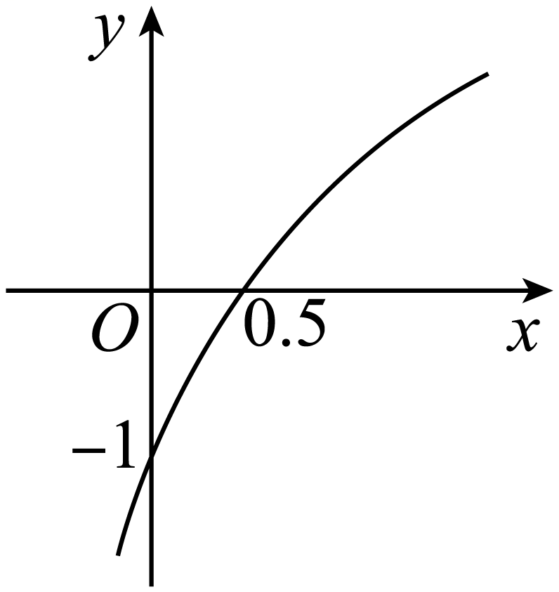
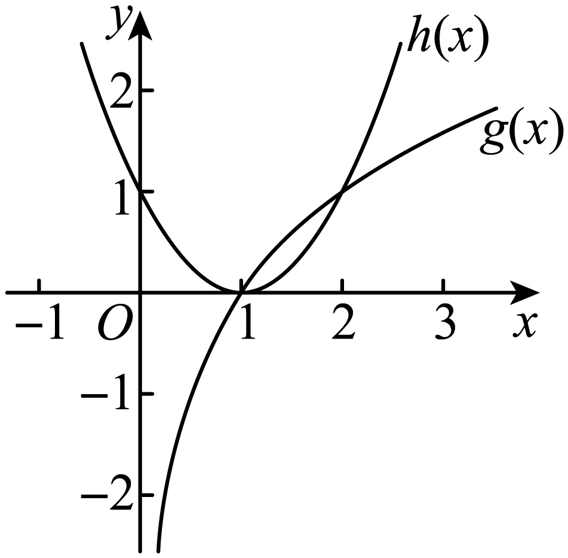
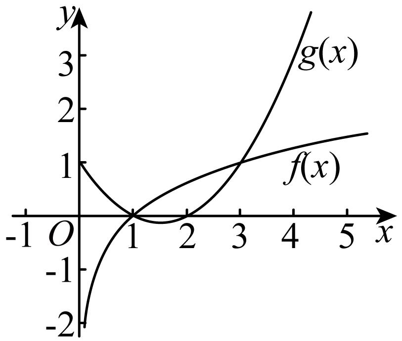
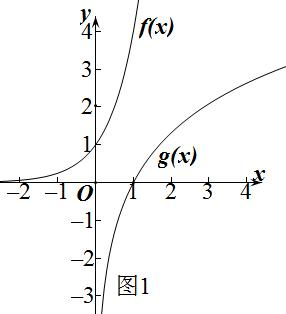
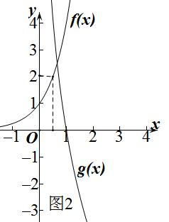
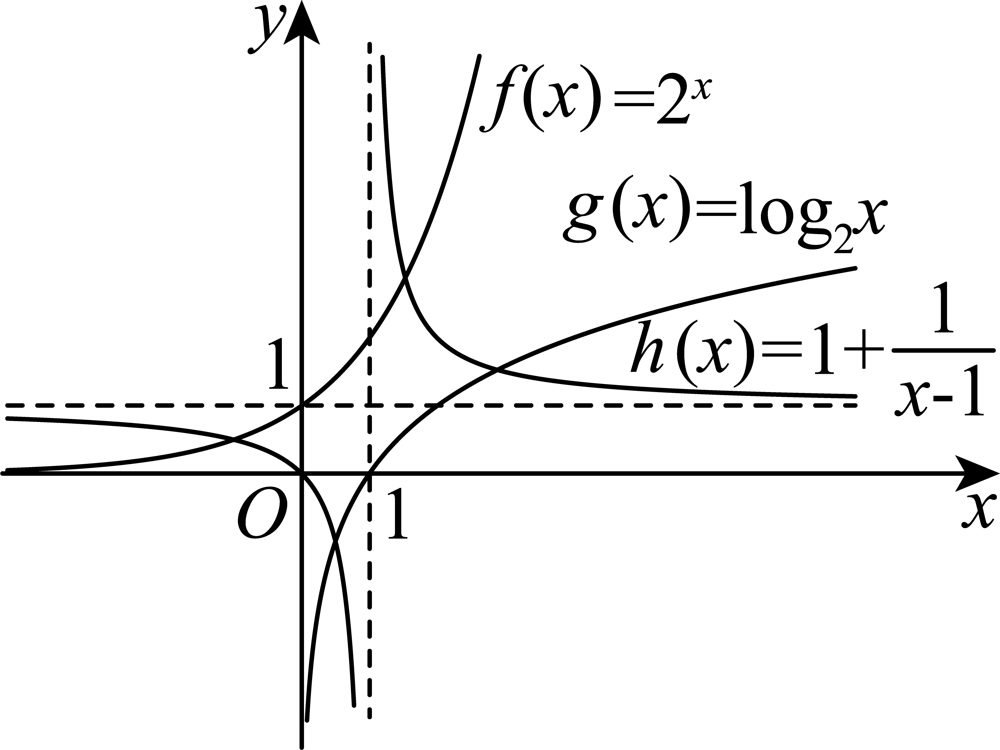

**第10讲  对数与对数函数**

**知识梳理**

**1、对数式的运算**

(1)对数的定义：一般地，如果且，那么数叫做以为底的对数，记作，读作以为底的对数，其中叫做对数的底数，叫做真数．

(2)常见对数：

①一般对数：以且为底，记为，读作以为底的对数；

②常用对数：以为底，记为；

③自然对数：以为底，记为；

(3) 对数的性质和运算法则：

①；；其中且；

②(其中且，)；

③对数换底公式：；

④；

⑤；

⑥，；

⑦和；

⑧；

**2、对数函数的定义及图像**

(1)对数函数的定义：函数 且叫做对数函数．

对数函数的图象

<table><tr><td></td><td>

</td><td>

</td></tr><tr><td>
图象
</td><td>
 
</td><td>

</td></tr><tr><td rowspan="5">
性质
</td><td colspan="2">
定义域：
</td></tr><tr><td colspan="2">
值域：
</td></tr><tr><td colspan="2">
过定点，即时，
</td></tr><tr><td>
在上增函数
</td><td>
在上是减函数
</td></tr><tr><td>
当时，，当时，
</td><td>
当时，，当时，
</td></tr></table>

**【解题方法总结】**

1、对数函数常用技巧

在同一坐标系内，当时，随的增大，对数函数的图象愈靠近轴；当时，对数函数的图象随的增大而远离轴．(见下图)

**必考题型全归纳**

**题型一：对数运算及对数方程、对数不等式**

**【例1】**（2024·四川成都·成都七中校考模拟预测）\_\_\_\_\_\_．

【答案】

【解析】.

故答案为：

**【对点训练1】**（2024·辽宁沈阳·沈阳二中校考模拟预测）已知，，则\_\_\_\_\_\_．

【答案】/

【解析】由题设，则且，

所以，即，故.

故答案为：

**【对点训练2】**（2024·上海徐汇·位育中学校考模拟预测）方程的解集为\_\_\_\_\_\_\_\_．

【答案】

【解析】因为,

则，解得，

所以方程的解集为.

故答案为：

**【对点训练3】**（2024·山东淄博·统考二模）设，满足，则\_\_\_\_\_\_\_\_\_\_.

【答案】/0.5

【解析】令，则，

所以，整理得，

解得(负值舍去)，所以.

故答案为：.

**【对点训练4】**（2024·天津南开·统考二模）计算的值为\_\_\_\_\_\_.

【答案】8

【解析】原式

.

故答案为：8.

<strong>【对点训练5】</strong>（2024·全国·高三专题练习）若，，用<em>a</em>，<em>b</em>表示\_\_\_\_\_\_\_\_\_\_\_\_

【答案】

【解析】因为，所以，

.

故答案为：.

**【对点训练6】**（2024·上海·高三校联考阶段练习）若，且，则\_\_\_\_\_\_\_\_\_\_．

【答案】

【解析】，且，

且，

，

，

，

.

故答案为：.

**【对点训练7】**（2024·全国·高三专题练习）=\_\_\_\_\_\_\_\_\_\_\_\_ ；

【答案】

【解析】原式

．

故答案为：.

<strong>【对点训练8】</strong>（2024·全国·高三专题练习）解关于<em>x</em>的不等式解集为 \_\_\_\_\_．

【答案】

【解析】不等式，

解，即，有，解得，

解，即，化为，有，解得，

因此，

所以不等式解集为.

故答案为：

**【对点训练9】**（2024·上海杨浦·高三上海市杨浦高级中学校考开学考试）已知函数是定义在上的奇函数，当时，，则的解集是\_\_\_\_\_\_\_\_\_\_.

【答案】

【解析】当时，，所以，

因为函数是定义在R上的奇函数，所以，

所以当时，，

所以，

要解不等式，只需或或，

解得或或，

综上，不等式的解集为.

故答案为：.

**【对点训练10】**（2024·上海浦东新·高三华师大二附中校考阶段练习）方程的解为\_\_\_\_\_\_\_\_\_．

【答案】

【解析】设函数，，由于函数在上均为增函数，

又，故方程的解为.

故答案为：.

**【解题方法总结】**

对数的有关运算问题要注意公式的顺用、逆用、变形用等.对数方程或对数不等式问题是要将其化为同底，利用对数单调性去掉对数符号，转化为不含对数的问题，但这里必须注意对数的真数为正.

**题型二：对数函数的图像**

<strong>【例2】</strong>（2024·全国·高三专题练习）已知函数（<em>a</em>，<em>b</em>为常数，其中且）的图象如图所示，则下列结论正确的是（    ）

A．，	B．，

C．，	D．，

【答案】D

【解析】由图象可得函数在定义域上单调递增，

所以，排除A，C；

又因为函数过点,

所以，解得．

故选：D

**【对点训练11】**（2024·全国·高三专题练习）函数的图象恒过定点（    ）

A．	B．	C．	D．

【答案】A

【解析】当时，即函数图象恒过.

故选：A

**【对点训练12】**（2024·北京·统考模拟预测）已知函数，则不等式的解集为（    ）

A．	B．

C．	D．

【答案】B

【解析】由题意，不等式，即，

等价于在上的解，

令，，则不等式为，

在同一坐标系下作出两个函数的图象，如图所示，

可得不等式的解集为，

故选：B

**【对点训练13】**（2024·北京·高三统考学业考试）将函数的图象向上平移1个单位长度，得到函数的图象，则（    ）

A．	B．

C．	D．

【答案】B

【解析】将函数的图象向上平移1个单位长度，得到函数.

故选：B.

**【对点训练14】**（2024·北京海淀·清华附中校考模拟预测）不等式的解集为\_\_\_\_\_\_\_\_\_\_．

【答案】

【解析】由，

在同一直角坐标系内画出函数的图象如下图所示：

因为，

所以由函数的图象可知：当时，有，

故答案为：

**【对点训练15】（多选题）（2024·全国·高三专题练习）** 当时，，则的值可以为（    ）

A．	B．	C．	D．

【答案】ABC

【解析】分别记函数，

由图1知，当时，不满足题意；

当时，如图2，要使时，不等式恒成立，只需满足，即，即，解得.

故选：ABC

**【解题方法总结】**

研究和讨论题中所涉及的函数图像是解决有关函数问题最重要的思路和方法.图像问题是数和形结合的护体解释.它为研究函数问题提供了思维方向.

**题型三：对数函数的性质（单调性、最值（值域））**

<strong>【例3】</strong>（2024·全国·高三专题练习）已知函数，若在上为减函数，则<em>a</em>的取值范围为（    ）

A．	B．	C．	D．

【答案】B

【解析】设函数，

因为在上为减函数，

所以在上为减函数，则解得，

又因为在恒成立，

所以解得，

所以*a*的取值范围为，

故选:B.

<strong>【对点训练16】</strong>（2024·新疆阿勒泰·统考三模）正数满足，则<em>a</em>与大小关系为\_\_\_\_\_\_．

【答案】/

【解析】因为，

所以，

设，则，

所以，

又因为与在上单调递增，

所以在上单调递增，

所以.

故答案为：.

<strong>【对点训练17】</strong>（2024·全国·高三专题练习）已知函数在上的最大值是2，则<em>a</em>等于\_\_\_\_\_\_\_\_\_

【答案】2

【解析】当时，函数在上单调递增，

则，解得，

当时，函数在上单调递减，

则，无解，

综上，*a*等于.

故答案为：2.

<strong>【对点训练18】</strong>（2024·全国·高三专题练习）若函数（且）在上的最大值为2，最小值为<em>m</em>，函数在上是增函数，则的值是\_\_\_\_\_\_\_\_\_\_\_\_．

【答案】3

【解析】当时，函数是正实数集上的增函数，而函数在上的最大值为，因此有，解得，所以，此时在上是增函数，符合题意，因此；

当时，函数是正实数集上的减函数，而函数在上的最大值为，因此有，，所以，此时在上是减函数，不符合题意.

综上所述，，，.

故答案为：3.

**【对点训练19】**（2024·全国·高三专题练习）若函数有最小值，则的取值范围是\_\_\_\_\_\_．

【答案】

【解析】当时，外层函数为减函数，对于内层函数，，则对任意的实数恒成立，

由于二次函数有最小值，此时函数没有最小值；

当时，外层函数为增函数，对于内层函数，

函数有最小值，若使得函数有最小值，

则，解得.

综上所述，实数的取值范围是.

故答案为：.

**【对点训练20】**（2024·河南·校联考模拟预测）写出一个同时具有下列性质①②③的函数:\_\_\_\_\_.

① ;②当时，单调递减; ③为偶函数.

【答案】（不唯一）

【解析】性质①显然是和对数有关，性质②只需令对数的底即可，性质③只需将自变量加绝对值即变成偶函数.

故答案为：（不唯一）

**【对点训练21】**（2024·重庆渝中·高三重庆巴蜀中学校考阶段练习）函数的单调递区间为（   ）

A．	B．	C．	D．

【答案】B

【解析】函数的定义域为

令，又在定义域内为减函数，

故只需求函数在定义域上的单调递减区间，

又因为函数在上单调递减，

的单调递区间为.

故选：B

**【对点训练22】**（2024·陕西宝鸡·统考二模）已知函数，则（    ）

A．在单调递减，在单调递增	B．在单调递减

C．的图像关于直线对称	D．有最小值，但无最大值

【答案】C

【解析】由题意可得函数的定义域为，

则，

因为在上单调递增，在上单调递减，

且在上单调递增，

故在上单调递增，在上单调递减，A，B错误；

由于，故的图像关于直线对称，C正确；

因为在时取得最大值，且在上单调递增，

故有最大值，但无最小值，D错误，

故选：C

<strong>【对点训练23】</strong>（2024·全国·高三专题练习）若函数在上单调，则<em>a</em>的取值范围是（    ）

A．	B．	C．	D．

【答案】D

【解析】若 在上单调递增，则，解得，

若 在上单调递减，则，解得．

综上得.

故选：D

**【解题方法总结】**

研究和讨论题中所涉及的函数性质是解决有关函数问题最重要的思路和方法.性质问题是数和形结合的护体解释.它为研究函数问题提供了思维方向.

**题型四：对数函数中的恒成立问题**

**【例4】**（2024·全国·高三专题练习）已知函数，，若存在，任意，使得，则实数的取值范围是\_\_\_\_\_\_\_\_\_\_\_.

【答案】

【解析】若在上的最大值，在上的最大值，

由题设，只需即可.

在上，当且仅当时等号成立，

由对勾函数的性质：在上递增，故.

在上，单调递增，则，

所以，可得.

故答案为：.

**【对点训练24】**（2024·全国·高三专题练习）若，不等式恒成立，则实数的取值范围为\_\_\_\_\_\_\_\_\_\_\_.

【答案】

【解析】因为，不等式恒成立，

所以对恒成立.

记，，只需.

因为在上单调递减，在上单调递减，

所以在上单调递减，

所以，所以.

故答案为：

**【对点训练25】**（2024·全国·高三专题练习）已知函数，，对任意的，，有恒成立，则实数的取值范围是\_\_\_\_\_\_\_\_\_\_\_.

【答案】

【解析】函数在，上单调递增，在，上单调递增，

∴，，

对任意的，，有恒成立，

∴，即，解得，

∴实数的取值范围是．

故答案为：.

**【对点训练26】**（2024·全国·高三专题练习）已知函数，若对，使得，则实数的取值范围为\_\_\_\_\_\_\_\_\_\_\_.

【答案】

【解析】因为对，使得，

所以，

因为的对称轴为，所以在上单调递增，所以，

又因为在上单调递增，所以，

所以，所以，即，

故答案为：.

**【对点训练27】**（2024·全国·高三专题练习）已知函数.

(1)若，求*a*的值；

(2)若对任意的，恒成立，求的取值范围.

【解析】（1）因为，所以，

所以，所以，解得.

（2）由，得，即，

即或.

当时，，则或，

因为，则不成立，

由可得，得；

当时，，则或，

因为，则不成立，所以，解得.

综上，的取值范围是.

**【对点训练28】**（2024·全国·高三专题练习）已知，.

（1）当时，求函数的值域；

（2）对任意，其中常数，不等式恒成立，求实数的取值范围.

【解析】（1）因为，，

令，

∵，∴，所以当，即时取最大值，当或，即或时取最小值，

∴函数的值域为.

（2）由得，

令，∵，∴，

∴对一切的恒成立，

①当时，若时，；

当时，恒成立，即，

函数在单调递减，于是时取最小值-2，此时，

于是；

②当时，此时时，恒成立，即，

∵，当且仅当，即时取等号，即的最小值为-3，；

③当时，此时时，恒成立，即，

函数在单调递增，于是时取最小值，

此时，于是.

综上可得：当时，当时，当时，

**【解题方法总结】**

（1）利用数形结合思想，结合对数函数的图像求解；

（2）分离自变量与参变量，利用等价转化思想，转化为函数的最值问题.

（3）涉及不等式恒成立问题，将给定不等式等价转化，借助同构思想构造函数，利用导数探求函数单调性、最值是解决问题的关键.

**题型五：对数函数的综合问题**

**【例5】（多选题）（2024·湖北·黄冈中学校联考模拟预测）** 已知，，，，则以下结论正确的是（    ）

A．	B．

C．	D．

【答案】ABD

【解析】对于A，由题意知，*a*，*b*是函数分别与函数，图象交点的横坐标，

由的图象关于对称，

则其向上，向右都平移一个单位后的解析式为，

所以的图象也关于对称，

又，两个函数的图象关于直线对称，

故两交点，关于直线对称，

所以，，故A正确；

对于B，结合选项A得，则，即，即成立，故B正确；

对于C，结合选项A得，令，则，

所以在上单调递减，则，故C错误；

对于D，结合选项B得(，即不等式取不到等号)，故D正确．

故选：ABD．

**【对点训练29】**（2024·海南海口·统考模拟预测）已知正实数，满足：，则的最小值为\_\_\_\_\_\_.

【答案】

【解析】由可得：,

所以，，

设，，

所以在上单调递增，所以，

则，所以，

所以，所以，令，

令，解得：；令，解得：；

所以在上单调递减，在上单调递增，

所以.

故的最小值为.

故答案为：.

**【对点训练30】（多选题）（2024·广东惠州·统考一模）** 若，则（    ）

A．	B．

C．	D．

【答案】ABD

【解析】因为，所以，则，

选项A，，故正确；

选项B，因为，且，所以，故B正确；

选项C，因为，故C错误；

选项D，因为，故D正确，

故选：ABD．

<strong>【对点训练31】</strong>（2024·河南·高三信阳高中校联考阶段练习）已知，分别是方程和的根，若，实数<em>a</em>，，则的最小值为（    ）

A．1	B．	C．	D．2

【答案】D

【解析】；.

函数与函数的图象关于直线对称，

由解得，设，

则，即，

，

令，则，

则

，

当且仅当时等号成立.

故选：D

**【对点训练32】**（2024·全国·高三专题练习）若满足，满足，则等于（    ）

A．2	B．3	C．4	D．5

【答案】D

【解析】由题意，故有

故和是直线和曲线、曲线交点的横坐标.

根据函数和函数互为反函数，它们的图象关于直线对称，

故曲线和曲线的图象交点关于直线对称.

即点（<em>x1</em>，5﹣<em>x1</em>）和点（<em>x2</em>，5﹣<em>x2</em>）构成的线段的中点在直线<em>y</em>=<em>x</em>上，

即，求得<em>x1</em>+<em>x2</em>=5，

故选：D.

**【对点训练33】**（2024·全国·高三专题练习）已知 是方程的根， 是方程的根，则的值为（    ）

A．2	B．3	C．6	D．10

【答案】A

【解析】方程可变形为方程，方程可变形为方程，

是方程的根，是方程的根，

是函数与函数的交点横坐标，是函数与函数的交点横坐标，

函数与函数互为反函数，

函数与函数的交点横坐标等于函数与函数的交点纵坐标,即在数图象上，

又图象上点的横纵坐标之积为2， ，

故选：

