**第12讲  函数与方程**

**知识梳理**

**一、函数的零点**

对于函数，我们把使的实数叫做函数的零点.

**二、方程的根与函数零点的关系**

方程有实数根函数的图像与轴有公共点函数有零点.

**三、零点存在性定理**

如果函数在区间上的图像是连续不断的一条曲线，并且有，那么函数在区间内有零点，即存在，使得也就是方程的根.

**四、二分法**

对于区间上连续不断且的函数，通过不断地把函数的零点

所在的区间一分为二，使区间的两个端点逐步逼近零点，进而得到零点的近似值的方法叫做二分法.求方程的近似解就是求函数零点的近似值.

**五、用二分法求函数零点近似值的步骤**

（1）确定区间，验证，给定精度.

（2）求区间的中点.

（3）计算.若则就是函数的零点；若，则令（此时零点）.若，则令（此时零点）

（4）判断是否达到精确度，即若，则函数零点的近似值为（或）；否则重复第（2）—（4）步.

用二分法求方程近似解的计算量较大，因此往往借助计算完成.

**【解题方法总结】**

函数的零点相关技巧:

①若连续不断的函数在定义域上是单调函数，则至多有一个零点.

②连续不断的函数，其相邻的两个零点之间的所有函数值同号.

③连续不断的函数通过零点时，函数值不一定变号.

④连续不断的函数在闭区间上有零点，不一定能推出.

**必考题型全归纳**

**题型一：求函数的零点或零点所在区间**

**【例1】**（2024·广西玉林·博白县中学校考模拟预测）已知函数是奇函数，且，若是函数的一个零点，则（    ）

A．	B．0	C．2	D．4

【答案】D

【解析】因为是函数的一个零点，则，于是，即，

而函数是奇函数，则有，

所以.

故选：D

**【对点训练1】**（2024·吉林·通化市第一中学校校联考模拟预测）已知是函数的一个零点，则的值为（    ）

A．	B．	C．	D．

【答案】D

【解析】因为是函数的一个零点，

所以，即，故，

则．

故选：D．

**【对点训练2】**（2024·全国·高三专题练习）已知函数的零点依次为，则（    ）

A．	B．	C．	D．

【答案】A

【解析】对于 ，显然是增函数， ，所以 的唯一零点 ；

对于 ，显然也是增函数， ，所以 的唯一零点 ；

对于 ，显然也是增函数， ，所以 的唯一零点 ；

；

故选：A.

**【对点训练3】**（2024·全国·高三专题练习）已知，若是方程的一个解，则可能存在的区间是（    ）

A．	B．	C．	D．

【答案】C

【解析】，所以，

因为是方程的一个解，

所以是方程的解，令，

则，当时，恒成立，

所以单调递增，

又，

所以.

故选：C.

**【解题总结】**

求函数零点的方法：

（1）代数法，即求方程的实根，适合于宜因式分解的多项式；（2）几何法，即利用函数的图像和性质找出零点，适合于宜作图的基本初等函数.

**题型二：利用函数的零点确定参数的取值范围**

<strong>【例2】</strong>（2024·山西阳泉·统考三模）函数在区间存在零点．则实数<em>m</em>的取值范围是（    ）

A．	B．	C．	D．

【答案】B

【解析】由在上单调递增，在上单调递增，得函数在区间上单调递增，

因为函数在区间存在零点，

所以，即，解得，

所以实数*m*的取值范围是.

故选：B.

**【对点训练4】**（2024·全国·高三专题练习）函数的一个零点在区间内，则实数的取值范围是（    ）

A．	B．	C．	D．

【答案】D

【解析】∵和在上是增函数，

∴在上是增函数，

∴只需即可，即，解得.

故选：D.

<strong>【对点训练5】</strong>（2024·河北·高三学业考试）已知函数是<em>R</em>上的奇函数，若函数的零点在区间内，则的取值范围是（    ）

A．	B．	C．	D．

【答案】A

【解析】∵是奇函数，∴，，，易知在上是增函数，

∴有唯一零点0，

函数的零点在区间内，∴在上有解，，∴．

故选：A．

**【对点训练6】**（2024·浙江绍兴·统考二模）已知函数，若在区间上有零点，则的最大值为\_\_\_\_\_\_\_\_\_\_.

【答案】

【解析】设，则，

此时，则，

令，

当时，，

记，则，

所以在上递增，在上递减，

故,所以，

所以的最大值为.

故答案为：.

**【对点训练7】**（2024·上海浦东新·高三上海市进才中学校考阶段练习）已知函数在上有零点，则实数的取值范围\_\_\_\_\_\_\_\_\_\_\_.

【答案】

【解析】当时，，，，

故，由零点存在性定理知：在区间上至少有1个零点；

当时，，符合题意；

当时，，

，

由零点存在性定理知，在区间至少有1个零点；

当时，

，

因为，，所以，，

当时，，，递增，

当时，，，递减，

故在上递增，在上递减，

又，即在上，，

故在区间上没有零点．

所以，当时，函数在上有零点.

令，，

可知为奇函数，图象关于原点对称，

从而，当时，函数在上有零点.

又当时，，符合题意，

综上，实数的取值范围．

故答案为：．

**【解题总结】**

本类问题应细致观察、分析图像，利用函数的零点及其他相关性质，建立参数关系，列关于参数的不等式，解不等式，从而获解.

**题型三：方程根的个数与函数零点的存在性问题**

**【例3】**（2024·黑龙江哈尔滨·哈尔滨三中校考模拟预测）已知实数，满足，，则\_\_\_\_\_\_\_\_.

【答案】4

【解析】由，即，

即，

令，则，

即，即.

由，得，

设函数，显然该函数增函数，

又，

所以函数在上有唯一的零点，

因此，即，

所以.

故答案为：4.

**【对点训练8】**（2024·新疆·校联考二模）已知函数，若存在唯一的零点，且，则的取值范围是\_\_\_\_\_\_\_\_．

【答案】

【解析】因为，所以

当时，有，解得，所以当时，有两个零点，不符合题意；

当时，由，解得或，且有，，

当，，在区间上单调递增；

当，，在区间上单调递减；

当，，在区间上单调递增；

又因为，，

所以，存在一个正数零点，所以不符合题意；

当时，令，解得或，且有，

当，，在区间上单调递减；

当，，在区间上单调递增；

当，，在区间上单调递减；

又因为，，

所以，存在一个负数零点，要使存在唯一的零点，

则满足，解得或，又因为，所以，

综上，的取值范围是．

故答案为：.

**【对点训练9】**（2024·天津滨海新·统考三模）已知函数，若函数在上恰有三个不同的零点，则的取值范围是\_\_\_\_\_\_\_\_．

【答案】

【解析】当时，，

因为恰有三个不同的零点，

函数在上恰有三个不同的零点，即有三个解，

而无解，故.

当时，函数在上恰有三个不同的零点，

即，即与的图象有三个交点，如下图，

当时，与必有1个交点，

所以当时，有2个交点，

即，即令在内有两个实数解，

，

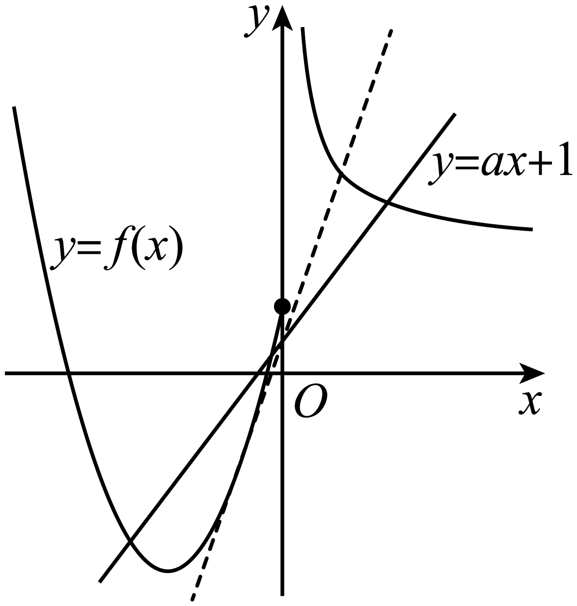

当时，函数在上恰有三个不同的零点，

即，即与的图象有三个交点，如下图，

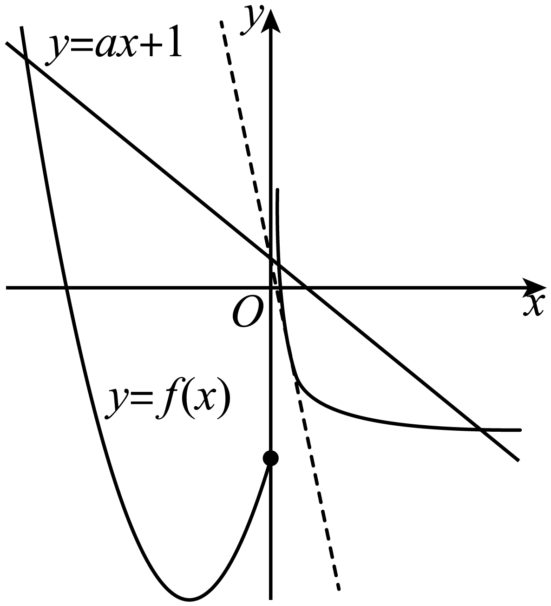

当时，必有1个交点，

当时，与有2个交点，

所以，即在上有根，

令

故，解得：.

综上所述：的取值范围是.

故答案为：.

<strong>【对点训练10】</strong>（2024·江苏·校联考模拟预测）若曲线有两条过的切线，则<em>a</em>的范围是\_\_\_\_\_\_.

【答案】

【解析】设切线切点为，因，则切线方程为：.

因过，则，由题函数图象

与直线有两个交点.，

得在上单调递增，在上单调递减.

又，，.

据此可得大致图象如下.则由图可得，当时，曲线有两条过的切线.

故答案为：

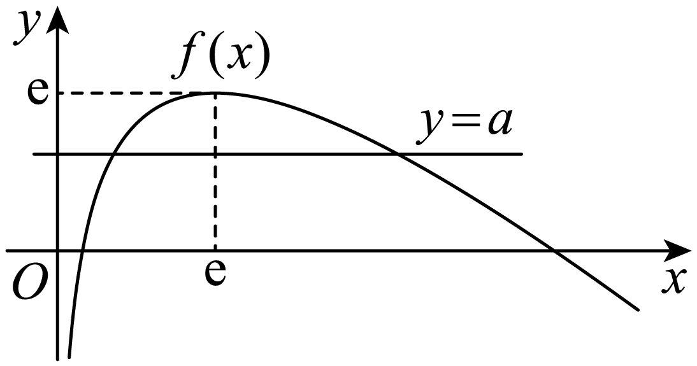

<strong>【对点训练11】</strong>（2024·天津北辰·统考三模）设，对任意实数<em>x</em>，记．若有三个零点，则实数<em>a</em>的取值范围是\_\_\_\_\_\_\_\_．

【答案】

【解析】令，

因为函数有一个零点，函数至多有两个零点，

又有三个零点，

所以必须有两个零点，且其零点与函数的零点不相等，

且函数与函数的零点均为函数的零点，

由可得，，所以，

所以为函数的零点，

即，

所以，

令，可得，

由已知有两个根，

设，则有两个正根，

所以，，

所以，故，

当时，有两个根，

设其根为，，则，

设，则，，

所以，

令，则，

则，，

且，，

所以当时，，

所以当时，为函数的零点，又也为函数的零点，

且与互不相等，

所以当时，函数有三个零点.

故答案为：.

<strong>【对点训练12】</strong>（2024·广东·统考模拟预测）已知实数<em>m</em>，<em>n</em>满足，则\_\_\_\_\_\_\_\_\_\_\_.

【答案】

【解析】因为，所以，

故，即，

即.

由，得.

令，因为增函数+增函数=增函数，所以函数在R上单调递增，

而，故，解得，则.

故答案为：

**【解题总结】**

方程的根或函数零点的存在性问题，可以依据区间端点处函数值的正负来确定，但是要确定函数零点的个数还需要进一步研究函数在这个区间的单调性，若在给定区间上是单调的，则至多有一个零点；如果不是单调的，可继续分出小的区间，再类似做出判断.

**题型四：嵌套函数的零点问题**

**【例4】**（2024·全国·高三专题练习）已知函数，若关于的方程有且只有三个不同的实数解，则正实数的取值范围为（    ）

A．	B．	C．	D．

【答案】B

【解析】因为，

由可得，

所以，关于的方程、共有个不同的实数解.

①先讨论方程的解的个数.

当时，由，可得，

当时，由，可得，

当时，由，可得，

所以，方程只有两解和；

②下面讨论方程的解的个数.

当时，由可得，可得或，

当时，由，可得，此时方程有无数个解，不合乎题意，

当时，由可得，

因为，由题意可得或或，

解得或.

因此，实数的取值范围是.

故选：B.

**【对点训练13】**（2024·全国·高三专题练习）已知函数，则关于的方程有个不同实数解，则实数满足（    ）

A．且	B．且

C．且	D．且

【答案】C

【解析】令，作出函数的图象如下图所示：

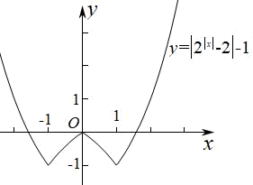

由于方程至多两个实根，设为和，

由图象可知，直线与函数图象的交点个数可能为0､2､3､4，

由于关于*x*的方程有7个不同实数解，

则关于*u*的二次方程的一根为，则，

则方程的另一根为，

直线与函数图象的交点个数必为4，则，解得.

所以且.

故选：C.

<strong>【对点训练14】</strong>（2024·四川资阳·高三统考期末）定义在<em>R</em>上函数，若函数关于点对称，且则关于<em>x</em>的方程()有<em>n</em>个不同的实数解，则<em>n</em>的所有可能的值为

A．2	B．4

C．2或4	D．2或4或6

【答案】B

【解析】∵函数关于点对称，∴是奇函数，时，在上递减，在上递增，

作出函数的图象，如图，由图可知的解的个数是1，2，3.

或时，有一个解，时，有两个解，时，有三个解，

方程中设，则方程化为，其判别式为恒成立，方程必有两不等实根，，，，两根一正一负，不妨设，

若，则，，和都有两个根，原方程有4个根；

若，则，，∴，，有三个根，有一个根，原方程共有4个根；

若，则，，∴，，有一个根，有三个根，原方程共有4个根．

综上原方程有4个根．

故选：B.

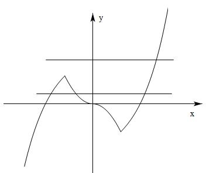

**【对点训练15】**（2024·全国·高三专题练习）已知函数，设关于的方程有个不同的实数解，则的所有可能的值为

A．	B．或	C．或	D．或或

【答案】A

【解析】在和上单增，上单减，又当时，时，故的图象大致为：

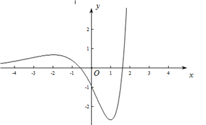

令，则方程必有两个根，且，不仿设 ，当时，恰有，此时，有个根，，有个根，当时必有，此时无根，有个根，当时必有，此时有个根，，有个根，综上，对任意，方程均有个根，故选A.

**【解题总结】**

1、涉及几个根的取值范围问题，需要构造新的函数来确定取值范围．

2、二次函数作为外函数可以通过参变分离减少运算，但是前提就是函数的基本功要扎实．

**题型五：函数的对称问题**

<strong>【例5】</strong>（2024·全国·高三专题练习）已知函数的图象上存在点<em>P</em>，函数<em>g</em>（<em>x</em>）=<em>ax</em>-3的图象上存在点<em>Q</em>，且<em>P</em>，<em>Q</em>关于原点对称，则实数<em>a</em>的取值范围是（　　）

*A*．	*B*．	*C*．	*D*．

【答案】*C*

【解析】由题意，函数关于原点对称的函数为，即，

若函数的图象上存在点*Q*，且*P*，*Q*关于原点对称，

则等价为在上有解，即，在上有解，

由，则，

当时，，此时函数为单调增函数；

当时，，此时函数为单调减函数，

即当时，取得极小值同时也是最小值，且，即，

当时，，即，

设，要使得有解，

则当过点 时，得，过点时，，解得，

综上可得．

故选*C*．

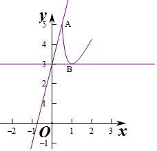

<strong>【对点训练16】</strong>（2024·全国·高三专题练习）已知函数，函数与的图象关于直线对称，若无零点，则实数<em>k</em>的取值范围是（    ）

*A*．	*B*．	*C*．	*D*．

【答案】*D*

【解析】由题知，，设，当时，，此时单调递减，当时，，此时单调递增，所以，的图象如下，由图可知，当时，与无交点，即无零点．

故选：*D*．

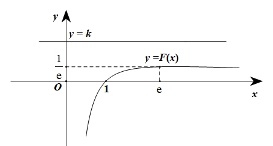

**【对点训练17】**（2024·全国·高三专题练习）已知函数的图象上存在点，函数的图象上存在点，且，关于轴对称，则的取值范围是（    ）

*A*．	*B*．

*C*．	*D*．

【答案】*A*

【解析】因为函数与函数的图象关于*x*轴对称，

根据已知得函数的图象与函数的图象有交点，

即方程在上有解，

即在上有解．

令，，

则，

可知在上单调递增，在上单调递减，

故当时，，

由于，，且，

所以．

故选：*A*．

**【对点训练18】**（2024·全国·高三专题练习）已知函数（，为自然对数的底数）与的图象上存在关于轴对称的点，则实数的取值范围是（    ）

*A*．	*B*．

*C*．	*D*．

【答案】*B*

【解析】设上一点，，且关于轴对称点坐标为，在上，

有解，即有解．

令，则，，

当时，；当时，，在上单调递减；在上单调递增

，，，

有解等价于与图象有交点，   ．

故选：*B*

**【解题总结】**

转化为零点问题

**题型六：函数的零点问题之分段分析法模型**

**【例6】**（2024·浙江宁波·高三统考期末）若函数至少存在一个零点，则的取值范围为（    ）

A．	B．	C．	D．

【答案】A

【解析】因为函数至少存在一个零点

所以有解

即有解

令，

则

因为，且由图象可知，所以

所以在上单调递减，令得

当时，单调递增

当时，单调递减

所以

且当时

所以的取值范围为函数的值域，即

故选：A

**【对点训练19】**（2024·湖北·高三校联考期中）设函数，记，若函数至少存在一个零点，则实数的取值范围是

A．	B．	C．	D．

【答案】D

【解析】由题意得函数的定义域为．

又，

∵函数至少存在一个零点，

∴方程有解，

即有解．

令，

则，

∴当时，单调递增；当时，单调递减．

∴．

又当时，；当时，．

要使方程有解，则需满足，

∴实数的取值范围是．

故选D．

**【对点训练20】**（2024·福建厦门·厦门外国语学校校考一模）若至少存在一个，使得方程成立．则实数的取值范围为

A．	B．	C．	D．

【答案】B

【解析】原方程化简得:有解,令,,当时,,所以f(x)在单调递减,当x<e时, ,所以f(x)在单调递增..所以.选B.

**【对点训练21】**（2024·湖南长沙·高三长沙一中校考阶段练习）设函数（其中为自然对数的底数），若函数至少存在一个零点，则实数的取值范围是（    ）

A．	B．	C．	D．

【答案】D

【解析】依题意得，函数至少存在一个零点，且，

可构造函数和，

因为，开口向上，对称轴为，所以为单调递减，为单调递增；

而，则，由于，所以为单调递减，为单调递增；

可知函数及均在处取最小值，所以在处取最小值，

又因为函数至少存在一个零点，只需即可，即：

解得：.

故选：*D.*

**【解题总结】**

**分类讨论数学思想方法**

**题型七：唯一零点求值问题**

**【例7】**（2024·全国·高三专题练习）已知函数有唯一零点，则实数（    ）

A．1	B．	C．2	D．

【答案】D

【解析】设，定义域为R,

∴，

故函数为偶函数，则函数的图象关于*y*轴对称，

故函数的图象关于直线对称，

∵有唯一零点，

∴，即．

故选：D．

**【对点训练22】**（2024·全国·高三专题练习）已知函数有唯一零点，则（     ）

A．	B．	C．	D．

【答案】C

【解析】令，则，

记，则，令则，所以是偶函数，图象关于轴对称，因为只有唯一的零点，所以零点只能是于是

故选：C

**【对点训练23】**（2024·全国·高三专题练习）已知函数，分别是定义在上的偶函数和奇函数，且，若函数有唯一零点，则实数的值为

A．或	B．1或	C．或2	D．或1

【答案】A

【解析】已知，①

且，分别是上的偶函数和奇函数，

则，

得：，②

①+②得：，

由于关于对称，

则关于对称，

为偶函数，关于轴对称，

则关于对称，

由于有唯一零点，

则必有，，

即：，

解得：或.

故选：A.

**【对点训练24】**（2024·全国·高三专题练习）已知函数有唯一零点，则负实数

A．	B．	C．	D．或

【答案】A

【解析】函数有唯一零点，

设

则函数有唯一零点，

则

设∴ 为偶函数，

∵函数 有唯一零点，

∴与有唯一的交点，

∴此交点的横坐标为0， 解得 或（舍去），

故选A．

**【解题总结】**

利用函数零点的情况求参数的值或取值范围的方法：

（1）利用零点存在性定理构建不等式求解.

（2）分离参数后转化为函数的值域(最值)问题求解.

（3）转化为两个熟悉的函数图像的上、下关系问题，从而构建不等式求解.

**题型八：分段函数的零点问题**

<strong>【例8】</strong>（2024·天津南开·高三南开中学校考期末）已知函数，若函数有两个零点，则<em>m</em>的取值范围是（    ）

A．	B．	C．	D．

【答案】A

【解析】

存在两个零点，等价于与的图象有两个交点，在同一直角坐标系中绘制两个函数的图象：

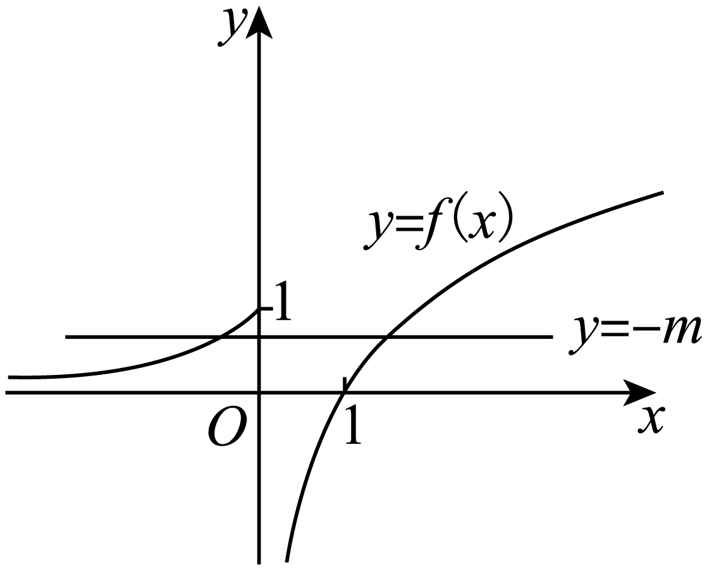

由图可知，保证两函数图象有两个交点，满足，解得：

故选：A.

<strong>【对点训练25】</strong>（2024·全国·高三专题练习）已知，函数恰有3个零点，则<em>m</em>的取值范围是（    ）

A．	B．	C．	D．

【答案】A

【解析】设，，

求导

由反比例函数及对数函数性质知在上单调递增，

且，，故在内必有唯一零点，

当时，，单调递减；

当时，，单调递增；

令，解得或2，可作出函数的图像，

令，即，在之间解得或或，

作出图像如下图

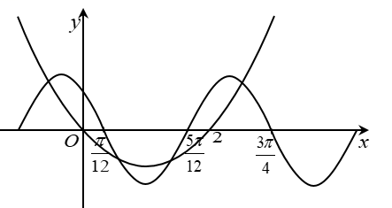

数形结合可得：，

故选：A

**【对点训练26】**（2024·陕西西安·高三统考期末）已知函数， 若函数，则函数的零点个数为（    ）

A．1	B．3	C．4	D．5

【答案】D

【解析】当时，，

当时，，

，

，且定义域为，关于原点对称，故为奇函数，

所以我们求出时零点个数即可，

，，令，解得，

故在上单调递增，在单调递减，

且，而，故在有1零点，

，故在上有1零点，图像大致如图所示：

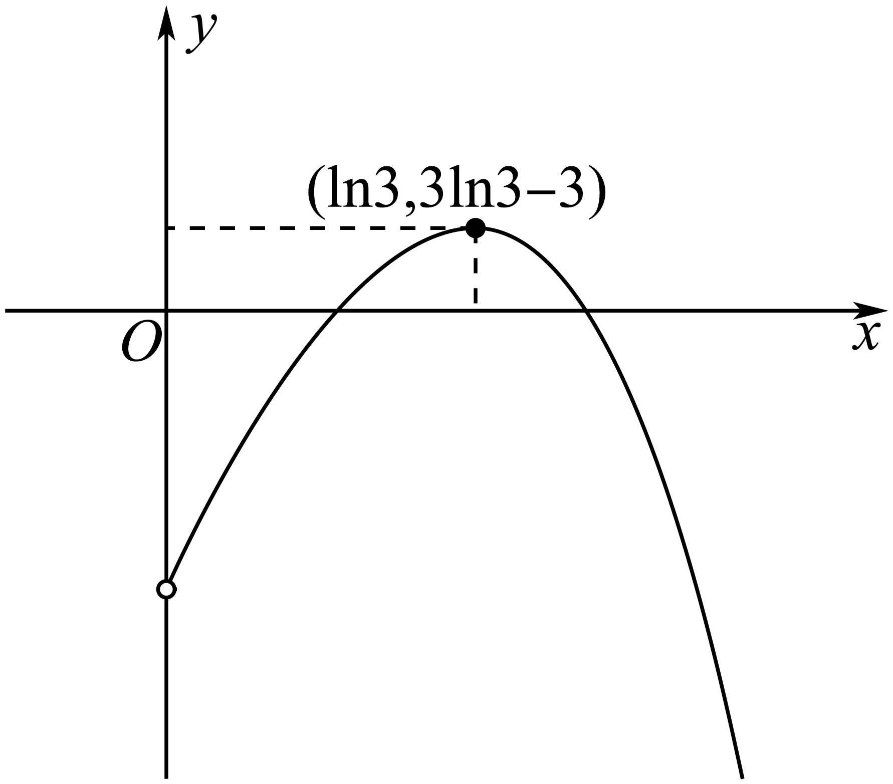

故在上有2个零点，又因为其为奇函数，则其在上也有2个零点，且，故共5个零点，

故选：D.

<strong>【对点训练27】</strong>（2024·全国·高三专题练习）已知函数 ，若函数在内恰有5个零点，则<em>a</em>的取值范围是（    ）

A．	B．	C．	D．

【答案】D

【解析】当时，对任意的，在上至多个零点，不合乎题意，所以，.

函数的对称轴为直线，.

所以，函数在上单调递减，在上单调递增，且.

①当时，即当时，则函数在上无零点，

所以，函数在上有个零点，

当时，，则，

由题意可得，解得，此时不存在；

②当时，即当时，函数在上只有一个零点，

当时，，则，则函数在上只有个零点，

此时，函数在上的零点个数为，不合乎题意；

③当时，即当时，函数在上有个零点，

则函数在上有个零点，

则，解得，此时；

④当时，即当时，函数在上有个零点，

则函数在上有个零点，

则，解得，此时，.

综上所述，实数的取值范围是.

故选：D.

**【解题总结】**

已知函数零点个数(方程根的个数)求参数值(取值范围)常用的方法：

（1）直接法：直接求解方程得到方程的根，再通过解不等式确定参数范围；

（2）分离参数法：先将参数分离，转化成求函数的值域问题加以解决；

（3）数形结合法：先对解析式变形，进而构造两个函数，然后在同一平面直角坐标系中画出函数的图象，利用数形结合的方法求解.

**题型九：零点嵌套问题**

**【例9】**（2024·全国·高三专题练习）已知函数有三个不同的零点.其中，则的值为（    ）

A．1	B．	C．	D．

【答案】A

【解析】令，则，

故当时，，是增函数，

当时，，是减函数，

可得处取得最小值，

，，画出的图象，

由可化为，

故结合题意可知，有两个不同的根，

故，故或，

不妨设方程的两个根分别为，，

①若，，

与相矛盾，故不成立；

②若，则方程的两个根，一正一负；

不妨设，结合的性质可得，，，，

故

又，，

．

故选：A．

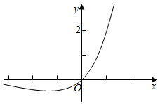

**【对点训练28】**（2024·全国·高三专题练习）已知函数，有三个不同的零点，（其中），则的值为

A．	B．	C．-1	D．1

【答案】D

【解析】令f（x）=0，分离参数得a=令h（x）=由h′（x）= 得x=1或x=e．

当x∈（0，1）时，h′（x）＜0；当x∈（1，e）时，h′（x）＞0；当x∈（e，+∞）时，h′（x）＜0．

即h（x）在（0，1），（e，+∞）上为减函数，在（1，e）上为增函数．

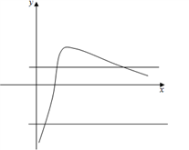

∴0＜x1＜1＜x2＜e＜x3，a=令μ=则a=即μ2+（a-1）μ+1-a=0，

μ1+μ2=1-a＜0，μ1μ2=1-a＜0，

对于μ=， 则当0＜x＜e时，μ′＞0；当x＞e时，μ′＜0．而当x＞e时，μ恒大于0．不妨设μ1＜μ2，则μ1=， =（1-μ1）2（1-μ2）（1-μ3）

=[（1-μ1）（1-μ2）]2=[1-（1-a）+（1-a）]2=1．

故选D．

**【对点训练29】**（2024·辽宁·校联考二模）已知函数有三个不同的零点，，，且，则的值为（    ）

A．81	B．﹣81	C．﹣9	D．9

【答案】A

【解析】

∴

∴

令，，则，

∴

令，解得

∴时，，单调递减；时，，单调递增；

∴，，

∴*a*﹣3

∴.

设关于*t*的一元二次方程有两实根，，

∴，可得或.

∵，故

∴舍去

∴6，.

又∵，当且仅当时等号成立，

由于，∴，（不妨设）.

∵，可得，，.

则可知，.

∴.

故选：A.

<strong>【对点训练30】</strong>（2024·重庆南岸·高三重庆市第十一中学校校考阶段练习）设定义在<em>R</em>上的函数满足有三个不同的零点且 则的值是（    ）

A．81	B．-81	C．9	D．-9

【答案】A

【解析】由有三个不同的零点知：有三个不同的实根，即有三个不同实根，

若，则，整理得，若方程的两根为，

∴，而，

∴当时，即在上单调递减；当时，即在上单调递增；即当时有极小值为，又，有，即.

∵方程最多只有两个不同根，

∴，即，，

∴.

故选：A

**【解题总结】**

解决函数零点问题，常常利用数形结合、等价转化等数学思想.

**题型十：等高线问题**

**【例10】**（2024·全国·高三专题练习）设函数

①若方程有四个不同的实根，，，，则的取值范围是

②若方程有四个不同的实根，，，，则的取值范围是

③若方程有四个不同的实根，则的取值范围是

④方程的不同实根的个数只能是1，2，3，6

四个结论中，正确的结论个数为（    ）

A．1	B．2	C．3	D．4

【答案】B

【解析】对于①：作出的图像如下：

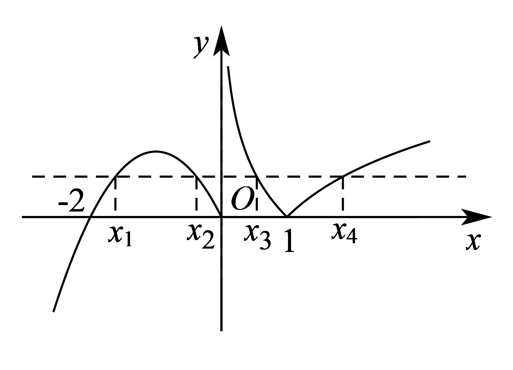

若方程有四个不同的实根，，，，则，不妨设，

则，是方程的两个不等的实数根，，是方程的两个不等的实数根，

所以，，所以，所以，

所以，故①正确；

对于②：由上可知，，，且，

所以，

所以，，

所以，

所以，故②错误；

对于③：方程的实数根的个数，即为函数与的交点个数，

因为恒过坐标原点，当时，有3个交点，当时最多2个交点，所以，

当与相切时，设切点为，

即，所以，解得，所以，所以，

所以当与相切时， 即时，此时有4个交点，

若有4个实数根，即有4个交点，

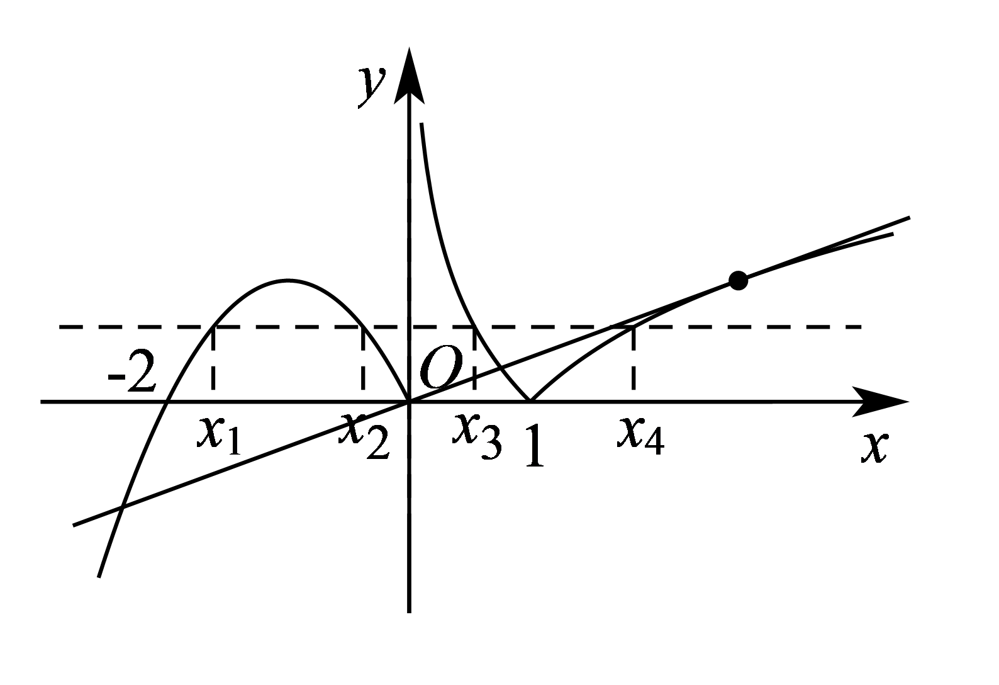

当时由图可知只有3个交点，当时，

令，，则，则当时，即单调递增，当时，即单调递减，

所以当时，函数取得极大值即最大值，，

又及对数函数与一次函数的增长趋势可知，当无限大时，即在和内各有一个零点，即有5个实数根，故③错误；

对于④：，

所以，

所以或，

由图可知，当时，的交点个数为2，

当，0时，的交点个数为3，

当时，的交点个数为4，

当时，的交点个数为1，

所以若时，则，交点的个数为个，

若时，则，交点的个数为3个，

若，则，交点有个，

若且时，则且，交点有个，

若，交点有1个，

综上所述，交点可能有1，2，3，6个，即方程不同实数根1，2，3，6，故④正确；

故选：B．

**【对点训练31】**（2024·全国·高三专题练习）已知函数，若方程有四个不同的解且，则的取值范围是（     ）

A．	B．	C．	D．

【答案】A

【解析】.

先作图象，由图象可得

因此为，

，

从而.

故选：A

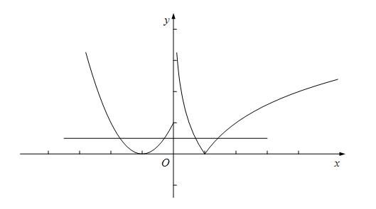

**【对点训练32】**（2024·四川泸州·高一四川省泸县第四中学校考阶段练习）已知函数，若方程有四个不同的实根，，，，满足，则的取值范围是（    ）

A．	B．	C．	D．

【答案】A

【解析】作出函数的图象，如图所示：

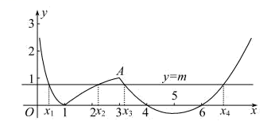

方程有四个不同的实根，，，，满足，

则，

即：，所以，

，所以，根据二次函数的对称性可得：，

，

考虑函数单调递增，

，

所以时的取值范围为.

故选：A

<strong>【对点训练33】</strong>（2024·全国·高三专题练习）已知函数<em>f</em>(<em>x</em>)＝，若互不相等的实数<em>x1</em>，<em>x2</em>，<em>x3</em>满足<em>f</em>（<em>x1</em>）＝<em>f</em>（<em>x2</em>）＝<em>f</em>（<em>x3</em>），则的取值范围是（    ）

A．（）	B．（1，4）	C．（，4）	D．（4，6）

【答案】A

【解析】画出分段函数*f*(*x*)＝的图像如图：

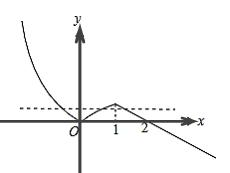

令互不相等的实数<em>x1</em>，<em>x2</em>，<em>x3</em>满足<em>f</em>（<em>x1</em>）＝<em>f</em>（<em>x2</em>）＝<em>f</em>（<em>x3</em>）＝<em>t</em>，<em>t</em>∈（0，），

则<em>x1</em>∈，<em>x2</em>∈（0，1），<em>x3</em>∈（1，2），

则＝1+<em>t</em>+1﹣<em>t</em>+22<em>t﹣2</em>＝2+22<em>t﹣2</em>，

又*t*∈（0，），

∴∈（）．

故选：A*．*

**【解题总结】**

**数形结合数学思想方法**

**题型十一：二分法**

**【例11】**（2024·辽宁大连·统考一模）牛顿迭代法是我们求方程近似解的重要方法．对于非线性可导函数在附近一点的函数值可用代替，该函数零点更逼近方程的解，以此法连续迭代，可快速求得合适精度的方程近似解．利用这个方法，解方程，选取初始值，在下面四个选项中最佳近似解为（    ）

A．	B．	C．	D．

【答案】D

【解析】令，则，

令，即，可得，

迭代关系为，

取，则，，

故选：D.

**【对点训练34】**（2024·全国·高三专题练习）函数的一个正数零点附近的函数值用二分法逐次计算，参考数据如下：

那么方程的一个近似解（精确度为0.1）为（    ）

A．1.5	B．1.25	C．1.41	D．1.44

【答案】C

【解析】由所给数据可知，函数在区间内有一个根，

因为，，

所以根在内，

因为，所以不满足精确度，

继续取区间中点，

因为 ，，

所以根在区间，

因为，所以不满足精确度，

继续取区间中点，

因为，，

所以根在区间内，

因为满足精确度，

因为，所以根在内，

所以方程的一个近似解为，

故选：C

**【对点训练35】**（2024·全国·高三专题练习）利用二分法求方程的近似解，可以取的一个区间是（    ）

A．	B．	C．	D．

【答案】C

【解析】设，

当连续函数满足（*a*）（*b*）时，在区间上有零点，

即方程在区间上有解，

又（2），（3），

故（2）（3），

故方程在区间上有解，

即利用二分法求方程的近似解，可以取的一个区间是.

故选：C．

**【对点训练36】**（2024·全国·高三专题练习）用二分法求函数的一个零点，根据参考数据，可得函数的一个零点的近似解（精确到0.1）为（    ）（参考数据：，，，，）

A．	B．	C．	D．

【答案】C

【解析】根据函数特点及所给数据计算相关函数值，再结合零点存在定理即可获得解答.由题意可知：

，

，

又因为函数在上连续，所以函数在区间上有零点，

约为

故选：C.

**【对点训练37】**（2024·全国·高三专题练习）用二分法求函数在区间上的零点，要求精确度为0.01时，所需二分区间的次数最少为（    ）

A．6	B．7	C．8	D．9

【答案】B

【解析】根据题意，原来区间的长度等于1，每经过二分法的一次操作，区间长度变为原来的一半，

则经过*n*次操作后，区间的长度为，若，即.

故选：B．

**【解题总结】**

所在的区间一分为二，使区间的两个端点逐步逼近零点，进而得到零点的近似值的方法叫做二分法.求方程的近似解就是求函数零点的近似值.

