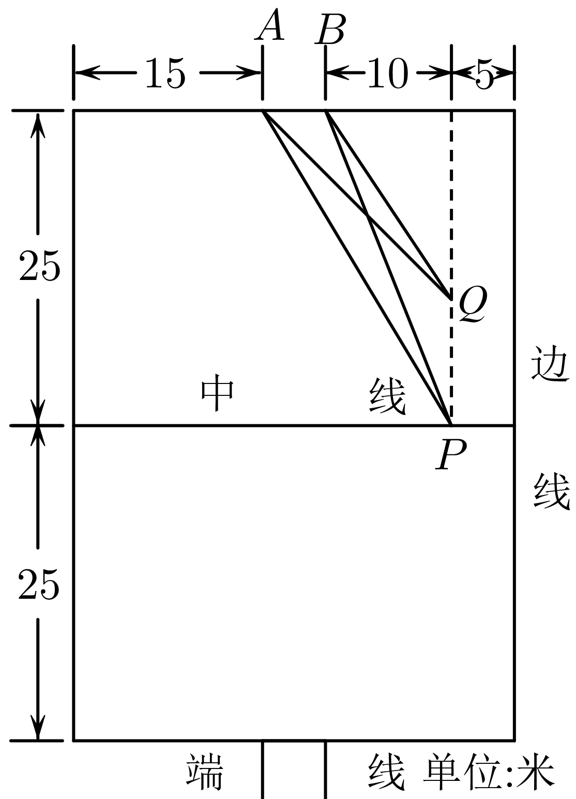
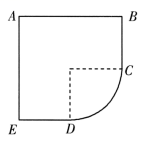
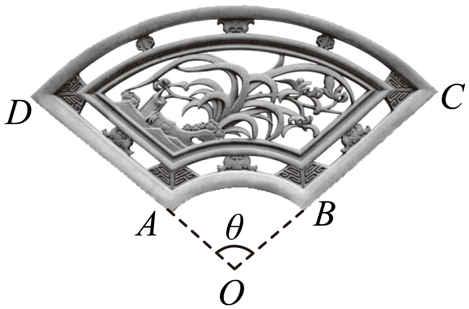
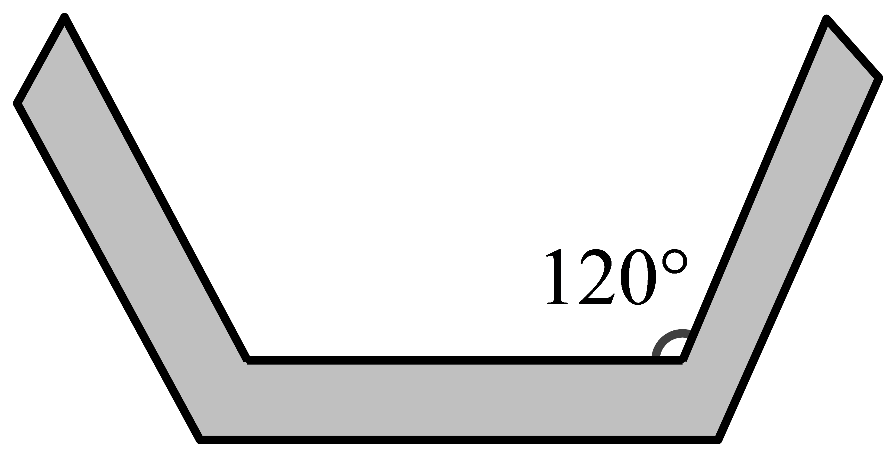

**第13讲  函数模型及其应用**

**知识梳理**

1**、几种常见的函数模型：**

<table><tr><td>
函数模型
</td><td>
函数解析式
</td></tr><tr><td>
一次函数模型
</td><td>
，为常数且
</td></tr><tr><td>
反比例函数模型
</td><td>
，为常数且
</td></tr><tr><td>
二次函数模型
</td><td>
，，为常数且
</td></tr><tr><td>
指数函数模型
</td><td>
，，为常数，，，
</td></tr><tr><td>
对数函数模型
</td><td>
，，为常数，，，
</td></tr><tr><td>
幂函数模型
</td><td>
，为常数，
</td></tr></table>

2**、解函数应用问题的步骤：**

（1）审题：弄清题意，识别条件与结论，弄清数量关系，初步选择数学模型；

（2）建模：将自然语言转化为数学语言，将文字语言转化为符号语言，利用已有知识建立相应的数学模型；

（3）解模：求解数学模型，得出结论；

（4）还原：将数学问题还原为实际问题．

**必考题型全归纳**

**题型一：二次函数模型，分段函数模型**

**【例1】**（2024·全国·高三专题练习）汽车在行驶中，由于惯性，刹车后还要继续向前滑行一段距离才能停止，一般称这段距离为“刹车距离”.刹车距离是分析交通事故的一个重要依据.在一个限速为的弯道上，甲、乙两辆汽车相向而行，发现情况不对，同时刹车，但还是相碰了.事后现场勘查，测得甲车的刹车距离略超过，乙车的刹车距离略超过.已知甲车的刹车距离与车速之间的关系为，乙车的刹车距离与车速之间的关系为.请判断甲、乙两车哪辆车有超速现象（    ）

A．甲、乙两车均超速	B．甲车超速但乙车未超速

C．乙车超速但甲车未超速	D．甲、乙两车均未超速

**【对点训练1】**（2024·全国·高三专题练习）如图为某小区七人足球场的平面示意图，为球门，在某次小区居民友谊比赛中，队员甲在中线上距离边线米的点处接球，此时，假设甲沿着平行边线的方向向前带球，并准备在点处射门，为获得最佳的射门角度（即最大），则射门时甲离上方端线的距离为（    ）

A．	B．	C．	D．

**【对点训练2】**（2024·云南·统考二模）下表是某批发市场的一种益智玩具的销售价格：

<table><tr><td>
一次购买件数
</td><td>
5-10件
</td><td>
11-50件
</td><td>
51-100件
</td><td>
101-300件
</td><td>
300件以上
</td></tr><tr><td>
每件价格
</td><td>
37元
</td><td>
32元
</td><td>
30元
</td><td>
27元
</td><td>
25元
</td></tr></table>

张师傅准备用2900元到该批发市场购买这种玩具，赠送给一所幼儿园，张师傅最多可买这种玩具（    ）

A．116件	B．110件	C．107件	D．106件

**【对点训练3】**（2024·全国·高三专题练习）某科技企业为抓住“一带一路”带来的发展机遇，开发生产一智能产品，该产品每年的固定成本是25万元，每生产万件该产品，需另投入成本万元.其中，若该公司一年内生产该产品全部售完，每件的售价为70元，则该企业每年利润的最大值为（    ）

A．720万元	B．800万元

C．875万元	D．900万元

**【解题方法总结】**

1、分段函数主要是每一段自变量变化所遵循的规律不同，可以先将其当做几个问题，将各段的变化规律分别找出来，再将其合到一起，要注意各段自变量的范围，特别是端点值．

2、构造分段函数时，要准确、简洁，不重不漏．

**题型二：对勾函数模型**

**【例2】**（2024·全国·高三专题练习）某企业投入万元购入一套设备，该设备每年的运转费用是万元，此外每年都要花费一定的维护费，第一年的维护费为万元，由于设备老化，以后每年的维护费都比上一年增加万元．为使该设备年平均费用最低，该企业需要更新设备的年数为（    ）

A．	B．	C．	D．

<strong>【对点训练4】</strong>（2024·全国·高三专题练习）网店和实体店各有利弊，两者的结合将在未来一段时期内，成为商业的一个主要发展方向.某品牌行车记录仪支架销售公司从2018年1月起开展网络销售与实体店体验安装结合的销售模式.根据几个月运营发现，产品的月销量<em>x</em>万件与投入实体店体验安装的费用<em>t</em>万元之间满足函数关系式已知网店每月固定的各种费用支出为3万元，产品每1万件进货价格为32万元，若每件产品的售价定为“进货价的”与“平均每件产品的实体店体验安装费用的一半”之和，则该公司最大月利润是\_\_\_\_\_\_\_\_\_\_\_万元.

<strong>【对点训练5】</strong>（2024·全国·高三专题练习）迷你<em>KTV</em>是一类新型的娱乐设施，外形通常是由玻璃墙分隔成的类似电话亭的小房间，近几年投放在各大城市商场中，受到年轻人的欢迎．如图是某间迷你<em>KTV</em>的横截面示意图，其中，，曲线段是圆心角为的圆弧，设该迷你<em>KTV</em>横截面的面积为，周长为，则的最大值为\_\_\_\_\_\_\_\_\_\_\_．（本题中取进行计算）

**【对点训练6】**（2024·全国·高三专题练习）砖雕是江南古建筑雕刻中很重要的一种艺术形式，传统砖雕精致细腻、气韵生动、极富书卷气．如图是一扇环形砖雕，可视为扇形截去同心扇形所得部分．已知扇环周长，大扇形半径，设小扇形半径，弧度，则

①关于*x*的函数关系式\_\_\_\_\_\_\_\_\_．

②若雕刻费用关于*x*的解析式为，则砖雕面积与雕刻费用之比的最大值为\_\_\_\_\_\_\_\_．

**【解题方法总结】**

1、解决此类问题一定要注意函数定义域；

2、利用模型求解最值时，注意取得最值时等号成立的条件．

**题型三：指数型函数、对数型函数、幂函数模型**

**【例3】**（2024·全国·高三专题练习）2020年底，国务院扶贫办确定的贫困县全部脱贫摘帽，脱贫攻坚取得重大胜利！为进一步巩固脱贫攻坚成果，持续实施乡村振兴战略，某企业响应政府号召，积极参与帮扶活动．该企业2021年初有资金150万元，资金的年平均增长率固定，每三年政府将补贴10万元．若要实现2024年初的资金达到270万元的目标，资金的年平均增长率应为（参考值：）（    ）

A．10%	B．20%	C．22%	D．32%

<strong>【对点训练7】</strong>（2024·云南·高三云南师大附中校考阶段练习）近年来，天然气表观消费量从2006年的不到m3激增到2021年的m3. 从2000年开始统计，记<em>k</em>表示从2000年开始的第几年，，.经计算机拟合后发现，天然气表观消费量随时间的变化情况符合，其中是从2000年后第<em>k</em>年天然气消费量，是2000年的天然气消费量，是过去20年的年复合增长率.已知2009年的天然气消费量为m3，2018年的天然气消费量为m3，根据拟合的模型，可以预测2024年的天然气消费量约为（    ）

（参考数据：，

A．m3	B．m3

C．m3	D．m3

**【对点训练8】**（2024·陕西咸阳·统考模拟预测）血氧饱和度是血液中被氧结合的氧合血红蛋白的容量占全部可结合的血红蛋白容量的百分比，即血液中血氧的浓度，它是呼吸循环的重要生理参数.正常人体的血氧饱和度一般情况下不低于，否则为供养不足.在环境模拟实验室的某段时间内，可以用指数模型:描述血氧饱和度（单位）随机给氧时间（单位:时）的变化规律，其中为初始血氧饱和度，为参数.已知，给氧1小时后，血氧饱和度为，若使血氧饱和度达到正常值，则给氧时间至少还需要（     ）小时.（参考数据:）

A．	B．	C．	D．

<strong>【对点训练9】</strong>（2024·全国·高三专题练习）昆虫信息素是昆虫用来表示聚集、觅食、交配、警戒等信息的化学物质，是昆虫之间起化学通讯作用的化合物，是昆虫交流的化学分子语言，包括利它素、利己素、协同素、集合信息素、追踪信息素、告警信息素、疏散信息素、性信息素等．人工合成的昆虫信息素在生产中有较多的应用，尤其在农业生产中的病虫害的预报和防治中较多使用．研究发现，某昆虫释放信息素<em>t</em>秒后，在距释放处<em>x</em>米的地方测得的信息素浓度<em>y</em>满足，其中<em>k</em>，<em>a</em>为非零常数．已知释放信息素1秒后，在距释放处2米的地方测得信息素浓度为<em>m</em>；若释放信息素4秒后，距释放处<em>b</em>米的位置，信息素浓度为，则<em>b</em>＝（    ）

A．3	B．4	C．5	D．6

**【对点训练10】**（2024·全国·高三专题练习）异速生长规律描述生物的体重与其它生理属性之间的非线性数量关系通常以幂函数形式表示．比如，某类动物的新陈代谢率与其体重满足，其中和为正常数，该类动物某一个体在生长发育过程中，其体重增长到初始状态的16倍时，其新陈代谢率仅提高到初始状态的8倍，则为（    ）

A．	B．	C．	D．

**【解题方法总结】**

1、在解题时，要合理选择模型，指数函数模型是增长速度越来越快（底数大于1）的一类函数模型，与增长率、银行利率有关的问题都属于指数模型．

2、在解决指数型函数、对数型函数、幂函数模型问题时，一般先需通过待定系数法确定函数解析式，再借助函数图像求解最值问题．

**题型四：已知函数模型的实际问题**

**【例4】**（2024·全国·高三专题练习）牛顿曾经提出了常温环境下的温度冷却模型：，其中为时间（单位：），为环境温度，为物体初始温度，为冷却后温度），假设在室内温度为的情况下，一桶咖啡由降低到需要.则的值为\_\_\_\_\_\_\_\_\_．

**【对点训练11】**（2024·四川宜宾·统考模拟预测）当生物死亡后，它机体内碳14会按照确定的规律衰减，大约每经过5730年衰减为原来的一半，照此规律，人们获得了生物体内碳14含量与死亡时间之间的函数关系式，（其中为生物死亡之初体内的碳14含量，为死亡时间（单位：年），通过测定发现某古生物遗体中碳14含量为，则该生物的死亡时间大约是\_\_\_\_\_\_年前．

**【对点训练12】**（2024·全国·高三专题练习）某驾驶员喝酒后血液中的酒精含量（毫克/毫升）随时间（小时）变化的规律近似满足表达式《酒后驾车与醉酒驾车的标准及相应处罚》规定：驾驶员血液中酒精含量不得超过毫克/毫升此驾驶员至少要过小时后才能开车\_\_\_\_\_\_\_\_\_\_\_.（精确到小时）

**【对点训练13】**（2024·全国·高三专题练习）能源是国家的命脉， 降低能源消耗费用是重要抓手之一， 为此， 某市对新建住宅的屋顶和外墙都要求建造隔热层. 某建筑物准备建造可以使用30年的隔热层， 据当年的物价， 每厘米厚的隔热层造价成本是9万元人民币. 又根据建筑公司的前期研究得到， 该建筑物30 年间的每年的能源消耗费用（单位：万元）与隔热层厚度（单位： 厘米） 满足关系：， 经测算知道， 如果不建隔热层， 那么30年间的每年的能源消耗费用为10万元人民币. 设为隔热层的建造费用与共30年的能源消耗费用总和，那么使达到最小值时， 隔热层厚度\_\_\_\_\_\_\_\_\_\_厘米.

<strong>【对点训练14】</strong>（2024·全国·高三专题练习）某地在20年间经济高质量增长，<em>GDP</em>的值（单位，亿元）与时间（单位：年）之间的关系为，其中为时的值.假定，那么在时，<em>GDP</em>增长的速度大约是\_\_\_\_\_\_\_\_\_\_\_.（单位：亿元/年，精确到0.01亿元/年）注：，当取很小的正数时，

**【解题方法总结】**

求解已知函数模型解决实际问题的关键

（1）认清所给函数模型，弄清哪些量为待定系数．

（2）根据已知利用待定系数法，确定模型中的待定系数．

（3）利用该函数模型，借助函数的性质、导数等求解实际问题，并进行检验．

**题型五：构造函数模型的实际问题**

**【例5】**（2024·浙江·高三专题练习）绍兴某乡村要修建一条100米长的水渠，水渠的过水横断面为底角为120°的等腰梯形（如图）水渠底面与侧面的修建造价均为每平方米100元，为了提高水渠的过水率，要使过水横断面的面积尽可能大，现有资金3万元，当过水横断面面积最大时，水果的深度（即梯形的高）约为（    ）（参考数据：）

A．0.58米	B．0.87米	C．1.17米	D．1.73米

**【对点训练15】**（2024·北京·高三北京市八一中学校考开学考试）某纯净水制造厂在净化水的过程中，每增加一次过滤可使水中杂质减少50%，若要使水中杂质减少到原来的5%以下，则至少需要过滤（    ）

（参考数据：）

A．2次	B．3次	C．4次	D．5次

<strong>【对点训练16】</strong>（2024·全国·高三专题练习）2019年1月3日嫦娥四号探测器成功实现人类历史上首次月球背面软着陆，我国航天事业取得又一重大成就，实现月球背面软着陆需要解决的一个关键技术问题是地面与探测器的通讯联系．为解决这个问题，发射了嫦娥四号中继星“鹊桥”，鹊桥沿着围绕地月拉格朗日点的轨道运行．点是平衡点，位于地月连线的延长线上．设地球质量为<em>M１</em>，月球质量为<em>M２</em>，地月距离为<em>R</em>，点到月球的距离为<em>r</em>，根据牛顿运动定律和万有引力定律，<em>r</em>满足方程：

.设，由于的值很小，因此在近似计算中，则*r*的近似值为（     ）

A．	B．

C．	D．

**【解题方法总结】**

构建函数模型解决实际问题的步骤

（1）建模：抽象出实际问题的数学模型；

（2）推理、演算：对数学模型进行逻辑推理或数学运算，得到问题在数学意义上的解；

（3）评价、解释：对求得的数学结果进行深入讨论，作出评价、解释、返回到原来的实际问题中去，得到实际问题的解

