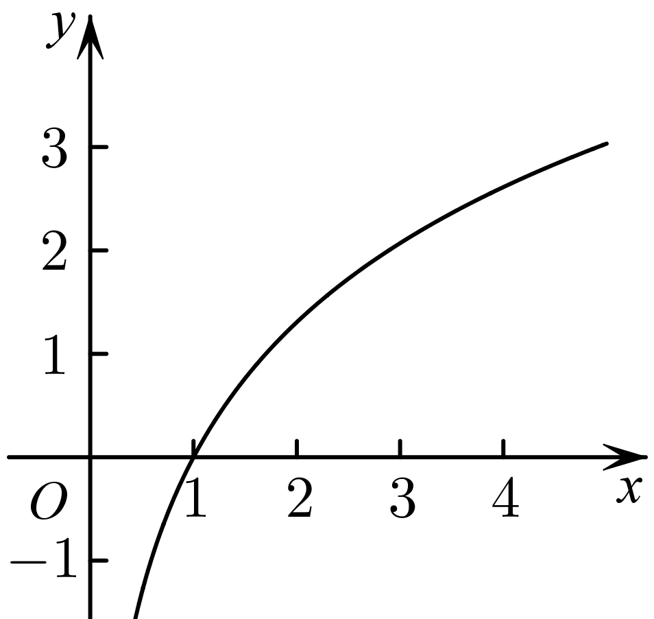
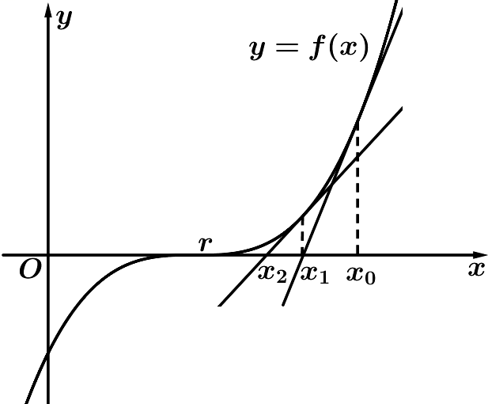
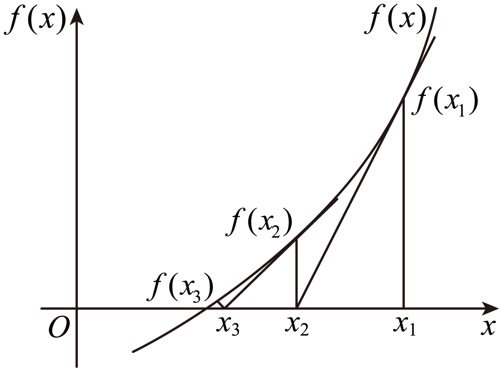

**第14讲  导数的概念与运算**

**知识梳理**

**知识点一：导数的概念和几何性质**

1**、概念**

函数在处瞬时变化率是，我们称它为函数在处的导数，记作或．

**知识点诠释：**

①增量可以是正数，也可以是负，但是不可以等于0．的意义：与0之间距离要多近有

多近，即可以小于给定的任意小的正数；

②当时，在变化中都趋于0，但它们的比值却趋于一个确定的常数，即存在一个常数与

无限接近；

③导数的本质就是函数的平均变化率在某点处的极限，即瞬时变化率．如瞬时速度即是位移在这一时

刻的瞬间变化率，即．

2**、几何意义**

函数在处的导数的几何意义即为函数在点处的切线的斜率．

3**、物理意义**

函数在点处的导数是物体在时刻的瞬时速度，即；在点的导数是物体在时刻的瞬时加速度，即．

**知识点二：导数的运算**

1**、求导的基本公式**

<table><tr><td>
基本初等函数
</td><td>
导函数
</td></tr><tr><td>
（为常数）
</td><td>

</td></tr><tr><td>

</td><td>

</td></tr><tr><td>

</td><td>

</td></tr><tr><td>

</td><td>

</td></tr><tr><td>

</td><td>

</td></tr><tr><td>

</td><td>

</td></tr><tr><td>

</td><td>

</td></tr><tr><td>

</td><td>

</td></tr></table>

2**、导数的四则运算法则**

（1）函数和差求导法则：；

（2）函数积的求导法则：；

（3）函数商的求导法则：，则．

3**、复合函数求导数**

复合函数的导数和函数，的导数间关系为：

**【解题方法总结】**

1**、在点的切线方程**

切线方程的计算：函数在点处的切线方程为，抓住关键．

2**、过点的切线方程**

设切点为，则斜率，过切点的切线方程为：，

又因为切线方程过点，所以然后解出的值．（有几个值，就有几条切线）

**注意：在做此类题目时要分清题目提供的点在曲线上还是在曲线外．**

**必考题型全归纳**

**题型一：导数的定义**

**【例1】**（2024·全国·高三专题练习）已知函数的图象如图所示，函数的导数为，则（    ）

A．	B．

C．	D．

<strong>【对点训练1】</strong>（2024·云南楚雄·高三统考期末）已知某容器的高度为20cm，现在向容器内注入液体，且容器内液体的高度<em>h</em>（单位：cm）与时间<em>t</em>（单位：s）的函数关系式为，当时，液体上升高度的瞬时变化率为3cm/s，则当时，液体上升高度的瞬时变化率为（    ）

A．5cm/s	B．6cm/s	C．8cm/s	D．10cm/s

**【对点训练2】**（2024·河北衡水·高三衡水市第二中学期末）已知函数的导函数是，若，则（    ）

A．	B．1	C．2	D．4

**【对点训练3】**（2024·全国·高三专题练习）若函数在处可导，且，则（    ）

A．1	B．	C．2	D．

**【对点训练4】**（2024·高三课时练习）若在处可导，则可以等于（    ）．

A．	B．

C．	D．

**【解题方法总结】**

对所给函数式经过添项、拆项等恒等变形与导数定义结构相同，然后根据导数定义直接写出．

**题型二：求函数的导数**

**【例2】**（2024·全国·高三专题练习）求下列函数的导数．

(1)；

(2)；

(3)

(4)；

**【对点训练5】**（2024·高三课时练习）求下列函数的导数：

(1)；

(2)；

(3)；

(4)；

(5)；

(6)．

**【对点训练6】**（2024·海南·统考模拟预测）在等比数列中，，函数，则\_\_\_\_\_\_\_\_\_\_．

**【对点训练7】**（2024·辽宁大连·育明高中校考一模）已知可导函数，定义域均为，对任意满足，且，求\_\_\_\_\_\_\_\_\_\_.

**【对点训练8】**（2024·河南·高三校联考阶段练习）已知函数的导函数为，且，则\_\_\_\_\_\_．

**【对点训练9】**（2024·全国·高三专题练习）已知函数，则\_\_\_\_\_\_\_\_\_\_.

**【解题方法总结】**

对所给函数求导，其方法是利用和、差、积、商及复合函数求导法则，直接转化为基本函数求导问题．

**题型三：导数的几何意义**

<strong>方向</strong>1<strong>、在点</strong><em>P</em><strong>处切线</strong>

**【例3】**（2024·广东广州·统考模拟预测）曲线在点处的切线方程为\_\_\_\_\_\_\_\_\_\_．

**【对点训练10】**（2024·全国·高三专题练习）曲线在点处的切线方程为\_\_\_\_\_\_．

<strong>【对点训练11】</strong>（2024·全国·高三专题练习）已知函数，为的导函数.若的图象关于直线<em>x</em>＝1对称，则曲线在点处的切线方程为\_\_\_\_\_\_

**【对点训练12】**（2024·湖南·校联考模拟预测）若函数是奇函数，则曲线在点处的切线方程为\_\_\_\_\_\_．

<strong>方向</strong>2<strong>、过点</strong><em>P</em><strong>的切线</strong>

**【对点训练13】**（2024·江西·校联考模拟预测）已知过原点的直线与曲线相切，则该直线的方程是\_\_\_\_\_\_．

**【对点训练14】**（2024·浙江金华·统考模拟预测）已知函数，过点存在3条直线与曲线相切，则实数的取值范围是\_\_\_\_\_\_\_\_\_\_\_.

**【对点训练15】**（2024·浙江绍兴·统考模拟预测）过点作曲线的切线，写出一条切线方程：\_\_\_\_\_\_\_\_\_\_.

**【对点训练16】**（2024·海南海口·校联考模拟预测）过轴上一点作曲线的切线，若这样的切线不存在，则整数的一个可能值为\_\_\_\_\_\_\_\_\_．

**【对点训练17】**（2024·全国·模拟预测）过坐标原点作曲线的切线，则切点的横坐标为\_\_\_\_\_\_\_\_\_\_\_.

**【对点训练18】**（2024·广西南宁·南宁三中校考模拟预测）若过点有条直线与函数的图象相切，则当取最大值时，的取值范围为\_\_\_\_\_\_\_\_\_\_.

**【对点训练19】**（2024·全国·模拟预测）已知函数，其导函数为，则曲线过点的切线方程为\_\_\_\_\_\_．

**方向**3**、公切线**

<strong>【对点训练20】</strong>（2024·云南保山·统考二模）若函数与函数的图象存在公切线，则实数<em>a</em>的取值范围为（    ）

A．	B．

C．	D．

**【对点训练21】**（2024·宁夏银川·银川一中校考二模）若直线与曲线相切，直线与曲线相切，则的值为\_\_\_\_\_\_\_\_\_\_\_.

**【对点训练22】**（2024·河北邯郸·统考三模）若曲线与圆有三条公切线，则的取值范围是\_\_\_\_．

<strong>【对点训练23】</strong>（2024·湖南长沙·湖南师大附中校考模拟预测）若曲线和曲线恰好存在两条公切线，则实数<em>a</em>的取值范围为\_\_\_\_\_\_\_\_\_\_．

**【对点训练24】**（2024·江苏南京·南京师大附中校考模拟预测）已知曲线与曲线有且只有一条公切线，则\_\_\_\_\_\_\_\_．

<strong>【对点训练25】</strong>（2024·福建南平·统考模拟预测）已知曲线和曲线有唯一公共点，且这两条曲线在该公共点处有相同的切线<em>l</em>，则<em>l</em>的方程为\_\_\_\_\_\_\_\_．

**方向**4**、已知切线求参数问题**

<strong>【对点训练26】</strong>（2024·江苏·校联考模拟预测）若曲线有两条过的切线，则<em>a</em>的范围是\_\_\_\_\_\_.

**【对点训练27】**（2024·山东聊城·统考三模）若直线与曲线相切，则的最大值为（    ）

A．0	B．1	C．2	D．

<strong>【对点训练28】</strong>（2024·重庆·统考三模）已知直线<em>y</em>＝<em>ax</em>－<em>a</em>与曲线相切，则实数<em>a</em>＝（    ）

A．0	B．	C．	D．

**【对点训练29】**（2024·海南·校联考模拟预测）已知偶函数在点处的切线方程为，则（    ）

A．	B．0	C．1	D．2

**【对点训练30】**（2024·全国·高三专题练习）已知是曲线上的任一点，若曲线在点处的切线的倾斜角均是不小于的锐角，则实数的取值范围是（    ）

A．	B．	C．	D．

**【对点训练31】**（2024·全国·高三专题练习）已知，，直线与曲线相切，则的最小值是（    ）

A．16	B．12	C．8	D．4

**方向**5**、切线的条数问题**

**【对点训练32】**（2024·河北·高三校联考阶段练习）若过点可以作曲线的两条切线，则（    ）

A．	B．	C．	D．

**【对点训练33】**（2024·全国·高三专题练习）若过点可以作曲线的两条切线，则（    ）

A．	B．	C．	D．

**【对点训练34】**（2024·湖南·校联考二模）若经过点可以且仅可以作曲线的一条切线，则下列选项正确的是（    ）

A．	B．	C．	D．或

**方向**6**、切线平行、垂直、重合问题**

**【对点训练35】**（2024·全国·高三专题练习）若函数与的图象有一条公共切线，且该公共切线与直线平行，则实数（    ）

A．	B．	C．	D．

**【对点训练36】**（2024·全国·高三专题练习）已知直线与曲线相交于，且曲线在处的切线平行，则实数的值为（  ）

A．4	B．4或-3	C．-3或-1	D．-3

**【对点训练37】**（2024·江西抚州·高三金溪一中校考开学考试）已知曲线在点处的切线互相垂直，且切线与轴分别交于点，记点的纵坐标与点的纵坐标之差为，则（    ）

A．	B．

C．	D．

**【对点训练38】**（2024·全国·高三专题练习）若函数的图象上存在两条相互垂直的切线，则实数的值是（    ）

A．	B．	C．	D．

**【对点训练39】**（2024·上海闵行·高三上海市七宝中学校考期末）若函数的图像上存在两个不同的点，使得在这两点处的切线重合，则称为“切线重合函数”，下列函数中不是“切线重合函数”的为（    ）

A．	B．

C．	D．

<strong>【对点训练40】</strong>（2024·全国·高三专题练习）已知<em>A</em>，<em>B</em>是函数，图象上不同的两点，若函数在点<em>A</em>、<em>B</em>处的切线重合，则实数<em>a</em>的取值范围是（   ）

A．	B．	C．	D．

**方向**7**、最值问题**

**【对点训练41】**（2024·全国·高三专题练习）设点在曲线上，点在曲线上，则最小值为（    ）

A．	B．

C．	D．

**【对点训练42】**（2024·全国·高三专题练习）设点在曲线上，点在曲线上，则的最小值为（    ）

A．	B．

C．	D．

**【对点训练43】**（2024·全国·高三专题练习）设点在曲线上，点在曲线上，则的最小值为（    ）

A．	B．

C．	D．

**【对点训练44】**（2024·全国·高三专题练习）已知实数，，，满足，则的最小值为（    ）

A．	B．8	C．4	D．16

**【对点训练45】**（2024·全国·高三专题练习）设函数，其中，．若存在正数，使得成立，则实数的值是（    ）

A．	B．	C．	D．1

**【对点训练46】**（2024·宁夏银川·银川二中校考一模）已知实数满足，，则的最小值为（   ）

A．	B．	C．	D．

**【对点训练47】**（2024·四川成都·川大附中校考二模）若点是曲线上任意一点，则点到直线距离的最小值为（    ）

A．	B．	C．	D．

**方向8、牛顿迭代法**

<strong>【对点训练48】</strong>（2024·湖北咸宁·校考模拟预测）英国数学家牛顿在17世纪给出一种求方程近似根的方法一<em>Newton-Raphson method</em>译为牛顿-拉夫森法.做法如下：设是的根，选取作为的初始近似值，过点做曲线的切线：，则与轴交点的横坐标为，称是的一次近似值；重复以上过程，得的近似值序列，其中，称是的次近似值.运用上述方法，并规定初始近似值不得超过零点大小，则函数的零点一次近似值为（    ）（精确到小数点后3位，参考数据：）

A．2.207	B．2.208	C．2.205	D．2.204

**【对点训练49】（多选题）**（2024·安徽芜湖·统考模拟预测）牛顿在《流数法》一书中，给出了高次代数方程根的一种解法.具体步骤如下：设是函数的一个零点，任意选取作为的初始近似值，过点作曲线的切线，设与轴交点的横坐标为，并称为的1次近似值；过点作曲线的切线，设与轴交点的横坐标为，称为的2次近似值.一般地，过点（）作曲线的切线，记与轴交点的横坐标为，并称为的次近似值.对于方程，记方程的根为，取初始近似值为，下列说法正确的是（    ）

A．	B．切线：

C．	D．

**【对点训练50】（多选题）**（2024·全国·模拟预测）牛顿在《流数法》一书中，给出了高次代数方程的一种数值解法一牛顿法.首先，设定一个起始点，如图，在处作图象的切线，切线与轴的交点横坐标记作：用替代重复上面的过程可得；一直继续下去，可得到一系列的数，，，…，，…在一定精确度下，用四舍五入法取值，当，近似值相等时，该值即作为函数的一个零点.若要求的近似值(精确到0.1)，我们可以先构造函数，再用“牛顿法”求得零点的近似值，即为的近似值，则下列说法正确的是（    ）

A．对任意，

B．若，且，则对任意，

C．当时，需要作2条切线即可确定的值

D．无论在上取任何有理数都有

<strong>【对点训练51】</strong>（2024·全国·高三专题练习）牛顿迭代法（<em>Newton</em>'<em>s method</em>）又称牛顿–拉夫逊方法（<em>Newton</em>–<em>Raphsonmethod</em>），是牛顿在17世纪提出的一种近似求方程根的方法．如图，设是的根，选取作为初始近似值，过点作曲线的切线,与轴的交点的横坐标（），称是的一次近似值，过点作曲线的切线，则该切线与轴的交点的横坐标为，称是的二次近似值．重复以上过程，直到的近似值足够小，即把作为的近似解．设，，，，构成数列．对于下列结论：

①（）；

②（）；

③；

④（）．

其中正确结论的序号为\_\_\_\_\_\_\_\_\_\_．

**【解题方法总结】**

函数在点处的导数，就是曲线在点处的切线的斜率．这里要注意曲线在某点处的切线与曲线经过某点的切线的区别．（1）已知在点处的切线方程为．（2）若求曲线过点的切线方程，应先设切点坐标为，由过点，求得的值，从而求得切线方程．另外，要注意切点既在曲线上又在切线上

