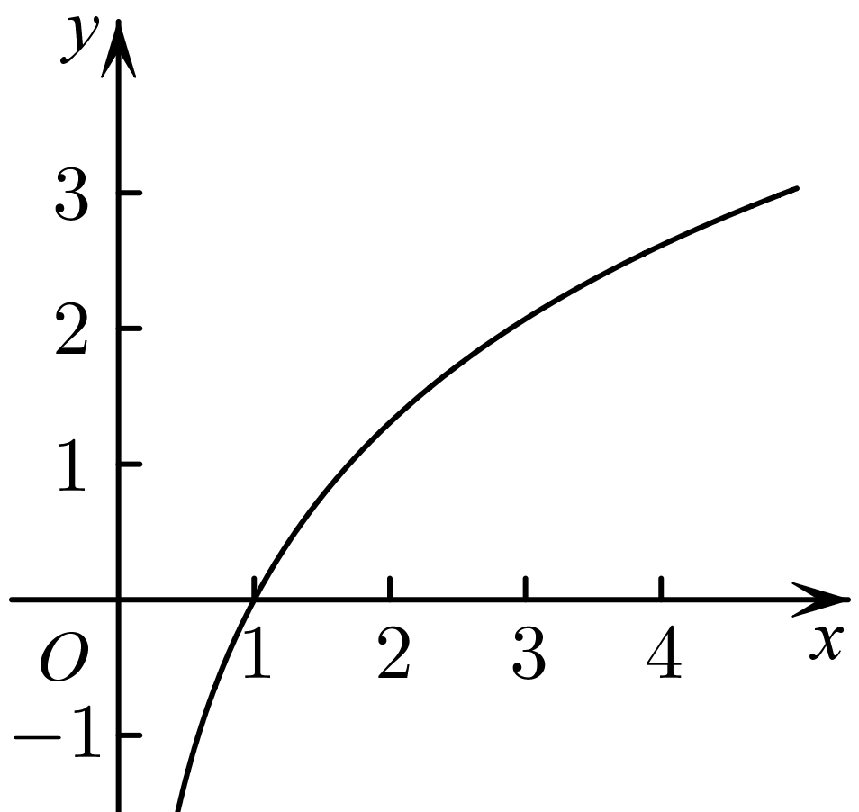
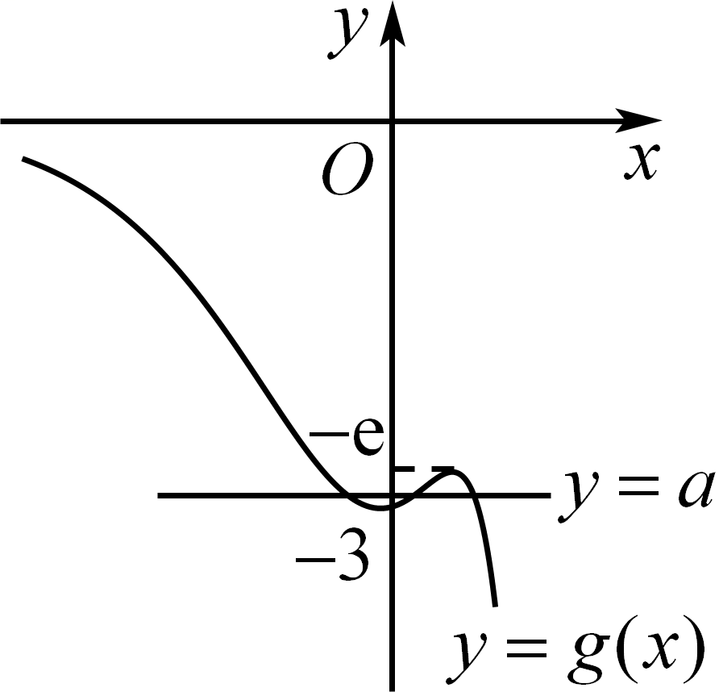
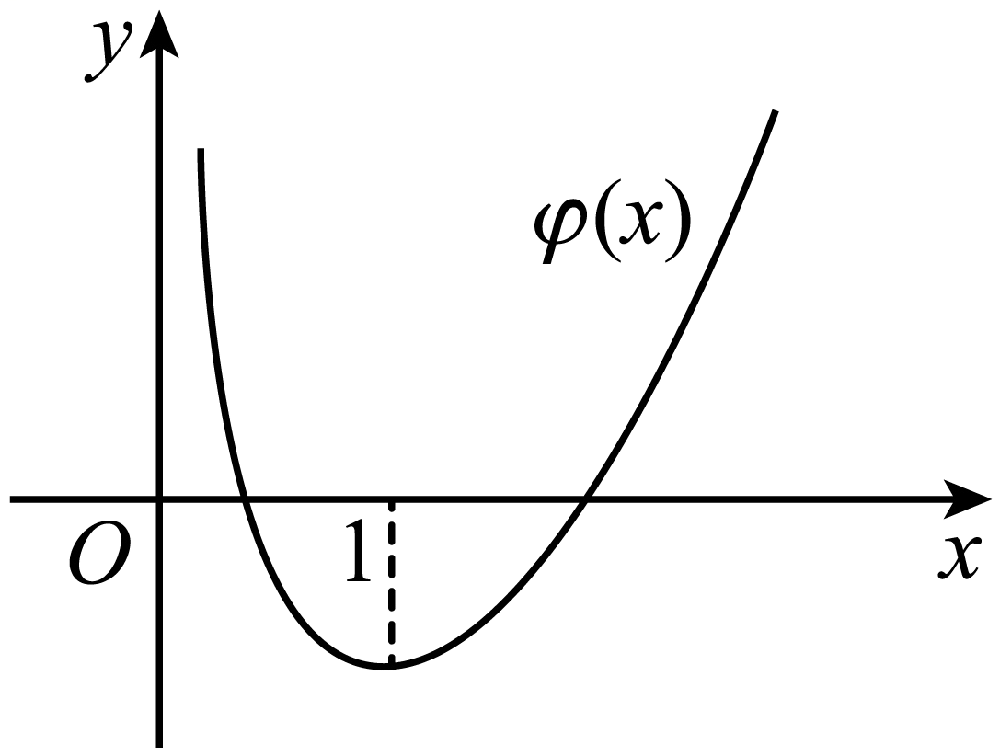
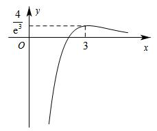
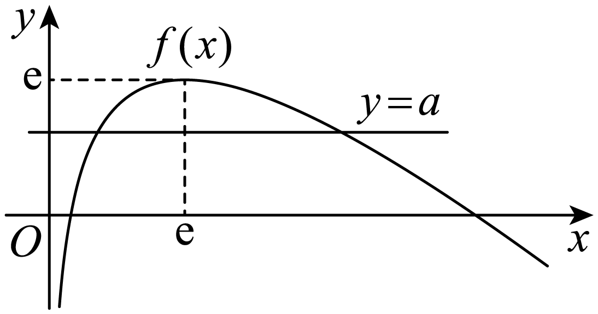
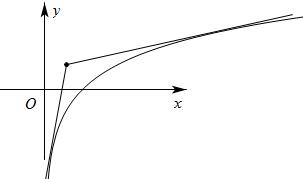
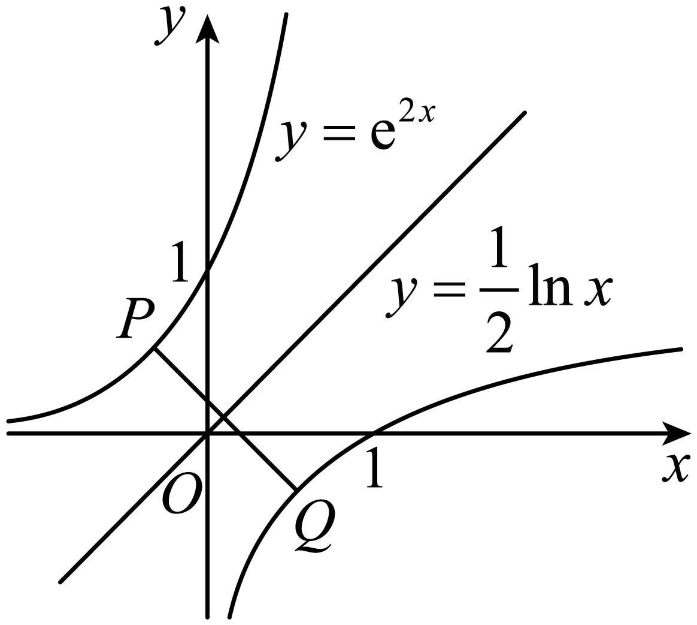
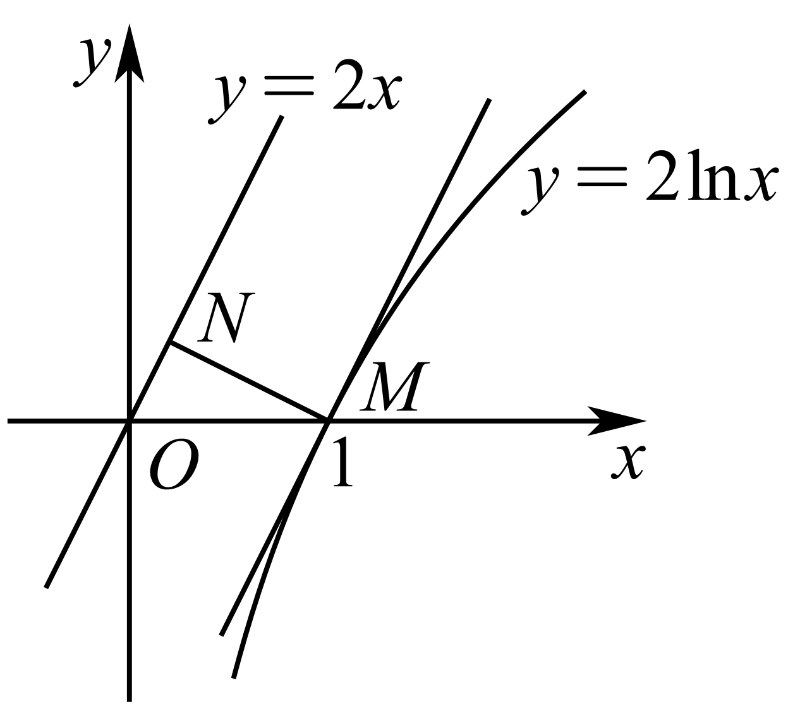
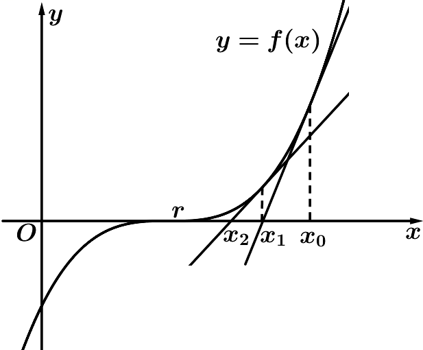
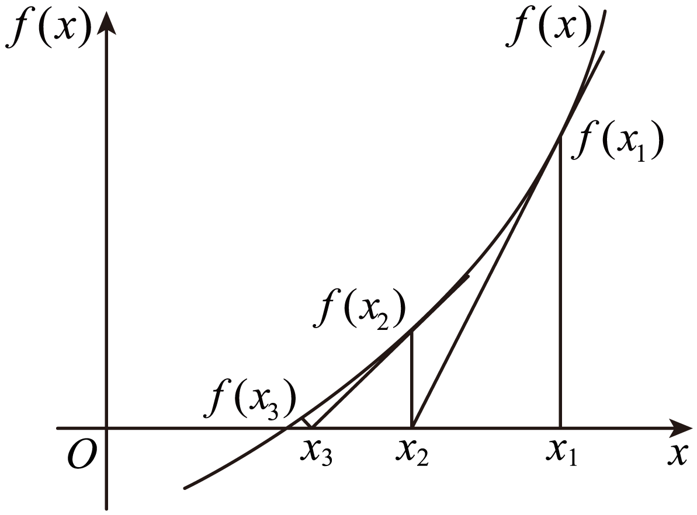

**第14讲  导数的概念与运算**

**知识梳理**

**知识点一：导数的概念和几何性质**

1**、概念**

函数在处瞬时变化率是，我们称它为函数在处的导数，记作或．

**知识点诠释：**

①增量可以是正数，也可以是负，但是不可以等于0．的意义：与0之间距离要多近有

多近，即可以小于给定的任意小的正数；

②当时，在变化中都趋于0，但它们的比值却趋于一个确定的常数，即存在一个常数与

无限接近；

③导数的本质就是函数的平均变化率在某点处的极限，即瞬时变化率．如瞬时速度即是位移在这一时

刻的瞬间变化率，即．

2**、几何意义**

函数在处的导数的几何意义即为函数在点处的切线的斜率．

3**、物理意义**

函数在点处的导数是物体在时刻的瞬时速度，即；在点的导数是物体在时刻的瞬时加速度，即．

**知识点二：导数的运算**

1**、求导的基本公式**

<table><tr><td>
基本初等函数
</td><td>
导函数
</td></tr><tr><td>
（为常数）
</td><td>

</td></tr><tr><td>

</td><td>

</td></tr><tr><td>

</td><td>

</td></tr><tr><td>

</td><td>

</td></tr><tr><td>

</td><td>

</td></tr><tr><td>

</td><td>

</td></tr><tr><td>

</td><td>

</td></tr><tr><td>

</td><td>

</td></tr></table>

2**、导数的四则运算法则**

（1）函数和差求导法则：；

（2）函数积的求导法则：；

（3）函数商的求导法则：，则．

3**、复合函数求导数**

复合函数的导数和函数，的导数间关系为：

**【解题方法总结】**

1**、在点的切线方程**

切线方程的计算：函数在点处的切线方程为，抓住关键．

2**、过点的切线方程**

设切点为，则斜率，过切点的切线方程为：，

又因为切线方程过点，所以然后解出的值．（有几个值，就有几条切线）

**注意：在做此类题目时要分清题目提供的点在曲线上还是在曲线外．**

**必考题型全归纳**

**题型一：导数的定义**

**【例1】**（2024·全国·高三专题练习）已知函数的图象如图所示，函数的导数为，则（    ）

A．	B．

C．	D．

【答案】D

【解析】由图象可知，

即.

故选：D

<strong>【对点训练1】</strong>（2024·云南楚雄·高三统考期末）已知某容器的高度为20cm，现在向容器内注入液体，且容器内液体的高度<em>h</em>（单位：cm）与时间<em>t</em>（单位：s）的函数关系式为，当时，液体上升高度的瞬时变化率为3cm/s，则当时，液体上升高度的瞬时变化率为（    ）

A．5cm/s	B．6cm/s	C．8cm/s	D．10cm/s

【答案】C

【解析】由，求导得：.

当时，，解得（舍去）.

故当时，液体上升高度的瞬时变化率为.

故选：C

**【对点训练2】**（2024·河北衡水·高三衡水市第二中学期末）已知函数的导函数是，若，则（    ）

A．	B．1	C．2	D．4

【答案】B

【解析】因为

所以

故选：B

**【对点训练3】**（2024·全国·高三专题练习）若函数在处可导，且，则（    ）

A．1	B．	C．2	D．

【答案】A

【解析】由导数定义可得，

所以．

故选：A．

**【对点训练4】**（2024·高三课时练习）若在处可导，则可以等于（    ）．

A．	B．

C．	D．

【答案】A

【解析】由导数定义，

对于A， ，A满足；

对于B，，

，B不满足；

对于C，，

，C不满足；

对于D，，

，D不满足.

故选：A.

**【解题方法总结】**

对所给函数式经过添项、拆项等恒等变形与导数定义结构相同，然后根据导数定义直接写出．

**题型二：求函数的导数**

**【例2】**（2024·全国·高三专题练习）求下列函数的导数．

(1)；

(2)；

(3)

(4)；

【解析】（1）因为，所以.

（2）因为，所以.

（3）因为，所以

（4）因为，所以

**【对点训练5】**（2024·高三课时练习）求下列函数的导数：

(1)；

(2)；

(3)；

(4)；

(5)；

(6)．

【解析】（1）

.

（2），

所以.

（3）.

（4）

.

（5）.

（6），

故

.

**【对点训练6】**（2024·海南·统考模拟预测）在等比数列中，，函数，则\_\_\_\_\_\_\_\_\_\_．

【答案】

【解析】因为

，

所以．

因为数列为等比数列，所以，

于是．

故答案为：

**【对点训练7】**（2024·辽宁大连·育明高中校考一模）已知可导函数，定义域均为，对任意满足，且，求\_\_\_\_\_\_\_\_\_\_.

【答案】

【解析】由题意可知，令，则，解得，

由，得，即，

令，得，即，

解得.

故答案为：.

**【对点训练8】**（2024·河南·高三校联考阶段练习）已知函数的导函数为，且，则\_\_\_\_\_\_．

【答案】

【解析】因为，则，故，故．

故答案为：.

**【对点训练9】**（2024·全国·高三专题练习）已知函数，则\_\_\_\_\_\_\_\_\_\_.

【答案】-2

【解析】由函数求导得：，当时，，解得，

因此，，所以.

故答案为：-2

**【解题方法总结】**

对所给函数求导，其方法是利用和、差、积、商及复合函数求导法则，直接转化为基本函数求导问题．

**题型三：导数的几何意义**

<strong>方向</strong>1<strong>、在点</strong><em>P</em><strong>处切线</strong>

**【例3】**（2024·广东广州·统考模拟预测）曲线在点处的切线方程为\_\_\_\_\_\_\_\_\_\_．

【答案】

【解析】函数的导函数为，

所以函数在处的导数值，

所以曲线在点处的切线斜率为，

所以曲线在点处的切线方程为，即，

故答案为：.

**【对点训练10】**（2024·全国·高三专题练习）曲线在点处的切线方程为\_\_\_\_\_\_．

【答案】

【解析】因为，

所以 ，

则，

又，

所以曲线在点处的切线方程为，

即．

故答案为：.

<strong>【对点训练11】</strong>（2024·全国·高三专题练习）已知函数，为的导函数.若的图象关于直线<em>x</em>＝1对称，则曲线在点处的切线方程为\_\_\_\_\_\_

【答案】

【解析】，

令，，则，

令，，解得*x*＝2*k*＋1，，

当*k*＝0时，*x*＝1，所以直线*x*＝1为的一条对称轴，

故的图象也关于直线*x*＝1对称，则有，解得*b*＝－1，

则，，

，，

故切线方程为.

故答案为；.

**【对点训练12】**（2024·湖南·校联考模拟预测）若函数是奇函数，则曲线在点处的切线方程为\_\_\_\_\_\_．

【答案】

【解析】因为是奇函数，

所以对恒成立，

即对恒成立，

所以，则，故，所以，

所以曲线在点处的切线方程为，

化简得.

故答案为：

<strong>方向</strong>2<strong>、过点</strong><em>P</em><strong>的切线</strong>

**【对点训练13】**（2024·江西·校联考模拟预测）已知过原点的直线与曲线相切，则该直线的方程是\_\_\_\_\_\_．

【答案】

【解析】由题意可得，

设该切线方程，且与相切于点，

，整理得，

∴，可得，∴.

故答案为：.

**【对点训练14】**（2024·浙江金华·统考模拟预测）已知函数，过点存在3条直线与曲线相切，则实数的取值范围是\_\_\_\_\_\_\_\_\_\_\_.

【答案】

【解析】由，设切点为，则切线斜率为，

所以，过的切线方程为，

综上，，即，

所以有三个不同值使方程成立，

即与有三个不同交点，而，

故、上，递减，上，递增；

所以极小值为，极大值为，故时两函数有三个交点，

综上，的取值范围是.

故答案为：

**【对点训练15】**（2024·浙江绍兴·统考模拟预测）过点作曲线的切线，写出一条切线方程：\_\_\_\_\_\_\_\_\_\_.

【答案】或（写出一条即可）

【解析】由可得，

设过点作曲线的切线的切点为，则，

则该切线方程为，

将代入得，解得或，

故切点坐标为或，

故切线方程为或，

故答案为：或

**【对点训练16】**（2024·海南海口·校联考模拟预测）过轴上一点作曲线的切线，若这样的切线不存在，则整数的一个可能值为\_\_\_\_\_\_\_\_\_．

【答案】，，，只需写出一个答案即可

【解析】设切点为，因为，所以切线方程为．

因为切线经过点，所以，

由题意关于的方程没有实数解，

则，解得．

因为为整数，所以的取值可能是，，.

故答案为：，，，只需写出一个答案即可

**【对点训练17】**（2024·全国·模拟预测）过坐标原点作曲线的切线，则切点的横坐标为\_\_\_\_\_\_\_\_\_\_\_.

【答案】或

【解析】由可得，设切点坐标为，

所以切线斜率，又因为，

则切线方程为，

把代入并整理可得，解得或.

故答案为：或

**【对点训练18】**（2024·广西南宁·南宁三中校考模拟预测）若过点有条直线与函数的图象相切，则当取最大值时，的取值范围为\_\_\_\_\_\_\_\_\_\_.

【答案】

【解析】设过点的直线与的图象的切点为，

因为，

所以切线的斜率为，

所以切线的方程为，

将代入得，

即，

设，则，

由，得或，

当或时，，所以在上单调递减；

当时，，所以在上单调递增，

所以，

又0，所以恒成立，

所以的图象大致如图所示，

由图可知，方程最多个解，

即过点的切线最多有条，

即的最大值为3，此时.

故答案为：.

**【对点训练19】**（2024·全国·模拟预测）已知函数，其导函数为，则曲线过点的切线方程为\_\_\_\_\_\_．

【答案】或

【解析】设切点为，由，得，

∴，得，∴，，

∴切点为，，

∴曲线在点*M*处的切线方程为①，

又∵该切线过点，∴，解得或．

将代入①得切线方程为；

将代入①得切线方程为，即．

∴曲线过点的切线方程为或．

故答案为：或

**方向**3**、公切线**

<strong>【对点训练20】</strong>（2024·云南保山·统考二模）若函数与函数的图象存在公切线，则实数<em>a</em>的取值范围为（    ）

A．	B．

C．	D．

【答案】A

【解析】由函数，可得，

因为，设切点为，则，

则公切线方程为，即，

与联立可得，

所以，整理可得，

又由，可得，解得，

令，其中，可得，

令，可得，函数在上单调递增，且，

当时，，即，此时函数单调递减，

当时，，即，此时函数单调递增，

所以，且当时，，所以函数的值域为，所以且，解得，即实数的取值范围为.

故选：A.

**【对点训练21】**（2024·宁夏银川·银川一中校考二模）若直线与曲线相切，直线与曲线相切，则的值为\_\_\_\_\_\_\_\_\_\_\_.

【答案】1

【解析】设，则，设切点为，则，

则切线方程为，即，

直线过定点，

所以，所以，

设，则，设切点为，则，

则切线方程为，即，

直线过定点，

所以，所以，

则是函数和的图象与曲线交点的横坐标，

易知与的图象关于直线对称，而曲线也关于直线对称，

因此点关于直线对称，

从而，，

所以．

故答案为：1.

**【对点训练22】**（2024·河北邯郸·统考三模）若曲线与圆有三条公切线，则的取值范围是\_\_\_\_．

【答案】

【解析】曲线在点处的切线方程为，

由于直线与圆相切，得（\*）

因为曲线与圆有三条公切线，故（\*）式有三个不相等的实数根，

即方程有三个不相等的实数根.

令，则曲线与直线有三个不同的交点.

显然，.

当时，，当时，，当时，，

所以，在上单调递增，在上单调递减，在上单调递增；

且当时，，当时，，

因此，只需，即，

解得.

故答案为：

<strong>【对点训练23】</strong>（2024·湖南长沙·湖南师大附中校考模拟预测）若曲线和曲线恰好存在两条公切线，则实数<em>a</em>的取值范围为\_\_\_\_\_\_\_\_\_\_．

【答案】

【解析】由题意得，

设与曲线相切的切点为，与曲线相切的切点为，

则切线方程为，即，

，即，

由于两切线为同一直线，所以，得．

令，则，

当时，，在单调递减，

当时，，在单调递增．

即有处取得极小值，也为最小值，且为．

又两曲线恰好存在两条公切线，即有两解，

结合当时，趋近于0，趋于负无穷小，故趋近于正无穷大，

当时，趋近于正无穷大，且增加幅度远大于的增加幅度，故趋近于正无穷大，

由此结合图像可得*a*的范围是，

故答案为：

**【对点训练24】**（2024·江苏南京·南京师大附中校考模拟预测）已知曲线与曲线有且只有一条公切线，则\_\_\_\_\_\_\_\_．

【答案】

【解析】设曲线在处的切线与曲线相切于处，

，故曲线在处的切线方程为，

整理得.

，故曲线在处的切线方程为，

整理得.

故

由(1)再结合知，将(1)代入(2) ，得，

解得且，

将代入(1) ，解得且，

即且，令，则，.

令，，

则在区间单调递增，在区间单调递减，且，

又两曲线有且只有一条公切线，所以只有一个根，由图和知.

故答案为：.

<strong>【对点训练25】</strong>（2024·福建南平·统考模拟预测）已知曲线和曲线有唯一公共点，且这两条曲线在该公共点处有相同的切线<em>l</em>，则<em>l</em>的方程为\_\_\_\_\_\_\_\_．

【答案】

【解析】设曲线和曲线在公共点处的切线相同，

则，

由题意知，

即，解得，

故切点为，切线斜率为，

所以切线方程为，即，

故答案为：

**方向**4**、已知切线求参数问题**

<strong>【对点训练26】</strong>（2024·江苏·校联考模拟预测）若曲线有两条过的切线，则<em>a</em>的范围是\_\_\_\_\_\_.

【答案】

【解析】设切线切点为，因，则切线方程为：.

因过，则，由题函数图象

与直线有两个交点.，

得在上单调递增，在上单调递减.

又，，.

据此可得大致图象如下.则由图可得，当时，曲线有两条过的切线.

故答案为：

**【对点训练27】**（2024·山东聊城·统考三模）若直线与曲线相切，则的最大值为（    ）

A．0	B．1	C．2	D．

【答案】B

【解析】设切点坐标为，因为，

所以，故切线的斜率为：，

，则.

又由于切点在切线与曲线上，

所以，所以.

令，则，设，

，令得：，

所以当时，，是增函数；

当时，，是减函数.

所以.

所以的最大值为：1.

故选：B.

<strong>【对点训练28】</strong>（2024·重庆·统考三模）已知直线<em>y</em>＝<em>ax</em>－<em>a</em>与曲线相切，则实数<em>a</em>＝（    ）

A．0	B．	C．	D．

【答案】C

【解析】由且*x*不为0，得

设切点为，则，即，

所以，可得.

故选：C

**【对点训练29】**（2024·海南·校联考模拟预测）已知偶函数在点处的切线方程为，则（    ）

A．	B．0	C．1	D．2

【答案】A

【解析】因为是偶函数，所以，即；

由题意可得：，

所以.

故选：A

**【对点训练30】**（2024·全国·高三专题练习）已知是曲线上的任一点，若曲线在点处的切线的倾斜角均是不小于的锐角，则实数的取值范围是（    ）

A．	B．	C．	D．

【答案】B

【解析】函数的定义域为，且，

因为曲线在其上任意一点点处的切线的倾斜角均是不小于的锐角，

所以，对任意的恒成立，则，

当时，由基本不等式可得，当且仅当时，等号成立，

所以，，解得.

故选：B.

**【对点训练31】**（2024·全国·高三专题练习）已知，，直线与曲线相切，则的最小值是（    ）

A．16	B．12	C．8	D．4

【答案】D

【解析】对求导得，

由得，则，即，

所以，

当且仅当时取等号．

故选：D．

**方向**5**、切线的条数问题**

**【对点训练32】**（2024·河北·高三校联考阶段练习）若过点可以作曲线的两条切线，则（    ）

A．	B．	C．	D．

【答案】B

【解析】作出函数的图象，由图象可知点在函数图象上方时，过此点可以作曲线的两条切线，

所以，

故选：B．

**【对点训练33】**（2024·全国·高三专题练习）若过点可以作曲线的两条切线，则（    ）

A．	B．	C．	D．

【答案】D

【解析】

设切点坐标为，由于，因此切线方程为，又切线过点，则，，

设，函数定义域是，则直线与曲线有两个不同的交点，，

当时，恒成立，在定义域内单调递增，不合题意；当时，时，，单调递减，

时，，单调递增，所以，结合图像知，即.

故选：D.

**【对点训练34】**（2024·湖南·校联考二模）若经过点可以且仅可以作曲线的一条切线，则下列选项正确的是（    ）

A．	B．	C．	D．或

【答案】D

【解析】设切点．因为，所以，

所以点处的切线方程为，

又因为切线经过点，所以，即.

令，则与有且仅有1个交点，，

当时，恒成立，所以单调递增，显然时，，于是符合题意；

当时，当时，，递减，当时，，递增，所以，

则，即．

综上，或．

故选：D

**方向**6**、切线平行、垂直、重合问题**

**【对点训练35】**（2024·全国·高三专题练习）若函数与的图象有一条公共切线，且该公共切线与直线平行，则实数（    ）

A．	B．	C．	D．

【答案】A

【解析】设函数图象上切点为，因为，所以，得， 所以，所以切线方程为，即，设函数的图象上的切点为，因为，所以，即，又，即，所以，即，解得或（舍），所以．

故选：A

**【对点训练36】**（2024·全国·高三专题练习）已知直线与曲线相交于，且曲线在处的切线平行，则实数的值为（  ）

A．4	B．4或-3	C．-3或-1	D．-3

【答案】B

【解析】设，由得，

由题意，因为，则有．

把代入得，

由题意都是此方程的解，即①，

，

化简为②，

把①代入②并化简得，即，，

当时，①②两式相同，说明，舍去．所以．

故选：B．

**【对点训练37】**（2024·江西抚州·高三金溪一中校考开学考试）已知曲线在点处的切线互相垂直，且切线与轴分别交于点，记点的纵坐标与点的纵坐标之差为，则（    ）

A．	B．

C．	D．

【答案】A

【解析】由题意知，当时，，

当时，，

因为切线互相垂直，所以，

所以，所以，

直线的方程为，令，得，

故，

直线的方程为，令，得，

故，

所以，

设，则，

在上单调递减，所以，即，

故选：A.

**【对点训练38】**（2024·全国·高三专题练习）若函数的图象上存在两条相互垂直的切线，则实数的值是（    ）

A．	B．	C．	D．

【答案】C

【解析】因为，所以，

因为函数的图象上存在两条相互垂直的切线，

不妨设函数在和的切线互相垂直，

则，即①，

因为*a*一定存在，即方程①一定有解，所以，

即，解得或，

又，所以或，，

所以方程①变为，所以，故A，B，D错误.

故选：C.

**【对点训练39】**（2024·上海闵行·高三上海市七宝中学校考期末）若函数的图像上存在两个不同的点，使得在这两点处的切线重合，则称为“切线重合函数”，下列函数中不是“切线重合函数”的为（    ）

A．	B．

C．	D．

【答案】D

【解析】对于A， 显然是偶函数， ，

当 时， ，单调递减，当 时， 单调递增，

当 时， ，单调递减，当 时，单调递增；

在 时， ，都取得极小值，由于是偶函数，在这两点的切线是重合的，故A是“切线重合函数”；

对于B， 是正弦函数，显然在顶点处切线是重合的，故B是“切线重合函数”；

对于C，考察 两点处的切线方程，  ，

两点处的切线斜率都等于1，在*A*点处的切线方程为 ，化简得： ，

在*B*点处的切线方程为 ，化简得 ，显然重合，

C是“切线重合函数”；

对于D， ，令 ，则 ，

是增函数，不存在 时， ，所以D不是“切线重合函数”；

故选：D.

<strong>【对点训练40】</strong>（2024·全国·高三专题练习）已知<em>A</em>，<em>B</em>是函数，图象上不同的两点，若函数在点<em>A</em>、<em>B</em>处的切线重合，则实数<em>a</em>的取值范围是（   ）

A．	B．	C．	D．

【答案】B

【解析】当时，的导数为；

当时，的导数为，

设，为函数图象上的两点，且，

当或时，，故，

当时，函数在处的切线方程为：；

当时，函数在处的切线方程为

两直线重合的充要条件是①，②，

由①②得：，，

令，则，

令，则，

由，得，即时有最大值，

在上单调递减，则.

*a*的取值范围是.

故选：B.

**方向**7**、最值问题**

**【对点训练41】**（2024·全国·高三专题练习）设点在曲线上，点在曲线上，则最小值为（    ）

A．	B．

C．	D．

【答案】B

【解析】与互为反函数，其图像关于直线对称

先求出曲线上的点到直线的最小距离．

设与直线平行且与曲线相切的切点，．

，，解得．．

得到切点，点*P*到直线的距离．

最小值为．

故选：B．

**【对点训练42】**（2024·全国·高三专题练习）设点在曲线上，点在曲线上，则的最小值为（    ）

A．	B．

C．	D．

【答案】D

【解析】与互为反函数，它们图像关于直线对称；

故可先求点*P*到直线的最近距离*d*，

又，当曲线上切线的斜率时，得，，

则切点到直线的距离为，

所以的最小值为．

故选：D．

**【对点训练43】**（2024·全国·高三专题练习）设点在曲线上，点在曲线上，则的最小值为（    ）

A．	B．

C．	D．

【答案】D

【解析】与互为反函数，

所以与的图像关于直线对称，

设，则，

令得，

则当时，，当时，，

所以在单调递减，在单调递增，

所以，

所以与无交点，则与也无交点，

下面求出曲线上的点到直线的最小距离，

设与直线平行且与曲线相切的切点，，

，

，解得，

，

得到切点，到直线的距离，

的最小值为，

故选：D．

**【对点训练44】**（2024·全国·高三专题练习）已知实数，，，满足，则的最小值为（    ）

A．	B．8	C．4	D．16

【答案】B

【解析】由得，，，即，，

的几何意义为曲线上的点到直线上的点连线的距离的平方，

不妨设曲线，直线，设与直线平行且与曲线相切的直线方程为，

显然直线与直线的距离的平方即为所求，

由，得，设切点为，，

则，解得，

直线与直线的距离为，

的最小值为8．

故选：B.

**【对点训练45】**（2024·全国·高三专题练习）设函数，其中，．若存在正数，使得成立，则实数的值是（    ）

A．	B．	C．	D．1

【答案】A

【解析】函数可以看作是动点与动点之间距离的平方，

动点在函数的图像上，在直线的图像上，

问题转化为求直线上的动点到曲线的最小距离，

由得，当时，解得，即曲线上斜率为2的切线，切点为，

曲线上点到直线的距离，则，

根据题意，要使，则，此时恰好为垂足，

由，解得．

故选：A．

**【对点训练46】**（2024·宁夏银川·银川二中校考一模）已知实数满足，，则的最小值为（   ）

A．	B．	C．	D．

【答案】B

【解析】，又，

表示点与曲线上的点之间的距离；

点的轨迹为，表示直线上的点与曲线上的点之间的距离；

令，则，

令，即，解得：或（舍），

又，

的最小值即为点到直线的距离，的最小值为.

故选：B.

**【对点训练47】**（2024·四川成都·川大附中校考二模）若点是曲线上任意一点，则点到直线距离的最小值为（    ）

A．	B．	C．	D．

【答案】C

【解析】过点作曲线的切线，当切线与直线平行时，点到直线距离的最小.

设切点为，，

所以，切线斜率为，

由题知得或（舍），

所以，，此时点到直线距离.

故选：C

**方向8、牛顿迭代法**

<strong>【对点训练48】</strong>（2024·湖北咸宁·校考模拟预测）英国数学家牛顿在17世纪给出一种求方程近似根的方法一<em>Newton-Raphson method</em>译为牛顿-拉夫森法.做法如下：设是的根，选取作为的初始近似值，过点做曲线的切线：，则与轴交点的横坐标为，称是的一次近似值；重复以上过程，得的近似值序列，其中，称是的次近似值.运用上述方法，并规定初始近似值不得超过零点大小，则函数的零点一次近似值为（    ）（精确到小数点后3位，参考数据：）

A．2.207	B．2.208	C．2.205	D．2.204

【答案】C

【解析】易知在定义域上单调递增，，即函数的零点有且只有一个，且在区间上.

不妨取作为初始近似值，，

由题意知.

故选：C.

**【对点训练49】（多选题）**（2024·安徽芜湖·统考模拟预测）牛顿在《流数法》一书中，给出了高次代数方程根的一种解法.具体步骤如下：设是函数的一个零点，任意选取作为的初始近似值，过点作曲线的切线，设与轴交点的横坐标为，并称为的1次近似值；过点作曲线的切线，设与轴交点的横坐标为，称为的2次近似值.一般地，过点（）作曲线的切线，记与轴交点的横坐标为，并称为的次近似值.对于方程，记方程的根为，取初始近似值为，下列说法正确的是（    ）

A．	B．切线：

C．	D．

【答案】ABD

【解析】由，可得，即，

根据函数零点的存在性定理，可得，所以A正确；

又由，设切点，则切线的斜率为，

所以切线方程为，

令，可得，所以D正确；

当时，可得，则，

所以的方程为，即，所以B正确；

由，可得，，此时，

所以C错误；

故选：ABD

**【对点训练50】（多选题）**（2024·全国·模拟预测）牛顿在《流数法》一书中，给出了高次代数方程的一种数值解法一牛顿法.首先，设定一个起始点，如图，在处作图象的切线，切线与轴的交点横坐标记作：用替代重复上面的过程可得；一直继续下去，可得到一系列的数，，，…，，…在一定精确度下，用四舍五入法取值，当，近似值相等时，该值即作为函数的一个零点.若要求的近似值(精确到0.1)，我们可以先构造函数，再用“牛顿法”求得零点的近似值，即为的近似值，则下列说法正确的是（    ）

A．对任意，

B．若，且，则对任意，

C．当时，需要作2条切线即可确定的值

D．无论在上取任何有理数都有

【答案】BCD

【解析】A，因为，则，

设，则切线方程为，

切线与轴的交点横坐标为，所以，故A错误；

B，处的切线方程为，

所以与轴的交点横坐标为，故B正确；

C，因为，，

所以两条切线可以确定的值，故C正确；

D，由选项C可知，，所以无论在上取

任何有理数都有，故D正确.

故选：BCD

<strong>【对点训练51】</strong>（2024·全国·高三专题练习）牛顿迭代法（<em>Newton</em>'<em>s method</em>）又称牛顿–拉夫逊方法（<em>Newton</em>–<em>Raphsonmethod</em>），是牛顿在17世纪提出的一种近似求方程根的方法．如图，设是的根，选取作为初始近似值，过点作曲线的切线,与轴的交点的横坐标（），称是的一次近似值，过点作曲线的切线，则该切线与轴的交点的横坐标为，称是的二次近似值．重复以上过程，直到的近似值足够小，即把作为的近似解．设，，，，构成数列．对于下列结论：

①（）；

②（）；

③；

④（）．

其中正确结论的序号为\_\_\_\_\_\_\_\_\_\_．

【答案】②④

【解析】由题意，过点作曲线的切线方程为，

令，解得（），

过点作曲线的切线方程为，

令，解得（），

过点作曲线的切线方程为，

令，解得（），

重复以上过程，当时，

则过点作曲线的切线方程为，

令，解得（，），故①错误，②正确.

将，，，累加，得

（），

∴（），故③错误，④正确.

故答案为：②④.

**【解题方法总结】**

函数在点处的导数，就是曲线在点处的切线的斜率．这里要注意曲线在某点处的切线与曲线经过某点的切线的区别．（1）已知在点处的切线方程为．（2）若求曲线过点的切线方程，应先设切点坐标为，由过点，求得的值，从而求得切线方程．另外，要注意切点既在曲线上又在切线上

