**第15讲  单调性问题**

**知识梳理**

**知识点一：单调性基础问题**

1、函数的单调性

函数单调性的判定方法：设函数在某个区间内可导，如果，则为增函数；如果，则为减函数．

2、已知函数的单调性问题

①若在某个区间上单调递增，则在该区间上有恒成立（但不恒等于0）；反之，要满足，才能得出在某个区间上单调递增；

②若在某个区间上单调递减，则在该区间上有恒成立（但不恒等于0）；反之，要满足，才能得出在某个区间上单调递减．

**知识点二：讨论单调区间问题**

**类型一：不含参数单调性讨论**

**（** 1**）** 求导化简定义域（化简应先通分，尽可能因式分解；定义域需要注意是否是连续的区间）；

**（** 2**）** 变号保留定号去（变号部分：导函数中未知正负，需要单独讨论的部分．定号部分：已知恒正或恒负，无需单独讨论的部分）；

<strong>（</strong>3<strong>）</strong>求根作图得结论（如能直接求出导函数等于0的根，并能做出导函数与<em>x</em>轴位置关系图，则导函数正负区间段已知，可直接得出结论）；

**（** 4**）** 未得结论断正负（若不能通过第三步直接得出结论，则先观察导函数整体的正负）；

**（** 5**）** 正负未知看零点（若导函数正负难判断，则观察导函数零点）；

**（** 6**）** 一阶复杂求二阶（找到零点后仍难确定正负区间段，或一阶导函数无法观察出零点，则求二阶导）；

求二阶导往往需要构造新函数，令一阶导函数或一阶导函数中变号部分为新函数，对新函数再求导．

**（** 7**）** 借助二阶定区间（通过二阶导正负判断一阶导函数的单调性，进而判断一阶导函数正负区间段）；

**类型二：含参数单调性讨论**

**（** 1**）** 求导化简定义域（化简应先通分，然后能因式分解要进行因式分解，定义域需要注意是否是一个连续的区间）；

**（** 2**）** 变号保留定号去（变号部分：导函数中未知正负，需要单独讨论的部分．定号部分：已知恒正或恒负，无需单独讨论的部分）；

**（** 3**）** 恒正恒负先讨论（变号部分因为参数的取值恒正恒负）；然后再求有效根；

**（** 4**）** 根的分布来定参（此处需要从两方面考虑：根是否在定义域内和多根之间的大小关系）；

**（** 5**）** 导数图像定区间；

**【解题方法总结】**

1、求可导函数单调区间的一般步骤

（1）确定函数的定义域；

（2）求，令，解此方程，求出它在定义域内的一切实数；

（3）把函数的间断点（即的无定义点）的横坐标和的各实根按由小到大的顺序排列起来，然后用这些点把函数的定义域分成若干个小区间；

（4）确定在各小区间内的符号，根据的符号判断函数在每个相应小区间内的增减性．

**注**：①使的离散点不影响函数的单调性，即当在某个区间内离散点处为零，在其余点处均为正（或负）时，在这个区间上仍旧是单调递增（或递减）的．例如，在上，，当时，；当时，，而显然在上是单调递增函数．

②若函数在区间上单调递增，则（不恒为0），反之不成立．因为，即或，当时，函数在区间上单调递增．当时，在这个区间为常值函数；同理，若函数在区间上单调递减，则（不恒为0），反之不成立．这说明在一个区间上函数的导数大于零，是这个函数在该区间上单调递增的充分不必要条件．于是有如下结论：

单调递增；单调递增；

单调递减；单调递减．

**必考题型全归纳**

**题型一：利用导函数与原函数的关系确定原函数图像**

**【例1】**（2024·全国·高三专题练习）设是函数的导函数，的图象如图所示，则的图象最有可能的是（    ）

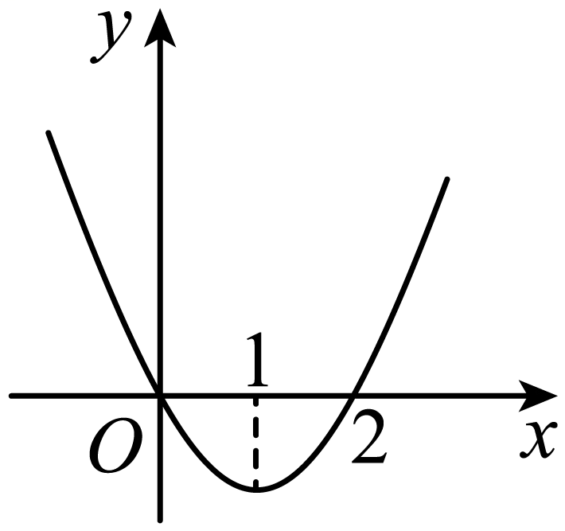

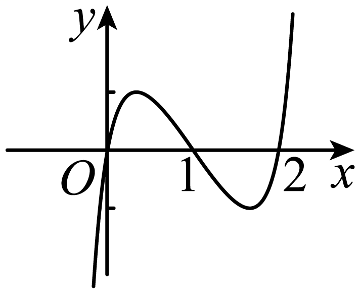

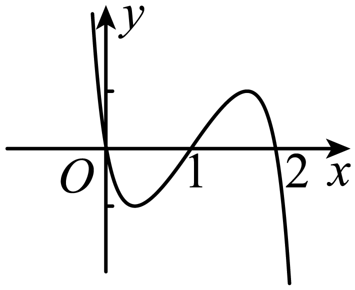

A．	B．

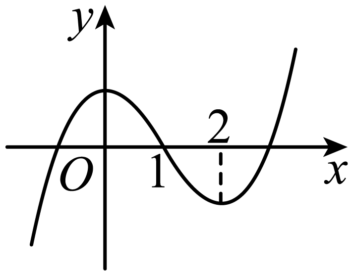

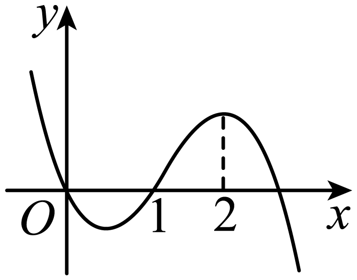

C．	D．

**【对点训练1】（多选题）（2024·全国·高三专题练习）** 已知函数的定义域为且导函数为，如图是函数的图像，则下列说法正确的是

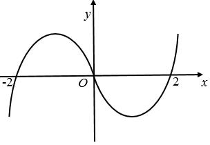

A．函数的增区间是

B．函数的增区间是

C．是函数的极小值点

D．是函数的极小值点

**【对点训练2】**（2024·黑龙江齐齐哈尔·统考二模）已知函数的图象如图所示（其中是函数的导函数），下面四个图象中可能是图象的是（    ）

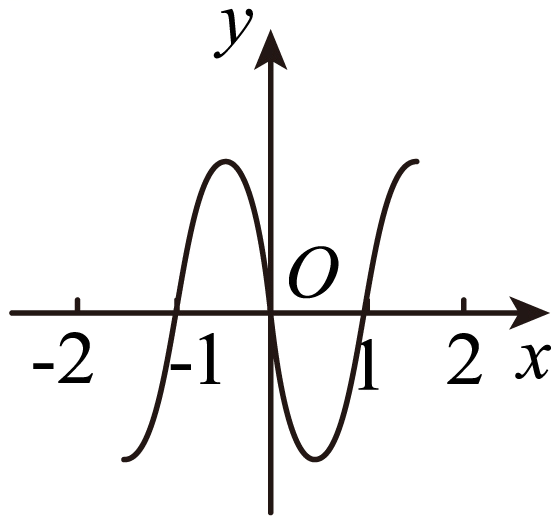

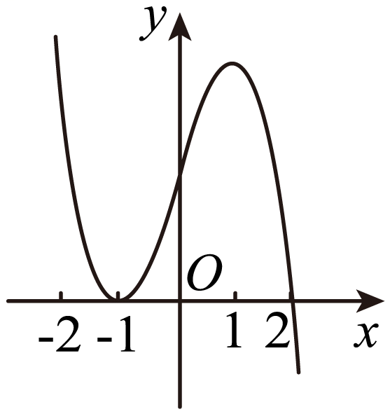

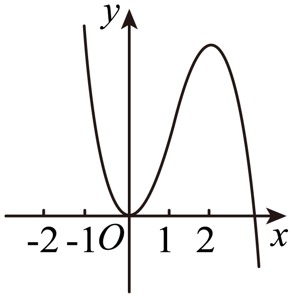

A．	B．

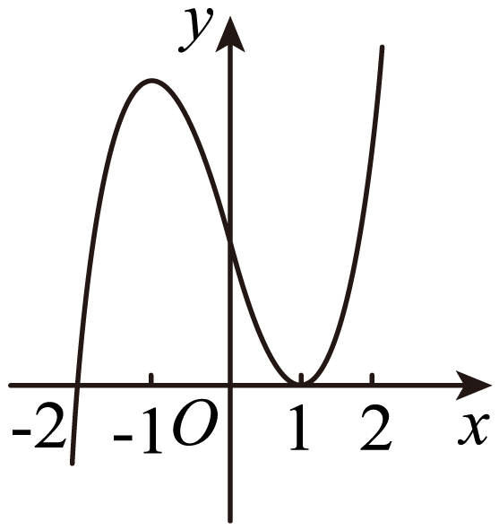

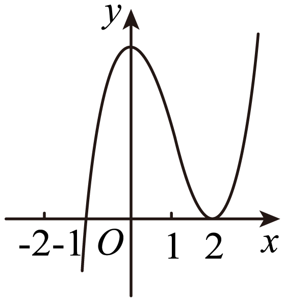

C．	D．

**【对点训练3】**（2024·陕西西安·校联考一模）已知定义在上的函数的大致图像如图所示，是的导函数，则不等式的解集为（    ）

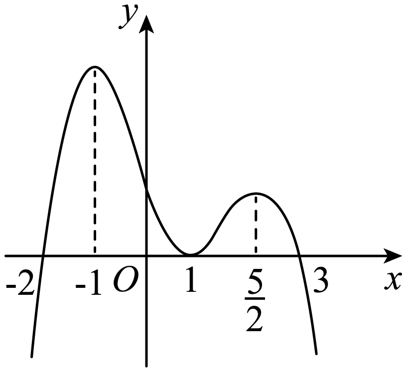

A．	B．

C．	D．

**【解题方法总结】**

原函数的单调性与导函数的函数值的符号的关系，原函数单调递增导函数（导函数等于0，只在离散点成立，其余点满足）；原函数单调递减导函数（导函数等于0，只在离散点成立，其余点满足）．

**题型二：求单调区间**

**【例2】**（2024·江西鹰潭·高三贵溪市实验中学校考阶段练习）函数的单调递增区间为（    ）

A．	B．	C．	D．

**【对点训练4】**（2024·全国·高三专题练习）函数（　　）

A．严格增函数

B．在上是严格增函数，在上是严格减函数

C．严格减函数

D．在上是严格减函数，在上是严格增函数

**【对点训练5】**（2024·全国·高三专题练习）函数的单调递增区间（    ）

A．	B．	C．	D．

<strong>【对点训练6】</strong>（2024·高三课时练习）函数（<em>a</em>、<em>b</em>为正数）的严格减区间是（    ）．

A．	B．与

C．与	D．

**【解题方法总结】**

求函数的单调区间的步骤如下：

（1）求的定义域

（2）求出．

（3）令，求出其全部根，把全部的根在轴上标出，穿针引线．

（4）在定义域内，令，解出的取值范围，得函数的单调递增区间；令，解出的取值范围，得函数的单调递减区间．若一个函数具有相同单调性的区间不只一个，则这些单调区间不能用“”、“或”连接，而应用“和”、“，”隔开．

**题型三：已知含量参函数在区间上单调或不单调或存在单调区间，求参数范围**

<strong>【例3】</strong>（2024·宁夏银川·银川一中校考三模）若函数在区间上不单调，则实数<em>m</em>的取值范围为（    ）

A．	B．

C．	D．*m*>1

**【对点训练7】**（2024·陕西西安·统考三模）若函数在区间上单调递增，则的取值范围是（    ）

A．	B．	C．	D．

**【对点训练8】**（2024·全国·高三专题练习）若函数且在区间内单调递增，则的取值范围是（    ）

A．	B．	C．	D．

**【对点训练9】**（2024·全国·高三专题练习）已知函数在区间上是减函数，则实数的取值范围为（    ）

A．	B．	C．	D．

**【对点训练10】**（2024·全国·高三专题练习）三次函数在上是减函数，则的取值范围是（    ）

A．	B．	C．	D．

<strong>【对点训练11】</strong>（2024·青海西宁·高三校考开学考试）已知函数.若对任意，，且，都有，则实数<em>a</em>的取值范围是（    ）

A．	B．	C．	D．

**【对点训练12】**（2024·全国·高三专题练习）若函数在区间内存在单调递增区间，则实数的取值范围是（    ）

A．	B．	C．	D．

**【对点训练13】**（2024·全国·高三专题练习）若函数在其定义域的一个子区间内不是单调函数，则实数的取值范围是（    ）

A．	B．	C．	D．

**【对点训练14】**（2024·全国·高三专题练习）已知函数（）在区间上存在单调递增区间，则实数的取值范围是

A．	B．	C．	D．

<strong>【例4】</strong>（2024·全国·高三专题练习）已知函数在，上单调递增，在上单调递减，则实数<em>a</em>的取值范围为（    ）

A．	B．

C．	D．

**【对点训练15】**（2024·全国·高三专题练习）已知函数的单调递减区间是，则（    ）

A．3	B．	C．2	D．

**【解题方法总结】**

（1）已知函数在区间上单调递增或单调递减，转化为导函数恒大于等于或恒小于等于零求解，先分析导函数的形式及图像特点，如一次函数最值落在端点，开口向上的抛物线最大值落在端点，开口向下的抛物线最小值落在端点等．

（2）已知区间上函数不单调，转化为导数在区间内存在变号零点，通常用分离变量法求解参变量范围．

（3）已知函数在区间上存在单调递增或递减区间，转化为导函数在区间上大于零或小于零有解．

**题型四：不含参数单调性讨论**

**【例5】**（2024·全国·高三专题练习）已知函数.试判断函数在上单调性并证明你的结论；

**【对点训练16】**（2024·广东深圳·高三深圳外国语学校校考阶段练习）已知

若，讨论的单调性；

**【对点训练17】**（2024·贵州·校联考二模）已知函数．

(1)求曲线在点处的切线方程；

(2)讨论在上的单调性．

**【对点训练18】**（2024·湖南长沙·高三长沙一中校考阶段练习）已知函数，.

(1)若，求*a*的取值范围；

(2)求函数在上的单调性；

**【对点训练19】**（2024·全国·高三专题练习）已知函数．

判断的单调性，并说明理由；

**【解题方法总结】**

确定不含参的函数的单调性，按照判断函数单调性的步骤即可，但应注意一是不能漏掉求函数的定义域，二是函数的单调区间不能用并集，要用“逗号”或“和”隔开．

**题型五：含参数单调性讨论**

**情形一：函数为一次函数**

**【例6】**（2024·山东聊城·统考三模）已知函数．

讨论的单调性；

**【对点训练20】**（2024·湖北黄冈·黄冈中学校考二模）已知函数.

讨论函数的单调性；

**【对点训练21】**（2024·全国·模拟预测）已知函数.

讨论函数的单调性；

**【对点训练22】**（2024·福建泉州·泉州五中校考模拟预测）已知函数．

讨论的单调性；

**情形二：函数为准一次函数**

**【对点训练23】**（2024·云南师大附中高三阶段练习）已知函数.

讨论的单调性；

**【对点训练24】**（2024·北京·统考模拟预测）已知函数.

(1)当时，求曲线在处的切线方程；

(2)设，讨论函数的单调性；

**【对点训练25】**（2024·陕西安康·高三陕西省安康中学校考阶段练习）已知函数.

讨论的单调性；

**情形三：函数为二次函数型**

**方向**1**、可因式分解**

**【对点训练26】**（2024·山东济宁·嘉祥县第一中学统考三模）已知函数.

讨论函数的单调性；

**【对点训练27】**（2024·湖北咸宁·校考模拟预测）已知函数，其中.

讨论函数的单调性；

**【对点训练28】**（2024·北京海淀·高三专题练习）设函数．

(1)若曲线在点处的切线与轴平行，求；

(2)求的单调区间．

**【对点训练29】**（2024·广西玉林·统考模拟预测）已知函数，.

讨论的单调区间；

**【对点训练30】**（2024·河南郑州·统考模拟预测）已知.

讨论的单调性；

**方向**2**、不可因式分解型**

**【对点训练31】**（2024·河南驻马店·统考二模）已知函数，．

讨论的单调性；

**【对点训练32】**（2024·重庆·统考模拟预测）已知函数．

讨论函数的单调性；

**【对点训练33】**（2024·广东·统考模拟预测）已知函数，.

讨论的单调性；

**【对点训练34】**（2024·江苏·统考模拟预测）已知函数.

讨论函数的单调性；

**【解题方法总结】**

1、关于含参函数单调性的讨论问题，要根据导函数的情况来作出选择，通过对新函数零点个数的讨论，从而得到原函数对应导数的正负，最终判断原函数的增减．（注意定义域的间断情况）．

2、需要求二阶导的题目，往往通过二阶导的正负来判断一阶导函数的单调性，结合一阶导函数端点处的函数值或零点可判断一阶导函数正负区间段．

3、利用草稿图像辅助说明．

**情形四：函数为准二次函数型**

**【对点训练35】**（2024·全国·高三专题练习）已知函数，，其中.

讨论函数的单调性；

**【对点训练36】**（2024·河南郑州·统考模拟预测）已知．（）

讨论的单调性；

**【对点训练37】**（2024·陕西咸阳·武功县普集高级中学校考模拟预测）已知.

讨论函数的单调性；

**【对点训练38】**（2024·重庆沙坪坝·重庆八中校考模拟预测）已知函数，

讨论函数的单调性；

**题型六：分段分析法讨论**

**【例7】**（2024·陕西·西北工业大学附属中学模拟预测（理））已知函数（，且）

求函数的单调区间；

**【对点训练39】**（2024·广东广州·统考模拟预测）设函数，其中.

讨论的单调性；

**【对点训练40】**（2024·全国·高三专题练习）已知函数.判断函数的单调性.

**【对点训练41】**（2024·全国·模拟预测）设，函数.

讨论在的单调性；

**【解题方法总结】**

1、二次型结构，当且仅当时，变号函数为一次函数．此种情况是最特殊的，故应最先讨论，遵循先特殊后一般的原则，避免写到最后忘记特殊情况，导致丢解漏解．

2、对于不可以因式分解的二次型结构，我们优先考虑参数取值能不能引起恒正恒负．

3、注意定义域以及根的大小关系

