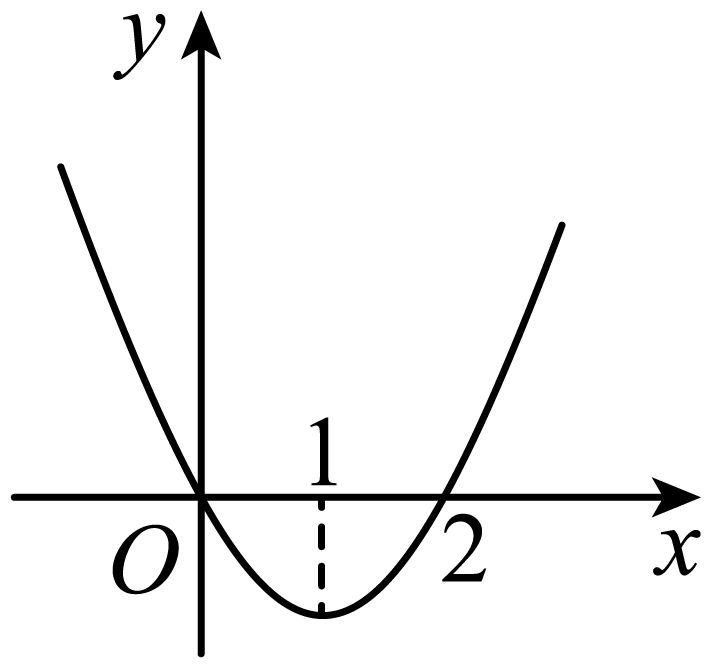
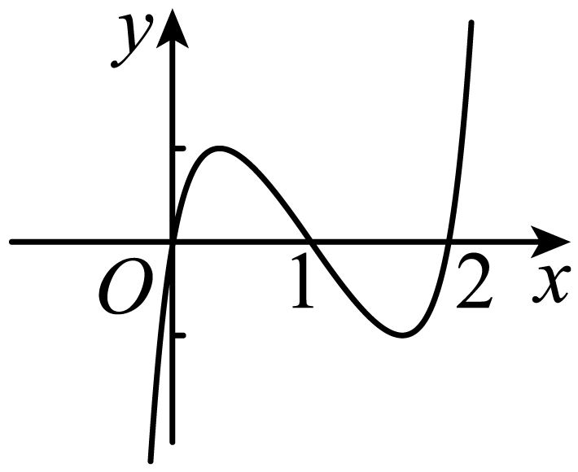
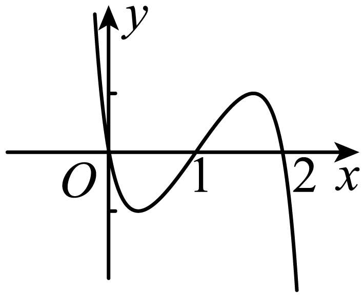
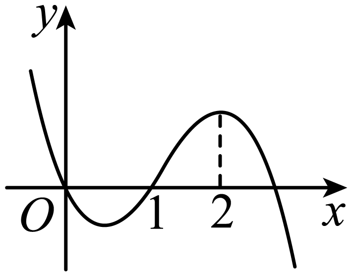
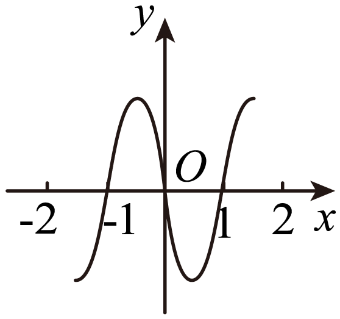
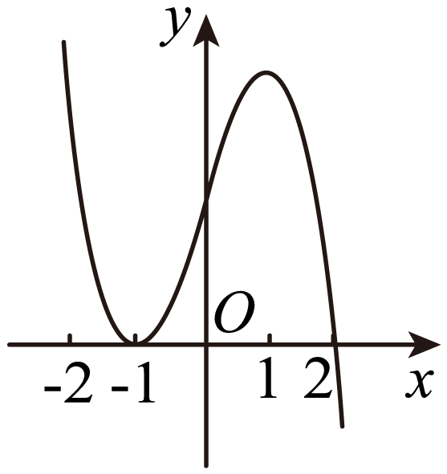
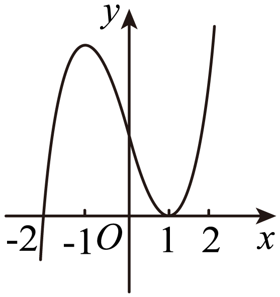
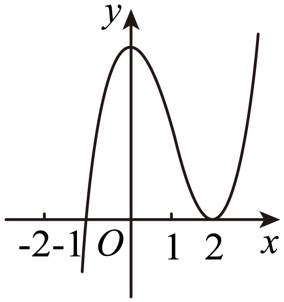
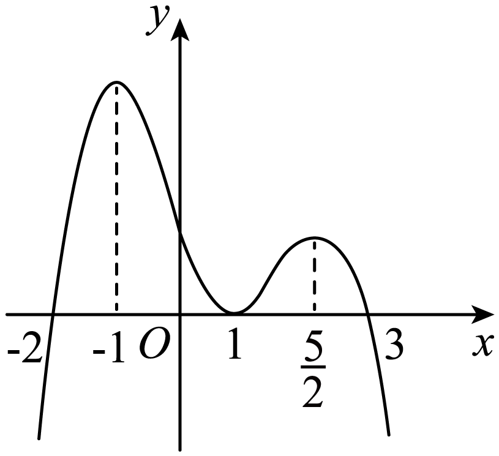

**第15讲  单调性问题**

**知识梳理**

**知识点一：单调性基础问题**

1、函数的单调性

函数单调性的判定方法：设函数在某个区间内可导，如果，则为增函数；如果，则为减函数．

2、已知函数的单调性问题

①若在某个区间上单调递增，则在该区间上有恒成立（但不恒等于0）；反之，要满足，才能得出在某个区间上单调递增；

②若在某个区间上单调递减，则在该区间上有恒成立（但不恒等于0）；反之，要满足，才能得出在某个区间上单调递减．

**知识点二：讨论单调区间问题**

**类型一：不含参数单调性讨论**

**（** 1**）** 求导化简定义域（化简应先通分，尽可能因式分解；定义域需要注意是否是连续的区间）；

**（** 2**）** 变号保留定号去（变号部分：导函数中未知正负，需要单独讨论的部分．定号部分：已知恒正或恒负，无需单独讨论的部分）；

<strong>（</strong>3<strong>）</strong>求根作图得结论（如能直接求出导函数等于0的根，并能做出导函数与<em>x</em>轴位置关系图，则导函数正负区间段已知，可直接得出结论）；

**（** 4**）** 未得结论断正负（若不能通过第三步直接得出结论，则先观察导函数整体的正负）；

**（** 5**）** 正负未知看零点（若导函数正负难判断，则观察导函数零点）；

**（** 6**）** 一阶复杂求二阶（找到零点后仍难确定正负区间段，或一阶导函数无法观察出零点，则求二阶导）；

求二阶导往往需要构造新函数，令一阶导函数或一阶导函数中变号部分为新函数，对新函数再求导．

**（** 7**）** 借助二阶定区间（通过二阶导正负判断一阶导函数的单调性，进而判断一阶导函数正负区间段）；

**类型二：含参数单调性讨论**

**（** 1**）** 求导化简定义域（化简应先通分，然后能因式分解要进行因式分解，定义域需要注意是否是一个连续的区间）；

**（** 2**）** 变号保留定号去（变号部分：导函数中未知正负，需要单独讨论的部分．定号部分：已知恒正或恒负，无需单独讨论的部分）；

**（** 3**）** 恒正恒负先讨论（变号部分因为参数的取值恒正恒负）；然后再求有效根；

**（** 4**）** 根的分布来定参（此处需要从两方面考虑：根是否在定义域内和多根之间的大小关系）；

**（** 5**）** 导数图像定区间；

**【解题方法总结】**

1、求可导函数单调区间的一般步骤

（1）确定函数的定义域；

（2）求，令，解此方程，求出它在定义域内的一切实数；

（3）把函数的间断点（即的无定义点）的横坐标和的各实根按由小到大的顺序排列起来，然后用这些点把函数的定义域分成若干个小区间；

（4）确定在各小区间内的符号，根据的符号判断函数在每个相应小区间内的增减性．

**注**：①使的离散点不影响函数的单调性，即当在某个区间内离散点处为零，在其余点处均为正（或负）时，在这个区间上仍旧是单调递增（或递减）的．例如，在上，，当时，；当时，，而显然在上是单调递增函数．

②若函数在区间上单调递增，则（不恒为0），反之不成立．因为，即或，当时，函数在区间上单调递增．当时，在这个区间为常值函数；同理，若函数在区间上单调递减，则（不恒为0），反之不成立．这说明在一个区间上函数的导数大于零，是这个函数在该区间上单调递增的充分不必要条件．于是有如下结论：

单调递增；单调递增；

单调递减；单调递减．

**必考题型全归纳**

**题型一：利用导函数与原函数的关系确定原函数图像**

**【例1】**（2024·全国·高三专题练习）设是函数的导函数，的图象如图所示，则的图象最有可能的是（    ）

A．	B．

C．	D．

【答案】C

【解析】由导函数的图象可得当时，，函数单调递增；

当时，，函数单调递减；

当时，，函数单调递增.

只有C选项的图象符合.

故选：C.

**【对点训练1】（多选题）（2024·全国·高三专题练习）** 已知函数的定义域为且导函数为，如图是函数的图像，则下列说法正确的是

A．函数的增区间是

B．函数的增区间是

C．是函数的极小值点

D．是函数的极小值点

【答案】BD

【解析】先由题中图像，确定的正负，得到函数的单调性；从而可得出函数极大值点与极小值点，进而可得出结果.由题意，当时，；当，；当时，；

当时，；

即函数在和上单调递增，在上单调递减，

因此函数在时取得极小值，在时取得极大值；

故A错，B正确；C错，D正确.

故选：BD.

**【对点训练2】**（2024·黑龙江齐齐哈尔·统考二模）已知函数的图象如图所示（其中是函数的导函数），下面四个图象中可能是图象的是（    ）

A．	B．

C．	D．

【答案】C

【解析】由的图象知，当时，，故，单调递增；

当时，，故，当，，故，

等号仅有可能在*x*＝0处取得，

所以时，单调递减；

当时，，故，单调递增，结合选项只有C符合.

故选：C.

**【对点训练3】**（2024·陕西西安·校联考一模）已知定义在上的函数的大致图像如图所示，是的导函数，则不等式的解集为（    ）

A．	B．

C．	D．

【答案】C

【解析】若，则单调递减，图像可知，，

若，则单调递增，由图像可知，

故不等式的解集为．

故选：C

**【解题方法总结】**

原函数的单调性与导函数的函数值的符号的关系，原函数单调递增导函数（导函数等于0，只在离散点成立，其余点满足）；原函数单调递减导函数（导函数等于0，只在离散点成立，其余点满足）．

**题型二：求单调区间**

**【例2】**（2024·江西鹰潭·高三贵溪市实验中学校考阶段练习）函数的单调递增区间为（    ）

A．	B．	C．	D．

【答案】D

【解析】函数的定义域为.

，则.

令，解得.

故选：D

**【对点训练4】**（2024·全国·高三专题练习）函数（　　）

A．严格增函数

B．在上是严格增函数，在上是严格减函数

C．严格减函数

D．在上是严格减函数，在上是严格增函数

【答案】D

【解析】已知，，则，

令，即，解得，

当时，，所以在上是严格减函数，

当时，，所以在上是严格增函数，

故选：D.

**【对点训练5】**（2024·全国·高三专题练习）函数的单调递增区间（    ）

A．	B．	C．	D．

【答案】A

【解析】由，可得或，

所以函数的定义域为.

求导可得，当时，，由函数定义域可知，，

所以函数的单调递增区间是.

故选：A.

<strong>【对点训练6】</strong>（2024·高三课时练习）函数（<em>a</em>、<em>b</em>为正数）的严格减区间是（    ）．

A．	B．与

C．与	D．

【答案】C

【解析】由题得.

由，令解得或．

所以函数的严格减区间是与.

选项D，本题的两个单调区间之间不能用“”连接，所以该选项错误.

故选：C

**【解题方法总结】**

求函数的单调区间的步骤如下：

（1）求的定义域

（2）求出．

（3）令，求出其全部根，把全部的根在轴上标出，穿针引线．

（4）在定义域内，令，解出的取值范围，得函数的单调递增区间；令，解出的取值范围，得函数的单调递减区间．若一个函数具有相同单调性的区间不只一个，则这些单调区间不能用“”、“或”连接，而应用“和”、“，”隔开．

**题型三：已知含量参函数在区间上单调或不单调或存在单调区间，求参数范围**

<strong>【例3】</strong>（2024·宁夏银川·银川一中校考三模）若函数在区间上不单调，则实数<em>m</em>的取值范围为（    ）

A．	B．

C．	D．*m*>1

【答案】B

【解析】函数的定义域为，

且，

令，得，

因为在区间上不单调，

所以，解得：

故选：B.

**【对点训练7】**（2024·陕西西安·统考三模）若函数在区间上单调递增，则的取值范围是（    ）

A．	B．	C．	D．

【答案】B

【解析】因为函数在区间上单调递增，

所以在区间上恒成立，

即在区间上恒成立，

令，

则，

所以在上递增，又，

所以.

所以的取值范围是.

故选：B

**【对点训练8】**（2024·全国·高三专题练习）若函数且在区间内单调递增，则的取值范围是（    ）

A．	B．	C．	D．

【答案】A

【解析】令，则，

当或时，，当时，，

所以在和上递减，在上递增，

当时，为增函数，且函数在区间内单调递增，

所以，解得，

此时在上递增，则恒成立，

当时，为减函数，且函数在区间内单调递增，

所以，无解，

综上所述，的取值范围是.

故选：A.

**【对点训练9】**（2024·全国·高三专题练习）已知函数在区间上是减函数，则实数的取值范围为（    ）

A．	B．	C．	D．

【答案】B

【解析】由题意，在上恒成立，

即在上恒成立，

因为在上单调递增，所以，

所以在时，，

所以.

故选：B

**【对点训练10】**（2024·全国·高三专题练习）三次函数在上是减函数，则的取值范围是（    ）

A．	B．	C．	D．

【答案】A

【解析】对函数求导，得

因为函数在上是减函数，则在上恒成立，

即恒成立，

当，即时，恒成立；

当，即时，，则，即，

因为，所以，即；

又因为当时，不是三次函数，不满足题意，

所以.

故选：A．

<strong>【对点训练11】</strong>（2024·青海西宁·高三校考开学考试）已知函数.若对任意，，且，都有，则实数<em>a</em>的取值范围是（    ）

A．	B．	C．	D．

【答案】A

【解析】根据题意，不妨取，则可转化为，

即.

令，则对任意，，且，

都有，

所以在上单调递增，即在上恒成立，

即在上恒成立.

令，，则，，

令，得，令，得，

所以在上单调递减，在上单调递增，所以，所以，

即实数*a*的取值范围是，

故选:A

**【对点训练12】**（2024·全国·高三专题练习）若函数在区间内存在单调递增区间，则实数的取值范围是（    ）

A．	B．	C．	D．

【答案】D

【解析】∵，

∴，

若在区间内存在单调递增区间，则有解，

故，

令，则在单调递增，

，

故.

故选：D.

**【对点训练13】**（2024·全国·高三专题练习）若函数在其定义域的一个子区间内不是单调函数，则实数的取值范围是（    ）

A．	B．	C．	D．

【答案】D

【解析】因为函数的定义域为，

所以，即，

，

令，得或（舍去），

因为在定义域的一个子区间内不是单调函数，

所以，得，

综上，，

故选：D

**【对点训练14】**（2024·全国·高三专题练习）已知函数（）在区间上存在单调递增区间，则实数的取值范围是

A．	B．	C．	D．

【答案】B

【解析】函数在区间上存在单调增区间，函数在区间上存在子区间使得不等式成立．，设，则或，即或，得，故选B.

考点：导数的应用.

<strong>【例4】</strong>（2024·全国·高三专题练习）已知函数在，上单调递增，在上单调递减，则实数<em>a</em>的取值范围为（    ）

A．	B．

C．	D．

【答案】A

【解析】由，得．

因为在，上单调递增，在上单调递减，

所以方程的两个根分别位于区间和上，

所以，即

解得.

故选：A．

**【对点训练15】**（2024·全国·高三专题练习）已知函数的单调递减区间是，则（    ）

A．3	B．	C．2	D．

【答案】B

【解析】函数，则导数

令，即，

∵，的单调递减区间是，

∴0，4是方程的两根，

∴，，

∴

故选：B.

**【解题方法总结】**

（1）已知函数在区间上单调递增或单调递减，转化为导函数恒大于等于或恒小于等于零求解，先分析导函数的形式及图像特点，如一次函数最值落在端点，开口向上的抛物线最大值落在端点，开口向下的抛物线最小值落在端点等．

（2）已知区间上函数不单调，转化为导数在区间内存在变号零点，通常用分离变量法求解参变量范围．

（3）已知函数在区间上存在单调递增或递减区间，转化为导函数在区间上大于零或小于零有解．

**题型四：不含参数单调性讨论**

**【例5】**（2024·全国·高三专题练习）已知函数.试判断函数在上单调性并证明你的结论；

【解析】函数在上为减函数，证明如下：

因为，所以，

又因为，所以，，所以，

即函数在上为减函数.

**【对点训练16】**（2024·广东深圳·高三深圳外国语学校校考阶段练习）已知

若，讨论的单调性；

【解析】若，则，求导得，

令可得，令可得，

故在上单调递减；在上单调递增.

**【对点训练17】**（2024·贵州·校联考二模）已知函数．

(1)求曲线在点处的切线方程；

(2)讨论在上的单调性．

【解析】（1），

∴，又，

∴曲线在点处的切线方程是，

即；

（2）令，

则在上递减，且，，

∴，使，即，

当时，，当时，，

∴在上递增，在上递减，

∴，

当且仅当，即时，等号成立，显然，等号不成立，故，

∴在上是减函数．

**【对点训练18】**（2024·湖南长沙·高三长沙一中校考阶段练习）已知函数，.

(1)若，求*a*的取值范围；

(2)求函数在上的单调性；

【解析】（1）由题意知的定义域为R.

①当时，由得，设，则，

当时，，故在上单调递减；当时，，故在上单调递增，

所以，因此.

②当时，若，因为，不合题意.所以，此时恒成立.

③当时，，此时.

综上可得，*a*的取值范围是.

（2）设，，则，所以在上单调递减，

所以，即在上恒成立. 所以.

又由（1）知，

所以当时，，

所以在上单调递增.

**【对点训练19】**（2024·全国·高三专题练习）已知函数．

判断的单调性，并说明理由；

【解析】

令，

在上递增，，，

在上单调递增.

**【解题方法总结】**

确定不含参的函数的单调性，按照判断函数单调性的步骤即可，但应注意一是不能漏掉求函数的定义域，二是函数的单调区间不能用并集，要用“逗号”或“和”隔开．

**题型五：含参数单调性讨论**

**情形一：函数为一次函数**

**【例6】**（2024·山东聊城·统考三模）已知函数．

讨论的单调性；

【解析】，，

①当，即时，，在区间单调递增．

②当，即时，

令，得，令，得，

所以在区间单调递增；在区间单调递减．

③当，即时，

若，则，在区间单调递增．

若，令，得，令，得，

所以在区间单调递减；在区间单调递增．

综上，时，在区间单调递增；在区间单调递减；

时，在区间单调递增

时，在区间单调递减、在区间单调递增．

**【对点训练20】**（2024·湖北黄冈·黄冈中学校考二模）已知函数.

讨论函数的单调性；

【解析】的定义域为

若，则在单调递增；

若，令，解得（舍去）

当时，，函数在上单调递增，

当时，，函数在上单调递减，

**【对点训练21】**（2024·全国·模拟预测）已知函数.

讨论函数的单调性；

【解析】因为，

所以.

因为，若，即时，在上单调递增，

若，即时，

令，得；

令，得，

所以在上单调递增，在上单调递减.

综上，当时，在上单调递增；

当时，在上单调递增，在上单调递减.

**【对点训练22】**（2024·福建泉州·泉州五中校考模拟预测）已知函数．

讨论的单调性；

【解析】由函数，可得，

设，可得，

①当时，，所以在单调递增；

②当时，令，解得.

当时，，单调递减；

当时，，单调递增.

综上，当时，在单调递增；

当时，在单调递减，在单调递增.

**情形二：函数为准一次函数**

**【对点训练23】**（2024·云南师大附中高三阶段练习）已知函数.

讨论的单调性；

【解析】

函数的定义域为，．

令，解得，

则有当时，；当时，；

所以在上单调递减，在上单调递增．

**【对点训练24】**（2024·北京·统考模拟预测）已知函数.

(1)当时，求曲线在处的切线方程；

(2)设，讨论函数的单调性；

【解析】（1），

，

，

当时，，

切点坐标为，

又，切线斜率为，

曲线在处切线方程为：

.

（2），，

，，

，，

①当时，成立，

的单调递减区间为，无单调递增区间.

②当时，令，

所以当时，，在上单调递减

时，，在上单调递增

综上: 时，的单调递减区间为，无单调递增区间；

时，的单调递增区间为，单调递减区间为；

**【对点训练25】**（2024·陕西安康·高三陕西省安康中学校考阶段练习）已知函数.

讨论的单调性；

【解析】∵，∴，

①当时，恒成立，此时在上单调递增；

②当时，令，解得，

当时，，在区间上单调递减，

当时，，在区间上单调递增.

综上所述，当时，在上单调递增；当时，在区间上单调递减，在区间上单调递增.

**情形三：函数为二次函数型**

**方向**1**、可因式分解**

**【对点训练26】**（2024·山东济宁·嘉祥县第一中学统考三模）已知函数.

讨论函数的单调性；

【解析】因为，该函数的定义域为，

.

因为，由得：或.

①当，即时，对任意的恒成立，且不恒为零，

此时，函数的增区间为，无减区间；

②当，即时，由得或；由得.

此时，函数的增区间为、，减区间为；

③当，即时，由得或；由得.

此时函数的增区间为、，减区间为.

综上所述：当时，函数的增区间为，无减区间；

当时，函数的增区间为、，减区间为；

当时，函数的增区间为、，减区间为.

**【对点训练27】**（2024·湖北咸宁·校考模拟预测）已知函数，其中.

讨论函数的单调性；

【解析】函数的定义域为.

①若时，

<table><tr><td></td><td>

</td><td>
1
</td><td>

</td><td>

</td><td>

</td></tr><tr><td>

</td><td>
-
</td><td>
0
</td><td>
+
</td><td>
0
</td><td>
-
</td></tr><tr><td>

</td><td>

</td><td>
极小值
</td><td>

</td><td>
极大值
</td><td>

</td></tr></table>

②若时，恒成立，单调递减，

③若时

<table><tr><td></td><td>

</td><td>

</td><td>

</td><td>
1
</td><td>

</td></tr><tr><td>

</td><td>
-
</td><td>
0
</td><td>
+
</td><td>
0
</td><td>
-
</td></tr><tr><td>

</td><td>

</td><td>
极小值
</td><td>

</td><td>
极大值
</td><td>

</td></tr></table>

④若时，时，单调递减；时，单调递增.

综上所述，当时，单调递减，单调递增，单调递减；当时，单调递减；当时，单调递减，，单调递增，单调递减；当时，单调递减，单调递增.

**【对点训练28】**（2024·北京海淀·高三专题练习）设函数．

(1)若曲线在点处的切线与轴平行，求；

(2)求的单调区间．

【解析】（1）因为，

所以

.

.

由题设知，即，解得.

此时.

所以的值为1

（2）由（1）得．

1）当时，令，得，

所以的变化情况如下表：

<table><tr><td>

</td><td>

</td><td>

</td><td>

</td></tr><tr><td>

</td><td>

</td><td>

</td><td>

</td></tr><tr><td>

</td><td>
单调递增
</td><td>
极大值
</td><td>
单调递减
</td></tr></table>

2）当，令，得或2

①当时，，所以的变化情况如下表：

<table><tr><td>

</td><td>

</td><td>

</td><td>

</td><td>
2
</td><td>

</td></tr><tr><td>

</td><td>

</td><td>
0
</td><td>

</td><td>
0
</td><td>

</td></tr><tr><td>

</td><td>
单调递减
</td><td>
极小值
</td><td>
单调递增
</td><td>
极大值
</td><td>
单调递减
</td></tr></table>

②当时，

（ⅰ）当即时，

<table><tr><td>

</td><td>

</td><td>

</td><td>

</td><td>
2
</td><td>

</td></tr><tr><td>

</td><td>

</td><td>
0
</td><td>

</td><td>
0
</td><td>

</td></tr><tr><td>

</td><td>
单调递增
</td><td>
极大值
</td><td>
单调递减
</td><td>
极小值
</td><td>
单调递增
</td></tr></table>

（ⅱ）当即时，恒成立，所以在上单调递增；

（ⅲ）当即时，

<table><tr><td>

</td><td>

</td><td>
2
</td><td>

</td><td>

</td><td>

</td></tr><tr><td>

</td><td>

</td><td>
0
</td><td>

</td><td>
0
</td><td>

</td></tr><tr><td>

</td><td>
单调递增
</td><td>
极大值
</td><td>
单调递减
</td><td>
极小值
</td><td>
单调递增
</td></tr></table>

综上，

当时，的单调递增区间是，单调递减区间是和；

当时，的单调递增区间是，单调递减区间是；

当时，的单调递增区间是和，单调递减区间为；

当时，的单调递增区间是，无单调递减区间；

当时，的单调递增区间是和，单调递减区间是．

**【对点训练29】**（2024·广西玉林·统考模拟预测）已知函数，.

讨论的单调区间；

【解析】的定义域为，

若，当时，，单调递增；

当时，，单调递减；

当时，，单调递增.

若，则恒成立，在上单调递增.

综上，当时，的单调递增区间为，，单调递减区间为；

当时，的单调递增区间为，无单调递减区间

**【对点训练30】**（2024·河南郑州·统考模拟预测）已知.

讨论的单调性；

【解析】因为定义域为，

所以,

若时，则，所以在上单调递增，

若时，则，所以在上单调递增，

若时，，则，当时，在上单调递减，

当或时，在，上单调递增，

若时，，则，当时，在上单调递减，

当或时，在，上单调递增，

综上可得，当或时在上单调递增；

当时在上单调递减，在，上单调递增；

当时在上单调递减，在，上单调递增.

**方向**2**、不可因式分解型**

**【对点训练31】**（2024·河南驻马店·统考二模）已知函数，．

讨论的单调性；

【解析】由题意可得的定义域为，且．

令，则，．

当，即时，，在上单调递增．

当，即或时，有两个根，．

若，，，则当时，，单调递增，

当时，，单调递减；

若，，则当或时，，单调递增，

当时，，单调递减．

综上，当时，在上单调递增，在上单调递减；

当时，在上单调递增；

当时，在和上单调递增，在上单调递减．

**【对点训练32】**（2024·重庆·统考模拟预测）已知函数．

讨论函数的单调性；

【解析】函数的定义域为，求导得，

①当，即时，恒成立，此时在上单调递减；

②当，即时，由解得，，

由解得，，由解得或，

此时在上单调递增，在和上单调递减；

③当，即时，由解得或(舍)，

由解得，由解得，

此时在上单调递增，在上单调递减，

所以当时，函数在上单调递减；

当时，函数在上单调递增，在和上单调递减；

当时，函数在上单调递增，在上单调递减.

**【对点训练33】**（2024·广东·统考模拟预测）已知函数，.

讨论的单调性；

【解析】依题意.

若，则，故当时，，当时，.

若，令，，令，解得或.

①若，则.

②若，则.

③若且，令，得，.

若，则，当时，，

当时，，当时，；

若，则，当时，，

当时，，当时，.

综上所述：若，则在**R**上单调递增；

若，则在和上单调递增，

在上单调递减；

若，则在上单调递减，在上单调递增；

若，则在和上单调递减，

在上单调递增；

若，则在**R**上单调递减；

**【对点训练34】**（2024·江苏·统考模拟预测）已知函数.

讨论函数的单调性；

【解析】易知，又因为，

令，，

①当，即时，恒成立，所以，此时，在区间上是增函数；

②当，得到或，又，其对称轴为，且，所以，

当时，，所以在区间上恒成立，

即在区间上恒成立，此时在区间上是增函数；

当时，，且，由，

得到或，时，，时，

即时，，时，

此时，在上是减函数，

在上是增函数.

综上所述，当时，在上是增函数；

当时，在上是减函数，

在上是增函数.

**【解题方法总结】**

1、关于含参函数单调性的讨论问题，要根据导函数的情况来作出选择，通过对新函数零点个数的讨论，从而得到原函数对应导数的正负，最终判断原函数的增减．（注意定义域的间断情况）．

2、需要求二阶导的题目，往往通过二阶导的正负来判断一阶导函数的单调性，结合一阶导函数端点处的函数值或零点可判断一阶导函数正负区间段．

3、利用草稿图像辅助说明．

**情形四：函数为准二次函数型**

**【对点训练35】**（2024·全国·高三专题练习）已知函数，，其中.

讨论函数的单调性；

【解析】，，

当时，，函数在上单调递增，

当时，当时，，当时，，

即函数在上单调递减，在上单调递增，

所以当时，函数在上单调递增；

当时，函数在上单调递减，在上单调递增.

**【对点训练36】**（2024·河南郑州·统考模拟预测）已知．（）

讨论的单调性；

【解析】因为,

所以,

若时,单调递减,时,,单调递增；

若,由得或,

设,则,

时,单调递减,

时,单调递增,

所以，所以,

所以时,单调递减,

，时,,单调递增.

综上得,当时,在上单调递减,在上单调递增,

当时,在上单调递减,在，上单调递增.

**【对点训练37】**（2024·陕西咸阳·武功县普集高级中学校考模拟预测）已知.

讨论函数的单调性；

【解析】由题知，.

当时，当时，；当时，，

在区间上是㺂函数，在区间上是增函数；

当时，；当或时，；当时，；

在区间上是增函数，在区间上是减函数，在区间上是增函数；

当时，在区间上是增函数；

当时，；当或时，；当时，；

在区间上是增函数，在区间上是减函数，在区间上是增函数；

综上所述，当时，在区间上是减函数，在区间上是增函数；

当时，在区间上是增函数，在区间上是减函数，在区间上是增函数；

当时，在区间上是增函数；

当时，在区间上是增函数，在区间上是减函数，在区间上是增函数.

**【对点训练38】**（2024·重庆沙坪坝·重庆八中校考模拟预测）已知函数，

讨论函数的单调性；

【解析】，

令，则两根分别为.

1、当时，在恒成立，故的单调递增区间为，无单调递减区间；

2、当时，令得或，令得，

所以单调递增区间为，单调递减区间为；

3、当时，令得或时，令得，

所以单调递增区间为，单调递减区间为.

综上当时，的单调递增区间为，无单调递减区间；当时，单调递增区间为，单调递减区间为；当时，单调递增区间为，单调递减区间为.

**题型六：分段分析法讨论**

**【例7】**（2024·陕西·西北工业大学附属中学模拟预测（理））已知函数（，且）

求函数的单调区间；

【解析】

的定义域为,（，且）

显见，.

①当时，，.

若，则，，得.

于是，.

若，则，，得，

于是，

∴当时，, 即在上单调递增

②当时，，

若，则，，得.

于是，

若，则，，得，

于是，

∴当时，.即在上单调递减

综上得，的单调递增区间为，单调递减区间为

**【对点训练39】**（2024·广东广州·统考模拟预测）设函数，其中.

讨论的单调性；

【解析】由

①时，由，令，解得，

所以时，时，，

则在单调递增，在单调递减；

②时，由，

（i）时，因为，则在单调递增，

（ii）时，，解得或，

所以时，时，，

则在，上单调递增，在单调递减；

（iii）时，由，

所以时，时，，

则在，上单调递增，在单调递减；

综上：时，的单调递增区间为，单调递减区间为；

时，的单调递增区间为和，单调递减区间为；

时，的单调递增区间为；

时，的单调递增区间为和，单调递减区间为；

**【对点训练40】**（2024·全国·高三专题练习）已知函数.判断函数的单调性.

【解析】因为，定义域为，

，

令，因为，则，

可得在上单调递减，所以，

所以当时，，当时，，

所以在上单调递增，在上单调递减.

**【对点训练41】**（2024·全国·模拟预测）设，函数.

讨论在的单调性；

【解析】因为，所以在有定义，

，

设，则

.

当时，，所以 在单调递增，而，所以当时时 ，

因此在单调递减，在单调递增；

**【解题方法总结】**

1、二次型结构，当且仅当时，变号函数为一次函数．此种情况是最特殊的，故应最先讨论，遵循先特殊后一般的原则，避免写到最后忘记特殊情况，导致丢解漏解．

2、对于不可以因式分解的二次型结构，我们优先考虑参数取值能不能引起恒正恒负．

3、注意定义域以及根的大小关系

