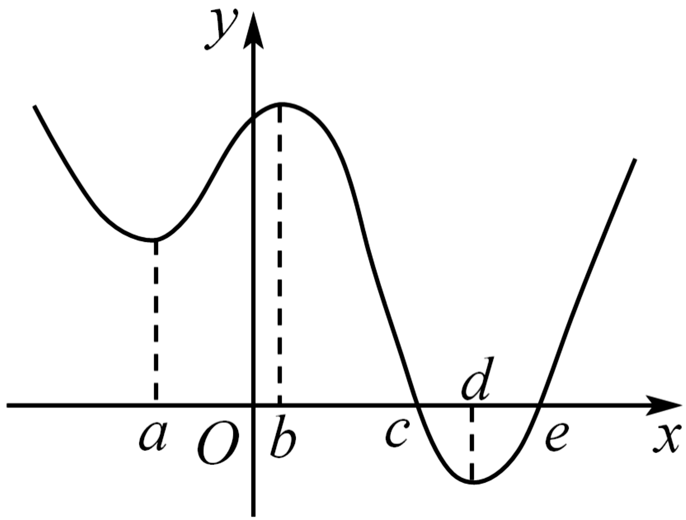

**第16讲  极值与最值**

**知识梳理**

**知识点一：极值与最值**

1**、函数的极值**

函数在点附近有定义，如果对附近的所有点都有，则称是函数的一个极大值，记作．如果对附近的所有点都有，则称是函数的一个极小值，记作．极大值与极小值统称为极值，称为极值点．

求可导函数极值的一般步骤

（1）先确定函数的定义域；

（2）求导数；

（3）求方程的根；

（4）检验在方程的根的左右两侧的符号，如果在根的左侧附近为正，在右侧附近为负，那么函数在这个根处取得极大值；如果在根的左侧附近为负，在右侧附近为正，那么函数在这个根处取得极小值．

**注：** ①可导函数在点处取得极值的充要条件是：是导函数的变号零点，即，且在左侧与右侧，的符号导号．

②是为极值点的既不充分也不必要条件，如，，但不是极值点．另外，极值点也可以是不可导的，如函数，在极小值点是不可导的，于是有如下结论：为可导函数的极值点；但为的极值点．

2**、函数的最值**

函数最大值为极大值与靠近极小值的端点之间的最大者；函数最小值为极小值与靠近极大值的端点之间的最小者．

导函数为

（1）当时，最大值是与中的最大者；最小值是与中的最小者．

（2）当时，最大值是与中的最大者；最小值是与中的最小者．

一般地，设是定义在上的函数，在内有导数，求函数在上的最大值与最小值可分为两步进行：

（1）求在内的极值（极大值或极小值）；

（2）将的各极值与和比较，其中最大的一个为最大值，最小的一个为最小值．

**注：** ①函数的极值反映函数在一点附近情况，是局部函数值的比较，故极值不一定是最值；函数的最值是对函数在整个区间上函数值比较而言的，故函数的最值可能是极值，也可能是区间端点处的函数值；

②函数的极值点必是开区间的点，不能是区间的端点；

③函数的最值必在极值点或区间端点处取得．

**【解题方法总结】**

（1）若函数在区间*D*上存在最小值和最大值，则

不等式在区间*D*上恒成立；

不等式在区间*D*上恒成立；

不等式在区间*D*上恒成立；

不等式在区间*D*上恒成立；

（2）若函数在区间*D*上不存在最大（小）值，且值域为，则

不等式在区间*D*上恒成立．

不等式在区间*D*上恒成立．

（3）若函数在区间*Ｄ*上存在最小值和最大值，即，则对不等式有解问题有以下结论：

不等式在区间*D*上有解；

不等式在区间*D*上有解；

不等式在区间*D*上有解；

不等式在区间*D*上有解；

（4）若函数在区间*D*上不存在最大（小）值，如值域为，则对不等式有解问题有以下结论：

不等式在区间*D*上有解

不等式在区间*D*上有解

（5）对于任意的，总存在，使得；

（6）对于任意的，总存在，使得；

（7）若存在，对于任意的，使得；

（8）若存在，对于任意的，使得；

（9）对于任意的，使得；

（10）对于任意的，使得；

（11）若存在，总存在，使得

（12）若存在，总存在，使得．

**必考题型全归纳**

**题型一：求函数的极值与极值点**

**【例1】**（2024·全国·高三专题练习）若函数存在一个极大值与一个极小值满足，则至少有（    ）个单调区间.

A．3	B．4	C．5	D．6

<strong>【对点训练1】</strong>（2024·全国·高三专题练习）已知定义在R上的函数<em>f</em>（<em>x</em>），其导函数的大致图象如图所示，则下列叙述正确的是（    ）

A．

B．函数在*x*＝*c*处取得最大值，在处取得最小值

C．函数在*x*＝*c*处取得极大值，在处取得极小值

D．函数的最小值为

**【对点训练2】**（2024·全国·模拟预测）已知函数的导函数为，则“在上有两个零点”是“在上有两个极值点”的（    ）

A．充分不必要条件	B．必要不充分条件	C．充要条件	D．既不充分也不必要条件

**【对点训练3】**（2024·广西南宁·南宁三中校考一模）设函数，，为的导函数．

(1)当时，过点作曲线的切线，求切点坐标；

(2)若，，且和的零点均在集合中，求的极小值．

**【对点训练4】**（2024·河北·统考模拟预测）已知函数．

(1)证明：当时，有唯一的极值点为，并求取最大值时的值；

(2)当时，讨论极值点的个数．

**【对点训练5】**（2024·江苏无锡·校联考三模）已知函数.求的极值；

**【解题方法总结】**

1、因此，在求函数极值问题中，一定要检验方程根左右的符号，更要注意变号后极大值与极小值是否与已知有矛盾．

2、原函数出现极值时，导函数正处于零点，归纳起来一句话：原极导零．这个零点必须穿越轴，否则不是极值点．判断口诀：从左往右找穿越（导函数与轴的交点）；上坡低头找极小，下坡抬头找极大．

**题型二：根据极值、极值点求参数**

**【例2】**（2024·贵州·校联考模拟预测）已知函数在处取得极大值4，则（    ）

A．8	B．	C．2	D．

**【对点训练6】**（2024·陕西商洛·统考三模）若函数无极值，则的取值范围为（    ）

A．	B．

C．	D．

**【对点训练7】**（2024·湖南长沙·高三长沙一中校考阶段练习）函数在区间上存在极值，则的最大值为（    ）

A．2	B．3	C．4	D．5

**【对点训练8】**（2024·全国·高三专题练习）已知函数在处取得极小值，则实数的取值范围为（    ）

A．	B．	C．	D．

<strong>【对点训练9】</strong>（2024·广东梅州·梅州市梅江区梅州中学校考模拟预测）已知函数有两个极值点，则实数<em>a</em>的取值范围（    ）

A．	B．

C．	D．

<strong>【对点训练10】</strong>（2024·江苏扬州·高三扬州市新华中学校考开学考试）若<em>x</em>＝<em>a</em>是函数的极大值点，则<em>a</em>的取值范围是（    ）

A．	B．	C．	D．

**【解题方法总结】**

根据函数的极值（点）求参数的两个要领

（1）列式：根据极值点处导数为0和极值这两个条件列方程组，利用待定系数法求解；

（2）验证：求解后验证根的合理性．

**题型三：求函数的最值（不含参）**

**【例3】**（2024·山东淄博·山东省淄博实验中学校考三模）已知函数.

(1)求曲线在点处的切线方程；

(2)求在区间上的最大值；

<strong>【对点训练11】</strong>（2024·云南昆明·高三昆明一中校考阶段练习）已知函数在区间上最大值为<em>M</em>，最小值为<em>m</em>，则的值是\_\_\_\_\_\_\_.

**【对点训练12】**（2024·辽宁葫芦岛·统考二模）已知函数，则的最大值是\_\_\_\_\_\_\_\_．

**【对点训练13】**（2024·湖北武汉·统考模拟预测）已知函数，，则函数的最小值为\_\_\_\_\_\_.

**【对点训练14】**（2024·山西·高三校联考阶段练习）已知，且，则的最小值为\_\_\_\_\_\_\_\_\_\_.

**【对点训练15】**（2024·海南海口·统考模拟预测）已知正实数，满足：，则的最小值为\_\_\_\_\_\_.

**【解题方法总结】**

求函数在闭区间上的最值时，在得到极值的基础上，结合区间端点的函数值，与的各极值进行比较得到函数的最值．

**题型四：求函数的最值（含参）**

**【例4】**（2024·天津和平·统考三模）已知函数，，其中.

(1)若曲线在处的切线与曲线在处的切线平行，求的值；

(2)若时，求函数的最小值；

(3)若的最小值为，证明：当时，.

**【对点训练16】**（2024·全国·模拟预测）已知函数，．讨论函数的最值；

**【对点训练17】**（2024·四川成都·成都七中校考模拟预测）已知函数，其中．

(1)若*a*=2，求的单调区间；

(2)已知，求的最小值．（参考数据：）

**【对点训练18】**（2024·全国·高三专题练习）已知函数．

(1)当时，讨论函数在上的单调性；

(2)当时，求在内的最大值；

**【对点训练19】**（2024·湖南长沙·湖南师大附中校考模拟预测）已知函数．

(1)若存在最大值*M*，证明：；

(2)在（1）的条件下，设函数，求的最小值（用含*M*，*k*的代数式表示）．

**【解题方法总结】**

若所给的闭区间含参数，则需对函数求导，通过对参数分类讨论，判断函数的单调性，从而得到函数的最值．

**题型五：根据最值求参数**

**【例5】**（2024·四川宜宾·统考三模）已知函数.

(1)讨论函数的极值点个数；

(2)若，的最小值是，求实数*m*的所有可能值.

**【对点训练20】**（2024·山东·山东省实验中学校考一模）若函数在区间上存在最小值，则整数的取值可以是\_\_\_\_\_\_．

**【对点训练21】**（2024·全国·高三专题练习）若函数在区间上有最小值，则实数的取值范围为\_\_\_\_\_\_\_\_.

<strong>【对点训练22】</strong>（2024·福建泉州·高三统考阶段练习）已知函数的最小值为0，则<em>a</em>的取值范围为\_\_\_\_\_\_\_\_\_\_\_\_\_\_．

**【对点训练23】**（2024·江苏南通·高三校考开学考试）若函数的最小值为，则\_\_\_\_\_\_．

**【对点训练24】**（2024·全国·高三专题练习）若函数在区间上存在最大值，则实数的取值范围为\_\_\_\_\_\_\_

**【对点训练25】**（2024·全国·高三专题练习）已知函数，若函数在上存在最小值.则实数的取值范围是\_\_\_\_\_\_\_\_.

**题型六：函数单调性、极值、最值得综合应用**

**【例6】**（2024·天津河北·统考二模）已知，函数，其中e是自然对数的底数.

(1)当时，求曲线在点处的切线方程；

(2)当时，求函数的单调区间；

(3)求证：函数存在极值点，并求极值点的最小值.

**【对点训练26】**（2024·全国·高三专题练习）已知函数，其中．

(1)当时，求函数在内的极值；

(2)若函数在上的最小值为5，求实数的取值范围．

**【对点训练27】**（2024·全国·高三专题练习）已知．

(1)求函数在内的极值点；

(2)求函数在上的最值．

**【对点训练28】**（2024·全国·高三专题练习）设函数，已知是函数的极值点．

(1)若函数在内单调递减，求实数*m*的取值范围；

(2)讨论函数的零点个数；

(3)求在内的最值．

**题型七：不等式恒成立与存在性问题**

<strong>【例7】</strong>（2024·贵州黔东南·凯里一中校考模拟预测）若存在实数（），使得关于<em>x</em>的不等式对恒成立，则<em>b</em>的最大值是\_\_\_\_\_\_\_\_\_.

<strong>【对点训练29】</strong>（2024·陕西安康·高三陕西省安康中学校考阶段练习）若不等式 对恒成立，则<em>a</em>的取值范围是\_\_\_\_\_\_.

<strong>【对点训练30】</strong>（2024·全国·高三专题练习）若存在，使得不等式成立，则<em>m</em>的取值范围为\_\_\_\_\_\_

**【对点训练31】**（2024·浙江金华·统考模拟预测）对任意的，不等式恒成立，则实数的取值范围为\_\_\_\_\_\_\_\_\_\_\_.

**【对点训练32】**（2024·全国·高三专题练习）已知函数，是上的奇函数，当时，取得极值．

(1)求函数的单调区间和极大值；

(2)若对任意，都有成立，求实数的取值范围；

(3)若对任意，，都有成立，求实数的取值范围．

**【解题方法总结】**

在不等式恒成立或不等式有解条件下求参数的取值范围，一般利用等价转化的思想其转化为函数的最值或值域问题加以求解，可采用分离参数或不分离参数法直接移项构造辅助函数

