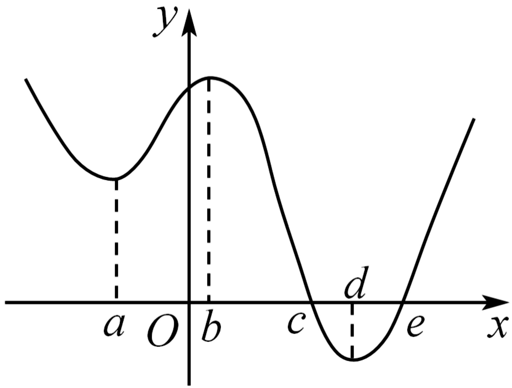
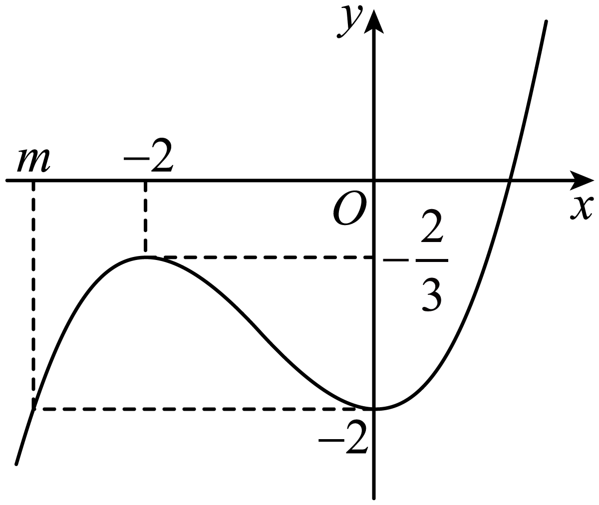
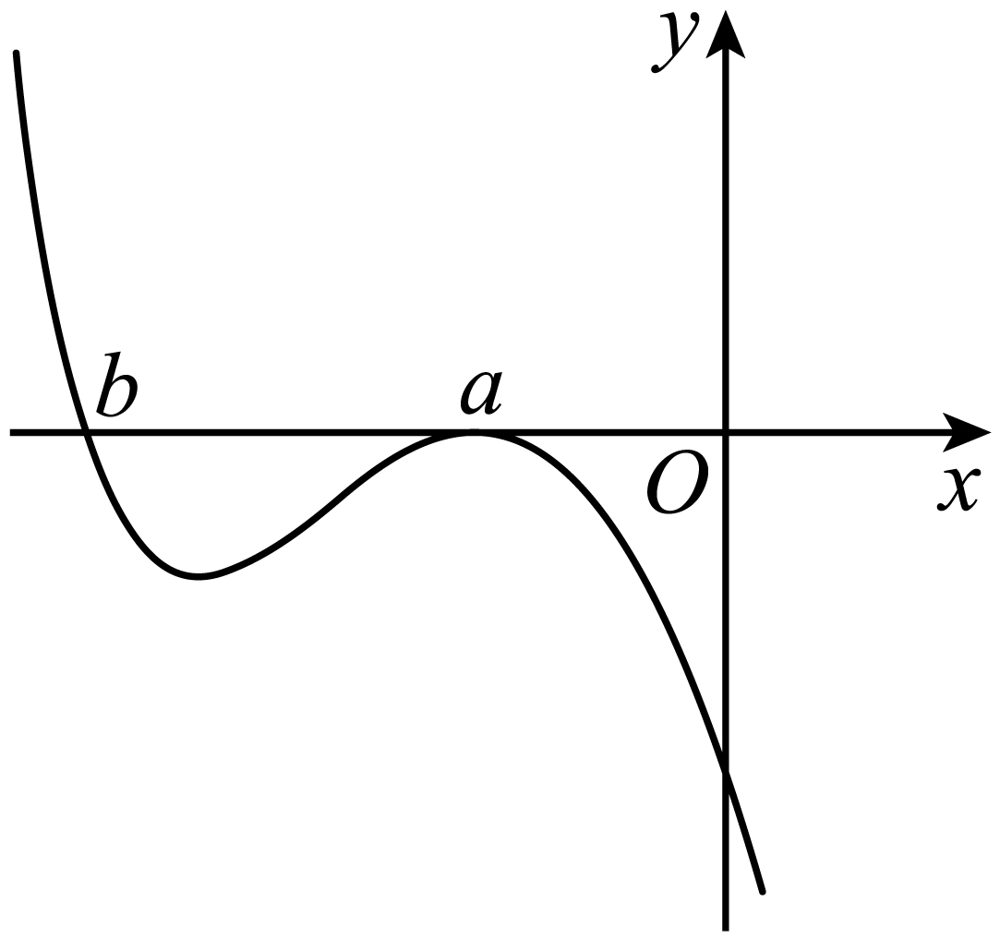
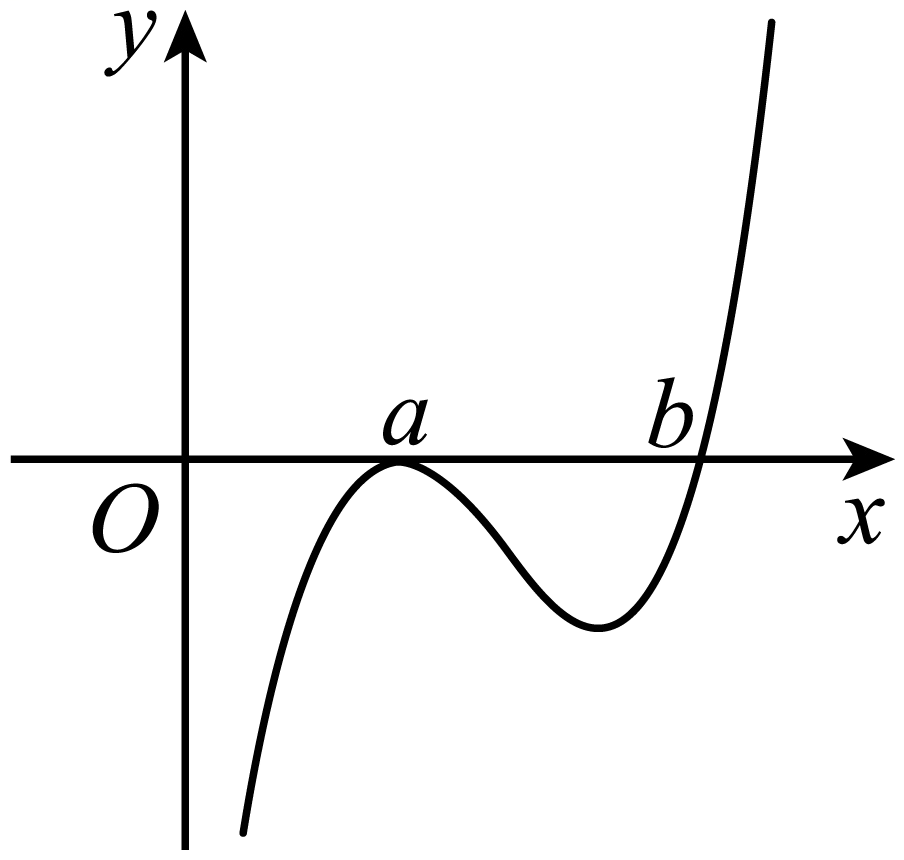

**第16讲  极值与最值**

**知识梳理**

**知识点一：极值与最值**

1**、函数的极值**

函数在点附近有定义，如果对附近的所有点都有，则称是函数的一个极大值，记作．如果对附近的所有点都有，则称是函数的一个极小值，记作．极大值与极小值统称为极值，称为极值点．

求可导函数极值的一般步骤

（1）先确定函数的定义域；

（2）求导数；

（3）求方程的根；

（4）检验在方程的根的左右两侧的符号，如果在根的左侧附近为正，在右侧附近为负，那么函数在这个根处取得极大值；如果在根的左侧附近为负，在右侧附近为正，那么函数在这个根处取得极小值．

**注：** ①可导函数在点处取得极值的充要条件是：是导函数的变号零点，即，且在左侧与右侧，的符号导号．

②是为极值点的既不充分也不必要条件，如，，但不是极值点．另外，极值点也可以是不可导的，如函数，在极小值点是不可导的，于是有如下结论：为可导函数的极值点；但为的极值点．

2**、函数的最值**

函数最大值为极大值与靠近极小值的端点之间的最大者；函数最小值为极小值与靠近极大值的端点之间的最小者．

导函数为

（1）当时，最大值是与中的最大者；最小值是与中的最小者．

（2）当时，最大值是与中的最大者；最小值是与中的最小者．

一般地，设是定义在上的函数，在内有导数，求函数在上的最大值与最小值可分为两步进行：

（1）求在内的极值（极大值或极小值）；

（2）将的各极值与和比较，其中最大的一个为最大值，最小的一个为最小值．

**注：** ①函数的极值反映函数在一点附近情况，是局部函数值的比较，故极值不一定是最值；函数的最值是对函数在整个区间上函数值比较而言的，故函数的最值可能是极值，也可能是区间端点处的函数值；

②函数的极值点必是开区间的点，不能是区间的端点；

③函数的最值必在极值点或区间端点处取得．

**【解题方法总结】**

（1）若函数在区间*D*上存在最小值和最大值，则

不等式在区间*D*上恒成立；

不等式在区间*D*上恒成立；

不等式在区间*D*上恒成立；

不等式在区间*D*上恒成立；

（2）若函数在区间*D*上不存在最大（小）值，且值域为，则

不等式在区间*D*上恒成立．

不等式在区间*D*上恒成立．

（3）若函数在区间*Ｄ*上存在最小值和最大值，即，则对不等式有解问题有以下结论：

不等式在区间*D*上有解；

不等式在区间*D*上有解；

不等式在区间*D*上有解；

不等式在区间*D*上有解；

（4）若函数在区间*D*上不存在最大（小）值，如值域为，则对不等式有解问题有以下结论：

不等式在区间*D*上有解

不等式在区间*D*上有解

（5）对于任意的，总存在，使得；

（6）对于任意的，总存在，使得；

（7）若存在，对于任意的，使得；

（8）若存在，对于任意的，使得；

（9）对于任意的，使得；

（10）对于任意的，使得；

（11）若存在，总存在，使得

（12）若存在，总存在，使得．

**必考题型全归纳**

**题型一：求函数的极值与极值点**

**【例1】**（2024·全国·高三专题练习）若函数存在一个极大值与一个极小值满足，则至少有（    ）个单调区间.

A．3	B．4	C．5	D．6

【答案】B

【解析】若函数存在一个极大值与一个极小值，则至少有3个单调区间，

若有3个单调区间，

不妨设的定义域为，若，其中可以为，可以为，

则在上单调递增，在上单调递减，（若定义域为内不连续不影响总体单调性），

故，不合题意，

若，则在上单调递减，在上单调递增，有，不合题意；

若有4个单调区间，

例如的定义域为，则，

令，解得或，

则在上单调递增，在上单调递减，

故函数存在一个极大值与一个极小值，且，满足题意，此时有4个单调区间，

综上所述：至少有4个单调区间.

故选：B.

<strong>【对点训练1】</strong>（2024·全国·高三专题练习）已知定义在R上的函数<em>f</em>（<em>x</em>），其导函数的大致图象如图所示，则下列叙述正确的是（    ）

A．

B．函数在*x*＝*c*处取得最大值，在处取得最小值

C．函数在*x*＝*c*处取得极大值，在处取得极小值

D．函数的最小值为

【答案】C

【解析】由题图可知，当时，，所以函数在上单调递增，

又*a*<*b*<*c*，所以，故A不正确．

因为，，且当时，；当*c*<*x*<*e*时，；

当*x*>*e*时，．所以函数在*x*＝*c*处取得极大值，但不一定取得最大值，在*x*＝*e*处取得极小值，不一定是最小值，故B不正确，C正确．

由题图可知，当时，，所以函数在[*d*，*e*]上单调递减，从而，所以D不正确．

故选：C．

**【对点训练2】**（2024·全国·模拟预测）已知函数的导函数为，则“在上有两个零点”是“在上有两个极值点”的（    ）

A．充分不必要条件	B．必要不充分条件	C．充要条件	D．既不充分也不必要条件

【答案】D

【解析】只有当在上有两个变号零点时，在上才有两个极值点，故充分性不成立；若在上有两个极值点，则在上有两个变号零点，则在上至少有两个零点，故必要性不成立.综上，“在上有两个零点”是“在上有两个极值点”的既不充分也不必要条件，

故选：D.

**【对点训练3】**（2024·广西南宁·南宁三中校考一模）设函数，，为的导函数．

(1)当时，过点作曲线的切线，求切点坐标；

(2)若，，且和的零点均在集合中，求的极小值．

【解析】（1）当时，，求导得，

设过点作曲线的切线的切点为，则，

于是切线方程为，即，因为切线过点，

即有，解得或，所以切点坐标为，.

（2）当，时，，

求导得，令，得或，

依题意，，都在集合中，且，，

当时，，且，则，，，

当时，，且，则，，不符合题意，

因此，，，，

当或时，，当时，，

于是函数在，上单调递增，在上单调递减，

所以当时，函数取得极小值为.

**【对点训练4】**（2024·河北·统考模拟预测）已知函数．

(1)证明：当时，有唯一的极值点为，并求取最大值时的值；

(2)当时，讨论极值点的个数．

【解析】（1）证明：当，时，，可得的定义域为，

且，令，解得，

当时，，单调递减；

当时，，单调递增，

所以当时，有唯一的极小值，即有唯一的极值点为，

由，

令，设，可得，

由，解得，

当时，，单调递增；当时，，单调递减，

所以当，即时，有唯一的极大值，即取得最大值，

所以当的最大值时，.

（2）当时，的定义域为，且，

①当时，时恒成立，此时单调递增，

所以极值点的个数为个；

②当时，设，即

（i）当，即时，可得，即对恒成立，即在上无变号零点，所以此时极值点的个数为个；

（ii）当，即时，

设的两零点为，且，，，可得

即在上有个变号零点，所以此时极值点的个数为个；

综上所述，当时，的极值点的个数为；

当时，的极值点的个数为.

**【对点训练5】**（2024·江苏无锡·校联考三模）已知函数.求的极值；

【解析】因为函数，所以，

设，，

所以在上单调递增.

又，所以当时，；当时，.

又因为对恒成立，

所以当时，；当时，.

即在区间上单调递增，在区间上单调递减，

故，没有极小值.

**【解题方法总结】**

1、因此，在求函数极值问题中，一定要检验方程根左右的符号，更要注意变号后极大值与极小值是否与已知有矛盾．

2、原函数出现极值时，导函数正处于零点，归纳起来一句话：原极导零．这个零点必须穿越轴，否则不是极值点．判断口诀：从左往右找穿越（导函数与轴的交点）；上坡低头找极小，下坡抬头找极大．

**题型二：根据极值、极值点求参数**

**【例2】**（2024·贵州·校联考模拟预测）已知函数在处取得极大值4，则（    ）

A．8	B．	C．2	D．

【答案】B

【解析】因为，所以，

所以，解得，

经检验，符合题意，所以.

故选：B

**【对点训练6】**（2024·陕西商洛·统考三模）若函数无极值，则的取值范围为（    ）

A．	B．

C．	D．

【答案】A

【解析】因为，所以，因为无极值，所以，解得，所以*a*的取值范围为．

故选：A.

**【对点训练7】**（2024·湖南长沙·高三长沙一中校考阶段练习）函数在区间上存在极值，则的最大值为（    ）

A．2	B．3	C．4	D．5

【答案】B

【解析】函数的定义域为，

，

令，，

所以当时，，当时，，

所以在单调递增，单调递减，

所以，

又因为当时，则，

，

所以存在唯一，使得，

所以函数在时，时，

所以函数在单调递增，单调递减，

所以要使函数在区间上存在极值，

所以的最大值为3，

故选:B.

**【对点训练8】**（2024·全国·高三专题练习）已知函数在处取得极小值，则实数的取值范围为（    ）

A．	B．	C．	D．

【答案】B

【解析】因为函数，

则，

要使函数在处取得极小值，则，

故选：B.

<strong>【对点训练9】</strong>（2024·广东梅州·梅州市梅江区梅州中学校考模拟预测）已知函数有两个极值点，则实数<em>a</em>的取值范围（    ）

A．	B．

C．	D．

【答案】D

【解析】的定义域是，，

令，

所以在区间递减；在区间递增.

要使有两个极值点，则，

此时，

构造函数，

所以在上递增，所以，

所以，

所以实数*a*的取值范围.

故选：D

<strong>【对点训练10】</strong>（2024·江苏扬州·高三扬州市新华中学校考开学考试）若<em>x</em>＝<em>a</em>是函数的极大值点，则<em>a</em>的取值范围是（    ）

A．	B．	C．	D．

【答案】A

【解析】，

令，得：

当 ，即

此时在区间单调递增，上单调递减，上单调递增，符合*x*＝*a*是函数的极大值点，

反之，当 ，即，此时在区间单调递增，上单调递减，上单调递增，*x*＝*a*是函数的极小值点，不符合题意；

当 ，即，恒成立，函数在上单调递增，无极值点.

综上得：.

故选：A.

**【解题方法总结】**

根据函数的极值（点）求参数的两个要领

（1）列式：根据极值点处导数为0和极值这两个条件列方程组，利用待定系数法求解；

（2）验证：求解后验证根的合理性．

**题型三：求函数的最值（不含参）**

**【例3】**（2024·山东淄博·山东省淄博实验中学校考三模）已知函数.

(1)求曲线在点处的切线方程；

(2)求在区间上的最大值；

【解析】（1）因为，

所以，则，又，

所以曲线在点处的切线方程为.

（2）令，

则，当时，，在上单调递增.

因为，，

所以，使得.

所以当时，，单调递减；

当时，，单调递增，

又，，

所以.

<strong>【对点训练11】</strong>（2024·云南昆明·高三昆明一中校考阶段练习）已知函数在区间上最大值为<em>M</em>，最小值为<em>m</em>，则的值是\_\_\_\_\_\_\_.

【答案】

【解析】由题意， ，，在上，

故函数单调递增，所以，，，

故的值是.

故答案为：

**【对点训练12】**（2024·辽宁葫芦岛·统考二模）已知函数，则的最大值是\_\_\_\_\_\_\_\_．

【答案】

【解析】因为，

所以

.

当时，，

所以在单调递增；

当时，，

所以在单调递减；

所以.

故答案为：.

**【对点训练13】**（2024·湖北武汉·统考模拟预测）已知函数，，则函数的最小值为\_\_\_\_\_\_.

【答案】/0.5

【解析】因为，

所以，

记，，

则，因为，所以，

所以在上单调递增，所以，

所以在上恒成立，所以在上单调递增，

故当时，函数有最小值为，

故答案为：

**【对点训练14】**（2024·山西·高三校联考阶段练习）已知，且，则的最小值为\_\_\_\_\_\_\_\_\_\_.

【答案】1

【解析】因为，，所以，所以，且，

所以，

设，，

则，因为，所以，在上为增函数，

因为，所以，则，所以，

所以，

令，则，

令，则，则在上为增函数，

令得，即，

则存在唯一实数，使得，即，

所以当时，，，当时，，，

所以在上为减函数，在上为增函数，

所以.

所以的最小值为.

故答案为：.

**【对点训练15】**（2024·海南海口·统考模拟预测）已知正实数，满足：，则的最小值为\_\_\_\_\_\_.

【答案】

【解析】由可得：,

所以，，

设，，

所以在上单调递增，所以，

则，所以，

所以，所以，令，

令，解得：；令，解得：；

所以在上单调递减，在上单调递增，

所以.

故的最小值为.

故答案为：.

**【解题方法总结】**

求函数在闭区间上的最值时，在得到极值的基础上，结合区间端点的函数值，与的各极值进行比较得到函数的最值．

**题型四：求函数的最值（含参）**

**【例4】**（2024·天津和平·统考三模）已知函数，，其中.

(1)若曲线在处的切线与曲线在处的切线平行，求的值；

(2)若时，求函数的最小值；

(3)若的最小值为，证明：当时，.

【解析】（1）因为，，

所以，，

所以，，

因为两条切线平行，所以，解得

（2）由（1）可知，令，即，

即，即，又，解得，

令，解得，所以在上单调递减，在上单调递增，

所以时，函数的最小值为.

（3）证明：因为，，，

令，则，即，

所以当时解得，所以在上单调递增，

令，解得，所以在上单调递减，

所以在处取得极小值即最小值，

所以，

即的最小值为的解析式为，，

则，令，解得，

所以当时，即在上单调递增，

当时，即在上单调递增，

所以在处取得极大值即最大值，即，

所以，即当时，总有.

**【对点训练16】**（2024·全国·模拟预测）已知函数，．讨论函数的最值；

【解析】函数的定义域为，，

当时，，在上单调递增，无最值；

当时，令，得，所以在上单调递减；

令，得，所以在单调递增，

所以的最小值为，无最大值．

综上，当时，无最值；当时，的最小值为，无最大值．

**【对点训练17】**（2024·四川成都·成都七中校考模拟预测）已知函数，其中．

(1)若*a*=2，求的单调区间；

(2)已知，求的最小值．（参考数据：）

【解析】（1）由题设，则，且，

所以，

当时，当时，

所以的减区间为，增区间为.

（2）由题意，

所以，即，

又，且，

当或时，或时，

所以、上递减，、上递增，

又极小值，故最小值为.

**【对点训练18】**（2024·全国·高三专题练习）已知函数．

(1)当时，讨论函数在上的单调性；

(2)当时，求在内的最大值；

【解析】（1）当时，，，且．

当时，，，则，

即，故函数在上单调递增．

（2），

令，则，

由且，可得，，则，在内单调递增，

所以，

又当时，，

所以，在内单调递增，

故．

**【对点训练19】**（2024·湖南长沙·湖南师大附中校考模拟预测）已知函数．

(1)若存在最大值*M*，证明：；

(2)在（1）的条件下，设函数，求的最小值（用含*M*，*k*的代数式表示）．

【解析】（1）的定义域为，

，

记，易知单调递增，

又因为，

所以存在，使得，

①当时，在上单调递减，在上单调递增，

所以无最大值，即不符题意；

②当时，在上单调递增，在上单调递减，

所以，

因为，所以，所以，

所以，即．

（2）由（1）可知，且，所以，

，令，

则，令，解得，

当时，，当时，，

所以在上单调递减，在上单调递增．

当时，，又，

所以存在，使得，

可知，

因为，所以，所以，

由（1）可知，，即，

因为，所以，

所以．

设，易知单调递增，且，

所以，

所以，

即的最小值为．

**【解题方法总结】**

若所给的闭区间含参数，则需对函数求导，通过对参数分类讨论，判断函数的单调性，从而得到函数的最值．

**题型五：根据最值求参数**

**【例5】**（2024·四川宜宾·统考三模）已知函数.

(1)讨论函数的极值点个数；

(2)若，的最小值是，求实数*m*的所有可能值.

【解析】（1）函数的定义域是，求导得，

令，求导得，递减，

递增，，

①当时，，递减，递增，有1个极小值点；

②当时，，

令，则，函数在上递增，，即，

当时，，此时，使得，

令，有，令，，

即有在上递增，，函数在上递增，，则，

当时，，此时，使得，

因此递减，递增，

递减，递增，有3个极值点，

所以当时，恰有一个极值点；当时，恰有三个极值点.

（2）由（1）知，①当时，在上单调递减，在上单调递增，

，即，令，

，函数在上单调递增，，则；

②当时，，使得，，使得，

递减，递增，

递减，递增，

其中，则，

显然符合要求，即有，

综上提，

所以*m*的所有可能值是上的实数.

**【对点训练20】**（2024·山东·山东省实验中学校考一模）若函数在区间上存在最小值，则整数的取值可以是\_\_\_\_\_\_．

【答案】（答案不唯一，、均可）

【解析】因为，则.

由可得，由可得或，

所以，函数的减区间为，增区间为、，

所以，函数的极大值为，极小值为，

令，其中，则，解得，

因为函数在区间上存在最小值，则，解得，

所以，整数的取值集合为.

故答案为：（答案不唯一，、均可）.

**【对点训练21】**（2024·全国·高三专题练习）若函数在区间上有最小值，则实数的取值范围为\_\_\_\_\_\_\_\_.

【答案】

【解析】，

所以在和上，，函数单调递减；

在上，，函数单调递增；

且

当时，，

即，

所以在区间上有最小值，则：

解得.

故答案为：

<strong>【对点训练22】</strong>（2024·福建泉州·高三统考阶段练习）已知函数的最小值为0，则<em>a</em>的取值范围为\_\_\_\_\_\_\_\_\_\_\_\_\_\_．

【答案】

【解析】函数定义域为，，显然，

当时，，当时，函数在上单调递减，，因此，

当时，函数在上单调递减，其取值集合为，

函数在上单调递增，函数值集合为，因此存在，使得，

而，于是，不符合题意，

当时，，令，，当时，，

即在上单调递增，，，即有，

当时，，即，当且仅当时取等号，因此，

当时，，显然当时，，函数在上单调递减，

，不符合题意，

综上得，，

所以则*a*的取值范围为.

故答案为：

**【对点训练23】**（2024·江苏南通·高三校考开学考试）若函数的最小值为，则\_\_\_\_\_\_．

【答案】

【解析】当时，，

，

当时，，当时，，

所以在单调递减，在单调递增，

所以解得，与矛盾；

当时，，

(i)若，即，

则有在单调递减，单调递增，

所以解得，与矛盾；

(ii)若，即，

则有在单调递减，单调递增，

所以解得，满足题意；

综上，，

故答案为:.

**【对点训练24】**（2024·全国·高三专题练习）若函数在区间上存在最大值，则实数的取值范围为\_\_\_\_\_\_\_

【答案】

【解析】因为，

且函数在区间上存在最大值，

故只需满足，

所以，

解得．

故答案为：

**【对点训练25】**（2024·全国·高三专题练习）已知函数，若函数在上存在最小值.则实数的取值范围是\_\_\_\_\_\_\_\_.

【答案】

【解析】，，

当时，，单调递减；当或时，，单调递增，

∴在处取得极小值，在处取得极大值.

令，解得或，

又∵函数在上存在最小值，且为开区间，

所以，解得.

即的取值范围是.

故答案为：.

**题型六：函数单调性、极值、最值得综合应用**

**【例6】**（2024·天津河北·统考二模）已知，函数，其中e是自然对数的底数.

(1)当时，求曲线在点处的切线方程；

(2)当时，求函数的单调区间；

(3)求证：函数存在极值点，并求极值点的最小值.

【解析】（1）当时，,,

,,

曲线在点处的切线方程,

切线方程.

（2）当时，，

则

令，得；

令，得；

所以，函数的单调增区间为，单调减区间为．

（3）

令，因为，

所以方程，有两个不相等的实根，

又因为，

所以，

令，列表如下:

<table><tr><td>
<em> </em>
</td><td>

</td><td>

</td><td>

</td></tr><tr><td>

</td><td>
-
</td><td>
0
</td><td>
+
</td></tr><tr><td>

</td><td>
减
</td><td>
极小值
</td><td>
增
</td></tr></table>

所以存在极值点.

所以存在使得成立，

所以存在使得，

所以存在使得对任意的有解，因此需要讨论等式左边的关于的函数，

记，

所以，

当时，单调递减；

当时，单调递增．

所以当时，的最小值为．

所以需要，

即需要，

即需要，

即需要

因为在上单调递增，且，

所以需要，

故的最小值是e．

**【对点训练26】**（2024·全国·高三专题练习）已知函数，其中．

(1)当时，求函数在内的极值；

(2)若函数在上的最小值为5，求实数的取值范围．

【解析】（1）由题意得，当时，，

则，

令，得，，

，在内随*x*变化而变化的情况如下表所示：

<table><tr><td>
<em>x</em>
</td><td>

</td><td>
1
</td><td>

</td></tr><tr><td>

</td><td>
+
</td><td>
0
</td><td>

</td></tr><tr><td>

</td><td>
单调递增
</td><td>
极大值9
</td><td>
单调递减
</td></tr></table>

故在内的极大值为9，无极小值；

（2），

①当时，，且不恒为0，

所以函数在区间上单调递增，

所以在上，，

由题意，则，解得，与矛盾，

②当时，，且不恒为0，

所以函数在区间上单调递减，

所以在上，，符合题意，

③当时，当时，，函数在区间上单调递减，

当时，，函数在区间上单调递增，

所以在上，，

由题意，则，即，即，

即，解得或，与矛盾，

综上，实数*a*的取值范围为．

**【对点训练27】**（2024·全国·高三专题练习）已知．

(1)求函数在内的极值点；

(2)求函数在上的最值．

【解析】（1）由得．

令，解得，，即，．

又，所以，．

，随*x*变化而变化的情况如下表所示：

<table><tr><td>
<em>x</em>
</td><td>

</td><td>

</td><td>

</td><td>

</td><td>

</td></tr><tr><td>

</td><td>
+
</td><td>
0
</td><td>
-
</td><td>
0
</td><td>
+
</td></tr><tr><td>

</td><td>
↑
</td><td>
极大值
</td><td>
↓
</td><td>
极小值
</td><td>
↑
</td></tr></table>

所以函数在内的极大值点为，极小值点为．

（2）由题知．，

记，

则．

因为，所以，又，

所以，所以函数单调递增，，

所以当时，，即，函数单调递减；

当时，，即，函数单调递增．

，

，

，

显然，所以函数在上的最小值为，最大值为．

**【对点训练28】**（2024·全国·高三专题练习）设函数，已知是函数的极值点．

(1)若函数在内单调递减，求实数*m*的取值范围；

(2)讨论函数的零点个数；

(3)求在内的最值．

【解析】（1）由已知可得，.

因为是函数的极值点，

所以当时，，即，所以.

此时有，.

令，，

则在上恒成立，

所以，即在上单调递减.

又当时，，

所以时，，所以函数在上单调递增；

时，，所以函数在上单调递减.

所以，当时，函数取得极小值，所以，

所以．

则，

所以，．

因为，所以.

设，

要使在内单调递减，则应有在内恒成立，

只需在内恒成立，只需在上的最小值即可．

当时，满足条件；

当时，，

此时，函数在处有最小值，

所以，解得，所以；

当时，，

此时，要使在上恒成立，

所以只需，解得，所以.

综上可知，实数*m*的取值范围为．

（2）由已知可得，，

则.

因为，所以，.

当时，有.

当时，，所以在上单调递增；

当时，，所以在上单调递减.

故的极大值为.

又，

由零点存在性定理知，可知在内存在一个零点.

又，

故函数有2个零点．

（3）由题可得（且），

则.

设，则，

令，解得，

当时，，所以在上单调递减；

当时，，所以在内单调递增.

所以，故恒成立.

又因为当且时，，

所以恒成立，所以在上单调递减，

故在内的最大值为，最小值为．

**题型七：不等式恒成立与存在性问题**

<strong>【例7】</strong>（2024·贵州黔东南·凯里一中校考模拟预测）若存在实数（），使得关于<em>x</em>的不等式对恒成立，则<em>b</em>的最大值是\_\_\_\_\_\_\_\_\_.

【答案】

【解析】当，且时，由，得.

设，则.

当时，，在上单调递增，

当时，，在上单调递减.

所以，得，

等价于，而，

当且仅当时等号成立.

所以，则，

所以，

解得，所以*b*的最大值是.

故答案为：

<strong>【对点训练29】</strong>（2024·陕西安康·高三陕西省安康中学校考阶段练习）若不等式 对恒成立，则<em>a</em>的取值范围是\_\_\_\_\_\_.

【答案】

【解析】令 ，则

，

令，，则 ,

当时，；当时，，所以函数在区间上单调递增，在区间上单调递减，

所以,当*x*趋近于0时，趋近于，所以，

令，，，则，

当时，；当时，，所以函数在区间上单调递减，在区间上单调递增，

所以，

若恒成立，即恒成立，所以，所以；

故答案为：.

<strong>【对点训练30】</strong>（2024·全国·高三专题练习）若存在，使得不等式成立，则<em>m</em>的取值范围为\_\_\_\_\_\_

【答案】

【解析】存在，要使成立，即，，

令，，即，

又，设，，

则，则在内单调递增，

，则，在内单调递增，

，故*m*的取值范围为．

故答案为：.

**【对点训练31】**（2024·浙江金华·统考模拟预测）对任意的，不等式恒成立，则实数的取值范围为\_\_\_\_\_\_\_\_\_\_\_.

【答案】

【解析】原题等价于，.

令，，则.

当时，.

当时，，所以函数在上单调递增；

当时，，所以函数在上单调递减.

所以，函数在处取得唯一极大值，也是最大值.

又，所以.

令，，则.

当时，.

因为，

所以，当时，，所以函数在上单调递减；

当时，，所以函数在上单调递增.

所以，函数在处取得唯一极小值，也是最小值.

所以，当时，有.

要使时，有恒成立，则应有.

故答案为：.

**【对点训练32】**（2024·全国·高三专题练习）已知函数，是上的奇函数，当时，取得极值．

(1)求函数的单调区间和极大值；

(2)若对任意，都有成立，求实数的取值范围；

(3)若对任意，，都有成立，求实数的取值范围．

【解析】（1）是上的奇函数，

，即，得恒成立，

可得，即，

又当时，取得极值，，

解得，故函数，导函数，

令解得，当或时，，

当时，，

单调增区间为和，单调减区间为，

故当时，取到极大值

（2），对任意，都有成立，只需在时恒成立，

构造函数，，则有，

令可得或，当时，，单调递减

当时，，单调递增，当时，，单调递减，

当时，取到极大值，又，故的最大值为8，

故实数的取值范围为：；

（3）若对任意，，都有成立，

即在区间上的最大值都小于或等于的最小值，

由（1）可知：当时，单调递减，当时，单调递增，

故当时，函数取到极小值，也是该区间的最小值，

而为开口向上的抛物线，对称轴为，故当时取最大值，

由，解得

故实数的取值范围为：

**【解题方法总结】**

在不等式恒成立或不等式有解条件下求参数的取值范围，一般利用等价转化的思想其转化为函数的最值或值域问题加以求解，可采用分离参数或不分离参数法直接移项构造辅助函数．

1．（2022·全国·统考高考真题）函数在区间的最小值、最大值分别为（    ）

A．	B．	C．	D．

【答案】D

【解析】，

所以在区间和上，即单调递增；

在区间上，即单调递减，

又，，，

所以在区间上的最小值为，最大值为.

故选：D

2．（2022·全国·统考高考真题）当时，函数取得最大值，则（    ）

A．	B．	C．	D．1

【答案】B

【解析】因为函数定义域为，所以依题可知，，，而，所以，即，所以，因此函数在上递增，在上递减，时取最大值，满足题意，即有．

故选：B.

3．（2021·全国·统考高考真题）设，若为函数的极大值点，则（    ）

A．	B．	C．	D．

【答案】D

【解析】若，则为单调函数，无极值点，不符合题意，故.

有和两个不同零点，且在左右附近是不变号，在左右附近是变号的.依题意，

为函数的极大值点，在左右附近都是小于零的.

当时，由，，画出的图象如下图所示：

由图可知，，故.

当时，由时，，画出的图象如下图所示：

由图可知，，故.

综上所述，成立.

故选：D

