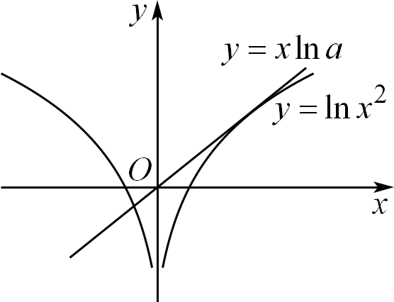
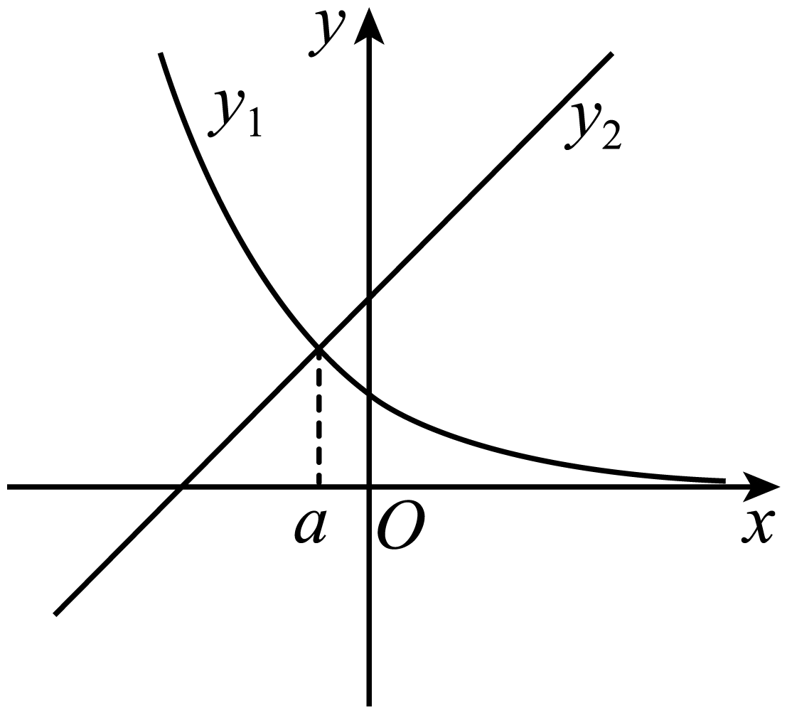
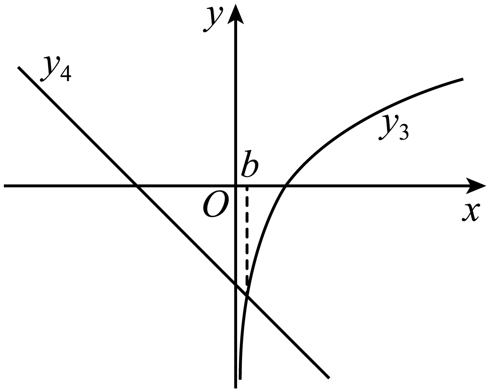
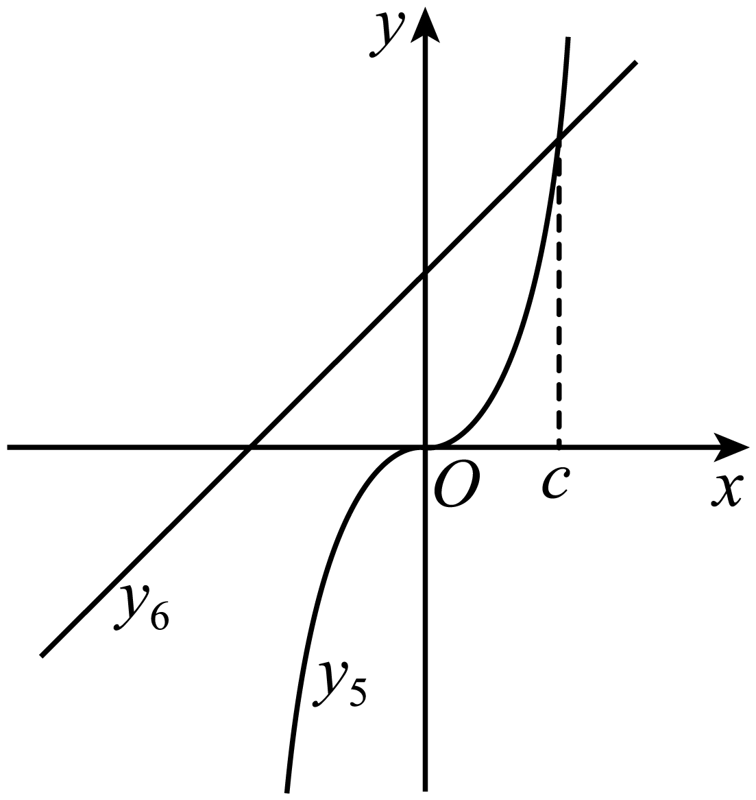
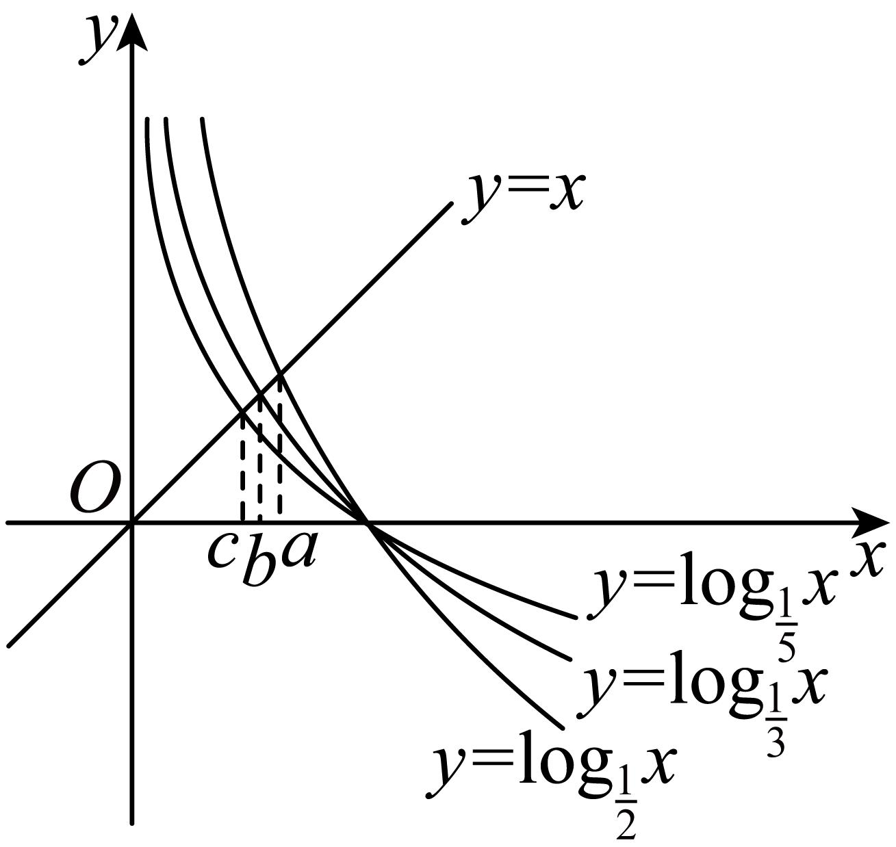
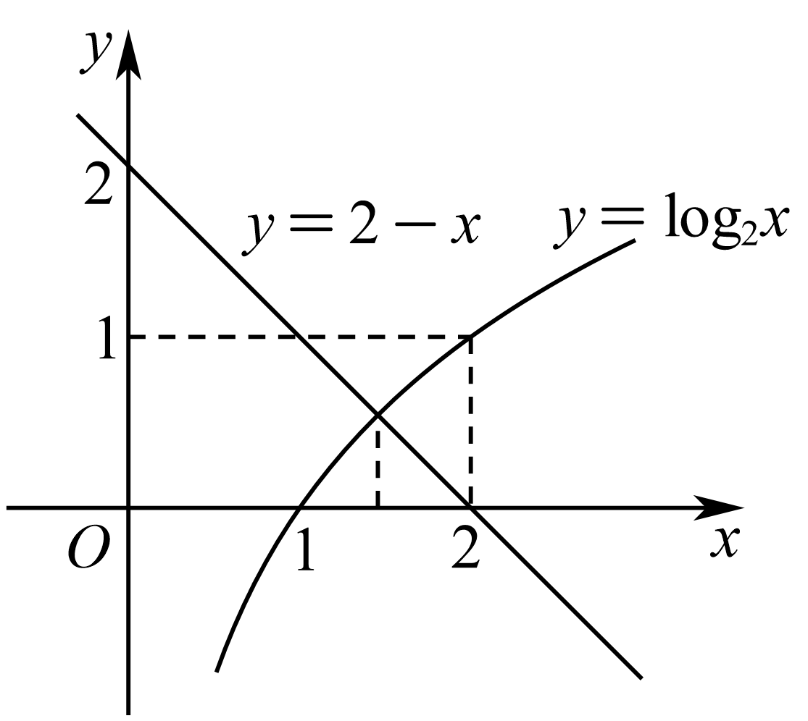
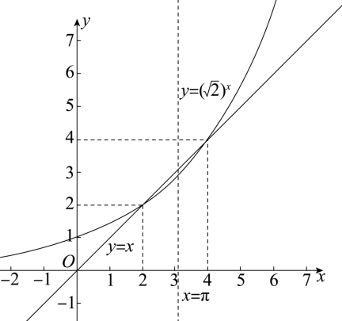
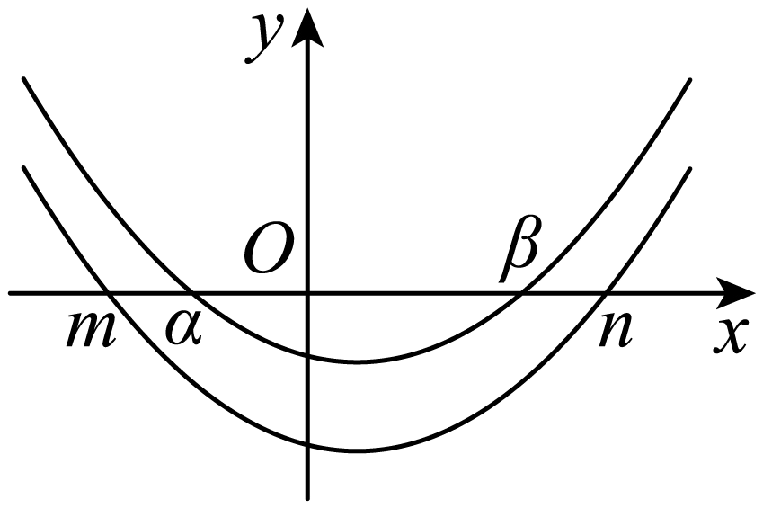

**第17讲  幂指对比较大小**

**知识梳理**

（1）利用函数与方程的思想，构造函数，结合导数研究其单调性或极值，从而确定*a*，*b*，*c*的大小．

（2）指、对、幂大小比较的常用方法：

①底数相同，指数不同时，如和，利用指数函数的单调性；

②指数相同，底数不同，如和利用幂函数单调性比较大小；

③底数相同，真数不同，如和利用指数函数单调性比较大小；

④底数、指数、真数都不同，寻找中间变量0，1或者其它能判断大小关系的中间量，借助中间量进行大小关系的判定．

（3）转化为两函数图象交点的横坐标

（4）特殊值法

（5）估算法

（6）放缩法、基本不等式法、作差法、作商法、平方法

（7）常见函数的麦克劳林展开式：

①

②

③

④

⑤

⑥

**必考题型全归纳**

**题型一：直接利用单调性**

**【例1】**（2024·湖南岳阳·高三湖南省岳阳县第一中学校考开学考试）已知，，，则的大小关系是（　　）

*A*．	*B*．	*C*．	*D*．

【答案】*D*

【解析】根据指数函数在上递增可得，；

根据对数函数在上递增可得，，

根据指数函数在上递减和值域可得，，

∴．

故选：*D*

**【对点训练1】**（2024·天津滨海新·统考三模）已知函数是定义在上的偶函数，且在上单调递减，若，，则，，大小关系为（    ）

*A*．	*B*．

*C*．	*D*．

【答案】*A*

【解析】，

因为是定义在上的偶函数，

所以，

因为，，，

且在上单调递减，

所以，

即．

故选：*A*．

<strong>【对点训练2】</strong>（2024·全国·校联考模拟预测）已知，，，则<em>a</em>，<em>b</em>，<em>c</em>的大小关系为（    ）

*A*．	*B*．	*C*．	*D*．

【答案】*D*

【解析】因为在上单调递减，所以，即．

因为在上单调递增，所以，即．

因为在上单调递增，所以，即．

综上，．

故选：*D*

**【对点训练3】**（2024·天津·统考二模）设，则的大小关系为（    ）

*A*．	*B*．

*C*．	*D*．

【答案】*C*

【解析】由题意得，

，

由于为上的单调增函数，故，

故，

故选：*C*

**题型二：引入媒介值**

**【例2】**（2024·天津河北·统考一模）若，，，则，，的大小关系为（    ）

*A*．	*B*．	*C*．	*D*．

【答案】*B*

【解析】依题意，，，

而，即，

所以，，的大小关系为．

故选：*B*

**【对点训练4】**（2024·天津南开·统考二模）已知，，，则，，的大小关系是（    ）

*A*．	*B*．	*C*．	*D*．

【答案】*B*

【解析】由题意可得：，

，且，则，

因为，则，

所以．

故选：*B*．

**【对点训练5】**（2024·湖南娄底·统考模拟预测）已知，，，则三者的大小关系是（    ）

*A*．	*B*．

*C*．	*D*．

【答案】*C*

【解析】由，即

又由，可得，

因为，即，所以．

故选：*C*．

**【对点训练6】**（2024·河南·校联考模拟预测）已知，，，则的大小关系为（    ）

*A*．	*B*．

*C*．	*D*．

【答案】*D*

【解析】由对数函数的运算性质，可得，

，，所以．

故选：*D*．

**题型三：含变量问题**

**【例3】**（理科数学-学科网2021年高三5月大联考（新课标Ⅲ卷））已知，，，，则的大小关系为（    ）

*A*．	*B*．

*C*．	*D*．

【答案】*A*

【解析】由题可设，因为，所以的图象关于直线对称．

因为，当时，，所以，，，所以，所以在上单调递增，

由对称性可知在上单调递减．因为，所以，所以；

又，，由对称性可知，且，因为，所以，

又在上单调递减，所以，所以，

故选：*A*．

<strong>【对点训练7】</strong>（云南省大理市辖区2024届高三毕业生区域性规模化统一检测数学试题）已知实数<em>a</em>，<em>b</em>，<em>c</em>满足，则<em>a</em>，<em>b</em>，<em>c</em>的大小关系为（    ）

*A*．	*B*．	*C*．	*D*．

【答案】*C*

【解析】由题意知，由，得，

设，则，

当时，单调递增，因，

当且仅当时取等号，故，

又，所以，故，

∴，则，即有，故．

故选：*C*．

<strong>【对点训练8】</strong>（江西省宜春市2024届高三模拟考试数学（文）试题）已知实数<em>x</em>，<em>y</em>，，且满足，，则<em>x</em>，<em>y</em>，<em>z</em>大小关系为（    ）

*A*．	*B*．	*C*．	*D*．

【答案】*A*

【解析】因，，则，即，

令，则，函数在上单调递增，有，

即，从而当时，，令，，在上单调递减，

则由，得，

所以．

故选：*A*

<strong>【对点训练9】</strong>（山东省青岛市2024届高三下学期第一次适应性检测数学试题）已知函数，若，，，，则<em>a</em>，<em>b</em>，<em>c</em>的大小关系为（    ）

*A*．	*B*．	*C*．	*D*．

【答案】*A*

【解析】因为，

所以在上是奇函数．所以

对求导得，

令，则

当时，，所以在上单调递增，

则时，，即，

所以在上单调递增．

因为，所以，

因为在上单调递增，

所以．

令，则

所以当时，单调递减；当时，单调递增．

所以，

而，即，所以，即．

所以，即，则

所以

所以，即．

故选：*A*

**【对点训练10】**（2024·陕西西安·统考一模）设且，则的大小关系是（    ）

*A*．	*B*．

*C*．	*D*．

【答案】*A*

【解析】由，可得，

则

因为，所以，则，

因为，所以．

故选：*A*．

**题型四：构造函数**

**【例4】**（2024·山东潍坊·三模）已知，则的大小关系为（    ）

*A*．	*B*．

*C*．	*D*．

【答案】*D*

【解析】∵，

构造函数，，

令，则，

∴在上单减，

∴，

故，所以在上单减，

∴，

∵，

构造函数，，

令，则，

∴在上单减，

∴，

故，所以在上单减，

∴，

故．

故选：*D*．

<strong>【对点训练11】</strong>（2024·广西·校联考模拟预测）已知，，，则<em>a</em>，<em>b</em>，<em>c</em>的大小关系为（    ）

*A*．	*B*．	*C*．	*D*．

【答案】*C*

【解析】由指数幂的运算公式，可得，所以，

构造函数，其中，则，

当时，；当时，，

所以函数在上单调递增，在上单调递减，

故，故，当且仅当时取等号，

由于，则，则，所以，所以，所以．

故选：*C*．

**【对点训练12】**（2024·辽宁朝阳·朝阳市第一高级中学校考模拟预测）已知，，，则，，的大小关系是（    ）

*A*．	*B*．

*C*．	*D*．

【答案】*A*

【解析】，

设，则在恒成立，

所以函数为单调递减函数，

所以，即，所以．

因为，

所以，即，

所以，即，所以，

综上，．

故选：*A*

<strong>【对点训练13】</strong>（河北省唐山市开滦第二中学2024届高三核心模拟（三）数学试题）设，，，则<em>a</em>，<em>b</em>，<em>c</em>的大小关系正确的是（    ）

*A*．	*B*．	*C*．	*D*．

【答案】*C*

【解析】由，则，

令且，则为减函数，

所以，而，故，

故在上递增，则，即在上恒成立，

所以，即，

由，

令且，则，

所以在上递增，则，即在上恒成立，

所以，即．

综上，．

故选：*C*

<strong>【对点训练14】</strong>（湖北省武汉市2024届高三5月模拟训练数学试题）已知，，，则<em>a</em>，<em>b</em>，<em>c</em>的大小关系为（    ）

*A*．	*B*．

*C*．	*D*．

【答案】*A*

【解析】设，，

当时，；当时，，

所以在上单调递增，在上单调递减，

所以，所以，

，

又，则，

，所以，

对于，令，则，

此时，

所以．

故选：*A*．

<strong>【对点训练15】</strong>（2024·山西大同·统考模拟预测）已知，，，则<em>a</em>，<em>b</em>，<em>c</em>的大小关系是（    ）

*A*．	*B*．	*C*．	*D*．

【答案】*D*

【解析】，

设，函数定义域为，

则，

故在上为增函数，有，即，

所以，故．

设，函数定义域为，则，

，解得；，解得，

所以函数在上单调递增，在上单调递减．

当时，取最大值，所以，即，时等号成立，

所以，即，

又，所以．

故选：*D*．

<strong>【对点训练16】</strong>（2024·河南·模拟预测）已知，，，，则<em>a</em>，<em>b</em>，<em>c</em>，<em>d</em>的大小关系是（    ）

*A*．	*B*．	*C*．	*D*．

【答案】*C*

【解析】令函数，求导得，函数在上递减，

当时，，则，于是，即，

令函数，求导得，函数在上递增，

当时，，则，于是，即，

当时，，，则，

即，而，于是，即，

所以*a*，*b*，*c*，*d*的大小关系是，*C*正确．

故选：*C*

**题型五：数形结合**

**【例5】**（广东省六校2024届高三上学期第三次联考数学试题）已知，为函数的零点，，若，则（    ）

*A*．	*B*．

*C*．	*D*．与大小关系不确定

【答案】*C*

【解析】易知为函数的零点，

又

解之：，负根舍去；

又，

即与有三个交点，交点横坐标分别为，如下图先计算过原点的切线方程，不妨设切点为

切线方程为：过原点，

此时的斜率比切线斜率小，结合图像容易分析出，

故选：*C*

**【对点训练17】**（2024·天津和平·统考三模）已知满足，则的大小关系为（    ）

*A*．	*B*．

*C*．	*D*．

【答案】*B*

【解析】由题意知：把的值看成函数与图像的交点的横坐标，

因为，，易知；

把的值看成函数与图像的交点的横坐标，

，易知；

把的值看成函数与图像的交点的横坐标，

，与，易知．

所以．

故选：*B*．

<strong>【对点训练18】</strong>（2024·广东汕头·统考三模）已知，，，则<em>a</em>，<em>b</em>，<em>c</em>大小为（    ）

*A*．	*B*．

*C*．	*D*．

【答案】*D*

【解析】可以看成与图象的交点的横坐标为，

可以看成与图象的交点的横坐标为，

可以看成与图象的交点的横坐标为，

画出函数的图象如下图所示，

由图象可知，．

故选：*D*．

<strong>【对点训练19】</strong>（江苏省南通市海门市2022-2024学年高三上学期期中数学试题）已知正实数，，满足，，，则<em>a</em>，<em>b</em>，<em>c</em>的大小关系为（    ）

*A*．	*B*．	*C*．	*D*．

【答案】*B*

【解析】，

故令，则，．

易知和均为上的增函数，故在为增函数．

∵，故由题可知，，即，则．

易知，，

作出函数与函数的图象，如图所示，

则两图象交点横坐标在内，即，

，

．

故选：*B*．

**【对点训练20】**（河南省洛平许济2022-2024学年高三上学期第一次质量检测文科数学试题）已知，则这三个数的大小关系为（    ）

*A*．	*B*．	*C*．	*D*．

【答案】*A*

【解析】令，则，

由，解得，由，解得，

所以在上单调递增，在上单调递减；

因为，

所以，即，

所以，所以，

又递增，

所以，即；

，

在同一坐标系中作出与的图象，如图：

由图象可知在中恒有，

又，所以，

又在上单调递增，且

所以，即；

综上可知：，

故选：*A*

<strong>【对点训练21】</strong>（2024·全国·高三专题练习）已知<em>y</em>＝（<em>x</em>－<em>m</em>）（<em>x</em>－<em>n</em>）＋2 023（<em>n</em>&gt;<em>m</em>），且<em>α</em>，<em>β</em>（<em>α</em>&lt;<em>β</em>）是方程<em>y</em>＝0的两个实数根，则<em>α</em>，<em>β</em>，<em>m</em>，<em>n</em>的大小关系是（    ）

*A*．*α*<*m*<*n*<*β	B*．*m*<*α*<*n*<*β*

*C*．*m*<*α*<*β*<*n	D*．*α*<*m*<*β*<*n*

【答案】*C*

【解析】∵*α*，*β*为方程*y*＝0的两个实数根，

∴*α*，*β*为函数*y*＝（*x*－*m*）（*x*－*n*）＋2 023的图像与*x*轴交点的横坐标，

令<em>y</em>1＝（<em>x</em>－<em>m</em>）（<em>x</em>－<em>n</em>），

∴<em>m</em>，<em>n</em>为函数<em>y</em>1＝（<em>x</em>－<em>m</em>）（<em>x</em>－<em>n</em>）的图像与<em>x</em>轴交点的横坐标，

易知函数<em>y</em>＝（<em>x</em>－<em>m</em>）（<em>x</em>－<em>n</em>）＋2 023的图像可由<em>y</em>1＝（<em>x</em>－<em>m</em>）（<em>x</em>－<em>n</em>）的图像向上平移2 023个单位长度得到，

∴*m*<*α*<*β*<*n*．

故选：*C*．

<strong>【对点训练22】</strong>（2024·安徽亳州·高三校考阶段练习）我们比较熟悉的网络新词，有“<em>yyds</em>”、“内卷”、“躺平”等，定义方程的实数根<em>x</em>叫做函数的“躺平点”．若函数，，的“躺平点”分别为<em>a</em>，<em>b</em>，<em>c</em>，则<em>a</em>，<em>b</em>，<em>c</em>的大小关系为（    ）

*A*．	*B*．

*C*．	*D*．

【答案】*B*

【解析】根据“躺平点”定义可得，又；

所以，解得；

同理，即；

令，则，即为上的单调递增函数，

又，所以在有唯一零点，即；

易知，即，解得；

因此可得．

故选：*B*

**题型六：特殊值法、估算法**

**【例6】** 若都不为零的实数满足，则（    ）

*A*．	*B*．	*C*．	*D*．

【答案】*C*

【解析】取，满足，但，*A*错误；

当，满足，但，*B*错误；

因为，所以，所以，*C*正确；

当或时，无意义，故*D*错误．

故选：*C*

<strong>【对点训练23】</strong>已知，，，若，则<em>a</em>、<em>b</em>、<em>c</em>的大小关系是（    ）

*A*．	*B*．

*C*．	*D*．

【答案】*B*

【解析】取，则，，，所以．

故选：*B*．

**【对点训练24】**（2024·全国·高三专题练习）已知，则的大小关系为（       ）

*A*．	*B*．	*C*．	*D*．

【答案】*C*

【解析】依题意，，函数在上单调递增，而，于是得，即，

函数在单调递增，并且有，

则，

于是得，即，则，

又函数在单调递增，且，则有，

所以．

故选：*C*

**【对点训练25】**（2024·全国·高三专题练习）已知，，，则，，的大小关系为（       ）

*A*．	*B*．

*C*．	*D*．

【答案】*B*

【解析】由，，可知，

又由，从而，可得，

因为，所以；

因为，从而，即，

由对数函数单调性可知，，

综上所述，．

故选：*B*．

**【对点训练26】**（2024·全国·高三专题练习）三个数，，的大小顺序为（       ）

*A*．	*B*．

*C*．	*D*．

【答案】*D*

【解析】，由于，，所以，所以，即，而，所以，所以，即，所以．

故选：*D*

**题型七：放缩法**

<strong>【例7】</strong>（百师联盟2024届高三二轮复习联考（三）数学（理）全国Ⅰ卷试题）已知<em>m</em>＝<em>log</em>4<em>ππ</em>，<em>n</em>＝<em>log</em>4<em>ee</em>，<em>p</em>＝，则<em>m</em>，<em>n</em>，<em>p</em>的大小关系是（其中<em>e</em>为自然对数的底数）（　　）

*A*．*p*＜*n*＜*m	B*．*m*＜*n*＜*p	C*．*n*＜*m*＜*p	D*．*n*＜*p*＜*m*

【答案】*C*

【解析】由题意得，<em>m</em>＝<em>log</em>4<em>ππ</em>，

，

∵*lg*4＞*lgπ*＞*lge*＞0，则*lg*4+*lg*4＞*lg*4+*lgπ*＞*lg*4+*lge*，

∴，

∴，而*p*＝，

∴*n*＜*m*＜*p*．

故选：*C*．

**【对点训练27】**（四川省绵阳市2024届高三上学期第二次诊断性测试理科数学试题）设，，，则，，的大小关系为（    ）

*A*．	*B*．

*C*．	*D*．

【答案】*A*

【解析】易得，，

令，

，

∴在上递减，

则，

∴，

故，

，

，

故，

故选：*A*．

<strong>【对点训练28】</strong>（2024年普通高等学校招生全国统一考试数学领航卷（三））已知，，，则<em>a</em>，<em>b</em>，<em>c</em>的大小关系为（    ）

*A*．	*B*．

*C*．	*D*．

【答案】*D*

【解析】分别对，，两边取对数，得，，．

．

由基本不等式，得：

，

所以，

即，所以．

又，所以．

故选：*D*．

**【对点训练29】**（2024届新高考Ⅰ卷第三次统一调研模拟考试数学试题）下列大小关系正确的为（    ）

*A*．	*B*．

*C*．	*D*．

【答案】*B*

【解析】对于选项，因为，所以，则，

又因为，则有，

所以，故选项错误；

对于选项，构造函数，则，所以函数在上单调递减，则，所以，即，

令，则，所以在上单调递增，则，即，所以，

故，故选项正确；

对于选项，构造函数，则，

由选项可知：当时，，所以，

则有，因为函数在上恒大零，所以，则函数在上单调递增，所以，即，故选项错误；

对于选项，因为，

令，则，令，

则，令，解得：，

因为，所以在上单调递减，故，

即，所以，

故选项错误，

故选：．

**【对点训练30】**（2024·贵州贵阳·校联考模拟预测）已知实数，，，则的大小关系为（    ）

*A*．	*B*．	*C*．	*D*．

【答案】*B*

【解析】因为函数为上的增函数，

所以，

故，即，又，，

故，则，

而，故，

所以，则，

所以，

故选：*B*．

**【对点训练31】**（2024·全国·高三专题练习）已知，，，则，，的大小关系是（    ）

*A*．	*B*．

*C*．	*D*．

【答案】*D*

【解析】∵，∴，即，

∴，∴，∴，∴．

令，则，

∴在上单调递增，∴，即，∴，∴．

故选：*D*．

<strong>【对点训练32】</strong>（2024·湖南长沙·雅礼中学校考一模）已知，，，则<em>a</em>，<em>b</em>，<em>c</em>的大小关系是（    ）

*A*．	*B*．

*C*．	*D*．

【答案】*D*

【解析】要比较，，等价于比较的大小，

等价于比较，

即比较，

构造函数，，

令得，令得，

所以在单调递增， 单调递减．

所以，

因为，

所以最大，即，，中最大，

设，

结合的单调性得，，

先证明，其中，

即证，

令，，其中，

则，

所以，函数在上为增函数，当时，，

所以，当时，，

则有，

由可知，

所以，

因为，所以即，

因为，在单调递增，

所以，即，

因为 所以所以，

即，

因为，在单调递减．

所以，

即，即，

综上，．

故选：*D*

**【对点训练33】**（2024·山东青岛·统考模拟预测）已知，，，则、、的大小关系为（    ）

*A*．	*B*．	*C*．	*D*．

【答案】*C*

【解析】因为，所以，，则，

因为，

所以，，则，所以

因为

，即，因此，．

故选：*C*．

**【对点训练34】**（2024·广东·统考模拟预测）已知，则，，的大小关系为（   ）

*A*．	*B*．

*C*．	*D*．

【答案】*A*

【解析】因为，

所以，

所以，，，

故．

故选：*A*．

**题型八：不定方程**

<strong>【例8】</strong>（黑龙江省哈尔滨德强学校2022-2024学年高三下学期清北班阶段性测试（开学考试）数学试卷）已知<em>a</em>、<em>b</em>、<em>c</em>是正实数，且，则<em>a</em>、<em>b</em>、<em>c</em>的大小关系不可能为（    ）

*A*．	*B*．

*C*．	*D*．

【答案】*D*

【解析】因为，*a*、*b*、*c*是正实数，

所以，

因为，所以，

对于*A*，若，则，满足题意；

对于*B*，若，则，满足题意；

对于*C*，若，则，满足题意；

对于*D*，若，则，不满足题意．

故选：*D*．

**【对点训练35】**（湖南省长沙市长郡中学、河南省郑州外国语学校、浙江省杭州第二中学2024届高三二模联考数学试题）设实数，满足，，则，的大小关系为（    ）

*A*．	*B*．	*C*．	*D*．无法比较

【答案】*C*

【解析】假设，则，，

由得，

因函数在上单调递减，又，则，所以；

由得，

因函数在上单调递减，又，则，所以；

即有与假设矛盾，所以，

故选：*C*

**【对点训练36】** 已知实数、，满足，，则关于、下列判断正确的是

*A*．	*B*．	*C*．	*D*．

【答案】

【解析】先比较与2的大小，

因为，

所以，

所以，即，

故排除，，

再比较与2 的大小，

易得，当时，由，得与矛盾，舍去，

故，则有，得，

令，，

令，则，

故，

故，

从而．

故选：．

**【对点训练37】** 已知实数，满足，，则下列判断正确的是

*A*．	*B*．	*C*．	*D*．

【答案】

【解析】，

故，

，，

故，即，

，且，

，，

令，

则，

故，即，

故，

故选：．

**【对点训练38】** 若且，且，且，则

*A*．	*B*．	*C*．	*D*．

【答案】

【解析】令，则．

由得：．

函数在上单调递增，在上单调递减．

，，，，，，

（4）（*a*），（5）（*b*），（6）（*c*）．

，（6）（5）（4），（*c*）（*b*）（*a*），

又，，，，，都小于，．

故选：．

**题型九：泰勒展开**

**【例9】** 已知，则（    ）

【答案】*A*

【解析】设，则，，

，计算得，故选*A*．

**【对点训练39】** 设，则的大小关系为\_\_\_\_\_\_\_\_\_\_\_．（从小到大顺序排）

【答案】

【解析】，由函数切线放缩得，因此．

故答案为：

**【对点训练40】** 设，则（    ）

*A*． *B*．    *C*． *D*．

【答案】*C*

【解析】，

故选

**【对点训练41】**，则（   ）

*A*．  *B*．      *C*．     *D*．

【答案】*B*

【解析】，

，

，故选*B*

**题型十：同构法**

**【例10】**（贵州省毕节市2024届高三诊断性考试（二）数学（理）试题）已知，，则与的大小关系是（    ）

*A*．	*B*．	*C*．	*D*．不确定

【答案】*B*

【解析】，又，则，

设，显然为增函数，因为，所以

又，，则

令，设，则，当时单调递增，

则在上单调递增，故，解得．

故选：*B*

<strong>【对点训练42】</strong>（四川省德阳市2024届高三下学期4月三诊考试理科数学试题）已知实数<em>x</em>、<em>y</em>满足，则<em>x</em>、<em>y</em>的大小关系为（    ）

*A*．	*B*．	*C*．	*D*．

【答案】*C*

【解析】由可得，因为，，所以，

所以，则，所以，

令，则，

当时，，所以函数在上单调递增；

则当时，，即，一定有，

所以，则，又因为，所以，

令，则，

当时，，所以函数在上单调递增；

因为，，所以，

故选：*C*．

**【对点训练43】** 已知，，且满足，则

*A*．	*B*．	*C*．	*D*．

【答案】

【解析】，，，，

令，则，

在上单调递减，在上单调递增，

，，，，

又，，

，

，．

故选：．

**【对点训练44】** 已知不相等的两个正实数，满足，则下列不等式中不可能成立的是

*A*．	*B*．	*C*．	*D*．

【答案】

【解析】由已知，因为，

所以原式可变形为，

令，，

函数与均为上的增函数，且，且（1）（1），

当时，，，，

当时，，，，

要比较与的大小，只需比较与的大小，

，

设，则，

故在上单调递减，

又（1），（2），

则存在使得，

所以当时，，

当，时，，

又因为（1），（1），（4），

所以当时，，当时，正负不确定，

故当，时，，所以（1），故，

当，时，正负不定，所以与的正负不定，

所以，，均有可能，即选项，，均有可能，选项不可能．

故选：．

**【对点训练45】** 若，则

*A*．	*B*．

*C*．	*D*．

【答案】

【解析】设，，令，，

，递增函数，

设，，

，当时，，，

在，上单调递减，

，，

（*a*）（*b*）（*c*），，

，，，

，，，

，

故选：．

**【对点训练46】** 若，则

*A*．	*B*．	*C*．	*D*．

【答案】

【解析】因为；

因为，

所以，

令，由指对数函数的单调性可得在内单调递增；

且（*a*）；

故选：．

**【对点训练47】（多选题）** 已知，且，则下列结论一定正确的是

*A*．	*B*．	*C*．	*D*．

【答案】

【解析】取，，，，

满足，且，故不一定成立，

取，，，，

满足，且，但，故不一定成立，

令，则，

当时，，在上单调递增，

当时，，在上单调递减，

，

，且，

（*a*），

当，，

，

当，此时，则，故选项正确，

先证明对任意的且，，

不妨设，即证，

令，即证，

设，，

故函数在上为增函数，当时，（1），

对任意的且，，

，

，

，

，故选项正确．

故选：．

**【对点训练48】（多选题）** 若，则下列结论错误的是

*A*．	*B*．	*C*．	*D*．

【答案】

【解析】设，则为增函数，

，

（*a*），

（*a*），，故正确；

（*a*），

当时，（*a*），

此时（*a*），有；

当时，（*a*），此时（*a*），有，

所以、、均错误．

故选：

