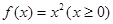
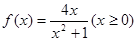
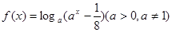

**第18讲  函数的综合应用**

**知识梳理**

1、高考中考查函数的内容主要是以综合题的形式出现，通常是函数与数列的综合、函数与不等式的综合、函数与导数的综合及函数的开放性试题和信息题，求解这些问题时，着重掌握函数的性质，把函数的性质与数列、不等式、导数等知识点融会贯通，从而找到解题的突破口，要求掌握二次函数图像、最值和根的分布等基本解法；掌握函数图像的各种变换形式（如对称变换、平移变换、伸缩变换和翻折变换等）；了解反函数的概念与性质；掌握指数、对数式大小比较的常见方法；掌握指数、对数方程和不等式的解法；掌握导数的定义、求导公式与求导法则、复合函数求导法则及导数的定义、求导公式与求导法则、复合函数求导法则及导数的几何意义，特别是应用导数研究函数的单调性、最值等．

2、**函数的图象与性质**

分奇、偶两种情况考虑：

比如图（1）函数，图（2）函数

（1）当为奇数时，函数的图象是一个“”型，且在“最中间的点”取最小值；

（2）当为偶数时，函数的图象是一个平底型，且在“最中间水平线段”取最小值；

若为等差数列的项时，奇数的图象关于直线对称，偶数的图象关于直线对称．

3、若为上的连续单峰函数，且为极值点，则当变化时，的最大值的最小值为，当且仅当时取得．

**必考题型全归纳**

**题型一：函数与数列的综合**

**例1．**（2024·全国·高三专题练习）已知数列，满足，，设数列的前项和为，则以下结论正确的是（    ）

A．	B．

C．	D．

**例2．**（2024·全国·高三专题练习）已知函数，数列的前项和为，且满足，则下列有关数列的叙述正确的是（    ）

A．	B．	C．	D．

**例3．**（2024·全国·高三专题练习）已知函数，数列的前项和为，且满足，，则下列有关数列的叙述正确的是（    ）

A．	B．	C．	D．

**变式1．**（2024·全国·高三专题练习）已知数列满足：，且，下列说法正确的是（    ）

A．若，则	B．若，则

C．	D．

**变式2．**（2024·陕西渭南·统考二模）已知函数，将的所有极值点按照由小到大的顺序排列，得到数列，对于，则下列说法中正确的是（    ）

A．	B．

C．数列是递增数列	D．

<strong>变式3．</strong>（2024·上海杨浦·高三复旦附中校考开学考试）无穷数列满足：，且对任意的正整数<em>n</em>，均有，则下列说法正确的是（    ）

A．数列为严格减数列	B．存在正整数*n*，使得

C．数列中存在某一项为最大项	D．存在正整数*n*，使得

**题型二：函数与不等式的综合**

<strong>例4．</strong>（2024·全国·高三专题练习）关于<em>x</em>的不等式，解集为\_\_\_\_\_\_\_\_\_\_\_.

**例5．**（2024·全国·高三专题练习）意大利数学家斐波那契年\~年）以兔子繁殖数量为例，引人数列：，该数列从第三项起，每一项都等于前两项之和，即，故此数列称为斐波那契数列，又称“兔子数列”，其通项公式为．设是不等式的正整数解，则的最小值为\_\_\_\_\_\_\_\_\_\_．

**例6．**（2024·辽宁·高三校考阶段练习）已知函数，若不等式对任意的恒成立，则实数的最小值为\_\_\_\_\_\_\_\_\_\_\_\_\_\_.

<strong>变式4．</strong>（2024·全国·模拟预测）已知函数是定义域为R的函数，，对任意，，均有，已知<em>a</em>，<em>b</em>为关于<em>x</em>的方程的两个解，则关于<em>t</em>的不等式的解集为（       ）

A．	B．	C．	D．

**题型三：函数中的创新题**

**例7．**（2024·重庆渝中·高三重庆巴蜀中学校考阶段练习）帕德近似是法国数学家亨利·帕德发明的用有理多项式近似特定函数的方法．给定两个正整数，，函数在处的阶帕德近似定义为：，且满足：，，，．已知在处的阶帕德近似为．注：

(1)求实数，的值；

(2)求证：；

(3)求不等式的解集，其中．

<strong>例8．</strong>（2024·上海黄浦·上海市敬业中学校考三模）定义：如果函数和的图像上分别存在点<em>M</em>和<em>N</em>关于<em>x</em>轴对称，则称函数和具有<em>C</em>关系．

(1)判断函数和是否具有*C*关系；

(2)若函数和不具有*C*关系，求实数*a*的取值范围；

(3)若函数和在区间上具有*C*关系，求实数*m*的取值范围．

**例9．**（2024·重庆·高三统考阶段练习）悬索桥（如图）的外观大漂亮，悬索的形状是平面几何中的悬链线.年莱布尼兹和伯努利推导出某链线的方程为，其中为参数.当时，该方程就是双曲余弦函数，类似的我们有双曲正弦函数.

(1)从下列三个结论中选择一个进行证明，并求函数的最小值；

①；

②；

③.

(2)求证：，.

**变式5．**（2024·广东深圳·高三深圳市南山区华侨城中学校考阶段练习）布劳威尔不动点定理是拓扑学里一个非常重要的不动点定理，它得名于荷兰数学家鲁伊兹·布劳威尔，简单地讲就是对于满足一定条件的连续实函数，存在一个点，使得，那么我们称该函数为“不动点"函数，而称为该函数的一个不动点． 现新定义： 若满足，则称为的次不动点．

(1)判断函数是否是“不动点”函数，若是，求出其不动点； 若不是，请说明理由

(2)已知函数，若是的次不动点，求实数的值：

(3)若函数在上仅有一个不动点和一个次不动点，求实数的取值范围．

**题型四：最大值的最小值问题（平口单峰函数、铅锤距离）**

<strong>例10．</strong>（2024·浙江绍兴·高三浙江省柯桥中学校考开学考试）已知函数，对于任意的实数<em>a</em>，<em>b</em>，总存在，使得成立，则当<em>m</em>取最大值时，（    ）

A．7	B．4	C．	D．

<strong>例11．</strong>（2024·湖北·高三校联考阶段练习）设函数，若对任意的实数<em>a</em>，<em>b</em>，总存在使得成立，则实数的最大值为（    ）

A．－1	B．0	C．	D．1

**例12．**（2024·全国·高三专题练习）设函数，若对任意的正实数，总存在，使得，则实数的取值范围为（    ）

A．	B．	C．	D．

<strong>变式6．</strong>（2024·全国·高三专题练习）已知函数，若对任意的实数<em>a</em>，<em>b</em>，总存在，使得成立，则实数<em>m</em>的取值范围是（    ）

A．	B．	C．	D．

**变式7．**（2024·高一课时练习）已知函数，当时，设的最大值为，则的最小值为（    ）

A．	B．	C．	D．1

**变式8．**（2024·江西宜春·校联考模拟预测）已知函数，且，满足，当时，设函数的最大值为，则的最小值为（    ）

A．	B．	C．	D．

<strong>变式9．</strong>（2024·上海虹口·高三上海市复兴高级中学校考期中）若<em>a</em>、，且对于时，不等式均成立，则实数对\_\_\_\_\_\_\_\_\_．

**题型五：倍值函数**

**例13．**（2024·全国·高三专题练习）函数的定义域为，若满足：①在内是单调函数；②存在使得在上的值域为，则称函数为“成功函数”．若函数（其中，且）是“成功函数”，则实数的取值范围为（   ）

A．	B．	C．	D．

**例14．**（2024·上海金山·高三上海市金山中学校考期末）设函数的定义域为，若存在闭区间，使得函数满足：（1）在上是单调函数；（2）在上的值域是，则称区间是函数的“和谐区间”，下列结论错误的是

A．函数存在“和谐区间”

B．函数不存在“和谐区间”

C．函数存在“和谐区间”

D．函数（，）不存在“和谐区间”

**例15．**（2024·安徽·高三统考期末）函数的定义域为，若存在闭区间，使得函数满足：①在内是单调函数；②在上的值域为，则称区间为的“倍值区间”．下列函数中存在“倍值区间”的有

①； ②；

③； ④

A．①②③④	B．①②④	C．①③④	D．①③

**变式10．**（2024·全国·高三专题练习）函数的定义域为，对给定的正数，若存在闭区间，使得函数满足：①在内是单调函数；②在上的值域为，则称区间为的级“理想区间”.下列结论错误的是（    ）

A．函数（）存在1级“理想区间”

B．函数（）不存在2级“理想区间”

C．函数（）存在3级“理想区间”

D．函数，不存在4级“理想区间”

<strong>变式11．</strong>（2024·全国·高三专题练习）设函数的定义域为<em>D</em>，若满足条件：存在，使在上的值域为，则称为“倍缩函数”.若函数为“倍缩函数”，则实数<em>t</em>的取值范围是

A．	B．

C．	D．

**题型六：函数不动点问题**

**例16．**（2024·广西柳州·统考模拟预测）设函数（，为自然对数的底数），若曲线上存在点使成立，则的取值范围是（    ）

A．	B．	C．	D．

**例17．**（2024·全国·高三专题练习）设函数，若曲线是自然对数的底数）上存在点使得，则的取值范围是

A．	B．	C．	D．

**例18．**（2024·江苏·高二专题练习）若存在一个实数，使得成立，则称为函数的一个不动点.设函数为自然对数的底数，定义在R上的连续函数满足，且当时，若存在，且为函数的一个不动点，则实数的取值范围为（   ）

A．	B．	C．	D．

**变式12．**（2024·全国·高三专题练习）设函数（为自然对数的底数），若曲线上存在点使得，则的取值范围是

A．	B．	C．	D．

**变式13．**（2024·全国·高三专题练习）设函数（），为自然对数的底数，若曲线上存在点，使得，则的取值范围是（     ）

A．	B．	C．	D．

**题型七：函数的旋转问题**

**例19．**（2024·江苏苏州·高三苏州中学校考阶段练习）将函数f(x)＝ln(x＋1)(x≥0)的图象绕坐标原点逆时针方向旋转角θ(θ∈(0，α])，得到曲线C，若对于每一个旋转角θ，曲线C都仍然是一个函数的图象，则α的最大值为（    ）

A．π	B．	C．	D．

**例20．**（2024·上海长宁·高三上海市延安中学校考期中）设是含数的有限实数集，是定义在上的函数，若的图象绕原点逆时针旋转后与原图象重合，则在以下各项中，的可能取值只能是（   ）

A．	B．	C．	D．

<strong>例21．</strong>（2024·全国·高三专题练习）双曲线绕坐标原点<em>O</em>旋转适当角度可以成为函数<em>f</em>（<em>x</em>）的图象，关于此函数<em>f</em>（<em>x</em>）有如下四个命题，其中真命题的个数为（    ）

①*f*（*x*）是奇函数；

②*f*（*x*）的图象过点或；

③*f*（*x*）的值域是；

④函数*y*＝*f*（*x*）－*x*有两个零点．

A．4个	B．3个	C．2个	D．1个

**变式14．**（2024·全国·高三专题练习）将函数的图像绕着原点逆时针旋转角得到曲线，当时都能使成为某个函数的图像，则的最大值是（    ）

A．	B．	C．	D．

**题型八：函数的伸缩变换问题**

**例22．**（2024·河北唐山·高三开滦第二中学校考期末）定义域为的函数满足，当时，.若时，恒成立，则实数的取值范围是（     ）

A．	B．	C．	D．

**例23．**（2024·全国·高三专题练习）定义域为的函数满足，当时，，若当时，不等式恒成立，则实数的取值范围是（   ）

A．	B．

C．	D．

<strong>例24．</strong>（2024·全国·高三专题练习）已知定义域为<em>R</em>的函数满足，当时，，设在上的最大值为则数列的前<em>n</em>项和的值为（    ）

A．	B．	C．	D．

**变式15．**（2024·甘肃·高三西北师大附中阶段练习）定义域为R的函数满足，当时， ，若时，恒成立，则实数的取值范围是(　　)

A．	B．	C．	D．

**题型九：V型函数和平底函数**

<strong>例25．</strong>（2024·全国·高三专题练习）已知<em>a1</em>，<em>a2</em>，<em>a3</em>与<em>b1</em>，<em>b2</em>，<em>b3</em>是6个不同的实数，若关于<em>x</em>的方程|<em>x</em>﹣<em>a1</em>|+|<em>x</em>﹣<em>a2</em>|+|<em>x</em>﹣<em>a3</em>|＝|<em>x</em>﹣<em>b1</em>|+|<em>x</em>﹣<em>b2</em>|+|<em>x</em>﹣<em>b3</em>|解集<em>A</em>是有限集，则集合<em>A</em>中，最多有\_\_个元素．

**例26．**（浙江省衢州市2024学年高三数学试题）已知等差数列满足：，则的最大值为（    ）

A．18	B．16	C．12	D．8

**例27．**（上海市川沙中学2024学年高三第二学期数学试题）等差数列，满足，则（ ）

A．的最大值为50	B．的最小值为50

C．的最大值为51	D．的最小值为51

**变式16．**（上海市青浦区2024届高三二模数学试题）等差数列，满足，则（　　）

A．的最大值是50	B．的最小值是50

C．的最大值是51	D．的最小值是51

**变式17．**（浙江省金丽衢十二校2024学年高三第一次联考数学试题）设等差数列，，…，（，)的公差为，满足，则下列说法正确的是

A．	B．的值可能为奇数

C．存在，满足	D．的可能取值为

