**第18讲  函数的综合应用**

**知识梳理**

1、高考中考查函数的内容主要是以综合题的形式出现，通常是函数与数列的综合、函数与不等式的综合、函数与导数的综合及函数的开放性试题和信息题，求解这些问题时，着重掌握函数的性质，把函数的性质与数列、不等式、导数等知识点融会贯通，从而找到解题的突破口，要求掌握二次函数图像、最值和根的分布等基本解法；掌握函数图像的各种变换形式（如对称变换、平移变换、伸缩变换和翻折变换等）；了解反函数的概念与性质；掌握指数、对数式大小比较的常见方法；掌握指数、对数方程和不等式的解法；掌握导数的定义、求导公式与求导法则、复合函数求导法则及导数的定义、求导公式与求导法则、复合函数求导法则及导数的几何意义，特别是应用导数研究函数的单调性、最值等．

2、**函数的图象与性质**

分奇、偶两种情况考虑：

比如图（1）函数，图（2）函数

（1）当为奇数时，函数的图象是一个“”型，且在“最中间的点”取最小值；

（2）当为偶数时，函数的图象是一个平底型，且在“最中间水平线段”取最小值；

若为等差数列的项时，奇数的图象关于直线对称，偶数的图象关于直线对称．

3、若为上的连续单峰函数，且为极值点，则当变化时，的最大值的最小值为，当且仅当时取得．

**必考题型全归纳**

**题型一：函数与数列的综合**

**例1．**（2024·全国·高三专题练习）已知数列，满足，，设数列的前项和为，则以下结论正确的是（    ）

A．	B．

C．	D．

【答案】B

【解析】，把代入递推可得：，

令，，则，在单调递增，

，即当时，恒有成立，

，，，故选项错误；

又，选项错误；

，，

令，，则，函数在，上递减，，

，故选项正确；

又由可得，，（当且仅当时取“ “，可得，

，故选项错误，

故选．

**例2．**（2024·全国·高三专题练习）已知函数，数列的前项和为，且满足，则下列有关数列的叙述正确的是（    ）

A．	B．	C．	D．

【答案】A

【解析】由，解得或，

由零点存在性定理得，

当时，，数列单调递减，

，，同理，，

迭代下去，可得，数列单调递减，

故选项和选项都错误；

又，

，故错误；

对于，，

而，

，故正确．

故选．

**例3．**（2024·全国·高三专题练习）已知函数，数列的前项和为，且满足，，则下列有关数列的叙述正确的是（    ）

A．	B．	C．	D．

【答案】C

【解析】对于选项，，故错误；

对于选项，由 知，，

故 为非负数列，又，

设，则，

易知 在，单调递减，在上单调递增，

所以，

又，所以，从而，

所以 为递减数列，且，故错误；

对于选项，

因为数列 为递减数列，当 时，有，

，

故正确；对于选项，因为，而，故错误．故选．

**变式1．**（2024·全国·高三专题练习）已知数列满足：，且，下列说法正确的是（    ）

A．若，则	B．若，则

C．	D．

【答案】B

【解析】，故，．

，故且，于是与同号，

即．

对选项A：若，则，则，

，所以，错误；

对选项B：，，则，即，

于是，即，数列单调递减，，

，，故，即，

，故 ，

故，故，正确；

对选项C：考虑函数，，，

函数单调递增，结合的图像，如图所示：

由图可知当 时，数列递减，

，所以，即，不正确；

对选项D：设，则，，

，即，

等价于，化简得，

而显然不恒成立，不正确；

故选：B．

**变式2．**（2024·陕西渭南·统考二模）已知函数，将的所有极值点按照由小到大的顺序排列，得到数列，对于，则下列说法中正确的是（    ）

A．	B．

C．数列是递增数列	D．

【答案】D

【解析】的极值点为在上的变号零点.

即为函数与函数图像在交点的横坐标.

又注意到时，，时，，

，时，.

据此可将两函数图像画在同一坐标系中，如下图所示.

A选项，注意到时，，，.

结合图像可知当，.

当，.故A错误；

B选项，由图像可知，则，故B错误；

C选项，表示两点与间距离，由图像可知，

随着*n*的增大，两点间距离越来越近，即为递减数列，故C错误；

D选项，由A选项分析可知，，

又结合图像可知，当时，，即此时，

得在上单调递增，

则，故D正确.

故选：D

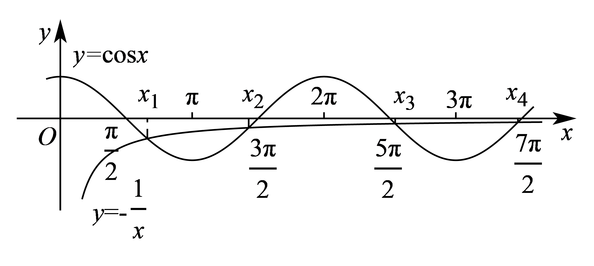

<strong>变式3．</strong>（2024·上海杨浦·高三复旦附中校考开学考试）无穷数列满足：，且对任意的正整数<em>n</em>，均有，则下列说法正确的是（    ）

A．数列为严格减数列	B．存在正整数*n*，使得

C．数列中存在某一项为最大项	D．存在正整数*n*，使得

【答案】D

【解析】因为，所以，所以，

由可得，则，

则有，

设函数，

，

当时，，当时，，

所以在单调递增，单调递减，

所以，

因为，所以

以此类推，对任意，故B错误；

所以，故A错误；

因为，所以数列中不存在某一项为最大项，C错误；

因为，所以，

，

所以存在正整数*n*，使得，D正确.

**题型二：函数与不等式的综合**

<strong>例4．</strong>（2024·全国·高三专题练习）关于<em>x</em>的不等式，解集为\_\_\_\_\_\_\_\_\_\_\_.

【答案】

【解析】由题设，，而在R上递增，

当即时，，原不等式不成立；

当即时，，原不等式恒成立.

综上，解集为.

故答案为：

**例5．**（2024·全国·高三专题练习）意大利数学家斐波那契年\~年）以兔子繁殖数量为例，引人数列：，该数列从第三项起，每一项都等于前两项之和，即，故此数列称为斐波那契数列，又称“兔子数列”，其通项公式为．设是不等式的正整数解，则的最小值为\_\_\_\_\_\_\_\_\_\_．

【答案】8

【解析】由，得，

得，得，

得，，

所以，

令，则数列即为斐波那契数列，

，则，显然数列为递增数列且，所以数列亦为递增数列，

由，得，，，，

，，

因为，，

所以

使得成立的的最小值为8．

故答案为：.

**例6．**（2024·辽宁·高三校考阶段练习）已知函数，若不等式对任意的恒成立，则实数的最小值为\_\_\_\_\_\_\_\_\_\_\_\_\_\_.

【答案】

【解析】因为，

所以图象关于点对称，

又，

所以在上单调递增，

等价于，

即恒成立，

所以，即恒成立，

令，可得，

而，当且仅当时取等号，

所以，即实数的最小值为.

故答案为：.

<strong>变式4．</strong>（2024·全国·模拟预测）已知函数是定义域为R的函数，，对任意，，均有，已知<em>a</em>，<em>b</em>为关于<em>x</em>的方程的两个解，则关于<em>t</em>的不等式的解集为（       ）

A．	B．	C．	D．

【答案】D

【解析】由，得且函数关于点对称．

由对任意，，均有，

可知函数在上单调递增．

又因为函数的定义域为R，

所以函数在R上单调递增．

因为*a*，*b*为关于*x*的方程的两个解，

所以，解得，

且，即．

又，

令，则，

则由，得，

所以．

综上，*t* 的取值范围是.

故选：D．

**题型三：函数中的创新题**

**例7．**（2024·重庆渝中·高三重庆巴蜀中学校考阶段练习）帕德近似是法国数学家亨利·帕德发明的用有理多项式近似特定函数的方法．给定两个正整数，，函数在处的阶帕德近似定义为：，且满足：，，，．已知在处的阶帕德近似为．注：

(1)求实数，的值；

(2)求证：；

(3)求不等式的解集，其中．

【解析】（1）因为，所以，，

，则，，

由题意知，，，

所以，解得，.

（2）由（1）知，即证，

令，则且，

即证时，

记，，

则，

所以在上单调递增，在上单调递增，

当时，即，即成立，

当时，即，即成立，

综上可得时，

所以成立，即成立.

（3）由题意知，欲使得不等式成立，

则至少有，即或，

首先考虑，该不等式等价于，即，

又由（2）知成立，

所以使得成立的的取值范围是，

再考虑，该不等式等价于，

记，，

则，所以当时，时，

所以在上单调递增，在上单调递减，

所以，即，，

所以，，

当时由，可知成立，

当时由，可知不成立，

所以使得成立的的取值范围是，

综上可得不等式的解集为.

<strong>例8．</strong>（2024·上海黄浦·上海市敬业中学校考三模）定义：如果函数和的图像上分别存在点<em>M</em>和<em>N</em>关于<em>x</em>轴对称，则称函数和具有<em>C</em>关系．

(1)判断函数和是否具有*C*关系；

(2)若函数和不具有*C*关系，求实数*a*的取值范围；

(3)若函数和在区间上具有*C*关系，求实数*m*的取值范围．

【解析】（1）与是具有*C*关系，理由如下：

根据定义，若与具有*C*关系，则在与的定义域的交集上存在，使得，

因为，，，

所以，

令，即，解得，

所以与具有*C*关系.

（2）令，

因为，，所以，

令，则，故，

因为与不具有*C*关系，所以在上恒为负或恒为正，

又因为开口向下，所以在上恒为负，即在上恒成立，

当时，显然成立；

当时，在上恒成立，

因为，当且仅当，即时，等号成立，

所以，所以，

综上：，即.

（3）因为和，

令，则，

因为与在上具有*C*关系，所以在上存在零点，

因为，

当且时，因为，所以，

所以在上单调递增，则，

此时在上不存在零点，不满足题意；

当时，显然当时，，

当时，因为在上单调递增，且，

故在上存在唯一零点，设为，则，

所以当；当；又当时，，

所以在上单调递减，在上单调递增，在上存在唯一极小值点，

因为，所以，

又因为，所以在上存在唯一零点，

所以函数与在上具有*C*关系，

综上：，即.

**例9．**（2024·重庆·高三统考阶段练习）悬索桥（如图）的外观大漂亮，悬索的形状是平面几何中的悬链线.年莱布尼兹和伯努利推导出某链线的方程为，其中为参数.当时，该方程就是双曲余弦函数，类似的我们有双曲正弦函数.

(1)从下列三个结论中选择一个进行证明，并求函数的最小值；

①；

②；

③.

(2)求证：，.

【解析】（1）证明：选①，；

选②，；

选③，.

，令，

因为函数、均为上的增函数，故函数也为上的增函数，

故，则，所以，

所以，当且仅当时取“”，

所以的最小值为.

（2）证明：，

，

当时，，，所以，

所以，所以成立；

当时，则，且正弦函数在上为增函数，

，所以，，

所以成立，

综上，，.

**变式5．**（2024·广东深圳·高三深圳市南山区华侨城中学校考阶段练习）布劳威尔不动点定理是拓扑学里一个非常重要的不动点定理，它得名于荷兰数学家鲁伊兹·布劳威尔，简单地讲就是对于满足一定条件的连续实函数，存在一个点，使得，那么我们称该函数为“不动点"函数，而称为该函数的一个不动点． 现新定义： 若满足，则称为的次不动点．

(1)判断函数是否是“不动点”函数，若是，求出其不动点； 若不是，请说明理由

(2)已知函数，若是的次不动点，求实数的值：

(3)若函数在上仅有一个不动点和一个次不动点，求实数的取值范围．

【解析】（1）依题意，设为的不动点，即，于是得，解得或，

所以 是“不动点” 函数，不动点是2和.

（2）因是“次不动点”函数，依题意有，即，显然，解得，

所以实数的值是.

（3）设分别是函数在上的不动点和次不动点，且唯一，

由得：，即，整理得：，

令，显然函数在上单调递增，则，，则，

由得：，即，整理得：，

令，显然函数在上单调递增，，，则，

综上得：，

所以实数的取值范围.

**题型四：最大值的最小值问题（平口单峰函数、铅锤距离）**

<strong>例10．</strong>（2024·浙江绍兴·高三浙江省柯桥中学校考开学考试）已知函数，对于任意的实数<em>a</em>，<em>b</em>，总存在，使得成立，则当<em>m</em>取最大值时，（    ）

A．7	B．4	C．	D．

【答案】A

【解析】由，得，

设，则，

在上单调递增，在上单调递减，

，

设，

画出函数的图像如图

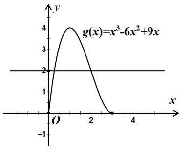

对任意的实数*a*，*b*，总存在，使得成立，

等价于求最大值中的最小值，

由图像可知当时，取得最大值2，此时，

故选：A

<strong>例11．</strong>（2024·湖北·高三校联考阶段练习）设函数，若对任意的实数<em>a</em>，<em>b</em>，总存在使得成立，则实数的最大值为（    ）

A．－1	B．0	C．	D．1

【答案】C

【解析】由已知得

设构造函数满足，即，解得，

则，令，

则函数可以理解为函数与函数在横坐标相等时，纵坐标的竖直距离，

∵，且（当且仅当时取等号），

∴若设直线的方程为，直线的方程为，由此可知当，直线位于直线和直线中间时，纵坐标的竖直距离取得最大值中的最小值，故，

所以实数的最大值为.

故选：.

**例12．**（2024·全国·高三专题练习）设函数，若对任意的正实数，总存在，使得，则实数的取值范围为（    ）

A．	B．	C．	D．

【答案】D

【解析】对任意的正实数，总存在，，使得，，．

令，，函数在，单调递减，

∴（1），（4）．

①时，，则．

②时，，，则．

③时，，，则．

④时，，则．

综上①②③④可得：，即 ．

实数的取值范围为，．

故选：D．

<strong>变式6．</strong>（2024·全国·高三专题练习）已知函数，若对任意的实数<em>a</em>，<em>b</em>，总存在，使得成立，则实数<em>m</em>的取值范围是（    ）

A．	B．	C．	D．

【答案】B

【解析】由存在，使得成立，故，

又对任意的实数*a*，*b*，，则，

可看作横坐标相同时，函数

与函数图象上的纵向距离的最大值中的最小值，

又，作示意图如图所示：

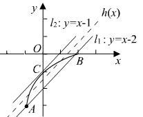

设，则直线的方程，设与相切，

则，得，有，

得或，由图知，切点，则，

当直线与，平行且两直线距离相等时，即恰好处于正中间时，

函数与图象上的纵向距离能取到最大值中的最小值，

此时，，故.

故选：B

**变式7．**（2024·高一课时练习）已知函数，当时，设的最大值为，则的最小值为（    ）

A．	B．	C．	D．1

【答案】B

【解析】函数，当,时，的最大值为，

可得，，，

可得,,,

，

即，即有，则的最小值为，

故选：B

**变式8．**（2024·江西宜春·校联考模拟预测）已知函数，且，满足，当时，设函数的最大值为，则的最小值为（    ）

A．	B．	C．	D．

【答案】D

【解析】设，则，

当时，，为减函数，

当时，，为增函数，所以，

作出的图象如下，

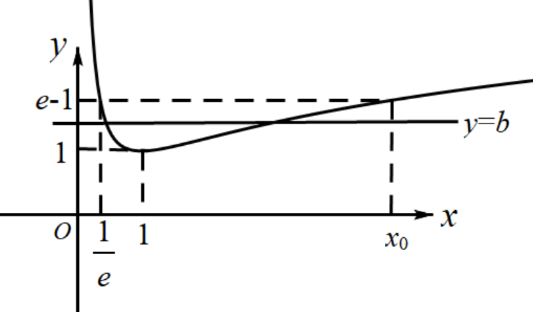

令，即，得，

且，显然，

在上，当时，，

当时，，当时取等号；

当时， ，所以，

此时点到直线的距离都是，

当时，三点中中至少有一个点满足

，所以，综上所述，，

故选：D.

<strong>变式9．</strong>（2024·上海虹口·高三上海市复兴高级中学校考期中）若<em>a</em>、，且对于时，不等式均成立，则实数对\_\_\_\_\_\_\_\_\_．

【答案】

【解析】对于时，不等式均成立，

即恒成立.

令，，

则表示圆心为，半径为的圆在上的圆弧；

表示圆心为，半径为的圆在上的圆弧，如下所示：

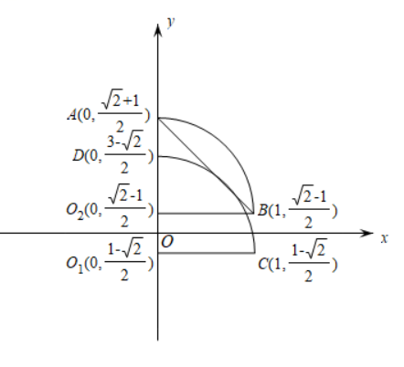

根据题意，要满足题意，其图象需在圆弧以及圆弧之间，

数形结合可知：连接后所形成的直线恰好满足题意，且唯一.

其斜率为，故其方程为，

故实数对.

为严谨，下证直线与圆相切，

圆心到直线的距离，

其与半径1相等，故圆与直线相切，即证.

故答案为：.

**题型五：倍值函数**

**例13．**（2024·全国·高三专题练习）函数的定义域为，若满足：①在内是单调函数；②存在使得在上的值域为，则称函数为“成功函数”．若函数（其中，且）是“成功函数”，则实数的取值范围为（   ）

A．	B．	C．	D．

【答案】D

【解析】因为、的单调性相同，

所以为定义域上的增函数，

因为存在使得在上的值域为，

所以，即有两解，

即在R上有两个不相等的实数根，

令，则在上有两个不同的解，

所以，解得，

故选：D．

**例14．**（2024·上海金山·高三上海市金山中学校考期末）设函数的定义域为，若存在闭区间，使得函数满足：（1）在上是单调函数；（2）在上的值域是，则称区间是函数的“和谐区间”，下列结论错误的是

A．函数存在“和谐区间”

B．函数不存在“和谐区间”

C．函数存在“和谐区间”

D．函数（，）不存在“和谐区间”

【答案】D

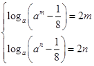

【解析】函数中存在“和谐区间”,则①在内是单调函数；②或,若,若存在“和谐区间”,则此时函数单调递增,则由,得存在“和谐区间”正确.若,若存在“和谐区间”,则此时函数单调递增,则由,得,即是方程的两个不等的实根,构建函数,所以函数在上单调减,在上单调增,函数在处取得极小值，且为最小值,,无解,故函数不存在“和谐区间”,正确.若函数,,若存在“和谐区间”,则由,得,即存在“和谐区间”,正确.若函数,不妨设,则函数定义域内为单调增函数,若存在“和谐区间”, 则由,得,即是方程的两个根,即是方程的两个根,由于该方程有两个不等的正根，故存在“和谐区间”,结论错误,故选D.

**例15．**（2024·安徽·高三统考期末）函数的定义域为，若存在闭区间，使得函数满足：①在内是单调函数；②在上的值域为，则称区间为的“倍值区间”．下列函数中存在“倍值区间”的有

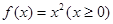

①； ②；

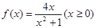

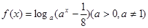

③； ④

A．①②③④	B．①②④	C．①③④	D．①③

【答案】C

【解析】函数存在“倍值区间”，即函数的图像与直线有交点，

与直线有交点是（0，0），（2,4）；对于，构造函数；所以没有零点，即与直线没有交点；

与直线的交点是（0，0），（1,2）.解方程即，当无解；有两解.故

不满足题意.选C.

**变式10．**（2024·全国·高三专题练习）函数的定义域为，对给定的正数，若存在闭区间，使得函数满足：①在内是单调函数；②在上的值域为，则称区间为的级“理想区间”.下列结论错误的是（    ）

A．函数（）存在1级“理想区间”

B．函数（）不存在2级“理想区间”

C．函数（）存在3级“理想区间”

D．函数，不存在4级“理想区间”

【答案】D

【解析】A中，当时，在上是单调增函数，且在上的值域是，

所以存在1级“理想区间”，所以A正确；

B中，当时，在上是单调增函数，且在上的值域是，所以不存在2级“理想区间”，所以B正确；

C中，由，得，当时，，所以在上为增函数，假设存在，使得，则有，即，由，得或，所以当时，满足条件，即区间为，所以C正确；

D中，若存在“4级理想区间” ，则是方程的两个根，由和在内有3个交点，如图所示，所以该方程存在两个不等的根，故存在“4级理想区间” ，所以D错误，

故选：D

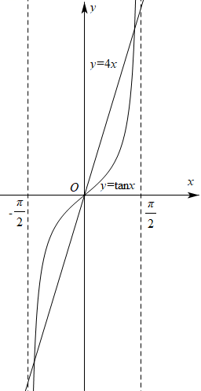

<strong>变式11．</strong>（2024·全国·高三专题练习）设函数的定义域为<em>D</em>，若满足条件：存在，使在上的值域为，则称为“倍缩函数”.若函数为“倍缩函数”，则实数<em>t</em>的取值范围是

A．	B．

C．	D．

【答案】B

【解析】因为函数为“倍缩函数”，且为递增函数

所以存在，使在上的值域为

则 ，由此可知等价于 有两个不等实数根

令

则，令

解得

代入方程得

解得，因为有两个不等的实数根

所以t的取值范围为

所以选B

**题型六：函数不动点问题**

**例16．**（2024·广西柳州·统考模拟预测）设函数（，为自然对数的底数），若曲线上存在点使成立，则的取值范围是（    ）

A．	B．	C．	D．

【答案】A

【解析】

由题意， 存在，使成立，

即存在，使成立，

所以，即，

所以

所以存在，使与有交点，

对，，求导得，

设，则，

令，即；令，即，

所以在上单调递减，在上单调递增，

所以，

所以在上单调递增，

又，

，

要使与有交点，则，

所以的取值范围是.

故选：A.

**例17．**（2024·全国·高三专题练习）设函数，若曲线是自然对数的底数）上存在点使得，则的取值范围是

A．	B．	C．	D．

【答案】C

【解析】因为 ,所以 在 上有解

因为 ,( 易证 ) ,所以函数 在 上单调递增,因此由得 在 上有解，即 ,因为 ，选C.

**例18．**（2024·江苏·高二专题练习）若存在一个实数，使得成立，则称为函数的一个不动点.设函数为自然对数的底数，定义在R上的连续函数满足，且当时，若存在，且为函数的一个不动点，则实数的取值范围为（   ）

A．	B．	C．	D．

【答案】B

【解析】依题意知，令，，，为奇函数，

，且当时，，

当时，，单调递减，在R上单调递减，

由，得，即，

，即，，

为函数的一个不动点，，即，

，即关于*x*的方程在上有解.

令，，则，

在上单调递减，，

要使关于*x*的方程在上有解，则，即实数*a*的取值范围为.

故选：B

**变式12．**（2024·全国·高三专题练习）设函数（为自然对数的底数），若曲线上存在点使得，则的取值范围是

A．	B．	C．	D．

【答案】D

【解析】**法一：** 由题意可得，

，

而由可知，

当时，＝为增函数，

∴时，．

∴ 不存在使成立，故A，B错；

当时，＝，

当时，只有时才有意义，而，故C错．故选D．

法二：显然，函数是增函数，，由题意可得，

，而由可知，

于是，问题转化为在上有解．

由，得，分离变量，得，

因为，，

所以，函数在上是增函数，于是有，

即，应选D．

**变式13．**（2024·全国·高三专题练习）设函数（），为自然对数的底数，若曲线上存在点，使得，则的取值范围是（     ）

A．	B．	C．	D．

【答案】A

【解析】∵曲线上存在点

∴

函数（）在上是增函数，根据单调性可证

即在上有解，分离参数，，，根据是增函数可知，只需故选A.

**题型七：函数的旋转问题**

**例19．**（2024·江苏苏州·高三苏州中学校考阶段练习）将函数f(x)＝ln(x＋1)(x≥0)的图象绕坐标原点逆时针方向旋转角θ(θ∈(0，α])，得到曲线C，若对于每一个旋转角θ，曲线C都仍然是一个函数的图象，则α的最大值为（    ）

A．π	B．	C．	D．

【答案】D

【解析】函数的图像绕坐标原点逆时针方向连续旋转时，

当且仅当其任意切线都不经过y轴时，其图像都仍然是一个函数的图像.

因为在是减函数且，当且仅当时等号成立，

故函数的图像的切线中，

在处切线的倾斜角最大，其值为.

由此可知－.

故选.

**例20．**（2024·上海长宁·高三上海市延安中学校考期中）设是含数的有限实数集，是定义在上的函数，若的图象绕原点逆时针旋转后与原图象重合，则在以下各项中，的可能取值只能是（   ）

A．	B．	C．	D．

【答案】B

【解析】由题意得到：问题相当于圆上由12个点为一组，每次绕原点逆时针旋转个单位后与下一个点会重合．

我们可以通过代入和赋值的方法当f（1）=，，0时，此时得到的圆心角为，，0，然而此时x=0或者x=1时，都有2个y与之对应，而我们知道函数的定义就是要求一个x只能对应一个y，因此只有当x=，此时旋转，此时满足一个x只会对应一个y，故选B．

<strong>例21．</strong>（2024·全国·高三专题练习）双曲线绕坐标原点<em>O</em>旋转适当角度可以成为函数<em>f</em>（<em>x</em>）的图象，关于此函数<em>f</em>（<em>x</em>）有如下四个命题，其中真命题的个数为（    ）

①*f*（*x*）是奇函数；

②*f*（*x*）的图象过点或；

③*f*（*x*）的值域是；

④函数*y*＝*f*（*x*）－*x*有两个零点．

A．4个	B．3个	C．2个	D．1个

【答案】C

【解析】

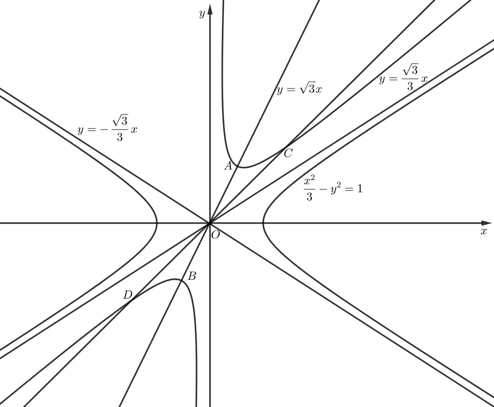

双曲线关于坐标原点对称，可得旋转后得到的函数的图象关于原点对称，所以为奇函数，故①正确；双曲线的顶点为，渐近线方程为，可得的图象渐近线为和，图象关于直线对称，所以的图象过点或，由图象的对称性可得，逆时针旋转60度，位于一、三象限，按顺时针旋转60度，位于二、四象限；故②正确；逆时针旋转60度，位于一、三象限，由图象可得顶点为或，不是极值点，则的值域不是，顺时针旋转60度，位于二、四象限，由图象的对称性知的值域不是，故③错误；当的图象位于一、三象限时，的图象与直线有2个交点，函数有两个零点，当的图象位于二、四象限时，的图象与直线没有交点，函数没有零点，故④错误，故选；C.

**变式14．**（2024·全国·高三专题练习）将函数的图像绕着原点逆时针旋转角得到曲线，当时都能使成为某个函数的图像，则的最大值是（    ）

A．	B．	C．	D．

【答案】B

【解析】在原点处的切线斜率为，切线方程为

当绕着原点逆时针方向旋转时，若旋转角大于，则旋转所成的图像与轴就会有两个交点，则曲线不再是函数的图像.所以的最大值为.

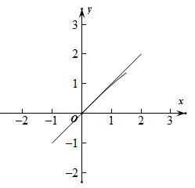

故选：B.

**题型八：函数的伸缩变换问题**

**例22．**（2024·河北唐山·高三开滦第二中学校考期末）定义域为的函数满足，当时，.若时，恒成立，则实数的取值范围是（     ）

A．	B．	C．	D．

【答案】C

【解析】当*x*∈(2,3),则*x*−2∈(0,1)，

则<em>f</em>(<em>x</em>)=2<em>f</em>(<em>x</em>−2)−1=2(<em>x</em>−2)2−2(<em>x</em>−2)−1，

即为<em>f</em>(<em>x</em>)=2<em>x2</em>−10<em>x</em>+11，

当*x*∈[3，4]，则*x*−2∈[1，2]，

则*f*(*x*)=2*f*(*x*−2)−1=.

当*x*∈(0,1)时,当*x*=时,*f*(*x*)取得最小值,且为−；

当*x*∈[1,2]时,当*x*=2时,*f*(*x*)取得最小值,且为；

当*x*∈(2,3)时,当*x*=时,*f*(*x*)取得最小值,且为−；

当*x*∈[3,4]时,当*x*=4时,*f*(*x*)取得最小值，且为0.

综上可得,*f*(*x*)在(0,4]的最小值为−.

若*x*∈(0,4]时, 恒成立，

则有.

解得.

当*x*∈(0,2)时,*f*(*x*)的最大值为1,

当*x*∈(2,3)时,*f*(*x*)∈[−,−1)，

当*x*∈[3,4]时,*f*(*x*)∈[0,1]，

即有在(0,4]上*f*(*x*)的最大值为1.

由，即为，解得，

综上，即有实数*t*的取值范围是.

故选：*C*.

**例23．**（2024·全国·高三专题练习）定义域为的函数满足，当时，，若当时，不等式恒成立，则实数的取值范围是（   ）

A．	B．

C．	D．

【答案】B

【解析】因为当时，不等式恒成立，所以，

当时，

当时，，当时， ，因此当时，，选B.

<strong>例24．</strong>（2024·全国·高三专题练习）已知定义域为<em>R</em>的函数满足，当时，，设在上的最大值为则数列的前<em>n</em>项和的值为（    ）

A．	B．	C．	D．

【答案】D

【解析】时，，最大值为，

时，，易知时，递增，时，递减，因此最大值为，

综上，，，即，

又，即，

当时，，∴，

∴是等比数列，公比为，

∴．

故选：D．

**变式15．**（2024·甘肃·高三西北师大附中阶段练习）定义域为R的函数满足，当时， ，若时，恒成立，则实数的取值范围是(　　)

A．	B．	C．	D．

【答案】D

【解析】当时，的取值范围是；

当时，的取值范围是，

所以当时，的取值范围是,

因为函数满足，所以，

又当时,,

故的取值范围是，

所以时，，

故，解得，

所以实数的取值范围是，

故选：D.

**题型九：V型函数和平底函数**

<strong>例25．</strong>（2024·全国·高三专题练习）已知<em>a1</em>，<em>a2</em>，<em>a3</em>与<em>b1</em>，<em>b2</em>，<em>b3</em>是6个不同的实数，若关于<em>x</em>的方程|<em>x</em>﹣<em>a1</em>|+|<em>x</em>﹣<em>a2</em>|+|<em>x</em>﹣<em>a3</em>|＝|<em>x</em>﹣<em>b1</em>|+|<em>x</em>﹣<em>b2</em>|+|<em>x</em>﹣<em>b3</em>|解集<em>A</em>是有限集，则集合<em>A</em>中，最多有\_\_个元素．

【答案】1

【解析】令<em>f</em>(<em>x</em>)＝|<em>x</em>﹣<em>a1</em>|+|<em>x</em>﹣<em>a2</em>|+|<em>x</em>﹣<em>a3</em>|，<em>g</em>(<em>x</em>)＝|＝|<em>x</em>﹣<em>b1</em>|+|<em>x</em>﹣<em>b2</em>|+|<em>x</em>﹣<em>b3</em>|，

将关于<em>x</em>的方程|<em>x</em>﹣<em>a1</em>|+|<em>x</em>﹣<em>a2</em>|+|<em>x</em>﹣<em>a3</em>|＝|<em>x</em>﹣<em>b1</em>|+|<em>x</em>﹣<em>b2</em>|+|<em>x</em>﹣<em>b3</em>|解的个数的问题转化为两个函数图象交点个数的问题

不妨令<em>a1</em>＜<em>a2</em>＜<em>a3</em>，<em>b1</em>＜<em>b2</em>＜<em>b3</em>，

由于<em>f</em>(<em>x</em>)＝|<em>x</em>﹣<em>a1</em>|+|<em>x</em>﹣<em>a2</em>|+|<em>x</em>﹣<em>a3</em>|＝，

<em>g</em>(<em>x</em>)＝|<em>x</em>﹣<em>b1</em>|+|<em>x</em>﹣<em>b2</em>|+|<em>x</em>﹣<em>b3</em>|＝，

考查两个函数，可以看到每个函数都是由两条射线与两段折线所组成的，且两条射线的斜率对应相等，两条线段的斜率对应相等．

当<em>a1</em>，<em>a2</em>，<em>a3</em>的和与<em>b1</em>，<em>b2</em>，<em>b3</em>的和相等时，此时两个函数射线部分完全重合，这与题设中方程的解集是有限集矛盾

不妨令<em>a1</em>，<em>a2</em>，<em>a3</em>的和小于<em>b1</em>，<em>b2</em>，<em>b3</em>的和即<em>a1</em>+<em>a2</em>+<em>a3</em>＜<em>b1</em>+<em>b2</em>+<em>b3</em>，﹣<em>a1</em>﹣<em>a2</em>﹣<em>a3</em>＞﹣<em>b1</em>﹣<em>b2</em>﹣<em>b3</em>，

两个函数图象射线部分端点上下位置不同，即若左边<em>f</em>(<em>x</em>)＝|<em>x</em>﹣<em>a1</em>|+|<em>x</em>﹣<em>a2</em>|+|<em>x</em>﹣<em>a3</em>|的射线端点在上，右边射线端点一定在下，反之亦有可能．

不妨认为左边<em>f</em>(<em>x</em>)＝|<em>x</em>﹣<em>a1</em>|+|<em>x</em>﹣<em>a2</em>|+|<em>x</em>﹣<em>a3</em>|的射线端点在上，右边射线端点一定在下，且射线互相平行，中间线段也对应平行，图象只能如图：

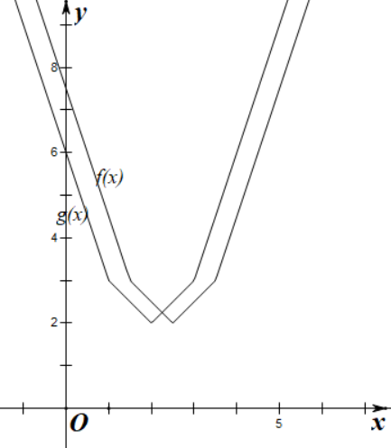

故两函数图象只能有一个交点，即方程的解集是有限集时，最多有一个元素，

故答案为：1．

**例26．**（浙江省衢州市2024学年高三数学试题）已知等差数列满足：，则的最大值为（    ）

A．18	B．16	C．12	D．8

【答案】C

【解析】

不为常数列，且数列的项数为偶数，设为

则，一定存在正整数*k*使得或

不妨设，即，

从而得，数列为单调递增数列，

，且，

，同理

即，

根据等差数列的性质，

所以*n*的最大值为12，选项C正确，选项ABD错误

故选：C.

**例27．**（上海市川沙中学2024学年高三第二学期数学试题）等差数列，满足，则（ ）

A．的最大值为50	B．的最小值为50

C．的最大值为51	D．的最小值为51

【答案】A

【解析】为等差数列，则使，所以数列中的项一定有正有负，不妨设，因为为定值，故设，且，解得.若且，则，同理若，则.所以，所以数列的项数为，所以，由于，所以，解得，故，故选A.

**变式16．**（上海市青浦区2024届高三二模数学试题）等差数列，满足，则（　　）

A．的最大值是50	B．的最小值是50

C．的最大值是51	D．的最小值是51

【答案】A

【解析】时，满足条件，所以满足条件，即最小值为2，舍去B,D.

要使得取最大值，则项数n为偶数，

设，等差数列的公差为，首项为，不妨设，

则，且，由可得，

所以

,

因为，所以，所以，而，

所以，故.

故选A

**变式17．**（浙江省金丽衢十二校2024学年高三第一次联考数学试题）设等差数列，，…，（，)的公差为，满足，则下列说法正确的是

A．	B．的值可能为奇数

C．存在，满足	D．的可能取值为

【答案】A

【解析】因为

所以

令

则 （）

①当时，，不满足（），舍去．

②当时，由（）得为平底型，故为偶数 ．

的大致图像为：

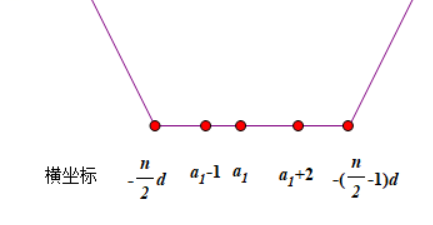

则

所以，故A正确．

由

当 时

当 时

故不存在，满足，C错

由于 所以，故D错

③当时，令

由于 的图像与的图像关于轴对称，故只需研究

故令

因为

所以

由②知为平底型，故为偶数，故B错

令

所以 ，故A正确

由②知，不存在，满足，故C错

由②知，，故D错

综上所述，A正确,BCD错误

故选A.

