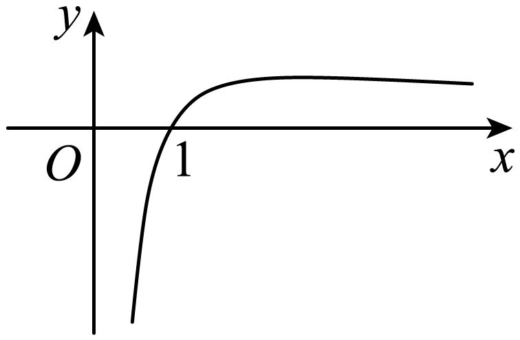

**第19讲  原函数与导函数混合还原**

**知识梳理**

1、对于，构造，

2、对于，构造

3、对于，构造，

4、对于，构造

5、对于，构造，

6、对于，构造

7、对于，构造，

8、对于，构造

9、对于，构造，

10、对于，构造

11、对于，构造，

12、对于，构造

13、对于，构造

14、对于，构造

15、；；；

16、；．

**必考题型全归纳**

**题型一：利用构造型**

**例1．**（安徽省马鞍山第二中学2024学年高三上学期10月段考数学试题）已知的定义域为，为的导函数，且满足，则不等式的解集是（    ）

A．	B．	C．	D．

【答案】B

【解析】根据题意，构造函数，，则，

所以函数的图象在上单调递减.

又因为，所以，

所以，解得或（舍）.

所以不等式的解集是.

故选：B.

**例2．**（河南省温县第一高级中学2024学年高三上学期12月月考数学试题）已知函数的定义域为，且满足（是的导函数），则不等式的解集为（    ）

A．	B．	C．	D．

【答案】C

【解析】令，则，即在上递增，

又，则等价于，即，

所以，解得，原不等式解集为.

故选：C

**例3．**（黑龙江省大庆实验中学2024届高三下学期5月考前得分训练（三）数学试题）已知函数的定义域为，为函数的导函数，若，，则不等式的解集为（    ）

A．	B．	C．	D．

【答案】D

【解析】由题意得，，

即，

所以，即，

又，所以，故 ，

，可得，

在上，，单调递增；

在上，，单调递减，

所以的极大值为.简图如下：

所以，，.

故选：D.

**变式1．**（2024届高三第七次百校大联考数学试题（新高考））已知定义在上的偶函数的导函数为，当时，，且，则不等式的解集为（    ）

A．	B．

C．	D．

【答案】C

【解析】当时，，所以当时，，

令，则当时，，

故在上单调递增，

又因为在上为偶函数，所以在上为奇函数，

故在上单调递增，因为，所以，

当时，可变形为，即，

因为在上单调递增，所以，解得，故；

当时，可变形为，即，

因为在上单调递增，所以，解得，故无解.

综上不等式的解集为.

故选：C.

**变式2．**（四川省绵阳市盐亭中学2024届高三第二次模拟考试数学试题）已知定义在上的函数满足，，则关于的不等式的解集为（    ）

A．	B．	C．	D．

【答案】D

【解析】令，则，所以在单调递减，

不等式可以转化为，即，所以.

故选：D.

**变式3．**（河南省豫北重点高中2024学年高三下学期4月份模拟考试文科数学试题）已知函数的定义域为，其导函数是，且．若，则不等式的解集是（    ）

A．	B．

C．	D．

【答案】B

【解析】构造函数，其中，

则，

故函数在上为增函数，且，

因为，由可得，即，解得.

故选：B.

**变式4．**（广西15所名校大联考2024届高三高考精准备考原创模拟卷（一）数学试题）已知是定义在**R**上的偶函数，其导函数为，且，则不等式的解集为（    ）

A．	B．	C．	D．

【答案】C

【解析】设，

则在**R**上为奇函数，且.

又，

当时，，所以在上为增函数，

因此在**R**上为增函数.

又，当时，不等式化为，

即，

所以；

当时，不等式化为，即，

解得，故无解，

故不等式的解集为.

故选：C

**【解题方法总结】**

1、对于，构造，

2、对于，构造

**题型二：利用构造型**

**例4．**（河南省信阳市息县第一高级中学2024学年高三上学期9月月考数学试题）已知定义在的函数满足：，其中为的导函数，则不等式的解集为（    ）

A．	B．

C．	D．

【答案】A

【解析】设，

因为，

所以在上，

所以在上单调递增，

由已知，的定义域为，

所以，

所以等价于，

即，

所以，解得，

所以原不等式的解集是.

故选：A.

<strong>例5．</strong>已知定义域为{<em>x</em>|<em>x</em>≠0}的偶函数<em>f</em>(<em>x</em>)，其导函数为<em>f</em>′(<em>x</em>)，对任意正实数<em>x</em>满足<em>xf</em>′(<em>x</em>)&gt;2<em>f</em>(<em>x</em>)，若<em>g</em>(<em>x</em>)＝，则不等式<em>g</em>(<em>x</em>)&lt;<em>g</em>(1)的解集是（    ）

A．(－∞，1)	B．(－1,1)

C．(－∞，0)∪(0,1)	D．(－1,0)∪(0,1)

【答案】D

【解析】因为*f*(*x*)是定义域为{*x*|*x*≠0}的偶函数，所以*f*(－*x*)＝*f*(*x*).对任意正实数*x*满足，

所以*,*

因为 ，所以*g*(*x*)也是偶函数.

当*x*∈(0，＋∞)时，*,*

所以*g*(*x*)在(0，＋∞)上单调递增，在(－∞，0)单调递减，

若*g*(*x*)<*g*(1)，则|*x*|<1(*x*≠0)，解得0<*x*<1或－1<*x*<0，

故*g*(*x*)<*g*(1)的解集是(－1,0)∪(0,1),

故选：D

**例6．**（江苏省苏州市2024届高三下学期3月模拟数学试题）已知函数是定义在上的奇函数，，当时，有成立，则不等式的解集是（    ）

A．	B．

C．	D．

【答案】A

【解析】成立设，

则，即时是增函数，

当时，，此时；

时，，此时．

又是奇函数，所以时，；

时

则不等式等价为或，

可得或，

则不等式的解集是，

故选：．

**变式5．**（西藏昌都市第四高级中学2024届高三一模数学试题）已知函数是定义在的奇函数，当时，，则不等式的解集为（    ）

A．	B．

C．	D．

【答案】D

【解析】令，

当时，，

当时，，

在上单调递减；

又为的奇函数，

，即为偶函数，

在上单调递增；

又由不等式得，

当，即时，不等式可化为，即，

由在上单调递减得，解得，故；

当，即时，不等式可化为，即，

由在上单调递增得，解得，故；

综上所述，不等式的解集为：．

故选：D．

**【解题方法总结】**

1、对于，构造，

2、对于，构造

**题型三：利用构造型**

<strong>例7．</strong>（河南省2024学年高三上学期第五次联考文科数学试题）已知定义在<em>R</em>上的函数满足，且有，则的解集为（    ）

A．	B．	C．	D．

【答案】A

【解析】设，则，

∴在*R*上单调递增.

又，则.

∵等价于，即，

∴，即所求不等式的解集为.

故选：A.

**例8．**（河南省2024学年高三上学期第五次联考数学试题）已知定义在上的函数满足，且有，则的解集为（    ）

A．	B．

C．	D．

【答案】B

【解析】设，则，

所以函数在上单调递增，又，所以．

又等价于，即，所以，

即所求不等式的解集为．

故选：B

**例9．**（广东省佛山市顺德区北滘镇莘村中学2024届高三模拟仿真数学试题）已知是函数的导函数，对于任意的都有，且，则不等式的解集是（    ）

A．	B．

C．	D．

【答案】D

【解析】法一：构造特殊函数.令，则满足题目条件，把代入得解得，

故选：.

法二：构造辅助函数.令，则，

所以在上单调递增，

又因为，所以，所以，

故选：D.

**变式6．**（宁夏吴忠市2024届高三一轮联考数学试题）函数的定义域是，，对任意，，则不等式：的解集为（    ）

A．	B．

C．或	D．或

【答案】A

【解析】构造函数，则，

，则函数在上单调递增，

由可得，可得，

因此，不等式的解集为.

故选：A.

**【解题方法总结】**

1、对于，构造，

2、对于，构造

**题型四：用构造型**

**例10．**（安徽省六安市第一中学2024学年高二下学期期末数学试题）定义在上的函数的导函数为，满足：， ，且当时，，则不等式的解集为（    ）

A．	B．	C．	D．

【答案】A

【解析】令，则可得

所以是上的奇函数，

，

当时，，所以，

是上单调递增，

所以是上单调递增，

因为，

由可得即，

由是上单调递增，可得 解得：，

所以不等式的解集为，

故选：A.

<strong>例11．</strong>（广东省汕头市2024届高三三模数学试题）已知定义在<em>R</em>上的函数的导函数为，且满足，，则不等式的解集为（    ）

A．	B．	C．	D．

【答案】D

【解析】令，则，

所以不等式等价转化为不等式，即

构造函数，则，

由题意，，所以为*R*上的增函数，

又，所以，

所以，解得，即，

所以，

故选：D.

**例12．**（陕西省安康市2024届高三下学期4月三模数学试题）已知函数的定义域为，且对任意，恒成立，则的解集是（    ）

A．	B．

C．	D．

【答案】D

【解析】设，该函数的定义域为**，**

则，所以在上单调递增．

由可得，即，

又在上单调递增，所以，解得，

所以原不等式的解集是，

故选：D．

<strong>变式7．</strong>（新疆克拉玛依市2024届高三三模数学试题）定义在<em>R</em>上的函数的导函数为，，对于任意的实数均有成立，且的图像关于点（，1）对称，则不等式的解集为（    ）

A．（1，+∞）	B．（1，+∞）	C．（∞，1）	D．（∞，1）

【答案】A

【解析】因为的图像关于点（，1）对称，

所以是奇函数，

因为对任意的实数均有成立，

所以对任意的实数均有成立，

令，

则 ，

所以 在上递增，

因为，

又，

所以，

故选：A

<strong>变式8．</strong>（浙江省绍兴市新昌中学2024届高三下学期5月适应性考试数学试题）若定义在<em>R</em>上的函数的导函数为，且满足，则不等式的解集为（    ）

A．	B．

C．	D．

【答案】A

【解析】由题可设，因为，

则，

所以函数在**R**上单调递增，

又，不等式可转化为，

∴，

所以，解得，

所以不等式的解集为．

故选：A.

**变式9．**（吉林省长春市吉大附中实验学校2024学年高三上学期第四次摸底考试数学试题）设是函数的导函数，且，（e为自然对数的底数），则不等式的解集为（    ）

A．	B．	C．	D．

【答案】C

【解析】令，则，

因为，

所以，

所以函数在上为增函数，

不等式即不等式，

又，，

所以不等式即为，

即，解得，

所以不等式的解集为.

故选：C.

**变式10．**（四川省绵阳市南山中学2024学年高三二诊热身考试数学试题）已知定义在上的可导函数的导函数为，满足，且，，则不等式的解集为（    ）

A．	B．	C．	D．

【答案】D

【解析】因为，所以的图像关于直线对称，所以，

设，则 ，因为，所以,所以在上为减函数，

又 ，因为，所以 ，所以.

故选：.

**变式11．**（山东省烟台市2024届高三二模数学试题）已知函数的定义域为**R**，其导函数为，且满足，，则不等式的解集为（    ）．

A．	B．

C．	D．

【答案】C

【解析】由得，即，

可设，

当时，因得，

所以，

可化为，

即，

设，

因，故为偶函数

，

当时，因，，

故，所以在区间上单调递增，

因，

所以当时的解集为，

又因为偶函数，故的解集为.

故选：C

**变式12．**（江西省九江十校2024届高三第二次联考数学试题）设函数的定义域为，其导函数为，且满足，，则不等式（其中为自然对数的底数）的解集是（    ）

A．	B．	C．	D．

【答案】D

【解析】设，

，即，

，

在上单调递减，又，

不等式，

即，，

原不等式的解集为.

故选：D

**【解题方法总结】**

1、对于，构造，

2、对于，构造

**题型五：利用**、**与构造型**

**例13．**（江西省2024届高三教学质量监测数学试题）定义在区间上的可导函数关于轴对称，当时，恒成立，则不等式的解集为（    ）

A．	B．	C．	D．

【答案】C

【解析】因为，化简得，

构造函数，

即当时，单调递增，

所以由，

则，

即.因为为偶函数且在上单调递增，

所以，解得.

故选：C.

**例14．**（天津市南开中学2024届高三下学期统练二数学试题）已知可导函数是定义在上的奇函数．当时，，则不等式的解集为（    ）

A．	B．	C．	D．

【答案】D

【解析】当时，，则

则函数在上单调递增，又可导函数是定义在上的奇函数

则是上的偶函数，且在单调递减，

由，可得，则，

则时，不等式

可化为

又由函数在上单调递增，且，，

则有，解之得

故选：D

**例15．** 函数对任意的满足(其中是函数的导函数)，则下列不等式成立的是（       ）

A．	B．

C．	D．

【答案】D

【解析】令，

又由已知可得，，所以，

所以在上单调递增

因为，所以，

故，D正确，

故选：D

**变式13．** 已知可导函数是定义在上的奇函数．当时，，则不等式的解集为（       ）

A．	B．	C．	D．

【答案】D

【解析】当时，，则

则函数在上单调递增，又可导函数是定义在上的奇函数

则是上的偶函数，且在单调递减，

由，可得，则，

则时，不等式

可化为

又由函数在上单调递增，且，，

则有，解之得

故选：D

**【解题方法总结】**

1、对于，构造，

2、对于，构造

3、对于正切型，可以通分（或者去分母）构造正弦或者余弦积商型

**题型六：利用与构造型**

<strong>例16．</strong>（重庆市九龙坡区2024届高三二模数学试题）已知偶函数的定义域为，其导函数为，当时，有成立，则关于<em>x</em>的不等式的解集为（    ）

A．	B．

C．	D．

【答案】C

【解析】构造函数，

，

所以函数在单调递增，

因为函数为偶函数，所以函数也为偶函数，

且函数在单调递增，所以函数在单调递减，

因为，所以，

关于*x*的不等式可变为，也即，

所以，则解得或，

故选:C.

<strong>例17．</strong>已知偶函数的定义域为，其导函数为，当时，有成立，则关于<em>x</em>的不等式的解集为（       ）

A．	B．

C．	D．

【答案】B

【解析】由题意，设，则，

当时，因为，则有，

所以在上单调递减，

又因为在上是偶函数，可得，

所以是偶函数，

由，可得，即，即

又由为偶函数，且在上为减函数，且定义域为，则有，

解得或，

即不等式的解集为，

故选：B.

**例18．** 设函数在上存在导数，对任意的，有，且在上有，则不等式的解集是（       ）

A．	B．	C．	D．

【答案】B

【解析】设，

∵，即，即，故是奇函数，

由于函数在上存在导函数，所以，函数在上连续，则函数在上连续.

∵在上有，∴，

故在单调递增，

又∵是奇函数，且在上连续，∴在上单调递增，

∵，

∴，

即，∴，故，

故选：B．

**【解题方法总结】**

1、对于，构造，

2、对于，构造

3、对于正切型，可以通分（或者去分母）构造正弦或者余弦积商型

**题型七：复杂型：与等构造型**

**例19．**（广西柳州市2024届高三11月第一次模拟考试数学试题）已知可导函数的导函数为，若对任意的，都有．且为奇函数，则不等式的解集为（    ）

A．	B．	C．	D．

【答案】A

【解析】根据题意，构造，则，

且，故在上单调递减；

又为上的奇函数，故可得，

即，则.

则不等式等价于，

又因为是上的单调减函数，故解得.

故选：A.

**例20．**（河南省多校联盟2024届高考终极押题（C卷）数学试题）已知函数的导函数为，若对任意的，都有，且，则不等式的解集为（    ）

A．	B．	C．	D．

【答案】C

【解析】设函数，

所以，因为，

所以，即，所以在上单调递减，因为，

所以，因为，整理得，

所以，因为在上单调递减，所以.

故选：C.

**例21．**（2024届高三冲刺卷（一）全国卷文科数学试题）已知函数与定义域都为，满足，且有，，则不等式的解集为（    ）

A．	B．	C．	D．

【答案】D

【解析】由可得.

而，∴，∴在上单调递减，

又，则，

所以，则，

故不等式的解集为．

故选：D．

**变式14．**（陕西省渭南市华州区咸林中学2024学年高三上学期开学摸底考试数学试题）已知定义在上的函数满足为的导函数，当时，，则不等式的解集为（    ）

A．	B．	C．	D．

【答案】B

【解析】令，所以，因为，所以，化简得，

所以是上的奇函数；

，

因为当时，，

所以当时，，从而在上单调递增，又是上的奇函数，所以在上单调递增；

考虑到，由，

得，即，

由在上单调递增，得解得，

所以不等式的解集为，

故选：B.

**变式15．**（黑龙江省哈尔滨市第三中学2024学年高三上学期期中考试数学试题）设函数在上的导函数为，若，，，则不等式的解集为（    ）

A．	B．	C．	D．

【答案】A

【解析】令，可得，

因为，可得，

所以，所以函数为上的单调递增函数，

由不等式，可得，

所以，即

因为，令，可得，

又因为，可得，所以

所以不等式等价于，

由函数为上的单调递增函数，所以，即不等式的解集为.

故选：A.

<strong>变式16．</strong>（新疆新源县第二中学2024学年高二下学期期末考试数学试题）定义在<em>R</em>上的函数满足：，，则不等式的解集为（    ）

A．	B．

C．	D．

【答案】A

【解析】将左右两边同乘得：，

令，则，所以在*R*上单调递增，且；不等式等价于，即，所以

故选：A

**变式17．**（陕西省西安市西北工业大学附属中学2024届高三下学期第十二次适应性考试数学试题）定义在上的函数满足，且，则不等式的解集为（    ）

A．	B．	C．	D．

【答案】B

【解析】构造函数，则，

所以，函数为上的增函数，，

由可得，所以，.

故选：B.

**【解题方法总结】**

对于，构造

**题型八：复杂型：与型**

**例22．**（专题32盘点构造法在研究函数问题中的应用—备战2022年高考数学二轮复习常考点专题突破）已知定义在上的函数满足，且当时，有，则不等式的解集是（    ）

A．	B．

C．	D．

【答案】A

【解析】根据题意，设，则，则有，，即有，故函数的图象关于对称，则有，

当时，，，又由当时，，即当时，，即函数在区间为增函数，由可得，即，，

函数的图象关于对称，函数在区间为增函数，且在上恒成立，由可得，即，此时不存在.

综上：不等式解集为.

故选：A

**例23．**（辽宁省实验中学2024届高三第四次模拟考试数学试卷）已知函数是定义在上的可导函数，其导函数为，若对任意有，，且，则不等式的解集为（    ）

A．	B．

C．	D．

【答案】B

【解析】设，则恒成立，故函数在上单调递增.

，则，即，故.

，即，即，故，解得.

故选：B.

**例24．**（山东省泰安肥城市2024届高三下学期5月高考适应性训练数学试题（三））定义在上的函数的导函数为，且对任意恒成立.若，则不等式的解集为（    ）

A．	B．

C．	D．

【答案】B

【解析】由，即，

即，即对恒成立，

令，则在上单调递增，

∵，∴，

由即，即，

因为在上单调递增，∴

故选：B.

**【解题方法总结】**

写出与的加、减、乘、除各种形式

**题型九：复杂型：与结合型**

**例25．**（2024届高三数学临考冲刺原创卷（四））已知函数的定义域为，导函数为，且满足，则不等式的解集为（    ）

A．	B．

C．	D．

【答案】C

【解析】根据，得．

设（），则，

则函数在上单调递增，且，

则不等式，可化为，

则，解得.

故选：C．

**例26．**（华大新高考联盟2024届高三3月教学质量测评文科数学试题）已知函数的定义域为，图象关于原点对称，其导函数为，若当时，则不等式的解集为（    ）

A．	B．

C．	D．

【答案】C

【解析】构造函数，其中，

则，

所以，函数在上单调递减，

易知，当时，，，此时，

当时，，，此时，

因为函数的定义域为，图象关于原点对称，即函数为奇函数，

若或时，，且，

由可得，

当时，即，可得或，此时，可得；

当时，即，可得，此时，可得.

因此，不等式的解集为.

故选：C.

**例27．**（2024届高三数学新高考信息检测原创卷（四））已知是定义在上的奇函数，是的导函数，，且，则不等式的解集是（   ）

A．	B．

C．	D．

【答案】D

【解析】设，则的定义域为

且，所以在上单调递减.

因为，所以当时，；

当时，.

又当时，，当时，，

所以当时，恒有.

因为是上的奇函数，所以当时，，

所以等价于或

解得或，

所以不等式的解集是.

故选：D.

**变式18．**（广东省梅州市2024届高三二模数学试题）已知是定义在上的奇函数，是的导函数，当时，，且，则不等式的解集是（    ）

A．	B．	C．	D．

【答案】B

【解析】令，

则，

所以函数在上递增，

又因，

所以当时，，

当时，，

又因当时，，当时，，

所以当时，，当时，，

又因为，所以当时，，

因为是定义在上的奇函数，

所以，当时，，

由不等式，

得或，

解得，

所以不等式的解集是.

故选：B.

**变式19．** 定义在 上的函数 满足，则不等式 的解集为（　　）

A． 	B．	C． 	D．

【答案】D

【解析】令 ，

则，由于,

故,故在单调递增，

而 ，

由，得 ，

∴ ，即 ,

∴不等式的解集为,

故选：D．

**【解题方法总结】**

1、对于，构造

2、写出与的加、减、乘、除各种结果

**题型十：复杂型：基础型添加因式型**

<strong>例28．</strong>（辽宁省名校联盟2024届高考模拟调研卷数学（三））已知函数<em>f</em>（<em>x</em>）为定义在<strong>R</strong>上的偶函数，当时，，，则不等式的解集为（    ）

A．	B．

C．	D．

【答案】A

【解析】因为，所以，

构造函数，当时，，

所以函数在区间内单调递增，且，

又是定义在**R**上的偶函数，所以是定义在**R**上的偶函数，

所以在区间内单调递减，且．

不等式整理可得：，

即，当时，，则，解得；当时，，则，

解得，又，所以．

综上，不等式的解集为．

故选：A．

**例29．** 定义在上的函数满足（为自然对数的底数），其中为的导函数，若，则的解集为（       ）

A．	B．

C．	D．

【答案】D

【解析】设，则，所以等价于，

由，可得

则，

所以在上单调递增，所以由，得．

故选：D

**例30．** 定义在上的函数满足，且，则满足不等式的的取值有（       ）

A．	B．0	C．1	D．2

【答案】D

【解析】构造函数，则，

因为，所以，所以单调递减，

又，所以，

不等式变形为，即，

由函数单调性可得：

故选：D

**变式20．** 已知在定义在上的函数满足，且时，恒成立，则不等式的解集为（       ）

A．	B．	C．	D．

【答案】B

【解析】由题意，当时，恒成立，即恒成立，

又由，可得，

令，可得，则函数为偶函数，

且当时，单调递增，

结合偶函数的对称性可得在上单调递减，

由，

化简得到，

即，所以，解得，

即不等式的解集为.

故选：B.

**【解题方法总结】**

在本题型一、二、三、四等基础上，变形或者添加因式，增加复杂度

**题型十一：复杂型：二次构造**

**例31．**（福建省福州第一中学2024学年高二下学期期中考试数学试题）函数满足：，，则当时，（    ）

A．有极大值，无极小值	B．有极小值，无极大值

C．既有极大值，又有极小值	D．既无极大值，也无极小值

【答案】D

【解析】因为，所以，

令，则，且，

所以，

令，则，

令，解得：，

当时，，则单调递增，

当时，，则单调递减，

所以当时，取得最大值，

则，故在上恒成立，

所以在上单调递减，

则当时，既无极大值，也无极小值.

故选：D

**例32．**（江西省百所名校2024学年高三第四次联考数学试题）已知函数的定义域为，其导函数为，对恒成立，且，则不等式的解集为（    ）

A．	B．	C．	D．

【答案】D

【解析】根据已知条件构造一个函数，再利用的单调性求解不等式即可.由，可得，

即，令，

则.

令，，

所以在上是单调递减函数.

不等式，

等价于，

即，，

所求不等式即，

由于在上是单调递减函数，

所以，解得，

且，即，

故不等式的解集为.

故选：D

**例33．**（河南省濮阳市2024届高三下学期第一次模拟考试数学试题）已知函数为定义域在**R**上的偶函数，且当时，函数满足，，则的解集是（    ）

A．	B．

C．	D．

【答案】A

【解析】由题可知，当时，．令，则，

，令，，

令，解得．可知函数在上单调递减﹐在上单调递增．

又，所以，，所以函数在上单调递减，

，可化为，又函数关于对称，

故或，

所以不等式的解集为．

故选：A

**变式21．**（宁夏平罗中学2024届高三上学期第一次月考数学试题）已知定义在上的连续偶函数的导函数为，当时，，且，则不等式的解集为（    ）

A．	B．

C．	D．

【答案】A

【解析】当时，，∴，

令，∴在上单调递减，

又是定义在上的连续偶函数，∴是上的奇函数，即在上单调递减，

∵，∴，

当，即时，，∴；

当，即时，，∴，则.

故不等式的解集为.

故选：A.

**变式22．**（江西省九江市2024届高三三模数学（理）试题）已知是定义在上的可导函数，是的导函数，若，，则在上（    ）

A．单调递增	B．单调递减	C．有极大值	D．有极小值

【答案】A

【解析】构造函数，则，

所以，，则，

设，则，，

当时，，此时函数单调递减；

当时，，此时函数单调递增.

所以，，对任意的恒成立，

因此，函数在上单调递增.

故选：A.

**变式23．**（湖北省鄂东南省级示范高中教育教学改革联盟学校2024学年高二下学期期中理科数学试题）定义在上的函数满足，且，则（    ）

A．有极大值，无极小值	B．有极小值，无极大值

C．既有极大值又有极小值	D．既无极大值也无极小值

【答案】D

【解析】因为，且，

所以，①

令，则，

又，记，

所以.

当时，，递减；当时，，递增.

结合①当时，，所以的最小值为0，即，

因为，则，（当且仅当时，取等号），所以既没有最大值，也没有最小值.

故选：D.

**变式24．**（福建省泉州市2024学年高二下学期期末教学质量跟踪监测数学（理）试题）设函数满足：，，则时，（    ）

A．有极大值，无极小值	B．有极小值，无极大值

C．既有极大值，又有极小值	D．既无极大值，又无极小值

【答案】B

【解析】，

令，则，

所以，

令，则，

即，

当时，，单调递增，而，

所以当时，，，单调递减；

当时，，，单调递增；

故有极小值，无极大值，故选B.

**变式25．**（辽宁省大连市中山区第二十四中学2024学年高三上学期11月月考数学试题）函数满足：， ．则时，

A．有极大值，无极小值	B．有极小值，无极大值

C．既有极大值，又有极小值	D．既无极大值，也无极小值

【答案】D

【解析】因为，所以,

令，则 ，

所以，

令 ，则，

则当时， ，当时，

即函数在为增函数，在为减函数，

所以，

即，即函数在为减函数，

即时，既无极大值，也无极小值，

故选D.

**变式26．** 设函数的导数为，且，，，则当时，

A．有极大值，无极小值	B．无极大值，有极小值

C．既有极大值又有极小值	D．既无极大值又无极小值

【答案】B

【解析】由题设，所以，，所以存在使得，又 ，所以在上单调递增.

所以当时，，单调递减，当时，，单调递增.

因此，当时，取极小值，但无极大值，故选B.

**【解题方法总结】**

二次构造：，其中等

**题型十二：综合构造**

**例34．**（福建省泉州市泉港区第一中学、厦门外国语学校石狮分校2024学年高二下学期期中联考数学试题）已知函数在上可导，其导函数为，若满足，关于直线对称，则不等式的解集是（    ）

A．	B．

C．	D．

【答案】C

【解析】令，

，

，

当时，，则，

在上单增；

当时，，则，

在上单减；

，

不等式即为不等式，

关于直线对称，

，

解得或，

故选：．

**例35．**（贵州省铜仁市2024届高三适应性考试数学试题（—））已知定义在上的函数，为其导函数，满足①，②当时，.若不等式有实数解，则其解集为（    ）

A．	B．

C．	D．

【答案】D

【解析】构造函数，

当时，递增，

由于，

所以，即，

所以是偶函数，所以当时，递减.

不等式等价于：

，

即，所以，

两边平方并化简得，解得或，

所以不等式的解集为.

故选：D

**例36．**（黑龙江省哈尔滨市第三中学2024学年高三第一次模拟数学（文科）试题）已知是定义在R上的偶函数，是的导函数，当时，，且，则的解集是（    ）

A．	B．

C．	D．

【答案】B

【解析】令，

因为是定义在R上的偶函数，

所以，

则，

所以函数也是偶函数，

，

因为当时，，

所以当时，，

所以函数在上递增，

不等式即为不等式，

由，得，

所以，

所以，解得或，

所以的解集是.

故选：B.

**变式27．**（贵州省绥阳县育才中学2024届高三信息压轴卷数学试题）已知函数的定义域为**R**，其导函数为，若，且当时，，则的解集为（     ）

A．	B．

C．	D．

【答案】C

【解析】由已知可推得，.

令，则，

所以，

所以，为偶函数.

又，

因为当时，，

所以，，所以在上单调递增.

又为偶函数，所以在上单调递减.

由可得，

.

因为，

所以，.

因为在上单调递减，为偶函数，

所以有，

平方整理可得，，

解得.

故选：C.

**变式28．**（安徽省淮南市2024届二模数学试题）定义在上的函数满足，当时，，则不等式的解集为（    ）

A．	B．	C．	D．

【答案】A

【解析】∵，

∴，

令，则，

∴在上为奇函数，

又∵当时，，

∴当时，，

∴在上单调递增，

又∵在上为奇函数，

∴在上单调递增，

又∵，

∴，

又∵，

∴，

∵在上单调递增，

∴，解得：.

故选：A.

**变式29．**（安徽省蚌埠市2024届高三上学期第一次质量检查数学试题）已知函数的定义域是，若对于任意的都有，则当时，不等式的解集为（    ）

A．	B．

C．	D．

【答案】A

【解析】令，则在上是减函数.，

所以

得，又，所以.

故选：A.

**【解题方法总结】**

结合式子，寻找各种综合构造规律，如，或者（为常见函数）

**题型十三：找出原函数**

<strong>例37．</strong>（甘肃省武威市第六中学2024届高三上学期第二次阶段性过关考试数学（文）试题）已知定义在(0,<em>+</em>∞)上的函数<em>f</em>(<em>x</em>)的导函数<em>f '</em>(<em>x</em>满足且，其中为自然对数的底数,则不等式的解集是

A．(0,e)	B．(0, )	C．( ,*e*)	D．(e,*+*∞)

【答案】A

【解析】令，则有， ,

,又 ,得

，**,** 再令,则 ,故函数在上递减,

不等式 等价于,所以 ,故选A

**例38．** 设函数是定义在上的连续函数，且在处存在导数，若函数及其导函数满足，则函数

A．既有极大值又有极小值	B．有极大值 ，无极小值

C．有极小值，无极大值	D．既无极大值也无极小值

【答案】C

【解析】本题首先可以根据构造函数，然后利用函数在处存在导数即可求出的值并求出函数的解析式，然后通过求导即可判断出函数的极值．由题意可知，，即，

所以，

令，则，

因为函数在处存在导数，所以为定值，，，

所以，

令，当时，，

构建函数，则有，

所以函数在上单调递增，

当，，令，解得，

所以在上单调递减，在上单调递增，

因为，，

所以当时函数必有一解，

令这一解为，，则当时，

当时，

综上所述，在上单调递减，在上单调递增，在上单调递增，

所以有极小值，无极大值．

**例39．** 设函数是定义在上的连续函数，且在处存在导数，若函数及其导函数满足，则函数

A．既有极大值又有极小值	B．有极大值，无极小值

C．既无极大值也无极小值	D．有极小值，无极大值

【答案】C

【解析】因为，，

所以，所以，

因为函数是连续函数，所以由，可得，

代入，可得，

所以，

当时，，

令，所以，

当时，，单调递增；当时，，单调递减.

所以当时，取得极小值即最小值，

所以，所以函数在上单调递增，

所以既没有极大值，也没有极小值，

故选C.

**【解题方法总结】**

熟悉常见导数的原函数

