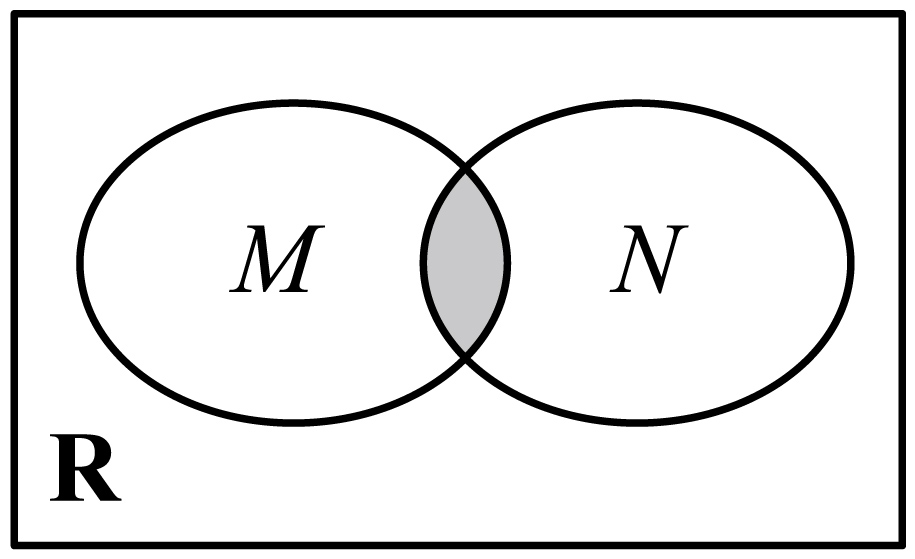
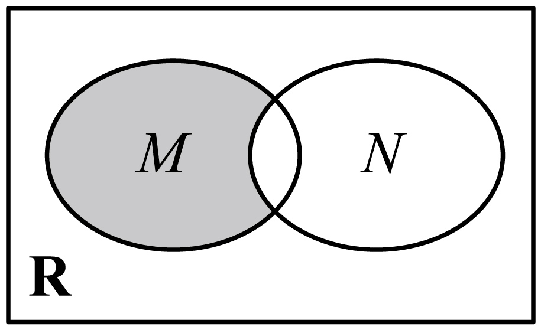
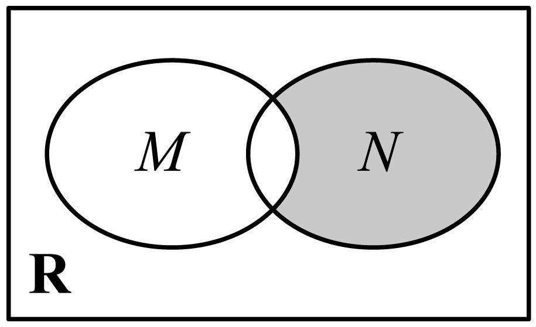
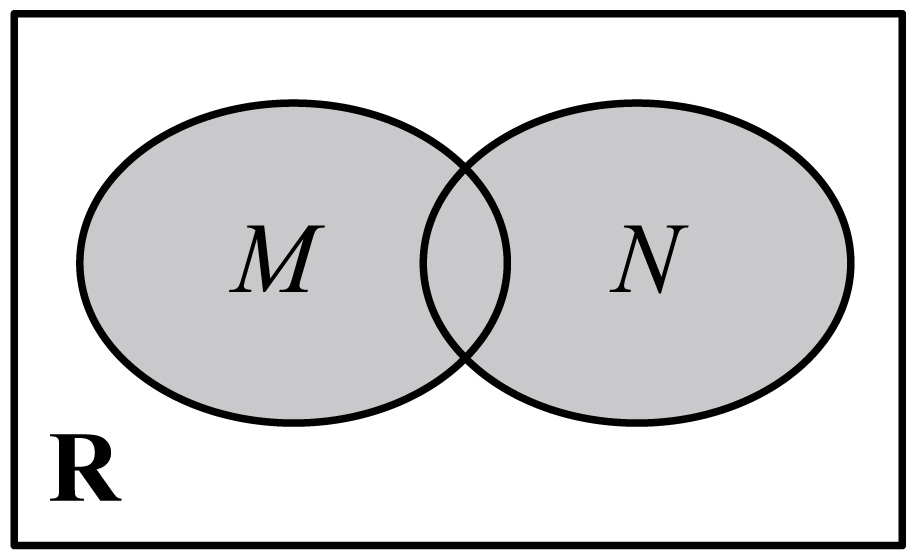

**第1讲  集合**

**知识梳理**

**1、元素与集合**

（1）集合中元素的三个特性：确定性、互异性、无序性.

（2）元素与集合的关系：属于 或 不属于，数学符号分别记为：和.

（3）集合的表示方法：列举法、描述法、韦恩图（图）.

（4）常见数集和数学符号

<table><tr><td>
数集
</td><td>
自然数集
</td><td>
正整数集
</td><td>
整数集
</td><td>
有理数集
</td><td>
实数集
</td></tr><tr><td>
符号
</td><td>

</td><td>
或
</td><td>

</td><td>

</td><td>

</td></tr></table>

**说明：**

**①确定性：** 给定的集合，它的元素必须是确定的；也就是说，给定一个集合，那么任何一个元素在不在这个集合中就确定了.给定集合，可知,在该集合中，,不在该集合中；

**②互异性：** 一个给定集合中的元素是互不相同的；也就是说，集合中的元素是不重复出现的.

集合应满足.

**③无序性：** 组成集合的元素间没有顺序之分。集合和是同一个集合.

**④列举法**

把集合的元素一一列举出来，并用花括号“”括起来表示集合的方法叫做列举法.

**⑤描述法**

用集合所含元素的共同特征表示集合的方法称为描述法.

具体方法是：在花括号内先写上表示这个集合元素的一般符号及取值（或变化）范围，再画一条竖线，在竖线后写出这个集合中元素所具有的共同特征.

**2、集合间的基本关系**

（1）子集（*subset*）：一般地，对于两个集合、，如果集合中任意一个元素都是集合中的元素，我们就说这两个集合有包含关系，称集合为集合的子集 ，记作（或），读作“包含于”（或“包含”）.

（2）真子集（*proper subset*）：如果集合，但存在元素，且，我们称集合是集合的真子集，记作（或）.读作“真包含于 ”或“真包含  ”.

（3）相等：如果集合是集合的子集（，且集合是集合的子集（），此时，集合与集合中的元素是一样的，因此，集合与集合相等，记作.

（4）空集的性质： 我们把不含任何元素的集合叫做空集，记作；是任何集合的子集，是任何非空集合的真子集.

**3、集合的基本运算**

（1）交集：一般地，由属于集合且属于集合的所有元素组成的集合，称为与的交集，记作，即．

（2）并集：一般地，由所有属于集合或属于集合的元素组成的集合，称为与的并集，记作，即．

（3）补集：对于一个集合，由全集中不属于集合的所有元素组成的集合称为集合相对于全集的补集，简称为集合的补集，记作，即．

**4、集合的运算性质**

（1），，．

（2），，．

（3），，．

**【解题方法总结】**

（1）若有限集中有个元素，则的子集有个，真子集有个，非空子集有个，非空真子集有个．

（2）空集是任何集合的子集，是任何非空集合的真子集．

（3）．

（4）,．

**必考题型全归纳**

**题型一：集合的表示：列举法、描述法**

<strong>例1．</strong>（2024·广东江门·统考一模）已知集合，，则集合<em>B</em>中所有元素之和为（    ）

A．0	B．1	C．－1	D．

**例2．**（2024·江苏·高三统考学业考试）对于两个非空实数集合和，我们把集合记作.若集合，则中元素的个数为（    ）

**例3．**（2024·全国·高三专题练习）定义集合且.已知集合，，则中元素的个数为（    ）

**【解题总结】**

**1、列举法，注意元素互异性和无序性，列举法的特点是直观、一目了然.**

**2、描述法，注意代表元素.**

**题型二：集合元素的三大特征**

<strong>例4．</strong>（2024·北京海淀·校考模拟预测）设集合，若，则实数<em>m</em>=（    ）

A．0	B．	C．0或	D．0或1

**例5．**（2024·江西·金溪一中校联考模拟预测）已知集合，，若，则（    ）

A．	B．0	C．1	D．2

<strong>例6．</strong>（2024·北京东城·统考一模）已知集合，且，则<em>a</em>可以为（    ）

A．－2	B．－1	C．	D．

**【解题方法总结】**

**1、研究集合问题，看元素是否满足集合的特征：确定性、互异性、无序性。**

**2、研究两个或者多个集合的关系时，最重要的技巧是将两集合的关系转化为元素间的关系。**

**题型三：元素与集合间的关系**

<strong>例7．</strong>（2024·河南·开封高中校考模拟预测）已知，若，且，则<em>a</em>的取值范围是（    ）

A．	B．	C．	D．

<strong>例8．</strong>（2024·吉林延边·统考二模）已知集合的元素只有一个，则实数<em>a</em>的值为（    ）

A．	B．0	C．或0	D．无解

<strong>例9．</strong>（2024·全国·高三专题练习）已知集合，则<em>A</em>中元素的个数为（    ）

A．9	B．10	C．11	D．12

**【解题方法总结】**

**1、一定要牢记五个大写字母所表示的数集，尤其是N与N\*的区别．**

**2、当集合用描述法给出时，一定要注意描述的是点还是数，是 还是 ．**

**题型四：集合与集合之间的关系**

**例10．（多选题）**（2024·山东潍坊·统考一模）若非空集合满足：，则（    ）

A．	B．

C．	D．

**例11．**（2024·江苏·统考一模）设，，则（    ）

A．	B．	C．	D．

**例12．**（2024·辽宁沈阳·东北育才学校校考模拟预测）已知集合，，若“”是“”的必要不充分条件，则实数的取值范围为（    ）

A．	B．	C．	D．

**例13．**（2024·广东茂名·统考二模）已知集合，，若，则实数的取值范围是（    ）

A．	B．	C．	D．

**【解题方法总结】**

**1、注意子集和真子集的联系与区别.**

**2、判断集合之间关系的两大技巧：**

**（1）定义法进行判断**

**（2）数形结合法进行判断**

**题型五：集合的交、并、补运算**

**例14．**（2024·广东广州·统考二模）已知集合，，则集合的元素个数为（    ）

A．	B．	C．	D．

**例15．**（2024·河北张家口·统考二模）已知集合，，则（    ）

A．	B．	C．	D．

**例16．**（2024·广东·统考一模）已知集合，则下列Venn图中阴影部分可以表示集合的是（    ）

A．	B．

C．	D．

**例17．**（2024·全国·高三专题练习）2021年是中国共产党成立100周年，电影频道推出“经典频传：看电影，学党史”系列短视频，传扬中国共产党的伟大精神，为广大青年群体带来精神感召.现有《青春之歌》《建党伟业》《开国大典》三支短视频，某大学社团有50人，观看了《青春之歌》的有21人，观看了《建党伟业》的有23人，观看了《开国大典》的有26人.其中，只观看了《青春之歌》和《建党伟业》的有4人，只观看了《建党伟业》和《开国大典》的有7人，只观看了《青春之歌》和《开国大典》的有6人，三支短视频全观看了的有3人，则没有观看任何一支短视频的人数为\_\_\_\_\_\_\_\_.

**【解题方法总结】**

**1、注意交集与并集之间的关系**

**2、全集和补集是不可分离的两个概念**

**题型六：集合与排列组合的密切结合**

<strong>例18．</strong>（2024·全国·高三专题练习）设集合，定义：集合，集合，集合，分别用，表示集合<em>S</em>，<em>T</em>中元素的个数，则下列结论可能成立的是（    ）

A．	B．	C．	D．

<strong>例19．</strong>（2024·全国·模拟预测）已知集合<em>A</em>，<em>B</em>满足，若，且，表示两个不同的“<em>AB</em>互衬对”，则满足题意的“<em>AB</em>互衬对”个数为（    ）

A．9	B．4	C．27	D．8

**例20．**（2024·北京·中央民族大学附属中学校考模拟预测）已知集合满足：①，②，必有，③集合中所有元素之和为，则集合中元素个数最多为（    ）

A．11	B．10	C．9	D．8

**【解题方法总结】**

**利用排列与组合思想解决集合或者集合中元素个数的问题，需要运用分析与转化的思想方法**

**题型七：集合的创新定义**

**例21．**（2024·全国·校联考模拟预测）对于集合，定义，且．若，，将集合中的元素从小到大排列得到数列，则（    ）

A．55	B．76	C．110	D．113

<strong>例22．（多选题）</strong>（2024·河南安阳·安阳一中校考模拟预测）由无理数引发的数学危机一直延续到19世纪直到1872年，德国数学家戴德金从连续性的要求出发，用有理数的“分割”来定义无理数史称戴德金分割，并把实数理论建立在严格的科学基础上，才结束了无理数被认为“无理”的时代，也结束了持续2000多年的数学史上的第一次大危机所谓戴德金分割，是指将有理数集<em>Q</em>划分为两个非空的子集<em>M</em>与<em>N</em>，且满足，，<em>M</em>中的每一个元素都小于<em>N</em>中的每一个元素，则称为戴德金分割试判断下列选项中，可能成立的是（    ）

A．是一个戴德金分割

B．*M*没有最大元素，*N*有一个最小元素

C．*M*有一个最大元素，*N*有一个最小元素

D．*M*没有最大元素，*N*也没有最小元素

<strong>例23．</strong>（2024·湖北·统考二模）已知<em>X</em>为包含<em>v</em>个元素的集合（，）．设<em>A</em>为由<em>X</em>的一些三元子集（含有三个元素的子集）组成的集合，使得<em>X</em>中的任意两个不同的元素，都恰好同时包含在唯一的一个三元子集中，则称组成一个<em>v</em>阶的Steiner三元系．若为一个7阶的Steiner三元系，则集合<em>A</em>中元素的个数为\_\_\_\_\_\_\_\_\_\_\_\_\_．

**【解题方法总结】**

**1、集合的创新定义题核心在于读懂题意。读懂里边的数学知识，一般情况下，它所涉及到的知识和方法并不难，难在转化.**

**2、集合的创新定义题，主要是在题干中定义“新的概念，新的计算公式，新的运算法则，新的定理”，要根据这些新定义去解决问题，有时为了有助于理解，还可以用类比的方法进行理解。**

