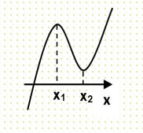
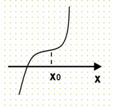
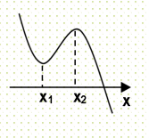
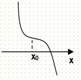

**第20讲  三次函数的图象和性质**

**知识梳理**

**1、基本性质**

设三次函数为：(、、、且)，其基本性质有：

**性质1：①定义域为．②值域为，函数在整个定义域上没有最大值、最小值．③单调性和图像：**

<table><tr><td></td><td colspan="2">

</td><td colspan="2">

</td></tr><tr><td rowspan="2">
图像
</td><td>

</td><td>

</td><td>

</td><td>

</td></tr><tr><td>

</td><td>

</td><td>

</td><td>

</td></tr></table>

**性质2：三次方程的实根个数**

由于三次函数在高考中出现频率最高，且四次函数、分式函数等都可转化为三次函数来解决，故以三次函数为例来研究根的情况，设三次函数

其导函数为二次函数:，

判别式为：△=，设的两根为、，结合函数草图易得：

(1) 若，则恰有一个实根；

(2) 若,且，则恰有一个实根；

(3) 若,且，则有两个不相等的实根；

(4) 若,且，则有三个不相等的实根.

说明:(1)(2)含有一个实根的充要条件是曲线与轴只相交一次，即在R上为单调函数（或两极值同号），所以（或，且）;

(5)有两个相异实根的充要条件是曲线与轴有两个公共点且其中之一为切点，所以，且;

(6)有三个不相等的实根的充要条件是曲线与轴有三个公共点，即有一个极大值，一个极小值，且两极值异号.所以且.

**性质3：对称性**

（1）三次函数是中心对称曲线，且对称中心是；；

（2）奇函数的导数是偶函数，偶函数的导数是奇函数，周期函数的导数还是周期函数．

**2、常用技巧**

**（1）** 其导函数为 对称轴为，所以对称中心的横坐标也就是导函数的对称轴，可见，图象的对称中心在导函数的对称轴上，且又是两个极值点的中点，同时也是二阶导为零的点；

**（2）** 是可导函数，若的图象关于点对称，则图象关于直线

对称.

**（3）** 若图象关于直线对称，则图象关于点对称.

**（4）** 已知三次函数的对称中心横坐标为，若存在两个极值点，，则有.

**必考题型全归纳**

**题型一：三次函数的零点问题**

**例1．**（2024·全国·高三专题练习）函数存在3个零点，则的取值范围是（    ）

A．	B．	C．	D．

**例2．**（2024·江苏扬州·高三校考阶段练习）设为实数，函数．

（1）求的极值；

（2）是否存在实数，使得方程恰好有两个实数根?若存在，求出实数的值；若不存在，请说明理由．

**例3．**（2024·四川绵阳·高三四川省绵阳南山中学校考阶段练习）已知函数，且在和处取得极值.

(1)求函数的解析式；

(2)设函数，若有且仅有一个零点，求实数的取值范围.

**变式1．**（2024·天津河西·高三天津实验中学校考阶段练习）已知，.

（1）当，求的极值；

（2）当，，设，求不等式的解集；

（3）当时，若函数恰有两个零点，求的值.

**变式2．**（2024·河北保定·高三统考阶段练习）已知函数.

（1）求函数的图象在点处的切线方程；

（2）若在上有解，求的取值范围；

（3）设是函数的导函数，是函数的导函数，若函数的零点为，则点恰好就是该函数的对称中心.试求的值.

**变式3．**（2024·山西太原·高三太原市外国语学校校考阶段练习）已知三次函数过点，且函数在点处的切线恰好是直线.

(1)求函数的解析式；

(2)设函数，若函数在区间上有两个零点，求实数的取值范围.

**变式4．**（2024·全国·高三专题练习）已知函数，．

(1)若函数在上单调递增，求的最小值；

(2)若函数的图象与轴有且只有一个交点，求的取值范围．

**题型二：三次函数的最值、极值问题**

**例4．**（2024·云南·高三统考期末）已知函数，.

（1）若函数在上存在单调递增区间，求实数的取值范围；

（2）设.若，在上的最小值为，求的零点.

**例5．**（2024·高三课时练习）已知函数，.

（1）若函数在上存在单调递增区间，求实数的取值范围；

（2）设.若，在上的最小值为，求在上取得最大值时，对应的值.

<strong>例6．</strong>（2024·江苏常州·高三常州市北郊高级中学校考期中）已知函数<em>f</em>(<em>x</em>)=，其中<em>a</em>&gt;0.

(1)当*a*=1时，求*f*(*x*)的单调增区间；

(2)若曲线*y*=*f*(*x*)在点处的切线与*y*轴的交点为（0，*b*），求*b*+的最小值.

<strong>变式5．</strong>（2024·广东珠海·高三校联考期中）已知函数（<em>a</em>，），其图象在点处的切线方程为．

(1)求*a*，*b*的值；

(2)求函数的单调区间和极值；

(3)求函数在区间上的最大值．

**变式6．**（2024·全国·高三专题练习）已知函数，，且．

(1)求曲线在点处的切线方程；

(2)求函数在区间上的最大值．

**变式7．**（2024·全国·高三专题练习）已知函数在上是增函数，在上是减函数，且的一个根为

（1）求的值；

（2）求证：还有不同于的实根、，且、、成等差数列；

（3）若函数的极大值小于，求的取值范围

**变式8．**（2024·浙江宁波·高三效实中学校考期中）已知函数(其中).

（1）求函数的单调区间；

（2）若有两个不同的极值点，，求的取值范围.

**题型三：三次函数的单调性问题**

**例7．**（2024·陕西商洛·高三校考阶段练习）已知三次函数在R上是增函数，则m的取值范围是(　　)

A．m<2或m>4	B．－4<m<－2	C．2<m<4	D．2≤m≤4

**例8．**（2024·全国·高三专题练习）三次函数在上是减函数，则的取值范围是（    ）

A．	B．	C．	D．

**例9．**（2024·江西宜春·高三校考阶段练习）已知函数，，m是实数.

（1）若在区间(2,+∞)为增函数，求m的取值范围；

（2）在（1）的条件下,函数有三个零点，求m的取值范围.

**变式9．**（2024·陕西榆林·高三绥德中学校考阶段练习）已知三次函数在处取得极值，且在点处的切线与直线平行.

（1）求的解析式；

（2）若函数在区间(1*，* 2)上单调递增，求的取值范围.

**变式10．**（2024·全国·高三专题练习）已知函数在上单调递增，则的取值范围为\_\_\_\_\_\_．

**题型四：三次函数的切线问题**

**例10．**（2024·全国·高三专题练习）已知函数．

(1)求曲线在点，处的切线方程；

(2)设常数，如果过点可作曲线的三条切线，求的取值范围．

**例11．**（2024·江西·高三校联考阶段练习）已知函数.

（1）求曲线在点处的切线方程；

（2）设，若过点可作曲线的三条切线，证明:.

**例12．**（2024·江苏·高三专题练习）已知函数，满足，已知点是曲线上任意一点，曲线在处的切线为.

(1)求切线的倾斜角的取值范围；

(2)若过点可作曲线的三条切线，求实数的取值范围.

**变式11．**（2024·安徽·高三校联考期末）已知函数在 处取得极值．

（1）求*m*的值；

（2）若过可作曲线的三条切线，求*t*的取值范围．

**变式12．**（2024·陕西西安·高三校考阶段练习）已知函数在点处的切线方程为．

（1）求实数，的值；

（2）若过点可作曲线的三条切线，求实数的取值范围．

**变式13．**（2024·全国·高三专题练习）设函数在处取得极值．

(1)设点，求证：过点的切线有且只有一条，并求出该切线方程；

(2)若过点可作曲线的三条切线，求的取值范围；

(3)设曲线在点、处的切线都过点，证明：．

**题型五：三次函数的对称问题**

**例13．**（2024·全国·高三专题练习）给出定义：设是函数的导函数，是函数的导函数.若方程有实数解，则称为函数的“拐点”.经研究发现所有的三次函数都有“拐点”，且该“拐点”也是函数的图象的对称中心.若函数，则（    ）

A．	B．	C．	D．

**例14．**（2024·全国·高三专题练习）已知函数的图象上存在一定点满足：若过点的直线与曲线交于不同于的两点，就恒有的定值为，则的值为\_\_\_\_\_\_.

**例15．**（2024·新疆·统考二模）对于三次函数，给出定义：设是的导数，是的导数，若方程有实数解，则称点为曲线的“拐点”，可以发现，任何一个三次函数都有“拐点”.设函数，则\_\_\_\_\_\_\_\_\_\_\_\_\_.

**变式14．（多选题）**（2024·江苏南京·高三南京市江宁高级中学校联考期末）对于三次函数，给出定义：是函数的导数，是函数的导数，若方程有实数解，则称为函数的“拐点”.某同学经探究发现：任何一个三次函数都有“拐点”；任何一个三次函数都有对称中心，且“拐点”就是对称中心.若函数，则下列说法正确的是（    ）

A．的极大值为

B．有且仅有2个零点

C．点是的对称中心

D．

**变式15．（多选题）**（2024·广东佛山·高三南海中学校考期中）定义：设是的导函数，是函数的导数.若方程有实数解，则称点为函数的“拐点”.经过探究发现：任何一个三次函数都有“拐点”且“拐点”就是三次函数图像的对称中心，已知函数的对称中心为，则下列说法中正确的有（    ）

A．，

B．函数有三个零点

C．过可以作两条直线与图像相切

D．若函数在区间上有最大值，则

**变式16．（多选题）**（2024·安徽阜阳·高三安徽省太和中学校考竞赛）定义：设是的导函数，是函数的导数，若方程有实数解，则称点为函数的“拐点”.经过探究发现：任何一个三次函数都有“拐点”且“拐点”就是三次函数图像的对称中心.已知函数的对称中心为，则下列说法中正确的有（    ）

A．，

B．的值是199.

C．函数有三个零点

D．过可以作三条直线与图像相切

**题型六：三次函数的综合问题**

**例16．**（2024·全国·高三专题练习）已知函数在上是增函数，在上是减函数，且方程有3个实数根，它们分别是，，2，则的最小值是（    ）

A．5	B．6	C．1	D．8

**例17．**（2024·陕西西安·高三西安中学校考期中）已知函数，，给出下列四个结论，分别是：①；②在上单调；③有唯一零点；④存在，使得．其中有且只有一个是错误的，则错误的一定不可能是（     ）

A．①	B．②	C．③	D．④

**例18．**（2024·全国·高三专题练习）已知，，且，现给出如下结论：

①；②；③；

④；⑤．

其中正确结论的序号是\_\_．

**变式17．**（2024·黑龙江大庆·高三大庆实验中学校考期末）已知，现给出如下结论：

①；  ②；  ③；  ④.

其中正确结论的序号为（    ）

A．②③	B．①④	C．②④	D．①③

**变式18．**（2024·湖北·高三校联考阶段练习）函数的图象关于坐标原点成中心对称图形的充要条件是函数为奇函数，有同学发现可以将其推广为：函数的图象关于点成中心对称图形的充要条件是函数为奇函数.已知函数.

(1)若函数的对称中心为，求函数的解析式.

(2)由代数基本定理可以得到：任何一元次复系数多项式在复数集中可以分解为*n*个一次因式的乘积.进而，一元*n*次多项式方程有*n*个复数根（重根按重数计）.如设实系数一元二次方程，在复数集内的根为，，则方程可变形为，展开得：则有，即，

类比上述推理方法可得实系数一元三次方程根与系数的关系，

①若，方程在复数集内的根为、、，当时，求的最大值；

②若，函数的零点分别为、、，求的值.

**变式19．**（2024·全国·高三专题练习）已知函数在上为增函数，在上为减函数，且方程的三个根分别为．

（1）求实数的取值范围；

（2）求的取值范围．

**变式20．**（2024·贵州贵阳·高三贵阳一中校考阶段练习）给出定义：设是函数的导函数，是函数的导函数，若方程有实数解，则称为函数的.“固点”.经研究发现所有的三次函数都有“固点”，且该“固点”也是函数的图象的对称中心.根据以上信息和相关知识回答下列问题：已知函数.

(1)当时，试求的对称中心.

(2)讨论的单调性；

(3)当时，有三个不相等的实数根，当取得最大值时，求的值.

**题型七：三次函数恒成立问题**

**例19．**（2024·全国·高三专题练习）已知三次函数的导函数且，．

（1）求的极值；

（2）求证：对任意，都有．

**例20．**（2024·全国·高三专题练习）设为实数，函数，.

(1)求的极值；

(2)对于，，都有，试求实数的取值范围.

**例21．**（2024·四川泸州·高三泸州老窖天府中学校考阶段练习）已知三次函数．

（1）若函数在点处的切线方程是，求函数的解析式；

（2）在（1）的条件下，若对于区间上任意两个自变量的值，，都有，求出实数的取值范围．

**变式21．**（2024·全国·高三专题练习）已知函数，为函数的导函数

(1)若为函数的极值点，求实数的值；

(2)的单调增区间内有且只有两个整数时，求实数的取值范围；

(3)对任意时，任意实数，都有恒成立，求实数的最大值.

**变式22．**（2024·全国·高三专题练习）已知函数，．

(1)对任意，使得是函数在区间上的最大值，试求最大的实数．

(2)若，对于区间的任意两个不相等的实数、，且，都有成立，求的取值范围．

**变式23．**（2024·辽宁沈阳·高三东北育才学校校考期中）已知函数，是上的奇函数，当时，取得极值．

(1)求函数的单调区间和极大值；

(2)若对任意，都有成立，求实数的取值范围；

(3)若对任意，，都有成立，求实数的取值范围．

**变式24．**（2024·江苏南通·高三江苏省如东高级中学校考期中）已知函数，其中，.

（1）当时，讨论函数的单调性；

（2）当，且时，

（*i*）若有两个极值点，，求证：；

（*ii*）若对任意的，都有成立，求正实数的最大值.

**变式25．**（2024·全国·高三专题练习）已知函数在处取得极值，．

（1）求的值与的单调区间；

（2）设，已知函数，若对于任意、，，都有，求实数的取值范围

