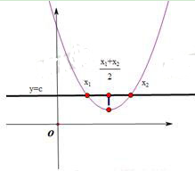
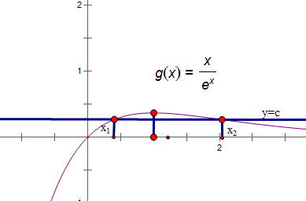

**第21讲  极值点偏移**

**知识梳理**

**1、极值点偏移的相关概念**

所谓极值点偏移，是指对于单极值函数，由于函数极值点左右的增减速度不同，使得函数图像没有对称性。若函数在处取得极值，且函数与直线交于两点，则的中点为，而往往。如下图所示。

  
图1 极值点不偏移                     图2  极值点偏移

极值点偏移的定义：对于函数在区间内只有一个极值点，方程的解分别为，且，（1）若，则称函数在区间上极值点偏移；（2）若，则函数在区间上极值点左偏，简称极值点左偏；（3）若，则函数在区间上极值点右偏，简称极值点右偏。

**2、对称变换**

主要用来解决与两个极值点之和、积相关的不等式的证明问题．其解题要点如下：(1)定函数(极值点为)，即利用导函数符号的变化判断函数单调性，进而确定函数的极值点<em>x</em>0.

(2)构造函数，即根据极值点构造对称函数，若证 ，则令.

(3)判断单调性，即利用导数讨论的单调性．

(4)比较大小，即判断函数在某段区间上的正负，并得出与的大小关系．

(5)转化，即利用函数的单调性，将与的大小关系转化为与之间的关系，进而得到所证或所求．

<strong>【注意】</strong>若要证明的符号问题，还需进一步讨论与<em>x</em>0的大小，得出所在的单调区间，从而得出该处导数值的正负．

构造差函数是解决极值点偏移的一种有效方法，函数的单调性是函数的重要性质之一，它的应用贯穿于整个高中数学的教学之中.某些数学问题从表面上看似乎与函数的单调性无关，但如果我们能挖掘其内在联系，抓住其本质，那么运用函数的单调性解题，能起到化难为易、化繁为简的作用.因此对函数的单调性进行全面、准确的认识，并掌握好使用的技巧和方法，这是非常必要的.根据题目的特点，构造一个适当的函数，利用它的单调性进行解题，是一种常用技巧.许多问题，如果运用这种思想去解决，往往能获得简洁明快的思路，有着非凡的功效

**3、应用对数平均不等式证明极值点偏移：**

①由题中等式中产生对数；

②将所得含对数的等式进行变形得到；

③利用对数平均不等式来证明相应的问题.

**4、比值代换是一种将双变量问题化为单变量问题的有效途径，然后构造函数利用函数的单调性证明题中的不等式即可.**

**必考题型全归纳**

**题型一：极值点偏移:加法型**

**例1．**（2024·河南周口·高二校联考阶段练习）已知函数，

(1)若，求的单调区间；

(2)若，，是方程的两个实数根，证明：．

**例2．**（2024·河北石家庄·高三校联考阶段练习）已知函数.

(1)求函数的单调区间；

(2)若函数有两个零点、，证明.

**例3．**（2024·广东深圳·高三红岭中学校考期末）已知函数.

(1)讨论函数的单调性；

(2)①证明函数（为自然对数的底数）在区间内有唯一的零点；

②设①中函数的零点为，记（其中表示中的较小值），若在区间内有两个不相等的实数根，证明：.

**变式1．**（2024·重庆沙坪坝·重庆南开中学校考模拟预测）已知函数为其极小值点．

(1)求实数的值；

(2)若存在，使得，求证：．

<strong>变式2．</strong>（2024·湖北武汉·高二武汉市第六中学校考阶段练习）已知函数，<em>a</em>为实数．

(1)求函数的单调区间；

(2)若函数在处取得极值，是函数的导函数，且，，证明：

**变式3．**（2024·江西景德镇·统考模拟预测）已知函数

(1)若函数在定义域上单调递增，求的最大值；

(2)若函数在定义域上有两个极值点和，若，，求的最小值．

**变式4．**（2024·全国·模拟预测）已知函数．

(1)讨论函数的极值点的个数；

(2)若函数恰有三个极值点、、，且，求的最大值．

**变式5．**（2024·广西玉林·高二广西壮族自治区北流市高级中学校联考阶段练习）已知函数．

(1)讨论函数*f*(*x*)的单调性；

(2)当时，若，求证：

**变式6．**（2024·安徽·高二安徽师范大学附属中学校考阶段练习）已知函数．

(1)若为定义域上的增函数，求*a*的取值范围；

(2)令，设函数，且，求证：．

**变式7．**（2024·全国·高二专题练习）已知函数（）．

(1)试讨论函数的单调性；

(2)若函数有两个零点，（），求证：．

**变式8．**（2024·全国·高二专题练习）已知函数.

(1)讨论的单调性；

(2)若有两个零点，证明：.

**变式9．**（2024·全国·高三专题练习）设函数.

(1)若对恒成立，求实数的取值范围；

(2)已知方程有两个不同的根、，求证：，其中为自然对数的底数.

**变式10．**（2024·江西宜春·高三校考开学考试）已知函数，.

(1)当时，求曲线在处的切线方程；

(2)设，是的两个不同零点，证明：.

**变式11．**（2024·海南·海南华侨中学校考模拟预测）已知函数.

(1)讨论的单调性；

(2)若存在，且，使得，求证：.

**题型二：极值点偏移:减法型**

**例4．**（2024·全国·模拟预测）已知函数．

(1)求函数的单调区间与极值．

(2)若，求证：．

**例5．**（2024·全国·高三专题练习）已知函数，（其中是自然对数的底数）

(1)试讨论函数的零点个数；

(2)当时，设函数的两个极值点为、且，求证：.

**例6．**（2024·四川成都·高二川大附中校考期中）已知函数.

（1）若在定义域上不单调，求的取值范围；

（2）设分别是的极大值和极小值，且，求的取值范围.

**题型三：极值点偏移:乘积型**

**例7．**（2024·全国·高三统考阶段练习）已知函数．

(1)当，和有相同的最小值，求的值；

(2)若有两个零点，求证：．

**例8．**（2024·全国·高三专题练习）已知函数.

(1)证明：.

(2)若函数，若存在使，证明：.

**例9．**（2024·全国·高三专题练习）已知函数，.

(1)求证：，；

(2)若存在、，且当时，使得成立，求证：.

**变式12．**（2024·全国·高二专题练习）已知函数．

(1)证明：若，则；

(2)证明：若有两个零点，，则．

**变式13．**（2024·江西南昌·南昌县莲塘第一中学校联考二模）已知函数，．

(1)当时，恒成立，求*a*的取值范围．

(2)若的两个相异零点为，，求证：．

**变式14．**（2024·湖北武汉·华中师大一附中校考模拟预测）已知．

(1)当时，讨论函数的极值点个数；

(2)若存在，，使，求证：．

**变式15．**（2024·北京通州·统考三模）已知函数

(1)已知*f*（*x*）在点（1，*f*（1））处的切线方程为，求实数*a*的值；

(2)已知*f*（*x*）在定义域上是增函数，求实数*a*的取值范围.

(3)已知有两个零点，，求实数*a*的取值范围并证明.

**题型四：极值点偏移:商型**

**例10．**（2024·浙江杭州·高三浙江大学附属中学校考期中）已知函数，其中为自然对数的底数.

（1）讨论函数的单调性；

（2）若，且，证明：.

**例11．**（2024·全国·统考高考真题）已知函数.

（1）讨论的单调性；

（2）设，为两个不相等的正数，且，证明：.

**例12．**（2024·全国·高三专题练习）已知函数.

(1)讨论的单调性；

(2)设，为两个不相等的正数，且，证明：.

**变式16．**（2024·广东茂名·茂名市第一中学校考三模）已知函数，．

(1)讨论函数的单调性；

(2)若关于的方程有两个不相等的实数根、，

（ⅰ）求实数*a*的取值范围；

（ⅱ）求证：．

**题型五：极值点偏移:平方型**

**例13．**（2024·广东广州·广州市从化区从化中学校考模拟预测）已知函数.

(1)讨论函数的单调性：

(2)若是方程的两不等实根，求证：；

**例14．**（2024·全国·高二专题练习）已知函数.

(1)若，求实数的取值范围；

(2)若有2个不同的零点（），求证：.

**例15．**（2024·全国·高二专题练习）已知函数，．

(1)若，求的取值范围；

(2)证明：若存在，，使得，则．

**变式17．**（2024·全国·高三专题练习）已知函数

(1)讨论*f*(*x*)的单调性；

(2)若，且，证明: .

**变式18．**（2024·全国·高三专题练习）已知函数，.

（1）当时，求曲线在点处的切线方程；

（2）若，，求证：.

**题型六：极值点偏移:混合型**

**例16．**（2024·全国·高三专题练习）已知函数（为自然对数的底数，）．

(1)求的单调区间和极值；

(2)若存在，满足，求证：．

**例17．**（2024·全国·高三专题练习）已知函数.

(1)若*f*（1）=2，求*a*的值；

(2)若存在两个不相等的正实数，满足，证明：

①；

②.

**例18．**（2024·全国·高三专题练习）已知函数，在其定义域内有两个不同的极值点.

(1)求的取值范围；

(2)记两个极值点为，，且，当时，求证：不等式恒成立.

**变式19．**（2024·陕西宝鸡·校考模拟预测）已知．

（1）求的单调区间；

（2）当时，若关于*x*的方程存在两个正实数根，证明：且．

**变式20．**（2024·全国·高三专题练习）已知函数．

（1）判断函数的单调性；

（2）若方程有两个不同的根，求实数的取值范围；

（3）如果，且，求证：．

**变式21．**（2024·天津河西·统考二模）设，函数．

（1）若，求曲线在处的切线方程；

（2）若无零点，求实数的取值范围；

（3）若有两个相异零点，求证：．

**变式22．**（2024·四川成都·高二四川省成都列五中学校考阶段练习）已知函数，.

(1)讨论*f*（*x*）的单调性；

(2)若时，都有，求实数*a*的取值范围；

(3)若有不相等的两个正实数，满足，证明：.

<strong>变式23．</strong>（2024·全国·高三专题练习）已知函数，其中<em>a</em>，<em>b</em>为常数，为自然对数底数，．

(1)当时，若函数，求实数*b*的取值范围；

(2)当时，若函数有两个极值点，，现有如下三个命题：

①；②；③；

请从①②③中任选一个进行证明．

（注：如果选择多个条件分别解答，按第一个解答计分）

**变式24．**（2024·陕西咸阳·武功县普集高级中学校考模拟预测）已知函数.

(1)讨论的单调性和最值；

(2)若关于的方程有两个不等的实数根，求证：.

**变式25．**（2024·湖南长沙·长沙市实验中学校考三模）已知函数.

(1)若有两个零点，的取值范围；

(2)若方程有两个实根、，且，证明：.

**变式26．**（2024·广东佛山·高二统考期末）已知函数，其中．

(1)若，求的极值：

(2)令函数，若存在，使得，证明：．

**变式27．**（2024·全国·高三专题练习）已知函数.

(1)讨论的单调性；

(2)若时，都有，求实数的取值范围；

(3)若有不相等的两个正实数满足，求证：.

**题型七：拐点偏移问题**

**例19．**（2024·全国·高三专题练习）已知函数.

（1）求曲线在点处的切线方程.

（2）若正实数满足，求证：.

**例20．**（2024·全国·高三专题练习）已知函数，，当时，恒成立．

(1)求实数的取值范围；

(2)若正实数、满足，证明：．

**例21．**（2024·陕西咸阳·统考模拟预测）已知函数.

(1)求曲线在点处的切线方程;

(2)（ⅰ）若对于任意，都有，求实数的取值范围;

（ⅱ）设，且，求证:.

**变式28．**（2024·全国·高三专题练习）已知函数.

（1）当时，讨论函数的单调性；

（2）当时，设，若正实数，，满足，求证：

**变式29．**（2024·江苏盐城·江苏省东台中学校考一模）已知函数，．

(1)若在处取得极值，求的值；

(2)设，试讨论函数的单调性；

(3)当时，若存在正实数满足，求证：．

**变式30．**（2024·全国·高三专题练习）已知函数，．

(1)若在处取得极值，求的值；

(2)设，试讨论函数的单调性；

(3)当时，若存在实数，满足，求证：．

**变式31．**（2024·湖南长沙·高三湖南师大附中校考阶段练习）已知函数，.

（1）讨论函数的单调性；

（2）对实数，令，正实数，满足，求的最小值.

**变式32．**（2024·全国·高三专题练习）已知函数，.

（1）若在处取得极值，求的值；

（2）设，试讨论函数的单调性；

（3）当时，若存在正实数满足，求证：

