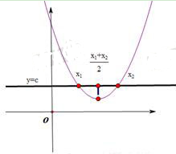
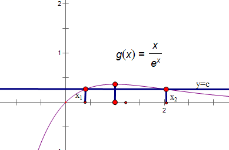
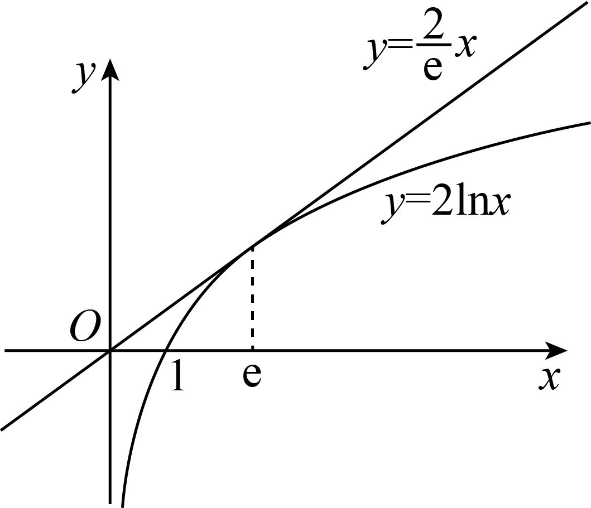
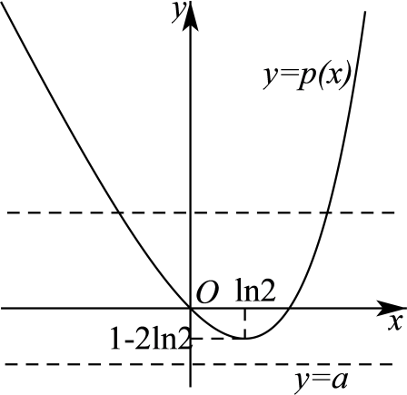
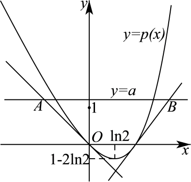
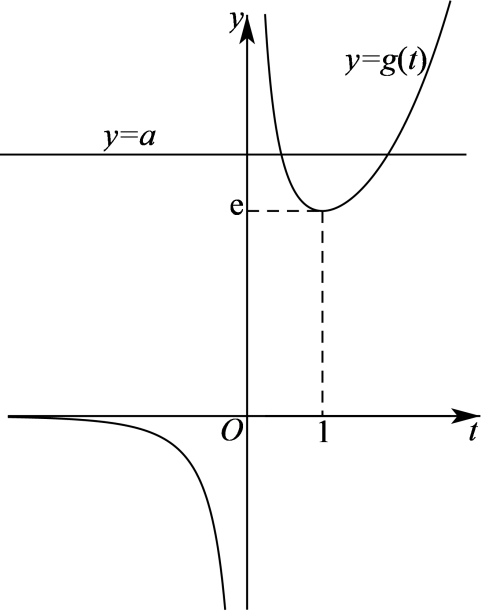
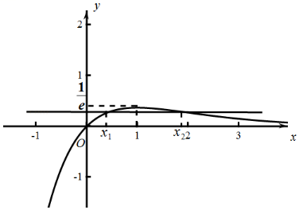
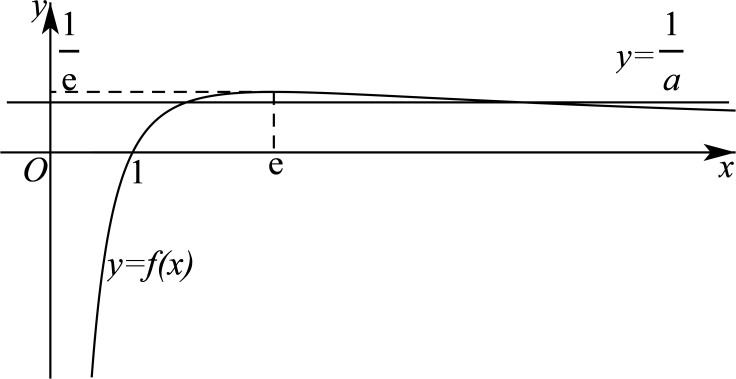

**第21讲  极值点偏移**

**知识梳理**

**1、极值点偏移的相关概念**

所谓极值点偏移，是指对于单极值函数，由于函数极值点左右的增减速度不同，使得函数图像没有对称性。若函数在处取得极值，且函数与直线交于两点，则的中点为，而往往。如下图所示。

  
图1 极值点不偏移                     图2  极值点偏移

极值点偏移的定义：对于函数在区间内只有一个极值点，方程的解分别为，且，（1）若，则称函数在区间上极值点偏移；（2）若，则函数在区间上极值点左偏，简称极值点左偏；（3）若，则函数在区间上极值点右偏，简称极值点右偏。

**2、对称变换**

主要用来解决与两个极值点之和、积相关的不等式的证明问题．其解题要点如下：(1)定函数(极值点为)，即利用导函数符号的变化判断函数单调性，进而确定函数的极值点<em>x</em>0.

(2)构造函数，即根据极值点构造对称函数，若证 ，则令.

(3)判断单调性，即利用导数讨论的单调性．

(4)比较大小，即判断函数在某段区间上的正负，并得出与的大小关系．

(5)转化，即利用函数的单调性，将与的大小关系转化为与之间的关系，进而得到所证或所求．

<strong>【注意】</strong>若要证明的符号问题，还需进一步讨论与<em>x</em>0的大小，得出所在的单调区间，从而得出该处导数值的正负．

构造差函数是解决极值点偏移的一种有效方法，函数的单调性是函数的重要性质之一，它的应用贯穿于整个高中数学的教学之中.某些数学问题从表面上看似乎与函数的单调性无关，但如果我们能挖掘其内在联系，抓住其本质，那么运用函数的单调性解题，能起到化难为易、化繁为简的作用.因此对函数的单调性进行全面、准确的认识，并掌握好使用的技巧和方法，这是非常必要的.根据题目的特点，构造一个适当的函数，利用它的单调性进行解题，是一种常用技巧.许多问题，如果运用这种思想去解决，往往能获得简洁明快的思路，有着非凡的功效

**3、应用对数平均不等式证明极值点偏移：**

①由题中等式中产生对数；

②将所得含对数的等式进行变形得到；

③利用对数平均不等式来证明相应的问题.

**4、比值代换是一种将双变量问题化为单变量问题的有效途径，然后构造函数利用函数的单调性证明题中的不等式即可.**

**必考题型全归纳**

**题型一：极值点偏移:加法型**

**例1．**（2024·河南周口·高二校联考阶段练习）已知函数，

(1)若，求的单调区间；

(2)若，，是方程的两个实数根，证明：．

【解析】（1）由题可知的定义域为，

.

令，则的两根分别为，．

当或时，；

当时，；

所以的单调递增区间为，单调递减区间为，．

（2）原方程可化为，

设，则，．

令，得．∵在上，，在上，，

∴在上单调递增，在上单调递减，

∴，且当，趋向于0时，趋向于，

当趋向于时，趋向于．

则在和上分别有一个零点，，

不妨设，∵，∴，

设，则，

．

当时，，

∴在上单调递增，而，

∴当时，，，即．

∵，

∴．

∵在上单调递减，

∴，即．

**例2．**（2024·河北石家庄·高三校联考阶段练习）已知函数.

(1)求函数的单调区间；

(2)若函数有两个零点、，证明.

【解析】（1）因为的定义域为，

则，

令，解得，令，解得，

所以的单调减区间为，单调增区间为.

（2）证明：不妨设，由（1）知：必有.

要证，即证，即证，

又，即证.

令，其中，

则，

令，则

在时恒成立，

所以在上单调递减，即在上单调递减，所以，

所以在上单调递增，所以，

即，所以；

接下来证明，

令，则，又，即，所以，

要证，即证，有，

不等式两边取对数，即证，

即证，即证，

令，，则，

令，其中，则，

所以，在上单调递增，则当时，，

故当时，

可得函数单调递增，可得，即，所以，

综上，.

**例3．**（2024·广东深圳·高三红岭中学校考期末）已知函数.

(1)讨论函数的单调性；

(2)①证明函数（为自然对数的底数）在区间内有唯一的零点；

②设①中函数的零点为，记（其中表示中的较小值），若在区间内有两个不相等的实数根，证明：.

【解析】（1）由已知，

函数的定义域为，导函数

当时，恒成立，所以在上单调递增；

当时，令有，

∴当时，，单调递增，

当时，，单调递减.

综上所述：

当时，在上单调递增；

当时，在上单调递增，在上单调递减.

（2）①的定义域为，导函数，

当时，，即在区间内单调递增，

又，，且在区间内的图像连续不断，

∴根据零点存在性定理，有在区间内有且仅有唯一零点.

②当时，，函数在上单调递增，

又，

∴当时，，故，即；

当时，，故，即，

∴可得，

当时，，由得单调递增；

当时，，由得单调递减：

若在区间内有两个不相等的实数根，，

则，

∴要证，需证，又，

而在内递减，

故需证，又，

即证，即

下证：

记，，

由知：，

记，则：

当时，；

当时，，

故，而，所以，

由，可知.

∴，即单调递增，

∴当时，，即，故，得证.

**变式1．**（2024·重庆沙坪坝·重庆南开中学校考模拟预测）已知函数为其极小值点．

(1)求实数的值；

(2)若存在，使得，求证：．

【解析】（1）的定义域为，

，依题意得，得，

此时，

当时，，，，故，在内单调递减，

当时，，，，故，在内单调递增，

故在处取得极小值，符合题意.

综上所述：.

（2）由（1）知，，

不妨设，

当时，不等式显然成立；

当，时，不等式显然成立；

当，时，由（1）知在内单调递减，因为存在，使得，所以，

要证，只要证，

因为，所以，又在内单调递减，

所以只要证，又，所以只要证，

设，

则

，

令，则，

因为，所以，在上为减函数，所以，

即，

所以在上为减函数，

所以，即.

综上所述：.

<strong>变式2．</strong>（2024·湖北武汉·高二武汉市第六中学校考阶段练习）已知函数，<em>a</em>为实数．

(1)求函数的单调区间；

(2)若函数在处取得极值，是函数的导函数，且，，证明：

【解析】（1）函数的定义域为，

令，所以，得，

当，，当，，

故函数递减区间为，递增区间为.

（2）因为函数在处取得极值，

所以，得，

所以，得，

令，

因为，当时，，

所以函数在单调递减，在单调递增，

且当时,,当时,,

故.

先证，需证.

因为，下面证明.

设,

则,

故在上为增函数,故,

所以,则,

所以,即得，

下面证明：

令，当时，所以成立,

所以，所以.

当时，记,

所以时，所以为减函数得,

所以,即得.

所以得证，

综上，.

**变式3．**（2024·江西景德镇·统考模拟预测）已知函数

(1)若函数在定义域上单调递增，求的最大值；

(2)若函数在定义域上有两个极值点和，若，，求的最小值．

【解析】（1）因为，其中，

则，

因为函数在上单调递增，对任意的，，即，

令，其中，则，，

由可得，由可得，

所以，函数的单调递减区间为，单调递增区间为，

所以，，故，所以，的最大值为.

（2）由题意可知，，设，

由可得，则，

可得，，所以，，令，其中，

所以，，

令，其中，则，

因为，由，可得，由可得，

所以，函数在上单调递减，在上单调递增，且，

又因为且，

所以，当时，，即，

当时，，即，

所以，函数在上单调递减，在上单调递增，

所以，.

**变式4．**（2024·全国·模拟预测）已知函数．

(1)讨论函数的极值点的个数；

(2)若函数恰有三个极值点、、，且，求的最大值．

【解析】（1）函数的定义域为，

且．

①，，由，可得；由，可得.

所以在上单调递增，在上单调递减，

因此在处取得极大值，故当时，有一个极值点；

②，令，其中，则，

由可得，由可得，

因此在上单调递增，在上单调递减，

所以，所以，故，

由可得，由可得，

所以在上单调递减，在上单调递增，

因此在处取得极小值，故当时，有一个极值点；

③当时，，

令得或，令，由②知，

而，，

令，则，

所以在上单调递减，因此，故，

所以函数在和上各存在唯一的零点，分别为、，

所以函数在上单调递减，在上单调递增，在上单调递减，在上单调递增，

故函数在和处取得极小值，在处取得极大值，

所以当时，有三个极值点．

综上所述，当或时，有一个极值点；当时，有三个极值点．

（2）因为函数恰有三个极值点、、，

所以由（1）知，，，

由，两式相除得到．

令，则，则，，得，，

因此，所以，则．

令，其中，则，

令，则，

所以在上单调递增，则当时，，

即，故在上单调递增，

所以当时，，故的最大值为．

**变式5．**（2024·广西玉林·高二广西壮族自治区北流市高级中学校联考阶段练习）已知函数．

(1)讨论函数*f*(*x*)的单调性；

(2)当时，若，求证：

【解析】（1）的定义域为，

因为，

当时，，

所以在上单调递增；

当时，令得，令得，

所以在上单调递增，在上单调递减；

综上，当时，在上单调递增；

当时，在上单调递增，在上单调递减．

（2）当时，，定义域为，

，所以在上单调递增，在上单调递减，

又因为，所以，

设，

则在上恒成立，

所以在上单调递增，

所以， 即，

又因为，，所以，

又因为在上单调递减，

所以，即．

**变式6．**（2024·安徽·高二安徽师范大学附属中学校考阶段练习）已知函数．

(1)若为定义域上的增函数，求*a*的取值范围；

(2)令，设函数，且，求证：．

【解析】（1）的定义域为，

由为定义域上的增函数可得恒成立.

则由得，

令，

所以当时，单调递增；

当时，单调递减；

故,

则有 解得.

故*a*的取值范围为

（2）

由有

有

即

即.

令

由可得当时，单调递增；

当时，单调递减；则，

即，

解得或(负值舍去)，

故.

**变式7．**（2024·全国·高二专题练习）已知函数（）．

(1)试讨论函数的单调性；

(2)若函数有两个零点，（），求证：．

【解析】（1）由已知，的定义域为，，

①当时，，恒成立，

∴此时在区间上单调递增；

②当时，令，解得，

当时，，在区间上单调递增，

当时，，在区间上单调递减，

综上所述，当时，在区间上单调递增；

当时，在区间上单调递增，在区间上单调递减.

（2）若函数有两个零点，（），

则由（1）知，，在区间上单调递增，在区间上单调递减，

且，，，

当时，，当时，，（\*）

∵，∴，∴，

又∵，∴，

∴只需证明，即有.

下面证明，

设

，，

设，则，

令，解得，

当时，，在区间单调递减，

当时，，在区间单调递增，

∴，在区间上单调递增，

又∵，∴，

即，

∴由（\*）知，，∴，即.

又∵，，

∴，原命题得证.

**变式8．**（2024·全国·高二专题练习）已知函数.

(1)讨论的单调性；

(2)若有两个零点，证明：.

【解析】（1）函数的定义域为，

时，恒成立，所以在上单调递减；

时，令得，

当时，；当时，，

所以在上单调递减，在上单调递增.

（2）证明：时，由（1）知至多有一个零点.

时，由（1）知当时，取得最小值，最小值为.

①当时，由于，故只有一个零点；

②当时，即，故没有零点；

③当时，即，

又，

由（1）知在上有一个零点.

又，

由（1）知在有一个零点，

所以在上有两个零点，的取值范围为

不妨设，则，且，

令

，

则，

由于（且仅当等号成立，

所以当时，在单调递减，又，

所以，即，

又，所以，

又由于，且在上单调递增，

所以即.

**变式9．**（2024·全国·高三专题练习）设函数.

(1)若对恒成立，求实数的取值范围；

(2)已知方程有两个不同的根、，求证：，其中为自然对数的底数.

【解析】（1）由，得.

令，，则，

令，则.

所以，函数在上单增，故.

①当时，则，所以在上单增，，

此时对恒成立，符合题意；

②当时，，，

故存在使得，

当时，，则单调递减，此时，不符合题意.

综上，实数的取值范围.

（2）证明：由（1）中结论，取，有，即.

不妨设，，则，整理得.

于是，

即.

**变式10．**（2024·江西宜春·高三校考开学考试）已知函数，.

(1)当时，求曲线在处的切线方程；

(2)设，是的两个不同零点，证明：.

【解析】（1）当时，，

，，，

曲线在处的切线方程为，即；

（2）令，可得，

令，，设函数与相切于，

由、、可得，，，

，的大致图象如下，

当时，与有两个不同的交点，

即有两个零点，所以的取值范围为，

，当时，，在上递增，

当时，，在上递减，

要证，只要证，

不妨设，由，则，

构造函数，

，

∵，∴，∴在是递增，

又，∴，∴，

∴，又，∴，

而，，在上递减，∴，即，

∴.

**变式11．**（2024·海南·海南华侨中学校考模拟预测）已知函数.

(1)讨论的单调性；

(2)若存在，且，使得，求证：.

【解析】（1）函数的定义域为，

，

令，得或，

在上，，在上，，在上，，

所以在上单调递增，在上单调递减，在上单调递增.

（2）由（1）可知，

设，，

则，

因为，所以，在上单调递增.

又，所以当时，，即.

因为，所以，所以，

因为在上单调递增，且，，

所以，即.①

设，，

则.

因为，所以，在上单调递增，

又，所以当时，，即，

因为，所以，所以.

因为在上单调递增，且，，

所以，即.②

由①得，由②得，所以.

**题型二：极值点偏移:减法型**

**例4．**（2024·全国·模拟预测）已知函数．

(1)求函数的单调区间与极值．

(2)若，求证：．

【解析】（1）定义域为，，

令，解得：或，

当时，；当时，；

的单调递增区间为和，单调递减区间为；

的极大值为，极小值为.

（2）由（1）知：，，．

令，，

则；

令，则；

令，则，

在上恒成立，在上单调递增，

，

在上恒成立，在上单调递增，，

在上恒成立，在上单调递增，，

对任意恒成立．

，，又，，

在上单调递增，，，即；

令，，

则；

在上单调递增，，

在上恒成立，在上单调递增，

，对任意恒成立．

，．又，，

在上单调递增，且，，；

由得：，，.

**例5．**（2024·全国·高三专题练习）已知函数，（其中是自然对数的底数）

(1)试讨论函数的零点个数；

(2)当时，设函数的两个极值点为、且，求证：.

【解析】（1）由可得，令，其中，

则函数的零点个数等于直线与函数图象的公共点个数，

，令可得，列表如下：

<table><tr><td>

</td><td>

</td><td>

</td><td>

</td></tr><tr><td>

</td><td>

</td><td>

</td><td>

</td></tr><tr><td>

</td><td>
减
</td><td>
极小值
</td><td>
增
</td></tr></table>

如下图所示：

当时，函数无零点；

当时，函数只有一个零点；

当时，函数有两个零点.

（2）证明：，其中，

所以，，由已知可得，

上述两个等式作差得，

要证，即证，

因为，设函数的图象交轴的正半轴于点，则，

因为函数在上单调递增，，，，

设函数的图象在处的切线交直线于点，

函数的图象在处的切线交直线于点，

因为，所以，函数的图象在处的切线方程为，

联立可得，即点，

构造函数，其中，则，

当时，，此时函数单调递减，

当时，，此时函数单调递增，所以，，

所以，对任意的，，当且仅当时等号成立，

由图可知，则，所以，，

因为，可得，

函数在处的切线方程为，

联立，解得，即点，

因为，

所以，，

构造函数，其中，则，，

当时，，此时函数单调递减，

当时， ，此时函数单调递增，则，

所以，对任意的，，当且仅当时，等号成立，

所以，，可得，

因此，，故原不等式成立.

**例6．**（2024·四川成都·高二川大附中校考期中）已知函数.

（1）若在定义域上不单调，求的取值范围；

（2）设分别是的极大值和极小值，且，求的取值范围.

【解析】分析：（1）利用导数法求出函数  单调递增或单调递减时，参数  的取值范围为，则可知函数 在定义域上不单调时， 的取值范围为  ；（2）易知 ，设 的两个根为 ，并表示出，则，令，则，再利用导数法求的取值范围.

详由已知，

（1）①若在定义域上单调递增，则，即在上恒成立，

而，所以；

②若在定义域上单调递减，则，即在上恒成立，

而，所以.

因为在定义域上不单调，所以，即.

（2）由（1）知，欲使在有极大值和极小值，必须.

又，所以.

令的两根分别为，，

即的两根分别为，，于是.

不妨设，

则在上单调递增，在上单调递减，在上单调递增，

所以，，

所以

.

令，于是，

，

由，得，

又，所以.

因为，

所以在上为减函数，

所以.

**题型三：极值点偏移:乘积型**

**例7．**（2024·全国·高三统考阶段练习）已知函数．

(1)当，和有相同的最小值，求的值；

(2)若有两个零点，求证：．

【解析】（1）问题转化为有两个零点，证明，进而只需要证明只需要证明，也即是，从而令，构造函数求出最值即可证出结论．

【详解】（1）由．

所以．

所以．

令，则为上的增函数，且．

所以在上单调递减，上单调递增．

所以．

又．

所以．令，则

所以为上的增函数．

又．

令，因为在上单调递增，且，而，因此函数与直线有唯一交点，

故方程在上有唯一解，

所以存在唯一，使得．

即，故，

所以在上单调递减，在上单调递增．

所以．

所以．

故而．

（2）由题意有两个零点．

所以，即．

所以等价于：有两个零点，证明.

不妨令．

由．

要证，只需要证明．

即只需证明：．

只需证明：，即．

令．

只需证明：．

令．

则，即在上为增函数．

又．

所以．

综上所述，原不等式成立．

**例8．**（2024·全国·高三专题练习）已知函数.

(1)证明：.

(2)若函数，若存在使，证明：.

【解析】（1）令，，，

令，解得：；令，解得：，

∴在递增，在递减，则，

∴恒成立，即.

（2）∵，，∴，

令，解得：；令，解得：；

∴在递增，在递减.

又∵，，，，且，.

要证，即证.

∵，∴，

又∵，∴只证即可.

令，，

恒成立，

∴在单调递增.

又∵，∴，∴，

即，∴.

**例9．**（2024·全国·高三专题练习）已知函数，.

(1)求证：，；

(2)若存在、，且当时，使得成立，求证：.

【解析】（1）证明：构造函数，其中，

则

，

因为，则，，

即当时，，所以，函数在上单调递减，

故当时，，即.

（2）证明：先证明对数平均不等式，其中，

即证，

令，即证，

令，其中，则，

所以，函数在上为减函数，当时，，

所以，当时，，

本题中，若，则，

此时函数在上单调递减，不合乎题意，所以，，

由（1）可知，函数在上单调递减，不妨设，则，

则，即，

所以，，

因为，则，

所以，，

所以，，

所以，，所以，，

由对数平均不等式可得，可得，所以，.

**变式12．**（2024·全国·高二专题练习）已知函数．

(1)证明：若，则；

(2)证明：若有两个零点，，则．

【解析】（1）因为定义域为，所以等价于．

设，则，

当时，，当时，，

所以在单调递减，在单调递增，

故．

因为，所以，于是．

（2）不妨设，由（1）可知，也是的两个零点，且，，于是，由于在单调递减，故等价于．

而，故等价于．①

设，则①式为．

因为．

设，

当时，，故在单调递增，

所以，从而，因此在单调递增．

又，故，故，于是．

**变式13．**（2024·江西南昌·南昌县莲塘第一中学校联考二模）已知函数，．

(1)当时，恒成立，求*a*的取值范围．

(2)若的两个相异零点为，，求证：．

【解析】（1）当时，恒成立，

即当时，恒成立，

设，

所以，即，

，

设，

则，

所以，当时，，即在上单调递增，

所以，

所以当时，，即在上单调递增，

所以，

若恒成立，则．

所以时，恒成立，*a*的取值范围为.

（2）由题意知，，

不妨设，由得，

则，

令，

则，即：．

要证，

只需证，

只需证，

即证，

即证（），

令（），

因为，

所以在上单调递增，

当时，，

所以成立，

故．

**变式14．**（2024·湖北武汉·华中师大一附中校考模拟预测）已知．

(1)当时，讨论函数的极值点个数；

(2)若存在，，使，求证：．

【解析】（1）当时，，则，

当时，，

故在上单调递增，不存在极值点；

当时，令，则总成立，

故函数即在上单调递增，

且，，所以存在，使得，

所以当时，，单调递减；当时，，单调递增；

故在上存在唯一极值点，

综上，当时，函数的极值点有且仅有一个．

（2）由知，

整理得，（\*），

不妨令，则，故在上单调递增，

当时，有，即，

那么，

因此，（\*）即转化为，

接下来证明，等价于证明，

不妨令（），

建构新函数，，则在上单调递减，

所以，故即得证，

由不等式的传递性知，即．

**变式15．**（2024·北京通州·统考三模）已知函数

(1)已知*f*（*x*）在点（1，*f*（1））处的切线方程为，求实数*a*的值；

(2)已知*f*（*x*）在定义域上是增函数，求实数*a*的取值范围.

(3)已知有两个零点，，求实数*a*的取值范围并证明.

【解析】（1）因为，所以.

所以，又*f*（*x*）在点（1，*f*（1））处的切线方程为，

所以，解得..

（2）*f*（*x*）的定义域为（0，+∞），因为*f*（*x*）在定义域上为增函数，

所以在（0，+∞）上恒成立.

即恒成立.，即，

令，所以，

时，时，

所以在上单调递增，在上单调递减，

所以，即.

（3）

定义域为

当时，，所以在（0，+∞）上单调递减，不合题意.

当时，

在（0，）上单调递减，在上单调递增，

所以的最小值为，

函数存在两个零点的必要条件是，

即，又，

所以在（1，）上存在一个零点（）.

当时，，所以在（，+∞）上存在一个零点，

综上函数有两个零点，实数*a*的取值范围是.

不妨设两个零点

由，所以，

所以，所以，

要证，

只需证，

只需证，

由，

只需证，

只需证，

只需证，

令，只需证，

令，

，

∴*H*（*t*）在（0，1）上单调递增，∴，

即成立，

所以成立.

**题型四：极值点偏移:商型**

**例10．**（2024·浙江杭州·高三浙江大学附属中学校考期中）已知函数，其中为自然对数的底数.

（1）讨论函数的单调性；

（2）若，且，证明：.

【解析】（1），是减函数，是增函数，

所以在单调递减，

∵，

∴时，，单调递增；时，，单调递减.

（2）由题意得，，即

，，

设，，则由得，，且.

不妨设，则即证，

由及的单调性知，.

令，，则

，

∵，∴，，

∴，取，则，

又，则，

又，，且在单调递减，∴，.

下证：.

（i）当时，由得，；

（ii）当时，令，，则

，

记，，则，

又在为减函数，∴，

在单调递减，在单调递增，∴单调递减，从而，在单调递增，

又，，

∴，

又，

从而，由零点存在定理得，存在唯一，使得，

当时，单调递减；

当时，单调递增.

所以，，

又，

，

所以，，

显然，，

所以，，即，

取，则，

又，则，

结合，，以及在单调递增，得到，

从而.

**例11．**（2024·全国·统考高考真题）已知函数.

（1）讨论的单调性；

（2）设，为两个不相等的正数，且，证明：.

【解析】(1)的定义域为．

由得，，

当时，；当时；当时，．

故在区间内为增函数，在区间内为减函数，

(2)**[方法一]：等价转化**

由得，即．

由，得．

由（1）不妨设，则，从而，得，

①令，

则，

当时，，在区间内为减函数，，

从而，所以，

由（1）得即．①

令，则，

当时，，在区间内为增函数，，

从而，所以．

又由，可得，

所以．②

由①②得．

**[方法二]【最优解】：** 变形为，所以．

令．则上式变为，

于是命题转换为证明：．

令，则有，不妨设．

由（1）知，先证．

要证：

．

令，

则，

在区间内单调递增，所以，即．

再证．

因为，所以需证．

令，

所以，故在区间内单调递增．

所以．故，即．

综合可知．

**[方法三]：比值代换**

证明同证法2．以下证明．

不妨设，则，

由得，，

要证，只需证，两边取对数得，

即，

即证．

记，则.

记，则，

所以，在区间内单调递减．，则，

所以在区间内单调递减．

由得，所以，

即．

**[方法四]：构造函数法**

由已知得，令，

不妨设，所以．

由（Ⅰ）知，，只需证．

证明同证法2．

再证明．令．

令，则．

所以，在区间内单调递增．

因为，所以，即

又因为，所以，

即．

因为，所以，即．

综上，有结论得证．

【整体点评】(2)方法一：等价转化是处理导数问题的常见方法，其中利用的对称差函数，构造函数的思想，这些都是导数问题必备的知识和技能.

方法二：等价转化是常见的数学思想，构造对称差函数是最基本的极值点偏移问题的处理策略.

方法三：比值代换是一种将双变量问题化为单变量问题的有效途径，然后构造函数利用函数的单调性证明题中的不等式即可.

方法四：构造函数之后想办法出现关于的式子，这是本方法证明不等式的关键思想所在.

**例12．**（2024·全国·高三专题练习）已知函数.

(1)讨论的单调性；

(2)设，为两个不相等的正数，且，证明：.

【解析】（1）函数的定义域为，又，

当时，，当时，，

故的递增区间为，递减区间为

（2）因为，故，

即，故，

设，则，

不妨设，由（1）可知原命题等价于：已知，证明： .

证明如下：

若，恒成立；

若， 即 时，

要证：，即证，而，即证，

即证：，其中

设，，

则，

因为，故，故，

所以，故在为增函数，所以，

故，即成立，

所以成立，

综上，成立.

**变式16．**（2024·广东茂名·茂名市第一中学校考三模）已知函数，．

(1)讨论函数的单调性；

(2)若关于的方程有两个不相等的实数根、，

（ⅰ）求实数*a*的取值范围；

（ⅱ）求证：．

【解析】（1）因为，

所以，其中.

①当时，，所以函数的减区间为，无增区间；

②当时，由得，由可得.

所以函数的增区间为，减区间为．

综上：当时，函数的减区间为，无增区间；

当时，函数的增区间为，减区间为．

（2）（i）方程可化为，即．

令，因为函数在上单调递增，

易知函数的值域为，

结合题意，关于的方程（\*）有两个不等的实根．

又因为不是方程（\*）的实根，所以方程（\*）可化为．

令，其中，则．

由可得或，由可得，

所以，函数在和上单调递减，在上单调递增．

所以，函数的极小值为，

且当时，；当时，则.

作出函数和的图象如下图所示：

由图可知，当时，函数与的图象有两个交点，

所以，实数的取值范围是.

（ii）要证，只需证，即证．

因为，所以只需证．

由（ⅰ）知，不妨设．

因为，所以，即，作差可得．

所以只需证，即只需证．

令，只需证．

令，其中，则，

所以在上单调递增，故，即在上恒成立．

所以原不等式得证．

**题型五：极值点偏移:平方型**

**例13．**（2024·广东广州·广州市从化区从化中学校考模拟预测）已知函数.

(1)讨论函数的单调性：

(2)若是方程的两不等实根，求证：；

【解析】（1）由題意得，函数的定义域为.

由得：，

当时，在上单调递增；

当时，由得，由得，

所以在上单调递增，在上单调递减.

（2）因为是方程的两不等实根，，

即是方程的两不等实根，

令，则，即是方程的两不等实根.

令，则，所以在上递增，在上递减，，

当时，；当时，且.

所以0，即0.

令，要证，只需证，

解法1（对称化构造）：令，

则，

令，

则，

所以在上递增，，

所以*h*，所以，

所以，所以，

即，所以.

解法2（对数均值不等式）：先证，令，

只需证，只需证，

令，

所以在上单调递减，所以.

因为，所以，

所以，即，所以.

**例14．**（2024·全国·高二专题练习）已知函数.

(1)若，求实数的取值范围；

(2)若有2个不同的零点（），求证：.

【解析】（1）因为函数的定义域为，所以成立，等价于成立.

令，则，

令，则，所以在内单调递减，

又因为，所以当时，，单调递增；当时，，单调递减，

所以在处取极大值也是最大值.

因此，即实数的取值范围为.

（2）有2个不同的零点等价于有2个不同的实数根.

令，则，当时，解得.

所以当时，，单调递增，

当时，，单调递减，

所以在处取极大值为.

又因为，当时，，当时，.

且时，.

所以，且.

因为是方程的2个不同实数根，即.

将两式相除得，

令，则，，变形得，.

又因为，，因此要证，只需证.

因为，所以只需证，即证.

因为，即证.

令，则，

所以在上单调递增，，

即当时，成立，命题得证.

**例15．**（2024·全国·高二专题练习）已知函数，．

(1)若，求的取值范围；

(2)证明：若存在，，使得，则．

【解析】（1），，令，解得，

所以当时，，在上单调递增；

当时，，在单调递减，

所以，要使，则有，而，故，

所以的取值范围为．

（2）证明：当时，由（1）知，当时，单调递增；

当时，单调递减，

设，所以，，

①若，则，成立；

②若，先证，此时，

要证，即证，即，，

令，，

，

所以在 $(1,2)$ 上单调递增，所以，

即，，所以，

因为，，所以，

即．

**变式17．**（2024·全国·高三专题练习）已知函数

(1)讨论*f*(*x*)的单调性；

(2)若，且，证明: .

【解析】（1）

当时，， ， 所以单调递增；， ， 所以单调递减；

当时，， 所以单调递减；， 所以单调递增；

（2）证明：

， ∴ ，

即当时，

由（1）可知，此时是的极大值点，因此不妨令

要证，即证：

①当时，成立；

②当时

先证

此时

要证，即证：，即，即

即： ①

令 ，

∴

∴在区间上单调递增

∴，∴①式得证.

∴

∵，

∴  ∴   ∴

**变式18．**（2024·全国·高三专题练习）已知函数，.

（1）当时，求曲线在点处的切线方程；

（2）若，，求证：.

【解析】（1）当时，，导数为，

可得切线的斜率为，且，

所以切线的方程为，

即为；

（2）证明：由题意可得，

若，则，所以在递增，

因此不存在，使得，所以；

设，，则，

令，，

所以在递减，又，所以在恒成立，

从而在递减，从而.①

又由，可得，

所以.②

由①②可得.

又因为，所以，

因此要证，

只需证明，

即证，③

设，，则，

所以在上为增函数，

又因为，所以，即③式成立.

所以获证.

**题型六：极值点偏移:混合型**

**例16．**（2024·全国·高三专题练习）已知函数（为自然对数的底数，）．

(1)求的单调区间和极值；

(2)若存在，满足，求证：．

【解析】（1）.

当时，，所以在上单调增，无极值；

当时，令，得，

当时，；当时，；

所以在上单调递减，在单调递增．

所以函数的极小值为，无极大值.

（2）由题（1）可知，当时才存在，满足，

不妨设，

设，则

，

因为，所以，所以，

所以在上单调递减，

所以，所以，即

故，

因为，又在上单调递增，

所以，所以，

下面证明：；

因为，

所以，所以，

所以，得证.

**例17．**（2024·全国·高三专题练习）已知函数.

(1)若*f*（1）=2，求*a*的值；

(2)若存在两个不相等的正实数，满足，证明：

①；

②.

【解析】（1）由，化简得：，两边平方，解得：.

（2）不妨令，

①当时，在上单调递增，故不能使得存在两个不相等的正实数，满足，舍去；

当时，为定值，不合题意；

当时，，由对勾函数知识可知：当时，在上单调递增，在上单调递增，两个分段函数在处函数值相同，故函数在上单调递增，不能使得存在两个不相等的正实数，满足，舍去；

当时，函数在上单调递增，在上单调递减，在上单调递增，且，即分段函数在处函数值相等，要想存在两个不相等的正实数，满足，则有三种类型，第一种：，显然，令，则，当时，，即在单调递增，所以，即，由于，所以，又因为，所以，因为，而在上单调递减，所以，即，综上：；第二种情况：，显然满足，

接下来证明，令，则，当时，，即在单调递增，所以，又，所以，又，所以，因为，，在上单调递增，所以，即，综上：；第三种情况：，由第一种情况可知满足，由第二种情况可知：，则，

综上：，证毕.

②由①可知：当时，由得：，整理得：，即；

当时，，整理得：，整理得：，因为，所以，综上：，证毕.

**例18．**（2024·全国·高三专题练习）已知函数，在其定义域内有两个不同的极值点.

(1)求的取值范围；

(2)记两个极值点为，，且，当时，求证：不等式恒成立.

【解析】（1）由题意知，函数的定义域为，

方程在有两个不同根，

即方程在有两个不同根，

即方程在有两个不同根；

令，则，

则当时，，时，，

则函数在上单调递增，在上单调递减，

所以，

又因为，当时，，当时，，

所以的取值范围为；

（2）证明：欲证 两边取对数等价于要证，

由（1）可知，分别是方程的两个根，

即，

所以原式等价于，因为，，

所以原式等价于要证明.

又由，作差得，，即.

所以原式等价于，令，，

则不等式在上恒成立.

令，

又，

当时，可见时，，

所以在上单调增，

又，,

所以在恒成立，所以原不等式恒成立.

**变式19．**（2024·陕西宝鸡·校考模拟预测）已知．

（1）求的单调区间；

（2）当时，若关于*x*的方程存在两个正实数根，证明：且．

【解析】（1）的定义域为，

又由得，

当时，，

当时，，

的减区间为：，增区间为：，

（2）证明：方法一：由存在两个正实数根，

整理得方程存在两个正实数根．

由，知，

令，则，

当时，减函数；当时，增函数．

所以．

因为．所以的值域为，

问题等价于直线和有两个不同的交点．

，且，

所以，从而．

令，则，解得，

，而，

下面证明时，，

令，

则，

令，则，

在为减函数，，

在为减函数，，

在为减函数，，即．

方法二：由存在两个正实数根，

整理得方程存在两个正实数根．

由，知，

令，则，

当时，在上单调递增；

当时，在上单调递减．

所以．

因为有两个零点，即，得．

因为实数是的两个根，

所以，从而．

令，则，变形整理，

要证，则只需证，即只要证，

结合对数函数的图象可知，只需要证两点连线的斜率要比两点连线的斜率小即可．

因为，所以只要证，整理得．

令，则，

所以在上单调递减，即，

所以成立，故成立．

**变式20．**（2024·全国·高三专题练习）已知函数．

（1）判断函数的单调性；

（2）若方程有两个不同的根，求实数的取值范围；

（3）如果，且，求证：．

【解析】（1）因为，所以，令，解得，令，解得，

即函数在上单调递增，在上单调递减．

（2）由（1）可得函数在处取得最大值，，

所以函数的图象大致如下：

．

易知函数的值域为．

因为方程有两个不同的根，

所以，即，，解得．

即实数的取值范围为．

（3）证明：由，，不妨设，

构造函数，，，

则，

所以在，上单调递增，，

也即对，恒成立．

由，则，，

所以，

即，又因为，，且在上单调递减，所以，

即证．

即．

**变式21．**（2024·天津河西·统考二模）设，函数．

（1）若，求曲线在处的切线方程；

（2）若无零点，求实数的取值范围；

（3）若有两个相异零点，求证：．

【解析】（1）函数的定义域为，，

当时，，则切线方程为，即．

（2）①若时，则，是区间上的增函数，

∵，，

∴，函数在区间有唯一零点；

②若，有唯一零点；

③若，令，得，

在区间上，，函数是增函数；

在区间上，，函数是减函数；

故在区间上，的极大值为，

由于无零点，须使，解得，

故所求实数的取值范围是．

（3）证明：设的两个相异零点为，，设，

∵，，∴，，

∴，，

∵，故，故，

即，即，

设上式转化为（），

设，

∴，

∴在上单调递增，

∴，∴，

∴．

**变式22．**（2024·四川成都·高二四川省成都列五中学校考阶段练习）已知函数，.

(1)讨论*f*（*x*）的单调性；

(2)若时，都有，求实数*a*的取值范围；

(3)若有不相等的两个正实数，满足，证明：.

【解析】（1）因为，定义域为，.

①当时，令，解得

即当时，，单调递增，

当时，，单调递减；

②当时，在单调递增；

③当时令，解得，

即当时，，单调递减，

当时，，单调递增；

综上：当时，在单调递增，在单调递减；

当时，在单调递增；

当时，在单调递减，在单调递增.

（2）若时，都有，

即，恒成立.

令，则，，

令，所以，

当时，

，单调递增，，

所以，在单调递减，

所以=，所以

（3）原式可整理为，

令，原式为，

由（1）知，在单调递增，在单调递减，

则为两根，其中，不妨令，

要证，

即证，，

只需证，

令，，，

令，则，，单调递增，

，，单调递减.

又，

故

，所以恒成立，

即成立，

所以，原式得证.

<strong>变式23．</strong>（2024·全国·高三专题练习）已知函数，其中<em>a</em>，<em>b</em>为常数，为自然对数底数，．

(1)当时，若函数，求实数*b*的取值范围；

(2)当时，若函数有两个极值点，，现有如下三个命题：

①；②；③；

请从①②③中任选一个进行证明．

（注：如果选择多个条件分别解答，按第一个解答计分）

【解析】（1）当时，，

当时，因为，所以此时不合题意；

当时，当时，，单调递减，

当时，，单调递增，

所以，

要，只需，

令，则，

当时，，单调递增；

当时，，单调递减，

所以，则由得，

所以，故实数*b*的取值范围为．

（2）当时，，，

令，则，

因为函数有两个极值点，，所以有两个零点，

若，则，单调递增，不可能有两个零点，所以，

令得，

当时，，单调递减；

当时，，单调递增；

所以，

因为有两个零点，所以，则，

设，因为，，则，

因为，所以，，

则，取对数得，

令，，则，即

①令，则，因为，所以在上单调递减，在上单调递增，

令，

则，在上单调递减，

因为，所以，即，

亦即，

因为，，在上单调递增，所以，

则，整理得，

所以，故①成立

②令，则，

因为，所以在上单调递减，在上单调递增，

令，则，在上单调递增，

又，所以当时，，即，

因为，，在上单调递增，所以，

所以，即，

所以，

即，故②成立．

③令，，则，

令，则，

∴在上单调递增，则，

∴，则，

两边约去后化简整理得，即，

故③成立．

**变式24．**（2024·陕西咸阳·武功县普集高级中学校考模拟预测）已知函数.

(1)讨论的单调性和最值；

(2)若关于的方程有两个不等的实数根，求证：.

【解析】（1），其中

若，则在上恒成立，故在上为减函数，

故无最值.

若，当时，；

当时，；

故在上为增函数，在上为减函数，

故，无最小值.

（2）方程即为，

故，

因为为上的增函数，所以

所以关于的方程有两个不等的实数根即为：

有两个不同的实数根.

所以，所以，

不妨设，，故，

要证：即证，

即证，即证，

即证，

设，则，

故，所以在上为增函数，

故，所以在上为增函数，

所以，故成立.

**变式25．**（2024·湖南长沙·长沙市实验中学校考三模）已知函数.

(1)若有两个零点，的取值范围；

(2)若方程有两个实根、，且，证明：.

【解析】（1）函数的定义域为.

当时，函数无零点，不合乎题意，所以，，

由可得，

构造函数，其中，所以，直线与函数的图象有两个交点，

，由可得，列表如下：

<table><tr><td>

</td><td>

</td><td>

</td><td>

</td></tr><tr><td>

</td><td>

</td><td>

</td><td>

</td></tr><tr><td>

</td><td>
增
</td><td>
极大值
</td><td>
减
</td></tr></table>

所以，函数的极大值为，如下图所示：

且当时，，

由图可知，当时，即当时，直线与函数的图象有两个交点，

故实数的取值范围是.

（2）证明：因为，则，

令，其中，则有，

，所以，函数在上单调递增，

因为方程有两个实根、，令，，

则关于的方程也有两个实根、，且，

要证，即证，即证，即证，

由已知，所以，，整理可得，

不妨设，即证，即证，

令，即证，其中，

构造函数，其中，

，所以，函数在上单调递增，

当时，，故原不等式成立.

**变式26．**（2024·广东佛山·高二统考期末）已知函数，其中．

(1)若，求的极值：

(2)令函数，若存在，使得，证明：．

【解析】（1）当时，，

所以，

当时，，，所以，

当时，，，所以，

所以在上单调递减，在上单调递增，

所以的极小值为，无极大值.

（2）证明：，

令，则上述函数变形为，

对于，，则，即在上单调递增，

所以若存在，使得，则存在对应的、，

使得，

对于，则，因为，所以当时，当时，

即在上单调递减，在上单调递增，所以为函数的唯一极小值点，

所以，则，

令，则，

所以在上单调递减，所以，

即，又，所以，

又的单调性可知，即有成立，

所以.

**变式27．**（2024·全国·高三专题练习）已知函数.

(1)讨论的单调性；

(2)若时，都有，求实数的取值范围；

(3)若有不相等的两个正实数满足，求证：.

【解析】（1）函数的定义域为，.

①当时，令，即，解得：.

令，解得：；令，解得：；

所以函数在上单调递增，在上单调递减.

②当时，则，所以函数在上单调递增.

综上所述：当时，函数在上单调递增，在上单调递减.

当时，函数在上单调递增.

（2）当时，都有，即，

亦即对恒成立.

令，只需.

.

令，则，所以当时，，

所以在上单增，所以，

所以当时，.

所以，所以在上单减，

所以.

所以.

综上所述：实数的取值范围为.

（3）可化为：.

令，上式即为.

由（1）可知：在上单调递增，在上单调递减，

则为的两根，其中.

不妨设，要证，只需，即，

只需证.

令.

则

当时，；当时，.

由零点存在定理可得：存在，使得.

当时，，单增；当时，，单减；

又，所以.

.

因为， ，

所以.

所以恒成立.

所以.

所以.

所以

即证.

**题型七：拐点偏移问题**

**例19．**（2024·全国·高三专题练习）已知函数.

（1）求曲线在点处的切线方程.

（2）若正实数满足，求证：.

【解析】（1），切点为.

，.

切线为：，即.

（2）

.

令， ，，

，

，，为减函数，

，，为增函数，

，所以.

即.

得：，

得到，即：.

**例20．**（2024·全国·高三专题练习）已知函数，，当时，恒成立．

(1)求实数的取值范围；

(2)若正实数、满足，证明：．

【解析】（1）根据题意，可知的定义域为，

而，

当时，，，

为单调递增函数，

当时，成立；

当时，存在大于1的实数，使得，

当时，成立，

在区间上单调递减，

当时，；

不可能成立，

所以，即的取值范围为.

（2）证明：不妨设，

正实数、满足，

有（1）可知，，

又为单调递增函数，

所以，

又，

所以只要证明：，

设，则，

可得，

当时，成立，

在区间上单调增函数，

又，

当时，成立，即，

所以不等式成立，

所以.

**例21．**（2024·陕西咸阳·统考模拟预测）已知函数.

(1)求曲线在点处的切线方程;

(2)（ⅰ）若对于任意，都有，求实数的取值范围;

（ⅱ）设，且，求证:.

【解析】（1）由已知得，切点，

则切线斜率，

所以切线方程为.

（2）（ⅰ）依题意知，只要，，

因为，

，，

所以在递减，在递增，

所以，，

所以，

解得：.

（ⅱ）证明：因为，定义域为，

由得，

即，

令

令，，则，

，，

所以在上单调递减，在上单调递增，

所以，

所以

即，

又因为，

所以，即.

**变式28．**（2024·全国·高三专题练习）已知函数.

（1）当时，讨论函数的单调性；

（2）当时，设，若正实数，，满足，求证：

【解析】试题分析：求出函数的导数，通过讨论的范围求出函数的单调区间即可；

结合已知条件构造函数，然后结合函数单调性得到要证的结论．

解析：（1）①时，，即 ，则在和 上单增，在上单减；②时，，，则在上单增

③时，即，则在和上单增，在上单减.

（2）由得：；

；设函数.因为，所以在区间上，单调递减，在区间上，单调递增；因而函数的最小值为.

由函数知，即，又，故.

**变式29．**（2024·江苏盐城·江苏省东台中学校考一模）已知函数，．

(1)若在处取得极值，求的值；

(2)设，试讨论函数的单调性；

(3)当时，若存在正实数满足，求证：．

【解析】（1）因为，所以，

因为在处取得极值，

所以，解得．

验证：当时，，

令，即，解得；

令，即，解得；

在上单调递增，上单调递减，

所以在处取得极大值．

（2）因为，

所以．

①若，， ，

所以当时，，所以函数在上单调递增；

当时，，所以函数在上单调递减．

②若，，

(i)当时，，

令，即，解得或，

令，即，解得，

所以函数在和上单调递增，在上单调递减；

(ii)当时，恒成立，所以函数在上单调递增；

(iii)当时，，

令，即，解得或，

令，即，解得，

所以函数在和上单调递增，在上单调递减．

（3）证明：当时，，

因为，

所以，

即，

所以．

令，，

则，

当时，，所以函数在上单调递减；

当时，，所以函数在上单调递增．

所以函数在时，取得最小值，最小值为．

所以，

即，所以或．

因为为正实数，所以．

当时，，此时不存在满足条件，

所以．

**变式30．**（2024·全国·高三专题练习）已知函数，．

(1)若在处取得极值，求的值；

(2)设，试讨论函数的单调性；

(3)当时，若存在实数，满足，求证：．

【解析】（1）因为，所以，

因为在处取得极值，

所以，解得：．

验证：当时，，

易得在处取得极大值．

（2）因为，

所以，

①若，则当时，，所以函数在上单调递增；

当时，，函数在上单调递减；

②若，，

当时，易得函数在和上单调递增，在上单调递减；

当时，恒成立，所以函数在上单调递增；

当时，易得函数在和上单调递增，在上单调递减.

（3）证明：当时，因为，

所以，

所以，

令，，则，

当时，，所以函数在上单调递减；

当时，，所以函数在上单调递增；

所以函数在时，取得最小值，最小值为1，

所以，

即，所以，

当时，此时不存在，满足等号成立条件，

所以．

**变式31．**（2024·湖南长沙·高三湖南师大附中校考阶段练习）已知函数，.

（1）讨论函数的单调性；

（2）对实数，令，正实数，满足，求的最小值.

【解析】（1）.

若，当时，，即在上单调递增；

当时，，即在上单调递减.

若，当时，，即在（，上均单调递增；

当时，，即在上单调递减.

若，则，即在上单调递增.

若，当时，，即在，上均单调递增；

当时，，即在上单调递减.

（2）当实数时，，

，

，

，

令，，

由于，知当时，，即单调递减；

当时，，即单调递增.

从而，，

于是，，即，

而，所以，

而当，时，取最小值6.

**变式32．**（2024·全国·高三专题练习）已知函数，.

（1）若在处取得极值，求的值；

（2）设，试讨论函数的单调性；

（3）当时，若存在正实数满足，求证：.

【解析】（1）因为，所以，

因为在处取得极值，

所以，解得．

验证：当时，在处取得极大值．

（2）因为

所以．

①若，则当时，，所以函数在上单调递增；

当时，，函数在上单调递减．

②若，，

当时，易得函数在和上单调递增，

在上单调递减；

当时，恒成立，所以函数在上单调递增；

当时，易得函数在和上单调递增，

在上单调递减．

（3）证明：当时，，

因为，

所以，

即，

所以．

令，，

则，

当时，，所以函数在上单调递减；

当时，，所以函数在上单调递增．

所以函数在时，取得最小值，最小值为．

所以，

即，所以或．

因为为正实数，所以．

当时，，此时不存在满足条件，

所以

