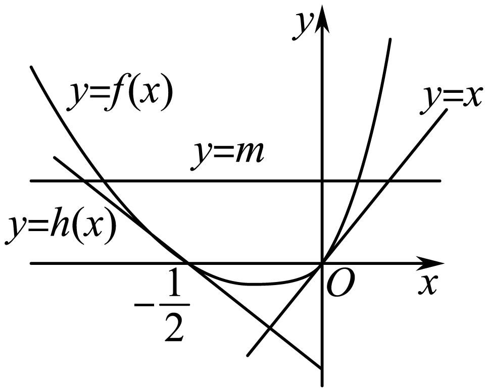
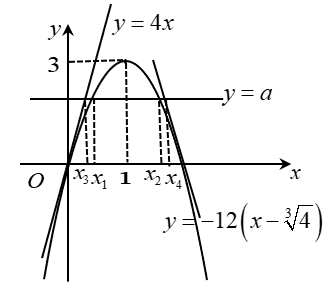

**第22讲  双变量问题**

**知识梳理**

**破解双参数不等式的方法：**

一是转化，即由已知条件入手，寻找双参数满足的关系式，并把含双参数的不等式转化为含单参数的不等式；

二是巧构函数，再借用导数，判断函数的单调性，从而求其最值；

三是回归双参的不等式的证明，把所求的最值应用到双参不等式，即可证得结果.

**必考题型全归纳**

**题型一：双变量单调问题**

**例1．**（2024·全国·高三专题练习）已知函数．

(1)当时，求曲线在处的切线方程；

(2)设，证明：对任意，，．

【解析】（1）当时，，，切点为

求导，切线斜率

曲线在处的切线方程为．

（2），的定义域为，求导，

在上单调递减．

不妨假设，∴等价于 ．

即．

令，则．

，，．

从而在单调减少，故，即，

故对任意 ．

**例2．**（2024·安徽·校联考三模）设，函数.

（Ⅰ）讨论函数在定义域上的单调性；

（Ⅱ）若函数的图象在点处的切线与直线平行，且对任意，，不等式恒成立，求实数的取值范围.

【解析】（Ⅰ）的定义域是.

.

（1）当时，，的定义域内单增；

（2）当时，由得，.

此时在内单增，在内单减；

（3）当时，，的定义域内单减.

（Ⅱ）因为，所以，.

此时.

由（Ⅰ）知，时，的定义域内单减.

不妨设，

则，即，

即恒成立.

令，，则在内单减，即.

，，.

而，当且仅当时，取得最小值，

所以，故实数的取值范围是.

**例3．**（2024·福建漳州·高二福建省漳州第一中学校考期末）已知函数

（Ⅰ）讨论函数的单调性；

（Ⅱ）若时，任意的，总有，求实数

的取值范围.

【解析】（Ⅰ） （）

①当时，故在上单调递增；

②当时，故在上单调递减；

③当时，令解得

则当时 ；

当时，故在上单调递减；在上单调递增；

综上所述：当时，故在上单调递增；

当时，故在上单调递减；

当时，在上单调递减；在上单调递增．

（II）由（Ⅰ）知当时故在上单调递增；

对任意即

令因为

所以在上单调递增；所以 即在上恒成立

故

令则又因为所以

>1 当且仅当时取等号，所以，

故不等式恒成立的条件是即.

所以，实数的取值范围为.

**变式1．**（2024·全国·模拟预测）已知函数，，且．

（1）当时，讨论的单调性；

（2）当时，若对任意的，不等式恒成立，求实数的取值范围．

【解析】（1）函数的定义域为，

将代入的解析式，得，

求导得．

当时，，故在上单调递增；

当时，令，得．

所以当时，，当时，，于是在区间上单调递减，在区间上单调递增．

综上，当时，在上单调递增；当时，在区间上单调递减，在区间上单调递增．

（2）当时，．

因为，所以不等式可化为，

所以对任意的恒成立，所以函数为上的减函数，

所以在上恒成立，可得在上恒成立，

设，则，令，得．

所以当上单调递增，在区间上单调递减，

所以，得．

所以实数的取值范围为．

**变式2．**（2024·天津南开·高三南开大学附属中学校考开学考试）已知函数．

(1)讨论的单调性；

(2)当时，证明；

(3)若对任意的不等正数，总有，求实数的取值范围．

【解析】（1）由题意得：定义域为，；

当时，，，在上恒成立，

在上单调递增；

当时，令，解得：，

当时，；当时，；

在上单调递增，在上单调递减；

综上所述：当时，在上单调递增；当时，在上单调递增，在上单调递减.

（2）由（1）知：；

要证，只需证，即证；

设，则，

当时，；当时，；

在上单调递增，在上单调递减，；

又，，即.

（3）不妨设，则由得：，

即，

令，则在上单调递增，

在上恒成立，

即，又，；

令，则，

令，解得：（舍）或，

当时，；当时，；

在上单调递增，在上单调递减，

，，解得：；

的取值范围为.

**题型二：双变量不等式:转化为单变量问题**

**例4．**（2024·全国·高三专题练习）已知函数．

（1）讨论的单调性；

（2）已知，若存在两个极值点，且，求的取值范围.

【解析】（1）函数的定义域为，，

当时，，当且仅当即“=”，则，在上单调递减，

当时，方程有两个正根为，，

当或时，，当时，，

于是得在、上单调递减，在上单调递增；

（2）因存在两个极值点，且，由(1)知，即，则，

显然，对是递增的，从而有，

，

令，

，

令，，

即在上单调递增，，则，于是得在上单调递增，

从而得，即，

所以的取值范围.

**例5．**（2024·新疆·高二克拉玛依市高级中学校考阶段练习）已知函数

(1)若，求函数*f*（*x*）在点（1，*f*（1））处的切线方程；

(2)当时，讨论*f*（*x*）的单调性；

(3)设*f*（*x*）存在两个极值点且，若求证：.

【解析】（1）若，则，所以，又，所以，即*f*（*x*）在点（1，0）处的切线斜率为2，所以切线方程为.

（2）*f*（*x*）的定义域为（0，+∞），，设，其.

①当时，即时，，即，此时*f*（*x*）在（0，+∞）为单调递增函数.

②当时，即时，设两根为.

当时，，即，即*f*（*x*）的增区间为，.

当时，，即，即*f*（*x*）的减区间为.

综上：当时，*f*（*x*）的单增区间为；

当时，*f*（*x*）的增区间为

减区间为().

（3）由（2），

因为*f*（*x*）存在两个极值点，所以存在两个互异的正实数根，

所以，则，所以，

所以

.

令，则，

∵，∴，∴在上单调递减，

∴，而，

即，∴.

**例6．**（2024·山东东营·高二东营市第一中学校考开学考试）已知函数（为常数）

(1)讨论的单调性

(2)若函数存在两个极值点，且，求的范围.

【解析】（1）∵，

，当时，，，在定义域上单调递增；

当时，在定义域上，

时，在定义域上单调递增；

当时，令得，，

，时，；时，

则在，上单调递增，在上单调递减.

综上可知：当时，在定义域上单调递增；

当时，在，上单调递增，在上单调递减.（其中，）

（2）由（1）知有两个极值点，则，

的二根为，

则，，

，

设，又，∴.

则，，

∴在递增，.

即的范围是

**变式3．**（2024·山东·山东省实验中学校联考模拟预测）已知函数，其中．

(1)当时，求函数在处的切线方程；

(2)讨论函数的单调性；

(3)若存在两个极值点的取值范围为，求的取值范围．

【解析】（1）当时，，定义域为，

所以，

所以，又，

所以函数在处的切线方程为，即.

（2）的定义域是，

，，

令，则．

①当或，即时，恒成立，所以在上单调递增．

②当，即时，由，得或；

由，得，

所以在和上单调递增，在上单调递减．

综上所述，当时，在上单调递增；

当时，在和上单调递增，在上单调递减

（3）由（2）当时，在上单调递增，此时函数无极值；

当时，有两个极值点，即方程有两个正根，

所以，则在上是减函数．所以，

因为，

所以

，

令，则，

，

所以在上单调递减，

又，且，

所以，

由，

又在上单调递减，

所以且，所以实数的取值范围为．

**变式4．**（2024·江苏苏州·高三统考阶段练习）已知函数

(1)讨论函数的单调性；

(2)若函数存在两个极值点，记,求的取值范围.

【解析】（1）的定义域为，对求导得：

，

令

1）若，则，即，所以在上单调递增.

2）若

①当时，即，则，即，所以在上单调递增.

②当时，即，由，得

当时，

当时，

综上所述，当时，在上单调递增；

当时, 在上是单调递增的，

在上是单调递减的.

（2）由（1）知，存在两个极值点当且仅当.

由于的两个极值点 满足，

所以，

所以，

同理，

，

所以，

令，所以，

所以在上是单调递减的，在上是单调递增的

因为，且当，

所，所以 的取值范围是

**变式5．**（2024·全国·高三专题练习）已知函数．

（1）讨论的单调性；

（2）若存在两个极值点，，且，求的取值范围．

【解析】（1）由题意，函数，

可得，其中，

当时，即时，，所以在上单调递增；

当时，令，即，

解得，，

当时，，单调递减；

当时，，单调递增，

所以函数在区间单调递减，在单调递增；

当时，令，即，

解得，，

当时，，单调递增；

当时，，单调递减；

当时，，单调递增，

（2）由（1）值，当时，函数存在两个极值点，且，

因为，

所以，

整理得，

所以，即，

因为，可得，

令，则，

所以在为单调递增函数，

又因为，所以当 时，，

即实数的取值范围为．

**变式6．**（2024·吉林长春·高二长春市实验中学校考期中）设函数．

(1)当时，求的单调区间；

(2)若有两个极值点，

①求*a*的取值范围；

②证明：．

【解析】（1）当时，，

故，

所以，

当时，；当时，，

所以的单调递减区间为，单调递增区间为．

（2）①，依据题意可知有两个不等实数根，

即有两个不等实数根．

由，得，

所以有两个不等实数根可转化为

函数和的图象有两个不同的交点，

令，则，

由，解得；由，解得；

所以在单调递增，在单调递减，

所以．

又当时，，当时，，

因为与的图象有两个不同的交点，所以．

②由①可知有两个不等实数根，

联立可得，

所以不等式等价于

．

令，则，且等价于．

所以只要不等式在时成立即可．

设函数，则，

设，则，

故在单调递增，得，

所以在单调递减，得．

综上，原不等式成立．

**题型三：双变量不等式:极值和差商积问题**

**例7．**（2024·黑龙江牡丹江·高三牡丹江一中校考期末）已知，函数.

(1)当时，求的单调区间和极值；

(2)若有两个不同的极值点，.

（i）求实数的取值范围；

（ii）证明：（……为自然对数的底数）.

【解析】（1）当时，()，则，

故当时，，当时，，

故的递减区间为，递增区间为，

极小值为，无极大值；

（2）(i)因为()，

令()，问题可转化函数有个不同的零点，

又，令，

故函数在上递减，在上递增，

故，故，即，

当时，在时，函数，不符题意，

当时，则，，，

即当时，存在，，

使得在上递增，在上递减，在上递增，

故有两个不同的极值点的*a*的取值范围为；

（ii）因为，，且，

令，则，，

又，

令，即只要证明，即，

令，

则，

故在上递增，且，所以，即，

从而，

又因为二次函数的判别式，

即，即，

所以在上恒成立，故.

**例8．**（2024·内蒙古·高三霍林郭勒市第一中学统考阶段练习）已知函数．

(1)讨论的单调性；

(2)若存在两个极值点，证明：．

【解析】（1）∵，当且仅当时等号成立．

当时，恒有，则在上单调递增；

当时，，令，．

∵，∴方程有两个不相等的实数根，

∴，，显然，

∴当和时，；当时，．

∴当和时，，∴在和上单调递增；

当时，，∴在上单调递减．

综上，当时，在上单调递增；

当时，在和上单调递增，在上单调递减．

（2）证明：由（1）知，当时，存在两个极值点，

∴，，∴，，

∴．

设，由（1）易知，∴．

要证明，

只要证明．

设，则，

∴当时，单调递增，从而，即，

∴成立，从而成立．

要证明，只要证明．

由（1）知，，，

只要证明．

设，

则，，

则当时，单调递增，从而；

则当时，单调递减，从而，

即成立，从而．

综上，得．

**例9．**（2024·全国·模拟预测）已知函数．

(1)当时，求曲线在处的切线方程；

(2)若存在两个极值点、，求实数的取值范围，并证明：．

【解析】（1）当时，，则，

，∴，

∴曲线在处的切线方程为，即．

（2）由题意知，

令，，

∵存在两个极值点，∴有两个零点，

易知，

当时，，在上单调递增，*g*(*x*)至多有一个零点，不合题意．

当时，由得，

若，则，单调递增；

若，则，单调递减．

要使有两个零点，需，解得．

当时，，∴在上存在唯一零点，记为．

∵，∴，，

设，则，令，，则，

∴在上单调递减，∴，即，

∴在上存在唯一零点，记为．

则，随的变化情况如下表：

<table><tr><td>

</td><td>

</td><td>

</td><td>

</td><td>

</td><td>

</td></tr><tr><td>

</td><td>
﹣
</td><td>
0
</td><td>
﹢
</td><td>
0
</td><td>
﹣
</td></tr><tr><td>

</td><td>
↘
</td><td>
极小值
</td><td>
↗
</td><td>
极大值
</td><td>
↘
</td></tr></table>

∴实数的取值范围是．

∵，，∴，

∵，∴，

∵，∴要证，只要证，

只要证，只要证，

又，∴只要证，即证．

设，，

则，

∴*F*(*x*)在时单调递增，

∴，

∴成立，即得证．

**变式7．**（2024·辽宁沈阳·高二东北育才学校校考期中）已知函数，.

(1)当时，讨论方程解的个数；

(2)当时，有两个极值点，，且，若，证明：

（i）；

（ii）.

【解析】（1）方法一：，.

设，则.

设，则，单调递减.

，当时，，，单调递增；

当时，，，单调递减.

，

当时，方程有一解，当时，方程无解；

方法二：设，则.

设，则.单调递增

当时，，

当时，，单调递减；当时，，单调递增.

，方程有一解.

当时，.

令,

令，则在上单调递增，又

，则在上单调递减，

在上单调递增，则.

即，

无解，即方程无解.

综上，当时，方程有一解，当时，方程无解．

（2）（i）当时，，则，

，是方程的两根.

设，则，

令，解得，在上单调递减，在上单调递增.

，，当时，，，.

由.

令，，，.

等价于.

设，，

则，

单调递增，，

，即，，

综上，；

（ii）由（i）知，，.

.

由（i）知，，

设，，则.

单调递减，，即.

.

设，，

则.

单调递增，又，当时，.

，，即命题得证.

**变式8．**（2024·全国·高三专题练习）已知函数

（1）讨论函数的单调区间；

（2）设，是函数的两个极值点，证明：恒成立．

【解析】（1）由题意，函数的定义域为，

且，

①当时，令，解得，

令，解得，

所以在上单调递增，在上单调递减；

②当时，令，解得或，

令，解得，

所以在，上单调递增，在上单调递减；

③当时，则，所以在上单调递增，

④当时，令，解得或，

令，解得，

所以在，上单调递增，在上单调递减；

综上，当时，在上单调递增，在上单调递减；

当时，在，上单调递增，在上单调递减；

当时，在上单调递增；

当时，在，上单调递增，在上单调递减；

（2）由，则的定义域为，

且，

若有两个极值点，，

则方程的判别式，

且，，解得，

又由，所以，即，

所以

，

设函数，其中，，

由得，又，

所以在区间内单调递增，在区间内单调递减，

即的最大值为，

从而恒成立．

**变式9．**（2024·全国·高三专题练习）已知函数.

（1）求函数*f*（*x*）的单调区间；

（2）若有两个极值点，求证：.

【解析】（1），

当时，*f*（*x*）递增区间为；

当*m*<0时，*f*（*x*）递增区间为，通减区间是；

（2），

当时，在递增，无极值点；

当或时，令，

得

若，则，在递增，无极值点；

若，则，不妨设.

此时*g*（*x*）有两个极值点.

因为，故，即.

**题型四：双变量不等式:中点型**

**例10．**（2024·天津北辰·高三天津市第四十七中学校考期末）已知函数．

（1）已知为的极值点，求曲线在点处的切线方程；

（2）讨论函数的单调性；

（3）当时，若对于任意，都存在，使得，证明：．

【解析】（1），由为的极值点.

所以，解得,

由，得，由，得，

所以在上单调递减，在上单调递增. 满足在处取得极值.

则，

所以过点的切线方程为

(2) ,则

当时，，则在上单调递增.

令,，，对称轴方程为

当时，开口向下，对称轴方程为，

所以在上单调递减，所以，所以.

则在上单调递增.

当时，，

有两个不等实数根，

所以得出，得出

则在上单调递增，在上单调递减

综上所以：当时，在上单调递增.

当时，在上单调递增，在上单调递减.

（3）

所以

又

所以

即

则

由，则，设

设，则

所以在 上单调递减,所以

所以恒成立,即

由，则

由，则在时恒成立.

所以在上单调递增.

所以由，可得成立.

**例11．**（2024·湖北武汉·统考一模）已知函数 .

（Ⅰ）讨论的单调性；

（Ⅱ）设，证明：当时， ；

（Ⅲ）设是的两个零点，证明 .

【解析】（Ⅰ）求导，并判断导数的符号，分别讨论的取值，确定函数的单调区间．

（Ⅱ）构造函数，利用导数求函数当时的最大值小于零即可．

（Ⅲ）由（Ⅱ）得 ，从而，于是，由（Ⅰ）知， .

试题解析：（Ⅰ）的定义域为 ，

求导数，得 ，

若 ，则，此时在上单调递增，

若 ，则由得，当时， ，当时， ，

此时在上单调递减，在上单调递增.

（Ⅱ）令，则

.

求导数，得 ，

当时，，在上是减函数.

而， ，

故当时，

（Ⅲ）由（Ⅰ）可知，当时，函数至多有一个零点，

故，从而的最小值为，且，

不妨设，则， ，

由（Ⅱ）得 ，

从而，于是，

由（Ⅰ）知， .

点晴:本题考查函数导数的单调性.不等式比较大小，函数的零点问题：在（Ⅰ）中通过求导，并判断导数的符号，分别讨论的取值，确定函数的单调区间．（Ⅱ）通过构造函数，把不等式证明问题转化为函数求最值问题，求函数当时的最大值小于零即可．（Ⅲ）要充分利用（Ⅰ）（Ⅱ）问的结论.

**例12．**（2024·云南·高三云南师大附中校考阶段练习）已知函数且.

（1）讨论函数的单调性;

（2）当时，若函数的图象与轴交于，两点，设线段中点的横坐标为，证明:.

【解析】（1）函数的定义域为，

，解得(舍去)，．

当时，在上恒成立，所以函数单调递增；

当时，在上，函数单调递减，在上，函数单调递增．

综上，时，函数单调递增；

时，在上单调递减；在上单调递增；

（2）由（1）知，，，

令，，

则，当时，恒成立，所以单调递增，

即单调递增；

又，故要证，即证；

设，，且，

由题设条件知，，因此只需证；

由题意，，

两式作差可得，，

即，

即，

下面先证明，即证，

令，，

则显然成立，

所以在上单调递增，

则，所以，即，

所以，

因此，

即，，

即

因此，

所以原命题得证.

**变式10．**（2024·全国·高三专题练习）已知函数.

(1)讨论的单调性；

(2)若函数的图像与*x*轴交于*A*，*B*两点，线段中点的横坐标为，证明：.

【解析】（1）的定义域为，

．

①若，则，所以在单调递增．

②若，则由得，

且当时，，当时，．

所以在单调递增，在单调递减．

（2）由（1）可知：当时，函数在上单调递增，

故图像与*x*轴至多有一个交点，不符合题意，从而．

当时，在单调递增，在单调递减，

不妨设，，，则．

由，

两式相减得：，

即：，

又

令，，

则，从而函数在上单调递减，

故，从而，又，所以．

**变式11．**（2024·四川绵阳·高二四川省绵阳南山中学校考阶段练习）已知函数.

（1）讨论函数的单调性；

（2）设函数图象上不重合的两点.证明：.（是直线的斜率）

【解析】（1）函数的定义域为，

且

①当时，，此时在单调递增；

②当时，令可得或（舍），，

由得，由得，

所以在上单调递增，在上单调递减.

综上：①当时，函数在上单调递增；

②当时，函数在上单调递增，在上单调递减.

（2）由题意得，

所以

又，

要证成立，

即证：成立，

即证：成立.

令，即证时，成立.

设

则

所以函数在上是增函数，

所以，都有，

即，，

所以

**变式12．**（2024·福建泉州·高二福建省永春第一中学校考阶段练习）已知函数（）．

（1）讨论函数的单调性；

（2）设，若函数的两个极值点，（）恰为函数的两个零点，且的取值范围是，求实数的取值范围．

【解析】（1）由题意，函数的定义域为，

可得，

对于方程的判别式（其中），

（i）若，即时，恒成立，

故在上单调递增；

（ii）若，即时，

令，解得，．

当，；

当时，．

所以当时，单调递增区间为，无单调递减区间；

当时，单调递增区间为和；

单调递增区间为．

（2）由（1）知：且，，其中，

因为，可得（），

所以，

由，可得

两式相减，得．（）

∴

令，可得，则，

所以在上单调递减，

由的取值范围是，得的取值范围是，

所以，

又因为，故实数的取值范围是．

**题型五：双变量不等式:剪刀模型**

**例13．**（2024·天津和平·耀华中学校考模拟预测）已知函数在点(，)处的切线方程为．

(1)求*a*、*b*；

(2)设曲线*y*＝*f*(*x*)与*x*轴负半轴的交点为*P*，曲线在点*P*处的切线方程为*y*＝*h*(*x*)，求证：对于任意的实数*x*，都有*f*(*x*)≥*h*(*x*)；

(3)若关于的方程有两个实数根、，且，证明：．

【解析】（1）将代入切线方程中，有，

∴，即，

又，

∴．

若，则，与矛盾，

故．

（2）由(1)可知，，，

令，有或，

故为．

曲线在点处的切线方程为，

则，

令，

则，

∴，

令*g*(*x*)＝，则，∴在R上单调递增，

∵，

∴当时，，单调递减，

当*x*＞－1时，，单调递增．

∴，即成立．

（3）由(2)知在处的切线方程为，且*f*(*x*)≥*h*(*x*)，

则，

设，则，

故，∵单调递减，∴，

设在处的切线方程为，易得，

令，

则，

令，则，

当时，,单调递减，，

当时，,单调递增，

又∵，

∴当时，，*T*(*x*)单调递减，

当时，，*T*(*x*)单调递增，

∴，即，∴，

设，则，

故，∵单调递增，故，

又，

则.

**例14．**（2024·辽宁沈阳·统考三模）已知函数在点处的切线方程为．

（1）求，；

（2）函数图像与轴负半轴的交点为，且在点处的切线方程为，函数，，求的最小值；

（3）关于的方程有两个实数根，，且，证明：．

【解析】（1）将代入切线方程中，

得，所以，

又或，

又，

所以，

若，则（舍去）；

所以，则；

（2）由（1）可知，，

所以，

令，有或，

故曲线与轴负半轴的唯一交点为

曲线在点处的切线方程为，

则，

因为，

所以，

所以，．

若，，

若，，，

所以.

若，，

，

，所以在上单调递增，

，函数在上单调递增．

当时，取得极小值，也是最小值，

所以最小值．

（3），设的根为，

则，又单调递减，

由（2）知恒成立．

又，所以，

设曲线在点处的切线方程为，则，

令，

．

当时，，

当时，，

故函数在上单调递增，又，

所以当时，，当时，，

所以函数在区间上单调递减，在区间上单调递增，

所以，即，

设的根为，则，

又函数单调递增，故，故．

又，所以．

**例15．**（2024·全国·高三专题练习）已知函数，是的极值点．

(1)求的值；

(2)设曲线与轴正半轴的交点为，曲线在点处的切线为直线．求证：曲线上的点都不在直线的上方；

(3)若关于的方程有两个不等实根，，求证：．

【解析】(1)；由题意知，，；

(2)证明：设曲线在，处切线为直线；

令；

；

；

在上单调递增，在，上单调递减；

；

，即，即上的点都不在直线的上方；

(3)由（2）设方程的解为；

则有，解得；

由题意知，；

令，；

；

在上单调递增；

；

的图象不在的下方；

与交点的横坐标为；

则有，即；

；

关于的函数在上单调递增；

．

**变式13．**（2024·安徽·校联考二模）已知函数，其中是自然对数的底数.

(1)设曲线与轴正半轴相交于点，曲线在点处的切线为，求证：曲线上的点都不在直线的上方；

(2)若关于的方程（为正实数）有两个不等实根，求证：.

【解析】（1）证明：由题意可得：，

，

可得曲线在点处的切线为.

令，

，

当时，，当时，

∴函数在上单调递减，在上单调递增，

曲线上的点都不在直线的上方.

（2）证明：由（1）可得，

解得，

当时，，当时，，

所以在上递增，在上递减，

所以的最大值为，

，

曲线在点处的切线为，

由（1）得，

令，

，，

∴由零点的存在性定理知，

同理可得曲线在点处的切线为，

设与的交点的横坐标分别为

则，

.

下面证明：.

，

，且，

.

**变式14．**（2024·全国·高三专题练习）已知函数，，在点处的切线方程记为，令．

(1)设函数的图象与轴正半轴相交于，在点处的切线为，证明：曲线上的点都不在直线的上方；

(2)关于的方程为正实数）有两个实根，，求证：．

【解析】(1)证明：由，则，即切点为

求导，则切线斜率，

在点处的切线方程为：，记为，

．

由．，解得．

求导，则切线斜率．

在点处的切线为．

令．．

求导，

恒成立，令，得，解得

当时，，函数单减；当时，，函数单增．

，即．

因此曲线上的点都不在直线的上方．

(2)由（1）知，求导

当时，，函数单增，当时，，函数单减；

，且有两个零点：0，

又在点处的切线为．

同理可得：在点处的切线为：．

设与，的交点的恒坐标分别为，．

又，则，．

．

．

**题型六：双变量不等式:主元法**

**例16．**（2024·江苏盐城·高三盐城中学校联考开学考试）已知函数．

(1)求函数的单调区间和最小值；

(2)当时，求证：（其中为自然对数的底数）；

(3)若，求证：．

【解析】(1)

令得：，

，；

令得：；

在上为增函数；在上为减函数；

.

(2)由（1）知：当时，有，

，即：，.

(3)将变形为：

即只证：

设函数

，

令，得：．

在上单调递增；在上单调递减；

的最小值为：，即总有：．

，即：，

令，，则

，

成立．

**例17．**（2024·河南信阳·高二校联考阶段练习）已知函数．

(1)求曲线在点处的切线方程；

(2)求函数的最小值，并证明：当时，．（其中e为自然对数的底数）

【解析】(1)的定义域为，

因为，

所以，

又因为，

所以曲线在点处的切线方程为，即．

(2)令，，

解得，

当时，，当时，，

所以在上单调递减，在上单调递增，

所以．

证明如下：当时，有，

所以，

即，

所以．

**例18．**（2024·山西晋中·高二校考阶段练习）已知函数（其中为自然对数的底数）．

(1)若，求函数的单调区间；

(2)若，求证：，．

【解析】（1）由题知，

所以，

当时，，

当时，，当时，，

所以的单调递增区间为，单调递减区间为，

（2）由题知，，，

所以，

因为，

所以

令

即证在上恒成立，

因为

当时，，

当时，，即在上单调递增，

当时，，即在上单调递减，

因为，，

令，

所以，

因为，

所以，

所以在上单调递增，

所以，

所以恒成立，

因为，

所以在上恒成立，即得证.

**变式15．**（2024·广东广州·高三广州大学附属中学校考阶段练习）已知函数（其中且为常数，为自然对数的底数，．

(1)若函数的极值点只有一个，求实数的取值范围；

(2)当时，若（其中恒成立，求的最小值的最大值．

【解析】（1）函数的定义域为，

其导数为．

由或，

设，，

当时，；当时，．

即在区间上递增，在区间上递减，

，

又当时，，当时，且恒成立．

当或时，方程无根，函数只有一个极值点．

当时，方程的根也为，此时的因式恒成立，

故函数只有一个极值点．

当时，方程有两个根、且，，

函数在区间单调递减；，单调递增；单调递减；，单调递增，此时函数有、1、三个极值点．

综上所述，当或时，函数只有一个极值点．

（2）依题意得，令，则对，都有成立．

，当时，函数在上单调递增，

注意到，

若，，有成立，这与恒成立矛盾；

当时，因为在上为减函数，且，

函数在区间上单调递增，在上单调递减，

，

若对，都有成立，则只需成立，

，

当时，则的最小值，

，

函数在上递增，在上递减，

，即的最小值的最大值为；

综上所述，的最小值的最大值为．

**变式16．**（2024·全国·高三专题练习）设函数.

(1)求的极值；

(2)设，若对任意的，都有成立，求实数的取值范围；

(3)若，证明：.

【解析】(1)函数，则，

令，解得：，且当时，，时，

因此：的极小值为，无极大值.

(2)

令，则，

注意到：，若要，必须要求，即，亦即

另一方面：当时，因为单调递增，则当时，恒成立，所以在时单调递增，故；故实数的取值范围为：；

(3)构造函数，，，

，，，在上是单调递增的；

故即：

另一方面，构造函数，

，

在上是单调递减的

故即：

综上，.

**变式17．**（2024·广东珠海·高一珠海市第二中学校考期中）已知函数.

(1)求不等式的解集；

(2)设函数，若存在，使得，求实数的取值范围；

(3)若对任意的，关于的不等式在区间上恒成立，求实数的取值范围.

【解析】（1）由，得，

即，解得或，

所以不等式的解集为或；

（2）由题可知，

若存在，使得，

则不等式的解集非空，

则，

解得或，

所以实数的取值范围是或；

（3）对任意的，关于的不等式在区间上恒成立，

等价于对于任意的，不等式在区间上恒成立，

令，对称轴，

由，可知，

所以在区间单调递增，，

所以只要当时，恒成立即可，

即当时，恒成立，

所以.

所以实数的取值范围是

