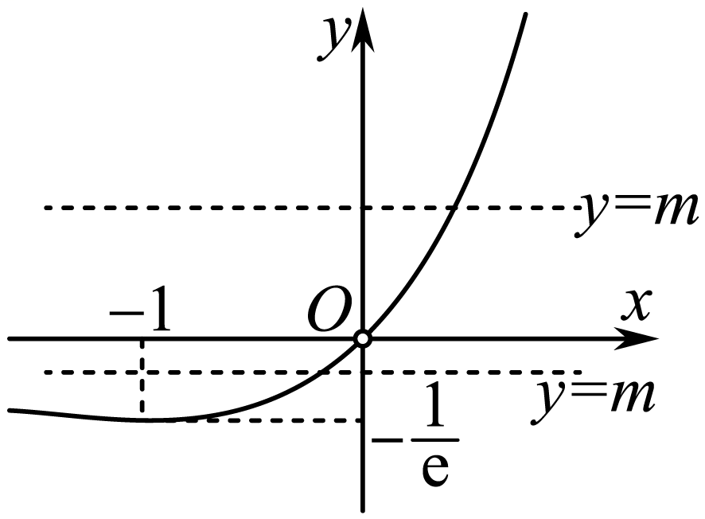
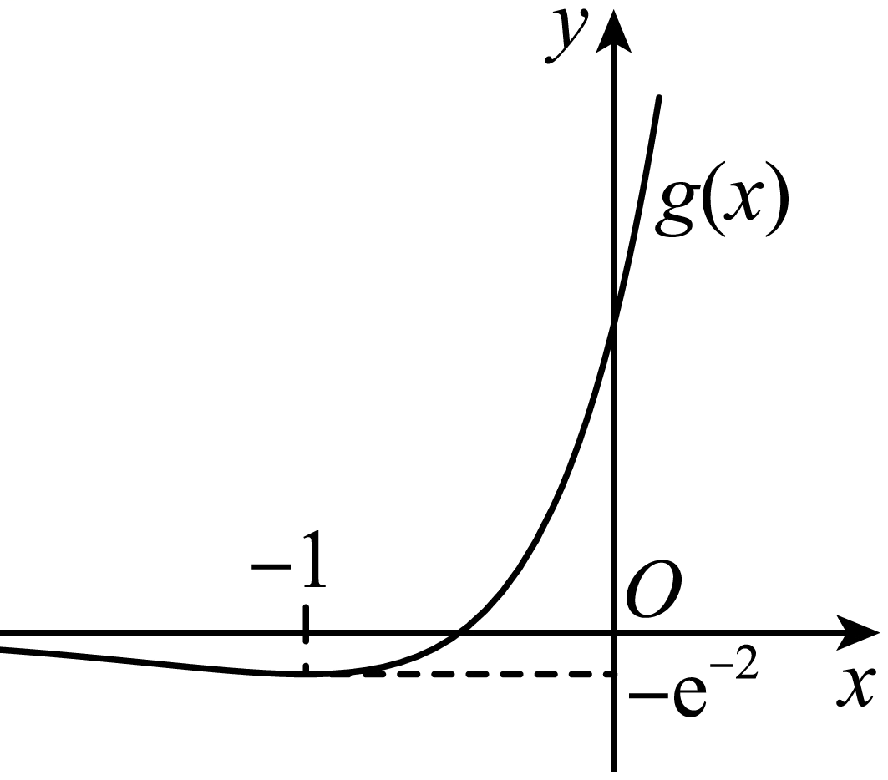

**第23讲  不等式恒成立**

**知识梳理**

1**、利用导数研究不等式恒成立问题的求解策略：**

（1）通常要构造新函数，利用导数研究函数的单调性，求出最值，从而求出参数的取值范围；

（2）利用可分离变量，构造新函数，直接把问题转化为函数的最值问题；

（3）根据恒成立或有解求解参数的取值时，一般涉及分离参数法，但压轴试题中很少碰到分离参数后构造的新函数能直接求出最值点的情况，进行求解，若参变分离不易求解问题，就要考虑利用分类讨论法和放缩法，注意恒成立与存在性问题的区别．

2**、利用参变量分离法求解函数不等式恒（能）成立，可根据以下原则进行求解：**

（1），；

（2），；

（3），；

（4），．

3**、不等式的恒成立与有解问题，可按如下规则转化：**

一般地，已知函数，，，．

（1）若，，有成立，则；

（2）若，，有成立，则；

（3）若，，有成立，则；

（4）若，，有成立，则的值域是的值域的子集．

4**、法则**1**若函数和满足下列条件：**

**（** 1**）及；**

<strong>（</strong>2<strong>）在点的去心<u>邻域</u>内，与可导且；</strong>

**（** 3**），**

**那么=．**

**法则**2**若函数和满足下列条件：（** 1**）及；**

**（** 2**），和在与上可导，且；**

**（** 3**），**

**那么=．**

**法则**3**若函数和满足下列条件：**

**（** 1**）及；**

<strong>（</strong>2<strong>）在点的去心<u>邻域</u>内，与可导且；</strong>

**（** 3**），**

**那么=．**

**注意：利用洛必达法则求未定式的极限是微分学中的重点之一，在解题中应注意：**

**（** 1**）将上面公式中的，，，洛必达法则也成立．**

**（** 2**）洛必达法则可处理，，，，，，型．**

**（** 3**）在着手求极限以前，首先要检查是否满足，，，，，，型定式，否则滥用洛必达法则会出错．当不满足三个前提条件时，就不能用洛必达法则，这时称洛必达法则不适用，应从另外途径求极限．**

**（** 4**）若条件符合，洛必达法则可连续多次使用，直到求出极限为止．**

**，如满足条件，可继续使用洛必达法则．**

**必考题型全归纳**

**题型一：直接法**

**例1．**（2024·陕西咸阳·武功县普集高级中学校考模拟预测）已知函数.

(1)已知函数在处的切线与圆相切，求实数的值.

(2)已知时，恒成立，求实数的取值范围.

【解析】（1）依题意，圆的圆心为，半径为，

对函数求导得，则函数的图象在处的切线斜率为，而，

于是函数的图象在处的切线方程为，即，

从而，解得，

所以实数的值为2.

（2）设，依题意，当时，恒成立，

求导得，设，求导得，

当时，当时，，即有，

因此函数，即在上单调递减，于是当时，，

则函数在上单调递减，从而当时，，因此，

当时，当时，，则函数，即在上单调递增，

于是当时，，即函数在上单调递增，

因此当时，，不合题意，

当时，，函数，即在上单调递增，

则当时，，即函数在上单调递增，

于是当时，，不合题意，

所以实数的取值范围为.

**例2．**（2024·山东·山东省实验中学校联考模拟预测）已知函数，其中．

(1)讨论方程实数解的个数；

(2)当时，不等式恒成立，求的取值范围．

【解析】（1）由可得，，

令，令，可得，

当，函数单调递减，

当，函数单调递增，

所以函数在时取得最小值，

所以当时，方程无实数解，

当时，方程有一个实数解，

当时，，故，

而，，

设，则，

故在上为增函数，故，

故有两个零点即方程有两个实数解.

（2）由题意可知，

不等式可化为，，

即当时，恒成立，

所以，即，

令，

则在上单调递增，而，

当即时，在上单调递增，

故，

由题设可得，

设，则该函数在上为减函数，

而，故.

当即时，因为，

故在上有且只有一个零点，

当时，，而时，，

故在上为减函数，在上为增函数，

故，

而，故，故

因为，故，故符合，

综上所述，实数的取值范围为．

**例3．**（2024·全国·统考高考真题）已知函数．

(1)当时，讨论的单调性；

(2)若，求的取值范围．

【解析】（1）因为，所以，

则

，

令，由于，所以，

所以，

因为，，，

所以在上恒成立，

所以在上单调递减.

（2）法一：

构建，

则，

若，且，

则，解得，

当时，因为，

又，所以，，则，

所以，满足题意；

当时，由于，显然，

所以，满足题意；

综上所述：若，等价于，

所以的取值范围为.

法二：

因为，

因为，所以，，

故在上恒成立，

所以当时，，满足题意；

当时，由于，显然，

所以，满足题意；

当时，因为，

令，则，

注意到，

若，，则在上单调递增，

注意到，所以，即，不满足题意；

若，，则，

所以在上最靠近处必存在零点，使得，

此时在上有，所以在上单调递增，

则在上有，即，不满足题意；

综上：.

**变式1．**（2024·河南·襄城高中校联考三模）已知函数，．

(1)若曲线在处的切线与曲线相交于不同的两点，，曲线在*A*，*B*点处的切线交于点，求的值；

(2)当曲线在处的切线与曲线相切时，若，恒成立，求*a*的取值范围．

【解析】（1）因为，所以，

所以曲线在处的切线方程为．

由已知得，，不妨设，

又曲线在点*A*处的切线方程为，

在点*B*处的切线方程为，

两式相减得，

将，，

代入得，

化简得，

显然，所以，所以，又，所以．

（2）当直线与曲线相切时，设切点为，

则切线方程为，将点代入，解得，此时，，

根据题意得，，，

即恒成立．

令，则，，令，则，

易知在上单调递增，所以，

所以在上单调递增，所以．

若，则，即在上单调递增，

则，所以在上恒成立，符合题意；

若，则．

又，

所以存在，使得，

当时，，单调递减，即，

所以此时存在，使得，不符合题意．

综上可得，*a*的取值范围为．

**题型二：端点恒成立**

**例4．**（2024·四川绵阳·四川省绵阳南山中学校考模拟预测）设函数．

(1)求在处的切线方程；

(2)若任意，不等式恒成立，求实数的取值范围．

【解析】（1）时，；又，则，

切线方程为：，即

（2），

则，又令，

①当，即时，恒成立，∴在区间上单调递增，

∴，∴，∴在区间上单调递增，

∴（不合题意）；

②当即时，在区间上单调递减，

∴，∴，∴在区间上单调递减，

∴（符合题意）；

③当，即时，由，

∴，使，且时，，

∴在上单调递增，∴（不符合题意）；

综上，的取值范围是；

**例5．**（2024·北京海淀·中央民族大学附属中学校考模拟预测）已知函数．

(1)当时，求函数在点处的切线方程；

(2)若函数在处取得极值，求实数的值；

(3)若不等式对恒成立，求实数的取值范围．

【解析】（1）当时，，定义域为，，

，，

所以函数在点处的切线方程为，即.

（2），

设，则，

依题意得，即，

当时，，当时，，当时，，

所以在处取得极大值，符合题意.

综上所述：.

（3）当时，，，

当时， ,

令，，

则，

①当时，在上恒成立，故在上为增函数，

所以，故在上为增函数，

故，不合题意.

②当时，令，得，

（i）若，即时，在时，，在上为减函数，

，即，在上为减函数，，符合题意；

(ii)若，即时，

当时，，在上为增函数，，

在上为增函数，，不合题意.

综上所述：若不等式对恒成立，则实数的取值范围是.

**例6．**（2024·湖南·校联考模拟预测）已知函数与分别是与的导函数.

(1)证明:当时,方程在上有且仅有一个实数根;

(2)若对任意的,不等式恒成立,求实数的取值范围.

【解析】（1）,

当时,,

令,

令,则,

显然在上是单调递增函数,且,

∴在上有唯一零点,

且时,单调递减,

时,单调递增,

又,

,

∴在上有唯一的根,

∴在上有唯一零点,

即在上有且仅有一个实数根.

（2）∵,

令,则,

等价于:,

,

令,

则,

令,

则,

故在上单调递增,,

故即在上单调递增,,

当时,,

∴在上单调递增,

∴;

当时,,取,

则,

,

∴,

∴,使得,

时,单调递减,

此时,不符合题意.

综上可知:的取值范围为.

**变式2．**（2024·四川成都·石室中学校考模拟预测）已知函数，函数.

(1)求函数的单调区间；

(2)记，对任意的，恒成立，求实数的取值范围.

【解析】（1），函数定义域为R，

则且，

令，，在上单调递增，

所以，所以的单调递增区间为，

，，所以的单调递减区间为.

（2），，

则，且，

令，，

令，时，

所以在上单调递增，

①若，，

所以在上单调递增，所以，

所以恒成立.

②若，，

所以存在，使，

故存在，使得，

此时单调递减，即在上单调递减，

所以，故在上单调递减，

所以此时，不合题意.

综上，.

实数的取值范围为.

**变式3．**（2024·宁夏银川·校联考二模）已知函数．

(1)讨论在上的单调性；

(2)若对于任意，若函数恒成立，求实数*k*的取值范围．

【解析】（1），

，则；，则，

所以在单调递增，在单调递减．

（2）令，有

当时，，不满足；

当时，，

令，

所以在恒成立，

则在单调递减，

，，

①当，即时，，

所以在单调递减，

所以，满足题意；

②当，即时，

因为在单调递减，，，

所以存在唯一，使得，

所以在单调递增，

所以，不满足，舍去.

综上：.

**变式4．**（2024·四川泸州·统考三模）已知函数．

(1)若单调递增，求*a*的取值范围；

(2)若，，求*a*的取值范围．

【解析】（1）由，得，

由于单调递增，则即恒成立，

令，则，

可知时，，则在上单调递增；

时，，则在上单调递减，

故时，取得极大值即最大值，

故．所以*a*的取值范围是．

（2）由题意时，恒成立，即；

令，原不等式即为恒成立，

可得，，，

令，则，

又设，则，

则，，可知在上单调递增，

若，有，，则；

若，有，

则，

所以，，，则即单调递增，

（i）当即时，，则单调递增，

所以，恒成立，则符合题意．

（ii）当即时，，，

存在，使得，

当时，，则在单调递减，

所以，与题意不符，

综上所述，*a*的取值范围是.

**题型三：端点不成立**

**例7．**（2024·重庆·统考模拟预测）已知函数．

(1)讨论函数的极值；

(2)当时，不等式恒成立，求*a*的取值范围．

【解析】（1）由题意可得：的定义域为，且，

①当时，则，可得，

所以在上单调递减，无极值；

②当时，令，解得；令，解得；

则在上单调递增，在上单调递减，

所以有极大值，无小极值；

综上所述：当时，无极值；

当时，有极大值，无极小值.

（2）因为，则，

构建，则，

①当时，则，则，等号不能同时取到，

所以在上单调递减；

②当时，构建，则，

因为，则，

所以在上单调递增，

且，，

故在内存在唯一零点，

当时，则；当时，则；

即当时，则；当时，则；

所以在上单调递减，在上单调递增；

综上所述：在上单调递减，在上单调递增，

则，且，

的图象大致为：

对于函数，由（1）可知：

①当时，在上单调递减，

且当趋近于0时，趋近于，当趋近于时，趋近于，

即的值域为**R**，则不恒成立，不合题意；

②当时，在上单调递增，在上单调递减，

则，且当趋近于0时，趋近于，当趋近于时，趋近于，

即的值域，

若恒成立，则恒成立，

即，解得；

综上所述：*a*的取值范围.

**例8．**（2024·江苏南京·高二南京市中华中学校考期末）已知函数．

(1)讨论的单调性；

(2)若不等式恒成立，求实数的取值范围．

【解析】（1）的定义域为，，

当时，，在上为增函数；

当时，由，得，由，得，

所以在上为减函数，在上为增函数.

综上所述：当时，在上为增函数；当时，在上为减函数，在上为增函数.

（2）

，

设，则原不等式恒成立等价于在上恒成立，

，在上为增函数，

则在上恒成立，等价于在上恒成立，

等价于在上恒成立

令，，

令，得，令，得，

所以在上为减函数，在上为增函数，

所以，故.

**例9．**（2024·江西·校联考模拟预测）已知函数．

(1)求的单调区间；

(2)若对于任意的，恒成立，求实数的最小值．

【解析】（1）由定义域为

又

令，显然在单调递减，且；

∴当时，；

当时，．

则在单调递增，在单调递减

（2）法一：∵任意的，恒成立，

∴恒成立，即恒成立

令，则．

令，则在上单调递增，

∵，．

∴存在，使得

当时，，，单调递增；

当时，，，单调递减，

由，可得，

∴，

又

∴，故的最小值是1．

法**二：**

∴恒成立，即恒成立

令

不妨令，显然在单调递增．

∴在恒成立．

令

∴当时，；

当时，即在单调递增

在单调递减

∴

∴，故的最小值是1．

**变式5．**（2024·四川绵阳·四川省绵阳南山中学校考模拟预测）已知函数，．

(1)若，求函数的最小值及取得最小值时的值；

(2)若函数对恒成立，求实数*a*的取值范围．

【解析】（1）当时，，定义域为，

所以，令得，

所以，当时，，单调递减；

当时，，单调递增，

所以，函数在处取得最小值，.

（2）因为函数对恒成立

所以对恒成立，

令，则，

①当时，，在上单调递增，

所以，由可得，即满足对恒成立；

②当时，则，，在上单调递增，

因为当趋近于时，趋近于负无穷，不成立，故不满足题意；

③当时，令得

令，恒成立，故在上单调递增，

因为当趋近于正无穷时，趋近于正无穷，当趋近于时，趋近于负无穷，

所以，使得，，

所以，当时，，单调递减，

当时，，单调递增，

所以，只需即可；

所以，，，因为，所以，

所以，解得，所以，，

综上所解，实数*a*的取值范围为．

**变式6．**（2024·全国·高三专题练习）已知函数，其中．

(1)当时，讨论的单调性；

(2)当时，恒成立，求实数*a*的取值范围．

【解析】（1）当时，，函数的定义域为，

求导得，

显然函数在上单调递增，且，

因此当时,单调递减，当时,单调递增，

所以的单调递减区间为，单调递增区间为.

（2），令，求导得，

当时,，则在上单调递增，，满足题意，

当时，设，则，因此函数，即在上单调递增，

而，

(i)当时,在上单调递增，

于是，满足题意，

(ii)当，即时，对，则在上单调递减，

此时，不合题意，

（iii）当时，因为在上单调递增，

且，于是，使，且当时,单调递减，

此时，不合题意，

所以实数的取值范围为.

**题型四：分离参数之全分离，半分离，换元分离**

**例10．**（2024·湖北武汉·武汉二中校联考模拟预测）已知函数.

(1)若的极大值为3，求实数的值；

(2)若，求实数的取值范围.

【解析】（1）因为，由，得，即的定义域为.

因为，

所以，

因为，

所以当时，，

当时，，所以当时，

在上单调递增，在上单调递减.

所以当时，取得极大值，

解得.

（2）当时，，

即，所以.

令，则，

令，则，所以当时，，

当时，，所以在上单调递减，在上单调递增，

所以，即，

所以，所以，又，所以，

所以实数的取值范围是.

**例11．**（2024·湖北荆门·荆门市龙泉中学校考模拟预测）设函数，且．

(1)求函数的单调性；

(2)若恒成立，求实数*a*的取值范围．

【解析】（1），，

当时，恒成立，则在上单调递增；

当时，时，，则在上单调递减；

时，，则在上单调递增．

（2）方法一：在恒成立，则

当时，，显然成立，符合题意；

当时，得恒成立，即

记，，，

构造函数，，则，故为增函数，则.

故对任意恒成立，则在递减，在递增，所以

∴．

方法二：在上恒成立，即．

记，，，

当时，在单增，在单减，则，得，舍：

当时，在单减，在单增，在单减，，，

得；

当时，在单减，成立；

当时，在单减，在单增，在单减，，，而，显然成立．

综上所述，．

**例12．**（2024·河北·模拟预测）已知函数.

(1)讨论函数的单调性；

(2)若存在实数，使得关于的不等式恒成立，求实数的取值范围.

【解析】（1）函数，，则，

当，即时，恒成立，即在上单调递增；

当，即时，令，解得，

<table><tr><td>

</td><td>

</td><td>

</td><td>

</td></tr><tr><td>

</td><td>
+
</td><td>
0
</td><td>

</td></tr><tr><td>

</td><td>
↗
</td><td>
极大值
</td><td>
↘
</td></tr></table>

综上所述，当是，在上单调递增；

当时，在上单调递增，在上单调递减.

（2）等价于，令，

当时，，所以不恒成立，不合题意.

当时，等价于，

由（1）可知，

所以，对有解，所以对有解，

因此原命题转化为存在，使得.

令，，则，

，

令，则，

所以在上单调递增，又，

所以当时，，，故在上单调递减，

当时，，，故在上单调递增，

所以，所以，

即实数的取值范围是.

**变式7．**（2024·福建三明·高三统考期末）已知函数，.

(1)求证：在上单调递增；

(2)当时，恒成立，求的取值范围.

【解析】（1），，，

由，有，，则，又，

则.

当时，，，所以

所以当时，，综上，在上单调递增.

（2）.化简得.

当时，，所以，

设，

设，.

，，，

在上单调递增，

又由，所以当时，，，

在上单调递减；

当时，，，在上单调递增，

所以，

故.

**变式8．**（2024·甘肃张掖·高台县第一中学校考模拟预测）已知函数，为的导函数．

(1)讨论的极值；

(2)当时，，求*k*的取值范围．

【解析】（1），记，则．

①当时，，在R上单调递减，故无极值．

②当时，令，得，

当时，，单调递增；

当时，，单调递减．

所以在处取得极大值，且极大值为．

综上所述，当时，无极值；当时，的极大值为，无极小值．

（2）可化为，

当时，，此时可得；

当时，不等式可化为，

设，则，

设，则，

所以单调递增，所以当时，，，

当时，，，

所以函数在和上都为增函数，

取，则，

设，

则当时，，

所以在上单调递增，

所以当时，，

所以当时，，

所以的最小值为，即，

所以当和时，没有最小值，

但当*x*趋近－1时，无限趋近，

且，又恒成立，所以，所以．

综上，*k*的取值范围为．

**变式9．**（2024·四川遂宁·射洪中学校考模拟预测）已知，.

(1)求的极值；

(2)若，求实数*k*的取值范围.

【解析】（1）已知，

当时，恒成立，无极值，

当时，，在上单调递增，在单调递减，

当时，有极大值，，无极小值，

综上：当时，无极值；当时，极大值为，无极小值；

（2）若，则在时恒成立，

恒成立，令，

令，则，

在单调递减，又，

由零点存在定理知，存在唯一零点，使得，

即，

令在上单调递增，

， 即

当时，单调递增，单调递减，

，

，即的取值范围为.

**变式10．**（2024·河北沧州·校考模拟预测）已知函数.

(1)求函数的极值点个数；

(2)若不等式在上恒成立，求可取的最大整数值.

【解析】（1）已知，

可得

令，则，

函数单调递减，且当时，，故函数先增后减，

当时，，

其中，∴，∴

当时，，

∴函数只有一个零点，∴函数的极值点个数为1.

（2）变形，得，

整理得，

令，则，∵，∴，

若，则恒成立，即在区间上单调递增，

由，∴，∴，∴，此时可取的最大整数为2，

若，令，则，令，则，

所以在区间上单调递减，在区间上单调递增，

所以在区间上有最小值，，

于是问题转化为成立，求的最大值，

令，则，∵当时，，单调递减，

当时，单调递增，∴在处取得最大值，

∵，∴，∵，，

，此时可取的最大整数为4.

综上，可取的最大整数为4.

**变式11．**（2024·河南开封·校考模拟预测）已知函数．

(1)讨论的单调性；

(2)若，求实数的取值范围．

【解析】（1）函数定义域为，

，

令，则，

当，即时，，所以在定义域上单调递增；

当，即时恒成立，所以在定义域上单调递增，

令，则，即，

当，即时解得，所以当时，当时，

所以在上单调递增，在上单调递减，

当，即，此时恒成立，所以在上单调递增，

当，即时恒成立，所以在定义域上单调递减，

令，则，即，解得，

所以当时，当时，

所以在上单调递减，在上单调递增，

综上可得：当时在上单调递增；

当时在上单调递增，在上单调递减；

当时在上单调递增；

当时在上单调递减，在上单调递增.

（2）当时，即，

即，

令，，则，

所以在上单调递减，则，

所以，则，

令，，

则，

因为，所以当时，当时，

即在上单调递增，在上单调递减，

所以，所以，即.

**题型五：洛必达法则**

**例13．** 已知函数在处取得极值，且曲线在点处的切线与直线垂直.

(1)求实数的值；

(2)若，不等式恒成立，求实数的取值范围.

【解析】(1)，；

函数在处取得极值，；

又曲线在点处的切线与直线垂直，；

解得：；

（2）不等式恒成立可化为，即；

当时，恒成立；当时，恒成立，

令，则；

令，则；

令，则；

得在是减函数，故，进而

（或，，

得在是减函数，进而）．

可得：，故，所以在是减函数，

而要大于等于在上的最大值，但当时，没有意义，

变量分离失效，我们可以由洛必达法得到答案，，故答案为．

**例14．** 设函数.当时，，求的取值范围.

【解析】由题设，此时.

①当时，若，则，不成立；

②当时，当时，，即；

若，则；

若，则等价于，即.

记，则.

记，则，.

因此，在上单调递增，且，所以，

即在上单调递增，且，所以.

因此，所以在上单调递增.

由洛必达法则有，

即当时，，即有，所以.

综上所述，的取值范围是.

**例15．** 设函数．如果对任何，都有，求的取值范围．

【解析】，

若，则；

若，则等价于，即

则.

记，

因此，当时，，在上单调递减，且，

故，所以在上单调递减，

而.

另一方面，当时，，

因此.

**题型六：同构法**

**例16．**（2024·重庆万州·高三重庆市万州第二高级中学校考阶段练习）已知函数.

(1)若，判断的零点个数；

(2)当时，不等式恒成立，求实数的取值范围.

【解析】（1），

，定义域为，

令，可得，设，则，

令，得在上单调递增；

令，得，

在上单调递减，

.当时，；

当时，，从而可画出的大致图象，

①当或时，没有零点；

②当或时，有一个零点；

③当时，有两个零点.

（2）当时，不等式恒成立，

可化为在上恒成立，

该问题等价于在上恒成立，

即在上恒成立，

令，则，

当时，单调递减；

当时，单调递增，

，

即，即

①当时，，不等式恒成立；

②当时，令，显然单调递增，

且，故存在，使得，

所以，

即，而，此时不满足，

所以实数不存在.

综上可知，使得恒成立的实数的取值范围为.

**例17．**（2024·湖南常德·常德市一中校考一模）已知函数，.

(1)若在点处的切线与在点处的切线互相平行，求实数*a*的值；

(2)若对，恒成立，求实数*a*的取值范围.

【解析】（1）依题意，，，

则，，

因为在点,处的切线与在点,处的切线互相平行，

所以，又因为，所以

（2）由，得，

即，即，

设，则，，

由，设，可得，

所以时，，单调递减；

当时，，单调递增，

所以,

所以在上单调递增，

所以对恒成立，即对恒成立，

设，则，

当时，，单调递增；

当时，，单调递减，

所以，故，

所以实数的取值范围为．

<strong>例18．</strong>（2024·河南郑州·高二郑州市第二高级中学校考阶段练习）已知e是自然对数的底数．若，成立，则实数<em>m</em>的最小值是\_\_\_\_\_\_\_\_．

【答案】/

【解析】由得，即，

令，求导得，则在上单调递增，

显然，当时，恒有，即恒成立，

于是当时，，有，

从而对恒成立，即对恒成立，

令，求导得，则当时，；当时，，

因此函数在上单调递增，在上单调递减，，则，

所以实数*m*的最小值是．

故答案为：

<strong>变式12．</strong>（2024·广西柳州·统考三模）已知，（），若在上恒成立，则实数<em>a</em>的最小值为（    ）

A．	B．	C．	D．

【答案】B

【解析】，

即在上恒成立.

易知当时，.

令函数，则，函数在上单调递增，

故有，则在上恒成立.

令，则，

令，即，解得，

令，即，解得，

所以在上单调递增，在上单调递减，

所以，

所以，即实数的最小值为.

故选：B

**变式13．**（2024·广东佛山·统考模拟预测）已知函数，其中.

(1)讨论函数极值点的个数；

(2)对任意的，都有，求实数的取值范围.

【解析】（1）由题意知：定义域为，，

令，则，

令，则，

当时，；当时，；

在上单调递减，在上单调递增，

又，当时，恒成立，

大致图象如下图所示，

则当时，恒成立，即恒成立，

在上单调递减，无极值点；

当时，与有两个不同交点，

此时有两个变号零点，有两个极值点；

当时，与有且仅有一个交点，

此时有且仅有一个变号零点，有且仅有一个极值点；

综上所述：当时，无极值点；当时，有两个极值点；当时，有且仅有一个极值点.

（2）由题意知：当时，恒成立；

设，则，

当时，；当时，；

在上单调递减，在上单调递增，，

即，，

又恒成立，，即实数的取值范围为.

**变式14．**（2024·海南·校考模拟预测）已知，函数.

(1)当时，求曲线在处的切线方程；

(2)若恒成立，求实数的取值范围.

【解析】（1）当时，，所以

所以，

所以切线方程为，即.

（2）由题意得，即，

因为，所以

设，

令，则在区间上恒成立，即在区间上单调递增，又时，，又时，，所以存在，使，

令，因为，

所以当时，，即在区间上单调递减，

当时，，即在区间上单调递增，

所以，所以，

即，得到，当且仅当时取等号，

所以，

当且仅当时取等号，所以，又，

所以*a*的取值范围是.

**变式15．**（2024·全国·高三专题练习）已知函数．

(1)求的单调区间；

(2)若，求*a*的取值范围．

【解析】（1）．

当时，令，解得，

当，，单调递减，

当，，单调递增；

当时，，在**R**上单调递减；

当时，令，解得，所以当，，单调递减，

当，，单调递增；

综上，当时，单调递减区间为，单调递增区间为；

当时，单调递减区间为**R**，无单调递增区间；

当时，单调递减区间为，单调递增区间为．

（2）原不等式为，即．

因为，

所以．

令，则其在区间上单调递增，取，则；取，则，

所以存在唯一使得，

令，则．

当时，，单调递减；

当时，，单调递增；

所以，即，．

故．

故，

所以．

当且仅当即时，等号成立，

故，即*a*的取值范围为．

**变式16．**（2024·广东佛山·校考模拟预测）已知函数，其中，.

(1)当时，求函数的零点；

(2)若函数恒成立，求的取值范围.

【解析】（1）当时，，

，

当时，，得恒成立.

即可得在上单调递增.

而此时，

即可得在上仅有1个零点，且该零点为0.

（2）函数等价于，

因，所以

得

所以

所以

构造函数，上式等价于

函数在定义域内单调递增，从而可得成立.

化简可得等价于恒成立.

设函数，易知，

，

当时，因，，故，

所以在上单调递增，

所以，满足题意，

当时，时，，

此时在上单调递减，

故当时，不符合题意.

综上可得的取值范围是.

**变式17．**（2024·贵州毕节·统考模拟预测）已知函数.

(1)当时，求曲线在点处的切线方程；

(2)若，求实数*a*的取值范围.

【解析】（1）当时，,则，

所以，即在点处的切线斜率为.

而，所以切点坐标为，

所以曲线在点处的切线方程为，即.

（2）因为，

所以，即，即.

令，则.

，所以在上单调递增，

所以恒成立，即，即恒成立.

令，则，

令，解得，令，解得,

所以在上单调递减，在上单调递增，

所以.

因为恒成立，所以，解得.

所以实数*a*的取值范围是.

**题型七：必要性探路**

**例19．**（2024·江西九江·统考三模）已知函数

(1)讨论*f*(*x*)的单调性：

(2)当时，若，，求实数*m*的取值范围．

【解析】（1）．

当时，，易知*f*(*x*)在R上单调递减．

当时，令，可得；令，可得且，

∴*f*(*x*)在和上单调递减，在上单调递增．

当时，令，可得且；令，可得，

∴在和上单调增，在上单调递减．

（2）当时，由，得

即，

令，则

∵，且，∴存在，使得当时，，

∴，即．

下面证明当时，对恒成立．

∵，且，

∴

设，∴，可知*F*(*x*)在上单调递减，在(0，+∞)上单调递增，

∴，∴，∴，

∴

综上，实数*m*的取值范围为．

**例20．**（2024·全国·高三专题练习）已知函数．

(1)若函数在上有且仅有2个零点，求*a*的取值范围；

(2)若恒成立，求*a*的取值范围．

【解析】（1）由已知，令，又，得．

由题设可得，令，其中，

则直线与函数的图象在上有两个交点，

因为，当时，，此时函数单调递增，

当时，，此时函数单调递减．

所以函数的极大值为，且，

当时，直线与函数在上的图象有两个交点，

所以函数在上有且仅有2个零点，

故实数*a*的取值范围是；

（2）当时，由已知函数的定义域为，

又恒成立，即在时恒成立，

当时，恒成立，即，又，则，

下面证明：当时，在时恒成立.

由（1）得当时，，

要证明，只需证明对任意的恒成立，

令，则，

由，得，

①当，即时在上恒成立，则在上单调递增，

于是；

②当，即时，在上单调递减，在上单调递增，

于是，

令，则，则在上单调递增．

于是，所以恒成立，

所以时，不等式恒成立，因此*a*的取值范围是．

**例21．**（2024·江西九江·统考三模）已知函数）在处的切线斜率为.

(1)求*a*的值；

(2)若，，求实数*m*的取值范围.

【解析】（1），

，

，，，.

（2）由（1）可知，，

由，得，

令，则，

，且，存在，使得当时，，

，即；

下面证明当时，，

，且，

，

设，，

当时，；当时，；

可知在上单调递减，在上单调递增，

，，，

；

当时，令，则，

设，则，且为单调递增函数，

由于，故，仅在是取等号，

故在上单调递增，，故，即，

则在上单调递增，而，

当时，递增的幅度远大于递增的幅度，，

故必存在，使得，则时，，

故在上单调递减，则，与题意不符；

综上，实数*m*的取值范围为.

**变式18．**（2024·福建厦门·统考模拟预测）已知函数．

(1)当时，讨论在区间上的单调性；

(2)若，求的值．

【解析】（1）当时，

．

因为，所以．

所以在区间上的单调递增．

（2），

当时，，所以存在，当时，

则在区间上单调递减，

所以当时，，不满足题意

当时，，所以存在，当时，

则在区间上单调递增，

所以当时，，不满足题意

所以．

下面证明时，

由（1）知，在区间上的单调递增，

所以当时，

所以只要证明.

令

令，

则

①当时，，得

所以，所以，

所以在区间上单调递增

且，

所以，使得.

且当时，；当时，

所以在区间上单调递减，在区间上单调递增

且，

所以当时，

所以在区间上单调递减，

所以当时，

②当时，

因为，所以，所以

所以在区间上单调递减

且

所以，使得

当时，；当时，

所以在区间上单调递增，在区间上单调递减

且

所以当时，

综上，的值为1.

**变式19．**（2024·湖南长沙·长郡中学校联考模拟预测）已知函数．

(1)若，，求证：有且仅有一个零点；

(2)若对任意，恒成立，求实数*a*的取值范围．

【解析】（1）证明：由题意得，当时，，

故．

（i）当时，，记，

则，单调递增，，

所以，即当时，无零点．

（ii）当时，，，

即当时，无零点．

（iii）当时，．

因为，所以，即单调递增．

又因为，，

所以当时，存在唯一零点．

综上，当时，有且仅有一个零点．

（2）易知，因此恒成立，则在0的左侧邻域内，是减函数，有，则．

因为，

所以，得是对任意成立的必要条件．

下面证明充分性．

当时，，等价于．

令，，即证．

（i）当时，，，

即成立．

（ii）当时，记，则．

由，得，所以，即单调递增，

，即，

，则，

时，，单调递减，时，，单调递增，

因此是的最小值，即，所以恒成立，

所以．

综上，．

<strong>题型八：</strong><em>max</em><strong>，</strong><em>min</em><strong>函数问题</strong>

**例22．**（2024·全国·高三专题练习）已知函数，，其中.

(1)证明：当时，；当时，；

(2)用表示中的最大值，记.是否存在实数*a*，对任意的，恒成立.若存在，求出，若不存在，请说明理由.

【解析】（1），.

当时，，则；当时，，则，

当时，，

所以当时，，在上是增函数，

又，

所以当时，；

当时，.

（2）函数的定义域为，

由（1）知，当时，，

又，

所以当时，恒成立，

由于当时，恒成立，

所以等价于：当时，.

.

①若，当时，，

故，递增，此时，不合题意；

②若，当时，由知，

存在，使得，根据余弦函数的单调性可知，

在上递增，故当，，递增，此时，不合题意；

③若，当时，由知，对任意，，递减，

此时，符合题意.

综上可知：存在实数满足题意，的取值范围是.

**例23．**（2024·全国·高三专题练习）已知函数，，其中.

（1）证明：当时，；当时，；

（2）用表示*m*，*n*中的最大值，记.是否存在实数*a*，对任意的，恒成立.若存在，求出*a*；若不存在，请说明理由.

【解析】（1）证明：，.

当时，，则；当时，，则，

当时，，

所以当时，，在上是增函数，

又，

所以当时，；

当时，.

（2）函数的定义域为，

由（1）知，当时，，

又，

所以当时，恒成立，

由于当时，恒成立，

所以等价于：当时，.

.

①若，当时，，

故，递增，此时，不合题意；

②若，当时，由知，存在，当，

，递增，此时，不合题意；

③若，当时，由知，对任意，，递减，

此时，符合题意.

综上可知：存在实数满足题意，的取值范围是.

**例24．**（2024·全国·高三专题练习）已知函数，，其中.

（1）证明：当时，；当时，；

（2）用表示*m*，*n*中的最大值，记.是否存在实数*a*，对任意的，恒成立.若存在，求出*a*；若不存在，请说明理由.

【解析】（1），,

当时，，，则；

当时，，，则，

当时，．

所以当时，，在上是增函数，

又，

所以当时，；

当时，．

（2）函数的定义域为，

由（1）得，当时，，又，

所以当时，恒成立．

由于当时，恒成立，

故等价于：当时，恒成立．

，．

当时，，，故；

当时，，，故．

从而当时，，单调递增．

①若，即，则当时，，单调递减，

故当时，，不符合题意；

②若，即，取，

则，且，

故存在唯一，满足，当时，，单调递减；

当时，，单调递增．

若，则当时，单调递增，，不符合题意；

若，则，符合题意，此时由得；

若，则当时，单调递减，，不符合题意．

综上可知：存在唯一实数满足题意．

【关键点晴】本题第一小问的关键点在于提公因式讨论，避免二次求导；第二小问首先将将恒成立转化为在时恒成立，在对研究时，关键点是，再结合的单调性及零点存在性定理讨论得到*a*，有一定难度，特别是书写的规范性.

**变式20．**（2024·全国·高三专题练习）已知函数，.

（1）证明恒成立；

（2）用表示*m*，*n*中的最大值.已知函数，记函数，若函数在上恰有2个零点，求实数*a*的取值范围.

【解析】（1）由题得的定义域为，

则在上恒成立等价于在上恒成立，记，则，.

当时，；时，，

故在上单调递减，上单调递增，

所以，即恒成立.

（2）由题得，

①当时，，此时无零点.

②当时，，

a.当，即时，是的一个零点；

b.当，即时，不是的一个零点；.

③当时，恒成立，因此只需考虑在上的零点情况.

由，

a.当时，，在上单调递增，且，

当时，，则在上无零点，故在上无零点；

当时，，则在上无零点，故在上有1个零点；

当时，由，，得在上仅有一个零点，故在上有2个零点；

所以，.

b.当时，由得，

由时，；当时，，

故在上单调递减，在上单调递增；

由，，得在上仅有一个零点，故在上有2个零点；

所以，.

综上所述，时，在上恰有两个零点.

**变式21．**（2024·宁夏银川·高三银川一中校考阶段练习）已知是自然对数的底数，函数，直线为曲线的切线，.

(1)求的值；

(2)①判断的零点个数；

②定义函数在上单调递增.求实数的取值范围.

【解析】（1）由题意得：

设切线的且点位，则可得：，又

可得 ： ①

又因为直线为曲线的切线

故可知 ②

由①②解得：

（2）① 由小问（1）可知：

，

故必然存在零点，且

又因为，当时，

当时，令

故

故在上是减函数

综上分析，只有一个零点，且

② 由的导数为

当时，递增，当时，递减；

对的导数在时，递增；

设的交点为，由（2）中①可知

当时，

，

由题意得：在时恒成立，即有；

在上最值为

故

当时，

，

由题意得：在时恒成立，即有

令，则可得函数在递增，在上递减，即可知在处取得极小值，且为最小值；

综上所述：，即.

**变式22．**（2024·全国·高三专题练习）设函数.

（1）若，证明：在上存在唯一零点；

（2）设函数，（表示中的较小值），若，求的取值范围.

【解析】(1)函数的定义域为，因为，当时，，而，所以在存在零点.因为，当时，，所以，则在上单调递减，所以在上存在唯一零点.

（2）由（1）得，在上存在唯一零点，时，时，

.当时，由于；时，，于是在单调递增，则，所以当时，.当时，因为，时，，则在单调递增；时，，则在单调递减，于是当时，，所以函数的最大值为，所以的取值范围为.

**题型九：构造函数技巧**

**例25．**（2024·全国·高三专题练习）已知函数，．

（1）讨论函数的单调性；

（2）若，且关于的不等式在上恒成立，其中是自然对数的底数，求实数的取值范围．

【解析】（1）根据题意可知的定义域为，

，令，得．

当时，时，，时；

当时，时，，时．

综上所述，当时，在上单调递减，在上单调递增；

当时，在上单调递增，在上单调递减．

（2）依题意，，即在上恒成立，

令，则．

对于，，故其必有两个零点，且两个零点的积为，

则两个零点一正一负，设其正零点为，

则，即，

且在上单调递减，在上单调递增，

故，即．

令，

则，

当时，，当时，，

则在上单调递增，在上单调递减，

又，故，

显然函数在上是关于的单调递增函数，

则，

所以实数的取值范围为．

<strong>例26．</strong>（2024·江苏·统考高考真题）已知关于<em>x</em>的函数与在区间<em>D</em>上恒有．

（1）若，求*h*(*x*)的表达式；

（2）若，求*k*的取值范围；

（3）若求证：．

【解析】（1）**[方法一]:判别式法**

由可得在**R**上恒成立，

即和，

从而有即，

所以，

因此，．所以．

**[方法二]【最优解】：特值+判别式法**

由题设有对任意的恒成立.

令，则，所以.

因此即对任意的恒成立，

所以，因此.

故.

（2）[方法一]

令，.

又.

若，则在上递增，在上递减，则，即，不符合题意.

当时，，符合题意.

当时， 在上递减，在上递增，则，

即，符合题意.

综上所述，.

由

当，即时，在为增函数，

因为，

故存在，使，不符合题意.

当，即时，，符合题意.

当，即时，则需，解得.

综上所述，的取值范围是.

**[方法二]【最优解】：特值辅助法**

由已知得在内恒成立；

由已知得，

令，得，∴(\*)，

令，，当时，，单调递减；当时，，单调递增，∴，∴当时在内恒成立；

由在内恒成立，由(\*)知，∴，∴，解得.

∴的取值范围是.

（3）**[方法一]：判别式+导数法**

因为对任意恒成立，

①对任意恒成立，

等价于对任意恒成立.

故对任意恒成立.

令，

当，，

此时，

当，，

但对任意的恒成立.

等价于对任意的恒成立.

的两根为，

则，

所以.

令，构造函数，，

所以时，，递减，.

所以，即.

**[方法二]：判别式法**

由，从而对任意的有恒成立，等价于对任意的①，恒成立．

（事实上，直线为函数的图像在处的切线）

同理对任意的恒成立，即等价于对任意的恒成立．    ②

当时，将①式看作一元二次方程，进而有，①式的解为或（不妨设）；

当时，，从而或，又，从而成立；

当时，由①式得或，又，所以．

当时，将②式看作一元二次方程，进而有．

由，得，此时②式的解为不妨设，从而．

综上所述，．

**[方法三]【最优解】：反证法**

假设存在，使得满足条件的*m*，*n*有．

因为，所以．

因为，所以．

因为对恒成立，所以有

．则有

，   ③

，    ④

解得．

由③+④并化简得，．

因为在区间上递增，且，

所以，．

由对恒成立，即有    ⑤

对恒成立，将⑤式看作一元二次方程，进而有．

设，则，

所以在区间上递减，所以，即．

设不等式⑤的解集为，则，这与假设矛盾．从而．

由均为偶函数．同样可证时，也成立．

综上所述，．

【整体点评】（1）的方法一利用不等式恒成立的意义，结合二次函数的性质，使用判别式得到不等式组，求解得到；方法二先利用特值求得的值，然后使用判别式进一步求解，简化了运算，是最优解；（2）中的方法一利用导数和二次函数的性质，使用分类讨论思想分别求得的取值范围，然后取交集；方法二先利用特殊值进行判定得到，然后在此基础上，利用导数验证不等式的一侧恒成立，利用二次函数的性质求得不等式的另一侧也成立的条件，进而得到结论，是最优解；（3）的方法一、方法二中的分解因式难度较大，方法三使用反证法，推出矛盾，思路清晰，运算简洁，是最优解.

**例27．**（2024·湖北·统考模拟预测）已知函数.

(1)求函数在处的切线方程；

(2)若不等式恒成立，求实数的取值范围.

【解析】（1），，

，

的图像在处的切线方程为，即.

（2）解法一：由题意得，因为函数，

故有，等价转化为，

即在时恒成立，所以，

令，则，

令，则，所以函数在时单调递增，

，，

，使得，

当时，，即单调递减，当时，，即单调递增，

故，

由，得

在中，，当时，，

函数在上单调递增，，即与，

，

，即实数的取值范围为.

解法二：因为函数，

故有，等价转化为：，

构造，

，所以可知在上单调递减，在上单调递增，

，即成立，令，

令， 在单调递增，

又，所以存在，使得，即，

可知，

当时，可知恒成立，即此时不等式成立；

当时，又因为，

所以，与不等式矛盾；

综上所述，实数的取值范围为.

**变式23．**（2024·江苏南京·高二南京市江宁高级中学校联考期末）已知函数.

(1)当时，求的单调递增区间；

(2)若恒成立，求的取值范围.

【解析】（1）当时，，，

设

又，∴在上单调递增，

又，∴当时，当时，

∴的单调递增区间为.

（2）对函数求导得，，令，

则，∴在上单调递增，

又，当时，

故存在唯一正实数使得，

当时，，单调递减，

当时，，单调递增，

∴，

由恒成立，得，

由得，∴

∴，∴，

∴，

设，则恒成立，

故在上单调递增，而，

∴，

又且函数在上是增函数，

故的取值范围为

法2：同法一得，

由得，

∴

，当且仅当时等号成立，

∴，

故的取值范围为

**变式24．**（2024·福建泉州·统考模拟预测）已知函数．

(1)判断的导函数的零点个数；

(2)若，求*a*的取值范围．

【解析】（1）由题意可得：的定义域为，且，

因为，则有：

当时，恒成立，在内无零点；

当时，构建，则恒成立，

则在上单调递增，

由于，取，

则，

，

故在内有且仅有一个零点，即在内有且仅有一个零点；

综上所述：当时，在内无零点；

当时，在内有且仅有一个零点.

（2）由题意可知：，

由（1）可知：在内有且仅有一个零点，设为，

可得：当时，；当时，；

则在上单调递减，在上单调递增，

则，

因为，

则，且

可得，

整理得，

构建，

则，

对于，由，可得，

所以，

则在上单调递增，且，

所以的解集为，

又因为在定义域内单调递减，

可得，所以，

故*a*的取值范围.

**变式25．**（2024·安徽合肥·合肥市第六中学校考模拟预测）已知函数，（e为自然对数的底数）．

(1)若函数的最大值为0，求*a*的值；

(2)若对于任意正数*x*，恒成立，求实数*a*的取值范围．

【解析】（1）因为函数的定义域为，且，

当时，，所以函数为增函数，没有最大值；

当时，令，得，令，得，

所以函数的单调递增区间为，单调递减区间为；

所以当时，，

解得：.

（2）由，得，

化简得：，

所以对于任意正数*x，* 都有恒成立，

设，则，

令，则，可得为增函数，

因为，，

所以存在，使得，

当时，，即，单调递减，

当时，，即，单调递增，

所以的最小值为，

由可得，    ，两边同时取对数，

得，

令，显然为增函数，由，

得，所以，

所以.

所以，即.

故实数*a*的取值范围为：.

**变式26．**（2024·重庆万州·统考模拟预测）已知函数．

(1)讨论的极值；

(2)当时，关于*x*的不等式在上恒成立，求实数的取值范围．

【解析】（1），

若，则，则在上单调递减，无极值；

若，当时，，单调递减，当时，，单调递增，所以，无极大值；

若，当时，，单调递增，当时，，单调递减，所以，无极小值；

综上所述，若，无极值；

若，，无极大值；

若，，无极小值；

（2）时，，所以有在上恒成立，

即在上恒成立，

令，转化为在上恒成立，

，

当时，所以在上单调递增，，

满足题意；

当时，令，，

则，设，，

则，因为，所以，

所以，所以在上单调递增，

所以，即在上恒成立，

所以即在上单调递增，

又因为，

当即时，，在上恒成立，所以在上单调递增，所以在上恒成立，

当时，，

如果在上恒成立，则在上单调递减，则无最小值，不符合题意；

如果有解时，设，则在上单调递减，在上单调递增，则在时，，不符合题意；

综上所述，，即实数的取值范围是．

**变式27．**（2024·四川·校联考模拟预测）已知函数的导函数为.

(1)当时，求函数的极值点的个数；

(2)若恒成立，求实数的取值范围.

【解析】（1）当时，，定义域为，，

令，则.

当时，，当时，，

所以在上单调递增，在上单调递减，

即在上单调递增，在上单调递减，

所以，又，，

所以，，

所以存在唯一的，，使得，

且当和时，，函数单调递减；

当时，，函数单调递增，

故在处取得极小值，在处取得极大值，即函数的极值点的个数为2.

（2），，即恒成立，

即在上恒成立.

记，

当时，，不合题意；

当时，.

记，则，

所以在上单调递增，又，

所以使得，即，①

故当时，，即，当时，，即，所以在上单调递减，在上单调递增，

所以，②

由①式可得，所以，

代入②式得，

因为，即，

故，即，

所以当时，恒成立，故实数的取值范围为.

**变式28．**（2024·福建漳州·统考模拟预测）已知函数与的图象有公切线.

(1)求实数和的值；

(2)若，且，求实数的最大值.

【解析】（1）将代入，得，

由，得，所以切线方程为，

因为，设曲线与切线相切于点，

则，所以，

解得或（舍去），所以，

又因为，即，即，所以，

所以，.

（2）因为，所以

，

因为，所以，

所以，仅当时，等号成立，

令，则，

因为，

所以当时，恒成立，

令，，

则在上单调递增，

所以.所以在上单调递减，

所以，所以，

所以的最大值为.

**题型十：双变量最值问题**

**例28．**（2024·江苏·统考模拟预测）已知，，对于，恒成立，则的最小值为（    ）

A．	B．－1	C．	D．－2

【答案】C

【解析】因为对于，恒成立，

所以对于，恒成立，

设，所以.

当时，，函数单调递增，

所以函数没有最大值，所以这种情况不满足已知；

当时，

当时，，函数单调递增.

当时，，函数单调递减.

所以.

所以.

所以.

设，

所以，

当时，，函数单调递减.

当时，，函数单调递增.

所以.

所以的最小值为.

故选：C

**例29．**（2024·全国·高三专题练习）已知函数，，其中．

（1）当时，直线与函数的图象相切，求的值；

（2）当时，若对任意，都有恒成立，求的最小值．

【解析】（1）当时，直线与函数的图象相切于，

因为，所以，

则且，即，解得：.

（2）若对任意，都有恒成立，得.

假设，则当时，，

而当时，.

取，则当时，，

而，矛盾；故.

当时，由，得，即.

下证：能取到.

当时，.

记，则，

令，得；令，得；

所以在上单调递增，在上单调递增，

所以，即.

所以.

即对任意恒成立，

故的最小值为.

**例30．**（2024·河南南阳·高三南阳中学校考阶段练习）已知函数，，其中

(1)若，且的图象与的图象相切，求的值；

(2)若对任意的恒成立，求的最大值.

【解析】(1)因为的图象与的图象相切，设切点为，

又，所以，解得，.

(2)因为等价于，令，

当时，对于任意正实数恒成立，单调递增，

故由得，此时

当时，由，得，

又当时，，函数单调递减；

当时，，函数单调递增.

所以当时，有最小值，

所以，即，所以，

令，则，，

当时，，为增函数，

当时，，为减函数，

所以，故，所以的最大值为1，此时，

综上所述，的最大值为1.

**变式29．**（2024·全国·高三专题练习）已知函数，其中.(为自然对数的底数)

（1）求在点处的切线方程；

（2）若时，在上恒成立.当取得最大值时，求的最小值.

【解析】（1）由，得，

所以，

因为，

所以在点处的切线方程为，即，

（2），

令，则，所以

，，

所以，，

所以，

所以，所以，

所以，

令，则，当时，，当时，，所以在上单调递减，在上单调递增，

所以，此时，

综上，的最小值为

<strong>变式30．</strong>（2024·全国·高三专题练习）已知函数<em>f</em>(<em>x</em>)=<em>aex</em>﹣<em>x</em>，

（1）求*f*(*x*)的单调区间，

（2）若关于*x*不等式*aex*≥*x*+*b*对任意和正数*b*恒成立，求的最小值.

【解析】（1）*f*′(*x*)=*aex*﹣1，

当<em>a</em>≤0时， &lt;0，<em>f</em>(<em>x</em>)在<strong>R</strong>上单调递减，

若*a*>0时，令=*aex*﹣1=0，*x*=﹣*lna*，

在*x*>﹣*lna*时， >0，*f*(*x*)为增函数，

在*x*<﹣*lna*时， <0，*f*(*x*)为减函数，

所以，当时，的单调减区间为，无增区间；

当时，的单调减区间为，增区间为.

（2）*f*(*x*)=*aex*﹣*x*，由题意*f*(*x*)*min*≥*b*，

由（1）可知，当<em>a</em>≤0时，<em>f</em>(<em>x</em>)在<strong>R</strong>上单调递减，无最小值，不符合题意，

当*a*>0时，*f*(*x*)*min*=*f*(﹣*lna*)=1+*lna*≥*b*，

∴，

设*h*(*a*)，则 ，

*a*∈(0，1]， <0；*a*∈[1，+∞)，≥0，

∴*h*(*a*)*min*=*h*（1）=1.

所以的最小值为.

**变式31．**（2024·江苏常州·高二常州高级中学校考期中）给定实数，函数，（其中，．

(1)求经过点的曲线的切线的条数；

(2)若对，有恒成立，求的最小值．

【解析】（1）因为

，

设切点为，，

所以切线方程为：，

又因为切线过，

所以，

所以，即，

令，

则，

当时，，单调递减；

当时，，单调递增，

所以，

所以只有一个解为，即只有一个解为，

所以切点为，

所以，

故只有一条切线；

（2）因为，

所以，

即当时，恒成立．

设，则．

令，则，△，

所以方程有两异号的根，，

设，，

当时，，当，时，，

所以在单调递增，在，单调递增减，且；

又因为在上恒成立，

即在上恒成立，

令，，

则，

令，即，单调增函数；

令，即，单调减函数；

所以的最小值为，

于是有：，

，

所以的最小值为1．

**变式32．**（2024·黑龙江哈尔滨·高三哈九中校考开学考试）设函数，.

(1)若，讨论的单调性；

(2)若（其中）恒成立，求的最小值，并求出的最大值.

【解析】（1）由于，则定义域为，

可得：，

当时，∵，∴，故在区间上单调递减；

当时，∵，∴由得，由可得，

故在区间单调递减，在区间上单调递增.

综上：当时，在上单调递减；

当时，在上单调递减，在上单调递增.

（2）令，则对，都有成立.

因为，

所以当时，函数在在上单调递增，

注意到，∴这与恒成立矛盾，不成立；

当时，得，得

则在区间上单调递增，在上单调递减，

∴.

若对，都有成立，则只需成立，

，

当时，则的最小值，

∵，得，得，

∴函数在上递增，在上递减，∴，

即的最大值为.

**变式33．**（2024·高二单元测试）若对于任意正实数，都有( 为自然对数的底数)成立，则的最小值是\_\_\_\_\_\_\_\_.

【答案】0

【解析】因为对于任意正实数*x*都有成立，

不妨将 代入不等式中，得.

下面证明时满足题意，

令， ，则 .

由 ，得 ，函数在 上单调递增，在上单调递减，

所以，即对任意正数*x*都成立，

即，时满足题意，所以的最小值为0.

故答案为:0

**变式34．**（2024·安徽合肥·合肥市第八中学校考模拟预测）设，若关于的不等式在上恒成立，则的最小值是\_\_\_\_\_\_\_\_\_\_\_.

【答案】/

【解析】由题意知，不等式在上恒成立，

令，则在上恒成立，

令，所以，

若，则在递增，当时，，不等式不恒成立，

故，当时，，当时，，

所以当时，取得最大值，

所以，所以，所以，

令，则，

所以，当时，当时，，

所以当时，取得最小值的最小值是.

又，所求最小值是.

故答案为：

