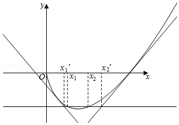

**第24讲  不等式的证明问题**

**知识梳理**

**利用导数证明不等式问题，方法如下：**

（1）直接构造函数法：证明不等式（或）转化为证明（或），进而构造辅助函数；

（2）适当放缩构造法：一是根据已知条件适当放缩；二是利用常见放缩结论；

（3）构造“形似”函数，稍作变形再构造，对原不等式同解变形，根据相似结构构造辅助函数.

（4）对数单身狗，指数找基友

（5）凹凸反转，转化为最值问题

（6）同构变形

**必考题型全归纳**

**题型一：直接法**

**例1．**（2024·北京房山·北京市房山区良乡中学校考模拟预测）已知函数．

(1)若函数在点处的切线平行于直线，求切点*P*的坐标及此切线方程；

(2)求证：当时，．（其中）

【解析】（1）由题意得，，所以切线斜率，

所以，即，此时切线方程为；

（2）令，，则，

当时，，单调递增，当时，，单调递减，

又，，

所以，即恒成立，

所以当时，．

**例2．**（2024·北京·高二北京二十中校考期中）已知函数.

(1)求曲线在点处的切线方程；

(2)求证：.

【解析】（1）,，

,所以切点为，由点斜式可得，，

所以切线方程为：.

（2）由题可得，

设，

，

所以当时，，

当时，，

所以在单调递增，单调递减，

所以，

即.

**例3．** 已知函数，．

（1）讨论函数的单调性；

（2）当时，证明：，．

【解析】解：（1），

因，，

①当时，，函数在内单调递增，在内单调递减，在内单调递增；

②当时，，函数在内单调递增；

③当时，，函数在内单调递增，在内单调递减，在内单调递增；

综上：当时，函数在内单调递增，在内单调递减，在内单调递增；

当时，函数在内单调递增；

当时，函数在内单调递增，在内单调递减，在内单调递增；

（2）当时，由（1）得，函数在内单调递增，在内单调递减，在内单调递增，

函数在内的最小值为，

欲证不等式成立，即证，即证，

因，所以只需证，

令，则，

所以，函数在，内单调递减，（1），

又因，即．所以，

即当时，成立，

综上，当时，，．

**题型二：构造函数（差构造、变形构造、换元构造、递推构造）**

**例4．**（2024·吉林通化·梅河口市第五中学校考模拟预测）已知函数．

(1)证明：；

(2)讨论的单调性，并证明：当时，．

【解析】（1）证明：令，则，

所以在上单调递减，所以，即．

令，则有，

所以，所以，即．

（2）由可得，

令，则，

令，则，

所以在上单调递增，．

令，则有，

所以在上单调递增，所以在上单调递增，

所以对于，有，

所以，所以，

即，

整理得：．

**例5．** 已知曲线与曲线在公共点处的切线相同，

（Ⅰ）求实数的值；

（Ⅱ）求证：当时，．

【解析】（Ⅰ）解：，，

依题意（1）（1），；

（Ⅱ）证明：由，得，

令，则，

时，，递减；

时，，递增．

时，（1），即，

综上所述，时，．

**例6．** 已知函数，．

（1）求函数的单调区间；

（2）若直线是函数图象的切线，求证：当时，．

【解析】（1）解：，

当时，，在上单调递增；

当时，令，可得，

当时，，单调递减，

当时，，单调递增．

综上可得，当时，在上单调递增；

当时，在上单调递减，在上单调递增．

（2）证明：直线是函数图象的切线，设切点为，，

则，即，

切点在切线上，，

，

，解得，

当时，等价于，

等价于，

设，

则，

，，由，得，

当时，，单调递减，

当时，，单调递增，

（1），即，

．

**变式1．** 已知函数．

（1）证明：；

（2）数列满足：，．

（ⅰ）证明：；

（ⅱ）证明：，．

【解析】证明：（1）由题意知，，，

①当时，，

所以 在区间上单调递减，

②当时，令，因为，

所以 在区间上单调递增，因此，

故当时，，

所以 在区间 上单调递增，

因此当 时，，

所以；

（2）（ⅰ）由（1）知，在区间 上单调递增，，

因为，

故，

所以，

因此当 时，，又因为，

所以，

（ⅱ）函数，，则，

令，则，

所以 在区间  上单调递增；

因此，

所以 在区间 上单调递减，所以，

因此，

所以对，．

**变式2．** 讨论函数的单调性，并证明当时，．

【解析】解：，，

当时，或，

在和上单调递增，

证明：时，

．

**题型三：分析法**

**例7．** 已知函数，已知是函数的极值点．

（1）求；

（2）设函数．证明：．

【解析】（1）解：由题意，的定义域为，

令，则，，

则，

因为是函数的极值点，则有，即，所以，

当时，，且，

因为，

则在上单调递减，

所以当时，，

当时，，

所以时，是函数的一个极大值点．

综上所述，；

（2）证明：由（1）可知，，

要证，即需证明，

因为当时，，

当时，，

所以需证明，即，

令，

则，

所以，当时，，

当时，，

所以为的极小值点，

所以，即，

故，

所以．

**例8．**（2024·山东泰安·统考模拟预测）已知函数

(1)求在处的切线;

(2)若，证明当时，.

【解析】（1）因为，所以，切线斜率为

因为，所以切点为

切线方程为即

（2）法一：令，所以，

所以在单调递增，，

所以，所以，

所以要证只需证明

变形得

因为

所以只需证明，即

两边同取对数得：

令，

则

显然在递增，

所以存在当时递减，

当时递增;

因为

所以在上恒成立，所以原命题成立

法二：设则，

要证：

需证：

即证：

因为，需证，即证：

①时必然成立

②时，因为所以只需证明，

令，，

令，

∴在上为增函数

因为

，所以

所以存在，使得

∴在上为减函数，在上为增函数

∴

综上可知，不等式成立

**例9．** 已知，函数，其中为自然对数的底数．

（Ⅰ）证明：函数在上有唯一零点；

（Ⅱ）记为函数在上的零点，证明：

（ⅰ）；

（ⅱ）．

【解析】证明：（Ⅰ），恒成立，

在上单调递增，

，（2），又，

函数在上有唯一零点．

（Ⅱ），，

，，

令，，，

一方面，，，

，在单调递增，

，

，，

另一方面，，，

当时，成立，

只需证明当时，，

，，，

当时，，当时，，

，（1），，（1），

，在单调递减，

，，

综上，，

．

要证明，只需证，

由得只需证，

，只需证，

只需证，即证，

，，

，

．

**变式3．** 已知函数在上有零点，其中是自然对数的底数．

（Ⅰ）求实数的取值范围；

（Ⅱ）记是函数的导函数，证明：．

【解析】（Ⅰ）解：函数，则，

①当时，恒成立，

则在上单调递增，

所以，故函数无零点，不符合题意；

②当时，由，得，

若，即，此时在上单调递增，不符合题意；

若，即，则在上单调递减，在上单调递增，

又，故，使得，

而当时，时，

故，使得，

根据零点存在定理，，，使得，符合题意；

综上所述，实数的取值范围是；

（Ⅱ）证明：，

所以，即，

由（Ⅰ）知且在上单调递减，在上单调递增，

故只要证明：，

即，，

设，

则，

故在上单调递增，即（1），

所以成立；

综上所述，成立．

**题型四：凹凸反转、拆分函数**

**例10．**（2024·北京·高三专题练习）已知函数，当，时，证明：任意的，都有恒成立.

【解析】由题设有，设，，

要证即证.

下面证明：当时，.

此时，，

当时，，

故在上为减函数，在上为增函数，

当时，，

故在上为增函数，在上为减函数，

故在上，有，，

故当时，.

当，，，

当时，要证即证即证，

设，其中，故，

当时，；当时，，

故在上为增函数，在上为减函数，

故在上，，

故，所以当时，成立.

综上，任意的，都有恒成立.

**例11．**（2024·河南开封·校考模拟预测）设函数，．

(1)若函数在上存在最大值，求实数的取值范围；

(2)当时，求证：．

【解析】（1）（1）由得：（），

①当时，，所以在上单调递增，在不存在最大值，

②当时，令，解得：，

当时，，在上单调递增，

当时，在上单调递减，

所以在时，取得最大值，

又由函数在上存在最大值，

因此，解得：，

所以的取值范围为.

（2）证明：当时，，且函数的定义域为，

要证明，即证明时，，

只需要证明：时，，

因为，所以不等式等价于

设（），则，

令得：，

当时，，当时，，

所以在上单调递减，在上单调递增，

故，且当时，等号成立；

又设（），则，

令得：，

当时，，当时，，

所以在上单调递增，在上单调递减，

故，且当时，等号成立；

综上可得：时，，且等号不同时成立，

所以时，，

即当时，得证.

**例12．** 已知函数．

（Ⅰ）若是的极小值点，求的取值范围；

（Ⅱ）若，为的导函数，证明：当时，．

【解析】解：（Ⅰ）的定义域是，

则，

若，则当时，，当，时，，

故是函数的极小值点，符合条件，

若，令，解得：或，

若，则当和，时，

当时，，

故是的极小值点，符合条件，

若，则恒成立，没有极值点，不符合条件，

若，则当和时，

当，时，故是的极大值点，不符合条件，

故的取值范围是，；

（Ⅱ）当时，，，

则，，，

设，，，，

由，可得（1），当且仅当时“”成立，

，

设，则在，上递减，

（1），（2），

故存在，，使得当时，，当，时，，

故在上单调递增，在，上单调递减，

由于（1），（2），故（2），当且仅当时“”成立，

故当时，（1）（2）．

**变式4．** 已知函数．

（Ⅰ）求函数的单调区间；

（Ⅱ）求证：．

【解析】解

当时，恒成立，故函数在上单调递增

当时，由可得或

由可得

综上可得，时，恒成立，故函数在上单调递增

当时，函数的单调递增区间为，，，单调递减区间

证明：原不等式可化为

容易得，上式两边同乘以可得

设，

则由可得（舍或

时，，时，

当时，函数取得最小值

当且仅当即时取等号

令，可得在上单调递增，且（1）

当时，有最小值

由于上面两个等号不能同时取得，故有，则原不等式成立

**题型五：对数单身狗，指数找朋友**

**例13．** 已知函数．

（Ⅰ）当时，求在，上最大值及最小值；

（Ⅱ）当时，求证．

【解析】解：（Ⅰ），；

时，；，时，；

（1）是函数的极小值，即的最小值；又，（2）；

的最大值是；

函数在上的最小值是0，最大值是；

（Ⅱ），要证明原不等式成立，只要证明；

设，则；

函数在上是增函数，（1）；

；

原不等式成立．

**例14．** 已知函数，曲线在点，（1）处的切线方程为．

（1）求、的值；

（2）当且时．求证：．

【解析】解：（1）函数的导数为，

曲线在点，（1）处的切线方程为，

可得（1），（1），

解得；

（2）证明：当时，，

即为，

即，

当时，，

即为，

设，，

可得在递增，

当时，（1），即有；

当时，（1），即有．

综上可得，当且时，都成立．

**例15．** 已知二次函数对任意实数都满足，且（1），令．

（1）求的表达式；

（2）设，．证明：对任意，，，恒有．

【解析】（1）解：设，于是，

所以，，

又（1），则．

所以．（5分）

（2）证明：因为对，，，

所以在，内单调递减．

于是（1）

证明，即证明，

记，

则，

所以函数在，是单调增函数，

所以（e），故命题成立．（12分）

**变式5．** 已知函数．

（1）讨论函数的单调性；

（2）若函数图象过点，求证：．

【解析】解：（1）函数的定义域为，又，

当时，，在上单调递增；

当时，由得，

若，则在上单调递增；

若，则在上单调递减；

（2）证明：函数图象过点，可得，此时，

要证，令，则，

令，则，

当时，，故在上单调递增，

由，即，故存在使得，此时，故，

当时，，当，时，，

函数在上单减，在，上单增，

故当时，有最小值，

成立，即得证．

**变式6．** 已知函数．

（Ⅰ）讨论函数的单调性；

（Ⅱ）若函数图象过点，求证：．

【解析】解：（Ⅰ）函数的定义域为，．

当时，，在上单调递增；

当时，由，得．

若，，单调递增；

若，，单调递减

综合上述：当时，在上单调递增；

当时，在单调递增，在上单调递减．

（Ⅱ）证明：函数图象过点，

，解得．

．即．．

令．．．

令，，

函数在上单调递增，

存在，使得，可得，．

．

成立．

**题型六：放缩法**

**例16．**（2024·全国·高三专题练习）已知，，．

(1)当时，求函数的极值；

(2)当时，求证：．

【解析】（1），当时，，即在上单调递减，

故函数不存在极值；

当时，令，得，

<table><tr><td>
<em>x</em>
</td><td>

</td><td>

</td><td>

</td></tr><tr><td>

</td><td>
+
</td><td>
0
</td><td>
-
</td></tr><tr><td>

</td><td>
增函数
</td><td>
极大值
</td><td>
减函数
</td></tr></table>

故，无极小值.

综上，当时，函数不存在极值；

当时，函数有极大值，，不存在极小值．

（2）显然，要证：，

即证：，即证：，

即证：．

令，故只须证：．

设，则，

当时，，当时，，

故在上单调递增，在上单调递减，

即，所以，从而有．

故，即．

**例17．**（2024·湖南常德·常德市一中校考二模）已知函数 （，为自然对数的底数）．

(1)讨论函数的单调性；

(2)当时，求证：.

【解析】（1），

（ⅰ）当时，，所以，，

则在上单调递增，在上单调递减；

（ⅱ）当时，令，得，

①时，，

所以或，，

则在上单调递增，在上单调递减，在上单调递增；

②时，，则在上单调递增；

③时，，所以或，，

则在上单调递增，在上单调递减，在上单调递增．

综上，时，在上单调递增，在上单调递减；

时，在上单调递增，在上单调递减，在上单调递增；

时，在上单调递增；

时，在上单调递增，在上单调递减，在上单调递增；

（2）方法一：等价于，

当时，，

则当时，，则，

令，

令，

因为函数在区间上都是增函数，

所以函数在区间上单调递增 ，

∵，∴存在，使得，

即，

当时，，则在上单调递减，

当时，，则在上单调递增，

∴，

∴，故.

方法二：当时，，

令，

令，则，

令，则，

当时，，当时，，

∴在区间上单调递减，上单调递增，

∴，即，

∴.

**例18．** 已知函数．（其中常数，是自然对数的底数．

（1）讨论函数的单调性；

（2）证明：对任意的，当时，．

【解析】（1）解：由，得．

①当时，，函数在上单调递增；

②当时，由，解得，由，解得，

故在，上单调递增，在，上单调递减．

综上所述，当时，函数在上单调递增；

当时，在，上单调递增，在，上单调递减．

（2）证明：．

令，则．

当时，．

令，则当时，．

当时，单调递增，．

当时，；当时，；当时，．

（1）．

即，故．

**变式7．** 已知函数，

（1）讨论函数的单调性；

（2）求证：当时，．

【解析】解：（1），

当，即时，，函数在上单调递增

当，即时，

由解得，由解得，

函数在上单调递减，在上单调递增．

综上所述，当时，函数在上单调递增；

当时函数在上单调递减，在上单调递增．

（2）令

当时，欲证，即证．即证，即，

即证

先证：．

设则设，

在上单调递减，在，上单调递增

，，则，

即，当且仅当，时取等号．

再证：．

设，则．

在上单调递增，则，即．

，所以．．当且仅当时取等号．

又与．两个不等式的等号不能同时取到，

成立，

即当时，成立．

**变式8．** 已知函数．

（1）求函数的单调区间；

（2）解关于的不等式

【解析】解：（1）函数．定义域为：．

，（1）．

令，，

函数在定义域上单调递增．

，．，函数单调递减．时，，函数单调递增．

（2）不等式，即．

，，舍去．

当时，不等式的左边右边，舍去．

，且．

①时，由，要证不等式．可以证明：．等价于证明：．

令．

，

函数在上单调递减，

（1）．

②当时，不等式．

令，．

，函数在上单调递增，

（1）．

由，

．

不等式成立．

综上可得：不等式的解集为：．

**题型七：虚设零点**

**例19．**（2024·全国·高三专题练习）已知函数．

(1)求函数的单调区间；

(2)当时，证明：对任意的，．

【解析】（1）由题可知函数的定义域为 ，

，

即，

(i)若，

则在定义域上恒成立，

此时函数在上单调递增；

(ii) 若，

令，即，解得,

令，即，解得,

所以在上单调递减，上单调递增.

综上，时，在上单调递增；

时，在上单调递减，上单调递增.

（2）当时，，

要证明，只用证明，

令，，

令，即，可得方程有唯一解设为，且，

所以，

当变化时，与的变化情况如下，

<table><tr><td>

</td><td>

</td><td>

</td><td>

</td></tr><tr><td>

</td><td>

</td><td>

</td><td>

</td></tr><tr><td>

</td><td>
单调递减
</td><td></td><td>
单调递增
</td></tr></table>

所以，

因为，因为，所以不取等号，

即，即恒成立，

所以，恒成立，

得证.

**例20．**（2024·重庆万州·重庆市万州第三中学校考模拟预测）已知函数.

(1)若在区间上有极小值，求实数的取值范围；

(2)求证：.

【解析】（1）函数，定义域为，

，在上单调递增，

若在区间上有极小值，则有，解得.

故实数的取值范围为.

（2），即，由，可化简得，

要证，即证.

设，，

由，则有，得，即，

函数在上单调递减，

时，时，

则，，此时，

则时，时，

在上单调递增，在上单调递减，

，

函数在上单调递减，，

故，即.

设，

，解得，解得，

在上单调递减，在上单调递增，，

由，得，则有，即

故，即有.

所以，即.

**例21．**（2024·全国·模拟预测）已知函数在处取得极小值．

(1)求实数的值；

(2)当时，证明：．

【解析】（1），由题意知，则，即，

由，知，即．

（2）由（1）得，设，

则．

设，则在上单调递增，

且，所以存在唯一，使得，即．

当时，单调递减；当时，单调递增．

．

设，则，

当时，单调递减，所以，所以，

故当时，．

**变式9．**（2024·全国·高三专题练习）已知函数．当时，证明：．

【解析】记．

．

令，

则，所以即在上单调递增．

由，知．

．即，

当单调递减；当单调递增．

故在处取得极小值，也是最小值，

，

由（\*）式，可得．

代入式，得．

令，则，

当时，，当时，，

故在上单调递增，在单调递减，

故，即，

故．．

由．

故，即，原不等式得证．

**变式10．**（2024·山东淄博·统考三模）已知函数.

(1)求函数的单调区间；

(2)证明：当时，.

【解析】（1）函数的定义域为，.

令函数，.

当时，，在上单调递减；

当时，，在上单调递增，

所以，即恒成立，

故的单调递增区间是和.

（2）当时，，即当时，.

令，，

令，，

令，.

当时，，在上单调递减；

当时，，在上单调递增，

又，，

所以存在，使得.

当时，；当时，，

所以在上单调递减，在上单调递增.

，故当时，；当时，，

即当时，；当时，，

故在上单调递减，在上单调递增.

于是，所以.

令函数，.

当时，；当时，，

所以在上单调递增；在上单调递减，

则.

因为，所以，故，

得.

综上所述：当时，.

**题型八：同构法**

**例22．** 已知函数，．

（1）讨论的单调区间；

（2）当时，证明．

【解析】解：（1）的定义域为，

，

①当时，，此时在上单调递减，

②当时，由可得，由，可得，

在上单调递减，在，上单调递增，

③当时，由可得，由，可得，

在上单调递增，在，上单调递减，

证明（2）设，则，

由（1）可得在上单调递增，

（1），

当时，，

当时，，

在上单调递减，

当时，，

，

，

．

**例23．** 已知函数．

（1）讨论函数的单调性；

（2）当时，求证：在上恒成立；

（3）求证：当时，．

【解析】（1）解：函数的定义域为，，

令，即，△，解得或，

若，此时△，在恒成立，

所以在单调递增．

若，此时△，方程的两根为：

，且，，

所以在上单调递增，

在上单调递减，

在上单调递增．

若，此时△，方程的两根为：

，且，，

所以在上单调递增．

综上所述：若，在单调递增；

若，在，上单调递增，

在上单调递减．

（2）证明：由（1）可知当时，函数在上单调递增，

所以（1），所以在上恒成立．

（3）证明：由（2）可知在恒成立，

所以在恒成立，

下面证，即证2 ，

设，，

设，，

易知在恒成立，

所以在单调递增，

所以，

所以在单调递增，

所以，

所以，即当时，．

法二：，即，

令，则原不等式等价于，

，令，则，递减，

故，，递减，

又，故，原结论成立．

**例24．** 已知函数．

（1）当时，求函数的单调区间；

（2）若函数在处取得极值，对，恒成立，求实数的取值范围；

（3）当时，求证：．

【解析】（1）解：，

得，得，

在上递减，在上递增．

（2）解：函数在处取得极值，

，

，

令，则，

由得，，由得，，

在，上递减，在，上递增，

，即．

（3）证明：，即证，

令，

则只要证明在上单调递增，

又，

显然函数在上单调递增．

，即，

在上单调递增，即，

当时，有．

**变式11．** 已知函数．

（1）讨论函数的单调性；

（2）若函数在处取得极值，不等式对恒成立，求实数的取值范围；

（3）当时，证明不等式．

【解析】解：（1）．

当时，，从而，函数在单调递减；

当时，若，则，从而，

若，则，从而，

函数在单调递减，在单调递增．             （4分）

（2）根据（1）函数的极值点是，若，则，

，即，

，即，

令，则，

得：是函数在内的唯一极小值点，也是最小值点，

故，

故；

（3）由即，

构造函数，则，，，

即在递增，

，

，

．

**题型九：泰勒展式和拉格朗日中值定理**

**例25．**（2024·全国·高三专题练习）证明不等式：．

【解析】设，则，

，

代入的二阶泰勒公式，有，

．

所以原题得证．

**例26．**（2024·全国·高三专题练习）证明：

【解析】证明：设，则在处带有拉格朗日余项．

三阶泰勒公式

**例27．**（2024·广东广州·高三华南师大附中校考阶段练习）已知正数数列满足，且.（函数求导次可用表示）

(1)求的通项公式.

(2)求证：对任意的，，都有.

【解析】（1）由，得

，

所以或，

因为，所以，

所以，

所以

（2）证明：当时，恒成立，

令，

即，

则

，

……

，

所以在上递增，

所以，

所以在上递增，

所以，

所以在上递增，

……

所以在上递增，

所以，

所以在上递增，

所以，

综上对任意的，，都有.

**变式12．**（2024·四川成都·石室中学校考模拟预测）已知函数.

(1)若，求实数*a*的值；

(2)已知且，求证：.

【解析】（1）因为，所以函数定义域为，.

因为，且，所以是函数的极小值点，则，所以，得.

当时，，

当时，，当时，，

则函数在上单调递减，在上单调递增，

所以，满足条件，故.

（2）由（1）可得，.令，则，所以，即，，

所以.证毕.

**变式13．** 已知函数．

（1）求函数的单调区间；

（2）若，对，恒成立，求实数的取值范围；

（3）当时．若正实数，满足，，，，证明：．

【解析】解：（1），，△，

①时，恒成立，

故函数在递增，无递减区间，

②时，或，

故函数在，，递增，在，递减，

综上，时，函数在递增，无递减区间，

时，函数在，，递增，在，递减，

（2），对，恒成立，

即，时，恒成立，

令，，则，

令，

则，在递减且（1），

时，，，递增，

当，，，递减，

（1），

综上，的范围是，．

（3）证明：当时，，

，不妨设，

下先证：存在，，使得，

构造函数，

显然，且，

则由导数的几何意义可知，存在，，使得，

即存在，，使得，

又为增函数，

，即，

设，则，，

①，

②，

由①②得，，

即．

**变式14．**（2024·全国·高三专题练习）给出以下三个材料：①若函数可导，我们通常把导函数的导数叫做的二阶导数，记作．类似地，二阶导数的导数叫做三阶导数，记作，三阶导数的导数叫做四阶导数……一般地，阶导数的导数叫做阶导数，记作．②若，定义．③若函数在包含的某个开区间上具有阶的导数，那么对于任一有，我们将称为函数在点处的阶泰勒展开式．例如，在点处的阶泰勒展开式为．

根据以上三段材料，完成下面的题目：

（1）求出在点处的阶泰勒展开式，并直接写出在点处的阶泰勒展开式；

（2）比较（1）中与的大小．

（3）已知不小于其在点处的阶泰勒展开式，证明：．

【解析】（1），，，

，，，

，即；

同理可得：；

（2）由（1）知：，，

令，则，

，，

在上单调递增，又，

当时，，单调递减；当时，，单调递增；

，，

在上单调递增，又，

当时，；当时，；

综上所述：当时，；当时，；当时，．

（3）令，则，

，在上单调递增，又，

在上单调递减，在上单调递增，

，即；

在点处的阶泰勒展开式为：，

，

①由（2）知：当时，，

当时，；

②由（2）知：当时，，

，

令，则，

在上单调递减，，即当时，，

，；

综上所述：．

**题型十：分段分析法、主元法、估算法**

**例28．**（2024·贵州安顺·统考模拟预测）已知函数．

（1）讨论函数的导函数的单调性；

（2）若，求证：对，恒成立．

【解析】（1）由已知可得，，设，

则．

当时，有恒成立，所以，即在*R*上单调递增；

当时，由可得，．

由可得，，所以，即在上单调递减；

由可得，，所以，即在上单调递增．

综上所述，当时，在*R*上单调递增；当时，在上单调递减，在上单调递增．

（2）因为，所以对，有．

设，则．

解可得，或或．

由可得，，所以，函数在上单调递增；

由可得，或，所以，函数在上单调递减，在上单调递减．

所以，在处取得极大值，在处取得极小值．

又，所以，即．

所以，有，

整理可得，，

所以，有，恒成立．

**例29．**（2024·山东泰安·校考模拟预测）已知函数．

(1)讨论的单调性；

(2)证明：当，且时，．

【解析】（1），，

①当，即时，，在区间单调递增．

②当，即时，

令，得，令，得，

所以在区间单调递增；在区间单调递减．

③当，即时，

若，则，在区间单调递增．

若，令，得，令，得，

所以在区间单调递减；在区间单调递增．

综上，时，在区间单调递增；在区间单调递减；

时，在区间单调递增

时，在区间单调递减、在区间单调递增．

（2）证明：要证，即证，

即证．

令，，则，

所以在区间单调递增，所以时，，

即时，．

令，，则在时恒成立，

所以，且时，单调递增，

因为时，，，且，

所以，且时，，即．

所以，且时，．

**例30．** 若定义在上的函数满足，，．

（Ⅰ）求函数解析式；

（Ⅱ）求函数单调区间；

（Ⅲ）若、、满足，则称比更接近．当且时，试比较和哪个更接近，并说明理由．

【解析】解：（Ⅰ）根据题意，得（1），

所以（1）（1），即．

又（1），

所以．

（Ⅱ），

，

①时，，函数在上单调递增；

②当时，由得，

时，，单调递减；

时，，单调递增．

综上，当时，函数的单调递增区间为；

当时，函数的单调递增区间为，单调递减区间为．

（Ⅲ）解：设，，

，

在，上为减函数，又（e），

当时，；当时，．

，，

在，上为增函数，又（1），

，时，，

在，上为增函数，

（1）．

①当时，，

设，

则，

在，上为减函数，

（1），

当，

，

，

比更接近．

②当时，，

设，则，，

在时为减函数，

（e），

在时为减函数，

（e），

，

比更接近．

综上：在且时时，比更接近．

**变式15．** 已知函数，其中，为自然对数的底数．

（1）当时，讨论函数的单调性；

（2）当时，求证：对任意的，，．

【解析】解：（1）当时，，

则，

，

故

则在上单调递减．

（2）当时，，

要证明对任意的，，．

则只需要证明对任意的，，．

设（a），

看作以为变量的一次函数，

要使，

则，即，

恒成立，①恒成立，

对于②，令，

则，

设时，，即．

，，

在上，，单调递增，在上，，单调递减，

则当时，函数取得最大值

，

故④式成立，

综上对任意的，，．

**题型十一：割线法证明零点差大于某值，切线法证明零点差小于某值**

**例31．** 已知函数

（1）求曲线在原点处的切线方程；

（2）若恒成立，求实数的取值范围；

（3）若方程有两个正实数根，，求证：．

【解答】解：（1），，，

故曲线在原点处的切线方程为．

（2）①当时，；

②当时，问题等价于恒成立．

设，则，

在上单调递增，且（1）

在递减，在递增．

在的最小值为（1）；

③当时，问题等价于恒成立．

设，则，

在上单调递减，且时，．

，

综上所述：．

（3）依（2）得时，，

曲线在原点处的切线方程为

设，

，，

令，解得，或．

在，递增，在递减．

，时，，递增，而，

当时，，

设，分别与，交点的横坐标为，，

，．

则，，（证毕）

**例32．** 已知函数，曲线在点处的切线方程为．

（1）求，的值；

（2）证明：；

（3）若函数有两个零点，，证明．

【解答】（1）解：函数的定义域为，

，

（1），

曲线在点处的切线方程为即，

，；

（2）证明：令，

则，

令，则，

单调递增，又（1），

当时，，函数单调递减，

当时，，函数单调递增，

（1），

，

，

（3）证明：的两个零点，，即为的两根，不妨设，

由题知，曲线在处的切线方程为，

令，即即的根为，则，

由（2）知，

，

单调递增，

，

设曲线在处的切线方程为，

，

，

设方程即的根为，则，

令，

由（2）同理可得，即，

，

又单调递减，

，

．

**例33．** 设函数．

（1）求曲线在点，处的切线方程；

（2）若关于的方程有两个实根，设为，，证明：．

【解答】解：（1），则，又，

切线方程为，即；

（2）证明：先证明，

令，则，

易知函数在上递减，在，上递增，

则，即，

再证明，令，则，

易知函数在上递减，在上递增，

则（1），即，

如图，设直线与直线，相交点的横坐标分别为，，

由，得，当且仅当时等号成立，

由，得，当且仅当时等号成立，

，即得证．

**题型十二：函数与数列不等式问题**

**例34．**（2024·四川成都·石室中学校考模拟预测）已知函数.

(1)若，求实数的值；

(2)已知且，求证：.

【解析】（1）由，得.

令，则.

注意到，所以是函数的极小值点，则，

所以，得.

当时，，则函数在上单调递减，在上单调递增，

所以，满足条件，故.

（2）由（1）可得，.

令，则，

所以，即.

令，则，且不恒为零，

所以函数在上单调递增，

故，则，

所以，

令分别取，累加得：

.

即证.

**例35．**（2024·四川成都·石室中学校考模拟预测）已知函数.

(1)若在上单调递增，求的值；

(2)证明：（且）.

【解析】（1）函数，求导得，

由于函数在**R**上单调递增，则恒成立，

令，则，

当时，，当时，，不满足条件；

当时，，在R上单调递增，

又，即，不满足条件；

当时，令，得，

则当时，，单调递减，当时，，单调递增，

于是当时，取得最小值，

于是，即，

令，则，

当时，，单调递增；时，，单调递减，

则，由于恒成立，因此，则有，

所以单调递增时，的值为1.

（2）由（1）知，当时，，即有，当且仅当时取等号，即当时，，

因此当且时，

，

而当时，，

所以，

则，所以，.

**例36．**（2024·安徽黄山·屯溪一中校考模拟预测）已知函数.

(1)是的导函数，求的最小值；

(2)证明：对任意正整数，都有（其中为自然对数的底数）

【解析】（1）由题意，，

，

，

令，解得，

又时，时，，

所以在上单调递减，在单调递增，

，即的最小值为0.

（2）证明：由（1）得，，

可知，当且仅当时等号成立，

令，则.

，

即，

也即，

所以，

故对任意正整数，都有.

**变式16．**（2024·重庆渝中·高三重庆巴蜀中学校考阶段练习）已知函数.

(1)求的极值；

(2)对任意的，求证：.

【解析】（1）因为，

则，

当时，，时，

故在上单调递减，在上单调递增，

故在处取得极小值，无极大值.

（2）由（1）知在上单调递增，

故时，

即：，令得，

化简得：，

于是有：，，，

累加得：

即

**变式17．**（2024·河北石家庄·高三石家庄二中校考阶段练习）已知函数.

(1)若恒成立，求的取值范围；

(2)当时，证明：.

【解析】（1），可得.

令，其中，则.

①当时，，合乎题意；

②当时，由基本不等式可得，

当且仅当时，等号成立，，当且仅当时，等号成立，

所以，，

所以，不恒成立，不合乎题意；

③当时，，当时，，此时函数单调递减，

当时，，此时函数单调递增，所以，，可得，解得.

综上所述，实数的取值范围是；

（2）当时，，所以.

由（1）知：，即，所以.

令，得，即，所以.

当时，，则，显然，结论成立；

当时，

，

结论成立.因此，当时，成立.

**题型十三：三角函数**

**例37．**（2024·全国·高三专题练习）已知函数，．当，时，求证：．

【解析】证明：要证，即证，只需证，

因为，也就是要证，令，

因为，所以，

所以在上为减函数，

所以，所以得证．

**例38．**（2024·河北·统考模拟预测）已知函数.

(1)讨论的极值；

(2)当时，证明：.

【解析】（1）由函数，可得，

当时，可得，解得，即函数的定义域为，

令，解得，

当时，，单调递减；

当时，，单调递增，

所以当时，函数取得极小值；

当时，可得，解得，即函数的定义域为，

令，解得，

当时，，单调递减；

当时，，单调递增，

所以当时，函数取得极小值，

综上可得，函数的极小值为，无极大值.

（2）证明：因为，所以，解得，即函数的定义域为，

令，可得，所以在单调递增，

所以，即，

要证不等式，

只需证明，

又由函数，可得，

当时，，单调递增；

当时，，单调递减，

所以，即，即，当且仅当时，等号成立，

所以，当时，，

只需证明：，即，

即，即，

令，可得，

设，可得，令，可得，

当时，，单调递增；

当时，，单调递减，

所以，所以，所以，

当且仅当时，等号成立，

又由以上不等式的等号不能同时成立，所以.

**例39．** 已知函数在，（1）处的切线为．

（1）求的单调区间与最小值；

（2）求证：．

【解析】解：（1），

故（1），得，又（1），

所以，得．

则，，

当时，，单调递减；

当时，，单调递增，

所以．

（2）证明：令，，，递增，

所以，所以当时，，

令，，，递增，

，所以当时，，

要证，由，，及，

得，，故原不等式成立，

只需证，

即证．由（1）可得，且，

所以，则原不等式成立

