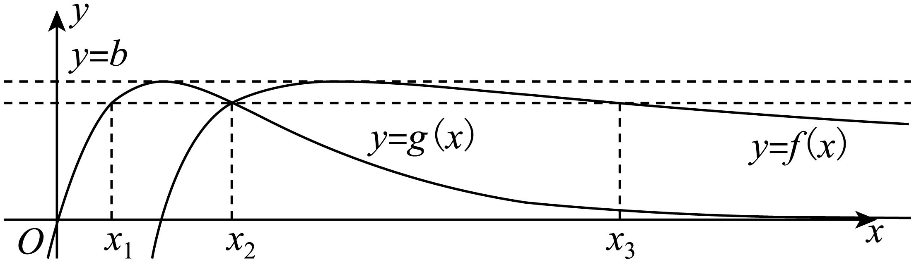

**第25讲  函数的零点问题**

**知识梳理**

**1、函数零点问题的常见题型：判断函数是否存在零点或者求零点的个数；根据含参函数零点情况，求参数的值或取值范围.**

求解步骤：

第一步：将问题转化为函数的零点问题，进而转化为函数的图像与轴(或直线)在某区间上的交点问题；

第二步：利用导数研究该函数在此区间上的单调性、极值、端点值等性质，进而画出其图像；

第三步：结合图像判断零点或根据零点分析参数.

**2、函数零点的求解与判断方法：**

(1)直接求零点：令*f*(*x*)＝0，如果能求出解，则有几个解就有几个零点．

(2)零点存在性定理：利用定理不仅要函数在区间[*a*，*b*]上是连续不断的曲线，且*f*(*a*)·*f*(*b*)＜0，还必须结合函数的图象与性质(如单调性、奇偶性)才能确定函数有多少个零点．

(3)利用图象交点的个数：将函数变形为两个函数的差，画两个函数的图象，看其交点的横坐标有几个不同的值，就有几个不同的零点．

3、求函数的零点个数时，常用的方法有：一、直接根据零点存在定理判断；二、将整理变形成的形式，通过两函数图象的交点确定函数的零点个数；三、结合导数，求函数的单调性，从而判断函数零点个数.

4、利用导数研究零点问题：

（1）确定零点的个数问题：可利用数形结合的办法判断交点个数，如果函数较为复杂，可用导数知识确定极值点和单调区间从而确定其大致图像；

（2）方程的有解问题就是判断是否存在零点的问题，可参变分离，转化为求函数的值域问题处理.可以通过构造函数的方法，把问题转化为研究构造的函数的零点问题；

（3）利用导数研究函数零点或方程根，通常有三种思路：①利用最值或极值研究；②利用数形结合思想研究；③构造辅助函数研究.

**必考题型全归纳**

**题型一：零点问题之一个零点**

**例1．**（2024·江苏南京·南京市第十三中学校考模拟预测）已知函数,.

（1）求函数的单调递减区间；

（2）设，.

①求证：函数存在零点；

②设，若函数的一个零点为.问：是否存在，使得当时，函数有且仅有一个零点，且总有恒成立？如果存在，试确定的个数；如果不存在，请说明理由.

【解析】（1）由题可知，定义域为.

则，令，解得（舍）或，

故可得在单调递减.

（2），

①由题可知.令，则其.

⒈当时，，故在上单调递减.

又因为，

故在区间上一定有一个零点；

⒉当时，，令，

解得，

令，故可得，故在区间上单调递增；

令，故可得或，故在，单调递减.

又，故可得，

又因为，

故在区间上一定有一个零点.

⒊当时，，令，

解得，显然存在零点.

⒋当时，令，解得，

故可得在区间单调递增；在单调递减.

又因为，，

故在区间上一定存在一个零点.

综上所述，对任意的，一定存在零点.

②由①可知，当时，

在上单调递减.

且只在区间上存在一个零点，显然不满足题意.

当时，

在单调递减，在单调递增，

在单调递减.且

且在区间上一定有一个零点，不妨设零点为，则，

故要存在，使得当时，函数有且仅有一个零点，

且总有恒成立，

只需，

即，（ⅰ）

整理得，.

则上述方程在区间上根的个数，即为满足题意的的个数.

不妨令,则，

故方程（ⅰ）等价于.

不妨令，

故可得在区间上恒成立.

故在区间上单调递增.

又因为，

故可得函数在区间上只有一个零点.

则方程（ⅰ）存在唯一的一个根.

即当时，有且仅有一个，使得当时，

函数有且仅有一个零点，且总有恒成立.

**例2．**（2024·广东·高三校联考阶段练习）已知函数，，在上有且仅有一个零点.

(1)求的取值范围；

(2)证明：若，则在上有且仅有一个零点，且.

【解析】（1），设，

，

①当时，若，则，

在上无零点，不符合题意；

②当时，若，则，

∴在上单调递增，

∴，∴在上无零点，不符合题意；

③当时，若，则，∴在上单调递增，

∵，，

∴存在唯一，使得.

当时，；当时，，

故在上单调递减，在上单调递增，

∵，，

故在上有且仅有一个零点，符合题意；

综上，的取值范围为.

（2）记，

，

由（1）知：若，当时，，，

当时，，，

故在上单调递减，在上单调递增，

又，，

故存在唯一，使得，且.

注意到，可知在上有且仅有一个零点，

且，即.

**例3．**（2024·全国·高三专题练习）已知函数.

(1)当时，求曲线在点处的切线方程；

(2)证明：当时，有且只有一个零点；

(3)若在区间各恰有一个零点，求的取值范围.

【解析】（1）由题意，，，故，又，故曲线在点处的切线方程为，即

（2）由题意，因为，故当时，，当时，，当时，，故当时，有且只有一个零点

（3）由（2）可得，，故

设，则

①若，则，在上为减函数，故，故在上为减函数，不满足题意；

②若，

i）当时，，单调递减，且，，故存在使得，故在上单调递增，在上单调递减.又，，且，设，易得，故在单调递增，故，故，故.故在上有一个零点，综上有在区间上有一个零点

ii）当时，，设，则，故为减函数，因为，，故存在使得成立，故在单调递增，在单调递减.又，，故存在使得成立，故在上，单调递减，在上，单调递增.又，故，且，，故，故存在使得，综上有在区间上有一个零点.

综上所述，当时，在区间各恰有一个零点

**变式1．**（2024·广东茂名·高三统考阶段练习）已知，函数，.

(1)证明：函数，都恰有一个零点；

(2)设函数的零点为，的零点为，证明.

【解析】（1）函数的定义域为，，

时，，时，，

在上单调递减，在上单调递减增，

时，，，，

函数恰有一个零点.

函数的定义域为，，

时，，时，，

在上单调递减，在上单调递增，

时，，，

令（表示中最大的数），，

函数恰有一个零点；

（2）由（1）得函数的零点为，且，的零点为，且，

则有，，

，，，

在上单调递增，由（1）可得，，，

，，

，，.原式得证.

**题型二：零点问题之二个零点**

**例4．**（2024·海南海口·统考模拟预测）已知函数.

(1)求的最小值；

(2)设.

（ⅰ）证明：存在两个零点，；

（ⅱ）证明：的两个零点，满足.

【解析】（1），

所以当时，，当时，，

所以函数在上单调递减，在上单调递增，

所以的最小值为．

（2）（ⅰ）证明：，，，

因为，所以，所以当时，，时，，

所以在上单调递减，在上单调递增，

则函数有最小值．

由，，

下面证明，在上，对，只要足够小，必存在，

使得：

实际上，当时，，令，得，

所以对，取，必有，即，

所以在区间上，存在唯一的，，

又，所以在区间上，存在唯一的，，

综上，存在两个零点．

（ⅱ）要证，需证，由，所以，

因为在上单调递减，因此需证：，

，，

所以，，

设，，

则，

所以在上单调递减，，即

，

结论得证，所以．

**例5．**（2024·甘肃天水·高三天水市第一中学校考阶段练习）已知函数．

（1）讨论函数的单调性；

（2）当时，，证明：函数有且仅有两个零点，两个零点互为倒数．

【解析】（1）的定义域为且，

若，则当时，，故在上单调递增；

若，则当，当，

故在上单调递增，在上单调递减.

（2），所以，，

因为在上递增，在递减，所以在上递增，

又，

故存在唯一使得，所以在上递减，在上递增，

又，所以在内存在唯一根，

由得，又，

故是在上的唯一零点．

综上，函数有且仅有两个零点，且两个零点互为倒数.

**例6．**（2024·四川遂宁·高三射洪中学校考期中）已知函数．

（1）若函数在处取得极值，求曲线在点处的切线方程；

（2）讨论函数的单调性；

（3）当时，，证明：函数有且仅有两个零点，且两个零点互为倒数．

【解析】（1）求导：，由已知有，即，

所以，则，所以切点为，切线斜率，

故切线方程为：.

（2）的定义域为且，

若，则当时，，故在上单调递增；

若，则当，当，

故在上单调递增，在上单调递减.

（3），所以，，

因为在上递增，在递减，所以在上递增，

又，

故存在唯一使得，所以在上递减，在上递增，

又，所以在内存在唯一根，

由得，又，

故是在上的唯一零点．

综上，函数有且仅有两个零点，且两个零点互为倒数.

**变式2．**（2024·全国·高三专题练习）已知函数.

（1）若.证明函数有且仅有两个零点；

（2）若函数存在两个零点，证明：.

【解析】（1）由题可知，定义域

当时，函数，则，（为的导函数）

单调递增

，

使.

时，单调递减；时，单调递增

所以

由双勾函数性质可知，在递减，，，且，

在上有且只有一个零点

又，且

所以在上有且只有一个零点

综上，函数有且仅有两个零点

（2）由是函数的两个零点，知

要证

需证

令

需证

令

与（1）同理得

所以

故

**变式3．**（2024·湖南长沙·高三长沙一中校考阶段练习）已知函数在其定义域内有两个不同的零点．

（1）求的取值范围；

（2）记两个零点为，且，已知，若不等式恒成立，求的取值范围．

【解析】（1）依题意，函数在定义域上有两个不同的零点，即方程在）上有两个不同的解，也即在上有两个不同的解．

令，则．

当时，，所以在上单调逆增，

当时，，所以在上单调递减，

所以．

又，时，

当时，，且，

若函数与函数的图象在上有两个不同的交点，

则．

（2）因为为方程的两根，

所以，．

不等式，变形可得，

代入可得．

因为，，所以原不等式等价于．

又由，，作差得，所以．

所以原不等式等价于恒成立．

令，则，不等式等价于在上恒成立．

令，则．

①当时，，所以在上单调递，因此，满足条件；

②当时，在上单调递增，在上单调递减，又，所以在上不能恒小于零．

综上，．

**变式4．**（2024·江苏·高三专题练习）已知函数，，．

(1)若，求证：

（ⅰ）在的单调减区间上也单调递减；

（ⅱ）在上恰有两个零点；

(2)若，记的两个零点为，求证：．

【解析】(1)证明：(1) (ⅰ) 因为，

由

令得的递减区间为

当时，，

所以在的递减区间上也递减．

(ⅱ)

因为，由得，

令，则.

因为，且，所以必有两个异号的零点，记正零点为，

则当时，，单调递减；

当时，，单调递增，若在上恰有两个零点，则

由，得，

所以，又对称轴，

所以

所以.

又，所以在上有且仅有一个零点．

又

令，解得.

所以取，当时，

所以在上有且仅有一个零点．

故时，在上恰有两个零点．

(2)由（ⅱ）知，对在上恰有两个零点，

不妨设，因为，

所以

因为，

所以

所以

**题型三：零点问题之三个零点**

**例7．**（2024·山东·山东省实验中学校联考模拟预测）已知函数有三个零点.

(1)求的取值范围；

(2)设函数的三个零点由小到大依次是.证明：.

【解析】（1）因为定义域为，又，

（ⅰ）当单调递减；

（ⅱ）当，记，则，

当；当，

所以在单调递增，在上单调递减，，

又，所以，

①当，则单调递减，至多一个零点，与题设矛盾；

②当，由（ⅱ）知，有两个零点，

记两零点为，且，

则在上单调递减，在上单调递增，在上单调递减，

因为，令，则，

所以，

所以，且趋近0，趋近于正无穷大，趋近正无穷大，趋近负无穷大，

所以函数有三零点，

综上所述，；

（2）等价于，即，

令，则，

所以在上单调递增，在上单调递减，

由（1）可得，则，

所以，所以，

则满足，，

要证，等价于证，

易知，令，则，

令得，令得，

所以函数在上单调递减，在上单调递增，

下面证明，由，即证，

即证，

即证，

即证，

令，，

令，则，所以，

所以，则，所以，

所以，所以，

所以，所以原命题得证.

**例8．**（2024·广东深圳·校考二模）已知函数.

(1)当时，求的单调区间；

(2)①当时，试证明函数恰有三个零点；

②记①中的三个零点分别为，，，且，试证明.

【解析】（1）当时，定义域为，

所以，

所以在定义域上单调递减，其单调递减区间为，无单调递增区间．

（2）①由定义域为，

所以，

令，因为，，

设方程的两根分别为，，且，则，，

所以有两个零点，，且，

当时，，单调递减；

当时，，单调递增；

当时，，单调递减；

所以在处取得极小值，在处取得极大值，

又，故，则，

又因为，，且，

故有，由零点存在性定理可知，

在恰有一个零点，在也恰有一个零点，

易知是的零点，所以恰有三个零点；

②由①知，，则，

因为，所以，

所以要证，

即证，

即证，

即证，

即证，

即证．

令，则，

当时，，所以在上单调递减，

所以，故式成立，

所以．

**例9．**（2024·广西柳州·统考三模）已知．

（1）若函数有三个不同的零点，求实数*a*的取值范围；

（2）在（1）的前提下，设三个零点分别为且，当时，求实数*a*的取值范围．

【解析】（1）当时，．令．

当时，的零点与函数的零点相同．

当时，，所以只有一个零点，不合题意．

因此．

又因为函数有三个不同的零点，所以有两个均不等于1的不同零点．

令，解得（舍去负值）．

所以当时，，是减函数；当时，，是增函数．

因为，

所以当，即时，有两个不同零点．

又因为时，，

所以函数有三个不同的零点，实数*a*的取值范围是

（2）因为，，

所以．所以．

所以．

所以是的两个根．

又因为，

所以有一个小于0的根，不妨设为．

根据有三个根，可知，

所以，即．

因为，所以．

所以，即．

显然，所以*a*的取值范围是．

**变式5．**（2024·贵州遵义·遵义市南白中学校考模拟预测）已知函数（，）.

（1）若，且在内有且只有一个零点，求的值；

（2）若，且有三个不同零点，问是否存在实数使得这三个零点成等差数列？若存在，求出的值，若不存在，请说明理由.

【解析】（1）若，则，.

若，则函数在上单调递增,则，

故在无零点；

若，令，得，.

在上，，单调递减，

在上，，单调递增.

又在内有且只有一个零点，则，

得，得,得.

（2）因为，则，若有三个不同零点，且成等差数列，

可设

,

故，则，故，，.此时，，，故存在三个不同的零点，故符合题意的的值为.

**变式6．**（2024·浙江·校联考二模）设，已知函数有个不同零点.

(1)当时，求函数的最小值：

(2)求实数的取值范围；

(3)设函数的三个零点分别为、、，且，证明：存在唯一的实数，使得、、成等差数列.

【解析】（1）当时，，则，

当时，，此时函数单调递减，

当时，，此时函数单调递增，

所以，.

（2）因为，

则，

①当时，恒成立，

当时，，此时函数单调递减，

当时，，此时函数单调递增，

此时函数至多两个零点，不合乎题意；

②当时，由可得或，列表如下：

<table><tr><td>

</td><td>

</td><td>

</td><td>

</td><td>

</td><td>

</td></tr><tr><td>

</td><td>

</td><td>

</td><td>

</td><td>

</td><td>

</td></tr><tr><td>

</td><td>
增
</td><td>
极大值
</td><td>
减
</td><td>
极小值
</td><td>
增
</td></tr></table>

由题意可知，有个不同的零点，则，

又因为，

令，记，

则，其中，则，

当时，，此时函数单调递增；

当时，，此时函数单调递减.

所以，，即，当且仅当时，等号成立，，

故不等式组的解集为.

因为，，

故当时，函数有个不同的零点，

综上所述，实数的取值范围是.

（3）因为，，结合（2）中的结论可知，

①当时，若存在符合题意的实数，则由于，

因此，，，

因此，、、成等差数列可得出，考虑，

即，这等价于，

令，

所以，，

令，则，

当时，，则函数单调递增，

所以，，故函数单调递增，

因为，，

所以，在上存在唯一零点，记为，

当时，，即函数在上单调递减，

当时，，即函数在上单调递增，

由于，，，

因此，在上无零点，在上存在唯一的零点，

所以，存在唯一的实数，使得、、成等差数列;

②当时，，不合乎题意.

综上所述，存在唯一的实数使得、、成等差数列.

**变式7．**（2024·山东临沂·高三统考期中）已知函数和有相同的最大值.

(1)求，并说明函数在（1，e）上有且仅有一个零点；

(2)证明：存在直线，其与两条曲线和共有三个不同的交点，并且从左到右的三个交点的横坐标成等比数列.

【解析】（1），令可得，

当时，，单调递增；

当时，，单调递减，

∴时，取得最大值.即.

，

当时，

时，，单调递增；

时，，单调递减，

∴.

当时，，不合题意；

当时，可知，不合题意.

故，即.

∴.

∵，

当时，，，

∴，∴在上单调递增，

又，，

∴在上有且仅有一个零点.

（2）由（1）知，，的图象大致如下图：

直线与曲线，三个交点的横坐标从左至右依次为，，，

且，

∴且

由即，，，∴

即.①

由即，

∴.②

由①，②，，又，即，

∴.

**题型四：零点问题之max，min问题**

**例10．**（2024·湖北黄冈·黄冈中学校考三模）已知函数．

(1)当时，求函数在上的极值；

(2)用表示中的最大值，记函数，讨论函数在上的零点个数．

【解析】（1）当时，，

由，得或，则和随的变化如下表所示：

<table><tr><td>

</td><td>

</td><td>

</td><td>

</td><td>
0
</td><td>

</td><td>

</td><td>

</td></tr><tr><td>

</td><td>
+
</td><td>
0
</td><td>
-
</td><td>
0
</td><td>
+
</td><td>
0
</td><td>
-
</td></tr><tr><td>

</td><td>

</td><td>
极大
</td><td>

</td><td>
极小
</td><td>

</td><td>
极大
</td><td>

</td></tr></table>

∴在上有2个极大值：在上有1个极小值．

（2）由，知．

（ⅰ）当时，，

∴，故在上无零点．

（ⅱ）当时，．

故当时，即时，是的零点；

当时，即时，不是的零点．

（ⅲ）当时，．故在的零点就是在的零点，

．

①当时，，故时，在是减函数，

结合，可知，在有一个零点，

故在上有1个零点．

②当时，，故时，在是增函数，

结合可知，在无零点，故在上无零点．

③当时，，使得时，在是增函数；

时，在是减函数；

由知，．

当，即时，在上无零点，故在上无零点．

当，即时，在上有1个零点，故在上有1个零点．

综上所述，时，有2个零点；时，有1个零点；时，无零点

**例11．**（2024·四川南充·统考三模）已知函数，．

(1)当时，求函数在上的极值；

(2)用表示，中的最大值，记函数，讨论函数在上的零点个数．

【解析】（1）当时，，，

由，得或，则和随的变化如下表所示：

<table><tr><td>

</td><td>

</td><td>

</td><td>

</td><td>
0
</td><td>

</td><td>

</td><td>

</td></tr><tr><td>

</td><td>

</td><td>
0
</td><td>

</td><td>
0
</td><td>

</td><td>
0
</td><td>

</td></tr><tr><td>

</td><td>

</td><td>
极大
</td><td>

</td><td>
极小
</td><td>

</td><td>
极大
</td><td>

</td></tr></table>

在上有2个极大值：，

在上有1个极小值：.

（2）由，知.

（i）当时，，

，故在上无零点．

（ii）当时，，．

故当时，即时，，是的零点；

当时，即时，，不是的零点.

（iii）当时，．

故在的零点就是在的零点，

，．

①当时，，故时，，在是减函数，

结合，可知，在有一个零点，

故在上有1个零点.

②当时，，故时，，在是增函数，

结合可知，在无零点，

故在上无零点．

③当时，，使得时，，在是增函数；

时，，在是减函数；

由知，．

当，即时，在上无零点，

故在上无零点．

当，即时，在上有1个零点，

故在上有1个零点.

综上所述，时，有2个零点；

时，有1个零点；

时，无零点.

**例12．**（2024·四川南充·统考三模）已知函数，其中为自然对数的底数.

(1)当时，求函数的极值；

(2)用表示，中的最大值，记函数，当时，讨论函数在上的零点个数.

【解析】（1）当时，，，

由得：或；由得：

列表：

<table><tr><td>

</td><td>

</td><td>
0
</td><td>

</td><td>
1
</td><td>

</td></tr><tr><td>

</td><td>
+
</td><td>
0
</td><td>
 
</td><td>
0
</td><td>
+
</td></tr><tr><td>

</td><td>

</td><td>
极大值
</td><td>

</td><td>
极小值
</td><td>

</td></tr></table>

∴；；

（2）由知：

（i）当时，

，故在上无零点.

（ii）当时，，知：当时，，，

是的零点；

当时，，，不是的零点；

（iii）当时，，故在的零点就是在的零点.

由得：，

设，则，

在上单调递增，

又∵，，

∴当时，即在上无零点；

当时，即在上有1个零点；

当时，即在上无零点；

综上所述：时，有2个零点；

或时，有1个零点；

时，无零点.

**变式8．**（2024·广东·高三专题练习）已知函数，，.

(1)若函数存在极值点，且，其中，求证：；

(2)用表示*m*，*n*中的最小值，记函数，，若函数有且仅有三个不同的零点，求实数*a*的取值范围.

【解析】（1）由题意，，，

当时，恒成立，没有极值.

当时，令，即，解之得，，

当时，，单调递增；

当时，，单调递减；

当时，， 单调递增.

∴时，有极大值为，

时，有极小值为，

当时，要证，即证，

代入计算有，，，

则有符合题意，即得证；

当时，要证，即证，

代入计算有，，，

则有符合题意，即得证.

综上，当为极大值点和极小值点时，均成立.

（2）①当时，，∴，

故函数在时无零点；

②当时，，，若，则，

，故是函数的一个零点；

若，则，∴，故时函数无零点.

③当时，，因此只需要考虑，

由题意，，，

㈠当时，恒成立，

∴在上单调递增，，∴在恒成立，

即在内无零点，也即在内无零点；

㈡当时，，恒成立，

∴在上单调递减，

即在内有1个零点，也即在内有1个零点；

㈢时，函数在上单调递减，

∴，

若，即时，

在内无零点，也即在内无零点；

若，即时，在内有唯一的一个零点，

也即在内有唯一的零点；

若，即时，由，，

∴时，在内有两个零点.

综上所述，当时，函数有3个零点.

**变式9．**（2024·全国·高三专题练习）已知函数，．

(1)若直线与曲线相切，求*a*的值；

(2)用表示*m*，*n*中的最小值，讨论函数的零点个数．

【解析】（1）设切点为，∵，∴

∴（\*）

消去*a*整理，得，∴

∴

（2）①当时，，，∴在上无零点

②当时，，．

若，，此时，是的一个零点，

若，，此时，不是的零点

③当时，，此时的零点即为的零点．

令，得，令，则，

当时，；当时，，∴在上单调递减，在上单调递增，且当时，

（i）若，即时，在上无零点，即在上无零点

（ii）若，即时，在上有一个零点，即在上有一个零点

（iii）若，即时，在上有两个零点，即在上有两个零点

（iv）若，即时，在上有一个零点，即在上有一个零点

综上所述，当或时，在上有唯一零点；

当或时，在上有两个零点；

当时，在上有三个零点

**变式10．**（2024·山西朔州·高三怀仁市第一中学校校考期末）已知函数.

(1)若过点可作的两条切线，求的值.

(2)用表示中的最小值，设函数，讨论零点的个数.

【解析】(1)设切点为

则切线方程为

在直线上，则，

令，则，令，解得，所以或

要想让切线有两条，只需满足或

(2)当时， ，单调递减，在取得最大值，，所以只需考虑在的零点个数.

（i）若或，则

当时，在无零点.

当时，在单调递减，而在有一个零点；

（ii）若，则在单调递减，在单调递增，故当时，取得最小值，最小值为

①若，即在无零点.

②若，即，则在有唯一零点；

③若，即，由于

所以当时，在有两个零点；当时，在有一个零点

综上，当有0个零点；

当或时，有一个零点；

当时，有两个零点.

**题型五：零点问题之同构法**

**例13．** 已知函数，若函数在区间内存在零点，求实数的取值范围

【解析】解：方法一：由可得，

设，，，则，令，在单调递减，在单调递增，

故（1）．

①当时，令，当时，单调递减，当时，单调递增，

（1），此时在区间内无零点；

②当时，（1），此时在区间内有零点；

③当时，令，解得或1或，且，

此时在单减，，单增，单减，，单增，

当或时，，此时在区间内有两个零点；

综合①②③知在区间内有零点．

方法二：由题意可得

，即，

因为当时等号成立，

所以，即，

，令，，

易知在单减，在上单增，所以（1），

又趋近于0和正无穷时，趋近于正无穷，

所以．

**例14．** 已知．

（1）若函数在上有1个零点，求实数的取值范围．

（2）若关于的方程有两个不同的实数解，求的取值范围．

【解析】解：（1），，，

所以，

当时，，所以在，单调递增，

又因为，所以在，上无零点；

当时，，使得，

所以在，单调递减，在单调递增，

又因为，，

所以若，即时，在，上无零点，

若，即时，在，上有一个零点，

当时，，在，上单调递减，在，上无零点，

综上当时，在，上有一个零点；

（2）由，

即，即，

则有，

令，，则，

，所以函数在上递增，

所以，则有，即，，

因为关于的方程有两个不同的实数解，

则方程，有两个不同的实数解，

令，则，

当时，，当时，，

所以函数在上递减，在上递增，

所以（1），

当时，，当时，，

所以．

**例15．** 已知函数．

（1）若，求函数的极值；

（2）若函数有且仅有两个零点，求的取值范围．

【解析】（1）当时，，，，

显然在单调递增，且，

当时，，单调递减；当时，，单调递增．

在处取得极小值，无极大值．

（2）函数有两个零点，即有两个解，即有两个解，

设，则，单调递增，

有两个解，即有两个解．

令，则，

当时，，单调递增；当时，，单调递减．

，，当时，

．

**题型六：零点问题之零点差问题**

**例16．** 已知关于的函数，与，在区间上恒有．

（1）若，，，求的表达式；

（2）若，，，，求的取值范围；

（3）若，，，，，，求证：．

【解析】解：（1）由得，

又，，所以，

所以，函数的图象为过原点，斜率为2的直线，所以，

经检验：，符合任意，

（2），

设，设，

在上，，单调递增，

在上，，单调递减，

所以（1），

所以当时，，

令

所以，得，

当时，即时，在上单调递增，

所以，，

所以，

当时，即时，

△，即，

解得，

综上，，．

（3）①当时，由，得

，

整理得，

令△，

则△，

记，

则，恒成立，

所以在，上是减函数，则（1），即，

所以不等式有解，设解为，

因此．

②当时，

，

设，

则，

令，得，

当时，，是减函数，

当，时，，是增函数，

，（1），

则当时，，

则，因此，

因为，，，所以，

③当时，因为，为偶函数，因此也成立，

综上所述，．

**例17．** 已知函数．

（1）如，求的单调区间；

（2）若在，单调增加，在，单调减少，证明：．

【解析】解：（Ⅰ）当时，，

故

当或时，；

当或时，．

从而在，单调增加，在，单调减少；

（Ⅱ）．

由条件得：（2），即，故，

从而．

因为，

所以．

将右边展开，与左边比较系数得，，．

故．，

又，即．由此可得．

于是．

**例18．** 已知函数，．

（1）当时，求函数的单调区间；

（2）当，时，函数有两个极值点，，证明：．

【解析】（1）解：当时，，

，，

令，可得，令，可得，

所以的单调递增区间为，单调递减区间为．

（2）证明：函数的定义域为，，

令，

因为函数有两个极值点，，

所以，是函数的两个零点，

，

，令，可得，令，可得，

所以在上单调递减，在，上单调递增，

所以，，

由，可得，

因为，所以，

所以要证，即证，只需证（2），

因为，

所以（2），

所以，得证．

**题型七：零点问题之三角函数**

**例19．**（2024·山东·山东省实验中学校考一模）已知函数．

(1)若对时，，求正实数*a*的最大值；

(2)证明：；

(3)若函数的最小值为*m*，试判断方程实数根的个数，并说明理由．

【解析】（1）由题知，令，所以，

又因为时，，*a*为正实数，故在区间恒成立，

所以函数在区间上单调递增，且．

①当时，在区间上恒成立，函数在上单调递减，

此时，符合题意．

②当时，，，

由零点存在定理，时，有，

即函数在区间上单调递减，在区间上单调递增，

所以当时，有，此时不符合，

综上所述，正实数*a*的最大值为1．

（2）由（1）知，当，时，，

令时，有，

即，所以，，，，

累加得，

即，

所以

（3）因为，所以，令，则在区间上恒成立，

所以函数在区间上单调递增，又，，

由零点存在定理，时，有，即，

因此，而函数在上递减，在上递增，

所以，

又因为，令，则，所以在区间上恒成立，

即在区间上单调递减，所以，即．

设，则，令，

则在区间上恒成立

所以函数在区间上单调递增，又，，

由零点存在定理，时，，即，

因此，又，

设，则在区间上恒成立，

所以函数在上递增，

于是且，

而函数在上递减，在上递增，

∴，

即函数有唯一零点，故方程有唯一的实数解．

**例20．**（2024·全国·高三专题练习）设函数.

(1)证明：当时，；

(2)记，若有且仅有2个零点，求的值.

【解析】（1）当时，有，单调递增，

又，则可知，使得，

所以在单调递减，在单调递增，

又，则可知；

（2）依题意，函数的定义域是，

当时，，即，而，

时，，时，，有两个零点，符合题意；

①当时，若，有，且，有，

又，由（1）可知又，则

所以在有1个零点：

若，有，若，

有，

可知在有1个零点，符合题意：

若，有在单调递增，，

（i）若，则当，有，

（ii）若，又，则可知，使得；

由（i）、（ii），则可知有在单调递减，所以，

又有，所以在至少有1个零点，

则可知在至少有2个零点，不符合题意；

若，有在单调递增，

又，则可知，使得，

所以在单调递增，则有，

又有，所以在至少有1个零点，

则可知在至少有2个零点，不符合题意；

②当时，由，

记，

由①可知，有且仅有满足题意，即时，满足题意.

综上可知，实数*a*的值为，0，1.

**例21．**（2024·广东深圳·红岭中学校考模拟预测）已知，且0为的一个极值点．

(1)求实数的值；

(2)证明：①函数在区间上存在唯一零点；

②，其中且．

【解析】（1）由，

则，

因为0为的一个极值点，

所以，所以．

当时，，

当时，因为函数在上单调递减，

所以，即在上单调递减；

当时，，则，

因为函数在上单调递减，且，，

由零点存在定理，存在，使得，

且当时，，即单调递增，

又因为，

所以，，在上单调递增；.

综上所述，在上单调递减，在上单调递增，

所以0为的一个极值点，故.

（2）①当时，，所以单调递减，

所以对，有，此时函数无零点；

当时，设，

则，

因为函数在上单调递减，且，，

由零点存在定理，存在，使得，

且当时，，即单调递增，

当时，，即单调递减．

又因为，

所以，，在上单调递增；

因为，，

所以存在，

当时，，单调递增，

当时，，单调递减．

所以，当时，单调递增，；

当时，单调递减，，

此时在上无零点；

当时，，

所以在单减，

又，，

由零点存在定理，函数在上存在唯一零点；

当时，，此时函数无零点；

综上所述，在区间上存在唯一零点．

②因为，由（1）中在上的单调性分析，

知，所以在单增，

所以对，有，

即，所以．

令，则，

所以，

设，，

则，

所以函数在上单调递减，

则，

即，，

所以 ，

所以，

所以.

<strong>变式11．</strong>（2024·山东济南·济南市历城第二中学校考二模）已知，（<em>n</em>为正整数，）．

(1)当时，设函数，，证明：有且仅有1个零点；

(2)当时，证明：．

【解析】（1）当时，

记，则

所以在区间上单调递增

而，

所以存在，使得，即

当时，，单调递减

当时，，单调递增

又，，

所以在上没有零点，在上有一个零点，

综上所述，函数在内只有一个零点.

（2）当时，，

要证，

即证，

令，则，

所以在单调递减，，即，

要证只需证，

令，则，

∴在单调递减，在单调递增，

∴，即，

∴，即，

所以成立，

∴原命题得证.

**题型八：零点问题之取点技巧**

**例22．** 已知函数为自然对数的底数，且．

（1）讨论的单调性；

（2）若有两个零点，求的取值范围．

【解析】解：（1），

①时，，则

时，，在递减，

时，，在递增，

②当时，由得，，

若，则，故在递增，

若，则

当或时，，时，，

故在，递增，在递减；

综上：时，在递减，在递增，

时，在，递增，在递减；

时，在递增；

（2）①时，在递增，不可能有2个零点，

②当时，在，递增，递减，

故当时，取极大值，极大值为，

此时，不可能有2个零点，

③当时，，由得，

此时，仅有1个零点，

④当时，在递减，在递增，

故，

有2个零点，，

解得：，，

而（1），

取，则（b），

故在，各有1个零点，

综上，的取值范围是，．

**例23．** 已知函数．

（1）讨论的单调性；

（2）若有两个零点，求的取值范围．

【解析】解：（1）由，

可得，

①当时，由，可得；由，可得，

即有在递减；在递增；

②当时，由得或；

若，则，当时，，当时，；

，恒成立，即有在上递增；

若时，则；由，可得或；

由，可得．

即有在，，递增；

在，递减；

若，则，由，可得或；

由，可得．

即有在，，递增；在，递减．

（2）①由（1）可得当时，在递减；在递增，

且，，取满足且．则，

有两个零点；

②当时，，所以只有一个零点；

③当时，

若时，由（1）知在，递减，

在，，递增，

又当时，，所以不存在两个零点；

当时，由（1）知，在单调增，又当时，，故不存在两个零点；

综上可得，有两个零点时，的取值范围为．

**例24．** 已知函数．

（1）讨论的单调性；

（2）若有两个零点，求的取值范围．

【解析】解：（1）．

当时，令，得；

令，得．

故在上单调递减，在上单调递增．

当时，令，得，．

①当，即时，，在上单调递增．

②当，即时，在上单调递减，在，，上单调递增．

③当，即时，在上单调递减，在，，上单调递增．

（2）当时，由（1）可知只有一个极小值点，

且，．

（方法一）取，且，则，，

因为，所以，

则（b），此时有两个零点．

（方法二）当时，，，

从而，因此有两个零点．

当时，，此时有一个零点，不符合题意．

当时，若，则恒有．

当时，在上单调递增，

此时在上不可能有两个零点；

当时，若，同理可知在上不可能有两个零点；

若，在上先减后增，

此时在上也不可能有两个零点．

综上，的取值范围是．

**变式12．** 已知函数．

（1）讨论的单调性；

（2）若有两个零点，求的取值范围．

【解析】解：（1），

①当时，，由，得，

由，得，

的单增区间为，单减区间为．

②当时，令，或，

当，即时，，在单增，

当，即时，由得，，，，

由得，，，

单增区间为，，，单减区间为，．

当，即时，由得，，，，

由得，，，

的单增区间为，，，

的单减区间为，．

（2）．

当时，，，可得，不符题意，故；

当时，由（1）可得只需，即时，满足题意；

当时，在上单增，不满足题意；

当时，的极大值，不可能有两个零点．

当时，的极小值，，，

只有才能满足题意，即有解，

令，，

则，（a）在单增，

而，（a），方程无解．

综上所述，

