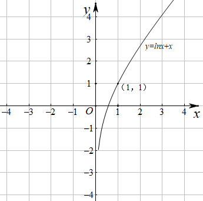
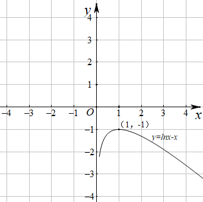
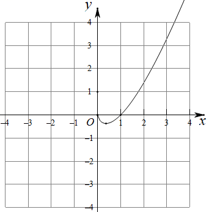
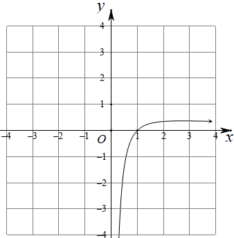
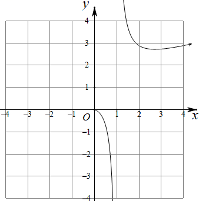
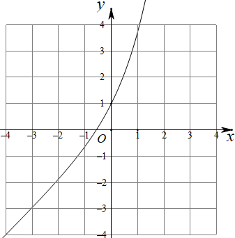
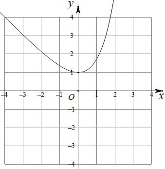
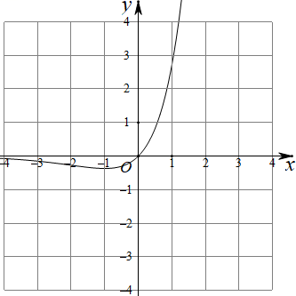
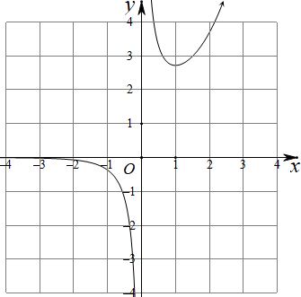
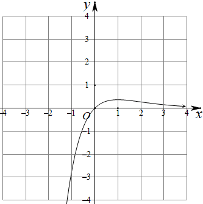

**第26讲  导数同构**

**知识梳理**

**方法技巧总结一、常见的同构函数图像**

<table><tr><td>
函数表达式
</td><td>
图像
</td><td>
函数表达式
</td><td>
图像
</td></tr><tr><td>

</td><td>

</td><td>

函数极值点

</td><td>

</td></tr><tr><td>

函数极值点

</td><td>

</td><td>

函数极值点

</td><td>

</td></tr><tr><td>

函数极值点

</td><td>

</td><td>

过定点

</td><td>

</td></tr><tr><td>

函数极值点

</td><td>

</td><td>

函数极值点

</td><td>

</td></tr><tr><td>

函数极值点

</td><td>

</td><td>

函数极值点

</td><td>

</td></tr></table>

**方法技巧总结二：同构式的基本概念与导数压轴题**

1、同构式：是指除了变量不同，其余地方均相同的表达式

2、同构式的应用：

（1）在方程中的应用：如果方程和呈现同构特征，则可视为方程的两个根

（2）在不等式中的应用：如果不等式的两侧呈现同构特征，则可将相同的结构构造为一个函数，进而和函数的单调性找到联系．可比较大小或解不等式．<同构小套路>

①指对各一边，参数是关键；②常用“母函数”：，；寻找“亲戚函数”是关键；

③信手拈来凑同构，凑常数、、参数；④复合函数（亲戚函数）比大小，利用单调性求参数范围．

（3）在解析几何中的应用：如果满足的方程为同构式，则为方程所表示曲线上的两点．特别的，若满足的方程是直线方程，则该方程即为直线的方程

（4）在数列中的应用：可将递推公式变形为“依序同构”的特征，即关于与的同构式，从而将同构式设为辅助数列便于求解

3、常见的指数放缩：

4、常见的对数放缩：

5、常见三角函数的放缩：

6、学习指对数的运算性质时，曾经提到过两个这样的恒等式：

（1） 且时，有

（2） 当 且时，有

再结合指数运算和对数运算的法则，可以得到下述结论（其中）

（3）

（4）

（5）

（6）

再结合常用的切线不等式*lnxx*-1， 等，可以得到更多的结论，这里仅以第（3）条为例进行引申：

（7）；

（8）；

7、同构式问题中通常构造亲戚函数与，常见模型有：

①；

②；

③

8、乘法同构、加法同构

（1）乘法同构，即乘同构，如；

（2）加法同构，即加同构，如，

（3）两种构法的区别：

①乘法同构，对变形要求低，找亲戚函数与易实现，但构造的函数与均不是单调函数；

②加法同构，要求不等式两边互为反函数，构造后的函数为单调函数，可直接由函数不等式求参数范围；

**必考题型全归纳**

**题型一：不等式同构**

**例1．**（2024·四川达州·高二校考阶段练习）已知，且，，，则（    ）

A．	B．

C．	D．

**例2．**（2024·湖北黄石·高二校考期中）已知．且，，，则（    ）

A．	B．

C．	D．

<strong>例3．</strong>（2024·陕西榆林·高二校考期末）已知<em>a</em>，<em>b</em>，，且，，，则<em>a</em>，<em>b</em>，<em>c</em>的大小关系是（    ）

A．	B．	C．	D．

**变式1．**（2024·河南·高二校联考期中）已知，，，则，，的大小顺序是（    ）

A．	B．

C．	D．

**变式2．**（2024·全国·高三专题练习）已知，且，其中e为自然对数的底数，则下列选项中一定成立的是（    ）

A．	B．

C．	D．

**变式3．**（2024·江西赣州·高二江西省信丰中学校考阶段练习）已知函数的导数满足对恒成立，且实数，满足，则下列关系式恒成立的是（    ）

A．	B．	C．	D．

**题型二：同构变形**

**例4．**（2024·全国·高三专题练习）对下列不等式或方程进行同构变形，并写出相应的同构函数．

(1)；

(2)；

(3)；

(4)；

(5)；

(6)；

(7)；

(8)．

**题型三：零点同构**

**例5．**（2024·全国·高三专题练习）设，满足，则（    ）

A．	B．	C．	D．6

<strong>例6．</strong>（2024·全国·高二专题练习）在数学中，我们把仅有变量不同，而结构､形式相同的两个式子称为同构式，相应的方程称为同构方程，相应的不等式称为同构不等式．若关于的方程和关于<em>b</em>的方程可化为同构方程，则的值为（    ）

A．	B．e	C．	D．1

**例7．**（2024·安徽池州·高三池州市第一中学校考阶段练习）已知函数和有相同的最大值.

(1)求；

(2)证明：存在直线，其与两条曲线和共有三个不同的交点，并且从左到右的三个交点的横坐标成等比数列.

**变式4．**（2024·安徽安庆·高三校联考阶段练习）在数学中，我们把仅有变量不同，而结构､形式相同的两个式子称为同构式，相应的方程称为同构方程，相应的不等式称为同构不等式.若关于的方程和关于的方程可化为同构方程.

（1）求的值；

（2）已知函数.若斜率为的直线与曲线相交于，两点，求证：.

**变式5．**（2024·上海浦东新·高一上海南汇中学校考期末）设函数的定义域为，若函数满足条件：存在，使在上的值域为（其中，则称为区间上的“倍缩函数”.

(1)证明：函数为区间上的“倍缩函数”；

(2)若存在，使函数为上的“倍缩函数”，求实数的取值范围；

(3)给定常数，以及关于的函数，是否存在实数，使为区间上的“1倍缩函数”.若存在，请求出的值；若不存在，请说明理由.

**变式6．**（2024·全国·高三专题练习）已知函数．

(1)求函数的单调区间；

(2)设函数，若函数有两个零点，求实数*a*的取值范围．

**变式7．**（2024·全国·统考高考真题）已知函数和有相同的最小值．

(1)求*a*；

(2)证明：存在直线，其与两条曲线和共有三个不同的交点，并且从左到右的三个交点的横坐标成等差数列．

**变式8．**（2024·全国·高三专题练习）已知函数和有相同的最大值，并且.

(1)求；

(2)证明：存在直线，其与两条曲线和共有三个不同的交点，且从左到右的三个交点的横坐标成等比数列.

**变式9．**（2024·江苏常州·高三统考阶段练习）已知函数和有相同的最大值.

(1)求实数的值；

(2)证明：存在直线，其与两曲线和共有三个不同的交点，并且从左到右的三个交点的横坐标成等比数列.

**题型四：利用同构解决不等式恒成立问题**

**例8．**（2024·全国·高三专题练习）完成下列各问

（1）已知函数，若恒成立，则实数*a*的取值范围是\_\_\_\_\_\_\_；

（2）已知函数，若恒成立，则正数*a*的取值范围是\_\_\_\_\_\_\_；

（3）已知函数，若恒成立，则正数*a*的取值范围是\_\_\_\_\_\_\_；

（4）已知不等式对任意正数*x*恒成立，则实数*a*的取值范围是\_\_\_\_\_\_\_；

（5）已知函数，其中，若恒成立，则实数*a*与*b*的大小关系是\_\_\_\_\_\_\_；

（6）已知函数，若恒成立，则实数*a*的取值范围是\_\_\_\_\_\_\_；

（7）已知函数，若恒成立，则实数*a*的取值范围是\_\_\_\_\_\_\_；

（8）已知不等式，对恒成立，则*k*的最大值为\_\_\_\_\_\_\_；

（9）若不等式对恒成立，则实数*a*的取值范围是\_\_\_\_\_\_\_；

**例9．**（2024·全国·高三专题练习）已知.设实数，若对任意的正实数，不等式恒成立，则的最小值为\_\_\_\_\_\_\_\_\_\_\_.

<strong>例10．</strong>（2024·四川泸州·泸州老窖天府中学校考模拟预测）已知不等式对恒成立，则实数<em>m</em>的最小值为\_\_\_\_\_\_\_\_\_\_.

**变式10．** 设实数，若对任意的，不等式恒成立，则的最小值为

A．	B．	C．	D．

**变式11．** 设实数，若对任意的，，不等式恒成立，则的最大值为

A．	B．	C．	D．

**变式12．**（2024·全国·高三专题练习）已知函数，，当时，恒成立，则实数的取值范围是（    ）

A．	B．	C．	D．

**变式13．**（2024·云南·校联考模拟预测）已知函数，.

(1)求函数的极值；

(2)请在下列①②中选择一个作答（注意：若选两个分别作答则按选①给分）.

①若恒成立，求实数的取值范围；

②若关于的方程有两个实根，求实数的取值范围.

**题型五：利用同构求最值**

**例11．**（2024·全国·高二专题练习）“朗博变形”是借助指数运算或对数运算，将化成，的变形技巧.已知函数，，若，则的最大值为（    ）

A．	B．	C．	D．

**例12．**（2024·全国·高二期末）已知函数，若，则的最小值为（    ）

A．	B．	C．	D．

**例13．**（2024·江西·临川一中校联考模拟预测）已知函数，，若，，则的最小值为（    ）

A．	B．	C．	D．

**变式14．**（2024·全国·高三专题练习）已知函数，若，则的最大值为（    ）

A．	B．	C．	D．

**变式15．**（2024·全国·高三专题练习）已知大于1的正数，满足，则正整数的最大值为（   ）

A．7	B．8	C．5	D．11

**变式16．**（2024·安徽淮南·统考一模）已知两个实数、满足，在上均恒成立，记、的最大值分别为、，那么

A．	B．	C．	D．

**题型六：利用同构证明不等式**

**例14．** 已知函数，．

（1）讨论的单调区间；

（2）当时，证明．

**例15．** 已知函数．

（1）讨论函数的单调性；

（2）当时，求证：在上恒成立；

（3）求证：当时，．

**例16．** 已知函数．

（1）讨论函数的零点的个数；

（2）证明：．

**变式17．** 已知函数．

（1）当时，求函数的单调区间；

（2）若函数在处取得极值，对，恒成立，求实数的取值范围；

（3）当时，求证：．

**变式18．** 已知函数，函数，，．

（1）讨论的单调性；

（2）证明：当时，．

（3）证明：当时，

