**第26讲  导数同构**

**知识梳理**

**方法技巧总结一、常见的同构函数图像**

<table><tr><td>
函数表达式
</td><td>
图像
</td><td>
函数表达式
</td><td>
图像
</td></tr><tr><td>

</td><td>
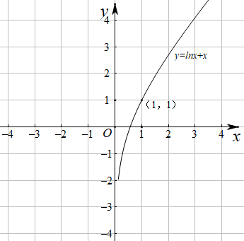
</td><td>

函数极值点

</td><td>
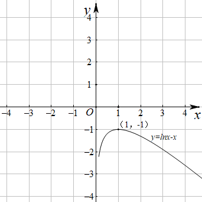
</td></tr><tr><td>

函数极值点

</td><td>

</td><td>

函数极值点

</td><td>
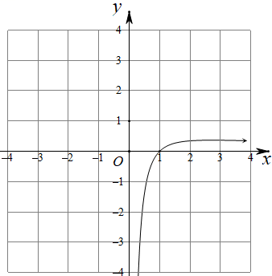
</td></tr><tr><td>

函数极值点

</td><td>
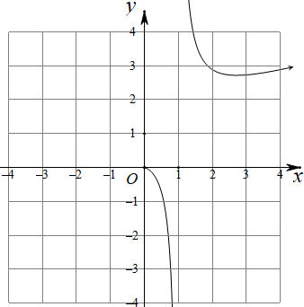
</td><td>

过定点

</td><td>
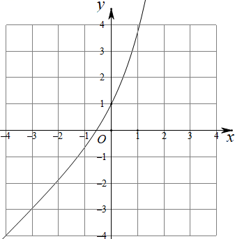
</td></tr><tr><td>

函数极值点

</td><td>
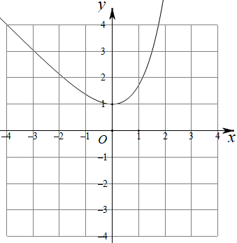
</td><td>

函数极值点

</td><td>
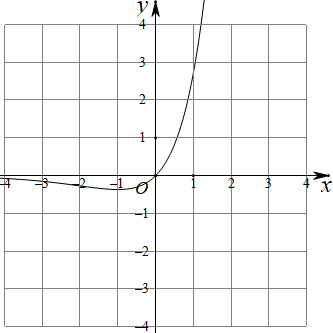
</td></tr><tr><td>

函数极值点

</td><td>

</td><td>

函数极值点

</td><td>
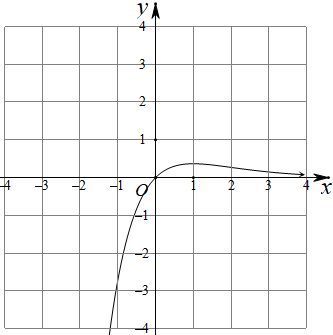
</td></tr></table>

**方法技巧总结二：同构式的基本概念与导数压轴题**

1、同构式：是指除了变量不同，其余地方均相同的表达式

2、同构式的应用：

（1）在方程中的应用：如果方程和呈现同构特征，则可视为方程的两个根

（2）在不等式中的应用：如果不等式的两侧呈现同构特征，则可将相同的结构构造为一个函数，进而和函数的单调性找到联系．可比较大小或解不等式．<同构小套路>

①指对各一边，参数是关键；②常用“母函数”：，；寻找“亲戚函数”是关键；

③信手拈来凑同构，凑常数、、参数；④复合函数（亲戚函数）比大小，利用单调性求参数范围．

（3）在解析几何中的应用：如果满足的方程为同构式，则为方程所表示曲线上的两点．特别的，若满足的方程是直线方程，则该方程即为直线的方程

（4）在数列中的应用：可将递推公式变形为“依序同构”的特征，即关于与的同构式，从而将同构式设为辅助数列便于求解

3、常见的指数放缩：

4、常见的对数放缩：

5、常见三角函数的放缩：

6、学习指对数的运算性质时，曾经提到过两个这样的恒等式：

（1） 且时，有

（2） 当 且时，有

再结合指数运算和对数运算的法则，可以得到下述结论（其中）

（3）

（4）

（5）

（6）

再结合常用的切线不等式*lnxx*-1， 等，可以得到更多的结论，这里仅以第（3）条为例进行引申：

（7）；

（8）；

7、同构式问题中通常构造亲戚函数与，常见模型有：

①；

②；

③

8、乘法同构、加法同构

（1）乘法同构，即乘同构，如；

（2）加法同构，即加同构，如，

（3）两种构法的区别：

①乘法同构，对变形要求低，找亲戚函数与易实现，但构造的函数与均不是单调函数；

②加法同构，要求不等式两边互为反函数，构造后的函数为单调函数，可直接由函数不等式求参数范围；

**必考题型全归纳**

**题型一：不等式同构**

**例1．**（2024·四川达州·高二校考阶段练习）已知，且，，，则（    ）

A．	B．

C．	D．

【答案】A

【解析】设函数，，当，此时单调递增，当，此时单调递减，由题，，，得，因为，所以，则，且，所以.

故选：A.

**例2．**（2024·湖北黄石·高二校考期中）已知．且，，，则（    ）

A．	B．

C．	D．

【答案】B

【解析】令，则，即在上单调递减，

∴，即，

设，则，

即在上单调递增，

又∵，∴.

故选：.

<strong>例3．</strong>（2024·陕西榆林·高二校考期末）已知<em>a</em>，<em>b</em>，，且，，，则<em>a</em>，<em>b</em>，<em>c</em>的大小关系是（    ）

A．	B．	C．	D．

【答案】C

【解析】构造函数，

当时，单调递减，

当时，单调递增，

，

，

，

因为，所以，即，

而*a*，*b*，，所以，

故选：C

**变式1．**（2024·河南·高二校联考期中）已知，，，则，，的大小顺序是（    ）

A．	B．

C．	D．

【答案】D

【解析】因为，，，

构造函数，其导函数，

令，解得：，列表得：

<table><tr><td>

</td><td>

</td><td>

</td><td>

</td></tr><tr><td>

</td><td>
+
</td><td>
0
</td><td>
-
</td></tr><tr><td>

</td><td>

</td><td>
极大值
</td><td>

</td></tr></table>

所以在上单增.

因为，所以，即

故选:D.

**变式2．**（2024·全国·高三专题练习）已知，且，其中e为自然对数的底数，则下列选项中一定成立的是（    ）

A．	B．

C．	D．

【答案】B

【解析】构造，，则恒成立，

则，

当时，，，

当时，，

所以在单调递增，在单调递减，

因为，所以，，

又，所以，D错误，

因为，所以，，

所以，所以，A错误，B正确.

令，则，

当时，恒成立，

所以在上单调递增，

当时，，即，

因为，

所以

因为，

所以，

因为在单调递减，

所以，即

因为在上单调递减，

所以，C错误

故选：B

**变式3．**（2024·江西赣州·高二江西省信丰中学校考阶段练习）已知函数的导数满足对恒成立，且实数，满足，则下列关系式恒成立的是（    ）

A．	B．	C．	D．

【答案】D

【解析】令，则，

所以函数单调递增，

又，所以，

所以，

对于A，当，时，，，此时，故A错误；

对于B，由指数函数的单调性可得，故B错误；

对于C，当，时，，，此时，故C错误；

对于D，令，则，所以函数单调递增，所以即，故D正确.

故选：D.

**题型二：同构变形**

**例4．**（2024·全国·高三专题练习）对下列不等式或方程进行同构变形，并写出相应的同构函数．

(1)；

(2)；

(3)；

(4)；

(5)；

(6)；

(7)；

(8)．

【解析】(1)显然，则，.

(2)显然，则，.

(3)显然，则，.

(4)显然，则

，.

(5)，.

(6)，，.

(7)，.

(8)，.

**题型三：零点同构**

**例5．**（2024·全国·高三专题练习）设，满足，则（    ）

A．	B．	C．	D．6

【答案】B

【解析】可化为：.

记，定义域为R.

因为，所以在R上单调递增.

又，

所以为奇函数.

所以由可得：，所以2.

故选：B

<strong>例6．</strong>（2024·全国·高二专题练习）在数学中，我们把仅有变量不同，而结构､形式相同的两个式子称为同构式，相应的方程称为同构方程，相应的不等式称为同构不等式．若关于的方程和关于<em>b</em>的方程可化为同构方程，则的值为（    ）

A．	B．e	C．	D．1

【答案】A

【解析】对两边取自然对数，得①，

对两边取自然对数，得，

即②，

因为方程①②为两个同构方程，所以，解得，

设，，则，

所以在上单调递增，

所以方程的解只有一个，

所以，所以．

故选：A

**例7．**（2024·安徽池州·高三池州市第一中学校考阶段练习）已知函数和有相同的最大值.

(1)求；

(2)证明：存在直线，其与两条曲线和共有三个不同的交点，并且从左到右的三个交点的横坐标成等比数列.

【解析】（1），

当时，当时，单调递减，

当时，单调递增，

所以当时，函数有最大值，即；

当时，当时，单调递增，

当时，单调递减，

所以当时，函数有最小值，没有最大值，不符合题意，

由，

当时，当时，单调递减，

当时，单调递增，

所以当时，函数有最大值，即；

当时，当时，单调递增，

当时，单调递减，

所以当时，函数有最小值，没有最大值，不符合题意，

于是有.

（2）由（1）知，两个函数图象如下图所示：

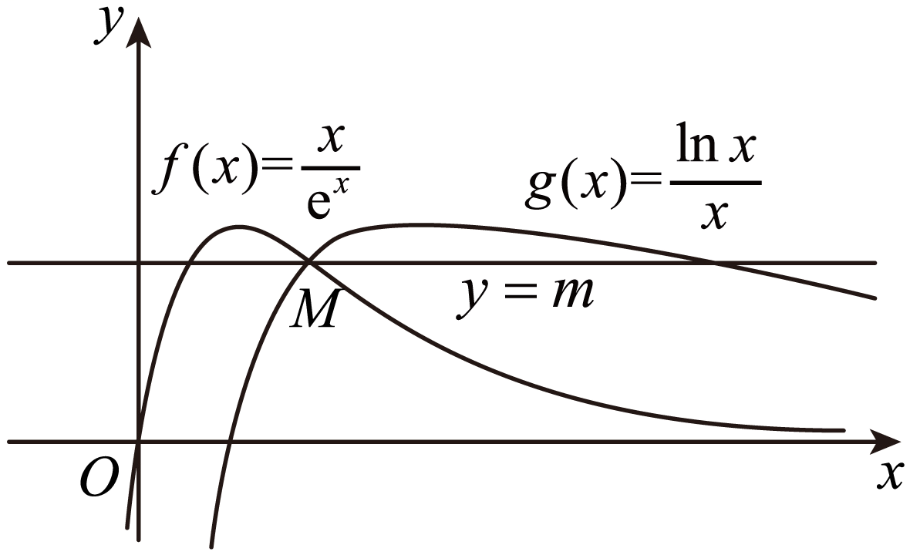

由图可知：当直线经过点时，此时直线与两曲线和恰好有三个交点，不妨设

且，

由，又，

又当时，单调递增，所以，

又，又，

又当时，单调递减，所以，

；

于是有.

**变式4．**（2024·安徽安庆·高三校联考阶段练习）在数学中，我们把仅有变量不同，而结构､形式相同的两个式子称为同构式，相应的方程称为同构方程，相应的不等式称为同构不等式.若关于的方程和关于的方程可化为同构方程.

（1）求的值；

（2）已知函数.若斜率为的直线与曲线相交于，两点，求证：.

【解析】（1）对两边取自然对数，得(1),

对两边取自然对数，得

即，

因为(1)(2)方程为两个同构方程，所以 ，解得 ，

设 ，则 ,

所以 在 单调递增，所以方程的解只有一个,

所以 ，所以 ，

故 .

（2）由（1）知：

所以

要证，即证明等价于

令 ，则只要证明 即可，

由 知， ，故等价于证

设 则 ，即 在 单调递增，

故 ，即 .

设则 ，即在单调递增，

故，即 。

由上可知成立，则.

**变式5．**（2024·上海浦东新·高一上海南汇中学校考期末）设函数的定义域为，若函数满足条件：存在，使在上的值域为（其中，则称为区间上的“倍缩函数”.

(1)证明：函数为区间上的“倍缩函数”；

(2)若存在，使函数为上的“倍缩函数”，求实数的取值范围；

(3)给定常数，以及关于的函数，是否存在实数，使为区间上的“1倍缩函数”.若存在，请求出的值；若不存在，请说明理由.

【解析】（1）函数在**R**上单调递增，则在区间上的值域为，

显然有，

所以函数为区间上的“倍缩函数”.

（2）因为函数在上单调递增，当时，函数在上单调递增，

因此函数是定义域上的增函数，

因为函数为上的“倍缩函数”，则函数在上的值域为，

于是得，即是方程的两个不等实根，

则方程有两个不等实根，

令，则关于的一元二次方程有两个不等的正实根，

因此，解得，当时，函数恒有意义，

所以实数的取值范围是.

（3）常数，函数的定义域为，并且，

假定存在实数，使为区间上的“1倍缩函数”，

则函数在区间上的值域为，由，及知，

因为函数在上单调递增，即，

若，即，则函数在区间上的值域中有数0，矛盾，

若，即，当时，在上单调递减，

有，即，整理得，显然无解，

若，即，当时，在上单调递增，

有，即是方程的两个不等实根且，

而方程，于是得方程在上有两个不等实根，

从而，解得，而，即有，

解方程得：，

所以当时，存在实数，使为区间上的“1倍缩函数”， ，

当时，不存在实数，使为区间上的“1倍缩函数”.

**变式6．**（2024·全国·高三专题练习）已知函数．

(1)求函数的单调区间；

(2)设函数，若函数有两个零点，求实数*a*的取值范围．

【解析】（1）函数的定义域为，

．

函数的单调递增区间为；单减区间为．

（2）要使函数有两个零点，即有两个实根，

即有两个实根．

即．

整理为，

设函数，则上式为，

因为恒成立，所以单调递增，所以．

所以只需使有两个根，设．

由（1）可知，函数）的单调递增区间为；单减区间为，

故函数在处取得极大值，．

当时，；当时，，

要想有两个根，只需，解得：．

所以*a*的取值范围是．

**变式7．**（2024·全国·统考高考真题）已知函数和有相同的最小值．

(1)求*a*；

(2)证明：存在直线，其与两条曲线和共有三个不同的交点，并且从左到右的三个交点的横坐标成等差数列．

【解析】（1）的定义域为，而，

若，则，此时无最小值，故.

的定义域为，而.

当时，，故在上为减函数，

当时，，故在上为增函数，

故.

当时，，故在上为减函数，

当时，，故在上为增函数，

故.

因为和有相同的最小值，

故，整理得到，其中，

设，则，

故为上的减函数，而，

故的唯一解为，故的解为.

综上，.

（2）**[方法一]：**

由（1）可得和的最小值为.

当时，考虑的解的个数、的解的个数.

设，，

当时，，当时，，

故在上为减函数，在上为增函数，

所以，

而，，

设，其中，则，

故在上为增函数，故，

故，故有两个不同的零点，即的解的个数为2.

设，，

当时，，当时，，

故在上为减函数，在上为增函数，

所以，

而，，

有两个不同的零点即的解的个数为2.

当，由（1）讨论可得、仅有一个解，

当时，由（1）讨论可得、均无根，

故若存在直线与曲线、有三个不同的交点，

则.

设，其中，故，

设，，则，

故在上为增函数，故即，

所以，所以在上为增函数，

而，，

故

上有且只有一个零点，且：

当时，即即，

当时，即即，

因此若存在直线与曲线、有三个不同的交点，

故，

此时有两个不同的根，

此时有两个不同的根，

故，，，

所以即即，

故为方程的解，同理也为方程的解

又可化为即即，

故为方程的解，同理也为方程的解，

所以，而，

故即.

**[方法二]：**

由知，，，

且在上单调递减，在上单调递增；

在上单调递减，在上单调递增，且

①时，此时，显然与两条曲线和

共有0个交点，不符合题意；

②时，此时，

故与两条曲线和共有2个交点，交点的横坐标分别为0和1；

③时，首先，证明与曲线有2个交点，

即证明有2个零点，，

所以在上单调递减，在上单调递增，

又因为，，，

令，则，

所以在上存在且只存在1个零点，设为，在上存在且只存在1个零点，设为

其次，证明与曲线和有2个交点，

即证明有2个零点，，

所以上单调递减，在上单调递增，

又因为，，，

令，则，

所以在上存在且只存在1个零点，设为，在上存在且只存在1个零点，设为

再次，证明存在*b*，使得

因为，所以，

若，则，即，

所以只需证明在上有解即可，

即在上有零点，

因为，，

所以在上存在零点，取一零点为，令即可，

此时取

则此时存在直线，其与两条曲线和共有三个不同的交点，

最后证明，即从左到右的三个交点的横坐标成等差数列，

因为

所以，

又因为在上单调递减，，即，所以，

同理，因为，

又因为在上单调递增，即，，所以，

又因为，所以，

即直线与两条曲线和从左到右的三个交点的横坐标成等差数列.

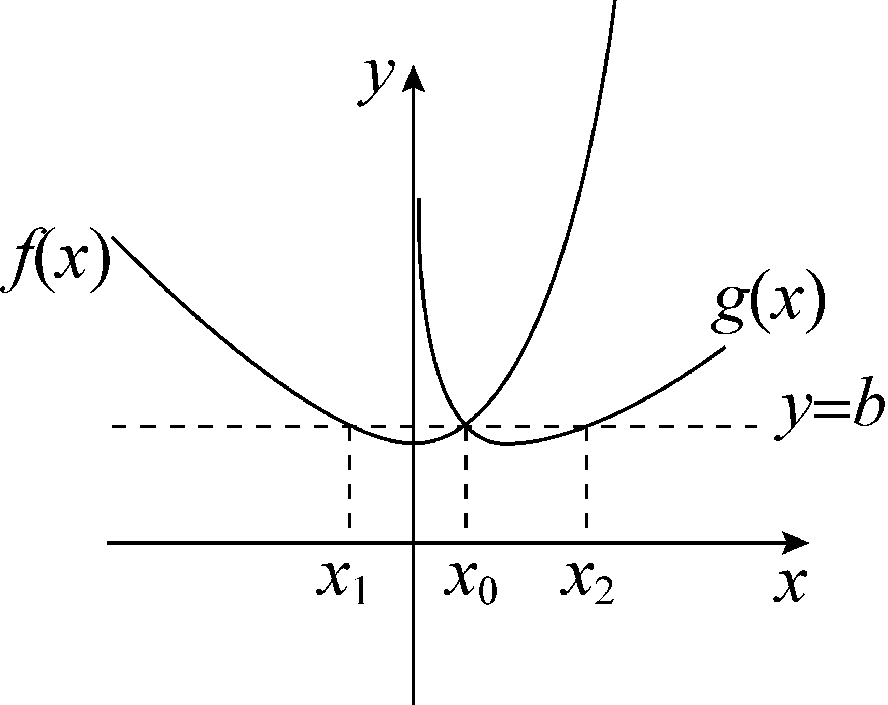

**变式8．**（2024·全国·高三专题练习）已知函数和有相同的最大值，并且.

(1)求；

(2)证明：存在直线，其与两条曲线和共有三个不同的交点，且从左到右的三个交点的横坐标成等比数列.

【解析】（1），.

若，则时，时，

所以在定义域内先减后增，无最大值.

若，则，最大值为0，但不满足.

若，令，得.

当时，在上单调递增；

当时，在上单调递减.

所以*x*=1时取得最大值，最大值为.

，.

若，则时，时，

所以在定义域内先减后增，无最大值.

若，则，最大值为0，但不满足.

若，令，得.

当时，，在上单调递增；

当时，，在上单调递减.

所以时取得最大值，最大值为.

综上，，解得.

（2）由（1）知：在上单调递增，在上单调递减，

在上单调递增，在上单调递减，且，有唯一的零点，有唯一的零点1.

它们的大致图像如图所示，设曲线与在上交于点*A*，

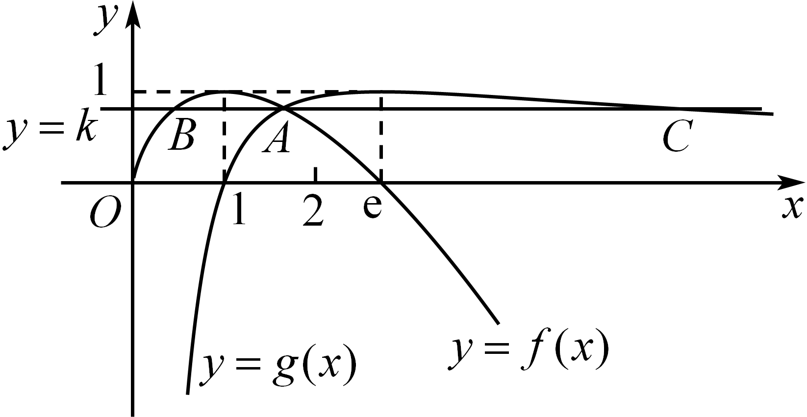

当直线经过点*A*时，直线与曲线还有另一个交点*B*，

设，，，不妨设直线与曲线还有另一个交点，

则，则，故①，同理得②，

由①②知，与是直线与曲线交点的横坐标，故*C*是存在的.

因为且，所以，又，

所以，，从而有，故结论成立.

**变式9．**（2024·江苏常州·高三统考阶段练习）已知函数和有相同的最大值.

(1)求实数的值；

(2)证明：存在直线，其与两曲线和共有三个不同的交点，并且从左到右的三个交点的横坐标成等比数列.

【解析】（1）

当时，显然无最小值，舍去.

当时，令在上单调递增；上单调递减；

，

，易知*m*>0令

当时，单调递增；当时，单调递减；

.

（2）在单调递增；上单调递减；；

在上单调递增；上单调递减；

.

当时，；当时，在上单调递减；

,

在上有唯一的零点

当时，无零点.

综上，存在唯一的使，

即与有唯一的交点，

令，构造，

显然与单调性相同，且在上有一个零点，另一个零点为，

构造与单调性相同，

且，

一个零点为，另一个零点.

故存在直线与和共有三个不同的交点，.

且由，而有在单调递增；

且由，而，由在上单调递减；，，

由，

从左到右的三个交点的横坐标成等比数列.

**题型四：利用同构解决不等式恒成立问题**

**例8．**（2024·全国·高三专题练习）完成下列各问

（1）已知函数，若恒成立，则实数*a*的取值范围是\_\_\_\_\_\_\_；

（2）已知函数，若恒成立，则正数*a*的取值范围是\_\_\_\_\_\_\_；

（3）已知函数，若恒成立，则正数*a*的取值范围是\_\_\_\_\_\_\_；

（4）已知不等式对任意正数*x*恒成立，则实数*a*的取值范围是\_\_\_\_\_\_\_；

（5）已知函数，其中，若恒成立，则实数*a*与*b*的大小关系是\_\_\_\_\_\_\_；

（6）已知函数，若恒成立，则实数*a*的取值范围是\_\_\_\_\_\_\_；

（7）已知函数，若恒成立，则实数*a*的取值范围是\_\_\_\_\_\_\_；

（8）已知不等式，对恒成立，则*k*的最大值为\_\_\_\_\_\_\_；

（9）若不等式对恒成立，则实数*a*的取值范围是\_\_\_\_\_\_\_；

【答案】     ；     ；     ；     ；     ；     ；     ；     ;     .

【解析】解析：（1），

．又，，令，得或，令，得，所以在，递减，在递增，

所以，当时，，时，

（2），

当时，原不等式恒成立；

当时，，由于，

当且仅当等号成立，所以．

（3），

当时，原不等式恒成立；

当时，，由（1）中可得，当时，等号成立，

所以，当且仅当等号成立，

所以．

（4），由于，所以．

（5）．

由于，当且仅当等号成立，所以．

（6），由于，两者都是当且仅当等号成立，则，所以．

（7），由于，两者都是当且仅当等号成立，则，所以．

（8），由于，两者都是当且仅当等号成立，所以，则，所以．

（9），当且仅当，即时等号成立．由有解，

，，易知在上递增，在递减，

所以

故答案为:；；；；；；；；

**例9．**（2024·全国·高三专题练习）已知.设实数，若对任意的正实数，不等式恒成立，则的最小值为\_\_\_\_\_\_\_\_\_\_\_.

【答案】

【解析】因为仅在时取等号，

故为R上的单调递增函数，

故由设实数，对任意的正实数，不等式恒成立，

可得，恒成立，

，即恒成立，

当时，，恒成立，

当时，

构造函数，恒成立，

当时，递增，则不等式恒成立等价于恒成立，

即恒成立，故需，

设，，

在，上递增，在，递减，

，故的最小值为 ，

故答案为：

<strong>例10．</strong>（2024·四川泸州·泸州老窖天府中学校考模拟预测）已知不等式对恒成立，则实数<em>m</em>的最小值为\_\_\_\_\_\_\_\_\_\_.

【答案】

【解析】可变为，

再变形可得，，设，原不等式等价于

，因为，所以函数在上单调递减，在

上单调递增，而，，

当时，，所以由可得，，

因为，所以．

设，，所以函数在上递增，在上递减，所以，即．

当时，不等式在恒成立；

当时，，无论是否存在，使得在上恒成立，都可判断实数*m*的最小值为．

故答案为：．

**变式10．** 设实数，若对任意的，不等式恒成立，则的最小值为

A．	B．	C．	D．

【解析】解：实数，若对任意的，不等式恒成立，

即为，

设，，，

令，可得，

由指数函数和反比例函数在第一象限的图象，

可得和有且只有一个交点，

设为，当时，，递增；

当时，，递减．

即有在处取得极小值，且为最小值．

即有，令，

可得，．

则当时，不等式恒成立．

则的最小值为．

另解1：由于与互为反函数，

故图象关于对称，考虑极限情况，恰为这两个函数的公切线，

此时斜率，再用导数求得切线斜率的表达式为，

即可得的最小值为．

另解2：不等式恒成立，即为，

即有，可令，可得在递增，

由选项可得，所以，若，则，

所以，即有，

由的导数为，当时，递减．时，递增，

可得时，取得最大值．则，

的最小值为．

故选：．

**变式11．** 设实数，若对任意的，，不等式恒成立，则的最大值为

A．	B．	C．	D．

【解析】解：因为对任意的，，不等式恒成立，

所以，

即，

令，，

则，

故在上单调递增，

由题意得，

所以，即对任意的，恒成立，

故只需，

易得在，上单调递增，

故（e），

所以．

故选：．

**变式12．**（2024·全国·高三专题练习）已知函数，，当时，恒成立，则实数的取值范围是（    ）

A．	B．	C．	D．

【答案】B

【解析】当时，由，可得，

不等式两边同时除以可得，

即，

令，，其中，，

所以，函数在上为增函数，且，由，可得，

所以，对任意的，，即，

令，其中，则，

当时，，此时函数单调递增，

当时，，此时函数单调递减，

所以，，解得.

故选：B.

**变式13．**（2024·云南·校联考模拟预测）已知函数，.

(1)求函数的极值；

(2)请在下列①②中选择一个作答（注意：若选两个分别作答则按选①给分）.

①若恒成立，求实数的取值范围；

②若关于的方程有两个实根，求实数的取值范围.

【解析】（1）函数的定义域为，

，解得，

当时，，单调递增；

当时，单调递减；

所以，无极小值.

（2）若选①：由恒成立，即恒成立，

整理得：，即，

设函数，则上式为，

因为恒成立，所以单调递增，所以，

即，

令，，则，

当时，；

当时，；

所以在处取得极大值，的最大值为，故，即.

故当时，恒成立.

若选择②：由关于的方程有两个实根，

得有两个实根，

整理得，

即，

设函数，则上式为，

因为恒成立，所以单调递增，

所以，即，

令，，

则，

当时，；

当时，；

所以在处取得极大值，

的最大值为，又因为

所以要想有两个根，只需要，

即，所以的取值范围为.

**题型五：利用同构求最值**

**例11．**（2024·全国·高二专题练习）“朗博变形”是借助指数运算或对数运算，将化成，的变形技巧.已知函数，，若，则的最大值为（    ）

A．	B．	C．	D．

【答案】B

【解析】由，得，

即，所以，，

令，则对任意的恒成立，

所以，函数在上单调递增，

由可得，所以，

令，所以，

当时，；当时，.

所以在上单调递增，在上单调递减，则，

故选：B.

**例12．**（2024·全国·高二期末）已知函数，若，则的最小值为（    ）

A．	B．	C．	D．

【答案】A

【解析】，所以，

则．

于是．所以．

构造函数，

易知当时，单调递增．所以，．

于是，

令，则．在上单调递减，

在单调递增．所以，即．

故选：A

**例13．**（2024·江西·临川一中校联考模拟预测）已知函数，，若，，则的最小值为（    ）

A．	B．	C．	D．

【答案】B

【解析】的定义域为，所以，..

，，则，

又因为，所以，

令，则，

，当时，，递增，

所以，则，

，，

所以在区间递减；在区间递增，

所以的最小值为，即B选项正确.

故选：B

**变式14．**（2024·全国·高三专题练习）已知函数，若，则的最大值为（    ）

A．	B．	C．	D．

【答案】A

【解析】由题意可得，

所以，

所以，

所以，

由，得，

当时，由，得，

所以在上单调递增，

所以，

所以，

令，则，

令，得，

当时，，当时，，

所以在上递增，在上递减，

所以，

故选：A

**变式15．**（2024·全国·高三专题练习）已知大于1的正数，满足，则正整数的最大值为（   ）

A．7	B．8	C．5	D．11

【答案】C

【解析】，，

令，，则，

令，解得：，

当时，，当时，，

故在上递增，在，上递减，

则的最大值是，

令，，则，

当时，此题无解，故，

则时，，当，，当，解得：，

故在递减，在，递增，

则的最小值是，

若成立，只需，

即，即，

两边取对数可得：，，

故的最大正整数为5，

故选：C．

**变式16．**（2024·安徽淮南·统考一模）已知两个实数、满足，在上均恒成立，记、的最大值分别为、，那么

A．	B．	C．	D．

【答案】B

【解析】设，利用导数证明出，可得出，，求得，，可求得、的值，由此可得出合适的选项.设，该函数的定义域为，则.

当时，，此时，函数单调递减；

当时，，此时，函数单调递增.

所以，，即，

令，则函数在上为增函数，且，，

所以，存在使得，

令，其中，.

当时，，此时函数单调递减；

当时，，此时函数单调递增.

所以，，又，

所以，存在使得.

，

当且仅当时，等号成立；

，

当且仅当时，等号成立.

所以，，即．

故选：B.

**题型六：利用同构证明不等式**

**例14．** 已知函数，．

（1）讨论的单调区间；

（2）当时，证明．

【解析】解：（1）的定义域为，

，

①当时，，此时在上单调递减，

②当时，由可得，由，可得，

在上单调递减，在，上单调递增，

③当时，由可得，由，可得，

在上单调递增，在，上单调递减，

证明（2）设，则，

由（1）可得在上单调递增，

（1），

当时，，

当时，，

在上单调递减，

当时，，

，

，

．

**例15．** 已知函数．

（1）讨论函数的单调性；

（2）当时，求证：在上恒成立；

（3）求证：当时，．

【解析】（1）解：函数的定义域为，，

令，即，△，解得或，

若，此时△，在恒成立，

所以在单调递增．

若，此时△，方程的两根为：

，且，，

所以在上单调递增，

在上单调递减，

在上单调递增．

若，此时△，方程的两根为：

，且，，

所以在上单调递增．

综上所述：若，在单调递增；

若，在，上单调递增，

在上单调递减．

（2）证明：由（1）可知当时，函数在上单调递增，

所以（1），所以在上恒成立．

（3）证明：由（2）可知在恒成立，

所以在恒成立，

下面证，即证2 ，

设，，

设，，

易知在恒成立，

所以在单调递增，

所以，

所以在单调递增，

所以，

所以，即当时，．

法二：，即，

令，则原不等式等价于，

，令，则，递减，

故，，递减，

又，故，原结论成立．

**例16．** 已知函数．

（1）讨论函数的零点的个数；

（2）证明：．

【解析】（1）解：函数定义域为，则，

故在，递增，

当时，，没有零点；

当时，单调递增，，（1），

由函数零点存在定理得在区间，内有唯一零点，

综上可得，函数只有一个零点．

（2）证明：法一：要证，

即证，

令，定义域为，

则，

由（1）知，在区间，内有唯一零点，设其为，

则①，因，且在区间上单调递增，

所以当时，，，单调递减，

当，时，，，单调递增；

所以，

由式①可得，，

所以，

又时，恒成立，

所以，得证．

法二：问题转化为证明，

令，易知，（当且仅当时“”成立）

又，则，

故（当且仅当时“”成立）．

**变式17．** 已知函数．

（1）当时，求函数的单调区间；

（2）若函数在处取得极值，对，恒成立，求实数的取值范围；

（3）当时，求证：．

【解析】（1）解：，

得，得，

在上递减，在上递增．

（2）解：函数在处取得极值，

，

，

令，则，

由得，，由得，，

在，上递减，在，上递增，

，即．

（3）证明：，即证，

令，

则只要证明在上单调递增，

又，

显然函数在上单调递增．

，即，

在上单调递增，即，

当时，有．

**变式18．** 已知函数，函数，，．

（1）讨论的单调性；

（2）证明：当时，．

（3）证明：当时，．

【解析】解：（1）的定义域为，，

当，时，，则在上单调递增；

当，时，令，得，

令，得，则在上单调递减，在上单调递增；

当，时，，则在上单调递减；

当，时，令，得，

令，得，则在上单调递增，在上单调递减；

（2）证明：设函数，则．

，，，，

则，从而在，上单调递减，

，即．

（3）证明：方法一：当时，．

由（1）知，（1），，即．

当时，，，则，

即，又，

，

即．

方法二：当时，要证，

只需证

即证，

令，易证，

故，

所以当时，

