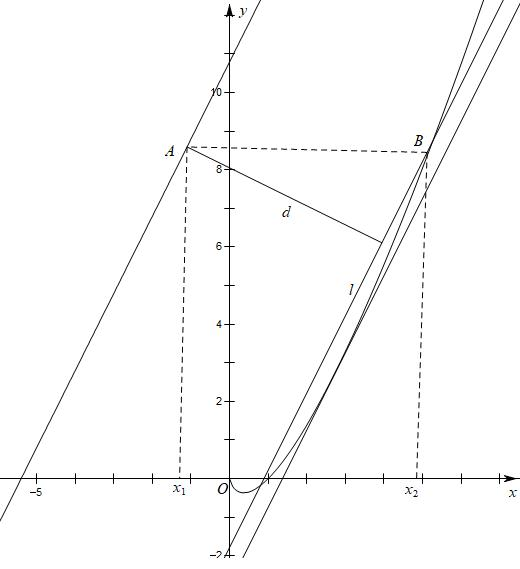
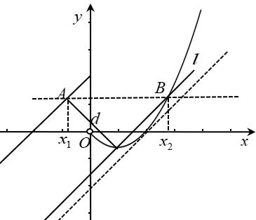
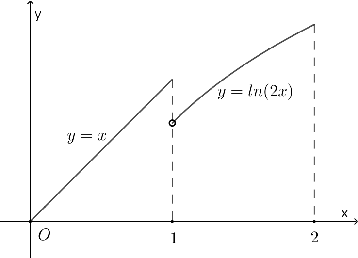
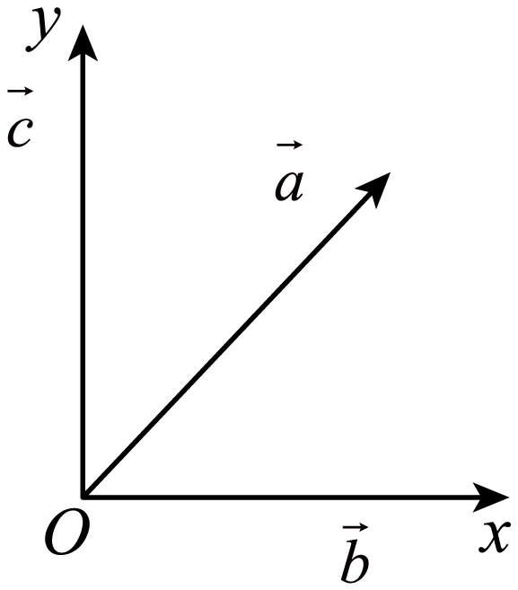
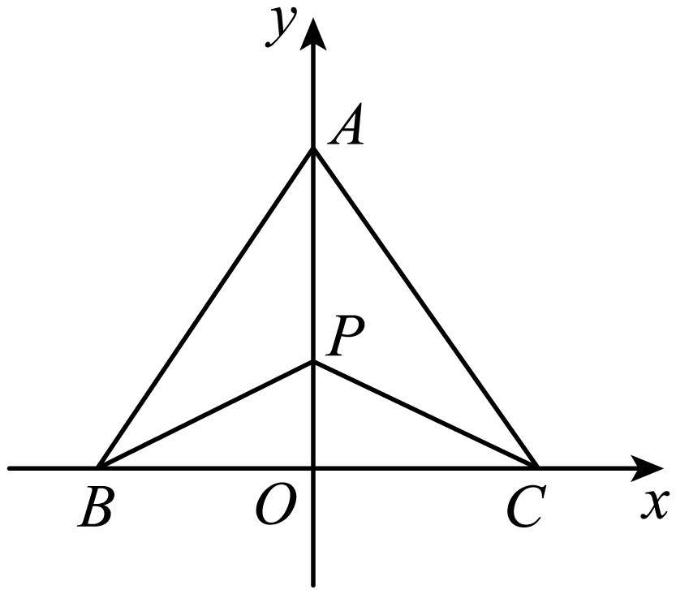
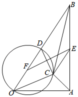
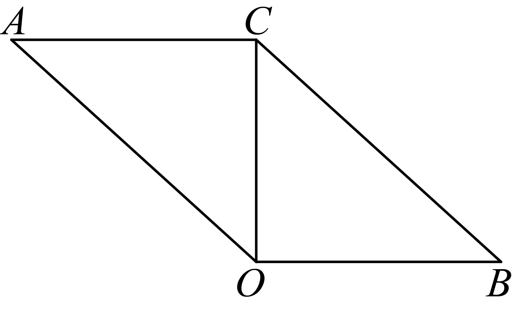
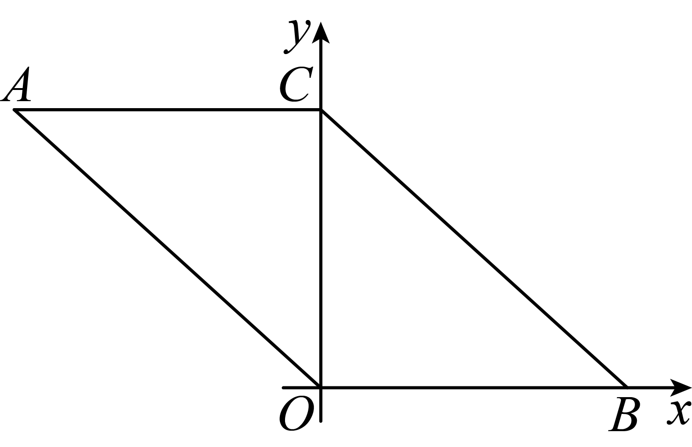

**第27讲  多元最值问题**

**知识梳理**

**解决多元函数的最值问题不仅涉及到函数、导数、均值不等式等知识，还涉及到消元法、三角代换法、齐次式等解题技能．**

**必考题型全归纳**

**题型一：消元法**

<strong>例1．</strong>（2024·全国·高三专题练习）已知正实数<em>x</em>，<em>y</em>满足，则的最大值为\_\_\_\_\_\_.

【答案】/

【解析】由得，所以，则，

因为，，，所以，

令，则，所以在上单调递增，

所以由，即，得，所以，

所以，

令，则，

令，得；令，得，

所以在上单调递增，在上单调递减，

所以，即的最大值为．

故答案为：．

**例2．**（2024·广东梅州·高三五华县水寨中学校考阶段练习）已知实数满足：，则的最大值为\_\_\_\_\_\_\_\_\_\_\_.

【答案】

【解析】由已知得，，

令，则，

在上单调递增，

又因为，

所以

，

，

令

所以，

则当时，，单调递增；当时，，单调递减；

所以.

故答案为：.

**例3．**（2024·天津和平·高三天津一中校考阶段练习）对任给实数,不等式恒成立,则实数的最大值为\_\_\_\_\_\_\_\_\_\_.

【答案】

【解析】因为对任给实数,不等式恒成立，

所以，

令，则，

，

当时，，函数单调递增；当时，，函数单调递减，

所以当时，取得最小值，，

所以实数的最大值为

故答案为：

**题型二：判别式法**

**例4．**（2024·重庆渝中·高一重庆巴蜀中学校考期中）若，，则当\_\_\_\_\_\_时，取得最大值，该最大值为\_\_\_\_\_\_.

【答案】     /     /

【解析】令，则，

则，

即，

由，解得：，

故，

故，解得：，，

所以当且仅当，时，等号成立，

故答案为：，

**例5．**（2024·全国·高三竞赛）在中，，则的最大值为\_\_\_\_\_\_\_\_\_\_\_\_\_\_\_．

【答案】

【解析】令，则，即．

因为，

所以，

整理得，

，

化简得，

于是，得，

所以的最大值为．

故答案为：.

<strong>例6．</strong>（2024·高一课时练习）设非零实数<em>a</em>，<em>b</em>满足，若函数存在最大值<em>M</em>和最小值<em>m</em>，则\_\_\_\_\_\_\_\_\_.

【答案】2

【解析】化简得到，根据和得到，解得答案.，则，则，

即，，故，

，即，即，

.

故答案为：2.

**变式1．**（2024·江苏·高三专题练习）若正实数满足，则的最大值为\_\_\_\_\_\_\_\_．

【答案】

【解析】令，则，即，因此

，解得：，当时，

，因此的最大值为

故答案为：

**变式2．**（2024·全国·高三专题练习）设，，若，且的最大值是，则\_\_\_\_\_\_\_\_\_\_\_.

【答案】4

【解析】令=*d*，由消去*a*得：，即，

而，，则，，，

依题意，解得.

故答案为：4

**题型三：基本不等式法**

**例7．** 设x、y、z是不全是0的实数.则三元函数的最大值是\_\_\_\_\_.

【答案】

【解析】引入正参数λ、μ.

因为，，所以，

，.

两式相加得.

令，得，

故.

因此，的最大值为.

**例8．**（2024·天津和平·高三耀华中学校考阶段练习）若实数满足，则的最大值为\_\_\_\_\_\_\_\_.

【答案】

【解析】由，得，

设，其中.

则，从而，

记，则，

不妨设，则,

当且仅当，即时取等号，即最大值为.

故答案为：.

**例9．**（2024·全国·高三专题练习）已知正数，则的最大值为\_\_\_\_\_\_\_\_\_．

【答案】

【解析】（当且仅当，时取等号），

的最大值为.

故答案为：.

**题型四：辅助角公式法**

**例10．**（2024·江苏苏州·高三统考开学考试）设角、均为锐角，则的范围是\_\_\_\_\_\_\_\_\_\_\_\_\_\_．

【答案】

【解析】因为角、均为锐角，所以的范围均为，

所以，

所以

因为，

所以，

，

当且仅当时取等，

令，，，

所以.

则的范围是：.

故答案为：

<strong>例11．</strong>的取值范围是_________．

【答案】

【解析】

因为，

所以，

令，则，

则，

所以，（当且仅当即时取等）；

且，（当且仅当即时取等）．

故的取值范围为．

**题型五：柯西不等式法**

<strong>例12．</strong>（2024·广西钦州·高二统考期末）已知实数，，（i＝1，2…，<em>n</em>），且满足，，则最大值为（    ）

A．1	B．2	C．	D．

【答案】A

【解析】根据柯西不等式，，故，又当时等号成立，故最大值为1

故选：A

**例13．**（2024·陕西渭南·高二校考阶段练习）已知，，是正实数，且，则的最小值为\_\_\_\_\_\_.

【答案】10

【解析】由柯西不等式可得，

所以，即，

当且仅当即也即时取得等号，

故答案为：

**例14．**（2024·江苏淮安·高二校联考期中）已知，，则的最小值为\_\_\_\_\_\_.

【答案】9

【解析】∵

∴,当且仅当时等号成立，即，

∵

，当且仅当时等号成立，可取

故答案为：9

**变式3．**（2024·全国·高三竞赛）已知、、，且，，则的最小值为.

A．	B．

C．36	D．45

【答案】C

【解析】由，

.

知.

当时，取得最小值36.

故答案为C

**变式4．**（2024·全国·高三竞赛）设为实数，且.则的最大值等于.

A．	B．0	C．	D．

【答案】D

【解析】由题意得，所以(利用柯西不等式）.

从而， .

故.

当且仅当，，，时，等号成立.

**题型六：权方和不等式法**

<strong>例15．</strong>（2024·甘肃·高三校联考）已知<em>x</em>&gt;0，<em>y</em>&gt;0，且，则<em>x</em>+2<em>y</em>的最小值为\_\_\_\_\_\_\_\_\_\_\_\_ .

【答案】

【解析】设，

可解得，

从而

，

当且仅当时取等号.

故答案为：．

<strong>例16．</strong>已知实数满足且，则的最小值是_________________

【答案】

【解析】．

当时，取等号．

<strong>例17．</strong>已知，则的最小值是______________________．

【答案】8

【解析】，

当时，即，两个等号同时成立．

<strong>变式5．</strong>已知，则的最小值是________________．

【答案】

【解析】．

即当时，即，有的最小值为．

**题型七：拉格朗日乘数法**

**例18．**，，，求的最小值．

【解析】令

，，，

联立解得，，，故最小为12．

<strong>例19．</strong>设为实数，若，则的最大值是_______．

【答案】

【解析】令，

由，解得，

所以的最大值是．

**题型八：三角换元法**

**例20．**（2024·山西晋中·高三祁县中学校考阶段练习）已知函数，若，则的最大值是\_\_\_\_\_\_\_\_

【答案】

【解析】设g(x)=f(x)-3,所以g(x)=,

所以

所以g(-x)=-g(x),所以函数g(x)是奇函数，

由题得，

所以函数g（x）是减函数，

因为，

所以，

所以g=0,

所以g=g(1-,所以

不妨设，

所以=

=，所以的最大值为.

故答案为

**例21．**（2024·浙江温州·高一校联考竞赛），则的最小值为\_\_\_\_\_\_.

【答案】

【解析】根据条件等式可设，代入所求式子，利用二倍角公式和辅助角公式化简，根据三角函数的性质可求出最值.，则，即，

设，则，

，其中是辅助角，且，

当时，原式取得最小值为.

故答案为：.

**题型九：构造齐次式**

**例22．**（2024·江苏·高一专题练习）已知，，则的最大值是\_\_\_\_\_\_.

【答案】

【解析】由题意，

，

设，则，当且仅当，即取等号，

又由在上单调递增，

所以的最小值为，即，

所以，

所以的最大值是.

故答案为：.

**例23．**（2024·河南·高三信阳高中校联考阶段练习）已知实数，若，则的最小值为（    ）

A．12	B．	C．	D．8

【答案】A

【解析】由，，，

所以

，

当且仅当时，取等号，

所以的最小值为：12，

故选：A.

<strong>例24．</strong>（2024·天津南开·高三统考期中）已知正实数<em>a</em>，<em>b</em>，<em>c</em>满足，则的最大值为\_\_\_\_\_\_\_\_\_\_\_\_．

【答案】/0.25

【解析】由，得，

∵正实数*a*，*b*，*c*

∴则

则，

当且仅当，且*a*，*b*>0，即*a*=3*b*时，等号成立

则

所以，的最大值为.

故答案为：.

**题型十：数形结合法**

<strong>例25．</strong>（2024·全国·高三专题练习）函数（<em>a</em>，）在区间[0，<em>c</em>]（）上的最大值为<em>M</em>，则当<em>M</em>取最小值2时，\_\_\_\_\_

【答案】2

【解析】解法一：因为函数是二次函数，

所以（*a*，）在区间[0，*c*]（）上的最大值是在[0，*c*]的端点取到或者在处取得．

若在取得，则；若在取得，则；

若在取得，则；

进一步，若，则顶点处的函数值不为2，应为0，符合题意；

若，则顶点处的函数值的绝对值大于2，不合题意；

由此推断，即有，，

于是有．

解法二：设，，则．

首先作出在时的图象，显然经过（0，0）和的直线为，该曲线在[0，*c*]上单调递增；

其次在图象上找出一条和平行的切线，

不妨设切点为，于是求导得到数量关系．

结合点斜式知该切线方程为．

因此，即得．此时，

即，那么，．从而有．

**例26．**（2024·江苏扬州·高三阶段练习）已知函数，若且，则的最大值为（    ）

A．	B．	C．	D．

【答案】D

【解析】当时，，

求导，令，得

当时，，单调递减；当时，，单调递增；

作分段函数图象如下所示：

设点的横坐标为，过点作轴的垂线交函数于另一点，设点的横坐标为，并过点作直线的平行线，设点到直线的距离为，，

由图形可知，当直线与曲线相切时，取最大值，

令，得，切点坐标为，

此时，，

，

故选：D

**例27．**（2024·全国·高三专题练习）已知函数，若且，则的最大值为（   ）

A．	B．	C．	D．

【答案】B

【解析】设点的横坐标为，过点作轴的垂线交函数于另一点，设点的横坐标为，并过点作直线的平行线，设点到直线的距离为，计算出直线的倾斜角为，可得出，于是当直线与曲线相切时，取最大值，从而取到最大值.当时，，

求导，令，得

当时，，单调递减；当时，，单调递增；

如下图所示：

设点的横坐标为，过点作轴的垂线交函数于另一点，设点的横坐标为，并过点作直线的平行线，设点到直线的距离为，，

由图形可知，当直线与曲线相切时，取最大值，

令，得，切点坐标为，

此时，，，

故选：B.

**变式6．**（2024·江苏·高三专题练习）已知函数若存在实数，满足，且，则的最大值为（    ）

A．	B．	C．	D．

【答案】B

【解析】的图象如下

存在实数，满足，且，即

∴，则

令，，则

∴在上单调递增，故

故选：B

**题型十一：向量法**

<strong>例28．</strong>（2024·江苏南通·高一海安高级中学校考阶段练习）17世纪法国数学家费马在给朋友的一封信中曾提出一个关于三角形的有趣问题：在三角形所在平面内，求一点，使它到三角形每个顶点的距离之和最小，现已证明：在中，若三个内角均小于，则当点<em>P</em>满足时，点<em>P</em>到三角形三个顶点的距离之和最小，点<em>P</em>被人们称为费马点．根据以上知识，已知为平面内任意一个向量，和是平面内两个互相垂直的向量，且，则的最小值是\_\_\_\_\_\_\_\_\_\_\_\_\_．

【答案】

【解析】以 为*x*轴， 为*y*轴，建立直角坐标系如下图，设 ，

则 ， ，

即为平面内一点 到 三点的距离之和，

由费马点知：当点 与三顶点 构成的三角形*ABC*为费马点时 最小，

将三角形*ABC*放在坐标系中如下图：

现在先证明 的三个内角均小于 ：

， ，

，

为锐角三角形，满足产生费马点的条件，又因为 是等腰三角形，

点*P*必定在底边*BC*的对称轴上，即*y*轴上， ，

，即 ，

现在验证：

，

， ，同理可证得 ，

即此时点 是费马点，到三个顶点*A*，*B*，*C*的距离之和为 ，即的最小值为 ；

故答案为：.

**例29．**（2024·浙江嘉兴·高一统考期末）已知平面向量，，满足，，，，则的最小值为\_\_\_\_\_\_\_\_.

【答案】

【解析】令，，，中点为，中点为，为的中点，

由，，，得，

则，即，所以，所以，即，，所以，因为，所以，即，所以，

所以点的轨迹为以为直径的圆，

，

当且仅当、、共线且在线段之间时取等号．

的最小值为．

故答案为：．

**例30．**（2024·湖北武汉·高一湖北省武昌实验中学校联考期末）已知向量，满足，，则的最大值为\_\_\_\_\_\_\_\_\_\_．

【答案】/

【解析】取平行四边形，连接

设，则，

因为向量，满足，所以，即，

设，，如图以为原点，所在直线为轴建立平面直角坐标系，

则

所以，则，故，

所以

因为，又，可设

即，所以，其中，所以，所以，

故的最大值为，即的最大值为.

故选：.

**题型十二：琴生不等式法**

**例31．**（2024·福建龙岩·高三校考阶段练习）若函数的导函数存在导数，记的导数为．如果对，都有，则有如下性质：．其中，，，， .若，则在锐角中，根据上述性质推断：的最大值为\_\_\_\_\_\_\_\_.

【答案】/.

【解析】，则，.

在锐角中，，，，

则

∴   ，

∴    的最大值为.

故答案为： .

**例32．**（2024·全国·高三竞赛）半径为的圆的内接三角形的面积的最大值是\_\_\_\_\_\_．

【答案】

【解析】设的内接三角形为．

显然当是锐角或直角三角形时，面积可以取最大值（因为若是钝角三角形，可将钝角（不妨设为）所对边以圆心为对称中心作中心对称成为）．

因此，．

下面设，，，．

则．

由讨论知可设、、，而在上是上凸函数．

则由琴生不等式知．

所以，．

当且仅当是正三角形时，上式等号成立．

故答案为

<strong>例33．</strong>（2024·北京·高三强基计划）已知正实数<em>a</em>，<em>b</em>满足，求的最小值．

【解析】设，则，

从而，故在下凸，

因此，即,

当且仅当时等号成立．所以的最小值为华

