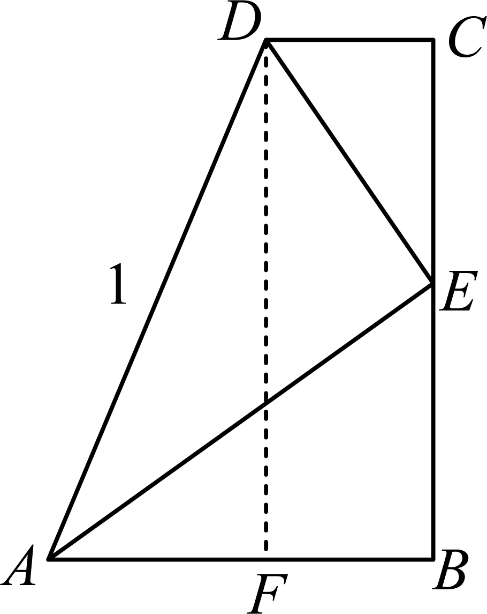
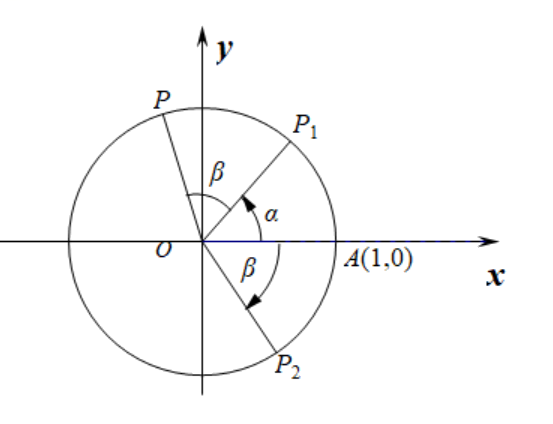
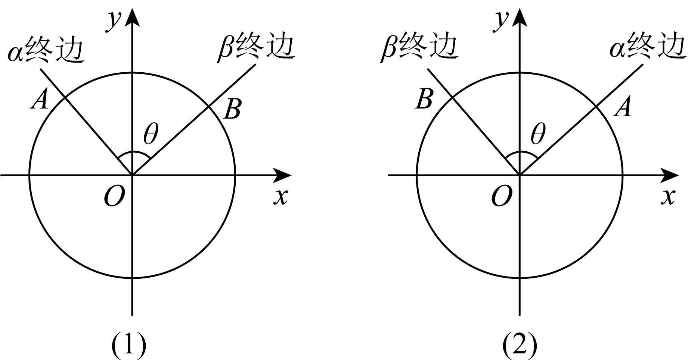
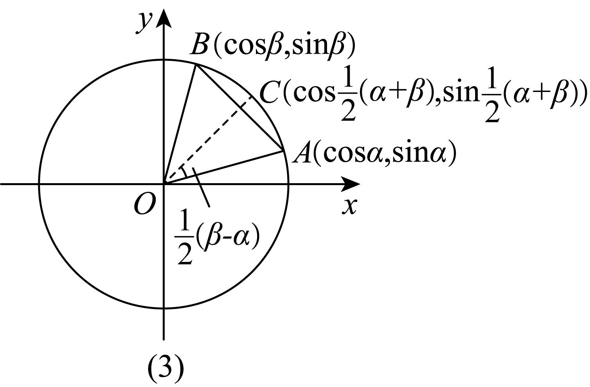

**第29讲  三角恒等变换**

**知识梳理**

**知识点一．两角和与差的正余弦与正切**

①；

②；

③；

**知识点二．二倍角公式**

①；

②；

③；

**知识点三：降次（幂）公式**

**知识点四：半角公式**

**知识点五．辅助角公式**

（其中）．

**【解题方法总结】**

1**、两角和与差正切公式变形**

；

．

2**、降幂公式与升幂公式**

；

．

3**、其他常用变式**

．

4、拆分角问题：①；；②；③；

④；⑤．

**注意：** 特殊的角也看成已知角，如．

**必考题型全归纳**

**题型一：两角和与差公式的证明**

<strong>例1．</strong>（浙江省绍兴市2024学年高一下学期6月期末数学试题）为了推导两角和与差的三角函数公式，某同学设计了一种证明方法：在直角梯形<em>ABCD</em>中，，，点<em>E</em>为<em>BC</em>上一点，且，过点<em>D</em>作于点<em>F</em>，设，.

(1)利用图中边长关系，证明：；

(2)若，求.

**例2．**（2024·辽宁·高一辽宁实验中学校考期中）某数学学习小组研究得到了以下的三倍角公式：

①；②

根据以上研究结论，回答：

(1)在①和②中任选一个进行证明：

(2)求值：.

**例3．**（2024·全国·高三专题练习）(1)试证明差角的余弦公式：；

(2)利用公式推导：

①和角的余弦公式，正弦公式，正切公式；

②倍角公式，，.

**变式1．**（2024·全国·高三专题练习）如图，考虑点，，，，从这个图出发.

（1）推导公式：；

（2）利用（1）的结果证明：，并计算的值.

**变式2．**（2024·广东揭阳·高三统考期中）在推导很多三角恒等变换公式时，我们可以利用平面向量的有关知识来研究，在一定程度上可以简化推理过程．如我们就可以利用平面向量来推导两角差的余弦公式：．具体过程如下：

如图，在平面直角坐标系内作单位圆，以为始边作角，．它们的终边与单位圆的交点分别为*A*，*B*．

则，，由向量数量积的坐标表示，有．

设，的夹角为，则，

另一方面，由图（1）可知，；

由图（2）可知，于是，．

所以，也有；

所以，对于任意角，有：．

此公式给出了任意角，的正弦、余弦值与其差角的余弦值之间的关系，称为差角的余弦公式，简记作．有了公式以后，我们只要知道，，，的值，就可以求得的值了．

阅读以上材料，利用图（3）单位圆及相关数据（图中*M*是*AB*的中点），采取类似方法（用其他方法解答正确同等给分）

解决下列问题：

(1)判断是否正确？（回答“正确”，“不正确”，不需要证明）

(2)证明：．

**【解题方法总结】**

推证两角和与差公式就是要用这两个单角的三角函数表示和差角的三角公式，通过余弦定理或向量数量积建立它们之间的关系，这就是证明的思路．

**题型二：两角和与差的三角函数公式**

**例4．**（2024·安徽安庆·安徽省桐城中学校考二模）已知，则（    ）

A．－1	B．	C．	D．

**例5．**（2024·福建三明·高三统考期末）已知，则（    ）

A．	B．	C．	D．

**例6．**（2024·广东广州·高三华南师大附中校考阶段练习），，，则（    ）

A．	B．

C．	D．

**变式3．**（2024·四川成都·四川省成都市玉林中学校考模拟预测）设，则等于（    ）

A．-2	B．2	C．-4	D．4

**变式4．**（2024·安徽亳州·安徽省亳州市第一中学校考模拟预测）已知，若，则（    ）

A．	B．	C．	D．

**【解题方法总结】**

两角和与差的三角函数公式可看作是诱导公式的推广，可用*α*，*β*的三角函数表示的三角函数，在使用两角和与差的三角函数公式时，特别要注意角与角之间的关系，完成统一角和角与角转换的目的．

**题型三：两角和与差的三角函数公式的逆用与变形**

**例7．**（2024·安徽安庆·安庆一中校考模拟预测）已知，，则的值为（    ）

A．	B．	C．	D．

**例8．**（2024·上海静安·高三校考期中）已知、是不同的两个锐角，则下列各式中一定不成立的是（    ）

A．

B．

C．

D．

<strong>例9．</strong>（2024·北京海淀·高三101中学校考阶段练习）已知<em>O</em>为坐标原点，点．给出下列四个结论：①；②；③；④．其中正确结论的序号是（    ）

A．①②	B．①④	C．①③	D．③④

**变式5．**（2024·全国·高三专题练习）已知，，则的值为（    ）

A．	B．	C．	D．

**变式6．**（2024·河南平顶山·高三校联考阶段练习）若，则（    ）

A．	B．

C．	D．

**变式7．**（2024·全国·高三专题练习）已知第二象限角满足，则的值为（    ）

A．	B．	C．	D．

**【解题方法总结】**

运用两角和与差的三角函数公式时，不但要熟练、准确，而且要熟悉公式的逆用及变形．公式的逆用和变形应用更能开拓思路，增强从正向思维向逆向思维转化的能力．

**题型四：角的变换问题**

**例10．**（2024·河南·校联考模拟预测）已知，则（    ）

A．	B．	C．1	D．

**例11．**（2024·宁夏·高三六盘山高级中学校考期中）已知，则（    ）

A．	B．	C．	D．3

**例12．**（2024·江西·校联考二模）已知，则（    ）

A．	B．	C．	D．

**变式8．**（2024·四川·校联考模拟预测）若为锐角，且，则（    ）

A．	B．	C．	D．

**变式9．**（2024·全国·高三专题练习）已知，则的值为（    ）

A．	B．	C．	D．

**变式10．**（2024·安徽淮南·统考二模）已知，则（    ）

A．	B．	C．或	D．0或

**变式11．**（2024·山西晋中·统考三模）已知，为锐角，且，，则（    ）

A．	B．	C．	D．

**变式12．**（2024·山东日照·高三校考阶段练习）已知，，，，则（    ）

A．	B．	C．	D．

**变式13．**（2024·吉林四平·高一四平市第一高级中学校考开学考试）已知则（    ）

A．	B．	C．	D．

**【解题方法总结】**

常用的拆角、配角技巧：；；；；；等．

**题型五：给角求值**

**例13．**（2024·重庆·统考模拟预测）式子化简的结果为（    ）

A．	B．	C．	D．

**例14．**（2024·全国·高三专题练习）计算：（       ）

A．	B．	C．	D．

**例15．**（2024·陕西西安·西安中学校考模拟预测）若，则实数的值为（    ）

A．	B．	C．	D．

**变式14．**（2024·全国·高三专题练习）（    ）

A．	B．	C．	D．

**变式15．**（2024·全国·高三专题练习）求值：（    ）

A．1	B．	C．	D．

**【解题方法总结】**

（1）给角求值问题求解的关键在于“变角”，使其角相同或具有某种关系，借助角之间的联系寻找转化方法．

（2）给角求值问题的一般步骤

①化简条件式子或待求式子；

②观察条件与所求之间的联系，从函数名称及角入手；

③将已知条件代入所求式子，化简求值．

**题型六：给值求值**

**例16．**（2024·山东济宁·嘉祥县第一中学统考三模）已知，则\_\_\_\_\_\_\_\_.

**例17．**（2024·江西·校联考模拟预测）已知，则\_\_\_\_\_\_．

**例18．**（2024·江苏盐城·盐城中学校考模拟预测）若，则\_\_\_\_\_\_\_\_\_\_.

**变式16．**（2024·山东泰安·统考二模）已知，则\_\_\_\_\_\_\_.

**变式17．**（2024·全国·高三专题练习）已知，则\_\_\_\_\_\_\_\_\_

**变式18．**（2024·全国·高三专题练习）已知，则\_\_\_\_\_\_\_\_．

**【解题方法总结】**

给值求值：给出某些角的三角函数式的值，求另外一些角的三角函数值，解题关键在于“变角”，使其角相同或具有某种关系，解题的基本方法是：①将待求式用已知三角函数表示；②将已知条件转化而推出结论，其中“凑角法”是解此类问题的常用技巧，解题时首先要分析已知条件和结论中各种角之间的相互关系，并根据这些关系来选择公式．

**题型七：给值求角**

**例19．**（2024·四川·高三四川外国语大学附属外国语学校校考期中）写出一个使等式成立的的值为\_\_\_\_\_\_\_.

**例20．**（2024·北京·高三专题练习）若实数，满足方程组，则的一个值是\_\_\_\_\_\_\_.

**例21．**（2024·江西·高三校联考阶段练习）已知，，且，，则的值是\_\_\_\_\_\_\_\_\_\_\_.

**变式19．**（2024·上海嘉定·高三校考期中）若为锐角，，则角\_\_\_\_\_\_\_\_\_\_.

**变式20．**（2024·全国·高三专题练习）已知，，则\_\_\_\_\_\_．

**变式21．**（2024·全国·高三专题练习）已知，且，求的值为\_\_\_\_\_．

**变式22．**（2024·全国·高三专题练习）已知，，，，则\_\_\_\_\_\_\_\_．

**【解题方法总结】**

给值求角：解此类问题的基本方法是：先求出“所求角”的某一三角函数值，再确定“所求角”的范围，最后借助三角函数图像、诱导公式求角．

**题型八：正切恒等式及求非特殊角**

**例22．**（2024·全国·高三对口高考）的值是\_\_\_\_\_\_\_\_\_\_.

**例23．**（2024·陕西商洛·高三陕西省山阳中学校联考期中）已知，满足，则\_\_\_\_\_\_．

**例24．**（2024·江苏南通·高三校考期中）在中，若，则\_\_\_\_\_\_\_\_\_.

**变式23．**（2024·全国·高三专题练习）\_\_\_\_\_\_\_\_\_\_\_\_．

**变式24．**（2024·山东·高三济宁市育才中学校考开学考试）若角的终边经过点，且，则实数\_\_\_\_\_\_\_\_\_\_\_.

**变式25．**（2024·上海金山·高一华东师范大学第三附属中学校考阶段练习）若是的内角，且，则等于\_\_\_\_\_\_.

**变式26．**（2024·全国·统考模拟预测）若，为锐角，且，则\_\_\_\_\_\_\_\_\_\_；\_\_\_\_\_\_\_\_\_\_

**变式27．**（2024·全国·高三专题练习）已知，，，则（    ）

A．	B．	C．	D．

**【解题方法总结】**

**正切恒等式：** 当时，．

证明：因为，，所以

故．

**题型九：三角恒等变换的综合应用**

**例25．**（2024·陕西咸阳·校考二模）已知函数

(1)求函数的对称轴和对称中心；

(2)当，求函数的值域．

**例26．**（2024·上海松江·高三上海市松江二中校考阶段练习）已知.

(1)求在上的单调递减区间；

(2)若，求的值.

**例27．**（2024·河南·洛宁县第一高级中学校联考模拟预测）已知函数．

(1)求的最小正周期和单调递增区间；

(2)当时，求的最大值，并求当取得最大值时*x*的值．

**变式28．**（2024·全国·高三对口高考）已知函数；

(1)若在中，，，求使的角．

(2)求在区间上的取值范围；

**变式29．**（2024·全国·高三对口高考）已知．若的最小正周期为．

(1)求的表达式和的递增区间；

(2)求在区间上的最大值和最小值．

**【解题方法总结】**

（1）进行三角恒等变换要抓住：变角、变函数名称、变结构，尤其是角之间的关系；注意公式的逆用和变形使用．

（2）形如化为，可进一步研究函数的周期性、单调性、最值与对称性

