**第30讲  三角函数的图像与性质**

**知识梳理**

**知识点一：用五点法作正弦函数和余弦函数的简图**

（1）在正弦函数，的图象中，五个关键点是：．

（2）在余弦函数，的图象中，五个关键点是：．

**知识点二：正弦、余弦、正切函数的图象与性质（下表中）**

<table><tr><td>
函数
</td><td>

</td><td>

</td><td>

</td></tr><tr><td>
图象
</td><td>

</td><td>

</td><td>

</td></tr><tr><td>
定义域
</td><td>

</td><td>

</td><td>

</td></tr><tr><td>
值域
</td><td>

</td><td>

</td><td>

</td></tr><tr><td>
周期性
</td><td>

</td><td>

</td><td>

</td></tr><tr><td>
奇偶性
</td><td>
奇函数
</td><td>
偶函数
</td><td>
奇函数
</td></tr><tr><td>
递增区间
</td><td>

</td><td>

</td><td>

</td></tr><tr><td>
递减区间
</td><td>

</td><td>

</td><td>
无
</td></tr><tr><td>
对称中心
</td><td>

</td><td>

</td><td>

</td></tr><tr><td>
对称轴方程
</td><td>

</td><td>

</td><td>
无
</td></tr></table>

**注：** 正（余）弦曲线相邻两条对称轴之间的距离是；正（余）弦曲线相邻两个对称中心的距离是；

正（余）弦曲线相邻两条对称轴与对称中心距离；

**知识点三：** 与的图像与性质

<strong>（</strong>1<strong>）最小正周期：</strong><em><strong>．</strong></em>

<strong>（</strong>2<strong>）定义域与值域：，的定义域为</strong><em>R</em><strong>，值域为[-</strong><em>A</em><strong>，</strong><em>A</em><strong>]</strong><em><strong>．</strong></em>

**（** 3**）最值**

假设*．*

①对于，

②对于，

<strong>（</strong>4<strong>）对称轴与对称中心</strong><em><strong>．</strong></em>

假设*．*

①对于，

②对于，

正、余弦曲线的对称轴是相应函数取最大（小）值的位置*．* 正、余弦的对称中心是相应函数与轴交点的位置*．*

<strong>（</strong>5<strong>）单调性</strong><em><strong>．</strong></em>

假设*．*

①对于，

②对于，

**（** 6**）平移与伸缩**

由函数的图像变换为函数的图像的步骤；

方法一：*．* 先相位变换，后周期变换，再振幅变换，不妨采用谐音记忆：我们“想欺负”（相一期一幅）三角函数图像，使之变形*．*

方法二：*．* 先周期变换，后相位变换，再振幅变换*．*

<strong>注：</strong>在进行图像变换时，提倡先平移后伸缩（先相位后周期，即“想欺负”），但先伸缩后平移（先周期后相位）在题目中也经常出现，所以必须熟练掌握，无论哪种变化，切记每一个变换总是对变量而言的，即图像变换要看“变量”发生多大变化，而不是“角”变化多少<em>．</em>

**【解题方法总结】**

关于三角函数对称的几个重要结论；

（1）函数的对称轴为，对称中心为；

（2）函数的对称轴为，对称中心为；

（3）函数函数无对称轴，对称中心为；

（4）求函数的对称轴的方法；令，得；对称中心的求取方法；令，得，即对称中心为*．*

（5）求函数的对称轴的方法；令得，即对称中心为

**必考题型全归纳**

**题型一：五点作图法**

**例1．**（2024·湖北·高一荆州中学校联考期中）要得到函数的图象，可以从正弦函数或余弦函数图象出发，通过图象变换得到，也可以用“五点法”列表、描点、连线得到．

(1)由图象变换得到函数的图象，写出变换的步骤和函数；

(2)用“五点法”画出函数在区间上的简图．

<table><tr><td></td><td></td><td></td><td></td><td></td><td></td></tr><tr><td></td><td></td><td></td><td></td><td></td><td></td></tr><tr><td></td><td></td><td></td><td></td><td></td><td></td></tr></table>

【解析】（1）步骤1：把图象上所有点向左平移个单位长度，得到函数的图象；

步骤2：把图象上所有点的横坐标变为原来的倍（纵坐标不变），得到函数的图象；

步骤3：最后把函数的图象的纵坐标变为原来的2倍（横坐标不变），得到函数的图象．

或者步骤1：步骤1：把图象上所有点的横坐标变为原来的倍（纵坐标不变），得到函数的图象；

步骤2：把图象上所有点向左平移个单位长度，得到函数的图象；

步骤3：最后把函数的图象的纵坐标变为原来的2倍（横坐标不变），得到函数的图象．

（2）因为列表：

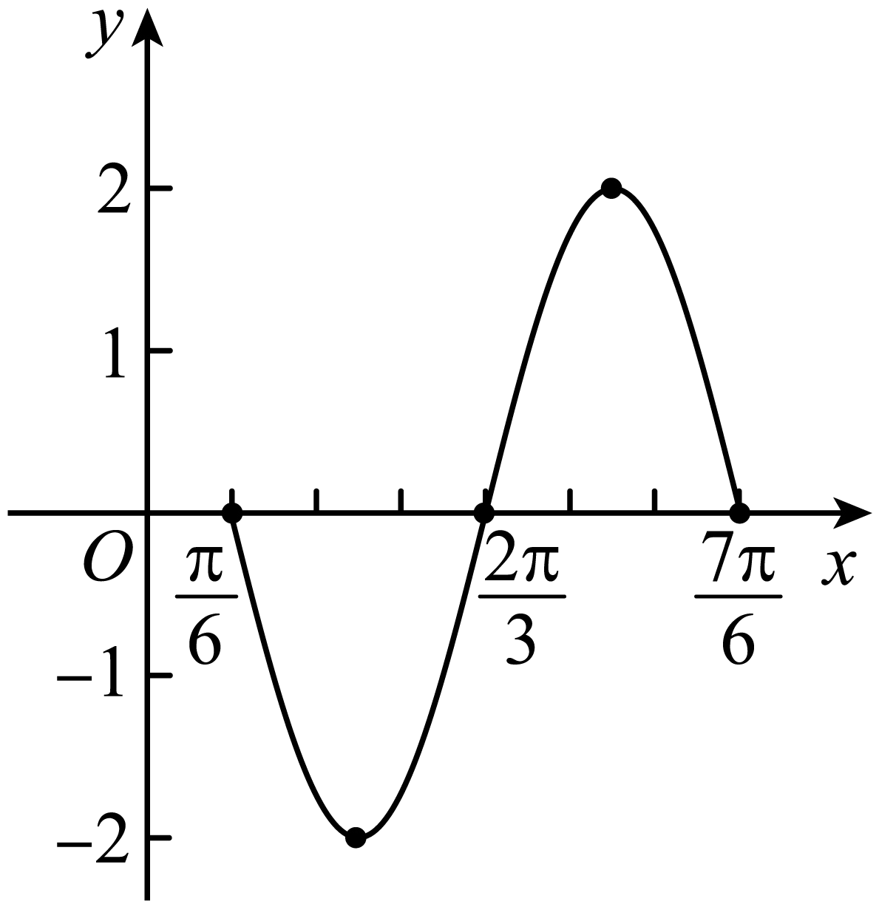

**例2．**（2024·北京·高一首都师范大学附属中学校考阶段练习）已知函数

(1)用“五点作图法”在给定坐标系中画出函数在上的图像；

(2)求，的单调递增区间；

(3)当时，的取值范围为，直接写出*m*的取值范围.

【解析】（1）因为，当时，，

列表如下：

<table><tr><td>

</td><td>
0
</td><td>
1
</td><td>

</td><td>

</td><td>

</td><td>

</td></tr><tr><td>

</td><td>

</td><td>

</td><td>

</td><td>

</td><td>

</td><td>

</td></tr><tr><td>

</td><td>
1
</td><td>
2
</td><td>
0
</td><td>

</td><td>
0
</td><td>
1
</td></tr></table>

作图如下：

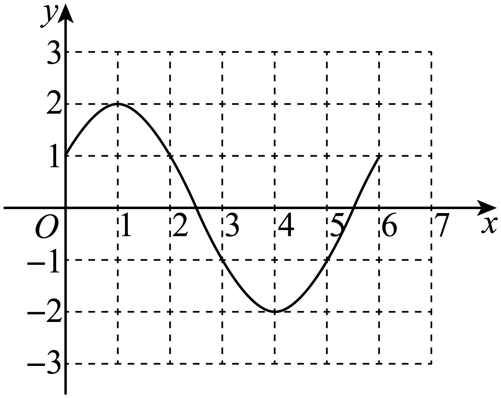

（2）因为，令，解得，

令，解得，

所以的递增区间为

（3），，

又，由（1）的图象可知，，的取值范围是．

**例3．**（2024·广东东莞·高一东莞市东华高级中学校联考阶段练习）函数.

(1)请用五点作图法画出函数在上的图象；（先列表，再画图）

(2)设，，当时，试研究函数的零点的情况.

【解析】（1），

按五个关键点列表：

<table><tr><td>

</td><td>
0
</td><td>

</td><td>

</td><td>

</td><td>

</td></tr><tr><td>

</td><td>
0
</td><td>
1
</td><td>
0
</td><td>

</td><td>
0
</td></tr><tr><td>

</td><td>
0
</td><td>
3
</td><td>
0
</td><td>
1
</td><td>
0
</td></tr></table>

描点并将它们用光滑的曲线连接起来如下图所示：

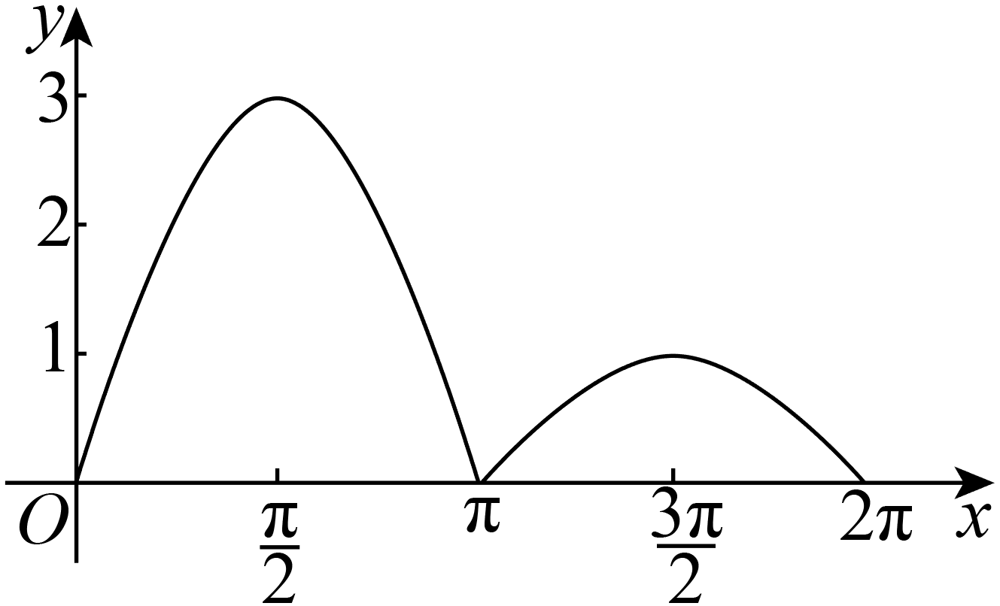

（2）因为，

所以的零点个数等价于与图象交点的个数，

设，，则

当，即时，有2个零点；

当，即时，有1个零点；

当，即时，有0个零点.

**【解题方法总结】**

（1）在正弦函数，的图象中，五个关键点是：．

（2）在余弦函数，的图象中，五个关键点是：．

**题型二：函数的奇偶性**

**例4．**（2024·全国·高三专题练习）函数，则（    ）

A．若，则为奇函数	B．若，则为偶函数

C．若，则为偶函数	D．若，则为奇函数

【答案】B

【解析】的定义域为，

对A：若，，若为奇函数，则，而不恒成立，故不是奇函数；

对B：若，，

，故为偶函数，B正确；

对C：若，，，故不是偶函数，故C错误；

对D：若，，

若为奇函数，则，而不恒成立，故不是奇函数；

故选：B

**例5．**（2024·贵州贵阳·校联考模拟预测）使函数为偶函数，则的一个值可以是（    ）

A．	B．	C．	D．

【答案】A

【解析】由，

因为为偶函数，可得，所以，

令，可得.

故选：A.

**例6．**（2024·湖南常德·常德市一中校考模拟预测）函数的图像向左平移个单位得到函数的图像，若函数是偶函数，则（    ）

A．	B．	C．	D．

【答案】C

【解析】函数的图像向左平移个单位，得的图像，

又函数是偶函数，则有，，解得，；

所以.

故选：C．

<strong>变式1．</strong>（2024·北京·高三专题练习）已知的图象向左平移个单位长度后，得到函数的图象，且的图象关于<em>y</em>轴对称，则的最小值为（    ）

A．	B．	C．	D．

【答案】B

【解析】由题意可得，

故，由于的图象关于*y*轴对称，

则为偶函数，故,即，

故的最小值为，

故选：B

**变式2．**（2024·浙江·高三期末）将函数的图象向右平移个单位得到一个奇函数的图象，则的取值可以是（    ）

A．	B．	C．	D．

【答案】D

【解析】函数为奇函数，

则，取，则．

故选：D

**变式3．**（2024·广东·高三统考学业考试）函数是（    ）

A．最小正周期为π的奇函数	B．最小正周期为π的偶函数

C．最小正周期为的奇函数	D．最小正周期为的偶函数

【答案】D

【解析】解析：函数，

故该函数为偶函数，且它的最小正周期为.

故选：D.

<strong>变式4．</strong>（2024·全国·高三专题练习）已知函数的最大值为<em>M</em>，最小值为<em>m</em>，则的值为（    ）

A．0	B．2	C．4	D．6

【答案】B

【解析】解:，令，，于是

，所以是奇函数，从而的最大值*G*与最小值*g*的和为0，而.

故选：B

**变式5．**（2024·山东·高三专题练习）设函数，如果，则的值是（    ）

A．-10	B．8	C．-8	D．-7

【答案】B

【解析】令，由奇函数定义可知，化简计算可求得结果.令,则，

所以，由可知，，即，

，

故选：B.

**【解题方法总结】**

由是奇函数和是偶函数可拓展得到关于三角函数奇偶性的重要结论：

（1）若为奇函数，则；

（2）若为偶函数，则；

（3）若为奇函数，则；

（4）若为偶函数，则；

若为奇函数，则，该函数不可能为偶函数*．*

**题型三：函数的周期性**

**例7．**（2024·湖北襄阳·高三襄阳五中校考开学考试）已知，，是函数的两个零点，且的最小值为，若将函数的图象向左平移个单位长度后得到的图象关于原点对称，则的最大值为（    ）

A．	B．	C．	D．

【答案】A

【解析】由题意知函数的最小正周期，则，得，.

将函数的图象向左平移个单位长度，得到的图象，

要使该图象关于原点对称，则，，所以，，

又，所以当时，取得最大值，最大值为．

故选：A

**例8．**（2024·江西·南昌县莲塘第一中学校联考二模）将函数的图象向右平移个单位长度后得到函数的图象，若对满足的，总有的最小值等于，则（    ）

A．	B．	C．	D．

【答案】C

【解析】函数的周期为，

将函数的图象向右平移个单位长度后得到函数的图象，

可得，

由可知，两个函数的最大值与最小值的差为2，且，

不妨设，则，即在时取得最小值，

由于，此时，不合题意；，此时，

当时，满足题意.

故选：C.

**例9．**（2024·河北·高三校联考阶段练习）函数的最小正周期为（    ）

A．	B．	C．	D．

【答案】C

【解析】，

所以的最小正周期．

故选：C．

**变式6．**（2024·高三课时练习）函数（）的图像的相邻两支截直线所得线段长为，则的值是\_\_\_\_\_\_.

【答案】

【解析】因为函数（）的图像的相邻两支截直线所得线段长为，

所以该函数的最小正周期为，

因为，所以，即，

因此，

故答案为：

**变式7．**（2024·河北衡水·高三河北深州市中学校考阶段练习）下列函数中，最小正周期为的奇函数是（    ）

A．	B．

C．	D．

【答案】B

【解析】对于A：最小正周期为，故A错误；

对于B：，最小正周期，且为奇函数，故B正确；

对于C：，最小正周期为的偶函数，故C错误；

对于D：，则，

故为偶函数，故D错误.

故选：B

**变式8．**（2024·全国·高三专题练习）函数对于，都有，则的最小值为（    ）.

A．	B．	C．	D．

【答案】C

【解析】∵恒成立，

∴是函数的最小值，是函数的最大值，

即、是函数的两条对称轴，则的最小值为.

故选：*C.*

**变式9．**（2024·全国·高三专题练习）已知函数，如果存在实数，使得对任意的实数，都有成立，则的最小值为

A．	B．	C．	D．

【答案】C

【解析】 因为，设的最小正周期为，则，所以的最小值为，故选C.

考点：三角函数的周期和最值．

**变式10．**（2024·北京·北京市第一六一中学校考模拟预测）设函数在的图象大致如图所示，则的最小正周期为（    ）

A．	B．

C．	D．

【答案】A

【解析】由图象可知，，，

解得.

设函数的最小正周期为，易知，

当且仅当时符合题意，此时,

故选：A.

**变式11．**（2024·全国·高三对口高考）函数的最小正周期是\_\_\_\_\_\_\_\_\_\_.

【答案】

【解析】因为，

因为的最小正周期为，

所以函数最小正周期为.

故答案为：.

**变式12．**（2024·江西鹰潭·高三贵溪市实验中学校考阶段练习）函数的最小正周期是\_\_\_\_\_\_．

【答案】

【解析】所以最小正周期为，

故答案为：

**变式13．**（2024·全国·高三专题练习）已知函数.则\_\_\_\_\_\_\_\_\_\_.

【答案】

【解析】由条件，可得，，…，共506组，

所以.

故答案为：1012.

**变式14．**（2024·四川遂宁·统考三模）已知函数，，，且，则=\_\_\_\_\_

【答案】/0.5

【解析】因为

，另外，，且，

所以，函数的最小正周期满足，则，

所以，，故当时，取最小值.

故答案为：

**变式15．**（2024·上海宝山·上海交大附中校考三模）已知函数，则函数的最小正周期是\_\_\_\_\_\_\_\_\_\_．

【答案】

【解析】，故，

故答案为：．

**变式16．**（2024·上海·上海中学校考模拟预测）已知函数的最小正周期是，则\_\_\_\_\_\_.

【答案】4

【解析】，

所以最小正周期是，所以.

故答案为：4

**变式17．**（2024·陕西咸阳·武功县普集高级中学统考一模）设函数相邻两条对称轴之间的距离为，，则的最小值为\_\_\_\_\_\_\_\_\_\_．

【答案】/

【解析】因为函数相邻两条对称轴之间的距离为，则函数的周期，

，又，因此，即，

所以当时，.

故答案为：

**变式18．**（2024·上海浦东新·高三华师大二附中校考阶段练习）函数的最小正周期为\_\_\_\_\_\_\_\_\_\_\_.

【答案】

【解析】，

所以，其最小正周期为.

故答案为：

**变式19．**（2024·内蒙古·高三霍林郭勒市第一中学统考阶段练习）设函数（，，是常数，，）．若在区间上具有单调性，且，则的最小正周期为\_\_\_\_\_\_\_．

【答案】/

【解析】在区间上具有单调性，区间的长度为，

区间的长度为，

由于，

所以的一条对称轴为，其相邻一个对称中心为，即，

所以.

故答案为：

**变式20．**（2024·全国·高三专题练习）下列6个函数：①，②，③，④，⑤，⑥，其中最小正周期为π的偶函数的编号为\_\_\_\_\_\_\_\_\_\_\_.

【答案】①③⑤

【解析】①，②，③，④，⑤，⑥都是偶函数，

由函数的图象如如所示，可知，，的最小正周期都是，，不是周期函数，，最小正周期为，

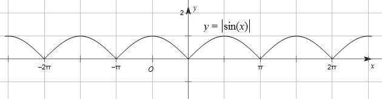

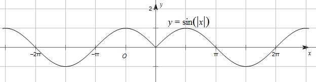

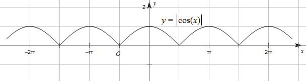

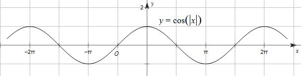

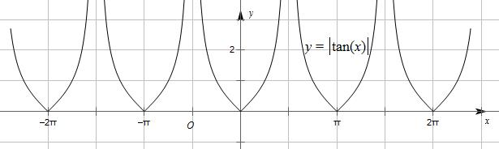

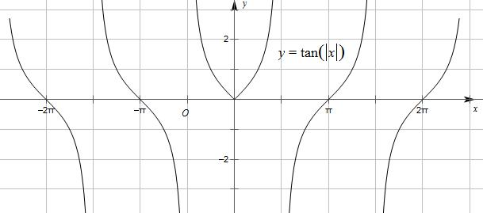

故答案为：①③⑤

**【解题方法总结】**

关于三角函数周期的几个重要结论：

（1）函数的周期分别为，*．*

（2）函数，的周期均为

（3）函数的周期均*．*

**题型四：函数的单调性**

**例10．**（2024·河北石家庄·正定中学校考模拟预测）已知函数，则下列说法错误的是（    ）

A．的值域为

B．的单调递减区间为

C．为奇函数，

D．不等式的解集为

【答案】D

【解析】因为，

所以，所以，故选项A正确；

由得，

所以的单调递减区间为，故选项B正确；

所以，

所以为奇函数，故选项C正确；

由得，

即

所以，

所以不等式的解集为，故选项D错误.

故选：D.

**例11．**（2024·全国·模拟预测）将函数的图象上各点向右平移个单位长度得函数的图象，则的单调递增区间为（    ）

A．	B．

C．	D．

【答案】C

【解析】将的图象向右平移个单位长度后，

得到，即的图象，

令，，

解得，，

所以的单调递增区间为，.

故选：C.

**例12．**（2024·全国·模拟预测）已知函数的部分图象如图所示，则下列说法正确的是（    ）

A．

B．

C．不等式的解集为

D．将的图象向右平移个单位长度后所得函数的图象在上单调递增

【答案】C

【解析】由函数图象可知，最小正周期为，所以，

将点代入，得，

又，所以，故，故A错误；

所以，故B错误；

令，则，所以，，解得，，

所以不等式的解集为，故C正确；

将的图象向右平移个单位长度后，得到的图象，令，，

解得，，

令得，因为，故D错误.

故选：C.

**变式21．**（2024·四川泸州·统考三模）将函数的图象向左平移个单位长度，所得图象的函数（    ）

A．在区间上单调递减	B．在区间上单调递减

C．在区间上单调递增	D．在区间上单调递增

【答案】B

【解析】函数的最小正周期是，选项AC中区间长度是一个周期，因此不可能单调，图象左右平移后也不可能单调，AC错；

函数的图象向左平移个单位长度，所得图象的函数解析式为，

选项B，时，，在此区间上是减函数，B正确；

选项D，时，，在此区间上不是单调函数，D错误．

故选：B．

**变式22．**（2024·北京密云·统考三模）已知函数，则（    ）

A．在上单调递减	B．在上单调递增

C．在上单调递减	D．在上单调递增

【答案】C

【解析】因为.

对于A选项，当时，

在上单调递增，A错；

对于B选项，当时，

则在上单调递增，在上单调递减，

故B错；

对于C选项，当时，

则在上单调递减，C对；

对于D选项，当时，

则在上单调递减，故D错.

故选：C.

**变式23．**（2024·河南·高三校联考阶段练习）已知函数，若函数的图象向左平移个单位长度后得到的函数的部分图象如图所示，则不等式的解集为（    ）

A．

B．

C．

D．

【答案】C

【解析】设函数的图象向左平移单位长度后得到的函数图象对应的函数为，由图可知，函数的图象的最小正周期为，

所以，

所以，

由，得，，，

所以，，取，得，

所以，所以，

所以由，得，即，

所以，，即，，

所以不等式的解集为（），

故选：C

**变式24．**（2024·全国·高一专题练习）的部分图像如图所示，则其单调递减区间为（    ）

A．	B．

C．	D．

【答案】B

【解析】由图可得，即，

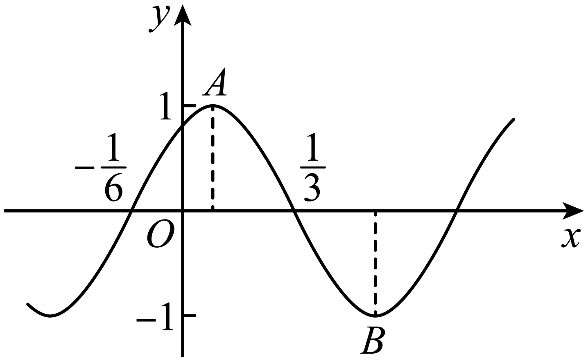

结合图象可得到在区间中，为最高点，对应的横坐标为，

轴右侧第一个最低点为，对应的横坐标为，

故函数的单调递减区间为

故选：B

**变式25．**（2024·四川凉山·高一校联考期中）函数的单调递增区间为（    ）

A．	B．

C．	D．

【答案】C

【解析】令，解得，

所以函数的单调递增区间为.

故选：C

**【解题方法总结】**

三角函数的单调性，需将函数看成由一次函数和正弦函数组成的复合函数，利用复合函数单调区间的单调方法转化为解一元一次不等式*．*

如函数的单调区间的确定基本思想是吧看做是一个整体，

如由解出的范围，所得区间即为增区间；

由解出的范围，所得区间即为减区间*．*

若函数中，可用诱导公式将函数变为，则的增区间为原函数的减区间，减区间为原函数的的增区间*．*

对于函数的单调性的讨论与以上类似处理即可*．*

**题型五：函数的对称性（对称轴、对称中心）**

**例13．**（2024·陕西西安·陕西师大附中校考模拟预测）已知函数，若将的图像向右平移个单位长度后图象关于轴对称，则实数的最小值为（    ）

A．	B．

C．	D．

【答案】B

【解析】的图像向右平移个单位长度后，变为

，

因的图象关于轴对称，

所以为偶函数，

所以，,

即，,

因，所以，

故当时，实数取得最小值为，

故选：B

**例14．**（2024·上海宝山·高三上海交大附中校考阶段练习）已知，函数，的最小正周期为，将的图像向左平移个单位长度，所得图像关于轴对称，则的值是\_\_\_\_\_\_．

【答案】/

【解析】，函数的最小正周期为，，．

将的图像向左平移个单位长度，可得的图像，

根据所得图像关于轴对称，可得，，解得，，

又，则令，可得的值为．

故答案为：．

**例15．**（2024·上海松江·校考模拟预测）已知函数的对称中心为，若函数的图象与函数的图象共有6个交点，分别为，，…，，则\_\_\_\_\_\_\_\_\_\_.

【答案】6

【解析】显然函数的图象关于点成中心对称，

依题意，函数的图象与函数的图象的交点关于点成中心对称，

于是，所以.

故答案为：6

**变式26．**（2024·全国·高三对口高考）设函数的图象关于点成中心对称，若，则\_\_\_\_\_\_.

【答案】

【解析】因为函数的图象关于点成中心对称，

所以，所以，所以

因为，所以时，.

故答案为：

**变式27．**（2024·新疆喀什·校考模拟预测）函数向左平移个单位长度之后关于对称，则的最小值为\_\_\_\_\_\_.

【答案】1

【解析】向左平移个单位长度后，得，

因为函数关于对称，

所以，,

，，

所以的最小值为1.

故答案为：1

**变式28．**（2024·全国·高三专题练习）已知函数，若，且直线为图象的一条对称轴，则的最小值为\_\_\_\_\_\_．

【答案】5

【解析】由，得，

又，解得，所以，

又直线为图象的一条对称轴，

则有，，化简得，，

又，故的最小值为5．

故答案为：.

**变式29．**（2024·河南开封·校考模拟预测）已知函数的图象关于点对称，那么的最小值为\_\_\_\_\_\_\_\_．

【答案】

【解析】的图象关于点对称，，即，令，可得的最小值为．

故答案为：

**变式30．**（2024·全国·模拟预测）将函数的图象向左平移个单位长度得到函数的图象.若函数的图象关于点对称，则的最小值为\_\_\_\_\_\_.

【答案】

【解析】由题可得，

的图象关于点对称，

所以，解得，

，故的最小值为.

故答案为：.

**变式31．**（2024·江西吉安·高三统考期末）记函数（）的最小正周期为，且的图象关于对称，当取最小值时，\_\_\_\_\_\_\_.

【答案】/

【解析】由的图象关于对称，则，，

∴（），

又∵，

∴当，的最小值为4，

此时，，

∴.

故答案为：.

**变式32．**（2024·福建宁德·高三校考阶段练习）写出满足条件“函数的图象关于直线对称”的的一个值\_\_\_\_\_\_\_\_．

【答案】（答案不唯一，满足即可）

【解析】由题意可得：，则，

当时，.

故答案为：.

**变式33．**（2024·江西赣州·高三校联考期中）已知函数图象的一条对称轴为．若,则的最大\_\_\_\_\_\_．

【答案】

【解析】由题知.

所以

因为,所以当取最大值

故答案为：

**变式34．**（2024·河北石家庄·统考模拟预测）曲线的一个对称中心为\_\_\_\_\_\_（答案不唯一）.

【答案】（答案不唯一）

【解析】，

令或，

则或，

令，则.所以函数的一个对称中心是.

故答案为：（答案不唯一）.

**变式35．**（2024·甘肃武威·甘肃省武威第一中学校考模拟预测）函数图象的一个对称中心的坐标是\_\_\_\_\_\_．

【答案】（答案不唯一）

【解析】令，解得,则图象的对称中心的坐标是．

当时，，则是图像的一个对称中心．

故答案为：（答案不唯一）.

**【解题方法总结】**

关于三角函数对称的几个重要结论；

（1）函数的对称轴为，对称中心为；

（2）函数的对称轴为，对称中心为；

（3）函数函数无对称轴，对称中心为；

（4）求函数的对称轴的方法；令，得；对称中心的求取方法；令，得

，即对称中心为*．*

（5）求函数的对称轴的方法；令得，即对称中心为

**题型六：函数的定义域、值域（最值）**

**例16．**（2024·全国·高三专题练习）实数满足，则的范围是\_\_\_\_\_\_\_\_\_\_\_.

【答案】

【解析】.故令，.

则原式，故.

故答案为：.

**例17．**（2024·河北·校联考一模）函数的最小值为\_\_\_\_\_\_\_\_\_\_.

【答案】/

【解析】因为，所以当时，，此时的最小值为.

故答案为：

**例18．**（2024·湖南长沙·长郡中学校考模拟预测）若函数的最小值为，则常数的一个取值为\_\_\_\_\_\_\_\_\_\_\_.（写出一个即可）

【答案】（答案不唯一）.

【解析】可化为，

所以，

设，

则，设，

则，

因为函数的最小值为，

所以，，

所以或，其中，

故答案为：（答案不唯一）.

**变式36．**（2024·全国·高三对口高考）的最小值为\_\_\_\_\_\_\_\_\_\_.

【答案】

【解析】，

所以当，时，取得最小值.

故答案为：．

**变式37．**（2024·上海嘉定·校考三模）若关于的方程在上有实数解，则实数的取值范围是\_\_\_\_\_\_\_\_\_\_.

【答案】

【解析】原方程

等价于

即函数，在上有交点，

∵，∴，，故，

则.

故答案为：

**变式38．**（2024·江西鹰潭·贵溪市实验中学校考模拟预测）函数的值域为\_\_\_\_\_\_\_\_\_\_．

【答案】

【解析】因为，

又，所以，则，

即函数的值域为.

故答案为：.

**变式39．**（2024·上海·高三专题练习）已知函数，，则函数的值域为\_\_\_\_\_\_．

【答案】

【解析】当时，，

则，所以，

所以函数的值域为.

故答案为：

**变式40．**（2024·全国·高三专题练习）设函数，，则的最小值为\_\_\_\_\_\_\_\_.

【答案】

【解析】

.

因为，所以，所以，

所以，即函数的最小值为.

故答案为：.

**变式41．**（2024·全国·高三专题练习）设，则的最小值为\_\_\_\_\_\_\_\_\_\_.

【答案】

【解析】设，由，得，

又由，得，

所以，

令，，

当时，时，即当时，

原函数取到最小值.

故答案为：.

**变式42．**（2024·全国·高三专题练习）已知函数，该函数的最大值为\_\_\_\_\_\_\_\_\_\_．

【答案】

【解析】由题意，函数，

令且，则，

从而， 令，解得或，

当时，；当时，；

当时，，

所以在上单调递减；在上单调递增；在上单调递减．

因为，，所以的最大值为.

故答案为：.

**变式43．**（2024·江苏苏州·高三统考开学考试）设角、均为锐角，则的范围是\_\_\_\_\_\_\_\_\_\_\_\_\_\_．

【答案】

【解析】因为角、均为锐角，所以的范围均为，

所以，

所以

因为，

所以，

，

当且仅当时取等，

令，，，

所以.

则的范围是：.

故答案为：

**变式44．**（2024·陕西咸阳·陕西咸阳中学校考模拟预测）函数的值域是\_\_\_\_\_\_\_\_\_\_\_.

【答案】

【解析】因为

又因为,

所以当时,取得最小值 -1 ,

当时,取得最大值 2 , 故的值域是.

故答案为：

**变式45．**（2024·全国·高三专题练习）设、且，求的取值范围是\_\_\_\_\_\_\_\_.

【答案】

【解析】解法一：，

，可得．

，

令，，

显然函数在上单调递增，，，即，

的取值范围是．

解法二：由得，设，即，

则

令，，，，显然在上单调递增，

所以，即，

所以的取值范围是.

故答案为：

**变式46．**（2024·全国·高三专题练习）函数的值域为\_\_\_\_\_\_\_\_\_\_\_\_\_．

【答案】

【解析】令，，

则，即，

所以，

又因为，所以，

即函数的值域为．

故答案为：.

**变式47．**（2024·全国·高三专题练习）函数的最大值为\_\_\_\_\_\_．

【答案】2

【解析】，其中，，.

∵，，

∴，

∴在上单调递减，在上单调递增，

∵

∴当时，取得最大值．

故答案为：

**变式48．**（2024·全国·高三专题练习）函数的定义域为\_\_\_\_\_\_．

【答案】

【解析】的定义域满足 ，即 .

故答案为：.

**变式49．**（2024·全国·高三专题练习）函数的值域为\_\_\_\_\_\_.

【答案】

【解析】设，因为，可得，

因为正切函数在上的值域为，

即函数在的值域为.

故答案为：.

**变式50．**（2024·江西·校联考模拟预测）函数的最大值为\_\_\_\_\_\_\_\_．

【答案】/

【解析】∵，∴，由题意得，当且仅当，即时取等号，故的最大值为．

故答案为：

**【解题方法总结】**

求三角函数的最值，通常要利用正、余弦函数的有界性，一般是通过三角变换化归为下列基本类型处理*．*

（1），设，化为一次函数在上的最值求解*．*

（2），引入辅助角，化为，求解方法同类型（1）

（3），设，化为二次函数在闭区间上的最值求解，也可以是或型*．*

（4），设，则，故，故原函数化为二次函数在闭区间上的最值求解*．*

（5）与，根据正弦函数的有界性，即可用分析法求最值，也可用不等式法求最值，更可用数形结合法求最值*．* 这里需要注意的是化为关于或的函数求解释务必注意或的范围*．*

（6）导数法

（7）权方和不等式

**题型七：三角函数性质的综合**

**例19．（多选题）**（2024·海南海口·海南华侨中学校考模拟预测）已知函数（）的图象与函数的图象的对称中心完全相同，且在上，有极小值，则（    ）

A．	B．

C．函数是偶函数	D．在上单调递增

【答案】AD

【解析】由题意，函数与的最小正周期相同，则，且.

当时，，其一个对称中心为，

也是的一个对称中心，

所以，所以，，

又，所以，

所以，，，有极大值，无极小值，不合题意；

当时，，其一个对称中心为，

也是的一个对称中心，

所以，所以，，

又，所以，

所以，，，有极小值，满足题意.

，，A项正确，B项不正确；

，不是偶函数，C项不正确；

当时，，函数在上单调递减，则在上单调递增，D项正确.

故选：AD

**例20．（多选题）**（2024·广东潮州·统考模拟预测）设函数，的最小正周期为，且过点，则下列正确的有（    ）

A．在单调递减

B．的一条对称轴为

C．的周期为

D．把函数的图象向左平移个长度单位得到函数的解析式为

【答案】AB

【解析】根据辅助角公式得．

最小正周期为，，，即．

函数过点，，

，则．

当时．即．

令，则，

当时，在单调递减，故A正确．

令，则，

当时，的一条对称轴为，故B正确．

因为为偶函数，所以，

则的周期为且，故C错误．

函数的图象向左平移个长度单位得到函数的解析式为，故D错误．

故选：AB．

**例21．（多选题）**（2024·广东佛山·统考模拟预测）已知函数的图象关于对称，则（    ）

A．的最大值为2

B．是偶函数

C．在上单调递增

D．把的图象向左平移个单位长度，得到的图象关于点对称

【答案】AB

【解析】因为函数的图象关于对称，

所以，解得，

所以，其最大值为2，故A正确；

令，

定义域为，，

所以即是偶函数，故B正确；

时，，在单调递增，

在单调递减，故C错误；

把的图象向左平移个单位长度，得到函数

的图象，

因为，

所以的图象不关于点对称，故D错误.

故选：AB

**变式51．（多选题）**（2024·安徽合肥·合肥一六八中学校考模拟预测）已知函数，则下列说法正确的有（    ）

A．若，则

B．将的图象向左平移个单位长度后得到的图象关于轴对称

C．函数的最小正周期为

D．若在上有且仅有3个零点，则的取值范围为

【答案】ABD

【解析】由，故必有一个最大值和一个最小值，

则为半个周期长度，故正确；

由题意的图象关于轴对称，B正确；

的最小正周期为C错误.

，在上有且仅在3个零点，

结合正弦函数的性质知：，则，D正确；

故选：ABD

**变式52．（多选题）**（2024·海南·高三校联考期末）已知函数，，恒成立，在上单调，则（    ）

A．

B．将的图象向左平移个单位长度后得到函数的图象

C．

D．若函数在上有5个零点，则

【答案】AB

【解析】因为，所以是函数的一个零点，所以①，

又因为对恒成立，所以时取得最小值，

即②，则①减②可得：，

又因为在上单调，所以，

则，结合，所以，

所以，，

则，，又因为，

所以，故A正确；

所以，

将的图象向左平移个单位长度后得到，故B正确；

，故C错误；

函数在上有5个零点，令，

即与的图象有5个交点，画出与的图象如下，

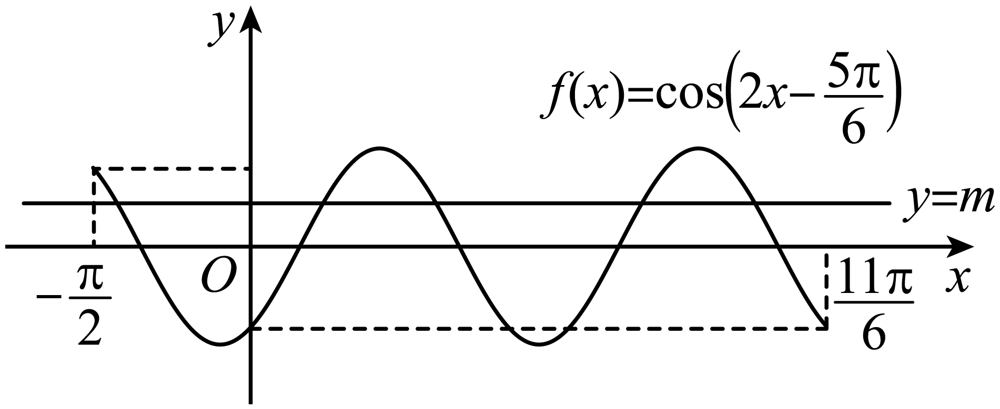

，，

由图可知，当时，与的图象有5个交点，

即函数在上有5个零点,故D错误.

故选：AB

**变式53．（多选题）**（2024·全国·高三专题练习）声音是由物体振动产生的声波，纯音的数学模型是函数，我们听到的声音是由纯音合成的，称之为复合音.若一个复合音的数学模型是函数，则下列结论不正确的是（    ）

A．是偶函数	B．的最小正周期为

C．在区间上单调递增	D．的最小值为1

【答案】BC

【解析】因为，，所以是偶函数，A正确；显然是周期函数，

因为，所以B错误；因为当时，

所以在区间上单调递增，在上单调递减，C错误；

因为

当时，设，则，

同理：当时，，

由B中解答知，是的周期，所以的最小值为1，D正确.

故选：BC.

**变式54．（多选题）**（2024·全国·高三专题练习）已知函数，下列叙述正确的有（    ）

A．的周期为2*π*；	B．是偶函数；

C．在区间上单调递减；	D．<em>x1</em>，<em>x2</em>∈<em>R</em>，

【答案】BC

【解析】是偶函数，不是周期函数，是偶函数，是周期函数，最小正周期为，故不是周期函数，A错误，B正确；当时，，因为，在次区间上单调递减，故在区间上单调递减，C正确；

当时，，，，即，D选项错误.

故选：BC

**变式55．（多选题）**（2024·重庆·统考模拟预测）声音是由于物体的振动产生的能引起听觉的波，我们听到的声音多为复合音．若一个复合音的数学模型是函数，则下列结论正确的是（    ）

A．的一个周期为	B．的最小值为

C．的图象关于点对称	D．在区间上有3个零点

【答案】ACD

【解析】选项A：

故的一个周期为，A正确.

选项B：

，当，时，取得最小值，

，当，时即，时，取得最小值，

所以两个函数不可能同时取得最小值，所以的最小值不是，故B错误.

选项C：

，

，

所以，

所以的图象关于点对称，C正确，

选项D：

，

得，或，

得，或，，

故区间中的根为，，，

故D正确.

故选：ACD

**变式56．**（2024·全国·高三专题练习）设函数．

(1)若，求的值．

(2)已知在区间上单调递增，，再从条件①、条件②、条件③这三个条件中选择一个作为已知，使函数存在，求的值．

条件①：；

条件②：；

条件③：在区间上单调递减．

注：如果选择的条件不符合要求，第（2）问得0分；如果选择多个符合要求的条件分别解答，按第一个解答计分．

【解析】（1）因为

所以，

因为，所以.

（2）因为，

所以，所以的最大值为，最小值为.

若选条件①：因为的最大值为，最小值为，所以无解，故条件①不能使函数存在；

若选条件②：因为在上单调递增，且，

所以,所以,,

所以，

又因为，所以，

所以，

所以，因为，所以.

所以，；

若选条件③：因为在上单调递增，在上单调递减，

所以在处取得最小值，即.

以下与条件②相同．

**变式57．**（2024·江西赣州·高三校联考阶段练习）已知函数的部分图象如图所示.

(1)求的解析式；

(2)将的图象上所有点的横坐标缩短为原来的（纵坐标不变），再将所得图象向左平移个单位长度，得到函数的图象，求函数在内的零点.

【解析】（1）由图象可得，

，则，即，

∴，

由图象得，即，

∴，，则，，

又，∴，

故；

（2）将的图象上所有点的横坐标缩短为原来的（纵坐标不变），

再将所得图象向左平移个单位长度，得到函，

∴，

令，则或，

解得，，或，，

又，∴或，

即函数在内的零点为0与.

**变式58．**（2024·黑龙江齐齐哈尔·齐齐哈尔市实验中学校考三模）已知函数在区间上单调，其中，，且．

(1)求的图象的一个对称中心的坐标；

(2)若点在函数的图象上，求函数的表达式．

【解析】（1）由函数在区间上单调，

且，可知，

故的图象的一个对称中心的坐标为

（2）由点在函数的图象上，

有，又由，

，

可知函数在区间上单调递减，

由函数的图象和性质，

有，

又，有，

将上面两式相加，有，

有，

又由，可得，

则，

又由函数在区间上单调，

有，可得，可得，

故．

**变式59．**（2024·安徽黄山·屯溪一中校考模拟预测） ，，，

(1)若，求的值；

(2)若函数的最小正周期为

①求的值；

②当时，对任意，不等式恒成立，求的取值范围

【解析】（1）依题意，

，

当时，，

（2）①由（1）知，

最小正周期，得，

②当时， ，当时，

，当，即时，的最大值为2，

不等式恒成立，即恒成立，

整理为，恒成立，

当时，恒成立，

当时，，得，

综上可得，，

当时， ，当时，

，当，即时，的最大值为0

不等式恒成立，即恒成立，

整理为，恒成立，

当时，恒成立，

当时，，得，

综上可得，，

综上可知，当时，，当时，.

**变式60．**（2024·安徽安庆·安庆一中校考模拟预测）某港口在一天之内的水深变化曲线近似满足函数，其中为水深（单位：米），为时间（单位：小时），该函数图像如图所示.

(1)求函数的解析式；

(2)若一艘货船的吃水深度（船底与水面的距离）为4米，安全条例规定至少要有1.5米的安全间隙（船底与水底的距离），则该船一天之内至多能在港口停留多久？

【解析】（1）由图知，，，，

所以，将点代入得，

结合解得，

所以函数的解析式.

（2）货船需要的安全水深为米，所以当时货船可以停留在港口.

由得，得，

即，

当时，，当时，，

所以该船一天之内至多能在港口停留小时.

**变式61．**（2024·辽宁锦州·渤海大学附属高级中学校考模拟预测）已知函数的图像相邻对称轴之间的距离是，\_\_\_\_\_\_；

①若将的图像向右平移个单位，所得函数为奇函数．

②若将的图像向左平移个单位，所得函数为偶函数，

在①，②两个条件中选择一个补充在\_\_\_\_\_\_并作答

(1)若，求的取值范围；

(2)设函数的零点为，求的值．

【解析】（1）因为函数的图像相邻对称轴之间的距离是，

所以，解得，所以，

选①：

当将的图像向右平移个单位，得到函数，

因为为奇函数，所以，即，

因为 ，所以，则

则，

因为，所以，则，

所以.

选②：的图像向左平移个单位，得到函数，

因为函数为偶函数，所以，即.

因为 ，所以，则

则，

因为，所以，则，

所以.

（2）因为函数的零点为，

所以，则，

所以，

.

**变式62．**（2024·安徽亳州·安徽省亳州市第一中学校考模拟预测）已知函数的部分图象如图所示.

(1)求函数的解析式；

(2)将函数的图象向左平移个单位，得到函数的图象，若方程在上有解，求实数的取值范围.

【解析】（1）由函数的图象知：，则，

所以，，

因为，

所以，则，

又因为，则，

所以；

（2）由题意得：，

令，

则化为：，

即在上有解，

由对勾函数的性质得：，

所以.

**【解题方法总结】**

三角函数的性质（如奇偶性、周期性、单调性、对称性）中，尤为重要的是对称性*．*

因为对称性奇偶性（若函数图像关于坐标原点对称，则函数为奇函数；若函数图像关于轴对称，则函数为偶函数）；对称性周期性（相邻的两条对称轴之间的距离是；相邻的对称中心之间的距离为；相邻的对称轴与对称中心之间的距离为）；对称性单调性（在相邻的对称轴之间，函数单调，特殊的，若，函数在上单调，且，设，则深刻体现了三角函数的单调性与周期性、对称性之间的紧密联系）

**题型八：根据条件确定解析式**

**方向一：**“**知图求式**”**，即已知三角形函数的部分图像，求函数解析式．**

<strong>例22．</strong>（2024·甘肃金昌·高三统考阶段练习）已知函数（，，）的部分图象如图所示，设使成立的<em>a</em>的最小正值为<em>m</em>，，则（    ）

A．	B．	C．	D．

【答案】B

【解析】使成立的*a*即为的对称中心的横坐标，

∴*a*的最小正值为，

由图可知，，，∴，

将点代入，得，

∴，，

，，∵，∴取，

∴，∴，

∴.

故选：B.

**例23．**（2024·四川南充·高三四川省南充市高坪中学校考开学考试）已知函数（为常数，）的部分图像如图所示，若将的图像向左平移个单位长度，得到函数的图像，则的解析式可以为（    ）

A．	B．

C．	D．

【答案】A

【解析】由题意得，所以，故，

因为，，所以，，

即 .

又因为，解得.

即.

将的图像向左平移个单位长度，

得到函数.

故选：A

**例24．**（2024·全国·高三校联考阶段练习）已知函数的部分图象如图所示，把的图象上所有的点向左平移个单位长度，再把所得图象上所有点的横坐标缩短到原来的倍（纵坐标不变），得到的函数图象的解析式是（    ）

A．，	B．，

C．，	D．，

【答案】D

【解析】由题中函数图象可知：.

最小正周期为，所以，，

将点代入函数解析式中，得，

所以，，即，.

因为，所以，故，.

把的图象上所有的点向左平移个单位长度，

得到函数图象的解析式为，；

再把所得图象上所有点的横坐标缩短到原来的倍（纵坐标不变），

得到函数图象的解析式为，.

故选：D

**变式63．**（2024·全国·高三专题练习）函数的部分图象如图所示，则函数的解析式为（    ）

A．	B．

C．	D．

【答案】D

【解析】由图象可得，可得，

，可得，

由于函数在附近单调递减，且，，

由图象可知，函数的最小正周期满足，可得，

，则，

所以，解得，

，所以，，因此．

故选：D．

**变式64．**（2024·北京通州·统考模拟预测）已知函数（，）的部分图象如图所示，则的解析式为（    ）

A．	B．

C．	D．

【答案】C

【解析】由图知：，则，故，

则，

由，则，

所以，，

又，故，

综上，，

故选：C.

**变式65．**（2024·宁夏·高三银川一中校考阶段练习）已知函数，，，的部分图象如图所示，则函数的解析式为\_\_\_\_\_\_\_\_\_\_\_\_\_\_\_.

【答案】

【解析】由图象得到的最大值为，所以

将点、代入解析式，

，因为，，可得，

所以

故答案为：．

**变式66．**（2024·江苏南京·高三统考期中）设函数，（其中，）的部分图象如图，则函数的解析式为\_\_\_\_\_\_\_.

【答案】

【解析】由过求的值，根据五点画法坐标求出，即可求出结论.过点，

，或，

函数在轴右侧第一个最高点坐标为

若时，，

若时，（舍去），

.

故答案为:.

**方向二：知性质（如奇偶性、单调性、对称性、最值），求解函数解析式（即的值的确定）**

**变式67．**（2024·全国·模拟预测）已知函数，当时，的最小值为，则\_\_\_\_\_\_；若将函数的图象向左平移个单位长度后，所得图象在轴上的截距为，则在上的值域为\_\_\_\_\_\_．

【答案】

【解析】易知的最大值和最小值分别为和，

因为，所以、一个为的最大值点，

一个为的最小值点，

设函数的最小正周期为，则由的最小值为，

得，所以，则，

所以．

将函数的图象向左平移个单位长度后，

所得图象对应的函数为，

令，则，

可得，

，所以，，

所以，所以，

所以，

若，则，

则，则.

故在上的值域为．

故答案为：；．

**变式68．**（2024·吉林通化·梅河口市第五中学校考模拟预测）某函数满足以下三个条件：

①是偶函数；②；③的最大值为4．

请写出一个满足上述条件的函数的解析式\_\_\_\_\_\_．

【答案】（答案不唯一）

【解析】因为是偶函数，所以的图象关于*y*轴对称，

因为，所以，即

所以的图象关于点对称，所以4为的一个周期，

又的最大值为4，所以满足条件.

故答案为：（答案不唯一）

**变式69．**（2024·全国·高三专题练习）已知函数，，且，写出一个满足条件的函数的解析式：\_\_\_\_\_\_\_\_\_\_\_.

【答案】（答案不唯一）

【解析】∵，，且，

∴，，

∴，，

令，，，，，

令，，.

故答案为：（答案不唯一）.

**变式70．**（2024·河北·校联考模拟预测）已知函数的图象过点，且相邻两个零点的距离为.若将函数的图象向左平移个单位长度得到的图象，则函数的解析式为\_\_\_\_\_\_\_\_\_\_\_.

【答案】

【解析】的相邻两个零点的距离为，的最小正周期，；

又，，解得：，

又，，，

.

故答案为：.

**变式71．**（2024·全国·高三专题练习）已知，满足，，且在上有且仅有5个零点，则此函数解析式为\_\_\_\_\_\_\_\_\_\_\_\_\_．

【答案】

【解析】因为，令，

则，即，

所以是图像的对称中心，

又，令，

则，即，

所以是图像的对称轴，

所以，得，

令，则，所以，

因为在上有且只有5个零点，所以，又，

即，所以，得，代入上式，得，

又，所以，所以.

故答案为：

**变式72．**（2024·湖北·高三校联考阶段练习）已知函数（，）满足，其图象与轴在原点右侧的第一个交点的坐标为，则函数的解析式为\_\_\_\_\_\_\_\_\_\_.

【答案】或

【解析】因为满足，所以图象关于对称，

因为图象与轴在原点右侧的第一个交点的坐标为，

所以，所以，

所以即，所以，，

解得：，，

因为，所以或

所以或.

故答案为：或.

**变式73．**（2024·全国·高三专题练习）函数(，)为偶函数，且函数的图像的两条对称轴之间的最小距离为，则的解析式为\_\_\_\_\_\_\_\_.

【答案】

【解析】∵函数，

∴，

由题意得，

∴，则.

∵为偶函数，

∴，

∴，，

又∵，

故，

即，

∴.

故答案为：

**变式74．**（2024·上海虹口·统考一模）设函数（其中,）,若函数图象的对称轴与其对称中心的最小距离为,则\_\_\_\_\_\_．

【答案】

【解析】解:由题知,因为对称轴与对称中心的最小距离为,

所以,即,

所以,此时,

因为对称轴为,

故有:,

即,

因为,

所以,

故.

故答案为:

**【解题方法总结】**

根据函数必关于轴对称，在三角函数中联想到的模型，从图象、对称轴、对称中心、最值点或单调性来求解*．*

**题型九：三角函数图像变换**

**例25．**（2024·河南郑州·高三郑州外国语学校校考阶段练习）如图，函数的图像过两点，为得到函数的图像，应将的图像（    ）

A．向右平移个单位长度	B．向左平移个单位长度

C．向右平移个单位长度	D．向左平移个单位长度

【答案】D

【解析】

代入得 即

即

对于A选项，

,故A错误

对于B选项

，故B错误

对于C选项

，故C错误

对于D选项，

，故D正确

故选：D

**例26．**（2024·河北衡水·高三河北衡水中学校考阶段练习）将函数的图象向右平移个单位长度后，得到函数的图象，则的值可以是（    ）

A．	B．	C．	D．

【答案】D

【解析】因为，

将函数的图象向右平移个单位长度后，得到函数的图象，

由题意可得，可得，当时，，

故选：D.

**例27．**（2024·河南洛阳·高三新安县第一高级中学校考开学考试）已知把函数的图象向右平移个单位长度，可得函数的图象，则的最小正值为（    ）

A．	B．	C．	D．

【答案】C

【解析】由题知，

，

且

，

，

即，

解得，当时，取得最小正值，

.

故选：C.

**变式75．**（2024·全国·高三专题练习）为了得到函数的图象，只需将函数的图象（    ）

A．向左平移个单位长度	B．向左平移个单位长度

C．向右平移个单位长度	D．向右平移个单位长度

【答案】A

【解析】由题意，由于函数，

观察发现可由函数向左平移个单位长度，得到函数的图象，

故选：A.

**变式76．**（2024·青海西宁·统考二模）为了得到函数图象，只要将的图象（    ）

A．向左平移个单位长度，再把所得图象上各点的横坐标缩短到原来的，纵坐标不变

B．向左平移个单位长度，再把所得图象上各点的横坐标伸长到原来的4倍，纵坐标不变

C．向左平移个单位长度，再把所得图象上各点的横坐标缩短到原来的，纵坐标不变

D．向左平移个单位长度，再把所得图象上各点横坐标伸长到原来的4倍，纵坐标不变

【答案】A

【解析】只要将的图象向左平移个单位长度，得到函数 的图象，

再把所得图象上各点的横坐标缩短到原来的，纵坐标不变，得到函数的图象，即A正确；

将的图象向左平移个单位长度，再把所得图象上各点的横坐标伸长到原来的4倍，纵坐标不变，得到的是函数的图象，故B错误；

将的图象向左平移个单位长度，再把所得图象上各点的横坐标缩短到原来的，纵坐标不变，得到的是函数的图象，故C错误；

将的图象向左平移个单位长度，再把所得图象上各点的横坐标伸长到原来的4倍，纵坐标不变，得到的是函数的图象，故D错误；

故选：A

**变式77．**（2024·全国·高三专题练习）若要得到函数的图象，只需将函数的图象（    ）

A．向左平移个单位长度	B．向右平移个单位长度

C．向左平移个单位长度	D．向右平移个单位长度

【答案】D

【解析】因为，

故将已知转化为要得到函数的图象，

又，

所以将的图象向右平移个单位长度即可得到的图象.

故选：D

**变式78．**（2024·陕西·统考模拟预测）已知函数的部分图象如图所示，则下列说法正确的是（    ）

A．将函数的图象向左平移个单位长度得到函数的图象

B．将函数的图象向右平移个单位长度得到函数的图象

C．将函数的图象向左平移个单位长度得到函数的图象

D．将函数的图象向右平移个单位长度得到函数的图象

【答案】A

【解析】由图象可知，函数的最小正周期为，则，，

，则，可得，

，所以，，

所以，，

因此，将函数的图象向左平移个单位长度得到函数的图象.

故选：A.

**变式79．**（2024·安徽合肥·合肥一中校考模拟预测）已知曲线，则下面结论正确的是（    ）

A．把<em>C1</em>上各点的横坐标伸长到原来的倍，纵坐标不变，再把得到的曲线向右平移个单位长度，得到曲线<em>C2</em>

B．把<em>C1</em>上各点的横坐标伸长到原来的倍，纵坐标不变，再把得到的曲线向左平移个单位长度，得到曲线<em>C2</em>

C．把<em>C1</em>上各点的横坐标缩短到原来的，纵坐标不变，再把得到的曲线向左平移个单位长度<em>C2</em>

D．把<em>C1</em>上各点的横坐标缩短到原来的，纵坐标不变，再把得到的曲线向右平移个单位长度，得到曲线<em>C2</em>

【答案】C

【解析】曲线，

把上各点的横坐标缩短到原来的，纵坐标不变，可得的图象；

再把得到的曲线向左平移个单位长度，可以得到曲线的图象.

故选：C.

**变式80．**（2024·全国·高三专题练习）已知函数，，将函数的图象经过下列哪种可以与 的图象重合（    ）

A．向左平移个单位	B．向左平移个单位

C．向右平移个单位	D．向右平移个单位

【答案】C

【解析】，

将函数的图象向右平移个单位：；

故选：C

**【解题方法总结】**

由函数的图像变换为函数的图像*．*

<strong>方法：</strong>先相位变换，后周期变换，再振幅变换<em>．</em>

的图像的图像

的图像

的图像

**题型十：三角函数模型**

**例28．**（2024·江西赣州·高三校联考阶段练习）如图，摩天轮的半径为m，其中心点距离地面的高度为m，摩天轮按逆时针方向匀速转动，且转一圈，若摩天轮上点的起始位置在最高点处，则摩天轮转动过程中下列说法正确的是（   ）

A．转动后点距离地面

B．若摩天轮转速减半，则转动一圈所需的时间变为原来的

C．第和第点距离地面的高度相同

D．摩天轮转动一圈，点距离地面的高度不低于m的时间长为

【答案】D

【解析】设转动过程中，点离地面距离的函数为：

，

由题意得：，

，则 ，

所以 ，

选项A，转到后，点距离地面的高度为：

，故A不正确；

选项B，若摩天轮转速减半，则转动一圈所需的时间变为原来的2倍，

故B不正确；

选项C，因为

，

，

所以 ，

即第和第点距离地面的高度不相同，故C不正确；

选项D，令，

则 ，由，

解得 ，

所以，

即摩天轮转动一圈，点距离地面的高度不低于m的时间为，

故D正确；

故选：D.

<strong>例29．</strong>（2024·全国·高三专题练习）2019年长春市新地标——“长春眼”在摩天活力城<em>Mall</em>购物中心落成，其楼顶平台上的空中摩天轮的半径约为40m，圆心<em>O</em>距地面的高度约为60m，摩天轮逆时针匀速转动，每15min转一圈，摩天轮上的点<em>P</em>的起始位置在最低点处，已知在时刻<em>t</em>（min）时<em>P</em>距离地面的高度，当距离地面的高度在以上时可以看到长春的全貌，则在转一圈的过程中可以看到整个城市全貌的时间约为（    ）

A．2.0min	B．2.5min	C．2.8min	D．3.0min

【答案】B

【解析】由题意可知摩天轮运动一周距离底面的最高点为(60+40)米与最低点(60-40)米，相差80米，

∴；运动一周15分钟，即；

由，可得，故.

要看到全景需，解之得：，故时间长为min.

故选：B

**例30．**（2024·重庆·高三统考阶段练习）某钟表的秒针端点到表盘中心的距离为，秒针绕点匀速旋转，当时间时，点与表盘上标“12”处的点重合．在秒针正常旋转过程中，，两点的距离（单位：）关于时间（单位：）的函数解析式为（    ）

A．

B．

C．

D．

【答案】C

【解析】由已知函数的定义域为，周期为，且时，，

对于选项A，函数周期为，A错误；

对于选项B，函数周期为，B错误；

对于选项D，当时，，D错误；

对于选项C，

，

所以函数，

故选：C.

**变式81．**（2024·全国·高三专题练习）水车在古代是进行灌溉引水的工具，是人类一项古老的发明，也是人类利用自然和改造自然的象征.如图是一个半径为的水车，一个水斗从点出发，沿圆周按逆时针方向匀速旋转，且旋转一周用时8秒.经过秒后，水斗旋转到点，设点的坐标为，其纵坐标满足，则的表达式为（    ）

A．	B．

C．	D．

【答案】D

【解析】因点在水车上，所以.

由题可知的最小正周期为8，则，又，则.

因，则，又，故.

综上：.

故选：D

**变式82．**（2024·全国·高三专题练习）一个大风车的半径为8m，匀速旋转的速度是每12min旋转一周.它的最低点离地面2m，风车翼片的一个端点从开始按逆时针方向旋转，点离地面距离与时间之间的函数关系式是（    ）

A．	B．

C．	D．

【答案】C

【解析】以过风车中心垂直于地面的竖直向上的直线为*y*轴，该直线与地面的交点为原点，建立坐标系，如图，

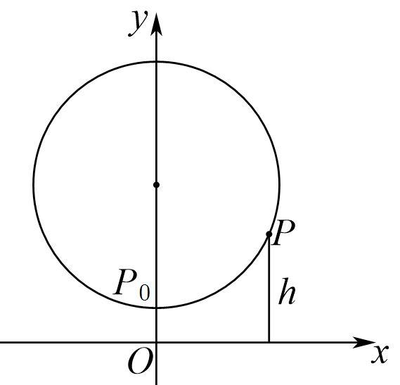

依题意，设函数解析式为，

显然，则，，

函数的周期，则，因当时，，即有，则，

于是得，

所以点离地面距离与时间之间的函数关系式是.

故选：C

**【解题方法总结】**

（1）研究的性质时可将视为一个整体，利用换元法和数形结合思想进行解题．

（2）方程根的个数可转化为两个函数图象的交点个数．

（3）三角函数模型的应用体现在两方面：一是已知函数模型求解数学问题；二是把实际问题抽象转化成数学问题，利用三角函数的有关知识解决问题

