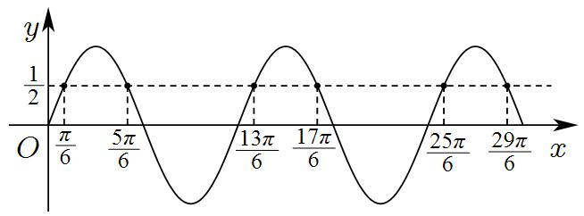
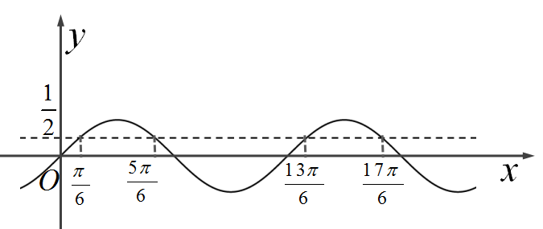
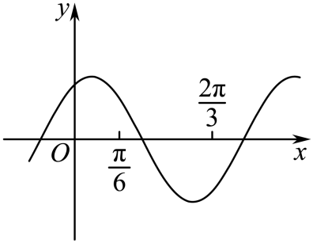
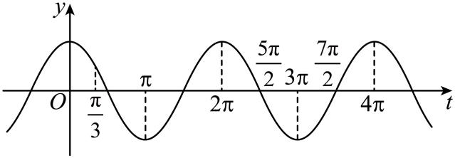
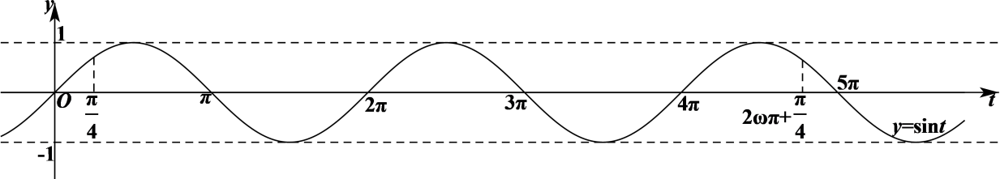
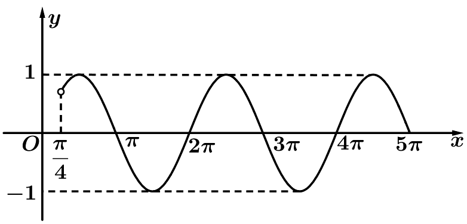
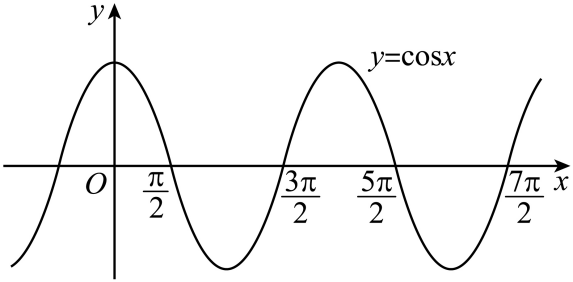

**第31讲  的取值范围与最值问题**

**知识梳理**

1、在区间内没有零点

同理，在区间内没有零点

2、在区间内有个零点

同理在区间内有个零点

3、在区间内有个零点

同理在区间内有个零点

4、已知一条对称轴和一个对称中心，由于对称轴和对称中心的水平距离为，则．

5、已知单调区间，则.

**必考题型全归纳**

**题型一：零点问题**

**例1．**（2024·全国·高三专题练习）设函数，若对于任意实数，函数在区间上至少有3个零点，至多有4个零点，则的取值范围是（    ）

A．	B．	C．	D．

【答案】C

【解析】因为为任意实数，故函数的图象可以任意平移，从而研究函数在区间上的零点问题，即研究函数在任意一个长度为的区间上的零点问题，

令，得，则它在轴右侧靠近坐标原点处的零点分别为，，，，，，

则它们相邻两个零点之间的距离分别为，，，，，

故相邻四个零点之间的最大距离为，相邻五个零点之间的距离为，

所以要使函数在区间上至少有3个零点，至多有4个零点，则需相邻四个零点之间的最大距离不大于，相邻五个零点之间的距离大于，

即，解得.

故选：C

**例2．**（2024·全国·高一专题练习）设函数，在区间上至少有2个不同的零点，至多有3个不同的零点，则的取值范围是（    ）

A．	B．

C．	D．

【答案】D

【解析】函数，在区间上至少有2个不同的零点，至多有3个不同的零点，即在区间上至少有2个不同的根，至多有3个不同的根，

，

如图：

①当，则，得无解；

②当，则，求得；

③当时，则，求得；

④当时，区间长度超过了正弦函数的两个最小正周期长度，故方程在区间上至少有4个根，不满足题意；

综上，可得或；

故选：D.

**例3．**（2024·河北·高二统考学业考试）设函数，若对于任意实数，在区间上至少有2个零点，至多有3个零点，则的取值范围是（　　）

A．	B．	C．	D．

【答案】B

【解析】令，则

令，则

则问题转化为在区间上至少有两个，至少有三个*t*，使得，求的取值范围.

作出和的图像，观察交点个数，

可知使得的最短区间长度为2*π*，最长长度为，

由题意列不等式的：

解得：.

故选：B

**变式1．**（2024·全国·高三专题练习）已知函数的图象是由（）的图象向右平移个单位得到的，若在上仅有一个零点，则的取值范围是（    ）．

A．	B．

C．	D．

【答案】C

【解析】由题知，函数在上仅有一个零点，

所以，所以，

令，得，即.

若第一个正零点，则（矛盾），

因为函数在上仅有一个零点，

所以，解得.

故选：C.

**变式2．**（2024·全国·高三专题练习）记函数的最小正周期为.若，为的零点，则的最小值为（    ）

A．2	B．3	C．4	D．6

【答案】C

【解析】因为的最小正周期为，且，

所以，

因为，所以，

所以，

因为为的零点，

所以，

所以，解得，

因为，所以的最小值为4，

故选：C

**变式3．**（2024·全国·模拟预测）若函数在上有3个零点，则的取值范围是（    ）

A．	B．	C．	D．

【答案】D

【解析】令，则

当时，，即，

当时，，矛盾，

所以，且，又，

所以，且，

所以．

所以，因为，

所以函数的正零点从小到大依次为：，，，，

因为函数在上有3个零点，

所以

所以．

故选：D．

**题型二：单调问题**

**例4．**（2024·四川成都·石室中学校考模拟预测）已知函数的图象关于点对称，且在上单调，则的取值集合为（    ）

A．	B．	C．	D．

【答案】C

【解析】关于点对称，所以，

所以①；

，而在上单调，

所以，②；

由①②得的取值集合为.

故选：C

**例5．**（2024·全国·高三专题练习）已知函数，是函数的一个零点，是函数的一条对称轴，若在区间上单调，则的最大值是（    ）

A．	B．	C．	D．

【答案】A

【解析】设函数的最小正周期为，

因为是函数的一个零点，是函数的一条对称轴，

则，其中，所以，，，

因为函数在区间上单调，则，所以，.

所以，的可能取值有：、、、、.

（i）当时，，，

所以，，则，

，，所以，，

当时，，所以，

函数在上不单调，不合乎题意；

（ii）当时，，，

所以，，则，

，，所以，，

当时，，所以，

函数在上单调递减，合乎题意.

因此，的最大值为.

故选：A.

**例6．**（2024·内蒙古赤峰·校考模拟预测）若直线是曲线的一条对称轴，且函数在区间[0，]上不单调，则的最小值为（    ）

A．9	B．7	C．11	D．3

【答案】C

【解析】因直线是曲线的一条对称轴，则，即，

由得，则函数在上单调递增，

而函数在区间上不单调，则，解得，

所以的最小值为11.

故选：C

**变式4．**（2024·全国·高三专题练习）已知函数的一个对称中心为，在区间上不单调，则的最小正整数值为（    ）

A．1	B．2	C．3	D．4

【答案】B

【解析】由函数的一个对称中心为，

可得，

所以，，

，，

，

由在区间上不单调，

所以在区间上有解，

所以，在区间上有解，

所以，

所以，，

又，所以，

所以，

当时，，

此时的最小正整数为.

故选：B

**变式5．**（2024·全国·高三专题练习）已知函数在上单调，且，则的可能取值（    ）

A．只有1个	B．只有2个

C．只有3个	D．有无数个

【答案】C

【解析】设的最小正周期为*T*，则由函数在上单调，可得，即．

因为，所以.

由在上单调，且，得的一个零点为，即为的一个对称中心.

因为，所以为的一条对称轴.

因为，所以有以下三种情况：

①，则；

②当时，则，符合题意；

③，则，符合题意．

因为，不可能满足其他情况.

故的可能取值只有3个．

故选：C

**题型三：最值问题**

**例7．**（2024·全国·高三专题练习）已知函数在区间上单调递增，且在区间上只取得一次最大值，则的取值范围是（    ）

A．	B．	C．	D．

【答案】B

【解析】依题意，函数，，

因为在区间上单调递增，由，则，

于是且，解得且，即，

当时，，因为在区间上只取得一次最大值，

因此，解得，

所以的取值范围是.

故选：B

**例8．**（2024·全国·高三专题练习）已知函数，若，且在上有最大值，没有最小值，则的最大值为\_\_\_\_\_\_．

【答案】17

【解析】由，且在上有最大值，没有最小值，可得， 所以.

由在上有最大值，没有最小值，可得，解得，又，当时，，则的最大值为17，,

故答案为：17

**例9．**（2024·全国·高三专题练习）已知函数在处取得最大值，且，若函数在上是单调的，则的最大值为\_\_\_\_\_\_．

【答案】/11.25

【解析】由题意，函数

满足，，

可得，，

两式相减得，其中，

解得，

又由，可得，

即，解得，

故*m*的最大值为8，

此时取得最大值．

故答案为：

**变式6．**（2024·全国·高三专题练习）已知函数在（0，2]上有最大值和最小值，且取得最大值和最小值的自变量的值都是唯一的，则的取值范围是\_\_\_\_\_\_\_\_\_\_\_.

【答案】

【解析】易知时不满足题意，

由**Z**，得**Z**，

当时，第2个正最值点，解得，

第3个正最值点，解得，故；

当时，第2个正最值点，解得，

第3个正最值点，解得，故.

综上，的取值范围是.

故答案为：

**变式7．**（2024·全国·高三专题练习）已知函数的最大值为2，则使函数在区间上至少取得两次最大值，则取值范围是\_\_\_\_\_\_\_

【答案】/

【解析】，因为，，故，原式为，当取到最大值时，，当，取得前两次最大值时，分别为0和1，时，，，此时需满足，解得.

故答案为：

**变式8．**（2024·全国·高三专题练习）已知函数在上有最大值，无最小值，则的取值范围是\_\_\_\_\_\_\_\_．

【答案】

【解析】．

由题可知，，所以，

当时，，

因为函数在上有最大值，无最小值，

所以存在，使得

整理得，（）.

因为，所以，解得.

故答案为：.

**题型四：极值问题**

<strong>例10．</strong>（2024·全国·高三专题练习）记函数的最小正周期为<em>T</em>．若为的极小值点，则的最小值为\_\_\_\_\_\_\_\_\_\_．

【答案】14

【解析】 因为所以最小正周期，

又所以，即；

又为的极小值点，所以，解得，因为，所以当时；

故答案为：14

**例11．**（2024·全国·高三专题练习）已知函数，，函数在上有且仅有一个极小值但没有极大值，则的最小值为（    ）

A．	B．	C．	D．

【答案】C

【解析】∵，∴．又，∴．

当时，函数取到最小值，此时，．解得，．

所以当时，.

故选：C．

**例12．**（2024·山西运城·高三统考期中）已知函数在区间内有且仅有一个极小值，且方程在区间内有3个不同的实数根，则的取值范围是（    ）

A．	B．	C．	D．

【答案】C

【解析】因为，所以，若在区间内有且仅有一个极小值，则.若方程在区间内有3个不同的实数根，则，所以，由，解得.

所以的取值范围是.

故选：C

**变式9．**（2024·全国·校联考三模）已知函数，.若函数只有一个极大值和一个极小值，则的取值范围为（    ）

A．	B．	C．	D．

【答案】C

【解析】令，因为，所以则问题转化为在上只有一个极大值和一个极小值，

因为函数只有一个极大值和一个极小值，则，即，又，所以，所以

则解得故

故选：C

**变式10．**（2024·全国·高三专题练习）函数在上有唯一的极大值，则（    ）

A．	B．	C．	D．

【答案】C

【解析】方法一：当时，，

因为函数在上有唯一的极大值，

所以函数在上有唯一极大值，

所以，，解得.

故选：C

方法二：令，，则，，

所以，函数在轴右侧的第一个极大值点为，第二个极大值点为，

因为函数在上有唯一的极大值，

所以，解得.

故选：C

**变式11．**（2024·全国·高三专题练习）已知函数在区间内有且仅有一个极大值，且方程在区间内有4个不同的实数根，则的取值范围是（    ）

A．	B．	C．	D．

【答案】C

【解析】由题意，函数，

因为，所以，

若在区间内有且仅有一个极大值，则，解得；若方程在区间内有4个不同的实数根，

则，解得．

综上可得，实数的取值范围是．

故选：C.

**题型五：对称性**

**例13．**（2024·全国·高三专题练习）已知函数在区间[0，]上有且仅有3条对称轴，则的取值范围是（    ）

A．（，]	B．（，]	C．[，）	D．[，）

【答案】C

【解析】，

令，，则，，

函数*f*（*x*）在区间[0，]上有且仅有3条对称轴，即有3个整数*k*符合，

，得，则，

即，∴.

故选：C.

**例14．**（2024·内蒙古赤峰·校考模拟预测）已知函数，若在区间上有且仅有个零点和条对称轴，则的取值范围是（    ）

A．	B．	C．	D．

【答案】D

【解析】函数 ，

令，由，则，

又函数在区间上有且仅有个零点和条对称轴，

即在区间上有且仅有个零点和条对称轴，

作出的图象如下，

所以，得．

故选：D．

**例15．**（2024·全国·高三专题练习）已知函数在区间上有且仅有4条对称轴，下列四个结论正确的是（    ）

A．在区间上有且仅有3个不同的零点

B．的最小正周期可能是

C．的取值范围是

D．在区间上单调递增

【答案】C

【解析】函数，

令，，得，，

函数在区间,上有且仅有4条对称轴，即有4个整数满足，

得，可得，1，2，3，

则，

，即的取值范围是，故C正确；

，，由于得，，

当时，在区间上有且仅有4个不同的零点，故A错误；

周期，由，得，

，的最小正周期不可能是，故B错误；

，，

又，，

又，在区间上不一定单调递增，故D错误．

故选：C

**变式12．**（2024·浙江衢州·高一统考期末）函数在区间上恰有两条对称轴，则的取值范围为（    ）

A．	B．	C．	D．

【答案】D

【解析】，

令，，则，，

函数在区间[0，]上有且仅有2条对称轴，即有2个整数*k*符合，

，得，则，

即，∴.

故选：D.

**变式13．**（2024·内蒙古呼和浩特·高三呼市二中校考阶段练习）已知函数在内有且仅有三条对称轴，则的取值范围是（    ）

A．	B．	C．	D．

【答案】B

【解析】时，函数，则，函数在内有且仅有三条对称轴，则：满足，解得，即实数的取值范围是.

**题型六：性质的综合问题**

**例16．**（2024·全国·高三专题练习）函数（，），已知，且对于任意的都有，若在上单调，则的最大值为（    ）

A．	B．	C．	D．

【答案】D

【解析】∵  ，，

∴ ，，

又对于任意的都有，

∴ ，，

∴ ，又，

∴ 或，

当时， ，且，

当时，，

若，则，

∴在上不单调，C错误，

当时， ，且，

当时，，

若，则，

∴在上不单调，A错误，

当时，，

若，则，

∴在上单调，D正确，

故选：D.

**例17．**（2024·全国·高一专题练习）设函数，已知在[有且仅有4个零点，下述四个结论：①在有且仅有2个零点；②在有且仅有2个零点；③的取值范围是；④在单调递增，其中正确个数是（    ）

A．0个	B．1个	C．2个	D．3个

【答案】D

【解析】由时，得到，根据在[有且仅有4个零点，则在第4个零点和第5个零点之间，然后利用余弦函数的性质求解.当时，

，

因为在[有且仅有4个零点，

所以在第4个零点和第5个零点之间，

所以，

解得，故③正确；

当时，，又，

，结合知最多有3个零点，故①错误；

当时，，又，

，结合有且仅有2个零点，故②正确；

当时，，因为，所以，则，所以在单调递增，故④正确；

故选：D

**例18．（多选题）**（2024·福建漳州·统考三模）已知函数在上有且仅有条对称轴；则（    ）

A．

B．可能是的最小正周期

C．函数在上单调递增

D．函数在上可能有个或个零点

【答案】AD

【解析】；

对于A，当时，，

在上有且仅有条对称轴，，解得：，

即，A正确；

对于B，若是的最小正周期，则，不能是的最小正周期，B错误；

对于C，当时，；

，，，

，当时，不是单调函数，C错误；

对于D，当时，，

，；

当时，在上有个零点；

当时，在上有个零点；

在上可能有个或个零点，D正确.

故选：AD.

**变式14．（多选题）**（2024·广东汕头·统考一模）知函数，则下述结论中正确的是（    ）

A．若在有且仅有个零点，则在有且仅有个极小值点

B．若在有且仅有个零点，则在上单调递增

C．若在有且仅有个零点，则的范围是

D．若的图象关于对称，且在单调，则的最大值为

【答案】ACD

【解析】令，由，可得出，

作出函数在区间上的图象，如下图所示：

对于A选项，若在有且仅有个零点，则在有且仅有个极小值点，A选项正确；

对于C选项，若在有且仅有个零点，则，解得，C选项正确；

对于B选项，若，则，

所以，函数在区间上不单调，B选项错误；

对于D选项，若的图象关于对称，则，.

，，，.

当时，，当时，，

此时，函数在区间上单调递减，合乎题意，D选项正确.

故选：ACD.

**变式15．（多选题）**（2024·全国·高三专题练习）已知函数，则下述结论中错误的是（    ）

A．若*f*（*x*）在[0，2π]有且仅有4个零点，则*f*（*x*）在[0，2π]有且仅有2个极小值点

B．若*f*（*x*）在[0，2π]有且仅有4个零点，则*f*（*x*）在上单调递增

C．若*f*（*x*）在[0，2π]有且仅有4个零点，则*ω*的范围是

D．若*f*（*x*）图象关于对称，且在单调，则ω的最大值为11

【答案】BD

【解析】因为,因为 在有且仅有个零点，所以 ，所以.所以选项C正确；

此时，在有且仅有 个极小值点，故选项A正确；

因为，

因为，所以当时，所以 ，此时函数不是单调函数，所以选项B错误；

若的图象关于对称，则，.

，，，.

当时，，当时，，

此时，函数在区间上单调递减，故的最大值为9．故选项D错误.

故选：BD

**变式16．（多选题）**（2024·全国·高三专题练习）已知函数在上有且仅有三个对称轴，则下列结论正确的是（    ）

A．函数在上单调递增.

B．不可能是函数的图像的一个对称中心

C．的范围是

D．的最小正周期可能为

【答案】AB

【解析】的对称轴方程为：

上有且仅有三个对称轴，，.

A选项：，所以A正确；

B选项：若是*f*(*x*)的一个对称中心，则：

，，，所以*k*不存在，B正确；

C选项:由上解得，所以C错误；

D选项：，所以D错误.

故选：AB.

**变式17．（多选题）**（2024·河北唐山·唐山市第十中学校考模拟预测）已知函数的最小正周期，，且在处取得最大值.下列结论正确的有（    ）

A．

B．的最小值为

C．若函数在上存在零点，则的最小值为

D．函数在上一定存在零点

【答案】ACD

【解析】A选项，因在处取得最大值，则图象关于对称，则

，故A正确；

B选项，最小正周期，则，，

则或，又在处取得最大值，

则，则或，

其中，则的最小值为，故B错误；

C选项，由A选项分析结合，可知时，

可取，令，

则，其中.

当时，不存在相应的，当时，，则存在满足题意；

由A选项分析结合，可知时，

可取，令，

则，

当时，不存在相应的，当时，，则存在满足题意，

综上可知的最小值为，故C正确；

D选项，由C分析可知，时，可取，

此时，，存在零点；

时，可取，

此时，，存在零点；

当时，，注意到，

则此时函数在上一定存在零点，

综上在上一定存在零点，故D正确.

故选：ACD

<strong>变式18．（多选题）</strong>（2024·全国·高一专题练习）记函数的最小正周期为<em>T</em>，若，在区间恰有三个零点，则关于下列说法正确的是（    ）

A．在上有且仅有1个最大值点	B．在上有且仅有2个最小值点

C．在上单调递增	D．的取值范围为

【答案】AD

【解析】由题意函数的最小正周期为*T*，则，

由可得，即，

由于，故，

由在区间恰有三个零点，

而时，，

结合函数的图象如图示：

则在原点右侧的零点依次为，

则，

即的取值范围为，D正确；

由于时，，，

结合图象可知，仅在时取得最大值，

故在有且仅有1个最大值点，A正确；

由A的分析可知，在时取得最小值，

由于，故可能取到，也可能取不到，

故在可能有1个最小值点，也可能有2个最小值点，B错误；

当时，，

由于，所以，

因为在上单调递减，C错误；

故选：

**变式19．（多选题）**（2024·全国·高一专题练习）下列说法正确的是（    ）

A．函数在上单调递增

B．函数的最大值是1

C．若函数，对任意，都有，并且在区间上不单调，则的最小值是4

D．若函数在区间内没有零点，则的取值可以是

【答案】BC

【解析】对于A，由，得，所以，

又，函数在上单调递减，所以函数在上单调递减，故A错误；

对于B，，

当时，函数取得最大值，最大值为1，故B正确；

对于C，由知，函数的对称轴为，

所以**Z**)，解得**Z**)，由知，

当时，，，函数在上单调递增，不符合题意；

当时，，，函数在上不单调，故的最小值为4，故C正确；

对于D，，

当时，，由，得，当时，为函数的零点，故D错误.

故选：BC.

**变式20．（多选题）**（2024·江西九江·高一德安县第一中学校考期中）已知函数（其中，），，恒成立，且函数在区间上单调，那么下列说法正确的是（    ）

A．存在，使得是偶函数	B．

C．是的整数倍	D．的最大值是6

【答案】BC

【解析】对于A,∵，成立，∴，

整理得，解得，

，

假设存在，使得是偶函数，则，

即，该式左侧为偶数，不可能等于5，矛盾,故A错误；

对于B，因为，函数的图象关于对称，

∴，故B正确；

对于C，∵，∴是的整数倍，故C正确；

对于D，∵函数在区间上单调，∴，即，

当时，由，整理得，

故无解，故D错误．

故选：BC

