**第32讲  解三角形**

**知识梳理**

**知识点一：基本定理公式**

（1）正余弦定理：在△*ABC*中，角*A*，*B*，*C*所对的边分别是*a*，*b*，*c*，*R*为△*ABC*外接圆半径，则

<table><tr><td>
定理
</td><td>
正弦定理
</td><td>
余弦定理
</td></tr><tr><td>
公式
</td><td>

</td><td>
；

；

．
</td></tr><tr><td>
常见变形
</td><td>
（1），，；

（2），，；
</td><td>
；

；

<em>．</em>
</td></tr></table>

（2）面积公式：

（*r*是三角形内切圆的半径，并可由此计算*R*，*r*．）

**知识点二：相关应用**

（1）正弦定理的应用

①边化角，角化边

②大边对大角 大角对大边

③合分比：

（2）内角和定理：

①

同理有：，．

②；

③斜三角形中，

④；

⑤在中，内角成等差数列．

**知识点三：实际应用**

（1）仰角和俯角

在视线和水平线所成的角中，视线在水平线上方的角叫仰角，在水平线下方的角叫俯角（如图①）．

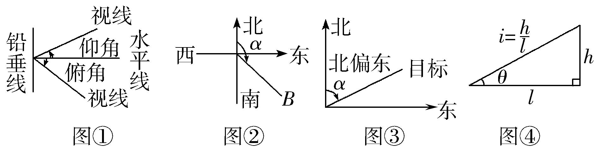

（2）方位角

从指北方向顺时针转到目标方向线的水平角，如*B*点的方位角为*α*（如图②）．

（3）方向角：相对于某一正方向的水平角．

（1）北偏东*α*，即由指北方向顺时针旋转*α*到达目标方向（如图③）．

（2）北偏西*α*，即由指北方向逆时针旋转*α*到达目标方向．

（3）南偏西等其他方向角类似．

（4）坡角与坡度

（1）坡角：坡面与水平面所成的二面角的度数（如图④，角*θ*为坡角）．

（2）坡度：坡面的铅直高度与水平长度之比（如图④，*i*为坡度）．坡度又称为坡比．

**【解题方法总结】**

1**、** 方法技巧：解三角形多解情况

在△*ABC*中，已知*a*，*b*和*A*时，解的情况如下：

<table><tr><td></td><td colspan="3">
<em>A</em>为锐角
</td><td colspan="2">
<em>A</em>为钝角或直角
</td></tr><tr><td>
图形
</td><td>
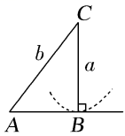
</td><td>
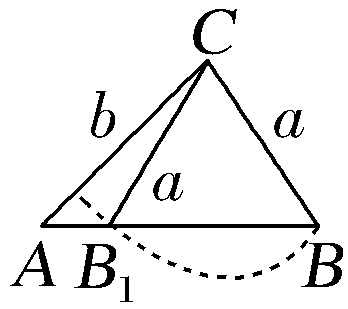
</td><td>
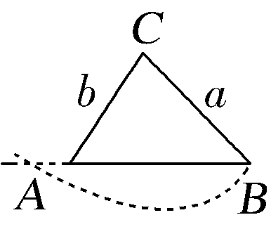
</td><td colspan="2">
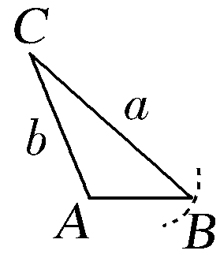
</td></tr><tr><td>
关系式
</td><td>

</td><td>

</td><td>

</td><td>

</td><td>

</td></tr><tr><td>
解的个数
</td><td>
一解
</td><td>
两解
</td><td>
一解
</td><td>
一解
</td><td>
无解
</td></tr></table>

2**、** 在解三角形题目中，若已知条件同时含有边和角，但不能直接使用正弦定理或余弦定理得到答案，要选择“边化角”或“角化边”，变换原则常用：

（1）若式子含有的齐次式，优先考虑正弦定理，“角化边”；

（2）若式子含有的齐次式，优先考虑正弦定理，“边化角”；

（3）若式子含有的齐次式，优先考虑余弦定理，“角化边”；

（4）代数变形或者三角恒等变换前置；

（5）含有面积公式的问题，要考虑结合余弦定理使用；

（6）同时出现两个自由角（或三个自由角）时，要用到．

3、三角形中的射影定理

在 中，；；．

**必考题型全归纳**

**题型一：正弦定理的应用**

**例1．**（2024·福建龙岩·高三校联考期中）在中，角所对的边分别为，若，则（    ）

A．	B．	C．	D．

【答案】C

【解析】因为，所以，

因为，所以．

故选：C.

<strong>例2．</strong>（2024·全国·高三专题练习）在中，设命题<em>p</em>：，命题<em>q</em>：是等边三角形，那么命题<em>p</em>是命题<em>q</em>的（    ）

A．充分不必要条件	B．必要不充分条件

C．充要条件	D．既不充分也不必要条件

【答案】C

【解析】由正弦定理可知，若*t*，

则，

即*a*＝*tc*，*b*＝*ta*，*c*＝*bt*，

即<em>abc</em>＝<em>t3abc</em>，即<em>t</em>＝1，

则*a*＝*b*＝*c*，即是等边三角形，

若是等边三角形，则*A*＝*B*＝*C*，则1成立，

即命题*p*是命题*q*的充要条件，

故选：C.

<strong>例3．</strong>（2024·河南·襄城高中校联考三模）在中，角<em>A</em>，<em>B</em>，<em>C</em>的对边分别为<em>a</em>，<em>b</em>，<em>c</em>，若且，，则（    ）

A．	B．	C．8	D．4

【答案】D

【解析】在中，由可得，

即

所以，因为，

所以，且，

所以，又，可得，

由正弦定理可得．

故选：D.

**变式1．**（2024·全国·高三专题练习）在中，内角的对边分别是，若，且，则（    ）

A．	B．	C．	D．

【答案】C

【解析】由题意结合正弦定理可得，

即，

整理可得，由于，故，

据此可得，

则.

故选：C.

**变式2．**（2024·河南郑州·高三郑州外国语中学校考阶段练习），，分别为内角，，的对边．已知，，则外接圆的面积为（    ）

A．	B．	C．	D．

【答案】B

【解析】因为，由正弦定理得，可得．

设外接圆的半径为，则，即，

故外接圆的面积为．

故选：B.

<strong>变式3．</strong>（2024·甘肃兰州·高三兰州五十一中校考期中）△<em>ABC</em>的三个内角<em>A</em>，<em>B</em>，<em>C</em>所对的边分别为<em>a</em>，<em>b</em>，<em>c</em>，若，则（    ）

A．	B．	C．	D．

【答案】B

【解析】由正弦定理得，化简得，

则，

故选：B

<strong>变式4．</strong>（2024·宁夏·高三六盘山高级中学校考期中）在中，内角<em>A</em>，<em>B</em>，<em>C</em>所对的边分别是<em>a</em>，<em>b</em>，<em>c</em>．若，则的值为（    ）

A．	B．	C．1	D．

【答案】A

【解析】依题意，

由正弦定理得.

故选：A

<strong>变式5．</strong>（2024·河南·洛宁县第一高级中学校联考模拟预测）△<em>ABC</em>的内角<em>A</em>，<em>B</em>，<em>C</em>的对边分别为<em>a</em>，<em>b</em>，<em>c</em>，已知，，则<em>c</em>＝（    ）

A．4	B．6	C．	D．

【答案】D

【解析】因为，根据正弦定理得

，

移项得，

即，即，

则根据正弦定理有．

故选：D.

**【解题方法总结】**

（1）已知两角及一边求解三角形；

（2）已知两边一对角；．

（3）两边一对角，求第三边．

**题型二：余弦定理的应用**

**例4．**（2024·全国·高三专题练习）已知的内角所对的边分别为满足且，则（    ）

A．	B．

C．	D．

【答案】A

【解析】由题，,

又，，，

故选：A.

**例5．**（2024·河南·高三统考阶段练习）在中，角的对边分别为，若，则（   ）

A．	B．	C．或	D．或

【答案】C

【解析】由正弦定理，得，

又，所以，

所以，因为，所以或，

故选：*C*.

<strong>例6．</strong>（2024·全国·高三专题练习）设△<em>ABC</em>中，角<em>A</em>，<em>B</em>，<em>C</em>所对的边分别为<em>a</em>，<em>b</em>，<em>c</em>，若，且，则（    ）

A．	B．	C．	D．

【答案】D

【解析】因为，由正弦定理有，

根据余弦定理有，

且，故有，即，

又，所以.

故选：D .

<strong>变式6．</strong>（2024·重庆渝中·高三重庆巴蜀中学校考阶段练习）在△<em>ABC</em>中，角<em>A</em>，<em>B</em>，<em>C</em>的对边分别为<em>a</em>，<em>b</em>，<em>c</em>，，则（   ）

A．0	B．1	C．2	D．

【答案】A

【解析】由余弦定理以及可得：，

又在三角形中有，即，

所以

故.

故选：A．

**变式7．**（2024·全国·高三专题练习）在中，角的对边分别为，且，则的值为（    ）

A．1	B．	C．	D．2

【答案】A

【解析】因为，

所以，由正弦定理与余弦定理得，化简得.

故选：A

**【解题方法总结】**

（1）已知两边一夹角或两边及一对角，求第三边．

（2）已知三边求角或已知三边判断三角形的形状，先求最大角的余弦值，

若余弦值

**题型三：判断三角形的形状**

**例7．**（2024·甘肃酒泉·统考三模）在中内角的对边分别为，若，则的形状为（    ）

A．等腰三角形	B．直角三角形

C．等腰直角三角形	D．等腰三角形或直角三角形

【答案】D

【解析】由正弦定理，余弦定理及得，

，即，

则，即

或为等腰三角形或直角三角形．

故选：D.

**例8．**（2024·全国·高三专题练习）在中，角，，的对边分别为，，，且，则形状为（    ）

A．锐角三角形	B．直角三角形

C．钝角三角形	D．等腰直角三角形

【答案】C

【解析】，

所以由正弦定理可得

所以，

所以，

所以，

所以，

在三角形中，

所以，

所以为钝角，

故选：C.

**例9．**（2024·全国·高三专题练习）在中，若，则的形状为（    ）

A．等腰三角形	B．直角三角形

C．等腰直角三角形	D．等腰三角形或直角三角形

【答案】D

【解析】由正弦定理，以及二倍角公式可知，,

即，整理为，

即，得，或,

所以的形状为等腰三角形或直角三角形.

故选：D

<strong>变式8．</strong>（2024·全国·高三专题练习）设的内角<em>A</em>，<em>B</em>，<em>C</em>的对边分别为<em>a</em>，<em>b</em>，<em>c</em>，若，且，则的形状为（    ）

A．锐角三角形	B．直角三角形

C．钝角三角形	D．等腰三角形

【答案】B

【解析】因为，

所以，

又，所以，

因为，由正弦定理得，

则，

则，

所以为有一个角为的直角三角形.

故选：B.

**变式9．**（2024·河南周口·高三校考阶段练习）已知的三个内角所对的边分别为．若，则该三角形的形状一定是（    ）

A．钝角三角形	B．直角三角形	C．等腰三角形	D．锐角三角形

【答案】C

【解析】因为，

由正弦定理（为外接圆的直径），

可得，

所以．

又因为，所以．即为等腰三角形.

故选：C

<strong>变式10．</strong>（2024·全国·高三专题练习）设的内角<em>A</em>，<em>B</em>，<em>C</em>所对的边分别为<em>a</em>，<em>b</em>，<em>c</em>，若则的形状为（     ）

A．等腰三角形	B．等腰三角形或直角三角形

C．直角三角形	D．锐角三角形

【答案】B

【解析】由得,

由二倍角公式可得或，

由于在，,所以或,故为等腰三角形或直角三角形

故选：B

**变式11．**（2024·北京·高三101中学校考阶段练习）设的内角，，所对的边分别为，，，若，则的形状为（    ）

A．等腰直角三角形	B．直角三角形

C．等腰三角形或直角三角形	D．等边三角形

【答案】C

【解析】已知等式利用正弦定理化简得：，

整理得：，即，

，即，

，

，

，，

则或，即为等腰三角形或直角三角形．

故选：C．

**【解题方法总结】**

（1）求最大角的余弦，判断是锐角、直角还是钝角三角形．

（2）用正弦定理或余弦定理把条件的边和角都统一成边或角，判断是等腰、等边还是直角三角形．

**题型四：正、余弦定理与的综合**

**例10．**（2024·河南南阳·统考二模）锐角是单位圆的内接三角形，角的对边分别为，且，则等于（    ）

A．2	B．	C．	D．1

【答案】C

【解析】由，

得，

由余弦定理，可得，

又由正弦定理，可得，

所以，

得，又，所以，所以.

又，所以，

故选：C

**例11．**（2024·河北唐山·高三开滦第二中学校考阶段练习）在中，角，，所对的边分别为，，，.

(1)求证：；

(2)若，求.

【解析】（1）在中，因为，

由正弦定理可得，化简可得，

由余弦定理可得，当且仅当时取等号，所以，因为角是的内角，所以，

所以.

（2）由

，则，

即，所以，又，

所以，在中，由余弦定理可得，

.

**例12．**（2024·重庆·统考三模）已知的内角、、的对边分别为、、，．

(1)求；

(2)若，求．

【解析】（1）因为，

所以，所以，

即，

由正弦定理可得，

由余弦定理可得，

所以，

即，

所以.

（2）由题意可知，又，可得，

所以，即为等腰三角形，

由，解得或，

因为，所以，所以，

所以.

**变式12．**（2024·山东滨州·统考二模）已知的三个角，，的对边分别为，，，且．

(1)若，求；

(2)求的值．

【解析】（1）若，则．

因为，

所以，

，

整理得．

解得（舍），，

因为，所以．

（2）因为．

所以

，

整理得

由正弦定理得，

由余弦定理得，

即，

所以．

**变式13．**（2024·全国·高三专题练习）在中，，则（    ）

A．	B．	C．	D．

【答案】B

【解析】因为，

所以由正弦定理得，即，

则，故，

又，所以.

故选：B.

<strong>变式14．</strong>（2024·青海·校联考模拟预测）在中，内角<em>A</em>，<em>B</em>，<em>C</em>所对应的边分别是<em>a</em>，<em>b</em>，<em>c</em>，若的面积是，则（    ）

A．	B．	C．	D．

【答案】A

【解析】由余弦定理可得：

由条件及正弦定理可得：

，

所以，则．

故选：A

<strong>变式15．</strong>（2024·全国·校联考三模）已知<em>a</em>，<em>b</em>，<em>c</em>分别为的内角<em>A</em>，<em>B</em>，<em>C</em>的对边，.

(1)求证：*a*，*b*，*c*成等比数列；

(2)若，求的值.

【解析】（1）因为，

所以.

所以.

根据余弦定理，得，

所以.

所以.

所以*a*，*b*，*c*成等比数列.

（2）由余弦定理，得.

因为，所以由正弦定理，得.

所以.

所以.

**变式16．**（2024·天津武清·天津市武清区杨村第一中学校考模拟预测）在中，角，，所对的边分别为，，，已知

(1)求角的大小；

(2)若，，求边及的值．

【解析】（1）因为，可得，

所以由正弦定理可得，

又为三角形内角，，

所以，

因为，，，

所以，可得，

所以；

（2）因为，，，

所以由正弦定理，可得，

所以为锐角，，，，

由余弦定理，可得，

整理可得，解得或（舍去），

所以．

**【解题方法总结】**

先利用平面向量的有关知识如向量数量积将向量问题转化为三角函数形式，再利用三角函数转化求解．

**题型五：解三角形的实际应用**

**方向1：距离问题**

<strong>例13．</strong>（2024·全国·高三专题练习）山东省科技馆新馆目前成为济南科教新地标（如图1），其主体建筑采用与地形吻合的矩形设计，将数学符号“”完美嵌入其中，寓意无限未知､无限发展､无限可能和无限的科技创新.如图2，为了测量科技馆最高点<em>A</em>与其附近一建筑物楼顶<em>B</em>之间的距离，无人机在点<em>C</em>测得点<em>A</em>和点<em>B</em>的俯角分别为75°，30°，随后无人机沿水平方向飞行600米到点<em>D</em>，此时测得点<em>A</em>和点<em>B</em>的俯角分别为45°和60°（<em>A</em>，<em>B</em>，<em>C</em>，<em>D</em>在同一铅垂面内），则<em>A</em>，<em>B</em>两点之间的距离为\_\_\_\_\_\_米.

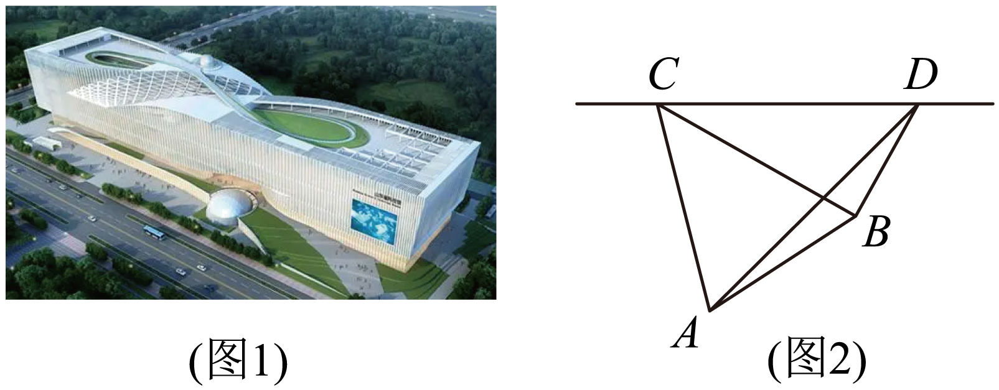

【答案】

【解析】由题意，，所以，

所以在中，，，

又，所以，

在中，由正弦定理得，，所以，

在中，，

由余弦定理得，，

所以.

故答案为：

**例14．**（2024·安徽阜阳·高三安徽省临泉第一中学校考期中）一游客在处望见在正北方向有一塔，在北偏西45°方向的处有一寺庙，此游客骑车向西行后到达处，这时塔和寺庙分别在北偏东30°和北偏西15°，则塔与寺庙的距离为\_\_\_\_\_\_.

【答案】

【解析】如图，在中，由题意可知，，可得.

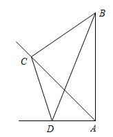

在中，，，，∴，

∴.

在中，

，

∴.

故答案为：.

**例15．**（2024·河南郑州·高三统考期末）如图，为了测量两点间的距离，选取同一平面上的，两点，测出四边形各边的长度（单位：km）：，，，，且四点共圆，则的长为\_\_\_\_\_\_\_\_\_ .

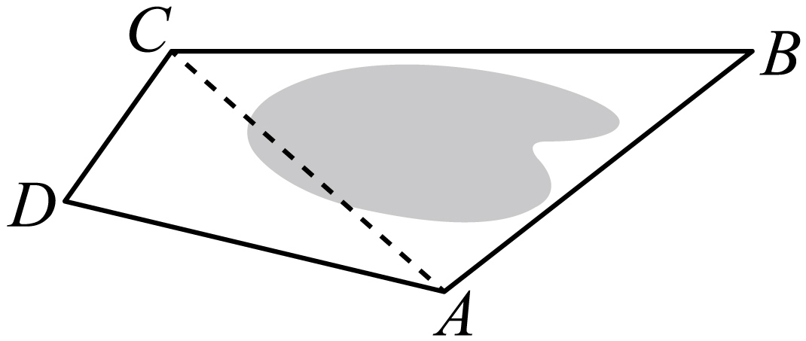

【答案】7

【解析】∵四点共圆，圆内接四边形的对角和为 ﹒

∴ ，

∴由余弦定理可得 ，

，

∵，即 ，

∴ ,解得,

故答案为：7

<strong>变式17．</strong>（2024·山东东营·高三广饶一中校考阶段练习）如图，一条巡逻船由南向北行驶，在<em>A</em>处测得灯塔底部<em>C</em>在北偏东方向上，匀速向北航行20分钟到达<em>B</em>处，此时测得灯塔底部<em>C</em>在北偏东方向上，测得塔顶<em>P</em>的仰角为 ，已知灯塔高为．则巡逻船的航行速度为\_\_\_\_\_\_．

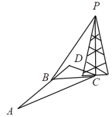

【答案】

【解析】由题意知在 中，,故,即，

解得 ，

在 中， ，

则，而 ，

所以，

所以，

即船的航行速度是每小时千米，

故答案为：

**方向2：高度问题**

**例16．**（2024·重庆·统考模拟预测）如图，某中学某班级课外学习兴趣小组为了测量某座山峰的高度，先在山脚处测得山顶处的仰角为，又利用无人机在离地面高的处（即），观测到山顶处的仰角为，山脚处的俯角为，则山高\_\_\_\_\_\_\_\_\_m．

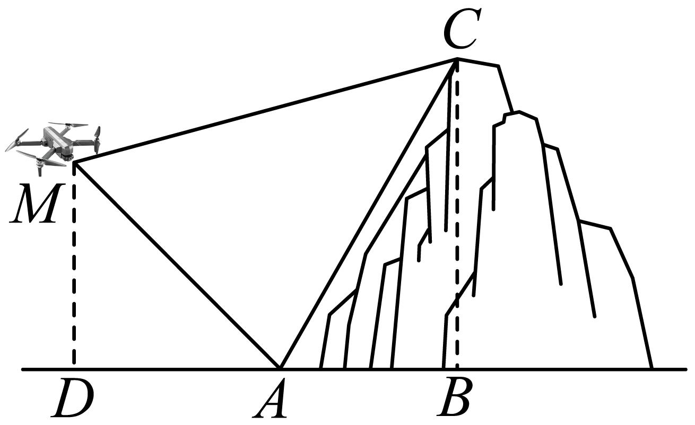

【答案】

【解析】依题意，则，,，

故，，

在中，由正弦定理得，即，

解得，则.

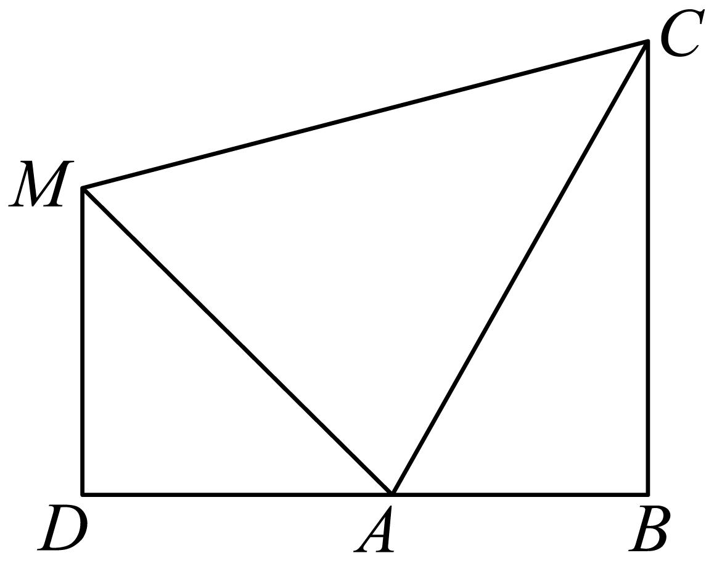

故答案为：

<strong>例17．</strong>（2024·河南·校联考模拟预测）中国古代数学名著《海岛算经》记录了一个计算山高的问题（如图1）：今有望海岛，立两表齐，高三丈，前后相去千步，令后表与前表相直.从前表却行一百二十三步，人目着地取望岛峰，与表末参合.从后表却行百二十七步，人目着地取望岛峰，亦与表末参合.问岛高及去表各几何?假设古代有类似的一个问题，如图2，要测量海岛上一座山峰的高度<em>AH</em>，立两根高48丈的标杆<em>BC</em>和<em>DE</em>，两竿相距<em>BD</em>=800步，<em>D</em>，<em>B</em>，<em>H</em>三点共线且在同一水平面上，从点<em>B</em>退行100步到点<em>F</em>，此时<em>A</em>，<em>C</em>，<em>F</em>三点共线，从点<em>D</em>退行120步到点<em>G</em>，此时<em>A</em>，<em>E</em>，<em>G</em>三点也共线，则山峰的高度<em>AH</em>=\_\_\_\_\_\_\_\_\_步.（古制单位:180丈=300步）

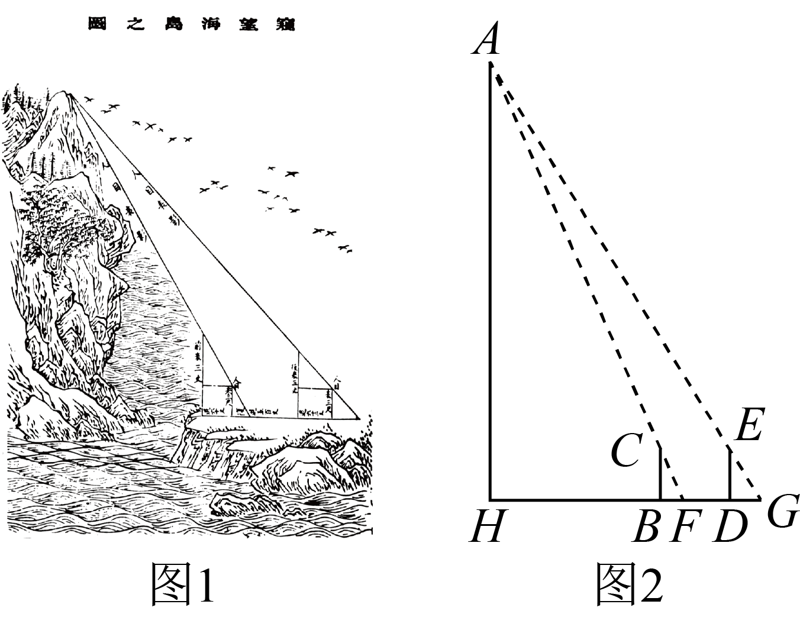

【答案】3280

【解析】由题可知步，步，步.步.

在*RtAHF*中，在*RtAHG*中.

所以，，

则.

所以步.

故答案为：3280

**例18．**（2024·全国·高三专题练习）为了培养学生的数学建模和应用能力，某校数学兴趣小组对学校雕像“月亮上的读书女孩”进行测量，在正北方向一点测得雕塑最高点仰角为30°，在正东方向一点测得雕塑最高点仰角为45°，两个测量点之间距离约为米，则雕塑高为\_\_\_\_\_\_

【答案】

【解析】如图所示，正北方向测量点为*C*，正东方向测量点为*D*，雕塑最高点为*B*，

其中*A*，*C*，*D*三点位于同一水平面，

由题意可知且，

设，在直角中，可得，

在直角中，可得，

在直角中，可得，解得，

故雕塑高为.

故答案为：

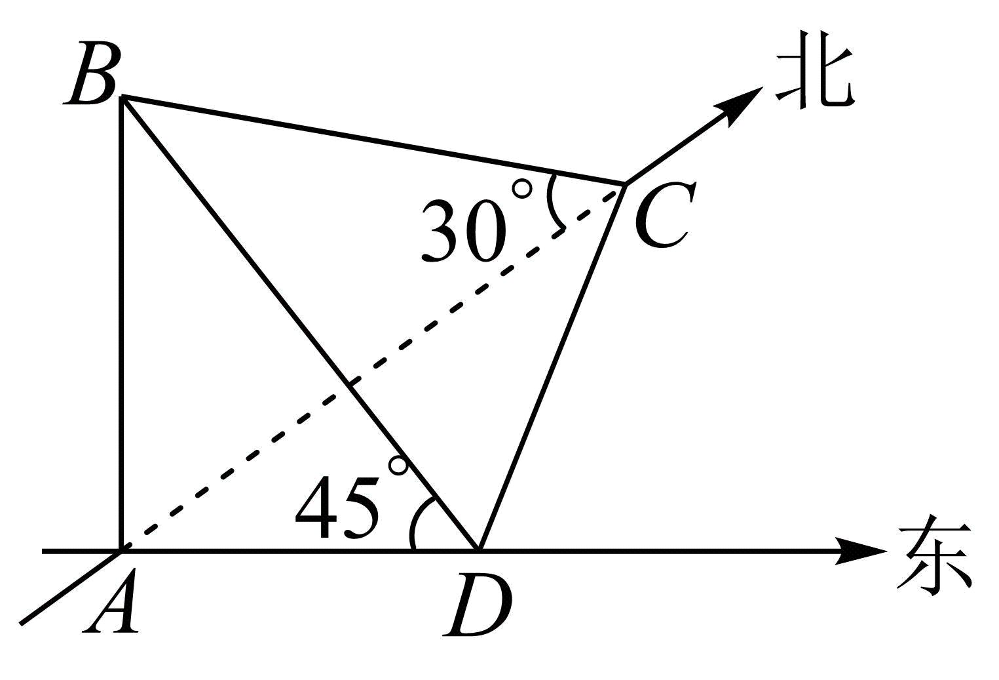

**变式18．**（2024·全国·模拟预测）山西应县木塔（如图1）是世界上现存最古老、最高大的木塔，是中国古建筑中的瑰宝，是世界木结构建筑的典范．如图2，某校数学兴趣小组为测量木塔的高度，在木塔的附近找到一建筑物，高为米，塔顶在地面上的射影为，在地面上再确定一点（，，三点共线），测得约为57米，在点处测得塔顶的仰角分别为30°和60°，则该小组估算的木塔的高度为\_\_\_\_\_\_\_\_\_\_米．

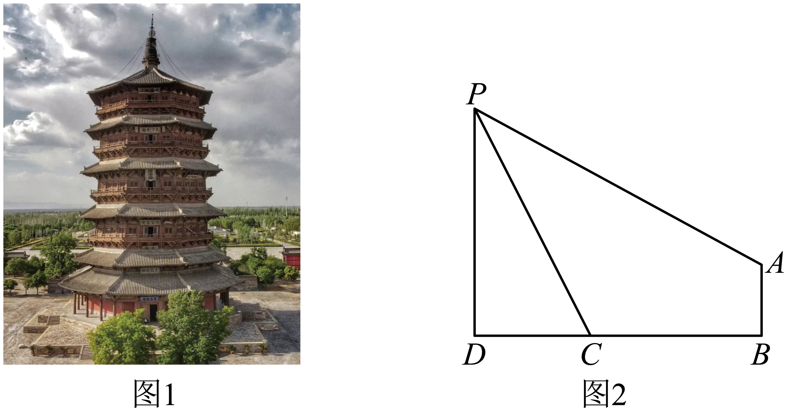

【答案】

【解析】如图，过点*A*作作垂线，垂足为，

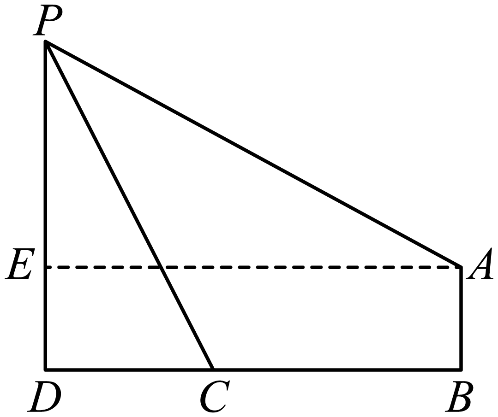

由题意可知，，米，

设米，则米，米，

∵，则，解得，

所以估算木塔的高度为米．

故答案为：.

**方向3：角度问题**

<strong>例19．</strong>（2024·福建厦门·高三厦门一中校考期中）足球是一项很受欢迎的体育运动．如图，某标准足球场的<em>B</em>底线宽码，球门宽码，球门位于底线的正中位置．在比赛过程中，攻方球员带球运动时，往往需要找到一点<em>P</em>，使得最大，这时候点<em>P</em>就是最佳射门位置．当攻方球员甲位于边线上的点<em>O</em>处时，根据场上形势判断，有、两条进攻线路可供选择．若选择线路，则甲带球\_\_\_\_\_\_码时，到达最佳射门位置．

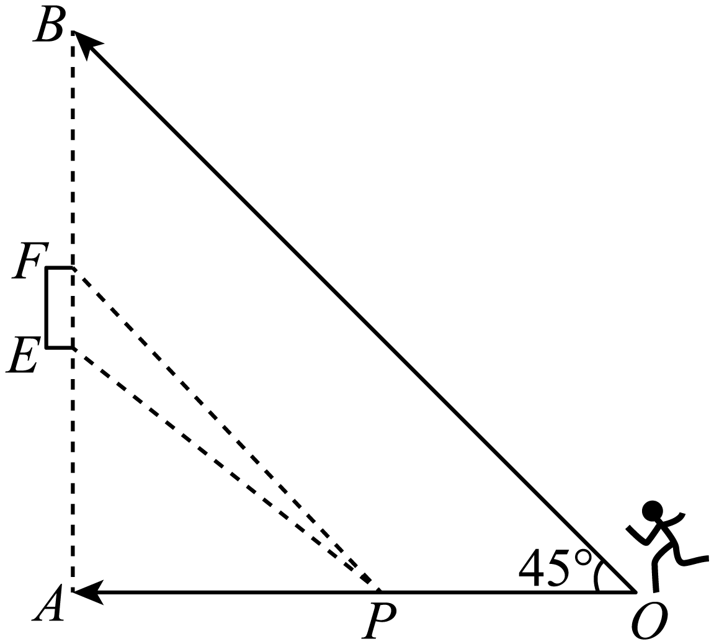

【答案】/

【解析】过点作于点，于点，如图所示，

设，则 ，由题可知，，，

易得四边形为矩形，

所以，，，

所以，

则，，

所以

，

设，则，

所以，

因为，当且仅当时等号成立，即，

所以当时，即，最大，

由题可知，，

因为在上单调递增，

所以最大时，最大，

所以时，到达最佳射门位置，

故答案为：．

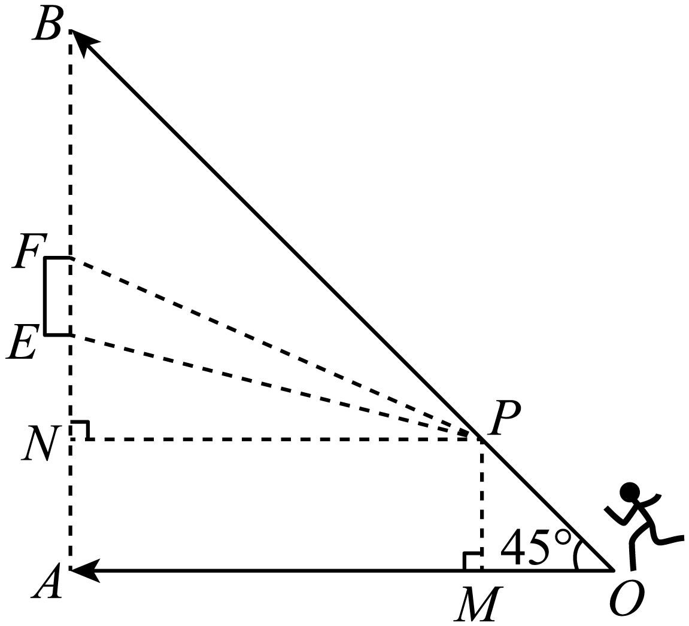

**例20．**（2024·全国·高三专题练习）当太阳光线与水平面的倾斜角为时，一根长为的竹竿，要使它的影子最长，则竹竿与地面所成的角\_\_\_\_\_\_\_\_．

【答案】

【解析】作出示意图如下如，

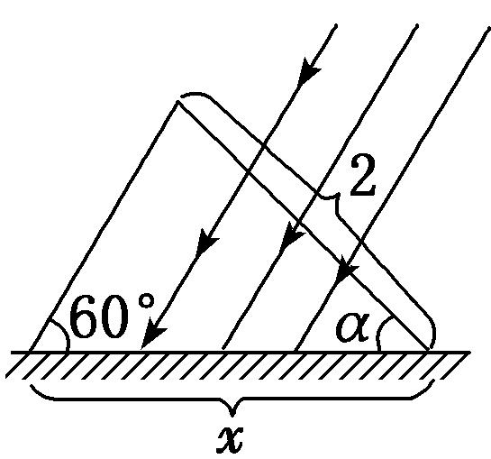

设竹竿与地面所成的角为，影子长为，依据正弦定理可得，

所以，因为，所以要使最大，

只需，即，所以时，影子最长．

答案为：.

<strong>例21．</strong>（2024·全国·高三专题练习）游客从某旅游景区的景点<em>A</em>处至景点<em>C</em>处有两条线路．线路1是从<em>A</em>沿直线步行到<em>C</em>，线路2是先从<em>A</em>沿直线步行到景点<em>B</em>处，然后从<em>B</em>沿直线步行到<em>C</em>．现有甲、乙两位游客从<em>A</em>处同时出发匀速步行，甲的速度是乙的速度的倍，甲走线路2，乙走线路1，最后他们同时到达<em>C</em>处．经测量，<em>AB</em>＝1 040 <em>m</em>，<em>BC</em>＝500 <em>m</em>，则sin∠<em>BAC</em>等于\_\_\_\_\_\_\_\_．

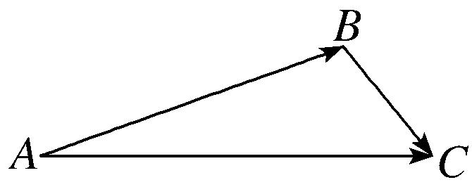

【答案】

【解析】依题意，设乙的速度为*x* m/s，

则甲的速度为*x* m/s，

因为*AB*＝1 040 *m*，*BC*＝500 *m*，

所以＝，解得*AC*＝1 260 *m*．

在△*ABC*中，由余弦定理得，

cos∠*BAC*＝＝＝，

所以sin∠*BAC*＝＝＝．

故答案为：.

<strong>变式19．</strong>（2024·全国·高三专题练习）最大视角问题是1471年德国数学家米勒提出的几何极值问题，故最大视角问题一般称为“米勒问题”.如图，树顶<em>A</em>离地面<em>a</em>米，树上另一点<em>B</em>离地面<em>b</em>米，在离地面米的<em>C</em>处看此树，离此树的水平距离为\_\_\_\_\_\_\_\_\_\_\_米时看<em>A</em>，<em>B</em>的视角最大.

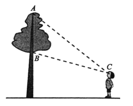

【答案】

【解析】过*C*作，交*AB*于*D*，如图所示：

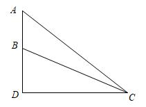

则，

设，

在中，，

在中，，

所以，

当且仅当，即时取等号，

所以取最大值时，最大，

所以当离此树的水平距离为米时看*A*，*B*的视角最大.

故答案为：

**【解题方法总结】**

根据题意画出图形，将题设已知、未知显示在图形中，建立已知、未知关系，利用三角知识求解．

**题型六：倍角关系**

**例22．**（2024·全国·高三专题练习）记的内角的对边分别为，已知.

(1)证明：；

(2)若，求的面积.

【解析】（1）证明：由及正弦定理得：，

整理得，.

因为，

所以，

所以或，

所以或（舍），

所以.

（2）由及余弦定理得:，

整理得，

又因为，可解得，

则，所以△是直角三角形，

所以△的面积为.

<strong>例23．</strong>（2024·全国·模拟预测）在中，角<em>A</em>，<em>B</em>，<em>C</em>的对边分别为<em>a</em>，<em>b</em>，<em>c</em>（<em>a</em>，<em>b</em>，<em>c</em>互不相等），且满足.

（1）求证：；

（2）若，求.

【解析】（1）证明：因为，由正弦定理，得，

所以，所以.

又因为，，所以或.

若，又，所以，与*a*，*b*，*c*互不相等矛盾，

所以.

（2）由（1）知，所以.

因为，所以，则，

可得.

又因为

所以.

因为，所以，所以，

所以，

解得，

又，得.

**例24．**（2024·江苏·高三江苏省前黄高级中学校联考阶段练习）在中，角、、的对边分别为、、，若．

(1)求证：；

(2)若，点为边上一点，，，求边长．

【解析】（1），

，

或

当时，，，即，

综上

（2），，，

，

，

设，，，，

在中：

，

**变式20．**（2024·陕西咸阳·武功县普集高级中学校考模拟预测）已知分别是的角的对边，.

(1)求证：；

(2)求的取值范围.

【解析】（1）由正弦定理及知，

，

由余弦定理得，，

或.

.

（2）由（1）和正弦定理得，

，

，

设，则，则，

设，

则在上单调递增，则，

即.

的取值范围为.

<strong>变式21．</strong>（2024·四川·成都市锦江区嘉祥外国语高级中学校考三模）已知分别为锐角<em>ABC</em>内角的对边，．

(1)证明：；

(2)求的取值范围．

【解析】（1）∵．

∴，

∴，

因为为锐角三角形内角，所以，，

所以，

所以，即；

（2）由题意得，解得，

所以，

由正弦定理得，

因为函数在上单调递减，

所以当时，，

所以当时，，

所以，

∴的取值范围为．

**变式22．**（2024·福建三明·高三统考期末）非等腰的内角、、的对应边分别为、、，且.

(1)证明：；

(2)若，证明：.

【解析】（1）由正弦定理，得，

，由，

则.

（2）由，则为锐角，，

则，去分母得，

则，由则.

由（1）有，得.

解方程组，消元，

则，可得，

要证，即证，

只需证，

即证，

即证，由，此不等式成立，得证.

另令，，又，

求导得，则在递增，

则，得证.

**题型七：三角形解的个数**

**例25．**（2024·贵州·统考模拟预测）中，角的对边分别是，，.若这个三角形有两解，则的取值范围是（    ）

A．	B．

C．	D．

【答案】B

【解析】由正弦定理可得，.

要使有两解，即有两解，则应有，且，

所以，

所以.

故选：B．

<strong>例26．</strong>（2024·全国·高三专题练习）在△<em>ABC</em>中，<em>a</em>=18，<em>b</em>=24，∠<em>A</em>=45°，此三角形解的情况为（    ）

A．一个解	B．二个解	C．无解	D．无法确定

【答案】B

【解析】因为，如图所示：

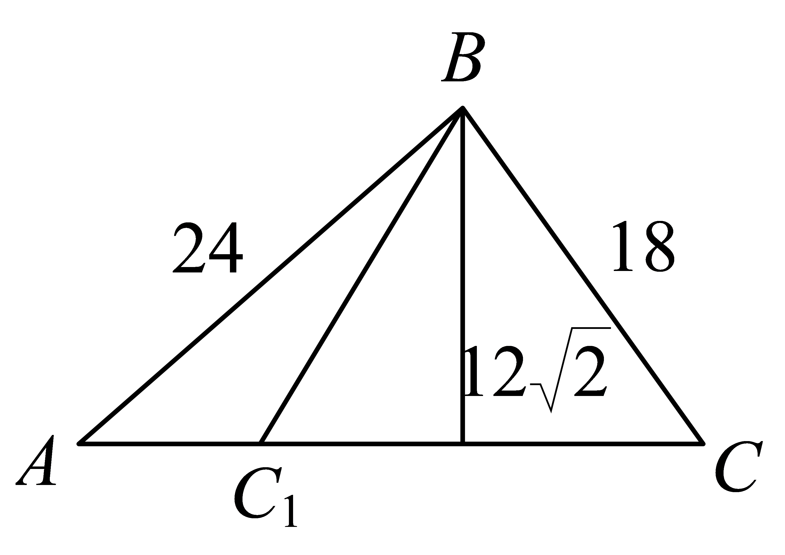

所以，即，所以三角形解的情况为二个解.

故选：B

**例27．**（2024·河南南阳·高三统考期中）在中，，，. 若满足条件的有且只有一个，则的可能取值是（    ）

A．	B．	C．	D．

【答案】D

【解析】由正弦定理，即，所以，

因为只有一解，

若，则，

若显然满足题意，

所以或，所以或，

解得或；

故选：D

**变式23．**（2024·全国·高三专题练习）在中，内角所对的边分别为，则下列条件能确定三角形有两解的是（    ）

A．

B．

C．

D．

【答案】B

【解析】对于A：由正弦定理可知，

∵，∴，故三角形有一解；

对于B：由正弦定理可知，，

∵，∴，故三角形有两解；

对于C：由正弦定理可知，

∵为钝角，∴B一定为锐角，故三角形有一解；

对于D：由正弦定理可知，，故故三角形无解.

故选：B.

**变式24．**（2024·北京朝阳·高三专题练习）在下列关于的四个条件中选择一个，能够使角被唯一确定的是：（    ）

①

②；

③；

④.

A．①②	B．②③	C．②④	D．②③④

【答案】B

【解析】对于①，因为，所以或，故①错误；

对于②，因为在上单调，所以角被唯一确定，

故②正确；

对于③，因为，，所以，

所以，所以，又，由正弦定理有

，所以，所以角被唯一确定，故③正确；

对于④，因为，

所以，所以如图，不唯一，故④错误.故A，C，D错误.

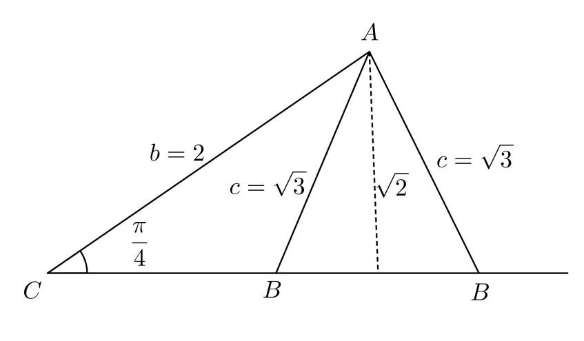

故选：B.

<strong>变式25．</strong>（2024·全国·高三专题练习）设在中，角<em>A</em>、<em>B</em>、<em>C</em>所对的边分别为<em>a</em>，<em>b</em>，<em>c</em>，若满足的不唯一，则<em>m</em>的取值范围为（    ）

A．	B．

C．	D．

【答案】A

【解析】由正弦定理，即，所以，

因为不唯一，即有两解，所以且，即，

所以，所以，即；

故选：A

**变式26．**（2024·全国·高三专题练习）在中，，，若该三角形有两个解，则边范围是（    ）

A．	B．	C．	D．

【答案】D

【解析】因为三角形有两个解，所以，

所以，所以.

故选：D

<strong>变式27．</strong>（2024·全国·高三专题练习）若满足的恰有一个，则实数<em>k</em>的取值范围是（    ）

A．	B．	C．	D．

【答案】B

【解析】由正弦定理可得，

故，

由且恰有一个，

故或，

所以或，即．

故选：B

**【解题方法总结】**

三角形解的个数的判断：已知两角和一边，该三角形是确定的，其解是唯一的；已知两边和一边的对角，该三角形具有不唯一性，通常根据三角函数值的有界性和大边对大角定理进行判断．

**题型八：三角形中的面积与周长问题**

**例28．**（2024·全国·高三对口高考）在中，若，且，则的面积为（    ）

A．	B．	C．	D．

【答案】B

【解析】因为且，所以，

所以，所以的面积.

故选：B

<strong>例29．</strong>（2024·河南·襄城高中校联考三模）在中，内角<em>A</em>，，所对的边分别为，，，，为上一点，，，则的面积为（    ）

A．	B．	C．	D．

【答案】D

【解析】

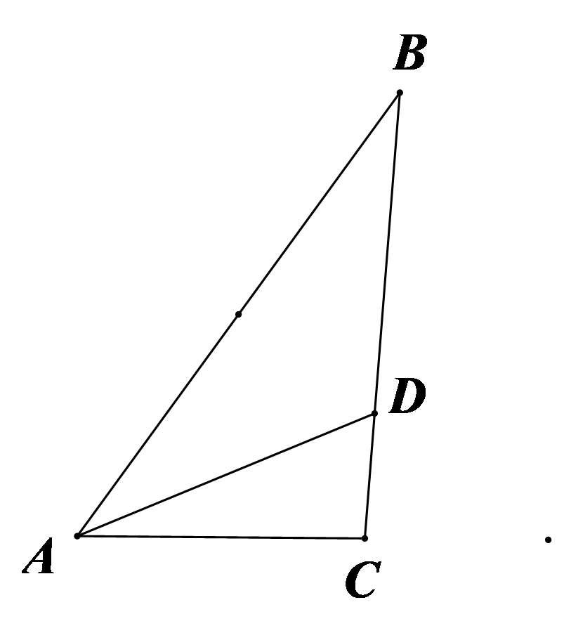

如图所示，在中，由，得．

又，即，

所以，

化简得．①

在中，由余弦定理得，，②

由①②式，解得．由，得，

将其代入②式，得，解得，

故的面积．

故选：D

**例30．**（2024·四川成都·校考模拟预测）在中，，，分别为角，，的对边，已知，，且，则（    ）

A．	B．	C．	D．

【答案】C

【解析】，

由正弦定理可得，

整理可得，

所以，

为三角形内角，，

∴，∵，，则，故B错误；

∵，，

，解得，

由余弦定理得，

解得或（舍去），故C正确，D错误.

又，所以，则三角形为等边三角形，

所以，则，故A错误.

故选：C.

**变式28．**（2024·河北石家庄·统考三模）已知中，角，，的对边长分别是，，，，且.

(1)证明：；

(2)若，求外接圆的面积

【解析】（1）由已知，，

∴，

∴，

∴，

∴，

易知上式中，，，

∴由上式得，即.

（2）∵，

∴由正弦定理和余弦定理得，，

化简得，∴.

又∵，，

∴，是以为斜边，为直角的直角三角形，

∴外接圆的直径，外接圆的半径，

∴外接圆的面积.

<strong>变式29．</strong>（2024·全国·高三专题练习）已知的内角<em>A</em>，<em>B</em>，<em>C</em>的对边分别为<em>a</em>，<em>b</em>，<em>c</em>，且．

(1)证明：是等腰三角形；

(2)若的面积为，且，求的周长．

【解析】(1)在中，，

由射影定理得，，

所以是等腰三角形．

(2)在中，因且，则，

又，即，由(1)知，则有，

在中，由余弦定理得：，解得，

又，则*a*，*b*，*c*能构成三角形，符合题意，，

所以的周长为.

**变式30．**（2024·全国·高三专题练习）在①；②.

这两个条件中任选一个，补充在下面问题中，并解答.

已知的内角*A*，*B*，*C*的对边分别为*a*，*b*，*c*.若的面积，，\_\_\_\_\_\_\_\_\_\_\_，求.

注：如果选择多个条件分别解答，按第一个解答计分.

【解析】选①：

在中，由射影定理及得：，解得，

因，则，由得：，解得，

由余弦定理得：，解得，

所以.

选②：

在中，由正弦定理及得：，

因，即，则有，而，，

于是得，则，由得：，解得，

由余弦定理得：，解得，

所以.

**变式31．**（2024·湖南长沙·周南中学校考二模）已知向量（，），（，），.

(1)求函数的最大值及相应*x*的值；

(2)在△*ABC*中，角*A*为锐角且，，*BC=* 2，求的面积.

【解析】（1）依题意，，

即，

所以，当，

即，时，取最大值  ；

（2）由（1）及得：，

即，

由，则，

因此，，则，

而，有，所以，

在中，由正弦定理得，

，

，

所以的面积为.

<strong>变式32．</strong>（2024·海南海口·海南华侨中学校考模拟预测）已知的内角<em>A</em>，，的对边分别为，，，，.

(1)若，证明：；

(2)若边上的高为，求的周长.

【解析】（1）由已知可得，

由正弦定理可得，，

所以有.

又，所以，.

又，所以.

，

，

.

又，，函数在上单调递减，

则.

（2）由题意得的面积.

又，则.

由余弦定理，

得，

所以，.

所以，的周长为.

**变式33．**（2024·安徽·合肥一中校联考模拟预测）记的内角，，的对边分别为，，，已知.

(1)求的值；

(2)若，，求的值.

【解析】（1）因为，

所以

.

（2）因为，所以，

因为，即，所以，

再由余弦定理知，即，

即，解得或，

所以或（负值舍去）.

**变式34．**（2024·吉林长春·东北师大附中校考模拟预测）已知中角的对边分别为，．

(1)求；

(2)若，且的面积为，求周长．

【解析】（1）由和正弦定理可得，

，

因为，所以，

所以，，，

，；

（2），，

又，

，

，

的周长为.

**【解题方法总结】**

解三角形时，如果式子中含有角的余弦或边的二次式，要考虑用余弦定理；如果式子中含有角的正弦或边的一次式时，则考虑用正弦定理，以上特征都不明显时，则要考虑两个定理都有可能用到

