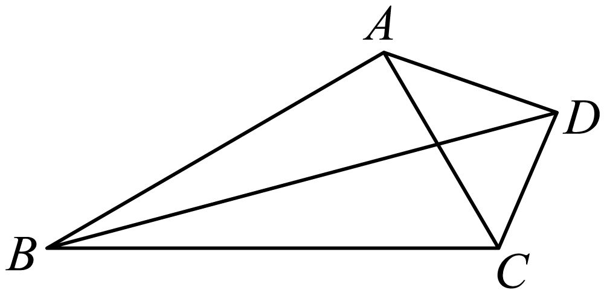
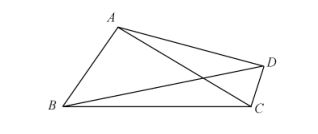
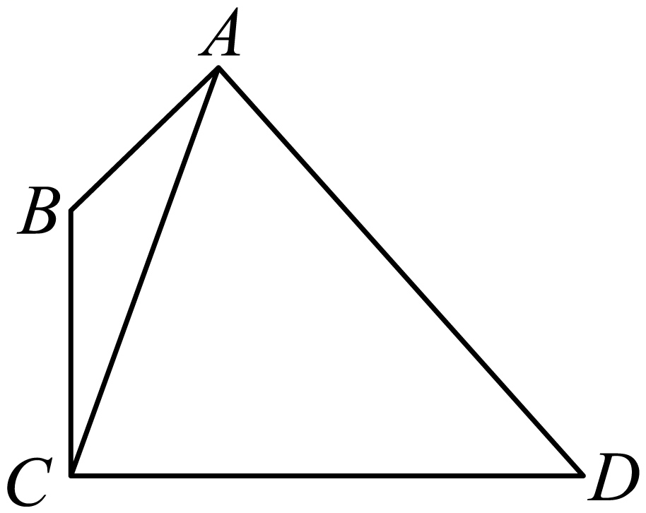
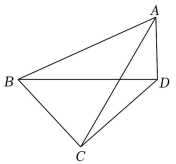
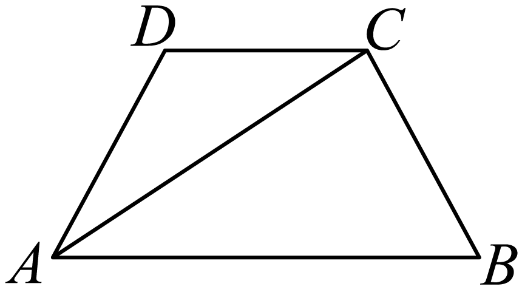
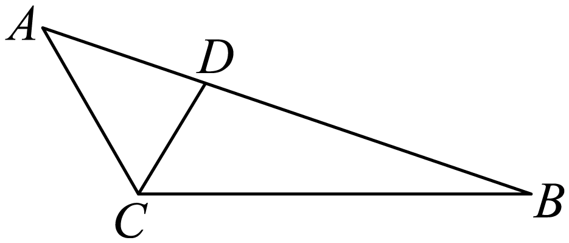
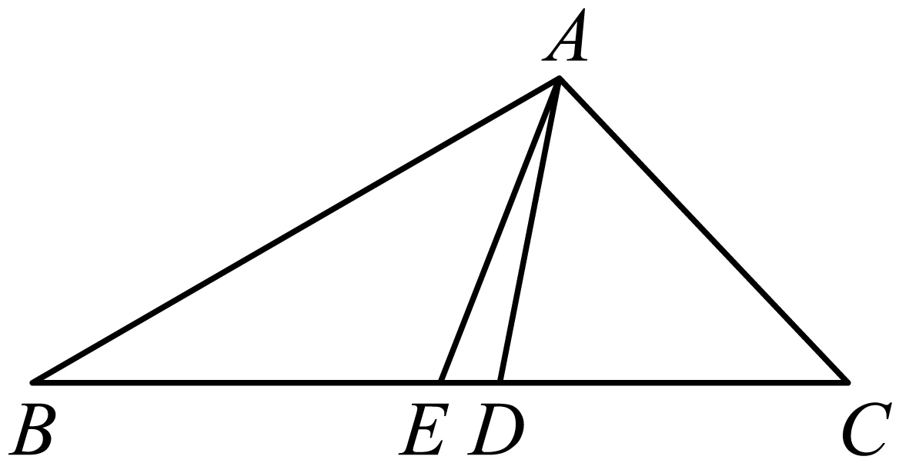
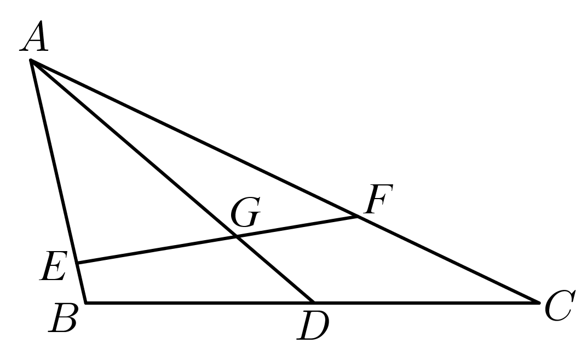

**第33讲  解三角形图形问题**

**知识梳理**

**解决三角形图形类问题的方法：**

**方法一：** 两次应用余弦定理是一种典型的方法，充分利用了三角形的性质和正余弦定理的性质解题；

**方法二：** 等面积法是一种常用的方法，很多数学问题利用等面积法使得问题转化为更为简单的问题，相似是三角形中的常用思路；

**方法三：** 正弦定理和余弦定理相结合是解三角形问题的常用思路；

**方法四：** 构造辅助线作出相似三角形，结合余弦定理和相似三角形是一种确定边长比例关系的不错选择；

**方法五：** 平面向量是解决几何问题的一种重要方法，充分利用平面向量基本定理和向量的运算法则可以将其与余弦定理充分结合到一起；

**方法六：** 建立平面直角坐标系是解析几何的思路，利用此方法数形结合充分挖掘几何性质使得问题更加直观化.

**必考题型全归纳**

**题型一：妙用两次正弦定理**

**例1．**（2024·全国·高三专题练习）如图，四边形中，，，设.

（1）若面积是面积的4倍，求；

（2）若，求.

**例2．**（2024·湖北黄冈·高一统考期末）如图，四边形中，，，设．

（1）若面积是面积的倍，求;

（2）若，求.

**例3．**（2024·全国·高三专题练习）在①，②，③这三个条件中任选一个，补充在下面问题中，并解答.

已知在四边形*ABCD*中，，，且\_\_\_\_\_\_.

(1)证明：；

(2)若，求四边形*ABCD*的面积.

<strong>变式1．</strong>（2024·甘肃金昌·高一永昌县第一高级中学校考期中）如图，在平面四边形<em>ABCD</em>中，.

(1)当时，求的面积.

(2)当时，求.

**变式2．**（2024·广东广州·高一统考期末）如图，在平面四边形中，．

(1)若，求的面积；

(2)若，求．

**变式3．**（2024·广东·统考模拟预测）在平面四边形中，，.

（1）若，，求的长；

（2）若，求的值.

**变式4．**（2024·江苏徐州·高一统考期末）在①，②，③的面积

这三个条件中任选一个，补充在下面问题中，并完成解答.

在中，角、、的对边分别为、、，已知\_\_\_\_\_\_.

(1)求角；

(2)若点在边上，且，，求.

注：如果选择多个条件分别解答，按第一个解答计分

**变式5．**（2024·广东深圳·深圳市高级中学校考模拟预测）记的内角、、的对边分别为、、，已知.

(1)求；

(2)若点在边上，且，，求.

**变式6．**（2024·广东揭阳·高三校考阶段练习）在中，内角，，所对的边分别为，，，且.

(1)求角；

(2)若是内一点，，，，，求．

**题型二：两角使用余弦定理**

**例4．**（2024·全国·高一专题练习）如图，四边形中，，．

(1)求；

(2)若，求．

<strong>例5．</strong>（2024·全国·高一专题练习）如图，在梯形<em>ABCD</em>中，，．

(1)求证：；

(2)若，，求梯形*ABCD*的面积．

<strong>例6．</strong>（2024·河北·校联考一模）在中，，，点<em>D</em>为的中点，连接并延长到点<em>E</em>，使.

(1)若，求的余弦值；

(2)若，求线段的长.

<strong>变式7．</strong>（2024·全国·模拟预测）在锐角中，内角<em>A</em>，<em>B</em>，<em>C</em>的对边分别为<em>a</em>，<em>b</em>，<em>c</em>，.

(1)求角；

(2)若点在上，，，求的值.

**变式8．**（2024·浙江舟山·高一舟山中学校考阶段练习）如图，在梯形中，，.

(1)求证：；

(2)若，，求的长度.

**题型三：张角定理与等面积法**

<strong>例7．</strong>（2024·全国·高三专题练习）已知△<em>ABC</em>中，分别为内角的对边，且.

(1)求角的大小；

(2)设点为上一点，是 的角平分线，且，，求 的面积.

<strong>例8．</strong>（2024·贵州黔东南·凯里一中校考三模）已知△<em>ABC</em>的内角<em>A</em>，<em>B</em>，<em>C</em>的对边分别为<em>a</em>，<em>b</em>，<em>c</em>，且．

(1)求*A*的大小；

(2)设点*D*为*BC*上一点，*AD*是△*ABC*的角平分线，且，，求△*ABC*的面积．

<strong>例9．</strong>（2024·山东潍坊·统考模拟预测）在中，设角<em>A</em>，<em>B</em>，<em>C</em>所对的边长分别为<em>a</em>，<em>b</em>，<em>c</em>，且．

（1）求；

（2）若*D*为上点，平分角*A*，且，，求．

**变式9．**（2024·安徽淮南·统考二模）如图，在中，，，且点在线段上．

(1)若，求的长；

(2)若，，求的面积．

**变式10．**（2024·江西抚州·江西省临川第二中学校考二模）如图，在中，，，点在线段上.

（1）若，求的长；

（2）若，的面积为，求的值.

**变式11．**（2024·全国·高一专题练习）已知函数，其图像上相邻的最高点和最低点间的距离为．

(1)求函数的解析式；

(2)记的内角的对边分别为，，，．若角的平分线交于，求的长．

**变式12．**（2024·吉林通化·梅河口市第五中学校考模拟预测）已知锐角的内角的对边分别为，且．

(1)求；

(2)若，角的平分线交于点，，求的面积．

**题型四：角平分线问题**

**例10．**（2024·黑龙江哈尔滨·哈尔滨市第一二二中学校校考模拟预测）在中，已知，的平分线与边交于点，的平分线与边交于点，.

(1)若，求的面积；

(2)若，求.

<strong>例11．</strong>（2024·河北衡水·河北衡水中学校考模拟预测）锐角的内角<em>A</em>，<em>B</em>，<em>C</em>的对边分别为<em>a</em>，<em>b</em>，<em>c</em>，已知，，

(1)求的值及的面积；

(2)的平分线与*BC*交于*D*，，求*a*的值．

<strong>例12．</strong>（2024·山东泰安·统考模拟预测）在中，角<em>A、B、C</em>的对边分别是<em>a、b、c</em>，且.

(1)求角*C*的大小；

(2)若的平分线交*AB*于点*D*，且，，求的面积.

<strong>变式13．</strong>（2024·河北唐山·唐山市第十中学校考模拟预测）如图，在中，角<em>A</em>，<em>B</em>，<em>C</em>所对的边分别为<em>a</em>，<em>b</em>，<em>c</em>，，角<em>C</em>的平分线交<em>AB</em>于点<em>D</em>，且，.

(1)求的大小；

(2)求.

<strong>变式14．</strong>（2024·广东深圳·校考二模）记的内角<em>A</em>､<em>B</em>､<em>C</em>的对边分别为<em>a</em>､<em>b</em>､<em>c</em>，已知.

(1)证明：；

(2)若角*B*的平分线交*AC*于点*D*，且，，求的面积.

<strong>变式15．</strong>（2024·海南·校联考模拟预测）在中，角<em>A</em>，<em>B</em>，<em>C</em>的对边分别为<em>a</em>，<em>b</em>，<em>c</em>，点<em>M</em>在边上，是角<em>A</em>的平分线，，．

(1)求*A*；

(2)若，求的长．

**变式16．**（2024·四川·校联考模拟预测）在①；②这两个条件中任选一个作为已知条件，补充在下面的横线上，并给出解答．

注：若选择多个条件分别解答，按第一个解答计分．

已知中，角的对边分别为，点*D*为边的中点，，且\_\_\_\_\_\_\_\_．

(1)求*a*的值；

(2)若的平分线交于点*E*，求的周长．

**题型五：中线问题**

**例13．**（2024·浙江杭州·统考一模）已知中角 、、所对的边分别为、、，且满足，．

(1)求角*A*；

(2)若，边上中线，求的面积．

<strong>例14．</strong>（2024·四川内江·校考模拟预测）在△<em>ABC</em>中，<em>D</em>是边<em>BC</em>上的点，，，<em>AD</em>平分∠<em>BAC</em>，△<em>ABD</em>的面积是△<em>ACD</em>的面积的两倍．

(1)求△*ACD*的面积；

(2)求△*ABC*的边*BC*上的中线*AE*的长．

**例15．**（2024·四川绵阳·统考二模）在中，角所对的边分别为，，．

(1)求的值；

(2)若，求边上中线的长．

**变式17．**（2024·广东广州·统考一模）在中，内角的对边分别为，.

(1)求；

(2)若的面积为，求边上的中线的长.

**变式18．**（2024·安徽宣城·安徽省宣城中学校考模拟预测）中，已知.边上的中线为.

(1)求；

(2)从以下三个条件中选择两个，使存在且唯一确定，并求和的长度.

条件①：；条件②；条件③.

<strong>变式19．</strong>（2024·辽宁沈阳·东北育才双语学校校考一模）如图，设中角<em>A</em>，<em>B</em>，<em>C</em>所对的边分别为<em>a</em>，<em>b</em>，<em>c</em>，<em>AD</em>为<em>BC</em>边上的中线，已知且，．

(1)求*b*边的长度；

(2)求的面积；

(3)设点*E*，*F*分别为边*AB*，*AC*上的动点（含端点），线段*EF*交*AD*于*G*，且的面积为面积的，求的取值范围．

**变式20．**（2024·广东广州·统考三模）在①；②这两个条件中任选一个，补充在下面的问题中，并作答.

问题：已知中，分别为角所对的边，\_\_\_\_\_\_\_\_\_\_.

(1)求角的大小；

(2)已知，若边上的两条中线相交于点，求的余弦值.

注：如果选择多个条件分别解答，按第一个解答计分.

**题型六：高问题**

<strong>例16．</strong>（2024·海南海口·海南华侨中学校考模拟预测）已知的内角<em>A</em>，，的对边分别为，，，，.

(1)若，证明：；

(2)若边上的高为，求的周长.

<strong>例17．</strong>（2024·重庆·统考模拟预测）在中，角<em>A</em>，<em>B</em>，<em>C</em>的对边分别为<em>a</em>，<em>b</em>，<em>c</em>，，，．

(1)求；

(2)若，边上的高线长，求．

<strong>例18．</strong>（2024·四川自贡·统考三模）的内角<em>A</em>，<em>B</em>，<em>C</em>所对的边分别为<em>a</em>，<em>b</em>，<em>c</em>，若．

(1)求*A*；

(2)若*BC*上的高，求．

<strong>变式21．</strong>（2024·黑龙江齐齐哈尔·统考一模）已知的内角<em>A</em>，<em>B</em>，<em>C</em>的对边分别为<em>a</em>，<em>b</em>，<em>c</em>，且．

(1)求*A*；

(2)若，且*BC*边上的高为，求*a*．

**变式22．**（2024·辽宁抚顺·统考模拟预测）已知中，点在边上，满足，且，的面积与面积的比为．

(1)求的值；

(2)若，求边上的高的值．

**题型七：重心性质及其应用**

<strong>例19．</strong>（2024·全国·高三专题练习）已知的内角<em>A</em>，<em>B</em>，<em>C</em>的对边分别为<em>a</em>，<em>b</em>，<em>c</em>，且．

(1)求的最小值；

(2)若*M*为的重心，，求．

**例20．**（2024·河南开封·开封高中校考模拟预测）记的内角的对边分别为，已知为的重心．

(1)若，求的长；

(2)若，求的面积．

**例21．**（2024·广西钦州·高三校考阶段练习）在中，内角，，的对边分别为，，，且．

(1)求角的大小

(2)若，点是的重心，且，求内切圆的半径．

<strong>变式23．</strong>（2024·全国·高三专题练习）设<em>a</em>，<em>b</em>，<em>c</em>分别为的内角<em>A</em>，<em>B</em>，<em>C</em>的对边，<em>AD</em>为<em>BC</em>边上的中线，<em>c</em>＝1，，．

(1)求*AD*的长度；

(2)若*E*为*AB*上靠近*B*的四等分点，*G*为的重心，连接*EG*并延长与*AC*交于点*F*，求*AF*的长度．

<strong>变式24．</strong>（2024·四川内江·高三威远中学校校考期中）的内角<em>A</em>，<em>B</em>，<em>C</em>所对的边分别为．

(1)求*A*的大小；

(2)*M*为内一点，的延长线交于点*D*，\_\_\_\_\_\_\_\_\_\_\_，求的面积．

请在下面三个条件中选择一个作为已知条件补充在横线上，使存在，并解决问题．

①*M*为的重心，；

②*M*为的内心，；

③*M*为的外心，．

**变式25．**（2024·全国·高三专题练习）在①；②这两个条件中任选一个，补充在下面的问题中，并加以解答．

在中，*a*，*b*，*c*分别是角*A*，*B*，*C*的对边，已知\_\_\_\_\_\_．

(1)求角*A*的大小；

(2)若为锐角三角形，且其面积为，点*G*为重心，点*M*为线段的中点，点*N*在线段上，且，线段与线段相交于点*P*，求的取值范围．

注：如果选择多个方案分别解答，按 第一个方案解答计分．

**题型八：外心及外接圆问题**

<strong>例22．</strong>（2024·湖南长沙·长沙市实验中学校考二模）在中，内角<em>A</em>，<em>B</em>，<em>C</em>的对边分别为<em>a</em>，<em>b</em>，<em>c</em>，且<em>a</em>，<em>b</em>，<em>c</em>是公差为2的等差数列.

(1)若，求的面积.

(2)是否存在正整数*b*，使得的外心在的外部?若存在，求*b*的取值集合；若不存在，请说明理由.

<strong>例23．</strong>（2024·全国·高三专题练习）在<em>ABC</em>中，三内角<em>A</em>，<em>B</em>，<em>C</em>对应的边分别为<em>a</em>，<em>b</em>，<em>c</em>，<em>a</em>＝6．

(1)求*b*cos*C*＋*c*cos*B*的值；

(2)若*O*是*ABC*的外心，且，求*ABC*外接圆的半径．

<strong>例24．</strong>（2024·全国·高三专题练习）在中，角<em>A</em>，<em>B</em>，<em>C</em>的对边分别为<em>a</em>，<em>b</em>，<em>c</em>；，.

（1）求的值；

（2）若的外心在其外部，，求外接圆的面积.

**变式26．**（2024·高三统考阶段练习）在中，角，，对应的三边分别为，，，，，，为的外心，连接，，．

（1）求的面积；

（2）过作边的垂线交于点，连接，试求的值．

**题型九：两边夹问题**

**例25．**（2024·全国·高三专题练习）在中，角所对的边分别为，若，则的值是（    ）

A．	B．	C．	D．

**例26．**（2024·河北唐山·高三校考阶段练习）在中，、、分别是、、所对边的边长.若，则的值是（    ）.

A．1	B．	C．	D．2

**例27．**（2024·全国·高三专题练习）在中，已知边所对的角分别为，若，则 \_\_\_\_\_\_\_\_\_\_\_\_\_\_\_\_\_

**变式27．**（2024·江苏苏州·吴江中学模拟预测）在中，已知边所对的角分别为，若，则\_\_\_\_\_．

**变式28．**（2024·湖南长沙·高二长沙一中校考开学考试）在中，已知边、、所对的角分别为、、，若，，则的面积\_\_\_\_\_\_.

**变式29．**（2024·全国·高三专题练习）在中，若，则角\_\_．

<strong>变式30．</strong>（2024·全国·高三专题练习）在△ABC中，角A，B，C的对边分别为<em>a</em>，<em>b</em>，<em>c</em>，设<em>S</em>是△ABC的面积，若﹣，则角A的值为\_\_\_\_\_\_\_．

**题型十：内心及内切圆问题**

<strong>例28．</strong>（2024·福建泉州·高三福建省泉州第一中学校考期中）在△<em>ABC</em>中，角<em>A</em>，<em>B</em>，<em>C</em>的对边分别为，<em>I</em>为△<em>ABC</em>的内心，延长线段<em>AI</em>交<em>BC</em>于点<em>D</em>，此时

(1)求；

(2)若∠*ADB*=，求.

<strong>例29．</strong>（2024·山西·高三校联考阶段练习）已知中，角<em>A</em>，<em>B</em>，<em>C</em>所对的边分别为<em>a</em>，<em>b</em>，<em>c</em>，,.

(1)求；

(2)若，*M*为的内心，求的面积.

**例30．**（2024·广东佛山·华南师大附中南海实验高中校考模拟预测）在中，角，，所对的边分别为，，．已知．

(1)求的值；

(2)若的内切圆半径为，，求．

**变式31．**（2024·辽宁鞍山·统考模拟预测）在中，角、、所对的边分别为、、，已知.

(1)求；

(2)若，的内切圆半径为，求的周长.

**变式32．**（2024·全国·高三专题练习）已知在中，其角、、所对边分别为、、，且满足．

(1)若，求的外接圆半径；

(2)若，且，求的内切圆半径

**变式33．**（2024·全国·高三专题练习）已知的内角，，的对边分别为，，，，，内切圆半径，则\_\_\_\_\_\_\_\_

