**第33讲  解三角形图形问题**

**知识梳理**

**解决三角形图形类问题的方法：**

**方法一：** 两次应用余弦定理是一种典型的方法，充分利用了三角形的性质和正余弦定理的性质解题；

**方法二：** 等面积法是一种常用的方法，很多数学问题利用等面积法使得问题转化为更为简单的问题，相似是三角形中的常用思路；

**方法三：** 正弦定理和余弦定理相结合是解三角形问题的常用思路；

**方法四：** 构造辅助线作出相似三角形，结合余弦定理和相似三角形是一种确定边长比例关系的不错选择；

**方法五：** 平面向量是解决几何问题的一种重要方法，充分利用平面向量基本定理和向量的运算法则可以将其与余弦定理充分结合到一起；

**方法六：** 建立平面直角坐标系是解析几何的思路，利用此方法数形结合充分挖掘几何性质使得问题更加直观化.

**必考题型全归纳**

**题型一：妙用两次正弦定理**

**例1．**（2024·全国·高三专题练习）如图，四边形中，，，设.

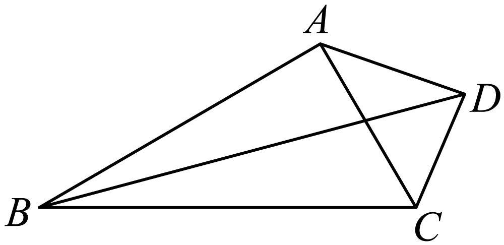

（1）若面积是面积的4倍，求；

（2）若，求.

【解析】（1）设，则，，，由题意，

则，所以.

（2）由正弦定理，中，，即①

中，，即②

①÷②得：，化简得

，所以.

**例2．**（2024·湖北黄冈·高一统考期末）如图，四边形中，，，设．

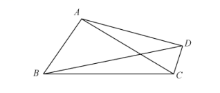

（1）若面积是面积的倍，求;

（2）若，求.

【解析】（1）设，

则，，，

由题意，

则，

所以.

（2）由正弦定理，在中，，

即①

在中，，

即②

②÷①得：，

，化简得，

所以.

**例3．**（2024·全国·高三专题练习）在①，②，③这三个条件中任选一个，补充在下面问题中，并解答.

已知在四边形*ABCD*中，，，且\_\_\_\_\_\_.

(1)证明：；

(2)若，求四边形*ABCD*的面积.

【解析】（1）方案一：选条件①.

在中，由正弦定理得，，

在中，由正弦定理得，，

因为，所以，

因为，所以，

因为，所以，

因为，所以.

因为，

，

所以，

即，

所以，

所以.

方案二：选条件②.

在中，由正弦定理得，，

在中，由正弦定理得，，

因为，所以，

因为，所以.

因为，所以.

因为，

，

，

所以，

即，

所以，

所以.

方案三：选条件③.

因为，，且，，

所以

在中，由正弦定理得，，

在中，由正弦定理得，，

因为，所以，

因为，所以，

因为，所以.

因为，

，

所以，

即，

所以，

所以.

（2）选择①②③，答案均相同，

由（1）可设，则，

在中，由余弦定理得，

，

在中，由余弦定理得，

，

因为，

所以，解得或（舍去），

所以，

所以，

所以四边形*ABCD*的面积.

<strong>变式1．</strong>（2024·甘肃金昌·高一永昌县第一高级中学校考期中）如图，在平面四边形<em>ABCD</em>中，.

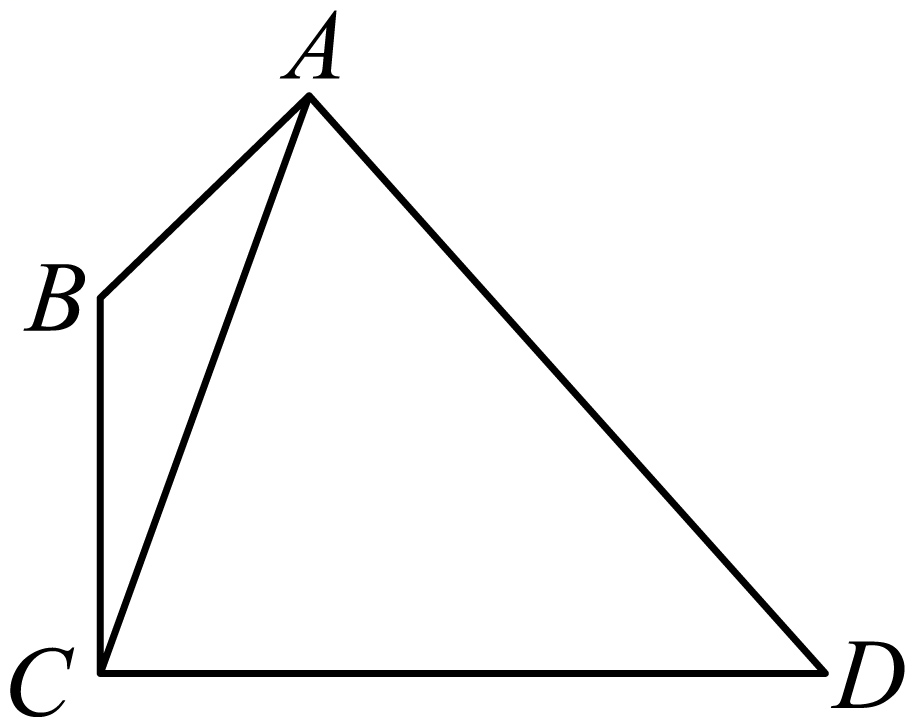

(1)当时，求的面积.

(2)当时，求.

【解析】（1）当时，在中，，

由余弦定理得，

即，解得，

所以，

因为，则，

又，

所以的面积是.

（2）在中，由正弦定理得，

即，

在中，由正弦定理得，即，

则，整理得，

因为，

所以，

因为，所以.

**变式2．**（2024·广东广州·高一统考期末）如图，在平面四边形中，．

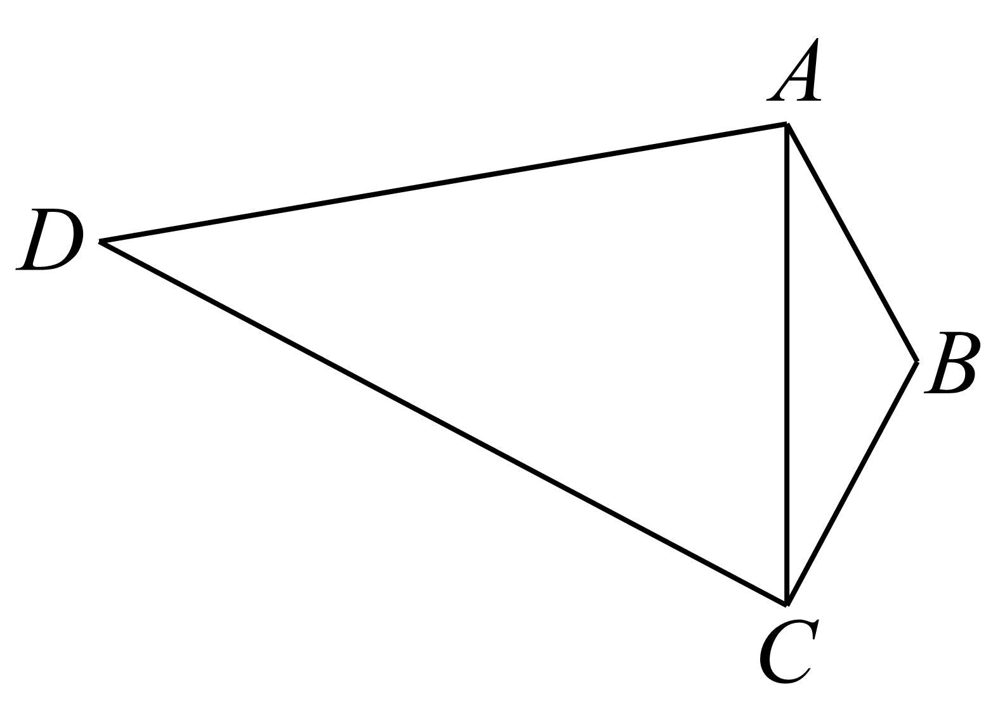

(1)若，求的面积；

(2)若，求．

【解析】（1）因为，

由余弦定理得，即，

由余弦定理得，

所以，

所以的面积

（2）在中，由正弦定理得，即①，

在中，由正弦定理得，即②，

①②联立可得，

因为，所以

**变式3．**（2024·广东·统考模拟预测）在平面四边形中，，.

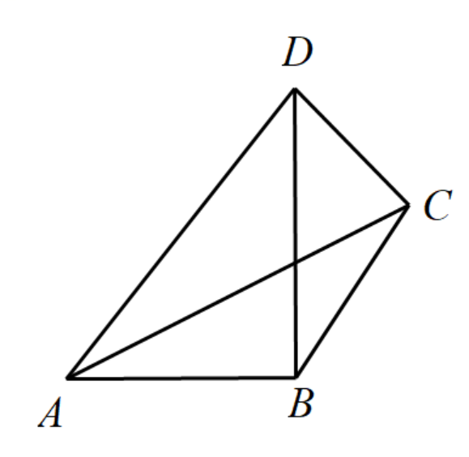

（1）若，，求的长；

（2）若，求的值.

【解析】（1）在中，因为，所以，

在中，，

在中，由余弦定理得

，

所以.

（2）设，在中，，

因为，所以，

于是，

因为，

所以，，

在中，由正弦定理得，

所以，

于是，

即，

所以，

因为，所以.

**变式4．**（2024·江苏徐州·高一统考期末）在①，②，③的面积

这三个条件中任选一个，补充在下面问题中，并完成解答.

在中，角、、的对边分别为、、，已知\_\_\_\_\_\_.

(1)求角；

(2)若点在边上，且，，求.

注：如果选择多个条件分别解答，按第一个解答计分

【解析】（1）若选择①：因为，结合余弦定理，

得，即，

由正弦定理可得，所以，

又，所以，所以，即，

又，所以；

若选择②：因为，

结合正弦定理可得，

即，

，

即，

又，，故，即，

所以，即，

因为，，所以，得；

若选择③：条件即，

又，，

所以，

即，所以，

又因为，则，所以，

又因为，所以.

（2）设，则.

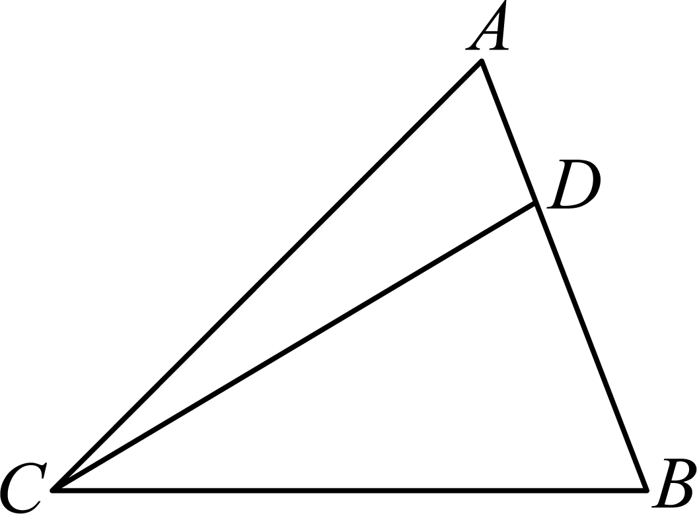

因为，，故，

所以，

在中，由正弦定理可得，即，

在中，同理可得，，

因为，所以，即，

整理得，即.

**变式5．**（2024·广东深圳·深圳市高级中学校考模拟预测）记的内角、、的对边分别为、、，已知.

(1)求；

(2)若点在边上，且，，求.

【解析】（1）因为，

由余弦定理可得，

化简可得，由余弦定理可得，

因为，所以，.

（2）因为，则为锐角，所以，，

因为，所以，，

所以，，

设，则，

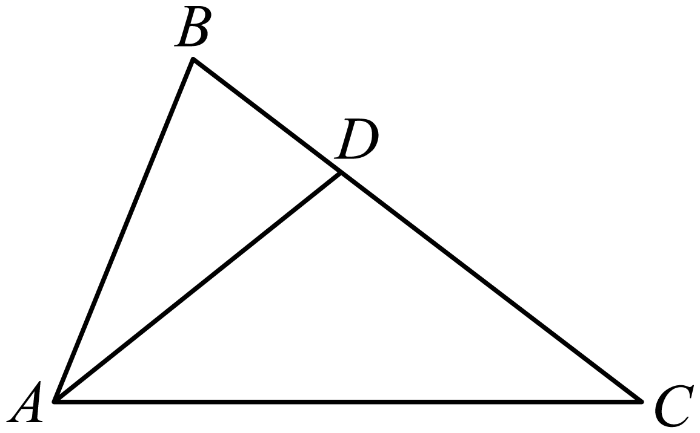

在和中，由正弦定理得，，

因为，上面两个等式相除可得，

得，即，

所以，.

**变式6．**（2024·广东揭阳·高三校考阶段练习）在中，内角，，所对的边分别为，，，且.

(1)求角；

(2)若是内一点，，，，，求．

【解析】（1）因为，

所以由正弦定理得；

，，，则；

（2）

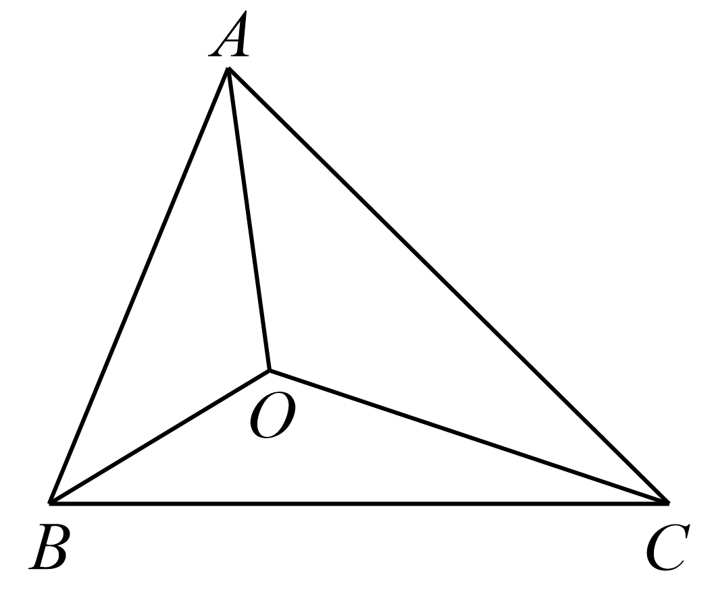

，，；

在中，由正弦定理得：；

在中，由正弦定理得：；

，

即，

**题型二：两角使用余弦定理**

**例4．**（2024·全国·高一专题练习）如图，四边形中，，．

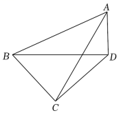

(1)求；

(2)若，求．

【解析】（1）中，设，则，解得

，；

（2）设，则

设，，

中，

中，

，，可得，化简得，即

又，，即

，解得

<strong>例5．</strong>（2024·全国·高一专题练习）如图，在梯形<em>ABCD</em>中，，．

(1)求证：；

(2)若，，求梯形*ABCD*的面积．

【解析】（1）连接*BD*．

因为，所以．

在中，由正弦定理得，①

在中，由正弦定理得，②

由，，结合①②可得．

（2）由（1）知，，

，又，所以，则．

连接*BD*，

在中，由余弦定理得

；

在中，由余弦定理得

，

所以，解得或．

当时，连接*AC*，在中，由余弦定理，得

，

所以，而此时，故不满足题意，经检验满足题意，

此时梯形*ABCD*的高，

当时，梯形*ABCD*的面积；

所以梯形*ABCD*的面积为．

<strong>例6．</strong>（2024·河北·校联考一模）在中，，，点<em>D</em>为的中点，连接并延长到点<em>E</em>，使.

(1)若，求的余弦值；

(2)若，求线段的长.

【解析】（1）因为，，所以，

因为，所以，

设，则，即，

解得，所以，

在中，由余弦定理知，.

（2）在中，由余弦定理知，，

所以，化简得，解得，

因为是的中点，所以，

在中，由余弦定理知，，

所以，

因为，所以，

在中，由余弦定理知，

，

连接，在中，由余弦定理知，

，

所以.

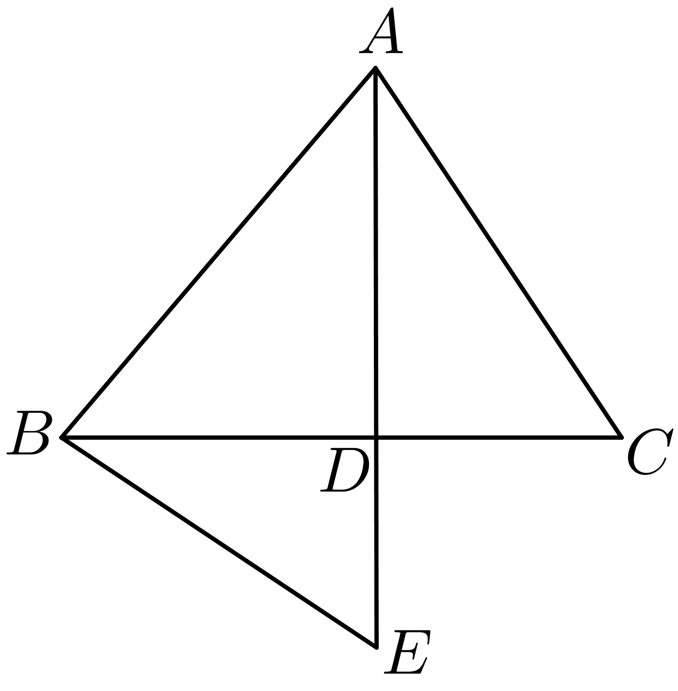

<strong>变式7．</strong>（2024·全国·模拟预测）在锐角中，内角<em>A</em>，<em>B</em>，<em>C</em>的对边分别为<em>a</em>，<em>b</em>，<em>c</em>，.

(1)求角；

(2)若点在上，，，求的值.

【解析】（1）因为，

所以，解得或（舍去），

所以，即，

因为，所以.

（2）如图，因为，，设，，

在中，由余弦定理得，

在中，由余弦定理得，

在中，由余弦定理得，

因为，所以，

即，所以，

所以，

因为，所以，

所以.

**变式8．**（2024·浙江舟山·高一舟山中学校考阶段练习）如图，在梯形中，，.

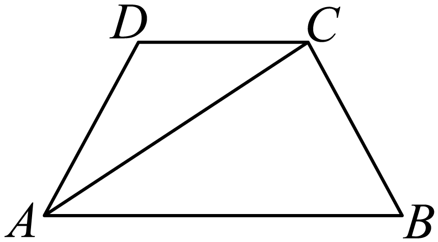

(1)求证：；

(2)若，，求的长度.

【解析】（1）证明：在中，由正弦定理得，

即，

因为，所以，所以，

在中，由正弦定理得，

即，所以.

又，所以，即.

（2）由（1）知.

在中，由余弦定理得

，故.

所以.

在中，由余弦定理得，

即，整理可得，解得或.

又因为为梯形，所以.

**题型三：张角定理与等面积法**

<strong>例7．</strong>（2024·全国·高三专题练习）已知△<em>ABC</em>中，分别为内角的对边，且.

(1)求角的大小；

(2)设点为上一点，是 的角平分线，且，，求 的面积.

【解析】（1）在△*ABC*中，由正弦定理及得：，..

由余弦定理得，

又，所以

（2） 是的角平分线，，

由可得

因为，，即有，，

故

<strong>例8．</strong>（2024·贵州黔东南·凯里一中校考三模）已知△<em>ABC</em>的内角<em>A</em>，<em>B</em>，<em>C</em>的对边分别为<em>a</em>，<em>b</em>，<em>c</em>，且．

(1)求*A*的大小；

(2)设点*D*为*BC*上一点，*AD*是△*ABC*的角平分线，且，，求△*ABC*的面积．

【解析】（1）因为

所以根据正弦定理得：

即

由余弦定理得：

故

又

所以．

（2）因为*AD*是△*ABC*的角平分线，由，

得：，

所以

故．

<strong>例9．</strong>（2024·山东潍坊·统考模拟预测）在中，设角<em>A</em>，<em>B</em>，<em>C</em>所对的边长分别为<em>a</em>，<em>b</em>，<em>c</em>，且．

（1）求；

（2）若*D*为上点，平分角*A*，且，，求．

【解析】（1）因为，

由正弦定理可得，整理得，

由余弦定理，可得，

又因为，可得．

（2）因为*D*为上点，平分角，则，

又由，

可得，

又因为，可得，解得，

因为，所以．

**变式9．**（2024·安徽淮南·统考二模）如图，在中，，，且点在线段上．

(1)若，求的长；

(2)若，，求的面积．

【解析】（1）由，可得，

所以或（舍去），

所以，

因为，所以，

由正弦定理可得：，所以．

（2）由，得，所以，

因为，，所以，

由余弦定理得，

即，，

可得或（舍去），

所以，

所以．

**变式10．**（2024·江西抚州·江西省临川第二中学校考二模）如图，在中，，，点在线段上.

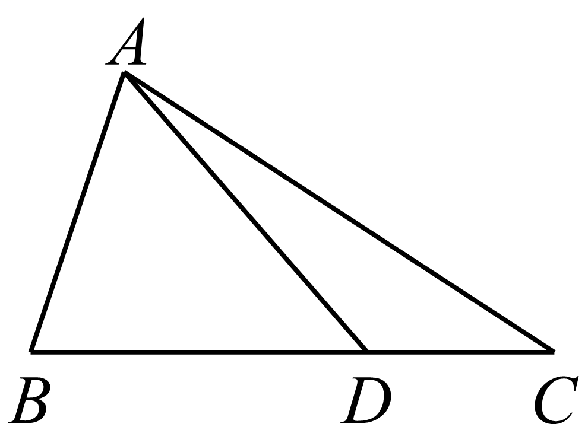

（1）若，求的长；

（2）若，的面积为，求的值.

【解析】（1）∵，

∴，

又∵，

∴.

在中，，

∴.

（2）∵，

∴，

，

又，

∴，

∵，

∴，

∵，

，

，

∴，

在中，

由余弦定理得.

∴，

∴.

**变式11．**（2024·全国·高一专题练习）已知函数，其图像上相邻的最高点和最低点间的距离为．

(1)求函数的解析式；

(2)记的内角的对边分别为，，，．若角的平分线交于，求的长．

【解析】（1）因为，

设函数的周期为，由题意，即，解得，

所以.

（2）由得：，即，解得，

因为，所以，

因为的平分线交于，

所以，即，可得，

由余弦定理得：，，而，

得，因此.

**变式12．**（2024·吉林通化·梅河口市第五中学校考模拟预测）已知锐角的内角的对边分别为，且．

(1)求；

(2)若，角的平分线交于点，，求的面积．

【解析】（1）因为，由正弦定理得，整理得，

又由余弦定理得．

因为，所以．

（2）如图所示，因为，

所以．

又因为，所以．

由余弦定理得，

联立方程组，可得，即，

解得或（舍去），

所以．

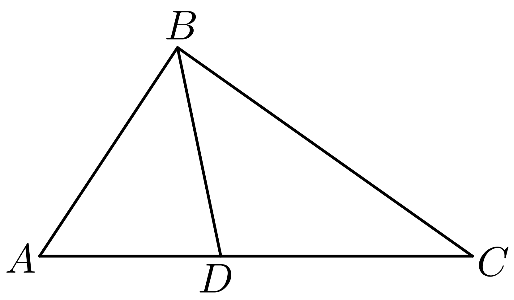

**题型四：角平分线问题**

**例10．**（2024·黑龙江哈尔滨·哈尔滨市第一二二中学校校考模拟预测）在中，已知，的平分线与边交于点，的平分线与边交于点，.

(1)若，求的面积；

(2)若，求.

【解析】（1）因为，所以，

则，

则.

设，则，

在中，由余弦定理得，

即，即，

又，所以，

所以的面积.

（2）因为，，

所以，，

因为，

所以

，

在中，由正弦定理得，即，所以.

<strong>例11．</strong>（2024·河北衡水·河北衡水中学校考模拟预测）锐角的内角<em>A</em>，<em>B</em>，<em>C</em>的对边分别为<em>a</em>，<em>b</em>，<em>c</em>，已知，，

(1)求的值及的面积；

(2)的平分线与*BC*交于*D*，，求*a*的值．

【解析】（1）根据题意，结合正弦定理边角互化得，

即，因为*B*，，

所以，，

所以，因为在锐角中， ，所以．

所以，因为，

所以，解得，

所以的面积.

（2）因为的平分线与*BC*交于*D*，，所以，

即，所以，由于，

所以，所以，所以．

<strong>例12．</strong>（2024·山东泰安·统考模拟预测）在中，角<em>A、B、C</em>的对边分别是<em>a、b、c</em>，且.

(1)求角*C*的大小；

(2)若的平分线交*AB*于点*D*，且，，求的面积.

【解析】（1）由已知可得，

,

整理得，，

因为，所以，

所以，

即，

因为，所以.

（2）由题意得，,即，所以.

法一：

在中，，

所以.在中，，

所以，

即，

将代入整理得，解得或.

若，则，，,，

所以在中，得,

同理可得,即和都为钝角，不符合题意，排除.

所以，，

.

法二：

因为，

所以，所以.

因为，所以，

所以.

<strong>变式13．</strong>（2024·河北唐山·唐山市第十中学校考模拟预测）如图，在中，角<em>A</em>，<em>B</em>，<em>C</em>所对的边分别为<em>a</em>，<em>b</em>，<em>c</em>，，角<em>C</em>的平分线交<em>AB</em>于点<em>D</em>，且，.

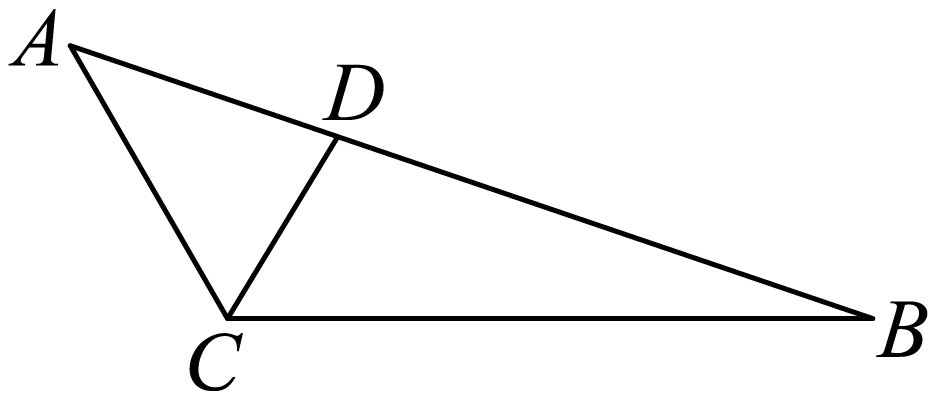

(1)求的大小；

(2)求.

【解析】（1）由正弦定理得，

即，

因为，

所以，

因为，所以，即，

因为，所以，

所以.

（2）已知角*C*的平分线交*AB*于点*D*，且，.

在中，由正弦定理得,

在中，由正弦定理得,

因为，，所以，

所以.

设，由余弦定理得，

即，

解得，

因为，

所以,

解得.

<strong>变式14．</strong>（2024·广东深圳·校考二模）记的内角<em>A</em>､<em>B</em>､<em>C</em>的对边分别为<em>a</em>､<em>b</em>､<em>c</em>，已知.

(1)证明：；

(2)若角*B*的平分线交*AC*于点*D*，且，，求的面积.

【解析】（1）由正弦定理得：

所以可化为,

因为,

，所以

所以，

所以，即，

所以；

（2）角*B*的平分线交*AC*于点*D*，且，,

由角平分线定理可得，,

,又，

由余弦定理得：，，

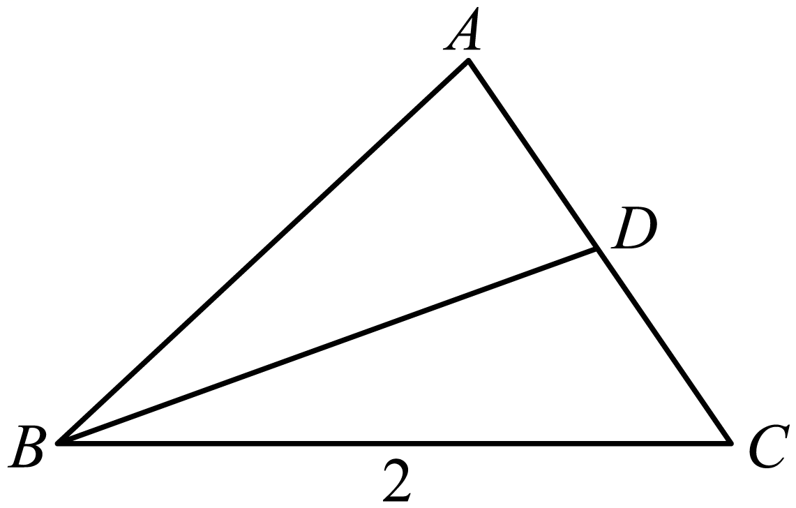

在中，由余弦定理得：，

所以.

所以.

<strong>变式15．</strong>（2024·海南·校联考模拟预测）在中，角<em>A</em>，<em>B</em>，<em>C</em>的对边分别为<em>a</em>，<em>b</em>，<em>c</em>，点<em>M</em>在边上，是角<em>A</em>的平分线，，．

(1)求*A*；

(2)若，求的长．

【解析】（1）在中，由及正弦定理得，

又，所以，

又，

所以．

（2）已知是角*A*的平分线，,，

则，所以，

所以，

如图，过*M*作交于点*D*，易知为正三角形，

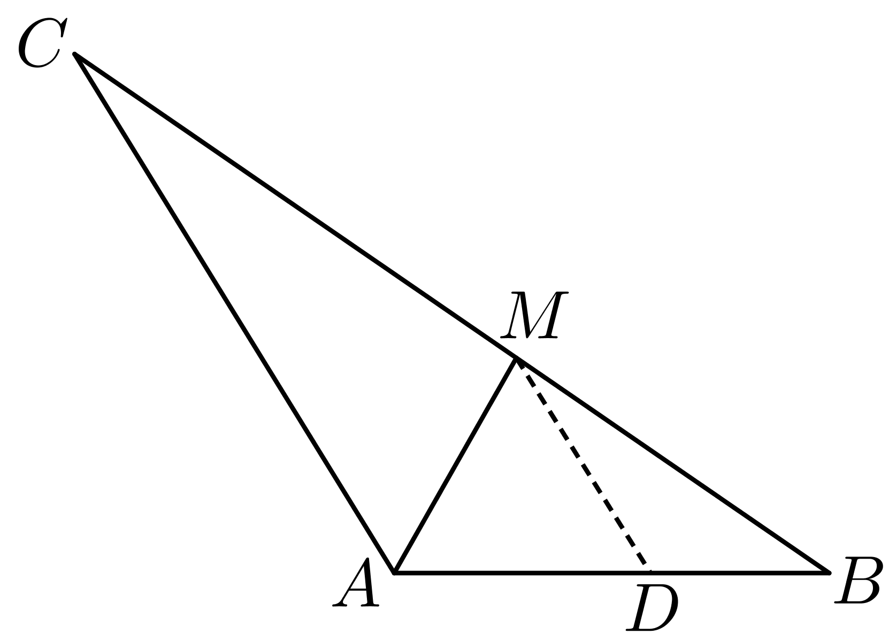

所以，，．

在中，由余弦定理得，

．

**变式16．**（2024·四川·校联考模拟预测）在①；②这两个条件中任选一个作为已知条件，补充在下面的横线上，并给出解答．

注：若选择多个条件分别解答，按第一个解答计分．

已知中，角的对边分别为，点*D*为边的中点，，且\_\_\_\_\_\_\_\_．

(1)求*a*的值；

(2)若的平分线交于点*E*，求的周长．

【解析】（1）若选①：由可得,

又,

故,

而，故，

又，所以；

设，则，

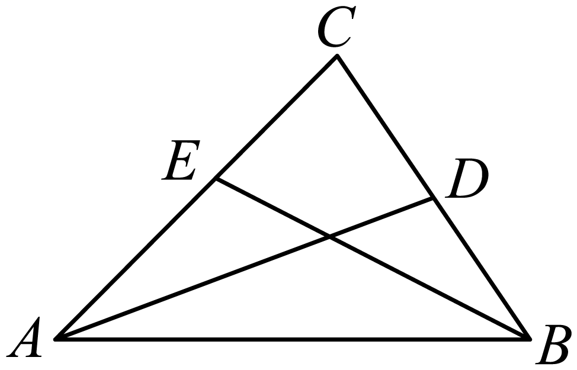

在中，由余弦定理得,

即，

在中，由余弦定理得,

即，和联立解得，

则；

若选②：，设，则，

在中，由余弦定理得，

在中，由余弦定理得，

因为，所以，

即，解得，

故.

（2）由（1）可知，选①可得；选②可得，则，

故由，

可得，

解得，

故在中，，

即,

故的周长为.

**题型五：中线问题**

**例13．**（2024·浙江杭州·统考一模）已知中角 、、所对的边分别为、、，且满足，．

(1)求角*A*；

(2)若，边上中线，求的面积．

【解析】（1） ，

所以由正弦定理得，

，

，即，

，，

，；

（2），

则， 即，

而，边上中线，

故，解得，

．

<strong>例14．</strong>（2024·四川内江·校考模拟预测）在△<em>ABC</em>中，<em>D</em>是边<em>BC</em>上的点，，，<em>AD</em>平分∠<em>BAC</em>，△<em>ABD</em>的面积是△<em>ACD</em>的面积的两倍．

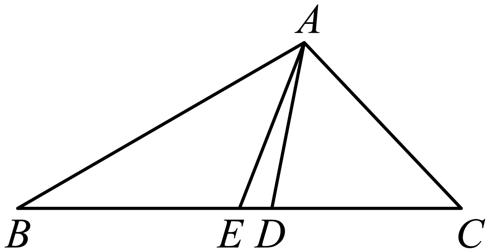

(1)求△*ACD*的面积；

(2)求△*ABC*的边*BC*上的中线*AE*的长．

【解析】（1）由已知及正弦定理可得：，

化简得：．

又因为：

，所以， 所以，

所以△*ACD*的面积为．

（2）由（1）可知，因为*AE*是△*ABC*的边*BC*上的中线，

所以，

所以，

所以△*ABC*的边*BC*上的中线*AE*的长为．

**例15．**（2024·四川绵阳·统考二模）在中，角所对的边分别为，，．

(1)求的值；

(2)若，求边上中线的长．

【解析】（1）由正弦定理得：，

，

，，，又，

，解得：.

（2），，

由余弦定理得：，

，，，即边上中线的长为.

**变式17．**（2024·广东广州·统考一模）在中，内角的对边分别为，.

(1)求；

(2)若的面积为，求边上的中线的长.

【解析】（1）因为，

所以，

所以，

即，

所以，

由余弦定理及得：

，

又，

所以，

即，

所以，

所以.

（2）由，

所以，

由（1），

所以，

因为为边上的中线，

所以，

所以

，

所以，

所以边上的中线的长为：.

**变式18．**（2024·安徽宣城·安徽省宣城中学校考模拟预测）中，已知.边上的中线为.

(1)求；

(2)从以下三个条件中选择两个，使存在且唯一确定，并求和的长度.

条件①：；条件②；条件③.

【解析】（1）因为，

则，

，

又，解得：，故.

（2）由（1）得，

又余弦定理得：，所以，

而条件①中，所以，显然不符合题意，即条件①错误，

由条件②，条件③，解得，

由余弦定理可得，所以.

在中，由正弦定理可得，解得，

又，所以，

因为为边上的中线，所以，

在中，由余弦定理可得，解得.

故.

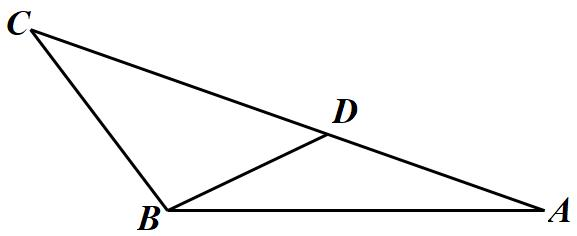

<strong>变式19．</strong>（2024·辽宁沈阳·东北育才双语学校校考一模）如图，设中角<em>A</em>，<em>B</em>，<em>C</em>所对的边分别为<em>a</em>，<em>b</em>，<em>c</em>，<em>AD</em>为<em>BC</em>边上的中线，已知且，．

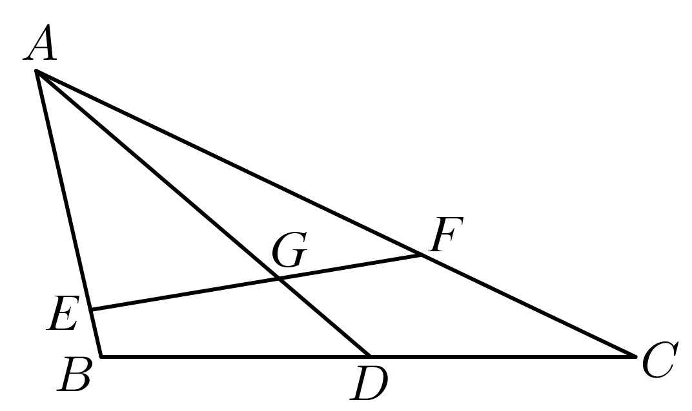

(1)求*b*边的长度；

(2)求的面积；

(3)设点*E*，*F*分别为边*AB*，*AC*上的动点（含端点），线段*EF*交*AD*于*G*，且的面积为面积的，求的取值范围．

【解析】（1）由已知条件可知：

在中，由正弦定理

得

在中，由余弦定理

得

，又

（2）设

为*BC*边上中线

则

①

或

由①，得

（3）设，，（）

，

根据三点共线公式，得

（，为∠*BAC*）

**变式20．**（2024·广东广州·统考三模）在①；②这两个条件中任选一个，补充在下面的问题中，并作答.

问题：已知中，分别为角所对的边，\_\_\_\_\_\_\_\_\_\_.

(1)求角的大小；

(2)已知，若边上的两条中线相交于点，求的余弦值.

注：如果选择多个条件分别解答，按第一个解答计分.

【解析】（1）若选①，，由正弦定理得，又，

则，又，即，又，则；

若选②，由正弦定理得，又，则，

即，则，又，则；

（2）

以为坐标原点，所在直线为轴，过点垂直于的直线为轴，建立如图所示平面直角坐标系，易得，

由可得，则，则，

则.

**题型六：高问题**

<strong>例16．</strong>（2024·海南海口·海南华侨中学校考模拟预测）已知的内角<em>A</em>，，的对边分别为，，，，.

(1)若，证明：；

(2)若边上的高为，求的周长.

【解析】（1）由已知可得，

由正弦定理可得，，

所以有.

又，所以，.

又，所以.

，

，

.

又，，函数在上单调递减，

则.

（2）由题意得的面积.

又，则.

由余弦定理，

得，

所以，.

所以，的周长为.

<strong>例17．</strong>（2024·重庆·统考模拟预测）在中，角<em>A</em>，<em>B</em>，<em>C</em>的对边分别为<em>a</em>，<em>b</em>，<em>c</em>，，，．

(1)求；

(2)若，边上的高线长，求．

【解析】（1）由已知得

；

（2），

，

，

，

，

，

，

，

，又，

，

，

，

，

.

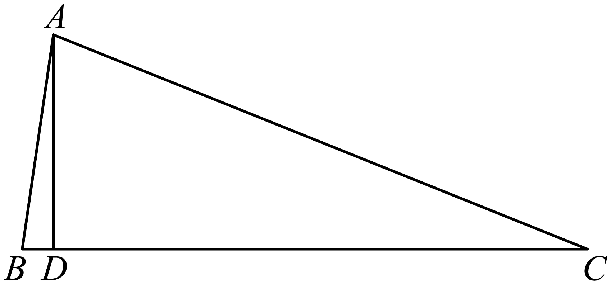

<strong>例18．</strong>（2024·四川自贡·统考三模）的内角<em>A</em>，<em>B</em>，<em>C</em>所对的边分别为<em>a</em>，<em>b</em>，<em>c</em>，若．

(1)求*A*；

(2)若*BC*上的高，求．

【解析】（1）由题意得：，

则由余弦定理得，

因为,所以．

（2）由，则，所以，

则由正弦定理得，则，

又，

即，则．

<strong>变式21．</strong>（2024·黑龙江齐齐哈尔·统考一模）已知的内角<em>A</em>，<em>B</em>，<em>C</em>的对边分别为<em>a</em>，<em>b</em>，<em>c</em>，且．

(1)求*A*；

(2)若，且*BC*边上的高为，求*a*．

【解析】（1）因为，

所以由余弦定理得，

由正弦定理得，

由于，

整理得．

又因为，所以，即，

因为，所以，

所以，即．

（2）由得，

又，所以，，

由余弦定理知，

解得.

**变式22．**（2024·辽宁抚顺·统考模拟预测）已知中，点在边上，满足，且，的面积与面积的比为．

(1)求的值；

(2)若，求边上的高的值．

【解析】（1）∵，

∴为的平分线，

在与中，根据正弦定理可得：

两式相比可得：

又的面积与面积的比为，

∴，

即，且，

由得，

∴且为锐角，∴．

故答案为：

（2）由（1）知为锐角，且，

因此，

又，所以在中由余弦定理得，

解得：，

∵∴．

故答案为：

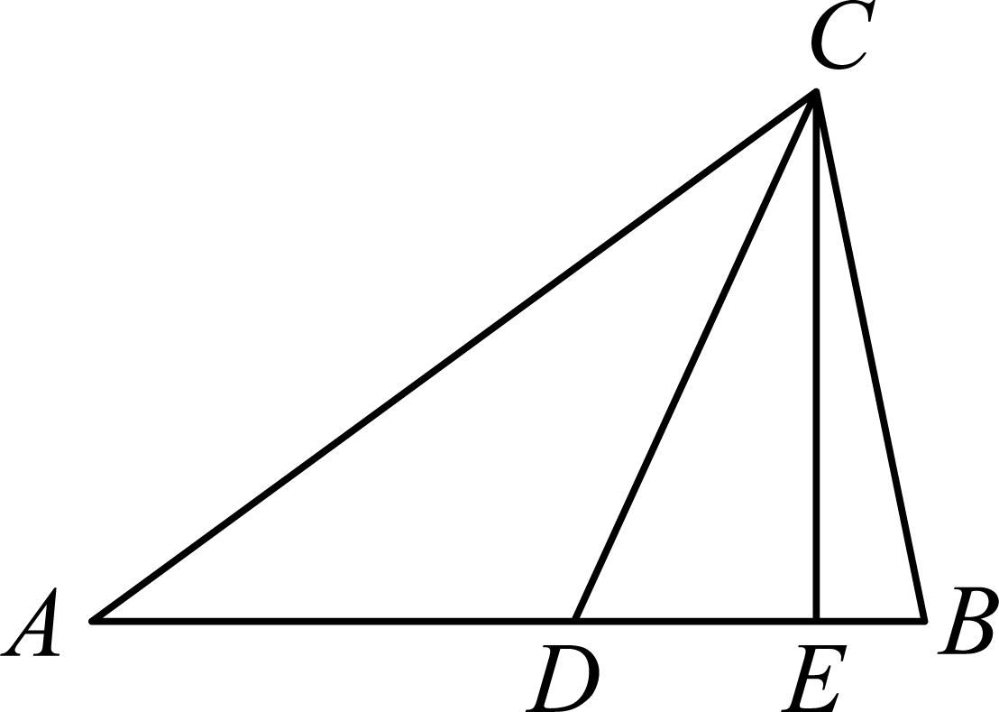

**题型七：重心性质及其应用**

<strong>例19．</strong>（2024·全国·高三专题练习）已知的内角<em>A</em>，<em>B</em>，<em>C</em>的对边分别为<em>a</em>，<em>b</em>，<em>c</em>，且．

(1)求的最小值；

(2)若*M*为的重心，，求．

【解析】（1）因为，所以，

当且仅当，即时，等号成立.

（2）

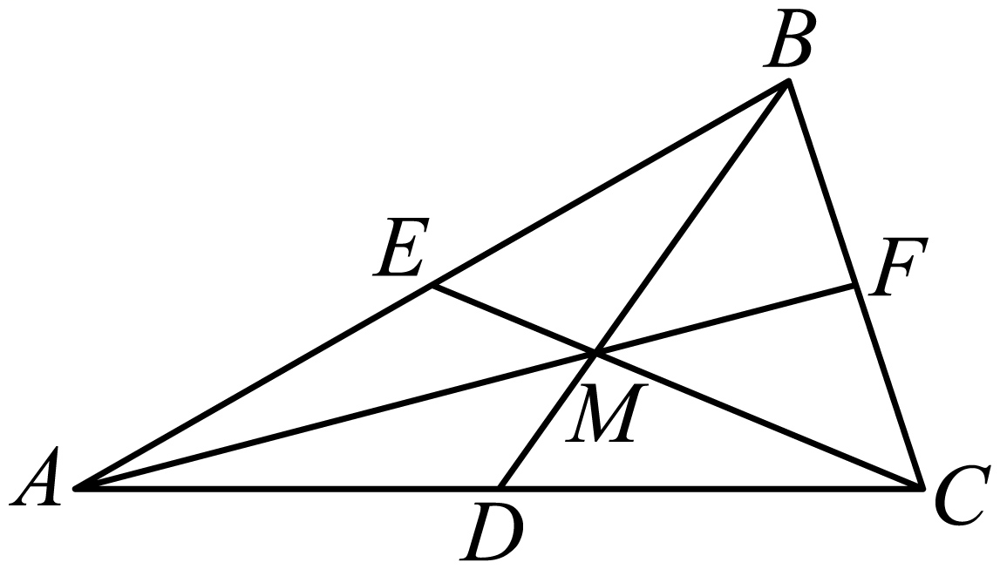

记边的中点为，边的中点为，边的中点为，因为点为的重心，

所以，

在中，，为边的中点，所以，所以，设，则，

在中，，即，

在中，，即，

在中，，即，

消去*x*，*y*得，又，所以，

从而解得，即，

在中，，

所以，

在中，，

所以，

所以.

**例20．**（2024·河南开封·开封高中校考模拟预测）记的内角的对边分别为，已知为的重心．

(1)若，求的长；

(2)若，求的面积．

【解析】（1）因为，

所以，，

所以，

因为，

所以，

因为，

所以，，

因为，整理得，解得，

所以

（2）由（1）知，记边的中点为

因为为的重心，，

所以，边上的中线长为，即，

因为，

所以，

因为，

所以，当为锐角时，，则由得，解得或，不满足题意，舍去；

当为钝角时，，则由得，解得或，

所以，当，的面积为

当，的面积为.

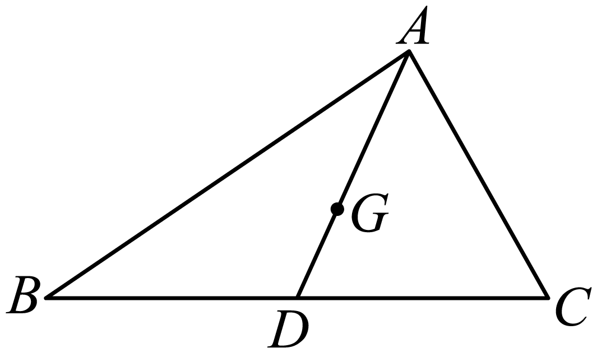

**例21．**（2024·广西钦州·高三校考阶段练习）在中，内角，，的对边分别为，，，且．

(1)求角的大小

(2)若，点是的重心，且，求内切圆的半径．

【解析】（1）因为，

由正弦定理可得，

即，

又，所以，所以，即，

又，所以，所以，解得

（2）因为点是的重心，所以，

所以，

即，解得或舍．

由余弦定理得，解得．

设内切圆的圆心，半径为，则

即，

即，

解得，即内切圆的半径为．

<strong>变式23．</strong>（2024·全国·高三专题练习）设<em>a</em>，<em>b</em>，<em>c</em>分别为的内角<em>A</em>，<em>B</em>，<em>C</em>的对边，<em>AD</em>为<em>BC</em>边上的中线，<em>c</em>＝1，，．

(1)求*AD*的长度；

(2)若*E*为*AB*上靠近*B*的四等分点，*G*为的重心，连接*EG*并延长与*AC*交于点*F*，求*AF*的长度．

【解析】（1）依据题意，由可得

，则，，

，，解得，

，解得*AD*为

（2）*G*为的重心，，，

，，，， ，

<strong>变式24．</strong>（2024·四川内江·高三威远中学校校考期中）的内角<em>A</em>，<em>B</em>，<em>C</em>所对的边分别为．

(1)求*A*的大小；

(2)*M*为内一点，的延长线交于点*D*，\_\_\_\_\_\_\_\_\_\_\_，求的面积．

请在下面三个条件中选择一个作为已知条件补充在横线上，使存在，并解决问题．

①*M*为的重心，；

②*M*为的内心，；

③*M*为的外心，．

【解析】（1）∵，∴，即

由正弦定理得，，即，

∵，∴，∴，又，∴，∴

（2）设外接圆半径为，则根据正弦定理得，，

若选①：∵*M*为该三角形的重心，则*D*为线段的中点且，

又，∴，

即， 又由余弦定理得，即，解得，∴；

若选②：∵*M*为的内心，∴，由得，∵，∴，即，

由余弦定理可得，即，∴，

即，∵，∴， ∴．

若选③：*M*为的外心，则为外接圆半径，，与所给条件矛盾，故不能选③.

**变式25．**（2024·全国·高三专题练习）在①；②这两个条件中任选一个，补充在下面的问题中，并加以解答．

在中，*a*，*b*，*c*分别是角*A*，*B*，*C*的对边，已知\_\_\_\_\_\_．

(1)求角*A*的大小；

(2)若为锐角三角形，且其面积为，点*G*为重心，点*M*为线段的中点，点*N*在线段上，且，线段与线段相交于点*P*，求的取值范围．

注：如果选择多个方案分别解答，按 第一个方案解答计分．

【解析】（1）若选①，

由正弦定理可得

即，又，所以，即，

因为，所以；

若选②，即，

即，

所以，即，所以，即，

因为，所以；

（2）依题意，，

所以，

因为、、三点共线，故设，

同理、、三点共线，故设，

所以，解得，

所以，

则，

因为，所以，

又为锐角三角形，

当为锐角，则，即，

即，即，即，所以，

当为锐角，则，即，

即，即，即，即，所以，

综上可得，

又，则

因为，所以，而在上单调递减，所以，

即，即，所以，则.

**题型八：外心及外接圆问题**

<strong>例22．</strong>（2024·湖南长沙·长沙市实验中学校考二模）在中，内角<em>A</em>，<em>B</em>，<em>C</em>的对边分别为<em>a</em>，<em>b</em>，<em>c</em>，且<em>a</em>，<em>b</em>，<em>c</em>是公差为2的等差数列.

(1)若，求的面积.

(2)是否存在正整数*b*，使得的外心在的外部?若存在，求*b*的取值集合；若不存在，请说明理由.

【解析】（1），由正弦定理得，

*a*，*b*，*c*是公差为2的等差数列，，，

，，，，

，

，且，，

故的面积为.

（2）假设存在正整数*b*，使得的外心在的外部，则为钝角三角形，

依题意可知，则*C*为钝角，则，

所以，解得，

，，

，

存在正整数*b*，使得的外心在的外部，此时整数*b*的取值集合为.

<strong>例23．</strong>（2024·全国·高三专题练习）在<em>ABC</em>中，三内角<em>A</em>，<em>B</em>，<em>C</em>对应的边分别为<em>a</em>，<em>b</em>，<em>c</em>，<em>a</em>＝6．

(1)求*b*cos*C*＋*c*cos*B*的值；

(2)若*O*是*ABC*的外心，且，求*ABC*外接圆的半径．

【解析】（1）

.

（2）设*ABC*外接圆的半径是*R*．

因此

<strong>例24．</strong>（2024·全国·高三专题练习）在中，角<em>A</em>，<em>B</em>，<em>C</em>的对边分别为<em>a</em>，<em>b</em>，<em>c</em>；，.

（1）求的值；

（2）若的外心在其外部，，求外接圆的面积.

【解析】（1）依题意，由余弦定理得，

，，

，

所以或.

当时，.

当时，.

（2）若的外心在其外部，则不符合题意.

当时，，为钝角，符合题意.

，

设三角形外接圆的半径为，由正弦定理得，

所以外接圆的面积为.

**变式26．**（2024·高三统考阶段练习）在中，角，，对应的三边分别为，，，，，，为的外心，连接，，．

（1）求的面积；

（2）过作边的垂线交于点，连接，试求的值．

【解析】（1）

在中，，则，

，

(是到的距离）

（2）

又

**题型九：两边夹问题**

**例25．**（2024·全国·高三专题练习）在中，角所对的边分别为，若，则的值是（    ）

A．	B．	C．	D．

【答案】C

【解析】因为，即，

所以，

可得，

所以，

由正弦函数与余弦函数的性质，可得且，

因为且，

所以，解得，所以，

又由正弦定理可得.

故选：C.

**例26．**（2024·河北唐山·高三校考阶段练习）在中，、、分别是、、所对边的边长.若，则的值是（    ）.

A．1	B．	C．	D．2

【答案】B

【解析】因为，所以，

所以，

即

所以，所以，所以，故选B.

**例27．**（2024·全国·高三专题练习）在中，已知边所对的角分别为，若，则 \_\_\_\_\_\_\_\_\_\_\_\_\_\_\_\_\_

【答案】

【解析】由正弦定理得 ，由余弦定理得,即

因为

所以

**变式27．**（2024·江苏苏州·吴江中学模拟预测）在中，已知边所对的角分别为，若，则\_\_\_\_\_．

【答案】-1

【解析】由得

由正弦定理得 ，

由余弦定理得,即 因为

所以

**变式28．**（2024·湖南长沙·高二长沙一中校考开学考试）在中，已知边、、所对的角分别为、、，若，，则的面积\_\_\_\_\_\_.

【答案】

【解析】正弦定理得，

由余弦定理得，

即，

因为，

故，

故可得，当且仅当，即时取得.

也即当时取得等号，

所以，即.

所以的面积为.

故答案为：.

**变式29．**（2024·全国·高三专题练习）在中，若，则角\_\_．

【答案】

【解析】，，

即，

，，

，等价于且，

为的内角，所以且，即．

则是等腰直角三角形，．

故答案为：．

<strong>变式30．</strong>（2024·全国·高三专题练习）在△ABC中，角A，B，C的对边分别为<em>a</em>，<em>b</em>，<em>c</em>，设<em>S</em>是△ABC的面积，若﹣，则角A的值为\_\_\_\_\_\_\_．

【答案】

【解析】在中，由三角形的面积且，

所以，

又由余弦定理，

所以，

即，

由于，所以，则，

根据三角函数的值域，可知只有，所以，即，

故答案为.

**题型十：内心及内切圆问题**

<strong>例28．</strong>（2024·福建泉州·高三福建省泉州第一中学校考期中）在△<em>ABC</em>中，角<em>A</em>，<em>B</em>，<em>C</em>的对边分别为，<em>I</em>为△<em>ABC</em>的内心，延长线段<em>AI</em>交<em>BC</em>于点<em>D</em>，此时

(1)求；

(2)若∠*ADB*=，求.

【解析】(1)*I*为△*ABC*的内心，则，

根据正弦定理：，，

，故，故.

(2)设，则，，

，故，

化简得到，，故，，，，

故

<strong>例29．</strong>（2024·山西·高三校联考阶段练习）已知中，角<em>A</em>，<em>B</em>，<em>C</em>所对的边分别为<em>a</em>，<em>b</em>，<em>c</em>，,.

(1)求；

(2)若，*M*为的内心，求的面积.

【解析】（1），由正弦定理得，

∴，得，.

∴，

∵*A*为三角形内角，，

∴.

（2）由（1）可得，

∵，∴，，

∴，

，由正弦定理，

解得，，

则有.

设内切圆半径为*r*，则，，

∴.

**例30．**（2024·广东佛山·华南师大附中南海实验高中校考模拟预测）在中，角，，所对的边分别为，，．已知．

(1)求的值；

(2)若的内切圆半径为，，求．

【解析】（1）因为，

所以，

即，

又，所以，

所以，

又，即.

（2）由余弦定理得，①

设的内切圆半径为，

由等面积公式得．

即．

整理得，②

联立①②，解得，，

所以．

**变式31．**（2024·辽宁鞍山·统考模拟预测）在中，角、、所对的边分别为、、，已知.

(1)求；

(2)若，的内切圆半径为，求的周长.

【解析】（1）因为，

由正弦定理可得，①

因为，所以，

代入①式整理得，

又因为、，，则，所以，

又因为，解得.

（2）由（1）知，，因为内切圆半径为，

所以，即，

所以，②，

由余弦定理得，所以③，

联立②③，得，解得，

所以的周长为.

**变式32．**（2024·全国·高三专题练习）已知在中，其角、、所对边分别为、、，且满足．

(1)若，求的外接圆半径；

(2)若，且，求的内切圆半径

【解析】（1）因为，所以，

所以，

因为，所以，

所以，

因为，所以，所以，

因为，所以，

所以，所以外接圆半径．

所以.

（2）因为，由题可知，所以，

又因为，可得，

因为．

由的面积，得．

**变式33．**（2024·全国·高三专题练习）已知的内角，，的对边分别为，，，，，内切圆半径，则\_\_\_\_\_\_\_\_.

【答案】

【解析】由

所以  ①

，

即  ②

由①②得，,

.

故答案为：

