**第34讲  三角形中最值与范围**

**知识梳理**

1、在解三角形专题中，求其“范围与最值”的问题，一直都是这部分内容的重点、难点．解决这类问题，通常有下列五种解题技巧：

（1）利用基本不等式求范围或最值；

（2）利用三角函数求范围或最值；

（3）利用三角形中的不等关系求范围或最值；

（4）根据三角形解的个数求范围或最值；

（5）利用二次函数求范围或最值．

要建立所求量（式子）与已知角或边的关系，然后把角或边作为自变量，所求量（式子）的值作为函数值，转化为函数关系，将原问题转化为求函数的值域问题．这里要利用条件中的范围限制，以及三角形自身范围限制，要尽量把角或边的范围（也就是函数的定义域）找完善，避免结果的范围过大．

2、解三角形中的范围与最值问题常见题型：

（1）求角的最值；

（2）求边和周长的最值及范围；

（3）求面积的最值和范围．

**必考题型全归纳**

**题型一：周长问题**

<strong>例1．</strong>（2024·贵州贵阳·校联考模拟预测）记内角<em>A</em>，<em>B</em>，<em>C</em>的对边分别为<em>a</em>，<em>b</em>，<em>c</em>，且．

(1)求*C*；

(2)若为锐角三角形，，求周长范围．

<strong>例2．</strong>（2024·甘肃武威·高三武威第六中学校考阶段练习）在锐角△<em>ABC</em>中，，，

（1）求角*A*；

（2）求△*ABC*的周长*l*的范围.

**例3．**（2024·全国·高三专题练习）在①；②；③；在这三个条件中任选一个，补充在下面问题中，并作答．

在锐角中，内角、、，的对边分别是、、，且\_\_\_\_\_\_

(1)求角的大小；

(2)若，求周长的范围．

**变式1．**（2024·全国·模拟预测）在锐角中，三个内角，，所对的边分别为，，，且.

(1)求角的大小；

(2)若，求周长的范围.

<strong>变式2．</strong>（2024·陕西西安·高三西安中学校考阶段练习）的内角<em>A</em>，<em>B</em>，<em>C</em>的对边分别为<em>a</em>，<em>b</em>，<em>c</em>且满足，．

(1)求角*A*的大小；

(2)求周长的范围．

**题型二：面积问题**

<strong>例4．</strong>（2024·全国·模拟预测）已知在锐角中，内角<em>A</em>，<em>B</em>，<em>C</em>所对的边分别为<em>a</em>，<em>b</em>，<em>c</em>，且，，，．

(1)求角*A*的值；

(2)若，求面积的范围．

<strong>例5．</strong>（2024·江苏南通·统考模拟预测）如图，某植物园内有一块圆形区域，在其内接四边形内种植了两种花卉，其中区域内种植兰花，区域内种植丁香花，对角线<em>BD</em>是一条观赏小道．测量可知边界，， ．

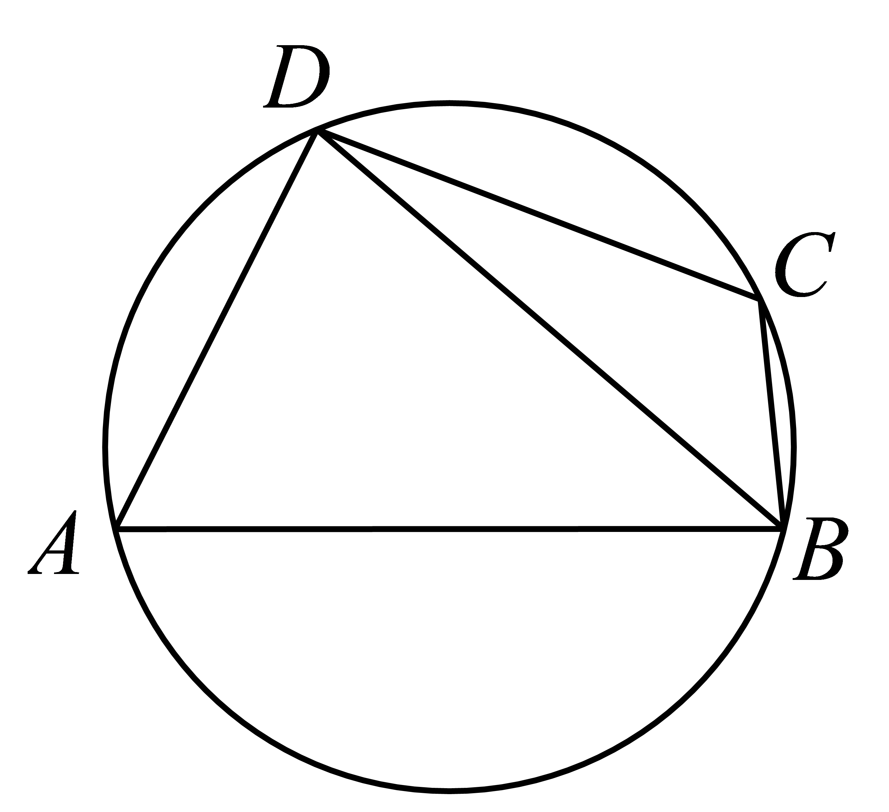

（1）求观赏小道*BD*的长及种植区域的面积；

（2）因地理条件限制，种植丁香花的边界*BC*，*CD*不能变更，而边界*AB*，*AD*可以调整，使得种植兰花的面积有所增加，请在*BAD*上设计一点*P*，使得种植区域改造后的新区域（四边形）的面积最大，并求出这个面积的最大值．

<strong>例6．</strong>（2024·山东青岛·高三青岛三十九中校考期中）在①<em>a</em>＝2，②<em>a</em>＝<em>b</em>＝2，③<em>b</em>＝<em>c</em>＝2这三个条件中任选一个，补充在下面问题中，求△<em>ABC</em>的面积的值（或最大值）．已知△<em>ABC</em>的内角<em>A</em>，<em>B</em>，<em>C</em>所对的边分别为<em>a</em>，<em>b</em>，<em>c</em>，三边<em>a</em>，<em>b</em>，<em>c</em>与面积<em>S</em>满足关系式：，且\_\_\_\_\_\_，求△<em>ABC</em>的面积的值（或最大值）．

**变式3．**（2024·江苏苏州·高三常熟中学校考阶段练习）如图所示，某住宅小区一侧有一块三角形空地，其中，，．物业管理部门拟在中间开挖一个三角形人工湖，其中，都在边上（，均不与重合，在，之间），且．

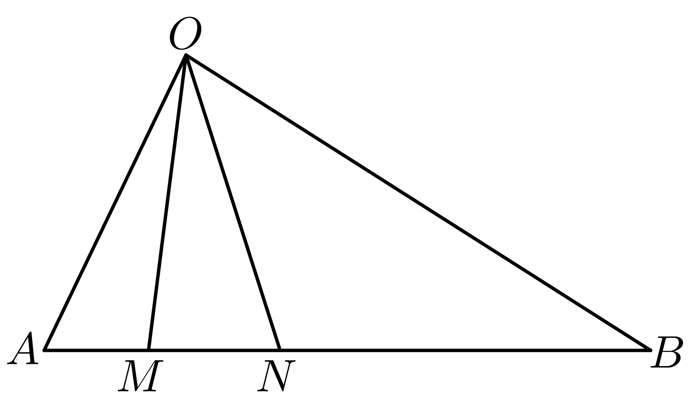

(1)若在距离点处，求点，之间的距离；

(2)设，

①求出的面积关于的表达式；

②为节省投入资金，三角形人工湖的面积要尽可能小，试确定的值，使得面积最小，并求出这个最小面积．

**变式4．**（2024·全国·高三专题练习）在中，．

（1）*D*为线段上一点，且，求长度；

（2）若为锐角三角形，求面积的范围．

**变式5．**（2024·河北·高三校联考阶段练习）已知在中，内角，，的对边分别为，，，且.

（1）若，，求的大小；

（2）若，且是钝角，求面积的大小范围.

**题型三：长度问题**

**例7．**（2024·浙江丽水·高三浙江省丽水中学校联考期末）已知锐角内角的对边分别为.若.

(1)求；

(2)若，求的范围.

<strong>例8．</strong>（2024·福建莆田·高三校考期中）在中<em>，a，b，c</em>分别为角<em>A，B，C</em>所对的边，，

(1)求角*B*﹔

(2)求的范围．

**例9．**（2024·重庆江北·高三校考阶段练习）在中，内角，，所对的边分别，，，且.

（1）求角的大小；

（2）若，，当仅有一解时，写出的范围，并求的取值范围.

<strong>变式6．</strong>（2024·全国·高三专题练习）已知的内角<em>A，B，C</em>的对边分别为<em>a，b，c</em>，且满足条件；，．

（I）求角*A*的值；

（Ⅱ）求的范围．

**变式7．**（2024·全国·高三专题练习）在中，分别是角的对边.

（1）求角的值；

（2）若，且为锐角三角形，求的范围.

<strong>变式8．</strong>（2024·山西运城·统考模拟预测）的内角<em>A</em>，<em>B</em>，<em>C</em>的对边分别为<em>a</em>，<em>b</em>，<em>c.</em>

（1）求证：；

（2）若是锐角三角形，，求的范围.

**变式9．**（2024·安徽亳州·高三统考期末）在锐角中，角，，的对边分别为，，，已知.

（1）求角的大小；

（2）设为的垂心，且，求的范围.

**题型四：转化为角范围问题**

**例10．**（2024·全国·高三专题练习）在锐角中，内角，，的对边分别为，，，且.

(1)求；

(2)求的取值范围.

**例11．**（2024·全国·高三专题练习）已知的内角、、的对边分别为、、，且．

(1)判断的形状并给出证明；

(2)若，求的取值范围．

**例12．**（2024·河北保定·高一定州一中校考阶段练习）设的内角的对边分别为，已知．

(1)判断的形状（锐角、直角、钝角三角形），并给出证明；

(2)求的最小值．

<strong>变式10．</strong>（2024·广东佛山·高一大沥高中校考阶段练习）已知的三个内角<em>A</em>，<em>B</em>，<em>C</em>的对边分别为<em>a</em>，<em>b</em>，<em>c</em>，且；

(1)若，判断的形状并说明理由；

(2)若是锐角三角形，求的取值范围.

<strong>变式11．</strong>（2024·全国·高三专题练习）在中，角<em>A</em>，<em>B</em>，<em>C</em>所对的边分别是<em>a</em>，<em>b</em>，<em>c</em>.已知.

(1)若，求角*A*的大小；

(2)求的取值范围.

<strong>变式12．</strong>（2024·江西吉安·高二江西省峡江中学校考开学考试）在锐角中，角<em>A</em>，<em>B</em>，<em>C</em>所对的边分别是，．

（1）求角*A*的大小；

（2）求的取值范围．

<strong>变式13．</strong>（2024·全国·高三专题练习）在锐角中，角<em>A</em>，<em>B</em>，<em>C</em>所对的边分别为<em>a</em>，<em>b</em>，<em>c</em>．若，则的取值范围为（    ）

A．	B．	C．	D．

**题型五： 倍角问题**

<strong>例13．</strong>（2024·浙江绍兴·高一诸暨中学校考期中）在锐角中，内角<em>A</em>，<em>B</em>，<em>C</em>所对的边分别为<em>a</em>，<em>b</em>，<em>c</em>，已知．

(1)证明：；

(2)若，求*a*的取值范围；

(3)若的三边边长为连续的正整数，求的面积．

**例14．**（2024·全国·高三专题练习）已知的内角，，的对边分别为，，．若，且为锐角，则的最小值为（    ）

A．	B．	C．	D．

**例15．**（2024·全国·高三专题练习）锐角的角所对的边为，，则的范围是\_\_\_\_\_\_\_\_\_．

**变式14．**（2024·全国·高三专题练习）在锐角中，角，，的对边分别为，，，的面积为5，若，则的取值范围为\_\_\_\_\_\_．

**变式15．**（2024·全国·高三专题练习）已知的内角、、的对边分别为、、，若，则的取值范围为\_\_\_\_\_\_\_\_\_\_．

**变式16．**（2024·全国·高三专题练习）在锐角中，，的对边长分别是，，则的取值范围是（    ）

A．	B．	C．	D．

**变式17．**（2024·福建三明·高一三明市第二中学校考阶段练习）在锐角中，，，的对边分别是，，则的范围是（    ）

A．	B．	C．	D．

<strong>变式18．</strong>（2024·江苏南京·高一金陵中学校考期中）已知△<em>ABC</em>的内角<em>A</em>，<em>B</em>，<em>C</em>的对边分别为<em>a</em>，<em>b</em>，<em>C</em>，若<em>A</em>＝2<em>B</em>，则的最小值为（    ）

A．－1	B．	C．3	D．

**题型六： 角平分线问题**

**例16．**（2024·江苏盐城·高一江苏省射阳中学校考阶段练习）已知的内角的对边分别为，且.

(1)求角的大小；

(2)若角的平分线交于点，且，求的最小值.

<strong>例17．</strong>（2024·江苏淮安·高一统考期中）如图，中，，的平分线<em>AD</em>交<em>BC</em>于．

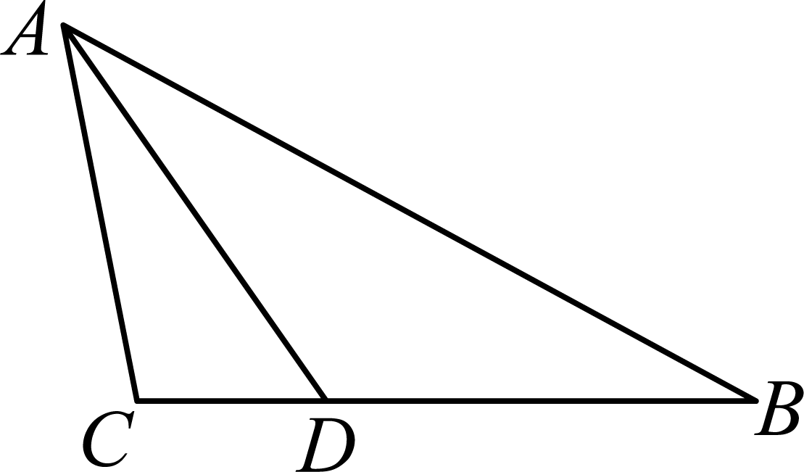

(1)若，求的余弦值；

(2)若，求*AD*的取值范围．

**例18．**（2024·浙江杭州·高一校联考期中）在①，②，③．这三个条件中任选一个，补充在下面问题中，并解答．

已知在中，角<em>A</em>，<em>B</em>，<em>C</em>的对边分别是<em>a</em>，<em>b</em>，<em>c</em>，_．

(1)求角*C*的值；

(2)若角*C*的平分线交于点*D*，且，求的最小值．

<strong>变式19．</strong>（2024·河北沧州·校考模拟预测）已知的内角所对的边分别为，且，角<em>A</em>的平分线与边交于点.

(1)求角*A*；

(2)若，求的最小值.

**变式20．**（2024·山东泰安·校考模拟预测）在锐角中，内角所对的边分别为，满足，且．

(1)求证：；

(2)已知是的平分线，若，求线段长度的取值范围．

<strong>变式21．</strong>（2024·全国·高一专题练习）在中，角<em>A</em>，<em>B</em>，<em>C</em>所对的边分别为<em>a</em>，<em>b</em>，<em>c</em>，且满足．

(1)求角的大小；

(2)若，与的平分线交于点，求周长的最大值．

**变式22．**（2024·四川成都·石室中学校考模拟预测）在中，角所对的边分别为，且，边上有一动点.

(1)当为边中点时，若，求的长度；

(2)当为的平分线时，若，求的最大值.

**题型七： 中线问题**

**例19．**（2024·湖南长沙·高一雅礼中学校考期中）在锐角中，角的对边分别是，，，若

(1)求角的大小；

(2)若，求中线长的范围（点是边中点）.

<strong>例20．</strong>（2024·安徽·合肥一中校联考模拟预测）记的内角<em>A</em>，<em>B</em>，<em>C</em>的对边分别是<em>a</em>，<em>b</em>，<em>c</em>，已知．

(1)求*A*；

(2)若，求边中线的取值范围．

<strong>例21．</strong>（2024·全国·高一专题练习）在锐角三角形<em>ABC</em>中，角<em>A</em>，<em>B</em>，<em>C</em>所对的边分别为<em>a</em>，<em>b</em>，<em>c</em>，已知．

(1)求角*C*的大小；

(2)若，边*AB*的中点为*D*，求中线*CD*长的取值范围．

<strong>变式23．</strong>（2024·辽宁沈阳·沈阳二中校考模拟预测）在中，角<em>A</em>，<em>B</em>，<em>C</em>的对边分别是<em>a</em>，<em>b</em>，<em>c</em>，若

(1)求角*A*的大小；

(2)若，求中线*AD*长的最大值（点*D*是边*BC*中点）．

<strong>变式24．</strong>（2024·广东广州·高二广州六中校考期中）在△<em>ABC</em>中，角<em>A</em>，<em>B</em>，<em>C</em>所对的边分别为<em>a</em>，<em>b</em>，<em>c</em>，已知．

(1)求角*A*的大小；

(2)若，求边上的中线 长度的最小值．

**题型八： 四心问题**

**例22．**（2024·四川凉山·校联考一模）设（是坐标原点）的重心、内心分别是，且，若，则的最小值是\_\_\_\_\_\_\_\_\_\_．

**例23．**（2024·全国·高三专题练习）在中，分别为内角的对边，且.

（1）求角的大小；

（2）若，为的内心，求的最大值.

**例24．**（2024·全国·模拟预测）已知锐角三角形的内角的对边分别为，且.

(1)求角；

(2)若为的垂心，，求面积的最大值.

**变式25．**（2024·江苏无锡·高一锡东高中校考期中）在中，分别是角的对边，．

(1)求角*A*的大小；

(2)若为锐角三角形，且其面积为，点为重心，点为线段的中点，点在线段上，且，线段与线段相交于点，求的取值范围.

<strong>变式26．</strong>（2024·河北邢台·高一统考期末）记的内角<em>A</em>，<em>B</em>，<em>C</em>的对边分别为<em>a</em>，<em>b</em>，<em>c</em>，已知，且外接圆的半径为．

(1)求*C*的大小；

(2)若*G*是的重心，求面积的最大值．

<strong>变式27．</strong>（2024·辽宁抚顺·高一抚顺一中校考阶段练习）如图，记锐角的内角<em>A</em>，<em>B</em>，<em>C</em>的对边分别为<em>a</em>，<em>b</em>，<em>c</em>，，<em>A</em>的角平分线交<em>BC</em>于点<em>D</em>，<em>O</em>为的重心，过<em>O</em>作，交<em>AD</em>于点<em>P</em>，过<em>P</em>作于点<em>E</em>.

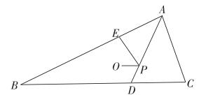

(1)求的取值范围；

(2)若四边形*BDPE*与的面积之比为，求的取值范围.

<strong>变式28．</strong>（2024·浙江·高一路桥中学校联考期中）若<em>O</em>是的外心，且，则的最大值是（    ）

A．	B．	C．	D．2

**变式29．**（2024·全国·高三专题练习）已知是三角形的外心，若，且，则实数的最大值为（    ）

A．6	B．	C．	D．3

**题型九： 坐标法**

**例25．**（2024·全国·高三专题练习）在中，，，点在内部，，则的最小值为\_\_\_\_\_\_．

<strong>例26．</strong>（2024·全国·高一专题练习）在中，，，，<em>M</em>是所在平面上的动点，则的最小值为\_\_\_\_\_\_\_\_．

<strong>例27．</strong>（2024·湖北武汉·高二武汉市第三中学校考阶段练习）在平面直角坐标系中，已知<em>B</em>，<em>C</em>为圆上两点，点，且，则线段的长的取值范围是\_\_\_\_\_\_\_\_\_\_\_.

**变式30．**（2024·全国·高三专题练习）在中，，且所在平面内存在一点使得，则面积的最大值为（    ）

A．	B．	C．	D．

**变式31．**（2024·全国·高三专题练习）在等边 中，为内一动点，，则的最小值是（    ）

A．1	B．	C．	D．

**变式32．**（2024·江西·高三校联考开学考试）费马点是指三角形内到三角形三个顶点距离之和最小的点.当三角形三个内角均小于120°时，费马点与三个顶点连线正好三等分费马点所在的周角，即该点所对的三角形三边的张角相等且均为120°.根据以上性质，.则的最小值为（    ）

A．4	B．	C．	D．

**题型十： 隐圆问题**

**例28．**（2024·全国·高三专题练习）在平面四边形中，连接对角线，已知，，，，则对角线的最大值为（    ）

A．27	B．16	C．10	D．25

**例29．**（2024·江苏泰州·高三阶段练习）已知中，，为的重心，且满足，则的面积的最大值为\_\_\_\_\_\_.

<strong>例30．</strong>（2024·湖北武汉·高二武汉市洪山高级中学校考开学考试）已知等边的边长为2，点<em>G</em>是内的一点，且，点<em>P</em>在所在的平面内且满足，则的最大值为\_\_\_\_\_\_\_\_.

**变式33．**（2024·全国·高三专题练习）在平面四边形ABCD中，， ，．若， 则的最小值为\_\_\_\_．

**变式34．**（2024·全国·高三专题练习）若满足条件，，则面积的最大值为\_\_.

**变式35．**（2024·江苏·高三专题练习）在中，为定长，，若的面积的最大值为，则边的长为\_\_\_\_\_\_\_\_\_\_\_\_．

<strong>变式36．</strong>（2024·全国·高三专题练习）中，所在平面内存在点<em>P</em>使得，，则的面积最大值为\_\_\_\_\_\_\_\_\_\_\_\_\_\_\_\_\_\_．

**变式37．**（2024·全国·高三专题练习）已知中，，所在平面内存在点使得，则面积的最大值为\_\_\_\_\_\_\_\_\_\_．

**题型十一：两边夹问题**

**例31．**（2024·全国·高三专题练习）在中，若，且的周长为12．

(1)求证：为直角三角形；

(2)求面积的最大值．

**例32．**（2024·全国·高三专题练习）设的内角的对边长成等比数列，，延长至，若，则面积的最大值为\_\_\_\_\_\_\_\_\_\_.

<strong>例33．</strong>（2024·全国·高三专题练习）设的内角<em>A</em>，<em>B</em>，<em>C</em>的对边为，<em>b</em>，<em>c</em>．已知，<em>b</em>，<em>c</em>依次成等比数列，且，延长边<em>BC</em>到<em>D</em>，若，则面积的最大值为\_\_\_\_\_\_．

**题型十二：与正切有关的最值问题**

**例34．**（2024·全国·高一专题练习）在锐角三角形中，角､､的对边分别为､､，且满足，则的取值范围为\_\_\_\_\_\_\_\_\_\_\_.

<strong>例35．</strong>（2024·全国·高一阶段练习）在中，内角<em>A</em>，<em>B</em>，<em>C</em>所对的边分别为<em>a</em>，<em>b</em>，<em>c</em>，且.

(1)求*A*角的值；

(2)若为锐角三角形，利用（1）所求的*A*角值求的取值范围.

<strong>例36．</strong>（2024·全国·高三专题练习）在中，内角<em>A，B</em>，<em>C</em>所对的边分别为<em>a</em>，<em>b</em>，<em>c</em>，且．求：

(1)；

(2)的取值范围．

<strong>变式38．</strong>（2024·全国·高三专题练习）锐角是单位圆的内接三角形，角<em>A</em>，<em>B</em>，<em>C</em>的对边分别为<em>a</em>，<em>b</em>，<em>c</em>，且，则的取值范围是（    ）

A．	B．	C．	D．

**变式39．**（2024·安徽合肥·高一合肥市第七中学校考期中）在锐角中，角，，的对边分别为，，，为的面积，且，则的取值范围为（    ）

A．	B．	C．	D．

**变式40．**（2024·全国·高三专题练习）在锐角中，角所对的边分别为，若，则的取值范围为（    ）

A．	B．	C．	D．

**题型十三：最大角问题**

<strong>例37．</strong>（2024·全国·高三专题练习）几何学史上有一个著名的米勒问题：“设点<em>M</em>，<em>N</em>是锐角∠<em>AQB</em>的一边<em>QA</em>上的两点，试在<em>QB</em>边上找一点<em>P</em>，使得∠<em>MPN</em>最大．”如图，其结论是：点<em>P</em>为过<em>M</em>，<em>N</em>两点且和射线<em>QB</em>相切的圆与射线<em>QB</em>的切点．根据以上结论解决以下问题：在平面直角坐标系中，给定两点，，点<em>P</em>在<em>x</em>轴上移动，当∠<em>MPN</em>取最大值时，点<em>P</em>的横坐标是（    ）

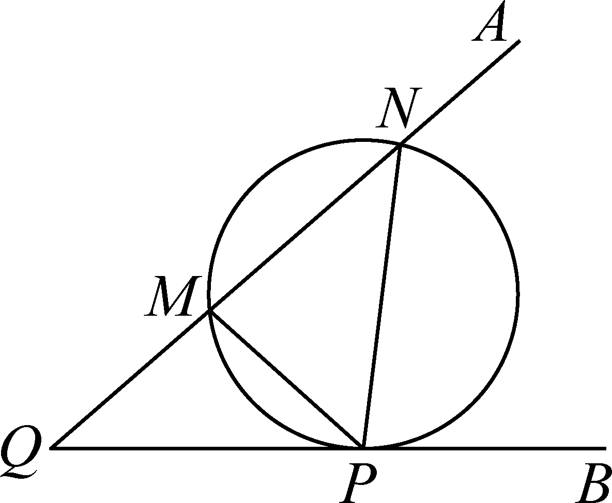

A．1	B．－7	C．1或－7	D．2或－7

**例38．**（2024·全国·高三专题练习）设中，内角，，所对的边分别为，，，且，则的最大值为（   ）

A．	B．	C．	D．

**例39．**（2024·江西上饶·高三上饶中学校考期中）在△ABC中，内角A，B，C所对的边分别为a，b，c，且，当tan(A－B)取最大值时，角C的值为

A．	B．	C．	D．

**变式41．**（2024·河南信阳·高一信阳高中校考阶段练习）最大视角问题是1471年德国数学家米勒提出的几何极值问题，故最大视角问题一般称为“米勒问题”．如图，树顶离地面12米，树上另一点离地面8米，若在离地面2米的处看此树，则的最大值为（    ）

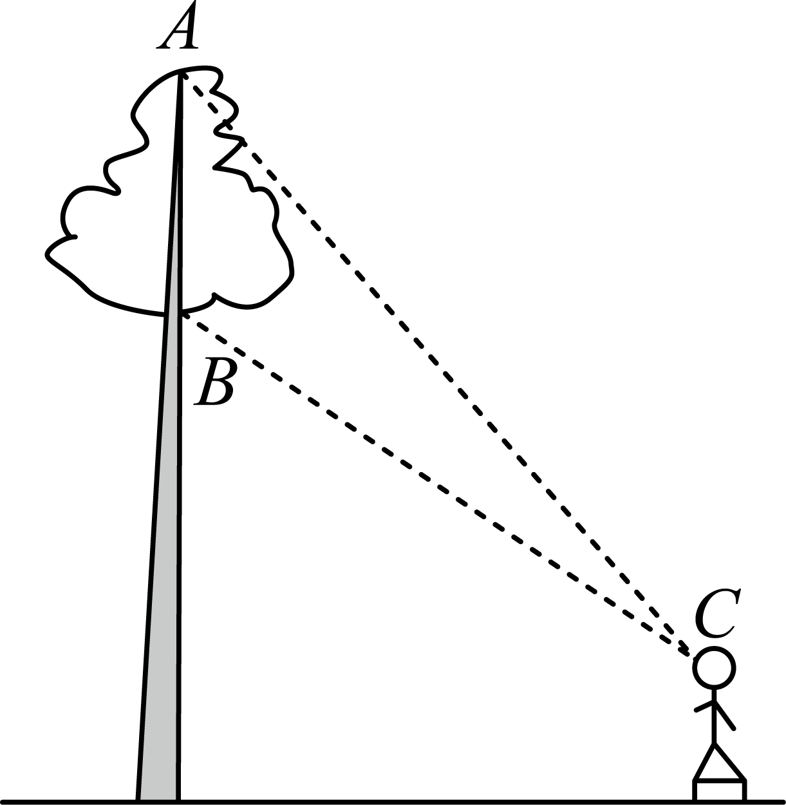

A．	B．	C．	D．

<strong>变式42．</strong>（2024·江苏扬州·高一统考期中）如图：已知树顶<em>A</em>离地面米，树上另一点离地面米，某人在离地面米的处看此树，则该人离此树（　　）米时，看<em>A</em>、的视角最大.

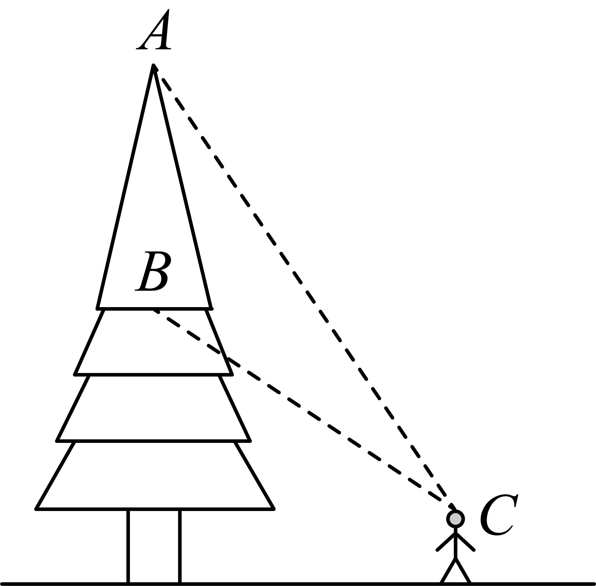

A．4	B．5	C．6	D．7

**题型十四：费马点、布洛卡点、拿破仑三角形问题**

<strong>例40．</strong>（2024·重庆沙坪坝·高一重庆南开中学校考阶段练习）内一点<em>O</em>，满足，则点<em>O</em>称为三角形的布洛卡点．王聪同学对布洛卡点产生兴趣，对其进行探索得到许多正确结论，比如，请你和他一起解决如下问题：

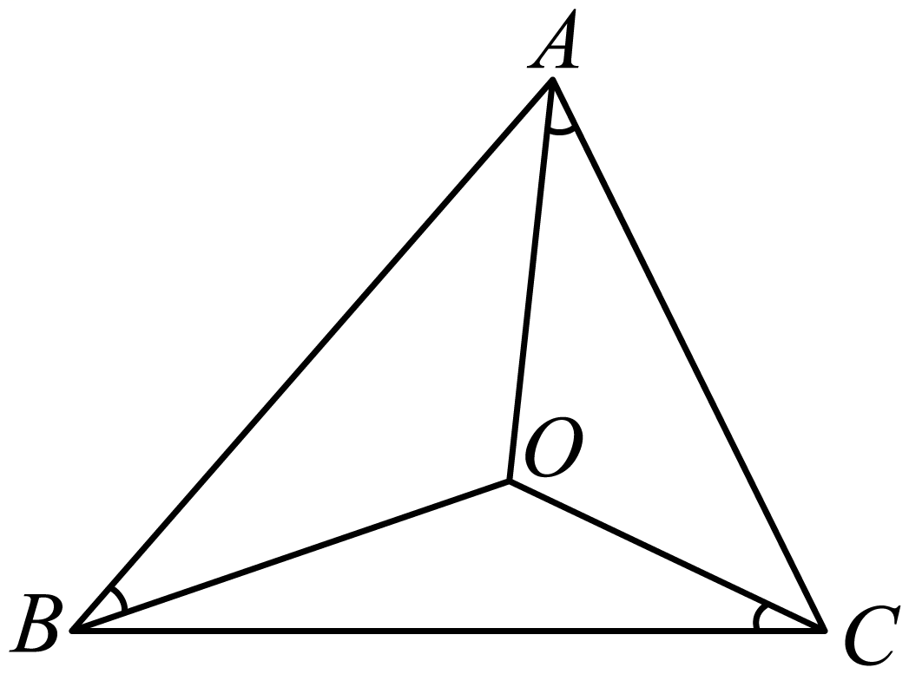

(1)若*a*，*b*，*c*分别是*A*，*B*，*C*的对边，，证明：；

(2)在（1）的条件下，若的周长为4，试把表示为*a*的函数，并求的取值范围．

**例41．**（2024·浙江宁波·高一慈溪中学校联考期末）十七世纪法国数学家皮埃尔·德·费马提出的一个著名的几何问题：“已知一个三角形，求作一点，使其与这个三角形的三个顶点的距离之和最小”.它的答案是：当三角形的三个角均小于时，所求的点为三角形的正等角中心，即该点与三角形的三个顶点的连线两两成角；当三角形有一内角大于或等于120°时，所求点为三角形最大内角的顶点.在费马问题中所求的点称为费马点，已知在中，已知，，，且点在线段上，且满足，若点为的费马点，则（    ）

A．	B．	C．	D．

**例42．**（2024·全国·高三专题练习）点在所在平面内一点，当取到最小值时，则称该点为的“费马点”.当的三个内角均小于时，费马点满足如下特征：.如图，在中，，，则其费马点到三点的距离之和为（    ）

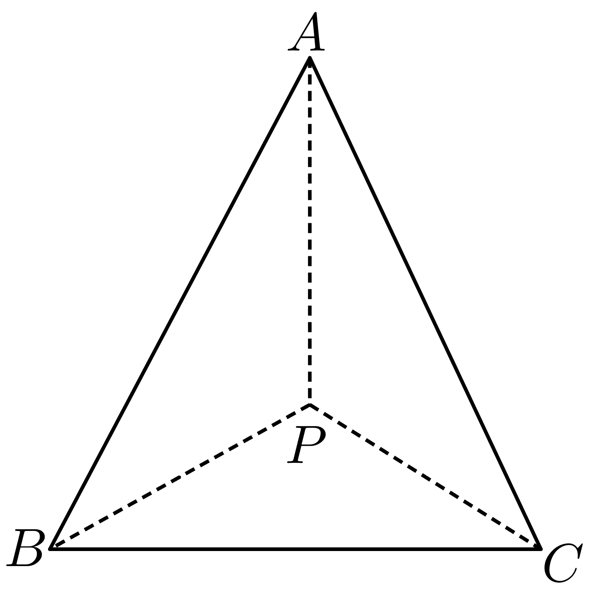

A．4	B．2

C．	D．

<strong>变式43．</strong>（2024·湖南邵阳·统考三模）拿破仑·波拿巴最早提出了一个几何定理：“以任意三角形的三条边为边，向外构造三个等边三角形，则这三个等边三角形的外接圆圆心恰为另一个等边三角形（此等边三角形称为拿破仑三角形）的顶点”.在△<em>ABC</em>中，已知，且，，现以<em>BC</em>，<em>AC</em>，<em>AB</em>为边向外作三个等边三角形，其外接圆圆心依次记为，，，则的边长为（    ）

A．3	B．2	C．	D．

**变式44．**（2024·河南·高一校联考期末）几何定理：以任意三角形的三条边为边，向外构造三个等边三角形，则这三个等边三角形的外接圆圆心恰为另一个等边三角形（称为拿破仑三角形）的顶点．在中，已知，，外接圆的半径为，现以其三边向外作三个等边三角形，其外接圆圆心依次记为，，，则的面积为（    ）

A．3	B．2	C．	D．

**题型十五：托勒密定理及旋转相似**

<strong>例43．</strong>（2024·江苏淮安·高一校联考期中）托勒密是古希腊天文学家、地理学家、数学家，托勒密定理就是由其名字命名，该定理原文：圆的内接四边形中，两对角线所包矩形的面积等于一组对边所包矩形的面积与另一组对边所包矩形的面积之和.其意思为：圆的内接凸四边形两对对边乘积的和等于两条对角线的乘积.从这个定理可以推出正弦、余弦的和差公式及一系列的三角恒等式，托勒密定理实质上是关于共圆性的基本性质.已知四边形<em>ABCD</em>的四个顶点在同一个圆的圆周上，<em>AC</em>、<em>BD</em>是其两条对角线，，且为正三角形，则四边形<em>ABCD</em>的面积为（    ）

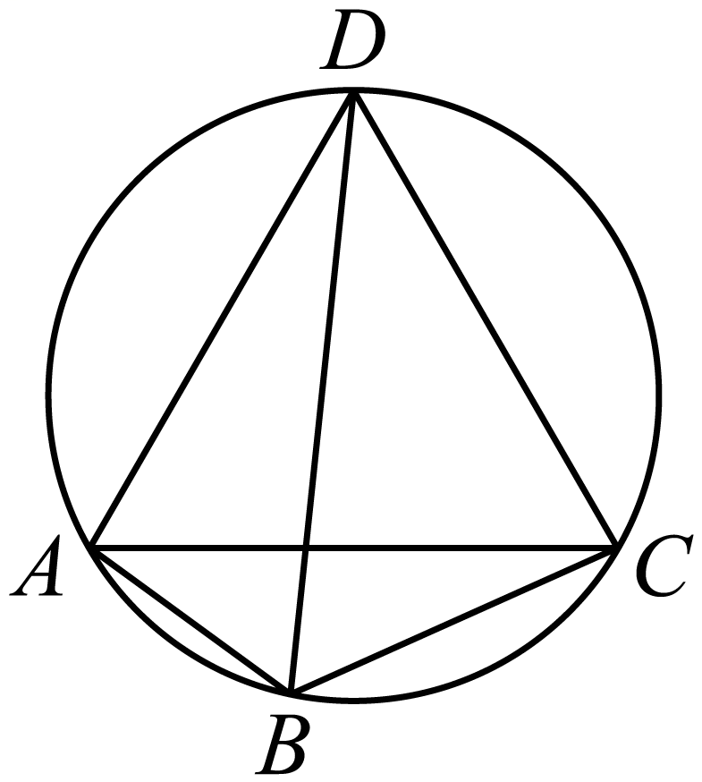

A．	B．16	C．	D．12

**例44．**（2024·全国·高三专题练习）托勒密是古希腊天文学家、地理学家、数学家，托勒密定理就是由其名字命名，该定理原文：圆的内接四边形中，两对角线所包矩形的面积等于一组对边所包矩形的面积与另一组对边所包矩形的面积之和．其意思为：圆的内接凸四边形两对对边乘积的和等于两条对角线的乘积．从这个定理可以推出正弦、余弦的和差公式及一系列的三角恒等式，托勒密定理实质上是关于共圆性的基本性质．已知四边形的四个顶点在同一个圆的圆周上，、是其两条对角线，，且为正三角形，则四边形的面积为（    ）

A．	B．	C．	D．

<strong>例45．</strong>（2024·全国·高三专题练习）克罗狄斯·托勒密是古希腊著名数学家、天文学家和地理学家，他在所著的《天文集》中讲述了制作弦表的原理，其中涉及如下定理：任意凸四边形中，两条对角线的乘积小于或等于两组对边乘积之和，当且仅当凸四边形的对角互补时取等号，后人称之为托勒密定理的推论．如图，四边形<em>ABCD</em>内接于半径为的圆，，，，则四边形<em>ABCD</em>的周长为（    ）

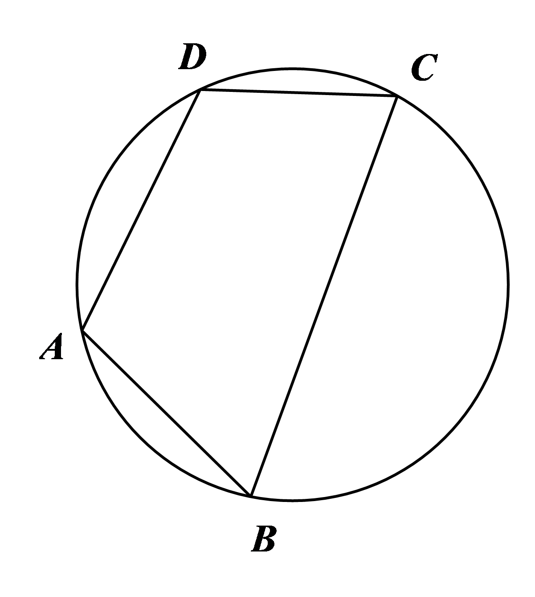

A．	B．	C．	D．

<strong>变式45．</strong>（2024·江苏·高一专题练习）凸四边形就是没有角度数大于180°的四边形，把四边形任何一边向两方延长，其他各边都在延长所得直线的同一旁，这样的四边形叫做凸四边形，如图，在凸四边形<em>ABCD</em>中，，，，，当变化时，对角线<em>BD</em>的最大值为（　　）

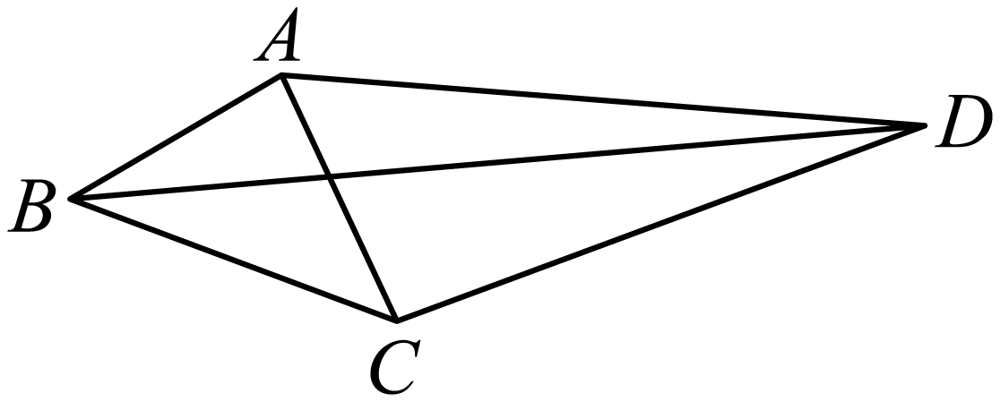

A．4	B．	C．	D．

**变式46．**（2024·江苏无锡·高一江苏省江阴市第一中学校考阶段练习）在中，，，以为边作等腰直角三角形(为直角顶点，，两点在直线的两侧).当角变化时，线段长度的最大值是（    ）

A．3	B．4	C．5	D．9

<strong>变式47．</strong>（2024·全国·高一专题练习）在中，，，以为边作等腰直角三角形（ 为直角顶点， <em>、</em>两点在直线的两侧）.当变化时，线段长的最大值为（    ）

A． 	B．	C． 	D．

<strong>变式48．</strong>（2024·全国·高三专题练习）如图所示，在平面四边形<em>ABCD</em>中，<em>AB</em>=1，<em>BC</em>=2，<em>ACD</em>为正三角形，则<em>BCD</em>面积的最大值为（　　）

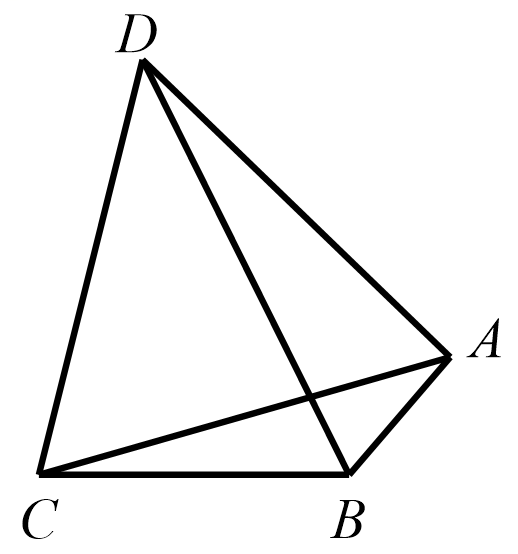

A．	B．	C．	D．

**题型十六：三角形中的平方问题**

<strong>例46．</strong>（2024·全国·高三专题练习）已知△<em>ABC</em>的三边分别为<em>a</em>，<em>b</em>，<em>c</em>，若满足<em>a2</em>+<em>b2</em>+2<em>c2</em>＝8，则△<em>ABC</em>面积的最大值为（    ）

A．	B．	C．	D．

<strong>例47．</strong>（2024·全国·高三专题练习）在中，角<em>A，B，C</em>所对的边分别为<em>a，b，c</em>，且满足，则的取值范围是\_\_\_\_\_\_\_\_\_\_\_.

<strong>例48．</strong>（2024·湖南常德·常德市一中校考模拟预测）秦九韶是我国南宋著名数学家，在他的著作《数书九章》中有已知三边求三角形面积的方法：“以小斜幂并大斜幂减中斜幂，余半之，自乘于上以小斜幂乘大斜幂减上，余四约之，为实一为从阳，开平方得积．”如果把以上这段文字写成公式就是，其中<em>a</em>，<em>b</em>，<em>c</em>是的内角<em>A</em>，<em>B</em>，<em>C</em>的对边，若，且，则面积<em>S</em>的最大值为（    ）

A．	B．	C．	D．

<strong>变式49．</strong>（2024·河南洛阳·高三校考阶段练习）的内角<em>A</em>，<em>B</em>，<em>C</em>的对边分别为<em>a</em>，<em>b</em>，<em>c</em>，若，，则面积的最大值为（    ）

A．	B．	C．	D．

**变式50．**（2024·云南·统考一模）已知的三个内角分别为、、.若，则的最大值为（    ）

A．	B．	C．	D．

**变式51．**（2024·四川遂宁·高一射洪中学校考阶段练习）设的内角，，所对的边，，满足，则的取值范围（    ）

A．	B．

C．	D．

<strong>变式52．</strong>（2024·全国·高三专题练习）在锐角三角形 <em>ABC</em> 中，已知，则的最小值为（    ）

A．	B．	C．	D．

**题型十七：等面积法、张角定理**

**例49．**（2024·全国·高三专题练习）已知的内角对应的边分别是， 内角的角平分线交边于点， 且 ．若， 则面积的最小值是（    ）

A．16	B．	C．64	D．

<strong>例50．</strong>（2024·湖北武汉·高一校联考期中）已知△<em>ABC</em>的面积为, ∠<em>BAC=</em>, <em>AD</em>是△<em>ABC</em>的角平分线, 则<em>AD</em>长度的最大值为（    ）

A．	B．	C．	D．

**例51．**（2024·上海宝山·高三上海市吴淞中学校考期中）给定平面上四点满足，则面积的最大值为\_\_\_\_\_\_\_.

**变式53．**（2024·安徽·高一安徽省太和中学校联考阶段练习）在中，，是的角平分线，且交于点.若的面积为，则的最大值为\_\_\_\_\_\_.

**变式54．**（2024·江西新余·高一新余市第一中学校考阶段练习）已知的内角对应的边分别是，内角的角平分线交边于点，且.若，则面积的最小值是\_\_\_\_\_\_.

<strong>变式55．</strong>（2024·江西九江·高一德安县第一中学校考期中）中，的角平分线交<em>AC</em>于<em>D</em>点，若且，则面积的最小值为\_\_\_\_\_\_\_\_.

**变式56．**（2024·湖北武汉·高一华中科技大学附属中学校联考期中）已知中，角、、所对的边分别为、、，，的角平分线交于点，且，则的最小值为\_\_\_．

<strong>变式57．</strong>（2024·全国·高一专题练习）已知，内角所对的边分别是，的角平分线交于点<em>D</em>．若，则的取值范围是\_\_\_\_\_\_\_\_\_\_\_\_．

**变式58．**（2024·贵州贵阳·高三贵阳一中校考阶段练习）已知，，为上一点，且为的角平分线，则的最小值为\_\_\_\_\_\_\_\_\_\_\_

