**第36讲  平面向量的数量积及运算**

**知识梳理**

**知识点一．平面向量的数量积**

（1）平面向量数量积的定义

已知两个非零向量与，我们把数量叫做与的数量积（或内积），记作，即=，规定：零向量与任一向量的数量积为0．

（2）平面向量数量积的几何意义

①向量的投影：叫做向量在方向上的投影数量，当为锐角时，它是正数；当为钝角时，它是负数；当为直角时，它是0．

②的几何意义：数量积等于的长度与在方向上射影的乘积．

③设，是两个非零向量，它们的夹角是与是方向相同的单位向量，，过的起点和终点，分别作所在直线的垂线，垂足分别为，得到，我们称上述变换为向量向向量投影，叫做向量在向量上的投影向量．记为．

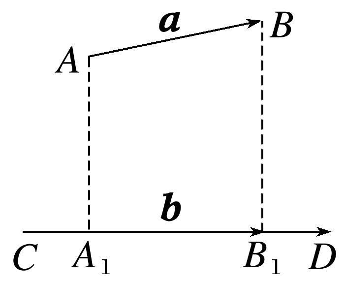

**知识点二．数量积的运算律**

已知向量、、和实数，则：

①；

②；

③．

**知识点三．数量积的性质**

设、都是非零向量，是与方向相同的单位向量，是与的夹角，则

①．②．

③当与同向时，；当与反向时，．

特别地，或．

④．⑤．

**知识点四．数量积的坐标运算**

已知非零向量，，为向量、的夹角．

<table><tr><td>
结论
</td><td>
几何表示
</td><td>
坐标表示
</td></tr><tr><td>
模
</td><td>

</td><td>

</td></tr><tr><td>
数量积
</td><td>

</td><td>

</td></tr><tr><td>
夹角
</td><td>

</td><td>

</td></tr><tr><td>
的充要

条件
</td><td>

</td><td>

</td></tr><tr><td>
的充要

条件
</td><td>

</td><td>

</td></tr><tr><td>
与

的关系
</td><td>
（当且仅当时等号成立）
</td><td>

</td></tr></table>

**知识点五、向量中的易错点**

（1）平面向量的数量积是一个实数，可正、可负、可为零，且．

（2）当时，由不能推出一定是零向量，这是因为任一与垂直的非零向量都有．

当时，且时，也不能推出一定有，当是与垂直的非零向量，是另一与垂直的非零向量时，有，但．

（3）数量积不满足结合律，即，这是因为是一个与共线的向量，而是一个与共线的向量，而与不一定共线，所以不一定等于，即凡有数量积的结合律形式的选项，一般都是错误选项．

（4）非零向量夹角为锐角（或钝角）．当且仅当且（或，且

**【解题方法总结】**

（1）在上的投影是一个数量，它可以为正，可以为负，也可以等于0．

（2）数量积的运算要注意时，，但时不能得到或，因为时，也有．

（3）根据平面向量数量积的性质：，，等，所以平面向量数量积可以用来解决有关长度、角度、垂直的问题．

（4）若、、是实数，则（）；但对于向量，就没有这样的性质，即若向量、、满足（），则不一定有，即等式两边不能同时约去一个向量，但可以同时乘以一个向量．

（5）数量积运算不适合结合律，即，这是由于表示一个与共线的向量，表示一个与共线的向量，而与不一定共线，因此与不一定相等．

**必考题型全归纳**

**题型一：平面向量的数量积运算**

**例1．**（2024·吉林四平·高三四平市第一高级中学校考期末）已知向量，满足，且与的夹角为，则（    ）

A．6	B．8	C．10	D．14

【答案】B

【解析】\`

由，且与的夹角为，

所以

.

故选：B.

**例2．**（2024·全国·高三专题练习）已知，，向量在方向上投影向量是，则为（    ）

A．12	B．8	C．-8	D．2

【答案】A

【解析】在方向上投影向量为，

，.

故选：A

<strong>例3．</strong>（2024·湖南长沙·周南中学校考二模）已知菱形<em>ABCD</em>的边长为1，，<em>G</em>是菱形<em>ABCD</em>内一点，若，则（　  ）

A．	B．1	C．	D．2

【答案】A

【解析】在菱形*ABCD*，菱形*ABCD*的边长为1，，

所以，

所以，则为等边三角形，因为，

所以，设点*M*为*BC*的中点，则，所以，

所以*G*，*A*，*M*三点共线，所以*AM*为*BC*的中线，

所以，

同理可得点*AB*，*AC*的中线过点*G*，

所以点*G*为的重心，故，

在等边中，*M*为*BC*的中点，则，

所以.

故选：A

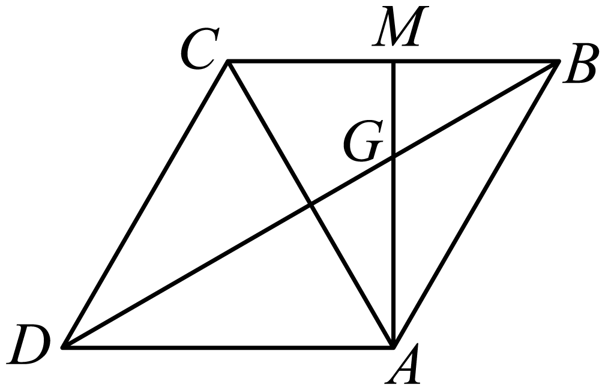

**变式1．**（2024·云南昆明·高三昆明一中校考阶段练习）已知单位向量，且，若，，则（    ）

A．1	B．12	C．或2	D．或1

【答案】D

【解析】由题意单位向量，且，可知与的夹角为，

因为，所以或，

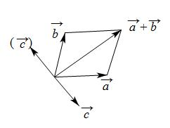

故当时，；

当时，，

故选：D.

**变式2．**（2024·广东·校联考模拟预测）将向量绕坐标原点顺时针旋转得到，则（    ）

A．	B．

C．	D．

【答案】B

【解析】因为，所以，

因为向量绕坐标原点顺时针旋转得到，

所以向量与向量的夹角为，且，

所以

.

故选：B

**变式3．**（2024·全国·高三专题练习）正方形的边长是2，是的中点，则（    ）

A．	B．3	C．	D．5

【答案】B

【解析】方法一：以为基底向量，可知，

则，

所以；

方法二：如图，以为坐标原点建立平面直角坐标系，

则，可得，

所以；

方法三：由题意可得：，

在中，由余弦定理可得，

所以.

故选：B.

**变式4．**（2024·天津和平·高三耀华中学校考阶段练习）如图，在中，，，为上一点，且满足，若，，则的值为（    ）.

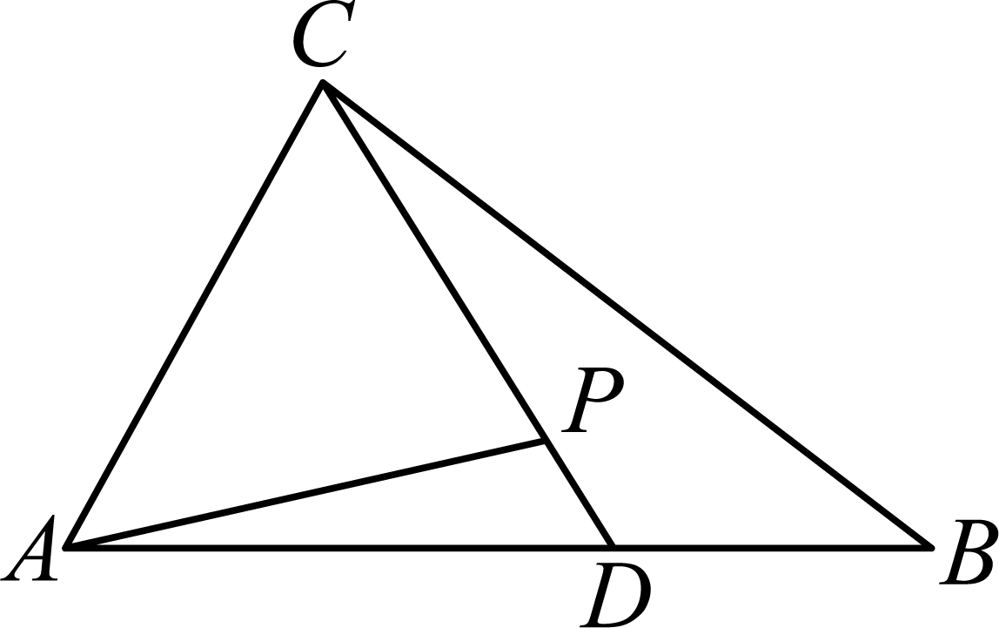

A．	B．	C．	D．

【答案】C

【解析】∵，，

即且，

∴，

又*C*、*P*、*D*共线，有，即，

即，而，

∴

∴=.

故选：C

**变式5．**（2024·陕西西安·西北工业大学附属中学校考模拟预测）已知向量，满足同向共线，且，，则（    ）

A．3	B．15	C．或15	D．3或15

【答案】D

【解析】因为向量，满足同向共线，所以设，

又因为，，所以，

所以或，即或.

①当时，；

②当时，；

所以的值为3或15.

故选：D.

**变式6．**（2024·吉林长春·东北师大附中校考模拟预测）在矩形中，与相交于点，过点作于，则（    ）

A．	B．	C．	D．

【答案】D

【解析】建立如图所示直角坐标系：

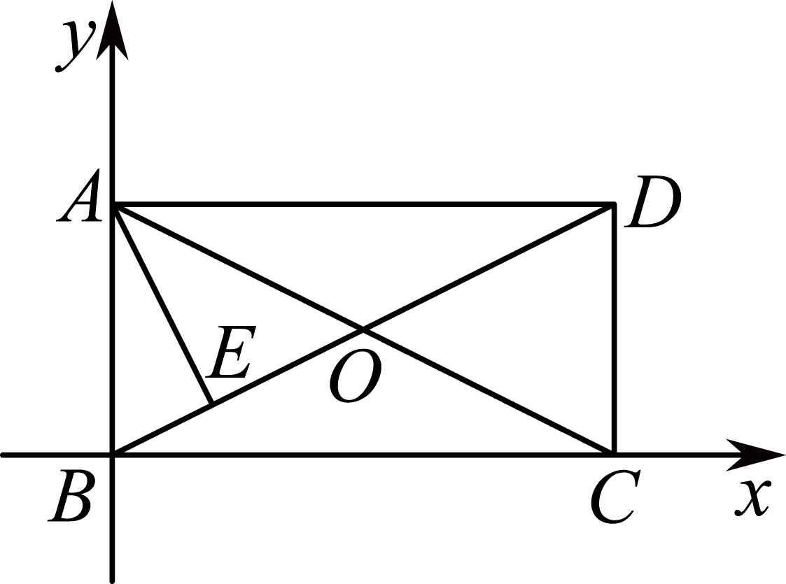

则，

设，则

且，

，解得，

，

在矩形中，为的中点，

所以，由，

所以，

，

故选：D.

**【解题方法总结】**

（1）求平面向量的数量积是较为常规的题型，最重要的方法是紧扣数量积的定义找到解题思路．

（2）平面向量数量积的几何意义及坐标表示，分别突出了它的几何特征和代数特征，因而平面向量数量积是中学数学较多知识的交汇处，因此它的应用也就十分广泛．

（3）平面向量的投影问题，是近几年的高考热点问题，应熟练掌握其公式：向量在向量方向上的投影为．

（4）向量运算与整式运算的同与异（无坐标的向量运算）

同：；；公式都可通用

异：整式：，仅仅表示数；向量：（为与的夹角）

，使用范围广泛，通常是求模或者夹角．

，通常是求最值的时候用．

**题型二：平面向量的夹角**

**例4．**（2024·河南驻马店·统考二模）若单位向量，满足，则向量，夹角的余弦值为\_\_\_\_\_\_\_\_\_\_\_\_．

【答案】/

【解析】设向量，的夹角为，因为，所以．

又，所以，所以．

故答案为：

**例5．**（2024·四川·校联考模拟预测）若是夹角为的两个单位向量，则与的夹角大小为\_\_\_\_\_\_\_\_.

【答案】/

【解析】是夹角为的两个单位向量，则，

，

，

，，

，.

故答案为：

**例6．**（2024·重庆·高三重庆一中校考阶段练习）已知向量和满足：，，，则与的夹角为\_\_\_\_\_\_\_\_\_\_．

【答案】/

【解析】记向量和的夹角为，将平方得到：

或，

又因为，即．

故答案为：.

<strong>变式7．</strong>（2024·上海杨浦·复旦附中校考模拟预测）若向量与不共线也不垂直<em>，</em> 且<em>，</em> 则向量夹角\_\_\_\_\_\_\_\_.

【答案】

【解析】由题意可得： ，

故： ，即向量 与的夹角为 .

故答案为：

**变式8．**（2024·上海长宁·上海市延安中学校考三模）已知是同一个平面上的向量，若，且，则\_\_\_\_\_\_\_\_\_\_.

【答案】

【解析】设，则，，

故，

，

则，，，故，

设，，则，

又，解得，故.

故答案为：.

**变式9．**（2024·重庆渝中·高三重庆巴蜀中学校考阶段练习）已知向量，满足，，，则向量与的夹角大小为\_\_\_\_\_\_\_\_\_\_\_.

【答案】

【解析】由于，所以，

所以，

所以为锐角，所以.

故答案为：

**变式10．**（2024·四川·校联考模拟预测）已知向量，，，则向量与的夹角为\_\_\_\_\_\_．

【答案】

【解析】，则，则，又，则

故答案为：.

**变式11．**（2024·湖南长沙·雅礼中学校考模拟预测）已知向量，，若非零向量与，的夹角均相等，则的坐标为\_\_\_（写出一个符合要求的答案即可）

【答案】（1，1），答案不唯一，只需满足横纵坐标相等即可.

【解析】设，因为，，

所以，

，

因为与，的夹角均相等，所以，

所以，

化简得，所以，

因为为非零向量，可取，此时.

故答案为：（1，1），答案不唯一，只需满足横纵坐标相等即可.

**【解题方法总结】**

求夹角，用数量积，由得，进而求得向量的夹角．

**题型三：平面向量的模长**

**例7．**（2024·湖北·荆门市龙泉中学校联考模拟预测）已知平面向量，，满足，，且.若，则（    ）

A．	B．	C．	D．

【答案】A

【解析】令，则，可得，

所以.

故选：A

**例8．**（2024·陕西咸阳·武功县普集高级中学校考模拟预测）已知，是非零向量，，，向量在向量方向上的投影为，则\_\_\_\_\_\_\_\_.

【答案】2

【解析】∵，∴，∴，

∵向量在向量方向上的投影为，∴，

∴，

∴，

∴.

故答案为：2

**例9．**（2024·海南·高三校联考期末）已知向量，满足，，，则\_\_\_\_\_\_\_\_\_\_．

【答案】

【解析】因为，，，则，

所以，所以，解得：，

.

故答案为：.

**变式12．**（2024·四川南充·阆中中学校考二模）已知为单位向量，且满足，则\_\_\_\_\_\_.

【答案】

【解析】为单位向量，且满足，所以，

即，解得，

所以.

故答案为：.

**变式13．**（2024·河南驻马店·统考三模）已知平面向量满足,且，则=\_\_\_\_\_\_\_\_\_\_\_\_\_\_\_\_\_ ．

【答案】

【解析】由,得,

所以.

故答案为：

**变式14．**（2024·全国·高三专题练习）已知向量满足，，则\_\_\_\_\_\_．

【答案】

【解析】由，得，即 ①．

又由，得，

即，代入①，得，

整理，得，所以．

故答案为：

<strong>变式15．</strong>（2024·河南郑州·模拟预测）已知点<em>O</em>为坐标原点，，，点<em>P</em>在线段<em>AB</em>上，且，则点<em>P</em>的坐标为\_\_\_\_\_\_．

【答案】

【解析】由题知，，设，

，，，，

，，

，，则直线方程为，

设点坐标为，，

，，

求解可得，，，即点坐标为.

故答案为：

**变式16．**（2024·广西·高三校联考阶段练习）已知，，若，则\_\_\_\_\_\_．

【答案】

【解析】因为，且，

所以，解得，所以，

所以，

所以.

故答案为：

**【解题方法总结】**

求模长，用平方，．

**题型四：平面向量的投影、投影向量**

**例10．**（2024·上海宝山·高三上海交大附中校考期中）已知向量，，则在方向上的数量投影为\_\_\_\_\_\_.

【答案】

【解析】因为向量，，

所以在方向上的数量投影为.

故答案为：.

**例11．**（2024·上海虹口·华东师范大学第一附属中学校考三模）已知若向量在向量方向上的数量投影为，则实数\_\_\_\_\_\_\_．

【答案】3

【解析】由条件可知，向量在向量方向上的数量投影为，

解得：.

故答案为：3

**例12．**（2024·全国·高三专题练习）已知向量，为单位向量，当向量、的夹角等于时，则向量在向量上的投影向量是\_\_\_\_\_\_\_\_．

【答案】

【解析】因为向量、的夹角等于，

所以向量在向量上的投影向量是，

故答案为：.

**变式17．**（2024·云南昆明·高三昆明一中校考阶段练习）已知向量，向量，则向量在向量方向上的投影为\_\_\_\_\_\_\_\_\_.

【答案】

【解析】.

故答案为：

**变式18．**（2024·新疆喀什·统考模拟预测）已知向量，满足，，，则向量在向量方向上的投影为\_\_\_\_\_\_.

【答案】2

【解析】因为，所以，又，，

所以，所以，

所以向量在向量方向上的投影为.

故答案为：

**变式19．**（2024·全国·高三专题练习）已知非零向量 满足，且向量在向量方向的投影向量是，则向量与的夹角是\_\_\_\_\_\_\_\_.

【答案】

【解析】因为，所以，即①.

因为向量在向量方向的投影向量是，

所以.所以②，

将①代入②得，，又，所以.

故答案为：

**变式20．**（2024·全国·模拟预测）已知向量，则向量在向量上的投影向量为\_\_\_\_\_\_\_\_\_\_.

【答案】

【解析】设，因为

所以

所以

则向量在向量上的投影向量为：.

故答案为：.

**【解题方法总结】**

设，是两个非零向量，它们的夹角是与是方向相同的单位向量，，过的起点和终点，分别作所在直线的垂线，垂足分别为，得到，我们称上述变换为向量向向量投影，叫做向量在向量上的投影向量．记为．

**题型五：平面向量的垂直问题**

**例13．**（2024·四川巴中·南江中学校考模拟预测）已知向量，若，则\_\_\_\_\_\_\_\_\_\_\_.

【答案】/

【解析】由题意可得，

因为，

则，解得.

故答案为：

**例14．**（2024·全国·高三专题练习）已知向量，，，其中，为单位向量，且，若\_\_\_\_\_\_，则.

注：填上你认为正确的一种条件即可，不必考虑所有可能的情形.

【答案】1（答案不唯一）

【解析】因为是相互垂直的单位向量，不妨设

，即 ，

，即 ，即向量的端点在圆心为，半径为 的圆周上，

故可以取 ，即；

故答案为：1.

**例15．**（2024·江西宜春·高三校联考期末）设非零向量，的夹角为．若，且，则\_\_\_\_\_\_\_\_\_\_\_\_．

【答案】60°/

【解析】由题设，

所以，又，

所以.

故答案为：

**变式21．**（2024·江西南昌·高三统考开学考试）已知两单位向量的夹角为，若，且，则实数\_\_\_\_\_\_\_\_\_．

【答案】/-0.8

【解析】因为单位向量的夹角为，所以；

因为，所以

，所以．

故答案为：.

**变式22．**（2024·海南·校考模拟预测）已知为单位向量，向量在向量上的投影向量是，且，则实数的值为\_\_\_\_\_\_．

【答案】/

【解析】因为向量在上的投影向量为，所以，

又为单位向量，所以，

因为，所以，

所以，所以，

故，

故答案为：.

**变式23．**（2024·全国·模拟预测）向量，且，则实数\_\_\_\_\_\_\_\_\_．

【答案】

【解析】因为向量，所以，

又，

所以，得，

解得．

故答案为：.

**变式24．**（2024·全国·高三专题练习）非零向量，，若，则\_\_\_\_\_\_.

【答案】/-0.5

【解析】因为，所以，

由题易知，，

所以.

故答案为：

**变式25．**（2024·河南开封·校考模拟预测）已知向量，若，则\_\_\_\_\_\_\_\_．

【答案】

【解析】因为，，所以，

又，所以，解得.

故答案为：

**变式26．**（2024·海南海口·海南华侨中学校考模拟预测）已知向量，不共线，，，写出一个符合条件的向量的坐标：\_\_\_\_\_\_.

【答案】（答案不唯一）

【解析】由题意得，，则，设，

得，且，满足条件的向量的坐标可以为（答案不唯一或者）.

故答案为：（答案不唯一）

**变式27．**（2024·河南开封·统考三模）已知向量，，若，则\_\_\_\_\_\_.

【答案】13

【解析】∵，，，

又∵，

∴，解得.

故答案为：13

**【解题方法总结】**

**题型六：建立坐标系解决向量问题**

**例16．**（2024·全国·高三专题练习）已知，，则的最小值为（    ）

A．	B．	C．	D．

【答案】B

【解析】设的夹角为，，，

，，，又，

不妨设，，

，所以，即，

，

由，

当时，即时，有最小值．

故选：B

<strong>例17．</strong>（2024·安徽合肥·合肥市第七中学校考三模）以边长为2的等边三角形<em>ABC</em>每个顶点为圆心，以边长为半径，在另两个顶点间作一段圆弧，三段圆弧围成曲边三角形，已知<em>P</em>为弧<em>AC</em>上的一点，且，则的值为（    ）

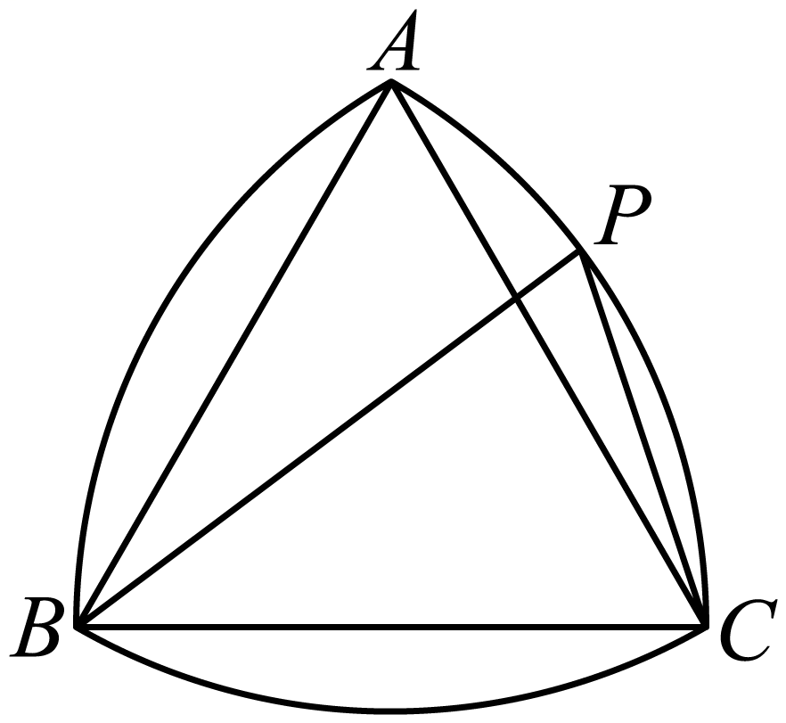

A．	B．

C．	D．

【答案】C

【解析】如图所示，以*B*为坐标原点，直线*BC*为*x*轴，过点*B*且垂直于*BC*的直线为*y*轴，

建立平面直角坐标系，则，，

由，得，

所以，，

所以．

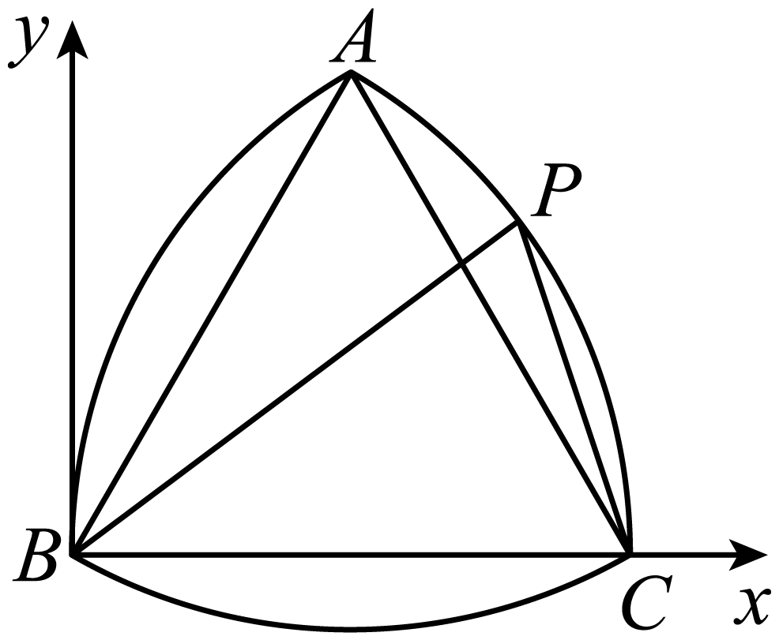

故选：C.

**例18．**（2024·黑龙江哈尔滨·哈师大附中校考模拟预测）下图是北京2022年冬奥会会徽的图案，奥运五环的大小和间距如图所示．若圆半径均为12，相邻圆圆心水平路离为26，两排圆圆心垂直距离为11．设五个圆的圆心分别为、、、、，则的值为（    ）

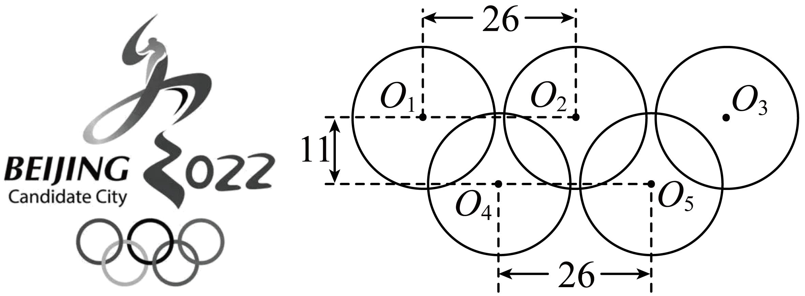

A．	B．	C．	D．

【答案】B

【解析】建立如图所示的平面直角坐标系，做轴于点，所以，

由已知可得，，，

所以，，，

所以.

故选：B.

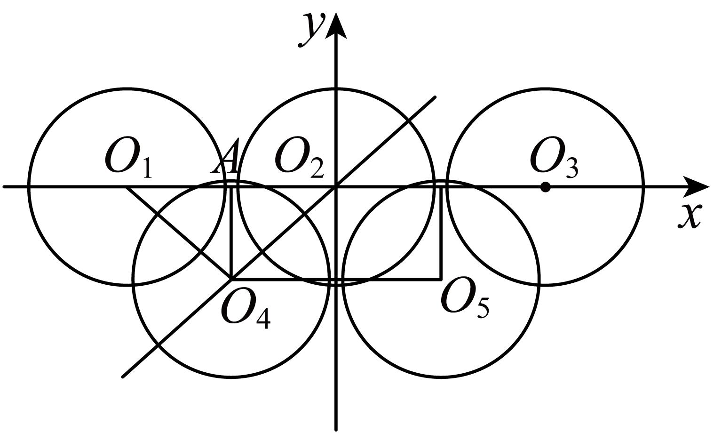

**变式28．**（2024·陕西安康·陕西省安康中学校考模拟预测）如图，在圆内接四边形中，.若为的中点，则的值为（    ）

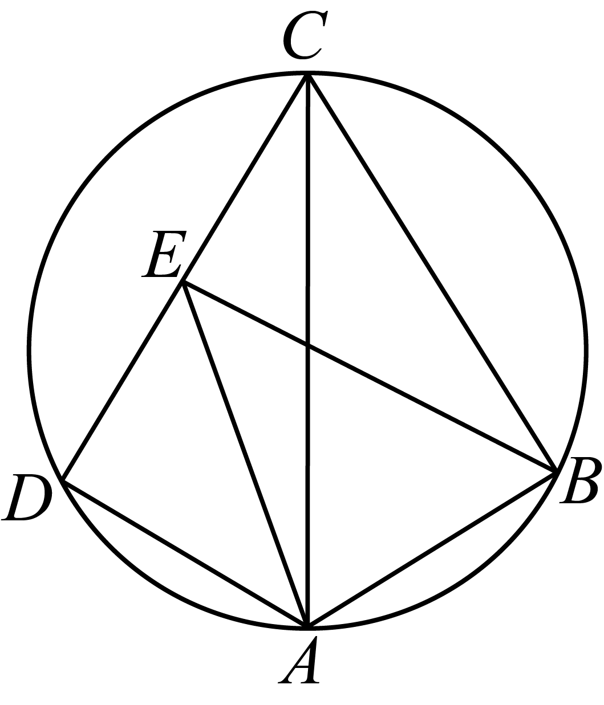

A．-3	B．	C．	D．3

【答案】C

【解析】连接，由余弦定理知，所以.

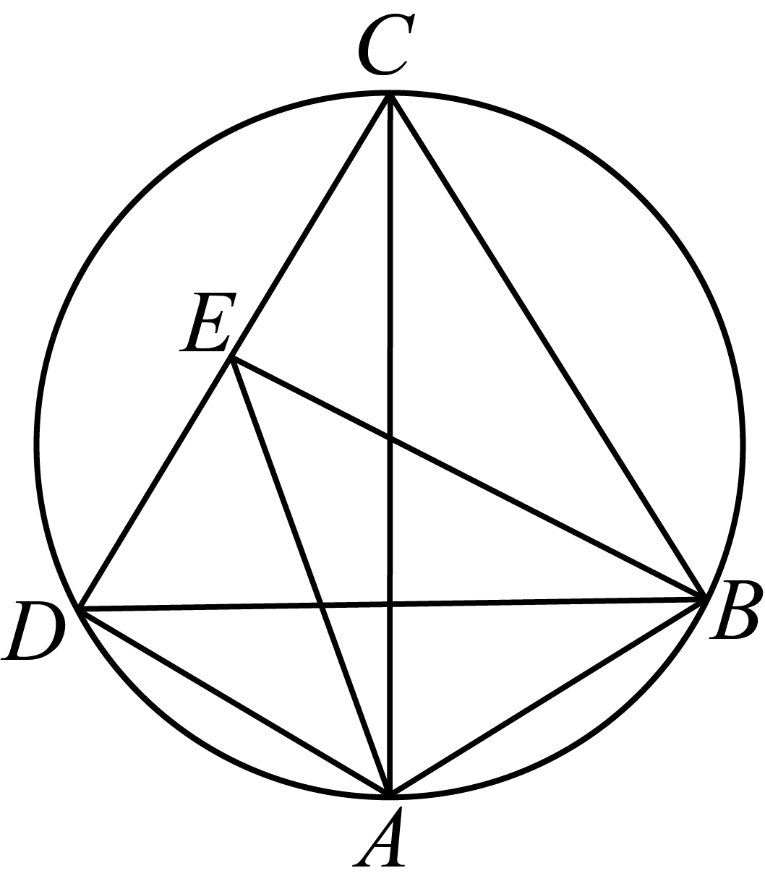

由正弦定理得，所以为圆的直径，

所以，所以，从而，

又，所以为等边三角形，

以为原点，以所在直线为轴，所在直线为轴建立如图所示的平面直角坐标系.

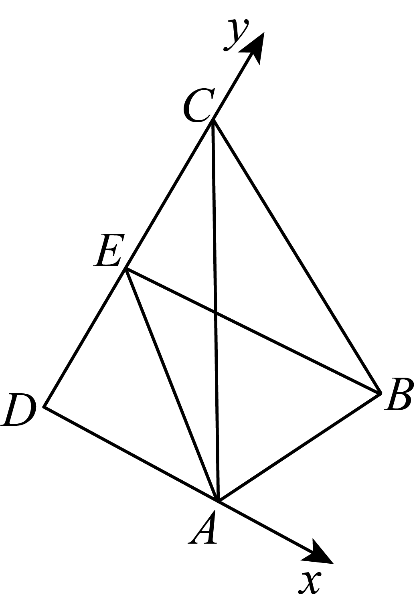

则，

所以.

故选：C.

**变式29．**（2024·安徽合肥·合肥市第八中学校考模拟预测）如图，已知是面积为的等边三角形，四边形是面积为2的正方形，其各顶点均位于的内部及三边上，且恰好可在内任意旋转，则当时，（    ）

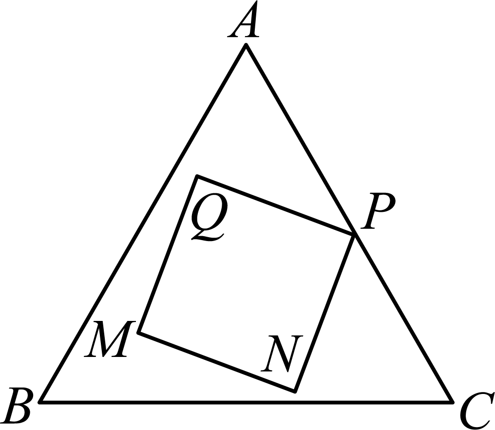

A．	B．	C．	D．

【答案】A

【解析】因为是面积为的等边三角形，记边长为，所以，解得，记内切圆的半径为，根据，

可得：，解得，因为正方形的面积为2，所以正方形边长为，

记正方形外接圆半径为，所以其外接圆直径等于正方形的对角线2，即，

根据正方形的对称性和等边三角形的对称性可知.正方形外接圆即为等边三角形的内切圆，

因为正方形可在内任意旋转，

可知正方形各个顶点均在该的内切圆上，

以的底边为轴，以的垂直平分线为轴建立平面直角坐标系如图所示：

故可知，

圆的方程为，

故设，

即，，，

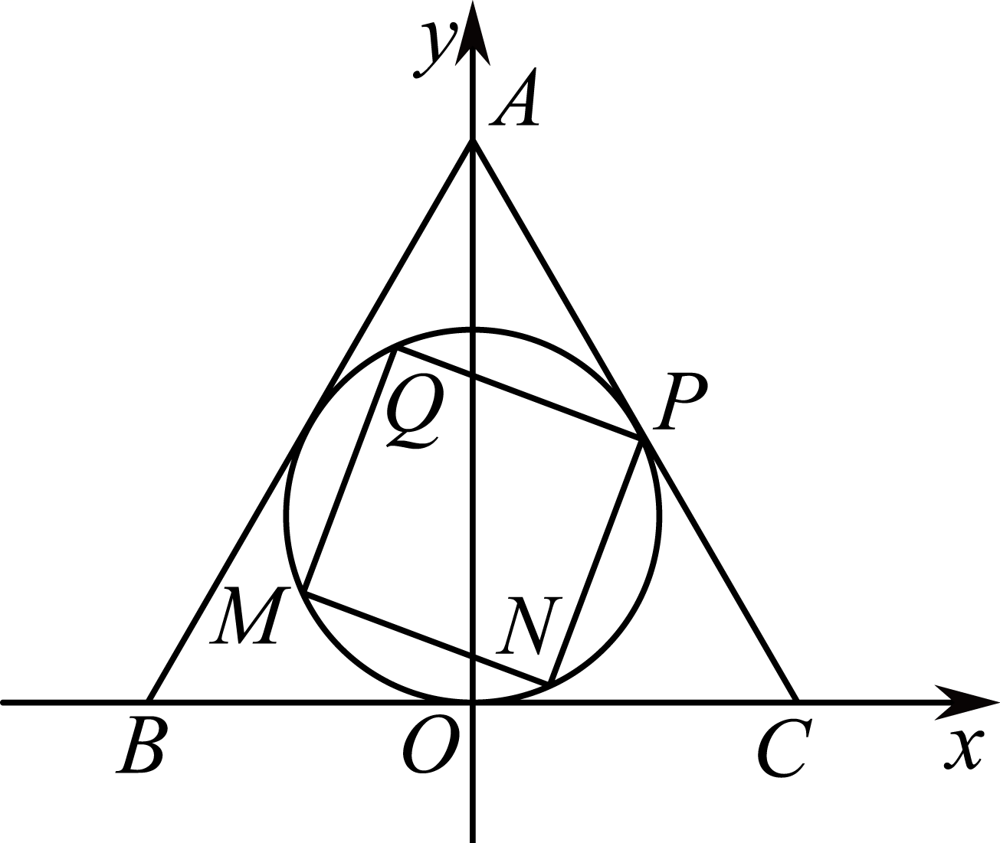

故选:A.

**变式30．**（2024·河南安阳·统考三模）已知正方形的边长为为正方形的中心，是的中点，则（    ）

A．	B．	C．	D．1

【答案】C

【解析】如图，以为坐标原点，所在直线为轴，轴，建立平面直角坐标系，则，，，所以，，所以

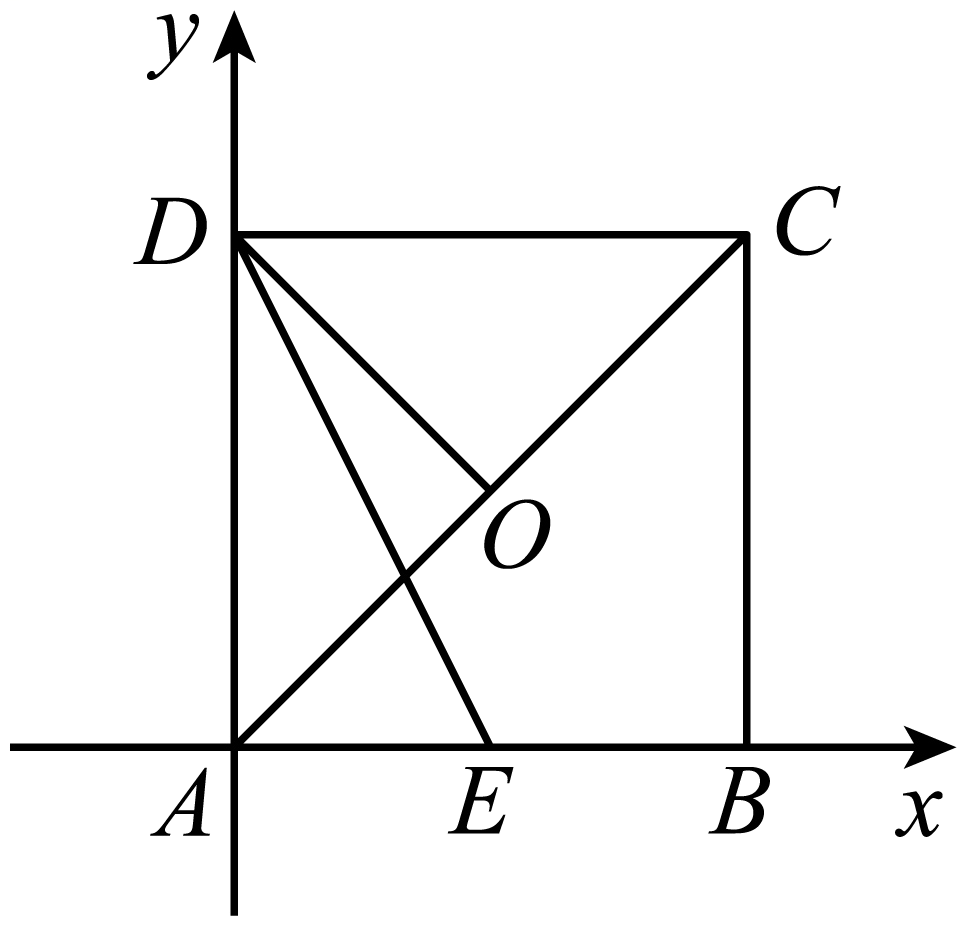

故选：C.

**【解题方法总结】**

**边长为的等边三角形  已知夹角的任意三角形    正方形                矩形**

**平行四边形            直角梯形            等腰梯形             圆**

**建系必备**（1）三角函数知识；（2）向量三点共线知识．

设，是两个非零向量，它们的夹角是与是方向相同的单位向量，，过的起点和终点，分别作所在直线的垂线，垂足分别为，得到，我们称上述变换为向量向向量投影，叫做向量在向量上的投影向量．记为．

**题型七：平面向量的实际应用**

**例19．**（2024·江西宜春·高三校考阶段练习）一质点受到同一平面上的三个力，，（单位：牛顿）的作用而处于平衡状态，已知，成120°角，且，的大小都为6牛顿，则的大小为\_\_\_\_\_\_牛顿.

【答案】6

【解析】设三个力，，分别对于的向量为：

则由题知

所以

所以

又

所以

所以的大小为：6

故答案为：6

**例20．**（2024·内蒙古赤峰·统考三模）如图所示，把一个物体放在倾斜角为的斜面上，物体处于平衡状态，且受到三个力的作用，即重力，垂直斜面向上的弹力，沿着斜面向上的摩擦力.已知：，则的大小为\_\_\_\_\_\_\_\_\_\_\_.

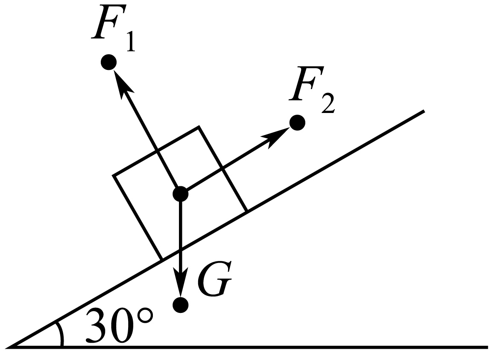

【答案】N

【解析】由题设，N，

故答案为：N.

**例21．**（2024·全国·高三专题练习）如图所示，一个物体被两根轻质细绳拉住，且处于平衡状态.已知两条绳上的拉力分别是，，且，与水平夹角均为，，则物体的重力大小为\_\_\_\_\_\_\_\_\_\_\_.

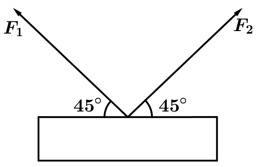

【答案】8

【解析】设，的合力为，则，

∵，的夹角为，

∴，

∴，

∵物体平衡状态.∴物体的重力大小为=8.

故答案为：8.

**变式31．**（2024·全国·高三专题练习）两同学合提一捆书，提起后书保持静止，如图所示，则与大小之比为\_\_\_\_\_\_\_\_\_\_\_．

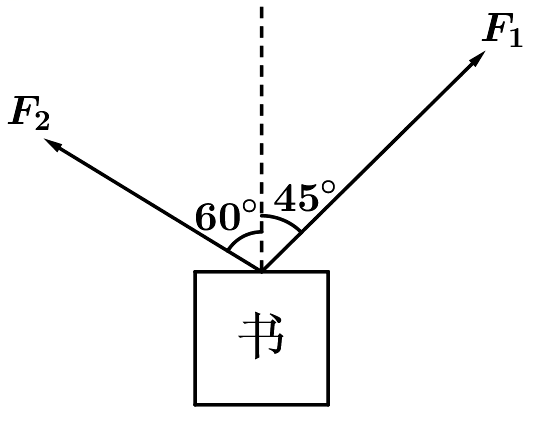

【答案】

【解析】物体处于平衡状态，所以水平方向的合力为0

所以，所以

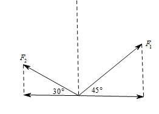

故答案为：

**变式32．**（2024·浙江·高三专题练习）一条渔船距对岸，以的速度向垂直于对岸的方向划去，到达对岸时，船的实际行程为，则河水的流速是\_\_\_\_\_\_\_\_．

【答案】

【解析】如图，用表示河水的流速，表示船的速度，

则为船的实际航行速度．

由图知，，，则．

又，

所以．

即河水的流速是．

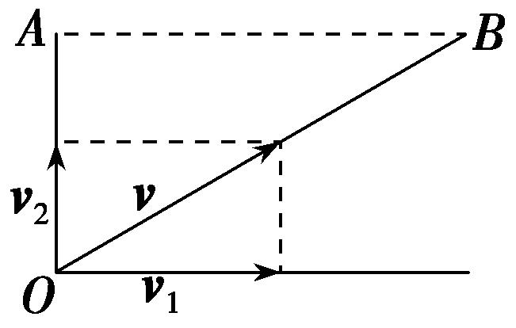

故答案为：.

**【解题方法总结】**

用向量方法解决实际问题的步骤

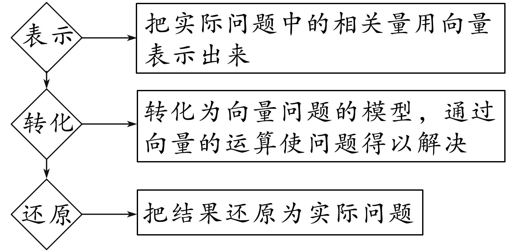

