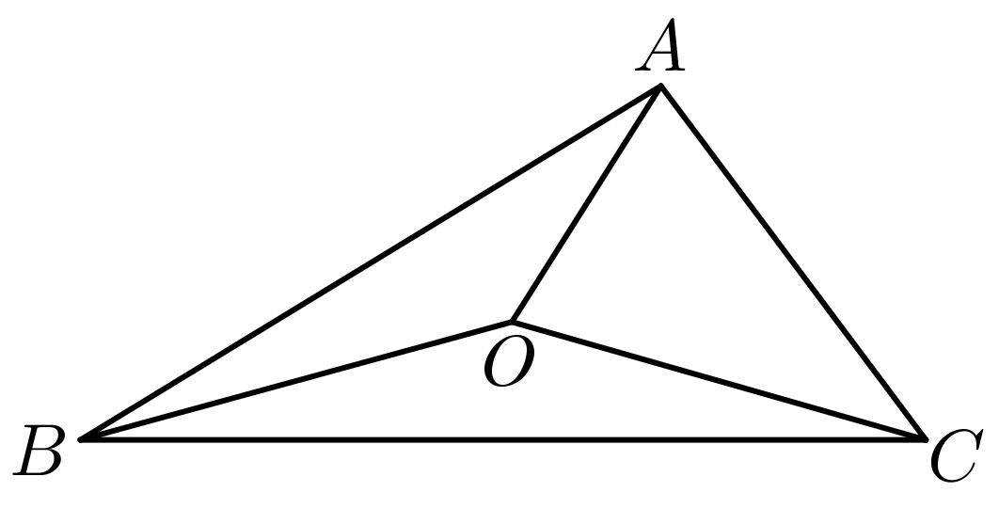
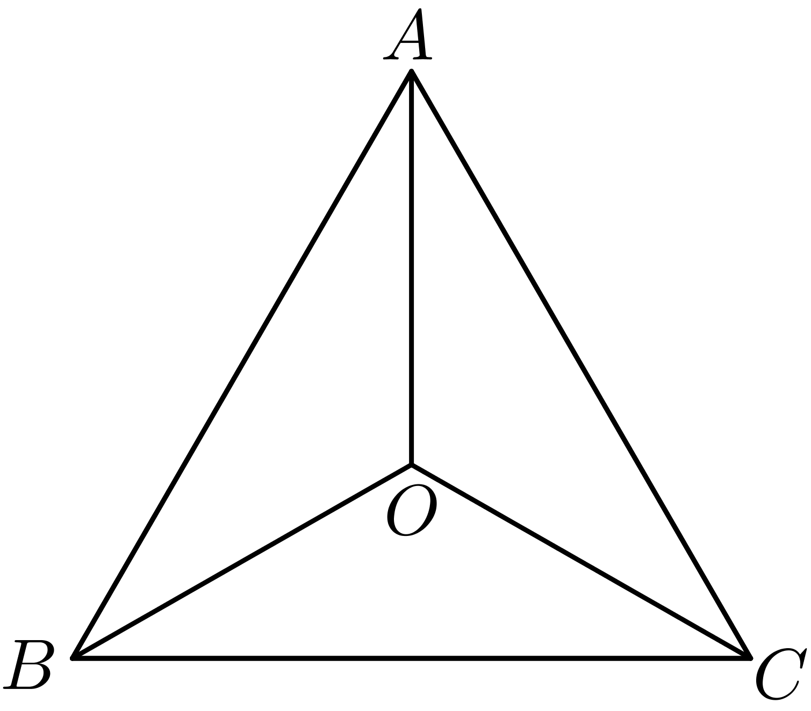

**第37讲  三角形四心及奔驰定理**

**知识梳理**

**技巧一．四心的概念介绍：**

（1）重心：中线的交点，重心将中线长度分成2：1．

（2）内心：角平分线的交点（内切圆的圆心），角平分线上的任意点到角两边的距离相等．

（3）外心：中垂线的交点（外接圆的圆心），外心到三角形各顶点的距离相等．

（4）垂心：高线的交点，高线与对应边垂直．

**技巧二．奔驰定理---解决面积比例问题**

重心定理：三角形三条中线的交点．

已知的顶点，，，则△*ABC*的重心坐标为．

注意：（1）在中，若为重心，则．

（2）三角形的重心分中线两段线段长度比为2：1，且分的三个三角形面积相等．

重心的向量表示：．

奔驰定理：，则、、的面积之比等于

奔驰定理证明：如图，令，即满足

，，，故．

**技巧三．三角形四心与推论：**

（1）是的重心：．

（2）是的内心：．

（3）是的外心：

．

（4）是的垂心：

．

**技巧四．常见结论**

（1）内心：三角形的内心在向量所在的直线上．

为的内心．

（2）外心：为的外心．

（3）垂心：为的垂心．

（4）重心：为的重心．

**必考题型全归纳**

**题型一：奔驰定理**

**例1．**（2024·全国·高一专题练习）已知是内部的一点，，，所对的边分别为，，，若，则与的面积之比为（    ）

A．	B．	C．	D．

**例2．**（2024·安徽六安·高一六安一中校考期末）已知是三角形内部一点，且，则的面积与的面积之比为（    ）

A．	B．	C．	D．

**例3．**（2024·全国·高一专题练习）若点是所在平面内的一点，点是边靠近的三等分点，且满足，则与的面积比为（    ）

A．	B．	C．	D．

<strong>变式1．</strong>（2024·全国·高三专题练习）平面上有及其内一点<em>O</em>，构成如图所示图形，若将，， 的面积分别记作，，，则有关系式．因图形和奔驰车的很相似，常把上述结论称为“奔驰定理”．已知的内角<em>A</em>，<em>B</em>，<em>C</em>的对边分别为<em>a</em>，<em>b</em>，<em>c</em>，若满足，则<em>O</em>为的（    ）

A．外心	B．内心	C．重心	D．垂心

<strong>变式2．</strong>（2024·上海奉贤·高一上海市奉贤中学校考阶段练习）“奔驰定理”是平面向量中一个非常优美的结论，因为这个定理对应的图形与“奔驰”轿车的三叉车标很相似，故形象地称其为“奔驰定理”．奔驰定理：已知<em>O</em>是△<em>ABC</em>内的一点，△<em>BOC</em>，△<em>AOC</em>，△<em>AOB</em>的面积分别为、、，则有，设<em>O</em>是锐角△<em>ABC</em>内的一点，∠<em>BAC</em>，∠<em>ABC</em>，∠<em>ACB</em>分别是△<em>ABC</em>的三个内角，以下命题错误的是（     ）

A．若，则*O*为△*ABC*的重心

B．若，则

C．则*O*为△*ABC*（不为直角三角形）的垂心，则

D．若，，，则

<strong>变式3．（多选题）</strong>（2024·江苏盐城·高一江苏省射阳中学校考阶段练习）“奔驰定理”是平面向量中一个非常优美的结论，因为这个定理对应的图形与“奔驰”轿车(<em>Mercedesbenz</em>)的<em>logo</em>很相似，故形象地称其为“奔驰定理”.奔驰定理：已知是内一点，，，的面积分别为，则，是内的一点，∠，∠，∠分别是的三个内角，以下命题正确的有（    ）

A．若，则

B．若，，且，则

C．若，则为的垂心

D．若为的内心，且，则

**变式4．（多选题）**（2024·全国·高一专题练习）“奔驰定理”是平面向量中一个非常优美的结论，因为这个定理对应的图形与“奔驰”轿车(Mercedesbenz)的logo很相似，故形象地称其为“奔驰定理”.奔驰定理：已知是内一点，、、的面积分别为、、，则.设是锐角内的一点，、、分别是的三个内角，以下命题正确的有（    ）

A．若，则

B．，，，则

C．若为的内心，，则

D．若为的重心，则

**题型二：重心定理**

<strong>例4．</strong>（2024·福建泉州·高一校考期中）著名数学家欧拉提出了如下定理：三角形的外心、重心、垂心依次位于同一直线上，且重心到外心的距离是重心到垂心距离的一半，此直线被称为三角形的欧拉线，该定理被称为欧拉线定理．已知的外心为<em>O</em>，重心为<em>G</em>，垂心为<em>H</em>，<em>M</em>为<em>BC</em>中点，且，，则下列各式正确的有\_\_\_\_\_\_．

①   ②

③     ④

**例5．**（2024·全国·高一专题练习）点是平面上一定点，、、是平面上的三个顶点，、分别是边、的对角，以下命题正确的是\_\_\_\_\_\_\_（把你认为正确的序号全部写上）．

①动点满足，则的重心一定在满足条件的点集合中；

②动点满足，则的内心一定在满足条件的点集合中；

③动点满足，则的重心一定在满足条件的点集合中；

④动点满足，则的垂心一定在满足条件的点集合中；

⑤动点满足，则的外心一定在满足条件的点集合中．

**例6．**（2024·河南·高一河南省实验中学校考期中）若为的重心（重心为三条中线交点），且，则\_\_\_．

<strong>变式5．</strong>（2024·全国·高一专题练习）（1）已知△<em>ABC</em>的外心为<em>O</em>，且<em>AB</em>=5，，则\_\_\_\_\_\_．

（2）已知△*ABC*的重心为*O*，且*AB*=5，，则\_\_\_\_\_\_．

（3）已知△*ABC*的重心为*O*，且*AB*=5，，，*D*为*BC*中点，则\_\_\_\_．

**变式6．**（2024·江苏无锡·高一江苏省太湖高级中学校考阶段练习）在中，，，，若是的重心，则\_\_\_\_\_\_.

**变式7．**（2024·江西南昌·高三校联考期中）锐角中，，，为角，，所对的边，点为的重心，若，则的取值范围为\_\_\_\_\_\_．

<strong>变式8．</strong>（2024·全国·高三专题练习）过△<em>ABC</em>重心<em>O</em>的直线<em>PQ</em>交<em>AC</em>于点<em>P</em>，交<em>BC</em>于点<em>Q</em>，，，则<em>n</em>的值为\_\_\_\_\_\_\_\_.

<strong>变式9．</strong>（2024·上海虹口·高三上海市复兴高级中学校考期中）在中，过重心<em>G</em>的直线交边<em>AB</em>于点<em>P</em>，交边<em>AC</em>于点<em>Q</em>，设的面积为，的面积为，且，则的取值范围为\_\_\_\_\_\_\_\_\_．

**题型三：内心定理**

**例7．**（2024·湖北·模拟预测）在中，，，，且，若为的内心，则\_\_\_\_\_\_\_\_\_．

<strong>例8．</strong>（2024·全国·高三专题练习）已知中，，，，<em>I</em>是的内心，<em>P</em>是内部（不含边界）的动点.若（，），则的取值范围是\_\_\_\_\_\_.

**例9．**（2024·黑龙江黑河·高三嫩江市高级中学校考阶段练习）设为的内心，，，，则为\_\_\_\_\_\_\_\_．

**变式10．**（2024·福建福州·高三福建省福州第一中学校考阶段练习）已知点是的内心，若，则\_\_\_\_\_\_.

**变式11．**（2024·甘肃兰州·高一兰州市第二中学校考期末）在面上有及内一点满足关系式：即称为经典的“奔驰定理”，若的三边为，，，现有，则为的\_\_心.

<strong>变式12．</strong>（2024·贵州安顺·统考模拟预测）已知<em>O</em>是平面上的一个定点，<em>A</em>､<em>B</em>､<em>C</em>是平面上不共线的三点，动点<em>P</em>满足，则点<em>P</em>的轨迹一定经过的（    ）

A．重心	B．外心	C．内心	D．垂心

**变式13．**（2024·江西·校联考模拟预测）已知椭圆的左右焦点分别为，，为椭圆上异于长轴端点的动点，，分别为的重心和内心，则（    ）

A．	B．	C．2	D．

**变式14．**（2024·全国·高三专题练习）已知，是其内心，内角所对的边分别，则（    ）

A．	B．

C．	D．

<strong>变式15．</strong>（2024·全国·高三专题练习）在△<em>ABC</em>中，，<em>O</em>为△<em>ABC</em>的内心，若，则<em>x</em>＋<em>y</em>的最大值为（    ）

A．	B．	C．	D．

**变式16．**（2024·全国·高三专题练习）点在所在平面内，给出下列关系式：

（1）；

（2）；

（3）；

（4）．

则点依次为的（     ）

A．内心、外心、重心、垂心；	B．重心、外心、内心、垂心；

C．重心、垂心、内心、外心；	D．外心、内心、垂心、重心

**变式17．**（2024·全国·高三专题练习）已知的内角、、的对边分别为、、，为内一点，若分别满足下列四个条件：

①；

②；

③；

④；

则点分别为的（   ）

A．外心、内心、垂心、重心	B．内心、外心、垂心、重心

C．垂心、内心、重心、外心	D．内心、垂心、外心、重心

**题型四：外心定理**

<strong>例10．</strong>（2024·山西吕梁·高三统考阶段练习）设<em>O</em>为的外心，且满足，，下列结论中正确的序号为\_\_\_\_\_\_．

①；②；③．

**例11．**（2024·河北·模拟预测）已知为的外心，，，则\_\_\_\_\_\_\_\_\_\_\_．

**例12．**（2024·黑龙江哈尔滨·高三哈尔滨市第六中学校校考阶段练习）已知是的外心，若，且，则实数的最大值为\_\_\_\_\_\_．

<strong>变式18．</strong>（2024·全国·高三专题练习）设<em>O</em>为的外心，若，，则\_\_\_\_\_\_\_\_\_\_\_.

<strong>变式19．</strong>（2024·湖南长沙·高三湖南师大附中校考阶段练习）已知点<em>O</em>是△<em>ABC</em>的外心，<em>a</em>，<em>b</em>，c分别为内角<em>A</em>，<em>B</em>，<em>C</em>的对边，，且，则的值为\_\_\_\_\_\_\_\_．

**变式20．**（2024·全国·高三专题练习）在中，，．点满足．过点的直线分别与边交于点且，．已知点为的外心，，则为\_\_\_\_\_\_．

<strong>变式21．</strong>（2024·全国·高三专题练习）已知△<em>ABC</em>中，，点<em>O</em>是△<em>ABC</em>的外心，则\_\_\_\_\_\_\_\_.

**变式22．**（2024·重庆渝中·高三重庆巴蜀中学校考阶段练习）已知点是的内心、外心、重心、垂心之一，且满足，则点一定是的（    ）

A．内心	B．外心	C．重心	D．垂心

**题型五：垂心定理**

**例13．**（2024·全国·高三专题练习）设为的外心，若，则是的（    ）

A．重心（三条中线交点）	B．内心（三条角平分线交点）

C．垂心（三条高线交点）	D．外心（三边中垂线交点）

**例14．**（2024·全国·高三专题练习）已知为的垂心（三角形的三条高线的交点），若，则\_\_\_\_\_\_.

<strong>例15．</strong>（2024·北京·高三强基计划）已知<em>H</em>是的垂心，，则的最大内角的正弦值是\_\_\_\_\_\_\_\_\_．

<strong>变式23．</strong>（2024·全国·高三专题练习）设<em>H</em>是的垂心，且，则\_\_\_\_\_．

<strong>变式24．</strong>（2024·全国·高三专题练习）在中，点<em>O</em>、点<em>H</em>分别为的外心和垂心，，则\_\_\_\_\_\_\_\_.

**变式25．**（2024·全国·高三专题练习）在中，，，为的垂心，且满足，则\_\_\_\_\_\_\_\_\_\_\_

