**第37讲  三角形四心及奔驰定理**

**知识梳理**

**技巧一．四心的概念介绍：**

（1）重心：中线的交点，重心将中线长度分成2：1．

（2）内心：角平分线的交点（内切圆的圆心），角平分线上的任意点到角两边的距离相等．

（3）外心：中垂线的交点（外接圆的圆心），外心到三角形各顶点的距离相等．

（4）垂心：高线的交点，高线与对应边垂直．

**技巧二．奔驰定理---解决面积比例问题**

重心定理：三角形三条中线的交点．

已知的顶点，，，则△*ABC*的重心坐标为．

注意：（1）在中，若为重心，则．

（2）三角形的重心分中线两段线段长度比为2：1，且分的三个三角形面积相等．

重心的向量表示：．

奔驰定理：，则、、的面积之比等于

奔驰定理证明：如图，令，即满足

，，，故．

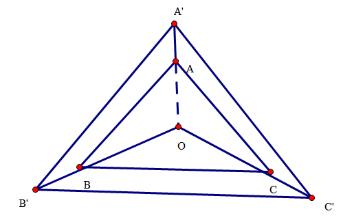

**技巧三．三角形四心与推论：**

（1）是的重心：．

（2）是的内心：．

（3）是的外心：

．

（4）是的垂心：

．

**技巧四．常见结论**

（1）内心：三角形的内心在向量所在的直线上．

为的内心．

（2）外心：为的外心．

（3）垂心：为的垂心．

（4）重心：为的重心．

**必考题型全归纳**

**题型一：奔驰定理**

**例1．**（2024·全国·高一专题练习）已知是内部的一点，，，所对的边分别为，，，若，则与的面积之比为（    ）

A．	B．	C．	D．

【答案】A

【解析】由正弦定理,又，，，所以得,因为,所以.

设可得则是的重心，，利用,,所以,所以,同理可得,.所以与的面积之比为即为.

故选：A.

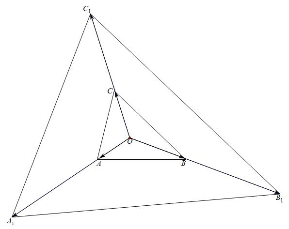

**例2．**（2024·安徽六安·高一六安一中校考期末）已知是三角形内部一点，且，则的面积与的面积之比为（    ）

A．	B．	C．	D．

【答案】C

【解析】如图，设，∵，∴，设与交于点，则平分，∴，是中点，

∴．比值为．

故选：C．

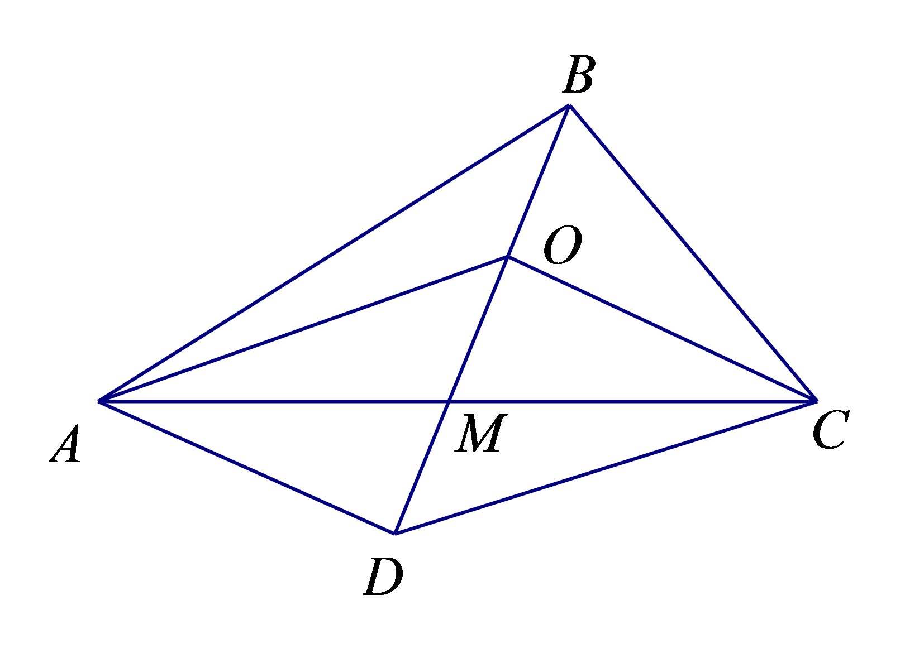

**例3．**（2024·全国·高一专题练习）若点是所在平面内的一点，点是边靠近的三等分点，且满足，则与的面积比为（    ）

A．	B．	C．	D．

【答案】C

【解析】是所在平面内一点，连接，，延长至使，

∵，∴，

连接，则四边形是平行四边形，向量和向量平行且模相等，

由于，所以，又，所以，

在平行四边形中，，则与的面积比为，

故选：C.

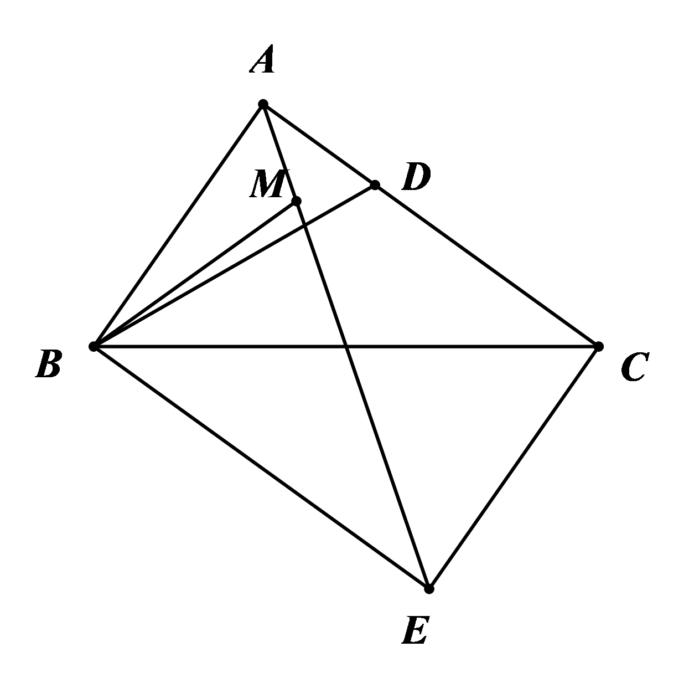

<strong>变式1．</strong>（2024·全国·高三专题练习）平面上有及其内一点<em>O</em>，构成如图所示图形，若将，， 的面积分别记作，，，则有关系式．因图形和奔驰车的很相似，常把上述结论称为“奔驰定理”．已知的内角<em>A</em>，<em>B</em>，<em>C</em>的对边分别为<em>a</em>，<em>b</em>，<em>c</em>，若满足，则<em>O</em>为的（    ）

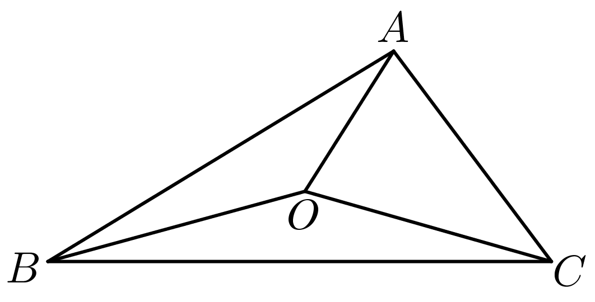

A．外心	B．内心	C．重心	D．垂心

【答案】B

【解析】由得，

由得，

根据平面向量基本定理可得，，

所以，，

延长交于，延长交于，

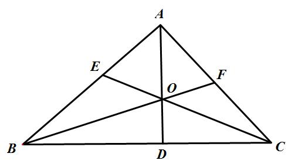

则，又，所以，

所以为的平分线，

同理可得是的平分线，

所以为的内心.

故选：B

<strong>变式2．</strong>（2024·上海奉贤·高一上海市奉贤中学校考阶段练习）“奔驰定理”是平面向量中一个非常优美的结论，因为这个定理对应的图形与“奔驰”轿车的三叉车标很相似，故形象地称其为“奔驰定理”．奔驰定理：已知<em>O</em>是△<em>ABC</em>内的一点，△<em>BOC</em>，△<em>AOC</em>，△<em>AOB</em>的面积分别为、、，则有，设<em>O</em>是锐角△<em>ABC</em>内的一点，∠<em>BAC</em>，∠<em>ABC</em>，∠<em>ACB</em>分别是△<em>ABC</em>的三个内角，以下命题错误的是（     ）

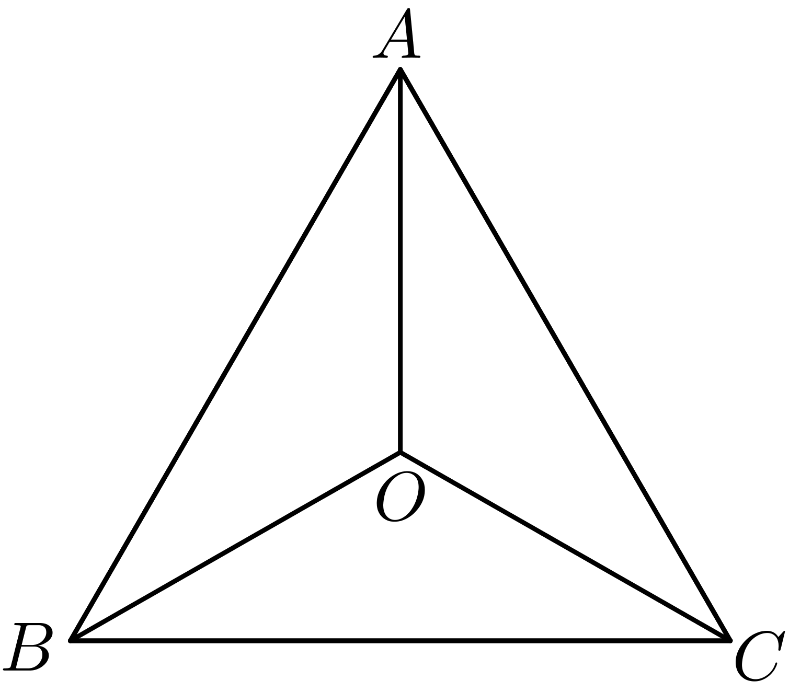

A．若，则*O*为△*ABC*的重心

B．若，则

C．则*O*为△*ABC*（不为直角三角形）的垂心，则

D．若，，，则

【答案】D

【解析】对于A：如下图所示，

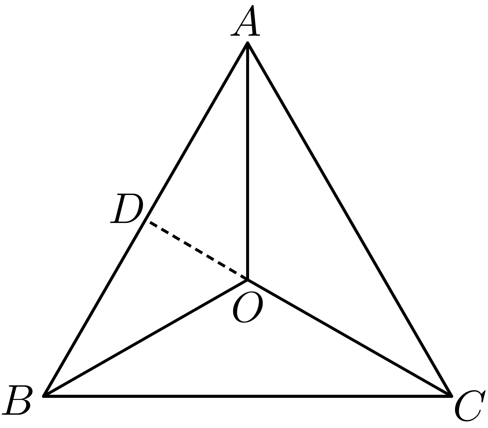

假设为的中点，连接，则，故共线，即在中线上，

同理可得在另外两边的中线上，故*O*为的重心，即A正确；

对于B：由奔驰定理*O*是内的一点，的面积分别为，

则有可知，

若，可得，即B正确；

对于C：由四边形内角和可知，，则，

同理，，

因为*O*为的垂心，则，

所以，同理得，，

则，

令，

由，则，

同理：，，

综上，，

根据奔驰定理得，即C正确.

对于D：由可知，，

又，所以

由可得，；

所以，即D错误；

故选：D.

<strong>变式3．（多选题）</strong>（2024·江苏盐城·高一江苏省射阳中学校考阶段练习）“奔驰定理”是平面向量中一个非常优美的结论，因为这个定理对应的图形与“奔驰”轿车(<em>Mercedesbenz</em>)的<em>logo</em>很相似，故形象地称其为“奔驰定理”.奔驰定理：已知是内一点，，，的面积分别为，则，是内的一点，∠，∠，∠分别是的三个内角，以下命题正确的有（    ）

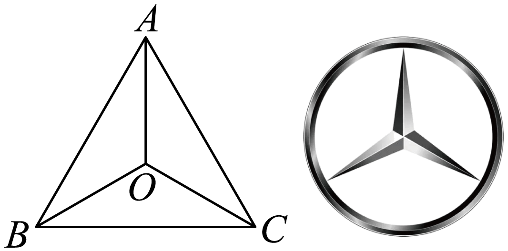

A．若，则

B．若，，且，则

C．若，则为的垂心

D．若为的内心，且，则

【答案】BCD

【解析】对选项A：，则，错误；

对选项B：，，

故，，正确；

对选项C：，即，故，

同理可得，，故为的垂心，正确；

对选项D：，故，设内接圆半径为，

，，，即，

即，，正确.

故选：BCD

**变式4．（多选题）**（2024·全国·高一专题练习）“奔驰定理”是平面向量中一个非常优美的结论，因为这个定理对应的图形与“奔驰”轿车(Mercedesbenz)的logo很相似，故形象地称其为“奔驰定理”.奔驰定理：已知是内一点，、、的面积分别为、、，则.设是锐角内的一点，、、分别是的三个内角，以下命题正确的有（    ）

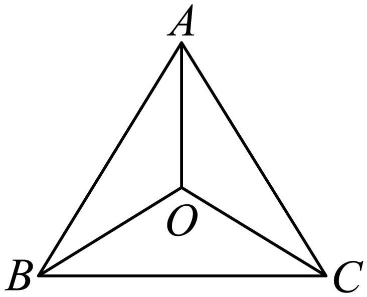

A．若，则

B．，，，则

C．若为的内心，，则

D．若为的重心，则

【答案】ACD

【解析】对于A选项，因为，由“奔驰定理”可知，A对；

对于B选项，由 ，，可知，

又，所以，

由可得，，，

所以，B错；

对于C选项，若为的内心，，则，

又（为内切圆半径），

所以，，故，C对；

对于D选项，如下图所示，

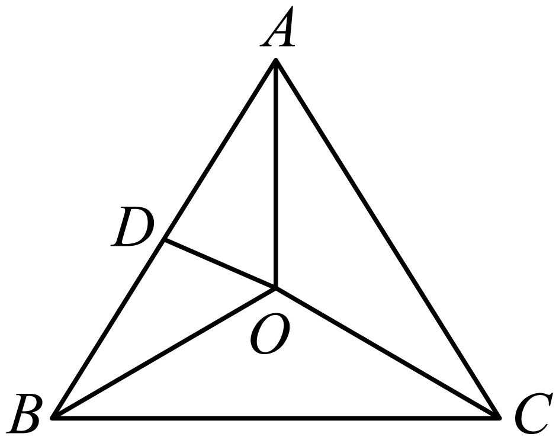

因为为的重心，延长交于点，则为的中点，

所以，，，且，，

所以，，由“奔驰定理”可得，D对.

故选：ACD.

**题型二：重心定理**

<strong>例4．</strong>（2024·福建泉州·高一校考期中）著名数学家欧拉提出了如下定理：三角形的外心、重心、垂心依次位于同一直线上，且重心到外心的距离是重心到垂心距离的一半，此直线被称为三角形的欧拉线，该定理被称为欧拉线定理．已知的外心为<em>O</em>，重心为<em>G</em>，垂心为<em>H</em>，<em>M</em>为<em>BC</em>中点，且，，则下列各式正确的有\_\_\_\_\_\_．

①   ②

③     ④

【答案】①③④

【解析】对于①，重心为*G*，有，

故，故①正确；

对于②，外心为*O*，过三角形*ABC*的外心*O*分别作*AB*、*AC*的垂线，垂足为*D*、*E*，易知*D*、*E*分别是*AB*、*AC*的中点，有，

∴，故②错误；

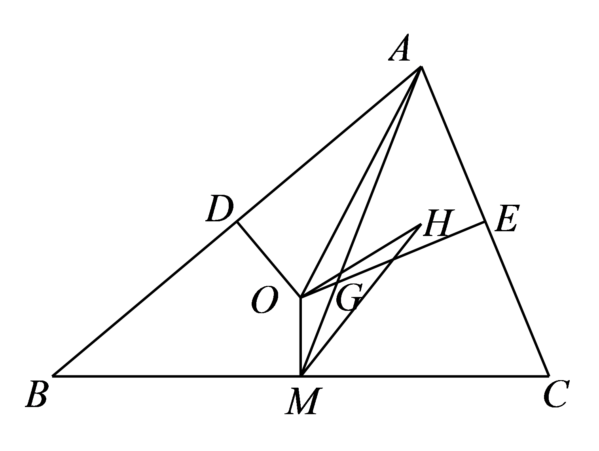

对于③，由欧拉线定理得，即，又有，

故，即，故③正确；

对于④，由得，故，

所以，故④正确.

故答案为：①③④.

**例5．**（2024·全国·高一专题练习）点是平面上一定点，、、是平面上的三个顶点，、分别是边、的对角，以下命题正确的是\_\_\_\_\_\_\_（把你认为正确的序号全部写上）．

①动点满足，则的重心一定在满足条件的点集合中；

②动点满足，则的内心一定在满足条件的点集合中；

③动点满足，则的重心一定在满足条件的点集合中；

④动点满足，则的垂心一定在满足条件的点集合中；

⑤动点满足，则的外心一定在满足条件的点集合中．

【答案】①②③④⑤

【解析】对于①，因为动点满足，

，

则点是的重心，故①正确；

对于②，因为动点满足，

，

又在的平分线上，

与的平分线所在向量共线，

所以的内心在满足条件的点集合中，②正确；

对于③，动点满足，

，，

过点作，垂足为，则，

，向量与边的中线共线，

因此的重心一定在满足条件的点集合中，③正确；

对于④，动点满足，

，

，

，

所以的垂心一定在满足条件的点集合中，④正确；

对于⑤，动点满足，

设，

则，

由④知，

，

，

点的轨迹为过的的垂线，即的中垂线；

所以的外心一定在满足条件的点集合，⑤正确．

故正确的命题是①②③④⑤．

故答案为：①②③④⑤．

**例6．**（2024·河南·高一河南省实验中学校考期中）若为的重心（重心为三条中线交点），且，则\_\_\_．

【答案】

【解析】在中，取中点，连接，

由重心的性质可得为的三等分点，且，

又为的中点，所以，

所以，所以.

故答案为：

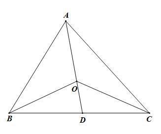

<strong>变式5．</strong>（2024·全国·高一专题练习）（1）已知△<em>ABC</em>的外心为<em>O</em>，且<em>AB</em>=5，，则\_\_\_\_\_\_．

（2）已知△*ABC*的重心为*O*，且*AB*=5，，则\_\_\_\_\_\_．

（3）已知△*ABC*的重心为*O*，且*AB*=5，，，*D*为*BC*中点，则\_\_\_\_．

【答案】

【解析】（1）由题意得：如图

过*O*作，垂足为，则是的中点

，，

又，

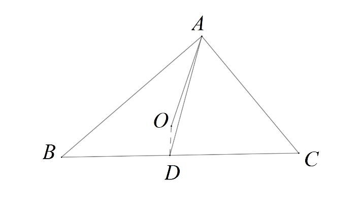

（2）根据重心的性质，知重心将相应的中线分成两部分

，

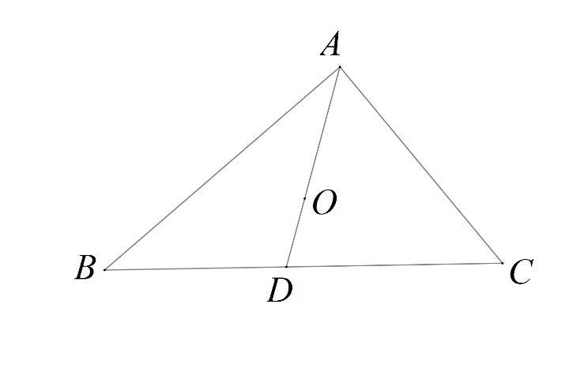

（3）根据重心的性质，知重心将相应的中线分成两部分

，

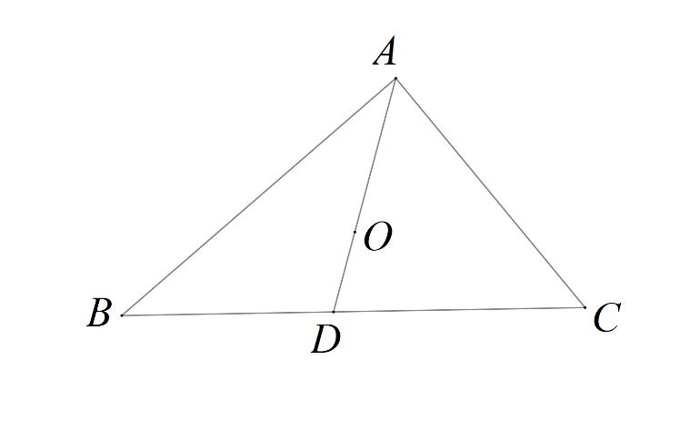

故答案为：（1）（2）（3）

**变式6．**（2024·江苏无锡·高一江苏省太湖高级中学校考阶段练习）在中，，，，若是的重心，则\_\_\_\_\_\_.

【答案】7

【解析】如图所示，以为坐标原点，所在直线为轴，建立平面直角坐标系.

设，

∵，，∴，

∵，解得，∴

∵是的重心，延长交于点，则为中点，所以,

∴，,

∴.

故答案为：7

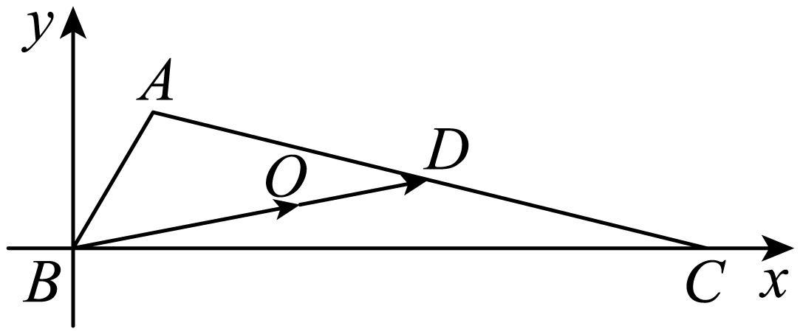

**变式7．**（2024·江西南昌·高三校联考期中）锐角中，，，为角，，所对的边，点为的重心，若，则的取值范围为\_\_\_\_\_\_．

【答案】，

【解析】由题意，，

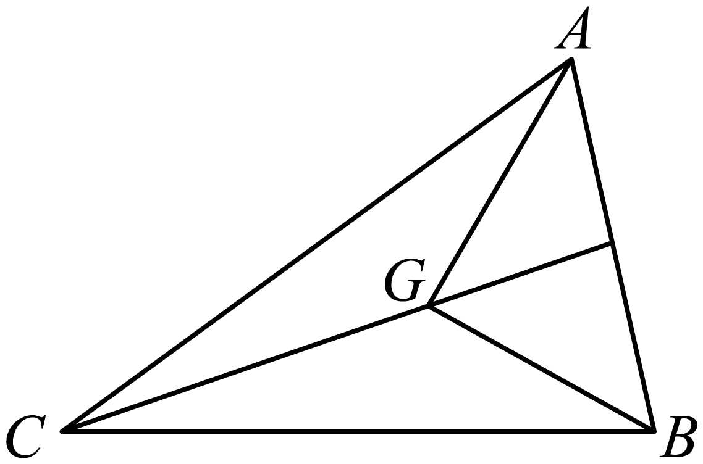

又，则，

所以，即，

由，，，

所以,，

由为锐角三角形及上式，则，即，可得，

所以在上递减，在上递增，则.

故答案为：

<strong>变式8．</strong>（2024·全国·高三专题练习）过△<em>ABC</em>重心<em>O</em>的直线<em>PQ</em>交<em>AC</em>于点<em>P</em>，交<em>BC</em>于点<em>Q</em>，，，则<em>n</em>的值为\_\_\_\_\_\_\_\_.

【答案】

【解析】如图，因为*O*是重心，所以，即，

因为，所以，

所以，

又，则，所以

因为*P*，*O*，*Q*三点共线，所以，

所以，解得.

故答案为：

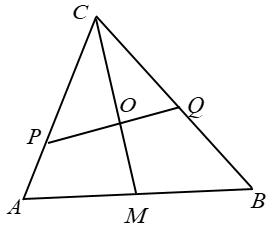

<strong>变式9．</strong>（2024·上海虹口·高三上海市复兴高级中学校考期中）在中，过重心<em>G</em>的直线交边<em>AB</em>于点<em>P</em>，交边<em>AC</em>于点<em>Q</em>，设的面积为，的面积为，且，则的取值范围为\_\_\_\_\_\_\_\_\_．

【答案】

【解析】根据题意，连接，作图如下：

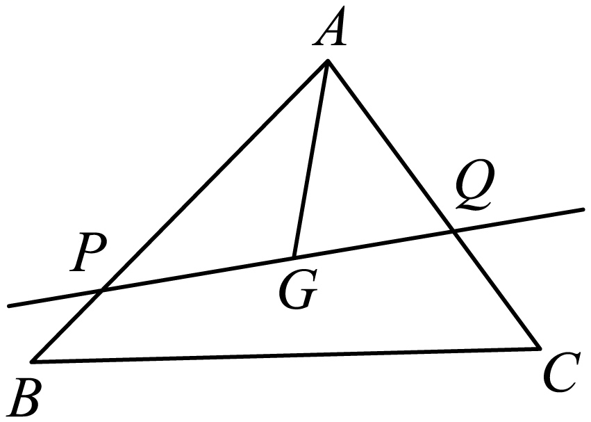

，

在三角形中，因为为其重心，故可得

结合已知条件可得：，

因为三点共线，故可得，即，

由题设可知，，

又，得，

故，令，可得，，

则，又在单调递减，单调递增，

当时，，当时，，当时，，

故.

故答案为：.

**题型三：内心定理**

**例7．**（2024·湖北·模拟预测）在中，，，，且，若为的内心，则\_\_\_\_\_\_\_\_\_．

【答案】

【解析】因为，所以，

因为，所以，

所以，又，，

所以，所以，

由余弦定理可得，又，

所以，又，所以，

所以为以为斜边的直角三角形，

设的内切圆与边相切于点，内切圆的半径为，

由直角三角形的内切圆的性质可得，故，

因为，所以，

因为，所以，所以

所以.

故答案为：.

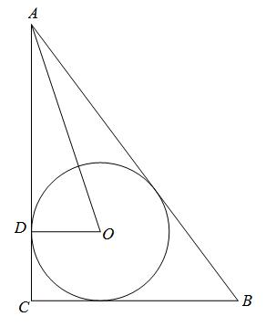

<strong>例8．</strong>（2024·全国·高三专题练习）已知中，，，，<em>I</em>是的内心，<em>P</em>是内部（不含边界）的动点.若（，），则的取值范围是\_\_\_\_\_\_.

【答案】

【解析】建立如图所示平面直角坐标系，则

，

因为是三角形的内心，设三角形内切圆半径为，

则，解得.

所以，.

依题意点在三角形的内部（不含边界）.

因为，

所以，

所以，

令，

则，

由图可知，当过时，.

当，过，即为直线时，.

所以的取值范围时.

故答案为：

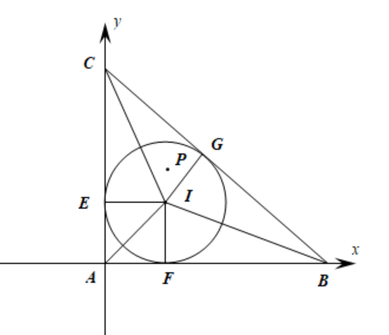

**例9．**（2024·黑龙江黑河·高三嫩江市高级中学校考阶段练习）设为的内心，，，，则为\_\_\_\_\_\_\_\_．

【答案】

【解析】因为，所以取*BC*中点为*O*，连接*AO*，

则，且的内心在*AO*上，*IO*即为的内切圆半径，

又，所以*AO*，

因为，即，

所以，，

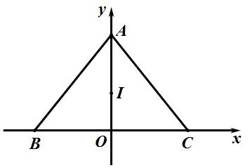

以所在直线为轴，的垂直平分线为轴建立坐标系，则，，，则，，，

因为，即，

所以解得，所以，

故答案为：.

**变式10．**（2024·福建福州·高三福建省福州第一中学校考阶段练习）已知点是的内心，若，则\_\_\_\_\_\_.

【答案】

【解析】因为，即，

取中点，连接，则，故，故点共线，

又，故，且，所以.

故答案为：.

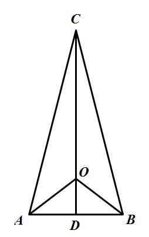

**变式11．**（2024·甘肃兰州·高一兰州市第二中学校考期末）在面上有及内一点满足关系式：即称为经典的“奔驰定理”，若的三边为，，，现有，则为的\_\_心.

【答案】内

【解析】，，

，

，

，分别是，方向上的单位向量，

向量平分，即平分，同理平分，

为的内心，

故答案为：内

<strong>变式12．</strong>（2024·贵州安顺·统考模拟预测）已知<em>O</em>是平面上的一个定点，<em>A</em>､<em>B</em>､<em>C</em>是平面上不共线的三点，动点<em>P</em>满足，则点<em>P</em>的轨迹一定经过的（    ）

A．重心	B．外心	C．内心	D．垂心

【答案】C

【解析】因为为方向上的单位向量，为方向上的单位向量，

则的方向与的角平分线一致，

由，可得，

即，

所以点*P*的轨迹为的角平分线所在直线，

故点*P*的轨迹一定经过的内心.

故选：C.

**变式13．**（2024·江西·校联考模拟预测）已知椭圆的左右焦点分别为，，为椭圆上异于长轴端点的动点，，分别为的重心和内心，则（    ）

A．	B．	C．2	D．

【答案】D

【解析】

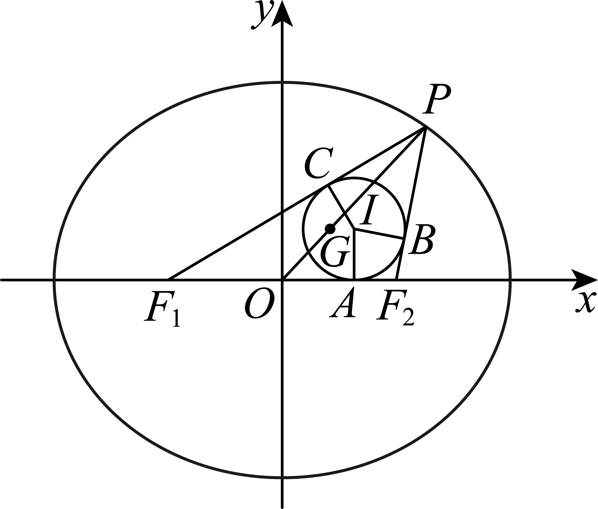

由椭圆可得，，

如图，设的内切圆与三边分别相切与，，，

，分别为的重心和内心．

则，，，

所以，

所以

故选：D

**变式14．**（2024·全国·高三专题练习）已知，是其内心，内角所对的边分别，则（    ）

A．	B．

C．	D．

【答案】C

【解析】延长，分别交于.内心是三角形三个内角的角平分线的交点.

在三角形和三角形中，由正弦定理得：

，

由于，所以，，

同理可得，，

.

所以

，

则.

故选：C

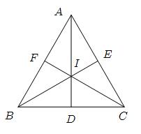

<strong>变式15．</strong>（2024·全国·高三专题练习）在△<em>ABC</em>中，，<em>O</em>为△<em>ABC</em>的内心，若，则<em>x</em>＋<em>y</em>的最大值为（    ）

A．	B．	C．	D．

【答案】D

【解析】如图：圆*O*在边上的切点分别为，连接，延长交于点

设，则，则

设

∵三点共线，则，即

即

故选：D．

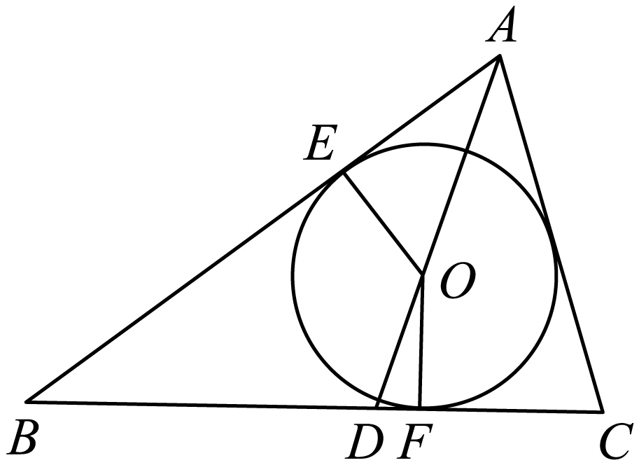

**变式16．**（2024·全国·高三专题练习）点在所在平面内，给出下列关系式：

（1）；

（2）；

（3）；

（4）．

则点依次为的（     ）

A．内心、外心、重心、垂心；	B．重心、外心、内心、垂心；

C．重心、垂心、内心、外心；	D．外心、内心、垂心、重心

【答案】C

【解析】（1）显然得出为的重心；

（2），同理，所以为的垂心；

（3）OA,OB分别是的角平分线，所以为的内心；

（4）（M是AB中点）同理（N是BC中点），所以为的外心.

故选：.

**变式17．**（2024·全国·高三专题练习）已知的内角、、的对边分别为、、，为内一点，若分别满足下列四个条件：

①；

②；

③；

④；

则点分别为的（   ）

A．外心、内心、垂心、重心	B．内心、外心、垂心、重心

C．垂心、内心、重心、外心	D．内心、垂心、外心、重心

【答案】D

【解析】先考虑直角，可令，，，

可得，，，设，

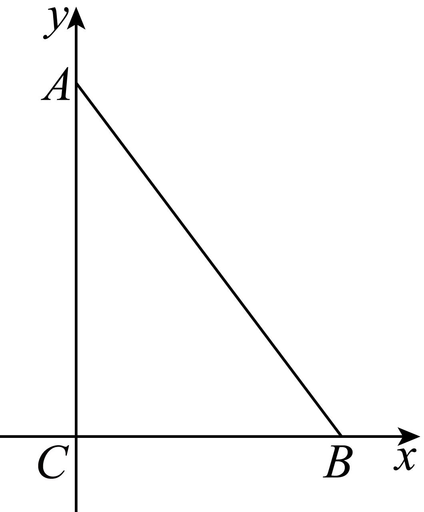

①，即为，

即有，，解得，

即有到，轴的距离为1，在的平分线上，且到的距离也为1，

则为的内心；

③，

即为，

可得，，解得，，

由，故为的外心；

④，可得，

即为，，解得，，

由的中点为，，，即分中线比为，

故为的重心；

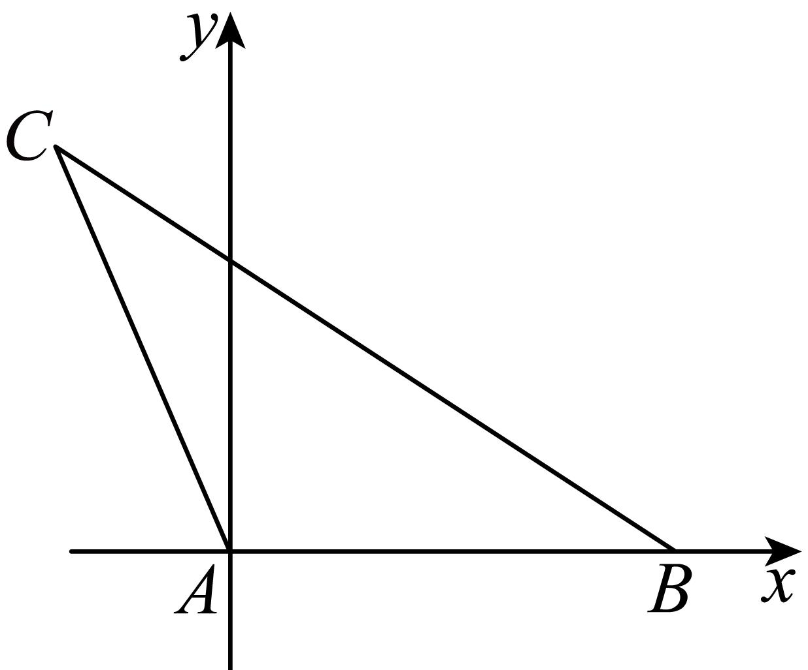

考虑等腰，底角为，

设，，，，

②，

即为，

可得，，解得，，

即，由，，即有，

故为的垂心．

故选：D

**题型四：外心定理**

<strong>例10．</strong>（2024·山西吕梁·高三统考阶段练习）设<em>O</em>为的外心，且满足，，下列结论中正确的序号为\_\_\_\_\_\_．

①；②；③．

【答案】①③

【解析】由题意可知：．

①，则，两边同时平方得到：

，解得：，故①正确．

②，则，，

两边再平方得到：．所以|，所以②不正确．

③，，两边平方得到：

，，，

同理可得：，，，．

故，，且，，

，即．故③正确．

故答案为：①③

**例11．**（2024·河北·模拟预测）已知为的外心，，，则\_\_\_\_\_\_\_\_\_\_\_．

【答案】/-3.5

【解析】如图：分别为的中点，则

故答案为：.

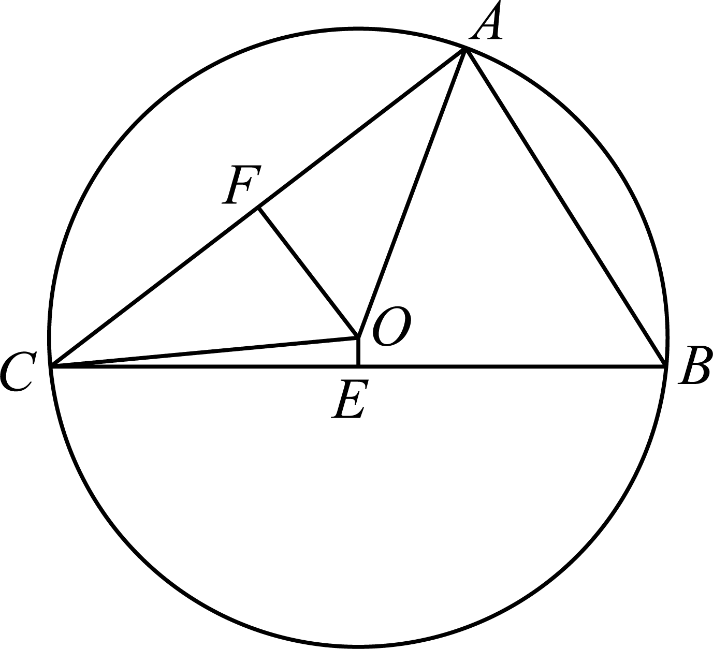

**例12．**（2024·黑龙江哈尔滨·高三哈尔滨市第六中学校校考阶段练习）已知是的外心，若，且，则实数的最大值为\_\_\_\_\_\_．

【答案】/

【解析】设三角形的外接圆的半径为，

，

根据向量数量积的几何定义可得：

，即，，

又，根据正弦定理可得，，，

，当且仅当时，

即为等边三角形时取等号，

，，实数的最大值为．

故答案为：

<strong>变式18．</strong>（2024·全国·高三专题练习）设<em>O</em>为的外心，若，，则\_\_\_\_\_\_\_\_\_\_\_.

【答案】

【解析】如图，

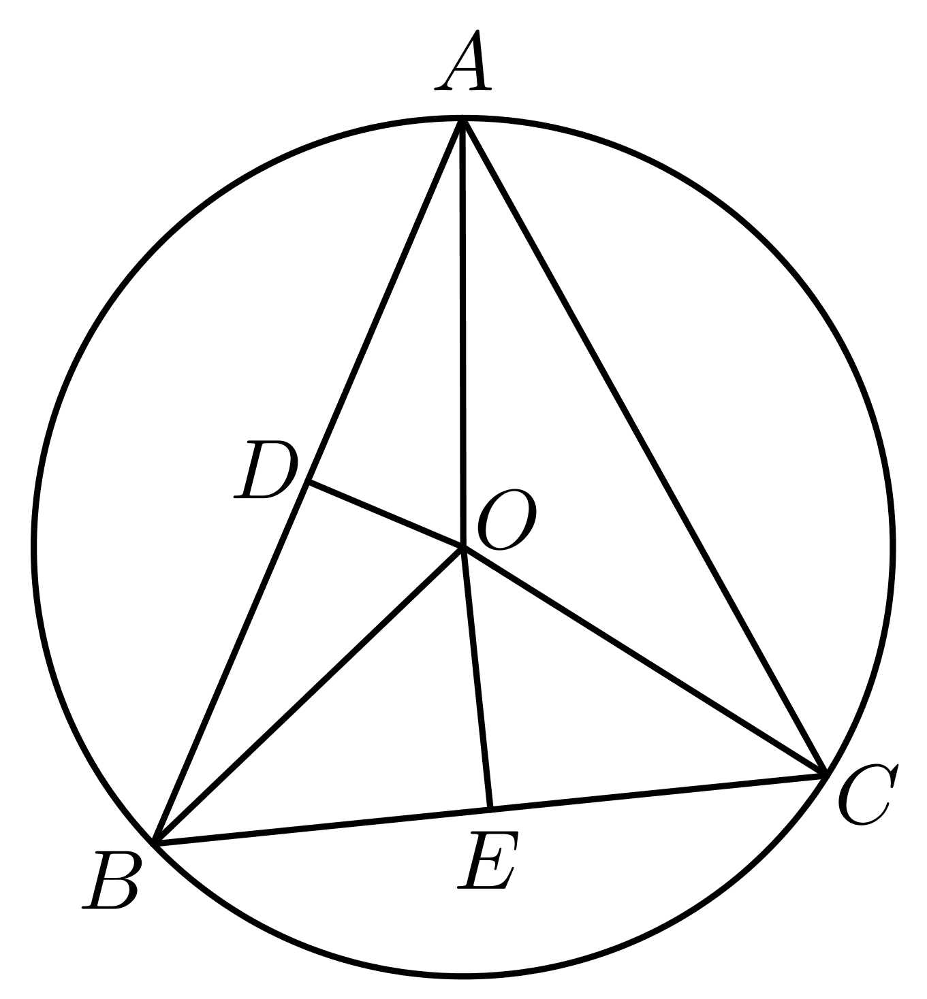

设*D*､*E*分别为的中点，则，

所以

,

故答案为：-2    .

<strong>变式19．</strong>（2024·湖南长沙·高三湖南师大附中校考阶段练习）已知点<em>O</em>是△<em>ABC</em>的外心，<em>a</em>，<em>b</em>，c分别为内角<em>A</em>，<em>B</em>，<em>C</em>的对边，，且，则的值为\_\_\_\_\_\_\_\_．

【答案】.

【解析】如图，

分别取，的中点，，连接，，

则；，

因为，

设的外接圆半径为，由正弦定理可得，

所以两边同时点乘可得,

即,

所以，

所以,

所以，

所以，即，

所以.

故答案为：.

**变式20．**（2024·全国·高三专题练习）在中，，．点满足．过点的直线分别与边交于点且，．已知点为的外心，，则为\_\_\_\_\_\_．

【答案】

【解析】三点共线，可设，

，，即，，

，即，，；

，，

为的外心，，

，

整理可得：，

，解得：（舍）或；

，

.

故答案为：.

<strong>变式21．</strong>（2024·全国·高三专题练习）已知△<em>ABC</em>中，，点<em>O</em>是△<em>ABC</em>的外心，则\_\_\_\_\_\_\_\_.

【答案】/

【解析】在中，，，点是的外心，又，所以是等腰直角三角形，所以是三角形的斜边中点，所以．

故答案为：．

**变式22．**（2024·重庆渝中·高三重庆巴蜀中学校考阶段练习）已知点是的内心、外心、重心、垂心之一，且满足，则点一定是的（    ）

A．内心	B．外心	C．重心	D．垂心

【答案】B

【解析】设中点为，所以，

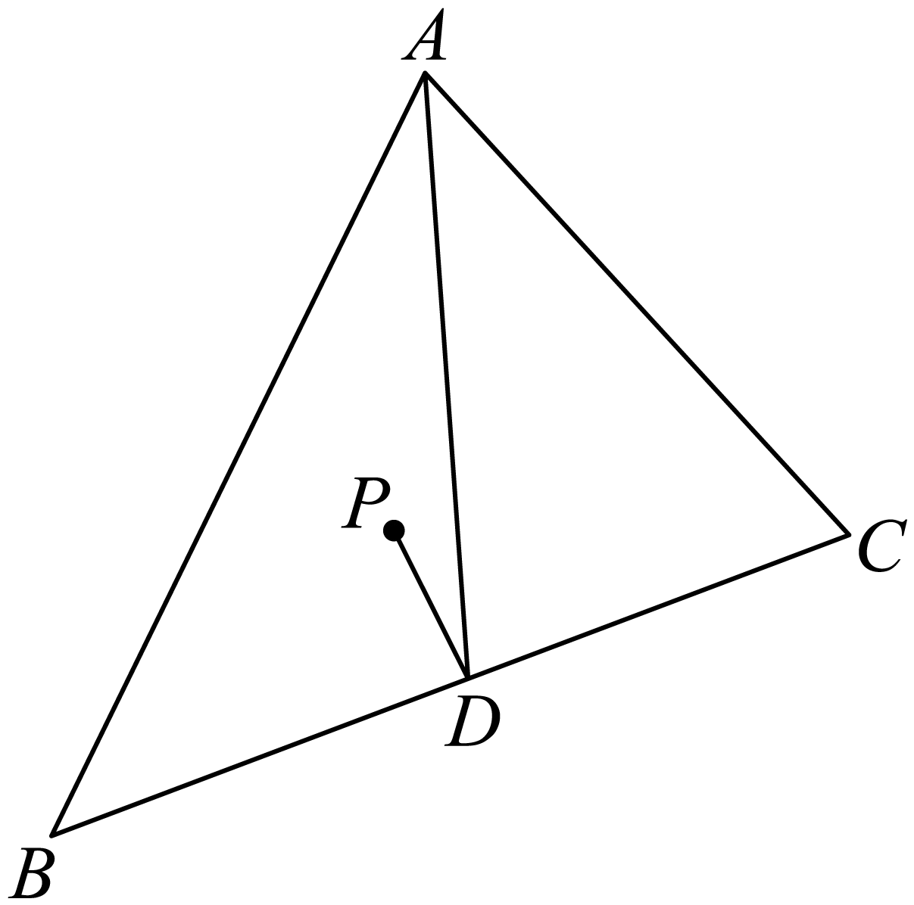

所以，

即，所以，

又由为中点可得点在的垂直平分线上，

所以点是的外心，

故选：B

**题型五：垂心定理**

**例13．**（2024·全国·高三专题练习）设为的外心，若，则是的（    ）

A．重心（三条中线交点）	B．内心（三条角平分线交点）

C．垂心（三条高线交点）	D．外心（三边中垂线交点）

【答案】C

【解析】在中，为外心，可得，

∵，

∴，

设的中点为，则，，

∴，可得在边的高线上．

同理可证，在边的高线上，

故是三角形两高线的交点，可得是三角形的垂心，

故选：C

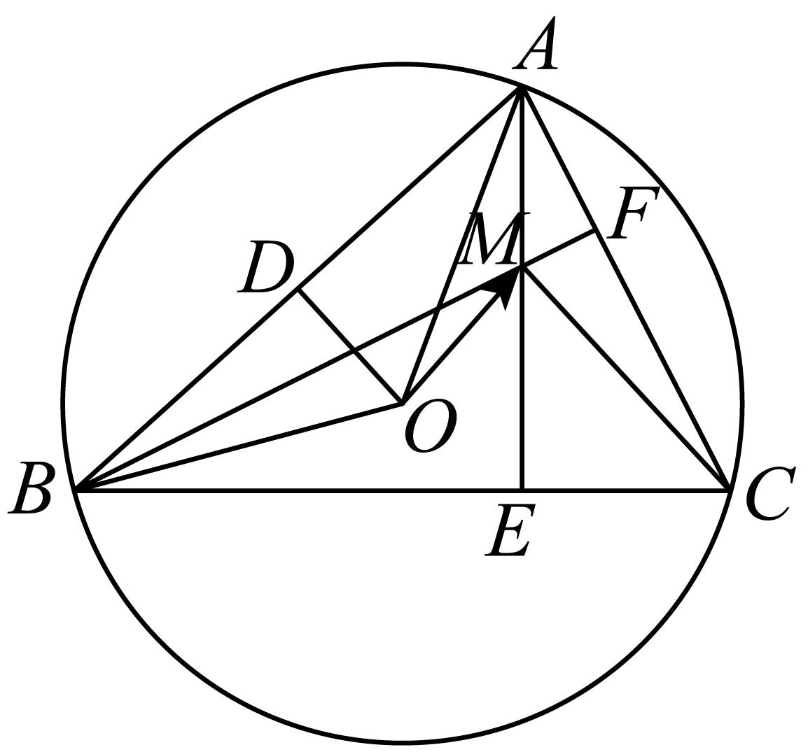

**例14．**（2024·全国·高三专题练习）已知为的垂心（三角形的三条高线的交点），若，则\_\_\_\_\_\_.

【答案】/

【解析】因为，

所以，同理，

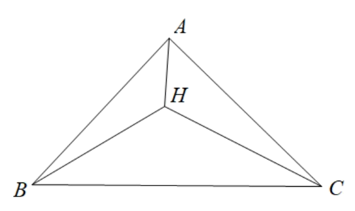

由*H*为△*ABC*的垂心，得，即，

可知，即，

同理有，即，可知，即，

所以， ，又，

所以．

故答案为：.

<strong>例15．</strong>（2024·北京·高三强基计划）已知<em>H</em>是的垂心，，则的最大内角的正弦值是\_\_\_\_\_\_\_\_\_．

【答案】

【解析】法1：根据三角形五心的向量表达，有，

设分别为，

根据三角恒等式，

可得，

因此的最大内角的正切值为，因此最大内角的正弦值为．

法2：因为*H*是的垂心，故，

设，

则，故，

同理，，，

而，

故，

同理，，，

因为，故最大，故.

故答案为：

<strong>变式23．</strong>（2024·全国·高三专题练习）设<em>H</em>是的垂心，且，则\_\_\_\_\_．

【答案】

【解析】∵*H*是的垂心，

∴，，

∴，同理可得，，

故，

∵，

∴，

∴，同理可求得，

∴，，

∴，即.

故答案为：．

<strong>变式24．</strong>（2024·全国·高三专题练习）在中，点<em>O</em>、点<em>H</em>分别为的外心和垂心，，则\_\_\_\_\_\_\_\_.

【答案】8

【解析】，

，

因为*H*为垂心，

所以，，

设，外接圆的半径为，

由余弦定理得，

，

，

同理，

，

，

所以，

，

，

，

，

，

所以8，

故答案为：8

**变式25．**（2024·全国·高三专题练习）在中，，，为的垂心，且满足，则\_\_\_\_\_\_\_\_\_\_\_.

【答案】

【解析】如图所示，为的中点，不妨设，则.因为，则，则，，由此可得.

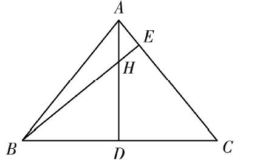

故答案为：

