**第38讲  向量中的隐圆**

**知识梳理**

**技巧一．向量极化恒等式推出的隐圆**

**乘积型：**

定理：平面内，若为定点，且,则的轨迹是以为圆心为半径的圆

证明：由，根据极化恒等式可知，，所以，的轨迹是以为圆心为半径的圆．

**技巧二．极化恒等式和型：**

定理：若为定点，满足,则的轨迹是以中点为圆心，为半径的圆。

证明：，所以，即的轨迹是以中点为圆心，为半径的圆．

**技巧三．定幂方和型**

若为定点，，则的轨迹为圆．

证明：

．

**技巧四．与向量模相关构成隐圆**

**坐标法妙解**

**必考题型全归纳**

**题型一：数量积隐圆**

**例1．**（2024·上海松江·校考模拟预测）在中，.为所在平面内的动点，且，若，则给出下面四个结论：

①的最小值为；②的最小值为；

③的最大值为；④的最大值为8.

其中，正确结论的个数是（    ）

A．1	B．2	C．3	D．4

【答案】A

【解析】如图，以为原点，所在的直线分别为轴，建立平面直角坐标系，

则，

因为，所以设，则

，，

所以，

所以，即（为任意角），

所以

（其中），

所以的最大值为，最小值为，

所以①③错误，

因为，

所以

（其中）

因为，

所以，

所以，

所以的最小值为，最大值为14，

所以②正确，④错误，

故选：A

**例2．**（2024·全国·高三专题练习）若正的边长为4，为所在平面内的动点，且，则的取值范围是（    ）

A．	B．

C．	D．

【答案】D

【解析】由题知，

以为坐标原点，以所在直线为轴建立平面直角坐标系，如图，

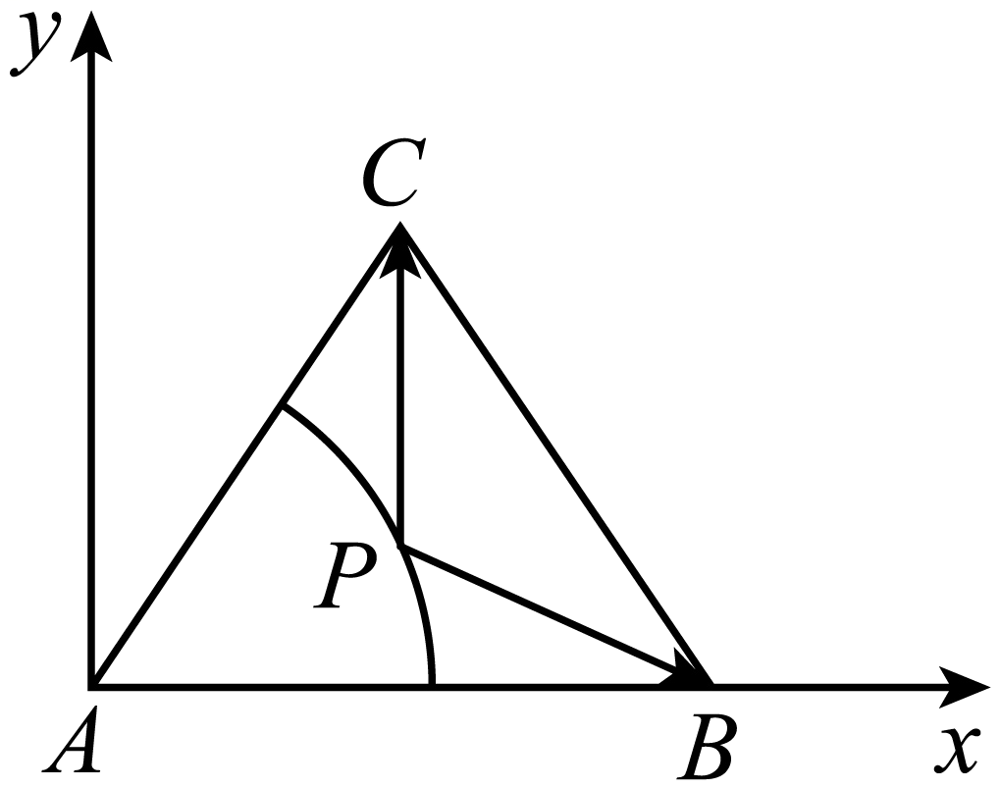

则，，

由题意设，

则，

，

，

，

，

可得.

故选：D

<strong>例3．</strong>（2024·山东菏泽·高一统考期中）在中，<em>AC</em>＝5，<em>BC</em>＝12，∠<em>C</em>＝90°.<em>P</em>为所在平面内的动点，且<em>PC</em>＝2，则的取值范围是（    ）

A．	B．	C．	D．

【答案】D

【解析】在中，以直角顶点为原点，射线分别为轴非负半轴，建立平面直角坐标系，如图，

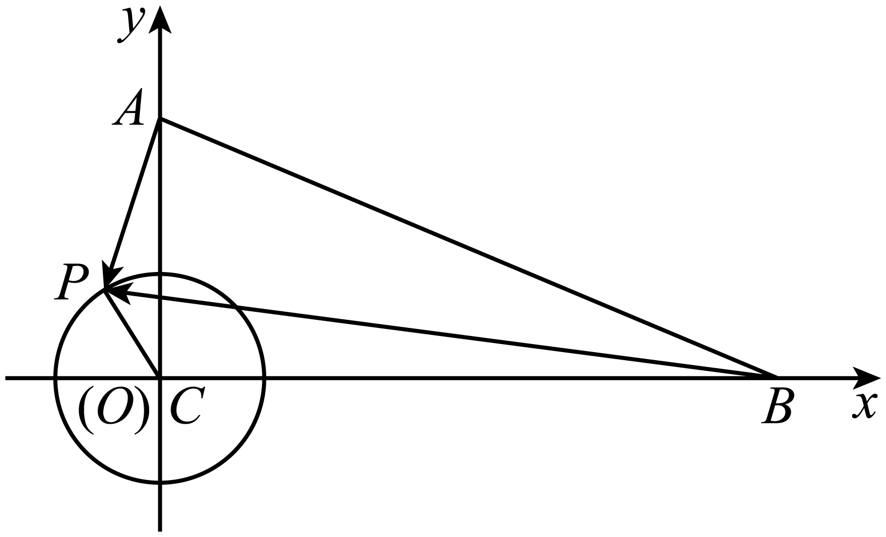

令角的始边为射线，终边经过点，由，得，而，

于是，

因此

，其中锐角由确定，

显然，则，

所以的取值范围是.

故选：D

<strong>变式1．</strong>（2024·全国·高三专题练习）已知是边长为的等边三角形，其中心为<em>O</em>，<em>P</em>为平面内一点，若，则的最小值是

A．	B．	C．	D．

【答案】A

【解析】作出图像如下图所示，取的中点为*D*，则，因为，则*P*在以*O*为圆心，以1为半径的圆上，

则.又为圆*O*上的点*P*到*D*的距离，则，

∴的最小值为.

故选：A.

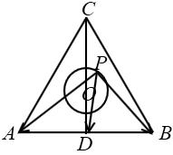

**变式2．**（2024·北京·高三专题练习）为等边三角形，且边长为，则与的夹角大小为，若，，则的最小值为\_\_\_\_\_\_\_\_\_\_\_.

【答案】

【解析】因为是边长为的等边三角形，且，则为的中点，故，

以点为坐标原点，、分别为、轴的正方向建立如下图所示的平面直角坐标系，

则、、，设点，

，，

所以，，当且仅当时，等号成立，

因此，的最小值为.

故答案为：.

<strong>变式3．</strong>（2024·全国·高三专题练习）已知圆，点，<em>M</em>、<em>N</em>为圆<em>O</em>上两个不同的点，且若，则的最小值为\_\_\_\_\_\_.

【答案】/

【解析】解法1：如图，因为，所以，故四边形为矩形，

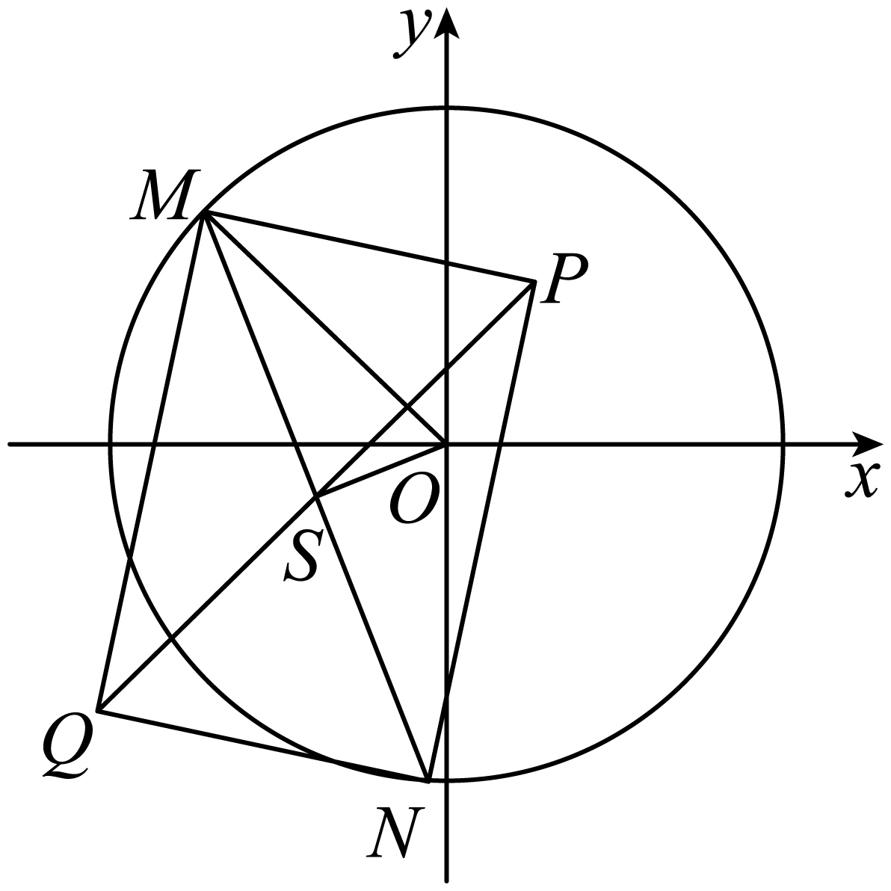

设的中点为*S*，连接，则，

所以，

又为直角三角形，所以，故①，

设，则由①可得，

整理得：，

从而点*S*的轨迹为以为圆心，为半径的圆，

显然点*P*在该圆内部，所以，

因为，所以 ；

解法2：如图，因为,所以，

故四边形为矩形，由矩形性质，，

所以，从而，

故*Q*点的轨迹是以*O*为圆心，为半径的圆，

显然点*P*在该圆内，所以.

故答案为： .

**题型二：平方和隐圆**

**例4．**（2024·全国·高三专题练习）已知是单位向量，满足，则的最大值为\_\_\_\_\_\_\_\_．

【答案】

【解析】依题意，可为与*x*轴、*y*轴同向的单位向量，设

化简得：

运用辅助角公式得：

，

即得：，

故；

故答案为：

**例5．**（2024·上海·高三专题练习）已知平面向量、满足，，设，则\_\_\_\_\_\_\_\_.

【答案】

【解析】因为且，所以；

又因为，所以；

由，所以；

根据可知：，

左端取等号时：三点共线且在线段外且靠近点；右端取等号时，三点共线且在线段外且靠近点，

所以，所以.

故答案为：.

**例6．**（2024·江苏·高二专题练习）在平面直角坐标系中，已知点，，圆，若圆上存在点，使得，则实数的取值范围为（    ）

A．	B．

C．	D．

【答案】B

【解析】先求出动点M的轨迹是圆D,再根据圆D和圆C相交或相切，得到a的取值范围.设，则，

所以，

所以点M的轨迹是一个圆D,

由题得圆C和圆D相交或相切，

所以，

所以.

故选：B

**变式4．**（2024·江苏·高二专题练习）在平面直角坐标系中，已知直线与点，若直线上存在点满足（为坐标原点），则实数的取值范围是（　　）

A．	B．

C．	D．

【答案】D

【解析】设 ，

∵直线与点，直线上存在点满足，

∴，

整理,得 ①，

∵直线 上存在点M,满足，

∴方程①有解，

∴，

解得： ，

故选D.

<strong>变式5．</strong>（2024·宁夏吴忠·高二吴忠中学校考阶段练习）设，，<em>O</em>为坐标原点，点<em>P</em>满足，若直线上存在点<em>Q</em>使得，则实数<em>k</em>的取值范围为（     ）

A．	B．

C．	D．

【答案】C

【解析】设，

，

，即．

点*P*的轨迹为以原点为圆心，2为半径的圆面．

若直线上存在点*Q*使得，

则*PQ*为圆的切线时最大，

，即．

圆心到直线的距离，

或．

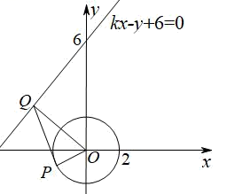

故选：C．

<strong>变式6．</strong>（2024·江西吉安·高三吉安三中校考阶段练习）在平面直角坐标系<em>xOy</em>中，已知圆<em>C</em>：，点，若圆<em>C</em>上存在点<em>M</em>，满足，则点<em>M</em>的纵坐标的取值范围是\_\_\_\_\_\_\_\_\_\_\_.

【答案】

【解析】解析：设，

因为，所以，

化简得，

则圆*C*：与圆：有公共点，

将两圆方程相减可得两圆公共弦所在直线方程为

代入可得，

故答案为：.

**题型三：定幂方和隐圆**

**例7．**（2024·湖南长沙·高一长沙一中校考期末）已知点，，直线：上存在点，使得成立，则实数的取值范围是\_\_\_\_\_\_.

【答案】

【解析】由题意得：直线，

因此直线经过定点；

设点坐标为，；，

化简得：，

因此点为与直线的交点．

所以应当满足圆心到直线的距离小于等于半径

解得：

故答案为

**例8．**（2024·浙江·高三期末）已如平面向量、、，满足，，，，则的最大值为（    ）

A．	B．	C．	D．

【答案】B

【解析】如下图所示，作，，，取的中点，连接，

以点为圆心，为半径作圆，

，，，

所以，为等边三角形，

为的中点，，所以，的底边上的高为，

，，

所以，，

所以，

，

由圆的几何性质可知，当、、三点共线且为线段上的点时，

的面积取得最大值，此时，的底边上的高取最大值，即，则，

因此，的最大值为.

故选：B.

<strong>例9．</strong>（2024·河北衡水·高三河北衡水中学校考期中）已知平面单位向量，的夹角为60°，向量满足，若对任意的，记的最小值为<em>M</em>，则<em>M</em>的最大值为

A．	B．	C．	D．

【答案】A

【解析】由推出，所以，如图，终点的轨迹是以为半径的圆，设，，，，所以表示的距离，显然当时最小，*M*的最大值为圆心到的距离加半径，即，

故选：A

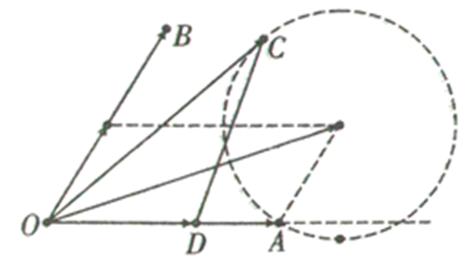

**变式7．**（2024·江苏·高三专题练习）已知，是两个单位向量，与，共面的向量满足，则的最大值为（    ）

A．	B．2	C．	D．1

【答案】C

【解析】由平面向量数量积的性质及其运算得，设，

则，则点*C*在以*AB*为直径的圆*O*周上运动，由图知：当*DC*⊥*AB*时，|*DC*|≥|*DC*′|，设，利用三角函数求的最值．由得：，即，

设，

则，

则点*C*在以*AB*为直径的圆*O*上运动，

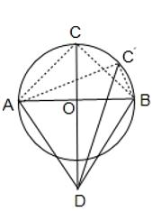

由图知：当*DC*⊥*AB*时，|*DC*|≥|*DC*′|，

设，

则，

所以当时，|*DC*|取最大值，

故选：C．

**变式8．**（2024·浙江舟山·高一舟山中学校考阶段练习）已知、、是平面向量，是单位向量． 若，， 则的最大值为\_\_\_\_\_\_\_．

【答案】

【解析】因为，则，即，

因为，即，

作，，，，则，

，则，

固定点，则为的中点，则点在以线段为直径的圆上，

点在以点为圆心，为半径的圆上，如下图所示：

，

设，则，

因为，，

故

，

当时，等号成立，即的最大值为.

故答案为：.

**变式9．**（2024·四川达州·高二四川省大竹中学校考期中）已知，，是平面向量，是单位向量.若非零向量与的夹角为，向量满足，则的最小值是\_\_\_\_\_\_\_．

【答案】

【解析】由得，，

故，或或，

设，，以*O*为原点，的方向为*x*轴正方向，建立如图所示坐标系，

则，令，则，，

由，或或，

得*B*点在以为圆心，为半径的圆上，

又非零向量与的夹角为，则设的起点为原点，则终点在不含端点的两条射线，上，

则的几何意义等价于圆上的点到射线上的点的距离，则其最小值为圆心到直线的距离减去半径，不妨以为例，

则的最小值为

故答案为：

**变式10．**（2024·全国·高三专题练习）已知平面向量、、、，满足，，，，若，则的最大值是\_\_\_\_\_\_\_\_\_.

【答案】

【解析】因为，即，可得，

设，，则，则，

设，则，

因为，，则或，

因为，则或，

令，则或，

根据对称性，可只考虑，

由，

记点、、，则，，

所以，，

当且仅当点为线段与圆的交点时，等号成立，

所以，

.

故答案为：.

**变式11．**（2024·河南南阳·南阳中学校考模拟预测）已知是平面向量，，若非零向量与的夹角为，向量满足，则的最小值是\_\_\_\_\_\_\_\_\_\_.

【答案】/

【解析】设，则由得，可得，

由得，

因此，表示圆上的点到直线上的点的距离；

故其最小值为圆心到直线的距离减去半径1，即.

故答案为：

**题型四：与向量模相关构成隐圆**

**例10．**（2024·辽宁大连·大连二十四中校考模拟预测）已知是平面内的三个单位向量，若，则的最小值是\_\_\_\_\_\_\_\_\_\_．

【答案】

【解析】均为单位向量且，不妨设，，且，

，，

，

的几何意义表示的是点到和两点的距离之和的2倍，

点在单位圆内，点在单位圆外，

则点到和两点的距离之和的最小值即为和两点间距离，

所求最小值为.

故答案为：.

**例11．**（2024·上海·高三专题练习）已知、、、都是平面向量，且，若，则的最小值为\_\_\_\_\_\_\_\_\_\_\_\_．

【答案】

【解析】

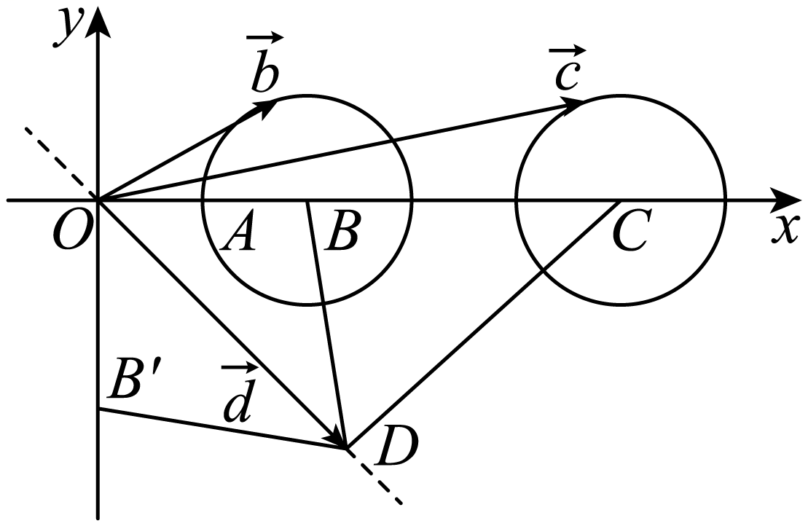

作图，，则，，

因为，所以起点在原点，终点在以*B*为圆心*，* 1为半径的圆上；

同理，，所以起点在原点，终点在以*C*为圆心*，* 1为半径的圆上，

所以的最小值则为，

因为，，当，，三点共线时，，所以.

故答案为：.

**例12．**（2024·上海金山·统考二模）已知、、、都是平面向量，且，若，则的最小值为\_\_\_\_\_\_\_\_\_\_.

【答案】/

【解析】如图，设，，，，，

则点在以为圆心，以为半径的圆上，点在以为圆心，以为半径的圆上，

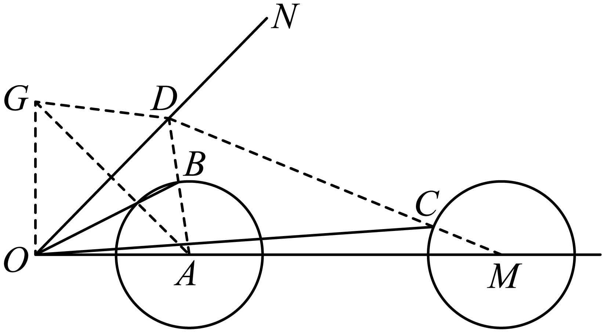

，所以点在射线上，

所以，

作点关于射线对称的点，则，且，

所以（当且仅当点三点共线时取等号）

所以的最小值为，

故答案为：.

**变式12．**（2024·全国·高三专题练习）已知线段是圆的一条动弦，且，若点为直线上的任意一点，则的最小值为\_\_\_\_\_\_\_\_\_\_.

【答案】

【解析】如图，为直线上的任意一点，

过圆心作，连接，由，

可得，

由，当共线时取等号，

又是的中点，所以，

所以.

则此时，

的最小值为.

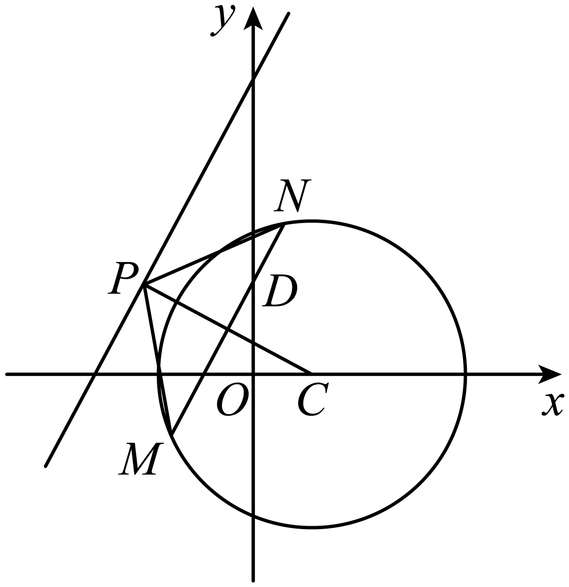

故答案为：

<strong>变式13．</strong>（2024·全国·高三专题练习）已知为坐标原点，，<em>B</em>在直线上，，动点<em>M</em>满足，则的最小值为\_\_\_\_\_\_\_\_\_\_.

【答案】/

【解析】设，

因为，所以，

因为，所以，

，

整理得，

可得点在以为圆心，半径为的圆上，

，当时，

可得，即

圆心在在直线上，

过做的垂线，当垂足为圆心点时，长度最小，的长度也最小，

且长度最小值为，此时的最小值为.

故答案为：.

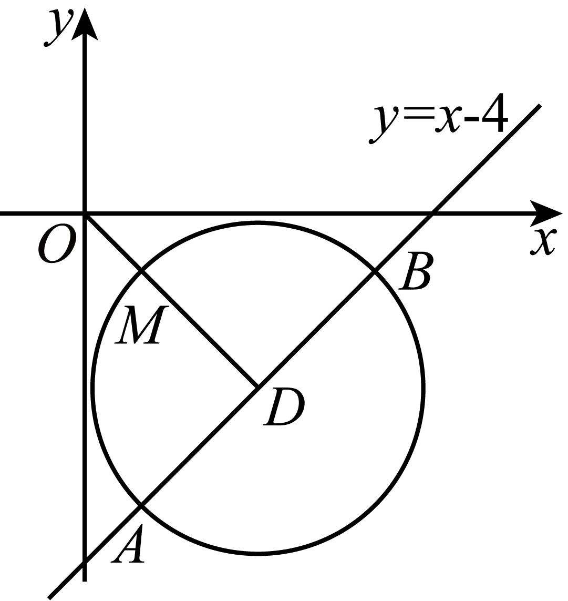

**变式14．**（2024·全国·高三专题练习）已知是单位向量，.若向量满足，则||的最大值是\_\_\_\_\_\_\_\_.

【答案】/

【解析】法一　由，得.

如图所示，分别作,作，

由于是单位向量,则四边形*OACB*是边长为1的正方形，所以,

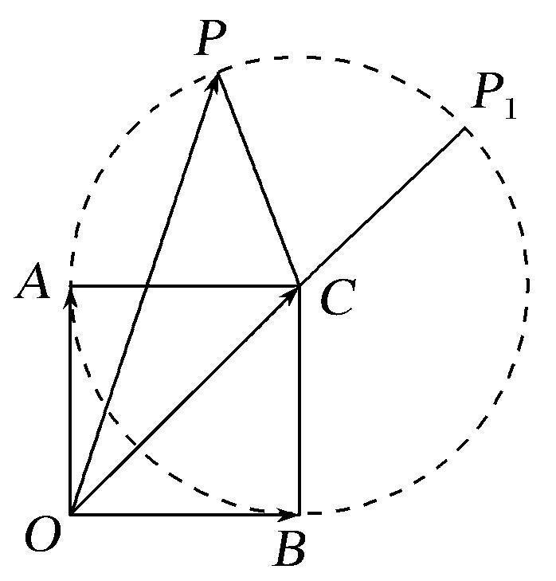

作，则,

所以点*P*在以*C*为圆心，1为半径的圆上.

由图可知，当点<em>O</em>，<em>C</em>，<em>P</em>三点共线且点<em>P</em>在点<em>P1</em>处时，||取得最大值,

故||的最大值是,

故答案为：

法二　由，得，

建立如图所示的平面直角坐标系，则，

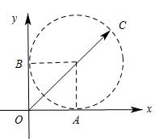

设 ，由，

得 ，

所以点*C*在以(1,1)为圆心，1为半径的圆上.

所以

故答案为：

**变式15．**（2024·新疆·高三新疆兵团第二师华山中学校考阶段练习）已知是、是单位向量，，若向量满足，则的最大值为\_\_\_\_\_\_

【答案】/

【解析】由、是单位向量，且，则可设，，，

所以，

向量满足，

，

即，

它表示圆心为，半径为的圆，

又表示圆上的点到坐标原点的距离，因为，

所以．

故答案为：．

**变式16．**（2024·全国·高三专题练习）已知是平面内两个互相垂直的单位向量，若向量 满足，则的最大值是\_\_\_\_\_\_\_\_\_．

【答案】

【解析】因为是平面内两个互相垂直的单位向量，

故不妨设，设，

由得：，

即，即，

则的终点在以为圆心，半径为的圆上，

故的最大值为，

故答案为：

**变式17．**（2024·全国·高三专题练习）已知平面向量满足：与的夹角为，记是的最大值，则的最小值是\_\_\_\_\_\_\_\_\_\_．

【答案】

【解析】如图，

设为*AB*中点，令，

则  ①，

因为，

故有，

②，

由①②得，从而，

因为，所以，即点*C*在以*AB*为直径的圆*E*上.

，

，

当且仅当时，即时等号成立.

故答案为：

**变式18．**（2024·全国·高三专题练习）已知向量，满足，，则的最大值为\_\_\_\_\_\_\_\_\_\_\_.

【答案】5

【解析】令，

，

，

，

令，

设，则

，，

令，

若函数存在极值点，则是函数的唯一极值点，

显然，函数在取得最值，

，

故答案为：5.

**变式19．**（2024·全国·高三专题练习）已知向量满足，则的最大值为\_\_\_\_\_\_\_\_．

【答案】

【解析】设，以*OA*所在的直线为*x*轴，*O*为坐标原点建立平面直角坐标系，

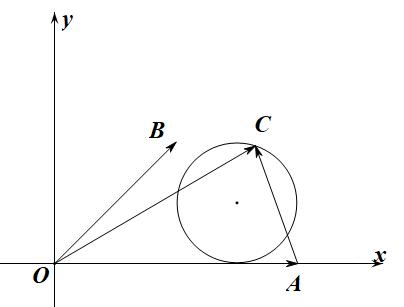

∵

则*A*(4,0)，*B*(2,2)，设*C*(*x*,*y*)，

∵，∴，

即，∴点*C*在以(3,1)为圆心，1为半径的圆上，

表示点*A*，*C*的距离，即圆上的点与*A*(4,0)的距离，

∵圆心到*A*的距离为，

∴的最大值为.

故答案为：.

**变式20．**（2024·全国·高三专题练习）设，为单位向量，则的最大值是\_\_\_\_\_\_\_\_

【答案】

【解析】依题意，为单位向量，设，

则

，

当且仅当，即时等号成立.

故答案为：

