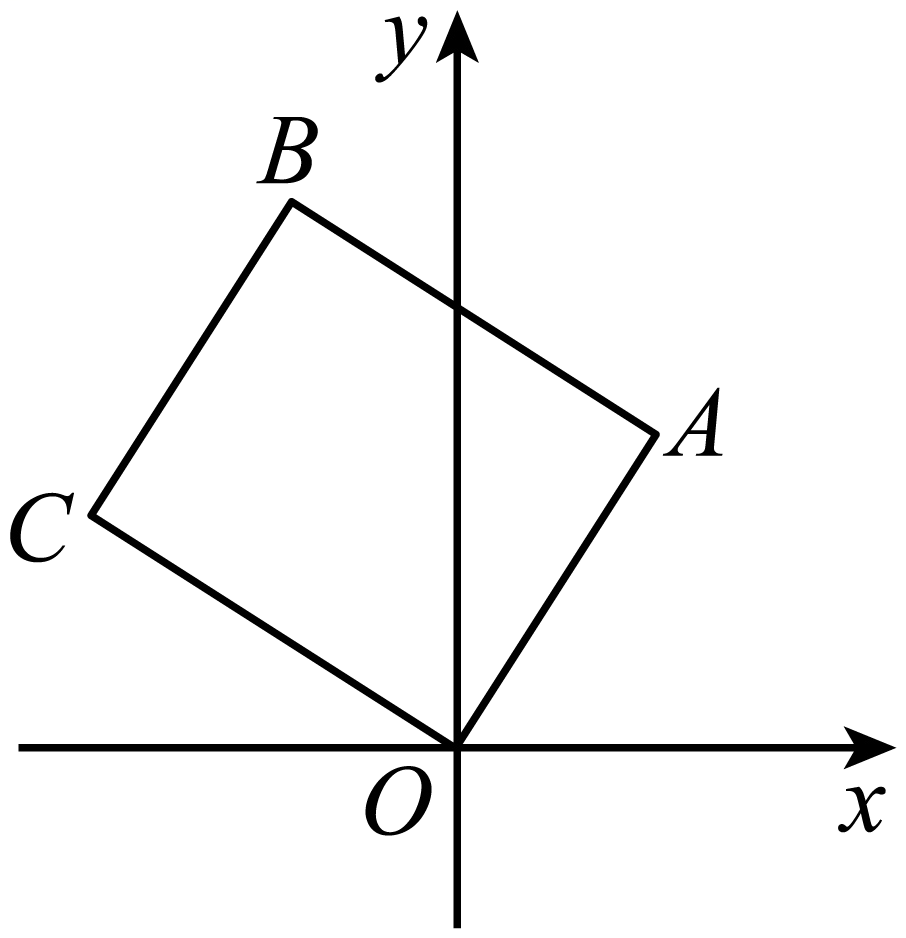
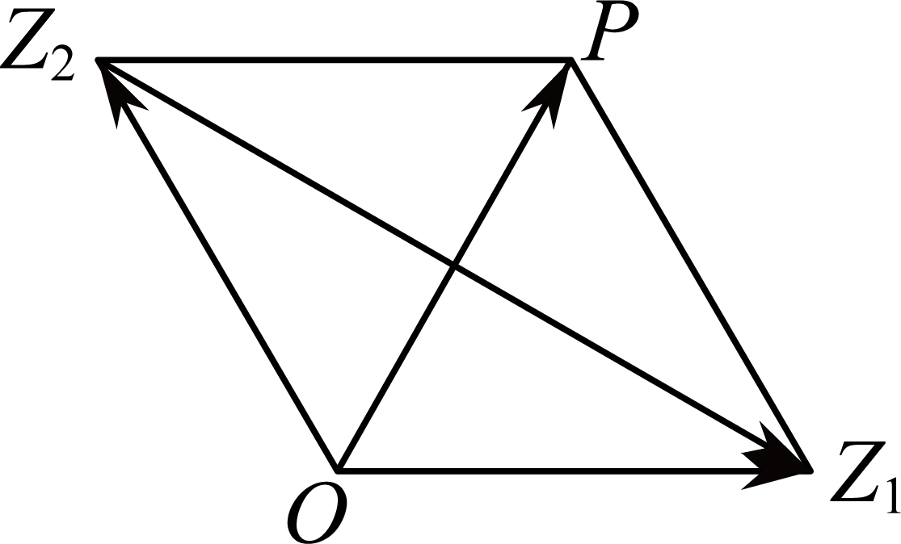
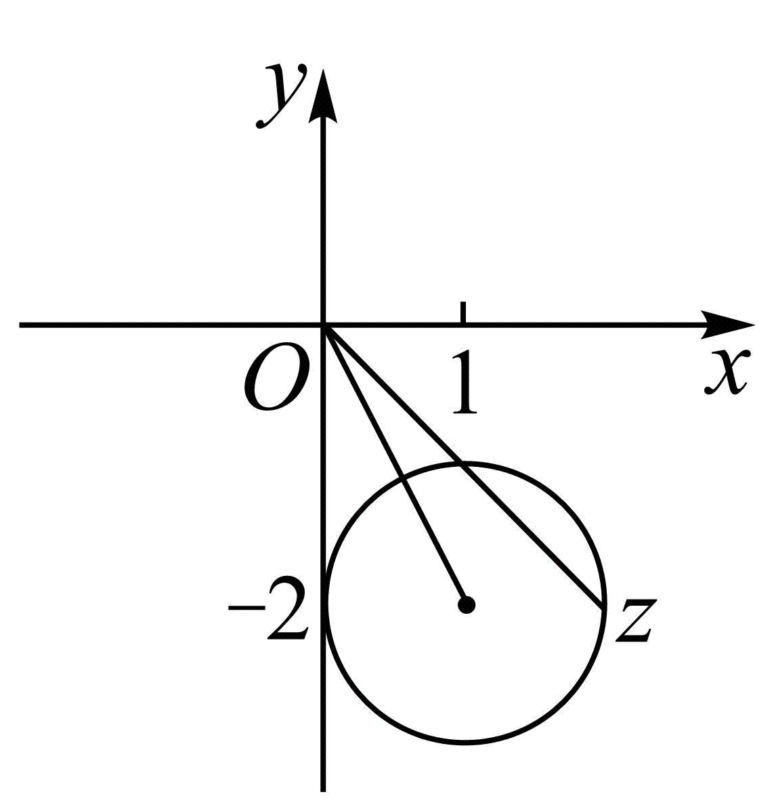

**第39讲  复数**

**知识梳理**

**知识点一、复数的概念**

（1）叫虚数单位，满足，当时，．

（2）形如的数叫复数，记作．

①复数与复平面上的点一一对应，叫*z*的实部，*b*叫*z*的虚部；*Z*点组成实轴；叫虚数；且，*z*叫纯虚数，纯虚数对应点组成虚轴（不包括原点）．两个实部相等，虚部互为相反数的复数互为共轭复数．

②两个复数相等（两复数对应同一点）

③复数的模：复数的模，也就是向量的模，即有向线段的长度，其计算公式为，显然，．

**知识点二、复数的加、减、乘、除的运算法则**

1**、复数运算**

（1）

（2）

其中，叫*z*的模；是的共轭复数．

（3）．

实数的全部运算律（加法和乘法的交换律、结合律、分配律及整数指数幂运算法则）都适用于复数．

**注意：复数加、减法的几何意义**

以复数分别对应的向量为邻边作平行四边形，对角线表示的向量就是复数所对应的向量*．* 对应的向量是．

2、**复数的几何意义**

（1）复数对应平面内的点；

（2）复数对应平面向量；

（3）复平面内实轴上的点表示实数，除原点外虚轴上的点表示虚数，各象限内的点都表示复数．

（4）复数的模表示复平面内的点到原点的距离．

3、**复数的三角形式**

**（** 1**）复数的三角表示式**

一般地，任何一个复数都可以表示成形式，其中是复数的模；是以轴的非负半轴为始边，向量所在射线（射线）为终边的角，叫做复数的辐角*．* 叫做复数的三角表示式，简称三角形式．

**（** 2**）辐角的主值**

任何一个不为零的复数的辐角有无限多个值，且这些值相差的整数倍*．* 规定在范围内的辐角的值为辐角的主值*．* 通常记作，即*．* 复数的代数形式可以转化为三角形式，三角形式也可以转化为代数形式*．*

**（** 3**）三角形式下的两个复数相等**

两个非零复数相等当且仅当它们的模与辐角的主值分别相等*．*

**（** 4**）复数三角形式的乘法运算**

①两个复数相乘，积的模等于各复数的模的积，积的辐角等于各复数的辐角的和，即

．

②复数乘法运算的三角表示的几何意义

复数对应的向量为，把向量绕点按逆时针方向旋转角（如果，就要把绕点按顺时针方向旋转角），再把它的模变为原来的倍，得到向量，表示的复数就是积．

**（** 5**）复数三角形式的除法运算**

两个复数相除，商的模等于被除数的模除以除数的模所得的商，商的辐角等于被除数的辐角减去除数的辐角所得的差，即．

**必考题型全归纳**

**题型一：复数的概念**

**例1．**（2024·河南安阳·统考三模）已知的实部与虚部互为相反数，则实数（    ）

A．	B．	C．	D．

【答案】A

【解析】由于,

的实部与虚部互为相反数，故，

故选：A

**例2．**（2024·浙江绍兴·统考二模）已知复数满足，其中为虚数单位，则的虚部为（    ）

A．	B．	C．	D．

【答案】A

【解析】因为，所以

所以的虚部为.

故选：A.

**例3．**（2024·海南海口·校联考一模）若复数为纯虚数，则实数的值为（    ）

A．2	B．2或	C．	D．

【答案】C

【解析】因为复数为纯虚数，则有，解得，

所以实数的值为.

故选：C

**例4．（多选题）**（2024·河南安阳·安阳一中校考模拟预测）若复数，则（    ）

A．	B．*z*的实部与虚部之差为3

C．	D．*z*在复平面内对应的点位于第四象限

【答案】ACD

【解析】∵，

∴*z*的实部与虚部分别为4，，

，A正确；

*z*的实部与虚部之差为5，B错误；

，C正确；

*z*在复平面内对应的点为，位于第四象限，D正确．

故选：ACD．

**例5．**（2024·辽宁·校联考一模）若是纯虚数，，则的实部为\_\_\_\_\_\_.

【答案】1

【解析】是纯虚数，且，则有，故，实部为1.

故答案为：1.

**【解题方法总结】**

无论是复数模、共轭复数、复数相等或代数运算都要认清复数包括实部和虚部两部分，所以在解决复数有关问题时要将复数的实部和虚部都认识清楚．

**题型二：复数的运算**

**例6．**（2024·黑龙江哈尔滨·哈师大附中统考三模）已知复数，则（    ）

A．	B．1	C．	D．

【答案】A

【解析】依题意，，则，

所以.

故选：A

**例7．**（2024·河北衡水·模拟预测）若，则（    ）

A．	B．

C．	D．

【答案】B

【解析】由已知得，

故.

故选：B.

<strong>例8．</strong>（2024·陕西榆林·高三绥德中学校考阶段练习）已知复数<em>z</em>满足，则（    ）

A．	B．	C．	D．

【答案】A

【解析】因为，

所以．

故选：A.

**例9．**（2024·全国·模拟预测）已知复数满足，则（    ）

A．	B．	C．	D．

【答案】C

【解析】解法一：由得，所以，故选．

解法二：由得，所以，即，

故选：．

**【解题方法总结】**

设，则

（1）

（2）

（3）

**题型三：复数的几何意义**

**例10．**（2024·河南郑州·三模）复平面内，复数对应的点位于（    ）

A．第一象限	B．第二象限	C．第三象限	D．第四象限

【答案】A

【解析】由题得，即复平面内对应的点为，在第一象限.

故选：A．

**例11．**（2024·全国·高三专题练习）已知复数与在复平面内对应的点关于实轴对称，则（    ）

A．	B．	C．	D．

【答案】B

【解析】因为复数与在复平面内对应的点关于实轴对称，所以，

所以．

故选：B．

<strong>例12．</strong>（2024·湖北·校联考三模）如图，正方形<em>OABC</em>中，点<em>A</em>对应的复数是，则顶点<em>B</em>对应的复数是（    ）

A．	B．	C．	D．

【答案】A

【解析】由题意得：,不妨设*C*点对应的复数为，则,

由，得，

即*C*点对应的复数为，

由得：*B*点对应复数为.

故选：A．

**例13．**（2024·全国·校联考模拟预测）在复平面内，设复数，对应的点分别为，，则（    ）

A．2	B．	C．	D．1

【答案】C

【解析】由题意，知，，所以，所以．

故选：C.

**【解题方法总结】**

复数的几何意义在于复数的实质是复平面上的点，其实部、虚部分别是该点的横坐标、纵坐标，这是研究复数几何意义的最重要的出发点．

**题型四：复数的相等与共轭复数**

**例14．**（2024·湖北·黄冈中学校联考模拟预测）已知（是虚数单位）是关于的方程的一个根，则（    ）

A．9	B．1	C．	D．

【答案】B

【解析】已知（是虚数单位）是关于的方程的一个根，

则，即，即，

解得，故.

故选：．

**例15．**（2024·贵州贵阳·统考模拟预测）已知，，，若，则（    ）

A．，	B．，

C．，	D．，

【答案】C

【解析】由已知可得，，，

所以，

所以有，解得或.

故选：C.

<strong>例16．</strong>（2024·四川宜宾·统考三模）已知复数，且，其中<em>a</em>是实数，则（    ）

A．	B．	C．	D．

【答案】B

【解析】因为，所以，

所以，

所以，解得.

故选:B.

**例17．**（2024·湖北·模拟预测）已知复数满足，则的共轭复数的虚部为（    ）

A．2	B．	C．4	D．

【答案】B

【解析】设，则，

则，即，

所以，解得，

所以，

所以的共轭复数的虚部为.

故选：B.

<strong>例18．</strong>（2024·四川宜宾·统考三模）已知复数，且，其中<em>a</em>，<em>b</em>是实数，则（    ）

A．，	B．，

C．，	D．，

【答案】B

【解析】因为，所以，则由得：

，即，

故，解得：.

故选：B.

**【解题方法总结】**

复数相等：

共轭复数：．

**题型五：复数的模**

**例19．**（2024·河南·统考二模）若，则\_\_\_\_\_\_\_．

【答案】

【解析】由可得，

故，则，

故答案为：

**例20．**（2024·上海浦东新·统考三模）已知复数满足，则\_\_\_\_\_\_\_\_\_\_．

【答案】

【解析】设，则，

所以，解得，

当时，，故，

；

当时，，故，

故答案为：-8

**例21．**（2024·辽宁铁岭·校联考模拟预测）设复数，满足，，则=\_\_\_\_\_\_\_\_\_\_.

【答案】

【解析】方法一：设，，

，

，又，所以，，

.

故答案为：.

方法二：如图所示，设复数所对应的点为,,

由已知,

∴平行四边形为菱形，且都是正三角形，∴，

∴.

**【解题方法总结】**

**题型六：复数的三角形式**

<strong>例22．</strong>（2024·四川成都·成都七中统考模拟预测）1748年，瑞士数学家欧拉发现了复指数函数和三角函数的关系，并写出以下公式（<em>x</em>∈<strong>R</strong>，i为虚数单位），这个公式在复变论中占有非常重要的地位，被誉为“数学中的天桥”．根据此公式，下面四个结果中<strong>不成立</strong>的是（        ）

A．	B．

C．	D．

【答案】D

【解析】对于A，当时，因为，所以，故选项A正确；

对于B，，

故选项B正确；

对于C，由，，

所以,得出，故选项C正确；

对于D，由C的分析得，推不出，故选项D错误．

故选：D．

**例23．**（2024·全国·高三专题练习）任何一个复数都可以表示成的形式，通常称之为复数的三角形式．法国数学家棣莫弗发现：，我们称这个结论为棣莫弗定理．则（    ）

A．1	B．	C．	D．i

【答案】B

【解析】，

；

故选：B．

<strong>例24．</strong>（2024·河南·统考模拟预测）欧拉公式把自然对数的底数e、虚数单位i、三角函数联系在一起，充分体现了数学的和谐美．若复数<em>z</em>满足，则的虚部为（    ）

A．	B．	C．1	D．

【答案】B

【解析】由欧拉公式知：

，，

，

的虚部为．

故选：B

**例25．**（2024·全国·高三专题练习）棣莫弗公式（其中i为虚数单位）是由法国数学家棣莫弗（1667-1754年）发现的，根据棣莫弗公式可知，复数在复平面内所对应的点位于（    ）

A．第一象限	B．第二象限	C．第三象限	D．第四象限

【答案】C

【解析】由棣莫弗公式知，

，

复数在复平面内所对应的点的坐标为，位于第三象限．

故选：C．

**【解题方法总结】**

一般地，任何一个复数都可以表示成形式，其中是复数的模；是以轴的非负半轴为始边，向量所在射线（射线）为终边的角，叫做复数的辐角*．* 叫做复数的三角表示式，简称三角形式．

**题型七：与复数有关的最值问题**

**例26．**（2024·上海闵行·上海市七宝中学校考模拟预测）若，则的最大值与最小值的和为\_\_\_\_\_\_\_\_\_\_\_.

【答案】

【解析】由几何意义可得：复数表示以（）为圆心的半径为1的圆，

则.

故答案为：

**例27．**（2024·陕西西安·西安中学校考模拟预测）在复平面内，已知复数满足，为虚数单位，则的最大值为\_\_\_\_\_\_\_\_\_\_\_\_.

【答案】6

【解析】令且，则，即复数对应点在原点为圆心，半径为1的圆上，

而，即点到定点距离的最大值，

所以的最大值为.

故答案为：

**例28．**（2024·全国·模拟预测）设是复数且，则的最小值为（    ）

A．1	B．	C．	D．

【答案】C

【解析】根据复数模的几何意义可知，表示复平面内以为圆心，1为半径的圆，而表示复数到原点的距离，

由图可知，.

故选：C

**例29．**（2024·重庆·统考二模）复平面内复数满足，则的最小值为（    ）

A．	B．	C．	D．

【答案】B

【解析】因为，

所以点是以，为焦点，半实轴长为1的双曲线，则，

所以点的轨迹方程为，

设，

所以，当且仅当时取等号，

所以的最小值为．

故选：B．

**例30．**（2024·全国·校联考三模）已知复数满足，则的最大值为（    ）

A．	B．	C．4	D．

【答案】B

【解析】因为，所以，所以，所以的最大值为．

故选：B

**【解题方法总结】**

利用几何意义进行转化

